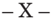

TOMO 331

Volumen 2

2008

## HOJA COMPLEMENTARIA

Hoja incorporada a los efectos de permitir la búsqueda por página dentro del Volumen.

## FALLOS DE LA CORTE SUPREMA DE JUSTICIA DE LA NACION

## SITIO WEB DE LA

## CORTE SUPREMA DE JUSTICIA DE LA NACIÓN

http://www.csjn.gov.ar/  •   http://www.cij.csjn.gov.ar/

- •  Novedades
- •  JurisprudeNcia
- -Consulta temática en sumarios-fallo y dictamen Parte  de  los  fallos  elegidos  para  esta  base  integran  la  presente publicación
- -Consulta de textos fallos completos Sin sumarios
- -Lista de sentencias recientes

La presente obra se complementa con un CD con la jurisprudencia citada en el presente tomo, dictada por los Jueces de la Corte Suprema de Justicia de la Nación en el período febrero-abril del año 2008.  En el mismo se puede acceder al texto completo digitalizado de los fallos para facilitar su consulta.

## R E P U B L I C A A R G E N T I N A

FALLOS

DE  LA

C orte S uprema

DE

## J usticia de la N acion

PUBLICACION A CARGO DE LA SECRETARIA DE JURISPRUDENCIA DEL TRIBUNAL

TOMO 331 - VOLUMEN 2

MAYO - AGOSTO

LA LEY S.A.E. e I.

Tucumán 1471 (1050) Buenos Aires 2008

Corte Suprema de Justicia de la Nación. Secretaría de Jurisprudencia Fallos de la Corte Suprema de Justicia de la Nación 331 : Secretaría de Jurisprudencia - 1a ed.- Buenos Aires : Corte Suprema de Justicia de la Nación, 2008.

v. 2, 1136 p. + CD ; 24x16 cm.

ISBN 978-950-9825-92-5

1. Corte Suprema de Justicia de la Nación-Fallos. CDD 347.077

Copyright (c) 2008 by Corte Suprema de Justicia de la Nación Queda hecho el depósito que previene la ley 11.723. Impreso en la Argentina Printed in Argentina I.S.B.N.  978-950-9825-92-5

## FALLOS DE LA CORTE SUPREMA

## MAYO

## ESTADO NACIONAL - MINISTERIO DE CULTURA y EDUCACION C/ UNIVERSIDAD DE GENERAL SARMIENTO

## UNIVERSIDAD.

Los principios de autonomía y autarquía consagrados en el art. 75, inc. 19, si bien constituyen un límite a la facultad reglamentaria del Estado, no importan desvincular a las universidades de la potestad del Congreso de sancionar leyes de organización y de base de la educación con sujeción a una serie de presupuestos, principios y objetivos que deben ser interpretados armónicamente, no sólo para juzgar el alcance de la facultad reglamentaria en la materia sino también, en el caso de las universidades, para compatibilizar el principio de autonomía con el resto de los principios que enuncia la norma y con la facultad reglamentaria del Congreso de la Nación.

## UNIVERSIDAD.

El mandato del art. 75, inc. 19, vincula al legislador, respeto de los alcances de la reglamentación en la materia, así como a las universidades, en tanto y en cuanto el principio de autonomía no debe independizarse del resto de las condiciones impuestas en la norma y por las cuales el Estado debe velar.

CONSTITUCION NACIONAL: Control de constitucionalidad. Facultades del Poder Judicial.

La colisión con los preceptos y garantías de la Constitución Nacional debe surgir de la ley misma y no de la aplicación irrazonable que de ella se haga en el caso concreto, debiendo extremarse los recaudos para efectuar una interpretación que, resguardando el mandato constituyente, compatibilice con aquél la norma infra constitucional aplicable en el caso concreto.

## EDUCACION.

La consagración constitucional de los principios de gratuidad y equidad para la educación pública estatal obliga al operador constitucional a preservar los criterios de armonización entre ambos, atendiendo para ello a los fines y propósitos que

parecen haber guiado su formalización; ambos principios no son excluyentes, y teniendo en cuenta los principios de solidaridad, desarrollo social (art. 75, incs. 18 y 19) e igualdad de oportunidades en sentido material (art. 75, inc. 23), la equidad asigna sentido a la gratuidad, y la búsqueda de integración y coherencia entre ambos principios determina que el mandato constitucional deba ser verificado en el plexo normativo que constituye cada estatuto universitario, el cual debe instrumentar un sistema que satisfaga equilibradamente y sustantivamente ambos presupuestos constitucionales, sin ser imprescindible que se consigne en forma expresa el término 'equidad'.

## UNIVERSIDAD.

La decisión de dictar disposiciones respecto del art. 59 de la ley 24.521-que al referirse al sostenimiento y régimen económico financiero, dispone que las universidades tienen autarquía económico financiera y, en ese marco, el inc. c establece que podrán dictar normas relativas a la generación de recursos adicionales a los aportes del Tesoro Nacional, mediante la venta de bienes, productos, derechos o servicios, subsidios, contribuciones, herencias, derechos o tasas por los servicios que presten, así como todo otro recurso que pudiera corresponderles por cualquier título o actividad-. queda en el ámbito de la autonomía de la institución.

## UNIVERSIDAD.

Al disponer el segundo párrafo del art. 59 de la ley 24.521, que los recursos adicionales que provinieran de contribuciones o tasas por los estudios de grado, deberán destinarse prioritariamente a becas, préstamos subsidios o créditos y otro tipo de ayuda estudiantil y apoyo didáctico, estos recursos adicionales no podrán utilizarse para financiar gastos corrientes, debe entenderse que el legislador no se está pronunciando acerca del concepto de gratuidad y su alcance sino que está estableciendo una limitación al destino que debe dárseles a eventuales recursos que provengan de la fuente indicada.

## UNIVERSIDAD.

Cabe revocar la sentencia que hizo lugar a la observación planteada por el Ministerio de Cultura y Educación al art. 1º del Estatuto de la Universidad demandada, por entender que garantizaba la gratuidad en términos absolutos, omitiendo aludir a la equidad, pues la incorporación del principio de gratuidad en dicha norma- aplicado a las carreras de pregrado y grado, se compatibiliza con el principio de equidad, y no se aparta de las directivas de la ley de base y se adecua a la letra y a los principios y valores generales establecidos en el art. 75, inc. 19, de la Constitución Nacional, en concordancia con lo dispuesto en los arts. 16; 75 inc. 22 y 23 de la norma fundamental.

## FALLO DE LA CORTE SUPREMA

Buenos Aires, 6 de mayo de 2008.

Vistos los autos: 'Estado Nacional - Ministerio de Cultura y Educación c/ Universidad de General Sarmiento s/ res. (au) Nº 6/99 H.A.U. -aplicac. Ley 24.521-'.

## Considerando:

1º) Que la Sala Primera de la Cámara Federal de Apelaciones de San Martín hizo lugar a la observación formulada por el Ministerio de Cultura y Educación de la Nación al art. 1, párrafo 4º del Estatuto de la Universidad Nacional de General Sarmiento, en los términos del escrito glosado a fs. 44/60, cuyo traslado fue contestado en la presentación de fs. 179/186.

2º) Que la observación se fundó en la no adecuación del estatuto, en la norma indicada, a lo dispuesto en los arts. 75, inc. 19 de la Constitución Nacional; 39 de la ley 24.195 y 59, inc. c de la ley 24.521, ya que al consignar exclusivamente el término 'gratuidad', y no incluir el de 'equidad', se desvirtuó el propósito del legislador constituyente que, según entiende el actor, pretendió evitar una interpretación aislada de ambos.

La Sala Primera de la Cámara Federal de Apelaciones de San Martín hizo lugar a la observación formulada luego de concluir que '... la gratuidad jamás puede excluir a la equidad. Es que una gratuidad generalizada e indiscriminada podría llegar a eliminar toda idea de justicia y equidad, complementándose ambos conceptos de modo tal, que la inclusión del uno sin el otro puede provocar tal desequilibrio que haga utópica tanto la gratuidad como la igualdad de posibilidades...'.

Contra tal pronunciamiento la universidad interpuso recurso extraordinario federal, concedido a fs. 247, fundándose para ello en el análisis del art. 75, inc. 19 de la Constitución Nacional, en el alcance y relación de los términos 'gratuidad' y 'equidad', en el principio de autonomía universitaria, en la facultad de aquellas casas de estudio para interpretar el mandato constitucional y en las disposiciones de la ley 24.521.

- 3º) Que los agravios de la apelante suscitan cuestión federal suficiente para la admisibilidad del recurso extraordinario toda vez que se ha puesto en tela de juicio la validez e interpretación de la ley federal 24.521 y los alcances de una norma de la Constitución Nacional, y la decisión recaída ha sido adversa a las pretensiones de la recurrente.
- 4º) Que, el tratamiento de las cuestiones en debate requiere efectuar con carácter previo -y en igual sentido que en la causa M.976. XXXV 'Ministerio de Cultura y Educación - Estado Nacional s/ art. 34 de la ley 24.521', fallada en la fecha- el análisis del art. 75 inc. 19 de la Constitución Nacional, en cuanto impone al Congreso la obligación de dictar leyes de organización y de base de la educación teniendo en mira el cumplimiento de una serie de principios, entre los cuales se encuentran el de garantizar la gratuidad y equidad de la educación pública, reconociendo, al mismo tiempo, la autonomía y autarquía de las universidades nacionales. El alcance de dichos principios se encuentra en juego en el caso de autos.
- 5º) Que del debate llevado a cabo en la Convención Constituyente en oportunidad de tratarse el art. 75, inc. 19 surgen pautas para interpretar el sentido que el Convencional Constituyente le asignó al término autonomía, considerando que se trata de un concepto jurídico vago e indeterminado y que, en consecuencia, no es adecuado definirlo en abstracto.

En tal sentido, el convencional Jesús Rodríguez, en su carácter de miembro informante de la cláusula constitucional sub examine , sostuvo 'Para que quede claro a qué estoy haciendo referencia cuando hablo de autonomía tomo las palabras de Carlos Sánchez Viamonte, cuando dice '...consiste en que cada universidad nacional se dé su propio estatuto, es decir sus propias instituciones internas o locales se rija por ellas, elija sus autoridades, designe sus profesores, fije el sistema de nombramientos y de disciplina interna...' Todo esto sin interferencia alguna de los poderes constituidos que forman el gobierno en el orden político, es decir, el Legislativo y el Ejecutivo. No es posible decir lo mismo respecto del Poder Judicial, porque no escapa a su jurisdicción ninguno de los problemas jurídicos institucionales que se puedan suscitar en la universidad. La autonomía universitaria es el medio necesario para que la universidad cuente con la libertad suficiente que le permita el cumplimiento de su finalidad específica, la creación mediante la investigación y la distribución del conocimiento en todas

las ramas mediante la docencia y la extensión...' (Convención Nacional Constituyente, 24a. Reunión 3a. sesión ordinaria, 4 de agosto de 1994, pág. 3183).

A su vez, el convencional Humberto Quiroga Lavié, en su condición de miembro de la comisión redactora, manifestó que 'El texto habla de autonomía y utiliza esa sola palabra, que se puede desagregar, por supuesto. Se puede hacer referencia a la autonomía institucional, a la económica, a la financiera, a la administrativa, a la académica. Pero si aquí se menciona solamente la autonomía, cada vez que el gobierno de la nación quiera desconocerla, al menos yo voy a sostener que está desconociendo cualquiera de esos niveles de autonomía citados, porque en esta palabra estarán incluidas las autonomías institucional, académica, económica y financiera. No puede ser de otra forma. La autonomía institucional también, pero no le voy a negar al Congreso la posibilidad de que dicte una ley universitaria y de base. Eso sería como negar la historia de las atribuciones federativas de la República' (Convención Nacional Constituyente Diario de Sesiones pág. 3263).

6º) Que de lo transcripto en los párrafos anteriores surge que la autonomía universitaria está fuertemente ligada a los objetivos y fines que la institución cumple en el desarrollo de la sociedad, cuyo nivel máximo se encuentra en el ejercicio de la libertad académica en el proceso de enseñar y aprender. En tal sentido, la autonomía y la autarquía -en tanto independencia en la administración y gestión financiera, traducida en la capacidad para manejar los fondos propios- deben posibilitar que la universidad represente una institución básica de la República. Al mismo tiempo integra la trama institucional, pertenece al sistema educativo nacional y, por lo tanto, está inmersa en el universo de las instituciones públicas.

7º) Que con el alcance indicado los principios de autonomía y autarquía consagrados en el art. 75, inc. 19, si bien constituyen un límite a la facultad reglamentaria del Estado, no importan desvincular a las universidades de la potestad regulatoria de aquél. En efecto, la norma constitucional establece que corresponde al Congreso 'sancionar leyes de organización y de base de la educación' con sujeción a una serie de presupuestos, principios y objetivos que deben ser interpretados armónicamente, no sólo para juzgar el alcance de la facultad reglamentaria en la materia sino también para, en el caso de las universidades, compatibilizar el principio de autonomía con el resto de los principios

que enuncia la norma y con la facultad reglamentaria del Congreso de la Nación.

En tal sentido, el art. 75 en el inc. 18 mantiene como principio general la obligación del Estado de 'Proveer lo conducente a la prosperidad del país... dictando planes de instrucción general y universitaria', y en el inc. 19 dispone en forma específica respecto de la facultad de 'sancionar leyes de organización y de base de la educación que consoliden la unidad nacional respetando las particularidades provinciales y locales; que aseguren la responsabilidad indelegable del Estado, la participación de la familia y la sociedad, la promoción de los valores democráticos y la igualdad de oportunidades y posibilidades sin discriminación alguna; y que garanticen los principios de gratuidad y equidad de la educación pública estatal y la autonomía y autarquía de las universidades nacionales...'.

El convencional Jesús Rodríguez, en oportunidad de avanzar en el análisis del artículo constitucional citado, luego de relacionar dicha norma con el art. 14, en cuanto reconoce el derecho de enseñar y aprender, manifestó que 'La reforma que estamos proponiendo, al decir que la legislación sobre educación debe garantizar la igualdad de oportunidades y posibilidades sin discriminación alguna, está obligando al Congreso de la Nación a asegurar este derecho a todos los habitantes del país, ratificando así los ideales de los constituyentes del 53 y la más cara tradición democrática de los argentinos. Estamos estableciendo expresamente en la Constitución el derecho a recibir en condiciones igualitarias una educación de alta calidad en cualquiera de los niveles...'.

Asimismo, y en relación con la facultad y responsabilidad indelegable del Estado en materia de educación, hizo mención expresa de que el servicio educativo comporta para el Estado el cumplimiento de una serie de principios, algunos de los cuales sintetizó de la siguiente manera 'El primero es garantizar el acceso y la igualdad de oportunidades mediante la gratuidad. El segundo garantizar la igualdad de posibilidades educativas a través del aseguramiento de los recursos necesarios para la prestación del servicio de igual calidad a todos los concurrentes al sistema educativo oficial. El tercero, garantizar el principio de equidad, estableciendo políticas socio educativas que eviten la discriminación económica y social en el acceso y permanencia en los distintos niveles del sistema educativo. En cuarto, brindar los recursos

financieros suficientes para que la prestación del servicio educativo oficial sea el de mejor nivel de calidad...'.

8º) Que en el marco constitucional indicado, la cuestión a dirimir en el caso sub examine conduce a ponderar el grado de adecuación existente entre la ley 24.521 de Educación Superior, dictada por el Congreso de la Nación, y el Estatuto de la Universidad de General Sarmiento, respecto del texto constitucional y entre sí, a efectos de armonizar las atribuciones impuestas al órgano legislativo con los principios de autonomía y autarquía universitarias. Para ello, debe tenerse presente que el mandato del art. 75, inc. 19, vincula al legislador, respecto de los alcances de la reglamentación en la materia, así como a las universidades, en tanto y en cuanto el principio de autonomía no debe independizarse del resto de las condiciones impuestas en la norma y por las cuales el Estado debe velar.

En línea con tal razonamiento, la colisión con los preceptos y garantías de la Constitución Nacional debe surgir de la ley misma o, en su caso del estatuto universitario y no de la aplicación irrazonable que de ellos se haga en el caso concreto (Fallos: 317:44). En consecuencia, deben extremarse los recaudos para efectuar una interpretación que, resguardando el mandato constituyente, compatibilice con aquél la norma infra constitucional aplicable en el caso concreto.

Asimismo, y en atención al principio de autonomía universitaria consagrado con jerarquía constitucional, corresponde hacer extensivo tal criterio de interpretación cuando se alega una eventual confrontación entre la ley y un estatuto universitario.

9º) Que, el Ministerio de Cultura y Educación observó el art. 1º del Estatuto de la Universidad Nacional de General Sarmiento por entender que garantizaba la gratuidad en términos absolutos, omitiendo aludir a la equidad, impugnación que fue acogida por el a quo .

La consagración constitucional de los principios de gratuidad y equidad para la educación pública estatal obliga al operador constitucional a preservar los criterios de armonización entre ambos, atendiendo para ello a los fines y propósitos que parecen haber guiado su formalización. Ambos principios no son excluyentes, y teniendo en cuenta los principios de solidaridad, desarrollo social (art. 75, incs. 18 y 19) e igualdad de oportunidades en sentido material (art. 75, inc. 23), la equidad está asignando sentido y alcance a la gratuidad.

Por tal razón, la búsqueda de integración y coherencia entre ambos principios determina que el mandato constitucional deba ser verificado en el plexo normativo que constituye cada estatuto universitario, el cual debe instrumentar un sistema que satisfaga equilibrada y sustantivamente ambos presupuestos constitucionales, sin ser imprescindible para ello que se consigne en forma expresa el término 'equidad'.

En tal sentido, resulta ilustrativo recordar que en la Convención Constituyente de 1994, el convencional Rodríguez, al referirse a este tema, sostuvo que 'la gratuidad y la equidad no son conceptos que puedan combinarse parcialmente. Para su aplicación en la práctica deben ser sumados uno al otro; son conceptos que no admiten contradicción entre ellos por su naturaleza de principios... El principio de equidad, que se suma a la gratuidad, cumple una función que deriva de su significado: la justicia; y consiste en una directiva, en aquellos casos en que la gratuidad no alcance por sí sola a garantizar la igualdad de oportunidades -se impone al Estado la carga de proveer a los habitantes de los medios suficientes para acceder a la educación gratuita-'. Es evidente que el principio de gratuidad, por imperio del término equidad, debe ser razonablemente integrado al principio de igualdad sustantiva o fáctica, a los efectos de evitar que una interpretación absoluta del primero conduzca en la práctica a una suerte de discriminación en perjuicio de aquéllos que efectivamente no cuentan con las posibilidades mínimas para acceder al servicio educativo. Asimismo, los principios enunciados tienen diverso impacto según se trate de la educación primaria, secundaria o universitaria.

En línea con el razonamiento expuesto, el Pacto Internacional de Derechos Económicos, Sociales y Culturales, reconocido con jerarquía constitucional en el art. 75, inc. 22 de la norma fundamental, consagra el derecho a la educación en el art. 13, dentro del cual los incs. a, b y c, brindan guías interpretativas a los efectos de determinar el alcance de las obligaciones estaduales en la materia. Por tal razón, mientras que para la enseñanza primaria dispone que debe ser obligatoria y gratuita (inc. a, principio ratificado en el art. 14); para la enseñanza secundaria mantiene el principio de ser generalizada y accesible a todos, por cuantos medios sean apropiados y en particular por la implantación progresiva de la enseñanza gratuita (inc. b) y para la enseñanza superior mantiene el principio de ser accesible a todos sobre la base de la capacidad de cada uno, por cuantos medios sean apropiados, y en particular por la implantación progresiva de la enseñanza gratuita (inc. c). En los términos indicados si bien el principio de gratuidad

no está considerado en términos absolutos está fuertemente ligado al principio de progresividad en un contexto de prioridades y para cuya instrumentación en la práctica se habilitan pluralidad de medios.

El Protocolo Adicional a la Convención Americana sobre Derechos Humanos en materia de Derechos Económicos, Sociales y Culturales de San Salvador, aprobado por la ley 24.658, consagra el derecho a la educación en similares términos en el art. 13.

A su vez, la Declaración Americana de Derechos y Deberes del Hombre -cuya jerarquía constitucional también recepta el art. 75, inc. 22- establece el derecho a la educación en el art. 12 y expresa que deberá estar inspirada en los principio de libertad, moralidad y solidaridad humana. En el párrafo tercero dispone que 'El derecho de educación comprende el de igualdad de oportunidades en todos los casos, de acuerdo con las dotes naturales, los méritos y el deseo de aprovechar los recursos que puedan proporcionar la comunidad y el Estado' , agregando en el último párrafo que 'Toda persona tiene derecho a recibir gratuitamente la educación primaria por lo menos' .

A la luz de tales marcos normativos, y en concordancia con el resto de los derechos fundamentales, es que debe ponderarse la relación entre gratuidad y equidad especialmente cuando nos encontramos en el ámbito de la enseñanza superior. Ello sin soslayar que la garantía de vigencia de ambos principios -fin constitucional explícito- depende de la operatoria que en la práctica desarrolle cada institución universitaria, cuyos efectos en la comunidad educativa de que se trate son los únicos extremos ponderables al tiempo de comprobar el resguardo de la equidad en cada caso concreto.

Tales consideraciones conducen a sostener que tampoco se afecta la relación armónica de ambos principios en aquellas oportunidades en las que, por aplicación del principio de equidad y para lograr la igualdad real de oportunidades a la que refieren los arts. 16 y 75 inc. 23 de la norma fundamental, se dispusiere recurrir a contribuciones o cánones teniendo en cuenta variables de diversa naturaleza, con el fin de instrumentar un sistema de educación superior que efectivamente posibilite que los sectores más postergados en lo económico tengan acceso real a las carreras de pregrado y grado.

10) Que, el art. 59 de la ley 24.521, referido al sostenimiento y régimen económico financiero, dispone que las universidades tienen

autarquía económico financiera y, en ese marco, el inc. c establece que podrán dictar normas relativas a la generación de recursos adicionales a los aportes del Tesoro Nacional, mediante la venta de bienes, productos, derechos o servicios, subsidios, contribuciones, herencias, derechos o tasas por los servicios que presten, así como todo otro recurso que pudiera corresponderles por cualquier título o actividad. La decisión de dictar disposiciones al respecto queda en el ámbito de la autonomía de la institución.

A su vez en el segundo párrafo dispone que ' Los recursos adicionales que provinieran de contribuciones o tasas por los estudios de grado, deberán destinarse prioritariamente a becas, préstamos subsidios o créditos u otro tipo de ayuda estudiantil y apoyo didáctico, estos recursos adicionales no podrán utilizarse para financiar gastos corrientes ', por lo cual debe entenderse que el legislador no se está pronunciando acerca del principio de gratuidad y su alcance, sino que está estableciendo una limitación al destino que debe dárseles a eventuales recursos que provengan de la fuente indicada con el propósito de satisfacer en la práctica el principio de equidad.

Con el alcance señalado, la incorporación del principio de gratuidad en el art. 1º del Estatuto de la Universidad Nacional de General Sarmiento -aplicado a las carreras de pregrado y grado- se compatibiliza con el principio de equidad, y no contradice las normas constitucionales ni legislativas en la materia, toda vez que el art. 6 del estatuto es concordante con el art. 59 de la ley. En efecto, aquella norma al referirse a los recursos de la universidad, dispone que se integran con ' el producido de la venta, negociación o explotación, por sí o por terceros, de sus bienes y los ingresos provenientes del desarrollo de la labor técnica, científica y de formación, en concepto de derechos o contraprestaciones por los servicios prestados '  (inc.  d);  con '...los derechos, aranceles y tasas... ' (inc. e); y con ' contribuciones de los graduados' (inc. f), previendo de tal manera aportes de diversa naturaleza, ajenos a los fondos nacionales, y que constituyen medios idóneos para solventar pregrado y grado. Ello sumado a que en el art. 1 del estatuto se hace expresa mención de la garantía constitucional de igualdad de oportunidades, la que sin duda está directamente fundada en el principio de equidad. Disposiciones en un todo de acuerdo con el art. 39 de la ley 24.195.

11) Que, en consecuencia, el art. 1 del Estatuto de la Universidad Nacional de General Sarmiento no se aparta de las directivas de la ley de base y se adecua a la letra y a los principios y valores generales

establecidos en el art. 75, inc. 19, de la Constitución Nacional, en concordancia con lo dispuesto en los arts. 16; 75 inc. 22; y 23 de la norma fundamental.

Por ello, habiendo dictaminado el señor Procurador General, se declara procedente el recurso extraordinario y se revoca la sentencia apelada. Con costas. Notifíquese y, oportunamente, devuélvase.

RICARDO LUIS LORENzETTI - ELENA I. HIGHTON DE NOLASCO - CARLOS S.  FAyT  ( en  disidencia  parcial )  -  ENRIqUE SANTIAGO PETRACCHI ( en disidencia parcial ) - JUAN CARLOS MAqUEDA - E. RAúL zAFFARONI ( en disidencia parcial ) - CARMEN M. ARGIbAy.

DISIDENCIA PARCIAL DE LOS SEñORES MINISTROS DOCTORES DON ENRIqUE SANTIAGO PETRACCHI y DON E. RAúL zAFFARONI

## Considerando:

Que la cuestión planteada resulta sustancialmente análoga a la resuelta en el precedente publicado en Fallos: 322:875, 897 (disidencia de los jueces Belluscio, Petracchi y Bossert), a cuyos fundamentos y conclusiones corresponde remitir, en razón de brevedad.

Por ello, se declara admisible el recurso extraordinario deducido por la demandada y se revoca la sentencia. Costas por su orden, por las dificultades jurídicas del tema sub examine . Notifíquese y, oportunamente, devuélvase.

ENRIqUE SANTIAGO PETRACCHI - E. RAúL zAFFARONI.

DISIDENCIA PARCIAL DEL SEñOR MINISTRO DOCTOR DON CARLOS S. FAyT

## Considerando:

Que la cuestión planteada resulta sustancialmente análoga a la resuelta en el precedente publicado en Fallos: 322:875, disidencia del

juez Fayt, entre otros, a cuyos fundamentos y conclusiones corresponde remitir en razón de brevedad.

Por ello, se declara formalmente admisible el recurso extraordinario deducido por la demandada y se revoca la sentencia. Con costas en el orden causado. Notifíquese y devuélvase.

## CARLOS S. FAyT.

Recurso extraordinario interpuesto por la Universidad Nacional de General Sarmiento, demandada en autos , representada por su rector, el licenciado Silvio Israel Feldman , con el patrocinio letrado de la Dra. Georgina Constanza Nano . Traslado contestado por: el Ministerio de Educación Ciencia y Tecnología de la Nación, actor en autos , representado por el Dr. Ricardo Guillermo Neubaum , con el patrocinio letrado del Dr. Luis Alberto Quintero. Tribunal de origen: Cámara Federal de Apelaciones de San Martín .

## FALLO DE LA CORTE SUPREMA

Buenos Aires, 13 de mayo de 2008.

## Autos y Vistos:

Aclárase la sentencia de fs. 258, en el sentido de que no hubo dictamen del señor Procurador General. Notifíquese.

RICARDO LUIS LORENzETTI - ELENA I. HIGHTON DE NOLASCO - CARLOS S. FAyT - ENRIqUE SANTIAGO PETRACCHI - JUAN CARLOS MAqUEDA - E. RAúL zAFFARONI - CARMEN M. ARGIbAy.

## MARIA DEL CARMEN VIñUELA y OTRO C/ SUSANA MIRTA FERRARI

RECURSO EXTRAORDINARIO: Resolución. Límites del pronunciamiento.

Al no haber mediado consentimiento al auto que rechazó la aplicación del sistema de refinanciación hipotecaria por mediar cosa juzgada sobre la pesificación, lo cual

era manifiestamente inexacto, y por haberse debatido de manera suficiente las cuestiones relacionadas con dichos regímenes, aclarados y completados por la ley 26.167, a fin de evitar la prolongación sine die del ya dilatado proceso, corresponde zanjar definitivamente los temas planteados y evitar que los efectos adversos de las decisiones adoptadas produzcan en los justiciables una zozobra mayor que la traída por la crisis que determinó las disposiciones de emergencia.

## EMERGENCIA ECONOMICA.

La aplicación de las pautas de los arts. 11 de la ley 25.561 (según art. 3 de la ley 25.820), 8 del decreto 214/02, 1 de la ley 25.796 y 6 de la ley 26.167, en cuanto establecen que la determinación a realizar por el magistrado no podrá exceder el cálculo que surge de la conversión de un dólar estadounidense, o su equivalente en otra moneda extranjera, a un peso más el 30% de la diferencia entre dicha paridad y la cotización libre del dólar estadounidense a la fecha en que se practique la liquidación, debiendo adicionarse un interés que no sea superior al 2,5% anual por todo concepto, desde la mora hasta su efectivo pago, revelan que el legislador optó por proteger en mayor medida a los deudores hipotecarios cuyos hogares estuviesen con riesgo de ser ejecutados, lo cual resulta coherente con la pauta constitucional del art. 14 bis que contempla la protección de la familia y el acceso a una vivienda digna, derechos que también son tutelados por tratados internacionales de idéntica jerarquía según la reforma de 1994.

-Del precedente 'Rinaldi', al que remitió la Corte Suprema-.

## FALLO DE LA CORTE SUPREMA

Buenos Aires, 6 de mayo de 2008.

Vistos los autos: 'Recurso de hecho deducido por la demandada en la causa Viñuela, María del Carmen y otro c/ Ferrari, Susana Mirta', para decidir sobre su procedencia.

## Considerando:

1º) Que contra el pronunciamiento de la Sala H de la Cámara Nacional de Apelaciones en lo Civil que confirmó el de primera instancia que había declarado inoponible al acreedor las normas sobre refinanciación hipotecaria en tanto 'el fiduciario, no respete en el pago las condiciones establecidas en la sentencia firme' de trance y remate, la ejecutada dedujo el recurso extraordinario que, denegado, dio origen a la presente queja.

- 2º) Que las cuestiones traídas por la deudora a conocimiento del Tribunal en punto al sistema de refinanciación hipotecaria, exigen efectuar una evaluación de las constancias de la causa pues median resoluciones contradictorias adoptadas en ambas instancias que ponen de manifiesto que se ha aceptado la invalidez de las normas sobre pesificación de las obligaciones sin haber examinado en legal forma el planteo realizado por los acreedores al respecto (ver fs. 21/27 de las actuaciones principales).
- 3º) Que, en efecto, en oportunidad de ordenar que se librase el mandamiento de intimación de pago, el juez difirió el examen del planteo de inconstitucionalidad del decreto 214/2002 para la etapa de la liquidación definitiva del crédito, solución que fue reconocida por la cámara al expedirse sobre un recurso de apelación deducido por los acreedores respecto de la moneda de pago (ver fs. 30, 40/48 y 83 del expediente).
- 4º) Que por hallarse consentidos en la causa tanto el proveído del magistrado como la citada resolución, no pudo el a quo con posterioridad concluir que mediaba cosa juzgada sobre la forma en que se debía devolver el capital porque la sentencia de trance y remate de fs. 39 se encontraba firme, pues ya había aclarado que no era así al aceptar el diferimiento dispuesto por el juez; y menos aún pudo reiterar válidamente que mediaba dicho efecto citando esa decisión sin atender a las restantes constancias a que se ha hecho referencia (ver fs. 249, 335 y 488 de los autos principales).
- 5º) Que al no haber mediado consentimiento del auto que rechazó la aplicación del sistema de refinanciación hipotecaria por mediar cosa juzgada sobre la pesificación, lo cual era manifiestamente inexacto a la luz de las constancias señaladas, y por haberse debatido en autos de manera suficiente las cuestiones relacionadas con dichos regímenes, aclarados y completados por la ley 26.167, a fin de evitar la prolongación sine die de este ya dilatado proceso, esta Corte estima que corresponde zanjar definitivamente los temas aquí planteados y evitar que los efectos adversos de las decisiones adoptadas produzcan en los justiciables una zozobra mayor que la traída por la crisis que determinó las aludidas disposiciones de emergencia.
- 6º) Que la cosa juzgada sobre normas que hacen al orden público no puede resultar en el caso de consideraciones implícitas, ni mucho menos de resoluciones contradictorias de otras anteriores del mismo

expediente que no han tratado el pedido de invalidez constitucional efectuado por los propios acreedores, por lo que las particularidades del caso hacen viable que el Tribunal trate de una manera integral las cuestiones que aquí se suscitan y ponga fin a una controversia que no ha merecido el tratamiento que correspondía según las disposiciones vigentes.

- 7º)  Que  en  tales  condiciones,  esta  Corte  Suprema entiende que las cuestiones referentes a la pesificación del crédito hipotecario correspondiente a un deudor que ha comprometido su vivienda única y familiar y que cuenta con un contrato de mutuo declarado elegible por el Banco de la Nación Argentina, resultan sustancialmente análogas a las examinadas en la causa R.320.XLII 'Rinaldi, Francisco Augusto y otro c/ Guzmán Toledo, Ronal Constante y otra s/ ejecución hipotecaria' con fecha 15 de marzo de 2007 (Fallos: 330:855), votos concurrentes, cuyos fundamentos corresponde dar por reproducidos por razón de brevedad.
- 8º) Que una solución distinta resulta insostenible sobre la base de decisiones posteriores contrarias a otras que habían caído bajo el dominio de la preclusión y, por ende, cuentan con la garantía constitucional que ha sido reconocida por la Corte Suprema (conf. Fallos: 310:345; 320:2653 y 323:1250). Por ello, para evitar que se profundice la situación derivada de la emergencia y con el objeto de hacer jugar todas las reglas sancionadas por el legislador destinadas a paliar sus efectos, la decisión de autos debe resultar en sustancia análoga a la de la mayoría de las causas en las que se han dado las condiciones de la relación crediticia que aquí se debate entre las partes.
- 9º)  Que,  por  último,  tampoco  obsta  a  la  solución  propuesta  la circunstancia de que la deudora hubiese consentido la decisión de cámara que confirmó la inaplicabilidad al caso de la ley 26.167, pues dicha decisión también encuentra su fundamento en la firmeza de la sentencia que mandaba llevar adelante la ejecución por el capital adeudado, premisa cuya falsedad ha sido puesta de manifiesto en los anteriores considerandos.

Por ello, y resultando inoficioso que dictamine el señor Procurador General, se declara procedente la queja, formalmente admisible el recurso extraordinario deducido por la ejecutada y se revoca el fallo apelado en cuanto confirmó la inoponibilidad del régimen de refinanciación hipotecaria.

Las costas de la ejecución serán soportadas en los términos del art. 558 del Código Procesal Civil y Comercial de la Nación, salvo las correspondientes a los incidentes generados con motivo de los planteos atinentes a la validez constitucional de las normas de emergencia y al régimen de refinanciación hipotecaria, como las de esta instancia que se imponen en el orden causado atento a la forma en que se decide y a la naturaleza de las cuestiones propuestas.

Notifíquese, agréguese la queja al principal, reintégrese el depósito y vuelvan los autos al tribunal de origen para que se cumpla con el trámite previsto por la ley 26.167.

RICARDO LUIS LORENzETTI - ELENA I. HIGHTON DE NOLASCO - ENRIqUE SANTIAGO PETRACCHI - JUAN CARLOS MAqUEDA - E. RAúL zAFFARONI.

Recurso de hecho interpuesto por Susana Mirta Ferrari, representada por Marta Amelia Ferrari, con el patrocinio del Dr . Antonio Alfonso Castro. Tribunal de origen: Sala H de la Cámara Nacional de Apelaciones en lo Civil. Tribunales que intervinieron con anterioridad: Juzgado Nacional de Primera Instancia en lo Civil Nº 80.

## ALEJANDRO CERbONI

EXTRADICION: Extradición con países extranjeros. Trámite.

En el sistema legal actualmente vigente (art. 12, tercer párrafo de la ley 24.767), si un tratado faculta la extradición de nacionales, el Poder Ejecutivo debe resolver en la oportunidad prevista en el art. 36 de la ley citada, si hace o no lugar a la opción, sin que la parte recurrente haya formulado razones que logren conmover los fundamentos de esa solución.

EXTRADICION: Extradición con países extranjeros. Procedimiento.

El recurso de apelación deducido por el requerido contra la resolución que declaró procedente su extradición, debe ser examinado, una vez dilucidadas las cuestiones pendientes, previo a adoptar una decisión definitiva sobre la procedencia de la extradición; correspondiendo que el juez de la causa recabe de su par extranjero las condiciones de detención a las que se vería expuesto aquél en el marco de los estándares de las reglas mínimas para el tratamiento de los reclusos de las Naciones Unidas y solicite -de ser necesario- las debidas garantías para preservar su vida y seguridad personal.

## DE JUSTICIA DE LA NACION 331

## EXTRADICION: Extradición con países extranjeros. Generalidades.

Del Tratado de Extradición con los Estados Unidos del Brasil (ley 17.272) se infiere que es potestativo de las Partes el entregar o no a sus nacionales, por lo que debe ser calificado como uno de los que, en los términos de la ley, 'faculta a la extradición de nacionales' (artículo 12 cuarto párrafo, ley 24.767), potestad que debe quedar en manos del Poder Ejecutivo, no sólo porque expresamente lo establece la ley, sino también porque la responsabilidad por las obligaciones que se contraen por el derecho internacional de los tratados recae, principalmente, en el Poder Ejecutivo (artículo 99 inciso 111 de la Constitución Nacional), en cuanto tiene a su cargo el mantenimiento de buenas relaciones con las naciones extranjeras y las organizaciones internacionales, ante quien reclamarán los gobiernos extranjeros cuando haya algún incumplimiento por parte de la Nación Argentina (Voto de la Dra. Carmen M. Argibay).

-Del dictamen de la Procuración General, al que remitió el voto-.

## EXTRADICION: Extradición con países extranjeros. Generalidades.

El inciso f) del artículo 8º de la ley 24.767, en cuanto prohíbe la extradición para casos en los que el Estado requirente se aplique la pena de muerte, se refiere a los casos en los que dicha pena es admitida por el ordenamiento jurídico extranjero y no si el hecho de la muerte es una desgraciada consecuencia de circunstancias ilegales (Voto de la Dra. Carmen M. Argibay).

-Del dictamen de la Procuración General, al que remitió el voto-.

## EXTRADICION: Extradición con países extranjeros. Generalidades.

Teniendo en cuenta que tanto el Estado Parte como el Comité contra la Tortura están obligados a determinar si hay motivos suficientes para sospechar que el peticionante estará en peligro de padecer torturas en el lugar donde será expulsado, devuelto o extraditado, el riesgo de tortura debe acreditarse sobre supuestos que van más allá de una mera especulación o sospecha, pero el riesgo tampoco debe cumplir con el requisito de ser altamente probable, debiendo el peticionante establecer que estará en peligro de ser torturado y que su fundamento para suponerlo es sustancial, y que el peligro es personal y actual, pudiendo introducirse toda la información pertinente por cualquier parte para acreditar estos extremos (Voto de la Dra. Carmen M. Argibay).

-Del dictamen de la Procuración General, al que remitió el voto-.

## EXTRADICION: Extradición con países extranjeros. Procedimiento.

Si  bien  el  estándar  para  que  resulte  aplicable  la  excepción  del  artículo  3  de la Convención contra la Tortura y otros Tratos o Penas Crueles, Inhumanos o degradantes- esto es, la prohibición de extraditar o entregar personas a países donde puedan ser sometidos a torturas o maltratos, no se satisface con simples especulaciones o con la sola invocación de situaciones generales, si resulta pertinente cabría igualmente la concesión de la extradición disponiendo la entrega

## FALLOS DE LA CORTE SUPREMA 331

en condiciones que preserven la seguridad personal del extraditado (Voto de la Dra. Carmen M. Argibay).

-Del dictamen de la Procuración General, al que remitió el voto-.

DICTAMEN DE LA PROCURACIóN GENERAL

## Suprema Corte:

- I -

El titular del Juzgado Federal Nº 1 de Mar del Plata resolvió hacer lugar a la extradición de Alejandro Daniel Cerboni requerida por las autoridades judiciales del Brasil por delitos de narcotráfico, difiriendo al Poder Ejecutivo la decisión sobre la opción para ser juzgado por los tribunales argentinos.

La defensa interpuso recurso ordinario de apelación en el que se agravia de la concesión de la extradición en virtud de que, a su juicio, una vez establecida la nacionalidad del extraditable y constatada su voluntad de ser juzgado por los tribunales argentinos, el juez debió rechazar la extradición y disponer su juzgamiento en el país. Además, dice, la extradición es improcedente por cuanto la situación carcelaria del Estado requirente implica someter a Cerboni a torturas y trato inhumano e, incluso, a la pena de muerte (artículo 8, incisos e y f de la ley 24.767, respectivamente). Respecto de la pena de muerte afirma que si bien no está prevista normativamente en el ordenamiento jurídico brasileño, ocurriría de hecho en virtud de las propias condiciones carcelarias.

- II -

Como bien sostuvo el juez de la instancia, la decisión sobre la admisibilidad de la opción del nacional para ser juzgado en el país, corresponde al Poder Ejecutivo.

El artículo 12 de la ley 24.767 establece que '... si fuere aplicable al caso un tratado que faculta la extradición de nacionales, el Poder Ejecutivo, en la oportunidad prevista en el art. 36 [esto es, a posteriori

de la sentencia de concesión de la extradición], resolverá si se hace o no lugar a la opción '.

De allí que sea preciso constatar si el tratado de extradición que rige el caso es de aquellos que poseen una cláusula facultativa en favor del Estado requerido para la extradición de sus nacionales ya que, dado ese supuesto, la ley 24.767 claramente precisa que la exclusividad de la decisión queda en manos del Poder Ejecutivo.

Ahora bien, el Tratado de Extradición con los Estados Unidos del Brasil (ley 17.272) prescribe que: '... las Altas Partes Contratantes se comprometen a la entrega recíproca, en las condiciones establecidas por el presente Tratado y de conformidad con las formalidades legales en vigor en el Estado requerido de los individuos que, procesados o condenados por las autoridades judiciales de una de ellas, se encuentran en el territorio de la otra... Sin embargo, cuando el individuo en cuestión fuere nacional del Estado requerido, éste no estará obligado a entregarlo...' (artículo I).

De esta norma se infiere que es potestativo de las Partes el entregar o no a sus nacionales ('... no estará obligado... '). En consecuencia el tratado debe ser calificado como uno de los que, en los términos de la ley, ' faculta a la extradición de nacionales ' (artículo 12 cuarto párrafo, ley 24.767).

Potestad que debe quedar en manos del Poder Ejecutivo, no sólo porque expresamente lo establece la ley, sino también porque la responsabilidad por las obligaciones que se contraen por el derecho internacional de los tratados recae, principalmente, en el Poder Ejecutivo (artículo 99 inciso 11º de la Constitución Nacional), en cuanto tiene a su cargo el mantenimiento de buenas relaciones con las naciones extranjeras y las organizaciones internacionales, ante quien reclamarán los gobiernos extranjeros cuando haya algún incumplimiento por parte de la Nación Argentina (Fallos: 324:4414, disidencia del doctor Antonio Boggiano).

Precisamente la postura que aquí propugno concuerda con el precedente jurisprudencial invocado por la defensa. En efecto, se dijo allí que 'ante [la] indeterminación del instrumento convencional [sobre quién debía decidir la admisibilidad de la opción del nacional], tal circunstancia queda librada a lo que sobre el punto disponga el ordena-

miento jurídico argentino en el marco de las competencias que al Poder Judicial de la Nación y a las restantes ramas del gobierno les han sido asignadas por la Constitución Nacional y sus leyes reglamentarias' (Fallos: 321:647, del considerando 4º).

Si en aquella oportunidad se dijo que la decisión quedaba librada al órgano ante el cual se lo planteaba es porque este precedente se dictó durante la vigencia del anterior régimen de extradición que no establecía quién estaba facultado para adoptar esa decisión. Y sobre la base de esa legislación la Corte pudo decir que 'adoptar un sistema mixto en el cual el derecho de opción que la legislación interna prevé en favor del requerido sea preterido en favor del Poder Ejecutivo importaría crear un tercer sistema que llevaría a la indebida asunción de facultades legislativas por parte del Poder Judicial'.

Pero la cuestión ha cambiado a partir de la vigencia de la ley 24.767; y así lo expresó la Corte en Fallos: 323:3055. En la actualidad 'si un tratado faculta la extradición de nacionales, como ocurre en autos, el Poder Ejecutivo Nacional debe resolver, en la oportunidad prevista por el art. 36 de la ley 24.767, si hace o no hace lugar a la opción (Fallos: 326:4415, considerando 14º y sus citas).

Tampoco resulta admisible la excepción a la extradición fundada en los incisos e) y f) del artículo 8º de la ley 24.767.

La equiparación que hace la defensa, para considerar aplicable el inciso f), en cuanto prohíbe la extradición para casos en los que en el Estado requirente se aplique la pena de muerte es inadecuada. La norma en cuestión se refiere, indudablemente, a los casos en los que la pena de muerte es admitida por el ordenamiento jurídico extranjero y no -como pretende la defensa- si el hecho de la muerte es una desgraciada consecuencia de circunstancias ilegales.

Sin perjuicio de ello -y más allá de este comentario- la distinción resulta puramente especulativa por cuanto la situación que describe como impeditiva de la extradición encuadra entre las previstas en el inciso e): si la posibilidad de torturas o tratos inhumanos impide la extradición, con mayor razón debe hacerlo la posibilidad de muerte acaecida como consecuencia.

Pero aún circunscribiéndolo a ese supuesto el agravio resulta inadmisible. Como ya se ha sostenido en otras ocasiones debe tenerse en cuenta en estos casos, no tanto las referencias genéricas a una situación determinada sino si en la causa existen elementos que permitan poner en tela de juicio la correcta actuación en este proceso en particular del país requirente (doctrina de Fallos: 324:3484 y, recientemente, C 4236. XLI in re 'Crousillat Carreño, José Francisco s/extradición' rta. el 18 de abril de 2006).

En síntesis, como se dijo en el último de los precedentes citados, alegaciones como la presente deben ser ponderadas con mucha prudencia y teniendo en cuenta las pautas del Comité contra la Tortura (el organismo de las Naciones Unidas para el contralor del correcto cumplimiento de la Convención contra la Tortura y Otros Tratos o Penal Crueles, Inhumanos o Degradantes; cfr. GA/Res/39/46 del 10 de diciembre de 1984, ley 23.338, parte II artículos 17 a 24) respecto del deber estatuido en el artículo 3 del Convenio, esto es, la prohibición de extraditar o entregar personas a países donde puedan ser sometidos a torturas o maltratos.

En el documento Implementación del artículo 3 de la Convención en el contexto del artículo 22 se dice que: '5. Respecto de la aplicación del artículo 3 de la Convención a los méritos de un caso, pesa sobre el peticionante la carga de presentar un caso razonable ( arguable case ). Esto significa que debe existir una base fáctica suficiente que sustente la postura del peticionante y justifique que se le requiera una respuesta al Estado Parte. 6. Teniendo en cuenta que tanto el Estado Parte como el Comité [contra la Tortura] están obligados a determinar si hay motivos suficientes para sospechar que el peticionante estará en peligro de padecer torturas en el lugar donde será expulsado, devuelto o extraditado, el riesgo de tortura debe acreditarse sobre supuestos que van más allá de una mera especulación o sospecha. Sin embargo, el riesgo tampoco debe cumplir con el requisito de ser altamente probable. 7. El peticionante debe establecer que estará en peligro de ser torturado y que su fundamento para suponerlo es sustancial en el modo ya descripto, y que ese peligro es personal y actual. Puede introducirse toda la información pertinente por cualquier parte para acreditar estos extremos' (A/53/44, anexo IX CAT General Comment Nº 1 ).

Se advierte claramente que el estándar para que resulte aplicable la excepción del artículo 3 de la Convención (correlativo con el artículo

8.e de la Ley de Cooperación Internacional en Materia Penal) no se satisface con simples especulaciones o con la sola invocación de situaciones generales.

Sin embargo -si V.E. lo considera pertinente- cabría igualmente la concesión de la extradición disponiendo la entrega en condiciones que preserven la seguridad personal del extraditado (Fallos: 322:507).

- IV -

Por lo expuesto, corresponde confirmar la sentencia en todo cuanto fuera materia de apelación. Buenos Aires, 28 de marzo de 2007. Luis Santiago González Warcalde.

## FALLO DE LA CORTE SUPREMA

Buenos Aires, 6 de mayo de 2008.

Vistos los autos: 'Cerboni, Alejandro D. s/ extradición Rep. Fed. de Brasil'.

## Considerando:

- 1º) Que el juez a cargo del Juzgado Federal Nº 1 de Mar del Plata, Provincia de Buenos Aires declaró procedente la extradición de Alejandro Diego Cerboni a la República Federativa del Brasil para su sometimiento a juicio en la causa que tramita ante el Juzgado Federal Criminal de Passo Fundo, Estado de Río Grando do Sul por el delito de tráfico internacional de estupefacientes (fs. 658/664).
- 2º)  Que  la  decisión  fue  recurrida  por  la  defensa  del  requerido mediante el recurso de apelación ordinario (fs. 667) que, concedido (fs. 668), fue fundado en esta instancia mediante el memorial agregado a fs. 680/684. A su turno, el señor Procurador Fiscal propuso confirmar la resolución apelada (fs. 686/688).
- 3º) Que los agravios en que se sustenta la apelación son reiteración de los ya esgrimidos ante el juez de la causa basados, por un lado, en

el ejercicio de la opción, con sustento en la nacionalidad argentina de Cerboni, para ser juzgado en esta jurisdicción y, de otra parte, en la aplicación al caso del art. 8º de la ley 24.767 (fs. cit.).

- 4º) Que el art. 1º del tratado de extradición vigente con la República Federativa de Brasil señala que cuando el individuo requerido fuere nacional del Estado requerido, éste 'no estará obligado a entregarlo' (par. 1º).
- 5º) Que este Tribunal ya ha interpretado que en el sistema legal actualmente vigente (art. 12, tercer párrafo de la ley 24.767), si un tratado faculta la extradición de nacionales, como ocurre en autos, el Poder Ejecutivo debe resolver, en la oportunidad prevista en el art. 36 de la ley citada, si hace o no lugar a la opción (conf. resolución dictada el 3 de mayo de 2007 en la causa C.4208.XLI 'Carro Córdoba, Cristian Ramón s/ su pedido de extradición', considerando 8º y sus citas), sin que la parte recurrente haya formulado razones que logren conmover los fundamentos de esa solución.
- 6º)  Que, en referencia a la situación a la que se vería expuesto el requerido en jurisdicción del país requirente, se advierte que está pendiente la sustanciación del pedido formulado por aquel país para que Cerboni también sea extraditado por el hecho investigado ante el juez Federal de Tercera Vara en Santos, Estado de San Pablo en el proceso 2002.61.04.002081-0 (fs. 431/586). Tampoco existe pronunciamiento acerca de la incidencia que en la entrega tendría el proceso en trámite en jurisdicción argentina (conf. punto III de la resolución de fs. 658/664).
- 7º) Que, en tales condiciones, la situación planteada por el requerido debe ser examinada, una vez dilucidadas las cuestiones pendientes, previo a adoptar una decisión definitiva sobre la procedencia de la extradición; por lo que corresponde que el juez de la causa recabe de su par extranjero las condiciones de detención a las que se vería expuesto Cerboni en el marco de los estándares de las reglas mínimas para el tratamiento de los reclusos de las Naciones Unidas y solicite -de ser necesario- las debidas garantías para preservar su vida y seguridad personal.

Por ello, el Tribunal resuelve: I) Declarar reunidos los recaudos de procedencia exigidos por el Tratado de Extradición con Brasil; II)

1036

Cúmplase con lo dispuesto en el considerando 7º con carácter previo a que el señor juez a quo adopte una decisión definitiva sobre la procedencia de la extradición. Hágase saber y remítanse.

RICARDO LUIS LORENzETTI - ELENA I. HIGHTON DE NOLASCO - CARLOS S. FAyT - ENRIqUE SANTIAGO PETRACCHI - JUAN CARLOS MAqUEDA - E. RAúL zAFFARONI - CARMEN M. ARGIbAy ( según su voto ).

VOTO LA SEñORA MINISTRA DOCTORA DOñA CARMEN M. ARGIbAy

## Considerando:

Esta Corte comparte y hace suyos los fundamentos y conclusiones del dictamen del señor Procurador Fiscal, a cuyos términos se remite en razón de la brevedad.

Por ello, se confirma la sentencia en todo cuanto fuera materia de apelación. Notifíquese y remítase.

CARMEN M. ARGIbAy.

Abogado: Dr. Marcelo Abalsamo.

Tribunales que intervinieron con anterioridad: Juzgado Federal Nº 1 de Mar del Plata, Provincia de Buenos Aires.

ESTHER GERONIMA ANSELMI y OTRO C/ ESTELA CECILIA SOLETIC DE SyTAR y OTRO

## EMERGENCIA ECONOMICA.

Si las circunstancias son análogas a las resueltas en el precedente 'Lama' en forma adversa a las pretensiones de los ejecutantes- únicos apelantes-, corresponde rechazar los agravios y confirmar la sentencia apelada, pues si se aplicara la solución establecida en la referida causa se incurriría en un supuesto de reformatio in pejus .

## DEFENSA EN JUICIO.

El agravio relativo a que los actores no fueron oìdos y que no tuvieron oportunidad de cuestionar los valores determinados por el juzgador, carece de sustento, toda vez que pudieron expresar lo que estimasen conveniente, tanto al interponer el recurso extraordinario, como al contestar el traslado conferido respecto de las leyes 25.789 y 25.820.

-Del dictamen de la Procuración General, al que remitió la Corte Suprema-.

DICTAMEN DE LA PROCURACIóN GENERAL

## Suprema Corte:

- I -

La Sala 'F', de la Cámara Nacional de Apelaciones en lo Civil, revocó el decisorio de Primera Instancia, y resolvió que, por aplicación del principio del esfuerzo compartido, la suma por la que la ejecución prospera y exceda el valor del dólar estadounidense -según su cotización en el mercado libre de cambios- de la paridad vigente a la hora de contratar (uno a uno), deberá ser absorbida por las partes en un 50 % cada una (v. fs. 99/103).

Para así decidir, sostuvo, en lo sustancial, que el artículo 11 de la ley 25.561 ha sido derogado implícitamente por el artículo 17 del decreto 214/02, quedando claro, a partir del decreto, que éste se aplica a todas las obligaciones dinerarias de cualquier causa u origen, judiciales o extrajudiciales, de plazo pendiente o de plazo vencido, las que están en demora de pago y también las que están en mora.

Sentado lo expuesto, concluyó que deviene razonable y necesario instrumento para compatibilizar los intereses y valores antagónicos, distribuir las consecuencias de las transformaciones económicas producidas por las leyes en cuestión a través del principio del esfuerzo compartido al que aluden las mismas.

- II -

Contra este pronunciamiento, la parte actora interpuso el recurso extraordinario de fs. 106/108, que fue concedido a fs. 115.

Alega que el decreto 214/02 no puede tener efecto retroactivo, vulnerando un derecho adquirido, ni puede premiar al deudor moro-

so que ha incumplido su obligación en tiempo anterior a las leyes de emergencia.

Afirma que el Poder Ejecutivo no tenía facultades para dictar un decreto de necesidad y urgencia, basado en la autorización del artículo 99, inciso 3°, de la Constitución Nacional, y tampoco tenía facultades para modificar por decreto una ley nacional como la 25.561.

Sostiene que la única cuestión sometida a la decisión de la Cámara, fue la declaración de inconstitucionalidad del decreto 214/02, y que el juzgador, en lugar de tratar el tema, aplicó el artículo 8° de dicha norma, disponiendo un ajuste de la obligación reclamada.

Reprocha que no se advirtió que no ha existido juicio alguno, por cuanto no se ha tramitado mandamiento de intimación, ni se ha dictado sentencia de primera instancia.

Aduce que se avanzó sobre el tema sub iudice y se determinó cual será el valor máximo que su parte podrá reclamar en los presentes autos, sin que los actores hayan tenido oportunidad de ser oídos, y menos de cuestionar los argumentos de la Cámara para arribar a estos valores.

- III -

A requerimiento de esta Procuración, el Tribunal confirió vista a las partes a fin de expresaran lo que estimasen pertinente respecto de la ley 25.798, su decreto reglamentario 1284, y la ley 25.820 (v. fs. 126), contestando la vista la parte actora a fs. 130, y guardando silencio la parte demandada.

- IV -

Acerca de la constitucionalidad y aplicación de las leyes de emergencia a situaciones análogas, en lo esencial, a la debatida en el sub lite , esta Procuración se expidió en el dictamen de fecha 26 de octubre de 2004, en autos: S.C. P.122, L. XXXIX, caratulados 'Pérsico, Luigi c/ Maffulli, Ciro y otro s/ Ejecución Hipotecaria', a cuyos términos y consideraciones, en especial a lo expuesto en el ítem XI, cabe remitir, en lo pertinente, por razones de brevedad.

No altera el criterio expuesto en dicho dictamen, el argumento invocado por la recurrente al contestar la vista conferida por V.E.,

en orden a que la ley 25.820 no modifica las situaciones ya resueltas por sentencias judiciales (v. fs. 130), toda vez que el pronunciamiento dictado en autos por la Sala 'F', no se encontraba firme por haberse interpuesto en su contra el recurso extraordinario.

En cuanto al agravio relativo a que los actores no fueron oídos y que no tuvieron oportunidad de cuestionar los valores determinados por el juzgador, carece de sustento, toda vez que pudieron expresar lo que estimasen conveniente, tanto al interponer el recurso extraordinario, como al contestar el traslado conferido respecto de las leyes 25.789 y 25.820.

Por todo lo expresado, opino que debe desestimarse el recurso extraordinario interpuesto, en lo que fue materia de apelación y con el alcance indicado. Buenos Aires, 21 de julio de 2006. Esteban Righi.

## FALLO DE LA CORTE SUPREMA

Buenos Aires, 6 de mayo de 2008.

Vistos los autos: 'Anselmi, Esther Gerónima y otro c/ Soletic de Sytar, Estela Cecilia y otro s/ ejecución hipotecaria'.

## Considerando:

- 1º) Que contra el pronunciamiento de la Sala F de la Cámara Nacional de Apelaciones en lo Civil que, al modificar el de primera instancia, declaró la constitucionalidad de las normas de emergencia económica y dispuso que -por aplicación del principio del esfuerzo compartido- los deudores debían pagar a los acreedores la suma que resulte de transformar a pesos el capital reclamado en moneda extranjera a razón de un peso por dólar estadounidense, más el 50% de la brecha que exista entre un peso y la cotización de la mencionada divisa extranjera en el mercado libre de cambio, tipo vendedor, del día en que corresponda efectuar el pago, los ejecutantes interpusieron el recurso extraordinario que fue concedido a fs. 115.
- 2º) Que habida cuenta que las circunstancias del caso son sustancialmente análogas a las resueltas por el Tribunal en la causa L.839. XLII 'Lama, Enrique Gustavo Tadeo c/ Giménez, Alejandro Rumildo y

- otra', fallada el día 6 de noviembre de 2007, en forma adversa a las pretensiones de los ejecutantes -únicos apelantes-, corresponde rechazar los agravios formulados en el remedio federal y confirmar la sentencia apelada, pues si se aplicara la solución establecida en el referido precedente se incurriría en un supuesto de reformatio in pejus .
- 3º) Que los agravios formulados por los ejecutantes referentes a la nulidad de la sentencia sustentados en que no habrían tenido oportunidad de cuestionar los valores determinados por la cámara, han sido objeto de adecuado tratamiento en el punto IV, último párrafo, del dictamen del Señor Procurador General, a cuyos fundamentos esta Corte se remite por razón de brevedad.

Por ello, habiendo dictaminado el señor Procurador General, se desestima el recurso extraordinario de fs. 106/108 y se confirma la sentencia apelada. Las costas de esta instancia se imponen en el orden causado atento a la forma en que se decide y a la naturaleza de las cuestiones propuestas (art. 68, párrafo segundo, del Código Procesal Civil y Comercial de la Nación).

Notifíquese y vuelvan los autos al Tribunal de origen.

RICARDO LUIS LORENzETTI - ENRIqUE SANTIAGO PETRACCHI - JUAN CARLOS MAqUEDA - E. RAúL zAFFARONI.

Recurso extraordinario interpuesto por Esther Gerónima Anselmi y Alejandro Hernán Crespo , representados por el Dr. Hernán Horacio del Señor Crespo . Tribunal de origen: Sala F de la Cámara Nacional de Apelaciones en lo Civil . Tribunales que intervinieron con anterioridad: Juzgado Nacional de Primera Instancia en lo Civil Nº 44.

FECRED S.A. C/ OSVALDO DANIEL MAzzEI y OTRO

RECURSO EXTRAORDINARIO: Requisitos propios. Cuestión federal. Cuestiones federales simples. Interpretación de las leyes federales. Leyes federales en general.

El recurso planteado es formalmente admisible pues se ha objetado la validez e inteligencia de normas federales (Ley 25.561, decreto Nª 214/02 y normas dictadas

en su consecuencia) y la sentencia definitiva del superior tribunal de la causa ha sido contraria al derecho que los apelantes fundaron en ellas (art. 14, inc. 3º, de la ley 48), aparte de que media gravedad institucional porque el tema excede el mero interés de las partes y afecta a un sector importante de la comunidad, invocándose además causales de arbitrariedad que son inescindibles de los temas federales en discusión y deben ser tratadas conjuntamente, tarea para la cual la Corte no se encuentra limitada por los argumentos expresados por las partes.

## JUICIO EJECUTIVO.

El carácter limitativo de las excepciones en los juicios ejecutivos, no podría llevarse al extremo de consagrar un exceso ritual manifiesto, incompatible con el ejercicio del derecho de defensa, lo que ocurriría si se privase al afectado por esas medidas de la posibilidad de alegar las modificaciones cambiarias y los remedios legales conducentes a paliar sus efectos, sin otro fundamento que la mera aserción dogmática, ineficaz para excluir el examen de los planteos atinentes a la teoría de la imprevisión y al ejercicio regular de los derechos.

## EMERGENCIA ECONOMICA.

Mandar a los acreedores a que inicien un juicio ordinario posterior para solicitar el reajuste equitativo de la obligación de reintegrar una suma de dinero, generaría un dispendio de actividad jurisdiccional incompatible con el adecuado servicio de justicia, aparte de que implicaría mantener latente un conflicto que lleva años de duración, aumentaría la litigiosidad y generaría altísimos e innecesarios costos para ambas partes, objetivos ajenos a los que tuvieron en cuenta los poderes del Estado al momento de dictar las medidas de emergencia, ya que en esa oportunidad hicieron reiteradas alusiones al principio de equidad, a la necesidad de preservar la paz social y a la intención de reordenar y dar certeza a las relaciones jurídicas concertadas entre los particulares.

## REFINANCIACION HIPOTECARIA.

Aunque la ley 26.167 -que postula la distribución proporcional entre las partes de la carga patrimonial originada en la variación cambiaria- no resulte directamente aplicable cuando está en juego un crédito hipotecario por $U180.000, toda vez que contempla la situación de los deudores de vivienda única y familiar por un monto inferior en origen a los U$S 100.000, no puede desconocerse que establece las directivas generales que forman parte del derecho moderno para mantener una relación de equilibrio patrimonial al tiempo de cumplir la obligación.

## EMERGENCIA ECONOMICA.

Ante la posibilidad de que un grupo de deudores hipotecarios pueda ver en peligro la subsistencia de las garantías contempladas por el citado art. 14 bis de la Constitución Nacional, las medidas legislativas tendientes al afianzamiento de

la vivienda familiar -entre las que debe incluirse a las previstas por los arts. 2º, inc. a, y 4º de la ley ley 25.713, según texto dado por la ley 25.796- obedecen a un propósito de justicia, y la razonabilidad de las mayores restricciones que imponen al derecho de propiedad del acreedor, deben valorarse en función de la entidad de la crisis que busca superarse.

## EMERGENCIA ECONOMICA.

La situación que se configura cuando el monto de la ejecución hipotecaria supera los U$ 100.000 y resulta inferior a U$ 250.000, ha tenido un tratamiento por el legislador que la ubica en un plano intermedio entre la que dio lugar a la causa 'Rinaldi' y la que originó 'Longobardi', de manera que las soluciones alcanzadas en una y otra no resultan plenamente trasladables por lo que solo pueden ser tenidas en cuenta como marco interpretativo de carácter general por haber sido elaboradas a partir de un elemento que sí resulta común, cual es la existencia de un mutuo hipotecario pesificado ajeno al sistema financiero.

## EMERGENCIA ECONOMICA.

Habida cuenta del alcance de los cambios económicos que se produjeron a partir del dictado de las leyes de emergencia y ante la falta de previsión legal explícita -a diferencia de lo acontecido en 'Rinaldi'-, tratándose de una ejecución hipotecaria por un monto de U$ 180.000, el reajuste equitativo habrá de obtenerse mediante la utilización de un porcentaje de distribución de la carga patrimonial generada por la variación cambiaria, que se ubique en una posición intermedia entre los definidos en 'Rinaldi' y 'Longobardi', habida cuenta del tratamiento diferencial dado por el legislador a las diferentes situaciones.

## EMERGENCIA ECONOMICA.

Hallándose en juego la vivienda única y familiar del deudor hipotecario por un crédito superior, en su origen, a U$ 100.000 e inferior a los U$ 250.000- el mutuo fue por U$ 180.000-, el cálculo para un reajuste equitativo debería efectuarse transformando el capital a razón de un peso por dólar estadounidense más el 40% de la brecha existente entre un peso y la cotización de la mencionada divisa extranjera en el mercado libre de cambio tipo vendedor del día en que corresponda efectuar el pago, al que deberán añadirse los intereses respecto de los cuales- tratándose de un préstamo- resulta prudente establecer intereses comprensivos de moratorios y punitorios del orden del 7,5% anual no capitalizable desde la fecha en que se produjo, la mora y hasta su efectivo pago, salvo que la utilización del sistema de ajuste previsto en el art. 4º de la ley 25.713-aplicación del CVS del 1º de octubre de 2002 al 31 de marzo de 2004 más intereses pactados desde el 1º de octubre de 2002 o, según el caso, promedio de tasas vigentes durante 2001-arroje un resultado superior.

## EMERGENCIA ECONOMICA.

Tratándose de deudores de vivienda única, familiar y de ocupación permanente que han solicitado préstamos superiores a los U$S 100.000 e inferiores a los U$S 250.000, asumiendo obligaciones que denotan una mejor condición económica que la que le corresponde a los tutelados por la ley 26.167, razones de justicia y equidad autorizan a exigirles un mayor esfuerzo patrimonial para recomponer el sinalagma contractual, por lo que en tales condiciones, para reajustar el contrato se deberá transformar a pesos el capital reclamado en moneda extranjera a razón de un peso por dólar estadounidense, más el 40% de la brecha que exista entre un peso y la cotización de la mencionada divisa extranjera en el mercado libre de cambio -tipo vendedor- del día en que corresponda efectuar el pago (Votos del Dr. Enrique S. Petracchi y del Dr. E. Raúl Zaffaroni).

## SEGURIDAD JURIDICA.

La seguridad jurídica constituye uno de los valores que permite resguardar idóneamente los derechos y obligaciones emergentes de los contratos y resulta un elemento vital para la existencia de una economía de mercado, pero cuando circunstancias sobrevinientes producen el desquiciamiento del contrato, su revisión resulta viable tanto por la acción basada en la imprevisión contractual, como por la frustración de su finalidad o el uso abusivo del derecho (Voto del Dr. E. Raúl Zaffaroni).

## EJECUCION HIPOTECARIA.

Una ejecución sin límites de lo pactado afectaría gravemente la existencia de la persona del deudor y su grupo familiar y los conduciría a la exclusión social, y si bien la lógica económica de los contratos admite que el incumplidor sea excluido del mercado, ello encuentra una barrera cuando se trata de las personas (Voto del Dr. E. Raúl Zaffaroni).

## EJECUCION HIPOTECARIA.

Si la finalidad perseguida por las partes mediante la contratación está estrechamente vinculada a la vivienda familiar, que ha sido dada en garantía y que no puede ser desconocida por el acreedor, debe aplicarse el instituto de la 'frustración del fin del contrato', que permite su revisión cuando existieron motivos, comunicados o reconocibles por la otra parte, que los llevaron a contratar y cuya preservación no puede ser dejada de lado (Voto del Dr. E. Raúl Zaffaroni).

## REFINANCIACION HIPOTECARIA.

El juez está autorizado a revisar el contrato, para lograr que el acreedor obtenga la natural satisfacción de su crédito con el límite del razonable cumplimiento de la finalidad, de consumo con la tutela que emana del art. 14 bis de la Constitución

Nacional que contempla la protección de la familia y el acceso a una vivienda digna, derechos que también son protegidos por diversos instrumentos internacionales de derechos humanos que, según la reforma de 1994, poseen rango constitucional (arts. VI de la Declaración Americana de los Derechos y Deberes del Hombre; 16, inc. 3º y-38- 25, inc. 1º de la Declaración Universal sobre Derechos Humanos; 17 de la Convención Americana sobre Derechos Humanos, Pacto de San José de Costa Rica; 10 y 11 del Pacto Internacional de Derechos Económicos, Sociales y Culturales y 23 del Pacto Internacional de Derechos Civiles y Políticos) (Voto del Dr. E. Raúl Zaffaroni).

## REFINANCIACION HIPOTECARIA.

La protección de la expectativa del acreedor, si bien es ajustada a derecho, encuentra su límite en la imposibilidad relativa sobreviniente, supuestos en los que el Código Civil prevé la acción de revisión (art. 1198, Código Civil), mediante la cual el juez está autorizado a recomponer la reciprocidad obligacional que condujo a las partes a contratar y que fuera desquiciada por causas extraordinarias e imprevisibles, y en tal aspecto, la acción de reajuste prevista en la ley de emergencia (ley 25.561) no es más que una aplicación particularizada de esta regla general y por lo tanto es también constitucional al ajustarse al estándar del derecho común (Disidencia del Dr. Ricardo L. Lorenzetti).

## MUTUO.

La equidad aplicada a quien solicitó un préstamo de U$S 180.000 y se obligó a devolverlo en la misma moneda, y pretende cancelarlo en pesos cuando el valor de las cosas al momento del pago ha superado el valor del dólar, no puede tener otro significado que obligar a cumplir lo pactado, pues el valor de reposición de las cosas entregadas no muestra ninguna desproporción, así como tampoco existe ninguna distorsión exagerada en relación al valor del bien dado en garantía que permita indagar la frustración del fin (Disidencia del Dr. Ricardo L. Lorenzetti).

## EMERGENCIA ECONOMICA.

Tratándose de un mutuo hipotecario en el que se halla en juego la vivienda única y familiar de los ejecutados, y de un crédito cuyo monto en origen ascendió a U$S 180.000, es decir, superior a U$S 100.000 e inferior a U$S 250.000, por lo cual no son de aplicación al caso los supuestos de excepción previstos por las leyes 25.798 (modificada por la ley 25.908 y reglamentada por el decreto 1284/2003), y 26.167, debe mandarse llevar adelante la ejecución por la suma reclamada en su moneda de origen o monto que represente la suma de pesos necesaria para adquirir en el mercado libre de cambios -al día del efectivo pago- la cantidad de dólares estadounidenses que arroje la liquidación definitiva que deberá practicar la parte acreedora, con más los intereses pactados, desde la fecha en que se produjo la mora y hasta el efectivo pago (Disidencia del Dr. Ricardo L. Lorenzetti).

## EMERGENCIA ECONOMICA.

Si una razonable reducción de los intereses y extensión del plazo de pago, decidida por los jueces en ejercicio de atribuciones de equidad y distribución del esfuerzo para la continuación del contrato fuesen insuficientes para paliar la situación del deudor, nada más puede hacerse a costa del derecho de propiedad del acreedor, sin violar la Constitución Nacional. Un auxilio más completo, si es considerado indispensable por el Congreso, debe provenir de otra fuente (Disidencia de la Dra. Carmen M. Argibay).

-Del precedente 'Longobardi', al que remitió la disidencia-.

## DICTAMEN DE LA PROCURACIóN GENERAL

## Suprema Corte:

Habida cuenta que las cuestiones materia de recurso, en orden a la aplicación, interpretación y constitucionalidad de la normativa de emergencia (Ley Nº 25.561, Decreto Nº 214/02 y normas dictadas en su consecuencia), resultan sustancialmente análogas a las estudiadas por esta Procuración General en la causa 'Pérsico, Luigi c/ Maffulli, Ciro y otro' (S.C.P. Nº 122, L. XXXIX) de fecha 26 de octubre de 2004, en beneficio de la brevedad, me remito a los fundamentos y consideraciones del mencionado dictamen -en particular, a los ptos. VII a XI, XIII y XIV-.

En función de lo anterior, opino que corresponde revocar el pronunciamiento impugnado, en cuanto fue materia de recurso, con el alcance aquí expuesto. Buenos Aires, 18 de mayo de 2006. Esteban Righi.

## FALLO DE LA CORTE SUPREMA

Buenos Aires, 6 de mayo de 2008.

Vistos los autos: 'Fecred S.A. c/ Mazzei, Osvaldo Daniel y otro s/ ejecución hipotecaria'.

## Considerando:

1º) Que los ejecutados, que adquirieron un inmueble destinado a vivienda única, familiar y de uso propio y permanente, recibieron el 2

de julio de 1999 la suma de U$S 180.000 en calidad de préstamo y se obligaron a devolverla en cuotas mensuales en el plazo de diez años, estableciendo que las primeras 12 serían de U$S 8.720 y las 108 restantes de U$S 2.760, en las que se incluía el interés compensatorio convenido, con vencimiento la primera de ellas el 2 de agosto de 1999. En garantía de pago los obligados gravaron el bien con derecho real de hipoteca.

- 2º) Que al no haberse abonado la deuda en tiempo y forma, Fecred S.A., uno de los coacreedores, inició la presente ejecución hipotecaria por cobro de U$S 101.000 en concepto de capital con más sus intereses y las costas del proceso. Sostuvo que los deudores abonaron las primeras diecinueve cuotas, dejando de hacerlo el 2 de septiembre de 2001, lo que motivó que se les diera por decaído el plazo y se les exigiera el pago del total del crédito; que al haberse producido la mora con anterioridad a la fecha de entrada en vigencia de las normas de emergencia económica, éstas resultaban inaplicables; que los arts. 617 y 619 del Código Civil no habían sido derogados por la referida normativa, motivo por el cual los deudores sólo podían liberarse entregando la calidad de moneda a que se habían obligado, aparte de que habían renunciado a invocar la teoría de la imprevisión o cualquier otra causal que tuviese por objeto la revisión de lo pactado.
- 3º) Que el ejecutante planteó la inconstitucionalidad de los arts. 1, 8 y 17 del decreto 214/2002, afirmando que al disponer la pesificación de las obligaciones pactadas originariamente en moneda extranjera, se dejaban de lado las pautas contractuales acordadas libremente y se desconocía la fuerza obligatoria de los contratos; que tal alteración y la imposición de un tipo de cambio arbitrario afectaba su derecho de propiedad, pues se licuaba la deuda en detrimento de su parte; que ello implicaba premiar el incumplimiento de la obligación y no ponderaba que al tratarse de una mora consolidada se afectaban derechos adquiridos que habían ingresado a su patrimonio, lo que no podía ser amparado por los jueces porque se vulneraban de manera flagrante elementales principios constitucionales como el de supremacía, de razonabilidad, seguridad jurídica, legalidad e irretroactividad de la ley. Asimismo, para el hipotético caso de que no se hiciese lugar a su pedido, la acreedora se reservó el derecho de aplicar el CER o cualquier otro coeficiente o método que correspondiese o que lo suplantase en el futuro.
- 4º) Que los ejecutados opusieron excepciones y solicitaron la pesificación de la deuda con aplicación del coeficiente de variación salarial

por tratarse de su vivienda única, familiar y de ocupación permanente, de conformidad con los decretos 762/2002 y 1242/2002. Señalaron que las normas de emergencia económica comprendían las obligaciones de dar sumas de dinero expresadas en moneda extranjera anteriores al 6 de enero de 2002, cualquiera fuera su monto, origen o causa, y que eran tan amplias que incluían hasta la sentencia condenatoria en dólares. Recordaron la gravedad de la crisis que se desató en el país y que en situaciones de emergencia la potestad reglamentaria del legislador era más amplia; que el derecho de propiedad no era absoluto y en circunstancias excepcionales su limitación era válida por mediar una razón de interés general. Destacaron que en otros casos se había resuelto -con un sentido estricto de justicia- que las partes soportaran en forma equitativa el peso de la devaluación, considerando apropiada la 'teoría del esfuerzo compartido'. Pidieron también la reducción de la tasa de intereses pactada.

- 5º) Que después de desestimar las excepciones planteadas y declarar que las normas de emergencia resultaban aplicables a los supuestos de mora anterior a su dictado, el juez de primera instancia declaró la inconstitucionalidad de los arts. 1, 8 y 17 del decreto 214/2002 y dispuso que el pago de la deuda debía ser satisfecha en la moneda pactada o, en su caso, en el equivalente en moneda nacional al tipo de cambio vendedor en el mercado libre de cambios del día anterior al de la cancelación de la obligación. Asimismo, estableció que la tasa de interés no debía exceder -por todo concepto- del 24% anual desde la fecha de mora hasta el efectivo pago (conf. fs. 176/179 y 323/325).
- 6º) Que la Sala I de la Cámara Nacional de Apelaciones en lo Civil, por mayoría y remisión a lo decidido por ese tribunal con fecha 16 de septiembre de 2004 en la causa 'Robledo, Raúl Reynaldo y otro c/ Converti, Rúben Oscar y otro s/ ejecución hipotecaria', confirmó en lo principal el fallo por entender que las disposiciones del art. 11 de la ley 25.561 (t.o. ley 25.820), del decreto 214/2002 y demás normas dictadas en la emergencia económica, eran inconstitucionales porque el deudor había incurrido en mora con anterioridad al 6 de enero de 2002, y lo modificó en el sentido de reducir la tasa de intereses -compensatorios y punitorios- al 4% anual.
- 7º) Que contra dicho pronunciamiento, los ejecutados interpusieron recurso extraordinario a fs. 361/369, que fue concedido a fs. 380 por encontrarse controvertida la interpretación de normas de carácter

federal. Sostienen que la sentencia debe ser dejada sin efecto porque al haberse declarado la inconstitucionalidad de las normas sobre pesificación se hace recaer todo el peso de la devaluación sobre los deudores y porque no se ha tenido en cuenta que al tiempo de contratar se encontraba vigente la ley de convertibilidad y nada hacía pensar que iba a ser dejada sin efecto, sobre todo cuando se habían dictado normas como la de la intangibilidad de los depósitos bancarios que buscaban mantenerla.

- 8º) Que, asimismo, adujeron que la decisión sólo ha tenido en cuenta los derechos de los acreedores y no ha ponderado que la abrupta devaluación de la moneda agravó sustancialmente las obligaciones del deudor, las que no pueden ser cumplidas sino a costa de su ruina económica o de sacrificios excesivos; que no se ha buscado compatibilizar los intereses y valores antagónicos, distribuyendo entre las partes las consecuencias económicas derivadas de las leyes de emergencia; que se ha declarado la inconstitucionalidad de la ley 25.820, que preveía la aplicación de las citadas normas a las obligaciones que se encontraban en mora con anterioridad al 6 de enero de 2002, sin que hubiese planteo de su contraria al respecto y sin tener en cuenta que el incumplimiento se había producido en fecha muy cercana a la entrada en vigencia de las leyes en cuestión.
- 9º) Que el señor Procurador General se pronunció por la validez de las normas impugnadas y la revocación del fallo por remisión a su dictamen en la causa P.122.XXXIX 'Pérsico, Luigi c/ Maffulli, Ciro y otro' del 26 de octubre de 2004 (fs. 469), y posteriormente el Tribunal, con fecha 5 de septiembre de 2006, resolvió suspender los procedimientos de ejecución por entender que los argumentos invocados por los deudores podrían prima facie involucrar cuestiones de orden federal susceptibles de examen en la instancia extraordinaria (fs. 476).
- 10) Que el recurso planteado es formalmente admisible porque en autos se ha objetado la validez e inteligencia de normas federales y la sentencia definitiva del superior tribunal de la causa ha sido contraria al derecho que los apelantes fundaron en ellas (art. 14, inc. 3º, de la ley 48), aparte de que media gravedad institucional porque el tema excede el mero interés de las partes y afecta a un sector importante de la comunidad. También se han invocado causales de arbitrariedad que son inescindibles de los temas federales en discusión y deben ser tratadas conjuntamente (Fallos: 323:1625, entre muchos otros), tarea

para la cual la Corte no se encuentra limitada por los argumentos expresados por las partes (Fallos: 323:1491 y sus citas).

11) Que este Tribunal ha aceptado la situación de grave perturbación económica, social y política admitida por la ley 25.561, según puede verse en Fallos: 327:4495; 328:690 y en las causas M.2771.XLI 'Massa, Juan Agustín c/ Poder Ejecutivo Nacional - dto. 1570/01 y otro s/ amparo - ley 16.986' (Fallos: 329:5913); R.320.XLII 'Rinaldi, Francisco Augusto y otro c/ Guzmán Toledo, Ronal Constante y otra s/ ejecución hipotecaria' (Fallos: 330:855) y L.971.XL 'Longobardi, Irene Gwendoline y otros c/ Instituto de Educación Integral San Patricio S.R.L.' del 27 de diciembre de 2006, 15 de marzo de 2007 y 18 de diciembre de 2007, respectivamente. En los últimos dos precedentes citados quedó expresamente reconocido, a la luz de la jurisprudencia de esta Corte y la de su par norteamericana, la existencia de un derecho de emergencia originado por dichas circunstancias y la posibilidad de intervenir en las relaciones entre particulares durante esos períodos, así como la necesidad de realizar el control constitucional de razonabilidad de las medidas dictadas para paliar los conflictos generados por la crisis.

12) Que en la presente causa está en juego la vivienda única y familiar del deudor hipotecario por un crédito superior, en su origen, a U$S 100.000 e inferior a los U$S 250.000 (concretamente el mutuo fue por U$S 180.000), por lo que la situación difiere de las examinadas por el Tribunal en los precedentes 'Rinaldi' (donde resultó aplicable la ley 26.167 dado que el monto involucrado era inferior a U$S 100.000) y 'Longobardi' (en el cual, el préstamo excedía los U$S 250.000 y la hipoteca no gravaba una vivienda única y familiar). En virtud de esas circunstancias corresponde efectuar una reseña sucinta de la normativa de emergencia vigente respecto de la conversión a pesos de las obligaciones ajenas al sistema financiero pactadas entre particulares en divisa extranjera.

13) Que la ley 25.561, que es la primera que estableció reglas sobre el tema, dispuso en su art. 11 que las prestaciones dinerarias exigibles desde su fecha de promulgación, originadas en los contratos celebrados entre particulares en moneda extranjera, fuesen canceladas en pesos a la relación de cambio de un peso igual a un dólar estadounidense, en concepto de pago a cuenta de la suma que, en definitiva, resultara de la reestructuración de las obligaciones que las partes debían negociar durante un plazo no mayor a los 180 días, procurando compartir de modo equitativo los efectos de la modificación de la relación de cambio.

Dicho artículo, que previó también que en caso de no existir acuerdo los contratantes quedaban facultados para seguir los procedimientos de mediación vigentes y ocurrir ante los tribunales competentes para dirimir sus diferencias, autorizó al Poder Ejecutivo Nacional para 'dictar disposiciones aclaratorias y reglamentarias sobre situaciones específicas, sustentadas en la doctrina del art. 1198 del Código Civil y en el principio del esfuerzo compartido'.

- 14) Que, con posterioridad, el Poder Ejecutivo Nacional dictó el decreto 214/2002, cuyo art. 1º dispuso transformar a pesos todas las obligaciones de dar sumas de dinero de cualquier causa u origen, expresadas en dólares estadounidenses u otras monedas extranjeras, existentes a la sanción de la ley 25.561.

La conversión se ordenó a razón de un dólar igual un peso y se previó que las obligaciones no vinculadas al sistema financiero fueran reajustadas por el coeficiente de estabilización de referencia (CER) a partir del 3 de febrero de 2002, más una tasa de interés ' mínima para los depósitos y máximas para los préstamos ' (conf. arts. 1º, 4º y 8º).

- 15) Que el referido decreto, que fue ratificado expresamente por el Congreso de la Nación (art. 64 de la ley 25.967), estableció también que si por su aplicación el valor resultante de la cosa, bien o prestación, fuese superior o inferior al del momento del pago, cualquiera de las partes podría solicitar una recomposición equitativa del precio, salvo que se encontrara en mora y esa situación le fuera imputable. Para el caso de no mediar acuerdo, puso a cargo de los jueces el deber de arbitrar medidas tendientes a preservar la continuidad de la relación contractual de modo equitativo (art. 8).
- 16) Que con el objeto de despejar dudas interpretativas acerca del alcance que se debía asignar al citado art. 8 del decreto 214/2002, el Poder Ejecutivo dictó el decreto 320/2002, también ratificado por el art. 64 de la ley 25.967, por el que aclaró que dicha norma era de aplicación exclusiva a los contratos y a las relaciones jurídicas existentes a la fecha de entrada en vigencia de la ley 25.561.

17) Que el 2 de diciembre de 2003 se promulgó la ley 25.820 que, al sustituir el texto del artículo 11 de la ley 25.561, estableció la transformación de las obligaciones en cuestión en los términos dispuestos por los arts. 1, 4 y 8 del decreto 214/2002, para todos los casos, hubiera o

no mora del deudor, y señaló en el párrafo final que 'la presente norma no modifica las situaciones ya resueltas mediante acuerdos privados o sentencias judiciales'.

- 18)  Que  con  anterioridad  el  Poder  Ejecutivo  había  dictado  en mayo de 2002 el decreto 762/2002, mediante el cual se exceptuó de la  aplicación  del  coeficiente  de  estabilización  de  referencia  (CER), entre otros, a todos aquellos préstamos otorgados a personas físicas por personas físicas o jurídicas de cualquier naturaleza que tuviesen como garantía hipotecaria la vivienda única, familiar y de ocupación permanente, originariamente convenidos en dólares estadounidenses u otra moneda extranjera y transformados a pesos, sin límite de monto. Dichas obligaciones se actualizarían a partir del 1º de octubre de 2002 en función de la aplicación de un coeficiente de variación de salarios (CVS, arts. 1, inc. a y 3).
- 19) Que el 8 de enero de 2003 se promulgó parcialmente la ley 25.713, que ratificó lo dispuesto por el decreto 762/2002, aunque aclaró que dicha excepción sería aplicable a los préstamos que tuvieran como garantía la vivienda única, familiar y de ocupación permanente, cualquiera fuese su origen o destino, que hubiesen sido originariamente convenidos hasta la suma de U$S 250.000 u otra moneda extranjera y transformadas a pesos (art. 2, inc. a).

Asimismo, determinó que la actualización según el coeficiente de variación salarial (CVS) se aplicaría desde el 1º de octubre de 2002 hasta el 31 de marzo de 2004; que a partir del 1º de abril de 2004 no sería de aplicación ningún índice de actualización; que desde el 1º de octubre de 2002 las obligaciones de pago resultantes de los supuestos contemplados en el art. 2, devengarían la tasa de interés nominal anual convenida en el contrato de origen, vigente al 2 de febrero de 2002, salvo que fuese superior al promedio de las tasas vigentes en el sistema financiero durante el año 2001 que informase el Banco Central de la República Argentina, caso en el cual se aplicaría este último (art. 4, según texto ley 25.796).

El plexo normativo reseñado, integrado básicamente por los arts. 11 de la ley 25.561 -según la versión de la ley 25.820-; 1º, 3º, 4º y 8º del decreto 214/2002; 1º y 3º del decreto 762/2002 y los arts. 2º, inc. a y 4º de la ley 25.713, es el que establece las directivas sobre cuya base debe resolverse el caso de autos. Recuérdese que se trata de un mutuo, por

un valor que en origen excedía los U$S 100.000 pero no superaba los U$S 250.000 y que la operación fue garantizada con hipoteca sobre un inmueble que reviste el carácter de vivienda única, permanente y familiar del deudor, por lo que se verifica la excepción a la aplicación de Coeficiente de Estabilización de Referencia establecida en la última de las leyes citadas (art. 2º).

No está demás añadir que el conjunto de dispositivos analizado constituye un bloque normativo cuyas reglas deben ser interpretadas armónicamente para evitar que prevalezcan unas sobre otras, con el propósito de resguardar el sentido que el legislador ha entendido asignarle y, al mismo tiempo, asegurar que su aplicación a los casos concretos conlleve un resultado valioso.

20) Que, a fin de dar respuesta a los planteos deducidos en estas actuaciones, cabe señalar que lo referente a la aplicación de las normas que dispusieron la 'pesificación' de las obligaciones pactadas originariamente en dólares estadounidenses o en otra moneda extranjera a los deudores que hubiesen incurrido en mora antes del 6 de enero de 2002, al alcance que debe asignarse a los arts. 508 y 622 del Código Civil frente al abrupto cambio producido, a que los hechos desbordaron el grado de previsibilidad que podía exigirse a un obrar razonable y a la aplicación retroactiva de las normas de emergencia sin que exista afectación de derechos adquiridos, ha sido objeto de adecuado análisis en la ya citada causa 'Rinaldi' (ver especialmente considerandos 27 a 32), cuyas conclusiones fueron ratificadas en autos 'Longobardi' (considerando 19) y a las cuales cabe remitir para evitar reiteraciones innecesarias.

21) Que, por lo tanto, aceptado el grave estado de perturbación social, económica, financiera y cambiaria, el control de razonabilidad de las medidas adoptadas debe efectuarse sobre la base de que la declaración de inconstitucionalidad configura un acto de suma gravedad que debe ser considerado como ultima ratio del orden jurídico (Fallos: 156:602; 258:255; 302:166; 316:188, 1718 y 2624; 319:3148; 321:441 y 1888; 322:842 y 919; 324:920; 325:1922, entre muchos otros), sin que corresponda a esta Corte juzgar sobre el acierto o conveniencia del cambio del régimen monetario ni de los paliativos implementados para conjurarla, dado que el ejercicio del poder del Estado puede ser admitido de forma más enérgica que en períodos de sosiego y normalidad, pues acontecimientos extraordinarios justifican remedios extraordinarios

(Fallos:  200:450;  313:1513; 314:1764; 318:1887; 321:1984; 323:1566; 325:1418).

22) Que, asimismo, en oportunidad de realizar el control de constitucionalidad de las normas de emergencia en el precedente 'Rinaldi', sobre la base de las pautas enunciadas en los considerandos 35, 36, 37 y 38 -que se reiteraron en el considerando 21 del fallo 'Longobardi' y cabe aquí darlos por reproducidos por razones de brevedad-, este Tribunal concluyó que ' las medidas de orden público adoptadas por el Estado para conjurar la crisis económica y social no resultan medios regulatorios desproporcionados con relación a la finalidad perseguida ni  carecen  de  la  razonabilidad  necesaria para sustentar su validez constitucional, pues el art. 11 de la ley 25.561 (t.o. ley 25.820) después de establecer la conversión de las obligaciones pactadas en moneda extranjera a razón de un dólar igual un peso y de prever la aplicación de un coeficiente de actualización, faculta a las partes a solicitar el reajuste equitativo del precio '.

23) Que, en tal sentido, el planteo de inconstitucionalidad de las normas de emergencia formulado en el escrito inicial por la actora, con el consecuente reclamo de satisfacción de su crédito en los términos pactados, y la postura asumida por la demandada, habilita a los jueces, en caso de ser necesario, a acudir a los arbitrios previstos por las normas de emergencia para morigerar su impacto sobre las operaciones entre particulares, solución que no es extraña a lo manifestado por los ejecutados en cuanto a que 'en un sentido estricto de justicia, en otros casos, se ha resuelto que las partes soporten en forma equitativa el peso de la devaluación considerando apropiada la teoría del esfuerzo compartido' (fs. 123 vta.), ponderación que no parece incompatible con la declaración de constitucionalidad del bloque normativo.

24) Que si bien es cierto que el marco del juicio ejecutivo no resulta normalmente el adecuado para resolver temas de esta naturaleza, aquí las partes han consentido que ello fuese así y han debatido al respecto. Por lo demás, en una causa que guarda sustancial analogía con la presente, en la cual la alzada había rechazado las defensas planteadas por los ejecutados basadas en hechos notorios derivados de variaciones de la política económica, por entender que su tratamiento desnaturalizaba la estructura del trámite del proceso ejecutivo, la Corte señaló que el carácter limitativo de las excepciones en los juicios de que se trata, no podría llevarse al extremo de consagrar un exceso ritual manifiesto,

incompatible con el ejercicio del derecho de defensa, lo que ocurriría si se privase al afectado por esas medidas de la posibilidad de alegar las modificaciones cambiarias y los remedios legales conducentes a paliar sus efectos, sin otro fundamento que la mera aserción dogmática antes señalada, ineficaz para excluir el examen de los planteos atinentes a la teoría de la imprevisión y al ejercicio regular de los derechos (doctrina de la causa 'Burman' en Fallos: 305:226, criterio reiterado en Fallos: 320:2178).

25) Que, en tales condiciones, mandar a los acreedores a que inicien un juicio ordinario posterior para solicitar el reajuste equitativo de la obligación de reintegrar una suma de dinero, frente a la alternativa de solución que surge de las leyes en examen a que se ha hecho referencia, resulta inconveniente a poco que se advierta que generaría un dispendio de actividad jurisdiccional incompatible con el adecuado servicio de justicia (arg. Fallos: 318:2060; 322:437 y 323:3501), aparte de que implicaría mantener latente un conflicto que ya lleva 5 años de duración, aumentaría la litigiosidad y generaría altísimos e innecesarios costos para ambas partes, objetivos ajenos a los que tuvieron en cuenta los poderes del Estado al momento de dictar las medidas de emergencia, ya que en esa oportunidad hicieron reiteradas alusiones al principio de equidad, a la necesidad de preservar la paz social y a la intención de reordenar y dar certeza a las relaciones jurídicas concertadas entre los particulares.

26) Que, tras haber admitido la pertinencia del debate y decisión en este proceso sobre el reajuste equitativo del crédito ejecutado resulta oportuno traer a colación lo dicho en 'Rinaldi' y 'Longobardi' en cuanto a que no puede desconocerse que, desde la primera ley que reguló la cuestión en examen como en las posteriores, se tuvo como propósito perfeccionar el conjunto de la normativa de emergencia con espíritu conciliatorio. Así, los dispositivos legales y reglamentarios se ocuparon de proporcionar herramientas y parámetros técnicos precisos -paridades, coeficientes, tasas de interés- a fin de que, mediante su implementación, pudiera lograrse una equitativa recomposición de las prestaciones obligacionales afectadas por las medidas de excepción en orden a una efectiva tutela de los derechos constitucionales de los involucrados.

Cabe destacar que del conjunto de directivas legales sobre la materia surge nítidamente que, a fin de alcanzar esa equitativa re-

composición, el legislador ha procurado fijar reglas diferenciales para los supuestos en que se hallase en juego la vivienda única, familiar y permanente lo cual, sin duda, revela una especial preocupación por hacer operativas las garantías que amparan tal institución. No es ocioso recordar aquí que la protección de la familia y el acceso a una vivienda digna son derechos tutelados tanto por el art. 14 bis de la Constitución Nacional como por diversos tratados internacionales que cuentan con jerarquía constitucional tras la reforma operada en 1994 (arts. VI de la Declaración Americana de los Derechos y Deberes del Hombre; 16, inc. 3º y 25, inc. 1 de la Declaración Universal de Derechos Humanos, 17 de la Convención Americana sobre Derechos Humanos -Pacto de San José de Costa Rica-; 10 y 11 del Pacto Internacional de Derechos Económicos, Sociales y Culturales y 23 del Pacto Internacional de Derechos Civiles y Políticos). De modo coherente con las pautas normativas emanadas de todos esos instrumentos, la ley ha contemplado la utilización de distintos mecanismos de reajuste en función del monto original de los préstamos hipotecarios que importan una protección más intensa en la medida en que el valor del inmueble gravado disminuye. Concretamente, para situaciones como la planteada en el sub examine , se estableció el recálculo de la deuda mediante el Coeficiente de Variación de Salarios (CVS) por el lapso comprendido entre el 1º de octubre de 2002 y el 31 de marzo de 2004 y se autorizó, a partir de la fecha indicada en primer lugar, la aplicación de los intereses convenidos en el contrato, vigente al 2 de febrero de 2002 (salvo que resulte superior al promedio de tasas vigentes en el sistema financiero durante 2001, informada por el Banco Central de la República Argentina, en cuyo caso se aplicará esta última; confr. art. 4º de la ley 25.713).

27) Que, sin perjuicio de ello, en la búsqueda del restablecimiento de un adecuado equilibrio de las prestaciones, a través de una distribución proporcional de las cargas, el bloque normativo de emergencia ha dejado abierta la posibilidad de recurrir a otras vías cuyo tránsito debe ser abordado con arreglo al principio de equidad. Baste mencionar, al respecto, las previsiones vinculadas con la eventualidad de requerir un 'ajuste equitativo', ya mencionadas, contenidas en los arts. 11 de la ley 25.561 (modificada por la ley 25.820) y 8º del decreto 214/2002. En suma, el sistema legal admite senderos alternativos para alcanzar un único fin, es decir, una solución equitativa. Y es precisamente dentro del marco de esas posibilidades que la jurisprudencia de los tribunales inferiores ha elaborado y empleado en forma generalizada la denominada doctrina del esfuerzo compartido -que más recientemente ha sido

receptada en las previsiones del art. 6º de la ley 26.167- que postula la distribución proporcional entre las partes de la carga patrimonial originada en la variación cambiaria.

28) Que, aun cuando dicha norma legal no resulte directamente aplicable al caso toda vez que contempla la situación de los deudores hipotecarios de vivienda única y familiar por un monto inferior en origen a los U$S 100.000, no puede desconocerse que establece las citadas directivas generales -que forman parte del derecho modernopara mantener una relación de equilibrio patrimonial al tiempo de cumplir la obligación (confr. considerando 50 de la causa 'Rinaldi', y 28 de 'Longobardi').

Además, en los recordados precedentes, esta Corte ha señalado que en la tensión existente entre los derechos constitucionales de propiedad y de protección de la vivienda, el legislador no se ha desentendido de los derechos de ambas partes de la relación jurídica dado que, como destacó el señor Procurador General al expedirse en 'Rinaldi', además de contemplar el del deudor a no verse privado de su vivienda por causa de la emergencia, procuró que al percibir su crédito el acreedor sufra el menor perjuicio patrimonial posible en el contexto descripto (ver considerando 46).

En definitiva, ante la posibilidad de que un grupo de deudores hipotecarios pueda ver en peligro la subsistencia de las garantías contempladas por el citado art. 14 bis de la Constitución Nacional, las medidas legislativas tendientes al afianzamiento de la vivienda familiar -entre las que debe incluirse a las previstas por los arts. 2º, inc. a, y 4º de la ley 25.713, según texto dado por la ley 25.796- obedecen a un propósito de justicia (arg. Fallos: 249:183), y la razonabilidad de las mayores restricciones que imponen al derecho de propiedad del acreedor, deben valorarse en función de la entidad de la crisis que busca superarse.

29) Que, a la luz de las referidas orientaciones normativas, se presentan, básicamente, dos caminos alternos para dar solución a problemas como el aquí suscitado, que no se contraponen ni se excluyen necesariamente, frente a los cuales el operador jurídico tiene el deber de aplicarlos de manera integrada a fin de hacer efectiva la regla de equidad que, como ya se ha señalado, constituye el eje sobre el que la legislación de emergencia ha procurado hacer girar todo sistema de

reajuste. Tales caminos son: a) aplicar los parámetros indicados en las prescripciones legales referidas en los considerandos anteriores (en síntesis, determinar el quantum de la obligación según la paridad 1 a 1 más CVS por el término establecido más los intereses que corresponda); y b) ordenar la distribución equilibrada entre los contendientes de las consecuencias de la variación cambiaria.

30) Que, ante la concreta plataforma fáctica de este caso y en las circunstancias actuales, la solución con mayor aptitud para el resguardo de los derechos constitucionales de las partes es la distribución proporcional del esfuerzo patrimonial, en tanto materializa de modo más acabado el principio de equidad. Como se señaló en la causa 'Longobardi', la elección de una solución de tales características conlleva, asimismo, contribuir con el proceso de homogeneización de las decisiones judiciales para situaciones análogas a la del sub lite y evita que se generen desigualdades entre quienes ya han obtenido respuesta a sus demandas por parte de los tribunales inferiores y quienes aún la aguardan.

Sin perjuicio de ello, se impone remarcar -y aun a riesgo de sobreabundar-, que a efectos de alcanzar una recomposición justa y razonable de las prestaciones, la utilización de los instrumentos creados por las normas de emergencia debe efectuarse de manera coordinada y sistemática preservando la efectividad que el legislador ha conferido a las pautas de ajuste establecidas para casos como el presente (aplicación del Coeficiente de Variación de Salarios por el lapso comprendido entre el 1º de octubre de 2002 y el 31 de marzo de 2004 más los intereses convenidos a partir de la fecha indicada en primer lugar según la tasa vigente al 2 de febrero de 2002, salvo que resulte superior al promedio de tasas correspondientes a 2001, en cuyo caso se aplica esta última). Ello por cuanto cabe entender que con dicho mecanismo de reestructuración la ley ha procurado garantizar al acreedor que no podrá ser constreñido a percibir montos inferiores a los que resulten de su implementación.

Por lo demás, es menester puntualizar que la situación que se configura en el sub lite , en virtud del monto de la ejecución de que se trata, ha tenido un tratamiento por parte del legislador, que la ubica en un plano intermedio entre la que dio lugar a la causa 'Rinaldi' y la que originó 'Longobardi', de manera que las soluciones alcanzadas en una y otra no resultan aquí plenamente trasladables por lo que solo

pueden ser tenidas en cuenta como marco interpretativo de carácter general por haber sido elaboradas a partir de un elemento que sí resulta común, cual es la existencia de un mutuo hipotecario pesificado ajeno al sistema financiero.

31) Que sobre la base de lo expresado, habida cuenta del alcance de los cambios económicos que se produjeron a partir del dictado de las leyes de emergencia y ante la falta de previsión legal explícita -a diferencia de lo acontecido en 'Rinaldi'-, el reajuste equitativo habrá de obtenerse aquí mediante la utilización de un porcentaje de distribución de la carga patrimonial generada por la variación cambiaria, que se ubique en una posición intermedia entre los definidos en 'Rinaldi' y 'Longobardi', habida cuenta del tratamiento diferencial dado por el legislador a las diferentes situaciones detalladas ut supra . De ese modo, en función de las particularidades del contexto examinado en estos autos, el cálculo debería efectuarse transformando el capital a razón de un peso por dólar estadounidense más el 40% de la brecha existente entre un peso y la cotización de la mencionada divisa extranjera en el mercado libre de cambio -tipo vendedor- del día en que corresponda efectuar el pago. Al importe que así se obtenga deberán añadirse los intereses que se determinan en el considerando siguiente. Todo ello, salvo que la utilización del sistema de ajuste previsto en el art. 4º de la ley 25.713 -aplicación del CVS del 1º de octubre de 2002 al 31 de marzo de 2004 más intereses pactados desde el 1º de octubre de 2002 o, según el caso, promedio de tasas vigentes durante 2001- arroje un resultado superior.

32) Que en cuanto concierne a la tasa de interés cabe tomar en consideración lo previsto en el art. 4º del decreto 214/2002 norma que, tal como ya se ha indicado, dispuso que debe ser mínima para los depósitos y máxima para los préstamos. En tal sentido, en la recordada causa 'Massa' (considerando 16), el Tribunal consideró adecuado fijar una tasa mínima del 4% para los depósitos, por lo que resulta prudente establecer aquí, para una hipótesis de préstamo, intereses -comprensivos de moratorios y punitorios- del orden del 7,5% anual no capitalizable desde la fecha en que se produjo la mora y hasta su efectivo pago (arts. 508, 622 y 656 del Código Civil y art. 277 del Código Procesal Civil y Comercial de la Nación).

Por ello y habiendo dictaminado el señor Procurador General, se declara formalmente admisible el recurso extraordinario deducido por los ejecutados y se revoca el fallo apelado en cuanto confirmó la

declaración de inconstitucionalidad de los arts. 1, 8 y 17 del decreto 214/2002 y en lo que respecta al modo en que se mandó llevar adelante la ejecución. Asimismo y en uso de las atribuciones conferidas por el art. 16, segundo párrafo, de la ley 48, se condena a los demandados -por aplicación del principio del esfuerzo compartido- a pagar a la acreedora la suma que resulte de transformar a pesos el capital reclamado en moneda extranjera a razón de un peso por dólar estadounidense, más el 40% de la brecha que exista entre un peso y la cotización de la mencionada divisa extranjera en el mercado libre de cambio, tipo vendedor, del día en que corresponda efectuar el pago, con más una tasa de interés del 7,5% anual entre moratorios y punitorios desde la fecha en que se produjo la mora y hasta la del efectivo pago salvo que la utilización del sistema de ajuste previsto en el art. 4º de la ley 25.713 -aplicación del CVS desde el 1º de octubre de 2002 al 31 de marzo de 2004 más intereses pactados desde el 1º de octubre de 2002 ó, según el caso, promedio de tasas vigentes durante el año 2001- arroje un resultado superior.

Las costas de la ejecución serán soportadas en los términos del art. 558 del Código Procesal Civil y Comercial de la Nación, salvo las correspondientes a los incidentes generados con motivo de los planteos atinentes a la validez constitucional de las normas de emergencia y a las de esta instancia que se imponen en el orden causado atento a la forma en que se decide y a la naturaleza de las cuestiones propuestas. Notifíquese y vuelvan los autos al tribunal.

RICARDO LUIS LORENzETTI ( en  disidencia )  -  ELENA  I.  HIGHTON  DE NOLASCO - ENRIqUE SANTIAGO PETRACCHI ( según su voto ) - JUAN CARLOS MAqUEDA - E. RAúL zAFFARONI ( según su voto ) - CARMEN M. ARGIbAy ( en disidencia ).

VOTO DEL SEñOR MINISTRO DOCTOR DON ENRIqUE SANTIAGO PETRACCHI

## Considerando:

Que el infrascripto coincide con los considerandos 1º a 10 del voto de la mayoría.

11) Que este Tribunal ha aceptado la situación de grave perturbación económica, social y política admitida por la ley 25.561, según puede verse en Fallos: 327:4495; 328:690 y en las causas M.2771.XLI 'Massa, Juan Agustín c/ Poder Ejecutivo Nacional - dto. 1570/01 y otro s/ amparo - ley 16.986' (Fallos: 329:5913) y R.320.XLII 'Rinaldi, Francisco Augusto y otro c/ Guzmán Toledo, Ronal Constante y otra s/ ejecución hipotecaria' (Fallos: 330:855) del 27 de diciembre de 2006 y 15 de marzo de 2007, respectivamente, oportunidad esta última en la que también reconoció, a la luz de su jurisprudencia y la de su par norteamericana, la existencia de un derecho de emergencia originado por dichas circunstancias y la posibilidad de intervenir en las relaciones entre particulares durante esos períodos, así como la necesidad de realizar el control constitucional de razonabilidad de las medidas dictadas para paliar los conflictos generados por la crisis.

12) Que en la presente causa está en juego la vivienda única y familiar del deudor por un crédito en origen superior a los U$S 100.000 e  inferior  a  los  U$S  250.000 -supuesto diferente al examinado por el Tribunal en el precedente 'Rinaldi'-, por lo que para una mejor comprensión del conflicto planteado, corresponde efectuar una reseña sucinta del contenido de las disposiciones que regularon los contratos celebrados entre particulares en divisa extranjera, ajenos al sistema financiero.

13) Que la ley 25.561, que es la primera que estableció reglas sobre el tema, dispuso en su art. 11 que las prestaciones dinerarias exigibles desde su fecha de promulgación, originadas en los contratos celebrados entre particulares en moneda extranjera, fuesen canceladas en pesos a la relación de cambio de un peso igual a un dólar estadounidense, en concepto de pago a cuenta de la suma que, en definitiva, resultara de la reestructuración de las obligaciones que las partes debían negociar durante un plazo no mayor a los 180 días, procurando compartir de modo equitativo los efectos de la modificación de la relación de cambio.

Dicho artículo, que previó también que en caso de no existir acuerdo los contratantes quedaban facultados para seguir los procedimientos de mediación vigentes y ocurrir ante los tribunales competentes para dirimir sus diferencias, autorizó al Poder Ejecutivo Nacional para 'dictar disposiciones aclaratorias y reglamentarias sustentadas en la doctrina del art. 1198 del Código Civil y en el principio del esfuerzo compartido'.

14) Que en ese estado de necesidad el Poder Ejecutivo, invocando las facultades delegadas por el Congreso Nacional y las emanadas del inc. 3º del art. 99 de la Ley Suprema, dictó el decreto 214/2002, cuyo art. 1º dispuso transformar a pesos todas las obligaciones de dar sumas de dinero de cualquier causa u origen, expresadas en dólares estadounidenses, existentes al tiempo de la sanción de la ley 25.561.

La conversión se realizó a razón de un dólar igual a un peso y se previó que esas prestaciones fueran reajustadas por el coeficiente de estabilización de referencia a partir del 3 de febrero de 2002 (conf. arts. 4 y 8).

15) Que el referido decreto, que fue ratificado expresamente por el Congreso de la Nación (art. 64 de la ley 25.967), estableció también que si por su aplicación el valor resultante de la cosa, bien o prestación, fuese superior o inferior al del momento del pago, cualquiera de las partes podría solicitar una recomposición equitativa del precio, salvo que se encontrara en mora y esa situación le fuera imputable. Para el caso de no mediar acuerdo, puso a cargo de los jueces el deber de arbitrar medidas tendientes a preservar la continuidad de la relación contractual de modo equitativo (art. 8).

16) Que con el objeto de despejar dudas interpretativas acerca del alcance que se debía asignar al citado art. 8 del decreto 214/2002, el Poder Ejecutivo dictó el decreto 320/2002, también ratificado por el art. 64 de la ley 25.967, por el que aclaró que dicha norma era de aplicación exclusiva a los contratos y a las relaciones jurídicas existentes a la fecha de entrada en vigencia de la ley 25.561.

17) Que el 2 de diciembre de 2003 se promulgó la ley 25.820 que, al sustituir el texto del art. 11 de la ley 25.561, estableció la transformación de las obligaciones en cuestión en los términos dispuestos por los arts. 1, 4 y 8 del decreto 214/2002, para todos los casos, hubiera o no mora del deudor, y señaló en el párrafo final que 'la presente norma no modifica las situaciones ya resueltas mediante acuerdos privados o sentencias judiciales'.

18)  Que  con  anterioridad  el  Poder  Ejecutivo  había  dictado  en mayo de 2002 el decreto 762/2002, mediante el cual se exceptuó de la  aplicación  del  coeficiente  de  estabilización  de  referencia  (CER), entre otros, a todos aquellos préstamos otorgados a personas físicas

por personas físicas o jurídicas de cualquier naturaleza que tuviesen como garantía hipotecaria la vivienda única, familiar y de ocupación permanente, originariamente convenidos en dólares estadounidenses u otra moneda extranjera y transformados a pesos, sin límite de monto. Dichas obligaciones se actualizarían a partir del 1º de octubre de 2002 en función de la aplicación de un coeficiente de variación de salarios (CVS, arts. 1, inc. a y 3).

19) Que el 8 de enero de 2003 se promulgó parcialmente la ley 25.713, que ratificó lo dispuesto por el decreto 762/2002, aunque aclaró que dicha excepción sería aplicable a los préstamos que tuvieran como garantía la vivienda única, familiar y de ocupación permanente, cualquiera fuese su origen o destino, que hubiesen sido originariamente convenidos hasta la suma de U$S 250.000 u otra moneda extranjera y transformadas a pesos (art. 2, inc. a).

Asimismo, determinó que la actualización según el coeficiente de variación salarial (CVS) se aplicaría desde el 1º de octubre de 2002 hasta el 31 de marzo de 2004; que a partir del 1º de abril de 2004 no sería de aplicación ningún índice de actualización; que desde el 1º de octubre de 2002 las obligaciones de pago resultantes de los supuestos contemplados en el art. 2, devengarían la tasa de interés nominal anual convenida en el contrato de origen, vigente al 2 de febrero de 2002, salvo que fuese superior al promedio de las tasas vigentes en el sistema financiero durante el año 2001 que informase el Banco Central de la República Argentina, caso en el cual se aplicaría este último (art. 4, según texto ley 25.796).

20) Que los planteos atinentes a la aplicación de las normas que dispusieron la 'pesificación' de las obligaciones pactadas originariamente en dólares estadounidenses o en otra moneda extranjera a los deudores que hubiesen incurrido en mora antes del 6 de enero de 2002, al alcance a asignar a los arts. 508 y 622 del Código Civil frente al abrupto cambio producido, a que los hechos desbordaron el grado de previsibilidad que podía exigirse a un obrar razonable y a la aplicación retroactiva de las normas de emergencia sin que exista afectación a derechos adquiridos, han sido objeto de adecuado análisis en la citada causa 'Rinaldi', a cuyas conclusiones corresponde remitirse para evitar reiteraciones innecesarias (véase considerandos 27, 28, 29, 30, 31 y 32).

21) Que, por lo tanto, aceptado el grave estado de perturbación social, económica, financiera y cambiaria, el control de razonabilidad

de las medidas adoptadas debe efectuarse sobre la base de que la declaración de inconstitucionalidad configura un acto de suma gravedad que debe ser considerado como ultima ratio del orden jurídico (Fallos: 156:602; 258:255; 302:166; 316:188, 1718 y 2624; 319:3148; 321:441 y 1888; 322:842 y 919; 324:920; 325:1922, entre muchos otros), sin que corresponda a esta Corte juzgar sobre el acierto o conveniencia del cambio del régimen monetario ni de los paliativos implementados para conjurarla, dado que el ejercicio del poder del Estado puede ser admitido de forma más enérgica que en períodos de sosiego y normalidad, pues acontecimientos extraordinarios justifican remedios extraordinarios (Fallos:  200:450;  313:1513; 314:1764; 318:1887; 321:1984; 323:1566; 325:1418).

22) Que en oportunidad de realizar el control de constitucionalidad de las normas a estudio en el mencionado precedente 'Rinaldi', sobre la base de pautas enumeradas en los considerandos 35, 36, 37 y 38 -que se dan por reproducidas por razón de brevedad-, se concluyó que dichas disposiciones legales no resultaban medios regulatorios desproporcionados con relación a la finalidad perseguida ni carecían de la razonabilidad necesaria para sustentar su validez constitucional, dado que no imponían una pesificación definitiva según la paridad allí establecida, sino que contemplaban la posibilidad de que la parte que se considerase perjudicada pudiese solicitar la recomposición equitativa de las prestaciones a cargo del otro contratante, lo que no excluía la posibilidad de dar una solución definitiva a la contienda por aplicación de la doctrina del esfuerzo compartido.

23) Que el hecho de que la actora hubiese planteado en el escrito  inicial  la  inconstitucionalidad  de  las  normas  de  emergencia y reclamado la satisfacción de su crédito en los términos pactados, evidencia su comprensión de que los coeficientes de actualización contemplados en esas normas no cubren adecuadamente el desfase derivado de la devaluación de nuestra moneda. Ante la postura asumida por los demandados, corresponde a los jueces acudir a los arbitrios previstos por las disposiciones legales de emergencia para morigerar su impacto sobre las operaciones entre particulares, solución que no es extraña a lo manifestado por los propios ejecutados en cuanto a que 'en un sentido estricto de justicia, en otros casos, se ha resuelto que las partes soporten en forma equitativa el peso de la devaluación considerando apropiada la teoría del esfuerzo compartido' (conf. fs. 123 vta.).

24) Que si bien es cierto que el marco del juicio ejecutivo no resulta normalmente el adecuado para resolver temas de esta naturaleza, aquí las partes han consentido que ello fuese así y han debatido al respecto. Por lo demás, en una causa que guarda sustancial analogía con la presente, en la cual la alzada había rechazado las defensas planteadas por los ejecutados basadas en hechos notorios derivados de variaciones de la política económica, por entender que su tratamiento desnaturalizaba la estructura del trámite del proceso ejecutivo, la Corte señaló que el carácter limitativo de las excepciones en los juicios de que se trata, no podría llevarse al extremo de consagrar un exceso ritual manifiesto, incompatible con el ejercicio del derecho de defensa, lo que ocurriría si se privase al afectado por esas medidas de la posibilidad de alegar las modificaciones cambiarias y los remedios legales conducentes a paliar sus efectos, sin otro fundamento que la mera aserción dogmática antes señalada, ineficaz para excluir el examen de los planteos atinentes a la teoría de la imprevisión y al ejercicio regular de los derechos (doctrina de la causa 'Burman' en Fallos: 305:226, criterio reiterado en Fallos: 320:2178).

25) Que, en tales condiciones, mandar a los acreedores a que inicien un juicio ordinario posterior para solicitar el reajuste equitativo de la obligación de reintegrar una suma de dinero, frente a la alternativa de solución que surge de las leyes en examen a que se ha hecho referencia, resulta inconveniente a poco que se advierta que generaría un dispendio de actividad jurisdiccional incompatible con el adecuado servicio de justicia (arg. Fallos: 318:2060; 322:437 y 323:3501), aparte de que implicaría mantener latente un conflicto que ya lleva 5 años de duración, aumentaría la litigiosidad y generaría altísimos e innecesarios costos para ambas partes, objetivos ajenos a los que tuvieron en cuenta los poderes del Estado al momento de dictar las medidas de emergencia, ya que en esa oportunidad hicieron reiteradas alusiones al principio de equidad, a la necesidad de preservar la paz social y a la intención de reordenar y dar certeza a las relaciones jurídicas concertadas entre los particulares.

26) Que establecido que es éste el proceso en el que debe realizarse el reajuste equitativo que comprende a los mutuos hipotecarios celebrados entre los particulares, cuyos montos fuesen superiores a U$S 100.000 e inferiores a U$S 250.000, en los que se encuentre comprometida la vivienda única, familiar y de ocupación permanente de los deudores, resulta pertinente reiterar lo dicho en el fallo 'Rinaldi'

en cuanto a que no puede desconocerse que desde la primera ley que reguló la cuestión en examen como de las posteriores que buscaron perfeccionar el sistema legal con espíritu conciliatorio, puede extraerse también como conclusión válida para poner fin a la controversia en materia de pesificación, una solución que imponga distribuir las consecuencias patrimoniales derivadas de la variación cambiaria, doctrina que al presente ha sido aceptaba en forma mayoritaria por los tribunales nacionales.

27) Que la inmediata aplicación del principio del esfuerzo compartido se ve corroborada con la reciente promulgación de la ley 26.167 que, al interpretar la ley 25.561 y sus normas modificatorias, complementarias y aclaratorias, previó el reajuste equitativo de las prestaciones a los efectos de determinar el monto de la deuda -que no podía exceder el cálculo que surge de la conversión de un dólar estadounidense, o su equivalente en otra moneda extranjera, a un peso más el 30% de la diferencia entre dicha paridad y la cotización libre del dólar estadounidense a la fecha en que se practique la liquidación-, sustentándolo en pautas propias del derecho civil tales como la imprevisión, el enriquecimiento indebido, el desequilibrio de las obligaciones, el abuso del derecho, la usura y el anatocismo, los límites impuestos por la moral y las buenas costumbres, el orden público y la lesión (art. 6).

28) Que aun cuando dicha norma no está prevista de manera expresa con relación al caso por contemplar la situación de los deudores hipotecarios de vivienda única y familiar por un monto inferior en origen a los U$S 100.000, establece las citadas directivas generales -incorporadas al derecho moderno para mantener una relación de equilibrio patrimonial al tiempo de cumplir la obligación (causa 'Rinaldi', considerando 50)- que no deben ser desatendidas por el Tribunal a fin de poder recomponer con equidad el sinalagma contractual que se vio desquiciado por la inusitada magnitud de la devaluación de nuestra moneda y hacerlo menos lesivo para los derechos de los acreedores.

29) Que la aplicación de esas pautas, así como la excepción dispuesta por la ley 25.713, revelan que el legislador optó por proteger en mayor medida a los deudores hipotecarios cuyos hogares estuviesen con riesgo de ser ejecutados como consecuencia de las graves implicancias sociales que produjo la crisis. La solución normativa persigue un fin legítimo y resulta coherente con la pauta constitucional del art. 14 bis que contempla la protección de la familia y el acceso a una vivienda

digna, derechos que también son tutelados por tratados internacionales de idéntica jerarquía según la reforma de 1994 (arts. VI de la Declaración Americana de los Derechos y Deberes del Hombre; 16, inc. 3 y 25, inc. 1 de la Declaración Universal de Derechos Humanos; 17 de la Convención Americana sobre Derechos Humanos -Pacto de San José de Costa Rica-; 10 y 11 del Pacto Internacional de Derechos Económicos, Sociales y Culturales y 23 del Pacto Internacional de Derechos Civiles y Políticos).

30) Que en el citado precedente 'Rinaldi', la Corte Suprema señaló que en la tensión existente entre los derechos constitucionales de propiedad y de protección de la vivienda, el legislador no se ha desentendido de los derechos de ambas partes de la relación jurídica, dado que, como destacó el señor Procurador General en esa causa, además de contemplar el del deudor a no verse privado de su vivienda por causa de la emergencia, procura que al percibir su crédito el acreedor sufra el menor perjuicio patrimonial posible en el contexto descripto (ver considerando 46).

31) Que ante la posibilidad de que un grupo de deudores hipotecarios pueda ver en peligro la subsistencia de las garantías contempladas por el citado art. 14 bis, las medidas legislativas tendientes al afianzamiento de la vivienda familiar -entre las que debe incluirse a las previstas por los arts. 2, inc. a, y 4 de la ley 25.713, según texto ley 25.796- obedecen a un propósito de justicia (arg. Fallos: 249:183), y la razonabilidad de las mayores restricciones que imponen al derecho de propiedad del acreedor, deben valorarse en función de la entidad de la crisis que busca superarse.

32) Que, sobre la base de lo expresado, teniendo en cuenta el alcance de los cambios económicos que se produjeron con el abandono de la ley de convertibilidad, las consecuencias inequitativas que se derivarían de la aplicación lisa y llana del coeficiente de actualización contemplado sólo hasta el 31 de marzo de 2004 -sin que corresponda otro a partir del 1º de abril de ese año-, y en el entendimiento de que restituir el equilibrio de las prestaciones no es tarea sencilla, la utilización de un porcentaje que contemple la brecha entre los diferentes signos monetarios se presenta aquí también como la vía más apta para adecuar el contrato a las circunstancias sobrevinientes, de modo que ninguna de las partes se beneficie a expensas de otro aunque ambas resulten afectadas por las consecuencias de la crisis.

33) Que a los efectos de fijar dicha pauta porcentual, no pueden dejar de evaluarse aquellas situaciones que guardan cierta analogía con la de autos, enunciado que lleva a ponderar el resultado patrimonial que se deriva de la aplicación de la ley 26.167; empero, como en el caso en examen se trata de deudores de vivienda única, familiar y de ocupación permanente que han solicitado préstamos superiores a los U$S 100.000 e inferiores a los U$S 250.000, asumiendo obligaciones que denotan una mejor condición económica que la que le corresponde a los tutelados por aquella ley, razones de justicia y equidad autorizan a exigirles un mayor esfuerzo patrimonial para recomponer el sinalagma contractual.

En tales condiciones, para reajustar el contrato se deberá transformar a pesos el capital reclamado en moneda extranjera a razón de un peso por dólar estadounidense, más el 40% de la brecha que exista entre un peso y la cotización de la mencionada divisa extranjera en el mercado libre de cambio -tipo vendedor- del día en que corresponda efectuar el pago.

34) Que aceptada la solución del caso según la doctrina del esfuerzo compartido y por tratarse de un contrato afectado por la emergencia económica que debió ser reestructurado, el Tribunal estima prudente fijar los accesorios del crédito desde la fecha en que se produjo la mora y hasta la del efectivo pago -arg. art. 277 del Código Procesal Civil y Comercial de la Nación- a una tasa de interés del 7,5% anual entre moratorios y punitorios (arts. 508, 622 y 656 del Código Civil).

Por ello y habiendo dictaminado el señor Procurador General, se declara formalmente admisible el recurso extraordinario deducido por los ejecutados y se revoca el fallo apelado en cuanto confirmó la inconstitucionalidad declarada en primera instancia y en lo que respecta al modo en que se mandó llevar adelante la ejecución. Asimismo y en uso de las atribuciones conferidas por el art. 16, segundo párrafo, de la ley 48, se condena a los demandados -por aplicación del principio del esfuerzo compartido- a pagar a la acreedora la suma que resulte de transformar a pesos el capital reclamado en moneda extranjera a razón de un peso por dólar estadounidense, más el 40% de la brecha que exista entre un peso y la cotización de la mencionada divisa extranjera en el mercado libre de cambio, tipo vendedor, del día en que corresponda efectuar el pago, con más una tasa de interés del 7,5% anual entre moratorios y punitorios desde la fecha en que se produjo la mora y hasta la del efectivo pago.

Las costas de la ejecución serán soportadas en los términos del art. 558 del Código Procesal Civil y Comercial de la Nación, salvo las correspondientes a los incidentes generados con motivo de los planteos atinentes a la validez constitucional de las normas de emergencia y a las de esta instancia que se imponen en el orden causado atento a la forma en que se decide y a la naturaleza de las cuestiones propuestas. Notifíquese y vuelvan los autos al tribunal.

ENRIqUE SANTIAGO PETRACCHI

VOTO DEL SEñOR MINISTRO DOCTOR DON E. RAúL zAFFARONI

## Considerando:

Que el infrascripto coincide con los considerandos 1º a 10 del voto de la mayoría

11) Que las cuestiones propuestas hacen necesario recordar que los acontecimientos políticos, sociales y económicos que dieron lugar a una de las crisis más graves en la historia contemporánea de nuestro país, constituyen hechos públicos y notorios que fueron reconocidos por el Tribunal en oportunidad de pronunciarse en Fallos: 327:4495; 328:690 y en la causa M.2771.XLI 'Massa, Juan Agustín c/ Poder Ejecutivo Nacional - dto. 1570/01 y otro s/ amparo ley 16.986' (Fallos: 329:5913) del 27 de diciembre de 2006 y R.320.XLII 'Rinaldi, Francisco Augusto y otros c/ Guzmán Toledo, Ronal Constante y otra s/ ejecución hipotecaria' (Fallos: 330:855) del 15 de marzo de 2007.

12) Que la sentencia que ha de dictarse debe tener en cuenta los efectos institucionales y particulares que presenta el caso, en consonancia con el contexto señalado en los considerandos 10 y 11 de la presente.

Al respecto cabe recordar que en estos supuestos, la decisión debe fundarse en una razonable ponderación de los principios constitucionales en juego, y en una adecuada consideración de las consecuencias económicas y sociales de la decisión que debe tomarse, dado que la finalidad esencial apunta a contribuir a la paz social. La verdadera

misión que tiene el Tribunal en casos de relevancia institucional, no es averiguar la verdad, ni practicar silogismos, sino adoptar una decisión que permita apaciguar los conflictos, fundándose en argumentos constitucionales razonables, verificables y que tengan en cuenta los consensos sociales vigentes en el momento de tomarla (conf. causa 'Rinaldi', voto de los jueces Lorenzetti y Zaffaroni, considerando 13).

13) Que en la presente causa está en juego la vivienda única familiar del deudor por un crédito en origen superior a los U$S 100.000 e inferior a los U$S 250.000, extremos de hecho que exteriorizan una situación diversa de las que fueron objeto de análisis en el precedente 'Rinaldi' -donde el vínculo jurídico había sido materia de un tratamiento particularizado en la ley 26.167 pues el monto involucrado era inferior a U$S 100.000- y en la causa L.971.XL 'Longobardi, Irene Gwendoline y otros c/ Instituto de Educación Integral San Patricio S.R.L.', del 18 de diciembre de 2007 -en la cual el préstamo excedía los U$S 250.000 y la hipoteca no gravaba la vivienda única y familiar del deudor-. No obstante cabe atender al conflicto ponderando tres aspectos fundamentales: a) la tutela constitucional del derecho creditorio cuya fuente es un contrato; b) la normativa de emergencia fundada en leyes aplicables al caso y c) la protección de la buena fe como orden público que permite la revisión del contrato frente a circunstancias sobrevinientes que lo desequilibran, tanto en su objeto como en su finalidad.

14) Que, en este sentido, corresponde atender a la aplicación de un criterio que, como valor principal, conduzca a un horizonte donde se integre y preserve el ordenamiento jurídico. En ese proceder, a su vez, debe considerase que la declaración de inconstitucionalidad es un remedio extremo, que sólo puede operar cuando no resta posibilidad interpretativa alguna de compatibilizar la ley con la Constitución Nacional, conforme a un elemental principio de prudencia que debe regir las decisiones judiciales (causa 'Simón, Julio Héctor y otros s/ privación ilegítima de la libertad', Fallos: 328:2056, voto del juez Zaffaroni), pues 'la declaración de invalidez de una norma es un acto de suma gravedad institucional que debe ser considerado como la última ratio del orden jurídico y en caso de duda debe estarse por su constitucionalidad' (Fallos: 327:5723, considerando 2º).

15) Que, con tal base hermenéutica, cabe destacar que la seguridad jurídica constituye uno de los valores que permite resguardar idóneamente los derechos y obligaciones emergentes de los contratos y resul-

ta un elemento vital para la existencia de una economía de mercado, empero cuando circunstancias sobrevinientes -como las referidas en el considerando 11- producen el desquiciamiento del contrato su revisión resulta viable tanto por la acción basada en la imprevisión contractual, como por la frustración de su finalidad o el uso abusivo del derecho.

16) Que al respecto, cabe señalar que la actora planteó en el escrito  inicial  la  inconstitucionalidad  de  las  normas  de  emergencia y reclamó la satisfacción de su crédito en los términos pactados, postura que evidencia su comprensión de que los coeficientes de actualización contemplados en esas normas no cubren adecuadamente el desfase derivado de la devaluación de nuestra moneda. De su parte, los demandados sostuvieron que 'en un sentido estricto de justicia, en otros casos, se ha resuelto que las partes soporten en forma equitativa el peso de la devaluación considerando apropiada la teoría del esfuerzo compartido' (fs. 123 vta.).

17) Que, a su vez, la legislación en la que se subsume el conflicto establece el cambio de valor de la moneda nacional respecto de la extranjera, expresada en la devaluación de la primera, resulta un extremo en relación a cuya constitucionalidad se ha expedido esta Corte en la citada causa 'Massa' (considerando 21), lo cual no tiene ninguna relación con teorías económicas, sino con la facultad para fijar la relación de cambio entre el peso y las divisas extranjeras a fin de restablecer el orden publico económico (arts. 75, inc. 11 y 76 de la Constitución Nacional).

18) Que, en este contexto, las cuestiones atinentes a lo inoficioso de un pronunciamiento sobre la constitucionalidad de la normativa de emergencia, a la irrelevancia del estado de mora -en orden a la inexistencia de relación de causalidad entre ésta y el desequilibrio del contrato- y al alcance asignado a los arts. 508, 513, 617 y 1198 del Código Civil han sido objeto de adecuado análisis en la causa 'Rinaldi' (voto de los jueces Lorenzetti y Zaffaroni, considerando 18) y fueron ratificadas  en  el  precedente 'Longobardi' (voto del juez Zaffaroni, considerando 20), a las cuales cabe remitir para evitar reiteraciones innecesarias.

19) Que, asimismo, el vínculo jurídico plasmado en la especie resulta inmerso dentro de los extremos correspondientes a la gravedad -en general- con la que se reflejó la crisis y, particularmente, a la incidencia

de la modificación significativa, fuera de todo parámetro de previsión, que ha tenido la moneda nacional en su relación de cambio con las divisas extranjeras, acaecimientos que fueron objeto de ponderación en la causa 'Longobardi' (voto del juez Zaffaroni, considerandos 26, 27, 29 y 30), cuya operatividad en el caso llevan a formular análogas consideraciones, a las que corresponde remitirse por razones de brevedad.

20) Que, además, el presente caso trata de un contrato caracterizado por la vinculación con derechos fundamentales concernientes al estatuto de protección de la persona y la vivienda familiar.

La conexión con el estatuto de la persona es evidente, ya que una ejecución sin límites de lo pactado afectaría gravemente la existencia de la persona del deudor y su grupo familiar y los conduciría a la exclusión social. Si bien la lógica económica de los contratos admite que el incumplidor sea excluido del mercado, ello encuentra una barrera cuando se trata de las personas.

Todos los individuos tienen derechos fundamentales con un contenido mínimo para desplegar plenamente su valor eminente como agentes morales autónomos, que constituyen la base de la dignidad humana, que esta Corte debe proteger. Los derechos vinculados al acceso a bienes primarios entran en esta categoría y deben ser tutelados.

La Constitución, al tutelar a los consumidores, obliga a sostener una interpretación coherente del principio protectorio, que en el caso refiere, concretamente al problema del 'sobreendeudamiento'.

A su vez, resulta necesario considerar que la finalidad perseguida por las partes mediante esta contratación, está estrechamente vinculada a la vivienda familiar, que ha sido dada en garantía y que no puede ser desconocida por el acreedor. Debe aplicarse el instituto de la 'frustración del fin del contrato', que permite su revisión cuando existieron motivos, comunicados o reconocibles por la otra parte, que los llevaron a contratar y cuya preservación no puede ser dejada de lado.

En tales casos el juez está autorizado a revisar el contrato, para lograr que el acreedor obtenga la natural satisfacción de su crédito con el límite del razonable cumplimiento de la finalidad, de consuno con la tutela que emana del art. 14 bis de la Constitución Nacional que contempla la protección de la familia y el acceso a una vivienda digna,

derechos que también son protegidos por diversos instrumentos internacionales de derechos humanos que, según la reforma de 1994, poseen rango constitucional (arts. VI de la Declaración Americana de los Derechos y Deberes del Hombre; 16, inc. 3º y 25, inc. 1º de la Declaración Universal sobre Derechos Humanos; 17 de la Convención Americana sobre Derechos Humanos -Pacto de San José de Costa Rica-; 10 y 11 del Pacto Internacional de Derechos Económicos, Sociales y Culturales y 23 del Pacto Internacional de Derechos Civiles y Políticos).

21) Que de acuerdo a lo expresado se destruyó la relación de equivalencia, por lo cual corresponde aplicar el 'instituto de la excesiva onerosidad sobreviviente' (art. 1198 del Código Civil) y, en consecuencia, cabe examinar cuál es el criterio más adecuado para recomponer con equidad el equilibrio contractual, afectado por la inusitada magnitud de la devaluación de nuestra moneda, y hacerlo menos lesivo para los derechos de los acreedores.

La cláusula convencional que prohíbe invocar la imprevisión, en este excepcional contexto, debe ser examinada en el sentido de que tal estipulación no acuerda derechos tan absolutos o que puedan incidir en detrimento de una de las partes, cuando el abrupto cambio producido desquició el equilibrio de las prestaciones y resultó impuesto a ambas partes por un acto de autoridad con miras a proteger el interés común (conf. art. 21 del Código Civil).

22) Que, en consecuencia, cabe considerar que la acción de reajuste prevista en la ley de emergencia (ley 25.561) no es más que una aplicación particularizada de las reglas generales referidas y por lo tanto es también constitucional al ajustarse a los principios que gobiernan el derecho común, para lo cual corresponde apreciar razonablemente los intereses de las partes consistentes con las justas expectativas que las vincularon, de acuerdo al beneficio esperado y legítimo de un negocio normal y conforme al estándar de previsibilidad que existía al momento de celebrarlo, en tanto dicho factor resultó afectado sustantivamente por circunstancias sobrevinientes, extraordinarias e imprevisibles que desbordaron al riesgo propio de una economía de mercado.

23) Que si bien es cierto que el marco del juicio ejecutivo no resulta normalmente adecuado para resolver temas de esta naturaleza, aquí las partes han consentido que ello fuese así y han debatido al respecto. Por ende, cualquier interpretación que les permitiese replantear las

cuestiones aquí examinadas en un juicio ordinario posterior, resulta sumamente inconveniente a poco que se advierta que generaría un dispendio de actividad jurisdiccional incompatible con el adecuado servicio de justicia (arg. Fallos: 318:2060; 322:437 y 323:3501), aparte de que implicaría mantener latente un conflicto que ya lleva 5 años de duración, aumentaría la litigiosidad y generaría altísimos e innecesarios costos para ambas partes, consecuencias que se contraponen con la necesidad de preservar la paz social y dar certeza a las relaciones jurídicas concertadas entre los particulares.

En este sentido, corresponde recordar que en una causa que guarda analogía con la presente, en la cual la alzada había rechazado las defensas planteadas por los ejecutados basadas en hechos notorios derivados de variaciones de la política económica, por entender que su tratamiento desnaturalizaba la estructura del trámite del proceso ejecutivo, la Corte señaló que el carácter limitativo de las excepciones en los juicios de que se trata, no podía llevarse al extremo de consagrar un exceso ritual manifiesto, incompatible con el ejercicio del derecho de defensa, lo que ocurriría si se privase al afectado por esas medidas de la posibilidad de alegar las modificaciones cambiarias y los remedios legales conducentes a paliar sus efectos, sin otro fundamento que la mera aserción dogmática antes señalada, ineficaz para excluir el examen de los planteos atinentes a la teoría de la imprevisión y al ejercicio regular de los derechos (doctrina de la causa 'Burman' en Fallos: 305:226, criterio reiterado en Fallos: 320:2178).

24) Que establecido que es éste el proceso en el que debe realizarse el reajuste equitativo (conf. considerando 23) y tomando en cuenta las consideraciones expuestas en relación al desequilibrio producido, puede extraerse también como conclusión válida para poner fin a la controversia en materia de pesificación, una solución que imponga distribuir las consecuencias patrimoniales derivadas de la variación cambiaria, doctrina que al presente ha sido aceptada en forma mayoritaria por los tribunales nacionales.

25) Que, sobre la base de lo expuesto, teniendo en cuenta el alcance de los cambios económicos que se produjeron con el abandono de la ley de convertibilidad y en el entendimiento de que restituir el equilibrio de las prestaciones no es tarea sencilla, la utilización de un porcentaje que contemple la brecha entre los diferentes signos monetarios, se presenta aquí también como la vía más apta para adecuar el contrato

a las circunstancias sobrevinientes, de modo que según las pautas propias de la teoría de la imprevisión y la equidad ninguna de las partes se beneficie a expensas del otro aunque ambas resulten afectadas por las consecuencias de la crisis.

26) Que a los efectos de fijar dicha pauta porcentual resultan relevantes las notas distintivas que caracterizan al sub lite , que lo ubican en un plano cuantitativo intermedio respecto de la situación analizada en los precedentes 'Rinaldi' y 'Longobardi' (conf. considerando 13 de la presente), extremo que denota que las soluciones establecidas en uno u otro no resultan lisa y llanamente aplicables en el presente, de manera que sólo pueden ser valoradas como parámetro de carácter general, por haber sido elaboradas a partir de un contexto que sí resulta común.

En tales condiciones, dado que en el caso se encuentra comprometida la vivienda única y familiar del deudor, para reajustar el contrato se deberá transformar a pesos el capital reclamado en moneda extranjera a razón de un peso por dólar estadounidense, más el 40% de la brecha que exista entre un peso y la cotización de la mencionada divisa extranjera en el mercado libre de cambio -tipo vendedor- del día en que corresponda efectuar el pago.

27) Que aceptada la solución del caso según la doctrina del esfuerzo compartido y por tratarse de un contrato afectado por la emergencia económica que debió ser reestructurado, el Tribunal estima prudente fijar los accesorios del crédito desde la fecha en que se produjo la mora y hasta la del efectivo pago -arg. art. 277 del Código Procesal Civil y Comercial de la Nación- a una tasa de interés del 7,5% anual entre moratorios y punitorios (arts. 508, 622 y 656 del Código Civil).

Por ello y habiendo dictaminado el señor Procurador General, se declara formalmente admisible el recurso extraordinario deducido por los ejecutados y se revoca el fallo apelado en cuanto confirmó la declaración de inconstitucionalidad de los arts. 1, 8 y 17 del decreto 214/2002 y en lo que respecta al modo en que se mandó llevar adelante la ejecución. Asimismo y en uso de las atribuciones conferidas por el art. 16, segundo párrafo, de la ley 48, se condena a los demandados -por aplicación del principio del esfuerzo compartido- a pagar a la acreedora la suma que resulte de transformar a pesos el capital reclamado en moneda extranjera a razón de un peso por dólar estadounidense, más el 40% de la brecha que exista entre un peso y la cotización de la menciona-

da divisa extranjera en el mercado libre de cambio, tipo vendedor, del día en que corresponda efectuar el pago, con más una tasa de interés del 7,5% anual entre moratorios y punitorios desde la fecha en que se produjo la mora y hasta la del efectivo pago.

Las costas de la ejecución serán soportadas en los términos del art. 558 del Código Procesal Civil y Comercial de la Nación, salvo las correspondientes a los incidentes generados con motivo de los planteos atinentes a la validez constitucional de las normas de emergencia y a las de esta instancia que se imponen en el orden causado atento a la forma en que se decide y a la naturaleza de las cuestiones propuestas. Notifíquese y vuelvan los autos al tribunal.

## E. RAúL zAFFARONI.

DISIDENCIA DEL SEñOR PRESIDENTE DOCTOR DON RICARDO LUIS LORENzETTI

## Considerando:

Que el infrascripto coincide con los considerandos 1º a 10 del voto de la mayoría.

11) Que si bien en la presente causa está en juego la vivienda única y familiar de los ejecutados, de acuerdo a lo que surge del mutuo hipotecario, se trata de un crédito cuyo monto en origen ascendió a U$S 180.000 -es decir, superior a U$S 100.000 e inferior a U$S 250.000-, por lo cual no son de aplicación al caso los supuestos de excepción previstos por las leyes 25.798 (modificada por la ley 25.908 y reglamentada por el decreto 1284/2003), y 26.167.

En consecuencia, se trata de un supuesto diferente al tratado por el Tribunal en la causa R.320.XLII 'Rinaldi, Francisco Augusto y otro c/ Guzmán Toledo, Ronal Constante y otra s/ ejecución hipotecaria', fallada el 15 de marzo de 2007 (Fallos: 330:855).

12) Que, como se expresó en la causa L.971.XL 'Longobardi, Irene Gwendoline y otros c/ Instituto de Educación Integral San Patricio S.R.L.', -disidencia del juez Lorenzetti- fallada el 18 de diciembre

de 2007, a los fines de facilitar la interpretación de la solución dada a controversias de la naturaleza del presente y su consistencia con casos vinculados a la normativa de emergencia, resulta conveniente resumir los principios constitucionales en que se basa y son los siguientes: 1) Que el contrato y la propiedad tienen protección constitucional en el derecho argentino y, en consecuencia, toda limitación que se disponga es de interpretación restrictiva; 2) Que la legislación de emergencia es constitucional en cuanto establece el cambio de valor de la moneda nacional respecto de la extranjera a fin de restablecer el orden público económico (causa M.2771.XLI 'Massa, Juan Agustín c/ Poder Ejecutivo Nacional - dto. 1570/01 y otro s/ amparo ley 16.986' (Fallos: 329:5913), del 27 de diciembre de 2006, considerando 21; 3) Por aplicación de lo precedente, el acreedor puede cobrar la totalidad de su crédito en pesos al no afectarse su derecho de propiedad ni su posición contractual. En el presente caso, la normativa impugnada es inconstitucional porque afecta el derecho de propiedad y la posición contractual de un modo no tolerado por la Constitución; 4) Que es admisible que dicha regla sea afectada por aplicación del orden público de protección de la parte débil. Es lo que ocurre cuando el contrato se vincula con derechos fundamentales inherentes al estatuto de protección de la persona, a los consumidores o a la vivienda familiar  -en  los  términos  de  las  leyes  25.798  y  26.167-,  o  existe abuso del derecho o frustración del fin del contrato. Este ha sido el fundamento por el cual esta Corte ha considerado constitucional una intervención legislativa que expresa la protección de partes vulnerables (causa 'Rinaldi' citada), lo que no existe en el presente caso; 5) Que también podría ocurrir que el acreedor no cobre la totalidad de su crédito por aplicación de la excesiva onerosidad sobreviviente conforme lo denomina el derecho común, o 'el esfuerzo compartido', como lo califica la legislación de emergencia. Pero en el caso, no se ha acreditado que exista ninguna desproporción entre las prestaciones ni necesidad alguna de compartir el esfuerzo, ya que la verificación por la totalidad del crédito no es excesiva; 6) Que la seguridad jurídica es un valor fundamental para el Estado de Derecho y debe ser protegida por esta Corte a fin de cumplir con el mandato constitucional de promover el bienestar general. El contrato y la propiedad son reglas de juego básicos del modelo constitucional que deben ser razonablemente tuteladas.

13) Que el contrato y la propiedad tienen protección constitucional en el derecho argentino y, en consecuencia, toda limitación que se disponga es de interpretación restrictiva.

Esta tutela comprende tanto la libertad de contratar, que es un aspecto de la autonomía personal a la que todo ciudadano tiene derecho (art. 19 de la Constitución Nacional), como la de configurar el contenido del contrato, que es un supuesto del derecho a ejercer una industria lícita (art. 14 de la Constitución Nacional) y de la libertad económica dentro de las relaciones de competencia (art. 43 de la Constitución Nacional). La libertad de contratar, de competir y de configurar el contenido del contrato, constituyen una posición jurídica que esta Corte debe proteger como tribunal de garantías constitucionales. En este  sentido  debe  ser  interpretado  el  término 'propiedad' desde la perspectiva constitucional (art. 17 de la Constitución Nacional). Esta es la interpretación consolidada por los precedentes de este Tribunal al sostener 'que el vocablo propiedad, empleado por la Constitución comprende, como lo ha dicho esta Corte, todos los intereses apreciables que un ser humano puede poseer fuera de sí mismo, fuera de su vida y de su libertad. Todo derecho que tenga un valor reconocido como tal por la ley, sea que se origine en las relaciones privadas sea que nazca de actos administrativos, integra el concepto constitucional de propiedad a condición de que su titular disponga de una acción contra cualquiera que intente interrumpirlo en el goce del mismo' (Fallos: 145:307 y 172:21, disidencia del juez Repetto).

14) Que es regla de interpretación que todo aquel que pretenda restringir el  derecho de propiedad constitucionalmente consagrado tiene la carga argumentativa de justificar la legitimidad de su decisión. Este es el efecto jurídico preciso de la calificación del contrato dentro del concepto de propiedad constitucional.

La regla es la libertad, mientras que toda limitación es una excepción que debe ser fundada.

15) Que las restricciones que, con fundamento en la emergencia económica, se discuten en la causa, han constituido un avance intolerable sobre la autonomía privada y la posición contractual.

Ello es así, porque la emergencia no crea poderes inexistentes, ni disminuye las restricciones impuestas a los atribuidos anteriormente, sino que permite encontrar una razón para ejercer aquellos que ya existen de modo más intenso. Los requisitos para que la legislación de emergencia se adecue a la Constitución son los siguientes: 1) que se presente una situación de emergencia que obligue a poner en ejercicio aquellos poderes reservados para proteger los intereses vitales de la

comunidad; 2) que se dicte una ley emanada de un órgano competente que persiga la satisfacción del interés público; 3) que los remedios sean proporcionales y razonables; 4) que la ley sancionada se encuentre limitada en el tiempo y que el término fijado tenga relación directa con la exigencia en razón de la cual ella fue sancionada.

De ello puede distinguirse un control procedimental de constitucionalidad que se refiere a la constatación de una situación de emergencia declarada por el Congreso, la persecución de un fin público y la  transitoriedad de las medidas adoptadas; y otro, sustantivo, que se concentra en la razonabilidad de la restricción y examina si hubo desnaturalización del derecho afectado.

Que, como fue dicho, el control constitucional sustantivo se concentra en el examen de la razonabilidad de la restricción impuesta por la legislación cuestionada.

A tal fin, una metodología correcta en esta materia obliga a distinguir entre la constitucionalidad de la regla general y su incidencia sobre las relaciones particulares.

En el caso, la legislación cuestionada establece el cambio de valor  de  la  moneda  nacional  respecto  de  la  extranjera,  expresada  en una devaluación de la primera. Esta Corte se ha expedido sobre la constitucionalidad de la regla general (ver la referida causa 'Massa', considerando 21), lo cual no tiene ninguna relación con las teorías económicas, sino con la facultad para fijar la relación de cambio entre el peso y las divisas extranjeras a fin de restablecer el orden público económico (arts. 75, inc. 11 y 76 de la Constitución Nacional). Es sólo en este aspecto que se ha efectuado una remisión al precedente 'Bustos' (Fallos: 327:4495).

Que la afirmación anterior debe ser diferenciada del juicio sobre la constitucionalidad del impacto que aquélla produce sobre cada una de las relaciones jurídicas afectadas.

En relación a esta litis ,  resulta  evidente  que  la  legislación  de emergencia ha avanzado indebidamente sobre lo establecido por las partes, dejando de lado cláusulas pactadas, lo que no supera el control constitucional.

16) Que el argumento de la protección de la expectativa del acreedor, si bien es ajustado a derecho, encuentra su límite en la imposibilidad

relativa sobreviviente. En estos supuestos, el Código Civil prevé la acción de revisión (art. 1198, Código Civil), mediante la cual el juez está autorizado a recomponer la reciprocidad obligacional que condujo a las partes a contratar y que fuera desquiciada por causas extraordinarias e imprevisibles. En este aspecto, la acción de reajuste prevista en la ley de emergencia (ley 25.561) no es más que una aplicación particularizada de esta regla general y por lo tanto es también constitucional al ajustarse al estándar del derecho común.

En el caso ha ocurrido una circunstancia sobreviviente, extraordinaria e imprevisible, ya que esta calificación proviene de la propia legislación especial aplicable (ley 25.561). Aún en ausencia de esa norma, el hecho no sólo era imprevisible de acuerdo al nivel de información que una persona razonable habría tenido al momento de contratar, sino que era inevitable frente a una diligencia normal.

Esta Corte ha considerado (ver la referida causa 'Rinaldi') que es constitucionalmente admisible recomponer un contrato a favor de la parte débil. La protección de los consumidores, la vinculación del contrato con derechos fundamentales de la persona, la tutela de la vivienda familiar -dentro del contexto de las leyes 25.798 y 26.167-, la frustración el fin del contrato o la evidencia del abuso del derecho son la base de un 'orden público de protección de la parte débil'.

La igualdad no se ve afectada cuando el legislador elige a un grupo de sujetos para protegerlos especialmente, por su vulnerabilidad (Fallo 'Rinaldi' citado, considerando 20, del voto de los jueces Lorenzetti y Zaffaroni), no tratándose el presente de dicho supuesto.

En este sentido, no puede considerarse parte débil a quien pidió un préstamo de U$S 180.000, y compró un inmueble en Av. Del Libertador 6988/7000 esquina Guayra 1514/16/18/22, de la Ciudad de Buenos Aires, que posee una superficie total de 199,48 metros cuadrados, con más un porcentual de dominio sobre la cochera, dos espacios guarda motocicletas, una baulera y el sector del edificio donde se encuentran el natatorio, el sauna, las duchas, los sanitarios, los vestuarios y la sala de juegos, además de la sala de máquinas y los ascensores (fs. 14). Por lo tanto, no necesita de protección especial alguna, pues aunque la hipoteca recae sobre un bien que es una vivienda única y familiar, el legislador no incluyó este supuesto dentro de las excepciones establecidas por las leyes 25.798 y 26.167.

En consecuencia, corresponde aplicar las reglas generales.

17) Que el instituto de la excesiva onerosidad sobreviviente es aplicable a los contratos unilaterales onerosos, como ocurre con el mutuo (art. 1198 del Código Civil). Si bien existieron circunstancias extraordinarias e imprevisibles, no hay en el caso, ninguna clase de excesiva onerosidad.

El contrato es un acto de previsión que contiene un equilibrio que ha sido destruido por un hecho extraordinario e imprevisible. En el presente caso, el vínculo se perfecciona con la entrega de una cosa dineraria en moneda extranjera que el deudor se obliga a restituir contra el pago de intereses. Establecido que es admisible la entrega de una cosa dineraria en moneda extranjera, no hay ningún desequilibrio entre ésta y la tasa de interés, que es la contraprestación por el préstamo oneroso.

Tomando en cuenta un criterio más amplio que valorara la totalidad del negocio celebrado, comparando la cosa dineraria, la tasa de interés, y su relación con la cosa dada en garantía, tampoco se ha acreditado la existencia de desequilibrio alguno.

Que, en subsidio, podría señalarse que estos criterios generales no resultan desmentidos por la propia ley especial dictada con base en la emergencia. En efecto, cuando la legislación se refiere al 'esfuerzo compartido' (ley 25.561, decretos 214/02 y 320/02) suministra criterios que dicen que 'las partes negociarán la reestructuración de sus obligaciones recíprocas, procurando compartir de modo equitativo los efectos de la modificación de la relación de cambio'; que 'el Poder Ejecutivo Nacional queda facultado a dictar disposiciones aclaratorias y reglamentarias sobre situaciones específicas, sustentadas en la doctrina del artículo 1198 del Código Civil y el principio del esfuerzo compartido'; y que 'si por aplicación de esta disposición, el valor resultante de la cosa, bien o prestación, fuere superior o inferior al del momento de pago, cualquiera de las partes podrá solicitar un reajuste equitativo del precio' y que 'a los efectos del reajuste equitativo del precio, previsto en dicha disposición, se deberá tener en cuenta el valor de reposición de las cosas, bienes o prestaciones con componentes importados'.

La equidad aplicada a quien solicitó un préstamo de U$S 180.000 y se obligó a devolverlo en la misma moneda, y pretende cancelarlo en pesos cuando el valor de las cosas al momento del pago ha superado el valor del dólar, no puede tener otro significado que obligar a cumplir lo pactado.

El valor de reposición de las cosas entregadas no muestra ninguna desproporción, así como tampoco existe ninguna distorsión exagerada en relación al valor del bien dado en garantía que permita indagar la frustración del fin.

18) Que con relación al argumento en el cual la cámara -Sala I de la Excma. Cámara Nacional de Apelaciones en lo Civil- sustentó su decisión por el cual quedaron excluidas de la normativa de emergencia las deudas que se encontraban en mora o vencidas con anterioridad al 6 de enero de 2002, corresponde señalar que si bien es cierto que como regla el deudor moroso soporta el daño moratorio (art. 508 del Código Civil), intrínseco a la obligación, también lo es que la ley vigente (ley 25.820), al aclarar que se aplica a las obligaciones en mora, neutralizó, para este supuesto, el carácter que el Código Civil adjudicó a ese estado como elemento de traslación de los riesgos del caso fortuito (art. 513 del Código Civil). En consecuencia, con arreglo a la legislación vigente no cabe tener en cuenta, para el caso, los efectos de la misma (ver la referida causa 'Rinaldi', considerando 18 del voto de los jueces Lorenzetti y Zaffaroni).

19) Que la protección de la propiedad realza el valor de la seguridad jurídica y protege a los ciudadanos en sus contratos y en sus inversiones, lo cual es esencial para la concreción de un Estado de Derecho.

El resguardo de la posición contractual del acreedor fortalece la seguridad jurídica y es una sólida base para la economía de mercado. La historia de los precedentes de esta Corte muestra que hubo una postura demasiado amplia respecto de las restricciones admisibles (ver la referida causa 'Massa', ampliación de fundamentos del juez Lorenzetti), que es necesario corregir porque sus efectos institucionales han sido devastadores.

La excepción se ha convertido en regla, y los remedios normales han sido sustituidos por la anormalidad de los remedios. Esta fundamentación de la regla de derecho, debilita el compromiso de los individuos con las leyes y los contratos, ya que la emergencia permanente destruye todo cálculo de riesgos y restringe el funcionamiento económico.

Que el derecho es experiencia y la misma nos enseña de modo contundente que la emergencia reiterada ha generado más emergencia e inseguridad y que es necesario volver a la normalidad.

Que la Constitución y la ley deben actuar como mecanismos de precompromiso elaborados por el cuerpo político con el fin de protegerse a sí mismo contra la previsible tendencia humana a tomar decisiones imprudentes. Quienes redactaron nuestra Constitución sabían lo que eran las emergencias ya que obraron en un momento en que la Nación misma estaba en peligro de disolución, pero decidieron sujetarse rígidamente a una Carta Magna con el propósito de no caer en la tentación de apartarse de ella frente a necesidades del momento. Un sistema estable de reglas y no su apartamiento por necesidades urgentes es lo que permite construir un Estado de Derecho.

Por ello, y oído el señor Procurador General, se declara formalmente admisible el recurso extraordinario deducido por los ejecutados, se revoca el fallo apelado y, en uso de las atribuciones conferidas por el art. 16, segundo párrafo de la ley 48, se manda llevar adelante la ejecución por la suma reclamada en su moneda de origen o monto que represente la suma de pesos necesaria para adquirir en el mercado libre de cambios -al día del efectivo pago- la cantidad de dólares estadounidenses que arroje la liquidación definitiva que deberá practicar la parte acreedora, con más los intereses pactados, desde la fecha en que se produjo la mora y hasta el efectivo pago.

Las costas de la ejecución serán soportadas en los términos del art. 558 del Código Procesal Civil y Comercial de la Nación, salvo las correspondientes a los incidentes generados con motivo de los planteos atinentes a la validez constitucional de las normas de emergencia y a las de esta instancia que se imponen en el orden causado atento a la naturaleza de las cuestiones propuestas.

Notifíquese y remítase.

RICARDO LUIS LORENzETTI.

DISIDENCIA DE LA SEñORA MINISTRA DOCTORA DOñA CARMEN M. ARGIbAy

## Considerando:

1º)  El  2  de  julio  de  1999  los  demandados  en  la  presente  causa, Osvaldo Daniel Mazzei y Mónica Virginia Navarro, compraron un

inmueble para destinarlo a su vivienda, sito en la Av. Del Libertador 6988/7000 esquina Guayra 1514/16/18/22, de la Ciudad Autónoma de Buenos Aires, el que se describe como Unidad Funcional Nº 3 y posee una superficie total de 199,48 metros cuadrados, con más un porcentual de dominio sobre la cochera, dos guarda motocicletas, una baulera y el sector del edificio donde se encuentran el natatorio, el sauna, las duchas, los sanitarios, los vestuarios, la sala de juegos, la sala de máquinas y los ascensores.

Ese mismo día, los compradores, para pagar el precio, tomaron en préstamo ciento ochenta mil dólares estadounidenses (U$S 180.000) aportados por dos acreedores, Fecred S.A. y Dionisia Itatí Benitez. La devolución del préstamo se pactó en cuotas mensuales en el plazo de diez años, estableciéndose que las primeras doce serían de ocho mil setecientos veinte dólares estadounidenses (U$S 8.720) y las ciento ocho restantes de dos mil setecientos sesenta dólares estadounidenses (U$S 2.760), en las que se incluían el interés compensatorio convenido entre las partes. En garantía del cumplimiento de lo pactado, la deudora constituyó derecho real de hipoteca sobre el inmueble adquirido en favor de los acreedores.

El contrato de empréstito contiene, además, diversas cláusulas en las que la parte deudora declaró conocer el riesgo de devaluación de la moneda y de derogación de la ley de convertibilidad 23.928, para cuyo caso se acordó un procedimiento mediante el cual se determinaría la cantidad de pesos equivalentes a los dólares prestados, así como los valores que debían ser entregados si la obtención de dólares resultase imposible al deudor por virtud de decisiones gubernamentales.

El 11 de julio de 2002, ante la mora en que incurrieron los prestatarios, Fecred S.A. promovió la ejecución judicial de la garantía hipotecaria por la suma de U$S 121.200, con más los intereses, gastos y costas del proceso. Para ello la actora planteó la inconstitucionalidad de los arts. 1º, 8º y 17 del decreto 214/02 y 16 de la ley 25.563 en la medida que le impedía ejercer plenamente su derecho personal, protegido por el art. 17 de la Constitución Nacional.

Contra dicha pretensión, los deudores se presentaron y solicitaron que la deuda original se 'pesifique', es decir, se reconvierta en pesos a la par, o sea, un peso por cada dólar adeudado. Defendieron la validez constitucional de la ley 25.561 y del decreto 214/2002.

- 2º) La Sala I de la Cámara Nacional de Apelaciones en lo Civil confirmó la sentencia de primera instancia que había declarado la inconstitucionalidad de los arts. 1º, 8º y 17 del decreto 214/02 por considerar que vulneraban el derecho de propiedad de los acreedores y dispuesto que la deuda debía ser satisfecha en la moneda pactada o, en su caso, en el equivalente en moneda nacional al cambio tipo vendedor en el mercado libre de cambios al día anterior al de la cancelación de la obligación.

Contra dicho pronunciamiento, los deudores interpusieron recurso extraordinario, el que fue concedido.

- El 5 de septiembre de 2006, el Tribunal dispuso la suspensión del procedimiento de ejecución solicitada por la deudora, por estimar que los argumentos invocados podrían involucrar cuestiones federales susceptibles de examen en la instancia del art. 14 de la ley 48.
- 3º) Entiendo que el recurso extraordinario es formalmente admisible en los términos del art. 14, inc. 1º, de la ley 48, pues se dirige contra una sentencia contraria a la validez de las normas federales en que la apelante ha fundado su derecho.
- 4º) Como surge de la anterior reseña del caso y sus constancias, si bien en autos se trata de un mutuo con destino a comprar la vivienda del demandado, se trata de un préstamo superior a los U$S 100.000, circunstancia que torna inaplicable el tratamiento excepcional de ciertos contratos introducido por las leyes 25.798 y 26.167.

En base a lo señalado, entiendo que resultan aplicables a la cuestión debatida en el presente expediente, los fundamentos vertidos en la causa L.971.XL 'Longobardi, Irene Gwendoline y otros c/ Instituto de Educación Integral San Patricio S.R.L.', fallada el 18 de diciembre de 2007 -disidencia de la jueza Argibay-, a los que me remito en honor de la brevedad.

Por ello, y oído el señor Procurador General, se declara formalmente admisible el recurso extraordinario deducido por la ejecutada y se deja sin efecto la sentencia apelada con el fin de que se dicte un nuevo fallo de conformidad con los lineamientos expuestos. Costas por su orden en todas las instancias. Notifíquese y, oportunamente, devuélvase con copia del precedente citado.

CARMEN M. ARGIbAy

Recurso extraordinario interpuesto por Osvaldo Daniel Mazzei y Mónica Virginia Navarro . Representados por el Dr. Ricardo Norberto Tropiano. Traslado contestado por Fecred S.A. , representada por el Dr. Jorge E. Beltrán y con el patrocinio letrado de la Dra. María A. Magadán. Tribunal de origen: Sala I de la Cámara Nacional de Apelaciones en lo Civil. Tribunales que intervinieron con anterioridad: Juzgado Nacional de Primera Instancia en lo Civil Nº 73.

## RUbEN bARRIOS C/ PROVINCIA DE bUENOS AIRES

RECURSO EXTRAORDINARIO: Principios generales.

El recurso extraordinario deducido contra la sentencia que ordenó el pago de la condena dispuesta contra la Dirección General de Cultura y Educación de la Provincia de Buenos Aires en concepto de indemnización por los daños sufridos por un menor en el jardín de infantes al que concurría, es inadmisible (art. 280 del Código Procesal Civil y Comercial de la Nación).

RECURSO EXTRAORDINARIO: Requisitos propios. Cuestiones no federales. Sentencias arbitrarias. Procedencia del recurso. Defectos en la fundamentación normativa.

Si bien los agravios del apelante conducen al examen de cuestiones de derecho procesal y público local, toda vez que se halla en tela de juicio la aplicación del régimen de consolidación de la deuda pública sancionado por el Estado provincial mediante la ley 12.836 con fundamento en la situación de emergencia económica declarada por la ley 12.727, aunque la adhesión dispuesta a la ley nacional 25.344 no altera la naturaleza de derecho público local que reviste, el recurso extraordinario debe ser admitido, si la sentencia impugnada prescinde de una disposición legal aplicable al caso, sin dar razones valederas para hacerlo, circunstancia que priva a lo resuelto de la adecuada fundamentación que se exige a los pronunciamientos judiciales (Disidencia de los Dres. Elena I. Highton de Nolasco, Enrique Santiago Petracchi y Juan Carlos Maqueda).

-Del dictamen de la Procuración General, al que remitió la disidencia-.

RECURSO EXTRAORDINARIO: Requisitos propios. Cuestiones no federales. Sentencias arbitrarias. Procedencia del recurso. Defectos en la fundamentación normativa.

Cabe dejar sin efecto la sentencia que dispuso que la Dirección General de Cultura y Educación de la Provincia de Buenos Aires cumpla en el plazo de diez días la condena impuesta en concepto de indemnización por los daños sufridos por un menor en el jardín de infantes al que concurría, pues al excluir el crédito correspondiente de los alcances de la ley 12.836, con fundamento en la existencia de cosa juzgada, prescindió de disposiciones que, en principio, resultan de inexcusable

## FALLOS DE LA CORTE SUPREMA 331

aplicación habida cuenta del carácter de orden público de la ley de consolidación, lesionando el derecho de defensa en juicio (Disidencia de los Dres. Elena I. Highton de Nolasco, Enrique Santiago Petracchi y Juan Carlos Maqueda). -Del dictamen de la Procuración General, al que remitió la disidencia-.

## DEUDA PUBLICA.

La naturaleza que atribuyó el legislador al régimen de consolidación de la deuda pública sancionado por la Provincia de Buenos Aires mediante la ley 12.836 con fundamento en la situación de emergencia económica declarada por la ley 12.727, obliga al tribunal a considerar su aplicación aun cuando la accionada omita solicitarla, máxime si el tribunal rechazó las impugnaciones efectuadas por la demandada con sustento en que existe cosa juzgada cuando aún no se había resuelto en forma expresa el punto ahora discutido en la etapa de conocimiento, pudiendo plantearse en la etapa de ejecución, toda vez que las normas que consolidan deudas estatales no señalan un término perentorio para su invocación (Disidencia de los Dres. Elena I. Highton de Nolasco, Enrique Santiago Petracchi y Juan Carlos Maqueda).

- -Del dictamen de la Procuración General, al que remitió la disidencia-.

DICTAMEN DE LA PROCURACIóN GENERAL

Suprema Corte:

- I -

A fs. 289 de los autos principales (a cuya foliatura me referiré en adelante), la Cámara Nacional de Apelaciones en lo Civil (Sala E) confirmó la sentencia de la instancia anterior y, en consecuencia, resolvió que la Dirección General de Cultura y Educación de la Provincia de Buenos Aires debe cumplir la condena dispuesta en autos en el plazo de diez días. Para decidir de este modo, consideró que el pronunciamiento que hizo lugar al reclamo deducido por los actores con el objeto de obtener una indemnización por los daños sufridos por su hijo en el jardín de infantes al que concurría y que ordenó el pago en aquel plazo, se encuentra firme al no haber formulado la demandada agravio alguno al respecto.

Disconforme, la demandada interpuso el recurso extraordinario de fs. 292/297 que, denegado, dio origen a la presente queja.

Sostiene que la sentencia apelada es arbitraria y que viola garantías constitucionales, pues le impide diferir el pago del monto de la condena al rechazar la aplicación de la ley provincial 12.836, lo cual importa el desconocimiento de atribuciones propias para legislar en materia de emergencia y de cancelación de sus deudas. Asimismo, destaca que la ley de consolidación determina que las sentencias que reconozcan la existencia de obligaciones alcanzadas por dicho régimen de orden público tienen carácter meramente declarativo y que su aplicación debe ser invocada en el momento en que el crédito se encuentra firme.

Por otra parte, aduce que la ley 12.836 fue sancionada en el marco de la emergencia declarada por la ley local 12.727 y de diversos acuerdos suscriptos entre las autoridades nacionales y provinciales con el objeto de reducir el gasto primario en la provincia que la habilitan a emitir instrumentos de cancelación para el pago de sus compromisos. Efectúa una serie de consideraciones acerca de la aplicación al caso del precedente 'Vergnano de Rodríguez' tendientes a demostrar que la ley 12.836 no conculca el art. 31 de la Constitución Nacional y pone de relieve que no se ha acreditado en el sub lite que dicha ley provincial de consolidación agrave la situación de la actora en relación con el régimen nacional.

- III -

Ante todo, cabe señalar que los agravios del apelante conducen al examen de cuestiones de derecho procesal y público local, toda vez que se halla en tela de juicio la aplicación del régimen de consolidación de la deuda pública sancionado por el Estado provincial mediante la ley 12.836 con fundamento en la situación de emergencia económica declarada por la ley 12.727. Si bien la adhesión dispuesta a la ley nacional 25.344 no altera la naturaleza de derecho público local que reviste, entiendo que el recurso extraordinario interpuesto debe ser admitido, ya que lo resuelto sobre temas de esa índole es susceptible de revisión en supuestos excepcionales cuando, como ocurre en el sub lite , la sentencia impugnada prescinde de una disposición legal aplicable al caso, sin dar razones valederas para hacerlo, circunstancia que priva a lo resuelto de la adecuada fundamentación que se exige a los pronunciamientos judiciales (Fallos: 320:1670).

Entiendo que tal situación se verifica en la especie, toda vez que la sentencia de la Cámara, al excluir el crédito correspondiente a la condena impuesta en los autos principales de los alcances de la ley

12.836 con fundamento en la existencia de cosa juzgada, prescindió de disposiciones que, en principio, resultan de inexcusable aplicación habida cuenta del carácter de orden público de la ley de consolidación (Fallos: 326:1632).

Por otra parte, esta naturaleza que atribuyó el legislador al régimen aludido obliga al tribunal a considerar su aplicación aun cuando la accionada omita solicitarla (v. sentencia del 23 de mayo de 2006, in re A. 527, L. XXXIX, 'Amapola S.A. c/ Caja Nacional de Ahorro y Seguro s/ incumplimiento de contrato', que remite al dictamen de esta Procuración General). Ello es así, máxime si se tiene en cuenta que, en la especie, cuando el tribunal resolvió rechazar las impugnaciones efectuadas por la demandada con sustento en que existe cosa juzgada en virtud de lo dispuesto en la sentencia de fs. 222/226, en rigor de verdad, no se había resuelto en forma expresa el punto ahora discutido en la etapa de conocimiento y, por lo tanto, pudo ser planteado en la etapa de ejecución, toda vez que las normas que consolidan las deudas estatales no señalan un término perentorio para su invocación. De ello se desprende que no era posible sostener, como lo hizo el a quo , que el debate acerca del modo en que será cumplida la sentencia había pasado en autoridad de cosa juzgada (v. dictamen del 10 de agosto de 2006, in re S. 1455, L. XLI, 'Sociedad Anónima Dominga B. de Marconetti c/ Gobierno de la Ciudad de Buenos Aires').

Tales extremos, en mi concepto, privarían a lo resuelto de constituir una derivación razonada del derecho vigente con aplicación a las circunstancias de la causa, lo cual ha conducido al dictado de un pronunciamiento que lesiona el derecho de defensa en juicio de la recurrente, lo que justifica su descalificación en este aspecto, ya que media una relación directa e inmediata entre lo decidido y las garantías constitucionales que se invocan como vulneradas (art. 15 de la ley 48), solución que, de todos modos, no importa sustraer a los magistrados que intervienen en la causa el ejercicio de la atribución elemental que tienen los tribunales de justicia en nuestra organización constitucional de examinar la validez de las leyes en los casos concretos sometidos a su conocimiento.

Por todo lo expuesto, opino que corresponde hacer lugar a la queja interpuesta, dejar sin efecto la sentencia de fs. 289 en cuanto fue materia de recurso extraordinario y devolver las actuaciones al tribunal de

procedencia a fin de que dicte una nueva conforme a derecho. Buenos Aires, 22 de febrero de 2007. Laura M. Monti.

## FALLO DE LA CORTE SUPREMA

Buenos Aires, 6 de mayo de 2008.

Vistos los autos: 'Recurso de hecho deducido por la Dirección de Cultura y Educación de la Provincia de Buenos Aires en la causa Barrios, Rubén c/ Provincia de Buenos Aires', para decidir sobre su procedencia.

## Considerando:

Que el recurso extraordinario, cuya denegación origina esta presentación directa, es inadmisible (art. 280 del Código Procesal Civil y Comercial de la Nación).

Por ello, y habiendo dictaminado la señora Procuradora Fiscal, se lo desestima. Declárase perdido el depósito de fs. 20. Notifíquese, devuélvanse los autos principales y, oportunamente, archívese.

RICARDO LUIS LORENzETTI - ELENA I. HIGHTON DE NOLASCO ( en disidencia ) - CARLOS S. FAyT - ENRIqUE SANTIAGO PETRACCHI ( en disidencia ) -JUAN CARLOS MAqUEDA ( en disidencia ) - E. RAúL zAFFARONI - CARMEN M. ARGIbAy.

DISIDENCIA DE LA SEñORA VICEPRESIDENTA DOCTORA DOñA ELENA I. HIGHTON DE NOLASCO y DE LOS SEñORES MINISTROS DOCTORES DON ENRIqUE SANTIAGO PETRACCHI y DON JUAN CARLOS MAqUEDA

## Considerando:

Que esta Corte comparte el dictamen de la señora Procuradora Fiscal, a cuyos fundamentos y conclusiones cabe remitirse en razón de brevedad.

Por ello, y de conformidad por lo dictaminado por la señora Procuradora Fiscal, se hace lugar a la queja y al recurso extraordinario interpuestos y se deja sin efecto la sentencia apelada. Con costas. Vuelvan los autos al tribunal de origen a fin de que, por quien corresponda, se dicte un nuevo fallo con arreglo al presente. Reintégrese el depósito de fs. 20. Agréguese la queja al principal. Notifíquese y remítase.

ELENA I. HIGHTON DE NOLASCO - ENRIqUE SANTIAGO PETRACCHI - JUAN CARLOS MAqUEDA.

Recurso de hecho deducido por la Dirección de Cultura y Educación de la Provincia de Buenos Aires , representada por el Dr. Alejandro Fernández Llanos . Tribunal de origen: Cámara Nacional de Apelaciones en lo Civil Sala E. Tribunales que intervinieron con anterioridad: Juzgado Nacional de Primera Instancia en lo Civil Nº 60.

## MARTIN SALVADOR DE LOS SANTOS

RECURSO EXTRAORDINARIO: Requisitos propios. Cuestiones no federales. Sentencias arbitrarias. Procedencia del recurso. Valoración de circunstancias de hecho y prueba.

La apelación extraordinaria resulta formalmente procedente, si la sentencia impugnada reviste el carácter de definitiva, aunque lo debatido remite al examen de aspectos de hecho, prueba y derecho común, regularmente ajenos a la instancia extraordinaria, pues ello no es óbice para que el Tribunal conozca en los casos cuyas particularidades hacen excepción a ella sobre la base de la doctrina de la arbitrariedad, toda vez que con ésta se tiende a resguardar la garantía de la defensa en juicio y el debido proceso, al exigir que las sentencias sean fundadas y constituyan una derivación razonada del derecho vigente con aplicación de las circunstancias comprobadas de la causa.

RECURSO EXTRAORDINARIO: Requisitos propios. Cuestiones no federales. Sentencias arbitrarias. Procedencia del recurso. Apartamiento de constancias de la causa.

Cabe dejar sin efecto la sentencia que condena al imputado como autor del delito de robo con armas y lo declara reincidente por primera vez, al no haber dado un adecuado tratamiento a la controversia de acuerdo a las constancias de la causa, si la decisión se apoya en afirmaciones dogmáticas que le otorgan una fundamentación solo aparente, por lo que cabe calificarla como arbitraria, circunstancia que adquiere especial entidad si a partir de ella se confirmó la condena por un delito agravado, en contra de lo pretendido por el recurrente.

## RECURSO EXTRAORDINARIO: Principios generales.

El recurso extraordinario deducido contra la sentencia que condena al imputado como autor del delito de robo con armas y lo declaró reincidente por primera vez, es inadmisible (art. 280 del Código Procesal Civil y Comercial de la Nación) (Disidencia de la Dra. Carmen M. Argibay).

## DICTAMEN DE LA PROCURACIóN GENERAL

## Suprema Corte:

- I -

El Tribunal Superior de Justicia de la Provincia de Corrientes a  fs.  147/9  declaró  formalmente inadmisible el recurso de casación deducido contra la sentencia de la Cámara en lo Criminal Nº 2, que condenó a Martín Salvador de los Santos a la pena de seis años y seis meses de prisión con costas, como autor de robo con armas, y lo declaró reincidente (fs. 127/30 vta., de los autos principales).

Contra ese pronunciamiento la asistencia técnica del imputado interpuso recurso extraordinario (fs. 151/4). Su denegatoria, por las razones que lucen a fojas 160/1vta., motivó la articulación de la presente queja.

- II -

La defensa en su presentación de fojas 21/24 vta. tacha de arbitraria la sentencia por falta de motivación suficiente y ausencia de derivación lógica de la prueba existente. Aduce que en consecuencia se violaron los principios de razonabilidad, defensa en juicio, inocencia y debido proceso de raigambre constitucional.

También se agravia de la falta de congruencia entre la acusación y la sentencia, toda vez que el fiscal de juicio acusó por el delito de robo simple y la Cámara lo condenó por robo agravado.

Si bien la revisión de pronunciamientos que resuelven la procedencia del recurso de casación resulta, por regla, ajena a la instancia

extraordinaria, V.E. ha hecho excepción a ese principio, en salvaguarda de las garantías del debido proceso y de la defensa en juicio, cuando se frustra la vía utilizada por el recurrente sin fundamentación idónea suficiente (Fallos: 321:1385 y 3695; 322:1526).

Sin embargo, no advierto que los agravios del recurrente alcancen para demostrar la existencia de una cuestión federal, ni de un supuesto de arbitrariedad al cual V.E. le ha reconocido el carácter de medio idóneo para asegurar el respeto de alguna de las garantías consagradas en la Constitución (Fallos: 323:2510, considerando 10º, con cita de Fallos: 310:324 considerando 5º).

En relación con el agravio que se apoya en la valoración de prueba inexistente, aduce la defensa que la Cámara afirmó en la sentencia que se cuestiona, que la damnificada testificó sobre la existencia de un cuchillo, lo que según su parecer no es cierto. Ahora bien, de una detenida lectura del expediente, puedo advertir que la víctima, en su declaración de fojas 2/vta. refirió que fue asaltada por el imputado 'con un cuchillo en la mano apoyándole en el abdomen' y también dijo que a éste 'le sustrajeron un cuchillo tipo serrucho el que reconoce como el  arma que esta persona utilizó'. Asimismo a fojas 36 ratificó sus dichos y en el debate, si bien aclaró que mencionó el cuchillo porque fue lo que la policía secuestró, confirmó que sintió algo punzante en el abdomen (ver fojas 124 vta.). En ese sentido advierto, que la circunstancia apuntada fue objeto de análisis tanto en la sentencia de la Cámara como en el rechazo del recurso de casación por parte del Tribunal Superior (fojas 147/9) sin que el recurrente se haya hecho cargo de los argumentos vertidos al respecto, por lo que el remedio federal adolece del requisito de fundamentación suficiente que exige el artículo 15 de la ley 48 (Fallos: 304:635; 311:1695; 312:389), pues no basta con la sola mención de los preceptos constitucionales (Fallos: 300:587; 306:149) en tanto no se ha demostrado que tenga relación directa con el sub judice ,  porque de otro modo, la jurisdicción de la Corte sería privada de todo límite, toda vez que no hay derecho que en definitiva no tenga raíz y fundamento en la Constitución Nacional (Fallos: 301:447 y 305:2096).

Concretamente, creo oportuno destacar que los reparos invocados tanto en el recurso de casación, como en la apelación extraordinaria no justifican debidamente la arbitrariedad de la sentencia. A ello cabe agregar que, según lo aprecio, los argumentos expuestos por el Tribunal

Superior al declarar inadmisible el recurso de casación, importaron un examen de los aspectos relevantes de la impugnación. Entiendo, que al proceder de esa manera el a quo revisó, dentro de la esfera propia de su competencia, la razonabilidad de los fundamentos que llevaron a la Cámara a la certeza necesaria para condenar al acusado.

Cabe recordar que la doctrina de la arbitrariedad no autoriza a la Corte a sustituir el criterio de los magistrados de las instancias ordinarias en la decisión de cuestiones no federales (Fallos: 311:571). Antes bien, posee un carácter estrictamente excepcional y exige que medie un apartamento de las normas que rigen el caso o una absoluta carencia de fundamentación (Fallos: 295:834).

En reiteradas oportunidades, el Tribunal ha señalado que esa tacha es de aplicación restringida, no apta para cubrir las meras discrepancias de las partes respecto de los fundamentos de hecho, prueba y de derecho común y procesal, a través de los cuales los jueces de la causa apoyaron sus decisiones en el ámbito de su jurisdicción excluyente (Fallos: 308:718; 311:1950).

En tal sentido, cabe destacar que el razonamiento a partir del cual la Cámara fundó su conclusión sobre ese aspecto no exhibe, tal como lo postula el recurrente, defecto lógico alguno que lo invalide como acto jurisdiccional, desde que no reconoce como única base el secuestro posterior del cuchillo en poder del imputado, sino que esta circunstancia ha sido considerada como un indicio más que, junto a las declaraciones de Gómez y Velozo, y demás elementos ponderados, sustentan su juicio

Por otro lado, tanto la calificación legal de los hechos materia de proceso, como la consideración de las pruebas en que ella se sustenta, es materia propia de los jueces de la causa y resulta ajena a la competencia de la Corte cuando conoce por la vía extraordinaria, en tanto la condena no se funde en hechos diferentes a los que fueron objeto de debate (Fallos: 314:333; 315:2969).

En ese sentido advierto que la defensa se ha limitado a cuestionar la valoración de los aspectos de hecho y prueba reseñados, y a reiterar su diversa postura al respecto, sin refutar las consideraciones efectuadas por el Tribunal Superior en orden a la deficiente fundamentación de la tacha de arbitrariedad y defectuosa motivación de la sentencia.

Esa omisión, a mi entender, constituye un obstáculo para la viabilidad de la apelación (Fallos: 314:1668; 315:2906; 323:2744; 325:309 y 326:1525).

En estas condiciones el criterio que habré de sugerir a V.E. no contradice la doctrina sentada a partir de lo resuelto el 20 de septiembre de 2005 en la causa C. 1757, L. XL in re 'Casal, Matías Eugenio y otro s/ robo simple en grado de tentativa- causa Nº 1681', ni las consideraciones vertidas al dictaminar en los autos A. 2086, L. XL, caratulados 'Acuña, Andrés Francisco s/ homicidio simple -causa Nº 91/03-' el 27 de octubre de 2005.

Finalmente, respecto al agravio que encuentra sustento en la falta de congruencia entre la acusación y la sentencia, cabe recordar que no importa violación a ese principio la actividad del juzgador que subsume en la regla jurídica adecuada la pretensión deducida en el caso, porque los jueces tienen el deber de discurrir los conflictos y dirimirlos según el derecho vigente, calificando autónomamente la realidad fáctica y subsumiéndola en las normas jurídicas, con prescindencia de los fundamentos que enuncian las partes (Fallos: 313:924 y 321:2453), circunstancia que, desde mi punto de vista, es la que se verifica en el sub lite .

Pienso que ello es así, porque si bien en el recurso se alega la afectación del principio de congruencia, lo cierto es que no se invoca ni se demuestra que el a quo haya modificado la plataforma fáctica que fue objeto de acusación y sentencia, en la medida que el agravio se apoya tan sólo en el mero cambio de calificación que, según entiende el recurrente, habría tenido lugar en la sentencia de condena. Esta circunstancia, sin embargo, no pasaría en el caso de ser una cuestión relativa a la interpretación de las normas de derecho común, privativa de los jueces de la causa (Fallos: 303:240; 305:166 y 718; 311:600 y 312:809) que no importa desconocer esa garantía, en tanto se ajusta a los hechos que constituyen la materia del juicio (Fallos: 310:2094; 314:333; 315:2969 y 319:2959) y que, por otro lado, fueron materia del requerimiento de elevación a juicio obrante a fojas 39/vta..

No desconozco que en ciertos casos la modificación de la calificación legal podría importar un agravio constitucional, en la medida que dicho cambio provoque el desbaratamiento de la estrategia defensiva del acusado, impidiéndole formular sus descargos (conf. voto de los doctores

Petracchi y Bossert en Fallos: 319:2959). Sin embargo no aprecio que éste pueda ser uno de esos supuestos desde que la asistencia técnica del imputado tuvo la posibilidad de defenderse al respecto, la que además ejerció concretamente al sostener al cabo del debate que no había elementos de juicio suficientes para acreditar la autoría de su cliente en un robo simple ni con armas (fs. 124 vta.).

En tales condiciones la crítica que ensaya en tal sentido no va más allá de aspectos comunes que, en la medida que fueron resueltos por los jueces de la causa con suficientes argumentos de igual naturaleza, no autoriza su revisión en esta instancia excepcional (Fallos: 311:926 y 312:1186).

- IV -

Por lo tanto, opino que V.E. debe desestimar la presente queja. Buenos Aires, 7 de mayo de 2007. Eduardo Ezequiel Casal.

## FALLO DE LA CORTE SUPREMA

Buenos Aires, 6 de mayo de 2008.

Vistos los autos: 'Recurso de hecho deducido por la defensa de Martín Salvador De los Santos en la causa De los Santos, Martín Salvador s/ robo calificado -causa Nº 6006-', para decidir sobre su procedencia.

## Considerando:

1º) Que la Cámara en lo Criminal Nº 2 de la ciudad de Corrientes resolvió condenar a Martín Salvador De los Santos a la pena de seis años y seis meses de prisión como autor del delito de robo con armas (arts. 166 inc. 2º, 40 y 41 del Código Penal). Asimismo, lo declaró reincidente por primera vez (art. 50 1ra. y 4ta. parte del mismo código).

Tal decisión fue impugnada por la defensa del condenado mediante la interposición de un recurso de casación fundado en la existencia de vicios in procedendo -falta de fundamentación del fallo y ausencia de derivación lógica en la motivación del mismo- que finalmente fue

desestimado por el superior tribunal de justicia local. Contra esta última resolución se dedujo recurso extraordinario cuyo rechazo dio origen a esta queja.

- 2º) Que la aludida cámara criminal tuvo por probado que el 26 de octubre del año 2002, aproximadamente a las 20.00 hs., en oportunidad en que Laura Gómez junto a sus dos hijos menores de edad se hallaba caminando en las inmediaciones de la ex playa del ferrocarril, fue abordada por Martín Salvador De los Santos quien, munido de un cuchillo el cual le hincó, desapoderó a la víctima de la suma de pesos cuatro $ 4. Con posterioridad fue detenido, momento en que se le secuestró un cuchillo de cocina tipo 'Tramontina' si bien no se recuperó lo sustraído.
- 3º) Que en su impugnación casatoria el recurrente cuestionó esencialmente la racionalidad y motivación de la sentencia condenatoria al establecer el modo en que se había producido el acontecimiento, sobre la base de la doctrina de la arbitrariedad de sentencias y la afectación a las garantías constitucionales de la defensa en juicio, el debido proceso y del principio de inocencia.

En rigor, la principal objeción se apoyó en el hecho de que el tribunal sentenciante tuvo por acreditado que el imputado había utilizado un arma blanca valiéndose como único argumento de la imaginación o creencia de la damnificada y que el secuestro de un cuchillo tipo 'Tramontina' al momento de la detención de De los Santos una hora más tarde resultaba insuficiente para corroborar tal circunstancia; objeto que, por otra parte, no pudo ser reconocido por la víctima.

De tal modo, existía una duda insuperable acerca de la existencia del arma que impedía responsabilizar al nombrado por la figura del robo agravado, aunado a que el fiscal de cámara, al formular la acusación, encuadró la conducta en el tipo de robo simple (art. 164 del Código Penal) ya que a su juicio no se había acreditado el uso del cuchillo.

- 4º) Que el Superior Tribunal de Justicia de Corrientes declaró inadmisible el recurso de casación por considerar que '... la crítica a la testimonial (declaración de la denunciante) a mas de ser parcial, ya que de la sentencia se desprende que el a quo ha valorado en toda su amplitud las otras probanzas colectadas, no es cierta, pues si bien se hace referencia a la imaginación de la damnificada respecto del arma,

no es valorada arbitrariamente por el juzgador para tener por probada la existencia de ella, pues dicha existencia se encuentra corroborada por el acta de secuestro practicada momentos después de cometido el hecho, sino que substancialmente el a quo hace referencia al poder atemorizante que tuvo el accionar del causante sobre la víctima cuando esta no solo imaginó que aquél portaba un arma sino que la vio, temiendo tanto por la vida de sus hijos como la suya propia, que fue en definitiva lo que la llevó a entregar sus monedas '.

5º) Que la apelación extraordinaria resulta formalmente procedente, pues la sentencia impugnada reviste el carácter de definitiva, ya que pone fin al pleito y proviene del tribunal superior de la causa -se impugna el fallo del Superior Tribunal de Justicia de Corrientes- y si bien lo debatido remite al examen de aspectos de hecho, prueba y derecho común, regularmente ajenos a esta instancia extraordinaria, ello no es óbice para que el tribunal conozca en los casos cuyas particularidades hacen excepción a ella sobre la base de la doctrina de la arbitrariedad, toda vez que con ésta se tiende a resguardar la garantía de la defensa en juicio y el debido proceso, al exigir que las sentencias sean fundadas y constituyan una derivación razonada del derecho vigente con aplicación de las circunstancias comprobadas de la causa (Fallos: 328:4580 y sus citas).

- 6º) Que el presente es uno de esos casos, ya que en la sentencia impugnada no se ha dado un adecuado tratamiento a la controversia de acuerdo a las constancias de la causa, y la decisión se apoya en afirmaciones dogmáticas que le otorgan una fundamentación solo aparente.
- 7º) Que, ello es así, ya que el a quo consideró -en lo sustancial- que la víctima había visto el arma blanca con la cual el acusado la había atemorizado, cuando dicha circunstancia no surge de las pruebas valoradas en el juicio. En efecto, contrariamente a lo sostenido en la decisión recurrida, la damnificada descartó -expresamente- el haber observado arma alguna, y aclaró que la referencia que había hecho al cuchillo en la denuncia fue una consecuencia de que la policía había secuestrado uno en poder del acusado momentos después de acaecido el hecho (acta de debate, ver fs. 124).

De tal manera, y a la hora de valorar la prueba, los jueces prescindieron de las constancias comprobadas de la causa, lo que hace que la sentencia pueda ser calificada como arbitraria, circunstancia que

en el sub judice adquiere significativamente entidad pues, a partir de ella, se confirmó la condena por un delito agravado, en contra de lo pretendido por el recurrente.

- 8º) Que, en tales condiciones, el fallo del Superior Tribunal provincial no constituye una derivación razonada del derecho vigente con arreglo a las circunstancias del caso, por lo que al afectar en forma directa e inmediata las garantías constitucionales invocadas, corresponde admitir el recurso y descalificar la sentencia (art. 15 de la ley 48).

Por ello, oído el señor Procurador Fiscal, se hace lugar a la queja, se declara procedente el recurso extraordinario interpuesto y se deja sin efecto la sentencia apelada. Agréguese la queja al principal y vuelvan los autos al tribunal de origen para que, por quien corresponda, se dicte un nuevo pronunciamiento con arreglo a lo aquí dispuesto. Notifíquese y remítase.

RICARDO LUIS LORENzETTI - ELENA I. HIGHTON DE NOLASCO - CARLOS S. FAyT - ENRIqUE SANTIAGO PETRACCHI - JUAN CARLOS MAqUEDA - E. RAúL zAFFARONI - CARMEN M. ARGIbAy ( en disidencia ).

DISIDENCIA DE LA SEñORA MINISTRA DOñA CARMEN M. ARGIbAy

## Considerando:

Que el recurso extraordinario cuya denegación motiva la presente queja, es inadmisible (art. 280 del Código Procesal Civil y Comercial de la Nación).

Por ello, se desestima la queja. Intímase a la parte recurrente a que dentro del quinto día, efectúe el depósito que dispone el art. 286 del Código Procesal Civil y Comercial de la Nación, en el Banco de la Ciudad de Buenos Aires, a la orden de esta Corte y bajo apercibimiento de ejecución. Hágase saber y archívese, previa devolución de los autos principales.

CARMEN M. ARGIbAy.

Recurso de hecho interpuesto por Martín Salvador De los Santos, representado por José Agustín de los Reyes -defensor-.

Tribunal de origen: Superior Tribunal de Justicia de Corrientes.

Tribunal que intervinieron anteriormente: Cámara en lo Criminal Nº 2 de la ciudad de Corrientes, provincia homónima.

## DAMIAN ANDRES GAGO

RECURSO EXTRAORDINARIO: Requisitos propios. Cuestiones no federales. Interpretación de normas y actos comunes.

El ejercicio por parte de los magistrados de sus facultades para graduar las sanciones dentro de los límites ofrecidos para ello por las leyes respectivas, se vincula con cuestiones de hecho, prueba y derecho común, propias de los jueces de la causa y ajenas, por regla, al ámbito de la apelación federal extraordinaria.

-Del dictamen de la Procuración General, al que remitió la Corte Suprema-.

## UNIFICACION DE PENAS.

La fijación de la pena única dentro del límite establecido por la suma de ambas condenas es facultad discrecional de los jueces de la causa.

-Del dictamen de la Procuración General, al que remitió la Corte Suprema-.

## REINCIDENCIA.

El autor que ha experimentado el encierro que importa la condena, y a pesar de ello, reincide, demuestra su insensibilidad ante la amenaza de un nuevo reproche de esa naturaleza, cuyo alcance ya conoce, y tal desprecio por la pena anterior se refleja en una mayor culpabilidad, que autoriza una reacción más intensa frente al nuevo hecho.

-Del dictamen de la Procuración General, al que remitió la Corte Suprema-.

## RECURSO EXTRAORDINARIO: Principios generales.

El recurso extraordinario interpuesto contra la sentencia que unificó las penas impuestas al imputado, es inadmisible (art. 280 del Código Procesal Civil y Comercial de la Nación) (Voto de la Dra. Carmen M. Argibay).

1100

## FALLOS DE LA CORTE SUPREMA 331

## COSA JUZGADA.

El principio de la cosa juzgada no debe ceder en cuanto a la parte de la pena ya cumplida conforme a derecho, pues los jueces de la segunda condenación únicamente pueden disponer de aquello que resta por cumplimentar al sentenciado, de lo contrario se estaría ejecutando dos veces una porción de la pena impuesta inicialmente (Disidencia de los Dres. Ricardo L. Lorenzetti y E. Raúl Zaffaroni).

RECURSO EXTRAORDINARIO: Requisitos propios. Cuestiones no federales. Sentencias arbitrarias. Procedencia del recurso. Falta de fundamentación suficiente.

Cabe dejar sin efecto por arbitrariedad, la sentencia que condenó al justiciable por robo agravado por haberse ocasionado lesiones graves en calidad de coautor y únificó la pena con una anterior que se encontraba firme, si a la fecha de inicio de la causa el condenado ya había cumplido parte de la sanción que acarreaba, pero aun así aplicó un criterio aritmético cuando, en la sentencia que se dictó en este proceso, se fijó el nuevo monto de la pena única, careciendo de argumentos serios y afectando los derechos constitucionales invocados (Disidencia de los Dres. Ricardo L. Lorenzetti y E. Raúl Zaffaroni).

DICTAMEN DE LA PROCURACIóN GENERAL

Suprema Corte:

- I -

La Sala III de la Cámara Nacional de Casación Penal resolvió rechazar, por mayoría, el recurso de casación articulado por la defensa de Damián Andrés Gago contra la sentencia que lo condenó a la pena única de diecinueve años de prisión (fs. 26/38, 1/17).

Contra ese pronunciamiento la defensa interpuso el recurso extraordinario, cuya denegación, también por mayoría, originó la presente queja (fs. 39/52 vta., 55/56 y 58/62).

Tal como lo afirma la defensa en su queja, el agravio se circunscribe al quantum de la pena única de diecinueve años de prisión fijada para el imputado, comprensiva de una anterior de nueve años de

prisión impuesta por el Tribunal Oral en lo Criminal Nº 20 (que a su vez comprende otras cuatro condenas -conf. apartado V de los considerandos-) y la de diez años de prisión impuesta por el Tribunal Oral en lo Criminal Nº 12 que las unificó sumándolas, circunstancia que, según alega, afectaría el principio de culpabilidad.

## - III -

De inicio, cabe recordar que el ejercicio por parte de los magistrados de sus facultades para graduar las sanciones dentro de los límites ofrecidos para ello por las leyes respectivas se vincula con cuestiones de hecho, prueba y derecho común, propias de los jueces de la causa y ajenas, por regla, al ámbito de la apelación federal extraordinaria (Fallos: 237:423; 304:1626; 306:1669; 315:807 y 1699, entre otros).

Más específicamente, tiene dicho el Tribunal que 'la fijación de la pena única dentro del límite establecido por la suma de ambas condenas es facultad discrecional de los jueces de la causa' (Fallos: 308:2547).

Tal es la doctrina de la que, a mi manera de ver, no cabe apartarse en este caso.

En primer lugar, porque el punto ya fue resuelto por la mayoría de la sala de casación al considerar, más allá de su acierto o error o lo opinable de lo decidido, que 'el método de unificación escogido aparece suficientemente fundado, pues así lo justifican las concretas circunstancias agravantes computables, como los múltiples antecedentes penales que registra Gago, la comprobada brutalidad con que fue cometido el hecho, el número de sujetos intervinientes y que al momento de perpetrarlo se encontraba gozando del beneficio de salidas transitorias que le había sido concedido por el Juzgado de Ejecución Penal Nº 1'.

De tal manera, no advierto, ni la parte lo demuestra en el recurso extraordinario, además de que omite refutarlos, una carencia de fundamentos que coloque el pronunciamiento dentro de los estándares de arbitrariedad de sentencia (Fallos: 315:1658; 320:1463).

Corresponde añadir que tampoco se explica en ningún momento por qué, y más allá de las críticas dogmáticas, habría sido injusta la suma de penas en las concretas circunstancias del caso. La afirmación de que el método de la composición de penas siempre va a conducir a una dosificación más justa o que es el adecuado a los principios que manda

la Constitución Nacional constituye un argumento desiderativo que carece de la necesaria referencia a las particularidades del sub lite .

Por otro lado, cabe aclarar que la pena única impuesta a Gago importaría mantener incólume la medida de su culpabilidad por los hechos ilícitos reprochados, sin superarla, al modo en que lo alega la defensa. No se trata de una nueva sanción por los hechos por los que ya fue juzgado y condenado, sino de mantener aquélla inalterada y sumarle la nueva pena por el último hecho cometido.

Finalmente, no está de más recordar que el autor que ha experimentado el encierro que importa la condena, y a pesar de ello, reincide, demuestra su insensibilidad ante la amenaza de un nuevo reproche de esa naturaleza, cuyo alcance ya conoce (Fallos: 308:1938). Ese desprecio por la pena anterior se refleja en una mayor culpabilidad, que autoriza una reacción más intensa frente al nuevo hecho (Fallos: 311:1451).

En razón de lo expuesto, opino que el recurso fue bien denegado por el a quo , por lo que corresponde rechazar la presente queja. Buenos Aires, 22 de octubre de 2007. Luis Santiago González Warcalde.

## FALLO DE LA CORTE SUPREMA

Buenos Aires, 6 de mayo de 2008.

Vistos los autos: 'Recurso de hecho deducido por la defensora oficial de Damián Andrés Gago en la causa Gago, Damián Andrés s/ causa Nº 2175', para decidir sobre su procedencia.

## Considerando:

Que esta Corte comparte los fundamentos expuestos por el señor Procurador Fiscal en el dictamen de fs. 64/65 que se tienen por reproducidos por razones de brevedad.

Por ello, concordemente con lo dictaminado por el señor Procurador Fiscal se resuelve: Desestimar la queja interpuesta. Intímase a la parte

recurrente a que, dentro del quinto día, acompañe copia de la resolución que concede el beneficio de litigar sin gastos o efectúe el depósito que dispone el art. 286 del Código Procesal Civil y Comercial de la Nación, en el Banco de la Ciudad de Buenos Aires, a la orden de esta Corte y bajo apercibimiento de ejecución. Hágase saber y archívese.

RICARDO LUIS LORENzETTI ( en disidencia ) - ELENA I. HIGHTON DE NOLASCO - CARLOS S. FAyT - ENRIqUE SANTIAGO PETRACCHI - JUAN CARLOS MAqUEDA - E. RAúL zAFFARONI ( en disidencia ) - CARMEN M. ARGIbAy ( según su voto ).

VOTO DE LA SEñORA MINISTRA DOCTORA DOñA CARMEN M. ARGIbAy

## Considerando:

Que el recurso extraordinario, cuya denegación dio origen a la presente queja, es inadmisible (art. 280 del Código Procesal Civil y Comercial de la Nación).

Por ello, y oído el señor Procurador Fiscal, se desestima la queja. Intímese a la parte recurrente a que dentro del quinto día acompañe copia de la resolución que concede el beneficio de litigar sin gastos o efectúe el depósito que dispone el artículo 286 del Código Procesal Civil y Comercial de la Nación, en el Banco de la Ciudad de Buenos Aires, a la orden de esta Corte y bajo apercibimiento de ejecución. Hágase saber y archívese.

CARMEN M. ARGIbAy.

DISIDENCIA DEL SEñOR PRESIDENTE DOCTOR DON RICARDO LUIS LORENzETTI y DEL SEñOR MINISTRO DOCTOR DON E. RAúL zAFFARONI

## Considerando:

1º) Que el Tribunal Oral en lo Criminal Nº 12 condenó al justiciable a diez años de prisión por robo agravado por haberse ocasionado lesio-

nes graves en calidad de coautor y le impuso la pena única de diecinueve años de prisión, comprensiva de la anterior y de la pena única firme de nueve años fijada por el Tribunal Oral en lo Criminal Nº 20.

- 2º) Que la defensa articuló contra el fallo el recurso de casación que fue rechazado -por mayoría en cuanto a lo que resulta relevante para este recurso- por la sala III de la cámara homónima. Ello derivó en la apelación extraordinaria federal y su denegación en esta queja.
- 3º) Que para la fecha de inicio de esta causa el condenado ya había cumplido parte de la sanción que acarreaba; pero aún así aplicó un criterio aritmético cuando, en la sentencia que se dictó en este proceso, se fijó el nuevo monto de la pena única.
- 4º) Que el principio de la cosa juzgada no debe ceder en estos casos en cuanto a la parte de la pena ya cumplida conforme a derecho, pues los jueces de la segunda condenación únicamente pueden disponer de aquello que resta por cumplimentar al sentenciado. De lo contrario se estaría ejecutando dos veces una porción de la pena impuesta inicialmente.
- 5º)  Que  la  doctrina  de  la  arbitrariedad  tiende  a  resguardar  la garantía de la defensa en juicio y el debido proceso, al exigir que las sentencias sean fundadas y constituyan una derivación razonada del derecho vigente con aplicación de las circunstancias comprobadas en la causa (Fallos: 311:948 y 2402 entre muchos). En tales condiciones, resulta admisible la tacha de arbitrariedad que se apoya en las circunstancias señaladas, pues de este modo se verifica que la sentencia carece de argumentos serios y que los derechos constitucionales invocados guardan nexo directo e inmediato con lo resuelto, según lo exige el art. 15 de la ley 48.

Por ello, oído el señor Procurador General se hace lugar a la queja, se declara procedente el recurso extraordinario y se deja sin efecto el pronunciamiento impugnado. Hágase saber y devuélvase a efectos de su agregación a los autos principales para que se dicte una nueva resolución de acuerdo con los considerandos del presente fallo.

RICARDO LUIS LORENzETTI - E. RAúL zAFFARONI.

Recurso de queja interpuesto por la defensora oficial ante la Cámara de Casación Penal, Dra. Eleonora Devoto, por el imputado Damián Andrés Gago.

Tribunal de origen: Sala III de la Cámara Nacional de Casación Penal. Tribunal que intervino con anterioridad: Tribunal Oral en lo Criminal Nº 12 de la Capital Federal.

## MARIA LAURA PALADINI C/ SELENE CECILIA zAMORA

## EMERGENCIA ECONOMICA.

La aplicación de las pautas de los arts. 11 de la ley 25.561 (según art. 3 de la ley 25.820), 8 del decreto 214/02, 1 de la ley 25.796 y 6 de la ley 26.167, en cuanto establecen que la determinación a realizar por el magistrado no podrá exceder el cálculo que surge de la conversión de un dólar estadounidense, o su equivalente en otra moneda extranjera, a un peso más el 30% de la diferencia entre dicha paridad y la cotización libre del dólar estadounidense a la fecha en que se practique la liquidación, debiendo adicionarse un interés que no sea superior al 2,5% anual por todo concepto, desde la mora hasta su efectivo pago, revelan que el legislador optó por proteger en mayor medida a los deudores hipotecarios cuyos hogares estuviesen con riesgo de ser ejecutados, lo cual resulta coherente con la pauta constitucional del art. 14 bis que contempla la protección de la familia y el acceso a una vivienda digna, derechos que también son tutelados por tratados internacionales de idéntica jerarquía según la reforma de 1994.

-Del precedente 'Rinaldi', al que remitió la Corte Suprema-.

## EMERGENCIA ECONOMICA.

Resulta aplicable la solución del precedente 'Rinaldi', sin que ello signifique que se adhiera a todas y cada una de las consideraciones vertidas en los distintos votos concurrentes formulados en dicho fallo (Voto del Dr. Enrique Santiago Petracchi).

-Del precedente 'Lado Domínguez', al que remitió el voto-.

## EMERGENCIA ECONOMICA.

La sanción de la ley 26.167 -respecto de la cual se dispuso oír a las partes- vino a otorgar una nueva posibilidad para aquellos deudores que tuviesen elegido el mutuo por el Banco de la Nación Argentina y se encontrasen abonando las cuotas respectivas, a fin de que puedan recurrir a la ayuda del agente fiduciario y tengan la posibilidad de conservar su vivienda única y familiar.

## EMERGENCIA ECONOMICA.

La exégesis de hacer extensivos los beneficios que la ley 26.167 establece en conexión con las leyes 25.798 y 25.908, encuentra sustento en una comprensión armónica de los principios que llevan a preservar los derechos patrimoniales reconocidos a la acreedora en sede judicial, no dilata innecesariamente el procedimiento, evita perjuicios a la deudora y permite, como lo establece el art. 15 de la ley 26.167 decidir en el sentido más favorable a la subsistencia y conservación de la vivienda digna y la protección integral de la familia, en los términos del art. 14 bis de la Constitución Nacional.

## FALLO DE LA CORTE SUPREMA

Buenos Aires, 6 de mayo de 2008.

Vistos los autos: 'Recurso de hecho deducido por la demandada en la causa Paladini, María Laura c/ Zamora, Selene Cecilia', para decidir sobre su procedencia.

## Considerando:

1º) Que contra el pronunciamiento de la Sala K de la Cámara Nacional de Apelaciones en lo Civil que confirmó el de primera instancia que había desestimado la excepción de pago y dispuesto que la deuda se liquidase conforme a la doctrina del esfuerzo compartido (un peso por cada dólar adeudado con más el 50% de la brecha cambiaria existente al tiempo del efectivo pago), la ejecutada dedujo el recurso extraordinario que, denegado, dio origen a la presente queja.

- 2º) Que las cuestiones planteadas relacionadas con las de aplicación al caso de las normas de emergencia resultan sustancialmente análogas, en lo pertinente, a las resueltas por el Tribunal en la causa R.320.XLII 'Rinaldi, Francisco Augusto y otro c/ Guzmán Toledo, Ronal Constante y otra s/ ejecución hipotecaria' con fecha 15 de marzo de 2007 (Fallos: 330:855), votos concurrentes, cuyos fundamentos corresponde dar por reproducidos por razón de brevedad.

El juez Petracchi se remite a su voto en las causas L.1167.XLII y L.38.XLIII, 'Lado Domínguez, Ramón Alberto c/ Delriso, Rubén', del 20 de junio de 2007 (Fallos: 330:2795).

- 3º) Que no obsta a la aplicación de la ley 26.167 la circunstancia de que hubiese quedado firme -ante la ausencia de agravio concreto sobre el punto- la decisión del juez de primera instancia que declaró la inconstitucionalidad de las normas que implementaron el régimen de refinanciación hipotecaria (conf. sentencia de fs. 228/242 y memorial de fs. 249/252 del expediente principal), pues se han dictado nuevas disposiciones para tutelar a los deudores de menores recursos.
- 4º) Que la sanción de la ley 26.167 -respecto de la cual el Tribunal dispuso oír a las partes con el objeto de respetar la doctrina que impone atender a las modificaciones introducidas por esos preceptos en tanto configuran circunstancias sobrevinientes de las que no es posible prescindir (conf. fs. 25 del recurso de queja)- ha venido a otorgar una nueva posibilidad para que aquellos deudores que, como sucede en el sub lite , tuviesen elegido el mutuo por el Banco de la Nación Argentina y se encontrasen abonando las cuotas respectivas, a fin de que puedan recurrir a la ayuda del agente fiduciario y tengan la posibilidad de conservar su vivienda única y familiar.
- 5º) Que la exégesis propuesta de hacer extensivos los beneficios que la ley 26.167 establece en conexión con las leyes 25.798 y 25.908, encuentra sustento en una comprensión armónica de los principios que llevan a preservar los derechos patrimoniales reconocidos a la acreedora en sede judicial, no dilata innecesariamente el procedimiento, evita perjuicios a la deudora y permite, como lo establece el art. 15 de la ley 26.167, decidir en el sentido más favorable a la subsistencia y conservación de la vivienda digna y la protección integral de la familia, en los términos del art. 14 bis de la Constitución Nacional.
- 6º) Que los agravios vinculados con el rechazo de la excepción de pago parcial resultan ineficaces para habilitar la vía intentada, pues remiten al examen de cuestiones de hecho y de derecho común, materia propia de los jueces de la causa y ajena -como regla y por su naturaleza- al remedio del art. 14 de la ley 48.

Por ello, y resultando inoficioso que dictamine el señor Procurador General, se declara procedente la queja, formalmente admisible el recurso extraordinario interpuesto por la ejecutada, se revoca la sentencia apelada y se revoca el fallo apelado en lo que respecta al modo en que debe calcularse el monto por el que progresa la ejecución.

Las costas de la ejecución serán soportadas en los términos del art. 558 del Código Procesal Civil y Comercial de la Nación, salvo las correspondientes a los incidentes generados con motivo de los planteos atinentes a la aplicación de las normas de emergencias económica, como las de esta instancia que se imponen en el orden causado atento a la forma en que se decide y a la naturaleza de las cuestiones propuestas. Asimismo, se rechaza el planteo de inaplicabilidad de la ley 26.167, formulado por la actora a fs. 29 del recurso de queja.

Notifíquese, agréguese la queja al principal, reintégrese el depósito y vuelvan los autos al tribunal de origen para que se cumpla, según el alcance indicado, con el trámite previsto por la ley 26.167.

RICARDO LUIS LORENzETTI - ELENA I. HIGHTON DE NOLASCO - ENRIqUE SANTIAGO PETRACCHI - JUAN CARLOS MAqUEDA - E. RAúL zAFFARONI.

Recurso de hecho interpuesto por Selene Cecilia Zamora , con el patrocinio letrado del Dr. Eduardo P. Dinardo .

Tribunal de origen: Sala K de la Cámara Nacional de Apelaciones en lo Civil . Tribunales que intervinieron con anterioridad: Juzgado Nacional de Primera Instancia en lo Civil Nº 5.

## JORGE zAMbIANCHI

CONSTITUCION NACIONAL: Derechos y garantías. Defensa en juicio. Procedimiento y sentencia.

No se llega a demostrar que lo resuelto acerca de la tardía presentación de los recursos de casación e inconstitucionalidad sea ilegal o arbitrario, si la intención del acusado de atribuir ese defecto a una negligencia de su abogada de confianza no se encuentra corroborada por las constancias de la causa.

-Del dictamen de la Procuración General, al que remitió la Corte Suprema-.

CONSTITUCION NACIONAL: Derechos y garantías. Defensa en juicio. Procedimiento y sentencia.

Si no asiste razón al apelante cuando afirma que los agravios contra la condena fueron planteados in pauperis por el imputado desde el inicio y que ésta quedó firme con la sola conformidad del defensor, mal puede pretender la aplicación de dicha doctrina del Tribunal y, por el contrario, otorgarle la razón en esas condiciones implicaría desconocer que los plazos procesales y el régimen de preclusión

## DE JUSTICIA DE LA NACION 331

resultante de aquéllos tienen por fin reglar la forma en que se llegará a una decisión definitiva y con carácter de certeza.

-Del dictamen de la Procuración General, al que remitió la Corte Suprema-.

CONSTITUCION NACIONAL: Derechos y garantías. Defensa en juicio. Procedimiento y sentencia.

Resulta evidente que no puede atribuirse al Estado la imposibilidad de acceder a recursos internos adecuados para proteger los derechos del individuo, sobre todo, si se tiene en cuenta que cumplió con su deber de asegurar la garantía de defensa en juicio al proveer inmediatamente de un adecuado asesoramiento legal al acusado y, por el contrario, de las constancias surge que fue este último quien, teniendo a su alcance la totalidad de los mecanismos que habilitaban la revisión de su condena, no ejerció en término su derecho de impugnar oportunamente la condena, con el fin de evitar que esa decisión adquiriera firmeza.

-Del dictamen de la Procuración General, al que remitió la Corte Suprema-.

RECURSO EXTRAORDINARIO: Requisitos formales. Introducción de la cuestión federal. Oportunidad. Planteamiento en el escrito de interposición del recurso extraordinario.

Las argumentaciones de orden procesal efectuadas recién en la queja respecto a la forma en que debió proceder el tribunal oral en orden a las cuestiones no incluidas en el acuerdo, resultan extemporáneas, en la medida que dicha crítica debió articularse al momento de contestar la vista corrida al fiscal y a la defensa en ese orden y no en forma paralela, o bien al notificarse el encausado y su letrada de la condena.

-Del dictamen de la Procuración General, al que remitió la Corte Suprema-.

RECURSO EXTRAORDINARIO: Principios generales.

El recurso extraordinario contra la decisión que rechazó los recursos de casación y de inconstitucionalidad es inadmisible (art. 280 del Código Procesal Civil y Comercial de la Nación) (Voto de la Dra. Carmen M. Argibay).

DICTAMEN DE LA PROCURACIóN GENERAL

## Suprema Corte:

El Tribunal Oral en lo Criminal Nº 8 condenó a Jorge Zambianchi a la pena única de seis años y diez meses de prisión, comprensiva de la

impuesta en esta causa en orden a los delitos de portación de arma de fuego de uso civil en concurso real con tenencia ilegítima de arma de guerra, y de la aplicada por el Tribunal Oral en lo Criminal Nº 24 en la causa Nº 340, por considerarlo coautor del delito de robo agravado por haberse cometido en poblado y en banda. Asimismo, lo declaró reincidente por cuarta vez y le impuso la accesoria de reclusión por tiempo indeterminado, cuyo cumplimiento se dejó en suspenso (fs. 222/227 de los autos principales que corren por cuerda).

Posteriormente, recién al notificarse el encausado del rechazo de su oposición al cómputo practicado en autos (fs. 245, 251 y 258), no sólo manifestó su disconformidad con lo resuelto al respecto sino también con la condena impuesta (fs. 351). A raíz de haber vencido el término para que la defensa cumpla con la intimación oportunamente cursada a fojas 352, el acusado refirió que si bien por dichos de su abogada tenía entendido que la causa estaba en casación, mantenía su designación al haberse comprometido dicha profesional a presentar al día siguiente los fundamentos de su apelación in pauperis (fs. 360/362), situación que no se concretó a pesar de la convocatoria dispuesta por el tribunal para que explique los motivos de su demora (fs. 363).

Ello  provocó que por petición del imputado se designara en su reemplazo al Defensor Oficial en turno para que funde en derecho su impugnación al cómputo (fs. 372/374 y 378), trámite cuya suspensión solicitó dicho funcionario al insistir aquél en la revisión de la condena mediante la interposición in pauperis de sendos recursos de casación e inconstitucionalidad (fs. 383/384).

Su rechazo por considerarlos manifiestamente extemporáneos (fs. 385), originó la articulación de la respectiva queja, que la Sala II de la Cámara Nacional de Casación Penal declaró inadmisible por análogas razones (fs. 503/516 y 521).

Contra esta resolución se interpuso recurso extraordinario, cuya denegatoria a fojas 549, dio lugar a esta presentación directa.

En su escrito de fojas 526/541 el apelante consideró arbitraria la decisión del a quo , pues entiende que incurrió en un excesivo rigor formal al privar al encausado de la posibilidad de revisar su condena por

cuestiones de plazo y soslayar el estado de indefensión denunciado, en detrimento del derecho que tiene sus asistido de recurrir el fallo ante un juez o tribunal superior (artículos 18 y 75, inciso 22º de la Constitución Nación; 8.2.h, de la Convención Americana sobre Derechos Humanos y 14.5, del Pacto internacional de Derechos Civiles y Políticos).

Refirió que a pesar de la voluntad inequívoca del encausado de impugnar la condena, el tribunal de juicio impidió ejercer tal derecho al modificar arbitrariamente su criterio y declarar que aquélla se encontraba firme, no obstante haber advertido la disconformidad con dicho fallo y el estado de indefensión que aquel padecía. Por tal motivo, con sustento en los precedentes de V.E. que cita al efecto, reclamó la nulidad de lo actuado a partir del momento en que estimó acreditado tal estado, es decir, al declararse inadmisibles los recursos in pauperis deducidos por Zambianchi a fojas 351 y 383.

- III -

De acuerdo con esta reseña, la crítica del recurrente se ciñe al excesivo ritualismo que, a su entender, exhibe el pronunciamiento de la Cámara para rechazar por extemporánea la pretensión del imputado de revisar la condena, al no tener en cuenta que ello se debió a la defectuosa asistencia legal que el propio tribunal de mérito reconoció ante el silencio que su letrada particular guardó, lo que motivó su reemplazo por una defensa provista por el Estado.

Por lo tanto, lo que corresponde dilucidar en el caso es si el a quo , para no afectar la garantía que se invoca en el remedio federal, debió otorgarle preeminencia a la expresa manifestación del encausado de recurrir la sentencia sobre lo dispuesto por el ordenamiento procesal respecto del plazo para interponer el medio de impugnación que tenía expedito, en virtud del tiempo transcurrido desde la notificación al nombrado -en persona- y a su abogada de confianza.

Ante todo, al igual que el recurrente, no paso por alto que en materia criminal deben extremarse los recaudos que garanticen plenamente el ejercicio del derecho de defensa a tal punto que éste debe ser cierto, de modo que quien sufre un proceso penal ha de ser provisto de un adecuado asesoramiento legal al extremo de suplir la negligencia en la designación de defensor, sin que resulte suficiente para cumplir con las exigencias básicas del debido proceso que el acusado haya tenido

patrocinio letrado de manera formal, puesto que ello no garantiza un verdadero juicio contradictorio, sino que es menester, además, que aquél haya recibido una efectiva y sustancial asistencia por parte de su abogado (Fallos: 5:459; 255:91; 304:1886; 308:1557; 311:2502; 310:192; 320:150 y 321:2489, entre otros).

Sin embargo, advierto que en el sub judice no se llega a demostrar que lo resuelto acerca de la tardía presentación de los recursos de casación e inconstitucionalidad sea ilegal o arbitrario, habida cuenta que la intención del acusado de atribuir ese defecto a una negligencia de su abogada de confianza no se encuentra corroborada por las constancias de la causa. Pienso que ello es así, pues no se desprende desde la notificación a fojas 234 ni en el término inmediato posterior, manifestación alguna de revisar la condena impuesta, ni siquiera al momento de tomar conocimiento el imputado del cómputo de la pena (fs. 247) o al manifestar posteriormente su disconformidad con éste (fs. 251), fundada incluso por su abogada (fs. 257), por lo que no había motivo para presumir la existencia, hasta ese momento, de un inadecuado asesoramiento legal por parte de dicha profesional.

Como ya lo señalé, recién al ser impuesto del rechazo de su oposición a dicho cómputo y transcurridos más de treinta días hábiles de aquélla notificación personal practicada conforme el criterio sostenido por V.E. en numerosas oportunidades (Fallos: 311:2502; 320:854; 322:1329, disidencias de los doctores Petracchi y Boggiano; 323:1440, disidencias de los doctores Fayt y Petracchi; 327:3802 y 3824; 328:470), el encausado expresó su voluntad de impugnar también la condena impuesta (fs. 351).

No aprecio entonces que implique un proceder contradictorio el mero reconocimiento de esta circunstancia al intimar a la letrada particular para que '...funde el recurso deducido...' (fs. 352), con la notificación posterior a la defensa oficial para que sustente técnicamente la impugnación contra el cómputo pues, precisamente, fue respecto de esta última protesta tempestivamente invocada por el encausado, que el tribunal se vio obligado a intervenir y proveer lo necesario para evitar la ausencia de defensa material que implicó la actitud asumida por su abogada de confianza a pesar de las intimaciones cursadas, situación que el mismo recurrente reconoce en el remedio federal.

Ya adelanté que no encuentra demasiado correlato en las constancias del legajo la pretensión de Zambianchi de atribuir a dicha

profesional la errónea información que tenía sobre el estado del proceso y, de esa forma, justificar su extemporánea impugnación contra la condena (fs. 361/362), por haberse ponderado circunstancias que no formaron parte del acuerdo oportunamente celebrado con la fiscalía en función de lo dispuesto en el artículo 431 bis del código ritual. Corrobora lo expuesto que al referirse dichas circunstancias motivo de agravio a la unificación con la condena aplicada en un proceso anterior; a la declaración de reincidente y a la aplicación en suspenso de la medida accesoria prevista en el artículo 52 del Código Penal, resultara obvio para el encausado al notificarse personalmente, primero de la sentencia y luego del cómputo, advertir que la pena impuesta, por ejemplo, resultaba sensiblemente mayor a la acordada con el fiscal.

Sin embargo, en ninguna de esas ocasiones manifestó su disconformidad con este aspecto, sino sólo contra dicho cómputo y por los motivos que alega su letrada particular en la presentación de fojas 257, cuya actuación hasta ese momento, insisto, no se encontraba cuestionada. Esta última situación, además aparece implícitamente reconocida por el propio recurrente, al identificar el estado de indefensión que padeció el acusado con posterioridad a esta instancia procesal.

Por lo tanto, no asiste razón al apelante cuando afirma que los agravios contra la condena fueron planteados in pauperis por el imputado desde el inicio y que ésta quedó firme con la sola conformidad del defensor, por lo que mal puede pretender la aplicación al sub judice de la doctrina de V.E. sentada en los precedentes que cita al efecto.

Por el contrario, entiendo que otorgarle la razón en esas condiciones implicaría desconocer que los plazos procesales y el régimen de preclusión resultante de aquéllos tienen por fin reglar la forma en que se llegará a una decisión definitiva y con carácter de certeza. Así como se reconoció que esto último sería imposible alcanzar si se admitiera que basta cambiar de defensor para intentar impugnar indefinidamente una decisión que había adquirido firmeza mientras aún gozaba de asistencia letrada (doctrina de Fallos: 313:711), de igual manera tampoco aprecio que la sola invocación de un desacuerdo con ésta en las condiciones expuestas y cuando aún se encontraba garantizada en los términos del artículo 18 de la Constitución Nacional, resulte suficiente para justificar la interposición tardía del recurso de casación contra la condena.

Una vez más me veo en la obligación de señalar, a los fines de analizar la viabilidad del agravio invocado por el recurrente y su relación directa con la garantía que se entiende conculcada, que la Corte Interamericana al precisar el alcance del artículo 1º de la Convención, expresó que 'garantizar' implica el deber del Estado de tomar todas las  medidas necesarias para remover obstáculos que pueden existir para que los individuos puedan disfrutar de los derechos que la Convención reconoce. Asimismo, añadió que ello entraña 'el deber de los estados parte de organizar todo el aparato gubernamental y, en general, todas las estructuras a través de las cuales se manifiesta el ejercicio del poder público, de manera tal que sean capaces de asegurar jurídicamente el libre y pleno ejercicio de los derechos humanos' (opinión consultiva Nº 11/90, del 10 de agosto de 1990, párrafo 34 y 23, respectivamente).

En el caso que nos ocupa, resulta evidente que no puede atribuirse al Estado la imposibilidad de acceder a recursos internos adecuados para proteger los derechos del individuo, sobre todo, si se tiene en cuenta que cumplió con su deber de asegurar la garantía de defensa en juicio al  proveer  inmediatamente de un adecuado asesoramiento legal al acusado. Por el contrario, de las constancias que tengo a la vista surge que ha sido este último quien, teniendo a su alcance la totalidad de los mecanismos que habilitaban la revisión de su condena, no ha ejercido en término su derecho de impugnar oportunamente la condena, con el fin de evitar que esa decisión adquiriera firmeza.

Por idéntico motivo, las argumentaciones de orden procesal efectuadas recién en esta presentación directa respecto a la forma en que debió proceder el tribunal oral en orden a las cuestiones no incluidas en el acuerdo, resultan también extemporáneas, en la medida que dicha crítica debió articularse al momento de contestar la vista de fojas 219, corrida al fiscal y a la defensa en ese orden y no en forma paralela como erróneamente se sostiene (ver fojas 220, 220 vta. y 221), o bien al notificarse el encausado y su letrada de la condena.

En esas condiciones, no puede sostenerse que el a quo haya interpretado con excesivo rigor formal el procedimiento que reglamenta el recurso de casación, en detrimento del derecho constitucional de ser oído y de acceder a una instancia superior en las formas previstas por la ley. Insisto que sostener lo contrario, significaría soslayar los efectos de la cosa juzgada a la que V.E. le ha reconocido igual jerarquía, en la medida que la estabilidad de las decisiones judiciales constituye un

presupuesto ineludible para la seguridad jurídica (Fallos: 310:1797; 313:904; 315:2406; 322:1405, voto del doctor Boggiano).

En definitiva, toda vez que la violación de la garantía que se alega no se encuentra corroborada por las constancias de la causa, no se alcanza a advertir la existencia de una relación directa e inmediata entre la pretensa cuestión federal y la resolución impugnada (Fallos: 310:508; 313:740), por lo que la crítica se reduce a un aspecto estrictamente procesal que, en la medida que fue resuelta con suficientes fundamentos de igual naturaleza, descarta la tacha de arbitrariedad invocada (Fallos: 302:1104; 311:926; 312:1186).

- IV -

En consecuencia, opino que corresponde desestimar la presente queja. Buenos Aires, 19 de Junio de 2007. Eduardo Ezequiel Casal.

## FALLO DE LA CORTE SUPREMA

Buenos Aires, 6 de mayo de 2008.

Autos y Vistos; Considerando:

Que esta Corte comparte y hace propios los fundamentos y conclusiones del dictamen del señor Procurador Fiscal, a cuyos términos se remite por razones de brevedad.

Por ello, y lo concordemente dictaminado por el señor Procurador Fiscal, se desestima la queja. Intímese a la parte recurrente a que, dentro del quinto día, acompañe copia de la resolución que concede el beneficio de litigar sin gastos o efectúe el depósito que dispone el art. 286 del Código Procesal Civil y Comercial de la Nación, en el Banco de la Ciudad de Buenos Aires, a la orden de esta Corte y bajo apercibimiento de ejecución. Hágase saber y archívese, previa devolución de los autos principales.

RICARDO LUIS LORENzETTI - ELENA I. HIGHTON DE NOLASCO - ENRIqUE SANTIAGO PETRACCHI - JUAN CARLOS MAqUEDA - E. RAúL zAFFARONI CARMEN M. ARGIbAy ( según su voto ).

## FALLOS DE LA CORTE SUPREMA 331

## VOTO DE LA SEñORA MINISTRA DOCTORA DOñA CARMEN M. ARGIbAy

## Considerando:

Que el recurso extraordinario, cuya denegación dio origen a la presente queja, es inadmisible (art. 280 del Código Procesal Civil y Comercial de la Nación).

Por ello, y oído el señor Procurador Fiscal, se desestima la queja. Intímese a la parte recurrente a que dentro del quinto día acompañe copia de la resolución que concede el beneficio de litigar sin gastos o efectúe el depósito que dispone el artículo 286 del Código Procesal Civil y Comercial de la Nación, en el Banco de la Ciudad de Buenos Aires, a la orden de esta Corte y bajo apercibimiento de ejecución. Hágase saber y archívese, previa devolución de los autos principales.

## CARMEN M. ARGIbAy.

Nombre del Recurrente: Jorge Zambianchi . Tribunal de origen: Sala II de la Cámara Nacional de Casación Penal . Tribunales que intervinieron con anterioridad: Tribunal Oral en lo Criminal Nº 8 de la Ciudad Autónoma de Buenos Aires.

## MARIA ISAbEL MUSSANO C/ ANSES

## COSA JUZGADA.

Si bien el instituto de la cosa juzgada tiene jerarquía constitucional, en razón de que la inalterabilidad de los derechos definitivamente adquiridos por sentencia firme reconoce fundamento en las garantías de la propiedad y la defensa en juicio, se acepta en forma excepcional y precisamente en resguardo de la verdad material, de la seguridad jurídica y del derecho de propiedad, que dicha inmutabilidad no tiene carácter absoluto.

## RECURSO ORDINARIO DE APELACION: Seguridad social.

La decisión que restableció el orden en la causa no viola los principios de seguridad jurídica y preclusión de los actos procesales ya que no es arbitraria la corrección

efectuada por los jueces a fin de evitar que se concrete la obtención de un beneficio al que no se tiene derecho, pues se ocasionaría un perjuicio irreparable al sistema previsional en su condición de fondo común de afiliados y beneficiarios.

## RECURSO ORDINARIO DE APELACION: Seguridad social.

Si el cese de servicios se produjo con posterioridad a haber sido derogada la ley 22.955 por la ley 23.966 y antes de la fecha de entrada en vigencia de la ley 24.241, la pasividad de la actora está regida por la ley 18.037, lo que pone de manifiesto que su situación no tiene nada que ver con los términos de movilidad del art. 4º de la ley 24.019, en la que había fundado la acción de amparo para obtener un monto nunca percibido y la devolución de deducciones que no se habían practicado.

## FALLO DE LA CORTE SUPREMA

Buenos Aires, 6 de mayo de 2008.

Vistos los autos: 'Mussano, María Isabel c/ ANSeS s/ amparos y sumarísimos'.

## Considerando:

1º) Que la Sala II de la Cámara Federal de la Seguridad Social revocó el fallo de la instancia anterior que había aprobado la liquidación efectuada por la jubilada y mandado llevar adelante la ejecución de una sentencia de reajuste de haberes deducida al amparo de las leyes 22.955 y 23.682, por considerarla de cumplimiento imposible. Contra ese pronunciamiento, la parte actora interpuso el recurso ordinario de apelación, que fue denegado por el a quo y concedido por este Tribunal a fs. 193.

2º) Que a tal efecto, la cámara hizo mérito de la tirilla de teleproceso adjuntada a la causa, de la que surgía que el beneficio no había sido otorgado de acuerdo con la ley 22.955 sino bajo el régimen general de la ley 18.037, modificada por la ley 23.568. Expresó que la sentencia que se intentaba ejecutar no se ajustaba a los presupuestos fácticos del caso, que habían sido erróneamente evaluados debido al restringido marco de la acción de amparo. Concluyó, de tal manera, que debía darse preeminencia a la verdad jurídica material sobre la meramente formal.

- 3º) Que la recurrente sostiene que el fallo viola los principios de seguridad jurídica y preclusión de los actos procesales, pues las cuestiones relativas al régimen aplicable se encuentran alcanzadas por los efectos de la cosa juzgada judicial. Alega que la titular, a la fecha de cese, reunía todos los requisitos exigidos por la ley 22.955, pero el beneficio le fue otorgado al amparo del régimen general porque se hallaba vigente la reducción de las movilidades dispuesta por el plazo de cinco años por la ley 24.019. Manifiesta que su situación previsional estaba regida por la 23.682 que, a contrario de lo ocurrido con la ley 22.955, había mantenido su vigencia al no haber sido derogada por ley 23.966.
- 4º) Que a fin de resguardar el derecho de defensa en juicio de la recurrente el Tribunal, como medida para mejor proveer, requirió a fs.  207  la  elevación  del  expediente  administrativo.  En  dicha  causa consta que la titular cesó de trabajar el 28 de septiembre de 1993, es decir, después de haber sido derogada la ley 22.955 con fecha 31 de diciembre de 1991 por la ley 23.966, por lo que a partir de esa fecha aquélla quedó incorporada al sistema general de la ley 18.037 (conf. art. 4º, ley 24.019).
- 5º) Que la ley 23.966 dispuso la derogación expresa de la ley 22.955 y de sus leyes complementarias (conf. art. 11), lo cual comprendió también a la ley 23.682, en la medida que ésta sólo impuso una ampliación del ámbito personal de la referida ley 22.955, pero no creó un régimen autónomo para el personal que enumera. A mayor abundamiento, cabe agregar que la demandante, a la fecha de la desvinculación laboral, tenía 58 años de edad y cumplió los 60 años requeridos por la ley especial el 14 de agosto de 1995.
- 6º) Que de la causa administrativa surge, asimismo, que con fecha 1º de julio de 1994 la recurrente había solicitado el reajuste según el régimen general. Dicha recomposición fue ordenada por sentencia judicial de acuerdo con las disposiciones de la ley 18.037 y el organismo previsional practicó liquidación y ajustó el beneficio conforme las pautas del referido pronunciamiento (conf. fs. 120, 125/128, 131, 150 del expediente administrativo 996-1271088-7-01 que corre por cuerda), aspecto este último que fue reconocido por la propia apelante a fs. 216/217.
- 7º) Que, en suma, dado que el cese de servicios se produjo con posterioridad al referido 1º de enero de 1992 y antes del 15 de julio de 1994 -fecha de entrada en vigencia de la ley 24.241-, la pasividad de

la actora está regida por la ley 18.037, lo que pone de manifiesto que su situación nada tiene que ver con los términos de movilidad del art. 4º de la ley 24.019, en la que había fundado la acción de amparo para obtener un monto nunca percibido y la devolución de deducciones que no se habían practicado.

- 8º) Que si bien es cierto que el Tribunal ha conferido al instituto de la cosa juzgada jerarquía constitucional, en razón de que la inalterabilidad de los derechos definitivamente adquiridos por sentencia firme reconoce fundamento en las garantías de la propiedad y la defensa en juicio, también lo es que la Corte ha aceptado en forma excepcional, y precisamente en resguardo de la verdad material, de la seguridad jurídica y del derecho de propiedad, que la inmutabilidad de la cosa juzgada no tiene carácter absoluto (Fallos: 235:728, 278:85, 283:66, 308:1985, 327:2321, entre otros). Tal circunstancia excepcional se da en el caso, tanto por la imposibilidad esgrimida por el a quo como por la existencia de otro fallo de reajuste también pasado en autoridad de cosa juzgada y que ha sido cumplido, ajustado al régimen general.
- 9º) Que, por consiguiente, la decisión de la alzada que restableció el orden en la causa, no padece de los vicios que se le atribuyen, ya que no es arbitraria la corrección efectuada por los jueces a fin de evitar que se concrete la obtención de un beneficio al que no se tiene derecho, pues se ocasionaría un perjuicio irreparable al sistema previsional en su condición de fondo común de afiliados y beneficiarios.

Por ello, el Tribunal resuelve: declarar procedente el recurso ordinario interpuesto y confirmar la sentencia apelada con el alcance que surge de las consideraciones que anteceden. Notifíquese y devuélvase.

RICARDO LUIS LORENzETTI - ELENA I. HIGHTON DE NOLASCO - CARLOS S. FAyT - ENRIqUE SANTIAGO PETRACCHI - JUAN CARLOS MAqUEDA - E. RAúL zAFFARONI.

Recurso ordinario interpuesto por María Isabel Mussano, patrocinada por la Dra. María Cristina Martínez.

Tribunal de origen: Sala II de la Cámara Federal de la Seguridad Social. Tribunales que intervinieron con anterioridad: Juzgado Federal de Primera Instancia de la Seguridad Social Nº 5.

## FALLOS DE LA CORTE SUPREMA 331

## DOMINGO GIUNTA C/ MIRTA SUSANA VILLALbA O VILLALbA y VIñAS

## PESIFICACION.

Corresponde pesificar la deuda derivada de un préstamo hipotecario celebrado en dólares, pese la existencia de una obligación de pago -en esa moneda- reconocida judicialmente por sentencia firme y que el deudor haya incurrido en mora con anterioridad a la sanción de la normativa de emergencia, pues no resulta razonable interpretar que un pronunciamiento dictado con anterioridad a la crisis -e incluso en pleno conflicto económico y social- se encuentre amparado por la cosa juzgada respecto de las normas que reconocieron y legislaron dicha emergencia en forma sobreviniente y que por tal motivo no fueron objeto de consideración por los jueces de la causa.

-Del precedente 'Souto de Adler', al que remitió la Corte Suprema-.

## REFINANCIACION HIPOTECARIA.

Cabe rechazar el planteo de inaplicabilidad de la ley 26.167, si el mutuo en litigio ha sido declarado elegible por el agente fiduciario y de las constancias de la causa surge que el bien hipotecado constituye la vivienda única y familiar de la deudora, y que el acreedor reconoció con posterioridad a la fecha de mora invocada haber recibido pagos a cuenta que imputó a intereses, circunstancia que genera dudas respecto del cumplimiento del requisito de la mora, incertidumbre que debe resolverse en el sentido más favorable a la conservación de la vivienda única y familiar.

DICTAMEN DE LA PROCURACIóN GENERAL

## Suprema Corte:

- I -

Contra el decisorio de los Señores Jueces de la Sala I de la Cámara Nacional de Apelaciones en lo Civil que, en lo que interesa a los fines del presente dictamen, resolvieron confirmar, con los alcances expuestos en sus considerandos, la sentencia de la Juez de Grado que, a su vez declaró inaplicables a estos obrados lo normado por las leyes 25.561 y 25.820, así como la inconstitucionalidad de las leyes 25.798 y 25.908 y decretos reglamentarios, dedujeron recurso extraordinario federal la

demandada y el Banco de la Nación Argentina, los que fueron concedidos por la Alzada -v. fs. 424/428, 442/476, 477/481 y 501-.

En lo relativo a la apelación interpuesta por la demandada, advierto que cuestiones sustancialmente análogas a las que son materia de su recurso, han sido examinadas en la causa: S.C. R. Nº 320, L. XLII, caratulada 'Rinaldi, Francisco Augusto y otros c/ Guzmán Toledo, Ronal Constante y otro s/ Ejecución hipotecaria', dictaminada por esta Procuración General el día 8 de febrero de 2007, a cuyos términos y consideraciones, corresponde remitir, en lo pertinente, por razones de brevedad.

- III -

En el dictamen precedentemente referido me pronuncié, asimismo, acerca de la constitucionalidad de la ley 26.167, a cuyos argumentos también remito 'brevitatis causae' y por razones de economía procesal, no obstante que esta cuestión no viene debatida en autos por tratarse de una ley posterior a la interposición del recurso. Motiva, sin embargo, esta última remisión, la jurisprudencia de ese Alto Tribunal en orden a que sus sentencias deben atender a las circunstancias existentes al momento de la decisión, aunque sean sobrevinientes al recurso extraordinario, y a que, si en el transcurso del proceso han sido dictadas nuevas normas sobre la materia objeto del litigio, la decisión de la Corte deberá atender también a las modificaciones introducidas por esos dispositivos en tanto configuran circunstancias sobrevinientes de las que no es posible prescindir (cfse. Fallos: 325:28, 1345, 1440, 2177, 2275; entre otros).

Ello sin perjuicio de que V.E., de estimarlo pertinente, confiera vista a las partes y al ente fiduciario, a fin de que expresen lo que consideren conducente sobre la nueva ley.

- IV -

En lo atinente al remedio extraordinario interpuesto por el ente fiduciario, cabe señalar que la falta de legitimación que invoca como agravio, no se condice con lo que surge de las actuaciones, en las cuales advierto que a fojas 438 la funcionaria actuante proveyó a su presen-

tación de fojas 430/436 en los siguientes términos: 'Por presentada en el carácter invocado conforme al poder adjunto y por constituido el domicilio'.

Por todo lo expuesto opino que corresponde declarar procedente el recurso extraordinario deducido por la demandada, revocar la sentencia apelada y, oportunamente, volver las actuaciones al Juzgado de origen, a fin de que su titular ordene la sustanciación del procedimiento especial establecido en la ley 26.167, y desestimar el impetrado por el Banco de la Nación Argentina. Buenos Aires, 2 de marzo de 2007. Esteban Righi.

## FALLO DE LA CORTE SUPREMA

Buenos Aires, 6 de mayo de 2008.

Vistos los autos: 'Giunta, Domingo c/ Villalba o Villalba y Viñas, Mirta Susana s/ ejecución hipotecaria.

## Considerando:

Que las cuestiones planteadas resultan sustancialmente análogas a las resueltas por el Tribunal en la causa S. 499.XXXIX 'Souto de Adler, Mercedes c/ Martorano, Marta Teresa', fallada el 14 de agosto de 2007, cuyos fundamentos corresponde dar por reproducidos por razón de brevedad.

Por ello, habiendo dictaminado el señor Procurador General, se declaran formalmente admisibles los recursos deducidos por la ejecutada y el Banco de la Nación Argentina y se revoca el fallo apelado en cuanto declara la inaplicabilidad al caso de las leyes 25.561, 25.820, 25.798 y 25.908.

Asimismo, se rechaza el planteo de inaplicabilidad de la ley 26.167 formulado por el actor a fs. 520/522. El mutuo en litigio ha sido declarado elegible por el agente fiduciario y de las constancias de la causa surge que el bien hipotecado constituye la vivienda única y familiar

de la deudora y que el acreedor reconoció con posterioridad a la fecha de mora invocada haber recibido pagos a cuenta que imputó a intereses, circunstancia que genera dudas respecto del cumplimiento del requisito de la mora, incertidumbre que debe resolverse en el sentido más favorable a la conservación de la vivienda única y familiar (conf. fs. 111, 144, 164/167, 189/192, 277, 280).

Las costas de la ejecución serán soportadas en los términos del art. 558 del Código Procesal Civil y Comercial de la Nación, salvo las correspondientes a los incidentes generados con motivo de los planteos atinentes a la validez constitucional y aplicación de las normas de emergencia y al régimen de refinanciación hipotecaria, como las de esta instancia que se imponen en el orden causado atento a la forma en que se decide y a la naturaleza de las cuestiones propuestas.

Notifíquese y vuelvan los autos al tribunal de origen para que se cumpla con el trámite previsto por la ley 26.167.

ELENA I. HIGHTON DE NOLASCO - ENRIqUE SANTIAGO PETRACCHI - JUAN CARLOS MAqUEDA - E. RAúL zAFFARONI.

Recurso extraordinario interpuesto por Mirta Susana Villalba Viñas , patrocinada por el Dr. Gustavo Adolfo Delfino Carossio .

Recurso extraordinario interpuesto por el Banco de la Nación Argentina , representado por la Dra. Viviana Beatriz Feruglio ,  con el patrocinio del Dr. Ricardo

## Gabriel Karim.

Traslados contestados por Domingo Giunta , patrocinado por el Dr. José Luis Portos .

Tribunal de origen: Sala I de la Cámara Nacional de Apelaciones en lo Civil.

Tribunales que intervinieron con anterioridad: Juzgado Nacional de Primera Ins- tancia en lo Civil Nº 27.

## MINISTERIO DE CULTURA y EDUCACION - ESTADO NACIONAL

LEY: Sanción, promulgación y publicación.

El veto parcial y la promulgación fragmentaria de un proyecto de ley no se excluyen recíprocamente; ambos son independientes y el primero produce, por lo menos, el efecto de suspender la promulgación de la ley en relación a la parte ve-

## FALLOS DE LA CORTE SUPREMA 331

tada o sea, impedir que tenga lugar la promulgación tácita, siendo constitucional la promulgación parcial cuando la parte vetada fuera escindible y su separación no provocara detrimento en el conjunto del proyecto y en tal sentido, la relación constitucional entre veto parcial y promulgación parcial de la parte no observada se funda en que las normas no promulgadas se hayan podido separar del texto total sin afectar la unidad de éste.

## LEY: Sanción, promulgación y publicación.

La objeción respecto de la invalidez de la promulgación parcial de la ley 24.521, por no haber estado constituida la Comisión Bicameral Permanente encargada de controlar si el veto parcial del Poder Ejecutivo a los arts. 29 inc. c y 61 de la ley, formalizado por el decreto 268/95, afecta el sistema general de la ley, no puede prosperar, pues la omisión del Congreso de la Nación de dictar la ley de creación de la Comisión y del procedimiento aplicable al control de los decretos de promulgación parcial, al tiempo de dictarse la norma cuya validez se cuestiona, no puede cercenar la facultad de colegislador que la Constitución Nacional le otorga al titular del Poder Ejecutivo, reafirmada por la reforma de 1994, sin perjuicio de lo cual, la falta de sanción de una ley especial que regule el trámite y los alcances de la intervención del Congreso no enerva el control de constitucionalidad inherente al Poder Judicial de la Nación.

## UNIVERSIDAD.

Los principios de autonomía y autarquía consagrados en el art. 75, inc. 19, si bien constituyen un límite a la facultad reglamentaria del Estado, no importan desvincular a las universidades de la potestad del Congreso de sancionar leyes de organización y de base de la educación con sujeción a una serie de presupuestos, principios y objetivos que deben ser interpretados armónicamente, no sólo para juzgar el alcance de la facultad reglamentaria en la materia sino también, en el caso de las universidades, para compatibilizar el principio de autonomía con el resto de los principios que enuncia la norma y con la facultad reglamentaria del Congreso de la Nación.

## UNIVERSIDAD.

El mandato del art. 75, inc. 19, vincula al legislador, respeto de los alcances de la reglamentación en la materia, así como a las universidades, en tanto y en cuanto el principio de autonomía no debe independizarse del resto de las condiciones impuestas en la norma y por las cuales el Estado debe velar.

CONSTITUCION NACIONAL: Control de constitucionalidad. Facultades del Poder Judicial.

La colisión con los preceptos y garantías de la Constitución Nacional debe surgir de la ley misma y no de la aplicación irrazonable que de ella se haga en el caso

concreto, debiendo extremarse los recaudos para efectuar una interpretación que, resguardando el mandato constituyente, compatibilice con aquél la norma infra constitucional aplicable en el caso concreto.

## EDUCACION.

La consagración constitucional de los principios de gratuidad y equidad para la educación pública estatal obliga al operador constitucional a preservar los criterios de armonización entre ambos, atendiendo para ello a los fines y propósitos que parecen haber guiado su formalización; ambos principios no son excluyentes, y teniendo en cuenta los principios de solidaridad, desarrollo social (art. 75, incs. 18 y 19) e igualdad de oportunidades en sentido material (art. 75, inc. 23), la equidad asigna sentido a la gratuidad, y la búsqueda de integración y coherencia entre ambos principios determina que el mandato constitucional deba ser verificado en el plexo normativo que constituye cada estatuto universitario, el cual debe instrumentar un sistema que satisfaga equilibradamente y sustantivamente ambos presupuestos constitucionales, sin ser imprescindible que se consigne en forma expresa el término 'equidad'.

## UNIVERSIDAD.

La decisión de dictar disposiciones respecto del art. 59 de la ley 24.521-que al referirse al sostenimiento y régimen económico financiero, dispone que las universidades tienen autarquía económico financiera y, en ese marco, el inc. c establece que podrán dictar normas relativas a la generación de recursos adicionales a los aportes del Tesoro Nacional, mediante la venta de bienes, productos, derechos o servicios, subsidios, contribuciones, herencias, derechos o tasas por los servicios que presten, así como todo otro recurso que pudiera corresponderles por cualquier título o actividad-, queda en el ámbito de la autonomía de la institución.

## UNIVERSIDAD.

Al disponer el segundo párrafo del art. 59 de la ley 24.521, que los recursos adicionales que provinieran de contribuciones o tasas por los estudios de grado, deberán destinarse prioritariamente a becas, préstamos subsidios o créditos y otro tipo de ayuda estudiantil y apoyo didáctico, estos recursos adicionales no podrán utilizarse para financiar gastos corrientes, debe entenderse que el legislador no se está pronunciando acerca del concepto de gratuidad y su alcance sino que está estableciendo una limitación al destino que debe dárseles a eventuales recursos que provengan de la fuente indicada.

## UNIVERSIDAD.

Cabe dejar sin efecto la sentencia que hizo lugar a las observaciones planteadas por el Ministerio de Cultura y Educación a diversas normas del Estatuto de la Universidad demandada, por violentar el espíritu del art. 53, inc. c, de la ley 24.521,

## FALLOS DE LA CORTE SUPREMA 331

el cual, según su criterio, asimila al personal no docente a los demás estamentos universitarios, otorgándoles representación en los órganos de gobierno de la universidad, ya que una interpretación razonable y armónica de la ley y del plexo normativo que conforma el estatuto universitario permite concluir que no existe colisión entre ambos ni con los preceptos constitucionales en el caso concreto.

## UNIVERSIDAD.

Cabe dejar sin efecto la sentencia que hizo lugar a las observaciones planteadas por el Ministerio de Cultura y Educación a diversas normas del Estatuto de la Universidad demandada, por violentar la incompatibilidad establecida en el art. 53, inc. c, de la ley 24.521, según la cual los graduados, en caso de ser incorporados a los cuerpos colegiados, pueden elegir y ser elegidos si no tienen relación de dependencia con la institución universitaria, pues la aplicación razonable de la ley reglamentaria del art. 75, inc. 19 de la Constitución Nacional, veda efectuar una elección selectiva o parcial de las normas del estatuto cuando tal método de interpretación da por resultado la confrontación en lugar de la compatibilización.

## LEY DE EDUCACION SUPERIOR.

La aplicación razonable de la ley 24.521, reglamentaria del art. 75, inc. 19 de la Constitución Nacional, veda efectuar una elección selectiva o parcial de las normas del estatuto universitario, cuando tal método de interpretación da por resultado la confrontación en lugar de la compatibilización.

## RECURSO EXTRAORDINARIO: Requisitos propios. Relación directa. Concepto.

Por imperio del art. 15 de la ley 48, la cuestión federal debe tener relación directa e inmediata con el fallo apelado para la procedencia de la apelación extraordinaria, y tal la relación directa existe sólo cuando la solución de la causa requiere necesariamente de la interpretación del precepto constitucional aducido; por el contrario, cuando la cuestión federal propuesta es ajena a los puntos decididos en la sentencia, y obviamente ineficaz para modificarla, viene a faltar entre ambas el requisito apuntado (Votos de los Dres. Enrique Santiago Petracchi y E. Raúl Zaffaroni y de la Dra. Carmen M. Argibay).

## LEY DE EDUCACION SUPERIOR.

Aun en la hipótesis de que se concluyera que el veto parcial de la ley 24.521 por el decreto 268/95, no siguió el curso previsto en las normas constitucionales, ello sólo podría traer aparejada la eventual nulidad de dicho veto parcial, no obstante lo cual, la ley 24.521, sancionada por el Congreso, debería ser considerada vigente sin las dos observaciones formuladas en dicho decreto, que carecerían de toda virtualidad (Votos de los Dres. Enrique Santiago Petracchi y E. Raúl Zaffaroni y de la Dra. Carmen M. Argibay).

## DE JUSTICIA DE LA NACION 331

## RECURSO EXTRAORDINARIO: Resolución. Límites del pronunciamiento.

Si las observaciones formuladas por el Poder Ejecutivo Nacional en el decreto 268/95 a la Ley de Educación Superior -una concierne a una frase del art. 29, inc. e de la ley y la otra a una frase del art. 61 del mismo cuerpo legal-, tiene relación alguna con los temas tratados en los agravios de la recurrente ni con las normas legales o estatutarias que ésta invoca en su recurso extraordinario, y estén o no vigentes, no pertenecen al grupo de normas del estatuto universitario que el a quo consideró incompatibles con la ley 24.521 y que la apelante intenta defender en este recurso, expedirse sobre ellas sólo perseguiría un interés meramente académico, sin repercusiones sobre el thema decidendum , lo que sería manifiestamente impropio de un pronunciamiento judicial (Votos de los Dres. Enrique Santiago Petracchi y E. Raúl Zaffaroni y de la Dra. Carmen M. Argibay).

## UNIVERSIDAD.

La armonización de las previsiones contenidas en los considerandos 18 y 19 del art. 75 de la Constitución Nacional exige reconocer como límite de la competencia del Congreso para legislar en materia de planes de instrucción universitaria la no afectación de la teleología de la autonomía universitaria (Voto del Dr. Carlos S. Fayt).

## LEY DE EDUCACION SUPERIOR.

El art. 50 de la ley 24.521 no encuentra sustento en los propósitos del constituyente, pues éstos no proyectaron la creación de una 'confederación' de facultades, sino la existencia de una institución vigorosa, independiente y a la vez polifacética, con vocación de fundar su fuerza en el debate que debe plantear la actividad académica (Voto del Dr. Carlos S. Fayt).

DICTAMEN DE LA PROCURACIóN GENERAL

## Suprema Corte:

A fs. 171/181, la Cámara Federal de Apelaciones de La Plata rechazó el planteo de inconstitucionalidad formulado por la Universidad Nacional de La Plata (UNLP, en adelante) contra la ley 24.521 y su decreto reglamentario 499/95. Asimismo, rechazó la observación que, en virtud del art. 34 de dicha ley, el Ministerio de Cultura y Educación

de la Nación formuló al art. 22 del Estatuto e hizo lugar a las observaciones planteadas a los arts. 1, 6, 52 inc. 26), 113 inc. g), 144, 43, 82, 83, 89, 71, 45, 84 párrafo 7º, 91 inc. b), 140 párrafo 2º, 90 párrafo 3º y 140 párrafo 1º y, por último, estableció la ubicación de la sede principal de la UNLP.

Para así resolver, examinó las cuestiones debatidas en el siguiente orden:

- 1- en cuanto a la inconstitucionalidad de la ley 24.521 con fundamento en la violación al procedimiento legislativo por haber sido promulgada en forma parcial por el decreto 268/95, sostuvo que el veto presidencial dispuesto no afectó la autonomía normativa ni alteró el espíritu o la unidad del proyecto sancionado por el Poder Legislativo;
- 2- luego de delimitar el alcance de la autonomía y autarquía otorgadas a las universidades por el art. 75, inc. 19, de la Constitución Nacional, rechazó la alegada invalidez de los arts. 29, 44, 45, 46, 47, 49, 50, 51, 53, 57, 78 y 79 de la ley 24.521, con fundamento, básicamente, en las consideraciones efectuadas por el Alto Tribunal en oportunidad de examinar la constitucionalidad de las normas mencionadas, en virtud del valor vinculante de sus fallos y por razones de economía procesal;
- 3- también desestimó la inconstitucionalidad del decreto 499/95 por entender que esta reglamentación, dictada en ejercicio de las facultades conferidas por el art. 99, inc. 2º, de la Carta Magna, no altera el espíritu de la ley 24.521;
- 4- las observaciones que formuló el Ministerio de Cultura y Educación a diversos artículos del Estatuto de la UNLP fueron tratadas por la Cámara en el orden metodológico que consideró conveniente: a) admitió las observaciones a los arts. 1, 6, 52 inc. 26, 113 inc. g y 114, referidos a la obligación de incluir los términos gratuidad y equidad; b) rechazó la observación al art. 22, relativo a la integración de los jurados que deben constituirse a los efectos de la designación de profesores; c) hizo lugar a las observaciones a los arts. 43, 45, 71, 82, 83 y 89, sobre la constitución de los gobiernos universitarios, la representación de los distintos estamentos y el padrón electoral de los no docentes; d) admitió las observaciones a los arts. 84 párrafo 7º, 91 inc. b) y 140 párrafo 2º, referidos a la incorporación de graduados a los

cuerpos colegiados; e) admitió las observaciones a los arts. 90, párrafo 3º, y 140, párrafo 1º, sobre inscripción de alumnos regulares en los padrones y la confección de padrones de auxiliares docentes, respectivamente;

- 5- finalmente, determinó que el domicilio constituido de la UNLP es el que debe considerarse sede principal, según lo exige el art. 34 de la ley 24.521.

- II -

Disconforme,  la  UNLP  interpuso  recurso  extraordinario  a fs. 183/198. Reitera los argumentos esgrimidos en punto a la promulgación parcial de la ley 24.521 por el decreto 268/95 y a la ausencia de control por parte del Congreso Nacional. En relación a las observaciones al Estatuto Universitario afirma, en lo sustancial, que la UNLP optó por la gratuidad en términos absolutos, en ejercicio de las facultades conferidas por la Constitución Nacional y las leyes 24.195 y 24.521; que se respetaron las pautas de la Ley de Educación Superior en cuanto a la representación del personal no docente en los órganos de gobierno, a su participación en los cuerpos electorales, a la confección de padrones de dicho personal, a la inclusión de graduados a los cuerpos colegiados, a la condición de alumno regular para la inscripción en los padrones y a los requisitos para ser incluido en el padrón de auxiliares docentes.

- III -

A mi modo de ver, el recurso interpuesto es formalmente admisible, toda vez que se discute la aplicación e interpretación de normas de carácter federal -ley 24.521 y Estatuto Universitario- y la decisión definitiva del superior tribunal de la causa es contraria al derecho que el apelante funda en ellas (art. 14, inc. 3º de la ley 48).

En cuanto al fondo del asunto, es menester destacar que el Estado Nacional está representado en autos por un integrante del Ministerio Público a mi cargo y, en tales condiciones, he de limitarme a sostener lo peticionado por el señor Fiscal General ante la Cámara Federal de Apelaciones de La Plata en la contestación de fs. 200/202, a los efectos de preservar el derecho de defensa de la contraparte.

No obstante que a través de la sanción de la ley 24.946, reglamentaria de la disposición constitucional que consagra la autonomía funcional del Ministerio Público, se excluyó de entre sus funciones a la representación del Estado y/o del Fisco en juicio (art. 27), en el sub lite tal representación continúa ejerciéndose en virtud de lo dispuesto por el art. 68, segundo párrafo de la ley, a tenor del cual 'los integrantes del Ministerio Público continuarán ejerciendo la representación judicial del Estado en los juicios en trámite como en los que se iniciaren, hasta su reemplazo efectivo'.

En tales condiciones, con el propósito de mantener el principio de unidad en la acción del Ministerio Público y de no incurrir en desmedro del derecho de defensa de la contraparte, me limito a mantener los argumentos formulados por el señor Fiscal General, y a solicitar, en consecuencia, que se rechace el recurso extraordinario y se confirme la sentencia apelada. Buenos Aires, 18 de septiembre de 2002. Nicolás Eduardo Becerra.

## FALLO DE LA CORTE SUPREMA

Buenos Aires, 6 de mayo de 2008.

Vistos los autos: 'Ministerio de Cultura y Educación - Estado Nacional s/ art. 34 de la ley 24.521'.

Considerando:

1º) Que la Sala Primera de la Cámara Federal de Apelaciones de La Plata, en lo que aquí interesa, rechazó el pedido de inconstitucionalidad de la ley 24.521 formulado por la Universidad Nacional de La Plata con sustento en que fue promulgada en forma parcial por el decreto 268/95, sin que el Congreso hubiera dado cumplimiento a lo previsto en el inc. 3º del art. 99 de la Constitución Nacional. Asimismo, hizo lugar a las observaciones planteadas por el Ministerio de Cultura y Educación a diversas normas del Estatuto de la Universidad demandada, por no adecuarse a la Ley de Educación Superior. Contra tal pronunciamiento dicha casa de estudios interpuso el recurso extraordinario que fue concedido a fs. 203.

- 2º) Que en lo sustancial, el recurrente impugna el procedimiento seguido para la sanción y promulgación de la ley 24.521, a la que -por tal razón- considera inválida. Asimismo, critica el pronunciamiento por cuanto admitió las impugnaciones del ministerio a los arts. 1; 6; 52, inc. 26; 113, inc. g; 144; 43; 82; 83; 89; 45; 71; 84, párrafo 7º; 91, inc. b; 140, segundo párrafo; 90, tercer párrafo; 140, primer párrafo del Estatuto de la Universidad Nacional de La Plata por contrariar la mencionada ley, decisión que, a su entender, vulnera la autonomía universitaria.
- 3º) Que el recurso extraordinario es formalmente admisible, toda vez que en autos se ha puesto en tela de juicio la validez y el alcance de una norma de carácter federal -ley 24.521- y la decisión recaída ha sido contraria a las pretensiones de la apelante (art. 14, incs. 1º y 3º, ley 48).
- 4º) Que la primera cuestión a dilucidar es la relativa a la promulgación parcial de la ley 24.521 y a la invalidez formal que a su respecto sostiene el apelante con sustento en que, a la época de su promulgación, no se había constituido la Comisión Bicameral Permanente a la que se refiere el art. 99 inc. 3 de la Constitución Nacional, la que según lo dispuesto en el art. 100 inc. 13 de la norma fundamental tiene la facultad de considerar los decretos que promulguen parcialmente leyes.

De acuerdo con el texto constitucional, y de conformidad con lo dispuesto en el art. 80, si bien se mantiene el principio general según el cual vetada parcialmente una ley no podrá ser aprobada la parte restante, el constituyente reformador de 1994 dispuso la excepción a dicho principio bajo la condición de que la promulgación parcial -partes no observadas- tenga autonomía normativa y su aprobación parcial no altere el espíritu ni la unidad del proyecto sancionado por el Congreso y vetado parcialmente. La norma dispone que para estos supuestos de excepción será de aplicación el procedimiento de control previsto para los decretos de necesidad y urgencia (arts. 99, inc. 3 y 100, inc. 13 de la Constitución Nacional).

- 5º) Que, al respecto, debe señalarse que esta Corte ha reconocido en forma reiterada la constitucionalidad de la promulgación parcial de las leyes. En tal sentido, ha considerado, en primer término, que el veto parcial y la promulgación fragmentaria de un proyecto de ley no se excluyen recíprocamente; ambos son independientes y el prime-

ro produce, por lo menos, el efecto de suspender la promulgación de la ley en relación a la parte vetada o sea, impedir que tenga lugar la promulgación tácita (Fallos: 189:156). Asimismo, ha sostenido la constitucionalidad de la promulgación parcial cuando la parte vetada fuera escindible y su separación no provocara detrimento en el conjunto del proyecto. En tal sentido, la relación constitucional entre veto parcial y promulgación parcial de la parte no observada se funda en que las normas no promulgadas se hayan podido separar del texto total sin afectar la unidad de éste (Fallos: 268:352). La reforma constitucional de 1994 ha ratificado en el art. 80 de la norma fundamental la doctrina expuesta.

6º) Que, la objeción del recurrente respecto de la invalidez de la promulgación parcial de la ley 24.521, por no haber estado constituida la Comisión Bicameral Permanente encargada de controlar si el veto parcial del Poder Ejecutivo a los arts. 29 inc. c y 61 de la ley, formalizado por el decreto 268/95, afecta el sistema general de la ley, no puede prosperar.

En efecto, la omisión del Congreso de la Nación de dictar la ley de creación de la Comisión y del procedimiento aplicable al control de los decretos de promulgación parcial, al tiempo de dictarse la norma cuya validez se cuestiona, no puede cercenar la facultad de colegislador que la Constitución Nacional le otorga al titular del Poder Ejecutivo, reafirmada por la reforma de 1994. Sin perjuicio de ello, el Tribunal ha sostenido que la falta de sanción de una ley especial que regule el trámite y los alcances de la intervención del Congreso en casos como el sub examine no enerva el control de constitucionalidad inherente al Poder Judicial de la Nación.

7º)  Que no obstante que el apelante no formula agravio alguno contra lo resuelto por el a quo en punto a que las observaciones al art. 29, inc. e; y 61 de la ley 24.521 no afectan la unidad y el espíritu de la ley, en atención a que el juicio de constitucionalidad o inconstitucionalidad de aquélla presupone su existencia como tal, esto es, su promulgación válida, corresponde sostener que la promulgación parcial del texto no vetado no ha afectado la autonomía normativa y ha dejado inalterado el objeto central de la ley, toda vez que, en lo que interesa en el sub lite , los aspectos observados han podido escindirse del texto del proyecto total sancionado por el Congreso, sin detrimento de aquél (Fallos: 268:352; 318:445).

8º) Que, sentado ello, corresponde examinar las quejas del recurrente con respecto a cada una de las impugnaciones que a diversas normas del Estatuto de la Universidad Nacional de La Plata efectuó el Ministerio de Cultura y Educación y que fueron admitidas por el a quo .

9º) Que el tratamiento de las cuestiones en debate requiere efectuar con carácter previo el análisis del art. 75, inc. 19, de la Constitución Nacional, en cuanto impone al Congreso la obligación de dictar leyes de organización y de base de la educación teniendo en mira el cumplimiento de una serie de principios, entre los cuales se encuentran el de garantizar la gratuidad y equidad de la educación pública, reconociendo, al mismo tiempo, la autonomía y autarquía de las universidades nacionales. El alcance de dichos principios se encuentra en juego en el caso de autos.

10) Que del debate llevado a cabo en la Convención Constituyente en oportunidad de tratarse el art. 75, inc. 19, surgen pautas para interpretar el sentido que el convencional constituyente le asignó al término autonomía, considerando que se trata de un concepto jurídico vago e indeterminado y que, en consecuencia, no es adecuado definirlo en abstracto.

En tal sentido, el convencional Jesús Rodríguez, en su carácter de miembro informante de la cláusula constitucional sub examine , sostuvo: 'Para que quede claro a qué estoy haciendo referencia cuando hablo de autonomía tomo las palabras de Carlos Sánchez Viamonte, cuando dice '...consiste en que cada universidad nacional se dé su propio estatuto, es decir sus propias instituciones internas o locales, se rija por ellas, elija sus autoridades, designe sus profesores, fije el sistema de nombramientos y de disciplina interna...'. Todo esto sin interferencia alguna de los poderes constituidos que forman el gobierno en el orden político, es decir, el Legislativo y el Ejecutivo. No es posible decir lo mismo respecto del Poder Judicial, porque no escapa a su jurisdicción ninguno de los problemas jurídicos institucionales que se puedan suscitar en la universidad. La autonomía universitaria es el medio necesario para que la Universidad cuente con la libertad suficiente que le permita el cumplimiento de su finalidad específica, la creación mediante la investigación y la distribución del conocimiento en todas las ramas mediante la docencia y la extensión...' (Convención Nacional Constituyente, 24ª Reunión. 3ª. Sesión ordinaria, 4 de agosto de 1994, pág. 3183).

A su vez, el convencional Humberto Quiroga Lavié, en su condición de miembro de la comisión redactora, manifestó que: 'El texto habla de autonomía y utiliza esa sola palabra, que se puede desagregar, por supuesto. Se puede hacer referencia a la autonomía institucional, a la económica, a la financiera, a la administrativa, a la académica. Pero si aquí se menciona solamente la autonomía, cada vez que el gobierno de la nación quiera desconocerla, al menos yo voy a sostener que está desconociendo cualquiera de esos niveles de autonomía citados, porque en esta palabra estarán incluidas las autonomías institucional, académica, económica y financiera. No puede ser de otra forma. La autonomía institucional también, pero no le voy a negar al Congreso la posibilidad de que dicte una ley universitaria y de base. Eso sería como negar la historia de las atribuciones federativas de la República' (Convención Nacional Constituyente Diario de Sesiones pág. 3263).

Que de lo transcripto en los párrafos anteriores surge que la autonomía universitaria está fuertemente ligada a los objetivos y fines que la institución cumple en el desarrollo de la sociedad, cuyo nivel máximo se encuentra en el ejercicio de la libertad académica en el proceso de enseñar y aprender. En tal sentido, la autonomía y la autarquía -en tanto independencia en la administración y gestión financiera, traducida en la capacidad para manejar los fondos propios- deben posibilitar que la universidad represente una institución básica de la República. Al mismo tiempo integra la trama institucional, pertenece al sistema educativo nacional y, por lo tanto, está inmersa en el universo de las instituciones públicas.

11) Que con el alcance indicado, los principios de autonomía y autarquía consagrados en el art. 75, inc. 19, si bien constituyen un límite a la facultad reglamentaria del Estado, no importan desvincular a las universidades de la potestad del Congreso 'sancionar leyes de organización y de base de la educación' con sujeción a una serie de presupuestos, principios y objetivos que deben ser interpretados armónicamente, no sólo para juzgar el alcance de la facultad reglamentaria en la materia sino también, en el caso de las universidades, para compatibilizar el principio de autonomía con el resto de los principios que enuncia la norma y con la facultad reglamentaria del Congreso de la Nación.

En tal sentido, el art. 75, inc. 18, mantiene como principio general la obligación del Estado de 'Proveer lo conducente a la prosperidad del  país...  dictando  planes  de  instrucción  general  y  universitaria',

y en el inc. 19 dispone en forma específica respecto a la facultad de 'sancionar leyes de organización y de base de la educación que consoliden la unidad nacional respetando las particularidades provinciales y locales; que aseguren la responsabilidad indelegable del Estado, la participación de la familia y la sociedad, la promoción de los valores democráticos y la igualdad de oportunidades y posibilidades sin discriminación alguna; y que garanticen los principios de gratuidad y equidad de la educación pública estatal y la autonomía y autarquía de las universidades nacionales...'.

El convencional Rodríguez, en oportunidad de avanzar en el análisis del artículo constitucional citado, luego de relacionar dicha norma con el art. 14, en cuanto reconoce el derecho de enseñar y aprender, manifestó que 'La reforma que estamos proponiendo, al decir que la legislación sobre educación debe garantizar la igualdad de oportunidades y posibilidades sin discriminación alguna, esta obligando al Congreso de la Nación a asegurar este derecho a todos los habitantes del país, ratificando así los ideales de los constituyentes del 53 y la más cara tradición democrática de los argentinos. Estamos estableciendo expresamente en la Constitución el derecho a recibir en condiciones igualitarias una educación de alta calidad en cualquiera de los niveles...'.

Asimismo, y en relación con la facultad y responsabilidad indelegable del Estado en materia de educación, hizo mención expresa a que el servicio educativo comporta para aquél el cumplimiento de una serie de principios, algunos de los cuales sintetizó de la siguiente manera: 'El primero es garantizar el acceso y la igualdad de oportunidades mediante la gratuidad. El segundo garantizar la igualdad de posibilidades educativas a través del aseguramiento de los recursos necesarios para la prestación del servicio de igual calidad a todos los concurrentes al sistema educativo oficial. El tercero, garantizar el principio de equidad, estableciendo políticas socio educativas que eviten la discriminación económica social en el acceso y permanencia en los distintos niveles del sistema educativo. El cuarto, brindar los recursos financieros suficientes para que la prestación del servicio educativo oficial sea el de mejor nivel de calidad...'.

12) Que en el marco constitucional indicado, la cuestión a dirimir en el caso sub examine conduce a ponderar el grado de adecuación existente entre la ley 24.521 de Educación Superior, dictada por el Congreso de la Nación, y el Estatuto de la Universidad de La Plata respecto del

texto constitucional y entre sí, a efectos de armonizar las atribuciones otorgadas al órgano legislativo con los principios de autonomía y autarquía universitaria. Para ello, debe tenerse presente que el mandato del art. 75, inc. 19, vincula al legislador, respeto de los alcances de la reglamentación en la materia, así como a las universidades, en tanto y en cuanto el principio de autonomía no debe independizarse del resto de las condiciones impuestas en la norma y por las cuales el Estado debe velar.

13)  Que,  asimismo, es doctrina reiterada de esta Corte que la declaración de inconstitucionalidad de una norma de jerarquía legal constituye la más delicada de las funciones susceptibles de encomendarse a un tribunal de justicia y configura un acto de suma gravedad que debe ser considerado como ultima ratio del orden jurídico; por ello sólo cabe formular tal declaración cuando un acabado examen conduce a la convicción cierta de que su aplicación conculca el derecho o la garantía constitucional invocados (Fallos: 302:1149; 303:1708; 315:923, entre muchos otros). En línea con tal razonamiento, la colisión con los preceptos y garantías de la Constitución Nacional debe surgir de la ley misma y no de la aplicación irrazonable que de ella se haga en el caso concreto (Fallos: 317:44). En consecuencia, deben extremarse los recaudos para efectuar una interpretación que, resguardando el mandato constituyente, compatibilice con aquél la norma infra constitucional aplicable en el caso concreto.

Asimismo, y en atención al principio de autonomía universitaria consagrado con jerarquía constitucional, corresponde hacer extensivo tal criterio de interpretación cuando se alega una eventual confrontación entre la ley y un estatuto universitario.

14) Que el Ministerio de Cultura y Educación observó los arts. 1; 6; 52, inc. 26; 113, inc. g; y 144 del Estatuto de la Universidad Nacional de La Plata por entender que garantizaban la gratuidad en términos absolutos, omitiendo aludir a la equidad, impugnación que fue acogida por el a quo .

La consagración constitucional de los principios de gratuidad y equidad para la educación pública estatal obliga al operador constitucional a preservar los criterios de armonización entre ambos, atendiendo para ello a los fines y propósitos que parecen haber guiado su formalización. Ambos principios no son excluyentes, y teniendo en

cuenta los principios de solidaridad, desarrollo social (art. 75, incs. 18 y 19) e igualdad de oportunidades en sentido material (art. 75, inc. 23), la equidad asigna sentido a la gratuidad.

Por tal razón, la búsqueda de integración y coherencia entre ambos principios determina que el mandato constitucional deba ser verificado en el plexo normativo que constituye cada estatuto universitario, el cual debe instrumentar un sistema que satisfaga equilibradamente y sustantivamente ambos presupuestos constitucionales, sin ser imprescindible que se consigne en forma expresa el término 'equidad'.

En tal sentido, resulta ilustrativo recordar que en la Convención Constituyente de 1994, el convencional Rodríguez, al referirse a este tema, sostuvo que 'La gratuidad y la equidad no son conceptos que puedan combinarse parcialmente. Para su aplicación en la práctica deben ser sumados uno al otro; son conceptos que no admiten contradicción entre ellos por su naturaleza de principios... El principio de equidad, que se suma a la gratuidad, cumple una función que deriva de su significado: la justicia; y consiste en una directiva, en aquellos casos en que la gratuidad no alcance por sí sola a garantizar la igualdad de oportunidades se impone al Estado la carga de proveer a los habitantes de los medios suficientes para acceder a la educación gratuita'. Es evidente que el principio de gratuidad, por imperio del término equidad, debe ser razonablemente integrado al principio de igualdad sustantiva o fáctica, a los efectos de evitar que una interpretación absoluta del primero conduzca en la práctica a una suerte de discriminación en perjuicio de aquellos que efectivamente no cuentan con las posibilidades mínimas para acceder al servicio educativo. Asimismo, los principios enunciados tienen diverso impacto según se trate de la educación primaria, secundaria o universitaria.

En línea con el razonamiento expuesto, el Pacto Internacional de Derechos Económicos, Sociales y Culturales, reconocido con jerarquía constitucional en el art. 75, inc. 22, de la norma fundamental, consagra el derecho a la educación en el art. 13, dentro del cual los incs. a, b y c, brindan guías interpretativas a los efectos de determinar el alcance de las obligaciones estaduales en la materia. Por tal razón mientras que para la enseñanza primaria dispone que debe ser obligatoria y gratuita (inc. a, principio ratificado en el art. 14); para la enseñanza secundaria mantiene el principio de ser generalizada y accesible a todos, por cuantos medios sean apropiados y en particular por la implantación

progresiva de la enseñanza gratuita (inc. b) y para la enseñanza superior mantiene el principio de ser accesible a todos sobre la base de la capacidad de cada uno, por cuantos medios sean apropiados, y en particular por la implantación progresiva de la enseñanza gratuita (inc. c). En los términos indicados, no parece surgir de los incs. b y c la gratuidad en términos absolutos.

El Protocolo Adicional a la Convención Americana sobre los Derechos Humanos en Materia de Derechos Económicos, Sociales y Culturales de San Salvador, aprobado por la ley 21.658, consagra el derecho a la educación en similares términos en el art. 13. A su vez, la Declaración Americana de Derechos y Deberes del Hombre -cuya jerarquía constitucional también recepta el art. 75, inc. 22- establece el derecho a la educación en el art. 12 y expresa que deberá estar inspirada en los principios de libertad, moralidad y solidaridad humana. En el párrafo tercero dispone que 'El derecho de educación comprende el de igualdad de oportunidades en todos los casos de acuerdo con las dotes naturales, los méritos y el deseo de aprovechar los recursos que puedan proporcionar la comunidad y el Estado', agregando en el último párrafo que 'Toda persona tiene derecho a recibir gratuitamente la educación primaria, por lo menos'.

En ese contexto normativo, y en concordancia con el resto de los derechos fundamentales, es que debe ponderarse la relación entre gratuidad y equidad especialmente cuando nos encontramos en el ámbito de la enseñanza superior.

15) Que, por tal razón, el art. 59 de la ley 24.521, referido al sostenimiento y régimen económico financiero, dispone que las universidades tienen autarquía económico financiera y, en ese marco, el inc. c establece que podrán dictar normas relativas a la generación de recursos adicionales a los aportes del Tesoro Nacional, mediante la venta de bienes, productos, derechos o servicios, subsidios, contribuciones, herencias, derechos o tasas por los servicios que presten, así como todo otro recurso que pudiera corresponderles por cualquier título o actividad. La decisión de dictar disposiciones al respecto queda en el ámbito de la autonomía de la institución.

A su vez, en el segundo párrafo dispone que 'Los recursos adicionales que provinieran de contribuciones o tasas por los estudios de grado, deberán destinarse prioritariamente a becas, préstamos subsidios o cré-

ditos y otro tipo de ayuda estudiantil y apoyo didáctico, estos recursos adicionales no podrán utilizarse para financiar gastos corrientes', por lo cual debe entenderse que el legislador no se está pronunciando acerca del concepto de gratuidad y su alcance sino que está estableciendo una limitación al destino que debe dárseles a eventuales recursos que provengan de la fuente indicada.

Con el alcance señalado en el estatuto, la Universidad de La Plata, en ejercicio de su autonomía, ha considerado que disponer el principio de gratuidad para el grado se compatibiliza con el principio de equidad, toda vez que su art. 113 es concordante con el art. 59 de la ley, ya que al efectuar la descripción del patrimonio consigna en el inc. g que éste estará integrado por los derechos, aranceles tasas por servicios a terceros, disposición relacionada con el inc. 26 del art. 52 que reglamenta la fijación de aranceles de servicios o estudios de posgrado, sin perjuicio de establecer en ambos incisos que 'en ningún caso puedan referirse a servicios requeridos por estudiantes de grado' (inc. g, art. 113) y que 'la enseñanza de pregrado será gratuita' (inc. 26, art. 52).

Asimismo, el inc. 27 del art. 52 dispone que corresponde al consejo superior establecer un sistema de becas universitarias, con lo cual se prevé su destino para aquellos estudiantes que respondan adecuadamente a las exigencias académicas de la institución y que por razones económicas se vean imposibilitados de cursar tales estudios.

Los arts. 1º y 6º del estatuto se adecuan a los principios y valores generales establecidos en la norma constitucional, y respecto de los fines y objetivos declarados en la última de las normas indicadas, el estatuto no hace más que receptar el principio de no discriminación, de conformidad con los arts. 16; 75, incs. 22 y 23 de la Constitución Nacional.

Cabe concluir que conforme a la interpretación de la cláusula constitucional y de la disposición legal aludida no existe confrontación entre el Estatuto de la Universidad Nacional de La Plata y aquélla, de lo que resulta la validez de este último. En tales condiciones, lo dispuesto por el a quo sobre el punto debe ser dejado sin efecto.

16) Que, en segundo lugar, el Ministerio de Cultura y Educación impugnó los arts. 43; 82; 83; 89; 45 y 71 del estatuto por violentar el espíritu del art. 53, inc. c, de la ley 24.521, el cual, según el criterio

del ministerio, asimila al personal no docente a los demás estamentos universitarios, otorgándoles representación en los órganos de gobierno de la universidad.

A los efectos de dirimir la cuestión corresponde determinar si el alcance que el ministerio le asigna a la ley en este supuesto se corresponde no sólo con la letra de la norma sino también con la intención del legislador, para quien lo dispuesto en el art. 75, inc. 19, no es disponible.

El art. 53, inc. c, de la ley 24.521 establece: 'Los órganos colegiados de gobierno estarán integrados de acuerdo a lo que determinen los estatutos de cada universidad, los que deberán asegurar: 'Que el personal no docente tenga representación en dichos cuerpos con el alcance que determine cada institución...''. En deferencia con el principio de autonomía, el legislador sólo se ha limitado a manifestar su voluntad respecto de la participación no docente, cuyos fines han sido asegurar una presencia democrática y pluralista, pero no la ha condicionado a modo alguno de implementación.

El Estatuto de la Universidad Nacional de La Plata en el segundo párrafo del art. 43 -que se refiere a los órganos de gobierno y a su constitución con la representación de los tres estados que componen la comunidad universitaria; docentes, graduados y estudiantes-, y el art. 82 -referido al Cuerpo Electoral- establecen que 'El personal no docente participará con el alcance establecido en el presente estatuto'.

A su vez el art. 53 del estatuto, al reglamentar las sesiones del consejo superior y determinar su integración, dispone que '...Habrá dos representantes del personal no docente...' que lo integrarán 'con voz solamente', modo de integración que la norma también elige para el presidente de la Comisión Científica y para los Directores de Departamentos de Universidad y de Institutos o Escuela Superior. A su vez, el Consejo Superior es uno de los órganos de gobierno de la Universidad y en tal condición integra la asamblea (arts. 43, 44 y 45 del estatuto). Prevé además que la integrarán todos los consejos académicos.

En idéntico sentido, el art. 71 del estatuto -Título V de las Facultades, Cap. I del Gobierno- consigna que los consejos académicos de los centros de estudios estarán integrados por doce miembros -siete docentes (seis profesores y un auxiliar docente); cuatro estudiantes y

un graduado- y que habrá un representante del personal no docente con voz pero sin voto.

En concordancia con el alcance con que en el estatuto se ha considerado la representación no docente, el art. 89 de la norma universitaria -Título VI, Cap. III, Padrones- se refiere a la confección por separado de los padrones de profesores, auxiliares docentes, graduados y estudiantes. El art. 84 último párrafo prevé que 'los representantes del personal no docente al Consejo Superior y a los Consejos Académicos y Directivos serán elegidos en forma directa por los empleados de la planta permanente de la Universidad' y durarán dos años en sus mandatos y podrán ser reelegidos (art. 85).

En consecuencia, también en este punto debe ser dejado sin efecto el pronunciamiento del a quo ya que una interpretación razonable y armónica de la ley y del plexo normativo que conforma el estatuto universitario permite concluir que no existe colisión entre ambos ni con los preceptos constitucionales en el caso concreto.

17) Que la impugnación a los arts. 84, párrafo. 7º; 91, inc. b; y 140, párrafo 2º del estatuto de la universidad, formulada sobre la base de que violentan la incompatibilidad establecida en el art. 53, inc. d, de la ley citada, según la cual los graduados, en caso de ser incorporados a los cuerpos colegiados, pueden elegir y ser elegidos si no tienen relación de dependencia con la institución universitaria, también deben ser rechazados.

En efecto, la aplicación razonable de la ley reglamentaria del art. 75, inc. 19, veda efectuar una elección selectiva o parcial de las normas del estatuto cuando tal método de interpretación da por resultado la confrontación en lugar de la compatibilización. En tal sentido, el art. 90 del estatuto, en su segundo párrafo, recepta en forma expresa lo dispuesto en el art. 53, inc. d, mientras que las disposiciones impugnadas por el ministerio reglamentan situaciones de excepción referidas a los graduados y su representación, tales como el supuesto que no se presentara ninguna lista de graduados en cuyo caso el criterio de la universidad es que la representación recaiga en el primer suplente de las listas de auxiliares docentes (art. 84, párrafo 7º); la caducidad de la inscripción en los respectivos padrones de los graduados cuando incurran en injustificadas omisiones de los deberes electorales, incumplimiento de las respectivas reglamentaciones o cuando haya transcurrido un año de su designación docente (art. 91, inc. b). Esta última

causal es consecuencia directa de la incompatibilidad que recepta el estatuto que formula una clara distinción entre la categoría de auxiliar docente y docente a los efectos de la representación subsidiaria en caso de ausencia de lista de graduados. Distinción que se ratifica en el segundo párrafo del art. 140, toda vez que la posibilidad de los auxiliares docentes de integrarse como electores para el claustro de graduados está condicionada a aquéllos que no cumplan en la primera elección con los requisitos establecidos en el estatuto que de acuerdo con el primer párrafo es que sean ordinarios o, en su caso, interinos, con una antigüedad superior a dos años.

18) Que el recurrente se agravia, asimismo, de la observación al art. 90, párrafo 3º, del estatuto -referente a los padrones- por contravenir las normas sobre regularidad en los estudios contempladas en los arts. 50, párrafo 1º, y 55 párrafo 2º de la Ley de Educación Superior.

El art. 50 de la citada ley dispone: 'Cada institución dictará normas sobre regularidad en los estudios, que establezcan el rendimiento académico mínimo exigible, debiendo preverse que los alumnos aprueben por lo menos dos (2) materias por año, salvo cuando el plan de estudios prevea menos de cuatro (4) asignaturas anuales, en cuyo caso deben aprobar una (1) como mínimo. En las universidades con más de cincuenta mil (50.000) estudiantes, el régimen de admisión, permanencia y promoción de los estudiantes será definido a nivel de cada facultad o unidad académica'.

De la lectura de la norma surge que el legislador estableció un principio general acorde con la autonomía universitaria, sin perjuicio de enunciar un criterio común de presupuestos mínimos, previendo la flexibilidad de aquéllos de acuerdo con las peculiaridades de los planes de estudio y, en su caso, de la población estudiantil. Supuesto este último en el cual la definición queda a criterio de cada facultad, decisión que se sustenta en la descentralización y en la elección de aquellos sistemas más adecuados para garantir la excelencia en relación con la especialidad académica de cada centro de estudios. Se trata de reforzar el principio de responsabilidad institucional, en línea con el principio de autonomía y vinculado con los fines específicos que debieran cumplir en el desarrollo de la sociedad.

El art. 55 de la ley, en relación con este tema, se limita a remitir a lo dispuesto en el art. 50 al efecto de acreditar el rendimiento acadé-

mico mínimo de los estudiantes que participarán en la elección de sus representantes. Rendimiento académico que tal como surge del art. 50 está sujeto a más de una variable de ponderación según el caso pero que, en definitiva, está directamente ligado a las características propias de cada universidad y, dentro de tal estructura, a las peculiaridades de cada facultad y su respectivo plan de estudios.

En el marco de la norma indicada, y de la técnica legislativa elegida, importa un exceso ritual manifiesto, la elección de un método interpretativo destinado a confrontar y no a armonizar, la disposición del estatuto que si bien establece como regla general que los padrones de los estudiantes estarán integrados por los alumnos regulares, prevé una excepción respecto de los de primer año, a quienes les exige la aprobación de trabajos prácticos de una asignatura como mínimo (art. 90, último párrafo). Criterio este también receptado en el art. 50 en íntima relación con la modalidad que se adopte para los planes de estudio.

En consecuencia, teniendo en cuenta que el art. 50 de la ley es una norma abierta que encuentra su razón de ser en el principio constitucional de autonomía universitaria, una interpretación razonable supedita el alcance del art. 55 de la norma legal citada -condiciones de regularidad de los estudiantes para elegir sus representantes- a lo que disponga cada facultad respecto de sus planes de estudio, sin perjuicio de la atribución de la Universidad Nacional de La Plata a establecer en su estatuto que a los efectos de la integración de los padrones y de la votación estudiantil corresponde establecer el requisito de aprobación como mínimo de una materia para los estudiantes de primer año, criterio de ponderación que no contradice los términos generales de la ley.

Asimismo, el art. 87 del estatuto universitario al disponer las condiciones de admisibilidad para el ejercicio de la representación estudiantil, según el cual deberán ser alumnos regulares, haber aprobado como mínimo el 30% del total de asignaturas de la carrera que cursan y tener una antigüedad en la inscripción no mayor de doce años, se adecua a lo dispuesto en el art. 53, inc. b, de la Ley de Educación Superior.

Por las razones precedentes, también en este punto debe ser dejado sin efecto el pronunciamiento apelado ya que una interpretación razonable y armónica de la ley y del estatuto universitario permite

concluir que no existe colisión entre ambos ni con los preceptos constitucionales en el caso concreto.

- 19) Que, finalmente, el recurrente se agravia por la decisión del a quo respecto de la contradicción entre el art. 140, párr. 1º, del estatuto, y los arts. 78 de la ley 24.521 y 16 del decreto reglamentario 499/95.

La resolución en tal sentido debe ser revocada, toda vez que no existe contradicción alguna entre las normas indicadas.

En efecto, el art. 78 de la ley -en el capítulo de disposiciones transitorias- regula los plazos reconocidos a las instituciones universitarias para adecuar sus plantas docentes a lo previsto en el segundo párrafo del art. 51, que se refiere a la exigencia de contar con un porcentaje no inferior al 70% de docentes por concurso, disponiendo de un plazo de tres años a partir de la promulgación de la ley y de diez aquellas instituciones creadas a partir del 10 de diciembre de 1983. En estos casos, reza la norma, los docentes interinos con más de dos años de antigüedad continuados podrán ejercer los derechos de elegir y ser elegidos (conf. art. 55 de la ley).

En línea con tal disposición, el estatuto establece en el art. 140, párrafo 1º -Título XIII - Disposiciones Transitorias- que si bien los padrones de los auxiliares docentes para la primera elección se confeccionarán con los ordinarios, los que tuvieran la condición de interinos con una antigüedad superior a dos años al momento de la sanción del estatuto también podrán integrarlos. No parece haber duda acerca de la intención de resguardar el derecho de los interinos a participar de la elección durante el plazo que la institución tiene para satisfacer el requisito del 70% de la planta con docentes por concurso. Cumplido el plazo, la disposición del estatuto perdería vigencia toda vez que el principio general es que voten sólo los docentes regulares por concurso. El art. 16 del decreto 499/95 debe ser entendido con el alcance explicado, ya que su redacción parece apuntar a ratificar el derecho a sufragar de los docentes interinos sin que ello pueda entenderse como modificatorio del art. 78 de la ley en cuanto al cómputo de los dos años de antigüedad.

Por ello, habiendo dictaminado el señor Procurador General, se declara procedente el recurso extraordinario y se revoca la sentencia

apelada con el alcance que surge de los considerandos precedentes. Con costas. Notifíquese y, oportunamente, devuélvase.

RICARDO LUIS LORENzETTI - ELENA I. HIGHTON DE NOLASCO - CARLOS S. FAyT ( según su voto ) - ENRIqUE SANTIAGO PETRACCHI ( según su voto ) -JUAN CARLOS MAqUEDA - E. RAúL zAFFARONI ( según su voto ) - CARMEN M. ARGIbAy ( según su voto ).

VOTO DE LOS SEñORES MINISTROS DOCTORES DON ENRIqUE SANTIAGO PETRACCHI y DON E. RAúL zAFFARONI

## Considerando:

- 1º) Que la Sala Primera de la Cámara Federal de Apelaciones de La Plata, en lo que aquí interesa, rechazó el pedido de inconstitucionalidad de la ley 24.521 formulado por la Universidad Nacional de La Plata con sustento en que fue promulgada en forma parcial por el decreto 268/95, sin que el congreso hubiera dado cumplimiento a lo previsto en el inc. 3º del art. 99 de la Constitución Nacional. Asimismo, hizo lugar a las observaciones planteadas por el Ministerio de Cultura y Educación a diversas normas del estatuto de la universidad demandada, por no adecuarse a la Ley de Educación Superior. Contra tal pronunciamiento dicha casa de estudios interpuso el recurso extraordinario que fue concedido a fs. 203.
- 2º) Que en lo sustancial, el recurrente impugna el procedimiento seguido para la sanción y promulgación de la ley 24.521, a la que -por tal razón- considera inválida. Asimismo, critica el pronunciamiento por cuanto admitió las impugnaciones del ministerio a los arts. 1; 6; 52, inc. 26; 113, inc. g; 144; 43; 82; 83; 89; 45; 71; 84, párrafo 7º; 91, inc. b; 140, segundo párrafo; 90, tercer párrafo; 140, primer párrafo del Estatuto de la Universidad Nacional de La Plata por contrariar la mencionada ley, decisión que, a su entender, vulnera la autonomía universitaria.
- 3º) Que el recurso extraordinario es formalmente admisible, toda vez que en autos se ha puesto en tela de juicio la validez y el alcance

de una norma de carácter federal -ley 24.521- y la decisión recaída ha sido contraria a las pretensiones de la apelante (art. 14, incs. 1º y 3º, ley 48).

4º) Que la primera cuestión a dilucidar es la relativa a la promulgación parcial de la ley 24.521 y a la invalidez formal que a su respecto sostiene el apelante con sustento en que, a la época de su promulgación, no se había constituido la Comisión Bicameral Permanente a la que se refiere el art. 99, inc. 3 de la Constitución Nacional, la que según lo dispuesto en el art. 100, inc. 13 de la norma fundamental tiene la facultad de considerar los decretos que promulguen parcialmente leyes.

De acuerdo con el texto constitucional, y de conformidad con lo dispuesto en el art. 80, si bien se mantiene el principio general según el cual vetada parcialmente una ley no podrá ser aprobada la parte restante, el constituyente reformador de 1994 dispuso la excepción a dicho principio bajo la condición de que la promulgación parcial -partes no observadas- tenga autonomía normativa y su aprobación parcial no altere el espíritu ni la unidad del proyecto sancionado por el Congreso y vetado parcialmente. La norma dispone que para estos supuestos de excepción será de aplicación el procedimiento de control previsto para los decretos de necesidad y urgencia (arts. 99, inc. 3 y 100, inc. 13 de la Constitución Nacional).

5º) Que el primer agravio federal de la apelante consiste en señalar que el decreto 268/95 produjo un veto parcial de la ley 24.521 que -puesto que al momento no existía Comisión Bicameral Permanente ni la ley especial mentadas en el art. 99, inc. 3º, último párrafo, de la Constitución Nacional- no podía ser sometido al procedimiento previsto por la última parte del art. 80 de la Constitución Nacional. Ello determinaría la inconstitucionalidad, por incumplimiento del mencionado procedimiento (conf. fs. 192 vta.).

Si bien la expuesta es una cuestión federal que fue debidamente introducida por la recurrente (fs. 49 vta. y 191/192 vta.), debe recordarse que, por imperio del art. 15 de la ley 48, la cuestión federal debe tener relación directa e inmediata con el fallo apelado para la procedencia de la apelación extraordinaria. Es decir, que la relación directa existe sólo cuando la solución de la causa requiere necesariamente de la interpretación del precepto constitucional aducido (Fallos: 314:1081, entre otros).

Por el contrario, cuando la cuestión federal propuesta es ajena a los puntos decididos en la sentencia, y obviamente ineficaz para modificarla, viene a faltar entre ambas el requisito apuntado (Fallos: 318:2611, 2636 y sus citas, disidencia del juez Petracchi).

Esto último es lo que sucede en el sub examine . En efecto, se advierte fácilmente que, aun en la hipótesis de que se concluyera -como lo pretende el apelante- que el veto parcial no siguió el curso previsto en las normas constitucionales citadas, ello sólo podría traer aparejada la eventual nulidad de dicho veto parcial. En consecuencia, la ley 24.521, sancionada por el Congreso, debería ser considerada vigente sin las dos observaciones formuladas en dicho decreto, que carecerían de toda virtualidad. Quedaría en pie -entonces- la ley que el decreto 268/95 promulgó expresamente, pero sin las observaciones formuladas por el Poder Ejecutivo Nacional.

Ahora bien, las formuladas en el decreto 268/95 son dos: una concierne a una frase del art. 29, inc. e de la ley y la otra a una frase del art. 61 del mismo cuerpo legal. Ninguna de esas observaciones tiene relación alguna con los temas tratados en los restantes agravios de la recurrente ni con las normas legales o estatutarias que ésta invoca en su recurso extraordinario. Estén o no vigentes, no pertenecen al grupo de normas del estatuto universitario que el a quo consideró incompatibles con la ley 24.521 y que la apelante intenta defender en este recurso. En consecuencia, expedirse sobre ellas sólo perseguiría un interés meramente académico, sin repercusiones sobre el thema decidendum , lo que sería manifiestamente impropio de un pronunciamiento judicial. En suma, son irrelevantes para el caso.

6º) Que con relación a los arts. 1; 6; 52, inc. 26; 113, inc. g; y 144 del Estatuto Universitario de la Universidad Nacional de La Plata -que el a quo consideró incompatibles con la ley 24.521 por garantizar la gratuidad en términos absolutos y omitir consagrar la equidad- la cuestión planteada resulta sustancialmente análoga a la resuelta en Fallos: 322:875, 897 (disidencia de los jueces Belluscio, Petracchi y Bossert), a la que corresponde remitir en razón de brevedad. En consecuencia, lo resuelto por el a quo en este punto debe ser dejado sin efecto.

7º) Que, en segundo lugar, el Ministerio de Cultura y Educación impugnó los arts. 43; 82; 83; 89; 45 y 71 del estatuto por violentar el espíritu del art. 53, inc. c, de la ley 24.521, el cual, según el criterio

del ministerio, asimila al personal no docente a los demás estamentos universitarios, otorgándoles representación en los órganos de gobierno de la universidad.

A los efectos de dirimir la cuestión corresponde determinar si el alcance que el ministerio le asigna a la ley en este supuesto se corresponde no sólo con la letra de la norma sino también con la intención del legislador, para quien lo dispuesto en el art. 75, inc. 19, no es disponible.

El art. 53, inc. c, de la ley 24.521 establece: 'Los órganos colegiados de gobierno estarán integrados de acuerdo a lo que determinen los estatutos de cada universidad, los que deberán asegurar: 'Que el personal no docente tenga representación en dichos cuerpos con el alcance que determine cada institución...''. En deferencia con el principio de autonomía, el legislador sólo se ha limitado a manifestar su voluntad respecto de la participación no docente, cuyos fines han sido asegurar una presencia democrática y pluralista, pero no la ha condicionado a modo alguno de implementación.

El Estatuto de la Universidad Nacional de La Plata en el segundo párrafo del art. 43 -que se refiere a los órganos de gobierno y a su constitución con la representación de los tres estados que componen la comunidad universitaria; docentes, graduados y estudiantes-, y el art. 82 -referido al Cuerpo Electoral- establecen que 'El personal no docente participará con el alcance establecido en el presente estatuto'.

A su vez el art. 53 del estatuto, al reglamentar las sesiones del consejo superior y determinar su integración, dispone que '...Habrá dos representantes del personal no docente...' que lo integrarán 'con voz solamente', modo de integración que la norma también elige para el presidente de la Comisión Científica y para los directores de departamentos de universidad y de institutos o escuela superior. A su vez, el consejo superior es uno de los órganos de gobierno de la universidad y en tal condición integra la asamblea (arts. 43, 44 y 45 del estatuto). Prevé además que la integrarán todos los consejos académicos.

En idéntico sentido, el art. 71 del estatuto -Título V de las Facultades, cap. I del gobierno- consigna que los consejos académicos de los centros de estudios estarán integrados por doce miembros -siete docentes (seis profesores y un auxiliar docente); cuatro estudiantes y

un graduado- y que habrá un representante del personal no docente con voz pero sin voto.

En concordancia con el alcance con que en el estatuto se ha considerado la representación no docente, el art. 89 de la norma universitaria -Título VI, cap. III, Padrones- se refiere a la confección por separado de los padrones de profesores, auxiliares docentes, graduados y estudiantes. El art. 84 último párrafo prevé que 'los representantes del personal no docente al Consejo Superior y a los Consejos Académicos y Directivos serán elegidos en forma directa por los empleados de la planta permanente de la Universidad' y durarán dos años en sus mandatos y podrán ser reelegidos (art. 85).

En consecuencia, también en este punto debe ser dejado sin efecto el pronunciamiento del a quo ya que una interpretación razonable y armónica de la ley y del plexo normativo que conforma el estatuto universitario permite concluir que no existe colisión entre ambos ni con los preceptos constitucionales en el caso concreto.

8º) Que la impugnación a los arts. 84, párrafo 7º; 91, inc. b; y 140, párrafo 2º del estatuto de la universidad, formulada sobre la base de que violentan la incompatibilidad establecida en el art. 53, inc. d, de la ley citada, según la cual los graduados, en caso de ser incorporados a los cuerpos colegiados, pueden elegir y ser elegidos si no tienen relación de dependencia con la institución universitaria, también deben ser rechazados.

En efecto, la aplicación razonable de la ley reglamentaria del art. 75, inc. 19, veda efectuar una elección selectiva o parcial de las normas del estatuto cuando tal método de interpretación da por resultado la confrontación en lugar de la compatibilización. En tal sentido, el art. 90 del estatuto, en su segundo párrafo, recepta en forma expresa lo dispuesto en el art. 53, inc. d, mientras que las disposiciones impugnadas por el ministerio reglamentan situaciones de excepción referidas a los graduados y su representación, tales como el supuesto que no se presentara ninguna lista de graduados en cuyo caso el criterio de la universidad es que la representación recaiga en el primer suplente de las listas de auxiliares docentes (art. 84, párrafo 7º); la caducidad de la inscripción en los respectivos padrones de los graduados cuando incurran en injustificadas omisiones de los deberes electorales, incumplimiento de las respectivas reglamentaciones o cuando haya trans-

currido un año de su designación docente (art. 91, inc. b). Esta última causal es consecuencia directa de la incompatibilidad que recepta el estatuto que formula una clara distinción entre la categoría de auxiliar docente y docente a los efectos de la representación subsidiaria en caso de ausencia de lista de graduados. Distinción que se ratifica en el segundo párrafo del art. 140, toda vez que la posibilidad de los auxiliares docentes de integrarse como electores para el claustro de graduados está condicionada a aquéllos que no cumplan en la primera elección con los requisitos establecidos en el estatuto que de acuerdo con el primer párrafo es que sean ordinarios o, en su caso, interinos, con una antigüedad superior a dos años.

9º) Que el recurrente se agravia, asimismo, de la observación al art. 90, párrafo 3º, del estatuto -referente a los padrones- por contravenir los arts. 50, párrafo 1º, y 55 párrafo 2º de la Ley de Educación Superior.

El art. 50 de la citada ley dispone: 'Cada institución dictará normas sobre regularidad en los estudios, que establezcan el rendimiento académico mínimo exigible, debiendo preverse que los alumnos aprueben por lo menos dos (2) materias por año, salvo cuando el plan de estudios prevea menos de cuatro (4) asignaturas anuales, en cuyo caso deben aprobar una (1) como mínimo. En las universidades con más de cincuenta mil (50.000) estudiantes, el régimen de admisión, permanencia y promoción de los estudiantes será definido a nivel de cada facultad o unidad académica'.

De la lectura de la norma surge que el legislador estableció un principio general acorde con la autonomía universitaria, sin perjuicio de enunciar un criterio común de presupuestos mínimos, previendo la flexibilidad de aquéllos de acuerdo con las peculiaridades de los planes de estudio y, en su caso, de la población estudiantil. Supuesto este último en el cual la definición queda a criterio de cada facultad, decisión que se sustenta en la descentralización y en la elección de aquellos sistemas más adecuados para garantir la excelencia en relación con la especialidad académica de cada centro de estudios. Se trata de reforzar el principio de responsabilidad institucional, en línea con el principio de autonomía y vinculado con los fines específicos que debieran cumplir en el desarrollo de la sociedad.

El art. 55 de la ley, en relación con este tema, se limita a remitir a lo dispuesto en el art. 50 al efecto de acreditar el rendimiento acadé-

mico mínimo de los estudiantes que participarán en la elección de sus representantes. Rendimiento académico que tal como surge del art. 50 está sujeto a más de una variable de ponderación según el caso pero que, en definitiva, está directamente ligado a las características propias de cada universidad y, dentro de tal estructura, a las peculiaridades de cada facultad y su respectivo plan de estudios.

En el marco de la norma indicada, y de la técnica legislativa elegida, importa un exceso ritual manifiesto, la elección de un método interpretativo destinado a confrontar y no a armonizar, la disposición del estatuto que si bien establece como regla general que los padrones de los estudiantes estarán integrados por los alumnos regulares, prevé una excepción respecto de los de primer año, a quienes les exige la aprobación de trabajos prácticos de una asignatura como mínimo (art. 90, último párrafo). Criterio este también receptado en el art. 50 en íntima relación con la modalidad que se adopte para los planes de estudio.

En consecuencia, teniendo en cuenta que el art. 50 de la ley es una norma abierta que encuentra su razón de ser en el principio constitucional de autonomía universitaria, una interpretación razonable supedita el alcance del art. 55 de la norma legal citada -condiciones de regularidad de los estudiantes para elegir sus representantes- a lo que disponga cada facultad respecto de sus planes de estudio, sin perjuicio de la atribución de la Universidad Nacional de La Plata a establecer en su estatuto que a los efectos de la integración de los padrones y de la votación estudiantil corresponde establecer el requisito de aprobación como mínimo de una materia para los estudiantes de primer año, criterio de ponderación que no contradice los términos generales de la ley.

Asimismo, el art. 87 del estatuto universitario al disponer las condiciones de admisibilidad para el ejercicio de la representación estudiantil, según el cual deberán ser alumnos regulares, haber aprobado como mínimo el 30% del total de asignaturas de la carrera que cursan y tener una antigüedad en la inscripción no mayor de doce años, se adecua a lo dispuesto en el art. 53, inc. b, de la Ley de Educación Superior.

Por las razones precedentes, también en este punto debe ser dejado sin efecto el pronunciamiento apelado ya que una interpretación razonable y armónica de la ley y del estatuto universitario permite

concluir que no existe colisión entre ambos ni con los preceptos constitucionales en el caso concreto.

- 10) Que, finalmente, el recurrente se agravia por la decisión del a quo respecto de la contradicción entre el art. 140, párrafo 1º, del estatuto, y los arts. 78 de la ley 24.521 y 16 del decreto reglamentario 499/95.

La resolución en tal sentido debe ser revocada, toda vez que no existe contradicción alguna entre las normas indicadas.

En efecto, el art. 78 de la ley -en el capítulo de disposiciones transitorias- regula los plazos reconocidos a las instituciones universitarias para adecuar sus plantas docentes a lo previsto en el segundo párrafo del art. 51, que se refiere a la exigencia de contar con un porcentaje no inferior al 70% de docentes por concurso, disponiendo de un plazo de tres años a partir de la promulgación de la ley y de diez aquellas instituciones creadas a partir del 10 de diciembre de 1983. En estos casos, reza la norma, los docentes interinos con más de dos años de antigüedad continuados podrán ejercer los derechos de elegir y ser elegidos (conf. art. 55 de la ley).

En línea con tal disposición, el estatuto establece en el art. 140, párrafo 1º -Título XIII - Disposiciones Transitorias- que si bien los padrones de los auxiliares docentes para la primera elección se confeccionarán con los ordinarios, los que tuvieran la condición de interinos con una antigüedad superior a dos años al momento de la sanción del estatuto también podrán integrarlos. No parece haber duda acerca de la intención de resguardar el derecho de los interinos a participar de la elección durante el plazo que la institución tiene para satisfacer el requisito del 70% de la planta con docentes por concurso. Cumplido el plazo, la disposición del estatuto perdería vigencia toda vez que el principio general es que voten sólo los docentes regulares por concurso. El art. 16 del decreto 499/95 debe ser entendido con el alcance explicado, ya que su redacción parece apuntar a ratificar el derecho a sufragar de los docentes interinos sin que ello pueda entenderse como modificatorio del art. 78 de la ley en cuanto al cómputo de los dos años de antigüedad.

Por ello, habiendo dictaminado el señor Procurador General, se declara procedente el recurso extraordinario y se revoca la sentencia

apelada con el alcance que surge de los considerandos precedentes. Con costas. Notifíquese y, oportunamente, devuélvase.

ENRIqUE SANTIAGO PETRACCHI - E. RAúL zAFFARONI.

VOTO DEL SEñOR MINISTRO DOCTOR DON CARLOS S. FAyT

## Considerando:

- 1º) Que las circunstancias relevantes de la causa han sido adecuadamente expuestas en el dictamen que antecede -capítulos I y II- a cuyas consideraciones se remite para evitar repeticiones innecesarias.
- 2º) Que el recurso extraordinario es formalmente admisible, toda vez que en autos se ha puesto en tela de juicio la validez y el alcance de una norma de carácter federal -como lo es la ley 25.421- y la decisión recaída ha sido contraria a las pretensiones de la apelante (art. 14, inc. 3º, ley 48).
- 3º) Que la primera cuestión a dilucidar es la relativa a la promulgación parcial de la ley mencionada y a la invalidez que a su respecto predica el apelante en base a que no se había formado la Comisión Bicameral Permanente prevista en el art. 99, inc. 3º, de la Constitución Nacional -encargada de impulsar el control del congreso para determinar si el veto parcial dispuesto por el Poder Ejecutivo afecta el sistema general de la ley-. Al respecto, debe señalarse liminarmente que esta Corte ha reconocido en forma reiterada la constitucionalidad del veto parcial, supeditando la validez de tal promulgación a que permaneciese inalterado el objeto central de la norma, de forma que las partes observadas pudiesen escindirse del texto del proyecto sancionado por el congreso sin detrimento de aquél, doctrina que se ha visto confirmada por el texto constitucional sancionado en 1994 (ver Fallos: 318:445, voto de la mayoría y disidencia del juez Fayt; 319:1479 y 323:2256). Y, por lo demás, el Tribunal ha sostenido que la falta de sanción de una ley especial que regule el trámite y los alcances de la intervención del congreso en casos como el sub examine no hace sino reforzar la responsabilidad por el control de constitucionalidad que es inherente al Poder Judicial de la Nación (conf. doctrina de Fallos: 322:1726).

En consecuencia, los agravios relativos a este punto no pueden prosperar, toda vez que -más allá de que el recurrente no formula un agravio concreto contra lo resuelto por el a quo en este aspecto- debe señalarse que las normas de la Ley de Educación Superior observadas por el Poder Ejecutivo no han quebrado la autonomía normativa ni alterado el espíritu y la unidad del texto sancionado por el congreso.

- 4º) Que, sentado ello, corresponde examinar las quejas del recurrente con respecto a cada una de las impugnaciones que a diversas normas del Estatuto de la Universidad Nacional de La Plata efectuó el Ministerio de Cultura y Educación y que fueron admitidas por el a quo .

Como se sostuvo en Fallos: 319:3148, disidencia del juez Fayt, 'cuando el texto constitucional le impone al legislador como un mandato sancionar leyes... que garanticen... la autonomía y autarquía de las universidades nacionales (art. 75, inc. 19), ha dejado fuera de la arena política la discusión acerca del modelo de planificación básica de la educación superior, esquema que no puede ser desconocido por el poder constituido so pretexto de reglamentación. La esencia de nuestro sistema de gobierno radica en la limitación de los poderes de los distintos órganos y en la supremacía de la Constitución Nacional. Ningún departamento del gobierno puede ejercer lícitamente otras facultades que las que le han sido acordadas (Fallos: 316:2940)'. De allí que la armonización de las previsiones contenidas en los considerandos 18 y 19 del art. 75 de la Constitución Nacional exige reconocer -como límite de la competencia del Congreso para legislar en materia de planes de instrucción universitaria- la no afectación de la teleología de la autonomía universitaria.

5º) Que, en primer término, el Ministerio de Cultura y Educación observó los arts. 1; 6; 52, inc. 26; 113, inc. g; y 144 del estatuto, en tanto garantizan la gratuidad en términos absolutos, omitiendo aludir a la equidad, impugnación que fue acogida por el a quo .

Como ha señalado esta Corte (conf. doctrina de Fallos: 322:875, disidencia del juez Fayt), luego de la reforma de 1994, el art. 75, inc. 19, de la Constitución Nacional faculta al congreso a sancionar leyes de organización de base de la educación que garanticen los principios de gratuidad y de equidad de la educación pública estatal y la autonomía y autarquía de las universidades nacionales. A su turno, el

art. 59 de la ley 24.521 dispone que las universidades podrán dictar normas relativas a la generación de recursos adicionales a los aportes del Tesoro Nacional, mediante derechos o tasas por los servicios que presente, los que deberán destinarse prioritariamente a becas, préstamos, subsidios o créditos u otro tipo de ayuda estudiantil y apoyo didáctico y no a financiar gastos corrientes. Los sistemas de becas y de ayuda estarán fundamentalmente destinados a aquéllos estudiantes que respondan adecuadamente a las exigencias académicas de la institución y que por razones económicas se vean imposibilitados de cursar tales estudios.

De la interpretación de la cláusula constitucional y la disposición legal aludidas, resulta sin lugar a dudas la validez de la norma estatutaria cuestionada; en tales condiciones, lo resuelto por el a quo sobre el punto debe ser dejado sin efecto.

6º) Que, en segundo lugar, el Ministerio de Cultura y Educación impugnó -por un lado- los arts. 43, 82, 83, 89, 45 y 71 del estatuto por violentar el espíritu del art. 53, inc. c, de la ley 24.521, el cual asimila al personal no docente a los demás estamentos universitarios otorgándoles representación en los órganos de gobierno de la universidad; y -por el otro- los arts. 84, párrafos 7º; 91, inc. b; y 140, párrafo 2º, sobre la base de que violentan la incompatibilidad establecida en el art. 53, inc. d, de la ley citada, según el cual los graduados, en caso de ser incorporados a los cuerpos colegiados, pueden elegir y ser elegidos si no tienen relación de dependencia con la institución universitaria.

Al respecto, y más allá de que las previsiones de la ley puedan responder a nobles objetivos -asegurar la transparencia del sistema y la integración democrática y plural de los órganos de gobierno en un régimen de autonomía- la regulación de estos aspectos es competencia del ente autónomo, sin perjuicio de su cuestionamiento por la vía y forma correspondientes . Desde esta perspectiva, debe recordarse que las raíces históricas de la autonomía de las universidades argentinas, que hoy garantiza la Constitución Nacional, convierten en inviable toda limitación efectuada por el Congreso de la Nación, pues las universidades tienen por destino ser la conciencia intelectual de la sociedad . De ahí la necesidad de garantizar su absoluta autonomía, de la que es condición esencial que las propias universidades autorregulen -entre otras cosas- sus funciones y su organización (conf. doctrina de Fallos: 322:842 y 919, disidencias parciales del juez Fayt).

Es así que las previsiones legales que establecen detalladamente la forma en que los estatutos deben disponer la composición de los órganos de gobierno y control interno deben ser declaradas inconstitucionales y que -en este punto del pronunciamiento- el recurso debe prosperar.

- 7º) Que el recurrente se agravia, asimismo, de la observación al art. 90, párrafo 3º, del estatuto -referente a los padrones- por contravenir las normas sobre regularidad en los estudios contemplada en el arts. 50, párrafo 1º, y 55, párrafo 2º de la Ley de Educación Superior.

Sobre esta cuestión, las quejas de la universidad también deben prosperar, toda vez que el art. 50 citado estableció limitaciones a la autonomía universitaria en transgresión a lo dispuesto en el art. 75, inc. 19, de la Constitución Nacional, que configura un marco jurídico institucional inquebrantable que hace posible la libertad de enseñanza y de investigación. En efecto, el texto constitucional vigente detrajo al Congreso de la Nación la potestad de regular el estatuto de las universidades nacionales, atribución que éste había materialmente delegado con la sanción de normas que tendían a asegurar la autonomía universitaria. Es necesario reconocer que a la postre de la reforma constitucional, ya no se trata de una simple delegación, siempre discrecional para el órgano delegante, sino de una verdadera asignación de competencias en favor de las universidades.

De esta manera, el art. 50 de la ley 24.521 no encuentra sustento en los propósitos del constituyente, pues éstos no proyectaron la creación de una 'confederación' de facultades, sino la existencia de una institución vigorosa, independiente y a la vez polifacética, con vocación de fundar su fuerza en el debate que debe plantear la actividad académica (Fallos: 319:3148, disidencia del juez Fayt, y 322:919, disidencia parcial del juez Fayt).

- 8º) Que, finalmente, la recurrente cuestiona la decisión del a quo respecto de la contradicción entre el art. 140, párrafo 1º, del estatuto, y los arts. 78 de la ley 24.521 y 16 del decreto reglamentario 499/95. En este aspecto sus agravios encuentran adecuada respuesta en los fundamentos vertidos en el considerando 6º de esta sentencia, por lo que debe declararse la inconstitucionalidad del art. 78 citado.

Por ello, habiendo dictaminado el señor Procurador General, se declara procedente el recurso extraordinario y se revoca la sentencia

apelada con el alcance que surge de los considerandos 5º a 8º de la presente. Con costas. Notifíquese y, oportunamente, devuélvase.

## CARLOS S. FAyT.

VOTO DE LA SEñORA MINISTRA DOCTORA DOñA CARMEN M. ARGIbAy

## Considerando:

1º) Que la Sala Primera de la Cámara Federal de Apelaciones de La Plata, en lo que aquí interesa, rechazó el pedido de inconstitucionalidad de la ley 24.521 formulado por la Universidad Nacional de La Plata con sustento en que fue promulgada en forma parcial por el decreto 268/95, sin que el congreso hubiera dado cumplimiento a lo previsto en el inc. 3º del art. 99 de la Constitución Nacional. Asimismo, hizo lugar a las observaciones planteadas por el Ministerio de Cultura y Educación a diversas normas del estatuto de la universidad demandada, por no adecuarse a la Ley de Educación Superior. Contra tal pronunciamiento dicha casa de estudios interpuso el recurso extraordinario que fue concedido a fs. 203.

- 2º) Que en lo sustancial, el recurrente impugna el procedimiento seguido para la sanción y promulgación de la ley 24.521, a la que -por tal razón- considera inválida. Asimismo, critica el pronunciamiento por cuanto admitió las impugnaciones del ministerio a los arts. 1; 6; 52, inc. 26; 113, inc. g; 144; 43; 82; 83; 89; 45; 71; 84, párrafo 7º; 91, inc. b; 140, segundo párrafo; 90, tercer párrafo; 140, primer párrafo del Estatuto de la Universidad Nacional de La Plata por contrariar la mencionada ley, decisión que, a su entender, vulnera la autonomía universitaria.
- 3º) Que el recurso extraordinario es formalmente admisible, toda vez que en autos se ha puesto en tela de juicio la validez y el alcance de una norma de carácter federal -ley 24.521- y la decisión recaída ha sido contraria a las pretensiones de la apelante (art. 14, incs. 1º y 3º, ley 48).
- 4º) Que la primera cuestión a dilucidar es la relativa a la promulgación parcial de la ley 24.521 y a la invalidez formal que a su respecto

sostiene el apelante con sustento en que, a la época de su promulgación, no se había constituido la Comisión Bicameral Permanente a la que se refiere el art. 99, inc. 3 de la Constitución Nacional, la que según lo dispuesto en el art. 100, inc. 13 de la norma fundamental tiene la facultad de considerar los decretos que promulguen parcialmente leyes.

De acuerdo con el texto constitucional, y de conformidad con lo dispuesto en el art. 80, si bien se mantiene el principio general según el cual vetada parcialmente una ley no podrá ser aprobada la parte restante, el constituyente reformador de 1994 dispuso la excepción a dicho principio bajo la condición de que la promulgación parcial -partes no observadas- tenga autonomía normativa y su aprobación parcial no altere el espíritu ni la unidad del proyecto sancionado por el congreso y vetado parcialmente. La norma dispone que para estos supuestos de excepción será de aplicación el procedimiento de control previsto para los decretos de necesidad y urgencia (arts. 99, inc. 3 y 100, inc. 13 de la Constitución Nacional).

5º) Que el primer agravio federal de la apelante consiste en señalar que el decreto 268/95 produjo un veto parcial de la ley 24.521 que puesto que al momento no existía Comisión Bicameral Permanente ni la ley especial mentadas en el art. 99, inc. 3º, último párrafo, de la Constitución Nacional. Ello determinaría la inconstitucionalidad, por incumplimiento del mencionado procedimiento (conf. fs. 192 vta.).

Si bien la expuesta es una cuestión federal que fue debidamente introducida por la recurrente (fs. 49 vta. y 191/192 vta.), debe recordarse que, por imperio del art. 15 de la ley 48, la cuestión federal debe tener relación directa e inmediata con el fallo apelado para la procedencia de la apelación extraordinaria. Es decir, que la relación directa existe sólo cuando la solución de la causa requiere necesariamente de la interpretación del precepto constitucional aducido (Fallos: 314:1081, entre otros).

Por el contrario, cuando la cuestión federal propuesta es ajena a los puntos decididos en la sentencia, y obviamente ineficaz para modificarla, viene a faltar entre ambas el requisito apuntado (Fallos: 318:2611, 2636 y sus citas, disidencia del juez Petracchi).

Esto último es lo que sucede en el sub examine . En efecto, se advierte fácilmente que, aun en la hipótesis de que se concluyera -como

lo pretende el apelante- que el veto parcial no siguió el curso previsto en las normas constitucionales citadas, ello sólo podría traer aparejada la eventual nulidad de dicho veto parcial. En consecuencia, la ley 24.521, sancionada por el congreso, debería ser considerada vigente sin las dos observaciones formuladas en dicho decreto que, carecerían de toda virtualidad. Quedaría en pie -entonces- la ley que el decreto 268/95 promulgó expresamente, pero sin las observaciones formuladas por el Poder Ejecutivo Nacional.

Ahora bien, las formuladas en el decreto 268/95 son dos: una concierne a una frase del art. 29, inc. e de la ley y la otra a una frase del art. 61 del mismo cuerpo legal. Ninguna de esas observaciones tiene relación alguna con los temas tratados en los restantes agravios de la recurrente ni con las normas legales o estatutarias que ésta invoca en su recurso extraordinario. Estén o no vigentes, no pertenecen al grupo de normas del estatuto universitario que el a quo consideró incompatibles con la ley 24.521 y que la apelante intenta defender en este recurso. En consecuencia, expedirse sobre ellas sólo perseguiría un interés meramente académico, sin repercusiones sobre el thema decidendum , lo que sería manifiestamente impropio de un pronunciamiento judicial. En suma, son irrelevantes para el caso.

- 6º) Que, sentado ello, corresponde examinar las quejas del recurrente con respecto a cada una de las impugnaciones que a diversas normas del Estatuto de la Universidad Nacional de La Plata efectuó el Ministerio de Cultura y Educación y que fueron admitidas por el a quo .
- 7º) Que el tratamiento de las cuestiones en debate requiere efectuar con carácter previo el análisis del art. 75, inc. 19, de la Constitución Nacional, en cuanto impone al congreso la obligación de dictar leyes de organización y de base de la educación teniendo en mira el cumplimiento de una serie de principios, entre los cuales se encuentran el de garantizar la gratuidad y equidad de la educación pública, reconociendo, al mismo tiempo, la autonomía y autarquía de las universidades nacionales. El alcance de dichos principios se encuentra en juego en el caso de autos.
- 8º) Que del debate llevado a cabo en la Convención Constituyente en oportunidad de tratarse el art. 75, inc. 19, surgen pautas para interpretar el sentido que el convencional constituyente le asignó al

término autonomía, considerando que se trata de un concepto jurídico vago e indeterminado y que, en consecuencia, no es adecuado definirlo en abstracto.

En tal sentido, el convencional Jesús Rodríguez, en su carácter de miembro informante de la cláusula constitucional sub examine , sostuvo: 'Para que quede claro a qué estoy haciendo referencia cuando hablo de autonomía tomo las palabras de Carlos Sánchez Viamonte, cuando dice '...consiste en que cada universidad nacional se dé su propio estatuto, es decir sus propias instituciones internas o locales, se rija por ellas, elija sus autoridades, designe sus profesores, fije el sistema de nombramientos y de disciplina interna...'. Todo esto sin interferencia alguna de los poderes constituidos que forman el gobierno en el orden político, es decir, el Legislativo y el Ejecutivo. No es posible decir lo mismo respecto del Poder Judicial, porque no escapa a su jurisdicción ninguno de los problemas jurídicos institucionales que se puedan suscitar en la universidad. La autonomía universitaria es el medio necesario para que la Universidad cuente con la libertad suficiente que le permita el cumplimiento de su finalidad específica, la creación mediante la investigación y la distribución del conocimiento en todas las ramas mediante la docencia y la extensión...' (Convención Nacional Constituyente, 24ª Reunión. 3ª. Sesión ordinaria, 4 de agosto de 1994, pág. 3183).

A su vez, el convencional Humberto Quiroga Lavié, en su condición de miembro de la comisión redactora, manifestó que: 'El texto habla de autonomía y utiliza esa sola palabra, que se puede desagregar, por supuesto. Se puede hacer referencia a la autonomía institucional, a la económica, a la financiera, a la administrativa, a la académica. Pero si aquí se menciona solamente la autonomía, cada vez que el gobierno de la nación quiera desconocerla, al menos yo voy a sostener que está desconociendo cualquiera de esos niveles de autonomía citados, porque en esta palabra estarán incluidas las autonomías institucional, académica, económica y financiera. No puede ser de otra forma. La autonomía institucional también, pero no le voy a negar al Congreso la posibilidad de que dicte una ley universitaria y de base. Eso sería como negar la historia de las atribuciones federativas de la República' (Convención Nacional Constituyente Diario de Sesiones pág. 3263).

Que de lo transcripto en los párrafos anteriores surge que la autonomía universitaria está fuertemente ligada a los objetivos y fines que

la institución cumple en el desarrollo de la sociedad, cuyo nivel máximo se encuentra en el ejercicio de la libertad académica en el proceso de enseñar y aprender. En tal sentido, la autonomía y la autarquía -en tanto independencia en la administración y gestión financiera, traducida en la capacidad para manejar los fondos propios- deben posibilitar que la universidad represente una institución básica de la República. Al mismo tiempo integra la trama institucional, pertenece al sistema educativo nacional y, por lo tanto, está inmersa en el universo de las instituciones públicas.

9º) Que con el alcance indicado, los principios de autonomía y autarquía consagrados en el art. 75, inc. 19, si bien constituyen un límite a la facultad reglamentaria del Estado, no importan desvincular a las universidades de la potestad del congreso 'sancionar leyes de organización y de base de la educación' con sujeción a una serie de presupuestos, principios y objetivos que deben ser interpretados armónicamente, no sólo para juzgar el alcance de la facultad reglamentaria en la materia sino también, en el caso de las universidades, para compatibilizar el principio de autonomía con el resto de los principios que enuncia la norma y con la facultad reglamentaria del Congreso de la Nación.

En tal sentido, el art. 75, inc. 18, mantiene como principio general la obligación del Estado de 'Proveer lo conducente a la prosperidad del  país...  dictando  planes  de  instrucción  general  y  universitaria', y en el inc. 19 dispone en forma específica respecto a la facultad de 'sancionar leyes de organización y de base de la educación que consoliden la unidad nacional respetando las particularidades provinciales y locales; que aseguren la responsabilidad indelegable del Estado, la participación de la familia y la sociedad, la promoción de los valores democráticos y la igualdad de oportunidades y posibilidades sin discriminación alguna; y que garanticen los principios de gratuidad y equidad de la educación pública estatal y la autonomía y autarquía de las universidades nacionales...'.

El convencional Rodríguez, en oportunidad de avanzar en el análisis del artículo constitucional citado, luego de relacionar dicha norma con el art. 14, en cuanto reconoce el derecho de enseñar y aprender, manifestó que 'La reforma que estamos proponiendo, al decir que la legislación sobre educación debe garantizar la igualdad de oportunidades y posibilidades sin discriminación alguna, está obligando al Congreso de la Nación a asegurar este derecho a todos los habitantes del país, ratifi-

cando así los ideales de los constituyentes del 53 y la más cara tradición democrática de los argentinos. Estamos estableciendo expresamente en la Constitución el derecho a recibir en condiciones igualitarias una educación de alta calidad en cualquiera de los niveles...'.

Asimismo, y en relación con la facultad y responsabilidad indelegable del Estado en materia de educación, hizo mención expresa a que el servicio educativo comporta para aquél el cumplimiento de una serie de principios, algunos de loso cuales sintetizó de la siguiente manera: 'El primero es garantizar el acceso y la igualdad de oportunidades mediante la gratuidad. El segundo garantizar la igualdad de posibilidades educativas a través del aseguramiento de los recursos necesarios para la prestación del servicio de igual calidad a todos los concurrentes al sistema educativo oficial. El tercero, garantizar el principio de equidad, estableciendo políticas socio educativas que eviten la discriminación económica social en el acceso y permanencia en los distintos niveles del sistema educativo. El cuarto, brindar los recursos financieros suficientes para que la prestación del servicio educativo oficial sea el de mejor nivel de calidad...'.

10) Que en el marco constitucional indicado, la cuestión a dirimir en el caso sub examine conduce a ponderar el grado de adecuación existente entre la ley 24.521 de Educación Superior, dictada por el Congreso de la Nación, y el Estatuto de la Universidad de La Plata respecto del texto constitucional y entre sí, a efectos de armonizar las atribuciones otorgadas al órgano legislativo con los principios de autonomía y autarquía universitaria. Para ello, debe tenerse presente que el mandato del art. 75, inc. 19, vincula al legislador, respeto de los alcances de la reglamentación en la materia, así como a las universidades, en tanto y en cuanto el principio de autonomía no debe independizarse del resto de las condiciones impuestas en la norma y por las cuales el Estado debe velar.

11)  Que,  asimismo, es doctrina reiterada de esta Corte que la declaración de inconstitucionalidad de una norma de jerarquía legal constituye la más delicada de las funciones susceptibles de encomendarse a un tribunal de justicia y configura un acto de suma gravedad que debe ser considerado como ultima ratio del orden jurídico; por ello sólo cabe formular tal declaración cuando un acabado examen conduce a la convicción cierta de que su aplicación conculca el derecho o la garantía constitucional invocados (Fallos: 302:1149; 303:1708; 315:923,

entre muchos otros). En línea con tal razonamiento, la colisión con los preceptos y garantías de la Constitución Nacional debe surgir de la ley misma y no de la aplicación irrazonable que de ella se haga en el caso concreto (Fallos: 317:44). En consecuencia, deben extremarse los recaudos para efectuar una interpretación que, resguardando el mandato constituyente, compatibilice con aquél la norma infra constitucional aplicable en el caso concreto.

Asimismo, y en atención al principio de autonomía universitaria consagrado con jerarquía constitucional, corresponde hacer extensivo tal criterio de interpretación cuando se alega una eventual confrontación entre la ley y un estatuto universitario.

12) Que el Ministerio de Cultura y Educación observó los arts. 1; 6; 52, inc. 26; 113, inc. g; y 144 del estatuto de la Universidad Nacional de La Plata por entender que garantizaban la gratuidad en términos absolutos, omitiendo aludir a la equidad, impugnación que fue acogida por el a quo.

La consagración constitucional de los principios de gratuidad y equidad para la educación pública estatal obliga al operador constitucional a preservar los criterios de armonización entre ambos, atendiendo para ello a los fines y propósitos que parecen haber guiado su formalización. Ambos principios no son excluyentes, y teniendo en cuenta los principios de solidaridad, desarrollo social (art. 75, incs. 18 y 19) e igualdad de oportunidades en sentido material (art. 75, inc. 23), la equidad asigna sentido a la gratuidad.

Por tal razón, la búsqueda de integración y coherencia entre ambos principios determina que el mandato constitucional deba ser verificado en el plexo normativo que constituye cada estatuto universitario, el cual debe instrumentar un sistema que satisfaga equilibradamente y sustantivamente ambos presupuestos constitucionales, sin ser imprescindible que se consigne en forma expresa el término 'equidad'.

En tal sentido, resulta ilustrativo recordar que en la Convención Constituyente de 1994, el convencional Rodríguez, al referirse a este tema, sostuvo que 'La gratuidad y la equidad no son conceptos que puedan combinarse parcialmente. Para su aplicación en la práctica deben ser sumados uno al otro; son conceptos que no admiten contradicción entre ellos por su naturaleza de principios... El principio de

equidad, que se suma a la gratuidad, cumple una función que deriva de su significado: la justicia; y consiste en una directiva, en aquellos casos en que la gratuidad no alcance por sí sola a garantizar la igualdad de oportunidades se impone al Estado la carga de proveer a los habitantes de los medios suficientes para acceder a la educación gratuita'. Es evidente que el principio de gratuidad, por imperio del término equidad, debe ser razonablemente integrado al principio de igualdad sustantiva o fáctica, a los efectos de evitar que una interpretación absoluta del primero conduzca en la práctica a una suerte de discriminación en perjuicio de aquellos que efectivamente no cuentan con las posibilidades mínimas para acceder al servicio educativo. Asimismo, los principios enunciados tienen diverso impacto según se trate de la educación primaria, secundaria o universitaria.

En línea con el razonamiento expuesto, el Pacto Internacional de Derechos Económicos, Sociales y Culturales, reconocido con jerarquía constitucional en el art. 75, inc. 22, de la norma fundamental, consagra el derecho a la educación en el art. 13, dentro del cual los incs. a, b y c, brindan guías interpretativas a los efectos de determinar el alcance de las obligaciones estaduales en la materia. Por tal razón mientras que para la enseñanza primaria dispone que debe ser obligatoria y gratuita (inc. a, principio ratificado en el art. 14); para la enseñanza secundaria mantiene el principio de ser generalizada y accesible a todos, por cuantos medios sean apropiados y en particular por la implantación progresiva de la enseñanza gratuita (inc. b) y para la enseñanza superior mantiene el principio de ser accesible a todos sobre la base de la capacidad de cada uno, por cuantos medios sean apropiados, y en particular por la implantación progresiva de la enseñanza gratuita (inc. c). En los términos indicados, no parece surgir de los incs. b y c la gratuidad en términos absolutos.

El Protocolo Adicional a la Convención Americana sobre los Derechos Humanos en Materia de Derechos Económicos, Sociales y Culturales de San Salvador, aprobado por la ley 24.658, consagra el derecho a la educación en similares términos en el art. 13. A su vez, la Declaración Americana de Derechos y Deberes del Hombre -cuya jerarquía constitucional también recepta el art. 75, inc. 22- establece el derecho a la educación en el art. 12 y expresa que deberá estar inspirada en los principios de libertad, moralidad y solidaridad humana. En el párrafo tercero dispone que 'El derecho de educación comprende el de igualdad de oportunidades en todos los casos de acuerdo con las

dotes naturales, los méritos y el deseo de aprovechar los recursos que puedan proporcionar la comunidad y el Estado', agregando en el último párrafo que 'Goda persona tiene derecho a recibir gratuitamente la educación primaria, por lo menos'.

En ese contexto normativo, y en concordancia con el resto de los derechos fundamentales, es que debe ponderarse la relación entre gratuidad y equidad especialmente cuando nos encontramos en el ámbito de la enseñanza superior.

13) Que, por tal razón, el art. 59 de la ley 24.521, referido al sostenimiento y régimen económico financiero, dispone que las universidades tienen autarquía económico financiera y, en ese marco, el inc. c establece que podrán dictar normas relativas a la generación de recursos adicionales a los aportes del Tesoro Nacional, mediante la venta de bienes, productos, derechos o servicios, subsidios, contribuciones, herencias, derechos o tasas por los servicios que presten, así como todo otro recurso que pudiera corresponderles por cualquier título o actividad. La decisión de dictar disposiciones al respecto queda en el ámbito de la autonomía de la institución.

A su vez, en el segundo párrafo dispone que 'Los recursos adicionales que provinieran de contribuciones o tasas por los estudios de grado, deberán destinarse prioritariamente a becas, préstamos subsidios o créditos y otro tipo de ayuda estudiantil y apoyo didáctico, estos recursos adicionales no podrán utilizarse para financiar gastos corrientes', por lo cual debe entenderse que el legislador no se está pronunciando acerca del concepto de gratuidad y su alcance sino que está estableciendo una limitación al destino que debe dárseles a eventuales recursos que provengan de la fuente indicada.

Con el alcance señalado en el estatuto, la Universidad de La Plata, en ejercicio de su autonomía, ha considerado que disponer el principio de gratuidad para el grado se compatibiliza con el principio de equidad, toda vez que su art. 113 es concordante con el art. 59 de la ley, ya que al efectuar la descripción del patrimonio consigna en el inc. g que éste estará integrado por los derechos, aranceles tasas por servicios a terceros, disposición relacionada con el inc. 26 del art. 52 que reglamenta la fijación de aranceles de servicios o estudios de posgrado, sin perjuicio de establecer en ambos incisos que 'en ningún caso puedan referirse a servicios requeridos por estudiantes de grado' (inc. g, art. 113) y que 'la enseñanza de pregrado será gratuita' (inc. 26, art. 52).

Asimismo, el inc. 27 del art. 52 dispone que corresponde al consejo superior establecer un sistema de becas universitarias, con lo cual se prevé su destino para aquellos estudiantes que respondan adecuadamente a las exigencias académicas de la institución y que por razones económicas se vean imposibilitados de cursar tales estudios.

Los arts. 1º y 6º del estatuto se adecuan a los principios y valores generales establecidos en la norma constitucional, y respecto de los fines y objetivos declarados en la última de las normas indicadas, el Estatuto no hace más que receptar el principio de no discriminación, de conformidad con el arts. 16; 75, incs. 22 y 23 de la Constitución Nacional.

Cabe concluir que conforme a la interpretación de la cláusula constitucional y de la disposición legal aludida no existe confrontación entre el Estatuto de la Universidad Nacional de La Plata y aquélla, de lo que resulta la validez de este último. En tales condiciones, lo dispuesto por el a quo sobre el punto debe ser dejado sin efecto.

14) Que, en segundo lugar, el Ministerio de Cultura y Educación impugnó los arts. 43; 82; 83; 89; 45 y 71 del estatuto por violentar el espíritu del art. 53, inc. c, de la ley 24.521, el cual, según el criterio del ministerio, asimila al personal no docente a los demás estamentos universitarios, otorgándoles representación en los órganos de gobierno de la universidad.

A los efectos de dirimir la cuestión corresponde determinar si el alcance que el ministerio le asigna a la ley en este supuesto se corresponde no sólo con la letra de la norma sino también con la intención del legislador, para quien lo dispuesto en el art. 75, inc. 19, no es disponible.

El art. 53, inc. c, de la ley 24.521 establece: 'Los órganos colegiados de gobierno estarán integrados de acuerdo a lo que determinen los estatutos de cada universidad, los que deberán asegurar: 'Que el personal no docente tenga representación en dichos cuerpos con el alcance que determine cada institución..''. En deferencia con el principio de autonomía, el legislador sólo se ha limitado a manifestar su voluntad respecto de la participación no docente, cuyos fines han sido asegurar una presencia democrática y pluralista, pero no la ha condicionado a modo alguno de implementación.

El Estatuto de la Universidad Nacional de La Plata en el segundo párrafo del art. 43 -que se refiere a los órganos de gobierno y a su constitución con la representación de los tres estados que componen la comunidad universitaria; docentes, graduados y estudiantes-, y el art. 82 -referido al Cuerpo Electoral- establecen que 'El personal no docente participará con el alcance establecido en el presente estatuto'.

A su vez el art. 53 del estatuto, al reglamentar las sesiones del Consejo Superior y determinar su integración, dispone que '...Habrá dos representantes del personal no docente...' que lo integrarán 'con voz solamente', modo de integración que la norma también elige para el presidente de la Comisión Científica y para los directores de departamentos de universidad y de institutos o escuela superior. A su vez, el Consejo Superior es uno de los órganos de gobierno de la Universidad y en tal condición integra la asamblea (arts. 43, 44 y 45 del estatuto). Prevé además que la integrarán todos los consejos académicos.

En idéntico sentido, el art. 71 del estatuto -Título V de las Facultades, cap. I del Gobierno- consigna que los consejos académicos de los centros de estudios estarán integrados por doce miembros -siete docentes (seis profesores y un auxiliar docente); cuatro estudiantes y un graduado- y que habrá un representante del personal no docente con voz pero sin voto.

En concordancia con el alcance con que en el estatuto se ha considerado la representación no docente, el art. 89 de la norma universitaria -Título VI, Cap. III, Padrones- se refiere a la confección por separado de los padrones de profesores, auxiliares docentes, graduados y estudiantes. El art. 84 último párrafo prevé que 'los representantes del personal no docente al Consejo Superior y a los Consejos Académicos y Directivos serán elegidos en forma directa por los empleados de la planta permanente de la Universidad' y durarán dos años en sus mandatos y podrán ser reelegidos (art. 85).

En consecuencia, también en este punto debe ser dejado sin efecto el pronunciamiento del a quo ya que una interpretación razonable y armónica de la ley y del plexo normativo que conforma el estatuto universitario permite concluir que no existe colisión entre ambos ni con los preceptos constitucionales en el caso concreto.

15) Que la impugnación a los arts. 84, párrafo 7º; 91, inc. b; y 140, párrafo 2º del estatuto de la universidad, formulada sobre la base de

que violentan la incompatibilidad establecida en el art. 53, inc. d, de la ley citada, según el cual los graduados, en caso de ser incorporados a los cuerpos colegiados, pueden elegir y ser elegidos si no tiene relación de dependencia con la institución universitaria, también deben ser rechazados.

En efecto, la aplicación razonable de la ley reglamentaria del art. 75, inc. 19, veda efectuar una elección selectiva o parcial de las normas del estatuto cuando tal método de interpretación da por resultado la confrontación en lugar de la compatibilización. En tal sentido, el art. 90 del estatuto, en su segundo párrafo, recepta en forma expresa lo dispuesto en el art. 53, inc. d, mientras que las disposiciones impugnadas por el ministerio reglamentan situaciones de excepción referidas a los graduados y su representación, tales como el supuesto que no se presentara ninguna lista de graduados en cuyo caso el criterio de la universidad es que la representación recaiga en el primer suplente de las listas de auxiliares docentes (art. 84, párrafo 7º); la caducidad de la inscripción en los respectivos padrones de los graduados cuando incurran en injustificadas omisiones de los deberes electorales, incumplimiento de las respectivas reglamentaciones o cuando haya transcurrido un año de su designación docente (art. 91, inc. b). Esta última causal es consecuencia directa de la incompatibilidad que recepta el estatuto que formula una clara distinción entre la categoría de auxiliar docente y docente a los efectos de la representación subsidiaria en caso de ausencia de lista de graduados. Distinción que se ratifica en el segundo párrafo del art. 140, toda vez que la posibilidad de los auxiliares docentes de integrarse como electores para el claustro de graduados está condicionada a aquéllos que no cumplan en la primera elección con los requisitos establecidos en el estatuto que de acuerdo con el primer párrafo es que sean ordinarios o, en su caso, interinos, con una antigüedad superior a dos años.

16) Que el recurrente se agravia, asimismo, de la observación al art. 90, párrafo 3º, del estatuto -referente a los padrones- por contravenir las normas sobre regularidad en los estudios contempladas en los arts. 50, párrafo 1º, y 55 párrafo 2º de la ley de Educación Superior.

El art. 50 de la citada ley dispone: 'Cada institución dictará normas sobre regularidad en los estudios, que establezcan el rendimiento académico mínimo exigible, debiendo preverse que los alumnos aprueben por lo menos dos (2) materias por año, salvo cuando el plan de estudios

prevea menos de cuatro (4) asignaturas anuales, en cuyo caso deben aprobar una (1) como mínimo. En las universidades con más de cincuenta mil (50.000) estudiantes, el régimen de admisión, permanencia y promoción de los estudiantes será definido a nivel de cada facultad o unidad académica'.

De la lectura de la norma surge que el legislador estableció un principio general acorde con la autonomía universitaria, sin perjuicio de enunciar un criterio común de presupuestos mínimos, previendo la flexibilidad de aquéllos de acuerdo con las peculiaridades de los planes de estudio y, en su caso, de la población estudiantil. Supuesto este último en el cual la definición queda a criterio de cada facultad, decisión que se sustenta en la descentralización y en la elección de aquellos sistemas más adecuados para garantir la excelencia en relación con la especialidad académica de cada centro de estudios. Se trata de reforzar el principio de responsabilidad institucional, en línea con el principio de autonomía y vinculado con los fines específicos que debieran cumplir en el desarrollo de la sociedad.

El art. 55 de la ley, en relación con este tema, se limita a remitir a lo dispuesto en el art. 50 al efecto de acreditar el rendimiento académico mínimo de los estudiantes que participarán en la elección de sus representantes. Rendimiento académico que tal como surge del art. 50 está sujeto a más de una variable de ponderación según el caso pero que, en definitiva, está directamente ligado a las características propias de cada universidad y, dentro de tal estructura, a las peculiaridades de cada facultad y su respectivo plan de estudios.

En el marco de la norma indicada, y de la técnica legislativa elegida, importa un excesos ritual manifiesto, la elección de un método interpretativo destinado a confrontar y no a armonizar, la disposición del estatuto que si bien establece como regla general que los padrones de los estudiantes estarán integrados por los alumnos regulares, prevé una excepción respecto de los de primer año, a quienes les exige la aprobación de trabajos prácticos de una asignatura como mínimo (art. 90, último párrafo). Criterio este también receptado en el art. 50 en íntima relación con la modalidad que se adopte para los planes de estudio.

En consecuencia, teniendo en cuenta que el art. 50 de la ley es una norma abierta que encuentra su razón de ser en el principio consti-

tucional de autonomía universitaria, una interpretación razonable supedita el alcance del art. 55 de la norma legal citada -condiciones de regularidad de los estudiantes para elegir sus representantes- a lo que disponga cada facultad respecto de sus planes de estudio, sin perjuicio de la atribución de la Universidad Nacional de La Plata a establecer en su estatuto que a los efectos de la integración de los padrones y de la votación estudiantil corresponde establecer el requisito de aprobación como mínimo de una materia para los estudiantes de primer año, criterio de ponderación que no contradice los términos generales de la ley.

Asimismo, el art. 87 del estatuto universitario al disponer las condiciones de admisibilidad para el ejercicio de la representación estudiantil, según el cual deberán ser alumnos regulares, haber aprobado como mínimo el 30% del total de asignaturas de la carrera que cursan y tener una antigüedad en la inscripción no mayor de doce años, se adecua a los dispuesto en el art. 53, inc. b, de la Ley de Educación Superior.

Por las razones precedentes, también en este punto debe ser dejado sin efecto el pronunciamiento apelado ya que una interpretación razonable y armónica de la ley y del estatuto universitario permite concluir que no existe colisión entre ambos ni con los preceptos constitucionales en el caso concreto.

17) Que, finalmente, el recurrente se agravia por la decisión del a quo respecto de la contradicción entre el art. 140, párrafo 1º, del estatuto, y los arts. 78 de la ley 24.521 y 16 del decreto reglamentario 499/95.

La resolución en tal sentido debe ser revocada, toda vez que no existe contradicción alguna entre las normas indicadas.

En efecto, el art. 78 de la ley -en el capítulo de disposiciones transitorias- regula los plazos reconocidos a las instituciones universitarias para adecuar sus plantas docentes a lo previsto en el segundo párrafo del art. 51, que se refiere a la exigencia de contar con un porcentaje no inferior al 70% de docentes por concurso, disponiendo de un plazo de tres años a partir de la promulgación de la ley y de diez aquellas instituciones creadas a partir del 10 de diciembre de 1983. En estos casos, reza la norma, los docentes interinos con más de dos años de antigüedad continuados podrán ejercer los derechos de elegir y ser elegidos (conf. art. 55 de la ley).

En línea con tal disposición, el estatuto establece en el art. 140, párrafo 1º -Título XIII - Disposiciones Transitorias- que si bien los padrones de los auxiliares docentes para la primera elección se confeccionarán con los ordinarios, los que tuvieran la condición de interinos con una antigüedad superior a dos años al momento de la sanción del estatuto también podrán integrarlos. No parece haber duda acerca de la intención de resguardar el derecho de los interinos a participar de la elección durante el plazo que la institución tiene para satisfacer el requisito del 70% de la planta con docentes por concurso. Cumplido el plazo, la disposición del estatuto perdería vigencia toda vez que el principio general es que voten sólo los docentes regulares por concurso. El art. 16 del decreto 499/95 debe ser entendido con el alcance explicado, ya que su redacción parece apuntar a ratificar el derecho a sufragar de los docentes interinos sin que ello pueda entenderse como modificatorio del art. 78 de la ley en cuanto al cómputo de los dos años de antigüedad.

Por ello, habiendo dictaminado el señor Procurador General, se declara procedente el recurso extraordinario y se revoca la sentencia apelada con el alcance que surge de los considerandos precedentes. Con costas. Notifíquese y, oportunamente, devuélvase.

## CARMEN M. ARGIbAy

Recurso extraordinario interpuesto por la Universidad Nacional de La Plata , representada por el Dr. Miguel Oscar Berri.

Traslado contestado por el  fiscal  general  ante  la  cámara Dr. Julio Amancio

## Piaggio.

Tribunal de origen: Cámara Federal de Apelaciones de La Plata .

## FRANCISCO SGUERA S.A.

RECURSO ORDINARIO DE APELACION: Tercera instancia. Juicios en que la Nación es parte.

El recurso ordinario de apelación deducido contra la decisión que rechazó el pedido de verificación al considerar que no se probó la existencia y, en su caso, la cuantía de la deuda reclamada, como así que se encontraba cumplido el plazo de

prescripción previsto en el art. 4023 del Código Civil resulta admisible, toda vez que se trata de una sentencia definitiva recaída en una causa en que la Nación es parte, y el valor disputado en último término supera el mínimo previsto por el art. 24, inc. 6º, ap. a, del decreto-ley 1285/58, con las modificaciones introducidas por la ley 21.708 y la resolución de la Corte 1360/91.

## VERIFICACION DE CREDITOS.

Corresponde confirmar la sentencia que rechazó el pedido de verificación al considerar que no se probó la existencia y, en su caso, la cuantía de la deuda reclamada, como así que se encontraba cumplido el plazo de prescripción previsto en el art. 4023 del Código Civil, si el recurrente no invocó la interrupción o suspensión del plazo de prescripción, y las meras referencias parcializadas de los fallos no resultan idóneas para arribar a una valoración de diversa entidad, por lo cual, dado que en la oportunidad de interponer el pedido de verificación la acción estaba prescripta, resulta inoficioso el tratamiento de los restantes agravios.

## FALLO DE LA CORTE SUPREMA

Buenos Aires, 13 de mayo de 2008.

Vistos los autos: 'Francisco Sguera S.A. s/ quiebra s/ inc. de verificación prom. por Estado Nacional'.

## Considerando:

- 1º)  Que  la  Sala  B  de  la  Cámara  Nacional  de Apelaciones en lo Comercial, confirmó la decisión de la instancia anterior que había rechazado el pedido de verificación al considerar que no se probó la existencia y, en su caso, la cuantía de la deuda reclamada, como así que se encontraba cumplido el plazo de prescripción previsto en el art. 4023 del Código Civil. Contra ese pronunciamiento la incidentista interpuso recurso ordinario de apelación (fs. 267), que fue concedido a fs. 311. La recurrente presentó el memorial de agravios a fs. 339/357, el cual fue contestado a fs. 363/364 y 367/378 por el síndico y la fallida respectivamente.
- 2º)  Que  el  recurso  ordinario  de  apelación  resulta  formalmente admisible toda vez que se trata de una sentencia definitiva (ver doctrina de Fallos: 315:2364 y 320:1882) recaída en una causa en que

la Nación es parte, y el valor disputado en último término supera el mínimo previsto por el art. 24, inc. 6º, ap. a, del decreto-ley 1285/58, con las modificaciones introducidas por la ley 21.708 y la resolución de esta Corte 1360/91.

3º) Que para decidir en el sentido indicado la cámara compartió los fundamentos del dictamen fiscal, a los que remitió por economía en la exposición, y destacó que la incidentista no había cumplido con la carga probatoria que pesa sobre el sujeto que pretende verificar un crédito en un proceso concursal, en tanto no acreditó cuáles fueron sus desembolsos, el importe total y de cada uno de ellos, y las fechas en que se hicieron efectivos. A su vez, en dicho dictamen, fue examinado el contrato que unió a las partes y se precisó que de tal instrumento no surge que por ese acto se haya otorgado suma alguna a la fallida, sino que la entrega de los desembolsos parciales se encontraba condicionada al cumplimiento de distintos eventos y procedimientos específicos. Con referencia a las actuaciones 'Francisco Sguera S.A. c/ Estado Nacional -D.N.T.M. y F.- s/ cumplimiento de contrato', se expresó que de las sentencias recaídas surge que la fallida reconoció que recibió desembolsos parciales, pero sin reflejarse su cuantía.

Por último, en este tópico, afirmó que no fue agregada la planilla de deuda elaborada por Price Waterhouse &amp; Co y por la Auditoria General de la Nación, elemento del cual surgiría un crédito superior al insinuado. En esas condiciones estimó innecesario expedirse sobre la existencia y legalidad de la acreencia, en tanto había operado el plazo de prescripción de acuerdo con lo dispuesto por el art. 4032 del Código Civil, pues el cómputo debía realizarse desde que el Estado tuvo expedita la acción, circunstancia acaecida a partir del 31 de marzo de 1983, en tanto esa era la fecha límite para el comienzo del pago de las cuotas del mutuo, evento para el cual resultaba relevante la previsión contractual que le permitía rescindir el contrato y reclamar la totalidad de las sumas desembolsadas si la fallida incumplía su obligación de pago de las cuotas (cláusulas 18 y 19).

4º) Que el recurrente en su memorial mantiene los agravios que en su oportunidad expresó contra el fallo que originariamente admitió el planteo de prescripción, por lo que corresponde en esta instancia procesal, examinarlos y resolverlos en forma previa a las demás cuestiones planteadas (Fallos: 310:1932), toda vez que la suerte que en definitiva tenga tal defensa, podría tornar inoficioso el tratamiento de las restantes alegaciones.

5º) Que, respecto de esta cuestión, si bien el recurrente admite la aplicación del plazo decenal previsto en el art. 4023 del Código Civil, su crítica esta dirigida a los fundamentos dados por la alzada para establecer la fecha a partir de la cual debía efectuarse su cómputo (31 de enero de 1983). En ese sentido, argumenta que el comienzo de dicho plazo operó con el vencimiento de la última cuota establecida en el contrato (31 de enero de 1998). Esta formulación la sustenta en las particularidades del sistema instituido por la ley 19.870, marco normativo dentro del cual se llegó a conformar el vínculo contractual que dio origen al reclamo planteado en este incidente, y la inaplicabilidad del criterio expresado en el fallo recurrido, en cuanto estimó relevante la existencia de la cláusula que facultaba al acreedor a rescindir el contrato y reclamar la totalidad de las sumas desembolsadas, ante el incumplimiento de la deudora de su obligación de pago. A ese efecto, transcribe jurisprudencia relativa a la naturaleza y finalidades del referido sistema, e invoca que la falta de ejercicio de la potestad por la cual podía dar por decaídos los plazos no puede perjudicar su derecho, ya que se trata de una facultad cuyo uso resulta privativa del acreedor y, por ende, en la medida en que su parte no la utilizó, el deudor obtuvo el consiguiente beneficio de no quedar expuesto a la reclamación de la totalidad de lo adeudado. Por lo cual, esgrime que la valoración del a quo transforma el sentido de la previsión contractual, establecida en interés del mutuante, en provecho exclusivo del mutuario, en tanto el Estado recién tuvo expedita la acción a partir del 31 de enero de 1998.

6º) Que en el expediente no obran elementos de convicción que permitan establecer cuál es la composición de la acreencia que se pretende verificar, pues la solicitud verificatoria fue deducida por un monto global, sin expresarse los conceptos que lo integran y la fecha en la cual se produjo su exigibilidad, con independencia del tópico atinente a su correspondencia con la mediación de los sedicentes desembolsos. Más allá de las implicancias propias de esa omisión en punto a la carga que recae sobre quien reclama el reconocimiento de un crédito dentro de un proceso de quiebra, circunstancia sólo atribuible al solicitante de la verificación (arts. 126 y 200 de la ley 24.522), no resulta factible correlacionar la fecha límite para el comienzo del pago de las cuotas del mutuo (31 de marzo de 1983) de modo que se compadezca con la correspondiente a la exigibilidad del quantum , total o parcial, del pretenso crédito.

7º) Que, sin embargo, la ausencia de los datos necesarios para establecer que en esa oportunidad quedó expedito el derecho del inciden-

tista, no mejora la situación del recurrente en punto a la conclusión establecida en el fallo apelado, en cuanto por esta vía trata de revertir el pronunciamiento que admitió la defensa de prescripción correspondiente a la acción emergente del vínculo jurídico que la unió con la fallida, pues las razones expuestas en el memorial respectivo no son suficientes para desvirtuar el cumplimiento del plazo respectivo.

- 8º) Que, en efecto, el apelante expuso en el memorial de agravios que el contrato fue resuelto por cuestiones ajenas a su parte en el año 1990, mediante la resolución 118/90 del Ministerio de Obras y Servicios Públicos, y que la fallida promovió una demanda reclamando una diferencia por mayores costos y nuevos desembolsos en el año 1995 (fs. 345, último párrafo, y 348 vta., primer párrafo).

9º) Que la mediación de esa decisión administrativa, en el caso, permitió el ejercicio de los derechos que, para el Estado, derivaban del contrato de mutuo en cuestión, de conformidad con lo dispuesto por el art. 12 de la ley 19.549. Es decir, a partir de esa oportunidad quedó expedita la acción para efectuar la reclamación pertinente. Esta consideración no resulta enervada por la aludida impugnación administrativa de fs. 345 in fine , toda vez que la norma legal precedentemente citada hace posible la ejecución del acto, ni por la imprecisa alegación relativa al pretenso impedimento para practicar una liquidación definitiva (fs. 348 vta., segundo párrafo), pues esta última afirmación es sostenida, únicamente, en la eventualidad en que el Estado Nacional -como consecuencia de un juicio que fue iniciado cinco años despuésfuese condenado a la realización de nuevos desembolsos.

10) Que, a su vez tal aserción permite considerar que, en la oportunidad en la cual se dictó la resolución 118/90 del Ministerio de Obras y Servicios Públicos, había operado la exigibilidad de pago de las sumas de dinero atinentes al crédito cuya verificación fue solicitada en el presente incidente, en tanto ese planteo sólo postula una hipótesis basada en eventuales erogaciones que derivarían en un adeudo de mayor cuantía.

11) Que en conclusión, siendo que el recurrente no invoca la interrupción o suspensión del plazo de prescripción, y que las meras referencias parcializadas de los fallos recaídos en los autos: 'Francisco Sguera S.A. c/ Estado Nacional -D.N.T.M. y F.- s/ cumplimento de contrato' no resultan idóneas para arribar a una valoración de diversa

entidad, cabe considerar que, en el caso, éste se cumplió a los diez años de la fecha del dictado de la resolución 118/90 del Ministerio de Obras y Servicios Públicos y, por ende, que en la oportunidad de interponer el pedido de verificación (7 de marzo de 2003 -fs. 95-) la acción estaba prescripta, circunstancia por la cual resulta inoficioso el tratamiento de los restantes agravios.

- 12) Que, en atención a las constancias de la causa, se considera pertinente poner en conocimiento de las presentes actuaciones al señor Procurador del Tesoro de la Nación, a los efectos de que evalúe la conducta de la representación letrada del Estado Nacional y adopte las medidas que estime corresponder.

Por ello, se declara procedente el recurso ordinario de apelación y, con el alcance indicado, se confirma la decisión apelada. Con costas (art. 68 del Código Procesal Civil y Comercial de la Nación). Remítase copia de la presente al señor Procurador del Tesoro de la Nación a los efectos indicados. Notifíquese y devuélvase.

RICARDO LUIS LORENzETTI - ELENA I. HIGHTON DE NOLASCO - CARLOS S. FAyT - ENRIqUE SANTIAGO PETRACCHI - JUAN CARLOS MAqUEDA - E. RAúL zAFFARONI - CARMEN M. ARGIbAy.

Recurso ordinario interpuesto por Yolanda M. Eggink, con el patrocinio del Dr. Santiago Codazzi.

Traslado contestado por Javier M. Espiñeira, síndico, patrocinado por los Dres. Antonio E. Pérez Bourbou, Francisco Martín Sguera y Francisco Sguera S.A. Tribunal de origen: Cámara Nacional de Apelaciones en lo Comercial, Sala B. Tribunales que intervinieron con anterioridad: Juzgado Nacional en lo Comercial Nº 21.

## ANGELICA GLADyS FRAGA

## COLEGIO PUBLICO DE ABOGADOS DE LA CAPITAL FEDERAL.

La intervención del Colegio Público de Abogados de la Capital Federal -como adhesión a los recursos planteados por un letrado de la matrícula- se halla limi-

tada a la hipótesis en que hubiera sido afectado el libre ejercicio de la profesión de abogado o su dignidad en los términos de los arts. 20, inc. c, y 21, inc. j, de la ley de colegiación.

## FALLO DE LA CORTE SUPREMA

Buenos Aires, 13 de mayo de 2008.

Vistos los autos: 'Recurso de hecho deducido por la defensa de Angélica Gladys Fraga en la causa Fraga, Angélica Gladys s/ arts. 109 y 110 del Código Penal -causa Nº 6657-', para decidir sobre su procedencia.

## Considerando:

Que la intervención del Colegio Público de Abogados de la Capital Federal -como adhesión a los recursos planteados por un letrado de la matrícula- se halla limitada a la hipótesis en que hubiera sido afectado el libre ejercicio de la profesión de abogado o su dignidad en los términos de los arts. 20, inc. c, y 21, inc. j, de la ley de colegiación, circunstancia que no puede inferirse de la decisión apelada (Fallos: 323:2884; y B.1827.XLI. 'Banco de la Provincia de Buenos Aires c/ Aslanian, Alicia Olinda y otro', del 27 de marzo de 2007, Fallos: 330:1222).

Que el recurso extraordinario cuya denegación motiva la presente queja, es inadmisible (art. 280 del Código Procesal Civil y Comercial de la Nación).

Por ello: I. Se desestima la presentación de fs. 41/44. II. Se desestima la queja. Intímese a la parte recurrente a que dentro del quinto día de notificado efectúe el depósito previsto en el art. 286 del Código Procesal Civil y Comercial de la Nación, a la orden de esta Corte y bajo apercibimiento de ejecución. Hágase saber y archívese.

RICARDO LUIS LORENzETTI - ELENA I. HIGHTON DE NOLASCO ( según su voto ) - CARLOS S. FAyT ( según su voto ) - ENRIqUE SANTIAGO PETRACCHI ( según su voto ) - JUAN CARLOS MAqUEDA - E. RAúL zAFFARONI - CARMEN M. ARGIbAy.

## FALLOS DE LA CORTE SUPREMA 331

VOTO DE LA SEñORA VICEPRESIDENTA DOCTORA DOñA ELENA I. HIGHTON DE NOLASCO y DE LOS SEñORES MINISTROS DOCTORES DON CARLOS S. FAyT y DON ENRIqUE SANTIAGO PETRACCHI

## Considerando:

Que la intervención del Colegio Público de Abogados de la Capital Federal -como adhesión a los recursos planteados por un letrado de la matrícula- se halla limitada a la hipótesis en que hubiera sido afectado el libre ejercicio de la profesión de abogado o su dignidad en los términos de los arts. 20, inc. c, y 21, inc. j, de la ley de colegiación, circunstancia que no puede inferirse de la decisión apelada (Fallos: 323:2884; y B.1827.XLI. 'Banco de la Provincia de Buenos Aires c/ Aslanian, Alicia Olinda y otro', del 27 de marzo de 2007, Fallos: 330:1222).

Que el recurso extraordinario cuya denegación dio lugar a la presente queja, no se dirige contra una sentencia definitiva o equiparable a tal (art. 14 de la ley 48).

Por ello: I. Se desestima la presentación de fs. 41/44. II. Se desestima la queja. Intímese a la parte recurrente a que dentro del quinto día de notificado efectúe el depósito previsto en el art. 286 del Código Procesal Civil y Comercial de la Nación, a la orden de esta Corte y bajo apercibimiento de ejecución. Hágase saber y archívese.

ELENA I. HIGHTON DE NOLASCO - CARLOS S. FAyT - ENRIqUE SANTIAGO PETRACCHI.

Profesionales: Dres. Luis Antonio Gauna y Gerónimo Francisco Barbosa (letrados defensores de Angélica G. Fraga).

Tribunal de origen: Cámara Nacional de Casación Penal -Sala IV-.

Tribunales que intervinieron con anterioridad: Juzgado Nacional en lo Correc- cional Nº 4.

## JOSE LUIS PUIG C/ ARzObISPADO DE LA PLATA

RECURSO EXTRAORDINARIO: Requisitos comunes. Gravamen.

El recurso extraordinario deducido por el ejecutante, es procedente si en el fallo de la cámara se formularon diversas apreciaciones atinentes a que los represen-

## DE JUSTICIA DE LA NACION 331

tantes del ejecutado habían actuado excediendo sus facultades por carecer de poderes suficientes para obligarlo cambiariamente, cuestiones que no podrán discutirse en un nuevo proceso de conocimiento y que son hábiles para provocar al apelante un perjuicio de insusceptible reparación ulterior en los términos exigidos por el art. 14 de la ley 48.

## RECURSO EXTRAORDINARIO: Requisitos propios. Tribunal superior.

El control de constitucionalidad y el consiguiente tratamiento de las cuestiones federales introducidas, no pueden impedir a ningún tribunal de la República, y menos aún a los que son los supremos órganos jurisdiccionales de las provincias, que se pronuncien respecto de los agravios constitucionales oportunamente planteados por las partes.

## RECURSO EXTRAORDINARIO: Requisitos propios. Tribunal superior.

La exigencia de transitar exhaustivamente las instancias existentes en el orden local -ordinarias y extraordinarias- como recaudo de admisibilidad del recurso extraordinario, tiene como presupuesto el reconocimiento ineludible de la aptitud jurisdiccional de los tribunales de todo el país -incluidos los superiores de provincia- para considerar y aplicar en su integridad la totalidad del orden jurídico  del  Estado,  en  cuya  cúspide  se  encuentra  la  Constitución  Nacional (art. 31), hallándose el fundamento último de esta atribución en la obligación de las provincias de asegurar su administración de justicia (art. 5), objetivo que reclama con carácter de necesidad que sus jueces no estén cegados al principio de supremacía constitucional para que dicha administración de justicia sea plena y cabalmente eficaz.

## RECURSO EXTRAORDINARIO: Requisitos propios. Tribunal superior.

El adecuado respeto al régimen de gobierno y a la zona de reserva jurisdiccional de las provincias impone reconocer a los magistrados de todas las instancias el carácter de irrenunciables custodios de los derechos y garantías de la Ley Fundamental así como emplazar la intervención apelada de la Corte en el juicio que aquélla le ha señalado, su intérprete y salvaguarda final.

## RECURSO EXTRAORDINARIO: Requisitos propios. Tribunal superior.

Los máximos organismos judiciales de cada provincia no pueden negar la tutela jurisdiccional por medio de las vías que autoricen la Constitución y leyes provinciales locales en función de la índole constitucional federal de la materia examinada, carácter que cabe asignar al supuesto de 'arbitrariedad de sentencia' que, lejos de constituir un fundamento autónomo de la apelación autorizada por el art. 14 de la ley 48, constituye el medio idóneo para asegurar el reconocimiento de alguna de las garantías consagradas en la Carta Magna.

## FALLOS DE LA CORTE SUPREMA 331

RECURSO EXTRAORDINARIO: Requisitos propios. Cuestiones no federales. Sentencias arbitrarias. Procedencia del recurso. Excesos u omisiones en el pronunciamiento.

Corresponde dejar sin efecto la sentencia que declaró bien denegado el recurso extraordinario de inaplicabilidad de ley planteado contra la decisión que admitió la excepción de inhabilidad de título interpuesta por el representante de un complejo educativo, sobre la base de que los cheques habían sido firmados sin facultades suficientes, si se ha prescindido de ponderar las serias razones que se habían desarrollado tanto en el recurso local como en el remedio federal par sostener la inconstitucionalidad de la norma aplicada por el a quo - art. 278 del Código Procesal Civil y Comercial de la Provincia de Buenos Aires-.

DICTAMEN DE LA PROCURACIóN GENERAL

## Suprema Corte:

- I -

La Suprema Corte de Justicia de la Provincia de Buenos Aires (fs.  80,  del  cuaderno  de 'Recurso  de  queja  por  denegatoria  del  recurso extraordinario de inaplicabilidad de Ley c/ Sala II Cámara de Apelaciones Segunda de La Plata') declaró bien denegado el recurso extraordinario de inaplicabilidad de ley planteado contra la decisión de la Cámara de Apelaciones Segunda, Sala 2º que -en cuanto aquí interesa- revocó la sentencia de primera instancia y, en consecuencia, admitió la excepción de inhabilidad de título interpuesta por el demandado, y rechazó la demanda por cobro de cheques por un total de $ 21.000.- más intereses (v. fs. 154/160, del pcipal.). Para así decidir, el tribunal sostuvo que el valor del litigio no excede el monto mínimo para recurrir establecido por el artículo 278 del Código Procesal Civil y Comercial provincial -$ 25.000-, sin que corresponda adicionar intereses a dicha suma.

- II -

Contra dicho pronunciamiento, el actor dedujo recurso extraordinario, que fue desestimado (fs. 84/116 y 207 del cuaderno ya citado), dando lugar a la presente queja (v. fs. 134/166, del cuaderno de 'Recurso de Hecho'). En ajustada síntesis, el recurrente sostiene que existe cues-

tión federal, pues se encuentra en tela de juicio la constitucionalidad del artículo 278 del Código Procesal Civil y Comercial de la Provincia de Buenos Aires, apartándose los jueces del Superior Tribunal Local al dictar sentencia de la doctrina establecida por V.E. en los precedentes 'Strada' y 'Di Mascio' (Fallos: 308:490 y 311:2478).

Por otro lado, alega que el pronunciamiento de la Cámara de Apelaciones Segunda, Sala 2º, es arbitrario, ya que al hacer lugar a la excepción de inhabilidad de título en tanto los suscriptores de los títulos de crédito, en el marco del derecho canónico, carecían de poderes para obligar cambiariamente al Arzobispado -falta de legitimación pasiva-, resuelve la cuestión de fondo, indagando en la causa de la obligación, cuestión vedada para este proceso.

## - III -

En mi opinión, resulta improcedente el recurso extraordinario en cuanto a la inconstitucionalidad del artículo 278 y concordantes del Código Procesal Civil y Comercial de la Provincia de Buenos Aires -que impone un valor de litigio mínimo para poder acceder al recurso de inaplicabilidad de ley-. En este sentido, es menester recordar que la  declaración de inconstitucionalidad de una norma es un acto de suma gravedad institucional que debe ser considerado como ultima ratio del orden jurídico, y procedente en tanto el interesado demuestre claramente de qué forma aquélla contraría la Constitución Nacional, causándole un gravamen, y para ello es menester que precise y acredite fehacientemente en el supuesto concreto el perjuicio que le genera la aplicación del dispositivo, resultando insuficiente la invocación de agravios meramente conjeturales (Fallos: 316:687; 324:3345; 325:645; entre otros).

En ese contexto, a mi modo de ver, el planteo del apelante carece de sustento fáctico y jurídico idóneo, en tanto omite puntualizar cuáles son los derechos o garantías de raigambre constitucional que -según la recurrente- vulneran dicha norma procesal, defecto que no subsana su mención de doctrina de los fallos de la Corte Suprema, desde que se refieren a otros casos, decididos sobre la base de presupuestos diferentes. Entonces, teniendo en cuenta la falta de fundamentación necesaria, y que la recurrente se limita a plantear la inconstitucionalidad de la norma con argumentos genéricos, sin hacer una crítica concreta y razonada sobre los aspectos en debate, como era menester; resulta ineficaz el remedio intentado a este respecto.

En este sentido, cabe resaltar que V.E. ha establecido que las resoluciones por las cuales los superiores tribunales de provincia deciden acerca de la procedencia o improcedencia de los recursos extraordinarios de carácter local no son, en principio, revisables en la instancia del artículo 14 de la Ley Nº 48, y la tacha de arbitrariedad a su respecto es sumamente restrictiva (Fallos: 325:798; 326:750, 1893); máxime cuando, como en el caso, lo objetado se refiere, finalmente, a cuestiones no federales de hecho y prueba, debatidas en el marco de un proceso ejecutivo, materia que resulta ajena -como regla- a esa vía excepcional.

Por lo  expuesto,  opino  corresponde  desestimar  esta  presentación directa. Buenos Aires, 12 de octubre de 2007. Marta A. Beiró de Gonçalvez.

## FALLO DE LA CORTE SUPREMA

Buenos Aires, 13 de mayo de 2008.

Vistos los autos: 'Recurso de hecho deducido por la actora en la causa Puig, José Luis c/ Arzobispado de La Plata, para decidir sobre su procedencia'.

## Considerando:

1º) Que José Luis Puig dedujo demanda ejecutiva con el objeto de obtener el cobro de siete cheques por un total de $ 21.000, fruto de un acuerdo rescisorio al que había arribado con el presbítero Claudio Bert, en su carácter de representante legal del complejo educativo integrado por el 'Instituto San José' y el colegio y jardín de infantes 'La Inmaculada'.

- 2º) Que la sentencia dictada por la Cámara de Apelaciones Segunda, Sala Segunda de La Plata, Provincia de Buenos Aires, admitió la excepción de inhabilidad de título deducida por el ejecutado sobre la base de que los cheques habían sido firmados sin facultades suficientes, por

entender que no podía sostenerse de modo absoluto que las defensas emergentes de la causa de la obligación no pudieran ser ventiladas en el juicio ejecutivo.

- 3º) Que dicho tribunal entendió que de conformidad con el derecho canónico se requería autorización del superior para la realización de cualquier acto de enajenación mayor a los 30.000 dólares y que el acuerdo de $ 41.000 a que habían arribado las partes el 20 de noviembre de 2001, era superior a dicho límite, por lo que concluyó que los representantes habían actuado excediendo sus facultades pues carecían de poderes suficientes para obligar cambiariamente a la ejecutada.
- 4º) Que el vencido interpuso recurso de inaplicabilidad de ley en el que planteó la inconstitucionalidad de las normas provinciales que vedaban el acceso a la Suprema Corte de Justicia de la Provincia de Buenos Aires en razón del monto discutido en el pleito e introdujo diversos agravios federales referentes a que la sentencia impugnada había afectado su derecho de defensa y de propiedad al rechazar la ejecución sobre la base del tratamiento de la causa de la obligación, aparte de haberse otorgado a lo decidido carácter definitivo ya que no se podrá proponer nuevamente la cuestión en un proceso de conocimiento posterior.
- 5º)  Que  el  mencionado recurso fue denegado porque el importe reclamado en la demanda no superaba el monto mínimo para recurrir establecido por el art. 278 del Código Procesal Civil y Comercial. El ejecutante se presentó en queja ante la corte local, tribunal que desestimó su planteo con idéntico argumento al de la alzada. Contra esa decisión el actor dedujo el remedio federal cuyo rechazo origina esta presentación directa.
- 6º) Que con respecto a lo expresado en el dictamen del señor Procurador General referente a que el planteo del recurrente habría carecido de sustento fáctico y jurídico idóneo y que se habría limitado a sostener la inconstitucionalidad del art. 278 de Código Procesal Civil y Comercial de la Provincia de Buenos Aires con argumentos genéricos, cabe señalar que allí se ha prescindido de ponderar las serias razones que se habían desarrollado tanto en el recurso local como en el remedio federal para sostener la inconstitucionalidad de la norma aplicada por el a quo .

- 7º) Que, en tal sentido, no puede soslayarse el hecho de que en el fallo de la cámara se formularon diversas apreciaciones atinentes a que los representantes del ejecutado habían actuado excediendo sus facultades por carecer de poderes suficientes para obligarlo cambiariamente, cuestiones que no podrán discutirse en un nuevo proceso de conocimiento y que son hábiles para provocar al apelante un perjuicio de insusceptible reparación ulterior en los términos exigidos por el art. 14 de la ley 48.
- 8º) Que en cuanto al problema constitucional planteado, se advierte que la corte local ha reiterado el criterio de sus precedentes que privilegian las limitaciones impuestas por normas rituales que -como el art. 278 del Código Procesal Civil y Comercial de la Provincia de Buenos Aires- sólo habilitan la instancia suprema para litigios  cuyo  valor  excede  de  cierto  monto  respecto  del  control  de constitucionalidad que debe ejercer sobre los temas federales propuestos a su decisión.
- 9º) Que, a ese respecto, el Tribunal tiene decidido que el mentado control -y el consiguiente tratamiento de las cuestiones federales introducidas por las partes- no pueden impedir a ningún tribunal de la República, y menos aún a los que son los supremos órganos jurisdiccionales de las provincias, que se pronuncien respecto de los agravios constitucionales oportunamente planteados por las partes (Fallos: 310:324; 311:2478).

10) Que esta Corte ha señalado también que la exigencia de transitar exhaustivamente las instancias existentes en el orden local -ordinarias y extraordinarias- como recaudo de admisibilidad del remedio intentado, tiene como presupuesto el reconocimiento ineludible de la aptitud jurisdiccional de los tribunales de todo el país -incluidos obviamente los superiores de provincia- para considerar y aplicar en su integridad la totalidad del orden jurídico del Estado, en cuya cúspide se encuentra la Constitución Nacional (art. 31). El fundamento último de esta atribución se halla precisamente en la obligación de las provincias de asegurar su administración de justicia (art. 5), objetivo que reclama con carácter de necesidad que sus jueces no estén cegados al principio de supremacía constitucional para que dicha administración de justicia sea plena y cabalmente eficaz (Fallos: 308:490, considerando 9º y 310:324).

11) Que el adecuado respeto al régimen federal de gobierno y a la zona de reserva jurisdiccional de las provincias impone reconocer a los magistrados de todas las instancias el carácter de irrenunciables custodios de los derechos y garantías de la Ley Fundamental, así como emplazar la intervención apelada de esta Corte en el juicio que ella le ha señalado: ser su intérprete y salvaguarda final. De ahí que el Tribunal haya expresado que los máximos organismos judiciales de cada provincia no pueden negar la tutela jurisdiccional por medio de las vías que autoricen la Constitución y leyes provinciales locales en función de la índole constitucional federal de la materia examinada, carácter que cabe asignar al supuesto de 'arbitrariedad de sentencia' que, lejos de constituir un fundamento autónomo de la apelación autorizada por el art. 14 de la ley 48, constituye el medio idóneo para asegurar el reconocimiento de alguna de las garantías consagradas en la Carta Magna (Fallos: 310:324, considerando 5º).

12) Que, en tales condiciones, corresponde hacer lugar al recurso extraordinario, pues media relación directa e inmediata entre lo decidido y las garantías constitucionales que se dicen vulneradas (art. 15 de la ley 48).

Por ello, y oído al señor Procurador General se declara procedente el recurso extraordinario y se deja sin efecto la sentencia apelada. Con costas (art. 68 del Código Procesal Civil y Comercial de la Nación). Vuelvan los autos al tribunal de origen para que, por medio de quien corresponda, proceda a dictar un nuevo fallo con arreglo a lo expresado. Agréguese la queja al principal. Notifíquese y remítase.

RICARDO LUIS LORENzETTI - ELENA I. HIGHTON DE NOLASCO - CARLOS S. FAyT - ENRIqUE SANTIAGO PETRACCHI - JUAN CARLOS MAqUEDA - E. RAúL zAFFARONI.

Recurso de hecho interpuesto por el actor , con el patrocinio del Dr. Luis Eduardo Montané López.

Tribunal de origen: Suprema Corte de la Provincia de Buenos Aires. Tribunales que intervinieron con anterioridad: Sala Segunda de la Cámara Segunda de Apelación Civil y Comercial de La Plata y Juzgado de Primera Instancia en lo Civil y Comercial de La Plata.

## FALLOS DE LA CORTE SUPREMA 331

## yACIMIENTOS PETROLIFEROS FISCALES S.A. C/ CONSTRUCCIONES SADDEMI S.A.

RECURSO EXTRAORDINARIO: Requisitos propios. Sentencia definitiva. Resoluciones anteriores a la sentencia definitiva. Varias.

Es equiparable a sentencia definitiva la resolución que al declarar la caducidad de la demanda y producida la prescripción pone fin al pleito, impide su continuación y causa un gravamen de imposible reparación ulterior.

-Del dictamen de la Procuración General, al que remitió la Corte Suprema-.

RECURSO EXTRAORDINARIO: Requisitos propios. Cuestiones no federales. Interpretación de normas y actos comunes.

Si bien lo relacionado con las obligaciones derivadas del contrato de obra pública, así como la interpretación de sus cláusulas y la precisión de sus alcances remite al análisis de cuestiones de hecho, prueba y derecho común, propias de los jueces de la causa e irrevisables por su naturaleza, como regla, en la instancia extraordinaria, corresponde hacer excepción a dicho principio cuando los jueces asignan a las cláusulas del contrato un alcance reñido con la literalidad de sus términos y la clara intención de las partes u omiten ponderar argumentos y pruebas conducentes para la correcta solución del pleito.

-Del dictamen de la Procuración General, al que remitió la Corte Suprema-.

RECURSO EXTRAORDINARIO: Requisitos propios. Cuestiones no federales. Sentencias arbitrarias. Procedencia del recurso. Defectos en la consideración de extremos conducentes.

Corresponde revocar la sentencia que omitió ponderar integralmente las cláusulas del pliego, tanto las que atribuyen responsabilidad a la contratista por la confección del proyecto de obra como aquéllas que dan cuenta de las condiciones en que se encontraba el terreno al momento de licitar.

-Del dictamen de la Procuración General, al que remitió la Corte Suprema-.

## CONTRATO DE OBRAS PUBLICAS.

La recepción provisional de la obra no implicó la aceptación tácita de sus vicios aparentes, si se advierte que la protesta o reserva que había efectuado la comitente -interpretada conforme a la regla de la buena fe (art. 1198 del Código Civil)- demostró con certidumbre de voluntad la de no conformarse con los defectos (art. 918 del Código Civil).

-Del dictamen de la Procuración General, al que remitió la Corte Suprema-.

## DE JUSTICIA DE LA NACION 331

RECURSO EXTRAORDINARIO: Requisitos propios. Cuestiones no federales. Sentencias arbitrarias. Procedencia del recurso. Defectos en la fundamentación normativa.

Las declaraciones acerca de que el vicio oculto había quedado purgado con la recepción definitiva, momento a partir del cual la responsabilidad de la demandada cesa por haber finalizado el plazo de conservación o garantía -al que considera operado automáticamente por no haber mediado observación alguna- constituyen afirmaciones dogmáticas que se apartan de las normas aplicables al caso.

-Del dictamen de la Procuración General, al que remitió la Corte Suprema-.

RECURSO EXTRAORDINARIO: Requisitos propios. Cuestiones no federales. Sentencias arbitrarias. Procedencia del recurso. Apartamiento de constancias de la causa.

La atribución dogmática a la actora de haber aceptado voluntariamente la obra, así como la asignación de efectos automáticos al vencimiento del plazo de garantía y la declaración consecuente de tener a la demanda por caduca o prescripta a partir de aquellas situaciones no constituye un pronunciamiento debidamente fundado sobre el mérito de las circunstancias comprobadas de la causa y de las normas aplicables, que también prescinde de considerar que los contratos son ley para las partes, y que deben celebrarse, interpretarse y ejecutarse de buena fe, de acuerdo a lo que las partes entendieron o pudieron entender obrando con cuidado y previsión (art. 1198 del Código Civil), principio aplicable, también, en el ámbito del derecho administrativo.

-Del dictamen de la Procuración General, al que remitió la Corte Suprema-.

RECURSO EXTRAORDINARIO: Principios generales.

El recurso extraordinario contra la sentencia que desestimó la demanda es inadmisible (art. 280 del Código Procesal Civil y Comercial de la Nación) (Disidencia de las Dras. Elena I. Highton de Nolasco y Carmen M. Argibay).

DICTAMEN DE LA PROCURACIóN GENERAL

Suprema Corte:

- I -

A fs. 610/635 de los expedientes principales (a los que corresponderán las siguientes citas, salvo que se indique lo contrario), la Cámara Nacional de Apelaciones en lo Contencioso Administrativo Federal -Sala I-, al hacer lugar al recurso articulado contra el pronunciamiento de primera instancia, desestimó la demanda que Y.P.F. S.A. había entablado contra Construcciones Saddemi S.A. a fin de que se le reco-

nociera y pagara el precio de la nueva obra que, a raíz de no resultar apta para su destino la ejecutada por esta última, debió encomendar que la realizara un tercero.

Los magistrados que resolvieron la causa narraron que la obra adjudicada a la demandada tenía por objeto la construcción en la zona de cracking catalítico de un colector de drenaje industrial -con recorrido paralelo al de la cañería existente que debía suplir- que conectara la sentina ubicada en las inmediaciones de una sub-estación con una cámara de drenajes. Durante su ejecución -señalaron- la contratista soportó serios problemas -que no sólo le impidieron trabajar en numerosas jornadas, sino que incluso provocaron que la obra estuviera paralizada en dos oportunidades- y determinaron que la demandada la entregara con una demora de 161 días, por los cuales la Administración le reconoció los mayores costos y los gastos improductivos.

Consideraron que el inconveniente del caudal de petróleo que anegó las excavaciones durante la ejecución de los trabajos había sido un hecho imprevisible para la contratista y que fue reconocido por el Administrador de la Destilería La Plata como un caso fortuito o de fuerza mayor. En ese sentido, entendieron -contrariamente a lo sostenido por YPF- que el vicio era de proyecto y no de construcción, cuya responsabilidad sólo cabía adjudicársela a la Administración, a quien le competía elaborar los pliegos.

Al margen de ello, añadieron que el vicio de construcción atribuido a la contratista, como consecuencia del (no imputable) anegamiento de las excavaciones que tuvo que soportar durante la ejecución de los trabajos no se les presentaba tan manifiesto como a la jueza a quo , por lo cual se abstuvieron de emitir opinión sobre este punto, habida cuenta de que, por la solución que darían al caso, aunque le fuera imputable a aquélla no podría ser responsabilizada por él.

Pusieron de relieve que el error en la construcción no podía ser válidamente tenido como un vicio 'oculto', toda vez que el Inspector de Obra reconoció que había aceptado la elevación de la traza del caño. En consecuencia, dijeron, la comitente tenía pleno conocimiento, al momento de la recepción de obra, de que el nivel de la cañería no se ajustaba a lo contractualmente establecido, por lo cual, tal vicio constructivo debía ser considerado como 'aparente'.

Tuvieron por cierto que la recepción provisional de la obra se había efectuado el 28 de octubre de 1987, porque ello surgía del acta, labrada

al día siguiente, suscripta entre el Inspector de Obra -como órgano de la Administración- y la contratista, sin que la actora hubiera demandado su nulidad.

Aclararon que no obstaba a la producción de los efectos jurídicos de la aludida recepción provisional el hecho de que al suscribirse el acta la contratista no hubiera terminado la totalidad de los trabajos, toda vez que en ella se había consignado expresamente que a partir de tal fecha comenzaba a regir el plazo de garantía establecido en los documentos de la contratación y que, al haber sido esa la voluntad de las partes, no podía recibir amparo judicial una pretensión contraria a sus actos anteriores jurídicamente relevantes.

Además, puntualizaron que, al momento de la recepción provisional, la comitente había abonado la totalidad del precio pactado y que, según lo había manifestado el Jefe de Departamento Asistencia y Mantenimiento, la obra se había concretado casi en un 100%, no obstante las dificultades soportadas que no pudieron ser revertidas.

Señalaron que la contratista no podía ser responsabilizada por el 'vicio aparente' en el defecto de construcción, toda vez que éste había quedado purgado al momento de la recepción provisional de la obra y porque, aun cuando se lo considerase como 'oculto', había sido denunciado con posterioridad al transcurso del plazo de garantía y de la recepción definitiva que había operado automáticamente.

Por lo expuesto, concluyeron en que el vicio de construcción, que debía ser considerado 'aparente', quedó purgado con la recepción provisional del 28 de octubre de 1987. Y, si debía tenerse como 'oculto', la responsabilidad de la demandada había cesado al operarse la recepción definitiva -cuando finalizó el plazo de conservación o garantía-, la  cual  se  había  producido  automáticamente, al no haber mediado observación alguna.

Afirmaron, entonces que, en la medida en que el plazo de garantía -de 180 días, según lo pactado en el contrato- había corrido desde la recepción provisoria (28/10/87), la recepción definitiva debía tenérsela por operada el 28 de abril de 1988, es decir, con anterioridad a la intimación cursada a la contratista el 16 de junio de 1988 y aun antes de que la comitente, mediante el informe del 14 de julio de ese año, convalidara la recepción provisional que había efectuado la Inspección de Obra y reconociera el agotamiento del plazo de garantía.

Desestimaron la pretensión de la actora, quien sostuvo que por tratarse de un vicio oculto era aplicable la prescripción decenal contemplada en el art. 4023 del Código Civil, porque consideraron aprehendido el caso en los arts. 1646 y 1647 bis de dicho cuerpo legal. Al efecto, explicaron que la interpretación que aquélla propiciaba -con arreglo a la cual, mientras la recepción provisoria cubre los vicios aparentes, queda abierta la vía para pretender la reparación de los vicios ocultos, aunque no se ocasione ruina de obra y siempre que no sobrevenga la prescripción decenal ordinaria prevista en el art. 4023 citado- desconoce el argumento del art. 1646 y conduce al absurdo de equiparar la ruina de la obra a aquel vicio que, por oculto que sea, no resulta económicamente relevante pues no lesiona la estabilidad del edificio.

Sustentaron su afirmación en los arts. 1646 y 1647 bis, que establecen la caducidad de la acción por vicios 'aparentes' de la obra si medió recepción provisional y, de tratarse de vicios 'ocultos', si se dejó transcurrir los 60 días desde su descubrimiento sin denunciarlos al locador de la obra o sobrevenir el plazo de garantía pactado para que pudieran ser descubiertos sin que hayan aparecido y, por ende, ocurrir la recepción definitiva.

Agregaron que la tesis de la actora, además de hacer perdurar la responsabilidad del contratista por los vicios ocultos, por idéntico término al de su responsabilidad por ruina, neutralizaría el alcance contractual de la recepción definitiva y dejaría carente de sentido el reconocimiento que hicieron las partes del transcurso del plazo de la garantía sin haberse descubierto vicios.

Indicaron, además, que aun cuando se atribuyera a la demandada ruina de la obra, la acción se encontraba prescripta al momento de interponerse la demanda -10/03/93- por haber transcurrido con exceso el plazo anual previsto en el art. 1646 del Código Civil, si se computa desde la intimación cursada para que reejecutara la obra el 16 de junio de 1988 y aun en la hipótesis de que se le otorgara a ese acto los efectos suspensivos del art. 3986, párrafo 2º, del Código Civil.

Disconforme con tal pronunciamiento, la actora interpuso el recurso extraordinario de fs. 654/689, que fue denegado por el a quo a fs. 698, lo que origina la presente queja.

Relata que el contrato tenía por objeto la construcción de un colector de drenaje industrial de 18' para 'la recolección de drenajes en el cracking catalítico de la Destilería del Plata' y el plazo de finalización se estipuló en noventa días desde la iniciación de los trabajos. Sin embargo, durante su ejecución, surgieron dificultades que la contratista no pudo resolver y que consistieron, fundamentalmente, en el constante anegamiento de la zanja donde debía instalarse la cañería. El 28 de octubre de 1987, cuando la obra no estaba aún terminada, procedió a su recepción provisional.

Aclara que en el acta de recepción se dejó constancia de que la interconexión de la cañería se haría, posteriormente, durante el paro de cracking catalítico y que, al efectuarse tal interconexión se pudo comprobar que la obra no servía para su finalidad, porque la contratista no había respetado los niveles y pendientes aprobados en el plano de construcción.

En ese orden de ideas, afirma que la sentencia es arbitraria porque soslaya el hecho esencial de que la obra no había sido probada en su funcionamiento. En tal sentido -dice- la contratista, aunque la hubiese entregado, no podía liberarse de los vicios 'aparentes' hasta tanto se realizara la interconexión -que las partes, de común acuerdo, habían diferido para una fecha posterior-, ya que tal verificación era fundamental para saber si la obra servía para su finalidad. Consecuentemente -enfatiza-, al no obedecer al objeto del contrato, la demandada no había cumplido su obligación principal y, por lo tanto, de acuerdo con el art. 625 del Código Civil la obra debía ser tenida como no realizada, por no haberse cumplido con el opus .

Expresa que dicha exigencia surge claramente del art. 6.04 del Pliego de las Cláusulas Específicas, en cuanto establece que 'La obra será recibida por YPF una vez terminada y cuando todos los trabajos y las pruebas de instalación hayan sido realizadas a satisfacción de la Inspección de Obras'. 'Se labrará un acta donde se dejará constancia de la fecha efectiva de terminación de los trabajos a partir de la cual empezará a correr el plazo de garantía que se haya establecido'.

Sostiene que la alzada hizo prevalecer los términos del acta, suscripta entre el Inspector de Obra -en representación de YPF- y el contratista, sobre y en contra de lo dispuesto en el Pliego de Cláusulas Específicas. Por ende, si la obra no había sido probada en su funcionamiento no podía transcurrir el plazo de garantía, y si hubiera comen-

zado a transcurrir, se tendría que haber interrumpido hasta tanto el contratista realizara los trabajos pendientes. De este modo, en su concepto, el alcance que el tribunal pretende darle a dicha acta, constituye un acto nulo por ser contrario a lo establecido en el pliego.

En ese entendimiento, asevera que no existió recepción provisional hábil para marcar el inicio del plazo de garantía, como tampoco, a la luz del pliego, la recepción definitiva era automática, pues debía hacerse con las mismas formalidades que la provisoria.

Destaca que la demandada incurrió en vicios de construcción y que fue la responsable de la demora en la ejecución de los trabajos por no contar con la capacidad técnica para ejecutar la obra. Señala que en tanto YPF era responsable por la elaboración del anteproyecto, le competía a la contratista elaborar el proyecto ejecutivo de la obra y que esta última no cumplió con su destino porque no alcanzó los niveles de profundidad de la cañería de conformidad con lo que se había aprobado en el plano.

Recuerda que -frente a los argumentos de Saddemi S.A. en torno a que el Inspector de la obra había aprobado los nuevos niveles de cañería-, el art. 26 del Articulado de Aplicación General para todas las obras en Destilería La Plata -y en función de las obligaciones del contratista de proyectar y ejecutar los trabajos de tal suerte que resulten completos y adecuados a su fin- prevé que 'YPF a su solo criterio podrá convalidar o invalidar las modificaciones, aun aquellas a las cuales haya estampado el sello 'aprobado para construcción' haciendo prevalecer lo estipulado contractualmente, sin que ello dé lugar a reclamo alguno por parte del contratista'.

Niega que haya habido ruina de obra y que la prescripción aplicable sea la anual establecida en el art. 1646 del Código Civil, toda vez que la demandada no había cumplido con su obligación principal de construir la obra de acuerdo con su fin, por lo cual el plazo de prescripción aplicable era el decenal contemplado en el art. 4023 del Código Civil.

La resolución apelada es equiparable a sentencia definitiva pues, al declarar la caducidad de la demanda y producida la prescripción se pone fin al pleito, impide su continuación y causa un gravamen de

imposible reparación ulterior. Por otro lado, si bien es cierto que las cuestiones de hecho, prueba y derecho común son, en principio, propias de los jueces de la causa y ajenas, como regla y por su naturaleza, al remedio del art. 14 de la ley 48, habilitan la instancia extraordinaria en los supuestos en que las conclusiones de aquéllos presentan vicios que las descalifican a la luz de la conocida doctrina del Tribunal sobre arbitrariedad de las sentencias (Fallos: 311:696).

En ese mismo orden de ideas, cabe recordar que lo relacionado con las obligaciones derivadas del contrato de obra pública, así como la interpretación de sus cláusulas y la precisión de sus alcances, remite al análisis de cuestiones de hecho, prueba y derecho común, propias de los jueces de la causa e irrevisables por su naturaleza, como regla, en esta instancia extraordinaria (confr. doctrina de Fallos: 307:146). Sin embargo, V.E. ha reconocido excepción a dicho principio cuando los jueces asignan a las cláusulas del contrato un alcance reñido con la literalidad de sus términos y la clara intención de las partes u omiten ponderar argumentos y pruebas conducentes para la correcta solución del pleito (confr. doctrina de Fallos: 312:1458 y 315:379).

Considero que, en el sub lite , cabe apartarse del principio general y hacer excepción a la regla establecida, toda vez que, en mi concepto, el a quo omitió ponderar integralmente las cláusulas del pliego, tanto las que atribuyen responsabilidad a la contratista por la confección del proyecto de obra como aquéllas que dan cuenta de las condiciones en que se encontraba el terreno al momento de licitar, según las cuales ' El contratista proyectará y ejecutará los trabajos de tal suerte que resulten completos, adecuados a su fin, en la forma establecida en los documentos de la licitación' y 'La sola presentación de la oferta supone al oferente el conocimiento del lugar y las condiciones en que debe desarrollar la obra como asimismo la plena conformidad con las Bases de la Licitación, pues cualquier apartamiento de las mismas debe ser expresamente destacado' (arts. 3.01 y 1.06, respectivamente, de las Cláusulas Específicas para la Contratación de Obras) (fs. 59 y 63).

En congruencia con dichos artículos, el Pliego de Cláusulas Particulares Técnicas que rigió la licitación había consignado expresamente la obligación a cargo de la contratista de relevar la zona donde debía tenderse el colector de drenaje con sus cámaras a los efectos de establecer las profundidades de las excavaciones (art. 3.1.1) 'Dadas las características del terreno, considerablemente embebidos de

productos derivados del petróleo y otros ácidos, provenientes de rotura de caño a reconstruir...' (art. 3.1.2), y se había anticipado que 'No se considerará como imprevistos los obstáculos enterrados o aéreos que se encuentren en el lugar de la obra y que no estuvieran especificados en los pliegos y planos adjuntos' (art. 3.1.3) (fs. 128/135 expediente GGI Nº 11).

Así pues, se soslayó apreciar que, por una parte, la contratista, antes de presentar su oferta, estaba obligada a realizar el relevamiento de la zona a fin de tomar conocimiento de las condiciones del terreno donde se iba realizar la obra, el cual se encontraba ya anegado al momento de licitar, circunstancia que descarta la existencia de un caso fortuito o fuerza mayor durante su ejecución (sin que obste a ello la ponderación por la Cámara del reconocimiento de la Destilería La Plata con respecto a que se trataría de un hecho imprevisible para la contratista) y, por la otra, que la magnitud de toda obra pública y de los intereses en juego imponen a los contratistas actuar de modo de prever cualquier eventualidad que pudiese incidir negativamente sobre sus derechos (Fallos: 319:1681) y que si ella incurrió en error acerca de las obligaciones contractuales asumidas, éste provendría de una negligencia culpable que impide su invocación (art. 929 del Código Civil) (Fallos: 315:890).

En otro orden, estimo que corresponde apartarse de la regla que sostiene que la selección y valoración de la prueba constituye, en principio, una facultad de los jueces de la causa no susceptible de revisión en la instancia extraordinaria (Fallos: 264:301; 308:1624, entre otros), cuando, como ocurre en el sub iudice, el a quo ha omitido examinar los antecedentes de la causa que revelan que la recepción provisoria se había formalizado con reservas.

En efecto, por tal motivo, opino que es arbitraria la declaración de la caducidad del derecho de la actora para reclamar por los vicios aparentes debido a que éstos habían quedado purgados al momento de la recepción de la obra mediante el acta del 28 de octubre de 1987, toda vez que se prescinde de advertir que en dicho instrumento se había consignado que estaban pendientes de ejecutar, entre otras tareas, la 'interconexión de cámara existente (J-2066) con la C1, sellado de cañería reemplazada que une las cámaras existentes' y que la propia contratista al solicitar la recepción de la obra, por nota de pedido 55 había propuesto 'realizar las tareas faltantes en un paro de planta'

habida cuenta de que las 'coordinaciones indican en nota(s) anteriores acerca de la imposibilidad de finalizar la obra en cuestión' (v. fs. 173 y 174 respectivamente del expediente administrativo GGI Nº 11).

Sin embargo, el fallo apunta a que no obstaba a la producción de los efectos jurídicos de la aludida recepción provisional -purgar los defectos aparentes-, el hecho de que al suscribirse el acta la contratista no hubiera terminado la totalidad de los trabajos, toda vez que en ella, voluntariamente, las partes habían consignado, en forma expresa que, a partir del 28 de octubre de 1987, comenzaba a regir el plazo de garantía establecido en los documentos de la contratación y se había abonado casi la totalidad del contrato.

El criterio adoptado por el a quo no encuentra debida justificación pues, a mi juicio, la recepción provisional de la obra no implicó la aceptación tácita de sus vicios aparentes, si se advierte que la protesta o reserva que había efectuado la comitente -interpretada conforme a la regla de la buena fe (art. 1198 del Código Civil)- demostró con certidumbre de voluntad la de no conformarse con los defectos (art. 918 del Código Civil). En el mismo sentido, no es posible deducir como lo hace el juzgador que, por el solo hecho del transcurso del plazo de garantía, la comitente haya renunciado tácitamente a las reservas efectuadas en el acta, ya que 'por aplicación del principio establecido en el art. 874 del Código Civil, ...la intención de renunciar no se presume y la interpretación de los actos que induzcan a probarla debe ser restrictiva' (Fallos: 253:253 y 326:2686).

Además, en este aspecto tampoco la decisión se muestra como una derivación razonada del derecho vigente con relación a las circunstancias de la causa, en tanto omite ponderar que las disposiciones de los pliegos exigen que la obra sólo puede ser recibida 'una vez terminada' y cuando las pruebas hubieran sido realizadas (art. 6.04 de las Cláusulas Específicas para la Contratación de Obras) (fs. 78).

Con esta comprensión, tal como lo señala la apelante, mal podía entenderse que el plazo de garantía operara con carácter fatal cuando existían trabajos pendientes y faltaba probar que lo ejecutado sirviera a su fin, pues es necesario -para que dicho plazo tenga efectos- que, durante ese lapso, no surjan defectos o problemas de funcionamiento que requieran las consiguientes tareas de enmienda por parte del contratista. Ello es así, porque la recepción provisoria no libera a las

partes de sus respectivas obligaciones, debido a que durante ese período de ocupación y uso el comitente puede constatar la efectiva y correcta realización de la obra encomendada.

En las condiciones descriptas, la sentencia en recurso se aparta de las previsiones de los pliegos y desatiende una de las finalidades principales del contrato, cual era la de ejecutar los trabajos de tal suerte que resulten completos y adecuados a su fin y en condiciones fácticas y jurídicas adecuadas (arg. de Fallos: 307:130).

De igual modo, las declaraciones del a quo acerca de que el vicio 'oculto' había quedado purgado con la recepción definitiva, momento a partir del cual la responsabilidad de la demandada cesa por haber finalizado el plazo de conservación o garantía -al que considera operado automáticamente por no haber mediado observación algunaconstituyen afirmaciones dogmáticas que se apartan de las normas aplicables al caso.

A mi juicio, ello es así porque las disposiciones del pliego prevén que '...se recibirá la obra en forma definitiva, con las mismas formalidades observadas para la recepción provisoria' (art. 6.07 del Pliego de Cláusulas Específicas para la Contratación de Obras). De este modo, la recepción definitiva estaba estipulada como un acto tan formal y expreso como el previsto para la recepción provisional, por lo que se debió descartar toda posibilidad de que operara por el mero transcurso del tiempo, tácita o automáticamente y, menos aún cuando -como se dijo- en el acta de recepción provisoria, la comitente había observado que quedaban pendientes trabajos por ejecutar y hasta se había negado la recepción definitiva por los defectos que presentaba la obra.

En ese contexto, la atribución dogmática a la actora de haber aceptado voluntariamente la obra, así como la asignación de efectos automáticos al vencimiento del plazo de garantía y la declaración consecuente de tener a la demanda por caduca o prescripta a partir de aquellas situaciones no constituye un pronunciamiento debidamente fundado sobre el mérito de las circunstancias comprobadas de la causa y de las normas aplicables, que también prescinde de considerar que los contratos son ley para las partes, y que deben celebrarse, interpretarse y ejecutarse de buena fe, de acuerdo a lo que las partes entendieron o pudieron entender obrando con cuidado y previsión (art. 1198 del Código Civil), principio aplicable, también, en el ámbito del derecho

administrativo (Fallos: 305:1011, considerando 9º y sus citas; 316:212 y  sus  citas  y  326:3135,  considerando  8º,  entre  otros).  Por  ello,  con arreglo a la doctrina de la Corte, el pronunciamiento dictado resulta descalificable como acto jurisdiccional (Fallos: 307:511 y 325:192, entre muchos otros).

En mérito a las razones expuestas, considero que las garantías constitucionales que se dicen vulneradas guardan nexo directo e inmediato con lo resuelto, al frustrar a la actora la expectativa de obtener el cumplimiento cabal de las obligaciones contraídas con la contratista y poner a su cargo la reejecución de la obra, con serio menoscabo de su derecho de propiedad. Así pues, entiendo que tanto la aludida omisión de tratamiento de aspectos pertinentes para la resolución de la causa como los otros defectos apuntados, justifican la procedencia del remedio federal, al poner de manifiesto la relación directa e inmediata con las garantías constitucionales invocadas (art. 15 de la ley 48).

Opino, por tanto, que corresponde hacer lugar a la queja planteada, revocar la sentencia de fs. 610/635 en cuanto ha sido materia de recurso extraordinario y devolver las actuaciones para que se dicte un nuevo pronunciamiento con arreglo a lo aquí expresado. Buenos Aires, 22 de agosto de 2006. Esteban Righi.

## FALLO DE LA CORTE SUPREMA

Buenos Aires, 13 de mayo de 2008.

Vistos los autos: 'Recurso de hecho deducido por la actora en la causa Yacimientos Petrolíferos Fiscales S.A. c/ Construcciones SADDEMI S.A.', para decidir sobre su procedencia.

## Considerando:

Que esta Corte comparte los fundamentos y conclusiones del dictamen del señor Procurador General de la Nación, a los cuales se remite en razón de brevedad.

Por ello, se declara admisible la queja y procedente el recurso extraordinario y se revoca la sentencia apelada. Con costas (art. 68 del Código Procesal Civil y Comercial de la Nación). Vuelvan los autos al tribunal de origen a fin de que, por medio de quien corresponda, proceda a dictar un nuevo pronunciamiento con arreglo a lo expresado. Reintégrese el depósito de fs. 1. Notifíquese, agréguese la queja al principal y, oportunamente, devuélvase.

RICARDO LUIS LORENzETTI - ELENA I. HIGHTON DE NOLASCO ( en disidencia ) - ENRIqUE SANTIAGO PETRACCHI - JUAN CARLOS MAqUEDA - E. RAúL zAFFARONI - CARMEN M. ARGIbAy ( en disidencia ).

DISIDENCIA DE LA SEñORA VICEPRESIDENTA DOCTORA DOñA ELENA I. HIGHTON DE NOLASCO y DE LA SEñORA MINISTRA DOCTORA DOñA CARMEN M. ARGIbAy

## Considerando:

Que el recurso extraordinario, cuya denegación dio origen a esta presentación directa es inadmisible (art. 280 del Código Procesal Civil y Comercial de la Nación).

Por ello, y habiendo dictaminado el señor Procurador General, se desestima la queja. Declárase perdido el depósito de fs. 1. Notifíquese, devuélvanse los autos principales y, oportunamente, archívese.

ELENA I. HIGHTON DE NOLASCO - CARMEN M. ARGIbAy.

Recurso de hecho deducido por Yacimientos Petrolíferos Fiscales, actora en autos, representada por el Dr. Eduardo A. Maggiora, con el patrocinio letrado de los Dres. Dante A. Giadone y Horacio J. Costa.

Tribunal de origen: Cámara Nacional de Apelaciones en lo Contencioso Administrativo Federal Sala I.

Tribunales que intervinieron con anterioridad: Juzgado Nacional de Primera Instancia en lo Contencioso Administrativo Federal Nº 8.

## DE JUSTICIA DE LA NACION 331

## JULIO C. DIz y CíA. S.R.L. C/ PROVINCIA DE bUENOS AIRES y OTRA

JURISDICCION Y COMPETENCIA: Competencia federal. Competencia originaria de la Corte Suprema. Causas en que es parte una provincia. Generalidades.

Si se demanda a dos estados locales con el objeto de obtener el pago de una indemnización por los daños y perjuicios causados por la inundación derivada de la incorrecta construcción de una obra pública, la pretensión procesal se subsume en un supuesto de responsabilidad extracontractual, con indiferencia de que el deber de responder que se imputa se califique en la presunta falta de servicio con fundamento en el art. 1112 y concordantes del Código Civil, o bien que se sustente como uno de los supuestos aprehendidos por los daños causados a los particulares en ejercicio de la actividad estatal ilícita, razón por la cual la Corte debe inhibirse de conocer en el asunto.

-Del precedente 'Agrar S.A', al que remitió la Corte Suprema-.

JURISDICCION Y COMPETENCIA: Competencia federal. Competencia originaria de la Corte Suprema. Causas en que es parte una provincia. Causas civiles. Causas que versan sobre normas locales y actos de las autoridades provinciales regidas por aquéllas.

En el caso de las acciones que se vinculan con los daños que se invocan como consecuencia de las inundaciones que han padecido diversos particulares y provincias, se trata, cualquiera fuese el fundamento de la responsabilidad que se invoque, de un daño que los actores atribuyen a la actuación del estado provincial como poder público, en ejercicio de las funciones estatales que le son propias al ejecutar una obra pública que ha considerado conveniente para satisfacer exigencias de utilidad común o de interés general, materia en cuya regulación las provincias conservan una soberanía absoluta que ejercen.

JURISDICCION Y COMPETENCIA: Competencia federal. Competencia originaria de la Corte Suprema. Causas en que es parte una provincia. Generalidades.

Si la Corte examinase y resolviese algunos procesos donde se demanda a los estados procesales con el objeto de obtener el pago de una indemnización por los daños y perjuicios causados por inundación y que se encuentran pendientes de decisión, definiría en alguna medida el resultado de las causas en las que ha concluido que no debe intervenir, y asumiría el riesgo de avasallar atribuciones provinciales que no han sido delegadas en el gobierno nacional y también el derecho de defensa en juicio ya que determinaría la obligación de responder y su extensión según se califique a la responsabilidad atribuida como falta de servicio o bien que se lo sustente en el marco de los daños causados a los particulares, según la actividad estatal lícita o ilícita.

## FALLOS DE LA CORTE SUPREMA 331

## DICTAMEN DE LA PROCURACIóN GENERAL

## Suprema Corte:

El sub lite resulta  sustancialmente análogo al que fuera objeto de tratamiento, por este Ministerio Público, en la fecha, in re C.329, L.XXXVIII, Originario. 'CHACHI-HUE S.A. c/ Santa Fe, Provincia de y otra s/ daños y perjuicios'.

Por ello, en atención a lo expuesto en dicho dictamen, que doy aquí por reproducido brevitatis causae , opino que este proceso corresponde a la competencia originaria del Tribunal.

No obsta a lo manifestado en dicha causa, la circunstancia de que la actora invoque ser vecina de la Provincia de Santa Fe, toda vez que, de otro modo, la Provincia de Buenos Aires se vería forzada a litigar en jurisdicción santafecina, lo cual resulta contrario a lo establecido en los arts. 116 y 117 de la Constitución Nacional. Buenos Aires, 26 de abril de 2002. Nicolás Eduardo Becerra.

## FALLO DE LA CORTE SUPREMA

Buenos Aires, 13 de mayo de 2008.

Vistos los autos 'Julio C. Diz y Cía. S.R.L. c/ Buenos Aires, Provincia de y otra s/ daños y perjuicios', de los que

## Resulta:

I) A fs. 120/148 se presenta Julio C. Diz y Cía. S.R.L., denuncia domicilio legal en la Capital Federal y, tras invocar su condición de propietario de un establecimiento de campo denominado 'San Gabriel' ubicado en el Partido de General Villegas, Provincia de Buenos Aires, promueve demanda contra ese Estado local y contra la Provincia de Santa Fe, con el objeto de obtener el pago de una indemnización por los daños y perjuicios causados por la inundación de dicho inmueble, producida por el ingreso de agua de la laguna La Picasa.

Describe los antecedentes del caso y manifiesta que este anegamiento se produjo como consecuencia de la 'falta de planificación hídrica, hidrológica e hidráulica' de las provincias demandadas (fs. 127 vta.).

Relata que en mayo de 1998, la mencionada laguna se desbordó e inundó el 70% de su campo. A raíz de ello, las napas freáticas subieron y se 'encharcó' el resto como consecuencia de las frecuentes lluvias que acaecían en la zona. Esta situación, dice, continuó en los años siguientes hasta que en octubre de 2001 el establecimiento se anegó en su totalidad.

Ante tales hechos, el 30 de noviembre de 2000, envió un telegrama a las autoridades provinciales (intimándolas) a indemnizar los daños y perjuicios ocasionados, con lo que interrumpió, según dice, el curso de la prescripción (fs. 129 vta.). Esta circunstancia fue puesta también en conocimiento del municipio de General Villegas en octubre de 1998.

Reitera que la Provincia de Buenos Aires no realizó obra alguna para evitar la catástrofe y que prueba de ello fue la propuesta de construir un canal a cuya traza se la denominó 'alternativa sur' para derivar los excedentes de agua de la laguna La Picasa -ubicada en la Provincia de Santa Fe- a la cuenca del río Salado. Recuerda además que la primera le impidió a la Provincia de Santa Fe derivar el agua hacia el mencionado río por el canal 'alternativa norte' en virtud de la medida cautelar dictada por este Tribunal en la causa B.528.XXXVI 'Buenos Aires, Provincia de c/ Santa Fe, Provincia de s/ sumarísimoderivación de aguas' el 13 de julio de 2000, lo que ocasionó la inundación de los pobladores de la cuenca de la laguna (fs. 135 vta./136).

Cuestiona, por otra parte, que la Provincia de Santa Fe permitiese que las provincias de Buenos Aires y Córdoba 'mandaran' las aguas del Río Quinto que ingresaban por el sudoeste de Santa Fe y el noroeste de Buenos Aires, lo que elevó los niveles de la laguna La Picasa y ocasionó el anegamiento de las tierras y cultivos como ocurrió con su campo (fs. 136 vta.).

Realiza un cálculo de las pérdidas sufridas en concepto de daño emergente y lucro cesante. Señala además que en 1998 debió alquilar dos fracciones de campo a fin de producir alimentos para el reducido número de ganado que le quedó, lo que también reclama.

Funda su pretensión en los arts. 8, 14, 17, 41, 43, 116, 117 y concordantes de la Constitución Nacional, en las leyes nacionales 22.913 y 24.959, en los arts. 10, 11, 27 y 28 y concordantes de la Constitución de la Provincia de Buenos Aires, en las leyes provinciales 10.081, 12.257, 3375, 11.667 y en los arts. 1107, 1109, 2647, 2657 y concordantes del Código Civil, entre otros (fs. 137/137 vta.).

Cita precedentes del Tribunal y ofrece prueba. Solicita, por último, que se condene solidariamente a las codemandadas por la falta de planificación hidrológica; por permitir obras clandestinas construidas por terceros en sus territorios 'que facilitó el trasvasamiento de otras cuencas' y por la 'ejecución de obras oficiales que se realizaron para evitar inundaciones de poblados en desmedro de los campos en producción'. Pide además que se ordene cumplir con lo acordado con la Provincia de Córdoba para la regulación de la cuenca La Picasa y a instrumentar las obras necesarias para solucionar la inundación de su campo (fs. 120 vta.).

II) A fs. 184/185 se presenta la Provincia de Buenos Aires y opone, en primer término, la defensa de prescripción. Sostiene que el demandante indicó en el escrito de demanda que la inundación del campo se había iniciado en mayo de 1998, por lo que a partir de esa fecha tomó conocimiento del hecho dañoso y comenzó a correr el plazo de prescripción. También en forma subsidiaria contesta la demanda a fs. 212/215 y pide su rechazo.

Formula una negativa general sobre los hechos denunciados por el actor. Relata que en el marco de la Comisión Interjurisdiccional -que integraba conjuntamente con las provincias de Córdoba, Santa Fe y la Subsecretaría de Recursos Hídricos de la Nación- se examinaron y establecieron distintas alternativas para lograr el manejo coordinado y racional de los recursos hídricos de la región, y el desarrollo de los proyectos tendientes a la resolución del problema de las inundaciones, anegamientos y sequías que afectaban cíclicamente la zona. Así destaca que se acordó la construcción de un canal a cuya traza se la denominó 'alternativa sur', y a la que se la calificó como la más adecuada para derivar los excedentes de la laguna La Picasa a la cuenca del río Salado, cuyas características describe.

Advierte que a pesar de las conclusiones antedichas, y de la conformidad dada al respecto por los estados provinciales ya referidos,

Santa Fe alteró lo que califica como compromisos asumidos y en lugar de cumplirlos inició la construcción de obras según la traza que denominó 'alternativa norte', la que no había sido aprobada por las partes involucradas en virtud de que provocaba 'afectaciones en su paso dentro de la Provincia de Buenos Aires en el tramo del arroyo Salado comprendido entre las lagunas Chañar y Mar Chiquita (aproximadamente cuarenta kilómetros) donde el Plan Maestro Integral de la Cuenca del Río Salado no prevé obra correctiva alguna para el cauce de dicho arroyo'. Refiere que ello dio origen a la causa B.528.XXXVI contra dicho Estado local en trámite ante la Secretaría de Juicios Originarios del Tribunal.

Plantea en su defensa que no efectuó obra alguna mediante la cual haya derivado antrópicamente agua a la laguna La Picasa y que la otra codemandada, por el contrario, reconoció en el expediente antes mencionado que efectuó construcciones en la zona, por lo que no debe responder (fs. 213 vta./214). Destaca, por último, que la realización o no de una obra pública es una actividad discrecional de la administración pública. Niega, por tanto, que haya relación causal entre la conducta de sus organismos y el resultado dañoso.

Funda en derecho su pretensión y pide que se rechace la demanda con costas.

III) A fs. 190/200 contesta la Provincia de Santa Fe. Opone también la excepción de prescripción. Señala que el actor manifestó en su presentación que la primera inundación del campo se había producido en 1998, lo que evidencia que a la fecha de iniciación de la demanda había transcurrido en exceso el plazo del art. 4037 del Código Civil.

En cuanto al fondo del asunto, tras realizar una negativa general de los hechos y el derecho invocados, sostiene que el agua que ocupa el campo del demandante no es el resultado de la derivación efectuada por la Dirección Provincial de Hidráulica sino que obedece a causas naturales.

Relata que desde 1998, la provincia realizó gestiones -en el marco de un acuerdo interjurisdiccional- con las provincias de Buenos Aires y de Córdoba tendientes a la resolución del complejo problema de las inundaciones que afectaban la cuenca. Agrega que en 1999 inició la construcción de obras según la traza denominada 'alternativa norte'

para derivar los excedentes de agua de la laguna La Picasa a la cuenca del río Salado, el que no se utilizó en virtud de la medida cautelar dictada por este Tribunal en la causa B.528.XXXVI 'Buenos Aires, Provincia de c/ Santa Fe, Provincia de s/ sumarísimo-derivación de aguas' (fs. 194).

Niega que los trabajos que llevó a cabo la citada Dirección Provincial sean los causantes de la inundación del campo del actor y aclara que la Provincia de Santa Fe tampoco podría haber iniciado una obra que impidiera el desborde por el ingreso del agua de otras jurisdicciones, por cuanto sólo el 38% de la laguna se encuentra en su territorio (fs. 197).

Explica que el anegamiento de la laguna La Picasa se debió a la combinación de las siguientes 'concausas': a) la intensa pluviometría -con precipitaciones anuales por encima de la media- que provocó un aumento de los excesos hídricos de la cuenca y un ascenso del nivel de agua en las lagunas, en los bajos y en el nivel freático; b) la ejecución de cuneteos y canalizaciones sin un plan integral favoreció el escurrimiento y disminuyó la capacidad de almacenamiento natural en algunos sectores de la cuenca aporte y c) la degradación de los suelos como consecuencia de la actividad agrícola redujo la porosidad y la capacidad de 'infiltración', aumentó el potencial de escurrimiento y favoreció la erosión superficial por el 'lavado' de los suelos (fs. 197).

Alega que, por tanto, no existe el necesario nexo causal entre las políticas hídricas que ejecutó la provincia y los daños que denuncia el actor. Destaca que la situación creada se encuadra en la figura de caso fortuito o fuerza mayor y cuestiona que se pretenda responsabilizar al Estado provincial por las consecuencias de un fenómeno natural como es la 'corriente del niño', que ha ocasionado un inusitado aumento de las lluvias y ha sido la causa principal de los desbordes acaecidos (fs. 197 vta.).

En apoyo de su postura, cita jurisprudencia de este Tribunal y ofrece como prueba el expediente B.528.XXXVI. Rechaza, por último, la estimación de los daños que se efectúa en la demanda.

IV) Corridos los pertinentes traslados de las excepciones, el actor los contesta a fs. 201/204 y solicita su rechazo. Dice que sólo estuvo en condiciones de demandar cuando comprobó lo irreversible de la

situación y que el daño era cierto, por lo que a los fines del cómputo del plazo de prescripción debe partirse desde 'mediados de 1999'. Cita precedentes de este Tribunal y señala que aun si se interpretara que el telegrama no interrumpió el curso de la prescripción lo mismo debe rechazarse, pues el título de la obligación de resarcir es la conducta ilícita del presunto responsable, la cual, en esta causa no se agotó en un momento determinado sino que se reiteró día por día, toda vez que la inundación se prolongó en el tiempo 'sin miras de solución'.

V) A fs. 234/236 el actor amplía la demanda y reclama el daño emergente y el lucro cesante por el período 2002-2004. A fs. 240 y 242/243 las demandadas contestan el traslado dispuesto a fs. 237 y solicitan su rechazo. A fs. 241 y 245 se resuelve que se tiene presente lo expresado para su consideración por el Tribunal.

VI) A fs. 149 el señor Procurador General dictamina que el caso corresponde a la competencia originaria del Tribunal y remite a la opinión expresada en la causa sustancialmente análoga C.329.XXXVIII 'Chanchi-Hue S.A. c/ Santa Fe, Provincia de y otra s/ daños y perjuicios', sentencia del 13 de noviembre de 2007.

## Considerando:

1º)  Que  la  cuestión  planteada  es  sustancialmente análoga a la examinada y resuelta por este Tribunal en las causas A.216.XXXVIII 'Agrar S.A. c/ Santa Fe, Provincia de y otra s/ daños y perjuicios', sentencia del 5 de junio de 2007; I.114.XLI 'Issa, Abraham y otra c/ Santiago del Estero, Provincia de y otros s/ daños y perjuicios/beneficio de litigar sin gastos', sentencia del 30 de octubre de 2007 y C.329.XXXVIII 'Chanchi-Hue S.A. c/ Santa Fe, Provincia de y otra s/ daños y perjuicios', sentencia del 13 de noviembre de 2007, a cuyos fundamentos y conclusiones allí expuestos corresponde remitir en razón de brevedad y con el propósito de evitar repeticiones innecesarias. De ahí pues, que el Tribunal debe inhibirse de conocer de este asunto.

2º) Que el estado procesal de las actuaciones no obsta a un pronunciamiento como el indicado, pues la competencia originaria de esta Corte -de incuestionable raigambre constitucional- reviste el carácter de exclusiva e insusceptible de extenderse, por persona ni poder alguno, como lo ha establecido una constante jurisprudencia del Tribunal (Fallos: 271:145; 280:176; 302:63), razón por la cual la inhibición que

se decide debe declararse de oficio en cualquier estado de la causa y pese a la tramitación dada al asunto (Fallos: 109:65; 249:165; 250:217; 258:342; 259:157 y causas L.175.XXXVI 'López Casanegra, Antonio y otra c/ Santiago del Estero, Provincia de y otro s/ daños y perjuicios' (Fallos: 329:3168), sentencia del 15 de agosto de 2006; B.3090.XXXVIII 'Balestra, Ricardo R. c/ Corrientes, Provincia de s/ acción por regulación de honorarios' (Fallos: 329:4449), pronunciamiento del 24 de octubre de 2006 y T.43.XXXVII 'Tiberi, Marcelo Vicente c/ Buenos Aires, Provincia de y otros s/ daños y perjuicios', sentencia del 20 de noviembre de 2007, entre muchos otros).

3º) Que, en determinados casos, la Corte ha establecido que frente al prolongado trámite al que ha dado lugar la substanciación del proceso, y la significativa extensión del tiempo transcurrido desde el llamamiento de autos para sentencia, evidentes razones de economía procesal como las señaladas en la causa P.238.XXVIII. 'Punte, Roberto Antonio c/ Tierra del Fuego, Antártida e Islas del Atlántico Sur s/ cumplimiento de contrato' (Fallos: 329:809), sentencia del 21 de marzo de 2006, así como la adecuada preservación de las garantías constitucionales de la defensa en juicio y del debido proceso que asisten a las partes, en cuanto comprenden la necesidad de obtener una rápida y eficaz decisión judicial que ponga fin a la controversia (Fallos: 319:2151 y sus citas), exigían dejar de lado el nuevo contorno del concepto de causa civil definido por esta Corte en la causa B.2303.XL. 'Barreto, Alberto Damián y otra c/ Buenos Aires, Provincia de s/ daños y perjuicios' (Fallos: 329:759), sentencia del 21 de marzo de 2006, y, en consecuencia, mantener su competencia originaria para dictar sentencia definitiva (conf. causa C.1563.XXXVI 'Cohen, Eliazar c/ Río Negro, Provincia de y otros s/ daños y perjuicios' (Fallos: 329:2088), sentencia del 30 de mayo de 2006, entre otros).

Dicho temperamento, por las razones que seguidamente se expondrán, no debe ser aplicado en la especie.

- 4º) Que este Tribunal ha tenido oportunidad de señalar, en el específico tema de las acciones que se vinculan con los daños que se invocan como consecuencia de las inundaciones que han padecido diversos particulares y provincias, que se trata 'cualquiera fuese el fundamento de la responsabilidad que se invoque, de un daño que los actores atribuyen a la actuación del Estado provincial como poder público, en ejercicio de las funciones estatales que le son propias al ejecutar una obra pública

que ha considerado conveniente para satisfacer exigencias de utilidad común o de interés general; materia, en cuya regulación las provincias conservan una soberanía absoluta que ejercen...' (conf. causa Z.110. XLI 'Zulema Galfetti de Chalbaud e Hijos Sociedad de Hecho c/ Santa Fe, Provincia de s/ daños y perjuicios' (Fallos: 329:1603), sentencia del 9 de mayo de 2006).

5º)  Que  en  esa  misma oportunidad también se indicó que '...lo expuesto conduce necesariamente -a fin de decidir si concurren en el caso los presupuestos fácticos y jurídicos que hacen viable la responsabilidad del Estado demandado- al estudio e interpretación del régimen jurídico administrativo provincial que regula la ejecución de las obras públicas, la implementación de políticas de conservación, manejo y aprovechamiento de los recursos hídricos de propiedad pública del Estado provincial y la adopción de previsiones frente a situaciones de emergencia y desastre agropecuarios provocados por factores de origen climático. Esas normas, dictadas por los estados locales en ejercicio de las atribuciones no delegadas a la Nación, en miras a la consecución de su bienestar y prosperidad, no pueden ser interpretadas sino a la luz de los principios de derecho público que inspiraron su dictado, examen que es inadmisible en esta instancia originaria por ser incompatible con el respeto constitucional a las autonomías provinciales que impone el régimen federal, según lo ha señalado esta Corte con énfasis y reiteración' (considerando 6º del pronunciamiento citado en el considerando precedente).

6º) Que sobre dicha base la Corte declaró su incompetencia para entender por vía de su instancia originaria en diversos casos, tales como B.2925.XL 'Becciu, Julio César c/ Buenos Aires, Provincia de s/ daños y perjuicios'; L.1094. XXXIX 'La Araucana Oeste S.A. c/ Buenos Aires, Provincia de s/ daños y perjuicios'; A.2269.XXXVIII 'Ayerza, Héctor José c/ Buenos Aires, Provincia de s/ daños y perjuicios' (Fallos: 329:1839); D.1174.XXXIX 'Delfino de García Mansilla, Carmen y otra c/ Buenos Aires, Provincia de s/ daños y perjuicios'; E.439.XL 'El  Bonete S.C.A. c/ Santa Fe, Provincia de s/ daños y perjuicios'; C.1464.XXXVIII 'Campo Luján S.A. c/ Santiago del Estero s/ daños y perjuicios'; S.210.XL 'Sociedad Anónima Agrícola Ganadera Nehuén c/ Provincia de Buenos Aires s/ daños y perjuicios'; V.1203.XLI 'Voto, Eva Magdalena c/ Buenos Aires, Provincia de s/ daños y perjuicios' y E.51.XXXVII 'Erylu Sociedad Anónima c/ Buenos Aires, Provincia de y otros s/ daños y perjuicios', sentencias del 23 de mayo de 2006,

respectivamente; M.1011.XLI 'Melchiori, Doli Nora del Valle c/ Santa Fe, Provincia de s/ daños y perjuicios' y V.1269.XL 'Valle Gonzalo, Crescente Carmelo c/ Santa Fe, Provincia de s/ daños y perjuicios', ambos pronunciamientos del 11 de julio de 2006; A.438.XXXVII 'Ader S.A. y otra c/ Buenos Aires, Provincia de s/ daños y perjuicios', pronunciamiento del 15 de agosto de 2006; P.1012.XXXIX 'Pilayún S.A. c/ Buenos Aires, Provincia de s/ daños y perjuicios' y P.2103.XXXVIII 'Polerio, Norberto c/ Buenos Aires, Provincia de s/ daños y perjuicios', pronunciamientos del 14 de noviembre de 2006, respectivamente; F.729.XL 'Feijoo, Marta Ernestina c/ Buenos Aires, Provincia de s/ daños y perjuicios', sentencia del 20 de febrero de 2007; B.682.XXXVII 'Beláustegui, Alberto E. y otros c/ Buenos Aires, Provincia de s/ cobro de pesos', pronunciamiento del 13 de marzo de 2007; B.1149.XXXVII 'Bi Launek S.A.A.C. c/ Buenos Aires, Provincia de s/ daños y perjuicios', sentencia del 20 de marzo de 2007; C.52.XXXVII 'Cam-Ber S.A. c/ Buenos Aires, Provincia de s/ daños y perjuicios', sentencia del 10 de abril de 2007; T.60.XLI 'Terrero, Elena Ana Moore de y otros c/ Buenos Aires, Provincia de s/ daños y perjuicios', pronunciamiento del 24 de abril de 2007; A.216.XXXVIII 'Agrar S.A. c/ Santa Fe, Provincia de y otra s/ daños y perjuicios', pronunciamiento del 5 de junio de 2007; D.53.XXXVII 'Demaría, Fernando Mariano y otra c/ Buenos Aires, Provincia de s/ daños y perjuicios', sentencia del 2 de octubre de 2007; I.114.XLI 'Issa, Abraham y otra c/ Santiago del Estero, Provincia de y otros s/ daños y perjuicios/beneficio de litigar sin gastos', pronunciamiento del 30 de octubre de 2007 y C.329.XXXVIII 'Chanchi-Hue S.A. c/ Santa Fe, Provincia de y otra s/ daños y perjuicios', sentencia del 13 de noviembre de 2007.

7º) Que, paralelamente, quedaron radicadas ante este Tribunal la presente causa J.85.XXXVII, y las caratuladas B.411.XXXVII 'Bassa, Jaime Joaquín y otros c/ Buenos Aires, Provincia de s/ daños y perjuicios'; C.1224.XXXVIII 'Caffaro, Norberto José y otros c/ Buenos Aires,  Provincia  de  s/  daños  y  perjuicios';  D.111.XXXVII 'Decusatis S.A. c/ Buenos Aires, Provincia de y otros s/ daños y perjuicios'; E.2.XXXVII 'Estancias Vidania S.A. c/ Buenos Aires, Provincia de -Dirección Provincial de Hidráulica- s/ daños y perjuicios'; F.455. XXXIV 'Fornasar, Horacio Roberto c/ Buenos Aires, Provincia de y otra s/ daños y perjuicios'; R.329.XXXVIII 'Rodríguez Salas de Lalor Maguire, María Laura y otros c/ Santa Fe, Provincia de -Dirección Provincial de Hidráulica- s/ daños y perjuicios'; y S.231.XXXVIII 'Sejatovich de Fernández, Matilde y otros c/ Buenos Aires, Provincia de s/ daños y perjuicios'.

Estos procesos se vinculan con los antedichos, ya sea por la imputación de responsabilidad que se efectúa en cada uno de ellos y las consiguientes defensas de los estados provinciales, ya sea por las obras públicas de que se trata, o por las zonas que abarcan las inundaciones que justificaron su promoción.

Tal estado de cosas, impone el apartamiento de los principios que justificaron la aplicación del criterio recordado en el considerando 3º de esta resolución, con el fin, precisamente, de resguardarlos.

En efecto, si esta Corte examinase y resolviese los ocho procesos ya citados, y que se encuentran pendientes de decisión, definiría en alguna medida el resultado de las causas en las que ha concluido que no debe intervenir, y asumiría el serio riesgo de avasallar atribuciones provinciales que, según su propia definición, no han sido delegadas en el gobierno nacional; y también el derecho de defensa en juicio, ya que determinaría, en su caso, la obligación de responder y su extensión, según se califique a la responsabilidad atribuida como 'falta de servicio' en que habría incurrido un órgano de la provincia demandada derivada del cumplimiento irregular de las funciones estatales que le son propias, con fundamento en el art. 1112 y concordantes del Código Civil (Fallos: 307:1515, considerando 7º; 310:647; entre muchos otros); o bien, que se lo sustente en el marco de los daños causados a los particulares,  según la actividad estatal lícita o ilícita (Fallos: 304:674; 312:2266 y sus citas; 316:1335 y 1465, entre otros).

8º) Que cabe señalar que no se trata en estos supuestos de examinar las imputaciones y defensas en el marco de hechos aislados -como han sido los casos en los que la Corte dictó sentencia, después de pronunciarse en el precedente 'Barreto' (Fallos: 329:759)-, sino de juzgar actividades, acciones u omisiones, obras públicas, atribuidas a la administración estatal, su incidencia, sus consecuencias y, en su caso, la extensión de la responsabilidad.

Frente a ello, y las cuestiones sustancialmente análogas propuestas en los procesos en los que el Tribunal ya se inhibió de intervenir -tan análogas que algunos actores en éstos son propietarios de campos vecinos de aquéllos-, exigen la decisión que se adopta.

9º) Que, en todo caso, este Tribunal ejercerá su jurisdicción si correspondiese por la vía prevista en el art. 14 de la ley 48.

10) Que, no obstante, a fin de que este pronunciamiento inhibitorio preserve suficientemente las garantías superiores de propiedad y de defensa en juicio consagradas en los arts. 17 y 18 de la Constitución Nacional y habida cuenta del estado procesal de la causa deberán remitirse, conjuntamente con el presente, fotocopias certificadas  del  expediente  tramitado  ante  este Tribunal  individualizado como causa B.528 XXXVI 'Buenos Aires, Provincia de c/ Santa Fe, Provincia de s/ sumarísimo - derivación de aguas', que las provincias demandadas ofrecieron oportunamente como medio de prueba (fs. 200 y 215).

11) Que, por último, cabe subrayar que para situaciones como la que dio lugar a estas actuaciones cabe remitir a la precisa conclusión enfatizada en los pronunciamientos a los cuales se reenvía, en el  sentido de que esta clase de pretensiones deben promoverse -o continuarse- en las jurisdicciones locales respectivas que correspondiesen según la persona que, en uno u otro caso, se optare por dar intervención.

En esa inteligencia y como las actuaciones cumplidas ante este estrado conservan su validez y deberán continuar tramitando con arreglo a lo decidido en los precedentes de Fallos: 294:25; 305:2001 y 307:852, frente a la inadmisibilidad de la acumulación subjetiva de pretensiones propuesta contra estados que únicamente están sometidos a sus propias jurisdicciones locales, la demandante deberá efectuar las peticiones conducentes a fin de permitir la continuidad de la tramitación de la causa ante las sedes que considerare competentes (conf. causa A.216. XXXVIII 'Agrar S.A.' antes citada, considerando 8º).

Por ello y oído el señor Procurador General, se resuelve: Declarar la incompetencia de esta Corte para entender en forma originaria en este juicio. Notifíquese, comuníquese al señor Procurador General de la Nación, agréguese copia de los pronunciamientos a los que se remite y, oportunamente, provéase por Secretaría con arreglo a las peticiones que formulare la demandante en los términos señalados en el considerando 11, segundo párrafo.

RICARDO LUIS LORENzETTI - ELENA I. HIGHTON DE NOLASCO ( según su voto ) - CARLOS S. FAyT - ENRIqUE SANTIAGO PETRACCHI - JUAN CARLOS MAqUEDA - E. RAúL zAFFARONI - CARMEN M. ARGIbAy.

## DE JUSTICIA DE LA NACION 331

## VOTO DE LA SEñORA VICEPRESIDENTA DOCTORA DOñA ELENA I. HIGHTON DE NOLASCO

## Considerando:

Que la infrascripta coincide con el voto de la mayoría, con exclusión del considerando 3º, el que expresa en los siguientes términos.

Que en determinados casos este Tribunal decidió, con fundamento en el prolongado trámite al que había dado lugar la substanciación del proceso y la significativa extensión del tiempo transcurrido desde el llamamiento de autos para sentencia, dejar de lado el nuevo contorno de causa civil definido en la causa B.2303.XL. 'Barreto, Alberto Damián y otra c/ Buenos Aires, Provincia de y otro s/ daños y perjuicios' (Fallos: 329:759), sentencia del 21 de mayo de 2006) y, en consecuencia, mantener su competencia originaria para dictar sentencia definitiva (conf. causa C.1563.XXXVI. 'Cohen, Eliazar c/ Río Negro, Provincia de y otros s/ daños y perjuicios', (Fallos: 329:2088), sentencia del 30 de mayo de 2006, entre otros).

Dicho temperamento, por las razones que seguidamente se expondrán, no será aplicado en la especie.

Por ello y oído el señor Procurador General, se resuelve: Declarar la incompetencia de esta Corte para entender en forma originaria en este juicio. Notifíquese, comuníquese al señor Procurador General de la Nación, agréguese copia de los pronunciamientos a los que se remite y, oportunamente, provéase por Secretaría con arreglo a las peticiones que formulare la demandante en los términos señalados en el considerando 11, segundo párrafo.

## ELENA I. HIGHTON DE NOLASCO.

Nombre del actor: Julio C. Diz y Cía S.R.L.

Nombre de los demandados: Provincia de Buenos Aires y Provincia de Santa Fe. Profesionales: Dres. Ricardo Monner Sans; Nelson I. Olocco; Alejandro J. Fernández Llanos; Aidilio G. Fabiano; Susana G. Puch; Jorge A. Ambrosini y María Nélida A. Puch Pinasco.

## FALLOS DE LA CORTE SUPREMA 331

## LUISA MARIA bALDINO C/ ANSES

## JUBILACION Y PENSION.

Corresponde revocar la sentencia que rechazó la solicitud de la actora dirigida a que se computaran por separado los servicios docentes que integraban su jubilación según el porcentaje del 82% móvil establecido en la ley 14.473 y ordenar a la ANSeS que, una vez practicado el recálculo del primer haber y la posterior movilidad de la jubilación parcial obtenida por las labores desempeñadas en Y.P.F., del modo en que indicó el juez de primera instancia, liquide la línea de servicios docentes de conformidad con lo establecido en el art. 4º de la ley 24.016 desde el momento del cese definitivo en esa actividad y sume ambos resultados.

## RECURSO ORDINARIO DE APELACION: Seguridad social.

Las objeciones de la ANSeS vinculadas con una supuesta declaración de inconstitucionalidad de los arts. 22 y 23 de la ley 24.463 no guardan relación con lo decidido por el a quo que no se expidió sobre la invalidez de dichas normas, por lo que corresponde declarar la deserción del remedio intentado sobre el punto, sin perjuicio de lo cual, y en virtud de la entrada en vigencia de la ley 26.153, el cumplimiento de la sentencia deberá efectuarse en el plazo allí previsto (art. 2º).

## FALLO DE LA CORTE SUPREMA

Buenos Aires, 13 de mayo de 2008.

Vistos los autos: 'Baldino, Luisa María c/ ANSeS s/ reajustes varios'.

## Considerando:

1º) Que contra la sentencia de la Sala I de la Cámara Federal de la Seguridad Social que, al confirmar parcialmente el fallo de primera instancia en cuanto a la determinación del haber inicial de la prestación y su posterior movilidad, rechazó la solicitud de la actora dirigida a que se computaran por separado los servicios docentes que integraban su jubilación según el porcentaje del 82% móvil establecido en la ley 14.473, las partes dedujeron sendos recursos ordinarios de apelación que fueron concedidos de conformidad con lo dispuesto por el art. 19 de la ley 24.463.

- 2º) Que para decidir de ese modo, la alzada consideró que el planteo de la demandante era ajeno a su jurisdicción, pues no había sido introducido en la etapa administrativa ni integrado la litis, lo cual obstaba a un pronunciamiento sobre el punto.
- 3º) Que asiste razón a la recurrente cuando señala que la cámara ha desconocido el objeto sustancial de su pretensión mediante una valoración parcial de la demanda y de las constancias obrantes en el expediente administrativo, lo cual resulta incompatible con la extrema cautela que impone la denegación de los derechos de la seguridad social.
- 4º) Que, según surge de las actuaciones anexas, la afiliada solicitó en el año 1991 un beneficio jubilatorio por los 33 años de servicios prestados para la empresa 'Yacimientos Petrolíferos Fiscales', que le fue otorgado en los términos del art. 63 de la ley 18.037, que autorizaba a quienes realizaran en forma simultánea labores docentes y comunes, a percibir la jubilación ordinaria parcial correspondiente a una de esas actividades y a continuar en la actividad educativa realizada hasta entonces (fs. 2, 3, 25 y 34 del expediente 21.461/98).
- 5º) Que también consta en ese expediente, que el 31 de diciembre de 1993 la actora cesó definitivamente en los servicios docentes -con casi 40 años de antigüedad en esa labor y 63 años de edad- y solicitó su reconocimiento a los efectos del incremento de sus haberes. El organismo otorgó la jubilación ordinaria total y dicho acto fue impugnado por la apelante mediante un recurso de revisión en el que planteó que el monto de sus prestaciones debía ser equivalente a la suma de los haberes correspondientes a su desempeño en 'Y.P.F', con su pertinente reajuste, y los que surgieran de calcular el 82% móvil del salario de actividad de quienes revistaran en las mismas horas cátedras de las labores docentes en las que había cesado, remedio que, denegado, dio origen a la demanda de conocimiento pleno que fue redactada en similar sentido (fs. 14/18, 20/22 y 32 del expediente municipal 58749/94 -agregado a fs. 53 de las actuaciones anexas- y fs. 9/12 del expediente 99770060261-118).
- 6º) Que dicha acción estaba dirigida, en sustancia, a obtener una jubilación que reflejara su esfuerzo contributivo sin retaceo alguno, lo cual sólo podía alcanzarse mediante la ponderación de ambas líneas de servicios, por lo que la cámara se hallaba habilitada para expedirse so-

bre la cuestión que había sido omitida por el fallo de primera instancia, que se había limitado a ordenar el reajuste de la prestación de conformidad con las pautas establecidas en el art. 49 de la ley 18.037, con la recomposición ordenada en los precedentes de este Tribunal 'Chocobar' y 'Heit Rupp' (Fallos: 319:3241 y 322:2226, respectivamente).

- 7º) Que, en tales condiciones, corresponde ordenar a la ANSeS que, una vez practicado el recálculo del primer haber y la posterior movilidad de la jubilación parcial obtenida por las labores desempeñadas en 'Y.P.F.', del modo en que indicó el juez de primera instancia, liquide la línea de servicios docentes de conformidad con lo establecido en el art. 4º de la ley 24.016 desde el momento del cese definitivo en esa actividad y sume ambos resultados (confr. art. 1º, inciso a, de la resolución de la Subsecretaría de Políticas de la Seguridad Social 8/2007).
- 8º) Que los agravios de la demandada relacionados con la tasa pasiva de interés encuentran adecuada respuesta en el precedente 'Spitale' (Fallos: 327:3721), al que cabe remitir por razón de brevedad.
- 9º) Que las objeciones de la ANSeS vinculadas con una supuesta declaración de inconstitucionalidad de los arts. 22 y 23 de la ley 24.463, no guardan relación con lo decidido por el a quo que no se expidió sobre la invalidez de dichas normas, por lo que corresponde declarar la deserción del remedio intentado sobre el punto. Sin perjuicio de ello y en virtud de la entrada en vigencia de la ley 26.153, el cumplimento de esta sentencia deberá efectuarse en el plazo allí previsto (conf. art. 2º).

Por ello, se declaran procedentes los recursos ordinarios, se revoca parcialmente la sentencia apelada y se ordena a la ANSeS que proceda a realizar el cómputo indicado en el considerando 7º y a abonar las diferencias adeudadas en el plazo establecido por el art. 2 de la ley 26.153. Notifíquese y devuélvase.

RICARDO LUIS LORENzETTI - ELENA I. HIGHTON DE NOLASCO - CARLOS S. FAyT - ENRIqUE SANTIAGO PETRACCHI - JUAN CARLOS MAqUEDA - E. RAúL zAFFARONI - CARMEN M. ARGIbAy.

Recurso ordinario interpuesto por Luisa María Baldino y por la Administración Nacional de la Seguridad Social , representadas por las Dras. María Inés Barberón y Marisol Cardoso, respectivamente.

Tribunal de origen: Sala I de la Cámara Federal de la Seguridad Social.

Tribunales que intervinieron con anterioridad: Juzgado Federal de Primera Instancia de la Seguridad Social Nº 10.

## ObRA SOCIAL UNION PERSONAL CIVIL DE LA NACION C/ INSTITUTO NACIONAL DE SERVICIOS SOCIALES PARA JUbILADOS y PENSIONADOS

## LEY: Interpretación y aplicación.

En la tarea de interpretar la ley ha de tenerse en cuenta el contexto general y los fines que aquélla persigue, y con ese objeto la labor del intérprete debe ajustarse a un examen atento de sus términos, que consulte la racionalidad del precepto y la voluntad del legislador, extremos que no deben ser obviados por posibles imperfecciones técnicas de la instrumentación legal, precisamente, para evitar la frustración de los objetivos de la norma.

## INSTITUTO NACIONAL DE SERVICIOS SOCIALES PARA JUBILADOS Y PENSIONADOS.

El artículo 10 del decreto 197/97- que dispone la transferencia a la Tesorería General de la Nación de las obligaciones que el Instituto Nacional de Servicios Sociales para Jubilados y Pensionados mantuviera a la fecha de su normalización, que se encontrasen impagas al 31 de diciembre de 1997, con exclusión de las deudas de gestión judicial-, no contempla un pasivo remanente, susceptible de ejecución de manera diferenciada de la establecida en dicha norma, lo que resulta compatible con el marco jurídico destinado a concretar la reformulación jurídica del ente, en tanto mantiene la responsabilidad estatal por las deudas contraídas durante su gestión, y condiciona su satisfacción a un proceso de control público.

## INSTITUTO NACIONAL DE SERVICIOS SOCIALES PARA JUBILADOS Y PENSIONADOS.

A los acreedores alcanzados por las disposiciones el art. 10 del decreto 197/97, no se les otorga facultad legal para reclamar el pago a un sujeto diferente del individualizado en dicho precepto, ni para eludir las disposiciones que reglamentan el acceso al cobro, por lo cual, la falta de sometimiento a ese procedimiento sólo puede traer como consecuencia la exclusión del pago por el Instituto y no la apertura de una vía alternativa, no prevista ni autorizada respecto de los acreedores que se encuentren dentro del ámbito temporal al que refiere la norma; una comprensión diferente de las normas en juego, las tornaría inoperantes, pues convertiría en meramente optativo un régimen que tuvo en miras el cumpli-

## FALLOS DE LA CORTE SUPREMA 331

miento de fines específicos, que se verían totalmente desvirtuados si el acreedor conservase el derecho de elegir a su deudor y, mediante ese recurso, exceptuarse de tal sistema legal, frustrando el principal objetivo de restituir al Instituto su funcionamiento autónomo.

## INSTITUTO NACIONAL DE SERVICIOS SOCIALES PARA JUBILADOS Y PENSIONADOS.

La transferencia de deudas ha sido imperativamente dispuesta en la legislación de emergencia -decreto 197/97-, de modo que no requiere consentimiento del acreedor para la sustitución del deudor, y los acreedores alcanzados por las disposiciones del art. 10 del referido decreto deben concurrir al procedimiento previsto en ese plexo normativo para obtener el reconocimiento administrativo y el pago de sus deudas, las que, fuera de ese ámbito, carecen de marco legal para su ejecución.

RECURSO EXTRAORDINARIO: Requisitos propios. Sentencia definitiva. Resoluciones anteriores a la sentencia definitiva. Juicios de apremio y ejecutivo.

La sentencia que admite por vía de apremio de la deuda alcanzada por lo dispuesto en el art. 197/97, resulta equiparable a definitiva, por cuanto clausura el examen de las defensas esgrimidas por la demandada con base en el procedimiento previsto en los decretos de emergencia 197/97 y 1318/98.

## RECURSO DE QUEJA: Fundamentación.

Cabe desestimar la presentación directa por no cumplir con el requisito de fundamentación autónoma (Disidencia del Dr. Enrique Santiago Petracchi).

DICTAMEN DE LA PROCURACIóN GENERAL

## Suprema Corte:

Surge de las actuaciones que los integrantes de la Sala I de la Cámara Federal de la Seguridad Social confirmaron la decisión de primera instancia que había ordenado llevar adelante la ejecución contra el Instituto Nacional de Servicios Sociales para Jubilados y Pensionados hasta hacer íntegro el pago del capital reclamado por la Obra Social Unión Personal Civil de la Nación en concepto de aportes adeudados.

Para resolverlo así, rechazaron la defensa de falta de legitimación pasiva por considerar que no era cierto que el Instituto hubiera quedado desobligado en virtud de las normas por él invocadas, ya que el decreto 925/96 había ordenado el relevamiento de deudas y créditos del PAMI; el decreto 197/97 había dispuesto que la Tesorería General de la Nación tendría a su cargo la cancelación de las sumas debidas al 31 de diciembre de 1997, pero condicionado el pago al previo reconocimiento del crédito por parte del INSSJP y a la intervención de la Sindicatura General de la Nación; y el decreto 1318/98 había instrumentado un régimen opcional para la cancelación de dichos créditos mediante bonos de consolidación, en cuyo trámite también se requería la intervención del Presidente del Directorio de la demandada.

Sostuvieron, asimismo, que el citado decreto 197/97 hacía referencia a la necesidad de la firma de un acuerdo entre el acreedor citado y el Instituto para que se certificara la deuda a transferir a la Tesorería General de la Nación, y que, por lo tanto, no se podía presumir la conformidad del acreedor con la sustitución de su deudor, por lo que concluyeron que no se había configurado la novación de la deuda invocada. Rechazaron, además, el argumento fundado en la supuesta incorporación de la ejecutada al plan de facilidades de pago dispuesto en el decreto 93/00 porque las constancias acompañadas habían sido agregadas en fotocopia simple y se referían a la inclusión de la deuda en la operatoria del mencionado decreto 197/97.

Consideraron finalmente improcedente la excepción de inhabilidad de título en razón de que no se había cuestionado que el certificado con que se inició la ejecución fuera el producto final del trámite previsto en el artículo 24 de la ley 23.660, a la par que ponderaron que no correspondía entrar a examinar los supuestos errores de cálculo invocados por el apelante pues, además de que no habían sido individualizados, la apertura del debate y prueba al respecto transformaría el proceso en un juicio de conocimiento.

Contra dicha sentencia la demandada interpuso el recurso extraordinario que denegado motivó la presente queja.

En relación con él, no puedo dejar de señalar que si bien la Corte tiene dicho que las sentencias recaídas en los juicios de apremio no revisten calidad de definitivas a los fines de la vía intentada, ha hecho excepción a dicha regla cuando el fallo clausura el debate atinente a

defensas que no podrán ser objeto de un replanteo ulterior o causa un gravamen irreparable (Fallos: 324:354; 325:3030; 326:187, entre otros) circunstancias éstas que, a mi entender, se presentan en autos dado que la resolución que manda llevar adelante la ejecución hasta el pago íntegro de lo reclamado excluiría al crédito en cuestión, del procedimiento previsto en los decretos de necesidad y urgencia 197/97 y 1318/98 -normas que, conforme a lo expuesto ut supra , dispusieron la transferencia a la Tesorería General de la Nación de sumas impagas por el instituto, implementaron un sistema de verificación y control de deudas, y previeron un régimen opcional de cancelación en bonos de consolidación-. A ello cabe agregar que dada la naturaleza federal de las disposiciones referidas por las que el Estado asumió pasivos del PAMI en las condiciones allí fijadas y suspendió por un plazo temporal el pago de esas deudas y luego las consolidó, entiendo que existiría cuestión federal, habida cuenta de que se ha puesto en tela de juicio la inteligencia de tales normas y la decisión del a quo ha sido contraria a la postura que el recurrente fundó en ellas.

En cuanto al fondo del asunto, estimo que en autos no se ha configurado la novación de la deuda de acuerdo con el artículo 814 del Código Civil pues, como lo señaló la Cámara, no es suficiente con lo que establecen los decretos mencionados con anterioridad para tener por conformada la figura citada, cuando no surge de la causa que el acreedor haya declarado en forma expresa su voluntad de exonerar al deudor primitivo, ni la demandada haya demostrado haber cumplido con los requisitos de los artículos 10, 11, 12 y 13 del decreto 197/97 y artículos 3 y 4 del decreto 1318/98, cuando era su obligación hacerlo. Como consecuencia de ello, tampoco resulta viable la excepción de falta de legitimación activa pues, al no estar configurada la novación, no se produjo el traspaso de la persona del deudor, sino todo lo contrario, la deuda continúa en manos de la misma entidad legitimada para actuar. En relación con el agravio vinculado a la excepción de inhabilidad de título entiendo que no resulta viable porque no ha demostrado ni determinado cuáles serían ni en qué consisten esos errores, es decir en este punto el recurso carece de fundamentación adecuada, máxime cuando en forma idéntica fue expresado en ambas instancias de donde obtuvo oportuna y debida respuesta.

Si V.E. compartiese el criterio del recurrente relativo a que las defensas que articuló en el escrito obrante a fs. 170/172 del principal, forman parte de la apelación extraordinaria, según puede inferirse del

contenido de este recurso directo (ver fs. 83/97), considero que ellas están relacionadas con la etapa de ejecución de la sentencia (Fallos: 312:2214; 313:1638; entre otros) y habían sido interpuestas en la instancia extraordinaria por primera vez, por lo que resulta ajeno a esta Procuración expedirse al respecto, dejando a salvo la posibilidad de su planteo ante los jueces de la causa en la oportunidad que corresponda.

Por ello, y sin perjuicio de esta última salvedad, opino que debe admitirse la queja, declarar procedente el recurso extraordinario y confirmar la sentencia apelada. Buenos Aires, 22 de septiembre de 2005. Marta A. Beiró de Gonçalvez.

## FALLO DE LA CORTE SUPREMA

Buenos Aires, 13 de mayo de 2008.

Vistos los autos: 'Recurso de hecho deducido por la demandada en la causa Obra Social Unión Personal Civil de la Nación c/ Instituto Nacional de Servicios Sociales para Jubilados y Pensionados', para decidir sobre su procedencia.

## Considerando:

1º) Que contra la sentencia de la Sala I de la Cámara Federal de la Seguridad Social que, al confirmar la de primera instancia, mandó llevar adelante la ejecución de la deuda reclamada por la actora, interpuso el Instituto Nacional de Servicios Sociales para Jubilados y Pensionados el recurso extraordinario cuya denegación dio lugar a la presente queja.

2º) Que la Obra Social Unión Personal Civil de la Nación promovió la ejecución, por vía de apremio, de un certificado de deuda emitido en los términos de la ley 23.360. La demandada interpuso excepciones de falta de legitimación pasiva y de inhabilidad de título, con fundamento en que el reclamo comprendía acreencias anteriores al 31 de diciembre de 1997, las que habían sido transferidas a la Tesorería General de la Nación en virtud de lo dispuesto en el art. 10 del decreto de emergencia

- 197/97. Alegó también la existencia de errores de cálculo e indebido cómputo de intereses respecto de toda la deuda. Antes del dictado de sentencia, efectuó un depósito parcial y denunció haberse acogido a una moratoria, con la expresa aclaración de que el plan de facilidades no incluía la deuda que había sido transferida a la Tesorería General de la Nación por la norma mencionada. La sentencia de primera instancia desestimó las excepciones opuestas y mandó llevar adelante la ejecución por la totalidad de las sumas reclamadas, decisión que fue confirmada por la cámara de apelaciones.
- 3º) Que la recurrente sostiene que el a quo , al haber admitido la ejecución por vía de apremio de la deuda alcanzada por lo dispuesto en el art. 10 del decreto 197/97, ha efectuado una inadecuada interpretación de las normas federales en juego y ha resuelto en forma contraria a su validez. Invoca asimismo la arbitrariedad del fallo, al que atribuye omisión en el tratamiento de cuestiones conducentes, comprensión inadecuada de las normas aplicables al caso y ausencia de razón fundada en sustento del voto mayoritario.
- 4º) Que, conforme lo destaca la señora Procuradora Fiscal subrogante, la sentencia apelada resulta equiparable a definitiva, por cuanto clausura el examen de las defensas esgrimidas por la demandada con base en el procedimiento previsto en los decretos de emergencia 197/97 y 1318/98. El recurso extraordinario es, además, formalmente procedente, ya que se halla en juego la interpretación de normas de naturaleza federal y la decisión ha sido contraria al derecho que el recurrente fundó en ellas (art. 14, inc. 3 de la ley 48). En la tarea de establecer la inteligencia de las normas federales, este Tribunal no se encuentra limitado por las posiciones del a quo ni por los argumentos de las partes, sino que le incumbe realizar una declaratoria sobre el punto disputado (art. 16 de la 48), según la interpretación que rectamente le otorgue (Fallos: 307:1457; 324:803, entre muchos otros). Cabe añadir que, en el caso, la alegada arbitrariedad del fallo se encuentra estrechamente vinculada con la interpretación que el a quo asignó a la normativa federal, lo que autoriza a que ambas cuestiones sean consideradas en forma conjunta (Fallos: 314:1460; 318:567; 321:2764, entre muchos otros).
- 5º) Que esta Corte ha afirmado reiteradamente que en la tarea de interpretar la ley ha de tenerse en cuenta el contexto general y los fines que aquélla persigue y que, con ese objeto, la labor del intérprete debe

ajustarse a un examen atento de sus términos, que consulte la racionalidad del precepto y la voluntad del legislador, extremos que no deben ser obviados por posibles imperfecciones técnicas de la instrumentación legal, precisamente, para evitar la frustración de los objetivos de la norma (Fallos: 327:1507; causa B.1282.XXXIX. 'Banco Central de la República Argentina c/ Banco Patricio S.A. s/ solicita intervención judicial', sentencia del 18 de julio de 2006, entre otros).

- 6º) Que el decreto 197/97 fue dictado en el marco de la normalización del Instituto Nacional de Servicios Sociales para Jubilados y Pensionados, con la finalidad de concretar 'la plena vigencia de su caracterización como persona jurídica pública no estatal, conforme lo determina la ley 19.032, modificada por las leyes números 19.465, 22.245, 22.954 y 23.660', según lo expuesto en los considerados de la mencionada norma. Allí también se destaca que, hasta ese momento, el Instituto estaba presupuestariamente incluido en la Administración Nacional, encontrándose entonces vigente la ley 24.764. Dicha circunstancia fue tenida en cuenta en varias disposiciones del decreto citado (arts. 3º, 17, 18, 19).
- 7º) Que, en el contexto descripto, el artículo 10 del decreto 197/97 dispuso la transferencia a la Tesorería General de la Nación de las obligaciones que el Instituto mantuviera a la fecha de su normalización, que se encontrasen impagas al 31 de diciembre de 1997, con exclusión de las deudas en gestión judicial.
- 8º) Que una visión integral de ese plexo normativo indica que, al disponerse el cese de la intervención estatal (art. 1º), así como la normalización del ente en su calidad de persona pública no estatal y la asignación y disposición de recursos propios a partir del año 1998, se completó ese esquema con la asunción de las deudas pendientes por el Estado Nacional, quien hasta ese momento había tenido a su cargo tanto la dirección del Instituto como su imputación presupuestaria. Resulta así evidente que la transferencia de deudas tuvo como límite temporal el comienzo de la autonomía financiera de la entidad, nota decisiva del proceso de normalización con el que el Estado Nacional clausuró una larga etapa, caracterizada por la intervención y dependencia presupuestaria del Instituto, y dispuso entregarlo saneado para su actuación como persona pública no estatal.
- 9º) Que cabe poner de resalto que las normas sub examine disponen imperativamente la transferencia de deudas a la Tesorería Nacional,

frente a la cual el mencionado artículo 10 sólo establece dos excepciones: las deudas del art. 8 -disposición ulteriormente dejada sin efecto por el decreto 1002/2001- y las que se encuentren en gestión judicial.

Ello implica que, formalmente, no se contempla la existencia de un pasivo remanente, susceptible de ejecución de manera diferenciada de la establecida en dicha norma.

10) Que ello resulta plenamente compatible con el marco jurídico destinado a concretar la reformulación jurídica del ente, en tanto mantiene la responsabilidad estatal por las deudas contraídas durante su gestión, y condiciona su satisfacción a un proceso de control público, que prevé la participación de diversos organismos administrativos.

11) Que ese régimen no resulta opcional para los acreedores alcanzados por las disposiciones del art. 10 del decreto 197/97, hipótesis que carece de todo apoyo normativo. En efecto, no se otorga a tales acreedores facultad legal para reclamar el pago a un sujeto diferente del individualizado en dicho precepto, ni para eludir las disposiciones que reglamentan el acceso al cobro. Por ende, la falta de sometimiento a ese procedimiento sólo puede traer como consecuencia la exclusión del pago por el Instituto y no la apertura de una vía alternativa, no prevista ni autorizada respecto de los acreedores que se encuentren dentro del ámbito temporal al que refiere la norma.

12) Que una comprensión diferente de las normas en juego, las tornaría inoperantes, pues convertiría en meramente optativo un régimen que tuvo en miras el cumplimiento de fines específicos, que se verían totalmente desvirtuados si el acreedor conservase el derecho de elegir a su deudor y, mediante ese recurso, exceptuarse de tal sistema legal.

De ese modo, se frustraría el principal objetivo de restituir al Instituto, en plenitud, su funcionamiento autónomo. En efecto, se verían severamente lesionados su independencia presupuestaria y su equilibrio financiero si el ente tuviese que afrontar el pago de deudas legalmente transferidas a la Tesorería Nacional, fuera de toda previsión y con compromiso de recursos propios, al solo arbitrio del acreedor.

13) Que la celebración de acuerdos para la atención de las deudas y su renegociación, con la participación de las nuevas autoridades del Instituto, ha sido prevista dentro del marco antes descripto y no fuera de él o como procedimiento alternativo a su satisfacción por la Tesorería

General de la Nación. Así lo indican los artículos 11 y siguientes del decreto 197/97, que presuponen operada la transferencia o que ésta se encuentra en curso de serlo, al regular los actos de reconocimiento, control o negociación, previos al pago.

14) Que, en tales términos, la transferencia de deudas ha sido imperativamente dispuesta en la legislación de emergencia que se examina, de modo que no requiere consentimiento del acreedor para la sustitución del deudor. Los acreedores alcanzados por las disposiciones del art. 10 del decreto 197/97 deben concurrir al procedimiento previsto en ese plexo normativo para obtener el reconocimiento administrativo y el pago de sus deudas, las que, fuera de ese ámbito, carecen de marco legal para su ejecución.

15) Que las conclusiones precedentes tornan inoficioso el examen de los restantes agravios propuestos y conducen a la revocación de lo resuelto con relación a las deudas sujetas al régimen legal sub examine , en tanto el a quo ha formulado una inadecuada interpretación de las normas federales en juego.

Por ello, oída la señora Procuradora Fiscal subrogante, se hace lugar a la queja, se declara procedente el recurso extraordinario deducido y, con el alcance indicado, se revoca la sentencia apelada. Con costas. Vuelvan los autos al tribunal de origen a fin de que, por quien corresponda, se dicte nuevo pronunciamiento con arreglo a lo resuelto.

RICARDO LUIS LORENzETTI - ELENA I. HIGHTON DE NOLASCO - CARLOS S. FAyT - ENRIqUE SANTIAGO PETRACCHI ( en disidencia ) - JUAN CARLOS MAqUEDA - E. RAúL zAFFARONI.

DISIDENCIA DEL SEñOR MINISTRO DOCTOR DON ENRIqUE SANTIAGO PETRACCHI

## Considerando:

Que el recurso extraordinario cuya denegación motiva la presente queja, no cumple con el requisito de fundamentación autónoma.

## FALLOS DE LA CORTE SUPREMA 331

Por ello, oída la señora Procuradora Fiscal subrogante, se desestima esta presentación directa. Notifíquese y archívese.

ENRIqUE SANTIAGO PETRACCHI.

Recurso de hecho interpuesto por el Instituto Nacional de Servicios Sociales para Jubilados y Pensionados , representado por el Dr. Ernesto Alfredo Signorini , con el patrocinio del Dr. Guillermo F. Ruth. Tribunal de origen: Sala I de la Cámara Federal de la Seguridad Social. Tribunales que intervinieron con anterioridad: Juzgado Federal de Primera Instancia de la Seguridad Social Nº 10.

## DIEGO MAXIMILIANO COLMAN y OTRO

JURISDICCION Y COMPETENCIA: Competencia federal. Causas penales. Delitos contra el orden público, la seguridad de la Nación, los poderes públicos y el orden constitucional.

El análisis de la evolución normativa permite afirmar que el legislador, a lo largo del tiempo, ha mantenido inalterable el criterio según el cual la tenencia de explosivos es un delito que, por sí, reviste un interés federal, y no resulta necesario que se haya puesto efectivamente en riesgo la seguridad del Estado para surtir dicha competencia de excepción.

- -Del dictamen de la Procuración General, al que remitió la Corte Suprema-.

JURISDICCION Y COMPETENCIA: Competencia federal. Causas penales. Violación de normas federales.

En relación con la presunta comercialización de estupefacientes, la ley 26.052 modificó sustancialmente la competencia material para algunas de las conductas típicas contenidas en la ley 23.737, al asignar su conocimiento a la justicia local, siempre que las provincias adhieran a ese régimen, lo que de ningún modo importa desconocer el carácter prioritario de la jurisdicción federal en la materia, tal como incluso se ve reflejado en sus artículos 3º y 4º.

-Del dictamen de la Procuración General, al que remitió la Corte Suprema-.

JURISDICCION Y COMPETENCIA: Competencia federal. Causas penales. Violación de normas federales.

Frente a la estrecha vinculación de los hechos -hallazgo de sustancia estupefacientes para su presunta comercialización, y de una granada de mano, en el

domicilio de los imputados, sumado a que son el resultado de una única investigación, la justicia local debe ceder su intervención en la causa originariamente instruida por infracción a la ley 23.737, a favor de la justicia federal para que continúe interviniendo.

-Del dictamen de la Procuración General, al que remitió la Corte Suprema-.

## DICTAMEN DE LA PROCURACIóN GENERAL

## Suprema Corte:

La presente contienda negativa de competencia suscitada entre el Juzgado de Garantías Nº 4, y el Juzgado Federal Nº 2, ambos de Lomas de Zamora, Provincia de Buenos Aires, se refiere a la causa iniciada por el hallazgo de sustancia estupefacientes para su presunta comercialización, y de una granada de mano, en el domicilio de los imputados (ver acta de allanamiento de fojas 2/7).

El juez provincial se declaró parcialmente incompetente respecto la tenencia del explosivo por considerar que era materia del fuero de excepción (confr. fs. 38/42 vta.).

Por su parte, el juez nacional no aceptó esa atribución al sostener que la granada es un arma de uso civil, de competencia local (fs. 48/9).

Con la insistencia de la juez local y la elevación del incidente a la Corte, quedó formalmente planteada esta contienda.

En mi opinión, de acuerdo con el criterio establecido en la Competencia Nº 1939 L. XL in re 'Ojeda, Juan José y Toledo, Darío Antonio s/ infracción al artículo 189 bis del Código Penal' resuelta el 20 de diciembre de 2005, corresponde al fuero federal intervenir respecto de la tenencia de la granada.

Ahora bien, en relación con la presunta comercialización de estupefacientes, que también es objeto de investigación, creo oportuno recordar, que la ley 26.052 modificó sustancialmente la competencia material para algunas de las conductas típicas contenidas en la ley 23.737, al asignar su conocimiento a la justicia local, siempre que las

provincias adhieran a ese régimen, lo que de ningún modo importa desconocer el carácter prioritario de la jurisdicción federal en la materia (confr. Competencia Nº 130 L. XLII in re 'Echevarría, Sandra P. s/ infracción a la ley 23.737' con fecha 27 de diciembre de 2006), tal como incluso se ve reflejado en sus artículos 3º y 4º.

Aprecio entonces que lo dispuesto en el artículo 3º responde a ese mismo principio, en tanto la aplicación de las reglas de conexidad están inspiradas en asegurar una más expedita y uniforme administración de justicia (Fallos: 311:695; 311:1514; 312:645), en estos casos de la jurisdicción federal.

Tales circunstancias también determinan, según lo aprecio, la conveniencia de que la investigación de la causa quede a cargo de la justicia nacional (conf. Fallos: 261:215; 271:60; 308:1720), atento la estrecha vinculación entre ambos hechos (ver Competencia Nº 1569, L. XL in re 'Comisaría San Julián s/ investigación presunta infracción' resuelta el 5 de abril de 2005), más aún si se tiene en cuenta que son el resultado de una única investigación.

En ese sentido considero, que la justicia local debe ceder su intervención en la causa originariamente instruida por infracción a la ley 23.737 (conf. Competencias Nº 791 L.XXXV, in re 'Servicios Logísticos Multimodales S.A. s/contrabando' y Nº 43 L.XXXVII, in re 'Donadon, Miguel Juan s/denuncia', resueltas el 23 de mayo de 2000 y el 24 de abril de 2001, respectivamente) a favor de la justicia federal para que continúe conociendo en la presente. Buenos Aires, 31 de marzo de 2008. Eduardo Ezequiel Casal.

## FALLO DE LA CORTE SUPREMA

Buenos Aires, 13 de mayo de 2008.

## Autos y Vistos:

Por los fundamentos y conclusiones del dictamen del señor Procurador Fiscal a los que corresponde remitirse en razón de brevedad, se declara que deberá entender en la causa en la que se originó el pre-

sente incidente el Juzgado Federal en lo Criminal y Correccional Nº 2 de Lomas de Zamora, Provincia de Buenos Aires, al que se le remitirá. Hágase saber al Juzgado de Garantías Nº 4 del Departamento Judicial de la localidad mencionada.

RICARDO LUIS LORENzETTI - ELENA I. HIGHTON DE NOLASCO - ENRIqUE SANTIAGO PETRACCHI - JUAN CARLOS MAqUEDA - E. RAúL zAFFARONI CARMEN M. ARGIbAy.

## ARIEL GUSTAVO MONTENEGRO y OTRO

ROBO.

El tiempo transcurrido entre el desapoderamiento del bien y su hallazgo, no constituye una pauta que autorice a desechar, sin más, la responsabilidad en que podría haber incurrido el imputado respecto del robo.

-Del dictamen de la Procuración General, al que remitió la Corte Suprema-.

JURISDICCION Y COMPETENCIA: Competencia federal. Causas penales. Delitos que obstruyen el normal funcionamiento de las instituciones nacionales.

El encubrimiento de un delito cometido en la Capital de la República afecta a la administración de justicia nacional, razón por la cual resultaría en principio competente para su conocimiento el juez federal con jurisdicción territorial donde aquél se hubiese llevado a cabo, siempre y cuando surja, con absoluta nitidez, que el imputado por el encubrimiento no ha tenido participación alguna en el delito de robo.

-Del dictamen de la Procuración General, al que remitió la Corte Suprema-.

JURISDICCION Y COMPETENCIA: Competencia ordinaria. Por el territorio. Lugar del delito.

Si al automóvil secuestrado presentaba sus chapas patentes cambiadas, corresponde que el juzgado de garantías, en cuya jurisdicción se halló el bien y se conoció la anomalía, tome intervención al respecto.

-Del dictamen de la Procuración General, al que remitió la Corte Suprema-.

## FALLOS DE LA CORTE SUPREMA 331

## DICTAMEN DE LA PROCURACIóN GENERAL

## Suprema Corte:

Entre el Juzgado de Garantías Nº 4 del departamento judicial de Lomas de Zamora, Provincia de Buenos Aires, y el Juzgado Nacional en lo Criminal de Instrucción Nº 23, se suscitó la presente contienda negativa de competencia referida a la causa instruida con motivo del secuestro de un automotor Fiat Duna que presentaba sus chapas patentes cambiadas, y que había sido sustraído aproximadamente un año y medio antes en esta ciudad (ver fojas 19/19 vta., 20 y 26/27; y -en particular- dictamen de fojas 1/2 y resolución de fojas 12/14).

Se aprecia también en el legajo, que el rodado fue hallado en poder de Ariel Gustavo Montenegro, y que a éste se lo habría facilitado su tío, Horacio José Suárez, quien presentó una cédula de identificación vehicular (ver fojas 19, 22, 23/23 vta. y 24).

El juez de garantías, con base en la vinculación que eventualmente existiría entre la sustracción del bien y su encubrimiento, declinó su competencia a favor del magistrado nacional que conoce del delito contra la propiedad (fs. 7/7 vta.).

Este, por su parte, consideró que la ausencia de testigos del hecho que investiga, sumada al tiempo transcurrido entre el robo y el hallazgo del automóvil, impedían relacionar a los prevenidos con el desapoderamiento, por lo que rechazó la competencia atribuida (fs. 12/13 vta.).

Devueltas las actuaciones, el juez declinante insistió en su criterio y elevó el incidente a la Corte (fs. 50).

A mi modo de ver, los escasos elementos reunidos hasta el presente no alcanzan para encuadrar con el grado de certeza que esta etapa procesal requiere, la conducta en que habrían incurrido los implicados en la causa.

En este sentido, entiendo que resulta indispensable contar con una adecuada investigación y un auto de mérito que defina a su respecto la situación jurídica en cuanto a la sustracción, especialmente si se

repara en que no surge que el magistrado nacional haya realizado ninguna medida tendiente a dilucidar ese aspecto (Fallos: 317:499 y Competencia Nº 1379 L. XXXIX, in re ' Amarilla, Roberto Ramón; Cristian Raúl; Sastre Horacio Ramón s/robo agravado', resuelta el 16 de marzo de 2004) sin que conste al menos que se hubiera interrogado a Suárez acerca de las circunstancias concretas en que obtuvo el vehículo, máxime cuando su cuñado, David Urquiza, mencionó que aquél le habría exhibido un boleto de compraventa al otorgarle su tenencia en calidad de préstamo durante un tiempo (fojas 31/32).

En mi criterio, la dilucidación de los extremos señalados no sólo contribuiría a definir la situación de los encausados respecto del delito contra la propiedad, sino también, según el caso, a identificar a sus autores.

Por otra parte, tiene además establecido el Tribunal que el tiempo transcurrido entre el desapoderamiento del bien y su hallazgo, no constituye una pauta que autorice a desechar, sin más, la responsabilidad en que podría haber incurrido el imputado respecto del robo (conf.  Competencia Nº 1596 L. XLI in  re 'Díaz, Alberto Domingo s/ encubrimiento', resuelta el 3 de mayo de 2006).

En esta inteligencia, cabe recordar que de acuerdo con la jurisprudencia de la Corte, el encubrimiento de un delito cometido en la Capital de la República afecta a la administración de justicia nacional (Fallos: 308:2522 y 322:1216, entre otros), razón por la cual resultaría en principio competente para su conocimiento el juez federal con jurisdicción territorial donde aquél se hubiese llevado a cabo, siempre y cuando surja, con absoluta nitidez, que el imputado por el encubrimiento no ha tenido participación alguna en el delito de robo (Competencia Nº 791, L. XXXV in re 'Servicios Logísticos Multimodales S.A. s/ contrabando', resuelta el 23 de mayo de 2000) circunstancia que en virtud de lo antes expuesto, no se presenta en el caso.

Sobre la base de estas consideraciones, estimo que corresponde a la justicia nacional profundizar su investigación en el sentido señalado, a partir de los elementos recabados con motivo del hallazgo ocurrido en sede provincial (Competencia Nº 1008 L. XLI, in re 'Martinez, Mónica Viviana s/encubrimiento', resuelta el 20 de septiembre de 2005), sin perjuicio de lo que resulte del trámite ulterior.

Por otra parte, atento que al automóvil le habrían sustituido sus chapas patentes originales por las que presentaba al momento de ser incautado (ver fojas 20, 24 y 26), considero que corresponde que el juzgado de garantías, en cuya jurisdicción se halló el bien y se conoció la anomalía (Fallos: 306:1711; 311:1386; 320:2778), tome intervención al respecto.

Finalmente, acerca de la cédula de identificación del automotor también secuestrada en autos (ver fs. 23/23 vta. y 24), no dejo de advertir, más allá de que tampoco ha sido materia de contienda, que ese documento -cuya copia no consta incorporada al presente- podría resultar apócrifo, pues según aprecio en la descripción de fojas 24, presentaría inserto un número de dominio que no se corresponde con las demás anotaciones del automotor que también consignaría.

En tales condiciones, y dado que aquella numeración dominial al mismo tiempo coincidiría con la de las chapas patentes que le fueron colocadas al rodado en lugar de sus originales, opino que el juzgado provincial deberá también profundizar la investigación en tal sentido (Competencia Nº 1169 L. XLI in re 'Sosa, Marcelo Daniel s/encubrimiento', resuelta el 21 de febrero de 2006) lo que además contribuiría a dilucidar la competencia material (conf. Competencia Nº 354 XLI in re 'Blázquez, Marcelo Alejandro s/estafa', resuelta el 30 de agosto de 2005) e, incluso, podría tonar eventualmente aplicable el criterio establecido en la Competencia Nº 1630 L. XL, in re 'Comisaría Puerto San Julián s/investigación', resuelta el 31 de mayo de 2005. Buenos Aires, 3 de abril de 2008. Eduardo Ezequiel Casal.

## FALLO DE LA CORTE SUPREMA

Buenos Aires, 13 de mayo de 2008.

## Autos y Vistos:

Por los fundamentos y conclusiones del dictamen del señor Procurador Fiscal a los que corresponde remitirse en razón de brevedad, se declara que el Juzgado de Garantías Nº 4 del Departamento Judicial de Lomas de Zamora, Provincia de Buenos Aires, deberá continuar

con la investigación respecto de la sustitución de chapas del rodado, y de la autenticidad de la cédula verde presentada por el imputado. Asimismo, se hace saber al mencionado tribunal que deberá enviar copia de las partes pertinentes al Juzgado Nacional en lo Criminal de Instrucción Nº 23 que continuará con la investigación respecto del robo del vehículo.

RICARDO LUIS LORENzETTI - ELENA I. HIGHTON DE NOLASCO - ENRIqUE SANTIAGO PETRACCHI - JUAN CARLOS MAqUEDA - E. RAúL zAFFARONI CARMEN M. ARGIbAy.

## CESAR AbEL bIRITOS

JURISDICCION Y COMPETENCIA: Cuestiones de competencia. Generalidades.

La realización de medidas instructorias, con posterioridad al inicio de la contienda, importa asumir la competencia que fuera atribuida y una declinatoria efectuada después importa el inicio de un nuevo conflicto, que sólo en caso de rechazo por parte del tribunal local e insistencia del primero, habría suscitado un conflicto de competencia correctamente planteado.

-Del dictamen de la Procuración General, al que remitió la Corte Suprema-.

JURISDICCION Y COMPETENCIA: Competencia ordinaria. Por la materia. Cuestiones penales. Delitos en particular.

Frente a la denuncia por presunta contaminación de pozos de agua termal ya en desuso ubicados en un predio que habría sido explotado clandestinamente y de los cuales aflorarían restos de hidrocarburos que podrían contaminar el recurso hídrico, si el magistrado provincial no cuestionó la resolución del tribunal federal- que posteriormente declinó su competencia-, con relación a los términos de la pericia efectuada, y no se advierte la configuración de alguno de los supuestos de excepción contemplados en el artículo 1º de la ley 24.051 que habilitan su aplicación, corresponde declarar la competencia de la justicia local para conocer en la causa, sin perjuicio de lo que resulte de la investigación ulterior.

-Del dictamen de la Procuración General, al que remitió la Corte Suprema-.

## FALLOS DE LA CORTE SUPREMA 331

## DICTAMEN DE LA PROCURACIóN GENERAL

## Suprema Corte:

La presente contienda negativa de competencia suscitada entre el Juzgado de Instrucción Nº 1 de Tunuyán y el Juzgado Federal Nº 1, ambos de Mendoza, provincia homónima, se refiere a la causa instruida por la presunta infracción a la ley 24.051.

Reconoce como antecedente la denuncia formulada por el Delegado de 'Inspección de Cauce Carrizal', a raíz de la presunta contaminación de pozos de agua termal -actualmente en desuso- que se encuentran en un predio situado en el yacimiento 'Refugio Tupungato', que habrían sido explotados clandestinamente durante algunos años por 'Petrobrás Energía S.A.', de los cuales aflorarían restos de hidrocarburos que podrían contaminar el recurso hídrico, como así también la flora del lugar como consecuencia de su derramamiento.

El magistrado provincial se declaró incompetente tras encuadrar el hecho dentro de las prescripciones del artículo 55, de ley 24.051, y remitió el legajo a la justicia federal (fs. sin numerar).

Esta última, por su parte, luego de realizar varias diligencias rechazó su conocimiento con base en los resultados del informe pericial, según el cual, los pozos no estarían contaminados y mantendrían sus cualidades naturales. En tal inteligencia, alegó que no correspondería la habilitación del fuero de excepción por cuanto, hasta el momento, no existe contaminación alguna en los cauces de agua que podrían traspasar los límites interjurisdiccionales (fs. sin numerar).

Vuelto el legajo al juez de origen, éste tuvo por trabada la contienda y la elevó a la Corte (fs. sin numerar).

En primer lugar, estimo que el trámite dado a la causa es erróneo, pues el magistrado federal al realizar medidas instructorias con posterioridad al inicio de la contienda, asumió la competencia atribuida y la declinatoria posterior dio inicio a un nuevo conflicto, que sólo en caso de rechazo por parte del tribunal local e insistencia del primero,

habría suscitado un conflicto de competencia correctamente planteado (Fallos: 327:101, entre otros).

Sin perjuicio de ese óbice formal y, habida cuenta que el magistrado provincial no cuestionó la resolución del tribunal federal con relación a los términos de la pericia efectuada en los pozos en cuestión -la que no se agregó al incidente- y que de los elementos de juicio incorporados al incidente, no se advierte hasta el presente la configuración de alguno de los supuestos de excepción contemplados en el artículo 1º de la ley 24.051, que habilitan su aplicación, opino que de acuerdo a la doctrina del Tribunal en Fallos: 325:269, corresponde declarar la competencia de la justicia local para conocer en la causa (Competencia Nº 478, L. XLI, in re 'De Castro Melo, Mauro s/ denuncia', resuelta el 2 de agosto del 2005), sin perjuicio de lo que resulte de la investigación ulterior. Buenos Aires, 15 de abril del año 2008. Luis Santiago González Warcalde.

## FALLO DE LA CORTE SUPREMA

Buenos Aires, 13 de mayo de 2008.

## Autos y Vistos:

Por los fundamentos y conclusiones del dictamen del señor Procurador Fiscal a los que corresponde remitirse en razón de brevedad, se declara que deberá entender en la causa en la que se originó el presente incidente, el Primer Juzgado de Instrucción de Tunuyán, Cuarta Circunscripción Judicial de la Provincia de Mendoza, al que se le remitirá. Hágase saber al Juzgado Federal Nº 1 de la provincia mencionada.

RICARDO LUIS LORENzETTI - ELENA I. HIGHTON DE NOLASCO - ENRIqUE SANTIAGO PETRACCHI - JUAN CARLOS MAqUEDA - E. RAúL zAFFARONI CARMEN M. ARGIbAy.

## FALLOS DE LA CORTE SUPREMA 331

## PROVINCIA DE bUENOS AIRES C/ TELEFONICA DE ARGENTINA S.A.

## LEY: Interpretación y aplicación.

Las leyes siempre deben interpretarse evitando darles un sentido que ponga en pugna sus disposiciones, destruyendo las unas por las otras, y adoptando como verdadero el que las concilia y deja a todas con valor y efecto, y cuando la ley emplea determinados términos es la regla más segura de interpretación la de que esos términos no son superfluos sino que han sido empleados con algún propósito, por cuanto, en definitiva, el fin primordial del intérprete es dar pleno efecto a la voluntad del legislador cuidando de no alterar, y de buscar en definitiva por vía de la interpretación, el equilibrio del conjunto del sistema.

## TELECOMUNICACIONES.

El art. 43 de la ley 19.798, en el que la licenciataria del servicio telefónico se ampara para resistir la pretensión de la provincia para que se la condene a efectuar a su costo la remoción de las instalaciones de cables telefónicos de su propiedad, los  cuales  interfieren  con  una  obra  en  construcción,  no  puede  ser  invocado  e interpretada su aplicación, en forma aislada, sino en el marco general de la ley y de los fines que la informan estableciendo sus necesarias implicancias, con el propósito de determinar qué contienen esas disposiciones comunes, qué llevan en sí y qué significan.

## TELECOMUNICACIONES.

El legislador concibió el art. 43 de la ley 19.798 para tener virtualidad en un marco de licitud, dada por las demás normas que lo preceden en el Título III, Capítulo I de dicho texto normativo, y no puede concluirse que haya establecido la carga de afrontar el gasto que demande la remoción o modificación de instalaciones de los servicios públicos de telecomunicaciones ubicadas en el dominio público -en virtud de la necesidad de realizar obras públicas provinciales-, sobre aquella autoridad a la que no se le requirió la previa autorización local para ocupar el espacio respectivo, cuando ni siquiera se intentó probar que dicha participación fuese innecesaria por haber concedido el respectivo permiso la autoridad nacional.

## TELECOMUNICACIONES.

Si bien las licenciatarias del servicio de telecomunicaciones tienen un derecho de paso para el establecimiento de sus cableados que constituyen su actividad principal, lo que les permite asimismo la construcción de instalaciones en la medida que las necesitan para desarrollar el servicio público que dan y que constituye su objeto fundamental (art. 42, ley 19.798), no hay duda de que ese derecho debe ejercerse conforme a las normas que regulan el servicio.

## SERVICIOS PUBLICOS.

En la utilización del espacio público por parte de la empresa para ubicar sus bienes y dar el servicio público con el que se ha comprometido, debe evitarse todo comportamiento que pueda generar una situación de desventaja con respecto a otros intereses que convergen en ese mismo espacio, y que determinan que no se pueda hacer uso de aquél o de una infraestructura ya existente, sin el título jurídico -permiso- que lo habilita (art. 36 de la ley 19.798), ya sea éste nacional, provincial o municipal según el caso.

## TELECOMUNICACIONES.

No resulta adecuado a la tutela del interés general, que sea la provincia quien asuma el costo de la remoción de las instalaciones que no cuentan con las autorizaciones correspondientes, conforme a la interpretación armónica que cabe efectuar de la ley 19.798, no alterándose con ello la existencia de las necesarias atribuciones nacionales para la reglamentación de los servicios telefónicos que exceden el ámbito local, incluso de aquellos aspectos de las actividades interiores de las provincias susceptibles de menoscabar u obstruir el servicio en estudio, atribuciones que han sido reconocidas en la ley nacional de telecomunicaciones 19.798, como de las diversas disposiciones nacidas como consecuencia de la Ley de Reforma del Estado 23.696.

## TELECOMUNICACIONES.

Si  la  licenciataria  del  servicio  telefónico  no  ha  aportado  elemento  de  prueba alguno que autorizase, en el marco del art. 43 de la ley 19.798, a concluir que la modificación de la traza 'lícita' debe pesar exclusivamente sobre el interesado en la ejecución de la nueva obra, corresponde hacer lugar a la demanda seguida por la provincia a fin de que se condene a aquélla a efectuar a su costo la remoción de las instalaciones de cables telefónicos de su propiedad, los cuales interfieren con la obra en construcción.

DICTAMEN DE LA PROCURACIóN GENERAL

## Suprema Corte:

La cuestión federal debatida en el sub lite resulta sustancialmente análoga a la que fue objeto de tratamiento por este Ministerio Público al expedirse, el 11 de agosto de 2005, in re B.195. XXXVI, Originario, 'Buenos Aires, Provincia de c/ EDENOR S.A. s/ remoción de electroductos'.

En virtud de lo expuesto en dicho dictamen, cuyos fundamentos doy aquí por reproducido brevitatis causae , y en razón de los principios que surgen de los arts. 3º, 4º, 6º, 40 y 43 de la ley nacional 19.798 que regula el servicio de telecomunicaciones, opino que la demanda debe ser desestimada. Buenos Aires, 30 de noviembre de 2006. Laura M. Monti.

## FALLO DE LA CORTE SUPREMA

Buenos Aires, 13 de mayo de 2008.

Vistos los autos: 'Buenos Aires, Provincia de c/ Telefónica de Argentina S.A. s/ remoción de instalaciones', de los que

Resulta:

I) A fs.  5/7  la  Provincia  de  Buenos Aires  promueve la presente demanda contra Telefónica de Argentina S.A. con fundamento en los arts. 5 y 121 de la Constitución Nacional y en normas del Código Civil, a fin de que se la condene a efectuar a su costo la remoción de las instalaciones de cables telefónicos de su propiedad, los cuales interfieren con la obra 'Construcción de alcantarillas en la cuenca del arroyo Burgueño'; en jurisdicción del partido de Pilar, Provincia de Buenos Aires.

Indica que con anterioridad al inicio de este proceso la empresa Ecosur Bahía, contratista de la obra referida, inició un trámite administrativo tendiente a que la compañía telefónica removiese el cableado sito en el lugar, debido a que la empresa demandada se oponía a cumplir con la carga que le impuso la Provincia de Buenos Aires de que se hiciese cargo del costo correspondiente a esa remoción, sobre la base de que las tareas que se le requerían eran ajenas a las necesidades telefónicas.

Relata que la demandada no respondió a la intimación que le cursó al efecto la Dirección de Hidráulica provincial, mediante la carta documento del 24 de marzo de 1999, a través de la cual le ordenaba que en el plazo de cinco días diese cumplimiento a la carga impuesta remo-

viendo las instalaciones, a las que se les atribuye carácter clandestino por carecer su emplazamiento de la autorización respectiva (ver fs. 5 del expediente administrativo 2406-8506/98, alcance 3).

Señala que por medio de la resolución 269 del 29 de agosto de 2000 se instruyó al fiscal de Estado a iniciar las acciones judiciales pertinentes.

La Provincia de Buenos Aires sostiene que las cláusulas contenidas en el contrato de concesión o resultantes del proceso licitatorio le resultan inoponibles en la medida en que afectan el ejercicio de sus derechos sobre el dominio público provincial, y en tanto no ha sido parte en ese acuerdo (arts. 1161, 1195 y 1199 del Código Civil). Entiende que tal principio se extiende al derecho administrativo, y cobra particular relevancia cuando, como en el caso de autos, se trata de la validez de la imposición de cargas económicas que afectan el patrimonio del fisco provincial a la hora de ejecutar obras, que hacen al ejercicio de un derecho sobre su propio territorio.

Al referirse a la distribución de competencias que surge de la Constitución Nacional, argumenta que el reclamo que efectúa se sustenta en el ejercicio de atribuciones propias de la provincia, a la que le cabe definir el modo y condición en que se otorgará el uso de los bienes públicos (arts. 5 y 121, Constitución Nacional).

II) A fs. 16/20 Telefónica de Argentina S.A. contesta la demanda y solicita su rechazo, con costas.

Después de las negativas generales y específicas de rigor, pone de resalto los términos del art. 43 de la Ley Nacional de Telecomunicaciones -19.798-, en cuanto dispone que la remoción o modificación de las instalaciones de los servicios públicos de telecomunicaciones ubicadas en el dominio público, que se requieran para la ejecución de obras nacionales, provinciales o municipales, u obras particulares, estará exclusivamente a cargo del interesado en la ejecución de la obra o servicios de que se trate.

Funda el derecho que le asiste en la referida ley 19.798 y en los decretos 62/90, 2332/90, 2344/90 y 1420/92 y en la doctrina y jurisprudencia que cita.

III) A fs. 27 vta. se abre la causa a prueba. A fs. 59 y 61 las partes presentan sus respectivos alegatos.

IV) A fs. 85 se da por concluida una extensa etapa conciliatoria, de la que dan cuenta las actas de fs. 66, 71/79 y 81.

V) A fs. 91 obra el dictamen de la señora Procuradora Fiscal.

## Considerando:

- 1º) Que esta causa es de la competencia originaria de la Corte Suprema de Justicia de la Nación (arts. 116 y 117, Constitución Nacional) de conformidad con lo dictaminado por el señor Procurador General a fs. 9.
- 2º) Que la cuestión traída a juicio se ciñe a determinar si Telefónica de Argentina S. A. es sujeto obligado para asumir el costo de remoción de las instalaciones de cableado telefónico sostenidas a la estructura de alcantarillado existente en el Arroyo Burgueño, que -según la representación provincial- interfieren con la ejecución de una obra pública de alcantarillado del referido arroyo encarada por la Dirección de Hidráulica de la Provincia de Buenos Aires.
- 3º) Que la ley 19.798, que regula los aspectos generales del régimen de telecomunicaciones, contiene en su art. 43 una previsión expresa al respecto según la cual 'Cuando, para la realización de obras o servicios públicos nacionales, provinciales o municipales u obras particulares nuevas o de ampliación de las existentes, fuere necesario el traslado, remoción o modificación de instalaciones de los servicios públicos de telecomunicaciones ubicadas en el dominio público, el gasto que origine estará exclusivamente a cargo del interesado en la ejecución de la obra o servicios'.

La aplicación sin más de esa disposición legal, en la que la licenciataria del servicio telefónico funda su derecho, llevaría a concluir en la improcedencia del reclamo de la provincia demandante, mas la interpretación armónica de esa previsión legal con el conjunto de las disposiciones que conforman el texto normativo en examen, exige llegar a una conclusión distinta.

- 4º) Que es doctrina del Tribunal que las leyes siempre deben interpretarse evitando darles un sentido que ponga en pugna sus disposicio-

nes, destruyendo las unas por las otras, y adoptando como verdadero el que las concilia y deja a todas con valor y efecto (Fallos: 300:1080; 313:1293), en tanto cuando la ley emplea determinados términos es la regla más segura de interpretación la de que esos términos no son superfluos sino que han sido empleados con algún propósito, por cuanto, en definitiva, el fin primordial del intérprete es dar pleno efecto a la voluntad del legislador (Fallos: 324:2780; doctrina de Fallos: 327:5345), cuidando de no alterar, y de buscar en definitiva por vía de la interpretación, el equilibrio del conjunto del sistema legal que se examina (arg. Fallos: 296:432).

- 5º) Que en ese marco es dable poner de resalto que el art. 43 de la ley 19.798, en el que la demandada se ampara para resistir la pretensión de la Provincia de Buenos Aires, es parte integrante del Título III de ese ordenamiento, que regula el 'Servicio de las Telecomunicaciones', y del Capítulo I -de dicho título- que engloba lo que titula como 'Disposiciones Comunes'.

De tal manera, no puede ser invocado e interpretada su aplicación, en forma aislada, sino en el marco general de la ley y de los fines que la informan estableciendo sus necesarias implicancias, con el propósito de determinar qué contienen esas disposiciones comunes, qué llevan en sí, qué significan.

- 6º) Que el art. 36 de la ley 19.798 determina que 'las instalaciones y equipos de telecomunicaciones que funcionen sin la autorización correspondiente se considerarán clandestinas', y de esa forma incorpora en la materia que regula a los actos llevados a cabo de manera encubierta, entendida en el caso como tal a la que se realiza con desconocimiento, o en ocultamiento, de la autoridad correspondiente.

En ese contexto, en el art. 39 la ley establece que, a los fines de la prestación del servicio público de telecomunicaciones se destinará a uso diferencial el suelo, subsuelo y espacio aéreo del dominio público nacional, provincial o municipal, con carácter temporario o permanente, 'previa autorización de los respectivos titulares de la jurisdicción territorial para la ubicación de las instalaciones y redes'.

Frente a ello se debe afirmar que el legislador concibió el art. 43, invocado por la demandada en su defensa, para tener virtualidad en un marco de licitud, dada por las demás normas que lo preceden en

el ya referido Título III, Capítulo I del texto normativo en examen; ya que no se puede concluir que haya establecido la carga de afrontar el gasto que demande la remoción o modificación de instalaciones de los servicios públicos de telecomunicaciones ubicadas en el dominio público -en virtud de la necesidad de realizar obras públicas provinciales-, sobre aquella autoridad a la que no se le requirió la previa autorización local para ocupar el espacio respectivo, cuando ni siquiera se intentó probar que dicha participación fuese innecesaria por haber concedido el respectivo permiso la autoridad nacional.

Mal podría sostenerse que la previsión legal y legítima, en la que intenta sostenerse la demandada, ampare conductas clandestinas, tales como las llevadas a cabo al margen de otras exigencias propias de ese cuerpo legal.

- 7º) Que corresponde entonces examinar en el sub lite si las constancias obrantes en el expediente permiten acoger el planteo de Telefónica de Argentina S.A., sobre la base del cual pretende que sea la Provincia de Buenos Aires quien afronte los gastos que demande la remoción de las instalaciones de cables telefónicos, que interfieren en la obra 'Construcción de alcantarillas en la cuenca del arroyo Burgueño' a llevarse a cabo a través de la contratista ECOSUR BAHIA.
- 8º) Que en el sub lite no se configuran las exigencias de licitud que permiten concluir que la carga en cuestión deba ser solventada por la actora.

En efecto, la demandada no ha logrado desvirtuar la alegada falta de antecedentes de permiso para engrapar los cables telefónicos a la alcantarilla existente en la zona del arroyo Burgueño (fs. 59), dado que no ha aportado ningún elemento probatorio que permita concluir que tramitó o requirió la autorización de los respectivos titulares de la jurisdicción territorial para la ubicación de esas instalaciones, según la previsión contenida en el art. 39 citado; ni tampoco sostuvo que mediase una confrontación al respecto entre facultades nacionales y provinciales.

Por el contrario, la Provincia de Buenos Aires ha agregado el expediente administrativo 2406-8506/98 del que surgen el informe de 'Obras vecinales y redes' y el correspondiente de la Municipalidad de Pilar en el que se indica que las obras referidas no han sido autoriza-

das por ese municipio, y que, en consecuencia, se trataría de emprendimientos clandestinos (fs. 42 y 49, respectivamente).

Frente a ello debió la demandada, cuanto menos, incorporar al proceso los datos que permitiesen afirmar que había llevado a cabo los pasos administrativos pertinentes, ya sea en el orden nacional, provincial o municipal, para no verse en situación de tener que realizar a su costo las modificaciones indispensables, producto de la obligación de servicio de la administración provincial, que debe hacer frente a necesidades públicas de los habitantes de ese territorio.

9º) Que esa conclusión no puede verse modificada por la sola prueba llevada a cabo por Telefónica de Argentina S.A., según la cual el Centro de Atención al Usuario y Control Técnico, dependientes de la Gerencia de Control de la informante -Comisión Nacional de Telecomunicaciones-, no registra denuncias de que aquélla posea plantel exterior instalado en forma clandestina en el Partido de Pilar, ya que ello fue debidamente acreditado por la contraria, y la inexistencia de denuncias al respecto no puede tener la virtualidad de modificar el carácter de clandestina, que, según la ley en examen, se le atribuye a las instalaciones que funcionan sin la autorización formal correspondiente (su art. 36). Era quien intentaba ampararse en el art. 43 citado, la que debía probar positivamente la licitud de su obrar.

10) Que si bien las licenciatarias del servicio de telecomunicaciones tienen un derecho de paso para el establecimiento de sus cableados que constituyen su actividad principal, lo que les permite asimismo la construcción de instalaciones en la medida que las necesitan para desarrollar el servicio público que dan y que constituye su objeto fundamental (art. 42, ley 19.798), no hay duda de que ese derecho debe ejercerse conforme a las normas que regulan el servicio.

En efecto, en la utilización del espacio público por parte de la empresa para ubicar sus bienes y dar el servicio público con el que se ha comprometido, debe evitarse todo comportamiento que pueda generar una situación de desventaja con respecto a otros intereses que convergen en ese mismo espacio (arg. art. 45), y que determinan que no se pueda hacer uso de aquél o de una infraestructura ya existente, sin el título jurídico -permiso- que lo habilita (art. 36), ya sea éste nacional, provincial o municipal según el caso.

11) Que al no haber acreditado esos extremos, la conducta evidenciada por Telefónica S.A. no se compadece con los fines tenidos en mira por el legislador al regular el régimen de las telecomunicaciones por medio de la ley 19.798, razón por la que se debe concluir que no resulta adecuado a la tutela del interés general, que sea la Provincia de Buenos Aires quien asuma el costo de la remoción de las instalaciones que no cuentan con las autorizaciones correspondientes, conforme a la interpretación armónica que cabe efectuar de sus disposiciones, tal como ha quedado expuesto.

12) Que corresponde señalar que la solución que se adopta no altera la existencia de las necesarias atribuciones nacionales para la reglamentación de los servicios telefónicos que exceden el ámbito local, incluso de aquellos aspectos de las actividades interiores de las provincias susceptibles de menoscabar u obstruir el servicio en estudio, atribuciones que han sido reconocidas en la ley nacional de telecomunicaciones 19.798, como de las diversas disposiciones nacidas como consecuencia de la Ley de Reforma del Estado 23.696 (Fallos: 321:1074; 326:4718 y sus citas, entre otros); antes bien, en el caso queda claro que ha sido la licenciataria del servicio, quien no ha aportado elemento de prueba alguno; que autorizase, en el marco del art. 43 invocado, a concluir que la modificación de la traza 'lícita' debe pesar exclusivamente sobre el interesado en la ejecución de la nueva obra denunciada.

Por ello, oída la señora Procuradora Fiscal, se decide: Hacer lugar a la demanda seguida por la Provincia de Buenos Aires contra Telefónica de Argentina S.A. Con costas (art. 68 del Código Procesal Civil y Comercial de la Nación). Notifíquese por cédula que se confeccionará por Secretaría, envíese copia de esta decisión a la Procuración General de la Nación, y, oportunamente, archívese.

ELENA I. HIGHTON DE NOLASCO - CARLOS S. FAyT - ENRIqUE SANTIAGO PETRACCHI - JUAN CARLOS MAqUEDA - E. RAúL zAFFARONI - CARMEN M. ARGIbAy.

Nombre de los actores: Provincia de Buenos Aires. Nombre de los demandados: Telefónica de Argentina S.A. Profesionales intervinientes: doctores Alejandro Fernández Llanos; Claudio Fabián Sánchez Sopeña; Ricardo Héctor Felippeli y Martín Guillamondegui.

## DE JUSTICIA DE LA NACION 331

## HUGO ALFREDO PLA y OTROS C/ PROVINCIA DEL CHUbUT y OTROS

## ACUMULACION DE ACCIONES.

Es inadmisible la acumulación de pretensiones en la jurisdicción originaria de la Corte Suprema, si la adecuada ponderación de la naturaleza y objeto respectivos demuestra que no todas ellas corresponden a la competencia originaria prevista en el art. 117 de la Constitución Nacional.

JURISDICCION Y COMPETENCIA: Competencia federal. Competencia originaria de la Corte Suprema. Causas en que es parte una provincia. Causas que versan sobre cuestiones federales.

Cabe declarar la competencia originaria de la Corte con respecto a las pretensiones concernientes al cese y prevención del daño ambiental colectivo, y a la preservación, protección y recomposición de la cuenca del río Puelo y su ecosistema, cuya afectación adquiere carácter interjurisdicción, y, en defecto de ésta, la que persigue que se hagan efectivas las indemnizaciones previstas por el Fondo de Compensación Ambiental, pues constituye una cuestión de naturaleza federal.

JURISDICCION Y COMPETENCIA: Competencia federal. Competencia originaria de la Corte Suprema. Causas en que es parte una provincia. Causas que versan sobre cuestiones federales.

Si se encuentra acreditado- con el grado de convicción suficiente que la denuncia exige para su valoración-, que el acto, omisión o situación producida provocaría degradación o contaminación en recursos ambientales interjurisdiccionales (art. 7, ley 25.675), dicho extremo determina que la cuestión planteada deba quedar radicada en la jurisdicción originaria de esta Corte, prevista en el artículo 117 citado, por presentarse el presupuesto federal que la habilita.

JURISDICCION Y COMPETENCIA: Competencia federal. Competencia originaria de la Corte Suprema. Causas en que es parte una provincia. Causas que versan sobre cuestiones federales.

Cabe declarar la incompetencia de la Corte para entender de manera originaria de las pretensiones que tienen por objeto la indemnización de los daños y perjuicios que los actores dicen haber sufrido en forma individual, por lo que los reclamos de esa naturaleza deberán ser reformulados ante los tribunales que resulten competentes, cuya determinación surgirá según que se demande al Estado Nacional, a quien únicamente corresponde litigar ante la jurisdicción federal (art. 116 de la Constitución Nacional; ley 48, arts. 2º, inc. 6, y 12; ley 1893, art. 111, inc. 5º), o a los estados provinciales, que en esta materia -que se relaciona con aspectos del derecho público provincial, vinculado con el poder de policía de los estados

## FALLOS DE LA CORTE SUPREMA 331

locales- sólo pueden ser demandados, con arreglo a lo dispuesto por los arts. 121, 122 y 124 de la Constitución Nacional, ante sus propios tribunales.

## ACCION DE AMPARO.

El trámite que ha de imprimirse a la acción de recomposición no puede ser el del amparo, pues las medidas probatorias que deberán llevarse a cabo exigen un marco procesal de conocimiento más amplio, de modo que resulta adecuada la aplicación del régimen ordinario.

DICTAMEN DE LA PROCURACIóN GENERAL

## Suprema Corte:

- I -

Hugo Alfredo Pla, junto con el resto de los firmantes del escrito de inicio, por derecho propio, algunos con domicilio en la Provincia del Chubut y otros en la de Río Negro, dedujeron acción de amparo ante el Juzgado Federal de Bariloche, en los términos de los arts. 41 y 43 de la Constitución Nacional y de la ley 25.675 de Política Ambiental Nacional, contra la Provincia del Chubut (Dirección de Recursos Hídricos), la Provincia de Río Negro (Departamento Provincial de Aguas) y el Estado Nacional (Instituto Nacional del Agua dependiente de la Subsecretaría de Recursos Hídricos del Ministerio de Planificación Federal Inversión Pública y Servicios9.

Interpusieron su pretensión a fin de que cese el daño ambiental que se está produciendo en la Cuenca del Río Puelo, especialmente en los ríos Azul y Quemquemtreu, que incluye el Parque Nacional Lago Puelo y la Reserva de Biosfera Transfronteriza Andino Norpatagónica, y que afecta el equilibrio de su ecosistema.

Responsabilizaron a los demandados por la omisión de realizar las tareas de gestión apropiadas para la cuenca, la falta de coordinación entre los distintos niveles estatales, y la negligencia en que incurrieron en las obras efectuadas sin planificación y sin los correspondientes estudios de impacto ambiental, lo que ha ocasionado -según dicen,

desde hace varios años, agravándose la situación en los últimos diezlas reiteradas crecidas de la cuenca y las periódicas inundaciones en la zona.

Solicitaron también que se ordene a los demandados que, en un plazo de sesenta días, elaboren un plan de gestión para la cuenca, con la participación de todos los actores involucrados y con un análisis exhaustivo de las situaciones antrópicas que impactan en la administración de tal recurso, según lo prevén los arts. 19, 20 y 21 de la ley 25.675.

Peticionaron que una vez efectuado, se inicien en forma urgente las obras que se necesiten para mitigar, prevenir y remediar los efectos originados por las inundaciones provocadas por dichos ríos.

También requirieron que se efectivicen las indemnizaciones previstas para el Fondo de Compensación Ambiental en caso de imposibilidad de restablecer la situación a su estado anterior, según lo prevé el art. 28 de la ley citada.

A su vez, peticionaron la concesión de tres medidas cautelares: a) una de carácter urgente, para que se ordene a los organismos competentes que implementen, en un plazo de diez días, un sistema de 'alerta temprana' bajo el control del Instituto Nacional del Agua, con el objeto de prevenir a los pobladores de la zona respecto de las próximas inundaciones, b) una de no innovar, para que se suspenda toda obra que no responda a un plan de gestión integral como lo recomienda el Instituto Nacional del Agua, y c) otra también de no innovar, pero destinada a suspender todo permiso o autorización de nuevas actividades antrópicas en la cuenca.

Por último, solicitaron, en forma individual, una indemnización por los daños y perjuicios sufridos.

A fs. 14, el Juez federal declaró su incompetencia, de conformidad con el dictamen del Fiscal (v. fs. 13), en razón de ser parte dos provincias y, además, por concurrir con ellas el Estado Nacional.

A fs. 37, se corre vista, por la competencia, a este Ministerio Público.

Cabe recordar que el Tribunal ha reconocido la posibilidad de que la acción de amparo, de manera general, tramite en esta instancia, siempre que se verifiquen las hipótesis que surtan la competencia originaria prevista en los arts. 116 y 117 de la Constitución Nacional (reglamentados por el art. 24, inc. 1º, del decreto-ley 1285/58) porque, de otro modo, en tales controversias, quedarían sin protección los derechos de las partes en los supuestos contemplados por el art. 43 de la Constitución Nacional y por la ley 16.986 (Fallos: 312:640; 313:127 y 1062 y 322:1514).

Sentado lo expuesto, entiendo que el asunto radica en determinar si en el sub examine se configuran dichos requisitos.

Ante todo, es dable señalar que, uno de los supuestos en que dicha competencia originaria procede es cuando la acción entablada se funda directa y exclusivamente en prescripciones constitucionales de carácter nacional, en leyes del Congreso o en tratados con las naciones extranjeras de tal suerte que la cuestión federal sea la predominante en la causa (Fallos: 322:1470; 323:2380 y 3279), quedando excluidos de tal instancia aquellos procesos que se rigen por el derecho público local.

En el sub lite , de los términos de la demanda -a cuya exposición de los hechos se debe atender de modo principal para determinar la competencia, según los arts. 4º y 5º del Código Procesal Civil y Comercial de la Nación y doctrina de Fallos: 306:1056; 308:1239 y 2230- surge que los actores deducen varias pretensiones, unas se relacionan con la preservación, protección y recomposición de la Cuenca del Río Puelo y su ecosistema, y otra, con la reparación de los daños y perjuicios individuales derivados de dicha situación.

A mi modo de ver, tal acumulación objetiva de pretensiones resulta inadmisible a la luz de las razones expuestas por V.E., en la sentencia del 20 de junio de 2006, in re M.1569, XL, Originario, 'Mendoza, Beatriz Silvia y otros c/ Estado Nacional y otros s/ daños y perjuicios'.

En efecto,  así  lo  pienso,  porque  sólo  el  primer  grupo  de  ellas constituye una cuestión de naturaleza federal, en los términos de la jurisprudencia del Tribunal, ya que atañen a la preservación, protección y recomposición de un recurso ambiental interjurisdiccional, en

tanto -según surge de la página web de la Subsecretaría de Recursos Hídricos dependiente de la Secretaría de Obras Públicas del Ministerio de Planificación Federal, Intervención Pública y Servicios- la cuenca del río Puelo ocupa el sudoeste de la Provincia de Río Negro y el noroeste de la Provincia del Chubut, departamentos de Bariloche y Chusamen, respectivamente, está limitada por los paralelos 41º43' y 42º24' de latitud sur y los meridianos 71º13' y 72º12º de longitud oeste, así como también, de su ecosistema, el que incluye el Parque Nacional Lago Puelo (v. http://hidricos.obraspublicas.gov.ar y ley nacional 19.292).

Asimismo, a mayor abundamiento es dable recordar que este ecosistema integra la recientemente declarada 'Reserva de Biosfera Transfronteriza Andino Norpatagónica', efectuada mediante el 'Acta Acuerdo Ratificatoria' celebrada por los gobiernos de Argentina y Chile, que propone la creación de la primera reserva transfronteriza, que incluye el territorio de los parque nacionales Los Alerces, Lago Puelo (ambos en Chubut), Nahuel Huapi (Río Negro y Neuquén), Lanín (Neuquén), el Area Protegida río Azul-lago Escondido (Río Negro) y los parque nacionales Puyehue y Vicente Pérez Rosales (Chile).

Al respecto, corresponde señalar que el art. 7º, segundo párrafo, de la ley 25.675, de Política Ambiental Nacional, establece que 'En los casos que el acto, omisión o situación generada provoque efectivamente degradación o contaminación en recursos ambientales interjurisdiccionales, la competencia será federal' y la ley 25.688, del Régimen de Gestión Ambiental de Aguas, en su art. 6º, puntualiza que para poder utilizar las aguas objeto de la ley se deberá contar con el permiso de la autoridad competente y que 'En el caso de las cuencas interjurisdiccionales, cuando el impacto ambiental sobre alguna de las otras jurisdicciones sea significativo, será vinculante la aprobación de dicha utilización por el Comité de Cuenca correspondiente, el que estará facultado para este acto por las distintas jurisdicciones que lo componen' (v. Fallos: 327:3880).

En consecuencia, dado el manifiesto carácter federal de tal materia y al ser partes la Provincia de Río Negro y la Provincia del Chubut, entiendo que -cualquiera que sea la vecindad o nacionalidad de los actores (Fallos: 317:473; 318:30 y sus citas y 323:1716, entre otros)-, dichas pretensiones corresponden a la competencia originaria del Tribunal.

Esta solución también satisface la prerrogativa jurisdiccional del Estado Nacional de ser demandado ante los tribunales federales, de conformidad con el art. 116 de la Ley Fundamental.

En cambio, entiendo que el reclamo por daños y perjuicios individuales deberá ser interpuesto ante los tribunales de cada una de las jurisdicciones demandadas. Ello es así puesto que cada provincia tramita en sede local los asuntos que están regidos por el derecho público provincial (confr. sentencia in re B. 2303, XL, Originario, 'Barreto, Alberto Damián y otra c/ Buenos Aires, Provincia de y otro s/ daños y perjuicios', del 21 de marzo de 2006, y arts. 121 y siguientes de la Constitución Nacional) y el Estado Nacional ante los tribunales federales de baja instancia, en los que encontrará así satisfecho su privilegio constitucional.

En atención a lo expuesto, opino que la causa corresponde a la competencia originaria de la Corte con el alcance ut supra señalado. Buenos Aires, 14 de diciembre de 2006. Laura M. Monti.

## FALLO DE LA CORTE SUPREMA

Buenos Aires, 13 de mayo de 2008.

Autos y Vistos; Considerando:

1º) Que a fs. 1/11, Hugo Alfredo Pla, Daniel Petrone, Miguel Raúl Guerreiro, Osvaldo Diez, Cristina Elizarán, Emilio Thalman, Sergio Bargetto, Claudia Riccardi, Marisa Cristina Bendinelli, Mélida Carmen Araujo, Silvia Cristófaro, Daniel Otal, Jorge Andreassi, María Elisa Frati y Daniel Zuliani, por derecho propio, domiciliados algunos en la Provincia del Chubut y otros en la de Río Negro, deducen acción de amparo ante el Juzgado Federal de Primera Instancia de San Carlos de Bariloche, en los términos de los arts. 41 y 43 de la Constitución Nacional y de la ley 25.675.

Dirigen su pretensión contra la Provincia del Chubut (Dirección de Recursos Hídricos), la Provincia de Río Negro (Departamento Provincial de Aguas), y el Estado Nacional (Instituto Nacional del Agua,

dependiente de la Subsecretaría de Recursos Hídricos del Ministerio de Planificación Federal, Inversión Pública y Servicios), a fin de 'detener el daño ambiental que viene produciéndose en la cuenca internacional del Río Puelo especialmente sobre el río Azul y el río Quemquemtreu...', que compromete -según sostienen- el Parque Nacional Lago Puelo y la Reserva de Biosfera Transfronteriza Andino Norpatagónica y que afecta el equilibrio de sus ecosistemas.

Responsabilizan a los demandados por la omisión en realizar las tareas de gestión apropiadas para la cuenca, la falta de coordinación entre los distintos niveles estatales, y la negligencia en que habrían incurrido -según arguyen- en las obras efectuadas, al llevarlas a cabo sin planificación y sin los correspondientes estudios de impacto ambiental. Tal estado de cosas ha ocasionado -según dicen- reiteradas crecidas de la cuenca, y periódicas inundaciones en la zona desde hace varios años, situación que se ha agravado en la última década.

Solicitan que se ordene a los demandados que, en un plazo de sesenta días elaboren un plan de gestión, con la participación de todos los sectores involucrados y con un examen exhaustivo de las situaciones antrópicas que impactan en la administración del recurso afectado, según lo dispuesto por los arts. 19, 20 y 21 de la ley 25.675.

Piden, que una vez efectuada esa labor se inicien en forma urgente las obras que se necesitan para prevenir, mitigar y remediar los efectos provocados por las inundaciones.

Explican que cuando las inundaciones no son el resultado de un hecho natural sino que obedecen a causas antrópicas, corresponde al derecho regular las conductas e imponer las sanciones que correspondan. Sostienen que, en el presente caso, aquéllas fueron causadas por obras mal hechas sobre el río Puelo que agravaron la situación existente, tanto las realizadas por Recursos Hídricos de la Provincia del Chubut, como las llevadas a cabo en su momento por el Departamento Provincial de Aguas de la Provincia de Río Negro.

Asimismo entienden, que las omisiones en que han incurrido dichas provincias y el Estado Nacional -al no haber implementado un plan de gestión integral, y no haber coordinado el actuar entre los distintos niveles de gobierno-, genera la consiguiente responsabilidad en virtud de las obligaciones que les imponen las normas nacionales y las constituciones provinciales que al efecto citan.

Además del reclamo de recomposición del medio ambiente, demandan que se fije una indemnización por el daño ambiental generado. Al respecto sostienen que tanto las obras mal realizadas, como las omisiones en que habrían incurrido las Administraciones demandadas, configuran un actuar antijurídico que genera responsabilidad, y que determina que se deban recomponer las cosas a su estado anterior, o que se hagan efectivas las indemnizaciones previstas para el Fondo de Compensación Ambiental, según la previsión contenida en el art. 28 de la ley 25.675. Asimismo reclaman que se les reparen los daños y perjuicios que han sufrido como consecuencia de las inundaciones de manera individual.

Requieren, por último, el dictado de medidas cautelares, por medio de las cuales se ordene a los organismos competentes -Recursos Hídricos de la Provincia del Chubut, Departamento Provincial de Aguas de Río Negro, Instituto Nacional de Agua, Defensa Civil, Bomberos-, que en un plazo de 10 días implementen un sistema de 'alerta temprana', bajo [la] gestión del Instituto Nacional del Agua, con el objetivo de dar aviso efectivo a los vecinos a fin de minimizar los daños que las crecientes de los ríos pudiesen provocar. Solicitan que en el caso de admitirse la medida, se comunique de manera individual a los interesados, sobre el potencial riesgo que producen las crecientes, y se les haga saber de manera específica los procedimientos que se deben llevar a cabo, qué medios de comunicación existen, cuál es el organigrama previsto, y quiénes son los responsables asignados.

Piden, también, con carácter de medida innovativa '...la suspensión de toda obra en la Cuenca del Río Puelo, que no responda a un instrumento de planificación en la gestión integral de la cuenca...'; a fin  de  evitar,  según  exponen, los graves perjuicios ambientales que han provocado las obras realizadas en estado de emergencia, y sin planificación alguna.

Solicitan además que en el mismo carácter, se ordene la suspensión de toda actividad, permiso o autorización de actividades antrópicas nuevas en el ámbito de la cuenca, hasta la línea de máxima creciente de los ríos y acuíferos involucrados, hasta tanto las nuevas actividades puedan ser verificadas en el marco del Plan de Gestión Integral de la Cuenca. Especialmente requieren que se suspenda el otorgamiento de autorizaciones para nuevos asentamientos humanos, nuevos establecimientos de servicios o productivos, aprovechamientos forestales,

nuevas edificaciones y toda otra actividad que pudiere agravar la situación ante las crecidas de los ríos involucrados. El fundamento legal de esta cautelar -según sostienen- 'encuentra su correlato en los principios de prevención y precautorio establecidos por la ley 25.675' (v. fs. 1 y 1 vta.).

- 2º) Que a fs. 14 el juez federal interviniente declaró su incompetencia para conocer en el caso, de conformidad con el dictamen del Fiscal (fs. 13), en razón de ser parte dos provincias argentinas y concurrir con ellas en el proceso el Estado Nacional.
- 3º) Que en primer lugar es necesario precisar los objetos que abarca esta acción de amparo.

Así, frente a la negligencia y omisión que se endilga a los demandados, la acción se dirige a lograr por un lado el cese del daño ambiental en la cuenca internacional del río Puelo, la elaboración de un plan de gestión con la participación de todos los sectores involucrados, la realización de las obras necesarias para prevenir y remediar los efectos de las inundaciones, y, en defecto de la recomposición del daño ambiental, se hagan efectivas las indemnizaciones previstas para el Fondo de Compensación Ambiental.

Por otro, los actores pretenden la reparación de los daños y perjuicios que dicen haber sufrido en forma individual, como consecuencia del daño ambiental que denuncian.

- 4º)  Que  como  bien  lo  sostiene  la  señora  Procuradora  Fiscal  a fs. 38/40, la acumulación objetiva de pretensiones resulta improcedente, pues no se configuran los supuestos que permitirían admitir ese temperamento en el marco de la jurisdicción prevista en el artículo 117 de la Constitución Nacional. Este es el criterio del Tribunal que surge de las consideraciones dadas en el fallo de esta Corte recaído en la causa M.1569.XL 'Mendoza, Beatriz Silvia y otros c/ Estado Nacional y otros s/ daños y perjuicios - daños derivados de la contaminación ambiental del Río Matanza - Riachuelo', sentencia del 20 de junio de 2006, y sus citas, y que resultan aplicables al sub lite .
- 5º) Que sólo el primer grupo de las pretensiones referidas -enunciadas en el considerando 3º precedente-, constituye una cuestión de naturaleza federal que determinaría la competencia originaria de esta

Corte, en tanto concierne a la preservación, protección y recomposición de un recurso ambiental, cuya afectación adquiere, en el caso, carácter interjurisdiccional.

- 6º) Que corresponde señalar que la cuenca del río Azul está ubicada en el extremo noroeste de la Provincia del Chubut, y en el extremo suroeste de la Provincia de Río Negro. El área de las cuencas de los ríos Quemquemtreu y Azul totaliza unos 350 km2. Integra el sistema de la cuenca del río Puelo, cuyas nacientes se encuentran en territorio argentino y su curso inferior en Chile, y desagua en el Océano Pacífico.
- 7º) Que en ese marco se debe poner de resalto que el art. 3º de la ley 25.688 -del Régimen de Gestión Ambiental de Aguas- establece que las cuencas hídricas son una '...unidad ambiental de gestión del recurso', y se consideran indivisibles. Asimismo el art. 4º de esa legislación prevé para las cuencas interjurisdiccionales los comités de cuencas hídricas -a los que le asigna una determinada competencia geográfica-, con la misión de asesorar a la autoridad competente en materia de recursos hídricos, y colaborar en la gestión ambiental sustentable.
- 8º) Que, en el caso, el comité actuante es la Autoridad de Cuenca del Río Azul ('ACRA') -a la cual se integra el sistema de la cuenca del río Puelo-, constituida por las provincias del Chubut y de Río Negro en diciembre de 1997, en el marco de un convenio de cooperación técnica con el objetivo de ejecutar el estudio para el ordenamiento y desarrollo de la cuenca hidrográfica del río Azul, así como la ejecución de las obras hidráulicas (v. prueba documental 41).
- 9º) Que establecida así la interjurisdiccionalidad de la cuenca, y ante la indivisibilidad legalmente determinada, es preciso señalar que en el sub lite -en el estrecho marco de conocimiento que ofrece el expediente en esta etapa, y sin perjuicio de lo que pudiese resolverse en el futuro según los elementos que se incorporen a la causa- se configuraría también el hecho de que la afectación que se invoca, y su consecuente superación, revestiría carácter interjurisdiccional.

En efecto, según se denuncia, las obras construidas provocarían un incremento de la velocidad del agua que corre por el cauce, lo que, unido a los antrópicos direccionamientos que se denuncian, generarían excesivos desbordes en la cuenca del río Puelo, que impactarían de manera negativa en el Parque Nacional Lago Puelo y en la Reserva de Biosfera Transfronteriza Andino Norpatagónica, situada en la frontera

con la República de Chile (v. informe del INA, reproducido en la nota periodística, adjuntada como prueba documental 40).

10) Que, frente a ello, es necesario concluir que en el caso se encuentra acreditado -con el grado de convicción suficiente que tal denuncia exige para su valoración-, que el acto, omisión o situación producida provocaría degradación o contaminación en recursos ambientales interjurisdiccionales (art. 7, ley 25.675), extremo que determina que la cuestión planteada deba quedar radicada en la jurisdicción originaria de esta Corte, prevista en el artículo 117 citado, por presentarse el presupuesto federal que la habilita (conf. C.1732.XL 'Confederación General del Trabajo -C.G.T.- Consejo Directivo de la C.G.T. Regional Santiago del Estero c/ Tucumán, Provincia de y Estado Nacional s/ amparo', sentencia del 20 de septiembre de 2005 (Fallos: 328:3480); arg. causas A. 1977.XLI 'Asociación Civil para la Defensa y Promoción del Cuidado del Medio Ambiente y Calidad de Vida c/ San Luis, Provincia de y otros s/ amparo', sentencia del 4 de julio de 2006 (Fallos: 329:2469); A.40.XLII 'ASSUPA c/ San Juan, Provincia de y otros s/ daños y perjuicios', sentencia del 25 de septiembre de 2007; A.1722. XLII 'Asociación Argentina de Abogados Ambientalistas c/ Buenos Aires, Provincia de y otros s/ acción de recomposición y saneamiento del río Reconquista', sentencia del 8 de abril de 2008.

11) Que, esa declaración, en cambio, no debe ser extendida a las pretensiones que tienen por objeto la indemnización de los daños y perjuicios que los actores dicen haber sufrido en forma individual, por lo que los reclamos de esa naturaleza deberán ser reformulados ante los tribunales que resulten competentes; cuya determinación surgirá según que se demande al Estado Nacional, a quien como se ha dicho, únicamente corresponde litigar ante la jurisdicción federal (art. 116 de la Constitución Nacional; ley 48, arts. 2º, inc. 6, y 12; ley 1893, art. 111, inc. 5º), o a los estados provinciales, que en esta materia -que se relaciona con aspectos del derecho público provincial, vinculado con el poder de policía de los estados locales- sólo pueden ser demandados, con arreglo a lo dispuesto por los arts. 121, 122 y 124 de la Constitución Nacional, ante sus propios tribunales (Fallos: 318:992 y M.1569. XL 'Mendoza, Beatriz Silvia y otros c/ Estado Nacional y otros s/ daños y perjuicios -daños derivados de la contaminación ambiental del Río Matanza-Riachuelo-', pronunciamiento del 20 de junio de 2006).

12) Que el trámite que ha de imprimirse a la acción de recomposición no puede ser el del amparo, pues las medidas probatorias que

deberán llevarse a cabo exigen un marco procesal de conocimiento más amplio, de modo que resulta adecuada la aplicación del régimen ordinario (Fallos: 270:69; 312:2103, entre muchos otros y arg. A.1274. XXXIX 'Asociación de Superficiarios de la Patagonia c/ Y.P.F. S.A. y otros s/  daño  ambiental', pronunciamiento del 13 de julio de 2004 (Fallos:  327:2967);  arg.  causa  S.472.XLI 'San  Luis,  Provincia  de  c/ Consejo Vial Federal s/ amparo', pronunciamiento del 27 de marzo de 2007 (Fallos: 330:1279).

- 13) Que cabe precisar que corresponde citar al Consejo Federal de Medio Ambiente, en carácter de tercero interesado, en virtud de la específica competencia que en la materia le atribuyen los arts. 17, 18, 23 y 24 y concordantes de la ley 25.675.

14) Que los actores requieren el dictado de tres medidas cautelares, la  primera tendiente a que los organismos competentes implementen un sistema de 'alerta temprana' con el propósito de prevenir a los pobladores de la zona respecto de las futuras inundaciones; y dos medidas innovativas, de gestión integral una, y la otra dirigida a suspender todo permiso o autorización de nuevas actividades antrópicas en la cuenca hídrica.

En forma previa a su consideración, y en mérito al tiempo que ha transcurrido desde la elaboración de los informes que los actores han acompañado con carácter de prueba documental -que datan del año 2004-, resulta necesario que se dé estricto cumplimiento al requerimiento efectuado a fs. 41, ya que, más allá de las afirmaciones de fs. 43 -y a la carga probatoria a la que allí se hace referencia-, la pretensión de que se adopten medidas de carácter cautelar, exige a quien las pide aportar los elementos que permitan pronunciarse al respecto.

Por ello, se resuelve: I.- Declarar la competencia originaria del Tribunal con respecto a las pretensiones concernientes al cese y prevención del daño ambiental colectivo, y a la preservación, protección y recomposición de la cuenca del río Puelo y su ecosistema, y, en defecto de ésta, la que persigue que se hagan efectivas las indemnizaciones previstas por el Fondo de Compensación Ambiental; II.- Correr traslado de la demanda interpuesta, que tramitará por la vía del proceso ordinario, por el término de sesenta días a las provincias del Chubut y Río Negro, y al Estado Nacional; III.- Citar como tercero interesado, en los términos de la ley 25.675, y según la previsión contenida en el art. 90

del Código Procesal Civil y Comercial de la Nación, y por el término de sesenta días, al Consejo Federal de Medio Ambiente; IV.- Establecer que en forma previa a la consideración de las medidas cautelares pedidas, deberán los actores dar cumplimiento al requerimiento efectuado a fs. 41; V.- Declarar la incompetencia de la Corte para conocer en las pretensiones de indemnización de daños y perjuicios. Notifíquese a la actora por cédula que se confeccionará por Secretaría, comuníquese esta decisión al señor Procurador General de la Nación, y líbrense los oficios pertinentes a fin de comunicar los traslados y citaciones ordenadas.

RICARDO LUIS LORENzETTI - ELENA I. HIGHTON DE NOLASCO - CARLOS S. FAyT - ENRIqUE SANTIAGO PETRACCHI - JUAN CARLOS MAqUEDA.

Profesionales intervinientes: Dr. Omar Daniel Juana.

## SUPERINTENDENCIA DE SERVICIOS DE SALUD C/ ObRA SOCIAL DE DIRECTIVOS DE EMPRESARIOS PEqUEñOS y MEDIANOS

## SUPERINTENDENCIA DE SERVICIOS DE SALUD.

La decisión que rechazó la excepción de falta de legitimación activa sustentada en que al tiempo en que se creó la Superintendencia de Servicios de Salud por fusión de la DINOS, el INOS y la ANSSAL (decreto 1615/96), esta última ya no contaba con las facultades que pretendía arrogarse la Superintendencia como su continuadora para el cobro de los aportes reclamados en razón de que habían sido transferidas a la DGI por el decreto 507/93 y posteriormente a la AFIP por el decreto 1156/96 se refiere a la legitimación del organismo para perseguir el cobro judicial de la suma que debe destinarse con respecto a los trabajadores en relación de dependencia y a los empleadores, mientras que la cuestión a dilucidar pasaba por determinar la legitimación para reclamar el cobro de las sumas que corresponde destinar al Fondo Solidario de Redistribución con relacion a los trabajadores autónomos afiliados a las obras sociales.

## SUPERINTENDENCIA DE SERVICIOS DE SALUD.

A la luz de la finalidad y espíritu que inspiraron el dictado de las normas que determinaron la competencia y funcionamiento de la Superintendencia de Servicios de Salud (arts. 22 de la ley 23.661 y 1º y 4º del decreto 1615/96), la decisión de

## FALLOS DE LA CORTE SUPREMA 331

negarle legitimación activa no se presenta como una razonable interpretación del derecho vigente en la materia, si se tiene en cuenta que entre las facultades que expresamente fueron atribuidas a la DGI por el decreto 507/93 y posteriormente a la AFIP por el decreto 1156/96, no se encuentra incluida aquella vinculada con el aporte cuyo cobro se persigue, que no puede calcularse sobre la nómina salarial y que originariamente se encontraba en cabeza de su antecesora (leyes 23.660 y 23.661 y decretos 2741/91, 507/93, 863/98, 576/93 y 1215/99).

DICTAMEN DE LA PROCURACIóN GENERAL

Suprema Corte:

- I -

A fs. 193/194 de los autos principales (a los que se referirán las demás citas), la Sala I de la Cámara Federal de la Seguridad Social revocó la sentencia de la instancia anterior e hizo lugar a la falta de legitimación activa opuesta por la demandada.

Para arribar a esta solución, explicó que el decreto 2284/91 creó el ' Sistema Unico de la Seguridad Social ' (SUSS) y le encargó la fiscalización y percepción de la ' Contribución Unificada de la Seguridad Social ' (CUSS), compuesta -entre otros aportes y contribuciones- por aquellos a cargo de los trabajadores en relación de dependencia y empleadores destinados a la Administración Nacional del Seguro de Salud.

Indicó que, a partir del decreto 2741/91, el SUSS estuvo bajo la órbita de la Administración Nacional de la Seguridad Social (ANSeS) hasta que, por decreto 507/93, se encargó a la Dirección General Impositiva la aplicación, recaudación, fiscalización y ejecución judicial de los recursos de la seguridad social, quien debía transferirlos automáticamente a la ANSeS para su administración.

Por ello concluyó que, al 31 de diciembre de 1996 -fecha de fusión entre la Dirección Nacional de Obras Sociales, el Instituto Nacional de Obras Sociales y la Administración Nacional del Seguro de Salud-, ésta ya no contaba con las facultades que pretende ahora irrogarse la Superintendencia de Servicios de Salud como su continuadora, pues ellas habían sido ya atribuidas a la Dirección General Impositiva por

decreto 507/93 y, posteriormente, a la Administración Federal de Ingresos Públicos por su similar 1156/96.

## - II -

Disconforme, la actora interpuso el recurso extraordinario de fs. 200/216 que, denegado a fs. 237, dio lugar a la presente queja.

En primer lugar, afirmó que el pronunciamiento ignora las leyes federales 23.660 y 23.661, así como encierra gravedad institucional, pues perjudica al ' Fondo Solidario de Redistribución ' en desmedro de las propias obras sociales, quienes no podrán acceder a los subsidios que éste entrega y, por añadidura, a sus afiliados, beneficiarios últimos del sistema.

Señaló que la Superintendencia de Seguros de Salud es quien administra, en forma exclusiva, el ' Fondo Solidario de Redistribución ' así como supervisa, fiscaliza y controla las obras sociales que integran el ' Sistema Nacional de Seguro de Salud '. De ello deriva sus facultades para requerir de éstas el pago del porcentaje de las cuotas correspondientes a los afiliados voluntarios con destino al Fondo, pues considera que quien posee la titularidad y administración de los recursos debe, al mismo tiempo, tener atribuciones para exigir su cobro.

A mayor abundamiento, destacó que el cinco por ciento (5%) de los recursos del ' Fondo Solidario de Redistribución ' financian los gastos de la propia Superintendencia de Seguros de Salud, aspecto que refuerza su legitimación para perseguir el cobro de las sumas adeudadas.

Tiene dicho la Corte, en forma reiterada, que los pronunciamientos judiciales no son factibles de ser revisados por la vía excepcional del art. 14 de la ley 48 cuando las objeciones del recurrente suscitan el examen de cuestiones de derecho común y procesal, que constituyen materia propia de los jueces de la causa (Fallos: 308:1078; 312:184; 324:3674, entre otros).

No obstante, también ha expresado que es condición de validez de los veredictos que sean fundados (Fallos: 319:2264), exigencia que, al

decir del Tribunal, no se satisface cuando se omite un análisis razonado de cuestiones conducentes para la dilucidación del pleito (Fallos: 310:1707). En este sentido, indicó que la doctrina de la arbitrariedad no se propone convertir al Tribunal en una tercera instancia, ni corregir fallos que se reputen equivocados, sino que sólo tiende a resguardar casos excepcionales -como ocurre en el sub examine - en los que deficiencias lógicas del razonamiento o una total ausencia de fundamento normativo impiden sostener que el decisorio es una sentencia fundada en ley (Fallos: 311:786).

Por otra parte, cabe atribuir a la sentencia carácter de definitivo por causar un agravio de insusceptible reparación posterior, ya que lo cuestionado es la falta de legitimación activa de la Superintendencia de Seguros de Salud en autos y lo decidido sella definitivamente la cuestión sin posibilidad de que pueda ser planteada en adelante (conf. args. Fallos: 321:706; 324:2184, entre otros).

- IV -

Desde mi óptica, el núcleo de la cuestión en debate reside en determinar los conceptos comprendidos dentro de la ' Contribución Unificada de la Seguridad Social ' (CUSS), que abarca:

- a) Los aportes y contribuciones a cargo de los trabajadores en relación de dependencia y de los empleadores, con destino al Régimen Nacional de Jubilaciones y Pensiones.
- b) Los aportes y contribuciones a cargo de los trabajadores en relación de dependencia y de los empleadores con destino al Instituto Nacional de Servicios Sociales para Jubilados y Pensionados.
- c) Los aportes y contribuciones a cargo de los trabajadores en relación de dependencia y de los empleadores con destino a la Administración Nacional del Seguro de Salud.
- d) Los aportes y contribuciones a cargo de los trabajadores en relación de dependencia y de los empleadores que pudieren establecerse con destino a la constitución del Fondo Nacional de Empleo.
- e) Los aportes y contribuciones a cargo de los trabajadores en relación de dependencia y de los empleadores con destino al Régimen Nacional de Obras Sociales.

f) Las contribuciones de los empleadores, con destino a las Cajas de Subsidios y Asignaciones Familiares (cfr. art. 87, decreto 2284/91).

De la enumeración precedente se desprende que la CUSS centralizó sólo aportes de trabajadores en relación de dependencia y contribuciones de empleadores, más nada dice sobre los importes que las obras sociales deben abonar al ' Fondo Solidario de Redistribución ', según lo ordena el art. 22, inc. a), de la ley 23.661.

En este punto es prudente recordar que la primera fuente de interpretación de la ley es su letra y cuando aquella emplea varios términos sucesivos, es la regla más segura de interpretación la de que esos términos no son superfluos, sino que han sido empleados con algún propósito, sea de ampliar, de limitar o de corregir los conceptos (Fallos: 200:176; 307:928, entre otros).

Para mayor comprensión del propósito perseguido por el decreto 2284/91 al instaurar la CUSS, estimo útil señalar que tal decisión se adoptó para evitar la reiteración y superposición de operaciones provocada por la existencia de múltiples organismos que recaudaban y verificaban los aportes de trabajadores y contribuciones de empleadores, con incremento de los costos tanto para el sector privado como para el público (78º a 80º párrafos de los considerandos), aspecto notoriamente ajeno a los importes adeudados por las obras sociales con destino al ' Fondo Solidario de Redistribución '.

En consecuencia, en mi parecer, no existen fundamentos para sostener que el control y recaudación de este último concepto haya sido asignado también al ' Sistema Unico de la Seguridad Social ', quien tenía a su cargo la percepción y fiscalización de la CUSS (art. 86, decreto 2284/91), posteriormente encomendado a la Administración Nacional de la Seguridad Social (art. 1º, decreto 2741/91), cuyas funciones fueron luego parcialmente atribuidas a la Dirección General Impositiva (art. 3º, decreto 507/93).

En estas condiciones, es mi opinión que la decisión recurrida -en tanto niega legitimación a la Superintendencia de Servicios de Salud por considerar que su antecesora Administración Nacional del Seguro de Salud había perdido las atribuciones de cobro a partir de la vigencia del decreto 507/93- no se exhibe como una interpretación correcta de las normas que rigen el caso.

Por último, no es ocioso recordar que la interpretación y aplicación de leyes requiere no aislar cada artículo y cada ley sólo por su fin inmediato y concreto, sino que debe procurarse que todas entiendan teniendo en cuenta los fines de las demás y considerárselas como dirigidas a colaborar, en su ordenada estructuración, para que las disposiciones imperativas no estén sujetas a merced de cualquier artificio dirigido a soslayarlas en perjuicio de quien se tuvo en mira proteger (Fallos: 294:223).

Desde esta perspectiva, no escapa a mi análisis que la Superintendencia de Servicios de Salud actora es quien detenta todas las competencias, facultades, derechos y obligaciones que sus antecesoras -ANSSAL, Instituto Nacional de Obras Sociales y Dirección Nacional de Obras Sociales- poseían respecto de las obras sociales como la aquí demandada (arts. 1º y 4º, decreto 1615/96), al tiempo que, en su ámbito y bajo su administración, funciona el ' Fondo Solidario de Redistribución ' (art. 22, ley 23.661 y arts. 1º y 4º, decreto 1615/96), de manera tal que desconocer su legitimación para perseguir el cobro de los importes adeudados por aquellas con destino a éste tampoco aparenta ser una razonable derivación del contexto general de las leyes 23.660, 23.661 y decreto 1615/96 y de los fines que los informan, en su ordenada estructuración con los decretos 2284/91, 2741/91 y 507/93.

- V -

Por lo expuesto, opino que debe declararse procedente el recurso de hecho, dejar sin efecto la sentencia apelada en cuanto ha sido materia de agravios y devolver los autos al tribunal de origen, para que, por quien corresponda, dicte una nueva que tenga en cuenta lo aquí expresado. Buenos Aires, 9 de noviembre de 2005. Ricardo O. Bausset.

## FALLO DE LA CORTE SUPREMA

Buenos Aires, 13 de mayo de 2008.

Vistos los autos: 'Recurso de hecho deducido por la actora en la causa Superintendencia de Servicios de Salud c/ Obra Social de Directivos de Empresarios Pequeños y Medianos', para decidir sobre su procedencia.

Considerando:

- 1º)  Que  la  Sala  I  de  la  Cámara  Federal  de  la  Seguridad  Social revocó la decisión que había rechazado la excepción de falta de legitimación activa opuesta por la obra social con sustento en que al tiempo en que se creó la Superintendencia de Servicios de Salud por fusión de la DINOS, el INOS y la ANSSAL (decreto 1615/96), esta última ya no contaba con las facultades que pretendía arrogarse la demandante como su continuadora para el cobro de los aportes reclamados en razón de que habían sido transferidas a la DGI por el decreto 507/93 y posteriormente a la AFIP por el decreto 1156/96. Contra ese pronunciamiento la actora dedujo recurso extraordinario que, denegado, dio origen a la presente queja.
- 2º) Que los agravios de la apelante vinculados con su legitimación para el cobro de las sumas que corresponde destinar al Fondo Solidario de Redistribución con relación a los trabajadores autónomos afiliados a las obras sociales, suscitan el examen de cuestión federal para habilitar la vía intentada, habida cuenta de que en autos se ha objetado la validez e inteligencia de normas federales y la sentencia definitiva ha sido contraria al derecho que la recurrente ha fundando en ellas (art. 14, inc. 3, de la ley 48), además de que también ha invocado causales de arbitrariedad que son inescindibles de los temas federales en discusión y deben ser examinadas conjuntamente (Fallos: 323:1625, entre muchos otros).
- 3º) Que los argumentos que sustentaron la decisión de la cámara no dan respuesta a los planteos de la recurrente porque se refieren a la legitimación del organismo para perseguir el cobro judicial de la suma que debe destinarse a la Superintendencia de Servicios de Salud con respecto a los trabajadores en relación de dependencia y a los empleadores (decretos 507/93, 1156/96, 1615/96), mientras que la cuestión a dilucidar aquí pasa por determinar la legitimación de dicha superintendencia para reclamar el cobro de las sumas que corresponde destinar al Fondo Solidario de Redistribución con relación a los trabajadores autónomos afiliados a las obras sociales, circunstancia que torna descalificable al fallo como acto judicial en razón de la falta de adecuada fundamentación que es dable exigir a todo pronunciamiento (Fallos: 320:1254).
- 4º) Que, por lo demás, a la luz de la finalidad y espíritu que inspiraron el dictado de las normas que determinaron la competencia y

funcionamiento de la Superintendencia de Servicios de Salud (arts. 22 de la ley 23.661 y 1º y 4º del decreto 1615/96), la decisión de negarle en el caso legitimación activa no se presenta como una razonable interpretación del derecho vigente en la materia, si se tiene en cuenta que entre las facultades que expresamente fueron atribuidas a la DGI por el decreto 507/93 y posteriormente a la AFIP por el decreto 1156/96, no se encuentra incluida aquella vinculada con el aporte cuyo cobro se persigue, que no puede calcularse sobre la nómina salarial, y que originariamente se encontraba en cabeza de su antecesora (leyes 23.660 y 23.661 y decretos 2741/91; 507/93; 863/98; 576/93 y 1215/99).

Por ello, y habiendo dictaminado el señor Procurador Fiscal subrogante, se declara procedente el recuso extraordinario y se deja sin efecto la sentencia apelada con el alcance indicado. Con costas. Vuelvan los autos al tribunal de origen a fin de que, por medio de quien corresponda, dicte un nuevo pronunciamiento con arreglo a lo señalado. Agréguese la queja al principal. Notifíquese.

RICARDO LUIS LORENzETTI - ELENA I. HIGHTON DE NOLASCO - CARLOS S. FAyT - ENRIqUE SANTIAGO PETRACCHI - JUAN CARLOS MAqUEDA - E. RAúL zAFFARONI.

Recurso de hecho interpuesto por la Superintendencia de Servicios de Salud , representada por la Dra. Silvia Mabel Albino.

Tribunal de origen: Sala I de la Cámara Federal de la Seguridad Social. Tribunales que intervinieron con anterioridad: Juzgado Federal de la Seguridad Social Nº 9.

ObRA SOCIAL PARA LA ACTIVIDAD DOCENTE (OSPLAD) C/ PROVINCIA DE CATAMARCA

## ACCION DECLARATIVA DE INCONSTITUCIONALIDAD.

La vía intentada por la Obra Social para la Actividad Docente con arreglo a lo dispuesto en el art. 322 del Código Procesal Civil y Comercial de la Nación, a fin de que se declare la inconstitucionalidad de la resolución 205/01 de la Subsecretaría de Recursos Humanos y Gestión Pública del Ministerio de Educación Provincial- en cuanto ordena que los aportes patronales y personales del perso-

## DE JUSTICIA DE LA NACION 331

nal docente que desempeña tareas en los establecimientos de enseñanza estatal nacional, transferido al ámbito provincial, se efectúen obligatoriamente a la Obra Social de Empleados Públicos local-, es formalmente admisible, pues se verifica una controversia concreta en torno al alcance de dicha norma, cuyos efectos son resistidos por la actora quien le atribuye ilegitimidad y lesión al régimen federal en la materia, extremo que admite remedio mediante un pronunciamiento definitivo del Tribunal.

JURISDICCION Y COMPETENCIA: Competencia federal. Competencia originaria de la Corte Suprema. Causas en que es parte una provincia. Causas civiles. Causas que versan sobre normas locales y actos de las autoridades provinciales regidas por aquéllas.

La vía intentada por la Obra Social para la Actividad Docente con arreglo a lo dispuesto en el art. 322 del Código Procesal Civil y Comercial de la Nación es formalmente admisible, pues la demandante se agravia del perjuicio que le causa la aplicación del acto administrativo local que impugna, al verse privada de los aportes de los afiliados transferidos al ámbito provincial, configurándose la afectación de su interés legítimo en forma concreta, directa y suficiente, resultando intrascendente el hecho de que no se hayan agotado los trámites administrativos previstos en la legislación provincial, habida cuenta de que la competencia originaria de la Corte, que proviene de la Constitución, no puede quedar subordinada al cumplimiento de los requisitos exigidos por las leyes locales.

CONSTITUCION NACIONAL: Derechos y garantías. Seguridad social.

Cuando la Constitución Nacional en su art. 14 bis, párrafo tercero, establece que el Estado otorgará los beneficios de la seguridad social y garantizará la protección integral de la familia, el término 'Estado', empleado en sentido genérico, alude tanto al Estado Nacional como a los estados provinciales, de tal manera que la reglamentación de este precepto no es privativa del gobierno federal, por lo que la facultad de legislar en materia de seguridad social, jubilaciones y pensiones compete a la Nación y a las provincias.

## OBRAS SOCIALES.

Las obras sociales son entes de la seguridad social, a cuyo cargo se encuentra la administración de las prestaciones, prioritariamente médico-asistenciales, para la cobertura de las contingencias vinculadas a la salud, a las que pueden adicionar otras prestaciones de carácter social, y se constituyen como organizaciones descentralizadas y autónomas, destinadas a procurar, por sí o a través de terceros, la satisfacción del derecho a la salud de sus afiliados y beneficiarios.

## OBRAS SOCIALES.

Según lo establece el art. 2º de la ley 23.660, las obras sociales tienen personalidad jurídica propia y diferenciada del organismo, dependencia estatal, empresa

## FALLOS DE LA CORTE SUPREMA 331

o asociación sindical o profesional a las que se hallan vinculadas, y para el cumplimiento de su función reciben y administran recursos de la seguridad social, conformados por los aportes y contribuciones -'cotizaciones'- de los empleados y  empleadores, empresa o dependencia pública cuya existencia determina la conformación del grupo de beneficiarios (art. 16 de la ley 23.661).

## LEY: Interpretación y aplicación.

Es principio básico de la hermenéutica atender en la interpretación de las leyes, al contexto general de ellas y a los fines que las informan, no debiendo prescindirse de las consecuencias que se derivan de cada criterio, pues ellas constituyen uno de los índices más seguros para verificar su razonabilidad y su coherencia con el sistema en que está engarzada la norma.

## LEY: Interpretación y aplicación.

La hermenéutica de las normas constitucionales y legales no puede ser realizada por el intérprete en un estado de indiferencia respecto del resultado, y sin tener en cuenta el contexto social en que tal resultado fue previsto originariamente y habrá de ser aplicado al tiempo de la emisión del fallo judicial.

## EDUCACION.

El Convenio de Transferencia de Servicios Educativos Nacionales a la Provincia, suscripto el 21 de diciembre de 1992 entre el Ministerio de Cultura y Educación de la Nación y el gobernador de la Provincia de Catamarca, no sólo se dirige a implementar los mecanismos trazados por las normas nacionales aplicables, sino que constituye una expresión de las relaciones de coordinación propias de la dinámica del Estado federal, por lo que no parece razonable que el gobierno provincial que lo acordó para suscribirlo y posteriormente le dio su aprobación con la sanción de la ley provincial 4762, termine por desconocer su real sentido, al asignar a la opción una inteligencia distinta de la establecida en la cláusula décima del acuerdo.

CONSTITUCION NACIONAL: Constitucionalidad e inconstitucionalidad. Resoluciones administrativas provinciales.

Corresponde hacer lugar a la demanda promovida por la Obra Social para el Personal Docente y declarar la inconstitucionalidad de la resolución 205/01 de la Subsecretaría de Recursos Humanos y Gestión Pública del Ministerio de Educación de la Provincia de Catamarca- en cuanto ordena que los aportes patronales y personales de los docentes que desempeñan tareas en los establecimientos de enseñanza estatal nacional, transferido al ámbito provincial, se efectúen obligatoriamente a la Obra Social de Empleados Públicos local-, pues por aplicación del principio de supremacía federal se desprende con nitidez que la pretensión provincial expresada en dicha norma altera un mecanismo que ha sido legislado

a nivel nacional y acordado entre el gobierno nacional y el provincial en el Convenio de Transferencia y desvirtúa así el derecho de opción de los beneficiarios del sistema.

## DICTAMEN DE LA PROCURACIóN GENERAL

## Suprema Corte:

- I -

A fs. 238/246, la Obra Social para la Actividad Docente (OSPLAD), promueve demanda, en los términos del art. 322 del Código Procesal Civil y Comercial de la Nación, contra la Provincia de Catamarca, a fin de obtener que se declare la inconstitucionalidad de la resolución 205/01 de la Subsecretaría de Recursos Humanos y Gestión Pública del Ministerio de Educación provincial y se disponga la nulidad de todos los actos que se dicten conforme a ella, por contrariar lo establecido en los arts. 14 bis, 17, 31, 75, inc. 12), 108 y 125 de la Constitución Nacional.

En su carácter de agente natural del seguro nacional de salud (art. 15 de la ley 23.661), cuestiona dicha norma en cuanto ordena que los aportes patronales y personales del personal docente que desempeñaba tareas en los establecimientos de enseñanza estatal nacional transferidos al ámbito provincial se efectúen obligatoriamente a la Obra Social de Empleados Públicos local (OSEP), porque ello implica su desafiliación compulsiva de OSPLAD, sin permitirles ejercer la opción de la obra social local prevista en el art. 9º de la ley nacional 24.049, en el decreto 504/98 del Poder Ejecutivo Nacional y en el art. 10 del convenio citado.

Relata que tanto en 1978 como en 1992, cuando las leyes 21.809 y 24.049 facultaron al Poder Ejecutivo Nacional a transferir a las provincias y la Municipalidad de la Ciudad de Buenos Aires los servicios educativos nacionales, se contempló que el personal transferido podría optar por continuar en OSPLAD, en cuyo caso el gobierno de la jurisdicción deberá actuar como agente de retención de los aportes, o por afiliarse a la obra social provincial (arts. 7º y 9º de las leyes menciona-

das). En tales condiciones, el 21 de diciembre de 1992 se celebró entre el Ministerio de Cultura y Educación de la Nación y el gobernador de la Provincia de Catamarca el 'Convenio de Transferencia de Servicios Educativos Nacionales a la Provincia', en cuyo art. 10 se prevé que el personal transferido, en determinado plazo podrá optar por la obra social provincial y que, en caso de que no se produzca esa opción, la Provincia actuará como agente de retención de los aportes personales destinados a la OSPLAD.

En esta opción no se habla de cargos totales o parciales, sino de posibilitar que el docente pueda elegir su obra social. Así -continúa-, es evidente e incuestionable que el que revistaba como personal transferido en ciertas horas cátedra al ser reubicado en otras mantenga la misma calidad y no pueda asimilarse esta situación a una nueva designación. Sin embargo, desde que se dictó la resolución impugnada se inició un proceso de desafiliación compulsiva que le ocasionó un grave perjuicio económico, por la pérdida de aportes, y porque tuvo que hacerse cargo -sin contar con los recursos correspondientes- de la asistencia y prácticas médicas de distinta complejidad que los docentes requirieron a la OSEP sin obtener respuesta.

En consecuencia, señala que ha existido un enriquecimiento ilícito por parte de la obra social local, toda vez que recibió los aportes de los afiliados pero no brindó las prestaciones solicitadas y que decidió entablar esta demanda para evitar que se tornen ilusorios sus derechos y que se produzcan perjuicios irreparables tanto para ella como para sus afiliados y beneficiarios de la Provincia de Catamarca.

La Provincia de Catamarca contesta demanda y solicita su rechazo por medio del escrito que obra a fs. 305/313.

En primer término, manifiesta que en autos no concurren los presupuestos para que proceda la acción, porque la actora no acredita la existencia de una situación de incertidumbre, toda vez que conocía el contenido y los alcances de la resolución 205/01 desde el momento en que ya había intentado impugnarla por vía de recursos administrativos y acciones judiciales, que fueron rechazados en dos oportunidades por el máximo tribunal provincial, al no haber cumplido con los requisitos indispensables para agotar la vía administrativa previstos en el código

de procedimientos administrativos provincial y que ahora insiste en el mismo error cuando plantea nuevamente la cuestión ante V.E.

Niega que se hayan efectuado desafiliaciones en forma unilateral e ilícita por parte del Estado provincial, que los docentes no hayan peticionado expresamente el cambio de obra social, así como que se les haya producido a ellos y a OSPLAD gravísimos perjuicios y reclamos por falta de asistencias médicas y prácticas de distintas complejidad.

En este orden de ideas, explica que la resolución 205/01 contempla la  situación de aquellos docentes nacionales transferidos en cargos transitorios (interinos y suplentes) y que, a la fecha del dictado de la resolución, ocupaban cargos permanentes; por consiguiente habían modificado su estado al revestir, en la actualidad, el carácter exclusivo de docentes provinciales y, en consecuencia, debían aportar a la obra social local y no a la actora.

Por otra parte, considera contradictoria la postura exhibida por aquélla al manifestar, por un lado, que los docentes transferidos deben permanecer vinculados a OSPLAD a perpetuidad y, por el otro, al invocar la aplicación de la ley nacional de obras sociales y su reglamentación, que propicia la movilidad de los afilados y la libre afiliación.

Finalmente, sostiene que no es cierto que OSEP resulte más onerosa y brinde menos servicios a sus afiliados, puesto que las prestaciones que ofrece son con casi todos los profesionales y clínicas de la Provincia y cuenta, además, con una amplia cobertura asistencial en todo el país que incluye tratamientos de alta complejidad.

Clausurado el período probatorio, las partes presentaron sus alegatos, por medio de los escritos de fs. 579/583 y 585/588 (actora y demandada, respectivamente).

A fs. 590, el Tribunal dispuso correr vista a este Ministerio Público.

Ante todo, en cuanto a las objeciones que la demandada plantea a la admisibilidad formal de la acción intentada, corresponde destacar

que la jurisprudencia del Tribunal enseña que su competencia originaria proviene de la Constitución Nacional y no puede quedar subordinada al cumplimiento de requisitos previstos en las leyes locales ni le resulta exigible a quien la invoca el agotamiento de trámites administrativos previos (doctrina de Fallos: 312:1003; 322:473; 323:1192, entre muchos otros).

Sobre tales pautas, en su concreta aplicación al sub lite , entiendo que esta defensa debe ser desestimada.

Con relación al fondo del asunto en debate, conviene recordar que el Congreso Nacional facultó al Poder Ejecutivo a transferir, a partir del 1º de enero de 1992, a las provincias y a la Municipalidad de la Ciudad de Buenos Aires, los servicios educativos administrados en forma directa por el Ministerio de Cultura y Educación y por el Consejo Nacional de Educación Técnica, así como también las facultades y funciones sobre los establecimientos privados reconocidos, bajo determinadas condiciones (art. 1º de la ley 24.049).

Asimismo, previó que los requisitos específicos de las transferencias se establecerían mediante convenios que celebrarían el Poder Ejecutivo Nacional y cada una de las jurisdicciones, en los que se acordaría toda otra cuestión no prevista en la ley atendiendo a las particularidades de cada jurisdicción (art. 2º).

El capítulo III de la ley fijó las bases sobre las cuales se haría el traspaso del personal docente, técnico, administrativo y de servicios generales que se desempeñaba en los servicios transferidos y, en cuanto concierne al caso de autos, el art. 9º previó: 'Las jurisdicciones podrán convenir mecanismos para facilitar al personal transferido optar por continuar en la Obra Social para la Actividad Docente (OSPLAD), en cuyo caso el gobierno de la jurisdicción deberá actuar como agente de retención de los correspondientes aportes, o incorporarse a la Obra Social de la jurisdicción receptora'.

En este escenario, el 21 de diciembre de 1992 se celebró entre el Ministerio de Cultura y Educación de la Nación y el gobernador de la Provincia de Catamarca el convenio de transferencia al que se refiere la ley (v. copia a fs. 5/16), en el que se estipula que 'el personal transferido, en un plazo no mayor de noventa (90) días desde la fecha en que la Provincia inicie la liquidación de los haberes del personal, podrá optar

por la Obra Social de la Provincia, la cual realizará las prestaciones sin período de carencia. En caso de que no se produzca la opción, la Provincia actuará como agente de retención de los aportes personales destinados a la Obra Social de la jurisdicción nacional (OSPLAD)' , mientras que en las disposiciones transitorias se prevé que durante el término en que la Nación liquide los sueldos, el personal continuará con la cobertura de la actora (cláusula cuadragésimo sexta).

Por otra parte, la resolución que se impugna en autos ordena a la Dirección de Informática y Organización provincial que reasigne con código obra social 'OSEP' en las liquidaciones de haberes de los agentes comprendidos en la cláusula sexta del Convenio de transferencia de servicios educativos nacionales a la Provincia que determine la Oficina Provincial de Asuntos Previsionales (art. 1º de la resolución 205/01, cuya copia obra a fs. 18/19).

Entre sus considerandos se explica que el aludido convenio incorporó a la Administración Provincial al personal que se desempeñaba en los establecimientos y servicios de enseñanza nacionales, manteniendo la identidad y equivalencia en la jerarquía, funciones y situaciones de revista en que se encontraban a la fecha de la transferencia, pero que se debían evaluar los casos de aquellos agentes que, por diversos motivos, habían cambiado la identidad, equivalencia y funciones del cargo de revista. En tales condiciones -siempre según las expresiones del emisor del acto-, el personal transferido que hubiese alterado la situación de revista que poseía al momento de la transferencia, es decir, funciones y situaciones de revista en un nuevo cargo de la órbita provincial, debía aportar obligatoriamente a la obra social local, además de los que voluntariamente así lo solicitaren.

Pues bien, una vez descripto el marco normativo que rige el caso, corresponde señalar que el análisis de las previsiones del convenio de transferencia de los servicios educativos nacionales y del personal que se desempeñaba en ellos permite extraer dos conclusiones para la resolución de esta causa. La primera, que los Estados contratantes acordaron en asegurarles a los agentes transferidos, sin importar su condición de revista, el derecho de elegir la obra social (nacional o provincial) a la que pertenecerían. Esta opción sólo puede ser ejercida por aquellos agentes, sin injerencia estatal ni de la obra social a la que hasta ese momento estaban afiliados, ni, por supuesto, de la local que atiende obligatoriamente a los empleados públicos provinciales.

La segunda es que, mientras los agentes transferidos no expresen su voluntad de afiliarse a otra obra social, OSPLAD tiene el derecho de recibir los aportes correspondientes y a tal fin se definió que las autoridades provinciales actuarían como agentes de retención y le remitirían esos fondos.

Todo ello, además, en perfecta compatibilidad con la ley marco de transferencia de los servicios educativos nacionales.

En tales condiciones, la interpretación que surge de la resolución que se cuestiona en estos autos contraviene el acuerdo suscripto entre los Estados para hacer efectivo el traspaso de los establecimientos, servicios y agentes educativos nacionales que, como se vio, se ajusta a las exigencias de la ley de transferencia 24.049.

Dicha circunstancia, entonces, otorga sustento suficiente a la postura de la actora en cuanto afirma que la resolución provincial es ilegítima y que tiene derecho a seguir percibiendo los aportes de los agentes que no optaron por afiliarse a la OSEP. En efecto, nada hay en el texto del convenio que permita sostener que los agentes transferidos mutan en esa condición cuando acceden a otro cargo en la estructura educativa provincial, o que ello habilite a las autoridades locales a disponer que los aportes se efectúen obligatoriamente en la obra social de los empleados públicos provinciales.

- V -

Por lo expuesto, considero que se debe hacer lugar a la demanda instaurada. Buenos Aires, 27 de diciembre de 2006. Laura M. Monti.

## FALLO DE LA CORTE SUPREMA

Buenos Aires, 20 de mayo de 2008.

Vistos los autos 'Obra Social para la Actividad Docente (OSPLAD) c/ Catamarca, Provincia de s/ acción declarativa de inconstitucionalidad', de los que

Resulta:

I) Que a fs. 238/246, la Obra Social para la Actividad Docente (en adelante, 'OSPLAD') promovió demanda en los términos del art. 322 del Código Procesal Civil y Comercial de la Nación contra la Provincia de Catamarca a fin de obtener que se declare la inconstitucionalidad de la resolución 205/01, de la Subsecretaría de Recursos Humanos y Gestión Pública del Ministerio de Educación Provincial.

En su carácter de agente natural del seguro social nacional de salud (conf. art. 15 de la ley 23.661), cuestionó dicha resolución en cuanto ordena que los aportes patronales y personales del personal docente comprendido en la cláusula sexta del Convenio de Transferencia de Servicios Educativos Nacionales a la Provincia (v. fs. 5/16) -es decir, aquél que desempeñaba tareas en los establecimientos de enseñanza estatal nacional, transferido al ámbito provincial- se efectúen obligatoriamente a la Obra Social de Empleados Públicos de la Provincia de Catamarca (en adelante, 'OSEP').

Adujo que tal conducta comporta la desafiliación compulsiva de OSPLAD, no obstante no haber ejercido los interesados la opción a favor de la obra social local prevista en los arts. 7º y 9º de la ley nacional 24.049, en el decreto 504/98 y en el art. 10 del citado convenio, lo cual importa un avance indebido -a su entender- sobre un asunto de competencia exclusiva de las autoridades nacionales, como es el Sistema Nacional del Seguro de Salud regido por las leyes 23.660 y 23.661 y, en consecuencia, conculca los arts. 14 bis, 17, 31, 75 (inc. 12), 108 y 125 de la Constitución Nacional.

Explicó que tanto en 1978 como en 1992, cuando las leyes 21.809 y  24.049  facultaron  al  Poder  Ejecutivo  Nacional  a  transferir  a  las provincias y a la entonces Municipalidad de la Ciudad de Buenos Aires los servicios educativos nacionales, se contempló que el personal transferido podía continuar en OSPLAD o, bien, optar por afiliarse a la obra social provincial.

Señaló que, en tales condiciones, el 21 de diciembre de 1992 se celebró entre el Ministerio de Cultura y Educación de la Nación y el gobernador de la Provincia de Catamarca el Convenio de Transferencia de Servicios Educativos Nacionales a la Provincia, en cuyo artículo 10 se previó que el personal transferido, en determinado plazo podría

optar por la obra social provincial y que, en caso de que no se produjese el ejercicio de la opción referida, la provincia actuaría como agente de retención de los aportes personales destinados a OSPLAD.

Afirmó que la ulterior reglamentación nacional del procedimiento de traspaso aseguró mecanismos claros para hacer uso del ejercicio del derecho de opción. Observó, además, que aquélla no alude a cargos totales o parciales sino a posibilitar que el docente pueda elegir su obra social, de allí que, a su criterio, aquel docente que revistaba como personal transferido en ciertas horas cátedra al ser reubicado en otras mantenga la misma calidad y no pueda asimilarse dicha situación a una nueva designación.

Arguyó que la Provincia de Catamarca, mediante el dictado de la disposición cuya tacha de inconstitucionalidad persigue, al iniciar un proceso de desafiliación compulsiva avanzó de manera ilegal y arbitraria sobre asuntos de exclusiva competencia de las autoridades nacionales en materias atinentes al Sistema Nacional de Seguro de Salud creado por la ley 23.661 y de la ley 23.660 de Obras Sociales. En ese orden señaló que la OSEP no ha ingresado en el proceso de desregulación de las obras sociales ni ha adherido al sistema nacional, del cual no forma parte.

Indicó,  en  tal  sentido,  que  tiene  interés  jurídico  suficiente  para promover esta demanda puesto que la desafiliación le ocasionó un grave perjuicio económico al verse privada de los aportes de numerosos afiliados, y al haber tenido que tomar a su cargo -sin contar con los recursos correspondientes- la asistencia y las prácticas médicas de distinta complejidad que los beneficiarios requirieron a la OSEP sin obtener respuesta. Añadió, que todo ello también afecta a los docentes comprendidos en el sistema, los que se ven desprovistos sin su consentimiento de los beneficios que les da OSPLAD, entidad a la que legítimamente quieren pertenecer. Se agravió, además, de la existencia de un enriquecimiento ilícito por parte de la obra social local, toda vez que recibe los aportes de los afiliados pero no les da las prestaciones debidas.

Por todo ello dice que decidió entablar esta demanda para evitar que se tornen ilusorios sus derechos, y que se produzcan perjuicios irreparables tanto para la actora como para sus afiliados y beneficiarios de la Provincia de Catamarca.

En virtud de lo expuesto solicitó la concesión de una medida de no innovar mientras dure el proceso; a fin de que la demandada dispusiese la reincorporación de los afiliados a OSPLAD, que fueron dados de baja en virtud de la aplicación de la resolución impugnada.

II) A fs. 246 vta., se corrió vista a la Procuración General de la Nación, quien entendió que el caso corresponde a la competencia originaria ratione personae , toda vez que la actora es una entidad de obra social que litiga en el fuero federal, de conformidad con la previsión contenida en el art. 38 de la ley 23.661, y demanda a una provincia con derecho a esta instancia de excepción, según lo dispuesto en el art. 117 de la Constitución Nacional (v. fs. 248/249).

III) A fs. 250 el Tribunal se declaró competente para conocer el asunto e hizo lugar a la medida cautelar ya referida.

IV) A fs. 305/313, la Provincia de Catamarca contestó la demanda y solicitó su rechazo.

Con respecto a la vía intentada, señaló que en autos no concurrían los presupuestos para la procedencia de la acción declarativa, a cuyo efecto sostuvo que la actora no había logrado acreditar la situación de incertidumbre invocada, dado que conocía el contenido y los alcances de la resolución 205/01, a la que había atacado sin éxito en sede administrativa y judicial en jurisdicción provincial. Asimismo señaló que no había agotado la vía administrativa prevista en el código de procedimientos administrativo provincial.

Negó que se hubiesen efectuado desafiliaciones en forma unilateral y arbitraria por parte del Estado provincial, que los docentes no hayan requerido expresamente el cambio de obra social, así como que se les haya provocado, a OSPLAD y a los beneficiarios, perjuicios graves por la falta de asistencia médica y prácticas de alta complejidad.

Argumentó que la resolución 205/01 contempló la situación de aquellos docentes nacionales transferidos en cargos transitorios -interinos y suplentes- y que, a la fecha del dictado de ese acto administrativo, ocupaban cargos permanentes. Por ende, explicó que su estado se había modificado al revestir en la actualidad el carácter exclusivo de docentes provinciales, por lo que debían aportar a la obra social local y no a OSPLAD.

Por otra parte, consideró contradictoria la postura exhibida por esa entidad al manifestar, por un lado, que los docentes transferidos deben permanecer vinculados a OSPLAD a perpetuidad y, por otro, invocar la aplicación de la ley nacional de obras sociales y su reglamentación, que propicia la movilidad de los afiliados y la libre afiliación.

Por último, sostuvo que no era cierto que OSEP resulte más onerosa y dé menos servicios a sus afiliados que la entidad reclamante, puesto que ofrece prestaciones con un amplio espectro de profesionales y clínicas en la provincia, con cobertura asistencial en todo el país, comprensiva de tratamientos de alta complejidad.

V) Producida la prueba y clausurado el período correspondiente, las partes presentaron sus alegatos a fs. 579/583 y 585/588, respectivamente.

VI) A fs. 590, se confirió vista a la Procuración General a fin de que dictamine acerca de las cuestiones constitucionales comprometidas (fs. 591/593).

Considerando:

1º) Que este juicio es de la competencia originaria de la Corte Suprema (arts. 116 y 117 de la Ley Fundamental).

- 2º) Que la actora plantea la inconstitucionalidad de la resolución 205/01 de la Subsecretaría de Recursos Humanos y Gestión Pública del Ministerio de Educación Provincial por cuanto, al ordenar que los aportes en cuestión se efectúen obligatoriamente a la Obra Social de Empleados Públicos (OSEP), efectiviza una desafiliación compulsiva de OSPLAD del personal docente comprendido en el Convenio de Transferencia de Servicios Educativos Nacionales a la Provincia, y desconoce lo dispuesto en los arts. 7º y 9º de la ley 24.049 y en el decreto del Poder Ejecutivo Nacional 504/98 en el marco del Sistema Nacional del Seguro de Salud.
- 3º)  Que  la  vía  intentada  es  formalmente  admisible con arreglo a lo dispuesto en el art. 322 del Código Procesal Civil y Comercial de la Nación, pues se verifica una controversia concreta en torno al alcance de la resolución 205/01, cuyos efectos son resistidos por OSPLAD, quien le atribuye ilegitimidad y lesión al régimen federal en la materia, extremo que admite remedio mediante un pronunciamiento

definitivo del Tribunal (Fallos: 316:1713; 320:1556 y 2851). Asimismo, la demandante se agravia del perjuicio que le causa la aplicación del acto administrativo local que impugna, al verse privada de los aportes de los afiliados transferidos al ámbito provincial; de allí que la afectación de su interés legítimo aparece configurada en forma concreta, directa y suficiente.

Por lo demás, resulta intrascendente el hecho de que no se hayan agotado los trámites administrativos previstos en la legislación provincial, habida cuenta de que la competencia originaria de la Corte, que proviene de la Constitución, no puede quedar subordinada al cumplimiento de los requisitos exigidos por las leyes locales (Fallos: 312:475; 323:1206 y 328:1442).

4º) Que corresponde indicar, en primer lugar, que la Constitución Nacional en su art. 14 bis, párrafo tercero, establece que el Estado otorgará los beneficios de la seguridad social y garantizará la protección integral de la familia. El término 'Estado', empleado en sentido genérico, alude tanto al Estado Nacional como a los estados provinciales, de tal manera que la reglamentación de este precepto no es privativa del gobierno federal (conf. dictamen del Procurador General en Fallos: 302:721 y sus citas y Fallos: 312:418). En efecto, la facultad de legislar en materia de seguridad social, jubilaciones y pensiones compete a la Nación y a las provincias, por cuanto la obligación que impone el art. 14 bis, no se limita al Estado Nacional sino que se extiende a los estados provinciales, si bien limitada al ámbito de la administración pública provincial y al del ejercicio del poder de policía (v. causa S.1992. XXXVII 'San Juan, Provincia de c/ Administración Federal de Ingresos Públicos s/ impugnación de deuda', pronunciamiento del 24 de abril de 2007, Fallos: 330:1927).

5º) Que como fundamento liminar para el estudio de la cuestión planteada, en el precedente de Fallos: 312:418, el Tribunal señaló que el inc. 11 del art. 67 (hoy inc. 12 del art. 75) de la Constitución confiere al Congreso Nacional el mandato de dictar el Código de Seguridad Social, atribuyéndole potestad para legislar en tal materia. No obstante -se sostenía en ese pronunciamiento- 'en determinadas circunstancias se ha reconocido que como consecuencia del poder conservado por las provincias en virtud de lo dispuesto por el art. 105 de la Constitución Nacional éstas pueden crear y reglamentar regímenes de seguridad social bien que limitada esa facultad al ámbito de los agentes de su ad-

ministración pública, los magistrados y funcionarios de sus tribunales, los integrantes de sus legislaturas y también, en razón del ejercicio del poder de policía retenido sobre el ejercicio de las profesiones liberales, respecto de estas últimas actividades.' (v. causa O.124.XXIV 'Obra Social para la Actividad Docente c/ Buenos Aires, Provincia de s/ sumario', pronunciamiento del 11 de abril de 1996, Fallos: 319:408).

A su vez, el art. 121 de la Constitución Nacional sienta el principio según el cual las provincias conservan los poderes que no fueron delegados al gobierno federal y todos aquéllos que se reservaron en los pactos especiales al tiempo de su incorporación; y el art. 125 reconoce los poderes concurrentes sobre ciertas materias que son de competencia tanto federal como de las provincias y que por lo tanto son susceptibles de convenios o acuerdos de concertación.

- 6º) Que, establecido el plexo constitucional de referencia, corresponde examinar el régimen normativo dictado en su consecuencia por el Congreso de la Nación que se conforma con las leyes nacionales 23.660, de obras sociales; 23.661 del Sistema Nacional del Seguro de Salud, y 24.049, aplicables al sub judice .
- 7º) Que con relación a la ley citada en primer término es oportuno señalar que las obras sociales son entes de la seguridad social, a cuyo cargo se encuentra la administración de las prestaciones, prioritariamente médico-asistenciales, para la cobertura de las contingencias vinculadas a la salud, a las que pueden adicionar otras prestaciones de carácter social. Estas entidades se constituyen como organizaciones descentralizadas y autónomas, destinadas a procurar, por sí o a través de terceros, la satisfacción del derecho a la salud de sus afiliados y beneficiarios.

En esta línea y según lo establece el art. 2º de la ley 23.660, las obras sociales tienen personalidad jurídica propia y diferenciada del organismo, dependencia estatal, empresa o asociación sindical o profesional a las que se hallan vinculadas. Para el cumplimiento de su función reciben y administran recursos de la seguridad social, conformados por los aportes y contribuciones -'cotizaciones'- de los empleados y empleadores, empresa o dependencia pública cuya existencia determina la conformación del grupo de beneficiarios (art. 16 de la ley 23.661).

- 8º) Que la actora, persona pública no estatal, es una de las obras sociales comprendidas en el inc. b, del art. 1º, de la ley 23.660, 'nuclea'

al personal docente, y en tal condición se constituyó en agente del Sistema Nacional del Seguro de Salud conforme el art. 2º de la ley 23.661, que tiene un alcance comprensivo de los sujetos comprendidos en su art. 5º, del que se excluye únicamente el personal 'dependiente de los gobiernos provinciales y sus municipalidades y los jubilados retirados y pensionados del mismo ámbito' -art. 6º- (ver también decreto 492/95 y resolución conjunta del ANSSAL - INOS 6108-148/96).

Al ser una entidad que desarrolla una actividad de interés público, se encuentra sometida al contralor estatal que sobre ella ejerce la Superintendencia de Servicios de Salud de la Nación (conf. arts. 3, 8, 15, 18, 28 y concordantes de la ley 23.661; art. 7º de la ley 23.660, v. causa O.124. XXIV. 'Obra Social para la Actividad Docente c/ Buenos Aires, Provincia de s/ sumario', pronunciamiento del 11 de abril de 1996, ya citada, Fallos: 319:408)

- 9º) Que, a su vez, la ley 23.661, en sus artículos 1º y 2º, establece como principios fundantes del Sistema Nacional del Seguro de Salud, en primer lugar, la búsqueda del pleno goce del derecho a la salud para todos los habitantes del país sin discriminación de ninguna clase y, en segundo término, la provisión de prestaciones de salud igualitarias, integrales y humanizadas, tendientes a la promoción, protección, recuperación y rehabilitación de la salud, que respondan al mejor nivel de calidad disponible y garanticen a los beneficiarios la obtención del mismo tipo y nivel de prestaciones.

10) Que, por su parte, la ley 24.049 facultó en su art. 1º al Poder Ejecutivo Nacional a transferir, a partir del 1º de enero de 1992, a las provincias y a la Municipalidad de la Ciudad de Buenos Aires, los servicios educativos administrados en forma directa por el Ministerio de Cultura y Educación y por el Consejo Nacional de Educación Técnica, así como también las facultades y funciones sobre los establecimientos privados reconocidos, en las condiciones que prescribe esta ley.

Por medio de su art. 2º dispuso que 'los requisitos específicos de las transferencias se establecerían mediante convenios a celebrarse entre el Poder Ejecutivo Nacional y cada una de las jurisdicciones, en los que se acordará toda otra cuestión no prevista en la presente ley de acuerdo con las particularidades de cada jurisdicción'. Dichos convenios deberían ser refrendados según la normativa vigente en cada una de las jurisdicciones, por medio de las legislaturas provinciales.

Con relación al personal transferido, el art. 9º dejó en claro que las jurisdicciones podrían convenir mecanismos para facilitar la opción por continuar en la Obra Social para la Actividad Docente (OSPLAD), en cuyo caso el gobierno de la jurisdicción respectiva debía actuar como agente de retención de los correspondientes aportes, o incorporarse a la obra social de la jurisdicción receptora.

11) Que, en ese marco, el 21 de diciembre de 1992, el Ministro de Cultura y Educación de la Nación y el gobernador de la Provincia de Catamarca suscribieron el Convenio de Transferencia de Servicios Educativos Nacionales a esa Provincia, el que fue aprobado por la legislatura local por medio de la ley 4762, del 16 de diciembre de 1993.

En lo que aquí interesa, por medio de la cláusula sexta se determinó cuál era el personal comprendido en la transferencia, y en la cláusula décima se estableció que 'El personal transferido, en un plazo no mayor de noventa (90) días desde la fecha en que LA PROVINCIA inicie la liquidación de los haberes del personal, podrá optar por la Obra Social de LA PROVINCIA, la cual realizará las prestaciones sin período de carencia. En caso de que no se produzca la opción, LA PROVINCIA actuará como agente de retención de los aportes personales destinados a la Obra Social de la jurisdicción nacional (OSPLAD)' (v fs. 5/16).

12) Que, con posterioridad, el decreto del Poder Ejecutivo Nacional 504/98, al reglamentar estos aspectos dispuso la sistematización y adecuación del derecho a la opción -consagrado en el decreto 9/93, modificado por su similar 1301/97- a efectos de simplificar el procedimiento y asegurar así que la manifestación de la decisión de los beneficiarios sea un acto de voluntad libremente expresada.

13) Que, a pesar de ello, por medio de la resolución 205/01, el subsecretario de Recursos Humanos y Gestión Pública del Ministerio de Educación de la Provincia de Catamarca dispuso que la Dirección de Informática y Organización debía proceder a reasignar con código de obra social 'OSEP', en las liquidaciones de haberes de los agentes comprendidos en la cláusula sexta del Convenio de Transferencia de Servicios Educativos Nacionales a la Provincia, que determine por acto administrativo expreso la oficina provincial de asuntos previsionales (art. 1º).

Los considerandos de la referida resolución justificaron su dictado en la necesidad de atender la situación de 'aquel personal transferido

que por diversos motivos hubiesen cambiado la identidad y equivalencia en la jerarquía o funciones...'; a cuyo efecto se interpretó que dicho personal 'que hubiese alterado la situación de revista que poseía al momento de la transferencia, es decir, funciones y situaciones de revista en un nuevo cargo de la órbita provincial, le corresponde consecuentemente la obligatoriedad de aportar a la Obra Social Provincial' (v. considerandos 2º y 4º).

Por ello conforme lo establecido en el art. 2º, la citada oficina provincial de asuntos previsionales 'deberá realizar el ajuste y rectificación de las imputaciones de los Aportes Personales y Contribuciones Patronales de la Obra Social, desde la fecha en que se verifique el cambio de las condiciones de Transferencia' (fs. 18/19).

14) Que el Tribunal ha sostenido que es principio básico de la hermenéutica atender en la interpretación de las leyes, al contexto general de ellas y a los fines que las informan (causa 'Carlos José Outon y otros', del 29 de marzo de 1967, Fallos: 267:215); y que, en la interpretación de la ley no debe prescindirse de las consecuencias que se derivan de cada criterio, pues ellas constituyen uno de los índices más seguros para verificar su razonabilidad y su coherencia con el sistema en que está engarzada la norma (causa B.389.XXXV 'Bustos, Vicente Amadeo c/ Banco Central de la República Argentina s/ cobro de pesos', del 9 de agosto de 2001, Fallos: 324:2107). También ha dicho que la hermenéutica de las normas constitucionales y legales no puede ser realizada por el intérprete en un estado de indiferencia respecto del resultado, y sin tener en cuenta el contexto social en que tal resultado fue previsto originariamente y habrá de ser aplicado al tiempo de la emisión del fallo judicial (causa S.351.XXXV 'Sosa, Marcelo Claudio s/ recurso extraordinario', del 9 de agosto de 2001, Fallos: 324:2153).

15)  Que sobre tales premisas corresponde abordar la cuestión traída a juicio.

16) Que, como se ha indicado, la materia sub examine ha sido regulada por normas federales e implementada por medio del recordado Convenio de Transferencia suscripto el 21 de diciembre de 1992. Este instrumento da cuenta del compromiso asumido por la Provincia de Catamarca y el Estado Nacional a su respecto, y, como las demás creaciones legales del federalismo de concertación, configura el derecho intrafederal (causa T.151.XXIII 'Transportes Automotores Chevallier S.A. c/ Buenos Aires, Provincia de s/ acción declarativa', del 20 de agosto

de 1991, Fallos: 314:862) y se incorpora una vez ratificado por la legislatura al derecho público interno de cada Estado provincial aunque con la diversa jerarquía que le otorga su condición de ser expresión de la voluntad común de los órganos superiores de nuestra organización constitucional: nación y provincias. Esa gestación institucional ubica a los tratados o leyes convenios celebrados entre las provincias y el gobierno nacional con un rango normativo específico dentro del derecho federal. Prueba de su categoría singular es que no es posible su derogación unilateral por cualquiera de las partes (Horacio Zorraquín Becú: 'El Federalismo Argentino', Edit. Perrot, 1958, pág. 194; v. causa A.95.XXX 'Asociación de Grandes Usuarios de Energía Eléctrica de la República Argentina (AGUEERA) c/ Buenos Aires, Provincia de y otro s/ acción declarativa', del 19 de agosto de 1999, Fallos: 322:1781).

17) Que, por cierto, dicho convenio no sólo se dirige a implementar los mecanismos trazados por las normas nacionales aplicables, sino que constituye una expresión de las relaciones de coordinación propias de la dinámica del Estado federal, por lo que no parece razonable que el gobierno provincial que lo acordó para suscribirlo y posteriormente le dio su aprobación con la sanción de la ley provincial 4762, termine por desconocer su real sentido, al asignar a la opción una inteligencia distinta de la establecida en la cláusula décima del acuerdo.

18) Que, por lo demás, debe advertirse que las disposiciones del convenio en nada favorecen a la postura de la demandada, antes bien ratifican que en la lógica del sistema la opción es un acto individual que debe ser ejercido libremente por parte de cada beneficiario y que la elección de la obra social provincial sólo puede resultar de una manifestación expresa y positiva en ese sentido.

De allí que como bien lo señala la señora Procuradora Fiscal en su dictamen de fs. 591/593, nada hay en su texto que autorice a sostener que los docentes transferidos mutan en esa condición cuando acceden a otro cargo en la estructura educativa provincial, o que habilite a las autoridades locales a disponer que los aportes se efectúen obligatoriamente en la obra Social de los Empleados Públicos Provinciales, según se pretende en los considerandos de la resolución 205/01, para justificar su dictado.

19) Que, en estas condiciones, del examen de los textos normativos relacionados se desprende con nitidez que la pretensión provincial

expresada en la resolución 205/01 altera un mecanismo que ha sido legislado a nivel nacional y acordado entre el gobierno nacional y el provincial en el Convenio de Transferencia y desvirtúa así el derecho de opción de los beneficiarios del sistema.

20)  Que,  en  su  mérito,  corresponde  hacer  lugar  a  la  demanda promovida por OSPLAD y declarar que la resolución 205/01, dictada por la Subsecretaría de Recursos Humanos y Gestión Pública del Ministerio de Educación de la Provincia de Catamarca debe ser privada de validez por aplicación del principio de supremacía federal (causas A.771.XXV 'Abbot Laboratories S.A. y otros c/ Buenos Aires, Provincia de s/ inconstitucionalidad', del 21 de junio de 2000, Fallos: 323:1705 y M.372.XXXIX 'Massalín Particulares S.A. c/ Tierra del Fuego, Provincia de s/ acción declarativa de inconstitucionalidad', del 21 de marzo de 2006, Fallos: 329:792).

21) Que la solución que se adopta descansa en los principios rectores de las leyes nacionales aplicables, los que constituyen derechos inalienables de los beneficiarios del Sistema Nacional del Seguro de Salud, por ser bienes jurídicamente superiores, a cuya preservación y desarrollo deben propender las demás normas y las reglamentaciones que se dictan en su consecuencia. Pues, de otro modo, se frustrarían sus propósitos en orden a 'procurar el pleno goce del derecho a la salud para todos los habitantes del país sin discriminación social, económica, cultural o geográfica' (art. 1º de la ley 23.661).

22) Que esta conclusión es la que mejor concilia las normas vigentes en el orden nacional al tiempo de la suscripción del Convenio de Transferencia, con el compromiso asumido en dicho instrumento por la Provincia de Catamarca, frente a las cláusulas constitucionales que imponen otorgar y asegurar los beneficios de la seguridad social (conf. arg. R.94.XXII 'Rodríguez Louro de Lheritier, Cecilia Aidée c/ Poder Ejecutivo de Santa Cruz y Caja de Previsión Social de la Provincia de Santa Cruz', del 14 de agosto de 1990, de Fallos: 313:721 y causa S.1992.XXXVII 'San Juan, Provincia de c/ Administración Federal de Ingresos Públicos s/ impugnación de deuda', pronunciamiento del 24 de abril de 2007, Fallos: 330:1927).

23) Que las costas del juicio deben ser soportadas por la Provincia de Catamarca toda vez que no existe mérito para apartarse del principio general que impone tal condenación a la vencida, según lo establece

el art. 68 del Código Procesal Civil y Comercial de la Nación, toda vez que la posición asumida por la demandada dio lugar a la promoción de este proceso.

Por ello, y de conformidad con el dictamen de la señora Procuradora Fiscal que antecede, se resuelve: Hacer lugar a la demanda deducida por OSPLAD contra la Provincia de Catamarca. Con costas (art. 68 del Código Procesal Civil y Comercial de la Nación). Notifíquese. Remítase copia de esta decisión al señor Procurador General de la Nación y oportunamente archívese.

ELENA I. HIGHTON DE NOLASCO - CARLOS S. FAyT - ENRIqUE SANTIAGO PETRACCHI - JUAN CARLOS MAqUEDA - CARMEN M. ARGIbAy.

Nombre del actor: Obra Social de la Actividad Docente (OSPLAD).

Nombre de la demandada: Provincia de Catamarca . Profesionales intervinientes: Lucas Gabriel Mayor y Horacio Ricardo González y María Fabiana Meglioli, Liliana E. Barrientos y Graciela B. Rodríguez .

## ANIbAL NICOLAS PATOCO C/ ANSES

## JUBILACION Y PENSION.

Corresponde declarar admisible el recurso extraordinario y disponer que la movilidad por el lapso indicado en el fallo 'Badaro' se practique de conformidad con lo allí fijado, sin perjuicio de que al practicar la liquidación se descuenten las sumas que pudieran haberse percibido en virtud de los decretos del Poder Ejecutivo que dispusieron reajustes durante el lapso comprendido entre el 1 de enero de 2002 y el 31 de diciembre de 2006.

## FALLO DE LA CORTE SUPREMA

Buenos Aires, 20 de mayo de 2008.

Vistos los autos: 'Patoco, Anibal Nicolás c/ ANSeS s/ reajustes varios'.

Considerando:

- 1º) Que contra la sentencia de la Sala III de la Cámara Federal de la Seguridad Social que ratificó la vigencia del derecho a la movilidad de los haberes jubilatorios devengados con posterioridad al 1º de abril de 1995 con arreglo a los fundamentos, alcances y condiciones fijados por esta Corte en el precedente 'Badaro' (Fallos: 329:3089), la parte actora dedujo recurso extraordinario que fue concedido.
- 2º) Que el apelante sostiene que la sentencia adhirió a los fundamentos del fallo de la Corte en la causa 'Badaro', en la cual se ratificó el carácter sustitutivo del beneficio jubilatorio y la necesidad de que mantuviera una razonable proporcionalidad con el ingreso de los trabajadores, pero por entender que la fijación de la movilidad era una competencia ajena al Poder Judicial, le otorgó un 'plazo razonable' a los otros poderes del Estado para que se expidieran al respecto respetando los lineamientos de su decisión, plazo que debía ser breve por tratarse de personas mayores y prestaciones de naturaleza alimentaria.
- 3º) Que el actor aduce también que al tiempo de dictar sentencia ya se había otorgado un aumento para todos los jubilados, circunstancia que debió ser valorada por la cámara y que obliga a su parte a interponer el presente recurso, pues la solución está muy lejos de cumplir con el mandato constitucional del art. 14, por lo que corresponde juzgar sobre el punto decidiendo la irrazonabilidad de los aumentos, además de que no se ha resuelto sobre el largo período en que no hubo recomposición de haberes y de que no se han evaluado las consecuencias prácticas de su fallo, los daños que produjo a la clase pasiva la salida de la convertibilidad y los efectos de la crisis, todo lo cual refleja un evidente deterioro que terminó frustrando el mandato constitucional y debe ser reparado declarando la inconstitucionalidad del art. 7º, inc. 2º, de la ley 24.463.
- 4º) Que en resguardo del derecho de defensa esta Corte dispuso oír a las partes y porque las prescripciones de los arts. 45 a 51 de la ley 26.198 podrían tener incidencia en la resolución de los temas debatidos en la presente causa, por lo que al haberse expedido aquéllas en las presentaciones de fs. 90/91 y 101/104, se encuentra en condiciones de resolver sobre el fondo del asunto y hacer mérito de las circunstancias sobrevinientes a la interposición del recurso extraordinario (Fallos: 324:1096 y 1878; 325:2275, 2637 y 2982; 326:3975; 327:2476,

2656 y 4198), conclusión particularmente válida cuando se trata de prestaciones previsionales ya deterioradas por los efectos de la crisis y cualquier dilación en decidir podría generar mayores consecuencias perjudiciales para el recurrente.

- 5º)  Que,  en  tales  condiciones,  las  cuestiones  propuestas  por  la apelante suscitan el examen de temas sustancialmente análogos a los examinados por esta Corte en el precedente B.675.XLI. 'Badaro, Adolfo Valentín c/ ANSeS s/ reajustes varios', con fecha 26 de noviembre de 2007, a cuyos fundamentos corresponde remitirse por razón de brevedad, sin perjuicio de que al practicar la liquidación se descuenten las sumas que pudieran haberse percibido en virtud de los decretos del Poder Ejecutivo que dispusieron reajustes durante el lapso comprendido entre el 1 de enero de 2002 y el 31 de diciembre de 2006.

Por ello, se declara admisible el recurso extraordinario y con el alcance indicado, se modifica la sentencia de fs. 70/72. Notifíquese y devuélvase.

ELENA I. HIGHTON DE NOLASCO - CARLOS S. FAyT - ENRIqUE SANTIAGO PETRACCHI - JUAN CARLOS MAqUEDA - E. RAúL zAFFARONI - CARMEN M. ARGIbAy.

Recurso extraordinario interpuesto por Aníbal Nicolás Patoco, representado por el Dr. Pedro Felipe Bersezio.

Traslado contestado por la ANSeS , representada por la Dra. Bárbara Karina Santillán.

Tribunal de origen: Sala III de la Cámara Federal de la Seguridad Social. Tribunales que intervinieron con anterioridad: Juzgado Federal de Primera Instancia Nº 2 de Santa Fe, Provincia de Santa Fe.

LIDIA bEATRIz MELLICOVSKy C/ ESTADO NACIONAL

## RECURSO DE REPOSICION.

Cabe rechazar el recurso de reposición deducido a fin de que se deje sin efecto lo resuelto por la Corte, cuyas objeciones se relacionan con la supuesta adulteración

de las firmas insertas en su pronunciamiento, pues los argumentos de la recurrente sólo traducen su negativa a aceptar las decisiones del Tribunal, que no son, como principio, susceptibles de ser modificadas por el recurso de reposición ni por recurso o incidentes de nulidad.

## SANCIONES DISCIPLINARIAS.

La reiteración de planteos referidos a la supuesta falsificación de las firmas de los jueces de la Corte Suprema, es manifiestamente inadmisible y justifica la imposición de una sanción disciplinaria -multa- a la parte y a su letrado patrocinante a fin de evitar el dispendio jurisdiccional que ello acarrea y procurar el respeto que se debe a los jueces de la causa.

## FALLO DE LA CORTE SUPREMA

Buenos Aires, 28 de mayo de 2008.

## Autos y Vistos; Considerando:

- 1º) Que el Tribunal desestimó la presentación de fs. 74/76 porque, además de que importaba una reiteración de planteos anteriores que habían sido desestimados, no se advertía en las decisiones adoptadas en la causa defecto alguno que pudiera justificar las objeciones de la apelante, que por carecer de razonabilidad y fundamento serio dieron lugar a la aplicación de una multa en los términos del art. 18 del decreto-ley 1.285/58 y del art. 35, inc. 3, del Código Procesal Civil y Comercial de la Nación.
- 2º) Que sobre la base de similares fundamentos, la actora solicita que por contrario imperio se deje sin efecto lo resuelto, reitera las objeciones relacionadas con la supuesta adulteración de las firmas insertas en los pronunciamientos del 21 de agosto y del 13 de noviembre de 2007, a la vez que sostiene que tampoco son legítimas las firmas obrantes en el del 4 de marzo de 2008.
- 3º)  Que en una presentación posterior, la apelante reclama que cuatro de los integrantes de esta Corte le otorguen, por separado, una audiencia en la cual se pronuncien, a título personal, acerca de la autenticidad de sus firmas.

- 4º) Que sin perjuicio de que la parte reproduce planteos que han sido desestimados en forma reiterada porque evidenciaban su ignorancia en punto a las formalidades que rodean al Acuerdo y los recaudos que adoptan los jueces de la Corte para firmar las sentencias, los argumentos de la recurrente sólo traducen su negativa a aceptar las decisiones del Tribunal, que no son, como principio, susceptibles de ser modificadas por el recurso de reposición ni por recursos o incidentes de nulidad (Fallos: 311:2351; 313:577; 326:4192, entre otros).
- 5º) Que la parte -sin hacerse cargo de los fundamentos desarrollados en los pronunciamientos de fs. 71 y 89- no sólo ratifica su postura en punto a la falsedad de las firmas insertas en las sentencias del 21 de agosto de 2007 y del 13 de noviembre de 2007, sino que formula idéntico cuestionamiento respecto de la dictada con fecha 4 de marzo de 2008.
- 6º) Que la reiteración de esos planteos y los términos en los que han sido formulados, son manifiestamente inadmisibles y justifican la imposición de una nueva sanción disciplinaria a la parte y a su letrado patrocinante a fin de evitar el dispendio jurisdiccional que tales actitudes acarrean y de procurar el respeto que se debe a los jueces de la causa.

Por ello, se rechaza el recurso de reposición interpuesto, se deniega el pedido de audiencia formulado y se aplica a la señora Lidia Beatriz Mellicovsky y a su letrado patrocinante, doctor Julio M. Rojt, una multa equivalente al treinta por ciento de la remuneración que por todo concepto perciba efectivamente un juez de primera instancia (conf. art. 18, decreto-ley 1285/58, según texto del art. 2 de la ley 24.289). Comuníquese al Colegio Público de Abogados. Notifíquese y cúmplase.

RICARDO LUIS LORENzETTI - ELENA I. HIGHTON DE NOLASCO - ENRIqUE SANTIAGO PETRACCHI - JUAN CARLOS MAqUEDA.

Recurso de hecho interpuesto por Lidia Beatriz Mellicovsky , con el patrocinio letrado del Dr. Julio M. Rojt .

Tribunal de origen: Sala I, Cámara Nacional de Apelaciones en lo Contencioso Administrativo Federal .

Tribunales que intervinieron con anterioridad: Juzgado Nacional en lo Contencioso Administrativo Federal Nº 11, Secretaría Nº 21.

## DE JUSTICIA DE LA NACION 331

## DORMA SISTEMA DE CONTROLES PARA PORTAS S.A. C/ ALEJANDRO VICTOR SzLAGO

## RECURSO EXTRAORDINARIO: Principios generales.

El recurso extraordinario contra la sentencia que rechazó la ejecución deducida respecto del tercero hipotecante es inadmisible (art. 280 del Código Procesal Civil y Comercial de la Nación).

## JUICIO EJECUTIVO.

Frente al supuesto de una hipoteca constituida por un tercero (art. 3123 del Código Civil), resulta necesario, en principio, librar mandamiento de intimación de pago contra el deudor, ya que no se puede rematar un inmueble que pertenece a un tercero -que no se ha obligado personalmente al pago de la deuda principalsin haber oído previamente a quien contrajo esa deuda; de tal modo, no sólo se le requiere el pago de la obligación, sino que se le da la oportunidad de oponer las defensas admisibles en el limitado marco del juicio ejecutivo (Disidencia de los Dres. Carlos S. Fayt, Juan Carlos Maqueda y E. Raúl Zaffaroni).

## JUICIO EJECUTIVO.

Corresponde hacer excepción al principio general y admitir la posibilidad de dirigir la acción sólo contra el tercero constituyente, sin incorporar al proceso al deudor obligado en carácter personal, cuando no resulta pertinente el emplazamiento de este último por imperio de lo dispuesto por el art. 21, primer párrafo, y concordantes de la ley 24.522 y el acreedor ha verificado su crédito en el concurso del deudor, decisión que produce los efectos de la cosa juzgada (art. 37 de la ley citada) (Disidencia de los Dres. Carlos S. Fayt, Juan Carlos Maqueda y E. Raúl Zaffaroni).

## JUICIO EJECUTIVO.

Si el deudor ha sido citado a ejercer su derecho de defensa con relación al crédito que es materia de ejecución hipotecaria ante el juez competente, habiéndose rechazado su planteo y admitido la procedencia del crédito, reabrir nuevamente esta etapa en el juicio ejecutivo importaría duplicar lo actuado, con el consiguiente dispendio jurisdiccional y peligro de sentencias contradictorias (Disidencia de los Dres. Carlos S. Fayt, Juan Carlos Maqueda y E. Raúl Zaffaroni).

## FALLOS DE LA CORTE SUPREMA 331

## DICTAMEN DE LA PROCURACIóN GENERAL

## Suprema Corte:

- I -

La Sala A de la Cámara Nacional de Apelaciones en lo Civil (fs. 133/134) confirmó la sentencia de la instancia anterior (fs. 113/114), y, consecuentemente, en cuanto aquí interesa, rechazó la ejecución hipotecaria deducida contra el tercero hipotecante -Alejandro Szlago-. Para así decidir, sostuvo, básicamente, que al haber desistido la ejecutante de la acción contra la única deudora, Sanelu S.A. (v. fs. 59/60 y 61/64), cuya quiebra había sido decretada en sede comercial (v. fs. 40/45), no correspondía proseguir el trámite exclusivamente con el tercero, titular del inmueble afectado en garantía de la obligación principal, quien no asumió la condición de codeudor solidario, ni contrajo el crédito por su propio derecho, pues se había extinguido el proceso por efecto de aquella abdicación.

- II -

Contra dicho pronunciamiento, la actora dedujo recurso extraordinario federal, que fue desestimado (fs. 163/183 y 198/199), dando lugar a la presente queja (v. fs. 33/43, del cuaderno respectivo). Alega, en primer lugar, que la sentencia reviste el carácter de definitiva, pues el rechazo de la ejecución hipotecaria deducida importa un gravamen de imposible o insuficiente reparación ulterior. Al respecto, manifiesta que exigir como alternativa, el inicio de una nueva ejecución a los fines de procurar la satisfacción de su crédito, implicaría un 'dispendio jurisdiccional inútil'.

La recurrente argumenta que la sentencia es arbitraria, por incongruente, en tanto prescinde de planteos de su parte -conducentes para la solución de la causa- y de prueba agregada, carece de fundamentación, e incurre en un excesivo rigor formal. En particular, sostiene que la Cámara omitió, por un lado, la consideración de las particulares circunstancias del caso, en el que fue verificado el crédito contra el deudor (Sanelu S.A.) y declarada la quiebra de este último (cfse. fs. 23/38 y 40/46), y, por otro, determinar, si, en ese contexto, resultaba válido exigir la previa intimación al deudor principal en la ejecución

hipotecaria seguida contra el tercero hipotecante, en los términos del artículo 3163 del Código Civil.

Agrega que la verificación del crédito y la quiebra del deudor, tornaron exigible la deuda y dejaron expedita la vía contra el tercero hipotecante, y que la fallida pudo oponer todas las excepciones en el proceso concursal. Por último resalta que la alzada prescindió de las constancias de la causa para decidir rechazar la acción, desde que el tercero hipotecante era presidente de la sociedad deudora y, de esa manera, representó a la fallida en el contrato de mutuo con garantía hipotecaria.

- III -

A mi modo de ver, la decisión atacada no reviste el carácter de sentencia definitiva en los términos que exige el artículo 14 de la Ley Nº 48, para la procedencia del recurso extraordinario; situación que no puede obviarse, según reiterada jurisprudencia del Máximo Tribunal, aunque se invoque arbitrariedad o la violación de garantías constitucionales (v. doctrina de Fallos: 327:2048, 2315, 4951; entre otros).

En tales condiciones, estimo que el caso en estudio no configura un supuesto de excepción que justifique el apartamiento de aquella regla general, desde que, la recurrente no logra demostrar que el pronunciamiento le irrogue un perjuicio que permita equipararlo a sentencia definitiva, en tanto no acredita que la medida dispuesta le cause un agravio que, por su magnitud y por las circunstancias de hecho, pudiera ser de insusceptible o imposible reparación ulterior. En ese sentido, la propia quejosa, en su recurso, reconoce, por un lado, la calidad de tercero constituyente no deudor de Alejandro Szlago, y, por otro, la posibilidad de entablar una nueva acción ejecutiva en las condiciones procesales que indica la alzada en su resolución (v. fs. 164); que, a mayor abundamiento, y más allá de lo opinable que pueda resultar, remite al examen de cuestiones de hecho y derecho común y procesal, que, por principio y naturaleza, son ajenas al remedio federal intentado.

Por lo expuesto, y toda vez que el recurso que se intenta no se dirige contra una sentencia definitiva o equiparable a tal, opino que V.E. debe

desestimar esta presentación directa. Buenos Aires, 15 de diciembre de 2006. Marta A. Beiró de Gonçalvez.

## FALLO DE LA CORTE SUPREMA

Buenos Aires, 28 de mayo de 2008.

Vistos los autos: 'Recurso de hecho deducido por la actora en la causa Dorma Sistema de Controles para Portas S.A. c/ Szlago, Alejandro Víctor', para decidir sobre su procedencia.

## Considerando:

Que el recurso extraordinario, cuya desestimación origina la presente queja, es inadmisible (art. 280 del Código Procesal Civil y Comercial de la Nación).

Por ello y oída la señora Procuradora Fiscal, se desestima esta presentación directa y se da por perdido el depósito de fs. 1. Notifíquese y, previa devolución de los autos principales, archívese.

RICARDO LUIS LORENzETTI - ELENA I. HIGHTON DE NOLASCO - CARLOS S. FAyT ( en disidencia ) - ENRIqUE SANTIAGO PETRACCHI - JUAN CARLOS MAqUEDA ( en disidencia ) - E. RAúL zAFFARONI ( en disidencia ) - CARMEN M. ARGIbAy.

DISIDENCIA DE LOS SEñORES MINISTROS DOCTORES DON CARLOS S. FAyT, DON JUAN CARLOS MAqUEDA y DON E. RAúL zAFFARONI

## Considerando:

1º) Que contra el pronunciamiento de la Sala A de la Cámara Nacional de Apelaciones en lo Civil que, al confirmar el de primera instancia, rechazó la ejecución deducida respecto del tercero hipotecante en razón de que no se había satisfecho la exigencia contenida en los arts. 3163 del Código Civil y 599 del Código Procesal Civil y Comercial

de la Nación, la ejecutante interpuso el recurso extraordinario cuya desestimación dio origen a la presente queja.

- 2º) Que para adoptar esa decisión el tribunal sostuvo que quien contrajo la hipoteca sin ser a la vez deudor o fiador de la persona que había recibido el mutuo, se encontraba en la situación prevista por el art. 3121 del Código Civil, motivo por el cual se trataba de un garante real asimilado al tercer poseedor, cuya intervención en el proceso de ejecución sólo correspondía una vez que se hubiera dictado la sentencia de trance y remate.
- 3º) Que expresó también que el tercero que no había asumido ninguna responsabilidad personal respondía únicamente con el importe de la cosa, y que si la demandante había desistido de la acción contra la única deudora, cuya quiebra había sido decretada en sede comercial, no correspondía proseguir el trámite exclusivamente con la hipotecante, pues el proceso se hallaba extinguido por efecto de aquélla abdicación anterior al dictado de la sentencia, sin perjuicio de que la acreedora dedujera las acciones que estimara apropiadas en defensa de su derecho.
- 4º) Que, por último, señaló que resultaba irrelevante la circunstancia de que la acreedora hubiese verificado su crédito ante la jurisdicción falencial, pues dicho trámite se circunscribía a la determinación del pasivo y los eventuales privilegios o preferencias de los diversos créditos concurrentes, mas no juzgaba en torno a las eventuales excepciones a que se hubiera creído con derecho a oponer la deudora en las presentes actuaciones.
- 5º) Que la recurrente sostiene que la sentencia debe ser descalificada porque el a quo no ha ponderado adecuadamente los alcances de la sentencia recaída en el trámite de verificación de créditos, ni la participación que había tenido en ese incidente el obligado personalmente, quien había impugnado el crédito y resultó vencido, aparte de que resulta inconducente intimar a un fallido que no sólo tuvo la posibilidad de ejercer todas y cada una de las defensas que procesalmente le asistían, sino que las había ejercido en forma efectiva, incluso con mayor amplitud de debate que la que correspondía en el ámbito de la ejecución hipotecaria.
- 6º) Que el apelante aduce también que el tribunal no ponderó que el desistimiento de la acción en el proceso falencial resultaba imprescin-

dible a los fines de continuar la ejecución contra el tercero hipotecante, convirtiéndose en el único mecanismo procesal apto para procurar el cobro del crédito por parte de la acreedora al haberse decretado la quiebra del deudor principal, sumado a ello que la ejecutante se había presentado en sede comercial a verificar su crédito y éste había sido legalmente admitido por una sentencia que se encontraba firme.

- 7º) Que los agravios de la apelante suscitan cuestión federal para su tratamiento en la vía intentada, habida cuenta de que no obstante referirse a cuestiones de hecho y de derecho común y procesal, ajenas -como regla y por su naturaleza- a la instancia del art. 14 de la ley 48, ello no resulta óbice para la apertura del recurso cuando, con menoscabo de los derechos de defensa en juicio y propiedad, lo decidido importa una aplicación mecánica del art. 3163 del Código Civil y se desentiende de los efectos de la decisión que obligan injustificadamente a la parte a tener que iniciar una nueva acción en procura de obtener el cobro de su crédito.
- 8º) Que, sobre el fondo del asunto, cabe señalar que frente al supuesto de una hipoteca constituida por un tercero (art. 3121 del Código Civil), resulta necesario, en principio, librar mandamiento de intimación de pago contra el deudor, ya que no se puede rematar un inmueble que pertenece a un tercero -que no se ha obligado personalmente al pago de la deuda principal- sin haber oído previamente a quien contrajo esa deuda. De tal modo, no sólo se le requiere el pago de la obligación, sino que se le da la oportunidad de oponer las defensas admisibles en el limitado marco del juicio ejecutivo.

9º) Que cabe hacer excepción a ese principio y admitir la posibilidad de dirigir la acción sólo contra el tercero constituyente, sin incorporar al proceso al deudor obligado en carácter personal, cuando no resulta pertinente el emplazamiento de éste último por imperio de lo dispuesto por el art. 21, primer párrafo, y conc. de la ley 24.522 y el acreedor ha verificado su crédito en el concurso del deudor, decisión que produce los efectos de la cosa juzgada (art. 37 ley cit.).

10) Que, en tales condiciones, si el deudor ha sido citado a ejercer su derecho de defensa con relación al crédito que es materia de ejecución hipotecaria ante el juez competente, habiéndose rechazado su planteo y admitido la procedencia del crédito, reabrir nuevamente esta etapa en el juicio ejecutivo importaría duplicar lo actuado, con el consiguiente dispendio jurisdiccional y peligro de sentencias contradictorias.

11) Que, por lo demás, de admitirse la solución propiciada por la alzada se obligaría al ejecutante a tener que soportar injustificadamente las costas del proceso -con el consecuente menoscabo de su derecho de propiedad- y demorar aún más la percepción de su crédito verificado ante el juez del concurso en el año 2001 cuando realizó los trámites pertinentes en el proceso comercial y la deudora principal ejerció ampliamente su derecho de defensa en juicio.

12) Que, en consecuencia, con el alcance indicado, existe relación directa e inmediata entre lo resuelto y las garantías constitucionales que se dicen vulneradas, por lo que la sentencia debe ser descalificada como acto jurisdiccional.

Por lo expresado y oída la señora Procuradora Fiscal, se declara procedente el recurso extraordinario y se deja sin efecto la decisión apelada. Con costas (art. 68 del Código Procesal Civil y Comercial de la Nación). Vuelvan los autos al tribunal de origen a fin de que, por medio de quien corresponda, proceda a dictar un nuevo fallo con arreglo a lo expresado. Agréguese la queja al principal. Reintégrese el depósito de fs. 1. Notifíquese y devuélvase.

CARLOS S. FAyT - JUAN CARLOS MAqUEDA - E. RAúL zAFFARONI.

Recurso de hecho interpuesto por Dorma Sistema de Controles para Portas Sociedad Anónima , representada por el Dr. Leo H. Rosental , con el patrocinio letrado de los Dres. María Eugenia Slaibe y Rubén Alberto Suárez.

Tribunal de origen: Sala A de la Cámara Nacional de Apelaciones en lo Civil. Tribunales que intervinieron con anterioridad: Juzgado Nacional de Primera Ins- tancia en lo Civil Nº 70.

## ALEJANDRA PATRICIA FUNES C/ CLINICA MODELO LOS CEDROS S.A. y OTRO

RECURSO EXTRAORDINARIO: Requisitos formales. Interposición del recurso. Fundamento.

Cabe desestimar la queja si el recurso extraordinario deducido contra la sentencia que hizo extensiva la condena por indemnización por despido y créditos salariales

## FALLOS DE LA CORTE SUPREMA 331

al presidente del directorio de la sociedad empleadora, no refuta todos y cada uno de los fundamentos de la sentencia apelada.

RECURSO EXTRAORDINARIO: Requisitos propios. Cuestiones no federales. Sentencias arbitrarias. Principios generales.

La arbitrariedad no puede resultar de la sola disconformidad con la solución adoptada, sino que requiere la constatación de un apartamiento de los criterios mínimos de la argumentación jurídica, la que exige que la decisión contenga una precisa descripción de los hechos con relevancia normativa, y si no se aplica la regla, deben darse las razones por las cuales resulta inaplicable, inválida o es corregida por razones de principios coherentes y consistentes, que resulten constitucionalmente fundados (Disidencia del Dr. Ricardo L. Lorenzetti).

## DEBIDO PROCESO.

La magna labor de administrar justicia no se basa en la sola voluntad o en el derecho libremente aplicado sino en leyes, ya que nadie está sobre ellas, siendo que nuestra Constitución estableció un Poder Judicial integrado por jueces que actúan conforme a reglas que la comunidad debe conocer, y a las que deben ajustarse para que las soluciones sean previsibles, todo lo cual la Corte debe hacer respetar porque constituye un elemento de la garantía constitucional de debido proceso (Disidencia del Dr. Ricardo L. Lorenzetti).

## SOCIEDADES.

La responsabilidad de los administradores, representantes y directores hacia terceros (como los trabajadores) es la del derecho común, que obliga a 'indemnizar el daño', la cual es diferente a la del obligado solidario en las obligaciones laborales, siendo imprescindible acreditar la concurrencia de los presupuestos generales del deber de reparar, pues la solidaridad no se presume (art. 701 del Código Civil) y debe ser juzgada en forma restrictiva, debiéndose demostrar el daño, que ha mediado mal desempeño, violación de la ley, estatuto, reglamento, dolo, abuso de facultades y culpa grave (Disidencia del Dr. Ricardo L. Lorenzetti).

RECURSO EXTRAORDINARIO: Requisitos propios. Cuestiones no federales. Sentencias arbitrarias. Procedencia del recurso. Defectos en la consideración de extremos conducentes.

Cabe dejar sin efecto la sentencia apelada que hizo extensiva la condena por indemnización por despido y créditos salariales al presidente del directorio de la sociedad empleadora, al carecer de la debida fundamentación, toda vez que se sólo se valoró la circunstancia de que el codemandado era miembro del directorio, omitiendo indagar las específicas funciones asignadas personalmente por el estatuto, reglamento o decisión de la asamblea en el área de la empresa propia de su incumbencia, sustentándose en pautas de excesiva latitud que no

condujeron a un tratamiento serio de la cuestión debatida (Disidencia del Dr. Ricardo L. Lorenzetti).

## SOCIEDADES.

La doctrina de la desestimación de la personalidad jurídica debe emplearse en forma restrictiva y su aplicación requiere la insolvencia de la sociedad, pues ante la inexistencia de un perjuicio concreto a un interés público o privado no se advierten razones que justifiquen su aplicación, pero aún en dicho supuesto es preciso acreditar el uso abusivo de la personalidad, pues no cabe descartar que la impotencia patrimonial haya obedecido al riesgo propio de la actividad empresaria (Disidencia del Dr. Ricardo L. Lorenzetti).

DICTAMEN DE LA PROCURACIóN GENERAL

## Suprema Corte:

- I -

Los jueces de la Sala III de la Cámara Nacional de Apelaciones del Trabajo confirmaron la sentencia de primera instancia por la que se hizo lugar a diversos rubros laborales y se estableció la responsabilidad solidaria del presidente del directorio de la principal (v. fs. 470/481). Para así decidir, y en lo que interesa, consideraron por mayoría que durante la gestión del co-demandado al frente de la sociedad se concretaron las maniobras de ocultamiento del vínculo laboral que mantenía con la actora, tornando aplicable el artículo 274 de la ley Nº 19.550 (v. fs. 504/509).

Contra dicha resolución, el co-demandado interpuso el recurso extraordinario (fs. 512/520), que fue contestado (fs. 523/525) y cuya denegatoria (fs. 527) dio lugar a esta presentación directa (fs. 74/85 del cuaderno respectivo).

- II -

El recurrente, en síntesis, reprocha arbitrariedad a la sentencia -en lo que toca a la extensión solidaria de la condena-, con base en que contradice el derecho vigente y jurisprudencia en la materia de la

Corte Suprema. Cita, entre otras, las garantías de los artículos 17, 18 y 28 de la Constitución Nacional y arguye un supuesto de trascendencia institucional (fs. 512/520).

En primer lugar, cabe advertir que la Corte tiene dicho, en forma reiterada, que las cuestiones entre empleados y empleadores que atañen a los derechos que emanan de la relación laboral, debatidos ante los tribunales del fuero, no dan lugar, por sus aspectos de hecho, prueba y derecho procesal y común, a la vía establecida en el artículo 14 de la ley Nº 48; máxime cuando la sentencia se funda en argumentos no federales que, más allá de su grado de acierto, resultan suficientes para sustentarla e impiden su descalificación como acto judicial (Fallos: 311:2187; 323:2552; 324:1595, etc.).

En el supuesto, estimo que no le asiste razón al recurrente pues no surge de la sentencia en crisis que la a quo se  haya excedido o apartado de los hechos y pruebas producidas en los autos. Es dable destacar, en similar orden, que el fallo confirma lo decidido por el juez de la anterior instancia quien, en un minucioso y muy detallado decisorio, empleando como base la documental aportada, el informe contable y, muy especialmente, la prueba testimonial, consideró que en el sub lite existió un contrato de trabajo no registrado y que las maniobras de ocultamiento del vínculo laboral mantenido con la actora se realizaron durante la gestión del co-demandado como presidente del directorio, lesionándose, en suma, los derechos patrimoniales de la interesada, además de defraudarse el sistema de seguridad social (v. fs. 470/481).

Por otra parte, interesa resaltar, particularmente, que en ambas instancias los jueces tuvieron en cuenta los antecedentes de Fallos: 325:2817 ('Carballo') y 326:1062 ('Palomeque'), puntualizando que las circunstancias ponderadas en el sub examine difieren de las consideradas por V.E. porque aquí no se hizo extensiva la condena al director por aplicación de la teoría de la desestimación de la personalidad jurídica societaria, sino que -debido al mal desempeño durante su gestión- se aplicó una norma específicamente dirigida a reglar su responsabilidad, como es el artículo 274 de la Ley de Sociedades Comerciales (v. fs. 478 y 508).

Sobre tales bases, y dado que jurisprudencia más reciente en la materia de V.E. -v. S.C. D. Nº 752, L. XLII; 'Daverede, Ana María c/ Mediconex S.A. y otros', del 29.05.07- se inclina por aplicar la solución del artículo 280 del Código ritual, en mi criterio, el recurso deducido es inadmisible pues los agravios planteados por su intermedio no distan de constituir meras discrepancias con lo resuelto por el tribunal de la causa, en el ejercicio de sus atribuciones, sin que se advierta patentizado un apartamiento de las probanzas de autos, ni de la jurisprudencia y normativa aplicable, encontrándose el pronunciamiento a resguardo de la tacha de arbitrariedad.

Por lo expuesto, considero que corresponde desestimar la queja del co-demandado. Buenos Aires, 12 de octubre de 2007. Marta A. Beiró de Gonçalvez.

## FALLO DE LA CORTE SUPREMA

Buenos Aires, 28 de mayo de 2008.

Vistos los autos: 'Recurso de hecho deducido por la demandada en la causa Funes, Alejandra Patricia c/ Clínica Modelo Los Cedros S.A. y otro', para decidir sobre su procedencia.

## Considerando:

Que el recurso extraordinario, cuya denegación dio origen a esta queja, no refuta todos y cada uno de los fundamentos de la sentencia apelada.

Por ello, oída la señora Procuradora Fiscal, se desestima la queja. Declárase perdido el depósito de fs. 89. Hágase saber y, oportunamente, archívese.

RICARDO LUIS LORENzETTI ( en disidencia ) - ELENA I. HIGHTON DE NOLASCO - CARLOS S. FAyT - ENRIqUE SANTIAGO PETRACCHI - JUAN CARLOS MAqUEDA - E. RAúL zAFFARONI.

## FALLOS DE LA CORTE SUPREMA 331

## DISIDENCIA DEL SEñOR PRESIDENTE DOCTOR DON RICARDO LUIS LORENzETTI

## Considerando:

- 1º) Que la Sala III de la Cámara Nacional de Apelaciones del Trabajo,  en  lo  que  al  caso  concierne,  confirmó  la  sentencia  de  primera instancia en cuanto había hecho extensiva la condena por indemnización por despido y créditos salariales al presidente del directorio de la sociedad empleadora. Contra dicho pronunciamiento el vencido interpuso el recurso extraordinario cuya denegación dio origen a la queja en examen.
- 2º) Que para así decidir, en lo que interesa, el a quo después de efectuar consideraciones sobre la desestimación de la personalidad jurídica, sostuvo que en virtud de las falencias registrales en que incurrió la empleadora el presidente del directorio debía responder en los términos del art. 274 de la ley 19.550 en razón de haber desempeñado el cargo durante la relación laboral y, por ende, cuando se concretaron las maniobras para ocultarla.
- 3º) Que los agravios del recurrente suscitan cuestión federal bastante para su consideración por la vía intentada, pues lo resuelto no constituye una derivación razonada del derecho vigente con aplicación a las circunstancias comprobadas de la causa, al extender la responsabilidad fuera del ámbito previsto por la norma, con perjuicio al debido proceso y al derecho de propiedad.
- 4º) Que para descalificar una sentencia por causa de arbitrariedad en el razonamiento legal se debe efectuar un análisis de los defectos lógicos que justifican tan excepcionalísima conclusión. Esta no tiene por objeto convertir a la Corte en un tribunal de tercera instancia ordinaria, ni corregir fallos equivocados o que se reputen tales, sino que atiende a cubrir casos de carácter excepcional, en que deficiencias lógicas del razonamiento o una total ausencia de fundamento normativo, impida considerar el pronunciamiento de los jueces del proceso como la 'sentencia fundada en ley' a que hacen referencia los arts. 17 y 18 de la Constitución Nacional (conf. doctrina de Fallos: 311:786; 312:696; 314:458; 324:1378, entre muchos otros).

En tal sentido, la arbitrariedad no puede resultar de la sola disconformidad con la solución adoptada, sino que requiere la constatación de un apartamiento de los criterios mínimos de la argumentación jurídica. Esta última exige, a su vez, que la decisión contenga una precisa descripción de los hechos con relevancia normativa, y si no se aplica la regla, deben darse las razones por las cuales resulta inaplicable, inválida o es corregida por razones de principios coherentes y consistentes, que resulten constitucionalmente fundados. Es que la magna labor de administrar justicia no se basa en la sola voluntad o en el derecho libremente aplicado sino en leyes, ya que nadie está sobre ellas, siendo que nuestra Constitución estableció un Poder Judicial integrado por jueces que actúan conforme a reglas que la comunidad debe conocer, y a las que deben ajustarse para que las soluciones sean previsibles, todo lo cual esta Corte debe hacer respetar porque constituye un elemento de la garantía constitucional de debido proceso.

5º) Que respecto de los arts. 59 y 274 de la ley 19.550 cabe señalar que la responsabilidad de los administradores, representantes y directores hacia terceros (como los trabajadores) es la del derecho común, que obliga a 'indemnizar el daño', la cual es diferente a la del obligado solidario en las obligaciones laborales. En consecuencia, resulta imprescindible acreditar la concurrencia de los presupuestos generales del deber de reparar, lo que no se ha hecho en la especie. Ello, por cuanto la solidaridad no se presume (art. 701 del Código Civil) y debe ser juzgada en forma restrictiva.

Por lo tanto, es necesario demostrar el daño, que ha mediado mal desempeño, violación de la ley, estatuto, reglamento, dolo, abuso de facultades y culpa grave. Por lo demás, la responsabilidad es por la actuación personal y no alcanza a otras que no correspondan a la gestión. Aquélla ha de juzgarse en concreto, atendiendo a las específicas funciones asignadas personalmente por el estatuto, reglamento o decisión de la asamblea en el área de la empresa propia de su incumbencia.

6º) Que el a quo omitió elemental indagación, pues sólo valoró la circunstancia de que el codemandado era miembro del directorio y que, por tal razón su responsabilidad 'no parece discutible, pues sin duda instrumentó la actividad societaria hacia la realización de actos destinados a defraudar, dañar o perjudicar a terceros'. Lo expuesto, pone de manifiesto la insuficiente fundamentación del pronunciamiento impugnado toda vez que el fallo del tribunal se sustentó en pautas de

excesiva latitud que no condujeron a un tratamiento serio de la cuestión debatida, el cual debió partir de la precisa ponderación de los extremos señalados en el considerando anterior.

- 7º) Que si bien la alzada no fundó su decisión en el art. 54 de la ley 19.550 efectuó consideraciones sobre dicho precepto que comportan un claro error en la interpretación de la ley. Por ello, a fin de aventar equívocos es menester señalar que esta Corte ha descalificado la aplicación indiscriminada de la desestimación de la personalidad jurídica y los jueces ordinarios deben conformar sus decisiones a las sentencias del Tribunal dictadas en casos similares, en virtud de su condición de intérprete supremo de la Constitución Nacional y de las leyes dictadas en su consecuencia (Fallos: 307:1094; 312:2007; 319:2061; 320:1660; 321:2294, 3201; 325:1515; 326:1138, entre muchos otros).
- 8º) Que, en efecto, en las causas 'Carballo, Atilano c. Kanmar S.A. (en liquidación) y otros' y 'Palomeque, Aldo Renée c. Benemeth S.A. y otro', registradas en Fallos: 325:2817 y 326:1062, respectivamente, el Tribunal dejó sin efecto pronunciamientos que, en contraposición con principios esenciales del régimen societario habían prescindido de considerar que la personalidad diferenciada de la sociedad y sus administradores constituye el eje sobre el que se asienta la normativa sobre sociedades anónimas y que ésta conforma un régimen especial que se aplica porque aquéllas constituyen una herramienta que el orden jurídico provee al comercio como uno de los principales motores de la economía. Esa línea argumental también estuvo presente en la causa T.458.XXXVIII. 'Tazzoli, Jorge Alberto c. Fibracentro S.A. y otros s/ despido', del 4 de julio de 2003, registrada en Fallos: 326:2156, para decidir que no era arbitrario lo resuelto por la alzada laboral en el sentido de que no cabía hacer lugar a la extensión de la condena pretendida, con sustento en el art. 274 de la ley de sociedades, porque la personalidad jurídica sólo debe ser desestimada cuando medien circunstancias de gravedad institucional que permitan presumir fundadamente que la calidad de sujeto de derecho fue obtenida al efecto de generar el abuso de ella o violar la ley.
- 9º)  Que en los citados precedentes la Corte se expidió sobre un punto no federal para salvaguardar la seguridad jurídica evitando la aplicación indiscriminada de una causal de responsabilidad de orden excepcional. Esta debe interpretarse en forma restrictiva, porque, de lo contrario, se dejaría sin efecto el sistema legal estructurado sobre la base del art. 2º de la ley 19.550 y arts. 33 y 39 del Código Civil. En tal

sentido, no es ocioso destacar que en el mensaje de elevación de la ley 22.903 se señaló que el supuesto que contempla se configura cuando la sociedad se utiliza 'para violentar lo que constituye el objeto genérico y abstracto de las sociedades comerciales a la luz de lo dispuesto en el art. 1º de la ley 19.550'. Es decir, que el propósito de la norma es sancionar el empleo instrumental de la sociedad para realizar actos ilícitos y no los que ésta realiza. La ley responsabiliza a los socios únicamente en los supuestos de uso desviado de la figura societaria, en las que ésta encubre situaciones ajenas al objetivo social, como lo son las hipótesis relativas de utilización para posibilitar la evasión impositiva, la legítima hereditaria, el régimen patrimonial del matrimonio o la responsabilidad de una parte del patrimonio ajeno a la sociedad. Por lo tanto, quedan fuera del ámbito de aplicación de la norma los incumplimientos de obligaciones legales que, aunque causen daño a terceros, no tienen su origen en el uso indebido de la personalidad.

10) Que de lo expuesto se sigue que la doctrina de la desestimación de la personalidad jurídica debe emplearse en forma restrictiva. Su aplicación requiere la insolvencia de la sociedad -lo que en el caso no se ha probado- pues ante la inexistencia de un perjuicio concreto a un interés público o privado no se advierten razones que justifiquen su aplicación. Sin embargo, aun en este supuesto es preciso acreditar el uso abusivo de la personalidad, pues no cabe descartar que la impotencia patrimonial haya obedecido al riesgo propio de la actividad empresaria.

11) Que, en función de lo expuesto, cabe concluir que lo resuelto guarda nexo directo e inmediato con las garantías constitucionales que se invocan como vulneradas (art. 15 de la ley 48), por lo que corresponde su descalificación como acto jurisdiccional en los términos de conocida doctrina de esta Corte sobre arbitrariedad.

Por ello, y habiendo dictaminado la señora Procuradora Fiscal, se declara procedente la presentación directa y el recurso extraordinario interpuestos y se deja sin efecto la sentencia apelada. Con costas (art. 68 del Código Procesal Civil y Comercial de la Nación). Vuelvan los autos al tribunal de origen a fin de que, por quien corresponda, se dicte un nuevo pronunciamiento con arreglo al presente. Agréguese la queja al principal. Reintégrense el depósito de fs. 89. Notifíquese y, oportunamente, remítase.

RICARDO LUIS LORENzETTI.

Recurso de hecho interpuesto por la demandada, representada por el doctor Humberto Jorge Raponi.

Tribunal de origen: Sala III de la Cámara Nacional de Apelaciones del Trabajo.

Tribunales que intervinieron con anterioridad: Juzgado Nacional de Primera Instancia del Trabajo Nº 20.

## ALFREDO RICARDO AMERISSE C/ PROVINCIA DE SALTA

JURISDICCION Y COMPETENCIA: Competencia federal. Competencia originaria de la Corte Suprema. Causas en que es parte una provincia. Causas civiles. Causas que versan sobre normas locales y actos de las autoridades provinciales regidas por aquéllas.

Corresponde hacer lugar a la excepción de incompetencia opuesta por la provincia demandada en el proceso iniciado por un juez a fin de obtener la declaración de inconstitucionalidad del art. 156, tercer párrafo de la Constitución de la Provincia de Salta- en tanto dispone que la inamovilidad de los jueces cesa en el momento en que el magistrado pueda obtener la jubilación y establece que para mantener el cargo correspondiente una vez cumplida esa condición es necesario un nuevo nombramiento del Poder Ejecutivo, precedido del acuerdo del Senado, por un período de cinco años-, pues la causa no corresponde a la competencia originaria de la Corte, limitada a los asuntos basados directa y exclusivamente en preceptos federales.

JURISDICCION Y COMPETENCIA: Competencia federal. Competencia originaria de la Corte Suprema. Causas en que es parte una provincia. Causas civiles. Causas que versan sobre normas locales y actos de las autoridades provinciales regidas por aquéllas.

La apertura de la jurisdicción originaria en razón de la materia sólo procede cuando la acción entablada se basa directa y exclusivamente en prescripciones constitucionales de carácter nacional, leyes del Congreso o tratados, de tal suerte que la cuestión federal sea la predominante en la causa, siendo improcedente dicha jurisdicción cuando se incluyan cuestiones de índole local y de competencia de los poderes provinciales, ya que la autonomía de las provincias determina la adopción de este criterio, a fin de lograr el equilibrio que debe coexistir evitando acrecentar los poderes del gobierno central en detrimento de las facultades provinciales y viceversa.

## DE JUSTICIA DE LA NACION 331

## DICTAMEN DE LA PROCURACIóN GENERAL

## Suprema Corte:

- I -

V.E. corre nuevamente vista a este Ministerio Público, a fs. 114, con motivo de la excepción de incompetencia articulada por la Provincia de Salta (v. fs. 96/100), de la cual el actor solicita su rechazo (v. fs. 106/113).

- II -

La excepcionante afirma que el pleito no corresponde a la competencia originaria de la Corte ya que no encuadra en alguno de los supuestos que la habilitan, según los arts. 116 y 117 de la Constitución Nacional.

En primer lugar, indica que el actor es vecino de la Provincia a la que demanda y, por lo tanto, para la resolución del caso debería haber acudido a los tribunales locales.

Además, considera que el planteo que efectúa no configura una causa federal sino que, por el contrario, remite a la interpretación y aplicación de normas locales, dado que se cuestiona el procedimiento que llevó a cabo el Poder Ejecutivo local para la elección de magistrados provinciales, por ser contrario a un precepto de la Constitución de Salta.

En consecuencia, señala que se pretenden impugnar actos de las autoridades salteñas, cuyo ejercicio la Provincia se ha reservado en virtud de lo dispuesto por los arts. 121 y siguientes de la Constitución Nacional.

El actor contesta la excepción e insiste en sostener que la causa corresponde a la competencia originaria del Tribunal.

Aduce que el litigio versa sobre una cuestión de manifiesto contenido federal, con apoyo en el dictamen del Procurador General de fs. 26/27 y en la sentencia interlocutoria de la Corte de fs. 54/59, posición que -según indica- también ha sido sostenida en casos análogos, in re 'Iribarren', publicado en Fallos: 322:1253, y 'Fayt', publicado en Fallos: 322:1616.

Asimismo, solicita que se le aplique a la excepcionante, en razón de la posición adoptada, la 'doctrina de los actos propios' y se rechace su defensa, puesto que los argumentos en que se funda son contradictorios e incoherentes con la postura sostenida en una causa similar al sub lite ,  que  también tramita ante los estrados de V.E., C.1429, XXXVIII, Originario, 'Casermeiro, Luis Ramón c/ Salta, Provincia de s/ amparo'.

A mi modo de ver, no asiste razón a la excepcionante y sus argumentos no logran conmover la postura asumida por este Ministerio Público en su dictamen de fs. 26/27.

En efecto, el actor, quien encausa su demanda por vía del juicio ordinario a fs. 81/87, en cumplimiento de lo ordenado a fs. 54/59, solicita que se declare la inconstitucionalidad del art. 156, tercer párrafo, de la Constitución de la Provincia de Salta, en resguardo de las garantías previstas en los arts. 5 y 110 de la Constitución Nacional, con absoluta independencia del análisis que pueda merecer, sobre su legitimidad o ilegitimidad, el procedimiento que llevó a cabo el Poder Ejecutivo local para la elección de magistrados provinciales.

Por lo tanto, la cuestión radica en cotejar el precepto constitucional local con la Constitución Nacional, a fin de apreciar si la primera -cuya hermenéutica no se cuestiona- colisiona o no con los principios contenidos en esta última, sin necesidad de examinar y revisar actos administrativos emanados de las autoridades provinciales e interpretar y aplicar normas de derecho público local.

En consecuencia, pienso que cabe asignarle un manifiesto contenido federal a la materia debatida en el juicio, pues la pretensión deducida se funda directa y exclusivamente en prescripciones constitucionales de carácter nacional, siendo el planteo de inconstitucionalidad, que da

fundamento principal a la demanda, una típica cuestión de esa especie (Fallos: 315:2956 y 322:1253).

En tales condiciones, opino que corresponde rechazar la defensa opuesta por la Provincia y declarar que estas actuaciones deben continuar su trámite ante los estrados del Tribunal. Buenos Aires, 30 de marzo de 2005. Ricardo O. Bausset.

## FALLO DE LA CORTE SUPREMA

Buenos Aires, 28 de mayo de 2008.

Autos y Vistos; Considerando:

1º)  Que a fs.  16/24 se presenta Alfredo Ricardo Amerisse en su condición de juez de la Cámara de Apelaciones en lo Civil y Comercial de la Provincia de Salta y promueve este proceso a fin de obtener la declaración de inconstitucionalidad del art. 156, tercer párrafo de la Constitución provincial, en tanto dispone que la inamovilidad de los jueces cesa en el momento en que el magistrado pueda obtener la jubilación y establece que para mantener el cargo correspondiente una vez cumplida esa condición es necesario un nuevo nombramiento del Poder Ejecutivo, precedido del acuerdo del Senado, sin intervención del Consejo de la Magistratura, por un período de cinco años.

Según sostiene dicha previsión constitucional lesiona con arbitrariedad e ilegalidad manifiesta, su derecho adquirido a la estabilidad mientras dure su buena conducta, la independencia del Poder Judicial, la división de poderes y el principio de inamovilidad de los jueces, y de tal manera afecta derechos garantizados por los arts. 1, 5, 31, 108 y 110 de la Constitución Nacional.

Pone en conocimiento del Tribunal que sobre la base de dicha previsión, y dado que el interesado se encontraría en condiciones legales de obtener la jubilación ordinaria, el Consejo de la Magistratura de la provincia llamó a concurso público para seleccionar postulantes a

fin de cubrir el cargo ocupado por él. Cita los precedentes de Fallos: 322:1253 y 322:1616 en apoyo de su postura (fs. 19/20 vta.).

Advierte que la declaración de inconstitucionalidad que solicita en resguardo de las garantías previstas en la Constitución Nacional, es con absoluta independencia del análisis que pueda merecer, sobre su legitimidad o ilegitimidad, el procedimiento que llevó a cabo el Poder Ejecutivo local para la elección de los magistrados provinciales.

Solicita que se dicte una prohibición de innovar a fin de no ser excluido de la función judicial.

- 2º) Que a fs. 26/27 dictamina el señor Procurador General, y sobre la base de esa opinión, a fs. 54/59 el Tribunal declara que el asunto corresponde a la competencia originaria reglada por el art. 117 de la Constitución Nacional. Asimismo se hace lugar a la medida cautelar solicitada y se ordena que se encauce la demanda por la vía del juicio ordinario.
- 3º) Que a fs. 81/87 el actor endereza la demanda y reitera los argumentos expuestos a fs. 16/24.
- 4º) Que a fs. 96/100 se presenta la Provincia de Salta y opone la excepción de incompetencia. En subsidio, contesta la demanda y pide su rechazo. Señala que la cuestión sometida a conocimiento del Tribunal es ajena a la competencia originaria con fundamento en que: a) el actor es vecino de la provincia demandada, por lo que tal circunstancia lo obliga a ocurrir ante los tribunales provinciales para la resolución del caso, y b) el planteo que efectúa no configura una causa federal sino que, por el contrario, remite a la interpretación y aplicación de normas locales, dado que se cuestiona el procedimiento que llevó a cabo el Poder Ejecutivo local para la elección de magistrados provinciales por considerárselo contrario a un precepto de la Constitución provincial (fs. 96 vta.).

Al efecto, la provincia destaca que el actor en el capítulo IV del escrito de demanda afirmó que 'mediante un accionar emanado del Poder Ejecutivo provincial tendiente a privarme arbitrariamente del cargo designando un reemplazante para el mismo... con un agravante que es otra arbitrariedad: la irregularidad del procedimiento puesto en marcha a tal fin. Pese a que en esas condiciones se trataría de un acto

administrativo aparente o lo que es lo mismo inexistente, porque de acuerdo al artículo 140 de la Constitución Provincial, el Poder Ejecutivo es unipersonal y lo ejerce un ciudadano con el título del Gobernador, tuvo sin embargo el efecto de poner en movimiento el mecanismo para concursar' (fs. 97).

Sostiene que, en consecuencia, se pretende impugnar actos de las autoridades salteñas, cuyo ejercicio la provincia se ha reservado en virtud de lo dispuesto por los arts. 121 y sgtes. de la Constitución Nacional.

En cuanto al fondo de la cuestión, niega en particular que el art. 156, tercer párrafo de la Constitución provincial, viole los arts. 1, 5, 108 y 110 de la Constitución Nacional. Explica que la limitación por razones de edad prevista en la norma impugnada no afecta la garantía de inamovilidad de los jueces, ya que no viene impuesta por la forma republicana, ni por la división de poderes, ni por la independencia del Poder Judicial. La inamovilidad, continúa, hace 'a la sustancia misma de la institución judicial', en cambio el carácter vitalicio 'comporta un atributo del cargo' respecto del cual el demandante no tiene un derecho adquirido (fs. 98).

En otro orden de ideas, aduce que el actor no puede impugnar las normas que juró respetar en 1986 y 1998, toda vez que contradice sus propios actos. Arguye que, por otra parte, dejó vencer el plazo establecido en el art. 704 del Código Procesal Civil y Comercial local para deducir la acción de inconstitucionalidad que, según dice, debe computarse desde la jura de la Constitución provincial de 1986 -que preveía similar disposición- o desde la reforma de 1988 (fs. 98 vta.).

- 5º)  Que  corrido  el  traslado  pertinente,  el  actor  lo  contesta  a fs. 106/113 e insiste en que la causa corresponde a la competencia originaria del Tribunal. Afirma que el litigio versa sobre una cuestión de manifiesto contenido federal, con apoyo en el dictamen del señor Procurador General de fs. 26/27 y en la sentencia interlocutoria de fs. 54/59, posición que -según indica- también ha sido sostenida en los casos análogos 'Iribarren' (Fallos: 322:1253) y 'Fayt' (Fallos: 322:1616).

Por último, solicita que se le aplique a la demandada, en razón de la posición que sustenta, la doctrina de los actos propios y se rechace su defensa, puesto que los argumentos en que funda su contestación

son contradictorios e incoherentes con los sostenidos en la causa análoga C.1429.XXXVIII 'Casermeiro, Luis Ramón c/ Salta, Provincia de s/ amparo', del 18 de diciembre de 2002, en trámite ante este mismo tribunal.

- 6º) Que a fs. 115/116 se expide el señor Procurador Fiscal subrogante con motivo de la excepción de incompetencia articulada por la Provincia de Salta.
- 7º) Que este Tribunal ha establecido reiteradamente que la apertura de la jurisdicción originaria en razón de la materia sólo procede cuando la acción entablada se basa directa y exclusivamente en prescripciones constitucionales de carácter nacional, leyes del Congreso o tratados, de tal suerte que la cuestión federal sea la predominante en la causa. Por lo mismo, dicha jurisdicción será improcedente cuando se incluyan cuestiones de índole local y de competencia de los poderes provinciales (Fallos: 318:2457 y 2534; 319:744, 1292; 322:1470, entre otros); ya que la autonomía de las provincias determina la adopción de este criterio, a fin de lograr el equilibrio que debe coexistir evitando acrecentar los poderes del gobierno central en detrimento de las facultades provinciales y viceversa (causa D.1765.XLI 'Díaz, Ruth Inés c/ Buenos Aires, Provincia de s/ acción declarativa de inconstitucionalidad', sentencia del 19 de diciembre de 2006, Fallos: 329:5814).
- 8º)  Que,  según  el  propio  demandante  afirma,  ingresó  al  Poder Judicial en 1958, fecha en la que regía la Constitución provincial de 1929 que preveía que los jueces de la Corte serían removidos mediante juicio político y los demás magistrados a través de un Jury de Enjuiciamiento. Arguye que el art. 150 de dicha norma establecía que 'permanecerían en el cargo durante todo el tiempo que dure su buena conducta ...no podrían ser removidos sino en virtud de sentencia fundada en ley', y que ello le fue 'respetado' pese a haber alcanzado la edad para jubilarse en 1993, por lo que entiende le son inaplicables las reformas constitucionales de 1986 y 1998, dado que tenía un derecho adquirido con anterioridad (fs. 17 vta./18 y 22 vta.). Alega que el 'cese de inamovilidad' que contempla el artículo 156, tercer párrafo de la Constitución provincial, se aplica a los 'nuevos jueces, es decir, a los designados por el Senado previa selección de postulantes por el Consejo de la Magistratura' (fs. 18 vta.).

Más adelante, aduce que el accionar del Poder Ejecutivo provincial ha tendido a privarlo 'arbitrariamente' del cargo designando un reem-

plazante, 'con un agravante que es otra arbitrariedad, la irregularidad del procedimiento puesto en marcha a tal fin'. Refiere que el 19 de marzo de 2002, recibió una nota del Ministro de Gobierno y Justicia de la Provincia en la que se le comunicó que 'por haber cesado su inamovilidad como Magistrado, en virtud de hallarse en condiciones de obtener la jubilación (art. 156, tercer párrafo de la Constitución Provincial), el Poder Ejecutivo dispuso solicitar al Consejo de la Magistratura la convocatoria a concurso para seleccionar postulantes al cargo de Vocal de la Cámara de Apelaciones en lo Civil y Comercial, Sala 2º, lo que fue instrumentado por dicho Cuerpo mediante Acordada Nº 30/20'.

Reprocha que el acto administrativo es 'aparente' o 'inexistente', puesto que el Poder Ejecutivo provincial puso en marcha un mecanismo 'irregular' para concursar un cargo al que no se lo declaró vacante. Observa además que la disposición impugnada no prescribe un cese automático de inamovilidad por razón de la edad, sino que deja al arbitrio exclusivo del ejecutivo provincial la remoción del juez (20/21 vta.).

9º) Que de la reseña efectuada resulta que varios cuestionamientos del actor remiten ineludiblemente a la consideración de temas que pertenecen al derecho público local. En efecto, sólo interpretando la Constitución provincial podría arribarse a una conclusión sobre si le son o no aplicables al demandante las reformas constitucionales de 1986 y 1998 o si le corresponde -en razón de la fecha de su designación- la aplicación del régimen constitucional de 1929 (arts. 150 a 159), es decir, si existen derechos adquiridos frente a la modificación de la norma; sólo a la luz del derecho provincial puede el promotor del amparo afirmar la ilegitimidad del procedimiento que llevó a cabo el Poder Ejecutivo provincial para la elección de magistrados provinciales.

La impugnación de inconstitucionalidad no se funda en el caso sólo en la disposición misma, sino en la interpretación que se ha hecho de ella. En consecuencia, resulta ineludible que la afectación que se invoca sea examinada en primer término por las autoridades de la provincia, ya que se efectúa un planteamiento conjunto y no exclusivamente federal -como se requiere para que proceda la instancia originaria de la Corte- (conf. causa D.1765.XLI 'Díaz, Ruth Inés c/ Buenos Aires, Provincia de s/ acción declarativa de inconstitucionalidad', sentencia del 19 de diciembre de 2006, Fallos: 329:5814). Ello sin perjuicio de que el Tribunal pueda entender, en su momento, de los temas federales comprometidos en el sub lite por la vía prevista en el art. 14 de la ley 48 (Fallos: 326:3105 y causa D.1765.XLI antes citada).

10) Que por lo demás, no debe olvidarse que esta Corte ha examinado -con posterioridad a la sentencia de fs. 54/59- cuestiones similares a la que se debate en este juicio en las causas T.169.XXXVIII 'Tulián, Domingo Carlos Alberto y otros c/ La Rioja, Provincia de s/ acción de amparo' (Fallos: 326:3105) y Y.20.XXXVIII 'Yoma, José Tomás c/ Cámara de Diputados de la Provincia de La Rioja s/ acción de amparo' (Fallos: 326:3113), ambas sentencias del 26 de agosto de 2003; L.728. XLI 'Lindow de Anguio, Isabel y otros c/ Santiago del Estero, Provincia de s/ acción declarativa de certeza', pronunciamiento del 20 de septiembre de 2005 (Fallos: 328:3489); C.3581.XL 'Colegio de Abogados de Tucumán c/ Tucumán, Provincia de s/ acción de inconstitucionalidad', sentencia del 28 de marzo de 2006 (Fallos: 329:937) y D.1765.XLI 'Díaz, Ruth Inés c/ Buenos Aires, Provincia de s/ acción declarativa de inconstitucionalidad', antes citada (Fallos: 329:5814), a las que cabe remitir a fin de evitar repeticiones innecesarias, en las que se denegó la  jurisdicción  originaria que se pretendía, con fundamento en que estaba limitada a los asuntos basados directa y exclusivamente en preceptos federales.

11) Que no obsta a esta solución la mención que realiza el actor a fs. 20 vta. in fine /21 en el sentido de que 'no introduce ni discute lo que sería irrelevante, el alcance y la validez formal de lo actuado desde el ámbito del Poder Ejecutivo'; pues se contradice con los agravios de fs. 16 vta./17, 20 (primer párrafo del capítulo IV) y 22 vta. (punto b).

12) Que, por último, contrariamente a lo afirmado por la demandante a fs. 19/20, tampoco es de aplicación al sub lite la doctrina sentada en la causa 'Iribarren' (Fallos: 315:2956 y 322:1253), en la cual no estaba en tela de juicio dilucidar puntos del derecho público provincial sino, por el contrario, en cotejar la norma local -sobre cuya hermenéutica no se formulaban dudas- con la Constitución Nacional, para apreciar si  la  primera  colisionaba  con  los  principios  de  esta  última  (Fallos: 326:3105 y 326:3113).

Por ello, y oído el señor Procurador Fiscal subrogante, se resuelve: I. Hacer lugar a la excepción de incompetencia opuesta por la Provincia de Salta y declarar, en consecuencia, que esta causa no corresponde a la competencia originaria de la Corte Suprema de Justicia de la Nación. Con costas por su orden, habida cuenta de que los precedentes del Tribunal (sentencia de fs. 54/59; Fallos: 315:2956 y C.1429.XXXVII 'Casermeiro, Luis Ramón c/ Salta, Provincia de s/ amparo', sentencia

del 18 de diciembre de 2002, entre otros), pudieron razonablemente inducir al actor a considerarse con derecho a sustentar su posición (art. 68, segundo párrafo, Código Procesal Civil y Comercial de la Nación); II. Remitir, oportuna- mente, las actuaciones al Superior Tribunal de Justicia de Salta a fin de que, conforme a lo resuelto, decida lo concerniente al tribunal que entenderá en la causa con arreglo a las disposiciones locales de aplicación. Notifíquese, comuníquese al señor Procurador General, agréguese copia de los pronunciamientos a los que se remite.

RICARDO LUIS LORENzETTI - ELENA I. HIGHTON DE NOLASCO - ENRIqUE SANTIAGO PETRACCHI - JUAN CARLOS MAqUEDA - CARMEN M. ARGIbAy ( según su voto ).

VOTO LA SEñORA MINISTRA DOCTORA DOñA CARMEN M. ARGIbAy

Considerando:

Que la infrascripta coincide con el voto de la mayoría con exclusión del considerando 12.

Por ello, y oído el señor Procurador Fiscal subrogante, se resuelve: I. Hacer lugar a la excepción de incompetencia opuesta por la Provincia de Salta y declarar, en consecuencia, que esta causa no corresponde a la competencia originaria de la Corte Suprema de Justicia de la Nación. Con costas por su orden, habida cuenta de que los precedentes del Tribunal (sentencia de fs. 54/59; Fallos: 315:2956 y C.1429.XXXVII 'Casermeiro, Luis Ramón c/ Salta, Provincia de s/ amparo', sentencia del 18 de diciembre de 2002, entre otros), pudieron razonablemente inducir al actor a considerarse con derecho a sustentar su posición (art. 68, segundo párrafo, Código Procesal Civil y Comercial de la Nación); II. Remitir, oportunamente, las actuaciones al Superior Tribunal de Justicia de Salta a fin de que, conforme a lo resuelto, decida lo concerniente al tribunal que entenderá en la causa con arreglo a las disposiciones locales de aplicación. Notifíquese, comuníquese al señor Procurador General, agréguese copia de los pronunciamientos a los que se remite.

CARMEN M. ARGIbAy.

Nombre del actor: Alfredo Ricardo Amerisse.

Nombre del demandado: Provincia de Salta, representado por el Dr. Edgardo Cé- sar Martinelli. doctores Felipe M. Yaryura Tobías; Eve Gisela Dib

Profesionales intervinientes: Chagra; Carlos A. Bacqué.

## FERNANDA bEATRIz ALTUbE y OTROS C/ PROVINCIA DE bUENOS AIRES y OTROS

JURISDICCION Y COMPETENCIA: Competencia federal. Competencia originaria de la Corte Suprema. Generalidades.

Corresponde reconocer la posibilidad de que la acción de amparo, de manera general, tramite en la instancia originaria, siempre que se verifiquen las hipótesis que surtan dicha competencia prevista en los arts. 116 y 117 de la Constitución Nacional (reglamentados por el art. 24, inc. 1º, del decreto-ley 1285/58) pues de otro modo, en tales controversias, quedarían sin protección los derechos de las partes en los supuestos contemplados por el art. 43 de la Constitución Nacional y por la ley 16.986.

JURISDICCION Y COMPETENCIA: Competencia federal. Principios generales.

La materia y las personas constituyen dos categorías distintas de casos cuyo conocimiento atribuye la Constitución Nacional a la justicia federal, y en uno u otro supuesto dicha jurisdicción no responde a un mismo concepto o fundamento, sino que en el primero lleva el propósito de afirmar atribuciones del gobierno federal en las causas relacionadas con la Constitución, tratados y leyes nacionales, así como las concernientes al almirantazgo y jurisdicción marítima, mientras que en el segundo procura asegurar, esencialmente, la imparcialidad de la decisión, la armonía nacional y las buenas relaciones con los países extranjeros (arts. 116, 117 y 127 de la Constitución Nacional).

JURISDICCION Y COMPETENCIA: Competencia federal. Competencia originaria de la Corte Suprema. Causas en que es parte una provincia. Causas civiles. Causas que versan sobre normas locales y actos de las autoridades provinciales regidas por aquéllas.

El hecho de que la demandante invoque la responsabilidad del Estado Nacional en la tutela y cumplimiento del 'Tratado del Río de la Plata y su Frente Marítimo', no funda per se la competencia originaria del Tribunal en razón de la materia, pues esta jurisdicción procede tan sólo cuando la acción entablada se basa 'directa y exclusivamente' en prescripciones constitucionales de carácter

nacional, ley del Congreso o tratados, de tal suerte que la cuestión federal sea predominante en la causa, pero no cuando se incluyen también temas de índole local y de competencia de los poderes locales como son los atinentes a la protección ambiental en la provincia afectada.

## MEDIO AMBIENTE.

Corresponde reconocer a las autoridades locales la facultad de aplicar los criterios de protección ambiental que consideren conducentes para el bienestar de la comunidad para la que gobiernan, así como valorar y juzgar si los actos que llevan a cabo sus autoridades, en ejercicio de poderes propios, afectan el bienestar perseguido, conclusión que procede de la Constitución Nacional, la que, si bien establece que le cabe a la Nación 'dictar las normas que contengan los presupuestos mínimos de protección', reconoce expresamente las jurisdicciones locales en la materia, las que no pueden ser alteradas (art. 41, tercer párrafo, de la Constitución Nacional).

## MEDIO AMBIENTE.

La Ley General del Ambiente, 25.675 ha instaurado un régimen jurídico integrado por disposiciones sustanciales y procesales -destinadas a regir las contiendas en las que se discute la responsabilidad por daño ambiental-, y ha consagrado principios ordenatorios y procesales aplicables al caso, y que deben ser estrictamente cumplidos, resguardando y concretando la vigencia del principio de legalidad que impone a ciudadanos y autoridades la total sujeción de sus actos a las previsiones contenidas en la ley.

## MEDIO AMBIENTE.

La indiscutible migración de los cursos de agua, y de elementos integrados a ella como consecuencia de la acción antrópica, no son datos suficientes para tener por acreditada la interjurisdiccionalidad invocada, no advirtiéndose razón para concluir que el caso en examen deba ser sustanciado y decidido en la jurisdicción federal pretendida, pues si bien la interdependencia es inherente al ambiente, y sobre la base de ella podría afirmarse que siempre se puede aludir al carácter interjurisdiccional referido, para valorar las situaciones que se plantean no debe perderse de vista la localización del factor degradante.

## MEDIO AMBIENTE.

Más allá de la movilidad que se le pueda atribuir a los residuos industriales y domiciliarios, sino existen elementos que autoricen a concluir que será necesario disponer que otras jurisdicciones recompongan el medio ambiente, es sólo la provincia demandada quien deberá responder y llevar a cabo los actos necesarios para lograr la recomposición del medio ambiente que se dice afectado, en el caso

en que se determine que ha incurrido en actos u omisiones en el ejercicio de facultades propias, cual es su poder de policía en materia ambiental.

JURISDICCION Y COMPETENCIA: Competencia federal. Competencia originaria de la Corte Suprema. Causas en que es parte una provincia. Causas civiles. Causas que versan sobre normas locales y actos de las autoridades provinciales regidas por aquéllas.

El examen de la determinación de la naturaleza federal del pleito -la determinación del carácter interjurisdiccional del daño denunciado- debe ser realizado con particular estrictez de acuerdo con la excepcionalidad del fuero federal, de manera tal que si no se verifican los supuestos que la determinan, el conocimiento del proceso corresponde a la justicia local, pues la aplicación de ese principio es insoslayable frente a la competencia prevista en el art. 117 de la Constitución Nacional, en la medida en que resulta exclusiva y no puede ser ampliada por persona o poder alguno.

JURISDICCION Y COMPETENCIA: Competencia federal. Competencia originaria de la Corte Suprema. Causas en que es parte una provincia. Causas civiles. Causas que versan sobre normas locales y actos de las autoridades provinciales regidas por aquéllas.

No procede la competencia originaria del Tribunal ratione personae ,  pues  la acumulación subjetiva de pretensiones que intentan efectuar los actores contra una provincia y el Estado Nacional, resulta inadmisible en razón de que ninguno de ellos es aforado en forma autónoma a dicha instancia, ni existen motivos suficientes para concluir en que dicho litisconsorcio pasivo sea necesario en los términos del art. 89 del Código Procesal Civil y Comercial, pues el hecho de que se atribuya responsabilidad al Ejército Argentino, sobre la base de que con su actuar contribuye a la contaminación ambiental que se denuncia, no exige que ambas cuestiones deban ser necesariamente acumuladas en un único proceso, ya las diversas conductas a juzgar impiden concluir que los sujetos procesales pasivos estén legitimados sustancialmente en forma inescindible, de modo tal que la sentencia de mérito deba ser pronunciada indefectiblemente frente a todos ellos.

JURISDICCION Y COMPETENCIA: Competencia federal. Competencia originaria de la Corte Suprema. Causas en que es parte una provincia. Causas civiles. Causas que versan sobre normas locales y actos de las autoridades provinciales regidas por aquéllas.

Frente a la improcedencia de la competencia originaria de la Corte para entender en la acción de amparo por daño ambiental colectivo, que los actores inician en carácter de vecinos y en representación de la población contigua a las cuencas de los ríos Reconquista y de la Plata, a fin de obtener el cese de las acciones y omisiones que generaron su contaminación, la recomposición in pristinum de tales recursos ambientales, acumulando la pretensión de que se condene a los demandados al pago de una indemnización por los daños de carácter irreversible ocasionados, los demandantes deberán interponer sus pretensiones ante las jurisdicciones que correspondan, según la persona que, en uno u otro caso, opten

por demandar: ante la justicia federal de serlo el Estado Nacional, o ante los tribunales locales en caso de emplazarse a la provincia.

## DICTAMEN DE LA PROCURACIóN GENERAL

## Suprema Corte:

- I -

Fernanda Beatriz Altube, quien denuncia tener su domicilio en la Provincia de Buenos Aires, junto con el resto de los firmantes del escrito de inicio -un grupo, con domicilio en dicho Estado local y, el otro, sin indicarlo-, deducen acción de amparo por daño ambiental colectivo, por derecho propio, en su condición de 'vecinos' y en representación de la población contigua a las cuencas de los ríos Reconquista y de la Plata, contra el Estado Nacional (Poder Ejecutivo), la Ciudad Autónoma de Buenos Aires, la Provincia de Buenos Aires, los municipios ribereños, la  Coordinación Ecológica Area Metropolitana Sociedad del Estado (CEAMSE), la Unidad Coordinadora para el Saneamiento del río Reconquista (UNIREC), las plantas depuradoras de efluentes residuales 'CASI' situadas en la Guarnición Militar de Campo de Mayo y en Bella Vista y las empresas de camiones atmosféricos de transporte de esos residuos y de camiones cisternas, que identifican a fs. 166 y 167.

La promueven a fin de obtener el cese de las acciones y omisiones que -según dicen- han generado la contaminación de las cuencas de los ríos Reconquista y de la Plata y del acuífero Puelche, así como también la recomposición in pristinum de tales recursos ambientales.

A su vez, acumulan a dicho amparo la pretensión de que se condene a los demandados al pago de una indemnización por los daños de carácter irreversible ocasionados a los vecinos de las cuencas.

Atribuyen responsabilidad al Estado Nacional (Poder Ejecutivo), a la Ciudad Autónoma de Buenos Aires, a la Provincia de Buenos Aires y a los municipios citados, por el incumplimiento de sus deberes de control, evaluación y conservación del medio ambiente, que -según indican- ha ocasionado la falta de un desarrollo sustentable, poniendo

en peligro de inundación zonas que antes no lo eran, y la degradación y menoscabo de dichos recursos ambientales.

En particular, responsabilizan, por un lado, a la provincia, en razón de ostentar el dominio originario de los recursos naturales existentes en su territorio, según lo dispuesto en el art. 124 de la Constitución Nacional, y, por el otro, a la Autoridad del Agua local, al tener a su cargo el control sobre el cumplimiento de las normas ambientales provinciales en dicha jurisdicción.

Dirigen especialmente su pretensión contra la C.E.A.M.S.E., ya que la metodología empleada en la disposición de residuos del relleno sanitario 'Complejo Ambiental Norte III', que se encuentra ubicado en el partido de General San Martín, Provincia de Buenos Aires, agrava aún más la situación que describen, en tanto el líquido lixiviado que allí se origina impacta sobre los humedales del río Reconquista, poniendo en peligro de inundación zonas que antes no lo eran, con una posible dispersión de la contaminación.

Agregan, además, que interponen la demanda para obtener la protección de sus derechos a la vida, a la salud y a gozar de un ambiente sano y equilibrado, de conformidad con los arts. 31, 41 y 43 de la Constitución Nacional, 27 a 33 de la ley 25.675 General del Ambiente y 5º de la ley 25.688 del Régimen de Gestión Ambiental de Aguas; las leyes 21.836 que establece el Convenio de Protección del Patrimonio Mundial y Natural, 24.051 de Residuos Peligrosos, 24.375 de Diversidad Biológica y 25.916 de Gestión de Residuos Domiciliarios; y los decretos 666/97 y 691/81 sobre protección de la fauna silvestre, 674/89 y 999/92 (anexos I, A, B y C); y la resolución OSN 76190/90.

También fundan su pretensión en las siguientes normas de carácter local: los arts. 28 de la Constitución de la Provincia de Buenos Aires, 2º de la ley 11.347 de Residuos Patogénicos, 1º y 2º de la ley 11.723 Marco de Medio Ambiente, 4º inc. e de la ley 11.820 que establece el marco regulatorio para la Prestación del Servicio de Agua Potable, 25 de la ley 12.257 (Código de Aguas local) y 2º de la ley 5965 de protección a las fuentes y a los cursos y cuerpos receptores de agua y la atmósfera, sus decretos reglamentarios 2009/60 y 3970/90; las leyes 2797 que prohíbe verter efluentes industriales o cloacales sin tratamiento previo en ríos y arroyos y 5.961 de Audiencias Públicas; el art. 1º del decreto 450/94 y las resoluciones 389/98 y 336/03 de la Autoridad del Agua sobre vertidos a cuerpos de aguas superficiales.

Solicitan una medida cautelar para que se suspenda en forma inmediata la disposición final de residuos sólidos urbanos, domiciliarios e industriales, y los residuos peligrosos en el 'Complejo Ambiental Norte III', así como el cese de las descargas de efluentes residuales en las plantas depuradoras situadas en Campo de Mayo y Bella Vista, hasta tanto recaiga sentencia definitiva en la presente causa.

A fs. 224, se corre vista, por la competencia, a este Ministerio Público.

- II -

Cabe recordar que el Tribunal ha reconocido la posibilidad de que la acción de amparo, de manera general, tramite en esta instancia, siempre que se verifiquen las hipótesis que surtan la competencia originaria prevista en los arts. 116 y 117 de la Constitución Nacional (reglamentados por el art. 24, inc. 1º, del decreto-ley 1285/58) porque, de otro modo, en tales controversias, quedarían sin protección los derechos de las partes en los supuestos contemplados por el art. 43 de la Constitución Nacional y por la ley 16.986 (Fallos: 312:640; 313:127 y 1062 y 322:1514).

Sentado lo expuesto, entiendo que el asunto radica en determinar si en el sub examine se configuran dichos requisitos.

En primer lugar, pienso que no procede la competencia originaria ratione personae , ya que la acumulación subjetiva de pretensiones que intentan efectuar los actores contra la Provincia de Buenos Aires, el Estado Nacional y C.E.A.M.S.E. resulta inadmisible a la luz de las razones expuestas en la causa M.1569, XL, Originario, 'Mendoza, Beatriz Silvia y otros c/ Estado Nacional y otros s/ daños y perjuicios' (cons. 16º), sentencia del 20 de junio de 2006, toda vez que ninguno de ellos es aforado en forma autónoma a esta instancia, ni existen motivos suficientes, a mi modo de ver, para concluir que dicho litisconsorcio pasivo sea necesario, según el art. 89 del Código Procesal Civil y Comercial de la Nación, pudiendo demandar los actores a cada uno en el fuero correspondiente: local o federal, según el caso.

En segundo término, para que proceda la competencia invocada por ser parte una provincia, debe examinarse, además, la materia sobre la que versa el pleito, esto es, -en el caso- si se trata de una cuestión de

naturaleza exclusivamente federal. Es mi parecer que dicha hipótesis tampoco se verifica en autos.

En efecto, si bien el art. 7º, segundo párrafo, de la ley 25.675 de Política Ambiental Nacional, establece que para suscitar la competencia federal -u originaria, como sucede en la especie-, es necesario demostrar que se trata de la degradación o contaminación de recursos ambientales interjurisdiccionales, toda vez que en autos están involucrados tres recursos ambientales de distinta naturaleza, la cuenca del río Reconquista, que es provincial, la cuenca del río de la Plata y el acuífero Puelche, que son interjurisdiccionales, considero que el planteamiento que se efectúa involucra no sólo un asunto de naturaleza federal, la degradación de dos recursos ambientales interjurisdiccionales, sino también uno de orden local, la contaminación de recursos ambientales provinciales, por lo que la cuestión que se ventila no es exclusivamente federal, como lo requiere una antigua y constante jurisprudencia del Tribunal para que dicha competencia proceda, sino que concurre con una de carácter local (conf. doctrina de Fallos: 315:448; 318:992 y 2457; 322:1470; 323:2380 y 3279 y sentencias in re B. 1498. XL, Originario 'Banco Hipotecario S.A. c/ Tucumán, Provincia de s/ acción declarativa de certeza', R. 1803. XL, Originario 'Rauhut, Oliver Walter Misha c/ Chubut, Provincia del s/ nulidad de decreto 297/2003', D. 1641. XLI, Originario 'Droguería Disval S.R.L. c/ Buenos Aires, Provincia de s/ acción declarativa', del 7 de marzo de 2006 las dos primeras y del 3 de mayo del 2005 la última). Y es justamente esta circunstancia la que marca la divergencia con el precedente 'Mendoza', ya citado.

Al respecto, también es dable recordar la índole restrictiva de la competencia prevista en el art. 117 de la Constitución Nacional y su imposibilidad de ser extendida, por persona o poder alguno, según el criterio adoptado por V.E. desde la causa 'Sojo', publicada en Fallos: 32:120, y reiterado en Fallos: 270:78; 285:209; 302:63; 322:1514; 323:1854; 326:3642, entre muchos otros.

La solución propuesta tiene respaldo en el respeto del sistema federal y de las autonomías provinciales, que exige que sean los magistrados locales los que intervengan en las causas en que se ventilen asuntos de esa naturaleza, sin perjuicio de que las cuestiones de índole federal que también puedan comprender esos pleitos sean susceptibles de adecuada tutela por la vía del recurso extraordinario regulado por el art. 14 de la ley 48 (Fallos: 314:620 y 810; 318:2534 y 2551; 324:2069; 325:3070).

En razón de lo expuesto, es mi parecer que los amparistas deberán interponer sus pretensiones ante el fuero que corresponda en cada caso según la persona que se optare por demandar: ante los propios tribunales locales de emplazarse a la provincia (arts. 5º, 121 y siguientes de la Constitución Nacional), prerrogativa que también se aplica a la Ciudad Autónoma de Buenos Aires, y ante la justicia federal de serlo el Estado Nacional o una entidad interjurisdiccional (art. 116 de la Ley Fundamental).

En relación al reclamo por daños y perjuicios individuales, entiendo que éste también deberá ser interpuesto ante los tribunales de cada una de las jurisdicciones demandadas, según el caso, en razón de lo resuelto por V.E. en la causa B. 2303, XL, Originario, 'Barreto, Alberto Damián y otra c/ Buenos Aires, Provincia de y otro s/ daños y perjuicios', del 21 de marzo de 2006.

Opino, por tanto, que esta acción de amparo resulta ajena a la competencia originaria de la Corte. Buenos Aires, 14 de marzo de 2007. Laura M. Monti.

## FALLO DE LA CORTE SUPREMA

Buenos Aires, 28 de mayo de 2008.

Autos y Vistos; Considerando:

1º) Que a fs. 165/223 se presentan las personas que se individualizan en ese escrito, por derecho propio y -según afirman- en representación de la población contigua de la cuenca del río Reconquista y del río de La Plata, e inician la presente acción de amparo por daño ambiental colectivo contra el Estado Nacional, la Provincia de Buenos Aires, la Ciudad Autónoma de Buenos Aires, los municipios integrantes de la cuenca del río Reconquista, la Coordinación Ecológica Area Metropolitana Sociedad del Estado (CEAMSE), la Unidad Coordinadora para el Saneamiento del Río Reconquista (UNIREC), las empresas particulares como las plantas depuradoras de efluentes residuales CAIS situadas en Campo de Mayo y la planta depuradora que opera en la calle Lebenson y 20 de Junio de Bella Vista, las empresas de camiones

atmosféricos de transporte de efluentes residuales, peligrosos y demás personas físicas o jurídicas que se determinarán y que contaminen por el vertido al río de efluentes sin tratamiento previo o deficiente, sin cumplir con los parámetros permitidos, degradando los recursos ambientales (aire, agua, suelo, flora y fauna), de efecto progresivo sobre el río Reconquista, tributario del río de La Plata, alterando toda su cuenca y la del acuífero Puelche.

Describen los límites de la cuenca del río Reconquista y señalan que pese a que no se encuentran signos de contaminación en su nacimiento, va recogiendo a su paso descargas de efluentes industriales, efluentes cloacales o una combinación de ambos, y luego de la confluencia del arroyo Morón, sobre ambas márgenes en sus humedales naturales, recibe la descarga de toneladas de residuos sólidos en el centro CEAMSE NORTE III.

Industrias papeleras -continúan-, de fibras sintéticas, de metales ferrosos, alimenticias -preparación y conservación de carnes-, acumuladores eléctricos, mataderos, caucho, hierro y acero, entre muchos otros rubros, utilizan al río como depósito final para todo tipo de efluentes tóxicos, además de CEAMSE y CAIS en Campo de Mayo.

Expresan que la zona que se sitúa aguas abajo de la represa Roggero, denominada llanura baja, presenta escasa pendiente y un amplio valle de inundación, en donde se desarrollan la mayoría de los problemas globales de la contaminación denunciada.

Afirman que el deterioro del curso comienza a empeorar desde Paso del Rey en adelante; la margen derecha recibe los desagües industriales de Morón, Hurlingham y otros municipios, mientras que la margen izquierda recibe los del área industrial de Bella Vista.

Sostienen que el principal aporte contaminante proviene del arroyo Morón, que corre en parte entubado y en parte a cielo abierto, recibiendo las descargas industriales y también las cloacales de la zona.

Más cercano a la desembocadura -relatan-, la margen derecha recibe la descarga de un conducto pluvial que también aporta desagües cloacales e industriales a la altura de José León Suárez, y en su costado izquierdo, otro afluente crítico es el arroyo Basualdo, en una región densamente poblada e industrializada.

Ponen de resalto que el río Reconquista siempre fue de fácil desborde en épocas de lluvias, y al estar altamente contaminado, el desborde es un peligro permanente para la salud de la población asentada en las zonas inundables de la cuenca, además de las filtraciones tóxicas al acuífero Puelche.

Señalan que en la desembocadura, lugar donde el río deposita sus aguas, se presenta una zona gravemente contaminada, no existe vida orgánica, se extinguió la biodiversidad, no fluye agua y presenta un cuerpo gelatinoso de 2 a 3 metros de espesor hasta llegar a la profundidad donde se encuentra la tosca o el lecho del río.

Describen el clima de la cuenca, su flora y fauna, la población y el crecimiento demográfico que se produjo, y la actividad productiva de la región.

Destacan que el río Reconquista fue objeto de una inversión millonaria en los últimos años que tuvo por finalidad evitar las inundaciones y producir su saneamiento, en el marco del programa de la Unidad Coordinadora para el Saneamiento del Río Reconquista (UNIREC), que también preveía la construcción de las plantas de tratamiento de efluentes cloacales necesarias para dar respuesta a las necesidades de los municipios cercanos al río; ésta última etapa -afirman- no se cumplió.

Manifiestan que pese a la millonaria inversión, en la actualidad se sigue contaminando el Reconquista con la eliminación de efluentes cloacales sin tratamiento. Según denuncian, el daño ecológico es producido por la empresa concesionaria del servicio de agua y saneamiento de la región, AGBA S.A., y por las empresas de tanques atmosféricos que vierten en el río líquidos cloacales sin tratamiento.

Expresan que desde 1977, CEAMSE (Coordinación Ecológica Area Metropolitana Sociedad del Estado) se encarga del destino final de residuos sólidos urbanos provenientes de la Ciudad de Buenos Aires y  del  conurbano bonaerense, mediante la aplicación del método de relleno sanitario.

Cuestionan el procedimiento elegido para la disposición final de los residuos sólidos, pues afirman que el líquido lixiviado que se origina como producto del agua de lluvia que, al atravesar la masa de residuos

sólidos, disuelve, extrae y transporta los distintos componentes sólidos, líquidos o gaseosos presentes en los residuos allí dispuestos, y luego son vertidos al río Reconquista, y como son contaminantes de fácil difusión por lluvia o inundaciones, también contaminan al acuífero Puelche.

Mencionan y describen minuciosamente los actos y omisiones que consideran generadoras del daño ambiental denunciado, solicitan que se ordene el cese de la contaminación de una vez y para siempre, y que se condene a los demandados en forma solidaria y mancomunada, en cuanto ello sea posible, a volver el ambiente a su estado originario, o, en su caso, se admita la posibilidad de determinar una renta periódica destinada exclusivamente a soportar los gastos de la recomposición o reparación in natura .

Sugieren un plan de acción y peticionan el dictado de una serie de medidas preventivas.

- 2º) Que atribuyen responsabilidad al Estado Nacional por estar involucrado el Ejército Argentino como responsable de la Guarnición Militar Campo de Mayo (lugar de vertidos hídricos y sólidos) y por producirse el hecho dañoso sobre una vía navegable que -según sostienen- es interjurisdiccional, respecto de la cual tiene facultades de regulación y control en virtud de lo dispuesto en el art. 75, incs. 10 y 13 de la Constitución Nacional.

Responsabilizan a la Provincia de Buenos Aires por ser titular del dominio originario de los recursos naturales existentes en su territorio, de conformidad con los arts. 121 y 124 de la Ley Fundamental, y por no construir plantas de tratamiento y no adoptar nuevas tecnologías.

A su vez, sostienen que son responsables las municipalidades que integran el área de la cuenca del río Reconquista, por estar obligadas a usar equitativa y razonablemente sus aguas y el resto de los recursos naturales del río, su lecho, subsuelo y del acuífero Puelche, conforme al Tratado del Río de la Plata, y a preservar la flora, la fauna y los recursos abióticos de su ecosistema, las que no han ejercido facultades de control y omitieron implementar políticas preventivas idóneas al respecto.

3º) Que fundan la competencia originaria del Tribunal en razón de las personas demandadas, y en tanto los procesos contaminantes denun-

ciados afectan la composición química del acuífero Puelche, y también al río Reconquista que vuelca sus aguas sobre el Luján y éste al río de La Plata, circunstancia que habilita a entender -según afirman-, en principio, que en el caso se configuraría la interjurisdiccionalidad que requiere el art. 7º de la ley 25.675.

- 4º) Que el Tribunal ha reconocido la posibilidad de que la acción de amparo, de manera general, tramite en esta instancia, siempre que se verifiquen las hipótesis que surtan la competencia originaria prevista en los arts. 116 y 117 de la Constitución Nacional (reglamentados por el art. 24, inc. 1º, del decreto-ley 1285/58) porque, de otro modo, en tales controversias, quedarían sin protección los derechos de las partes en los supuestos contemplados por el art. 43 de la Constitución Nacional y por la ley 16.986 (Fallos: 312:640; 313:127 y 1062; 322:1514).
- 5º) Que por las razones y fundamentos que seguidamente se expondrán, la presente causa no corresponde a la competencia originaria de esta Corte Suprema de Justicia de la Nación prevista en el art. 117 de la Constitución Nacional.
- 6º) Que resulta propicio recordar que la materia y las personas constituyen dos categorías distintas de casos cuyo conocimiento atribuye la Constitución Nacional a la justicia federal. En uno u otro supuesto dicha jurisdicción no responde a un mismo concepto o fundamento. En el primero lleva el propósito de afirmar atribuciones del gobierno federal en las causas relacionadas con la Constitución, tratados y leyes nacionales, así como las concernientes al almirantazgo y jurisdicción marítima. En el segundo procura asegurar, esencialmente, la imparcialidad de la decisión, la armonía nacional y las buenas relaciones con los países extranjeros (arts. 116, 117 y 127 de la Constitución Nacional; Fallos: 311:489; 318:992; conf. causa V.930.XLI 'Verga, Angela y otros c/ Tagsa S.A. y otros s/ daños y perjuicios', pronunciamiento del 20 de junio de 2006, Fallos: 329:2280).
- 7º) Que el hecho de que la demandante invoque la responsabilidad del Estado Nacional en la tutela y cumplimiento del 'Tratado del Río de la Plata y su Frente Marítimo', no funda per se la competencia originaria del Tribunal en razón de la materia, pues esta jurisdicción procede tan sólo cuando la acción entablada se basa 'directa y exclusivamente' en prescripciones constitucionales de carácter nacional, ley del congreso o tratados, de tal suerte que la cuestión federal sea predominante en

la causa (Fallos: 97:177; 183:160; 271:244 y sus citas), pero no cuando, como sucede en el caso, se incluyen también temas de índole local y de competencia de los poderes locales (Fallos: 240:210; 249:165; 259:343; 277:365; 291:232 y 292:625), como son los atinentes a la protección ambiental en la provincia afectada (Fallos: 318:992).

8º) Que más allá de los argumentos esgrimidos por la actora en el escrito inicial para justificar la jurisdicción originaria de esta Corte sobre la base de la cuestión federal que propone, lo cierto es que el caso de autos es revelador de la singular dimensión que presentan los asuntos de naturaleza ambiental, en tanto en ellos participan y convergen aspectos de competencia federal y otros de neta competencia provincial.

En efecto, en el precedente de Fallos: 318:992 ya citado, el Tribunal dejó bien establecido que corresponde reconocer a las autoridades locales la facultad de aplicar los criterios de protección ambiental que consideren conducentes para el bienestar de la comunidad para la que gobiernan, así como valorar y juzgar si los actos que llevan a cabo sus autoridades, en ejercicio de poderes propios, afectan el bienestar perseguido.

Tal conclusión procede de la Constitución Nacional, la que, si bien establece que le cabe a la Nación 'dictar las normas que contengan los presupuestos mínimos de protección', reconoce expresamente las jurisdicciones locales en la materia, las que no pueden ser alteradas (art. 41, tercer párrafo, de la Constitución Nacional; Fallos: 318:992, considerando 7º; causa V.930.XLI 'Verga', ya citada.

9º) Que la Ley General del Ambiente, 25.675, establece en su art. 6º los presupuestos mínimos que el art. 41 de la Constitución Nacional anticipa, fija los objetivos y los principios rectores de la política ambiental, y los instrumentos de gestión para llevarla a cabo (arts. 2º, 4º y 8º).

La referida ley ha instaurado un régimen jurídico integrado por disposiciones sustanciales y procesales -destinadas a regir las contiendas en las que se discute la responsabilidad por daño ambiental-, y ha consagrado principios ordenatorios y procesales aplicables al caso, y que deben ser estrictamente cumplidos, resguardando y concretando así la vigencia del principio de legalidad que impone a ciudadanos y autoridades la total sujeción de sus actos a las previsiones contenidas en la ley.

En ese marco es preciso poner de resalto que su art. 7º establece que 'La aplicación de esta ley corresponde a los tribunales ordinarios según corresponda por el territorio, la materia, o las personas. En los casos que el acto, omisión o situación generada provoque efectivamente degradación o contaminación en recursos ambientales interjurisdiccionales, la competencia será federal'.

Por su parte, en consonancia con esa disposición, el art. 32, primera parte, ha establecido que 'La competencia judicial ambiental será la que corresponda a las reglas ordinarias de la competencia'.

10) Que las disposiciones constitucionales y legales citadas, encuentran su razón de ser en que el ambiente es responsabilidad del titular originario de la jurisdicción, que no es otro que quien ejerce la autoridad en el entorno natural y en la acción de las personas que inciden en ese medio. Máxime si, como se indicará seguidamente, no se advierte en el caso un supuesto de problemas ambientales compartidos por más de una jurisdicción.

11) Que, si por la vía intentada, se le reconociese a la jurisdicción originaria de esta Corte la extensión que se le pretende atribuir, la justicia nacional habría realizado por su facultad de examen y el imperio de sus decisiones, la absorción completa de los atributos primordiales del gobierno de los estados (arg. Fallos: 141:271; 318:992).

12) Que en el caso no se encuentra acreditado -con el grado de verosimilitud suficiente que tal denuncia importa y exige para su escrutinio- que 'el acto, omisión o situación generada provoque efectivamente degradación o contaminación en recursos ambientales interjurisdiccionales' (art. 7º de la ley 25.675), de modo de surtir la competencia federal perseguida (conf. causa M.1569.XL 'Mendoza, Beatriz Silvia y otros c/ Estado Nacional y otros s/ daños y perjuicios - daños derivados de la contaminación ambiental Río Matanza-Riachuelo', sentencia del 20 de junio de 2006, considerando 7º, Fallos: 329:2316).

En este sentido, cabe destacar que toda la extensión de la cuenca del río Reconquista cuya recomposición se pretende, está ubicada en la  Provincia  de  Buenos Aires, y que la contaminación denunciada, atribuida a distintas causas, también encontraría su origen en actos realizados en territorio de ese Estado provincial.

13) Que frente a ello, y teniendo en cuenta que la indiscutible migración de los cursos de agua, y de elementos integrados a ella como consecuencia de la acción antrópica, no son datos suficientes para tener por acreditada la interjurisdiccionalidad invocada, no se advierte razón para concluir que el caso en examen deba ser sustanciado y decidido en la jurisdicción federal pretendida (arg. causa A.1977.XLI 'Asociación Civil para la Defensa y Promoción del Medio Ambiente y Calidad de Vida c/ San Luis, Provincia de y otros s/ amparo', sentencia del 4 de julio de 2006, Fallos: 329:2469). Si bien la interdependencia es inherente al ambiente, y sobre la base de ella podría afirmarse que siempre se puede aludir al carácter interjurisdiccional referido, para valorar las situaciones que se plantean no debe perderse de vista la localización del factor degradante, y resulta claro que en el sub lite dicho factor, en el caso de existir, se encuentra en el territorio de la Provincia de Buenos Aires. Más allá de la movilidad que se le pueda atribuir a los residuos industriales y domiciliarios, no existen elementos en autos que autoricen a concluir que será necesario disponer que otras jurisdicciones recompongan el medio ambiente tal como se pide (arg. causa A.40.XLII 'ASSUPA c/ San Juan, Provincia de y otros s/ daños y perjuicios', sentencia del 25 de septiembre de 2007. En efecto, es sólo la Provincia de Buenos Aires quien deberá responder y llevar a cabo los actos necesarios para lograr la recomposición del medio ambiente que se dice afectado, en el caso en que se determine que ha incurrido en actos u omisiones en el ejercicio de facultades propias, cual es su poder de policía en materia ambiental.

14) Que la contaminación que pudiera existir en la Pista Nacional de Remo ubicada en el canal aliviador del río Reconquista (ley 20.099), tampoco permite afirmar que se encuentre afectado un recurso ambiental interjurisdiccional, entendido como tal a aquél que excede el ámbito de una provincia, pues ese canal integra la cuenca del río en cuestión y no se vislumbra que pudiera afectar al ambiente más allá de los límites de la provincia en que se generó el factor degradante.

15) Que es preciso recordar que el examen de la determinación de la naturaleza federal del pleito -la determinación del carácter interjurisdiccional del daño denunciado- debe ser realizado con particular estrictez de acuerdo con la excepcionalidad del fuero federal, de manera tal que si no se verifican los supuestos que la determinan, el conocimiento del proceso corresponde a la justicia local (Fallos: 324:1137, entre muchos otros).

La aplicación de ese principio de estrictez es insoslayable frente a la competencia prevista en el art. 117 de la Constitución Nacional, en la medida en que resulta exclusiva y no puede ser ampliada por persona o poder alguno (Fallos: 32:120; 270:78; 271:145; 280:176; 285:209; 302:63, entre muchos otros).

16) Que tal como lo señala la señora Procuradora Fiscal en su dictamen, tampoco procede la competencia originaria de este Tribunal ratione personae , pues la acumulación subjetiva de pretensiones que intentan efectuar los actores contra la Provincia de Buenos Aires y el Estado Nacional, resulta inadmisible a la luz de las razones expuestas en la causa M.1569.XL 'Mendoza, Beatriz Silvia y otros c/ Estado Nacional y otros s/ daños y perjuicios -daños derivados de la contaminación ambiental del río Matanza-Riachuelo-' (considerando 16, de la sentencia del 20 de junio de 2006, Fallos: 329:2316), a cuyos fundamentos corresponde remitir en razón de brevedad, toda vez que ninguno de ellos es aforado en forma autónoma a esta instancia, ni existen motivos suficientes para concluir en que dicho litisconsorcio pasivo sea necesario en los términos del art. 89 del Código Procesal Civil y Comercial de la Nación. En efecto, el hecho de que se atribuya responsabilidad al Ejército Argentino, sobre la base de que con su actuar contribuye a la contaminación que se denuncia, no exige que ambas cuestiones deban ser necesariamente acumuladas en un único proceso, ya que no se advierte razón para afirmar que no se puedan pronunciar dos sentencias útiles en cada uno de los que se instruya como consecuencia del criterio emergente del caso 'Mendoza'. Las diversas conductas a juzgar impiden concluir que los sujetos procesales pasivos estén legitimados sustancialmente en forma inescindible, de modo tal que la sentencia de mérito deba ser pronunciada indefectiblemente frente a todos ellos.

17) Que frente a la incompetencia definida precedentemente, los demandantes deberán interponer sus pretensiones ante las jurisdicciones que correspondan, según la persona que, en uno u otro caso, opten por demandar: ante la justicia federal de serlo el Estado Nacional, o ante los tribunales locales en caso de emplazarse a la provincia o a la  Coordinación Ecológica Area Metropolitana Sociedad del Estado -CEAMSE- (conf. Fallos: 311:2607).

18) Que en su caso el art. 14 de la ley 48 permitirá la consideración de las cuestiones federales que puede comprender este tipo de

litigios, y consolidará el verdadero alcance de la jurisdicción provincial, preservando así el singular carácter de la intervención de este Tribunal, reservada para después de agotada la instancia local (arg. Fallos: 180:87; 255:256; 258:116; 259:343; 283:429; 311:2478; 312:606; 318:992; 319:1407; 322:617; conf. causa A.1977.XLI 'Asociación Civil para la Defensa y Promoción del Cuidado del Medio Ambiente y Calidad de Vida c/ San Luis, Provincia de y otros s/ amparo', sentencia del 4 de julio de 2006, Fallos: 329:2469).

Por ello y concordemente con lo dictaminado por la señora Procuradora Fiscal, se resuelve: Declarar que esta causa no es de la competencia originaria de la Corte Suprema de Justicia de la Nación. Notifíquese y comuníquese al señor Procurador General.

RICARDO LUIS LORENzETTI - ELENA I. HIGHTON DE NOLASCO - CARLOS S. FAyT - ENRIqUE SANTIAGO PETRACCHI - JUAN CARLOS MAqUEDA CARMEN M. ARGIbAy.

Parte actora: Fernanda B. Altube, Asteria Marzano de Blanco, Norma A. Burgos, Beatriz Gómez, Claudia A. Spatocco, Marcos S. Ferreccio, Eduardo Pérez, Daniela Galeano, Oscar Scotoni, Delia A. Parcet, Jorge G. Tebbitt, Teresa Lagala de Tusa, Héctor D. Aguirre, Alberto O. Tremontana, María E. Ceraso, Lidia R. Locati, Ana M. Boch de Moreno, José Sangelo, Gustavo Sinnona, María Da Silva, Marcelo F. De los Hoyos, María de los Angeles Conder, Roberto Gregli, María Cisneros, Epifanía Rodríguez, Susana D. Guzmán, Jorge Quintana, Alejandra Labiano, María I. Laprida, María T. Müller, S. Marcela Garobi, Miguel Cabrera, Ramón Ibáñez, Raúl Galati, Virginia Rodríguez, Natalia Vivanco, María Sánchez Defilippi, Cristina Magallanes, Juan V. Duarte, Andrea Samaniego, Santos Nuñez, Mirta Gentelini, Angela Cutri, Alicia B. De Angel, Claudia Adán, Luis Iglesias, Víctor Mamaní, Juan C. Adán, Sergio A. Cicero, Claudia Juzgado, Norma Lago, Pablo Tesovit, Antonio Guzmán, Patricia V. Coronel, Silvia A. Correa, Fernando M. Velásquez, Emi C. Paredes, José L. Labiano, Enrique R. Gómez, Miguel A. Gómez, Risa Molina, Reinaldo Rojas, Cintia Falles, Julia Romero, Roxana Herrera, Alejandra Domínguez, Julio J. Molina, Olga A. de Berazategui, Frida Hagel, Norma Banegas, Lidia E. Franco, Margarita de Molina, Alberto E. Rodríguez, José P. Lera, Elsa I. Paganini, Mariano Addamo, D. Fribra, Cristina A. Pereyra, Nora Castro, Alberto Calderón, Oscar Rivas, Laura Vastante, Palacios, R. Sadleir, Roque Paredes, Alfredo J. Laria, Dora Martínez y Lorena Fardiño, asistidos por sus letrados patrocinantes, Dres. Gabriela Mónica Conder y Enrique Carlos Ferreccio.

Parte demandada: Provincia de Buenos Aires, Estado Nacional, Gobierno de la Ciudad Autónoma de Buenos Aires, Municipios integrantes de la cuenca del Río Reconquista, Coordinación Ecológica Area Metropolitana Sociedad del Estado (CEAMSE), Unidad Coordinadora para el Saneamiento del Río

## DE JUSTICIA DE LA NACION 331

Reconquista (UNIREC), plantas depuradoras de efluentes residuales CAIS, empresas de camiones atmosféricos de transporte de efluentes residuales y peligrosos.

## LUIS OSCAR ALbORNOz C/ ANSES

## CONVERTIBILIDAD.

Si se admitiera que la ley 23.928 derogó el art. 53 de la ley 18.037, al haberse dejado sin efecto la norma reglamentaria del derecho constitucional a la movilidad sin establecer una regulación sustitutiva, la situación resulta equivalente al supuesto en que se modifica un régimen jubilatorio por otro que es declarado inconstitucional, caso en que se considera razonable aplicar aquél en cuyo amparo se obtuvo el beneficio.

-Del precedente 'Sanchez', al que remitió la Corte Suprema-.

PRESCRIPCION: Tiempo de la prescripción. Materia previsional.

El planteo respecto de la prescripción liberatoria, en cuanto sostiene que no puede considerarse que el plazo previsto por el art. 82 de la ley 18.037 haya comenzado a correr, no resulta procedente si la demanda se basa en la inadecuada elaboración de los coeficientes e índices de corrección previstos por el art. 53 de la ley 18.037 -cifras que eran de conocimiento público- y no en la existencia de errores en las operaciones realizadas en aquel primer cómputo, y no se logra demostrar de qué modo el defecto de notificación apuntado ha incidido en la oportunidad de su reclamo.

-Del precedente 'Iglesias', al que remitió la Corte Suprema-.

## JUBILACION Y PENSION.

Cabe admitir la petición del actor de que se deje sin efecto la decisión de la alzada de encomendar la confección de la liquidación a peritos contadores que debían ser designados por el juez de la causa, pues esa modalidad de cumplimiento fue adoptada por el a quo sin que mediara un requerimiento de las partes.

## SOLIDARIDAD PREVISIONAL.

Los agravios referentes a la inconstitucionalidad de los artículos 22 y 23 de la ley 24.463 devienen abstractos, pues el artículo 23 ha sido derogado por la ley 26.153, y en virtud de la entrada en vigencia de dicha norma, el cumplimiento de la sentencia deberá efectuarse en el plazo allí previsto.

## INTERESES: Liquidación. Tipo de intereses.

La tasa pasiva promedio que elabora el Banco Central de la República Argentina es adecuadamente satisfactoria del menoscabo patrimonial sufrido por la demandante, en el marco de la índole previsional de la relación jurídica en examen, el carácter alimentario de las prestaciones adeudadas y el período de estabilidad del valor de la moneda durante el lapso que corresponde a la deuda reclamada. -Del precedente 'Spitale' al que remitió la Corte Suprema-.

## FALLO DE LA CORTE SUPREMA

Buenos Aires, 28 de mayo de 2008.

Vistos los autos: 'Albornoz, Luis Oscar c/ ANSeS s/ reajustes varios'.

## Considerando:

- 1º) Que contra la sentencia de la Sala II de la Cámara Federal de la Seguridad Social que modificó las pautas del reajuste de los haberes jubilatorios dadas por el juez de grado, declaró la inconstitucionalidad de los arts. 22 y 23 de la ley 24.463 y pospuso el tratamiento del planteo sobre la inconstitucionalidad del artículo 55 de la ley 18.037 para el momento de practicarse liquidación, ambas partes y el señor Fiscal de Cámara, dedujeron recursos ordinarios de apelación que fueron concedidos (art. 19, ley 24.463).
- 2º) Que el planteo de la parte actora referente a que la entrada en vigencia de la ley 23.928 no afectó la movilidad establecida por la ley 18.037, guarda sustancial analogía con el examinado por el Tribunal en Fallos: 328:1602 y 2833 ('Sánchez'), cuyos fundamentos y conclusiones se dan por reproducidos, solución que exime de tratar el planteo de inconstitucionalidad de la ley de convertibilidad citada.
- 3º) Que las objeciones del titular sobre la prescripción liberatoria hallan adecuada respuesta en lo considerado por la Corte en la causa I.406.XXXVIII. 'Iglesias, Julio c/ ANSeS s/ reajustes varios', fallada el 15 de agosto de 2006, a la que cabe remitir por razón de brevedad, solución que torna abstracto expedirse sobre el planteo de inconstitucionalidad de la ley 21.864.

- 4º) Que la pretensión del jubilado de que se le reajusten los haberes desde la fecha en que quedó incapacitado a los fines previsionales sólo traduce una mera discrepancia con lo resuelto por el a quo , pues no se hace cargo de los fundamentos dados en la sentencia para desestimar tal reclamo, en especial el que se refiere a la existencia de constancias administrativas que informan que el actor percibió haberes hasta el 15 de mayo de 1994, fecha que coincide con la de adquisición del derecho al beneficio del que goza, aspecto que, por otra parte, no puede ser discutido pues la sentencia que estableció esa fecha inicial se encuentra firme y consentida.
- 5º) Que en cambio puede ser admitida la petición del actor de que se deje sin efecto la decisión de la alzada de encomendar la confección de la liquidación a peritos contadores que debían ser designados por el juez de la causa, pues esa modalidad de cumplimiento fue adoptada por el a quo sin que mediara un requerimiento de las partes (conf. causas A.931.XXXVII. 'Almada, Belia Francisca c/ ANSeS s/ reajustes varios', fallada con fecha 27 de mayo de 2004 y O.80.XXXIX. 'Ortiz, José Gil c/ ANSeS s/ reajustes varios', sentencia del 26 de setiembre de 2006).
- 6º) Que los agravios referentes a la inconstitucionalidad de los artículos 22 y 23 de la ley 24.463 han devenido abstractos, pues el citado artículo 23 ha sido derogado por la ley 26.153. En virtud de la entrada en vigencia de la última norma mencionada, el cumplimiento de esta sentencia deberá efectuarse en el plazo allí previsto (conf. art. 2º).
- 7º) Que los planteos del organismo previsional relacionados con la tasa pasiva de interés encuentran adecuada respuesta en el precedente 'Spitale' (Fallos: 327:3721), al que cabe remitir.

Por ello, el Tribunal resuelve: declarar parcialmente procedentes los recursos ordinarios interpuestos, revocar la sentencia apelada con el alcance que surge de la causa 'Sánchez' citada, revocar la orden de confección de la liquidación por peritos oficiales, confirmar lo resuelto en cuanto a los intereses según el fallo 'Spitale' mencionado y modificar el plazo de cumplimiento conforme a la ley 26.153. Notifíquese y devuélvase.

RICARDO LUIS LORENzETTI - ELENA I. HIGHTON DE NOLASCO - ENRIqUE SANTIAGO PETRACCHI - JUAN CARLOS MAqUEDA - E. RAúL zAFFARONI CARMEN M. ARGIbAy.

## FALLOS DE LA CORTE SUPREMA 331

## MARCELO MARINO SILVERA MACHADO

JURISDICCION Y COMPETENCIA: Competencia ordinaria. Por la materia. Cuestiones penales. Pluralidad de delitos.

Si se ha excluido la posibilidad de que el arma secuestrada hubiera sido la misma que se utilizó en los hechos que son investigados por la justicia nacional, resulta adecuada la decisión de escindir la investigación sobre la tenencia de dicha arma por un lado y los restantes delitos por el otro.

JURISDICCION Y COMPETENCIA: Competencia ordinaria. Por la materia. Cuestiones penales. Pluralidad de delitos.

El conocimiento de la causa en la que se investiga un robo con armas, encubrimiento reiterado en dos oportunidades y tenencia ilegítima de arma de guerra, corresponde al juez de la jurisdicción donde el arma fue secuestrada, siendo el delito de tenencia de arma de guerra claramente distinguible del robo que se habría cometido con ella, de forma tal que se impone su investigación por separado ya que las reglas de conexidad son de aplicación exclusiva entre los jueces nacionales (Voto de la Dra. Carmen M. Argibay)

-Del dictamen de la Procuración General, al que remitió el voto-.

JURISDICCION Y COMPETENCIA: Competencia ordinaria. Por la materia. Cuestiones penales. Pluralidad de delitos.

Ante la posibilidad de que los hechos del caso constituyan una única conducta insusceptible de ser escindida- en los términos del art. 54 del Código Penal-, no corresponde separar la investigación para su conocimiento, pues de lo contrario, el juzgamiento por separado de un único hecho- en razón de las distintas tipicidadespodría violar la prohibición de la doble persecución penal, de rango constitucional (Disidencia de los Dres. Ricardo L. Lorenzetti y E. Raúl Zaffaroni).

DICTAMEN DE LA PROCURACIóN GENERAL

## Suprema Corte:

La presente contienda negativa de competencia suscitada entre el Juzgado Nacional en lo Criminal de Instrucción Nº 46 y el Juzgado de Garantías Nº 1, del departamento judicial de Mercedes, Provincia de Buenos Aires, se refiere a la causa seguida con motivo de un alla-

namiento efectuado en la localidad de Moreno, en el marco de una investigación por robo con armas, en el que se secuestró una pistola calibre nueve milímetros (fs. 9).

El juez de instrucción dictó el procesamiento de Machado Silveira por ese delito, encubrimiento reiterado en dos oportunidades y tenencia ilegítima de arma de guerra; y declinó la competencia respecto de este último hecho (fs. 40/49).

El magistrado provincial, por su parte, rechazó tal atribución al entender que a fin de preservar el principio de unidad de investigación, debía continuar la pesquisa la justicia nacional (fs. 63).

Devueltas las actuaciones, el tribunal de origen insistió en su postura y elevó el incidente a la Corte (fs. 65/66).

Es doctrina del Tribunal que corresponde conocer en estos casos, al juez de la jurisdicción donde el arma fue secuestrada (Fallos: 257:241) y que el delito de tenencia de arma de guerra es claramente distinguible del robo que se habría cometido con ella, de forma tal que se impone su investigación por separado ya que las reglas de conexidad son de aplicación exclusiva entre jueces nacionales (conf. doctrina de Fallos: 312:1902 y Competencias Nº 319 L. XXXV in re 'Giménez, Carlos Ismael s/ robo con armas' y Nº 540, L. XXXVI in re ' Aguirre, Pedro Oscar s/ infracción ley 25.086', resueltas el 16 de septiembre de 1999 y el 5 de septiembre de 2000, respectivamente).

Es este sentido, opino que corresponde declarar la competencia del juez local, para conocer de este último delito. Buenos Aires, 28 de mayo de 2007. Eduardo Ezequiel Casal.

## FALLO DE LA CORTE SUPREMA

Buenos Aires, 28 de mayo de 2008.

Autos y Vistos; Considerando:

1º) Que tanto el Juzgado Nacional en lo Criminal de Instrucción Nº 46 como el Juzgado de Garantías Nº 1 del Departamento Judicial

de Mercedes, Provincia de Buenos Aires, se declararon incompetentes en relación con el secuestro de un arma de guerra en el marco de una investigación por robo con armas.

- 2º) Que toda vez que, expresamente, se ha excluido la posibilidad de que el arma secuestrada hubiera sido la misma que se utilizó en los hechos que son investigados por la justicia nacional -situación ajena a la doctrina invocada por el Procurador Fiscal- resulta adecuada la decisión de escindir la investigación sobre la tenencia de dicha arma por un lado y los restantes delitos por el otro.
- 3º) Que, al respecto, debe recordarse que las reglas de conexidad son de aplicación exclusiva entre jueces nacionales (conf. doctrina de Fallos: 322:3264, entre otros).

Por ello, y habiendo dictaminado el señor Procurador Fiscal, se declara que deberá entender en la causa en la que se originó el presente incidente el Juzgado de Garantías Nº 1 del Departamento Judicial de Mercedes, Provincia de Buenos Aires, al que se le remitirá. Hágase saber al Juzgado Nacional en lo Criminal de Instrucción Nº 46.

RICARDO LUIS LORENzETTI ( en disidencia ) - ELENA I. HIGHTON DE NOLASCO - ENRIqUE SANTIAGO PETRACCHI - JUAN CARLOS MAqUEDA - E. RAúL zAFFARONI ( en disidencia ) - CARMEN M. ARGIbAy ( según su voto ).

VOTO DE LA SEñORA MINISTRA DOCTORA DOñA CARMEN M. ARGIbAy

## Considerando:

Por los fundamentos y conclusiones del dictamen del señor Procurador Fiscal a los que corresponde remitirse en razón de brevedad, se declara que deberá entender en la causa en la que se originó el presente incidente el Juzgado de Garantías Nº 1 del Departamento Judicial de Mercedes, Provincia de Buenos Aires, al que se le remitirá. Hágase saber al Juzgado Nacional en lo Criminal de Instrucción Nº 46.

CARMEN M. ARGIbAy.

## DE JUSTICIA DE LA NACION 331

## DISIDENCIA DEL SEñOR PRESIDENTE DOCTOR DON RICARDO LUIS LORENzETTI y DEL SEñOR MINISTRO DOCTOR DON E. RAúL zAFFARONI

## Considerando:

- 1º) Que la presente contienda negativa de competencia se suscitó entre el Juzgado Nacional en lo Criminal de Instrucción Nº 46 y el Juzgado de Garantías Nº 1 del Departamento Judicial de Mercedes, Provincia de Buenos Aires, por el secuestro de un arma de guerra en el marco de una investigación un hecho prima facie calificado como robo con armas.
- 2º) Que el juez de instrucción procesó a Machado Silvera, como autor penalmente responsable de los delitos de robo con arma de fuego cuya aptitud para el disparo no puede tenerse de ningún modo por acreditada (art. 166 último párrafo del Código Penal), encubrimiento reiterado en dos oportunidades y tenencia ilegítima de arma de guerra (art. 189 bis del Código Penal), todos en concurso real. Luego, se declaró incompetente respecto del delito mencionado en último término, declinación que fue rechazada por el juez provincial con el argumento de que debía preservarse el principio de unidad en la investigación.
- 3º) Que, para así resolver, el juez nacional consideró que si bien en el domicilio del imputado se había secuestrado una pistola de las mismas características que las descriptas por las víctimas, no era posible afirmar que se tratara del arma utilizada para cometer el hecho (fs. 48 vta. de este incidente).
- 4º) Que en tales condiciones, no se puede descartar la posibilidad de que el procesado haya cometido un delito -que es típico cuando se comete con un arma-, con la misma arma cuya tenencia se le imputa, y por ende, que habría una superposición parcial de tipicidades, es decir, un concurso ideal.
- 5º) Que, en consecuencia, ante la posibilidad de que los hechos del caso constituyan una única conducta insusceptible de ser escindida -en los términos del art. 54 del Código Penal-, no corresponde separar la investigación para su conocimiento. De lo contrario, el juzgamiento por separado de un único hecho -en razón de las distintas tipicidadespodría violar la prohibición de la doble persecución penal, cuyo rango

constitucional ha sido reconocido por la Corte (Competencia Nº 1495. XXXIX - 'Nápoli, Erika y otros s/ infr. arts. 139 bis y 292 del Código Penal').

Por ello, y habiendo dictaminado el señor Procurador Fiscal, se declara que deberá continuar con la investigación de la causa en la que se originó el presente incidente el Juzgado Nacional en lo Criminal de Instrucción Nº 46, al que se remitirá. Hágase saber al Juzgado de Garantías Nº 1 del Departamento Judicial de Mercedes.

RICARDO LUIS LORENzETTI - E. RAúL zAFFARONI.

## OSCAR HIPOLITO GONzALEz y OTRA C/ MARIA ESTER SALINAS

JURISDICCION Y COMPETENCIA: Competencia ordinaria. Por la materia. Cuestiones civiles y comerciales. Adopción.

Ante un conflicto de competencia en un juicio en el que se busca proteger a un menor, respecto del cual se solicita la guarda con fines de adopción, y atendiendo a que aquél debe realizar un tratamiento terapéutico bajo el régimen de internación, hasta tanto se defina la situación de los guardadores, el juez del lugar donde se encuentra el centro de internación es quien debe adoptar las medidas urgentes necesarias para dar legalidad y controlar las condiciones en que el tratamiento de internación se desarrolla, sin perjuicio de lo cual, mientras se dirime la cuestión de competencia, el tribunal que esté conociendo en el caso -aún si resolviere inhibirse-, debe seguir interviniendo en la causa a fin de no dejar a la persona en un estado de desamparo.

DICTAMEN DE LA PROCURACIóN GENERAL

Suprema Corte:

Tanto la magistrada titular del Juzgado de Menores de Tercera Nominación de Córdoba, como el juez del Juzgado Civil, Comercial

y Laboral de la IV Circunscripción Judicial de la ciudad de Pasos de los Libres, Provincia de Corrientes, se declararon incompetentes para entender en estas actuaciones (v. fs. 251/252 y 256/257 de los autos principales, fojas que citaré de ahora en adelante salvo indicación en contrario). En tales condiciones, quedó trabado un conflicto negativo de competencia, que corresponde dirimir a V.E. en los términos del artículo 24, inciso 7º, del decreto-ley 1285/58, texto según ley 21.708, al no existir un tribunal superior común a ambos órganos en conflicto.

- II -

Debo indicar, en primer término que, como lo ha sostenido reiteradamente V.E. en casos análogos, a los fines de dilucidar cuestiones de competencia, ha de estarse en primer término, a los hechos que se relatan en el escrito de demanda y después, y sólo en la medida en que se adecue a ellos, al derecho que se invoca como fundamento de su pedido (Fallos: 306:368; 312:808, 329:3839, entre otros).

En lo que aquí interesa, corresponde señalar que los actores iniciaron el 28 de diciembre de 1999 ante el Juzgado Civil, Comercial y Laboral de la ciudad de Pasos de los Libres, Provincia de Corrientes, una acción de guarda judicial con fines de adopción respecto del menor, P.A.S., manifestando que debido a la situación de desamparo, el Defensor de Menores e Incapaces, Pobres y Ausentes dispuso, el 10 de septiembre de 1996, su alojamiento provisorio en el hogar de los peticionantes. Por otra parte, surge de autos que por razones familiares y laborales los accionantes se mudaron con el incapaz y sus hijos biológicos a la localidad de Salsipuedes, Provincia de Córdoba, otorgándoseles, el 22 de diciembre del 2006, la guarda con miras de adopción (fs. 7/8 vta., 68/91 y 174/176).

Asimismo, se desprende de las actuaciones que, el 22 de junio del 2007, la guardadora compareció ante el Juzgado de Menores de Tercera Nominación de Córdoba informando que el menor debió ser internado a raíz de una crisis de esquizofrenia y, que por razones de seguridad física y psicofísica de todo el grupo familiar resolvieron junto a su marido renunciar a la adopción de Pablo (fs. 224/225 y fs. 86/87 del expediente Nº 36.241 caratulado 'Juzgado de Menores de la 8º Nominación de la ciudad de Córdoba -Pcia. de Cba.- Secretaría de Prevención Nº 12 s/ remite actuaciones Salinas, Pablo -Prevención'). En ese marco, estimo le asiste razón al magistrado de Corrientes, quien se consideró incom-

petente para entender en las actuaciones, con fundamento en que el domicilio del menor y sus guardadores se encuentra en la Provincia de Córdoba (confr. arts. 90 inc. 6º, 316 y concordantes del Código Civil). Cabe poner de resalto asimismo, que, es en esa jurisdicción donde el menor se halla internado.

Creo oportuno señalar, al respecto, que V.E. en oportunidad de resolver actuaciones cuyo objeto atañe al interés de menores, ha otorgado primacía al lugar donde éstos viven efectivamente, ya que consideró que la eficiencia de la actividad tutelar, torna aconsejable una mayor inmediación del juez de la causa con la situación de los mismos (conf. Fallos: 314:1196; 315:431; 321:203, 329:3839, entre muchos otros). Es mas, también se ha privilegiado en resguardo de la protección de incapaces el lugar de su internación sobre el principio de radicación (v. sentencia del 27 de diciembre de 2005, S.C. Comp. 1524, L.XLI, 'Cano, Miguel Angel s/Insania'y, mas recientemente en S.C. Comp. 194, LXLIII, 'Aristegui, Maria Alejandra s/Insania y Curatela' del 25 de septiembre de 2007). Esta solución, considero contribuye a una mejor protección a los intereses del niño, ya que favorece un contacto directo y personal con el órgano judicial, y a una mayor concentración y celeridad en las medidas que deban tomarse en beneficio del incapaz.

Por todo lo expuesto, opino que corresponde dirimir la contienda planteada disponiendo que compete a la señora juez titular del Juzgado de Menores de Tercera Nominación de Córdoba, seguir entendiendo en el proceso. Buenos Aires, 15 de noviembre de 2007. Marta A. Beiró de Gonçalvez.

## FALLO DE LA CORTE SUPREMA

Buenos Aires, 28 de mayo de 2008.

Autos y Vistos; Considerando:

1º) Que tanto el Juzgado de Menores de Tercera Nominación de la Provincia de Córdoba y el Juzgado Civil, Comercial y Laboral de la IV Circunscripción Judicial de la ciudad de Paso de los Libres, Provincia de Corrientes, se declararon incompetentes para entender en estas

actuaciones. De esta forma, quedó trabado un conflicto de competencia que corresponde dirimir a esta Corte, según lo prescripto por el art. 24, inc. 7º del decreto-ley 1285/58.

- 2º) Que surge de las constancias de la causa que el matrimonio González - Argüello peticionó ante el Juzgado Civil, Comercial y Laboral de la IV Circunscripción Judicial de la ciudad de Paso de los Libres, Provincia de Corrientes, la guarda con fines de adopción del menor P.A.S., nacido el 6 de enero de 1993 (ver fs. 7/8 expediente F.101.XXXI Año: 1999, Nº 31.633). Posteriormente, por razones familiares y laborales el matrimonio -junto con sus hijos biológicos- y el menor P.A.S. se mudaron a la localidad de Salsipuedes en la Provincia de Córdoba (ver certificado de cambio de domicilio obrante a fs. 70 del referido expediente Nº 31.633).

Posteriormente, el 22 de diciembre de 2006, el magistrado de la ciudad de Paso de los Libres otorgó la guarda con fines de adopción al matrimonio accionante (fs. 174/176 vta. del expediente Nº 31.633). Sin embargo, el 6 de julio de 2007 el juzgado resolvió declararse incompetente para seguir entendiendo en las actuaciones en razón de que el menor, junto al matrimonio que detenta su guarda, había mudado su residencia habitual a la Provincia de Córdoba (fs. 246 expediente Nº 31.633).

- 3º) Que, a su vez, el 21 de diciembre de 2006 la asesora de menores inició actuaciones tendientes a la protección del menor ante el Juzgado de Menores de Octava Nominación de la ciudad de Córdoba en tanto éste se encontraba internado con un cuadro psicótico en el Hospital de Niños (ver fs. 2 expediente F.181 vta.XL. Año: 2007, Nº 36.241).

En el marco de este expediente se detallan los problemas de conducta y mentales que tuvo el menor P.A.S. y la dificultad que ello ocasionó en la convivencia con sus guardadores (fs. 6, 16/17, 47 del expediente Nº 36.241). Asimismo, obran en la causa informes del Hospital de Niños de la Santísima Trinidad, Servicio de Salud Mental -en donde el menor estuvo internado en tres oportunidades- que dan cuenta de la falta de contención familiar que tenía P. en virtud de su conducta y patología mental (fs. 53/57 del expediente Nº 36.241). Los profesionales destacan en su informe que si bien el menor 'se encuentra psicopatológicamente compensado, en condiciones de alta hospitalaria... no se han podido generar modificaciones en la dinámica familiar necesarias para el sostenimiento del tratamiento... [en tanto] la familia no comprende

la gravedad y las características del paciente' (fs. 56 del informe). Por las razones expuestas, el equipo interdisciplinario del Hospital indica que se debe derivar al paciente a una institución adecuada (a cargo de la Subsecretaría Integral del Niño y el Adolescente) hasta tanto se defina la situación de los guardadores.

El 22 de mayo de 2007, el juez de Menores de la Octava Nominación de la Provincia de Córdoba resolvió declinar su competencia y puso al menor P.A.S. a disposición del juez de la ciudad de Paso de los Libres, Provincia de Corrientes (fs. 61/62 del expediente Nº 36.241).

A continuación, sin embargo, mantuvo su intervención el magistrado de la Octava Nominación de la Provincia de Córdoba en tanto el menor fue trasladado -por intermedio de la actuación de la Subsecretaría de Protección Integral del Niño y el Adolescente de la Provincia de Córdoba- al Instituto Hipólito Irigoyen el 5 de junio de 2007 (fs. 76 del expediente Nº 36.241). El menor se dio a la fuga de dicho establecimiento el 11 de junio del mismo año (fs. 80 y 81 del expediente Nº 36.241).

Frente a dicha situación, el 21 de junio de 2007, la sección búsqueda y protección de personas de la Policía de la Provincia de Córdoba, al ubicar el paradero del menor -mediante la Comisaría de la localidad de Salsipuedes- informó sobre su situación al Juzgado de Menores en Turno (fs. 215, 216 y 217 del expediente Nº 31.633). Así, las actuaciones recayeron en el Juzgado de Menores de Tercera Nominación, Secretaría de Prevención Nº 3, cuya titular -luego de adoptar medidas urgentes respecto del menor, quien fue internado nuevamente en el Instituto Hipólito Irigoyen el 26 de junio de 2007- se declaró incompetente y puso al menor P.A.S. a disposición del juez Civil, Comercial y Laboral de la IV Circunscripción Judicial de Paso de los Libres, Provincia de Corrientes (fs. 251/252 vta. del expediente Nº 31.633).

4º) Que, frente a la comunicación al Juzgado de Paso de los Libres de la declaración de incompetencia de la señora juez de Menores de Tercera Nominación de la ciudad de Córdoba, el primero rechazó la radicación de la causa en su juzgado y resolvió remitir las actuaciones a esta Corte Suprema para dirimir la cuestión de competencia planteada (fs. 256/257 vta. del expediente Nº 31.633).

5º) Que, ante todo y como surge notoriamente de los antecedentes fácticos reseñados, cabe destacar el grado de desprotección del menor

P.A.S. a lo largo de las desavenencias de tiempo y espacio que se sucedieron en estos procesos entre los tribunales involucrados.

- 6º) Que, atento a que las presentes actuaciones llegaron a este Tribunal por un conflicto de competencia en un juicio en el que se busca proteger al menor P.A.S., en virtud de lo dispuesto por el art. 59 del Código Civil, se confirió vista al señor defensor oficial ante esta Corte.
- 7º) Que, en su dictamen de fs. 265/267 vta., el señor defensor oficial, asumiendo la representación que por ley le corresponde y en resguardo de los derechos de su representado, realizó en primer lugar una breve reseña de las causas. Frente a la situación planteada respecto del menor P.A.S., el defensor remarcó que la tramitación de las actuaciones evidenció la ausencia de protección del interés superior de P.A.S., que es -y debe ser- el eje rector en estos asuntos. Ello, por cuanto, sobre todas las cosas, mientras en el expediente de prevención que tramitó ante el departamento judicial de la Provincia de Córdoba salió a la luz la conflictiva personal y familiar que atravesaba su defendido; simultáneamente, en el expediente que tramitaba ante la Jurisdicción de Paso de los Libres -con total desconocimiento de tales circunstanciasse le otorgaba la guarda al matrimonio González - Argüello, quienes estaban presentando serios problemas para contener material y emocionalmente al menor (fs. 267 del dictamen del defensor).

El defensor puso de relieve que hoy en día P.A.S. se encuentra residiendo en la Provincia de Córdoba y que necesita un acompañamiento y seguimiento constante de las autoridades judiciales, 'pues como surge de las constancias del expediente Nº 36.241, aquél debe realizar un tratamiento terapéutico bajo el régimen de internación, hasta tanto se defina la situación de sus guardadores' (fs. 267 vta. del dictamen del defensor).

Asimismo, el representante promiscuo señaló -con cita al pronunciamiento de este tribunal en la causa Competencia Nº 795.XLIII del 18 de diciembre 2007- que 'no puede pasar desapercibido que se encuentra involucrado un menor de edad al que le asisten todos los derechos y garantías reconocidos en la Convención sobre los derechos del Niño y la Ley de Protección Integral de los derechos de Niños, Niñas y Adolescentes' (fs. 267 del dictamen del defensor). Del mismo modo, destacó que resultaban de aplicación al caso los distintos instrumentos de carácter internacional que establecen la necesidad de un control inmediato por parte de la autoridad respecto de la situación en que

se encuentran aquellas personas que por razones de tratamiento, se encuentran privadas de su libertad (fs. 267 vta. del dictamen del defensor, citando los 'Principios de Salud Mental' de Naciones Unidas de 1991, jurisprudencia de la Corte Europea de Derechos Humanos y el reciente pronunciamiento de esta Corte en los autos Competencia Nº 1195.XLII 'R., M. J. s/ insania', del 19 de febrero de 2008).

Finalmente, y adhiriendo a los fundamentos de la señora Procuradora Fiscal en su dictamen de fs. 262/262 vta., el defensor estimó que correspondía dirimir la contienda de competencia a favor de la titular del Juzgado de Menores de Tercera Nominación de la ciudad de Córdoba. Ello, en tanto el juez del lugar de internación o de la residencia habitual del menor 'es quien se halla en mejores condiciones para garantizar que las medidas se dispongan con la urgencia que el caso amerite y, a su vez, controlar la legalidad y razonabilidad de las decisiones que se adopten' (fs. 267 vta.). Asimismo, solicitó se le haga saber a dicho tribunal que 'deberá adoptar -con carácter urgente- las medidas que resulten necesarias para salvaguardar la integridad psicofísica de P.' (fs. 265).

8º) Que ante la existencia de la internación de larga data de P.A.S., resulta imperioso extremar la salvaguarda del principio de inmediatez en resguardo de los derechos fundamentales del niño, en procura de su eficaz protección. Por tratarse de un menor de edad, le asisten todos los derechos y garantías reconocidos por Naciones Unidas en la Convención sobre los Derechos del Niño, instrumento que posee jerarquía constitucional de acuerdo al art. 75, inc. 22 de la Constitución Nacional, y en la Ley de Protección Integral de los Derechos de las Niñas, Niños y Adolescentes (Ley 26.061, B.O. 26 de octubre de 2005). Entre ellos, el art. 23 de la Convención de Derechos del Niño destaca para 'el niño mental o físicamente impedido [el] disfrut[e] de una vida plena y decente en condiciones que aseguren su dignidad, le permitan llegar a bastarse a sí mismo y faciliten la participación activa del niño en la comunidad' y reconoce su derecho a 'recibir cuidados especiales y alentando y asegurando con sujeción a los recursos disponibles la prestación al niño que reúna las condiciones requeridas y a los responsables de su cuidado de la asistencia que se solicite y que sea adecuada al estado del niño y a las circunstancias de sus padres'.

9º) Que -respecto de la situación de internación- resultan de aplicación al sub lite los criterios establecidos -entre otros- en los precedentes Competencia Nº 1524.XLI. 'Cano, Miguel Angel s/ insania' y

Competencia Nº 1511.XL 'Tufano, R.A. s/ insania' (Fallos: 328:4832) del 27 de diciembre de 2005, Competencia Nº 795.XLIII 'Asesoría Civil de Familia e Incapaces (DANA) s/ medida de protección s/ solicita informe en Baradero s/ remite actuaciones (expediente Nº 20.690)' del 18 de diciembre de 2007 y Competencia 1195.XLII 'R., M. J. s/ insania' del 19 de febrero de 2008.

En dichos pronunciamientos, este Tribunal consideró -con sustento en normas de tratados de derechos humanos con jerarquía constitucional y en las decisiones de sus órganos de control- que el respeto de la regla del debido proceso debe ser observado con mayor razón en el caso de personas sometidas a tratamientos de internación psiquiátrica coactiva debido al estado de vulnerabilidad, fragilidad, impotencia y abandono en el que se encuentran frecuentemente estas personas. Del mismo modo, estos precedentes jerarquizan el principio constitucional de la tutela judicial efectiva como fundamental y básico para la protección de los derechos de los pacientes con padecimientos mentales. Frente a tales consideraciones, el juez del lugar donde se encuentra el centro de internación es quien debe adoptar las medidas urgentes necesarias para dar legalidad y controlar las condiciones en que el tratamiento de internación se desarrolla. Sin perjuicio de ello, mientras se dirime la cuestión de competencia, el tribunal que esté conociendo en el caso -aún si resolviere inhibirse-, debe seguir interviniendo en la causa a fin de no dejar a la persona en un estado de desamparo.

10) Que, asimismo -en lo que hace a la protección de menores-, la cuestión debatida en el caso de autos es análoga, en lo sustancial, a las decisiones de Fallos: 324:2486, 2487 y 325:339, en donde este tribunal sostuvo que corresponde al juez de la jurisdicción territorial donde se encuentran residiendo efectivamente los menores conocer en las actuaciones sobre protección de personas (art. 235 del Código Procesal y Comercial de la Nación y art. 90, inc. 6º del Código Civil) ya que la eficiencia de la actividad tutelar, torna aconsejable una mayor inmediación del juez de la causa con la situación de éstos.

Por ello, de conformidad con lo dictaminado por la señora Procuradora Fiscal y por el señor defensor oficial ante esta Corte, se declara competente para conocer en las actuaciones al Juzgado de Menores de Tercera Nominación de la ciudad de Córdoba, al que se le remitirán. Este tribunal deberá instrumentar -con carácter urgente- las medidas que resulten pertinentes para salvaguardar la integridad psicofísica de P.A.S. Hágase saber al Juzgado Civil, Comercial y Laboral de la IV

## FALLOS DE LA CORTE SUPREMA 331

Circunscripción Judicial de la ciudad de Pasos de los Libres, Provincia de Corrientes.

RICARDO LUIS LORENzETTI - ELENA I. HIGHTON DE NOLASCO - ENRIqUE SANTIAGO PETRACCHI - JUAN CARLOS MAqUEDA.

## VALLEJOS NORAMbUENA y OTRA

JURISDICCION Y COMPETENCIA: Competencia ordinaria. Por la materia. Cuestiones civiles y comerciales. Adopción.

A los fines de dirimir el conflicto de competencia originado en la petición de guarda con fines de adopción, cabe extremar la salvaguarda del principio de inmediatez en resguardo de los derechos fundamentales de la menor, en procura de su eficaz protección, pues le asisten todos los derechos y garantías reconocidos por Naciones Unidas en la Convención sobre los Derechos del Niño- instrumento que posee jerarquía constitucional de acuerdo al art. 75, inc. 22 de la Constitución Nacional-, y en la Ley de Protección Integral de los Derechos de las Niñas, Niños y Adolescentes (Ley 26.061)

JURISDICCION Y COMPETENCIA: Competencia ordinaria. Por el territorio. Lugar del domicilio de las partes.

Corresponde al juez de la jurisdicción territorial donde se encuentran residiendo efectivamente los menores conocer en las actuaciones sobre protección de personas (art. 235 del Código Procesal y Comercial de la Nación y art. 90, inc. 6º del Código Civil), ya que la eficiencia de la actividad tutelar torna aconsejable una mayor inmediación del juez de la causa con la situación de éstos.

DICTAMEN DE LA PROCURACIóN GENERAL

Suprema Corte:

- I -

El señor Magistrado a cargo del Juzgado de la Familia y del Menor de la Segunda Circunscripción Judicial, con asiento en la ciudad de Gral. Pico, Provincia de La Pampa (cuya resolución fuera confirmada

por la Cámara de Apelaciones local), y el titular del Juzgado de Familia y Menores Nro. 2 de la Segunda Circunscripción Judicial, ciudad de Villa Mercedes, Provincia de San Luis, discrepan respecto de la sede en que debe quedar radicada la presente causa (ver fs. 69/74, fs. 90/93 y fs. 123/127).

En tales condiciones, se ha suscitado un conflicto negativo de competencia, que -al no existir un tribunal superior común a ambos órganos-, debe dirimir V.E., de conformidad con lo dispuesto por el art. 24 inc. 7 del decreto-ley 1285/58 (t.o. ley 21.708).

- II -

Estimo que un correcto abordaje de la cuestión, exige tener presente cuál es la pauta señera que debe orientar -aún tratándose de problemas de competencia, como el que aquí he de considerar-, las resoluciones atinentes a quienes aún no han alcanzado los dieciocho años de edad. Me refiero, desde luego, al llamado mejor interés del niño, que opera como principio del derecho, primordial e irrenunciable (v. esp. arts. 3ro. y 4to. de la Convención de los Derechos del Niño y 75 inc. 22 de la Constitución Nacional).

Si ese debe de ser el criterio definitorio en la ponderación de los distintos aspectos que hacen a la tarea proteccional, encomendada a los poderes públicos con carácter de obligación ineludible, es indudable que -por su cualidad abarcativa-, aquella directiva ha de guiar no sólo las decisiones de fondo, sino también las que corresponda tomar en el campo procesal.

Y bien: La protección de la que el niño es acreedor comporta, ante todo, el cuidado y vigilancia global de su persona, que se ve facilitado de modo innegable (y, muchas veces, sólo se hace posible), a través de la inmediación.

Puede entenderse sin mayor esfuerzo, cómo la cercanía física contribuye a la concreción de los objetivos procesales de concentración y celeridad. También puede verse rápidamente, la incidencia que tienen estos aspectos prácticos en el manejo de la temática objeto de autos,

donde la relevancia de la dimensión temporal -siempre significativa en el curso de los procesos-, se profundiza notoriamente.

En esa misma línea, cabe prever que -de darse trámite a la guarda preadoptiva iniciada por el matrimonio V.N.-G., el juez interviniente deberá cumplir con el art. 317 incs.b) y c) del Cód. Civil, en cuanto al conocimiento directo de las condiciones personales de la niña y de los postulantes. Además de los costos injustificados que acarrearía la  celebración  de  la  audiencia  de  estilo,  lo  cierto  y  decisivo  es  que difícilmente pueda cumplirse verdaderamente con aquel imperativo, si el expediente queda radicado en la Pcia. de San Luis, siendo que (por motivos cuyo análisis excede del actual estadio), la niña a quien debe tutelarse vive efectivamente en la Pcia. de La Pampa, prácticamente desde su nacimiento. Es que, sin negar la riqueza y el carácter imprescindible de dicha audiencia, la encomienda normativa va más allá de una aproximación de visu . Implica un ejercicio de evaluación y seguimiento que, a mi entender, no podría desplegarse adecuadamente desde otra sede jurisdiccional que no sea la del lugar donde habita esta chiquita.

Me parece, pues, que la adhesión mecánica a un punto de conexión ficto, como es el que prevé el art. 90 inc. 6 del Cód. Civil, no se compadece con una recta hermenéutica constitucional de los preceptos aplicables a la situación planteada en autos. La noción misma de orden jurídico, nos exige considerar el texto positivo con una visión integradora, presidida por las normas de jerarquía superior. Por lo tanto, estimo que la alusión al domicilio del menor que trae el art. 316 del Código Civil como elemento de atribución, debe asumirse aquí en su acepción más amplia, esto es, con referencia al lugar de residencia habitual.

Es cierto que, en esta parcela de la realidad jurídico-social, la problemática que plantea la competencia, es particularmente delicada: la manipulación de la reglas establecidas merced a la estrategia de los hechos consumados, puede -incluso- integrar el continuo de una subyacente trama de ilicitud, con graves repercusiones en el campo de los derechos humanos. Tampoco ignoro el tratamiento diferencial que el texto positivo confiere a los dos tramos del juicio de adopción, en cuanto a la asignación del Tribunal a intervenir (ver arts. 316 tercer párrafo y 321 inc. 'a' del Código Civil).

Sin embargo, de la lectura del debate parlamentario que precedió a la sanción de la ley 24.779, surge claramente que la finalidad perseguida consiste en lograr la actuación temprana de los jueces, como modo de rodear de seguridad al proceso adoptivo, en pos del resguardo de los derechos fundamentales implicados. Así, en la Cámara de Senadores se introdujo un agregado al art. 7 del proyecto, aceptando la posibilidad de ocurrir por ante el magistrado del lugar donde se haya comprobado el abandono del menor. Al hacerlo, se expresó que 'Se trata de evitar conflictos en materia de competencia entre el juez del domicilio del menor y el del lugar donde el mismo fue abandonado' y más adelante se dijo 'Aquí queremos dar garantías de que la adopción responde realmente a intereses legítimos que tienden a proteger los intereses del menor. Por eso la intervención judicial en todas las etapas, desde el mismo momento de la guarda del menor. De allí que el artículo 7 diga que dicha guarda sólo puede ser otorgada por la autoridad judicial del domicilio del menor o donde judicialmente se hubiera comprobado su abandono'. Esta última alternativa, aparejó también diferencias interpretativas, en cuanto pareciera aludir técnicamente a la resolución en la que el Tribunal comprueba el abandono; empero, de seguir la dirección que nos da la transcripción que antecede, en el contexto de los argumentos expuestos más arriba, bien podría pensarse que la manifestación formulada ante el Ministerio Público pampeano en el inicio mismo del expediente (ver fs. 39/41), representa en este caso particular, una apoyatura idónea en materia de competencia.

Por otro lado, me hago cargo de los serios interrogantes que suscitan las llamadas entregas directas. Mas esta arista deberá evaluarse oportunamente, para lo cual es menester que el Tribunal en cuya esfera territorial vive M.S. asuma sin dilación su tarea. Aquí y ahora, aquel extremo no es atendible como dato conducente para zanjar este conflicto competencial, tal como ha quedado trabado, al par de que -como lo acabo de decir-, la formulación en este momento de cualquier juicio de mérito, resulta prematura.

En sintonía con las observaciones precedentes, considero pertinente hacer notar que la madre biológica no revestiría, desde el punto de vista procesal, el carácter de ausente, sino que habría comparecido en la sede de la Defensoría en lo Civil de Gral. Pico, en agosto de 2003 (nueve días después del alumbramiento -ver fs. 39-), y posteriormente, en marzo de 2004, habría hecho lo propio ante el Juzgado de esa

localidad (ver fs. 61); por lo que -en principio y en lo que nos interesa-, no puede argumentarse con la eventual afectación de su derecho de defensa; o con la imposibilidad de cumplimiento cabal de lo dispuesto por el art. 317 inc. a) del Código Civil; o, en fin, con la invalidación a priori de otras vías alternativas de protección para esta niña, al abrigo de las dificultades propias de la distancia física.

En definitiva y como ya lo adelantara, luego de ponderar en su conjunto las variables antedichas, tengo para mí que conforme a los antecedentes del caso, una exégesis literal de la norma aplicable, conduciría a consecuencias prácticas disvaliosas.

- V -

En ese orden de ideas, creo conveniente apuntar que, como lo advierten prestigiosos autores, en las últimas décadas se ha ensanchado el ámbito de los derechos humanos y se ha impuesto la necesidad de remover los obstáculos en el acceso a la Justicia.

Esta segunda vertiente, junto con la posibilidad cierta de contar con una decisión motivada y dictada en tiempo propio ( que la justicia no fracase por la inevitable lentitud de los trámites ), hace parte esencial del debido proceso, y constituye una de las garantías fundamentales, reconocida por la comunidad internacional contemporánea, como exigencia básica del Estado de Derecho.

Esa misma doctrina, convoca a un obrar razonable y equitativo de los jueces, que evite el exceso ritual y la privación de justicia; lo cual demanda criterios flexibles, que lleven a resultados sensatos, previniendo la inoperancia de las normas y del sistema mismo. Así, la efectividad de los medios procesales y de la actuación de los jueces, ha sido calificada como la meta de esta hora ( ubi remedium ibi ius ) y como el común denominador de cualquier esquema de garantías. El acceso a la justicia hace a la vigencia de la tutela judicial efectiva; con lo cual, la decisión razonable de los jueces no debe de ser una aspiración sólo reservada a la sentencia, sino que alcanza también a la definición de vicisitudes procesales primordiales como ésta, que ha terminado por posponer en los hechos, un asunto que no admite demora (arg. arts. 18 y 33 de la Constitución Nacional; arts. 8.1. y 25 del Pacto de San José de Costa Rica y 14.1 del Pacto de Derechos Civiles y Políticos; ver cri-

terio Corte Interamericana de Derechos Humanos in re 'Cantos' del 28/11/2002).

Si esto es así en toda las áreas, lo es en forma más patente en el marco del Derecho de Familia, ámbito en el que se jerarquizan las normas rituales en función del derecho sustancial a realizar, y donde -en virtud de la intensidad de los derechos en juego-, campea la exigencia constitucional de que la tutela no se frustre por razones formales (Fallos: 323:91; 328:2870). Por eso mismo, la prevención, la inmediación, la economía y la rápida intervención de los jueces, son notas dominantes de la actividad procesal vinculada a esa rama del quehacer jurisdiccional.

Desde esa perspectiva, juzgo de la mayor importancia que se asigne el Tribunal que deberá abordar prontamente la situación de M.S.. Estamos aquí en presencia de una niña de cuatro años y medio, que desde su nacimiento se encuentra en trance de una eventual adopción, jurídicamente no definida, ni siquiera en su tramo inicial, que es la guarda preadoptiva. Tampoco se han llevado a cabo ni evaluaciones, ni contralor judicial de ninguna especie. Mientras tanto, la inexorable marcha del tiempo, habrá dejado sus huellas en esta personalidad en formación, con un estado filiatorio y un nombre en duda permanente, privada de la estabilidad civil que le corresponde como otro de sus derechos básicos.

- VI -

Por los motivos expuestos, dado que el Tribunal pampeano, con la participación del Ministerio Público local, está en condiciones de implementar los recaudos para que se respeten las garantías fundamentales de todos durante el desarrollo del proceso, y ponderando que -como se dijo- la mayor inmediación potencia la eficacia de la actividad tutelar, estimo que debe atribuírsele a aquél el conocimiento de la causa (Fallos: 314:1196; 315:431; 321:203; 329:3839, S.C. Comp. Nro. 1326, L. XXXIX in re 'Bordón Florencia s/guarda con fines de adopción' del 16/3/2004, y más recientemente, S.C. Comp. Nro. 446, L. XLII, in re 'Brito Johana s/adopción' del 5/9/2006; ver asimismo criterio que, en el mismo sentido, sustentara esta Procuración en S.C. Comp. 1281, L. XLIII, del 14/12/2007; S.C. Comp. 964, L. XLIII, del 13/12/2007; S.C. Comp. 1249, L. XLIII, del 30/11/2007; y S.C. Comp. 1169, L. XLIII, del 15/11/2007). Buenos Aires, febrero 13 de 2008. Marta A. Beiró de Gonçalvez.

## FALLO DE LA CORTE SUPREMA

Buenos Aires, 28 de mayo de 2008.

## Autos y Vistos; Considerando:

1º) Que tanto el Juzgado de Familia y del Menor de la Segunda Circunscripción Judicial de la ciudad de General Pico, Provincia de La Pampa y el Juzgado de Familia y Menores Nº 2 de la Segunda Circunscripción Judicial, de Villa Mercedes, Provincia de San Luis, se declararon incompetentes para entender en estas actuaciones. De esta forma, quedó trabado un conflicto de competencia que corresponde dirimir a esta Corte, según lo prescripto por el art. 24, inc. 7º del decreto-ley 1285/58.

2º) Que surge de las constancias de la causa que el matrimonio Vallejos Norambuena - Gaccio peticionó ante el Juzgado de Familia y del Menor de la Segunda Circunscripción Judicial de la ciudad de General Pico, Provincia de La Pampa, la guarda con fines de adopción de la menor M.S., nacida el 30 de julio de 2003 (ver fs. 15/17 y 30/34 vta.). Sin embargo, posteriormente, dicho magistrado se declaró incompetente por entender que el juicio de guarda preadoptiva debía sustanciarse ante los magistrados del domicilio de la madre biológica (fs. 69/74). El matrimonio accionante apeló dicha resolución, la cual fue confirmada por la cámara de la misma circunscripción judicial (fs. 90/93 vta.).

Frente a la resolución de la justicia de La Pampa, el 11 de mayo de 2006 el matrimonio Vallejos Norambuena - Gaccio planteó su petición de guarda con fines de adopción ante el Juzgado de Familia y Menores Nº 2, de la Segunda Circunscripción Judicial, de Villa Mercedes, Provincia de San Luis (fs. 98/101 vta.). El juzgado resolvió declarase incompetente por considerar que correspondía la competencia del juez del domicilio efectivo de la menor (fs. 123/127).

3º) Que, atento a que las presentes actuaciones llegaron a este Tribunal por un conflicto de competencia en un juicio en el que se busca proteger a la menor M.S., en virtud de lo dispuesto por el art. 59 del Código Civil, se confirió vista al señor defensor oficial ante esta Corte.

4º) Que, a fs. 135/136 vta., el señor defensor oficial (int.), asumiendo la representación que por ley le corresponde y en resguardo de los derechos de su representada, realizó en primer lugar una breve reseña de la causa. Frente a la situación planteada respecto de la menor M.S., el defensor remarcó que la tramitación de las actuaciones evidenció la ausencia de protección de su interés superior, que es -y debe ser- el eje rector en estos asuntos. Ello, por cuanto, hoy M. tiene cuatro años de edad y su situación personal sigue indefinida como consecuencia del conflicto jurisdiccional articulado; que no sólo ha vulnerado su derecho a un debido proceso legal, sino además, su derecho a la identidad, a mantener contacto con su familia de origen, y a que su interés superior sea efectivamente contemplado y valorado, de modo tal, que pueda ser preservado'. Asimismo, señaló que 'hasta el momento no se ha llevado a cabo una sola evaluación tendiente a determinar cuál es [el] estado actual [de la menor], cuáles son sus necesidades, cuál es su realidad' (fs. 136 del dictamen del defensor).

El defensor puso de relieve que, en tanto hoy en día la niña se encuentra residiendo en la Provincia de La Pampa, es el juez del lugar de su residencia habitual quien se halla en mejores condiciones para garantizar y controlar tanto la legalidad como la razonabilidad de las decisiones que se adopten (fs. 136 del dictamen del defensor), coincidiendo de esta forma con la solución propiciada por la Procuradora Fiscal en su dictamen de fs. 130/133.

5º) Que resulta imperioso -incluso en el marco de la resolución de una cuestión estrictamente procesal como la de autos- extremar la salvaguarda del principio de inmediatez en resguardo de los derechos fundamentales de la niña, en procura de su eficaz protección. Por tratarse de una menor de edad, le asisten todos los derechos y garantías reconocidos por Naciones Unidas en la Convención sobre los Derechos del Niño -instrumento que posee jerarquía constitucional de acuerdo al art. 75, inc. 22 de la Constitución Nacional-, y en la Ley de Protección Integral de los Derechos de las Niñas, Niños y Adolescentes (Ley 26.061, B.O. 26 de octubre 2005).

6º) Que, respecto de la resolución del conflicto de competencia, resultan de aplicación al sub lite los criterios establecidos en los precedentes de Fallos: 324:2486, 2487 y 325:339, en donde este Tribunal sostuvo que corresponde al juez de la jurisdicción territorial donde se encuentran residiendo efectivamente los menores conocer en las actuaciones sobre

protección de personas (art. 235 del Código Procesal y Comercial de la Nación y art. 90, inc. 6º del Código Civil) ya que la eficiencia de la actividad tutelar, torna aconsejable una mayor inmediación del juez de la causa con la situación de éstos.

Por ello, de conformidad con lo dictaminado por la señora Procuradora Fiscal, cuyos argumentos y conclusiones esta Corte comparte y a los que cabe remitirse en razón de brevedad, se declara competente para conocer en las actuaciones al Juzgado de la Familia y del Menor de la Segunda Circunscripción Judicial, con asiento en la ciudad de General Pico, Provincia de La Pampa, al que se le remitirán. Este último tribunal deberá instrumentar -con carácter urgente- las medidas que resulten pertinentes para salvaguardar la integridad psicofísica de M.S. Hágase saber al Juzgado de Familia y Menores Nº 2 de la Segunda Circunscripción Judicial, de Villa Mercedes, Provincia de San Luis.

RICARDO LUIS LORENzETTI - ELENA I. HIGHTON DE NOLASCO - ENRIqUE SANTIAGO PETRACCHI - JUAN CARLOS MAqUEDA.

## LEONIDAS LAGOS qUISPE

EXTRADICION: Extradición con países extranjeros. Procedimiento.

Corresponde rechazar el planteo de nulidad por vicio del procedimiento introducido contra la resolución que declaró procedente la extradición del imputado para su juzgamiento por el delito de lesiones graves, sustentado en que no se dio intervención en el trámite de extradición a su hijo menor -estimando que era necesario en el marco de lo dispuesto por el art. 12 de la Convención sobre los Derechos del Niño y demás normas concordantes de la ley 26.061-, si sus reparos resultan infundados desde que aparecen dirigidos a introducir una causal de improcedencia no contemplada en el tratado aplicable y no a hacerse cargo de criticar lo actuado por el a quo para salvaguardar el 'interés superior' del niño, tanto en lo que respecta a su intervención en el procedimiento como ante una eventual separación entre padre e hijo que pudiera resultar de la procedencia de la extradición.

## DE JUSTICIA DE LA NACION 331

## EXTRADICION: Extradición con países extranjeros. Procedimiento.

Corresponde rechazar el planteo de nulidad por vicio del procedimiento introducido contra la resolución que declaró procedente la extradición del imputado para su juzgamiento por el delito de lesiones graves, sustentado en que no se dio intervención en el trámite de extradición a su hijo menor -estimando que era necesario en el marco de lo dispuesto por el art. 12 de la Convención sobre los Derechos del Niño y demás normas concordantes de la ley 26.061-, pues se configura el supuesto del art. 9º, inc. 4º de dicho tratado que justifica la separación ente padre e hijo cuando 'sea resultado de una medida adoptada por un Estado Parte, como la detención, el encarcelamiento, el exilio, la deportación o la muerte de uno de los padres el niño, o de ambos, o del niño'.

## CONVENCION SOBRE LOS DERECHOS DEL NIÑO.

Si bien el artículo 12 de la Convención de los Derechos del Niño regula el supuesto en que, cuando un niño esté en condiciones de formarse un juicio propio, el Estado debe garantizarle el derecho de expresar su opinión libremente en todos los asuntos que lo afectan, en particular de ser escuchado en todo procedimiento judicial o administrativo que lo afecte, dispone que ello debe efectuarse 'en consonancia con las normas de procedimientos de la ley nacional'.

## EXTRADICION: Extradición con países extranjeros. Generalidades.

La Convención contra la Tortura y otros Tratos o Penas Crueles Inhumanos o Degradantes (art. 75, inc. 22, de la Constitución Nacional y ley 23.338) y la Convención Interamericana para Prevenir y Sancionar la Tortura (ley 23.652) disponen el rechazo de la extradición cuando haya razones fundadas para creer que la persona estaría en peligro de ser sometida a tortura, por lo que debe tenerse en cuenta la regla de prueba que consagra la convención universal en el art. 3.2 y recurrir a documentos de conocimiento público y notorio provenientes de instituciones que integran los sistemas de protección de los derechos humanos a fin de evaluar las irregularidades denunciadas (Disidencia del Dr. E. Raúl Zaffaroni).

-Del precedente 'Borelina', al que remitió la disidencia-.

## EXTRADICION: Extradición con países extranjeros. Generalidades.

Existiendo razones fundadas para creer que la entrega de la requerida a la jurisdicción extranjera la expondría al peligro o riesgo cierto de ser sometida a tratos crueles, y el país requirente -teniendo la posibilidad de constituirse como parte- no ha dado seguridades ni ha incorporado elementos de convicción que indiquen lo contrario, si la República Argentina concediera la extradición, podría comprometer su responsabilidad internacional (Disidencia del Dr. E. Raúl Zaffaroni).

- -Del precedente 'Borelina', al que remitió la disidencia-.

## FALLOS DE LA CORTE SUPREMA 331

## DICTAMEN DE LA PROCURACIóN GENERAL

## Suprema Corte:

El titular del Juzgado Federal de Morón concedió la extradición de Leónidas Lagos Quispe a la República de Perú.

Contra esa decisión, se interpuso recurso ordinario de apelación, mantenido en esta instancia por el Sr. Defensor Oficial.

- I -

Conforme surge del recurso de apelación interpuesto ante el juez de la instancia y del memorial presentado ante V.E., los agravios defensistas consistirían en los siguientes: 1) que la poca importancia del delito objeto de la extradición aconsejan el rechazo del extrañamiento; 2) que Lagos Quispe será sometido a tratos crueles, inhumanos y degradantes en virtud de la situación carcelaria en el Estado requirente; 3) que no se ha acreditado que la República del Perú asegure al extraditable la garantía de la doble instancia que exige el artículo 8.2.h del Pacto de San José de Costa Rica; 4) que el arraigo de Lagos Quispe en nuestro país (reside aquí hace ocho años) impide la extradición; 5) que la extradición implicaría una afectación de los derechos (contemplados en la Convención sobre los Derechos del Niño) del menor M. A. L. C., hijo de Lagos Quispe, por cuanto implicaría un desmembramiento del entorno familiar.

A raíz de este último agravio, el defensor ante el Tribual impugna la  decisión porque se habría omitido dar intervención al menor, en concordancia con lo dispuesto en el artículo 12.2 del mencionado instrumento internacional.

- II -

A mi juicio los argumentos intentados por la defensa no alcanzan para justificar el rechazo de la extradición, por las razones que paso a exponer:

- 1. Sostiene el recurrente que en la teleología de las normas de los tratados, en cuanto circunscriben la extradición en función del monto

de la pena (esto es, ponen un límite por debajo del cual se considera que no se justificaría poner en marcha el proceso), se desprendería la imposibilidad de extraditar por delitos que en la legislación argentina tuvieran un año de mínimo de la escala penal, más allá de lo que se diga en cada tratado en particular. Arguye, en este sentido, que como el fin de la norma es evitar reclamos por delitos de menor gravedad, el tope previsto en el instrumento bilateral es inoperante cuando el ordenamiento jurídico permite la aplicación de institutos alternativos a la prisión.

De la sola exposición de este agravio surge que los argumentos reseñados son inviables.

Es que la primera pauta para delimitar las obligaciones emanadas de los instrumentos bilaterales es su mismo texto atendiendo 'al sentido corriente que haya de atribuirse a los términos del tratado en el contexto de estos y teniendo en cuenta su objeto y fin' (artículo 31.1 de la Convención de Viena sobre el Derecho de los Tratados). Por lo que no alcanzo a advertir por qué habría que apartarse de tan claras expresiones del tratado de extradición con la República del Perú (el artículo 2.1 establece que: 'Darán lugar a la extradición los delitos punibles con pena máxima privativa de libertad superior a un año o una pena más grave, conforme con la legislación de ambos Estados Parte'; artículo 2.1).

Parece insuficiente, en este sentido, intentar una explicación 'superadora' de los explícitos términos de la norma. Hacer uso de ese criterio hermenéutico implica, en el caso, utilizar la legislación argentina como parámetro para verificar la viabilidad de la extradición (esto es, qué delitos son 'más graves' y cuáles no). Esto entraña admitir requisitos no incluidos en el acuerdo internacional, y ello resulta una afectación del principio pacta sunt servanda y de las reglas de interpretación de los artículos 26, 31 y 32 de la citada Convención (doctrina de Fallos: 326:991, entre muchos otros), con la consiguiente afectación de los compromisos internacionales asumidos por la Nación. Admitir las pretensiones del recurrente implicaría en modificación unilateral de las obligaciones asumidas ante otra nación soberana, subvirtiendo el principio de buena fe, presupuesto en cualquier acuerdo bilateral.

2. V.E. ha tenido ocasión de expedirse respecto de los intentos de obtener el rechazo de la extradición fundándose en la situación carce-

laria del Estado requirente (Fallos: 329:1245, punto XI del dictamen que la Corte compartió e hizo suyo en lo pertinente).

Se dijo en aquella oportunidad, con cita de Fallos: 324:3484, que '... debe tenerse en cuenta en estos casos, no tanto las referencias genéricas a una situación determinada sino si en la causa existen elementos que permitan poner en tela de juicio la correcta actuación en este proceso en particular de la justicia del país requirente...'. Argumento que además coincide con los parámetros establecidos por los organismos internacionales sobre la materia (Comité Contra la Tortura; cfr. A/53/44, anexo IX CAT General Comment Nº 1).

Y en el caso esta supuesta situación no ha sido ni siquiera indiciariamente acreditada, ya que la defensa se limitó a una genérica referencia a la situación carcelaria peruana, tal como está descripta en la disidencia del Ministro Zaffaroni en el precedente 'Borelina' (Fallos: 328:3233).

- 3.  La  cuestión  sobre  la  supuesta  afectación  de  la  garantía  del artículo 8.2.h del Pacto de San José de Costa Rica tampoco resulta admisible.

La defensa basa su alegato en que 'conforme las copias de las normas procesales aplicables al caso que remitieran las autoridades de la República del Perú, no se puede corroborar si eventualmente [Lagos Quispe] podrá ejercer el derecho de recurrir del fallo ante un juez superior' (fs. 353).

Como se advierte el agravio se funda en que, con las constancias que integran el pedido formal de extradición, no puede determinarse si existe en el ordenamiento jurídico peruano la posibilidad de recurrir la sentencia condenatoria ante un tribunal superior.

Pero es razonable que esta circunstancia no surja del pedido formal de extradición por la sencilla razón de que no se le exigió al Estado requirente la remisión de estas normas. Y no se exigieron porque tal requisito no está contemplado en el tratado.

En suma, resulta aplicable la doctrina del Tribunal según la cual 'sin perjuicio de la regla de subsidiariedad expresada en el artículo 2 de la Ley de Cooperación Internacional en Materia Penal, para aquello que no disponga en especial el tratado que rija la ayuda, la normativa

interna no puede agregar requisitos no incluidos en el acuerdo internacional...' (Fallos: 323:3680).

El agravio es, por ende, meramente conjetural. Si el recurrente consideraba que existía una real afectación a esta garantía debió acreditarlo. Pero no es admisible presumir que el Perú habrá de violar estas garantías.

Es más, si cabe, la presunción debería ser la opuesta. Téngase en cuenta que ese país es parte del sistema interamericano de protección de los derechos humanos y ha aceptado la competencia de la Comisión y de la Corte Interamericana, por lo que tiene la obligación internacional -invocable, incluso, ante tribunales de esa índole- de resguardar la doble instancia en materia penal. No existen, en definitiva, elementos objetivos que permitan dudar que el Estado requirente aplicó y habrá de aplicar con justicia la ley de su tierra (doctrina de Fallos: 187:371).

- 4. Tampoco advierto por qué el supuesto arraigo en nuestro país de Lagos Quispe puede impedir, por sí, la extradición.

Como el Tribunal ha tenido ocasión de señalar, las normas de extradición no son reglamentarias del artículo 18 de la Constitución Nacional sino de su artículo 14, en tanto importan excepciones a la libertad de entrar, permanecer y salir del país; garantías respecto de las cuales ningún extranjero tiene un derecho irrevocablemente adquirido (Fallos: 323:3749).

Por lo cual, mal podría utilizarse como argumento impeditivo del extrañamiento la sola invocación de la garantía del artículo 14 de la Constitución Nacional: la extradición es, precisamente, una de las limitaciones a su ejercicio. En consecuencia, para impedir la extradición sobre la base del arraigo en nuestro país, lo que debería demostrarse es que el instituto de la extradición, tal como está establecido, es una regulación irrazonable y, por ello, que desnaturaliza la garantía que viene a reglamentar.

Y esto no ha sido ni alegado ni, por supuesto, probado en autos.

Además, resulta difícil admitir esta línea argumentativa cuando el mismo tratado de extradición admite el extrañamiento de los propios nacionales del Estado requerido. Si la nacionalidad de origen no

impide la extradición ¿por qué habría de hacerlo la simple estancia en el país?

- 5. Como bien sostiene la defensa, la presencia del menor en todo procedimiento que pudiera afectarlo es esencial. Así lo establece la Convención de los Derechos del Niño y la ley 26.061, que la internaliza y reglamenta.

Pero a mi juicio, en este caso, no es propiamente el proceso de extradición el momento en que estos intereses se ponen en juego. De la circunstancia de que se conceda la extradición de su padre no se desprende, necesariamente, una afectación para el menor que justifique el rechazo del pedido.

Es que la pauta hermenéutica liminar del 'interés superior del niño' (artículo 3.1) impide prevalerse de los derechos que los instrumentos internacionales sobre la materia han receptado, para utilizarlos en favor de los adultos con quienes el niño mantiene algún vínculo. Por ello, en el caso, esta pauta debe regir la modalidad en que esta separación se llevará a cabo, salvo que razones adecuadamente ponderadas (desde la exclusiva perspectiva del menor) aconsejen no llevarla a cabo.

En efecto, 'en los términos del artículo 75, incisos 22 y 23 de la Constitución Nacional, y en el marco de los tratados internacionales de derechos humanos en general y de la Convención de los Derechos del Niño en particular, la regla jurídica que ordena sobreponer el interés del niño a cualesquiera otras consideraciones tiene el efecto de separar conceptualmente aquel interés del niño como sujeto de derecho de los intereses de otros sujetos individuales o colectivos e, incluso, el de los propios padres (A 418.XLI in re 'A., F. s/protección de persona', rta. el 13 de marzo de 2007; del voto del ministro Juan Carlos Maqueda).

Trasladando estos principios al caso, surge con evidencia que los intereses del menor no justifican per se el rechazo de la extradición. Su admisión o denegación no influyen necesariamente en sus intereses vitales.

Es por ello que la misma Convención contempla el supuesto que aquí nos ocupa y llega a justificar la separación de padres e hijos cuando 'sea resultado de una medida adoptada por un Estado Parte, como la detención, el encarcelamiento, el exilio, la deportación o la muerte (incluido el fallecimiento debido a cualquier causa mientras la persona

esté bajo la custodia del Estado) de uno de los padres del niño, o de ambos' (artículo 9.4).

Como vemos, el instrumento internacional no prevé (como parece interpretar el recurrente) una solución unívoca para conflictos como éste. De allí que se deberá entonces, determinar si es más conveniente para el menor acompañar a su padre al Estado requirente, permanecer en la Argentina o, en última instancia, no hacer efectivo el traslado de su padre.

Huelga decirlo, pero la concesión de la extradición por parte de los jueces no implica, de por sí, el efectivo extrañamiento del requerido. Resta la decisión del Poder Ejecutivo (artículo 36 de la ley 24.767), momento en el cual éste puede negar la entrega. Y es éste el momento en que se deberá escuchar al menor y atender a sus pretensiones.

Precisamente el artículo de la Convención que trae a colación la defensa para intentar el rechazo de la extradición abona la postura que aquí sostengo. Se dice allí que el menor debe ser escuchado en todo proceso judicial o administrativo en el que sus intereses se encuentren en juego.

Esta distinción es importante, porque si las circunstancias exigen no llevar a cabo el extrañamiento, a mi juicio regirá en el caso uno de los principios capitales del derecho extraditorio, que se ha compendiado en la máxima latina aut dedere, aut iudicare .

Es el órgano administrador quien podrá valorar en toda su dimensión la conjunción del interés primordial del niño con los otros en juego, esto es, el 'interés común a todos los Estados de que los delincuentes sean juzgados en el país a cuya jurisdicción internacional corresponde el conocimiento de los respectivos hechos delictivos' (Fallos: 323:3680). Principio éste que indudablemente debe ceder ante la primacía de interés superior del niño, pero sólo en la medida en que resulte imposible compatibilizarlos.

Pero en el caso esto no es necesariamente así. La determinación de la solución a adoptar aquí merece, como se dijo, una cuidada ponderación de los elementos en juego, teniendo en cuenta que 'a fin de satisfacer el interés superior del niño, más allá de las consideraciones de origen jurídico, existen dos extremos relevantes para la búsqueda de respuestas. Por un lado, la adecuada apreciación de las especiales

circunstancias fácticas y, por el otro, la producción y evaluación serena de los informes de los equipos técnicos realizados a partir del trabajo con el menor, con el propósito de valorar el riesgo que la modificación de emplazamiento del niño le pudiera provocar' (A 418.XLI in re 'A., F. s/protección de persona' rta. el 13 de marzo de 2007, del voto del ministro Juan Carlos Maqueda). Téngase en cuenta que podrían existir circunstancias que justifiquen el traslado del menor a la República del Perú: no es un dato desdeñable, en este sentido, que la madre biológica del menor reside en ese país (cfr. fs. 33).

Y es en el ámbito del Poder Ejecutivo donde existe una mejor posibilidad de realizar este análisis. Adviértase que precisamente la Dirección de Asuntos Jurídicos del Ministerio de Relaciones Exteriores, Comercio Internacional y Culto de la Nación -esto es, el órgano a quien se le ha delegado las funciones atribuidas al Poder Ejecutivo en la ley 24.767- es también quien tiene a su cargo la gestión de la entrega internacional de menores (Cfr. artículo 18 de la ley 22.520 -t.o. dec. 438/92 y dec. adm. 10/2002, anexo II).

Corresponde, en suma, al poder administrador idear soluciones que permitan un juego armónico de las pretensiones del Estado requirente y las del menor afectado por este proceso.

- III -

Por lo expuesto, corresponde confirmar la sentencia en cuanto concede la extradición de Lagos Quispe, sin perjuicio de lo señalado en el punto precedente. Buenos Aires, 29 de agosto de 2007. Luis Santiago González Warcalde.

## FALLO DE LA CORTE SUPREMA

Buenos Aires, 28 de mayo de 2008.

Vistos los autos: 'Lagos Quispe, Leónidas s/ extradición'.

## Considerando:

1º) Que el señor juez a cargo del Juzgado Federal de Primera Instancia Nº 2 de Morón, Provincia de Buenos Aires declaró procedente la

extradición de Leónidas Lagos Quispe a la República del Perú para su juzgamiento por el delito de lesiones graves cometido en perjuicio de Teodoro Aguirre Rodríguez el día 6 de junio de 1996 (fs. 331/344).

- 2º) Que tanto el requerido como su defensor oficial interpusieron sendos recursos de apelación ordinaria contra esa resolución (fs. 330 y 347/356) que fueron concedidos (fs. 346 y 357) y fundados en esta instancia (fs. 364/372).
- 3º) Que los agravios en que se sustentan las apelaciones en el caso son mera reiteración de los que ya fueron ventilados en el debate, debidamente considerados por el a quo de forma ajustada a derecho y al tratado aplicable que rige la entrega, aprobado por ley 26.082, sin que la parte se hiciera cargo de las razones brindadas en esa instancia para desestimarlos. Ello es evidente, sin necesidad de entrar en mayores consideraciones, si se confronta el tenor de las cuestiones presentadas en el escrito de fs. 364/372 con los términos de la resolución apelada.
- 4º) Que, por último, cabe considerar el planteo de nulidad por vicio del procedimiento introducido por la defensa oficial con sustento en que no se dio intervención en este trámite de extradición al menor hijo del requerido, tal como considera era menester en el marco de lo dispuesto por el art. 12 de la Convención sobre los Derechos del Niño y demás normas concordantes de la ley 26.061.
- 5º) Que, tal como señaló el a quo , en autos se configura el supuesto del art. 9º, inc. 4º de la Convención sobre los Derechos del Niño que justifica la separación entre padre e hijo cuando '...sea resultado de una medida adoptada por un Estado Parte, como la detención, el encarcelamiento, el exilio, la deportación o la muerte [...] de uno de los padres del niño, o de ambos, o del niño...'.
- 6º) Que, en esta hipótesis, la Convención obliga al Estado parte a '...proporcionar[á], cuando se le pida, a los padres, al niño o, si procede, a otro familiar, información básica acerca del paradero del familiar o familiares ausentes, a no ser que ello resultase perjudicial para el bienestar del niño' y '...se cerciorarán, además, de que la presentación de tal petición no entrañe por sí misma consecuencias desfavorables para la persona o personas interesadas' (art. cit. in fine ).

- 7º) Que si bien el art. 12 invocado por la parte recurrente regula el supuesto en que, cuando un niño esté en condiciones de formarse un juicio propio, el Estado debe garantizarle el derecho de expresar su opinión libremente en todos los asuntos que lo afectan, en particular de ser escuchado en todo procedimiento judicial o administrativo que lo afecte, al propio consagra que ello debe efectuarse '...en consonancia con las normas de procedimientos de la ley nacional'.
- 8º) Que, en este contexto, la aplicación al caso del mecanismo regulado por la acordada 40/97 de la Excma. Cámara Federal de Apelaciones de San Martín (fs. 33) se presenta como suficiente para encauzar cualquier reparo que el menor y/o sus representantes tuvieron o pudieran tener en punto a la separación entre padre e hijo atento a que, por lo demás, contempla la intervención del 'juez competente remitiéndole las constancias del caso'.
- 9º) Que, en ese sentido, el a quo explicitó en la resolución apelada que en caso de que quedara firme la declaración de procedencia de la extradición y Lagos Quispe resulte detenido y extraditado, teniendo en cuenta que la progenitora del niño estaría residiendo en la República del Perú, correspondería notificar al consulado del país requirente a los efectos de que sus autoridades actúen en consecuencia, sin perjuicio de aplicarse nuevamente la acordada 40/97 con el objeto de velar por la seguridad e integridad del menor (fs. 341 vta./342).
- 10) Que, a la luz de estos antecedentes, los reparos de la parte recurrente para formular la nulidad del procedimiento resultan infundados desde que aparecen dirigidos a introducir una causal de improcedencia no contemplada en el tratado aplicable y no a hacerse cargo de criticar lo hasta aquí actuado por el a quo para salvaguardar el 'interés superior' del niño en las circunstancias del caso, tanto en lo que respecta a su intervención en el procedimiento como ante una eventual separación entre padre e hijo que pudiera resultar de la procedencia de la extradición.

Por lo expuesto, de conformidad en lo pertinente con lo dictaminado por el señor Procurador Fiscal, el Tribunal resuelve:

Confirmar la resolución apelada en tanto fue materia de recurso y declarar procedente la extradición de Leónidas Lagos Quispe a la

República del Perú para su sometimiento a proceso por el delito de lesiones graves en perjuicio de Teodoro Aguirre Rodríguez.

Notifíquese, tómese razón y devuélvase.

ELENA I. HIGHTON DE NOLASCO - CARLOS S. FAyT - ENRIqUE SANTIAGO PETRACCHI  -  JUAN  CARLOS  MAqUEDA  -  E.  RAúL  zAFFARONI  ( en disidencia ).

DISIDENCIA DEL SEñOR MINISTRO DOCTOR DON E. RAúL zAFFARONI

## Considerando:

- 1º) Que contra la sentencia del Juzgado Federal Nº 2 de Morón, Provincia de Buenos Aires, que declaró procedente la extradición del ciudadano peruano Leónidas Lagos Quispe solicitada por la República del Perú para su juzgamiento por el delito de lesiones graves cometido el 6 de junio de 1996 (fs. 328/329 y 331/344), el requerido y su defensor oficial dedujeron sendos recursos de apelación ordinario (fs. 330 y 347/356) que fueron concedidos (fs. 346 y 357) y fundados en esta instancia (fs. 364/372).
- 2º) Que tanto en el debate (fs. 323), como en la apelación (fs. 351/353) y en el memorial (fs. 371 vta.), la defensa se opuso a la entrega de Lagos Quispe por considerar que existen razones fundadas para creer que esa decisión lo expondría al peligro o riesgo cierto de ser sometido a tratos crueles por la crítica situación carcelaria del país requirente.
- 3º) Que en modo alguno puede soslayarse el tratamiento de este tema toda vez que puede originar responsabilidad internacional del Estado Argentino la omisión de aplicar las normas internacionales que prohíben conceder la extradición cuando haya motivos serios para creer que la persona requerida será sometida a tortura o tratos crueles (arts. 3.1 de la Convención contra la Tortura y Otros Tratos o Penas Crueles, Inhumanos o Degradantes -art. 75, inc. 22, de la Constitución Nacional y ley 23.338- y 13 de la Convención Interamericana para Prevenir y Sancionar la Tortura -ley 23.652-).

- 4º) Que dicha objeción no ha sido subsanada por el Estado requirente pues, a diferencia de lo que hizo en el caso 'Crousillat Carreño' (Fallos: 329:1245), no ha acompañado a este pedido un informe pormenorizado que indique que la unidad penitenciaria donde sería alojado el requerido no es una de aquéllas que ha merecido las observaciones negativas de los organismos internacionales (conf. párrafo sexto del punto XI del dictamen del Procurador Fiscal, y considerando 56 del fallo de la Corte en el caso citado).
- 5º) Que en tales condiciones, resulta aplicable mutatis mutandis lo resuelto en el fallo 'Borelina' (Fallos: 328:3233, disidencia del suscripto), a cuyos argumentos y conclusiones corresponde remitirse en razón de brevedad; de modo tal que resulta inoficioso que la Corte se pronuncie con respecto a los agravios expresados en el recurso de apelación (conf. Fallos: 329:2523, disidencia del suscripto).

Por ello y oído el señor Procurador Fiscal, se revoca la resolución de fs. 328/329 y 331/344 y se rechaza el pedido de extradición de Leónidas Lagos Quispe. Notifíquese y remítanse.

## E. RAúL zAFFARONI.

## JORGE zATLOUKAL C/ ESTADO NACIONAL (MINISTERIO DE ECONOMIA y PRODUCCION)

ACCION DE AMPARO: Actos u omisiones de autoridades públicas. Trámite.

Corresponde desestimar in limine la acción de amparo promovida para que se declare la inconstitucionalidad de la resolución ministerial 125/2008 -régimen de retenciones móviles para las exportaciones agrícolas-, si el demandante no puede expresar un agravio diferenciado respecto de la situación en que se hallan los demás ciudadanos, ni puede fundar su legitimación para accionar en el interés general en que se cumplan la Constitución y las leyes, no verificándose un interés jurídico inmediato o directo que dé lugar a una controversia actual o concreta.

## DE JUSTICIA DE LA NACION 331

ACCION DE AMPARO: Actos u omisiones de autoridades públicas. Trámite.

La Constitución Nacional reconoce en su art. 42 legitimación para promover la acción de amparo a sujetos potencialmente diferentes de los afectados en forma directa por el acto u omisión, que en forma actual o inminente, lesione, restrinja, altere o amenace, con arbitrariedad o ilegalidad manifiesta, derechos o garantías reconocidos por la aquélla, un tratado o una ley, y de tal previsión constitucional de los sujetos a quienes se reconoce legitimación procesal para requerir el amparo, no se sigue la automática aptitud para demandar, sin examen de la existencia de cuestión susceptible de instar el ejercicio de la jurisdicción.

ACCION DE AMPARO: Actos u omisiones de autoridades públicas. Trámite.

La existencia de 'causa' a los fines de instar la acción de amparo, presupone la de 'parte', esto es la de quien reclama o se defiende y, por ende, la de quien se beneficia o perjudica con la resolución adoptada al cabo del proceso, debiéndose demostrar la existencia de un interés jurídico suficiente o que los agravios expresados la afecten de manera suficientemente directa o sustancial, que posean suficiente concreción e inmediatez para poder procurar dicho proceso a la luz de las pautas establecidas en los arts. 41 a 43 de la Constitución Nacional.

## LEGITIMACION PROCESAL.

El de 'ciudadano' es un concepto de notable generalidad, y su comprobación, en la mayoría de los casos, no basta para demostrar la existencia de un interés 'especial' 'directo', 'inmediato', 'concreto' o 'sustancial' que permita tener por configurado un 'caso contencioso'.

## FALLO DE LA CORTE SUPREMA

Buenos Aires, 28 de mayo de 2008.

## Autos y Vistos; Considerando:

1º) Que a fs. 1/33 se presenta el señor Jorge Zatloukal y promueve acción de amparo contra el Estado Nacional, Ministerio de Economía y Producción de la Nación, a fin de que se declare la inconstitucionalidad de la resolución MEP 125/2008. Pretende asimismo la citación como terceros interesados de cada uno de los gobiernos provinciales y del señor Defensor del Pueblo de la Nación.

Sostiene que la resolución ministerial cuestionada, vulnera el principio de legalidad en materia fiscal, en tanto excede el marco de competencias delineado en la Constitución Nacional, y que el régimen de retenciones móviles a las exportaciones de productos agrícolas establecido por esa vía, viola el sistema constitucional de distribución de la recaudación impositiva.

Afirma que en su condición de consumidor, ve afectados sus intereses, desde que la aplicación de la norma impugnada produce el encarecimiento y el peligro de desabastecimiento de productos que como los alimenticios le resultan indispensables, circunstancia que -según alega- constituye un interés personal y directo, y lo legitima para deducir esta acción.

Solicita  que  se  disponga  una  medida cautelar que suspenda la aplicación de la resolución MEP 125/2008 y de todas sus normas complementarias, y que hasta tanto se dicte el pronunciamiento definitivo se ordene al Estado Nacional que se abstenga de decidir cualquier modificación de las obligaciones concernientes a derechos de exportación de productos agrícolas.

- 2º) Que en el art. 42 de la Constitución Nacional se reconocen los derechos de los consumidores y usuarios de bienes y servicios a obtener la protección de sus intereses, a la vez que se impone a las autoridades el concreto ejercicio de esa protección.
- Por otra parte, el art. 43 autoriza a interponer la acción de amparo '...en lo relativo a los derechos que protegen al ambiente, a la competencia, al usuario y al consumidor, así como a los derechos de incidencia colectiva en general, el afectado, el defensor del pueblo y las asociaciones que propendan a esos fines, registradas conforme a la ley, la que determinará los requisitos y formas de su organización'.
- 3º) Que, según surge de las normas referidas, la Constitución Nacional reconoce legitimación para promover la acción de amparo a sujetos potencialmente diferentes de los afectados en forma directa por el acto u omisión, que en forma actual o inminente, lesione, restrinja, altere o amenace, con arbitrariedad o ilegalidad manifiesta, derechos o garantías reconocidos por la Constitución, un tratado o una ley.
- 4º) Que de esa previsión constitucional de los sujetos a quienes se reconoce legitimación procesal para requerir el amparo, no se sigue

-como parece entenderlo el actor- la automática aptitud para demandar, sin examen de la existencia de cuestión susceptible de instar el ejercicio de la jurisdicción.

En efecto, la existencia de 'causa' presupone la de 'parte', esto es la de quien reclama o se defiende y, por ende, la de quien se beneficia o perjudica con la resolución adoptada al cabo del proceso. La 'parte' debe demostrar la existencia de un interés jurídico suficiente o que los agravios expresados la afecten de manera suficientemente directa o sustancial, que posean suficiente concreción e inmediatez para poder procurar dicho proceso a la luz de las pautas establecidas en los arts. 41 a 43 de la Constitución Nacional (Fallos: 326:3007).

5º) Que, en el caso, el demandante no puede expresar un agravio diferenciado respecto de la situación en que se hallan los demás ciudadanos, y tampoco puede fundar su legitimación para accionar en el interés general en que se cumplan la Constitución y las leyes (arg. Fallos: 321:1352).

De otro modo, admitir la legitimación en un grado que la identifique con el 'generalizado interés de todos los ciudadanos en el ejercicio de los poderes del gobierno...', '...deformaría las atribuciones del Poder Judicial en sus relaciones con el Ejecutivo y con la Legislatura y lo expondría a la imputación de ejercer el gobierno por medio de medidas cautelares' ('Schlesinger v. Reservists Committee to Stop the War', 418 U.S. 208, espec. págs. 222, 226/227, 1974; Fallos: 321:1252).

- 6º) Que, en relación con ello, cabe poner de manifiesto que el de 'ciudadano' es un concepto de notable generalidad, y su comprobación, en la mayoría de los casos, no basta para demostrar la existencia de un interés 'especial' o 'directo', 'inmediato', 'concreto' o 'sustancial' que permita tener por configurado un 'caso contencioso' (Fallos: 322:528).
- 7º) Que, en las condiciones expresadas, la impugnación constitucional que se pretende someter al escrutinio de esta Corte Suprema, más allá del acierto o error con el cual el demandante interpreta el texto tachado como repugnante a la Ley Fundamental, no puede ser asimilada al supuesto de 'casos contenciosos' previstos en el art. 2º de la ley 27, como los únicos en los que los tribunales federales, de todas las instancias, pueden ejercer su jurisdicción, ya que el examen de

las diversas argumentaciones que sostienen la pretensión planteada permite concluir que no se verifica en el sub lite la presencia de un interés jurídico inmediato o directo que dé lugar a una controversia actual o concreta (Fallos: 311:421, considerando 3º) y, sobre esta base insoslayable, que se presente un asunto apto de ser juzgado y definido por este Tribunal constitucional en la instancia originaria promovida con sustento en el art. 117 de la Ley Suprema, por lo que corresponde declarar sin más trámite la inadmisibilidad de la pretensión.

Por ello, se resuelve: Desestimar in limine la demanda. Notifíquese y, oportunamente, archívese.

RICARDO LUIS LORENzETTI - ELENA I. HIGHTON DE NOLASCO - ENRIqUE SANTIAGO PETRACCHI - JUAN CARLOS MAqUEDA - E. RAúL zAFFARONI CARMEN M. ARGIbAy.

Parte actora: Jorge Zatloukal, asistido por su letrada patrocinante, Dra. Mirta Dobarro.

Parte demandada: Estado Nacional (Ministerio de Economía y Producción).

## GAS.

## JUNIO

## CAMUzzI GAS PAMPEANA S.A. C/ ENARGAS

RECURSO EXTRAORDINARIO: Requisitos propios. Cuestión federal. Cuestiones federales simples. Interpretación de las leyes federales.

El recurso extraordinario es formalmente admisible por hallarse discutidos la validez de un acto de autoridad nacional (resolución ENARGAS 370/01) así como el  alcance de normas que integran el marco nacional regulatorio del gas (ley 24.076), de carácter federal y la decisión del tribunal superior de la causa ha sido contraria al derecho que la apelante funda en ellos (art. 14, inc. 3º, de la ley 48), y al encontrarse controvertido el alcance que cabe asignar a una norma de derecho federal, la Corte no se encuentra limitada en su decisión por los argumentos de las partes o de la cámara, sino que le incumbe realizar una declaración sobre el punto disputado.

-Del dictamen de la Procuración General, al que remitió la Corte Suprema-.

## ACTOS ADMINISTRATIVOS.

El control de la legitimidad del acto administrativo supone el de la debida aplicación de las normas, de manera que los hechos se aclaren adecuadamente y lo decidido se ajuste al texto legal.

-Del dictamen de la Procuración General, al que remitió la Corte Suprema-.

## ACTOS ADMINISTRATIVOS.

La ley ha otorgado a la autoridad administrativa suficiente margen de discrecionalidad para determinar quién debe ejecutar la obra o prestar el servicio con ajuste al propósito de atender y proteger adecuadamente los derechos de los consumidores, sin olvido de que la esfera de discrecionalidad susceptible de perdurar en los entes administrativos no implica en absoluto que éstos tengan un ámbito de actuación desvinculado del orden jurídico o que aquélla no resulte fiscalizable.

-Del dictamen de la Procuración General, al que remitió la Corte Suprema-.

En el contexto de la sanción de la ley 24.076, la licenciataria no recibió privilegio del monopolio, ni siquiera de la exclusividad absoluta, sino que debe interpretarse que recibió un derecho de prioridad, fijando dicha norma como objetivos, incentivar

1370

GAS.

## FALLOS DE LA CORTE SUPREMA 331

la eficiencia y la protección de los consumidores, y otorgando al ente regulador la misión de designar al prestador u operador del servicio público, incluso con posibilidad de ejercer facultades expropiatorias cuando fuese imprescindible en beneficio del bien común.

-Del dictamen de la Procuración General, al que remitió la Corte Suprema-.

## ACTOS ADMINISTRATIVOS.

El control jurisdiccional sobre la discrecionalidad se limita a corregir una actuación administrativa ilógica, abusiva o arbitraria pero no implica que el juez sustituya a la Administración en su facultad de decidir en aspectos fácticos que no presenten aquellos vicios, ya que dicha competencia jurisdiccional es revisora, no sustitutiva

-Del dictamen de la Procuración General, al que remitió la Corte Suprema-.

Cabe afirmar que ENARGAS actuó de conformidad con el procedimiento del art. 16 de la ley 24.076, si ante la falta de acuerdo entre las partes, convocó a una audiencia pública, donde quedó en evidencia la disconformidad de los consumidores con la participación de la distribuidora de la zona en la operación de las redes, por lo cual decidió, sobre la base de 'atender al criterio de mayor conveniencia para el usuario final', designar a otro prestador para la operación del servicio, sin que se advierta que en el empleo de tal criterio discrecional, aquél haya estado al margen de las normas o se hubiera hecho un ejercicio irrazonable de dicha facultad.

-Del dictamen de la Procuración General, al que remitió la Corte Suprema-.

DICTAMEN DE LA PROCURACIóN GENERAL

Suprema Corte:

A fs. 1028/1036, la Cámara Nacional de Apelaciones en lo Contencioso Administrativo Federal (Sala II) hizo lugar el recurso directo previsto en el art. 66 de la ley 24.076 deducido por CAMUZZI Gas Pampeana S.A. (de aquí en más 'CAMUZZI') -licenciataria dedicada a la distribución de gas- y dejó sin efecto la resolución 370/01 del Ente Nacional Regulador del Gas (en adelante 'ENARGAS' o el 'ente').

Por dicho acto administrativo, el ENARGAS declaró que, desde la fecha en que se otorgó la autorización para el inicio de las obras necesarias para proveer con gas natural a las localidades de Pinamar, Ostende, Valeria del Mar y Cariló del Partido de Pinamar, Provincia de Buenos Aires, CAMUZZI incurrió en acciones y omisiones que importaron un ejercicio abusivo de su derecho de prioridad para operar y mantener las instalaciones en perjuicio de los usuarios (art. 2º, inc. a, ley 24.076), al tiempo que ordenó que se comunicara a la Municipalidad de Pinamar, en su carácter de titular del emprendimiento, que, desde el punto de vista estrictamente regulatorio, la propuesta integral efectuada por EMGASUD S.A. resultaba la más conveniente para el usuario final (confr. art. 16 de la ley 24.076 y su reglamentación) y dispuso que el municipio de Pinamar, una vez cumplidos con los recaudos normativos, debía transferir la obra a EMGASUD S.A. para su operación y mantenimiento, por razones de seguridad pública.

Para hacer lugar al recurso directo articulado por CAMUZZI, los magistrados intervinientes tuvieron en cuenta, entre otros hechos, que:

- (i) la Municipalidad de Pinamar y el Ente Provincial Regulador Energético de Buenos Aires (en adelante, 'EPRE'), suscribieron un contrato el 30 de diciembre de 1998 para el financiamiento del tendido de una red de distribución domiciliaria de gas en la Ciudad de Pinamar y en las localidades de Ostende, Valeria del Mar y Cariló, en virtud del cual el EPRE impuso como condición que la Municipalidad afectara, como garantía de financiamiento, la coparticipación que le correspondía en los impuestos provinciales y de no resultar ésta suficiente para cubrir el monto adeudado, que la garantizara con los recursos ordinarios municipales, sin afectación.

Se estableció, también, a fin de que se prestara eficientemente el  servicio,  que  la  Municipalidad  se  comprometía  a  transferir  a  la distribuidora de gas de la zona, de acuerdo con el procedimiento estipulado en la legislación nacional, las instalaciones a ejecutarse. La transferencia comprendería las obligaciones referidas a la operación y mantenimiento de la totalidad de las obras y equipos; garantizaría el  normal funcionamiento del servicio de gas natural durante todo el período de concesión y asumiría los cargos del costo de los seguros estipulados en la reglamentación vigente y de las responsabilidades emergentes de la propiedad.

(ii) El ENARGAS, en el informe GDyE/GAL/GD 50/99, efectuó observaciones al convenio antes descripto, pues entendió que ' las exigencias de que los municipios afecten como garantía del financiamiento, a sus respectivas coparticipaciones en los Impuestos Provinciales, (art. 3º) y que, si dicho monto no resultare suficiente para cubrir la deuda, se haga lo propio con los Recursos Ordinarios Municipales sin afectación (art. 23º) contrarían lo dispuesto por el artículo 4º de la Ley Provincial Nº 12.089 que textualmente establece que: 'Cuando la financiación a la que hace referencia el artículo anterior sea efectuada por la Provincia, la misma se hará a través de un préstamo a los usuarios -cuya representación conjunta será asumida por el municipio respectivo- a los efectos de instrumentar la aplicación del régimen de contribución y pago obligatorio, y los desembolsos serán realizados a la distribuidora de gas titular de la concesión en la zona en que esté ubicada la obra, quien a su vez garantizará el reintegro del préstamo a la Provincia'' .

(iii) El ENARGAS, en un informe notificado a CAMUZZI (en su calidad de licenciataria de la zona) por nota 3300/99, señaló que los emprendimientos, en virtud de las previsiones del art. 16 de la ley 24.076 y de la resolución ENARGAS 10/93, quedarían diferidos hasta tanto CAMUZZI presentara la documentación y corrigiera las observaciones mencionadas en su anexo adjunto -las efectuadas en el informe 50/99 sobre el cumplimiento del art. 4º de la ley provincial 12.089-. Este requerimiento fue contestado por la licenciataria mediante la nota 1180 del 6 de agosto de 1999, mas no obtuvo pronunciamiento alguno de parte del ENARGAS.

Sobre la base de los hechos relatados los magistrados concluyeron en que la licenciataria no tenía a su cargo la responsabilidad de corregir la inobservancia de lo establecido en el art. 4º de la ley 12.089, toda vez que ella no había sido parte del convenio que obvió tal disposición.

Cuestionaron, también, el acto administrativo en cuanto se había fundado en la verificación de ' hechos nuevos que cambian el decurso del expte. y deben tenerse en cuenta para su resolución ' porque, a su entender, la inacción que el ENARGAS le había atribuido a CAMUZZI no resultaba acreditada en las actuaciones administrativas. Por el contrario -enfatizaron- la situación descripta implicó la modificación de los derechos que, por la nota 3300/99, se habían reconocido a dicha empresa -merced a un planteo introducido tardíamente por el Municipio- no resuelto por el ente y que luego fue utilizado como argumento

fundamental para considerar que otra propuesta era más beneficiosa para el usuario.

Agregaron que el propio ENARGAS había declarado que las observaciones expuestas en la nota 3300/99 no eran susceptibles de recurso alguno y que mantenía vigencia lo decidido sobre el derecho de preferencia de CAMUZZI.

En consecuencia, sostuvieron que no correspondía que el expediente administrativo avanzara hasta tanto se resolviera la contestación de la licenciataria a las observaciones formuladas por el ente, decisión que estaba a cargo del ENARGAS o de la autoridad de aplicación y no de la empresa, por lo cual no le era oponible a esta última la demora.

Al margen de ello, expresaron que las normas federales no establecen la obligación de la distribuidora de asumir la garantía por el reintegro de los préstamos contraídos por los terceros interesados en la extensión de las obras del tendido de redes no previstos en la habilitación respectiva (art. 16 de la ley 24.076, ap. 5 del art. 16 de la reglamentación, art. 8.1.3 de la LD, resolución ENARGAS 10/93).

Por todo lo expuesto, entendieron que las actuaciones que se llevaron a cabo sin decidir sobre el tema de la garantía eran violatorias del derecho reconocido a CAMUZZI en los términos de las normas antes citadas y de la autorización del ENARGAS mediante la nota 3300/99, lo cual consideraron determinante para hacer lugar al recurso interpuesto.

Acotaron, por último, que en el 2002 se hicieron presentaciones que daban cuenta de la existencia de otros interesados en la explotación del servicio y que ofrecían asumir la garantía -como EMGASUD S.A.- y que CAMUZZI no había tomado vista del expediente administrativo sino hasta luego de convocada la audiencia pública.

Contra tal pronunciamiento, la Municipalidad de Pinamar articuló el recurso extraordinario de fs. 1039/1060, el que fue concedido por el a quo a fs. 1079, por hallarse en juego la validez de un acto dictado por autoridad nacional.

Aduce que existe cuestión federal y que la sentencia es arbitraria por haberse ignorado planteos conducentes para la resolución del caso y omitido considerar las constancias de autos.

De modo preliminar aclara que, ante el desinterés de CAMUZZI en la ejecución de las obras de extensión de la red de distribución, decidió iniciar dicho emprendimiento, financiado con un crédito contraído con la Provincia de Buenos Aires, garantizado con fondos de la coparticipación provincial y con recursos ordinarios municipales sin afectación. Acota que la empresa que ejecutó la obra fue COARCO S.A. y que ella fue concluida en el 2001, aunque el 30 de noviembre de 1999 ya estaban dadas las condiciones técnicas para brindar el servicio.

Admite que el ENARGAS autorizó el inicio de las obras y consideró, mediante la nota 3300/99, que CAMUZZI había ejercido su derecho prioritario para prestar el servicio en las localidades de General Madariaga, Pinamar, Ostende, Valeria del Mar y Cariló. A partir de allí, se generó un debate acerca de si CAMUZZI tenía la obligación de asumir la garantía del préstamo tomado por el Municipio de Pinamar, no obstante sostiene que ello no fue lo determinante para que el ENARGAS resolviera como lo hizo mediante la resolución MJ 370/01. Lo concreto -prosigue diciendo- es que el tiempo fue transcurriendo y los usuarios de Pinamar no tenían acceso al gas por redes, por lo que debían recurrir a combustibles alternativos, como el gas licuado en garrafas y cilindros.

Manifiesta que, por tal motivo, ante la imposibilidad de llegar a un acuerdo con CAMUZZI, debió pedir al ENARGAS que se convocara a una audiencia pública, al tiempo que puso a su consideración la existencia de dos propuestas efectuadas por terceros que pretendían operar y mantener las obras, entre ellas, la empresa EMGASUD S.A.

Alega que en el sub examen quedó en evidencia que el ENARGAS dictó la resolución 370/01 en pleno ejercicio de las facultades que le confieren la ley 24.076 y su reglamentación, como así también en un todo de acuerdo con el art. 42 de la Constitución Nacional y que dicho ente, al seguir el procedimiento instituido por el inc. b) del art. 16 de la ley 24.076, decidió -en lo sustancialatender al criterio de mayor conveniencia para el usuario final.

Recuerda que la Cámara, en su pronunciamiento, no cuestionó el procedimiento administrativo llevado a cabo por el ENARGAS, salvo

por la observación que efectuó acerca de que a CAMUZZI se le había dado un escueto marco de conocimiento previo de las cuestiones que se tratarían en la audiencia pública, pero sin indicar concretamente que ello hubiera viciado el trámite ni que importase violación del derecho de la licenciataria. De hecho -asevera- CAMUZZI tuvo la posibilidad, y así lo hizo, de presentar su propuesta y de alegar en la audiencia pública, a la cual convalidó con su presencia.

Entiende que tampoco debe perderse de vista que el ENARGAS examinó y comparó las tres ofertas sometidas a su conocimiento, concluyó en que la más conveniente para el usuario final era la de EMGASUD S.A. y, respecto de la propuesta de CAMUZZI, tuvo en consideración que, en la audiencia pública, los usuarios se habían opuesto a que esta última prestara el servicio.

Afirma que si bien dicho ente evaluó el comportamiento de CAMUZZI, ello no fue esencial para decidir que la mejor propuesta era la de EMGASUD, en consecuencia, entiende que el ENARGAS tenía facultades para decidir como lo hizo sin referirse a la inacción de CAMUZZI.

Por último, señala que la licenciataria no adquirió un derecho absoluto a la operación de las obras -aun cuando ello le fue reconocido por el ENARGAS- pues sólo tuvo un derecho de prioridad que debía ceder en casos como el del sub lite y previa reunión de los requisitos legalmente establecidos.

- III -

A mi modo de ver, el recurso extraordinario es formalmente admisible por hallarse discutidos la validez de un acto de autoridad nacional (resolución ENARGAS 370/01) así como el alcance de normas que integran el marco nacional regulatorio del gas (ley 24.076), de carácter federal y la decisión del tribunal superior de la causa ha sido contraria al derecho que la apelante funda en ellos (art. 14, inc. 3º, de la ley 48) (Fallos: 321:776; 323:3139).

Al encontrarse controvertido el alcance que cabe asignar a una norma de derecho federal, la Corte no se encuentra limitada en su decisión por los argumentos de las partes o de la cámara, sino que le incumbe realizar una declaración sobre el punto disputado (Fallos:

311:2553; 314:529; 316:27; 321:861, entre muchos otros). En otro sentido, habida cuenta de que los agravios que sustentan la tacha de arbitrariedad están inescindiblemente unidos a la interpretación de las normas federales, serán tratados, cuando corresponda, en forma conjunta.

Con prelación al examen del caso, me parece conveniente realizar algunas consideraciones en torno a las modalidades de ejecución, operación y mantenimiento que presentan las extensiones de la red de distribución de gas natural.

En ese sentido, cabe precisar que el art. 16 de la ley 24.076 distingue dos supuestos, aquellas obras de extensión previstas en el cronograma de inversiones de la habilitación, en cuyo caso corresponderá que sean ejecutadas por la licenciataria de la zona (inc. a) y aquellas obras no previstas en la respectiva habilitación. En este supuesto, las cooperativas y los terceros interesados en su realización deberán acordar con el prestador de la zona que corresponda y someter tal acuerdo al ente para que autorice la ejecución y operación de las redes (inc. b).

El decreto 1738/92, al reglamentar el aludido artículo de la ley 24.076 dispone que toda obra de magnitud en los gasoductos o redes de distribución debe ser aprobada por el ENARGAS, a tal fin los prestadores deben informarlas utilizando los lineamientos y modelos autorizados por este último.

El punto 6º del Reglamento del Servicio correspondiente a la Licencia de Distribución (aprobado por el decreto 2255/92) establece que la distribuidora de la zona tendrá prioridad para llevar a cabo las ampliaciones de la red de distribución y ' En caso de no aceptar la Distribuidora tal extensión cuando ésta fuera solicitada por terceros, la Autoridad Regulatoria puede autorizar a terceros para llevar a cabo dicha extensión y determinar las reglas que regirán su operación e interconexión con la Red de Distribución, de acuerdo con lo establecido en el art. 16 incisos b) y c) de la Ley, en su reglamentación y en el punto 8.1.3. de la Licencia '.

El art.  3º  de  la  resolución  ENARGAS 35/93, que reglamenta la subdistribución de gas por redes, establece que podrán ser subdis-

tribuidoras las personas físicas o jurídicas de derecho privado, que se encuentren comprendidas en los supuestos del art. 16, inc. b) de la ley 24.076 y su reglamentación siempre que alcanzaran a cumplir con todos los requisitos y extremos que en ellos se prevén y cuando el ENARGAS así lo resuelva.

No existe controversia entre las partes acerca de que las obras de distribución de gas no estaban previstas en la respectiva habilitación de la licenciataria de la zona (entendida por tal a la sociedad titular de la licencia, confr. Subanexo I Reglas Básicas del Anexo B del decreto 2255/92), por lo cual resultaba de aplicación el inc. b) del art. 16 de la ley antes transcripto, supuesto en virtud del cual las cooperativas y los terceros interesados en su realización debían acordar con el prestador de la zona que correspondiera y someterlo al ente para que autorizara la ejecución y operación de las redes.

Tampoco se discute que el ENARGAS, merced a las solicitudes formuladas por el Intendente de la Municipalidad de Pinamar y por la licenciataria de la zona -CAMUZZI-, autorizó a dicha empresa para que -por quien correspondiera- diera inicio a las obras de extensión de la red de distribución, entendió que ella había ejercido su derecho prioritario para prestar el servicio en ese municipio y le reconoció su derecho a distribuir gas en tal ámbito (confr. nota 3300, fs. 315 expte. adm. ENARGAS 4395/99).

A fin de examinar si los antecedentes que se invocan para justificar la emisión del acto impugnado constituyen la causa válida de su dictado, debe recordarse que el control de la legitimidad del acto administrativo supone el de la debida aplicación de las normas, de manera que los hechos se aclaren adecuadamente y lo decidido se ajuste al texto legal (confr. doctrina de Fallos: 326:859).

Es del caso recordar -tal como lo manifiesta la apelante-, que en el sub lite , luego de construida la red, la Municipalidad de Pinamar solicitó la realización de una audiencia pública al ENARGAS por sucesivas notas (v. fs. 443/444; 451/452; 453/454 y 456 expte. adm. cit.) -cuya valoración fue omitida por el a quo - en las cuales la comuna destacaba la renuencia de CAMUZZI en tomar a su cargo la operación de las redes concluidas.

En tal sentido, dijo: '... cumplo en informar que hasta el día de la fecha (06/03/2001) no hemos obtenido de la Licenciataria Nacional,

Camuzzi Gas Pampeana S.A. -a quien el ente le reconoce derecho de prioridad-, el cumplimiento de las obligaciones impuestas por el Enargas en el anexo; omisión que ha impedido a esta comuna arribar a un acuerdo con esa empresa en los términos del Art. 16 de la Ley 24.076. Interpretamos que el tiempo transcurrido desde aquel 2 de agosto de 1999, resulta más que razonable para que la distribuidora de la zona haya dado cumplimiento a las obligaciones impuestas por el Enargas. La falta de respuesta de la licenciataria, se agrava por el hecho que contamos con constancia del 7/6/00 que fluye gas por el gasoducto e indicación de las zonas en las localidades en que la red domiciliaria se encuentra en condiciones de habilitación. Contamos con la obra domiciliaria concluida y los certificados de hermeticidad cuentan con vencimiento. Debemos pagar el crédito a la provincia y necesitamos la liberación de nuestra capacidad de endeudamiento para emprender otras importantes obras de desarrollo, en atención a la firme y constante tendencia al crecimiento del Partido de Pinamar'

Y continuó diciendo: ' ...La inacción de la prestadora demuestra su falta de interés en la provisión del suministro de gas natural a los usuarios, privándolos del tan ansiado gas natural, por el tiempo ya transcurrido... El estado de inacción continúa y no sabemos cuándo la empresa Camuzzi Gas Pampeana S.A. debe dar cumplimiento a las obligaciones impuestas por la Autoridad Regulatoria, circunstancia  que  prorroga  arbitrariamente  la  incertidumbre  de las autoridades municipales y los legítimos y postergados beneficiarios de la red, construida con tanto esfuerzo por este municipio. Es manifiesto el desinterés de Camuzzi Gas Pampeana S.A. quien aun sin haber costeado la ejecución de la obra, con su actitud, arbitrariamente impide que algún subdistribuidor opere la red domiciliaria, pretendiendo de tal modo, esa Licenciataria Nacional gozar de mejores derechos que los que asisten a los usuarios e incluso, a esta comuna ' (confr. nota recibida por el ENARGAS el 13/3/01, fs. 451/452 expte. adm. cit.).

En el contexto de las circunstancias descriptas, a mi modo de ver, se encuentran los fundamentos de la resolución impugnada que descartan su nulidad, pues los planteos de la Municipalidad que denuncian la inactividad de la licenciataria de la zona configuraron el 'hecho nuevo' que cambió el decurso del expediente administrativo y condujo finalmente al ENARGAS a hacer cesar el derecho de aquélla,

para distribuir gas en el ámbito del Municipio de Pinamar, reconocido en la nota 3300/99.

En efecto, tales planteos dan cuenta de que la licenciataria (CAMUZZI) y el tercero titular del emprendimiento (Municipalidad) no llegaron a convenir la transferencia de las redes para que fueran operadas por aquélla, por lo cual se hizo aplicable a esta situación el procedimiento fijado en el art. 16, inc. b) de la ley 24.076, que dice en lo pertinente: ' De no existir acuerdo el ente resolverá la cuestión en un plazo de treinta (30) días, disponiendo dentro de los quince (15) días la realización de una audiencia pública. El ente queda facultado para disponer que la ejecución y/u operación de la obra sea efectuada por el prestador o por el tercero interesado, atendiendo al criterio de mayor conveniencia para el usuario final ' (énfasis y subrayado agregados). Como se advierte, la ley establece que si no hay avenimiento entre las partes se lleve a cabo una audiencia pública y deja librada la decisión al ENARGAS para que la ejecución de la obras o la operación del servicio quede a cargo del prestador o bien de un tercero, al tiempo que el ente recibe -como único criterio del legislador- la misión de tender a la mayor conveniencia del usuario.

En otras palabras, la ley ha otorgado a la autoridad administrativa suficiente margen de discrecionalidad para determinar quién debe ejecutar la obra o prestar el servicio con ajuste al propósito de atender y proteger adecuadamente los derechos de los consumidores. Claro está, que ello es así sin olvido de que la esfera de discrecionalidad susceptible de perdurar en los entes administrativos no implica en absoluto que éstos tengan un ámbito de actuación desvinculado del orden jurídico o que aquélla no resulte fiscalizable (Fallos: 315:1361).

Vale destacar, con referencia a los derechos de la licenciataria de la zona, que V.E. sostuvo en Fallos: 321:776, sobre la base de tomar en cuenta los antecedentes parlamentarios que precedieron a la sanción de la ley 24.076, que ella no recibió el privilegio del monopolio, ni siquiera de la exclusividad absoluta, sino que debe interpretarse que recibió un derecho de prioridad (confr. Diario de Sesiones del Senado, 14 de noviembre de 1991, págs. 4099 y 4123). Y aclaró que la ley 24.076 , la cual fijó como objetivos incentivar la eficiencia y la protección de los consumidores, otorgó al ente regulador la misión de designar al prestador u operador del servicio público , incluso con posibilidad de ejercer facultades expropiatorias cuando fuese im-

prescindible en beneficio del bien común (art. 4º, inc. 3, título IV, Anexo I, del decreto 1738/92; contrato de transferencia de acciones, capítulo VII, punto 7.1.2.).

Por ello, estimo que el ente no excedió el margen de discrecionalidad cuando excepcionó el derecho de prioridad que se le había reconocido a CAMUZZI -en calidad de distribuidora de la zona- al considerar que '.. .la licenciataria se limita a exponer retóricamente su interés en construir, operar y mantener las instalaciones, sin adoptar conductas concretas que avalen sus dichos, teniendo como contrapartida a un tercero interesado que sí adoptó tales conductas'.

Conviene recordar que el control jurisdiccional sobre la discrecionalidad se limita a corregir una actuación administrativa ilógica, abusiva o arbitraria pero no implica que el juez sustituya a la Administración en su facultad de decidir en aspectos fácticos que no presenten aquellos vicios, ya que dicha competencia jurisdiccional es revisora, no sustitutiva (confr. sentencia de V.E. in re : L. 33. XL. 'Lucero, Silvia Liliana c /Gobierno de la Ciudad de Buenos Aires', del 13 de marzo de 2007).

En definitiva, considero que el ENARGAS actuó de conformidad con el procedimiento del art. 16 de la ley 24.076 pues, ante la falta de acuerdo entre las partes, convocó a una audiencia pública, donde -según la motivación de aquél- quedó en evidencia la disconformidad de los consumidores con la participación de CAMUZZI en la operación de las redes, por lo cual decidió, sobre la base de ' atender al criterio de mayor conveniencia para el usuario final ', designar a otro prestador para la operación del servicio, sin que se advierta que en el empleo de tal criterio discrecional, aquél haya estado al margen de las normas o se hubiera hecho un ejercicio irrazonable de dicha facultad.

Así pues, en mi parecer, la falta de respuesta del ente a la negativa de CAMUZZI de asumir la garantía por el préstamo tomado por la Municipalidad de Pinamar no adquiere la relevancia que le otorgó el a quo , toda vez que el marco regulatorio del servicio previó, para situaciones como las del sub lite , las pautas para el ejercicio de la competencia por el ENARGAS y un procedimiento reglado que, a mi modo de ver, se cumplió en esta causa con el debido respeto de los derechos de la empresa -vgr. tomar vista del expediente administrativo antes de la celebración de la audiencia pública (v. fs. 478 expte. adm. cit.), de participar de ella y de alegar-.

Por todo lo expuesto, opino que corresponde revocar la sentencia de fs. 1028/1036 en cuanto es materia de recurso extraordinario. Buenos Aires, 15 de agosto de 2007. Laura M. Monti.

## FALLO DE LA CORTE SUPREMA

Buenos Aires, 3 de junio de 2008.

Vistos los autos: 'Camuzzi Gas Pampeana S.A. c/ resolución 370/01 - ENARGAS (expte. 4395)'.

Considerando:

Que las cuestiones planteadas han sido adecuadamente examinadas en el dictamen de la señora Procuradora Fiscal, cuyos fundamentos son compartidos por el Tribunal, y a los que corresponde remitirse por razones de brevedad.

Por ello, de conformidad con lo dictaminado por la señora Procuradora Fiscal, se declara procedente el recurso extraordinario y se deja sin efecto el pronunciamiento apelado. Con costas. Vuelvan los autos al tribunal de origen a fin de que, por medio de quien corresponda, dicte uno nuevo de conformidad con los fundamentos de la presente. Notifíquese y devuélvase.

RICARDO LUIS LORENzETTI - ELENA I. HIGHTON DE NOLASCO - CARLOS S. FAyT - ENRIqUE SANTIAGO PETRACCHI - JUAN CARLOS MAqUEDA CARMEN M. ARGIbAy.

Recurso de hecho interpuesto por la Municipalidad de Pinamar , representada por el Dr. Alejandro Bayley.

Traslado contestado por Camuzzi Gas Pampeana S.A., representada por Federico Zuanich y Edgardo Dalton con el patrocinio letrado de los Dres. Juan Carlos Cassagne y Gerónimo Rocha Pereyra.

Tribunal de origen: Cámara Nacional de Apelaciones en lo Contencioso Administrativo, Sala II.

## FALLOS DE LA CORTE SUPREMA 331

## HEMILSE MARIA I. TOMASELLA

RECURSO EXTRAORDINARIO: Requisitos propios. Cuestión federal. Cuestiones federales simples. Interpretación de otras normas y actos federales.

Corresponde habilitar la instancia del art. 14 de la ley 48, si se discute la validez de actos emanados de una autoridad nacional -resolución (CS) 359/00 de la Universidad del Nordeste- con fundamento en la interpretación y aplicación de normas de carácter federal (ley 19.549 y su decreto reglamentario y Estatuto Universitario) y la decisión de los jueces de la causa ha sido contraria a las pretensiones que el recurrente funda en ellas.

-Del dictamen de la Procuración General, al que remitió la Corte Suprema-.

## JURISDICCION ADMINISTRATIVA.

En el orden jurídico administrativo, la competencia constituye un elemento esencial que confiere validez a la actuación de los órganos estatales, a tal punto que aquélla no se configura como un límite externo a esa actuación sino, antes bien, como un presupuesto de ella, en virtud de la vinculación positiva de la Administración al ordenamiento jurídico, que debe autorizar a sus organismos para actuar en forma expresa o razonablemente implícita.

-Del dictamen de la Procuración General, al que remitió la Corte Suprema-.

## UNIVERSIDAD.

Atendiendo a que de la ley 24.521 se desprende que la facultad de destituir al personal no docente fue atribuida en forma expresa al Rector -órgano que designó a la actora en más de una oportunidad-, cabe confirmar la sentencia que hizo lugar al recurso interpuesto en los términos del art. 32 de la ley 24.521 y declaró la nulidad de la resolución del Consejo Superior de la Universidad mediante la cual se dispuso su exoneración y se ordenó su reposición en el cargo que ejercía, pues la sanción impuesta a aquélla provino de un órgano que carecía de competencia para hacerlo.

-Del dictamen de la Procuración General, al que remitió la Corte Suprema-.

DICTAMEN DE LA PROCURACIóN GENERAL

Suprema Corte:

A fs. 189/190 la Cámara Federal de Apelaciones de Corrientes resolvió hacer lugar al recurso que, en los términos del art. 32 de la ley

24.521, interpuso la Sra. Hemilse María Tomasella y, en consecuencia, declaró la nulidad de la resolución 359/00 del Consejo Superior de la Universidad Nacional del Nordeste (en adelante U.N.N.E.), mediante la cual se dispuso su exoneración y se ordenó su reposición en el cargo que ejercía.

Para así decidir, consideró que la agente sancionada revestía la calidad de 'no docente' dependiente del Rectorado y que, por lo tanto, quien tenía facultad para destituirla era el Rector y no el Consejo Superior, pues la destitución del personal docente y no docente sólo puede hacerse por el mismo órgano o autoridad que hizo el nombramiento, previo juicio académico o sumario administrativo según corresponda (art. 67 del Estatuto). Concluyó entonces en que la decisión impugnada fue dictada en abierta violación a la legislación vigente aplicable al caso e indicó que el órgano universitario emitió un acto administrativo desprovisto de un elemento esencial, la competencia, lo que trae aparejada su nulidad insanable.

Por último, señaló que en otras dos causas entendió que el Consejo Superior era competente para dictar la resolución 359/00 porque se trataba de agentes de la Facultad de Derecho y como tales fueron sancionadas por la autoridad de esa unidad académica y recurrieron ante el Consejo Superior de la U.N.N.E, el que se avocó conforme a lo previsto en el art. 32 inc. t) del Estatuto, por lo que el órgano máximo estaba habilitado como alzada a pronunciarse respecto de quienes fueron sancionadas por autoridad competente, es decir, aquella que las designó.

- II -

Disconforme, la demandada dedujo el recurso extraordinario de fs. 193/211, concedido a fs. 227/228.

Sus agravios respecto de la sentencia pueden resumirse del siguiente modo: a) viola el principio de separación de poderes al declarar la nulidad de la resolución dictada por el Consejo Superior e incurre en exceso de jurisdicción, porque se aparta de las argumentaciones de las partes e introduce una supuesta falta de competencia del órgano, cuestión que no integraba la litis; b) es contraria a la autonomía universitaria (art. 75 inc. 19 de la Constitución Nacional; art. 29, inc. I), de la Ley de Educación Superior y art. 19, inc. 1º, del Estatuto Univer-

sitario); c) efectúa una interpretación arbitraria de la ley 19.549 y d) contiene afirmaciones falsas y no aplica la normativa que corresponde dado que falla en contra de lo resuelto en dos expedientes (causas 2191/00 y 2196/00) que tramitaban ante el mismo tribunal y donde se atacaba la misma resolución.

- III -

Considero que corresponde habilitar la instancia del art. 14 de la ley 48, toda vez que en autos se discute la validez de actos emanados de una autoridad nacional -resolución (CS) 359/00 de la U.N.N.E.- con fundamento en la interpretación y aplicación de normas de carácter federal (ley 19.549 y su decreto reglamentario y Estatuto Universitario) y la decisión de los jueces de la causa ha sido contraria a las pretensiones que el recurrente funda en ellas (Fallos: 314:1234; 323:620).

En mi concepto, la cuestión a resolver en el sub lite consiste en determinar si el Consejo Superior tenía facultades para dictar la resolución 359/00, mediante la cual se dispuso la exoneración de la actora o si tal decisión era facultad del Rector de la U.N.N.E.

Al respecto, conviene recordar que V.E. sostuvo que, en el orden jurídico administrativo, la competencia constituye un elemento esencial que confiere validez a la actuación de los órganos estatales, a tal punto que aquélla no se configura como un límite externo a esa actuación sino, antes bien, como un presupuesto de ella, en virtud de la vinculación positiva de la Administración al ordenamiento jurídico, que debe autorizar a sus organismos para actuar en forma expresa o razonablemente implícita (Fallos: 254:56; 307:198 y 328:651, voto del juez Belluscio).

Según surge de las constancias de la causa la señora Hemilse María Tomasella se desempeñaba como 'no docente' del Rectorado, siendo el Rector la autoridad que la designó en sucesivas oportunidades (ver. fs. 180, 181 y 183). Como consecuencia de publicaciones en diarios de Corrientes y Resistencia e información transmitida en un programa televisivo relacionadas con la supuesta legalización de fotocopia falsificada de un certificado de estudios secundarios sin la presentación

del respectivo original, se sustanció el respectivo sumario administrativo que culminó con el dictado de la resolución del Consejo Superior 359/00, que aquí se impugna.

Respecto de las normas que regulan el asunto que se debate en autos, cabe recordar que la ley 24.521 establece, en lo que aquí interesa, que las instituciones universitarias tendrán autonomía académica e institucional, que comprende básicamente las siguientes atribuciones: a) Dictar y reformar sus estatutos; h) Establecer el régimen de acceso, permanencia y promoción del personal docente y no docente; i) Designar y remover al personal, entre otras (art. 29). Asimismo, el Estatuto de la Universidad establece que la destitución del personal docente y no docente sólo podrá hacerse por el mismo órgano o autoridad que hizo el nombramiento, previo sumario o juicio académico según corresponda (art. 67).

De las normas reseñadas se desprende que la facultad de destituir al personal no docente fue atribuida en forma expresa al Rector, órgano que designó a la actora en más de una oportunidad, por lo que considero que, al margen de la conveniencia de tramitar un único sumario administrativo donde se investigaran las irregularidades expuestas en el programa televisivo en las que habría mediado la participación de la actora y de dos agentes de la Facultad de Derecho y Ciencias Sociales y Políticas, lo cierto es que la sanción impuesta a la actora provino de un órgano que carecía de competencia para hacerlo.

En cuanto a la arbitrariedad que invoca la apelante con sustento en que el a quo se apartó de los argumentos alegados por las partes, cabe recordar que V.E. ha sostenido que según la regla iura curia novit el juzgador tiene la facultad y el deber de discurrir los conflictos litigiosos y dirimirlos según el derecho vigente, calificando autónomamente la realidad fáctica y subsumiéndola en las normas que las rigen, con prescindencia de los fundamentos o argumentos que enuncien las partes (v. sentencia del 21 de marzo de 2006, L. 1103, L. XXXVIII 'La Continental Cia. de Seg. Generales S.A. c/ Fisco Nacional (D.G.I.) s/ proceso de conocimiento'). Por lo tanto, considero que la sentencia de Cámara ha resuelto según el derecho aplicable y el agravio referido al exceso de jurisdicción que plantea la Universidad debe rechazarse.

Por último, pienso que en el sub lite no existió avocación de un órgano superior como sostiene la demandada, dado que ella procede en

el caso en que exista relación jerárquica entre los órganos, con escasas excepciones, entre ellas, cuando una norma hubiere atribuido competencia exclusiva al inferior.

Todo ello conduce a sostener que el pronunciamiento apelado se justa a derecho en cuanto declara la nulidad de la resolución administrativa por incompetencia del órgano emisor.

- V -

Opino,  por  tanto,  que  corresponde  confirmar  la  sentencia  de fs. 189/190 en cuanto fue materia de recurso extraordinario. Buenos Aires, 26 de febrero de 2007. Laura M. Monti.

## FALLO DE LA CORTE SUPREMA

Buenos Aires, 3 de junio de 2008.

Vistos los autos: 'Tomasella, Hemilse María I / recurso de apelación art. 32 de la ley 24.521 c/ resolución 359/00 del Consejo Superior de la U.N.N.E.'.

## Considerando:

Que esta Corte comparte el dictamen de la señora Procuradora Fiscal, a cuyos términos y conclusiones cabe remitir en aras de brevedad.

Por ello, se hace lugar al recurso extraordinario y se confirma la sentencia apelada. Con costas. Notifíquese y, oportunamente, devuélvase.

RICARDO LUIS LORENzETTI - ELENA I. HIGHTON DE NOLASCO - CARLOS S. FAyT - JUAN CARLOS MAqUEDA - E. RAúL zAFFARONI - CARMEN M. ARGIbAy.

Recurso extraordinario interpuesto por la Universidad Nacional del Nordeste, demandada en autos, representada por la Dra. Margarita I. Correa de Payes.

Traslado contestado por Hemilse María Tomasella, actora en autos representada por el Dr. Guillermo E. Mac Corquodale.

Tribunal de origen: Cámara Federal de Apelaciones de Corrientes.

## JALED OSMAN HADID C/ NACION ARGENTINA

RECURSO EXTRAORDINARIO: Requisitos propios. Sentencia definitiva. Resoluciones posteriores a la sentencia.

El recurso extraordinario es formalmente admisible toda vez que la decisión apelada -aún cuando fue dictada en el trámite de ejecución de sentencia-, reviste el carácter de definitiva, por cuanto los agravios que se invocan son insusceptibles de reparación ulterior, pues al rechazar el recurso por infundado supone excluir el crédito en cuestión del régimen de consolidación legal.

- -Del dictamen de la Procuración General, al que remitió la Corte Suprema-.

RECURSO EXTRAORDINARIO: Requisitos propios. Cuestiones no federales. Sentencias arbitrarias. Procedencia del recurso. Defectos en la fundamentación normativa.

Cabe dejar sin efecto la sentencia que rechazó la impugnación de la Administración Federal de Administración, de que se actualice la liquidación solicitada, a la vez que ordenó se practicara nueva liquidación, si los jueces de ambas instancias ordinarias al omitir considerar argumentos de la apelante referidos a la aplicación de las disposiciones de la ley 25.344 y, en su consecuencia, también a cuestionar la repotenciación de la base regulatoria para la liquidación de los honorarios por haberse seguido un procedimiento diferente del establecido en aquella norma, concluyen en la aprobación de una liquidación errónea y contraria a las disposiciones del ordenamiento jurídico vigente dictado en un marco de emergencia pública, pues ello se traduce en un proceder violatorio de los derechos de defensa y de propiedad, máxime cuando la aplicación del régimen de consolidación resulta inexcusable atento el carácter de orden público que revisten sus disposiciones.

-Del dictamen de la Procuración General, al que remitió la Corte Suprema-.

## CONSOLIDACION DE DEUDAS.

La percepción de los emolumentos de los profesionales debe ajustarse a los mecanismos de la ley 25.344, y dado que la 'causa' de las obligaciones, a los efectos

## FALLOS DE LA CORTE SUPREMA 331

de la consolidación, la constituyen los hechos o actos que de modo directo e inmediato les hubiesen dado origen, en el caso lo relevante es la fecha del desarrollo del trabajo profesional.

-Del dictamen de la Procuración General, al que remitió la Corte Suprema-.

## CONSOLIDACION DE DEUDAS.

Si lo que se excluye del caso del régimen de consolidación -ley 25.344- fue el crédito del actor y no la deuda por honorarios, no cabe atribuir carácter accesorio a los honorarios profesionales respecto del capital de condena, pues la causa de la obligación de pagar dichas retribuciones está dada por el servicio prestado por el profesional en el marco de un proceso judicial, y tampoco corresponde atribuir carácter alimentario a los mismos de modo que se los excluya del régimen de consolidación, pues ello carece de fundamento normativo al no haber sido enumerado el pago de aquéllos entre las excepciones a ese régimen.

-Del dictamen de la Procuración General, al que remitió la Corte Suprema-.

## RECURSO DE QUEJA: Principios generales.

Más allá de que los agravios planteados respecto del crédito que podría adeudársele al actor y a los parámetros empleados para su cómputo pueden considerarse reeditados en esta instancia en virtud de la manifestación efectuada y la remisión a los términos del recurso extraordinario, dicho aspecto del recurso resulta inadmisible (art. 280 del Código Procesal Civil y Comercial de la Nación).

## CONSOLIDACION DE DEUDAS.

Si por un pronunciamiento que se encuentra firme, la condena por daños y perjuicios contra el Estado Nacional quedó excluida de la consolidación, esto implica que la deuda por honorarios también debe ser excluida del régimen mencionado, pues no puede desconocerse el principio de accesoriedad existente entre la deuda o condena principal y la deuda o condena accesoria, sin que ello traiga aparejadas situaciones de írrita desigualdad vedadas por el art. 16 de la Constitución Nacional, en tales condiciones, no asiste razón al Estado Nacional en cuanto considera que su deuda por honorarios debe ser consolidada en los términos de la ley 25.344 (Disidencia del Dr. Enrique Santiago Petracchi).

## RECURSO DE QUEJA: Principios generales.

El recurso extraordinario, cuya denegación dio origen a esta presentación directa es inadmisible (art. 280 del Código Procesal Civil y Comercial de la Nación) (Disidencia parcial del Dr. E. Raúl Zaffaroni).

## DE JUSTICIA DE LA NACION 331

## DICTAMEN DE LA PROCURACIóN GENERAL

## Suprema Corte:

- I -

La Cámara Federal de Apelaciones de Mendoza (Sala A) confirmó parcialmente lo resuelto por la instancia anterior en cuanto rechazó la  impugnación de la Administración Federal de Ingresos Públicos (AFIP, en más) de que se actualice la liquidación solicitada por la actora y sus letrados, a la vez que ordenó que se practicara una nueva liquidación con los criterios que expuso en su resolución (fs. 738/740 de la reconstrucción del expte. -V cuerpo- de los autos principales, a los que me referiré en adelante).

Para así decidir, entendió que el recurso de la AFIP estaba desprovisto de fundamento e insuficiente para modificar lo decidido porque reiteraba los argumentos de una anterior presentación y no cuestionaba las operaciones aritméticas efectuadas sino que, en forma genérica y acotada, hacía referencia a las normas que declararon el estado de emergencia económico-financiera nacional.

Declaró, igualmente, que la actora debía practicar nueva liquidación conforme al criterio de la Cámara respecto de los parámetros para aplicar las tasas de interés antes y después de enero de 2002, esto es: hasta el 31 de diciembre de 2001, la tasa pasiva que fija el Banco Central de la República Argentina y, a partir del 1º de enero de 2002 y hasta la fecha del efectivo pago, la tasa activa que fija el Banco de la Nación Argentina para sus operaciones de préstamo.

- II -

Disconforme, la AFIP interpuso el recurso extraordinario de fs. 748/755 que, al ser denegado (fs. 766/767 del V cuerpo), motivó la presentación de la queja en examen.

La apelante invoca la doctrina de la arbitrariedad y sostiene que la decisión en crisis omite aplicar normas federales de orden público como las contenidas en los arts. 7º y 10 de la ley 23.928, modificados por la

25.561, la ley permanente complementaria de presupuesto nacional y el régimen de consolidación de deudas del Estado Nacional.

Afirma que se burla el principio de preclusión procesal al aprobarse, a instancia de la actora, una liquidación superpuesta a la ya calculada a febrero de 2002, aprobada por el tribunal en mayo de 2002 y cuyo monto fue abonado el 15 del mismo mes y año.

También aduce violación al derecho de propiedad en cuanto se obliga a su parte al pago de lo no debido y se calculan actualizaciones sobre sumas cuyo pago debe considerarse cancelado.

Recuerda que al momento del pago en efectivo, lo excluido de la ley de consolidación era el capital de condena y sus intereses pero no así los honorarios, que se encuentran regidos por la ley 25.344.

Cabe hacer notar que, en la presentación directa, se mantiene únicamente el agravio referido a la omisión en que incurre la alzada al no considerar la aplicación del régimen de consolidación al crédito por honorarios, por lo que la intervención del Tribunal debe entenderse circunscripta a ello.

- III -

A mi modo de ver, el recurso extraordinario interpuesto es formalmente admisible, toda vez que la decisión apelada, aun cuando fue dictada en el trámite de ejecución de sentencia, reviste el carácter de definitiva, por cuanto los agravios que se invocan son insusceptibles de reparación ulterior (Fallos: 323:3909 y otros). Dicho extremo, en mi concepto, se verifica en autos, toda vez que la consecuencia de rechazar el recurso por infundado supone excluir el crédito en cuestión del régimen de consolidación legal (cfr. arg. Fallos: 319:1101; 324:826).

Por lo demás, se encuentra en juego la aplicación de normas de carácter federal y el pronunciamiento del superior tribunal de la causa no sólo ha sido contrario al derecho que el apelante funda en ellas, sino que, además, al no pronunciarse sobre la aplicación al caso de la ley 25.344, cabe considerar que el fallo es implícitamente contrario al derecho invocado por el recurrente (art. 14, inc. 3º, de la ley 48).

En tales condiciones, V.E. no se encuentra limitada por los argumentos de las partes o de la alzada sino que le incumbe realizar una

declaración sobre los puntos controvertidos según la interpretación que rectamente les otorgue (Fallos: 325:3000, entre muchos).

En lo concerniente a las causales de arbitrariedad invocadas, estimo que se vinculan de modo inescindible con los temas federales en discusión. Por ello, los agravios respectivos deben ser examinados en forma conjunta (conf. doctrina de Fallos: 308:1076; 322:3154; 323:1625, entre muchos otros).

- IV -

Sentado lo anterior y en cuanto al fondo del asunto, entiendo que asiste razón al apelante en cuanto se agravia de la omisión del a quo de considerar y aplicar las normas de carácter federal y orden público.

Para una mejor comprensión entiendo prudente realizar un relato pormenorizado del desarrollo del proceso:

a) El actor promovió demanda de daños y perjuicios derivados de un accidente de trabajo ocurrido el 26 de febrero de 1992.

El juez de primera instancia admitió la pretensión y condenó al Estado Nacional -AFIP- al pago de una indemnización y las costas (fs. 426/434 del III cuerpo), pronunciamiento que fue confirmado por la alzada a fs. 480/486 (ídem). Ante la denegación del recurso extraordinario obrante a fs. 521/522 (ídem) la demandada se presentó en queja, la que fue acogida por la Corte Suprema en cuanto al monto indemnizatorio (fs. 658/659 del IV cuerpo), lo que motivó un nuevo pronunciamiento de la alzada -del 8 de febrero de 2000- que fijó como monto total adeudado a la actora la suma de '...$ 1.256.755, 52 ($ 693.229,37 + el 81,29% de esa suma). No debe soslayarse que la tasa pasiva promedio del B.C.R.A. debe aplicarse hasta su efectivo pago (el 81,29% es al 12-1-2000)' (fs. 671/673 del IV cuerpo).

Respecto de los honorarios de la parte actora, previa su adecuación al nuevo monto indemnizatorio, la regulación de fs. 743/744 quedó firme después de que la Cámara decidiera denegar, el 6 de diciembre de 2000, el recurso extraordinario interpuesto por la AFIP a fs. 754/760 (fs. 770/771 del IV cuerpo).

b) En la etapa de ejecución de sentencia, la actora presenta su solicitud de ser excluida de la aplicación de la ley de emergencia 25.344

en virtud de lo dispuesto en el art. 18 in fine de dicha norma y tomando como antecedente que la AFIP ya había resuelto dos pagos a cuenta de la indemnización por invocarse razones humanitarias (fs. 789 del IV cuerpo y copia en fs. 629 del V cuerpo).

En ese estado del proceso, el juzgador hizo lugar a la petición y resolvió '...2º) CONSIDERAR EXCLUIDO el crédito de la actora de las  prescripciones relativas a la consolidación de pasivos, de la ley 25.344...' (fs. 641 del V cuerpo), criterio que fue confirmado por la Sala A de la Cámara Federal de Apelaciones de Mendoza a fs. 659/661. La resolución quedó firme con la denegación del recurso extraordinario interpuesto por la AFIP a fs. 671/677, obrante a fs. 685/686, ambas del V cuerpo.

c) A fs. 693 (ídem) se presenta liquidación: 1) por capital e intereses -descontados los pagos a cuenta- que arrojó un saldo, al 25 de febrero de 2002, de $ 1.141.705,30 y 2) por honorarios, según auto regulatorio firme de fs. 743/744 del IV cuerpo, al 12 de enero de 2000, por la suma de $ 223.018. Dicha liquidación fue aprobada el 6 de mayo de 2002 y se ordenó trabar un embargo por la suma de $ 1.400.000 (fs. 696 ídem).

La AFIP depositó la suma determinada en el embargo a la orden del juzgado -a resultas de la liquidación final- y dio la conformidad para la entrega de fondos al actor (fs. 698/699), pago que se autorizó a fs. 701, sin dar traslado a la demandada, y se hizo efectivo el 15 de mayo en las personas del actor y los letrados (fs. 702 y vta).

- d) Concluida esa etapa, a fs. 703/704 y 719 del V cuerpo, el actor y sus letrados solicitan la '...actualización de las pautas de condena a los efectos de fijar definitivamente el capital condenado con más sus intereses, todo actualizado a la fecha de pago, 15 de mayo de 2002' y que se regulen los honorarios '...a partir del 13 de enero del 2000, sobre la base del capital actualizado al 15/05/2002'.

Fundan la presentación en la licuación del monto percibido en la estanflación del 21% del primer cuatrimestre del 2002, la devaluación del peso en relación con el dólar estadounidense y el agravamiento de las condiciones políticas, económicas y sociales del país.

Plantean, a todo evento, la inconstitucionalidad del art. 10 de la ley 25.561 en cuanto prohíbe la indexación por violar el derecho de propie-

dad. Al acompañar la liquidación de lo que entienden que corresponde pagar, aducen también que con el dictado del decreto 214/02 se configura una contradicción entre la prohibición de indexar, el deterioro del valor adquisitivo de la moneda y la aplicación del coeficiente de estabilización de referencia (CER) a determinadas deudas.

Al contestar el traslado (fs. 722/723), el Estado Nacional impugna la liquidación porque: a) la ley vigente -arts. 7º y 10 de la ley 23.928, en la redacción de la ley 25.561- prohíbe la actualización monetaria o de intereses y cualquier repotenciación de deudas; b) la ley de emergencia 25.561 es de orden público (art. 19); c) la atención de los créditos por sentencias judiciales tiene un tratamiento y régimen específico (ley complementaria permanente de presupuesto y leyes 25.565, 23.982 y 25.344).

A fs. 726, el juez rechaza la impugnación porque el Estado Nacional no cuestionó los cálculos aritméticos sino que se limitó a invocar las normas de emergencia vigentes fundando su postura en éstas en lugar de formular otros cálculos. A su vez, ordenó practicar otra liquidación con otra tasa.

Apelada dicha decisión (fs. 731/733) con sustento en el régimen de consolidación y el de emergencia pública, la alzada según adelanté desestimó el recurso por encontrarlo desprovisto de fundamento e insuficiente para modificar lo decidido (fs. 738/740).

- V -

En el sub examine surge evidente, como quedó expuesto por medio del relato efectuado en los capítulos anteriores, que los jueces de ambas instancias ordinarias al omitir considerar argumentos de la apelante referidos a la aplicación de las disposiciones de la ley 25.344 y, en su consecuencia, también a cuestionar la repotenciación de la base regulatoria para la liquidación de los honorarios por haberse seguido un procedimiento diferente del establecido en aquella norma, concluyen en la aprobación de una liquidación errónea y contraria a las disposiciones del ordenamiento jurídico vigente dictado en un marco de emergencia pública, lo que se traduce en un proceder violatorio de los derechos de defensa y de propiedad que conduce, inequívocamente, a la revocación de lo decidido.

Ello es así, máxime cuando la aplicación del régimen de consolidación resulta inexcusable atento al carácter de orden público que revisten sus disposiciones.

Despejado este punto, considero que la percepción de los emolumentos de los profesionales debe ajustarse a los mecanismos de la ley 25.344. En efecto, cabe recordar que V. E. tiene dicho que la 'causa' de las obligaciones, a los efectos de la consolidación, la constituyen los hechos o actos que de modo directo e inmediato les hubiesen dado origen (Fallos: 316:1775; 322:3200, entre otros) y, en el sub lite , lo relevante es la fecha del desarrollo del trabajo profesional.

Por otro lado, es indudable que lo excluido en autos del régimen de la ley 25.344, con base en lo establecido en su art. 18 por sentencia de fs. 641 del V cuerpo fue el crédito del actor y no la deuda por honorarios, sin que quepa atribuir como ya sostuvo V. E. en Fallos: 327:2712 carácter accesorio a los honorarios profesionales respecto del capital de condena, pues la causa de la obligación de pagar dichas retribuciones está dada por el servicio prestado por el profesional en el marco de un proceso judicial y no resulta del objeto de la obligación ventilada en la litis ni de la relación con el sujeto pasivo de aquélla.

Tampoco corresponde atribuir carácter alimentario a los honorarios de modo que se los excluya del régimen de consolidación, pues ello carece de fundamento normativo al no haber sido enumerado el pago de aquéllos entre las excepciones a ese régimen. Por lo demás, si se hubiera intentado englobarlos en el art. 18 de la ley 25.344, esa norma no debió invocarse sólo para el crédito del actor sino que debió hacérselo también para los emolumentos profesionales, acreditando ante los jueces de la causa que se configuraban las circunstancias excepcionales que prevé aquella disposición, en particular lo relativo a la situación de desamparo e indigencia que se requiere para excluir una deuda del régimen de cancelación de pasivos estatales.

En nada obsta a lo dicho la circunstancia de haberse percibido en efectivo la suma de que da cuenta el giro de fs. 702 pues, si bien el juez de primera instancia posibilitó el retiro de la suma liquidada por honorarios, subsiste el agravio que habilita la intervención de V. E., en tanto la conformidad de la AFIP al pago de lo depositado a la orden del juzgado fue únicamente al monto por la condena de capital e intereses, que era lo excluido expresamente del régimen de consolidación.

Por otro lado, yerra la alzada cuando expresa su imposibilidad de pronunciarse sobre el régimen consolidatorio por no haber sido un tema sujeto a su oportuna consideración, desde el momento en que consta en autos que justamente una de las leyes federales que, según sostiene la AFIP, la alzada omitió aplicar al crédito reclamado por honorarios, es la ley 25.344 (ver fs. 731/733 e impugnación de fs. 722/723). A ello se agrega que, ante la solicitud de que se excluya del régimen de consolidación el pago del capital de condena, se parte de la idea de que, en principio, la deuda estaría incluida en aquél.

- VI -

Por todo lo expuesto, opino que corresponde hacer lugar a la queja y dejar sin efecto la sentencia apelada en cuanto fue materia de recurso extraordinario. Buenos Aires, 29 de junio de 2006. Laura M. Monti.

## FALLO DE LA CORTE SUPREMA

Buenos Aires, 3 de junio de 2008.

Vistos los autos: 'Recurso de hecho deducido por el Estado Nacional en la causa Hadid, Jaled Osman c/ Nación Argentina', para decidir sobre su procedencia.

## Considerando:

Que esta Corte comparte las consideraciones expuestas por la señora Procuradora Fiscal, a cuyos términos se remite en razón de brevedad, con la salvedad de lo expresado en el sexto párrafo del acápite II del dictamen de fs. 118/121 vta.

Que, más allá de que los agravios planteados respecto del crédito que podría adeudársele al actor y a los parámetros empleados para su cómputo pueden considerarse reeditados en esta instancia en virtud de la manifestación de fs. 82 y la remisión a los términos del recurso extraordinario, dicho aspecto del recurso resulta inadmisible (art. 280 del Código Procesal Civil y Comercial de la Nación).

Por ello, y lo concordemente dictaminado, se hace lugar a la queja,  se  declara procedente el recurso extraordinario y, con el alcance indicado, se deja sin efecto la sentencia apelada. Con costas por su orden, en atención al resultado al que se arriba (art. 71 del Código Procesal Civil y Comercial de la Nación). Reintégrese el depósito de fs. 93. Agréguese la queja al principal, notifíquese y devuélvase para que -por quien corresponda- se dicte un nuevo pronunciamiento con arreglo al presente.

RICARDO LUIS LORENzETTI - ELENA I. HIGHTON DE NOLASCO - ENRIqUE SANTIAGO PETRACCHI ( en disidencia ) - JUAN CARLOS MAqUEDA - E. RAúL zAFFARONI ( en disidencia ) - CARMEN M. ARGIbAy.

DISIDENCIA DEL SEñOR MINISTRO DOCTOR DON ENRIqUE SANTIAGO PETRACCHI

## Considerando:

Que por un anterior pronunciamiento, que se encuentra firme, la condena por daños y perjuicios contra el Estado Nacional quedó excluida de la consolidación. Esto implica que la deuda por honorarios también debe ser excluida del régimen mencionado. Ello es así, pues, tal como lo ha señalado esta Corte en la causa M.133.XXV 'Moschini, José María c/ Fisco Nacional (A.N.A.) s/ cobro de pesos', del 28 de julio de 1994 (Fallos: 317:779 -disidencia de los jueces Belluscio y Petracchi-) no puede desconocerse el principio de accesoriedad existente entre la deuda o condena principal y la deuda o condena accesoria, sin que ello traiga aparejadas situaciones de írrita desigualdad vedadas por el art. 16 de la Constitución Nacional (ver en particular considerandos 11, 12, y 13 del voto citado). En tales condiciones, no asiste razón al Estado Nacional en cuanto considera que su deuda por honorarios debe ser consolidada en los términos de la ley 25.344.

Que en lo relativo a la tasa que corresponde aplicar por intereses moratorios, los agravios también resultan inadmisibles (art. 280 del Código Procesal Civil y Comercial de la Nación).

Por ello, oída la señora Procuradora Fiscal, se desestima la queja interpuesta por el Estado Nacional. Declárase perdido el depósito

## DE JUSTICIA DE LA NACION 331

de fs.  93.  Notifíquese y, previa devolución de los autos principales, archívese.

ENRIqUE SANTIAGO PETRACCHI.

## DISIDENCIA PARCIAL DEL SEñOR MINISTRO DOCTOR DON E. RAúL zAFFARONI

## Considerando:

Que el recurso extraordinario, cuya denegación dio origen a esta presentación directa es inadmisible (art. 280 del Código Procesal Civil y Comercial de la Nación).

Por ello, y habiendo dictaminado la señor Procuradora Fiscal, se desestima la queja. Declárase perdido el depósito de fs. 93. Notifíquese y, previa devolución de los autos principales, archívese.

## E. RAúL zAFFARONI.

Recurso de hecho deducido por el Estado Nacional, demandado en autos , representado por Aurora Noemí Lucentini de Martínez.

Tribunal de origen: Cámara Federal de Apelaciones de Mendoza.

Tribunales que intervinieron con anterioridad: Juzgado Federal de Primera Instancia Nº 2 de Mendoza.

CANTERA TIMOTEO S.A. C/ MybIS SIERRA CHICA S.A. y OTROS

## CORTE SUPREMA.

Ante la asunción de los nuevos jueces de la Corte, corresponde que el Tribunal integrado para decidir la causa, decida que quienes sustituyeron a los magistrados que renunciaron cesen en sus cargos por haberse modificado la situación que originó su sustitución, solución que no significa sacar a las partes de sus jueces naturales, sino, por el contrario, someterlas al juzgamiento por las personas que han sido escogidas como magistrados de la Corte Suprema por los poderes cons-

## FALLOS DE LA CORTE SUPREMA 331

titucionalmente competentes, cuya función fue transitoriamente ejercida por los sustitutos hasta el nuevo nombramiento.

## CORTE SUPREMA.

La asunción de los nuevos jueces de la Corte en los cargos vacantes producidos por las renuncias de dos magistrados, no importa el cese de ninguno de los conjueces que intervienen en autos, pues tales designaciones, realizadas en los términos del art. 22 del decreto-ley 1285/58, consolidaron la integración del Tribunal al sólo efecto de fallar en la causa -como establece la norma- y no existe previsión legal que autorice hacer excepción a dicha regla en supuestos como el examinado, debiendo continuar según su estado (Disidencia de los Dres. E. Raúl Zaffaroni y Carlos M. Pereyra González).

## FALLO DE LA CORTE SUPREMA

Buenos Aires, 3 de junio de 2008.

Autos y Vistos; Considerando:

Que en razón de haber asumido en el cargo de jueces de la Corte los doctores Ricardo Luis Lorenzetti y Carmen Argibay, corresponde que el Tribunal integrado para decidir esta causa decida que quienes sustituyeron a los doctores Adolfo Roberto Vázquez y Guillermo A. F. López cesen en sus cargos por haberse modificado la situación que originó su sustitución, solución que no significa sacar a las partes de sus jueces naturales, sino, por el contrario, someterlas al juzgamiento por las personas que han sido escogidas como magistrados de la Corte Suprema por los poderes constitucionalmente competentes, cuya función fue transitoriamente ejercida por los sustitutos hasta el nuevo nombramiento.

Que en el caso no se configura el supuesto previsto en el art. 31, segunda parte, del Código Procesal Civil y Comercial de la Nación, pues la norma alude a la desaparición sobreviniente de las 'causas' de excusación -que no justifican el reemplazo de los jueces sustitutos- y no a la hipótesis de nombramiento de nuevos jueces titulares.

Por ello, el Tribunal resuelve que cesen en sus cargos los conjueces doctores Carlos M. Pereyra González y Martín Irurzun y hágase saber

que la Corte quedará integrada por los jueces Lorenzetti y Argibay. Notifíquese.

CARLOS S. FAyT - ENRIqUE SANTIAGO PETRACCHI - JUAN CARLOS MAqUEDA - E. RAúL zAFFARONI ( en disidencia ) - JUAN CARLOS POCLAVA LAFUENTE - MARTíN IRURzUN - CARLOS M. PEREyRA GONzáLEz ( en disidencia ).

DISIDENCIA DE LOS SEñORES MINISTROS DOCTORES DON E. RAúL zAFFARONI y DE DON CARLOS M. PEREyRA GONzáLEz

## Considerando:

Que la asunción de los nuevos jueces de esta Corte doctores Ricardo Luis Lorenzetti y Carmen Argibay, en los cargos vacantes producidos por las renuncias de los doctores Adolfo Roberto Vázquez y Guillermo A. F. López, no importa el cese de ninguno de los conjueces que intervienen en autos, pues tales designaciones, realizadas en los términos del  art.  22  del  decreto-ley  1285/58,  consolidaron  la  integración  del Tribunal al sólo efecto de fallar en la presente causa -como establece la norma-, y no existe previsión legal que autorice hacer excepción a dicha regla en supuestos como el examinado.

Por lo expuesto, la causa debe continuar según su estado. Notifíquese.

E. RAúL zAFFARONI - CARLOS M. PEREyRA GONzáLEz.

## MARTA NELIDA LOPEz C/ ANSES

## PENSION.

Corresponde revocar las sentencias apeladas y hacer lugar a la demanda, ordenando a la ANSeS que otorgue la pensión derivada del fallecimiento del cónyuge de la actora de quien se encontraba separada de hecho, aunque después de la

ruptura la demandante no haya acompañado al difunto en los últimos años de su vida, pues no surgen de la causa los motivos reales que tuvo el de cujus para mudarse y mucho menos la culpabilidad de la recurrente en la separación.

## FALLO DE LA CORTE SUPREMA

Buenos Aires, 3 de junio de 2008.

Vistos los autos: 'López, Marta Nélida c/ ANSeS s/ pensiones'.

## Considerando:

- 1º) Que la actora solicitó la pensión derivada del fallecimiento de su esposo de quien se encontraba separada de hecho, petición que fue desestimada por la ANSeS con sustento en la presunción de que la ruptura matrimonial se había producido por culpa concurrente de ambos esposos, aspecto que llevaba a aplicar la causal de exclusión prevista en el art. 1º, inciso a, de la ley 17.562.
- 2º) Que contra dicha resolución la peticionaria dedujo la demanda de conocimiento pleno que fue rechazada por el juez de primera instancia. A tal efecto, tuvo en cuenta que el causante había trabajado como portero en la ciudad de Buenos Aires hasta el momento de la separación, en que se trasladó a la ciudad de Bolívar; que al llegar a esa localidad estaba enfermo y no volvió a formar pareja; que se había jubilado por invalidez por padecer de esclerosis múltiple, enfermedad que le impedía en forma absoluta mantenerse en pié, a punto tal que murió después de haber estado viviendo durante dos años en un geriátrico, y que la demandante había ocultado en un principio al ente previsional su calidad de separada, para después aseverar que no había podido ocuparse de su esposo 'por tener muchos problemas', ni había asistido al velatorio.
- 3º) Que tales circunstancias llevaron al magistrado a concluir que la enfermedad que padecía el difunto había determinado su abandono del hogar conyugal para recibir los cuidados de sus padres que residían en Bolívar y que la actora había optado por incrementar su trabajo en Buenos Aires en lugar de seguir a su marido para atenderlo, por lo que de no haber existido la aludida asistencia de los progenitores,

hubiera dado lugar a la exclusión de la pensión por la causal de indignidad -art. 1º, inciso b, de la ley 17.562- contemplada en el art. 3295 del Código Civil.

- 4º) Que la sala III de la Cámara Federal de la Seguridad Social confirmó ese fallo por considerar que los agravios de la demandante no resultaban eficaces para revertir lo resuelto. Contra esa decisión, la actora dedujo recurso ordinario que fue concedido de conformidad con el art. 19 de la ley 24.463.
- 5º) Que los agravios de la recurrente relacionados con la errónea valoración de la prueba y con la falta de aplicación de jurisprudencia de esta Corte sobre la interpretación que cabe asignar al art. 1º de la ley 17.562, son procedentes. En efecto, el juez de grado sustentó la culpabilidad de la demandante en una supuesta elección de permanecer en el hogar conyugal y no atender a su marido, aseveración insostenible en el caso pues ha quedado demostrado que el propio causante desconocía que estaba enfermo hasta que, en el año 1991 -un año después de la separación-, comenzó a sentir los primeros síntomas de la esclerosis múltiple que sólo pudo ser diagnosticada en el año 1993, por lo que mal podía la actora haber realizado la opción que el magistrado le atribuye (fs. 8/10, 28 del expte. administrativo 740-001867100-58).
- 6º) Que de la historia clínica surge, además, que el difunto refirió a su psiquiatra que el matrimonio había funcionado bien los primeros años hasta que él comenzó a concurrir al hipódromo y se 'hizo jugador' (fs. 29 vta. expediente citado).

No debe perderse de vista que la decisión del causante de renunciar a su trabajo e ir a vivir con sus padres, dejó a su mujer y a su hijo sin la vivienda provista por el consorcio de propietarios que lo había contratado, circunstancia de la que dan cuenta las declaraciones testificales de quienes fueron vecinas de los edificios en los que se había desempeñado el difunto, que estuvieron contestes en afirmar que éste había hecho abandono del hogar, que la familia había quedado desamparada y que habían residido durante algún tiempo en casa de una de las deponentes (fs. 36 de las actuaciones mencionadas y 38/40 del principal).

- 7º) Que al margen de que después de la ruptura la demandante no acompañó al difunto en los últimos años de su vida, no surgen de

la causa los motivos reales que tuvo el de cujus para mudarse y mucho menos la culpabilidad de la recurrente en la separación, aspecto sobre el que esta Corte se ha pronunciado en distintas oportunidades en Fallos: 318:1464; 323:1810 y sus citas; 329:4857 y causa S.383.XXXVI. 'Stoller, Elsa Yolanda c/ ANSeS s/ pensiones', fallada con fecha 16 de abril de 2002, a cuyas consideraciones cabe remitirse por razón de brevedad, sin que se presenten en autos circunstancias que justifiquen una solución diferente.

La Jueza Argibay se remite a su voto en el precedente 'Abero' citado (Fallos: 329:4857).

- 8º) Que, en tales condiciones, corresponde revocar las sentencias apeladas, hacer lugar a la demanda y ordenar a la ANSeS que otorgue la pensión solicitada y abone las diferencias adeudadas desde la fecha del fallecimiento del causante, con más sus intereses según la tasa pasiva, en concordancia con lo dispuesto en la causa 'Spitale' (Fallos: 327:3721).
- 9º)  Que,  por  último,  la  parte  solicita  la  inconstitucionalidad del art. 21 de la ley 24.463. El planteo carece de fundamento si se atiende a que la conducta procesal de la actora ha sido poco clara, más allá de que si se aplicara la norma que la recurrente pretende hacer valer -art. 68 del Código Procesal Civil y Comercial de la Nación-, podría llegarse en el caso a la misma solución que establece la norma impugnada (conf. arg. Fallos: 312:2519 y 322:3034).

Por ello, se declara procedente el recurso ordinario, se revocan las sentencias de primera y segunda instancias y se hace lugar a la demanda con el alcance indicado en la presente. Notifíquese y devuélvase.

RICARDO LUIS LORENzETTI - ELENA I. HIGHTON DE NOLASCO - CARLOS S. FAyT - ENRIqUE SANTIAGO PETRACCHI - JUAN CARLOS MAqUEDA - E. RAúL zAFFARONI - CARMEN M. ARGIbAy.

Recurso ordinario interpuesto por Marta Nélida López, representada por el Dr. Calixto Aníbal Pessarini .

Tribunal de origen: Sala III de la Cámara Federal de la Seguridad Social . Tribunales que intervinieron con anterioridad: Juzgado Federal de Primera Instancia de la Seguridad Social Nº 2.

## DE JUSTICIA DE LA NACION 331

## ARIEL CARLOS MELANO C/ AFIP (DGI)

ACCION DE AMPARO: Actos u omisiones de autoridades públicas. Requisitos. Ilegalidad o arbitrariedad manifiesta.

La acción de amparo constituye un remedio de excepción y es inadmisible cuando no media arbitrariedad o ilegalidad manifiesta, así como cuando la determinación de la eventual invalidez del acto o conducta que se impugna requiere amplitud de debate y de prueba, extremos cuya demostración es decisiva para su procedencia.

-Del dictamen de la Procuración General, al que remitió la Corte Suprema-.

ACCION DE AMPARO: Actos u omisiones de autoridades públicas. Requisitos. Inexistencia de otras vías.

La existencia de una vía legal adecuada para la protección de los derechos que se dicen lesionados excluye, en principio, la admisibilidad del amparo, pues este medio no altera el juego de las instituciones vigentes, regla que ha sustentado la Corte cuando las circunstancias comprobadas en la causa evidencian que no aparece nítida una lesión cierta o ineludible causada con arbitrariedad o ilegalidad manifiesta, o el asunto versa sobre una materia opinable que exige una mayor amplitud de debate o de prueba para la determinación de la eventual invalidez del acto.

-Del dictamen de la Procuración General, al que remitió la Corte Suprema-.

ACCION DE AMPARO: Actos u omisiones de autoridades públicas. Principios generales.

Si bien la acción prevista en la ley 16.986 no es excluyente de las cuestiones que requieren trámites probatorios, descarta aquellas que son complejas o de difícil acreditación y, por lo tanto, exigen un aporte mayor de elementos de juicio que no pueden producirse en el breve trámite previsto en la reglamentación legal.

-Del dictamen de la Procuración General, al que remitió la Corte Suprema-.

ACCION DE AMPARO: Actos u omisiones de autoridades públicas. Requisitos. Ilegalidad o arbitrariedad manifiesta.

La vía de la acción de amparo utilizada por el actor para cuestionar el ejercicio de las facultades de verificación y fiscalización del Fisco Nacional (arts. 35 y cc., ley 11.683) es improcedente pues no demostró que el actuar estatal adolecía de arbitrariedad e ilegalidad manifiesta ni que le produzca un perjuicio concreto en su esfera de derechos, como tampoco se hallaron elementos que permitan siquiera inferir el concreto e injusto perjuicio que pudiera sufrir la amparista como consecuencia del ejercicio de las facultades de control de dicho organismo.

-Del dictamen de la Procuración General, al que remitió la Corte Suprema-.

ACCION DE AMPARO: Actos u omisiones de autoridades públicas. Requisitos. Otros requisitos.

Corresponde rechazar in limine la acción de amparo deducida por el actor a los fines de que se ordene a la AFIP-DGI cesar en todos los actos y hechos que implicaran verificar y fiscalizar en lo relativo a los impuestos a las ganancias, al valor agregado, y sobre los bienes personales, al considerar que se hallaba protegido por el denominado 'bloqueo fiscal', reglado por los arts. 117 y cc. de la ley 11.683, pues la discusión sobre la aplicabilidad de las normas del Capítulo XIII de la ley 11.683 requiere de un ámbito de mayor debate y prueba, sin perjuicio de que la legitimidad en el empleo de tales facultades podrá ser debidamente impugnada al momento de recurrir el consecuente acto de determinación de oficio, planteo que al realizarse por alguna de las vías previstas en el art. 76 de la ley de rito tributaria, posee efecto suspensivo sobre la exigibilidad de la hipotética deuda resultante, aspecto que corrobora la inexistencia de un peligro o daño concreto como consecuencia de la actividad estatal impugnada.

-Del dictamen de la Procuración General, al que remitió la Corte Suprema-.

## RECURSO EXTRAORDINARIO: Principios generales.

El recurso extraordinario deducido contra la sentencia que hizo lugar a la acción de amparo deducida por el actor, ordenando a la AFIP-DGI cesar en todos los actos y hechos que implicaran verificar y fiscalizar al actor en lo relativo a los impuestos a las ganancias, al valor agregado, y sobre los bienes personales, al considerar que se hallaba protegido por el denominado 'bloqueo fiscal', reglado por los arts. 117 y cc. de la ley 11.683, es inadmisible (art. 280 del Código Procesal Civil y Comercial de la Nación) (Disidencia del Dr. E. Raúl Zaffaroni).

DICTAMEN DE LA PROCURACIóN GENERAL

## Suprema Corte:

- I -

A fs. 120/123 vta., la Sala 'B' de la Cámara Federal de Apelaciones de Córdoba confirmó lo resuelto por el juez de primera instancia (fs. 85/92) en cuanto había hecho lugar a la presente acción de amparo, ordenando a la AFIP-DGI cesar en todos los actos y hechos que implicaran verificar y fiscalizar a Arriel Carlos Melano, por los períodos fiscales 1998 y 1999, en lo relativo a los impuestos a las ganancias, al valor agregado, y sobre los bienes personales, al considerar que se

hallaba protegido por el denominado 'bloqueo fiscal', reglado por los arts. 117 y cc. de la ley 11.683 (t.o. en 1998 y sus modificaciones).

Consideró que la vía propuesta por la actora resulta practicable, debido a que, tras la reforma constitucional de 1994, el art. 43 de la Carta Magna ha producido una verdadera innovación a su respecto, y a que en autos se ventila un supuesto de accionar arbitrario o ilegítimo que lesiona derechos constitucionales.

Sobre el fondo del asunto discutido, expresó que el Capítulo XIII de la ley de procedimiento fiscal -cuya vigencia quedó limitada por los decretos 455/02 y 977/02- implicó una restricción a la actividad fiscalizadora de la DGI en cuanto a los contribuyentes de ciertos gravámenes cuyo patrimonio no superara un monto determinado. La limitación se trasuntaba en que tal actividad debía recaer primero sobre el denominado 'período base', es decir, el último período fiscal anual por el que se hubieran presentado las correspondientes declaraciones juradas, o bien, en caso de tener que realizar presentaciones mensuales, sobre los últimos doce meses calendarios anteriores a la fiscalización. Y, en caso de que las declaraciones relativas a este período no fueran impugnadas por la AFIP, ésta se veía impedida para avanzar en la fiscalización de los ejercicios anteriores, en virtud de una presunción juris et de jure de corrección de éstos.

Tras reseñar las excepciones a esta regla del bloqueo fiscal, centró  su  estudio  en  la  incidencia  que  tiene  sobre  el  bloqueo  fiscal  la presentación de declaraciones juradas rectificativas realizada por el actor respecto del período base. Con cita del art. 119 in fine de la ley ya citada, señaló que son presentaciones rectificativas las hechas voluntaria y unilateralmente por el contribuyente -aún si está siendo inspeccionado- antes de que se le haya corrido la vista con la que se inicia  el  procedimiento  determinativo de oficio (primer párrafo del art. 17 de la ley). Agregó que existe un plazo de caducidad de 60 días, desde la presentación de las rectificaciones del contribuyente, durante el cual el fisco puede impugnarlas e iniciar la determinación de oficio; pero que si ese lapso transcurre sin actividad por parte del fisco, se mantiene la presunción de exactitud de las declaraciones del período base y, en consecuencia, continúan bloqueadas las de los anteriores no prescritos.

Al señalar que así ocurrió en el caso de autos, concluyó en que la fiscalización llevada adelante por la AFIP no se ajusta a derecho, en

el marco de la interpretación asignada al régimen del Capítulo XIII de la ley de rito fiscal. Añadió que, por otra parte, el desbloqueo ha de producirse sólo con la conclusión del procedimiento del art. 17 de esa ley, y no con la mera vista corrida al inicio.

- II -

A fs. 126/136 vta., el Fisco Nacional presentó recurso extraordinario, impugnando la sentencia referida, el cual fue concedido mediante el auto obrante a fs. 143/143 vta.

En primer término, sostuvo que la sentencia recurrida le agravia, puesto que la vía procesal del amparo fue tenida por válida siendo que, según su criterio, no resulta procedente ni idónea para tratar una cuestión como la que le fue sometida al tribunal, ya que con ello se infringen disposiciones de la ley 11.683, al requerir de un mayor debate y prueba de los extremos conducentes a su resolución.

Con relación al fondo del asunto debatido, expresó que le causa perjuicio  irreparable la inclusión -dentro de los tributos afectados por el bloqueo fiscal- del impuesto sobre los bienes personales, puesto que al momento en que se iniciaron las actuaciones administrativas, el  actor  no  había  presentado  sus  declaraciones  juradas relativas a este tributo por los ejercicios 1998 y 1999. Por tal motivo, estimó que no pudo considerarse que estuviera cobijado bajo los beneficios del instituto referido.

En lo que atañe a los dos impuestos restantes, adujo que no se trata de un caso de 'desbloqueo' fiscal, puesto que nunca hubo presunción de exactitud sobre las declaraciones de los respectivos períodos base, debido a que durante la inspección le fueron detectadas al actor diferencias en sus presentaciones del ejercicio 2000, y porque a raíz de este hecho presentó sus rectificaciones, de conformidad con lo observado por los funcionarios actuantes. Ello implica que el ajuste realizado por el organismo quedó firme, precisamente sin necesidad de llevar a cabo la determinación de oficio, de acuerdo con el art. 119 de la ley de forma de la materia. Y, en estas circunstancias, la presunción de exactitud y consiguiente bloqueo no puede mantenerse porque la diferencia entre la declaración original y la rectificativa sobrepasa el 5% de la base imponible, o bien la suma de $ 10.000 (conf. art. 3º, decreto 629/92, texto

según su similar 573/96), quedando habilitado el Fisco para ampliar la fiscalización a los períodos 1999 y 1998.

Por último, señaló que, por un lado, el a quo omitió pronunciarse sobre su petición de suspender el transcurso del plazo de prescripción, realizado invocando el art. 3.980 del Código Civil y el art. 56, inc. a) de la ley 11.683. Expresó que merced al dictado de la medida cautelar que obtuvo el amparista, algunos conceptos y períodos fiscales aquí involucrados estarían a punto de prescribir. Y, por otra parte, agregó que nada se dijo en la sentencia recurrida sobre sus manifestaciones en torno a la exigencia -por parte del mismo Juez Federal de Primera Instancia que intervino en autos- de presentar, respecto del contribuyente actor, el informe exigido por el art. 18, tercer párrafo, de la ley 24.769, en la causa iniciada por la presunta comisión de delitos tributarios. En efecto, alegó la AFIP que dicho magistrado, a la vez que le instaba la presentación del mentado informe, por otra parte, de forma cautelar y luego en cuanto al fondo, le condenó a detener toda medida de inspección respecto de la situación fiscal del contribuyente involucrado.

- III -

El primer agravio de la recurrente finca en cuestionar la decisión de la Cámara en cuanto declaró procedente la vía utilizada para tratar la cuestión debatida en el sub lite , referida -en síntesis- a la aplicabilidad de las normas del Capítulo XIII de la ley 11.683 a la situación fiscal del Sr. Melano, en los impuestos a las ganancias, al valor agregado y bienes personales por los períodos 1998 y 1999.

Al respecto, cabe recordar que la Corte ha declarado, reiteradamente, que la acción de amparo constituye un remedio de excepción y es inadmisible cuando no media arbitrariedad o ilegalidad manifiesta, así como cuando la determinación de la eventual invalidez del acto o conducta que se impugna requiere amplitud de debate y de prueba. Dichos extremos, cuya demostración es decisiva para su procedencia, V.E. los ha calificado de imprescindibles (doctrina de Fallos: 319:2955 -con sus citas-; 321:1252 y 323:1825, entre otros).

Por eso, la existencia de una vía legal adecuada para la protección de los derechos que se dicen lesionados excluye, en principio, la admisibilidad del amparo, pues este medio no altera el juego de las insti-

tuciones vigentes (Fallos: 303:419 y 422), regla que ha sustentado la Corte cuando las circunstancias comprobadas en la causa evidencian que no aparece nítida una lesión cierta o ineludible causada con arbitrariedad o ilegalidad manifiesta, o el asunto versa sobre una materia opinable que exige una mayor amplitud de debate o de prueba para la determinación de la eventual invalidez del acto (doctrina de Fallos: 303:422).

En este mismo orden de ideas, el Tribunal ha señalado, al delimitar la acción prevista en la ley 16.986, que si bien ella no es excluyente de las cuestiones que requieren trámites probatorios, descarta aquellas que son complejas o de difícil acreditación y que, por lo tanto, exigen un aporte mayor de elementos de juicio que no pueden producirse en el breve trámite previsto en la reglamentación legal (Fallos: 307:178).

Debo mencionar que la doctrina sobre el alcance y el carácter de esta vía excepcional no ha sido alterada por la reforma constitucional de 1994, al incluirla en el art. 43, pues cuando éste dispone que 'toda persona puede interponer acción expedita y rápida de amparo, siempre que no exista otro remedio judicial más idóneo' , mantiene el criterio de excluir dicha vía en los casos que por sus circunstancias requieran mayor debate y prueba y, por tanto, sin que se configure la 'arbitrariedad o ilegalidad manifiesta' en la afectación de los derechos y garantías constitucionales, requisitos cuya demostración, como se dijo, es imprescindible para la procedencia de esa acción (Fallos: 306:788; 319:2955 y 323:1825, entre otros).

Pues bien, sobre la base de tales pautas interpretativas, según mi criterio, asiste razón a la recurrente cuando afirma que la vía utilizada por el actor para cuestionar el ejercicio de sus facultades de verificación y fiscalización (arts. 35 y cc., ley 11.683) es claramente improcedente, porque no demostró que el actuar estatal adolezca de arbitrariedad e ilegalidad manifiesta ni que le produzca un perjuicio concreto en su esfera de derechos.

Sobre la base de estas premisas, no hallo en el sub lite elementos que permitan siquiera inferir el concreto e injusto perjuicio que pudiera sufrir la amparista como consecuencia del ejercicio de las mentadas facultades de control del Fisco Nacional, con el objeto de estudiar la correcta declaración y liquidación de los impuestos y períodos mencionados (arg. Fallos: 327:5521).

Tengo para mí que ello es así, pues del planteamiento que ha realizado la actora y de la forma en que lo ha recogido el a quo , se desprende prístinamente que su queja en concreto sólo radica en el hecho de la inspección en sí misma.

En efecto, más allá de sus manifestaciones (ver fs. 51 vta y 53 in fine ), esa parte no ha ofrecido ninguna prueba tendiente a demostrar, como era menester, la alegada imposibilidad de conjurar a tiempo las consecuencias -que ni siquiera especifica debidamente- derivadas del ejercicio de sus atribuciones por parte de la AFIP. En el mismo sentido, sus vaticinios sobre la posibilidad de que el fisco trabe medidas cautelares sobre sus bienes (arg. art. 111, ley de rito fiscal), a raíz de las cuales perdería su capacidad de crédito frente a las instituciones financieras con las que opera (ver fs. 53/53 vta), no dejan de ser meras hipótesis sin sustento probatorio alguno.

Por otra parte, y a mayor abundamiento, la discusión sobre la aplicabilidad de las normas del Capítulo XIII de la ley 11.683 requiere de un ámbito de mayor debate y prueba, toda vez que, como indicó reiteradamente el Fisco Nacional, el mantenimiento de la presunción establecida en el primer párrafo del art. 118 de la ley 11.683 dependerá, entre otros elementos, de la constatación de que la diferencia detectada por el Fisco no sobrepase el 5% de la base imponible (o del quebranto ajustado) o bien los $ 10.000, lo que sea menor (conf. art. 3º, decreto 629/92).

En tales condiciones, veo que la legitimidad en el empleo de las facultades de verificación y fiscalización de la AFIP sobre los períodos supuestamente cobijados por el 'régimen especial de fiscalización' podrá ser debidamente impugnada al momento de recurrir el consecuente acto de determinación de oficio, con amplitud de debate y prueba. Tal planteo, a realizarse por alguna de las vías previstas en el art. 76 de la ley de rito tributaria, posee efecto suspensivo sobre la exigibilidad de la hipotética deuda resultante, aspecto que corrobora, como lo indica la demandada, la inexistencia de un peligro o daño concreto como consecuencia de la actividad estatal impugnada.

A modo de colofón de lo hasta aquí expresado, creo necesario destacar que tales consideraciones no importan abrir juicio definitivo sobre la legitimidad de la pretensión sustancial de la amparista en orden al derecho que entiende que le asiste, la cual podrá ser discutida y atendida, como adelanté, por la vía pertinente.

En tales condiciones, considero que corresponde revocar la sentencia apelada y rechazar in limine el amparo.

El siguiente agravio de la demandada estriba en impugnar la sentencia ya que omitió considerar su solicitud de aplicación del art. 3.980 del Código Civil, y que, en consecuencia, se le libere de los efectos de la  prescripción  liberatoria  que  pudiera  haber  acaecido  respecto  de los tributos y períodos aquí discutidos, debido al impedimento que le significó el dictado de una medida cautelar y de una sentencia de amparo, en tanto le imposibilitaron ejercer sus facultades de verificación y fiscalización.

A mi modo de ver, cabe señalar que estos cuestionamientos traducen un agravio hipotético o meramente conjetural que es incapaz de sustentar la apelación intentada (Fallos: 312:290). En efecto, como se desprende de lo señalado en el acápite anterior, lo relativo a la prescripción mencionada y a la aplicación de la citada norma contenida en el Código Civil deberá ser tratado -en caso de que tal defensa se plantee por parte del interesado- al momento de realizar la determinación de oficio y, en su caso, en las etapas recursivas posteriores.

- V -

En último término debo señalar que, por la forma en que se ha dictaminado, estimo que resulta inoficioso considerar el restante agravio del Fisco Nacional, vinculado con la imposibilidad alegada de realizar el informe a que le obliga el art. 18, inc. 3º, de la ley 24.769 en relación con la causa penal originada por una denuncia contra el aquí actor. Ello es así pues, en efecto, de seguirse la tesitura aquí expuesta, desaparecerá la causal que le impedía al organismo demandado ejercer con plenitud sus facultades de fiscalización y verificación.

- VI -

Por lo aquí expuesto, considero que corresponde declarar formalmente admisible el recurso extraordinario de fs. 126/136, revocar la sentencia apelada, y rechazar in limine el recurso de amparo. Buenos Aires, 29 de marzo de 2007. Laura M. Monti.

## DE JUSTICIA DE LA NACION 331

## FALLO DE LA CORTE SUPREMA

Buenos Aires, 10 de junio de 2008.

Vistos los autos: 'Melano, Ariel Carlos c/ AFIP (D.G.I.) s/ amparo ley 16.986'.

## Considerando:

Que las cuestiones planteadas han sido correctamente examinadas en el dictamen de la señora Procuradora Fiscal, cuyos fundamentos son compartidos por esta Corte, y a los que corresponde remitirse por motivos de brevedad.

Por ello, de conformidad con lo dictaminado por la señora Procuradora Fiscal, se declara formalmente procedente el recurso extraordinario, se revoca la sentencia apelada y se rechaza la acción de amparo. Con costas. Notifíquese y devuélvase.

RICARDO LUIS LORENzETTI - ELENA I. HIGHTON DE NOLASCO - ENRIqUE SANTIAGO PETRACCHI - JUAN CARLOS MAqUEDA - E. RAúL zAFFARONI ( en disidencia ) - CARMEN M. ARGIbAy.

DISIDENCIA DEL SEñOR MINISTRO DOCTOR DON E. RAúL zAFFARONI

## Considerando:

Que el recurso extraordinario es inadmisible (art. 280 del Código Procesal Civil y Comercial de la Nación).

Por ello,  se  declara  improcedente el recurso extraordinario, con costas. Notifíquese y devuélvase.

E. RAúL zAFFARONI.

Interpone recurso extraordinario: Administración Federal de Ingresos Públicos - Dirección General Impositiva, representada por la Dra Sonia B. Gutiérrez de Gutiérrez, con el patrocinio del Dr. José G. del Prado. Ariel Carlos Melano, con el patrocinio de los Dres. Diego

Contestó el traslado: M. Paschetta y Roberto L. Vollenwelder.

Tribunal de origen: Cámara Federal de Apelaciones de Córdoba

## PROVINCIA DE ENTRE RIOS C/ ESTADO NACIONAL

## ACCION DECLARATIVA DE INCONSTITUCIONALIDAD.

La acción declarativa regulada en el art. 322 del Código Procesal Civil y Comercial de la Nación constituye un recaudo apto para evitar el eventual perjuicio denunciado, el cual derivaría de la imposibilidad de cobrar el impuesto a los automotores a los titulares dominiales que han registrado la denuncia de venta, toda vez que ello requiere de la definición de una relación jurídica discutida o incierta, pues los alcances de la ley 25.232 revelan la existencia de un interés real y concreto, susceptible de protección legal actual.

IMPUESTO: Facultades impositivas de la Nación, provincias y municipalidades.

De acuerdo con la distribución de competencias que emerge de la Constitución Nacional, los poderes de las provincias son originarios e indefinidos (art. 121), en tanto que los delegados a la Nación son definidos y expresos (art. 75), razón por la cual, no es objetable la facultad de las provincias para darse leyes y ordenanzas de impuestos y, en general, todas las que juzguen conducentes a su bienestar y prosperidad, sin más limitaciones que las enumeradas en el art. 108 -hoy art. 126de la Constitución, siendo la creación de impuestos, elección de objetos imponibles y formalidades de percepción, del resorte propio de las provincias, porque entre los derechos que hacen a la autonomía de ellas es primordial el de imponer contribuciones y percibirlas sin intervención de autoridad extraña.

## PROVINCIAS.

Los actos de las legislaturas provinciales no pueden ser invalidados sino en los casos en que la Constitución concede al Congreso Nacional, en términos expresos, un poder exclusivo, o en que el ejercicio de idénticos poderes ha sido expresamente prohibido a las provincias, o cuando hay una absoluta y directa incompatibilidad en el ejercicio de ellos por estas últimas.

## DE JUSTICIA DE LA NACION 331

CONSTITUCION NACIONAL: Constitucionalidad e inconstitucionalidad. Leyes nacionales.

Corresponde hacer lugar a la demanda deducida y declarar la inconstitucionalidad de la ley 25.232 -en cuanto obliga a liberar del tributo al titular del dominio a partir de la fecha de la denuncia de venta del vehículo-, por contrariar lo dispuesto en los arts. 75, inc. 12, y 121 de la Constitución Nacional, en tanto dista de regular un aspecto sustantivo del derecho de fondo, para incorporarse a la relación obligacional que une al contribuyente con el Fisco local, nacida como consecuencia del alcance del dominio ya definido por la propia autoridad nacional, interferencia que se efectúa con el único objeto de desplazar a uno de los sujetos pasivos posibles -titular dominial de la riqueza-, impidiendo al organismo que persiga su cobro.

## AUTOMOTORES.

No cabe admitir la defensa del Estado Nacional basada en que el poder tributario provincial permanece intacto aun después de la reforma de la ley 25.232, dado que puede exigir el pago al adquirente, limitándose la norma impugnada a vedarlo sólo respecto del titular del dominio que efectivizó su denuncia de venta, pues dentro de la esfera autónoma del derecho financiero local, las provincias gozan de las más amplias facultades para gravar las entidades jurídicas tal como las crea el derecho sustantivo nacional, no pudiendo la norma citada impedir optar por el cobro del tributo provincial al dueño del automóvil, a su poseedor en tal carácter, o a ambos conjuntamente.

## ACCION DECLARATIVA DE INCONSTITUCIONALIDAD.

Si bien la determinación de las órbitas de competencia entre los poderes del gobierno federal y los del Estado provincial se cuenta entre una de las más trascendentes funciones jurisdiccionales que ejerce esta Corte por vía de su competencia originaria, su ejercicio -mediante la acción declarativa de inconstitucionalidad en el presente- requiere de la existencia de un caso o controversia en los términos del art. 2 de la ley 27 (Disidencia del Dr. Carlos S. Fayt).

## ACCION DECLARATIVA DE INCONSTITUCIONALIDAD.

El Estado- en el caso Nacional- no puede ser considerado 'parte' de la relación jurídica en la que se busca obtener certeza cuando actúa exclusivamente a través de su actividad legislativa, pues una solución distinta importaría que por esta vía se lograsen declaraciones genéricas de inconstitucionalidad, con efectos erga omnes , extraños a la específica modalidad con que se ha admitido este tipo de pretensiones declarativas (Disidencia del Dr. Carlos S. Fayt).

## DICTAMEN DE LA PROCURACIóN GENERAL

Suprema Corte:

- I -

A fs. 2/4, la Provincia de Entre Ríos promovió demanda contra el Estado Nacional, a fin de obtener la declaración de inconstitucionalidad de la ley 25.232.

Explicó que el art. 27 del decreto-ley 6582/58 (texto según ley 22.977) establece la posibilidad de eximición de responsabilidad civil para el titular dominial de un automotor, cuando denuncie -ante el Registro Nacional de la Propiedad Automotor- su tradición, con el propósito de transmitir el dominio.

La ley 25.232 añadió un párrafo al citado precepto, con el texto siguiente: ' Además los registros seccionales del lugar de radicación del vehículo notificarán a las distintas reparticiones oficiales provinciales y/o municipales la denuncia de la tradición del automotor, a fin de que procedan a la sustitución del sujeto obligado al tributo (patente, impuestos, multas, etcétera) desde la fecha de la denuncia, desligando a partir de la misma al titular trasmitente'.

Esta disposición, en cuanto obliga a liberar del tributo al titular del dominio a partir de la fecha de la denuncia de venta, constituye -en su criterio- una intromisión del legislador federal en una cuestión de exclusiva competencia de las provincias, como lo es la regulación de los gravámenes cuya implementación se han reservado.

Afirmó que el Congreso, en uso de las atribuciones del art. 75, inc. 12, de la Constitución Nacional, válidamente podría hacer perder la condición de titular dominial al denunciante, en cuyo caso las provincias no hubieran podido cobrar el tributo a partir de ese momento. Pero, si el transmitente continúa como titular dominial del vehículo, la Nación no puede restringir la percepción de los gravámenes locales devengados por tal carácter sin inmiscuirse en una facultad provincial exclusiva.

De conformidad con el dictamen de este Ministerio Público de fs. 7, V.E. declaró que la causa corresponde a su competencia originaria y ordenó el traslado de la demanda (fs. 8).

- III -

A fs. 14/22, el Estado Nacional contestó y solicitó el rechazo de la acción.

En primer lugar, negó que la ley 25.232 modifique la gabela local en sus aspectos esenciales, pues sólo delimita quien será el sujeto pasivo de la obligación tributaria una vez radicada la denuncia de venta ante el Registro de la Propiedad Automotor correspondiente.

Destacó que el Código Fiscal provincial tipifica, como contribuyentes del impuesto a los automotores, tanto a los propietarios como a los poseedores a título de dueño (art. 234, cap. II, título V, t.o. por decreto 2093/00). Sobre la base de esta disposición, afirmó que el poder tributario local permanece intacto aún después de la reforma, pues todavía puede exigir el pago a los segundos, limitándose la ley impugnada a vedarlo sólo respecto de los primeros, que efectivizaron sus denuncias de venta.

En tales condiciones, consideró que no existe perjuicio o daño actual, concreto y particularizado, para la actora -requisito de admisibilidad de la acción intentada- por lo cual solicitó su rechazo.

Ratifica tal aserto, desde su óptica, el hecho que la Provincia pueda secuestrar el automotor una vez vencido el plazo para que el adquirente registre la transferencia (art. 27 del decreto-ley 6558/58), obligando, de tal modo, a que se subsane la morosidad incurrida y, en tal hipótesis, será no solo el adquirente sino también el titular del dominio el obligado al pago.

Liminarmente, estimo que la cuestión en debate no tiene un mero carácter consultivo ni importa una indagación especulativa sino, antes

bien, responde a un 'caso' que busca precaver los efectos de un acto en ciernes -al cual la actora atribuye ilegitimidad y lesión al régimen federal- y fijar las relaciones legales que vinculan a las partes en conflicto.

En estas condiciones, la acción declarativa regulada en el art. 322 del Código Procesal Civil y Comercial de la Nación constituye un recaudo apto para evitar el eventual perjuicio denunciado por la accionante que derivaría de la imposibilidad de cobrar su impuesto a los automotores a los titulares dominiales que han registrado la denuncia de venta, toda vez que ello requiere de la definición -ante los estados del Tribunal- de una relación jurídica discutida o incierta. En efecto, la ley 25.232 revela la existencia, en la demandante, de un interés real y concreto, susceptible de protección legal actual. Se configuran, de tal suerte, las exigencias que V.E. ha fijado reiteradamente para la procedencia formal de esta acción (arg. Fallos: 307:1379; 310:606; 316:2855; 318:2374, entre otros).

Es doctrina del Tribunal que 'de acuerdo con la distribución de competencias que emerge de la Constitución Nacional, los poderes de las provincias son originarios e indefinidos (art. 121), en tanto que los delegados a la Nación son definidos y expresos (art. 75)' (Fallos: 304:1186, entre muchos otros).

Asimismo, según inveterada doctrina de V.E. no es objetable 'la facultad de las provincias para darse leyes y ordenanzas de impuestos y, en general, todas las que juzguen conducentes a su bienestar y prosperidad, sin más limitaciones que las enumeradas en el artículo 108 -hoy art. 126- de la Constitución; siendo la creación de impuestos, elección de objetos imponibles y formalidades de percepción, del resorte propio de las provincias, porque entre los derechos que hacen a la autonomía de ellas es primordial el de imponer contribuciones y percibirlas sin intervención de autoridad extraña (Fallos: 7:373; 105:273; 114:282; 137:212; 150:419)' (Fallos: 235:571, entre muchos otros).

En este orden de ideas, resulta indiscutible que, como lo ha dicho reiteradamente la Corte desde sus orígenes mismos 'los actos de las legislaturas provinciales no pueden ser invalidados sino en los casos en que la Constitución concede al Congreso Nacional, en términos ex-

presos, un poder exclusivo, o en que el ejercicio de idénticos poderes ha sido expresamente prohibido a las provincias, o cuando hay una absoluta y directa incompatibilidad en el ejercicio de ellos por estas últimas' (Fallos: 3:131; 302:1181; 320:619, entre otros).

Asimismo, expresó en Fallos: 282:20 (cons. 3º): 'desde antiguo, esta Corte ha dicho que … una ley local no puede derogar las leyes sustantivas dictadas por el Congreso porque ello importa un avance sobre facultades exclusivas de la Nación, contrario al art. 67, inc. 11, de la Ley Suprema (Fallos: 176:115, consid. 5º).', agregando que esa doctrina fue reiterada en los precedentes de Fallos: 183:143; 193:231; 200:444; 202:516; 203:274 y otros posteriores.

A mi modo de ver, el Tribunal fundamentó cuidadosamente su postura, cuando indicó en Fallos: 269:373 que 'no basta apelar a la autonomía del derecho tributario para desconocer la uniformidad de la legislación de fondo perseguida mediante la atribución que se confiere al poder central para dictar los códigos, según el art. 67, inc. 11, de la Constitución Nacional; uniformidad ésta que no sería tal si las provincias pudieran desvirtuarla en su esencia, legislando con distinto criterio instituciones fundamentales de carácter común, so color del ejercicio de los poderes que les están reservados', lo cual, por cierto, no implica negar 'que las provincias gozan de un amplio poder impositivo conforme se lo destacó en Fallos: 243:98; 249:292 y sus citas, sino simplemente reconocer que ese poder encuentra sus límites constitucionales en la delegación de atribuciones efectuadas al Gobierno Nacional, con miras a lograr la unidad, entre otras materias fundamentales, en lo tocante a la legislación de fondo'.

Ello es así, pues, como quedó asentado en el citado precedente de Fallos: 235:571, 'Si las provincias han delegado en la Nación la facultad de dictar los códigos de fondo (art. 67, inc. 11 de la Constitución), para robustecer mediante esa unidad legislativa la necesaria unidad nacional, consecuentemente han debido admitir la prevalencia de esas leyes del Congreso y la necesaria limitación de no dictar normas, fiscales o no fiscales, que las contradigan. El precepto constitucional así lo establece en términos categóricos.' y agregó que 'lo expuesto no significa transferir normas del derecho civil al derecho financiero, sino solamente hacer respetar la entidad de bienes y derechos tal como los estructura el derecho común, de vigencia nacional (art. 31 de la Constitución); sin interferir en la esfera autónoma del derecho financiero

local para hacerlos fuente de imputación tributaria, pero respetándolos en su esencia y significado jurídico'.

En uso de estas atribuciones, para regular el derecho de dominio sobre los automotores en manera uniforme para todo el país, se dictó el decreto-ley 6582/58, pues el legislador consideró que las disposiciones del Código Civil se evidenciaban carentes -en aquel momento- de valor práctico en su aplicación (cfr. 2º párrafo de los considerandos de la norma, ADLA, XXXVIII-A-1079). A partir de allí, sustituyó la prueba de la propiedad mediante la posesión por la exigencia de la inscripción en un registro, con el correlativo otorgamiento de un título de propiedad.

Desde mi óptica, este régimen -ratificado por ley 14.467- pudo ser dictado en uso de las atribuciones conferidas por el art. 67, inc. 11 (actual art. 75, inc. 12) de la Constitución Nacional, para legislar una institución fundamental de carácter común (derecho de dominio).

Por el contrario, la ley 25.232 no exhibe -en mi criterio- igual grado de validez, pues dista de regular un aspecto sustantivo del derecho de fondo, para insertarse en la relación obligacional que une al contribuyente con el Fisco local, nacida -precisamente- como consecuencia del alcance del dominio ya definido por la propia autoridad nacional.

Y tal interferencia se efectúa con el único objeto de desplazar a uno de los sujetos pasivos posibles en estos casos, el titular dominial de la riqueza (Fallos: 207:270), impidiendo al Fisco local que persiga sobre él su cobro.

Es importante destacar que, a diferencia de lo sucedido en los precedentes registrados en Fallos: 235:571 y 269:373, entre otros, aquí la Provincia no cuestiona ni desconoce las instituciones fundamentales del derecho de fondo, tal como fueron reguladas en forma común para todo el territorio. Por el contrario, respeta el derecho de dominio -con el alcance y la modalidad fijada por el legislador nacional- y pretende aplicar su tributo al titular registrado en esos términos.

De esta forma, sin regular instituciones fundamentales de carácter común (Fallos: 269:373), ni estructurar relaciones de bienes y derechos de fondo (Fallos: 235:571), cuyo alcance en autos -como dije en el párrafo anterior- no se discute, la ley 25.232 se interpone en las amplias

potestades provinciales para elegir las formalidades de percepción de sus impuestos, resorte propio de ellas (Fallos: 7:373, entre otros), y elimina -sin atribuciones para hacerlo- uno de los sujetos pasivos, en grave cercenamiento a las autonomías locales.

Por tales razones, pienso que corresponde admitir la demanda y declarar que la ley 25.232 es repugnante a lo dispuesto en los arts. 75, inc 12º, y 121 de la Constitución Nacional. Esta conclusión es, desde mi óptica, la única que concilia la unidad jurídica nacional con la autonomía impositiva de las provincias, en tanto estas imponen tributos permanentes, pero dando sentido económico y tomando como materia imponible -como sostuvo V.E. en el recordado precedente de Fallos: 235:571- las entidades jurídicas, tal como las crea el derecho sustantivo nacional.

- VI -

En las reseñadas condiciones, no considero aceptable la defensa del  Estado  Nacional basada en que el poder tributario provincial permanece intacto aún después de la reforma de la ley 25.232, pues todavía puede exigir el pago al adquirente, limitándose la norma impugnada a vedarlo sólo respecto del titular del dominio que efectivizó su denuncia de venta.

Sostengo que ello es así pues, como expliqué en el acápite anterior, dentro de la esfera autónoma del derecho financiero local, las provincias gozan de las más amplias facultades para gravar las entidades jurídicas tal como las crea el derecho sustantivo nacional y, sobre esta base, no puede la ley 25.232 impedir optar por el cobro del tributo provincial al dueño del automóvil, a su poseedor en tal carácter, o ambos conjuntamente. Una solución contraria importaría tanto como desnaturalizar el equilibrio y la armonía con que deben operar los poderes federales con los provinciales, en desmedro de estos últimos (Fallos: 286:301).

Por idénticas razones resulta, desde mi óptica, irrelevante que la Provincia pueda secuestrar el automotor una vez vencido el plazo para que el adquirente registre la transferencia, como sostiene el Estado Nacional en su defensa. Ello es así pues, sin perjuicio de la procedencia de tal medida, no resulta suficiente para justificar la ilegítima restricción de la autonomía provincial que representa la ley 25.232, en las condiciones que han sido señaladas.

Por lo expuesto, opino que cabe admitir la demanda y declarar que la ley 25.232 es repugnante a lo dispuesto en los arts. 75, inc 12º, y 121 de la Constitución Nacional. Buenos Aires, 6 de noviembre de 2003. Nicolás Eduardo Becerra.

## FALLO DE LA CORTE SUPREMA

Buenos Aires, 10 de junio de 2008.

Autos y Vistos: 'Entre Ríos, Provincia de c/ Estado Nacional s/ acción declarativa de inconstitucionalidad', de los que

Resulta:

I) A fs. 2/4, la Provincia de Entre Ríos promueve demanda contra el Estado Nacional, a fin de obtener la declaración de inconstitucionalidad de la ley 25.232.

Explica que el art. 27 del decreto-ley 6582/58 (texto según ley 22.977) establece la posibilidad de exención de responsabilidad civil para el titular dominial de un automotor, cuando denuncie ante el Registro Nacional de la Propiedad Automotor su tradición, con el propósito de transmitir el dominio.

Agrega que la ley 25.232 añadió un párrafo al citado precepto, con el texto siguiente: 'Además los registros seccionales del lugar de radicación del vehículo notificarán a las distintas reparticiones oficiales provinciales y/o municipales la denuncia de la tradición del automotor, a fin de que procedan a la sustitución del sujeto obligado al tributo (patente, impuestos, multas, etc.) desde la fecha de la denuncia, desligando a partir de la misma al titular transmitente'.

Esta disposición, en cuanto obliga a liberar del tributo al titular del dominio a partir de la fecha de la denuncia de venta, constituye -en su criterio- una intromisión del legislador federal en una cuestión de exclusiva competencia de las provincias, como lo es la regulación de los gravámenes cuya implementación se han reservado.

Afirma que el Congreso, en uso de las atribuciones del art. 75, inc. 12, de la Constitución Nacional, podría válidamente hacer perder la condición de titular dominial al denunciante, en cuyo caso las provincias no estarían facultadas para percibir el tributo a partir de ese momento. Pero, si el transmitente continúa como titular dominial del vehículo, la Nación no puede restringir el cobro de los gravámenes locales sin inmiscuirse en una facultad provincial exclusiva.

II) El Estado Nacional contesta a fs. 14/22 y solicita el rechazo de la demanda.

En primer lugar, niega que la ley 25.232 modifique la gabela local en sus aspectos esenciales, pues sólo delimita quién será el sujeto pasivo de la obligación una vez radicada la denuncia de venta ante el Registro de la Propiedad Automotor correspondiente.

Destaca que el Código Fiscal provincial tipifica, como contribuyentes del impuesto a los automotores, tanto a los propietarios como a los poseedores a título de dueño (art. 234, cap. II, título V, t.o. por decreto 2093/00). Sobre la base de esta disposición, afirma que el poder local permanece intacto aun después de la reforma, pues todavía puede exigir el pago a los segundos, limitándose la ley impugnada a vedarlo sólo respecto de los primeros, que efectivizaron sus denuncias de venta.

En tales condiciones, considera que no existe perjuicio o daño actual, concreto y particularizado para la actora, por lo cual solicita el rechazo de su pretensión.

Ratifica tal aserto -a su juicio- el hecho de que la provincia pueda secuestrar el automotor una vez vencido el plazo para que el adquirente registre la transferencia (art. 27 del decreto-ley 6582/58) imponiendo, de tal modo, que se subsane la morosidad incurrida y, en tal hipótesis, será no sólo el adquirente sino también el titular del dominio el obligado al pago.

## Considerando:

1º)  Que  este  juicio  es  de  la  competencia  originaria  de  la  Corte Suprema de Justicia de la Nación (arts. 116 y 117 de la Constitución Nacional).

2º) Que la acción declarativa regulada en el art. 322 del Código Procesal Civil y Comercial de la Nación constituye un recaudo apto para evitar el eventual perjuicio denunciado por la demandante que derivaría de la imposibilidad de cobrar el impuesto a los automotores a los titulares dominiales que han registrado la denuncia de venta, toda vez que ello requiere de la definición de una relación jurídica discutida o incierta. En efecto, los alcances de la ley 25.232 revelan la existencia, en la actora, de un interés real y concreto, susceptible de protección legal actual. Se configuran, de tal suerte, las exigencias fijadas para estos casos (arg. Fallos: 307:1379; 310:606; 316:2855; 318:2374, entre otros).

3º) Que, según ha establecido desde antiguo el Tribunal, 'de acuerdo con la distribución de competencias que emerge de la Constitución Nacional, los poderes de las provincias son originarios e indefinidos (art. 121), en tanto que los delegados a la Nación son definidos y expresos (art. 75)' (Fallos: 304:1186, entre muchos otros).

Por tal razón, no es objetable 'la facultad de las provincias para darse leyes y ordenanzas de impuestos y, en general, todas las que juzguen conducentes a su bienestar y prosperidad, sin más limitaciones que las enumeradas en el art. 108 -hoy art. 126- de la Constitución; siendo la creación de impuestos, elección de objetos imponibles y formalidades de percepción, del resorte propio de las provincias, porque entre los derechos que hacen a la autonomía de ellas es primordial el de imponer contribuciones y percibirlas sin intervención de autoridad extraña (Fallos: 7:373; 105:273; 114:282; 137:212; 150:419)' (Fallos: 235:571, entre muchos otros).

En ese sentido, también se ha dicho que 'los actos de las legislaturas provinciales no pueden ser invalidados sino en los casos en que la Constitución concede al Congreso Nacional, en términos expresos, un poder exclusivo, o en que el ejercicio de idénticos poderes ha sido expresamente prohibido a las provincias, o cuando hay una absoluta y directa incompatibilidad en el ejercicio de ellos por estas últimas' (Fallos: 3:131; 302:1181; 320:619, entre otros).

4º) Que en otro orden de ideas, se indicó en Fallos: 269:373 que '... no basta apelar a la autonomía del derecho tributario para desconocer la uniformidad de la legislación de fondo perseguida mediante la atribución que se confiere al poder central para dictar los códigos, según

el art. 67, inc. 11 de la Constitución Nacional; uniformidad ésta que no sería tal si las provincias pudieran desvirtuarla en su esencia, legislando con distinto criterio instituciones fundamentales de carácter común, so color del ejercicio de los poderes que les están reservados'. Ello no implica, por cierto, negar '...que las provincias gozan de un amplio poder impositivo conforme se lo destacó en Fallos: 243:98; 249:292 y sus citas, sino simplemente reconocer que ese poder encuentra sus límites constitucionales en la delegación de atribuciones efectuadas al Gobierno Nacional, con miras a lograr la unidad, entre otras materias fundamentales, en lo tocante a la legislación de fondo'.

Por otra parte, como quedó sentado en el citado precedente de Fallos: 235:571, 'si las provincias han delegado en la Nación la facultad de dictar los códigos de fondo (art. 67; inc. 11 de la Constitución), para robustecer mediante esa unidad legislativa la necesaria unidad nacional, consecuentemente han debido admitir la prevalencia de esas leyes del Congreso y la necesaria limitación de no dictar normas, fiscales o no fiscales, que las contradigan. El precepto constitucional así lo establece en términos categóricos'; y agregó 'que lo expuesto no significa transferir normas del derecho civil al derecho financiero, sino solamente hacer respetar la entidad de bienes y derechos tal como los estructura el derecho común, de vigencia nacional (art. 31 de la Constitución) sin interferir en la esfera autónoma del derecho financiero local para hacerlos fuente de imputación tributaria, pero respetándolos en su esencia y significado jurídico'.

En uso de estas atribuciones se dictó el decreto-ley 6584/58, para regular el derecho de dominio sobre los automotores en manera uniforme para todo el país, pues el legislador consideró que las disposiciones del Código Civil se evidenciaban carentes -en aquel momento- de valor práctico en su aplicación (confr. segundo párrafo de los considerandos de dicho decreto). A partir de allí, sustituyó la prueba de la propiedad mediante la posesión por la exigencia de la inscripción en un registro, con el correlativo otorgamiento de un título de propiedad.

Por ello, pudo ser dictado este régimen en uso de las atribuciones conferidas por el art. 67, inc. 11 (actual art. 75, inc. 12) de la Constitución Nacional.

5º) Que, como lo sostiene el señor Procurador General en su dictamen, la ley 25.232 no evidencia semejante grado de validez, pues

dista de regular un aspecto sustantivo del derecho de fondo, para incorporarse a la relación obligacional que une al contribuyente con el Fisco local, nacida -precisamente- como consecuencia del alcance del dominio ya definido por la propia autoridad nacional.

En efecto, esa interferencia se efectúa con el único objeto de desplazar a uno de los sujetos pasivos posibles, en estos casos el titular dominial de la riqueza (Fallos: 207:270), impidiendo al Fisco local que persiga sobre él su cobro.

6º) Que es importante destacar que, a diferencia de lo sucedido en los precedentes registrados en Fallos: 235:571 y 269:373, entre otros, en este caso la provincia no cuestiona ni desconoce las instituciones fundamentales del derecho de fondo, tal como fueron reguladas en forma común para todo el territorio. Por el contrario, respeta el derecho de dominio -con el alcance y la modalidad fijada por el legislador nacional- y pretende aplicar su tributo al titular registrado en esos términos.

Por tales razones, corresponde admitir la demanda y declarar que la ley 25.232 contraría lo dispuesto en los arts. 75, inc. 12, y 121 de la Constitución Nacional, conclusión que, cabe destacar, es la única que concilia la unidad jurídica nacional con la autonomía impositiva de las provincias, en tanto éstas imponen tributos permanentes, pero dando sentido económico y tomando como materia imponible las entidades jurídicas, tal como las crea el derecho sustantivo nacional.

7º) Que, por último, el Tribunal coincide con el dictamen recordado en que no resulta aceptable la defensa del Estado Nacional basada en que el poder tributario provincial permanece intacto aun después de la reforma de la ley 25.232, pues todavía puede exigir el pago al adquirente, limitándose la norma impugnada a vedarlo sólo respecto del titular del dominio que efectivizó su denuncia de venta.

Ello es así pues, como se ha dicho, dentro de la esfera autónoma del derecho financiero local, las provincias gozan de las más amplias facultades para gravar las entidades jurídicas tal como las crea el derecho sustantivo nacional y sobre esta base, no puede la ley 25.232 impedir optar por el cobro del tributo provincial al dueño del automóvil, a su poseedor en tal carácter, o a ambos conjuntamente. Una solución contraria importaría tanto como desnaturalizar el equilibrio y la ar-

monía con que deben operar los poderes federales con los provinciales, en desmedro de estos últimos (Fallos: 286:301).

También resulta irrelevante que la provincia pueda secuestrar el automotor una vez vencido el plazo para que el adquirente registre la transferencia, como sostiene el Estado Nacional en su defensa. Tal circunstancia no resulta, sin perjuicio de la procedencia de la medida, suficiente para justificar la ilegítima restricción de la autonomía provincial que representa la ley 25.232.

Por ello, y de conformidad con lo dictaminado por el señor Procurador General, se decide: Hacer lugar a la demanda seguida por la Provincia de Entre Ríos contra el Estado Nacional y declarar la inconstitucionalidad de la ley 25.232. Con costas por su orden (art. 1º del decreto 1204/2001). Notifíquese y, oportunamente, archívese.

RICARDO LUIS LORENzETTI - ELENA I. HIGHTON DE NOLASCO - CARLOS S.  FAyT  ( en disidencia )  -  ENRIqUE SANTIAGO PETRACCHI - E. RAúL zAFFARONI.

DISIDENCIA DEL SEñOR MINISTRO DOCTOR DON CARLOS S. FAyT

Considerando:

- 1º)  Que  este  juicio  es  de  la  competencia  originaria  de  la  Corte Suprema de Justicia de la Nación (arts. 116 y 117 de la Constitución Nacional).
- 2º) Que la Provincia de Entre Ríos cuestiona en autos la validez constitucional de la ley 25.232, en tanto a su juicio esta disposición -que le impediría cobrar el impuesto a los titulares de dominio que han registrado la denuncia de venta- invadiría facultades que le corresponden al Estado local.
- 3º) Que si bien la determinación de las órbitas de competencia entre los poderes del gobierno federal y los del Estado provincial se cuenta entre una de las más trascendentes funciones jurisdiccionales que ejer-

ce esta Corte por vía de su competencia originaria (Fallos: 307:1379), su ejercicio -mediante la acción declarativa de inconstitucionalidad en este supuesto- requiere de la existencia de un caso o controversia en los términos del art. 2 de la ley 27.

- 4º) Que tal situación no se configura en la especie, por lo que la demanda debe ser rechazada.

En efecto, y tal como lo recordó recientemente este Tribunal (causa S.320.XXXVII. 'Search Organización de Seguridad S.A. c/ San Luis, Provincia de s/ acción declarativa', sentencia del 27 de mayo de 2004, Fallos:  327:1813),  mayoría y voto concurrente de los jueces Fayt y Maqueda, a cuyas consideraciones corresponde remitir a fin de evitar repeticiones innecesarias) el Estado -en el caso, Nacional- no puede ser considerado 'parte' de la relación jurídica en la que se busca obtener certeza cuando actúa, tal como ocurre en el supuesto de autos, exclusivamente a través de su actividad legislativa.

Una solución distinta importaría -como se señaló en el citado precedente- que por esta vía se lograsen declaraciones genéricas de inconstitucionalidad, con efectos erga omnes , extraños a la específica modalidad con que este Tribunal ha admitido este tipo de pretensiones declarativas (Fallos: 321:551).

- 5º) Que en tales condiciones, y sin perjuicio de las acciones que la Provincia de Entre Ríos pueda deducir respecto de quienes considere obligados al pago de acuerdo a la legislación que entienda aplicable de conformidad con las previsiones constitucionales, corresponde desestimar la presente demanda.

Por ello, y oído el señor Procurador General, se decide: Rechazar la demanda seguida por la Provincia de Entre Ríos contra el Estado Nacional. Costas por su orden (art. 1º del decreto 1204/2001). Notifíquese y oportunamente archívese.

CARLOS S. FAyT.

Profesionales intervinientes: Dres. Sergio Gustavo Avero, María Eugenia Urquijo, Héctor J. Navarro, Eduardo E. Hechenleitner y Norberto S. Bisaro.

## DE JUSTICIA DE LA NACION 331

## PROVINCIA DE SAN LUIS C/ ESTADO NACIONAL

JURISDICCION Y COMPETENCIA: Competencia federal. Competencia originaria de la Corte Suprema. Causas en que es parte una provincia. Generalidades.

Corresponde declarar la competencia originaria de la Corte Suprema para conocer en la demanda que promueve la Provincia de San Luis a fin de que se declare la inconstitucionalidad de todas las normas dictadas por el Estado Nacional que hayan impuesto derechos de exportación a partir del 1º de enero de 2002, de las leyes nacionales 25.972, 26.077, 26.204 y 26.339 que prorrogaron sucesivamente la emergencia pública declarada por la ley 25.561, de la delegación que autoriza el art. 755 del Código Aduanero y todas las normas que han establecido una ratificación genérica al respecto, en particular, los arts. 1º y 3º de las leyes nacionales 25.148, 25.645, 25.918 y 26.135.

-Del dictamen de la Procuración General, al que remitió la Corte Suprema-.

JURISDICCION Y COMPETENCIA: Competencia federal. Competencia originaria de la Corte Suprema. Causas en que es parte una provincia. Generalidades.

Si la Provincia de San Luis -a quien le concierne la competencia originaria de la Corte, de conformidad con el art. 117 de la Constitución Nacional- demanda al Estado Nacional -quien tiene derecho al fuero federal, según lo dispuesto en el art. 116 de la Ley Fundamental- la única forma de conciliar ambas prerrogativas jurisdiccionales es sustanciando la acción en la instancia originaria de la Corte.

-Del dictamen de la Procuración General, al que remitió la Corte Suprema-.

DICTAMEN DE LA PROCURACIóN GENERAL

## Suprema Corte:

- I -

La Provincia de San Luis promueve demanda contra el Estado Nacional a fin de que, en los términos del art. 322 del Código Procesal Civil y Comercial de la Nación, se declare la inconstitucionalidad:

- (i)  de  todas  las  normas  dictadas  por  el  Estado  Nacional  (Poder Ejecutivo Nacional - Ministerio de Economía) que hayan impuesto derechos de exportación a partir del 1º de enero de 2002 (v. acápite IV.1.2.);

(ii)  de  las  leyes  nacionales  25.972,  26.077,  26.204  y  26.339  que prorrogaron sucesivamente la emergencia pública declarada por la ley 25.561;

(iii) de la delegación que autoriza el art. 755 del Código Aduanero y todas las normas que han establecido una ratificación genérica al respecto, en particular, los arts. 1º y 3º de las leyes nacionales 25.148, 25.645, 25.918 y 26.135.

Asimismo, solicita que se condene al Estado Nacional a pagar a la provincia una suma de dinero en concepto de diferencia entre lo realmente percibido en materia de coparticipación tributaria y lo que hubiese percibido de no haberse aplicado los derechos de exportación que se pretenden impugnar, la que deberá cubrir la pérdida sufrida desde el 1º de enero de 2002 hasta la fecha en que se dicte la sentencia, con los intereses correspondientes.

Funda sus pretensiones en los arts. 75, incs. 2º y 3º, 76, y la disposición transitoria sexta de la Constitución Nacional y en los arts. 3º, 4º y 7º de la ley 23.548 de Coparticipación Federal de Impuestos.

A fs. 34, se corre vista, por la competencia, a este Ministerio Público.

- II -

A mi modo de ver, en atención a la naturaleza de las partes que han de intervenir en el pleito, el sub lite corresponde a la competencia originaria de la Corte ratione personae .

En efecto, toda vez que la Provincia de San Luis -a quien le concierne la competencia originaria de la Corte, de conformidad con el art. 117 de la Constitución Nacional- demanda al Estado Nacional --quien tiene derecho al fuero federal, según lo dispuesto en el art. 116 de la Ley Fundamental-- la única forma de conciliar ambas prerrogativas jurisdiccionales es sustanciando la acción en esta instancia originaria (Fallos: 313:98 y 551; 317:746; 320:2567; 323:702 y 1110, entre otros).

En consecuencia, opino que el proceso debe tramitar ante los estrados del Tribunal. Buenos Aires, 30 de abril de 2008. Laura M. Monti.

## DE JUSTICIA DE LA NACION 331

## FALLO DE LA CORTE SUPREMA

Buenos Aires, 10 de junio de 2008.

Autos y Vistos; Considerando:

Que el Tribunal comparte los argumentos y la conclusión del dictamen de la señora Procuradora Fiscal, obrante a fs. 35/35 vta. a los que corresponde remitir en razón de brevedad y con el propósito de evitar repeticiones innecesarias.

Por ello, se resuelve: I) Declarar que la presente causa corresponde a la competencia originaria de la Corte Suprema de Justicia de la Nación. II) Correr traslado de la demanda interpuesta contra el Estado Nacional, y sus ampliaciones de fs. 44/47 y 52/60, que se sustanciará por la vía del proceso ordinario, por el plazo de sesenta días (arts. 338 y concordantes, del Código Procesal Civil y Comercial de la Nación). Para su comunicación, líbrese oficio al señor ministro de Economía y Producción de la Nación. Notifíquese y comuníquese al señor Procurador General de la Nación.

RICARDO LUIS LORENzETTI - ELENA I. HIGHTON DE NOLASCO - CARLOS S. FAyT - ENRIqUE SANTIAGO PETRACCHI - JUAN CARLOS MAqUEDA CARMEN M. ARGIbAy.

Profesionales intervinientes: por la parte actora Dres. Alberto José Rodríguez Saa (Gobernador de San Luis), Eduardo S. Allende (Fiscal de Estado), Rodolfo Carlos Barra y Beltrán María Fos (apoderados).

PEDRO PAbLO ISERN MUNNE C/ ESTADO NACIONAL - CAMARA DE DIPUTADOS DE LA NACION

RECURSO EXTRAORDINARIO: Requisitos comunes. Subsistencia de los requisitos.

El reconocimiento de parte de la recurrente de que su conducta ulterior a la sentencia condenatoria ha tenido como efecto la desaparición de uno de los requisitos que, como el gravamen, condiciona la jurisdicción del Tribunal, convierte en

## FALLOS DE LA CORTE SUPREMA 331

abstracta la cuestión de naturaleza federal que se invocó en el recurso extraordinario (ley 27, art. 2º), lo que obsta a cualquier consideración sobre la substancia del asunto debatido en la causa sino se verifican excepcionales razones de índole institucional que justifiquen apartarse de esa regla, pues a la Corte le está vedado expedirse sobre planteos que devienen abstractos en tanto todo pronunciamiento resultaría inoficioso al no decidir un conflicto litigioso actual.

## RECURSO EXTRAORDINARIO: Resolución. Costas.

Declarada abstracta la cuestión, las costas de la instancia extraordinaria deben ser soportadas por la demandada, pues su resolución ulterior a la sentencia recurrida -reconocimiento de que su conducta ha tenido como efecto la desaparición del gravamen que invocó en el recurso-, pone inequívocamente de manifiesto que dio lugar a la promoción de la acción.

## FALLO DE LA CORTE SUPREMA

Buenos Aires, 10 de junio de 2008.

## Autos y Vistos; Considerando:

1º) Que la Sala Cuarta de la Cámara Nacional de Apelaciones en lo Contencioso Administrativo Federal, al confirmar el pronunciamiento de primera instancia, hizo lugar al amparo promovido por el demandante y, con sustento en lo dispuesto en el art. 10 de la ley 25.188, ordenó a la Cámara de Diputados de la Nación permitir al peticionario el acceso a las declaraciones juradas patrimoniales de la totalidad de los legisladores de dicha cámara (sentencia de fs. 127/128, del 18 de mayo de 2006).

Contra esa decisión la demandada interpuso el recurso extraordinario de fs. 133/143, que fue contestado a fs. 146/164 y concedido a fs. 165. Con posterioridad al llamamiento de autos la apelante compareció ante este estrado, acompañó copia de la resolución 1269/06 dictada por la Cámara de Diputados el 27 de noviembre de 2006, y por considerar que con dicho acto se preveía que la secretaría administrativa de ese órgano debía entregar copias de las declaraciones juradas de que se trata a toda persona que las requiriese, solicitó al Tribunal que declare abstracta la cuestión al haber desaparecido las causas que dieron lugar a las presentes actuaciones (fs. 170/173).

- 2º) Que más allá de los reparos que expresa la demandante acerca de si la resolución dictada por la Cámara de Diputados puede ser calificada como un sometimiento efectivo de parte de la demandada a la pretensión, lo decisivo es que la propia recurrente en su nueva presentación de fs. 181/183 admitió que la conducta de dicha cámara mediante el dictado de la normativa interna ha allanado los obstáculos de orden externo que impedían la entrega de las declaraciones juradas, para concluir que '...no subsiste pues a la fecha agravio alguno en la sentencia para esta H.C.D.N.'.
- 3º) Que en las condiciones expresadas, el reconocimiento de parte de la recurrente de que su conducta ulterior a la sentencia condenatoria ha tenido como efecto la desaparición de uno de los requisitos que, como el gravamen, condiciona la jurisdicción del Tribunal, convierte en abstracta la cuestión que, como de naturaleza federal, se invocó en el recurso extraordinario (ley 27, art. 2º).

Esta conclusión obsta a cualquier consideración sobre la substancia del asunto debatido en la causa y que se pretendió someter a este estrado constitucional en la instancia del art. 14 de la ley 48, en la medida en que, por no verificarse excepcionales razones de índole institucional que justifiquen apartarse de esa regla como sucedió en los precedentes de Fallos: 310:819 y 316:479, a esta Corte le está vedado expedirse sobre planteos que devienen abstractos en tanto todo pronunciamiento resultaría inoficioso al no decidir un conflicto litigioso actual (Fallos: 329:40, 1853, 1898 y sus citas, y 2733).

- 4º) Que las costas de esta instancia deben ser soportadas por la demandada, pues su resolución ulterior a la sentencia recurrida pone inequívocamente de manifiesto que con su conducta anterior dio lugar a la promoción de la acción (Fallos:307:2061; 317:188 y 328:1425).

Por ello se declara abstracta la cuestión planteada. Con costas. Notifíquese y devuélvase.

RICARDO LUIS LORENzETTI - ELENA I. HIGHTON DE NOLASCO - CARLOS S. FAyT - ENRIqUE SANTIAGO PETRACCHI - JUAN CARLOS MAqUEDA - E. RAúL zAFFARONI.

Profesionales actuantes: doctores Tomás Alberto Beceyro y Francisco Mario Cupelli ( apoderado y patrocinante, respectivamente, de la demandada ); doctores

Alejandro Carrió, Hernán Gullco y Alejandro E. Segarra (patrocinantes de la actora).

Tribunal de origen: Cámara Nacional de Apelaciones en lo Contencioso Administrativo Federal -Sala IV-.

Organo que intervino con anterioridad: Juzgado Nacional de Primera Instancia en lo Contencioso Administrativo Federal Nº 6.

## LUCIANO bENJAMIN MENENDEz y OTRO

## DELITOS DE LESA HUMANIDAD.

Los principios que, en el ámbito nacional, se utilizan habitualmente para justificar el instituto de la cosa juzgada y ne bis in idem no resultan aplicables respecto de delitos contra la humanidad porque los instrumentos internacionales que establecen esta categoría de delitos, así como el consiguiente deber para los Estados de individualizar y enjuiciar a los responsables, no contemplan, y por ende no admiten, que esta obligación cese por el transcurso del tiempo, amnistías o cualquier otro tipo de medidas que disuelvan la posibilidad de reproche.

-Del precedente 'Mazzeo', al que remitió la Corte Suprema-.

## CONVENCION AMERICANA SOBRE DERECHOS HUMANOS.

La vigencia de los derechos humanos, incluye el deber de prevenir, investigar y sancionar toda violación de los derechos reconocidos por la Convención Americana sobre Derechos Humanos, y las derivaciones concretas de dicho deber han llegado, en el momento actual, a una proscripción severa de todos aquellos institutos jurídicos de derecho interno que puedan tener por efecto que el Estado incumpla su deber internacional de perseguir, juzgar y sancionar las violaciones graves a los derechos humanos.

-Del precedente 'Simón' al que remitió la Corte Suprema-.

## FALLO DE LA CORTE SUPREMA

Buenos Aires, 12 de junio de 2008.

Vistos los autos: 'Menéndez, Luciano Benjamín y otro s/ recurso de casación y de inconstitucionalidad'.

Considerando:

- 1º) Que los planteos de los recurrentes promueven el examen de cuestiones sustancialmente análogas, mutatis mutandi , a las tratadas y resueltas en la causa S.1767. XXXVIII 'Simón, Julio Héctor y otros s/ privación ilegítima de la libertad, etc. -causa Nº 17.768-', del 14 de junio de 2005 -Fallos: 328:2056-; y en la sentencia dictada el 13 de julio de 2007 en la causa M.2333.XLII 'Mazzeo, Julio Lilo y otros s/ rec. de casación e inconstitucionalidad', de modo que corresponde remitir a dichos fundamentos dado que son plenamente aplicables al sub lite .
- 2º) Que el agravio fundado en la afectación a la garantía de juez natural guarda identidad -además- con las cuestiones planteadas y decididas por esta Corte en Competencia Nº 786.XXXVI 'Nicolaides, Cristino y otro s/ sustracción de menores -causa Nº 10.326/96-', del 2 de agosto de 2000 -Fallos: 323:2035- y V.34.XXXVI 'Videla, Jorge Rafael s/ incidente de excepción de cosa juzgada y falta de jurisdicción', del 21 de agosto de 2003 -Fallos: 326:2805-; de suerte que, también por razones de brevedad, cabe remitir a lo allí resuelto.
- 3º) Que en cuanto concierne a la presentación de fs. 1576/1590, corresponde señalar que de acuerdo con conocida jurisprudencia las acciones de hábeas corpus son extrañas a la jurisdicción originaria que a esta Corte asigna el art. 117 de la Constitución Nacional -salvo en el caso de las personas allí enunciadas-, y dicha jurisdicción no puede ser ampliada o restringida por un poder distinto del que la instituyó (Fallos: 32:120; 311:999 y sus citas), de modo que la acción instaurada es ajena a la competencia originaria del Tribunal.

Por ello, se declara procedente el recurso extraordinario y se confirma la sentencia apelada. Con costas (art. 68 del Código Procesal Civil y Comercial de la Nación); y se desestima lo demás peticionado. Notifíquese y devuélvase.

RICARDO LUIS LORENzETTI - ELENA I. HIGHTON DE NOLASCO - JUAN CARLOS MAqUEDA - E. RAúL zAFFARONI.

Recurso extraordinario interpuesto por Horacio Conesa Mones Ruiz (abogado defensor de Luciano Benjamín Menéndez y Antonio Domingo Bussi). Tribunal de origen: Cámara Nacional de Casación Penal -Sala IV-.

Tribunales que intervinieron con anterioridad: Cámara Federal de Apelaciones de Tucumán y Juzgado Federal Nº 1 de Tucumán.

## NUEVO COMPUTO S.A. C/ ADMINISTRACION FEDERAL DE INGRESOS PUbLICOS -A.N.A.-

## CONSOLIDACION DE DEUDAS.

Corresponde rechazar el agravio referido a que el pronunciamiento apelado decidió el caso ultra petita al aplicar la ley 25.344 si por tratarse de una ley de orden público (art. 13; art. 2º del Anexo IV, del decreto 1116/2000 y art. 16 de la ley 23.982) se ajusta a derecho al disponer su aplicación de oficio.

CONSTITUCION NACIONAL: Control de constitucionalidad. Facultades del Poder Judicial.

Los agravios referidos a la validez constitucional de normas de emergencia presentan serias deficiencias que impiden a la Corte ejercer la atribución más delicada de las funciones que le han sido encomendadas, en tanto la recurrente ha efectuado un planteo en términos genéricos sin acreditar el agravio en el caso concreto.

CONSTITUCION NACIONAL: Control de constitucionalidad. Interés para impugnar la constitucionalidad.

No basta con la sola afirmación de que la ley 25.344 en tanto establece un plazo de hasta 16 años para el pago de las deudas es inconstitucional si se tiene en cuenta que el apelante no refutó las razones desarrolladas en una constante jurisprudencia de la Corte en la que se sostuvo la validez del régimen de consolidación previsto por la ley 23.982, a cuyos alcances remite el art. 13 de la ley 25.344 ni, tampoco, aportó otra clase de argumentaciones que posibilite el reexamen de la doctrina establecida en aquellos fallos.

## CONSOLIDACION DE DEUDAS.

La previsión contenida en el decreto 1116/2000 relativa a que, entre otras disposiciones de la ley 23.982, se adoptaba su art. 3º -cuyo contenido reprodujo aquel decreto- en modo alguno puede concebirse como un exceso de reglamentación (art. 3º de la ley 23.982, art. 13 de la ley 25.344 y art. 3º, inc. a, del Anexo IV, del decreto 1116/2000).

## DE JUSTICIA DE LA NACION 331

## RECURSO ORDINARIO DE APELACION: Tercera instancia. Generalidades.

Nada indica que la consolidación dispuesta por la sentencia respecto del crédito del actor se extendió también al cobro de los honorarios profesionales, pues la suerte de los emolumentos profesionales en relación a la ley de consolidación no fue un tema propuesto ante el a quo ni tratado por éste y, por ende, el agravio no se refiere a un aspecto que haya integrado el decisorio apelado.

## RECURSO ORDINARIO DE APELACION: Tercera instancia. Generalidades.

El escueto cuestionamiento respecto de la reducción de monto de los gastos de almacenaje y en relación a los intereses por la inmovilización del capital, como, asimismo, las meras discrepancias del apelante relativas al valor de venta de los vehículos utilizados para fijar la desvalorización por envejecimiento del modelo o acerca de la reducción del quantum del daño por la destrucción de la red comercial, resultan inhábiles para modificar lo resuelto en la sentencia pues en absoluto satisfacen el recaudo de crítica concreta y razonada dispuesto por el art. 280, ap. segundo, del Código Procesal Civil y Comercial de la Nación.

## FALLO DE LA CORTE SUPREMA

Buenos Aires, 18 de junio de 2008.

Vistos los autos: 'Nuevo Cómputo S.A. c/ Administración Federal de Ingresos Públicos -A.N.A.- s/ daños y perjuicios'.

## Considerando:

1º) Que la Sala IV de la Cámara Nacional de Apelaciones en lo Contencioso Administrativo Federal confirmó parcialmente la sentencia de la instancia anterior e hizo lugar a la demanda interpuesta por Nuevo Cómputo S.A. contra la Administración Federal de Ingresos Públicos (Dirección General de Aduanas) con el objeto de obtener la reparación de los daños y perjuicios que se habrían producido por la retención indebida de una serie de automóviles importados por la actora para su comercialización en el país. En consecuencia, el a quo admitió el reclamo por los siguientes rubros e importes: a) 'gastos de almacenamiento' ($ 340.221,50); b) 'desvalorización del modelo' ($ 430.989,17); c) 'intereses por inmovilización del capital', cuyo monto sería determinado en la etapa de ejecución de sentencia y, 'desarticulación de la red comercial' ($ 50.000); en cambio, rechazó dicho reclamo en lo referente

al rubro 'gastos de reparación'. Asimismo, estableció que las sumas adeudadas por la demandada devengarían el interés fijado por el juez de primera instancia, desde el 18 de diciembre de 1998 hasta el 31 de diciembre de 1999, fecha a partir de la cual declaró que la deuda debía ser consolidada en los términos de la ley 25.344 (fs. 881/886).

2º) Que contra la sentencia la actora interpuso el recurso ordinario de apelación (fs. 889/890) que fue concedido (fs. 892) y que resulta formalmente admisible pues se dirige contra una sentencia definitiva en una causa en que la Nación es parte y el valor disputado en último término supera el mínimo establecido en el art. 24, inc. 6º, ap. a, del decreto-ley 1285/58, con las modificaciones introducidas por la ley 21.708 y la resolución 1360/91 de esta Corte. Obra a fs. 926/946 el memorial presentado por la demandante y a fs. 950/960 la contestación de su contraria.

3º) Que la apelante expone en su memorial los siguientes agravios relativos a la consolidación de la deuda ordenada en la sentencia: a) que el a quo incluyó, de oficio, el monto de la condena en el régimen de consolidación de la ley 25.344, razón por la cual el pronunciamiento apelado decidió el caso ultra petita ; b) que, si bien, se ha aceptado la validez constitucional de medidas excepcionales de emergencia adoptadas en casos de grave perturbación económica, ello ha sido a condición de que las restricciones de naturaleza patrimonial que se dispongan, sean razonables, limitadas en el tiempo y no consagren una degradación tal que destruya la esencia del derecho reconocido en la sentencia. En el juicio de la apelante, la ley 25.344 en tanto establece un plazo de 16 años para el pago de las deudas consolidadas, no cumple los mencionados recaudos y, en consecuencia, solicita que se declare su inconstitucionalidad con arreglo a la jurisprudencia del Tribunal que cita, en especial, lo resuelto en los casos 'Iachemet' (Fallos: 316:779) y 'Escobar' (Fallos: 318:1593); c) que el decreto 1116/2000, reglamentario de la ley 25.344, es inconstitucional pues estableció '...en forma definitiva y permanente que las sentencias que condenen al Estado tendrán efecto meramente declarativo y que serán en consecuencia inejecutables...', sin que ello surja del texto expreso de la ley 25.344, con lo cual, habría un exceso del poder administrador en el ejercicio de sus facultades de reglamentación (fs. 935). Asimismo, aduce que '... habiendo establecido la ley 23.982 en su art. 22, el régimen de ejecución de las sentencias contra el Estado... la pretensión de restablecer el carácter declarativo por decreto es manifiestamente inconstitucional...'

(fs. 937). En el mismo orden y, puesto que, en su juicio, los arts. 19 y 20 de la ley 24.624 desnaturalizan el régimen de ejecución de sentencias del aludido art. 22 de la ley 23.982, plantea su inconstitucionalidad; d) que la sentencia comprendería en el régimen de consolidación a los honorarios profesionales, los que, por su carácter alimentario, no pueden sujetarse a dicho régimen sin violación del art. 14 bis de la Constitución Nacional; e) solicita que se declare '...inconstitucional el art. 4 de la ley 25.561 y todas las normas legales y reglamentarias dictadas en cuanto prohíben la indexación, disponiéndose que las sumas de la condena deben reajustarse conforme al Indice de Costo de Vida publicado por el INDEC' (fs. 941).

Por otra parte, en cuanto al fondo del asunto debatido, a fs. 941/945 del memorial expone sus quejas en cuanto al rechazo de los gastos que dice haber realizado para la reparación de los vehículos importados y a la reducción del monto de los restantes rubros indemnizatorios que componen la condena.

- 4º) Que con relación al agravio reseñado precedentemente en el punto a), basta para su rechazo con recordar lo señalado por el Tribunal en el sentido que por tratarse de una ley de orden público (ver art. 13 de la ley 25.344; art. 2º del Anexo IV, del decreto 1116/2000 y, también, art. 16 de la ley 23.982) se ajusta a derecho la decisión que dispone su aplicación al caso de oficio (Fallos: 317:1342).
- 5º) Que los agravios reseñados en los puntos b, c y e del considerando 3º, presentan serias deficiencias que impiden al Tribunal ejercer la atribución más delicada de las funciones que le han sido encomendadas (doctrina de Fallos: 264:364; 318:1084, entre muchos otros), en tanto la recurrente ha efectuado un planteo en términos genéricos sin acreditar el agravio en el caso concreto. En este sentido, cabe recordar, que no compete a los jueces hacer declaraciones generales ni abstractas desde que es esencia del Poder Judicial decidir colisiones efectivas de derechos (doctrina de Fallos: 303:1633; 305:518; 321:221; 327:1899 y 4023, entre muchos otros). Del mismo modo ha señalado esta Corte que el interesado en la declaración de inconstitucionalidad de una norma debe demostrar claramente de qué manera ésta contraría la Constitución Nacional, causándole de ese modo un gravamen, para lo cual es menester que se precise y acredite suficientemente en la causa, el perjuicio que le origina la aplicación del precepto que se ataca (doctrina de Fallos: 316:687; 324:3345; 325:645 y 328:4282, entre muchos otros).

En particular, con relación al punto b, no basta con la sola afirmación de que la ley 25.344 en tanto establece un plazo de hasta 16 años para el pago de las deudas consolidadas es inconstitucional, máxime si se tiene en cuenta que el apelante no refutó las razones desarrolladas en una constante jurisprudencia del Tribunal en la que se sostuvo la validez del régimen de consolidación previsto por la ley 23.982, a cuyos alcances remite el art. 13 de la ley 25.344 (ver Fallos: 316:3176; 318:1887 y 2064; 320:2756; 321:1984, entre muchos otros) ni, tampoco, aportó otra clase de argumentaciones que posibilite el reexamen de la doctrina establecida en aquellos fallos. Asimismo, las situaciones contempladas en los precedentes 'Iachemet' y 'Escobar' que el apelante cita, difieren nítidamente del supuesto de autos y no hacen sino confirmar que se trata de supuestos excepcionales en los que la aplicación de la regla general de la consolidación no importaría una modificación del modo de cumplimiento de una sentencia sino, lisa y llanamente, el desconocimiento sustancial del derecho reconocido en ésta (ver Fallos: 316:779; 318:1593; 321:1984, considerando 11).

A su vez, la queja relativa a la inconstitucionalidad del decreto 1116/2000 por el exceso reglamentario que el apelante le endilga -relatada precedentemente en el punto c- carece de todo sustento. En efecto, el carácter meramente declarativo de las sentencias judiciales que reconozcan la existencia de obligaciones alcanzadas por la consolidación fue establecido por la ley 23.982, con la expresa aclaración de que la '...única vía para su cumplimiento es la establecida en la presente ley' -art. 3º- y, fue receptado por la ley 25.344 puesto que ésta estableció un régimen de consolidación de deudas '...con los alcances y en la forma dispuesta por la ley 23.982...'. En consecuencia, la previsión contenida en el decreto 1116/2000 relativa a que, entre otras disposiciones de la ley 23.982, se adoptaba su art. 3º -cuyo contenido reprodujo aquel decreto- en modo alguno puede concebirse como un exceso de reglamentación (ver art. 3º de la ley 23.982; art. 13 de la ley 25.344 y art. 3º, inc. a, del Anexo IV, del decreto 1116/2000).

Por otra parte, los cuestionamientos vertidos por el apelante en torno al carácter meramente declarativo de la sentencia establecido en el art. 3º, inc. a, del Anexo IV, del decreto 1116/2000, en rigor de verdad se refieren al régimen previsto para la ejecución judicial de pronunciamientos en los que se reconocen obligaciones que, en razón de la fecha de su causa o título, no se encontraban alcanzadas por la consolidación -como lo ponen de relieve las reiteradas alusiones del recurrente al art. 22 de la ley 23.982 y al art. 20 de la ley 24.624- y

no al régimen propio de las obligaciones que, como ocurre en autos, han sido consolidadas. Además, -contrariamente a lo sostenido por el recurrente- sería incorrecto concluir en el caso que el mencionado carácter declarativo consagra una imposibilidad de ejecutar la sentencia en forma definitiva y sine die , pues supondría desconocer que, respecto de las obligaciones alcanzadas por la consolidación, existe un modo peculiar de cumplimiento de las sentencias por parte del Estado Nacional en virtud del cual el pago a los acreedores, en cualquiera de las modalidades que detallan las normas, debe ser afrontado por aquél con sujeción a una limitación temporal o plazo máximo, según resulta de los arts. 14, 15 y 16 de la ley 25.344; los arts. 10, 11, 12 y 24, del Anexo IV, del decreto 1116/2000 y las normas concordantes de la ley 23.982 a las que remite el art. 13 de la ley 25.344 y el art. 3º, del Anexo IV, del decreto 1116/2000 (ver, asimismo, en cuanto resultaren pertinentes, las posteriores regulaciones contenidas en los arts. 64 y 66 de la ley 25.827 y el art. 7º del decreto 1873/2002; los arts. 51 y 56 de la ley 25.967; el art. 45 de la ley 26.078 y el art. 61 de la ley 26.198).

La particularidad del régimen al que queda sujeto el pago de las obligaciones consolidadas, también determina la impropiedad del agravio reseñado en el punto e del considerando 3º.

- 6º) Que respecto del agravio reseñado en el punto d del considerando 3º, nada indica que la consolidación dispuesta por la sentencia respecto del crédito del actor se extendió también al cobro de los honorarios profesionales, pues la suerte de los emolumentos profesionales en relación a la ley de consolidación no fue un tema propuesto ante el a quo ni tratado por éste (ver fs. 825/839 y 881/886) y, por ende, el agravio no se refiere a un aspecto que haya integrado el decisorio apelado (Fallos: 321:1984, considerando 12).
- 7º) Que en cuanto al fondo del asunto, los agravios expresados a fs. 941/945 del memorial ante el Tribunal no traducen -como es imprescindible- una crítica concreta y razonada de los fundamentos desarrollados en la sentencia impugnada, circunstancia que de conformidad con lo dispuesto por el art. 280, ap. segundo, del Código Procesal Civil y Comercial de la Nación y la jurisprudencia de esta Corte, conduce a declarar su deserción (conf. Fallos: 317:87; 320:2365; 322:2683 y 3139; 323:591, 881 y 3135; 325:3422; 326:402 y 3715, entre muchos otros).

En efecto, con relación al rechazo de la demanda dispuesto por el a quo respecto del rubro 'gastos de reparación', las quejas vertidas por

el apelante a fs. 941 vta./942 son notoriamente insuficientes puesto que no se hacen cargo de los siguientes argumentos expuestos en la sentencia: a) que la actora al momento de retirar los automóviles de los distintos depósitos no dejó ninguna constancia fehaciente -vgr. acta notarial, fotografías- del estado en que aquéllos se encontraban '...ni siquiera existió una manifestación de disconformidad de la actora al momento de recibir los vehículos' (fs. 883/883 vta.); b) que la documentación presentada a los efectos de acreditar los gastos de reparación contenía severas deficiencias que el a quo minuciosamente detalló a fs. 883 vta./884 al examinar cada una de las facturas acompañadas por la actora y c) que la pericia contable producida en la causa carece de relevancia en cuanto al ítem discutido pues el perito '...se limitó a efectuar un cuadro sinóptico con el detalle de las 123 facturas agregadas a esta causa, sin efectuar un análisis sobre la procedencia de dicha documentación...', máxime si se tiene en cuenta '...que la especialidad del experto le impide evaluar técnicamente el origen del daño que se reparó en cada caso' (fs. 884).

Asimismo, el escueto cuestionamiento expuesto a fs. 942 vta. respecto de la reducción del monto de los 'gastos de almacenaje' y a fs. 943/943 vta. en relación a los 'intereses por la inmovilización del capital', como, asimismo, las meras discrepancias del apelante relativas al valor de venta de los vehículos utilizado para fijar la 'desvalorización por envejecimiento del modelo' (ver fs. 943 vta./944 y 885/885 vta.) o acerca de la reducción del quantum del 'daño por la destrucción de la red comercial' (fs. 945/945 vta.), resultan inhábiles para modificar lo resuelto en la sentencia pues, en absoluto, satisfacen el recaudo de crítica concreta y razonada a que se ha hecho referencia en el párrafo primero de este considerando.

Por ello,  se  declara  formalmente admisible el recurso ordinario de apelación deducido a fs. 889/890 y se confirma la sentencia de fs. 881/886. Con costas (art. 68 del Código Procesal Civil y Comercial de la Nación). Notifíquese y devuélvase.

RICARDO LUIS LORENzETTI - ELENA I. HIGHTON DE NOLASCO - ENRIqUE SANTIAGO PETRACCHI - JUAN CARLOS MAqUEDA - E. RAúL zAFFARONI CARMEN M. ARGIbAy.

Recurso ordinario interpuesto por Nuevo Cómputo S.A., representada por el Dr. Carlos Alberto Anzorreguy , con el patrocinio letrado del Dr. Jorge Eduardo Anzorregui.

Traslado contestado por el Fisco Nacional demandado en autos, representado por el Dr. Rodolfo Oscar Paita en calidad de apoderado, con el patrocinio letrado del Dr. Claudio J. Bachur.

Tribunal de origen: Cámara Nacional de Apelaciones en lo Contencioso Administrativo Federal Sala IV.

Tribunales que intervinieron con anterioridad: Juzgado Nacional de Primera Instancia en lo Contencioso Administrativo Federal Nº 6.

## ALbERTO ALONSO y OTROS C/ MINISTERIO DE JUSTICIA - PODER JUDICIAL DE LA NACION

RECURSO EXTRAORDINARIO: Requisitos propios. Cuestión federal. Cuestiones federales simples. Interpretación de las leyes federales. Leyes federales en general.

El recurso extraordinario es formalmente admisible si se puso en juego la interpretación del decreto-ley 1285/58 y de las leyes 23.853 y 24.946 y la sentencia definitiva del superior tribunal de la causa fue contraria al derecho que los apelantes fundaron en ella.

-Del dictamen de la Procuración General, al que remitió la Corte Suprema-.

## REMUNERACIONES.

Si el planteo se reduce al 'desenganche' de las retribuciones del cuerpo técnico pericial de aquéllas que perciben los otrora procuradores fiscales de primera instancia cabe afirmar que en tanto en cuanto ya no se trata de una equiparación entre categorías de un mismo escalafón, por pertenecer los últimos a un órgano independiente con escalafón y escala remunerativa propios -más allá de que el Ministerio Público haya formulado para sus magistrados y demás agentes una política retributiva con reenvío a la del Poder Judicial-, nada impide que la Corte Suprema, en uso de sus atribuciones legales fije un nuevo escalafón y escala salarial evitando una remisión a un escalafón ajeno.

-Del dictamen de la Procuración General, al que remitió la Corte Suprema-.

## REMUNERACIONES.

El agravio dirigido a sostener que como la ley de Ministerio Público no derogó el  art.  63,  inc.  d,  del  decreto-ley  1285/58  la  intención  del  legislador  fue  la  de mantenerlo vigente no es atendible ya que, sin perjuicio de que la norma dejó sin efecto otras disposiciones del citado decreto-ley, éstas fueron las referidas expresamente a cuestiones reemplazadas por el nuevo régimen; en cambio, la equiparación reglada por el mencionado precepto se encaminaba al personal pe-

ricial dependiente del órgano judicial respecto de la que -en virtud del art. 7º de la ley 23.853- correspondía a la Corte decidir, circunstancia que ocurrió con el dictado de la acordada 40/95 a través de la cual, con fundamento en el momento de la entrada en vigor de la ley 24.946, modificó.

-Del dictamen de la Procuración General, al que remitió la Corte Suprema-.

## REMUNERACIONES.

Resulta válido que en base a la ley 23.853, por Acordada 40/95 y a partir de la entrada en vigencia de la ley 24.946, la Corte establezca -sin reenvío a otro escalafón- la remuneración de aquellos que antes se vinculaban -remunerativamente- a una categoría del hoy Ministerio Público Fiscal.

-Del dictamen de la Procuración General, al que remitió la Corte Suprema-.

## REMUNERACIONES.

Al variar la situación institucional de los equiparables con escalafón, funciones y salarios propios fijados por sus autoridades constitucionales, la Corte hizo efectiva su facultad legal y fijó la remuneración de quienes, antes equiparados, permanecían en su estructura sin necesidad de mantener una remisión a integrantes que, con la ley 24.946, pertenecen a otro órgano nacional.

-Del dictamen de la Procuración General, al que remitió la Corte Suprema-.

## REMUNERACIONES.

Que la legislación para el Ministerio Público haya establecido una equiparación salarial de sus integrantes con los del Poder Judicial, no significa que éste tenga igual criterio y mantenga remisiones en cuanto a escalafón o remuneraciones con los de los funcionarios del Ministerio Público.

-Del dictamen de la Procuración General, al que remitió la Corte Suprema-.

DICTAMEN DE LA PROCURACIóN GENERAL

## Suprema Corte:

- I -

La Cámara Nacional de Apelaciones en lo Contencioso Administrativo Federal (Sala IV) confirmó el pronunciamiento de la anterior instancia en cuanto rechazó la demanda de varios integrantes del

Cuerpo Técnico Pericial -comprendidos en el art. 52, inc. a del decretoley 1285/58- tendiente a que se equiparen sus remuneraciones con las de los fiscales de primera instancia.

Para así decidir, sostuvo que el art. 63, inc. d, del decreto-ley sobre Organización de los Tribunales Nacionales había perdido vigencia en virtud del nuevo rol institucional que la reforma constitucional de 1994 otorgó al Ministerio Público.

También expresó que el criterio plasmado en aquella disposición había sufrido una modificación implícita por parte de una norma dictada por la Corte Suprema de Justicia de la Nación -acordada Nº 40/95desde que por ley 23.853 el Poder Legislativo nacional había delegado en ella la elaboración de su presupuesto de gastos y recursos y, por ende, la de fijar las retribuciones de los magistrados, funcionarios y empleados del Poder Judicial.

- II -

Disconformes, los actores interponen el recurso extraordinario de fs. 164/179 el que fue concedido por hallarse en juego la interpretación del decreto-ley 1285/58 y la ley 24.946, pero denegado respecto de la arbitrariedad atribuida a la decisión (fs. 188). Esta última resolución motivó la queja que corre como A. 2228, L.XLI.

En síntesis, se agravian de que: a) la ley 24.946 de Ministerio Público no derogó la equiparación salarial del decreto-ley 1285/58; b) las atribuciones que otorga la ley 23.853 a la Corte Suprema de Justicia de la Nación no alteran las pretensiones de autos; c) el desenganche de la remuneración de los peritos con los agentes fiscales no se produce por la sanción de la ley 23.853 sino por la 24.946; d) la comparación actual de funciones carece de relevancia para justificar la desigualdad de salarios porque la equiparación nunca fue funcional sino remunerativa; y e) el pronunciamiento es dogmático y omite la aplicación de una norma vigente.

Entiendo que el recurso es formalmente admisible en tanto se ha puesto en juego la interpretación del decreto-ley 1285/58 y de las leyes

23.853 y 24.946 y la sentencia definitiva del superior tribunal de la causa ha sido contraria al derecho que los apelantes fundaron en ella.

En tales condiciones, el Tribunal no se encuentra constreñido por los argumentos de las partes o de la Cámara, sino que le incumbe realizar una declaración sobre los puntos controvertidos según la interpretación que rectamente les otorgue (Fallos: 325:3000, entre otros).

En lo concerniente a las causales de arbitrariedad invocadas, estimo que se vinculan de modo inescindible con los temas federales en discusión. Por ello, deben ser examinados en forma conjunta (conf. doctrina de Fallos: 308:1076; 322:3154; 323:1625, entre muchos otros).

- IV -

En primer lugar, detallaré las normas en análisis.

Los preceptos del decreto-ley 1285/58 en juego son: (1) art. 52: 'Como auxiliares de la justicia y bajo la superintendencia de la autoridad que establezcan los reglamentos de la Corte Suprema, funcionarán: a) cuerpos técnicos periciales: de médicos forenses, de contadores y de calígrafos;...'; (2) art. 63: 'Los integrantes de los cuerpos técnicos y peritos: ... d) ... Cuando el título requerido fuera universitario, los peritos tendrán la misma jerarquía y gozarán como mínimo de igual sueldo que los procuradores fiscales de primera instancia...'.

La ley 23.853 -sancionada en 1990- conocida como Ley de Autarquía Judicial, en su art. 7º determina que 'Las remuneraciones de magistrados, funcionarios y empleados del Poder Judicial de la Nación serán establecidas por la Corte Suprema de Justicia de la Nación.'

Por ley 24.946 -sancionada en 1998- se establece que el Ministerio Público es un órgano independiente, con autonomía funcional y autarquía financiera (art. 1º). En lo que aquí interesa, al fijar las remuneraciones de sus integrantes, el art. 12 establece que '...d) Los magistrados mencionados en los incisos d y e de los arts. 3 y 4 de la presente ley, percibirán una retribución equivalente a la de Juez de Primera Instancia...' Por su parte, el art. 72 de dicho cuerpo dice que 'Los actuales cargos del Ministerio Público Fiscal modificarán su denominación de acuerdo con las siguientes equiparaciones: ... f) Los Fiscales y los Agentes Fiscales ante los Jueces de Primera Instancia ... en los cargos de Fiscales previstos en el inciso 3 del art. 3...'.

La Corte Suprema de Justicia de la Nación, por Acordada Nº 40/95, modificó y reordenó el Escalafón para la Justicia Nacional (magistrados y funcionarios) a fin de acomodarse, conforme al art. 120 de la Constitución Nacional -y a partir de la entrada en vigencia de su ley reglamentaria-, al funcionamiento del Ministerio Público. Así detalló en su Anexo I las categorías del Escalafón y sus equivalencias.

Cabe señalar que la Corte, a través de las Acordadas 8/99, 41/04 y 2/05, fue modificando las denominaciones y valores remunerativos de los cargos de los agentes judiciales y con la Acordada 9/05 aprobó, entre otros tópicos, el escalafón y la escala de remuneraciones asignadas para los magistrados, funcionarios y empleados del Poder Judicial de la Nación a partir del 1º de octubre de 2004.

- V -

Reseñada del modo que antecede la normativa en cuestión, adelanto que, a mi modo de ver, no asiste razón a los apelantes en su pretensión.

En primer lugar, no se encuentra en discusión la atribución de la Corte Suprema de Justicia de la Nación de fijar las remuneraciones de sus magistrados, funcionarios y empleados y, por ende, no está en juego ni el art. 7º de la ley 23.853 ni la Acordada 40/95 en cuanto a su legitimidad de origen.

Al quedar reducido el planteo sólo al 'desenganche' de las retribuciones del cuerpo técnico pericial de aquéllas que perciben los otrora procuradores fiscales de primera instancia cabe afirmar que en tanto y en cuanto ya no se trata de una equiparación entre categorías de un mismo escalafón, por pertenecer los últimos a un órgano independiente con escalafón y escala remunerativa propios -más allá de que el Ministerio Público haya formulado para sus magistrados y demás agentes una política retributiva con reenvío a la del Poder Judicialnada impide que la Corte Suprema, en uso de sus atribuciones legales, fije un nuevo escalafón y escala salarial evitando una remisión a un escalafón ajeno.

En mi opinión, no resulta acertado -como sostienen los actoresque como la modificación se produce sólo con la sanción de la ley reglamentaria del art. 120 de la Ley Fundamental y no con la de autarquía

judicial, ésta no es válida, porque es justamente en aquel momento en el que la Corte evaluó prudente desasimilar al cuerpo técnico pericial de quienes no formaban ya parte del régimen.

En cuanto al agravio dirigido a sostener que como la ley de Ministerio Público no derogó el art. 63, inc. d, del decreto-ley 1285/58 la intención del legislador fue la de mantenerlo vigente, considero que no es atendible pues, sin perjuicio de que la norma dejó sin efecto otras disposiciones del citado decreto-ley, éstas fueron las referidas expresamente a cuestiones reemplazadas por el nuevo régimen; en cambio, la equiparación reglada por el mencionado precepto se encaminaba al personal pericial dependiente del órgano judicial respecto de la que -en virtud del art. 7º de la ley 23.853- correspondía a la Corte decidir, circunstancia que ocurrió con el dictado de la acordada 40/95 a través de la cual, con fundamento en el momento de la entrada en vigor de la ley 24.946, modificó. En otras palabras, la ley de Ministerio Público legisla para sus miembros y deroga aquellas normas que se oponen a lo que ella estipula para sus magistrados, funcionarios y empleados y no cabe que lo haga en relación a quienes no pertenecen a su esfera de competencia como, en el sub lite , al cuerpo técnico pericial, que forma parte de la estructura del Poder Judicial de la Nación.

En este orden, entiendo válido que en base a la ley 23.853, por Acordada 40/95 y a partir de la entrada en vigencia de la ley 24.946, la Corte establezca -sin reenvío a otro escalafón- la remuneración de aquellos que antes se vinculaban -remunerativamente- a una categoría del hoy Ministerio Público Fiscal.

Tampoco es cierto -como pretenden los apelantes- que la Corte no hiciera uso de sus atribuciones porque se encontraba limitada por el decreto-ley 1285/58, sino que, a mi modo de ver, al variar la situación institucional de los equiparables con escalafón, funciones y salarios propios fijados por sus autoridades constitucionales, la Corte hizo efectiva su facultad legal y fijó la remuneración de quienes, antes equiparados, permanecían en su estructura sin necesidad de mantener una remisión a integrantes que, con la ley 24.946, pertenecen a otro órgano nacional. Es decir que, mientras se encontraban en el mismo escalafón, la equiparación se mantuvo; al ser ajenos en lo escalafonario los integrantes del Ministerio Público Fiscal, pudo la Corte reordenar su estructura y fijar las remuneraciones de quienes dependen de ella.

Sin ir más lejos, es lo que los mismos actores sostienen. A fs. 174 vta -escrito del recurso extraordinario- expresan que '...o se cumple

con el mandato de ley o se propicia una modificación a la norma'. En rigor, la Corte Suprema, con atribuciones propias fundadas en el art. 7º de la ley de autarquía judicial, modificó la disposición de 'enganche' de su personal pericial al reordenar y establecer para sus integrantes un escalafón acorde a la existencia de nuevas instituciones y fijar las escalas remunerativas concordantes.

En otro orden, que la legislación para el Ministerio Público haya establecido una equiparación salarial de sus integrantes con los del Poder Judicial, no significa que éste tenga igual criterio y mantenga remisiones en cuanto a escalafón o remuneraciones con los de los funcionarios del Ministerio Público.

- VI -

Por lo expuesto, opino que corresponde confirmar la sentencia con fundamento en los precedentes argumentos. Buenos Aires, 10 de octubre de 2006. Laura M. Monti.

## FALLO DE LA CORTE SUPREMA

Buenos Aires, 18 de junio de 2008.

Vistos los autos: 'Alonso, Alberto y otros c/ EN - Mº de Justicia Poder Judicial de la Nación s/ empleo público'.

## Considerando:

Que de conformidad con lo manifestado por el juez Petracchi a fs.  201  del  principal,  corresponde  aceptar  la  excusación  formulada, tanto en el recurso extraordinario como en la queja A.2228.XLI.

Que esta Corte comparte el dictamen de la señora Procuradora Fiscal, a cuyos fundamentos corresponde remitir, por razones de brevedad.

Por ello se resuelve: 1º) Aceptar la excusación formulada por el juez Enrique Santiago Petracchi para intervenir en los autos supra citados;

- 2º) hacer lugar a la queja, declarar procedente el recurso extraordinario y confirmar la sentencia apelada, con costas en el orden causado en razón de la novedad de la cuestión debatida (art. 68, ap. segundo, del Código Procesal Civil y Comercial de la Nación). Notifíquese, agréguese la queja al principal y remítase.

RICARDO LUIS LORENzETTI - ELENA I. HIGHTON DE NOLASCO - JUAN CARLOS MAqUEDA - E. RAúL zAFFARONI - CARMEN M. ARGIbAy ( en disidencia parcial ).

DISIDENCIA PARCIAL DE LA SEñORA MINISTRA DOCTORA DOñA CARMEN M. ARGIbAy

## Considerando:

- 1º) Que de conformidad con lo manifestado por el juez Petracchi a fs. 201 del principal, corresponde aceptar la excusación formulada.
- 2º) Que con excepción de lo expresado en los párrafos 2º y 3º del capítulo III, comparto el dictamen de la señora Procuradora Fiscal, al que me remito por razones de brevedad
- 3º) Que el recurso extraordinario, en la medida en que fue denegado parcialmente y dio origen a la queja A.2228.XLI, es inadmisible (art. 280 del Código Procesal Civil y Comercial de la Nación).

Por ello, se resuelve: 1º) Aceptar la excusación formulada por el juez Enrique Santiago Petracchi; 2º) declarar bien concedido el recurso extraordinario y confirmar la sentencia apelada, con costas en el orden causado en razón de la novedad de la cuestión debatida (art. 68, apartado 2º, del Código Procesal Civil y Comercial de la Nación); 3º) desestimar la queja A.2228.XLI, la que deberá archivarse. Notifíquese y devuélvanse los autos principales.

CARMEN M. ARGIbAy.

Recurso extraordinario interpuesto por Alberto Alonso y otros actores en autos , representados por el Dr. Aldo Juan Gatti en calidad de apoderado.

Traslado contestado por el Estado Nacional demandado en autos, representado por el Dr. Alejo A. Martínez Araujo con el patrocinio letrado del Dr. Norberto Salvador Bisaro.

Recurso de hecho deducido por Alberto Alonso y otros, actores en autos representado por el Dr. Aldo Juan Gatti en calidad de apoderado .

Tribunal de origen: Cámara Nacional de Apelaciones en lo Contencioso Administrativo Federal Sala IV.

Tribunales que intervinieron con anterioridad: Juzgado Nacional de Primera Instancia en lo Contencioso Administrativo Federal Nº 12.

## MARCELO FERNANDO SEGARRA C/ INSTITUTO DE ObRA SOCIAL DEL EJERCITO

## DISCAPACIDAD.

El objetivo de la ley 22.431 se dirige fundamentalmente a tratar de conceder a las personas discapacitadas, franquicias y estímulos que le permitan -en lo posible- neutralizar la desventaja que la discapacidad les provoca.

-Del dictamen de la Procuración General, al que remitió la Corte Suprema-.

## DISCAPACIDAD.

La no adhesión por parte de la Obra Social del Ejército (I.O.S.E.) al sistema de las leyes 23.660, 23.661 y 24.901 no determina que le resulte ajena la carga de adoptar las medidas razonables a su alcance para lograr la realización plena de los derechos del discapacitado a los beneficios de la seguridad social, con el alcance integral que estatuye la normativa tutelar en la materia.

- -Del dictamen de la Procuración General, al que remitió la Corte Suprema-.

## DISCAPACIDAD.

Atento a la finalidad de la ley 22.431, el interés superior que se trata de proteger, y la urgencia en encontrar una solución acorde con la situación planteada, no parece razonable ser tan rigurosos con la exigencia indefectible de una prueba negativa en relación a la imposibilidad de la familia de pagar el costo educacional que resulta de muy difícil producción, máxime si se tiene presente que es incuestionable que la atención de una patología como la que padece el incapaz requiere de numerosos gastos de diversa índole que deben ser soportados por los padres. -Del dictamen de la Procuración General, al que remitió la Corte Suprema-.

## FALLOS DE LA CORTE SUPREMA 331

## DISCAPACIDAD.

La atención y asistencia integral de la discapacidad constituye una política pública de nuestro país.

-Del dictamen de la Procuración General, al que remitió la Corte Suprema-.

## DISCAPACIDAD.

Los menores y/o discapacitados a más de la especial atención que merecen de quienes están directamente obligados a su cuidado, requieren también la de los jueces y de la sociedad toda, siendo que la consideración primordial de su interés viene tanto a orientar como a condicionar la decisión de los jueces llamados al juzgamiento de estos casos.

-Del dictamen de la Procuración General, al que remitió la Corte Suprema-.

DICTAMEN DE LA PROCURACIóN GENERAL

## Suprema Corte:

- I -

Los magistrados integrantes de la Sala 2, de la Cámara Nacional de Apelaciones en lo Civil y Comercial Federal, revocaron el pronunciamiento del juez de grado que había hecho lugar al amparo promovido por la madre y curadora del discapacitado y había dispuesto que el Instituto Obra Social del Ejército debía reconocer la cobertura total de las prestaciones que le brinda al amparista el Instituto Seguir Creciendo (Centro de Día, jornada simple) sin límite temporal, como así regularizar la cobertura de los meses adeudados (v. fs. 395/396 vta. y 421/422).

Para así decidir, sostuvieron que la demandada no se halla comprendida en el régimen normativo establecido por las leyes 23.660 y 23.661, por no haber formulado la adhesión prevista en el artículo 1º, inciso 'g', de la norma citada en primer término. Ello trae aparejada a su respecto -prosiguieron- la inaplicabilidad de la ley 24.901 (Sistema de Prestaciones Básicas a Personas con Discapacidad) pues, de conformidad con lo establecido en su artículo 2º, la cobertura de las prestaciones contempladas en la norma rige para las obras sociales enumeradas en el citado artículo 1º de la ley 23.660.

Por otra parte dijeron que, aun cuando la actora hizo extensiva la demanda al Estado Nacional (v. fs. 53, apartado 2), no realizó la actividad procesal necesaria para que éste fuera citado al proceso y, por ende, tuviera la posibilidad de ejercer el derecho de defensa en juicio. Añadieron que la actora no aportó elemento de prueba alguno destinado a acreditar su falta o escasez de recursos, requisito que estable el artículo 3º de la ley 24.901 para que el Estado deba tomar a su cargo las prestaciones en cuestión.

- II -

Contra este pronunciamiento, la actora interpuso el recurso extraordinario de fs. 426/444 vta., que fue concedido a fs. 458.

Reprocha que la decisión de la Alzada no se condice con lo dispuesto por el artículo 4º de la ley 24.901 que dispone que las personas con discapacidad que carecieren de cobertura de obra social tendrán derecho de acceso a la totalidad de las prestaciones básicas comprendidas en la norma, a través de los organismos dependientes del Estado. Entienden que el I.O.S.E. depende del Ejército, Poder Ejecutivo Nacional, siendo por lo tanto uno de los organismos que el artículo 4º refiere.

Afirma que la interpretación adoptada por la sentencia le ocasiona al discapacitado un daño irreparable por la urgencia con que requiere las prestaciones en cuestión. Alega que la falta de actividad procesal para citar al Estado Nacional, se estimó no necesaria por cuanto la sentencia de Primera Instancia obligó al organismo demandado a brindar la cobertura requerida. En cuanto a la falta de acreditación de la carencia o escasez de recursos, invoca jurisprudencia del Tribunal en el sentido de que no es razonable ser rigurosos con el requerimiento de una prueba negativa de compleja realización, máxime teniendo en cuenta que la patología del incapaz requiere cuantiosos gastos que deben soportar sus padres.

Corresponde recordar que, tal como lo expresa el artículo 1º y el mensaje de elevación, la ley 22.431 instituyó un sistema de protección integral de las personas discapacitadas tendientes a abarcar todos los aspectos relativos a su situación dentro de la sociedad, tratando de establecer un régimen particular en relación con los derechos de los

discapacitados, así como respecto de las obligaciones que se imponen a los órganos del Estado. El objetivo de la ley se dirige fundamentalmente a tratar de conceder a quienes se encontraren en esas condiciones, franquicias y estímulos que le permitan -en lo posible- neutralizar la desventaja que la discapacidad les provoca (v. doctrina de Fallos: 313:579).

Por otra parte, como lo señaló la apelante, el artículo 4º de la ley 24.901 dispone que las personas con discapacidad que carecieren de cobertura tendrán derecho a la totalidad de las prestaciones básicas comprendidas en la norma, a través de los organismos dependientes del Estado. Mas allá de lo opinable que pudiera resultar la aseveración de la actora en orden al que el I.O.S.E. es uno de estos organismos porque depende del Ejército y, por lo tanto, del Poder Ejecutivo Nacional, cabe señalar que el Tribunal ha dicho en un supuesto comparable al presente, que la no adhesión por parte de la demandada al sistema de las leyes 23.660, 23.661 y 24.901, no determina que le resulte ajena la carga de adoptar las medidas razonables a su alcance para lograr la realización plena de los derechos del discapacitado a los beneficios de la seguridad social, con el alcance integral que estatuye la normativa tutelar en la materia (v. doctrina de Fallos: 327:2127). Este precedente, cobra especial significación en el sub lite , si se tiene en cuenta lo puntualizado por la recurrente en el sentido de que, en tanto no se produzca la adhesión antes referida, el Instituto de Obra Social del Ejército, cuenta con un mercado cautivo de beneficiarios, ya que éstos se ven impedidos de elegir otra obra o cobertura social (v. fs. 429 vta., punto c.).

No está demás añadir, en cuanto al argumento basado en considerar no acreditada la imposibilidad de la familia de pagar el costo educacional del discapacitado, que, si bien es cierto que no existe en autos una prueba precisa sobre la situación económica de la actora, se advierten, sin embargo, algunos indicios, como la copia del informe del Servicio Social del I.O.S.E. agregada a fs. 314, donde se reconoció que: '...Tanto su madre (viuda, según consta en el poder de fs. 35/36) como el causante, son pensionados del Ejército percibiendo $ 374 y $ 470 por mes, respectivamente...', cuando la concurrencia diaria del discapacitado al Instituto 'Seguir Creciendo' -según el párrafo que en dicho informe precede al transcripto- era de $ 564. Corresponde recordar, asimismo, que -como lo expuso la recurrente- V.E. tiene dicho al respecto que atento a la finalidad de la ley, antes señalada, el interés superior que trata de proteger, y la urgencia en encontrar una

solución acorde con la situación planteada, no parece razonable ser tan rigurosos con la exigencia indefectible de una prueba negativa que resulta de muy difícil producción. Máxime si se tiene presente, que es incuestionable que la atención de una patología como la que padece el incapaz (oligofrenia, v. fs. 38 y 314) requiere de numerosos gastos de diversa índole que deben ser soportados por los padres -la madre, en este caso- (v. doctrina de Fallos: 327:2413).

En tales condiciones, ante la claridad del plexo normativo conformado por las leyes 24.431 y 24.901, y atento, además, a la jerarquía de los intereses en juego y la gravedad de la situación, opino que no existen en autos, elementos de juicio suficientes como para invalidar los beneficios otorgados al discapacitado por el Juez de Primera Instancia. Al propiciar esta solución, considero que debe tenerse en especial miramiento, de un lado, que la atención y asistencia integral de la discapacidad, como se ha explicitado en las leyes antes referidas y en jurisprudencia de V.E. que pone énfasis en los compromisos asumidos por el Estado Nacional en esta materia (v. doctrina de Fallos: 323:3229; 324:3569, entre otros), constituye una política pública de nuestro país; y de otro, que lo decidido compromete el interés superior de un discapacitado, que la Convención sobre los Derechos del Niño -con quienes en este aspecto corresponde equiparar-, encarece su tutela elevando su 'interés superior' al rango de principio (v. Fallos: 318:1269; 322:2701; 323:2388; 324:112, entre muchos otros). Conviene recordar, igualmente, que los menores y/o discapacitados a más de la especial atención que merecen de quienes están directamente obligados a su cuidado, requieren también la de los jueces y de la sociedad toda, siendo que la consideración primordial de su interés, viene tanto a orientar como a condicionar la decisión de los jueces llamados al juzgamiento de estos casos (v. doctrina de Fallos: 322:2701; 324:122; 327:2413).

Finalmente, situados siempre en el marco de particular urgencia invocado en autos, parece irrazonable colocar a la aquí actora ante la única alternativa de acudir a un juicio ordinario para obtener las prestaciones que reclama, cuando por la vía del amparo ya lleva más de dos años litigando. En este contexto, V.E. interpretó que atañe a los jueces buscar soluciones que se avengan con la urgencia que conlleva este tipo de pretensiones, para lo cual deben encauzar los trámites por vías expeditivas y evitar que el rigor de las formas pueda conducir a la frustración de derechos que cuentan con tutela de orden constitucional, lo cual se produciría si la actora tuviese que aguardar al inicio

de un nuevo proceso dirigido contra los órganos a los que se refiere la reglamentación de las leyes 22.431 y 24.901, y en ese lapso quedaran desprotegidos los intereses cuya satisfacción se requiere, la suspensión de los cuales no puede ser admitida bajo ninguna circunstancia (v. Fallos:324:122 y sus citas, 327:2127).

- IV -

Por todo lo expuesto, opino se debe declarar procedente el recurso extraordinario y revocar la sentencia apelada.

Sin perjuicio de ello, en orden a lo dispuesto por los artículos 25, 51 y concordantes de la ley 24.946, a fin de evitar ulteriores nulidades -dado que compete a este Ministerio Público salvaguardar la validez de los actos procesales- se debería, si el Tribunal lo estima pertinente, dar intervención en el recurso extraordinario al Señor Defensor General de la Nación. Buenos Aires 21 de junio de 2006. Marta A. Beiró de Gonçalvez.

## FALLO DE LA CORTE SUPREMA

Buenos Aires, 18 de junio de 2008.

Vistos los autos: 'Segarra, Marcelo Fernando c/ Instituto de Obra Social del Ejército s/ sumarísimo'.

## Considerando:

Que las cuestiones propuestas en el remedio federal encuentran adecuada respuesta en lo dictaminado por la señora Procuradora Fiscal, a cuyas conclusiones corresponde remitir en razón de brevedad.

Por ello, se declara procedente el recurso extraordinario y se revoca la sentencia apelada. Con costas. Vuelvan los autos al tribunal de origen a fin de que, por quien corresponda, se dicte un nuevo pronunciamiento con arreglo a lo que aquí se decide. Notifíquese y remítase.

RICARDO LUIS LORENzETTI - ELENA I. HIGHTON DE NOLASCO - CARLOS S. FAyT - ENRIqUE SANTIAGO PETRACCHI - JUAN CARLOS MAqUEDA - E. RAúL zAFFARONI.

Recurso extraordinario interpuesto por Marcelo Fernando Segarra, representado por la Dra. Lorena Vanesa Totino.

Traslado contestado por I.O.S.E. , representado por la Dra. Mónica A. Garegani. Tribunal de origen: Cámara Nacional de Apelaciones en lo Civil y Comercial Federal Nº 2.

Tribunales que intervinieron con anterioridad: Juzgado Nacional en lo Civil y Comercial Federal Nº 2.

## DANIEL ALFONSO DELLA MARCA C/ AUTOMOVIL CLUb ARGENTINO y OTRO

## RECURSO EXTRAORDINARIO: Principios generales.

El recurso extraordinario deducido contra la sentencia que admitió el reclamo de las indemnizaciones derivadas del despido, condenando a la demandada con apoyo en el artículo 30 de la Ley de Contrato de Trabajo, es inadmisible (art. 280 del Código Procesal Civil y Comercial de la Nación).

## CONTRATO DE TRABAJO.

No es arbitraria la interpretación que sostiene que en virtud de la solidaridad establecida en el art. 30 de la Ley de Contrato de Trabajo, el trabajador puede accionar contra cualquiera de los codeudores solidarios (art. 705 del Código Civil),  pues  constituye  una  derivación del derecho vigente aunque pueda ser controvertida o puedan existir otras igualmente defendibles (Disidencia del Dr. Ricardo L. Lorenzetti).

## CONTRATO DE TRABAJO.

La opción que tiene el acreedor de una deuda de codeudores solidarios tiene un efecto procesal que le permite demandar a cualquiera de ellos la misma prestación, pero no lo releva de probar los elementos que constituyen el presupuesto de su procedencia, de modo tal que cuando la solidaridad obligacional pasiva es de fuente legal, debe aportar evidencia sobre los requisitos que establece la ley para que esta solidaridad se produzca (art. 30 Ley de Contrato de Trabajo) (Disidencia del Dr. Ricardo L. Lorenzetti).

## CONTRATO DE TRABAJO.

La obligación solidaria presupone pluralidad de vínculos coligados, los que pueden tener diferentes caracteres y modalidades, y cuando es la ley la que dispone la solidaridad y lo hace en base a requisitos, éstos deben ser probados de modo

inequívoco (art. 701 del Código Civil), ya que la solidaridad es excepcional en el derecho, y aunque se admita que el acreedor pueda reclamar la misma prestación a dos o más codeudores solidarios, debe probar la causa de su crédito contra cada uno de ellos, ya que de lo contrario se afecta la defensa en juicio (Disidencia del Dr. Ricardo L. Lorenzetti).

## CONTRATO DE TRABAJO.

Cabe dejar sin efecto la sentencia que admitió el reclamo de las indemnizaciones derivadas del despido, condenando a la demandada con apoyo en el artículo 30 de la Ley de Contrato de Trabajo, pues no se probó el título de la deuda contra el codeudor solidario, y la codemandada, habiendo cumplido con los deberes de control que la ley le exige, quedó en un estado de indefensión al ser condenada a pesar de ello (Disidencia del Dr. Ricardo L. Lorenzetti).

## CONTRATO DE TRABAJO.

Cabe dejar sin efecto la sentencia que admitió el reclamo de las indemnizaciones derivadas del despido, condenando a la demandada con apoyo en el artículo 30 de la Ley de Contrato de Trabajo, pues omite toda consideración respecto del contrato de concesión existente entre las partes, ni da razón alguna para prescindir de ello, apartándose de los precedentes del Tribunal que declaró inaplicable el art. 30 a los contratos de concesión, incumpliendo de este modo su obligación de conformar su decisión con las que la Corte ha fijado en su condición de intérprete supremo de la Constitución Nacional y de las leyes dictadas en consecuencia (Disidencia del Dr. Ricardo L. Lorenzetti).

## CONTRATO DE TRABAJO.

Cabe dejar sin efecto la sentencia que admitió el reclamo de las indemnizaciones derivadas del despido, condenando a la demandada con apoyo en el artículo 30 de la Ley de Contrato de Trabajo, pues no analiza la diferencia entre la delegación laboral, en la que la predomina el control sobre el hacer de la persona, con los vínculos de colaboración gestoría, en los que el control, aunque existe, es sobre la prestación (Disidencia del Dr. Ricardo L. Lorenzetti).

DICTAMEN DE LA PROCURACIóN GENERAL

## Suprema Corte:

Los jueces de la Sala X de la Cámara Nacional de Apelaciones del Trabajo (v. fs. 152/155), al revocar la sentencia de primera instancia (v.

fs. 138/139), admitieron el reclamo de las indemnizaciones derivadas del despido, condenando a la demandada Automóvil Club Argentino (A.C.A.) con apoyo en el artículo 30 de la Ley de Contrato de Trabajo (L.C.T.).

Para así decidir, por mayoría, el a quo sostuvo que coincidía con el vocal que lo precedió en que el A.C.A. no había sido traído a juicio en calidad de empleador directo del actor, sino en virtud de la solidaridad contemplada por el artículo 30 de la L.C.T., sin embargo, añadió, nada impedía que se condene al deudor solidario cuando respecto del deudor principal, se había tenido por no presentada la demanda. Recordó jurisprudencia de la sala y doctrina para afirmar que 'la ley sólo instituye una forma de producirse todos los efectos ordenados por la norma porque, en definitiva, o hay solidaridad o no la hay, y si la hay ella debe ser perfecta' (v. fs. 153, punto 1, 2º párrafo). Agregó que el artículo 699 del Código Civil atribuye la solidaridad a las obligaciones mancomunadas en las cuales la totalidad de su objeto puede, en atención al título constitutivo o a una disposición legal, ser demandado por cualquiera de los acreedores o deudores. Añadió que, ante la ausencia de una regulación específica correspondía acudir al criterio del derecho común en los casos en los cuales deben determinarse los efectos que tiene la referida solidaridad en el ámbito del derecho del trabajo, el cual apareja que el acreedor pueda dirigir su acción de cobro contra uno sólo de los deudores sin necesidad de extenderla a otros.

Destacó que en el responde la demandada reconoció que había otorgado a Montferral S.R.L. la explotación de los servicios de auxilio mecánico en la zona de Capital Federal y Gran Buenos Aires, con base operativa en la Localidad de Lanús, Provincia de Buenos Aires y que resultaba un hecho notorio que el A.C.A. se dedica a la prestación del servicio de auxilio mecánico a sus socios. Tal actividad llevada a cabo por el empleador directo no podía ser escindida de aquellas consideradas propias de la demandada principal, siendo que hace a la esencia de la finalidad del giro de la primera, razón por la cual merecía ser encuadrada dentro de las previsiones del artículo 30 de la L.C.T. y, en consecuencia, dar lugar a la responsabilidad del A.C.A. por las obligaciones derivadas de las relaciones laborales de los dependientes de la dadora de trabajo

Enfatizó que, al no haber una negativa precisa sobre la relación laboral entre el trabajador y la concesionaria, extinguida el 1º de junio

de 2001 mediante despido directo, correspondía tenerlo por cierto. Asimismo, estimó injustificada la denuncia del vínculo exteriorizada oportunamente, sin que la demandada (A.C.A.) hubiese arrimado prueba alguna tendiente a demostrar la injuria que se le pretendió enrostrar al dependiente en los términos que se transcribe en la demanda (v. fs. 29 vta. in fine ). Por lo tanto, hizo lugar a las indemnizaciones por despido, omisión del preaviso e integración del mes de cesantía, así como también al pago de las vacaciones y sueldo anual complementario dado que no se acompañó el recibo correspondiente de conformidad con el artículo 138 de la L.C.T., rechazando los restantes rubros materia de reclamo.

Contra tal pronunciamiento la demandada A.C.A. dedujo el recurso extraordinario federal (v. fs. 159/167); cuya denegación (v. fs. 171) motivó la presentación directa en examen (v. fs. 50/59 del cuerdo respectivo).

Con sustento en la doctrina de la arbitrariedad la recurrente señala -en síntesis- que la decisión de la Cámara ha venido a conculcar el legítimo derecho de propiedad y la garantía constitucional de defensa en juicio de los artículos 17 y 18 de la Constitución Nacional (v. fs. 160). Sostiene que se tuvo por no presentada la demanda respecto de la acción dirigida contra el empleador principal -Monteferral S.R.L.- y que, por lo tanto, nunca se había generado un crédito a favor del actor. Explica que en el fallo se entendió que el A.C.A. cedió (mediante un contrato de concesión) trabajos y servicios correspondientes a su actividad normal y específica, con lo cual el cesionario es el empleador directo del accionante y contra quien se hubiese generado un eventual crédito; sin embargo, al no integrar la litis, no se generó el reconocimiento de este supuesto a favor del actor (v. fs. 163).

Por otro lado, expone que el fallo confunde distintos tipos de solidaridad, es decir, obligaciones solidarias con fianza solidaria. Afirma que erróneamente se aplica la hipótesis de obligación solidaria tratada en los artículos 705 a 715 del Código Civil, mediante los cuales el acreedor puede exigir el pago del total de la deuda contra cualquiera de los deudores, mientras que -desde otro ángulo- la fianza solidaria es la contemplada en el artículo 1986 y siguientes

del Código Civil, la cual -según la quejosa- sería la que corresponde genéricamente al artículo 30 de la L.C.T. De allí surge claramente -dice- el carácter accesorio de la fianza, por lo que -concluye- de no existir una obligación principal no puede existir una obligación accesoria. Con apoyo en doctrina y jurisprudencia del fuero laboral afirma que se trata la del artículo 30, de una solidaridad de origen legal que cumple funciones de garantía con respecto a ciertas obligaciones en las que el trabajador es acreedor. Por lo tanto, puntualiza, la solidaridad laboral -en principio- no transforma al co-deudor solidario en deudor directo de la obligación principal, por lo que no puede condenarse al obligado solidario si no se condena al obligado principal, todo lo cual exige que previamente se determine la existencia de un crédito contra éste.

También se agravia porque se aplica el artículo 30 de la L.C.T. a una concesionaria que no está alcanzada por dicha disposición, ya que es una empresa independiente del A.C.A. que toma el riesgo empresario y asume y cumple todas sus obligaciones laborales, previsionales y de la seguridad social. Sostiene que avala su postura el precedente 'Rodríguez' (Fallos: 316:713) mediante el cual se afirma que extender la responsabilidad patrimonial a terceros ajenos en principio a la relación sustancial que motivó la reclamación principal requiere la comprobación rigurosa de los presupuestos fácticos establecidos por la norma laboral, cuya exigencia tiene fundamento en que la solución se apartaría de la regla general consagrada por los artículos 1195 y 1713 del Código Civil y 56 de la ley 19.550 vinculada, a su vez, con la intangibilidad del patrimonio establecida por el artículo 17 de la Constitución Nacional. Afirma que en el caso, la sentencia no ha contemplado si existe una unidad técnica de ejecución entre la empresa y la contratista, de acuerdo a la implícita remisión que hace el artículo 30 de la L.C.T. al artículo 6 del mismo ordenamiento. Expone que el fallo se limitó a interpretar parcialmente el contrato de concesión agregado, sin que de sus términos se pudiese concluir, como lo hace el a quo , una cesión de trabajos y servicios que hacen a la actividad normal y específica del A.C.A.; por el contrario, puntualiza, no se estipula allí ninguna obligación respecto del personal dependiente de Montferral S.R.L. (v. fs. 165/vta.). En apoyo a su postura, cita jurisprudencia del fuero que la avala y reitera los precedentes de la Corte en casos en que se examinaron los presupuestos fácticos de la norma que es materia de examen (v. fs. 165 vta., 2º párrafo, a fs. 166/vta.).

En primer lugar, corresponde señalar que los agravios remiten al examen de cuestiones de hecho, prueba, y derecho procesal y común, ajenas -como regla y por su naturaleza- a la instancia del artículo 14 de la ley 48. No obstante, V.E. también tiene dicho que ello no resulta óbice para abrir el recurso, cuando se ha omitido dar un tratamiento adecuado a la controversia de acuerdo a los términos en que fue planteada, el derecho aplicable y la prueba rendida. En tales condiciones, el pronunciamiento no constituye un acto judicial válido (doctrina de Fallos: 311:1656, 2547; 317:768, entre otros).

En efecto, el actor alegó en su demanda que fue despedido con causales falsas, las que habían sido puestas de manifiesto mediante el intercambio de la comunicación que mantuvo con la empresa Montferral S.R.L., cuyas piezas postales y transcripción de su contenido acompañó (v. fs. 3 y 4, fs. 29 vta. in fine y fs. 30). Interpretó que al ser arbitraria y carente de justa causa la actitud de la contraria, procede el reclamo de los rubros que surgen de la liquidación realizada a fojas 31 vuelta. También señaló que contestó a la empresa rechazando el despido y puso en conocimiento de esa circunstancia al A.C.A. (v. fs. 5 y fs. 30vta.). Este último, mediante carta documento, descalificó esa comunicación porque su contenido resultaba improcedente e inexacto. Afirmó que eran hechos ajenos a él, no le constaba que hubiesen sucedido como se mencionaban en dicha misiva y que el reclamo debía ser dirigido contra quien había sido el empleador (v. fs. 7 y fs. 31). Debo señalar que dicho intercambio epistolar es relevante en el caso, ya que la normativa laboral establece que 'ante la demanda que promoviere la parte interesada, no se admitirá la modificación de la causal de despido consignada en las comunicaciones antes referidas' (cfr. art. 243 de la L.C.T.). En tales condiciones, la afirmación contenida en el fallo en cuanto se sostuvo que la demandada no habría demostrado la injuria que se le enrostró al dependiente, ni justificó el despido, no guarda coherencia con los hechos debatidos en la litis, ya que no existe elemento alguno que pueda conectarse seriamente entre las motivaciones que condujeron a la extinción del contrato y quien ha sido traída a juicio, ni prueba alguna que demuestre que el A.C.A. hubiese tenido alguna injerencia en la decisión de despido instrumentada por Montferral S.R.L. Este último constituyó un acto potestativo de quien había contratado al actor y que excluido de la causa, era ajeno a la relación procesal que correspondía dilucidar en la presente litis; siendo que tal

exclusión arrastró consigo el debate acerca de la valoración jurídica de la injuria, a la que habría que atender teniendo en consideración el carácter de la relación, las modalidades y circunstancias personales del caso (cfr. art. 242 L.C.T.).

Cabe señalar que en autos se la tuvo por no presentada la demanda respecto de la empresa principal, que había participado directamente en la resolución del contrato, por falta de cumplimiento de diligencias ordenadas (v. fs. 62). En ese sentido, el fundamento que sustenta el fallo -a saber: que no se advertía 'negativa precisa alguna en la contestación de demanda, conforme lo requiere el inciso 1º del artículo 356 del C.P.C.C.N.', como sostiene el a quo (v. fs. 154, punto III, 2º párrafo)-, omite examinar el texto del documento epistolar antes descripto mediante el cual la demandada rechazó los hechos, y en el responde negó la correspondencia que no emanase ni estuviese dirigida al A.C.A. (v.  fs.  54  vta.),  ya que, como señaló en dicha presentación, no podía constarle en atención a que no era el empleador, al menos directo, del trabajador, lo que no viene discutido. Por lo tanto, antes de realizar una aplicación rigorista de la norma procesal, el a quo debió precisar qué exigencia concreta se hubiese requerido a quien había sido ajeno a los hechos que derivaron en el distracto denunciado en el expediente, como para que se concluyera que aquellas negativas puntuales de la contestación de la demanda resultaban, en el caso, respuestas evasivas o negativas generales, que pudiesen ser entendidas como reconocimiento de la verdad de los hechos pertinentes y lícitos del reclamo de la parte actora. A ello cabe agregar, que el a quo destacó la falta de prueba de la injuria transcrita a fojas 29 vuelta, in fine , y fojas 30, por parte de la accionada (v. fs. 154, punto III, párrafo 3º), reproche que se formuló al A.C.A. que, en esa circunstancia, insisto, no había tenido ninguna intervención, pues, por ser ajeno al vínculo principal, no era el remitente, como así tampoco el destinatario de las comunicaciones que allí se transcribieron, de tal forma que se le pudiese reprochar alguna consecuencia con relevancia jurídica derivadas de su rechazo, que lejos de ser cerrado dio -a su turno- una explicación fundada de su situación frente al trabajador y -según sus propios argumentos- de la sin razón del reclamo a su respecto.

En tales condiciones, la decisión de la alzada no cumple con la condición de validez exigible a los fallos judiciales para que estos sean fundados y constituyan derivación razonada del derecho vigente, con aplicación a las circunstancias comprobadas de la causa, lo que no

se da en el caso en que el pronunciamiento recurrido se encuentra sustentado en afirmaciones que no se desprenden de los extremos del supuesto (Fallos: 319:3353 y sus citas). Al afectar las garantías constitucionales invocadas, corresponde descalificar el fallo sobre la base de la doctrina de la arbitrariedad, sin que lo implique abrir juicio sobre la solución que, en definitiva, proceda adoptar sobre el fondo del asunto, extremo que, por otra parte, es potestad exclusiva de las instancias competentes en tales materias, ajenas a la vía del artículo 14 de la ley Nº 48. Dado el tenor de lo expresado precedentemente, considero innecesario el tratamiento de los restantes agravios en el recurso en consideración.

Por todo lo dicho, opino que corresponde hacer lugar a la queja, declarar procedente el recurso extraordinario, dejar sin efecto la sentencia apelada; y restituir las actuaciones al tribunal de origen para que, por quien proceda se dicte un nuevo fallo con arreglo a lo indicado. Buenos Aires, 2 de mayo de 2005. Marta A. Beiró de Gonçalvez.

## FALLO DE LA CORTE SUPREMA

Buenos Aires, 18 de junio de 2008.

Vistos los autos: 'Recurso de hecho deducido por el Automóvil Club Argentino en la causa Della Marca, Daniel Alfonso c/ Automóvil Club Argentino y otro', para decidir sobre su procedencia.

## Considerando:

Que el recurso extraordinario, cuya denegación dio origen a esta queja, es inadmisible (art. 280 del Código Procesal Civil y Comercial de la Nación).

Por ello, y oída la señora Procuradora Fiscal, se desestima la queja. Declárase perdido el depósito de fs. 63. Hágase saber, devuélvase el expediente principal, y, oportunamente, archívese.

RICARDO LUIS LORENzETTI ( en disidencia ) - ELENA I. HIGHTON DE NOLASCO - ENRIqUE SANTIAGO PETRACCHI - JUAN CARLOS MAqUEDA - E. RAúL zAFFARONI - CARMEN M. ARGIbAy.

## DE JUSTICIA DE LA NACION 331

## DISIDENCIA DEL SEñOR PRESIDENTE DOCTOR DON RICARDO LUIS LORENzETTI

## Considerando:

- 1º) Que la Sala X de la Cámara Nacional de Apelaciones del Trabajo, al revocar la sentencia de primera instancia, hizo lugar al reclamo por indemnización por despido y condenó al Automóvil Club Argentino con apoyo en el art. 30 de la Ley de Contrato de Trabajo. Que para así decidir, por mayoría, el a quo consideró que si bien el Automóvil Club Argentino no había sido traído a juicio como empleador, la circunstancia de que se hubiera tenido por no presentada la demanda contra el deudor principal no obstaba a la condena del deudor solidario. Aseveró que el servicio de auxilio mecánico que prestaba Montferral S.R.L. -empleadora del actor- hace a la actividad normal y específica propia del Automóvil Club Argentino. Expresó que no medió negativa precisa del vínculo laboral entre el trabajador y la empresa antes citada y que no estaba probada la injuria que se invocó para fundar el despido.

Contra dicho pronunciamiento la vencida interpuso el recurso extraordinario cuya denegación dio origen a la presente queja.

- 2º) Que los agravios de la apelante suscitan cuestión federal bastante para su consideración por la vía intentada, pues lo resuelto no constituye una derivación razonada del derecho vigente, al extender la responsabilidad fuera del ámbito previsto por la norma, con perjuicio al debido proceso y al derecho de propiedad.
- 3º) Que para descalificar una sentencia por causa de arbitrariedad en el razonamiento legal se debe efectuar un análisis de los defectos lógicos que justifican tan excepcionalísima conclusión. En tal sentido, la arbitrariedad no puede resultar de la sola disconformidad con la solución adoptada, sino que requiere la constatación de un apartamiento de los criterios mínimos de la argumentación jurídica. Esta última requiere, a su vez, que la decisión contenga una precisa descripción de los hechos con relevancia normativa, y si no se aplica la regla, deben darse las razones por las cuales resulta inaplicable, inválida o es corregida por razones de principios coherentes y consistentes, que resulten constitucionalmente fundados. Es que la magna labor de administrar justicia no se basa en la sola voluntad o en el derecho libremente apli-

cado sino en leyes, ya que nadie está sobre ellas, siendo que nuestra Constitución estableció un Poder Judicial integrado por jueces que actúan conforme a reglas que la comunidad debe conocer, y a las que deben ajustarse para que las soluciones sean previsibles, todo lo cual esta Corte debe hacer respetar porque constituye un elemento de la garantía constitucional del debido proceso.

- 4º) Que a los fines de examinar con precisión los agravios, corresponde describir los elementos del caso traído a esta Corte. El actor fue dependiente de Montferral S.R.L., que era concesionaria del Automóvil Club Argentino. Fue despedido por un presunto incumplimiento del trabajador, y, frente a la intimación extrajudicial, ambos codemandados rechazaron las pretensiones del reclamante. La empleadora Montferral S.R.L. fue demandada, pero se venció el plazo para notificar, dándosele por decaído el derecho para accionar contra ella. El actor solicitó entonces un nuevo plazo para notificar lo cual fue rechazado por extemporáneo, manifestando entonces que promovería un juicio paralelo contra Montferral S.R.L. (fs. 143 vta.). La demanda contra el Automóvil Club Argentino se fundó en que es solidariamente responsable en virtud de que se trata de una actividad normal y habitual por la que debe responder, sin que nada se diga sobre el incumplimiento de los deberes de control. La demandada, por su parte, dice que cumplió estrictamente con todos los recaudos del art. 30 de la Ley de Contrato de Trabajo (fs. 58). La única prueba existente en el expediente es una pericia contable en la que se señala que no hubo incumplimientos respecto de la situación laboral del actor. El juez de primera instancia rechazó la demanda con el fundamento de que el pretensor no cumplió con la carga de probar la relación de dependencia. La cámara, en el voto de la mayoría, sostiene, como único argumento, que el acreedor puede optar para demandar a cualquiera de los codeudores solidarios y que, en el caso, la demandada lo es porque el servicio mecánico es una actividad normal y específica.
- 5º) Que el primer aspecto que motiva agravio es la interpretación que sostiene que el actor tiene la posibilidad de accionar contra cualquiera de los codeudores solidarios, por aplicación del art. 705 del Código Civil y del art. 30 de la Ley de Contrato de Trabajo.

En un caso que involucra el análisis de pluralidad de fuentes corresponde identificar la norma de base, que es el principio protectorio de los derechos del trabajador, que recepta la Constitución Nacional

y ha sido aplicado reiteradamente por esta Corte (Fallos: 315:1059, 1216; 319:3040; 327:3677; 3753:4607, entre muchos otros). La referida tutela se concreta, en este caso, en una regla de derecho que establece la solidaridad obligacional pasiva, con la finalidad de ampliar la garantía respecto del crédito del trabajador. La ley que especifica este principio protectorio establece la solidaridad, pero no la define, y por ello corresponde aplicar el Código Civil, que actúa como fuente general que suministra la base conceptual de los derechos especiales. Este diálogo de fuentes debe hacerse de modo que no se desnaturalice  la  tutela  constitucional,  de  manera  que  es  una  interpretación admisible la que sostiene que, en virtud de la solidaridad establecida en el art. 30 de la Ley de Contrato de Trabajo, el trabajador puede accionar contra cualquiera de los codeudores solidarios (art. 705 del Código Civil).

En virtud de lo expuesto, esta interpretación no es arbitraria en tanto constituye una derivación razonada del derecho vigente, aunque pueda ser controvertida o puedan existir otras igualmente defendibles. Es que la doctrina de la arbitrariedad tiene carácter excepcional y su finalidad no es sustituir a los jueces de la causa en cuestiones que le son privativas ni corregir en tercera instancia sentencias equivocadas, o que el apelante repute tales a raíz de su discrepancia con el alcance atribuido por el juzgador a principios y normas de derecho común (Fallos: 297:173 y sus citas; 310:676, 2277, 2376; 311:786, 904; 312:195; 320:1546, entre muchos otros).

6º) Que el segundo aspecto se refiere a la interpretación que se ha dado al régimen de esta solidaridad. La opción que tiene el acreedor de una deuda de codeudores solidarios, tiene un efecto procesal que le permite demandar a cualquiera de ellos la misma prestación, pero no lo releva de probar los elementos que constituyen el presupuesto de su procedencia. Cuando la solidaridad obligacional pasiva es de fuente legal, debe aportar evidencia sobre los requisitos que establece la ley para que esta solidaridad se produzca, lo que en el caso significa probar que es dependiente de una empresa, que ésta realiza una actividad que se identifica con la actividad ordinaria y específica de otra, con la cual está unida por un contrato o subcontrato, y que se han omitido deberes de control (art. 30 Ley de Contrato de Trabajo).

Este aspecto es de particular relevancia para preservar la garantía del debido proceso, la defensa en juicio, así como el derecho de pro-

piedad, y la sentencia en recurso no ha cumplido adecuadamente con ello. La obligación solidaria presupone pluralidad de vínculos coligados, los que pueden tener diferentes caracteres y modalidades, y por ello, cuando es la ley la que dispone la solidaridad y lo hace en base a requisitos, éstos deben ser probados de modo inequívoco (art. 701 del Código Civil), ya que la solidaridad es excepcional en el derecho. Por esta razón, aunque se admita que el acreedor pueda reclamar la misma prestación a dos o más codeudores solidarios, debe probar la causa de su crédito contra cada uno de ellos, ya que de lo contrario se afecta la defensa en juicio.

En el caso, la sentencia deduce automáticamente una responsabilidad derivada de la sola presencia de una actividad que considera normal y específica, sin que se haya argumentado nada sobre la relación de dependencia con el concesionario, ni sobre el distracto, ni sobre el incumplimiento de los deberes de control. Es decir, no se probó el título de la deuda contra el codeudor solidario, y la codemandada, habiendo cumplido con los deberes de control que la ley le exige, quedó en un estado de indefensión al ser condenada a pesar de ello. Por otra parte, los jueces deben ser particularmente estrictos en la aplicación de la ley, puesto que de lo contrario pueden producirse situaciones en las que el acreedor promueva una demanda sin que el codemandado tenga ningún control sobre la existencia del vínculo o su extinción o sobre la deuda que se reclama. Que no obsta a la conclusión que antecede lo resuelto en la causa C.842.XIX 'Cabezas, Audelia y otros c/ Sanz y Cía. y otros s/ cobro de haberes' del 20 de septiembre de 1984 (cuyo sumario se encuentra registrado en Fallos: 306:1421). Ello, por cuanto en dicho precedente el Tribunal ponderó que, conforme con la prueba rendida, el empresario principal codemandado se había reservado las más amplias facultades de control del servicio.

La protección del trabajador debe ser compatible con el debido proceso constitucional.

7º) Que la sentencia omite toda consideración respecto del contrato de concesión existente entre las partes, ni da razón alguna para prescindir de ello. Al decidir de este modo se apartó de los precedentes del Tribunal que declaró inaplicable el art. 30 a los contratos de concesión (Fallos: 316:713, 1609) incumpliendo de este modo su obligación de conformar su decisión con las que esta Corte Suprema ha fijado en su condición de intérprete supremo de la Constitución Nacional y de las

leyes dictadas en consecuencia (Fallos: 307:1094; 312:2007; 319:2061; 320:1660; 321:2294, 3201; 326:1138, entre muchos otros).

Que si bien en el caso coincide la actividad normal y específica del establecimiento del Automóvil Club Argentino con la del servicio mecánico encomendado a Montferral S.R.L., no hay unidad técnica de control ni omisión de los deberes de contralor, ni se ha probado de modo alguno la utilización de una figura simulada, o la existencia de una conexidad intensa en relación a los vínculos laborales. La comprobación de estos requisitos es lo que exige el ordenamiento jurídico vigente, no sólo en el art. 30 de la Ley de Contrato de Trabajo, sino también lo que deviene de la legalidad de figuras como la franquicia comercial, en la que existe una identidad intensa. La sentencia no analiza la diferencia entre la delegación laboral, en la que la predomina el control sobre el hacer de la persona, con los vínculos de colaboración gestoría, en los que el control, aunque existe, es sobre la prestación. La subordinación jurídica, económica y técnica del trabajador se dan, en el caso, respecto del prestador del servicio de auxilio mecánico, quien, por otra parte, es el titular del interés, lo que es claramente diferente de la delegación gestoría en la que no se da ninguno de esos elementos.

Esta calificación es relevante y no ha sido precisada por el fallo en recurso, con lo cual extendió ilegítimamente la interpretación, ya que subsumió en la regla un supuesto de hecho no previsto por ella.

8º) Que la exégesis que se sostiene no desvirtúa los propósitos protectorios de la norma legal.

Ello es así, porque la protección del trabajador debe ser armonizada con otros bienes, valores y principios, como la propiedad, la seguridad jurídica y libertad de ejercer una industria lícita. En este aspecto, la descentralización de actividades de la empresa es lícita en el ordenamiento jurídico argentino y constituye una de las opciones que tienen las empresas para decidir su organización. En cambio, las empresas no pueden desnaturalizar esta actividad mediante la utilización de figuras jurídicas simuladas, fraudulentas, o con una evidente conexidad que lleven a la frustración de los derechos del trabajador. Tampoco pueden, de acuerdo al art. 30 de la Ley de Contrato de Trabajo, contratar sin controlar en los términos que fija la ley. En estos casos, los jueces deben procurar la defensa activa del crédito del trabajador, pero lo que no puede hacerse, porque no se ajusta a la Constitución, es transformar

la excepción en regla y derivar responsabilidades automáticas por la sola presencia de un contrato con terceros.

- 10) Que, en función de lo expuesto, cabe concluir que lo resuelto guarda nexo directo e inmediato con las garantías constitucionales que se invocan como vulneradas (art. 15 de la ley 48), por lo que corresponde su descalificación como acto jurisdiccional en los términos de conocida doctrina de esta Corte sobre arbitrariedad.

Por ello, y habiendo dictaminado la señora Procuradora Fiscal subrogante, se declara procedente la queja y el recurso extraordinario interpuestos y se deja sin efecto la sentencia apelada. Con costas. Vuelvan los autos al tribunal de origen a fin de que, por quien corresponda, se dicte un nuevo pronunciamiento con arreglo al presente. Agréguese la queja al principal. Reintégrese el depósito de fs. 63. Notifíquese y remítase.

## RICARDO LUIS LORENzETTI.

Recurso de hecho interpuesto por el Automóvil Club Argentino , representado por el Dr. Roberto A. Palacin y con el patrocinio de Dr. Pedro Carlos García Arango. Tribunal de origen: Sala X de la Cámara Nacional de Apelaciones del Trabajo. Tribunales que intervinieron con anterioridad: Juzgado Nacional del Trabajo Nº 10.

## PROVINCIA DE SAN JUAN C/ A.F.I.P.

## PROVINCIAS.

El Convenio de Transferencia del Sistema Previsional Social de la Provincia de San Juan, celebrado con el Estado Nacional, aprobado por la ley provincial 6696, implica la delegación en favor de la Nación de la facultad de la provincia para legislar en materia previsional y el compromiso irrestricto de abstenerse de dictar normas de cualquier rango que admitan, directa o indirectamente, la organización de nuevos sistemas previsionales generales o especiales, en el territorio provincial que afecten el objeto y contenido del convenio, y de una interpretación literal de su texto se desprende que el régimen de la obra social no fue materia de traspaso.

## DE JUSTICIA DE LA NACION 331

IMPUESTO: Facultades impositivas de la Nación, provincias y municipalidades.

La categoría jurídica de aportes y contribuciones de la seguridad social y demás contribuciones obligatorias de carácter asistencial, como las obras sociales, integran el género de los tributos a los efectos del principio de legalidad fiscal, y las exenciones deben resultar de la letra de la ley, de la indudable intención del legislador en cuanto tal o de la necesaria implicancia de la norma que la establezca.

IMPUESTO: Facultades impositivas de la Nación, provincias y municipalidades.

Las consecuencias que se derivan de los inconvenientes generados por el sistema utilizado por la A.F.I.P., para expresar correctamente la situación normativa a la que las partes de un convenio de transferencia -en el caso, el Convenio de Transferencia del Sistema Previsional de la Provincia de San Juan, aprobado por la ley local 6696 y ratificado por el decreto del Poder Ejecutivo Nacional 363/96-, deben ajustar su conducta fiscal, no pueden serle imputadas al contribuyente.

## DICTAMEN DE LA PROCURACIóN GENERAL

## Suprema Corte:

Establecido a fs. 28 -de conformidad con el dictamen de fs. 27/27 vta.- que la causa corresponde a la competencia originaria del Tribunal y tras los trámites de rigor, se solicita a este Ministerio Público que se expida sobre la cuestión en debate.

Creo necesario, previamente, poner de resalto una circunstancia que pone en evidencia un hecho que considero, se debe tener en cuenta especialmente al dar solución al caso, cual es, que como sucedió en el expediente S.279, L XXXV, J.O. actualmente a resolución de V.E., el actuar del organismo nacional que asumió la dirección, fiscalización y control del régimen previsional local, no condice con el comportamiento que corresponde esperar de quien terminaba de ajustar un acuerdo destinado a optimizarlo y que implicaba -como expresé en dicha causa- difíciles acomodamientos para las partes a raíz de las diferencias de procedimientos técnicos que, sobre diversos temas, establecían sus respectivos ordenamientos legales.

Cabe, para ratificar lo expresado, observar a los argumentos expuestos por los representantes de la provincia actora en su presentación

de fs. 6/12, que dan cuenta de las numerosas consultas que sobre el procedimiento a seguir para lograr tal acuerdo efectuaron al organismo recaudador, las que nunca recibieran respuesta pese a ser reiteradas (v. especialmente las indicadas con letras (v. fs. 9)), pues ponen de relieve dos actitudes contrapuestas, por un lado, la preocupación de una de las partes por cumplir cabalmente con las obligaciones que le imponía dicho Convenio, y, por el otro, una evidente negligencia de la restante que, además, ahora exige el pago de intereses derivados de un supuesto error al no haberse efectuado correctamente determinados aportes.

Si a lo expresado, se suma la circunstancia de que tampoco el organismo nacional dio respuesta, ni refutó, la aseveración de la provincia respecto a que 'se encuentra, exenta explícitamente, de efectuar el Aporte y la Contribución a la Ley Nº 19.032', resulta claro, a mi juicio, salvo el más elevado criterio de V.E., que hasta que las partes lleguen a un acuerdo sobre el tema debatido ningún reproche cabe hacer al actuar de las autoridades locales, en cuanto si existió algún error él resultó fruto de una interpretación posible de las normas que estimó aplicables y que se vio obligada efectuar ante la falta de cooperación apuntada.

En términos tales doy por evacuada la vista otorgada a fs. 57 vta. Buenos Aires, 30 de diciembre de 2004. Felipe Daniel Obarrio.

## FALLO DE LA CORTE SUPREMA

Buenos Aires, 18 de junio de 2008.

Autos y Vistos: 'San Juan, Provincia de c/ A.F.I.P. s/ impugnación de deuda', de los que

Resulta:

I) A fs. 6/12 la Provincia de San Juan interpone ante la Cámara Federal de Seguridad Social el recurso previsto en el art. 9º de la ley 23.473, modificado por el art. 27 de la ley 24.463, contra el art. 1º de la resolución 158/99 de la división revisión y recursos de la Región Mendoza de la Dirección General Impositiva de la Administración

Federal de Ingresos Públicos (A.F.I.P.), del 20 de octubre de 1999. Por medio de dicho acto se desestimó la impugnación deducida por la actora contra los intereses que se intimaron a pagar en las actas de inspección 216.275/1 y 216.275/2, en razón de no haber demostrado la improcedencia del cargo. Al impugnar el referido acto administrativo, la representación provincial negó adeudar suma alguna en concepto de intereses por los montos allí expresados, por las razones y fundamentos que enumera.

Indica que en el marco del Convenio de Transferencia del Sistema Previsional provincial, aprobado por la ley local 6696 y ratificado por el decreto del Poder Ejecutivo Nacional 363/96, la Provincia de San Juan se encuentra exenta expresamente de efectuar el aporte y la contribución de la ley 19.032. Explica que a partir del dictado de la resolución general 4207, el gobierno provincial advirtió que el aplicativo que la A.F.I.P. (D.G.I.) le obligaba a utilizar no preveía la exención.

Observa que el ente recaudador, que reglamentó la presentación de las declaraciones juradas de las provincias que transfirieron su sistema previsional, no ofrecía respuesta al planteo formulado por carecer de elementos técnicos de índole informática para abordar la cuestión. Añade que en reiteradas consultas efectuadas por ante distintas áreas del Ministerio de Economía, la A.F.I.P., e, incluso la ANSeS, se insistió en dos temas principales: la ausencia de comprobantes de los pagos realizados por la provincia en cumplimiento de la referida resolución; y, el hecho de no contar con la información referente al procedimiento a seguir para el caso de la exención a la ley 19.032, frente a los criterios diversos seguidos en el tiempo con respecto a los aplicativos.

Afirma que 'la provincia se veía en la situación de tener que declarar conceptos que no debía y tampoco había devengado, por cuanto por un Convenio Nación - Provincia estaba expresamente exenta'. Aduce que para no incurrir en perjuicio fiscal, optó por el procedimiento que describe y que le fue comunicado a la A.F.I.P., en forma fehaciente, mediante notas fechadas los tres últimos meses de 1996 y los cuatro primeros de 1997.

Señala que después de numerosos intercambios en conjunto con otras provincias, mediante la nota 1263-DPNRSC, del 21 de septiembre de 1997, el Fisco comunicó a las áreas operativas la necesidad de 'homogeneizar los criterios de solución tendientes a lograr una correcta

información y direccionamiento de los fondos involucrados'. Sostiene que la Provincia de San Juan debió interpretar que había que incluir las disposiciones de la ley 19.032 en la declaración jurada, para su posterior recálculo de aportes y contribuciones, restándole el monto o porcentaje correspondiente a la referida ley, en razón de que los sistemas informáticos no preveían un recálculo instantáneo de los montos que la provincia informaba y declaraba.

Dice que la referida nota dio lugar a la circular 1362, del 11 de julio de 1997. Con ella 'se aclara que sólo corresponde el pago del impuesto neto que resulta de detraer del monto determinado en la respectiva declaración jurada, generada por el sistema informático, la suma de los mencionados conceptos excluidos'. A su entender, ello recepta, en la  operatividad del sistema, la exención establecida en el convenio Nación - Provincia.

Destaca que en ninguna parte de los textos de las normas citadas se hace referencia a la penalidad del cobro de intereses sobre aportes y contribuciones declarados y detalla los motivos por los que no corresponde su aplicación con cargo a la Provincia de San Juan.

Afirma que no hubo intención del gobierno provincial de sustraerse a las obligaciones resultantes del convenio de transferencia, ni de obviar el pago pertinente. En cambio, argumenta que su parte acató lo dispuesto en la referida nota 1263, a pesar de no haber recibido respuesta individual del Fisco con relación al reconocimiento de la exención consagrada en la ley 19.032. Aduce que en aras de no reducir el capital de los aportes previsionales presentó declaraciones juradas rectificativas de los meses de octubre de 1996 y de febrero, marzo y abril de 1997. No obstante ello, dice que fue penalizada por el ente fiscal con el cobro de intereses punitorios. Pone énfasis en la distorsión de la determinación de intereses y su recálculo automático, por un hecho del que no es responsable. Señala que la 'automaticidad' de los intereses operó aun desconociendo la ley 11.683, asimismo, entiende aplicable lo dispuesto en la última parte del art. 509 del Código Civil pues, a su juicio, queda demostrado que no hay responsabilidad imputable a la Provincia de San Juan.

Adjunta el detalle de la declaración jurada y los pagos correspondientes a los meses en cuestión de los que surge, según dice, que el importe cancelado supera el monto de la 'Declaración Jurada de Se-

guridad Social' (F.902). Observa que, al confrontar el cálculo efectuado sobre la remuneración imponible de seguridad social -que consta en las actas impugnadas- con lo que asienta en las declaraciones juradas de noviembre y diciembre de 1996 y enero de 1997, surge que la provincia declaró las sumas que efectivamente le correspondía pagar, es decir el 11% y el 16% de aportes y contribuciones, respectivamente.

Destaca que las referidas actas aluden a elementos probatorios insuficientes y a la vez contradictorios con lo que se pretende cobrar; y, reclama del sector fiscalización consignas claras de su accionar; los comprobantes de pago que permitan discernir los conceptos pertinentes y un sistema informático accesible a las provincias. Dice que impugna la determinación que en concepto de intereses se le efectúa; no obstante, no desconoce el capital que pudiera surgir de una liquidación correcta.

Por último, entiende que: 'Al rever la penalidad aplicada en concepto de intereses se permitiría lograr el acabado cumplimiento de las normas, regularizar las cuentas de capitalización y/o de reparto injustamente afectadas y en especial lo determinado por las Actas citadas en concepto de capital'.

II) A fs. 22 la Sala I de la referida Cámara resuelve declararse incompetente para entender en el presente caso, concordemente con el dictamen del fiscal general (fs. 19/20), con base en los arts. 116 y 117 de la Constitución Nacional, y ordena remitir las actuaciones a esta Corte.

A fs. 27 el señor Procurador General opina en su dictamen que en el caso corresponde la competencia originaria ratione personae de la Corte, toda vez que en estos autos la Provincia de San Juan dirige su pretensión contra una entidad nacional (A.F.I.P.). Esta conclusión es compartida por el Tribunal, a fs. 28.

III) El Instituto Nacional de los Recursos de la Seguridad Social (INARSS) contestó a fs. 44/45 el traslado de la pretensión corrido a fs. 34. Manifiesta, en primer lugar, que el decreto 1394/01, de creación del referido organismo, dispuso que las facultades asignadas a la A.F.I.P. en materia de aplicación, recaudación y fiscalización de los recursos de la seguridad social son de su competencia, extremo habilitante para tomar intervención en el presente juicio (art. 22).

En lo atinente al fondo del asunto, con cita de la ley 23.473 (arts. 11 y concs.) y de antigua doctrina del Tribunal (Fallos: 240:298 y 243:414), expresa que no contesta ninguno de los agravios planteados por la Provincia de San Juan contra el acto administrativo objeto de impugnación, habida cuenta de que la posición del ente recaudador ha quedado plasmada con el dictado de la resolución administrativa 158/99 de la A.F.I.P., como consecuencia de la impugnación de deuda intentada por la Provincia de San Juan, resultante de los cargos impuestos por el ente recaudador. En su mérito, asevera que no cabe sino ratificar dichos cargos impuestos a la demandante así como también la referida resolución, la cual reconoce sustento legal en el dictamen jurídico de la división revisión y recursos de la A.F.I.P.

## Considerando:

- 1º)  Que  este  juicio  es  de  la  competencia  originaria  de  la  Corte Suprema de Justicia de la Nación (arts. 116 y 117 de la Constitución Nacional).
- 2º) Que en el presente caso, la Provincia de San Juan persigue que se deje sin efecto la resolución 158 del 20 de octubre de 1999, dictada por la Jefatura de la División Jurídica a cargo de la región Mendoza de la Dirección General Impositiva de la A.F.I.P., que desestimó la impugnación interpuesta contra las Actas de Inspección 216.275/1 y 216.275/2 de la D.G.I.
- 3º) Que, en primer lugar, el reproche de la actora en el sub lite se orientó a cuestionar la inobservancia por parte de la autoridad fiscal de los términos del Convenio de Transferencia del Sistema Previsional Social de la Provincia de San Juan, celebrado con el Estado Nacional el 30 de enero de 1996 -aprobado por la ley provincial 6696 y por el decreto del Poder Ejecutivo Nacional 363/96- en tanto alega que ha desconocido la exención al pago de aportes y, contribuciones de la ley 19.032, que consagra la cláusula decimotercera del referido acuerdo.
- 4º) Que dicho convenio tiene por objeto el traspaso a la Nación del régimen de previsión social regulado por las normas provinciales vigentes -detalladas en el segundo párrafo de la cláusula primera- con excepción de lo establecido en el título I de la ley 6561 (emergencia del sistema previsional y el seguro mutual de la administración pública provincial). La transmisión del régimen local implica la delegación en

favor de la Nación de la facultad de la Provincia de San Juan para legislar en materia previsional y el compromiso irrestricto de abstenerse de dictar normas de cualquier rango que admitan, directa o indirectamente, la organización de nuevos sistemas previsionales generales o especiales, en el territorio provincial que afecten el objeto y contenido del convenio. Asimismo, el primer párrafo de la cláusula tercera expresa que el Estado Nacional toma a su cargo las obligaciones de pago a los beneficiarios de las jubilaciones y pensiones otorgadas y reconocidas en las condiciones fijadas por el régimen normativo provincial, comprometiéndose a respetar los derechos respectivos (v. causa S.1192.XXXVI 'San Juan, Provincia de c/ Administración Federal de Ingresos Públicos s/ impugnación de deuda', sentencia del 24 de abril de 2007.

- 5º) Que, a su vez, la cláusula decimotercera del pacto sub examine deja bien establecido que el personal en actividad -referido en las cláusulas sexta y undécima del convenio- continuará adherido a la obra social provincial, de la cual seguirá recibiendo las prestaciones médicas y asistenciales, y estará exento del aporte previsto en la ley 19.032 y su modificatoria 25.568 o cualquiera otra que la sustituya en el futuro.

De una interpretación literal del texto citado se desprende con nitidez que el régimen de la obra social no fue materia del traspaso.

- 6º) Que, por otra parte, la resolución general 4207 (D.G.I.), del 6 de agosto de 1996, derogó su similar 4020 y reglamentó las formas, plazos y condiciones, que a los efectos de la determinación del ingreso de los aportes y contribuciones correspondientes, debían observar las provincias que hubieran transferido sus sistemas de previsión social a la Nación (art. 1º).

El art. 2º asigna a los estados locales la determinación de sus obligaciones previsionales, correspondientes a cada uno de los períodos devengados conforme a las pautas que indica la norma. A su vez, el art. 4º le reconoce al Banco de la Nación Argentina, de acuerdo con la autorización conferida en los respectivos convenios de transferencias, la facultad de retener diariamente de los recursos de coparticipación federal que deben transferirse a las provincias adheridas, el porcentaje que fije la Subsecretaría de Programación Regional, dependiente de la Secretaría de Programación Económica, hasta el monto límite que aquélla establezca, los cuales serán comunicados por ese organismo a

la citada entidad bancaria. Asimismo, detalla las modalidades y plazos de la retención.

Por lo demás, el art. 5º le impone a aquella dependencia el deber de informar al Banco Nación el saldo impago de las declaraciones juradas presentadas por cada una de las provincias -en su caso, con más sus accesorios- sin perjuicio de la aplicación, en cuanto pudiere corresponder, de la ley penal tributaria y previsional 23.771 y sus modificaciones.

Indica también el modo de cálculo del referido saldo e instruye al Banco Nación para que proceda a entregar a la provincia correspondiente, un comprobante que acredite el monto de la retención diaria practicada, dentro de los tres (3) días de efectuada la misma.

7º) Que, con posterioridad, la circular de la D.G.I. 1362/97, del 11 de julio de 1997, al reglamentar aspectos de la transferencia del sistema de previsión social de los estados provinciales, expresa que: 'Conforme a las consultas formuladas respecto de la determinación e ingreso de los recursos de la Seguridad Social por parte de los Estados provinciales que hubieran suscripto Convenios de Transferencia del Sistema de Previsión Social al Estado Nacional, en cuyas cláusulas se disponga la exención del aporte previsto en la Ley 19.032 y sus modificaciones y la exclusión de ingresar la contribución patronal establecida en la mencionada ley, se aclara que sólo corresponde el pago del importe neto que resulta de detraer el monto determinado en la respectiva declaración jurada (F. 902) generada por el sistema informático 'DGI - SIJP. Generación de declaración jurada'- la suma de los conceptos excluidos'.

Lo expuesto, agrega la referida circular, está contemplado en las definiciones contenidas en el sistema de captura de la referida declaración jurada, en el momento de su presentación, a los efectos de la determinación correcta de los saldos que deben cancelarse conforme al  régimen de retención establecido por la resolución general de la D.G.I. 4207.

8º) Que el ente fiscal, al dictar la circular aludida, ha reconocido la existencia de las exenciones contenidas en el convenio de transferencia sub examine ; de allí, que la afirmación de la Provincia de San Juan respecto a que se encuentra exenta explícitamente de efectuar el aporte y la contribución de la ley 19.032, no haya sido contestada por

la agencia nacional, quien se ha limitado en su responde a sostener la legalidad del acto impugnado (fs. 44/45).

Por lo demás, la categoría jurídica de aportes y contribuciones de la seguridad social y demás contribuciones obligatorias de carácter asistencial, como las obras sociales, integran el género de los tributos a los efectos del principio de legalidad fiscal. Por consiguiente, con arreglo a la reiterada doctrina de esta Corte, referente a la materia impositiva, las exenciones deben resultar de la letra de la ley, de la indudable intención del legislador en cuanto tal o de la necesaria implicancia de la norma que la establezca (Fallos: 258:75 y N.199.XXXVII. 'Nación Administradora de Fondos de Jubilaciones y Pensiones S.A. c/ Mendoza, Provincia de s/ acción declarativa', sentencia del 9 de mayo de 2006, Fallos: 329:1586), extremo que se ve corroborado en la cláusula decimotercera del convenio de transferencia y en la circular dictada en su consecuencia, citada en el considerando precedente.

9º) Que, no obstante lo expuesto, la representación provincial cuestiona la interpretación del sistema de cálculo adoptado por la A.F.I.P. y expresado en las actas de inspección 216.275/1 y 216.275/2. Al respecto, sostiene que el reclamo intentado tiene origen en la intimación para el pago que le formula el Fisco sobre bases incorrectas, exigencia que la obligó a efectuar una serie de consultas, a fin de verificar las modalidades bajo las cuales debía ingresar la contribución requerida, para evitar incurrir en perjuicio fiscal y afectar las cuentas de capitalización y de reparto. Todo ello la condujo a pagar lo que, a su juicio, no le correspondía, con más intereses cuya causa cuestiona, razón por la cual se ve forzada a impugnar la pretensión fiscal al considerar inexigible dicha deuda determinada de oficio (fs. 8 vta. y 9).

10) Que, por cierto, en el dictamen 33/97, publicado en el Boletín de la DGI Nº 520, del mes de abril de 1997, se examinan los alcances de la cláusula decimotercera del convenio de transferencia y de los compromisos asumidos por la provincia de continuar, por medio de su obra social provincial, con la prestación médica y asistencial del personal incluido en el traspaso, el que conlleva accesoriamente la obligación de adaptar la legislación local en materia de obras sociales a las disposiciones del convenio, de manera que todo el personal transferido resulte obligatoriamente alcanzado.

Sin perjuicio de lo expuesto, señala el informe citado que la exención de cotizar al régimen de la ley 19.032 y la correlativa obligación

de otorgar las prestaciones por medio de la obra social provincial, han sido establecidas en el marco de un acuerdo de voluntades en el que la misma provincia ha intervenido y que obliga a las partes a cumplirlo, sin que les sea permitido invocar sus normas internas para justificar su violación.

11)  Que,  asimismo,  con  relación  a  estos  procesos  es  relevante recordar que el Tribunal ha observado la necesidad de atender a la complejidad de las cuestiones involucradas y a efectuar un análisis comprensivo de todas las cláusulas que reglamentan dicho traspaso (causa D.149.XXXVI 'Durán, Noemí Magdalena c/ ANSeS', sentencia de fecha 9 de agosto de 2001, Fallos: 324:2371, considerando 12).

En tal sentido, como bien destaca el señor Procurador Fiscal subrogante en su dictamen de fs. 59, la actitud remisa de la agencia federal y de los organismos intervinientes, frente a las consultas formuladas por la actora, no ha contribuido, en el caso, a dilucidar las dudas interpretativas resultantes de estos procesos de traspaso de regímenes locales, a la luz de los diversos procedimientos técnicos involucrados, si se considera que a aquélla le compete la función de control y fiscalización de dichos procesos, a fin de optimizarlos.

- 12) Que, si bien el art. 4º de la citada resolución 4207/96 refiere a los accesorios, lo hace en el marco de un incumplimiento deliberado, extremo que en la especie, no aparece evidenciado. Antes bien, el problema que suscita el pleito surge como consecuencia de la aplicación de un sistema informático, instaurado por la agencia fiscal, cuya implementación práctica no ha podido ser asimilada por la demandante sin el asesoramiento técnico pertinente. Por ende, las consecuencias que se derivan de los inconvenientes generados por el sistema utilizado por la A.F.I.P., para expresar correctamente la situación normativa a la que las partes del convenio de transferencia deben ajustar su conducta fiscal, no pueden serle imputadas al contribuyente.

En estas condiciones, la Provincia de San Juan no merece reproche con respecto a la liquidación de los aportes y contribuciones vinculada al cumplimiento de sus compromisos fiscales, resultantes de la cláusula decimotercera del aludido convenio, ni ha de ser sancionada con el pago de intereses.

13) Que, por todo ello, razones de buen orden administrativo aconsejan realizar una nueva liquidación que, conforme a las pautas indicadas

precedentemente, contemple debidamente la exención, y explique, en su caso, la pertinencia de aplicar intereses sobre eventuales diferencias a favor del Fisco en las declaraciones juradas presentadas. Asimismo, la agencia federal, deberá entregar los comprobantes respectivos a la Provincia de San Juan, con el detalle de los rubros que le reclama.

- 14) Que las costas del juicio deben ser distribuidas en el orden causado en atención a lo expresado en el considerando 11, precedente, según lo establece el art. 68, segunda parte, del código de rito.

Por ello, oído el señor Procurador Fiscal subrogante, se resuelve: I. Hacer lugar a la impugnación interpuesta por la Provincia de San Juan contra el art. 1º de la resolución 158/99 de la División Revisión y Recursos de la Región Mendoza de la Dirección General Impositiva de la Administración Federal de Ingresos Públicos (A.F.I.P.), del 20 de octubre de 1999, que desestimó la impugnación deducida por la actora contra los intereses intimados en las actas de inspección 216.275/1 y 216.275/2. II. Ordenar que se practique una nueva liquidación según las pautas señaladas en el considerando 13. Costas por su orden (art. 68, segunda parte, del Código Procesal Civil y Comercial de la Nación). Notifíquese, remítase copia de esta decisión a la Procuración General de la Nación y, oportunamente, archívese.

RICARDO LUIS LORENzETTI - ELENA I. HIGHTON DE NOLASCO - CARLOS S. FAyT - ENRIqUE SANTIAGO PETRACCHI - JUAN CARLOS MAqUEDA - E. RAúL zAFFARONI.

Nombre de la actora: Provincia de San Juan.

Nombre de la demandada: Administración Federal de Ingresos Públicos. Profesionales intervinientes:

Dres.  Pedro Rodolfo Quiroga; Horacio Enrique Martínez y Cristina Solimei.

## IRMA FIORONI C/ ANSES

## JUBILACION Y PENSION.

A la luz de lo dispuesto en el artículo 71 de la ley 2393, que sólo exige para presumir la reconciliación de la pareja que se demuestre su cohabitación posterior a la separación, corresponde revocar la sentencia apelada y ordenar a la ANSeS

que otorgue la pensión solicitada, si se encuentra acreditada la cohabitación invocada sin que pueda sostenerse que la convivencia de la pareja sólo había sido motivada por razones humanitarias, pues la negativa a reconocer el beneficio pretendido resulta una decisión dogmática y carente de respaldo normativo, más aún si no surge de la causa que aquélla se encuentre incursa en las causales de pérdida del derecho de pensión previstas por la ley 17.562.

## FALLO DE LA CORTE SUPREMA

Buenos Aires, 18 de junio de 2008.

Vistos los autos: 'Fioroni, Irma c/ ANSeS s/ pensiones'.

## Considerando:

- 1º) Que contra el pronunciamiento de la Sala II de la Cámara Federal de la Seguridad Social que revocó el de la instancia anterior que había admitido la demanda dirigida a obtener el beneficio de pensión derivado del fallecimiento de su cónyuge, del que se encontraba divorciada en los términos del art. 67 bis de la ley 2393, la demandante dedujo recurso ordinario que fue concedido según lo dispuesto por el art. 19 de la ley 24.463.
- 2º) Que para resolver de ese modo, la alzada consideró que no se había logrado demostrar que la relación mantenida por la actora y su ex esposo después del divorcio, hubiera sido el resultado de una coincidencia de voluntades dirigida a restablecer la vida matrimonial, sino que se había tratado de un simple acto humanitario o de asistencia prestada al de cujus durante su última enfermedad, que no implicaba la voluntad de reconciliarse en los términos del art. 71 de la ley 2393.
- 3º) Que la recurrente cuestiona el criterio que llevó a la cámara a desconocer su derecho alimentario, pues sostiene que la decisión se sustentó en una incorrecta valoración de las pruebas producidas en el expediente y en una caprichosa interpretación acerca del alcance del instituto de la reconciliación y de las razones que la llevaron a reanudar la vida conyugal, por lo que califica al fallo de arbitrario y desprovisto de fundamentación.
- 4º) Que a la luz de lo dispuesto por el referido artículo 71, que sólo exige para presumir la reconciliación de la pareja que se demuestre su

cohabitación posterior a la separación, los agravios de la demandante resultan procedentes.

Ello es así porque las constancias documentales de fs. 14/23 y 35/37 de las actuaciones administrativas y las declaraciones de los testigos de fs. 49/52 del expediente principal, que fueron coincidentes en afirmar que la Sra. Fioroni y el causante vivieron juntos durante más de seis años, permiten tener por acreditada la cohabitación invocada.

5º) Que, en tales condiciones, como los elementos de juicio mencionados no han sido desvirtuados por otros que permitan sostener que la convivencia de la pareja sólo había sido motivada por razones humanitarias, la negativa a reconocer el beneficio pretendido resulta una decisión dogmática y carente de respaldo normativo, ya que tampoco surge de la causa que la actora se encuentre incursa en las causales de pérdida del derecho de pensión previstas por la ley 17.562.

Por ello, el Tribunal resuelve: declarar procedente el recurso ordinario deducido, revocar la sentencia apelada y ordenar a la ANSeS que otorgue la pensión solicitada. Notifíquese y devuélvase.

RICARDO LUIS LORENzETTI - ELENA I. HIGHTON DE NOLASCO - CARLOS S. FAyT - JUAN CARLOS MAqUEDA - E. RAúL zAFFARONI.

Recurso ordinario interpuesto por Irma Fioroni , representada por el Dr. Horacio Ricardo González.

Tribunal de origen: Sala II de la Cámara Federal de la Seguridad Social. Tribunales que intervinieron con anterioridad: Juzgado Federal de Primera Instancia de la Seguridad Social Nº 8.

ELSA GRACIA FUSARO C/ ESTADO NACIONAL -MINISTERIO DE DEFENSAESTADO MAyOR GENERAL DEL EJERCITO

RECURSO EXTRAORDINARIO: Requisitos propios. Cuestiones no federales. Sentencias arbitrarias. Procedencia del recurso. Defectos en la consideración de extremos conducentes.

Cabe dejar sin efecto por arbitrariedad la sentencia que no hizo lugar a la acción entablada a fin de que se deje sin efecto la resolución del Ministerio de Defensa

que dispuso el cese de la actora en virtud del artículo 38, inciso 10º, del Estatuto para el Personal Civil de las Fuerzas Armadas (ley 20.239) y su decreto reglamentario (Nº 2355/73), por haber transcurrido dos años desde la fecha propicia para obtener el beneficio previsional y no resultar necesarios sus servicios, pues posee serios defectos de fundamentación, aplicó en manera parcial artículos del Estatuto, obvió hechos y pruebas conducentes para la correcta solución del litigio y no trató agravios expuestos en el recurso de apelación, cuyo examen era necesario para dictar una sentencia acabada.

-Del dictamen de la Procuración General, al que remitió la Corte Suprema-.

DICTAMEN DE LA PROCURACIóN GENERAL

## Suprema Corte:

- I -

La actora, personal civil superior de las Fuerzas Armadas en situación de retiro, interpuso demanda a fin de que se deje sin efecto la resolución del Ministerio de Defensa que, al confirmar la del Jefe del Estado Mayor del Ejército, dispuso su cese en virtud del artículo 38, inciso 10º, del Estatuto para el Personal Civil de las Fuerzas Armadas (ley Nº 20.239) y su decreto reglamentario (Nº 2.355/73), que ordenan el cese del agente en el caso de haber transcurrido dos años desde la fecha propicia para obtener el beneficio previsional, en tanto sus servicios no resulten necesarios.

Adujo que el cese fue motivado por una cuestión netamente económica, por lo cual debieron aplicarse al supuesto los artículos 38, inciso 7º, del Estatuto y 20, inciso 1º, de la reglamentación citada; o en su caso, el artículo 22, inciso 19º, del decreto; es decir, reconocérsele los salarios respectivos y la indemnización pertinente o la licencia -pagapor jubilación. Hace hincapié en que no fue intimada por la institución para dar principio al trámite correspondiente.

En ese contexto, solicitó que se le abone lo adeudado, computándose el período en que debió ser considerada en actividad para el cálculo del haber jubilatorio, así como una suma en concepto de daños, más los intereses liquidados hasta su efectivo pago (v. fs. 35/40).

A fojas 314/316, el juez de primera instancia interviniente no hizo lugar a la acción entablada; decisorio que, apelado por la actora (v.

fs. 317, 330/334), fue confirmado por la Sala III de la Cámara Federal de Apelaciones de la Seguridad Social a fojas 341. Ello motivó la interposición tanto de un recurso ordinario (v. fs. 347) -denegado a fojas 354- como la de otro extraordinario (cfr. fs. 348/352), que contestado (fs. 357/358), fue concedido a fojas 360.

- II -

Se agravia la apelante por entender que la sentencia es arbitraria, pues se limitó a confirmar la de grado sin considerar ninguno de los argumentos expresados en el recurso de apelación. Dice que evitó examinar los agravios sosteniendo en modo dogmático que carecían de peso suficiente para revertir el decisorio del inferior, el que, precisa, conlleva serios defectos de fundamentación.

Asimismo, arguye que aplicó la normativa en juego en forma antojadiza y omitiendo evaluar hechos y pruebas obrantes en la causa, arribando por ello a una errónea solución que no concuerda con la letra ni el espíritu del precepto, pretiriendo que -al menos- le correspondía pasar a disponibilidad paga por doce meses, con arreglo al artículo 38, inciso 7º, de la reglamentación.

Refiere, también, que para que sea posible aplicar el artículo 38, inciso  10º,  del  Estatuto  se  requiere,  además  del  transcurso  de  dos años desde la fecha válida para obtener el beneficio, que los servicios del agente no sean necesarios, estando probado en el expediente -por testimonios, calificaciones y constancias del legajo personal- que este último recaudo no se cumple en el caso.

Por otro lado, dice que al denegar la licencia especial estipulada por el artículo 22, inciso 19, la Sentenciadora sostuvo que no se cumplía con uno de los requisitos determinados por esa normativa -el de haber solicitado la jubilación-; empero, no reparó que tal extremo no se exige en supuestos, como éste, en que el agente se halla enmarcado en el decreto Nº 9.202/62. Por último, se agravia de la forma en que se impusieron las costas (fs. 348/352).

Ante todo debo decir que, si bien para conferir una solución al fondo del problema se impone verificar una interpretación de disposiciones

de orden federal, opino que el decisorio debe ser examinado, primeramente, en el plano de la doctrina de la arbitrariedad -esgrimida como principal sostén de los agravios de la impugnante-, toda vez que V.E. tiene reiteradamente expresado que, de configurarse el supuesto, no nos encontraríamos ante una sentencia propiamente dicha (Fallos: 323:35, etc.).

Ello es precisamente lo que ocurre en autos, toda vez que el Juzgador no proveyó argumentos suficientes para sustentar su decisión, pues aplicó en manera parcial artículos del Estatuto que nos ocupa, obvió hechos y pruebas conducentes para la correcta solución del litigio y no trató agravios de la actora expuestos en el recurso de apelación, cuyo examen era necesario para dictar una sentencia acabada.

Y es que la Sala, en rigor, ponderó mayormente las razones esgrimidas en la decisión originaria (cfr. fs. 203), dejando de lado lo expresado por el Jefe de la División Personal Civil a fs. 212, donde fundamenta, asimismo, el cese de la actora en una reducción presupuestaria sobre el rubro 'gastos en personal' (v. fs. 315, punto IV, párrafo 4º); como así también el informe del Director del Instituto Geográfico Militar, donde explicitó que el cese de los agentes, verificado al 31.12.97, fue motivado por estrictas razones presupuestarias (cfse. fs. 262 y 307).

Por otro lado, citando el artículo 38, inciso 7º, del Estatuto, la Sala adujo que, encontrándose la actora en condiciones de jubilarse, no correspondía su reubicación ni el pago del resarcimiento del artículo 20, inciso 1º, del reglamento, debiendo cesar al término de los 12 meses previstos para el período de disponibilidad; temperamento que trasluce que sí le correspondía el otorgamiento de dicho lapso -por el cual reclamó salarios no percibidos y su cómputo para el haber de retiro- no obstante lo cual y, como se relató precedentemente, la demanda fue rechazada en todas sus partes; sin que obste a ello el argumento de hecho -esgrimido por el juez de primera instancia a fojas 316- inherente a la necesidad de reducción presupuestaria.

Igualmente, previo a aplicar el artículo 38 inciso 10º referido, no estudió si se cumplía con el segundo de los requisitos estipulados; es decir, no valoró si los servicios del agente resultaban necesarios. Dicho tema fue propuesto, expresamente, por la actora al apelar (v. fs. 332vta.), ocasión en la que anotó las constancias que acreditarían la utilidad de su desempeño para la demandada.

Omitió, también, examinar que la peticionaria solicitó ser incluida en las normas del decreto Nº 9.202/62 (v. fs. 207) -el que establece, en lo sustantivo, que el agente podrá continuar prestando servicios pagos mientras dure el trámite para obtener su beneficio previsional-. Dicha petición, si bien fue rechazada en sede administrativa (v. fs. 211/12; 216 y 291/293), correspondía ser ponderada.

Igualmente, nada dijo sobre el extremo que, en otras dependencias del Ejército y en situaciones análogas a la que nos interesa, se aplicó el artículo 22, inciso 19, ya citado, como así también las disposiciones de los artículo 5º, 6º y 7º del decreto Nº 1.231/96 -reglamentario del ingreso al Fondo de Reconversión Laboral del Sector Público Nacional (cfr. informes obrantes a fs. 262 y 307), circunstancia que fue destacada como discriminatoria por la accionante (v. fs. 333vta.).

Lo expresado, entonces, basta para descalificar la sentencia atacada como acto jurisdiccional, pues el decisorio en crisis posee serios defectos de fundamentación y -reitero- no ponderó hechos y pruebas que aprecio de importancia para la correcta solución de la causa. Ello, por cierto, no significa anticipar criterio sobre lo que, en definitiva, incumba resolver sobre el fondo del tema, sin perjuicio de que me exima de tratar restantes agravios, como los referidos a las costas.

- IV -

Por lo tanto, considero que corresponde declarar procedente el recurso extraordinario, dejar sin efecto la sentencia y devolver la causa al tribunal de origen para que -por medio de quien corresponda- dicte una nueva conforme a derecho. Buenos Aires, 7 de diciembre de 2007. Marta A. Beiró de Gonçalvez.

## FALLO DE LA CORTE SUPREMA

Buenos Aires, 18 de junio de 2008.

Vistos los autos: 'Fusaro, Elsa Gracia c/ Estado Nacional -Min. Defensa- Estado Mayor Gral. del Ejército s/ personal civil de las FF.AA y de seg.'.

## Considerando:

Que los agravios del apelante han sido objeto de adecuado tratamiento en el dictamen de la señora Procuradora Fiscal, cuyos fundamentos esta Corte comparte y a los cuales se remite en razón de brevedad.

Por ello, se declara procedente el recurso extraordinario y se deja sin efecto la sentencia apelada. Vuelvan los autos al tribunal de origen para que, por quien corresponda, dicte nuevo pronunciamiento. Con costas. Notifíquese y remítanse.

RICARDO LUIS LORENzETTI - ELENA I. HIGHTON DE NOLASCO - CARLOS S. FAyT - ENRIqUE SANTIAGO PETRACCHI - JUAN CARLOS MAqUEDA - E. RAúL zAFFARONI.

Recurso extraordinario interpuesto por la actora, representado por la Dra. Silvia Patricia Corvalan.

Traslado contestado por la demandada, representada por la Dra. Leonor Trippu-

## ti Meli.

Tribunal de origen: Cámara Federal de la Seguridad Social, Sala 3.

## MIGUEL ANGEL WIDMER

JURISDICCION Y COMPETENCIA: Competencia federal. Causas penales. Delitos en perjuicio de los bienes y rentas de la Nación y de sus entidades autárquicas.

Corresponde al juez federal asumir su jurisdicción en un hecho que prima facie se encuentra abarcado por las disposiciones del artículo 33, inciso 'c' del Código Procesal Penal de la Nación -en el caso, el presunto desapoderamiento habría menoscabado el patrimonio del Estado Nacional, pues a la víctima le fue sustraído un teléfono celular provisto para el ejercicio de sus funciones como empleado nacional-.

-Del dictamen de la Procuración General, al que remitió la Corte Suprema-.

## DE JUSTICIA DE LA NACION 331

## DICTAMEN DE LA PROCURACIóN GENERAL

## Suprema Corte:

Entre el Juzgado de Garantía Nº 3 y el Juzgado Federal en lo Criminal y Correccional Nº 3, ambos de Morón, Provincia de Buenos Aires, se suscitó la presente contienda negativa de competencia, con motivo del robo denunciado por el Subcomisario de la Policía Federal Argentina, Miguel Angel Widmer.

Surge de las constancias agregadas al expediente, que dos individuos armados abordaron al denunciante en momentos en que se encontraba en el interior de su vehículo y, mediante violencia y amenazas, lograron apoderarse de un reloj, un arma de fuego de su propiedad y un teléfono celular provisto por el Senado de la Nación (ver fs. 1).

El juez provincial declinó su competencia en favor de la justicia federal. Sostuvo, de conformidad con el fiscal, que el presunto delito habría menoscabado el patrimonio del Estado nacional, pues el teléfono celular sustraído fue provisto por la Honorable Cámara de Senadores de la Nación para el cumplimiento de las funciones del Subcomisario, amén de corromper el buen servicio de un empleado nacional (fs. 22/23).

El magistrado federal, por su parte, rechazó tal atribución al entender que si bien el celular fue provisto por el Senado Nacional para el ejercicio de las funciones del denunciante, lo fue en el marco de un contrato de comodato con seguro signado por esa cámara con la firma Telecom Personal, siendo la empresa la desapoderada, sin costo alguno para el Estado nacional y, por entender además, que no se evidencia que el suceso entorpeciera el normal desenvolvimiento del organismo nacional ni el buen funcionamiento de los empleados de la Nación (fs. 25/26).

Con la insistencia del tribunal de origen, quedó finalmente trabada la contienda.

En mi opinión, los elementos probatorios incorporados al legajo, no permiten descartar, hasta el momento, que el hecho motivo de esta contienda hubiese afectado, cuanto menos, el normal desenvolvimiento de los empleados de Nación; ponderando que la víctima, a quien desapoderaron de los elementos necesarios para el desarrollo de sus

funciones -como lo reconoce el propio juez federal-, se desempeña como numerario de la custodia Vicepresidencial (ver fs. 14).

Sentado ello, opino que corresponde al juez federal asumir su jurisdicción en un hecho que prima facie se encuentra abarcado por las disposiciones del artículo 33, inciso 'c' del Código Procesal Penal de la Nación, a fin de dar precisión a la notitia criminis y resolver, luego, con arreglo a lo que resulte de ese trámite. Buenos Aires, 20 de mayo de 2008. Luis Santiago González Warcalde.

## FALLO DE LA CORTE SUPREMA

Buenos Aires, 18 de junio de 2008.

## Autos y Vistos:

Por los fundamentos y conclusiones del dictamen del señor Procurador Fiscal a los que corresponde remitirse en razón de brevedad, se declara que deberá entender en la causa en la que se originó el presente incidente el Juzgado Federal en lo Criminal y Correccional Nº 3 de Morón, Provincia de Buenos Aires, al que se le remitirá. Hágase saber al Juzgado de Garantías Nº 3 del departamento judicial de la localidad mencionada.

RICARDO LUIS LORENzETTI - ELENA I. HIGHTON DE NOLASCO - CARLOS S. FAyT - ENRIqUE SANTIAGO PETRACCHI - JUAN CARLOS MAqUEDA - E. RAúL zAFFARONI - CARMEN M. ARGIbAy.

## DARIO bERNALD C/ bERTONCINI CONSTRUCCIONES S.A.

RECURSO EXTRAORDINARIO: Requisitos propios. Cuestiones no federales. Sentencias arbitrarias. Procedencia del recurso. Apartamiento de constancias de la causa.

Corresponde descalificar la sentencia en cuanto sostuvo que el actor y el juez de primera instancia no habían invocado incumplimiento alguno ni de parte de la

empleadora ni de la A.R.T. que hubiesen contribuido a causar el accidente sufrido por el demandante si ello constituye un apartamiento palmario de las constancias de la causa, tal como se sigue de la simple lectura del escrito de demanda y del pronunciamiento revocado por la cámara.

CONSTITUCION NACIONAL: Constitucionalidad e inconstitucionalidad. Leyes nacionales.

El art. 39, inc. 1, de la Ley de Riesgos del Trabajo es inconstitucional al eximir al empleador de responsabilidad civil mediante la prestación del art. 15, inc. 2, segundo párrafo, de aquélla pues, siendo de aplicación el principio contenido en el art. 19 de la Constitución Nacional: alterum non laedere , no debe resultar precisamente el trabajador, sujeto de preferente tutela constitucional, quien pueda verse privado, en tanto que tal, de reclamar a su empleador la justa indemnización por los daños derivados de un accidente o enfermedad laborales.

-Del precedente 'Aquino', al que remitió la Corte Suprema-.

CONSTITUCION NACIONAL: Constitucionalidad e inconstitucionalidad. Leyes nacionales.

Es inconstitucional el art. 39.1 de la LRT, en la medida que su letra desconoce la regla según la cual todas las personas tienen derecho a la protección de las leyes contra la interferencia arbitraria o ilegal de terceros en sus vidas o en el ejercicio de sus derechos (arts. 18 y 19 de la Constitución Nacional) (Voto de la Dra. Carmen M. Argibay).

-Del precedente 'Díaz, Timoteo', al que remitió el voto-.

DICTAMEN DE LA PROCURACIóN GENERAL

Suprema Corte:

- I -

La Cámara Nacional de Apelaciones del Trabajo, Sala IV, revocó el fallo del inferior -que había declarado la inconstitucionalidad del artículo 39.1 de la Ley de Riesgos del Trabajo (LRT)- y rechazó la demanda de reparación por incapacidad laboral permanente (cfse. fs. 588/596 y 647/650 de los autos principales que se citarán en lo sucesivo). Para así decidir, alegó la doctrina sentada en el precedente 'Gorosito' (Fallos: 325:11), reproduciendo algunos de sus párrafos (fs. 647vta./648vta.). Tuvo en cuenta, asimismo, que la impugnación se había fundado en que

la LRT negaba el acceso a la vía civil, incurriendo en discriminación al impedir reclamar con base en el artículo 1113 de dicho Código, sin que se hubiere alegado que el infortunio obedeciera a un incumplimiento del principal o de la aseguradora de riesgos de trabajo.

Contra dicho pronunciamiento, el actor dedujo recurso extraordinario (cf. fs. 659/671), que fue contestado por 'La Construcción Cía. Argentina de Seguros S.A.' (fs. 674 /678) y denegado a fs. 681, dando origen a la presentación directa en examen (fs. 25/28 del cuaderno respectivo).

- II -

En síntesis, la recurrente sostiene que resulta inaplicable el antecedente de Fallos: 325:11 porque se trata el presente de un supuesto distinto, al tiempo que subraya que solicitó la habilitación de la vía civil porque existió un incumplimiento prestacional, resultando subsidiario el planteo de invalidez del artículo 39 de la ley Nº 24.557. Agrega que el decisorio carece de fundamentación al no hacerse cargo de las cuestiones postuladas y de aspectos sometidos a debate, como el reclamo subsidiario de condena al pago de las prestaciones del artículo 14 de la ley Nº 24.557 en un desembolso único, todo lo cual contradice, entre otros, los artículos 14 bis, 16 a 18 de la Ley Suprema y tratados internacionales concordantes (art. 75, inc. 22, de la CN).

Por último, se queja de la aplicación de una tasa de interés anual del 12% -en lugar de la tasa activa promedio del Banco de la Nación Argentina- porque no representa la evolución de los índices inflacionarios. Postula la inconstitucionalidad de los artículos 10 y 11 de la ley Nº 23.928 y 4 y 5 de la ley Nº 25.561.

Creo menester destacar, ante todo, dado que el actor recurrió la resolución con base en la falta de fundamento del fallo de la Sala, que se impone tratar en primer orden, sin perjuicio de la materia federal planteada, los agravios que atañen a la arbitrariedad, dado que de existir ésta no habría, en rigor, sentencia propiamente dicha (cf. Fallos: 318:189; 322:904; 323:35, entre otros).

En primer lugar, se advierte que para desestimar el reclamo la ad quem se apoyó en que la actora se fundó sólo en la discriminación, sin alegar incumplimientos de las co-demandadas (v. fs. 647, pár. 1º), omitiendo que en la demanda se denunciaron las faltas cometidas tanto por la empleadora como por la ART -v. capítulos 7.2 y 7.3 de fs. 12vta. y 14, respectivamente- que contribuyeron a causar el accidente del actor, tal como lo determinó el a quo al valorar la falta de acreditación de la observancia de obligaciones a cargo de la ART (fs. 594/595, ítem V). Ese extremo se mostró insoslayable al ser motivo de agravio por dicha parte (fs. 607, punto III), contestado por el actor (fs. 618, punto 3.2.), junto con lo relativo a la declaración de inconstitucionalidad del artículo 39 de la LRT y a la tasa de interés (cf. fs. 606 vta. y 609).

En tal sentido, el fallo en crisis no advirtió que el fundamento de la condena a la aseguradora estaba sustentado en el incumplimiento de los artículos 4º de la ley 24.557; 18 y 19 del decreto Nº 170/96 y 1.2.a de la resolución SRT Nº 39/96 -en cuanto no se llevaron a cabo controles del plan de mejoramiento o de prevención, ni se concretaron las actividades permanentes de prevención de riesgos y control de condiciones y medio ambiente laboral, ni se proveyó asesoramiento al empleador sobre el acatamiento de las normas de seguridad e higiene- o lo que es igual, en una conducta culposa en los términos de los artículos 512, 901 y 1074 del Código Civil (cfr. fs. 595). No obstante, la Cámara -como quedó dicho- se limitó a proveer fundamento sustancial a lo decidido mediante la mera remisión a Fallos: 325:11, sin hacerse cargo de lo señalado precedentemente.

- V -

En un orden análogo, vale advertir que la aplicación mecánica del supuesto de Fallos: 325:11, sin emprender el esfuerzo argumentativo que justifique su aplicación al sub lite , imposibilita que el pronunciamiento pueda ser juzgado razonable, máxime cuando, prima facie , las circunstancias fácticas de uno y otro aparecen como disímiles (v. Fallos: 312:1473, 2096; entre muchos). En tal contexto, vale destacar que en la demanda el pretensor impugnó expresamente la aplicación del sistema especial de la ley 24.557, peticionando la declaración de invalidez del artículo 39.1 de la ley Nº 24.557 (fs. 15vta./20) y la reparación integral de una minusvalía derivada del siniestro ocurrido

en ocasión del trabajo, atribuido a la cosa riesgosa de propiedad del principal (aplastamiento del cuerpo del actor producido por un montacarga) y al incumplimiento de disposiciones de higiene y seguridad -arts. 1113 y 1109, C.C.- (cfr. fs. 11/14).

La sentencia de primera instancia, que había resuelto admitir el reclamo, no fue cuestionada en cuanto reconoció el accidente y la incapacidad parcial laborativa, sino en lo referido a la declaración de inconstitucionalidad del artículo 39.1 de la LRT (cf. fs. 593). Es más, la co-demandada, empleadora del actor, no recurrió la sentencia de mérito, por lo cual, asiste razón al recurrente cuando afirma que la ad quem se expidió dogmáticamente sobre la constitucionalidad del artículo 39.1 de la LRT, invocando el precedente 'Gorosito'; tanto más, cuando se había reconocido, sin que fuese materia de apelación por la ART, la existencia de una incapacidad mayor a la determinada por las comisiones médicas y se había demostrado un salario superior al que pretendían ambas co-demandadas (circunstancia que se infiere de la condena firme por diferencias en concepto de incapacidad transitoria -v. fs. 591 y 648vta., pár. 3º-). Repárese que en Fallos: 325:11 la  Corte  reprochó  singularmente la consideración en abstracto del asunto constitucional, crítica que, a la luz de lo explicitado, no cabría reiterar aquí.

Por último, tampoco la decisión de Cámara estableció una relación precisa entre los hechos debatidos en este caso y la alegación fundada en que, en el sublite, la LRT no amparaba adecuadamente al trabajador. En la oportunidad del dictado de la sentencia de grado, se anotó que el resultado matemático previsto por la ley especial reconocía una renta periódica mensual de $ 179,55, mientras que en el supuesto de ser aplicadas las normas del Código Civil, conforme a las pautas previstas por la jurisprudencia del fuero y el daño moral, se estimó que la reparación ascendía a $ 23.887,01 (fs. 592/594). En tal sentido, concluyó el a quo que el sistema de la ley Nº 24.557 coloca al trabajador en una situación perjudicial y de desigualdad con los restantes ciudadanos, quienes podrían reclamar una reparación integral, mientras que los dependientes no, por lo que consideró lesionadas diversas disposiciones de rango constitucional que enumeró (v. fs. 593).

Frente a tales elementos, que diferencian, por cierto, el presente caso del de Fallos: 325:11, donde ni siquiera se había substanciado la causa, cabe tener presente lo manifestado por V.E. al examinar la

causa S.C. A. 2652, L. XXXVIII; 'Aquino, Isacio c/ Cargo Servicios Industriales S.A.', del 21.09.04', recientemente ratificado en autos S.C. D. Nº 995, L. XXXVIII; 'Díaz, Timoteo F. c/ Vaspia S.A.', del 7.03.06, al que procede remitir en razón de brevedad.

Vale apuntar, en similar orden, que también asiste razón al actor en cuanto refiere que peticionó, en subsidio, la prestación del artículo 14 de la ley Nº 24.557 (fs. 21vta. y siguientes), aspecto igualmente ignorado por la Cámara.

Concluyo entonces, que la sentencia de la ad quem satisface sólo en forma aparente la exigencia de constituir una derivación razonada del derecho vigente con arreglo a los hechos de la causa, por lo que, ante la relación directa entre lo resuelto y las garantías constitucionales alegadas, se impone su descalificación como acto jurisdiccional (Fallos: 301:472; 307:228, 320:1847, entre otros).

Lo anotado, no implica anticipar criterio sobre la solución que, en definitiva, proceda adoptar sobre el fondo del asunto; extremo que, por otro lado, es potestad exclusiva de las instancias competentes en tales materias, ajenas a la vía extraordinaria del artículo 14 de la ley Nº 48, sin perjuicio de que la índole de la propuesta me exima de tratar los restantes agravios.

Lo anterior no obsta a señalar, respecto al planteo dirigido contra la tasa de interés relativa a las diferencias por incapacidad temporaria confirmadas por la Alzada (cf. fs. 648vta./649), que tal decisión queda ubicada en el espacio de la razonable discreción de los jueces de la causa en la interpretación de aspectos no federales, sin que se demuestre como es menester lesión alguna a las garantías constitucionales invocadas (cfr. doctrina de Fallos: 317:1091, etc.).

Por lo dicho, estimo que corresponde hacer lugar a la queja, declarar procedente el recurso extraordinario, dejar sin efecto la sentencia y restituir las actuaciones al tribunal de origen para que, por quien corresponda, se dicte un nuevo fallo con arreglo a lo expresado. Buenos Aires, 17 de octubre de 2006. Marta A. Beiró de Gonçalvez.

## FALLO DE LA CORTE SUPREMA

Buenos Aires, 18 de junio de 2008.

Vistos los autos: 'Recurso de hecho deducido por la actora en la causa Bernald, Darío c/ Bertoncini Construcciones S.A.', para decidir sobre su procedencia.

## Considerando:

- 1º) Que la Sala IV de la Cámara Nacional de Apelaciones del Trabajo rechazó el reclamo indemnizatorio, por un infortunio laboral, fundado en el derecho común. Para así decidir, sostuvo que el actor y el juez de primera instancia no habían invocado 'incumplimiento alguno ni de parte de la empleadora, ni de la A.R.T., que hubiesen contribuido a causar el accidente sufrido por el demandante'. Desestimó, además, la invalidez constitucional del art. 39.1 de la Ley de Riesgos del Trabajo (24.557) con apoyo en el criterio del caso G.987.XXXVI 'Gorosito, Juan Ramón c/ Riva S.A. y otro s/ accidentes art. 1113 Código Civil daños y perjuicios' del 1º de febrero de 2002 (Fallos: 325:11). Frente a tal decisión la actora interpuso el recurso extraordinario cuya denegación dio origen a la queja en examen.
- 2º) Que el primer argumento del a quo precedentemente indicado constituye un apartamiento palmario de las constancias de la causa, tal como se sigue de la simple lectura del escrito de demanda y del pronunciamiento revocado por la cámara (fs. 12 vta y sgtes., punto 7, y fs. 594/595, ptos. IV y V, del expediente principal agregado por cuerda). En consecuencia, corresponde descalificar la sentencia apelada con sustento en conocida doctrina de esta Corte en materia de arbitrariedad.
- 3º) Que en cuanto se relacionan con la validez constitucional del citado art. 39.1, las cuestiones traídas a conocimiento de esta Corte presentan sustancial analogía con las debatidas y resueltas en la causa A.2652.XXXVIII 'Aquino, Isacio c/ Cargo Servicios Industriales S.A. s/ accidente ley 9688 (Fallos: 327:3753) a cuyos fundamentos corresponde remitir en razón de brevedad.
- 4º) Que, en tales condiciones, resulta inoficioso considerar los restantes agravios.

Por ello,  y  lo  concordemente  dictaminado por la señora Procuradora Fiscal, se resuelve hacer lugar a la queja, admitir el recurso extraordinario y revocar la sentencia apelada con el alcance indicado, con costas. Hágase saber, agréguese la queja al principal y, oportunamente, devuélvase a fin de que se dicte un nuevo pronunciamiento con arreglo al presente.

RICARDO LUIS LORENzETTI - ELENA I. HIGHTON DE NOLASCO - CARLOS S. FAyT - ENRIqUE SANTIAGO PETRACCHI - JUAN CARLOS MAqUEDA - E. RAúL zAFFARONI - CARMEN M. ARGIbAy ( según su voto ).

## VOTO DE LA SEñORA MINISTRA DOCTORA DOñA CARMEN M. ARGIbAy

## Considerando:

Que las cuestiones relativas a la inconstitucionalidad del art. 39 de la ley 24.557 han sido resueltas en la causa D.995.XXXVIII 'Díaz, Timoteo Filiberto c/ Vaspia S.A.', del 7 de marzo de 2006 (Fallos: 329:473) a cuyos fundamentos y conclusiones corresponde remitir en lo pertinente por razones de brevedad.

La conclusión antecedente determina la procedencia del recurso extraordinario deducido y la revocación de lo resuelto, lo que torna inoficioso el examen de los restantes agravios formulados, en tanto debería dictarse un nuevo fallo con arreglo a las normas de derecho común a que habilita la presente decisión.

Por ello, y habiendo dictaminado la señora Procuradora Fiscal, se resuelve hacer lugar a la queja, admitir el recurso extraordinario y revocar la sentencia apelada con el alcance indicado, con costas. Hágase saber, agréguese la queja al principal y, oportunamente, devuélvase a fin de que se dicte un nuevo pronunciamiento con arreglo a lo resuelto.

## CARMEN M. ARGIbAy.

Recurso de hecho deducido por la  parte actora ,  representada por el Dr. Héctor Aldo Auletta.

## FALLOS DE LA CORTE SUPREMA 331

Tribunal de origen: Sala IV de la Cámara Nacional de Apelaciones del Trabajo.

Juzgado Nacional de Primera Instancia

Tribunal que intervino con anterioridad: del Trabajo Nº 35.

## ARTURO SALVADOR SANTOPIETRO C/ CAJA DE RETIROS, JUbILACIONES y PENSIONES POLICIA FEDERAL

## JUBILACION Y PENSION.

Dado que el art. 38 de la ley 18.037 no condicionó el derecho de pensión del viudo al cumplimiento de requisitos como los contemplados por el art. 102, inc. b, de la ley 21.965, ellos no eran exigibles a partir de la entrada en vigencia de la ley 23.570, y no obsta a ello la circunstancia de que a la fecha del fallecimiento de la causante la ley 18.037 se encontrara derogada por la ley 24.241 (art. 168), por cuanto el art. 161, segunda parte, de esta última dispone que ' el derecho a pensión de los causahabientes de los afiliados que a la fecha de entrada en vigor de esta ley fueran titulares de jubilación o tuvieran derecho a ella de conformidad con las leyes vigentes a esa fecha, se regirá por dichas leyes'.

DICTAMEN DE LA PROCURACIóN GENERAL

## Suprema Corte:

- I -

Los integrantes de la Sala III de la Cámara Federal de Apelaciones de la Seguridad Social, revocaron la sentencia de la anterior instancia y rechazaron la acción entablada contra la Caja de Retiros, Jubilaciones y Pensiones de la Policía Federal Argentina, por el viudo de una agente retirada de la misma fuerza, con el objeto de que se le otorgue el beneficio de pensión conforme lo establecido en los artículo 1º inc. 1), 10 y concordantes de la ley 23.570, desde la fecha de fallecimiento de su cónyuge.

Para así decidir, concluyeron, en lo substancial, que se debía aplicar al caso el régimen establecido en la ley 21.965 -dentro de la cual la causante obtuvo su prestación jubilatoria- y por ende, el actor debía contar

con los requisitos impuestos por el inciso b) de su artículo 102 (viudo septuagenario o incapacitado definitivamente para el trabajo, que carezca de recursos suficientes o de beneficio previsional más favorable), extremos no cumplidos por el reclamante. Asimismo, consideraron que la ley 23.570 no resulta aplicable al caso toda vez que -dijeron- se refiere a supuestos distintos del que nos ocupa (v. fs. 97).

Contra tal sentencia, el actor interpuso recurso extraordinario (v. fs. 100/101), que fue concedido en lo que concierne estrictamente a la cuestión federal planteada (v. fs. 108).

- II -

Expresa el recurrente que el artículo 10 de la ley 23.570 derogó lo dispuesto por el inciso b) del artículo 102 de la ley 21.965, toda vez que tal precepto estipula expresamente que los textos definitivos de los incisos 1 y 3 del artículo 38 de la ley 18.037 se aplicarán a los regímenes establecidos por, entre otras, la ley 21.965. Dice que si la ley 23.570 decide reinterpretar y unificar el principio rector del derecho a pensión estableciendo una norma de igualdad entre hombres y mujeres y, asimismo, dicha norma es posterior a la 21.965, no es posible que su interpretación -tal como la realizó el a quo - sea contraria a los fundamentos que dieron lugar a su sanción.

Pone de resalto que, si bien es cierto que la ley 24.241 reemplazó a las leyes 18.037 y 18.038, dejó aclarado que serán de aplicación supletoria las disposiciones contenidas en ellas, en los supuestos no previstos por la nueva formativa, como así también que su letra dispuso que el derecho de pensión de los causahabientes de los afiliados al momento de su entrada en vigor se regirán por dichas leyes. Cita doctrina y jurisprudencia que entiende aplicable al caso.

- III -

El recurso es admisible, pues se encuentra en discusión la inteligencia de normas de carácter federal, como lo son las leyes 21.965 y 23.570, y la sentencia definitiva del superior tribunal de la causa es contraria al derecho que la apelante fundó en ellas (art. 14, inc. 3º, de la ley 48) (v. Fallos: 325:2500; 327:4360; entre muchos otros).

Sobre el fondo de la cuestión estimo que le asiste razón al recurrente. Así lo pienso, toda vez que el artículo 10 de ley 23.570 expresamente

dice que los textos definitivos de los incisos 1 y 3 del artículo 38 de la ley 18.037 se aplicarán a los regímenes establecidos por, entre otras, la ley 21.965, situación que viene a desvirtuar, entonces la conclusión a la que arribó el sentenciador.

No puede ponerse en duda tal disposición, como pretendió hacerlo el a quo , desde que V.E., en un caso similar, aplicó dicho artículo a la pensión a otorgarse por otro de los regímenes comprendidos en su letra (el estipulado por la ley 19.101), en tiempo en que ya regía el nuevo sistema jubilatorio implementado por la ley 24.241 (v. Fallos: 320:824). Lo dicho pues, me lleva a concluir que el artículo 102, inciso b) de la ley 21.965 ha quedado desactivado por las disposiciones referidas de la ley 23.570, desde que resulta con meridiana claridad que el legislador, con la sanción de la última de las normas referidas, tuvo la intención de unificar los requisitos exigidos para la obtención de pensiones y salvar las diferencias que hasta ese momento existían en los regímenes especiales que contempló.

No obsta a lo expuesto, lo expresado por la demandada en su escrito de contestación del recurso extraordinario que nos ocupa (v. fs. 104/106) respecto a que se encontrarían firmes y consentidas tanto la Resolución Nº 1327 del Ministerio del Interior y la Nº 1572 del Directorio de la Caja Policial (por medio de las cuales se le denegó el administrativamente el beneficio solicitado, -pues dice que el actor no pidió su revocación en sede judicial- desde que, no sólo dicho argumento fue introducido tardíamente en la contestación indicada, sino que además, a mi entender ello se desprende del libelo de inicio.

Por lo tanto, opino que se deberá declarar procedente el recurso extraordinario y revocar la sentencia apelada. Buenos Aires, 28 de diciembre de 2006. Marta A. Beiró de Gonçalvez.

## FALLO DE LA CORTE SUPREMA

Buenos Aires, 18 de junio de 2008.

Vistos los autos: 'Santopietro, Arturo Salvador c/ Caja Retiros, Jubilaciones Pensiones Policía Federal s/ Personal Militar y Civil de las FF. AA. y de Seg.'.

Considerando:

- 1º) Que la Sala III de la Cámara Federal de la Seguridad Social, al  revocar  la  sentencia  de  primera  instancia,  rechazó  la  demanda promovida contra la Caja de Retiros, Jubilaciones y Pensiones de la Policía Federal Argentina, por el viudo de una agente retirada de esa fuerza Argentina con el objeto de que se le otorgue el beneficio de pensión en los términos de los arts. 1º, inc. 1º), 10 y concordantes de la ley 25.370 desde la fecha de fallecimiento de su cónyuge. Contra dicho pronunciamiento el actor interpuso el recurso extraordinario que fue concedido a fs. 108.
- 2º) Que para así decidir, el a quo consideró que el régimen de la ley 21.965, dentro del cual obtuvo la causante su prestación jubilatoria es específico y difiere del común y que al tiempo del fallecimiento de aquélla el recurrente no era septuagenario ni se hallaba incapacitado, por lo cual no le asistía derecho a pensión de acuerdo con el art. 102, inc. b de la norma citada. Aseveró que la ley 23.570 no resultaba aplicable al caso porque se refiere a supuestos distintos a los debatidos.
- 3º) Que el recurso extraordinario es formalmente admisible por cuanto se halla en juego la inteligencia y aplicación de normas de naturaleza federal -leyes 21.695 y 23.570- y la solución impugnada es contraria al derecho que el recurrente pretende sustentar en aquéllas (Fallos: 325:2500; 327:4360; 328:3733, entre otros).
- 4º) Que la ley 23.570 -cuyo art. 1º modificó el texto del art. 38 de la ley 18.037- introdujo supuestos no previstos en la legislación anterior al establecer en su art. 10 que '...los textos definitivos de los incisos 1º y 3º del art. 38 de la ley 18.037, se aplicarán a los regímenes establecidos por las leyes 12.992, 13.018, 19.101, 19.349 y 21.965 ...' (énfasis agregado). En consecuencia, la norma citada en primer término, rige inequívocamente el caso. Y puesto que el art. 38 de la ley 18.037 no condicionó el derecho de pensión del viudo al cumplimiento de requisitos como los contemplados por el art. 102, inc. b, de la ley 21.965, cabe concluir que ellos no eran exigibles a partir de la entrada en vigencia de la ley 23.570.
- 5º) Que no obsta a la conclusión precedente la circunstancia de que a la fecha del fallecimiento de la causante la ley 18.037 se encontrara derogada por la ley 24.241 (art. 168). Ello es así, por cuanto el art. 161, segunda parte, de esta última dispone que 'El derecho a pensión de

los causahabientes de los afiliados que a la fecha de entrada en vigor de esta ley fueran titulares de jubilación o tuvieran derecho a ella de conformidad con las leyes vigentes a esa fecha, se regirá por dichas leyes'. Tal es, precisamente, la situación del sub examine, dado que la de cujus tenía una jubilación otorgada en diciembre de 1978 (fs. 76 del expte. Nº 782 agregado por cuerda) y el texto de la ley 21.965, inc. b, vigente al 8 de octubre de 1993 -fecha de entrada en vigor de la ley 24.241- era el dispuesto por el art. 10 de la ley 23.570, norma esta última que se promulgó el 19 de julio de 1988 y se publicó en el Boletín Oficial el día 25 de ese mes.

- 6º) Que, como lo señala la señora Procuradora Fiscal subrogante, los planteos de la demandada relativos al consentimiento de las resoluciones administrativas cuestionadas en la especie, formulados al contestar el traslado del recurso extraordinario, son fruto de una reflexión tardía y se encuentran desvirtuados por los términos de la demanda.

Por ello, y lo concordemente dictaminado por la señora Procuradora Fiscal subrogante, se revoca la sentencia apelada y se hace lugar a la demanda (art. 16, segunda parte, de la ley 48). Con costas. Notifíquese y remítase.

RICARDO LUIS LORENzETTI - ELENA I. HIGHTON DE NOLASCO - CARLOS S. FAyT - JUAN CARLOS MAqUEDA - E. RAúL zAFFARONI.

, representado

Recurso extraordinario interpuesto por Arturo Salvador Santopietro por el Dr. Andrés Osvaldo Forastiero.

Traslado contestado por la Caja de Retiros, Jubilaciones y Pensiones de la Policía Federal, representada por el Dr. Angel Enrique Ulloa Franco.

Tribunal de origen: Sala III de la Cámara Federal de la Seguridad Social.

Tribunales que intervinieron con anterioridad: Juzgado Federal de Primera Instancia de la Seguridad Social Nº 8.

PROVINCIA DE SAN LUIS C/ ESTADO NACIONAL

## AUDIENCIA.

Si bien no puede desconocerse el derecho del Estado provincial de requerir una audiencia informativa con la presencia de las partes, representantes de entidades

y quien se estime corresponder, cabe denegar el pedido formulado si el Tribunal no la aprecia en la instancia extraordinaria como el camino constitucional adecuado en la consecución del efectivo equilibrio entre los tres poderes del Estado.

## FALLO DE LA CORTE SUPREMA

Buenos Aires, 24 de junio de 2008.

Autos y Vistos; Considerando:

- 1º) Que la actora, a fs. 64/67, requiere que el Tribunal dicte una medida cautelar y, con carácter previo, en uso de las atribuciones que le confiere el art. 36 del Código Procesal Civil y Comercial de la Nación, fije una audiencia de carácter informativo con la presencia de las partes, los representantes de las entidades que menciona y quien estime corresponda.
- 2º) Que las solicitudes efectuadas no serán admitidas.
- 3º) Que, en cuanto a la primera, se debe señalar que su fijación es del resorte de la Corte, en el marco de las disposiciones procesales vigentes y en el emergente del art. 117 de la Constitución Nacional.

Si bien no puede desconocerse el derecho del Estado provincial de requerirla por medio de sus representantes, el Tribunal no la aprecia en esta instancia como el camino constitucional adecuado en la consecución del efectivo equilibrio entre los tres poderes del Estado.

- 4º) Que, en lo demás, la Corte no considera que se configuren los presupuestos previstos en el art. 232 del Código Procesal Civil y Comercial de la Nación que justifiquen dictar un pronunciamiento favorable, que tienda, tal como esa disposición lo exige, a asegurar provisionalmente el cumplimiento de una sentencia.

Por ello se resuelve: No hacer lugar al pedido formulado. Notifíquese por cédula que se confeccionará por Secretaría.

RICARDO LUIS LORENzETTI - ELENA I. HIGHTON DE NOLASCO - CARLOS S. FAyT - ENRIqUE SANTIAGO PETRACCHI - JUAN CARLOS MAqUEDA CARMEN M. ARGIbAy.

Intervinientes: por la parte actora Dres. Alberto José Rodríguez Saa (Gobernador de San Luis), Eduardo S. Allende (Fiscal de Estado), Rodolfo Carlos Barra y Beltrán María Fos (apoderados).

## ASOCIACION ARGENTINA DISTRIbUIDORES REPRESENTANTES DE EDITORIALES C/ ESTADO NACIONAL - MINISTERIO DE TRAbAJO, EMPLEO y FORMACION DE RECURSOS HUMANOS

RECURSO EXTRAORDINARIO: Requisitos propios. Cuestiones no federales. Sentencias arbitrarias. Procedencia del recurso. Defectos en la consideración de extremos conducentes.

Cabe dejar sin efecto por arbitrariedad, la sentencia que rechazó la acción de amparo en la cual se invocó la inconstitucionalidad de la Resolución Nº 434/2001 del Ministerio de Trabajo- que estableció un nuevo régimen jurídico aplicable para la venta y distribución de diarios, revistas y afines en la vía pública, y fijó los requisitos y condiciones para el reconocimiento, conservación y pérdida del derecho de parada y reparto-, si remite a precedentes que no dan respuesta al tema debatido, pues tratan sobre la legitimidad del régimen de desregulación cuando en el caso se cuestiona dicha resolución en cuanto no incluye a las demandantes en la Comisión Fiscalizadora de Vendedores y Distribuidores de Diarios y Revistas que se crea, vulnerando el derecho de sus representados a inscribirse en el Registro Nacional de esa actividad.

-Del dictamen de la Procuración General, al que remitió la Corte Suprema-.

RECURSO EXTRAORDINARIO: Requisitos propios. Cuestiones no federales. Sentencias arbitrarias. Procedencia del recurso. Defectos en la consideración de extremos conducentes.

Cabe dejar sin efecto por arbitrariedad, la sentencia que rechazó la acción de amparo en la cual se invocó la inconstitucionalidad de la Resolución Nº 434/2001 del Ministerio de Trabajo- que estableció un nuevo régimen jurídico aplicable para la venta y distribución de diarios, revistas y afines en la vía pública, y fijó los requisitos y condiciones para el reconocimiento, conservación y pérdida del derecho de parada y reparto-, pues omitió referirse a la defensa vertida por la autoridad de aplicación que hizo hincapié en que el criterio de selección se sustentó en elegir a los 'más representativos de la actividad', materia conducente y esencial en el marco del decreto 1025/00 -también omitido-, aspecto que hubiera servido para declarar inconstitucional la resolución cuestionada.

-Del dictamen de la Procuración General, al que remitió la Corte Suprema-.

## DE JUSTICIA DE LA NACION 331

## RECURSO EXTRAORDINARIO: Principios generales.

Los recursos extraordinarios deducidos contra la sentencia que rechazó la acción de amparo en la cual se invocó la inconstitucionalidad de la Resolución Nº 434/2001 del Ministerio de Trabajo -que estableció un nuevo régimen jurídico aplicable para la venta y distribución de diarios, revistas y afines en la vía pública, y fijó los requisitos y condiciones para el reconocimiento, conservación y pérdida del derecho de parada y reparto-, son inadmisibles (art. 280 del Código Procesal Civil y Comercial de la Nación) (Disidencia de los Dres. Ricardo L. Lorenzetti, Enrique Santiago Petracchi y Carmen M. Argibay).

## DICTáMENES DE LA PROCURACIóN GENERAL

## Suprema Corte:

- I -

La Sala VII de la Cámara Nacional de Apelaciones del Trabajo resolvió revocar el fallo de Primera Instancia y rechazar la acción de amparo incoada por la Asociación Argentina de Distribuidores Representantes de Editoriales (AADRE), la Asociación Argentina de Agentes Distribuidores de Publicaciones (AAADP) y la Asociación de Distribuidores de Publicaciones al Interior (ADPI), contra el Estado Nacional -Poder Ejecutivo- Ministerio de Trabajo, Empleo y Formación de Recursos Humanos, y de esa forma al pedido de inconstitucionalidad de la Resolución Nº 434/2001 del Ministerio de Trabajo que estableció un nuevo régimen jurídico aplicable para la venta y distribución de diarios, revistas y afines en la vía pública, y fijó los requisitos y condiciones para el reconocimiento, conservación y pérdida del derecho de parada y reparto (fs. 694/696 de los autos principales que se citarán en lo sucesivo y que obran agregados a S. C. A. Nº 389, L. XXXIX, también en vista ante esta Procuración General) .

Para así decidir, el a quo remitió al dictamen del Fiscal General ante la Cámara (v. fs. 687), el que citaba -como fundamento de su decisión- antecedentes ('Rojas'; 'Apicella' y 'Pazos', ver copias agregadas a: fs. 682/683; 684/685 y 686, respectivamente) también mencionados por la Cámara, con los que se intentaba dar respuesta al planteo formal deducido por los amparistas, como así también al relativo a la constitucionalidad de la Resolución Nº 434/2001.

Contra dicha decisión, las co-actoras Asociación Argentina Distribuidores Representantes de Editoriales y Asociación de Distribuidores de Publicaciones al Interior, interpusieron el recurso extraordinario a fojas 701/718, el que denegado (v. fs. 750/715), dio lugar a esta presentación directa (v. fs. 747/760, del cuaderno respectivo).

Las recurrentes se agravian -en síntesis- por que el amparo de autos es distinto a las cuestiones que fueron debatidas y resueltas en los precedentes citados por la Cámara. En tal sentido, señala que la sentencia no contiene fundamentos propios y los dictámenes del Fiscal General, a los cuales se remite, no se refieren al caso de autos, pues no tratan el fondo de la cuestión. Añade que ni siquiera se analizan las diferencias en cuanto a que, en aquellos precedentes -'Apicella'; 'Rojas' y 'Pazos'-, se trató el cuestionamiento al nuevo marco regulatorio del sistema de venta y distribución de diarios y revistas, dictado en el contexto de la desregulación económica; en cambio, en esta ocasión, se plantea la inconstitucionalidad de algunas disposiciones de la Resolución 434/01 del Ministerio de Trabajo, en cuanto su aplicación se traduce en una discriminación irrazonable en el seno de la Comisión Fiscalizadora creada por ella, al no permitir la participación en dicho ente de las reclamantes, como así tampoco la inscripción de sus representados en el Registro Nacional de Vendedores y Distribuidores de Diarios y Revistas como distribuidoras autorizadas, violentándose, en consecuencia, los artículos 1º, 14, 16, 31, 76 y 43 de la Constitución Nacional; II de la Declaración Americana de los Derechos del Hombre, 7º de la Declaración de los Derechos Humanos, 26 del Pacto Internacional de Derechos Civiles y Políticos, y 24 del Pacto de San José de Costa Rica. Acusa, también, que se desnaturalizaron las disposiciones del decreto Nº 1205/00, así como un supuesto de gravedad institucional.

Vale anotar que a fojas 761/763, las recurrentes extienden sus cuestionamientos a la resolución conjunta Nº 168/03 y 186/03 de los Ministerios de Producción y Trabajo, respectivamente, sobreviniente a la apelación federal.

En primer término, cabe señalar, que en el sub examine se ha puesto en tela de juicio la validez de un acto dictado por una autoridad

nacional -el Ministerio de Trabajo, Empleo y Formación de Recursos Humanos- y la decisión impugnada es contraria al derecho constitucional en que se fundaron los recurrentes, lo cual hace formalmente procedente el recurso extraordinario federal (Fallos: 313:101, 315:1059, entre otros).

Sin perjuicio de lo expresado, advierto especialmente que los agravios, además de basarse en cuestiones federales estrictas, plantean con particular énfasis la arbitrariedad de la sentencia (v. fs. 716vta.). En efecto, la impugnación del fallo se hizo también sobre la base de argumentos que atañen a la falta de fundamentación, razón por la cual corresponde considerar la aludida tacha en primer término, pues de existir ésta, no habría sentencia propiamente dicha (v. Fallos: 312:1034; 317:1155, 1454; 318:189; 319:2264; 321:1173; 322:904). En este orden, constituye condición de validez de los pronunciamientos judiciales que éstos sean fundados (conf. Fallos: 318:189; 319:2264), exigencia que, al decir de V.E., no se orienta exclusivamente a contribuir al mantenimiento del prestigio de la magistratura sino que procura, fundamentalmente, la exclusión de decisiones irregulares (v. Fallos: 236:27; 319:2264, entre otros).

En tales condiciones, observo que los planteos de los recurrentes denuncian la arbitrariedad del fallo recurrido, sobre la base -esencialmente- de que la Cámara se remitió a precedentes que no dan respuesta al tema debatido, pues tratan sobre la legitimidad del régimen de desregulación y, en cambio, en esta oportunidad el debate se centra en cuestionar la mentada resolución en cuanto no incluye a las demandantes en la Comisión Fiscalizadora de Vendedores y Distribuidores de Diarios y Revistas que se crea y -según la impugnante- vulnera el derecho de sus representados a inscribirse en el Registro Nacional de esa actividad.

- IV -

Sentado lo anterior cabe subrayar que en los precedentes que se citan en la resolución cuestionada, se destaca que el debate circunscrito a las normas que instrumentaron la desregulación de la actividad, y las decisiones arribadas, en cada uno de ellos, no proveyeron, en rigor, una respuesta concreta sobre esas disposiciones, sino sobre diversas deficiencias formales en cuanto a la manera en que habían sido deducidos los planteos.

En efecto, ello surge claramente de la remisión a la que se hace referencia en el punto I del presente dictamen. Respecto a los aspectos procesales previos y de competencia, a los que aludió la autoridad administrativa a fojas 548 y siguientes, se señaló que encuentran respuesta en el dictamen del caso 'Rojas' (cuya copia obra a fs. 682/3, ídem fs. 688/689). En lo esencial, y en lo que aquí interesa, el precedente 'Pazos', coincide con el sub lite en que se cuestionó la constitucionalidad de la resolución 434/2001, dictada en el marco del decreto 1025/2000 (ver fs. 686, ídem fs, 692), y -en aquella ocasión se dijo- el planteo encontraba respuesta en el dictamen emitido en 'Apicella' (v. fs. 684/685, ídem fs. 690/691). Sin embargo, en este último se examinó una resolución distinta, la Nº 416/99 del Ministerio de Economía referida a la desregulación de la actividad, haciéndose allí hincapié en la existencia del decreto 1025/2000, en cuanto se estableció un nuevo sistema para el reconocimiento, conservación y pérdida del derecho de parada y de reparto, destinado a reemplazar al anterior. En concreto, y más allá del rechazo a las cuestiones adjetivas esgrimidas por la contraria (el Estado Nacional), la respuesta en ese supuesto se limitó a reafirmar la constitucionalidad del decreto 1025/00 y a respaldar la legitimidad de la resolución (Nº 416/99) porque había sido dictada en un marco coincidente con el del decreto y no existía, por lo tanto, vulnerabilidad de origen.

Cabe destacar que en ese antecedente no se trató la cuestión de fondo porque se advertía orfandad de sustento en las piezas destinadas a fundar la acción, y se entendió que el rechazo en esos términos no implicaba sentar una posición, en líneas generales, en torno a la legitimidad del proceso de desregulación, argumentándose, finalmente, que no se daban las hipótesis para avalar la excepcional declaración de invalidez de un decreto que goza de presunción de legitimidad (v. fs. 684 vta.; incumbre tener presente, a propósito del último supuesto, lo decidido por V:E en S. C. A. Nº 726, L.XXXV; 'Apicela, Martín y otro c/ Estado Nacional - Ministerio de Economía de la Nación s/ acción de amparo', del 03.10.02, donde, por remisión a Fallos: 324:4375, declaró inoficioso su pronunciamiento sobre las cuestiones planteadas).

En cambio, en esta oportunidad, los planteos constitucionales transitan por otros carriles (cfse. punto II del presente), pues las amparistas -reitero- debaten la resolución 434/01 con el objeto de que se las reconozca como integrantes de la Comisión Fiscalizadora y se inscriba a sus representados en el Registro Nacional de Vendedores

y Distribuidores de Diarios y Revistas (v. reclamo de AADRE a fs. 8 vta., punto IV; de AAADP, a fs. 133vta., punto VI; y de ADPI, a fs. 343, punto VI). Básicamente -como lo señaló el juez de primera instancia a fs. 538- denuncian la vulneración por el Ministerio de Trabajo de derechos amparados constitucionalmente, al no incluir a las tres entidades amparistas y, por lo tanto, excluir a sus asociados, del sistema establecido por la norma, cuestiones que no encuentran respuestas en el fallo recurrido, ni en las copias de los dictámenes a los que se remiten. A ello se añade, por otra parte, que no se evidencian referibles al presente los señalamientos efectuados en las piezas procesales a las que se remite en punto a la orfandad de sustento y restantes deficiencias adjetivas del cuestionamiento de los amparistas.

- V -

Finalmente y en otro orden, no es ocioso apuntar que el régimen jurídico aplicable a la venta y distribución de diarios y revistas en la vía pública se reguló mediante el decreto nacional 1025/00, por el cual se dispuso que los requisitos y condiciones para el reconocimiento, conservación y pérdida del derecho de parada y reparto en la vía pública o lugares públicos de circulación de personas y del derecho a la línea de distribución y su respectiva zona de influencia de diarios, revistas y afines, y prestaciones a la comunidad otrora reconocidos por el ex -Ministerio de Trabajo y Seguridad Social, serán establecidos por la autoridad de aplicación mencionada en ese precepto, con intervención de todas las partes involucradas y respetando la finalidad perseguida por esa norma (v. art. 4º del decreto 1025/00). En tal sentido, las recurrentes sostienen que ellas deben ser admitidas sin restricciones y debe respetarse su presencia porque el decreto dice expresamente que deben intervenir 'todas las partes involucradas' y sin embargo -enfatizan- la resolución impugnada las excluye sin que se observen razones legales para ello y contrariando la teleología aperturista de la disposición (v. art. 3º del decreto 1025/00).

Asimismo, advierto que la autoridad de aplicación en su defensa hace hincapié en que el criterio de selección se sustentó en elegir a 'los más representativos de la actividad' (v. fs. 192 y fs. 235) materia conducente, que no se encuentra tratada en el fallo en crisis, pese, de un lado a que resultaba esencial en la controversia, en el marco del decreto 1025/00 -también omitido en este punto-; y de otro, pues aquel aspecto habría servido de apoyo sustancial a la sentencia de grado

para la declaración de inconstitucionalidad de la resolución 434/01 (v. fs. 540, punto 6).

En mi opinión, las razones expuestas resultan suficientes para que el fallo en recurso sea dejado sin efecto, a fin de que otros jueces se dediquen a estudiar en plenitud las circunstancias del caso, y puedan ofrecer el debido basamento sobre lo que en definitiva estimen a este respecto, sin que, obviamente, el señalamiento de dicha falta de fundamentación importe abrir juicio alguno, en este estado, sobre cómo deberá dirimirse, en su aspecto sustancial.

Por lo tanto, opino que V. E. debe dejar sin efecto la sentencia apelada y mandar se dicte una nueva con arreglo a lo indicado. Buenos Aires, 3 de abril de 2006. Marta A. Beiró de Gonçalvez.

## Suprema Corte:

Estése a lo dictaminado en el día de la fecha en la causa 'S.C. A. 324. L.XXXIX; Asociación Argentina Distribuidores Representantes de Editoriales c/ Estado Nacional - Ministerio de Trabajo, Empleo y Formación de Recursos Humanos', a cuyos términos corresponde remitir por razones de brevedad.

Por lo tanto, opino que V.E. debe dejar sin efecto la sentencia apelada y mandar se dicte una nueva con arreglo a lo indicado. Buenos Aires, 3 de abril de 2006. Marta A. Beiró de Gonçalvez.

## FALLO DE LA CORTE SUPREMA

Buenos Aires, 24 de junio de 2008

Vistos los autos: 'Recursos de hecho deducidos por la Asociación Argentina Distribuidores Representantes de Editoriales y de la Asociación de Distribuidores de Publicaciones al Interior en la causa 'Asociación Argentina Distribuidores representantes de Editoriales c/ Estado Nacional - Ministerio de Trabajo, Empleo y Formación de Recursos

Humanos' y por la Asociación Argentina de Agentes Distribuidores de Publicaciones en la causa A.389.XXXIX 'Asociación Argentina Distribuidores Representantes de Editoriales c/ Estado Nacional - Ministerio de Trabajo, Empleo y Formación de Recursos Humanos'', para decidir sobre su procedencia.

## Considerando:

Que esta Corte comparte y hace suyos los fundamentos y conclusiones del dictamen de la señora Procuradora Fiscal subrogante, a los que corresponde remitir por razones de brevedad.

Por ello, de conformidad con el referido dictamen, se hace lugar a las quejas, se declaran procedentes los recursos extraordinarios y se deja sin efecto la sentencia apelada, con costas. Vuelvan los autos al tribunal de origen para que, por quien corresponda se dicte un nuevo pronunciamiento con arreglo al presente. Agréguense las quejas al principal.

Reintégrense los depósitos efectuados. Notifíquese y, oportunamente, remítase.

RICARDO LUIS LORENzETTI ( en disidencia ) - ELENA I. HIGHTON DE NOLASCO - CARLOS S. FAyT - ENRIqUE SANTIAGO PETRACCHI ( en disidencia ) -JUAN CARLOS MAqUEDA - E. RAúL zAFFARONI - CARMEN M. ARGIbAy ( en disidencia ).

DISIDENCIA DEL SEñOR PRESIDENTE DOCTOR DON RICARDO LUIS LORENzETTI y DE LOS SEñORES MINISTROS DOCTORES DON ENRIqUE SANTIAGO PETRACCHI y DOñA CARMEN M. ARGIbAy

## Considerando:

Que los recursos extraordinarios, cuya denegación dio origen a estas quejas, son inadmisibles (art. 280 del Código Procesal Civil y Comercial de la Nación).

Por ello, oída la señora Procuradora Fiscal subrogante, se desestiman las quejas. Decláranse perdidos los depósitos de fs. 181 y 663. Hágase saber y, oportunamente, archívense.

RICARDO LUIS LORENzETTI - ENRIqUE SANTIAGO PETRACCHI - CARMEN M. ARGIbAy.

## LOURDES SUAREz GUIMbARD C/ SIEMbRA A.F.J.P. S.A.

## ACCIDENTES DEL TRABAJO.

Aun cuando la LRT no resulta censurable desde el plano constitucional por establecer como regla -para determinados supuestos- que la reparación dineraria sea satisfecha mediante una renta periódica, sí es merecedora del aludido reproche por no establecer excepción alguna para supuestos en que el criterio legal no se adecua al objetivo reparador previsto en la norma aludida (art. 1.b), pues la indemnización de pago periódico debe consagrar una reparación equitativa que resguarde el sentido reparador in concreto, pues de lo contrario, no se satisfacen los requerimientos de 'asegurar' una condición de labor 'equitativa' (art. 14 bis de la Constitución Nacional), vale decir, justa, toda vez que -por su rigor- la norma cuestionada termina desinteresándose de la concreta realidad sobre la que debe obrar.

CONSTITUCION NACIONAL: Constitucionalidad e inconstitucionalidad. Leyes nacionales.

Corresponde confirmar la sentencia que declaró la inconstitucionalidad de los arts. 15, inc. 2º, 18 y 19 de la ley 24.557, si no obstante percibir los derechoshabientes por muerte del damnificado la compensación dineraria adicional de pago único prevista en el art. 11, apartado 4 de aquélla, el régimen indemnizatorio complementario de renta periódica contemplado en él configura un claro agravio constitucional, pues la aplicación de las normas cuestionadas lleva a un verdadero empobrecimiento de la víctima, y no se demuestra idónea para satisfacer las necesidades actuales, presentes e inmediatas de quien reclama, originando una evidente desprotección y desnaturalización que conlleva a la desintegración del resarcimiento, al perder éste su significación económica.

## ACCIDENTES DEL TRABAJO.

Corresponde confirmar la sentencia que declaró la inconstitucionalidad de los arts. 15, inc. 2º, 18 y 19 de la ley 24.557, si no obstante percibir los derechos-

habientes por muerte del damnificado la compensación dineraria adicional de pago único prevista en el art. 11, apartado 4 de aquélla, quedó demostrado que el régimen indemnizatorio complementario de renta periódica contemplado en él conduce a un pago mensual que no satisface el objetivo reparador que la norma predica, e impide a quienes reclaman en un pago único el capital depositado, el ejercicio de un ámbito de libertad constitucionalmente protegido, en el que se inserta la formulación de su proyecto de vida, ya modificado traumáticamente por la muerte del trabajador.

## DICTAMEN DE LA PROCURACIóN GENERAL

## Suprema Corte:

- I -

La Sala III de la Cámara Nacional de Apelaciones del Trabajo revocó la decisión de mérito (fs. 84/86) y, tras declarar la inconstitucionalidad de los artículos 15, inciso 2º, 18 y 19 de la ley Nº 24.557, condenó a la demandada -Siembra A.F.J.P. S.A.- a abonar a la actora, íntegramente y en un pago único, la indemnización derivada del fallecimiento de su cónyuge. Para así decidir, entendió que la prestación de $ 397,45 mensuales correspondiente a la viuda, con arreglo al modo de pago objetado, no constituye una reparación adecuada de los perjuicios sufridos, a la luz del ingreso del causante -entre $ 928 y $ 1.430- y en el marco de Fallos: 327:4607 ('Milone...'). Lo anterior es así, sin perjuicio del desembolso efectivizado por Berkley International ART S.A. con arreglo al artículo 11, inciso 4º, c), de la ley Nº 24.557, en el texto del decreto Nº 1278/00 -$ 50.000- (v. fs. 116/121).

Contra dicha decisión, la demandada dedujo recurso extraordinario (fs. 125/134), que fue contestado (cfr. fs. 137/139) y concedido con fundamento en el artículo 14, inciso 1º, de la ley Nº 48 (fs. 141).

- II -

En síntesis, la recurrente arguye que la sentencia afecta su derecho de propiedad, al considerar el monto depositado por Berkley International ART como sustitutivo de la retribución que percibía el causante, sin advertir que tal función es propia del beneficio previsional al que

la renta periódica complementa. Se agravia también, en cuanto refiere que la Alzada declaró la inconstitucionalidad en abstracto, pretiriendo la falta de demostración del perjuicio derivado del abono bajo la forma de renta. Hace hincapié en que tampoco se probó la tardía alegación de la actora referida a la adquisición de un inmueble; y en que el planteo descansa, centralmente, en la cuantía de la prestación y no en su forma. Por último, critica la aplicación de los intereses moratorios desde la fecha de fallecimiento del causante (v. fs. 125 /134).

- III -

En mi parecer, las cuestiones materia de recurso encuentran suficiente respuesta en el antecedente de Fallos: 327:4607 ('Milone...'), a cuyos términos corresponde remitir, en todo lo pertinente, brevitatis causae (En similar sentido, v. S.C. A. Nº 2486, L. XL; Aquino, Adela Ramona p/s y en rep. de sus hijos menores N. A. y M. O. M. A.', dictamen del 20 de octubre último).

Lo relativo a los intereses aplicados, no es ocioso puntualizarlo, resulta -por su naturaleza y principio- extraño a la instancia del artículo 14 de la ley Nº 48 y propio de la razonable discreción de los jueces de la causa, sin que se patentice aquí una afrenta que torne exigible apartarse de tal temperamento.

- IV -

En los términos que anteceden, tengo por evacuada la vista conferida oportunamente por V.E. Buenos Aires, 12 de diciembre de 2006. Marta A. Beiró de Gonçalvez.

## FALLO DE LA CORTE SUPREMA

Buenos Aires, 24 de junio de 2008.

Vistos los autos: 'Suárez Guimbard, Lourdes c/ Siembra A.F.J.P. S.A. s/ indemn. por fallecimiento'.

- 1º) Que la Sala III de la Cámara Nacional de Apelaciones del Trabajo, al declarar la inconstitucionalidad de los arts. 15, inc. 2º, 18 y 19 de la ley 24.557, de riesgos del trabajo (LRT) condenó a la demandada a abonarle a la actora, en un solo pago, la suma de $ 106.097,27. Contra este pronunciamiento, la vencida interpuso el recurso extraordinario de fs. 125/134, el que fue contestado a fs. 137/139, y concedido a fs. 141. Esta concesión es correcta, pues la apelación observa los requisitos de admisibilidad previstos en los arts. 14 y 15 de la ley 48, mayormente cuando está en juego una cuestión federal en los términos del inc. 1º de la primera de esas normas.
- 2º) Que esta Corte tuvo oportunidad de expresar, al examinar la constitucionalidad del originario art. 14.2.b de la ley 24.557 M.3724. XXXVIII. 'Milone, Juan Antonio c/ Asociart S.A. Aseguradora de Riesgos del Trabajo s/ accidente - ley 9688', de fecha 26 de octubre de 2004 (Fallos: 327:4607) que, aun cuando la LRT no resulta censurable desde el plano constitucional por establecer como regla -para determinados supuestos- que la reparación dineraria sea satisfecha mediante una renta periódica, sí es merecedora del aludido reproche por no establecer excepción alguna para supuestos en que el criterio legal no se adecua al objetivo reparador previsto en la norma aludida (art. 1.b) (considerando 8º). En otros términos, la indemnización de pago periódico -para cumplir con las exigencias constitucionales- debe consagrar una reparación equitativa, o sea, que resguarde el sentido reparador in concreto (ídem considerando 5º último párrafo). De lo contrario, no se satisfacen los requerimientos de 'asegurar' una condición de labor 'equitativa' (art. 14 bis de la Constitución Nacional), vale decir, justa, toda vez que -por su rigor- la norma cuestionada termina desinteresándose de la concreta realidad sobre la que debe obrar.
- 3º) Que, con particular referencia a las incapacidades derivadas de los accidentes laborales, el Tribunal consideró que un trance de tamaña gravedad lleva usualmente al trabajador -y, en su caso, a la familia de éstea una profunda reformulación de su proyecto de vida, para lo cual la indemnización a la que tenga derecho se presentará como un dato de importancia mayúscula. Es por ello que el medio reparador, de ser inadecuado, puede añadir a la mentada frustración, una nueva.
- 4º)  Que,  con  respecto  al  sistema  originario  previsto  por  la  ley 24.557, se señaló que reducía drásticamente el universo de opciones que le permitirían al trabajador reformular dicho proyecto, en tanto

le impedía absolutamente las alternativas realizables mediante una indemnización de pago único, aun cuando fueran más favorables a la víctima. Por ello, se concluyó que la norma cuestionada consagraba una solución incompatible con el principio protectorio y los requerimientos de condiciones equitativas de labor, al tiempo que mortifica el ámbito de libertad resultante de la autonomía del sujeto para elaborar su proyecto de vida ('Milone' cit., considerando 9º in fine ).

- 5º) Que en el sub lite se trata de un supuesto de muerte del damnificado, para el cual la LRT establece que los derechohabientes del trabajador 'accederán a la pensión por fallecimiento prevista en el régimen previsional al que estuviera afiliado el damnificado y a las prestaciones establecidas en el segundo párrafo del apartado 2 del art. 15 de esta ley, además de la prevista en su art. 11, apartado cuarto' (art. 18). En lo pertinente, el citado art. 15 dispone que, sin perjuicio de la prestación prevista por el apartado 4 del art. 11, el damnificado percibirá, asimismo, en las condiciones que establezca la reglamentación, una prestación de pago mensual complementaria a la correspondiente al régimen previsional. Su monto se determinará actuarialmente en función del capital integrado por la ART. Ese capital equivaldrá a 53 veces el valor mensual del ingreso base, multiplicado por un coeficiente que resultará de dividir el número 65 por la edad del damnificado a la fecha de la primera manifestación invalidante y no podrá ser superior a $ 180.000. Con arreglo a esta fórmula legal, en la presente causa Berkley ART S.A. depositó la suma de $ 106.097,27 en concepto de capital, a partir de la cual -según el dictamen pericial (fs. 65 vta.)- la renta periódica mensual ascendería a la suma de $ 397,45.
- 6º)  Que,  a  juicio  de  la  alzada,  se  configura  en  el  caso  un  claro agravio constitucional, pues la aplicación de las normas cuestionadas lleva a un verdadero empobrecimiento de la víctima, ya que según los elementos de juicio obrantes en autos el trabajador fallecido aportaba a su hogar un ingreso mensual que oscilaba entre $ 928 y $ 1.430, por lo que la percepción de la referida renta mensual colocaría a su viuda apenas por encima de la línea de pobreza, y no se demuestra idónea para satisfacer las necesidades actuales, presentes e inmediatas de la actora, originando una evidente desprotección y desnaturalización que conlleva a la desintegración del resarcimiento, al perder éste su significación económica (fs. 118).
- 7º) Que esta Corte hace suya la conclusión del a quo , al tiempo que considera plenamente aplicables al sub judice las consideraciones ver-

tidas en Fallos: 327:4607, a las que antes se hizo referencia. En efecto, se encuentra efectivamente demostrado que, en el caso particular, el sistema de renta periódica -a causa de la fórmula actuarial que determina su quantum - conduce a un pago mensual que no da satisfacción al objetivo reparador que la norma predica, a la vez que impide a los derechohabientes -que reclaman en un pago único el capital depositado- el ejercicio de un ámbito de libertad constitucionalmente protegido, en el que se inserta la formulación de su proyecto de vida, ya modificado traumáticamente por la muerte del trabajador.

8º) Que no obsta a esta conclusión la circunstancia de que, a tenor de la reforma introducida por el decreto 1278/00, junto con la prestación complementaria de renta periódica, los beneficiarios percibirán, además, 'una compensación dineraria adicional de pago único' que, para el caso del art. 18, apartado 1, será de $ 50.000.

Si bien por esta modificación se pretendió 'dar satisfacción a necesidades impostergables del trabajador [...], originadas en el infortunio laboral' (Boletín Oficial, 29.558, 1a. sección, 3 de enero de 2001, pág. 2) y traduce una mejora en la prestación originaria del sistema, el pago adicional en cuestión no alcanza a desvirtuar las conclusiones del considerando precedente, toda vez que su percepción no deja de conculcar el derecho del beneficiario a disponer libremente de la totalidad de su crédito, según sus necesidades.

Por ello, y de conformidad con lo dictaminado por la señora Procuradora Fiscal, se declara admisible el recurso extraordinario y se confirma la sentencia apelada. Con costas (art. 68 del Código Procesal Civil y Comercial de la Nación). Notifíquese y devuélvase.

ELENA I. HIGHTON DE NOLASCO - ENRIqUE SANTIAGO PETRACCHI - JUAN CARLOS MAqUEDA - E. RAúL zAFFARONI.

Recurso extraordinario interpuesto por la demandada Siembra AFJP S.A. , representada por el Dr. Martín Basualdo .

Traslado contestado por la actora, representada por el Dr. Adrián H. Fenoglio patrocinado por el Dr. Pedro Diego Frankenthal .

Tribunal de origen: Cámara Nacional de Apelaciones del Trabajo, Sala III Tribunales que intervinieron con anterioridad: Juzgado Nacional de Primera Instancia del Trabajo Nº 26.

## FALLOS DE LA CORTE SUPREMA 331

## JUAN JOSE FELIX SANMARTIN C/ bANCO DE LA NACION ARGENTINA

## RECURSO DE QUEJA: Trámite.

La doctrina según la cual el pago de las sumas determinadas en la sentencia con posterioridad a la interposición de la queja y sin reserva de continuar con su tramitación, importa renuncia o desistimiento tácito del recurso por incompatibilidad manifiesta entre ambos actos procesales, presupone que el pago haya sido voluntario y no consecuencia de la ejecución forzada de la sentencia.

## RECURSO DE QUEJA: Trámite.

Si el actor no ha percibido el capital de condena como consecuencia del pago espontáneo del demandado sino a raíz del incidente de ejecución forzada iniciado en su oportunidad, esa falta de espontaneidad en el pago pone de manifiesto que el demandado no pretende desistir del recurso, por lo que no corresponde tener por desistida la queja.

## RECURSO DE QUEJA: Trámite.

Si los argumentos aducidos en el recurso extraordinario contra la sentencia que declaró nula la resolución del banco que despidió al actor, y mantenidos en la presentación directa involucran, prima facie , cuestiones de orden federal, debe declararse procedente la queja y disponerse la suspensión de los efectos del  pronunciamiento impugnado así como del trámite de todos los procesos orientados a su ejecución, sin que esto implique pronunciamiento sobre el fondo del recurso.

## FALLO DE LA CORTE SUPREMA

Buenos Aires, 24 de junio de 2008.

Vistos los autos: 'Recurso de hecho deducido por la demandada en la causa Sanmartín, Juan José Félix c/ Banco de la Nación Argentina', para decidir sobre su procedencia.

## Considerando:

1º) Que de la Cámara Federal de Apelaciones de Posadas confirmó el fallo de la instancia anterior que declaró la nulidad de la resolución del Banco de la Nación Argentina que había despedido al actor, pero lo modificó al elevar el monto indemnizatorio de lucro cesante a $ 2.607.724,09 y el daño moral a $ 1.500.000. Contra esta decisión, el banco demandado interpuso el recurso extraordinario cuyo rechazo dio origen a esta presentación directa.

2º) Que en razón de que la queja no suspende la ejecución del fallo, el actor inició en primera instancia incidente de ejecución de sentencia contra en Banco de la Nación Argentina por la suma de $ 8.464.360,97 (comprensiva de capital e intereses). En ese marco, el embargo preventivo se convirtió en ejecutorio y el demandado fue citado de venta. El banco no opuso excepciones; sólo impugnó la tasa de interés aplicada en la liquidación, pero dicho planteo fue tardío. El juez dispuso transferir a ese proceso de ejecución los fondos depositados en los incidentes de embargos preventivos, aprobó la liquidación presentada por la actora, mandó llevar adelante la ejecución y libró cheque judicial de los fondos embargados, aunque por una suma parcial hasta que quedara firme la liquidación. El actor retiró esos fondos y, posteriormente, pidió en la presente queja que se tenga por desistido el recurso del Banco de la Nación Argentina con fundamento en que el demandado ha abonado el capital de condena sin reserva. El banco se opuso a tal petición argumentando que no existió de su parte un pago voluntario sino una ejecución forzada.

3º)  Que  si  bien  este Tribunal  ha  resuelto  en  reiteradas  oportunidades que el pago de las sumas determinadas en la sentencia con posterioridad a la interposición de la queja y sin reserva de continuar con su tramitación, importa renuncia o desistimiento tácito del recurso por incompatibilidad manifiesta entre ambos actos procesales, tal doctrina no resulta aplicable al sub lite , en tanto presupone que el pago haya sido voluntario y no consecuencia de la ejecución forzada de la sentencia (Fallos: 311:1435; 320:1495). Esto último es lo que acontece en el caso, pues como surge de las copias autenticadas acompañadas por la peticionante, el actor no ha percibido el capital de condena como consecuencia del pago espontáneo del demandado sino a raíz del incidente de ejecución forzada iniciado en su oportunidad. Esa falta de espontaneidad en el pago pone de manifiesto que el demandado no

pretende desistir del recurso, tal como lo ratificó al contestar el escrito del actor. En tales circunstancias, no corresponde tener por desistida la presente queja.

- 4º) Que, por otra parte, atento a que los argumentos aducidos en el recurso extraordinario y mantenidos en esta presentación directa pueden, prima facie , involucrar cuestiones de orden federal, debe declararse procedente la queja y disponerse la suspensión de los efectos del  pronunciamiento impugnado así como del trámite de todos los procesos orientados a su ejecución, sin que esto implique pronunciamiento sobre el fondo del recurso (Fallos: 295:658; 297:558; 308:249 y 317:1447, entre otros).
- 5º) Que en virtud de lo dispuesto en el considerando precedente corresponde rechazar lo requerido por la letrada de la parte actora en su escrito de fs. 362, a excepción de la solicitud de remisión del expediente Nº 151/98 bis 2/06 'Sanmartín, Juan José Félix c/ Banco de la Nación Argentina s/ ejecución parcial de sentencia', pues la continuación de su trámite no resulta incompatible con la suspensión dispuesta en la presente.

Por ello, se rechazan las peticiones de fs. 332/333 y fs. 362 -con la salvedad formulada en el acápite 5º-, se declara admisible la queja, formalmente procedente el recurso extraordinario y se dispone la suspensión de los efectos del pronunciamiento impugnado, así como del trámite de todos los procesos orientados a su ejecución. Agréguese la queja al principal. Remítase la causa Nº 151/98 bis 2/06 'Sanmartín, Juan José Félix c/ Banco de la Nación Argentina s/ ejecución parcial de sentencia' al tribunal de origen. Reintégrese el depósito de fs. 211. Notifíquese y siga la presente con su trámite.

ELENA I. HIGHTON DE NOLASCO - CARLOS S. FAyT - ENRIqUE SANTIAGO PETRACCHI - JUAN CARLOS MAqUEDA - E. RAúL zAFFARONI.

Recurso de hecho interpuesto por el Banco de la Nación Argentina, demandado en autos, representado por el Dr. Rodrigo Javier De Paula en calidad de apoderado, con el patrocinio letrado del Dr. Exio Andrés Bernachea.

Tribunal de origen: Cámara Federal de Apelaciones de Posadas.

## DE JUSTICIA DE LA NACION 331

## TRANSPORTES JAC DE ANDRES JOSE CAPARARO C/ yPF S.A.

## TRANSPORTE INTERNACIONAL.

Para la determinación de la ley aplicable a un contrato con elementos multinacionales -en el caso, convenio de transporte terrestre internacional de mercadería, formalizado mediante 'Carta de Porte Internacional por Carretera'-, corresponde indagar, en primer término, si las partes han ejercido la facultad de elegir el derecho aplicable al contrato, sin perjuicio del orden público internacional privado del juez con jurisdicción internacional y de las normas de policía, que no pueden ser desplazados por la autonomía referida.

-Del dictamen de la Procuración General, al que remitió la Corte Suprema-.

## TRANSPORTE INTERNACIONAL.

Frente a un convenio de transporte terrestre internacional de mercadería, formalizado mediante 'Carta de Porte Internacional por Carretera, y tratándose de un asunto planteado ante un juez argentino, si las partes no ejercieron la facultad de elegir el derecho aplicable al contrato, y no encontrándose comprometido el orden público interno, cabe acudir a las normas de conflicto argentinas para determinar el derecho aplicable, las que pueden ser de fuente interna o de fuente internacional que desplazan, en lo pertinente, a las otras, conforme dispone el artículo 31 de la Constitución Nacional.

-Del dictamen de la Procuración General, al que remitió la Corte Suprema-.

## TRANSPORTE INTERNACIONAL.

Cabe dejar sin efecto la sentencia que condenaba a Y.P.F. S.A. al pago de diversas facturas por fletes en la moneda de origen -dólares estadounidenses- por entender que esas obligaciones se hallaban, en virtud de lo prescripto por el artículo 11 inciso e) del Decreto Nº 410/02, excluidas de la conversión a pesos dispuesta por la Ley Nº 25.561 y Decreto Nº 214/02 -y normas concordantes, si constituyen hechos no controvertidos que el lugar de celebración del contrato de transporte terrestre internacional de mercaderías, el acordado para el pago, la sede de ambos litigantes, eran en la República Argentina, por lo que no resultan suficientes los fundamentos de la decisión atacada en orden a la aplicabilidad al litigio de la ley extranjera -y consecuente exclusión de la obligación en cuestión de la conversión a pesos dispuesta por la Ley Nº 25.561 y concs.

-Del dictamen de la Procuración General, al que remitió la Corte Suprema-.

RECURSO EXTRAORDINARIO: Resolución. Límites del pronunciamiento.

No corresponde expedirse respecto del planteo de inconstitucionalidad de las normas sobre emergencia económica en tanto el a quo - al considerar los aspectos del contrato de transporte que ligaba a las partes y condenar a la demandada al

## FALLOS DE LA CORTE SUPREMA 331

pago de diversas facturas por fletes en la moneda de origen -dólares estadounidenses-, no se pronunció al respecto.

## DICTAMEN DE LA PROCURACIóN GENERAL

## Suprema Corte:

- I -

La Sala 2 de la Cámara Nacional de Apelaciones en lo Civil y Comercial Federal, confirmó -si bien con fundamento diverso- la sentencia (fs. 95/96) que condenaba a Y.P.F. S.A. al pago de diversas facturas por fletes en la moneda de origen -dólares estadounidenses- por entender que esas obligaciones se hallaban, en virtud de lo prescripto por el artículo 1º inciso e) del Decreto Nº 410/02, excluidas de la conversión a pesos dispuesta por la Ley Nº 25.561 y Decreto Nº 214/02 -y normas concordantes-.

- II -

Contra dicho pronunciamiento, la demandada dedujo el recurso extraordinario (fs. 290/300), que contestado (fs. 304/307) y denegado (fs. 309/310), dio origen a esta presentación directa (fs. 65/75 del cuaderno de queja).

La recurrente aduce que existe cuestión federal porque la sentencia recurrida declaró inaplicable al caso preceptos federales, la ley Nº 25.561 y el decreto 214/02, y la solución de la controversia depende de la interpretación y aplicación que de ellos se realice.

Sostiene que el pronunciamiento es arbitrario pues incurre en contradicciones y porque prescinde del derecho aplicable -Ley Nº 25.561 y concs.- omitiendo la consideración de las particularidades del contrato de transporte que ligaba a las partes, donde en ejercicio de la autonomía de la voluntad de los contratantes se sometieron a la ley argentina. Agrega que, a tenor del artículo 14 del Tratado de Derecho Comercial Terrestre Internacional, suscripto en Montevideo en el año 1940, el derecho aplicable en materia de transporte internacional no

es el de destino de la mercadería, sino el de cumplimiento del contrato, que tuvo lugar en Argentina. Refiere que, existen más puntos de contacto con nuestro derecho que con el extranjero ya que en este país se celebró el contrato, la actora comenzó su cumplimiento en Ensenada donde cargó la mercadería y también es el lugar de pago y domicilio de los contratantes.

Afirma que, en ese contexto, la Sala no sólo omitió aplicar la normativa federal mencionada -ley 25.561 y decreto 214/02 y concordantes-, sino que excediendo su jurisdicción apelada, resolvió sobre cuestiones que no fueron materia de debate. Señala que omitió, también, dar tratamiento a los agravios articulados contra la sentencia del juez de grado, en los que se cuestionó la declaración de inconstitucionalidad del régimen de pesificación por infundada, entre otros, aspectos.

Entiende, por último, que también incurre en manifiesta arbitrariedad el decisorio al imputarle mora, cuando al momento de pagar las facturas emitidas por la actora no existía CER alguno a computar (v. ley 25.713, B.O. 09/01/2003), lo cual importa desconocimiento del derecho vigente.

- III -

El recurso interpuesto es formalmente admisible pues se encuentra en tela de juicio la inteligencia de preceptos federales -tratados internacionales y normas dictadas con motivo de la emergencia-, y la decisión ha sido contraria a las pretensiones del apelante (art. 14 inc. 3, Ley Nº 48 y doctrina de Fallos: 322:1318; 323:1866; 324:4389, 327:4928, 4969; entre otros). Es oportuno recordar que V.E. tiene dicho, que en la tarea de esclarecer la inteligencia de este tipo de normas no se encuentra limitada por las posiciones del a quo , ni de las partes, sino que le incumbe realizar una declaratoria sobre los puntos en debate (v. Fallos: 326:2342, 2637, 3038, entre otros), y al ser invocadas también causales de arbitrariedad que se encuentran inescindiblemente vinculadas con los temas federales en discusión, han de ser examinados en forma conjunta (Fallos: 321:703; 323:2519; 324:4307; etc.).

En este punto, y en cuanto se encuentra en tela de juicio la aplicación y hermenéutica del Decreto Nº 410/02 -norma de eminente naturaleza federal-, cabe señalar que su artículo 1º estableció excepciones a la conversión a pesos dispuesta por el artículo 1º del Decreto Nº 214/02, incluyendo, en cuanto aquí interesa, las obligaciones del sector públi-

co y privado de dar sumas de dinero en moneda extranjera para cuyo cumplimiento resulte aplicable la ley extranjera (inc. e).

Aclarado lo anterior, es preciso recordar que V.E. ha establecido que para la determinación de la ley aplicable a un contrato con elementos multinacionales -ya que se trata de un convenio de transporte terrestre internacional de mercadería, formalizado mediante 'Carta de Porte Internacional por Carretera' (v. fs. 238/255)-, corresponde indagar, en primer término, si las partes han ejercido la facultad de elegir el derecho aplicable al contrato, sin perjuicio del orden público internacional privado del juez con jurisdicción internacional y de las normas de policía, que no pueden ser desplazados por la autonomía referida (Fallos: 318:2639; 323:287). Cuando se trata de un asunto planteado ante un juez argentino, si las partes no han ejercido aquella prerrogativa y no encontrándose comprometido el orden público interno -como ocurre en el caso-, cabría entonces acudir a las normas de conflicto argentinas para la determinación del derecho aplicable, las que pueden ser de fuente interna o de fuente internacional que desplazan, en lo pertinente, a las otras, conforme dispone el artículo 31 de la Constitución Nacional (v. doctrina de Fallos: 318:2639).

En ese marco, corresponde precisar que las partes sustentaron sus pretensiones y defensas en el derecho argentino (v. escrito inicial, fs. 45/51 y contestación de demanda, fs. 80/89) -ámbito al que en su momento quedó acotada la litis-, por lo que, a mi modo de ver, aquellos habrían optado por un ejercicio voluntario e inequívoco de la autonomía conflictual por medio de conductas procesales concluyentes. Nótese que la referencia al Decreto Nº 410/02 efectuada por la parte demandada a fojas 81 y vta., sólo fue hecho a título enunciativo y no con la finalidad de introducir una nueva cuestión al debate.

En tales condiciones, no resultaba clara y manifiesta la aplicabilidad de la ley foránea, que tornara procedente el encuadramiento de la causa en el artículo 1, inciso e), del Decreto Nº 410/02, ya mencionado.

A mayor abundamiento, y aún recurriendo al Tratado de Derecho Comercial Terrestre Internacional (art. 14) o el Tratado de Derecho Civil Internacional (en particular, arts. 37, 38 y 40), suscriptos en Montevideo, República Oriental del Uruguay, en el año 1940 -y ratificados la Argentina por el Dec. Ley Nº 7771/56-, cuyas normas, en principio,

establecen como ley aplicable a los actos jurídicos y al contrato terrestre de transporte de mercaderías, el lugar de cumplimiento de las obligaciones, a mi juicio, los jueces de la causa debieron valorar adecuadamente las particularidades de la relación jurídica en cuestión y sus puntos de contacto con la ley argentina. En este sentido, es menester resaltar que constituyen hechos no controvertidos que el lugar de celebración del contrato, el acordado para el pago, la sede de ambos litigantes, eran en la República Argentina, por lo que no resultan, en el marco en el que discurriera la controversia entre los litigantes, suficientes los fundamentos de la decisión atacada en orden a la aplicabilidad al litigio de la ley extranjera -y consecuente exclusión de la obligación en cuestión de la conversión a pesos dispuesta por la Ley Nº 25.561 y concs.-.

En función de lo anterior, y habiéndose planteado oportunamente la inconstitucionalidad de la normativa dictada con motivo de la emergencia (v. fs. 49/51), debo señalar que aquellas cuestiones han sido examinadas por esta Procuración General en la causa: S.C. R. Nº 320, L. XLII, caratulada 'Rinaldi, Francisco Augusto y otros c/ Guzmán Toledo, Ronal Constante y otro s/ ejecución hipotecaria', dictaminada el día 8 de febrero de 2007, por lo que corresponde remitir, en lo pertinente, a los términos y consideraciones allí vertidos, por razones de brevedad. Vale añadir que V.E. ha dictado sentencia en la causa referida, el día 15 de marzo de 2007.

- IV -

En función de ello, opino que se debe hacer lugar a la queja, declarar procedente el recurso extraordinario, y revocar la sentencia apelada. Buenos Aires, 17 de septiembre de 2007. Marta A. Beiró de Gonçalvez.

## FALLO DE LA CORTE SUPREMA

Buenos Aires, 24 de junio de 2008.

Vistos los autos: 'Recurso de hecho deducido por la demandada en la causa Transportes Jac de Andrés José Capararo c/ Y.P.F. S.A.', para decidir sobre su procedencia.

## Considerando:

Que esta Corte comparte los fundamentos expuestos por la señora Procuradora Fiscal en su dictamen al que cabe remitirse en razón de brevedad, debiéndose destacar, sin embargo, que no corresponde expedirse con referencia al planteo de inconstitucionalidad de las normas sobre emergencia económica en tanto, al juzgar ocioso el examen de la cuestión debido a la forma en que se resolvía, el a quo no se pronunció al respecto.

Por ello, se hace lugar a la queja, se declara admisible el recurso extraordinario y se deja sin efecto la sentencia con el alcance indicado. Con costas. Vuelvan los autos al tribunal de origen a fin de que, por medio de quien corresponda, proceda a dictar un nuevo fallo con arreglo a lo expresado. Agréguese la queja al principal. Reintégrese el depósito. Notifíquese y remítase.

RICARDO LUIS LORENzETTI - ELENA I. HIGHTON DE NOLASCO - JUAN CARLOS MAqUEDA - E. RAúL zAFFARONI.

Recurso de hecho interpuesto por la demandada Y.P.F. S.A., representada y patrocinada por el Dr. Eduardo A. Maggiora.

Tribunal de origen: Cámara Nacional de Apelaciones en lo Civil y Comercial Federal: Sala II.

Tribunales que intervinieron con anterioridad: Juzgado Nacional de Primera Instancia en lo Civil y Comercial Federal Nº 1, Secretaría Nº 1.

M. A. b.

CONSTITUCION NACIONAL: Derechos y garantías. Defensa en juicio. Principios generales.

El respeto de la regla del debido proceso debe ser observado con mayor razón en el caso de personas sometidas a tratamientos de internación psiquiátrica coactiva debido al estado de vulnerabilidad, fragilidad, impotencia y abandono en el que se encuentran frecuentemente estas personas.

## DE JUSTICIA DE LA NACION 331

JURISDICCION Y COMPETENCIA: Competencia ordinaria. Por el territorio. Lugar del domicilio de las partes.

El juez del lugar donde se encuentra el centro de internación es quien debe adoptar las medidas urgentes necesarias para dar legalidad y controlar las condiciones en que el tratamiento de internación se desarrolla, sin perjuicio de que, mientras se dirime la cuestión de competencia, el tribunal que esté conociendo en el caso -aún si resolviere inhibirse-, debe seguir interviniendo en la causa a fin de no dejar a la persona en un estado de desamparo.

DICTAMEN DE LA PROCURACIóN GENERAL

## Suprema Corte:

La magistrada a cargo del Juzgado de Primera Instancia en lo Civil Nº 81 y los jueces integrantes del Tribunal de Familia Nº 1 del Departamento Judicial de San Martín, Provincia de Buenos Aires, se declararon incompetentes para conocer en el proceso (ver fs. 44, 128 y  137).  En  tales  condiciones,  quedó  trabada  una  contienda que corresponde dirimir a V. E. en los términos del artículo 24, inciso 7º, del decreto/ley 1285/58.

En el caso concurren, en mi parecer, circunstancias análogas, en lo sustancial, a las consideradas por el Tribunal en la sentencia del 27 de diciembre de 2005, dictada en los autos: 'Cano, Miguel Angel s/ insana', S.C. Comp. Nº 1524, L. XLI.

En dicha oportunidad, V.E. privilegió en resguardo de una eficaz protección del causante la salvaguarda del principio de inmediatez del juez del lugar donde aquel permanece actualmente internado sobre el de radicación que emana del dictado de una sentencia de interdicción o internación anteriores.

Por lo expuesto y toda vez que la causante se encuentra actualmente residiendo en el 'Club Privado Residencial Lourdes' con asiento en la localidad de Sáenz Peña, Provincia de Buenos Aires (ver fs. 35 y 132/133), en el marco de la citada doctrina de V.E., considero que corresponde que el Tribunal de Familia Nº 1, de la referida jurisdicción, entienda y decida en el control de la salud psicofísica de la presunta incapaz. Buenos Aires, 25 de febrero de 2008. Marta A. Beiró de Gonçalvez.

## FALLO DE LA CORTE SUPREMA

Buenos Aires, 24 de junio de 2008.

Autos y Vistos; Considerando:

- 1º) Que tanto el Juzgado Nacional de Primera Instancia en lo Civil Nº 81 y el Tribunal Colegiado de Instancia Unica del Fuero de Familia Nº 1 del Departamento Judicial de San Martín, Provincia de Buenos Aires, se declararon incompetentes para entender en estas actuaciones. De esta forma, quedó trabado un conflicto de competencia que corresponde dirimir a esta Corte, según lo prescripto por el art. 24, inc. 7º, del decreto-ley 1285/58.
- 2º) Que surge de las constancias de la causa que D.F.R. está internada desde el 1º de diciembre de 2003 en diversas instituciones de la Capital Federal y desde el 2005 en la Provincia de Buenos Aires, en el Colegio Hogar Lourdes en la localidad de Sáenz Peña, por presentar -de acuerdo al informe del Cuerpo Médico Forense obrante a fs. 4/5- un retraso mental profundo, esclerosis tuberosa (fs. 4/5, 7, 81, 96). El proceso de control de internación fue promovido ante la justicia nacional en lo civil y ante allí también se inició el proceso de insania (fs. 14/15).
- 3º)  Que,  atento  a  que  las  presentes  actuaciones  llegaron  a  este Tribunal por un conflicto de competencia en donde se encuentra involucrada una persona sujeta a una internación forzosa y respecto de quien se promovió un proceso de insania, en virtud de lo dispuesto por los arts. 59 y 482, párr. 3º del Código Civil, se confirió vista al señor defensor oficial ante esta Corte.
- 4º) Que, a fs. 142/143, el señor defensor oficial (int.), asumiendo la representación que por ley le corresponde y en resguardo de los derechos de su representada, realizó en primer lugar una breve reseña de la causa.

Frente a la situación planteada respecto de M.A.B., el defensor remarcó que 'habiendo transcurrido más de un año, pese al delicado estado de salud de M. A. y el retraso mental grave que padece (v. informe del 30 de noviembre de 2006), hasta la fecha no consta que se halla tomado medida de protección alguna que la ampare; desconociéndose

cuál es su estado actual'. El defensor remarcó que 'tanto la normativa de orden internacional imperante en la materia, como la doctrina sentada por esa Corte en su actual composición (confr. sentencias dictadas el 27 de diciembre de 2005, en los autos 'Cano, Miguel Angel s/ insania'; Competencia Nº 1524.XLI idem 'R., M. J. s/ insania', del 19 de febrero de 2008; y Expte. Competencia Nº 1066.XLIII caratulado 'L., C. M. s/ internación', del 26 de marzo de 2008), atribuyen primacía al principio de inmediatez y de tutela judicial efectiva de los derechos en juego (derecho a la salud y a la integridad psicofísica), por sobre las normas de neto contenido formal'. Asimismo, señaló que se debían aplicar 'los instrumentos de carácter internacional que han hecho referencia en forma reiterada a la necesidad de un control inmediato por parte de la autoridad, respecto de la situación de aquellas personas que padecen trastornos mentales (confr. Resolución 46/119 de la Asamblea General de las Naciones Unidas...; igualmente ha sido la doctrina mantenida por el Tribunal Europeo de Derechos Humanos -vgr. Caso Winterwep v. The Netherlands, pronunciamiento del 24 de octubre de 1979...)' (fs. 143 del dictamen del defensor).

El defensor puso de relieve que en tanto hoy en día la causante se encuentra residiendo en la Provincia de Buenos Aires, es el juez del lugar de su residencia 'quien se halla en mejores condiciones para garantizar que las medidas se dispongan con la celeridad que el caso merezca y, a su vez, controlar la legalidad y razonabilidad de las decisiones que se adopten', coincidiendo de esta forma con la solución propiciada por la Procuradora Fiscal en su dictamen de fs. 140.

- 5º) Que ante la existencia de una internación involuntaria y de la promoción de un proceso de insania, resulta imperioso, -atento su vulnerabilidad y desprotección-, extremar la salvaguarda del principio de inmediatez en resguardo de los derechos fundamentales de las personas internadas forzosamente, en procura de su eficaz protección.

6º) Que, por lo tanto, resultan de aplicación al sub lite los criterios establecidos en los precedentes 'Competencia Nº 1524.XLI. Cano, Miguel Angel s/ insania' del 27 de diciembre de 2005, Competencia Nº 1511. XL. 'T, R.A. s/ internación' (Fallos: 328:4832) de la misma fecha y Competencia Nº 1195.XLII 'R., M. J. s/ insania' del 19 de febrero de 2008. En dichos pronunciamientos, este Tribunal consideró -con sustento en normas de tratados de derechos humanos con jerarquía constitucional y en las decisiones de sus órganos de control- que el respeto de

la regla del debido proceso debe ser observado con mayor razón en el caso de personas sometidas a tratamientos de internación psiquiátrica coactiva debido al estado de vulnerabilidad, fragilidad, impotencia y abandono en el que se encuentran frecuentemente estas personas. Asimismo, estos precedentes jerarquizan el principio constitucional de la tutela judicial efectiva como fundamental y básico para la protección de los derechos de los pacientes con padecimientos mentales. Frente a tales consideraciones, el juez del lugar donde se encuentra el centro de internación es quien debe adoptar las medidas urgentes necesarias para dar legalidad y controlar las condiciones en que el tratamiento de internación se desarrolla. Sin perjuicio de ello, mientras se dirime la cuestión de competencia, el tribunal que esté conociendo en el caso -aún si resolviere inhibirse-, debe seguir interviniendo en la causa a fin de no dejar a la persona en un estado de desamparo.

Por ello, de conformidad con lo dictaminado por la señora Procuradora Fiscal, se declara competente para conocer en las actuaciones al Tribunal Colegiado de Instancia Unica del Fuero de Familia Nº 1, del Departamento Judicial de San Martín, Provincia de Buenos Aires, al  que  se  le  remitirán.  Este  tribunal  deberá  adoptar  -con  carácter urgente- las medidas que resulten necesarias para salvaguardar la integridad psicofísica de M.A.B. Hágase saber al Juzgado Nacional de Primera Instancia en lo Civil Nº 81.

RICARDO LUIS LORENzETTI - ELENA I. HIGHTON DE NOLASCO - ENRIqUE SANTIAGO PETRACCHI - JUAN CARLOS MAqUEDA.

## TEMISTOCLES GUALTERIO SUAREz C/ ANSES

## JUBILACION Y PENSION.

Si el beneficio derivado de los servicios nacionales era económicamente más favorable para el actor que la jubilación municipal y la ANSeS procedió a darlo de baja, dicho organismo deberá dictar una nueva resolución para mantener al actor en el goce de la prestación más beneficiosa y practicar su reajuste teniendo en cuenta la totalidad de las tareas cumplidas en ambas líneas de servicios, supeditándose toda formulación de cargos al resultado de dicha recomposición.

## FALLO DE LA CORTE SUPREMA

Buenos Aires, 24 de junio de 2008.

Vistos los autos: 'Suárez, Temístocles Gualterio c/ ANSeS s/ Restitución de beneficio'.

## Considerando:

- 1º) Que contra el pronunciamiento de la Sala III de la Cámara Federal de la Seguridad Social que revocó el fallo de la instancia anterior que había reconocido el derecho del titular a percibir dos jubilaciones, el actor interpuso recurso ordinario de apelación, que fue concedido según lo establecido en el art. 19 de la ley 24.463.
- 2º) Que las objeciones del titular han sido resueltas por el Tribunal en contra de sus pretensiones en los precedentes 'Etala' y 'Bariain', publicados en Fallos: 325:2990 y 329:2829 respectivamente, a cuyas consideraciones corresponde remitir, en lo pertinente, por razón de brevedad.
- 3º) Que, sin embargo, se observa que, a pesar de que el beneficio derivado de los servicios nacionales era económicamente más favorable para el actor que la jubilación municipal, el organismo previsional procedió a darlo de baja (conf. fs. 41, 52 vta., 53 del expte. 024-20044987245-004 y fs. 172 del expediente judicial).
- 4º) Que, en tales condiciones, la ANSeS deberá dictar una nueva resolución para mantener al actor en el goce de la prestación más beneficiosa y practicar su reajuste teniendo en cuenta la totalidad de las tareas cumplidas en ambas líneas de servicios, supeditándose toda formulación de cargos al resultado de dicha recomposición (conf. causa L.1512. XXXVIII. 'Leanza, Josefina c/ ANSeS s/ pensión -medida cautelar-', fallada el 7 de febrero de 2006).
- 5º) Que corresponde hacer lugar a los agravios del jubilado vinculados con el sistema de topes máximos (art. 55 de la ley 18.037), pues surge del expediente nacional que la aplicación de dicha norma ha producido una disminución en los haberes del jubilado que resulta confiscatoria en los términos de la doctrina de esta Corte sentada en

'Actis Caporale' (Fallos: 323:4216), al que cabe remitir por razones de brevedad.

Por ello, el Tribunal resuelve: declarar procedente el recurso ordinario interpuesto, confirmar parcialmente la sentencia apelada con el alcance que surge de las causas 'Etala' y 'Barain', y ordenar al organismo previsional que reajuste la prestación más beneficiosa con la consideración de todos los trabajos prestados en la otra línea de servicios, sin aplicación del tope, en concordancia con lo resuelto en el precedente 'Actis Caporale' citado. Notifíquese y devuélvase.

RICARDO LUIS LORENzETTI - ELENA I. HIGHTON DE NOLASCO - ENRIqUE SANTIAGO PETRACCHI - JUAN CARLOS MAqUEDA - E. RAúL zAFFARONI CARMEN M. ARGIbAy.

## JOSE ANGEL PATITO y OTRO C/ DIARIO LA NACION y OTROS

RECURSO EXTRAORDINARIO: Requisitos propios. Cuestión federal. Cuestiones federales simples. Interpretación de la Constitución Nacional.

Es formalmente admisible el recurso extraordinario en tanto la sentencia recurrida estimó inaplicable el principio de la real malicia, lo que habilita la intervención del Tribunal para examinar las razones por las cuales negó la protección constitucional a la parte demandada y decidir si la publicación por la que fue condenada merece o no la inmunidad que el art. 14 de la Constitución Nacional le reconoce a las opiniones críticas hacia el funcionamiento del gobierno.

## LIBERTAD DE PRENSA.

En el caso se encuentra en discusión la aplicación del principio de 'real malicia' vinculado con expresiones publicadas en la editorial del diario demandado referidas al funcionamiento de un organismo público -Cuerpo Médico Forense-, mediante un lenguaje que incluye opiniones críticas sobre ciertas circunstancias que fueron mencionadas asertivamente y que pone en conflicto el derecho a la libertad de expresión, información y prensa y el derecho a la honra y reputación.

## REAL MALICIA.

El principio de real malicia, a diferencia del test de veracidad, no opera en función de la verdad o falsedad objetiva de las expresiones, pues entra en acción cuando ya está aceptado que se trata de manifestaciones cuya verdad no ha podido ser acreditada, son erróneas o incluso falsas, y lo que es materia de discusión y prueba para la aplicación de la real malicia es el conocimiento que el periodista o medio periodístico tuvo (o debió tener) de esa falsedad o posible falsedad

## LIBERTAD DE EXPRESION.

Se aplica el estándar de la real malicia para juzgar las difamaciones ocasionadas mediante puras opiniones, pues una conclusión diversa debe ser prevenida recordando que en el marco del debate público sobre temas de interés general, y en especial sobre el gobierno, toda expresión que admita ser clasificada como una opinión, por sí sola, no da lugar a responsabilidad civil o penal a favor de las personas que ocupan cargos en el Estado, no dañándose la reputación de éstas mediante opiniones o evaluaciones, sino exclusivamente a través de la difusión maliciosa de información falsa.

## LIBERTAD DE EXPRESION.

La jurisprudencia de la Corte ha incorporado el principio de real malicia y no el test de la verdad como adecuada protección de la libertad de expresión, debiéndose constatar si la parte actora demostró que el medio periodístico supo o debió saber que los hechos, a los cuales se califica como 'estructura ilegal', y que sirvieron de apoyo para solicitar una depuración del Cuerpo Médico Forense, podían ser falsos, pues si se elude dicho análisis se restringe el espacio necesario para el desarrollo de un amplio debate público sobre temas de interés general que ha sido garantizado por el art. 14 de la Constitución Nacional.

## LIBERTAD DE EXPRESION.

No puede haber responsabilidad alguna por la crítica o la disidencia, aun cuando sean expresadas ardorosamente, ya que toda sociedad plural y diversa necesita del debate democrático, el que se nutre de las opiniones teniendo como meta la paz social.

## LIBERTAD DE PRENSA.

Dado que el editorial del diario demandado tuvo por finalidad expresarse acerca de un tema de interés público -funcionamiento del Cuerpo Médico Forense-, la distinción entre hechos y opiniones es jurídicamente relevante para establecer qué tipo de regla debe aplicarse para juzgar la responsabilidad civil, pues en el primer supuesto se utilizarán las doctrinas de 'Campillay' y de la 'real malicia', en cambio en el caso de opiniones críticas -en tanto no es posible predicar de ellas

verdad o falsedad- no se aplicarán dichas doctrinas, sino un criterio de ponderación con fundamento en el estándar del 'interés público imperativo' (Voto de la Dra. Elena I. Highton de Nolasco).

## LIBERTAD DE PRENSA.

Con relación a los hechos afirmados en la pieza editorial -referentes a la conducta profesional de funcionarios públicos- y teniendo en cuenta que si bien no se hizo expresa referencia a los actores es evidente que se trató de ellos en particular, pues las afirmaciones deben ser analizadas en el contexto formado por las diversas notas previas, no se cumplió con el tercer supuesto de la doctrina 'Campillay' que tiene por objeto proteger la honra o la reputación del afectado mediante la reserva de su identidad y si ésta puede ser fácilmente descubierta resulta claro que el medio será responsable (Voto de la Dra. Elena I. Highton de Nolasco).

## LIBERTAD DE PRENSA.

Descartada la aplicación de la doctrina 'Campillay' corresponde examinar la procedencia de la doctrina de la 'real malicia', según la cual tratándose de informaciones referidas a funcionarios públicos, figuras públicas o particulares que hubieran intervenido en cuestiones de esa índole, cuando la noticia tuviera expresiones falsas e inexactas, los que se consideran afectados deben demostrar que quien emitió la expresión o imputación conocía la falsedad de la noticia y obró con conocimiento de que eran falsas o con notoria despreocupación por su veracidad (Voto de la Dra. Elena I. Highton de Nolasco).

## LIBERTAD DE PRENSA.

Si los actores no han aportado elementos que permitan concluir que el diario conocía la invocada falsedad de los hechos afirmados en el editorial o que obró con notoria despreocupación acerca de su verdad o falsedad, y los hechos reproducidos por el demandado se basan en indicios razonables existentes al momento de su redacción, corresponde revocar la sentencia y rechazar la demanda de daños y perjuicio deducida por los actores (Voto de la Dra. Elena I. Highton de Nolasco).

## LIBERTAD DE PRENSA.

Las opiniones, las ideas, los juicios de valor, los juicios hipotéticos o conjeturas, a diferencia de los hechos, dada su condición abstracta, no permiten predicar verdad o falsedad, no siendo adecuado aplicar un estándar de responsabilidad que las considera presupuesto, y sólo un interés público imperativo puede justificar la imposición de sanciones para el autor de ese juicio de valor cuando el afectado es un funcionario o una personalidad pública (Voto de la Dra. Elena I. Highton de Nolasco).

## LIBERTAD DE PRENSA.

Con relación a las opiniones, ideas o juicios de valor agresivos respecto de la reputación y el honor de terceros sólo corresponde tomar como objeto de posible reproche jurídico la utilización de palabras inadecuadas, esto es, la forma de la expresión y no su contenido pues éste, considerado en sí, en cuanto de opinión se trate, es absolutamente libre, siendo insuficiente indagar los significados literales de los términos usados, considerando la terminología usual en el contexto en el que han sido vertidos, y el criterio de ponderación deberá estar dado por la ausencia de expresiones estricta e indudablemente injuriantes y que manifiestamente carezcan de relación con las ideas u opiniones que se expongan (Voto del Dr. Enrique Santiago Petracchi).

## LIBERTAD DE PRENSA.

Si el editorial publicado por el diario demandado tuvo por finalidad manifestarse sobre el funcionamiento del Cuerpo Médico Forense y para ello se ha valido de un lenguaje que incluye opiniones críticas sobre ciertas circunstancias que han sido mencionadas asertivamente, cabe examinar la cuestión a la luz del criterio de la real malicia (Voto del Dr. Juan Carlos Maqueda).

## LIBERTAD DE EXPRESION.

La tutela constitucional de la libertad de expresión no puede limitarse a las afirmaciones que -con posterioridad al hecho- son declaradas 'verdaderas' por un órgano jurisdiccional, sino que resulta imperativo determinar -ante la existencia de una noticia inexacta- el grado de diligencia desplegado por el informador en la tarea de determinar su veracidad (Voto del Dr. Juan Carlos Maqueda).

## LIBERTAD DE PRENSA.

Cuando las opiniones versan sobre materias de interés público o sobre la gestión de quienes desempeñan funciones públicas, la tensión entre los distintos derechos en juego -el de buscar, dar, recibir y difundir informaciones u opiniones y el derecho al honor, a la dignidad y a la intimidad de las personas- debe resolverse en el sentido de asignar un mayor sacrificio a quienes tienen en sus manos el manejo de la cosa pública, pues las personalidades públicas tiene un mayor acceso a los medios periodísticos para replicar las falsas imputaciones y se han expuesto a un mayor riesgo de sufrir perjuicio por noticias difamatorias (Voto del Dr. Juan Carlos Maqueda).

## LIBERTAD DE PRENSA.

El carácter difamatorio de los términos del editorial cuestionado no superan el nivel de tolerancia que es dable esperar de un funcionario público que se desempeña en el Cuerpo Médico Forense cuando se lo critica en su esfera de actuación

## FALLOS DE LA CORTE SUPREMA 331

pública, máxime cuando los hechos tuvieron una amplia cobertura periodística en otros medios nacionales, por lo que la decisión que responsabilizó al diario constituye una restricción indebida a la libertad de expresión que desalienta el debate público de los temas de interés general y debe ser revocada (Voto del Dr. Juan Carlos Maqueda).

DICTAMEN DE LA PROCURACIóN GENERAL

## Suprema Corte:

- I -

Los magistrados integrantes de la Sala H, de la Cámara Nacional de Apelaciones en lo Civil, en lo que interesa a los fines de este dictamen, confirmaron la sentencia apelada en cuanto hizo lugar a la demanda de daños y perjuicios promovida por los actores contra la Nación S.A. (v. fs. 1057/1072 vta.; 948/973 del expediente principal, al que me referiré salvo aclaración en contrario).

Para así decidir, señalaron que la condena de Primera Instancia se sustenta de manera indubitada en la opinión intelectual vertida en el editorial del medio de prensa del día 19 de octubre de 1998 -pág.16-, titulado 'Transparencia de peritajes forenses', único que, por su parte, consideraron injuriante. Dijeron que el diario, para eximirse de responsabilidad por la publicación a su cargo, debió acreditar que el juzgador apreció en forma errónea el carácter desprestigiante del mencionado editorial, premisa que lo llevó a admitir la acción en su contra.

Ninguna crítica formuló la apelante, a juicio de los magistrados de la Sala, acerca de la apreciación al respecto de la anterior instancia, circunstancia que los llevó a decidir que ha consentido los extremos allí enunciados, es decir, que aceptó que la publicación del día 19 de octubre de 1998, desprestigió al Cuerpo Médico Forense y a los actores que formaban parte de él, y que el periódico emitió en sus líneas un juicio de valor de carácter subjetivo y apresurado.

A todo evento, respondieron el planteo donde la recurrente -aún sin aludir específicamente al editorial que motivó su condena- adujo que, de haberse incurrido en un error no intencionado, es de aplica-

ción la doctrina de la 'real malicia' (fs. 1037). Señalaron al respecto -sustentando su argumento en doctrina nacional y en precedentes del Tribunal-, que adhieren al criterio de aquellos que sostienen que en el caso de opiniones, críticas o ideas, no corresponde aplicar dicho estándar jurisprudencial. Sólo cuando se trata de la afirmación de hechos -juzgaron- es posible sostener un deber de veracidad como el que subyace al estándar referido, pues respecto de las ideas, opiniones, juicios de valor, juicios hipotéticos o conjeturas, dada su condición abstracta, no es posible predicar verdad o falsedad. Añadieron que, a diferencia de lo que ocurre en el fuero penal, no resulta necesario que el ofensor actúe con la intención de agraviar o injuriar, pues la obligación de reparar no exige necesariamente el dolo, siendo suficiente que se verifique la existencia de una conducta culposa.

Fuera de ello, entendieron que el juez de grado no formuló ningún reproche al matutino en virtud de los títulos, subtítulos y contenido de las notas, ni fundó la condena en razón de un exceso que se verificara en las restantes publicaciones, con excepción del editorial. Destacaron, además, que la evaluación del juez acerca de lo que los demandantes denominaron 'campaña periodística', entre el origen, el desarrollo y la eventual desproporción con el desenlace de la causa, se ponderó a los fines de la publicación de la sentencia que pidieron los actores (v. fs. 972 vta. punto 3º), extremo éste que no mereció agravio por parte de la accionada.

- II -

Contra este pronunciamiento 'S. A. La Nación', interpuso el recurso extraordinario de fs. 1075/1108, cuya denegatoria de fs. 1124, motiva la presente queja.

Alega que la sentencia incurre en el equívoco de subordinar dogmáticamente el derecho a la libertad de expresión al de igual raigambre al honor y a la intimidad (arts. 14, 19 y cctes. de la Constitución Nacional), sin dar razón valedera, dejando expresamente de lado la doctrina de la real malicia.

Reprocha un notorio apartamiento de las constancias de la causa, atento a que el Juez de Primera Instancia condenó a 'La Nación' por considerar que estaba realizando una 'campaña' -que, según el magistrado, se fundó en los titulares que se emplearon, y en la ubicación

y tamaño que se les dio a los mismos-, y por el editorial del 19 de octubre de 1998; pero no solamente por este último, como erróneamente -dice- aseveró la Alzada. Bajo esa circunstancia -añade- fue que su parte, al momento de expresar sus agravios, puso énfasis en tratar de demostrar no sólo la veracidad del contenido de las notas periodísticas publicadas, sino también de los títulos y subtítulos contenidos en ellas. La cuestión relacionada a la doctrina de la real malicia -expresa más adelante- se dejó planteada desde la contestación de la demanda, sobre todas las notas publicadas, incluyendo el editorial cuestionado, al cual es de aplicación la jurisprudencia emanada de la Suprema Corte de Justicia de la Nación.

Sostiene que se ha efectuado una equivocada interpretación de los alcances de esta doctrina y, luego de discurrir sobre sus orígenes, su significado y su incorporación a la jurisprudencia de la Corte, aduce que la sentencia se funda en afirmaciones dogmáticas, pues la nota editorial en cuestión no era un simple artículo de opinión, ya que existen editoriales de muy alto contenido informativo, es decir, que consisten casi enteramente en la reproducción resumida de información ya publicada, como es la nota del 19 de octubre de 1998.

Analiza luego dicho editorial, tratando de explicar la información que contienen sus párrafos, a fin de aseverar que la nota reproduce información o emite opinión basada en los elementos conocidos hasta ese momento, es decir que combina la opinión con la información disponible. En ese marco, tacha de dogmáticas las aseveraciones de la Alzada por no haber tenido en cuenta el contenido hermenéutico del editorial, a saber, su mayor contenido de información, antecedente que -según la apelante- deja sustentado el fallo en un fundamento sólo aparente, llevándolo al terreno de la arbitrariedad.

En primer lugar, estimo que existe cuestión federal que habilita la instancia extraordinaria en los términos del inciso 3º de la ley 48, toda vez que se ha cuestionado la inteligencia de cláusulas de la Constitución Nacional, y la decisión impugnada es contraria al derecho que la recurrente pretende sustentar en aquéllas. Corresponde, asimismo, tratar en forma conjunta los agravios relativos a la supuesta arbitrariedad del pronunciamiento en la consideración de argumentos planteados en la causa, así como en la interpretación de la doctrina de V.E., pues

a ello se imputa la directa violación de los derechos constitucionales invocados, guardando, en consecuencia, ambos aspectos, estrecha conexidad entre sí (conf. Fallos: 325:50; 326:4931; 327:943, 3536, entre muchos otros).

- IV -

La respuesta al primer agravio -es decir, la supuesta asignación errónea de la prelación entre el derecho al honor y la libertad de prensa- surgirá por sí sola luego de la consideración de los problemas jurídicos que plantea, en este expediente, la colisión de estos dos intereses. Ciertamente cuál de los derechos es más importante y cómo debe resultar protegido cada uno es algo que no puede contestarse en abstracto sin la consideración de cómo compiten específicamente en un caso concreto. En este contexto, además, las reglas que la doctrina y la jurisprudencia han ido estableciendo a lo largo de los años y que serán evaluadas aquí (por ejemplo, la extrema libertad en materia de expresión de opiniones, la regla de la real malicia respecto a las afirmaciones sobre circunstancias de hecho) son las que contribuyen a resolver cómo deben armonizarse estos dos derechos. En suma, la respuesta al primer agravio del recurrente será el resultado del análisis de cómo, a través de reglas ya existentes en el sistema, deben compatibilizarse el derecho al honor y la reparación de sus eventuales daños y los derechos a la libertad de prensa, de expresión y de información.

- V -

En lo que respecta al segundo agravio, no se comprende con exactitud cuál es el perjuicio que le ocasiona al peticionante el supuesto apartamiento de las constancias del expediente. En efecto, en caso de que fuera cierto que el Juez de Primera Instancia condenó al diario por una serie de notas y no sólo por el editorial mencionado, lo cierto es que en todo caso la sentencia de Cámara al menos restringió el universo de hechos que merecerían reparación civil a uno sólo; y en cualquier caso, ese sólo hecho también había formado parte, explícita e indudablemente, de lo que el Juez de Primera Instancia había considerado lesivo del honor y generador del deber de reparar.

Por lo tanto, el agravio no alcanza a fundamentar, ni expresa de manera clara, cuál es el perjuicio que, en todo caso, de verificarse el

supuesto apartamiento de las constancias del expediente, le provocaría al recurrente, toda vez que lo que se observa es la disminución a uno del cúmulo de hechos por los que se debe responder, y no su ampliación. Tampoco demuestra el recurrente que esa decisión de la Cámara al haber restringido el objeto de la litis a una única publicación (el editorial del 19 de octubre de 1998) resulte en la consideración sorpresiva de un hecho sobre el cual no existió posibilidad de defensa.

Tal como lo sostiene la doctrina de V.E. no hay agravio a la defensa en juicio si el pronunciamiento del Tribunal versa sobre hechos que en todo momento integraron la litis aun cuando la Cámara modifique la aceptada en las precedentes instancias (Fallos: 186:297; 242:227; 242:456; 315:2969) y, satisfecha esa existencia, no existe afectación alguna de los preceptos constitucionales (Fallos: 310:2094).

Establecido lo anterior, ingresaré en lo que considero es el fondo de la cuestión.

En los casos en los que una persona demanda a otra por la publicación de manifestaciones por medio de la prensa que considera en términos generales lesivas para su dignidad, entran en colisión, como es lógico, el derecho a la construcción de la propia identidad sin lesiones al honor, y el derecho a publicar, expresarse e informar por medio de la prensa. Correspondientemente también entra en juego, frente al valor de la libertad de manifestarse por la prensa sobre materias de interés público, el derecho general a ser informado del desarrollo de temas concernientes al manejo de la República, aunque esto, claro está, no agota de por sí el campo de las materias de las cuales existe un derecho general a conocer.

En este contexto existe ya un conjunto de reglas bien establecidas por la doctrina y la jurisprudencia -en parte construidas por V.E.- que determinan, según distintas circunstancias, cómo deben compatibilizarse estos dos intereses. A lo largo de este dictamen, se afirmará, según criterios de racionalidad y conveniencia de configuración política, cuál es el derecho debe ceder según el caso. A veces, al lesionado en su honor le corresponde el deber de soportar esa eventual agresión, porque el sistema considera más valioso proteger un margen amplio de libertad de expresión que el honor individual; otras veces, la libertad de ex-

presión encuentra el límite cuando no parece existir ningún provecho social en la persistencia irreparada de una lesión al honor. Sobre estas reglas, sus dificultades y especialmente, sobre cuáles deben aplicarse al caso tratará, en lo que sigue, el presente dictamen.

- VII -

La distinción fundamental en la materia fue construida por V.E. a través de una serie de precedentes. Esta distinción básica consiste en la determinación de que las manifestaciones o publicaciones que sean fundamentalmente opiniones, críticas y pensamientos referidos a cuestiones públicas, no pueden ser limitadas prácticamente en modo alguno. Lo esencial de la distinción radica, no tanto en que los enunciados formulados sean opiniones, sino en que no contengan afirmaciones sobre hechos, es decir, que no describan la ocurrencia de circunstancias fácticas.

La racionalidad de esta regla es clara e indiscutible: la crítica, la discusión de ideas en tanto no implique la atribución de hechos a otra persona, no puede tener límites, ya que ello impediría la existencia de un proceso de discusión indispensable para el mejoramiento del manejo de las cuestiones públicas.

Los estándares que se han ido fijando a lo largo de los años son radicalmente diferentes, en cambio, cuando las manifestaciones hechas a través de la prensa contienen la afirmación del acaecimiento de hechos en la realidad, es decir, cuando afirman la existencia de alguna circunstancia fáctica ocurrida y, claro está, la mera ocurrencia de esa circunstancia puede resultar lesiva para el honor de alguien. En esos casos, se ha desarrollado la doctrina de la real malicia. Más adelante me referiré al contenido y fundamento de esa regla; por ahora, basta decir que la regla contempla la existencia de casos en los que, a pesar de que se ha formulado una afirmación de hecho falsa y lesiva del honor, no surge -en contra de lo que las reglas generales sobre el derecho de daños parecerían indicar- una obligación de reparar.

Entonces, a los efectos de dilucidar la procedencia del recurso sub examine lo fundamental es determinar en primer lugar -y con ello se decide lo central del agravio del recurrente- si las manifestaciones vertidas en el editorial del diario La Nación del 19 de octubre de 1998 contienen afirmaciones de hecho y, por lo tanto, tal como argumenta el recurrente, deben estar sujetas a las reglas de la 'real malicia'.

## - VIII -

V.E. ha establecido en diferentes precedentes que era posible (además de resultar necesario) distinguir entre la expresión de informaciones y opiniones. Sólo respecto de las informaciones (falsas, habría que agregar) puede aplicarse la doctrina de la real malicia; respecto de las opiniones, ideas, juicios de valor, juicios hipotéticos y conjeturas, en tanto no podría ser predicada respecto de ellas verdad o falsedad, no procede un test que consiste, justamente, en probar si una falsedad fue afirmada con conocimiento de esa condición. Esta doctrina ha sido afirmada, entre otros precedentes, de manera explícita en los votos de los jueces Petracchi y Bossert, en Fallos: 321:2558, considerando 9. También en el precedente registrado en Fallos: 321:2848, V.E. sostuvo que las opiniones son enunciados que, por definición, no contienen afirmaciones fácticas ni son verdaderos ni falsos.

La constatación de que una manifestación es puramente una opinión y no la aseveración falsa acerca de circunstancias fácticas es fundamental porque, también como ha sostenido V.E., las opiniones sorbe cuestiones públicas no pueden ser limitadas casi de ninguna manera. Ultimamente, en el precedente Cancela v. Artear (registrado en Fallos: 321:2637) V.E. reiteró que las críticas a la función pública no pueden generar responsabilidad sin importar que hayan sido formuladas 'en términos cáusticos, vehementes, hirientes, excesivamente duros o irritantes', agregando que ello era así 'siempre que se encuentren ordenadas al justificable fin del control de los actos de gobierno'.

Esa concepción, relativa a la expresión de meras ideas u opiniones, apareció en la jurisprudencia de la Corte Suprema estadounidense, quizás por primera vez, en la disidencia del jurista Oliver Wendell Holmes en Abrams v. United States. (250 U.S. 616). La fundamentación de Holmes rememora los fundamentos dados por John Stuart Mill en Sobre la libertad acerca del valor y la utilidad social de una amplia libertad de pensamiento, discusión y opinión. Según Holmes, la expresión de ideas y opiniones no puede ser limitada en ninguna medida, porque la mejor manera de alcanzar el bien es someter las ideas a la competencia libre del mercado para determinar cuál es verdadera. Según la interpretación corriente, otro importante precedente de la Corte Suprema estadounidense en la materia, Gertz v. Welch (418 US. 323), incluyó no sólo la doctrina relativa al valor de la libre competencia de ideas en el mercado para la determinación de cuál es correcta,

sino que estableció además que esta fundamentación no era aplicable a la afirmación de hechos falsos. Es decir, mientras que las opiniones e ideas no pueden ser limitadas por ningún motivo, porque no puede descartarse antes de su discusión que una concepción sea correcta, no puede decirse lo mismo de las afirmaciones de hechos que, comprobadamente, no se corresponden con la realidad. Al menos han de existir casos en los que no pueda encontrarse ningún valor intrínseco en la afirmación de una falsedad.

Sin embargo, como es de suponerse, el hallazgo de un criterio de distinción entre opiniones e informaciones ha permanecido, hasta el momento, esquivo, al menos en el ámbito de la administración de justicia. Sin dudas se trata de una distinción cuyo estudio profundo probablemente sea materia de la lingüística y la filosofía; pero la eventual aplicación por parte de los tribunales de un criterio elaborado por estas disciplinas sería probablemente impracticable. Los intentos producidos en la jurisprudencia, hasta ahora, han dejado una sensación de desazón. Un ensayo célebre en esta materia consistió en el test elaborado en 1984 por la Corte de Apelaciones del Distrito de Columbia, en el fallo Ollman v. Evans (750 F.2d 970). Sin embargo, este test, que proponía cuatro comprobaciones, con las que se pretendía tener en cuenta 'la totalidad de las circunstancias' para llegar a la distinción, ha sido paulatinamente abandonado por la jurisprudencia; el entendimiento común de la materia señala al fallo de la Corte Suprema Milkovich v. Lorain Journal Co (497 U.S. 110) como conteniendo un rechazo definitivo de esta forma de análisis elaborada en el fallo Ollman. Sea como fuera, el precedente Milkovich contiene a su vez otro estándar bastante indeterminado, cuyo centro pareciera consistir en dilucidar si, lo que parece una opinión, connota también una afirmación de hecho probablemente falsa; en todo caso, se trata también de averiguar si un intérprete razonable concluiría que el enunciado implica la afirmación de un hecho. Por lo demás, no puede dejar de señalarse que los ensayos de criterios de distinción y la literatura sobre ellos es inabarcable, casi tanto como el escepticismo que domina en la materia (Conf. Jeffrey Kirchmeier, The Illusion of the Fact-Opinion Distinction in Defamation Law, en Case Western Reserve Law Review, 1988/1989, p. 867 y ss.).

El criterio más fuerte ideado hasta ahora por V.E. para distinguir entre enunciados sobre hechos y opiniones es verificar si es posible predicar, respecto del enunciado, verdad o falsedad. Si la respuesta es  afirmativa,  se  trataría  entonces  de  un  enunciado  sobre  hechos.

El criterio de la posibilidad de distinguir tipos de enunciados según pueda aplicárseles ciertos predicados podría, sin embargo, no ser del todo correcto, como surge de alguna literatura en relación a la materia (Conf. por ejemplo, Searle, Austin on Lucutionary and Illocutionary Acts, en The Philosophical Review, Vol. 77 No. 4, 1968, p. 405 y ss., p. 406 y Greenawalt, Speech and Crime, en American Bar Foundation Research Journal, 1980, p. 645 y ss., p. 675 a 679).

Si bien no debe renunciarse a la posibilidad de encontrar un criterio apto, por las razones que se verán más adelante, no resulta necesario para la resolución de este expediente el encontrar un criterio que trace con precisión todas las distinciones posibles. En efecto, de la consideración total del problema de este caso, como devendrá claro sólo luego de finalizado el análisis, resulta que no puede afirmarse, según ninguna de las alternativas, el deber de responder del demandado. Sin embargo, es pertinente distinguir -aunque no resulte decisivo en este especial caso- si el editorial en cuestión expresaba afirmaciones de hechos u opiniones y para ello no puede sino formularse algún criterio. Tampoco el caso es, como se verá, de los que presentan un grado demasiado elevado de complejidad en lo relativo a la distinción y, por ello, no es necesario aquí profundizar en el punto.

En lo personal soy escéptico acerca de la posibilidad de formular un criterio decisivo que, sobre todo, tenga aplicación práctica y no consista en una intrincada construcción lógica. En mi opinión, sólo puede ofrecerse un criterio lábil como el que se enunciará brevemente. Debe considerarse que un enunciado contiene la afirmación de una circunstancia de hecho si del contexto del enunciado mismo puede identificarse la ocurrencia de un hecho histórico, aunque la determinación de éste no incluya una precisión que lo identifique conforme a sus circunstancias de tiempo, lugar y modalidad. Por ejemplo, el epíteto 'corrupto' podría ser sólo eso, un calificativo sin ulteriores referencias, pero si del contexto de los enunciados surge una referencia a algún acto de corrupción en particular, aunque no esté precisado, se tratará de una afirmación sobre un hecho y no en una mera descripción de una característica de la personalidad.

En este caso, la sección en la que apareció la publicación (como editorial del diario) y el tono crítico que domina el escrito no deben llevar a la conclusión apresurada de que se trató de una mera opinión. Estas formas accidentales, como algunas otras que no se verifican aquí, pero

que vale la pena mencionar -por ejemplo, el disfraz de informaciones de hechos bajo el ropaje de opiniones (sobre ello, frecuentemente se cita la opinión del Juez Friendly en el precedente Cianci v. New Times Publishing Company, 639 F.2d 54)- no pueden llevar confusión.

En efecto, las afirmaciones relativas a la existencia de una cierta forma de estructura ilegal en el ámbito forense, que intenta disimular y encubrir y la atribución de falseamiento de la verdad mediante la confección de dictámenes, contienen sin dudas aserciones de hecho aunque la nota misma no sitúe con precisión cuándo se produjeron los encubrimientos, disimulos, falseamientos de dictámenes y en qué consiste la estructura ilegal. Quizás habría que incluir en el análisis el contexto conformado por diversas notas previas provenientes del mismo medio periodístico que, si bien no pertenece a la misma editorial, sirven para determinar el contenido de esas afirmaciones. Si ello es tenido en cuenta, es evidente que, en el caso, esas afirmaciones del editorial corresponden a hechos claramente identificados en el contexto mayor que rodeaba a la publicación del editorial en cuestión.

En suma, resulta indudable a mi criterio que el editorial contenía afirmaciones sobre hechos.

Establecido lo anterior, corresponde entonces dilucidar cuál es el resultado de la aplicación de la regla de la 'real malicia' a este caso, tal como lo solicitó el apelante. Pero, además de ello, debe determinarse fundamentalmente en qué medida el fallo recurrido, más allá de declarar explícitamente que el caso no debía estar regido por esa doctrina, aplicó reglas que -independientemente del nombre con la que se designen- son incompatibles con la protección necesaria al derecho a la libertad de prensa establecidas y cristalizadas en la doctrina de la real malicia.

En relación a ello, lo primero que corresponde corroborar es que el fallo recurrido sostuvo que la libertad de prensa, a pesar de su posición relevante dentro del sistema constitucional, no configuraría una garantía hegemónica respecto de todos los otros derechos tutelados; correspondientemente, en el caso, toda vez que estaría comprobado un daño (al honor, cabe entender), éste debería ser indemnizado conforme a los principios generales de la responsabilidad civil (conf. fs. 35 de

cuaderno de queja). Contra ello debo decir sin embargo que es exactamente lo contrario a lo establecido por la doctrina de la real malicia, la cual, como ya se afirmó precedentemente, resulta aplicable al caso en razón del tipo de enunciados contenidos en la nota editorial destacada. Precisamente, la doctrina de la real malicia es una ponderación (receptada y sostenida por V.E.) de los intereses del honor y la libertad de prensa, que consiste en establecer que las reglas del derecho civil de daños no se aplican, aunque haya existido un daño efectivo al honor, si esa aplicación puede perjudicar el margen del ejercicio futuro de la libertad de prensa.

Es necesario entonces, sin dudas, extenderse en la explicación del contenido de la doctrina de la real malicia.

Tal como es sabido, se reconoce el origen de la regla de la real malicia, en su versión actual, en el célebre fallo de la Suprema Corte de Estados Unidos New York Times vs. Sullivan (376 U.S. 254). En ese fallo, la Corte Suprema estadounidense resolvió el conflicto entre el derecho al honor y la libertad de expresión en virtud de razones más bien propias de diseño de política constitucional. La ideología que guió a la Corte en ese entonces consistió, básicamente, en juzgar preferible proteger un amplio margen de libertad de expresión, aun cuando ello pudiera redundar, en casos concretos, en la lesión efectiva del honor de algún ciudadano en particular. En esencia, el mecanismo que eligió la Corte consistió en desplazar la aplicación de las leyes comunes que regían los casos de indemnización por lesiones al honor, en virtud de la superioridad del interés constitucional. Como se puede ya ir apreciando, una doctrina contraria a la sentada por el fallo apelado en esta instancia extraordinaria.

Resumidamente, la situación ante la que se encontró la Corte estadounidense consistía en que las leyes de un Estado (Alabama) consideraban que una publicación podía ser categorizada como un 'libelo per se' si su texto tendía a lesionar a una persona en su reputación o a someterla al desprecio público. Importa relatar aquí, además, por la estrecha relación que ello tiene con nuestro caso, que el tribunal de primera instancia había interpretado que la categoría de libelo era aplicable a los casos en los que la publicación imputaba una conducta reprochable en el ejercicio de un cargo, o una conducta carente de integridad funcional o de fidelidad a la confianza pública. Finalmente, la ley de Alabama disponía que, una vez comprobados esos extremos,

al demandado sólo le quedaba la defensa de convencer al jurado de que los hechos relatados eran verdaderos en todos sus detalles. Si no lo hacía, se presumía además que el daño estaba configurado, sin necesidad por parte de la persona ofendida de demostrar que la publicación le ocasionó un perjuicio pecuniario. Si el demandante lograba probar que el demandado había actuado con real malicia, ello podía conducir a obtención de un plus de dinero en concepto de daños punitivos.

La Corte Suprema estadounidense condenó este diseño legal, comparando sus efectos con los que habría tenido una ley penal de 1798 que prohibía la publicación de críticas maliciosas o escandalosas contra el gobierno o el congreso estadounidense. Según la Corte, lo que el estado no puede llevar a cabo constitucionalmente por medio de una ley penal está también fuera del alcance de la ley civil sobre publicaciones lesivas para el honor. El temor de tener que pagar daños en razón de una ley como la de Alabama podrían ser remarcadamente más inhibitorias que el miedo a una persecución penal. Y, para la Corte, el efecto intimidatorio constituyó el núcleo del razonamiento.

La Corte argumentó que, en cualquier caso, e independientemente de si un periódico puede sobrevivir o no una sucesión de tales condenas, el manto de temor y timidez impuesto sobre aquellos que habrían de dar voz a la crítica pública es una atmósfera en la cual las libertades de la primera enmienda (en lo que aquí importa, la Primera Enmienda consagra la prohibición al Congreso de restringir las libertades de expresión y de prensa) no pueden sobrevivir. La ley estatal en cuestión no alcanzaba a legitimarse sólo con permitir la defensa de la verdad.

En definitiva, lo que la Corte intentó hacer, fue establecer una regla mediante la cual se proteja la cantidad más amplia de libertad de expresión posible aun cuando se tuviera que soportar el costo de que, en ciertos casos, afirmaciones falsas quedaran sin ser indemnizadas.

Para lograr ese objetivo recurrió a un estándar subjetivo cuya carga de la prueba, además, estaba en principio en cabeza del demandado. Sólo las afirmaciones falsas hechas con conocimiento o con desconsideración temeraria generaban el deber de indemnizar. Resultaba claro entonces que también quedaban sin indemnizar algunas afirmaciones falsas hechas con mera imprudencia; ese es un costo que hay que soportar en función de no es-

tablecer un sistema que, por ser demasiado severo, incentive a no hacer afirmaciones que podrían ser ciertas pero que no pudieran ser probadas del todo, o al menos cotejadas suficientemente antes de su publicación.

Es decir, la Corte prefirió, ejerciendo un rol de diseñador de políticas constitucionales, establecer una regla que permita la mayor cantidad posible de publicaciones -con el consiguiente riesgo de que afirmaciones falsas queden sin sanción- a establecer una regla mediante la cual todas las afirmaciones falsas queden indemnizadas, pero al costo de que, para evitar una sanción, se incentive la no publicación de información probablemente verdadera. Se trata, si se quiere expresarse así, de una decisión política sobre el grado de libertad de prensa.

En el razonamiento de la Corte, se encuentran estas afirmaciones, cuya elocuencia justifica recurrir a su cita (todos los resaltados son propios): 'Una regla que compele la crítica de una conducta de un funcionario público a garantizar la verdad de todas las afirmaciones de hecho y a hacerlo bajo la pena de ser condenado por libelo, virtualmente sin tope de dinero, conduce a una autocensura [...]. El conceder la defensa de la verdad, con la carga de la prueba puesta en el demandado, no significa que sólo se disuadirá la aseveración de falsedades. '... 'Con una regla así, los eventuales críticos de una conducta oficial pueden resultar disuadidos de emitir su crítica, aun cuando se crea que es verdadera y aun cuando sea verdadera realmente, debido a la duda de si se podrá probar en la corte o por el temor del gasto de tener que hacerlo. Se tenderá a hacer declaraciones que quedan bastante lejos del límite de la zona ilegal .'... 'La garantía constitucional requiere, creemos, una regla federal que prohíba que un funcionario público recobre daños de una falsedad difamatoria relativa a su conducta oficial a menos de que él pruebe que la declaración fue hecha con 'real malicia', esto es, con conocimiento de que fue falsa o con desconsideración temeraria acerca de si era verdadera o no.'

Como se aprecia fácilmente, justamente de manera opuesta a cómo se decidió en el fallo apelado (independientemente de que no haya aplicado la doctrina de la real malicia) la doctrina mencionada se aparta de las reglas normales de responsabilidad civil. En efecto, establece un estándar mayor: sólo si la afirmación -falsa- fue hecha con dolo (conocimiento) o desconsideración temeraria, da lugar a la reparación.

En derecho civil, la mera culpa bastaría. Además, el estándar de la real malicia deja fuera toda posibilidad de indemnización por responsabilidad objetiva, es decir, responsabilidad sin consideración de elementos subjetivos (dolo y culpa civiles), lo cual podría ser relevante para la responsabilidad objetiva del editor, que podría corresponder por el art. 1113 del Código Civil, o incluso en relación a la indemnización por equidad. Fundamentalmente, la regla, aplicada al derecho nacional, debe desplazar la aplicación del art. 1109 del Código Civil.

El fundamento de la regla fue posteriormente explicado también en el fallo Gertz v. Welch (en el que además, se restringió el alcance de la doctrina de New York Times v. Sullivan en los casos en los que la publicación no se refería a una persona pública) en los siguientes expresivos términos (nuevamente todos los resaltados me pertenecen): 'Aunque una declaración de hecho errada no es merecedora de protección constitucional, es inevitable en el debate libre. Como lo señaló James Madison... 'algún grado de abuso es inseparable del uso adecuado de cada cosa; y en ningún otro ámbito esto es más cierto que en el de la prensa'. ... 'El permitir a los medios el evitar tener que responder solamente si prueban la veracidad de todas las declaraciones injuriantes, no ofrece una protección adecuada a las libertades de la primera enmienda.' 'El permitir la defensa de la verdad con la carga de la prueba en el demandado, no significa que sólo se disuadirá la producción de falsedades. La primera enmienda requiere que protejamos un grado de falsedad en orden de proteger el discurso que importa.'

La regla, entonces, puede también ser reinterpretada de la siguiente manera. No se trata de establecer en qué casos no hay daño, o en qué casos las afirmaciones de hecho no pueden ser calificadas como lesivas del honor . La doctrina de la real malicia parte más bien de la base de que se ha causado una lesión al honor, y sólo se trata de determinar en qué casos existe un deber de soportar el daño al honor para proteger un bien más valioso, la libertad de expresión, la información sobre la cosa pública. Si se quiere, la particularidad de la regla puede expresarse de la siguiente manera. Una relación en la que existe un perjuicio pasa a resolverse no meramente con las reglas tradicionales del derecho de daños, que de manera prototípica implican una relación privada entre dos partes, sino que se impone un deber de soportar el daño para proteger algo que en realidad está fuera del conflicto entre esas dos partes. Ese algo

es la libertad de expresión no ya del demandado, sino de los futuros informantes; una condena siguiendo los parámetros tradicionales del derecho civil de daños redundaría en una restricción pro futuro de la información y la crítica disponibles, a través de la imposición de autocensura, y ello sería dañoso para la función fundamental que desempeña la comunicación de informaciones. En síntesis: el daño actual al honor debe ser soportado para salvaguardar el derecho futuro de otros a la libertad de expresión.

Esta forma de resolver el conflicto entre el valor de la libertad de prensa y el derecho al honor parece ser no sólo el estándar que V.E. ha adoptado, sino también una regla aceptada en varias naciones. En España por ejemplo, el Tribunal Constitucional (Sentencia 6/1988) sostuvo que las afirmaciones erróneas son inevitables en un debate libre, y que por lo tanto, si se erigiera como único parámetro a la verdad de las afirmaciones, el precio de ese estándar sería el silencio.

También esos fundamentos se encuentran en las sentencias del Tribunal Constitucional alemán registradas en BverfGe 43, 130 (conocido como el caso del volante) y BverfGe 99, 185 (caso de la cienciología). En el primero de ellos, el Tribunal Constitucional enunció con claridad la racionalidad de la regla consistente en proteger, hacia el futuro, el ámbito de la libertad de expresión.

Especialmente relevante para nuestro caso resultan algunas de las consideraciones que llevó a cabo ese tribunal en el segundo de los fallos mencionados. Esas consideraciones tienen que ver con cuál es el grado de conocimiento que tiene la prensa en el momento de emitir la noticia. Siempre según la misma idea rectora de asegurar el mayor ámbito de libertad posible, el Tribunal Constitucional alemán puntualizó en ese caso que si bien no existe ningún valor intrínseco en proteger afirmaciones de hecho falsas, debía tenerse en cuenta que la verdad, al momento en que se produce la expresión, es con frecuencia insegura. Como se ve, la regla tiene la racionalidad de juzgar la afirmación hecha por la prensa desde una perspectiva ex ante, es decir, con el conocimiento incompleto de una cuestión que puede estar siendo discutida y no ex post o con el conocimiento al que se llega respecto de una cuestión de hecho al final del proceso de discusión. Tomando esa perspectiva es como se protege realmente un ámbito razonable de libertad; de lo contrario, si la publicación de informaciones debiera depender de la confirmación de los hechos que se obtiene al final de un proceso de discusión pública (o

judicial, como afirma el fallo alemán), la comunicación se restringiría a informaciones carentes de riesgo e inofensivas.

En el fallo alemán que se viene comentando se sostuvo que: 'En principio, la libertad de opinión, en lo que hace a afirmaciones de hecho falsas, cede ante el derecho de la personalidad. Sin embargo, debe tenerse en cuenta que la verdad, en el momento en que se produce la expresión, con frecuencia es insegura y que se establece recién como resultado de un proceso de discusión o proviene de una aclaración en los tribunales. Si en razón de esa circunstancia, la afirmación que posteriormente se determina como no verdadera debiera ser cubierta siempre con sanciones, surgiría el temor de que el proceso de comunicación padezca, porque sólo podrían ser expresadas sin riesgo verdades ya inconmovibles. Con ello iría ligado un efecto intimidante respecto del uso del derecho fundamental, que en razón de la libertad de opinión debe ser evitado.'

En el caso en examen, por el contrario, el a quo aplicó reglas diametralmente opuestas a estos estándares.

En efecto, parte esencial de la fundamentación del fallo recurrido sostiene: 'Por otra parte, en el caso, el desacierto se evidenció en volcar un juicio de valor apresurado e inoportuno en un momento en que la justicia investigaba un hecho y el magistrado aún no se había pronunciado, ya que precisamente la investigación judicial procuraba desentrañar si el cuerpo de médicos había procedido del modo en que el periódico afirmó.' 'Prescindiendo entonces de la intencionalidad con la que se publicó la columna, es notorio que transitó por un cauce que denota una palpable desidia, pues se adelantó en los hechos a tener por ciertos extremos que la judicatura evaluaba y aún no había fallado, siendo evidente que los dichos del periódico no podían encontrar respaldo en el expediente judicial.' Es decir que aplicó una perspectiva ex post en la cual, además, reconoció como única verdad la mera falta de comprobación (ocurrida ex post respecto a la publicación) en un procedimiento judicial de los hechos que se investigaban.

Una aclaración más al respecto. La desidia a la que hace referencia el a quo no debe confundirse con la actitud interna de desprecio descripta en la doctrina de la real malicia. Aquí la desidia consistiría no en una falta de comprobación de elementos que ya al momento de la publicación podían ser comprobados, sino en adelantarse al momento de

la fijación de la verdad por parte de una autoridad a la que se considera la única con competencia para manifestarse sobre un tema. Una regla así, como se ve, restringe de manera inaceptable la discusión pública de asuntos relativos al Gobierno y a los poderes de la República.

Por último, en relación al párrafo citado, se torna ostensible que la sentencia ha sido además arbitraria por incurrir en contradicciones en sus propios términos. En efecto, a pesar de que la fundamentación pareciera discurrir en el sentido de que no se aplicaría la doctrina de la  real  malicia  porque  los  enunciados  no  contendrían afirmaciones de hechos, el párrafo citado denota claramente la idea de que en todo caso se trató de enunciados sobre circunstancias fácticas. Ello surge evidentemente de expresiones como 'investigaba un hecho', 'procuraba desentrañar si el cuerpo de médicos había procedido de modo en que el periódico afirmó y 'tener por ciertos extremos que la judicatura evaluaba'.

También resulta arbitraria la sentencia en un aspecto por demás evidente. La no aplicación de la doctrina de la real malicia, con la invocación expresa de que se juzgarían las manifestaciones como si no se trataran de enunciados sobre hechos históricos, debió conducir, en todo caso a una solución más favorable a la libertad de opinión y no, como sucedió, más favorable a la protección del honor. En efecto, la racionalidad de la distinción entre la expresión de opiniones y juicios, por un lado, y la afirmación de hechos (falsos) reside, como ya expuse suficientemente, en que respecto de las opiniones hay que mantener un ámbito irrestricto de libertad para promover el bien común. Sólo en caso de afirmaciones falsas sobre hechos llevadas a cabo con 'real malicia', es decir, con conocimiento de su falsedad predomina el interés del honor individual.

En ese sentido, la constatación (a mi juicio equivocada, en tanto al menos los enunciados implicaban la aserción de que determinados hechos habían tenido lugar) de que el editorial no contenía información, sino sólo críticas vehementes, no podría haber llevado jamás a originar el deber de indemnizar. Como ya fue señalado, sólo cuando se considera que las manifestaciones contienen aseveraciones de hecho se abre un campo posible para la indemnización civil, bajo las estrictas reglas descriptas.

Sólo una aclaración más. Es posible preguntarse por qué la Corte estadounidense al elaborar la doctrina de la real malicia recurrió a un

estándar subjetivo, cuyo punto mínimo está formado por la desconsideración temeraria, para determinar el límite entre las informaciones falsas que generan un deber de indemnizar y las que no. La pregunta es  pertinente,  sobre  todo,  porque  también  las  informaciones  falsas llevadas a cabo de manera meramente imprudente y hasta las hechas con convencimiento de su corrección generan, desde un punto de vista objetivo, el mismo daño al honor. La respuesta no puede ser demasiado extensa aquí. Sólo diré que la elección de un estándar subjetivo como instrumento de limitación tiene la racionalidad de incentivar también a la prensa a la minimización de la publicación de informaciones falsas, al tiempo que asegura también la suficiente tranquilidad de que no habrá de responderse por el daño cuando no se publicaron afirmaciones motivadas únicamente en la mala fe.

De regreso al tema de la adopción por parte de la jurisprudencia argentina de la doctrina de la real malicia, como ya adelanté, fue adoptada por V.E (últimamente, por nombrar uno sólo en el precedente publicado en Fallos: 319:3428), expresándola de manera acabada y con fundamentos políticos idénticos a los de las otros estados democráticos mencionadas.

En conclusión, considero que en este caso en particular las manifestaciones vertidas en el editorial del diario 'La Nación', del día 19 de octubre de 1998, consisten en afirmaciones acerca de hechos, y, en consecuencia debió haberse aplicado al caso la doctrina de la real malicia.

Con respecto a la aplicación de esa doctrina al caso concreto, corresponde señalar lo siguiente. La aplicación de la teoría depende de la  comprobación de circunstancias de hecho. Estas circunstancias consisten en la existencia de un elemento subjetivo de conocimiento o al menos despreocupación respecto a la falsedad de los hechos. Si bien estas circunstancias fácticas son materia, en principio, ajena a la instancia extraordinaria, no es menos cierto que su prueba está en cabeza del demandante y no surge de las constancias del expediente que haya existido la comprobación de la existencia de alguno de estos elementos. Por lo demás, las circunstancias del caso no indican que fuera plausible que la publicación cuestionada haya sido hecha con conocimiento o despreocupación acerca de su inexactitud.

En efecto, un cuadro de situación conformado por la información acerca de un proceso del que muchos medios se hacían eco, y que había llegado a un grado importante en su etapa de investigación judicial, no parecería sugerir la posibilidad de que esa publicación fuera hecha con alguno de los dos elementos subjetivos que conforman la 'real malicia'.

Por todo lo expuesto, opino que corresponde declarar procedente la queja, admitir el recurso extraordinario y revocar la sentencia apelada. Buenos Aires, 11 de abril de 2007. Esteban Righi.

## FALLO DE LA CORTE SUPREMA

Buenos Aires, 24 de junio de 2008.

Vistos los autos: 'Recurso de hecho deducido por S.A. La Nación en la causa Patitó, José Angel y otro c/ Diario La Nación y otros', para decidir sobre su procedencia.

## Considerando:

1º) Que los actores, integrantes del Cuerpo Médico Forense del Poder Judicial de la Nación (en adelante C.M.F.), promovieron demanda contra el diario La Nación y contra el periodista Jorge Urien Berri, con el objeto de que se los condenara a resarcir los daños que les habrían provocado las notas de fechas 1º y 13 de diciembre de 1997, 30 de enero de 1998, 13 de marzo de 1998, 1º y 15 de abril de 1998, 14 de octubre de 1998, 11 de noviembre de 1998, 24 de febrero de 1999, 1º de marzo de 1999, 14 de marzo de 1999, 13 y 14 de abril de 1999, 15 de junio de 1999, 11 de agosto de 1999 y el editorial del 19 de octubre de 1998. Adujeron que los demandados, mediante las noticias, sus títulos y subtítulos y el editorial, cuestionaron su desempeño profesional como integrantes del referido C.M.F., con especial referencia a dos causas penales relacionadas con el fallecimiento de la señora Cristina Britéz Arce y su hijo por nacer en la maternidad Sardá. De tal manera -precisaron los actores- el diario y el periodista afectaron

los derechos constitucionales a la intimidad y al honor, en tanto las publicaciones fueron inexactas, formaron parte de una campaña persecutoria y difamatoria contra ellos y, en lugar de informar, tomaron una abierta posición sobre el tema, con la intención de despertar en el público sospechas sobre su actuación profesional.

- 2º)  Que la Sala H de la Cámara Nacional de Apelaciones en lo Civil, al confirmar la sentencia de primera instancia, hizo lugar a la demanda promovida contra el diario La Nación y la rechazó en cuanto fue dirigida contra el periodista Jorge Urien Berri. Los fundamentos del tribunal a quo han sido adecuadamente reseñados por el señor Procurador General de la Nación en su dictamen (acápite I), al que cabe remitir en razón de brevedad.

Contra ese pronunciamiento, el diario condenado interpuso recurso extraordinario, cuya denegación dio lugar al recurso de hecho en examen.

- 3º) Que el recurso es formalmente admisible en tanto controvierte la inteligencia que el tribunal apelado ha dado a las cláusulas constitucionales que protegen la libertad de expresión y la decisión ha sido contraria al derecho que la demandada fundara en ellas (art. 14, inc. 3 de la ley 48).
- 4º) Que el fallo impugnado ingresó a la consideración del punto constitucional en tanto estimó inaplicable, por los fundamentos que expuso, el principio de la 'real malicia', admitido por esta Corte como adecuada protección de la libertad de expresión. Ello habilita la intervención del Tribunal, en su competencia apelada, para examinar las citadas razones en base a las cuales se negó la protección constitucional a la parte demandada y también para decidir si la publicación por la que fue condenada merece o no la inmunidad que el art. 14 de la Constitución Nacional reconoce a las opiniones críticas hacia el funcionamiento del gobierno.

Dado que la materia de discusión propuesta a esta Corte es la aplicabilidad al caso del principio de 'real malicia' y que este examen se vincula con la publicación de expresiones que pueden tener efectos negativos sobre la reputación de las personas, ningún obstáculo supone la eventual aceptación por la demandada del carácter 'desprestigiante' de la publicación, a la que hace mención la sentencia apelada (fs. 1062).

- 5º) Que, corresponde precisar los derechos que se encuentran en conflicto en el presente caso. Por un lado el diario demandado ha fundado su posición en el derecho a la libertad de expresión, información y prensa y, por el otro, la parte actora ha invocado su derecho a la honra y reputación.

Con respecto a la libertad de expresión, esta Corte ha declarado en forma reiterada el lugar eminente que ella tiene en un régimen republicano. En este sentido ha dicho desde antiguo que '...entre las libertades que la Constitución Nacional consagra, la de prensa es una de las que posee mayor entidad, al extremo de que sin su debido resguardo existiría tan sólo una democracia desmedrada o puramente nominal...' (Fallos: 248:291, 325). Sin embargo, ha reconocido que, bajo ciertas circunstancias, el derecho a expresarse libremente no ampara a quienes cometen ilícitos civiles en perjuicio de la reputación de terceros (Fallos: 308:789; 310:508).

- 6º) Que no corresponde que este Tribunal examine los artículos de investigación escritos por el periodista Urien Berri, en tanto éste fue eximido de toda responsabilidad -en virtud de que los jueces de la causa consideraron que el profesional se había limitado a cumplir con su tarea escribiendo información con cita de la fuente (doctrina C.184 y 189.XX 'Campillay, Julio César c/ La Razón, Crónica y diario Popular', sentencia del 15 de mayo de 1986 (Fallos: 308:789)- y los actores no interpusieron recurso alguno en este aspecto.

Por ello corresponde transcribir los términos del editorial redactado el 19 de octubre de 1998 en tanto lo allí expresado constituye el fundamento de la condena al diario recurrente y es a lo que debe ceñirse el examen de esta Corte:

'Transparencia de peritajes forenses.

Como si la credibilidad del sistema judicial no estuviera ya bastante depreciada, el escándalo que ahora ha estallado en torno del cuerpo medico forense de la Corte Suprema ha venido a ahondar el escepticismo que se ha generalizado en la sociedad argentina respecto de la calidad del servicio de justicia que presta el Estado, y a agudizar las suspicacias sobre comportamientos criminales en esferas vinculadas con el poder político.

Porque ya no se trata de averiguaciones de los jueces sobre eventuales negociados y actos de corrupción, ni de enriquecimientos sospechosos o decisiones

irregulares adoptadas bajo presiones políticas: en los casos en que intervienen los médicos forenses hay vidas humanas que han sido súbita y violentamente truncadas. Y en varios de los más resonantes casos en que han aflorado ante la opinión ciudadana cuestionamientos, desconfianzas y contradicciones respecto de peritajes e informes profesionales aparecen indicios de alguna relación entre figuras protagónicas de la vida pública y episodios horrendos que conmovieron los sentimientos de la comunidad.

Los médicos forenses, como otros profesionales en sus respectivas especialidades, son auxiliares imprescindibles de la Justicia. Sobre la base de sus dictámenes reposa una gran parte de la eficacia de los procedimientos jurídicos, y los magistrados no pueden prescindir, en la generalidad de los casos, de su opinión debidamente fundada en consideraciones científicas objetivas: un pronunciamiento pericial suele tener el carácter de un verdadero prenuncio de las decisiones del juez, sea en cuestiones de fondo o incidentales.

Pero por esa misma razón los cuerpos de peritos deben ser absolutamente confiables. El fuerte deterioro moral que conllevan dictámenes falaces o amañados, producto de presiones inducidas desde posiciones política o económicamente influyentes, o peritajes negligentes realizados irresponsablemente con desconocimiento u olvido de su crucial trascendencia para el desarrollo de un proceso daña las bases mismas del sistema judicial al poner en manos del magistrado elementos de juicio que distorsionan la realidad.

En este caso, para peor, aparece una cierta forma de estructura ilegal en el ámbito forense que intenta disimular o encubrir con criterio corporativo un encadenamiento de hechos irregulares perpetrados por profesionales médicos que ha llevado al juez a requerir peritajes fuera del ámbito del Cuerpo Médico Forense de la Corte Suprema, bajo la sospecha de que sus procedimientos son incorrectos y sus dictámenes falsean la verdad. El resultado de tales peritajes viene a avalar las sospechas, calificando como incoherente, temerario, negligente y no confiable -entre otros términos convergentes- el trabajo de los peritos de la Corte.

En vista de estos hechos, el máximo tribunal de la Nación ha dispuesto una auditoría en el Cuerpo Médico Forense y el juez Mariano Bergés citó a prestar declaración indagatoria a tres decenas de forenses sospechados del intento de encubrir con su dictamen los errores e irregularidades de otros colegas. Es menester, para que el prestigio de la Justicia no siga mermando, que la investigación llegue a conclusiones indubitadas y el cuerpo de peritos resulte depurado -si es necesario- para recuperar la imprescindible credibilidad.

Es cierto que el sistema judicial argentino padece muchas otras deficiencias que son notorias, en todos los niveles de la administración de Justicia, pero la falta de un cuerpo médico forense responsable, en cuyo cabal sentido de su

función profesional se pueda confiar, es una carencia insalvable cuando se trata de llegar a la verdad sobre hechos que golpean duramente la sensibilidad de la gente y suelen adquirir incluso gravitación política'.

- 7º) Que el editorial publicado por el diario demandado tuvo la finalidad de manifestarse sobre el funcionamiento de un organismo público, como lo es el Cuerpo Médico Forense, y para ello se ha valido de un lenguaje que incluye opiniones críticas sobre ciertas circunstancias que han sido mencionadas asertivamente.

Al respecto, cabe señalar que tanto la sentencia dictada por la cámara de apelaciones como el dictamen del señor Procurador General, consideraron relevante para decidir el caso establecer previamente si las expresiones contenidas en el editorial podían clasificarse como opiniones o bien como afirmaciones de hecho. La sentencia apelada ha concluido que el principio de la real malicia, que esta Corte tomara del precedente norteamericano New York Times vs. Sullivan, (376 U.S. 254) es inaplicable al caso precisamente por entender que sólo sirve para juzgar sobre aquellas expresiones que consisten en juicios de hecho, mientras que el editorial publicado por la demandada habría consistido sólo en opiniones o valoraciones.

El Tribunal Europeo de Derechos Humanos dijo, por cierto, que 'se debe distinguir cuidadosamente entre hechos y juicios de valor'. Pero, es menester precisar que ello tuvo sentido en tren de explicar por qué un ordenamiento jurídico que recurre a la prueba de la verdad, como criterio para discernir responsabilidad civil o penal por difamación, no protege suficientemente la libertad de expresión. Es lo que hizo el Tribunal mencionado en el caso Lingens , fallado el 8 de julio de 1986, en cuyo apartado 46 se encuentra esa frase, pero no solamente ella. Según se explica en la sentencia, el derecho austríaco establecía que si las expresiones eran objetivamente aptas para difamar, los periodistas sólo tenían posibilidad de evitar la condena cuando podían 'probar la veracidad de sus afirmaciones'. Inmediatamente después el tribunal europeo concluyó que una prueba semejante no podía 'cumplirse respecto de juicios de valor y afecta a la libertad de opinión intrínsecamente'.

Por lo tanto, el señalamiento sobre la importancia de 'distinguir entre hechos y juicios de valor' fue utilizado por el Tribunal Europeo para ampliar la protección de la libertad de expresión más allá de las afirmaciones de hecho y alcanzar con ella a las opiniones o evaluaciones.

De todos modos, no es la prueba de la verdad el tipo de protección que este Tribunal ha reconocido a la libertad de expresión al adoptar el test conocido como de la 'real malicia', tomándolo del precedente New York Times vs. Sullivan .

8º) Que según los precedentes de esta Corte, tratándose de informaciones referidas a funcionarios públicos, figuras públicas o particulares que hubieran intervenido en cuestiones de esa índole, cuando la noticia tuviera expresiones falsas o inexactas, los que se consideran afectados deben demostrar que quien emitió la expresión o imputación conocía la falsedad de la noticia y obró con conocimiento de que eran falsas o con notoria despreocupación por su veracidad (doctrina de Fallos: 320:1272; 327:943).

Estos principios son consistentes con el diseño de un estado de derecho constitucionalmente reglado. La investigación periodística sobre los asuntos públicos desempeña un rol importante en la transparencia que exige un sistema republicano. El excesivo rigor y la intolerancia del error llevarían a la autocensura lo que privaría a la ciudadanía de información imprescindible para tomar decisiones sobre sus representantes.

Estas afirmaciones forman parte del acervo común de los jueces de importantes tribunales que han adoptado una línea de interpretación amplia, admitiendo incluso el error sobre los hechos. En este sentido, la Corte Suprema de Estados Unidos consideró que 'Las afirmaciones erróneas son inevitables en un debate libre, y éste debe ser protegido si la libertad de expresión ha de tener el espacio que ella necesita para sobrevivir' ( New York Times vs. Sullivan , 376 U.S. 254, 271). Por su parte, el Tribunal Constitucional español sostuvo, en su sentencia 6/1988, que '...Las afirmaciones erróneas son inevitables en un debate libre, de tal forma que de imponerse 'la verdad como condición para el  reconocimiento del derecho [de expresarse libremente], la única garantía de la seguridad jurídica sería el silencio...' (Jurisprudencia Constitucional, tomo XX, pág. 57).

Que el principio de real malicia, a diferencia del test de veracidad, no opera en función de la verdad o falsedad objetiva de las expresiones, pues entra en acción cuando ya está aceptado que se trata de manifestaciones cuya verdad no ha podido ser acreditada, son erróneas o incluso falsas. Lo que es materia de discusión y prueba, si de real

malicia se trata, es el conocimiento que el periodista o medio periodístico tuvo (o debió tener) de esa falsedad o posible falsedad. Esta es la primer e importante diferencia. La segunda y no menos importante particularidad radica en que el específico contenido del factor subjetivo al que alude el concepto de real malicia -conocimiento de la falsedad o indiferencia negligente sobre la posible falsedad- no cabe darlo por cierto mediante una presunción, sino que debe ser materia de prueba por parte de quien entable la demanda contra el periodista o medio periodístico.

Si bien esto último puede implicar una alteración del principio general en otros sistemas jurídicos, en el contexto del derecho argentino y,  en  particular, de la legislación aplicable por los tribunales nacionales (art. 377 de Código Procesal Civil y Comercial de la Nación), se trata precisamente de seguir lo que es norma, esto es, que la carga de probar un hecho recae sobre quien lo alega. En el régimen jurídico de la responsabilidad civil, no se discute que cada parte debe probar los presupuestos de su pretensión, y que, por lo tanto, es el actor quien debe demostrar la existencia del factor de atribución. La sola evidencia de daño no hace presumir la existencia del elemento subjetivo en la responsabilidad profesional del periodista o del periódico.

Que de estas consideraciones cabe deducir que no es necesario crear otro estándar para juzgar las difamaciones ocasionadas mediante puras opiniones. Una conclusión semejante debe ser prevenida recordando que en el marco del debate público sobre temas de interés general, y en especial sobre el gobierno, toda expresión que admita ser clasificada como una opinión, por sí sola, no da lugar a responsabilidad civil o penal a favor de las personas que ocupan cargos en el Estado; no se daña la reputación de éstas mediante opiniones o evaluaciones, sino exclusivamente a través de la difusión maliciosa de información falsa. Por lo demás, no se trata el presente caso de otras posibles afectaciones de lo que genéricamente se denomina honor, distintas de la difamación, tales  como las expresiones ofensivas, provocativas o irritantes, que pueden caber en la categoría de 'insulto' (Fallos: 321:2558, voto de los jueces Petracchi y Bossert).

9º) Que, por lo tanto, en la medida que la jurisprudencia de esta Corte ha incorporado el principio de real malicia y no el test de la verdad como adecuada protección de la libertad de expresión, la cámara de apelaciones, después de constatar que se trataba de un artículo crí-

tico hacia el funcionamiento de una dependencia gubernamental y al desempeño de ciertos funcionarios públicos, debió limitarse a constatar si la parte actora había demostrado que el medio periodístico supo o debió saber que los hechos, a los cuales se califica como 'estructura ilegal' y que sirvieron de apoyo para solicitar una depuración del Cuerpo Médico Forense, podían ser falsos. Al eludir este análisis, restringió inaceptablemente el espacio que es necesario para el desarrollo de un amplio y robusto debate público sobre temas de interés general y que ha sido garantizado por el art. 14 de la Constitución Nacional.

10) Que en la causa los actores no han aportado elementos que permitan concluir que el diario conocía la invocada falsedad de los hechos afirmados en el editorial o que obró con notoria despreocupación acerca de su verdad o falsedad.

En efecto, la aserción del editorial examinada por los jueces de la causa no hizo sino reflejar, a modo de síntesis, el contenido de las notas que, con la firma del periodista Urien Berri, había publicado el mismo diario entre el 1º de diciembre de 1997 y la fecha del editorial. Como bien señala el señor Procurador General de la Nación, habría que incluir en el examen el contexto conformado por diversas notas previas provenientes del mismo medio periodístico que, si bien no pertenecen al referido editorial, sirven para determinar el contenido de esas afirmaciones. Si ello es tenido en cuenta, se dice en el dictamen, 'es evidente que, en el caso, esas afirmaciones del editorial corresponden a hechos claramente identificados en el contexto mayor que rodeaba a la publicación del editorial' (acápite VIII).

11) Que no puede haber responsabilidad alguna por la crítica o la disidencia, aun cuando sean expresadas ardorosamente, ya que toda sociedad plural y diversa necesita del debate democrático, el que se nutre de las opiniones teniendo como meta la paz social. En este sentido se ha dicho que la principal importancia de la libertad de prensa, desde un punto de vista constitucional, 'está en que permite al ciudadano llamar a toda persona que inviste autoridad, a toda corporación o repartición pública, y al gobierno mismo en todos sus departamentos, al tribunal de la opinión pública, y compelerlos a un análisis y crítica de su conducta, procedimientos y propósitos, a la faz del mundo, con el fin de corregir o evitar errores o desastres; y también para someter a los que pretenden posiciones públicas a la misma crítica con los mismos fines...' (Joaquín V. González, 'Manual de la Constitución Argentina', Nº 158, pág. 167, Buenos Aires, 1897).

Es función de esta Corte fundamentar, propiciar y proteger los consensos básicos para el funcionamiento de una sociedad en la que se pueda convivir con tolerancia de opiniones diferentes. Uno de esos principios fundamentales es el de la libertad de expresión y el control de los funcionarios públicos, así como el debate sobre sus decisiones. Los debates ardorosos y las críticas penetrantes no deben causar temor, ya que son el principal instrumento para fortalecer una democracia deliberativa, que es principal reaseguro contra las decisiones arbitrarias y poco transparentes.

12) Que, en suma, puede afirmarse que el texto examinado del editorial publicado el 19 de octubre de 1998, no es apto para generar la responsabilidad del diario demandado. En consecuencia, la decisión apelada que responsabilizó al referido diario, constituye una restricción indebida a la libertad de expresión, por lo que debe ser revocada.

Por ello, y lo concordemente dictaminado por el señor Procurador General de la Nación, se revoca la sentencia apelada y se rechaza la demanda. Con costas. Reintégrese el depósito de fs. 126 y agréguese la presente queja a los autos principales. Notifíquese y, oportunamente, remítase.

RICARDO LUIS LORENzETTI - ELENA I. HIGHTON DE NOLASCO ( según su voto )  -  CARLOS  S.  FAyT  -  ENRIqUE  SANTIAGO  PETRACCHI  ( según su voto ) - JUAN CARLOS MAqUEDA ( según su voto ) - E. RAúL zAFFARONI CARMEN M. ARGIbAy.

VOTO DE LA SEñORA VICEPRESIDENTA DOCTORA DOñA ELENA I. HIGHTON DE NOLASCO

## Considerando:

1º) Que los actores, integrantes del Cuerpo Médico Forense del Poder Judicial de la Nación (en adelante C.M.F.), promovieron demanda contra el diario La Nación y contra el periodista Jorge Urien Berri, con el objeto de que se los condenara a resarcir los daños que les habrían provocado las notas de fechas 1º y 13 de diciembre de 1997, 30 de enero de 1998, 13 de marzo de 1998, 1º y 15 de abril de 1998, 14 de

octubre de 1998, 11 de noviembre de 1998, 24 de febrero de 1999, 1º de marzo de 1999, 14 de marzo de 1999, 13 y 14 de abril de 1999, 15 de junio de 1999, 11 de agosto de 1999 y el editorial del 19 de octubre de 1998. Adujeron que los demandados, mediante las noticias, sus títulos y subtítulos y el editorial, cuestionaron su desempeño profesional como integrantes del referido C.M.F., con especial referencia a dos causas penales, relacionadas con el fallecimiento de la señora Cristina Britéz Arce y su hijo por nacer en la maternidad Sardá. De tal manera -precisaron los actores- el diario y el periodista afectaron los derechos constitucionales a la intimidad y al honor, en tanto las publicaciones fueron inexactas, formaron parte de una campaña persecutoria y difamatoria contra ellos y, en lugar de informar, tomaron una abierta posición sobre el tema, con la intención de despertar en el público sospechas sobre su actuación profesional.

- 2º)  Que la Sala H de la Cámara Nacional de Apelaciones en lo Civil, al confirmar la sentencia de primera instancia, hizo lugar a la demanda promovida contra el diario La Nación y la rechazó en cuanto fue dirigida contra el periodista Jorge Urien Berri. Los fundamentos del tribunal a quo han sido adecuadamente reseñados por el señor Procurador General de la Nación en su dictamen (acápite I), al que cabe remitir en razón de brevedad.

Contra ese pronunciamiento, el diario condenado interpuso recurso extraordinario, cuya denegación dio lugar al recurso de hecho en examen.

- 3º) Que el recurso es formalmente admisible en tanto existe cuestión federal que habilita la instancia extraordinaria en los términos del inc. 3º del art. 14, de la ley 48, toda vez que se ha cuestionado la inteligencia de cláusulas de la Constitución Nacional y la decisión impugnada es contraria al derecho que el recurrente pretende sustentar en aquéllas. Corresponde, asimismo, tratar en forma conjunta los agravios relativos a la supuesta arbitrariedad del pronunciamiento en la consideración de argumentos planteados en la causa, pues a ello se imputa la directa violación de los derechos constitucionales invocados, guardando, en consecuencia, ambos aspectos, estrecha conexidad entre sí (conf. Fallos: 325:50; 326:4931; 327:943, 3536, entre muchos otros).
- 4º) Que, tal como manifiesta el diario recurrente a fs. 1101 vta., resulta arbitraria la afirmación efectuada por el tribunal a quo en el

sentido de que el diario La Nación no había controvertido las consideraciones expuestas por el juez de primera instancia acerca del carácter 'desprestigiante' del editorial hacia el C.M.F. En efecto, de la expresión de agravios ante la cámara surge que el diario hizo expresa referencia al conjunto de publicaciones y a la 'campaña' aludida por la parte actora, a cuya secuencia no resultaba ajeno el editorial del 19 de octubre de 1998, por lo que las críticas incluyeron, inequívocamente, a la referida pieza.

Más allá de ello, no puede soslayarse que, a pesar de lo expuesto, el a quo no declaró la deserción del recurso, sino que examinó los agravios del diario apelante -principalmente el planteo referente a la aplicabilidad de la doctrina de la real malicia- y desarrolló los fundamentos por los cuales confirmó la decisión apelada.

Es por esta razón que puede afirmarse que la cuestión federal ha sido tratada y examinada por la alzada, por lo que resulta apta para su conocimiento en esta instancia.

Cabe recordar, además, que en la tarea de esclarecer la inteligencia de cláusulas del carácter antes señalado esta Corte no se encuentra limitada por las posiciones de la cámara ni las de las partes, sino que le incumbe realizar una declaratoria sobre el punto disputado, según la interpretación que rectamente le otorgue.

- 5º) Que, en primer término, corresponde precisar que los derechos que se encuentran en conflicto en el presente caso son, por un lado, la libertad de expresión, información y prensa y, por el otro, el derecho a la honra o reputación.

Con respecto a la libertad de expresión esta Corte ha declarado en forma reiterada el lugar eminente que dicha libertad tiene en un régimen republicano. En este sentido ha dicho desde antiguo que '...entre las libertades que la Constitución Nacional consagra, la de prensa es una de las que posee mayor entidad, al extremo de que sin su debido resguardo existiría tan sólo una democracia desmedrada o puramente  nominal...'  (Fallos:  248:291). También manifestó que 'el especial reconocimiento constitucional de que goza el derecho de buscar, dar, recibir y difundir información e ideas de toda índole, no elimina la responsabilidad ante la justicia por los delitos y daños cometidos en su ejercicio' (Fallos: 308:789; 310:508; 321:667 y 3170).

El derecho a la honra, por su parte, se refiere a la participación que tiene el individuo dentro de la comunidad amparando a la persona frente a expresiones o mensajes que lo hagan desmerecedor en la consideración ajena al ir en su descrédito.

- 6º) Que no corresponde que este Tribunal examine los artículos de investigación escritos por el periodista Urien Berri, en tanto éste fue eximido de toda responsabilidad -en virtud de que los jueces de la causa consideraron que el profesional se había limitado a cumplir con su tarea escribiendo información con cita de la fuente (doctrina C.184 189.XX 'Campillay, Julio César c/ La Razón, Crónica y Diario Popular', sentencia de fecha 15 de mayo de 1986 Fallos: 308:789)- y los actores no interpusieron recurso alguno en este aspecto.

Por ello se transcribirán los términos del editorial redactado el 19 de octubre de 1998 en tanto lo allí expresado constituye el fundamento de la condena al diario recurrente y es a lo que debe ceñirse el examen de esta Corte:

'Transparencia de peritajes forenses.

Como si la credibilidad del sistema judicial no estuviera ya bastante depreciada, el escándalo que ahora ha estallado en torno del cuerpo medico forense de la Corte Suprema ha venido a ahondar el escepticismo que se ha generalizado en la sociedad argentina respecto de la calidad del servicio de justicia que presta el Estado, y a agudizar las suspicacias sobre comportamientos criminales en esferas vinculadas con el poder político.

Porque ya no se trata de averiguaciones de los jueces sobre eventuales negociados y actos de corrupción, ni de enriquecimientos sospechosos o decisiones irregulares adoptadas bajo presiones políticas: en los casos en que intervienen los médicos forenses hay vidas humanas que han sido súbita y violentamente truncadas. Y en varios de los más resonantes casos en que han aflorado ante la opinión ciudadana cuestionamientos, desconfianzas y contradicciones respecto de peritajes e informes profesionales aparecen indicios de alguna relación entre figuras protagónicas de la vida pública y episodios horrendos que conmovieron los sentimientos de la comunidad.

Los médicos forenses, como otros profesionales en sus respectivas especialidades, son auxiliares imprescindibles de la Justicia. Sobre la base de sus dictámenes reposa una gran parte de la eficacia de los procedimientos jurídicos, y los magistrados no pueden prescindir, en la generalidad de los casos, de su opinión debidamente fundada en consideraciones científicas objetivas: un

pronunciamiento pericial suele tener el carácter de un verdadero prenuncio de las decisiones del juez, sea en cuestiones de fondo o incidentales.

Pero por esa misma razón los cuerpos de peritos deben ser absolutamente confiables. El fuerte deterioro moral que conllevan dictámenes falaces o amañados, producto de presiones inducidas desde posiciones política o económicamente influyentes, o peritajes negligentes realizados irresponsablemente con desconocimiento u olvido de su crucial trascendencia para el desarrollo de un proceso daña las bases mismas del sistema judicial al poner en manos del magistrado elementos de juicio que distorsionan la realidad.

En este caso, para peor, aparece una cierta forma de estructura ilegal en el ámbito forense que intenta disimular o encubrir con criterio corporativo un encadenamiento de hechos irregulares perpetrados por profesionales médicos que ha llevado al juez a requerir peritajes fuera del ámbito del Cuerpo Médico Forense de la Corte Suprema, bajo la sospecha de que sus procedimientos son incorrectos y sus dictámenes falsean la verdad. El resultado de tales peritajes viene a avalar las sospechas, calificando como incoherente, temerario, negligente y no confiable -entre otros términos convergentes- el trabajo de los peritos de la Corte.

En vista de estos hechos, el máximo tribunal de la Nación ha dispuesto una auditoría en el Cuerpo Médico Forense y el juez Mariano Bergés citó a prestar declaración indagatoria a tres decenas de forenses sospechados del intento de encubrir con su dictamen los errores e irregularidades de otros colegas. Es menester, para que el prestigio de la Justicia no siga mermando, que la investigación llegue a conclusiones indubitadas y el cuerpo de peritos resulte depurado -si es necesario- para recuperar la imprescindible credibilidad.

Es cierto que el sistema judicial argentino padece muchas otras deficiencias que son notorias, en todos los niveles de la administración de Justicia, pero la falta de un cuerpo médico forense responsable, en cuyo cabal sentido de su función profesional se pueda confiar, es una carencia insalvable cuando se trata de llegar a la verdad sobre hechos que golpean duramente la sensibilidad de la gente y suelen adquirir incluso gravitación política'.

- 7º) Que el editorial del diario demandado tuvo por finalidad expresarse acerca de un tema de interés público -el funcionamiento del C.M.F-, utilizando para ello tanto afirmaciones sobre hechos como opiniones críticas.

Esta distinción entre hechos y opiniones es jurídicamente relevante para establecer qué tipo de regla se debe aplicar para juzgar la responsabilidad civil: en el supuesto de los hechos se utilizarán las doctrinas

de 'Campillay' (Fallos: 308:789) y de la 'real malicia'; en el caso de las opiniones críticas -en tanto no es posible predicar de ellas verdad o falsedad (voto de los jueces Petracchi y Bossert en Fallos: 321:2558)no se aplicarán dichas doctrinas, sino un criterio de ponderación con fundamento en el estándar del 'interés público imperativo'.

En este aspecto, los jueces de la cámara entendieron que el editorial sólo expresaba opiniones, mientras que el señor Procurador General de la Nación sostuvo que exhibe aserciones de hechos.

Para esta Corte, el editorial afirma hechos cuando refiere a la estructura del C.M.F.: '(...) En este caso, para peor, aparece una cierta forma de estructura ilegal en el ámbito forense que intenta disimular o encubrir con criterio corporativo un encadenamiento de hechos irregulares perpetrados por profesionales médicos (...)'; y también expresa opiniones críticas cuando alude a que '(...) Es menester, para que el prestigio de la justicia no siga mermando, que la investigación llegue a conclusiones indubitadas y el cuerpo de peritos resulte depurado -si es necesario- para recuperar la imprescindible credibilidad'.

- 8º) Que con relación a los hechos afirmados en la pieza editorial -referentes a la conducta profesional de funcionarios públicos-, corresponde señalar que si bien allí no se hizo expresa referencia a los actores es evidente que se trató de ellos en particular, pues dichas afirmaciones deben ser analizadas en el contexto conformado por las diversas notas previas -que forman parte de esta litis independientemente de haber sido excluidas de la revisión de esta Corte Supremade las que surgían claramente sus identidades. De aquí se sigue que no se ha cumplido con el tercer supuesto de la doctrina 'Campillay' (Fallos: 308:789) que tiene por objeto proteger la honra o la reputación del afectado mediante la reserva de su identidad y si ésta puede ser fácilmente descubierta -como sucede en el sub lite - resulta claro que el medio será responsable.
- 9º) Que descartada la aplicación de 'Campillay' (Fallos: 308:789) corresponde examinar el caso a la luz de la doctrina de la 'real malicia'.

Según esta doctrina, tratándose de informaciones referidas a funcionarios públicos, figuras públicas o particulares que hubieran intervenido en cuestiones de esa índole, cuando la noticia tuviera expresiones

falsas o inexactas, los que se consideran afectados deben demostrar que quien emitió la expresión o imputación conocía la falsedad de la noticia y obró con conocimiento de que eran falsas o con notoria despreocupación por su veracidad (doctrina de Fallos: 320:1272; 327:943).

Estos principios son consistentes con el diseño de un Estado de Derecho constitucionalmente reglado. La investigación periodística sobre los asuntos públicos desempeña un rol importante en la transparencia que exige un sistema republicano. El excesivo rigor y la intolerancia del error llevarían a la autocensura lo que privaría a la ciudadanía de información imprescindible para tomar decisiones sobre sus representantes.

Así lo ha señalado esta Corte al afirmar que 'no se trata de la verdad absoluta, sino de buscar leal y honradamente lo verdadero, lo cierto, lo más imparcialmente posible y de buena fe' (caso V.91.XXIII. 'Vago, Jorge Antonio c/ Ediciones de la Urraca S.A. y otros', del 19 de noviembre de 1991, Fallos: 314:1517).

Estas afirmaciones forman parte del acervo común de los jueces de importantes tribunales que han adoptado una línea de interpretación amplia, admitiendo incluso el error sobre los hechos. En este sentido, la Corte Suprema de Estados Unidos consideró que 'Las afirmaciones erróneas son inevitables en un debate libre, y éste debe ser protegido si la libertad de expresión ha de tener el espacio que ella necesita para sobrevivir' ( New York Times v. Sullivan, 376 U.S. 254, 271).

Por su parte, el tribunal constitucional español sostuvo, en su sentencia 6/1988, que '...Las afirmaciones erróneas son inevitables en un debate libre, de tal forma que de imponerse la verdad como condición para el reconocimiento del derecho [de expresarse libremente], la única garantía de la seguridad jurídica sería el silencio...' (Jurisprudencia Constitucional, tomo XX, pág. 57). En forma parecida se ha expresado el Tribunal Constitucional Alemán en el caso 'Boll' en el que sostuvo que 'un énfasis excesivo en la obligación de probar la verdad y las graves sanciones que son su consecuencia, podrían llevar a una restricción y a una inhibición de los medios; éstos ya no podrían cumplir con sus tareas, especialmente aquellas que consisten en el control público, si se los sometiera a un riesgo [de sanción] desproporcionado' (BVerfGE 54, 208, transcripto por Martín Kriele en ' ESJ Grundrechte ', Munich 1986, pág. 425).

10) Que en la causa los actores no han aportado elementos que permitan concluir que el diario conocía la invocada falsedad de los hechos afirmados en el editorial o que obró con notoria despreocupación acerca de su verdad o falsedad.

En efecto, la aserción del editorial examinada por los jueces de la causa no hizo sino reflejar, a modo de síntesis, el contenido de las notas que, con la firma del periodista Urien Berri, había publicado el mismo diario entre el 1º de diciembre de 1997 y la fecha del editorial. Como bien señala el señor Procurador General de la Nación, habría que incluir en el examen el contexto conformado por diversas notas previas provenientes del mismo medio periodístico que, si bien no pertenecen al referido editorial, sirven para determinar el contenido de esas afirmaciones. Si ello es tenido en cuenta, se dice en el dictamen, 'es evidente que, en el caso, esas afirmaciones del editorial corresponden a hechos claramente identificados en el contexto mayor que rodeaba a la publicación del editorial' (acápite VIII).

11) Que los hechos reproducidos por el demandado se basan en indicios razonables existentes al momento de su redacción.

No puede pasarse por alto, en la lectura del editorial, que la posible existencia de una 'cierta forma de estructura ilegal' parece indudablemente anudada a la denuncia de una 'mafia' en el seno del C.M.F -organización que, según esa acusación, falsearía los diagnósticoscontenida en el manuscrito anónimo aludido en la notas del 1º y 13 de diciembre de 1997, del 13 de marzo de 1998 y del 15 de abril de 1998, firmadas por Urien Berri. Tal correspondencia queda marcada con mayor acento si se retiene que el editorial hizo alusión a la 'sospecha de que sus procedimientos son incorrectos y sus dictámenes falsean la verdad'. Debe remarcarse que la cámara ponderó que la existencia de dicho anónimo fue admitida por el propio decano del cuerpo médico, lo que implicó, a su vez, el reconocimiento de que el escrito contenía una grave imputación.

El editorial en cuestión, empero, no reprodujo la expresión 'mafia' sino la posible existencia -a la luz de las notas que lo precedieron- de una 'cierta... estructura ilegal'.

Debe añadirse, que a pesar de que el ex juez Bergés aseveró que ni Urien Berri ni La Nación pudieron tener acceso a la causa penal que

se hallaba en trámite en su juzgado -en la que investigó la presunta falsedad del informe médico plenario firmado por 31 médicos forenses-, no puede desconocerse que esa afirmación fue realizada una vez concluido el proceso penal; pero hasta la sentencia de sobreseimiento, los pasos procesales podían indicar otro final, distinto, por cierto, al que tuvo dicho proceso penal.

Esta conclusión adquiere mayor claridad si se subraya otra expresión del mismo ex magistrado, quien aseveró: '...Pero es quizás muy posible que esta causa no hubiere andado hasta aquí de contar el  informe pericial de mentas con fundamentos de cada conclusión (...) Fue menester la sospecha judicial y consecuente convocatoria a prestar declaración indagatoria lo que posibilitó aclarar los términos, actos de descargo con sus agregados bibliográficos que han permitido con holgura ahora arribar a la conclusión desvinculatoria...' (confr. resolución del 12 de abril de 1999, obrante a fs. 232/316 vta., punto j, de la causa 'CMF s/ falso testimonio', Nº 27.985, que obra en copias certificadas no adjuntadas al expediente; el destacado no aparece en el texto original).

En otras palabras, hubo una fundada sospecha por parte de un magistrado del Poder Judicial de la Nación acerca de la posible existencia de una grave irregularidad en el funcionamiento del C.M.F., aspecto que fue reflejado en las sucesivas notas publicadas por el periodista Urien Berri y en el editorial analizado, lo que demuestra, en el contexto examinado, que el diario no conocía la falsedad de la información ni obró con despreocupación acerca de su verdad o falsedad.

Desde esta perspectiva, corresponde acoger el recurso y rechazar, consiguientemente, la pretensión de los actores.

12) Que la segunda parte del editorial examinado por la cámara -en la que se alude a que debía depurarse, de ser necesario, al C.M.F. para recuperar su credibilidad y evitar que el prestigio del Poder Judicial siguiera mermando- contiene una opinión.

Tal como se dijo anteriormente -recordando el voto de los jueces Petracchi y Bossert en Fallos: 321:2558- a diferencia de lo que ocurre con los hechos 'respecto de las ideas, opiniones, juicios de valor, juicios hipotéticos o conjeturas, dada su condición abstracta, no es posible predicar verdad o falsedad'.

También en dicho voto se recordó el pronunciamiento del Tribunal Europeo de Derechos Humanos 'Lingens vs. Austria' (sentencia del 8 de julio de 1986, serie A, Nº 103) que resulta paradigmático para la cuestión de que se trata. El caso se suscitó debido a que el periodista austríaco Lingens publicó dos artículos en una revista vienesa en los que acusaba al canciller austríaco y presidente del Partido Socialista Austríaco de proteger ex nazis mediante un 'oportunismo de lo más bajo'. En sus notas Lingens calificó la conducta del canciller como 'inmoral' e 'indigna' (parágrafos 12 a 19).

El Tribunal Europeo de Derechos Humanos cuestionó la decisión de los tribunales intervinientes que, con fundamento en el párrafo 3º del art. 111 del Código Penal Austríaco, habían condenado al señor Lingens debido a que éste no había podido probar la verdad de sus dichos. Para así decidir, el Tribunal Europeo consideró que no cabía exigir la prueba de verdad en materia de opiniones. En lo que a este caso interesa, afirmó que 'una distinción delicada debe hacerse entre hechos y juicios de valor. La existencia de hechos puede ser demostrada, en tanto la verdad de los juicios de valor no es susceptible de prueba'. También consideró que en lo que respecta a los juicios de valor el requisito de probar la verdad no puede cumplirse por lo que su exigencia implica una violación al derecho de libertad de expresión consagrado en el art. 10 de la convención (párrafo 46).

Más allá de las circunstancias particulares del caso 'Lingens' lo que merece ser destacado en el sub lite es la distinción entre los hechos y los juicios de valor y la necesidad de que ambas categorías sean juzgadas con parámetros diferentes. Ello es así, en tanto la real malicia resulta inaplicable a los supuestos de expresión de ideas, opiniones y juicios de valor debido a que sólo cuando se trata de la afirmación de hechos es posible sostener un deber de veracidad como el que subyace al estándar de 'New York Times v. Sullivan'. Tal como se dijo ut supra este estándar exige que los funcionarios, figuras públicas o particulares involucrados en temas de interés público prueben que la información -por hipótesis falsa- fue efectuada 'a sabiendas de su falsedad o con total despreocupación acerca de tal circunstancia' (Fallos: 310:508, considerando 11). De aquí se sigue que en la medida en que respecto de las opiniones no es posible predicar verdad o falsedad no es adecuado aplicar un estándar de responsabilidad que tiene por presupuesto la falsedad.

13) Que en supuestos de interés público cuando el afectado por un juicio de valor es un funcionario o una personalidad pública sólo un

'interés público imperativo' puede justificar la imposición de sanciones para el autor de ese juicio de valor.

Tal como lo ha sostenido la Corte Interamericana de Derechos Humanos en el caso 'Herrera Ulloa c/ Costa Rica', sentencia del 2 de julio de 2004, la legalidad de las restricciones a la libertad de expresión fundadas en el art. 13.2 de la Convención Americana sobre Derechos Humanos, dependerá de que estén orientadas a satisfacer un interés público imperativo. Allí se enfatizó que 'entre varias opciones para alcanzar ese objetivo debe escogerse aquélla que restrinja en menor escala el derecho protegido. Dado este estándar, no es suficiente que se demuestre, por ejemplo, que la ley cumple un propósito útil u oportuno; para que sean compatibles con la Convención, las restricciones deben justificarse según objetivos colectivos que, por su importancia, preponderen claramente sobre la necesidad social del pleno goce del derecho que el art. 13 garantiza y no limite más de lo estrictamente necesario el derecho proclamado en dicho artículo. Es decir, la restricción debe ser proporcionada al interés que la justifica y ajustarse estrechamente al logro de ese objetivo legítimo' (OC 5/85, del 13 de noviembre de 1985, Colegiación Obligatoria de Periodistas; 'Caso Herrera Ulloa vs. Costa Rica', sentencia del 2 de julio de 2004; Corte Europea de Derechos Humanos, caso 'The Sunday Times vs. United Kingdom', sentencia del 29 de marzo de 1979, serie A, Nº 30; 'Barthold vs. Germany', sentencia del 25 de marzo de 1985, serie A. Nº 90).

También allí se ha manifestado que '[E]l control democrático, por parte de la sociedad a través de la opinión pública, fomenta la transparencia de las actividades estatales y promueve la responsabilidad de los funcionarios sobre su gestión pública, razón por la cual debe existir un margen reducido a cualquier restricción del debate político o del debate sobre cuestiones de interés público' (párrafo 127). Se agregó que '[E]s así que el acento de este umbral diferente de protección no se asienta en la calidad del sujeto, sino en el carácter de interés público que conllevan las actividades o actuaciones de una persona determinada. Aquellas personas que influyen en cuestiones de interés público se han expuesto voluntariamente a un escrutinio público más exigente y, consecuentemente, se ven expuestas a un mayor riesgo de sufrir críticas, ya que sus actividades salen del dominio de la esfera privada para insertarse en la esfera del debate público' (párrafo 129).

14) Que a la luz del criterio de ponderación anteriormente señalado, cabe concluir que en el caso de autos no se observa un interés público

imperativo que justifique condenar a La Nación por sus opiniones vertidas respecto al funcionamiento del C.M.F. desde que, como lo indica el señor Procurador en su dictamen, el demandado se limitó a referirse a un cuadro de situación vinculado con un proceso del que muchos medios se hacían eco, y que había llegado a un grado importante en su etapa de investigación judicial.

Que ese editorial haya molestado a los actores, se entiende, pero ello no constituye sino uno de los precios que hay que pagar por vivir en un Estado que respeta la libertad de expresión. En consecuencia, también desde esta perspectiva se debe acoger el recurso y rechazar la pretensión de los demandantes.

15) Que, en suma, puede afirmarse que el texto del editorial examinado, en lo que concierne tanto a la afirmación cuanto a la opinión allí contenidas, no es apto para generar la responsabilidad del diario demandado. En consecuencia, la decisión apelada que responsabilizó al referido diario, constituye una restricción indebida a la libertad de expresión que desalienta el debate público de los temas de interés general, por lo que debe ser revocada.

Por ello, y lo concordemente dictaminado por el señor Procurador General de la Nación, se revoca la sentencia apelada y se rechaza la demanda. Con costas. Reintégrese el depósito de fs. 126 y agréguese la presente queja a los autos principales. Notifíquese y, oportunamente, remítase.

ELENA I. HIGHTON DE NOLASCO.

VOTO DEL SEñOR MINISTRO DOCTOR DON ENRIqUE SANTIAGO PETRACCHI

## Considerando:

1º) Que en cuanto a los antecedentes de la causa y la cuestión federal sometida a consideración de esta Corte, me remito -en lo pertinente- al dictamen del señor Procurador General y a los votos emitidos en estos autos, a fin de evitar repeticiones innecesarias.

- 2º) Que, con relación al texto del 19 de octubre de 1998, publicado por 'La Nación', coincido con los votos mencionados supra en cuanto a que -en materia de afirmaciones inexactas, formuladas en temas de relevancia pública, que pueden afectar el honor de funcionarios (o figuras públicas)- resulta necesario aplicar la doctrina constitucional plasmada en los casos C.752.XIX 'Costa, Héctor Rubén c/ M.C.B.A. y otros', sentencia del 12 de marzo de 1987 (Fallos: 310:508) y R.134. XXXI. 'Ramos, Juan José c/ LR3 Radio Belgrano y otros', sentencia del 27 de diciembre de 1996 (Fallos: 319:3428).

Según dicha doctrina constitucional, los funcionarios (o, en su caso, las figuras públicas) deben probar que la información -por hipótesis, falsa- fue efectuada 'a sabiendas de su falsedad o con total despreocupación acerca de tal circunstancia' ('Costa', considerando 11).

La Corte destacó en 'Costa' que dicho estándar de responsabilidad respondía '...en última instancia al fundamento republicano de la libertad de imprenta ya que '...no basta que un gobierno dé cuenta al pueblo de sus actos; sólo por medio de la más amplia libertad de prensa puede conocerse la verdad e importancia de ellos y determinarse el mérito o responsabilidad de los poderes públicos...' (discurso del doctor Vélez Sársfield en la sexta sesión ordinaria de la Convención Constituyente del año 1860) y, en consecuencia, el retraimiento de la prensa en este ámbito causaría efectos más perniciosos que los excesos o abusos de la libertad de informar...' ('Costa', considerando 13).

Teniendo en cuenta los valores que inspiran la mencionada doctrina, resulta auspicioso que este Tribunal -en su actual composiciónratifique su adhesión a ella, en forma unánime.

- 3º) Que también coincido con los votos citados en el considerando 1º, en cuanto a que no se ha probado en el sub lite que las afirmaciones contenidas en la publicación del 19 de octubre de 1998 -que han podido quedar contradichas por las resoluciones dictadas posteriormente en la causa penal- hayan sido hechas con la particular disposición subjetiva que exige la doctrina de 'Costa' y 'Ramos'. Me remito a esos votos, en lo pertinente, para no abundar en repeticiones innecesarias.

Desde la perspectiva señalada, corresponde acoger el recurso y rechazar, consiguientemente, la pretensión de los actores.

- 4º) Que, en cambio, aquellos tramos del texto del 19 de octubre de 1998 que contienen ideas, opiniones, juicios críticos y de valor -que

han sido, sin duda, molestos para los actores- deben ser apreciados de acuerdo a pautas diferentes.

Destaco, en primer lugar, que no es extraño que un discurso contenga afirmaciones fácticas y juicios de valor y que esa circunstancia pueda obligar a utilizar criterios distintos para ambos supuestos. Cito, como ejemplo, un fallo del Tribunal Constitucional de España (sentencia 105/1990, del 6 de junio de 1990, en B.O.E. del 5 de julio de 1990) en donde se encontraron, en un mismo discurso, expresiones preponderantemente informativas y otras que -en cambio- eran opiniones valorativas. Unas y otras se apreciaron según distintos criterios. Y, a su vez, dentro de la segunda categoría ( opiniones ), se consideró que algunas críticas estaban protegidas por la libertad de expresión, y otras no (estas últimas, por 'inútilmente vejatorias').

Nada hay, entonces, de especial o singular en el texto del 19 de octubre de 1998, que nos ocupa.

5º) Que, en segundo término, reitero el criterio que desarrollé en el caso A.418.XXXI 'Amarilla, Juan H. s/ recurso extraordinario en autos: 'Gorvein, Diego Rodolfo s/ querella s/ calumnias e injurias c/ Amarrilla, Juan H.' expte. Nº 797/93', sentencia del 29 de septiembre de 1998 (Fallos: 321:2558, 2569). En dicho voto, al que me remito en lo pertinente, señalé que el estándar de la real malicia 'resulta inaplicable a los supuestos de expresión de ideas, opiniones y juicios de valor. En otras palabras, sólo cuando se trata de la afirmación de hechos es posible sostener un deber de veracidad como el que subyace al estándar de 'New York Times vs. Sullivan'. Ello es así, pues respecto de las ideas, opiniones, juicios de valor, juicios hipotéticos o conjeturales [...] no es posible predicar verdad o falsedad' (considerando 9º).

Con relación a las 'opiniones, ideas o juicios de valor agresivos respecto de la reputación y el honor de terceros' (considerando 13 de mi voto en 'Amarilla'), expresé que 'sólo corresponde tomar como objeto de posible reproche jurídico la utilización de palabras inadecuadas, esto es, la forma de la expresión y no su contenido pues éste, considerado en sí, en cuanto de opinión se trate, es absolutamente libre' (loc. cit.).

Destaqué que no era suficiente la indagación de los significados literales de los términos usados, pues resultaba necesario considerar 'la terminología usual en el contexto en el que han sido vertidos' y con-

cluí señalando que 'el criterio de ponderación deberá estar dado, pues, por la ausencia de expresiones estricta e indudablemente injuriantes y que manifiestamente carezcan de relación con las ideas u opiniones que se expongan. En otras palabras, no hay un derecho al insulto, a la vejación gratuita o injustificada' (loc. cit.).

- 6º) Que, en consecuencia, por aplicación del criterio de ponderación citado precedentemente, se concluye fácilmente en que nada hay en el texto del 19 de octubre de 1998 publicado en 'La Nación', que pueda ser considerado inútilmente vejatorio o insultante o que haya traspasado los límites anteriormente indicados. Que ese editorial haya molestado a los actores, se entiende, pero ello no constituye sino uno de los precios que hay que pagar por vivir en un estado que respeta la libertad de expresión.

También desde esta perspectiva corresponde, entonces, el acogimiento del recurso y el rechazo de la pretensión de los demandantes.

Por ello y lo concordemente dictaminado por el señor Procurador General de la Nación, se revoca la sentencia apelada y se rechaza la demanda. Con costas. Reintégrese el depósito de fs. 126 y agréguese la presente queja a los autos principales. Notifíquese y, oportunamente, remítase.

ENRIqUE SANTIAGO PETRACCHI.

VOTO DEL SEñOR MINISTRO DOCTOR DON JUAN CARLOS MAqUEDA

## Considerando:

Que el infrascripto coincide con los considerandos 1º a 6º del voto de la mayoría, a los que remite a fin de evitar repeticiones innecesarias.

- 7º) Que el editorial publicado por el diario demandado tuvo la finalidad de manifestarse sobre el funcionamiento de un organismo público, como lo es el Cuerpo Médico Forense y para ello se ha valido de un lenguaje que incluye opiniones críticas sobre ciertas circunstancias que han sido mencionadas asertivamente.

- 8º) Que es doctrina de esta Corte que, cuando un órgano periodístico difunde una información que pueda rozar la reputación de las personas, para eximirse de responsabilidad debe hacerlo 'atribuyendo directamente su contenido a la fuente pertinente utilizando un tiempo de verbo potencial o dejando en reserva la identidad de los implicados en el hecho ilícito' (Fallos: 308:789, caso 'Campillay', considerando 7º).
- 9º) Que, en el presente caso, el demandado se ajustó a los requisitos establecidos por el reseñado estándar judicial a fin de justificar la licitud de su accionar, en la medida en que ha reservado la identidad de los involucrados en los hechos. En efecto, de los términos transcriptos sólo es dable inferir que se hallaban implicados algunos miembros del Cuerpo Médico Forense, que no aparecen específicamente mencionados. Por otra parte, la mención al sumario penal no deja dudas que se acudió a esa fuente para afirmar los hechos narrados.
- 10) Que aún cuando se admitiera por vía de hipótesis el incumplimiento del estándar de 'Campillay' (Fallos: 308:789), cabe recordar que la circunstancia de que la información no pueda ampararse en la citada doctrina no determina que la condena al órgano de prensa sea inevitable sino que, por el contrario, correspondería examinar si, en el caso, se configuran los presupuestos generales de la responsabilidad civil (Fallos: 326:145 caso B.961.XXXV 'Burlando, Fernando Andrés c/ Diario El Sol de Quilmes', sentencia del 18 de febrero de 2003, considerando 6º Fallos: 329:3775; caso S.495.XL 'Spinosa Melo, Oscar Federico y otros c/ Mitre, Bartolomé y otros', sentencia del 5 de septiembre de 2006, voto de los jueces Maqueda y Luis Roberto Rueda; S.1858.XL 'Sciammaro, Liliana E. c/ Diario 'El Sol' s/ daños y perjuicios', voto de los jueces Maqueda y Zaffaroni, sentencia del 28 de agosto de 2007).

11) Que cabe, entonces, examinar la cuestión a la luz del criterio de la real malicia reconocido por este Tribunal. Ese estándar sostiene que tratándose de informaciones referidas a funcionarios públicos, figuras públicas o particulares involucrados en cuestiones de esa índole, aun si la noticia tuviere expresiones falsas e inexactas, los que se consideran afectados deben demostrar que quien emitió la expresión o imputación conocía la falsedad y obra con real malicia, esto es, con el exclusivo propósito de injuriar y calumniar y no con el de informar, criticar o incluso, de generar una conciencia política opuesta a aquella a quien afectan los dichos. Se requiere pues que las informaciones hayan sido difundidas con conocimiento de que eran falsas o con imprudente y

notoria despreocupación sobre si eran o no falsas (Fallos: 326:145 caso 'Burlando', considerando 6º; S.1858.XL 'Sciammaro, Liliana E. c/ Diario 'El Sol' s/ daños y perjuicios', voto de los jueces Maqueda y Zaffaroni, sentencia del 28 de agosto de 2007).

12) Que en la causa los actores no han aportado elementos que permitan concluir que el diario conocía la invocada falsedad de los hechos afirmados en el editorial o que obró con notoria despreocupación acerca de su verdad o falsedad.

En efecto, la aserción del editorial examinada por los jueces de la causa no hizo sino reflejar, a modo de síntesis, el contenido de las notas que, con la firma del periodista Urien Berri, había publicado el mismo diario entre el 1º de diciembre de 1997 y la fecha del editorial. Como bien señala el señor Procurador General de la Nación, habría que incluir en el examen el contexto conformado por diversas notas previas provenientes del mismo medio periodístico que, si bien no pertenecen al referido editorial, sirven para determinar el contenido de esas afirmaciones. Si ello es tenido en cuenta, se dice en el dictamen, 'es evidente que, en el caso, esas afirmaciones del editorial corresponden a hechos claramente identificados en el contexto mayor que rodeaba a la publicación del editorial' (acápite VIII).

13) Que los hechos reproducidos en el editorial se basan en indicios razonables existentes al momento de su redacción.

No puede pasarse por alto, en la lectura del editorial, que la posible existencia de una 'cierta forma de estructura ilegal' parece indudablemente anudada a la denuncia de una 'mafia' en el seno del Cuerpo Médico Forense -organización que, según esa acusación, falsearía los diagnósticos- contenida en el manuscrito anónimo aludido en la notas del 1º y 13 de diciembre de 1997, del 13 de marzo de 1998 y del 15 de abril de 1998, firmadas por Urien Berri.

Tal  correspondencia  queda  marcada  con  mayor  acento  si  se retiene que el editorial hizo alusión a la 'sospecha de que sus procedimientos son incorrectos y sus dictámenes falsean la verdad'. Debe remarcarse que la cámara ponderó que la existencia de dicho anónimo fue admitida por el propio decano del cuerpo médico, lo que implicó, a su vez, el reconocimiento de que el escrito contenía una grave imputación.

El editorial en cuestión, empero, no reprodujo la expresión 'mafia' sino la posible existencia -a la luz de las notas que lo precedieron- de una 'cierta... estructura ilegal'.

Debe añadirse que, a pesar de que el ex juez Bergés aseveró que ni Urien Berri ni La Nación pudieron tener acceso a la causa penal que se hallaba en trámite en su juzgado -en la que investigó la presunta falsedad del informe médico plenario firmado por 31 médicos forenses-, no puede desconocerse que esa afirmación fue realizada una vez concluido el proceso penal; pero hasta la sentencia de sobreseimiento, los pasos procesales podían indicar otro final, distinto, por cierto, al que tuvo dicho proceso penal.

Esta conclusión adquiere mayor claridad si se subraya otra expresión del mismo ex magistrado, quien aseveró: '...Pero es quizás muy posible que esta causa no hubiere andado hasta aquí de contar el  informe pericial de mentas con fundamentos de cada conclusión (...) Fue menester la sospecha judicial y consecuente convocatoria a prestar declaración indagatoria lo que posibilitó aclarar los términos, actos de descargo con sus agregados bibliográficos que han permitido con holgura ahora arribar a la conclusión desvinculatoria...' (confr. resolución del 12 de abril de 1999, obrante a fs. 232/316 vta., punto j, de la causa 'CMF s/ falso testimonio', Nº 27.985, que obra en copias certificadas no adjuntadas al expediente).

En otras palabras, hubo una fundada sospecha por parte de un magistrado del Poder Judicial de la Nación acerca de la posible existencia de una grave irregularidad en el funcionamiento del Cuerpo Médico Forense, aspecto que fue reflejado en las sucesivas notas publicadas por el periodista Urien Berri y en el editorial analizado, lo que demuestra, en el contexto examinado, que el diario no conocía la falsedad de la información ni que mostró una total despreocupación acerca de su verdad o falsedad.

En este sentido es dable aclarar que la tutela constitucional de la libertad de expresión no puede limitarse a las afirmaciones que -con posterioridad al hecho- son declaradas 'verdaderas' por un órgano jurisdiccional, sino que resulta imperativo determinar -ante la existencia de una noticia inexacta- el grado de diligencia desplegado por el informador en la tarea de determinar su veracidad.

14) Que este Tribunal ha sostenido que cuando las opiniones versan sobre materias de interés público o sobre la gestión de quienes desempeñan funciones públicas, y tal categoría comprende la labor desempeñada por los integrantes del Cuerpo Médico Forense, la tensión entre los distintos derechos en juego -el de buscar, dar, recibir y difundir informaciones u opiniones y el derecho al honor, a la dignidad y a la intimidad de las personas- debe resolverse en el sentido de asignar un mayor sacrificio a quienes tienen en sus manos el manejo de la cosa pública (Fallos: 329:3775, caso 'Spinosa Melo', voto de los jueces Maqueda y Rueda, considerando 26).

15) Que dicha doctrina se funda en que las personalidades públicas tienen un mayor acceso a los medios periodísticos para replicar las falsas imputaciones y en que aquéllas se han expuesto voluntariamente a un mayor riesgo de sufrir perjuicio por noticias difamatorias. Por otra parte, atiende de manera prioritaria al valor constitucional de resguardar el más amplio debate respecto de las cuestiones que involucran a personalidades públicas o materias de interés público, como garantía esencial del sistema republicano. Ello obliga a un criterio estricto en la ponderación de los presupuestos de la responsabilidad civil, pues lo contrario conspiraría contra la formación de una opinión pública vigorosa, en razón de la fuerza paralizadora y disuasiva de la obligación de resarcir (Fallos: 329:3775, caso 'Spinosa Melo', voto de los jueces Maqueda y Rueda, considerando 27).

16) Que desde esta perspectiva puede concluirse que el carácter difamatorio de los términos del editorial no superan el nivel de tolerancia que es dable esperar de un funcionario público que se desempeña en el Cuerpo Médico Forense cuando se lo critica en su esfera de actuación pública, máxime cuando los hechos tuvieron una amplia cobertura periodística en otros medios nacionales. En consecuencia, la decisión apelada que responsabilizó al diario constituye una restricción indebida a la libertad de expresión que desalienta el debate público de los temas de interés general, por lo que debe ser revocada.

Por ello, y lo concordemente dictaminado por el señor Procurador General de la Nación, se revoca la sentencia apelada y, en uso de las atribuciones conferidas por el art. 16, segundo párrafo, de la ley 48, se rechaza la demanda. Con costas. Reintégrese el depósito de fs. 126 y agréguese la presente queja a los autos principales. Notifíquese y oportunamente, remítase.

JUAN CARLOS MAqUEDA.

Recurso de hecho interpuesto por la demandada , representada por el Dr. José Luis Olivera (letrado apoderado). Dr. Gregorio Badeni (letrado apoderado), Dra. María Delia Pereiro -apoderada de la actora-.

Tribunal de origen: Sala H de la Cámara Nacional de Apelaciones en lo Civil. Tribunales que intervinieron con anterioridad: Juzgado Nacional de Primera Instancia en lo Civil Nº 2, Secretaría Unica.

## HOJA COMPLEMENTARIA

Hoja incorporada a los efectos de permitir la búsqueda por página dentro del Volumen.

## JULIO

## OLGA bIANCHI C/ ANSES

## JUBILACION Y PENSION.

La falta de ingreso de los aportes previsionales y la ausencia de constancias documentales no excluye la posibilidad de demostrar mediante prueba testifical los servicios denunciados, si crean una razonable certeza acerca de los aspectos fácticos invocados y permiten tener por acreditado el período laboral.

## FALLO DE LA CORTE SUPREMA

Buenos Aires, 1º de julio de 2008.

Vistos los autos: 'Bianchi, Olga c/ ANSeS s/ prestaciones varias'.

Considerando:

- 1º) Que contra el pronunciamiento de la Sala I de la Cámara Federal de la Seguridad Social que declaró desierta la apelación deducida respecto de la sentencia de primera instancia que había rechazado la demanda por insuficiencia probatoria, la actora dedujo recurso ordinario de apelación que fue concedido según lo dispuesto por el art. 19 de la ley 24.463.
- 2º) Que para decidir de ese modo, la alzada señaló que los agravios esgrimidos constituían una mera discrepancia con los fundamentos del fallo y carecían de una crítica concreta y razonada de los argumentos que le daban sustento, aparte de que no habían logrado demostrar que la decisión atacada hubiese incurrido en error en la aplicación de las normas, como así tampoco se evidenciaba arbitrariedad manifiesta.
- 3º) Que la recurrente sostiene que la cámara no tuvo en cuenta las constancias de la causa y que su recurso estaba lo suficientemen-

te fundado ya que contenía un pormenorizado relato de los hechos y daba cuenta de que las pruebas ofrecidas eran las únicas en poder de la titular. Destaca que la falta de ingreso de los aportes previsionales y la ausencia de constancias documentales no excluye la posibilidad de demostrar mediante prueba testifical los servicios denunciados.

- 4º) Que tales impugnaciones resultan procedentes porque si bien es cierto que en la causa no existe prueba instrumental que sustente la pretensión en recurso, no lo es menos que las declaraciones testificales producidas tanto en sede administrativa (formularios oficiales de la ANSeS de fs. 102/103 del expediente 024-27037141572-0042) como en la instancia judicial (fs. 45/49), crean una razonable certeza acerca de los aspectos fácticos invocados y permiten tener por acreditado el período laboral.
- 5º) Que ello es así porque frente a la desaparición de la empresa y ante la imposibilidad de contar con otros elementos de juicio, no puede privarse de eficacia a los dichos de los testigos cuando fueron coincidentes en cuanto al tipo y modalidad de las tareas realizadas por la peticionaria, en particular lo manifestado por el Sr. Luis Durán quien fue su compañero de trabajo y brindó un detallado relato acerca de la relación laboral mantenida entre la empresa y la titular durante los años 1970 y 1978 (fs. 47/49).
- 6º) Que si se tiene en cuenta, además, la índole alimentaria de los derechos en juego y que gran parte del lapso cuyo reconocimiento se persigue, consistente en 6 años y 5 meses, se encuentra fuera del alcance de la sanción prevista por el art. 25 de la ley 18.037, los cuales, sumados a los 23 años, 8 meses y 28 días de servicios con aportes reconocidos en autos (fs. 13 del expediente administrativo 024-27037141572-604-4), superan los 30 años de servicios con aportes requeridos para acceder al beneficio, corresponde declarar procedente el recurso ordinario interpuesto y ordenar a la ANSeS que otorgue el beneficio.

Por ello  el Tribunal  resuelve:  hacer  lugar  al  recurso  ordinario deducido y declarar el derecho de la actora al beneficio pretendido. Notifíquese y devuélvase.

RICARDO LUIS LORENzETTI - ELENA I. HIGHTON DE NOLASCO - CARLOS S. FAyT - ENRIqUE SANTIAGO PETRACCHI - JUAN CARLOS MAqUEDA - E. RAúL zAFFARONI - CARMEN M. ARGIbAy.

Recurso ordinario interpuesto por Olga Bianchi ,  representada por el Dr. Sergio Norberto Armesto .

Tribunal de origen: Sala I de la Cámara Federal de la Seguridad Social . Tribunales que intervinieron con anterioridad: Juzgado Federal de Primera Instancia de la Seguridad Social Nº 3 .

## ESTELA GLORIA ANDRADES y OTROS C/ MINISTERIO PUbLICO

## RECURSO EXTRAORDINARIO: Resolución. Límites del pronunciamiento.

Si bien las sentencias de la Corte deben limitarse a lo pedido por las partes en el recurso extraordinario, constituye un requisito previo emanado de su función jurisdiccional el control, aun de oficio, del desarrollo del procedimiento cuando se encuentran involucrados aspectos que atañen al orden público, toda vez que la eventual existencia de un vicio capaz de provocar una nulidad absoluta y que afecta una garantía constitucional no podría ser confirmada por las sentencias ulteriores.

## PROCURACION GENERAL DE LA NACION.

Las especiales características de la pretensión de integrantes del Ministerio Público de la Nación que a través de un amparo intentan el cobro de diferencias salariales y el consiguiente razonable interés de la Procuración General de la Nación en tomar conocimiento de la existencia de la causa, aconsejan reconocerle la calidad de autoridad administrativa interesada y requerir su intervención en la causa, más allá de la estricta defensa de la legalidad y de los intereses generales de la sociedad que le encomienda la ley 24.946.

## PROCURACION GENERAL DE LA NACION.

Corresponde que la Corte haga uso de facultades de excepción en procura de la debida salvaguarda de las garantías constitucionales de la defensa en juicio y del debido proceso y anule las actuaciones llevadas a cabo a partir del requerimiento del informe previsto en el art. 8, de la ley 16.986, en tanto tuvieron la presunción de que la integración de la litis con el Estado Nacional a través del Ministerio de Justicia, Seguridad y Derechos Humanos se había efectuado de manera apropiada como presupuesto inicial, y ordenar que se otorgue al Ministerio Público Fiscal ocasión adecuada para su audiencia y prueba en la forma y con las solemnidades que establecen las leyes procesales en el marco de la acción de amparo iniciada por magistrados de este último en procura del cobro de diferencias salariales.

## FALLOS DE LA CORTE SUPREMA 331

## DICTAMEN DE LA PROCURACIóN GENERAL

## Suprema Corte:

A fs. 3/12, los actores -en su calidad de magistrados integrantes del Ministerio Público de la Nación- promovieron un amparo contra el Estado Nacional (Corte Suprema de Justicia de la Nación, Consejo de la Magistratura, Procuración General de la Nación) a fin de obtener el pago de las diferencias mensuales abonadas en menos 'entre las remuneraciones percibidas y las que debieron haber percibido, por todo período no prescripto, de haberse aplicado correctamente la garantía de intangibilidad de las remuneraciones contenida en los artículos 110 y 120 de la Constitución Nacional', con fundamento en que se lesionan derechos y garantías reconocidos por ella y por las leyes dictadas en la materia.

Sostuvieron que es procedente la vía elegida, en los términos de la ley 16.986, pues el desfase económico producido en sus remuneraciones ante la falta de actualización conforme a los índices de precios al consumidor -nivel general- lesiona derechos adquiridos a partir de la reforma constitucional de 1994, mediante la cual se introdujo la Sección Cuarta 'Del Ministerio Público' y se extendió la garantía de la intangibilidad a sus integrantes. Señalaron que desde octubre de 1991 los magistrados no han percibido suma alguna que sirviera para evitar la reducción notoria que se produjo en sus remuneraciones como consecuencia de la inflación, motivo por el cual entendieron que corresponde reajustar inmediatamente sus haberes a través de la creación de un suplemento mensual con carácter remunerativo y bonificable, similar al otorgado por las acordadas de la Corte Suprema 56/91 y 71/93.

Finalmente, para el caso de que se hiciera lugar al amparo y se ordenara el pago total o parcial de las diferencias reclamadas mediante la entrega de bonos de consolidación de deudas del Estado Nacional, solicitaron la declaración de inconstitucionalidad de las leyes 25.344 y 25.565, con fundamento en lo resuelto por el Alto Tribunal en los precedentes 'Almeida Hansen' y 'Ojea Quintana'.

Tras expedirse acerca de la competencia y ordenar el libramiento de oficio a la demandada con el objeto de que produzca el informe que prevé el art. 8º de la ley 16.986 (v. fs. 34), la titular del Juzgado Nacional en lo Contencioso Administrativo Federal Nº 11 hizo lugar a lo solicitado por la letrada que actúa en representación de los actores a fs. 35 -quien señaló que la demanda se encuentra dirigida 'únicamente contra el Ministerio Público'- y remitió la causa a la Mesa General de Entradas a fin de que fuera 'recaratulada'.

Pese a esta modificación de la carátula (v. informe de fs. 37), la propia letrada confeccionó el oficio para diligenciar dirigiéndolo al entonces Ministerio de Justicia, Seguridad y Derechos Humanos y se refirió a los autos caratulados 'ANDRADES Estela Gloria y otros c/ EN - CSJN - Consejo de la Magistratura - Art. 110 y 120 CN s/ Amparo Ley 16.986', Expte. 30.808/03 (v. fs. 41). Posteriormente, los representantes del Estado Nacional acompañaron el informe que requiere el art. 8º de la ley 16.986 producido por la Directora General de Asuntos Jurídicos del Ministerio citado (v. fs. 45/114).

La sentencia de fs. 130/132 rechazó el amparo deducido con fundamento en que no se hallan reunidos los recaudos que exigen los arts. 43 de la Constitución Nacional y 1º de la ley 16.986. Apelada esta decisión, la Cámara Nacional de Apelaciones en lo Contencioso Administrativo Federal (Sala III) la revocó al considerar que la drástica disminución en los valores monetarios constantes sufrida por la remuneración de los actores ha tenido una entidad suficiente para entender que se ha producido un menoscabo a la garantía consagrada en el art. 120 de la Constitución Nacional. En consecuencia, determinó el procedimiento a seguir para efectuar el cálculo de las diferencias acordadas y dispuso que las sumas adeudadas no se encuentran comprendidas en el régimen de consolidación de deudas del Estado.

Contra este pronunciamiento, el Estado Nacional interpuso el recurso extraordinario de fs. 172/196, con sustento en que desnaturaliza el carácter excepcional de la vía del amparo, que omite considerar que su interposición fue extemporánea, que interpreta en forma dogmática y parcializada el art. 120 de la Constitución, que no tuvo en cuenta las recomposiciones de sus salarios que recibieron los demandantes y que omite aplicar sin fundamento alguno las leyes de consolidación de deudas.

Contestado el traslado por la actora (fs. 198/202) y concedido el recurso interpuesto (fs. 204), V.E. corre vista a este Ministerio Público.

Ante todo, cabe señalar que un atento examen de las actuaciones antes reseñadas pone al descubierto el modo formalmente erróneo e inadecuado en que se condujo el proceso, defecto de tal entidad que afecta la validez misma del pronunciamiento que V.E. habrá de dictar, circunstancia que debe ser atendida y declarada con antelación al tratamiento de las cuestiones planteadas por la recurrente. Si bien es doctrina del Alto Tribunal que sus sentencias deben limitarse a lo peticionado por las partes en el recurso extraordinario, constituye un requisito previo emanado de su función jurisdiccional el control, aun de oficio, del desarrollo del procedimiento cuando se encuentran involucrados aspectos que atañen al orden público, toda vez que la eventual existencia de un vicio capaz de provocar una nulidad absoluta y que afecta una garantía constitucional, no podría ser confirmada por las sentencias ulteriores (Fallos: 312:1580 y sus citas).

En efecto, aun cuando los actores advirtieron en su oportunidad que la demanda se encontraba dirigida contra el Ministerio Público de la Nación y solicitaron la modificación de la carátula (v. fs. 35), quien compareció en carácter de demandado fue el Estado Nacional, a través del entonces Ministerio de Justicia, Seguridad y Derechos Humanos. Como consecuencia de ello, hasta que este Ministerio Público recibió la causa para emitir el dictamen requerido por V.E. no había tomado conocimiento de su existencia, lo que demuestra claramente que mediaron graves irregularidades en el desarrollo del proceso y que se encuentra comprometido un interés institucional de orden superior que radica en la necesidad de procurar una recta administración de justicia, para lo cual es indispensable preservar el ejercicio de las funciones que la Constitución y la ley le encomiendan a fin de custodiar el orden público y la defensa del orden jurídico en su integridad (v. doctrina de Fallos: 311:593 y 315:2255).

La tradicional costumbre de asumir la defensa del Poder Judicial de la Nación por parte de ese Ministerio pudo haber generado cierto grado de confusión con respecto al sujeto con legitimación pasiva, mas esta circunstancia no puede convertirse en una justificación de la conducta asumida por los actores e inadvertida por los magistrados de la

causa, menos aún puede servir para otorgar validez a la participación en el sub lite de una persona que resulta ajena a la relación sustancial. Tampoco es un obstáculo para concluir de este modo el principio de unidad de la hacienda estatal, pues al margen de que su crédito presupuestario es atendido con cargo a rentas generales y con recursos específicos (art. 22 de la ley 24.946), el Ministerio Público no puede identificarse con el Estado Nacional a los efectos procesales que aquí interesan en la medida de que se trata de un órgano con autonomía funcional y autarquía financiera, según lo establecido expresamente por los constituyentes de 1994.

Desde otra perspectiva, cabe recordar que la notificación del traslado de la demanda reviste particular significación, en tanto de su regularidad depende la válida constitución de la relación procesal y la efectiva vigencia del principio de bilateralidad. La garantía constitucional de la defensa en juicio requiere que se otorgue al interesado ocasión adecuada para su audiencia y prueba en la forma y con las solemnidades que establecen las leyes procesales (Fallos: 319:1600; 323:2653, entre otros).

Tal es la importancia de este acto cuya finalidad consiste en hacer saber la promoción del juicio y marcar el nacimiento de la relación procesal que, al haberse practicado en autos con la inobservancia de formas sustanciales, esa circunstancia proyecta sus nefastas consecuencias sobre todas las tramitaciones ulteriores y determina la invalidez de lo actuado sin la intervención del órgano que debió ser demandado, en clara violación al fundamental derecho que consagra el art. 18 de la Constitución Nacional.

Ello es así, pues de lo contrario se presentaría la incomprensible contradicción de que siendo el Ministerio Público el órgano instituido en defensa de la legalidad y para velar por el efectivo cumplimiento del debido proceso legal (arts. 120 de la Constitución Nacional y 25, inc. h, de la ley 24.946) se ha visto privado de una adecuada tutela del derecho de defensa en juicio en una causa donde él mismo es parte demandada, sin que valgan al efecto las presentaciones realizadas por quien no es legitimado pasivo, como se desprende de los términos de la demanda y de la aclaración obrante a fs. 35.

El desafortunado trámite que se imprimió a estas actuaciones a raíz de la errónea individualización de la parte demandada se torna

aún más evidente si se tienen en cuenta las expresiones vertidas por la Cámara al tratar la cuestión de fondo que se debate en autos. En la sentencia apelada afirmó que 'En la estructura de la Constitución Nacional -reformada en 1994- el Ministerio Público ha sido reconocido, conforme prevé el artículo 120, como órgano independiente de los otros poderes del Estado, incluyéndoselo en una sección distinta e independiente de éstos, tal como surge de su inclusión en la nómina de Autoridades de la Nación (CN, Segunda Parte) y como integrante del Gobierno Federal de modo conjunto con el Poder Legislativo, Ejecutivo y Judicial (Título I, ídem). De allí que la voluntad del Constituyente no puede interpretarse sino en el sentido de haberlo independizado de los otros poderes'.

A tales consideraciones debe añadirse que la misma sala del tribunal ya tuvo oportunidad de expedirse acerca del derecho que asiste al  Ministerio Público para presentarse a juicio, en la cual admitió, precisamente, que éste debe diferenciarse del Estado Nacional. En efecto, en su sentencia del 24 de febrero de 2004, en la causa 'Estado Nacional -Ministerio Público de la Nación- c/ Estado Nacional (Resol. 121/03 Consejo) y otro s/ amparo Ley 16.986' -Expte. 47.252/03- consideró que el ámbito de aplicación de la ley 19.983 sólo comprende a los organismos administrativos del Estado Nacional, mas no un conflicto que involucre al Ministerio de Economía y a un órgano independiente con autonomía funcional y autarquía financiera como ha sido definido el Ministerio Público por el art. 1º de la ley 24.946.

En tales condiciones, al margen de que el suscripto debe abstenerse de dictaminar respecto de los agravios vertidos en el recurso de fs. 172/196 a fin de no incurrir en desmedro del derecho de defensa de la contraparte, en atención a la gravedad que revisten los vicios antes mencionados, solicito a V.E. que, en uso de sus facultades de excepción, disponga la anulación de lo actuado a partir de la notificación de la demanda por haber mediado violación a la garantía constitucional del debido proceso. En caso de que V.E. considerase que no corresponde hacer lugar a dicho requerimiento, pienso que la decisión que se adopte respecto de los agravios que trae la apelante a su conocimiento mediante el recurso extraordinario de fs. 172/196 no podría ser opuesta a este Ministerio Público por las consideraciones antes expuestas. Buenos Aires, 13 de octubre de 2006. Esteban Righi.

## DE JUSTICIA DE LA NACION 331

## FALLO DE LA CORTE SUPREMA

Buenos Aires, 1º de julio de 2008.

Vistos los autos: 'Andrades, Estela Gloria y otros c/ EN - Mº Público - arts. 110 y 120 C.N. s/ amparo ley 16.986'.

Considerando:

- 1º) Que contra la sentencia de la Sala III de la Cámara Nacional de Apelaciones en lo Contencioso Administrativo Federal, que revocó lo resuelto por la jueza de primera instancia y, en consecuencia, hizo lugar al amparo interpuesto por integrantes del Ministerio Público de la Nación por cobro de diferencias salariales, el Estado Nacional -a través de su Ministerio de Justicia y Derechos Humanos- interpuso recurso extraordinario (fs. 172/196), que fue concedido (fs. 204).
- 2º) Que el a quo estimó que la drástica disminución en los valores monetarios constantes sufrida por la remuneración de los actores había tenido entidad suficiente para entender que se ha producido un menoscabo a la garantía de intangibilidad consagrada en el art. 120 de la Constitución Nacional. En consecuencia, determinó el procedimiento a seguir para efectuar el cálculo de las diferencias y declaró que las sumas adeudadas no se encuentran comprendidas en el régimen de consolidación de pasivos del Estado.
- 3º) Que la recurrente aduce que la cámara desnaturalizó el carácter excepcional de la vía del amparo y omitió considerar que la interposición de la demanda fue extemporánea. Sostiene, además, que se interpretó en forma dogmática y parcializada el art. 120 de la Constitución, que no se tuvo en cuenta que el salario de los actores fue incrementado, y que se omitió aplicar, sin fundamento alguno, las leyes de consolidación de pasivos estatales.
- 4º) Que, durante el trámite impuesto a la apelación federal, esta Corte dio vista al señor Procurador General de la Nación, quien la contestó a fs. 216/218.

El titular del Ministerio Público Fiscal señaló que el proceso se había conducido de un modo formalmente erróneo e inadecuado, lo

que debía ser atendido con antelación a las cuestiones planteadas por la recurrente en consideración a la validez del pronunciamiento de este Tribunal.

En tal sentido recordó que quien compareció en autos como demandado fue el Estado Nacional, a través de su entonces Ministerio de Justicia, Seguridad y Derechos Humanos, pero que el Ministerio Público, contra quien se encontraba dirigida la demanda, no tomó conocimiento de ella hasta que recibió la causa para emitir el dictamen requerido por esta Corte, lo que demostraría el compromiso de un interés institucional de orden superior, radicado en la necesidad de procurar una recta administración de justicia.

Señaló el señor Procurador General que no podía justificarse la conducta asumida por los actores e inadvertida por los magistrados de la causa, ni otorgarse validez a la participación en el sub lite de una persona que resulta ajena a la relación sustancial, habida cuenta de que el Ministerio Público no podía confundirse con el Estado Nacional a los efectos procesales que aquí interesan en la medida en que se trata de un órgano con autonomía funcional y autarquía financiera, según lo establecido expresamente por los constituyentes de 1994.

- 5º) Que conferido el traslado a la actora y al Estado Nacional -Ministerio de Justicia y Derechos Humanos- de lo manifestado por el señor Procurador General de la Nación, sus contestaciones obran a fs. 221/222 y 225/226, respectivamente.

En sus respuestas ambas partes coinciden en la titularidad de la relación jurídica sustancial de la Procuración General de la Nación, mas discrepan respecto de quién puede ejercer su representación en juicio y acerca de las eventuales consecuencias que podrían originarse en la falta de intervención de tal organismo en este proceso.

- 6º) Que si bien es doctrina de esta Corte que sus sentencias deben limitarse a lo pedido por las partes en el recurso extraordinario (Fallos: 312:1580 y sus citas, entre muchos otros), constituye un requisito previo emanado de su función jurisdiccional el control, aun de oficio, del desarrollo del procedimiento cuando se encuentran involucrados aspectos que atañen al orden público, toda vez que la eventual existencia de un vicio capaz de provocar una nulidad absoluta y que afecta

una garantía constitucional no podría ser confirmada por las sentencias ulteriores; y aun cuando se entendiese que alguno de los vicios acarrearía una nulidad sólo relativa, el expreso pedido del Ministerio Público hace insoslayable su consideración.

7º) Que las especiales características de la pretensión, y el consiguiente razonable interés de la Procuración General de la Nación en tomar conocimiento de la existencia de la presente causa, aconsejan reconocerle la calidad de autoridad administrativa interesada y requerir su intervención en la causa, más allá de la estricta defensa de la legalidad y de los intereses generales de la sociedad que le encomienda la ley 24.946.

Las circunstancias señaladas justifican que esta Corte haga uso de las facultades de excepción que empleó en casos similares en procura de la debida salvaguarda de las garantías constitucionales de la defensa en juicio y del debido proceso (Fallos: 310:57; 310:1797; 312:1580 y sus citas; 315:2581, entre otros), anule las actuaciones llevadas a cabo a partir del requerimiento del informe previsto en el art. 8, de la ley 16.986 (fs. 40), en tanto tuvieron la presunción de que la integración de la litis se había efectuado de manera apropiada como presupuesto esencial, y ordene que se otorgue al Ministerio Público Fiscal ocasión adecuada para su audiencia y prueba en la forma y con las solemnidades que establecen las leyes procesales (Fallos: 319:1600; 323:2653, entre otros).

Por ello, se resuelve declarar la nulidad de las actuaciones mencionadas en el segundo párrafo del último considerando. Hágase saber y devuélvase para que en la primera instancia se proceda de acuerdo con lo aquí dispuesto.

RICARDO LUIS LORENzETTI - ELENA I. HIGHTON DE NOLASCO - CARLOS S. FAyT - ENRIqUE SANTIAGO PETRACCHI - JUAN CARLOS MAqUEDA CARMEN M. ARGIbAy.

Recurso extraordinario interpuesto por el Estado Nacional demandado en autos, represetanado por el Dr. Nicolás Apesteguía con el patrocinio letrado del Dr. Norberto Salvador Bisaro.

Traslado contestado por Estela Gloria Andrades y otros, actores en autos representados por la Dra. Susana Norma Bartolomei.

Tribunal de origen: Cámara Nacional de Apelaciones en lo Contencioso Administrativo Federal, Sala III.

## FALLOS DE LA CORTE SUPREMA 331

Tribunales que intervinieron con anterioridad: Juzgado Nacional de Primera Instancia en lo Contencioso Administrativo Federal Nº 11.

## M. DE LOS A. D. C/ I.N.S.S.J.P. y/O E.N.

## RECURSO EXTRAORDINARIO: Requisitos comunes. Gravamen.

Corresponde desestimar el recurso extraordinario deducido contra la sentencia que, en tanto condiciona la obligación del Estado Nacional a la falta de cumplimiento de I.N.S.S.J.P., no causa un gravamen actual al recurrente, máxime cuando surge del propio pronunciamiento recurrido, que dicha obra social está cumpliendo y ha reconocido implícitamente la obligación de suministrar al actor el 100 % del remedio solicitado.

-Del precedente 'Romero', al que remitió la Corte Suprema-.

RECURSO EXTRAORDINARIO: Requisitos propios. Cuestión federal. Cuestiones federales simples. Interpretación de la Constitución Nacional.

Existe cuestión federal para ser examinada por la Corte si se ha controvertido la interpretación que adjudica responsabilidad al Estado Nacional como garante del derecho a la preservación de la salud de todos sus habitantes (Disidencia de la Dra. Carmen M. Argibay).

RECURSO EXTRAORDINARIO: Requisitos comunes. Gravamen.

Si bien es cierto que los jueces aclararon que sólo ante el incumplimiento de la condena por parte de la codemandada I.N.S.S.J.P. (PAMI) la amparista estará habilitada para ocurrir al Estado Nacional, no tratar en esta oportunidad los planteos que dedujo cierra la posibilidad de revisarlos en el futuro (Disidencia de la Dra. Carmen M. Argibay).

## CORTE SUPREMA.

Si se ha formado una mayoría de opiniones que han decidido no ingresar en el tratamiento de las cuestiones debatidas en el entendimiento -no compartido- de que constituyen un agravio meramente conjetural, tal discrepancia impide que tenga lugar la deliberación entre los jueces de la Corte acerca del rol del Estado Nacional ante el incumplimiento del I.N.S.S.J.P., circunstancia que torna improcedente que uno de ellos se pronuncie aisladamente sobre el tema de fondo (Disidencia de la Dra. Carmen M. Argibay).

## DE JUSTICIA DE LA NACION 331

## FALLO DE LA CORTE SUPREMA

Buenos Aires, 1º de julio de 2008.

Vistos los autos: 'D., M. de los A. c/ I.N.S.S.J.P. y/o E.N. s/ amparo'.

## Considerando:

Que las cuestiones debatidas en el sub lite guardan sustancial analogía con las discutidas y resueltas en la causa R.902.XL 'Romero, Ismael Alberto c/ O.S.P.R.E.R.A. y otro s/ amparo', sentencia del 16 de agosto de 2005 (Fallos: 328:3113), a cuyas conclusiones cabe remitir por razones de brevedad.

Por ello, se declara improcedente el recurso extraordinario deducido. Notifíquese y remítase.

ELENA I. HIGHTON DE NOLASCO - CARLOS S. FAyT - ENRIqUE SANTIAGO PETRACCHI  -  JUAN  CARLOS  MAqUEDA  -  CARMEN  M.  ARGIbAy  ( en disidencia ).

DISIDENCIA DE LA SEñORA MINISTRA DOCTORA DOñA CARMEN M. ARGIbAy

## Considerando:

1º) La señora D., afiliada al I.N.S.S.J.P. promovió la presente acción de amparo a fin de que la obra social le provea bolsas de colostomía de 70 mm y urostomía de 57 mm, marca SURFIT PLUS, placa base de 57 mm flexible y placa base de 70 mm. Argumentó, que tales elementos resultan indispensables por padecer colostomía y urostomía por excentración pelviana total y depresión. Destacó, que por indicación médica, los productos debían ser de la marca citada (fojas 10 vta.).

Señaló que el caso era urgente porque si no el daño en su salud iba a ser irreparable y afirmó que en numerosas oportunidades concurrió

al organismo demandado sin encontrar solución, tal como surgía de la carta documento Nº 033119232 y la contestación, agregadas a la causa.

En concreto, invocó la afectación de su derecho a la vida, a la salud, al desarrollo pleno de la persona, como a un nivel de vida acorde con la condición humana, garantizados en el art. 75 inciso 22 de la Constitución Nacional, XI y XVII de la Declaración Americana de los Derechos y Deberes del Hombre, 25.1 de la Declaración Universal de Derechos Humanos, de los arts. 4º inc. 1º y 19 de la Convención Americana sobre Derechos Humanos, arts. 10, inc. 3º del Pacto Internacional de Derechos Económicos Sociales y Culturales y 24, inc. 1º del Pacto Internacional de Derechos Civiles y Políticos.

2º) La Cámara Federal de Apelaciones de Paraná confirmó el pronunciamiento de primera instancia que acogió la acción de amparo. En consecuencia, ordenó a los codemandados I.N.S.S.J.P. (PAMI) y Estado Nacional que le proveyeran lo pedido (fojas 118/121).

Para así decidir, el a quo sostuvo que el I.N.S.S. J.P. estaba comprendido en el régimen de la ley 23.660 y 23.661, normas mediante las cuales fue creado el Sistema Nacional de Seguro de Salud, a efectos de procurar el pleno goce del derecho a la salud de todos los habitantes.

Sentado lo anterior, entendió que el PAMI no podía pretender limitar su obligación amparándose en las peculiares modalidades de contratación que efectuaba, como tampoco en las disposiciones del PMOE, instituido en el marco de la Emergencia Sanitaria (decreto 486/02).

Respecto del Estado Nacional, refirió que como autoridad pública tenía la obligación impostergable de garantizar el derecho a la salud, aunque aclaró que se trataba de una responsabilidad subsidiaria, dado que la amparista se encontraba afiliada a la obra social codemandada.

En apoyo de lo dicho, citó el precedente A.186.XXXIV 'Asociación Benghalensis y otros c/ Ministerio de Salud y Acción Social - Estado Nacional s/ amparo ley 16.986' (Fallos: 323:1339).

3º) Contra dicho pronunciamiento, el Estado Nacional interpuso un recurso extraordinario (fojas 125/132 vta.), que fue concedido por ha-

berse puesto en tela de juicio la interpretación y aplicación de normas federales (leyes 23.660, 23.661, 24.901, decs. 492/95, 486/02 y arts. 14, 14 bis, 18, 19 y 33 de la Constitución Nacional).

- 4º) En lo que interesa, el recurrente destacó que el principio de subsidiariedad regía en los casos en que el afectado carecía de cobertura social, supuesto distinto al de estos autos.

Asimismo afirmó, que en I.N.S.S.J.P. era una entidad pública no estatal ajena a la estructura burocrática de la Administración Pública Nacional, por lo que el presente amparo debía haber prosperado exclusivamente contra él. Al respecto recordó, que se encontraba obligado a cumplir con la normativa emanada de la Ley de Obras Sociales y con el PMO (Programa Médico Obligatorio) y con el PMOE (Programa Médico Obligatorio de Emergencia) que disponen -respecto de los medicamentos oncológicos- 'que la cobertura será del 100% por parte del Agente del Seguro' (fojas 130).

- 5º) Opino que en el presente caso existe materia federal para ser examinada por esta Corte, pues se ha controvertido la interpretación que adjudica responsabilidad al Estado Nacional como garante del derecho a la preservación de la salud de todos sus habitantes.

Según el recurrente su obligación se limita a satisfacer las necesidades sanitarias de aquellas personas que no tienen cobertura alguna, razonamiento que colisiona con la hermenéutica efectuada por esta Corte en la causa A.186.XXXIV 'Asociación Benghalensis y otros c/ Ministerio de Salud y Acción Social - Estado Nacional s/ amparo ley 16.986' (Fallos: 323:1339) que le ha asignado responsabilidad subsidiaria sin efectuar distingos de ningún tipo.

A mi entender, si bien es cierto que los jueces aclararon que 'sólo ante el incumplimiento de la condena por parte de la codemandada I.N.S.S.J.P. (PAMI) la amparista estará habilitada para ocurrir al Estado Nacional', no tratar en esta oportunidad los planteos que dedujo cierra la posibilidad de revisarlos en el futuro.

6º) No obstante lo expuesto, en el sub lite se ha formado una mayoría de opiniones que, con remisión a lo resuelto en R.902.XL 'Romero, Ismael Alberto c/ O.S.P.R.E.R.A. y otro s/ amparo', sentencia del 16 de agosto de 2005 (Fallos: 328:3113), han decidido no ingresar en el tratamiento de las cuestiones aquí debatidas en el entendimiento -no

compartido por la suscripta- de que constituyen un agravio meramente conjetural.

Tal discrepancia impide que tenga lugar la deliberación entre los jueces de este Tribunal acerca del rol del Estado Nacional ante el incumplimiento del I.N.S.S.J.P., circunstancia que torna improcedente que me pronuncie aisladamente sobre el tema de fondo.

Por ello, considero que esta Corte debe declarar admisible el recurso extraordinario y expedirse sobre el punto federal en cuestión. Notifíquese y remítase.

CARMEN M. ARGIbAy.

Recurso extraordinario interpuesto por el Estado Nacional codemandado en autos , representado por el Dr. Fabián Alfredo Salomón.

Traslado contestado por M. de los A. D., por derecho propio, actora en autos, el patrocinio letrado de los Dres. Nelson J. Schlotahuer y Marín Acevedo.

con

Tribunal de origen: Cámara Federal de Apelaciones de Paraná.

Tribunales que intervinieron con anterioridad: Juzgado Federal de Paraná.

## ESTADO NACIONAL - CORTE SUPREMA DE JUSTICIA DE LA NACION C/ ENRIqUE PINEDO y OTROS

RECURSO EXTRAORDINARIO: Requisitos propios. Cuestiones no federales. Interpretación de normas y actos comunes.

Los agravios vinculados al tratamiento otorgado al tema de los intereses que le corresponden al expropiado, tanto en lo que respecta a la tasa fijada, a la moneda en que se debe pagar y a los obtenidos por la reinversión automática del depósito tienen entidad suficiente para ser considerados en la instancia extraordinaria ya que afecta de manera directa e inmediata las garantías constitucionales invocadas y el fallo es pasible de ser descalificado con fundamento en la doctrina de la Corte en materia de arbitrariedad.

-Del dictamen de la Procuración General, al que remitió la Corte Suprema-.

RECURSO EXTRAORDINARIO: Requisitos propios. Cuestiones no federales. Sentencias arbitrarias. Procedencia del recurso. Apartamiento de constancias de la causa.

Al fijar una tasa de interés sobre la base de considerar que el capital fue percibido en dólares estadounidenses, la cámara se apartó de constancias relevantes de la

causa, incluso pasadas en autoridad de cosa juzgada, y le otorgó al expropiado algo que no había solicitado, al mismo tiempo que desconoció el signo monetario en que se expresó la indemnización y la relación entre el capital y los accesorios.

-Del dictamen de la Procuración General, al que remitió la Corte Suprema-.

RECURSO EXTRAORDINARIO: Requisitos propios. Cuestiones no federales. Sentencias arbitrarias. Procedencia del recurso. Apartamiento de constancias de la causa.

Que el titular del bien expropiado haya percibido la indemnización en dólares -porque el depósito inicial se convirtió a esa moneda- no justifica que los intereses se deban cancelar también en dólares, porque lo determinante a estos efectos es que la sentencia que hizo lugar a la expropiación y estableció el monto por el cual correspondía hacer la transferencia del dominio a favor del Estado fue nominada en pesos y este aspecto del pronunciamiento fue aceptado por las partes, desde que el demandado no lo cuestionó expresamente y sólo se limitó a impugnar la forma en que se resolvió el tema de los intereses.

-Del dictamen de la Procuración General, al que remitió la Corte Suprema-.

RECURSO EXTRAORDINARIO: Requisitos propios. Cuestión federal. Cuestiones federales simples. Interpretación de las leyes federales. Leyes federales en general.

El agravio enderezado a cuestionar la decisión de excluir a la condena del régimen de consolidación de deudas estatales suscita cuestión federal suficiente que hace admisible el recurso extraordinario porque involucra la inteligencia que el superior tribunal de la causa le asignó a normas federales (leyes 23.982 y 25.344), en forma contraria a los derechos que el apelante funda en ellas (art. 14, inc. 3º, de la ley 48).

-Del dictamen de la Procuración General, al que remitió la Corte Suprema-.

## CONSOLIDACION DE DEUDAS.

Las sumas debidas por causa de expropiación no están incluidas en el régimen de consolidación del pasivo público, sin que el recurrente aporte nuevos argumentos que autoricen, siquiera, a reexaminar la cuestión.

-Del dictamen de la Procuración General, al que remitió la Corte Suprema-.

## CONSOLIDACION DE DEUDAS.

La facultad del Estado de apoderarse de los bienes particulares cuando la necesidad pública lo exija tiene como barrera el instituto expropiatorio, que establece una triple limitación: el objeto público de progreso y bienestar de la comunidad, la calificación por ley de la utilidad pública y la previa indemnización, y si se efectuara un pago parcial, el saldo de la indemnización eventualmente resultante no cambiaría de naturaleza jurídica y continuaría sometido a la exigencia constitucional de previo pago.

-Del dictamen de la Procuración General, al que remitió la Corte Suprema-.

1598

## FALLOS DE LA CORTE SUPREMA 331

## CONSOLIDACION DE DEUDAS.

Debe descartarse cualquier objeción constitucional con sustento en que las disposiciones de la ley 23.982 priva a los particulares de los beneficios declarados por sentencia firme, pues dicha norma se limita a restringir temporalmente la percepción íntegra de los montos adeudados (Disidencia parcial del Dr. Carlos S. Fayt).

-Del precedente 'Servicio Nacional de Parques Nacionales', al que remitió la disidencia-.

## RECURSO EXTRAORDINARIO: Principios generales.

Corresponde desestimar la queja si el recurso extraordinario cuya denegación la origina es inadmisible (art. 280 del Código Procesal Civil y Comercial de la Nación) (Disidencia de los Dres. E. Raúl Zaffaroni y Carmen M. Argibay).

## DICTAMEN DE LA PROCURACIóN GENERAL

Suprema Corte:

- I -

La Cámara Nacional de Apelaciones en lo Contencioso Administrativo Federal (Sala I), al conocer del recurso de apelación que el demandado interpuso contra la sentencia de primera instancia, resolvió que le correspondían los intereses sobre el monto fijado como indemnización por la expropiación de un bien de su propiedad, por el período comprendido entre la fecha de desposesión y el retiro de los fondos. Sin embargo, respecto de la tasa de interés, por mayoría, entendió que el 6% anual que prescribe el art. 20 de la ley 21.499 no se presenta como irrazonable, pues la suma correspondiente al valor del inmueble se convirtió a dólares estadounidenses y así fue percibida por el expropiado.

No obstante, como éste solicitó los réditos devengados con motivo de la tasa fluctuante del depósito y el Estado expropiante no se opuso, se lo concedió, siempre que supere el 6% anual y aclaró que, en tal supuesto, también le corresponden los intereses obtenidos por la reinversión automática del depósito.

Finalmente, a fin de evitar futuros incidentes, dejó sentado que tales sumas no están consolidadas en los términos de la ley 23.982 ni alcanzadas por las disposiciones del decreto 1570/01 y la ley 25.561 (fs. 353/359 y aclaratoria de fs. 365 de los autos principales, a cuya foliatura corresponderán las siguientes citas).

Disconforme, el Estado Nacional dedujo el recurso extraordinario de fs. 367/376, que fue denegado a fs. 386. Ante ello, se presenta en queja ante V.E.

Sostiene, en síntesis, que la cámara cometió un claro exceso de jurisdicción al disponer que los intereses se cancelen en dólares estadounidenses cuando el demandado no lo solicitó al contestar la demandada ni al expresar agravios contra la sentencia de primera instancia. En tal sentido, dice que al iniciar la demanda de expropiación depositó una suma en pesos -la que dio a embargo-, que la jueza de grado fijó la indemnización por todo concepto en $ 195.700.-, más intereses y que lo único que el expropiado cuestionó -y, por lo tanto, era materia de resolución por parte del a quo - fue la tasa de interés y los intereses acumulados desde el depósito, pero en ningún momento se discutió sobre la moneda en que éstos debían pagarse, sin que ello se vea modificado por la circunstancia de que aquel monto, a pedido del actor, se hubiera convertido a dólares cuando la paridad era de un peso igual a un dólar.

En tales condiciones, afirma que es incongruente que tenga que abonar intereses en dólares por un capital cuya obligación de pago era en pesos, pues ello constituiría un enriquecimiento sin causa a expensas del erario público y, por lo tanto, vulnera sus derechos consagrados en los arts. 17 y 18 de la Constitución Nacional.

También cuestiona el fallo porque, a su entender, diferenciar entre la moneda de pago de los intereses y la que se ha utilizado en la sentencia, en el caso, importa sustituir el texto del art. 20 de la ley 21.499, sin que su inconstitucionalidad o inaplicabilidad haya sido exigida.

Respecto al derecho que se le otorga al expropiado de percibir las sumas que superen el 6% anual, además del producido de la reinversión automática del depósito, señala que una correcta lectura del pedido de

aquél impide sostener esta conclusión del a quo , porque la remisión literal de la petición muestra que lo requerido era el cambio de la tasa del 6% anual por la tasa activa del Banco de la Nación Argentina. Por otra parte, afirma que no es cierto que haya reconocido esos intereses, porque siempre sostuvo que al expropiado le correspondían los producidos entre la desposesión y el efectivo pago a la tasa que fija el art. 20 de la ley 21.499. De ello extrae que la sentencia incurre en un nuevo exceso de jurisdicción cuando reconoce los intereses devengados por el depósito a las tasas fluctuantes.

Tampoco tiene asidero legal -dice- el reconocimiento de los intereses producidos por la reinversión automática del depósito, en función de lo que dispone el art. 2330 del Código Civil, toda vez que esos intereses son el fruto civil por el goce de la cosa que se ha concedido a otro -en el caso, el depósito a plazo fijo concertado entre el Estado Nacional y el Banco de la Ciudad de Buenos Aires-, por lo que al expropiado sólo le corresponden los intereses por la privación del uso de la cosa, que no son otros que los generados por el capital indemnizatorio entre la desposesión y la fecha del efectivo pago. Además, la capitalización de los intereses que, en definitiva, reconoce la cámara es contrario a la prohibición del art. 623 del cuerpo normativo antes citado, sin que en autos se den las excepciones que ahí se contemplan a ese principio.

Por último, critica que el a quo haya dispuesto que las sumas reconocidas no están consolidadas en los términos de la ley 23.982, porque prescinde de la ley 25.344, de orden público y de entera aplicación al caso de autos y, en cuanto a que tampoco están alcanzadas por las indisponibilidades del decreto 1570/01 y la ley 25.561, ello atenta contra la clara letra de la ley y el espíritu de esas disposiciones.

- III -

A mi modo de ver, los agravios vinculados al tratamiento otorgado por el a quo al tema de los intereses que le corresponden al expropiado, tanto en lo que respecta a la tasa fijada, a la moneda en que se deben pagar y a los obtenidos por la reinversión automática del depósito, tienen entidad suficiente para ser considerados por V.E. en esta instancia extraordinaria, aun cuando es bien conocido que la determinación de las cuestiones comprendidas en la litis y el alcance de las peticiones de las partes, por su carácter fáctico y procesal, corresponde a los jueces de la causa y son ajenas a su revisión por medio del recurso extraordinario.

Ello es así, porque tal principio no es absoluto, ya que cede cuando lo  resuelto  afecta  de  manera  directa  e  inmediata  las  garantías constitucionales invocadas por el apelante y el fallo es pasible de ser descalificado con fundamento en la doctrina de la Corte en materia de arbitrariedad.

Desde esta perspectiva, cabe recordar que la cámara fijó una tasa de interés sobre la base de considerar que el capital fue percibido en dólares estadounidenses -de donde deriva que estos accesorios se deban pagar en esa moneda- pero al decidir de ese modo se apartó de constancias relevantes de la causa, incluso pasadas en autoridad de cosa juzgada y le otorgó al expropiado algo que no había solicitado, al mismo tiempo que desconoció el signo monetario en que se expresó la indemnización y la relación entre el capital y los accesorios.

En efecto, en lo que ahora interesa, es preciso poner de relieve que el expropiado solo cuestionó la tasa de interés que fijó la jueza de primera instancia sobre el monto indemnizatorio, al estimarla reducida y pretender que se la sustituya, pero nada dijo acerca de que tenía derecho a cobrar tales accesorios en una moneda distinta a la de la sentencia. Por otra parte, si ésta estableció una suma en pesos -y ello no fue modificado por el a quo -, es de toda lógica que los intereses se abonen en la misma moneda.

Que el titular del bien expropiado haya percibido la indemnización en dólares -porque el depósito inicial se convirtió a esa moneda- no justifica que los intereses se deban cancelar también en dólares, porque lo determinante a estos efectos es que la sentencia que hizo lugar a la expropiación y estableció el monto por el cual correspondía hacer la transferencia del dominio a favor del Estado fue nominada en pesos y este aspecto del pronunciamiento fue aceptado por las partes, desde que el demandado no lo cuestionó expresamente y, según se vio, sólo se limitó a impugnar la forma en que se resolvió el tema de los intereses.

Respecto de los réditos que produjo la reinversión automática del depósito, que el a quo también le reconoció al expropiado, considero que una razonable interpretación de la postura del Estado no permite concluir que éste los haya reconocido, pues siempre sostuvo que sólo le correspondía abonar los intereses legales. Máxime cuando esos frutos pertenecen a la relación entre depositante y depositario, como lo destacó el magistrado que votó en disidencia (fs. 354, in fine ), en la que no participa el expropiado.

Pienso, por ello, que en tales aspectos corresponde revocar la sentencia apelada, sin que resulte necesario analizar los planteos relativos a la ley 25.561 y las demás normas de emergencia, pues es claro que no se aplican al sub lite desde que todas las sumas debidas están expresadas en pesos.

El agravio enderezado a cuestionar la decisión de excluir a la condena del régimen de consolidación de deudas estatales, suscita cuestión federal suficiente que hace admisible el recurso extraordinario, porque involucra la inteligencia que el superior tribunal de la causa le asignó a normas federales (leyes 23.982 y 25.344), en forma contraria a los derechos que el apelante funda en ellas (art. 14, inc. 3º, de la ley 48).

Al respecto, cabe señalar que la sentencia apelada se ajusta a la doctrina de V.E. en cuanto señala que las sumas debidas por causa de expropiación no están incluidas en aquel régimen de consolidación del pasivo público, sin que el recurrente aporte nuevos argumentos que autoricen, siquiera, a reexaminar la cuestión.

En Fallos: 318:445, al examinar si la aplicabilidad del régimen de la ley 23.982 al pago de la indemnización por expropiación es compatible con el texto y los principios constitucionales, la Corte sostuvo que el art. 17 de la Ley Fundamental establece la garantía de la inviolabilidad de la propiedad y prohíbe la confiscación. Ese es el marco jurídico que no puede ser alterado por normas infraconstitucionales. La facultad del Estado de apoderarse de los bienes particulares cuando la necesidad pública lo exija tiene como barrera el instituto expropiatorio, que establece una triple limitación: el objeto público de progreso y bienestar de la comunidad, la calificación por ley de la utilidad pública y la previa indemnización. Ahí también aclaró que si se efectuara un pago parcial, el saldo de la indemnización eventualmente resultante no cambiaría de naturaleza jurídica y continuaría sometido a la exigencia constitucional de previo pago (cons. 11 del voto de la mayoría).

Dicho principio fue reiterado en Fallos: 318:1786 y más recientemente al fallar en la causa C. 1344, L.XXXVI. 'Calas, Jorge Kamel c/ Estado Nacional s/ daños y perjuicios' (sentencia del 15 de junio de 2004), por lo que corresponde desestimar el agravio del Estado expropiante en el sentido de que las deudas de autos están incluidas en la

consolidación de deudas. Máxime, cuando la ley 25.344, cuya aplicación al sub lite aquél pretende, consolida las obligaciones del Estado Nacional con los alcances y en la forma dispuesta por la ley 23.982 (art. 13), es decir, que también excluye a las que surjan con motivo de expropiaciones.

Por lo expuesto, pienso que corresponde admitir esta queja, declarar formalmente admisible el recurso extraordinario interpuesto por el Estado Nacional y, con el alcance indicado anteriormente, revocar la sentencia apelada. En consecuencia, cabe devolver los autos al tribunal de origen para que, por donde corresponda, se dicte una nueva. Buenos Aires, 12 de mayo de 2005. Ricardo O. Bausset.

## FALLO DE LA CORTE SUPREMA

Buenos Aires, 1º de julio de 2008.

Vistos los autos: 'Recurso de hecho deducido por la actora en la causa Estado Nacional - Corte Suprema de Justicia de la Nación c/ Pinedo, Enrique y otros', para decidir sobre su procedencia.

## Considerando:

Que el Tribunal comparte y hace suyos los fundamentos y conclusiones del dictamen del señor Procurador Fiscal subrogante, a los que remite en razón de brevedad.

Por ello, se hace lugar a la queja y al recurso extraordinario interpuestos y se deja sin efecto la sentencia apelada con el alcance indicado. Con costas. Vuelvan los autos al tribunal de origen a fin de que, por quien corresponda, se dicte un nuevo fallo. Agréguese la queja al principal, notifíquese y remítase.

RICARDO LUIS LORENzETTI - ELENA I. HIGHTON DE NOLASCO - CARLOS S. FAyT ( en disidencia parcial ) - ENRIqUE SANTIAGO PETRACCHI - JUAN CARLOS MAqUEDA - E. RAúL zAFFARONI ( en disidencia ) - CARMEN M. ARGIbAy ( en disidencia ).

## FALLOS DE LA CORTE SUPREMA 331

## DISIDENCIA PARCIAL

## DEL SEñOR MINISTRO DOCTOR DON CARLOS S. FAyT

## Considerando:

Que, en lo atinente al tipo de intereses que le corresponden al expropiado y a la moneda en que deben cancelarse, los agravios encuentran adecuada respuesta en el dictamen del señor Procurador Fiscal subrogante, a cuyas conclusiones corresponde remitir en razón de brevedad.

Que, en lo relativo a la exclusión de la condena del régimen de consolidación de deudas estatales, la crítica encuentra sustento en lo resuelto por esta Corte en Fallos: 318:445 S.591.XXV 'Servicio Nacional de Parques Nacionales c/ Franzini, Carlos y sus herederos o quien resulte propietario de Finca 'Las Pavas' s/ expropiación', sentencia del 5 de abril de 1995, (disidencia del juez Fayt), al que también cabe remitir por motivos de brevedad.

Por ello, se hace lugar a la queja, se declara procedente el recurso extraordinario y se deja sin efecto la sentencia apelada con el alcance indicado. Con costas. Vuelvan los autos al tribunal de origen a fin de que, por quien corresponda, se dicte un nuevo fallo. Agréguese la queja al principal, notifíquese y remítase.

CARLOS S. FAyT.

DISIDENCIA DE LOS SEñORES MINISTROS DOCTORES DON E. RAúL zAFFARONI y DOñA CARMEN M. ARGIbAy

## Considerando:

Que el recurso extraordinario, cuya denegación origina la presente queja, es inadmisible (art. 280 del Código Procesal Civil y Comercial de la Nación).

## DE JUSTICIA DE LA NACION 331

Por ello, y habiendo dictaminado el señor Procurador Fiscal subrogante, se la desestima. Notifíquese, devuélvanse los autos principales y, oportunamente, archívese.

## E. RAúL zAFFARONI - CARMEN M. ARGIbAy.

Recurso de hecho por denegación de recurso extraordinario interpuesto por el Estado Nacional - Ministerio de Justicia - Corte Suprema de Justicia de la Nación, representado por el Dr. Gustavo A. Miguens con el patrocinio letrado del Dr. Norberto Salvador Bisaro.

Tribunal de origen: Cámara Nacional de Apelaciones en lo Contencioso Administrativo Federal -Sala I-.

Tribunales que intervinieron con anterioridad: Juzgado Nacional de Primera Instancia en lo Contencioso Administrativo Federal Nº 7.

## ALDO SAUL PRANzETTI y OTROS

## NULIDAD DE SENTENCIA.

Corresponde dejar sin efecto la sentencia que revoca la absolución y condena por contrabando agravado al imputado, si los mismos jueces que confirmaron su procesamiento fueron los que revocaron su absolución y lo condenaron, pues quedó resentida la garantía de imparcialidad, y si bien la recurrente no formuló dicho agravio, se trata de un vicio del procedimiento, producto de lo que en su momento se tildó de 'debilidad estructural del sistema', que afecta directamente una garantía constitucional y susceptible de provocar su nulidad absoluta.

-Del dictamen de la Procuración General, al que remitió la Corte Suprema-.

## GARANTIA DE IMPARCIALIDAD.

La garantía de imparcialidad exige que el juzgador no se guíe por opiniones preconcebidas, sino que aborde la cuestión de una manera original e inédita, que le permita el dictado de una sentencia con esos mismos atributos cognoscitivos. -Del dictamen de la Procuración General, al que remitió la Corte Suprema-.

PRESCRIPCION: Tiempo de la prescripción. Materia penal.

No se puede tomar una imputación jurídica delictiva más grave para la prescripción -partícipe necesario de contrabando agravado por el número de personasque para la condena -donde se dijo que el imputado fue cómplice secundario-,

1606

## FALLOS DE LA CORTE SUPREMA 331

con la consiguiente disminución de la escala penal, en los términos del artículo 46 del Código Penal, puesto que cada una de estas figuras tiene un marco penal propio y constituye una figura delictiva independiente.

-Del dictamen de la Procuración General, al que remitió la Corte Suprema-.

PRESCRIPCION: Tiempo de la prescripción. Materia penal.

Para efectuar un juicio de prescripción de la acción penal, debe considerarse el hecho particular y su calificación penal en relación a cada partícipe del delito (principio de personalidad del artículo 67, parágrafo 31, del Código Penal) incluido el tipo de la autoría.

-Del dictamen de la Procuración General, al que remitió la Corte Suprema-.

RECURSO EXTRAORDINARIO: Requisitos formales. Introducción de la cuestión federal. Oportunidad.

Cabe desestimar la queja si la cuestión federal alegada en el recurso extraordinario no fue introducida oportunamente en el proceso (Disidencia de la Dra. Carmen M. Argibay).

DICTAMEN DE LA PROCURACIóN GENERAL

Suprema Corte:

- I -

La Sala 'B' de la Cámara Nacional de Apelaciones en lo Penal Económico de la Capital Federal revocó la sentencia que absolvía a Roberto Horacio Walsh y lo condenó por ser partícipe secundario del delito calificado previsto en los artículos 864 inciso b) y 865 inciso a) del Código Aduanero, a dos años y cuatro meses de prisión y accesorias (fojas 39 a 47 de este incidente).

Contra ese pronunciamiento se interpuso recurso extraordinario, el que rechazado (fojas 56 a 57 vuelta) dio origen a la presente queja.

1. Se condenó en primera instancia al escribano Roberto Horacio Walsh como partícipe de una maniobra de simulación, para importar

el automóvil Mercedes Benz, modelo 300 E, año 1986, bajo el amparo indebido de una franquicia para discapacitados, en los términos de la ley 19.279 y sus modificaciones.

- 2. La recurrente presentó los siguientes agravios: a) No se tuvo en cuenta para la prescripción que, en definitiva, se iba a condenar a Walsh por un grado menor de participación -cómplice secundario- con lo que la escala penal disminuía de un tercio a la mitad. b) Se interpretó arbitrariamente los elementos normativos del tipo penal, ya que se omitió considerar que no es la escritura, cuando se trata de automotores, la que otorga el dominio, sino la inscripción en el Registro del Automotor. Además, la cámara no trató cuestiones que se plantearon al contestar la apelación, como la de que se confunde el uso por quien no es el titular del auto amparado por una franquicia, que constituye una infracción específica, con el derecho real de dominio. Ni consideró el hecho alegado por la defensa de que, en otros casos, poderes sustancialmente iguales, resultaron regulares y aptos. Por otro lado, la circunstancia de que el escribano Walsh trabajó durante años para empresas del ramo automotor, no puede jugarle como indicio en contra, sino de manera favorable a su actuación profesional. c) Por último, se objetó que la condena dictada por la cámara no tenía la posibilidad de ser revisada con amplitud por otro tribunal, por lo que se desconocía así el derecho a la doble instancia.

- III -

En este caso, advierto dos falencias que señalaré en el orden en que considero que deben ser enmendadas.

- 1. Los mismos jueces que confirmaron el procesamiento de Walsh (fojas 847 a 849 del principal), fueron los que revocaron su absolución y lo condenaron por contrabando agravado a 2 años y 4 meses de prisión, con lo cual quedó resentida la garantía de imparcialidad, según la interpretó V. E. en el precedente 'Llerena' (Fallos: 328:1491), en la Acordada Nº 23/2005 (Fallos: 328:4845) y en casos semejantes a éste, como el de 'Dieser' (Fallos: 329:3034).

Y si bien la recurrente no formuló este agravio, lo cierto es que se trata de un vicio del procedimiento, producto de lo que en su momento se tildó de 'debilidad estructural del sistema' (dictamen en 'Dieser'), que afecta directamente una garantía constitucional, y susceptible de

provocar una nulidad absoluta, por lo que no podría ser convalidado (Fallos: 325:2019). Por otro lado, al hallarse involucrado el alcance de un estándar del derecho internacional, la omisión de su consideración podría comprometer la responsabilidad del Estado argentino frente al orden jurídico supranacional (del considerando 7º del precedente 'Llerena', ya citado).

En el caso, están dadas las circunstancias que resienten la imparcialidad objetiva de un tribunal que -tal como dije en el dictamen emitido el 10 de julio pasado en 'Rinaldi Trillo, Nicolás s/homicidio -causa 969/03-', S.C.R.30, L.XLIII- emitió un segundo juicio, impregnado de 'prejuicios' (el primero) cuando la garantía exige que el juzgador no se guíe por opiniones preconcebidas, sino que aborde la cuestión de una manera original e inédita, que le permita el dictado de una sentencia con esos mismos atributos cognoscitivos. Ya se dijo en el dictamen del caso 'Dieser' que 'es probable conjeturar que quien debió emitir un juicio de verosimilitud, podría quedar psíquicamente condicionado para emitir un juicio de certeza, pues no debe descartarse la permeabilidad entre los distintos grados de conocimiento y los difusos límites intelectivos entre la probabilidad y la certeza'. Con mayor razón puede predicarse esta reiteración del reproche, cuando de una lectura de la resolución que confirma la prisión preventiva de Walsh, puede apreciarse que se valoraron los mismos antecedentes, comprobaciones y circunstancias que en el fallo que revoca la absolución y lo condena, y se adelantó una hipótesis sobre el fondo del asunto, que después se transformó en la conclusión definitiva, es decir el mismo caso que el del precedente 'Herrera Ulloa vs. Costa Rica', de la Corte Interamericana de Derechos Humanos, resuelto el 2 de julio de 2004 (en igual sentido se pronunció V. E. en 'Alonso, Paulino Ricardo y otros s/ causa Nº 5387', del 10 de abril de 2007).

2. Tiene razón la recurrente en cuanto a que no se puede tomar una imputación jurídica delictiva más grave para la prescripción -partícipe necesario de contrabando agravado por el número de personas- que para la condena, donde se dijo que el escribano Walsh sólo fue un cómplice secundario, con la consiguiente disminución de la escala penal, en los términos del artículo 46 del Código Penal, puesto que cada una de estas figuras tiene un marco penal propio y constituye una figura delictiva  independiente ('La prescripción penal en el Código Penal Argentino', Oscar N. Vera Barros, Editorial Bibliográfica Argentina, Buenos Aires, 1960, página 99; 'Código Penal Argentino', Jorge de la Rúa, Lerner Ediciones, 1972, página 814, parágrafo 54). En el mismo

sentido, Ricardo C. Núñez, concluye que 'Tampoco la pena de la consumación o la del autor determina el término de la prescripción de la acción correspondiente a la tentativa o a la complicidad, pues estas últimas representan la delincuencia en que habría incurrido el agente a cuyo respecto corre una prescripción separada'. Y funda su opinión en el artículo 67, parágrafo 3º, según la reforma de la ley 13.569, que dice que 'La prescripción corre, se suspende o se interrumpe separadamente para cada uno de los partícipes' ('Tratado de Derecho Penal', tomo segundo, Marcos Lerner Editora, año 1988, páginas 174/175 y 192/193). En una obra muy posterior a su 'Tratado', Núñez volvió a insistir en que 'se trata de la pena conminada por la ley en la disposición legal correspondiente a la imputación delictiva hecha al supuesto responsable. Por consiguiente, puede ser la pena del delito consumado o tentado; o del delito simple, calificado o atenuado; o la pena de uno u otro modo de participación criminal' ('Las disposiciones generales del Código Penal', Marcos Lerner Editora, año 1988, página 282 -el subrayado me pertenece-).

En síntesis, para efectuar un juicio de prescripción de la acción penal, debe considerarse el hecho particular y su calificación penal en relación a cada partícipe del delito (principio de personalidad del artículo 67, parágrafo 3º, del Código Penal) incluido el tipo de la autoría, por lo que debe efectuarse un nuevo estudio de la cuestión.

3. Si bien es cierto el planteo de que en estas situaciones en que una cámara de apelaciones revoca la absolución del juez y condena al imputado, resulta difícil asegurar la garantía de la doble instancia, por defectos en las 'estructuras procesales' (dictamen del 17/7/07 in re 'Barisio, Aldo Juan s/ recurso de casación', S.C.B. 82, L.XLIII) que no prevén en estos supuestos una nueva posibilidad recursiva, esta vez de la defensa, ante otra instancia revisora, no es éste el caso, teniendo en cuenta la solución implícita en los dos puntos anteriores, por lo que el agravio, de momento, resulta conjetural.

## - IV -

Por todo lo expuesto, opino que V. E. debe hacer lugar a la queja, declarar procedente el recurso extraordinario, dejar sin efecto el pronunciamiento apelado y devolver las actuaciones a la Cámara Nacional en lo Penal Económico, para que, con base en estas consideraciones, dicte uno nuevo. Buenos Aires, 25 de octubre de 2007. Luis Santiago González Warcalde.

## FALLO DE LA CORTE SUPREMA

Buenos Aires, 1º de julio de 2008.

Vistos los autos: 'Recurso de hecho deducido por la defensa de Roberto Horacio Walsh en la causa Pranzetti, Aldo Saúl y otro s/ contrabando -causa Nº 8090-', para decidir sobre su procedencia.

## Considerando:

Que esta Corte comparte y hace propios los fundamentos y conclusiones del dictamen del señor Procurador Fiscal, a cuyos términos se remite por razones de brevedad.

Por ello,  y  lo  concordemente dictaminado por el señor Procurador Fiscal, se hace lugar a la queja, se declara procedente el recurso extraordinario interpuesto y se deja sin efecto la sentencia apelada. Vuelvan los autos al tribunal de origen para que, por quien corresponda, se dicte un nuevo pronunciamiento con arreglo a lo expresado. Notifíquese y remítase.

ELENA I. HIGHTON DE NOLASCO - ENRIqUE SANTIAGO PETRACCHI - JUAN CARLOS MAqUEDA - E. RAúL zAFFARONI - CARMEN M. ARGIbAy ( en disidencia ).

DISIDENCIA DE LA SEñORA MINISTRA DOCTORA DOñA CARMEN M. ARGIbAy

## Considerando:

Que la cuestión federal alegada en el recurso extraordinario, cuya denegación motiva la presente queja, no ha sido introducida oportunamente en el proceso.

Por ello, habiendo dictaminado el señor Procurador Fiscal se desestima la queja. Intímese a la parte recurrente a que dentro del quinto día, efectúe el depósito que dispone el artículo 286 del Código Procesal

Civil y Comercial de la Nación, en el Banco de la Ciudad de Buenos Aires, a la orden de esta Corte y bajo apercibimiento de ejecución. Hágase saber y archívese previa devolución de los autos principales.

## CARMEN M. ARGIbAy.

Nombre del recurrente: Roberto Horacio Walsh, representado por el Dr. Fernando Goldaracena -letrado apoderado-.

Tribunal de origen: Sala B de la Cámara Nacional de Apelaciones en lo Penal Económico.

Tribunal interviniente: Juzgado Nacional en lo Penal Económico Nº6, Secretaría Nº 12.

## bANCO CREDICOOP COOPERATIVO LIMITADO C/ PROVINCIA DE ENTRE RIOS y OTRO (ESTADO NACIONAL)

## MEDIDA DE NO INNOVAR.

Cabe hacer lugar a la medida de no innovar deducida a los fines de suspender la vigencia de la ley 8293 de la Provincia de Entre Ríos -que exige el pago de un impuesto denominado 'a la capacidad prestable' hasta tanto se dicte sentencia definitiva, pues el peligro en la demora se advierte en forma objetiva si se consideran los efectos que provocaría la aplicación de dicha ley, entre ellos su gravitación económica y los eventuales conflictos de naturaleza interestadual que se podrían suscitar con relación a las normas que regulan la política monetaria.

## TERCEROS.

Incumbe a quien solicita la intervención obligada como tercero del Estado Nacional acreditar que se trata de uno de los supuestos que autorizan a disponerla, y corresponde desestimarla si no se invoca concretamente la presencia de una comunidad de controversia, ya que el instituto es de carácter excepcional y su admisión debe ser interpretada con criterio restrictivo.

## TERCEROS.

Cabe desestimar el pedido de intervención obligada como tercero del Estado Nacional, requerido en el marco de la acción deducida contra la Provincia de Entre Ríos a fin de que se declare la inconstitucionalidad de la ley local 8293 -que exige el pago del impuesto a la 'capacidad prestable' generada con recursos locales y

no utilizada en el territorio provincial-, pues tal citación no puede basarse en que la demanda involucraría la política fiscal federal, extremo que no justifica una comunidad de controversia que suscite la intervención prevista en el art. 94 del Código Procesal Civil y Comercial de la Nación.

## TERCEROS.

El hecho de que se sostenga que la cuestión sometida a decisión judicial involucra intereses relacionados con la política financiera fijada por el Estado Nacional y que las condiciones por él fijadas deben ser restauradas en la medida en que son afectadas por la legislación provincial que se impugna, no implica que aquél deba participar en el proceso en forma obligada, pues ello traería aparejado que se debiese citar al Gobierno Nacional en el carácter referido en todos aquellos procesos en los que se pusiera en tela de juicio el ordenamiento de las competencias entre las provincias argentinas y el gobierno federal.

## MEDIDA DE NO INNOVAR.

Las medidas cautelares no proceden, en principio, respecto de actos administrativos o legislativos habida cuenta de la presunción de validez que ostentan, y corresponde adoptar un criterio de particular estrictez en el examen de medidas suspensivas en materia de reclamos y cobros fiscales (Disidencia parcial de la Dra. Carmen M. Argibay).

## MEDIDA DE NO INNOVAR.

Aún en el supuesto de que proceda la acción declarativa deducida a fin de que se declare la inconstitucionalidad de la ley 8293 de la Provincia de Entre Ríosque exige el pago del impuesto 'a la capacidad prestable' generada con recurso locales y no utilizada en el territorio provincial-, no se advierte que la sustanciación del juicio debiera impedir la percepción del impuesto pretendida, pues el procedimiento reglado por el art. 322 del Código Procesal Civil y Comercial de la Nación no excluye necesariamente el cobro compulsivo que la demandada estaría habilitada a intentar por las vías procesales que considere pertinentes (Disidencia parcial de la Dra. Carmen M. Argibay).

DICTAMEN DE LA PROCURACIóN GENERAL

## Suprema Corte:

La cuestión en examen resulta sustancialmente análoga a la que fue objeto de tratamiento por este Ministerio Público al expedirse, el

29 de octubre de 2002, en la causa B.3604, XXXVIII, Originario, 'Banco Sudameris Argentina Sociedad Anónima c/ Entre Ríos, Provincia de s/ acción declarativa (inconstitucionalidad)', en la que V.E. se expidió de conformidad en su sentencia del 12 de agosto de 2003.

En virtud de lo expuesto en dicho dictamen, cuyos fundamentos doy aquí por reproducido brevitatis causae , opino que este proceso corresponde a la competencia originaria del Tribunal, en razón de ser parte una provincia en una causa de manifiesto contenido federal. Buenos Aires, 9 de octubre de 2007. Laura M. Monti.

## FALLO DE LA CORTE SUPREMA

Buenos Aires, 8 de julio de 2008.

Autos y Vistos; Considerando:

- 1º)  Que  el  Banco  Credicoop  Cooperativo Limitado promueve la acción prevista en el art. 322 del Código Procesal Civil y Comercial de la Nación contra la Provincia de Entre Ríos, a fin de que se declare la inconstitucionalidad de la ley local 8293, pues con fundamento en dicho texto normativo la demandada exige el pago de un impuesto denominado 'a la capacidad prestable' generada con recursos locales y no utilizada en el territorio provincial.

Afirma que de acuerdo a los términos de la ley 8293, y de sus disposiciones reglamentarias, el objeto perseguido por el gobierno provincial ha sido inducir a las entidades financieras a colocar en la provincia, los recursos obtenidos en el sector, en detrimento de cualquier otra alternativa de inversión que se le presentara a la entidad, o incluso, soslayando la alternativa de ausencia de demanda de crédito que pudiera registrarse dentro del ámbito local, generadora de un excedente de liquidez, la que también sería alcanzada por el gravamen.

En ese sentido, destaca que el tributo importa la pretensión de gravar depósitos y colocaciones fuera de la jurisdicción de la Provincia de Entre Ríos, que determina una aduana interior que grava el movimiento interno de los recursos financieros del banco por el solo hecho

de que sean captados en jurisdicción local y se inviertan fuera de ella, que esa situación obstaculiza la libre circulación interprovincial de los bienes y que, por lo tanto, la norma que la autoriza resulta violatoria del régimen de coparticipación federal y de los arts. 9 a 12, 19, 75, inc. 13, y 126 de la Constitución Nacional.

Solicita que se ordene una prohibición de innovar por medio de la cual se le haga saber a la Provincia de Entre Ríos que deberá suspender la vigencia de la ley impugnada respecto de las operaciones que realice la parte actora hasta tanto se dicte sentencia en estas actuaciones.

Finalmente pide que se cite como tercero al Estado Nacional, en los términos del art. 94 del Código Procesal Civil y Comercial de la Nación, por considerar que la controversia le es común.

- 2º) Que de conformidad con lo dictaminado a fs. 131 por la señora Procuradora Fiscal, y de acuerdo a lo resuelto por el Tribunal en los precedentes de Fallos: 326:2741 y 328:3586, este juicio corresponde a la competencia originaria de esta Corte prevista en el art. 117 de la Constitución Nacional.
- 3º) Que con relación a la cautelar solicitada, es preciso recordar que si bien esta Corte Suprema ha establecido por vía de principio que medidas como las requeridas no proceden respecto de actos administrativos o legislativos, habida cuenta de la presunción de validez que ostentan, tal doctrina debe ceder cuando se los impugna sobre bases prima facie verosímiles (Fallos: 250:154; 251:336; 307:1702; 314:695; 329:2684).
- 4º) Que asimismo, ha dicho en Fallos: 306:2060 que 'como resulta de la naturaleza de las medidas cautelares, ellas no exigen de los magistrados el examen de la certeza sobre la existencia del derecho pretendido, sino sólo de su verosimilitud. Es más, el juicio de verdad en esta materia se encuentra en oposición a la finalidad del instituto cautelar, que no es otra que atender a aquello que no excede del marco de lo hipotético, dentro del cual, asimismo, agota su virtualidad'.

En el presente caso resultan suficientemente acreditadas la verosimilitud en el derecho y la configuración de los demás presupuestos establecidos por el art. 230 del Código Procesal Civil y Comercial de la Nación para acceder a la medida pedida.

5º) Que el peligro en la demora se advierte en forma objetiva si se consideran los efectos que provocaría la aplicación de la norma impugnada, entre ellos su gravitación económica, y los eventuales conflictos de naturaleza interestadual que se podrían suscitar con relación a las normas que regulan la política monetaria, aspectos que esta Corte no ha dejado de lado al admitir medidas de naturaleza semejante (conf. Fallos: 314:1312; 330:1261 y causa A.2113.XLII 'Asociación de Bancos de la Argentina y otros c/ Chaco, Provincia del s/ acción declarativa de inconstitucionalidad', pronunciamiento del 11 de diciembre de 2007).

Ello aconseja -hasta tanto se dicte sentencia definitiva- mantener el estado anterior al dictado de las normas mencionadas (arg. Fallos: 250:154; 323:349 y causas A.1460.XXXVIII 'Asociación de Bancos Públicos y Privados de la República Argentina y otros c/ San Luis, Provincia de s/ acción de inconstitucionalidad', pronunciamiento del 18 de julio de 2002 y T.668.XL 'Transnea S.A. c/ Chaco, Provincia del s/ incidente de medida cautelar', pronunciamiento del 26 de septiembre de 2006).

6º) Que en mérito a la solución que se adopta resulta necesario precisar que el sub lite presenta diferencias con otros reclamos en los que este Tribunal ha denegado el dictado de medidas precautorias frente a pretensiones fiscales de los estados provinciales, en atención al principio de particular estrictez que debe aplicarse en materia de reclamos y cobros de impuestos (Fallos: 313:1420; 328:1451, entre otros).

En el caso, tal como se señaló, se cuestiona la constitucionalidad de una norma de la Provincia de Entre Ríos sobre la base de la cual, según se arguye, se pretende ejercer la jurisdicción fiscal más allá del límite territorial de ese Estado, e interferir en el ámbito que le es propio a la Nación respecto al poder de policía bancario y financiero. De tal manera, adquiere preeminencia la necesidad de precisar cuáles son los alcances de la jurisdicción y competencia que tiene la provincia demandada para ejercer el derecho de percibir de la actora el impuesto a la 'capacidad prestable fuera de la provincia' (causa A.2113.XLII. 'Asociación de Bancos de la Argentina y otros c/ Chaco, Provincia del s/ acción declarativa de inconstitucionalidad', pronunciamiento del 11 de diciembre de 2007, ya citado).

Tales antecedentes permiten concluir que en el caso resulta aconsejable impedir el cobro compulsivo que la demandada estaría habi-

litada a ejercer en supuestos que cabe calificar de ordinarios (conf. Fallos: 314:547 y 323:349 antes citado). Todo ello sin perjuicio de lo que en definitiva se resuelva o de las decisiones que pueda adoptar esta Corte en el futuro en el marco de las previsiones contenidas en los arts. 198 tercer párrafo, 203 y 204 del Código Procesal Civil y Comercial de la Nación.

7º) Que, finalmente, con relación a la intervención obligada como tercero del Estado Nacional, cabe recordar que incumbe a quien la solicita acreditar que se trata de uno de los supuestos que autorizan a disponerla (Fallos: 313:1053; 318:2551), y que corresponde desestimarla si no se invoca concretamente la presencia de una comunidad de controversia, toda vez que el instituto en examen es de carácter excepcional y su admisión debe ser interpretada con criterio restrictivo (ver causa H.106.XXXIV 'Huayqui S.A. de Construcciones c/ Tierra del Fuego, Provincia de s/ ordinario', sentencia del 14 de julio de 1999 -Fallos: 322:1470-).

En ese marco, y con particular atinencia a la cuestión que aquí se plantea, el Tribunal ha tenido oportunidad de señalar que la pretensa citación del Estado Nacional no puede basarse en que la demanda involucraría la política fiscal federal, dado que tal extremo no justifica una comunidad de controversia que suscite la intervención obligada prevista en el art. 94 del Código Procesal Civil y Comercial de la Nación (conf. Fallos: 318:2551 y causa N.112.XXXV 'Neuquén, Provincia del c/ Hidroeléctrica Piedra del Aguila S.A. s/ cobro de regalías', sentencia del 27 de febrero de 2001).

Por lo demás, el hecho de que se sostenga que la cuestión sometida a decisión judicial involucra intereses relacionados con la política financiera fijada por el Estado Nacional, y que las condiciones por él fijadas deben ser restauradas en la medida en que son afectadas por la legislación provincial que se impugna, no trae aparejado que aquél deba participar en el proceso en forma obligada. En efecto, tal como lo ha decidido este Tribunal en supuestos sustancialmente análogos, dichos extremos no justifican su participación por la vía requerida, en la medida en que la adopción de ese temperamento traería aparejado que se debiese citar al Gobierno Nacional en el carácter referido en todos aquellos procesos en los que se pusiera en tela de juicio el ordenamiento de las competencias entre las provincias argentinas y el gobierno federal (causa P.2738.XXXVIII 'Pan American Energy LLC Sucursal

Argentina c/ Chubut, Provincia del y otro (Estado Nacional) s/ acción declarativa', sentencia del 10 de mayo de 2005 -Fallos: 328:1435-).

Por ello y de conformidad con lo dictaminado por la señora Procuradora Fiscal, se resuelve: I. Declarar que la presente causa corresponde a la competencia originaria de la Corte. II. De acuerdo con lo dispuesto por los arts. 319 y 322 del Código Procesal Civil y Comercial de la Nación, imprimir a la presente causa el trámite del proceso ordinario. En su mérito, correr traslado de la demanda a la Provincia de Entre Ríos por el término de sesenta días. A fin de practicar la notificación correspondiente al señor gobernador de la provincia y al señor fiscal de Estado líbrese oficio al señor juez federal. III. Desestimar el pedido de intervención obligada como tercero del Estado Nacional. IV. Hacer lugar a la medida cautelar solicitada, a cuyo efecto corresponde hacer saber a la demandada que deberá abstenerse de ejecutar a la actora el 'impuesto a la capacidad prestable fuera de la provincia' creado por la ley 8293. A fin de notificar la medida dispuesta al señor gobernador, líbrese oficio. Notifíquese a la actora por cédula que se confeccionará por Secretaría.

RICARDO LUIS LORENzETTI - ELENA I. HIGHTON DE NOLASCO - CARLOS S. FAyT - JUAN CARLOS MAqUEDA - E. RAúL zAFFARONI - CARMEN M. ARGIbAy ( en disidencia parcial ).

DISIDENCIA PARCIAL DE LA SEñORA MINISTRA DOCTORA DOñA CARMEN M. ARGIbAy

## Considerando:

1º)  Que  el  Banco  Credicoop  Cooperativo Limitado promueve la acción prevista en el art. 322 del Código Procesal Civil y Comercial de la Nación contra la Provincia de Entre Ríos, a fin de que se declare la inconstitucionalidad de la ley local 8293, pues con fundamento en dicho texto normativo la demandada exige el pago de un impuesto denominado 'a la capacidad prestable' generada con recursos locales y no utilizada en el territorio provincial.

Afirma que de acuerdo a los términos de la ley 8293, y de sus disposiciones reglamentarias, el objeto perseguido por el gobierno provincial

ha sido inducir a las entidades financieras a colocar en la provincia, los recursos obtenidos en el sector, en detrimento de cualquier otra alternativa de inversión que se le presentara a la entidad, o incluso, soslayando la alternativa de ausencia de demanda de crédito que pudiera registrarse dentro del ámbito local, generadora de un excedente de liquidez, la que también sería alcanzada por el gravamen.

En ese sentido, destaca que el tributo importa la pretensión de gravar depósitos y colocaciones fuera de la jurisdicción de la Provincia de Entre Ríos, que determina una aduana interior que grava el movimiento interno de los recursos financieros del banco por el solo hecho de que sean captados en jurisdicción local y se inviertan fuera de ella, que esa situación obstaculiza la libre circulación interprovincial de los bienes y que, por lo tanto, la norma que la autoriza resulta violatoria del régimen de coparticipación federal y de los arts. 9 a 12, 19, 75, inc. 13, y 126 de la Constitución Nacional.

Solicita que se ordene una prohibición de innovar por medio de la cual se le haga saber a la Provincia de Entre Ríos que deberá suspender la vigencia de la ley impugnada respecto de las operaciones que realice la parte actora hasta tanto se dicte sentencia en estas actuaciones.

Finalmente pide que se cite como tercero al Estado Nacional, en los términos del art. 94 del Código Procesal Civil y Comercial de la Nación, por considerar que la controversia le es común.

- 2º) Que de conformidad con lo dictaminado a fs. 131 por la señora Procuradora Fiscal, y de acuerdo a lo resuelto por el Tribunal en los precedentes de Fallos: 326:2741 y 328:3586, este juicio corresponde a la competencia originaria de esta Corte prevista en el art. 117 de la Constitución Nacional.
- 3º) Que con relación a la cautelar solicitada, es preciso recordar que esta Corte ha establecido que medidas como las requeridas no proceden, en principio, respecto de actos administrativos o legislativos habida cuenta de la presunción de validez que ostentan. En ese sentido se ha adoptado un criterio de particular estrictez en el examen de medidas suspensivas en materia de reclamos y cobros fiscales (Fallos: 313:1420).

En efecto, y a mayor abundamiento, cabe recordar que, incluso en casos en los que procedió la acción declarativa solicitada, no se advir-

tió que la sustanciación del juicio debiera impedir la percepción del impuesto pretendida.

Ello es así puesto que el procedimiento declarativo reglado por el art. 322 del Código Procesal Civil y Comercial de la Nación no excluye necesariamente el cobro compulsivo que la demandada estaría habilitada a intentar por las vías procesales que considere pertinentes (Fallos: 310:606).

- 4º) Que, en atención a los principios y criterios desarrollados precedentemente, no corresponde acceder a la medida solicitada (Fallos: 326:2741).
- 5º) Que, finalmente, con relación a la intervención obligada como tercero del Estado Nacional, cabe recordar que incumbe a quien la solicita acreditar que se trata de uno de los supuestos que autorizan a disponerla (Fallos: 313:1053; 318:2551), y que corresponde desestimarla si no se invoca concretamente la presencia de una comunidad de controversia, toda vez que el instituto en examen es de carácter excepcional y su admisión debe ser interpretada con criterio restrictivo (Fallos: 322:1470).

En ese marco, y con particular atinencia a la cuestión que aquí se plantea, el Tribunal ha tenido oportunidad de señalar que la pretensa citación del Estado Nacional no puede basarse en que la demanda involucraría la política fiscal federal, dado que tal extremo no justifica una comunidad de controversia que suscite la intervención obligada prevista en el art. 94 del Código Procesal Civil y Comercial de la Nación (Fallos: 318:2551 y causa N.112.XXXV 'Neuquén, Provincia del c/ Hidroeléctrica Piedra del Aguila S.A. s/ cobro de regalías', sentencia del 27 de febrero de 2001).

Por lo demás, el hecho de que se sostenga que la cuestión sometida a decisión judicial involucra intereses relacionados con la política financiera fijada por el Estado Nacional, y que las condiciones por él fijadas deben ser restauradas en la medida en que son afectadas por la legislación provincial que se impugna, no trae aparejado que aquél deba participar en el proceso en forma obligada. En efecto, tal como lo ha decidido este Tribunal en supuestos sustancialmente análogos, dichos extremos no justifican su participación por la vía requerida, en la medida en que la adopción de ese temperamento traería aparejado

que se debiese citar al Gobierno Nacional en el carácter referido en todos aquellos procesos en los que se pusiera en tela de juicio el ordenamiento de las competencias entre las provincias argentinas y el gobierno federal (Fallos: 328:1435).

Por ello y de conformidad con lo dictaminado por la señora Procuradora Fiscal, se resuelve: I. Declarar que la presente causa corresponde a la competencia originaria de la Corte. II. De acuerdo con lo dispuesto por los artículos 319 y 322 del Código Procesal Civil y Comercial de la Nación, imprimir a la presente causa el trámite del proceso ordinario. En su mérito, correr traslado de la demanda a la Provincia de Entre Ríos por el término de sesenta días. A fin de practicar la notificación correspondiente al señor gobernador de la provincia y al señor fiscal de Estado líbrese oficio al señor juez federal. III. No hacer lugar a la medida cautelar solicitada. IV. Desestimar el pedido de intervención obligada como tercero del Estado Nacional. Notifíquese a la actora por cédula que se confeccionará por Secretaría.

## CARMEN M. ARGIbAy.

Parte actora (única presentada en el expediente) Banco Credicoop Cooperativo : Limitado, representado y patrocinado por el doctor Enrique Daniel J. Carrica .

## MARIO RATAUS C/ ANSES

## JUBILACION Y PENSION.

Corresponde disponer que la movilidad por el lapso indicado en el precedente 'Badaro' se practique de conformidad con el índice allí fijado, salvo que los incrementos dispuestos por los decretos del Poder Ejecutivo durante igual período arrojasen una prestación superior, en cuyo caso deberá estarse a su resultado.

CONSTITUCION NACIONAL: Constitucionalidad e inconstitucionalidad. Leyes nacionales.

Corresponde declarar la inconstitucionalidad del art. 9, inc. 3º de la ley 24.463 si resulta comprobado el perjuicio concreto que ocasionó la aplicación del sistema de topes en medida tal que la merma del haber resulta confiscatoria de acuerdo con la doctrina del Tribunal.

## FALLO DE LA CORTE SUPREMA

Buenos Aires, 8 de julio de 2008.

Vistos los autos: 'Rataus, Mario c/ ANSeS s/ reajustes varios'.

## Considerando:

1º) Que los agravios del titular atinentes al reajuste de haberes solicitado a partir del mes de abril de 1995 hasta fines del año 2006, resultan procedentes de acuerdo con lo resuelto por esta Corte en el precedente 'Badaro' (Fallos: 329:3089 y sentencia de fecha 26 de noviembre de 2007), a cuyos fundamentos corresponde remitir por razón de brevedad, sin perjuicio de que al practicar la liquidación se descuenten las sumas que pudieran haberse percibido en virtud de los decretos del Poder Ejecutivo que dispusieron incrementos en las prestaciones en el período indicado.

- 2º) Que habida cuenta de que el monto del haber inicial aceptado por el juez de primera instancia demuestra que el tope previsto por el art. 9, inciso 3º, de la ley 24.463 resulta confiscatorio, corresponde admitir el planteo del actor de que la inconstitucionalidad declarada respecto del art. 55 de la ley 18.037 se extienda a dicha disposición de acuerdo con las pautas fijadas en el precedente 'Actis Caporale' (Fallos: 323:4216), a cuyas consideraciones, en lo pertinente, corresponde remitir por razón de brevedad (conf. causa Q.126.XXXVIII. 'Quintás, Julio César c/ ANSeS s/ reajustes varios', fallada el 13 de mayo de 2008).
- 3º) Que los planteos del organismo previsional relacionados con la tasa pasiva de interés encuentran adecuada respuesta en el precedente 'Spitale', publicado en Fallos: 327:3721, al que cabe remitir.

Por ello, el Tribunal resuelve: Declarar procedentes los recursos ordinarios deducidos, confirmar la sentencia apelada respecto de la tasa de interés en concordancia con la causa 'Spitale' citada, declarar la inconstitucionalidad del art. 9, inciso 3º de la ley 24.463, y disponer que la movilidad por el lapso indicado en el fallo 'Badaro' se practique de conformidad con el índice allí fijado, salvo que los incrementos dispuestos por los decretos del Poder Ejecutivo durante igual período

arrojasen una prestación superior, en cuyo caso deberá estarse a su resultado. Notifíquese y devuélvase.

RICARDO LUIS LORENzETTI - ELENA I. HIGHTON DE NOLASCO - CARLOS S. FAyT - JUAN CARLOS MAqUEDA - E. RAúL zAFFARONI.

## bEATRIz SILVIA MENDOzA y OTROS C/ ESTADO NACIONAL y OTROS

## MEDIO AMBIENTE.

La autoridad obligada a la ejecución del plan integral para el saneamiento de la cuenca Matanza-Riachuelo, que asumirá las responsabilidades ante todo incumplimiento o demora en ejecutar los objetivos que se precisan en la sentencia, es la Autoridad de Cuenca que contempla la ley 26.168, sin perjuicio de mantener intacta en cabeza del Estado Nacional, de la Provincia de Buenos Aires y de la Ciudad Autónoma de Buenos Aires, la responsabilidad que primariamente les corresponde en función del asentamiento territorial de la cuenca hídrica y de las obligaciones impuestas en materia ambiental por disposiciones específicas de la Constitución Nacional.

## MEDIO AMBIENTE.

El incumplimiento de cualquiera de los plazos establecidos en cada etapa del plan integral para el saneamiento de la cuenca Matanza-Riachuelo, importará la aplicación de una multa diaria a cargo del presidente de Cuenca.

## MEDIO AMBIENTE.

Más allá de lo dispuesto en la ley 26.168 y de las atribuciones que, en cada una de las jurisdicciones correspondientes, establecen las normas constitucionales e infraconstitucionales de aplicación, en orden al alto significado institucional que importa la transparencia en el manejo patrimonial de la cosa pública, cabe establecer que la Auditoría General de la Nación llevará un control específico de la asignación de fondos y de ejecución presupuestaria de todo lo relacionado con el plan integral para el saneamiento de la cuenca Matanza-Riachuelo.

## MEDIO AMBIENTE.

Es relevante fortalecer la participación ciudadana en el control del cumplimiento del plan integral para el saneamiento de la cuenca Matanza-Riachuelo, mediante

la indicación de un coordinador capaz de recibir sugerencias de la ciudadanía y darles el trámite adecuado, debiendo recaer tal designación en el Defensor del Pueblo, en orden a la plena autonomía funcional que se le reconoce al no recibir instrucciones de ningún otro poder del Estado.

## MEDIO AMBIENTE.

Dado que es en instancia originaria y en la causa de que se trata, en que el Tribunal debe juzgar si sus decisiones han sido acatadas, o no, y en su caso tomar las  decisiones apropiadas para lograr el riguroso cumplimiento de sus fallos, desmantelando las consecuencias derivadas de todo acto por el cual se haya intentado neutralizar, paralizar o desconocer, en todo o en parte, los mandatos contenidos en una o más decisiones dictadas, dicha ponderación y la necesidad de preservar un significativo grado de inmediatez de la magistratura con los sujetos del caso, lleva a atribuir la competencia para la ejecución de la sentencia que fija el plan integral para el saneamiento de la cuenca Matanza-Riachuelo a un juzgado federal de primera instancia con competencia en parte del asiento territorial de la cuenca hídrica.

## MEDIO AMBIENTE.

En el marco de la competencia asignada al juzgado federal para conocer en todas las cuestiones concernientes a la ejecución de la sentencia que fija el plan integral para el saneamiento de la cuenca Matanza-Riachuelo, dicho tribunal tomará intervención en la revisión judicial que se promueva impugnando las decisiones de la Autoridad de Cuenca (arts. 18 y 109 de la Constitución Nacional), competencia que será de carácter exclusiva pues de este modo se procura asegurar la uniformidad y consistencia en la interpretación de las cuestiones que se susciten, en vez de librarla a los criterios heterogéneos o aun contradictorios que podrían resultar de decisiones de distintos jueces de primera instancia, frustrando así la más conveniente ejecución de la sentencia y estimulando una mayor litigiosidad que podría paralizar la actuación de la agencia administrativa interviniente.

## MEDIO AMBIENTE.

En el marco de la competencia asignada al juzgado federal para conocer en todas las cuestiones concernientes a la ejecución de la sentencia que fija el plan integral para el saneamiento de la cuenca Matanza-Riachuelo, tendrá también las facultades necesarias para fijar el valor de las multas diarias derivadas del incumplimiento de los plazos, con la suficiente entidad como para que tengan valor disuasivo de las conductas reticentes, y podrá ordenar la investigación de los delitos que deriven del incumplimiento de los mandatos judiciales que se ordenan.

## MEDIO AMBIENTE.

El objeto de la recomposición y la prevención de la contaminación ambiental, mediante un plan integral para el saneamiento de la cuenca Matanza-Riachuelo, debe

ser complementado instrumentalmente, ordenándose la acumulación de todos los litigios relativos a la ejecución del plan por ante el juez encargado de la ejecución, y declarándose que el proceso produce litispendencia respecto de las demás acciones colectivas que tengan por objeto una controversia sobre el mismo bien jurídico, aun cuando sean diferentes el legitimado activo y la causa petendi .

## DAÑO AMBIENTAL.

Sin perjuicio de la competencia asignada al juzgado federal para conocer en todas las cuestiones concernientes a la ejecución de la sentencia que fija el plan integral para el saneamiento de la cuenca Matanza-Riachuelo, corresponde mantener la tramitación de la causa ante esta Corte en lo atinente a la reparación del daño colectivo.

## FALLO DE LA CORTE SUPREMA

Buenos Aires, 8 de julio de 2008.

## Autos y Vistos:

- 1º) Que ante la presentación efectuada a fs. 14/108 por diecisiete personas ejerciendo derechos propios, y algunos de ellos también en representación de sus hijos menores, en su condición de damnificados por la contaminación ambiental causada por la cuenca hídrica MatanzaRiachuelo, promoviendo demanda por las diversas pretensiones que especifican contra el Estado Nacional, la Provincia de Buenos Aires, el Gobierno de la Ciudad Autónoma de Buenos Aires y las cuarenta y cuatro empresas que allí se indican, esta Corte dictó la resolución del 20 de junio de 2006, que obra agregada a fs. 183/195 y 201, mediante la cual adoptó diversos pronunciamientos que, en cuanto interesa a los fines de la presente, consistieron en:
- a) Declarar la incompetencia del Tribunal para conocer en su jurisdicción originaria con respecto a la reclamación que tenía por objeto el resarcimiento de la lesión sufrida en bienes individuales por parte de los demandantes que invocaban la causación de daños a la persona y al patrimonio ocasionados como consecuencia indirecta de la agresión al ambiente (punto 6; fs. 56 vta./75; considerandos 8º a 17).
- b) Admitir la radicación del asunto ante esta sede reglada por el art. 117 de la Constitución Nacional, por tratarse de la contaminación

de recursos ambientales interjurisdiccionales y ser partes el Estado Nacional y la Provincia de Buenos Aires, con respecto a la pretensión que, como legitimados extraordinarios en los términos reglados por los arts. 41 y 43 de la Ley Fundamental y el art. 30 de la ley 25.675, tiene por objeto la defensa del bien de incidencia colectiva -de uso común e indivisible- configurado por el ambiente (fs. 75/76), tutela que se persigue mediante la prevención, la recomposición y, por último, por el resarcimiento del daño colectivo según el art. 28 de la ley citada (considerando 7º).

- c)  Poner  en  ejercicio  las  facultades  ordenatorias  e  instructorias reconocidas por la ley al Tribunal a fin de proteger el interés general y, en consecuencia:
- I.-  Requerir a las empresas demandadas información sobre los desechos y residuos de toda naturaleza que arrojan al río; si cuentan con sistemas de tratamiento de dichos residuos; y si tienen seguros contratados en los términos del art. 22 de la ley 25.675.
- II.- Ordenar al Estado Nacional, a la Provincia de Buenos Aires, a la Ciudad Autónoma de Buenos Aires y al CoFeMa para que presenten un plan integrado que contemple un ordenamiento ambiental del territorio, el control sobre las actividades antrópicas, el estudio sobre el impacto ambiental de las empresas demandadas, un programa de educación ambiental y un programa de información ambiental.
- III.- Convocar a una audiencia pública a realizarse en la sede del Tribunal a fin de que las partes informen en forma oral y pública sobre el contenido de la información solicitada.
- IV.- Intimar a la parte actora a fin de que, por un lado, aporte a su demanda información adecuada y actualizada sobre aspectos esenciales de la cuestión litigiosa; y además, para que precise los fundamentos de su reclamación atinente al daño reversible y aporte los elementos necesarios para identificar la obra que, a su entender, cumpla una finalidad satisfactoria con respecto al daño irreversible.
- 2º) Que después de que el Tribunal desestimara la intervención requerida por el Defensor del Pueblo de la Nación como Amicus Curiae (fs. 182), a fs. 316/336 se presentó nuevamente dicha autoridad invocando su legitimación procesal con arreglo a lo dispuesto en el

art. 86 de la Constitución Nacional y en el art. 30 de la ley 25.675, y de conformidad con el art. 41 de la Ley Suprema solicitó tomar intervención en el proceso en calidad de parte a fin de que se condenase a las demandadas que individualizó. Peticionó que se arbitren la totalidad de las acciones necesarias que conduzcan al cese de la actividad contaminante y a la recomposición del ambiente dañado.

Esta Corte hizo lugar parcialmente a la petición en su pronunciamiento del 24 de agosto de 2006, pues -sobre la base de las facultades ordenatorias establecidas en el art. 32 de la ley 25.675 y tras señalar que el presentante no estaba facultado para alterar el contenido objetivo y subjetivo dado por los demandantes a su pretensión- admitió su participación como tercero interesado en los términos del ordenamiento citado y de acuerdo con lo previsto en el art. 90 del Código Procesal Civil y Comercial de la Nación (fs. 356/358).

3º) Que a fs. 395/586 se presentaron espontáneamente diversas organizaciones con apoyo en la legitimación que les confieren los textos constitucionales e infraconstitucionales que citan para tomar intervención como terceros en los términos del art. 90 del Código Procesal Civil y Comercial de la Nación (arts. 41 y 43 de la Constitución Nacional y 30 de la ley 25.675). Expresaron que el objeto perseguido es que se condene a las demandadas a llevar a cabo, entre otros mandatos, las acciones necesarias para el inmediato cese de la actividad contaminante y la recomposición del daño ambiental colectivo existente en el área de la Cuenca Matanza-Riachuelo.

El Tribunal, en su pronunciamiento del 30 de agosto de 2006, agregado a fs. 592/594, hizo lugar parcialmente a la intervención como terceros requerida por las siete entidades peticionarias, admitiéndola sólo con respecto a Fundación Ambiente y Recursos Naturales; Fundación Greenpeace Argentina; Centro de Estudios Legales y Sociales y Asociación Vecinos de La Boca. Consideró que la aptitud reconocida a las organizaciones mencionadas encontraba sustento en los fines previstos en sus respectivos estatutos asociativos. De esta manera su accionar no se daba en el marco del interés general y difuso relacionado con el cumplimiento de la Constitución Nacional y las leyes, sino teniendo en mira los intereses legítimos de estas organizaciones tendientes a la preservación de un derecho de incidencia colectiva como el derecho a  un  ambiente sano. En cuanto a la naturaleza de la intervención admitida y al alcance de las facultades de estos sujetos procesales, se

remitió a lo decidido con respecto a la participación del Defensor del Pueblo de la Nación en la sentencia del 24 de agosto, recordado en el considerando anterior.

Asimismo, en esa resolución, la Corte tuvo presente las aclaraciones que habían efectuado los demandantes a fs. 386/393 tanto sobre el fundamento de sus reclamaciones como acerca del objeto demandado en relación con la reparación del daño moral colectivo. Por otro lado, se reservó en Secretaría un informe que había presentado espontáneamente en la causa la Auditoría General de la Nación, en el cual se analizaba desde diversas ópticas la problemática ambiental de la cuenca Matanza-Riachuelo (fs. 587/590). Por último, aprobó un reglamento para la celebración de la audiencia informativa que fue convocada mediante la resolución del 20 de junio de ese año.

4º) Que en una presentación conjunta efectuada el 24 de agosto de 2006, el Estado Nacional, la Provincia de Buenos Aires, la Ciudad Autónoma de Buenos Aires y el CoFeMa invocaron contestar el requerimiento efectuado por el Tribunal en su decisión del 20 de junio. Además de señalar el consenso existente entre los tres estamentos estatales sobre la dimensión estructural del problema y la pertinente decisión de que se aúnen los esfuerzos para llegar a su solución y, en especial, la trascendencia que el Gobierno Nacional ha otorgado a la problemática ambiental hasta darle la entidad de cuestión de Estado, acompañaron el Plan Integral para el saneamiento de la Cuenca Matanza-Riachuelo. Asimismo, describen los aspectos principales de este programa, su contenido político e institucional, lo concerniente al saneamiento y al aspecto social, exponen sobre las evaluaciones del impacto ambiental requeridas, realizan las consideraciones finales y acompañan la documentación conducente (fs. 372/379).

5º) Que con anterioridad a la audiencia convocada por la resolución del 20 de junio mencionada ut supra , presentaron los informes escritos requeridos las demandadas SORIALCO S.A.C.I.F., FABRICA JUSTO S.A.I. y C., CURTIDURIA A. GAITA S.R.L., TRI-ECO S.A., SOLVAY INDUPA S.A.I.C., RASIC HNOS. S.A., SHELL COMPAÑIA ARGENTINA DE PETROLEO SOCIEDAD ANONIMA, ANTIVARI S.A.C.I., S.A. LUPPI HERMANOS Y COMPAÑIA LIMITADA CURTIDURíA Y ANEXO, SULFARGEN S.A., DOW QUIMICA ARGENTINA S.A., QUIMICA TRUE S.A., CENTRAL DOCK SUD S.A., MATERIA HNOS. S.A.C.I. y F., SADESA S.A., COTO CENTRO INTEGRAL DE COMERCIALIZACION S.A., YPF S.A., CURTIEMBRE ANGEL GIORDANO

S.R.L., CURTIEMBRE FRANCISCO URCIUOLI E HIJOS S.A., PETROBRAS ENERGIA S.A., ORVOL S.A., MERANOL S.A.C.I., MOLINOS RIO DE LA PLATA S.A., ODFJELL TERMINALS TAGSA S.A., SEATANK (BUENOS AIRES) SOCIEDAD ANONIMA, DANONE ARGENTINA S.A., FRIGORIFICO REGIONAL GENERAL LAS HERAS S.A., PRODUCTORES DE ALCOHOL DE MELAZA S.A. (PAMSA), DESTILERIA ARGENTINA DE PETROLEO S.A. (DAPSA), DAIMLERCHRYSLER ARGENTINA SOCIEDAD ANONIMA FINANCIERA INDUSTRIAL COMERCIAL INMOBILIARIA Y DE MANDATOS, CERVECERIA Y MALTERIA QUILMES S.A.I.C.A. -BUENOS AIRES EMBOTELLADORA S.A.- CERVECERIA BIECKERT S.A., C.O.V.Y.C. S.A., PETROLERA DEL CONO SUR S.A., PETRO RIO COMPAÑIA PETROLERA S.A., AGUAS Y SANEAMIENTOS ARGENTINOS S.A. EN FORMACION (AySA) y TRATAMIENTO DE EFLUENTES AVELLANEDA S.A. (TEA S.A.). Estos informes fueron reservados en Secretaría, formándose cuadernos por separado que fueron enumerados según el orden cronológico de su presentación.

6º) Que el 5 de septiembre de 2006 el Tribunal dio comienzo a la audiencia fijada. En dicha fecha, la demandante efectuó un informe sobre el contenido y fundamentos de su pretensión. Por su lado, la secretaria de Ambiente y Desarrollo Sustentable de la Nación, en representación de los Estados demandados, expuso lo concerniente al Plan Integral de Saneamiento de la cuenca Matanza-Riachuelo y fue ulteriormente interrogada por los miembros de esta Corte sobre diversos aspectos de dicho programa (fs. 740). La versión taquigráfica de dicha audiencia obra agregada a fs. 870/884. Asimismo y a raíz de un requerimiento efectuado en dicho acto por el Tribunal, la Ciudad Autónoma de Buenos Aires acompañó un informe elaborado por una de sus agencias acerca de los planes de acción existentes en materia de salud (fs. 861), comportamiento que también siguió la agencia federal indicada ampliando su informe originario con particular referencia a los aspectos sanitarios, plazos y cronogramas en materia de obras públicas y mecanismos de control y participación (fs. 953/955); y que igualmente llevó a cabo la Dirección General de Cultura y Educación de la Provincia de Buenos Aires (fs. 957/958, punto 16).

El 12 de septiembre continuó la audiencia, oportunidad en que expusieron los representantes de las empresas, reproduciendo en forma verbal el informe encomendado, quienes además fueron interrogados por el Tribunal. El Defensor del Pueblo de la Nación y los representantes de los terceros interesados que se integraron al frente activo

también presentaron de modo verbal sus respectivos informes (acta de fs. 865). La versión taquigráfica de todo lo actuado quedó glosada a fs. 885/907.

En respuesta al requerimiento formulado en la audiencia por esta Corte, ampliaron sus informes las emplazadas ANTIVARI S.A., SHELL COMPAÑIA ARGENTINA DE PETROLEO S.A., CURTIDURIA A. GAITA S.R.L., FABRICA JUSTO S.A.I. y C., DESTILERIA ARGENTINA DE PETROLEO S.A. (DAPSA), SULFARGEN S.A., CURTIEMBRE FRANCISCO URCIUOLI E HIJOS S.A., CURTIEMBRE ANGEL GIORDANO S.R.L., ORVOL S.A. y MATERIA HNOS. S.A. (fs. 957/958).

Por otro lado, ante la invitación del Tribunal formulada en función de los informes verbales presentados en la audiencia, tres de las organizaciones no gubernamentales que intervienen como terceros ampliaron los términos de sus respectivas presentaciones y pretensiones originarias, e incorporaron nuevos fundamentos (fs. 925/952).

Los actores, por último, ampliaron la reclamación contra los catorce municipios en que se extiende la cuenca hídrica Matanza-Riachuelo (Almirante Brown, Avellaneda, Cañuelas, Esteban Echeverría, Ezeiza, Gral. Las Heras, La Matanza, Lanús, Lomas de Zamora, Marcos Paz, Merlo, Morón, Pte. Perón, y San Vicente) y contra la CEAMSE (Coordinación Ecológica Area Metropolitana Sociedad del Estado) (fs. 975/978).

7º) Que mediante el pronunciamiento del 6 de febrero de 2007 este Tribunal ordenó al Estado Nacional, a la Provincia de Buenos Aires y a la Ciudad Autónoma de Buenos Aires que -respecto del Plan Integral para el Saneamiento de la Cuenca Matanza-Riachuelo presentado en la causa- informen sobre las medidas de toda naturaleza adoptadas y cumplidas en materia de prevención, recomposición y auditoría ambiental, así como las atinentes a la evaluación del impacto ambiental respecto de las empresas demandadas. Por último, se requirió tomar conocimiento de las acciones llevadas a cabo relativas al sector industrial, poblacional y a la atención y prevención en materia de salud. A tal fin, se fijó una nueva audiencia pública para el 20 de febrero de 2007 (fs. 979).

En dicha oportunidad, la secretaria de Ambiente y Desarrollo Sustentable de la Nación realizó el informe ordenado, contestó diversos

requerimientos efectuados por esta Corte (fs. 1042; versión taquigráfica de fs. 1057/1067) y acompañó finalmente la documentación que, según invocó, respaldaba los diversos ejes del plan de acción encomendado (fs. 1042/1043, 1100 y 1113).

- 8º) Que el 23 de febrero de 2007 el Tribunal, tras subrayar que carecía de los elementos cognoscitivos necesarios para dictar el pronunciamiento que en aquel grado de desarrollo del proceso correspondía tener, ejerciendo nuevamente sus facultades instructorias y ordenatorias, ordenó la intervención de la Universidad de Buenos Aires. Ello, a fin de que con la actuación de sus profesionales con antecedentes y conocimientos necesarios y apropiados respecto de las diversas temáticas  involucradas, procediesen a informar sobre la factibilidad del plan presentado en la causa por las autoridades estatales, según lo encomendado el 20 de junio de 2006 (fs. 1047).
- 9º) Que el 20 de marzo de 2007 el Tribunal dictó un pronunciamiento frente a la pretensión formulada por una organización no gubernamental -cuyo estatuto asociativo reconoce como uno de sus objetivos la preservación de un ambiente sano y equilibrado- para intervenir en la causa en condición de tercero, y a la demanda promovida por otro grupo de habitantes en las tierras linderas a la desembocadura del Riachuelo para que se adopte una medida autónoma y autosatisfactiva de naturaleza análoga a la reclamada por los demandantes originarios (fs. 1104/1108).

Por esta resolución se admitió la intervención como terceros interesados de la Asociación Ciudadana por los Derechos Humanos, con el alcance definido en la resolución de fs. 592/594 para las otras agrupaciones cuya participación se había admitido; se denegó la intervención autónoma solicitada por los sujetos presentantes en la causa V.625.XLII 'Verga, Angela y otros c/ Estado Nacional y otros s/ medida cautelar', y se hizo lugar a la actuación de dichos peticionarios como terceros interesados. Por otro lado, tras destacar que en la litis se encontraba suficientemente representada la condición de afectados y/o interesados en cuanto al daño colectivo con los sujetos que tomaron intervención, y que debían adoptarse las medidas ordenatorias que impidieran planteos dilatorios que frustraran la apropiada decisión del caso en un proceso de inusitada trascendencia en que se ejercía la misión jurisdiccional más elevada de la Corte Suprema, se declaró definitivamente integrado el frente activo con los demandantes y los

terceros cuya actuación había sido admitida, a la par que se previno que no haría lugar a ninguna petición de cualquier sujeto que pretendiese incorporarse en tal condición a estas actuaciones.

10) Que ante la presentación por parte de la Universidad de Buenos Aires del informe encomendado (fs. 1180), el Tribunal hizo uso nuevamente de sus atribuciones reconocidas en el art. 32 de la ley 25.675 y en el art. 36 del ordenamiento procesal, a cuyo fin ordenó la celebración de una audiencia pública para que las partes y los terceros intervinientes expresasen oralmente las observaciones que estimaran conducentes con respecto al Plan Integral para el Saneamiento de la Cuenca Matanza-Riachuelo presentado; así como que también lo hicieran con relación al informe formulado por la Universidad de Buenos Aires sobre la factibilidad de aquél, acompañándose la prueba de que intentaren valerse para el caso en que se pretendiese impugnar los aspectos científicos de ese dictamen (resolución de fs. 1181, del 12 de junio de 2007).

11) Que dicha audiencia dio comienzo el 4 de julio de 2007, oportunidad en que la secretaria de Ambiente y Desarrollo Sustentable de la Nación en representación del Estado Nacional, de la Provincia de Buenos Aires y de la Ciudad Autónoma de Buenos Aires, el Defensor del Pueblo de la Nación, los representantes de algunas de las organizaciones no gubernamentales que intervienen como terceros interesados y los mandatarios de las partes demandadas que optaron por hacer uso de las facultades impugnatorias establecidas en la sentencia en la cual se convocó a esa audiencia realizaron sus exposiciones (acta de fs. 1387). La versión taquigráfica de los informes verbales está agregada a fs. 1401/1421. Los expositores por la representación estatal y por la Defensoría del Pueblo acompañaron también una síntesis escrita de sus informes verbales (fs. 1377/1382 y 1383/1386).

El Tribunal dispuso pasar a un cuarto intermedio hasta el día siguiente, precisando que se procedía de ese modo con la finalidad de interrogar y requerir en la audiencia al Estado Nacional, a la Provincia de Buenos Aires y a la Ciudad Autónoma de Buenos Aires sobre cuestiones concernientes al Plan Integral, para lo cual se instruyó a las representaciones respectivas que acompañen a la causa toda la información complementaria con que contasen, como documentación, elementos adicionales atinentes a los aspectos institucionales, de salud, presupuestarios, impacto ambiental, poblacionales, de ordenamiento

territorial (fs. 1387 vta./ 1388). La versión taquigráfica de las respuestas dadas por la representación estatal a los diversos requerimientos efectuados por los integrantes de esta Corte durante la audiencia celebrada el 5 de julio obra agregada a fs. 1422/1439.

12) Que el 22 de agosto de 2007 el Tribunal adoptó las decisiones que se detallan a continuación (fs. 1442/1447).

Por un lado, y sobre la base del resultado de las audiencias llevadas a cabo y del informe presentado por los expertos de la Universidad de Buenos Aires, se advirtió que para poder avanzar en la causa en lo relacionado con la prevención y recomposición era necesario ordenar la recolección de información precisa, actualizada, pública y accesible. Por ello se impuso a la Autoridad de Cuenca y a la representación de los tres Estados demandados la obligación de informar sobre el estado del agua, el aire y las napas subterráneas; acompañar un listado de las industrias existentes en la cuenca que realicen actividades contaminantes con los diversos datos allí especificados; la memoria de las reuniones llevadas a cabo por la autoridad de cuenca así como otras actividades de dicha agencia; informes acerca de los traslados poblacionales y de empresas; proyectos sobre el polo petroquímico de Dock Sud; utilización de créditos verdes; saneamientos de basurales; limpieza de márgenes del río; expansión de la red de agua potable tanto en lo que atañe a las obras en ejecución como a las proyectadas; desagües pluviales; saneamiento cloacal; estado de avance de las obras, factibilidad de sus plazos, costos definitivos, y financiamiento, respecto de todas las obras; información complementaria sobre el plan sanitario de emergencia.

Por otra parte, se dispuso correr traslado de la demanda. En atención a las características excepcionales de este proceso colectivo, se establecieron normas específicas relacionadas con el emplazamiento y  las  contestaciones  respectivas.  Entre  las  reglas  dispuestas,  cabe destacar la que impuso un plazo excepcional y de carácter común para todos los emplazados. En igual sentido, la disposición que, con el objeto de evitar dilaciones injustificadas, previno que no se daría curso como excepción previa a ninguna defensa de esa naturaleza; y, esencialmente, la destinada a profundizar la publicidad del proceso al imponer que la contestación de demanda, además de su habitual instrumentación por escrito, fuera sintetizada mediante un informe verbal que se llevaría a cabo en una audiencia pública, fijada por el Tribunal a ese exclusivo objeto.

13) Que a fs. 1578/1579 tomó intervención el Defensor Oficial ante esta Corte asumiendo en los términos de los arts. 59 del Código Civil y 54 de la ley 24.946 la representación de los menores que actúan en esta causa como damnificados e integrantes del frente activo.

14) Que los Estados demandados presentaron los informes encomendados (fs. 1617/1618 y 1738), que fueron ulteriormente ampliados por la Autoridad de Cuenca (fs. 1905).

En la audiencia llevada a cabo durante los días 28, 29 y 30 de noviembre de 2007 contestaron la demanda las siguientes emplazadas: Estado Nacional -Secretaría de Ambiente y Desarrollo Sustentable de la Nación-; Provincia de Buenos Aires; Ciudad Autónoma de Buenos Aires; Municipalidades de Almirante Brown, Avellaneda, Cañuelas, Esteban Echeverría, Ezeiza, Gral. Las Heras, La Matanza, Lanús, Lomas de Zamora, Marcos Paz, Merlo, Morón, Presidente Perón y San Vicente; Coordinación Ecológica Area Metropolitana Sociedad del Estado (CEAMSE); Aguas Argentinas S.A.; Antivari S.A.C.I.; AYSA S.A.; Central Dock Sud S.A.;Cervecería y Maltería Quilmes S.A.I.C.A. y G.; Coto C.I.C.S.A.; Curtiduría A. Gaita S.R.L.; Curtiembre Angel Giordano S.R.L.; Curtiembre Francisco Urciuoli e Hijos S.A.; DaimlerChrysler Argentina S.A.C.I.F. I.M.; Danone Argentina S.A.; Dapsa S.A.; Dow Química Argentina S.A.; Fábrica Justo S.A.I.C.; Frigorífico Regional Gral. Las Heras S.A.; Materia Hermanos S.A.C.I.; Meranol S.A.C.I.; Molinos Río de la Plata S.A.; ODFJELL Terminals Tagsa S.A.; Orvol S.A.; Pamsa (Productores de Alcohol de Melaza S.A.); Petrobras Energía S.A.; Petrolera del Cono Sur S.A.; Petro Río Compañía Petrolera S.A.; Química True S.A.C.I.F.; Rasic Hnos. S.A.; Sadesa S.A.; SEATANK (BUENOS AIRES) SOCIEDAD ANONIMA; Shell Capsa; Solvay Indupa S.A.I.C.; Sulfargen S.A.; Tri-Eco S.A.; e YPF S.A.

La versión taquigráfica de las exposiciones sinópticas realizadas oralmente por las comparecientes obra agregada a fs. 1913/1963. Con los escritos respectivos se conformó un legajo individual por cada contestación a fin de evitar interferencias injustificadas en los trámites respectivos (fs. 1903).

Por disposición del Tribunal se ordenó substanciar con el frente activo tanto las defensas articuladas por diversos demandados fundadas en el defectuoso modo de proponer la demanda, así como la documentación acompañada con cada una de las contestaciones (fs. 1907/1908). Dicho

traslado fue respondido según las constancias agregadas a fs. 1969/1982 de estos autos principales y en los legajos respectivos.

## Considerando:

15) Que la recomposición y prevención de daños al ambiente obliga al dictado de decisiones urgentes, definitivas y eficaces.

De acuerdo con este principio, la presente sentencia resuelve de modo definitivo la específica pretensión sobre recomposición y prevención que ha tramitado por medio de este proceso urgente y autónomo.

El objeto decisorio se orienta hacia el futuro y fija los criterios generales para que se cumpla efectivamente con la finalidad indicada, pero respetando el modo en que se concreta, lo que corresponde al ámbito de discrecionalidad de la administración. De tal modo, el obligado al cumplimiento deberá perseguir los resultados y cumplir los mandatos descriptos en los objetivos que se enuncian en la presente, que- dando dentro de sus facultades la determinación de los procedimientos para llevarlos a cabo.

Asimismo, dado el carácter definitivo de esta sentencia, el proceso de ejecución debe ser delegado en un juzgado federal de primera instancia, a fin de garantizar la inmediatez de las decisiones y el efectivo control jurisdiccional de su cumplimiento.

Como consecuencia de la decisión que se adopta, el proceso relativo a la reparación del daño continuará ante esta Corte puesto que no se refiere al futuro, sino a la atribución de responsabilidades patrimoniales derivadas de conductas adoptadas en el pasado.

La condena que se dicta consiste en un mandato de cumplimiento obligatorio para los demandados, con las precisiones que surgen de los considerandos siguientes y cuyo contenido es determinado por el Tribunal en uso de las atribuciones que le corresponden por la Constitución y por la ley general del ambiente. Ello es así porque la demanda no contiene las precisiones suficientes, tal y como ha sido puesto de manifiesto por esta Corte en la resolución del 20 de junio de 2006.

Con relación al plan integral para el saneamiento de la cuenca Matanza-Riachuelo presentado por la parte demandada se han rea-

lizado audiencias y dictámenes que evidencian deficiencias que este Tribunal debe tener en cuenta. De todo ese proceso, descripto en los considerandos anteriores, surge que existen importantes diferencias entre las distintas versiones presentadas, y que en muchos aspectos no hay una elaboración actualizada sino una reedición de documentos que existían con anterioridad y que datan de varios años. También han existido dificultades para conocer datos objetivos, públicos y mensurables sobre las distintas situaciones existentes, lo cual ha sido agravado por la dispersión de las fuentes de información y la falta de una terminología homogénea.

Por otro lado, la eficacia en la implementación requiere de un programa que fije un comportamiento definido con precisión técnica, la identificación de un sujeto obligado al cumplimiento, la existencia de índices objetivos que permitan el control periódico de sus resultados y una amplia participación en el control.

- 16) Que la autoridad obligada a la ejecución del programa, que asumirá las responsabilidades ante todo incumplimiento o demora en ejecutar los objetivos que se precisarán, es la Autoridad de Cuenca que contempla la ley 26.168. Ello, sin perjuicio de mantener intacta en cabeza del Estado Nacional, de la Provincia de Buenos Aires y de la Ciudad Autónoma de Buenos Aires, la responsabilidad que primariamente les corresponde en función del asentamiento territorial de la cuenca hídrica y de las obligaciones impuestas en materia ambiental por disposiciones específicas de la Constitución Nacional recordadas por esta Corte desde su primera intervención en el mentado pronunciamiento del 20 de junio de 2006, como así también de las normas superiores de carácter local del estado bonaerense y de la ciudad autónoma demandada.
- 17) Que por la presente sentencia la Autoridad de Cuenca queda obligada a cumplir el siguiente programa:

## I) Objetivos:

El programa debe perseguir tres objetivos simultáneos consistentes en:

- 1) La mejora de calidad de vida de los habitantes de la cuenca;
- 2) La recomposición del ambiente en la cuenca en todos sus componentes (agua, aire y suelos);

- 3)  La  prevención de daños con suficiente y razonable grado de predicción.

Para medir el nivel de cumplimiento de esos objetivos la Autoridad de Cuenca deberá adoptar alguno de los sistemas internacionales de medición que se encuentran disponibles e informar al tribunal competente para la ejecución de esta sentencia en un plazo de 90 (noventa) días hábiles. El incumplimiento de la orden dentro del plazo establecido, importará la aplicación de una multa diaria a cargo del presidente de la Autoridad de Cuenca.

## II) Información pública.

Organizar, en un plazo de 30 (treinta) días hábiles, un sistema de información pública digital vía internet para el público en general, que de modo concentrado, claro y accesible, contenga todos los datos, informes, listados, cronogramas, costos, etc., actualizados, que fueron solicitados en la resolución de fecha 22 de agosto de 2007.

El incumplimiento de la orden dentro del plazo establecido, importará la aplicación de una multa diaria a cargo del presidente de la Autoridad de Cuenca.

## III) Contaminación de origen industrial .

- 1) la realización de inspecciones a todas las empresas existentes en la cuenca Matanza-Riachuelo en un plazo de 30 (treinta) días hábiles;
- 2) la identificación de aquellas que se consideren agentes contaminantes, mediante el dictado de la resolución correspondiente;
- 3) la intimación a todas las empresas identificadas como agentes contaminantes que arrojan residuos, descargas, emisiones a la Cuenca Matanza-Riachuelo, para que presenten a la autoridad competente el correspondiente plan de tratamiento, en un plazo de 30 (treinta) días hábiles contados a partir de la fecha de la notificación de la resolución de la Autoridad de Cuenca que se contempla en el punto anterior;
- 4) la consideración y decisión dentro del plazo de 60 (sesenta) días hábiles por parte de la Autoridad de Cuenca sobre la viabilidad y, en su caso, aprobación del plan de tratamiento a que se refiere el punto anterior;

- 5) la orden para las empresas cuyo plan no haya sido presentado o aprobado, luego de la resolución de la Autoridad de Cuenca que así lo establezca, de cese en el vertido, emisión y disposición de sustancias contaminantes que impacten de un modo negativo en la cuenca. El dictado de la resolución que así lo disponga no podrá exceder el plazo de 180 (ciento ochenta) días contados a partir de la presente;
- 6) la adopción -por parte de la Autoridad de Cuenca- de las medidas de clausura total o parcial y/o traslado. Estará facultada para extender el plazo o proponer alguna otra medida cuando se acredite que existe imposibilidad económica de pagar los costos de tratamiento o cuando exista una situación social de gravedad;
- 7) la puesta en conocimiento -por parte de la Autoridad de Cuencade las líneas de créditos existentes y disponibles para las empresas, a tales efectos;
- 8) la presentación en forma pública, actualizada trimestralmente, del estado del agua y las napas subterráneas, además de la calidad del aire de la cuenca;
- 9) la presentación en forma pública, detallada y fundada del proyecto de reconversión industrial y relocalización en el marco del Acta Acuerdo del Plan de acción conjunta para la adecuación ambiental del polo petroquímico de Dock Sud, las empresas involucradas, población afectada, convenios firmados, etapas y plazos de cumplimiento;
- 10) la presentación en forma pública del estado de avance y estimación de plazos de las iniciativas previstas en el Convenio Marco Subprograma Federal de Urbanización de Villas y Asentamientos precarios - Saneamiento de la Cuenca Riachuelo-Matanza - Primera Etapa, del 21 de noviembre de 2006.

El incumplimiento de cualquiera de los plazos establecidos en cada etapa, importará la aplicación de una multa diaria a cargo del presidente de la Autoridad de Cuenca.

## IV) Saneamiento de basurales.

Respecto de la tarea de saneamiento de basurales prevista en el Plan Integral Matanza-Riachuelo, la Autoridad de Cuenca deberá:

- 1) Asegurar en un plazo de 6 (seis) meses la ejecución de:
- a) las medidas necesarias para impedir que se sigan volcando residuos en los basurales -legales o clandestinos- que serán cerrados;
- b) las medidas para implementar el programa de prevención de formación de nuevos basurales a cielo abierto presentado ante esta Corte;
- c) las medidas para erradicar las habitaciones sobre los basurales y posteriormente impedir la instalación de nuevas habitaciones sobre los mismos.
- 2) Ordenar la erradicación, limpieza y cierre en el plazo de 1 (un) año,  de  todos  los  basurales  ilegales  relevados  por  la Autoridad  de Cuenca.
- 3) Concretar el plan de Gestión Integral de los Residuos Sólidos Urbanos (GIRSU) presentado ante esta Corte, con particular énfasis en la construcción de los centros integrales GIRSU.

El incumplimiento de cualquiera de los plazos establecidos en cada etapa, importará la aplicación de una multa diaria a cargo del presidente de la Autoridad de Cuenca.

## V) Limpieza de márgenes de río .

Respecto de la tarea de limpieza de márgenes del río prevista en el Plan Integral Matanza-Riachuelo, la Autoridad de Cuenca deberá informar en forma pública, de modo detallado y fundado:

- 1)  la  finalización  de  la  etapa  de  desratización,  limpieza  y  desmalezado de los cuatro sectores individualizados en el Plan Integral Cuenca Matanza-Riachuelo, incluyendo los plazos de cumplimiento y los presupuestos involucrados;
- 2) el avance de las obras para transformar toda la ribera en un área parquizada, de acuerdo a lo previsto en el Plan Integral Cuenca Matanza-Riachuelo, incluyendo los plazos de cumplimiento y los presupuestos involucrados.

## VI) Expansión de la red de agua potable .

Respecto de la tarea de expansión de la red de agua potable prevista en el Plan, la Autoridad de Cuenca deberá informar públicamente, de modo detallado y fundado, sobre el plan de ampliación de las obras de captación, tratamiento y distribución a cargo de AySA (Aguas y Saneamientos Argentinos) y del Ente Nacional de Obras Hídricas de Saneamiento (Enohsa), con particular énfasis en la información relativa a las obras que debían ser terminadas en 2007; a las obras actualmente en ejecución; al inicio de la ejecución de las obras de expansión de la red de agua potable en el período 2008/2015. En todos los casos deberán incluirse los plazos de cumplimiento y los presupuestos involucrados.

El incumplimiento de cualquiera de los plazos establecidos en cada etapa, importará la aplicación de una multa diaria a cargo del presidente de la Autoridad de Cuenca.

## VII) Desagües pluviales.

Respecto de la tarea de desagües pluviales prevista en el Plan Integral Matanza-Riachuelo, la Autoridad de Cuenca deberá informar públicamente, de modo detallado y fundado, sobre el plan de obras de desagües pluviales, con particular énfasis en la información relativa a las obras que debían ser terminadas en 2007; a las obras actualmente en ejecución; y al inicio de la ejecución de las obras para expandir la red de desagües pluviales en el período 2008/2015. En todos los casos, deberán incluirse los plazos de cumplimiento y los presupuestos involucrados.

El incumplimiento de cualquiera de los plazos establecidos en cada etapa, importará la aplicación de una multa diaria a cargo del presidente de la Autoridad de Cuenca.

## VIII) Saneamiento cloacal.

Respecto de la tarea de saneamiento cloacal prevista en el Plan Integral Matanza-Riachuelo, la Autoridad de Cuenca deberá informar públicamente, de modo detallado y fundado, sobre el plan de ampliación de las obras a cargo de AySA (Aguas y Saneamientos Argentinos) con particular énfasis en la información relativa a las obras que debían ser

terminadas en 2007; a las obras actualmente en ejecución, especialmente sobre las previstas para la construcción de la primera etapa de la planta depuradora Berazategui y sus emisarios, sin perjuicio de lo que oportunamente resuelva esta Corte en las causas M.60.XLIII; M.61. XLIII; M.72.XLIII; M. 2695.XXXIX; y M.2714.XXXIX 'Municipalidad de Berazategui c/ Aguas Argentinas S.A.' ; y al inicio de la ejecución de las obras de expansión de la red cloacal en el periodo 2008/2015, detallando las obras contempladas en la construcción de la planta de tratamiento denominada Capital, Ciudad Autónoma o Riachuelo y sus emisarios. En todos los casos deberán incluirse los plazos de cumplimiento y los presupuestos involucrados.

El incumplimiento de cualquiera de los plazos establecidos en cada etapa, importará la aplicación de una multa diaria a cargo del presidente de la Autoridad de Cuenca.

## IX) Plan Sanitario de Emergencia.

Atento  al  incumplimiento  de  los  informes  especificados  a fs. 1445/1445 vta. y 1446 y teniendo en cuenta las observaciones oportunamente formuladas por las Facultades de Medicina y de Farmacia y Bioquímica, de la Universidad de Buenos Aires, con referencia al aspecto sanitario del Plan Integral de la Cuenca Matanza-Riachuelo se requiere a la Autoridad de Cuenca que:

- 1) En un plazo de 90 (noventa) días realice mapa sociodemográfico y encuestas de factores ambientales de riesgo a los efectos de:
- a) determinar la población en situación de riesgo;
- b) elaborar un diagnóstico de base para todas las enfermedades que permita discriminar patologías producidas por la contaminación del aire, suelo y agua, de otras patologías no dependientes de aquellos factores y un sistema de seguimiento de los casos detectados para verificar la prevalencia y supervivencia de tales patologías;
- c)  elaborar un Sistema de Registro y Base de Datos -de acceso público- de las patologías detectadas en la Cuenca;
- d) especificar las medidas de vigilancia epidemiológicas adoptadas en la zona de emergencia.

- 2) Cumplidos los requerimientos del punto 1 deberá, en un plazo de 60 (sesenta) días elaborar y poner en ejecución programas sanitarios específicos para satisfacer las necesidades de la población de la Cuenca.

El incumplimiento de cualquiera de los plazos establecidos en cada etapa, importará la aplicación de una multa diaria a cargo del presidente de la Autoridad de Cuenca.

18) Que más allá de lo dispuesto en la ley 26.168 y de las atribuciones que, en cada una de las jurisdicciones correspondientes, establecen las normas constitucionales e infraconstitucionales de aplicación, este Tribunal considera de la mayor trascendencia en orden al alto significado institucional que importa la transparencia en el manejo patrimonial de la cosa pública, sindicar una autoridad responsable de esa importante misión y -en ese trance- establecer que la Auditoría General de la Nación llevará un control específico de la asignación de fondos y de ejecución presupuestaria de todo lo relacionado con el Plan.

Para facilitar el control público de los fondos, la Autoridad de Cuenca deberá asignar un código de identificación de las partidas presupuestarias que tengan relación con la ejecución del programa.

Sin perjuicio de lo expresado, el juez encargado de la ejecución, podrá presentar todos los cuestionamientos relativos al control presupuestario y a su ejecución, que deberán ser detallados y circunstanciadamente respondidos por la Autoridad de Cuenca en un plazo de 10 (diez) días hábiles. Asimismo, si alguno de los sujetos legitimados para observar dicha información hiciere uso de esa facultad, la Autoridad de Cuenca deberá citarlo a una audiencia pública que se celebrará en su sede dentro de los 10 (diez) días hábiles subsiguientes, en la que ofrecerá las explicaciones concernientes a la disconformidad formulada.

El incumplimiento de cualquiera de los plazos establecidos en cada etapa, importará la aplicación de una multa diaria a cargo del presidente de la Autoridad de Cuenca.

19) Que es igualmente relevante fortalecer la participación ciudadana en el control del cumplimiento del programa descripto en los considerandos anteriores.

Dicho control debe ser organizado mediante la indicación de un coordinador capaz de recibir sugerencias de la ciudadanía y darles el trámite adecuado.

Para tales fines -en orden a la plena autonomía funcional que se le reconoce al no recibir instrucciones de ningún otro poder del Estado- la designación debe recaer en el Defensor del Pueblo de la Nación. Esta autoridad conformará un cuerpo colegiado con los representantes de las organizaciones no gubernamentales que intervienen en la causa en igual carácter de terceros, coordinando su funcionamiento y distribuyendo internamente las misiones, entre las que se incluyen la recepción de información actualizada y la formulación de planteos concretos ante la Autoridad de Cuenca para el mejor logro del propósito encomendado según criterios de igualdad, especialidad, razonabilidad y eficacia.

20) Que la naturaleza y el contenido de la sentencia que esta Corte dicta como pronunciamiento final sobre las pretensiones que tienen por objeto la recomposición y la prevención, exigen una prudente ponderación anticipatoria de diversas circunstancias que se presentarán a raíz de la ejecución de los mandatos que forman parte del presente.

Que en ese trance, el Tribunal debe tomar una primera decisión que sea el fruto de balancear ajustadamente dos circunstancias.

La primera, como ha sido suficientemente señalado y subrayado en la decisión dictada en este mismo asunto el 20 de junio de 2006 para sostener la inhibitoria en las reclamaciones de daños individuales (Fallos: 329:2316) y en los precedentes I.349.XXXIX 'Itzcovich, Mabel c/ ANSeS s/ reajustes varios', de fecha 29 de marzo de 2005 y B.2303.XL 'Barreto, Alberto Damián y otra c/ Buenos Aires, Provincia de y otro s/ daños y perjuicios', de fecha 21 de marzo de 2006 (Fallos: 328:566 y 329:759, respectivamente), que esta Corte debe mantener la racionalidad de la agenda de casos que debe examinar y sentenciar, a fin de no entorpecer el responsable ejercicio de las atribuciones que la Ley Suprema le ha encomendado en todos los otros asuntos que corresponden a su jurisdicción más eminente como intérprete final de aquélla, como guardián último de las garantías superiores de las personas y como partícipe en el proceso republicano de gobierno.

La otra circunstancia y sobre la base de la exigencia institucional de que las sentencias de esta Corte sean lealmente acatadas, está dada

porque frente a la naturaleza de las atribuciones reconocidas en este pronunciamiento a la Autoridad de Cuenca, debe evitarse por parte de ella, de todos los sujetos alcanzados por el fallo o de cualquier otra autoridad -nacional o local, judicial o administrativa- cualquier tipo de interferencias o intromisiones que frustren la jurisdicción constitucional ejercida en este pronunciamiento. En el conocido precedente P.95.XXXIX 'Ponce, Carlos Alberto c/ San Luis, Provincia de s/ acción declarativa de certeza', de fecha 24 de febrero de 2005, (Fallos: 328:175) y a propósito de pronunciamientos adoptados en instancia originaria, el Tribunal estableció que 'es en esta instancia y en esta causa en que el Tribunal debe juzgar si sus decisiones han sido acatadas, o no, y en su caso debe tomar todas las decisiones apropiadas para lograr el riguroso cumplimiento de sus fallos, desmantelando las consecuencias derivadas de todo acto por el cual -sin importar la autoridad local que lo hubiera dictado, en qué condiciones ni bajo qué nomen iuris -, se haya intentado neutralizar, paralizar o desconocer, en todo o en parte, los mandatos contenidos en una o más decisiones dictadas por este Tribunal en esta instancia originaria y exclusiva'.

Esta ponderación y la necesidad de preservar, además, un significativo grado de inmediatez de la magistratura con los sujetos del caso, lleva al Tribunal a considerar apropiado atribuir la competencia para la ejecución de la presente en los términos de lo dispuesto por los arts. 499 y siguientes del Código Procesal Civil y Comercial de la Nación, y las demás cuestiones que después se precisarán, en un juzgado federal de primera instancia con competencia en parte del asiento territorial de la cuenca hídrica. Con arreglo a la competencia que le asigna la ley 25.519, art. 3º, el informe interno elevado por la Secretaría de Administración General acerca de los recursos humanos con que cuenta y la decisiva circunstancia de que su puesta en funcionamiento es reciente (conf. acordada 2/2006), queda deferida la intervención a favor del Juzgado Federal de Primera Instancia de Quilmes.

21) Que además de la ejecución puntualizada, dicho tribunal tomará intervención en la revisión judicial que se promueva impugnando las decisiones de la Autoridad de Cuenca (arts. 18 y 109 de la Constitución Nacional), competencia que será de carácter exclusiva pues de este modo se procura asegurar la uniformidad y consistencia en la interpretación de las cuestiones que se susciten, en vez de librarla a los criterios heterogéneos o aun contradictorios que podrían resultar de decisiones de distintos jueces de primera instancia, frustrando así

la más conveniente ejecución de la sentencia y estimulando una mayor litigiosidad que podría paralizar la actuación de la agencia administrativa interviniente.

En efecto, frente a las ingentes atribuciones que a dicha agencia le reconocen los textos normativos en vigencia y este pronunciamiento, es conveniente concentrar en un único tribunal la competencia para llevar a cabo, agotada dicha instancia administrativa, la revisión judicial amplia y suficiente que corresponde por mandato superior en un estado constitucional de derecho, con arreglo a lo decidido por esta Corte desde 1960 en el tradicional precedente 'Recurso de hecho deducido por Poggio, Marta Del Campo de; Poggio, José Víctor, y Saavedra, Delia Josefina Poggio de, en la causa Fernández Arias, Elena y otros c/ Poggio, José (sucesión)', de fecha 19 de septiembre que ha marcado un rumbo en la materia (Fallos: 247:646), a fin de que, como enfatiza el voto de los jueces Boffi Boggero y Aberastury, '...siga rigiendo substancialmente el cardinal principio de que la decisión final corresponde al Poder Judicial de la Nación...'.

Frente a estas situaciones, el señor juez federal interviniente deberá realizar, como se señaló en los precedentes de Fallos: 305:129; 310:2159; 311:334, un escrutinio verdaderamente suficiente, permitiendo una revisión plena de las cuestiones controvertidas en el marco de un trámite bilateral, que concilie aquel estándar constitucional con la rigurosa celeridad que debe imperar en la resolución de estos conflictos. Por otra parte y a fin de poner en claro las reglas procesales, corresponde declinar la intervención de toda otra sede, de manera que las decisiones finales que tomare el magistrado cuya intervención se ha ordenado serán consideradas como dictadas por el superior tribunal de la causa a fin de permitir su impugnación por ante esta Corte, de verificarse todos los otros recaudos que condicionan su admisibilidad, en la instancia del art. 14 de la ley 48, sustrayendo así de toda actuación a cualquier tribunal intermedio. El tribunal delegado tendrá también las facultades necesarias para fijar el valor de las multas diarias derivadas del incumplimiento de los plazos, con la suficiente entidad como para que tengan valor disuasivo de las conductas reticentes. Asimismo, podrá ordenar la investigación de los delitos que deriven del incumplimiento de los mandatos judiciales que se ordenan en la presente sentencia.

22) Que, por último, las altas razones en que hacen pie las decisiones precedentes deben ser complementadas instrumentalmente, ordenando

la acumulación de todos los litigios relativos a la ejecución del plan por ante el juez encargado de la ejecución, y declarando que este proceso produce litispendencia respecto de las demás acciones colectivas que tengan por objeto una controversia sobre el mismo bien jurídico, aun cuando sean diferentes el legitimado activo y la causa petendi .

Por ello se resuelve:

- 1.- Dictar sentencia con respecto a las pretensiones que tienen por objeto la recomposición y la prevención.
- 2.- Ordenar a la Autoridad de Cuenca que contempla la ley 26.168 el cumplimiento del programa establecido en los considerandos.
- 3.- Disponer que el Estado Nacional, la Provincia de Buenos Aires y la Ciudad Autónoma de Buenos Aires son igualmente responsables en modo concurrente con la ejecución de dicho programa.
- 4.- Establecer que la Auditoría General de la Nación realizará el control específico de la asignación de fondos y de ejecución presupuestaria de todo lo relacionado con el Plan Integral de Saneamiento.
- 5.- Habilitar la participación ciudadana en el control del cumplimiento del Plan de Saneamiento y del programa fijado en el presente.
- 6.- Encomendar al Defensor del Pueblo de la Nación la coordinación de dicha participación, mediante la conformación de un cuerpo colegiado en el que participarán los representantes de las organizaciones no gubernamentales que intervienen en esta causa en condición de terceros interesados.
- 7.- Atribuir competencia al Juzgado Federal de Primera Instancia de Quilmes para conocer en todas las cuestiones concernientes a la ejecución de este pronunciamiento y en la revisión de las decisiones finales tomadas por la Autoridad de Cuenca, según el alcance establecido en los considerandos 20 y 21.
- 8.- Disponer la acumulación de procesos y prevenir acerca de la situación de litispendencia existente, con arreglo a lo decidido en el considerando 22.

- 9.- Mantener la tramitación de la causa ante esta Corte en lo atinente a la reparación del daño colectivo.
- 10.- Ordenar la remisión de copia fiel, en soporte papel y magnético, de todo lo actuado al Juzgado Federal de Quilmes, haciéndose saber a su titular la existencia de anexos de documentación que se encuentran a su disposición para toda consulta que se quiera formular.
- 11.- Diferir el pronunciamiento sobre las costas hasta tanto se dicte  sentencia con respecto a la pretensión cuyo trámite prosigue ante esta Corte.

Notifíquese y cúmplase con lo ordenado.

RICARDO LUIS LORENzETTI - ELENA I. HIGHTON DE NOLASCO - CARLOS S. FAyT - JUAN CARLOS MAqUEDA - E. RAúL zAFFARONI - CARMEN M. ARGIbAy.

## INES SOLEDAD LOzA C/ ADMINISTRACION FEDERAL DE INGRESOS PUbLICOS - DIRECCION GENERAL IMPOSITIVA

RECURSO EXTRAORDINARIO: Requisitos propios. Cuestiones no federales. Sentencias arbitrarias. Procedencia del recurso. Excesos u omisiones en el pronunciamiento.

Corresponde dejar sin efecto la sentencia que con apoyo en meras consideraciones formales se limitó a señalar dogmáticamente que del examen de las actuaciones no surgían cuestiones de 'gravedad suficiente' que justificaran la apertura de la vía revisora pese a que, en la anterior instancia, se había resuelto el rechazo con fundamento en lo dispuesto por el art. 109 de la ley 18.345 y, por ende, omitió considerar los argumentos invocados por la demandada en torno a la correcta aplicación de las leyes 25.344, 25.725 y 26.078 -cuyas normas revisten carácter de orden público- a los fines de liquidar los intereses correspondientes al crédito de la actora.

-Del dictamen de la Procuración General, al que remitió la Corte Suprema-.

RECURSO EXTRAORDINARIO: Requisitos propios. Cuestión federal. Cuestiones federales simples. Interpretación de las leyes federales. Leyes federales en general.

La controversia en torno a la forma de calcular los intereses de una deuda alcanzada por las leyes 25.344 y 25.725 suscita cuestión federal suficiente para

habilitar la instancia del art. 14 de la ley 48 ya que se ha invocado su aplicación al caso y la resolución del tribunal de alzada ha omitido pronunciarse sobre el derecho que el deudor fundara en esas normas de carácter federal (Voto de la Dra. Carmen M. Argibay).

## RECURSO EXTRAORDINARIO: Trámite.

Si la cámara omitió pronunciarse sobre los derechos que la recurrente fundara en normas federales, ello constituye un obstáculo para que la Corte ejerza su competencia apelada desde que no ha resuelto en forma definitiva el recurso interpuesto por el deudor contra la decisión de primera instancia, en relación a la aplicación de las leyes 25.344 y 25.725, oportunamente planteada en cuanto a la manera de computar los servicios de la deuda, por lo que la causa debe ser reenviada al tribunal de alzada a fin de que se pronuncie acerca de las normas aludidas (Voto de la Dra. Carmen M. Argibay).

DICTAMEN DE LA PROCURACIóN GENERAL

Suprema Corte:

- I -

A fs. 596, la Sala V de la Cámara Nacional de Apelaciones del Trabajo rechazó la queja interpuesta por la Administración Federal de Ingresos Públicos -demandada en autos- contra la resolución dictada en la instancia anterior que, a su vez, desestimó la apelación deducida contra el auto que aprobó la liquidación practicada respecto de los créditos de la actora (art. 109 de la ley 18.345).

Para decidir de este modo, el tribunal consideró que del examen de los antecedentes 'no surgen cuestiones de gravedad suficiente que tornen necesaria la apertura de la instancia revisora, en aras del principio de eficacia de la jurisdicción'.

- II -

Disconforme, la demandada interpuso el recurso extraordinario de fs. 604/610, que fue concedido a fs. 617.

Sostiene, en lo sustancial, que la sentencia es arbitraria porque carece de fundamentación, vulnera derechos y garantías amparados por la Constitución Nacional, viola el principio de separación de poderes,

incurre en graves omisiones y desaciertos y se aparta del derecho vigente aplicable al caso. Añade que la Cámara, al denegar la apertura de una vía recursiva, confirmó la decisión de primera instancia que aplicó en forma errónea las leyes de consolidación de deudas 25.344 y 25.725 y que omitió la consideración del art. 45 de la ley 26.078, que establece expresamente el modo de cálculo de los intereses que corresponde abonar cuando se trata de deudas comprendidas en la ley 25.344.

## - III -

Si bien las decisiones que declaran la improcedencia de los recursos deducidos ante los tribunales de la causa no son, en principio, revisables mediante la vía del art. 14 de la ley 48, corresponde hacer excepción a dicha regla cuando la decisión frustra la vía utilizada por el justiciable sin fundamentación idónea o suficiente, lo que traduce una violación a la garantía del debido proceso adjetivo consagrada por el art. 18 de la Constitución Nacional (v. Fallos: 319:2313; 324:3664, entre otros).

A mi modo de ver, dicha situación excepcional se configura en el sub lite , toda vez que la Cámara, con apoyo en meras consideraciones formales, se limitó a señalar dogmáticamente que del examen de las actuaciones no surgen cuestiones de 'gravedad suficiente' que justifiquen la apertura de la vía revisora pese a que, en la anterior instancia, se había resuelto el rechazo con fundamento en lo dispuesto por el art. 109 de la ley 18.345 y, por ende, se omitió considerar los argumentos invocados por la demandada en torno a la correcta aplicación de las leyes 25.344, 25.725 y 26.078 -cuyas normas revisten carácter de orden público- a los fines de liquidar los intereses correspondientes al crédito de la actora, lo cual es demostrativo de la existencia de un gravamen de insusceptible reparación ulterior.

En tales condiciones, entiendo que el pronunciamiento exhibe defectos graves de fundamentación que afectan en forma directa e inmediata las garantías constitucionales que se dicen vulneradas (art. 15 de la ley 48), circunstancia que habilita a descalificarlo como acto jurisdiccional válido en los términos de la doctrina de la arbitrariedad de sentencia.

Opino, por tanto, que corresponde hacer lugar al recurso extraordinario interpuesto, dejar sin efecto la sentencia apelada y devolver las

actuaciones al tribunal de procedencia para que dicte una nueva conforme a derecho. Buenos Aires, 7 de agosto de 2007. Laura M. Monti.

## FALLO DE LA CORTE SUPREMA

Buenos Aires, 15 de julio de 2008.

Vistos los autos: 'Loza, Inés Soledad c/ Adm. Federal de Ingresos Públicos Dirección Gral. Impositiva s/ despido'.

## Considerando:

Que esta Corte comparte y hace suyos los fundamentos y conclusiones del dictamen de la señora Procuradora Fiscal, a los que cabe remitir en razón de brevedad.

Por ello, de conformidad con lo dictaminado a fs. 623, se declara procedente el recurso extraordinario y se deja sin efecto el pronunciamiento de fs. 596. Con costas. Vuelvan los autos al tribunal de origen a afectos de que por quien corresponda, proceda a dictar un nuevo fallo con arreglo a lo expresado. Notifíquese y, oportunamente, devuélvase.

RICARDO LUIS LORENzETTI - ELENA I. HIGHTON DE NOLASCO - CARLOS S. FAyT - JUAN CARLOS MAqUEDA - CARMEN M. ARGIbAy ( según su voto ).

VOTO DE LA SEñORA MINISTRA DOCTORA DOñA CARMEN M. ARGIbAy

## Considerando:

1º) En la etapa de ejecución de sentencia, el juez nacional de primera instancia del trabajo resolvió que el crédito de la actora -indemnización por despido arbitrario- se encontraba alcanzado por la consolidación de deudas del Estado Nacional previstas por las leyes 25.344 y 25.725, previa aprobación de la liquidación practicada (fs. 555/556).

Contra esta decisión, el deudor interpuso recurso de reposición con apelación en subsidio por entender que tratándose de una deuda consolidada, los intereses debían calcularse hasta el 31 de diciembre de 1999 y no hasta el 31 de diciembre de 2001 como lo pretendía la actora. Esta petición fue rechazada con fundamento en el art. 109 de la ley 18.345 (fs. 564/565; 569).

- 2º) A su turno, la Sala V de la Cámara Nacional de Apelaciones del Trabajo desestimó el recurso de queja por apelación denegada interpuesto por la parte demandada (fs. 588/590) por considerar que del examen de los antecedentes 'no surgen cuestiones de gravedad suficiente que tornen necesaria la apertura de la instancia revisora, en aras del principio de eficacia de la jurisdicción...' (fs. 596).

Contra esta resolución, el deudor interpuso el recurso extraordinario que fue concedido en los términos de fs. 617.

- 3º) Cabe señalar que la controversia en torno a la forma de calcular los intereses de una deuda alcanzada por las leyes 25.344 y 25.725 suscita cuestión federal suficiente para habilitar la instancia del art. 14 de la ley 48, toda vez que se ha invocado su aplicación al caso (fs. 564/565; 588/590) y la resolución del tribunal de alzada ha omitido pronunciarse sobre el derecho que el deudor fundara en esas normas de carácter federal.
- 4º) En efecto, asiste razón al recurrente en este sentido, toda vez que, como consecuencia de la decisión del juez de grado de aplicar al crédito de la actora las leyes de consolidación, el deudor impugnó la liquidación practicada a fs. 564/565 en torno a la forma de calcular los intereses. Dicha petición que fue rechazada en primera instancia por aplicación del art. 109 de la ley 18.345 (fs. 569) motivó el recurso de queja por apelación denegada de fs. 588/590 que fue desestimado en los términos antes señalados por el tribunal de alzada (fs. 596).
- 5º) Habida cuenta de lo expuesto, la Sala V de la Cámara Nacional de Apelaciones del Trabajo ha omitido pronunciarse sobre los derechos que la recurrente fundara en normas federales y ello constituye un obstáculo para que esta Corte ejerza su competencia apelada desde que no ha resuelto en forma definitiva el recurso interpuesto por el deudor contra la decisión de primera instancia, en relación a la aplicación al caso de las leyes 25.344 y 25.725, oportunamente planteada en cuanto a la manera de computar los servicios de la deuda. En consecuencia y

con fundamento en la doctrina expuesta en V.1028.XXXIX 'Vea Murgía de Achard, María Salomé y otros c/ Estado Nacional - Mº de Defensa Estado Mayor. Gral. del Ejér. s/ personal militar y civil de las FF.AA. y de seg.' de fecha 19 de septiembre de 2006 (Fallos: 329:3956), voto de la jueza Carmen M. Argibay; la causa debe ser reenviada al tribunal de alzada a fin de que se pronuncie acerca de las normas federales aludidas, toda vez que no ha sido tratado el agravio de índole federal introducido temporáneamente por el recurrente.

Por ello y lo dictaminado por la señora Procuradora Fiscal, se declara procedente del recurso extraordinario y se deja sin efecto la sentencia apelada con el alcance indicado. Con costas (art. 68 del Código Procesal Civil y Comercial de la Nación). Vuelvan los autos al tribunal de origen a fin de que, por medio de quien corresponda, se dicte un nuevo fallo con arreglo a lo expresado. Notifíquese y remítase.

## CARMEN M. ARGIbAy.

Recurso extraordinario interpuesto por la Administración Federal de Ingresos Públicos, demandada en autos, representada por la Dra. Anabel Cepedal Marcalo en calidad de apoderada.

Traslado contestado por Inés Soledad Loza, actora en autos, por su propio derecho , con el patrocinio letrado del Dr. Oscar Manuel Uriarte.

Tribunal de origen: Cámara Nacional de Apelaciones del Trabajo Sala V. ,

Tribunales que intervinieron con anterioridad: Juzgado Nacional de Primera Instancia del Trabajo Nº 57.

## DORA ELSA GASPARETTO C/ ANSES

## JUBILACION Y PENSION.

Los efectos de la culpa de ambos esposos que el art. 67 bis de la ley 2393 establecía para la sentencia de divorcio obtenida por ese procedimiento, regulaban sus consecuencias civiles pero no traían aparejada la pérdida del derecho previsional.

## JUBILACION Y PENSION.

La separación basada en la petición conjunta de los cónyuges no importa por sí sola la exclusión del derecho de pensión, ya que la sanción impuesta por la ley

## FALLOS DE LA CORTE SUPREMA 331

sólo sería procedente si se probara en forma categórica que la separación se produjo como consecuencia de la conducta de la actora, aspecto que, no sólo no se ha verificado en autos, sino que la prueba testifical ha corroborado la postura de la demandante y los motivos que tuvo para justificar su divorcio.

## JUBILACION Y PENSION.

Aun cuando la titular no efectuó la reserva alimentaria a que hace referencia la reforma introducida por la ley 23.263 para conservar su derecho a pensión, lo cierto es que tal recaudo no podía serle exigido al tiempo de producirse la separación de la pareja, ya que el citado cuerpo legal no se encontraba vigente y no cabría requerir a la esposa que, para conservar derechos de orden previsional, tuviese que perseguir después de su divorcio la reapertura del juicio civil.

## FALLO DE LA CORTE SUPREMA

Buenos Aires, 15 de julio de 2008.

Vistos los autos: 'Gasparetto, Dora Elsa c/ ANSeS s/ pensiones'.

## Considerando:

- 1º)  Que contra el pronunciamiento de la Sala III de la Cámara Federal de la Seguridad Social que revocó la sentencia de primera instancia que había admitido la demanda dirigida a obtener el beneficio de pensión derivado del fallecimiento de su cónyuge, del que se encontraba divorciada en los términos del art. 67 bis de la ley 2393, la demandante dedujo recurso ordinario que fue concedido según lo dispuesto por el art. 19 de la ley 24.463.
- 2º) Que la cámara sustentó su pronunciamiento en lo dispuesto por la ley 23.263 que, al sustituir el art. 1º, inc. a, de la ley 17.562, excluyó del derecho de pensión al cónyuge que, por culpa propia o concurrente, hubiera estado divorciado o separado de hecho al momento de la muerte del causante, excepto cuando el divorcio hubiera sido decretado bajo el régimen del art. 67 bis de la ley 2393 y mediara reserva de alimentos a favor de uno de los cónyuges.
- 3º)  Que el tribunal también señaló que era sobre la titular que pesaba la carga de la fehaciente demostración de su inocencia en la

separación y que la prueba testifical producida en la causa no podía ser considerada de suficiente idoneidad como para desvirtuar las consecuencias emergentes del divorcio, por lo que correspondía rechazar su pretensión.

- 4º) Que los planteos de la recurrente se dirigen a objetar la valoración efectuada por la cámara respecto de las declaraciones testificales rendidas en la causa, a la vez que sustenta su pretensión en doctrina de esta Corte según la cual la culpa ficta establecida por el art. 67 bis de la ley 2393 no ocasionaba la pérdida del derecho a pensión en tanto no se demostrara la culpabilidad del cónyuge supérstite en la ruptura matrimonial.
- 5º) Que corresponde hacer lugar a los agravios expuestos pues, como ha señalado este Tribunal en las causas B.329.XX 'Berutti, Lily Helena s/ pensión' y G.297.XX 'García, Laura Noemí s/ pensión', resueltas con fechas 11 de junio y 8 de agosto de 1985, respectivamente, los efectos de la culpa de ambos esposos que el art. 67 bis de la ley 2393 establecía para la sentencia de divorcio obtenida por ese procedimiento, regulaban sus consecuencias civiles pero no traían aparejada la pérdida del derecho previsional.
- 6º) Que, en ese sentido, también se ha sostenido en el precedente 'Liñan' (Fallos: 311:2432), que la separación basada en la petición conjunta de los cónyuges no importa por sí sola la exclusión del derecho de pensión, ya que la sanción impuesta por la ley sólo sería procedente si se probara en forma categórica que la separación se produjo como consecuencia de la conducta de la actora, aspecto que, no sólo no se ha verificado en autos, sino que la prueba testifical ha corroborado la postura de la demandante y los motivos que tuvo para justificar su divorcio (fs. 54/56).
- 7º)  Que la doctrina citada resulta de aplicación al caso, porque aun cuando la titular no efectuó la reserva alimentaria a que hace referencia la reforma introducida por la ley 23.263 para conservar su derecho a pensión, lo cierto es que tal recaudo no podía serle exigido al tiempo de producirse la separación de la pareja, ya que el citado cuerpo legal no se encontraba vigente y no cabría requerir a la esposa que, para conservar derechos de orden previsional, tuviese que perseguir después de su divorcio la reapertura del juicio civil ('Lipiello', Fallos: 325:96).

Por ello, el Tribunal resuelve: declarar procedente el recurso ordinario interpuesto, revocar la sentencia apelada y hacer lugar a la demanda en los términos de la sentencia de primera instancia. Notifíquese y devuélvase.

RICARDO LUIS LORENzETTI - ELENA I. HIGHTON DE NOLASCO - CARLOS S. FAyT - JUAN CARLOS MAqUEDA - E. RAúL zAFFARONI - CARMEN M. ARGIbAy.

Recurso ordinario interpuesto por Dora Elsa Gasparetto , representada por el Dr. Mauricio Salvador Taborda y la Dra. Susana Lía Trod . Traslado contestado por la ANSeS representada por los Dres. Lorenzo C. D. De La Torre María Elena Sosa , y María del Rosario Zampar . Tribunal de origen: Sala III de la Cámara Federal de la Seguridad Social . Tribunales que intervinieron con anterioridad: Juzgado Federal de Primera Instancia Nº 2 de Santa Fe, Provincia de Santa Fe .

MARCOS ADOLFO ALSINA C/ GALERIA DA VINCI S.A.C.I.F.I.

## RECURSO EXTRAORDINARIO: Trámite.

Corresponde desestimar in limine el planteo del incidentista que sostiene que la presentante no debió ser tenida por parte por cuanto la cesión de derechos invocada sería un acto jurídico prohibido y viciado de nulidad si no se ha cuestionado la regularidad del trámite por vicios de forma, sino la validez de un acto jurídico celebrado fuera del marco de este proceso.

## FALLO DE LA CORTE SUPREMA

Buenos Aires, 15 de julio de 2008.

## Autos y Vistos; Considerando:

Que la presente causa se eleva a consideración del Tribunal en virtud del planteo de nulidad formulado por la demandada a fs. 1823, por el que se pretende invalidar actuaciones oportunamente cumplidas ante la instancia extraordinaria, a partir de fs. 1529.

Que el incidentista sostiene que la presentante de fs. 1527/1528 no debió ser tenida por parte por cuanto la cesión de derechos invocada sería un acto jurídico prohibido y viciado de nulidad. Aclara que no se trataría de una nulidad procesal susceptible de saneamiento o convalidación, sino de una nulidad que proviene del derecho de fondo, y como tal absoluta e insanable.

Que atento a que no se ha cuestionado la regularidad del trámite por vicios de forma, sino la validez de un acto jurídico celebrado fuera del marco de este proceso, la vía intentada resulta manifiestamente inadmisible.

Por ello, se resuelve: Desestimar in limine el planteo de nulidad y hacer saber al a quo que la jurisdicción del Tribunal se ha agotado con el dictado de los pronunciamientos de fs. 1618/1623; 1624/1625; 1675 y 1676, debiendo abstenerse en lo sucesivo de elevaciones inconducentes, que sólo redundan en un mayor dispendio jurisdiccional. Notifíquese y devuélvase.

RICARDO LUIS LORENzETTI - ELENA I. HIGHTON DE NOLASCO - CARLOS S. FAyT - JUAN CARLOS MAqUEDA.

## ROMED S.A.

## RECURSO DE QUEJA: Depósito previo.

Los argumentos relativos a que el importe establecido en la acordada 2/07 resultaría desproporcionado y afectaría los principios constitucionales de igualdad -en tanto los litigantes de menores recursos económicos tendrían dificultades para cumplir ese recaudo, mientras que quienes están en una mejor situación no tendrían inconvenientes en hacerlo-, a la vez que supondría un obstáculo para el acceso a la justicia, pierden consistencia si se repara en que los apelantes que carecen de medios suficientes para afrontar esa erogación tienen a su alcance la posibilidad de solicitar y obtener el beneficio de litigar sin gastos, y liberarse de tal modo de la carga de efectuar el depósito (art. 13, inc. a, de la ley 23.898 y art. 286 -segundo párrafo- del Código Procesal Civil y Comercial de la Nación).

1656

## FALLOS DE LA CORTE SUPREMA 331

## RECURSO DE QUEJA: Depósito previo.

El art. 8º de la ley 23.853 confirió a la Corte la facultad de establecer aranceles y determinar sus montos y actualizaciones, disponer de su patrimonio y determinar el régimen de percepción, administración y control de sus recursos y su ejecución, y dentro de esa amplia delegación de atribuciones se encuentra la posibilidad de adecuar el monto proporcional o fijo de la queja establecido en el art. 286 del Código Procesal Civil y Comercial de la Nación.

## RECURSO DE QUEJA: Depósito previo.

El art. 286 del Código Procesal Civil y Comercial de la Nación se remite a la ley 23.898 de tasas judiciales al sólo efecto de establecer las exenciones al pago del depósito previo, por lo que no resulta aplicable respecto de tal depósito lo dispuesto por el inc. b del art. 9º de la ley 23.898.

## FALLO DE LA CORTE SUPREMA

Buenos Aires, 15 de julio de 2008.

Autos y Vistos; Considerando:

1º) Que las objeciones planteadas por el recurrente al monto del depósito previo previsto por el art. 286 del Código Procesal Civil y Comercial de la Nación, fijado por la acordada 2/07, resultan inatendibles. En efecto, los argumentos relativos a que el importe de $ 5.000 allí establecido resultaría desproporcionado y afectaría los principios constitucionales de igualdad -en tanto los litigantes de menores recursos económicos tendrían dificultades para cumplir ese recaudo, mientras que quienes están en una mejor situación no tendrían inconvenientes en hacerlo-, a la vez que supondría un obstáculo para el acceso a la justicia, pierden consistencia si se repara en que los apelantes que carecen de medios suficientes para afrontar esa erogación tienen a su alcance la posibilidad de solicitar y obtener el beneficio de litigar sin gastos, y liberarse de tal modo de la carga de efectuar el depósito (confr. art. 13, inc. a, de la ley 23.898, y art. 286 -segundo párrafodel citado código, y doctrina de Fallos: 267:427; 270:259; 315:2113, entre muchos otros precedentes a los que corresponde remitir en lo pertinente).

2º) Que el art. 8º de la ley 23.853, confirió a esta Corte la facultad de establecer aranceles y determinar sus montos y actualizaciones, disponer de su patrimonio y determinar el régimen de percepción, administración y control de sus recursos y su ejecución, y dentro de esa amplia delegación de atribuciones se encuentra la posibilidad de adecuar el monto proporcional o fijo de la queja establecido en el art. 286 del Código Procesal Civil y Comercial de la Nación (Fallos: 315:2113; 317:547 y causa F.274.XLIII. 'Fontenova, Humberto y otra c/ Sala, Arturo Julio y otra', fallada el 3 de julio de 2007). El monto fijado por la acordada 2/2007 importa el ejercicio por parte del Tribunal de tal atribución, sin que las críticas del apelante -que alude a su supuesta irrazonabilidad o exorbitancia- trasciendan de la mera discrepancia con el criterio adoptado en esa acordada.

3º) Que finalmente, con relación al argumento que el presentante formula en subsidio de su planteo de inconstitucionalidad, cabe señalar que el mencionado art. 286 del Código Procesal Civil y Comercial de la Nación se remite a la ley 23.898 de tasas judiciales al sólo efecto de establecer las exenciones al pago del depósito previo, por lo que no resulta aplicable respecto de tal depósito lo dispuesto por el inc. b del art. 9º de la ley 23.898.

Por ello, se rechaza lo solicitado a fs. 41/43 vta. y se intima al recurrente a que, en el término de cinco días de notificado, integre y acredite el saldo faltante, de conformidad con lo previsto en la acordada 2/07, bajo apercibimiento de desestimar la queja. Notifíquese.

RICARDO LUIS LORENzETTI - ELENA I. HIGHTON DE NOLASCO - CARLOS S. FAyT - JUAN CARLOS MAqUEDA - E. RAúL zAFFARONI - CARMEN M. ARGIbAy.

Recurso de hecho interpuesto por Romed S.A., representado por Gabriel Carlos Medici , con el patrocinio letrado de los Dres. Ana Laura Díaz, Norberto Eugenio Federico Castagnari y Rubén Alberto Suárez.

Tribunal de origen: Sala E de la Cámara Nacional de Apelaciones en lo Comercial.

Tribunal que intervino con anterioridad: Juzgado Nacional de Primera Instancia en lo Comercial Nº 12.

## FALLOS DE LA CORTE SUPREMA 331

## GRACIELA MONICA PENDOLA C/ ANSES

## RECURSO ORDINARIO DE APELACION: Seguridad social.

La separación basada en la petición conjunta de los cónyuges no importa por sí sola la exclusión del derecho de pensión, ya que la sanción impuesta por la ley sólo sería procedente si se probara en forma categórica que la separación se produjo como consecuencia de la conducta de la actora, supuesto ajeno al caso, máxime si se tiene en cuenta que la prueba testifical corrobora la posición de la parte y las razones que tuvo para justificar su separación legal.

## FALLO DE LA CORTE SUPREMA

Buenos Aires, 15 de julio de 2008.

Vistos los autos: 'Péndola, Graciela Mónica c/ ANSeS s/ pensiones'.

## Considerando:

- 1º) Que contra la sentencia de la Sala II de la Cámara Federal de la Seguridad Social que confirmó el fallo de la instancia anterior que había rechazado la demanda de la actora dirigida a obtener el beneficio de pensión derivado del fallecimiento de su cónyuge, del que se encontraba divorciada en los términos del art. 67 bis de la ley 2393, la demandante dedujo recurso ordinario que fue concedido según lo dispuesto por el art. 19 de la ley 24.463.
- 2º) Que la cámara sustentó su pronunciamiento en lo dispuesto por la ley 23.263 que, al sustituir el art. 1º, inc. a, de la ley 17.562, excluyó del derecho de pensión al cónyuge que, por culpa propia o concurrente, hubiera estado divorciado o separado de hecho al momento de la muerte del causante, excepto cuando el divorcio hubiera sido decretado bajo el régimen del art. 67 bis de la ley 2363 y mediara reserva de alimentos.
- 3º) Que la actora sostiene que como el divorcio tuvo lugar el 22 de septiembre de 1978 y la muerte del de cujus el 9 de agosto de 1980, la

reserva alimentaria prevista por la ley 23.263, no le era exigible a su parte ya que el citado cuerpo legal había comenzado a regir a partir del 11 de noviembre de 1985.

- 4º) Que tales agravios suscitan el examen de cuestiones sustancialmente análogas a las resueltas por esta Corte en el precedente 'Castro Feijóo' (Fallos: 318:412), en el que se sostuvo que correspondía dejar sin efecto la sentencia que había denegado el beneficio de pensión fundándose en que la recurrente no cumplía con lo establecido por la ley 23.263, sin tener en cuenta que la referida norma no se hallaba vigente al tiempo del fallecimiento del causante, de lo cual se derivaba que lo decidido implicaba un indebido apartamiento del principio que rige la materia -reconocido por el art. 27 de la ley 18.037- e introducía una suerte de efecto retroactivo ajeno al sistema legal.
- 5º) Que, además, en dicho precedente se tuvo en cuenta la doctrina del Tribunal sentada en las causas B.329.XX 'Berutti, Lily Helena s/ pensión' y G.297.XX 'García, Laura Noemí s/ pensión', resueltas con fechas 11 de junio y 8 de agosto de 1985, respectivamente, según la cual la separación basada en la petición conjunta de los cónyuges no importa por sí sola la exclusión del derecho de pensión, ya que la sanción impuesta por la ley sólo sería procedente si se probara en forma categórica que la separación se produjo como consecuencia de la conducta de la actora, supuesto ajeno al caso, máxime si se tiene en cuenta que la prueba testifical corrobora la posición de la parte y las razones que tuvo para justificar su separación legal (fs. 44/47).

Por ello, el Tribunal resuelve: declarar procedente el recurso ordinario y revocar la sentencia apelada con el alcance que surge del precedente 'Castro Feijóo' citado. Notifíquese y devuélvase.

RICARDO LUIS LORENzETTI - ELENA I. HIGHTON DE NOLASCO - CARLOS S. FAyT - JUAN CARLOS MAqUEDA - E. RAúL zAFFARONI - CARMEN M. ARGIbAy.

Recurso ordinario interpuesto por Graciela Mónica Péndola , representada por la Dra. Stella Maris Borrego .

Tribunal de origen: Sala II de la Cámara Federal de la Seguridad Social . Tribunales que intervinieron con anterioridad: Juzgado Federal de Primera Instancia de la Seguridad Social Nº 2 .

## FALLOS DE LA CORTE SUPREMA 331

## CASIANO LOF C/ PROVINCIA DE RIO NEGRO

RECURSO EXTRAORDINARIO: Requisitos propios. Cuestiones no federales. Sentencias arbitrarias. Procedencia del recurso. Exceso ritual manifiesto.

Corresponde dejar sin efecto la sentencia que declaró que la instancia judicial no estaba habilitada por entender que la actora no había agotado la vía administrativa, si es incontrastable que cumplió dicho requisito, pues no sólo dedujo el recurso jerárquico sino que la autoridad administrativa lo resolvió en contra de sus pretensiones y precisamente por ello interpuso la acción judicial, máxime si se desconoce el principio rector en materia contencioso administrativa in dubio pro actione .

-Del dictamen de la Procuración General, al que remitió la Corte Suprema-.

RECURSO EXTRAORDINARIO: Principios generales.

El recurso extraordinario contra la sentencia que declaró que la instancia judicial no estaba habilitada es inadmisible (art. 280 del Código Procesal Civil y Comercial de la Nación) (Disidencia de la Dra. Carmen M. Argibay).

DICTAMEN DE LA PROCURACIóN GENERAL

Suprema Corte:

- I -

A fs. 188/197 de los autos principales (a cuya foliatura corresponderán las siguientes citas, salvo indicación en contrario), el Superior Tribunal de Justicia de la Provincia de Río Negro, al rechazar el recurso de apelación contra la sentencia de grado, resolvió que no estaba habilitada la instancia judicial y que la actora debía tramitar en sede administrativa su requerimiento para obtener la propiedad comunitaria de las tierras que ocupa.

Para resolver de ese modo, en lo que ahora resulta de interés, el a quo consideró que la decisión de la cámara de apelaciones que la actora impugnaba se ajustaba a derecho, toda vez que ésta no había agotado la vía administrativa antes de accionar judicialmente. Ello

era así -según dijo-, porque la ley de procedimientos administrativos provincial establece que la resolución del recurso jerárquico agota la instancia administrativa (arts. 93 y 96 de la ley 2938) y en el caso, de los considerandos tercero y cuarto de la resolución 3892/04 del Ministerio de Gobierno (cuya copia obra a fs. 105/106 del expediente administrativo G 7506/04, que corre por cuerda), surge que aquella exigencia no se cumplió, en particular porque todavía la Administración no se pronunció sobre el reconocimiento del derecho de propiedad sobre las tierras que reclama la actora.

- II -

Contra esta decisión, la actora dedujo el recurso extraordinario de fs. 201/229, que fue denegado (fs. 241/252). Ante ello, mediante la queja pertinente trae el asunto a conocimiento directo del Tribunal.

Sostiene, en sustancial síntesis, que la sentencia vulnera las garantías constitucionales del debido proceso, de la defensa en juicio y del acceso a la justicia, así como otros derechos consagrados a favor de las comunidades indígenas tanto por la Ley Fundamental como por distintos tratados internacionales.

En cuanto es relevante para resolver el caso, tras relatar los antecedentes de la causa y los procedimientos que siguió el Lof Casiano para lograr el reconocimiento de la titularidad de las tierras que desde antiguo ocupa, afirma que agotó la vía administrativa, porque la resolución 3892/04 del Ministerio de Gobierno resolvió el fondo del asunto en aquella sede, causó estado y habilitó la instancia contencioso administrativa, al resolver el recurso jerárquico que interpuso contra la  disposición 13/03 del Consejo de Desarrollo de las Comunidades Indígenas de Río Negro (CODECI).

En orden a verificar si en autos concurren los requisitos para habilitar la instancia del art. 14 de la ley 48, cabe recordar que la resolución de cuestiones regidas por el derecho público local es materia reservada a los tribunales locales, en virtud del respeto que se debe a las autonomías provinciales (Fallos: 313:548; 318:992) y, en principio, resulta ajena su revisión por la vía del recurso extraordinario.

Sin embargo, pienso que en el caso corresponde apartarse de esa regla, aun cuando por intermedio del recurso extraordinario se controviertan temas de índole procesal que no resuelven el fondo de la cuestión controvertida y de derecho público local, pues existe cuestión federal suficiente para ello en tanto la resolución impugnada incurre en un injustificado rigor formal que atenta contra la garantía constitucional de la defensa en juicio (Fallos: 324:1087 y sus citas).

Sentado lo anterior, conviene reiterar que el Superior Tribunal de Justicia provincial declaró que la instancia judicial no estaba habilitada por entender que la actora no había agotado la vía administrativa, extremo que se logra mediante la interposición de un recurso jerárquico, según consignó en la resolución que ahora se impugna.

Pero resulta que de las actuaciones administrativas que aquél tomó en cuenta para fundar esa decisión surge la conclusión diametralmente opuesta. En efecto, ante el dictado de la disposición 13/03 del Consejo de Desarrollo de las Comunidades Indígenas de Río Negro (CODECI), por la cual se reconoció al Lof Casiano los derechos a permanecer en calidad de propietario de las tierras que tradicionalmente ocupa y a repeler las acciones de terceros que no le reconozcan esa titularidad, aquél interpuso sendos recursos de reconsideración y jerárquico (v. copias obrantes a fs. 6/9 y 10/11, respectivamente, del expediente administrativo G 7506/04, que corre por cuerda), tendientes a precisar y corregir la ubicación del territorio tradicional del Lof. Este último recurso fue desestimado por la resolución 3892/04 del Ministerio de Gobierno, pues así surge en forma expresa de su primer considerando, donde se lee: 'Que en las presentes actuaciones se presentan los integrantes del Lof Casiano con domicilio en el Barrio Industrial de Ingeniero Jacobacci, interponiendo recurso jerárquico ante el Ministerio, solicitando...' (énfasis agregado).

En tales condiciones, es incontratable que la actora cumplió el requisito que el a quo exigió para habilitar la instancia judicial -que la vía administrativa se agote con la interposición del recurso jerárquico-, pues no sólo dedujo dicho recurso sino que la autoridad administrativa lo resolvió en contra de sus pretensiones y, precisamente por ello, la actora interpuso esta acción judicial. Así, con independencia de la validez de los actos administrativos que aquélla impugna -tema que

precisamente constituye el objeto del proceso-, o de la competencia del ministro de Gobierno para resolver el recurso jerárquico, lo cierto es que aquel recaudo está satisfecho.

Por ello, la ausencia de fundamentación fáctica y jurídica de la sentencia recurrida pone de manifiesto que media relación directa e inmediata entre lo decidido y las garantías constitucionales invocadas (art. 15 de la ley 48), máxime cuando desconoce el principio rector en materia contencioso administrativa in dubio pro actione.

- V -

Considero, entonces, que cabe hacer lugar a la queja, declarar admisible el recurso extraordinario y revocar la sentencia apelada. En consecuencia, procede devolver los autos al tribunal de origen para que, por donde corresponda, se dicte una nueva conforme a derecho. Buenos Aires, 5 de febrero de 2008. Laura M. Monti.

## FALLO DE LA CORTE SUPREMA

Buenos Aires, 15 de julio de 2008.

Vistos los autos: 'Recurso de hecho deducido por la actora en la causa Lof, Casiano c/ Provincia de Río Negro', para decidir sobre su procedencia.

## Considerando:

Que esta Corte comparte el dictamen de la señora Procuradora Fiscal a cuyos argumentos y conclusiones cabe remitir en razón de brevedad.

Por ello, se hace lugar a la queja, se declara procedente el recurso extraordinario y se deja sin efecto la sentencia apelada. Vuelvan los autos al tribunal de origen, para que por quien corresponda, dicte un nuevo pronunciamiento conforme al presente. Con costas. Notifíquese y, oportunamente, devuélvase.

RICARDO LUIS LORENzETTI - ELENA I. HIGHTON DE NOLASCO - CARLOS S. FAyT - JUAN CARLOS MAqUEDA - CARMEN M. ARGIbAy ( en disidencia ).

## FALLOS DE LA CORTE SUPREMA 331

## DISIDENCIA DE LA SEñORA MINISTRA DOCTORA DOñA CARMEN M. ARGIbAy

## Considerando:

Que el recurso extraordinario cuya denegación dio origen a esta queja, es inadmisible (art. 280 del Código Procesal Civil y Comercial de la Nación).

Por ello, oída la señora Procuradora Fiscal, se desestima la queja. Hágase saber y, oportunamente, previa devolución del expediente principal, archívese.

## CARMEN M. ARGIbAy.

Recurso de hecho interpuesto por el actor, representado por los Dres. Laura Inés Ramos y Fernando Kososvky.

Tribunal de origen: Superior Tribunal de Justicia de Río Negro.

Tribunales anteriores: Cámara de Apelaciones en lo Civil, Comercial y de Minería de San Carlos de Bariloche.

## MAURICIO FERMIN

RECURSO EXTRAORDINARIO: Requisitos propios. Tribunal superior.

Corresponde dejar sin efecto la sentencia que con fundamento aparente, que reconoce como eje un aspecto formal de la ley local ritual -sentencia definitivaimpide el debate ante una instancia superior de cuestiones federales que versan sobre las formas sustanciales del enjuiciamiento criminal, el derecho a ser juzgado sin dilaciones injustificadas y el derecho de las comunidades indígenas sobre las tierras que tradicionalmente han ocupado -art. 75, inc. 17 de la Constitución Nacional y Convenio Nº 169 de la OIT-.

-Del dictamen de la Procuración General, al que remitió la Corte Suprema-.

RECURSO EXTRAORDINARIO: Requisitos propios. Tribunal superior.

El respeto de la defensa en juicio supone la observancia de las formas sustanciales relativas a la acusación, defensa, prueba y sentencia, y la declaración de inconstitucionalidad de una norma procesal local que regula la actuación del ministerio

## DE JUSTICIA DE LA NACION 331

público fiscal afectaría a uno de esos pilares básicos -la acusación- por lo que tal circunstancia no puede ser soslayada por el quo sobre la base de considerar a la resolución que se impugna como no definitiva ni equiparable.

-Del dictamen de la Procuración General, al que remitió la Corte Suprema-.

## RECURSO EXTRAORDINARIO: Requisitos propios. Sentencia definitiva. Concepto y generalidades.

Si la cámara revocó la resolución del juez de grado por la que se decidía el sobreseimiento y declaró la inconstitucionalidad del art. 306, segunda parte, del Código Procesal Penal de la Provincia del Chubut, en cuanto, por vía de consulta, sujetaría la decisión del juez de instrucción al concurso de voluntades sobreseyentes del procurador fiscal y del fiscal de cámara, resultaría tardío atender esos agravios en ocasión del fallo final de la causa, ya que, aunque la sentencia fuese absolutoria, el perjuicio que el apelante hubiera querido evitar ya se habría soportado.

- -Del dictamen de la Procuración General, al que remitió la Corte Suprema-.

## CONSTITUCION NACIONAL: Control de constitucionalidad. Facultades del Poder Judicial.

Entre nosotros rige el sistema de control judicial, que es difuso, en tanto tal custodia está depositada en el quehacer de todos y cada uno de los jueces; es elemental en nuestra organización constitucional, la atribución que tienen y el deber en que se hallan los tribunales de justicia, de examinar las leyes en los casos concretos que se traen a su decisión, comparándolas con el texto de la Constitución para averiguar si guardan o no conformidad con ésta, y abstenerse de aplicarlas, si las encuentran en oposición con ella.

-Del dictamen de la Procuración General, al que remitió la Corte Suprema-.

## RECURSO EXTRAORDINARIO: Requisitos propios. Tribunal superior.

Si por disposición de las legislaturas de las provincias o por la jurisprudencia de sus tribunales resultase que los superiores órganos locales se vieran impedidos de garantizar el orden previsto en el art. 31 de la Constitución Nacional, en condiciones en que sí podría llevarlo a cabo la Corte, ello produciría una reducción de la zona de reserva jurisdiccional de las provincias, puesto que esos órganos se verían impotentes para velar por el mantenimiento del principio de supremacía en casos correspondientes a la jurisdicción de sus propios estrados, y resueltos por sus propios órganos jerárquicamente inferiores.

-Del dictamen de la Procuración General, al que remitió la Corte Suprema-.

## RECURSO EXTRAORDINARIO: Requisitos propios. Tribunal superior.

Las provincias son libres para crear las instancias judiciales que estimen apropiadas pero no pueden vedar a ninguna de ellas y menos a las más altas, la aplicación preferente de la Constitución Nacional.

-Del dictamen de la Procuración General, al que remitió la Corte Suprema-.

1666

## FALLOS DE LA CORTE SUPREMA 331

## CORTE SUPREMA.

Las instancias inferiores tienen el deber de conformar sus decisiones a las sentencias de la Corte dictadas en casos similares, en virtud de su condición de intérprete supremo de la Constitución Nacional y de las leyes dictadas en consecuencia, especialmente en supuestos en los que dicha posición ha sido invocada por el apelante.

-Del dictamen de la Procuración General, al que remitió la Corte Suprema-.

RECURSO EXTRAORDINARIO: Requisitos propios. Sentencia definitiva. Concepto y generalidades.

Corresponde desestimar la queja si el recurso extraordinario cuya denegación la origina no se dirige contra una sentencia definitiva o equiparable a tal (art. 14 de la ley 48) (Disidencia de la Dra. Carmen M. Argibay).

DICTAMEN DE LA PROCURACIóN GENERAL

## Suprema Corte:

La Cámara de Apelaciones del Noroeste de la Provincia del Chubut denegó el recurso de casación interpuesto por la defensa de Mauricio Fermín, contra la resolución de esa cámara que revocó el sobreseimiento del nombrado dispuesto por el juez de instrucción de la jurisdicción.

Contra ese pronunciamiento se interpuso queja por casación denegada, la que fue desestimada por el Superior Tribunal de Justicia de la provincia aludida, lo que dio lugar a la articulación del recurso extraordinario federal (fojas 50/66), el que también desestimado (fojas 68/vta.) dio origen a la presente queja (fojas 70/85 vta.).

- I -

Las presentes actuaciones se iniciaron el 24 de enero de 2000, mediante la denuncia de José V. El Kazhen contra Mauricio Fermín y su familia, miembros de la comunidad indígena mapuche-tehuelche de la región, quienes habrían ingresado clandestinamente al lote de terreno Nº 134 de la Colonia Pastoril Chusamen y construido una vivienda precaria, instruyéndose sumario por el presunto delito de usurpación por clandestinidad (art. 181, inciso 1º del C.P.).

El 9 de mayo de 2002 el representante del ministerio público fiscal pidió el sobreseimiento de Fermín (fs. 166 de los principales). Por su parte, la querella solicitó la elevación de la causa a juicio (fs. 475/9).

Elevada la causa en consulta por el juez de instrucción, el fiscal de cámara coincidiendo con el dictamen del agente fiscal, solicitó el sobreseimiento del nombrado (fs. 485).

No obstante, el juez ordenó la elevación de la causa a juicio y su remisión al fuero correccional (fs. 488). Ante ello, la defensa planteó diversas excepciones las que no fueron concedidas por considerarse no recurrible la elevación dispuesta.

El juez correccional devolvió la causa al entender que aún restaban cumplir diversas medidas procesales y planteos sin resolver (fs. 577).

El 7/11/03 se dictó el primer sobreseimiento (fs. 554/5), siendo declarado nulo por la Cámara de la jurisdicción. El juez ordenó una nueva consulta al fiscal de cámara (fs. 589), quien volvió a solicitar el sobreseimiento del imputado (fs. 599/601).

El 8/03/05 el juez dictó el segundo sobreseimiento, atento el carácter vinculante de los dictámenes fiscales (fs. 602).

La querella apeló y la cámara aludida resolvió declarar la nulidad del sobreseimiento y la inconstitucionalidad del sistema de consulta al ministerio público fiscal (fs. 2/4 del legajo de queja).

Ante ello, la defensa planteó recurso de casación y luego queja por su denegación, siendo rechazados por falta de sentencia definitiva.

Mediante el recurso extraordinario federal se agravia de la excesiva duración del proceso, que comenzó en el año 2000 y todavía no se ha elevado a juicio, si se tiene en cuenta, además, que la resolución que se impugna revoca el segundo sobreseimiento dispuesto por el juez de instrucción, luego de que esto fuera requerido en cuatro oportunidades por el Ministerio Público Fiscal.

En tal sentido, expresó la violación de las garantías constitucionales contenidas en el artículo 8.1 de la Convención Interamericana sobre

Derechos Humanos y el artículo 9, inciso 3 del Pacto Internacional de Derechos Civiles y Políticos, al tiempo que, alegó, un gravamen de imposible reparación ulterior a su defendido.

Asimismo, la apelación federal se dirige a cuestionar los fundamentos de la cámara que revocó el sobreseimiento, en tanto, a su criterio, afectan las formas sustanciales del enjuiciamiento criminal -artículo 18 de la Constitución Nacional-, y el derecho de las comunidades indígenas sobre las tierras que tradicionalmente han ocupado -art. 75, inc. 17 de la C.N. y Convenio Nº 169 de la OIT-, en cuanto no se ha tenido en cuenta dicha normativa.

- III -

Tiene dicho V.E. que las decisiones que declaran la inadmisibilidad de los recursos locales deducidos ante los tribunales de la causa no justifican -como regla- el otorgamiento del recurso extraordinario, mas ello no es óbice para invalidar lo decidido cuando la resolución carece de fundamentación suficiente y ha frustrado una vía apta para el reconocimiento de los derechos invocados, con menoscabo de la garantía de la defensa en juicio reconocida en el artículo 18 de la Constitución Nacional (Fallos: 324:3640 y sus citas de Fallos: 322:1526; 321:1592, 1741; 313:215, entre otros).

Sobre el particular, entiendo que la salvedad al principio sentado por la Corte Nacional puede aplicarse al sub lite , en la medida en que con fundamento aparente, que reconoce como eje un aspecto formal de la ley local ritual -sentencia definitiva-, se ha impedido el debate ante una instancia superior de cuestiones federales que versan sobre: las formas sustanciales del enjuiciamiento criminal -artículo 18 de la Constitución Nacional-, el derecho a ser juzgado sin dilaciones injustificadas -artículo 8.1 de la CADH y el derecho de las comunidades indígenas sobre las tierras que tradicionalmente han ocupado -art. 75, inc. 17 de la C.N. y Convenio Nº 169 de la OIT-.

En efecto, el respeto de la defensa en juicio supone la observancia de las formas sustanciales relativas a la acusación, defensa, prueba y sentencia (Fallos: 272:188, cons. 7º y 8º), y la declaración de inconstitucionalidad de una norma procesal local que regula la actuación del ministerio público fiscal afectaría a uno de esos pilares básicos -la acusación-, por lo que tal circunstancia no puede ser soslayada por el

a quo sobre la base de considerar a la resolución que se impugna como no definitiva ni equiparable.

La razón de ello radica, precisamente, en pretender evitar, mediante el recurso en examen, el avance de un proceso en condiciones tales que afectaría fatalmente las garantías constitucionales vinculadas con las formas del enjuiciamiento criminal, por lo que, a mi criterio, resultaría tardío atender esos agravios en ocasión del fallo final de la causa, ya que, aunque la sentencia fuese absolutoria, el perjuicio que el apelante hubiera querido evitar ya se habría soportado (Fallos: 321:2826).

Tal situación es la que acontece en autos desde que la Cámara de Apelaciones del Noroeste de la Provincia del Chubut, revocó la resolución del juez de grado por la que se decidía el sobreseimiento de Mauricio Fermín y declaró la inconstitucionalidad del artículo 306, segunda parte, del Código Procesal Penal de la Provincia del Chubut, en cuanto, por vía de consulta, sujetaría la decisión del juez de instrucción 'al concurso de voluntades sobreseyentes del procurador fiscal y del fiscal de cámara' (fojas 4).

Bajo esa óptica, el proceso habría quedado en condiciones tales que pondrían en duda la finalidad práctica de elevar a juicio una causa en que no hay un ejercicio real de la acción por parte del ministerio público fiscal, habida cuenta que se trata de un delito de acción pública.

Asimismo, el único sostén de aquélla habría quedado suplido, en esta etapa procesal, por la actuación del querellante adhesivo, habiéndose otorgado, en principio, un alcance distinto a la doctrina que surge del precedente dictado por la Corte Nacional 'Santillán', publicado en Fallos: 321:2021 -porque es otra la situación procesal-.

De este modo, y considerando que la declaración de inconstitucionalidad de una norma constituye la última ratio del orden jurídico (Fallos: 316:779; 324:4404; 327:831, entre otros), entiendo menester un pronunciamiento del superior tribunal de la causa sobre la cuestión que, oportunamente, le fue sometida a decisión.

Ello, por cuanto 'entre nosotros, rige el sistema de control judicial, que es difuso, en tanto tal custodia está depositada en el quehacer de todos y cada uno de los jueces: Es elemental en nuestra organización constitucional, la atribución que tienen y el deber en que se hallan los tribunales de justicia, de examinar las leyes en los casos concretos que

se traen a su decisión, comparándolas con el texto de la Constitución para averiguar si guardan o no conformidad con ésta, y abstenerse de aplicarlas, si las encuentran en oposición con ella...' (Fallos: 33:162; 267:215).

'...si por disposición de las legislaturas de las provincias o por la jurisprudencia de sus tribunales resultase que los superiores órganos locales se vieran impedidos de garantizar el orden previsto en el art. 31 de la Constitución Nacional, en condiciones en que sí podría llevarlo a cabo esta Corte, bien pronto se advertirá que ello produciría una reducción de la zona de reserva jurisdiccional de las provincias, puesto que esos órganos se verían impotentes para velar por el mantenimiento del principio de supremacía en casos correspondientes a la jurisdicción de sus propios estrados, y resueltos por sus propios órganos jerárquicamente inferiores'.

'No concierta con el régimen imperante el hecho de que un tema -en el que se encuentre planteada una cuestión federal- no merezca, por limitaciones de fuente local, el conocimiento del órgano máximo de una provincia, y sí que sea propio de la Corte Suprema de la Nación' (doctrina 'Di Mascio' de Fallos: 311:2478 - cons. 9º).

'Las provincias son libres para crear las instancias judiciales que estimen apropiadas, pero no pueden vedar a ninguna de ellas y menos a las más altas, la aplicación preferente de la Constitución Nacional' ( ibidem , cons. 14º y su cita del caso 'Strada').

En consonancia con las pautas enunciadas, considero que el apartamiento de tan clara jurisprudencia del Tribunal, sin justificación expresa, se opone al deber que tienen las instancias inferiores de conformar sus decisiones a las sentencias de la Corte dictadas en casos similares, en virtud de su condición de intérprete supremo de la Constitución Nacional y de las leyes dictadas en consecuencia, especialmente en supuestos en los que dicha posición ha sido invocada por el apelante (Fallos: 320:1660, 1821; 321:2294 y 3201, entre muchos otros).

Por consiguiente, los carriles recursivos debieron quedar despejados con la interposición de aquel remedio, en tanto los agravios resultaban -como se expuso ut supra - de innegable carácter federal y la tesitura adoptada importó, como expuso la parte, soslayar arbitrariamente el criterio desarrollado por V.E. en materia de superior tribunal de la causa, a partir de los precedentes 'Strada' (Fallos: 308:490) y 'Di

Mascio' (Fallos: 311:2478), los cuales fueron correctamente invocados en toda la línea recursiva, por resultar, a mi criterio, aplicables para la solución del presente.

En consecuencia, he de propiciar la descalificación de la decisión denegatoria del a quo como acto jurisdiccional válido, según lo indica la doctrina de la arbitrariedad.

- IV -

Por todo lo expuesto, soy de la opinión que V.E. puede hacer lugar a la queja y declarar procedente el recurso extraordinario interpuesto, dejando sin efecto la resolución del superior tribunal provincial que impidió el examen de los agravios sometidos a su decisión. Buenos Aires, 31 de octubre de 2007. Luis Santiago González Warcalde.

## FALLO DE LA CORTE SUPREMA

Buenos Aires, 22 de julio de 2008.

Vistos los autos: 'Recurso de hecho deducido por la defensa de Mauricio Fermín en la causa Fermín, Mauricio s/ causa Nº 2061', para decidir sobre su procedencia.

## Considerando:

Que esta Corte comparte y hace propios los fundamentos y conclusiones del dictamen del señor Procurador Fiscal, a cuyos términos se remite por razones de brevedad.

Por ello,  y  lo  concordemente dictaminado por el señor Procurador Fiscal, se hace lugar a la queja, se declara procedente el recurso extraordinario interpuesto y se deja sin efecto la sentencia apelada. Vuelvan los autos al tribunal de origen para que, por quien corresponda, se dicte un nuevo pronunciamiento con arreglo a lo expresado. Notifíquese y remítase.

RICARDO LUIS LORENzETTI - ELENA I. HIGHTON DE NOLASCO - CARLOS S. FAyT - JUAN CARLOS MAqUEDA - CARMEN M. ARGIbAy ( en disidencia ).

## FALLOS DE LA CORTE SUPREMA 331

## DISIDENCIA DE LA SEñORA MINISTRA DOCTORA DOñA CARMEN M. ARGIbAy

## Considerando:

Que el recurso extraordinario, cuya denegación dio origen a esta queja, no se dirige contra una sentencia definitiva o equiparable a tal (art. 14 de la ley 48).

Por ello, habiendo dictaminado el señor Procurador Fiscal se desestima la queja. Intímese a la parte recurrente a que, dentro del quinto día, acompañe copia de la resolución que concede el beneficio de litigar sin gastos o efectúe el depósito que dispone el art. 286 del Código Procesal Civil y Comercial de la Nación, en el Banco de la Ciudad de Buenos Aires, a la orden de esta Corte y bajo apercibimiento de ejecución. Hágase saber y archívese, previa devolución de los autos principales.

## CARMEN M. ARGIbAy.

Recurso de hecho interpuesto por Mauricio Fermín, representado por el Dr. Gustavo Manuel Manuel Macayo.

Tribunal de origen: Superior Tribunal de Justicia de la Provincia del Chubut. Tribunales que intervinieron con anterioridad: 1. Cámara de Apelaciones del Noroeste de la Provincia del Chubut. 2. Juzgado de Instrucciones de Esquel.

JOSE MARIA VELAzqUEz C/ ADMINISTRACION NACIONAL DE LA SEGURIDAD SOCIAL

## JUBILACION Y PENSION.

Corresponde declarar admisible el recurso extraordinario y disponer que la movilidad por el lapso indicado en el fallo 'Badaro' se practique de conformidad con el índice allí fijado, salvo que los incrementos dispuestos por los decretos del Poder Ejecutivo durante igual período arrojasen una prestación superior, en cuyo caso deberá estarse a su resultado.

## FALLO DE LA CORTE SUPREMA

Buenos Aires, 22 de julio de 2008.

Vistos los autos: 'Recurso de hecho deducido por la actora en la causa Velázquez, José María c/ Administración Nacional de la Seguridad Social', para decidir sobre su procedencia.

## Considerando:

Que las cuestiones que se suscitan en la presente causa resultan sustancialmente análogas a las examinadas por el Tribunal en el precedente P.375.XLIII 'Patoco, Aníbal Nicolás c/ ANSeS s/ reajustes varios', fallado el 20 de mayo pasado, a cuyas consideraciones corresponde remitir por razón de brevedad.

Que por ser ello así, la movilidad de la prestación resulta procedente de acuerdo con lo resuelto por esta Corte en la causa B.675. XLI 'Badaro' (Fallos: 329:3089 y sentencia de fecha 26 de noviembre de 2007), cuyos fundamentos se dan por reproducidos, sin perjuicio de que al practicar la liquidación se descuenten las sumas que pudieran haberse percibido en virtud de los decretos del Poder Ejecutivo que dispusieron incrementos en las prestaciones en el período indicado.

Por ello, el Tribunal resuelve: declarar admisible el recurso extraordinario y disponer que la movilidad por el lapso indicado en el fallo 'Badaro' se practique de conformidad con el índice allí fijado, salvo que los incrementos dispuestos por los decretos del Poder Ejecutivo durante igual período arrojasen una prestación superior, en cuyo caso deberá estarse a su resultado. Notifíquese, agréguese la queja al principal y, oportunamente, devuélvase.

RICARDO LUIS LORENzETTI - ELENA I. HIGHTON DE NOLASCO - CARLOS S. FAyT - JUAN CARLOS MAqUEDA - CARMEN M. ARGIbAy.

## FALLOS DE LA CORTE SUPREMA 331

## SEbASTIAN GUILLERMO

## JURISDICCION Y COMPETENCIA: Competencia federal. Por el lugar.

No basta la sola circunstancia de que un hecho se produzca dentro del perímetro reservado exclusivamente al Estado Nacional para reputarlo sujeto a la competencia de excepción, ya que para que ello ocurra es preciso que se hayan afectado intereses federales o la prestación del servicio del establecimiento nacional. -Del dictamen de la Procuración General, al que remitió la Corte Suprema-.

## JURISDICCION Y COMPETENCIA: Competencia federal. Por el lugar.

Si no se han afectado intereses federales o la prestación del servicio del establecimiento nacional, ni es posible apreciar alguna otra circunstancia que haga surtir la jurisdicción federal, de naturaleza excepcional y restringida, ya que incluso el personal de seguridad que intervino en el control de descarga del vuelo resulta ser empleado de una empresa privada, corresponde a la justicia provincial continuar con la investigación de la causa originada con la denuncia de faltante advertido al retirar equipaje, sin perjuicio de lo que surja del trámite ulterior.

- -Del dictamen de la Procuración General, al que remitió la Corte Suprema-.

## DICTAMEN DE LA PROCURACIóN GENERAL

## Suprema Corte:

La presente contienda negativa de competencia finalmente suscitada entre la Cámara Federal de Apelaciones de La Plata, y el Juzgado de Garantías Nº 2 del departamento judicial de Lomas de Zamora, ambos de la Provincia de Buenos Aires, se refiere a la causa instruida por la denuncia de Sebastián Guillermo, quien dijo que al ir a retirar su equipaje en el Aeropuerto Internacional de Ezeiza, advirtió la faltante de tres cámaras fotográficas y cuatro reproductores MP3, entre otros objetos de su propiedad (fs. 1/1 vta.).

La cámara de apelaciones, al intervenir con motivo del recurso interpuesto por la fiscalía, revocó la resolución del titular del Juzgado Federal Nº 1 de Lomas de Zamora, por la que se declaró competente (fs. 33/34), y ordenó la remisión de la causa a la justicia local (fs. 44/45).

Esta, por su parte, y de conformidad con el dictamen del ministerio público, rechazó tal atribución (fs. 52).

Devuelta las actuaciones, los jueces declinantes resolvieron la elevación del incidente a la Corte (ver fojas 54/55, 56, 59 y 63).

## Así quedó formalmente trabada esta contienda.

Creo conveniente recordar que, de acuerdo a lo establecido el artículo 198 del Código Aeronáutico, sólo provocan la intervención de la justicia federal aquellos delitos que puedan afectar directamente la navegación o el comercio aéreos (Fallos: 310:2311; 312:1918; 317:485; 320:2588 y 326:2588).

También es doctrina de V.E. que no basta la sóla circunstancia de que un hecho se produzca dentro del perímetro reservado exclusivamente al Estado Nacional para reputarlo sujeto a la competencia de excepción, ya que para que ello ocurra es preciso que se hayan afectado intereses federales o la prestación del servicio del establecimiento nacional (Fallos: 319:249 y 778; 322:658 y 323:2213).

Sobre la base de tales consideraciones, y habida cuenta que en el caso no se han verificado los extremos señalados (Competencia Nº 1845 L. XXXVII in re 'Mauri, Valentina s/denuncia de robo', resuelta el 9 de abril de 2002), ni es posible apreciar alguna otra circunstancia que haga surtir la jurisdicción federal, de naturaleza excepcional y restringida (Fallos: 311:2178; 315:2342; 316:795; 317:931; 322:2996 y 323:4008), ya que incluso el personal de seguridad que intervino en el control de descarga del vuelo AR 1303 resulta ser empleado de una empresa privada (fs. 8, 10 y 11), considero que corresponde a la justicia provincial continuar con la investigación de la causa, sin perjuicio de lo que surja del trámite ulterior. Buenos Aires, 30 de mayo de 2008. Eduardo Ezequiel Casal.

## FALLO DE LA CORTE SUPREMA

Buenos Aires, 22 de julio de 2008.

Autos y Vistos:

Por los fundamentos y conclusiones del dictamen del señor Procurador Fiscal a los que corresponde remitirse en razón de brevedad, se

declara que deberá entender en la causa en la que se originó el presente incidente, el Juzgado de Garantías Nº 2 del Departamento Judicial de Lomas de Zamora, Provincia de Buenos Aires, al que se le remitirá. Hágase saber a la Cámara Federal de Apelaciones de La Plata.

RICARDO LUIS LORENzETTI - ELENA I. HIGHTON DE NOLASCO - JUAN CARLOS MAqUEDA - CARMEN M. ARGIbAy.

## bEATRIz SILVIA MENDOzA y OTROS C/ ESTADO NACIONAL y OTROS

## PROCURACION GENERAL DE LA NACION.

En el trámite procesal que concluyó -en lo atinente a los reclamos por prevención y recomposición del ambiente- con la sentencia dictada por la Corte, se ha dado a la Procuración General de la Nación la participación que corresponde con arreglo a los textos normativos aplicables y a la actuación que voluntariamente tomó dicho órgano si, tras dictaminar acerca de la competencia para radicar el proceso -en todas sus pretensiones- ante la instancia originaria (ley 24.946, art. 33, inc. a, ap. 1º), fue debidamente notificado del pronunciamiento que admitió conocer sólo en las reclamaciones concernientes a la prevención, recomposición y reparación del daño colectivo e invitado a participar en la audiencia pública fijada, como medida preliminar, para recibir de las partes la información recabada.

## PROCURACION GENERAL DE LA NACION.

El Ministerio Público Fiscal cuenta con ingentes atribuciones en causas concernientes a la prevención y remediación de daños al medio ambiente, al punto que se le autoriza para hacerse parte en dichos procesos (art. 41, inc. a, ley 24.946), atribución de la que no hizo uso la Procuración General en oportunidad de dictaminar acerca de la competencia ni solicitó ejercer ulteriormente, a pesar de haber sido notificado del trámite conferido al asunto y de la excepcional difusión pública con que contó el proceso.

## MINISTERIO PUBLICO.

Corresponde hacer saber al juez federal al que se atribuyó competencia para la ejecución del fallo, que la participación del Ministerio Público Fiscal en el trámite encomendado está reglada por los supuestos que contemplan los arts. 25, 39 y 41

331

de la ley 24.946 y, que de corresponder, la intervención será otorgada al representante que corresponda por razón del grado, materia y territorio.

## FALLO DE LA CORTE SUPREMA

Buenos Aires, 23 de julio de 2008.

## Autos y Vistos; Considerando:

- 1º) Que el señor Procurador General de la Nación dirige una comunicación a esta Corte, por la cual señala que no se le otorgó participación con carácter previo al pronunciamiento del pasado 8 de julio a pesar de que, según su opinión, el dictamen del Ministerio Público Fiscal era de carácter imperativo a fin de preservar las funciones que a dicho órgano le reconoce la Constitución Nacional.

Asimismo y frente a la citación que le cursó el juez federal de Quilmes con el objeto de que concurra a una audiencia fijada en el trámite de ejecución de aquella sentencia, pide que se haga saber a dicho magistrado que es inadmisible tanto la participación en ese acto como la convocatoria para intervenir ulteriormente en el procedimiento indicado.

- 2º) Que en el trámite procesal que concluyó -en lo atinente a los reclamos por prevención y recomposición del ambiente- con la sentencia dictada por el Tribunal el pasado 8 de julio, se ha dado a la Procuración General de la Nación la participación que corresponde con arreglo a los textos normativos aplicables y a la actuación que voluntariamente tomó dicho órgano.

Ello es así, pues tras dictaminar a fs. 128/130 acerca de la competencia para radicar el proceso -en todas sus pretensiones- ante la instancia originaria de este Tribunal que contempla el art. 117 de la Constitución Nacional (ley 24.946, art. 33, inc. a, apartado 1º), fue debidamente notificado del pronunciamiento que admitió conocer sólo en las reclamaciones concernientes a la prevención, recomposición y reparación del daño colectivo (fs. 183/196; 199) e invitado a participar en la audiencia pública fijada, como medida preliminar, para recibir de las partes la información recabada (fs. 369).

En las condiciones expresadas, al no presentarse en el proceso ningún planteo de inconstitucionalidad ni introducirse cuestión alguna concerniente a la distribución de competencias entre el Estado Nacional y los estados federados, el asunto remitía a cuestiones inequívocamente valorativas, de hecho, y a la definición de mandatos prestacionales y reglas para la actuación procesal ulterior, que no requieren dictamen previo del Ministerio Público Fiscal con arreglo a las atribuciones reconocidas a dicho órgano en el art. 33, inc. a, de la ley 24.946, cuando actúa por ante esta Corte en causas que, como la presente, corresponden a su competencia originaria.

No debe soslayarse, además, que el Ministerio Público Fiscal cuenta con ingentes atribuciones en causas concernientes a la prevención y remediación de daños al medio ambiente, al punto que se le autoriza para hacerse parte en dichos procesos (art. 41, inc. a, ley 24.946), atribución de la que no hizo uso la Procuración General en oportunidad de dictaminar acerca de la competencia ni solicitó ejercer ulteriormente, a pesar de haber sido notificado del trámite conferido a este asunto y de la excepcional difusión pública con que contó este proceso.

- 3º) Que en cuanto a lo demás pedido, corresponde hacer saber al señor juez federal al que se atribuyó competencia para la ejecución del fallo, que la participación del Ministerio Público Fiscal en el trámite encomendado está reglada por los supuestos que contemplan los arts. 25, 39 y 41 de la ley 24.946 y, que de corresponder, la intervención será otorgada al representante que corresponda por razón del grado, materia y territorio.

Por ello se resuelve: 1º. Hacer saber al Procurador General de la Nación que no era procedente una nueva intervención del Ministerio Público Fiscal con prelación a la sentencia dictada el pasado 8 de julio. 2º. Poner en conocimiento del Juzgado Federal de Quilmes lo establecido en el considerando 3º. Líbrense oficios.

RICARDO LUIS LORENzETTI - ELENA I. HIGHTON DE NOLASCO - CARLOS S. FAyT - JUAN CARLOS MAqUEDA - CARMEN M. ARGIbAy.

## AGOSTO

## ASOCIACION ECOLOGICA SOCIAL DE PESCA, CAzA y NAUTICA C/ PROVINCIA DE bUENOS AIRES y OTROS

JURISDICCION Y COMPETENCIA: Competencia federal. Competencia originaria de la Corte Suprema. Causas en que es parte una provincia. Causas civiles. Causas que versan sobre normas locales y actos de las autoridades provinciales regidas por aquéllas.

El hecho de que la demandante sostenga que la causa concierne a normas de naturaleza federal, no funda per se la competencia originaria del Tribunal en razón de la materia, pues esta jurisdicción procede tan sólo cuando la acción entablada se basa 'directa y exclusivamente' en prescripciones constitucionales de carácter nacional, ley del congreso o tratados, de tal suerte que la cuestión federal sea predominante en la causa, pero no cuando, como sucede en el caso, se incluyen también temas de índole local y de competencia de los poderes locales atinentes a la protección ambiental en la provincia afectada.

## MEDIO AMBIENTE.

El ambiente es responsabilidad del titular originario de la jurisdicción, que no es otro que quien ejerce la autoridad en el entorno natural y en la acción de las personas que inciden en ese medio, máxime si no se advierte en el caso un supuesto de problemas ambientales compartidos por más de una jurisdicción.

JURISDICCION Y COMPETENCIA: Competencia federal. Competencia originaria de la Corte Suprema. Causas en que es parte una provincia. Causas civiles. Causas que versan sobre normas locales y actos de las autoridades provinciales regidas por aquéllas.

No procede la competencia originaria de la Corte si no se encuentra acreditado -con el grado de verosimilitud suficiente que la denuncia por daño ambiental importa y exige para su examen-, que 'el acto, omisión o situación generada provoque efectivamente degradación o contaminación en recursos ambientales interjurisdiccionales' (art. 7º de la ley 25.675), de modo de justificar la competencia federal perseguida.

## DAÑO AMBIENTAL.

Para tener por acreditada la interjurisdiccionalidad invocada frente a la denuncia por daño ambiental, debe ponderarse la localización del factor degradante -en

## FALLOS DE LA CORTE SUPREMA 331

el caso se encuentra en la Provincia de Buenos Aires, y más allá de la movilidad que se le pueda atribuir a los desechos y efluentes que constituirían la contaminación denunciada-, si no existen elementos que autoricen a concluir que será necesario disponer que otras jurisdicciones recompongan el medio ambiente, sólo tal provincia deberá responder y llevar a cabo los actos necesarios para lograr la recomposición del medio ambiente que se dice afectado si se determina que ha incurrido en actos u omisiones en el ejercicio de facultades propias, cual es su poder de policía en materia ambiental.

JURISDICCION Y COMPETENCIA: Competencia federal. Competencia originaria de la Corte Suprema. Causas en que es parte una provincia. Causas civiles. Causas que versan sobre normas locales y actos de las autoridades provinciales regidas por aquéllas.

No procede la competencia originaria de la Corte ratione personae , si la acumulación subjetiva de pretensiones que intenta efectuar la actora contra la Provincia de Buenos Aires y el Estado Nacional por daños derivados por la contaminación ambiental es inadmisible, toda vez que ninguno de ellos es aforado en forma autónoma a esta instancia, ni existen motivos suficientes para concluir en que dicho litisconsorcio pasivo sea necesario en los términos del art. 89 del Código Procesal Civil y Comercial de la Nación, y el hecho de que se atribuya responsabilidad al Estado Nacional, sobre la base del art. 9º de la ley 24.145, no exige que ambas cuestiones deban ser acumuladas en un único proceso.

DICTAMEN DE LA PROCURACIóN GENERAL

Suprema Corte:

- I -

Asociación Ecológica Social de Pesca, Caza y Náutica dedujo demanda, ante el Juzgado Nacional en lo Civil y Comercial Federal Nº 1 de la Capital, contra YPF S.A., contra Ipako Industrias Petroquímicas Argentinas S.A., contra Petroken Petroquímica Ensenada S.A., todas ellas con domicilio en la Capital Federal, y contra Air Liquide Argentina S.A., con domicilio en la Provincia de Buenos Aires, a fin de obtener:

- (i) el cese inmediato de la contaminación de los canales Este y Oeste del partido de Ensenada, en cuyas adyacencias se encuentra el Polo Petroquímico en el que están instaladas las demandadas, del río Santiago y de la parte pertinente del río de La Plata (cauce, lecho y costas), donde aquél desemboca;

- (ii)  la recomposición, remediación y saneamiento de dichos recursos ambientales;
- (iii) que se ordene la planificación y ejecución de las obras de ingeniería ambiental pertinentes y se desarrolle un sistema de tratamiento de los residuos peligrosos adecuado, atendiendo a los estándares internacionales;
- (iv) que se constituya un comité técnico especializado que efectúe el seguimiento de tales trabajos; y
- (v)  una indemnización por los daños y perjuicios ocasionados a sus representados, los vecinos del lugar.

Manifestó que su legitimación activa deriva de lo previsto en su estatuto (v. fs. 9/18, art. 1º: objeto) y en los arts. 43 de la Constitución Nacional y 30 de la ley 25.675 de Política Ambiental Nacional, normas en las que basa su demanda.

Además, fundó su pretensión en la Constitución Nacional, en los instrumentos internacionales con jerarquía constitucional enunciados en el art. 75, inc. 22, de esa Ley Fundamental, en la Declaración de las Naciones Unidas sobre Medio Ambiente (Estocolmo 1972), en las leyes 25.675 de Política Ambiental Nacional y 24.051 de Residuos Peligrosos, y en los arts. 1113, 2ª parte, y concordantes del Código Civil.

Atribuyó responsabilidad a las demandadas, cuyas plantas industriales están ubicadas en el Polo Petroquímico de Ensenada-Berisso, en cuanto dichas empresas vierten sus desechos y efluentes -a su entender, sin un adecuado procedimiento- a los canales Este y Oeste del río Santiago, en los que se ha detectado una elevada concentración de hidrocarburos y metales pesados en el agua y en el suelo, producto de los procesos de refinamiento, destilación, tratamiento y manejo del petróleo y sus derivados que llevan a cabo aquellas empresas.

A su vez, requirió que se ordene a las demandadas, a fin de concretar la correspondiente citación en garantía, que denuncien los contratos de seguros existentes, a efectos de hacer efectivo el financiamiento de la recomposición que se pretende, de conformidad con los arts. 118 de la ley 17.418 de Seguros y 22 de la citada ley 25.675.

En consecuencia, con el propósito de lograr un acabado conocimiento de la totalidad de los interesados y a fin de integrar la litis

correctamente, solicitó dos medidas preliminares: 1) que se libre oficio a la Unidad Funcional de instrucción Nº 6 del departamento judicial de La Plata, a fin de que remita las copias certificadas de la causa 'Etchegarán, Jorge - Secretaría de Política Ambiental de la Provincia de Buenos Aires s/ denuncia art. 200 CP' (IPP Nº 241.329); y 2) que se libre oficio a esa secretaría para que remita las copias certificadas del expediente administrativo 'Toma de muestras en el canal de Ensenada por Greenpeace' (4033-048570/2003).

A fs. 1627/1677, la actora amplió la demanda contra la Provincia de Buenos Aires y contra el Estado Nacional, y solicitó la citación como terceros a juicio de las municipalidades de Ensenada, Berisso y La Plata, en los términos del art. 94 del Código Procesal Civil y Comercial de la Nación.

Responsabilizó al Estado Nacional en razón de que el proceso de contaminación que denuncia comenzó a desarrollarse con anterioridad a la privatización del capital social de YPF S.A. y fue el Estado Nacional quien se comprometió a asumir todas las deudas originadas en causa, título o compensación existente al 31 de diciembre de 1990, según lo dispuesto en el art. 9º de la ley nacional 24.145 de Federalización de Hidrocarburos.

Responsabilizó a la Provincia de Buenos Aires por tener el dominio sobre sus recursos naturales, de conformidad con lo dispuesto en el art. 124 de la Constitución Nacional, y por omitir los deberes legales que se desprenden del poder de policía ambiental que ostenta sobre su jurisdicción territorial.

Citó como terceros a tales municipios debido a las facultades que en materia de medio ambiente ejercen en forma concurrente con la provincia y porque es a ellos a quienes se les ha encomendado la administración de los territorios afectados por la contaminación.

A fs. 1679, el Juez federal, en concordancia con el dictamen del Fiscal (v. fs. 1678), decidió declarar su incompetencia por considerar que la causa corresponde a la instancia originaria de la Corte Suprema de Justicia de la Nación al ser parte una provincia y el Estado Nacional.

A fs. 1693, se corre vista, por la competencia, a este Ministerio Público.

Previo a todo corresponde señalar que no resulta prematura la declaración de incompetencia que efectuó oportunamente -a mi juicio- el Juez federal a fs. 1679.

En efecto, ello es así en virtud de los fundamentos expuestos en el dictamen del 20 de julio de 2006, in re A. 373, XLII, Originario 'A.F.I.P. c/ Neuquén, Provincia del s/ ejecución fiscal', a los que me remito brevitatis causae .

## - III -

La cuestión de competencia sometida a conocimiento del Tribunal en el sub lite resulta sustancialmente análoga a la que fue objeto de tratamiento por este Ministerio Público al expedirse, el 14 de marzo de 2007, in re A. 2117. XLII, Originario 'Altube, Fernanda Beatriz y otros c/ Buenos Aires, Provincia de y otros s/ amparo'.

En virtud de lo expuesto en dicho dictamen, cuyos fundamentos doy aquí por reproducido brevitatis causae , opino que este proceso es ajeno a la competencia originaria de la Corte.

No obsta a lo expuesto el hecho de que la actora invoque como fundamento para integrar la litis con el Estado Nacional lo dispuesto en el art. 9º de la ley nacional 24.145 de Federalización de Hidrocarburos, mediante el cual aquél asume las deudas correspondientes a YPF S.A. originadas con anterioridad al 31 de diciembre de 1990, en tanto tal disposición establece en forma expresa que ello será posible siempre y cuando '...exista decisión firme de autoridad jurisdiccional competente...', requisito que -a mi entender- no se ha comprobado en autos. Buenos Aires, 27 de junio de 2007. Laura M. Monti.

## FALLO DE LA CORTE SUPREMA

Buenos Aires, 12 de agosto de 2008.

Autos y Vistos; Considerando:

1º) Que a fs. 23/111 se presenta la Asociación Ecológica Social de Pesca, Caza y Náutica, e inicia demanda ante el Juzgado Nacional en

lo Civil y Comercial Federal Nº 1, contra YPF S.A., Ipako Industrias Petroquímicas Argentinas S.A., Petroquen Petroquímica Ensenada S.A., Air Liquide Argentina S.A., a fin de obtener el cese inmediato de la contaminación de los canales Este y Oeste del Partido de Ensenada, del Río Santiago y de la parte pertinente del Río de la Plata, donde aquél desemboca, como así también su recomposición y saneamiento total. A su vez, si fuera imposible, total o parcialmente, restablecer el ambiente al estado anterior a la contaminación, solicita que se fije una indemnización sustitutiva destinada al fondo de compensación ambiental.

Pretende asimismo que se condene a las demandadas al desarrollo de un sistema adecuado de tratamiento de los residuos peligrosos y que se disponga su seguimiento por un comité técnico especializado.

Funda su pretensión en los instrumentos internacionales con jerarquía constitucional enunciados en el art. 75, inc. 22 de la Ley Fundamental, en la Declaración de las Naciones Unidas sobre Medio Ambiente (Estocolmo 1972), en las leyes 25.675 y 24.051, y en el art. 1113, segunda parte, y concordantes del Código Civil. A su vez, sostiene que la  competencia federal para entender en las presentes actuaciones surge de lo dispuesto en el art. 7 de la citada ley 25.675.

Atribuye responsabilidad a las demandadas, cuyas plantas industriales están ubicadas en el Polo Petroquímico Ensenada - Berisso, en tanto vierten sus desechos y efluentes a los canales Este y Oeste del Río Santiago, en los que se ha detectado -según arguye- una elevada concentración de hidrocarburos y metales pesados en el agua y en el suelo, producto de los procesos de refinamiento, destilación, tratamiento y manejo del petróleo y sus derivados que realizan dichas empresas.

A fs. 1627/1677, la actora amplía la demanda contra la Provincia de Buenos Aires y el Estado Nacional, y solicita la citación como terceros de los municipios de Ensenada, Berisso y La Plata, en los términos del art. 94 del Código Procesal Civil y Comercial de la Nación.

Responsabiliza al Estado Nacional en razón de que el proceso de contaminación que denuncia habría comenzado a desarrollarse con anterioridad a la privatización del capital social de YPF S.A., y en virtud del compromiso asumido en el art. 9 de la ley 24.145.

Afirma que la Provincia de Buenos Aires resulta responsable por tener el dominio originario de sus recursos naturales, de conformidad

con lo dispuesto en el art. 124 de la Constitución Nacional, y por la omisión de sus deberes legales que se desprenden del poder de policía ambiental que le compete sobre su jurisdicción territorial.

- A fs. 1679 el juez federal declaró su incompetencia por considerar que la causa debe tramitar en la instancia originaria de esta Corte al ser parte una provincia y el Estado Nacional.
- 2º) Que por las razones y fundamentos que seguidamente se expondrán, la presente causa no corresponde a la competencia originaria de esta Corte Suprema de Justicia de la Nación prevista en el art. 117 de la Constitución Nacional.
- 3º) Que resulta propicio recordar que la materia y las personas constituyen dos categorías distintas de casos cuyo conocimiento atribuye la Constitución Nacional a la justicia federal. En uno u otro supuesto dicha jurisdicción no responde a un mismo concepto o fundamento. En el primero lleva el propósito de afirmar atribuciones del gobierno federal en las causas relacionadas con la Constitución, tratados y leyes nacionales, así como las concernientes al almirantazgo y jurisdicción marítima. En el segundo procura asegurar, esencialmente, la imparcialidad de la decisión, la armonía nacional y las buenas relaciones con los países extranjeros (arts. 116, 117 y 127 de la Constitución Nacional; Fallos: 311:489; 318:992; conf. causa V.930.XLI 'Verga, Angela y otros c/ Tagsa S.A. y otros s/ daños y perjuicios', pronunciamiento del 20 de junio de 2006, Fallos: 329:2280).
- 4º) Que el hecho de que la demandante sostenga que la presente causa concierne a normas de naturaleza federal, no funda per se la competencia originaria del Tribunal en razón de la materia, pues esta jurisdicción procede tan sólo cuando la acción entablada se basa 'directa y exclusivamente' en prescripciones constitucionales de carácter nacional, ley del congreso o tratados, de tal suerte que la cuestión federal sea predominante en la causa (Fallos: 97:177; 183:160; 271:244 y sus citas), pero no cuando, como sucede en el caso, se incluyen también temas de índole local y de competencia de los poderes locales (Fallos: 240:210; 249:165; 259:343; 277:365; 291:232 y 292:625), como son los atinentes a la protección ambiental en la provincia afectada (Fallos: 318:992).
- 5º) Que más allá de los argumentos esgrimidos por la actora para justificar la jurisdicción originaria de esta Corte sobre la base de la

cuestión federal que propone, lo cierto es que el caso de autos es revelador de la singular dimensión que presentan los asuntos de naturaleza ambiental, en tanto en ellos participan y convergen aspectos de competencia federal y otros de neta competencia provincial.

En efecto, en el precedente de Fallos: 318:992 ya citado, el Tribunal dejó bien establecido que corresponde reconocer a las autoridades locales la facultad de aplicar los criterios de protección ambiental que consideren conducentes para el bienestar de la comunidad para la que gobiernan, así como valorar y juzgar si los actos que llevan a cabo sus autoridades, en ejercicio de poderes propios, afectan el bienestar perseguido.

Tal conclusión procede de la Constitución Nacional, la que, si bien establece que le cabe a la Nación 'dictar las normas que contengan los presupuestos mínimos de protección', reconoce expresamente las jurisdicciones locales en la materia, las que no pueden ser alteradas (art. 41, tercer párrafo, de la Constitución Nacional; Fallos: 318:992, considerando 7º; causa V.930.XLI 'Verga, Angela y otros c/ Tagsa S.A. y otros s/ daños y perjuicios', pronunciamiento del 20 de junio de 2006, Fallos: 329:2280).

- 6º) Que la Ley General del Ambiente 25.675, establece en su art. 6º los presupuestos mínimos que el art. 41 de la Constitución Nacional anticipa, fija los objetivos y los principios rectores de la política ambiental, y los instrumentos de gestión para llevarla a cabo (arts. 2º, 4º y 8º).

La referida ley ha instaurado un régimen jurídico integrado por disposiciones sustanciales y procesales -destinadas a regir las contiendas en las que se discute la responsabilidad por daño ambiental-, y ha consagrado principios ordenatorios y procesales aplicables al caso, y que deben ser estrictamente cumplidos, resguardando y concretando así la vigencia del principio de legalidad que impone a ciudadanos y autoridades la total sujeción de sus actos a las previsiones contenidas en la ley.

En ese marco es preciso poner de resalto que su art. 7º establece que 'La aplicación de esta ley corresponde a los tribunales ordinarios según corresponda por el territorio, la materia, o las personas. En los casos que el acto, omisión o situación generada provoque efectivamente degradación o contaminación en recursos ambientales interjurisdiccionales, la competencia será federal'.

Por su parte, en consonancia con esa disposición, el art. 32, primera parte, ha establecido que 'La competencia judicial ambiental será la que corresponda a las reglas ordinarias de la competencia'.

- 7º) Que las disposiciones constitucionales y legales citadas, encuentran su razón de ser en que el ambiente es responsabilidad del titular originario de la jurisdicción, que no es otro que quien ejerce la autoridad en el entorno natural y en la acción de las personas que inciden en ese medio. Máxime si, como se indicará seguidamente, no se advierte en el caso un supuesto de problemas ambientales compartidos por más de una jurisdicción.
- 8º) Que, si por la vía intentada, se le reconociese a la jurisdicción originaria de esta Corte la extensión que se le pretende atribuir, la justicia nacional habría realizado por su facultad de examen y el imperio de sus decisiones, la absorción completa de los atributos primordiales del gobierno de los estados (arg. Fallos: 141:271; 318:992).
- 9º) Que en el caso no se encuentra acreditado -con el grado de verosimilitud suficiente que tal denuncia importa y exige para su examen- que 'el acto, omisión o situación generada provoque efectivamente degradación o contaminación en recursos ambientales interjurisdiccionales' (art. 7º de la ley 25.675), de modo de justificar la competencia federal perseguida (conf. causa M.1569.XL 'Mendoza, Beatriz Silvia y otros c/ Estado Nacional y otros s/ daños y perjuicios -daños derivados de la contaminación ambiental Río Matanza-Riachuelo-', sentencia del 20 de junio de 2006, considerando 7º, Fallos: 329:2316).

En este sentido, cabe destacar que los canales Este y Oeste del Río Santiago cuya recomposición se pretende, están ubicados en la Provincia de Buenos Aires, y que la contaminación denunciada, atribuida al derrame de desechos y efluentes derivados de las actividades que realizan las empresas demandadas, también encontraría su origen en territorio de ese Estado provincial.

- 10) Que frente a ello, y teniendo en cuenta que la indiscutible migración de los cursos de agua, y de elementos integrados a ella como consecuencia de la acción antrópica, no son datos suficientes para tener por acreditada la interjurisdiccionalidad invocada, no se advierte razón para concluir que el caso en examen deba ser sustanciado y decidido en la jurisdicción federal pretendida (arg. causa A.1977.XLI 'Asociación

Civil para la Defensa y Promoción del Cuidado del Medio Ambiente y Calidad de Vida c/ San Luis, Provincia de y otros s/ amparo', sentencia del 4 de julio de 2006, Fallos: 329:2469). Si bien la interdependencia es inherente al ambiente, y sobre la base de ella podría afirmarse que siempre se puede aludir al carácter interjurisdiccional referido, para valorar las situaciones que se plantean no debe perderse de vista la localización del factor degradante, y resulta claro que en el sub lite dicho factor, en el caso de existir, se encuentra en el territorio de la Provincia de Buenos Aires. Más allá de la movilidad que se le pueda atribuir a los desechos y efluentes que -según se afirma- constituirían la causa de la contaminación denunciada, no existen elementos en autos que autoricen a concluir que será necesario disponer que otras jurisdicciones recompongan el medio ambiente tal como se pide (arg. causa A.40. XLII 'ASSUPA c/ San Juan, Provincia de y otros s/ daños y perjuicios', pronunciamiento del 25 de septiembre de 2007, Fallos: 330:4234). En efecto, es sólo la Provincia de Buenos Aires quien deberá responder y llevar a cabo los actos necesarios para lograr la recomposición del medio ambiente que se dice afectado, en el caso en que se determine que ha incurrido en actos u omisiones en el ejercicio de facultades propias, cual es su poder de policía en materia ambiental.

11) Que no empece a lo expuesto la invocación de la ley 24.051 que regula el régimen de desechos peligrosos, pues no se encuentra acreditado que los residuos que constituirían la causa de la contaminación denunciada pudieran afectar a las personas o el ambiente más allá de la frontera de la Provincia de Buenos Aires en la que -según se afirma- se habrían generado (art. 1 de la ley citada).

12) Que es preciso recordar que el examen de la determinación de la naturaleza federal del pleito -la determinación del carácter interjurisdiccional del daño denunciado- debe ser realizado con particular estrictez de acuerdo con la excepcionalidad del fuero federal, de manera tal que si no se verifican los supuestos que la determinan, el conocimiento del proceso corresponde a la justicia local (Fallos: 324:1137, entre muchos otros).

La aplicación de ese principio de estrictez es insoslayable frente a la competencia prevista en el art. 117 de la Constitución Nacional, en la medida en que resulta exclusiva y no puede ser ampliada por persona o poder alguno (Fallos: 32:120; 270:78; 271:145; 280:176; 285:209; 302:63, entre muchos otros).

13) Que tampoco procede la competencia originaria de este Tribunal ratione personae , pues la acumulación subjetiva de pretensiones que intenta efectuar la actora contra la Provincia de Buenos Aires y el Estado Nacional, resulta inadmisible a la luz de las razones expuestas en la causa M.1569.XL 'Mendoza, Beatriz Silvia y otros c/ Estado Nacional y otros s/ daños y perjuicios (daños derivados de la contaminación ambiental del río Matanza-Riachuelo)' (considerando 16; Fallos: 329:2316), sentencia del 20 de junio de 2006, a cuyos fundamentos corresponde remitir en razón de brevedad, toda vez que ninguno de ellos es aforado en forma autónoma a esta instancia, ni existen motivos suficientes para concluir en que dicho litisconsorcio pasivo sea necesario en los términos del art. 89 del Código Procesal Civil y Comercial de la Nación. En efecto, el hecho de que se atribuya responsabilidad al Estado Nacional, sobre la base de las disposiciones del art. 9 de la ley 24.145, no exige que ambas cuestiones deban ser necesariamente acumuladas en un único proceso, ya que no se advierte razón para afirmar que no se puedan pronunciar dos sentencias útiles en cada uno de los que se instruya como consecuencia del criterio emergente del caso 'Mendoza' (Fallos: 329:2316). Las diversas conductas a juzgar impiden concluir que los sujetos procesales pasivos estén legitimados sustancialmente en forma inescindible, de modo tal que la sentencia de mérito deba ser pronunciada indefectiblemente frente a todos ellos.

Demostración acabada de ello lo es el hecho de que, en el supuesto más favorable a la actora, si se considerase responsable al Estado Nacional por los hechos que se denuncian como provocadores de contaminación anteriores a la privatización de YPF S.A., sólo cabría a su respecto la fijación de una indemnización del perjuicio ocasionado, mas no la recomposición de medio afectado, ya que en la actualidad no actúa a través de la persona jurídica en cuestión.

14) Que frente a la incompetencia originaria definida precedentemente, y con arreglo a lo decidido en los precedentes de Fallos: 294:25, 305:2001 y 307:852, las actuaciones cumplidas ante este estrado deberán continuar su trámite ante la justicia provincial de Buenos Aires.

A su vez, de mantener la actora su pretensión contra el Estado Nacional, se remitirán copias certificadas del expediente al Juzgado Nacional de Primera Instancia en lo Civil y Comercial Federal Nº 1, en el que encontrará satisfecho su privilegio federal (art. 116 de la Constitución Nacional), a los efectos de continuar con la tramitación del reclamo efectuado en su contra.

15) Que en su caso el art. 14 de la ley 48 permitirá la consideración de las cuestiones federales que puede comprender este tipo de litigios, y consolidará el verdadero alcance de la jurisdicción provincial, preservando así el singular carácter de la intervención de este Tribunal, reservada para después de agotada la instancia local (arg. Fallos: 180:87; 255:256; 259:343; 311:2478; 312:606; 318:992; conf. causa A.1977.XLI 'Asociación Civil para la Defensa y Promoción del Cuidado del Medio Ambiente y Calidad de Vida c/ San Luis, Provincia de y otros s/ amparo', sentencia del 4 de julio de 2006, Fallos: 329:2469).

Por ello y concordemente con lo dictaminado por la señora Procuradora Fiscal, se resuelve: Declarar que esta causa no es de la competencia originaria de la Corte Suprema de Justicia de la Nación. Notifíquese, comuníquese al señor Procurador General, y, oportunamente provéase por secretaría con arreglo a las peticiones que formule la demandante en los términos señalados en el considerando 14.

ELENA I. HIGHTON DE NOLASCO - CARLOS S. FAyT - ENRIqUE SANTIAGO PETRACCHI - JUAN CARLOS MAqUEDA.

Parte actora: Asociación Ecológica Social de Pesca, Caza y Náutica , representada por sus letrados apoderados Dres. Fernando Damián Pasquini y Sebastián Alejandro Baillot.

Parte demandada: Provincia de Buenos Aires, Estado Nacional e YPF S.A. Terceros: Municipios de Ensenada, Berisso y La Plata.

## SALVADOR CARLOS REyNOT bLANCO C/ PROVINCIA DE SANTIAGO DEL ESTERO

JURISDICCION Y COMPETENCIA: Competencia federal. Competencia originaria de la Corte Suprema. Causas en que es parte una provincia. Causas civiles. Causas que versan sobre normas locales y actos de las autoridades provinciales regidas por aquéllas.

Frente a la significativa extensión del tiempo transcurrido desde el llamamiento de autos para sentencia, evidentes razones de economía procesal como las señaladas por el Tribunal en los precedentes 'Punte' y 'Cohen', así como la adecuada preservación de las garantías constitucionales de la defensa en juicio y del debido proceso que asisten a las partes, en cuanto comprenden la necesidad de obtener una rápida y eficaz decisión judicial que ponga fin a la controversia, llevan a

dejar de lado el nuevo contorno del concepto de causa civil definido en la causa 'Barreto', entre otros, y en consecuencia, a mantener su competencia originaria para dictar sentencia definitiva en el asunto en que se demanda a una provincia por responsabilidad a raíz del cumplimiento irregular de su función registral.

## RESPONSABILIDAD EXTRACONTRACTUAL DEL ESTADO.

La pretensión indemnizatoria sustentada en la responsabilidad extracontractual del Estado por actividad ilícita tiene como presupuestos ineludibles para su procedencia: a) ejecución irregular del servicio, b) la existencia de un daño cierto y c) la relación de causalidad directa entre la conducta de la provincia y el daño cuya reparación se persigue.

## RESPONSABILIDAD EXTRACONTRACTUAL DEL ESTADO.

Quien contrae la obligación de prestar un servicio lo debe realizar en condiciones adecuadas para llenar el fin para el que ha sido establecido y debe afrontar las consecuencias de su incumplimiento o ejecución irregular, y la idea objetiva de la falta de servicio -por acción o por omisión- encuentra su fundamento en la aplicación del art. 1112 del Código Civil y traduce una responsabilidad extracontractual del Estado en el ámbito del derecho público que no requiere, como fundamento de derecho positivo, recurrir al art. 1113 del Código Civil, sin que se trate de una responsabilidad indirecta la que en el caso se compromete, toda vez que la actividad de los órganos, funcionarios o agentes del Estado, realizada para el desenvolvimiento de los fines de las entidades de las que dependen, ha de ser considerada propia de éste, el que debe responder de modo principal y directo por sus consecuencias dañosas.

## RESPONSABILIDAD EXTRACONTRACTUAL DEL ESTADO.

Corresponde hacer lugar a la pretensión indemnizatoria por responsabilidad de una provincia en razón del cumplimiento irregular de su función registral, si la demandada incurrió en el ejercicio defectuoso de las funciones encomendadas al registro, que atienden- sustancialmente- a otorgar un conocimiento cabal de las condiciones de dominio de los inmuebles, si media suficiente nexo causal entre la indebida registración y el resultado dañoso, que resulta imputable al estado local en calidad de consecuencia mediata previsible de su accionar irregular (art. 901 y 904 del Código Civil).

## INTERESES: Liquidación. Tipo de intereses.

Los intereses correspondientes al resarcimiento otorgado en virtud de la responsabilidad de la provincia por cumplimiento irregular de su función registral, deberán liquidarse desde la fecha de los respectivos desembolsos hasta la del efectivo pago según la tasa pasiva promedio que publica mensualmente el Banco Central de la República Argentina.

## INTERESES: Liquidación. Tipo de intereses.

Los intereses correspondientes al resarcimiento otorgado en virtud de la responsabilidad de la provincia por cumplimiento irregular de su función registral, deberán liquidarse desde la fecha de los respectivos desembolsos hasta la del efectivo pago según la tasa pasiva promedio que publica mensualmente el Banco de la Nación Argentina (Disidencia parcial de los Dres. Ricardo L. Lorenzetti y Enrique Santiago Petracchi).

## FALLO DE LA CORTE SUPREMA

Buenos Aires, 12 de agosto de 2008.

Vistos los autos: 'Reynot Blanco, Salvador Carlos c/ Santiago del Estero, Provincia de s/ daños y perjuicios', de los que

Resulta:

I) A fs. 22/26 se presenta el señor Salvador Carlos Reynot Blanco e inicia demanda contra la Provincia de Santiago del Estero por las sumas de $ 200.764,70 en concepto de daños y perjuicios, con intereses.

En primer lugar, sostiene que aneja a la presente causa copia de la  demanda interpuesta en el expediente R.711.XXXV caratulado: 'Reynot Blanco, Salvador Carlos c/ Santiago del Estero Provincia de y/o Registro General de la Propiedad Inmueble de Santiago del Estero s/ daños y perjuicios', sentencia del 30 de octubre de 2001 (Fallos: 324:3699) como formando parte de esta presentación, por ser idénticos los hechos y los fundamentos de derecho allí expuestos y por tratarse de la cuestión entre las mismas partes.

Relata que adquirió el campo denominado 'El Cuadrado' con una extensión de 11.862 has, ubicado en el Departamento de Matará de la Provincia de Santiago del Estero, integrado por una fracción de 3.000 ha, que incorporó a su patrimonio por compra realizada a la firma Robirosa - Beccar Varela S.A. y por una fracción que había adquirido de su padre don Salvador Reynot Blanco. Precisa que los títulos respectivos fueron inscriptos en el registro de la propiedad del Estado provincial demandado correspondiéndoles las matrículas 14-0337 y 14-0746. Dichas inscripciones fueron realizadas con fechas 29 de marzo de 1983 y 22 de abril de 1986, respectivamente.

Continúa su relato, esgrimiendo que mientras se encontraba en el ejercicio público y pacífico de su derecho de propiedad respecto del inmueble señalado, el Registro de la Propiedad Inmueble de la Provincia de Santiago del Estero expidió dos juegos de certificados a pedido del escribano Martín Cornet, quien había sido designado para intervenir en la confección de una escritura de compraventa, en la que resultaría adquirente la firma Pharalope S.A.

Los instrumentos expedidos por el Registro de la Propiedad de la provincia demandada establecieron que los titulares dominiales eran Carlos Alberto Tornquist y Carlos Alfredo Tornquist (certificados para la venta 5653 y 5654, respectivamente). Enfatiza que la información del registro local resultaba totalmente errónea y falsa pues a la fecha de expedición de los certificados, el titular del inmueble era el actor. Señala que esos certificados se expidieron a los fines de realizar una escritura de dación en pago a favor de Pharalope S.A., quien alegaba que adquiriría el citado campo de Eduardo Puchara, apoderado de doña Celina Quintín, quien a su vez tendría mandato de Carlos Alfredo Tornquist para la realización de esos actos. Señala que el señor Carlos Alfredo Tornquist realmente había sido propietario del aludido campo con anterioridad, desprendiéndose del dominio en el año 1922.

No obstante ello y pese a los informes erróneos dados por el registro, el 21 de julio de 1987 el escribano autorizado pasó ante él la escritura pertinente, en la que se declaró que Carlos Alfredo Tornquist vendía el inmueble en cuestión a la firma Pharalope S.A. Ese acto fue inscripto en el registro bajo la matrícula 14-0809.

Indica que en razón de los erróneos certificados expedidos y la también errónea inscripción antedicha, el denominado campo 'El Cuadrado', se encontró entonces inscripto al día 22 de julio de 1987 a nombre de dos titulares con matrículas distintas : 14-0337 y 14-0746, correspondientes al actor, y 14-0809 a nombre de Pharalope S.A.

Explica que en el mes de noviembre de 1987, circunstancialmente, tuvo noticia de la doble inscripción en que se encontraba el campo de su propiedad. Asimismo que, comprobado ese anuncio, encomendó al doctor Santiago Enrique Fonzo, letrado inscripto en la provincia demandada, para que efectuara las presentaciones y/o reclamos que en derecho correspondían a los fines de que se subsanara el defecto incurrido. Relata que el aludido profesional por nota fechada el 3 de diciembre

de 1987 e ingresada en el Registro General el día 11 del mismo mes y año, bajo el Nº 40, se presentó acompañando un estudio de títulos y solicitó que se anotara con 'carácter preventivo' los antecedentes que adjuntaba, al haberse advertido la doble inscripción. Asimismo solicitó al organismo que informara de tal falencia ante cualquier solicitud de antecedentes, ello sin perjuicio de las acciones legales que para el caso se reservaba en nombre de su entonces mandatario. A ello añadió que la aludida presentación motivó la resolución interna 11 del 15 de diciembre de 1987, suscripta por el director del Registro General por la que se resolvió: 'Conservar archivada conjuntamente con la presente la nota Nº 40 de fecha 11 de diciembre de 1987 para que en lo sucesivo se conozcan las causales invocadas por el peticionante'. Afirma que, en virtud de lo anteriormente expuesto, entendió que con la anotación preventiva no tendría futuros inconvenientes en el ejercicio de su legítimo derecho de propiedad, absteniéndose temporalmente de promover las acciones legales para que cesara la doble inscripción que existía sobre el campo en cuestión.

Expresa que el 4 de junio de 1990 se le notificó el traslado de la demanda que Pharalope S.A. había interpuesto en su contra y en contra de la Provincia de Santiago del Estero (causa P.18.XXIII 'Pharalope S.A.  c/  Santiago  del  Estero  Provincia  de  y  Reynot  Blanco  s/  acción declarativa y daños y perjuicios'), a fin de que se disipase el estado de incertidumbre que al 'adquirente' le generaba la doble inscripción registral. A partir de ahí, sostiene, comenzaron a concretarse los daños que le originó la situación denunciada y cuyo reconocimiento y reparación reclama a través de este proceso, ya que los considera una consecuencia mediata y necesaria de la expedición de los erróneos certificados de dominio.

Enfatiza que la situación generada lo obligó a comparecer al expediente, contestar la pretensión esgrimida, participar en su tramitación y ejercer las defensas que consideraba con derecho, a resultas de lo cual esta Corte, con fecha 11 de febrero de 1992, rechazó la demanda incoada contra él y contra la Provincia de Santiago del Estero y le impuso las costas a la actora vencida.

A pesar de la condenación en costas, Pharalope S.A. no afrontó su pago, en razón de que fue declarada su quiebra y el proceso universal fue clausurado por el juez intervinientes por falta de activo. Como consecuencia de ello, el perito contador designado de oficio inició la

ejecución correspondiente a sus honorarios, por la suma de $ 76.776, ante el Juzgado Nacional de Primera Instancia en lo Civil Nº 90 en los autos caratulados: 'García, Jorge c/ Reynot Blanco, Salvador Carlos s/ inc. de ejecución de sentencia' (expte. 119.061/95). Manifiesta que frente a la insolvencia de Pharalope S.A. tuvo que afrontar íntegramente el pago demandado, circunscribiéndose ahora su petición: 'al importe de los honorarios regulados por V.E. con fecha 16-06-92 en los autos: 'Pharalope S.A. c/ Santiago del Estero, Provincia de y Reynot Blanco' (conf. fs. 23 vta.), más intereses'.

De este modo, también demanda de la Provincia de Santiago del Estero el reintegro de los honorarios abonados al profesional que lo asistió en el proceso que tramitó ante esta Corte por la suma de $ 102.470, a los que solicita la adición del impuesto al valor agregado, que fija en la suma de $ 21.518,70.

En conclusión, sostiene que si el Registro de la Propiedad Inmueble hubiese actuado como le era exigible, es decir sin incurrir en el error registral al que se ha hecho referencia, no se hubiese visto obligado a pagar los gastos que ocasionó la tramitación de la citada causa 'Pharalope'.

II) A fs. 69/72 vta. la Provincia de Santiago del Estero contesta la demanda. Niega en general los hechos allí expuestos como así también la responsabilidad que se le atribuye, y solicita su rechazo.

Sostiene que, al igual que el actor, da por reproducidas en este responde, todas las argumentaciones vertidas al contestar la demanda en los autos R.711.XXXV 'Reynot Blanco, Salvador Carlos c/ Santiago del Estero, Provincia de y/o Registro General de la Propiedad Inmueble de Santiago del Estero s/ daños y perjuicios'.

Admite que Reynot Blanco era propietario del campo 'El Cuadrado', como surge de los folios reales 14-0337 y 14-0746. Si bien reconoce la existencia de los informes emanados del registro de la propiedad local, niega que le hayan generado algún daño al actor puesto que no le sirvieron a Pharalope S.A. para demostrar su pretendido dominio sobre el inmueble, el que permaneció en el patrimonio de Reynot Blanco, dado que la demanda iniciada por aquella firma en la causa P.18. XXIII fue rechazada por esta Corte y que -finalmente- Reynot Blanco pudo transferir el dominio del campo.

En cuanto a los montos reclamados en concepto de repetición enfatiza que el perito contador Jorge García sólo inició el incidente de ejecución contra Reynot Blanco y que en esa oportunidad no se intimó al estado Provincial para lograr el cobro de su acreencia. Que el actor tampoco lo citó para que compareciese a afrontar la obligación que ahora pretende atribuirle, y que el pago fue realizado voluntariamente, por lo que no puede pretender que la provincia le reintegre lo abonado.

En lo concerniente al reclamo formulado por los honorarios que el actor debió pagarle a su letrado, doctor Federico Domínguez, sostiene que no los habría abonado y pone de relieve que si bien el reclamante habría suscripto un pagaré por esa obligación, el profesional reconoció en la demanda que el instrumento correspondiente estaba en su poder. Recuerda que la condena en costas, en el proceso que dio origen a este reclamo, sólo fue impuesta a la vencida Pharalope S.A. y que al haberse declarado su quiebra nada se pudo cobrar.

## Considerando:

1º) Que frente a la significativa extensión del tiempo transcurrido desde el llamamiento de autos para sentencia de fs. 156, evidentes razones de economía procesal como las señaladas por el Tribunal en los pronunciamientos dictados en las causas P.238.XXVIII 'Punte, Roberto Antonio c/ Tierra del Fuego, Antártida e Islas del Atlántico Sur, Provincia de s/ cumplimiento de contrato' y C. 1563.XXXVI 'Cohen, Eliazar c/ Río Negro, Provincia de y otros s/ daños y perjuicios', sentencias del 21 de marzo y 30 de mayo de 2006, (Fallos: 329:809, 2088), respectivamente, así como la adecuada preservación de las garantías constitucionales de la defensa en juicio y del debido proceso que asisten a las partes, en cuanto comprenden la necesidad de obtener una rápida y eficaz decisión judicial que ponga fin a la controversia, (Fallos: 319:2151 y sus citas), llevan a dejar de lado en el sub lite el nuevo contorno del concepto de causa civil definido por esta Corte el pasado 21 de marzo de 2006 en la causa B.2303.XL 'Barreto, Alberto Damián y otra c/ Buenos Aires, Provincia de s/ daños y perjuicios' (Fallos: 329:759), entre otros, y, en consecuencia, a mantener su competencia originaria para dictar sentencia definitiva en este asunto (causa B.853.XXXVI 'Bustos, Ramón Roberto c/ La Pampa, Provincia de y otro s/ daños y perjuicios', pronunciamiento del 11 de julio de 2006, Fallos: 329:2688).

2º) Que el actor invoca la responsabilidad de la Provincia de Santiago del Estero por cumplimiento irregular de su función registral, y con

este fundamento reclama el reembolso de las sumas abonadas al perito contador Jorge García y al abogado Federico Domínguez en concepto de honorarios, en razón de haber sido demandado en la causa P.18.XXIII 'Pharalope c/ Santiago del Estero Provincia de y Reynot Blanco'.

3º) Que según surge de las constancias del expediente P.18.XXIII 'Pharalope S.A. c/ Santiago del Estero, Provincia de y Reynot Blanco', en el año 1922 Carlos Alfredo Tornquist vendió el predio denominado 'El Cuadrado', el cual -tras sucesivas transferencias de dominio- fue adquirido por Carlos Salvador Reynot (entre 1983 y 1986). En aquella oportunidad, el registro general de la propiedad inscribió el título respectivo, pero omitió tomar nota de la venta en los antecedentes dominiales. Esa omisión hizo posible que en el año 1987 el registro expidiera certificados para la venta -requeridos por el escribano designado por Pharalope S.A.- en los que erróneamente figuraba como titular de dominio el señor Tornquist, quien ya hacía sesenta y cinco años que había dejado de serlo. La misma falencia permitió también que el 22 de julio de 1987, el registro inscribiera una escritura en la que Tornquist aparecía vendiendo a Pharalope el inmueble en cuestión. Como resultado de esta suma de irregularidades, se generó una doble inscripción de dominio, a nombre de Reynot Blanco y de Pharalope, sobre el mismo lote. Al tomar conocimiento de esta anomalía, Reynot Blanco efectuó una denuncia ante el registro de la propiedad local -el que colocó una nota preventiva en los respectivos folios reales- y, asimismo, solicitó ante dicho órgano administrativo la cancelación de la última matrícula (conf fs. 141/142 de la causa P.18). A su vez, Pharalope interpuso demanda contra la Provincia de Santiago del Estero y contra Reynot Blanco -lo que dio lugar a la causa P.18.XXIII- con el objeto de que se declarase la nulidad de la compraventa a nombre de Reynot Blanco y el resarcimiento por parte de la provincia de los daños y perjuicios causados.

4º) Que dicha demanda fue rechazada con sustento en el hecho de que la firma actora había omitido integrar la litis con uno de los sujetos -el presunto vendedor- respecto de los cuales el pronunciamiento debería tener eficacia vinculante (conf. fs. 287/289 vta. de la causa P.18). Las costas de aquel pleito solamente fueron impuestas a Pharalope S.A. (fs. 287/289). Por otra parte, el 16 de junio y el 10 de noviembre de 1992 fueron regulados los honorarios del perito contador único designado de oficio, Jorge García y del doctor Federico Guillermo Domínguez en las sumas de $ 76.776 y $ 102.470 (conf. fs. 305 y 329 de la causa P.18).

5º)  Que  el  perito  contador,  ante  la  declaración  de  quiebra  y  la clausura del proceso universal de la vencida -fundada en la falta de activos-, inició el 16 de noviembre de 2005 la causa 119.061/95 caratulada 'García, Jorge c/ Reynot S.C. s/ ejecución', que tramitó por ante el Juzgado Nacional de Primera Instancia en lo Civil Nº 90, venida a estos estrados ad effectum videndi . Finalmente, en su pronunciamiento del 18 de junio de 1998 -por la vía del art. 14 de la ley 48-, (causa G.1295.XXXII Recurso de hecho deducido por Jorge García en los autos 'García, Jorge c/ Reynot Blanco, Salvador Carlos') esta Corte dispuso que: '...las obligaciones de las partes respecto a los peritos no resultan alteradas por la modificación introducida al art. 77 del código citado por la ley 24.432, toda vez que los trabajos realizados por los peritos fueron llevados a cabo íntegramente con anterioridad a la entrada en vigencia de la nueva previsión legal...' (conf. considerando 7º, Fallos: 321:1757).

En consecuencia, el aquí actor, pese a no haber sido condenado en costas en el proceso P.18 mencionado, debió pagar la totalidad de la retribución fijada al perito ejecutante, por la suma de $ 76.776 (conf. fs. 315/317, 318/322, 325, 327, 340, 343, 356).

Por otra parte, Reynot Blanco también debió pagar los honorarios de su letrado, doctor Federico Guillermo Domínguez, correspondientes a su defensa, regulados en la citada causa P.18.XXIII 'Pharalope...' por $ 102.470 con más la suma de $ 21.518,70 en concepto de IVA, (conf. fs 77).

6º) Que la pretensión indemnizatoria sustentada en la responsabilidad extracontractual del Estado por actividad ilícita tiene como presupuestos ineludibles para su procedencia: a) ejecución irregular del servicio, b) la existencia de un daño cierto y c) la relación de causalidad directa entre la conducta de la provincia y el daño cuya reparación se persigue (Fallos: 328:2546). Con respecto al primero de los recaudos, este Tribunal ha expresado que quien contrae la obligación de prestar un servicio lo debe realizar en condiciones adecuadas para llenar el fin para el que ha sido establecido y debe afrontar las consecuencias de su incumplimiento o ejecución irregular (Fallos: 306:2030; 312:1656; 315:1892, 1902; 316:2136; 320:266; 325:1277; 328:4175; 329:3065).

Esta idea objetiva de la falta de servicio -por acción o por omisiónencuentra su fundamento en la aplicación del art. 1112 del Código Civil y traduce una responsabilidad extracontractual del Estado en

el ámbito del derecho público (causa S.366.XXXVII 'Securfin S.A. c/ Santa Fe, Provincia de s/ daños y perjuicios', del 17 de julio de 2007) que no requiere, como fundamento de derecho positivo, recurrir al art. 1113 del Código Civil (Fallos: 306:2030). En efecto, no se trata de una responsabilidad indirecta la que en el caso se compromete, toda vez que la actividad de los órganos, funcionarios o agentes del Estado, realizada para el desenvolvimiento de los fines de las entidades de las que dependen, ha de ser considerada propia de éste, el que debe responder de modo principal y directo por sus consecuencias dañosas (Fallos: 312:1656; 317:1921; 318:193; 321:1124; causa S.2790.XXXVIII 'Serradilla, Raúl Alberto c/ Mendoza, Provincia de s/ daños y perjuicios', sentencia del 12 de junio de 2007, Fallos: 330:2748).

- 7º) Que con relación a este punto, cabe recordar lo decidido por esta Corte en la causa R.711.XXXV 'Reynot Blanco, Salvador Carlos c/ Santiago del Estero, Provincia de y/o Registro General de la Propiedad Inmueble de Santiago del Estero s/ daños y perjuicios', sentencia del 30 de octubre de 2001 (Fallos: 324:3699) en cuanto consideró -respecto de los mismos hechos que han suscitado el pleito sub judice - que 'es evidente que la provincia demandada incurrió en incumplimiento o ejecución irregular del servicio registral a su cargo', conclusión que surgía nítidamente de las circunstancias reseñadas (considerando 6º), que ponen de relieve el cumplimiento defectuoso de las funciones encomendadas al registro, que atienden -sustancialmente- a otorgar un conocimiento cabal de las condiciones de dominio de los inmuebles (conf. Fallos: 325:1585).
- 8º) Que a la luz de la doctrina expuesta precedentemente, resta analizar la existencia de los demás presupuestos ineludibles para la procedencia de la pretensión.

En cuanto al daño invocado, si bien Reynot Blanco ejerció plenamente los derechos inherentes a los fondos que fueron objeto de controversia y sus títulos de propiedad fueron reconocidos por ante quienes los impusiera, lo cierto es que debió litigar incausadamente y solventar los gastos originados en la tramitación del proceso citado en los considerandos anteriores.

- 9º) Que, en las circunstancias descriptas, cabe concluir que media suficiente nexo causal entre la indebida registración y el resultado dañoso, que resulta imputable al estado local en calidad de consecuencia mediata previsible de su accionar irregular (arts. 901 y 904 del Código Civil)

Por ello, y en tanto se encuentran reunidos los presupuestos de la acción entablada, corresponde hacer lugar al reclamo en los términos antes señalados, prosperando la pretensión por la suma total de $ 200.764,70.

10) Que, en cuanto a los intereses reclamados, se deberán calcular desde la fecha de los respectivos desembolsos hasta la del efectivo pago a la tasa pasiva promedio que publica el Banco Central de la República Argentina (S.457.XXXIV 'Serenar S.A. c/ Buenos Aires, Provincia de s/ daños y perjuicios', sentencia del 19 de agosto de 2004).

Por ello, se decide: Hacer lugar a la demanda seguida por Salvador Carlos Reynot contra la Provincia de Santiago del Estero, y condenarla a pagar dentro del plazo de treinta días la suma de $ 200.764,70, con más los intereses que se liquidarán en la forma indicada en el considerando precedente. Con costas (art. 68 del Código Procesal Civil y Comercial de la Nación). Notifíquese, devuélvanse los expedientes reservados en Secretaría y, oportunamente, archívese.

RICARDO LUIS LORENzETTI ( en disidencia parcial ) - ELENA I. HIGHTON DE  NOLASCO - CARLOS S. FAyT - ENRIqUE SANTIAGO PETRACCHI ( en disidencia parcial ) - JUAN CARLOS MAqUEDA - E. RAúL zAFFARONI CARMEN M. ARGIbAy.

DISIDENCIA PARCIAL DEL SEñOR PRESIDENTE DOCTOR DON RICARDO LUIS LORENzETTI y DEL SEñOR MINISTRO DOCTOR DON ENRIqUE SANTIAGO PETRACCHI

## Considerando:

Que los infrascriptos coinciden con el voto de la mayoría con exclusión del considerando 10, que expresan en los siguientes términos:

10) Que en tales condiciones, corresponde hacer lugar a la acción intentada por Reynot Blanco contra la Provincia de Santiago del Estero. En cuanto a los intereses, se deberán calcular desde las fechas de los desembolsos hasta su efectivo pago, a la tasa que percibe el Banco de

la Nación Argentina (Fallos: 317:1921; 326:1299 y causas S.457.XXXIV 'Serenar S.A. c/ Buenos Aires, Provincia de s/ daños y perjuicios', sentencia del 19 de agosto de 2004, disidencia de los jueces Petracchi, Belluscio y Vázquez, R.103.XXXV 'Roque Reymundo e Hijos S.A.C.I.F.A.I. c/ San Luis, Provincia de y otros s/ daños y perjuicios', pronunciamiento del 7 de junio de 2005, disidencia de los jueces Belluscio, Petracchi y Lorenzetti y C.1563.XXXVI 'Cohen, Eliazar c/ Río Negro, Provincia de y otros s/ daños y perjuicios', pronunciamiento del 30 de mayo de 2006, disidencia de los jueces Petracchi y Lorenzetti.

Por ello, se decide: Hacer lugar parcialmente a la demanda seguida por Salvador Carlos Reynot Blanco contra la Provincia de Santiago del Estero y condenarla a pagar, dentro del plazo de treinta días, la suma de $ 38.388 y los intereses que se calcularán de acuerdo a las pautas indicadas en el considerando 10. Las costas se imponen en un 60% a cargo del Estado provincial y en un 40% a la parte actora, en atención al resultado del pleito (art. 71, Código Procesal Civil y Comercial de la  Nación).  Notifíquese,  devuélvanse los expedientes reservados en Secretaría y, oportunamente, archívese.

RICARDO LUIS LORENzETTI - ENRIqUE SANTIAGO PETRACCHI.

Actor: Salvador Carlos Reynot Blanco, representado por su letrado apoderado Dr. Federico Guillermo Domínguez.

Demandados: Dr. Guillermo Rezola (abogado asesor del gobierno de la Provincia de Santiago del Estero) con el patrocinio del señor fiscal de la provincia citada Dr. Remo Eduardo Terzano y el Dr. Ramiro Agustín Suaiter (letrado apoderado de la Provincia de Santiago del Estero) Dra  Delia del Valle Fauze . (fiscal de Estado de la Provincia de Santiago del Estero).

Dras. Liliana Beatriz Rodríguez Elénico, Florencia C. Iampietro, letradas apoderadas de la Provincia de Santiago del Estero.

PROVINCIA DE SAN LUIS C/ GRACIELA PUW PRODUCCIONES

## SOCIEDADES COMERCIALES.

Si de los términos en que quedó trabada la litis surge que la actora demandó a una comunidad patrimonial imprecisa caracterizada por un nombre de fantasía

## FALLOS DE LA CORTE SUPREMA 331

que en el caso -frente a terceros- identifica inequívocamente a uno de sus integrantes, quien -por otra parte- se presentó en interés propio reconociendo tanto la relación contractual como la existencia de un débito, admitiendo su responsabilidad como integrante de una sociedad de hecho, debe ser considerada como sujeto pasivo de la pretensión y definida su situación en la sentencia con arreglo al principio de congruencia, sin perjuicio de diferir para la etapa de ejecución de sentencia el conocimiento de la responsabilidad concreta que podrá extenderse a las personas físicas que hubieran desarrollado una actividad -en nombre y por cuenta de la sociedad- de la que pueda inferirse una relación societaria (arts. 23 y 56 de la ley 19.550).

## SOCIEDADES COMERCIALES.

Si la demandada por el cobro de facturas de publicidad alega ser una sociedad de hecho, ello no la exime de la obligación de contar con una organización contable fiable en la cual se expresen sus relaciones internas y las del ente con terceros, más allá de la existencia o no de libros rubricados que su propia situación jurídica le impide llevar, pues tal precariedad societaria no la puede colocar en mejores condiciones que si se tratara de una sociedad regularmente constituida, o de un comerciante individual, y la obliga a asumir un riesgo mayor por cuanto debe probar por otros elementos de convicción idóneos los actos jurídicos que invocó para neutralizar parcialmente la pretensión de la actora.

## INTERESES: Liquidación. Tipo de intereses.

A falta de constancias del plazo convenido para el pago de las facturas reclamadas por el cobro de facturas de publicidad, si la demandada fue debidamente constituida en mora en el cumplimiento de su obligación por el importe de la condena con la recepción de la carta documento acompañada por la demandada con su contestación, frente a la ausencia de convención sobre la tasa aplicable, dichos accesorios deben ser calculados hasta el efectivo pago, a la tasa pasiva promedio que publica mensualmente el Banco Central de la República Argentina.

## INTERESES: Liquidación. Tipo de intereses.

A falta de constancias del plazo convenido para el pago de las facturas reclamadas por el cobro de facturas de publicidad, si la demandada fue debidamente constituida en mora en el cumplimiento de su obligación por el importe de la condena con la recepción de la carta documento acompañada por la demandada con su contestación, frente a la ausencia de convención sobre la tasa aplicable, dichos accesorios deben ser calculados hasta el efectivo pago, a la tasa pasiva promedio que publica mensualmente el Banco de la Nación Argentina en sus operaciones ordinarias de descuento (Disidencia parcial de los Dres. Ricardo Luis Lorenzetti y Enrique Santiago Petracchi).

## FALLO DE LA CORTE SUPREMA

Buenos Aires, 12 de agosto de 2008.

Vistos los autos: 'San Luis, Provincia de c/ Graciela Puw Producciones s/ ordinario', de los que

Resulta:

I) A fs. 56/60 se presenta la Provincia de San Luis ante el juzgado federal con asiento en dicho estado e inicia demanda contra 'Graciela Puw Producciones', a fin de que se la condene a pagar la suma de ciento cincuenta mil trescientos setenta y nueve pesos con veintiún centavos ($ 150.379,21), con más los intereses de ley, los punitorios, gastos y costas.

Señala que a raíz de un contrato de naturaleza comercial que celebró con la demandada, ésta adeuda facturas por publicidad a la Dirección Provincial de Televisión, pues si bien desde el mes de septiembre de 1996 hasta el 21 de febrero de 1997 ha cumplido con el pago regular de la deuda que mantenía hasta esa fecha, reduciéndola en forma considerable, desde el último pago y hasta la fecha de interposición de la demanda no ha abonado el saldo pendiente de 1996 ni lo facturado hasta el mes de marzo de 1997.

Indica que la demandada jamás objetó las facturas remitidas ni los montos resultantes de ellas y que la intimó al cumplimiento de lo adeudado por cartas documento del 20 de agosto de 1996 y 24 de marzo de 1997, que no fueron contestadas. Funda en derecho su pretensión, ofrece prueba y solicita que se haga lugar a la demanda, con costas.

II) A fs. 65 se presenta en la causa, por medio de apoderado, Graciela Elvira Puw y solicita que se extienda el plazo para contestar la demanda en razón de la distancia, petición a la que accede el tribunal interviniente con fundamento en lo dispuesto en el art. 158 del ordenamiento procesal. A fs. 108/112 opone la excepción previa de incompetencia y solicita que se cite como tercero a María Elena Rodríguez Saa de Cuffini, en virtud de que la sentencia que se dicte en el sub lite producirá efectos jurídicos para la nombrada, por cuanto integraba con la presentante una sociedad de hecho cuyo nombre de fantasía es el de la demandada en este proceso.

A fs. 117/120 esta presentante contesta la demanda. Niega los hechos y solicita el rechazo de la pretensión. Sostiene que la actora inició la acción contra una persona inexistente, que 'Graciela Puw Producciones' es un nombre de fantasía y que comparece en su carácter de socia de la sociedad de hecho que, bajo aquel nombre, constituyó con María Elena Rodríguez Saa de Cuffini.

Expresa que desconoce todas y cada una de las facturas acompañadas, así como la suma reclamada en autos. En este sentido aduce que la factura Nº 659 se emitió con posterioridad a la nota remitida por la Dirección de Televisión provincial, por la que dicho organismo rechazó las facturas nros. 626, 627, 628, 630 y 631 por haber cesado la relación comercial entre las partes; pese a lo cual la actora las incluyó en la demanda con la sola excepción de las nros. 628 y 630.

Aclara, en el mismo sentido, que las facturas nros. 626 y 627 las abonó la firma Espacio S.A. según recibo Nº 196, que en fax acompaña.

Explica que la actora la intimó por carta documento del 20 de agosto de 1996 a pagar la suma de $ 108.563,21 y que reconoció en su demanda que desde septiembre de 1996 hasta el 21 de febrero de 1997 había cumplido regularmente con los pagos; razón por la cual, del saldo intimado sólo debía $ 13.935,34 correspondiente -a su entender- a la factura Nº 406.

En este orden de ideas concluye admitiendo que adeuda la suma de $ 38.880,37 que surge de descontar del monto reclamado el importe de las facturas que -dice- la actora reconoció como abonadas y el de las nros. 626 y 627. Con relación a estas dos últimas, dice que no se le pagó el descuento (sic) y la comisión correspondiente de $ 4.322,70, pues este monto ingresó a la actora y, en consecuencia, debe ser descontado de la cifra antes mencionada.

Ofrece prueba, se opone al peritaje contable propuesto por la parte actora por considerar que por tratarse de una sociedad de hecho no está obligada a llevar libros de comercio, además de que carecería de objeto pues no se niega que las facturas, salvo una de ellas, corresponden a servicios prestados y tampoco se desconoce la emisión de aquéllas; y pide que se rechace la demanda, con costas. Finalmente, indica que existe una pluspetición inexcusable de $ 111.498,84, por lo que solicita que se impongan las costas a la demandante por dicho monto (art. 72 y conc. del Código Procesal Civil y Comercial de la Nación).

III) Corrido el traslado pertinente de la excepción planteada, la actora lo contesta a fs. 125/126. A fs. 127 el juez federal de San Luis hace lugar a la declinatoria y declara la competencia de la justicia federal de la Capital Federal por entender que el pago debe efectuarse en el lugar del domicilio del deudor al tiempo del vencimiento de la obligación, de acuerdo con el art. 618 in fine del Código Civil. Frente al recurso de la actora, la Cámara Federal de Apelaciones de Mendoza decide -de conformidad con el dictamen de la fiscal general de fs. 142/144- declarar la incompetencia ratione personae de la justicia federal de grado inferior y remitir las actuaciones a este Tribunal, por ser parte una provincia y presentarse el supuesto establecido en los arts. 117 de la Constitución Nacional y 24, inc. 1º, del decreto-ley 1285/58 (fs. 146/148).

IV) A fs. 155/156 dictamina la Procuradora Fiscal y, sobre la base de esa opinión, a fs. 169 el Tribunal declara que el asunto corresponde a la competencia originaria reglada por el art. 117 de la Constitución Nacional.

V) A fs. 192/195 el Estado provincial se opone al pedido de citación de tercero efectuado por Graciela Elvira Puw, por las diversas razones que allí indica. A fs. 197/198 el Tribunal hace lugar a la intervención obligada requerida y a fs. 218 se da por perdido a la peticionaria el derecho a citar como tercero a María Elena Rodríguez Saa de Cuffini.

VI) A fs. 218 se ordena la producción de pruebas, habiéndose producido las que obran agregadas a la causa. A fs. 280 se clausura dicha etapa, presentando las partes los alegatos respectivos.

Considerando:

1º) Que este juicio corresponde a la competencia originaria de esta Corte (arts. 116 y 117 de la Constitución Nacional y 24, inc. 1º, del decreto-ley 1285/58).

2º) Que la Provincia de San Luis demanda a 'Graciela Puw Producciones' por el cobro de las facturas de publicidad que acompaña (fs. 56/60), emitidas en concepto de los servicios prestados a la demandada en cumplimiento del contrato de naturaleza comercial que invoca como concluido entre las partes. A fs. 65 se presenta Graciela Elvira Puw en su propio interés a fin de tomar en la causa la intervención que -según invoca- le corresponde como parte demandada; a fs. 108/112 expresa, para fundar la citación de terceros, que la sentencia a dic-

tarse producirá efectos jurídicos contra las integrantes de la sociedad de hecho de la que invoca formar parte; a fs. 117/120 reitera dicha postulación, manifestando que comparece en el sub lite como socia de la sociedad de hecho que -según dice- constituyó con María Elena Rodríguez Saa de Cuffini, cuya citación solicita (ver también fs. 286 vta./287 del alegato). Por lo tanto, frente a la intervención tomada en la litis por Graciela Elvira Puw con sustento en la postura reiterada y concorde asumida por dicha presentante con respecto a su carácter de responsable por las obligaciones contraídas por la demandada cuyo cumplimiento se persigue en estas actuaciones, está fuera de toda controversia el carácter de parte con el cual debe ser considerado dicho sujeto procesal y juzgada su responsabilidad frente a la pretensión promovida.

En efecto, con esa inequívoca condición fue calificada mediante diversas y concordes providencias dictadas por el tribunal que inicialmente tomó conocimiento de la causa, calidad a partir de la cual fueron substanciados, examinados y resueltos todos los planteos que introdujo concernientes al plazo para contestar la demanda, la competencia del juzgado interviniente, la necesidad de que participe en el proceso otro sujeto en condición de tercero obligado, la oposición a que se produzcan pruebas propuestas por la actora y el ofrecimiento de las propias (fs. 65, 108/112 y 117/120). Estas peticiones, así como su ulterior participación en la etapas probatoria y alegatoria, presuponen la condición de parte puntualizada y en ese mismo carácter, pues, debe ser examinada y resuelta su situación frente a las obligaciones cuyo cumplimiento demanda la actora.

3º) Que con tal comprensión y frente a la naturaleza de los derechos en juego, cabe subrayar que más allá de ciertas negativas genéricas que esta presentante efectuó en su contestación de demanda, son decisivos para fundar este pronunciamiento los expresos reconocimientos efectuados en dicho escrito, y en el alegato, con respecto a la relación contractual existente entre las partes, a que la demandante cumplió con las obligaciones a su cargo al haber realizado los servicios prestados, a que las facturas fueron emitidas, a que las cartas documentos interpelando el cumplimiento de los montos liquidados fueron remitidas y recibidas (fs. 119, ap. IV, puntos b y c; fs. 287 vta./288), y a que adeuda parcialmente las obligaciones demandadas (fs. 118 vta. y 289).

- 4º) Que sin perjuicio de lo expuesto cabe agregar que de las facturas acompañadas surge que Graciela Puw actuó como 'intermediaria' en-

tre empresas comerciales de la Capital Federal y el canal de televisión provincial. Además, la actora manifiesta que 'Graciela Puw Producciones' contrataba espacios de publicidad para que fueran transmitidos por L.V. 90, canal de la Provincia de San Luis, y que una vez cumplida esa prestación y remitida la factura, Graciela Puw cobraba y enviaba al referido canal la suma percibida (fs. 131).

5º) Que de los términos en que quedó trabada la litis surge que la actora demandó a una comunidad patrimonial imprecisa caracterizada por un nombre de fantasía que en el caso -frente a terceros- identifica inequívocamente a uno de sus integrantes, Graciela Elvira Puw, quien -por otra parte- se presentó en autos en interés propio reconociendo en los términos señalados tanto la relación contractual como la existencia de un débito, y admitiendo su responsabilidad como integrante de una sociedad de hecho. Frente a las circunstancias expresadas y el consentimiento prestado por todos los sujetos procesales respecto de todo lo actuado en orden al modo en que se ha trabado la litis , la presentante de fs. 65, 108/112 y 117/120 debe ser considerada como sujeto pasivo de la pretensión y, por ende, definida su situación en la sentencia con arreglo al principio de congruencia, en cuanto impone declarar el derecho de los litigantes y condenar o absolver de las pretensiones deducidas (arts. 34, inc. 4º, y 163, inc. 6º, del Código Procesal Civil y Comercial de la Nación; arts. 23 y 34 in fine de la ley 19.550).

Por otro lado, de los términos del escrito de demanda, de las facturas que sirven de sustento probatorio a la pretensión y demás documentación acompañadas por la actora, se debe concluir que a fin de resguardar el principio procesal indicado debe condenarse también a 'Graciela Puw Producciones', sin perjuicio de diferir para la etapa de ejecución de sentencia el conocimiento de la responsabilidad concreta que podrá extenderse -en el caso de peticionarlo así la parte actora y, naturalmente, de acreditarse el presupuesto fáctico que condiciona tal pretensión- a las personas físicas que hubieran desarrollado una actividad -en nombre y por cuenta de 'Graciela Puw Producciones'de la que pueda inferirse una relación societaria (arts. 23 y 56 de la ley 19.550).

6º) Que sentado el alcance de la sentencia en cuanto a las personas vinculadas por sus efectos y superada toda controversia en orden a la relación jurídica existente entre las partes, a la emisión de las facturas cuyo pago reclama la actora, y a la efectiva prestación de los servicios invocados, sólo resta determinar el importe de la condena.

A fs. 56/60 la actora reclama la suma de $ 150.379,21. Por su lado, la demandada reconoce adeudar a aquélla mas controvierte el monto, fundando su posición en que alguna de las facturas reclamadas fueron emitidas con posterioridad a una supuesta desvinculación comercial de las partes, en que otras fueron abonadas por un tercero y, por último, en un presunto reconocimiento tácito de haber sido pagadas las restantes (fs. 118/118 vta.).

Reconoce, en definitiva, un débito por la cantidad de $ 38.880,37, importe del que se deberá deducir -a su entender- la suma de $ 4.322,70 correspondiente al 'descuento y la comisión' de las facturas nros. 626 y 627, que no le fueron abonados (fs. 118 vta.).

- 7º) Que el principio general en materia de prueba establecido en el art. 377 del Código Procesal Civil y Comercial de la Nación pone en cabeza de los litigantes la carga de probar los presupuestos de hecho que invocan como fundamento de su pretensión, defensa o excepción.

La parte demandada no cumplió con ese deber ya que no produjo ninguno de los medios probatorios que ofreció a fin de acreditar la extinción parcial de las obligaciones que invocó en su contestación, pues a raíz de su inactividad procesal y de verificarse los recaudos procesales exigidos por los textos normativos aplicables del código de rito, a fs. 230 se la consideró desistida de la realización de dichas pruebas.

Además, de las constancias de autos surge que pese a estar debidamente notificada la demandada no compareció a absolver posiciones (ver fs. 218, 226, 230 y 292). En virtud de ello, y de lo dispuesto por el art. 417 del Código Procesal Civil y Comercial de la Nación, corresponde tenerla por confesa en los términos de la citada disposición a tenor de los hechos contenidos en el pliego de posiciones oportunamente presentado por la actora. Máxime, cuando los demás elementos de convicción incorporados a la causa tampoco logran desplazar ni retacear los efectos de esa confesión ficta.

8º) Que frente a las circunstancias apuntadas, el reconocimiento efectuado en el escrito de contestación acerca de las facturas acompañadas a la demanda y el principio reconocido en materia de distribución de la carga probatoria, la demostración de los hechos modificativos y extintivos alegados por la demandada corrían por cuenta de esa parte; en este sentido, cabe enfatizar que la demandada no solamente soslayó

aquella carga sino que se opuso a la producción de la prueba pericial contable que había ofrecido la actora, para lo cual alegó que no llevaba libros contables por tratarse de una sociedad de hecho.

Este argumento es inconsistente para justificar la prescindente posición procesal adoptada en la litis por esa parte, además de que ha frustrado la realización del informe técnico de aquella naturaleza ofrecido por la actora, cuya trascendencia probatoria era decisiva para definir la cuantía de lo adeudado en orden al cumplimiento parcial invocado. En efecto, los arts. 43 y siguientes del Código de Comercio imponen a todo comerciante 'llevar cuenta y razón de sus operaciones' y una organización contable que 'debe complementarse con la documentación respectiva', de acuerdo a 'la importancia y la naturaleza de sus actividades'.

El desarrollo invocado por la demandada en el sentido de que por tratarse de una sociedad de hecho está relevada de llevar libros de comercio, es una construcción conceptual artificiosa que no sostiene su posición defensista. Ello es así, pues la circunstancia invocada no la exime de la obligación de contar con una organización contable fiable en la cual se expresen sus relaciones internas y las del ente con terceros, más allá de la existencia o no de libros rubricados que su propia situación jurídica le impide llevar, pues tal precariedad societaria, voluntariamente elegida por la demandada, no la puede colocar en mejores condiciones que si se tratara de una sociedad regularmente constituida, o de un comerciante individual, y la obliga a asumir un riesgo mayor por cuanto debe probar por otros elementos de convicción idóneos los actos jurídicos -cese de la relación comercial y pago de los  servicios  que  se  admiten  como  realizados-  que  invocó  para neutralizar parcialmente la pretensión de la actora y que, en el caso, no aportó según lo expresado. Ningún principio hermenéutico puede amparar un razonamiento como el postulado, por el cual a partir de la singular exégesis de una disposición normativa que se inscribe en un régimen que reconoce una personalidad precaria y limitada a esta clase de sociedades, se la entronice en una situación de privilegio al quedar liberada de las consecuencias perjudiciales que se derivan de no llevar libros de comercio y que sí deben ser soportadas por las sociedades regulares y por los comerciantes individuales (art. 63 del Código de Comercio).

Frente a la orfandad probatoria subrayada, la ausencia de todo reconocimiento que seriamente pueda postularse como llevado a cabo

en una presentación, la demanda, en que nítidamente se pretende el cumplimiento íntegro de la obligación, y la directa convicción que se obtiene de cotejar el importe final del listado de cuenta de fs. 5 y el monto demandado, con respecto a que los importes resultantes de las facturas nros. 0626 y 0627 no forman parte del capital reclamado, cabe admitir la pretensión de la actora por el importe perseguido de $ 150.379,21.

9º) Que por último resta considerar el reclamo de la actora en materia de intereses, el que debe prosperar pues a falta de constancias del plazo convenido para el pago de las facturas reclamadas, la demandada fue debidamente constituida en mora en el cumplimiento de su obligación por el importe de la condena con la recepción de la carta documento obrante a fs. 113, acompañada por la propia demandada con su contestación, tal como dicha parte lo ha admitido en su alegato de fs. 286/290 (arts. 509 y 622 del Código Civil).

Por consiguiente y frente a la ausencia de convención sobre la tasa aplicable, dichos accesorios deben ser calculados desde el 24 de marzo de 1997 y hasta el efectivo pago, a la tasa pasiva promedio que publica mensualmente el Banco Central de la República Argentina (conf. causas S.457.XXXIV 'Serenar S.A. c/ Buenos Aires, Provincia de s/ daños y perjuicios', pronunciamiento del 19 de agosto de 2004 y G.681.XXXVII 'Goldstein, Mónica c/ Santa Cruz, Provincia de s/ daños y perjuicios', sentencia del 17 de mayo de 2005, Fallos: 328:1569). Con relación a las facturas emitidas con posterioridad a dicha intimación, los intereses se calcularán desde la notificación de la demanda y hasta el efectivo pago, a la tasa señalada precedentemente.

Por ello, se resuelve: Hacer lugar a la demanda contra 'Graciela Puw Producciones' y Graciela Elvira Puw, condenándolas solidariamente a pagar a la actora, dentro del plazo de treinta días, la suma de ciento cincuenta mil trescientos setenta y nueve pesos con veintiún centavos ($ 150.379,21), más sus intereses, los que deberán ser calculados de acuerdo con las pautas fijadas en el considerando noveno. Con costas (art. 68 del Código Procesal Civil y Comercial de la Nación). Notifíquese y, oportunamente, archívese.

RICARDO LUIS LORENzETTI ( en disidencia parcial ) - ELENA I. HIGHTON DE  NOLASCO - CARLOS S. FAyT - ENRIqUE SANTIAGO PETRACCHI ( en disidencia parcial ) - JUAN CARLOS MAqUEDA - CARMEN M. ARGIbAy.

## DISIDENCIA PARCIAL DEL SEñOR PRESIDENTE DOCTOR DON RICARDO LUIS LORENzETTI y DEL SEñOR MINISTRO DOCTOR DON ENRIqUE SANTIAGO PETRACCHI

## Considerando:

Que los infrascriptos coinciden con los considerandos 1º al 8º del voto de la mayoría.

- 9º)  Que  por  último  resta  considerar  el  reclamo  de  la  actora  en materia de intereses, el que debe prosperar pues a falta de constancias del plazo convenido para el pago de las facturas reclamadas, la demandada fue debidamente constituida en mora en el cumplimiento de su obligación por el importe de la condena con el envío de la carta documento obrante a fs. 113, acompañada por la propia demandada con su contestación, tal como dicha parte lo ha admitido en su alegato de fs. 286/290 (arts. 509 y 622 del Código Civil).

Por consiguiente y frente a la ausencia de toda convención sobre la tasa aplicable, dichos accesorios deben ser calculados desde el 24 de marzo de 1997 y hasta el efectivo pago, a la tasa que percibe el Banco de la Nación Argentina en sus operaciones ordinarias de descuento (conf. causas S.457.XXXIV 'Serenar S.A. c/ Buenos Aires, Provincia de s/ daños y perjuicios', pronunciamiento del 19 de agosto de 2004, disidencia de los jueces Petracchi, Belluscio y Vázquez, y G.681.XXXVII 'Goldstein, Mónica c/ Santa Cruz, Provincia de s/ daños y perjuicios', sentencia del 17 de mayo de 2005, disidencia parcial de los jueces Petracchi, Belluscio y Lorenzetti, Fallos: 328:1569). Con relación a las facturas emitidas con posterioridad a dicha intimación, los intereses se calcularán desde la notificación de la demanda y hasta el efectivo pago, a la tasa señalada precedentemente.

Por ello, se resuelve: Hacer lugar a la demanda contra 'Graciela Puw Producciones' y Graciela Elvira Puw, condenándolas solidariamente a pagar a la actora, dentro del plazo de treinta días, la suma de ciento cincuenta mil trescientos setenta y nueve pesos con veintiún centavos ($ 150.379,21), más sus intereses, los que deberán ser calculados de acuerdo con las pautas fijadas en el considerando noveno. Con costas (art. 68 del Código Procesal Civil y Comercial de la Nación). Notifíquese y, oportunamente, archívese.

RICARDO LUIS LORENzETTI - ENRIqUE SANTIAGO PETRACCHI.

Actora: Provincia de San Luis, representada por los Dres. Juan Cruz Domínguez, Sandra C. Sirur Flores y el fiscal de Estado Dr. José Samper , con el patrocinio letrado de las fiscales de Estado Dras. Lilia Ana Novillo, Liliana Teresita Negre de Alonso y del Dr. R. A. Patricio Carballés .

Demandada: 'Graciela Puw Producciones'; y Graciela Elvira Puw , representada por el Dr. Pablo Andrés Uria y Jorge Ignacio Bulló Perea , con el patrocinio letrado del Dr. Omar Esteban Uria.

## LUNCHEON TICKETS S.A. C/ MUNICIPALIDAD DE MORENO

RECURSO EXTRAORDINARIO: Requisitos propios. Sentencia definitiva. Resoluciones anteriores a la sentencia definitiva. Cuestiones de competencia.

Los pronunciamientos que resuelven cuestiones de competencia no autorizan la apertura de la instancia del art. 14 de la ley 48, pues dichas decisiones no constituyen sentencia definitiva, salvo que medien determinadas circunstancias excepcionales que permitan equipararlas a tales, como que haya denegatoria del fuero federal.

-Del precedente 'Petrobras Energía', al que remitió la Corte Suprema-.

JURISDICCION Y COMPETENCIA: Competencia federal. Por la materia. Causas excluidas de la competencia federal.

Si la pretensión de la empresa actora consiste en obtener que cese el estado de incertidumbre en que se encuentra respecto de la imposición de una tasa municipal que entiende contraria a las previsiones del Régimen de Coparticipación Municipal de la Provincia de Buenos Aires, la Ley Orgánica de Municipalidades local y las normas federales, corresponde a los jueces locales entender en el proceso, en tanto tendrán que examinar el alcance de un tributo que deriva de ciertas ordenanzas municipales creadas y aplicadas por las autoridades de igual carácter.

-Del precedente 'Petrobras Energía, al que remitió la Corte Suprema-.

JURISDICCION Y COMPETENCIA: Competencia federal. Por la materia. Causas excluidas de la competencia federal.

Las leyes-convenio entre la Nación y las provincias son parte del derecho local de modo que su violación colisiona con el plexo normativo provincial y es el propio Estado local, mediante la intervención de sus jueces, el que debe evaluar si ha sido violada esa legislación

- -Del precedente 'Petrobras Energía', al que remitió la Corte Suprema-.

JURISDICCION Y COMPETENCIA: Competencia federal. Por la materia. Causas regidas por normas federales.

No basta para la intervención del fuero federal la única circunstancia de que los derechos que se dicen vulnerados se encuentren garantizados por la Constitución Nacional, porque cuando se arguye que un acto es contrario a las leyes provinciales y nacionales debe irse primeramente ante los estrados de la justicia provincial y, en su caso, llegar a la Corte por la vía del art. 14 de la ley 48 (Voto de la Dra. Carmen M. Argibay)

-De su disidencia en el precedente 'Unilever de Argentina S.A.', a la que remite-.

DICTAMEN DE LA PROCURACIóN GENERAL

## Suprema Corte:

- I -

Contra la sentencia de la Sala I de la Cámara Nacional de Apelaciones en lo Contencioso Administrativo Federal (fs. 66/67), que confirmó la de primera instancia en cuanto había declarado la incompetencia del fuero y ordenado remitir la causa a la justicia local, la actora interpuso recurso extraordinario federal que fue concedido por el a quo (fs. 80).

- II -

A mi modo de ver, la cuestión debatida en autos encuentra adecuada respuesta en el dictamen de este Ministerio Público del 26 de diciembre de 2006, in re , P. 1644, L. XLII, 'Petrobras Energía c/ Municipalidad Gral. Belgrano s/ acción declarativa', cuyos términos y conclusiones compartió el Tribunal en su sentencia del 3 de mayo de 2007, así como también en lo expuesto en la causa C. 2080, L. XLII, 'Cepas Arg. SA y otro c/ Municipalidad de Berazategui s/ acción declarativa' (dictamen del 17 de abril de 2007).

Por lo tanto, en virtud de las consideraciones allí expuestas, en cuanto fueren aplicables a este caso, opino que corresponde confirmar la sentencia apelada en cuanto fue materia de recurso extraordinario. Buenos Aires, 31 de octubre de 2007. Laura M. Monti.

## FALLOS DE LA CORTE SUPREMA 331

## FALLO DE LA CORTE SUPREMA

Buenos Aires, 12 de agosto de 2008.

Vistos los autos: 'Luncheon Tickets S.A. c/ Municipalidad de Moreno s/ proceso de conocimiento'.

## Considerando:

Que esta Corte comparte y hace suyos los fundamentos y conclusiones del dictamen de la señora Procuradora Fiscal a los que cabe remitir por razones de brevedad.

Por ello, de conformidad con lo dictaminado, se hace lugar al recurso extraordinario y se confirma la sentencia apelada. Notifíquese y, oportunamente, remítase.

RICARDO LUIS LORENzETTI - ELENA I. HIGHTON DE NOLASCO - CARLOS S. FAyT - ENRIqUE SANTIAGO PETRACCHI - JUAN CARLOS MAqUEDA - E. RAúL zAFFARONI - CARMEN M. ARGIbAy ( según su voto ).

VOTO DE LA SEñORA MINISTRA DOCTORA DOñA CARMEN M. ARGIbAy.

## Considerando:

Que la cuestión traída a conocimiento de esta Corte guarda sustancial analogía con la debatida y resuelta en la causa U.93.XL 'Unilever de Argentina S.A. c/ Municipalidad de Río Cuarto s/ acción declarativa de certeza', de fecha 6 de septiembre de 2005, Fallos: 328:3340, disidencia de la jueza Carmen Argibay, a cuyos fundamentos y conclusiones cabe remitir por razones de brevedad.

Por ello, y habiendo dictaminado la señora Procuradora Fiscal, se hace lugar al recurso extraordinario y se confirma la sentencia apelada. Notifíquese y, oportunamente, remítase.

CARMEN M. ARGIbAy.

Recurso extraordinario interpuesto por Luncheon Tickets S.A. , representada por el Dr. José Ricardo Spadaro .

Tribunal de origen: Cámara Nacional de Apelaciones en lo Contencioso Administrativo Federal, Sala I.

Tribunales intervinientes con anterioridad: Juzgado Nacional de Primera Instancia en lo Contencioso Administrativo Federal Nº 6.

JULIO MANTECON VALDES C/ ESTADO NACIONAL - PODER JUDICIAL DE LA NACION - CORTE SUPREMA DE JUSTICIA DE LA NACION

## EXTRANJEROS.

Cuando se impugna una categoría infraconstitucional basada en el 'origen nacional' corresponde considerarla sospechosa de discriminación y portadora de una presunción de inconstitucionalidad que corresponde a la demandada levantar.

-Del dictamen de la Procuración General, al que remitió la Corte Suprema-.

## EXTRANJEROS.

La inversión del onus probandi que la presunción de inconstitucionalidad basada en el origen nacional trae aparejada sólo puede ser levantada por la demandada con una cuidadosa prueba sobre los fines que intentó resguardar y sobre los medios que utilizó al efecto; los primeros deben ser sustanciales y no bastará que sean meramente convenientes y en cuanto a los segundos, será insuficiente una genérica adecuación a los fines, ya que deberá juzgarse si los promueven efectivamente y, además, si no existen otras alternativas menos restrictivas para los derechos en juego que las impuestas por la regulación cuestionada.

- -Del dictamen de la Procuración General, al que remitió la Corte Suprema-.

## EXTRANJEROS.

El criterio de ponderación de la mera razonabilidad funciona cuando se trata de la impugnación de normativas que gozan de la presunción de inconstitucionalidad pero resulta insuficiente cuando se está en presencia de preceptos legales afectados por la presunción inversa, donde se requiere aplicar un escrutinio más severo.

-Del dictamen de la Procuración General, al que remitió la Corte Suprema-.

## EXTRANJEROS.

La demandada no podía limitarse a alegar que la exigencia de nacionalidad argentina a un auxiliar bibliotecario era razonable o aun conveniente para el buen desempeño del cargo y resultaba adecuada al fin perseguido sino que debía acreditar que existían fines sustanciales que hacen al ejercicio de funciones básicas del Estado que requerían que el cargo sólo pudiera ser cubierto por argentinos y debía, además, disipar toda duda sobre si no existirían medidas alternativas que pudieran garantizar el objetivo perseguido de un modo menos gravoso para el interesado.

- -Del dictamen de la Procuración General, al que remitió la Corte Suprema-.

## EXTRANJEROS.

Al decidir si la condición de argentino contenida en la resolución 1331/04 de la Corte que remite al art. 11 del Reglamento para la Justicia Nacional al fijar los requisitos para concursar al cargo de auxiliar de la Biblioteca del Tribunal, supone un requisito de idoneidad adecuado a la función o empleo, se advierte claramente que la demandada pudo instrumentar exigencias relativas, no a la nacionalidad -como hizo- sino a la extensión de la residencia en el país, o al lugar en el cual los estudios fueron efectuados, como modos de acreditar el arraigo al que la norma impugnada parece apuntar y, como nada de esto fue hecho, cabe concluir en que tampoco se ha respetado la necesidad de elegir las alternativas menos restrictivas para los derechos del postulante.

-Del dictamen de la Procuración General, al que remitió la Corte Suprema-.

## EXTRANJEROS.

Si los extranjeros, en su carácter de habitantes de la Nación, están, en principio, habilitados para el empleo público -conforme a la cláusula genérica del art. 16 de la Constitución Nacional-, sin que la demandada haya aportado los elementos demostrativos de los fines que intentaba resguardar y los medios que había utilizado al efecto, al exigir la ciudadanía del país para acceder a un empleo público, corresponde declarar inconstitucionales los arts. 11 del Reglamento para la Justicia Nacional y 11, punto 1.3, de la Resolución 1331/2004 de la Corte Suprema y nula la resolución por la cual se denegó al actor la inscripción en el concurso para el cargo auxiliar en la Biblioteca del Tribunal.

-Del dictamen de la Procuración General, al que remitió la Corte Suprema-.

## EXTRANJEROS.

La condición de argentino exigida para acceder al cargo de auxiliar de la Biblioteca Central de la Corte Suprema de Justicia de la Nación no configura un requisito de idoneidad en relación directa con las funciones del cargo al que se pretende acceder, por ello aquél carece de una justificación suficiente en relación con el fin perseguido por la norma, lo que no enerva la facultad de establecer otros requisitos que dispongan exigencias destinadas a acreditar el arraigo y un cierto

grado de pertenencia, tal como disponer un plazo de residencia determinada o la realización de estudios en el país, entre otros (Disidencia parcial de los Dres. Elena I. Highton de Nolasco y Juan Carlos Maqueda).

## EXTRANJEROS.

Corresponde declarar la inconstitucionalidad del art. 11, punto 1.3 de la resolución 1331/2004 de la Corte Suprema en cuanto -por remisión al Reglamento para la Justicia Nacional (art. 11)- impone el requisito de la nacionalidad argentina y nula la resolución por la cual se denegó al actor la inscripción en el concurso para el cargo de auxiliar en la Biblioteca del Tribunal (Disidencia parcial de los Dres. Elena I. Highton de Nolasco y Juan Carlos Maqueda).

## DICTAMEN DE LA PROCURACIóN GENERAL

Suprema Corte:

- I -

A fs. 61/63 de los autos principales (a los que corresponderán las siguientes citas), la Cámara Nacional de Apelaciones en lo Contencioso Administrativo Federal (Sala III) confirmó el pronunciamiento de primera instancia que rechazó la acción de amparo entablada por Julio Mantecón Valdés, de nacionalidad cubana, contra la resolución del 13 de septiembre de 2004, por la cual se desestimó su solicitud para participar en el concurso destinado a cubrir un cargo de auxiliar de la Biblioteca de la Corte Suprema de Justicia de la Nación y contra el art. 11 del Reglamento para la Justicia Nacional (Acordada CSJN del 17 de diciembre de 1952) que sirvió de fundamento a dicha desestimación, en razón de no cumplir con el recaudo de ser argentino.

Para así decidir, los magistrados de la Cámara a quo consideraron que el actor, cuando impugnó el rechazo de la solicitud de inscripción en el concurso, había omitido pedir que se declarara la inconstitucionalidad de esa decisión y de la referida norma, motivo por el cual había incurrido en una insuficiencia insuperable que obstaba por sí sola al progreso del amparo y volvía tardía su introducción ante la Alzada.

A mayor abundamiento recordaron, sobre la base del principio según el cual nadie puede ponerse en contradicción con sus propios

actos -mediante el ejercicio de una conducta incompatible con otra anterior deliberada, jurídicamente relevante y plenamente eficaz- que no existió impedimento alguno para que el accionante planteara las objeciones del caso al momento de tomar conocimiento del llamado a concurso, ya sea después de publicada la resolución 1331/04 en el Boletín Oficial o bien cuando presentó la solicitud de inscripción en los términos de dicho acto.

De esta forma, entendieron que el actor no podía sostener que las condiciones que debían reunir los aspirantes tuvieran que ser distintas de las que se habían anticipado en el llamado a concurso, al cual había respondido sin formular objeciones, sino hasta después de ser evaluado.

Agregaron que tampoco resultaba atendible para soslayar tal circunstancia el argumento de aquél acerca de que su pretensión habría sido desestimada porque los jueces no emiten sentencia en situaciones abstractas o no concretas, pues consideraron que además de ser ello meramente conjetural, el actor pudo haber formulado reserva de ejercer ulteriormente las acciones que hicieran a su derecho y no lo hizo.

Contra tal pronunciamiento, el accionante interpuso el recurso extraordinario de fs. 67/71, el que denegado por el a quo a fs. 80, da origen a la presente queja.

Relata que el 13 de septiembre de 2004, el jurado designado rechazó su solicitud para participar en el concurso destinado a cubrir el cargo de auxiliar en la Biblioteca de la Corte Suprema de Justicia de la Nación por no cumplir con el requisito de tener nacionalidad argentina que exige el art. 11 del Reglamento para la Justicia Nacional, al cual remite la resolución 1331/04 que llamó a dicho concurso.

Sostiene que en el escrito mediante el cual interpuso la acción de amparo solicitó que se declarara la inconstitucionalidad tanto de aquella resolución como del art. 11 del Reglamento para la Justicia Nacional.

Niega haber consentido dicha norma y alega que su participación en el concurso no traduce la voluntad de someterse a las disposiciones

cuestionadas, sino la de evitar ser marginado de él. Considera que es irrazonable la pretensión de que deba ser acompañado de un abogado para buscar trabajo, ni que sea prudente para quien aspira a un empleo hacer reserva de derechos ante su potencial empleador.

Por último, señaló que en ningún momento la demandada demostró la razonabilidad de la exigencia de ser argentino para ocupar el cargo de bibliotecario de la Corte.

- III -

Ante todo, cabe recordar que la Corte ha reiteradamente señalado que sus sentencias deben ajustarse a las circunstancias existentes en el momento en que se dictan, aunque éstas sean sobrevinientes a la interposición del recurso extraordinario (Fallos: 311:787; 324:3948, entre muchos otros).

Por aplicación de esa doctrina, considero que ha devenido inoficioso el planteo del actor dirigido a cuestionar la desestimación de su solicitud para concursar en el cargo de auxiliar de Biblioteca de la Corte.

En efecto, uno los requisitos exigidos en la resolución 1331/04 de la C.S.J.N. a los aspirantes a dicho cargo era el de no ser mayor de 30 años (v. fs. 29/30) y si bien el demandante, al momento de promover el amparo, no superaba esa edad (confr. la fotocopia de D.N.I. de fs. 14 con el sello de fs. 5 vta.), en oportunidad de presentar el recurso extraordinario (v. fs. 71 vta.) no contaba con el aludido recaudo por haber traspasado dicho límite máximo.

Vale decir, que la pretensión del actor se ha tornado de cumplimiento imposible, por carecer del requisito de edad exigido para concursar, razón por la cual estimo que en la actualidad resultaría abstracto un pronunciamiento en tal sentido.

No obstante lo expuesto, para el caso de que V.E. considere que la cuestión no ha devenido abstracta me expediré sobre el fondo del asunto.

Para la procedencia del recurso extraordinario se requiere que la decisión que se apela revista el carácter de sentencia definitiva en los

términos del art. 14 de la ley 48. Tal es el caso de las que ponen fin al pleito, impiden su continuación o causan un agravio de imposible o insuficiente reparación ulterior (Fallos: 308:135), calidad de la que carecen, en principio, las que rechazan la acción de amparo (doctrina de Fallos: 311:1357 y 2319, entre otros).

Si bien en el sub lite la resolución que se impugna confirmó la desestimación del amparo, en la medida en que aplica la teoría de los actos propios y decide de modo adverso la acción sobre la base de la falta de reserva de derechos, considero que es equiparable a definitiva, toda vez que pone fin a la posibilidad de revisar lo decidido y clausura el debate sobre el fondo del asunto (confr. doctrina de Fallos: 327:4698).

- V -

En otro orden, estimo que el recurso extraordinario fue mal denegado por el a quo , toda vez que a la par de los agravios de arbitrariedad, el actor planteó una clara cuestión constitucional, no sólo al interponer aquél sino también al momento de promover la acción de amparo y al apelar ante la Alzada.

En efecto, el demandante entabló acción de amparo contra el Estado Nacional con el objeto de que se revocara la resolución del 13 de septiembre de 2004 por la cual se desestimó su solicitud de participar en el concurso para el cargo de auxiliar en la Biblioteca de la Corte Suprema de Justicia de la Nación y ' b) contra el artículo 11 del reglamento para la Justicia Nacional (Acordada CSJN del 17 de diciembre de 1952 t.v.) que sirve de fundamento al rechazo de mi solicitud atento a que dispone para la designación de empleados '...ser argentino mayor de 18 años... '' (v . fs. 2).

Adujo que dicha norma vulnera los derechos consagrados en los arts. 14, 14 bis, 16, 19, 20 y 28 de la Constitución Nacional, así como en el art. 1º del Pacto de San José de Costa Rica y en la Convención Internacional sobre la eliminación de todas las formas de discriminación racial (art. 75, inc. 22 de la Constitución Nacional).

También, en el acápite V 'Derechos constitucionalmente garantizados y afectados por las normas que se impugnan' del aludido escrito desarrolló los agravios por los cuales, a su entender, se habían lesionado los preceptos constitucionales que protegen el derecho a trabajar, a la intimidad y en particular el derecho a no ser discriminado.

Expresó, al respecto, que ' La igualdad ante la ley está claramente vulnerada. La circunstancia de no haber nacido en territorio argentino o de no haber adquirido nacionalidad argentina me impide desempeñarme en un puesto de bibliotecario auxiliar. Todo ello sin reparar en mi residencia, en estar casado con una argentina, y fundamentalmente en tener un hijo argentino ... Se vulnera el principio del art. 16 de la Constitución Nacional que establece que todos los habitantes (NO DICE CIUDADANOS) son iguales ante la ley, y admisibles en los empleos (TAMPOCO DISCRIMINA ENTRE PUBLICOS Y PRIVADOS) sin otra condición que la idoneidad' y continuó 'Mi parte está siendo discriminada por su nacionalidad, lo que me agravia como ser humano, violando la convención internacional sobre la eliminación de todas las formas de discriminación (art. 75 inc. 22 CN), que expresamente consagra en su art. 5 inc. d y la no discriminación en (m)ateria laboral por razones de nacionalidad.. .' (v . fs. 4).

Al finalizar, en el petitorio, solicitó que ' 4) Se tengan presentes las inconstitucionalidades planteadas' y '6) Oportunamente se dicte sentencia declarando la inconstitucionalidad de las normas que impiden que pueda ejercer mi profesión en la administración del Poder Judicial con expresa imposición de costas ' (v . fs. 5).

Cuando interpuso el recurso de apelación ante la Cámara reiteró el  pedido  tendiente  a  que  se  declararan  las  inconstitucionalidades planteadas y transcribió las normas de tratados internacionales que consideró que fundaban su pretensión (v. fs. 44/46).

En ese entendimiento, al desestimar tácitamente el tribunal la postura que la quejosa ha sustentado en los arts. 14, 14 bis, 16, 19, 20, 28, 43 2º párrafo, 75 inc. 22 y en el Preámbulo de la Constitución Nacional al igual que en disposiciones de Tratados Internacionales, se configura una resolución contraria implícita al derecho federal invocado por el apelante, por lo que opino que procede la habilitación de la instancia extraordinaria para el conocimiento de las cuestiones planteadas (Fallos: 310:1065; 311:95; 313:1714; 322:1201 y 1341; 327:4103).

En primer término, cabe señalar que no constituye obstáculo para el tratamiento de los agravios del apelante la conocida doctrina según la cual el sometimiento voluntario a un régimen jurídico sin reserva

expresa impide su ulterior impugnación con base constitucional (Fallos: 308:1837 y sus citas, entre muchos otros). No es posible aceptar que la sola circunstancia de postularse a un concurso impida al recurrente impugnar la validez constitucional de normas que restrinjan derechos fundamentales.

Así lo entiendo, toda vez que la doctrina de la renunciabilidad de las garantías constitucionales, tal como lo ha enunciado la Corte, se refiere a la defensa de los derechos de propiedad de los habitantes de la Nación (Fallos: 270:26 y 275:235), por lo cual debe entenderse que no están incluidas en aquélla las garantías instituidas en resguardo de otros derechos (Fallos: 312:1082, disidencia de los jueces Enrique S. Petracchi y Jorge Antonio Bacqué. Ver, asimismo, Cooley, 'Constitutional Limitations', séptima edición, páginas 250/252 y 'A Treatise on the law of taxation', tercera edición, páginas 1495/1499 y 1505, nota 3, autos citados por el Tribunal en Fallos: 149:137).

La Corte ha precisado que la renuncia a las garantías constitucionales sólo es admisible cuando se amparan derechos de contenido patrimonial y no cuando aquéllos se relacionan directamente con el estatuto personal de la libertad (confr. Fallos: 279:283, considerando 7º), al igual que desestimó la aplicación de la teoría de los actos propios cuando el interesado cuestionó la validez de una norma a la que se vio obligado a someterse como única vía posible para acceder al ejercicio de su actividad (Fallos: 311:1132), situación fácilmente asimilable a la de autos, a lo que cabe añadir que en el sub lite se encuentran en juego los alcances de un derecho fundamental.

## - VII -

Sentado lo expuesto y en cuanto al fondo de la cuestión, estimo que la presente causa es sustancialmente análoga a las resueltas por V.E. en los precedentes 'H. 172. XXXV. 'Hooft', Fallos: 327:5118 y 'G. 841. XXXVI y G. 835. XXXVI 'Gottschau, Evelyn Patrizia c/ Consejo de la Magistratura de la Ciudad Autónoma de Buenos Aires s/ amparo'', sentencia del 8 de agosto de 2006, a cuyos términos y conclusiones cabe remitirse en razón de brevedad.

En efecto, al igual que en los casos indicados, en el sub lite debe resolverse si el requisito de nacionalidad argentina que la resolución del Tribunal 1331/04, por remisión al Reglamento para la Justicia

Nacional (art. 11), establece para concursar al cargo de auxiliar de la Biblioteca de la Corte Suprema de Justicia de la Nación es compatible con la igualdad que aparece tutelada en los arts. 20 y 16 de la Ley Fundamental.

Debe señalarse, preliminarmente, que el actor se postuló para acceder a un cargo público (auxiliar de la Biblioteca de la Corte Suprema de Justicia de la Nación) y que, tal como V.E. resolvió en los precedentes aludidos, al no encontrarse comprometidos sus derechos civiles no rige el caso el art. 20 citado, aunque sí resulta aplicable el art. 16 de la Constitución Nacional que, en lo que aquí interesa, dispone ' Todos sus habitantes [de la Nación Argentina] son iguales ante la ley, y admisibles en los empleos sin otra condición que la idoneidad'.

El Tribunal ha dicho desde antiguo que la igualdad establecida por el art. 16 de la Constitución no es otra cosa que el derecho a que no se establezcan excepciones o privilegios que excluyan a unos de lo que en iguales circunstancias se concede a otros (Fallos: 153:67, entre muchos otros). El ámbito de dicho precepto admite las gradaciones, las apreciaciones de más o de menos, el balance y la ponderación, en tanto no se altere lo central del principio que consagra la igualdad entre nacionales y extranjeros, todos ellos 'habitantes de la Nación'.

De lo expuesto podría suponerse que lo único que procede en el caso es evaluar la mayor o menor razonabilidad del requisito de nacionalidad argentina impuesto por el reglamento de la Corte. Sin embargo, V.E. ha resuelto recientemente que, cuando se impugna una categoría infraconstitucional basada en el 'origen nacional' -como sucede en el sub lite - corresponde considerarla sospechosa de discriminación y portadora de una presunción de inconstitucionalidad que corresponde a la demandada levantar (confr. causa 'Hooft' citada, Fallos: 327:5118, considerando 4º y sus citas).

Después de señalar la inversión del onus probandi que esa presunción de inconstitucionalidad trae aparejada, el Tribunal puntualizó que aquélla sólo podía ser levantada por la demandada con una cuidadosa prueba sobre los fines que había intentado resguardar y sobre los medios que había utilizado al efecto. En cuanto a los primeros, deben ser sustanciales y no bastará que sean meramente convenientes. En cuanto a los segundos, será insuficiente una genérica 'adecuación' a los fines, sino que deberá juzgarse si los promueven efectivamente y,

además, si no existen otras alternativas menos restrictivas para los derechos en juego que las impuestas por la regulación cuestionada (sentencia in re 'Hooft', considerando 6º).

Es evidente que el Tribunal ha adoptado, para casos como el sub lite , un criterio de ponderación más exigente que el de la mera razonabilidad. Este último, que funciona cuando se trata de la impugnación de normativas que gozan de la presunción de constitucionalidad, resulta insuficiente cuando se está en presencia de preceptos legales afectados por la presunción inversa. Aquí se requiere aplicar un escrutinio más severo, cuyas características la Corte ha indicado en el precedente citado.

Por lo dicho, la demandada no podía limitarse a alegar que la exigencia de nacionalidad argentina a un auxiliar bibliotecario era razonable o aun conveniente para el buen desempeño del cargo y resultaba adecuada al fin perseguido. Por el contrario, debía acreditar que existían fines sustanciales que hacen al ejercicio de funciones básicas del Estado que requerían que el cargo sólo pudiera ser cubierto por argentinos. Debía, además, disipar toda duda sobre si no existirían medidas alternativas (a la exigencia de nacionalidad argentina) que pudieran garantizar el objetivo perseguido de un modo menos gravoso para el interesado (sentencia in re : 'Gottschau', considerando 6º).

Así expuestas las consideraciones que anteceden, corresponde decidir si la condición de argentino contenida en la resolución del Tribunal 1331/04 que remite al art. 11 del Reglamento para la Justicia Nacional, supone un requisito de idoneidad adecuado a la función o empleo, en este caso, el desempeño como personal administrativo (auxiliar) en la Biblioteca de la Corte Suprema de Justicia de la Nación. Esto es, juzgar la condición en concreto como lo hizo el Tribunal en los precedentes citados en Fallos: 290:83 y 321:194.

En este punto es preciso destacar que, en la tarea de esclarecer la inteligencia de normas de carácter federal, la Corte no está limitada por las posiciones de los jueces intervinientes ni de las partes, sino que le incumbe realizar una declaración sobre el punto disputado, según la interpretación que rectamente le otorgue (Fallos: 323:3160 y 3229).

Para efectuar la evaluación 'en concreto' en el caso del aquí actor corresponde partir de la base de que el cargo al que aspiraba concursar importaba ejercer funciones en la Biblioteca Central de la Corte Su-

prema, cuya misión se encuentra prevista en el art. 8º del Reglamento de Bibliotecas del Poder Judicial y que implica seleccionar, procesar y conservar técnicamente las obras y publicaciones periódicas que integran su acervo bibliográfico y documental, con el fin de suministrar información bibliográfica jurídico legal a los magistrados y funcionarios de la Corte Suprema, a los integrantes del Poder Judicial y al público en general.

Ahora bien, tomando en cuenta que el cargo al que se había postulado el actor era el de auxiliar de la biblioteca, el Reglamento de Bibliotecas del Poder Judicial no prevé expresamente las funciones correspondientes a dicha categoría de empleados, sólo establece, a modo de remisión genérica en su art. 39, que el personal administrativo y técnico y de maestranza y servicio que se desempeña en las bibliotecas del Poder Judicial de la Nación tiene las obligaciones y derechos establecidos en el Reglamento para la Justicia Nacional y en las demás Acordadas de la Corte Suprema.

Sin embargo, las citadas disposiciones no imponen tarea alguna al personal administrativo que pongan en juego los fines sustanciales que el test de 'Hooft' menciona.

Además, y ya con referencia a los medios aludidos en 'Hooft' -y a la necesidad de aplicar alternativas menos gravosas, cuando existieran- se advierte claramente que la demandada pudo instrumentar exigencias relativas, no a la nacionalidad -como hizo- sino a la extensión de la residencia en el país, o al lugar en el cual los estudios fueron efectuados, como modos de acreditar el arraigo al que la norma impugnada parece apuntar. Como nada de esto fue hecho, cabe concluir en que tampoco se ha respetado la necesidad de elegir las alternativas menos restrictivas para los derechos del postulante.

En consecuencia, opino que, toda vez que los extranjeros, en su carácter de habitantes de la Nación, están, en principio, habilitados para el empleo público -conforme a la cláusula genérica del art. 16 de la Constitución Nacional y con el alcance que se indicó precedentemente-, sin que la demandada haya aportado los elementos demostrativos de los fines que intentaba resguardar y los medios que había utilizado al efecto, al exigir la ciudadanía del país para acceder a un empleo público, corresponde declarar la inconstitucionalidad, en el caso, de la resolución del Tribunal 1331/04 en cuanto, por remisión al Reglamento

para la Justicia Nacional (art. 11), impone el recaudo de la nacionalidad argentina para concursar al cargo de auxiliar de la Biblioteca de la Corte Suprema de Justicia de la Nación.

## - VIII -

Por el contrario, estimo que corresponde desestimar el planteo tendiente a que se declare inconstitucional la exigencia de ser menor de 30 años para postularse al mencionado concurso, toda vez que V.E. ha declarado, desde antiguo, que la escueta y genérica alegación de inconstitucionalidad no es suficiente para que la Corte Suprema ejerza la atribución que reiteradamente ha calificado como la más delicada de las funciones que pueda encomendarse a un tribunal de justicia y acto de suma gravedad que debe considerarse como ultima ratio del orden jurídico  (confr.  doctrina  de  Fallos:  301:904;  312:72  y  122;  316:1718, entre otros).

Por las consideraciones que anteceden, opino que corresponde declarar inoficioso un pronunciamiento del Tribunal sobre las cuestiones planteadas en el recurso extraordinario de fs. 67/71. Para el caso de que V.E. considere que no ha devenido abstracta la cuestión, corresponde hacer lugar, parcialmente, al recurso de queja, dejar sin efecto el pronunciamiento de fs. 61/63 y declarar la inconstitucionalidad, en el caso, de la resolución del Tribunal 1331/04 en cuanto -por remisión al Reglamento para la Justicia Nacional (art. 11)- impone el requisito de la nacionalidad argentina para concursar al cargo de auxiliar de la Biblioteca de la Corte Suprema de Justicia de la Nación. Buenos Aires, 8 de noviembre de 2006. Esteban Righi.

## FALLO DE LA CORTE SUPREMA

Buenos Aires, 12 de agosto de 2008.

Vistos los autos: 'Recurso de hecho deducido por la actora en la causa Mantecón Valdés, Julio c/ Estado Nacional - Poder Judicial de

la Nación - Corte Suprema de Justicia de la Nación - resol. 13/IX/04 (concurso biblioteca)', para decidir sobre su procedencia.

## Considerando:

1º) Que la Sala III de la Cámara Nacional de Apelaciones en lo Contencioso Administrativo Federal confirmó la sentencia de primera instancia que había rechazado la acción de amparo interpuesta por Julio Mantecón Valdés, de nacionalidad cubana, por medio de la cual cuestionaba la resolución del 13 de setiembre de 2004 -dictada por el jurado interviniente-, que había denegado su inscripción en el concurso convocado para cubrir tres cargos de auxiliar en la Biblioteca de esta Corte. La denegación se había fundado en la previsión del art. 1º, punto 1.3, de la resolución 1331/2004 de convocatoria del concurso, que a su vez hallaba sustento en el art. 11 del Reglamento para la Justicia Nacional, según el cual era menester reunir el requisito de ser argentino, condición que no cumplía el actor. Contra aquel pronunciamiento, éste interpuso el recurso extraordinario que, denegado, motivó la presente queja.

- 2º) Que a diferencia de lo expresado por el señor Procurador General en su dictamen, la cuestión objeto de este pleito no ha devenido abstracta, ni es de cumplimiento imposible la pretensión del demandante, toda vez que el concurso al que éste intenta acceder ha sido suspendido hasta que se resuelva el presente juicio dirigido a cuestionar la validez del requisito de nacionalidad argentina exigido al actor (conf. resolución del 8 de octubre de 2004 del expediente administrativo 421/2004).
- 3º)  Que  esta  Corte  comparte y hace suyos los fundamentos expuestos en los apartados IV a VIII del dictamen del señor Procurador General, referentes a la inconstitucionalidad del requisito mencionado y, por ende, a la invalidez tanto de la resolución 1331/2004 cuanto del art. 11 del Reglamento para la Justicia Nacional en el que aquélla se sustenta.

Por ello, y lo concordemente dictaminado a fs. 28/33, se hace lugar a la queja y al recurso extraordinario interpuestos y se declaran inconstitucionales los arts. 11 del Reglamento para la Justicia Nacional y 1º, punto 1.3, de la resolución 1331/2004. En consecuencia, se revoca la sentencia apelada, se hace lugar a la acción de amparo y se declara nula la resolución por la cual se denegó al actor la inscripción en el

concurso (art. 16, segunda parte, de la ley 48). Con costas. Agréguese la queja al principal. Notifíquese y remítase.

RICARDO LUIS LORENzETTI - ELENA I. HIGHTON DE NOLASCO ( en disidencia parcial )  -  CARLOS S. FAyT - ENRIqUE SANTIAGO PETRACCHI - JUAN CARLOS MAqUEDA ( en disidencia parcial ) - E. RAúL zAFFARONI - CARMEN M. ARGIbAy.

DISIDENCIA PARCIAL DE LA SEñORA VICEPRESIDENTA DOCTORA DOñA ELENA I. HIGHTON DE NOLASCO y DEL SEñOR MINISTRO DOCTOR JUAN CARLOS MAqUEDA

## Considerando:

- 1º) Que la Sala III de la Cámara Nacional de Apelaciones en lo Contencioso Administrativo Federal confirmó la sentencia de primera instancia que había rechazado la acción de amparo interpuesta por Julio Mantecón Valdés, de nacionalidad cubana, por medio de la cual cuestionaba la resolución del 13 de setiembre de 2004 -dictada por el jurado interviniente-, que había denegado su inscripción en el concurso convocado para cubrir tres cargos de auxiliar en la Biblioteca de esta Corte. La denegación se había fundado en la previsión del art. 1º, punto 1.3, de la resolución 1331/2004 de convocatoria del concurso, que a su vez hallaba sustento en el art. 11 del Reglamento para la Justicia Nacional, según el cual era menester reunir el requisito de ser argentino, condición que no cumplía el actor. Contra aquel pronunciamiento, éste interpuso el recurso extraordinario que, denegado, motivó la presente queja.
- 2º) Que a diferencia de lo expresado por el señor Procurador General en su dictamen, la cuestión objeto de este pleito no ha devenido abstracta, ni es de cumplimiento imposible la pretensión del demandante, toda vez que el concurso al que éste intenta acceder ha sido suspendido hasta que se resuelva el presente juicio dirigido a cuestionar la validez del requisito de nacionalidad argentina exigido al actor (conf. resolución del 8 de octubre de 2004 del expediente administrativo 421/2004).

3º) Que las cuestiones planteadas son sustancialmente análogas a las resueltas en el caso G.841.XXXVI 'Gottschau, Evelyn Patrizia c/

Consejo de la Magistratura de la Ciudad Autónoma de Buenos Aires s/ amparo', sentencia del 8 de agosto de 2006 (voto de los jueces Highton de Nolasco y Maqueda), a cuyos fundamentos cabe remitir.

En orden a lo expuesto, en el caso de autos, la condición de argentino exigida para acceder al cargo de auxiliar de la Biblioteca Central de la Corte Suprema de Justicia de la Nación no configura un requisito de idoneidad en relación directa con las funciones del cargo al que se pretende acceder, por ello aquél carece de una justificación suficiente en relación con el fin perseguido por la norma.

Ello no enerva la facultad de establecer otros requisitos que dispongan exigencias destinadas a acreditar el arraigo y un cierto grado de pertenencia, tal como disponer un plazo de residencia determinada o la realización de estudios en el país, entre otros.

- 4º)  Que,  en  consecuencia, corresponde declarar la inconstitucionalidad de la resolución 1331/2004 de la Corte Suprema de Justicia de la Nación en cuanto -por remisión al Reglamento para la Justicia Nacional (art. 11)- impone el requisito de la nacionalidad argentina para concursar al cargo de auxiliar de la Biblioteca de la Corte Suprema de Justicia de la Nación.

Por ello, y oído el señor Procurador General, se hace lugar a la queja, se declara procedente el recurso extraordinario interpuesto y se declara la inconstitucionalidad del art. 1º, punto 1.3 de la resolución 1331/2004 de la Corte Suprema de Justicia de la Nación en cuanto -por remisión al Reglamento para la Justicia Nacional (art. 11)- impone el requisito de la nacionalidad argentina. En consecuencia, se revoca la sentencia apelada, se hace lugar a la acción de amparo y se declara nula la resolución por la cual se denegó al actor la inscripción en el concurso (art. 16, segunda parte, de la ley 48). Con costas. Agréguese la queja al principal. Notifíquese y remítase.

ELENA I. HIGHTON DE NOLASCO - JUAN CARLOS MAqUEDA.

Recurso de hecho interpuesto por Julio Mantecón Valdés, actor en autos, representado por los Dres. Marcela Liliana Tardivo y Enrique José María De Nigris. Tribunal de origen: Cámara Nacional de Apelaciones en lo Contencioso Administrativo Federal, Sala III.

Tribunales que intervinieron con anterioridad: Juzgado Nacional de Primera Instancia en lo Contencioso Administrativo Federal Nº 12.

## FALLOS DE LA CORTE SUPREMA 331

## HISISA ARGENTINA S.A.I.C.I. y F. C/ NACION ARGENTINA - MINISTERIO DE ECONOMIA y OTROS

## PROMOCION INDUSTRIAL.

Cabe confirmar la sentencia que rechazó la demanda de daños y perjuicios dirigida contra el Estado Nacional y dos sociedades anónimas, fundada en las conductas ilícitas  que  se  le  imputaban  a  aquél  y  que  comprometían su responsabilidad contractual y extracontractual por el supuesto incumplimiento de un proyecto industrial propuesto por la actora, la falta de control por parte de la autoridad de aplicación que al amparo del régimen de promoción industrial -ley 19.640- la habría perjudicado por incurrir en competencia desleal y otras irregularidades, si resulta con nitidez que la argumentación de la apelante no sólo es fruto de una reflexión tardía, sino opuesta a la postura sostenida inicialmente, razón por la cual es inadmisible.

## DAÑOS Y PERJUICIOS: Responsabilidad del Estado. Generalidades.

Frente a la pretensión de ser indemnizado por la falta de servicio atribuida a los órganos estatales, debe cumplirse con la carga procesal de individualizar del modo más claro y concreto posible cuál ha sido la actividad que específicamente se reputa como irregular, vale decir, describir de manera objetiva en qué ha consistido la irregularidad que da sustento al reclamo, sin que baste al efecto con hacer referencia a una secuencia genérica de hechos y actos, sin calificarlos singularmente tanto desde la perspectiva de su idoneidad como factor causal en la producción de los perjuicios, como en lo atinente a su falta de legitimidad.

## FALLO DE LA CORTE SUPREMA

Buenos Aires, 12 de agosto de 2008.

Vistos los autos: 'Hisisa Argentina S.A.I.C.I. y F. c/ la Nación Argentina - Mº Economía y osp. y otros s/ daños y perjuicios'.

## Considerando:

- 1º)  Que  la  empresa  Hisisa Argentina S.A.I.C.I.  y  F.  inició  una demanda de daños y perjuicios -a la que adhirió Hisin Inversora S.A.- dirigida inicialmente contra el Estado Nacional, Cordonsed Argentina S.A. y Celulosa y Derivados Sociedad Anónima, aunque, con

posterioridad, la acción fue desistida con relación a las dos sociedades mencionadas en último término. La pretensión ha sido fundada en las siguientes conductas ilícitas que se le atribuyeron al Estado Nacional y que, según se adujo, comprometían su responsabilidad contractual y extracontractual: a) el incumplimiento de la tercera etapa del proyecto industrial propuesto por la empresa Hisisa Argentina S.A.I.C.I. y F. y aprobado mediante el dictado del decreto 2568/68, consistente en la puesta en marcha de una planta productora de acrilonitrilo; b) la falta de control por parte de la autoridad de aplicación sobre la inversión y la actividad de la empresa Cordonsed Argentina S.A., que, al amparo del régimen de promoción industrial establecido por la ley 19.640, habría perjudicado a las actoras al incurrir en competencia desleal; c) el tratamiento tardío e insuficiente de la denuncia que efectuó Hisisa Argentina S.A.I.C.I. y F. acerca de la existencia de dumping en la introducción al país de productos de origen mexicano, y d) la existencia de una maniobra tendiente a ocultar la aludida existencia de dumping (sin embargo, posteriormente, este rubro del reclamo fue desistido porque '...la triangulación no ha podido ser probada de forma indubitable en sede penal...' -fs. 1778 vta. del alegato-).

- 2º) Que la jueza de primera instancia rechazó la demanda deducida e impuso las costas a los litis consortes vencidos (fs. 1807/1812) y la Sala II de la Cámara Nacional de Apelaciones en lo Contencioso Administrativo Federal -aunque con fundamentos diversos a los expuestos en la instancia anterior- arribó a la misma solución (fs. 1908/1922). Contra este pronunciamiento, Hisin Inversora S.A. interpuso el recurso ordinario de apelación (fs. 1926/1927) que fue bien concedido por el a quo (fs. 1933), en tanto se dirige contra una sentencia definitiva en una causa en que la Nación es parte, y el valor disputado en último término supera el mínimo establecido en el art. 24, inc. 6º, ap. a, del decretoley 1285/58, con las modificaciones introducidas por la ley 21.708 y la resolución 1360/91 de esta Corte. Obra a fs. 1940/1994 el memorial presentado por Hisin Inversora S.A.; a fs. 1998, la contestación de los integrantes de la sindicatura y a fs. 1999/2012 la contestación de la demandada.

3º) Que el tribunal a quo no compartió las razones de orden formal esgrimidas por la instancia anterior para no admitir la demanda en lo referente a la responsabilidad contractual del Estado Nacional; sin embargo, al abordar este tema, rechazó la pretensión de la apelante. Para así decidir, en cuanto aquí interesa, comenzó por recordar que la

empresa actora -dedicada a la fabricación de hilados sintéticos- sometió a la aprobación de la autoridad competente un proyecto para conformar un complejo industrial petroquímico que constaba de tres etapas: 1) la instalación de una planta productora de fibras e hilados acrílicos; 2) el compromiso de duplicar el volumen de producción de la primera etapa y 3) la instalación de una planta productora de acrilonitrilo, materia prima indispensable para la elaboración de fibras e hilados acrílicos que no se producía en el país.

Señaló que esta propuesta fue aprobada por el Poder Ejecutivo Nacional mediante el decreto 2568/68, con lo cual se conformó un acto administrativo bilateral, en los términos de la doctrina que surge de Fallos: 296:672, pues a las obligaciones que asumía la actora y que el Estado debía respetar, se contraponían los beneficios del régimen de promoción industrial que le fueron concedidos a la actora (decreto 3113/64), que se sumaron a los anteriormente otorgados, esto es, la exención total de derechos de importación sobre el equipamiento utilizado  (decreto  3372/67).  Destacó  que,  posteriormente,  el  Poder Ejecutivo Nacional mediante el decreto 592/73 estableció un régimen general para el desarrollo de la industria petroquímica, en virtud del cual, la elaboración de acrilonitrilo -entre otros productos- únicamente podía ser llevada a cabo por empresas que tuvieran una participación estatal del 51% del capital con poder de decisión y cuyo 49% podía ser integrado por capitales privados nacionales o extranjeros o de ambos orígenes. Por último afirmó que, mediante el decreto 896/76, el Estado Nacional sustituyó la obligación de Hisisa Argentina S.A.I.C.I. y F. de desarrollar la tercera etapa del plan industrial previsto en el decreto 2568/68, por un aporte de capital a efectuar en la Petroquímica Río Tercero S.A., decisión que fue tomada a raíz de la solicitud de Hisisa Argentina S.A.I.C.I. y F. en el sentido de participar en el proyecto de construcción de la planta de acrilonitrilo como socio minoritario del Estado Nacional o, en su defecto, derivar su inversión a otros proyectos considerados prioritarios para el país.

Tras este relato de antecedentes y, con la cita de conocida jurisprudencia del Tribunal, el a quo rechazó la pretensión de responsabilizar al  Estado Nacional por el incumplimiento de sus actos bilaterales basada en que aquél, con el dictado del decreto 592/73, no construyó ni dejó que las actoras construyeran la planta de acrilonitrilo. Sostuvo que la conducta de la apelante traducía una contradicción con sus propios actos que no podía ser amparada por el ordenamiento jurídico. En este sentido, el argumento central expuesto en la sentencia fue que

la apelante no sólo no cuestionó los actos reglamentarios y bilaterales que alteraron la obligación originaria contenida en el decreto 2568/68, '...sino que además aceptó voluntariamente sustituirla por otra inversión que, según sus propios dichos, cumplió acabadamente. Lo cierto es que la conducta contradictoria del recurrente que primero se somete voluntariamente al cambio de un determinado acuerdo jurídico que le reportó innegables ventajas, lo ejecuta de conformidad y después pretende desconocerlo, no puede ser amparada en derecho y por ende no compromete la responsabilidad del Estado' (fs. 1912 vta/1913). Asimismo puso de relieve otras expresiones de la apelante con el objeto de demostrar la postura vacilante que aquélla asumió en estas actuaciones, en especial, la relativa a que '...Hisisa aceptó el cambio de las reglas de juego 'resignando su derecho a ser dueña de su propia planta de acrilonitrilo...'' (ver fs. 1913 y las allí citadas).

Según lo expresó el a quo , aunque lo hasta aquí expuesto era suficiente para rechazar la demanda por responsabilidad contractual del Estado Nacional, de todos modos, examinó otros argumentos de la demandada, que le permitieron concluir que en el caso no se cumplía una '...condición sine qua non para atribuir responsabilidad patrimonial a cualquier persona, pública o privada', esto es, la existencia de un daño resarcible (fs. 1913/1913 vta.) y que había '...una evidente desconexión entre el dictado de los decretos 592/73 y 896/76 y la comprometida situación financiera del grupo empresario a la fecha de interposición de la demanda... que derivó en las declaraciones de quiebra de Fibrasur e Hisisa' (fs. 1915).

En este sentido, entre otras circunstancias, destacó que era necesario ponderar: a) que el particular régimen de fomento al que se encontraba sujeta la apelante comprendía un conjunto de medidas de orden tributario (vgr. desgravaciones, diferimientos y exenciones) y de orden aduanero (protección arancelaria mediante derechos ad valorem y/o derechos de importación específicos fijados sobre productos textiles que competían con los suyos) que le había permitido desarrollar su actividad durante muchos años de un modo claramente ventajoso respecto de otros ramos de la industria e inclusive de otras firmas que pudieran haberse dedicado a la misma actividad, razón por la cual no correspondía parcializar el examen de dicho régimen; b) que el goce de beneficios promocionales también comprendió a Fibrasur S.A., empresa que fue creada por Hisisa Argentina S.A.I.C.I. y F. a raíz de la reorganización empresaria que ésta emprendió en el año 1974, con el objeto

de cumplir parte del proceso de producción en la fábrica que Fibrasur instaló en la Provincia del Chubut y que comenzó a operar cinco años más tarde, razón por la que '...el mismo grupo económico usufructuó de las ventajas de dos regímenes promocionales diferentes por un mismo emprendimiento' (fs. 1914 vta.); c) que para '...mantener su particular situación como empresa promocionada, optó por realizar una fuerte inversión en Petroquímica Río Tercero, que bien le pudo significar una ganancia y que, con seguridad, le reportó los beneficios promocionales vigentes para la industria petroquímica (que no solamente alcanzaban a la empresa promovida, sino también a sus inversores)' (fs. 1914 y 1914/vta.); d) que, en consecuencia, la apelante estuvo en condiciones de compensar y resguardarse del eventual quebranto que el hecho de no instalar una planta para la elaboración de acrilonitrilo le podría haber ocasionado por tener que importar esa materia prima a un costo más elevado. Esta aseveración fue fundada por la cámara, en especial, en que el informe pericial contable corrobora '...el mantenimiento de los márgenes de ganancia y rentabilidad de la empresa durante la década del 80...' y que aquélla '...en líneas generales mantuvo una posición financiera holgada hasta el año 1992...' (fs. 1914 vta.); e) que la apelante '...en realidad parece cuestionar... determinados aspectos que hacen a la política económica de los distintos gobiernos...' o pretende el mantenimiento de un particular régimen legal pues, en rigor de verdad, los daños que invoca o la supuesta alteración de la ecuación económica-financiera derivarían '...de la derogación del régimen de aranceles proteccionistas, del que gozó durante más de 20 años' (fs. 1915/1915 vta.).

4º) Que, asimismo, la cámara rechazó el supuesto de responsabilidad extracontractual del Estado Nacional que la apelante fundó en que la autoridad de aplicación no controló eficazmente el cumplimiento del plan de promoción industrial al que se hallaba sujeta la empresa Cordonsed Argentina S.A. -ley 19.640- y, que, como consecuencia de ello, se habría generado una situación de competencia desleal en perjuicio de la apelante que implicó la pérdida de mercado interno de sus productos. El a quo , básicamente, sustentó aquel rechazo en las siguientes circunstancias: a) no se acreditó el daño resarcible, pues nunca se admitió en sede administrativa y/o judicial, en virtud de las denuncias efectuadas por Fibrasur durante los años 80, que Cordonsed hubiera importado tops (fibras peinadas) o flocas (fibras cortadas) de México y que, sin proceso de transformación, los hubiera introducido en el territorio aduanero nacional. Por el contrario, la autoridad admi-

nistrativa constató que Cordonsed importaba los tows [cables acrílicos que son obtenidos a partir de la polimerización de ciertas sustancias y luego son enfardados] del exterior y que en su planta de Río Grande contaba con la maquinaria necesaria para su procesamiento y transformación en tops, que sí eran -regular y legítimamente- exportados al  continente. En consecuencia, el informe pericial que, conforme a la información obtenida del INDEC constató que había ingresado al continente un cierto volumen de fibras acrílicas procedentes de Tierra del Fuego, '...no prueba, siquiera indiciariamente, un daño resarcible..., pues tal importación era una consecuencia lógica y necesaria de la instalación de Cordonsed en el área aduanera especial y no podría razonablemente sostenerse que la producción se debía limitar al consumo en el ex Territorio Nacional' (fs. 1918); b) no se probó la relación de causalidad entre el incumplimiento del régimen de promoción industrial endilgado a la firma Cordonsed mediante la resolución 6/90 -es decir, no haber cumplido con la construcción de una hilandería- y la supuesta competencia desleal por la introducción al continente de tops y fibras cortadas, puesto que teniendo en cuenta las distintas etapas posibles en la fabricación de fibras acrílicas, el daño alegado por la importación de tops al continente '...jamás pudo derivarse de la no construcción de la hilandería...., máxime si se advierte que ésta habría llevado a cabo una tarea distinta a la realizada... en la planta de Río Grande...', como, por ejemplo, obtener hilados acrílicos a partir de los tops o darles color. En consecuencia, la supuesta falta de control estatal se referiría a un hecho autónomo que no guarda vinculación con el que habría ocasionado el daño que se invoca (fs. 1918 vta.); c) no hubo un control tardío e ineficaz del Estado que le haya permitido a Cordonsed gozar indebidamente de los privilegios de la promoción fueguina entre los años 1982 y 1990, pues -además de las consideraciones realizadas acerca de la resolución 698/94 que revocó la resolución 6/90- si bien las reiteradas denuncias de Fibrasur originaron la sustanciación de un sumario administrativo y de una causa penal por contrabando, nunca se probó '...la conjetura de la actora en el sentido que la empresa promocionada 'falsificaba burdamente' los despachos de aduana' (fs. 1918 vta.).

5º) Que, por último, el a quo descartó la existencia de un supuesto de responsabilidad extracontractual del Estado Nacional por las demoras en el trámite de la denuncia que efectuó Hisisa Argentina S.A.I.C.I. y F., el 24 de abril de 1991, en relación a la existencia de dumping en las importaciones de fibras acrílicas procedentes de México. Arribó a dicha

solución tras un examen pormenorizado de ciertas normas del Código Aduanero -en especial, arts. 688; 708 y 710-, de diversas resoluciones dictadas por el Ministerio de Economía y de las constancias de los expedientes administrativos 312.112/91 y 312.113/91, que le permitieron concluir que la demora de cuatro meses en la tramitación de aquella denuncia '...fue consecuencia de la actitud de la propia empresa que no especificó en su denuncia [como las normas del Código Aduanero lo exigían] los precios de las fibras acrílicas en el mercado interno mexicano, elemento altamente relevante para determinar si correspondía iniciar la investigación o no' y que debió ser suplido en parte por la administración, pues recién fue completado por la empresa el 29 de julio de 1991 (fs. 1921/1921 vta.). En cuanto a la supuesta demora de la administración para resolver en definitiva acerca de la existencia de dumping, el a quo afirmó que '...no parece que hubiere podido ocasionar un daño a Hisisa...' puesto que se había fijado un derecho preventivo mediante la resolución 264/91 y, en lo referente a la insuficiencia del derecho antidumping fijado por la resolución 357/92, destacó que la apelante luego de plantear una reconsideración no continuó la impugnación de dicha resolución en sede administrativa ni judicial, razón por la que no correspondía examinar su legitimidad y, consecuentemente, si su dictado le generó un daño resarcible (fs. 1921/1922).

6º) Que, puesto que en este pleito, la apelante pretende responsabilizar al Estado Nacional por las conductas ilícitas de naturaleza contractual y extracontractual que aquélla le atribuye, es pertinente recordar que conocidos precedentes del Tribunal han establecido los recaudos de orden genérico que deben concurrir para la procedencia de todo reclamo fundado en la responsabilidad estatal, esto es, que se  acredite  la  existencia  de  un  daño  actual  y  cierto,  la  relación  de causalidad entre el accionar del Estado y el perjuicio, y la posibilidad de imputar jurídicamente ese daño al Estado (ver doctrina de Fallos: 312:1656 y 2022; 316:1335; 318:1531; 321:2144; 323:4018; 324:3699, entre muchos otros).

Con particular referencia a la pretensión de ser indemnizado por la falta de servicio atribuida a los órganos estatales, esta Corte ha sostenido que debe cumplirse con la carga procesal de individualizar del modo más claro y concreto posible cuál ha sido la actividad que específicamente se reputa como irregular, vale decir, describir de manera objetiva en qué ha consistido la irregularidad que da sustento al reclamo, sin que baste al efecto con hacer referencia a una secuencia

genérica de hechos y actos, sin calificarlos singularmente tanto desde la perspectiva de su idoneidad como factor causal en la producción de los perjuicios, como en lo atinente a su falta de legitimidad (Fallos: 317:1233; 318:77; 319:2824; 321:1776; 323:3973, entre muchos otros).

7º) Que los agravios vertidos por la apelante en su memorial acerca de que con el dictado del decreto 592/73 el Estado Nacional alteró parcialmente la obligación originaria contenida en el decreto 2568/68 -pues no construyó ni dejó que las actoras construyeran una planta productora de acrilonitrilo-, son inhábiles para refutar lo señalado en la sentencia acerca de que la conducta de la apelante ha sido contraria a sus propios actos y, de que existe una manifiesta falta de relación causal entre el dictado del decreto 592/73 y el quebranto económico cuya reparación se persigue en este pleito (ver considerando 3º de la presente).

Al respecto, resulta sumamente esclarecedora la secuencia relatada en los considerandos del decreto 896/76, norma mediante la que se dispuso sustituir la obligación de Hisisa Argentina Sociedad Anónima Industrial, Comercial, Inmobiliaria y Financiera de desarrollar la tercera etapa del plan industrial a que se refiere el art. 2º del decreto 2568/68 por un aporte de capital a efectuar en Petroquímica Río Tercero S.A., de un monto no inferior a ochenta y nueve millones veintisiete mil quinientos pesos ($ 89.027.500), resultante de la actualización efectuada por la Secretaría de Estado de Desarrollo Industrial respecto a la primitiva inversión (art. 1º). En efecto, en cuanto aquí interesa, en aquellos considerandos y, sobre la base de las constancias obrantes en el expediente administrativo 33.396/74, se expresó:

'Que el Decreto Nº 592 de fecha 10 de diciembre de 1973 establece que los productos a que se hace referencia en su artículo 5º entre los que se encuentra el acrilonitrilo sólo podrán ser elaborados por empresas en las que el capital estatal sea mayoritario.

Que asimismo el dictamen técnico que obra en el expediente Nº 33.396/74 considera que es inconveniente para el país, en las actuales circunstancias, el concretar el proyecto a que se refiere la tercera etapa del plan industrial aprobado por el Decreto Nº 2568/68, por haber variado los presupuestos técnicos y económicos que le dieron origen.

Que Hisisa Argentina Sociedad Anónima... en presentación de fecha 13 de setiembre de 1974 señala su disposición para participar en

la realización de una planta de acrilonitrilo que eventualmente encare una empresa en la que el Estado participe mayoritariamente, o bien derivar su inversión a otros proyectos que se consideren prioritarios para el país.

Que posteriormente, la firma mencionada ha ofrecido substituir la obligación de instalar la planta de acrilonitrilo prevista en el Decreto Nº 2568/68, por un aporte de capital equivalente a valores actualizados, en la firma Petroquímica Río Tercero S.A. integrada en la actualidad por ATANOR S.A.M., Dirección General de Fabricaciones Militares y Yacimientos Petrolíferos Fiscales, para la instalación de una planta productora de diisocianato de tolueno.

Que Petroquímica Río Tercero S.A. ha expresado su opinión favorable respecto de la inversión proyectada en dicha empresa por parte de Hisisa Argentina Sociedad Anónima (...)

Que desde el punto de vista legal no existen inconvenientes en que este aporte de capital reemplace, a valores actualizados, la obligación de Hisisa Argentina Sociedad Anónima... respecto de la tercera etapa del proyecto industrial aprobado por Decreto Nº 2568/68'.

Frente a la claridad de los términos utilizados en los textos precedentemente transcriptos -en los que se dijo 'substituir' la primitiva obligación por un aporte de capital que reemplazaría la inversión comprometida originariamente- resulta más que endeble el argumento de la recurrente en el sentido que '...tanto la letra como el espíritu de esta norma indicaban que no cabía atribuirle el efecto de una novación... o una renuncia' de la obligación asumida por Hisisa Argentina S.A.I.C.I. y F., en los términos del decreto 2568/68 (fs. 1945 vta.). Por otra parte, la afirmación de la apelante consistente en que '... la alternativa que ofreció Hisisa al Poder Ejecutivo Nacional fue llevar adelante su proyecto petroquímico, cuya tercera etapa consistía en la construcción de una planta productora de acrilonitrilo, o participar en cualquier complejo petroquímico integrado que decidiese desarrollar el Poder Ejecutivo Nacional con la condición de que uno de los productos a elaborar... fuera el acrilonitrilo, materia prima de las fibras acrílicas producidas por Hisisa ', no es apta para revertir el voluntario sometimiento a un nuevo acuerdo jurídico que el a quo consideró configurado, pues el mencionado condicionamiento no ha sido respaldado en la causa por ninguna constancia (fs. 1949/1949 vta).

Efectivamente, la apelante pretendió avalar la existencia de aquella condición únicamente en lo que se habría expresado en la nota con que se inició el expediente 33.396/74 -que dio origen al dictado del decreto 896/76-, cuya copia, pese a que la actora dijo adjuntarla, no fue acompañada a la causa (ver fs. 1912, las allí citadas y, también lo expresado a fs. 1949). Por su parte, la demandada no agregó a esta causa aquel expediente administrativo pues, según adujo, al haber transcurrido 23 años desde la iniciación de aquél, '...se...[había] tornado imposible su localización' -ver fs. 1359-. Esta situación llevó al a quo a concluir -razonablemente y sin que se observe ninguna trasgresión a los principios que rigen la carga de la prueba- que en tanto ambas partes estaban en condiciones de arrimar constancias decisivas para la resolución del caso y no lo hicieron, no correspondía establecer ninguna presunción en favor de una u otra de ellas (fs. 1912).

Asimismo, cabe señalar que la apelante nada ha expresado en su memorial respecto de ciertas afirmaciones contenidas en la demanda que el a quo ponderó para concluir que la conducta de aquélla era contradictoria con sus propios actos. En este sentido, resultan contundentes los siguientes párrafos del escrito de demanda: 'El decreto de diciembre de 1973 y la conducta subsiguiente de la Administración salvaron, empero, de su extinción, al acto aprobatorio del proyecto industrial de mi parte, que solamente quedó modificado por el cambio de circunstancias' (fs. 33), o bien, 'Hisisa Argentina S.A.I.C.I. y F., aceptó el cambio de la regla de juego, resignando su derecho a ser dueña de su propia planta de acrilonitrilo, porque su proyecto industrial aun podía ser realizado...' (fs. 34), a lo que cabe agregar que, aunque es cierto que la apelante le atribuyó al dictado del decreto 896/76 el efecto de posponer '... sine die la instalación de la planta de acrilonitrilo...' (ídem. fs. anterior), al propio tiempo, manifestó: 'Durante los años que sucedieron a 1976, y hasta 1991, el Estado concurrió a la conservación de la parte subsistente del emprendimiento industrial objeto del acto administrativo bilateral de 1968, mediante una prestación sustitutiva : el mantenimiento de un nivel de protección arancelaria...', que '...la  puso a cubierto de los irreparables quebrantos...' que podrían haberla afectado (fs. 35).

En cuanto al examen efectuado por el a  quo para  arribar  a  la conclusión de que no existía un daño resarcible y que era evidente la desconexión entre el dictado de los decretos 592/73 y 896/76 y la comprometida situación financiera de las actoras (ver párrafos penúltimo

y último del considerando 3º de la presente), el memorial de agravios no expone críticas de peso que permitan al Tribunal apartarse de lo decidido por el a quo . En efecto, han quedado incontrovertidos, al menos, dos aspectos esenciales de la sentencia: el primero, concerniente a que el informe pericial contable corrobora '...el mantenimiento de los márgenes de ganancia y rentabilidad de la empresa durante la década del 80...' y que aquélla '...en líneas generales mantuvo una posición financiera holgada hasta el año 1992...' (fs. 1914 vta.); el segundo, relativo a que, en rigor de verdad, lo que pretende la apelante -y no puede ser aceptado- es el mantenimiento de un particular régimen legal puesto que la supuesta alteración de la ecuación económica-financiera que se invoca derivaría '...de la derogación del régimen de aranceles proteccionistas, del que gozó durante más de 20 años' (fs. 1915 vta.). Esta afirmación, además de no haber sido objetada, se ve corroborada por expresiones de la apelante acerca de que la actitud del Estado que -al dictar el decreto 592/73- no hizo ni dejó que Hisisa Argentina S.A.I.C.I. y F. hiciera la planta productora de acrilonitrilo, la colocó en un estado de alta vulnerabilidad, pero que dicho estado se transformó en un daño cierto, real y objetivo , con consecuencias económicas, a partir del dictado de la resolución ME y O y SP Nº 88, del 28 de febrero de 1991, que derogó aquellos aranceles (fs. 1956 vta./ 1957 y 1957 vta.) o, más claramente, que '...la apertura indiscriminada de la economía 'hizo cierto, real y efectivo' un daño que hasta entonces tenía carácter de hipotético y potencial' (fs. 1962 vta.; el resaltado no pertenece al texto).

8º) Que el planteo de la apelante acerca de que la autoridad de aplicación no controló eficazmente el cumplimiento del plan de promoción industrial al que se hallaba sujeta la firma Cordonsed Argentina S.A. -con el que se pretende refutar los argumentos del a quo resumidos en el considerando 4º de la presente-, no puede ser admitido pues difiere sustancialmente del sometido a la consideración de los jueces de grado. En las instancias anteriores la conducta irregular atribuida a Cordonsed Argentina S.A. entre los años 1982 y 1990 fue la '...operatoria irregular e ilícita en perjuicio de Hisisa ('competencia desleal' en sentido amplio)...', consistente en la importación de fibras acrílicas que realizaba aquella empresa y luego exportaba al territorio continental sin efectuar transformación o proceso alguno, circunstancia que afectaba la sana y leal competencia con los productores nacionales de fibras acrílicas (ver, en especial, alegato : fs. 1760; 1764 y 1765 y expresión de agravios : fs. 1858 vta.; 1860 vta.; 1862). Estas

afirmaciones -rechazadas por el a quo a fs. 1918/1918 vta. mediante un examen minucioso que no fue refutado en esta instancia- no son las  traídas  a  conocimiento  del Tribunal. En efecto, en el memorial se aduce que existía una secuencia temporal para el cumplimiento del plan de promoción industrial por parte de Cordonsed Argentina S.A.: una primera etapa -que no fue cumplida- en la que se debía comprometer una importante inversión para instalar una hilandería y producir hilados, y una segunda etapa -que sí fue cumplida- en la que la inversión era menor y se debían transformar los tows en tops o en fibras cortadas, de manera tal que aquella empresa, sin cumplir integralmente el plan de promoción industrial aprobado (ley 19.640), habría gozado ilegítimamente de importantes beneficios tributarios y aduaneros. Esta es la operatoria ilícita que en esta instancia se le endilga a la firma Cordonsed Argentina S.A. (fs. 1968/1971 vta.) y que la apelante ha definido así: '...el incumplimiento de un plan integral... sin afectar en un ápice el goce de los beneficios promocionales, permitió a Cordonsed prevalecer en su competencia con Hisisa en el negocio de fibras, en razón de que su estructura de costos resultaba fuertemente aligerada por una importantísima corriente de beneficios promocionales ilegítimamente apropiados por Cordonsed...' (fs. 1978). 'Dicho en otras palabras, Cordonsed manipuló la ECUACION ECONOMICAFINANCIERA estructurada por el Estado en miras a la realización de UN NEGOCIO JURIDICO concebido de forma INTEGRAL, a fin de obtener los más altos beneficios a cambio de ínfimos costos' (fs. 1977 vta.). 'Este ilegítimo uso de beneficios fiscales es la causa generadora de la competencia desleal' (fs. 1979).

En síntesis, mientras en el planteo originario se adujo como causa de la competencia desleal en perjuicio de la apelante el hecho de que la firma Cordonsed Argentina S.A. introdujera en Tierra del Fuego fibras provenientes del extranjero, y sin proceso alguno las exportara al territorio continental, ante esta instancia se admite precisamente que aquélla realizó un proceso de transformación en su planta industrial -la conversión de tows en tops o en fibras cortadas- pero que en tanto dicho proceso debía ser encarado en una segunda etapa del plan de promoción industrial, sin omitir la inversión que suponía la instalación de una hilandería durante la primera etapa, Cordonsed Argentina S.A. habría gozado de sustanciales beneficios en su estructura de costos, que le habrían permitido prevalecer en la competencia frente a las actoras. En consecuencia, resulta con nitidez que la argumentación de la apelante no sólo es fruto de una reflexión tardía, sino opuesta a la

postura sostenida inicialmente, razón por la cual es inadmisible, en los términos de la doctrina de Fallos: 320:1882; 326:339 y 2468; 327:3721, entre otros. La disparidad de conductas atribuidas a Cordonsed Argentina S.A. acarrea -necesariamente- la imposibilidad de examinar, por una parte, la existencia de la competencia desleal y su relación con el incumplimiento que se aduce y, por la otra, si hubo o no un ineficaz control estatal, circunstancias éstas que sellan la suerte adversa del reclamo. Sin perjuicio de ello, ha de señalarse que la apelante no refutó lo señalado en la sentencia acerca de que las reiteradas denuncias de Fibrasur provocaron la sustanciación de un sumario administrativo y de una causa penal por contrabando, sin que se verificara infracción alguna de Cordonsed Argentina S.A. al régimen aduanero (fs. 1918 vta.). Tampoco refutó lo señalado por el a quo sobre los concretos motivos en los que se fundó el acto transaccional del Ministerio de Economía -resolución 698/94- para arribar a la conclusión de que no resultaría imputable a Cordonsed Argentina S.A. el incumplimiento achacado en la resolución 6/90 y, en consecuencia, disponer la revocación de ésta (ver fs. 1919).

9º) Que, por último, en el relato de las constancias del expediente 312.113/91 que efectuó la apelante con el fin de responsabilizar al Estado por la demora en que habría incurrido al tramitar la denuncia de dumping realizada por Hisisa Argentina S.A.I.C.I. y F., se omitió la consideración de aspectos sustanciales que fueron tratados por el a quo y en los que éste sustentó que los cuatro meses transcurridos entre la fecha de la denuncia (24 de abril de 1991) y la fecha de apertura de la investigación y fijación de un derecho antidumping preventivo (30 de agosto de 1991) fueron consecuencia de la conducta asumida por la propia empresa, que no especificó en la denuncia los precios del tow o del top en el mercado interno mexicano (ver punto XX. 3) de la sentencia, a fs. 1921). En este sentido, como bien lo destacó el a quo -y contrariamente a lo afirmado por la recurrente-, resulta del '... memorando fechado el 17 de julio de 1991, remitido por el Director de Importación al Director Nacional de Comercio Exterior...[que aquel] funcionario concluyó que los elementos aportados por la denunciante resultaban insuficientes por sí solos para determinar la existencia de dumping...'; que los precios no indicados por la denunciante habían sido... solicitados por la propia administración a la Consejería Económica y Comercial argentina en México vía télex el 20 de junio... [y que ésta] remitió por el mismo medio la información requerida, sin las especificaciones técnicas correspondientes...' (ver fs. 1921 del expediente

principal y 179/181; 207/209, cuerpo I, del expediente administrativo 312.113/91). La compulsa del mencionado expediente administrativo también permite verificar que es correcto lo afirmado en la sentencia acerca de que 'Recién mediante la presentación del 29 de julio de 1991 Hisisa especificó los precios domésticos FOB planta para las distintas fibras acrílicas, correspondientes a la firma mexicana 'Celulosa y Derivados' S.A. de CV...'; que mediante '...nota del 1º de agosto de 1991... la firma denunciante acompañó la documental adicional...' que le había sido requerida y que las actuaciones continuaron con el siguiente trámite: remitido el expediente al servicio jurídico permanente el 21 de agosto de 1991 a los efectos de que se emitiera el dictamen correspondiente, éste se elaboró el 29 de agosto de 1991 y, al día siguiente, el subsecretario de Industria y Comerció dictó las resoluciones 263/91 y 264/91. En la primera de éstas, se declaró procedente la apertura de la investigación relativa a la existencia del dumping denunciado. Asimismo, en la segunda, se fijó un derecho preventivo del 23,99%, sobre los derechos de importación que tributaban las fibras acrílicas originarias de los Estados Unidos Mexicanos (ver fs. 1921/1921 vta. del expediente principal y 264 a 279, cuerpo II, del expediente administrativo 312.113/91).

Lo hasta aquí reseñado, sumado a que la apelante nada expresó acerca de que la dilación atribuida a los órganos estatales en expedirse en forma definitiva sobre la existencia de dumping '...no parece que hubiere podido ocasionar un daño a Hisisa pues su posición [en] el  mercado frente a la mercadería mexicana estaba cubierta con el derecho preventivo fijado por la resolución 264/91...' (fs. 1921 vta.), impiden responsabilizar al Estado por la conducta irregular que se le endilga, máxime si se repara en que los cuestionamientos de la apelante no cumplen con el estricto estándar que surge de la jurisprudencia del Tribunal reseñada en el considerando 6º, párrafo segundo, de la presente.

Por ello, se confirma la sentencia apelada en cuanto ha sido materia de apelación. Con costas a la vencida (art. 68 del Código Procesal Civil y Comercial de la Nación). Notifíquese y, oportunamente, devuélvase.

RICARDO LUIS LORENzETTI - ELENA I. HIGHTON DE NOLASCO - ENRIqUE SANTIAGO PETRACCHI - JUAN CARLOS MAqUEDA - CARMEN M. ARGIbAy.

Recurso ordinario interpuesto por Hisin Inversora S.A., coactora en autos, representada por el Dr. Martín Oyhanarte, con el patrocinio de los Dres. Martín Oyhnarte (h) y Carlos A. Garber.

Traslado contestado por la Sindicatura Plural de FIBRASUR S.A., Cristina Alicia Mattioni, con el patrocinio de la Dra. Marta Perla Plíner; Ernesto Horacio García, con el patrocinio de con el patrocinio del Dr. Israel Stupnik; y Raúl Humberto Fiorda, con el patrocinio del Dr. Manuel Cymberknop; y por el Estado Nacional, demandado en autos, representado por la Dra. Nélida Lorena Casco, con el patrocinio de los Dres. Bruno G. Toia y Carlos María Guaragnone.

Tribunal de origen: Cámara Nacional de Apelaciones en lo Contencioso Administrativo Federal, Sala II.

Tribunales que intervinieron con anterioridad: Juzgado Nacional de Primera Instancia en lo Contencioso Administrativo Federal Nº 11.

## RENzO MONGIARDINI y OTROS

RECURSO EXTRAORDINARIO: Requisitos propios. Sentencia definitiva. Resoluciones anteriores a la sentencia definitiva. Varias.

Corresponde equiparar a sentencia definitiva aquellas decisiones que, sobre la base de argumentos rituales insuficientes, hayan dejado sin efecto actuaciones regularmente realizadas en un juicio criminal y el apelante haya invocado la garantía de no ser sometido nuevamente a proceso penal por el mismo hecho, ya que lo que se pretende es evitar la realización de ciertos actos procesales que afectarían garantías constitucionales vinculadas con el enjuiciamiento penal, motivo por el cual resultaría tardío atender esos agravios en ocasión del fallo final de la causa pues, aunque la sentencia fuese absolutoria el perjuicio que los apelantes hubieran querido evitar ya se habría soportado.

- -Del dictamen de la Procuración General, al que remitió la Corte Suprema-.

RECURSO EXTRAORDINARIO: Requisitos propios. Cuestiones no federales. Sentencias arbitrarias. Procedencia del recurso. Falta de fundamentación suficiente.

De acuerdo con las pautas del Tribunal Europeo de Derechos Humanos en relación a la garantía de imparcialidad, asumidas por la Comisión Interamericana de Derechos Humanos, no surge de los motivos expuestos ni se advierte en la sentencia recurrida -más allá de las vicisitudes y omisiones que resalta el a quo con motivo de lo que califica como gruesos errores durante el trámite excarcelatorio- que se hayan precisado las razones que permitan vislumbrar que lo resuelto acerca de la libertad de los encausados implicó comprometerse con la posición del fiscal y la defensa para resolver en definitiva el caso.

- -Del dictamen de la Procuración General, al que remitió la Corte Suprema-.

## DE JUSTICIA DE LA NACION 331

RECURSO EXTRAORDINARIO: Requisitos propios. Cuestiones no federales. Sentencias arbitrarias. Procedencia del recurso. Apartamiento de constancias de la causa.

Corresponde revocar la sentencia que dispuso la sustanciación de un nuevo juicio al anular la sentencia de la anterior instancia si la conclusión acerca de que la decisión absolutoria o la deliberación previa a la adopción de ese temperamento estuvieron condicionadas por la libertad anticipada de los encausados carece de sustento en las constancias de la causa.

-Del dictamen de la Procuración General, al que remitió la Corte Suprema-.

RECURSO EXTRAORDINARIO: Requisitos formales. Introducción de la cuestión federal. Oportunidad. Generalidades.

Corresponde desestimar la queja si la cuestión federal referida a las garantías de imparcialidad y non bis in idem que se habrían afectado al declarar la nulidad de la sentencia y disponer la sustanciación de un nuevo juicio no fue introducida oportunamente en el proceso (Disidencia de la Dra. Carmen M. Argibay).

DICTAMEN DE LA PROCURACIóN GENERAL

## Suprema Corte:

- I -

El Superior Tribunal de Justicia de la Provincia de Río Negro, hizo lugar al recurso de casación interpuesto por el letrado apoderado de la querella y, en consecuencia, dispuso la sustanciación de un nuevo juicio al anular la sentencia de la Cámara Segunda en lo Criminal de la ciudad de Bariloche, que absolvió a José Manuel Ruíz -como autor- Laura Adriana Russo y Renzo Mongiardini -como partícipes primarios- del delito de robo seguido de muerte cometido en perjuicio de Fernando Marti Reta (fs. 782/799 y 867/883, del principal que corre por cuerda).

En tal sentido, el a quo sostuvo que la libertad de los nombrados dispuesta en la última audiencia del debate, solicitada por la defensa en razón del temperamento absolutorio propuesto por el fiscal (ver fojas 769/780 y 801), significó decidir anticipadamente a favor de una solución liberatoria antes de la deliberación final y a pesar de la acusación de la querella, a la que expresamente le reconoció tal facultad.

Agregó que este proceder de la Cámara implicó un grave defecto de orden procesal, declarable aún de oficio, al encontrarse viciada de manera definitiva la voluntad de quienes debían resolver, pues consideró que la situación descripta los condicionaba para pronunciarse por una eventual condena. Por tal motivo, concluyó que cabía invalidar el acto atacado al quedar seriamente comprometida una de las más elementales garantías constitucionales, como es la imparcialidad del tribunal que debe juzgar (arts. 18 y 75, inciso 22º, de la Constitución Nacional; 10 de la Declaración Universal de Derechos Humanos; 8.1 de la Convención Americana sobre Derechos Humanos y 6.1 de la Convención Europea de Derechos Humanos).

Contra esta resolución las defensas de los imputados interpusieron sendos recursos extraordinarios, cuya denegatoria a fojas 929/938, dio lugar a la articulación de esta queja y de la identificaba bajo el número M. 2360, XLI, que también corre por cuerda separada.

- II -

Toda vez que los motivos por los que se agravia el defensor oficial a fojas 898/906, resultan sustancialmente análogos a los invocados por la asistencia técnica de Laura A. Russo (fs. 886/894), corresponde abordar su análisis de forma conjunta.

Los recurrentes tachan de arbitrario al fallo, pues entienden que la decisión del Superior Tribunal provincial al disponer la celebración de un nuevo juicio carece de fundamentación lógica y se aparta de las constancias de la causa, en detrimento de la defensa en juicio, el debido proceso y del principio non bis in idem. Sostienen que lo único que resolvió la Cámara al finalizar el debate fue la excarcelación de los imputados conforme la interpretación asignada a la norma que entendió aplicable al caso -art. 294, inciso 4º, del Código Procesal Penal de Río Negro- y no la sentencia absolutoria, que se sustentó en el análisis del hecho y las pruebas reunidas durante el proceso.

Por tal motivo, refieren que el criterio observado en el trámite de libertad no significó adelantar opinión sobre la inocencia o culpabilidad de los encausados. Concluyen, además, que se dispuso la retrogradación del proceso a pesar de haberse cumplido con todas las etapas esenciales del enjuiciamiento penal y sin reparar en lo inoportuno que resultaba el planteo sobre el presunto prejuzgamiento, al invocarlo la

querella recién contra la sentencia adversa, violándose el principio de preclusión procesal.

## - III -

En primer término considero que, contrariamente a lo que sostiene el a quo en el auto denegatorio, los recursos extraordinarios resultan formalmente procedentes, en la medida que concurren en el sub judice análogas razones a las que sustentaron el pronunciamiento de V.E. en la causa 'Polak, Federico Grabriel s/violación de los deberes de funcionario público'' (Fallos: 321:2826), que citan las defensas, en cuanto allí consideró equiparadas a sentencia definitiva aquellas decisiones que, sobre la base de argumentos rituales insuficientes, hayan dejado sin efecto actuaciones regularmente realizadas en un juicio criminal y el apelante haya invocado la garantía de no ser sometido nuevamente a proceso penal por el mismo hecho. Sostuvo entonces la Corte que ello es así, porque mediante el remedio federal lo que se pretende es evitar la realización de ciertos actos procesales que afectarían garantías constitucionales vinculadas con el enjuiciamiento penal, motivo por el cual resultaría tardío atender esos agravios en ocasión del fallo final de la causa pues, aunque la sentencia fuese absolutoria -situación que podría reiterarse en el presente caso- el perjuicio que los apelantes hubieran querido evitar ya se habría soportado (conforme considerando 9º).

Ahora bien, no cabe duda que la ausencia de imparcialidad que se le pretende atribuir al pronunciamiento absolutorio podría afectar la garantía del debido proceso ante la inobservancia de una de las formas esenciales del juicio, lo que torna indispensable determinar en el sub judice la existencia de tal situación pues, de ser ello así, la retrogradación del juicio no violaría la prohibición del doble juzgamiento, al carecer de efectos la sentencia anulada en esas condiciones (conforme doctrina de Fallos: 312:597 y 326:1149).

En este orden de ideas, no debe perderse de vista que la Corte, en Fallos: 327:5863, considerando 27º y, más recientemente, el 8 de agosto de 2006, en los autos D. 81, XLI 'Dieser, María Graciela y Fraticelli, Carlos Andrés s/homicidio calificado por el vínculo y por alevosía - causa Nº 120/02', donde se remitió a los fundamentos y conclusiones de esta Procuración General, sostuvo que la garantía en cuestión ha sido interpretada por el Tribunal Europeo de Derechos Humanos, al señalar que en materia de imparcialidad del juez lo decisivo es establecer si, ya desde el punto de vista de las circunstancias externas (objetivas),

existen elementos que autoricen a abrigar dudas con relación a la imparcialidad con que debe desempañarse el magistrado, con prescindencia de qué es lo que pensaba en su fuero interno y siguiendo el adagio 'justice must not only be done:it must also be seen to be done' (conf. Casos 'Delcourt vs. Bélgica', 17/1/1970, serie A, Nº 11, párr. 31; 'De Cubre vs. Bélgica', 26/10/1984, serie A, Nº 86, párr.24).

Agregó que tales criterios jurisprudenciales han sido asumidos por la Comisión Interamericana de Derechos Humanos como aplicables a la interpretación de la garantía del art. 8.1., de la Convención Americana sobre Derechos Humanos (conf. Informe 5/96, del 1º de marzo de 1996, caso 10.970, Mejía vs. Perú), al expresar que '...la imparcialidad objetiva exige que el tribunal o juez ofrezca suficientes garantías que eliminen cualquier duda acerca de la imparcialidad observada en el proceso' (ídem, considerando 28º).

De acuerdo con tales pautas, no surge de los motivos expuestos a fojas 801, ni advierto en la sentencia recurrida -más allá de las 'vicisitudes y omisiones' que resalta el a quo con motivo de lo que califica como 'gruesos errores' durante el trámite excarcelatorio- que se hayan precisado las razones que permitan vislumbrar que lo resuelto acerca de la libertad de los encausados implicó comprometerse con la posición del fiscal y la defensa para resolver en definitiva el caso.

Ese defecto de fundamentación del pronunciamiento adquiere mayor relevancia cuando se repara en que la decisión de excarcelar al  imputado se sustentó en disposiciones estrictamente procesales, sin que se advierta relación alguna entre esos fundamentos rituales y la cuestión de fondo. En el mismo sentido, también se aprecia que la impugnación de la querella respecto de la absolución, cuyo análisis eventualmente podrá recobrar virtualidad de seguir V.E. la solución que habré de proponer, sólo se refiere a los argumentos recién expuestos en la sentencia definitiva. En este contexto, la conclusión acerca de que la decisión absolutoria ó la deliberación previa a la adopción de ese temperamento estuvieron condicionadas por la libertad anticipada de los encausados, carece de sustento en las constancias de la causa, lo que impone la descalificación del fallo con base en la doctrina de la arbitrariedad (Fallos: 298:373; 314:1459; 318:312 y 1151; 321:3695).

En consecuencia, soy de la opinión que corresponde hacer lugar a la presente queja y dejar sin efecto el pronunciamiento apelado para

que, por intermedio de quien corresponda, dicte uno nuevo conforme a derecho. Buenos Aires, 14 de junio de 2007. Eduardo Ezequiel Casal.

## FALLO DE LA CORTE SUPREMA

Buenos Aires, 12 de agosto de 2008.

Vistos los autos: 'Recurso de hecho deducido por el defensor oficial de Renzo Mongiardini y José Manuel Ruiz en la causa Mongiardini, Renzo y otros s/ ppssa homicidio en ocasión de robo -causa 6/04-', para decidir sobre su procedencia.

## Considerando:

Que el Tribunal comparte los fundamentos y conclusiones del dictamen del señor Procurador Fiscal a cuyos términos se remite por razones de brevedad.

Por ello, se resuelve: Hacer lugar a la queja, declarar procedente el recurso extraordinario y revocar la sentencia apelada. Agréguese al principal. Notifíquese y devuélvanse los autos al tribunal de origen, para que por quien corresponde, se dicte una nueva resolución con arreglo a la presente.

ELENA I. HIGHTON DE NOLASCO - ENRIqUE SANTIAGO PETRACCHI - JUAN CARLOS MAqUEDA - E. RAúL zAFFARONI - CARMEN M. ARGIbAy ( en disidencia ).

DISIDENCIA DE LA SEñORA MINISTRA DOCTORA DOñA CARMEN M. ARGIbAy

## Considerando:

Que la cuestión federal alegada en el recurso extraordinario, cuya denegación motivó la presente queja, no ha sido introducida oportunamente en el proceso.

Por ello, habiendo dictaminado el señor Procurador Fiscal, se desestima la queja. Hágase saber y archívese, previa devolución de los autos principales.

## CARMEN M. ARGIbAy.

Recurso de hecho interpuesto por Renzo Mongiardini y José Manuel Ruiz, representados por el defensor oficial Adolfo Gustavo Butron.

Tribunal de origen: Superior Tribunal de Justicia de la Provincia Río Negro. Tribunales que intervinieron con anterioridad: Cámara Segunda en lo Criminal III a Circunscripción Judicial - Ciudad de Bariloche.

## GASNOR S.A. C/ PROVINCIA DE SALTA

JURISDICCION Y COMPETENCIA: Competencia federal. Competencia originaria de la Corte Suprema. Causas en que es parte una provincia. Causas que versan sobre cuestiones federales.

Procede la competencia originaria de la Corte si es parte una provincia y la actora pretende obtener certeza respecto del régimen jurídico aplicable en cuanto a la forma de reparto de la base imponible del impuesto a las actividades económicas que debe tributar por el servicio público nacional de distribución de gas que presta en varias provincias, ante la pretensión fiscal presuntamente inconstitucional de una de ellas, pues cabe asignar manifiesto contenido federal a la materia del pleito, en tanto se trata de un asunto vinculado con un servicio público nacional -distribución de gas natural- (arts. 11 ley nacional 24.076), y, por ende, con el comercio interjurisdiccional (art. 75, inc. 13, de la Constitución Nacional), cuya resolución compete a las autoridades nacionales y exige ineludiblemente hacer mérito de las disposiciones que integran el Marco Regulatorio del Gas Natural -ley nacional 24.076 y de decretos del PEN 1738/92, 2255/92 y 2455/92-.

JURISDICCION Y COMPETENCIA: Competencia federal. Competencia originaria de la Corte Suprema. Causas en que es parte una provincia. Causas que versan sobre cuestiones federales.

Si la actora pretende obtener certeza respecto del régimen jurídico aplicable en cuanto a la forma de reparto de la base imponible del impuesto a las actividades económicas que debe tributar por el servicio público nacional de distribución de gas que presta en varias provincias, ante la pretensión fiscal presuntamente

inconstitucional de una de ellas, procede la competencia originaria de la Corte pues el planteamiento requiere interpretar y aplicar los preceptos del Convenio Multilateral del 18 de agosto de 1977, que involucra a más de una jurisdicción territorial, pues se produce una confrontación de intereses interprovinciales por el reparto de la base imponible de un tributo que todas cobran, lo cual también federaliza la controversia en examen.

-Del dictamen de la Procuración General, al que remitió la Corte Suprema-.

DICTAMEN DE LA PROCURACIóN GENERAL

Suprema Corte:

- I -

Gasnor S.A., en su carácter de licenciataria del servicio público de distribución de gas natural en las provincias de Salta, Jujuy, Tucumán y Santiago del Estero (decreto del PEN 2452/92), promueve acción declarativa de certeza en los términos del art. 322 del Código Procesal Civil y Comercial de la Nación, contra la Provincia de Salta, a fin de hacer cesar el estado de incertidumbre en que se encuentra frente al reclamo judicial que aquélla le inició consistente en obtener el pago de una supuesta diferencia del impuesto a las actividades económicas en razón de considerar aplicable el régimen especial que establece el art. 9º del Convenio Multilateral.

Señala que la Dirección General de Rentas, mediante las resoluciones 449/03, 702/05 y 47/06, determinó de oficio presuntas diferencias en la liquidación de dicho tributo con motivo del contrato celebrado con Pluspetrol Energy S.A., por los períodos fiscales 01/97 a 06/05, cuestión que sometió ante los organismos administrativos competentes, cuya resolución desfavorable habilitó a la demandada a promover en su contra un juicio de ejecución fiscal en el que se ordenó el embargo de sus cuentas bancarias (expte. 152.087/06 en trámite ante el Juzgado en lo Civil y Comercial de Procesos Ejecutivos de la 2º Nominación de Salta), por lo cual se vio obligada a abonar bajo protesto las diferencias así liquidadas.

Cuestiona la pretensión de la provincia, en cuanto efectúa tal liquidación de acuerdo con el régimen especial que establece el art. 9º del Convenio Multilateral, atribuyéndose el total de la base imponi-

ble al ser la jurisdicción de origen donde se carga el gas, y no según el régimen general que prevé el art. 2º de dicho convenio, el que a su entender resulta aplicable, puesto que establece la distribución de la base imponible entre las cuatro jurisdicciones en las que realiza la actividad, es decir, Salta, Tucumán, Santiago del Estero y Jujuy.

Es por ello que considera inconstitucional la pretensión fiscal de la demandada, en cuanto el régimen especial sólo resulta aplicable a las empresas de transporte, naturaleza que ella no reviste, pues el Marco Regulatorio del Gas Natural únicamente la habilita para prestar el servicio público de distribución de gas natural.

Asimismo, indica que la Provincia de Salta ha manifestado que intenta extender dicho criterio a todos los contratos celebrados por la empresa, por los períodos no prescriptos.

Sostiene que dicho reclamo genera la existencia de mandatos contrapuestos con las restantes provincias involucradas, que han manifestado su conformidad con la postura sostenida por la actora ante los organismos administrativos competentes.

En consecuencia, aduce que la pretensión de la provincia la obliga a tributar dos veces el gravamen referido, lo cual conculca la ley 24.076 de Regulación de Transporte y Distribución de Gas Natural, los decretos del PEN 1738/92, reglamentario de aquélla, 2255/92, modificatorio del anterior, y 2455/92 por el cual se le otorgó la licencia, el Convenio Multilateral y, por ende, los arts. 14 y 17 de la Constitución Nacional.

A su vez, solicita que se cite como terceros a juicio, en los términos del art. 94 del Código Procesal Civil y Comercial de la Nación, a las provincias de Tucumán, Jujuy y Santiago del Estero, en tanto, de prosperar la pretensión de la Provincia de Salta, resultarían perjudicados sus intereses económicos y podrían revestir la calidad de sujetos pasivos en una eventual acción de repetición.

A fs. 172, se corre vista, por la competencia, a este Ministerio Público.

Uno de los supuestos en que procede la competencia originaria de la Corte si es parte una provincia, según el art. 117 de la Constitución

Nacional, es cuando la acción entablada se funda directa y exclusivamente en prescripciones constitucionales de carácter nacional, en leyes del Congreso o en tratados con las naciones extranjeras, de tal suerte que la cuestión federal sea la predominante en la causa (Fallos: 322:1470; 323:2380 y 3279).

En el sub lite , según se desprende de los términos de la demanda -a cuya exposición de los hechos se debe atender de modo principal para determinar la competencia, de conformidad con los arts. 4º y 5º del Código Procesal Civil y Comercial de la Nación y doctrina de Fallos: 306:1056; 308:1239 y 2230-, la actora pretende obtener certeza respecto del régimen jurídico aplicable en cuanto a la forma de reparto de la base imponible del impuesto a las actividades económicas que debe tributar por el servicio público nacional de distribución de gas que presta en las provincias de Salta, Jujuy, Tucumán y Santiago del Estero, ante la pretensión fiscal presuntamente inconstitucional de la primera de ellas quien se atribuye el total de ésta al ser la jurisdicción de origen.

A mi modo de ver, cabe asignar manifiesto contenido federal a la materia del pleito, en tanto se trata de un asunto vinculado con un servicio público nacional -distribución de gas natural- (arts. 1º ley nacional 24.076), y, por ende, con el comercio interjurisdiccional (art. 75, inc. 13, de la Constitución Nacional), cuya resolución compete a las autoridades nacionales, pues exige ineludiblemente hacer mérito de las disposiciones que integran el Marco Regulatorio del Gas Natural de carácter federal, es decir, de la ley nacional 24.076 y de los decretos del PEN 1738/92, 2255/92 y 2455/92 (Fallos: 322:61; 323:800; 328:1248 y 329:2790).

Asimismo, el planteamiento que se efectúa requiere interpretar y aplicar los preceptos del Convenio Multilateral del 18 de agosto de 1977, que involucra a más de una jurisdicción territorial, pues se produce una confrontación de intereses interprovinciales por el reparto de la base imponible de un tributo que todas cobran, lo cual también federaliza la controversia en examen (confr. doctrina de Fallos: 327:1473).

En razón de lo expuesto, dado que la pretensión de la actora remite necesariamente a desentrañar el sentido y los alcances de los referidos preceptos federales, cuya adecuada hermenéutica resultará esencial

para la justa solución de la controversia y permitirá apreciar si existe la mentada violación constitucional (doctrina de Fallos: 311:2154, cons. 4º, entre muchos otros), entiendo que la causa queda encuadrada en el supuesto al que alude el art. 2º, inc. 1º, de la ley 48.

Opino, por tanto, que al ser parte una provincia en una causa de manifiesto carácter federal -cualquiera que sea la vecindad o nacionalidad de la actora (Fallos: 317:473; 318:30 y sus citas y 323:1716, entre otros)- el proceso corresponde a la competencia originaria de la Corte. Buenos Aires, 13 de diciembre de 2007. Laura M. Monti.

## FALLO DE LA CORTE SUPREMA

Buenos Aires, 12 de agosto de 2008.

Autos y Vistos; Considerando:

Que el Tribunal comparte los argumentos y la conclusión del dictamen de la señora Procuradora Fiscal, a los que corresponde remitir a fin de evitar repeticiones innecesarias.

Por ello, se resuelve: I. Declarar que la presente causa corresponde a la competencia originaria de la Corte Suprema de Justicia de la Nación; II. Correr traslado de la demanda interpuesta a la Provincia de Salta por el término de sesenta días. A los fines de notificar al señor gobernador y al señor fiscal de Estado, líbrese oficio al juez federal de turno de la ciudad de Salta (art. 341 del Código Procesal Civil y Comercial de la Nación); III. Citar, en los términos del art. 94 del código de forma y por el término de sesenta días, a las provincias de Tucumán, Jujuy y Santiago del Estero, para que comparezcan en la causa a tomar la intervención que pudiere corresponderles en defensa de sus derechos. A los fines de la notificación a los señores gobernadores y fiscales de Estado de las referidas provincias, líbrense sendos oficios a los respectivos juzgados federales (art. 341 del código de rito). Notifíquese a la parte actora.

ELENA I. HIGHTON DE NOLASCO - CARLOS S. FAyT - ENRIqUE SANTIAGO PETRACCHI - JUAN CARLOS MAqUEDA.

Profesionales intervinientes: doctor Carlos Hernán Franco, letrado apoderado de la actora, con el patrocinio letrado de la doctora Patricia Noemí Manusovich.

## ALICIA bEATRIz FREIDENbERG DE FERREyRA C/ HONORAbLE LEGISLATURA DE TUCUMAN

RECURSO EXTRAORDINARIO: Requisitos propios. Cuestión federal. Cuestiones federales complejas. Inconstitucionalidad de normas y actos provinciales.

Más allá de la índole aparentemente procesal y de derecho público estadual de la cuestión, el recurso extraordinario deducido por la actora contra la sentencia de la Corte provincial que declaró inadmisible el juicio de amparo promovido contra la resolución que la destituyó de su cargo de juez de cámara, es formalmente procedente si se cuestionó la validez del art. 51, inc. 1º, última parte del Código Procesal Constitucional de la Provincia de Tucumán (ley 6944), bajo la pretensión de ser contrario a la Constitución Nacional y a tratados internacionales que gozan de la jerarquía de esta última y la decisión fue a favor de la validez de la norma provincial (art. 14, inc. 2º, de la ley 48) y, además, el pronunciamiento incurrió en afirmaciones dogmáticas que lo descalifican como acto jurisdiccional válido.

RECURSO EXTRAORDINARIO: Requisitos propios. Sentencia definitiva. Resoluciones anteriores a la sentencia definitiva. Varias.

Si bien no constituyen sentencias definitivas las que rechazan la acción de amparo pero dejan subsistente el acceso a la revisión judicial a través de la instancia ordinaria, debe reconocerse al fallo impugnado tal carácter si resulta verosímil la afirmación de la apelante en el sentido de que el empleo de vías judiciales ordinarias no sería eficaz para obtener una tutela judicial efectiva (art. 25 de la Convención Americana sobre Derechos Humanos).

## ENJUICIAMIENTO DE MAGISTRADOS PROVINCIALES.

Revela una seria autocontradicción el razonamiento del tribunal local que, tras descartar la tacha de inconstitucionalidad del art. 51, inciso 1º última parte del Código Procesal Constitucional de la Provincia de Tucumán (ley 6944), afirmando que no era irrazonable que haya excluido al amparo como medio de revisión de los actos emitidos por el Tribunal de la Legislatura en los juicios políticos, pues parece admitir que el amparo pudo prosperar de haber resultado nítidas y concluyentes las impugnaciones de la actora.

## FALLOS DE LA CORTE SUPREMA 331

ACCION DE AMPARO: Actos u omisiones de autoridades públicas. Requisitos. Inexistencia de otras vías.

El mero señalamiento de la existencia de otras vías procesales implica desconocer que no se debe resistir dogmáticamente la admisibilidad del amparo para ventilar un asunto que, como cualquier otro que se promueva a través de esa acción, contaría, desde luego, con dichas vías alternativas, ya que de otro modo cabría considerar que la Constitución Nacional en su art. 43 ha establecido una garantía procesal que, en definitiva, resultaría intransitable.

## ENJUICIAMIENTO DE MAGISTRADOS PROVINCIALES.

Corresponde dejar sin efecto la sentencia que declaró inadmisible el juicio de amparo promovido contra la resolución del Tribunal de la Legislatura de la Provincia de Tucumán que destituyó a la recurrente de su cargo de juez de cámara si la falta de nitidez y de contundencia de los planteos de la amparista no pueden ser considerados sino afirmaciones dogmáticas mediante las cuales la corte local se negó a dar respuesta a planteos conducentes, tendientes a demostrar que la tutela de los derechos en juego no encontrarían adecuado cauce por las vías ordinarias e igual defecto cabe predicar del sólo aparente control de constitucionalidad efectuado respecto de la norma local impeditiva de la vía elegida.

RECURSO EXTRAORDINARIO: Requisitos propios. Sentencia definitiva. Concepto y generalidades.

Corresponde desestimar la queja si el recurso extraordinario deducido por la actora contra la sentencia de la Corte provincial que declaró inadmisible el juicio de amparo promovido contra la resolución que la destituyó de su cargo de juez de cámara, y cuya denegación la origina, no se dirige contra una sentencia definitiva o equiparable a tal (art. 14 de la ley 48) (Disidencia de los Dres. Enrique Santiago Petracchi, Juan Carlos Maqueda y Carmen M. Argibay).

DICTAMEN DE LA PROCURACIóN GENERAL

Suprema Corte:

A fs. 135/141 -y pronunciamiento aclaratorio de fs. 148/151- la Suprema Corte de Justicia de Tucumán declaró inadmisible el juicio

de amparo iniciado por la Dra. Alicia Beatriz Freidenberg de Ferreyra contra la Provincia homónima (Honorable Legislatura), en el que impugnó la resolución del Tribunal de Enjuiciamiento que la destituyó del cargo de vocal de la sala VI de la Cámara en lo Penal del Centro Judicial de la Capital y planteó la inconstitucionalidad de los arts. 51, inc. 1º de la ley 6944 y 26 de la ley 6374.

El tribunal consideró, en primer lugar, que la causa era de su competencia originaria en tanto la materia sobre la cual habría de recaer la controversia tiene por objeto la actuación del Poder Legislativo local en el ámbito del derecho público de naturaleza político constitucional (art. 4º, segundo párrafo del Código Procesal Constitucional). Entendió que el proceso urgente del amparo no era la vía procesal idónea para encauzar las pretensiones -en razón de lo dispuesto en el art. 51, inciso 1º, última parte del Código Procesal Constitucional- sin perjuicio de la posible ponderación de la cuestión propuesta en un proceso contencioso idóneo y por el órgano judicial con competencia para ello.

En este sentido, sostuvo que esa norma, en cuanto establece que la acción de amparo no es admisible cuando mediante ella se intente impugnar un acto jurisdiccional emanado del Tribunal de la Legislatura en un juicio político, no resulta ni irrazonable ni restrictiva y, por ende, no es violatoria de las Constituciones Nacional y Provincial, desde que la idoneidad del proceso de amparo como cauce para incoar la pretensión de ilegalidad o arbitrariedad de una resolución de dichas características fue descalificada -por requerirse mayor debate y prueba- por el juicio prudencial del legislador provincial al sancionar aquel ordenamiento positivo.

Concluyó que, al resolver negativamente el planteo incidental de inconstitucionalidad de dicho precepto, no podía válidamente ingresar a la otra pretensión incidental, también de inconstitucionalidad, del art. 26, párrafo primero in fine de la ley 6374 (reformada) que dispone la irrecurribilidad de las decisiones que adopten la Comisión Permanente de Juicio Político y el Tribunal de la Legislatura.

Disconforme, la actora interpone el recurso extraordinario de fs. 153/181 el que, denegado a fs. 192/200, motiva la presentación directa en examen.

En síntesis, argumenta que: a) la sentencia es equiparable a definitiva pues lo resuelto -la desestimación de la tacha de inconstitucionalidad del art. 51, inc. 1º, del Código Procesal Constitucional- le ocasiona un perjuicio de tardía e insuficiente reparación posterior; b) el planteo de inconstitucionalidad del art. 26 de la ley 6374 no fue tratado, lo que implicaría una decisión contraria al derecho federal invocado; c) el rechazo formal del amparo con la remisión a un indeterminado proceso contencioso judicial idóneo transforma en arbitrario al pronunciamiento por excesivo e injustificado, a lo que agrega que en él se incurre en un disvalioso rigor formal y en la frustración del derecho de acceso a la justicia; d) los temas planteados tienen naturaleza netamente constitucional; e) los planteos de inconstitucionalidad debieron ser tratados conjuntamente porque ambos apuntan al mismo objetivo, cual es subsanar la carencia de la posibilidad de revisión judicial de los actos dictados por el tribunal de enjuiciamiento político; f) no se corrió traslado del recurso extraordinario al Tribunal de la Honorable Legislatura.

Adelanto mi opinión sobre la procedencia formal de la queja. En efecto, a mi modo de ver, el recurso extraordinario resulta admisible en los términos de la conocida jurisprudencia de la Corte Suprema que asimila a definitiva la sentencia que rechaza el amparo, cuando lo decidido causa un agravio de dificultosa reparación posterior (Fallos: 307:444; 327:2920), conclusión aplicable al caso por la naturaleza de los derechos en juego.

Considero que, en el sub lite , obran elementos suficientes que hacen presumir la existencia de ese perjuicio inminente. Así lo entiendo a poco que se advierta que el fallo, a pesar de definir en principio sólo el rechazo formal de la acción intentada, decidió expresamente sobre la constitucionalidad del art. 51, inc. 1º de la ley 6944 y omitió pronunciarse sobre la validez del art. 26 de la ley 6374, lo que tornaría ilusorio el planteo de la cuestión propuesta por la amparista mediante otra vía procesal, posibilidad vedada por la norma citada en último término.

En efecto, el rechazo formal de la acción tuvo como fundamento la declaración de validez de una de las normas impugnadas -sin perjuicio de que el pronunciamiento en punto a la improcedencia de la acción de amparo contra las decisiones de los jurados de enjuiciamiento coincida

con la doctrina del Tribunal en los precedentes 'Nicosia', 'Rodríguez' y 'Trovato' (Fallos: 316:2940; 318:219 y 320:1931, respectivamente)pero prescindió del análisis de una cuestión decisiva, como es la irrecurribilidad de las resoluciones de los tribunales de enjuiciamiento dispuesta por la ley 6374. Con ello, en mi opinión, la sentencia posee un fundamento sólo aparente y veda al recurrente el acceso a la jurisdicción a la par de impedir la posibilidad de revisión de la decisión adoptada por el Honorable Tribunal Legislativo.

Finalmente, con relación al agravio referido a la falta de sustanciación del recurso extraordinario, entiendo aplicable lo dicho por la Corte Nacional en cuanto a que si la decisión que se impugna fue adoptada con anterioridad a la traba de la litis -como resulta de autos- no existe entonces 'parte interesada' a la que, de acuerdo con lo dispuesto en el art. 257 del Código Procesal Civil y Comercial de la Nación, corresponda correr traslado de aquél (Fallos: 327:3557).

- IV -

Por lo expuesto, entiendo que corresponde admitir la queja, declarar procedente el recurso extraordinario, dejar sin efecto la sentencia apelada con el alcance indicado y devolver los autos al tribunal de procedencia para que, por quien corresponda, se dicte nuevo pronunciamiento. Buenos Aires, 20 de marzo de 2007. Laura Monti.

## FALLO DE LA CORTE SUPREMA

Buenos Aires, 12 de agosto de 2008.

Vistos los autos: 'Recurso de hecho deducido por la actora en la causa Freidenberg de Ferreyra, Alicia Beatriz c/ Honorable Legislatura de Tucumán', para decidir sobre su procedencia.

## Considerando:

1º) Que la Corte Suprema de Justicia de Tucumán declaró inadmisible el juicio de amparo promovido por la actora contra la resolución del Tribunal de la Honorable Legislatura de la Provincia de Tucumán

que la había destituido de su cargo de juez de cámara. Tal declaración motivó que aquélla dedujera el remedio federal, cuya denegación dio origen a la presente queja.

- 2º) Que al decidir de ese modo, el a quo rechazó el pedido de declaración de inconstitucionalidad del art. 51, inc. 1, última parte de la ley 6944 (Código Procesal Constitucional de Tucumán). Señaló -como fundamento central- que el precepto cuya inconstitucionalidad se solicitaba 'goza de razonabilidad, toda vez que el resultado final del juicio político es un procedimiento reglado donde se establece plazos para preparar la defensa; la apertura a prueba de la misma; sesión pública para oír a los acusadores y al acusado sobre el mérito de la prueba; sesión pública en la que se pronuncia la resolución definitiva por votación nominal sobre cada cargo, expidiéndose por sí o por no; y mayorías especiales de dos tercios de los miembros presentes del Tribunal'. Afirmó asimismo, que la mencionada norma no resultaba ni irrazonable ni restrictiva, toda vez que 'la determinación de la eventual invalidez del acto requiere la mayor amplitud de debate y prueba que la vía expedita del amparo en principio, no admite ni resulta idónea para la revisión de las decisiones del Tribunal de la Legislatura en el Juicio Político...'. Por otro lado, consideró que las imputaciones de la apelante sólo expresaban la valoración de la parte respecto de lo decidido y que no resultaban 'nítidas ni concluyentes de modo manifiesto, sin perjuicio que correspondan ser ponderadas en el proceso contencioso judicial idóneo y por el órgano judicial con competencia para ello, con las acreditaciones que resulten pertinentes, que realmente se configuraron los vicios de procedimiento que se alegan en la especie' (fs. 140).

3º) Que más allá de la índole aparentemente procesal y de derecho público estadual de la cuestión a resolver, el recurso extraordinario es formalmente procedente toda vez que en autos se ha cuestionado la validez de la ley procesal constitucional local bajo la pretensión de ser contraria a la Constitución Nacional y a tratados internacionales que gozan de la jerarquía de esta última y la decisión ha sido a favor de la validez de la norma provincial (art. 14, inc. 2º de la ley 48) y además, el pronunciamiento ha incurrido en afirmaciones dogmáticas que lo descalifican como acto jurisdiccional válido. Asimismo, si bien no constituyen sentencias definitivas las que rechazan la acción de amparo pero dejan subsistente el acceso a la revisión judicial a través de la instancia ordinaria (Fallos: 311:1357 y 2319), debe reconocerse al fallo impugnado tal carácter pues resulta verosímil la afirmación de la

apelante en el sentido de que el empleo de vías judiciales ordinarias no sería eficaz para obtener una tutela judicial efectiva (art. 25 de la Convención Americana sobre Derechos Humanos).

4º) Que, sentado lo expuesto, cabe señalar que si bien la Constitución Nacional garante a las provincias el establecimiento de sus instituciones, el ejercicio de ellas y la elección de sus autoridades, les impone expresamente el deber de asegurar la administración de justicia (arts. 5º y 121 y sgtes.), establece su supremacía sobre las constituciones y leyes locales (art. 31) y encomienda a esta Corte su mantenimiento. Es evidente que el excesivo ritualismo del que hizo gala la sentencia, al omitir el tratamiento de las cuestiones constitucionales planteadas -de ineludible competencia para el tribunal de provincia-, choca frontalmente con el deber de aseguramiento citado.

Desde otra óptica, el a quo , apartándose de los principios liminares apuntados, afirmó que dada la trascendencia institucional de los actos emitidos por el Tribunal de la Legislatura en los juicios políticos y la complejidad que, por lo general, suscita su examen, no era irrazonable que la ley 6944 haya excluido al amparo como medio de revisión de tales actos. Y agregó a continuación que ello era así que 'toda vez que los vicios que la actora endilga a la Resolución, cuya invalidez pretende, no surgen de ella misma con la nitidez inconcusa que se requiere para que el proceso urgencista del amparo sea la vía idónea para su impugnación en sede judicial'. En igual sentido, la corte local también sostuvo que 'las imputaciones' al acto de destitución debían ser ponderadas en un proceso judicial más idóneo en razón de no resultar evidentes (fs. 139 vta./140).

Este razonamiento revela, en suma, una seria autocontradicción en su desarrollo, porque tras descartar la tacha de inconstitucionalidad, parece admitir que el amparo pudo prosperar de haber resultado 'nítidas y concluyentes' las impugnaciones de la actora.

5º) Que tal dogmatismo no permitió al a quo detenerse en los planteos de la parte, que así fueron soslayados de manera absoluta. En efecto, el mero señalamiento de la existencia de otras vías procesales implica desconocer que no se debe resistir dogmáticamente la admisibilidad del amparo para ventilar un asunto que, como cualquier otro que se promueva a través de esa acción, contaría, desde luego, con dichas vías alternativas. De otro modo cabría considerar que la Constitución

Nacional en su art. 43, ha establecido una garantía procesal que, en definitiva, resultaría intransitable.

La norma local citada por la parte -art. 98 de la Constitución de Tucumán- que garantiza el principio de inamovilidad de los jueces es de carácter preeminente para la debida preservación de las instituciones republicanas. En este sentido, las dilaciones a las que conduciría el sometimiento de la cuestión concreta planteada en la causa a las vías procesales ordinarias, frente a las contundentes y puntuales impugnaciones efectuadas por la recurrente, dejarían en la indefinición el ejercicio de tan trascendentes funciones durante un tiempo prolongado, quedando interrumpido el funcionamiento regular de las instituciones, cuyo goce efectivo el Gobierno federal garantiza.

6º) Que, en este orden de ideas, los agravios de la parte respecto de la decisión de la Legislatura que la destituyó, planteaban la ausencia de un verdadero juicio de subsunción por parte de aquélla.

Reveladoras de esta falencia resultarían las palabras del tribunal de enjuiciamiento, cuando afirmó que '(n)o se desconoce ni reniega del derecho [del condenado] de contar con una autorización de salida en los términos del art. 166 de la Ley 24.660 sino que también se pretende, por parte de la magistrado (y judicatura en general) que junto a la custodia de los derechos inalienables del detenido, también se tengan en especial cuenta los derechos de la sociedad toda de no ver desvirtuad[o] su derecho a que los sentenciados cumplan legal y debidamente la condena impuesta' (fs. 102/103).

Agregó la amparista que la Legislatura -más allá de las argumentaciones aparentes en que se apoyó- en realidad la habría destituido por la fuga de una persona trasladada en virtud del art. 166 de la ley 24.660 (que luego fue aprehendida, ver fs. 42 vta.) y no por las autorizaciones de salida. Afirmó, asimismo, que se había configurado una 'falta  de  conexión  entre  los  hechos  u  omisiones  endilgados  con  las hipótesis constitucionales de juicio político' (fs. 50). Señaló que con base a un único hecho, que consistió en la autorización de un traslado conferido por la recurrente a un detenido, se le exigió un comportamiento alternativo, basado -como puede observarse- derechamente en la negativa al otorgamiento del beneficio por falta de merecimiento. Ello, sin considerar el informe emanado del Instituto de Clasificación y Criminología citado a fs. 45, en el que se daba cuenta de una modifi-

cación de implicación subjetiva y arrepentimiento del pasado delictivo de la persona condenada (ver asimismo, lo consignado a fs. 58 y 58 vta.). A la par -señaló- la Legislatura consideró que tal otorgamiento resultaba contradictorio con los duros conceptos con los que se calificó al imputado en la sentencia condenatoria, lo que implicó cancelar de plano la posibilidad de otorgar este beneficio, precisamente, a aquéllos a quienes están dirigidos: las personas condenadas, de modo tal que se le reprochó implícitamente el haber asumido el espíritu humanitario que inspiró la sanción de la ley 24.660.

Por otra parte, la apelante señaló en su amparo que se habían confundido las salidas transitorias y los requisitos para su otorgamiento -previstas exclusivamente para el período de prueba, cfr. art. 16 de la ley 24.660- con las llamadas 'salidas de contacto familiar' o traslados (art. 166 de la mencionada ley) y, en el caso ordenados con fuerte custodia (cfr. fs. 68 vta. y 69 y 41 vta.). A la vez, sin especificar el comportamiento exigible, la Legislatura había expresado que la apelante 'debió poner especial y particular dedicación', lo que revelaría la falta de consideración del texto legal aplicable, en cuanto establece que la negativa a la autorización debe obedecer sólo a 'serios y fundamentados motivos' (art. 166, cit.), motivación que deja al descubierto, según la apelante, una inadecuada comprensión del caso. La amparista, sobre este punto, expresó que la Legislatura había confundido conceptualmente la regla de la concesión de los permisos -vinculada con el principio de resocialización y las garantías del condenado y no con 'castigo y cerrojo' (fs. 66 vta.)- con la excepción prevista para su otorgamiento, que en supuestos muy específicos enervan aquel principio general.

Por último, expresó que la Legislatura había relacionado, a pesar de resultar aspectos absolutamente inconexos, una negligente comprobación de las razones que habrían justificado la concesión del traslado (la enfermedad del pariente a visitar) y el reproche por el riesgo de huida.

7º) Que, de acuerdo a lo señalado -a la luz de los enunciados del art. 43 de la Constitución Nacional- la falta de nitidez y de contundencia de los planteos de la amparista no pueden ser considerados sino afirmaciones dogmáticas mediante las cuales la corte local se negó a dar adecuada respuesta a planteos conducentes, tendientes a demostrar que la tutela de los derechos en juego no encontrarían adecuado cauce por las vías ordinarias. Y, por todo lo dicho, igual defecto cabe

predicar del sólo aparente control de constitucionalidad efectuado por el a quo respecto de la norma local impeditiva de la vía elegida por la recurrente.

- 8º) Que, en tales condiciones, lo resuelto por el superior tribunal de provincia afecta de modo directo e inmediato las garantías constitucionales invocadas y, consiguientemente, al debido proceso adjetivo (art. 18 de la Constitución Nacional), por lo que corresponde su descalificación como acto jurisdiccional válido.

Por ello, habiendo dictaminado la señora Procuradora Fiscal, se hace lugar a la queja, se declara procedente el recurso extraordinario y se deja sin efecto la sentencia apelada. Vuelvan los autos al tribunal de origen para que, por quien corresponda, se dicte nuevo fallo. Reintégrese el depósito por no corresponder. Agréguese la queja al principal. Notifíquese y remítase.

RICARDO LUIS LORENzETTI - ELENA I. HIGHTON DE NOLASCO - CARLOS S. FAyT - ENRIqUE SANTIAGO PETRACCHI ( en disidencia ) - JUAN CARLOS MAqUEDA ( en disidencia ) - CARMEN M. ARGIbAy ( en disidencia ) - JUAN EDGARDO FEGOLI.

DISIDENCIA DE LOS SEñORES MINISTROS DOCTORES DON ENRIqUE SANTIAGO PETRACCHI, DON JUAN CARLOS MAqUEDA y DOñA CARMEN M. ARGIbAy

## Considerando:

Que el recurso extraordinario, cuya denegación origina la presente queja, no se dirige contra una sentencia definitiva o equiparable a tal (art. 14 de la ley 48).

Por ello y oída la señora Procuradora Fiscal, se desestima la queja. Reintégrese el depósito por no corresponder. Notifíquese y archívese.

ENRIqUE SANTIAGO PETRACCHI - JUAN CARLOS MAqUEDA - CARMEN M. ARGIbAy.

Profesionales: Dres. Marcos E. Azerrad, José Agustín Ferrari y Julio M. V. Rougés, letrados de la parte actora y recurrente. Tribunal de origen: Corte Suprema de Justicia de Tucumán, único tribunal interviniente.

## AGRO CORREDORA S.R.L. C/ A.F.I.P. - D.G.I.

## REGISTRO DE IMPORTADORES Y EXPORTADORES.

Cabe revocar la sentencia que hizo lugar a la acción de amparo y ordenó a la Administración Federal de Ingresos Públicos incluir a la actora en el Registro fiscal de operadores en la compra de granos y legumbres secas creado por resolución general (AFIP) Nº 129, para lo cual consideró que no se encontraba acreditada la 'inconducta fiscal' condicionante de la exclusión, pues al circunscribir la configuración de 'inconducta fiscal' al dictado de un pronunciamiento condenatorio en sede penal, confirió a la norma una rigidez conceptual excesiva, incompatible con sus propios términos

## IMPUESTO: Interpretación de normas impositivas.

Si  bien  el  registro  fiscal  de  operadores  establecido  por  la  resolución  general 129/98 de la A.F.I.P, al cual pretende incorporarse la actora mediante la acción de amparo, fue derogado por la resolución general 991 (art. 49) y ésta, a su vez, por resolución general 1394, dado que aquélla obtuvo una medida cautelar que ordenó su inclusión en el mismo, se encontró autorizado a realizar operaciones con los beneficios impositivos que perseguía obtener mediante la vía intentada, manteniendo virtualidad la decisión que declare de modo definitivo si los derechos invocados fueron vulnerados, pues obtuvo una tutela judicial que produjo efectos jurídicos y patrimoniales.

## SENTENCIA: Principios generales.

Cabe admitir la virtualidad de dictar pronunciamiento aún frente al cambio de marco fáctico o jurídico -en el caso el registro fiscal de operadores en la compra venta de granos y legumbres establecido por la resolución general 129/98 de la A.F.I.P., al cual pretende incorporarse la actora mediante la acción de amparo, fue derogado-, siempre que subsista el interés de las partes por los efectos jurídicos producidos durante el lapso anterior a esa variación.

## FALLOS DE LA CORTE SUPREMA 331

## DICTAMEN DE LA PROCURACIóN GENERAL

## Suprema Corte:

- I -

A fs. 204/206, la Cámara Federal de Apelaciones de Rosario revocó lo decidido por la instancia anterior, hizo lugar a la acción de amparo y ordenó a la Administración Federal de Ingresos Públicos (en adelante, AFIP) incluir a la actora en el 'Registro fiscal de operadores en la compra venta de granos y legumbres secas' ('Registro', en más), creado por la resolución general (AFIP) Nº 129.

Para así decidir, consideró que la exclusión implica, para la amparista, un aumento de la alícuota de retención del impuesto al valor agregado del 12% al 21%, que debe soportar por sus operaciones de venta, lo cual encarece su operatoria, ocasionándole un evidente perjuicio.

Señaló que, si bien está admitido que las exclusiones del 'Registro' tienen fundamento en el indebido comportamiento fiscal del contribuyente, en el caso, la denuncia penal presentada por la AFIP contra los responsables de la actora -en los términos de la ley 24.769- se encuentra en trámite y carece, por ende, del grado de certeza necesario para dar por cierta su inconducta, so pena de desconocer la presunción de inocencia contenida en la Constitución Nacional.

Por ello, consideró manifiestamente arbitrario el proceder de la demandada pues, según los arts. 18 y 19 de la resolución general (AFIP) Nº 129, la exclusión sólo puede fundarse en una incorrecta conducta fiscal que no resultó acreditada -en su criterio- por la sola promoción de una denuncia penal.

Disconforme, la accionada interpuso el recurso extraordinario obrante a fs. 215/219, concedido a fs. 229/229 vta.

En primer término, negó que el perjuicio irrogado a la actora obedezca a una ilegítima conducta de su parte, pues explicó que -a fin

de permitir la inclusión y permanencia en el 'Registro'- se encuentra obligada a verificar el comportamiento fiscal del solicitante.

En ese marco reseñó que se detectaron irregularidades que culminaron en una resolución determinativa de deuda por impuesto al valor agregado, apelada ante el Tribunal Fiscal de la Nación, a través del cual se detectaron maniobras presuntamente fraudulentas, destinadas a evadir el ingreso del gravamen correspondiente, que fueron objeto de denuncia en sede penal.

Especificó que tales razones -según su criterio- no fueron desvirtuadas por la actora en el proceso, lo cual ratifica la exclusión cuya legitimidad se cuestiona.

Por último, se agravió de la presunción de inocencia empleada por el a quo , cuya operatividad, señaló, se encuentra en el campo del derecho penal y no se extiende al derecho administrativo. Agregó que, en el caso, sus facultades nacen de la ley 11.683 y, en su virtud, decidió someter a  la  máxima retención a los sujetos de incorrecto comportamiento fiscal. Obligar a la AFIP a esperar que una sentencia penal convalide tal tipificación, para excluir a un sujeto del 'Registro' y someterlo así a la máxima alícuota de retención, constituye un exceso que calificó de insostenible.

- III -

Ante todo, cabe recordar que las sentencias de la Corte deben atender a las circunstancias existentes al tiempo de su dictado, aunque sean sobrevinientes al recurso extraordinario (Fallos: 313:1081; 320:1875, entre muchos otros), lo cual resulta aplicable también a las decisiones en los juicios de amparo (Fallos: 300:844).

Por aplicación de esa doctrina, pienso que debe revocarse el pronunciamiento apelado, pues el 'Registro' establecido por la resolución general (AFIP) Nº 129 -al cual pretende incorporarse la actora mediante la presente acción (cfr. pto. II.b., fs. 15 vta.)- no se encuentra ya vigente (cfr. art. 49 de su similar Nº 991).

En estas circunstancias, considero que las modalidades propias del procedimiento imponen dejar sin efecto la sentencia recurrida, sin perjuicio de la posible reiteración de la causa por parte de la actora

y de la conclusión que, en su caso, haya lugar sobre los hechos que sustentan la inconducta fiscal imputada (Fallos: 235:355; 247:466; 253:346; 257:227).

Ello es así pues, según arraigada doctrina del Tribunal, la restricción ilegal que se invoca debe ser actual, esto es, contemporánea con la decisión judicial del caso, de modo tal que si aquella no existe en el momento de dictarse el pronunciamiento -incluso aunque haya cesado después de las sentencias de primera y segunda instancias- corresponde desestimar el amparo interpuesto (Fallos: 247:466, cons. 9º).

No obsta a esa conclusión la eventual posibilidad de que se mantenga en vigor, con la resolución general que sustituye el régimen impugnado, la restricción a los derechos constitucionales que se dicen atacados, pues, de darse ese supuesto, sería necesario previamente un nuevo debate acerca de las normas dictadas con posterioridad a la promoción de la demanda, lo que no ha ocurrido (Fallos: 292:375, cons. 3º).

- IV -

Por lo expuesto, opino que debe revocarse la sentencia de fs. 204/206 en cuanto fue materia de recurso extraordinario. Buenos Aires, 26 de noviembre de 2003. Nicolás Eduardo Becerra.

## FALLO DE LA CORTE SUPREMA

Buenos Aires, 12 de agosto de 2008.

Vistos los autos: 'Agro Corredora S.R.L. c/ A.F.I.P. - D.G.I. s/ amparo'.

## Considerando:

1º) Que contra la sentencia de la Cámara Federal de Apelaciones de Rosario que, al revocar lo resuelto por el juez de primera instancia, admitió la acción de amparo deducida por la actora, interpuso la Administración Federal de Ingresos Públicos el recurso extraordinario que fue concedido por el a quo .

- 2º)  Que  este Tribunal ha señalado en forma reiterada que sus sentencias deben ajustarse a las circunstancias existentes al momento de ser dictadas, aunque sean sobrevinientes a la interposición del recurso extraordinario (Fallos: 310:819; 324:3948; 325:2275, entre muchos otros).
- 3º) Que, tal como lo señala el señor Procurador General en el punto III de su dictamen, el registro establecido por la resolución general 129/98 de la A.F.I.P., al cual pretende incorporarse la actora mediante el presente amparo, fue derogado por la resolución general 991 (art. 49) y ésta, a su vez, por la resolución general 1394.
- 4º) Que esta Corte ha admitido la virtualidad de dictar pronunciamiento aún frente al cambio de marco fáctico o jurídico, siempre que subsista el interés de las partes por los efectos jurídicos producidos durante el lapso anterior a esa variación (Fallos: 325:3243; 326:1138).
- 5º) Que tal es lo que acontece en el sub lite , ya que el amparista obtuvo una medida cautelar que ordenó su inclusión en el registro fiscal mencionado supra , decisión que fue confirmada por la cámara de apelaciones. En tales circunstancias, se encontró autorizado a realizar operaciones con los beneficios impositivos que perseguía obtener mediante la presente acción de amparo, lo que tiene innegable repercusión patrimonial para ambas partes. Con ello, mantiene virtualidad la decisión que declare de modo definitivo si los derechos invocados por el amparista han sido arbitraria e ilegítimamente vulnerados por la demandada, tal como lo sostiene el a quo en el pronunciamiento recurrido por la vía extraordinaria, puesto que la accionante obtuvo una tutela judicial que produjo efectos jurídicos y patrimoniales en el ámbito de dicha controversia.
- 6º) Que el recurso extraordinario es formalmente procedente, por encontrarse en juego la interpretación y alcance de normas de naturaleza federal y ser la decisión recurrida, contraria al derecho que la recurrente sustenta en dichas normas (art. 14, inc. 3º de la ley 48). Cabe recordar que, en la tarea de esclarecer la inteligencia de normas de esa naturaleza, la Corte no se encuentra limitada por las posiciones de la cámara ni de las partes, sino que le incumbe realizar una declaración sobre el punto en debate (Fallos: 308:647; 314:1834; 318:1269, entre otros).
- 7º) Que la cámara de apelaciones juzgó que fue arbitraria la decisión de la demandada de no incluir a la amparista en el Registro

Fiscal de Operadores establecido por la resolución general 129/98 de la Administración Federal de Ingresos Públicos, bajo la imputación de haber incurrido en la 'inconducta fiscal' prevista en la norma como causal de exclusión. Tuvo en cuenta que la accionada había formulado una denuncia penal que se encontraba todavía en trámite, por lo que estimó que dar por ciertos los hechos denunciados, importaba una violación al principio constitucional de presunción de inocencia. Concluyó que, en las circunstancias descriptas, no se encontraba acreditada la 'inconducta fiscal' condicionante de la exclusión.

- 8º) Que para decidir de tal modo, el a quo formuló una inadecuada interpretación de las normas federales en juego, que desvirtúa su sentido y restringe indebidamente el ámbito de su aplicación.

En efecto, al circunscribir la configuración de 'inconducta fiscal' al dictado de un pronunciamiento condenatorio en sede penal, confirió a la norma una rigidez conceptual excesiva, incompatible con sus propios términos.

- 9º) Que para definir el alcance de dicho precepto, no puede omitirse la ponderación de que se inserta en un régimen de excepción, que exige la satisfacción de determinados recaudos para acceder a él y para permanecer en el goce de sus ventajas, que no se confieren a la generalidad de los contribuyentes.

La desviación que se sanciona con la pérdida del beneficio fiscal debe surgir de constancias objetivas y circunstancias comprobables, pero no requiere el dictado de una sentencia judicial que la declare ni la configuración de un accionar delictivo.

- 10) Que la restricción interpretativa del a quo se  tradujo, en el caso, en la falta de ponderación de elementos obrantes en la causa y de actuaciones administrativas, que componen el marco fáctico y jurídico invocado por la demandada en sustento de su decisión .
- 11) Que en tales condiciones, el recurso extraordinario deducido resulta sustancialmente procedente, en razón de que el a quo ha formulado una errónea interpretación de las normas federales en juego.

Por ello, oído el señor Procurador General, se declara procedente el recurso extraordinario interpuesto y se revoca la sentencia recurrida,

con costas. Vuelvan los autos al tribunal de origen a fin de que, por quien corresponda, se dicte nuevo pronunciamiento con arreglo a lo resuelto. Notifíquese y remítase.

RICARDO LUIS LORENzETTI - ELENA I. HIGHTON DE NOLASCO - ENRIqUE SANTIAGO PETRACCHI - JUAN CARLOS MAqUEDA - E. RAúL zAFFARONI ( en disidencia ) - CARMEN M. ARGIbAy.

DISIDENCIA DEL SEñOR MINISTRO DOCTOR DON E. RAúL zAFFARONI

## Considerando:

Que el recurso extraordinario es inadmisible (art. 280 del Código Procesal Civil y Comercial de la Nación).

Por ello,  se  declara  improcedente el recurso extraordinario, con costas. Notifíquese y devuélvase.

## E. RAúL zAFFARONI.

Recurso extraordinario interpuesto por la demandada, representada por las

Graciela M. Gurdulich y María Cristina Sacco

Dras. .

Traslado contestado por el Dr. Wilfredo G. Scarpello.

Tribunal de origen: Cámara Federal de Apelaciones de Rosario.

LUCIANO RAMON bLANCO C/ MINISTERIO DE JUSTICIA y DDHH

## DETENCION DE PERSONAS.

Cabe confirmar la sentencia que rechazó el recurso del actor tendiente a que le fuera reconocido el beneficio económico otorgado por la ley 24.043, por haber estado en el seno de su madre cuando aquélla fue privada de su libertad durante un gobierno de facto, pues no es posible afirmar que en tales condiciones aquél

sufrió un menoscabo a su libertad física o ambulatoria, ni tampoco que haya visto limitada de algún modo su esfera de actuación o de libre decisión, excediendo el ámbito de aplicación de dicha ley.

## DETENCION DE PERSONAS.

La finalidad de la ley 24.043 fue otorgar una compensación económica a personas privadas del derecho constitucional a la libertad, no en virtud de una orden de autoridad judicial competente, sino en razón de actos -cualquiera que hubiese sido  su  expresión  formal-  ilegítimos,  emanados en ciertas circunstancias de tribunales militares o de quienes ejercían el Poder Ejecutivo de la Nación durante el último gobierno de facto. Lo esencial no es la forma que revistió el acto de autoridad -y mucho menos su adecuación a las exigencias del art. 5 de la ley 21.650- sino la demostración del menoscabo efectivo a la libertad, en los diversos grados contemplados por la ley 24.043.

## DETENCION DE PERSONAS.

A los fines del cómputo del beneficio otorgado por la ley 24.043, por razones de equidad y justicia, corresponde incluir dentro de la figura de 'libertad vigilada' tanto los casos que se ajustaron a la reglamentación del gobierno de facto, como aquellos otros en los que la persona fue sujeta a un estado de control y de dependencia falto de garantías, o sin pleno goce de las garantías demostrable en los hechos, que representó un menoscabo equiparable de su libertad.

## LEY: Interpretación y aplicación.

Es regla en la interpretación de las leyes dar pleno efecto a la intención del legislador, computando la totalidad de sus preceptos de manera que armonicen con el ordenamiento jurídico restante y con los principios y garantías de la Constitución Nacional) y que dicho propósito no puede ser obviado por los jueces con motivo de las posibles imperfecciones técnicas de su instrumentación legal, toda vez que ellos, en cuanto servidores del derecho para la realización de la justicia, no deben prescindir de la ratio legis y del espíritu de la norma (Disidencia de los Dres Elena I. Highton de Nolasco, Carlos S. Fayt y Juan Carlos Maqueda).

- -Del dictamen de la Procuración General, al que remitió la disidencia-.

## DETENCION DE PERSONAS.

Cabe conceder el beneficio económico requerido por el actor, otorgado por la ley 24.043, por haber estado en el seno de su madre cuando aquélla fue privada de su libertad durante un gobierno de facto, si no existe controversia en cuanto a que estando embarazada y poco tiempo antes de darlo a luz, estuvo detenida ilegalmente, motivo por el cual es de toda evidencia que la sentencia apelada, que le niega el beneficio por considerar que la ley 24.043 sólo indemniza la privación de la libertad física, se aparta del amplio y generoso espíritu que guió al legislador

de compensar, al menos económicamente, los vejámenes y ultrajes a la dignidad humana que se cometieron en la época delimitada por la propia ley (Disidencia de los Dres. Elena I. Highton de Nolasco, Carlos S. Fayt y Juan Carlos Maqueda). -Del dictamen de la Procuración General, al que remitió la disidencia-.

DICTAMEN DE LA PROCURACIóN GENERAL

Suprema Corte:

- I -

A fs. 76/79, la Cámara Nacional de Apelaciones en lo Contencioso Administrativo Federal (Sala V), por mayoría, confirmó la resolución 339/03 del Ministerio de Justicia y Derechos Humanos en cuanto denegó el beneficio de la ley 24.043 a Luciano Ramón Blanco, pero ordenó a la Administración que se pronuncie sobre su eventual procedencia por el período posterior, en que el actor invocó encontrarse obligatoriamente fuera del país por razones de seguridad.

Para así resolver, los magistrados que conformaron la posición mayoritaria entendieron que no le correspondía el beneficio legal -que había solicitado su madre con fundamento en que estuvo detenida entre el 24 de noviembre y el 24 de diciembre de 1978, cuando se encontraba embarazada del actor-, en su carácter de persona por nacer, aun cuando hubiera nacido luego de la detención de aquélla.

Ello es así, dijeron, porque la ley 24.043 tutela la libertad física o ambulatoria de las personas que sufrieron arresto o detención en forma ilegítima por parte del Poder Ejecutivo Nacional o de autoridades militares, durante el período comprendido entre el 6 de noviembre de 1974 y el 10 de diciembre de 1983. De este modo, la persona por nacer, que se encuentra en el seno materno, carece de toda capacidad para ejercer cualquier derecho vinculado con la libertad física, atento a que es incapaz para obrar (conf. art. 54, inc. 1º, del Código Civil).

Sin perjuicio de ello, también por mayoría de opiniones, los jueces ordenaron que la Administración se pronuncie sobre la eventual procedencia del beneficio legal por el período posterior a la detención, en el que el actor invocó encontrarse obligatoriamente fuera del país por razones de seguridad.

Contra ese pronunciamiento, aquél interpuso el recurso extraordinario de fs. 79/90 (hay un error de foliatura), que fue concedido a fs. 109.

Señala, en esencia, que la sentencia es arbitraria porque el a quo , al interpretar las leyes, omitió darle efecto a la real intención del legislador, en armonía con el ordenamiento jurídico general, de tal manera que omitió reparar vejaciones a los derechos humanos, en clara violación a los principios y normas que rigen en nuestro derecho, así como en convenios y tratados internacionales. Además, prescindió de constancias del expediente y de la jurisprudencia que influye sobre el resultado de la causa, en particular, de aplicar por analogía el precedente de la Corte Suprema 'Yofre de Vaca Narvaja'.

En concreto, afirma que la cámara desestima su pretensión por entender que la ley 24.043 circunscribe el beneficio a quienes fueron privados de su libertad ambulatoria y que la persona por nacer carece de esa libertad. Critica esa posición porque se aparta del espíritu de la ley que -en su concepto- es reparar todas las vejaciones a los derechos humanos padecidas en el lapso de la historia nacional antes indicado, tal  como intenta demostrar con cita de precedentes del Tribunal y de las intervenciones de los legisladores que trataron y sancionaron aquella ley.

En tal sentido, señala que la sentencia es arbitraria porque desestima el beneficio indemnizatorio a las personas por nacer por el único hecho de su imposibilidad física para moverse o trasladarse, pero omite considerar los derechos que aquéllas tienen desde su concepción en el seno materno, similares al resto de las personas físicas, en particular, los derechos a vivir, a la vida, a vivirla en plenitud y sin menoscabos o perturbaciones, aspectos que -siempre según su punto de vista- también están protegidos por la ley 24.043, de indemnización a los ultrajes a los derechos humanos.

El remedio extraordinario es formalmente admisible, pues se encuentra en discusión el alcance e interpretación de la ley 24.043, de naturaleza federal, y la decisión definitiva del superior tribunal de la causa es contraria al derecho que el apelante funda en ellas (art. 14, inc. 3º, de la ley 48; Fallos: 323:1625).

Por otra parte, no obstante que el recurrente imputa arbitrariedad a la decisión que cuestiona, aprecio que su planteo se refiere sustancialmente a la correcta interpretación de normas federales, motivo por el cual el recurso debe ser analizado desde esta perspectiva. En ese sentido, cabe recordar que en casos como el presente la Corte no se encuentra limitada por las posiciones de las partes o del a quo , sino que le incumbe realizar una declaración sobre el punto en disputa (Fallos: 322:1616; 328:3142, entre muchos otros).

- IV -

En cuanto al fondo del asunto, con el fin de contestar la vista que el Tribunal confiere a este Ministerio Público, considero pertinente reseñar las circunstancias que dieron origen a la sanción de la ley 24.043 y otras de igual carácter, pues ellas resultan determinantes al momento de interpretarlas en los casos puntuales que requieran su aplicación, a efectos de alcanzar la finalidad reparadora que aquéllas persiguen.

Con la restauración del sistema democrático en 1983, numerosas personas que habían sido privadas de su libertad o sufrieron otras graves ofensas a su dignidad personal durante el anterior régimen, intentaron una reparación del Estado pero no obtuvieron respuesta positiva por limitaciones del ordenamiento jurídico interno. Ante ello, acudieron a la Comisión Interamericana de Derechos Humanos, órgano ante el cual el Estado Argentino se comprometió a sancionar una ley especial que, por razones de equidad, contemple a quienes, por aquellas circunstancias, no pudieron obtener una sentencia favorable.

Así fue que, si bien el Poder Ejecutivo remitió un proyecto de ley al Congreso, ante el receso legislativo y la inminencia de la realización de una audiencia conciliatoria en la citada Comisión, dictó el decreto 70/91, de necesidad y urgencia. Recién el 27 de noviembre de 1991 se sancionó la ley 24.043, que otorga una reparación pecuniaria a las personas que fueron privadas de su libertad durante la vigencia del estado de sitio, ya sea porque fueron puestas a disposición del Poder Ejecutivo Nacional, o porque en condición de civiles fueron condenadas por tribunales militares antes del 10 de diciembre de 1983, hayan o no iniciado acciones judiciales reclamando por tales daños y siempre que no hubieran percibido una indemnización por sentencia judicial con motivo de los hechos contemplados en aquella norma (art. 1º).

Del debate parlamentario que precedió a su sanción (1) surge clara la voluntad del legislador -tal como se encargó de destacar el Tribunal al resolver la causa 'Noro' (Fallos: 320:1469)-, que fue '... hacer justicia a todos aquellos que sufrieron una detención ilegal' (intervención del senador Marín, autor del proyecto de ley y miembro de la comisión informante, diario de sesiones del Senado 30/10/91, pág. 3387). Si bien la iniciativa fue excepcional porque excepcional había sido la situación por la que había pasado la Nación durante la última ruptura de la vigencia de las instituciones constitucionales, el texto que finalmente fue votado en el Congreso Nacional fue más amplio que el proyecto de ley que había sido enviado originalmente por el Poder Ejecutivo, y comprendió a los que hubieran iniciado juicio por daños y perjuicios o no, y hubieran sufrido el daño contemplado en el art. 2º de la ley. Se abarcó, pues, un amplio espectro que incluyó desde el menoscabo más radical a la libertad y a la vida -actos atentatorios de derechos humanos que podían provocar lesiones gravísimas o la muerte (art. 4º, párrafos cuarto y quinto)- hasta un menoscabo atenuado'.

El análisis del tratamiento que la Cámara de Diputados le dispensó al proyecto de ley también sirve para conocer con exactitud el sentido que los legisladores quisieron otorgarle, pues ante las críticas de algunos diputados por estimarlo insuficiente o limitado, la mayoría de los miembros del órgano legislativo señalaron que no obstante las falencias que aquél pudiera tener la intención fue resolver el problema de la indemnización por los vejámenes morales y físicos sufridos en un tiempo lamentable de nuestra historia reciente.

De las muchas expresiones de apoyo que recibió aquella proposición de ley, extraigo las palabras del diputado Gentile que se encargó puntualmente de aclarar el sentido de lo que se pretendió consagrar con la iniciativa legislativa. Dijo el mencionado diputado: ' nos hallamos frente a una reparación histórica y [...] estamos obrando con justicia frente a tantas arbitrariedades cometidas por años y en detrimento económico de numerosas personas cuyas vidas fueron arruinadas durante la vigencia del estado de sitio impuesto por el gobierno militar ' (diario de sesiones de esa Cámara del 27 de noviembre de 1991, p. 4836). Y para resaltar la trascendencia del proyecto, el diputado Cortese expresó: ' en

(1) El proyecto de ley fue considerado y aprobado con modificaciones por la Cámara de Senadores en la sesión del 30 de octubre de 1991 (Diario de Sesiones del Senado, 1991, pág. 3384 y ss.) y por la Cámara de Diputados en la sesión del 27 de noviembre de 1991 (Diario de Sesiones de Diputados, 1991, pág. 4381 y ss.).

primer término, tiene un alcance de grado: el dictado de esta norma es materia específica de este Congreso; con la aprobación de esta reparación moral e histórica expresada por la voluntad de los representantes del pueblo de la Nación Argentina, jerarquizamos ante la sociedad la función legislativa. En segundo término, por este proyecto de ley se extiende el alcance del decreto 70/91, posibilitando que se beneficien no sólo aquellos que encontraron una respuesta negativa en la Justicia con el argumento de que las acciones se encontraban prescriptas. En tercer lugar, el dictado de la norma recupera la equidad integral en sus alcances, puesto que su aplicación permitirá que se acojan todos los que hoy no lo pueden hacer por haber vencido los plazos del decreto presidencial... ' (ídem, p. 4837).

De esta forma, la ley 24.043 se convirtió en la primera de una serie de otras disposiciones legales que también tienen por objeto reparar otros tantos ultrajes cometidos a la dignidad humana que se llevaron a cabo en aquellos años, de igual o mayor intensidad que las previstas en dicha ley.

En esta línea se inscriben la ley 24.411, que otorga un beneficio extraordinario a los causahabientes de las personas que, al momento de su sanción, estuvieren en estado de desaparición forzada (art. 1º) y a los causahabientes de toda persona que hubiese fallecido como consecuencia del accionar de las Fuerzas Armadas, de seguridad, o de cualquier grupo paramilitar con anterioridad al 10/12/83 (art. 2º); la ley 25.914, que establece beneficios para las personas que hubieren nacido durante la privación de la libertad de sus madres, o que siendo menores hubiesen permanecido detenidos en relación a sus padres, siempre que cualquiera de éstos hubiese estado detenido y/o desaparecido por razones políticas, ya sea a disposición del Poder Ejecutivo nacional y/o tribunales militares (art. 1º), e incluso es bien conocido por todos que actualmente existen en el Congreso Nacional proyectos legislativos tendientes a reparar otras situaciones igualmente atentatorias de los derechos humanos padecidos en ese período, cuyo análisis detallado omito en este dictamen, atento a que no ha culminado el trámite parlamentario.

Sin perjuicio de que lo expuesto es demostrativo de la amplia voluntad resarcitoria del Estado Nacional, también cabe agregar que a las primigenias leyes de reparación le sucedieron otras con el fin de precisar con mayor detalle y ampliar aún más tanto las situaciones a compensar como los parámetros interpretativos a utilizar en su aplica-

ción, con la intención, tal vez, de superar aquellos primitivos defectos que se atribuyeron a los textos legales.

Así, no sólo se prorrogaron los plazos para solicitar el beneficio indemnizatorio (leyes 24.436, 24.906, 25.497, 25.985, 26.178), sino que también se plasmaron normativamente criterios de interpretación para facilitar la prueba de los hechos constitutivos del beneficio, en caso de dudas y bajo el principio de la buena fe.

En tal sentido, cabe mencionar tanto a la reglamentación de la ley 24.043, aprobada por decreto 1023/92, cuyo art. 4º fue sustituido por el decreto 205/97, para flexibilizar los medios de prueba a ser exigidos para acceder al beneficio legal como a la modificación que con igual finalidad le introdujo la ley 24.823 al art. 6º de la ley 24.411.

Como se puede apreciar, por medio de la ley 24.043 y de otras posteriores de similar carácter, el Congreso Nacional -órgano en el cual se encuentran representados todas las expresiones políticas de la sociedad y los Estados locales-, al mismo tiempo que cumplió el compromiso asumido por la República ante organismos internacionales encargados de velar por los derechos humanos, expresó su voluntad política de implementar una clara directriz estatal de amplia reparación histórica a las víctimas de la violencia política padecida en nuestro país antes de la reinstalación de las autoridades democráticas.

- V -

Estas pautas sirvieron de guía segura al momento de evaluar judicialmente la aplicación de aquellos regímenes normativos a numerosos casos que, en principio, no parecían incluidos en sus términos literales, pero que, en realidad, estaban comprendidos en el espíritu amplio que animó al legislador a establecerlos, como se comprueba con una larga serie de precedentes.

En esta dirección se encuentran los pronunciamientos del Ministerio Público Fiscal en las causas 'Bufano', 'Geuna', 'Quiroga', 'Yofre de Vaca Narvaja', cuyos fundamentos y conclusiones fueron compartidos por la Corte Suprema (Fallos: 323:1406, 1460 y 1491; 327:4241, respectivamente), así como en tantos otros relativos a la aplicación de estas leyes reparatorias, en los que se señaló que es regla en la interpretación de las leyes dar pleno efecto a la intención del legislador, computando la totalidad de sus preceptos de manera que armonicen

con el ordenamiento jurídico restante y con los principios y garantías de la Constitución Nacional (Fallos: 182:486; 184:5; 186:258; 200:165; 281:146; 296:22; 297:142; 299:93; 301:460; 304:794) y que dicho propósito no puede ser obviado por los jueces con motivo de las posibles imperfecciones técnicas de su instrumentación legal, toda vez que ellos, en cuanto servidores del derecho para la realización de la justicia, no deben prescindir de la ratio legis y del espíritu de la norma (doctrina de Fallos: 257:99; 259:63; 271:7; 302:973).

Es que la exégesis de la ley requiere la máxima prudencia, cuidando que la inteligencia que se le asigne no conduzca a la pérdida de un derecho, o el excesivo rigor de los razonamientos no desnaturalice el espíritu que ha inspirado su sanción (Fallos: 303:578; 323:1406, entre otros) y, por ello, en esa tarea no siempre es método recomendable el atenerse estrictamente a las palabras de la ley, ya que el espíritu que la nutre ha de determinarse en procura de una aplicación racional, que elimine el riesgo de un formalismo paralizante; es necesario buscar en todo tiempo una interpretación valiosa de lo que las normas, jurídicamente, han querido mandar, de suerte que la admisión de soluciones notoriamente injustas cuando es posible arbitrar otras de mérito opuesto, no resulta compatible con el fin común de la tarea legislativa y judicial (Fallos: 327:4241, citado).

- VI -

Pues bien, sobre la base de tales pautas hermenéuticas y en el contexto que impone el plexo normativo de reparación histórica a las víctimas de las violaciones a los derechos humanos, considero que la situación planteada en estos autos encuentra cabida en la ley 24.043 y sus complementarias.

En efecto, no existe controversia en cuanto a que la madre del actor, estando embarazada y poco tiempo antes de darlo a luz, estuvo detenida ilegalmente, motivo por el cual es de toda evidencia que la sentencia apelada, que le niega a este el beneficio por considerar que la ley 24.043 sólo indemniza la privación de la libertad física, se aparta del amplio y generoso espíritu que guió al legislador a sancionar la ley que, según se viene analizando, es compensar, al menos económicamente, los vejámenes y ultrajes a la dignidad humana que se cometieron en la época delimitada por la propia ley. E incluso se aleja de los cánones interpretativos utilizados por V.E. en los casos en los

que tuvo que decidir su aplicación -tal como también ya se reseñó-, en donde ya había adelantado que esa ley abarcó un amplio espectro que incluyó desde el menoscabo más radical a la libertad y a la vida -actos atentatorios de derechos humanos que podían provocar lesiones gravísimas o la muerte- hasta un quebranto más atenuado (Fallos: 320:1469, considerando 6º).

Por otra parte, pensar que el sub lite queda fuera del ámbito de aplicación de la ley 24.043, significa dar la espalda a la voluntad política de la Nación que surge nítidamente de los debates parlamentarios transcriptos, en tanto de ahí se deduce que el cuerpo legislativo, por encima de las precisiones terminológicas, procuró y puso su mayor dedicación en lograr un resarcimiento omnicomprensivo de quienes habían sufrido ultrajes en esa época.

No paso por alto, por cierto, que en casos en donde la ley define los  parámetros del resarcimiento en supuestos de responsabilidad estatal tarifada, como sucede con la ley 24.043 y otras similares, no corresponde al Poder Judicial ampliar su ámbito de aplicación, mas, sin embargo, entiendo que en autos no se traspasan esos límites y que la solución que se propone busca preservar de la mejor manera posible la voluntad del legislador ante situaciones vagas o ambiguas, en las que el intérprete debe escoger dentro de lo que la norma posibilita, el resultado que proteja en mayor medida a la persona humana y a su dignidad, siempre, claro está, dentro de los criterios usuales adoptados por el Tribunal para resolver casos como el que aquí se examina.

## - VII -

Opino, por tanto, que corresponde revocar la sentencia apelada en cuanto fue materia de recurso extraordinario. Buenos Aires, 31 de mayo de 2007. Laura M. Monti.

## FALLO DE LA CORTE SUPREMA

Buenos Aires, 12 de agosto de 2008.

Vistos los autos: 'Blanco, Luciano Ramón c/ Mº J y DDHH - art. 3º ley 24.043 (resol. 399/03)'.

## Considerando:

- 1º) Que la Sala V de la Cámara Nacional de Apelaciones en lo Contencioso Administrativo Federal rechazó el recurso del actor Luciano Ramón Blanco tendiente a que le fuera reconocido el beneficio económico establecido por la ley 24.043. En tal sentido, si bien confirmó la resolución denegatoria emanada del Ministerio de Justicia y Derechos Humanos en relación al período durante el cual Luciano Ramón Blanco se hallaba dentro del vientre de su madre -detenida entre el 24 de noviembre y el 24 de diciembre de 1978-, la Sala ordenó a la Administración que se pronunciara sobre la eventual procedencia del beneficio por el período posterior en el que, ya nacido, el actor invocó encontrarse obligatoriamente fuera del país por razones de seguridad.
- 2º) Que en cuanto a la decisión confirmatoria que aquí viene recurrida, el a quo consideró que la ley 24.043 y sus modificatorias, a los efectos del reconocimiento del beneficio indemnizatorio allí instituido, tutela la libertad física o ambulatoria de aquellas personas que sufrieron arresto o detención en forma ilegítima por parte del Poder Ejecutivo Nacional o autoridades militares, durante el período comprendido entre el 6 de noviembre de 1974 y el 10 de diciembre de 1983. Se consideró de este modo que la persona por nacer -que se encuentra en el seno materno- carece de toda capacidad para ejercer cualquier derecho vinculado con la libertad física, considerando que son incapaces para obrar (conf. art. 54 inc. 1º del Código Civil).
- 3º)  Que  contra  este  pronunciamiento el actor interpuso recurso extraordinario, que fue bien concedido pues suscita cuestión federal suficiente, por cuanto en el caso se halla en tela de juicio la interpretación y alcance de una norma que reviste tal carácter -ley 24.043- y la decisión definitiva del superior tribunal de la causa ha sido contraria al derecho que el recurrente fundó en ella.
- 4º) Que esta Corte comparte el aserto de la señora Procuradora Fiscal relativo al espíritu amplio que animó al legislador en el dictado del plexo normativo que tuvo por objeto reparar, de algún modo, los ultrajes a la dignidad humana que se cometieron en aquellos años. Y, ciertamente, así lo ha venido sosteniendo en los precedentes que la Procuradora cita.
- 5º) Que aun cuando de tal pauta se deduzca una tarea hermenéutica que implique oír favorablemente los reclamos reparatorios efec-

tuados ante diversas situaciones de hecho, no es ello lo que acontece en el caso bajo examen.

- 6º) Que ha dicho esta Corte que '...la finalidad de la ley 24.043 fue otorgar una compensación económica a personas privadas del derecho constitucional a la libertad, no en virtud de una orden de autoridad judicial competente, sino en razón de actos -cualquiera que hubiese sido su expresión formal- ilegítimos, emanados en ciertas circunstancias de tribunales militares o de quienes ejercían el Poder Ejecutivo de la Nación durante el último gobierno de facto. Lo esencial no es la forma que revistió el acto de autoridad -y mucho menos su adecuación a las exigencias del art. 5 de la ley 21.650- sino la demostración del menoscabo efectivo a la libertad, en los diversos grados contemplados por la ley 24.043' (N.258.XXXII 'Noro, Horacio José c/ Ministerio del Interior art. 3º - ley 24.043' del 15 de julio de 1997, Fallos: 320:1469, considerando 5º).

También se afirmó que '...corresponde incluir dentro de la figura de 'libertad vigilada' tanto los casos que formalmente se ajustaron a la reglamentación del gobierno de facto y que fueron objeto de un acto administrativo debidamente notificado al interesado, como aquellos otros en los que la persona fue sujeta a un estado de control y de dependencia falto de garantías -o sin pleno goce de las garantías- demostrable en los hechos, que representó un menoscabo equiparable de su libertad' ('Noro', cit., considerando 7º).

En oportunidad de expedirse posteriormente en los autos Y.43.XXXVIII 'Yofre de Vaca Narvaja, Susana c/ Ministerio del Interior - resol. MJDH 221/00 (expte. 443.459/98)', de fecha 14 de noviembre de 2004 (Fallos: 327:4241) este Tribunal ratificó lo explicitado y compartió el dictamen del señor Procurador Fiscal al sostener que '...detención, no solo en esa ley sino también para el sentido común, significa distintas formas de menoscabo a la libertad ambulatoria' (conf. punto VI de aquel dictamen).

- 7º) Que resultan completamente diferentes las circunstancias que se presentan en autos, donde el actor Blanco reclama la reparación por haber estado en el seno de su madre cuando aquélla fuera privada de su libertad del 24 de noviembre al 24 de diciembre de 1978.

En este sentido, no es posible afirmar que Blanco, en tales condiciones, ha sufrido un menoscabo a su libertad física o ambulatoria, ni

tampoco -aun con una lectura más abarcadora- que haya visto limitada de algún modo su esfera de actuación o de libre decisión, por lo que el caso excede el ámbito de aplicación encuadrado bajo las previsiones de la ley 24.043.

Por ello, oída la señora Procuradora Fiscal, se declara admisible el recurso extraordinario y se confirma la sentencia apelada, con costas por su orden en razón de que el apelante pudo razonablemente creerse con derecho a recurrir (art. 68 del Código Procesal Civil y Comercial de la Nación). Hágase saber y remítase.

RICARDO LUIS LORENzETTI - ELENA I. HIGHTON DE NOLASCO ( en disidencia ) - CARLOS S. FAyT ( en disidencia ) - ENRIqUE SANTIAGO PETRACCHI JUAN CARLOS MAqUEDA ( en disidencia ) - E. RAúL zAFFARONI - CARMEN M. ARGIbAy.

DISIDENCIA DE LA SEñORA VICEPRESIDENTA DOCTORA DOñA ELENA I. HIGHTON DE NOLASCO y DE LOS SEñORES MINISTROS DOCTORES DON CARLOS S. FAyT y DON JUAN CARLOS MAqUEDA

## Considerando:

Que esta Corte comparte el dictamen de la señora Procuradora Fiscal, a cuyos términos corresponde remitirse en razón de brevedad.

Por ello, de conformidad con lo dictaminado por aquélla, se revoca la sentencia apelada en cuanto fue materia de agravio. Vuelvan los autos al tribunal de origen para que, por quien corresponda se dicte un nuevo pronunciamiento con arreglo a la presente. Con costas. Notifíquese y, oportunamente, remítase.

ELENA I.  HIGHTON  DE  NOLASCO  -  CARLOS  S.  FAyT  -  JUAN  CARLOS MAqUEDA.

Recurso extraordinario interpuesto por Luciano Ramón Blanco, por derecho propio con el patrocinio de la Dra. Marcela Selva Agusti.

Traslado contestado por el Estado Nacional, representado por Alejandro A. Castello, con el patrocinio del Dr. Norberto S. Bisaro.

## FALLOS DE LA CORTE SUPREMA 331

## Tribunal de origen: Cámara de Apelaciones en lo Contencioso Administrativo Federal - Sala V.

## DANIEL ENRIqUE FREyTES

## RECURSO EXTRAORDINARIO: Requisitos comunes. Cuestión justiciable.

Las decisiones en materia de los llamados juicios políticos o enjuiciamiento de magistrados en la esfera provincial, cuyo trámite se efectuó ante órganos ajenos a los poderes judiciales locales, constituyen un ámbito en el que sólo es posible la intervención judicial en la medida que se aduzca y demuestre inequívocamente por el interesado, la violación de alguno de los derechos o garantías establecidos en el art. 18 de la Constitución Nacional.

## JUICIO POLITICO.

Por ser el objetivo del instituto del juicio político, antes que sancionar al magistrado, el de determinar si éste ha perdido los requisitos que la ley y la Constitución exigen para el desempeño de una función de tan alta responsabilidad, el sentido de un proceso de esta naturaleza es muy diverso al de las causas de naturaleza judicial, por lo que sus exigencias revisten una mayor laxitud.

RECURSO EXTRAORDINARIO: Requisitos comunes. Cuestión justiciable.

Quien pretenda la intervención judicial en las decisiones en materia de los llamados juicios políticos o enjuiciamiento de magistrados en la esfera provincial deberá demostrar en forma nítida, inequívoca y concluyente, con flagrancia, un grave menoscabo a las reglas del debido proceso y a la garantía de defensa en juicio que, asimismo, exhiba relevancia bastante para variar la suerte de la causa (art. 18 de la Constitución Nacional, arts. 8 y 25 de la Convención Americana sobre Derechos Humanos).

## RECURSO EXTRAORDINARIO: Requisitos propios. Tribunal superior.

Corresponde extender a las decisiones de los jurados de enjuiciamiento de magistrados provinciales la doctrina según la cual el superior tribunal de provincia del que ha de provenir la sentencia definitiva susceptible de recurso extraordinario es, en principio, el órgano jurisdiccional erigido como supremo por la Constitución local, pues sin soslayar el principio en virtud del cual las provincias son libres para crear las instancias judiciales que estimen apropiadas, no pueden

## DE JUSTICIA DE LA NACION 331

vedar a ninguna de ellas, y menos a las más altas, la aplicación preferente de la Constitución Nacional.

## RECURSO EXTRAORDINARIO: Requisitos propios. Tribunal superior.

La intervención del superior tribunal provincial mediante un pronunciamiento constitucionalmente sostenible es indeclinable cuando se plantean sobre bases serias y fundadas cuestiones prima facie de naturaleza federal, como la configurada por la alegada violación de la garantía del juez imparcial, máxime cuando esa garantía cuenta con anclaje constitucional en el derecho al debido proceso reconocido en el art. 18 de la Ley Suprema.

## CONSTITUCION NACIONAL: Derechos y garantías. Garantía de imparcialidad.

El nuevo contorno que cabe asignar a la garantía de la imparcialidad para aquellos procesos penales en que en la integración del tribunal de juicio participare quien haya intervenido anteriormente, de cualquier modo, en otra instancia de la misma causa, fue federalizado ulteriormente al ser extendido, como una de las garantías mínimas de la administración de justicia, a los procesos radicados en sede provincial.

## CONSTITUCION NACIONAL: Derechos y garantías. Garantía de imparcialidad.

Frente a la naturaleza y raigambre del planteo del juez destituido relativo a que el jurado estaba integrado por un miembro que, como juez del superior tribunal de justicia local había ordenado instruir el sumario administrativo en que se investigaron las conductas que dieron lugar al enjuiciamiento, trámite que concluyó con diversas resoluciones también del superior tribunal, así como de su patente influencia sobre el resultado final del proceso, su desestimación con la afirmación de que constituía una mera reedición de cuestiones introducidas con anterioridad no sostiene constitucionalmente el pronunciamiento porque da una respuesta meramente dogmática y formularia, desprovista de todo desarrollo argumentativo racional para satisfacer la garantía constitucional de fundamentación de las sentencias judiciales.

## RECURSO EXTRAORDINARIO: Requisitos comunes. Gravamen.

Aun cuando pudiera prosperar el supuesto prejuzgamiento del integrante del jurado, que en su carácter de juez del Superior Tribunal suscribió las resoluciones por las cuales se dispuso encomendar al Procurador General la acusación, ello no modificaría el resultado de la causa ya que las previsiones contenidas en el último párrafo del art. 2º de la ley 188 de la Provincia del Chaco, en cuanto establece que para que la decisión que haga lugar a la formación de la causa y la sentencia condenatoria sean válidas, se requerirá el voto afirmativo de cinco de los miembros del jurado, torna inoficioso pronunciarse, pues la decisión adoptada, aun si magistrado cuestionado no hubiera intervenido, lo fue con el mínimo

## FALLOS DE LA CORTE SUPREMA 331

requerido por el texto legal para su validez (Disidencia de los Dres. Ricardo Luis Lorenzetti y Elena I. Highton de Nolasco).

-Del dictamen de la Procuración General, al que remitió la disidencia-.

## RECURSO EXTRAORDINARIO: Requisitos formales. Interposición del recurso. Fundamento.

El planteo relativo a la incorporación de pruebas, tales como el peritaje caligráfico y la copia certificada del informe técnico de la Dirección de Informática del Poder Judicial es inconducente si aquéllas no fueron tenidas en cuenta por el jury al pronunciarse por la remoción del magistrado recurrente (Disidencias de los Dres. Ricardo Luis Lorenzetti y Elena I. Highton de Nolasco y del Dr. Juan Carlos Maqueda).

-Del dictamen de la Procuración General, al que remitieron las disidencias-.

## RECURSO EXTRAORDINARIO: Requisitos formales. Interposición del recurso. Fundamento.

La fundamentación de la tacha de arbitrariedad adolece de vicios insalvables si reposa sobre la consideración de circunstancias de hecho y prueba, acerca de las cuales el recurrente no demuestra en forma nítida, inequívoca y concluyente que su ponderación por el tribunal de enjuiciamiento haya importado un grave menoscabo a las garantías constitucionales invocadas que, asimismo, exhiba relevancia bastante para hacer variar la suerte de la causa (Disidencias de los Dres. Ricardo Luis Lorenzetti y Elena I. Highton de Nolasco y del Dr. Juan Carlos Maqueda).

-Del dictamen de la Procuración General, al que remitieron las disidencias-.

RECURSO EXTRAORDINARIO: Requisitos comunes. Cuestión justiciable.

La Corte Suprema carece de jurisdicción para entender respecto de las cuestiones que, según su esencia, constituyen conflictos de poderes locales, porque en la reforma constitucional de 1860 se suprimió de la Constitución Nacional la atribución que confería al Tribunal jurisdicción para conocer y decidir los conflictos entre los diferentes poderes públicos de una misma provincia (Disidencia del Dr. Juan Carlos Maqueda).

## RECURSO EXTRAORDINARIO: Requisitos propios. Tribunal superior.

La competencia privativa y excluyente de la autoridad provincial para establecer el régimen de nombramiento y remoción de sus funcionarios deriva fundamentalmente de lo dispuesto por el art. 122 de la Constitución Nacional, norma que excluye categóricamente la intervención del gobierno federal en la integración de los poderes locales, por lo cual la revisión de las decisiones adoptadas por los órganos de juzgamiento de magistrados y funcionarios establecidos en las constituciones provinciales, fenece dentro del ámbito local de acuerdo con las normas que se hayan dictado al efecto (Disidencia del Dr. Juan Carlos Maqueda).

## DE JUSTICIA DE LA NACION 331

## RECURSO EXTRAORDINARIO: Requisitos comunes. Cuestión justiciable.

La intervención de la Corte se puede admitir con carácter excepcional en la revisión de las decisiones adoptadas por los órganos de juzgamiento de magistrados y funcionarios establecidos en las constituciones provinciales cuando los planteos efectuados revelen en forma nítida, inequívoca y concluyente un grave menoscabo a las reglas del debido proceso que, asimismo, exhiba relevancia bastante para variar la suerte de la causa (Disidencia del Dr. Juan Carlos Maqueda).

## RECURSO EXTRAORDINARIO: Requisitos comunes. Cuestión justiciable.

Corresponde desestimar el agravio referido a la violación de la imparcialidad del tribunal político si el recurrente tuvo oportunidad de plantear ante el Jurado de Enjuiciamiento la recusación del integrante de ese cuerpo que había intervenido con anterioridad y la misma fue rechazada por considerar que las cuestiones puestas a consideración no se hallaban comprendidas en ninguna de las causales previstas en el art. 3º de la ley 188 de la Provincia del Chaco, sin que el recurrente demostrara en forma nítida, inequívoca y concluyente que las causales no aparecían como un arbitrio adecuado a las exigencias del buen funcionamiento de los poderes públicos y a la naturaleza de la responsabilidad del funcionario sujeto a control (Disidencia del Dr. Juan Carlos Maqueda).

RECURSO EXTRAORDINARIO: Requisitos comunes. Gravamen.

No se advierte que el apelante haya logrado acreditar de qué modo la integración del Jurado lo ha perjudicado en el resultado final del enjuiciamiento, si todos los miembros del mismo votaron por la destitución del magistrado, de manera que tal agravio no se sustenta en que su relevancia para la solución del caso hubiese sido suficiente para hacer variar la suerte de la causa (Disidencia del Dr. Juan Carlos Maqueda).

DICTAMEN DE LA PROCURACIóN GENERAL

Suprema Corte:

- I -

A fs. 428/496 de los autos principales (a los que me referiré de ahora en más), el Jurado de Enjuiciamiento de Magistrados de la Provincia del Chaco dispuso remover al doctor Daniel Enrique Freytes del cargo de Juez titular del Juzgado de Instrucción de la Primera Nominación de

la Segunda Circunscripción, con asiento en la Ciudad de Roque Saenz Peña de la mencionada Provincia y lo inhabilitó para el ejercicio de cargos públicos por el término de diez años.

Disconforme, el ex magistrado dedujo el recurso extraordinario de inconstitucionalidad local a fs. 509/532 que, aunque admitido por el Jurado, lo rechazó el Superior Tribunal de Justicia de la Provincia del Chaco (v. fs. 587/599).

Para así decidir, sus integrantes, luego de considerar que los agravios esgrimidos por el recurrente son una mera reiteración de lo ya expuesto en el alegato defensivo, analizaron cada uno de ellos y concluyeron que no hubo privación o restricción sustancial o efectiva de la defensa en juicio.

En torno a la aducida violación de la garantía del juez imparcial, en lo que aquí interesa, señalaron que el Jurado desestimó la recusación formulada por el doctor Freytes contra uno de sus integrantes, al  entender que la causal de prejuzgamiento invocada como consecuencia de una decisión anterior propia de sus funciones legales, no se encontraba comprendida entre las previstas por el art. 3º de la ley 188 y que la resolución del Superior Tribunal por la cual se dispuso promover el enjuiciamiento no implicaba adelantar opinión respecto de la cuestión de fondo.

En cuanto a la falta de participación en el procedimiento administrativo anterior al juicio, los jueces coincidieron con lo expresado por el Tribunal de Enjuiciamiento en el sentido de que una interpretación armónica de lo previsto en los arts. 11, 12, 13, 14 y 16 de la ley 188 autoriza a concluir que la iniciación del expediente 51.088 y su trámite posterior, responde a la necesidad de acreditar si la denuncia tiene suficiente asidero para justificar la acusación, en cuyo caso esta última se le encomienda al Procurador General con intervención de la defensa, a la que se corre traslado de aquélla y de las pruebas ofrecidas, a efectos de resguardar el derecho de defensa del acusado. Estos elementos, a su entender, bastaban al enjuiciado para poner en movimiento el mecanismo defensivo todavía en la etapa escrita del procedimiento, sin perjuicio de lo cual éste ignoró esa posibilidad.

Agregaron, asimismo, que tanto el doctor Freytes como su letrado defensor tuvieron la posibilidad de controlar en tiempo y forma la legitimidad de las pruebas que se incorporaron al proceso y probar todo lo que estimaban conducente, tanto al disponerse el traslado de la acusación cuando pudieron ejercitar su defensa por escrito, como a ser oídos al cedérseles la palabra en el juicio oral y público, sin perjuicio de lo cual el derecho de alegar sólo fue empleado para cuestionar el procedimiento.

Respecto de ciertos elementos probatorios, cuya producción el ex magistrado señaló no haber podido controlar, tales como la fotocopia certificada del informe técnico elaborado por la Dirección de Informática del Poder Judicial, el peritaje caligráfico para determinar la pertenencia al Secretario del Juzgado de ciertos escritos en el Libro de Mesa de Entradas y Salidas correspondiente al Juzgado de Instrucción Nº 1 y las declaraciones recibidas en el expediente administrativo, el a quo sostuvo que no fueron siquiera evaluados como material probatorio en el fallo dictado por el jury.

## - III -

Ante ello, a fs. 605/625, el doctor Freytes interpuso la apelación del art. 14 de la ley 48 que, al ser denegada a fs. 630/634, dio origen a esta presentación directa.

Sus agravios, en lo sustancial, pueden resumirse del siguiente modo:

- (i) la decisión vulnera la garantía de ser juzgado por un tribunal imparcial, por cuanto el doctor Molina, en su calidad de Ministro del Superior Tribunal de Justicia de la Provincia del Chaco, intervino en las actuaciones administrativas que dieron origen al proceso de enjuiciamiento y, en esa oportunidad, expuso un juicio de certeza sobre los hechos y la responsabilidad por la cual después juzgó;
- (ii)  la sentencia es arbitraria, en tanto no constituye una derivación razonada del derecho vigente con aplicación a las constancias de la causa, se sustenta en afirmaciones dogmáticas, carece de fundamentación y lesiona el principio de congruencia;
- (iii) lo resuelto lesiona su derecho de defensa, puesto que la causa administrativa en que se sustentó la acusación tramitó sin

acordársele intervención alguna y, por otra parte, durante el proceso del enjuiciamiento se ordenaron y se produjeron dos pruebas sin su conocimiento, esto es: la extracción de copias certificadas del informe técnico de la Dirección de Informática del Poder Judicial y un peritaje caligráfico.

- IV -

Ante todo, cabe recordar que a partir del precedente 'Graffigna Latino' (Fallos: 308:961), la Corte ha sostenido la doctrina según la cual las decisiones en materia de los llamados juicios políticos o enjuiciamientos de magistrados en la esfera provincial, dictadas por órganos ajenos a los poderes judiciales locales, configuran una cuestión justiciable cuando se invoca por la parte interesada la violación del debido proceso y, en consecuencia, se pronunció en el sentido de que tales decisiones no escapan a la revisión judicial por dichos poderes, ni a la posterior intervención de la Corte por vía de recurso extraordinario (Fallos: 308:2609; 312:253 y 319:705 y sus citas, entre otros).

Sin embargo, considero que en autos no se verifican esas circunstancias que harían admisible el recurso intentado, por las razones que paso a desarrollar.

Con relación al supuesto prejuzgamiento del integrante del Jurado, que en su carácter de juez del Superior Tribunal suscribió las resoluciones 520 y 713/02, por las cuales se dispuso encomendar al Procurador General la acusación del doctor Freytes, cabe señalar que, aun cuando pudiera prosperar, no modificaría el resultado de la causa.

Ello es así, pues las previsiones contenidas en el último párrafo del art. 2º, de la ley 188, en cuanto establece que para que la decisión que haga lugar a la formación de la causa y la sentencia condenatoria sean válidas, se requerirá el voto afirmativo de cinco de los miembros integrantes del Jurado, torna inoficioso pronunciarse al respecto, pues la decisión adoptada, aun si el doctor Molina no hubiera intervenido, lo fue con el mínimo requerido por el texto legal para su validez.

Tampoco puede prosperar el agravio fundado en los vicios que se habrían cometido durante la sustanciación del proceso, porque, tal como expresó el a quo , el apelante se limita a reiterar argumentos que había desarrollado en la instancia anterior y a discrepar con los fundamentos por los cuales el Superior Tribunal local los rechazó.

Por lo demás, el planteo relativo a la incorporación de pruebas, tales  como el peritaje caligráfico y la copia certificada del informe técnico de la Dirección de Informática del Poder Judicial es inconducente, toda vez que, como señaló también el a quo , aquéllas no fueron tenidas en cuenta por el jury al pronunciarse por la remoción del magistrado recurrente. En estas condiciones, la fundamentación de la tacha de arbitrariedad adolece de vicios insalvables, ya que reposa sobre la consideración de circunstancias de hecho y prueba, acerca de las cuales el recurrente no demuestra en forma nítida, inequívoca y concluyente que su ponderación por el tribunal de enjuiciamiento haya importado un grave menoscabo a las garantías constitucionales invocadas que, asimismo, exhiba relevancia bastante para hacer variar la suerte de la causa.

En efecto, las distintas críticas que el recurrente dirige contra la sentencia son insuficientes para demostrar, con el rigor necesario en esta clase de asuntos, que se ha violado la garantía de la defensa en juicio y que esta lesión irrogue un perjuicio a derechos jurídicamente protegidos. Máxime cuando, tanto del recurso de inconstitucionalidad local como del previsto en el art. 14 de la ley 48 y de la presentación en queja, surge que el doctor Freytes tuvo la oportunidad de ejercer su defensa, sin perjuicio de lo cual, en la presentación que motiva este pronunciamiento no se ocupó de rebatir los argumentos utilizados por el a quo para fundar las conclusiones que motivan los agravios.

Al respecto, V.E. tiene dicho que el alcance limitado de la revisión que compete a la Corte y la falta de prueba de una concreta violación a la garantía del debido proceso, determinan la suerte del recurso extraordinario, puesto que ni la subsunción de los hechos en las causales de destitución ni la apreciación de los extremos fácticos o de derecho que han llevado al jurado al juicio de remoción e inhabilitación, constituyen materia de pronunciamiento, dado que no se trata de que el órgano judicial constituya un tribunal de alzada y sustituya el criterio de quienes por imperio de la ley están encargados en forma excluyente del juicio de responsabilidad política del magistrado (conf. Fallos: 327:4635).

- V -

Opino, pues, que corresponde desestimar esta queja. Buenos Aires, 19 de abril de 2006. Ricardo O. Bausset.

## FALLO DE LA CORTE SUPREMA

Buenos Aires, 12 de agosto de 2008.

Vistos los autos: 'Recurso de hecho deducido por Daniel Enrique Freytes en la causa Freytes, Daniel Enrique s/ acusación del procurador general -causa Nº 53.906/03-', para decidir sobre su procedencia.

## Considerando:

1º)  Que el Jurado de Enjuiciamiento de la Provincia del Chaco, mediante sentencia del 16 de mayo de 2003 dictada por unanimidad de votos, destituyó al doctor Daniel Enrique Freytes del cargo de juez de instrucción de la primera nominación de la segunda circunscripción, con asiento en la Ciudad de Pte. Roque Sáenz Peña, Provincia del Chaco, invocando las causales contempladas en los arts. 8º, incs. g, y k, y 9º, incs. g, e i, de la ley 188; asimismo, inhabilitó al enjuiciado para el ejercicio de cargos públicos por el término de diez años con sustento en el art. 170 de la Constitución provincial.

Contra dicho pronunciamiento el afectado interpuso recurso de inconstitucionalidad local que, declarado inadmisible por el superior tribunal, dio lugar al recurso extraordinario federal cuya desestimación motiva esta presentación directa.

2º) Que el impugnante invoca como cuestión federal que en el proceso en que se investigó y enjuició su conducta se ha incurrido en una flagrante violación de la garantía de defensa en juicio, pues, por un lado, no se ha respetado su derecho a ser juzgado por un juez imparcial en la medida en que el ordenamiento local permite, en materia de enjuiciamiento de magistrados, que uno de los miembros del superior tribunal cumpla sucesivamente funciones constitucionalmente incompatibles, al integrar el órgano que, en el caso, manda instruir el sumario previo y, de haber suficiente asidero para ello, resuelve encomendar al procurador general que promueva la acusación contra el investigado; y después, que ese mismo juez participe como miembro del jurado, juzgue la responsabilidad política del juez por esos mismos hechos y decida su destitución, sin que ello importe prejuzgamiento (arts. 11 de la ley 188 y 166 de la Constitución provincial). Además, aduce el menoscabo de la defensa en juicio en las actuaciones administrativas previas instruidas ante el superior tribunal local, que concluyeron con

el mandato dado por ese órgano al procurador general de llevar a cabo la acusación contra el recurrente.

- 3º) Que a partir del precedente G.558.XX. 'Graffigna, Latino Carlos y otros s/ acción de amparo', del 19 de junio de 2006 (Fallos: 308:961) esta Corte ha sostenido de modo invariable la doctrina según la cual las decisiones en materia de los llamados juicios políticos o enjuiciamiento de magistrados en la esfera provincial, cuyo trámite se efectuó ante órganos ajenos a los poderes judiciales locales, constituyen un ámbito en el que sólo es posible la intervención judicial en la medida que se aduzca y demuestre inequívocamente por el interesado, la violación de alguno de los derechos o garantías establecidos en el art. 18 de la Constitución Nacional.

Mas por ser el objetivo del instituto del juicio político, antes que sancionar al magistrado, el de determinar si éste ha perdido los requisitos que la ley y la Constitución exigen para el desempeño de una función de tan alta responsabilidad, el sentido de un proceso de esta naturaleza es muy diverso al de las causas de naturaleza judicial, por lo que sus exigencias revisten una mayor laxitud. De ahí, pues, que como concordemente lo ha subrayado este Tribunal desde su tradicional precedente N.92.XXIV. 'Nicosia, Alberto Oscar s/ recurso de queja', del 9 de febrero de 1993, de Fallos: 316:2940 con respecto a las decisiones del Senado de la Nación en esta materia, lo reiteró con posterioridad a la reforma de 1994 en el caso B.450.XXXVI. 'Brusa, Víctor Hermes s/ pedido de enjuiciamiento', del 11 de diciembre de 2003, de Fallos: 326:4816 con relación a los fallos del Jurado de Enjuiciamiento de la Nación, y lo viene extendiendo al ámbito de los enjuiciamientos de magistrados provinciales hasta sus pronunciamientos más recientes (causas P.1163.XXXIX 'Paredes, Eduardo y Pessoa, Nelson s/ queja e inconstitucionalidad' (Fallos: 329:3027) y A.139.XXXIX 'Acuña, Ramón Porfirio s/ causa Nº 4/99' (Fallos: 328:3148), (sentencias del 19 de octubre de 2004 y del 23 de agosto de 2005, respectivamente), quien pretenda el ejercicio de aquel escrutinio deberá demostrar en forma nítida, inequívoca y concluyente, con flagrancia , un grave menoscabo a las reglas del debido proceso y a la garantía de defensa en juicio que, asimismo, exhiba relevancia bastante para variar la suerte de la causa (art. 18 de la Constitución Nacional, antes citado; arts. 8 y 25 de la Convención Americana sobre Derechos Humanos).

- 4º) Que el recurrente sostuvo desde la primera oportunidad en que tomó intervención en el enjuiciamiento, reiterándolo al alegar ante el

jurado e introduciéndolo, como cuestión de naturaleza federal, en el extenso desarrollo incorporado -con sustento en doctrina de los autores especializados y de precedentes jurisprudenciales dictados por tribunales extranjeros y nacionales- en el recurso local de inconstitucionalidad por ante el superior tribunal de justicia provincial, que en el proceso destinado a juzgar su responsabilidad institucional se estaba infringiendo su garantía de defensa en juicio, pues el órgano al que le corresponde la atribución constitucional de llevar a cabo esa actuación no satisfacía mínimamente el recaudo esencial de imparcialidad que debe llenar todo tribunal.

Esa vulneración de sus garantías superiores se verificaba, a entender del peticionario, pues el jurado estaba integrado por un miembro que, como juez del superior tribunal de justicia local, en una primera etapa había ordenado instruir el sumario administrativo en que se investigaron, en esa misma sede, las conductas que dieron lugar al enjuiciamiento; trámite que concluyó con diversas resoluciones, también del superior tribunal, que -en un paso ulterior- encomendaron al procurador general promover la acusación destinada a juzgar la responsabilidad política del recurrente por esos mismos hechos. Dicha actuación fue llevada a cabo por el Ministerio Público dejando suficientemente enfatizado en dos oportunidades que lo hacía '...en cumplimiento de lo ordenado' por el superior tribunal, a cuyo fin y para dar cumplimiento con los recaudos normativos hizo expresa transcripción de aquellos pronunciamientos del tribunal a quo ; acusación que dio lugar a la destitución del enjuiciado por parte del jurado, también sobre la base de las conductas investigadas, consideradas y calificadas desde la primera ocasión indicada, en oportunidad del trámite del sumario administrativo en que se llevó a cabo la investigación preliminar.

5º) Que frente a la naturaleza y raigambre del planteo señalado, así como de su patente influencia sobre el resultado final del proceso en los términos de lo decidido por esta Corte en los precedentes de Fallos: 316:1710 y 324:1211, y su cita, su desestimación por parte del superior tribunal con la afirmación de que constituía una mera reedición de cuestiones introducidas con anterioridad y de que el desarrollo '...luce vacuo e inconsistente...' no sostiene constitucionalmente el pronunciamiento, pues da una respuesta meramente dogmática y formularia, desprovista de todo desarrollo argumentativo racional, que desde el precedente 'Storaschenco Carolina e hijos menores c/

Establecimientos Metalúrgicos Santa Rosa S.A.', del 3 de octubre de 1956 (Fallos: 236:27), ha sido descalificada por esta Corte, por su carácter genérico y abstracto, para satisfacer la garantía constitucional de fundamentación de las sentencias judiciales, estándar reiterado por el Tribunal -en sus más diversas composiciones- en pronunciamientos ulteriores (Fallos: 248:291; 254:68 y 224; 301:867; 304:583; 306:626; 307:1858 y 314:85).

6º) Que esta Corte (Fallos: 311:2320; 315:761 y 781) ha extendido a las decisiones de los jurados de enjuiciamiento de magistrados provinciales la doctrina según la cual el superior tribunal de provincia del que ha de provenir la sentencia definitiva susceptible de recurso extraordinario es, en principio, el órgano jurisdiccional erigido como supremo por la Constitución local, pues sin soslayar el principio en virtud del cual las provincias son libres para crear las instancias judiciales que estimen apropiadas, no pueden vedar a ninguna de ellas, y menos a las más altas, la aplicación preferente de la Constitución Nacional ( in re : A.139. XXXIX 'Acuña, Ramón Porfirio s/ causa Nº 4/99', sentencia del 23 de agosto de 2005 y sus citas) (Fallos: 328:3148).

Con tal comprensión, la intervención del superior tribunal mediante un pronunciamiento constitucionalmente sostenible es indeclinable cuando se plantean sobre bases serias y fundadas cuestiones prima facie de naturaleza federal, como es en el caso la configurada por la alegada violación de la garantía del juez imparcial; máxime cuando desde el conocido precedente 'Penjerek, Norma Mirta s/ rapto y homicidio s/ incidente de recusación', del 14 de noviembre de 1963 (Fallos: 257:132) esa garantía cuenta con anclaje constitucional en el derecho al debido proceso reconocido en el art. 18 de la Ley Suprema. A ese más elevado grado de tutela se agrega, con particular relevancia, que en un pronunciamiento reciente esta Corte fijó el nuevo contorno que cabe asignar a la garantía de la imparcialidad para aquellos procesos penales en que en la integración del tribunal de juicio participare quien haya intervenido anteriormente, de cualquier modo, en otra instancia de la misma causa (causa L.486.XXXVI 'Llerena, Horacio Luis s/ abuso de armas y lesiones - arts. 104 y 89 del Código Penal -causa Nº 3221-', fallada el 17 de mayo de 2005)(Fallos: 328:1491), doctrina que ulteriormente fue federalizada al ser extendida, como una de las garantías mínimas de la administración de justicia, a los procesos radicados en sede provincial (causa D.81.XLI 'Dieser, María Graciela y Fraticelli, Carlos Andrés s/

homicidio calificado por el vínculo y por alevosía -causa Nº 120/02-', fallada el 8 de agosto de 2006) (Fallos: 329:3034).

7º) Que en las condiciones expresadas, las garantías constitucionales que se invocan como vulneradas guardan relación directa e inmediata con lo resuelto (art. 15, ley 48), por lo que corresponde privar de validez al fallo recurrido a fin de que el Superior Tribunal de Justicia del Chaco dicte un nuevo pronunciamiento que dé una respuesta fundada a los planteos constitucionales introducidos por el magistrado destituido en el recurso extraordinario local.

El modo en que se resuelve y la prelación lógica que el planteo que se admite guarda con respeto a la restante cuestión propuesta, exime al Tribunal de pronunciarse sobre ésta.

Por ello y habiendo dictaminado el señor Procurador Fiscal subrogante se hace lugar a la queja, se declara procedente el recurso extraordinario interpuesto con el alcance indicado y se deja sin efecto la sentencia apelada. Vuelvan los autos al tribunal de origen a fin de que, por quien corresponda, se dicte un nuevo pronunciamiento. Reintégrese el depósito de fs. 207 por no corresponder. Agréguese la queja al principal. Notifíquese y devuélvase.

RICARDO LUIS LORENzETTI ( en disidencia ) - ELENA I. HIGHTON DE NOLASCO ( en disidencia ) - CARLOS S. FAyT - ENRIqUE SANTIAGO PETRACCHI JUAN CARLOS MAqUEDA ( en disidencia ) - E. RAúL zAFFARONI - CARMEN M. ARGIbAy ( según su voto ).

VOTO DE LA SEñORA MINISTRA DOCTORA DOñA CARMEN M. ARGIbAy

## Considerando:

1º)  Que el Jurado de Enjuiciamiento de la Provincia del Chaco, mediante sentencia del 16 de mayo de 2003, dictada por unanimidad de votos, destituyó al doctor Daniel Enrique Freytes del cargo de juez

de instrucción de la primera nominación de la segunda circunscripción, con asiento en la Ciudad de Pte. Roque Sáenz Peña, Provincia del Chaco, invocando las causales contempladas en los arts. 8º, incs. g, y k, y 9º, incs. g, e i, de la ley 188; asimismo, inhabilitó al enjuiciado para el ejercicio de cargos públicos por el término de diez años con sustento en el art. 170 de la Constitución provincial.

Contra dicho pronunciamiento el afectado interpuso recurso de inconstitucionalidad local que, declarado inadmisible por el superior tribunal, dio lugar al recurso extraordinario federal cuya desestimación motiva esta presentación directa.

2º) Que el impugnante invoca como cuestión federal que en el proceso en que se investigó y enjuició su conducta se ha incurrido en una flagrante violación de la garantía de defensa en juicio, pues, por un lado, no se ha respetado su derecho a ser juzgado por un juez imparcial en la medida en que el ordenamiento local permite, en materia de enjuiciamiento de magistrados, que uno de los miembros del superior tribunal cumpla sucesivamente funciones constitucionalmente incompatibles, al integrar el órgano que, en el caso, manda instruir el sumario previo y, de haber suficiente asidero para ello, resuelve encomendar al procurador general que promueva la acusación contra el investigado; y después, que ese mismo juez participe como miembro del jurado, juzgue la responsabilidad política del juez por esos mismos hechos y decida su destitución, sin que ello importe prejuzgamiento (arts. 11 de la ley 188 y 166 de la Constitución provincial). Además, aduce el menoscabo de la defensa en juicio en las actuaciones administrativas previas instruidas ante el superior tribunal local, que concluyeron con el mandato dado por ese órgano al procurador general de llevar a cabo la acusación contra el recurrente.

3º) Que a partir del precedente G.558.XX. 'Graffigna, Latino Carlos y otros s/ acción de amparo', del 19 de junio de 2006 (Fallos: 308:961) esta Corte ha sostenido de modo invariable la doctrina según la cual las decisiones en materia de los llamados juicios políticos o enjuiciamiento de magistrados en la esfera provincial, cuyo trámite se efectuó ante órganos ajenos a los poderes judiciales locales, constituyen un ámbito en el que sólo es posible la intervención judicial en la medida que se aduzca y demuestre inequívocamente por el interesado, la violación de alguno de los derechos o garantías establecidos en el art. 18 de la Constitución Nacional.

Mas por ser el objetivo del instituto del juicio político, antes que sancionar al magistrado, el de determinar si éste ha perdido los requisitos que la ley y la Constitución exigen para el desempeño de una función de tan alta responsabilidad, el sentido de un proceso de esta naturaleza es muy diverso al de las causas de naturaleza judicial, por lo que sus exigencias revisten una mayor laxitud. De ahí que quien pretenda la revisión de un juicio político por parte de esta Corte a través del recurso extraordinario, debe demostrar que se produjeron irregularidades que viciaron irreparablemente el procedimiento, es decir, que se hubiera atentado de modo sustancial contra su garantía de defensa en juicio y debido proceso (cfr. N.92.XXIV. 'Nicosia, Alberto Oscar s/ recurso de queja', del 9 de febrero de 1993 -Fallos: 316:2940-, B.450.XXXVI. 'Brusa, Víctor Hermes s/ pedido de enjuiciamiento', del 11 de diciembre de 2003 -Fallos: 326:4816- y más recientemente, H.141. XLI. 'Herrera, Rodolfo Antonio s/ pedido de enjuiciamiento' sentencia del 20 de noviembre de 2007; entre otros).

4º) Que el recurrente sostuvo desde la primera oportunidad en que tomó intervención en el enjuiciamiento, reiterándolo al alegar ante el jurado e introduciéndolo, como cuestión de naturaleza federal, en el extenso desarrollo incorporado -con sustento en doctrina de los autores especializados y de precedentes jurisprudenciales dictados por tribunales extranjeros y nacionales- en el recurso local de inconstitucionalidad por ante el superior tribunal de justicia provincial, que en el proceso destinado a juzgar su responsabilidad institucional se estaba infringiendo su garantía de defensa en juicio, pues el órgano al que le corresponde la atribución constitucional de llevar a cabo esa actuación no satisfacía mínimamente el recaudo esencial de imparcialidad que debe llenar todo tribunal.

Esa vulneración de sus garantías superiores se verificaba, a entender del peticionario, pues el jurado estaba integrado por un miembro que, como juez del superior tribunal de justicia local, en una primera etapa había ordenado instruir el sumario administrativo en que se investigaron, en esa misma sede, las conductas que dieron lugar al enjuiciamiento; trámite que concluyó con diversas resoluciones, también del superior tribunal, que -en un paso ulterior- encomendaron al procurador general promover la acusación destinada a juzgar la responsabilidad política del recurrente por esos mismos hechos. Dicha actuación fue llevada a cabo por el Ministerio Público dejando suficientemente enfatizado en dos oportunidades que lo hacía '...en cumplimiento de lo ordenado' por el superior tribunal, a cuyo fin y

para dar cumplimiento con los recaudos normativos hizo expresa transcripción de aquellos pronunciamientos del tribunal a quo ; acusación que dio lugar a la destitución del enjuiciado por parte del jurado, también sobre la base de las conductas investigadas, consideradas y calificadas desde la primera ocasión indicada, en oportunidad del trámite del sumario administrativo en que se llevó a cabo la investigación preliminar.

5º) Que según surge de la lectura de las actuaciones, en relación al agravio de la violación de la garantía del juez imparcial, el Superior Tribunal de Justicia de la Provincia del Chaco, al rechazar el recurso de inconstitucionalidad, se remitió a expresar que el Tribunal de Enjuiciamiento había dado 'exhaustiva consideración y fundada respuesta' al planteo, reproduciendo algunas de las consideraciones expuestas en dos de los votos emitidos por aquel tribunal. También efectuó dos citas jurisprudenciales (de esta Corte Suprema de Justicia de la Nación y de la Corte Suprema de Justicia de la Provincia de Santa Fe) y señaló que el Tribunal de Enjuiciamiento 'ha brindado una respuesta acorde al cuestionamiento que nos ocupa' (cfr. fs. 592/594 del expediente principal).

De tal modo, queda claro que el superior tribunal de justicia provincial brindó una respuesta meramente dogmática y formularia, mas no ha examinado por sí mismo el punto federal que quienes aquí recurren habían propuesto para su tratamiento en oportunidad de interponer el recurso de inconstitucionalidad local.

6º) Que esta Corte (Fallos: 311:2320; 315:761 y 781) ha extendido a las decisiones de los jurados de enjuiciamiento de magistrados provinciales la doctrina según la cual el superior tribunal de provincia del que ha de provenir la sentencia definitiva susceptible de recurso extraordinario es, en principio, el órgano jurisdiccional erigido como supremo por la Constitución local, pues sin soslayar el principio en virtud del cual las provincias son libres para crear las instancias judiciales que estimen apropiadas, no pueden vedar a ninguna de ellas, y menos a las más altas, la aplicación preferente de la Constitución Nacional ( in re : A.139. XXXIX 'Acuña, Ramón Porfirio s/ causa Nº 4/99, sentencia del 23 de agosto de 2005 y sus citas) (Fallos: 328:3148).

Con tal comprensión, la omisión del superior tribunal de pronunciarse sobre la cuestión federal involucrada, constituye un obstáculo para que esta Corte Suprema pueda ejercer correctamente su compe-

tencia apelada; máxime cuando desde el conocido precedente 'Penjerek, Norma Mirta s/ rapto y homicidio s/ incidente de recusación', del 14 de noviembre de 1963, (Fallos: 257:132) esa garantía cuenta con anclaje constitucional en el derecho al debido proceso reconocido en el art. 18 de la Ley Suprema.

A ese más elevado grado de tutela se agrega, con particular relevancia, que en un pronunciamiento reciente esta Corte fijó el nuevo contorno que cabe asignar a la garantía de la imparcialidad para aquellos procesos penales en que en la integración del tribunal de juicio participare quien haya intervenido anteriormente, de cualquier modo, en otra instancia de la misma causa (causa L.486.XXXVI 'Llerena, Horacio Luis s/ abuso de armas y lesiones -arts. 104 y 89 del Código Penal -causa Nº 3221-' fallada el 17 de mayo de 2005) (Fallos: 328:1491), doctrina que ulteriormente fue federalizada al ser extendida, como una de las garantías mínimas de la administración de justicia, a los procesos radicados en sede provincial (causa D.81.XLI 'Dieser, María Graciela y Fraticelli, Carlos Andrés s/ homicidio calificado por el vínculo y por alevosía -causa Nº 120/02-', fallada el 8 de agosto de 2006) (Fallos: 329:3034).

7º) Que en las condiciones expresadas, las garantías constitucionales que se invocan como vulneradas guardan relación directa e inmediata con lo resuelto (art. 15, ley 48), por lo que corresponde privar de validez al fallo recurrido a fin de que el Superior Tribunal de Justicia del Chaco dicte un nuevo pronunciamiento que dé una respuesta fundada a los planteos constitucionales introducidos por el magistrado destituido en el recurso extraordinario local.

El modo en que se resuelve y la prelación lógica que el planteo que se admite guarda con respecto a la restante cuestión propuesta, exime al Tribunal de pronunciarse sobre ésta.

Por ello y habiendo dictaminado el señor Procurador Fiscal subrogante, se hace lugar a la queja, se declara procedente el recurso extraordinario interpuesto con el alcance indicado y se deja sin efecto la sentencia apelada. Vuelvan los autos al tribunal de origen a fin de que, por quien corresponda, se dicte un nuevo pronunciamiento. Reintégrese el depósito de fs. 207 por no corresponder. Agréguese la queja al principal. Notifíquese y devuélvase.

CARMEN M. ARGIbAy.

## DE JUSTICIA DE LA NACION 331

## DISIDENCIA DEL SEñOR PRESIDENTE DOCTOR DON RICARDO LUIS LORENzETTI y DE LA SEñORA VICEPRESIDENTA DOCTORA DOñA ELENA I. HIGHTON DE NOLASCO

## Considerando:

Que esta Corte comparte y hace suyos los fundamentos del dictamen del señor Procurador Fiscal subrogante, que antecede, a los que cabe remitir en razón de brevedad.

Por ello, se desestima la queja. Reintégrese el depósito de fs. 207 por no corresponder. Notifíquese, devuélvanse los autos principales y, oportunamente, archívese.

RICARDO LUIS LORENzETTI - ELENA I. HIGHTON DE NOLASCO.

DISIDENCIA DEL SEñOR MINISTRO DOCTOR DON JUAN CARLOS MAqUEDA

## Considerando:

- 1º) Que los antecedentes del caso se encuentran adecuadamente  reseñados  en  los  apartados  I,  II  y  III  del  dictamen  del  señor Procurador Fiscal subrogante, a los que cabe remitir en razón de brevedad.
- 2º) Que corresponde recordar en primer término que, de acuerdo con reiterada doctrina de esta Corte, los pronunciamientos por los cuales los más altos tribunales provinciales deciden acerca de los recursos extraordinarios de orden local que les son llevados, no resultan,  como  regla,  susceptibles  de  revisión  en  la  instancia  del art.  14  de  la  ley  48,  y  la  tacha  de  arbitrariedad  es  especialmente restrictiva al respecto (Fallos: 302:1221; 304:427; 306:885; 307:188; entre muchos otros).

3º) Que, sin perjuicio de ello, también resulta aplicable la jurisprudencia de esta Corte según la cual el Tribunal carece de jurisdicción para entender respecto de las cuestiones que, según su esencia, constituyen conflictos de poderes locales (Fallos: 259:11, considerando 1º y sus citas). Ello es así, porque en la reforma constitucional de 1860 se suprimió de la Constitución Nacional la atribución que confería a esta Corte jurisdicción para conocer y decidir los conflictos entre los diferentes poderes públicos de una misma provincia.

Aún cuando la cuestión de autos no pueda definirse específicamente como un 'conflicto de poderes' en sentido estricto, resulta asimilable a tal a los efectos de aplicar la doctrina expuesta, pues, en definitiva, esta última encuentra sustento en lo dispuesto en los arts. 121 y sgtes. de la Norma Fundamental y en la autonomía reconocida a los estados provinciales que es derivación de la forma federal adoptada por nuestra Constitución.

Por ello, la competencia privativa y excluyente de la autoridad provincial para establecer el régimen de nombramiento y remoción de sus funcionarios deriva fundamentalmente de lo dispuesto por el art. 122 de la Constitución Nacional, norma que excluye categóricamente la intervención del gobierno federal en la integración de los poderes locales; consecuentemente, la revisión de las decisiones adoptadas por los órganos de juzgamiento de magistrados y funcionarios establecidos en las constituciones provinciales, fenece dentro del ámbito local de acuerdo con las normas que se hayan dictado al efecto (conf. causa P.1780.XLI 'Procurador General de la Suprema Corte de Justicia s/ acusa - Nilda Susana Villamonte', sentencia del 27 de abril de 2007, Fallos:330:1777, voto concurrente de los jueces Highton de Nolasco y Maqueda).

4º) Que, con carácter excepcional se puede admitir la intervención de esta Corte cuando los planteos efectuados en el recurso extraordinario revelen en forma nítida, inequívoca y concluyente un grave menoscabo a las reglas del debido proceso que, asimismo, exhiba relevancia bastante para variar la suerte de la causa (Fallos: 329:3027; 330:1777; más recientemente, D.261.XLIII, 'De la Cruz, Eduardo Matías (Procurador General de la Suprema Corte de Justicia) s/ acusa', sentencia del 22 de abril de 2008, votos concurrentes de los jueces Highton de Nolasco y Maqueda).

5º) Que en orden al agravio referido a la violación de la imparcialidad del tribunal político que lo juzgó, cabe desestimarlo a poco de verificar que el recurrente tuvo oportunidad de plantear ante el Jurado de Enjuiciamiento la recusación del integrante de ese cuerpo que había intervenido con anterioridad. Sin embargo, la misma fue rechazada por considerar el tribunal político que las cuestiones puestas a consideración no se hallaban comprendidas en ninguna de las causales previstas en el art. 3º de la ley 188 (que prevé las causales taxativas de recusación de sus miembros), sin que el recurrente demostrara en esta instancia en forma nítida, inequívoca y concluyente que las causales de recusación de los integrantes del órgano político controlador no aparecían como un arbitrio adecuado a las exigencias del buen funcionamiento de los poderes públicos y a la naturaleza de la responsabilidad del funcionario sujeto a control (arg. Fallos: 314:1723).

Tampoco se advierte que el apelante haya logrado acreditar de qué modo la integración del Jurado lo ha perjudicado en el resultado final del enjuiciamiento, dado que todos los miembros del mismo votaron por la destitución del magistrado, de manera que tal agravio no se sustenta en que su relevancia para la solución del caso hubiese sido suficiente para hacer variar la suerte de la causa.

6º) Que, por lo demás los restantes agravios deben ser desestimados tal como lo expone el señor Procurador Fiscal subrogante a partir del quinto párrafo del punto IV de su dictamen, cuyos términos y conclusión esta Corte comparte, y a los que cabe -únicamente en los párrafos señalados- remitir en razón de brevedad.

Por ello, habiendo dictaminado el señor Procurador Fiscal subrogante, se desestima la queja. Reintégrese el depósito de fs. 207 por no corresponder. Notifíquese, devuélvanse los autos principales y, oportunamente, archívese.

JUAN CARLOS MAqUEDA.

Recurso de hecho interpuesto por Daniel Enrique Freytes, representado por Dres. Mario A. R. Midón y Nelson Pessoa.

Tribunal de origen: Superior Tribunal de Justicia del Chaco.

los

## FALLOS DE LA CORTE SUPREMA 331

## MARTA GODOy AGUIRRE C/ UNION ObRERA METALURGICA DE LA REPUbLICA ARGENTINA y OTRO

RECURSO EXTRAORDINARIO: Principios generales.

El recurso extraordinario contra la sentencia que admitió parcialmente la demanda y condenó en forma solidaria a ambas codemandadas a satisfacer los daños y perjuicios es inadmisible (art. 280 del Código Procesal Civil y Comercial de la Nación).

RECURSO EXTRAORDINARIO: Requisitos propios. Cuestiones no federales. Sentencias arbitrarias. Procedencia del recurso. Defectos en la consideración de extremos conducentes.

Corresponde dejar sin efecto la sentencia que admitió parcialmente la demanda y condenó en forma solidaria a ambas codemandadas a satisfacer los daños y perjuicios originados por la realización de una angiografía digital computada de cerebro por cateterismo en tanto exigió la duplicación del consentimiento informado -que estimó no prestado- y prescindió de toda ponderación acerca de la incidencia de factores subjetivos y objetivos en el grado de responsabilidad que atribuyó a la recurrente al considerar que no lo había obtenido (Disidencia de los Dres. Elena I. Highton de Nolasco y Enrique Santiago Petracchi).

RECURSO EXTRAORDINARIO: Requisitos propios. Cuestiones no federales. Sentencias arbitrarias. Procedencia del recurso. Valoración de circunstancias de hecho y prueba.

Corresponde dejar sin efecto la sentencia que dio a la declaración testimonial un sentido opuesto al que surge de su propia expresión literal, valoración que tuvo aptitud decisiva en la orientación del pronunciamiento (Disidencia de los Dres. Elena I. Highton de Nolasco y Enrique Santiago Petracchi).

RECURSO EXTRAORDINARIO: Requisitos propios. Cuestiones no federales. Sentencias arbitrarias. Procedencia del recurso. Defectos en la consideración de extremos conducentes.

La cámara exhibió una apreciación limitada y parcial del cuadro en que se insertó el acontecimiento dañoso si obvió ponderar, entre otros factores, el estado de salud de la paciente antes de que se efectuara la práctica, el grado de necesidad de emplear esa técnica diagnóstica en función de la cirugía que debía llevarse a cabo, la inexistencia en esa época de otro medios alternativos de menor riesgo, la utilización del estudio para la concreción exitosa de la extirpación del tumor, la detección de otra patología congénita, así como la naturaleza del accidente sufrido en función del riesgo propio del estudio (Disidencia de los Dres. Elena I. Highton de Nolasco y Enrique Santiago Petracchi).

## DE JUSTICIA DE LA NACION 331

RECURSO EXTRAORDINARIO: Requisitos propios. Cuestiones no federales. Sentencias arbitrarias. Procedencia del recurso. Defectos en la consideración de extremos conducentes.

Es arbitraria la sentencia que desatendió por completo la existencia de las graves y progresivas patologías de la demandante como factores de incidencia en la incapacidad que constituye el fundamento de la condena y omitió valorar fundadamente el grado en que habría influido el estudio practicado para agravar sus dolencias o causar lesiones en forma autónoma (Disidencia de los Dres. Elena I. Highton de Nolasco y Enrique Santiago Petracchi).

## DICTAMEN DE LA PROCURACIóN GENERAL

## Suprema Corte:

- I -

Los señores jueces integrantes de la Sala 'D' de la Cámara Nacional de Apelaciones en lo Comercial, resolvieron a fs. 726/744 de los autos principales (folios a los que referiré en adelante salvo indicación en contrario), revocar la sentencia de primera instancia y admitir parcialmente la demanda, condenando a La Obra Social de la Unión Obrera Metalúrgica de la República Argentina (en adelante OSUOMRA) y a la Fundación para la Lucha contra las enfermedades neurológicas Raúl Carrea (en adelante Instituto FLENI) a pagar solidariamente a la actora en concepto de indemnización por daño físico y moral, la suma de 270. 000 pesos, con mas sus intereses y las costas del proceso.

Para así decidir, concluyeron que la causa del reproche de la actora estuvo referida a que las co-demandadas no requirieron el consentimiento informado de la paciente que exigía el sometimiento a un estudio riesgoso y que la única prueba de la existencia de tal explicación, fue la declaración del propio médico tratante de la OSUOMRA, citado como testigo en la causa, cuya respuesta a la pregunta concreta acerca de si existió la citada información -destacaron- fue ambigua, imprecisa y hasta evasiva, por lo que nada debía tenerse por acreditado al respecto.

Señalaron por otra parte que el Instituto FLENI tampoco probó que haya prestado la información, ya que sostuvo que eran los médicos de

la OSUOMRA que trataban a la actora quienes debieron requerirla, ello en razón de que eran quienes tenían el contacto reiterado con la paciente y sabían de sus condiciones físicas, agregando que el Instituto conoció a la paciente en el acto de realizar la angiografía.

Destacó el tribunal, que conforme a las pruebas periciales los exámenes médicos complementarios previos a la angiografía debían ser realizados por el grupo profesional que hacía el estudio, porque es el que conoce el método a utilizar y las condiciones que debe reunir el paciente para su realización, lo que hace razonable sostener que el FLENI también debió requerir el consentimiento de la accionante.

Sostuvieron por último, que no parece dudoso que la realización del estudio alteró dramáticamente el estado de salud de la paciente, atento a que ingreso al Instituto FLENI por sus propios medios y salió del mismo con suero, en camilla y con una hemiparexia facio braquio crural derecha, lo que se corrobora con informe del Instituto FLENI, del que se desprende que el accidente cerebro vascular se produjo durante la angiografía, y con el peritaje del medico neurólogo, razón por la cual consideró que se halla suficientemente acreditada la relación de causalidad entre el daño sufrido por la accionante y el estudio a que fue sometida.

Contra dicha decisión OSUOMRA y FLENI interpusieron recurso extraordinario a fs. 753/58 y 759/81 respectivamente, el que desestimado a fs. 794/95, dio lugar a esta presentación directa planteada por el Instituto FLENI.

Señala en lo esencial la quejosa, que la sentencia es arbitraria, porque realiza una valoración incorrecta de las cuestión litigiosa y de las pruebas producidas en autos, ya que el testimonio del médico tratante de la paciente que informó que se obtuvo el consentimiento requerido, fue relativizado mediante un análisis de rigorismo inadecuado y sin tener en consideración que tal declaración no fue impugnada por la actora. Por otro lado sostiene que el fallo no tiene en cuenta que el consentimiento firmado sólo se exige conforme a la ley 17.132 en casos de tratamientos mutilantes.

Destaca que el testimonio que el a quo calificó de impreciso y evasivo, no toma en cuenta que el hecho ocurrió quince años atrás, lo que

claramente impidió al testigo dar las precisiones o detalles que se le exigen.

Sigue diciendo el apelante, que el fallo también ha omitido tomar en consideración si el estudio era imprescindible, si la indicación de realizarlo fue o no correcta y si existían medios alternativos, que tuvieran como consecuencia que la operación de la paciente se hiciera a ciegas, máxime cuando la pericia del médico neurólogo consideró que la angiografía era imprescindible.

Agrega asimismo que se incurre en arbitrariedad en la valoración de la prueba para imputar responsabilidad por el espasmo producido durante el estudio, sin atender, a que las pericias, mas allá de sus aspectos contradictorios sobre el punto, consideraron que el incidente constituía un riesgo propio del procedimiento, que era perfectamente tratable y que la paciente se retiró del FLENI luego del estudio, cesando en ese momento la intervención de sus profesionales.

Finalmente imputa desaciertos en la sentencia al atribuir la relación de causalidad entre los daños y el estudio realizado, ignorando el delicado estado de salud preexistente de la paciente y el mal grave que padecía que la obligaba a someterse a una cirugía, por lo que la vinculación del espasmo que produjo la angiografía con la incapacidad del 100% que presenta la accionante en la actualidad no guarda relación con las constancias de la causa.

- III -

Cabe señalar de inicio que V. E. tiene reiteradamente dicho que el recurso extraordinario no tiene por objeto suplir el criterio de los jueces de la causa en la apreciación de las circunstancias de hecho, pruebas y normas de derecho común aplicables en el caso, si no media una substancial ausencia de fundamentación o evidente arbitrariedad en la consideración de los extremos fácticos o normativos conducentes para la solución del litigio.

Considero que en el caso no se logra demostrar la arbitrariedad que se imputa a la sentencia, la que cuenta con extensos fundamentos que más allá de su acierto o error le otorgan suficiente sustento al acto jurisdiccional. Sin perjuicio de ello cabe destacar, que los argumentos

y agravios del apelante sólo reflejan su discrepancia particular con el criterio del sentenciador en torno a la consideración de los hechos y la evaluación de las pruebas producidas en autos, a lo que cabe agregar que no ha negado la existencia del incidente en el acto del estudio, que se reconoce que era un riesgo propio del mismo, que no se requirió el consentimiento del paciente ni en forma escrita ni oral, y que la situación que se generó con el estudio era perfectamente tratable, pretendiendo imputar esa responsabilidad sólo a la co-demandada OSUOMRA .

Por lo expuesto considero que V. E. debe desestimar esta presentación directa. Buenos Aires, 19 de marzo de 2007. Marta A. Beiró de Gonçalvez.

## FALLO DE LA CORTE SUPREMA

Buenos Aires, 12 de agosto de 2008.

Vistos los autos: 'Recurso de hecho deducido por la Fundación para la Lucha contra las Enfermedades Neurológicas de la Infancia en la causa Godoy Aguirre, Marta c/ Unión Obrera Metalúrgica de la República Argentina y otro', para decidir sobre su procedencia.

## Considerando:

Que el recurso extraordinario, cuya denegación dio origen a esta queja, es inadmisible (art. 280 del Código Procesal Civil y Comercial de la Nación).

Por ello y lo concordemente dictaminado por la señora Procuradora Fiscal subrogante, se desestima la queja. Declárese perdido el depósito de fs. 1. Notifíquese y previa devolución de los autos principales, archívese.

ELENA I. HIGHTON DE NOLASCO ( en disidencia )  -  CARLOS S. FAyT ENRIqUE SANTIAGO PETRACCHI ( en disidencia ) - JUAN CARLOS MAqUEDA - E. RAúL zAFFARONI - CARMEN M. ARGIbAy.

## DISIDENCIA DE LA SEñORA VICEPRESIDENTA DOCTORA DOñA ELENA I. HIGHTON DE NOLASCO y DEL SEñOR MINISTRO DOCTOR DON ENRIqUE SANTIAGO PETRACCHI

## Considerando:

1º) Que la Sala D de la Cámara Nacional de Apelaciones en lo Comercial, al revocar la sentencia de primera instancia, admitió parcialmente la demanda y condenó en forma solidaria a ambas codemandadas a satisfacer los daños y perjuicios originados por la realización de una angiografía digital computada de cerebro por cateterismo, con fundamento en la falta de obtención del consentimiento informado para la realización de dicha práctica. Contra ese pronunciamiento interpuso la codemandada Fundación para la Lucha contra las Enfermedades Neurológicas de la Infancia -FLENI- el recurso extraordinario cuya denegación originó la presente queja.

2º) Que para así resolver, el tribunal a quo expresó que el estudio efectuado constituía una práctica médica riesgosa, de cuyo riesgo debió haber sido informado adecuadamente el paciente, de modo de poder prestar su consentimiento informado con su realización y juzgó que el incumplimiento de esa obligación de informar, genera la responsabilidad civil de quien incurrió en la omisión. Ponderó, a tales efectos, la declaración testimonial prestada por el médico tratante de la actora en la Obra Social de la Unión Obrera Metalúrgica -codemandada en la causa-, que había ordenado la práctica y estimó que el profesional había sido impreciso y evasivo en su respuesta acerca de si había informado de los riesgos al paciente. En esas circunstancias, tuvo por no probado que el personal médico de la mencionada codemandada hubiese satisfecho adecuadamente su obligación de informar acerca de los riesgos de la práctica. Añadió que también la recurrente FLENI debió haber estudiado nuevamente el asunto y anoticiado a la actora de los riesgos que podía correr. Valoró también lo dictaminado por el perito médico especialista en diagnóstico por imágenes y concluyó que la obligación de informar pesa tanto sobre el médico que ordena la práctica -porque conoce los antecedentes de la persona y los aspectos teóricos del examen que prescribe-, como sobre el profesional que la realiza, quien debe reexaminar la prescripción ya que conoce los aspectos prácticos del estudio y sus riesgos. Por otra parte, juzgó la cámara que se encontraba suficientemente acreditada la relación de causalidad

existente entre el daño sufrido por la actora y la angiografía realizada, por lo que encontró a ambas codemandadas civilmente responsables por los daños y perjuicios sufridos por la demandante y las condenó a su satisfacción en forma solidaria. A tales efectos, fijó en $ 150.000 la indemnización por incapacidad y en $ 120.000 por daño moral, con sus accesorios y las costas del proceso.

- 3º) Que la codemandada FLENI interpuso recurso extraordinario fundado en la arbitrariedad del fallo, al que atribuyó graves defectos de fundamentación, indebida valoración de la prueba, prescindencia de la ley aplicable, así como omisión en la consideración de cuestiones conducentes y de constancias obrantes en la causa, con afectación de las garantías contempladas en los arts. 17 y 18 de la Constitución Nacional, por lo que solicitó la descalificación de lo resuelto mediante la aplicación de la conocida doctrina de este Tribunal en la materia.
- 4º) Que la recurrente imputa al a quo haber realizado un análisis excesivamente formal e irrazonable de una prueba testimonial esencial para la solución de la causa -la declaración del médico tratante, emitida quince años después de acontecido el hecho-, sobre la que fundó la conclusión de que no se había requerido el consentimiento de la paciente para llevar a cabo la práctica. Señala también que se apartó de la solución normativa que rige el caso, ya que el art. 19, inc. 3º de la ley 17.132 expresamente contempla el supuesto de obtención del consentimiento informado y limita su exigencia a los supuestos de intervenciones mutilantes, hipótesis que no se configuró en el caso de autos. Se agravia de que la cámara no haya valorado la corrección de la indicación médica de la práctica realizada y destaca que ese estudio era imprescindible para realizar el mapeo vascular cerebral previo a la cirugía para extirpar el tumor de hipófisis que afectaba a la actora, cirugía a la que debía necesariamente someterse. Señala que se encuentra probado que en esa fecha la angiografía digital computada era la única tecnología disponible para evaluar las arterias, ya que la angioresonancia sólo se encontró disponible en el país varios años después del suceso, circunstancias que tampoco fueron consideradas por la cámara. Cuestiona asimismo que se le haya asignado responsabilidad sin ponderar la ausencia de reproche que le cabe en el tratamiento del espasmo carotideo sufrido durante la realización del estudio, que, según afirma y ratifica la prueba producida en la causa, constituye un riesgo propio del procedimiento, generalmente sin consecuencias, pero cuyo tratamiento estuvo en el caso a cargo de la codemandada UOMRA,

ya que inmediatamente de producido el episodio, la paciente se retiró de las dependencias de FLENI. Atribuye al a quo nuevamente haber prescindido de la prueba producida -valorada, en cambio, por el juez de primera instancia- según la cual el espasmo no había impedido la irrigación cerebral, era una eventualidad tratable y que se enmarcaba en el muy deteriorado estado de la salud de la actora, extremo tampoco considerado por el sentenciante. Reprocha la omisión en valorar las pruebas indicativas del delicado estado de salud que presentaba la actora antes de realizarse el estudio en cuestión, dado que sufría -según su historia clínica y los dos dictámenes periciales producidos en la causa- una enfermedad degenerativa del sistema nervioso que ya le había provocado numerosas consecuencias y un tumor intracraneano -de hipófisis- en evolución y con aptitud para causar diversas afecciones. Agrega que la angiografía realizada permitió detectar otra dolencia de origen congénito con entidad para provocar diferentes cuadros clínicos. Señala que la cámara prescindió de valorar el acreditado deterioro en la salud de la actora para atribuir el 100% de su incapacidad a los efectos del estudio realizado, con único apoyo en la frase de la actora de que 'entró caminando y salió en camilla', afirmación que carece de virtualidad para fundar la condena que cuestiona. Se agravia asimismo por la cuantificación del daño y por el inadecuado enfoque acerca de la obligación asumida por su parte, que califica como de medios y no de resultado, por lo que debió haberse juzgado en el caso si el diagnóstico fue correcto y si las medidas tomadas, entre las posibles, fueron razonables, habiendo la cámara invertido el razonamiento en contradicción con lo dispuesto por el art. 512 del Código Civil y la posición unánime de la doctrina y jurisprudencia, que descartan que la falta de éxito en la prestación del servicio médico genere en forma automática la obligación de resarcir.

5º) Que si bien, en principio, el examen de cuestiones de hecho, prueba y derecho común, constituye materia propia de los jueces de la causa y ajena al recurso extraordinario previsto en el art. 14 de la ley  48,  ello  no  constituye  óbice  para  habilitar  tal  instancia  cuando -como acontece en el sub lite - el tribunal a quo prescinde de dar un tratamiento adecuado a la controversia de acuerdo a las constancias del  expediente y a las normas aplicables, formula consideraciones fragmentarias de los elementos conducentes para la decisión del litigio, y la decisión se apoya en afirmaciones dogmáticas que le dan un fundamento sólo aparente (Fallos: 326:3043 y sus citas; 327:5356 y sus citas, 5438 y sus citas, entre muchos otros).

- 6º) Que el a quo ha desarrollado su razonamiento a partir de la exigencia de que el asentimiento del paciente, frente a una propuesta de tratamiento médico mediante prácticas que puedan entrañar un riesgo, se exteriorice ante el médico tratante y se reitere ante el profesional que lo llevará a cabo.

El marco que caracteriza el instituto impone que el paciente acepte ser sometido a un tratamiento médico o diagnóstico conociendo todos los factores que pudieren incidir en esa decisión y lo exprese de manera inequívoca. Con excepción de las operaciones mutilantes, para cuya realización el art. 19 inc. 3º de la ley 17.132 exige que el consentimiento se exprese por escrito, la ley no impone formalidades determinadas para su manifestación.

El requerimiento de la cámara de que se repita la declaración, aparece así infundado y traduce una distorsionada comprensión de sus alcances y finalidad, máxime cuando -como acontece en el sub lite - la exigencia no se apoya en la necesidad de alertar al paciente acerca de nuevos o diferentes riesgos de los que pudiese informar el médico que ordenó el estudio.

- 7º) Que, dado que el consentimiento informado tiene como núcleo de su razón de ser posibilitar que el paciente ejercite libremente su voluntad de someterse o no a determinada práctica médica, la responsabilidad que genera el incumplimiento de ese recaudo se asienta en la afirmación de que, de haber conocido los riesgos, el paciente no se habría sometido a ella. Ese cuadro se integra, además, con los elementos objetivos que indican su estado clínico y con la evaluación de los medios técnicos alternativos existentes para su diagnóstico y tratamiento, todo lo cual remite a la configuración del marco de opciones con que cuenta el paciente frente a la propuesta profesional.
- 8º) Que la cámara se apartó de ese marco conceptual al emitir su juzgamiento, en tanto exigió la duplicación del consentimiento informado -que estimó no prestado- y prescindió de toda ponderación acerca de la incidencia de factores subjetivos y objetivos en el grado de responsabilidad que atribuyó a la recurrente al considerar que no lo había obtenido, con lo que dio un inadecuado enfoque a la controversia sub examine .
- 9º) Que, desde la perspectiva expuesta, corresponde examinar los agravios de la apelante contra la conclusión del a quo de que no ha

sido probado el asentimiento de la actora frente al médico tratante, ya que una recta comprensión del instituto indica que, de haber sido otorgado, su eficacia se proyecta sobre la imputación de responsabilidad formulada contra la recurrente.

10) Que asiste razón a la codemandada cuando destaca que la cámara ponderó de manera irrazonable la declaración testimonial prestada por el médico que ordenó el estudio, que resultó dirimente para fundar la condena. En efecto, el profesional -perteneciente a la obra social codemandada y que declaró quince años después de producido el acontecimiento-, a quien se preguntó si había explicado al paciente que debía hacerse la angiografía de cerebro 'los riesgos que dicho estudio aparejaba', respondió: 'Que es una rutina explicar este tipo de estudio, sobre todo porque es un estudio que ocasiona cierto grado de molestias' (fs. 396, 13a. pregunta). Tal respuesta fue interpretada por la cámara como negativa, por considerarla 'ambigua, imprecisa' y 'evasiva', con lo que tuvo por incumplido el recaudo de que el paciente hubiese sido informado debidamente de los riesgos del método diagnóstico al que sería sometido.

11) Que, contrariamente a lo afirmado por el a quo , un comportamiento rutinario indica que éste se cumple habitualmente y así lo indica también el significado de la palabra empleada, según el diccionario de la Real Academia Española, que define a la rutina como 'costumbre inveterada, hábito adquirido de hacer las cosas por mera práctica y sin razonarlas' (Real Academia Española, 'Diccionario de la Lengua Española', Madrid, Ed. 2001, República Argentina 2006). Por ende, la cámara dio a la declaración testimonial un sentido opuesto al que surge de su propia expresión literal, valoración que tuvo aptitud decisiva en la orientación del pronunciamiento.

12) Que a partir de esa errada conclusión, el a quo indagó acerca de la conducta que habría adoptado la recurrente para obtener el asentimiento del paciente, imponiéndole como requisito previo y en forma infundada, la obligación de estudiar nuevamente el caso. Tal aseveración fue formulada por la cámara de modo genérico, sin atender a las circunstancias de la causa ni evaluar si ellas podrían haber justificado un proceder diferente del adoptado por la codemandada, a la que no se imputó en el fallo deficiencia alguna en la realización de la práctica.

13) Que el inadecuado tratamiento que el a quo dio a la controversia se proyecta además en la omisión de considerar los factores relevantes

que inciden en la decisión de responsabilizar a la codemandada por la supuesta falta de obtención del consentimiento informado. La cámara exhibió una apreciación limitada y parcial del cuadro en que se insertó el acontecimiento dañoso, pues -como lo señala la recurrente- obvió ponderar, entre otros factores, el estado de salud de la paciente antes de que se efectuara la práctica, el grado de necesidad de emplear esa técnica diagnóstica en función de la cirugía que debía llevarse a cabo, la inexistencia en esa época de otros medios alternativos de menor riesgo, la utilidad del estudio para la concreción exitosa de la extirpación del tumor, la detección de otra patología congénita, así como la naturaleza del accidente sufrido en función del riesgo propio del estudio. Tales elementos deben conjugarse con la razonabilidad de una declaración -a cuya existencia tampoco se hizo mención- de que en ese complejo de circunstancias, desde parámetros objetivos o inclusive meramente subjetivos, el paciente no se habría sometido a la práctica indicada por el profesional.

14) Que también asiste razón a la apelante cuando destaca la deficiente fundamentación del fallo en la asignación de su responsabilidad en función del grado de incapacidad de la actora. Ello, por cuanto el a quo desatendió por completo la existencia de las graves y progresivas patologías de la demandante como factores de incidencia en la incapacidad que constituye el fundamento de la condena y omitió valorar fundadamente el grado en que habría influido el estudio practicado para agravar sus dolencias o causar lesiones en forma autónoma.

15) Que, por las razones expuestas, el fallo presenta los graves defectos de fundamentación que invoca el recurrente, lo que impone su descalificación con arreglo a la doctrina de este Tribunal en materia de arbitrariedad citada supra , ya que existe relación directa entre lo resuelto y las garantías constitucionales que se dicen afectadas.

Por ello, y oída la señora Procuradora Fiscal subrogante, se hace lugar a la queja, se declara procedente el recurso extraordinario y se deja sin efecto lo resuelto. Las costas se imponen en el orden causado en atención a la naturaleza y novedad de la cuestión. Vuelvan los autos al tribunal de origen a fin de que, por quien corresponda, se dicte nuevo fallo con arreglo a lo resuelto. Agréguese la queja al principal. Reintégrese el depósito. Notifíquese y remítase.

ELENA I. HIGHTON DE NOLASCO - ENRIqUE SANTIAGO PETRACCHI.

Recurso de hecho interpuesto por la Fundación para la Lucha contra las Enfermedades Neurológicas de la Infancia, representado por los Dres. Fernando M. Carcavallo y Alejandro Rodríguez Fudickar.

Tribunal de origen: Sala D de la Cámara Nacional de Apelaciones en lo Comercial.

Tribunales que intervinieron con anterioridad: Juzgado Nacional de Primera Instancia en lo Comercial Nº 5, Secretaría Nº 10.

## JORGE MARIO GENTINI y OTROS C/ ESTADO NACIONAL - MINISTERIO DE TRAbAJO y SEGURIDAD

## PROPIEDAD PARTICIPADA.

Si se persigue la reparación de los daños derivados de la omisión de la empresa de telecomunicaciones en emitir los bonos de participación en las ganancias (art. 29 ley 23.696), el análisis del plexo normativo no puede prescindir de la orientación que marca la máxima in dubio pro iustitia socialis dado su carácter de principio inspirador, pues el objetivo preeminente de la Constitución, según expresa su preámbulo, es lograr el bienestar general, lo cual significa decir la justicia en su más alta expresión, esto es, la justicia social, cuyo contenido actual consiste en ordenar la actividad intersubjetiva de los miembros de la comunidad y los recursos con que ésta cuenta con vistas a lograr que todos y cada uno de sus miembros participen de los bienes materiales y espirituales de la civilización.

CONSTITUCION NACIONAL: Derechos y garantías. Derecho de trabajar.

La 'participación en las ganancias de las empresas, con control de la producción y colaboración en la dirección' integra el plexo de derechos y garantías que, de conformidad con la manda establecida en el art. 14 bis de la Constitución Nacional, las leyes deben asegurar al trabajador a fin de conferir protección al trabajo en todas sus formas.

## PROPIEDAD PARTICIPADA.

La frase contenida en el art. 29 de la ley 23.696 -Programa de propiedad participada-, relativa a que el Poder Ejecutivo 'podrá hacer uso de las facultades que le otorga esta ley', se encuentra subordinada a la premisa inicial que constriñe a la emisión de los bonos, de manera que solo es susceptible de ser interpretada en el sentido de que la administración está habilitada para ejercer las facultades

## FALLOS DE LA CORTE SUPREMA 331

y utilizar las herramientas técnico-jurídicas que le provee el régimen solo con el fin de satisfacer el mandato legal mas no para autorizar su incumplimiento.

## PROGRAMA DE PROPIEDAD PARTICIPADA.

La imprescindible implementación conjunta del programa de propiedad participada y del sistema de participación en las ganancias mediante bonos encuentra razón de ser en lo establecido por el art. 31 de la ley 23.696, en cuanto posibilita destinar al pago de las acciones adquiridas por el personal mediante el aludido programa hasta el 50% de la concurrencia en las utilidades instrumentado a través del bono previsto en el art. 29 en los supuestos en que aún tras computarse al efecto el total de los dividendos anuales no se pudiese cubrir el valor de los títulos.

## PROPIEDAD PARTICIPADA.

Al modificar la reglamentación del art. 9º de la ley 23.696 prevista en el decreto 731/89, el decreto 59/90 mantuvo la prescripción de reservar un porcentaje del capital accionario para los empleados pero omitió referir a que esa concurrencia debía implementarse mediante un programa de propiedad participada, omisión que no debe interpretarse como la exteriorización de la voluntad de la autoridad administrativa de no constituir un programa de esa índole, pues si ello hubiese sido así la reglamentación debió haber diseñado algún otro sistema, programa o régimen que posibilitara hacer partícipes a los empleados del capital social cosa que no hizo el decreto bajo análisis ni los dictados con posterioridad en orden a la privatización de E.N.Tel. ni los que reglaron el resto de las privatizaciones efectuadas en el marco de la ley 23.696.

## TELECOMUNICACIONES.

Al efectuarse el llamado a concurso público para la privatización del servicio de telecomunicaciones la normativa legal y reglamentaria existente exteriorizaba sin duda alguna el ejercicio positivo por parte del Poder Ejecutivo de la opción legal de implementar un programa de propiedad participada a efectos de que los empleados que fueran transferidos a las sociedades licenciatarias pudiesen adquirir parte del capital social, por lo cual, .instaurado el programa de propiedad participada con las características precisadas, la emisión de los bonos de participación en las ganancias resultaba una consecuencia necesaria por así disponerlo el texto expreso del art. 29 de la ley 23.696.

## PROGRAMA DE PROPIEDAD PARTICIPADA.

Si bien ni el decreto 2423/91 -implementación del programa de propiedad participada- ni sus antecedentes contienen referencias precisas a los bonos de participación en las ganancias, dado que la decisión de establecer el programa de propiedad participada tenía como correlato ineludible la obligación de emitir

aquellos títulos, no puede atribuirse al silencio del decreto ningún efecto anulador o eximente de tal obligación.

## PROGRAMA DE PROPIEDAD PARTICIPADA.

El art. 4º del decreto 395/92, al establecer que las licenciatarias no estaban obligadas a emitir los bonos de participación en las ganancias, desatendió la finalidad de proveer al mejor cumplimiento del mandato legal contenido en el art. 29 de la ley 23.696- régimen de propiedad participada-, en la medida en que no sólo no se subordinó a la voluntad del legislador allí expresada en forma inequívoca ni se ajustó al espíritu de la norma para constituirse en un medio que evitase su violación, sino que se erigió en un obstáculo al derecho reconocido a los trabajadores, frustratorio de las legítimas expectativas que poseían como acreedores, hallándose viciado de inconstitucionalidad.

## PROGRAMA DE PROPIEDAD PARTICIPADA.

Cabe revocar la sentencia que rechazó la demanda interpuesta contra el Estado Nacional y Telefónica de Argentina S.A. con el objeto de que se declare la inconstitucionalidad del decreto 395/92- por el cual se había eximido a las licenciatarias del servicio telefónico de emitir los bonos de participación en las ganancias previstos en el art. 29 de la ley 23.696- y se le indemnizaran los daños y perjuicios derivados de la privación de dicha participación, pues el propósito perseguido por la ley 23.696 de tornar operativo en el ámbito del personal de las empresas privatizadas el derecho a participar en las ganancias, ha quedado frustrado a raíz de una reglamentación -decreto 395/92- que debe declararse inconstitucional.

## DELEGACION DE ATRIBUCIONES LEGISLATIVAS.

No existe propiamente delegación de facultades legislativas cuando la actividad normativa del poder administrador encuentra su fuente en la misma ley, que de ese modo procura facilitar el cumplimiento de lo que el legislativo ha ordenado. En verdad, no se delega el poder legislativo sino que se transmite un modo del ejercicio del mismo, condicionado y dirigido al cumplimiento de un fin querido por ley.

## TELECOMUNICACIONES.

Cuando el art. 4º decreto 395/02 prevé que el ente a privatizar deberá' emitir bonos de participación en las ganancias para el personal y, a tal efecto, el Poder Ejecutivo Nacional podrá hacer uso de las facultades que le otorga la ley 23.696, solo puede concluirse que el conector 'a tal efecto' circunscribe de manera estricta la labor de la administración a la materialización de la emisión de los bonos, como una forma de determinar o precisar detalles por medio de la reglamentación, pero no puede entenderse como una atribución de competencia para alterar lo establecido nítidamente en la primera frase del artículo en cuestión.

## FALLOS DE LA CORTE SUPREMA 331

## PROGRAMA DE PROPIEDAD PARTICIPADA.

La remisión de la ley 23.696- Programa de propiedad participada- a la regulación contenida en la ley 19.550, solo puede concebirse circunscripta a las disposiciones en materia de 'bonos de participación' contenidas en el régimen del capital de las sociedades anónimas (arts. 229 y sgtes.), en virtud de que los entes privatizados deberían revestir esa figura societaria, pero no puede considerarse que implicó la sujeción al derecho privado de todos los operadores e institutos involucrados en el proceso de privatización.

## PROGRAMA DE PROPIEDAD PARTICIPADA.

En el marco del artículo 16 de la ley 23.696- Programa de Propiedad Participada- el Poder Ejecutivo tenía facultades discrecionales para decidir si otorgaría preferencia a los empleados en la adquisición de acciones y, de hacerlo, cuál sería la modalidad para implementarla, pero de ello no puede concluirse que el derecho que se reclama a obtener bonos de participación en las ganancias de la empresa surja automáticamente de las previsiones de la ley 23.696, ni de las normas reglamentarias dictadas para la privatización de la ex ENTel (Disidencia de los Dres. Enrique Santiago Petracchi y Carmen M. Argibay).

## PROGRAMA DE PROPIEDAD PARTICIPADA.

Cabe rechazar la pretensión deducida contra el Estado Nacional y Telefónica de Argentina S.A. con el objeto de que se declarara la inconstitucionalidad del decreto 395/92- por el cual se había eximido a las licenciatarias del servicio telefónico de emitir los bonos de participación en las ganancias previstos en el art. 29 de la ley 23.696- y se le indemnizaran los daños y perjuicios derivados de haberse visto privada de la participación mencionada, pues el Poder Ejecutivo sólo estaba facultado para diseñar un programa que respetara el plexo normativo que definía la situación jurídica de todos los sujetos comprendidos, normas que impedían establecer la emisión de bonos de participación en las ganancias para el personal porque ello hubiera implicado alterar las condiciones del concurso público (Disidencia de los Dres. Enrique Santiago Petracchi y Carmen M. Argibay).

DICTAMEN DE LA PROCURACIóN GENERAL

Suprema Corte:

La Sala X de la Cámara Nacional de Apelaciones del Trabajo, concedió el recurso extraordinario de la pretensora en la medida en que se

interpretaron disposiciones de naturaleza federal en sentido adverso a la postura esgrimida por la recurrente (cfse. fs. 355).

En lo que interesa, el a quo confirmó la sentencia de Primera Instancia (v. fs. 286/294) que rechazó el reclamo de reparación de daños y perjuicios derivados de la falta de emisión de bonos de participación en las ganancias prevista en la ley Nº 23.696 -de privatización de las empresas del Estado- y desestimó la tacha de inconstitucionalidad del decreto 395/92 por el cual se había eximido a las licenciatarias de emitir dichos bonos (v. fs. 324/325).

Para así decidir, el a quo sostuvo -en lo que interesa y es materia de recurso- que los agravios intentados por la recurrente no reunían los  requisitos suficientes de fundamentación; pues no rebatían los sólidos fundamentos del fallo de primera instancia. No obstante, respondió al planteo resaltando su coincidencia con la anterior instancia en cuanto a que el decreto cuestionado, dentro del complejo marco normativo en que se llevó a cabo la privatización de las distintas empresas estatales, no aparecía como excesivo en relación con el contenido de la disposición legal que reglamenta. Afirmó que resultaba impensable aplicar genéricamente las disposiciones de la ley 23.696, sin su respectiva reglamentación, adecuada a cada situación en particular; la que -apreció- estaba dada aquí por el artículo 4º del decreto 395/92, que eximió a la empresa privada de la obligación de emitir bonos de participación en las ganancias para el personal, quedando esa actividad a cargo del ente a privatizar (en el caso: Entel) con la anuencia del Poder Ejecutivo Nacional en ejercicio de las facultades que le son propias.

Agregó que el magistrado de grado había sostenido que la remisión que el art. 29 de la ley 23.696 efectúa al artículo 230 de la Ley de de Sociedades Comerciales -Nº 19.550-, no establece ninguna obligación solidaria entre la empresa a privatizar y la adjudicataria, pues la solidaridad solo puede surgir expresamente de una ley o de un contrato. Destacó que si bien la quejosa sostenía lo contrario, no indicaba siquiera someramente cual sería la conducta asumida por las aquí codemandadas que la llevaría a considerar errónea la conclusión de mérito. Finalizó con que lo expuesto sellaría la suerte de la queja, sin perjuicio de agregar que la revisión constitucional, como mecanismo de contralor, debe realizarse con suma prudencia, siendo, además, la citada tacha un remedio extremo, en aras al principio de división de poderes.

Contra tal pronunciamiento la actora deduce agravio federal (v. fs. 330/337), el que fue contestado (v. fs. 341/346) y concedido a fojas 355, con fundamento en el artículo 14, inciso 3º, de la ley Nº 48.

- II -

La recurrente se agravia -en síntesis- porque a su entender la decisión afecta el derecho de propiedad de los peticionarios por la falta de emisión de los bonos de participación en las ganancias previstos legalmente. Añade que se ven afectados también el debido proceso legal, la administración de justicia, la jerarquía normativa y los principios de igualdad ante la ley y razonabilidad, en cuanto el poder administrador ha dictado previsiones contrarias a las leyes vigentes, como son las leyes 23.696 y 19.550. Sostiene que se ha provocado un agravio patrimonial al privar a los actores, mediante decreto, sin indemnización alguna, de los bonos que debían emitir las accionadas, cuando la ley reconoció el derecho a percibirlos y se incorporó al patrimonio de los legitimados por la norma (art. 29 y conexos, ley 23.696).

- III -

En lo que respecta a la admisibilidad del planteo, el recurso de la actora es procedente por cuanto se halla en tela de juicio la inteligencia y aplicación de la ley 23.696 y demás normas reglamentarias -que revisten carácter federal- y lo resuelto por el superior tribunal de la causa es contrario al derecho que esgrimió el recurrente.

En cuanto al fondo de la cuestión, incumbe decir que el agravio principal radica en puntualizar que el derecho subjetivo de los reclamantes estaba establecido por ley, pero resultó abrogado por la norma reglamentaria que se impugnaba de inconstitucional (v. fs. 335/vta.). La lectura del decreto cuestionado, sin embargo, no parece contradecir la disposición reglamentada, desde que de él surge que las licenciatarias no están obligadas a emitir bonos de participación en las ganancias para el personal (cfr. art. 4º del decreto 395/92), y en la Ley de Reforma del Estado se dispuso que, en los Programas de Propiedad Participada, el ente a privatizar deberá emitir bonos de acuerdo con lo previsto en el artículo 230 de la ley Nº 19.550. Es decir que, prima facie , 'el ente a privatizar' era el obligado a la emisión y no la licenciatarias, por lo

que el decreto objetado de ningún modo vendría a afectar el derecho que se dice vulnerado.

En todo caso, habría una obligación de hacer que estaba sujeta a lo que dispusiese la reglamentación correspondiente, pues a tal efecto, la ley atribuía facultades al Ejecutivo Nacional de las que éste podía hacer uso. En tales condiciones, el diseño legal quedó en su aspecto programático; no obstante lo cual, se impone referir que lo que se reclama aquí no es, en rigor, la supuesta omisión del Poder Ejecutivo de reglamentar lo concerniente a la emisión de los bonos (cuestión apenas rozada tardíamente al recurrir: v. fs. 13, 330vta. y 336), así como tampoco la eventual solidaridad suscitada entre las demandadas por el hecho de la adjudicación (cfr. fs. 17vta.), sino, en concreto, lo relativo al dictado del supuestamente inválido artículo 4 del decreto Nº 395/92, extremo que, por cierto, ciñe el estudio del presente recurso.

Se suma a lo expresado, y línea con ello, que para acceder a dicha participación en las ganancias, en el caso de existir éstas -lo que no se ha patentizado aquí-, procedía verificar una determinación previa en función a un coeficiente a establecer según la remuneración, antigüedad y cargas de familia de cada dependiente (v. art. 29, ley Nº 23.696), circunstancia de cuya ausencia reglamentaria no se hace cargo la actora y que, al no haber sido puesta de relieve o salvada en su reclamo, obsta, por otra parte, a la evidencia cabal del gravamen supuestamente provocado por el fallo recurrido.

Todo ello, sin perjuicio de destacar que, a tales deficiencias, se suma el señalamiento realizado por la cámara en cuanto a la orfandad adjetiva del recurso en punto al cumplimiento de la exigencia del artículo 116 de la ley 18.345 (v. fs. 324, in fine ), que fue observado, además, por el Fiscal General en su dictamen, respecto a la invocación de una genérica responsabilidad por acto ilícito, sin cuestionar los variados motivos a los que se hizo alusión en la sentencia de grado (v. fs. 322), aspecto que, puntualmente, tampoco se hace cargo la quejosa en la apelación extraordinario federal, con la nitidez, además, que es menester a la luz de Fallos: 314:800, 1153; 317:1679; etc.

Por tanto, estimo que corresponde declarar admisible la impugnación federal y confirmar la sentencia recurrida. Buenos Aires, 13 de febrero de 2006. Marta A. Beiró de Gonçalvez.

## FALLOS DE LA CORTE SUPREMA 331

## FALLO DE LA CORTE SUPREMA

Buenos Aires, 12 de agosto de 2008.

Vistos los autos: 'Gentini, Jorge Mario y otros c/ Estado Nacional Ministerio de Trabajo y Seguridad s/ part. accionariado obrero'.

Considerando:

## I. La litis.

- 1º) Que los actores promovieron demanda contra Telefónica de Argentina S.A. y contra el Estado Nacional con el objeto de obtener 'la reparación de los daños y perjuicios derivados de la omisión en que incurrió...' dicha empresa (su empleadora y licenciataria del servicio nacional de telecomunicaciones después de la privatización de ENTel) al no emitir los bonos de participación en las ganancias previstos en el art. 29 de la ley 23.696, a partir del 8 de noviembre de 1990 y por cada ejercicio financiero (fs. 12). Como fundamento de su pretensión sostuvieron, en lo esencial, que el decreto 395/92 es inconstitucional en la medida en que dispensa a la mencionada compañía de la obligación legal de emitir los títulos.
- 2º) Que la Sala X de la Cámara Nacional de Apelaciones del Trabajo confirmó la sentencia dictada en primera instancia que había dispuesto el rechazo de la pretensión. Para decidir de ese modo los jueces intervinientes tuvieron en cuenta, en síntesis, que el decreto censurado no había extralimitado la disposición legal que debía reglamentar, sin perjuicio de la crítica que su contenido podía suscitar.
- 3º) Que, contra tal pronunciamiento, por considerar afectados sus derechos constitucionales, los actores interpusieron el recurso extraordinario de fs. 330/337 que ha sido correctamente concedido (fs. 355) toda vez que se ha puesto en tela de juicio la inteligencia de normas de carácter federal, como lo son las que integran el régimen de privatización de empresas públicas, así como la validez constitucional de una de ellas, el art. 4º del decreto 395/92 (art. 14 de la ley 48).
- 4º) Que es pertinente señalar que, con arreglo a lo establecido en la acordada 30/2007, el Tribunal llamó a audiencia pública de carácter informativo en la presente causa, la que tuvo lugar el 7 de mayo del

corriente año y en la cual las representaciones letradas de cada una de las partes han sido interrogadas sobre diversas aspectos de la controversia, conforme da cuenta el acta y el instrumento incorporados al expediente (fs. 429/445).

## II. El punto constitucional debatido .

5º) Que conviene precisar que el eje sobre el cual gira la discusión planteada en autos consiste en determinar la existencia o no de adecuación al texto constitucional del art. 4º del decreto 395/92 en cuanto dispone que las empresas licenciatarias del servicio nacional de telecomunicaciones ' no están obligadas a emitir bonos de participación en las ganancias para el personal '.

Para alcanzar tal objetivo, es primordial tener presente que, según lo ha sostenido invariablemente en sus pronunciamientos, esta Corte en la tarea de establecer la inteligencia de normas federales no se encuentra limitada por las posiciones del tribunal apelado ni por los argumentos de las partes sino que le incumbe efectuar una declaración sobre el punto disputado, según la interpretación que rectamente le otorgue (Fallos: 326:2880; 328:2694; 329:2876 y 3666, entre muchos).

## III. Marco constitucional .

6º) Que es menester destacar que la 'participación en las ganancias de las empresas, con control de la producción y colaboración en la dirección' integra el plexo de derechos y garantías que, de conformidad con la manda establecida en el art. 14 bis de la Constitución Nacional, las leyes deben asegurar al trabajador a fin de conferir protección al trabajo en todas sus formas.

Ese derecho fue incorporado a la Carta Constitucional en ocasión de la reforma de 1957 que, mediante el citado art. 14 bis, consagró una serie de derechos de carácter laboral y social que habían adquirido reconocimiento universal durante la primera mitad del siglo XX en virtud de su inclusión en las cartas constitucionales de diversos estados. Tal fue el caso de la Constitución de México de 1917, bajo cuya influencia fueron dictadas posteriormente la de Weimar en 1919 y la Española en 1931. Se inscribieron en idéntica línea, tras la segunda guerra mundial, la Constitución de Italia de 1947 y la Ley Fundamental de la República Federal de Alemania de 1949. En el caso de Francia, la

Constitución de la Cuarta República de 1946 introdujo en su preámbulo los derechos del trabajador los cuales, al dictarse la Constitución de la Quinta República en 1958, fueron elevados al rango de principios fundamentales (art. 34).

Es preciso destacar, también, que en el proceso de reconocimiento universal de los derechos de los trabajadores tuvo especial gravitación la creación de la Organización Internacional del Trabajo en 1919, acontecimiento que marcó el nacimiento del derecho internacional del trabajo. Respecto de la actuación específica de esta Organización y en lo que al caso concierne, el derecho a la participación en las utilidades o en las ganancias de las empresas puede verse como un modo de materialización, con aristas definidas, de uno de los objetivos del programa cuya promoción, a nivel universal, asumió expresamente en 1944, mediante la Declaración de Filadelfia, orientado a que los estados adoptasen 'en materia de salarios y ganancias y de horas y otras condiciones de trabajo, medidas destinadas a garantizar a todos una justa distribución de los frutos del progreso...' (confr. Declaración de la Conferencia General de la O.I.T., 26º Reunión, Filadelfia, 10 de mayo de 1944, punto III, ap. d).

7º) Que no está demás recordar que, en lo que atañe a nuestro país, la tendencia a dar una ubicación preferente dentro del ordenamiento jurídico interno a los derechos laborales y sociales postulados a nivel universal se hizo patente en el curso de las deliberaciones que precedieron a la reforma constitucional de 1949. Cabe destacar que, en ese entorno, frente a la postura sostenida por el Convencional Sobral, para quien los derechos fundamentales del trabajador no debían figurar en el texto constitucional sino en el código del trabajo, el Convencional de Virgilio defendió la tesis contraria, que finalmente prevaleció, esto es la expresa consagración en la Constitución '...porque así se asegura en el estatuto fundamental un derecho que no podrá ser alterado en el futuro y a cuyas prescripciones tendrá que ajustarse el código que se dicte como consecuencia de ese mandato imperativo e inalienable de la nueva Constitución. De otra manera, en el Código del Trabajo que pudiera estructurarse por el Honorable Congreso no sabemos en qué forma y hasta qué punto serían contemplados los auténticos derechos del trabajador' (Diario de Sesiones de la Convención Nacional Constituyente, 1949, pág. 387).

8º) Que, como se adelantó, la concreta incorporación del beneficio de participación en las ganancias de las empresas -reconocido entre

otras en las antes citadas Constituciones de México de 1917, art. 123, y de España de 1931, art. 46- al elenco de derechos constitucionales de los trabajadores tuvo lugar mediante la reforma de 1957. Del debate que la precedió se desprende que ciertos convencionales pretendían sujetar la efectividad de la cláusula al dictado de la ley reglamentaria. Ese fue el caso del Convencional Otero Monsegur quien propuso que la cláusula se limitase a reconocer ' participación en las ganancias de la empresa, fijando la ley las condiciones para hacerla efectiva '. Otras intervenciones, como la del convencional Gómez, apuntaron a que esta cláusula no fuese solamente una mera expresión programática: ' si se ha de dar participación en las ganancias a los obreros de las empresas -sostuvo - es absolutamente indispensable darles los medios fehacientes que no les dejen lugar a la menor duda de que realmente han de participar en las ganancias efectivas y reales de dicha empresa '.  A modo de síntesis, el Constituyente Pastor aclaró que ' hay coincidencia general sobre dos puntos fundamentales: 1º sobre la necesidad de reconocer a los obreros la participación en las ganancias de la empresa; 2º necesidad de posibilitar el control sobre esas ganancias, para que no sean burlados en los beneficios que esta cláusula les reconoce (...). De manera que mi proposición es la más sencilla que pueda hacerse para conjugar los dos extremos: participación y control en las ganancias de las empresas, trasladando la solución del problema del ámbito constitucional al ámbito legislativo ' (Diario de Sesiones de la Convención Nacional Constituyente, 1957, pág. 1446).

9º) Que es necesario reconocer que, aun después de medio siglo de vigencia de la cláusula general comentada, como aconteció en el seno de la Convención Constituyente que le dio origen, en el ámbito de la ciencia constitucional se siguen sosteniendo variadas y muy fundadas opiniones acerca de su carácter operativo o programático. Mas tal diversidad de pareceres no empece a que resulte incuestionable que, por medio del art. 29 de la ley 23.696, el legislador ha contemplado la participación de los trabajadores en las ganancias de las empresas en términos que no se limitan a un enunciado de valores neutros para una materia determinada, sino que expresan una definición lo suficientemente precisa como para posibilitar su aplicación inmediata dando lugar al nacimiento de derechos subjetivos. En efecto, como se examinará más adelante, la referida norma legal estableció expresamente dicha participación de raigambre constitucional en el  terreno  de  las  empresas creadas como consecuencia del proceso de privatización llevado a cabo en la última década del pasado siglo

en aquellos supuestos en que se decidió implementar programas de propiedad participada.

10) Que en atención a que el derecho que se encuentra en juego reconoce su fuente primaria en la ya mencionada cláusula contenida en art. 14 bis de la Constitución Nacional, conviene precisar cuáles han de ser las reglas que presidan la delicada misión de fijar sus alcances y, en consecuencia, determinar la validez de los preceptos de rango inferior que la reglamentan. A tal fin, cabe recordar que en el precedente Berçaitz, Miguel Angel, pronunciamiento del 13 de septiembre de 1974 (Fallos: 289:430) el Tribunal enfatizó que 'el principio fundamental de la hermenéutica jurídica en los Estados que, como el nuestro, adoptan una 'Constitución rígida', consiste en interpretar las leyes conforme al fin que esa 'superley' se propone promover; y este fin, establecido en el documento de la constitución formal por una generación del pasado, 'como derecho recibe su fuerza y efecto de la presente generación, por lo que debe ser interpretado a la luz de las condiciones del presente y con la mira puesta en los problemas del presente' (Edward S. Corvin, The Constitution and what it means today -Atheneum-, New York, 1963, pág. 2). Y como esta Corte lo ha declarado 'el objetivo preeminente' de la Constitución, según expresa su preámbulo, es lograr el 'bienestar general' (Fallos: 278:313), lo cual significa decir la justicia en su más alta expresión, esto es, la justicia social, cuyo contenido actual consiste en ordenar la actividad intersubjetiva de los miembros de la comunidad y los recursos con que ésta cuenta con vistas a lograr que todos y cada uno de sus miembros participen de los bienes materiales y espirituales de la civilización'. En función de ello, el análisis del plexo normativo aplicable al caso no puede prescindir de la orientación que marca la máxima in dubio pro iustitia socialis dado su carácter de principio inspirador y, por ende, guía de hermenéutica segura de cualquier normativa vinculada con los derechos y garantías laborales y sociales establecidos constitucionalmente.

Por otra parte, la tarea del intérprete jurídico ha de tener en cuenta que, como lo ha puesto de relieve el Tribunal en el precedente V.967. XXXVIII. 'Vizzoti, Carlos Alberto c/ AMSA S.A. s/ despido', sentencia del 14 de septiembre de 2004 (Fallos: 327:3677) así como en otros posteriores en los que se debatió sobre la extensión de diversas garantías constitucionales de carácter laboral, es innegable que el referido art. 14 bis coloca al trabajador en una posición de sujeto de preferente atención constitucional. Mas no es esa la única previsión que determina

tan singular tutela puesto que al mismo fin concurren una serie de instrumentos integrantes del derecho internacional de los Derechos Humanos que cuentan con jerarquía constitucional a partir de la reforma de 1994 (art. 75, inc. 22), entre los que tienen especial relevancia la Declaración Universal de Derechos Humanos, la Declaración Americana de los Derechos y Deberes del Hombre y el Pacto Internacional de Derechos Económicos, Sociales y Culturales.

## IV. El régimen legal de las privatizaciones .

11) Que, para una mejor comprensión del contexto en que fue dictada la ley 23.696, resulta útil reiterar lo señalado por el Tribunal en el precedente D.452.XXIV. 'Di Tullio Nilda' en autos: 'González, Carlos Sergio y otros c/ E.N.Tel. s/ cobro de australes - expte. 29.542 s/ incidente de ejecución de sentencia' del 17 de diciembre de 1996 registrado en Fallos: 319:3071. En esa oportunidad se subrayó que la ley 23.696 declaró en estado de emergencia a la prestación de los servicios públicos, a la ejecución de los contratos a cargo del sector público, a la situación económico financiera de la administración pública centralizada y descentralizada, a las entidades autárquicas, a las empresas del Estado, y a otros entes en los que aquél tuviese participación (confr. art. 1º). El legislador concibió como remedio para superar tal emergencia -además de otros mecanismos- la privatización de ciertas empresas que hasta entonces pertenecían en forma total o parcial al Estado Nacional (art. 8º) entre las que incluyó a E.N.Tel (anexo I de la ley citada).

En cuanto se vincula con el debate de autos, el art. 21 de la norma examinada, integrante del capítulo III, establece que 'el capital accionario de las empresas, sociedades, establecimientos o haciendas productivas declaradas 'sujeta a privatización', podrá ser adquirido en todo o en parte a través de un 'Programa de Propiedad Participada' según lo establecido en los artículos siguientes', en tanto que el art. 29 -contenido en el mismo capítulo- prescribe que 'en los Programas de Propiedad Participada, el ente a privatizar deberá emitir  bonos  de participación en las ganancias para el personal, según lo previsto en el art. 230 de la Ley 19.550 (la cursiva no es del original). A tal efecto, el Poder Ejecutivo Nacional podrá hacer uso de las facultades que le otorga esta ley. Cada empleado, por su mera relación de dependencia recibirá una cantidad de bonos de participación en las ganancias determinada en función de su remuneración, su antigüedad y sus cargas de familia'.

12) Que, en repetidas ocasiones el Tribunal ha destacado que la primera fuente de interpretación de la ley es la que emerge de su letra de manera que cuando ésta no exige esfuerzo de comprensión debe ser aplicada directamente sin que resulte admisible efectuar consideraciones ajenas al caso que aquella contempla (confr. doctrina de Fallos: 313:1007; 314:458; 315:1256; 318:950; 324:2780, entre varios).

Con arreglo a tal directiva, la lectura de los textos normativos transcriptos revela que ha sido voluntad del legislador conferir al Poder Ejecutivo facultades de tipo discrecional para resolver, frente a cada hipótesis de privatización, la implementación o no de un programa de propiedad participada (art. 21) pero, en el supuesto de optar por instituirlo, como consecuencia necesaria de esa decisión, estableció en cabeza del ente a privatizar la obligación de emitir 'bonos de participación en las ganancias' (art. 29, primer párrafo). Ninguna otra connotación puede darse al empleo de las expresiones 'podrá' y 'deberá' en cada uno de los preceptos. Es claro, asimismo, que la frase contenida en la segunda disposición analizada, relativa a que el Poder Ejecutivo 'podrá hacer uso de las facultades que le otorga esta ley', se encuentra subordinada a la premisa inicial que constriñe a la emisión de los bonos, de manera que solo es susceptible de ser interpretada en el sentido de que la administración está habilitada para ejercer las facultades y utilizar las herramientas técnico-jurídicas que le provee el régimen solo con el fin de satisfacer el mandato legal mas no para autorizar su incumplimiento. Por lo demás, si bien el citado art. 29 designa al 'ente a privatizar' como el sujeto responsable de emitir los bonos de participación en las ganancias, es evidente que se trata de una terminología carente de rigurosidad, que no logra expresar con exactitud la real intención de su formulación, toda vez que no es dudoso que solamente el 'ente privatizado' es el único sujeto capacitado para asumir tal carga. Ello es así porque los entes a privatizar, según los objetivos perseguidos por la propia ley, estaban destinados a desaparecer en un corto plazo, precisamente al transformarse en empresas privadas, por lo que difícilmente podría esperarse que en tan breve lapso de actuación comercial produjesen ganancias susceptibles de ser distribuidas entre el personal. Además, el propio precepto legal, dispone que la emisión de bonos deberá sujetarse a las prescripciones del art. 230 de la ley 19.550. Ello requería necesariamente que el emisor estuviese constituido bajo la forma de sociedad anónima, en los términos de dicha ley, configuración que no se verificaba respecto de la mayoría de los entes a privatizar pero que ha sido expresamente exigida como modo de organización de las entidades adjudicatarias (art. 23 de la ley 23.696).

13) Que, por lo demás, como lo admitió el Estado Nacional -Ministerio de Economía- a fs. 109 de su contestación de demanda, la imprescindible implementación conjunta del programa de propiedad participada y del sistema de participación en las ganancias mediante bonos encuentra otra razón de ser en lo establecido por el art. 31 de la ley en cuanto posibilita destinar al pago de las acciones adquiridas por el personal mediante el aludido programa hasta el 50% de la concurrencia en las utilidades instrumentado a través del bono previsto en el art. 29 en los supuestos en que aún tras computarse al efecto el total de los dividendos anuales no se pudiese cubrir el valor de los títulos.

## V. Marco reglamentario de la privatización del servicio nacional de telecomunicaciones.

14) Que el marco normativo dentro del cual se desarrolló el proceso de privatización del servicio nacional de telecomunicaciones se completó con las reglamentaciones establecidas en diversos decretos. A los fines de resolver el presente, cobra especial relevancia el decreto 731/89 del 12 de septiembre de 1989 (Boletín Oficial del 14 de noviembre de 1989) que estableció pautas y términos para el cumplimiento de las diversas etapas de la privatización de la ex E.N.Tel, según lo ordenado en el art. 9º de la ley 23.696. En lo que incumbe al sub lite , el reglamento preveía en el texto original de su art. 9 que 'debía reservarse un porcentaje de capital de hasta el diez por ciento (10%) para los empleados de E.N.Tel que pasen a desempeñarse en la empresa adjudicataria cuya participación podrá canalizarse a través del programa de propiedad participada previsto en los artículos 21 y siguientes de la ley Nº 23.696 '. El decreto 59/90, del 5 de enero de 1990 (Boletín Oficial del 12 de enero de 1990), modificó el texto transcripto, el cual quedó redactado de la siguiente manera: ' se reservará el diez por ciento (10%) de las acciones de las sociedades licenciatarias para los empleados de E.N.Tel que pasen a desempeñarse en las mismas y en las sociedades prestadoras del servicio internacional '. Es decir, el nuevo precepto mantuvo la prescripción de reservar un porcentaje del capital accionario para los empleados pero omitió referir a que esa concurrencia debía implementarse mediante un programa de propiedad participada. Sin embargo, no es factible entender que tal omisión deba interpretarse como la exteriorización de la voluntad de la autoridad administrativa de no constituir un programa de esa índole pues si ello hubiese sido así la reglamentación debió haber diseñado algún otro sistema, programa o régimen que posibilitara hacer partícipes a los

empleados del capital social cosa que no hizo el decreto bajo análisis, tampoco los dictados con posterioridad en orden a la privatización de E.N.Tel ni los que reglaron el resto de las privatizaciones efectuadas en el marco de la ley 23.696 (como enseguida se verá).

15) Que, el 5 de enero de 1990, junto al ya referido decreto 59/90, fue dictado también el decreto 60/90 (publicado igualmente en el Boletín Oficial del 12 de enero de 1990) que creó las Sociedades Licenciatarias Norte S.A. y Sur S.A. y, al determinar lo atinente a la composición de su capital social, en línea con lo reglado en el decreto precedentemente referido, determinó que estaría representado por acciones escriturales cuya tercera clase, es decir la clase C, constituiría el diez por ciento del capital social y serían asignadas al personal que pase a desempeñarse en las sociedades licenciatarias y las que se constituyan para prestar el servicio internacional y los servicios en régimen de competencia y que darían derecho a designar al menos un Director (art. 7º, inc. c).

En igual fecha, se dictó el decreto 62/90 (publicado en la misma edición del Boletín Oficial), que dispuso el llamado a concurso público internacional para la privatización del servicio público de telecomunicaciones (art. 1º) y aprobó el Pliego de Bases y Condiciones que regiría el procedimiento (art. 2º). El Capítulo VII de ese pliego, al regular la 'constitución de las Sociedades Licenciatarias y Transferencias', en su texto original disponía -en lo que para dilucidar el caso interesaque del 40% de las acciones representativas del capital no vendido al respectivo adjudicatario (cuyo dominio fiduciario debía ser transferido mediante un fideicomiso) el 25% debía destinarse al personal de la adquirente (punto 7.7. y 7.7.1). Por otro lado, en la parte pertinente del Capítulo XIV del instrumento, relativo al 'Régimen Laboral', en correlación con la pauta recién apuntada, se estableció que 'la participación accionaria del 10% del personal de ENTel, que pase a desempeñarse en las Sociedades Licenciatarias... prevista en el art. 9º del decreto 731/89 no es objeto del Concurso. E.N.Tel entregará estas acciones en usufructo a un fondo especial a constituir por este personal. Las acciones pasarán a ser propiedad del personal cuando sean abonadas en su totalidad... A efecto de la participación accionaria del personal se aplicará lo establecido en el Capítulo III de la ley 23.696 en lo referido específicamente a la compra y tenencia de acciones por el Programa de Propiedad Participada' (Punto 14.2). Dos disposiciones más, relativas, entre otras cuestiones, a los recaudos a cumplir para la titularidad accionaria, a la adhesión al programa, la intervención

sindical y a la clasificación y derechos emergentes de los títulos (14.3, 14.4 y 14.5) complementaron el módulo normativo. Cuadra remarcar que, si bien el decreto 575/90, del 28 de marzo de 1990 (Boletín Oficial del 30 de marzo de 1990), introdujo algunas modificaciones a varios capítulos del pliego (el VII y el XIV inclusive), ellas no incidieron en el régimen de participación accionaria de los empleados.

16) Que, por lo que se lleva expuesto, es dable concluir que en oportunidad de efectuarse el llamado a concurso público para la privatización del servicio de telecomunicaciones la normativa legal y reglamentaria existente exteriorizaba sin duda alguna el ejercicio positivo por parte del Poder Ejecutivo de la opción legal de implementar un programa de propiedad participada a efectos de que los empleados que fueran transferidos a las sociedades licenciatarias pudiesen adquirir parte del capital social. La previsión del pliego de licitación que ordenó detraer del objeto del concurso público la respectiva porción del capital no admite otra inteligencia que la de procurarle a ese sector del paquete accionario un mayor resguardo para posibilitar la satisfacción de los fines a los que se hallaba orientado, es decir, su adquisición por los empleados destinatarios. No cabe suponer que la directiva reglamentaria haya significado marginar definitivamente a la adjudicataria de las responsabilidades emergentes de la implementación del programa toda vez que sobre ella pesaría en lo sucesivo la obligación más importante en relación con los tenedores de dichas acciones, es decir, el pago de los dividendos que se devengasen.

En tales condiciones, instaurado el programa de propiedad participada con las características precisadas, como quedó expresado en el considerando 11 de la presente, la emisión de los bonos de participación en las ganancias resultaba una consecuencia necesaria por así disponerlo el texto expreso del art. 29 de la ley 23.696. Las dudas interpretativas que al respecto pudieron haber surgido, quedaron finalmente zanjadas por las específicas previsiones del pliego de licitación. Corrobora este aserto el hecho de que, tiempo más tarde -ya operada la privatización del servicio de telecomunicaciones pero pendientes muchos otros procesos similares-, fue dictado el decreto 584/93 del 1º de abril de 1993 (Boletín Oficial del 7 de abril de 1993) que reglamentó puntualmente el Capítulo III de la ley 23.696 relativo a los programas de propiedad participada el cual, tras admitir la atribución de la cartera laboral para determinar la factibilidad de instrumentarlos (art. 1º), fijó las pautas a seguir en las hipótesis en las que se decidiese la implementación enfa-

tizando, en su art. 20 que ' la Autoridad de Aplicación deberá en todos los casos prever, al momento de la transformación del ente estatal en Sociedad Anónima, la emisión de bonos de participación en las ganancias para el personal, por parte de la misma sociedad. La emisión de dichos bonos deberá constar en los estatutos sociales, conforme lo exige el art. 227 de la ley 19.550 '. Cabe agregar que el mismo decreto derogó parcialmente el decreto 1105/89 del 20 de octubre de 1989 (Boletín Oficial del 24 de octubre de 1989), que había reglamentado un vasto número de disposiciones de la ley 23.696 y en su redacción primitiva contenía un artículo -el Nº 23- que decía: ' El acto que disponga las modificaciones estructurales necesarias para adecuar el ente a privatizar a la forma de sociedad anónima, estará expresamente sometido a la condición suspensiva de que la privatización a través de un Programa de Propiedad Participada efectivamente se concrete '.

## VI. El decreto 2423/91.

17) Que, una vez adjudicadas las acciones de la sociedad licenciataria Sur S.A. al consorcio empresario adquirente y aprobado el contrato de transferencia mediante los decretos 1229/90 y 2332/90 del 28 de junio y del 8 de noviembre de 1990 respectivamente (Boletín Oficial del 2 de julio de 1990 y 29 de enero de 1991), fue dictado el decreto 2423/91 el 12 de noviembre de 1991 (Boletín Oficial del 19 de noviembre de 1991) que, en forma coherente con las directivas que enmarcaron el proceso de privatización, determinó la implementación del programa de propiedad participada para los empleados de las Licenciatarias Norte S.A. y Sur S.A. (ya para ese entonces, Telecom Argentina y Telefónica de Argentina; confr. art. 3º), de conformidad con lo establecido en el art. 22 de la ley 23.696. La norma fijó los principios básicos del sistema así como los que regirían el Acuerdo General de Transferencia (arts. 1º y 2º) y estableció los plazos dentro de los cuales debía organizarse el sistema y los empleados podrían formular su adhesión a él (art. 3º). Todo ello mediante reglas de similar tenor al de las que habían sido estipuladas en los capítulos VII y XIV del pliego de licitación, más arriba comentadas, cuyos textos aclaró o redefinió para otorgarles mayor especificidad.

Cierto es que ni este reglamento, ni sus antecedentes, contienen referencias precisas a los bonos de participación en las ganancias, pero no debe perderse de vista que, conforme a la única interpretación posible del texto legal ya varias veces indicada, la decisión de

establecer el programa de propiedad participada tenía como correlato ineludible la obligación de emitir aquellos títulos, por lo que no puede atribuirse al silencio del decreto ningún efecto anulador o eximente de tal obligación. Valga reiterar que esa inescindible vinculación entre el 'programa' y los 'bonos' fue expresamente reconocida por el Estado Nacional - Ministerio de Economía en el escrito de responde (fs. 108) y en la audiencia celebrada ante este Tribunal (fs. 441) como también en la presentación formulada en sede administrativa por la codemandada Telefónica de Argentina (conf. fs. 177) a la que se hará referencia líneas más abajo (considerando 24).

## VII. El decreto 395/92. Su carácter reglamentario .

18) Que, tiempo más tarde, el decreto 395/92 del 5 de marzo de 1992 (Boletín Oficial del 10 de marzo de 1992), retomó los lineamientos de sus antecedentes en cuanto dispuso la inmediata implementación del programa de propiedad participada en el terreno de las empresas de telefonía, pero determinó su quiebre en cuanto, por primera y única vez en el curso del proceso de privatización, las excluyó expresamente.

Se desprende del considerando del decreto que su dictado se sustentó en los incs. 1º y 2º del art. 86 de la Constitución Nacional (texto anterior a la reforma de 1994); esto es, en el ejercicio de facultades meramente reglamentarias y no de carácter delegado. Por tal razón, el examen de la constitucionalidad de su art. 4º debe efectuarse, en primer término, a la luz de la directiva fijada en la parte final del citado inc. 2º que, en relación con la potestad de expedir los reglamentos necesarios para la ejecución de las leyes de la Nación, imponía al Poder Ejecutivo el deber de cuidar de no alterar su espíritu con excepciones reglamentarias.

Es inherente a la naturaleza jurídica de todo decreto reglamentario su subordinación a la ley de lo que se deriva que con su dictado no pueden adoptarse disposiciones que sean incompatibles con los fines que se propuso el legislador, sino que solo pueden propender al mejor cumplimiento de esos fines.

Frente a tales consideraciones, que reflejan una antigua y pacífica jurisprudencia de esta Corte (confr. Fallos: 143:271; 151:5; 155:178; 237:636; 315:257, entre muchos otros), es evidente que el art. 4º del decreto 395/92, al establecer que las licenciatarias no estaban obligadas

a emitir los bonos de participación en las ganancias, desatendió la finalidad de proveer al mejor cumplimiento del mandato legal contenido en el art. 29 de la ley 23.696, en la medida en que no sólo no se subordinó a la voluntad del legislador allí expresada en forma inequívoca ni se ajustó al espíritu de la norma para constituirse en un medio que evitase su violación, sino que -por el contrario- se erigió en un obstáculo al derecho reconocido a los trabajadores, frustratorio de las legítimas expectativas que poseían como acreedores.

19) Que, por lo demás, cabe descartar que, como ha alegado el Estado Nacional (fs. 442), la materia regulada deba quedar al resguardo del control judicial de legalidad por tratarse de un acto de contenido político.

Es dable recordar, al respecto, que si bien las decisiones de la administración, adoptadas sobre la base de criterios de oportunidad, mérito o conveniencia tenidos en cuenta al momento de su dictado, no son susceptibles de revisión judicial, ello no implica que queden al margen del control de legalidad que incumbe a los jueces sobre el obrar de las autoridades administrativas aunque tal control no los faculte para sustituirse a ellas en la valoración de las circunstancias ajenas al campo de lo jurídico (doctrina de Fallos: 308:2246; 311:2128; 314:1234; 323:3139, entre muchos otros).

El examen de la medida desde el ángulo de su legalidad -tanto desde el punto de vista constitucional como desde la perspectiva del derecho administrativo- conduce, también, a su censura. Es requisito de validez de los actos del poder administrador que tengan adecuado sustento en los antecedentes que les sirvan de causa, así como que sean motivados y cuenten con expresión concreta de las razones que han inducido a su emisión (art. 7º, incs. b y e de la ley 19.549) extremos, todos ellos, que el art. 4º del decreto 395/92 no reúne. Se observa, en este sentido, que las razones expresadas en el considerando de la norma proporcionan justificación a la mayoría de las medidas adoptadas en su parte dispositiva, excepto a la establecida justamente en el art. 4º que aquí se ha impugnado, respecto de la cual no se brinda explicación alguna. El instrumento normativo, pues, adolece de una manifiesta falta de motivación en cuanto a la exención dispuesta.

Por todo lo expuesto, resulta incontrastable que el art. 4º del decreto 395/92 está viciado de inconstitucionalidad por evidenciar una

extralimitación en la potestad reglamentaria del Poder Ejecutivo que condujo a instaurar una regulación contraria a la claramente establecida en la norma que debía reglamentar.

## VIII. El decreto 395/92 como reglamento delegado .

20) Que en atención a que a lo largo del proceso las codemandadas (y con especial énfasis, Telefónica de Argentina en su presentación previa a la audiencia celebrada en la instancia extraordinaria; fs. 414/415) han caracterizado al precepto impugnado como un reglamento delegado, y aún admitiendo tal configuración por vía de hipótesis, es dable señalar que de conformidad con la jurisprudencia de esta Corte anterior a la reforma constitucional de 1994, aquella norma no puede ser considerada sin más producto de una disposición mediante la cual el legislador haya transmitido al Poder Ejecutivo una porción del ejercicio de sus competencias en orden a decidir el otorgamiento o no del beneficio contemplado en el art. 29 de la ley 23.696.

En efecto, el Tribunal ha establecido tempranamente rigurosos requisitos para que el Congreso pudiese ampliar el margen ordinario de reglamentación que le competía al Poder Ejecutivo. Con cita de la formulación desarrollada por el Juez Marshall (10, Weaton 1, 43), sostuvo que existía un distingo fundamental entre la delegación del poder para hacer la ley y la de conferir cierta autoridad al Poder Ejecutivo a fin de reglar los pormenores y detalles necesarios para su ejecución: lo primero no podía hacerse, lo segundo era admitido (Fallos: 148:430). En ese contexto, en el precedente 'Carmelo Prattico y otros c/ Basso y Cía.' del 20 de mayo de 1960, publicado en Fallos: 246:345, afirmó que 'tratándose de materias que presentan contornos o aspectos tan peculiares, distintos y variables que al legislador no le sea posible prever anticipadamente la manifestación concreta que tendrán en los hechos, no puede juzgarse inválido, en principio, el reconocimiento legal de las atribuciones que queden libradas al arbitrio razonable del órgano ejecutivo'. Se precisó, finalmente, que ello era así siempre y cuando la política legislativa hubiese sido claramente establecida.

A la delimitación indicada cabe agregar lo destacado en Fallos: 286:325 -y reiterado en Fallos: 307:1643- donde se advirtió que 'no existe propiamente delegación de facultades legislativas cuando la actividad normativa del poder administrador encuentra su fuente en la misma ley, que de ese modo procura facilitar el cumplimiento de lo que

el legislativo ha ordenado. En verdad, no se delega el poder legislativo: lo que se transmite es un modo del ejercicio del mismo, condicionado y dirigido al cumplimiento de un fin querido por ley'.

21) Que examinada la situación del sub lite bajo las pautas establecidas en la doctrina que se acaba de traer a colación, no se advierte que la actividad normativa del poder administrador como producto de la cual ha sido expedido el art. 4º del decreto 395/92 encuentre su justificación en alguna forma de delegación contenida en la ley 23.696.

En efecto, como quedó puntualizado en el ya citado precedente de Fallos: 319:371, surge de las normas de la referida ley que el objetivo tenido en mira por el legislador al sancionarla fue impulsar un programa de privatizaciones tendiente a superar la grave crisis financiera del Estado, y a tal efecto le otorgó diversas facultades al Poder Ejecutivo. En efecto, entre otras medidas, la ley autorizó a dicho poder a proceder a la privatización de ciertas empresas que hasta entonces pertenecían total o parcialmente al Estado y, con tal propósito, determinó que 'en el decreto de ejecución de esta facultad se establecerán, en cada caso, las alternativas, los procedimientos y modalidades que se seguirán' (art. 11). El legislador, al referirse a tales 'alternativas de procedimiento', tendientes a cumplir los 'objetivos y fines de esta ley' (art. 15), facultó al Poder Ejecutivo a disponer que 'el Estado Nacional asuma el pasivo total o parcial de la empresa a privatizar, a efectos de facilitar o mejorar las condiciones de la contratación' (inc. 12), y asimismo lo autorizó a 'llevar a cabo cualquier tipo de acto jurídico o procedimiento necesario o conveniente' para cumplir con aquellos objetivos (inc. 13).

22) Que en el texto normativo no aparece, en cambio, enunciada la potestad de conceder la suspensión del cumplimiento o la exención por parte de las adquirentes de las obligaciones impuestas por la propia ley. Es más, en lo que concierne a los derechos de los empleados de las empresas a privatizar, el mismo cuerpo legal ha trazado un límite preciso a las facultades del Poder Administrador al disponer, en su art. 42, que durante el proceso de privatización 'el trabajador seguirá amparado por todas las instituciones legales, convencionales y administrativas del Derecho del Trabajo' (Fallos: 319:3071, considerando 8º).

Por lo demás, tampoco podría esgrimirse válidamente que el referido art. 29 haya conferido, en los términos concebidos en la ya recor-

dada sentencia de Fallos: 286:325 (considerando 5º), 'una controlada y limitada delegación de facultades' al poder administrador para dictar el art. 4º del decreto 395/02 toda vez que, como se ha dicho repetidamente en este pronunciamiento, dicha norma legal prevé que el ente a privatizar 'deberá' emitir bonos de participación en las ganancias para el personal y, 'a tal efecto', el Poder Ejecutivo Nacional podrá hacer uso de las facultades que le otorga la ley 23.696.

En atención a lo dicho, solo puede concluirse que el conector 'a tal efecto' circunscribe de manera estricta la labor de la administración a la materialización de la emisión de los bonos, como una forma de determinar o precisar detalles por medio de la reglamentación, mas de ninguna forma puede entenderse como una atribución de competencia para alterar lo establecido nítidamente en la primera frase del artículo en cuestión.

De lo examinado se sigue que el art. 4º del decreto 395/92 no reúne los requisitos de validez que, respecto de esa clase de actos, impone la Constitución Nacional.

## IX. Aplicación al régimen de privatizaciones de instituciones de derecho privado.

23) Que no se desconoce que, en lo tocante a la emisión del bono de participación en las ganancias, las disposiciones de la ley 23.696 remiten, en algún aspecto, a la regulación contenida en la ley 19.550. Pero tal remisión sólo puede concebirse circunscripta a las disposiciones en materia de 'bonos de participación' contenidas en el régimen del capital de las sociedades anónimas (arts. 229 y sgtes.) en virtud de que los entes privatizados deberían revestir esa figura societaria, mas, de modo alguno puede considerarse que implicó la sujeción al derecho privado de todos los operadores e institutos involucrados en el proceso de privatización. Justamente 'privatizar' importa 'transferir una empresa o actividad pública al sector privado' (Diccionario de la Real Academia Española, 22ª Edición) por lo que las instituciones y las normas existentes en la génesis de todo procedimiento privatizador como las tendientes a su concreción son necesariamente de derecho público. En particular, los programas de propiedad participada han sido diseñados como novedosos mecanismos cuya naturaleza se asemeja a la de un núcleo de interés económico o centro de interés patrimonial constituido sobre la base jurídica de los institutos comerciales y de

los contratos de derecho privado, pero que difieren de esas figuras en razón de reconocer su origen en decisiones de carácter legislativo, de alto contenido social, cuyo objetivo es fomentar la inclusión productiva de los empleados en la empresa.

Deben descartarse, entonces, las argumentaciones esgrimidas por la codemandada Telefónica de Argentina por las que procuró demostrar que por más voluntad que la sociedad privatizada hubiera tenido de emitir los bonos, jamás lo podía haber hecho so pena de incurrir en un acto nulo por no estar prevista esa facultad en el estatuto social como lo requiere el art. 227 de la ley 19.550 (fs. 436). La sola circunstancia de que, como ha sido explicado anteriormente, la obligación de emitir los bonos surgiera expresamente de la ley, imponía la adopción de las medidas conducentes para su cumplimiento por lo que no cabe invocar como excusa la falta de mención al respecto en la reglamentación o la necesidad de una ulterior adecuación estatuaria.

## X. La impugnación administrativa del decreto 2423/91.

24) Que, finalmente, cabe examinar lo atinente a la presentación administrativa a que se hizo alusión al concluir el considerando 17 cuyos fundamentos, según se sostuvo en la demanda, 'motivaron el  dto.  395/92'  (fs.  18),  extremo  que  no  mereció  réplica  alguna  de las codemandadas y sobre el cual el representante de la empresa que compareció a la audiencia pública ante el Tribunal no pudo dar explicaciones al serle requeridas por tratarse de 'un episodio' que manifestó desconocer (fs. 436 vta.). Surge del expediente administrativo que, en copias certificadas, obra a fs. 174/218 que, con anterioridad al dictado del decreto cuya constitucionalidad se cuestiona, la representación de Telefónica de Argentina solicitó ante la Presidencia de la Nación la reconsideración del decreto 2423/91 por considerarse ajena tanto a las obligaciones emergentes del programa de propiedad participada (fs. 174/178 vta.) como a la de emitir el bono de participación en las ganancias (fs. 178 in fine y sgtes.) toda vez que la privatización del servicio nacional de telecomunicaciones fue llevada a cabo mediante un concurso público internacional y no a través de un programa de propiedad participada. Las actuaciones pertinentes fueron giradas a la Dirección General de Asuntos Jurídicos del Ministerio de Economía y Obras y Servicios Públicos a fin de que se dictaminara sobre lo requerido. En lo que al caso interesa el informe elaborado (fs. 192/202 que, por error de compaginación,

concluye a fs. 208/209) sugirió dictar una resolución en la que se estableciesen los términos y condiciones del acuerdo general de transferencia 'pero excluyendo en este caso particular, en nombre de los derechos adquiridos de las licenciatarias: a) la aplicación del art. 29 de la ley 23.696 en virtud de que ni en el pliego de bases y condiciones se les exige a las licenciatarias la emisión de bonos de participación, ni dichos bonos fueron establecidos en los estatutos de las mismas, de acuerdo a lo que exige, bajo pena de nulidad, el art. 227 de la ley 19.550...'. La Secretaría de Obras Públicas y Comunicaciones, tras hacer suyo el dictamen, dio intervención al señor ministro de Trabajo y Seguridad Social, quien el 25 de febrero de 1992, mediante nota dirigida al titular de la referida Secretaría de Estado, manifestó que compartía en general lo expuesto en el informe antes citado, que no consideraba inconveniente su implementación por decreto del Poder Ejecutivo y que no tenía observaciones que formular al proyecto que le fue acompañado (fs. 216).

Las constancias reseñadas revelan la existencia de cierta actividad administrativa suscitada por la impugnación que formuló Telefónica de Argentina, mas no resulta posible extraer de ellas conclusiones que incidan directamente en el esclarecimiento del tema en debate.

## XI. Conclusión.

25) Que como corolario del análisis de las normas que confluyen en el caso, se observa que el propósito tenido en cuenta por el legislador al dictar la ley 23.696 de tornar operativo en el ámbito del personal de las empresas privatizadas el derecho de los empleados a la participación en sus ganancias, ha quedado frustrado a raíz de una reglamentación que colisiona con la letra de la normativa y que resulta adversa al espíritu que la inspiró. En efecto, los textos reglamentarios, en especial el del art. 4º del decreto 395/92, se inscriben en una línea de interpretación restrictiva del derecho social consagrado por los preceptos constitucionales y legales lo cual, como fue advertido en la ya citada causa 'Berçaitz' no sólo 'contraría la uniforme jurisprudencia de esta Corte, concordante con la doctrina universal (el 'principio de favorabilidad', Günstigkeitprinzip, que formularon los autores alemanes a partir de la Constitución de Weimar, Pérez Botija, Curso de Derecho del Trabajo , Madrid 1948; Barassi, II diritto del lavoro, Milano 1949, I. párr. 38), sino que también se contrapone a la hermenéutica de las leyes que surge... del objetivo preeminente de promover el bienestar

general que la Constitución se propone obtener para todos los habitantes del suelo argentino (Fallos: 289:430; confr. asimismo, doctrina de Fallos: 181:209; 246:345 y 250:46).

En las condiciones expresadas, el vicio que exhibe el art. 4º del decreto 395/92 conlleva a su descalificación constitucional por haber determinado la vulneración del derecho que los actores invocan como sustento de su pretensión resarcitoria y que encuentra su fuente en la propia Ley Fundamental. De ahí que el reclamo de los daños y perjuicios experimentados deba ser declarado procedente.

Habida cuenta de los límites impuestos a la jurisdicción del Tribunal por las normas que habilitaron su actuación, serán los jueces de la causa quienes disciernan el carácter y la medida de la responsabilidad de cada uno de los sujetos demandados en función de los extremos alegados y de la proyección que en la situación fáctica de autos tenga la inconstitucionalidad declarada. La ponderación de tales circunstancias no podrá prescindir, por un lado, de que la norma viciada de inconstitucionalidad emanó de la autoridad administrativa que, por expresa disposición del legislador, tenía a su cargo velar por el correcto desarrollo del proceso de privatización en orden al logro de los objetivos trazados por la ley. Por otra parte, deberá considerarse que la obligación que pesaba sobre la adjudicataria se encontraba claramente establecida en el cuadro normativo que presidió la convocatoria al concurso público en el que resultó vencedora así como la actividad impugnativa desplegada en sede administrativa tendiente a obtener su exención. Ello más allá de que, de todas formas, el detrimento patrimonial sufrido por los empleados exhibe como contrapartida y como corolario ineludible el beneficio obtenido por la empresa privatizada. Por lo demás, debe repararse en el hecho de que -como lo admitió el representante del Estado Nacional en la audiencia pública celebrada ante el Tribunal-, la exención obtenida colocó a las empresas privatizadas del ámbito de las telecomunicaciones en una situación de privilegio respecto de las restantes que, a la par del programa de propiedad participada, han debido emitir los bonos de participación en las ganancias y responder en consecuencia.

Por ello, oída la señora Procuradora Fiscal, se declara procedente el recurso extraordinario, se revoca la sentencia apelada y se declara la inconstitucionalidad del decreto 395/92. Con costas (art. 68 del Código Procesal Civil y Comercial de la Nación). Vuelvan los autos al tribunal

de origen para que, por quien corresponda, se dicte un nuevo pronunciamiento con arreglo al presente. Notifíquese y remítase.

RICARDO LUIS LORENzETTI - ELENA I. HIGHTON DE NOLASCO - ENRIqUE SANTIAGO PETRACCHI ( en disidencia ) - JUAN CARLOS MAqUEDA - E. RAúL zAFFARONI - CARMEN M. ARGIbAy ( en disidencia ).

DISIDENCIA DE LOS SEñORES MINISTROS DOCTORES DON ENRIqUE SANTIAGO PETRACCHI y DOñA CARMEN M. ARGIbAy

## Considerando:

- 1º) Que la parte actora interpuso demanda contra el Estado Nacional y Telefónica de Argentina S.A. con el objeto que se declarara la inconstitucionalidad del decreto 395/92 -por el cual se había eximido a las licenciatarias del servicio telefónico de emitir los bonos de participación en las ganancias previstos en el art. 29 de la ley 23.696- y se le indemnizaran los daños y perjuicios derivados de haberse visto privada de la participación mencionada. Sostuvo que el Estado Nacional, al dictar el decreto 395/92, excedió las pautas establecidas en la ley 23.696, cuyo art. 29 establece que, si se implementa un Programa de Propiedad Participada, debe reconocerse el derecho del personal a obtener bonos de participación en las ganancias.

La demanda fue rechazada en primera instancia y esta decisión fue confirmada por la Cámara Nacional de Apelaciones del Trabajo.

En tales condiciones, la actora interpuso recurso extraordinario, que fue correctamente concedido en la medida en que se encuentra en juego la interpretación de la ley 23.696 y su reglamentación, de carácter federal, así como la validez constitucional del decreto 395/92, y la decisión ha sido contraria a las pretensiones del recurrente (art. 14, incs. 1 y 3, de la ley 48).

- 2º) Que por decreto 731 del 12 de septiembre de 1989 (B.O. 14 de noviembre de 1989) se establecieron las pautas y fechas de cumplimiento de las diversas etapas de la privatización de la ex EMPRESA NACIONAL DE TELECOMUNICACIONES, ordenada en el art. 9º

de la ley 23.696. En lo que al caso importa, el decreto preveía que debía 'reservarse un porcentaje de capital de hasta el diez por ciento (10%) para los empleados de ENTel que pasen a desempeñarse en la empresa adjudicataria cuya participación podrá canalizarse a través del programa de propiedad participada previsto en los artículos 21 y siguientes de la Ley Nº 23.696' (art. 9).

Ahora bien, el decreto 59 del 5 de enero de 1990 (B.O. 12 de enero de 1990) sustituyó el artículo citado por el siguiente texto: que 'se reservará el diez por ciento (10%) de las acciones de las sociedades licenciatarias para los empleados de ENTel que pasen a desempeñarse en las mismas y en las sociedades prestadoras del servicio internacional'. Esta modificación mantuvo la reserva del 10% de las acciones para los empleados pero suprimió la referencia a que esta participación podría ser canalizada a través de un Programa de Propiedad Participada.

En tales condiciones, por decreto 62 del 5 de enero de 1990 (B.O. del 12 de enero de 1990), se llamó a concurso público internacional para la privatización del servicio público de telecomunicaciones. En este concurso, se decidió adjudicar el 60% de las acciones de la Sociedad Licenciataria Sur S.A. (hoy Telefónica de Argentina S.A.) a favor de Telefónica International Holding B.V., Citicorp e Inversora Catalinas S.A., y el 8 de noviembre de 1990, por decreto 2332/90, se aprobó el contrato de transferencia.

Posteriormente, mediante el decreto 2423/91 el Poder Ejecutivo decidió  implementar un Programa de Propiedad Participada para aquellos empleados de la ex-ENTel que pasaron a desempeñarse en las Sociedades Licenciatarias Norte S.A. (TELECOM Argentina-STET FRANCE TELECOM S.A.) y Sur S.A. (TELEFONICA de Argentina S.A.). Esta norma no hizo mención alguna respecto del derecho de los empleados a obtener bonos de participación en las ganancias en los términos del art. 29 de la ley 23.696. Sin embargo, por decreto 395 del 5 de marzo de 1992, se dispuso que: 'La Sociedad Licenciataria Norte S.A. (hoy TELECOM Argentina - STET FRANCE TELECOM S.A.) y la Sociedad Licenciataria Sur S.A. (hoy TELEFONICA Argentina S.A.) no están obligadas a emitir bonos de participación en las ganancias para el personal' (art. 4).

3º) Que, sentado lo expuesto, corresponde determinar si los actores tenían derecho a obtener bonos de participación en las ganancias de

la empresa. A esos efectos, resulta necesario analizar las normas que rigieron el proceso de privatización del servicio.

Cabe recordar que la ley 23.696 estableció un programa de acción a fin de transferir total o parcialmente al capital privado las empresas públicas. En ese marco, otorgó un conjunto de facultades al Poder Ejecutivo para decidir la modalidad más adecuada para llevar adelante el proyecto de privatización. En otras palabras, la ley 23.696 tuvo una naturaleza eminentemente programática, y estableció un estatuto para las privatizaciones en el que resultaba indispensable el dictado de disposiciones complementarias (Fallos: 324:3876, considerando 5º del voto de la mayoría y considerando 6º de la disidencia de los jueces Belluscio, Petracchi y Bossert).

En lo que aquí interesa, el art. 16 de la ley confirió al Poder Ejecutivo la facultad de otorgar preferencias para la adquisición de las empresas declaradas 'sujeta a privatización', entre otros, a los empleados del ente a privatizar, de cualquier jerarquía, con relación de dependencia, organizados o que se organicen en Programa de Propiedad Participada o Cooperativa, u otras entidades intermedias legalmente constituidas.

Para el caso en el que el Poder Ejecutivo decidiera implementar la modalidad de Propiedad Participada, el capítulo III de la ley fijó las reglas específicas de este tipo de programas, entre las cuales se preveía la emisión de bonos de participación en las ganancias para el personal como requisito obligatorio (art. 29).

De acuerdo a lo expuesto, el Poder Ejecutivo tenía facultades discrecionales para decidir si otorgaría preferencia a los empleados en la adquisición de acciones y, de hacerlo, cuál sería la modalidad para implementarla y, como consecuencia, no puede concluirse que el derecho reclamado por los actores surja automáticamente de las previsiones de la ley 23.696.

- 4º) Que este derecho tampoco puede derivarse de las normas reglamentarias dictadas por el Poder Ejecutivo para la privatización de la ex ENTel.

En efecto, el decreto 731/89 (cuyo art. 9 originalmente había dispuesto que la participación del personal podría 'canalizarse a través del programa de propiedad participada previsto en los artículos 21 y

siguientes de la Ley Nº 23.696') fue modificado en este aspecto. Cabe destacar que, si bien el decreto mantuvo la reserva del 10% de las acciones para los empleados, suprimió la referencia a que esta participación podría ser canalizada a través de un Programa de Propiedad Participada.

Refuerza esta conclusión el hecho de que ni el decreto 60/90 -mediante el cual se crearon las sociedades anónimas cuyo paquete accionario sería concursado y se estableció el modo en que estaría representado el capital social-, ni el decreto 62/90 -mediante el cual se llamó a concurso público internacional y se aprobó el pliego de bases y condiciones- reglamentaron los requisitos exigidos por el Capítulo III de la ley 23.696 para los Programas de Propiedad Participada. Ello fue así, porque con la modificación introducida al decreto 731/89 por el decreto 59/90 había quedado claro que la norma no establecía un Programa de este tipo.

- 5º) Que es cierto que, con posterioridad a la adjudicación y a la firma del contrato de transferencia del 60% de las acciones a la sociedad adjudicataria, por decreto 2423/91, el Poder Ejecutivo decidió implementar un Programa de Propiedad Participada.

Sin embargo, el derecho reclamado por los actores tampoco puede encontrar sustento jurídico en esta norma. En primer lugar, porque más allá de denominar al programa como de Propiedad Participada, el decreto no hizo mención alguna respecto al art. 29 de la ley 23.696, ni al derecho de los empleados a obtener bonos de participación en las ganancias. En segundo lugar, porque el Poder Ejecutivo tampoco hubiera podido válidamente reconocer este derecho a los empleados. Ello es así, porque el diseño del programa tenía que respetar el plexo normativo que había regido el proceso de privatización del servicio. Y, como se señaló, al momento del llamado a concurso público internacional las normas no preveían un programa de los previstos en el Capítulo III de la ley 23.696, sino solamente la reserva del 10% de las acciones para los empleados de la empresa.

Al respecto, cabe recordar que en materia de contratos administrativos, la ley del contrato es el pliego donde se especifican el objeto de la contratación y los derechos y obligaciones de los participantes. Y que, al ser ello así, no cabe admitir que las condiciones allí previstas puedan válidamente ser modificadas con posterioridad (Fallos: 308:618,

316:382). En tales condiciones, si el Poder Ejecutivo hubiera incluido el derecho del personal a obtener bonos de participación en las ganancias de la empresa habría alterado ilegítimamente los términos del llamado a licitación y del contrato celebrado con la adjudicataria.

- 6º) Que, a partir de lo expuesto, cabe concluir que no asiste razón a la recurrente en cuanto alega que su derecho estaba establecido por ley y fue derogado ilegítimamente por el decreto 395/92, que impugna como inconstitucional.

Tal como surge de la motivación de ese acto, el Poder Ejecutivo no podía implementar un Programa de Propiedad Participada en los términos del Capítulo III de la ley 23.696. Sólo estaba facultado para diseñar un programa que respetara el plexo normativo que definía la situación jurídica de todos los sujetos comprendidos, específicamente, el decreto 731/89 y su modificatorio, el Pliego de Bases y Condiciones aprobado por el decreto 62/90, y los respectivos contratos de transferencia firmados con las adjudicatarias. Y estas normas, como ya se señaló, impedían establecer la emisión de bonos de participación en las ganancias para el personal porque ello hubiera implicado alterar las condiciones del concurso público. En consecuencia, el decreto 395/92 resulta válido y constitucional ya que fue dictado de conformidad con las normas legales y reglamentarias que rigieron el proceso de privatización del servicio de telecomunicaciones.

Por ello, de conformidad con lo dictaminado por la señora Procuradora Fiscal, se declara formalmente admisible el recurso extraordinario interpuesto y se confirma la sentencia apelada. Notifíquese y, oportunamente, devuélvase.

ENRIqUE SANTIAGO PETRACCHI - CARMEN M. ARGIbAy.

Recurso extraordinario interpuesto por la parte actora, representada por la Dra. Liliana Zabala.

Traslado contestado por el Ministerio de Trabajo, representado por la Dra. Jorgelina Arianda Brigss.

Tribunal de origen: Cámara Nacional de Apelaciones del Trabajo, Sala X. Tribunales que intervinieron con anterioridad: Juzgado Nacional del Trabajo Nº 18.

## FALLOS DE LA CORTE SUPREMA 331

## FELIPE OSCAR SANTILLAN

## C/ yACIMIENTOS PETROLIFEROS FISCALES y OTRO

## RECURSO EXTRAORDINARIO: Principios generales.

En cuanto se controvierte, en general, la metodología seguida por el tribunal a quo para la cuantificación del crédito reconocido, basada en el cómputo de cierta proporción sobre el valor de mercado alcanzado por las acciones a las que tenía derecho el actor en el marco del Programa de Propiedad Participada previsto en la ley 23.696, el recurso extraordinario es inadmisible (art. 280 del Código Procesal Civil y Comercial de la Nación).

RECURSO EXTRAORDINARIO: Requisitos propios. Cuestión federal. Cuestiones federales simples. Interpretación de las leyes federales. Leyes federales en general.

Corresponde admitir la apelación federal en lo concerniente a la consolidación del crédito, en tanto lo resuelto implicó un desconocimiento del régimen de emergencia invocado ya que se configura una cuestión federal al discutirse la aplicación y el alcance de normas de esa naturaleza y ser la decisión contraria al derecho que en ellas fundó el apelante.

## EMERGENCIA ECONOMICA.

Si la causa de la obligación dineraria impuesta al Estado Nacional es anterior al 1º de enero de 2000, su cancelación debe efectuarse con arreglo a las previsiones de la ley 25.344 y su reglamentación.

## RECURSO EXTRAORDINARIO: Principios generales.

El recurso extraordinario contra la sentencia que al modificar la de primera instancia, admitió el reclamo de reparación de daños contra el Estado Nacional elevando el monto de condena es inadmisible (art. 280 del Código Procesal Civil y Comercial de la Nación) (Disidencia parcial de la Dra. Carmen M. Argibay).

DICTAMEN DE LA PROCURACIóN GENERAL

## Suprema Corte:

Contra la sentencia de la Cámara Nacional de Apelaciones del Trabajo, Sala VII (cfr. fs. 303/310), que modificó la de primera instancia

(cfr. fs. 258/263) y admitió el reclamo de reparación de daños contra el Estado Nacional elevando el monto de condena, éste dedujo el recurso extraordinario federal (v. fs. 315/320), que fue concedido (cfse. fs. 327) en la medida en que se interpretaron los alcances de la doctrina del Alto Cuerpo, en especial, los precedentes 'Antonucci' (v. Fallos: 324:3876) y 'Gerry' (del 26 de agosto de 2003).

La Alzada, en lo que interesa, reconoció el derecho del actor a ingresar al programa de propiedad participada y, ante la anómala instrumentación del sistema creado por la ley Nº 23.696, su derecho a la reparación de los daños, confirmando, en ese aspecto, lo resuelto por el a quo . En cambio, modificó la cuantía del resarcimiento teniendo en cuenta las pautas provistas por la ley Nº 25.471 y su decreto reglamentario Nº 1077/03, sin perjuicio de entender que la inoperancia del Estado en la implementación del programa, justificaba el reconocimiento de una compensación -que denominó 'perdida de chance'- que mensurara el menoscabo sufrido y las expectativas económicas frustradas. Asintió, en consecuencia, a una indemnización fundada en la cantidad de acciones que hubiesen correspondido al actor según las pautas que contempla la ley, sobre la base de antigüedad, categoría, nivel salarial y cargas de familia (cfr. art. 2, inc. a). El beneficio obtenido de cada una de ellas ($ 11,20), no obstante, derivado de la diferencia entre el valor que el trabajador hubiese tenido que pagar (valor de libros: $ 18,05) y el efectivizado por los adquirentes de la empresa al venderse en la bolsa de comercio ($ 29,25), determinó un porcentaje (38,05%) que, proyectado al momento de la sentencia (19.04.05), la Juzgadora aplicó a la cotización de las acciones vigente a ese momento ($ 165 x 38,05% = $ 63,52), multiplicándolo por la cantidad correspondiente de ellas (967) y adicionándole intereses desde la fecha del fallo y hasta la de su cumplimiento (Acta Nº 2357, conforme resolución CNAT Nº 8 del 30.05.02). Configuró, así en definitiva, el monto por el que admitió la demanda, precisando que la fórmula escogida -'pérdida de la chance' comprende los intereses hasta la fecha de la sentencia (fs. 303/310).

La recurrente se agravia -en síntesis- porque el resarcimiento calculado contradice el precedente 'Gerry', en el que quedó evidenciado que el criterio de justicia, a fin de fijar uno único en concepto de reparación económica, está dado por lo establecido por la ley Nº 25.471 y el decreto Nº 1077/03. Valora incluso que, a partir del dictado de la

normativa citada, del decreto Nº 821/04 y de la resolución Nº 462/04, la cuestión debatida se ha tornado abstracta. Deja a salvo, no obstante, que, a su ver, la reparación prevista legalmente es para el caso que el pretensor opte por el procedimiento abreviado administrativo para el cobro de la indemnización y no para el trámite judicial. Invoca las garantías de los artículos 16 a 18 de la Ley Suprema y el principio de la división de poderes.

Se agravia, además, del modo en que se determina el monto resarcitorio porque, según asevera, se toman valores posteriores al momento de la venta de los bienes objeto de cálculo, ya que las acciones fueron negociadas en el mercado de valores en 1997. Cuestiona la forma en que se calcula el valor de cada una de ellas, la estimación efectuada con respecto a la 'pérdida de chance' y toda corrección de deuda que implique actualización de montos en oposición a lo dispuesto por la ley Nº 25.561. Critica la aplicación de intereses porque el importe liquidado queda comprendido en la Ley de Consolidación Nº 25.344 y, por lo tanto, a partir del 01/01/02, los intereses corren de acuerdo con el tipo de bono que elija el acreedor (v. fs. 315/320).

## - III -

En lo que respecta a la admisibilidad del planteo, el recurso del Estado Nacional es procedente por cuanto se halla en tela de juicio la inteligencia y aplicación de normas federales (leyes Nº 23.696, 25.471, 25.344 y demás previsiones reglamentarias), y la sentencia definitiva del superior tribunal de la causa es contraria al derecho que el apelante fundó en ellas -artículo 14, inciso 3º, de la ley Nº 48- (cfse. Fallos: 325:2500; 327:4360; entre otros).

En cuanto al fondo del problema, cabe recordar que, en la tarea de establecer la inteligencia de normas de la naturaleza mencionada, la Corte no se encuentra limitada por las posiciones del tribunal apelado ni por los argumentos de las partes, sino que le incumbe realizar una declaración sobre el punto disputado, conforme la interpretación que rectamente le otorgue (cfse. doctrina de Fallos: 308:647; 310:727; 316:2636; 326:2880, entre muchos).

Previo a todo, corresponde puntualizar que a esta instancia llega firme el reconocimiento del derecho del pretensor a acceder al pro-

grama de propiedad participada instituido por la Ley de Reforma del Estado (LRE, Nº 23.696), orientado a la entrega del 10% del paquete accionario de la empresa a los ex-agentes de Y.P.F. S.E. en virtud del proceso de privatización; así como también la condena a la reparación de los daños contra el Estado Nacional, dada la imposibilidad material de concretar la distribución correspondiente al actor de esa porción de acciones. El asunto a decidir, en definitiva, consiste en determinar, a partir del planteo deducido por el apelante, si las pautas sobre cuya base la Sala ad quem calculó el resarcimiento del actor se apartaron de los precedentes mencionados (Antonucci y Gerry) y de las normas federales invocadas. En el marco antedicho, queda claro, por lo demás, que no se discute, a la fecha, pormenor alguno relativo a las condiciones del cese del trabajador al vínculo laboral. También, que allende las aristas polémicas tocantes a la determinación de la fecha de corte referida al programa de propiedad participada de Y.P.F. S.A., de lo que dan cuenta -entre otras posibles- las opiniones expuestas en Fallos: 324:3876, lo cierto es que la propia ley Nº 25.471 -cuya validez no se encuentra debatida en el caso- ha zanjado el tema al modificar el artículo 8, ap. c), de la ley Nº 24.145, estableciendo que: '...Será considerado personal de la empresa en condiciones de acceder al Programa de Propiedad Participada, aquél que se desempeñaba en relación de dependencia con Y.P.F. S.A., al 1º de enero de 1991, y que hubiese comenzado su relación laboral con anterioridad a dicha fecha...' (v. art. 1, ley Nº 25.471).

- V -

Respecto a la ley Nº 25.471, de la que se dice que el fallo se apartó, cabe memorar que cuando el Congreso de la Nación la sancionó fue vetada totalmente por decreto Nº 1477/01 (B.O. 23/11/2001) y promulgada de hecho, conforme a la insistencia del Poder Legislativo, el 03 de octubre de 2002 (B.O. 4/10/2002). Dicha norma, en línea con el precedente 'Antonucci', reconoce a todos los que no se hubiesen podido acoger al PPP -por causas ajenas a su voluntad; demora en su instrumentación; o que incorporados, hubiesen sido excluidos- una suma indemnizatoria con una tasa de interés y la emisión de bonos para la consolidación de la deuda reconocida. Por su lado, el Poder Ejecutivo Nacional, mediante el decreto Nº 1077/03 (B.O. 06/5/03), reglamentario de aquélla, establece el monto promedio para el cálculo del resarcimiento por beneficiario a partir de las pautas previstas en el anexo, el que, respecto a las acciones, establece su valor de libros y el de mercado a julio de 1997; la

cantidad -general y promedio por titular- y tasa de interés; así como el número de agentes al 1/1/91 e importe promedio por beneficiario (arts. 1, 2 y 5, ley Nº 25.471; y 1º y anexo, dec. Nº 1077/03).

Asimismo, dispone que aquellos ex-agentes de Y.P.F. comprendidos en el artículo 1º de la ley que hubieran realizado reclamo judicial y aún no hubieran obtenido sentencia firme al 07/05/03, podrán acceder a la reparación pretendida por medio del trámite abreviado que establece la autoridad de aplicación. La concesión del citado beneficio, a su turno, queda supeditada a que se verifiquen las siguientes condiciones: a) que el accionante explicite, mediante un acto expreso ante el juez competente, la voluntad de acogerse a él en las condiciones que fija el precepto; b) que solicite al juez que se practique la liquidación de cierre a los fines de confeccionar los formularios de requerimiento de pago; y, c) que acepte la liquidación practicada conforme a las pautas de la ley reglamentada y su decreto (cfr. art. 2º).

De todo lo reseñado se deriva que, a partir de lo resuelto por V.E. en el precedente de Fallos: 324:3876 ('Antonucci'), las autoridades competentes establecieron una reparación tarifada con el fin de evitar que la prolongación de la significativa cantidad de procesos judiciales iniciados por ex-agentes de Y.P.F. S.E., suscite mayores gravámenes al Tesoro Nacional (cfse. considerandos decreto Nº 1077/03). Los sujetos comprendidos en las previsiones citadas, luego, tienen la posibilidad de acceder al beneficio mediante un trámite abreviado aprobado por resolución Nº 462/04 del Ministerio de Economía y Producción, sin que el estado procesal de las actuaciones judiciales constituya obstáculo para ello. De todos modos, al tener la indemnización carácter facultativo y no obligatorio, cada ex-agente puede optar por la alternativa que considere más conveniente; esto es, continuar con el proceso en sede judicial o acogerse a este régimen. En caso de decidirse por esta última, ello implica 'el desistimiento al derecho y a toda acción judicial iniciada o futura y la renuncia a la acción y al derecho de cualquier acción judicial o administrativa relacionada con el PPP de YPF SA.', así como también, la percepción del beneficio mediante bonos de consolidación en moneda nacional cuarta serie o cuarta serie 2%, a su valor técnico al 31/12/02 (arts. 5º y 6º, decreto Nº 1077/03 y 2º y 4º, decreto Nº 821/04). Es válido destacar que la reglamentación se ocupa, igualmente, de los supuestos en que no se promovió acción judicial y de aquéllos en los que se obtuvo un pronunciamiento con autoridad de cosa juzgada (arts. 3º y 8º, dec. Nº 1077/03 y 1º, dec. 821/04); y que

la ley Nº 26.132 declaró inembargables, desde su entrada en vigor, las indemnizaciones referenciadas, en tanto no hayan sido transferidas por algún título (B.O. 31/08/06).

De igual modo, a partir del precedente in re S.C. G. Nº 670, L. XXXVII; Gerry, Roberto Ernesto y otros c/ YPF S.A. y otros s/ part. accionariado obrero', del 26 de agosto de 2003, ya citado, quedó establecido que si el ex-agente no manifiesta su voluntad expresa de adherirse a dicho trámite, en los términos exigidos por el artículo 2º, inciso a, del decreto Nº 1077/03, procede que los jueces establezcan el resarcimiento correspondiente adoptando los parámetros que estimen conducentes. Para tal objeto, es razonable acudir a las pautas que se consignan en la ley Nº 25.471 y en el anexo del decreto referido, puesto que tales reglas fueron consideradas por V.E. como ajustadas al criterio adoptado en Fallos: 324:3876 y aptas para responder al reclamo de los ex-dependientes que iniciaron acciones legales en similares términos que el actor.

Vale destacar sobre este punto la decisión recaída en autos S.C. B. Nº 4135; L. XXXVIII; 'Buteler Oliva, Luis A. c/ Yacimientos Petrolíferos Fiscales S.A. y otro', el 5 de septiembre de 2006, oportunidad en que el Alto Cuerpo declaró improcedente el recurso deducido contra el fallo de la Alzada foral que descartó el valor nominal de los títulos ($ 10) y su diferencia con los obtenidos en el mercado bursátil en dólares estadounidenses y que, en su defecto, admitió el valor de libros de las acciones ($ 19) y su diferencia con lo recibido por la venta de las mismas en divisas de curso legal ($ 29). También admitió, en lo referente a la distribución del diez por ciento del paquete accionario del PPP, que ella se correspondía con la totalidad de los dependientes que tenían derecho a los títulos, es decir, los que mantenían vínculo laboral al 01/1/91, y no la cantidad más reducida que fueron restando en la empresa en etapas ulteriores. En tal sentido, se señaló en el citado antecedente que tales parámetros se correspondían con la ley Nº 25.471 y su decreto reglamentario que, además de reconocer un derecho adquirido a los ex-agentes de YPF S.E., contribuían a facilitar la solución de los litigios actuales y futuros, debiendo ser interpretados en armonía con las normas de la ley Nº 23.696, de modo de evitar una decisión que pudiese provocar una consecuencia contraria a lo resuelto en los precedentes 'Antonucci' y 'Gerry', los que vale añadirlo, fueron ratificados recientemente -junto al propio 'Buteler Oliva'- en los autos S.C. A Nº 371, L. XXXV; 'Alvarez, Oscar Antonio c/ Yacimientos Petrolíferos Fiscales S.A. y otro'; sentencia del 31 de octubre del corriente año.

Desde la citada perspectiva, trasuntada asimismo en otros precedentes sobre la materia del Alto Tribunal, se impone señalar que el temperamento seguido por la ad quem, cifrado en lo que caracteriza como una 'pérdida de la chance', toma en consideración parámetros que distan de lo referido y conducen a un resultado notoriamente apartado de lo expuesto, correspondiendo, en consecuencia, su invalidación jurisdiccional en esta instancia de excepción, en razón de preterir, sin suministrar razones fundadas para ello, la inteligencia del asunto explicitada precedentemente.

- VI -

Por último, en lo que toca a la aplicación de la ley Nº 25.344 y demás cuestiones anejas a ella -particularmente, lo relativo a los intereses y a la 'prórroga' prevista por el artículo 58 de la ley Nº 25.725-, cabe decir que esta Procuración General tuvo ocasión de pronunciarse sobre el tema en autos S.C. S. Nº 1571, L. XLI; 'Salazar, Oscar Saturnino y otros c/ Yacimientos Petrolíferos Fiscales s/ part. accionariado obrero', dictamen del 29.03. 06; y, S.C. B. Nº 1666, L. XLI; 'Bravo, Gregorio c/ Yacimientos Petrolíferos Fiscales y otro s/ part. accionariado obrero', dictamen del 27.04.06, a cuyos términos procede acudir, en todo lo pertinente, brevitatis causae .

- VII -

Entiendo, por lo tanto, que corresponde declarar admisible el recurso extraordinario y revocar la sentencia apelada en cuanto concierne al monto de la condena y sus accesorios, con el alcance indicado en el ítem quinto, párrafo cuarto, del presente dictamen. Buenos Aires, 27 de diciembre de 2006. Esteban Righi.

## FALLO DE LA CORTE SUPREMA

Buenos Aires, 12 de agosto de 2008.

Vistos los autos: 'Santillán, Felipe Oscar c/ Y.P.F. Yacimientos Petrolíferos Fiscales y otro'.

## Considerando:

- 1º) Que los antecedentes relevantes de la causa y los agravios propuestos en el remedio federal se encuentran adecuadamente reseñados en las secciones I y II del dictamen que antecede, a cuyos términos cabe remitir por razones de brevedad.
- 2º) Que en cuanto se controvierte, en general, la metodología seguida por el tribunal a quo para la cuantificación del crédito reconocido en autos, basada en el cómputo de cierta proporción sobre el valor de mercado alcanzado por las acciones a las que tenía derecho el actor en el marco del Programa de Propiedad Participada previsto en la ley 23.696, el recurso extraordinario es inadmisible (art. 280 del Código Procesal Civil y Comercial de la Nación).
- 3º) Que, en cambio, la apelación federal debe ser admitida en lo concerniente a la consolidación del crédito, en tanto lo resuelto ha implicado un desconocimiento del régimen de emergencia invocado por la recurrente. En las circunstancias señaladas, se configura una cuestión federal que habilita su tratamiento por la vía elegida, toda vez que se discuten la aplicación y el alcance de normas de naturaleza federal y la decisión ha sido contraria al derecho que en ellas fundó el apelante (conf. art. 14, inc. 3º, de la ley 48; Fallos: 316:2134; 319:2867; 324:782 y causa L.816.XLI, 'Ladefa S.A.C.I.F.E.P.A. c/ Río de la Plata TV S.A. de Teledifusión Comercial, Industrial, Financiera Canal 13', pronunciamiento del 17 de abril de 2007 Fallos: 330:1772).
- 4º) Que, según las constancias de autos, la causa de la obligación dineraria impuesta al Estado Nacional es anterior al 1º de enero de 2000, razón por la cual su cancelación debe efectuarse con arreglo a las previsiones de la ley 25.344 y su reglamentación.

Por ello, y oído el señor Procurador General de la Nación, se hace lugar parcialmente al recurso extraordinario interpuesto, y se revoca la sentencia apelada, con los alcances que surgen de la presente. Con costas por su orden, en atención al modo en que se resuelve (art. 68, segundo párrafo, del Código Procesal Civil y Comercial de la Nación). Vuelvan los autos al tribunal de origen a fin de que, por quien corresponda, se proceda al dictado de un nuevo pronunciamiento con arreglo al presente. Notifíquese y, oportunamente, devuélvase.

- ELENA I. HIGHTON DE NOLASCO - CARLOS S. FAyT - ENRIqUE SANTIAGO PETRACCHI - JUAN CARLOS MAqUEDA - E. RAúL zAFFARONI - CARMEN M. ARGIbAy ( en disidencia parcial ).

## FALLOS DE LA CORTE SUPREMA 331

## DISIDENCIA PARCIAL DE LA SEñORA MINISTRA DOCTORA DOñA CARMEN M. ARGIbAy

## Considerando:

Que el recurso extraordinario es inadmisible (art. 280 del Código Procesal Civil y Comercial de la Nación).

Por ello, y habiendo dictaminado el señor Procurador General de la Nación, se lo desestima. Con costas. Notifíquese y devuélvase.

CARMEN M. ARGIbAy.

Recurso extraordinario interpuesto por el Estado Nacional - Ministerio de Economía, demandado en autos, representado por el Dr. Osvaldo Jasinowicz. Traslado contestado por Felipe Oscar Santillán, actor en autos, representado por el Dr. Ricardo Alfredo Ducrós.

Tribunal de origen: Cámara Nacional de Apelaciones del Trabajo Sala VII. Tribunales que intervinieron con anterioridad : Juzgado Nacional de Primera Instancia del Trabajo Nº 51.

D. F. R.

## INTERNACION.

Ante la existencia de una internación involuntaria, resulta imperioso -atento su vulnerabilidad y desprotección-, extremar la salvaguarda del principio de inmediatez en resguardo de los derechos fundamentales de las personas internadas forzosamente, en procura de su eficaz protección.

## INTERNACION.

El respeto de la regla del debido proceso debe ser observado con mayor razón en el caso de personas sometidas a tratamientos de internación psiquiátrica coactiva debido al estado de vulnerabilidad, fragilidad, impotencia y abandono en el que se encuentran frecuentemente estas personas.

## DE JUSTICIA DE LA NACION 331

JURISDICCION Y COMPETENCIA: Competencia ordinaria. Por el territorio. Lugar del domicilio de las partes.

El juez del lugar donde se encuentra el centro de internación es quien debe adoptar las medidas urgentes necesarias para dar legalidad y controlar las condiciones en que el tratamiento de internación se desarrolla, sin perjuicio de que, mientras se dirime la cuestión de competencia, el tribunal que esté conociendo en el caso -aún si resolviere inhibirse-, debe seguir interviniendo en la causa a fin de no dejar a la persona en un estado de desamparo.

DICTAMEN DE LA PROCURACIóN GENERAL

## Suprema Corte:

- I -

La magistrada a cargo del Juzgado Nacional de Primera Instancia en lo Civil Nº 81 y los jueces integrantes del Tribunal Colegiado de Instancia Unica del Fuero de Familia Nº 2 del Departamento Judicial de San Martín, Provincia de Buenos Aires, se declararon incompetentes para entender en la presente causa.

En tales condiciones, corresponde la intervención de V.E., en los términos del art. 24 inc. 7º del decreto-ley 1285/58.

- II -

Estimo que, en este caso, concurren circunstancias análogas -en lo sustancial- a las consideradas por esa Corte en la sentencia dictada en los autos 'Cano, Miguel Angel s/insania' (S.C. Comp. Nº 1524; L. XLI del 27/12/2005).

En dicha oportunidad, en resguardo de una eficaz protección del causante, esa Corte privilegió la salvaguarda del principio de inmediatez del juez del lugar donde aquél permanece internado, sobre el de radicación que emana del dictado de una sentencia de interdicción, o de la preexistencia de un proceso de internación.

Por lo expuesto, y toda vez que el causante se encontraría alojado en el establecimiento 'Organismo Aleph', ubicado en la localidad de

Bella Vista, Provincia de Buenos Aires (ver fs. 14), en el marco de la referida doctrina de V.E., considero que la causa debe quedar radicada ante el Tribunal Colegiado de Instancia Unica del Fuero de Familia Nº 2 del Departamento Judicial de San Martín.

- III -

Sin perjuicio de ello, se advierte que el joven ingresó en dicha institución en mayo de 2007 (ver fs. 14), sin que -pasado ya casi un año- se haya proveído al pertinente control de legalidad ni, por ende, a la designación de un Defensor Especial, si correspondiere. En ese sentido, solicito que -de estimarlo así V.E.- se le haga saber a aquel Tribunal que deberá arbitrar en forma inmediata las medidas conducentes a regularizar dicha situación (arg. 'Tufano, Ricardo Alberto s/ internación' Comp. Nº 1511, L. XL, del 27/12/2005 -consid.7º- y 'R., M. J. s/insania' Comp. Nº 1195, L. XLII, del 19/2/2008). Buenos Aires, 17 de Marzo de 2008. Marta A. Beiró de Gonçalvez.

## FALLO DE LA CORTE SUPREMA

Buenos Aires, 12 de agosto de 2008.

Autos y Vistos; Considerando:

1º) Que tanto el Juzgado Nacional de Primera Instancia en lo Civil Nº 81 y el Tribunal Colegiado de Instancia Unica del Fuero de Familia Nº 2 del Departamento Judicial de San Martín, Provincia de Buenos Aires, se declararon incompetentes para entender en estas actuaciones. De esta forma, quedó trabado un conflicto de competencia que corresponde dirimir a esta Corte, según lo prescripto por el art. 24, inc. 7º del decreto-ley 1285/58.

2º) Que surge de las constancias de la causa que D.F.R. estuvo internado desde el 2 de mayo de 2007 en el Organismo Aleph -una de las instituciones prestadoras del programa SE.DRO.NAR-, sito en la localidad de Bella Vista, Provincia de Buenos Aires, por presentar -de acuerdo al informe del Cuerpo Médico Forense obrante a fs. 8/9- un cuadro clínico de transtorno por abuso de sustancias (fs. 14). Dicha

internación había sido solicitada por los padres de D.F.R. ante la Defensora Pública de Menores e Incapaces en la justicia nacional civil al manifestar que su hijo poseía un retraso madurativo y que consumía 'paco', lo cual causaba disturbios en su conducta familiar y social. Ante ello, la defensora solicitó que el magistrado nacional en lo civil ordenase un examen por parte del Cuerpo Médico Forense para que informen si la internación era necesaria o conveniente y si la persona sufría de alguna enfermedad o deficiencia mental (fs. 4/4 vta.).

- 3º)  Que,  atento  a  que  las  presentes  actuaciones  llegaron  a  este Tribunal por un conflicto de competencia en donde se encuentra involucrada una persona sujeta a una internación forzosa, en virtud de lo dispuesto por los arts. 59 y 482, párr. 3º del Código Civil, se confirió vista al señor defensor oficial ante esta Corte.
- 4º) Que, a fs. 79/80, el señor defensor oficial (int.), asumiendo la representación que por ley le corresponde y en resguardo de los derechos de su representado, realizó en primer lugar una breve reseña de la causa.

Frente a la situación planteada respecto de D.F.R., el defensor remarcó que: desde que se dispuso la internación de mi representado no se ha llevado a cabo ningún tipo de control sobre la legalidad y necesidad de dicha medida; ni tampoco se le ha garantizado la posibilidad de contar efectivamente con la figura de un defensor especial, que vele para que no se prolongue más allá de lo indispensable o aconsejable. De esta forma, a su entender, 'las desavenencias de tiempo y espacio jurisdiccionales, como así también las anomalías descriptas, prolongaron innecesariamente su grado de desamparo, sin una protección legítima de sus derechos fundamentales (derecho a la libertad, a la salud y a la integridad psicofísica)' (fs. 79 vta.).

Respecto de la atribución de competencia, el defensor entendió que en 'tanto la normativa de orden internacional imperante en la materia, como la doctrina sentada por esta Corte en su actual composición (sentencia dictada el 27 de diciembre de 2005, en los autos 'Cano, Miguel Angel s/ insania', Competencia Nº 1524.XLI), atribuyen primacía al principio de inmediatez y a la tutela judicial efectiva de los derechos en juego (derecho a la salud y a la integridad psicofísica), por sobre las normas de neto contenido formal (ídem 'R., M.J. s/ insania', del 19 de febrero de 2008; y Competencia Nº 1066.XLII 'L., C. M. s/ internación', del 26 de marzo de 2008)' (fs. 80).

El defensor puso de relieve que dado que hoy en día F.D.R. se encuentra residiendo en la Provincia de Buenos Aires, es el juez del lugar donde se encuentra residiendo 'quien se halla en mejores condiciones para garantizar que las medidas se dispongan con la urgencia que el caso merezca y, a su vez, controlar su legalidad y razonabilidad', coincidiendo de esta forma con la solución propiciada por la Procuradora Fiscal (fs. 80).

5º) Que ante la existencia de una internación involuntaria, resulta imperioso -atento su vulnerabilidad y desprotección-, extremar la salvaguarda del principio de inmediatez en resguardo de los derechos fundamentales de las personas internadas forzosamente, en procura de su eficaz protección.

6º) Que, por lo tanto, resultan de aplicación al sub lite los criterios establecidos en los precedentes Competencia Nº 1524.XLI. 'Cano, Miguel Angel s/ insania' del 27 de diciembre de 2005; Competencia Nº 1511. XL 'Tufano, R.A. s/ internación' (Fallos: 328:4832) de la misma fecha y Competencia Nº 1195.XLII 'R., M.J. s/ insania' del 19 de febrero de 2008. En dichos pronunciamientos, este Tribunal consideró -con sustento en normas de tratados de derechos humanos con jerarquía constitucional y en las decisiones de sus órganos de control- que el respeto de la regla del debido proceso debe ser observado con mayor razón en el caso de personas sometidas a tratamientos de internación psiquiátrica coactiva debido al estado de vulnerabilidad, fragilidad, impotencia y abandono en el que se encuentran frecuentemente estas personas. Asimismo, estos precedentes jerarquizan el principio constitucional de la tutela judicial efectiva como fundamental y básico para la protección de los derechos de los pacientes con padecimientos mentales. Frente a tales consideraciones, el juez del lugar donde se encuentra el centro de internación es quien debe adoptar las medidas urgentes necesarias para dar legalidad y controlar las condiciones en que el tratamiento de internación se desarrolla. Sin perjuicio de ello, mientras se dirime la cuestión de competencia, el tribunal que esté conociendo en el caso -aún si resolviere inhibirse-, debe seguir interviniendo en la causa a fin de no dejar a la persona en un estado de desamparo.

Por ello, de conformidad con lo dictaminado por la señora Procuradora Fiscal, se declara competente para conocer en las actuaciones al Tribunal Colegiado de Instancia Unica del Fuero de Familia Nº 2, del Departamento Judicial de San Martín, Provincia de Buenos Aires,

al  que  se  le  remitirán.  Este  tribunal  deberá  adoptar  -con  carácter urgente- las medidas que resulten necesarias para salvaguardar la integridad psicofísica de R.D.J. Hágase saber al Juzgado Nacional de Primera Instancia en lo Civil Nº 81.

RICARDO LUIS LORENzETTI - ELENA I. HIGHTON DE NOLASCO - ENRIqUE SANTIAGO PETRACCHI - JUAN CARLOS MAqUEDA.

## S. A. M.

## DEBIDO PROCESO.

El respeto de la regla del debido proceso debe ser observado con mayor razón en el caso de personas con sufrimiento mental debido al estado de vulnerabilidad, fragilidad, impotencia y abandono en el que se encuentran frecuentemente estas personas.

JURISDICCION Y COMPETENCIA: Competencia ordinaria. Por la materia. Cuestiones civiles y comerciales. Insania.

Frente a la jerarquización del principio constitucional de la tutela judicial efectiva como fundamental y básico para la protección de los derechos de los pacientes con padecimientos mentales, mientras se dirime la cuestión de competencia, el  tribunal  que  esté  conociendo  en  el  caso  -aún  si  resolviere  inhibirse-  debe seguir interviniendo en la causa a fin de no dejar a la persona en un estado de desamparo.

JURISDICCION Y COMPETENCIA: Competencia ordinaria. Por la materia. Cuestiones civiles y comerciales. Insania.

Más allá de que el art. 475 del Código Civil estipula que las leyes sobre la tutela de los menores se aplicarán a la curaduría de los incapaces, se advierte la necesidad de hacer una aplicación adecuada de la regla prevista expresamente para la tutela en el art. 405 del Código Civil a los supuestos de curatela, en atención a las diferencias existentes entre ambos institutos, por lo que cabe dejar de lado la jurisdicción del juez que previno si ésta obstaculiza el eficaz control que debe ejercer la justicia en cuanto a la situación personal y patrimonial de la insana.

## FALLOS DE LA CORTE SUPREMA 331

## DICTAMEN DE LA PROCURACIóN GENERAL

## Suprema Corte:

- I -

La magistrada a cargo del Juzgado Nacional de Primera Instancia en lo Civil Nº 77, se declaró incompetente para entender en las presentes actuaciones con fundamento en que el actual domicilio de la causante se encontraría fuera de su jurisdicción -Localidad de Bragado, Provincia de Buenos Aires-, remitiendo la misma a la justicia civil de dicha jurisdicción (fs. 392).

Por su parte, el titular del Juzgado de Primera Instancia en lo Civil y Comercial Nº 3 de Mercedes, Provincia de Buenos Aires, resistió la radicación de la causa por entender que la Corte Suprema de Justicia de la Nación, en virtud de una contienda de competencia suscitada con anterioridad a la presente entre los citados magistrados, ha resuelto la misma (fs. 394).

En tales condiciones, quedó trabado un conflicto que corresponde dirimir a V. E. en los términos del artículo 24, inciso 7º del decreto-ley 1285/58.

- II -

En el caso concurren, en mi parecer, circunstancias análogas, en lo sustancial, a las consideradas por el Tribunal en la sentencia del 27 de diciembre de 2005, dictada en los autos: 'Cano, Miguel Angel s/ insana', S.C.Comp. Nº 1524, L. XLI.

No obsta a la aplicación de dicha doctrina, la particularidad de que V.E. haya resuelto, en el marco de la competencia atribuida por el artículo 24, inciso 7º del decreto-ley 1285/58 en virtud de un conflicto ocurrido con anterioridad al presente entre los citados órganos jurisdiccionales, que debe seguir conociendo en la causa el magistrado nacional en su calidad de previniente -conf. Fallos: 315:2963-, toda vez que en el referido precedente 'Cano', y en su composición mayoritaria, privilegió en resguardo de una eficaz protección del causante la salvaguarda del principio de inmediatez del juez del lugar donde aquel

reside efectivamente sobre el de radicación que emana del dictado de una sentencia de interdicción o internación anteriores.

Por lo expuesto y toda vez que la presunta incapaz se encuentra actualmente residiendo en la localidad de Bragado, Provincia de Buenos Aires (v. fs. 378/379), en el marco de la reciente doctrina de V.E., considero que compete al Juzgado de Primera Instancia en lo Civil y Comercial Nº 3 del Departamento Judicial de Mercedes, Provincia de Buenos Aires, entender en el control de la salud psicofísica de la causante. Buenos Aires, 27 de diciembre de 2007. Marta A. Beiró de Gonçalvez.

## FALLO DE LA CORTE SUPREMA

Buenos Aires, 12 de agosto de 2008.

Autos y Vistos; Considerando:

1º) Que tanto el Juzgado Nacional de Primera Instancia en lo Civil Nº 77 y el Juzgado de Primera Instancia en lo Civil y Comercial Nº 3 de Mercedes, Provincia de Buenos Aires, se declararon incompetentes para entender en estas actuaciones. De esta forma, quedó trabado un conflicto de competencia que corresponde dirimir a esta Corte, según lo prescripto por el art. 24, inc. 7º del decreto-ley 1285/58.

2º) Que surge de las constancias de la causa que el 26 de septiembre de 1985, el actual Juzgado Nacional en lo Civil Nº 77 declaró la insania de S.A.M. La causante, de acuerdo a los sucesivos informes médicos y socioambientales que obran en la causa, 'padec[ía] una psicosis esquizofrénica en grado de defecto desde su juventud que le genera[ba] una incapacidad mental total y permanente para desempeñarse en labor útil competitiva con remuneración, comprender la naturaleza de un valor jurídico y administrar sus bienes', pero que 'por no presentar trastornos de conducta que alteran la convivencia, no necesita[ba] internación' (fs. 115, 260/262, 285, 326, 350, 378/379; no existe foliatura consecutiva en algunas partes de las actuaciones).

Cabe destacar que en el marco de este proceso de insania ya se había suscitado otro conflicto de competencia entre la justicia na-

cional y la justicia provincial en tanto la causante había mudado su domicilio a la localidad de Bragado, Provincia de Buenos Aires. Dicho conflicto fue dirimido por esta Corte Suprema en el año 1993 a favor del Juzgado Nacional Civil Nº 77, tribunal que había prevenido en la causa (fs. 207).

El nuevo conflicto de competencia que ahora debe resolver el Tribunal se suscitó en 2007. Al dejarse sin efecto el nombramiento de la curadora definitiva de la causante y asumir el cargo el Curador Público Oficial, éste solicitó que el Juzgado Nacional en lo Civil Nº 77 se declare incompetente a la luz del precedente Competencia Nº 1511.XL. 'Tufano, Ricardo Alberto s/ internación' de esta Corte, de fecha 27 de diciembre de 2005 (Fallos: 328:4832), en virtud de que el actual domicilio de la causante se encuentra en la localidad de Bragado, Provincia de Buenos Aires. La juez a cargo de dicho juzgado se declaró por lo tanto incompetente y remitió las actuaciones al juez de igual clase en turno con competencia en Bragado, Provincia de Buenos Aires (fs. 392). El juez en lo Civil y Comercial Nº 3 de Mercedes, Provincia de Buenos Aires, no aceptó la radicación de la causa en su juzgado por considerar que la cuestión de competencia se hallaba preclusa en tanto el criterio de que debía entender el juez que previno ya había sido expuesto por la Corte en su pronunciamiento de 1993 en el caso (fs. 354).

- 3º)  Que,  atento  a  que  las  presentes  actuaciones  llegaron  a  este Tribunal por un conflicto de competencia en donde se encuentra involucrada una persona declarada incapaz, en virtud de lo dispuesto por el art. 59 del Código Civil, se confirió vista al señor defensor oficial ante esta Corte.
- 4º) Que, a fs. 398/399, el señor defensor oficial (int.), asumiendo la representación que por ley le corresponde y en resguardo de los derechos de su representada, realizó en primer lugar una breve reseña de la causa. Frente a la situación planteada respecto de S.A.M y al conflicto de competencia suscitado con anterioridad ante este Tribunal, el defensor remarcó que 'hoy las circunstancias han variado, pues, tanto la normativa de orden internacional imperante en la materia, como la doctrina sentada por esta Corte en su actual composición (conf. sentencias dictadas el 27 de diciembre de 2005, en los autos 'C., M. A. s/ insania', Competencia Nº 1524.XLI; ídem 'R., M.J. s/ insania', Competencia Nº 1195.XLII., del 19 de febrero de 2008; y Competencia Nº 1066. XLIII, caratulado 'L., C. M. s/ internación', del 26 de marzo de 2008),

atribuyen primacía al principio de inmediatez y a la tutela judicial efectiva de los derechos en juego (derecho a la salud y a la integridad psicofísica), por sobre las normas de neto contenido formal'. Asimismo, señaló que se debían aplicar 'en el sub lite los instrumentos internacionales que han hecho referencia en forma reiterada a la necesidad de un control inmediato por parte de la autoridad, respecto de la situación de aquellas personas que padecen trastornos mentales (cf. resolución 46/119 de la Asamblea General de las Naciones Unidas, Documentos Oficiales de la Asamblea General, cuadragésimo período de sesiones, Suplemento A/46/49-1991-Nº 49, anexo en 188-192, documento de las Naciones Unidas; igualmente ha sido la doctrina mantenida por el Tribunal Europeo de Derechos Humanos -vgr. Caso Winterwerp v. The Netherlands-33, pronunciamiento del 24 de octubre de 1979 Serie A, núm. 33-6301/73-)'. (fs. 398 vta. del dictamen del defensor).

El defensor puso de relieve que en tanto hoy en día la causante se encuentra residiendo en la Provincia de Buenos Aires, es el juez del lugar de su residencia 'quien se halla en mejores condiciones para garantizar que las medidas se dispongan con la urgencia que el caso amerite y, a su vez, controlar la legalidad y razonabilidad de las decisiones que se adopten', coincidiendo de esta forma con la solución propiciada por la señora Procuradora Fiscal en su dictamen de fs. 396/396 vta. Finalmente, remarcó que desde el mes de junio de 2007 -fecha en que se planteó el conflicto de competencia- su asistida se encontraba en un 'estado de indefensión, ya que no consta que se hayan instrumentado medidas de control por parte de los jueces intervinientes' (fs. 398 vta.).

- 5º) Que resulta imperioso -incluso en el marco de la resolución de una cuestión estrictamente procesal como la de autos- extremar la salvaguarda del principio de inmediatez en resguardo de los derechos fundamentales de la causante, en procura de su eficaz protección.
- 6º) Que, por lo tanto, resultan de aplicación al sub lite los criterios establecidos en los precedentes 'Competencia Nº 1524.XLI. 'C., M. A. s/ insania' del 27 de diciembre de 2005, 'Tufano, Ricardo Alberto s/ internación' (Fallos: 328:4832) de la misma fecha y Competencia Nº 1195. XLII 'R., M.J. s/ insania' del 19 de febrero de 2008.

En dichos pronunciamientos, se consideró -con sustento en normas de tratados de derechos humanos con jerarquía constitucional y

en las decisiones de sus órganos de control- que el respeto de la regla del debido proceso debe ser observado con mayor razón en el caso de personas con sufrimiento mental debido al estado de vulnerabilidad, fragilidad, impotencia y abandono en el que se encuentran frecuentemente estas personas. Asimismo, esos precedentes jerarquizan el principio constitucional de la tutela judicial efectiva como fundamental y básico para la protección de los derechos de los pacientes con padecimientos mentales. Frente a tales consideraciones, mientras se dirime la cuestión de competencia, el tribunal que esté conociendo en el caso -aún si resolviere inhibirse-, debe seguir interviniendo en la causa a fin de no dejar a la persona en un estado de desamparo.

- 7º) Que, asimismo, y más allá de que el art. 475 del Código Civil estipula -en su parte pertinente- que 'las leyes sobre la tutela de los menores se aplicarán a la curaduría de los incapaces', se advierte la necesidad de hacer una aplicación adecuada de la regla prevista expresamente para la tutela en el art. 405 del Código Civil a los supuestos de curatela, en atención a las diferencias existentes entre ambos institutos. Así, en el supuesto de autos, cabe dejar de lado la jurisdicción del juez que previno ya que ésta obstaculiza el eficaz control que debe ejercer la justicia en cuanto a la situación personal y patrimonial de la insana (Fallos: 324:743, voto en disidencia del juez Bossert; Fallos: 325:2241, voto en disidencia de los jueces Boggiano, López y Bossert). Ello, en tanto S.A.M. se encuentra residiendo en la localidad de Bragado, Provincia de Buenos Aires desde el año 1992 (fs. 175, 184, 185, 378/379; no existe foliatura consecutiva en algunas partes de las actuaciones).

Por ello, de conformidad con lo dictaminado por la señora Procuradora Fiscal, se declara competente para conocer en las actuaciones al Juzgado de Primera Instancia en lo Civil y Comercial Nº 3 del Departamento Judicial de Mercedes, Provincia de Buenos Aires, al que se le remitirán. Este tribunal deberá adoptar -con carácter urgentelas medidas que resulten necesarias para salvaguardar la integridad psicofísica de S. A. M. Hágase saber al Juzgado Nacional de Primera Instancia en lo Civil Nº 77.

RICARDO LUIS LORENzETTI - ELENA I. HIGHTON DE NOLASCO - ENRIqUE SANTIAGO PETRACCHI - JUAN CARLOS MAqUEDA.

## DE JUSTICIA DE LA NACION 331

## AMALIA MARIA PAROLI C/ MERIAL ARGENTINA S.A.

RECURSO EXTRAORDINARIO: Requisitos propios. Cuestiones no federales. Sentencias arbitrarias. Procedencia del recurso. Exceso ritual manifiesto.

Corresponde dejar sin efecto la sentencia que revocó la decisión que admitió el reclamo tendiente a obtener el resarcimiento de los daños sufridos a raíz de una enfermedad profesional -brucelosis crónica-, contraída en ocasión del trabajo en el laboratorio de la demandada, al apreciarse en exceso ritualista la negativa de examinar la cuestión en el marco de la responsabilidad objetiva, basada en la supuesta contradicción incurrida en la demanda al peticionar -primero, con apoyo en el artículo 46.2 de la LRT (art. 1072, C.C.) y, luego, cuestionamiento mediante del artículo 39.1 de la LRT, con amparo en el artículo 1113 del Código Civil-, pues frente a la índole alimentaria de los derechos en juego la invocación de determinados preceptos no implica renuncia tácita al derecho de impugnar aquellos otros que se le opongan y que se aprecien inconstitucionales, dado que una prescripción puede contener preceptos nulos que no invalidan el resto del estatuto ni inhabilitan a los interesados a amparar en estos sus pretensiones salvo que entre unos y otros exista interdependencia o solidaridad inexcusable.

-Del dictamen de la Procuración General, al que remitió la Corte Suprema-.

DICTAMEN DE LA PROCURACIóN GENERAL

Suprema Corte:

La Sala F de la Cámara Nacional de Apelaciones en lo Civil, revocó el decisorio de mérito que había admitido el reclamo tendiente a obtener el resarcimiento de los daños sufridos a raíz de una enfermedad profesional, contraída en ocasión del trabajo en el laboratorio de la demandada (fs. 964/973). Para así resolver, y en lo que interesa, argumentó que la actora contradictoriamente dedujo acción resarcitoria basada en el dolo de la empresa (arts. 1072, C.C. y 46.2, LRT) y otra fundada en su responsabilidad objetiva (art. 1113, C.C.); señalando que, allende el planteo genérico de inconstitucionalidad del artículo 39 de la ley Nº 24.457 formulado, ello era ajeno al debate por la forma en que la actora promovió el reclamo principal y porque no probó los

perjuicios que le originaba el régimen especial para acceder a una indemnización plena de acuerdo a su incapacidad.

Asimismo, adujo que, aun asimilando, en beneficio de la peticionaria, la culpa grave al dolo, y considerando comprendido en la previsión del artículo 1072 del Código Civil el dolo eventual, las pruebas rendidas no permitían derivar el obrar culposo o doloso del accionado pues, en el caso, entre otros extremos, se trataba de una contingencia detectada el 4.12.96, fecha en la que la empresa había adoptado las medidas de seguridad requeridas por el SENASA; a lo que se agrega que las tareas desarrolladas importaban un riesgo propio de la actividad que, por ser previsible, determinó su inclusión como patología profesional en el listado aprobado por el Ministerio respectivo mediante el Laudo Nº 156/96 (v. fs. 1061/1065 y 1066).

Contra tal pronunciamiento la parte actora dedujo recurso extraordinario (fs. 1070/1100), que fue contestado (fs. 1103/1107) y desestimado a fojas 1112, dando lugar a la presente queja (v. fs. 149/179 del cuaderno respectivo).

- II -

En síntesis, la impugnante aduce que el resolutorio involucra un asunto federal en los términos del artículo 14, inciso 1º, de la ley Nº 48, pues se debate la validez constitucional del artículo 39.1 de la ley Nº 24.557. Asimismo, refiere un caso de arbitrariedad por cuanto hace afirmaciones dogmáticas, apartándose de las constancias comprobadas de la causa e infringiendo diversas garantías constitucionales al contener un sustento aparente. Cita, entre otros preceptos, los artículos 14 bis, 16 a 19, 28 y 31 de la Constitución Nacional y el precedente de Fallos: 327:3753 ('Aquino').

Dice que no existe contradicción en el encuadramiento de la acción, por considerar que los artículos 1072 y 1113 del Código Civil operan con la misma finalidad, cual es la tutela y reparación del daño causado a otro. Por otra parte, fundamenta que en ningún punto del escrito inicial puede leerse que se haya demandado la responsabilidad prevista por el artículo 1072 del Código Civil invocando el artículo 46 de la ley Nº 24.557. Además, señala que al reclamar por la vía objetiva precisó, subsidiariamente, que tachaba de inconstitucional el artículo

39 de la ley especial, por cuanto le restringía el derecho a la reparación por la vía común. Aduce un excesivo ritualismo en la valoración del modo de ejercicio de la acción y de la prueba de los perjuicios que le significaba la LRT.

Se agravia también, porque la Sala no tuvo en cuenta que la accionada no formuló ante la ART la denuncia correspondiente, frustrando de esta manera el derecho al reconocimiento de la indemnización respectiva. Por otra parte, argumenta que el tribunal de forma dogmática desechó la prueba documental presentada -copia de dictámenes en causas similares y testimonios rendidos en esos litigios- valorando que los hechos son análogos, con prescindencia de los regímenes en cuyo contexto se subsumieron. Por último, controvierte la fecha de toma de conocimiento de la contingencia por la demandada, a partir de los estudios de fojas 725 y 751, resaltados en el alegato de fojas 947/951.

- III -

Previo a todo, situados en el contexto de la tacha de arbitrariedad, cuyo examen incumbe priorizar en el marco de Fallos: 323:35, entre otros, corresponde referir que la Cámara admitió que la actora, según conclusión médica, padece de brucelosis crónica provocada por las tareas que desempeñaba en el laboratorio de titularidad de la demandada, que le genera una minusvalía permanente del 40% de la total obrera y le imposibilita aprobar un examen preocupacional (v. fs. 1061vta.). También, que en otros casos la accionada fue condenada a abonar indemnizaciones a trabajadores que enfermaron de brucelosis -hoy, enfermedad profesional, Laudo MTySS Nº 156/96, en los términos del artículo 6 de la ley Nº 24.557- los que se fundaron en el riesgo propio de la actividad, independientemente de hacer mérito de algunas circunstancias concomitantes relativas a la infracción de normas de bioseguridad. Es más, en esos supuestos reconoció que, explícita o implícitamente, condenó a la reclamada con base en la responsabilidad extracontractual objetiva del artículo 1113, segunda parte, del Código Civil, o en la que deriva de la obligación de seguridad implícita en el contrato (v. fs. 1064). Vale destacar que, como también lo refirió la Sala (v. fs. 1062vta., ítem 7), la pretensora acompañó copias de dictámenes, declaraciones testimoniales y sentencias dictadas en algunos de los juicios seguidos contra la empresa. En el marco descripto y a la luz, singularmente, de antecedentes como los de Fallos: 327:3753 ('Aquino')

y S.C. L. Nº 334, XXXIX; 'Llosco, Raúl c/ Irmi S.A.', del 12. 06.07, entre otros, aprecio en exceso ritualista la negativa de la Sala de examinar la cuestión en el marco de la responsabilidad objetiva, basada en la supuesta contradicción incurrida en la demanda al peticionar, primero, con apoyo en el artículo 46.2 de la LRT (art. 1072, C.C.) y, luego, cuestionamiento mediante del artículo 39.1 de la LRT, con amparo en el artículo 1113 del Código Civil (v. fs. 1062, punto 4).

Lo anterior es así, máxime, conforme se hizo hincapié al dictaminar en la segunda causa mencionada, frente a la índole alimentaria de los derechos en juego y toda vez que -al decir de V.E.- la invocación de determinados preceptos no implica renuncia tácita al derecho de impugnar aquellos otros que se le opongan y que se aprecien inconstitucionales, pues una prescripción puede contener preceptos nulos que no invalidan el resto del estatuto ni inhabilitan a los interesados para amparar en estos sus pretensiones salvo que entre unos y otros exista interdependencia o solidaridad inexcusable, la que no se advierte notoriamente aquí (S.C. L. Nº 334, L. XXXIX, ya citado).

Cabe añadir que también se estima en exceso ritualista la aseveración inherente a la falta de acreditación de los perjuicios derivados del régimen de prestaciones de la ley especial (fs. 1062, punto 5), desde que aquí, a diferencia del antecedente de Fallos: 325:11 ('Gorosito'), donde ni siquiera se había abierto a prueba el caso, tal valoración podrá efectuarse en concreto, a lo que se agrega que la actora se quejó por la estimación realizada en primera instancia de los rubros reclamados (v. fs. 1061, punto 2).

En mi opinión, las razones expuestas resultan suficientes para que el fallo en recurso sea dejado sin efecto, sin que, obviamente, el señalamiento importe anticipar criterio alguno sobre como habrá de dirimirse la cuestión discutida, sin perjuicio que ello me exime de tratar los restantes agravios.

Por lo expuesto, opino que corresponde hacer lugar a la queja, declarar procedente el recurso, dejar sin efecto la sentencia y restituir los causa al tribunal de origen, a sus efectos. Buenos Aires, 17 de septiembre de 2007. Marta A. Beiró de Gonçalvez.

## DE JUSTICIA DE LA NACION

## FALLO DE LA CORTE SUPREMA

Buenos Aires, 20 de agosto de 2008.

Vistos los autos: 'Recurso de hecho deducido por la actora en la causa Paroli, Amalia María c/ Merial Argentina S.A.', para decidir sobre su procedencia.

## Considerando:

Que esta Corte comparte los fundamentos y conclusiones del dictamen de la señora Procuradora Fiscal, a los que corresponde remitir en razón de brevedad.

Por ello, se hace lugar a la queja, se declara procedente el recurso extraordinario y se deja sin efecto la sentencia apelada. Con costas (art. 68 del Código Procesal Civil y Comercial de la Nación). Agréguese la queja al principal y vuelvan los autos al tribunal anterior a efectos de que, por medio de quien corresponda, dicte un nuevo pronunciamiento con arreglo al presente. Notifíquese y, oportunamente, devuélvase.

ELENA I. HIGHTON DE NOLASCO - CARLOS S. FAyT - ENRIqUE SANTIAGO PETRACCHI - JUAN CARLOS MAqUEDA - E. RAúL zAFFARONI.

Recurso de hecho interpuesto por la actora, representada por el Dr. Miguel Angel Bernasconi.

Tribunal de origen: Cámara Nacional de Apelaciones en lo Civil, Sala F. Tribunales que intervinieron con anterioridad: Juzgado Nacional de Primera Instancia en lo Civil Nº 110.

MARIA DEL CARMEN AGUIRRE DE VICTORIA

RECURSO EXTRAORDINARIO: Requisitos comunes. Subsistencia de los requisitos.

Corresponde declarar abstracta la cuestión planteada por CASSABA en relación a la decisión que eximió al letrado de las cotizaciones previstas en la ley 1181 de la Ciudad Autónoma de Buenos Aires, pues dado que los fallos de la Corte

deben atender a las circunstancias existentes al momento de ser dictados, en el caso- al disponer la ley local 2811 la disolución de la entidad mencionada y la derogación de la ley 1181-, lo resuelto en la instancia anterior no cause gravamen actual al recurrente.

## DICTAMEN DE LA PROCURACIóN GENERAL

## Suprema Corte:

- I -

El letrado de la parte actora cuestionó la intimación del Juez de Primera Instancia -que había ordenado cumplir con los aportes previstos por la ley Nº 1181 de la Ciudad Autónoma de Buenos Aires, de creación de la Caja de Seguridad Social para Abogados de la Ciudad Autónoma de Buenos Aires (CASSABA)- con fundamento en que se encontraba exento por estar afiliado y cotizar a la Caja de Previsión Social para Abogados de la Provincia de Buenos Aires, en los términos del artículo 5º de la citada ley (v. fs. 112).

En esa instancia, el juzgador desestimó el planteo porque entendió que sólo quedaba eximido de cumplir con el aporte mínimo anual obligatorio (AMAO) que prevé el artículo 66 de la ley 1181, en concordancia con lo dispuesto por el artículo 67, inciso 2º de la misma, pero dicha exención -dijo- no alcanza a los aportes y contribuciones previstos en el artículo 62 incisos 1º a 4º de la citada legislación (v. fs. 118).

Como consecuencia de la apelación en subsidio intervinieron los jueces de la Cámara Nacional de Apelaciones en lo Civil (v. fs. 124) revocando lo decidido en la instancia anterior porque resultaba incongruente declarar exentos a los abogados, que se encuentren afiliados a otra Caja, de cubrir el aporte mínimo anual (AMAO), y no exceptuarlos de cumplir con los aportes previstos en el artículo 62 incisos 1º y 4º (el 5% de sus honorarios profesionales y el lex de $ 10). Añadieron que encuadra en una exigencia arbitraria y excesiva la obligación de integrar los aportes y contribuciones que no son más que anticipos del aporte mínimo anual obligatorio (AMAO), sin que se pueda gozar de prestaciones previsionales previstas en la ley. Agregaron que los aportes mencionados en los incisos 1º y 4º del artículo 62 constituyen un adelanto al aporte mínimo anual obligatorio (AMAO) de confor-

midad con los dispuesto por el artículo 65 de dicha normativa, por lo tanto -interpretaron- el impugnante queda exento por estar afiliado y aportar a otra Caja.

Contra tal decisión se dedujo el recurso extraordinario federal (v. fs. 155/173) que fue desestimado (v. fs. 185) dando origen a la queja en examen (v. fs. 40/54).

- II -

Estimo que en el escrito de interposición de la queja no se ha cuestionado el acierto del auto denegatorio del recurso extraordinario, como correspondía hacerlo, para demostrar la procedencia de la apelación rechazada. En síntesis, el motivo de la objeción se fundó en que no se introdujo oportuna y eficazmente la cuestión federal, la impugnación no se dirigía contra una sentencia definitiva o equiparable a tal, no estaba debatida la interpretación de principios constitucionales, ni la validez de un tratado, o algún otro supuesto del art. 14 de la ley 48, y que se trataban de cuestiones que son privativas de los jueces de la instancia.

Sin perjuicio de la objeción formal señalada, de las constancias acompañadas se observa que no se planteó oportunamente cuestión federal alguna, ni siquiera al responder la impugnación de la contraria se señaló dicho tema (v. fs. 115/117), cuando resultaba un evento previsible la decisión adversa recaída. Tampoco ha existido interpretación alguna que ponga en tela de juicio las facultades locales de la Ciudad Autónoma de Buenos Aires en la materia ni, por ende, las cláusulas constitucionales mencionadas en el recurso (v. fs. 155/155vta), mucho menos que hubiese apartamiento de la Acordada Nº 6/2005 de la CSJN. Antes bien la resolución cuestionada trató sobre una interpretación posible de una norma de derecho público local no federal que por su naturaleza resulta ajena a la instancia de excepción.

Habida cuenta de ello, y por aplicación de la doctrina de V.E. en el sentido que si el auto que denegó el recurso extraordinario expuso razones de las que el recurrente no se hizo cargo, la presentación directa resulta privada del fundamento mínimo tendiente a demostrar su procedencia (Fallos: 287:237; 298:84; 302:183, entre muchos otros) opino, en consecuencia, que corresponde no hacer lugar a la presente queja Buenos Aires, 12 de noviembre de 2007. Marta A. Beiró de Gonçalvez.

## FALLO DE LA CORTE SUPREMA

Buenos Aires, 20 de agosto de 2008.

Vistos los autos: 'Recurso de hecho deducido por la Caja de Seguridad Social para Abogados de la Ciudad de Buenos Aires en la causa Aguirre de Victoria, María del Carmen s/ sucesión ab-intestato', para decidir sobre su procedencia.

## Considerando:

Que contra la sentencia de la Sala M de la Cámara Nacional de Apelaciones en lo Civil que, al revocar la de primera instancia, eximió al letrado de uno de los herederos de las cotizaciones previstas en la ley 1181 de la Ciudad Autónoma de Buenos Aires con destino a la caja local de seguridad social para abogados (CASSABA), dicha entidad interpuso el recurso extraordinario que denegado dio lugar a la presente queja.

Que este Tribunal ha señalado en forma reiterada que sus fallos deben atender a las circunstancias existentes al momento de ser dictados, aunque sean sobrevinientes a la interposición del recurso extraordinario (Fallos: 310:819; 324:3948; 325:2275; 328:3142; entre muchos otros). En el caso, la ley 2811 de la Ciudad Autónoma de Buenos Aires, que dispuso la disolución de CASSABA, la derogación de la citada ley 1181, sus normas reglamentarias y complementarias y declaró no exigibles los aportes y contribuciones que contemplaba dicho régimen, determina que lo resuelto en la instancia anterior no cause gravamen actual al recurrente, por lo que resulta inoficioso pronunciarse sobre los agravios formulados (conf. arts. 1, 8 y 17).

Por ello, habiendo dictaminado la señora Procuradora Fiscal, se declara abstracta la cuestión planteada en la presente causa. Notifíquese y, previa devolución de los autos principales, archívese.

RICARDO LUIS LORENzETTI - ELENA I. HIGHTON DE NOLASCO - CARLOS S. FAyT - JUAN CARLOS MAqUEDA - E. RAúL zAFFARONI - CARMEN M. ARGIbAy.

## DE JUSTICIA DE LA NACION 331

## VICENTE FLAGELLO C/ ANSES

## SOLIDARIDAD PREVISIONAL.

La circunstancia de que el art. 21 de la ley 24.463 -solidaridad previsionaldisponga que las costas se abonen en el orden causado, no trae aparejada una lesión a las garantías de igualdad y propiedad, pues el régimen favorece a ambas partes por igual, no advirtiéndose que la circunstancia de abonar sus trabajos a un profesional implique la confiscación de los bienes del obligado.

## SOLIDARIDAD PREVISIONAL.

La calidad de parte asumida por la administración en el procedimiento de la ley 24.463 y la consiguiente inaplicabilidad de la doctrina de la Corte elaborada durante la vigencia de disposiciones procesales anteriores, no alcanza para justificar la aplicación del principio objetivo de la derrota al ámbito de las causas con objeto previsional, pues el legislador contempló un régimen específico de distribución de costas que impide cargar los gastos al vencido, ya sea que se trate del jubilado o de la administración previsional.

## SOLIDARIDAD PREVISIONAL.

Si el sistema en sí mismo encuentra una de sus bases primordiales en el principio de solidaridad social, es coherente con ese principio, que los miembros de la comunidad de beneficiarios que obtuvieron una decisión errónea del órgano de aplicación, deban contribuir con la eximición de las costas en el ulterior proceso judicial.

## SOLIDARIDAD PREVISIONAL.

Debe mantenerse el precedente 'Boggero' en cuanto convalidó el desplazamiento del principio objetivo de la derrota como regla general en las causas previsionales, de modo tal que mientras en el proceso civil común la regla está dada por una presunción en contra de la parte derrotada (art. 68, primer párrafo del Código Procesal Civil y Comercial de la Nación), en el proceso previsional el principio es el  inverso:  la  arbitrariedad  del  perdedor es lo que debe demostrarse a los efectos de condenarlo en costas; en caso contrario debe seguirse lo dispuesto en el artículo 21 de la ley 24.463 y fijar las costas en el orden causado (Voto de la Dra. Carmen M. Argibay).

## SOLIDARIDAD PREVISIONAL.

Debe revocarse la sentencia que al resolver cuestiones atinentes al haber inicial, a la movilidad y tope de las prestaciones previsionales, impone las costas a la

demandada -ANSeS-, pues no median razones para apartarse de la regla que ordena fijar las costas en el orden causado y tampoco para declarar inconstitucional el art. 21 de la ley 24.463 -Solidaridad Previsional-, pues ninguna de las dos partes, en especial la actora que obtuvo sentencia parcialmente favorable, ha demostrado que la otra haya actuado de manera infundada o carente de todo apoyo fáctico o normativo, de modo que haya ocasionado irrazonablemente la necesidad y prolongación del juicio y los gastos consiguientes (Voto de la Dra. Carmen M. Argibay).

## SEGURIDAD SOCIAL.

Si se atiende a que las normas procesales constituyen la regulación del derecho de defensa en juicio y del debido proceso, su aplicación al campo específico de los derechos previsionales debe procurar el máximo respeto de los principios básicos consagrados en el art. 14 bis de la Constitución Nacional, lo cual significa que no corresponde retacear el carácter integral e irrenunciable que tienen los beneficios de la seguridad social mediante disposiciones cuya aplicación práctica disminuye de manera sustancial el crédito del beneficiario de una jubilación o pensión, pues normas de esa naturaleza alteran el derecho consagrado por la regla superior y carecen de la razonabilidad exigible (Disidencia de los Dres. Ricardo L. Lorenzetti, Carlos S. Fayt y Enrique Santiago Petracchi).

COSTAS: Efectos de la condena en costas.

El art. 68 del Código Procesal Civil y Comercial de la Nación, al incorporar el principio del vencimiento como fundamento de la condena en costas, persigue que el litigante que ha triunfado en el juicio sea debidamente resarcido de todos los gastos que le haya ocasionado el pleito, de modo que, con independencia de la buena o mala fe del vencido, el reconocimiento de su derecho sea pleno y no resulte menguado por tener que afrontar el costo patrimonial que importa la tramitación del proceso (Disidencia de los Dres. Ricardo L. Lorenzetti, Carlos S. Fayt y Enrique Santiago Petracchi).

## COSTAS.

El sistema de costas por su orden establecido por el referido art. 21 de la ley 24.463 -Solidaridad Previsional-, aparece como regresivo al poner en cabeza del que ha efectuado un reclamo de carácter alimentario la carga de soportar costas en un proceso de conocimiento que antes no tenía porque la revisión de los actos administrativos se verificaba mediante un recurso de apelación directo para ante la alzada judicial, por lo que el régimen instaurado agrava la condición del más necesitado pues ha hecho recaer sobre él las consecuencias del obrar ilegítimo de la administración, con el efecto de disminuir la entidad del crédito en términos que producen un daño cierto y actual, situación que importa una lesión al derecho tutelado por el art. 17 de la Constitución Nacional (Disidencia de los Dres. Ricardo L. Lorenzetti, Carlos S. Fayt y Enrique Santiago Petracchi).

## SOLIDARIDAD PREVISIONAL.

El principio de solidaridad social no puede mantenerse si se acepta que media lesión de los derechos superiores mencionados, y es en el ámbito del derecho previsional en donde las excepciones a las leyes generales deben tener una fundamentación tuitiva que no se visualiza en el art. 21 de la ley de solidaridad previsional, pues no es cargando con sus costas de un juicio ordinario a quien pretende el reconocimiento o reajuste de un derecho jubilatorio que se cumple con el carácter 'integral e irrenunciable'que prevé el art. 14 bis de la Constitución Nacional (Disidencia de los Dres. Ricardo L. Lorenzetti, Carlos S. Fayt y Enrique S. Petracchi).

## SOLIDARIDAD PREVISIONAL.

La distribución de las costas por su orden, prevista en el art. 21 de la ley 24.463Solidaridad Previsional-, no se compadece con los fines tuitivos que persiguen las leyes reglamentarias en materia previsional e importa una regresiva regulación que discrimina al trabajador en pasividad al obligarlo a tramitar a su costa un penoso juicio de conocimiento pleno, lesionando el crédito del beneficiario de la jubilación y transgrediendo el derecho de propiedad, pues se presenta como una reglamentación razonable y conduce a negar el carácter integral e irrenunciable del beneficio previsional, todo lo cual lleva a esta Corte a fijar nueva doctrina sobre el tema y a invalidar la norma impugnada por ser contraria a los arts. 14 bis, 16, 17, 18 y 28 de la Constitución Nacional (Disidencia de los Dres. Ricardo L. Lorenzetti, Carlos S. Fayt y Enrique Santiago Petracchi).

## FALLO DE LA CORTE SUPREMA

Buenos Aires, 20 de agosto de 2008.

Vistos los autos: 'Flagello, Vicente c/ ANSeS s/ interrupción de prescripción'.

## Considerando:

1º) Que contra el pronunciamiento de la Sala II de la Cámara Federal de la Seguridad Social que resolvió diversas cuestiones atinentes al haber inicial, a la movilidad y tope de las prestaciones previsionales y a la defensa de limitación de recursos, imponiendo las costas a la demandada por considerar de aplicación la doctrina de un precedente del mismo tribunal en el que se declaró la inconstitucionalidad del art. 21

de la ley 24.463, ANSeS y la señora Fiscal General dedujeron sendos recursos ordinarios de apelación que fueron concedidos a fs. 142.

- 2º) Que las apelantes sostienen que el a quo no ha decidido la cuestión según el referido art. 21, norma federal y de orden público que desplaza la aplicación del art. 68 del Código Procesal Civil y Comercial de la Nación; que la solución adoptada es contraria al criterio sentado en reiterados casos de esa cámara y de esta Corte; que la decisión configura un supuesto de gravedad institucional que pone en crisis los fondos administrados y el sistema que el legislador ha diseñado para la actuación del organismo previsional ante la justicia.
- 3º) Que las recurrentes aducen también que no se comprende qué es lo que justifica el cambio de criterio y el apartamiento de la solución normativa fijada por la ley; que los argumentos de orden constitucional que se invocaron en la sentencia ya fueron examinados y desestimados en diversos fallos; que la circunstancia de que la ley establezca la distribución de las costas por su orden no genera lesión a los derechos del jubilado, más allá de que por tratarse de materia procesal y vincularse con el sistema de jubilaciones y pensiones que tienen bases primordiales en el principio de solidaridad social, el legislador pudo arbitrar la solución que consideró más apropiada a los intereses en juego.
- 4º) Que asiste razón a las recurrentes. Las cuestiones referidas a la constitucionalidad del art. 21 de la ley 24.463 encuentran adecuada respuesta en la doctrina de Fallos: 320:2792, en cuanto se sostuvo que la circunstancia de que la ley disponga que las costas se abonen en el orden causado no trae aparejada una lesión a las garantías de la igualdad y propiedad, pues el régimen favorece a ambas partes por igual, y no se advierte que la circunstancia de abonar sus trabajos a un profesional implique la confiscación de los bienes del obligado; aparte de que el tema en debate es materia de carácter procesal y puede ser resuelto por las leyes en la forma que consideren más justa, sin que sea indispensable que en todos los casos aquéllas se impongan al vencido.
- 5º) Que, asimismo, cabe reiterar que la calidad de parte asumida por la administración en el procedimiento de la ley 24.463 y la consiguiente inaplicabilidad de la doctrina de la Corte elaborada durante la vigencia de disposiciones procesales anteriores, tampoco alcanza para justificar la aplicación del principio objetivo de la derrota al ámbito de las causas con objeto previsional. Es que el legislador contempló

un régimen específico de distribución de costas que impide cargar los gastos al vencido, ya sea que se trate del jubilado o de la administración previsional, criterio que, además de resultar válido por las motivaciones expresadas precedentemente, no cabe tachar de irrazonable si se considera que las partes intervinientes en este tipo de juicios son, por un lado, quienes pretenden el reconocimiento de derechos de la seguridad social, y por otro, los organismos de previsión que defienden a la comunidad que conforman sus beneficiarios y al funcionamiento regular del sistema de jubilaciones y pensiones con el que se relacionan (Fallos: 324:2360).

Es por ello que, si el sistema en sí mismo encuentra una de sus bases primordiales en el principio de solidaridad social, es coherente con ese principio, que los miembros de la comunidad de beneficiarios que obtuvieron una decisión errónea del órgano de aplicación, deban contribuir con la eximición de las costas en el ulterior proceso judicial (Fallos: 314:327).

Por ello, se revoca la decisión en cuanto fue materia de agravios y se distribuyen las costas por su orden en todas las instancias. Notifíquese y devuélvase.

RICARDO LUIS LORENzETTI ( en disidencia ) - ELENA I. HIGHTON DE NOLASCO - CARLOS S. FAyT ( en disidencia ) - ENRIqUE SANTIAGO PETRACCHI ( en disidencia ) - JUAN CARLOS MAqUEDA - E. RAúL zAFFARONI - CARMEN M. ARGIbAy ( según su voto ).

VOTO DE LA SEñORA MINISTRA DOCTORA DOñA CARMEN M. ARGIbAy

## Considerando que:

1º)  La presente causa trata de la solicitud que Vicente Flagello dirigió a la Administración Nacional de la Seguridad Social con el objeto de que se reajusten sus haberes jubilatorios por la distorsión que habían sufrido en relación con las remuneraciones percibidas por los trabajadores activos. La sentencia de primera instancia dejó sin efecto la decisión administrativa que había rechazado el pedido, fijó el haber

inicial, estableció la movilidad que debía reconocerse para períodos previos y posteriores al 1º de abril de 1991 y fijó las costas en el orden causado por aplicación del artículo 21 de la ley 24.463.

La Cámara de Apelaciones hizo lugar parcialmente a los recursos interpuestos por ambas partes. El de la demandada, al modificar la movilidad acordada en el fallo apelado para los períodos posteriores al mes de marzo de 1995 y el de la actora en cuanto la distribución de las costas. Sobre este último aspecto, la Cámara revocó el fallo de primera instancia y decidió imponerlas a la ANSeS, por entender que el artículo 21 de la ley 24.463 era inconstitucional.

El  organismo demandado y la Fiscal General ante la Cámara interpusieron sendos recursos ordinarios de apelación con el objeto de impugnar la decisión tomada por el tribunal de apelaciones de no aplicar el artículo 21 de la ley 24.463 y controvertir las razones por las cuales fue declarado inconstitucional.

En su expresión de agravios, el representante de la ANSeS manifiesta que la convalidación de una decisión como la recurrida pondría en crisis no sólo los fondos que administra el organismo, sino todo el sistema que el legislador diseñara para la actuación judicial de la ANSeS. Levanta en su favor los argumentos mediante los cuales esta Corte fallara en el caso ' Boggero ' (Fallos: 320:2792). En similares términos discurren los fundamentos expuestos por la representante del Ministerio Público. La parte recurrida no dio respuesta alguna ante el traslado que se le corriera de los memoriales antedichos.

- 2º) Antes de entrar a desarrollar la solución a la que arribaré, es menester dejar planteada con mayor claridad los términos de la controversia constitucional sometida a decisión de esta Corte.

El referido artículo 21 forma parte del capítulo 2 de la ley 24.463, Reforma al procedimiento judicial de la seguridad social , y se limita al siguiente texto: 'En todos los casos las costas serán por su orden'. Una regla semejante implica que cada una de las partes debe afrontar los gastos generados por su propia actividad procesal y la mitad de los gastos comunes derivados del pleito.

- a) Si se la desviste de variaciones puramente lingüísticas o de énfasis, la corriente de opinión en que se inscribe la sentencia dictada por

el tribunal a quo , niega validez constitucional al artículo 21 apoyándose en el argumento de que imponer a una persona la obligación de afrontar gastos que demanda la defensa de sus derechos es una manera de desvirtuar o restringir el alcance del derecho defendido. En lo que respecta a los juicios previsionales, la detracción de cierta cantidad de dinero a ese fin implica una disminución del derecho a cobrar de manera 'integral' los montos fijados en la sentencia dictada en su favor. En la medida que este crédito forma parte de los derechos protegidos por la Constitución Nacional (artículos 14 bis y 17), la mentada restricción comporta una trasgresión anticonstitucional.

Este argumento suele ser presentado como 'principio de integridad de los derechos' y es el que utilizó la Cámara de Apelaciones para justificar su decisión de omitir la aplicación del artículo 21 e imponer las costas a la parte demandada. También cuenta con antecedentes en la jurisprudencia de esta Corte, más precisamente en el caso ' Nación Argentina v. Virginio Luchetti ' (Fallos: 239:496). En aquella oportunidad el Tribunal, por mayoría estricta, utilizó el argumento de la 'integridad de los derechos' para declarar la inconstitucionalidad del artículo 28 de la ley 13.264 que obligaba a distribuir las costas por su orden en los juicios de expropiación aún si el expropiado ganaba el pleito pero no conseguía obtener un precio mayor al cincuenta por ciento del ofrecido por el expropiador. Cabe consignar que esta jurisprudencia fue abandonada tiempo después en el caso ' Nación Argentina v. César Lobo ' (Fallos: 245:252).

En síntesis, de acuerdo con la posición asumida por la Cámara de Apelaciones, las personas titulares de derechos previsionales tienen garantizado, por razones constitucionales, que las sentencias en su favor impongan a su contraparte la obligación de afrontar la totalidad de las costas causídicas.

b) Por otro lado, en el ya citado precedente ' Boggero ', esta Corte convalidó el artículo 21 de la ley 24.463. Para ello se apoyó en la regla de que los organismos previsionales pueden ser válidamente eximidos de la condena en costas (Fallos: 320:2792, considerando 5º), utilizada por la Corte en el caso ' Carlos Alberto Muscari ' (Fallos: 240:297). En este último caso, la Corte fundó su decisión en que el organismo previsional no actuaba como parte demandada por el recurrente, aún cuando había emitido el acto administrativo impugnado en sede judicial (Fallos: 240:297, 299) y participaba en el proceso judicial para defender la

legalidad de su actuación. Según quedó explicado en un caso posterior, la intervención de la autoridad previsional en el proceso sólo perseguía una 'mejor aplicación de la ley' y no tenía el efecto de plantear una controversia de intereses con el recurrente 'en los términos del pleito común' (sentencia dictada en el caso ' José Francisco Domínguez v. Instituto Nacional de Previsión Social ', Fallos: 243:398, 415).

Debe concluirse entonces que, desde este punto de vista, los organismos previsionales no pueden ser condenados en costas porque no son parte en el proceso, sino que actúan como sujetos que colaboran con los jueces en la tarea de aplicar rectamente el derecho. Así debería interpretarse la posición asumida en esta causa por la recurrente, es decir, la Administración Nacional de la Seguridad Social.

3º) Por las razones que daré, soy de la opinión que ni del principio de la 'integridad de los derechos' se derivan razones para declarar la inconstitucionalidad del artículo 21 de la ley 24.463, ni el argumento utilizado en ' Boggero '  y  sus antecedentes es plenamente apto para justificar la exención de costas de la ANSeS en todos los casos, como parece desprenderse del texto legal.

Sobre esto último, debe señalarse que la imposibilidad de condenar en costas a la ANSeS no parte, según el derecho hoy vigente, del modo en que se interprete su participación en el proceso judicial restándole el carácter de 'parte demandada', sino de la ley misma en cuanto ordena distribuir las costas en el orden causado.

Por otro lado, la ley 24.463, en el mismo Capítulo 2 referido al procedimiento judicial, establece que la Administración Nacional de la Seguridad Social 'actuará como parte demandada' (artículo 15, texto según ley 24.655). Si se tiene en cuenta que, como se ha visto, las decisiones tomadas en ' Muscari ' y ' Domínguez ' y las posteriores que siguieron esa línea (vgr. la recaída en ' Garibaldi ', Fallos: 288:433) se asentaban en la premisa de que el organismo previsional no revestía el carácter de 'parte demandada', debo concluir que ' Boggero ' hace una aplicación inadecuada de tales precedentes al no tomar en cuenta el cambio de contexto normativo.

En lo concerniente al argumento de la 'integridad del derecho', entiendo que descansa en el presupuesto, enteramente discutible, de que los derechos sólo se ven respetados si los costos que demande su

ejercicio son soportados por una persona distinta de su titular, sea un tercero, sea el Estado. Entiendo que no hay ninguna razón que justifique  la  pretensión  de  que  semejante  principio  tiene  vigencia constitucional.

El dato de que el ejercicio de un derecho conlleve ciertos gastos, no justifica por sí solo afirmar que se ha producido una violación o restricción inconstitucional del derecho en cuestión. En general, los costes que demanda el ejercicio de los derechos corren por cuenta del titular a menos que se encuentre vigente una norma que desplace tales expensas hacia terceros o hacia el Estado, por ejemplo, para asegurar el acceso al goce de esos derechos por parte de personas cuyas condiciones económicas son insuficientes. En esta medida, comparto lo señalado por el Tribunal en el considerando 4º del fallo dictado en ' Boggero ' y el precedente que se cita (Fallos: 257:249) acerca de que la obligación de pagar los trabajos de un profesional implique confiscación de los bienes del obligado.

El punto no es, entonces, si el ejercicio del derecho de defensa ha devengado gastos, sino a quién debe imputarse ese gasto y si es legítimo que deba soportarlo el titular o, en cambio, la incidencia patrimonial debe ser desplazada hacia un tercero. El intento de justificar este desplazamiento del gasto en el hecho de que se trataría de una disminución patrimonial para el titular del derecho es una petición de principio, puesto que gasto y disminución patrimonial significan lo mismo.

Si se lleva este criterio al tema que nos ocupa, puede decirse que el correcto planteo del problema es si resulta válida una norma que, como el artículo 21 de la ley 24.463, impone, sin excepción, la obligación de afrontar los gastos que demanda su defensa en juicio a quien la ejerce, o si, en cambio, hay alguna razón independiente para concluir que en algunos casos el reembolso de esos costos por la contraparte es constitucionalmente exigido.

4º) A partir de estos señalamientos, estimo que el enfoque correcto de la cuestión es el que esta Corte utilizó en el precedente ' Damián J. y Leonardo García Laborde v. Dirección General de Fabricaciones Militares ' (Fallos: 204:534), ocasión en la que convalidó el artículo 18 del decreto 17.920 que regulaba las costas en los juicios de expropiación, cuyos términos eran muy similares a los del ya citado artículo 28 de la ley 13.264.

Para responder si la imposición de costas en el orden causado configuraba una violación al derecho de propiedad del expropiado, el Tribunal señaló que en toda sentencia

'una es la justicia de la indemnización por ella establecida y otra la justicia de lo que decide con respecto a las costas. No cabe, pues, alegar que la indemnización debe ser justa para hacer recaer la totalidad de las costas sobre el expropiante aunque no haya razón procesal para imponérselas. La justicia de estas dos partes de la sentencia obedece a dos órdenes de consideraciones distintas. Por consiguiente, la constitucionalidad cuestionada no debe juzgarse desde el punto de vista de la influencia de las costas en el monto de la indemnización, sino desde el de la razonabilidad o arbitrariedad del criterio adoptado por el decreto para decidir lo relativo a su imposición. De ello se juzgará en función del derecho de propiedad, que por comprender a todo lo que integra el patrimonio, sería afectado por una disminución patrimonial sin causa, de imponerse el pago de costas con motivo de una actuación judicial exclusivamente determinada por la iniciativa y la actitud del expropiante' (Fallos: 204:534, 552/3, subrayado añadido).

Por lo tanto, el derecho a ser compensado por los gastos causídicos tiene una fuente independiente de la integridad del derecho de fondo discutido en el pleito y radica en la ilegitimidad del comportamiento asumido por la contraparte. Si esta última ha dado lugar al pleito de manera arbitraria o abusiva, los gastos ocasionados a la contraparte no tendrán una causa legítima y su reembolso resulta garantizado por el artículo 17 de la Constitución Nacional. Pero, cuando la posición asumida por la parte derrotada ha sido un ejercicio razonable del derecho de defensa, entonces ninguna confiscación se produce por el hecho de que cada uno de los litigantes sea obligado a solventar sus propios gastos.

Creo que, precisamente, el punto crítico de la norma contenida en el artículo 21 es que no toma en cuenta la posibilidad de que las costas del juicio hayan sido ocasionadas de manera arbitraria o irrazonable por la parte cuya sinrazón dio lugar al pleito. Es decir, no contempla el supuesto en que esta Corte sí ha admitido que la condena en costas al vencido es constitucionalmente exigida.

La otra manera de plantearlo, es decir, la que sólo apunta a la integridad del derecho reconocido al vencedor, es, por lo menos, insuficiente,

puesto que toma en cuenta un dato puramente empírico, a saber, la existencia de costes en el ejercicio del derecho de defensa, que, como dije, por sí solo no sirve de orientación para establecer normativamente quién debe correr con tales gastos; si debe ser el titular del derecho en cuestión o un tercero.

Considero, entonces, que la posibilidad de imponer a las partes la carga de soportar sus propios gastos resulta perfectamente válida desde el punto de vista constitucional, tanto en el ámbito general de la vida como en el terreno de los litigios judiciales. En esta medida, la presunción de constitucionalidad de la ley 24.463 se mantiene y el ya citado precedente ' Boggero ',  decidido por una Corte unánime, debe ser respetado.

Por otro lado, cabe repetir que esta regla encuentra sus límites cuando las personas se ven en la necesidad de efectuar una disposición patrimonial por la acción arbitraria o abusiva de un tercero. En esta situación entra en funcionamiento otra regla según la cual tales gastos deben ser soportados económicamente por quien ha actuado fuera del marco de lo legítimo.

5º) El sistema del Código Procesal Civil y Comercial de la Nación, en este tema, se apoya en una presunción de que quien ha perdido un juicio ha actuado irrazonablemente y merece pagar los gastos del vencedor. Es una regla dura que, si bien se adapta perfectamente al principio de la integridad del derecho del litigante vencedor, desalienta el inicio de una acción judicial por parte de quienes sufrirían un impacto en su patrimonio proporcionalmente significativo en caso de concretarse el riesgo -siempre presente- de perder el juicio y ser condenado en costas. Pero, de todos modos, no deja de ser una presunción puesto que admite prueba en contrario (artículo 68, segundo párrafo del Código Procesal Civil y Comercial de la Nación). Entre las diversas razones que son aceptadas como aptas para doblegar este principio en contra del derrotado se cuentan la 'razón fundada para litigar' y la 'necesidad del pronunciamiento judicial' (Alsina, Derecho Procesal , T . IV, pp. 544 y 547; sin mencionar la segunda excepción: Palacio, Derecho Procesal Civil , T. III, p. 373). De tal manera, el principio general sufre una reformulación que le quita carácter 'objetivo' e introduce el merecimiento como factor de la condena en costas.

El sistema antes descripto no es el único posible, sino uno de los diversos sistemas de atribución de las costas (Alsina, Derecho Procesal ,

T. IV, p. 523); no hay razones de peso para afirmar que la presunción en que se apoya el principio 'objetivo' de la derrota tiene carácter constitucional y habilite dejar de lado normas que, como la contenida en el artículo 21 de la ley 24.463, disponen un criterio diferente.

En vista de que el artículo 21 de la ley 24.463 ha buscado una regla menos dura para la distribución de las costas, indudablemente para proteger en mayor medida los fondos públicos que administra la ANSeS, debe otorgarse a dicha decisión legislativa el máximo alcance que resulte compatible con la Constitución Nacional; ya he señalado que dicho límite lo constituye la conducta arbitraria o abusiva con que la parte derrotada dio lugar al pleito.

Pero, el artículo 21 de la ley 24.463, en la medida que impide a los jueces apreciar si la parte derrotada ha incurrido en ese abuso no deja espacio suficiente para la operatividad de ese examen constitucional orientado a proteger la propiedad de las personas. A los efectos de llevar a cabo esta constatación, y sólo en esa medida, el artículo 21 debe ser desplazado en favor de asegurar la vigencia de la garantía constitucional.

No dejo de advertir que una pauta como la propuesta conlleva una corrección del precedente ' Boggero ', en cuanto admite la posibilidad de que el organismo previsional sea condenado en costas si ha dado lugar al proceso y a los gastos consiguientes de manera abusiva, esto es, defendiendo una posición carente de toda plausibilidad. Creo, sin embargo, que esta corrección es impostergable puesto que responde de manera directa a una exigencia constitucional, por un lado, y, por el otro, permite el ingreso en las decisiones judiciales de una realidad inocultable: el comportamiento del Estado en los pleitos previsionales ha descuidado en numerosas ocasiones el sentido que debe guiar la oposición en juicio a la procedencia de una demanda previsional y promovido una prolongación injustificada de las controversias.

Sin embargo, como se desprende de este voto, concluyo que debe mantenerse el precedente ' Boggero ' en cuanto convalidó el desplazamiento del principio objetivo de la derrota como regla general en las causas previsionales. De tal modo, mientras que en el proceso civil común la regla está dada por una presunción en contra de la parte derrotada (artículo 68, primer párrafo del Código Procesal Civil y Comercial de la Nación) y la excepción que debe fundarse especialmente

es la razonabilidad de su comportamiento (artículo 68, segundo párrafo del código citado), en el proceso previsional el principio es el inverso: la arbitrariedad del perdedor es lo que debe demostrarse a los efectos de condenarlo en costas; en caso contrario deberá seguirse lo dispuesto por el artículo 21 de la ley 24.463 y fijar las costas en el orden causado.

6º) En el presente caso ninguna de las dos partes, en especial la actora que obtuvo una sentencia parcialmente favorable, ha demostrado que la otra haya actuado de manera infundada o carente de todo apoyo fáctico o normativo, de modo tal que haya ocasionado irrazonablemente la necesidad y prolongación del juicio y los gastos consiguientes.

Sobre aquellos puntos que exigieron una demostración empírica, es  decir,  relacionados  con  premisas  fácticas  sobre  cuya  verdad  las partes no se han puesto de acuerdo, debo decir que la posibilidad de asignar responsabilidad a una u otra parte resulta inviable en virtud de que tanto la actora como la demandada formularon sus peticiones y defensas en escritos que no contienen ninguna relación circunstanciada del caso del señor Flagello, ni tampoco los períodos por los cuales solicitaba el reajuste; por el contrario, se trata de textos carentes de referencias específicas, más bien propios de formularios preescritos. Una demostración de este aserto resulta de que, si bien la jueza ordenó la realización de una prueba pericial 'sobre los puntos propuestos por la actora' (fojas 58), el perito decidió fijar él mismo los puntos que entendió pertinentes puesto que en la demanda no se especificaba punto de pericia alguno (fojas 73). Otra indicación de la falta de apego a las circunstancias del caso la da el escrito de agravios de la actora contra la sentencia de primera instancia (fojas 106). La exposición comienza por cuestionar la falta de decisión en la sentencia sobre 'la movilidad del haber previsional, desde su redeterminación original y hasta el 31.3.91', mientras que el reclamo administrativo había sido presentado en junio de 1994 (fojas 38 expte. administrativo Nº 996-1675-232/101), por lo cual el perito, sin objeción por las partes, tomó como punto de partida dos años previos al reclamo, es decir, junio de 1992 (fojas 73 vta.). En resumen: si la negativa de los hechos practicada por la ANSeS al contestar demanda fue total y genérica, los términos de la demanda que respondía no lo eran menos.

Por último, los recursos de apelación a segunda y tercera instancia tampoco revelan un comportamiento arbitrario si se observa que en ambos casos se contó con apoyo jurisprudencial para sostener los agravios.

Sobre esta base, considero que, en el caso particular de autos, debe revocarse la sentencia apelada al no mediar razones para apartarse de la regla que ordena fijar las costas en el orden causado y, por lo tanto, tampoco las hay para declarar inconstitucional el artículo 21 de la ley 24.463. Notifíquese y devuélvase.

CARMEN M. ARGIbAy.

DISIDENCIA DEL SEñOR PRESIDENTE DOCTOR DON RICARDO LUIS LORENzETTI y DE LOS SEñORES MINISTROS DOCTORES DON CARLOS S. FAyT y DON ENRIqUE SANTIAGO PETRACCHI.

## Considerando:

- 1º) Que contra el pronunciamiento de la Sala II de la Cámara Federal de la Seguridad Social que resolvió diversas cuestiones atinentes al haber inicial, a la movilidad y tope de las prestaciones previsionales y a la defensa de limitación de recursos, con costas a la demandada por considerar de aplicación la doctrina de un precedente del mismo tribunal en el que se declaró la inconstitucionalidad del art. 21 de la ley 24.463, la ANSeS y la señora Fiscal General dedujeron sendos recursos ordinarios de apelación que fueron concedidos a fs. 142.
- 2º) Que las apelantes sostienen que el a quo no ha decidido la cuestión según el referido art. 21, norma federal y de orden público que desplaza la aplicación del art. 68 del Código Procesal Civil y Comercial de la Nación; que la solución adoptada es contraria al criterio sentado en reiterados casos de esa cámara y de esta Corte; que la decisión configura un supuesto de gravedad institucional pues hace al derecho de defensa y pondrá en crisis los fondos administrados y el sistema que el legislador ha diseñado para la actuación del organismo previsional ante la justicia.
- 3º) Que las recurrentes aducen también que no se comprende qué es lo que justifica el cambio de criterio y el apartamiento de la solución normativa fijada por la ley; que los argumentos de orden constitucional que se invocaron en la sentencia ya fueron examinados y desestimados

en diversos fallos; que la circunstancia de que la ley establezca la distribución de las costas por su orden no genera lesión a los derechos del jubilado, más allá de que por tratarse de materia procesal y vincularse con el sistema de jubilaciones y pensiones que tiene bases primordiales en el principio de solidaridad social, el legislador pudo arbitrar la solución que consideró más apropiada a los intereses en juego.

- 4º) Que el tema propuesto hace necesario recordar que con anterioridad a la sanción de la ley 24.463, que introdujo el juicio de conocimiento para objetar las resoluciones del organismo previsional (art. 15), el procedimiento de revisión judicial de los actos de la administración tenía lugar mediante un recurso de apelación para ante la Cámara Nacional de Apelaciones del Trabajo (art. 14 de la ley 14.236), y que por ley 18.477 se legisló acerca de las costas devengadas en dicho recurso en el sentido de que debían ser distribuidas por su orden, solución cuya validez constitucional aceptó la Corte por entender que era razonable el criterio legal en razón de que el organismo previsional actuaba como poder público en defensa de la legalidad de los actos dictados en el ámbito de su competencia (Fallos: 240:297; 243:398, 414; 288:433).
- 5º) Que la ley 23.473, de creación de la Cámara Nacional de Apelaciones de la Seguridad Social, introdujo diversas modificaciones al régimen existente en cuanto al procedimiento y a la jurisdicción que debía intervenir, pero no gravitó con relación al tema costas porque las prescripciones que contenían al respecto los arts. 11 y 15 fueron vetadas -con análogos fundamentos a los precedentes citados de este Tribunal- por el decreto 2312/86 del Poder Ejecutivo, publicado en el Boletín Oficial del 25 de marzo de 1987, de modo que el punto siguió resolviéndose por aplicación de la ley 18.477. Es solo con la sanción de la ley 24.463 que la impugnación de los actos administrativos de la ANSeS requiere, además del cuestionamiento de parte ante dicha entidad, de un proceso que debe tramitarse según las normas del juicio de conocimiento previstas en el Código Procesal Civil y Comercial de la Nación, con las particularidades que aquella ley contempla en diversos aspectos (arts. 15 a 24).
- 6º) Que en la etapa de impugnación anterior a la demanda de reconocimiento de un derecho previsional, la administración cuenta con atribuciones suficientes a fin de lograr todos los elementos de convicción necesarios para decidir en su ámbito, sin gasto alguno y dentro de un plazo razonable, sobre la pretensión deducida, por lo que la decisión

que obligue a los peticionarios a ocurrir ante los estrados judiciales para alcanzar ese resultado según las reglas del ordenamiento procesal, conlleva también las correspondientes a las cargas propias de la condición de parte, y toda modificación del procedimiento que redunde en inequívoco menoscabo del derecho alimentario en juego, hiere el criterio de razonabilidad propio de la legislación vigente en la materia.

- 7º) Que si se atiende a que las normas procesales constituyen la regulación del derecho de defensa en juicio y del debido proceso, su aplicación al campo específico de los derechos previsionales debe procurar el máximo respeto de los principios básicos consagrados en el art. 14 bis de la Constitución Nacional, lo cual significa que no corresponde retacear el carácter integral e irrenunciable que tienen los beneficios de la seguridad social mediante disposiciones cuya aplicación práctica disminuye de manera sustancial el crédito del beneficiario de una jubilación o pensión, pues normas de esa naturaleza alteran el derecho consagrado por la regla superior y carecen de la razonabilidad exigible.
- 8º) Que, por otra parte, resulta discriminatorio excluir a los jubilados de la aplicación del criterio general y la invocación de que tanto éstos como la ANSeS se encuentran en la misma situación procesal merece reparos. La disparidad de condición entre quien pide un beneficio o un reajuste de haberes y el ente estatal que primero debe examinar la petición en el ámbito de su competencia y eventualmente litigar en la instancia judicial, no configura un problema retórico. Quienes persiguen obtener un derecho acudiendo a los tribunales deben realizar múltiples erogaciones que configuran un perjuicio patrimonial que no requiere demostración alguna, mientras que el organismo previsional cuenta con muy diversas posibilidades y medios para enfrentar el proceso de conocimiento, más allá de que su actuación ha puesto en evidencia en esta década una utilización indiscriminada de medios, recursos y defensas que no han hecho sino dilatar la solución de las controversias y postergar el pago de las prestaciones en juego.
- 9º)  Que  tanto  la  doctrina  especializada  como  la  jurisprudencia coinciden en afirmar que el citado art. 68 del Código Procesal Civil y Comercial de la Nación, al incorporar el principio del vencimiento como fundamento de la condena en costas, persigue que el litigante que ha triunfado en el juicio sea debidamente resarcido de todos los gastos que le haya ocasionado el pleito, de modo que, con independencia de la buena o mala fe del vencido, el reconocimiento de su derecho sea pleno

y no resulte menguado por tener que afrontar el costo patrimonial que importa la tramitación del proceso.

10) Que el sistema de costas establecido por el referido art. 21, aparece entonces como regresivo al poner en cabeza del que ha efectuado un reclamo de carácter alimentario la carga de soportar costas en un proceso de conocimiento que antes no tenía porque la revisión de los actos administrativos se verificaba mediante un recurso de apelación directo para ante la alzada judicial, por lo que el régimen instaurado por la ley 24.463 ha venido a agravar la condición del más necesitado pues ha hecho recaer sobre él las consecuencias del obrar ilegítimo de la administración, con el efecto de disminuir la entidad del crédito en términos que producen un daño cierto y actual, situación que importa una lesión al derecho tutelado por el art. 17 de la Constitución Nacional.

11) Que después de examinar una numerosa cantidad de juicios contradictorios de muy prolongada duración, el Tribunal no puede sostener al presente que no exista lesión al derecho de igualdad previsto en el art. 16 de la Constitución Nacional, ni que la prescripción legal sobre costas favorezca a ambas partes por igual. La condición del jubilado es reveladora de una situación de inferioridad frente a una contraparte que en forma ostensible ha prescindido en muchísimos casos de obrar con la mínima cautela requerida cuando se puede llegar al desconocimiento de los derechos de contenido previsional, de modo que se impone admitir que la aplicación de la norma impugnada ha causado graves perjuicios a los justiciables que no pueden soslayarse cuando se busca cumplir con el postulado de 'afianzar la justicia' contenido en el Preámbulo de la Ley Fundamental.

12) Que ya se ha visto que no puede aceptarse la solución legal sin lesionar los derechos de igualdad y de propiedad; empero, como también la recurrente ha invocado el principio de solidaridad social para sustentar el criterio legal, debe señalarse que tal principio no puede mantenerse si se acepta que media lesión de los derechos superiores mencionados, aparte de que es, precisamente, en el ámbito del derecho previsional en donde las excepciones a las leyes generales deben tener una fundamentación tuitiva que no se visualiza en el art. 21 de la ley de solidaridad previsional, pues no es cargando con sus costas de un juicio ordinario a quien pretende el reconocimiento o reajuste de un derecho jubilatorio que se cumple con el carácter 'integral e irrenunciable' que prevé el art. 14 bis de la Constitución Nacional.

13) Que, en consecuencia, la distribución de las costas por su orden en todos los casos no se compadece con los fines tuitivos que persiguen las leyes reglamentarias en materia previsional; importa una regresiva regulación que so color de defender fondos públicos discrimina al trabajador en pasividad al obligarlo a tramitar a su costa un penoso juicio de conocimiento pleno; lesiona el crédito del beneficiario de la jubilación y transgrede el derecho de propiedad; no se presenta como una reglamentación razonable del tema en el ámbito del proceso de que se trata y conduce a negar el carácter integral e irrenunciable del beneficio previsional, todo lo cual lleva a esta Corte a fijar nueva doctrina sobre el tema y a invalidar la norma impugnada por ser contraria a los arts. 14 bis, 16, 17, 18 y 28 de la Constitución Nacional, por lo que corresponde decidir la cuestión según los principios generales establecidos en el ordenamiento procesal (art. 68 del Código Procesal Civil y Comercial de la Nación).

Por ello, y fundamentos del dictamen de la señora Procuradora Fiscal de fecha 9 de agosto de 2005 en la causa P.1390.XL. 'Parodi, Alberto Angel c/ ANSeS s/ reajustes varios', se confirma la sentencia en cuanto ha declarado la inconstitucionalidad del art. 21 de la ley 24.463. Con costas. Notifíquese y devuélvase.

RICARDO LUIS LORENzETTI - CARLOS S. FAyT - ENRIqUE SANTIAGO PETRACCHI.

Recurso ordinario interpuesto por la  señora Fiscal General Dra. Lila Susana Lorenzo y por la ANSeS, representada y patrocinada por la Dra. Liliana Beatriz Polti.

Tribunal de origen: Sala II de la Cámara Federal de la Seguridad Social.

## PICAPAU S.R.L.

## VERIFICACION DE CREDITOS.

A los fines de la verificación del crédito, por aplicación del principio del esfuerzo compartido, el importe en moneda extranjera del crédito en cuestión debe convertirse a pesos a razón de un peso por dólar estadounidense, más el 50% de la

## DE JUSTICIA DE LA NACION 331

brecha que exista entre un peso y cotización de la divisa extranjera en el mercado libre de cambio.

## VERIFICACION DE CREDITOS.

Si bien no cabe aplicar en la verificación de créditos objeto de autos, el principio del esfuerzo compartido, no corresponde atenerse a dicha solución a fin de no perjudicar la posición de la concursada por efecto de su propio recurso, que habilitó la intervención de la Corte en la instancia extraordinaria, pues lo contrario significaría incurrir en una reformatio in pejus , en violación a las garantías de la defensa en juicio y de la propiedad (Disidencia del Dr. Ricardo L. Lorenzetti).

## DICTAMEN DE LA PROCURACIóN GENERAL

## Suprema Corte:

Los señores Jueces integrantes de la Sala 'B' de la Cámara Nacional de Apelaciones en lo Comercial resolvieron a fs. 500 de los autos principales (folios a los que me referiré en adelante salvo indicación en contrario) confirmar la resolución de primera instancia que aplicó en el caso el criterio del esfuerzo compartido para la conversión de las obligaciones en dólares que aquí se reclaman.

Contra dicha decisión la demandada interpuso recurso extraordinario a fs, 508/526 el que fue concedido a fs. 544/545 respecto de los cuestionamientos a la aplicación e interpretación de la normativa federal de emergencia.

Toda vez que cuestiones sustancialmente análogas a las que son materia de recurso en los presentes actuados, han sido examinadas en la causa: S. C. R. Nº 320, L. XLII, caratulada 'Rinaldi, Francisco Augusto y otros c/ Guzmán Toledo, Ronal Constante y otro s/ Ejecución hipotecaria', dictaminada por esta Procuración General el día 8 de febrero de 2007, corresponde remitir, en lo pertinente, a los términos y consideraciones allí vertidos, por razones de brevedad. Vale añadir que V.E. se ha pronunciado sobre dichas cuestiones al dictar sentencia en la causa referida, el día 15 de marzo de 2007.

Por lo expuesto solicito a V.E. que tenga por evacuada la vista en los  términos indicados. Buenos Aires, 25 de abril de 2007. Esteban Righi.

## FALLOS DE LA CORTE SUPREMA 331

## FALLO DE LA CORTE SUPREMA

Buenos Aires, 20 de agosto de 2008.

Vistos los autos: 'Picapau S.R.L. s/ concurso preventivo s/ incidente de revisión promovido por: Karsten S.A.'.

## Considerando:

Que las cuestiones planteadas en este juicio resultan sustancialmente análogas a las resueltas por el Tribunal en la causa L.971. XL 'Longobardi, Irene Gwendoline y otros c/ Instituto de Educación Integral San Patricio S.R.L. s/ ejecución hipotecaria', sentencia del 18 de diciembre de 2007 (Fallos: 330:5345), a cuyos fundamentos y conclusiones corresponde remitir -en lo pertinente- por razones de brevedad.

Que dados los términos en que fue concedido el recurso extraordinario, no corresponde que el Tribunal se expida respecto de los agravios relacionados con la arbitrariedad de la sentencia apelada.

Por ello, y habiendo dictaminado el señor Procurador General de la Nación, se declara formalmente admisible el recurso extraordinario deducido por la concursada, se modifica el fallo apelado y, en uso de las atribuciones conferidas por el art. 16, segundo párrafo, de la ley 48, se resuelve -por aplicación del principio del esfuerzo compartido- que el importe en moneda extranjera del crédito en cuestión debe convertirse a pesos a razón de un peso por dólar estadounidense, más el 50% de la brecha que exista entre un peso y la cotización de la mencionada divisa extranjera en el mercado libre de cambio, salvo que la utilización del coeficiente de actualización previsto en las normas de emergencia arroje un resultado superior, en cuyo caso el importe del crédito no podrá ser mayor al que resulte de lo decidido por la cámara, en tanto la sentencia sólo ha sido apelada por la concursada. Costas por su orden en atención a la forma en que se decide y la naturaleza de las cuestiones propuestas. Notifíquese y vuelvan los autos al tribunal de origen.

RICARDO LUIS LORENzETTI ( en disidencia ) - ELENA I. HIGHTON DE NOLASCO - ENRIqUE SANTIAGO PETRACCHI - JUAN CARLOS MAqUEDA - E. RAúL zAFFARONI.

## DE JUSTICIA DE LA NACION 331

## DISIDENCIA DEL SEñOR PRESIDENTE DOCTOR DON RICARDO LUIS LORENzETTI

## Considerando:

- 1º) Que la Sala B de la Cámara Nacional de Apelaciones en lo Comercial, al confirmar lo resuelto en primera instancia con cita de su propia jurisprudencia, aplicó el principio del esfuerzo compartido a los fines de la verificación del crédito de autos. Contra dicho pronunciamiento la concursada interpuso el recurso extraordinario que fue parcialmente concedido.
- 2º) Que el remedio federal es formalmente admisible pues se encuentra en juego la inteligencia, aplicación y validez de la normativa que dispuso la conversión a pesos de las obligaciones convenidas en moneda extranjera (leyes 25.561, 25.820, decreto 214/02). Toda vez que el a quo circunscribió la admisibilidad de la vía elegida a los referidos planteos pero lo denegó en lo referente a la tacha de arbitrariedad y la apelante no dedujo queja al respecto la competencia del Tribunal sólo ha quedado abierta en la medida señalada (Fallos: 322:2259; 323:385; 324:1721, entre otros). Cabe recordar que en esa tarea esta Corte no se encuentra limitada por las posiciones del tribunal apelado ni por los argumentos expresados por las partes (Fallos: 324:1481 y sus citas, entre muchos otros).
- 3º) Que, como se expresó en la causa L.971.XL 'Longobardi, Irene Gwendoline y otros c/ Instituto de Educación Integral San Patricio S.R.L.' -disidencia del juez Lorenzetti- fallada el 18 de diciembre de 2007 (Fallos: 330:5345), a los fines de facilitar la interpretación de la solución dada a controversias de la naturaleza del presente y su consistencia con casos vinculados a la normativa de emergencia, resulta conveniente resumir los principios constitucionales en que se basa y son los siguientes: 1) Que el contrato y la propiedad tienen protección constitucional en el derecho argentino y, en consecuencia, toda limitación que se disponga es de interpretación restrictiva; 2) Que la legislación de emergencia es constitucional en cuanto establece el cambio de valor de la moneda nacional respecto de la extranjera a fin de restablecer el orden público económico (causa M.2771.XLI 'Massa, Juan Agustín c/ Poder Ejecutivo Nacional - dto. 1570/01 y otro s/ amparo ley 16.986', del 27 de diciembre de 2006, considerando 21, Fallos: 329:5913); por

aplicación de lo precedente, el acreedor puede cobrar la totalidad de su crédito en pesos al no afectarse su derecho de propiedad ni su posición contractual. En el presente caso, la normativa impugnada es inconstitucional porque afecta el derecho de propiedad y la posición contractual de un modo no tolerado por la Constitución; 3) Que es admisible que dicha regla sea afectada por aplicación del orden público de protección de la parte débil. Es lo que ocurre cuando el contrato se vincula con derechos fundamentales inherentes al estatuto de protección de la persona, a los consumidores o a la vivienda familiar, existe abuso del derecho o frustración del fin del contrato. Este ha sido el fundamento por el cual esta Corte ha considerado constitucional una intervención legislativa que expresa la protección de partes vulnerables (causa R.320.XLII 'Rinaldi, Francisco Augusto y otro c/ Guzmán Toledo, Ronal Constante y otra s/ ejecución hipotecaria', fallada el 15 de marzo de 2007, Fallos: 330:853), lo que no existe en el presente caso; 4) Que también podría ocurrir que el acreedor no cobre la totalidad de su crédito por aplicación de la excesiva onerosidad sobreviniente conforme lo denomina el derecho común, o 'el esfuerzo compartido', como lo califica la legislación de emergencia. Pero en el caso, no se ha acreditado que exista ninguna desproporción entre las prestaciones ni necesidad alguna de compartir el esfuerzo, ya que la verificación por la totalidad del crédito no es excesiva; 5) Que la seguridad jurídica es un valor fundamental para el Estado de Derecho y debe ser protegida por esta Corte a fin de promover el mandato constitucional de promover el bienestar general. El contrato y la propiedad son reglas de juego básicos del modelo constitucional que deben ser razonablemente tuteladas.

- 4º) Que el contrato y la propiedad tienen protección constitucional en el derecho argentino y, en consecuencia, toda limitación que se disponga es de interpretación restrictiva.

Esta tutela comprende tanto la libertad de contratar, que es un aspecto de la autonomía personal a la que todo ciudadano tiene derecho (art. 19 de la Constitución Nacional), como la de configurar el contenido del contrato, que es el supuesto del derecho a ejercer una industria lícita (art. 14 de la Constitución Nacional) y de la libertad económica dentro de las relaciones de competencia (art. 42 de la Constitución Nacional). La libertad de contratar, de competir y de configurar el contenido del contrato, constituyen una posición jurídica que esta Corte debe proteger como tribunal de garantías constitucionales. En este  sentido  debe  ser  interpretado  el  término 'propiedad' desde la

perspectiva constitucional (art. 17 de la Constitución Nacional). Esta es la interpretación consolidada por los precedentes de este Tribunal al sostener 'que el vocablo propiedad, empleado por la Constitución comprende, como lo ha dicho esta Corte, todos los intereses apreciables que un ser humano puede poseer fuera de sí mismo, fuera de su vida y de su libertad. Todo derecho que tenga un valor reconocido como tal por la ley, sea que se origine en las relaciones privadas sea que nazca de actos administrativos, integra el concepto constitucional de propiedad a condición de que su titular disponga de una acción contra cualquiera que intente interrumpirlo en el goce del mismo' (Fallos: 145:307 y 172:21, disidencia del juez Repetto).

- 5º) Que es regla de interpretación que todo aquel que pretenda restringir el derecho de propiedad constitucionalmente consagrado tiene la carga argumentativa de justificar la legitimidad de su decisión. Este es el efecto jurídico preciso de la calificación del contrato dentro del concepto de propiedad constitucional.

La regla es la libertad, mientras que toda limitación es una excepción que debe ser fundada.

- 6º) Que las restricciones que, con fundamento en la emergencia económica, se discuten en la causa, han constituido un avance intolerable sobre la autonomía privada y la posición contractual.

Ello es así, porque la emergencia no crea poderes inexistentes, ni disminuye las restricciones a los atribuidos anteriormente, sino que permite encontrar una razón para ejercer aquellos que ya existen de modo más intenso. Los requisitos para que la legislación de emergencia se adecue a la Constitución son los siguientes: 1) que se presente una situación de emergencia que obligue a poner en ejercicio aquellos poderes reservados para proteger los intereses vitales de la comunidad; 2) que se dicte una ley emanada de un órgano competente que persiga la satisfacción del interés público; 3) que los remedios sean proporcionales y razonables; 4) que la ley sancionada se encuentre limitada en el tiempo y que el término fijado tenga relación directa con la exigencia en razón de la cual ella fue sancionada.

De ello puede distinguirse un control procedimental de constitucionalidad que se refiere a la constatación de una situación de emergencia declarada por el Congreso, la persecución de un fin público y

la  transitoriedad de las medidas adoptadas; y otro, sustantivo, que se concentra en la razonabilidad de la restricción y examina si hubo desnaturalización del derecho afectado.

Que, como fue dicho, el control constitucional sustantivo se concentra en el examen de la razonabilidad de la restricción impuesta por la legislación cuestionada.

A tal fin, una metodología correcta en esta materia obliga a distinguir entre la constitucionalidad de la regla general y su incidencia sobre las relaciones particulares.

En el caso, la legislación cuestionada establece el cambio de valor  de  la  moneda  nacional  respecto  de  la  extranjera,  expresada  en una devaluación de la primera. Esta Corte se ha expedido sobre la constitucionalidad de la regla general (ver la referida causa 'Massa', considerando 21), lo cual no tiene ninguna relación con las teorías económicas, sino con la facultad para fijar la relación de cambio entre el peso y las divisas extranjeras a fin de restablecer el orden público económico (arts. 75 inc. 11 y 76 de la Constitución Nacional). Es sólo en este aspecto que se ha efectuado una remisión al precedente B.139. XXXIX 'Bustos, Alberto Roque y otros c/ E.N. y otro s/ amparo' de fecha 26 de noviembre de 2004 (Fallos: 327:4495).

Que la afirmación anterior debe ser diferenciada del juicio sobre la constitucionalidad del impacto que aquélla produce sobre cada una de las relaciones jurídicas afectadas. En relación a esta litis, resulta evidente que la legislación de emergencia ha avanzado indebidamente sobre lo establecido por las partes, dejando de lado cláusulas pactadas, lo que no supera el control constitucional.

7º) Que el argumento de la protección de la expectativa del acreedor, si bien es ajustado a derecho, encuentra su límite en la imposibilidad relativa sobreviniente. En estos supuestos, el Código Civil prevé la acción de revisión (art. 1198, Código Civil), mediante la cual el juez está autorizado a recomponer la reciprocidad obligacional que condujo a las partes a contratar y que fuera desquiciada por causas extraordinarias e imprevisibles. En este aspecto, la acción de reajuste prevista en la ley de emergencia (ley 25.561) no es más que una aplicación particularizada de esta regla general y por lo tanto también constitucional al ajustarse al estándar del derecho común.

En el caso ha ocurrido una circunstancia sobreviniente, extraordinaria e imprevisible, ya que esta calificación proviene de la propia legislación especial aplicable (ley 25.561). Aún en ausencia de esa norma, el hecho no sólo era imprevisible de acuerdo al nivel de información que una persona razonable habría tenido al momento de contratar, sino que era inevitable frente a una diligencia normal.

Esta Corte ha considerado (ver la referida causa 'Rinaldi') que es constitucionalmente admisible recomponer un contrato a favor de la parte débil. La protección de los consumidores, la vinculación del contrato con derechos fundamentales de la persona, la tutela de la vivienda familiar, la frustración del fin del contrato o la evidencia del abuso del derecho son la base de un 'orden público de protección de la parte débil'.

No puede pensarse que una sociedad comercial que celebró una compraventa internacional de mercaderías por cuatrocientos treinta y dos mil novecientos ochenta y ocho dólares con veinticinco centavos (u$s 432.988,25) necesite de protección alguna. Ninguno de estos requisitos se da en el caso, por lo que corresponde aplicar las reglas generales.

- 8º)  Que  el  instituto  de  la  excesiva  onerosidad  sobreviniente  es aplicable a los contratos bilaterales conmutativos como ocurre con la compraventa de autos (art. 1198 del Código Civil). Si bien existieron circunstancias extraordinarias e imprevisibles, no hay en el caso, ninguna clase de excesiva onerosidad.

El contrato es un acto de previsión que contiene un equilibrio que ha sido destruido por un hecho extraordinario e imprevisible. En el presente caso, el vínculo se perfeccionó mediante una compraventa internacional de mercaderías cuyo precio se estipuló en moneda extranjera. Establecido que es admisible la entrega de una cosa dineraria en moneda nacional, no se advierte desequilibrio entre las prestaciones.

- 9º) Que, en subsidio, podría señalarse que estos criterios generales no resultan desmentidos por la propia ley especial dictada con base en la emergencia. En efecto, cuando la legislación se refiere al 'esfuerzo compartido' (ley 25.561, decretos 214/02 y 320/02) suministra criterios que dicen que 'las partes negociarán la reestructuración de sus obligaciones recíprocas, procurando compartir de modo equitativo los efectos

de la modificación de la relación de cambio'; que 'el Poder Ejecutivo Nacional queda facultado a dictar disposiciones aclaratorias y reglamentarias sobre situaciones específicas, sustentadas en la doctrina del artículo 1198 del Código Civil y el principio del esfuerzo compartido'; y que 'si por aplicación de esta disposición, el valor resultante de la cosa, bien o prestación, fuere superior o inferior al del momento de pago, cualquiera de las partes podrá solicitar un reajuste equitativo del precio' y que 'a los efectos del reajuste equitativo del precio, previsto en dicha disposición, se deberá tener en cuenta el valor de reposición de las cosas, bienes o prestaciones con componentes importados'.

La equidad aplicada a quien se obliga pagar cuatrocientos treinta y dos mil novecientos ochenta y ocho dólares con veinticinco centavos (u$s 432.988,25) por mercaderías y pretende cancelarlo en pesos cuando el valor de las cosas al momento del pago ha superado el valor del dólar, no puede tener otro significado que obligar a cumplir lo pactado.

El valor de reposición de las cosas entregadas no muestra ninguna desproporción, así como tampoco existe ninguna distorsión exagerada en relación al valor de la prestación comprometida que permita indagar la frustración del fin.

10) Que con relación al argumento en el cual la cámara sustentó su decisión por el cual quedaron excluidas de la normativa de emergencia las deudas que se encontraban en mora o vencidas con anterioridad al dictado de la ley 25.561, corresponde señalar que si bien es cierto que como regla el deudor moroso soporta el daño moratorio (art. 508 del Código Civil), intrínseco a la obligación, también lo es que la ley vigente (ley 25.820), al aclarar que se aplica a las obligaciones en mora, neutralizó, para este supuesto, el carácter que el Código Civil adjudicó a ese estado como elemento de traslación de los riesgos del caso fortuito (art. 513 del Código Civil). En consecuencia, con arreglo a la legislación vigente no cabe tener en cuenta, para el caso, los efectos de la misma (ver la referida causa 'Rinaldi', considerando 18 del voto de los jueces Lorenzetti y Zaffaroni).

11) Que la protección de la propiedad realiza el valor de la seguridad jurídica y protege a los ciudadanos en sus contratos y en sus inversiones, lo cual es esencial para la concreción de un Estado de Derecho. El ahorro que hace el ciudadano para resguardarse frente a las inclemencias del futuro o para aumentar su patrimonio, debe ser

protegido por los jueces, sin que interese cuáles son sus propósitos individuales, salvo que se constate alguna ilicitud. Esta regla es la base de la tranquilidad que todos tenemos que gozar en una sociedad organizada, es el fundamento del respeto recíproco y es el principal impulsor del crecimiento económico que sólo puede ser realizado dentro de instituciones estables.

El resguardo de la posición contractual del acreedor fortalece la seguridad jurídica y es una sólida base para la economía de mercado. La historia de los precedentes de esta Corte muestra que hubo una postura demasiado amplia respecto de las restricciones admisibles (ver la referida causa 'Massa', ampliación de fundamentos del juez Lorenzetti), que es necesario corregir porque sus efectos institucionales han sido devastadores.

La excepción se ha convertido en regla, y los remedios normales han sido sustituidos por la anormalidad de los remedios. Esta fundamentación de la regla de derecho, debilita el compromiso de los individuos con las leyes y los contratos, ya que la emergencia permanente destruye todo cálculo de riesgos, y restringe el funcionamiento económico.

Que el derecho es experiencia y la misma nos enseña de modo contundente que la emergencia reiterada ha generado más emergencia e inseguridad y que es necesario volver a la normalidad.

Que la Constitución y la ley deben actuar como mecanismos de precompromiso elaborados por el cuerpo político con el fin de protegerse a sí mismo contra la previsible tendencia humana a tomar decisiones imprudentes. Quienes redactaron nuestra Constitución sabían lo que eran las emergencias ya que obraron en un momento en que la Nación misma estaba en peligro de disolución, pero decidieron sujetarse rígidamente a una Carta Magna con el propósito de no caer en la tentación de apartarse de ella frente a necesidades del momento. Un sistema estable de reglas y no su apartamiento por necesidades urgentes es lo que permite construir un Estado de Derecho.

Que, en virtud de lo expuesto, se advierte que no cabe aplicar en la especie el esfuerzo compartido. Empero, no corresponde atenerse a esa solución a fin de no perjudicar la posición de la concursada por efecto de su propio recurso, que habilitó la intervención de la Corte en la instancia extraordinaria. Lo contrario significaría incurrir en una

reformatio in pejus , en violación a las garantías de la defensa en juicio y de la propiedad (Fallos: 318:2047; 319:1135, 2933; 320:2690; 323:2787; 324:4358; 325:3318, entre muchos otros). Por tal razón, corresponde confirmar el pronunciamiento impugnado.

Por ello,  habiendo dictaminado el Señor Procurador General se declara procedente el recurso extraordinario y se confirma la sentencia apelada. Costas por su orden en atención a la naturaleza de las cuestiones propuestas. Notifíquese y remítase.

RICARDO LUIS LORENzETTI.

## MIGUEL ANGEL FERREyRA

JURISDICCION Y COMPETENCIA: Competencia ordinaria. Por la materia. Cuestiones civiles y comerciales. Tenencia de hijos.

Si las partes no están unidas por un vínculo matrimonial no se cuenta con un precepto que contemple expresamente la controversia planteada en torno a la custodia de los hijos, ya que no resultan de aplicación las normas contenidas en las leyes sustanciales y formales en torno a las relaciones personales derivadas de aquél y resulta necesario acudir a otros criterios interpretativos propios de la materia como la regla forum personae , que hace referencia al lugar donde los hijos viven efectivamente y representa un punto de conexión realista, en tanto contribuye a la inmediación, valiosísimo elemento en el manejo de casos de esta índole.

-Del dictamen de la Procuración General, al que remitió la Corte Suprema-.

JURISDICCION Y COMPETENCIA: Competencia ordinaria. Por el territorio. Lugar del domicilio de las partes.

La pauta forum personae se profundiza y refina en el tamiz que aporta la noción centro de vida, que hace suya el art. 3º, inc. f), de la ley 26.061, como una derivación concreta del mejor interés del niño y al que recurre la comunidad jurídica internacional, cuando los asuntos de competencia afectan a la niñez (Conferencias de La Haya de 1894 sobre tutela, de 1961 y de 1996 sobre competencia y ley aplicable en materia de protección de menores y de 1980 sobre aspectos civiles de sustracción internacional de menores).

-Del dictamen de la Procuración General, al que remitió la Corte Suprema-.

## DE JUSTICIA DE LA NACION 331

JURISDICCION Y COMPETENCIA: Competencia ordinaria. Por el territorio. Lugar del domicilio de las partes.

Si  los  jueces  que  entablan  la  disputa  están  en  situación  legal  análoga  para asumir la función tutelar, la elección debe hacerse ponderando cuál de ellos se encuentra en mejores condiciones de alcanzar la protección integral de los derechos del niño.

-Del dictamen de la Procuración General, al que remitió la Corte Suprema-.

DICTAMEN DE LA PROCURACIóN GENERAL

## Suprema Corte:

- I -

La Cámara en lo Civil, Comercial y Contencioso Administrativo de la Segunda Nominación de Río Cuarto, Córdoba, hizo lugar a la inhibitoria interpuesta por el actor en los autos: 'F., M. A. y otra s/ inhibitoria', y atribuyó el conocimiento de los dos procesos en trámite, a los jueces de esa provincia.

Para así decidir tuvo en cuenta, principalmente, que: a) la carta documento enviada al Juzgado neuquino, no importó consentir su competencia; b) la interpretación debe efectuarse en base al interés superior del niño, no disponible por nadie, ni siquiera por los progenitores; c) la intervención del foro cordobés fue consentida por la Sra. P., al participar en el acto llevado a cabo ante la Asesora Letrada de Villa María; d) los menores quedaron a cargo de los abuelos paternos, domiciliados en General Cabrera, que es el lugar de sus más estrechos afectos y propias raíces; e) que el proyecto de la madre, quien 'tentando suerte' se trasladó al 'lejano sur argentino' no es reprochable, pero debe ser objeto de una detenida lectura; a lo que se suma el posterior traslado del hijo más pequeño, lo cual parece enfrentarse con lo acordado frente a la mencionada funcionaria judicial, en '...una suerte de vía de hecho...'; f) en Córdoba está el origen de los menores y de los respectivos grupos familiares de sus padres; por lo que es el juez local el que cuenta con mejores elementos de juicio, para dirimir lo que corresponde, en cada caso, acerca de la vida de estos niños (v. fs. 90/92).

Por su parte, la titular del Juzgado de Primera Instancia en lo Civil, Comercial y de Minería de la Quinta Circunscripción, Provincia del

Neuquén (Chos Malal), rechazó el requerimiento del tribunal de Río Cuarto. Señaló, en lo sustancial, que los aquí actores -al formularle la petición de postergar una audiencia, sin haber manifestado oposición o cuestionamiento alguno respecto de la competencia neuquina-, han consentido su intervención; agregando que ese Juzgado es el que previno, ya que el de Río Cuarto inició su actuación casi un año después. Finalizó con una referencia al interés superior del niño que, en su parecer, conduce a tener en cuenta no a la familia extensa, sino al grupo central; y -especialmente-, a la madre, quien -en razón de la corta edad de los menores- posee mejores atributos naturales para cubrir las necesidades físicas y formativas de los vástagos.

En tales condiciones, quedó trabado un conflicto de competencia, que corresponde dirimir a V. E., en los términos del artículo 24 inciso 7º del decreto-ley Nº 1285/58.

- II -

En primer lugar, estimo necesario aclarar que la naturaleza misma del conflicto por el que llega el expediente a esta sede, exige mantenerse al margen de toda consideración respecto del tema de fondo -los méritos de la custodia que ambas partes reclaman para sí-, puesto que no se trata aquí de determinar las capacidades que éstas se atribuyen, ni de revisar el acierto de la cautelar decretada, sino de definir, en cambio, -pura y exclusivamente- el tribunal que habrá de conocer en los procesos abiertos, objetivo al que he de ceñirme estrictamente.

También es preciso señalar que -de atenernos al emplazamiento familiar que resulta de las partidas cuyas fotocopias tengo a la vista-, no es admisible que se escinda el conocimiento de la problemática. Al contrario, debe ser un único magistrado quien -en este estado-, concentre la dirección de los autos y valore conjuntamente la situación de ambos hijos.

- III -

En relación con la cuestión que nos convoca, debe advertirse que las partes no están unidas por un vínculo matrimonial. No contamos, pues, con un precepto que contemple expresamente la controversia planteada, ya que no resultan de aplicación las normas contenidas en

las leyes sustanciales y formales, en torno a las relaciones personales derivadas de aquél. Por lo tanto, es necesario acudir a otros criterios interpretativos propios de la materia.

En esa tarea, tenemos que la regla atributiva forum personae (utilizada por V.E. en varios precedentes -Fallos: 308:932; 315-16; v. asimismo Fallos: 320:245; entre otros-), hace referencia al lugar donde los hijos viven efectivamente y representa un punto de conexión realista, en tanto contribuye a la inmediación, valiosísimo elemento en el manejo de casos de esta índole.

En nuestros días, esa pauta se profundiza y refina, en el tamiz que aporta la noción centro de vida, que hace suya el art. 3º inc. f) de la ley 26.061, como una derivación concreta del mejor interés del niño, y al que recurre la comunidad jurídica internacional, cuando los asuntos de competencia afectan a la niñez (v.gr. Conferencias de La Haya de 1894 sobre tutela, de 1961 y de 1996 sobre competencia y ley aplicable en materia de protección de menores; y de 1980 sobre aspectos civiles de sustracción internacional de menores).

Ahora bien, aquí estamos frente a una circunstancia peculiar, ya que desde el año 2005, uno de los niños vive con su padre, y el otro, con la madre. La consistencia de ese hecho, desplegado en el tiempo por un extenso período (dos años y medio), nos coloca ante una aparente disyuntiva, no bien se piensa -reitero- que el más pequeño de los hermanos, partió de la Provincia de Córdoba cuando tenía muy pocos meses, mientras que el mayor, permaneció allí con su padre y abuelos.

Entiendo, sin embargo, que la solución de la contienda adquiere aristas que no son ajenas a los estándares hermenéuticos antes referidos. Veamos:

Por un lado, esa Corte tiene dicho reiteradamente que, si los jueces que entablan la disputa, están en situación legal análoga para asumir la función tutelar, la elección debe hacerse ponderando cuál de ellos se encuentra en mejores condiciones de alcanzar la protección integral de los derechos del niño (Fallos: 327:3987, con remisión al dictamen de esta Procuración, y sus citas). Creo que el sentido de esa directiva (a la que tiende también el Derecho Internacional contemporáneo -v. gr. art. 8º de

la Conferencia de La Haya de 1996 antes citada-), permite su aplicación al caso y deviene favorable a los jueces de la Provincia de Córdoba. En efecto, instrumentalmente, es el tribunal cordobés el que posee dentro de su propio ámbito de actuación territorial, mayor cantidad y cualidad de elementos de juicio, en razón del acceso directo que éste tiene a la historia familiar, con el desarrollo de las tramas vinculares que -en su casi totalidad-, se desenvolvieron en aquel distrito.

Desde otra perspectiva, si bien en el acuerdo del que da cuenta la constancia de fs. 19/20, la tenencia se confirió a la madre (julio de 2005), pocos meses después (octubre de 2005), J. F. (hijo mayor) habría pasado -juntamente con su hermano- a habitar con la familia paterna, con la conformidad de aquélla (v. fs. 16 in fine ). En este estado no existe certeza en cuanto a los motivos que originaron ese cambio y a sus reales alcances, puesto que, en principio, no parece haber homogeneidad en la explicación que ambas partes ofrecen respecto de esa situación, ni tampoco, al interior del relato materno (fs. 16/17 y el de fs. 12 cap. III). Mas -como se adelantó en el acápite II-, no corresponde ingresar ahora en el esclarecimiento de esas facetas.

Luego, en ese acotado contexto, pienso que la guarda de hecho, verificada oficialmente ante la Asesoría Letrada del Poder Judicial de Villa María (v. fs. 16/17), cobra relevancia como elemento diferenciador. Ello, claro está, al solo efecto del asunto que hoy nos convoca y sin perjuicio de lo que en definitiva pudiere resolver el juez de la causa a su respecto.

Y por último, en relación a la temporaneidad del planteo, de la compulsa de la causa 'P. V. E. c / F. M. A. y otro s/ tenencia' -agregada en fotocopia-, no surge que el codemandado M. A. F. (h) -quien contaría en ese entonces con diecinueve años de edad; v. fs. 8-, haya sido notificado del traslado de la demanda; como indudablemente debió hacerse, no sólo por su condición de demandado principal (v. fs. 12 punto II), sino por el carácter personalísimo de la cuestión objeto de debate (arg. arts. 18 y 75 inc. 22 de la Constitución Nacional; y 27 de la ley 26.061). Desde este punto de vista, la inhibitoria deducida no resulta extemporánea.

Tampoco lo es si se considera que -tal como lo pone de relieve el progenitor (v. fs. 49 vta. ap. 3)-, al iniciar su demanda, la Sra. P. no

propuso como thema decidendum la tenencia del menor de sus hijos -v. fs. 23/24-. Por ende, al no haberse instado la intervención de ese foro respecto de R. F., mal pudo tenerse por consentida su actuación, a la sazón inexistente

- V -

Finalmente, creo que la lectura de los antecedentes que tengo a la vista, me autoriza a sugerir -en razón de la naturaleza de la función que compete al Ministerio Público, en el marco del art. 120 de la Constitución Nacional y de la ley 24.946 (arg. art. 25)- que, cualquiera sea el juez a quien se le asigne el seguimiento de estas causas, debería imponérsele al trámite la agilidad y, a la par, la prudencia que exige la naturaleza de la problemática, con el propósito de minimizar los costos humanos que de seguro acarreará esta situación para ambos hermanos.

- VI -

En definitiva, estimo que el conflicto debe dirimirse declarando que los expedientes han de quedar radicados ante el Juzgado Civil y Comercial de Segunda Nominación de la Ciudad de Río Cuarto, Provincia de Córdoba. Buenos Aires, 15 de mayo de 2008. Marta A. Beiró de Gonçalvez.

## FALLO DE LA CORTE SUPREMA

Buenos Aires, 20 de agosto de 2008.

## Autos y Vistos:

De conformidad con lo dictaminado por la señora Procuradora Fiscal, se declara que resulta competente para conocer en las actuaciones el Juzgado de Primera Instancia en lo Civil, Comercial y Familia de Segunda Nominación de Río Cuarto, Provincia de Córdoba, al que se le remitirán por intermedio de la Cámara en lo Civil, Comercial y Contencioso Administrativo de Segunda Nominación de dicha localidad.

Hágase saber al Juzgado de Primera Instancia en lo Civil, Comercial y de Minería de la Quinta Circunscripción Judicial de la Provincia del Neuquén.

RICARDO LUIS LORENzETTI - ELENA I. HIGHTON DE NOLASCO - ENRIqUE SANTIAGO PETRACCHI - JUAN CARLOS MAqUEDA - E. RAúL zAFFARONI.

## FARMACIA EL CONDOR S.C.S.

## RECURSO EXTRAORDINARIO: Trámite.

Si bien es la Corte exclusivamente la que debe decidir si existe o no el supuesto de arbitrariedad, esto no releva a los órganos judiciales de resolver circunstanciadamente si la apelación federal, prima facie valorada, cuenta con fundamentos suficientes para dar sustento a la invocación de tal caso excepcional, pues de seguirse la orientación opuesta, el tribunal debería admitir que su jurisdicción extraordinaria se viese, en principio, habilitada o denegada sin razones que avalen uno u otro resultado, lo cual irroga un claro perjuicio al derecho de defensa de los litigantes y al adecuado servicio de justicia.

## RECURSO EXTRAORDINARIO: Trámite.

Si los términos sumamente genéricos del auto de concesión del recurso extraordinario evidencia que el superior tribunal no analizó circunstanciadamente -con toda menudencia, sin omitir ninguna circunstancia o particularidad-, la apelación federal para poder efectuar la valoración a que obliga la invocación de la doctrina de la arbitrariedad, la concesión de aquél no aparece debidamente fundada, por lo que debe ser declarada su nulidad al no dar satisfacción a los requisitos idóneos para la obtención de la finalidad a la que se hallaba destinada.

## RECURSO EXTRAORDINARIO: Trámite.

Si el superior tribunal de la causa no ha indicado la relación directa entre las garantías que el recurrente dice vulneradas y el asunto objeto del pleito, su pronunciamiento carece de fundamento, condición necesaria a los efectos de abrir jurisdicción extraordinaria, por lo que cabe declarar la nulidad de la resolución por la que se concedió el recurso (Voto de la Dra. Carmen M. Argibay).

## RECURSO EXTRAORDINARIO: Principios generales.

El recurso extraordinario interpuesto contra el fallo del superior tribunal local, fundado en la arbitrariedad del pronunciamiento apelado, es inadmisible (art. 280 del Código Procesal Civil y Comercial de la Nación) (Disidencia del Dr. Ricardo L. Lorenzetti).

## FALLO DE LA CORTE SUPREMA

Buenos Aires, 20 de agosto de 2008.

Autos y Vistos; Considerando:

- 1º) Que el recurso extraordinario de fs. 257/269 vta., interpuesto contra el fallo del Superior Tribunal de Justicia de la Provincia de Misiones de (fs. 249/253 vta.), se fundó en la arbitrariedad del pronunciamiento apelado.
- 2º) Que el a quo , al conceder el recurso extraordinario, se limitó a enunciar diversas garantías que la apelante entendía violadas, para concluir después que 'sin que implique admitir la calificación de 'arbitrariedad' que se predica en relación al pronunciamiento atacado (...), el recurso cuenta con fundamento adecuado para acceder a la instancia federal...' (fs. 289 vta.).

Lo expuesto revela que -de modo implícito, pero no por ello menos claro- el a quo ha entendido conceder el recurso a la luz de la doctrina de esta Corte sobre arbitrariedad de las sentencias.

- 3º) Que conviene recordar sobre el punto que, si bien es esta Corte exclusivamente la que debe decidir si existe o no el mencionado supuesto, esto no releva a los órganos judiciales de resolver circunstanciadamente si la apelación federal, prima facie valorada, cuenta con fundamentos suficientes para dar sustento a la invocación de un caso excepcional, como lo es el de la arbitrariedad (Fallos: 323:1247; 325:2319).
- 4º) Que, de ser seguida la orientación opuesta, el tribunal debería admitir que su jurisdicción extraordinaria se viese, en principio, habi-

litada o denegada sin razones que avalen uno u otro resultado, lo cual irroga un claro perjuicio al derecho de defensa de los litigantes y al adecuado servicio de justicia de la Corte (Fallos: 323:1247; 325:2319).

- 5º) Que los términos sumamente genéricos del auto de concesión evidencia que el superior tribunal no analizó circunstanciadamente ('con toda menudencia, sin omitir ninguna circunstancia o particularidad', según la definición de la Real Academia) la apelación federal para poder efectuar la valoración a que obliga la doctrina citada precedentemente (Fallos: 323:1247; 325:2319).
- 6º) Que, en tales condiciones, la concesión del remedio federal -en los escuetos términos transcriptos- no aparece debidamente fundada, por lo que debe ser declarada su nulidad al no dar satisfacción a los requisitos idóneos para la obtención de la finalidad a la que se hallaba destinada (fallos citados precedentemente).

Por ello, se declara la nulidad de la resolución por la que se concedió el recurso. Vuelvan los autos al tribunal de origen para que se dicte una nueva decisión sobre el punto con arreglo a este pronunciamiento. Hágase saber y remítase.

RICARDO LUIS LORENzETTI ( en  disidencia )  -  ELENA  I.  HIGHTON  DE NOLASCO - CARLOS S. FAyT - ENRIqUE SANTIAGO PETRACCHI - JUAN CARLOS MAqUEDA - E. RAúL zAFFARONI - CARMEN M. ARGIbAy ( según su voto ).

VOTO DE LA SEñORA MINISTRA DOCTORA DOñA CARMEN M. ARGIbAy

## Considerando:

- 1º) Que el recurso extraordinario de fs. 257/269 vta., interpuesto contra el fallo del Superior Tribunal de Justicia de la Provincia de Misiones de fs. 249/253 se fundó en la arbitrariedad del pronunciamiento apelado.
- 2º) Que el a quo , al conceder el recurso extraordinario, se limitó a enunciar diversas garantías que la apelante entendía violadas, para

concluir después que 'sin que implique admitir la calificación de 'arbitrariedad' que se predica en relación al pronunciamiento atacado (...), el recurso cuenta con fundamento adecuado para acceder a la instancia federal...' (fs. 289/290).

3º) Como puede advertirse, el superior tribunal de la causa no ha indicado la relación directa entre las garantías que el recurrente dice vulneradas y el asunto objeto del pleito. De tal modo, su pronunciamiento carece de fundamento condición necesaria a los efectos de abrir jurisdicción extraordinaria de la Corte.

Por ello, se declara la nulidad de la resolución por la que se concedió el recurso. Vuelvan los autos al tribunal de origen para que se dicte una nueva decisión sobre el punto con arreglo a este pronunciamiento. Hágase saber y remítase.

CARMEN M. ARGIbAy.

DISIDENCIA DEL SEñOR

PRESIDENTE DOCTOR DON RICARDO LUIS LORENzETTI

Considerando:

Que el recurso extraordinario es inadmisible (art. 280 del Código Procesal Civil y Comercial de la Nación).

Por ello,  se  declara  improcedente el recurso extraordinario, con costas. Notifíquese y devuélvase.

RICARDO LUIS LORENzETTI.

Recurso extraordinario interpuesto por Farmacia El Cóndor S.C.S., representada por el Dr. Daniel A. Esperanza.

Traslado contestado por Néstor Orlando Rodríguez, representado por el Dr. Pablo Isaac Lenguaza.

Tribunal de origen: Superior Tribunal de Justicia de la Provincia de Misiones.

## FALLOS DE LA CORTE SUPREMA 331

## ASOCIACION DE SUPERFICIARIOS DE LA PATAGONIA C/ y.P.F. S.A.

EXCEPCIONES: Clases. Defecto legal.

Si existen circunstancias suficientemente demostrativas de que las emplazadas pudieron ejercer amplia y adecuadamente su derecho de defensa en juicio, la defensa de defecto legal que provisoriamente impidió el progreso de la acción carece de sustento y corresponde tener a la actora por cumplido con lo resuelto en el anterior pronunciamiento del Tribunal.

EXCEPCIONES: Clases. Defecto legal.

Si los serios defectos que sostuvieron el anterior pronunciamiento del Tribunal que admitió la defensa de defecto legal no han sido subsanados en una medida apta para permitir una defensa constitucionalmente sostenible por parte de las emplazadas ni una sentencia fundada y respetuosa del principio de congruencia, corresponde hacer efectivo el apercibimiento dispuesto por el art. 354, inc. 4º del Código Procesal Civil y Comercial de la Nación teniendo a la actora por desistida del proceso (Disidencia de los Dres. Ricardo Luis Lorenzetti y Carmen M. Argibay).

## FALLO DE LA CORTE SUPREMA

Buenos Aires, 26 de agosto de 2008.

Autos y Vistos; Considerando:

1º) Que a fs. 765/779 el Tribunal resolvió, por decisión mayoritaria de sus miembros, hacer lugar a la excepción de defecto legal deducida por las demandadas; en consecuencia, fijó el plazo para que la actora subsane las inobservancias puntualizadas de acuerdo con los enunciados establecidos en el pronunciamiento indicado, bajo apercibimiento de proceder con arreglo a lo dispuesto por el art. 354, inc. 4º, del Código Procesal Civil y Comercial de la Nación.

2º) Que dentro del plazo establecido la entidad demandante efectuó la presentación de fs. 882/919, que fue ordenada sustanciar con

las demandadas según lo previsto en el art. 354 bis, in fine , del código citado (fs. 920).

- 3º) Que en oportunidad de contestar el traslado respectivo las empresas emplazadas solicitaron que se tuviera por no subsanado el defecto y, por lo tanto, que haciendo efectivo el apercibimiento prevenido se tuviera a la actora por desistida del proceso (conf. escritos de Ingeniería Sima S.A. a fs. 988/989; Hidrocarburos del Neuquén S.A. a fs. 991/994; Capex S.A. a fs. 1799/1866; Pluspetrol S.A. a fs. 1872/1949; Petrobrás Energía S.A. (absorbente de Petrolera Santa Fe S.R.L. y de Petrobrás Argentina S.A., ver fs. 810/880 y 3506) a fs. 1972/2062; Petrolera Entre Lomas S.A. a fs. 2082/2134; Total Austral S.A. a fs. 2136/2257; Y.P.F. S.A. a fs. 2262/2543; Pan American Energy LLC Sucursal Argentina a fs. 2551/2696; Petroquímica Comodoro Rivadavia S.A. a fs. 2835/2896; Apache Energía Argentina S.R.L. (nueva denominación y tipo social de Pioneer Natural Resources Argentina S.A., ver fs. 3506) a fs. XXIII/ CLXXVIII (entre fs. 2897 y 2898, según nota al pie de fs. CLXXVIII vta.); Wintershall Energía S.A. a fs. 2973/3025; Medanito S.A. a fs. 3201/3305; Chevron San Jorge S.R.L. a fs. 3342/3502).

De modo subsidiario, las empresas mencionadas contestaron la demanda con los alcances que surgen de sus presentaciones respectivas.

- 4º)  Que a criterio de este Tribunal, los defectos señalados en el pronunciamiento de fs. 765/771 han sido subsanados en una medida suficientemente apta para preservar el fiel ejercicio del derecho de defensa por parte de las demandadas y un pronunciamiento fundado y eficaz por parte de este Tribunal.

En efecto, se dijo en aquella resolución que la admisibilidad de la excepción de defecto legal está condicionada a que la omisión u oscuridad en que se incurre coloquen al contrario en verdadero estado de indefensión, al no permitirle oponer las defensas adecuadas u ofrecer las pruebas pertinentes (considerando 14).

Como resulta de una comprensión llevada a cabo con un criterio amplio no solo de la presentación complementaria de la demandante sino también de los escritos de contestaciones de demanda antes individualizados, las empresas emplazadas -a diferencia de lo que ocurrió con dos de ellas en sus anteriores presentaciones de fs. 277/280

y 506/512- no se han limitado a efectuar vagas negativas generales frente a afirmaciones de igual naturaleza.

Por el contrario, se han pronunciado categóricamente sobre cada uno de los hechos expuestos por la actora en su escrito de fs. 882/919 así como en los anexos que acompaña con esa presentación, y han especificado con claridad los hechos y el derecho que alegan como fundamento de su defensa. Así, han planteado las defensas de falta de legitimación activa -total o parcial- y pasiva, y de prescripción; han invocado la falta de nexo causal por la incidencia de factores naturales o hechos de terceros en la producción del daño; han manifestado que cumplen con todas las normas que a nivel nacional y provincial regulan la actividad hidrocarburífera en materia ambiental, y que han obtenido y revalidado las certificaciones de sus sistemas de gestión ambiental bajo las normas ISO 14001 y OSHAS 18001; y que, en su caso, han saneado adecuadamente los incidentes ambientales que se les atribuyen; han negado que las alteraciones ambientales que invoca la demandante presenten la relevancia que, de acuerdo al art. 27 de la Ley General del Ambiente, condiciona la responsabilidad de las emplazadas; han pedido la citación de terceros en los términos del art. 89 del Código Procesal Civil y Comercial de la Nación; han resaltado los beneficios económicos y sociales derivados de la actividad petrolífera; y, por último, han ofrecido la prueba de que intentan valerse.

5º) Que estas circunstancias son suficientemente demostrativas, a criterio de este Tribunal, de que las emplazadas han podido ejercer amplia y adecuadamente su derecho de defensa en juicio, con lo que aquella defensa procesal que provisoriamente impidió el progreso de la acción carece de sustento, a esta altura y en las concretas circunstancias que le confieren una singularidad de excepción en procesos de esta naturaleza, de acuerdo con los estándares suficientes que, como se ha visto, ha sentado esta Corte al respecto en el pronunciamiento de fs. 765/771.

Por todo lo expuesto corresponde tener a la actora por cumplido con lo resuelto a fs. 765/779. Notifíquese. Oportunamente vuelvan los autos a fin de resolver las demás cuestiones pendientes.

RICARDO LUIS LORENzETTI ( en disidencia ) - ELENA I. HIGHTON DE NOLASCO - CARLOS S. FAyT - ENRIqUE SANTIAGO PETRACCHI - JUAN CARLOS MAqUEDA ( según su voto ) - E. RAúL zAFFARONI ( según su voto ) - CARMEN M. ARGIbAy ( en disidencia ).

## DE JUSTICIA DE LA NACION 331

## VOTO DE LOS SEñORES MINISTROS DOCTORES DON JUAN CARLOS MAqUEDA y DON E. RAúL zAFFARONI

## Considerando:

Que frente a lo decidido por el voto mayoritario del Tribunal en el pronunciamiento de fs. 765/779, los infrascriptos deben conocer y pronunciarse sobre si la presentación de fs. 882/919 efectuada por la actora subsana los defectos que dieron lugar al pronunciamiento indicado.

Que con esta comprensión se concuerda con lo expresado por el Tribunal en los considerandos 4º y 5º (del voto de la mayoría).

Por todo lo expuesto corresponde tener a la actora por cumplido con lo resuelto a fs. 765/779. Notifíquese. Oportunamente vuelvan los autos a fin de resolver las demás cuestiones pendientes.

JUAN CARLOS MAqUEDA - E. RAúL zAFFARONI.

DISIDENCIA DEL SEñOR PRESIDENTE DOCTOR DON RICARDO LUIS LORENzETTI y DE LA SEñORA MINISTRA DOCTORA DOñA CARMEN M. ARGIbAy

## Considerando

1º) Que a fs. 765/779 el Tribunal resolvió, por decisión mayoritaria de sus miembros, hacer lugar a la excepción de defecto legal deducida por las demandadas; en consecuencia, fijó el plazo para que la actora subsane las inobservancias puntualizadas de acuerdo con los enunciados establecidos en el pronunciamiento indicado, bajo apercibimiento de proceder con arreglo a lo dispuesto por el art. 354, inc. 4º, del Código Procesal Civil y Comercial de la Nación.

- 2º) Que dentro del plazo establecido la entidad demandante efectuó la presentación de fs. 882/919, que fue ordenada sustanciar con las demandadas según lo previsto en el art. 354 bis, in fine , del código citado (fs. 920).
- 3º) Que en oportunidad de contestar el traslado respectivo las empresas emplazadas solicitaron que se tuviera por no subsanado el defec-

to y, por lo tanto, que haciendo efectivo el apercibimiento prevenido se tuviera a la actora por desistida del proceso (confr. escritos de Ingeniería Sima S.A. a fs. 988/989; Hidrocarburos del Neuquén S.A. a fs. 991/994; Capex S.A. a fs. 1799/1866; Pluspetrol S.A. a fs. 1872/1949; Petrobrás Energía S.A. (absorbente de Petrolera Santa Fe S.R.L. y de Petrobrás Argentina S.A., ver fs. 810/880 y 3506) a fs. 1972/2062; Petrolera Entre Lomas S.A. a fs. 2082/2134; Total Austral S.A. a fs. 2136/2257; Y.P.F. S.A. a fs. 2262/2543; Pan American Energy LLC Sucursal Argentina a fs. 2551/2696; Petroquímica Comodoro Rivadavia S.A. a fs. 2835/2896; Apache Energía Argentina S.R.L. (nueva denominación y tipo social de Pioneer Natural Resources Argentina S.A., ver fs. 3506) a fs. XXIII/ CLXXVIII (entre fs. 2897 y 2898, según nota al pie de fs.CLXXVIII vta.); Wintershall Energía S.A. a fs. 2973/3025; Medanito S.A. a fs. 3201/3305; Chevron San Jorge S.R.L. a fs. 3342/3502).

De modo subsidiario, las empresas mencionadas contestaron la demanda con los alcances que surgen de sus presentaciones respectivas.

4º) Que a criterio de este Tribunal, los serios defectos que sostuvieron el pronunciamiento de fs. 765/771 que admitió la defensa de que se trata, no han sido subsanados en una medida apta para permitir una defensa constitucionalmente sostenible por parte de las emplazadas ni una sentencia fundada y respetuosa del principio de congruencia por parte de esta Corte.

En efecto, en aquella decisión se precisó que la generalidad de los términos del escrito de demanda hacía extensible la pretensión a toda alteración del medio ambiente eventualmente producida en la denominada 'Cuenca Neuquina', y que tuviera su origen en la explotación del hidrocarburo en cualquiera de sus formas, con total indiferencia por precisar la causa fuente del daño, o la pluralidad de ellas, por individualizar a los agentes productores de éste, por diferenciar la aportación de cada uno de ellos en el proceso causal del deterioro que se invoca resultante y, en su caso, la gravedad de la alteración postulada (considerando 15).

Se puntualizó, asimismo, que no resultaba claro si la demanda asociaba el daño ambiental a la explotación de petróleo en general o a ciertas prácticas negligentes o defectuosas relacionadas con dicha actividad. Por un lado, se dijo, la acción estaba dirigida contra las demandadas, que eran agrupadas sobre la base de su sola condición de explotadores de petróleo pero, por el otro, la actora se refería a diversas

conductas contaminantes en la exploración y explotación de petróleo, tales como derrames por descontrol de los pozos, instalaciones sin las previsiones para la protección ambiental, incorrecta disposición de residuos, etcétera. Se subrayó que este defecto en el modo de proponer la demanda era crucial, puesto que la actora pretendía eximirse de identificar a los causantes del daño ambiental e imputar a los demandados una responsabilidad por pertenencia al grupo que realiza la actividad dañosa, con invocación del art. 31 de la ley 25.675. Se esclareció que, para la operatividad de esta regla, resultaba indispensable que el criterio clasificatorio empleado en la delimitación del grupo responsable fuera el mismo utilizado, para identificar la causa o agente del daño por la necesaria participación de los miembros del grupo responsable en la comisión del daño ambiental (considerando 16).

Se reiteró que la tutela de derechos supraindividuales o colectivos -incorporada como garantía de raigambre constitucional e infraconstitucional- en nada excluía ni retaceaba la exigencia de exponer cómo tales derechos habían sido lesionados por una conducta antijurídica; en qué consistirían esa actividad o esas omisiones; quién sería el autor de ellas y cuál sería el daño en concreto que se pretendía reparar -ya sea por vía de la recomposición ambiental o de su indemnización- o el daño futuro que se deseaba legítimamente evitar; pero -se puntualizó- en todos los casos siempre habría de tratarse de un daño respecto del cual pudiera precisarse que llena el recaudo de certidumbre (considerando 17).

Se concluyó, en definitiva, que los hechos condicionantes de la atribución de responsabilidad que se pretendía debían ser afirmados y narrados en forma total, íntegra, sin retaceos ni omisiones, ya que resultaba inadmisible en nuestro sistema procesal la 'integración del hecho' en otra etapa del trámite que no sea la demanda, como modo de preservar el legítimo derecho que tienen los demandados de identificar al verdadero autor del eventual daño o acreditar su no pertenencia al grupo causante de aquél, así como a proteger el derecho -de igual matriz constitucional- de las demandadas de saber exacta y precisamente por qué se las demanda y, principio de congruencia mediante, a qué y a cuánto podrán ser condenadas por la sentencia judicial que ponga fin al proceso declarando el derecho de las partes (considerandos 18, 19 y 22).

5º)  Que  en  su  presentación  de  fs.  882/919,  la  actora  insiste  en omitir un relato mínimamente circunstanciado de los presupuestos fácticos condicionantes de la atribución de responsabilidad que invo-

ca, sustituyéndolo a partir de los listados de incidentes ambientales, informes, dictámenes, instrumentos, registros e imágenes originadas en organismos públicos, a los que ha 'echado mano' (sic, fs. 884, último párrafo). Todos estos elementos adolecen de las mismas falencias que fueron objeto de reproche en la primera decisión del Tribunal sobre esta cuestión.

- 6º) Que, por otro lado, la actora persiste en prescindir de identificar a los causantes del daño ambiental que invoca, a tal punto que posterga proporcionar el detalle completo de las empresas concesionarias de las diferentes áreas de la cuenca a una etapa procesal futura (fs. 894, 24 vta., 69). Esta pretensión de integrar 'total y correctamente la litis' con todos los demandados en la etapa de producción de la prueba, además de resultar inadmisible en nuestro sistema procesal según lo resuelto en esta causa, representa un genuino reconocimiento de la ignorancia en que se encuentra la demandante acerca de los autores del daño ambiental cuya recomposición se pretende, a la par que mantiene la palmaria e insostenible imputación de responsabilidad a las accionadas por la mera pertenencia al grupo que realiza la actividad y con total indiferencia por identificar la causa o agente del daño por la necesaria participación de los miembros del grupo responsable en la comisión del daño ambiental.

Esta postura evidencia, inequívocamente, la falta de subsanación de los defectos legales en que hizo pie el recordado pronunciamiento de este Tribunal que admitió la defensa introducida por las demandas.

- 7º) Que este grave defecto en el modo de proponer la demanda se agudiza ni bien se advierte que la actora pretende establecer, según afirma, un primer 'acercamiento' al aporte de cada empresa demandada en la causación del daño ambiental en la 'Cuenca Neuquina' por la mera determinación de la superficie de las áreas concesionadas (fs. 890) y por la participación de las empresas en el total de pozos existentes en la cuenca (fs. 906).

Intenta así vanamente, mediante una simple operación matemática consistente en sumar pozos y superficies concesionadas a cada empresa, 'medir' la responsabilidad jurídica de cada sociedad demandada, soslayando la premisa indispensable de proceder a la concreta individualización de las conductas o prácticas de cada una de las empresas dedicadas a la actividad petrolera, condicionantes -entre otros factores- de la atribución de responsabilidad ambiental.

8º) Que, por último, la actora insiste en que todos los suelos adyacentes a todos y cada uno de los más de diez mil pozos y locaciones, todas las aguas superficiales y subterráneas y el aire -existentes en la Cuenca Neuquina- estarían contaminados con algunas de las sustancias que utilizarían las demandadas en su actividad.

Pero A.S.S.U.P.A. no precisa en forma circunstanciada, tal como se le exigió a fs. 765/771, qué suelos o qué tramos de los cursos de agua estarían contaminados; en su caso, por qué empresas lo son, de acuerdo a las distintas actividades vinculadas con la industria petrolera y a la mayor o menor cercanía con los cursos de agua o los suelos en cuestión; qué empresas utilizarían cuáles de esas sustancias, en qué grado de concentración y su nivel de permanencia en el ambiente; de qué modo se produciría la contaminación dentro y fuera del área de concesión de cada empresa, como pretende; y, finalmente, la gravedad de la alteración producida.

Por todo ello, corresponde tener por no subsanado el defecto legal en el modo de proponer la demanda de acuerdo a las reglas señaladas en el pronunciamiento de fs. 765/779 y, por ende, hacer efectivo el apercibimiento dispuesto por el art. 354, inc. 4º del Código Procesal Civil y Comercial de la Nación teniendo a la actora por desistida del proceso. Con costas (art. 68 del código citado). Notifíquese y, oportunamente, archívese.

RICARDO LUIS LORENzETTI - CARMEN M. ARGIbAy.

ANA MARIA FRIDMAN y OTROS C/ bANCO HIPOTECARIO S.A. y OTRO

## PROGRAMA DE PROPIEDAD PARTICIPADA.

Cabe confirmar parcialmente la sentencia que hace lugar a la demanda deducida contra el Estado Nacional, al que se lo condenó a pagar una indemnización equivalente al valor de lo que hubieran debido recibir los actores a propósito de las acciones clase 'B' del Programa de Propiedad Participada -PPP- del Banco Hipotecario SA, pues no se muestra irrazonable el temperamento del a quo ,

## FALLOS DE LA CORTE SUPREMA 331

que reconoció el derecho de los empleados del ente a privatizar a participar en el capital accionario de la nueva persona jurídica -arts. 15, 16 y 18. b) de la ley Nº 24.855- a partir de la transformación del Banco Hipotecario en una sociedad anónima, lo cual posibilita la implementación del programa de propiedad participada, aun cuando la efectiva privatización -concretada con el ofrecimiento del capital accionario en los mercados- sea verificada tiempo después.

- -Del dictamen de la Procuración General, al que remitió la Corte Suprema-.

## PROGRAMA DE PROPIEDAD PARTICIPADA.

Corresponde revocar parcialmente la sentencia que al reconocer el derecho de los empleados del ente a privatizar de participar en el capital accionario de la nueva persona jurídica, a partir de la transformación del Banco Hipotecario en una sociedad anónima, posibilitando la implementación del programa de propiedad participada, rechazó el reclamo de aquellos trabajadores que se habían incorporado al sistema de retiros voluntarios, pues la Cámara no tuvo en cuenta la relevancia que tiene para la decisión del caso la reserva realizada por los reclamantes al tiempo de extinguir la relación mediante el convenio de rescisión por mutuo acuerdo, del cual surge que aquéllos hicieron reserva de los derechos que le atañen en relación a los aportes realizados al Fondo Complementario Móvil de Jubilaciones del Banco Hipotecario.

- -Del dictamen de la Procuración General, al que remitió la Corte Suprema-.

DICTAMEN DE LA PROCURACIóN GENERAL

## Suprema Corte:

- I -

Los jueces de la Cámara Nacional de Apelaciones en lo Civil y Comercial Federal, Sala I, confirmaron parcialmente la sentencia de primera instancia (v. fs. 1209/1217) haciendo lugar a la demanda deducida contra el Estado Nacional, al que se lo condenó a pagar una indemnización equivalente al valor de lo que hubieran debido recibir los actores a propósito de las acciones clase 'B' del Programa de Propiedad Participada -PPP- del Banco Hipotecario SA, cuyo cálculo fue pospuesto para la etapa de ejecución de sentencia. Por otra parte, la revocaron rechazando el reclamo de aquellos trabajadores que se desvincularon de la empresa mediante un acuerdo rescisorio, percibiendo una suma de dinero en concepto de gratificación extraordinaria, única

y por egreso, imputable a todo reclamo laboral, previsional o de cualquier naturaleza -o cláusula similar- (v. fs. 1255/1261).

Contra tal resolución, la actora y la condenada dedujeron sendos recursos extraordinarios (v. fs. 1277/1280 y fs. 1281/1314), que fueron desestimados en lo que toca a la tacha de arbitrariedad y concedidos en lo que se refiere a la interpretación y validez de las normas federales en juego (fs. 1354/1355).

- II -

La parte actora aduce que, al otorgar valor jurídico de renuncia de derechos al acuerdo de retiro voluntario, la sentencia entra en contradicción con la Ley de Reforma del Estado Nº 23.696 y el decreto reglamentario Nº 924/97. Sostiene que del instrumento donde se patentizó la voluntad de extinguir el vínculo laboral, no emerge de manera inequívoca la renuncia al reclamo por el 'Fondo Complementario Móvil de Jubilaciones', como así tampoco al PPP. Afirma que, por el contrario, se formuló en la cláusula sexta una reserva de derechos en los términos de los artículos 46 y 47 del decreto Nº 924/97. Deduce de ello que lo que no corresponde restituir por aportes al Fondo, debe reconocerse como acciones ya pagadas por los empleados, al establecer aquél precepto el pago a cuenta del precio de acciones. Arguye que en dicho acto se convino una gratificación por voluntad concurrente de las partes, y que el desistimiento sólo estuvo dirigido a eventuales reclamos de naturaleza laboral vinculados con el contrato respectivo y en relación con el Banco Hipotecario S.A., que era el empleador, sin que interviniera en el negocio el Estado Nacional, contra quien se dirige la pretensión de autos. Hace hincapié en que esa parte no opuso como excepción o defensa el desistimiento o la transacción, incurriendo, luego, la Sala en un exceso jurisdiccional al valorar el acuerdo. También, en que la bonificación abonada resulta -aproximadamente- equivalente a los rubros laborales adeudados a cada actor (v. fs. 1277/1280).

- III -

El Estado Nacional, por su parte, arguye la existencia tanto de un supuesto de arbitrariedad y gravedad institucional, como una cuestión federal estricta, por hallarse en debate la interpretación de las leyes Nº 23.696, 24.855 y 25.471, sus decretos reglamentarios y resolución

de los Ministerios de Trabajo y Economía Nº 646/99 y 1069/99, respectivamente (fs. 1281).

Sostiene que el fallo se funda en un premisa inexistente, cual es el derecho adquirido de los reclamantes al PPP, que no cabe reconocerles por haberse desvinculado del ente a privatizar con anterioridad a la efectiva privatización, pues al haberse retirado de la empresa no tuvieron la posibilidad de adherir al Acuerdo General de Transferencia y restante instrumentación del PPP. Interpreta que con el pago de dividendos, dada su índole onerosa, el PPP comienza a generar derechos económicos a los empleados adherentes. Refiere que los artículos 34 a 36 de la ley Nº 23.696 establecen la necesidad de depositar las acciones, hasta su efectivo abono, en un banco fideicomisario; y que, como garantía de su pago, debe constituirse una prenda sobre esos títulos a favor del Estado Nacional. Añade que, según el artículo 31 de la ley citada, solamente pueden participar del Programa aquellos trabajadores del ente a privatizar que continúen en relación de dependencia con el ente privatizado y que hayan efectivizado la suscripción con dividendos o bonos de participación en las ganancias, situación que -según arguye- no acaece en el sublite. Señala que los reclamantes coinciden en que se desvincularon del Banco Hipotecario en el proceso de privatización, pero dice que éste no ha finalizado aún ya que, si bien ha pasado a ser una sociedad anónima, el capital le pertenece al Estado y se requiere la transferencia al dominio de los particulares para concluir el trámite.

Explica que los actores sólo tenían un derecho en expectativa a integrar el PPP -que, en verdad, no es un derecho sino una mera esperanza o posibilidad, condicionada a que se reúnan los presupuestos legales correspondientes-, y que no formaban parte de la empresa al tiempo en que podían ejercer la opción de integrar el PPP (cita los arts. 5 y 6 del decreto 584/93). Insiste con que, al no haberse suscripto el Acuerdo General respectivo, no se ha formalizado la compraventa de los valores, razón por la cual los actores no pueden ser adquirentes y, por tanto, mal pueden imputarse sus aportes al Fondo Complementario Móvil de Jubilaciones como pago a cuenta de las acciones, como dispone el artículo 46 del decreto Nº 924/97.

Expone que se ha omitido considerar la totalidad de la normativa por la que se implementó el PPP; y que la adquisición de las acciones requiere el mantenimiento de la relación de dependencia porque, para

ir cancelándolas, se afectan dividendos devengados y parte de los bonos de participación en las ganancias, lo que exige la subsistencia del vínculo laboral. Estima que si no hubo pago, al ser el programa oneroso, el ex-dependiente no puede participar de la propiedad participada, porque no se trata de un obsequio del Estado a los trabajadores ni de una suerte de resarcimiento por haber dejado de ser personal estatal, sino de participar de las privatizaciones a través de un sistema especial de adquisición del capital accionario.

Cita abundante jurisprudencia a fin de sostener que el Ejecutivo cuenta con facultades para intervenir el Banco Hipotecario, en el marco de la emergencia implementada por la ley Nº 23.696, sobre cuya base se fue modificando el régimen complementario móvil de jubilaciones; decisorios que desconocerían, a quienes hubiesen aportado a dicho sistema, el derecho a obtener el cobro de la diferencia por el mencionado complemento. Asimismo, se lamenta de que se haya ignorado la amplia delegación de facultades al Ejecutivo en materia de privatizaciones (fs. 1281/1314).

- IV -

Los recursos deducidos son formalmente admisibles pues los agravios se hallan vinculados a la interpretación otorgada a reglas de carácter federal -leyes Nº 23.696 y 24.855, decretos Nº 924/97, 1392/98, 1394/98, etc.- y el resolutorio sostiene una inteligencia contraria al derecho que las partes basaron en ellas. En atención a que la cuestión planteada se encuentra estrechamente unida a la arbitrariedad argüida -circunstancia que, asimismo, neutraliza las consecuencias que traería aparejada la falta de queja relativa a la denegación de la tacha- procede abordar su tratamiento de forma conjunta (Fallos: 314:1460; 322:3154, entre muchos). Cabe tener presente, además, que en la tarea de esclarecer la inteligencia de previsiones federales, la Corte no se encuentra limitada por los argumentos de las partes o del a quo sino que le incumbe realizar una declaratoria sobre el punto disputado (cfr. Fallos: 323:1491 y sus citas, etc.).

Sentado lo que antecede, entiendo oportuno destacar que la cuestión traída a dictamen gira en torno a la determinación de los trabajado-

res que contaban con derecho a acceder al PPP del Banco Hipotecario Nacional y momento a considerar a ese efecto. En el citado marco, se impone traer a colación que en Fallos: 324:3876 ('Antonucci'), donde se abordó un asunto análogo al planteado aquí, V.E. se pronunció sobre el alcance que procede otorgar a algunas disposiciones en la materia, entre las que se cuentan, la ley Nº 23.696 y los decretos Nº 1105/89, 2686/91 y 584/93, incumbiendo explicitar que los criterios allí sentados, si bien relativos a la privatización de Y.P.F., guardan coherencia, en líneas generales, con el problema en debate, en el que se abordan, finalmente, normas de vigencia común al proceso de instrumentación de estos programas (Sobre el punto, v. S.C. F. Nº 1549, L. XL; 'Flores, Ramón, A. López, Miguel y otros c/ Agua y Energía Eléctrica y/o Poder Ejecutivo Nacional y otro s/ laboral', dictamen del 22 de mayo de 2007; en especial, su acápite VII, párrafos 1º y 2º).

En ese orden de razonamiento, cabe destacar que en el citado precedente, en lo que es materia de discusión, se dejó establecido como relevante para la determinación del momento en que los trabajadores adquieren el derecho a acceder a las acciones del ente a privatizar, la transformación de la 'sociedad del estado' en una 'sociedad anónima', para posibilitar así la implementación de un programa de propiedad participada de los reglados en la ley Nº 23.696. A su vez, también se tuvo en cuenta, la decisión de facultar a la autoridad de aplicación a que concrete el ofrecimiento de las acciones y obligaciones en los mercados de valores a fin de transferirlos al capital privado; referencia, esta última, que no soslaya la inclusión de los sujetos referidos en el artículo 16 de la ley Nº 23.696; es decir: el personal en relación de dependencia con la empresa sujeta a privatización (v. Fallos: 324:3876, cons. 6º, párrafos 2º y 3º).

Desde esa perspectiva, no se muestra irrazonable el temperamento del a quo , que reconoció el derecho de los empleados del ente a privatizar a participar en el capital accionario de la nueva persona jurídica -arts. 15, 16 y 18. b) de la ley Nº 24.855- a partir de la transformación del Banco Hipotecario en una sociedad anónima, lo cual posibilita -explicó- la implementación del programa de propiedad participada, aun cuando la efectiva privatización -concretada con el ofrecimiento del capital accionario en los mercados- sea verificada tiempo después. El momento clave -adujo- es la vigencia del decreto Nº 924/97, por el cual el Poder Ejecutivo, en ejercicio de facultades atribuidas por el legislador, declaró la transformación del ente estatal y aprobó los Estatutos del

Banco Hipotecario S.A. (cfr. fs. 1257, punto 6). En ese orden de ideas, la Alzada rechazó los agravios del Estado que negaban los derechos de los demandantes a acceder al programa por la circunstancia de que ninguno de ellos mantuvo el vínculo al tiempo de la convocatoria a presentar los formularios de adhesión y de suscribir el Acuerdo General de Transferencia. Al respecto, sostuvo la Sala que la demandada confunde dos conceptos: el derecho de acceder al programa -que los trabajadores dependientes del Banco Hipotecario Nacional adquirieron al tiempo de entrada en vigor del decreto Nº 924/97, es decir, en septiembre de 1997-; y, por otro lado, el concreto ingreso al programa mediante la adquisición de títulos en las condiciones pautadas en el Acuerdo General de Transferencia aprobado mediante las resoluciones conjuntas del Ministerio de Economía, Obras y Servicios Públicos y del Ministerio de Trabajo y Seguridad Social Nº 1069/99 (cfr. fs. 1257vta., punto 6, párrafo 2º).

En lo relativo a la adhesión al programa por parte de los actores, la decisión se apoyó en que no era automática la inclusión de aquéllos,  sino  que  requería  una  expresión  de  voluntad  en  el  sentido  de adherir a las condiciones del Acuerdo General de Transferencia que formaliza la compraventa de las acciones (citó los arts. 37 a 40 de la ley Nº 23.696; y 6 del decreto 584/93), señalando al respecto que los accionantes no llegaron a ser 'empleados adquirentes' comprendidos en este régimen, pues perdieron su condición dependiente antes de manifestar su voluntad individual de adhesión. De esa manera -resumió- todos los actores vieron malogrado su derecho de acceder al programa respectivo antes de que se verificara la transferencia de las acciones -proceso que se prolongó más de dos años-, y la frustración de tal prerrogativa por causas ajenas a la voluntad de los empleados -como en el supuesto aquí de los despidos incausados- provocó un daño que debe ser resarcido (v. fs. 1257vta., ítem 6, párrafo 3º). Lo anterior es así, con arreglo a un parecer que no encuentra crítica suficiente en los agravios deducidos.

En cuanto al planteo sustentado en que la adquisición de los valores debía ser onerosa y que los actores no efectuaron desembolso alguno por ellos pues, al haberse desvinculado de la empresa, no le fueron liquidados dividendos ni bonos de participación con los que se los podía cancelar, la Sala foral apuntó, en términos que tampoco encuentran una crítica fundada en los agravios, que se imputará como pago a cuenta del precio de los títulos que adquieran los beneficiarios del PPP, los

montos aportados por éstos, como personal del Banco Hipotecario Nacional, al Fondo Complementario de Jubilaciones; todo ello con sostén en lo normado por el artículo 46 del decreto Nº 924/97. Ante la réplica del Estado Nacional en orden a que para acceder a tal derecho los exempleados debían ser 'adquirentes' y solo lo eran quienes hubiesen suscripto los instrumentos del PPP antes aludidos, la a quo respondió que el artículo 2º del decreto Nº 1392/98 -por el que se convocó a los interesados a expresar su voluntad de adherir al programa- se refiere a los 'beneficiarios' del mismo; es decir, en los términos del artículo 1º del dispositivo en cuestión, a todos los agentes que se encontraban incorporados a la planta permanente del Banco a la fecha de entrada en vigor del decreto Nº 924/97 (v. fs. 1258vta./1259.).

En análogo orden, subrayó la Sala que si a los convocados que no llegaron a ser adherentes no se les permite imputar al pago de las acciones los aportes efectuados al Régimen Complementario de Jubilaciones, y tampoco tienen derecho a percibir dividendos o bonos de participación en las ganancias por haber cesado como dependientes, se configura un conjunto de extremos que se convierten en obstáculo insalvable para devenir adquirentes, a pesar de la voluntad legislativa en el sentido contrario. En tal circunstancia, puso de resalto que la omisión del supuesto en los instrumentos de implementación del sistema, imputable al Poder Ejecutivo Nacional, genera la obligación de resarcir (fs. 1259). Ante tales argumentos, cede el reiterado de la quejosa referido a que los accionantes no revistaban en la empresa al implementarse el Acuerdo General de Transferencia, por cuanto, tal como se ha señalado en Fallos: 324:3876 -reproducido más recientemente en S.C. A. 371, L. XXXV; 'Alvarez, Oscar A. c/ Yacimientos Petrolíferos Fiscales S.A. y otro', sentencia del 31 de octubre de 2006 (v. S.C. S. 2178, L. XLI; 'Santillán, Felipe c/ YPF y otro s/ part. accionariado obrero', dictamen del 27.12.06), el derecho nació al transformase la entidad en sociedad anónima, dejando de serlo en expectativa como arguye la recurrente. Lo anterior es así, sin perjuicio de señalar que en términos que descalifican sus agravios, por contradecir sus propios argumentos, esa parte admite en su presentación recursiva que el decreto Nº 1392/98 reconoció a los actores el derecho a integrar el PPP (fs. 1295, párrafo 2º).

Respecto a los agravios deducidos por los demandantes que se incorporaron al sistema de retiros voluntarios, cabe señalar que les asiste

razón, en cuanto la Sala no tuvo en cuenta la relevancia que tiene para la decisión del caso la reserva realizada por los dos trabajadores al tiempo de extinguir la relación mediante el convenio de rescisión por mutuo acuerdo, en el sentido que en su cláusula sexta emerge inequívocamente que aquéllos hicieron reserva de los derechos que le atañen en relación a los aportes realizados al Fondo Complementario Móvil de Jubilaciones del Banco Hipotecario 'en los términos de lo dispuesto por los artículos 45 y 46 del decreto Nº 924/97' (fs. 115/117 y 125/127). En ese plano, no constituye una derivación razonada de los hechos de la causa, en relación al derecho aplicable, la interpretación de la a quo en punto a que 'esa reserva no tiene sentido útil', a la luz del voluntario cese del vínculo laboral -que obstaba a mantener el derecho a acceder a las acciones- y de lo expuesto por el inferior en orden a que los aportes al Fondo Complementario obedecían a un régimen solidario no objetado por los accionantes y cuyo destino posterior a la privatización del Banco fue determinado por previsiones ajenas al litigio (fs. 1216, punto VI; y fs. 1258, párrafo 2º).

Ello es así por cuanto, además -a mi ver- de no hacerse cargo, en rigor, del artículo 46 del decreto Nº 924/97 -que imputa como pago a cuenta del precio de las acciones clase 'C' las sumas abonadas por el personal del Banco al Fondo Complementario- soslaya que el derecho al resarcimiento materia de litis dependía, antes que de la forma de extinción del contrato, de otros factores que fueron examinados en párrafos precedentes por la propia Sala y que se vinculan, principalmente, con la demora del Ejecutivo en la implementación del programa; situación que quedó corroborada cuando mucho tiempo después (8 de septiembre de 1999), mediante las resoluciones conjuntas del Ministerio de Trabajo y Seguridad Social y Economía y Obras y Servicios Públicos de la Nación Nº 646 y 1069, respectivamente, fueron aprobadas las condiciones de implementación del PPP respectivo (fs. 837/849), momento en que les resultaba imposible a los referidos reclamantes acceder al mismo, cobrando relieve para la solución del supuesto las reservas formuladas en las actas aludidas con anterioridad, con expresa referencia a los términos del decreto Nº 924/97 y en obvia alusión al pago de las acciones.

Por lo expuesto, opino que corresponde declarar admisibles los recursos deducidos por las partes, confirmar la sentencia impugnada en

lo que fue objeto de agravios por la co-demandada Estado Nacional y dejarla sin efecto, en relación a la pretensora, con el alcance indicado en el apartado VI del presente dictamen. Buenos Aires, 25 de octubre de 2007. Esteban Righi.

## FALLO DE LA CORTE SUPREMA

Buenos Aires, 26 de agosto de 2008.

Vistos los autos: 'Fridman, Ana María y otros c/ Banco Hipotecario S.A. y otro s/ proceso de conocimiento'.

Considerando:

Que esta Corte comparte los fundamentos y conclusiones del dictamen del señor Procurador General, cuyos términos se dan por reproducidos en razón de brevedad.

Por ello, se declaran procedentes los recursos extraordinarios, se confirma la sentencia apelada en cuanto fue objeto de agravios por la codemandada Estado Nacional y se la revoca en cuanto rechazó parcialmente la demanda. Costas por su orden dada la complejidad de la cuestión debatida (art. 68, segunda parte del Código Procesal Civil y Comercial de la Nación). Vuelvan los autos al tribunal de origen a fin de que, por quien corresponda, se dicte un nuevo pronunciamiento con arreglo al presente. Notifíquese y remítase.

RICARDO LUIS LORENzETTI - ELENA I. HIGHTON DE NOLASCO - ENRIqUE SANTIAGO PETRACCHI - JUAN CARLOS MAqUEDA - E. RAúL zAFFARONI.

Recurso extraordinario interpuesto por la actora, representada por la Dra. Stella M. Ojeda de Romero y el Estado Nacional - Ministerio de Economía, representado por la Dra. Andrea Fabiana García.

Tribunal de origen: Cámara Nacional de Apelaciones en lo Civil y Comercial Federal Sala I.

Tribunales que intervinieron con anterioridad: Juzgado Nacional de Primera Instancia en lo Civil y Comercial Federal Nº 4 , Secretaría Nº 8.

## DE JUSTICIA DE LA NACION 331

## ROSA CLARA CALIGIURI C/ INSTITUTO NACIONAL DE SERVICIOS SOCIALES PARA JUbILADOS y PENSIONADOS

## RECURSO EXTRAORDINARIO: Principios generales.

El recurso extraordinario contra la sentencia que confirmó la declaración de inconstitucionalidad de los decretos de necesidad y urgencia 430/00 y 461/00 y ordenó a la demandada abonar a la reclamante las sumas descontadas es inadmisible (art. 280 del Código Procesal Civil y Comercial de la Nación).

## DECRETO DE NECESIDAD Y URGENCIA.

No sancionada la ley especial a la fecha del dictado de los decretos 430/00 y 461/00, y a los efectos de hacer efectivo los presupuestos de control, es el Congreso el que debía pronunciarse mediante el expreso tratamiento de los decretos de necesidad y urgencia, ya que es posible afirmar de modo objetivo e indubitable que la intención del constituyente reformador es que el órgano legislativo se pronuncie; la inexistencia de la Comisión Bicameral no sólo no impedía sino que acentuaba la obligación del Congreso de controlar tales actos, en ejercicio de sus facultades ordinarias, propias y excluyentes y para tal cometido, y por aplicación del art. 99, inc. 3º en concordancia con el art. 82 de la norma fundamental, aquel control sólo se satisface mediante la manifestación expresa del órgano legislativo en el sentido de ratificar o derogar el decreto de necesidad y urgencia (Disidencia del Dr. Juan Carlos Maqueda).

## DECRETO DE NECESIDAD Y URGENCIA.

A partir de una interpretación armónica de normas y principios, por aplicación del art. 82 de la Constitución Nacional, la legalidad y validez de un decreto de necesidad y urgencia exige la manifestación ratificatoria o derogatoria expresa del Congreso de la Nación ya que sólo su intervención, en su condición de único órgano titular de la función legislativa puede otorgar legalidad al ejercicio de una atribución concedida al Poder Ejecutivo que lleva ínsito en su naturaleza la excepcionalidad (Disidencia del Dr. Juan Carlos Maqueda).

## DECRETO DE NECESIDAD Y URGENCIA.

El art. 10 de la ley 25.453 -que sustituye el art. 34 de la ley 24.156- muestra en forma expresa la voluntad del Congreso de la Nación no sólo de ratificar el sentido de la decisión adoptada por el Poder Ejecutivo en los decretos de necesidad y urgencia dictados sino de profundizar las medidas oportunamente implementadas; su contenido representa la voluntad expresa del Congreso en la materia

## FALLOS DE LA CORTE SUPREMA 331

y  el  reconocimiento  de  las  circunstancias  de  emergencia  que  justificaron  las decisiones (Disidencia del Dr. Juan Carlos Maqueda).

EMPLEADOS PUBLICOS: Remuneración.

Considerando que el decreto de necesidad y urgencia 430/00 fue ratificado expresamente por la ley 25.453, corresponde considerar que el Estado puede reducir los salarios de sus agentes, salvo que la Constitución Nacional expresamente garantice su intangibilidad, pero para que ello encuentre sustento en la Ley Suprema, debe cumplir con que la reducción se adopte ante situaciones excepcionales de emergencia, tenga efectos generales y vigencia para el futuro en forma transitoria y no resulte confiscatoria, es decir, que no desnaturalice el derecho a la retribución (Disidencia del Dr. Juan Carlos Maqueda).

-Del precedente 'Müller', al que remitió la disidencia-.

RECURSO EXTRAORDINARIO: Requisitos comunes. Subsistencia de los requisitos.

El planteo de inconstitucionalidad del decreto 896/01 y de la ley 25.453 devino abstracto por lo dispuesto en el decreto 1819/2002, que dejó sin efecto las reducciones y ordenó la devolución de las sumas descontadas, ratificado por el art. 12 de la ley 25.725 de presupuesto del año 2003 (Disidencia del Dr. Juan Carlos Maqueda).

## FALLO DE LA CORTE SUPREMA

Buenos Aires, 26 de agosto de 2008.

Vistos los autos: 'Caligiuri, Rosa Clara c/ Instituto Nacional de Servicios Sociales para Jubilados y Pensionados'.

Considerando:

Que el recurso extraordinario es inadmisible (art. 280 del Código Procesal Civil y Comercial de la Nación).

Por ello, se lo desestima. Notifíquese y devuélvase.

RICARDO LUIS LORENzETTI - ELENA I. HIGHTON DE NOLASCO - ENRIqUE SANTIAGO PETRACCHI - JUAN CARLOS MAqUEDA ( en disidencia ) - E. RAúL zAFFARONI - CARMEN M. ARGIbAy.

## DE JUSTICIA DE LA NACION 331

## DISIDENCIA DEL SEñOR MINISTRO DOCTOR DON JUAN CARLOS MAqUEDA

## Considerando:

- 1º) Que contra la sentencia de la Sala VI de la Cámara Nacional de Apelaciones del Trabajo que confirmó la de primera instancia -que había declarado la inconstitucionalidad de los decretos de necesidad y urgencia 430/00 y 461/00-, y ordenó a la demandada abonar a la reclamante las sumas descontadas durante el período 30/06/00 al 31/07/01, el Instituto Nacional de Servicios Sociales para Jubilados y Pensionados interpuso recurso extraordinario federal (fs. 132/143 vta.), cuyo traslado corre agregado a fs. 147/148 vta. y que fue concedido a fs. 150.
- 2º) Que el a quo sostuvo la legitimación pasiva del demandado con sustento en que al aplicar a sus empleados las retenciones establecidas en la normativa cuestionada fue quien hizo efectivo el contenido del decreto de necesidad y urgencia 461/00. En cuanto al agravio referido a que la cuestión había devenido abstracta por la derogación del decreto, sostuvo que los efectos de éste permanecían en el tiempo en relación con los descuentos que se habían realizado. Por último, y en lo atinente al contenido de los decretos cuestionados, fundó la inconstitucionalidad en la violación al principio de retribución justa garantizada en el artículo 14 bis de la Constitución Nacional, alterando la garantía de propiedad privada establecida en el art. 17 de la Constitución Nacional.
- 3º) Que el demandado fundó su recurso extraordinario federal en varias cuestiones. En primer término, reiteró que la acción se había tornado abstracta por carecer de vigencia, actualidad y virtualidad, dado que los decretos de necesidad y urgencia 430/00; 461/00 y 896/01 no se encontraban vigentes. Asimismo manifestó que también se tornó abstracta la pretendida inconstitucionalidad de los arts. 10, 14 y 15 y concordantes de la ley 25.453, por tratarse de una pretensión accesoria de la principal. En tal sentido, señaló que los decretos de referencia habían sido derogados por el art. 18 de la ley 25.453 y que, a su vez, el decreto de necesidad y urgencia 461/00 fue declarado no aplicable al Instituto Nacional de Servicios Sociales para Jubilados y Pensionados, a partir del 1º de julio de 2001, por el decreto 1006/01.

Sin perjuicio de lo expuesto, el recurrente sostuvo la legalidad y validez de los decretos cuestionados, con sustento en el ejercicio de las

facultades que le acuerda el art. 99, inc. 3º de la Constitución Nacional al Poder Ejecutivo, entendiendo que la derogación dispuesta por la ley 25.453 demostró que lo tuvo por válido hasta ese momento, sin que obste a ello que el decreto de necesidad y urgencia 896/01 haya derogado al decreto de necesidad y urgencia 430/00, ya que la ley, a su vez, derogó a ambos. Asimismo, y en cuanto al fondo de la cuestión, imputó arbitrariedad a lo resuelto por la Cámara e invocó, en apoyo de su postura, lo resuelto por este Tribunal en la causa M.588. XXXVII 'Müller, Miguel Angel c/ Poder Ejecutivo Nacional - Contaduría General - Ejército Argentino - dto. 430/00 s/ amparo ley 16.986', sentencia del 10 de abril de 2003 publicada en Fallos: 326:1138.

- 4º)  Que  el  recurso  extraordinario  federal  resulta  formalmente procedente en razón de que se ha cuestionado la constitucionalidad e inteligencia de normas federales y la decisión del a quo ha sido contraria a su validez (art. 14, inc. 1º de la ley 48). Cabe agregar que, según reiterada jurisprudencia, en la tarea de esclarecer la inteligencia de normas federales, esta Corte no se encuentra limitada por las posiciones del tribunal apelado ni por las de las partes (Fallos: 312:529 y sus citas, entre muchos otros).
- 5º) Que en cuanto a la naturaleza de las normas cuestionadas cabe señalar que es el Poder Ejecutivo, en su condición de sujeto constitucionalmente habilitado para el ejercicio de las facultades excepcionales a las que se refiere el tercer párrafo del art. 99 inc. 3º, el que asume que los decretos 430/2000 y 461/2000 son decretos de necesidad y urgencia, al prescribir que corresponde dar cuenta al Congreso de la Nación en virtud de lo dispuesto en el artículo de la ley suprema indicado (arts. 10 del dto. 430/2000 y 4º del dto. 461/2000), en consecuencia quedaron sometidas, a los efectos de la validez del ejercicio de tales facultades, al procedimiento especial de control constitucionalmente reglado.

Por otra parte, aun en el supuesto de que las normas cuestionadas estuvieran integradas por disposiciones que encuadran en el ejercicio de facultades que pertenecen al ámbito de competencia propia y exclusiva del Poder Ejecutivo y por otras que son de carácter legislativo, y las primeras carecen de sentido sin las segundas, de tal manera que las unas sin las otras romperían la unidad normativa del acto, escindir ambos tipos de disposiciones afectaría el fin último perseguido con su dictado. El primer tipo de disposiciones son el medio elegido para lograr la modificación de cuestiones de naturaleza presupuestaria,

cuya incumbencia es exclusiva del Congreso de la Nación. Por tales razones, en estos supuestos no es posible pregonar el carácter mixto de las normas en crisis con el propósito de efectuar una calificación constitucional escindida que permita considerar que las disposiciones que integran la norma pertenecen a dos instrumentos de reglamentación distintos. El ejercicio de facultades legislativas por parte del Poder Ejecutivo, expresamente prohibidas por la norma fundamental, impone necesariamente recurrir al procedimiento reglado especial del art. 99, inc. 3º, a los efectos del control del acto en su totalidad.

6º) Que, en primer término, corresponde analizar la legalidad y validez del ejercicio por parte del Poder Ejecutivo Nacional de la facultad para dictar decretos de necesidad y urgencia en los términos del art. 99, inc. 3º de la Constitución Nacional, teniendo en cuenta para ello la letra y procedimiento dispuesto en la norma constitucional así como los fines y objetivos que tuvo en mira el constituyente reformador de 1994 al adoptar tal decisión. Es, precisamente, la peculiar naturaleza de tales instrumentos y la vigencia del principio republicano de gobierno lo que determina la necesidad e importancia de establecer los requisitos para su validez.

En tal sentido, no debe soslayarse en el análisis del art. 99, inc. 3º de la Constitución Nacional que tal norma dispone un procedimiento para el dictado de los decretos de necesidad y urgencia que integra dos voluntades. En efecto, se trata de un acto complejo en el cual debe concurrir la voluntad tanto del Poder Ejecutivo como del Poder Legislativo. En tales condiciones se trata de un mecanismo de control político por el cual el Congreso de la Nación, en su condición de órgano constitucional representativo de la voluntad popular y cuya función propia y exclusiva es la sanción de la ley como instrumento de reglamentación de derechos, mantiene su necesaria intervención poniendo en ejercicio la función de control en aquellos supuestos excepcionales en los cuales el Poder Ejecutivo asume funciones legislativas.

El constituyente reformador de 1994 al establecer el procedimiento al que condiciona el dictado de decretos de necesidad y urgencia consagró en forma expresa que '...el jefe de gabinete de ministros personalmente y dentro de los diez días someterá la medida a consideración de la Comisión Bicameral Permanente, cuya composición deberá respetar la proporción de las representaciones políticas de cada Cámara. Esta comisión elevará su despacho en un plazo de diez días al plenario de

cada Cámara para su expreso tratamiento, el que de inmediato considerarán las Cámaras. Una ley especial sancionada con la mayoría absoluta de la totalidad de los miembros de cada Cámara regulará el trámite y los alcances de la intervención del Congreso.'

A su vez, el inc. 13 del art. 100 de la norma fundamental dispone que corresponde al Jefe de Gabinete '...Refrendar conjuntamente con los demás ministros los decretos de necesidad y urgencia...' y establece que aquel funcionario 'Someterá personalmente y dentro de los diez días de su sanción estos decretos a consideración de la Comisión Bicameral Permanente'.

- 7º) Que, a la fecha el Congreso de la Nación ha dictado la ley reglamentaria especial por la que se creó la Comisión Bicameral Permanente y se dispuso el trámite y los alcances de la intervención del Congreso.

Sin perjuicio de ello, y en atención a que en el caso de autos se encuentran cuestionados decretos de necesidad y urgencia dictados con anterioridad a la creación de la Comisión Bicameral, cabe analizar la situación de los mismos a los efectos de negarles o reconocerles validez conforme lo dispuesto por la norma constitucional.

Al tiempo del dictado de los decretos sub examine la realidad político institucional puso en evidencia que el Poder Ejecutivo Nacional ejerció la facultad que le confiere el art. 99, inc. 3º de la norma fundamental sin haberse dictado la ley especial, lo que motivó varios pronunciamientos de este Tribunal respecto de las condiciones de validez y legalidad de aquéllos (Fallos: 318:1154; 322:1726; 323:1566, 1934; 325:2059, entre otros), razón por la cual resulta de suma trascendencia fijar los límites y las condiciones que debieron rodear el dictado de tal tipo de instrumentos a los efectos de considerarlos válidamente emitidos, sin el cumplimiento de los cuales quedarían fulminados por lo dispuesto en el segundo párrafo del art. 99, inc. 3º de la Constitución Nacional, según el cual '...El Poder Ejecutivo no podrá en ningún caso bajo pena de nulidad absoluta e insanable, emitir disposiciones de carácter legislativo' .

Por ello, la primera cuestión a dirimir en el caso es determinar de qué modo se concilia la facultad del Poder Ejecutivo Nacional para dictar decretos de necesidad y urgencia con el ejercicio del control a

cargo del Congreso de la Nación, teniendo en cuenta que a la fecha del dictado no existía la Comisión Bicameral dispuesta en la norma constitucional, a los efectos de la validez de aquellos instrumentos de gobierno.

8º) Que, en orden a lo expuesto, es necesario recordar los propósitos que guiaron a los convencionales constituyentes de 1994 al resolver incorporar, en forma expresa, a la norma fundamental, la facultad que se analiza.

El dato relevante para la decisión fue la sistemática extralimitación del ejercicio de tal facultad por parte del Presidente de la Nación. Si bien es cierto que la Constitución formal no receptaba norma alguna en tal sentido, la realidad institucional mostraba aquella tendencia y su consecuencia natural, que no era otra que el debilitamiento del sistema republicano democrático. Por tal razón, y con la convicción de que el ejercicio legítimo del poder y la plena vigencia de las instituciones requieren la optimización del accionar político mediante la incorporación de reglas de estructura y funcionamiento que garanticen la transparencia, la celeridad y la eficacia, los convencionales constituyentes consideraron conveniente reglar en forma explícita aquella facultad, sustentando tal decisión en la necesidad de introducir parámetros de interpretación restrictiva y que se adecuen a las normas, valores y principios del sistema constitucional argentino (Debate Parlamentario de la ley 24.309 de Declaración de la necesidad de la reforma -Diario de Sesiones -Cámara de Diputados de la Nación- diciembre 21 y 22 de 1993 - págs. 4093/4110).

Surge de la lectura de los debates que precedieron la reforma constitucional que la intención que los guió fue la modernización de las instituciones a partir de tres pilares fundamentales que fueron: ampliar la participación política y social, dotar de mayor eficacia a las instituciones y lograr efectividad en los instrumentos de control sobre los actos gubernamentales. No cabe, entonces, margen alguno para desplazar el rol que debe asumir el Congreso de la Nación en cada oportunidad en que el Poder Ejecutivo Nacional asume funciones legislativas que, por su naturaleza, le son absolutamente ajenas.

En tal sentido, la reforma constitucional enunció, entre sus objetivos, el de 'atenuar el presidencialismo' al mismo tiempo que se consignó la necesidad de 'modernizar y fortalecer el Congreso' y 'fortalecer

los mecanismos de control', todo ello directamente relacionado con el fin de 'perfeccionar el equilibrio de poderes'. La metodología a la que se recurrió fue la de incorporar ciertas facultades excepcionales de los poderes constituidos con el fundamento de que aquello significaba la institucionalización de los mecanismos de control a los que se las sometía.

En lo que respecta a las relaciones entre el ejecutivo y el legislativo, la reforma constitucional ha pretendido revalorizar las atribuciones del Congreso ya que lo que se encuentra en juego no es otra cosa que los principios que hacen a la representación política y a sus fortalezas y debilidades. La cuestión no se reduce al mero análisis del reconocimiento de atribuciones a los distintos órganos del poder sino al funcionamiento real de los controles. En la complejidad de la sociedad moderna es comprensible que la tarea ejecutiva, por sus propias características, tienda a convertirse en el centro de la toma de decisión política pero, precisamente por ello, debe revitalizarse y redimensionarse al Congreso como ámbito del debate y diseño de políticas públicas y de proyectos institucionales, y a tales fines rescatar y dinamizar las funciones de control propias de un Congreso republicano. El gobierno moderno requiere compatibilizar la eficacia y el control. El sistema republicano constitucional, entendido como una compleja trama de límites, reconoce como presupuesto la participación activa de los poderes constituidos, en la medida de las funciones que les han sido otorgadas.

El convencional García Lema, en oportunidad de referirse a aspectos de la reforma constitucional manifestó que 'los contenidos del Núcleo de Coincidencias Básicas responden, al igual que la habilitación de los temas que están incluidos en el artículo 3º de la ley declarativa, a ciertas finalidades, a ciertas ideas-fuerza, que constituyen los grandes objetivos de la presente reforma. La primera es sin duda la necesidad de obtener una consolidación y perfeccionamiento del sistema democrático [...] La segunda gran idea-fuerza es generar un nuevo equilibrio en el funcionamiento de los tres órganos clásicos del poder del Estado -el Ejecutivo, el Legislativo y el Judicial-; y a ella responden, a su vez, la atenuación del régimen presidencialista, el fortalecimiento del rol del Congreso, la mayor independencia del Poder Judicial' (Diario de Sesiones de la Convención Nacional Constituyente, Santa Fe-Paraná, 1994, Secretaria Parlamentaria, Tomo II págs.2210/11).

En línea con los conceptos de que da cuenta el párrafo anterior, el convencional Paixao profundizó algunos aspectos al sostener que '...

dos realidades de nuestra historia institucional justifican por sí solas -y en forma suficiente- la reforma de la Constitución Nacional.

Se trata de dos realidades que encarnan dos formas distintas de concentración del poder en nuestra Constitución histórica y en la vida institucional de esa Constitución.

Una de ellas está vinculada con la concentración de poder en el Poder Ejecutivo nacional...' por ello, continúo diciendo, el conjunto de reformas '...significa asumir como hecho que la actual etapa histórica de la Argentina no es la etapa del hiper presidencialismo al servicio de la organización nacional, sino la de una descentralización del poder que posibilite un avance armónico y por consenso de la mayor cantidad posible de integrantes de la sociedad política...' (Diario de Sesiones de la Convención Nacional Constituyente, Santa Fe-Paraná, 1994, Secretaría Parlamentaria, Tomo II págs. 2211/12).

Finalmente, el convencional Alfonsín sostuvo que '...Es muy claro que una Constitución no es simplemente un texto sino también una práctica compleja y, para ella resulta fundamental su interpretación. Para realizar esta interpretación es importante conocer la intención del legislador, en este caso de los señores convencionales constituyentes...'

- '...Por  ello,  es  necesario  ser  muy  preciso  en  la  definición  de  las ideas que tuvimos en cuenta al apoyar este Núcleo de Coincidencias Básicas...'
- '...En primer lugar, es nuestra intención principal atenuar el presidencialismo y desconcentrar las facultades del Presidente . Por ello -a nuestro criteriocada vez que exista una duda acerca del alcance que haya que otorgar a las cláusulas que estamos sancionando, la duda debe ser resuelta interpretando de la manera más restrictiva posible las facultades presidenciales . En especial, debe interpretarse de forma restringida y con el más cuidadoso escrutinio las facultades del Poder Ejecutivo de dictar decretos de necesidad y urgencia ...'
- '...Cuando exista alguna duda interpretativa entre las facultades del Presidente y del Congreso, los jueces y demás intérpretes -a nuestro juicio- deberán dar prioridad a la solución que privilegia al Congreso, ello puesto que la intención de estas reformas es

## fortalecer al Poder Legislativo para establecer un nuevo equilibrio de poderes ...'

- '...Se debe tener presente que nuestra intención al sancionar estas reformas tiende a evitar la degradación de la democracia y de la instituciones que ponía en peligro nuestra República...' agrega, refiriéndose a la concentración de poder en el ejecutivo, que '...Dicha concentración de poder distorsiona la representatividad y el sistema de separación de poderes, y debilita el control de la validez y legitimidad de las acciones del Ejecutivo por parte de los otros poderes del Estado...' (Convención Nacional Constituyente, 1994, Ministerio de Justicia de la Nación, Tomo V, págs. 5155/56).
- 9º) Que en lo que respecta a los decretos de necesidad y urgencia, tema que integró el Núcleo de Coincidencias Básicas en los términos de la ley declarativa de la necesidad de la reforma, resulta ilustrativo recurrir también a las manifestaciones de los diversos convencionales constituyentes que dieron su opinión sobre el tema.

Retomando los dichos del convencional García Lema, y en oportunidad de justificar la decisión adoptada en la materia, sostuvo que '...Correspondió entonces discernir si era conveniente que los decretos de necesidad y urgencia se mantuviesen como una práctica paraconstitucional, reconocida por sectores importantes de la doctrina y de la jurisprudencia o sí debían ser reglamentados en la propia Constitución. Se optó por esta segunda solución porque parece lógico que aun las cuestiones que ofrecen dificultades para su tratamiento constitucional, sean previstas en la ley fundamental pese a los conflictos que se generen...'.

- '... La ventaja principal de reglamentar los decretos de necesidad y urgencia en la Constitución es que permite delinearlos sujetos a determinados procedimientos que importarán profundas modificaciones respecto de las prácticas anteriores. Así la necesidad de que el presidente de la Nación deba dictarlos en acuerdo general de ministros; que el jefe de gabinete además de suscribir ese decreto deba exponerlo personalmente ante la Comisión Bicameral de control que se creará en esta materia; que luego la comisión tenga un tiempo también abreviado de diez días para expedirse y que la cuestión sea sometida a los plenarios de las Cámaras para que decidan expresamente so-

bre ella parecen mecanismos que innovan profundamente sobre las mencionadas prácticas anteriores ...' , agregando conceptos a los que volveremos más adelante y que son determinantes al tiempo de analizar la validez de los decretos y la conjunción de atribuciones, ya que para el convencional '...es importante señalar que ...cuando [la norma constitucional] establece que el Congreso deba expedirse expresamente sobre esta materia, significa que tanto para la aprobación del decreto o para su rechazo debe mediar una voluntad expresa del mismo. Los procedimientos a los que ajustará el Congreso su conducta en esta cuestión y los efectos a darse al alcance de estos decretos serán previstos precisamente por una ley que deberá dictar el Congreso, pues así lo impone la Asamblea Constituyente como mandato '. (Diario de Sesiones de la Convención Nacional Constituyente, Santa Fe-Paraná, 1994, Secretaría Parlamentaria, Tomo II págs. 2217/18).

A su vez, el convencional Ortiz Pellegrini al analizar el texto propuesto para la reglamentación de los decretos de necesidad y urgencia, manifestó que '...En la etapa procedimental podemos distinguir dos subetapas: la ejecutiva y la legislativa...'

- '...En esta etapa legislativa el diseño constitucional nos coloca en el marco del Poder Legislativo que... [con remisión expresa al artículo 82 de la Constitución Nacional] tiene obligación de expresarse. En todos los casos ha sido prohibida la sanción ficta o tácita. La primera es el silencio y, la otra, la expresión por otros medios.

Esto reviste una enorme trascendencia para el derecho constitucional argentino. No podrá haber más decretos con el silencio del Congreso, que deberá hablar, decir y expresarse, según la Constitución, con lo cual derogamos para siempre la triste doctrina sentada en el caso Peralta, que le dio valor positivo al silencio como expresión del Congreso. No hay más silencio del Congreso que pueda interpretarse como consentimiento al Poder Ejecutivo ... El caso Peralta ha fenecido, ha muerto. Y, en este sentido, no dudo de que prestamos un enorme servicio a la Argentina y al funcionamiento democrático de mi país'. De modo que existe una etapa ejecutiva, en donde se decide el dictado del decreto de necesidad y urgencia y tiene ejecutoriedad. Existe una etapa legislativa porque el Congreso debe, necesariamente, aprobarlo o revocarlo. Si falta la segunda etapa que quede claro que el decreto será nulo de nulidad absoluta. Concluyo diciendo que la Corte Suprema

de Justicia de la Nación podrá ejercer el control jurisdiccional en los requisitos sustantivos que mencioné recién; en el procedimiento, valga la tautología, de la etapa procedimental para ver si se han cumplido todos los requisitos. Si falta alguno, la pena será la nulidad...' (Diario de Sesiones de la Convención Nacional Constituyente, Santa Fe-Paraná, 1994, Secretaría Parlamentaria, Tomo II págs. 2451/53).

10) Que en el contexto indicado no parece haber duda acerca de la relevancia que para el convencional constituyente de 1994 tiene, conforme los términos del art. 99, inc. 3º de la Constitución Nacional, la efectiva, expresa y necesaria intervención del Congreso de la Nación en cada oportunidad en que el Poder Ejecutivo recurre al dictado de un decreto de necesidad y urgencia. Y ello es así ya que la consecuencia de lo manifestado en la Convención Constituyente en el tema permite concluir que la facultad ha sido otorgada con carácter excepcional; que tal excepcionalidad es la consecuencia necesaria para la vigencia del sistema republicano; y que la flexibilización en el procedimiento para su dictado conlleva un retroceso en el equilibrio de las relaciones entre los poderes que no se adecua al sistema constitucional argentino. Por tales razones, la facultad excepcional reconocida al Presidente de la República debe ser ejercida en el marco constitucional en el que ha sido otorgada y sometida a un estricto control político y jurisdiccional.

Ahora bien, es precisamente a partir de los conceptos enunciados que el constituyente reformador de 1994 dispuso que el control político a cargo del Congreso de la Nación se concretara mediante un procedimiento especial. Sin embargo, en tal sentido cabe hacer notar que el texto de la norma constitucional no prevé consecuencia para el vencimiento de los plazos, sea para la presentación ante la Comisión Bicameral, sea para la elevación de la norma en cuestión al plenario del Congreso o para que este último brinde una respuesta explícita. El convencional constituyente parece haber dejado a criterio del poder constituido la reglamentación de tales aspectos, a cuyos fines dispuso el dictado de una ley especial que fije el trámite y el alcance de la intervención del Congreso.

No sancionada la ley especial a la fecha del dictado de los decretos cuestionados en autos, y a los efectos de hacer efectivo los presupuestos de control, es el Congreso el que debía pronunciarse mediante el expreso tratamiento de los decretos de necesidad y urgencia, ya que es posible afirmar de modo objetivo e indubitable que la intención del constituyente reformador es que el órgano legislativo se pronuncie.

Por ello, la inexistencia de la Comisión Bicameral al tiempo de dictarse los decretos en cuestión no sólo no impedía sino que acentuaba la obligación del Congreso de controlar tales actos, en ejercicio de sus facultades ordinarias, propias y excluyentes . Y para tal cometido, y por aplicación del art. 99, inc. 3º en concordancia con el artículo 82 de la norma fundamental, aquel control sólo se satisface mediante la manifestación expresa del órgano legislativo en el sentido de ratificar o derogar el decreto de necesidad y urgencia.

El art. 82 de la Constitución Nacional, tal como expresamente ha sido manifestado por los convencionales constituyentes, ha descartado al silencio como modo para presumir la voluntad del Congreso.

11) Que, la omisión del Congreso de la Nación de dictar la ley de creación de la Comisión y del procedimiento aplicable al control de los decretos de necesidad y urgencia, entre la fecha de entrada en vigencia de la norma constitucional hasta la promulgación de la ley 26.122, no puede interpretarse como bloqueo de la atribución o, en su caso, como ejercicio irrestricto con el solo argumento de no haberse dictado la norma reglamentaria. La realidad de la praxis constitucional muestra que el Poder Ejecutivo no se siente condicionado por la norma suprema, ni por principios tales como la división de poderes, la forma republicana de gobierno, la distribución de competencias y los controles inter órganos, entre otros.

Por tales razones, y a partir de una interpretación armónica de normas y principios, por aplicación del art. 82 de la Constitución Nacional, la legalidad y validez de un decreto de necesidad y urgencia exige la manifestación ratificatoria o derogatoria expresa del Congreso de la Nación.

Sólo la intervención de aquél, en su condición de único órgano titular de la función legislativa, puede otorgar legalidad al ejercicio de una atribución concedida al Poder Ejecutivo que lleva ínsito en su naturaleza la excepcionalidad.

En el contexto constitucional argentino, en el período durante el cual la ley especial reglamentaria que exige el art. 99, inc. 3º de la norma suprema -último párrafo- no había sido sancionada, la interpretación propuesta garantiza la voluntad del constituyente reformador al proponerse, entre los objetivos que guiaron la modificación institucional,

reformular el sistema de equilibrio de los poderes, con fortalecimiento de los roles del Congreso de la Nación.

12) Que precisadas las condiciones bajo las cuales el dictado de un decreto de necesidad y urgencia adquiriría validez constitucional hasta tanto estuviera constituida la Comisión Bicameral y se reglamentase el procedimiento del art. 99, inc. 3º de la norma fundamental, corresponde determinar si en el caso sub examine se dan los presupuestos enunciados respecto de las normas cuestionadas.

En tal sentido, los decretos de necesidad y urgencia 430/00 y 461/00, que dispusieron restricciones salariales por un período que se extendió por un lapso de trece meses -desde junio de 2000 hasta julio del año siguiente- fueron derogados por el decreto de necesidad y urgencia 896/01. Sin perjuicio de ello, en julio de 2001 se dicta la ley 25.453 y, a los efectos que se están analizando, la cuestión a precisar es si tal norma puede entenderse ratificatoria de aquéllos. Para ello, cabe entender que, en este supuesto, la fundamentación de la existencia de la ratificación legislativa está dada sustancialmente, por el sentido de la decisión política que traduce el contenido de la norma .

A tales efectos, el art. 10 de la ley 25.453 -que sustituye el art. 34 de la 24.156- en el párrafo quinto dispone que '...La reducción de los créditos presupuestarios que se disponga de acuerdo con lo previsto en el presente artículo importará de pleno derecho la reducción de las retribuciones alcanzadas, cualquiera que fuera su concepto, incluyendo sueldos, haberes, adicionales, asignaciones familiares, jubilaciones, y pensiones. Estas últimas en los casos que correspondiere. Las reducciones de retribuciones se aplicarán proporcionalmente a toda la escala salarial o de haberes según corresponda...'.

La disposición indicada muestra en forma expresa la voluntad del Congreso de la Nación no sólo de ratificar el sentido de la decisión adoptada por el Poder Ejecutivo en los decretos de necesidad y urgencia dictados sino de profundizar las medidas oportunamente implementadas. El contenido de la norma transcripta representa la voluntad expresa del Congreso en la materia y el reconocimiento de las circunstancias de emergencia que justificaron las decisiones.

La ley ratificatoria de los decretos de necesidad y urgencia transforma la naturaleza del acto emanado del Poder Ejecutivo, el que a

partir de tal circunstancia constitucional se identifica con la ley dictada por el órgano legislativo, razón por la cual la ratificación por ley necesariamente obliga al intérprete jurídico a analizar el alcance de la misma de manera de verificar si el vicio de origen ha sido subsanado, y en tales supuestos el efecto ratificatorio siempre es retroactivo. Hacia el futuro lo que existe es la voluntad legislativa plasmada en una norma.

13) Que, considerando que en el caso de autos el decreto de necesidad y urgencia 430/00 fue ratificado expresamente por la ley 25.453, corresponde respecto del planteo de inconstitucionalidad del contenido de sus disposiciones remitir a lo resuelto en la causa M.588.XXXVII ' Müller, Miguel Angel c/ Poder Ejecutivo Nacional- Contaduría General- Ejército Argentino- dto. 430/00 s/ amparo ley 16.986', sentencia del 10 de abril de 2003, publicada en Fallos: 326:1138. Por lo demás el decreto 1006/01 estableció que 'a partir del 1º de julio de 2001, el decreto 461/00 no resultará de aplicación al Instituto Nacional de Servicios Sociales para Jubilados y Pensionados' (art. 7º).

Asimismo, el planteo de inconstitucionalidad del decreto 896/01 y de la ley 25.453 ha devenido abstracto por lo dispuesto en el decreto 1819/2002, que dejó sin efecto las reducciones y ordenó la devolución de las sumas descontadas, ratificado por el art. 12 de la ley 25.725 de presupuesto del año 2003.

Por ello, se declara procedente el recurso extraordinario y se revoca la sentencia, con costas por su orden. Notifíquese y oportunamente remítase.

JUAN CARLOS MAqUEDA.

Recurso extraordinario interpuesto por el Instituto Nacional de Servicios Sociales para Jubilados y Pensionados, demandado en autos , representado por el Dr. Gerardo Enrique Arellano, en calidad de apoderado con el patrocinio letrado de la dra. Karina Sandra Pico.

Traslado contestado por Rosa Clara Caligiuri, por sí, actora en autos, con el patrocinio letrado de la dra. Romina L. Crespo.

Tribunal de origen: Cámara Nacional de Apelaciones del Trabajo Sala VI.

Tribunales que intervinieron con anterioridad: Juzgado Nacional de Primera Instancia del Trabajo Nº 14.

## FALLOS DE LA CORTE SUPREMA 331

## MEXICANA DE AVIACION S.A. DE C.V. C/ ESTADO NACIONAL - MINISTERIO DE DEFENSA - FFA

## AEROPUERTOS.

Cabe revocar la sentencia que hizo lugar al amparo deducido y declaró la invalidez de los decretos 577/02 y 1910/02-- en cuanto ha fijado en dólares estadounidenses las tasa por servicios aeroportuarios, correspondientes a vuelos internacionales-, pues tales normas no aparecen reñidas con las disposiciones del art. 8º de la ley 25.561, pareciendo claro que el mantenimiento en pesos de precios y tarifas allí dispuesto no alcanzó a sectores de la economía que no se vieron afectados por la crisis; fundar lo contrario significaría admitir que empresas cuya operatoria e ingresos son en moneda extranjera y en base a variables ajenas al mercado local, obtengan un rédito económico directo de la aplicación de normas que tuvieron por objeto conjurar y paliar las consecuencias derivadas de la grave crisis que afrontó el país.

## AEROPUERTOS.

Dado que las tasas de 'aterrizaje', 'estacionamiento para naves' y de 'uso de pasarelas telescópicas', revisten el carácter de precio por el uso que las empresas de aeronavegación hacen de las instalaciones aeroportuarias, siendo percibidas por la empresa concesionaria y regulados por el Estado Nacional sobre la base de criterios de oportunidad o conveniencia, su determinación no estaba sujeta al principio de legalidad en materia tributaria, por lo que el decreto 577/02-en cuanto fijó en dólares tales tasas-, es el resultado del ejercicio de las atribuciones reconocidas al Poder Ejecutivo en las leyes 13.041 y 20.393 en las que se lo autorizó tanto a fijar contribuciones por servicios vinculados a los aeropuertos como a emplear una divisa internacionalmente aceptada como medio de pago de las tarifas.

## AEROPUERTOS.

El decreto 577/02 -y su ratificatorio 1910/02-, al aclarar que la totalidad de las tasas aeronáuticas de los cuadros tarifarios vigentes, correspondientes a los vuelos internacionales, incluyendo los países limítrofes, eran en dólares estadounidenses no creó ni innovó en materia tributaria sino que tan sólo aclaró los criterios aplicables para su percepción, en ejercicio de las facultades que resultaban del marco jurídico vigente, de manera que no modificó aspectos sustanciales del tributo, pues, de ser así ello no hubiese tenido cabida conforme a la doctrina que surge del precedente 'Selcro S.A.' (Fallos: 326:4251), según la cual ninguna carga puede ser exigible sin la preexistencia de una disposición legal encuadrada dentro de los preceptos y recaudos constitucionales, esto es, válidamente creada por el único poder del Estado investido de tales atribuciones.

## AEROPUERTOS.

Tal como se sostuvo en el precedente 'Neuquén' (Fallos: 327:2754), cabe asignar naturaleza tributaria a las tasas aeroportuarias, razón por la que cobra vigencia el principio de legalidad vigente en la materia y contenido expresamente en el art. 17 de la Constitución Nacional, siendo el Congreso quien de manera exclusiva fije el tributo, resultando inválida toda delegación legislativa e inviable el dictado por el Ejecutivo de decretos de necesidad y urgencia (cfr. art. 99, inc. 3º, Constitución Nacional) (Disidencia del Dr. Carlos S. Fayt).

## AEROPUERTOS.

Los decretos 577/02 y 1910/02- en cuanto fijaron en dólares estadounidenses las tasas por servicios aeroportuarios, correspondientes a vuelos internacionales-, resultan ilegítimos y deben ser invalidados, pues transgreden lo establecido en el art. 8º de la ley 25.561, en el que se previó, en forma expresa, que a partir de su sanción y en los contratos celebrados por la administración pública bajo normas de derecho público, quedaban sin efecto las cláusulas de ajuste en dólar o en otras divisas extranjeras y las cláusulas indexatorias basadas en índices de precios de otros países y cualquier otro mecanismo indexatorio, quedando ellos establecidos en pesos a la relación de cambio un peso/un dólar, circunstancia que no modificó la autorización concedida al Poder Ejecutivo Nacional en la norma siguiente para renegociar los contratos comprendidos en lo dispuesto en el Artículo 8º de dicha ley (Disidencia del Dr. Carlos S. Fayt).

## AEROPUERTOS.

Las tasas aeroportuarias contenidas en el contrato de concesión aprobado por el decreto 163/98, debían adecuarse a las previsiones del art. 8º de la ley 25.561, razón por la cual, los decretos 577/02 y 1910/02- que fijaron en dólares estadounidenses las tasas por servicios aeroportuarios correspondientes a vuelos internacionales-, sobre la base de disponer una simple 'aclaración' acerca de la moneda de pago y el tipo de cambio a utilizar para la conversión en pesos, desconocieron las disposiciones de aquella ley y vulneraron la valla impuesta por el principio de reserva, por lo que cabe confirmar la sentencia que hace lugar a la acción de amparo y declara la invalidez de los mismos (Disidencia del Dr. Enrique S Petracchi).

## AEROPUERTOS.

Los decretos 577/02 y 1910/02- en cuanto fijan en dólares las tasas aeroportuarias correspondientes a vuelos internacionales, en contradicción con lo establecido en la ley 25.561, deben ser invalidados, pues el primero de ellos no puede tomarse como una nueva fijación de aquellas tarifas posterior a dicha ley, en uso de las atribuciones conferidas al Presidente por las leyes 13.041 y 20.393- cuya constitucionalidad no fue puesta en tela de juicio-, sino que en lugar de fijar nuevas tarifas el decreto se limita a 'aclarar' que ellas son en dólares, sin que se

trate de un acto cuya finalidad sea la de restaurar el equilibrio económico de un contrato a partir de un análisis de los costos de producción de los servicios que se financian con la percepción de las tasas cuestionadas (Disidencia de la Dra. Carmen M. Argibay).

DICTAMEN DE LA PROCURACIóN GENERAL

## Suprema Corte:

- I -

A fs. 371/379, la sala IV de la Cámara Nacional de Apelaciones en lo Contencioso Administrativo Federal revocó la sentencia de la instancia anterior (fs. 274/279) y, en consecuencia, hizo lugar a la presente demanda de amparo iniciada por la empresa Mexicana de Aviación S.A. de C.V., contra el Estado Nacional y Aeropuertos Argentina 2000 S.A. (concesionaria de ciertos servicios aeroportuarios) al declarar la invalidez de los decretos 577/02 y 1.910/02 del Poder Ejecutivo nacional en cuanto habían fijado en dólares estadounidenses las tasas por servicios aeroportuarios prestados por el Estado Nacional (directamente o a través del concesionario) correspondientes a los vuelos internacionales, incluyendo los realizados hacia y desde países limítrofes.

Para así decidir, expresó que las facultades constitucionales del inc. 1º del art. 99 de la Constitución Nacional, invocadas para el dictado del decreto 577/02, no le permiten al Presidente actuar fuera del ordenamiento jurídico, ni avalan la transformación lisa y llana de los montos de las tasas involucradas con alteración de las bases establecidas en normas de jerarquía superior. Agregó que la delegación de facultades realizada por la ley 25.561 en el Poder Ejecutivo nacional no lo autoriza para modificar la expresión monetaria de dichas gabelas. El dictado del decreto mencionado implicó una violación a la letra y al espíritu del mandato legal, debido a que, amén del sustancial incremento en su cuantía, conllevaba la fijación de una variable de ajuste permanente, en contradicción con el art. 8º de la citada ley.

Expuso que, por su lado, el decreto 1.910/02 no supera un adecuado control de constitucionalidad, puesto que al momento de su dictado

no estaban dadas las circunstancias de necesidad y urgencia que lo justificasen.

Ambos decretos, además, no resultan aptos para crear o modificar una contribución de naturaleza tributaria, en contradicción de expresas normas constitucionales.

Por otra parte, la modificación anticipada de la cuantía de las tasas, sin la debida participación de todos los sectores interesados en el ámbito de la renegociación de los contratos relativos a las prestaciones de servicios aeroportuarios, implica una violación de lo dispuesto tanto en la misma ley 25.561 como en el art. 42 de la Constitución Nacional, a la par que un indebido favor para la empresa concesionaria de ciertos servicios vinculados con el transporte aéreo.

Por último, desestimó que la previsión de ingresos realizada por las leyes 25.725 y 25.827, de presupuesto para los años 2003 y 2004 respectivamente, pudiera ser tomada como una ratificación válida de lo dispuesto por los decretos mentados, ya que de ellas no surge un expreso tratamiento y consideración de tal tema por el Congreso Nacional.

- II -

A fs. 455/487 luce el recurso extraordinario interpuesto por Aeropuertos Argentina 2000 S.A.

Indicó que la vía del amparo no resulta apta para ventilar la cuestión aquí debatida, la cual requiere de un mayor ámbito de debate y prueba, debido a que, entre otras cosas, la actora alegó que no había relación entre el incremento de las tasas y el coste de los servicios que éstas financian.

Expresó que, de conformidad con la cláusula 16 y el anexo 2 del contrato de concesión, aprobado por el decreto 163/98, se prevén ciertas tasas, cuya percepción le corresponde (de aterrizaje, estacionamiento de aeronaves, uso de aeroestación y uso de pasarelas telescópicas). Indicó que algunas son percibidas directamente de los pasajeros, mientras que otras son cobradas a las aerolíneas, quienes las trasladas a aquéllos en el precio de sus billetes, circunstancia que deja en claro que la actora carece de daño concreto respecto de su pago, ya que quienes cargan con su peso económico son las personas que viajan.

Señala que existe gravedad institucional, puesto que la sentencia pone en riesgo la sustantabilidad de un servicio esencial para la comunidad toda, ya que la coloca en la imposibilidad de solventar su circuito económico financiero. Al respecto, indica que de los 33 aeropuertos que administra, sólo tres de ellos son rentables, de los que obtiene los fondos para financiar otras terminales deficitarias.

Agrega, en tal sentido, que se ha invadido la esfera privativa del Poder Ejecutivo, en cuanto a la facultad que posee para establecer y fijar las tarifas de los servicios públicos que concesiona. Además, indica que se ha obviado la delegación legislativa contenida en la ley 20.393, que regula la retribución del uso de los aeropuertos, como establecimientos de utilidad nacional, y que fue articulada mediante el decreto 577/02.

Señala que el Estado Nacional dictó el decreto 1.910/02, de necesidad y urgencia, para evitar incurrir en un supuesto de responsabilidad internacional, que le acarrearía sanciones, en virtud de los compromisos asumidos por el país al suscribir la Convención de Chicago de 1944, y ante los organismos internacionales que regulan la actividad de transporte aerocomercial, esto es la IATA (Asociación Internacional de Transporte Aéreo) y la OACI (Organización de Aviación Civil Internacional).

Indica que, contrariamente a lo afirmado por el a quo ,  las tasas fueron fijadas en dólares por el decreto que aprobó el contrato de concesión, en el anexo 2.

Por último, discrepa de lo dicho por la Cámara, en cuanto a que debe apreciarse el efecto ratificatorio de las leyes 25.725 y 25.827 en relación con lo actuado por el Poder Ejecutivo Nacional, al contemplar en el rubro de ingresos el producido de las tasas, calculado en dólares.

- III -

A fs. 495/555 vta. obra el recurso extraordinario presentado por el Estado Nacional.

Expone que la vía excepcional del amparo no resulta practicable para encauzar la presente discusión, ya que los actos impugnados no adolecen de ilegalidad manifiesta, ya que tanto la ley 20.393 como la 25.561 habilitan su emisión.

Arguye que la sentencia resulta arbitraria, puesto que la declaración de invalidez de los decretos en crisis significa dejar de lado la aplicación de principios constitucionales, como el de la defensa en juicio y el del debido respeto a las atribuciones otorgadas al Poder Ejecutivo nacional.

Señala también la existencia de gravedad institucional, puesto que lo aquí debatido excede el interés de las partes, afectando a la comunidad toda, al involucrar un servicio público esencial. Añade que el sistema aeronáutico es un hecho complejo, costoso, y que debe ser aprehendido de forma global, entendiéndolo desde su génesis y con sus ribetes internacionales. Sus prestaciones involucran una alta exigencia técnica y operacional, de costosa implementación y sujeta a constante innovación, en virtud de los parámetros técnicos y de seguridad.

En este orden de ideas, remarca que la ley 13.041 fue el punto de partida, mediante la delegación en cabeza del Poder Ejecutivo Nacional de la tarea de procurar recursos para construir y mantener la infraestructura aeronáutica, así como fijar las tasas y contribuciones en la divisa que utiliza la industria aeronáutica internacional -el dólar estadounidense-, para ser obladas por los usuarios de los aeropuertos del país. Mediante el decreto 1.674/76, reglamentario de la ley citada, se determinaron las tasas tomando en cuenta parámetros internacionalmente recomendados como son la categoría del aeropuerto, el peso máximo de despegue de la aeronave, el tiempo de duración del servicio, el horario operacional, el destino del vuelo, etc.

Expresa que, hasta junio de 1998, la autoridad aeronáutica (Comando de Regiones Aéreas de la Fuerza Aérea Argentina) era quien fijaba y recaudaba todas esas tasas, pero que, a partir de esa fecha, en virtud de la concesión de servicios aeroportuarios, algunas pasaron a ser percibidas por Aeropuertos Argentina 2000, como parte de la ecuación económico financiera del contrato. En tales condiciones, fijar su monto involucra una decisión de política tarifaria en la cual no puede interferir el Poder Judicial, ya que se encuentra dentro de la zona de reserva del Poder Ejecutivo Nacional, en virtud de la cual dictó los decretos impugnados.

Tal como quedó expuesto, se agravian las demandadas, en primer término, en cuanto sostienen la improcedencia de la vía escogida por la actora, y sobre la cual el a quo estimó que resultaba apta.

A mi modo de ver, este agravio remite al estudio de cuestiones de orden procesal, las cuales quedan fuera de la órbita del recurso extraordinario, aun cuando estén regidas por normas federales sin que, en la presente causa, se dé alguno de los supuestos en que cabe hacer excepción a este principio.

Paralelamente, observo que los argumentos de orden fáctico y procesal esgrimidos por las apelantes no tienen entidad suficiente para refutar los fundamentos dados por el a quo , ni para dilatar el control de constitucionalidad que constituye la primera y principal misión del Tribunal (conf. Fallos: 318:1154; 323:2256), máxime cuando, como tiene dicho V.E., el amparo es admisible si su empleo no ha reducido las posibilidades de defensa de las demandadas en cuanto a la extensión de la discusión y de la prueba (Fallos: 320:1339).

- V -

Estimo que, en cuanto a lo demás, el remedio federal fue correctamente concedido, al resultar procedente en razón de estar controvertido el alcance de normas de naturaleza federal -leyes 13.041, 20.393 y sus modificatorias, 25.561; decretos 1.674/76, 577/02 y 1.910/02-, y ser la decisión del tribunal superior de la causa contraria al derecho que la apelante fundó en aquéllas, tal como lo establece el inc. 3º del art. 14 de la ley 48 (Fallos: 311:1835; 316:1567; 321:1614 y 1848; 324:1871; 326:3308, entre otros).

Por otra parte, al versar la causa sobre la inteligencia de normas federales, V.E. no se encuentra limitada por los argumentos del tribunal apelado o de las partes, sino que le incumbe efectuar una declaración sobre el punto disputado (Fallos: 310:2200; 314:529 y 1834; 316:2624, entre otros).

- VI -

En el sub lite se halla en discusión -en síntesis- si las tasas que la actora ha de abonar por determinados servicios brindados por el uso de las instalaciones aeroportuarias y por la seguridad durante el vuelo, establecidas en virtud de lo dispuesto por las leyes 13.041, 20.393 y sus modificatorias (más un plexo normativo bastante abundante -y ciertamente confuso- integrado por decretos y otros actos administrativos generales), han sido válidamente fijadas en dólares estadounidenses a partir del dictado de los decretos 577/02 y 1.910/02.

En efecto, en lo que aquí interesa, la mentada ley 13.041, modificada por su similar 21.515, facultó al Poder Ejecutivo nacional -por medio del Comando en Jefe de la Fuerza Aérea- a fijar 'contribuciones' por servicios 'vinculados directa o indirectamente al uso de aeropuertos o aeródromos', y 'de protección al vuelo y de tráfico administrativo referente a la navegación aérea' (art. 1º). Estableció, por toda guía y límite, que ellas debían ser 'justas y razonables', y que tenían que tomar en cuenta 'las necesidades de los servicios prestados, el desarrollo de la aeronavegación y la calidad de los contribuyentes', y ser uniformes dentro de las distintas categorías de aeropuertos y aeródromos (art. 2º).

Posteriormente, mediante la ley 20.393, se volvió a facultar al Poder Ejecutivo nacional para emplear una divisa internacionalmente aceptada como medio de pago, al establecer los montos de las contribuciones previstas en el art. 1º de la ley 13.041. En la nota de elevación del proyecto de ley se indicó que con tal medida se pretendía 'actualizar automáticamente' el importe de las tasas mediante su fijación en divisas internacionales, con independencia de cuál fuera la moneda en que efectivamente se pagaran.

Ante la orfandad legal de un adecuado desarrollo para el establecimiento de estas gabelas, fue menester el dictado de ciertos decretos (v.gr. 8.310/64; 8.766/69; 6.327/71; 9.423/72; 2.145/73; 521/74; 784/75; 2.448/75 -entre otros-). Es con el decreto 1.674/76 cuando se reunifica la dispersión reglamentaria hasta ese momento habida, y se determinan con más precisión los concretos servicios aeronáuticos sujetos al pago de tasas (art. 1º), sus respectivos hechos imponibles y montos o bases de medición, a la vez que se establecen los sujetos pasivos (las aerolíneas y los pasajeros, según el caso).

Se me hace imprescindible destacar, a esta altura del dictamen, que resulta indudable que nos hallamos frente a una serie de tributos, correspondientes a la especie de las 'tasas' y que éstas han sido establecidas mediante un mecanismo que difícilmente podría ser encuadrado dentro de la única forma que nuestra Carta Magna prevé, es decir, mediante ley.

En efecto, como tiene dicho V.E. con referencia a autorizada doctrina 'la tasa es una 'categoría tributaria' también derivada del poder de imperio del Estado, con estructura jurídica análoga al impuesto y del cual se diferencia únicamente por el presupuesto de hecho adoptado

por la ley, que en este caso consiste en el desarrollo de una actividad estatal que atañe al obligado' (Fallos: 323:3770). Ello implica -como es sabido- que desde el momento en que el Estado organiza el servicio y lo pone a disposición del particular, éste no puede rehusar el pago aun cuando no haga uso de aquél, o no tenga interés en él, ya que dicho servicio tiene en miras el interés general (Fallos: 251:50 y 22; 312:1575; 323:3770).

Al hilo de lo expuesto, no puedo dejar de recordar aquí que nuestra Constitución Nacional prescribe, de manera reiterada y como regla fundamental, tanto en el art. 4º como en los arts. 17 y 52, que sólo el Congreso impone las contribuciones referidas en el primero de ellos. Ha dicho el Tribunal al respecto, contundentemente, que 'los principios y preceptos constitucionales prohíben a otro Poder que el Legislativo el establecimiento de impuestos, contribuciones y tasas (Fallos: 155:290; 248:482; 303:245; 312:912, entre otros) y, concordantemente con ello, ha afirmado reiteradamente que ninguna carga tributaria puede ser exigible sin la preexistencia de una disposición legal encuadrada dentro de los preceptos y recaudos constitucionales, esto es, válidamente creada por el único poder del Estado investido de tales atribuciones' (arg. Fallos: 316:2329; 318:1154; 319:3400; 321:366, entre muchos otros).

Salta a la vista que ninguna de las leyes citadas establece, siquiera con mínimos recaudos, los elementos esenciales de las tasas de que se trata. Al respecto de la delegación legislativa en materia de contribuciones, ha sido concluyente el Tribunal al expresar que 'no pueden caber dudas en cuanto a que los aspectos sustanciales del derecho tributario no tienen cabida en las materias respecto de las cuales la Constitución Nacional (art. 76), autoriza, como excepción y bajo determinadas condiciones, la delegación legislativa en el Poder Ejecutivo' (Fallos: 326:4251).

Me parece oportuno indicar también que, en este orden de ideas, en nada modifican la situación jurídica descripta ciertas convenciones internacionales a las que ha adherido nuestro país -citadas reiteradamente por las codemandadas-, como por ejemplo la ley 13.891, en cuanto ratificó el decreto 15.110 del 24 de mayo de 1946, por medio del cual se adhirió -entre otras normas- a la Convención de Aviación Civil Internacional, firmada en Chicago, Estados Unidos de Norteamérica, el 7 de diciembre de 1944. En efecto, en estas normas de carácter supranacional -y como no podía ser de otra manera-, no se fijaron tasas ni

mucho menos éstas fueron establecidas en dólares, sino que únicamente se asumió el compromiso -entre muchos otros- de no discriminar en disfavor de empresas extranjeras en cuanto a las contribuciones que se pudieran establecer para el financiamiento del sistema de aeronavegación civil en el país.

Así, en su art. 15, se estableció que los aeropuertos de los Estados contratantes abiertos al uso público estarán igualmente abiertos a las aeronaves de los demás Estados, en condiciones de uniformidad, las cuales comprenden los 'cargos' que se impongan por el uso de las instalaciones aeroportuarias y de las ayudas para la navegación aérea por parte de las aeronaves. Es decir, que estos cargos no podrán ser más altos que los fijados para las aeronaves nacionales, y que deberán ser publicados y transmitidos al Organismo Internacional de Aviación Civil.

## - VII -

Dicho lo anterior, corresponde también poner de relieve la situación resultante tras el proceso de otorgamiento de la concesión para la explotación, administración y funcionamiento de aeropuertos (decretos 375/97, ratificado por el 842/97 DNU, y 163/98) en lo que a los mentados tributos se refiere.

Como quedó dicho, con anterioridad estas tasas eran percibidas directamente por el Estado Nacional, encargado de brindar los servicios por ellas retribuidos.

Pero, a partir de la concesión del servicio de aeropuertos, en virtud de los decretos 375/97 (arts. 1º; 6º, inc. d; 9º, inc. f; y 17) y 163/98 (punto 16 del contrato de concesión, y anexos 1 y 2), las tasas de aterrizaje, de estacionamiento de aeronaves, de uso de aeroestación y de uso de pasarelas telescópicas, cuya percepción corresponde al concesionario, pasaron a formar parte integrante del contrato.

Por tal motivo, se puede afirmar, sintéticamente, que parte de la retribución de la codemandada Aeropuertos Argentina 2000 está formada por el cobro de estas tasas por servicios que efectivamente brinde a sus respectivos sujetos pasivos.

Sin perjuicio de ello, debo destacar que tal mecanismo no importó, en modo alguno, la desnaturalización del carácter tributario de estas

tasas, ni la desvirtuación de su fin esencial de retribuir una actividad efectivamente brindada. Es decir, que no fueron transformadas en 'precios' por ciertos servicios, sino que su carácter compulsivo (tanto en cuanto a la prestación del servicio, como en cuanto a su cobro) fue mantenido.

Colijo de ello que su establecimiento, determinación y modificación continúa siendo exorbitante respecto de las competencias que le son propias al Poder Ejecutivo Nacional, por las razones supra expuestas y, por ende, cabe rechazar los argumentos de las recurrentes en cuanto a que la sentencia apelada implica una invasión en la esfera propia de la Administración.

## - VIII -

Ahora bien, y sin perjuicio de lo expresado en los dos acápites anteriores, considero que resulta menester tener muy presente que, en esta causa, la litis se halla doblemente circunscripta.

Por una parte, y ello es obvio, se debe pronunciar V.E. con relación únicamente a las tasas que tienen por sujeto pasivo a la actora.

Al respecto, estimo que no resulta atendible el agravio de la firma Aeropuertos Argentina 2000, en cuanto discute la legitimación de la amparista puesto que -según arguye- trasladaría la carga económica de las gabelas a través del precio que cobra a los particulares por sus respectivos pasajes. En efecto, por una parte, más allá de tal manifestación, la codemandada no demostró ni ofreció pruebas para respaldar su aserto. Pero, además -y esto es fundamental para sellar la suerte adversa del agravio esgrimido-, estimo que no puede cuestionarse la legitimación de la actora, en tanto ella resulta sujeto pasivo de estos gravámenes, cuyo incumplimiento -inclusive- le puede acarrear sanciones y perjuicios económicos (arg. Fallos: 318:11.54, cons. 7º; 323:2256).

Cabe tener presente aquí que, como bien expresó el Tribunal, el interés inmediato y actual del contribuyente que paga un tributo existe con independencia de saber quién puede ser, en definitiva, la persona que soporte su peso, pues las repercusiones de éste, determinadas por el juego complicado de las leyes económicas, podrían llevar a la consecuencia inadmisible de que en ningún caso las leyes que establecen tributos (sean indirectos, o sean los directos en que la traslación se opera) podrían ser impugnadas como contrarias a los principios fundamentales de la Constitución Nacional (arg. Fallos: 297:500).

Además, toda vez que en la presente causa no se ventila una acción de repetición, pienso que no son de aplicación las consideraciones vertidas por V.E. en el precedente de Fallos: 327:4023.

Y, por otro lado, como segunda limitación, el pronunciamiento ha de ceñirse a decidir si esas mismas tasas -con independencia de las normas por las cuales fueron definitivamente perfiladas en sus elementos esenciales- pudieron ser válidamente fijadas en dólares por los decretos 577/02 y 1.920/02.

Ello es así debido a elementales exigencias del principio de congruencia, que obliga a los jueces a limitar el uso de sus facultades, no pudiendo otorgar a una de las partes un derecho pretendido ni debatido, con mengua de la defensa en juicio (Fallos: 237:328:301:104; 315:2217; 320:374, entre otros).

Efectivamente, en autos, en momento alguno la actora impugnó in totum las gabelas que discute, impugnándolas en su origen normativo, sino que únicamente se ha concentrado en discutir lo relativo a su dolarización en virtud de los decretos mencionados, consintiéndolas implícitamente en la parte restante.

## - IX -

Tal como quedó dicho, las tasas exigidas a la amparista quedaron involucradas en el contrato de concesión aprobado por el decreto 163/98, y fijadas en su anexo 2, denominado 'cuadro tarifario inicial'.

Surge de ese anexo (ver copia a fs. 444/449), que algunas de ellas fueron fijadas en dólares (tasas de aterrizaje, sobretasa de aterrizaje, y de estacionamiento de aeronaves) mientras que otras, por el contrario, lo fueron en pesos (tasas de uso de aeroestación, de seguridad, de migaciones, de uso de pasarelas telescópicas, de protección al vuelo en ruta y de apoyo al aterrizaje).

Tras la crisis de finales del año 2001, la sanción de la ley 25.561, de emergencia pública y reforma del régimen cambiario, estableció, en su art. 8º y en lo que ahora interesa, que en los contratos celebrados por la Administración Pública bajo normas de derecho público -incluyendo los contratos de servicios públicos- quedarían sin efecto las cláusulas de ajuste en dólar u otras divisas extranjeras, y las cláusulas indexatorias basadas en índices de precios de otros países como también cualquier

otro mecanismo indexatorio. Los precios y tarifas resultantes de dichas cláusulas quedaban establecidos en pesos, a la relación de cambio de un peso igual a un dólar estadounidense.

A mi modo de ver, el contrato aprobado por el decreto 163/98 resultó abarcado por la previsión del citado art. 8º, toda vez que contenía en su articulado cláusulas de ajuste en dólares u otras divisas (punto 17.1.e).

Por este mismo motivo, considero que, por expresa disposición legal, se vieron también afectadas aquellas tasas incluidas en su mentado Anexo 2 que estaban fijadas en dólares debido a que su percepción, como quedó dicho, formaba parte de la retribución del concesionario.

Apoya tal tesitura, además, la inteligencia de la ley 20.393 que, al facultar al Poder Ejecutivo nacional para fijar las tasas en dólares, incorporaba un mecanismo que, como dije ut supra , perseguía la actualización automática del importe de las tasas.

Cabe aclarar que las otras tasas cuyo monto el Anexo 2 citado mantuvo en pesos, no fueron afectadas por el mentado art. 8º, por la sencilla razón de que no tenían cláusula o mecanismo alguno de actualización en moneda extranjera.

Así las cosas, estimo que deviene claro que los decretos 577/02 y 1.920/02, en tanto pretendieron modificar la consecuencia normativa establecida por la ley 25.561, resultan inconstitucionales por violar el principio de reserva de ley en materia tributaria.

- X -

Por último, entiendo que resta estudiar el agravio de las demandadas fincado en que las leyes 25.725 y 25.827, al contemplar los ingresos derivados de las tasas aeroportuarias para los vuelos internacionales en dólares estadounidenses, convertidos al tipo de cambio libre, modificaron implícitamente la ley 25.561 y ratificaron, de igual manera, los decretos 577/02 y 1.910/02.

Al respecto, coincido con lo resuelto por el a quo en cuanto a que la cuestión aquí analizada difiere de la examinada en los supuestos de Fallos: 321:347 y 325:2394.

Tal como tuve oportunidad de indicar en el dictamen vertido en el precedente C.1416, L.XLI, 'Compagnie Nationale Air France c/ Estado Nacional y otros', del 14 de agosto de 2006 -a cuyos fundamentos al respecto, expresados en el punto V, me remito en homenaje a la brevedad-, la consideración que el Congreso realice acerca de la incidencia del tributo cuya moneda de pago aclaró el Poder Ejecutivo mediante el decreto 577/02 y su modificatorio en el cálculo de los recursos y gastos al aprobar el presupuesto, no puede razonablemente ser entendida en un sentido convalidatorio de esos reglamentos, pues ello es ajeno a las finalidades de la ley presupuestaria, lo cual no importa abrir juicio sobre los efectos que una auténtica ratificación parlamentaria hubiera podido tener sobre su validez (arg. Fallos: 318:1154).

Por otra parte, y para terminar, no empece a lo hasta aquí dicho, con respecto al decreto 1.910/02, el mecanismo previsto por la ley 26.122 (arts. 10 y 16 y cc.) puesto que, como se exige en el art. 22, para el rechazo o aprobación de los decretos de necesidad y urgencia ambas Cámaras del Congreso han de pronunciarse expresamente. Además, al tener naturaleza indudablemente tributaria la materia aquí discutida, ella queda excluida de la posibilidad de ser regulada por tales decretos, en virtud de la clara disposición del inc. 3º del art. 99 de la Carta Magna, y de la constante y pacífica jurisprudencia del Tribunal (Fallos: 318:1154; 319:3400; 321:347 y 366; 323:3770, entre otros).

- XI -

Por lo hasta aquí expuesto, opino que corresponde declarar formalmente admisibles los recursos extraordinarios de fs. 455/487 y 495/555, con la salvedad realizada en el acápite IV, y confirmar la sentencia apelada en cuanto pudo ser materia de apelación. Buenos Aires, 19 de octubre de 2007. Laura M. Monti.

## FALLO DE LA CORTE SUPREMA

Buenos Aires, 26 de agosto de 2008.

Vistos los autos: 'Mexicana de Aviación S.A. de CV c/ EN - Mº Defensa - FAA dto. 577/02 s/ amparo ley 16.986'.

## Considerando:

1º) Que la Sala IV de la Cámara Nacional de Apelaciones en lo Contencioso Administrativo Federal, al revocar la decisión del juez de grado, hizo lugar a la acción de amparo deducida por Mexicana de Aviación S.A. de CV contra el Estado Nacional y Aeropuertos Argentina 2000 S.A. y, en consecuencia, declaró la invalidez de los decretos 577/02 y 1910/02 en cuanto habían fijado en dólares estadounidenses las tasas por servicios aeroportuarios prestados por las demandadas, correspondientes a vuelos internacionales.

Para decidir del modo en que lo hizo y en lo sustancial, la cámara sostuvo: a) que en el decreto 577/02 el Poder Ejecutivo había transgredido las disposiciones de la ley 25.561 pues, en contradicción con su art. 8º, fijaba una variable de ajuste permanente y otorgaba un sustancial incremento de las tasas aeroportuarias sin que se hubieran cumplido las condiciones de renegociación de los contratos celebrados por la Administración bajo normas de derecho público; b) que las facultades reconocidas en el art. 99 inc. 1º de la Constitución Nacional no autorizaban al Poder Ejecutivo a actuar fuera del ordenamiento jurídico; c) que el decreto impugnado tampoco encontraba sustento válido en el art. 1º de la ley 25.561 pues no respetaba las específicas disposiciones establecidas por el Congreso de la Nación en el capítulo II del título IV de esa ley de emergencia; d) que el decreto de necesidad y urgencia 1910/02 no era constitucionalmente válido pues su contenido se refería a una materia -la tributaria- prohibida por el art. 99, inc. 3º de la Constitución Nacional; además, al momento de su dictado no existían circunstancias excepcionales que hicieran imposible seguir los trámites ordinarios previstos en la Constitución para la sanción de las leyes, ni razones de necesidad y urgencia que justificaran la adopción de súbitas medidas como la instrumentada; y e) que las leyes de presupuesto de los ejercicios 2003 y 2004 no eran aptas para ratificar los decretos impugnados ya que de ellas no surgía el expreso tratamiento y la consideración de la cuestión por parte del Congreso de la Nación.

- 2º)  Que  contra  esta  decisión Aeropuertos Argentina 2000 S.A. (fs. 455/487) y el Estado Nacional (fs. 495/535) interpusieron sendos recursos extraordinarios, que fueron concedidos por el a quo (fs. 552).
- 3º) Que ambos recursos son formalmente admisibles. Ello es así, porque se encuentra en juego la inteligencia de normas federales -leyes

- 13.041, 20.393 y sus modificatorias, 25.561; decretos 1674/76, 577/02 y 1910/02- y la decisión recaída ha sido contraria al derecho que los recurrentes fundaron en ellas (art. 14, inc. 3, de la ley 48). Asimismo, cabe recordar que en la tarea de esclarecer la inteligencia de las normas federales, esta Corte no se encuentra limitada por los argumentos de las partes o del a quo , sino que le incumbe realizar una declaratoria sobre el punto disputado (Fallos: 307:1457 y 315:1492, entre muchos otros).
- 4º) Que resulta indispensable para la solución del pleito, determinar ante todo la naturaleza jurídica de las prestaciones que la actora debe abonar al Estado Nacional y a la concesionaria por los servicios vinculados al uso de las instalaciones aeroportuarias y a la seguridad durante el vuelo. En definitiva, el enfoque de la cuestión variará sustancialmente según se considere que la fuente de la obligación es una imposición coactiva del Estado con las características de las tasas, o por el contrario, se trata de precios que el Estado fija de modo uniforme y obligatorio para todos los usuarios.
- 5º) Que, a tales fines, no resulta óbice que tanto en las normas involucradas como en el contrato de concesión del servicio dichos medios de financiamiento sean genéricamente denominados 'tasas aeroportuarias', pues esta Corte tiene dicho que las instituciones jurídicas no dependen del nomen iuris que se les dé o asigne por los otorgantes del acto o legislador incluso, sino de su verdadera esencia jurídica económica: cuando medie ausencia de correlación entre nombre y realidad deberá desestimarse el primero y privilegiarse la segunda, o lo que es equivalente, los caracteres que la ciencia del derecho exige para que se  configuren los distintos hechos y actos jurídicos (Fallos: 21:498; 289:67 y 318:676).
- 6º)  Que este Tribunal ha definido a la tasa como una categoría tributaria derivada del poder de imperio del Estado, con estructura jurídica análoga al impuesto y del cual se diferencia únicamente por el presupuesto de hecho adoptado por la ley, que en este caso consiste en el desarrollo de una actividad estatal que atañe al obligado y que, por ello, desde el momento en que el Estado organiza el servicio y lo pone a disposición del particular, éste no puede rehusar el pago aun cuando no haga uso de aquél, o no tenga interés en el mismo, ya que el servicio tiene en mira el interés general (Fallos: 251:50, 222; 312:1575; 323:3770 y 326:4251).

- 7º) Que a las características enunciadas debe agregársele otra de singular importancia en autos, como es que la tasa se relaciona, primordialmente, con servicios y actividades inherentes a la existencia misma del Estado, que éste no puede dejar de prestar, como por ejemplo, las relacionadas con el ejercicio del poder de policía o del poder constitucional de impartir justicia.
- 8º) Que en cuanto al caso respecta, es menester señalar que en el art. 16 del contrato de concesión suscripto entre el Estado Nacional y Aeropuertos Argentina 2000 S.A. (aprobado por el decreto 163/98) se  estableció  que '...los  precios  por  los  servicios  aeronáuticos,  bajo responsabilidad del futuro concesionario...' serían aquéllos fijados en el anexo 2 de dicho acuerdo, los que tendrían una vigencia de cinco años. También se aclaró que el concesionario percibiría las tasas de 'Aterrizaje', de 'Estacionamiento de Aeronaves', de 'Uso de Aeroestación' y de 'Uso de Pasarelas Telescópicas'; mientras que la Fuerza Aérea Argentina (Comando de Regiones Aéreas) percibiría las tasas de 'Seguridad', de 'Migraciones', de 'Protección al Vuelo en Ruta' y de 'Apoyo al Aterrizaje'.
- 9º) Que el planteo de Mexicana de Aviación se refiere, exclusivamente, a las 'tasas' que deben abonar las aeronaves, esto es:
- -la Tasa de Aterrizaje, que remunera el uso de las instalaciones aeroportuarias por el aterrizaje, desplazamiento y despegue (art. 1º, punto 1 del anexo F del decreto 1674/76);
- -la Tasa de Estacionamiento de Aeronaves, que retribuye el uso de las plataformas asignadas a ese fin en los aeródromos (art. 1º, punto 2 del anexo F del decreto 1674/76);
- -la Tasa de Uso de Pasarelas Telescópicas, que remunera el uso del sistema de mangas de los aeropuertos;
- -la Tasa de Protección al Vuelo en Ruta, que retribuye los servicios facilitados por el Estado Nacional para la seguridad y regularidad de las operaciones aéreas -Servicio de Tránsito Aéreo, Telecomunicaciones Aeronáuticas, Radioayudas para la Aeronavegación y Meteorología Aeronáutica- (art. 1º, punto 3 del anexo F del decreto 1674/76); y

-la Tasa de Apoyo al Aterrizaje, que se relaciona con el uso de radares terminales o servicio instrumental de aproximación -ILS- (punto 8 del Anexo 2 del contrato de concesión).

10) Que de esta descripción surge que las tasas de 'Aterrizaje', de 'Estacionamiento de Aeronaves', y de 'Uso de Pasarelas Telescópicas' se identifican con una retribución por servicios cuya causa inmediata se encuentra en la ventaja o provecho económico que se proporciona a quien se vale de ellos. Revisten por lo tanto el carácter de precio por el uso que las empresas de aeronavegación hacen de las instalaciones aeroportuarias; son percibidos por la empresa concesionaria, y regulados por el Estado Nacional sobre la base de criterios de oportunidad o conveniencia.

Al revestir el carácter de precio regulado por el Estado Nacional y cobrado por la concesionaria, su determinación no estaba sujeta al principio de legalidad en materia tributaria, de manera que la aclaración llevada a cabo por el decreto 577/02 es el resultado del ejercicio de las atribuciones reconocidas al Poder Ejecutivo en las leyes 13.041 y 20.393 en las que se lo autorizó tanto a fijar contribuciones por servicios vinculados a los aeropuertos como a emplear una divisa internacionalmente aceptada como medio de pago de las tarifas.

11) Que, no obsta a lo expuesto las previsiones del art. 8º de la ley 25.561. En este sentido, es menester recordar que los acontecimientos políticos, sociales y económicos que dieron lugar a una de las crisis más graves en la historia contemporánea de nuestro país, constituyen hechos públicos y notorios que fueron reconocidos por el Tribunal en oportunidad de pronunciarse en Fallos: 327:4495; 328:690 y 329:5913. Tales acontecimientos condujeron a que el 6 de enero de 2002 el Congreso de la Nación sancionara la ley 25.561 y declarara la emergencia pública en materia social, económica, administrativa, financiera y cambiaria. En ese marco dispuso que a partir de la sanción de la norma '... en los contratos celebrados por la Administración Pública bajo normas de derecho público, comprendidos entre ellos los de obras y servicios públicos, quedan sin efecto las cláusulas de ajuste en dólar o en otras divisas extranjeras y las cláusulas indexatorias basadas en índices de precios de otros países y cualquier otro mecanismo indexatorio. Los precios y tarifas resultantes de dichas cláusulas, quedan establecidos en pesos a la relación de cambio UN PESO ($ 1) = UN DOLAR ESTADOUNIDENSE (U$S 1)...'.

Tanto la actora como el a quo sostienen que el decreto 577/02 habría desconocido las consecuencias derivadas del citado precepto, que estiman habría alcanzado a las tarifas incluidas en el Anexo 2 del

Contrato de Concesión suscripto entre el Estado Nacional y Aeropuertos Argentina 2000 S.A. El razonamiento no resulta acertado pues los precios y tarifas que abonan a la concesionaria las aeronaves comerciales que realizan vuelos internacionales presentan características propias, relacionadas con la actividad aerocomercial internacional, lo que permite descartar que el legislador hubiese pretendido incluirlas en las disposiciones del art. 8º de la ley 25.561.

12) Que para llegar a esa conclusión debe ponderarse que al modificar la moneda en que se encontraban expresadas ciertas tarifas y precios de servicios públicos el Congreso Nacional procuró velar por la continuidad, universalidad y accesibilidad de dichos servicios evitando de esta forma una verdadera conmoción social. En efecto, en el contexto de una economía nacional 'pesificada' mantener en dólares las tarifas hubiera causado la exclusión de los millones de usuarios de servicios públicos (particulares y comerciales) que habían visto disminuido el valor de sus ingresos producto de la devaluación.

13) Que a diferencia de los supuestos enunciados en el considerando anterior, las tarifas aeronáuticas internacionales se relacionan con obligaciones vinculadas al comercio exterior -específicamente reguladas por instrumentos internacionales como la Convención de Chicago de 1944 y el régimen jurídico de la Organización de Aviación Civil (OACI) y de la Comisión Latinoamericana de Aviación Civil (CLAC)-, que exigen la adopción, como valor de referencia para vuelos internacionales, de una divisa aceptada por la industria aerocomercial. También debe ponderarse que estas tarifas se aplican a un sector de la economía que no se vio afectado en forma directa por la crisis económica que determinó el dictado de la ley 25.561, en tanto no debió soportar el sacrificio que conllevó la devaluación monetaria acaecida en el país.

14) Que, en tales condiciones, el decreto 577/02 no aparece reñido con las disposiciones del art. 8º de la ley 25.561 pues parece claro que el mantenimiento en pesos de precios y tarifas allí dispuesto no alcanzó a sectores de la economía que no se vieron afectados por la crisis. Intentar fundar lo contrario significaría admitir que empresas como la actora, cuya operatoria e ingresos son en moneda extranjera y en base a variables ajenas al mercado local, obtengan un rédito económico directo de la aplicación de normas que tuvieron por objeto conjurar y paliar las consecuencias derivadas de la grave crisis que afrontó el país.

15) Que asimismo, la distinción entre la situación del sector internacional y el local aparece claramente contemplada en el decreto 577/02 en el que se asignó un tratamiento diferenciado a las tarifas correspondientes a los vuelos de cabotaje, las que se mantuvieron en pesos atento a que debían ser abonadas por empresas de aerotransporte y del sector aerocomercial local, que sí se veían inmersas en la crisis nacional, mientras que los servicios aeroportuarios de carácter internacional, además de adecuarse a la legislación nacional, cuentan con una regulación propia que responde a los valores de referencia con arreglo a directivas y recomendaciones de organismos internacionales. Así surge del Manual de planificación de aeropuertos de la Organización de Aviación Civil Internacional (OACI) que establece que en los casos de vuelos internacionales los servicios sean satisfechos en moneda extranjera (documento 9184-AN/902, punto 4.2.29) y del Manual de Política General del Consejo Internacional de Aeropuertos cuyo punto 1.13 titulado 'Consideraciones sobre moneda' recomienda que en aquellos países donde la moneda local no goza de libre convertibilidad o donde la  inflación  es  elevada,  los  aeropuertos  podrían requerir de divisas fuertes para financiar sus inversiones en equipos e instalaciones. En tales casos, no debería haber ningún impedimento para que los aeropuertos exijan que sus tarifas sean pagadas en ese tipo de divisas. El punto 1.13.1 establece que en los países donde la moneda nacional es de libre convertibilidad, las tarifas aeroportuarias se pagan normalmente en moneda local. Sin embargo, en algunos países los derechos están denominados o son pagaderos en monedas fuertes. Esto pudiera ser necesario en países con altas tasas de inflación donde la depreciación de la moneda es rápida. Las divisas fuertes se requieren igualmente para pagar la importación de equipos aeroportuarios esenciales a la seguridad y servicio al pasajero, así como para adquirir servicios del exterior. Del mismo modo, el punto 1.13.2 agrega que cualquier impedimento para efectuar cargos en divisas fuertes podría, por lo tanto, ocasionar un deterioro severo de los servicios aeroportuarios y dañar las finanzas del aeropuerto. En consecuencia, el Consejo Internacional de Aeropuertos se opone a cualquier política que prohíba el pago de tarifas en divisas fuertes (cuarta edición, 2000, punto 1.13).

Por su lado, en la Declaración de la 11º asamblea de ACI/LAC (Latinoamérica y el Caribe) se sostuvo que 'la necesidad de garantizar, especialmente en tiempos de inestabilidad económica o devaluación de las monedas locales se permita a los aeropuertos y prestadores de servicios de control de tránsito aéreo, seguridad y otros servicios establecer y percibir las tasas aeronáuticas de vuelos internacionales

-incluso de cabotaje- en dólares estadounidenses o monedas 'duras' de forma tal de hacer sustentable y posible la prestación de los servicios' (punto 4º).

16) Que no obsta a todo lo hasta aquí señalado la circunstancia de que en el art. 2º del decreto 878/03 se haya incluido al contrato de Aeropuertos Argentina 2000 S.A. en el proceso de renegociación al que se hace referencia en el art. 9º de la ley 25.561 pues lo sostenido en los considerandos 10 a 15 pone de manifiesto que el Poder Ejecutivo Nacional no se encontraba, en lo que hace a la materia en examen, limitado por las disposiciones contenidas en la norma de emergencia emanada del Congreso.

17) Que, a modo de síntesis, es posible afirmar que las sumas que las líneas aéreas deben abonar por el 'Aterrizaje', el 'Estacionamiento de Aeronaves' y el 'Uso de Pasarelas Telescópicas' en vuelos internacionales constituyen precios por el uso de las instalaciones aeroportuarias, excluidos de las previsiones del art. 8º de la ley 25.561, por lo que ningún reparo cabe realizar a las disposiciones del decreto 577/02, en cuanto a ellas respecta.

18) Que, en cambio, las tasas relacionadas con la 'Protección al Vuelo en Ruta' y el 'Apoyo al Aterrizaje' deben ser objeto de un análisis distinto al efectuado hasta este punto en virtud de la aplicación de los criterios reseñados en los considerandos 6º y 7º.

Es evidente que el Estado organiza estos servicios en vistas de finalidades sustancialmente colectivas, constitutivas de una de sus funciones esenciales, que apuntan -más allá de organizar el tránsito aéreo- a preservar la seguridad de las personas y los bienes involucrados en la aeronavegación, y por ello deben ser consideradas tasas, sujetas al principio de reserva legal. A esa conclusión conduce el texto del Código Aeronáutico que prevé que el tránsito 'será regulado de manera que posibilite el movimiento seguro y ordenado de las aeronaves', a cuyo fin 'la autoridad aeronáutica establecerá las normas generales relativas a la circulación aérea' (art. 3º); en ese sentido establece el art. 13 que los servicios de protección al vuelo serán prestados en forma exclusiva por el Estado Nacional, y que la planificación, habilitación, contralor y ejecución de los servicios estarán a cargo exclusivo de la autoridad aeronáutica.

19) Que, en este entendimiento, es preciso recordar que la jurisprudencia de esta Corte resulta categórica en cuanto a que 'los principios

y preceptos constitucionales prohíben a otro Poder que el legislativo el establecimiento de impuestos, contribuciones y tasas' (Fallos: 321:366 y sus citas), y concordemente con ello ha afirmado que ninguna carga tributaria puede ser exigible sin la preexistencia de una disposición legal encuadrada dentro de los preceptos y recaudos constitucionales, esto es, válidamente creada por el único poder del Estado investido de tales atribuciones (Fallos: 316:2329; 318:1154; 319:3400 y sus citas, entre otros).

20) Que en este orden de ideas, y toda vez que la declaración de inconstitucionalidad constituye la más delicada de las funciones susceptibles de encomendarse a un tribunal de justicia, ya que configura un acto de suma gravedad, o ultima ratio del orden jurídico (Fallos: 328:4542; 329:5567, entre muchos otros), corresponde efectuar una breve reseña del marco normativo en el que se dictaron los preceptos cuya validez impugna la actora a efectos de examinar la procedencia de los agravios que respecto de ellos formula.

Con tal objeto, se impone señalar que las tasas aeroportuarias aquí examinadas fueron establecidas por el Congreso Nacional mediante la ley 13.041. Posteriormente, a través de la ley 20.393, se facultó al Poder Ejecutivo a emplear una divisa internacionalmente aceptada como medio de pago en la fijación de las tasas que debieran abonar las  aeronaves utilizadas en el transporte internacional. Este plexo normativo se completó con el decreto 1674/76 en el que se reglamentó la ley 13.041 y, de acuerdo con la autorización conferida en la ley 20.393, se estableció que el pago de las tasas aeroportuarias debería realizarse en dólares estadounidenses o al tipo de cambio respectivo (art. 5º y sgtes.). Fue en este marco, en el que se aprobó el contrato de concesión suscripto entre el Estado Nacional y Aeropuertos Argentina 2000 S.A. al que se hizo referencia en el considerando 8º y en cuyo anexo 2 se establecieron los valores correspondientes a las tasas que en autos se cuestionan.

21)  Que,  en  este  contexto,  el  decreto  577/02  -y  su  ratificatorio 1910/02-, al aclarar que la totalidad de las tasas aeronáuticas de los cuadros tarifarios vigentes, correspondientes a los vuelos internacionales, incluyendo los países limítrofes, eran en dólares estadounidenses no creó ni innovó en materia tributaria sino que tan sólo aclaró los criterios aplicables para su percepción, en ejercicio de las facultades que resultaban del marco jurídico precedentemente descripto, de manera que no modificó aspectos sustanciales del tributo, pues, de ser así

ello no hubiese tenido cabida conforme a los criterios que surgen de la doctrina de Fallos: 326:4251.

Por lo demás, dicha aclaración se imponía pues los cuadros tarifarios contemplados en el decreto 163/98 y sus modificatorios (57/01 y 698/01) se hallaban expresados indistintamente en dólares estadounidenses y pesos argentinos, en razón de que se encontraba plenamente vigente a fecha de su dictado la ley 23.928 que establecía la paridad cambiaria de la moneda nacional con el dólar estadounidense.

22) Que no resultan óbice a lo expuesto las disposiciones del art. 8º de la ley 25.561 no sólo porque, como ya se ha señalado, la materia aquí tratada se encontraba excluida de los alcances de la norma sino porque no se desprende del texto del precepto que haya sido voluntad del legislador extender la relación de cambio UN PESO ($ 1) = UN DOLAR ESTADOUNIDENSE (U$S 1) a tributos, como lo son las tasas de 'Protección del Vuelo en Ruta' y 'Apoyo al Aterrizaje'.

23) Que tampoco empece a lo expuesto el hecho de que en el art. 30 de la ley 25.565 -Presupuesto General de la Administración Nacional para el ejercicio 2002- (vigente al momento del dictado del decreto 577/02), el Congreso Nacional haya autorizado '...al PODER EJECUTIVO NACIONAL a fijar los valores o, en su caso, escalas e importes a aplicar de las tasas aeroportuarias cuya percepción se encuentra a cargo de la Fuerza Aérea Argentina a las que hace referencia el Decreto Nº 500 de fecha 2 de junio de 1997. En ningún caso los incrementos o disminuciones a que pudiere dar lugar, podrán ser superiores al VEINTE POR CIENTO (20%) de las vigentes...'. Ello es así pues las tasas aquí examinadas se encontraban establecidas en pesos convertibles, de manera que el Poder Ejecutivo Nacional al aclarar que, luego de la salida del régimen de la ley 23.928, se abonaban en dólares estadounidenses no incrementó su monto sino que lo mantuvo a moneda constante dada su particular vinculación con el comercio exterior, ya expuesta en los considerandos 13 a 15.

24) Que, a lo ya expuesto corresponde agregar que el criterio sentado en el decreto 577/02 tuvo continuidad legislativa con la sanción de las leyes 25.725 y 25.827, de presupuesto de los ejercicios 2003 y 2004, en las que se calcularon los ingresos derivados de las tasas aeroportuarias para vuelos internacionales en dólares estadounidenses y convertidas al cambio libre.

Tampoco puede soslayarse que con el dictado del decreto 1799/07 se ratificó el Acta Acuerdo de renegociación contractual suscripta por la Unidad de Renegociación y Análisis de Contratos de Servicios Públicos y la Empresa Aeropuertos Argentina 2000 S.A., cuyo anexo II fija en dólares estadounidenses las tasas y precios correspondientes a vuelos internacionales. Tal instrumento fue expresamente debatido y aprobado por el Congreso Nacional al asumir la intervención que expresamente se reservó en el art. 4º de la ley 25.790 (confr. resoluciones del Honorable Senado de la Nación -CD-2/07- y de la Honorable Cámara de Diputados de la Nación -OD 1996-, ambas del 13 de febrero de 2007).

25) Que, finalmente, no es ocioso reiterar que el criterio expuesto en el decreto 577/02 respecto de las tasas 'Protección del Vuelo en Ruta' y 'Apoyo al Aterrizaje' no hace más que receptar las obligaciones asumidas por el Estado Argentino en los instrumentos internacionales a los que se hizo referencia en el considerando 15 y, al mismo tiempo impide que se consagren inequidades como la que se produciría si se permitiera que empresas como la actora, cuya operatoria se desarrolla a partir de variables ajenas al mercado local, obtuvieran ventajas económicas a partir de la invocación de normas orientadas a paliar las graves consecuencias derivadas de la crisis sufrida por el país en el año 2001.

Por ello, oída la señora Procuradora Fiscal, se hace lugar a los recursos extraordinarios, y se revoca la sentencia apelada. Costas por su orden (art. 71 del Código Procesal Civil y Comercial de la Nación). Notifíquese, y oportunamente, devuélvase.

RICARDO LUIS LORENzETTI - ELENA I. HIGHTON DE NOLASCO - CARLOS S. FAyT ( en disidencia ) - ENRIqUE SANTIAGO PETRACCHI ( en disidencia ) - JUAN CARLOS MAqUEDA - E. RAúL zAFFARONI - CARMEN M. ARGIbAy ( en disidencia ).

DISIDENCIA DEL SEñOR MINISTRO DOCTOR DON CARLOS S. FAyT

## Considerando:

1º) Que la Sala IV de la Cámara Nacional de Apelaciones en lo Contencioso Administrativo Federal, al revocar la sentencia del juez

de grado, hizo lugar a la acción de amparo deducida por Mexicana de Aviación S.A. de CV contra el Estado Nacional y Aeropuertos Argentina 2000 S.A. y, en consecuencia, declaró la invalidez de los decretos 577/02 y 1910/02 en cuanto habían fijado en dólares estadounidenses las tasas por servicios aeroportuarios prestados por las demandadas, correspondientes a vuelos internacionales.

- 2º) Que, para decidir de tal modo y en lo sustancial, la cámara sostuvo que en el decreto 577/02 el Poder Ejecutivo había transgredido las disposiciones de la ley 25.561 pues, en contradicción con su art. 8º, fijaba una variable de ajuste permanente y otorgaba un sustancial incremento de las tasas aeroportuarias sin que se hubieran cumplido las  condiciones de renegociación de los contratos celebrados por la Administración bajo normas de derecho público; que las facultades reconocidas en el art. 99, inc. 1º de la Constitución Nacional no autorizaban al Poder Ejecutivo a actuar fuera del ordenamiento jurídico; que el decreto impugnado tampoco encontraba sustento en el art. 1º de la ley 25.561, pues no respetaba las específicas disposiciones establecidas por el Congreso de la Nación en el capítulo II del título IV de esa ley de emergencia; que el decreto de necesidad y urgencia 1910/02 no era constitucionalmente válido pues su contenido se refería a una materia -tributaria- prohibida por el art. 99, inc. 3º de la Constitución Nacional, además, al momento de su dictado no existían circunstancias excepcionales que hicieran imposible seguir los trámites ordinarios previstos en la Constitución para la sanción de las leyes, ni razones de necesidad y urgencia que justificaran la adopción de súbitas medidas como la instrumentada; y que las leyes de presupuesto para los ejercicios 2003 y 2004 no eran aptas para ratificar los decretos impugnados, ya que de ellas no surgía el expreso tratamiento y la consideración de la cuestión por parte del Congreso de la Nación.
- 3º) Que contra esta sentencia, Aeropuertos Argentina 2000 S.A. y el Estado Nacional interpusieron sendos recursos extraordinarios, que fueron concedidos por el a quo (respectivamente, fs. 455/487; 495/535 y 552).
- 4º) Que los recursos extraordinarios resultan formalmente admisibles en tanto se ha puesto en tela de juicio la legitimidad de un acto de autoridad nacional y la decisión ha sido contraria a su validez (art. 14, inc. 1º, ley 48). Por otra parte y en la medida en que la dilucidación de la controversia conlleva la interpretación de normas federales para determinar su recto alcance, el Tribunal no se encuentra constreñido

en su decisión por los argumentos de las partes o del a quo sino que le  corresponde efectuar una declaratoria sobre el punto en disputa (Fallos: 307:1457; 310:2682; 311:2553; 319:2931; 327:5416, entre muchos otros).

- 5º) Que, para determinar la legitimidad de los decretos aquí cuestionados resulta indispensable auscultar su objeto, esto es, la materia por ellos regulada de modo de apreciar si sus disposiciones cuentan con respaldo constitucional suficiente.
- 6º) Que, en tal sentido, conviene recordar que mediante el decreto PEN 577/02 se aclaró, frente al proceso de 'pesificación' dispuesto por la ley 25.561, de emergencia pública, y en lo que al caso interesa, que 'la totalidad de las tasas aeronáuticas de los Cuadros Tarifarios correspondientes a los vuelos internacionales , incluyendo los países limítrofes, son en dólares estadounidenses las que podrán ser abonadas en su equi-, valente en pesos considerando la cotización del dólar estadounidense según el tipo de cambio libre vigente al momento de su desembolso '. A su vez, el decreto PEN 1910/02, que ratificó aquél, modificó no obstante su art. 2º, disponiendo que, ' a los efectos de la conversión a pesos de la totalidad de las tasas aeronáuticas para vuelos internacionales que se encuentren expresadas en dólares estadounidenses, se utilizará el tipo de cambio vendedor del Banco de la Nación Argentina, correspondiente al cierre de las operaciones del día hábil inmediato anterior al de su desembolso ' (énfasis añadido).

Es menester precisar que el primer decreto fue dictado en ejercicio de las facultades conferidas por el art. 99, inc. 1º de la Constitución Nacional, mientras que el segundo invocó la previsión del art. 99, inc. 3º de tan elevado cuerpo normativo.

- 7º) Que, con carácter preliminar y aunque resulte de perogrullo, conviene recalcar que el ejercicio de la potestad tributaria que corresponde al Estado Nacional fue reservada, de manera expresa por el propio constituyente, al Congreso de la Nación (cfr. arts. 4º, 17, 52 y 75, incs. 1º y 2º, Constitución Nacional), lo cual respondió a un principio histórico y fundamental del derecho público cual es el denominado ' no taxation without representation ', que ya aparece en el art. 12 de la Carta Magna inglesa de 1215.

Teniendo en cuenta la experiencia británica, receptada en el art. 9º del Acta del 25 de Mayo de 1810, Alberdi destacó que la mejor forma

para contener los excesos que podían cometerse en la formación del tesoro público -resumen a su juicio de todos los poderes existentesconsistía en dividir la potestad rentística del Estado en dos, accesorias e independientes; por un lado, la de 'crear los recursos y votar los gastos públicos' y, por el otro, la atribución de 'recaudar, administrar y  emplear esos recursos en los gastos designados'. La primera corresponde con carácter exclusivo al Congreso, 'órgano más íntimo del país'; la segunda, al Ejecutivo. Al respecto precisaba, 'toda la libertad del país depende de la verdad en esa división del poder' (cfr. Alberdi, Juan Bautista. 'Organización de la Confederación Argentina'. El Ateneo. Madrid. 1913. Tomo II. 'Sistema Económico y Rentístico de la Confederación Argentina según su Constitución de 1853'. Capítulo V 'Autoridad y requisitos que en el interés de la libertad intervienen en la creación y destino de los fondos del tesoro, según la Constitución Argentina', pág. 181 y ss.).

8º) Que, en la materia en tratamiento fue formulada una ya clásica distinción con relación a los gravámenes involucrados, diferenciando los 'impuestos' de las 'contribuciones' y las 'tasas'. A su vez, esta última fue conceptualizada como 'la prestación que se paga en virtud de un servicio público aprovechado; hay también, como en la contribución, un beneficio recibido por el contribuyente, a diferencia del impuesto, en el que no se da relación alguna con servicios o enriquecimiento proveniente de una actividad estatal' (cfr., entre muchos otros, Bidart Campos, Germán J. 'Tratado Elemental de Derecho Constitucional Argentino'. Ediar S.A. Buenos Aires. 1988. Tomo I, pág. 365 y ss.).

9º)  Que,  sin  embargo,  la  caracterización  del  gravamen  referido distó de resultar uniforme. Por el contrario y a tenor de lo expuesto por un vasto sector de la doctrina, tanto nacional como extranjera, se trata de una de las especies más complejas y conflictivas dentro del derecho tributario por la confusión de elementos jurídicos, políticos y económicos que suceden a su respecto (cfr. Villegas, Héctor B. 'Verdades y Ficciones en torno al tributo denominado Tasa'. La Información. Volumen 25, enero-junio 1972. Buenos Aires. Pág. 5 y ss.).

En efecto, desde su primera definición como una especie de impuesto indirecto (formulada por Kurt H. Rau en su obra 'Gnindaütze der Finanzwis-sensclwjt ') se esbozaron múltiples descripciones a su respecto en doctrina, las cuales han puesto el acento en diversos aspectos considerados indispensables para configurarla (su carácter tributario;

que su creación proceda por ley; que su hecho generador sea la actividad del Estado vinculada con el obligado al pago; el destino del producido; que se trate de una actividad inherente a la soberanía estatal; etc.).

10) Que, esta particularidad que presenta el instituto en examen puede encontrar su razón de ser -como aduce cierta doctrina- en los importantes cambios ocurridos en la actividad asumida por el Estado en los últimos años y vinculados, esencialmente, con sus fines. Al respecto, aduce Jarach que 'los cometidos del Estado han sufrido en los últimos decenios una sustancial ampliación y nada impide que ciertos objetivos considerados otrora como confiados exclusivamente a la actividad de los particulares, sean hoy reconocidos como tareas ineludibles del Estado' (cfr. Villegas, op. cit., pág. 15).

- 11) Que, por su parte, este Tribunal ha definido a la tasa como una categoría tributaria derivada del poder de imperio del Estado, con estructura jurídica análoga al impuesto y del cual se diferencia únicamente por el presupuesto de hecho adoptado por la ley, que en este caso consiste en el desarrollo de una actividad estatal que atañe al obligado y que, por ello, desde el momento en que el Estado organiza el servicio y lo pone a disposición del particular, éste no puede rehusar el pago aun cuando no haga uso de aquél, o no tenga interés en el mismo, ya que el servicio tiene en mira el interés general (Fallos: 251:50, 222; 312:1575; 323:3770 y 326:4251).

12)  Que,  en  lo  que  al  caso  concierne,  la  mayor  complejidad  se presenta al tratar de determinar si los conceptos cuyo modo de pago impugna la actora en estos autos constituyen, en verdad y desde una óptica técnica, una 'tasa' (de inexorable contenido tributario) o si, por el contrario y por formar parte de la 'tarifa' que perciben los demandados (Fuerza Aérea Argentina y Aeropuertos Argentina 2000 S.A.) asumen la condición de 'precio'.

13) Que, este dilema ya ha sido resuelto por esta Corte en oportunidad de decidir una controversia suscitada en el ámbito de su competencia originaria. En efecto, en la sentencia dictada para los autos N.45. XXXVII 'Neuquén, Provincia del c/ Fuerza Aérea Argentina', del 29 de junio de 2004, donde la provincia exigía al Estado Nacional el pago de idénticas tasas a las aquí involucradas, el Tribunal, para determinar el plazo de prescripción aplicable a dicho reclamo, las consideró un 'tributo' (cfr., Fallos: 327:2754, en especial, considerandos 4º a 8º).

14) Que, esta definición encuentra sustento, además, en el modo en que el legislador ha tradicionalmente conceptualizado al instituto en tratamiento (principalmente, leyes 13.041 y 20.393), cuyas manifestaciones constituyen, como ha dicho en reiteradas ocasiones esta Corte, la primera fuente de interpretación de la ley (Fallos: 311:1042; 312:1098, entre otros), y cuya inconsecuencia o imprevisión no cabe suponer (Fallos: 310:195; 321:2453, entre otros).

15) Que, establecida así la naturaleza tributaria de las tasas aeroportuarias, cobra inmediata vigencia a su respecto el principio de legalidad vigente en la materia y contenido expresamente en el art. 17 de la Constitución Nacional ( 'nullum tributum sine lege '). Es decir, que el Congreso es quien de manera exclusiva debe fijar el tributo. Al respecto, vale recordar las palabras de Jarach que considera innecesario referir tal postulado por tratarse de un principio reconocido 'desde hace muchos años y siglos'; y absolutamente artificial la construcción 'de nuestros días', que postula que para algunos tributos -como las tasas retributivas de servicios- no es necesario ley formal (cfr. Azzini, Juan Eduardo. 'La fuente de la obligación tributaria en la tasa'. Revista de Derecho Financiero y de Hacienda Pública. Volumen IV, Nº 15, septiembre 1954. Ed. de Derecho Financiero. Madrid. 1954).

- 16) Que no se opone a lo expuesto la delegación contenida en las leyes 13.041 y 20.393 pues, aparte de que, como lo destaca la Procuración General, no establecieron los elementos esenciales de las tasas, es sabido, por tratarse de una facultad exclusiva y excluyente del Congreso, resulta inválida la delegación legislativa en la materia (cfr. Fallos: 326:4251) ni viable el dictado por el Ejecutivo de decretos de necesidad y urgencia (cfr. art. 99, inc. 3º, Constitución Nacional).

17) Que, desde otra perspectiva, los decretos impugnados transgreden lo establecido en el art. 8º de la citada ley 25.561, en el que se previó, en forma expresa, que a partir de su sanción y en los contratos celebrados por la administración pública bajo normas de derecho público, quedaban 'sin efecto las cláusulas de ajuste en dólar o en otras divisas extranjeras y las cláusulas indexatorias basadas en índices de precios de otros países y cualquier otro mecanismo indexatorio. Los precios y tarifas resultantes de dichas cláusulas, quedan establecidos en pesos a la relación de cambio un peso/un dólar'. Circunstancia que no modificó la autorización concedida al Poder Ejecutivo Nacional en la norma siguiente para 'renegociar los contratos comprendidos en lo dispuesto en el Artículo 8º de la presente ley'.

18) Que, en función de todo lo dicho, los decretos PEN 577/02 y 1910/02 aquí cuestionados resultan ilegítimos, por lo que deben ser invalidados. Al respecto, corresponde recordar que si bien la declaración de inconstitucionalidad de una disposición legal constituye la más delicada de las funciones susceptibles de encomendarse a un tribunal de justicia,  por  configurar  un  acto  de  suma  gravedad  institucional que debe ser considerado como ultima ratio del orden jurídico (Fallos: 249:51; 264:364; 288:325, entre otros), no es menos cierta la elemental atribución y el deber en que aquéllos se hallan de examinar las leyes en los casos concretos que se traen a su decisión, comparándolas con el texto de la Constitución para averiguar si guardan o no conformidad con ésta y abstenerse de aplicarlas, si las encuentran en oposición con ella. Esta atribución moderadora constituye uno de los fines supremos y fundamentales del Poder Judicial y una de las mayores garantías con que se ha entendido asegurar los derechos consagrados en la Constitución contra los abusos posibles e involuntarios de los poderes públicos (cfr. Fallos: 33:162; 153:299; 308:490, entre muchos otros).

Por ello y en concordancia con lo dictaminado por la señora Procuradora Fiscal, se declaran formalmente admisibles los remedios federales y se confirma la sentencia apelada. Las costas se distribuyen por su orden, en atención a que el apelante pudo considerarse con derecho a litigar como lo hizo (art. 68, segunda parte, Código Procesal Civil y Comercial de la Nación). Notifíquese y remítanse los autos.

CARLOS S. FAyT.

DISIDENCIA DEL SEñOR MINISTRO DOCTOR DON ENRIqUE SANTIAGO PETRACCHI

## Considerando:

- 1º) Que, en sustancia, comparto los fundamentos y conclusiones del dictamen de la señora Procuradora Fiscal a los que remito en razón de brevedad.
- 2º) Que, sin embargo, considero apropiado efectuar las siguientes aclaraciones:

- a) Aun con las limitaciones que exhibe la pretensión de la actora contenida en los escritos iniciales de este pleito (fs. 1/4 y 16/19), que fueron señaladas por la señora Procuradora Fiscal en el apartado VIII, párrafo sexto y siguientes del dictamen, resulta pertinente el desarrollo que se efectúa en aquél con el objeto de establecer que las tasas aeronáuticas a las que se refieren los decretos 577/02 y 1910/02 constituyen una especie comprendida dentro del género de los tributos, y las consecuencias que de ello se deriva (ver apartados VI y VII del dictamen), pues así lo imponen los alcances del pronunciamiento apelado, y los agravios que han sido traídos a conocimiento del Tribunal por ambos recurrentes en sus presentaciones de fs. 455/487 y 495/535.

b) El criterio del dictamen que comparto acerca de la naturaleza tributaria de aquellas tasas, se halla en consonancia con lo resuelto por el Tribunal al fallar el caso N.45.XXXVII 'Neuquén, Provincia del c/ Fuerza Aérea Argentina', el 29 de junio de 2004 (Fallos: 327:2754), como lo pone de relieve el juez Fayt al emitir su voto en la presente causa -conf. el considerando 13 de dicho voto-.

Admitida dicha naturaleza, resulta imperativo el respeto del principio de reserva de la ley tributaria que, no se ciñe a la exclusiva competencia que la Constitución le asigna al Congreso para la creación de los tributos, sino que comprende la imposibilidad de que los elementos sustanciales de aquéllos definidos por la ley puedan ser alterados a su arbitrio por otro de los poderes del gobierno, puesto que de no mediar esta restricción, se desvirtuaría la raíz histórica de la mencionada garantía constitucional y se vaciaría de buena parte de su contenido útil (Fallos: 319:3400). Es que, como lo ha sostenido el Tribunal, aquél principio es de rango constitucional, propio del estado de derecho y no puede ser soslayado aunque se invoquen pautas de política fijadas por las autoridades económicas o un estado de calamidad económica interna, pues nuestro sistema constitucional supone un Estado cuyas potestades son limitadas y se hallan sujetas al deslinde de competencias fijado por la Ley Fundamental y concebido para garantizar una estabilidad calculable entre gobernantes y gobernados (Fallos: 294:152, considerando 18).

- c) En mi criterio, son nítidas las razones expuestas en el apartado IX del dictamen, con el fin de sostener que las tasas aquí cuestionadas, que se hallaban contenidas en el contrato de concesión aprobado por el decreto 163/98, en el Anexo 2, bajo el rótulo de ' Cuadro Tari-

fario Inicial ', debían adecuarse a las previsiones del art. 8º de la ley 25.561, razón por la cual, los decretos 577/02 y 1910/02, sobre la base de disponer una simple 'aclaración' acerca de la moneda de pago y el tipo de cambio a utilizar para la conversión en pesos -en el caso de las tasas correspondientes a los vuelos internacionales-, desconocieron las disposiciones de aquella ley y, además, vulneraron la valla impuesta por el principio de reserva.

Aun así, estimo apropiado acotar que aquellas razones, se ven corroboradas por los propios considerandos de los decretos cuestionados. En efecto, el primero de ellos -decreto 577/02-, dictado con invocación del art. 99, inc. 1º, de la Constitución Nacional, contiene el siguiente reconocimiento:

'Que los artículos 8 y 9 de la Ley Nº 25.561 disponen para los precios y tarifas de los contratos de concesión de servicios públicos que estos quedan establecidos en pesos a la relación de cambio UN PESO ($ 1) = UN DOLAR ESTADOUNIDENSE (U$S 1) y ordenan además, la renegociación de los mismos' (considerando 5º del decreto), y

'Que en ese sentido, corresponde disponer la pesificación de las tasas aeronáuticas previstas en el cuadro tarifario' (considerando 6º del decreto; el resaltado no pertenece al texto).

Sin embargo, acto seguido, con invocación de la 'especial característica... que posee la industria aerocomercial, cuyo régimen tarifario es de naturaleza internacional...' (considerando 7º del decreto) y sobre la base de consideraciones acerca de cómo y en qué sectores de la sociedad podría repercutir un aumento de tarifas (considerandos 13, 14 y 15 del decreto), estableció una distinción entre vuelos de cabotaje e internacionales, en la que pretendió sustentar el apartamiento de lo previsto en el art. 8º de la ley. Así, bajo el eufemismo de una 'aclaración' -en lo que aquí interesa- el decreto dispuso:

'Aclárese que la totalidad de las tasas aeronáuticas de los Cuadros Tarifarios correspondientes a los vuelos internacionales,...son en dólares estadounidenses, las que podrán ser abonadas en su equivalente en pesos considerando la cotización del dólar estadounidense según el tipo de cambio vendedor del BANCO DE LA NACION ARGENTINA , correspondiente al cierre de las operaciones del día hábil inmediato anterior al de su desembolso' (art. 2º, del decreto 577/02, con

las modificaciones introducidas por el decreto 1910/02; el subrayado no pertenece al texto).

El segundo de los decretos -1910/02-, dictado con invocación del art. 99, inc. 3º, de la Constitución Nacional, al disponer la ratificación del decreto 577/02, intentó enmendar los posibles cuestionamientos que podrían dirigirse contra esa norma, y adujo los siguientes motivos para su dictado:

'Que si bien el PODER EJECUTIVO NACIONAL ejerció, en el dictado del mentado Decreto Nº 577/02, atribuciones propias emanadas de la Constitución Nacional, a los fines de evitar eventuales dudas interpretativas respecto de la aplicación de dicho acto, como asimismo garantizar y no entorpecer la normal percepción de las tasas aeronáuticas correspondientes a los vuelos internacionales conforme lo establecido por el citado Decreto Nº 577/02 de fecha 4 de abril de 2002, se hace aconsejable el dictado de una norma de carácter legislativo que ratifique lo oportunamente dispuesto' (considerando 11 del decreto; el subrayado no pertenece al texto).

Fue así que mediante el art. 1º de este decreto de necesidad y urgencia se dispuso lo siguiente: 'Ratifícase el decreto 577/02 de fecha 4 de abril de 2002'.

En el mismo orden de ideas, corresponde señalar que también son elocuentes las expresiones utilizadas por uno de los apelantes, para advertir la razón de ser de las modificaciones que habían sido dispuestas por aquellas normas en un claro apartamiento de la ley: '... si las tasas aeroportuarias se pesifican 1 dólar = 1 peso, el servicio no es sustentable' (fs. 477). Por ello, el Poder Ejecutivo acudió al decreto 577/02 y '...luego al decreto de necesidad y urgencia (Nº 1910/02), para asegurarse de todos los modos posibles, que el servicio se sustente...' (fs. 478 vta.).

d) En lo referente al tema abordado en el apartado X del dictamen de la Procuración, coincido con los argumentos expuestos para sostener que no puede razonablemente afirmarse que con el dictado de las leyes 25.725 y 25.827 -que aprobaron los presupuestos de los años 2003 y 2004- el legislador -implícitamente- 'ratificó' los decretos 577/02 y 1910/02, porque al realizar el cálculo de los recursos presupuestarios adoptó como metodología, el cómputo en dólares de las tasas aeroportuarias correspondientes a los vuelos internacionales, convertidos al

tipo de cambio libre (ver las actuaciones de fs. 341/342). Por lo demás, en tanto no puede afirmarse con certeza que a partir del dictado de aquellas leyes rige una normativa como la que intentaban plasmar los decretos, o que el contenido de éstos ha sido adoptado por una ley en su sentido formal y material, la tesis de los apelantes no puede ser aceptada, pues pondría en serio riesgo el principio de reserva que rige en el ámbito tributario.

Con relación al decreto de necesidad y urgencia 1910/02, sin perjuicio de lo expresado en el dictamen, considero pertinente recordar la postura que he mantenido en relación a éstos y con qué alcances debería ser entendida la supuesta 'ratificación' de esa clase de normas dispuesta por una ley del Congreso, para lo que remito a mi voto en los casos: V.916.XXXII 'Verrocchi, Ezio Daniel c/ Poder Ejecutivo Nacional - Administración Nacional de Aduanas s/ acción de amparo' del 19 de agosto de 1999, (Fallos: 322:1726); G.304.XXXIII 'Guida, Liliana c/ Poder Ejecutivo Nacional s/ empleo público' del 2 de junio de 2000, (Fallos: 323:1566) y Z.74.XXXV 'Zofracor S.A. c/ Estado Nacional s/ amparo' del 20 de septiembre de 2002, (Fallos: 325:2394).

3º) Que, por lo expuesto precedentemente, es claro que ninguna incidencia en la solución que propicio, corresponde atribuir a la documentación agregada a la causa a fs. 579/719, que da cuenta del dictado por parte del presidente de la Nación, del decreto 1799/2007 , mediante el que se ratifica el 'ACTA ACUERDO de renegociación contractual suscripta por la UNIDAD DE RENEGOCIACION Y ANALISIS DE CONTRATOS DE SERVICIOS PUBLICOS y la Empresa AEROPUERTOS ARGENTINA 2000 SOCIEDAD ANONIMA de fecha 3 de abril de 2007...' (art. 1º), y sobre cuyo contenido no corresponde abrir juicio alguno.

Por ello, de conformidad con lo dictaminado por la señora Procuradora Fiscal, se declaran formalmente admisibles los recursos extraordinarios, con la salvedad hecha en el apartado IV del dictamen, y se confirma la sentencia apelada. Las costas se distribuyen por su orden, en atención a que los apelantes pudieron razonablemente considerarse con derecho a litigar (art. 68, segunda parte, del Código Procesal Civil y Comercial de la Nación). Notifíquese y, oportunamente, remítanse los autos.

ENRIqUE SANTIAGO PETRACCHI.

## FALLOS DE LA CORTE SUPREMA 331

## DISIDENCIA DE LA SEñORA MINISTRA DOCTORA DOñA CARMEN MARíA ARGIbAy

## Considerando:

1º) La Sala IV de la Cámara Nacional de Apelaciones en lo Contencioso Administrativo Federal, al revocar la sentencia del juez de grado, hizo lugar a la acción de amparo deducida por Mexicana de Aviación S.A. de CV contra el Estado Nacional y Aeropuertos Argentina 2000 S.A. y, en consecuencia, declaró la invalidez de los decretos 577/02 y 1910/02 en cuanto habían fijado en dólares estadounidenses las tasas por servicios aeroportuarios correspondientes a vuelos internacionales, prestados por las demandadas (fs. 371/379).

Para así decidir la alzada sostuvo, en lo sustancial, que en el decreto 577/02 el Poder Ejecutivo había trasgredido las disposiciones de la ley 25.561 pues, contrariamente a lo establecido en su art. 8º, fijaba una variable de ajuste permanente y otorgaba un importante incremento de las tasas aeroportuarias sin que se hubieran cumplido las condiciones de renegociación de los contratos celebrados por la Administración. Agregó, que el decreto impugnado tampoco encontraba sustento en el art. 1º de esa ley de emergencia, pues no respetaba las específicas disposiciones establecidas en el capítulo II, del Título IV. Respecto a la invalidez del decreto de necesidad de urgencia 1910/02 expresó que resultaba inconstitucional pues, al referirse a una materia tributaria, violentaba el art. 99 inc. 3º de la Constitución. Por último, señaló que las leyes de presupuestos para los ejercicios 2003/4 no eran aptas para ratificar los decretos impugnados, ya que de ellas no surgía el expreso tratamiento y la consideración de la cuestión por parte del Congreso de la Nación.

Contra esta decisión, Aeropuertos Argentina 2000 S.A. y el Estado Nacional interpusieron sendos recursos extraordinarios que fueron concedidos por el a quo (fs. 455/487; 495/535 y 552).

La señora Procuradora Fiscal, al contestar la vista conferida, opinó que debía confirmarse la sentencia apelada. (fs. 568/573)

2º) Entiendo que los recursos extraordinarios resultan formalmente admisibles, en los términos del art. 14 inc. 1º de la ley 48, dado que

en la causa se puso en juicio un acto de autoridad nacional (decretos 577/2002 y 1910/2002), y la sentencia apelada ha sido contraria a su validez.

3º) En razón de la variedad de argumentos propuestos en el dictamen de la Procuradora, cabe hacer algunas precisiones que, a mi juicio, marcan el alcance del pronunciamiento que corresponde emitir al Tribunal.

En primer lugar, no ha sido llamada esta Corte a resolver una cuestión vinculada con el exceso en la delegación legislativa a favor del presidente, contenida en las leyes 13.041 y 20.393, para fijar las tasas de los servicios aeroportuarios, puesto que no se ha controvertido, por ese tipo de razones, la validez de los diversos actos del Poder Ejecutivo en que se habían establecido los servicios tarifados y los sujetos obligados a pagarlos, así como otros aspectos relacionados con su oportuna percepción. Tampoco se ha discutido la validez de los instrumentos que regulan la concesión de los aeropuertos, en los que se confirmó cuáles eran los servicios sujetos al pago de tasa, se estableció el modo de calcular su monto (Anexo II del Contrato de Concesión, modificado por el decreto 698/2001) y se distribuyó su percepción entre el concesionario y la Fuera Aérea Argentina (Cláusula 16 del Contrato de Concesión).

Por otra parte, tampoco se ha alegado que los importes de las tasas vigentes con anterioridad a la sanción de la ley 25.561, hubieran sido fijados de manera ilegítima o abusiva, es decir, no se ha adjudicado al Poder Ejecutivo un uso impropio de la delegación legislativa para fijar el monto de las tasas, sea en el Contrato de Concesión, sea en el decreto 698/2001.

Como se verá, la materia sobre la que debe expedirse el Tribunal radica en la posible trasgresión de la ley 25.561 (Capítulo II) lo cual no tiene que ver necesariamente ni con la mayor o menor vaguedad de la delegación legislativa contenida en la ley 13.041, ni con la posibilidad de delegar atribuciones en materia tributaria, ni con la adecuación de la actividad delegada a los lineamientos y fines que tuvo en miras el Congreso al sancionar la ley delegante, temas estos sobre los que, en principio, al no haber sido el punto central debatido en la causa (Fallos: 316:1255) y resuelto en la sentencia apelada (Fallos: 311:105), es desaconsejable que el Tribunal avance su opinión al respecto, más aún si, como se verá, ello resultaría un ejercicio teórico innecesario para la solución del caso a la que se arriba (Fallos: 233:156, 163).

4º) En efecto, en esta causa se ha puesto en cuestión la validez del art. 2º del decreto 577/2002, modificado por el decreto 1910/2002, publicado el 10 de abril de 2002, cuyo texto es el siguiente:

'Art. 2º - Aclárase que la totalidad de las tasas aeronáuticas de los Cuadros Tarifarios correspondientes a los vuelos internacionales, incluyendo los países limítrofes, son en dólares estadounidenses, las que podrán ser abonadas en su equivalente en pesos considerando la cotización del dólar estadounidense según el tipo de cambio vendedor del BANCO DE LA NACION ARGENTINA, correspondiente al cierre de las operaciones del día hábil inmediato anterior al de su desembolso'.

Se entendió que esta disposición resultaba ilegal por contradecir el art. 8º de la Ley de Emergencia 25.561, especialmente su última parte, que había sido sancionada y publicada el 6 de enero de ese año:

'ARTICULO 8º - Dispónese que a partir de la sanción de la presente ley, en los contratos celebrados por la Administración Pública bajo normas de derecho público, comprendidos entre ellos los de obras y servicios públicos, quedan sin efecto las cláusulas de ajuste en dólar o en otras divisas extranjeras y las cláusulas indexatorias basadas en índices de precios de otros países y cualquier otro mecanismo indexatorio.  Los  precios  y  tarifas  resultantes de dichas cláusulas, quedan establecidos en pesos a la relación de cambio UN PESO ($ 1) = UN DOLAR ESTADOUNIDENSE (U$S 1)'. [El subrayado es añadido]

5º) El derecho invocado por la parte actora a pagar tasas menores a las resultantes del decreto 577/2002 radica, entonces, en que la ley 25.561 habría dispuesto su reducción, en términos reales, al establecer que los montos correspondientes, anteriormente fijados en dólares estadounidenses, debían convertirse en pesos argentinos a una tasa de cambio de un peso por cada dólar (arts. 8, 9 y 10 de la ley 25.561), tipo de cambio que, obviamente, era y es sustancialmente inferior a la cotización de mercado de la divisa.

Por el contrario, el Presidente, al dictar el decreto 577/2002 y mantener en dólares los valores nominales de las tasas aeroportuarias vigentes al tiempo de la sanción de la ley 25.561, vendría a bloquear el efecto expresamente buscado por su art. 8º. En este entendimiento, el decreto 577/02 habría dispuesto, en contra de la ley precitada y para

los servicios prestados con posterioridad a su vigencia, un monto de las tasas superior al fijado por la ley.

6º) El monto y la moneda de las tasas aeroportuarias habían sido fijados en el Anexo II del Contrato de Concesión suscripto el 9 de febrero de 1998 y aprobado por el decreto 163/1998, entre el Estado Nacional, la firma Aeropuertos Argentina 2000 Sociedad Anónima (en formación) y un consorcio integrado por otras personas jurídicas, mediante el cual se otorgó la gestión y explotación de un grupo de aeropuertos a los concesionarios. Estos últimos, adquirieron así el derecho a percibir tasas o tarifas por la prestación de cuatro clases de servicios, entre los cuales se encuentran los que son materia de controversia en esta causa (Cláusula 16 del Contrato de Concesión). Más tarde ese cuadro tarifario fue modificado por el decreto 698/2001, dictado el 24 de mayo de 2001.

En esas condiciones se encontraba el esquema de tasas o tarifas que servía de soporte a la concesión de los servicios aeroportuarios a fines del año 2001, momento en que se desató en el país la crisis económica, social y política que ha sido reiteradamente descripta por esta Corte en diversos pronunciamientos y que se tradujo, en el plano económico, en una devaluación general de la economía de gran magnitud. Este efecto, tuvo lugar por la decisión legislativa de poner fin al régimen de convertibilidad monetaria y tipo de cambio fijo y bloquear o limitar la exigibilidad de obligaciones pendientes valuadas en dólares. Tal programa económico tuvo como marco la Ley de Emergencia 25.561, cuyo art. 8º debe ser entendido en el contexto de la decisión legislativa de permitir la devaluación general de las relaciones económicas vigentes al momento de su sanción.

Ahora bien, el art. 8º de la ley 25.561 dispuso de manera expresa que 'los precios y tarifas... quedan establecidos en pesos a la relación de cambio UN PESO ($ 1) = UN DOLAR ESTADOUNIDENSE (U$S 1)'. A ello debe agregarse que la ley, en relación con los contratos de concesión de servicios públicos, establece un régimen de emergencia específico en su Capítulo II, al cual pertenece el art. 8º. En ese régimen no está prevista una delegación al Poder Ejecutivo para dictar normas o disposiciones de manera unilateral (como lo hace para otro tipo de relaciones jurídicas, en el art. 11, penúltimo párrafo), sino que se prevé la apertura de un proceso de renegociación de los contratos de la administración en el que debía revisarse de manera integral su equilibrio económico, a

partir de diversos criterios, entre los cuales cabe mencionar 'el impacto de las tarifas en la competitividad de la economía y en la distribución de los ingresos', 'el interés de los usuarios' y la 'rentabilidad de las empresas' (art. 9º). Este proceso se llevó a cabo y culminó con el Acta Acuerdo del 3 de abril de 2007, ratificada por el decreto 1799/2007 del 4 de diciembre de 2007 (B.O. 13 de diciembre de 2007).

En este aspecto, mi opinión es coincidente con el considerando 17 del voto del suscripto por el juez Fayt.

7º) Queda por responder la última posible justificación: cabe plantearse -como de algún modo lo hacen las recurrentes- por qué razón no podría tomarse el decreto 577 como una nueva fijación de las tarifas aeroportuarias, posterior a la ley 25.561, en uso de las atribuciones conferidas al Presidente por las leyes 13.041 y 20.393, cuya constitucionalidad no ha sido puesta en tela de juicio. Después de todo, es eso precisamente lo que en apariencia estaría indicando la cita de tales leyes al comienzo de la motivación del decreto 577/02. La respuesta es que no puede tomárselo así, puesto que no es eso lo que decidió el Presidente.

En efecto, el decreto 577/02 no resolvió el aumento de las tasas en función de las alteraciones en el costo de los insumos (subas en algunos, bajas en otros) que demanda la prestación de los servicios tarifados; esto es lo que, según el art. 9º, debía hacerse a través de la renegociación del contrato. Lo que el decreto 577 dispuso fue mantener el nivel de las tarifas pese a que éste, de acuerdo con el art. 8º de la ley 25.561, debía cambiar, más aún, reducirse, hasta tanto, como resultado de una renegociación del contrato de concesión (art. 9º) se reestableciese la correlación adecuada entre los costos e ingresos del concesionario. Estas seguras disminuciones en el ingreso de los concesionarios, resultantes de los arts. 8º y 9º, explican el art. 10 de la ley 25.561 cuando aclara que 'en ningún caso autorizarán a las empresas contratistas o prestadoras de servicios públicos, a suspender o alterar el cumplimiento de sus obligaciones'.

La interpretación precedente, es perfectamente congruente con el lenguaje utilizado en la parte dispositiva del decreto 577/02 que, en lugar de fijar nuevas tarifas, se limita a 'aclarar' que ellas 'son en dólares'. Este tipo de resoluciones suelen defenderse con el argumento de que 'quien puede lo más, puede lo menos', razonamiento de por sí oscuro y generalmente falaz, pues apela a una ilusión cuantitativa

para resolver problemas que no son susceptibles de cuantificación. En el caso, el decreto 577/2002 'aclaró' lo que ya estaba claro, pero en un sentido contrario, en la ley 25.561.

Es decir, en nada altera esta conclusión el hecho de que se hayan invocado las atribuciones conferidas por las leyes 13.041 y 20.393 para fijar las tasas, puesto que no se trata el decreto 577 de un acto cuya finalidad sea la de restaurar el equilibrio económico de un contrato a partir de un análisis de los costos de producción de los servicios que se financian con la percepción de las tasas o tarifas aeroportuarias, ni tampoco en la renegociación del respectivo contrato de concesión; todo lo que se buscó fue mantener las tarifas aeroportuarias fuera del alcance de la devaluación de la economía dispuesta por ley 25.561.

8º) En lo que respecta al decreto 1910/2002, debe señalarse que las recurrentes no han ofrecido argumentos de peso para refutar los fundamentos que tuvo la Cámara de Apelaciones, esto es, que el art. 99.3 de la Constitución Nacional prohíbe de manera expresa la utilización de decretos de necesidad y urgencia en temas como el regulado por el  decreto  1910/2002 y en esta medida deben ser desestimados los recursos.

En función de todo lo expuesto, los decretos 577/02 y 1910/02 en cuanto fijan en dólares las tasas aeroportuarias correspondientes a vuelos internacionales, en contradicción con lo establecido en la ley 25.561, deben ser invalidados.

Por ello, habiendo dictaminado la señora Procuradora Fiscal, se declaran formalmente admisibles los recursos extraordinarios deducidos y se confirma la sentencia apelada, con el alcance indicado. Costas por su orden (art. 68, segunda parte, Código Procesal Civil y Comercial de la Nación). Notifíquese y, oportunamente, remítanse los autos.

## CARMEN M. ARGIbAy.

Recursos extraordinarios interpuestos por el Estado Nacional demandado en autos, representado por los Dres. María Cecilia Pintos Prat y Guillermo Bramuglia con el patrocinio letrado de la Dra. Marcela Gutiérrez; y por Aeropuertos Argentina 2000 representada por el Dr. Diego González con el patrocinio letrado del Dr. David Andrés Halperín.

Traslado contestado por Mexicana de Aviación, actora en autos, representada por el Dr. Eduardo T. Cosentino con el patrocinio letrado del Dr. Gualterio Truppel.

1982

## FALLOS DE LA CORTE SUPREMA 331

Tribunal de origen: Cámara Nacional de Apelaciones en lo Contencioso Admi- nistrativo Federal Sala IV.

Tribunales que intervinieron con anterioridad: Juzgado Nacional de Primera Ins- tancia en lo Contencioso Administrativo Federal Nº 2.

## ACORDADAS Y RESOLUCIONES

## AÑO 2008

## FEBRERO-ABRIL

## AcordAdAs (*)

- Creación de la Secretaría General y Gestión. -Nº 8-. 1.
- Creación de la Secretaría General de Administración y supresión 2. de la Administración General. -Nº 9-.
- Subrogancias - Prorrogar las designaciones de todos los jueces 3. subrogantes hasta que, en los términos previstos en el art. 2 del Código Civil, se produzca la entrada en vigencia del nuevo régimen de subrogaciones sancionado por el Congreso de la Nación. -Nº 10-.
- Incremento salarial del 10 % a partir de mayo del corriente año. 4. -Nº 11-.
- Oficina de Violencia Doméstica - Designaciones de las personas 5. indicadas en el anexo que forma parte de la presente - Quienes deberán concurrir a dicha oficina sita en Lavalle 1250. -Nº 12-.
- Reglas para el trámite interno previo a la remisión de solicitudes 6. de opiniones consultivas al Tribunal Permanente de Revisión del MERCOSUR. -Nº 13-.
- Concurso Cuerpo Médico Forense - Aprobar orden de mérito 7. - Anexo. -Nº 14-.
- Feria judicial de julio de 2008. Autoridades. -Nº 15-. 8.
- Auditoría en Cuerpo Médico Forense. -Nº 16-. 9.

(*) Los documentos de la lista precedente se encuentran disponibles en el Sitio Web www.csjn.gov.ar - Administración General - Acordadas - Resoluciones.

- La Oficina de Violencia Doméstica pasará a depender de la Vice10. presidencia de la Corte Suprema. -Nº 17-.
- Adicional por presentismo para el personal del Poder Judicial de 11. la Nación. -Nº 18-.
- Presupuesto 2009. Anexos I y II . -Nº 19-. 12.
- Habilitación del Juzgado Federal de Concepción del Uruguay Nº 2. 13. -Nº 20-.
- Fija  el  Presupuesto  2009  para  el  Poder  Judicial  de  la  Nación. 14. Anexos I y II. -Nº 21-.
- Presupuesto 2009 para el Poder Judicial de la Nación -ampliación 15. de la acordada 21/08-. -Nº 22-.
- Habilitación Juzgado Villa María - Córdoba. -Nº 23-. 16.

## resoluciones

## Resoluciones de la Corte suprema

- 1. Informes psiquiátricos de internos en la Unidad 20. -Nº 1370-.
- 2. Designación Decano y Vicedecano del Cuerpo Médico Forense mientras dure la Auditoría. -Nº 1454-.
- 3. Convenio de cooperación con la Facultad de Derecho -Utilización Sala Video Conferencias-. -Nº 1937-.

## Resolución del Presidente de la Corte Suprema

- 1. Solicitud de autorización para ausentarse de la jurisdicción - Dra. Garzón de Lascano. -Nº 1265-.

## INDICE POR LOS NOMBRES DE LAS PARTES

## Por nombre del actor

D

A

Agro Corredora S.R.L.: p. 1765. Aguirre de Victoria, María del Carmen: p. 1869. Albornoz, Luis Oscar: p. 1329. Alonso, Alberto y otros: p. 1441 . Alsina, Marcos Adolfo y otros: p. 1654. Altube, Fernanda Beatriz y otros: p. 1312. Amerisse, Alfredo Ricardo: p. 1302. Andrades, Estela Gloria y otros: p. 1583. Anselmi, Esther Gerónima y otro: p. 1036. Asociación Argentina Distribuidores Representantes de Editoriales: p. 1502. Asociación  de  Superficiarios  de  la  Patagonia: p. 1910. Asociación Ecológica Social de Pesca, Caza y Náutica: p. 1679.

B

B., M. A.: p. 1524. Baldino, Luisa María: p. 1212. Banco Credicoop Cooperativo Limitado: p. 1611. Barrios, Rubén: p. 1085. Bernald, Darío: p. 1488. Bianchi, Olga: p. 1581 . Biritos, César Abel: p. 1231 . Blanco, Luciano Ramón: p. 1771. Buenos Aires, Provincia de: p. 1234.

C

Caligiuri, Rosa Clara: p. 1927 . Camuzzi Gas Pampeana S.A.: p. 1369. Cantera Timoteo S.A.: p. 1397 . Cerboni, Alejandro D.: p. 1028. Colman, Diego Maximiliano y otro: p. 1224.

D., M. de los A.: p. 1592. De los Santos, Martín Salvador: p. 1090. Della Marca, Daniel Alfonso: p. 1455. Dorma Sistema de Controles para Portas S.A.: p. 1287 .

E

Entre Ríos, Provincia de: p. 1412. Estado Nacional - Ministerio de Cultura y Educación: p. 1013. Estado Nacional Corte Suprema de Justicia de la Nación: p. 1596.

F

Farmacia El Cóndor S.C.S.: p. 1906. Fecred S.A: p. 1040. Fermín, Mauricio: p. 1664. Ferreyra, Miguel Ángel y otra: p. 1900. Fioroni, Irma: p. 1478. Flagello, Vicente: p. 1873. Fraga, Angélica Gladys: p. 1176. Francisco Sguera S.A.: p. 1171 . Freidenberg de Ferreyra, Alicia Beatriz: p. 1755. Freytes, Daniel Enrique: p. 1784. Fridman, Ana María y otros: p. 1917 . Funes, Alejandra Patricia: p. 1293. Fusaro, Elsa Gracia: p. 1481 .

G

Gago, Damián Andrés: p. 1099. Gasnor S.A.: p. 1750. Gasparetto, Dora Elsa: p. 1651 . Gentini, Jorge Mario y otros: p. 1815. Giunta, Domingo: p. 1120. Godoy Aguirre, Marta: p. 1804.

(2)

González, Oscar Hipólito y Argüello, Sara Beatriz: p. 1336. Guillermo, Sebastián: p. 1674.

H

Hadid, Jaled Osman: p. 1387 . Hisisa Argentina S.A.I.C.I. y F .: p. 1730.

I

Isern Munne, Pedro Pablo: p. 1429.

J

Julio C. Diz y Cía. S.R.L.: p. 1199.

L

Lagos Quispe, Leónidas: p. 1352. Lof, Casiano: p. 1660. López, Marta Nélida: p. 1399. Loza, Inés Soledad: p. 1646. Luncheon Ticket S.A.: p. 1712.

M

M., S. A.: p. 1859. Mantecón Valdés, Julio: p. 1715. Melano, Ariel Carlos: p. 1403. Mellicovsky, Lidia Beatriz: p. 1284. Mendoza, Beatriz Silvia y otros: ps. 1622, 1676. Menéndez, Luciano Benjamín y otro: p. 1432. Mexicana de Aviación S.A. de cv c/EN Mº de Defensa - FAA dto. 557/02: p. 1942. Ministerio  de  Cultura  y  Educación  -  Estado  Nacional: p. 1123. Mongiardini, Renzo y otros s: p. 1744. Montenegro, Ariel Gustavo y otro: p. 1227 . Mussano, María Isabel: p. 1116.

O

Nuevo Cómputo S.A.: p. 1434.

O

Obra Social para la Actividad Docente (OSPLAD): p. 1262.

Obra Social Unión Personal Civil de la Nación: p. 1215.

P

Paladini, María Laura: p. 1105. Paroli, Amalia María: p. 1865. Patitó, José Ángel y otro: p. 1530. Patoco, Aníbal Nicolás: p. 1282. Péndola, Graciela Mónica: p. 1658. Picapau SRL: p. 1890. Pla, Hugo Alfredo y otros: p. 1243. Pranzetti, Aldo Saúl y otros: p. 1605. Puig, José Luis: p. 1178.

R

R., D. F .: p. 1854. Rataus, Mario: p. 1620. Reynot Blanco, Salvador Carlos: p. 1690. Romed S.A.: p. 1655.

S

San Juan, Provincia de: p. 1468. San Luis, Provincia de: ps. 1427 , 1500, 1701 . Sanmartín, Juan José Félix: p. 1516. Santillán, Felipe Oscar: p. 1846. Santopietro, Arturo Salvador: p. 1496. Segarra, Marcelo Fernando: p. 1449. Silvera Machado, Marcelo Marino: p. 1332. Suárez Guimbard, Lourdes: p. 1510. Suárez, Temístocles Gualterio: p. 1528. Superintendencia de Servicios de Salud: p. 1255.

T

Tomasella, Hemilse María I.: p. 1382. Transportes  Jac  de Andrés  José  Capararo: p. 1519.

V

Vallejos,  Norabuena  y  Gaccio,  Fabiani  Noemí: p. 1344. Velázquez, José María: p. 1672. Viñuela, María del Carmen y otro: p. 1024.

W

Widmer, Miguel Ángel: p. 1486.

Y

Yacimientos Petrolíferos Fiscales S.A.: p. 1186.

Z

Zambianchi, Jorge: p. 1108. Zatloukal, Jorge: p. 1364.

## Por nombre del demandado

A

A.F.I.P .: p. 1468. A.F.I.P . - D.G.I.: p. 1765. Adm. Federal de Ingresos Públicos Dirección Gral. Impositiva: p. 1646. Administración  Federal  de  Ingresos  Públicos -A.N.A.-: p. 1434. Administración Nacional de la Seguridad Social: p. 1672. AFIP (D.G.I.): p. 1403. ANSeS: ps. 1116, 1212, 1282, 1329, 1399, 1478, 1528, 1581, 1620, 1651, 1658, 1873. Arzobispado de La Plata: p. 1178. Automóvil Club Argentino y otro: p. 1455.

B

Banco de la Nación Argentina: p. 1516. Banco Hipotecario S.A. y otro: p. 1917 . Bertoncini Construcciones S.A.: p. 1488. Buenos Aires, Provincia de y otra: p. 1199. Buenos Aires,  Provincia  de  y  otros:  ps.  1312, 1679.

C

Caja Retiros, Jubilaciones Pensiones Policía Federal: p. 1496. Catamarca, Provincia de: p. 1262. Chubut, Provincia del y otros: p. 1243. Clínica Modelo Los Cedros S.A. y otro: p. 1293. Construcciones SADDEMI S.A.: p. 1186.

D

Diario La Nación y otros: p. 1530.

E

E.N. -ley 25.188 - Cámara de Diputados de la Nación: p. 1429. EN - Mº de Justicia - Poder Judicial de la Nación: p. 1441. EN Mº de Defensa - FAA dto. 557/02: p. 1942. EN Mº Público arts. 110 y 120 C.N.: p. 1583. Entre  Ríos,  Provincia  de  y  otro  (Estado  Nacional): p. 1611 . Estado Nacional: ps. 1284, 1412, 1427 , 1500. Estado Nacional - Ministerio de Trabajo y Seguridad: p. 1815. Estado Nacional - Ministerio de Trabajo, Empleo y Formación de Recursos Humanos: p. 1502. Estado Nacional -Min. Defensa- Estado Mayor Gral. del Ejército: p. 1481 . Estado Nacional - Poder Judicial de la Nación - Corte Suprema de Justicia de la Nación - resol. 13/ IX/04 (concurso biblioteca): p. 1715. Estado Nacional (Ministerio de Economía y Producción): p. 1364.

Estado Nacional y otros: ps. 1622, 1676.

F

Ferrari, Susana Mirta: p. 1024.

G

Galería Da Vinci SACIMI y A.: p. 1654. Graciela Puw Producciones: p. 1701.

H

Honorable Legislatura de Tucumán: p. 1755.

I

I.N.S.S.J.P . y/o E.N.: p. 1592. Instituto de Obra Social del Ejército: p. 1449. Instituto Nacional de Servicios Sociales para Jubilados y Pensionados: ps. 1215, 1927 .

M

Mº J y DDHH - art. 3 ley 24.043 (resol. 399/03): p. 1771. Mazzei, Osvaldo Daniel y otro: p. 1040. Merial Argentina S.A.: p. 1865. Municipalidad de Moreno: p. 1712. Mybis Sierra Chica S.A. y otros: p. 1397 .

(4)

N

Nación Argentina: p. 1387 . Nación Argentina - Mº Economía y osp. y otros: p. 1730.

P

Pinedo, Enrique y otros: p. 1596. Provincia de Buenos Aires: p. 1085. Provincia de Río Negro: p. 1660.

R

Resolución 359/00 del Consejo Superior de la U.N.N.E.: p. 1382. Robo calificado -causa Nº 6006-: p. 1090.

S

Salinas, María Ester: p. 1336. Salta, Provincia de: ps. 1302, 1750. Santiago del Estero, Provincia de: p. 1690. Siembra A.F.J.P . S.A.: p. 1510. Soletic de Sytar, Estela Cecilia y otro: p. 1036. Szlago, Alejandro Víctor: p. 1287 .

T

Telefónica de Argentina S.A.: p. 1234.

U

Unión Obrera Metalúrgica de la República Argentina y otro: p. 1804. Universidad de General Sarmiento: p. 1013.

V

Villalba o Villalba y Viñas, Mirta Susana: p. 1120.

Y

Y.P .F . S.A.: p. 1519. Y.P .F . S.A. y otros: p. 1910. Yacimientos Petrolíferos Fiscales y otro: p. 1846.

Z

Zamora, Selene Cecilia: p. 1105.

## INDICE ALFABETICO POR MATERIAS

A) VOCES DE REFERENCIA*

A

## ABOGADO

COLEGIO PUBLICO DE ABOGADOS DE LA CAPITAL FEDERAL (p. 64): 1. CONSTITUCION NACIONAL (p. 66)

Derechos y garantías. Defensa en juicio. Procedimiento y sentencia: 5. SANCIONES DISCIPLINARIAS (p. 138): 1.

## ABSOLUCION DEL ACUSADO

RECURSO EXTRAORDINARIO (p. 116)

Requisitos propios. Cuestiones no federales. Sentencias arbitrarias. Procedencia del recurso. Apartamiento de constancias de la causa: 62.

## ACCIDENTES DEL TRABAJO

CONSTITUCION NACIONAL (p. 66)

Constitucionalidad e inconstitucionalidad. Leyes nacionales: 13, 14, 15. RECURSO EXTRAORDINARIO (p. 116)

Requisitos propios. Cuestiones no federales. Sentencias arbitrarias. Procedencia del recurso. Apartamiento de constancias de la causa: 59.

(*) A partir de la edición del tomo 331 de la colección Fallos de la Corte Suprema de Justicia de la Nación (año 2008) la modalidad del índice por materias ha sido modificada.

Se ha dispuesto que tal índice conste de dos partes:

-La primera parte corresponde a la lista de voces de referencia con la inclusión de las voces principales con las que se relacionan y con la indicación de los números de orden de los respectivos sumarios.

-La segunda parte corresponde al listado de las voces principales ordenadas alfabéticamente y con sus respectivos sumarios.

## ACCION CONTENCIOSOADMINISTRATIVA

RECURSO EXTRAORDINARIO (p. 116)

Requisitos propios. Cuestiones no federales. Sentencias arbitrarias. Procedencia del recurso. Exceso ritual manifiesto: 67.

## ACCION DE AMPARO

ENJUICIAMIENTO DE MAGISTRADOS PROVINCIALES (p. 80): 1, 2.

IMPUESTO (p. 85)

Interpretación de normas impositivas: 4.

JURISDICCION Y COMPETENCIA (p. 91)

Competencia federal. Competencia originaria de la Corte Suprema. Gene- ralidades: 24.

LEGITIMACION PROCESAL (p. 100): 1.

PROCURACION GENERAL DE LA NACION (p. 110): 2.

RECURSO EXTRAORDINARIO (p. 116)

Principios generales: 7, 9.

Requisitos propios.  Cuestión  federal.  Cuestiones  federales  complejas.  Inconstitucionalidad de normas y actos provinciales: 38.

Requisitos propios. Cuestiones no federales. Sentencias arbitrarias. Procedencia del recurso. Defectos en la consideración de extremos conducentes: 52, 53.

Requisitos propios. Sentencia definitiva. Concepto y generalidades: 72.

Requisitos propios. Sentencia definitiva. Resoluciones anteriores a la sen- tencia definitiva. Varias: 75.

REGISTRO DE IMPORTADORES Y EXPORTADORES (p. 136): 1.

## ACCION DECLARATIVA DE INCONSTITUCIONALIDAD

JURISDICCION Y COMPETENCIA (p. 91)

Competencia federal. Competencia originaria de la Corte Suprema. Causas en que es parte una provincia. Causas civiles. Causas que versan sobre normas locales y actos de las autoridades provinciales regidas por aquéllas: 30.

MEDIDA DE NO INNOVAR (p. 105): 3.

## ACREEDORES

INSTITUTO NACIONAL DE SERVICIOS SOCIALES PARA JUBILADOS Y PENSIONADOS (p. 86): 2, 3.

## ACUERDO

CORTE SUPREMA (p. 71): 3.

## ACUMULACION DE ACCIONES

MEDIO AMBIENTE (p. 105): 12.

## ACUSACION

RECURSO EXTRAORDINARIO (p. 116)

Requisitos propios. Tribunal superior: 83.

## ADMINISTRACION FEDERAL DE INGRESOS PUBLICOS

ACCION DE AMPARO (p. 57)

Actos u omisiones de autoridades públicas. Requisitos. Ilegalidad o arbitrariedad manifiesta: 4.

Actos u omisiones de autoridades públicas. Requisitos. Otros requisitos: 7. IMPUESTO (p. 85)

Facultades impositivas de la Nación, provincias y municipalidades: 3. RECURSO EXTRAORDINARIO (p. 116)

Principios generales: 7.

REGISTRO DE IMPORTADORES Y EXPORTADORES (p. 136): 1. SUPERINTENDENCIA DE SERVICIOS DE SALUD (p. 142): 2.

## AEROPUERTOS

JURISDICCION Y COMPETENCIA (p. 91) Competencia federal. Por el lugar: 19.

## ALTERUM NON LAEDERE

CONSTITUCION NACIONAL (p. 66) Constitucionalidad e inconstitucionalidad. Leyes nacionales: 13.

## AMNISTIA

DELITOS DE LESA HUMANIDAD (p. 74): 1.

## APORTES

SUPERINTENDENCIA DE SERVICIOS DE SALUD (p. 142): 1.

## APORTES PREVISIONALES

IMPUESTO (p. 85)

Facultades impositivas de la Nación, provincias y municipalidades: 2. JUBILACION Y PENSION (p. 88): 7.

## APORTES SINDICALES

ACCION DECLARATIVA DE INCONSTITUCIONALIDAD (p. 59): 1. CONSTITUCION NACIONAL (p. 66) Constitucionalidad  e  inconstitucionalidad.  Resoluciones  administrativas provinciales: 17.

JURISDICCION Y COMPETENCIA (p. 91)

Competencia federal. Competencia originaria de la Corte Suprema. Causas en que es parte una provincia. Causas civiles. Causas que versan sobre normas locales y actos de las autoridades provinciales regidas por aquéllas: 30.

## ARRAIGO

EXTRANJEROS (p. 83): 7.

## AUDIENCIA

PROCURACION GENERAL DE LA NACION (p. 110): 3.

## AUDITORIA GENERAL DE LA NACION

MEDIO AMBIENTE (p. 105): 7.

## AUTARQUIA UNIVERSITARIA

UNIVERSIDAD (p. 145): 1, 3, 4.

## AUTOMOTORES

ACCION DECLARATIVA DE INCONSTITUCIONALIDAD (p. 59): 3. CONSTITUCION NACIONAL (p. 66)

Constitucionalidad e inconstitucionalidad. Leyes nacionales: 12.

## AUTONOMIA PROVINCIAL

ACCION DECLARATIVA DE INCONSTITUCIONALIDAD (p. 59): 2. IMPUESTO (p. 85)

Facultades impositivas de la Nación, provincias y municipalidades: 1. JURISDICCION Y COMPETENCIA (p. 91)

Competencia federal. Por la materia. Causas excluidas de la competencia federal: 19.

Competencia federal. Competencia originaria de la Corte Suprema. Causas en que es parte una provincia. Causas civiles. Causas que versan sobre normas locales y actos de las autoridades provinciales regidas por aquéllas: 32.

PROVINCIAS (p. 113): 1.

## AUTONOMIA UNIVERSITARIA

UNIVERSIDAD (p. 145): 1, 2, 3, 7.

B

## BANCO DE LA NACION ARGENTINA

EMERGENCIA ECONOMICA (p. 77): 11.

## BANCO HIPOTECARIO NACIONAL

PROGRAMA DE PROPIEDAD PARTICIPADA (p. 111): 8, 9.

## BENEFICIO DE LITIGAR SIN GASTOS

RECURSO DE QUEJA (p. 114) Depósito previo: 3.

## BONOS

PROGRAMA DE PROPIEDAD PARTICIPADA (p. 111): 1, 4, 5, 6, 7. PROPIEDAD PARTICIPADA (p. 113): 2.

## BUENA FE

CONTRATO DE OBRAS PUBLICAS (p. 69): 1. RECURSO EXTRAORDINARIO (p. 116)

Requisitos propios. Cuestiones no federales. Sentencias arbitrarias. Procedencia del recurso. Apartamiento de constancias de la causa: 58.

C

## CADUCIDAD

RECURSO EXTRAORDINARIO (p. 116)

Requisitos propios. Sentencia definitiva. Resoluciones anteriores a la sentencia definitiva. Varias: 74.

## CESANTIA

RECURSO EXTRAORDINARIO (p. 116)

Requisitos propios. Cuestiones no federales. Sentencias arbitrarias. Procedencia del recurso. Defectos en la consideración de extremos conducentes: 51.

## CESION DE DERECHOS

RECURSO EXTRAORDINARIO (p. 116) Trámite: 95.

## CIUDAD AUTONOMA DE BUENOS AIRES

RECURSO EXTRAORDINARIO (p. 116)

Requisitos comunes. Subsistencia de los requisitos: 26 bis.

## CIUDADANIA Y NATURALIZACION

EXTRANJEROS (p. 83): 6.

## COMERCIO INTERJURISDICCIONAL

JURISDICCION Y COMPETENCIA (p. 91)

Competencia federal. Competencia originaria de la Corte Suprema. Causas en que es parte una provincia. Causas que versan sobre cuestiones federales: 44, 45.

## COMPETENCIA DESLEAL

PROMOCION INDUSTRIAL (p. 112): 1.

## COMPETENCIA ORIGINARIA DE LA CORTE SUPREMA

ACCION DECLARATIVA DE INCONSTITUCIONALIDAD (p. 59): 3. ACUMULACION DE ACCIONES (p. 62): 1. DAÑO AMBIENTAL (p. 72): 1. MEDIO AMBIENTE (p. 105): 3, 9. MINISTERIO PUBLICO (p. 107): 1.

## CONCESION

RECURSO EXTRAORDINARIO (p. 116) Trámite: 98, 99.

## CONCURSOS

EXTRANJEROS (p. 83): 6, 7, 8. JUICIO EJECUTIVO (p. 89): 3. VERIFICACION DE CREDITOS (p. 147): 2, 3.

## CONDENA

CONSTITUCION NACIONAL (p. 66)

Derechos y garantías. Defensa en juicio. Procedimiento y sentencia: 7. RECURSO EXTRAORDINARIO (p. 116)

Principios generales: 3.

Requisitos propios. Cuestiones no federales. Sentencias arbitrarias. Procedencia del recurso. Apartamiento de constancias de la causa: 57.

## CONEXIDAD

JURISDICCION Y COMPETENCIA (p. 91)

Competencia federal. Causas penales. Violación de normas federales: 20. Competencia ordinaria. Por la materia. Cuestiones penales. Pluralidad de delitos: 8, 9, 10.

## CONFISCATORIEDAD

CONSTITUCION NACIONAL (p. 66)

Constitucionalidad e inconstitucionalidad. Leyes nacionales: 16.

## CONFLICTOS DE PODERES

RECURSO EXTRAORDINARIO (p. 116)

Requisitos comunes. Cuestión justiciable: 19.

## CONGRESO NACIONAL

DECRETO DE NECESIDAD Y URGENCIA (p. 73): 1, 2, 3.

LEY (p. 100)

Sanción, promulgación y publicación: 2. UNIVERSIDAD (p. 145): 1.

## CONSENTIMIENTO

RECURSO EXTRAORDINARIO (p. 116)

Requisitos propios. Cuestiones no federales. Sentencias arbitrarias. Procedencia del recurso. Defectos en la consideración de extremos conducentes: 54.

## CONSOLIDACION DE DEUDAS

CONSTITUCION NACIONAL (p. 66)

Control  de  constitucionalidad.  Interés  para  impugnar  la  constitucionalidad: 4.

DEUDA PUBLICA (p. 75): 1.

EMERGENCIA ECONOMICA (p. 77): 14.

RECURSO EXTRAORDINARIO (p. 116)

Requisitos propios. Cuestión federal. Cuestiones federales simples. Interpretación de las leyes federales. Leyes federales en general: 34, 35, 36. Requisitos propios. Cuestiones no federales. Sentencias arbitrarias. Procedencia del recurso. Defectos en la fundamentación normativa: 45, 46, 48.

Requisitos propios. Cuestiones no federales. Sentencias arbitrarias. Procedencia del recurso. Excesos u omisiones en el pronunciamiento: 66.

Requisitos propios. Sentencia definitiva. Resoluciones posteriores a la sen- tencia: 77.

Trámite: 96.

## RECURSO ORDINARIO DE APELACION (p. 134)

Tercera instancia. Generalidades: 6.

## CONSTITUCION NACIONAL

ACCIDENTES DEL TRABAJO (p. 57): 2.

ACCION DE AMPARO (p. 57)

Actos u omisiones de autoridades públicas. Trámite: 8.

DECRETO DE NECESIDAD Y URGENCIA (p. 73): 2.

EDUCACION (p. 76): 1.

EMPLEADOS PUBLICOS (p. 80)

Remuneración: 1.

IMPUESTO (p. 85)

Facultades impositivas de la Nación, provincias y municipalidades: 1. JUICIO POLITICO (p. 90): 1.

JURISDICCION Y COMPETENCIA (p. 91)

Competencia federal. Competencia originaria de la Corte Suprema. Gene- ralidades: 24.

Competencia federal. Principios generales: 16.

Competencia ordinaria. Por la materia. Cuestiones civiles y comerciales. Adopción: 11.

LEY (p. 100)

Sanción, promulgación y publicación: 1.

LEY DE EDUCACION SUPERIOR (p. 102): 2, 3.

LIBERTAD DE EXPRESION (p. 102): 4.

LIBERTAD DE PRENSA (p. 103): 1.

MEDIO AMBIENTE (p. 105): 1.

RECURSO EXTRAORDINARIO (p. 116)

Requisitos comunes. Cuestión justiciable: 19.

Requisitos propios. Tribunal superior: 80, 81, 85. REFINANCIACION HIPOTECARIA (p. 135): 3. SOLIDARIDAD PREVISIONAL (p. 141): 2, 7. TRANSPORTE INTERNACIONAL (p. 144): 2. UNIVERSIDAD (p. 145): 2, 7.

## CONSTITUCIONES PROVINCIALES

JURISDICCION Y COMPETENCIA (p. 91)

Competencia federal. Competencia originaria de la Corte Suprema. Causas en que es parte una provincia. Causas civiles. Causas que versan sobre normas locales y actos de las autoridades provinciales regidas por aquéllas: 31.

RECURSO EXTRAORDINARIO (p. 116)

Requisitos comunes. Cuestión justiciable: 20.

Requisitos propios. Tribunal superior: 86.

## CONSUMIDORES

GAS (p. 85): 1, 2.

## CONTAMINACION

DAÑO AMBIENTAL (p. 72): 1, 2. JURISDICCION Y COMPETENCIA (p. 91) MEDIO AMBIENTE (p. 105): 5, 6, 7, 8, 9, 10, 11, 12.

Competencia federal. Competencia originaria de la Corte Suprema. Causas en que es parte una provincia. Causas civiles. Causas que versan so- bre normas locales y actos de las autoridades provinciales regidas por aquéllas: 38, 39, 40.

## CONTRABANDO

PRESCRIPCION (p. 109)

Tiempo de la prescripción. Materia penal: 1.

## CONTRATO DE OBRAS PUBLICAS

RECURSO EXTRAORDINARIO (p. 116)

Requisitos propios. Cuestiones no federales. Sentencias arbitrarias. Procedencia del recurso. Apartamiento de constancias de la causa: 58. Requisitos propios. Cuestiones no federales. Sentencias arbitrarias. Procedencia del recurso. Defectos en la consideración de extremos conducentes: 49.

Requisitos propios. Cuestiones no federales. Sentencias arbitrarias. Procedencia del recurso. Defectos en la fundamentación normativa: 47.

## CONTRATO DE TRABAJO

RECURSO EXTRAORDINARIO (p. 116)

Principios generales: 8.

## CONTRATOS

EJECUCION HIPOTECARIA (p. 77): 1, 2.

## CONTRATOS COMERCIALES

INTERESES (p. 87) Liquidación. Tipo de intereses: 2, 3.

## CONTROL DE CONSTITUCIONALIDAD

ACCION DECLARATIVA DE INCONSTITUCIONALIDAD (p. 59): 4. AEROPUERTOS (p. 62): 1.

CONSOLIDACION DE DEUDAS (p. 64): 8. ENJUICIAMIENTO DE MAGISTRADOS PROVINCIALES (p. 80): 1. EXTRANJEROS (p. 83): 8. LEY (p. 100)

Sanción, promulgación y publicación: 1, 2.

LEY DE EDUCACION SUPERIOR (p. 102): 1. LIBERTAD DE EXPRESION (p. 102): 2. PROGRAMA DE PROPIEDAD PARTICIPADA (p. 111): 3, 6, 7. RECURSO EXTRAORDINARIO (p. 116) Requisitos propios. Cuestiones no federales. Sentencias arbitrarias. Procedencia del recurso. Excesos u omisiones en el pronunciamiento: 65. Resolución. Límites del pronunciamiento: 102. SOLIDARIDAD PREVISIONAL (p. 141): 8.

UNIVERSIDAD (p. 145): 5, 6, 8.

## CONTROL DE LEGITIMIDAD

ACTOS ADMINISTRATIVOS (p. 62): 1.

## CONTROL DE RAZONABILIDAD

LIBERTAD DE PRENSA (p. 103): 2, 7.

## CONVENCION AMERICANA SOBRE DERECHOS HUMANOS

RECURSO EXTRAORDINARIO (p. 116)

Requisitos propios. Sentencia definitiva. Resoluciones anteriores a la sentencia definitiva. Varias: 75.

## CONVENCION CONTRA LA TORTURA Y OTROS TRATOS O PENAS CRUELES, INHUMANOS O DEGRADANTES

EXTRADICION (p. 81)

Extradición con países extranjeros. Generalidades: 4.

Extradición con países extranjeros. Procedimiento: 7.

## CONVENCION INTERAMERICANA PARA PREVENIR Y SANCIONAR LA TORTURA

EXTRADICION (p. 81)

Extradición con países extranjeros. Generalidades: 4.

## CONVENCION SOBRE LOS DERECHOS DEL NIÑO

EXTRADICION (p. 81)

Extradición con países extranjeros. Procedimiento: 8, 9. JURISDICCION Y COMPETENCIA (p. 91) Competencia ordinaria. Por la materia. Cuestiones civiles y comerciales. Adopción: 11.

## CONVENIO

EDUCACION (p. 76): 2.

## CONVENIO MULTILATERAL DEL 18 DE AGOSTO DE 1977

JURISDICCION Y COMPETENCIA (p. 91)

Competencia federal. Competencia originaria de la Corte Suprema. Causas en que es parte una provincia. Causas que versan sobre cuestiones federales: 44, 45.

## CONVENIO SOBRE SEGURIDAD SOCIAL

IMPUESTO (p. 85)

Facultades impositivas de la Nación, provincias y municipalidades: 3. PROVINCIAS (p. 113): 2.

## CONVERTIBILIDAD

JUBILACION Y PENSION (p. 88): 2.

## CORTE SUPREMA

CONSTITUCION NACIONAL (p. 66)

Constitucionalidad e inconstitucionalidad. Leyes nacionales: 16.

Control  de  constitucionalidad.  Interés  para  impugnar  la  constitucionali-

dad: 4.

CONTRATO DE TRABAJO (p. 69): 5.

EMERGENCIA ECONOMICA (p. 77): 13.

EXTRANJEROS (p. 83): 5, 6, 7, 8.

PROCURACION GENERAL DE LA NACION (p. 110): 3.

RECURSO DE QUEJA (p. 114)

Depósito previo: 4.

REMUNERACIONES (p. 137): 1, 2, 3, 4, 5.

## COSA JUZGADA

DELITOS DE LESA HUMANIDAD (p. 74): 1. DEUDA PUBLICA (p. 75): 1. JUICIO EJECUTIVO (p. 89): 3. PESIFICACION (p. 109): 1.

RECURSO EXTRAORDINARIO (p. 116)

Requisitos propios. Cuestiones no federales. Sentencias arbitrarias. Procedencia del recurso. Apartamiento de constancias de la causa: 60.

Requisitos propios. Cuestiones no federales. Sentencias arbitrarias. Proce- dencia del recurso. Falta de fundamentación suficiente: 43.

RECURSO ORDINARIO DE APELACION (p. 134)

Seguridad social: 1.

## COSTAS

SOLIDARIDAD PREVISIONAL (p. 141): 2, 3, 4, 5, 6, 8.

## CUERPO MEDICO FORENSE

LIBERTAD DE EXPRESION (p. 102): 2. LIBERTAD DE PRENSA (p. 103): 1, 2, 3, 4, 5, 6, 8, 9, 10.

## CUERPOS TECNICOS PERICIALES

REMUNERACIONES (p. 137): 1, 3, 4.

## CUESTION ABSTRACTA

RECURSO EXTRAORDINARIO (p. 116)

Requisitos comunes. Subsistencia de los requisitos: 26 bis, 27.

Resolución. Costas: 104.

## CUESTION FEDERAL

RECURSO EXTRAORDINARIO (p. 116)

Trámite: 97.

## CULPA

JUBILACION Y PENSION (p. 88): 10. RECURSO ORDINARIO DE APELACION (p. 134) Seguridad social: 5.

## CULPA CONCURRENTE

JUBILACION Y PENSION (p. 88): 9.

## CURATELA

JURISDICCION Y COMPETENCIA (p. 91)

Competencia ordinaria. Por la materia. Cuestiones civiles y comerciales.

Insania: 14.

D

## DAÑO AMBIENTAL

ACCION DE AMPARO (p. 57): 1.

EXCEPCIONES (p. 80) Clases. Defecto legal: 1, 2.

JURISDICCION Y COMPETENCIA (p. 91)

Competencia federal. Competencia originaria de la Corte Suprema. Causas en que es parte una provincia. Causas civiles. Causas que versan sobre

normas locales y actos de las autoridades provinciales regidas por aquéllas: 33, 34, 35, 36, 38, 39, 40.

Competencia federal. Competencia originaria de la Corte Suprema. Causas en que es parte una provincia. Causas que versan sobre cuestiones federales: 41, 42, 43.

MEDIO AMBIENTE (p. 105): 1, 2, 3, 4, 5, 6, 7, 8, 9, 10, 11, 12, 13.

## DAÑOS Y PERJUICIOS

CONSOLIDACION DE DEUDAS (p. 64): 3.

DAÑO AMBIENTAL (p. 72): 1.

INTERESES (p. 87)

Liquidación. Tipo de intereses: 4, 5.

JURISDICCION Y COMPETENCIA (p. 91)

Competencia federal. Competencia originaria de la Corte Suprema. Causas en que es parte una provincia. Causas civiles. Causas que versan sobre normas locales y actos de las autoridades provinciales regidas por aquéllas: 29, 38.

Competencia federal. Competencia originaria de la Corte Suprema. Causas en que es parte una provincia. Causas que versan sobre cuestiones federales: 43.

LIBERTAD DE PRENSA (p. 103): 5.

PROGRAMA DE PROPIEDAD PARTICIPADA (p. 111): 6, 7.

PROMOCION INDUSTRIAL (p. 112): 1.

PROPIEDAD PARTICIPADA (p. 113): 1.

RECURSO EXTRAORDINARIO (p. 116)

Principios generales: 1, 12, 13, 14.

Requisitos propios. Cuestiones no federales. Sentencias arbitrarias. Procedencia del recurso. Defectos en la consideración de extremos conducentes: 54.

Requisitos propios. Cuestiones no federales. Sentencias arbitrarias. Procedencia del recurso. Defectos en la fundamentación normativa: 46.

Requisitos propios. Cuestiones no federales. Sentencias arbitrarias. Procedencia del recurso. Exceso ritual manifiesto: 68.

RESPONSABILIDAD EXTRACONTRACTUAL DEL ESTADO (p. 138): 1, 2, 3.

## DEBIDO PROCESO

INTERNACION (p. 87): 2.

JURISDICCION Y COMPETENCIA (p. 91)

Competencia federal. Competencia originaria de la Corte Suprema. Causas en que es parte una provincia. Causas civiles. Causas que versan sobre normas locales y actos de las autoridades provinciales regidas por aquéllas: 37.

PROCURACION GENERAL DE LA NACION (p. 110): 2.

RECURSO EXTRAORDINARIO (p. 116)

Requisitos comunes. Cuestión justiciable: 18, 20.

Requisitos propios. Cuestiones no federales. Sentencias arbitrarias. Procedencia del recurso. Valoración de circunstancias de hecho y prueba: 63.

Requisitos propios. Tribunal superior: 87. SEGURIDAD SOCIAL (p. 139): 1.

## DECRETO DE NECESIDAD Y URGENCIA

AEROPUERTOS (p. 62): 4. EMPLEADOS PUBLICOS (p. 80) Remuneración: 1. RECURSO EXTRAORDINARIO (p. 116)

Principios generales: 16.

## DEFENSA EN JUICIO

CONTRATO DE TRABAJO (p. 69): 3.

COSA JUZGADA (p. 71): 2.

EXCEPCIONES (p. 80)

Clases. Defecto legal: 1.

JURISDICCION Y COMPETENCIA (p. 91)

Competencia federal. Competencia originaria de la Corte Suprema. Causas en que es parte una provincia. Causas civiles. Causas que versan sobre normas locales y actos de las autoridades provinciales regidas por aquéllas: 37.

PROCURACION GENERAL DE LA NACION (p. 110): 2.

RECURSO EXTRAORDINARIO (p. 116)

Requisitos comunes. Cuestión justiciable: 18. Requisitos propios. Cuestiones no federales. Sentencias arbitrarias. Procedencia del recurso. Defectos en la fundamentación normativa: 46, 48. Requisitos propios. Cuestiones no federales. Sentencias arbitrarias. Procedencia del recurso. Valoración de circunstancias de hecho y prueba: 63. Requisitos propios. Tribunal superior: 83.

SEGURIDAD SOCIAL (p. 139): 1.

## DEFENSOR DEL PUEBLO DE LA NACION

MEDIO AMBIENTE (p. 105): 8.

## DEFENSOR OFICIAL

CONSTITUCION NACIONAL (p. 66)

Derechos y garantías. Defensa en juicio. Procedimiento y sentencia: 7.

## DELEGACION DE ATRIBUCIONES LEGISLATIVAS

AEROPUERTOS (p. 62): 4. IMPUESTO (p. 85)

Facultades impositivas de la Nación, provincias y municipalidades: 1.

## DELITOS

MEDIO AMBIENTE (p. 105): 11.

## DENUNCIA

ACCION DECLARATIVA DE INCONSTITUCIONALIDAD (p. 59): 2. AUTOMOTORES (p. 64): 1. CONSTITUCION NACIONAL (p. 66)

Constitucionalidad e inconstitucionalidad. Leyes nacionales: 12.

## DERECHO A LA INFORMACION

LIBERTAD DE PRENSA (p. 103): 1.

## DERECHO A LA INTIMIDAD

LIBERTAD DE PRENSA (p. 103): 9.

## DERECHO A LA SALUD

OBRAS SOCIALES (p. 108): 1. RECURSO EXTRAORDINARIO (p. 116)

Requisitos propios. Cuestión federal. Cuestiones federales simples. Interpretación de la Constitución Nacional: 30.

## DERECHO AL HONOR

LIBERTAD DE PRENSA (p. 103): 1, 7, 9.

## DERECHO DE DEFENSA

JUICIO EJECUTIVO (p. 89): 1.

## DERECHO DE PROPIEDAD

COSA JUZGADA (p. 71): 2. COSTAS (p. 72): 1. EMERGENCIA ECONOMICA (p. 77): 2, 8. RECURSO EXTRAORDINARIO (p. 116) Requisitos propios. Cuestiones no federales. Sentencias arbitrarias. Procedencia del recurso. Defectos en la fundamentación normativa: 48. SOLIDARIDAD PREVISIONAL (p. 141): 2, 8.

## DERECHO DEL TRABAJO

PROPIEDAD PARTICIPADA (p. 113): 1.

## DERECHO INTERNACIONAL PRIVADO

TRANSPORTE INTERNACIONAL (p. 144): 1, 2.

## DERECHO INTERNACIONAL PUBLICO

EXTRADICION (p. 81)

Extradición con países extranjeros. Generalidades: 1.

## DERECHOS DE EXPORTACION

ACCION DE AMPARO (p. 57) Actos u omisiones de autoridades públicas. Trámite: 9. JURISDICCION Y COMPETENCIA (p. 91) Competencia federal. Competencia originaria de la Corte Suprema. Causas en que es parte una provincia. Generalidades: 27.

## DERECHOS DE INCIDENCIA COLECTIVA

ACCION DE AMPARO (p. 57)

Actos u omisiones de autoridades públicas. Trámite: 8, 9, 10. DAÑO AMBIENTAL (p. 72): 1. MEDIO AMBIENTE (p. 105): 5, 8, 12.

## DERECHOS HUMANOS

CONVENCION AMERICANA SOBRE DERECHOS HUMANOS (p. 70): 1. EXTRADICION (p. 81)

Extradición con países extranjeros. Generalidades: 5.

REFINANCIACION HIPOTECARIA (p. 135): 2.

## DEROGACION DE LA LEY

RECURSO EXTRAORDINARIO (p. 116)

Requisitos comunes. Subsistencia de los requisitos. : 26 bis. SENTENCIA (p. 139)

Principios generales: 1.

## DESISTIMIENTO

EXCEPCIONES (p. 80) Clases. Defecto legal: 2. RECURSO DE QUEJA (p. 114)

Trámite: 8.

## DESPIDO

RECURSO EXTRAORDINARIO (p. 116)

Requisitos propios. Cuestiones no federales. Sentencias arbitrarias. Procedencia del recurso. Defectos en la consideración de extremos conducentes: 50.

SOCIEDADES (p. 140): 1.

## DETENCION DE PERSONAS

EXTRADICION (p. 81)

Extradición con países extranjeros. Procedimiento: 6.

LEY (p. 100)

Interpretación y aplicación: 7.

## DEUDA PUBLICA

INSTITUTO NACIONAL DE SERVICIOS SOCIALES PARA JUBILADOS Y PENSIONADOS (p. 86): 1.

RECURSO EXTRAORDINARIO (p. 116)

Requisitos propios. Cuestiones no federales. Sentencias arbitrarias. Procedencia del recurso. Defectos en la fundamentación normativa: 45, 46.

## DIRECCION GENERAL IMPOSITIVA

SUPERINTENDENCIA DE SERVICIOS DE SALUD (p. 142): 2.

## DIVORCIO

JUBILACION Y PENSION (p. 88): 4, 9, 10, 11. RECURSO ORDINARIO DE APELACION (p. 134) Seguridad social: 5.

## DOBLE PERSECUCION PENAL

JURISDICCION Y COMPETENCIA (p. 91)

Competencia ordinaria. Por la materia. Cuestiones penales. Pluralidad de delitos: 8.

## DOCENTES

ACCION DECLARATIVA DE INCONSTITUCIONALIDAD (p. 59): 1. CONSTITUCION NACIONAL (p. 66)

Constitucionalidad  e  inconstitucionalidad.  Resoluciones  administrativas provinciales: 17.

JURISDICCION Y COMPETENCIA (p. 91)

Competencia federal. Competencia originaria de la Corte Suprema. Causas en que es parte una provincia. Causas civiles. Causas que versan sobre normas locales y actos de las autoridades provinciales regidas por aquéllas: 30.

## DOLARES ESTADOUNIDENSES

AEROPUERTOS (p. 62): 1, 2, 3, 5, 6, 7. EMERGENCIA ECONOMICA (p. 77): 3, 4, 5, 6, 7. RECURSO EXTRAORDINARIO (p. 116)

Requisitos propios. Cuestiones no federales. Sentencias arbitrarias. Procedencia del recurso. Apartamiento de constancias de la causa: 60, 61. VERIFICACION DE CREDITOS (p. 147): 2, 3.

E

## EDUCACION

CONSTITUCION NACIONAL (p. 66)

Constitucionalidad  e  inconstitucionalidad.  Resoluciones  administrativas provinciales: 17.

LEY (p. 100)

Sanción, promulgación y publicación: 2.

RECURSO EXTRAORDINARIO (p. 116)

Principios generales: 1.

Requisitos propios. Cuestiones no federales. Sentencias arbitrarias. Proce- dencia del recurso. Defectos en la fundamentación normativa: 46.

UNIVERSIDAD (p. 145): 1, 7.

## EFECTO SUSPENSIVO DE LA QUEJA

RECURSO DE QUEJA (p. 114) Trámite: 9.

## EJECUCION DE SENTENCIA

DEUDA PUBLICA (p. 75): 1. MEDIO AMBIENTE (p. 105): 9, 10, 11. MINISTERIO PUBLICO (p. 107): 1. RECURSO DE QUEJA (p. 114) Trámite: 7, 8, 9. RECURSO EXTRAORDINARIO (p. 116)

Requisitos propios. Sentencia definitiva. Resoluciones posteriores a la sen- tencia: 77.

## EJECUCION HIPOTECARIA

EMERGENCIA ECONOMICA (p. 77): 13.

## EMERGENCIA ECONOMICA

AEROPUERTOS (p. 62): 1.

## DECRETO DE NECESIDAD Y URGENCIA (p. 73): 3.

## EMPLEADOS PUBLICOS (p. 80)

Remuneración: 1.

JUICIO EJECUTIVO (p. 89): 1.

JURISDICCION Y COMPETENCIA (p. 91)

Competencia federal. Competencia originaria de la Corte Suprema. Causas en que es parte una provincia. Generalidades: 27.

PESIFICACION (p. 109): 1.

RECURSO EXTRAORDINARIO (p. 116)

Requisitos comunes. Subsistencia de los requisitos: 28. Requisitos propios. Cuestión federal. Cuestiones federales simples. Interpretación de las leyes federales. Leyes federales en general: 31. Requisitos propios. Cuestiones no federales. Sentencias arbitrarias. Procedencia del recurso. Defectos en la fundamentación normativa: 45. Resolución. Límites del pronunciamiento: 100, 102.

REFINANCIACION HIPOTECARIA (p. 135): 1, 3.

TRANSPORTE INTERNACIONAL (p. 144): 3.

## EMPLEADOS PUBLICOS

ACCION DECLARATIVA DE INCONSTITUCIONALIDAD (p. 59): 1. EXTRANJEROS (p. 83): 6, 7.

RECURSO EXTRAORDINARIO (p. 116)

Requisitos comunes. Subsistencia de los requisitos: 28.

UNIVERSIDAD (p. 145): 9.

## ENARGAS

GAS (p. 85): 2.

RECURSO EXTRAORDINARIO (p. 116)

Requisitos propios. Cuestión federal. Cuestiones federales simples. Interpretación de las leyes federales: 32.

## ENCUBRIMIENTO

JURISDICCION Y COMPETENCIA (p. 91)

Competencia federal. Causas penales. Delitos que obstruyen el normal funcionamiento de las instituciones nacionales: 22.

Competencia ordinaria. Por la materia. Cuestiones penales. Pluralidad de delitos: 7.

## ENFERMEDADES PROFESIONALES

RECURSO EXTRAORDINARIO (p. 116)

Requisitos propios. Cuestiones no federales. Sentencias arbitrarias. Procedencia del recurso. Exceso ritual manifiesto: 68.

## ENJUICIAMIENTO DE MAGISTRADOS PROVINCIALES

RECURSO EXTRAORDINARIO (p. 116)

Requisitos comunes. Cuestión justiciable: 17, 18.

Requisitos propios.  Cuestión  federal.  Cuestiones  federales  complejas.  Inconstitucionalidad de normas y actos provinciales: 38.

Requisitos propios. Sentencia definitiva. Concepto y generalidades: 72.

Requisitos propios. Tribunal superior: 86.

## EQUIDAD

EDUCACION (p. 76): 1, 1. EMERGENCIA ECONOMICA (p. 77): 1. MUTUO (p. 108): 1.

## ERROR

JURISDICCION Y COMPETENCIA (p. 91)

Competencia federal. Competencia originaria de la Corte Suprema. Causas en que es parte una provincia. Causas civiles. Causas que versan sobre normas locales y actos de las autoridades provinciales regidas por aquéllas: 37.

RESPONSABILIDAD EXTRACONTRACTUAL DEL ESTADO (p. 138): 1, 3.

## ESCALAFON

REMUNERACIONES (p. 137): 1, 2, 3, 4, 5.

## ESFUERZO COMPARTIDO

VERIFICACION DE CREDITOS (p. 147): 2, 3.

## ESTADO

CONSTITUCION NACIONAL (p. 66)

Derechos y garantías. Seguridad social: 11.

## ESTADO NACIONAL

ACCION DECLARATIVA DE INCONSTITUCIONALIDAD (p. 59): 4. JURISDICCION Y COMPETENCIA (p. 91) Competencia federal. Causas penales. Delitos en perjuicio de los bienes y rentas de la Nación y de sus entidades autárquicas: 23. TERCEROS (p. 144): 1, 2, 3.

## ESTUPEFACIENTES

JURISDICCION Y COMPETENCIA (p. 91)

Competencia federal. Causas penales. Violación de normas federales: 19 bis, 20.

## EXCARCELACION

RECURSO EXTRAORDINARIO (p. 116)

Requisitos propios. Cuestiones no federales. Sentencias arbitrarias. Procedencia del recurso. Apartamiento de constancias de la causa: 62. Requisitos propios. Cuestiones no federales. Sentencias arbitrarias. Procedencia del recurso. Falta de fundamentación suficiente: 44.

## EXCEPCION DE INCOMPETENCIA

JURISDICCION Y COMPETENCIA (p. 91)

Competencia federal. Competencia originaria de la Corte Suprema. Causas en que es parte una provincia. Causas civiles. Causas que versan sobre normas locales y actos de las autoridades provinciales regidas por aquéllas: 31.

## EXCEPCION DE INHABILIDAD DE TITULO

RECURSO EXTRAORDINARIO (p. 116)

Requisitos propios. Cuestiones no federales. Sentencias arbitrarias. Procedencia del recurso. Excesos u omisiones en el pronunciamiento: 65.

## EXCEPCIONES

JUICIO EJECUTIVO (p. 89): 1.

## EXCESIVO RIGOR FORMAL

JUICIO EJECUTIVO (p. 89): 1.

## EXONERACION

UNIVERSIDAD (p. 145): 9.

## EXPROPIACION

CONSOLIDACION DE DEUDAS (p. 64): 6, 7, 8. RECURSO EXTRAORDINARIO (p. 116)

Requisitos propios. Cuestiones no federales. Interpretación de normas y actos comunes: 41.

Requisitos propios. Cuestiones no federales. Sentencias arbitrarias. Procedencia del recurso. Apartamiento de constancias de la causa: 60, 61.

## EXTRANJEROS

EXTRANJEROS (p. 83): 8.

F

## FACTURA

INTERESES (p. 87)

Liquidación. Tipo de intereses: 2, 3.

## FACULTAD REGLAMENTARIA

CONSOLIDACION DE DEUDAS (p. 64): 5. PROPIEDAD PARTICIPADA (p. 113): 2.

## FACULTADES DISCRECIONALES

ACTOS ADMINISTRATIVOS (p. 62): 2, 3. GAS (p. 85): 2. PROGRAMA DE PROPIEDAD PARTICIPADA (p. 111): 5.

UNIFICACION DE PENAS (p. 145): 1.

## FALSEDAD

LIBERTAD DE EXPRESION (p. 102): 1, 2. REAL MALICIA (p. 114): 1.

## FALSIFICACION

JURISDICCION Y COMPETENCIA (p. 91)

Competencia ordinaria. Por el territorio. Lugar del delito: 6.

## FALTA DE LEGITIMACION PARA OBRAR

SUPERINTENDENCIA DE SERVICIOS DE SALUD (p. 142): 1, 2.

## FEDERALISMO

RECURSO EXTRAORDINARIO (p. 116)

Requisitos propios. Tribunal superior: 80.

## FIRMA

RECURSO DE REPOSICION (p. 115): 1. SANCIONES DISCIPLINARIAS (p. 138): 1.

## FISCAL

RECURSO EXTRAORDINARIO (p. 116)

Requisitos propios. Sentencia definitiva. Concepto y generalidades: 70.

## FONDO COMPENSADOR DE JUBILACIONES

PROGRAMA DE PROPIEDAD PARTICIPADA (p. 111): 9.

## FUERZAS ARMADAS

RECURSO EXTRAORDINARIO (p. 116)

Requisitos propios. Cuestiones no federales. Sentencias arbitrarias. Procedencia del recurso. Defectos en la consideración de extremos conducen- tes: 51.

## FUNCIONARIOS PUBLICOS

INTERESES (p. 87)

Liquidación. Tipo de intereses: 4, 5. LIBERTAD DE EXPRESION (p. 102): 1. LIBERTAD DE PRENSA (p. 103): 1, 2, 3, 4, 5, 6, 8, 9, 10.

RESPONSABILIDAD EXTRACONTRACTUAL DEL ESTADO (p. 138): 2, 3.

G

## GARANTIA DE IMPARCIALIDAD

NULIDAD DE SENTENCIA (p. 108): 1. RECURSO EXTRAORDINARIO (p. 116)

Requisitos comunes. Gravamen: 25.

Requisitos formales. Introducción de la cuestión federal. Oportunidad. Generalidades: 90.

Requisitos propios. Cuestiones no federales. Sentencias arbitrarias. Procedencia del recurso. Apartamiento de constancias de la causa: 62.

Requisitos propios. Cuestiones no federales. Sentencias arbitrarias. Proce- dencia del recurso. Falta de fundamentación suficiente: 44.

Requisitos propios. Tribunal superior: 87.

## GARANTIAS CONSTITUCIONALES

EXTRADICION (p. 81)

Extradición con países extranjeros. Procedimiento: 6.

## GAS

## JURISDICCION Y COMPETENCIA (p. 91)

Competencia federal. Competencia originaria de la Corte Suprema. Causas en que es parte una provincia. Causas que versan sobre cuestiones federales: 44, 45.

RECURSO EXTRAORDINARIO (p. 116)

Requisitos propios. Cuestión federal. Cuestiones federales simples. Interpretación de las leyes federales: 32.

## GOBIERNO DE FACTO

DETENCION DE PERSONAS (p. 74): 1, 2, 3, 4.

LEY (p. 100) Interpretación y aplicación: 7.

## GOBIERNO NACIONAL

RECURSO EXTRAORDINARIO (p. 116) Requisitos propios. Tribunal superior: 88.

## GRAVEDAD INSTITUCIONAL

RECURSO EXTRAORDINARIO (p. 116)

Requisitos propios. Cuestión federal. Cuestiones federales simples. Interpretación de las leyes federales. Leyes federales en general: 31.

## GUARDA DE MENORES

JURISDICCION Y COMPETENCIA (p. 91)

Competencia ordinaria. Por la materia. Cuestiones civiles y comerciales.

Adopción: 11, 12.

H

## HIDROCARBUROS

JURISDICCION Y COMPETENCIA (p. 91)

Competencia ordinaria. Por la materia. Cuestiones penales. Delitos en particular: 10.

## HIPOTECA

EMERGENCIA ECONOMICA (p. 77): 1, 2, 3, 4, 7, 9. JUICIO EJECUTIVO (p. 89): 2, 3, 4. RECURSO EXTRAORDINARIO (p. 116) Resolución. Límites del pronunciamiento: 100.

REFINANCIACION HIPOTECARIA (p. 135): 1.

## HONORARIOS

CONSOLIDACION DE DEUDAS (p. 64): 1, 2, 3. RECURSO EXTRAORDINARIO (p. 116)

Requisitos propios. Cuestiones no federales. Sentencias arbitrarias. Procedencia del recurso. Defectos en la fundamentación normativa: 48.

## HURTO

JURISDICCION Y COMPETENCIA (p. 91)

Competencia federal. Por el lugar: 18.

I

## IDONEIDAD

EXTRANJEROS (p. 83): 1, 5, 7.

## IGUALDAD

EXTRANJEROS (p. 83): 1, 2, 3, 4, 5, 6. RECURSO DE QUEJA (p. 114) Depósito previo: 3. SOLIDARIDAD PREVISIONAL (p. 141): 2.

## IMPUESTO

ACCION DE AMPARO (p. 57)

Actos u omisiones de autoridades públicas. Requisitos. Ilegalidad o arbitra- riedad manifiesta: 4. AEROPUERTOS (p. 62): 4. MEDIDA DE NO INNOVAR (p. 105): 1, 2, 3. TERCEROS (p. 144): 2.

## IMPUESTOS PROVINCIALES

AUTOMOTORES (p. 64): 1.

JURISDICCION Y COMPETENCIA (p. 91) Competencia federal. Competencia originaria de la Corte Suprema. Causas en que es parte una provincia. Causas que versan sobre cuestiones federales: 44, 45.

MEDIDA DE NO INNOVAR (p. 105): 1.

## IMPUESTOS Y CONTRIBUCIONES

ACCION DECLARATIVA DE INCONSTITUCIONALIDAD (p. 59): 2. AUTOMOTORES (p. 64): 1. CONSTITUCION NACIONAL (p. 66)

Constitucionalidad e inconstitucionalidad. Leyes nacionales: 12.

## INAMOVILIDAD

JURISDICCION Y COMPETENCIA (p. 91)

Competencia federal. Competencia originaria de la Corte Suprema. Causas en que es parte una provincia. Causas civiles. Causas que versan sobre normas locales y actos de las autoridades provinciales regidas por aquéllas: 31.

## INCAPACIDAD

DEBIDO PROCESO (p. 73): 2. JURISDICCION Y COMPETENCIA (p. 91) Competencia ordinaria. Por la materia. Cuestiones civiles y comerciales. Insania: 13.

## INDEMNIZACION

ACCIDENTES DEL TRABAJO (p. 57): 1, 2.

CONSTITUCION NACIONAL (p. 66)

Constitucionalidad e inconstitucionalidad. Leyes nacionales: 15.

DETENCION DE PERSONAS (p. 74): 1, 2, 3, 4.

LEY (p. 100)

Interpretación y aplicación: 7.

RECURSO EXTRAORDINARIO (p. 116)

Requisitos propios. Cuestiones no federales. Sentencias arbitrarias. Procedencia del recurso. Defectos en la consideración de extremos conducentes: 50.

SOCIEDADES (p. 140): 1.

## INSTITUTO  NACIONAL DE SERVICIOS SOCIALES PARA JUBILADOS Y PENSIONADOS

RECURSO EXTRAORDINARIO (p. 116) Principios generales: 16.

## INTANGIBILIDAD

EMPLEADOS PUBLICOS (p. 80)

Remuneración: 1.

## INTERES SUPERIOR DEL NIÑO

EXTRADICION (p. 81)

Extradición con países extranjeros. Procedimiento: 8, 9.

JURISDICCION Y COMPETENCIA (p. 91) Competencia ordinaria. Por el territorio. Lugar del domicilio de las partes: 4.

## INTERESES

EMERGENCIA ECONOMICA (p. 77): 5.

RECURSO EXTRAORDINARIO (p. 116)

Requisitos propios. Cuestiones no federales. Interpretación de normas y actos comunes: 41.

Requisitos propios. Cuestiones no federales. Sentencias arbitrarias. Procedencia del recurso. Apartamiento de constancias de la causa: 60, 61. Requisitos propios. Cuestiones no federales. Sentencias arbitrarias. Procedencia del recurso. Excesos u omisiones en el pronunciamiento: 66.

## INTERNACION

JURISDICCION Y COMPETENCIA (p. 91)

Competencia ordinaria. Por el territorio. Lugar del domicilio de las partes: 3.

Competencia ordinaria. Por la materia. Cuestiones civiles y comerciales. Adopción: 12.

## INTERPRETACION DE LA CONSTITUCION NACIONAL

ACCION DE AMPARO (p. 57)

Actos  u  omisiones  de  autoridades  públicas.  Requisitos.  Inexistencia  de otras vías: 6.

PROPIEDAD PARTICIPADA (p. 113): 1.

## INTERPRETACION DE LA LEY

DETENCION DE PERSONAS (p. 74): 1, 2, 3, 4. DISCAPACIDAD (p. 76): 1, 2, 3. JUBILACION Y PENSION (p. 88): 5. REGISTRO DE IMPORTADORES Y EXPORTADORES (p. 136): 1. TELECOMUNICACIONES (p. 142): 1, 3, 4.

## INTIMACION DE PAGO

INTERESES (p. 87)

Liquidación. Tipo de intereses: 2, 3.

## INUNDACIONES

## JURISDICCION Y COMPETENCIA (p. 91)

Competencia federal. Competencia originaria de la Corte Suprema. Causas en que es parte una provincia. Causas civiles. Causas que versan sobre normas locales y actos de las autoridades provinciales regidas por aquéllas: 29.

Competencia federal. Competencia originaria de la Corte Suprema. Causas en que es parte una provincia. Generalidades: 25, 26.

## INVERSION DE LA CARGA DE LA PRUEBA

EXTRANJEROS (p. 83): 2, 3, 4.

J

## JUBILACION Y PENSION

CONSTITUCION NACIONAL (p. 66)

Constitucionalidad e inconstitucionalidad. Leyes nacionales: 16.

INTERESES (p. 87)

Liquidación. Tipo de intereses: 1.

PRESCRIPCION (p. 109)

Tiempo de la prescripción. Materia previsional: 3.

RECURSO ORDINARIO DE APELACION (p. 134)

Seguridad social: 3.

SOLIDARIDAD PREVISIONAL (p. 141): 1, 3, 4, 5, 6, 7, 8.

## JUECES

## CONSTITUCION NACIONAL (p. 66)

Derechos y garantías. Garantía de imparcialidad: 9, 10.

CORTE SUPREMA (p. 71): 1, 2.

DEBIDO PROCESO (p. 73): 1.

JUICIO POLITICO (p. 90): 1.

JURISDICCION Y COMPETENCIA (p. 91)

Competencia federal. Competencia originaria de la Corte Suprema. Causas en que es parte una provincia. Causas civiles. Causas que versan sobre normas locales y actos de las autoridades provinciales regidas por aquéllas: 31.

RECURSO EXTRAORDINARIO (p. 116)

Requisitos propios. Tribunal superior: 79, 80, 81.

REFINANCIACION HIPOTECARIA (p. 135): 2. UNIFICACION DE PENAS (p. 145): 1.

## JUECES NATURALES

CORTE SUPREMA (p. 71): 1.

## JUECES SUBROGANTES

CORTE SUPREMA (p. 71): 1, 2.

## JUICIO CRIMINAL

CONSTITUCION NACIONAL (p. 66)

Derechos y garantías. Garantía de imparcialidad: 9.

RECURSO EXTRAORDINARIO (p. 116)

Requisitos propios. Cuestiones no federales. Sentencias arbitrarias. Procedencia del recurso. Falta de fundamentación suficiente: 44.

Requisitos propios. Sentencia definitiva. Resoluciones anteriores a la sentencia definitiva. Varias: 76.

Requisitos propios. Tribunal superior: 82.

## JUICIO EJECUTIVO

EMERGENCIA ECONOMICA (p. 77): 1.

RECURSO EXTRAORDINARIO (p. 116)

Requisitos comunes. Gravamen: 22.

Requisitos propios. Cuestiones no federales. Sentencias arbitrarias. Proce- dencia del recurso. Excesos u omisiones en el pronunciamiento: 65.

## JUICIO ORDINARIO

EMERGENCIA ECONOMICA (p. 77): 1.

## JUICIO PENAL

NULIDAD DE SENTENCIA (p. 108): 1.

## JUICIO POLITICO

## CONSTITUCION NACIONAL (p. 66)

Derechos y garantías. Garantía de imparcialidad: 10.

RECURSO EXTRAORDINARIO (p. 116)

Requisitos comunes. Cuestión justiciable: 17, 18, 20, 21.

Requisitos comunes. Gravamen: 25, 26.

Requisitos formales. Interposición del recurso. Fundamento: 94.

Requisitos propios. Tribunal superior: 88.

## JURISDICCION Y COMPETENCIA

DAÑO AMBIENTAL (p. 72): 2. MEDIO AMBIENTE (p. 105): 13.

## JURISPRUDENCIA

CONSTITUCION NACIONAL (p. 66)

Constitucionalidad e inconstitucionalidad. Leyes nacionales: 16. Control  de  constitucionalidad.  Interés  para  impugnar  la  constitucionalidad: 4.

EMERGENCIA ECONOMICA (p. 77): 13.

L

## LEGITIMACION

SUPERINTENDENCIA DE SERVICIOS DE SALUD (p. 142): 1.

## LEGITIMACION PROCESAL

ACCION DE AMPARO (p. 57)

Actos u omisiones de autoridades públicas. Trámite: 8, 9, 10. COLEGIO PUBLICO DE ABOGADOS DE LA CAPITAL FEDERAL (p. 64): 1.

## LEY

ACCION DECLARATIVA DE INCONSTITUCIONALIDAD (p. 59): 4. TRANSPORTE INTERNACIONAL (p. 144): 1, 2, 3.

## LEY DE EDUCACION SUPERIOR

RECURSO EXTRAORDINARIO (p. 116)

Resolución. Límites del pronunciamiento: 101. UNIVERSIDAD (p. 145): 5, 6, 8.

## LEYES FEDERALES

RECURSO EXTRAORDINARIO (p. 116)

Trámite: 96.

## LEYES NACIONALES

JURISDICCION Y COMPETENCIA (p. 91) Competencia federal. Por la materia. Causas regidas por normas federal: 18.

## LEYES PROVINCIALES

JURISDICCION Y COMPETENCIA (p. 91)

Competencia federal. Por la materia. Causas regidas por normas federal:

18. PROVINCIAS (p. 113): 1.

## LIBERTAD DE EXPRESION

CONVENCION SOBRE LOS DERECHOS DEL NIÑO (p. 70): 1. LIBERTAD DE PRENSA (p. 103): 1, 2, 3, 4, 5, 6, 7, 8, 9, 10.

## LIBROS DE COMERCIO

SOCIEDADES COMERCIALES (p. 140): 2.

## LIQUIDACION

JUBILACION Y PENSION (p. 88): 3, 8. RECURSO EXTRAORDINARIO (p. 116)

Requisitos propios. Cuestiones no federales. Sentencias arbitrarias. Procedencia del recurso. Defectos en la fundamentación normativa: 48.

## LITISCONSORCIO

JURISDICCION Y COMPETENCIA (p. 91)

Competencia federal. Competencia originaria de la Corte Suprema. Causas en que es parte una provincia. Causas civiles. Causas que versan sobre normas locales y actos de las autoridades provinciales regidas por aquéllas: 35, 41.

## LITISPENDENCIA

MEDIO AMBIENTE (p. 105): 12.

## MAYORIA

CORTE SUPREMA (p. 71): 3.

## MEDIDAS CAUTELARES

IMPUESTO (p. 85) Interpretación de normas impositivas: 4.

## MEDIDAS PRECAUTORIAS

JURISDICCION Y COMPETENCIA (p. 91) Cuestiones de competencia. Generalidades: 1.

M

## MEDIO AMBIENTE

EXCEPCIONES (p. 80)

Clases. Defecto legal: 1, 2.

JURISDICCION Y COMPETENCIA (p. 91)

Competencia federal. Competencia originaria de la Corte Suprema. Causas en que es parte una provincia. Causas civiles. Causas que versan so- bre normas locales y actos de las autoridades provinciales regidas por aquéllas: 33, 34, 35.

MINISTERIO PUBLICO (p. 107): 1.

PROCURACION GENERAL DE LA NACION (p. 110): 4.

## MENORES

CONVENCION SOBRE LOS DERECHOS DEL NIÑO (p. 70): 1.

DISCAPACIDAD (p. 76): 5.

EXTRADICION (p. 81)

Extradición con países extranjeros. Procedimiento: 8, 9.

JURISDICCION Y COMPETENCIA (p. 91)

Competencia ordinaria. Por el territorio. Lugar del domicilio de las partes:

4, 5.

Competencia ordinaria. Por la materia. Cuestiones civiles y comerciales. Tenencia de hijos: 15.

## MINISTERIO PUBLICO

RECURSO EXTRAORDINARIO (p. 116)

Requisitos propios. Sentencia definitiva. Concepto y generalidades: 70.

Requisitos propios. Tribunal superior: 83.

REMUNERACIONES (p. 137): 1, 2, 3, 4, 5.

## MINISTRO DE LA CORTE SUPREMA

CORTE SUPREMA (p. 71): 3.

## MONEDA EXTRANJERA

EMERGENCIA ECONOMICA (p. 77): 7. MUTUO (p. 108): 1.

## MORA

INTERESES (p. 87)

Liquidación. Tipo de intereses: 2, 3. REFINANCIACION HIPOTECARIA (p. 135): 4.

## MOVILIDAD

JUBILACION Y PENSION (p. 88): 1, 8, 12.

## SOLIDARIDAD PREVISIONAL (p. 141): 7.

## MULTAS

MEDIO AMBIENTE (p. 105): 6, 11.

## MUTUO

EMERGENCIA ECONOMICA (p. 77): 1, 2, 3, 4, 5, 6, 7. REFINANCIACION HIPOTECARIA (p. 135): 1, 4.

N

## NACIONALIDAD

EXTRANJEROS (p. 83): 1, 2, 4, 5, 6, 7.

## NEGLIGENCIA

CONSTITUCION NACIONAL (p. 66) Derechos y garantías. Defensa en juicio. Procedimiento y sentencia: 5.

## NON BIS IN IDEM

DELITOS DE LESA HUMANIDAD (p. 74): 1. RECURSO EXTRAORDINARIO (p. 116)

Requisitos formales. Introducción de la cuestión federal. Oportunidad. Generalidades: 90.

Requisitos propios. Sentencia definitiva. Resoluciones anteriores a la sentencia definitiva. Varias: 76.

## NOTIFICACION

PROCURACION GENERAL DE LA NACION (p. 110): 3.

## NULIDAD

PROCURACION GENERAL DE LA NACION (p. 110): 2. RECURSO EXTRAORDINARIO (p. 116) Trámite: 95, 98, 99. UNIVERSIDAD (p. 145): 9.

## NULIDAD ABSOLUTA

RECURSO EXTRAORDINARIO (p. 116) Resolución. Límites del pronunciamiento: 103.

## NULIDAD DE SENTENCIA

RECURSO EXTRAORDINARIO (p. 116)

Requisitos propios. Cuestiones no federales. Sentencias arbitrarias. Procedencia del recurso. Apartamiento de constancias de la causa: 62.

O

## OBLIGACIONES DE DAR SUMAS DE DINERO

MUTUO (p. 108): 1.

## OBRA SOCIAL PARA LA ACTIVIDAD DOCENTE

CONSTITUCION NACIONAL (p. 66)

Constitucionalidad  e  inconstitucionalidad.  Resoluciones  administrativas provinciales: 17.

JURISDICCION Y COMPETENCIA (p. 91)

Competencia federal. Competencia originaria de la Corte Suprema. Causas en que es parte una provincia. Causas civiles. Causas que versan sobre normas locales y actos de las autoridades provinciales regidas por aquéllas: 30.

## OBRAS PUBLICAS

JURISDICCION Y COMPETENCIA (p. 91)

Competencia federal. Competencia originaria de la Corte Suprema. Causas en que es parte una provincia. Causas civiles. Causas que versan sobre normas locales y actos de las autoridades provinciales regidas por aquéllas: 29.

TELECOMUNICACIONES (p. 142): 2, 5.

## OBRAS SOCIALES

ACCION DECLARATIVA DE INCONSTITUCIONALIDAD (p. 59): 1.

DISCAPACIDAD (p. 76): 2. PROVINCIAS (p. 113): 2. RECURSO EXTRAORDINARIO (p. 116) Requisitos comunes. Gravamen: 23.

SUPERINTENDENCIA DE SERVICIOS DE SALUD (p. 142): 1.

## ORDEN PUBLICO

RECURSO EXTRAORDINARIO (p. 116)

Requisitos propios. Cuestiones no federales. Sentencias arbitrarias. Procedencia del recurso. Defectos en la fundamentación normativa: 48.

## PAGO

RECURSO DE QUEJA (p. 114) Trámite: 7, 8.

## PARTES

ACCION DECLARATIVA DE INCONSTITUCIONALIDAD (p. 59): 4. PROCURACION GENERAL DE LA NACION (p. 110): 1, 2, 4.

## PARTICIPACION CRIMINAL

PRESCRIPCION (p. 109)

Tiempo de la prescripción. Materia penal: 1, 2.

## PATENTE DE AUTOMOTOR

JURISDICCION Y COMPETENCIA (p. 91) Competencia ordinaria. Por el territorio. Lugar del delito: 6.

## PENA

RECURSO EXTRAORDINARIO (p. 116) Requisitos propios. Cuestiones no federales. Interpretación de normas y actos comunes: 39. REINCIDENCIA (p. 136): 1.

## PENA DE MUERTE

EXTRADICION (p. 81)

Extradición con países extranjeros. Generalidades: 2.

## PERIODISMO

LIBERTAD DE EXPRESION (p. 102): 1, 2, 3, 4. LIBERTAD DE PRENSA (p. 103): 3, 4, 5, 6, 8, 10.

## PERITO CONTADOR

JUBILACION Y PENSION (p. 88): 3.

Requisitos propios. Cuestiones no federales. Sentencias arbitrarias. Procedencia del recurso. Excesos u omisiones en el pronunciamiento: 66. Resolución. Límites del pronunciamiento: 103.

P

## PERSONA POR NACER

DETENCION DE PERSONAS (p. 74): 3, 4.

## PERSONALIDAD JURIDICA

OBRAS SOCIALES (p. 108): 2. SOCIEDADES (p. 140): 2.

## PESIFICACION

AEROPUERTOS (p. 62): 5, 6, 7. EMERGENCIA ECONOMICA (p. 77): 3, 9, 10, 11. RECURSO EXTRAORDINARIO (p. 116)

Resolución. Límites del pronunciamiento: 100.

## PLAZO

MEDIO AMBIENTE (p. 105): 6.

## PODER DE POLICIA

DAÑO AMBIENTAL (p. 72): 2. MEDIO AMBIENTE (p. 105): 4.

## PODER EJECUTIVO

DECRETO DE NECESIDAD Y URGENCIA (p. 73): 2, 3. PROGRAMA DE PROPIEDAD PARTICIPADA (p. 111): 5. PROPIEDAD PARTICIPADA (p. 113): 2.

## PODER EJECUTIVO NACIONAL

EXTRADICION (p. 81)

Extradición con países extranjeros. Generalidades: 1.

## PODER JUDICIAL

ACTOS ADMINISTRATIVOS (p. 62): 3.

## POLICIA FEDERAL

JUBILACION Y PENSION (p. 88): 5.

## POLITICA ECONOMICA

MEDIDA DE NO INNOVAR (p. 105): 1.

## POLITICA FINANCIERA

TERCEROS (p. 144): 3.

## PREAMBULO

PROPIEDAD PARTICIPADA (p. 113): 1.

## PRECLUSION

CONSTITUCION NACIONAL (p. 66) Derechos y garantías. Defensa en juicio. Procedimiento y sentencia: 6. RECURSO ORDINARIO DE APELACION (p. 134) Seguridad social: 1.

## PRENSA

RECURSO EXTRAORDINARIO (p. 116)

Principios generales: 9.

Requisitos propios. Cuestiones no federales. Sentencias arbitrarias. Procedencia del recurso. Defectos en la consideración de extremos conducentes: 52, 53.

## PRESCRIPCION

RECURSO EXTRAORDINARIO (p. 116)

Requisitos propios. Sentencia definitiva. Resoluciones anteriores a la sentencia definitiva. Varias: 74. RECURSO ORDINARIO DE APELACION (p. 134)

Tercera instancia. Juicios en que la Nación es parte: 8. VERIFICACION DE CREDITOS (p. 147): 1.

## PRESUPUESTO

MEDIO AMBIENTE (p. 105): 7.

## PREVENCION

MEDIO AMBIENTE (p. 105): 6, 7.

## PREVENCION EN LA CAUSA

JURISDICCION Y COMPETENCIA (p. 91)

Competencia ordinaria. Por la materia. Cuestiones civiles y comerciales. Insania: 14.

## PRINCIPIO DE CONGRUENCIA

EXCEPCIONES (p. 80) Clases. Defecto legal: 2.

## PRINCIPIO DE LEGALIDAD

AEROPUERTOS (p. 62): 2, 3, 4, 5. IMPUESTO (p. 85)

Facultades impositivas de la Nación, provincias y municipalidades: 2.

## PRINCIPIO DE RESERVA

AEROPUERTOS (p. 62): 6.

## PRIVATIZACION

GAS (p. 85): 1, 2. PROGRAMA DE PROPIEDAD PARTICIPADA (p. 111): 7, 8, 9.

TELECOMUNICACIONES (p. 142): 6, 7.

## PROCEDIMIENTO

NULIDAD DE SENTENCIA (p. 108): 1. SEGURIDAD SOCIAL (p. 139): 1. SOLIDARIDAD PREVISIONAL (p. 141): 3, 4.

## PROCEDIMIENTO TRIBUTARIO

ACCION DE AMPARO (p. 57)

Actos u omisiones de autoridades públicas. Requisitos. Ilegalidad o arbitrariedad manifiesta: 4.

Actos u omisiones de autoridades públicas. Requisitos. Otros requisitos: 7. RECURSO EXTRAORDINARIO (p. 116)

Principios generales: 7.

## PROGRAMA DE PROPIEDAD PARTICIPADA

RECURSO EXTRAORDINARIO (p. 116) Principios generales: 12, 13. TELECOMUNICACIONES (p. 142): 6, 7.

## PROPIEDAD PARTICIPADA

CONSTITUCION NACIONAL (p. 66) Derechos y garantías. Derecho de trabajar: 8. EMERGENCIA ECONOMICA (p. 77): 14.

## PROTECCION DE MENORES

JURISDICCION Y COMPETENCIA (p. 91)

Competencia ordinaria. Por el territorio. Lugar del domicilio de las partes: 2.

## PROTECCION DE PERSONAS

JURISDICCION Y COMPETENCIA (p. 91)

Competencia ordinaria. Por el territorio. Lugar del domicilio de las partes: 2.

## PROVINCIAS

ACCION DECLARATIVA DE INCONSTITUCIONALIDAD (p. 59): 1. CONSTITUCION NACIONAL (p. 66)

Derechos y garantías. Garantía de imparcialidad: 9. Derechos y garantías. Seguridad social: 11.

DAÑO AMBIENTAL (p. 72): 2.

DEUDA PUBLICA (p. 75): 1.

EDUCACION (p. 76): 2.

INTERESES (p. 87)

Liquidación. Tipo de intereses: 5.

JURISDICCION Y COMPETENCIA (p. 91)

Competencia federal. Competencia originaria de la Corte Suprema. Causas en que es parte una provincia. Causas civiles. Causas que versan sobre normas locales y actos de las autoridades provinciales regidas por aquéllas: 30, 33.

Competencia federal. Competencia originaria de la Corte Suprema. Causas en que es parte una provincia. Causas que versan sobre cuestiones federales: 43, 44, 45.

Competencia federal. Competencia originaria de la Corte Suprema. Causas en que es parte una provincia. Generalidades: 27.

## MEDIO AMBIENTE (p. 105): 1, 3, 4, 13.

RECURSO EXTRAORDINARIO (p. 116)

Principios generales: 1.

Requisitos comunes. Cuestión justiciable: 19, 20, 21.

Requisitos comunes. Gravamen: 25.

Requisitos propios. Cuestiones no federales. Sentencias arbitrarias. Procedencia del recurso. Defectos en la fundamentación normativa: 45, 46.

Requisitos propios. Tribunal superior: 81, 84, 85, 86, 88.

RESPONSABILIDAD EXTRACONTRACTUAL DEL ESTADO (p. 138): 2. TERCEROS (p. 144): 3.

## PRUEBA

ACCION DE AMPARO (p. 57)

Actos u omisiones de autoridades públicas. Principios generales: 2.

DAÑOS Y PERJUICIOS (p. 73)

Responsabilidad del Estado. Generalidades: 1.

(44)

DISCAPACIDAD (p. 76): 3. LIBERTAD DE EXPRESION (p. 102): 2. LIBERTAD DE PRENSA (p. 103): 4, 5. REAL MALICIA (p. 114): 1. TERCEROS (p. 144): 1.

## PRUEBA DE TESTIGOS

JUBILACION Y PENSION (p. 88): 7, 10. RECURSO EXTRAORDINARIO (p. 116) Requisitos propios. Cuestiones no federales. Sentencias arbitrarias. Procedencia del recurso. Valoración de circunstancias de hecho y prueba: 64. RECURSO ORDINARIO DE APELACION (p. 134) Seguridad social: 5.

## PRUEBA DOCUMENTAL

SOCIEDADES COMERCIALES (p. 140): 2.

## PUBLICIDAD

INTERESES (p. 87) Liquidación. Tipo de intereses: 2, 3. SOCIEDADES COMERCIALES (p. 140): 1, 2.

## PUEBLOS INDIGENAS

RECURSO EXTRAORDINARIO (p. 116) Requisitos propios. Tribunal superior: 82.

R

## RAZONABILIDAD

EXTRANJEROS (p. 83): 3, 4.

## RAZONABILIDAD DE LA LEY

LEY (p. 100) Interpretación y aplicación: 5.

## REAJUSTE JUBILATORIO

INTERESES (p. 87) Liquidación. Tipo de intereses: 1.

## REAL MALICIA

LIBERTAD DE EXPRESION (p. 102): 2.

LIBERTAD DE PRENSA (p. 103): 1, 2, 3, 4, 5, 6, 8, 9, 10.

## RECURSO DE APELACION

EXTRADICION (p. 81)

Extradición con países extranjeros. Procedimiento: 6.

## RECURSO DE INAPLICABILIDAD DE LEY

RECURSO EXTRAORDINARIO (p. 116)

Requisitos propios. Cuestiones no federales. Sentencias arbitrarias. Procedencia del recurso. Excesos u omisiones en el pronunciamiento: 65.

## RECURSO DE QUEJA

RECURSO EXTRAORDINARIO (p. 116)

Requisitos formales. Interposición del recurso. Fundamento: 92.

Requisitos formales. Introducción de la cuestión federal. Oportunidad: 89.

Requisitos  formales.  Introducción  de  la  cuestión  federal.  Oportunidad.

Planteamiento en el escrito de interposición del recurso extraordinario: 91.

## RECURSO DE REPOSICION

SANCIONES DISCIPLINARIAS (p. 138): 1.

## RECURSO EXTRAORDINARIO

AUDIENCIA (p. 64): 1. DEFENSA EN JUICIO (p. 74): 1.

## RECURSO IN FORMA PAUPERIS

CONSTITUCION NACIONAL (p. 66)

Derechos y garantías. Defensa en juicio. Procedimiento y sentencia: 6.

## RECURSO JERARQUICO

RECURSO EXTRAORDINARIO (p. 116)

Requisitos propios. Cuestiones no federales. Sentencias arbitrarias. Procedencia del recurso. Exceso ritual manifiesto: 67.

## RECURSO ORDINARIO DE APELACION

VERIFICACION DE CREDITOS (p. 147): 1.

## RECURSOS

COLEGIO PUBLICO DE ABOGADOS DE LA CAPITAL FEDERAL (p. 64): 1. CONSTITUCION NACIONAL (p. 66)

Derechos y garantías. Defensa en juicio. Procedimiento y sentencia: 5, 7.

## RECUSACION

RECURSO EXTRAORDINARIO (p. 116)

Requisitos comunes. Cuestión justiciable: 21.

## REFINANCIACION HIPOTECARIA

EJECUCION HIPOTECARIA (p. 77): 2. EMERGENCIA ECONOMICA (p. 77): 5, 6.

## REFORMA CONSTITUCIONAL

DECRETO DE NECESIDAD Y URGENCIA (p. 73): 1.

## REFORMA CONSTITUCIONAL DE 1860

RECURSO EXTRAORDINARIO (p. 116)

Requisitos comunes. Cuestión justiciable: 19.

## REFORMATIO IN PEJUS

EMERGENCIA ECONOMICA (p. 77): 13.

## REGISTRO DE IMPORTADORES Y EXPORTADORES

IMPUESTO (p. 85) Interpretación de normas impositivas: 4. SENTENCIA (p. 139) Principios generales: 1.

## REGISTRO DE LA PROPIEDAD

INTERESES (p. 87)

Liquidación. Tipo de intereses: 4, 5. JURISDICCION Y COMPETENCIA (p. 91)

Competencia federal. Competencia originaria de la Corte Suprema. Causas en que es parte una provincia. Causas civiles. Causas que versan sobre normas locales y actos de las autoridades provinciales regidas por aquéllas: 37.

RESPONSABILIDAD EXTRACONTRACTUAL DEL ESTADO (p. 138): 1, 2, 3.

## REGLAMENTACION

CONSTITUCION NACIONAL (p. 66) Derechos y garantías. Seguridad social: 11. LEY DE EDUCACION SUPERIOR (p. 102): 1. PROGRAMA DE PROPIEDAD PARTICIPADA (p. 111): 2, 3. PROPIEDAD PARTICIPADA (p. 113): 3. UNIVERSIDAD (p. 145): 5, 6, 8.

## REGLAMENTO PARA LA JUSTICIA NACIONAL

EXTRANJEROS (p. 83): 8.

## REMUNERACIONES

PROCURACION GENERAL DE LA NACION (p. 110): 1, 2. RECURSO EXTRAORDINARIO (p. 116)

Requisitos comunes. Subsistencia de los requisitos: 28.

## RENTA

ACCIDENTES DEL TRABAJO (p. 57): 1, 2. CONSTITUCION NACIONAL (p. 66)

Constitucionalidad e inconstitucionalidad. Leyes nacionales: 15.

## RENUNCIA

CORTE SUPREMA (p. 71): 1, 2.

## RESERVA

CONTRATO DE OBRAS PUBLICAS (p. 69): 1.

## RESIDENCIA

EXTRANJEROS (p. 83): 5, 7.

## RESIDUOS PELIGROSOS

JURISDICCION Y COMPETENCIA (p. 91) Competencia ordinaria. Por la materia. Cuestiones penales. Delitos en particular: 10.

## RESPONSABILIDAD

LIBERTAD DE EXPRESION (p. 102): 3.

Requisitos propios. Cuestiones no federales. Sentencias arbitrarias. Procedencia del recurso. Defectos en la consideración de extremos conducentes: 50.

LIBERTAD DE PRENSA (p. 103): 3, 4, 5, 6, 10. MEDIO AMBIENTE (p. 105): 13. RECURSO EXTRAORDINARIO (p. 116) SOCIEDADES (p. 140): 1.

## RESPONSABILIDAD CIVIL

LIBERTAD DE PRENSA (p. 103): 2.

## RESPONSABILIDAD DEL ESTADO

INSTITUTO NACIONAL DE SERVICIOS SOCIALES PARA JUBILADOS Y PENSIONADOS (p. 86): 1.

MEDIO AMBIENTE (p. 105): 5.

PROMOCION INDUSTRIAL (p. 112): 1.

RECURSO EXTRAORDINARIO (p. 116)

Principios generales: 1.

Requisitos propios. Cuestiones no federales. Sentencias arbitrarias. Procedencia del recurso. Defectos en la fundamentación normativa: 46.

## RESPONSABILIDAD EXTRACONTRACTUAL

JURISDICCION Y COMPETENCIA (p. 91)

Competencia federal. Competencia originaria de la Corte Suprema. Causas en que es parte una provincia. Generalidades: 25.

## RESPONSABILIDAD EXTRACONTRACTUAL DEL ESTADO

INTERESES (p. 87)

Liquidación. Tipo de intereses: 4, 5.

JURISDICCION Y COMPETENCIA (p. 91)

Competencia federal. Competencia originaria de la Corte Suprema. Causas en que es parte una provincia. Causas civiles. Causas que versan sobre normas locales y actos de las autoridades provinciales regidas por aquéllas: 37.

## RESPONSABILIDAD MEDICA

RECURSO EXTRAORDINARIO (p. 116)

Requisitos propios. Cuestiones no federales. Sentencias arbitrarias. Procedencia del recurso. Defectos en la consideración de extremos conducentes: 54, 55, 56.

Requisitos propios. Cuestiones no federales. Sentencias arbitrarias. Procedencia del recurso. Valoración de circunstancias de hecho y prueba: 64.

## RESPONSABILIDAD OBJETIVA

RECURSO EXTRAORDINARIO (p. 116)

Requisitos propios. Cuestiones no federales. Sentencias arbitrarias. Procedencia del recurso. Exceso ritual manifiesto: 68.

## RESPONSABILIDAD SOLIDARIA

SOCIEDADES COMERCIALES (p. 140): 1.

## RETIRO VOLUNTARIO

PROGRAMA DE PROPIEDAD PARTICIPADA (p. 111): 9.

## RIESGOS DEL TRABAJO

ACCIDENTES DEL TRABAJO (p. 57): 1, 2.

CONSTITUCION NACIONAL (p. 66)

Constitucionalidad e inconstitucionalidad. Leyes nacionales: 13, 14, 15. RECURSO EXTRAORDINARIO (p. 116)

Requisitos propios. Cuestiones no federales. Sentencias arbitrarias. Procedencia del recurso. Apartamiento de constancias de la causa: 59. Requisitos propios. Cuestiones no federales. Sentencias arbitrarias. Procedencia del recurso. Exceso ritual manifiesto: 68.

## ROBO

JURISDICCION Y COMPETENCIA (p. 91)

Competencia federal. Causas penales. Delitos en perjuicio de los bienes y rentas de la Nación y de sus entidades autárquicas: 23.

Competencia federal. Causas penales. Delitos que obstruyen el normal funcionamiento de las instituciones nacionales: 22.

## ROBO CON ARMAS

JURISDICCION Y COMPETENCIA (p. 91)

Competencia ordinaria. Por la materia. Cuestiones penales. Pluralidad de delitos: 7.

RECURSO EXTRAORDINARIO (p. 116)

Principios generales: 3.

Requisitos propios. Cuestiones no federales. Sentencias arbitrarias. Procedencia del recurso. Apartamiento de constancias de la causa: 57.

## ROBO DE AUTOMOTORES

JURISDICCION Y COMPETENCIA (p. 91)

Competencia ordinaria. Por el territorio. Lugar del delito: 6.

## SALARIO

RECURSO EXTRAORDINARIO (p. 116) Principios generales: 16.

## SEGURIDAD JURIDICA

COSA JUZGADA (p. 71): 2. RECURSO EXTRAORDINARIO (p. 116) Requisitos comunes. Subsistencia de los requisitos: 26 bis. RECURSO ORDINARIO DE APELACION (p. 134) Seguridad social: 1. SEGURIDAD JURIDICA (p. 139): 1.

## SEGURIDAD SOCIAL

IMPUESTO (p. 85)

Facultades impositivas de la Nación, provincias y municipalidades: 2, 3. OBRAS SOCIALES (p. 108): 1. PROVINCIAS (p. 113): 2.

## SENTENCIA

DEBIDO PROCESO (p. 73): 1.

GARANTIA DE IMPARCIALIDAD (p. 84): 1. JURISDICCION Y COMPETENCIA (p. 91)

Competencia federal. Competencia originaria de la Corte Suprema. Causas en que es parte una provincia. Causas civiles. Causas que versan sobre normas locales y actos de las autoridades provinciales regidas por aquéllas: 37.

LEY (p. 100)

Interpretación y aplicación: 6. RECURSO DE QUEJA (p. 114) Trámite: 9.

## SENTENCIA ARBITRARIA

ENJUICIAMIENTO DE MAGISTRADOS PROVINCIALES (p. 80): 2. RECURSO EXTRAORDINARIO (p. 116)

Principios generales: 15.

Requisitos formales. Interposición del recurso. Fundamento: 94.

Requisitos propios.  Cuestión  federal.  Cuestiones  federales  complejas.  Inconstitucionalidad de normas y actos provinciales: 38.

Requisitos propios. Cuestión federal. Cuestiones federales simples. Interpretación de las leyes federales. Leyes federales en general: 31.

Requisitos propios. Cuestiones no federales. Interpretación de normas y ac- tos comunes: 41.

Requisitos propios. Tribunal superior: 81.

Trámite: 97.

REGISTRO DE IMPORTADORES Y EXPORTADORES (p. 136): 1.

## SENTENCIA DE LA CORTE SUPREMA

EXCEPCIONES (p. 80)

Clases. Defecto legal: 1, 2. RECURSO DE REPOSICION (p. 115): 1. SANCIONES DISCIPLINARIAS (p. 138): 1.

## SENTENCIA DEFINITIVA

RECURSO EXTRAORDINARIO (p. 116) Requisitos propios. Tribunal superior: 82.

## SEPARACION DE HECHO

PENSION (p. 109): 1.

## SERVICIOS PUBLICOS

ACTOS ADMINISTRATIVOS (p. 62): 2.

GAS (p. 85): 1. JURISDICCION Y COMPETENCIA (p. 91) Competencia federal. Competencia originaria de la Corte Suprema. Causas en que es parte una provincia. Causas que versan sobre cuestiones federales: 44, 45.

TELECOMUNICACIONES (p. 142): 2, 3, 4, 5.

## SISTEMA FEDERAL

JURISDICCION Y COMPETENCIA (p. 91)

Competencia federal. Por la materia. Causas excluidas de la competencia federal: 19.

## SOBRESEIMIENTO

RECURSO EXTRAORDINARIO (p. 116)

Requisitos propios. Sentencia definitiva. Concepto y generalidades: 70.

## SOCIEDAD ANONIMA

PROGRAMA DE PROPIEDAD PARTICIPADA (p. 111): 4, 8, 9.

## SOCIEDAD DE HECHO

SOCIEDADES COMERCIALES (p. 140): 1, 2.

## SOCIEDADES

RECURSO EXTRAORDINARIO (p. 116)

Requisitos propios. Cuestiones no federales. Sentencias arbitrarias. Procedencia del recurso. Defectos en la consideración de extremos conducentes: 50.

## SOLIDARIDAD

CONTRATO DE TRABAJO (p. 69): 1, 2, 3, 4, 5, 6.

RECURSO EXTRAORDINARIO (p. 116)

Principios generales: 8.

Requisitos propios. Cuestiones no federales. Sentencias arbitrarias. Procedencia del recurso. Defectos en la consideración de extremos conducentes: 50.

SOCIEDADES (p. 140): 1.

## SOLIDARIDAD PREVISIONAL

COSTAS (p. 72): 1.

## SUPREMACIA CONSTITUCIONAL

RECURSO EXTRAORDINARIO (p. 116) Requisitos propios. Tribunal superior: 79, 80, 81.

T

## TASA DE JUSTICIA

RECURSO DE QUEJA (p. 114) Depósito previo: 5.

## TASA MUNICIPAL

JURISDICCION Y COMPETENCIA (p. 91)

Competencia federal. Por la materia. Causas excluidas de la competencia federal: 18 bis.

## TASAS

AEROPUERTOS (p. 62): 1, 2, 3, 4, 5, 6, 7.

## TELECOMUNICACIONES

PROGRAMA DE PROPIEDAD PARTICIPADA (p. 111): 1, 2, 3, 6, 7. PROPIEDAD PARTICIPADA (p. 113): 1, 3. SERVICIOS PUBLICOS (p. 139): 1.

## TELEFONOS

TELECOMUNICACIONES (p. 142): 2, 5.

## TENENCIA DE ARMAS DE GUERRA

JURISDICCION Y COMPETENCIA (p. 91) Competencia ordinaria. Por la materia. Cuestiones penales. Pluralidad de delitos: 7, 9.

## TENENCIA DE EXPLOSIVOS

JURISDICCION Y COMPETENCIA (p. 91)

Competencia federal. Causas penales. Delitos contra el orden público, la seguridad de la Nación, los poderes públicos y el orden constitucional: 21.

Competencia federal. Causas penales. Violación de normas federales: 20.

## TEORIA DE LA IMPREVISION

JUICIO EJECUTIVO (p. 89): 1. SEGURIDAD JURIDICA (p. 139): 1.

## TERCEROS

JUICIO EJECUTIVO (p. 89): 2, 3.

## TESTIGOS

RECURSO EXTRAORDINARIO (p. 116)

Requisitos propios. Cuestiones no federales. Sentencias arbitrarias. Procedencia del recurso. Valoración de circunstancias de hecho y prueba: 64.

## TORTURA

EXTRADICION (p. 81)

Extradición con países extranjeros. Generalidades: 3, 5.

Extradición con países extranjeros. Procedimiento: 7.

## TRANSPORTE INTERNACIONAL

RECURSO EXTRAORDINARIO (p. 116) Resolución. Límites del pronunciamiento: 102.

## TRANSPORTE TERRESTRE

RECURSO EXTRAORDINARIO (p. 116)

Resolución. Límites del pronunciamiento: 102. TRANSPORTE INTERNACIONAL (p. 144): 1, 2, 3.

## TRASLADO

DEFENSA EN JUICIO (p. 74): 1.

## TRATADOS INTERNACIONALES

EXTRADICION (p. 81)

Extradición con países extranjeros. Generalidades: 1, 5.

JURISDICCION Y COMPETENCIA (p. 91)

Competencia ordinaria. Por el territorio. Lugar del domicilio de las partes:

4.

REFINANCIACION HIPOTECARIA (p. 135): 2.

## TRIBUNALES COLEGIADOS

RECURSO EXTRAORDINARIO (p. 116)

Requisitos comunes. Gravamen: 25, 26.

## TRIBUTO

AEROPUERTOS (p. 62): 2, 3, 4.

## TUTELA

JURISDICCION Y COMPETENCIA (p. 91)

Competencia ordinaria. Por el territorio. Lugar del domicilio de las partes: 5.

Competencia ordinaria. Por la materia. Cuestiones civiles y comerciales. Insania: 14.

U

## UNIFICACION DE PENAS

COSA JUZGADA (p. 71): 1.

RECURSO EXTRAORDINARIO (p. 116)

Principios generales: 4.

Requisitos propios. Cuestiones no federales. Sentencias arbitrarias. Procedencia del recurso. Falta de fundamentación suficiente: 43.

## UNIVERSIDAD

EDUCACION (p. 76): 1.

LEY (p. 100)

Sanción, promulgación y publicación: 2. LEY DE EDUCACION SUPERIOR (p. 102): 1.

RECURSO EXTRAORDINARIO (p. 116)

Requisitos propios. Cuestión federal. Cuestiones federales simples. Interpretación de otras normas y actos federales: 37. Resolución. Límites del pronunciamiento: 101.

V

## VENTA

ACCION DECLARATIVA DE INCONSTITUCIONALIDAD (p. 59): 2. AUTOMOTORES (p. 64): 1. CONSTITUCION NACIONAL (p. 66)

Constitucionalidad e inconstitucionalidad. Leyes nacionales: 12.

## VERIFICACION DE CREDITOS

RECURSO ORDINARIO DE APELACION (p. 134) Tercera instancia. Juicios en que la Nación es parte: 8.

## VETO PARCIAL

LEY (p. 100)

Sanción, promulgación y publicación: 1, 2. LEY DE EDUCACION SUPERIOR (p. 102): 2. RECURSO EXTRAORDINARIO (p. 116)

Resolución. Límites del pronunciamiento: 101.

## VIGENCIA DE LA LEY

JUBILACION Y PENSION (p. 88): 5, 11. RECURSO ORDINARIO DE APELACION (p. 134) Seguridad social: 2.

## VIVIENDA FAMILIAR

EJECUCION HIPOTECARIA (p. 77): 2. EMERGENCIA ECONOMICA (p. 77): 2, 5, 6, 12. REFINANCIACION HIPOTECARIA (p. 135): 1, 2, 4.

(56)

VIVIENDA UNICA

## VIVIENDA UNICA

EMERGENCIA ECONOMICA (p. 77): 5, 6. REFINANCIACION HIPOTECARIA (p. 135): 1, 2, 4.

## INDICE ALFABETICO POR MATERIAS

## B) VOCES PRINCIPALES

A

## ACCIDENTES DEL TRABAJO

- 1. Aun cuando la LRT no resulta censurable desde el plano constitucional por establecer como regla -para determinados supuestos- que la reparación dineraria sea satisfecha mediante una renta periódica, sí es merecedora del aludido reproche por no establecer excepción alguna para supuestos en que el criterio legal no se adecua al objetivo reparador previsto en la norma aludida (art. 1.b), pues la indemnización de pago periódico debe consagrar una reparación equitativa que resguarde el sentido reparador in concreto, pues de lo contrario, no se satisfacen los requerimientos de 'asegurar' una condición de labor 'equitativa' (art. 14 bis de la Constitución Nacional), vale decir, justa, toda vez que -por su rigor- la norma cuestionada termina desinteresándose de la concreta realidad sobre la que debe obrar: p. 1510.
- 2.  Corresponde  confirmar  la  sentencia  que  declaró  la  inconstitucionalidad  de  los arts. 15, inc. 2º, 18 y 19 de la ley 24.557, si no obstante percibir los derechos habientes por muerte del damnificado la compensación dineraria adicional de pago único prevista en el art. 11, apartado 4 de aquélla, quedó demostrado que el régimen indemnizatorio complementario de renta periódica contemplado en él conduce a un pago mensual que no satisface el objetivo reparador que la norma predica, e impide a quienes reclaman en un pago único el capital depositado, el ejercicio de un ámbito de libertad constitucionalmente protegido, en el que se inserta la formulación de su proyecto de vida, ya modificado traumáticamente por la muerte del trabajador: p. 1510.

## ACCION DE AMPARO

- 1. El trámite que ha de imprimirse a la acción de recomposición no puede ser el del amparo, pues las medidas probatorias que deberán llevarse a cabo exigen un marco procesal de conocimiento más amplio, de modo que resulta adecuada la aplicación del régimen ordinario: p. 1243.

## Actos u omisiones de autoridades públicas

## Principios generales

- 2. Si bien la acción prevista en la ley 16.986 no es excluyente de las cuestiones que requieren trámites probatorios, descarta aquellas que son complejas o de difícil acreditación y, por lo tanto, exigen un aporte mayor de elementos de juicio que no pueden producirse en el breve trámite previsto en la reglamentación legal.

-Del dictamen de la Procuración General, al que remitió la Corte Suprema-: p. 1403.

## Requisitos

## Ilegalidad o arbitrariedad manifiesta

- 3. La acción de amparo constituye un remedio de excepción y es inadmisible cuando no media arbitrariedad o ilegalidad manifiesta, así como cuando la determinación de la eventual invalidez del acto o conducta que se impugna requiere amplitud de debate y de prueba, extremos cuya demostración es decisiva para su procedencia.
- -Del dictamen de la Procuración General, al que remitió la Corte Suprema-: p. 1403.
- 4. La vía de la acción de amparo utilizada por el actor para cuestionar el ejercicio de las facultades de verificación y fiscalización del Fisco Nacional (arts. 35 y cc., ley 11.683) es improcedente pues no demostró que el actuar estatal adolecía de arbitrariedad e ilegalidad manifiesta ni que le produzca un perjuicio concreto en su esfera de derechos, como tampoco se hallaron elementos que permitan siquiera inferir el concreto e injusto perjuicio que pudiera sufrir la amparista como consecuencia del ejercicio de las facultades de control de dicho organismo.
- -Del dictamen de la Procuración General, al que remitió la Corte Suprema-: p. 1403.

## Inexistencia de otras vías

- 5. La existencia de una vía legal adecuada para la protección de los derechos que se dicen lesionados excluye, en principio, la admisibilidad del amparo, pues este medio no altera el juego de las instituciones vigentes, regla que ha sustentado la Corte cuando las circunstancias comprobadas en la causa evidencian que no aparece nítida una lesión cierta o ineludible causada con arbitrariedad o ilegalidad manifiesta, o el asunto versa sobre una materia opinable que exige una mayor amplitud de debate o de prueba para la determinación de la eventual invalidez del acto.

-Del dictamen de la Procuración General, al que remitió la Corte Suprema-: p. 1403.

- 6. El mero señalamiento de la existencia de otras vías procesales implica desconocer que no se debe resistir dogmáticamente la admisibilidad del amparo para ventilar un asunto que, como cualquier otro que se promueva a través de esa acción, contaría, desde luego, con dichas vías alternativas, ya que de otro modo cabría considerar que la Constitución Nacional en su art. 43 ha establecido una garantía procesal que, en definitiva, resultaría intransitable: p. 1755.

## Otros requisitos

- 7. Corresponde rechazar in limine la acción de amparo deducida por el actor a los fines de que se ordene a la AFIP-DGI cesar en todos los actos y hechos que implicaran verificar y fiscalizar en lo relativo a los impuestos a las ganancias, al valor agregado, y sobre los bienes personales, al considerar que se hallaba protegido por el denominado 'bloqueo fiscal', reglado por los arts. 117 y cc. de la ley 11.683, pues la discusión sobre la aplicabilidad de las normas del Capítulo XIII de la ley 11.683 requiere de un ámbito de mayor debate y prueba, sin perjuicio de que la legitimidad en el empleo de tales facultades podrá ser debidamente impugnada al momento de recurrir el consecuente acto de determinación de oficio, planteo que al realizarse por alguna de las vías previstas en el art. 76 de la ley de rito tributaria, posee efecto suspensivo sobre la exigibilidad de la hipotética deuda resultante, aspecto que corrobora la inexistencia de un peligro o daño concreto como consecuencia de la actividad estatal impugnada.

-Del dictamen de la Procuración General, al que remitió la Corte Suprema-: p. 1403.

## Trámite

- 8. La existencia de 'causa' a los fines de instar la acción de amparo, presupone la de 'parte', esto es la de quien reclama o se defiende y, por ende, la de quien se beneficia o perjudica con la resolución adoptada al cabo del proceso, debiéndose demostrar la existencia de un interés jurídico suficiente o que los agravios expresados la afecten de manera suficientemente directa o sustancial, que posean suficiente concreción e inmediatez para poder procurar dicho proceso a la luz de las pautas establecidas en los arts. 41 a 43 de la Constitución Nacional: p. 1364.
- 9. Corresponde desestimar in limine la acción de amparo promovida para que se declare la inconstitucionalidad de la resolución ministerial 125/2008 -régimen de retenciones móviles para las exportaciones agrícolas-, si el demandante no puede expresar un agravio diferenciado respecto de la situación en que se hallan los demás ciudadanos, ni puede fundar su legitimación para accionar en el interés general en que se cumplan la Constitución y las leyes, no verificándose un interés jurídico inmediato o directo que dé lugar a una controversia actual o concreta: p. 1364.
- 10. La Constitución Nacional reconoce en su art. 42 legitimación para promover la acción de amparo a sujetos potencialmente diferentes de los afectados en forma directa por el acto u omisión, que en forma actual o inminente, lesione, restrinja, altere o amenace, con arbitrariedad o ilegalidad manifiesta, derechos o garantías reconocidos por aquélla, un tratado o una ley, y de tal previsión constitucional de los sujetos a quienes se reconoce legitimación procesal para requerir el amparo, no se sigue la automática aptitud para demandar, sin examen de la existencia de cuestión susceptible de instar el ejercicio de la jurisdicción: p. 1364.

## ACCION DECLARATIVA DE INCONSTITUCIONALIDAD

- 1. La vía intentada por la Obra Social para la Actividad Docente con arreglo a lo dispuesto en el art. 322 del Código Procesal Civil y Comercial de la Nación, a fin de que se declare la inconstitucionalidad de la resolución 205/01 de la Subsecretaría de Recursos

Humanos y Gestión Pública del Ministerio de Educación Provincial -en cuanto ordena que los aportes patronales y personales del personal docente que desempeña tareas en los establecimientos de enseñanza estatal nacional, transferido al ámbito provincial, se efectúen obligatoriamente a la Obra Social de Empleados Públicos local-, es formalmente admisible, pues se verifica una controversia concreta en torno al alcance de dicha norma, cuyos efectos son resistidos por la actora quien le atribuye ilegitimidad y lesión al régimen federal en la materia, extremo que admite remedio mediante un pronunciamiento definitivo del Tribunal: p. 1262.

- 2. La acción declarativa regulada en el art. 322 del Código Procesal Civil y Comercial de la Nación constituye un recaudo apto para evitar el eventual perjuicio denunciado, el cual derivaría de la imposibilidad de cobrar el impuesto a los automotores a los titulares dominiales que han registrado la denuncia de venta, toda vez que ello requiere de la definición de una relación jurídica discutida o incierta, pues los alcances de la ley 25.232 revelan la existencia de un interés real y concreto, susceptible de protección legal actual: p. 1412.
- 3. Si bien la determinación de las órbitas de competencia entre los poderes del gobierno federal y los del Estado provincial se cuenta entre una de las más trascendentes funciones jurisdiccionales que ejerce esta Corte por vía de su competencia originaria, su ejercicio -mediante la acción declarativa de inconstitucionalidad en el presente- requiere de la existencia de un caso o controversia en los términos del art. 2 de la ley 27 (Disidencia del Dr. Carlos S. Fayt): p. 1412.
- 4. El Estado -en el caso Nacional- no puede ser considerado 'parte' de la relación jurídica en la que se busca obtener certeza cuando actúa exclusivamente a través de su actividad legislativa, pues una solución distinta importaría que por esta vía se lograsen declaraciones genéricas de inconstitucionalidad, con efectos erga omnes , extraños a la específica modalidad con que se ha admitido este tipo de pretensiones declarativas (Disidencia del Dr. Carlos S. Fayt): p. 1412.

## ACORDADAS Y RESOLUCIONES

## Acordadas (*)

- 1. Creación de la Secretaría General y Gestión. -Nº 8-.
- 2. Creación de la Secretaría General de Administración y supresión de la Administración General. -Nº 9-.
- 3. Subrogancias - Prorrogar las designaciones de todos los jueces subrogantes hasta que, en los términos previstos en el art. 2 del Código Civil, se produzca la entrada en vigencia del nuevo régimen de subrogaciones sancionado por el Congreso de la Nación. -Nº 10-.

(*) Los documentos de la lista precedente se encuentran disponibles en el Sitio Web www.csjn.gov.ar - Administración General - Acordadas.

- 4. Incremento salarial del 10 % a partir de mayo del corriente año. -Nº 11-.
- 5. Oficina de Violencia Doméstica - Designaciones de las personas indicadas en el anexo que forma parte de la presente - Quienes deberán concurrir a dicha oficina sita en Lavalle 1250. -Nº 12-.
- 6. Reglas para el trámite interno previo a la remisión de solicitudes de opiniones consultivas al Tribunal Permanente de Revisión del MERCOSUR. -Nº 13-.
- 7. Concurso Cuerpo Médico Forense - Aprobar orden de mérito - Anexo. -Nº 14-.
- 8. Feria judicial de julio de 2008. Autoridades. -Nº 15-.
- 9. Auditoría en Cuerpo Médico Forense. -Nº 16-.
- 10.  La Oficina de Violencia Doméstica pasará a depender de la Vicepresidencia de la Corte Suprema. -Nº 17-.
- 11.  Adicional  por  presentismo  para  el  personal  del  Poder  Judicial  de  la  Nación. -Nº 18-.
- 12.  Presupuesto 2009. Anexos I y II. -Nº 19-.
- 13.  Habilitación del Juzgado Federal de Concepción del Uruguay Nº 2. -Nº 20-.
- 14.  Fija  el  Presupuesto  2009  para  el  Poder  Judicial  de  la  Nación.  Anexos  I  y  II. -Nº 21-.
- 15.  Presupuesto 2009 para el Poder Judicial de la Nación -ampliación de la acordada 21/08-. -Nº 22-.
- 16.  Habilitación Juzgado Villa María - Córdoba. -Nº 23-.

## Resoluciones (*)

## Resoluciones de la Corte Suprema

- 1. Informes psiquiátricos de internos en la Unidad 20. -Nº 1370-.
- 2. Designación Decano y Vicedecano del Cuerpo Médico Forense mientras dure la Auditoría. -Nº 1454-.
- 3. Convenio de cooperación con la Facultad de Derecho -Utilización Sala Video Conferencias-. -Nº 1937-.

## Resolución del Presidente de la Corte Suprema

- 1. Solicitud de autorización para ausentarse de la jurisdicción - Dra. Garzón de Lascano. -Nº 1265-.
- (*) Los documentos de la lista precedente se encuentran disponibles en el Sitio Web www.csjn.gov.ar - Administración General - Resoluciones.

## ACTOS ADMINISTRATIVOS

- 1. El control de la legitimidad del acto administrativo supone el de la debida aplicación de las normas, de manera que los hechos se aclaren adecuadamente y lo decidido se ajuste al texto legal.
- -Del dictamen de la Procuración General, al que remitió la Corte Suprema-: p. 1369.
- 2. La ley ha otorgado a la autoridad administrativa suficiente margen de discrecionalidad para determinar quién debe ejecutar la obra o prestar el servicio con ajuste al propósito de atender y proteger adecuadamente los derechos de los consumidores, sin olvido de que la esfera de discrecionalidad susceptible de perdurar en los entes administrativos no implica en absoluto que éstos tengan un ámbito de actuación desvinculado del orden jurídico o que aquélla no resulte fiscalizable.
- -Del dictamen de la Procuración General, al que remitió la Corte Suprema-: p. 1369.
- 3. El control jurisdiccional sobre la discrecionalidad se limita a corregir una actuación administrativa ilógica, abusiva o arbitraria pero no implica que el juez sustituya a la Administración en su facultad de decidir en aspectos fácticos que no presenten aquellos vicios, ya que dicha competencia jurisdiccional es revisora, no sustitutiva.
- -Del dictamen de la Procuración General, al que remitió la Corte Suprema-: p. 1369.

## ACUMULACION DE ACCIONES

- 1.  Es inadmisible la acumulación de pretensiones en la jurisdicción originaria de la Corte Suprema, si la adecuada ponderación de la naturaleza y objeto respectivos demuestra que no todas ellas corresponden a la competencia originaria prevista en el art. 117 de la Constitución Nacional: p. 1243.

## AEROPUERTOS

- 1. Cabe revocar la sentencia que hizo lugar al amparo deducido y declaró la invalidez de los decretos 577/02 y 1910/02 -en cuanto ha fijado en dólares estadounidenses las tasa por  servicios  aeroportuarios,  correspondientes  a  vuelos  internacionales-,  pues  tales normas no aparecen reñidas con las disposiciones del art. 8º de la ley 25.561, pareciendo claro que el mantenimiento en pesos de precios y tarifas allí dispuesto no alcanzó a sectores de la economía que no se vieron afectados por la crisis; fundar lo contrario significaría admitir que empresas cuya operatoria e ingresos son en moneda extranjera y en base a variables ajenas al mercado local, obtengan un rédito económico directo de la aplicación de normas que tuvieron por objeto conjurar y paliar las consecuencias derivadas de la grave crisis que afrontó el país: p. 1942.
- 2. Dado que las tasas de 'aterrizaje', 'estacionamiento para naves' y de 'uso de pasarelas telescópicas', revisten el carácter de precio por el uso que las empresas de aeronavegación hacen de las instalaciones aeroportuarias, siendo percibidas por la empresa concesionaria y regulados por el Estado Nacional sobre la base de criterios de oportunidad o conveniencia, su determinación no estaba sujeta al principio de legalidad en materia tributaria, por lo que el decreto 577/02 -en cuanto fijó en dólares tales tasas-,

es el resultado del ejercicio de las atribuciones reconocidas al Poder Ejecutivo en las leyes 13.041 y 20.393 en las que se lo autorizó tanto a fijar contribuciones por servicios vinculados a los aeropuertos como a emplear una divisa internacionalmente aceptada como medio de pago de las tarifas: p. 1942.

- 3. El decreto 577/02 -y su ratificatorio 1910/02-, al aclarar que la totalidad de las tasas aeronáuticas de los cuadros tarifarios vigentes, correspondientes a los vuelos internacionales, incluyendo los países limítrofes, eran en dólares estadounidenses no creó ni innovó en materia tributaria sino que tan sólo aclaró los criterios aplicables para su percepción, en ejercicio de las facultades que resultaban del marco jurídico vigente, de manera que no modificó aspectos sustanciales del tributo, pues, de ser así ello no hubiese tenido cabida conforme a la doctrina que surge del precedente 'Selcro S.A.' (Fallos: 326:4251), según la cual ninguna carga puede ser exigible sin la preexistencia de una disposición legal encuadrada dentro de los preceptos y recaudos constitucionales, esto es, válidamente creada por el único poder del Estado investido de tales atribuciones: p. 1942.
- 4.  Tal  como  se  sostuvo  en  el  precedente 'Neuquén'  (Fallos:  327:2754),  cabe  asignar naturaleza tributaria a las tasas aeroportuarias, razón por la que cobra vigencia el principio de legalidad vigente en la materia y contenido expresamente en el art. 17 de la Constitución Nacional, siendo el Congreso quien de manera exclusiva fije el tributo, resultando inválida toda delegación legislativa e inviable el dictado por el Ejecutivo de decretos de necesidad y urgencia (cfr. art.99, inc. 3º, Constitución Nacional) (Disidencia del Dr. Carlos S. Fayt): p. 1942.
- 5. Los decretos 577/02 y 1910/02 -en cuanto fijaron en dólares estadounidenses las tasas por servicios aeroportuarios, correspondientes a vuelos internacionales-, resultan ilegítimos y deben ser invalidados, pues transgreden lo establecido en el art. 8º de la ley 25.561, en el que se previó, en forma expresa, que a partir de su sanción y en los contratos celebrados por la administración pública bajo normas de derecho público, quedaban sin efecto las cláusulas de ajuste en dólar o en otras divisas extranjeras y las cláusulas indexatorias basadas en índices de precios de otros países y cualquier otro mecanismo indexatorio, quedando ellos establecidos en pesos a la relación de cambio un peso/un dólar, circunstancia que no modificó la autorización concedida al Poder Ejecutivo Nacional en la norma siguiente para renegociar los contratos comprendidos en lo dispuesto en el Artículo 8º de dicha ley (Disidencia del Dr. Carlos S. Fayt): p. 1942.
- 6. Las tasas aeroportuarias contenidas en el contrato de concesión aprobado por el decreto 163/98, debían adecuarse a las previsiones del art. 8º de la ley 25.561, razón por la cual, los decretos 577/02 y 1910/02 -que fijaron en dólares estadounidenses las tasas por servicios aeroportuarios correspondientes a vuelos internacionales-, sobre la base de disponer una simple 'aclaración' acerca de la moneda de pago y el tipo de cambio a utilizar para la conversión en pesos, desconocieron las disposiciones de aquella ley y vulneraron la valla impuesta por el principio de reserva, por lo que cabe confirmar la sentencia que hace lugar a la acción de amparo y declara la invalidez de los mismos (Disidencia del Dr. Enrique S. Petracchi): p. 1942.
- 7. Los decretos 577/02 y 1910/02 -en cuanto fijan en dólares las tasas aeroportuarias correspondientes a vuelos internacionales, en contradicción con lo establecido en la ley  25.561,  deben  ser  invalidados,  pues  el  primero  de  ellos  no  puede  tomarse  como una nueva fijación de aquellas tarifas posterior a dicha ley, en uso de las atribuciones

conferidas al Presidente por las leyes 13.041 y 20.393- cuya constitucionalidad no fue puesta en tela de juicio-, sino que en lugar de fijar nuevas tarifas el decreto se limita a 'aclarar' que ellas son en dólares, sin que se trate de un acto cuya finalidad sea la de restaurar el equilibrio económico de un contrato a partir de un análisis de los costos de producción de los servicios que se financian con la percepción de las tasas cuestionadas (Disidencia de la Dra. Carmen M. Argibay): p. 1942.

## AUDIENCIA

- 1. Si bien no puede desconocerse el derecho del Estado provincial de requerir una audiencia informativa con la presencia de las partes, representantes de entidades y quien se estime corresponder, cabe denegar el pedido formulado si el Tribunal no la aprecia en la instancia extraordinaria como el camino constitucional adecuado en la consecución del efectivo equilibrio entre los tres poderes del Estado: p. 1500.

## AUTOMOTORES

- 1. No cabe admitir la defensa del Estado Nacional basada en que el poder tributario provincial permanece intacto aun después de la reforma de la ley 25.232, dado que puede exigir el pago al adquirente, limitándose la norma impugnada a vedarlo sólo respecto del titular del dominio que efectivizó su denuncia de venta, pues dentro de la esfera autónoma del derecho financiero local, las provincias gozan de las más amplias facultades para gravar las entidades jurídicas tal como las crea el derecho sustantivo nacional, no pudiendo la norma citada impedir optar por el cobro del tributo provincial al dueño del automóvil, a su poseedor en tal carácter, o a ambos conjuntamente: p. 1412.

## COLEGIO PUBLICO DE ABOGADOS DE LA CAPITAL FEDERAL

- 1.  La  intervención  del  Colegio  Público  de  Abogados  de  la  Capital  Federal  -como adhesión a los recursos planteados por un letrado de la matrícula- se halla limitada a la hipótesis en que hubiera sido afectado el libre ejercicio de la profesión de abogado o su dignidad en los términos de los arts. 20, inc. c, y 21, inc. j, de la ley de colegiación: p. 1176.

## CONSOLIDACION DE DEUDAS

- 1. La percepción de los emolumentos de los profesionales debe ajustarse a los mecanismos de la ley 25.344, y dado que la 'causa' de las obligaciones, a los efectos de la conso-

lidación, la constituyen los hechos o actos que de modo directo e inmediato les hubiesen dado origen, en el caso lo relevante es la fecha del desarrollo del trabajo profesional. -Del dictamen de la Procuración General, al que remitió la Corte Suprema-: p. 1387.

- 2. Si lo que se excluye del caso del régimen de consolidación -ley 25.344- fue el crédito del actor y no la deuda por honorarios, no cabe atribuir carácter accesorio a los honorarios profesionales respecto del capital de condena, pues la causa de la obligación de pagar dichas retribuciones está dada por el servicio prestado por el profesional en el marco de un proceso judicial, y tampoco corresponde atribuir carácter alimentario a los mismos de modo que se los excluya del régimen de consolidación, pues ello carece de fundamento normativo al no haber sido enumerado el pago de aquéllos entre las excepciones a ese régimen.
- -Del dictamen de la Procuración General, al que remitió la Corte Suprema-: p. 1387.
- 3. Si por un pronunciamiento que se encuentra firme, la condena por daños y perjuicios contra el Estado Nacional quedó excluida de la consolidación, esto implica que la deuda por honorarios también debe ser excluida del régimen mencionado, pues no puede desconocerse el principio de accesoriedad existente entre la deuda o condena principal y la deuda o condena accesoria, sin que ello traiga aparejadas situaciones de írrita desigualdad vedadas por el art. 16 de la Constitución Nacional, en tales condiciones, no asiste razón al Estado Nacional en cuanto considera que su deuda por honorarios debe ser consolidada en los términos de la ley 25.344 (Disidencia del Dr. Enrique Santiago Petracchi): p. 1387.
- 4. Corresponde rechazar el agravio referido a que el pronunciamiento apelado decidió el caso ultra petita al aplicar la ley 25.344 si por tratarse de una ley de orden público (art. 13; art. 2º del Anexo IV, del decreto 1116/2000 y art. 16 de la ley 23.982) se ajusta a derecho al disponer su aplicación de oficio: p. 1434.
- 5. La previsión contenida en el decreto 1116/2000 relativa a que, entre otras disposiciones de la ley 23.982, se adoptaba su art. 3º -cuyo contenido reprodujo aquel decreto- en modo alguno puede concebirse como un exceso de reglamentación (art. 3º de la ley 23.982, art. 13 de la ley 25.344 y art. 3º, inc. a, del Anexo IV, del decreto 1116/2000): p. 1434.
- 6. Las sumas debidas por causa de expropiación no están incluidas en el régimen de consolidación del pasivo público, sin que el recurrente aporte nuevos argumentos que autoricen, siquiera, a reexaminar la cuestión.
- -Del dictamen de la Procuración General, al que remitió la Corte Suprema-: p. 1596.
- 7. La facultad del Estado de apoderarse de los bienes particulares cuando la necesidad pública lo exija tiene como barrera el instituto expropiatorio, que establece una triple limitación: el objeto público de progreso y bienestar de la comunidad, la calificación por ley de la utilidad pública y la previa indemnización, y si se efectuara un pago parcial, el saldo de la indemnización eventualmente resultante no cambiaría de naturaleza jurídica y continuaría sometido a la exigencia constitucional de previo pago.

-Del dictamen de la Procuración General, al que remitió la Corte Suprema-: p. 1596.

- 8. Debe descartarse cualquier objeción constitucional con sustento en que las disposiciones de la ley 23.982 priva a los particulares de los beneficios declarados por senten-

cia firme, pues dicha norma se limita a restringir temporalmente la percepción íntegra de los montos adeudados (Disidencia parcial del Dr. Carlos S. Fayt). -Del precedente 'Servicio Nacional de Parques Nacionales', al que remitió la disidencia-: p. 1596.

## CONSTITUCION NACIONAL

## Control de constitucionalidad

## Facultades del Poder Judicial

- 1. La colisión con los preceptos y garantías de la Constitución Nacional debe surgir de la ley misma y no de la aplicación irrazonable que de ella se haga en el caso concreto, debiendo extremarse los recaudos para efectuar una interpretación que, resguardando el mandato constituyente, compatibilice con aquél la norma infra constitucional aplicable en el caso concreto: ps. 1013, 1123.
- 2. Los agravios referidos a la validez constitucional de normas de emergencia presentan serias deficiencias que impiden a la Corte ejercer la atribución más delicada de las funciones que le han sido encomendadas, en tanto la recurrente ha efectuado un planteo en términos genéricos sin acreditar el agravio en el caso concreto: p. 1434.
- 3. Entre nosotros rige el sistema de control judicial, que es difuso, en tanto tal custodia está depositada en el quehacer de todos y cada uno de los jueces; es elemental en nuestra organización constitucional, la atribución que tienen y el deber en que se hallan los tribunales de justicia, de examinar las leyes en los casos concretos que se traen a su decisión, comparándolas con el texto de la Constitución para averiguar si guardan o no conformidad con ésta, y abstenerse de aplicarlas, si las encuentran en oposición con ella.

-Del dictamen de la Procuración General, al que remitió la Corte Suprema-: p. 1664.

## Interés para impugnar la constitucionalidad

- 4. No basta con la sola afirmación de que la ley 25.344 en tanto establece un plazo de hasta 16 años para el pago de las deudas es inconstitucional si se tiene en cuenta que el apelante no refutó las razones desarrolladas en una constante jurisprudencia de la Corte en la que se sostuvo la validez del régimen de consolidación previsto por la ley 23.982, a cuyos alcances remite el art. 13 de la ley 25.344 ni, tampoco, aportó otra clase de argumentaciones que posibilite el reexamen de la doctrina establecida en aquellos fallos: p. 1434.

## Derechos y garantías

## Defensa en juicio

Procedimiento y sentencia

- 5. No se llega a demostrar que lo resuelto acerca de la tardía presentación de los recursos de casación e inconstitucionalidad sea ilegal o arbitrario, si la intención del acusado

de atribuir ese defecto a una negligencia de su abogada de confianza no se encuentra corroborada por las constancias de la causa.

- -Del dictamen de la Procuración General, al que remitió la Corte Suprema-: p. 1108.
- 6.  Si  no  asiste  razón  al  apelante  cuando  afirma  que  los  agravios  contra  la  condena fueron planteados in pauperis por el imputado desde el inicio y que ésta quedó firme con la sola conformidad del defensor, mal puede pretender la aplicación de dicha doctrina del Tribunal y, por el contrario, otorgarle la razón en esas condiciones implicaría desconocer que los plazos procesales y el régimen de preclusión resultante de aquéllos tienen por fin reglar la forma en que se llegará a una decisión definitiva y con carácter de certeza.
- -Del dictamen de la Procuración General, al que remitió la Corte Suprema-: p. 1108.
- 7. Resulta evidente que no puede atribuirse al Estado la imposibilidad de acceder a recursos internos adecuados para proteger los derechos del individuo, sobre todo, si se tiene en cuenta que cumplió con su deber de asegurar la garantía de defensa en juicio al proveer inmediatamente de un adecuado asesoramiento legal al acusado y, por el contrario, de las constancias surge que fue este último quien, teniendo a su alcance la totalidad de los mecanismos que habilitaban la revisión de su condena, no ejerció en término su derecho de impugnar oportunamente la condena, con el fin de evitar que esa decisión adquiriera firmeza.

-Del dictamen de la Procuración General, al que remitió la Corte Suprema-: p. 1108.

## Derecho de trabajar

- 8. La 'participación en las ganancias de las empresas, con control de la producción y colaboración en la dirección' integra el plexo de derechos y garantías que, de conformidad con la manda establecida en el art. 14 bis de la Constitución Nacional, las leyes deben asegurar al trabajador a fin de conferir protección al trabajo en todas sus formas: p. 1815.

## Garantía de imparcialidad

- 9. El nuevo contorno que cabe asignar a la garantía de la imparcialidad para aquellos procesos penales en que en la integración del tribunal de juicio participare quien haya intervenido anteriormente, de cualquier modo, en otra instancia de la misma causa, fue federalizado ulteriormente al ser extendido, como una de las garantías mínimas de la administración de justicia, a los procesos radicados en sede provincial: p. 1784.
- 10. Frente a la naturaleza y raigambre del planteo del juez destituido relativo a que el jurado estaba integrado por un miembro que, como juez del superior tribunal de justicia local había ordenado instruir el sumario administrativo en que se investigaron las conductas que dieron lugar al enjuiciamiento, trámite que concluyó con diversas resoluciones también del superior tribunal, así como de su patente influencia sobre el resultado final del proceso, su desestimación con la afirmación de que constituía una mera reedición de cuestiones introducidas con anterioridad no sostiene constitucionalmente el pronunciamiento porque da una respuesta meramente dogmática y formularia, desprovista de todo desarrollo argumentativo racional para satisfacer la garantía constitucional de fundamentación de las sentencias judiciales: p. 1784.

## Seguridad social

- 11. Cuando la Constitución Nacional en su art. 14 bis, párrafo tercero, establece que el Estado otorgará los beneficios de la seguridad social y garantizará la protección integral de la familia, el término 'Estado', empleado en sentido genérico, alude tanto al Estado Nacional como a los estados provinciales, de tal manera que la reglamentación de este precepto no es privativa del gobierno federal, por lo que la facultad de legislar en materia de seguridad social, jubilaciones y pensiones compete a la Nación y a las provincias: p. 1262.

## Constitucionalidad e inconstitucionalidad

## Leyes nacionales

12. Corresponde hacer lugar a la demanda deducida y declarar la inconstitucionalidad de la ley 25.232 -en cuanto obliga a liberar del tributo al titular del dominio a partir de la fecha de la denuncia de venta del vehículo-, por contrariar lo dispuesto en los arts. 75, inc.12, y 121 de la Constitución Nacional, en tanto dista de regular un aspecto sustantivo del derecho de fondo, para incorporarse a la relación obligacional que une al contribuyente con el Fisco local, nacida como consecuencia del alcance del dominio ya definido por la propia autoridad nacional, interferencia que se efectúa con el único objeto de desplazar a uno de los sujetos pasivos posibles -titular dominial de la riqueza-, impidiendo al organismo que persiga su cobro: p. 1412.

- 13. El art. 39, inc. 1, de la Ley de Riesgos del Trabajo es inconstitucional al eximir al empleador de responsabilidad civil mediante la prestación del art. 15, inc. 2, segundo párrafo, de aquélla pues, siendo de aplicación el principio contenido en el art. 19 de la Constitución Nacional: alterum non laedere , no debe resultar precisamente el trabajador, sujeto de preferente tutela constitucional, quien pueda verse privado, en tanto que tal, de reclamar a su empleador la justa indemnización por los daños derivados de un accidente o enfermedad laborales.
- -Del precedente 'Aquino', al que remitió la Corte Suprema-: p. 1488.
- 14. Es inconstitucional el art. 39.1 de la LRT, en la medida que su letra desconoce la regla según la cual todas las personas tienen derecho a la protección de las leyes contra la interferencia arbitraria o ilegal de terceros en sus vidas o en el ejercicio de sus derechos (arts. 18 y 19 de la Constitución Nacional) (Voto de la Dra. Carmen M. Argibay). -Del precedente 'Díaz, Timoteo', al que remitió el voto-: p. 1488.
- 15.  Corresponde  confirmar  la  sentencia  que  declaró  la  inconstitucionalidad  de  los arts. 15, inc. 2º, 18 y 19 de la ley 24.557, si no obstante percibir los derechoshabientes por muerte del damnificado la compensación dineraria adicional de pago único prevista en el art. 11, apartado 4 de aquélla, el régimen indemnizatorio complementario de renta periódica contemplado en él configura un claro agravio constitucional, pues la aplicación de las normas cuestionadas lleva a un verdadero empobrecimiento de la víctima, y no se demuestra idónea para satisfacer las necesidades actuales, presentes e inmediatas de quien reclama, originando una evidente desprotección y desnaturalización que conlleva a la desintegración del resarcimiento, al perder éste su significación económica: p. 1510.

- 16. Corresponde declarar la inconstitucionalidad del art. 9, inc. 3º de la ley 24.463 si resulta comprobado el perjuicio concreto que ocasionó la aplicación del sistema de topes en medida tal que la merma del haber resulta confiscatoria de acuerdo con la doctrina del Tribunal: p. 1620.

## Resoluciones administrativas provinciales

- 17. Corresponde hacer lugar a la demanda promovida por la Obra Social para el Personal Docente y declarar la inconstitucionalidad de la resolución 205/01 de la Subsecretaría de Recursos Humanos y Gestión Pública del Ministerio de Educación de la Provincia de Catamarca -en cuanto ordena que los aportes patronales y personales de los docentes que desempeñan tareas en los establecimientos de enseñanza estatal nacional, transferido al ámbito provincial, se efectúen obligatoriamente a la Obra Social de Empleados Públicos local-, pues por aplicación del principio de supremacía federal se desprende con nitidez que la pretensión provincial expresada en dicha norma altera un mecanismo que ha sido legislado a nivel nacional y acordado entre el gobierno nacional y el provincial en el Convenio de Transferencia y desvirtúa así el derecho de opción de los beneficiarios del sistema: p. 1262.

## CONTRATO DE OBRAS PUBLICAS

- 1.  La  recepción  provisional  de  la  obra  no  implicó  la  aceptación  tácita  de  sus  vicios aparentes, si se advierte que la protesta o reserva que había efectuado la comitente -interpretada conforme a la regla de la buena fe (art. 1198 del Código Civil)- demostró con certidumbre de voluntad la de no conformarse con los defectos (art. 918 del Código Civil).
- -Del dictamen de la Procuración General, al que remitió la Corte Suprema-: p. 1186.

## CONTRATO DE TRABAJO

- 1. No es arbitraria la interpretación que sostiene que en virtud de la solidaridad establecida en el art. 30 de la Ley de Contrato de Trabajo, el trabajador puede accionar contra cualquiera de los codeudores solidarios (art. 705 del Código Civil), pues constituye una derivación del derecho vigente aunque pueda ser controvertida o puedan existir otras igualmente defendibles (Disidencia del Dr. Ricardo L. Lorenzetti): p. 1455.
- 2. La opción que tiene el acreedor de una deuda de codeudores solidarios tiene un efecto procesal que le permite demandar a cualquiera de ellos la misma prestación, pero no lo releva de probar los elementos que constituyen el presupuesto de su procedencia, de modo tal que cuando la solidaridad obligacional pasiva es de fuente legal, debe aportar evidencia sobre los requisitos que establece la ley para que esta solidaridad se produzca (art. 30 Ley de Contrato de Trabajo) (Disidencia del Dr. Ricardo L. Lorenzetti): p. 1455.
- 3. La obligación solidaria presupone pluralidad de vínculos coligados, los que pueden tener diferentes caracteres y modalidades, y cuando es la ley la que dispone la soli-

daridad y lo hace en base a requisitos, éstos deben ser probados de modo inequívoco (art. 701 del Código Civil), ya que la solidaridad es excepcional en el derecho, y aunque se admita que el acreedor pueda reclamar la misma prestación a dos o más codeudores solidarios, debe probar la causa de su crédito contra cada uno de ellos, ya que de lo contrario se afecta la defensa en juicio (Disidencia del Dr. Ricardo L. Lorenzetti): p. 1455.

- 4. Cabe dejar sin efecto la sentencia que admitió el reclamo de las indemnizaciones derivadas del despido, condenando a la demandada con apoyo en el artículo 30 de la Ley de Contrato de Trabajo, pues no se probó el título de la deuda contra el codeudor solidario, y la codemandada, habiendo cumplido con los deberes de control que la ley le exige, quedó en un estado de indefensión al ser condenada a pesar de ello (Disidencia del Dr. Ricardo L. Lorenzetti): p. 1455.
- 5. Cabe dejar sin efecto la sentencia que admitió el reclamo de las indemnizaciones derivadas del despido, condenando a la demandada con apoyo en el artículo 30 de la Ley de Contrato de Trabajo, pues omite toda consideración respecto del contrato de concesión existente entre las partes, ni da razón alguna para prescindir de ello, apartándose de los precedentes del Tribunal que declaró inaplicable el art. 30 a los contratos de concesión, incumpliendo de este modo su obligación de conformar su decisión con las que la Corte ha fijado en su condición de intérprete supremo de la Constitución Nacional y de las leyes dictadas en consecuencia (Disidencia del Dr. Ricardo L. Lorenzetti): p. 1455.
- 6. Cabe dejar sin efecto la sentencia que admitió el reclamo de las indemnizaciones derivadas del despido, condenando a la demandada con apoyo en el artículo 30 de la Ley de Contrato de Trabajo, pues no analiza la diferencia entre la delegación laboral, en la que la predomina el control sobre el hacer de la persona, con los vínculos de colaboración gestoría, en los que el control, aunque existe, es sobre la prestación (Disidencia del Dr. Ricardo L. Lorenzetti): p. 1455.

## CONVENCION AMERICANA SOBRE DERECHOS HUMANOS

1. La vigencia de los derechos humanos, incluye el deber de prevenir, investigar y sancionar toda violación de los derechos reconocidos por la Convención Americana sobre Derechos Humanos, y las derivaciones concretas de dicho deber han llegado, en el momento actual, a una proscripción severa de todos aquellos institutos jurídicos de derecho interno que puedan tener por efecto que el Estado incumpla su deber internacional de perseguir, juzgar y sancionar las violaciones graves a los derechos humanos.

-Del precedente 'Simón', al que remitió la Corte Suprema-: p. 1432.

## CONVENCION SOBRE LOS DERECHOS DEL NIÑO

1. Si bien el artículo 12 de la Convención de los Derechos del Niño regula el supuesto en que, cuando un niño esté en condiciones de formarse un juicio propio, el Estado debe garantizarle el derecho de expresar su opinión libremente en todos los asuntos que lo afectan, en particular de ser escuchado en todo procedimiento judicial o administrativo que lo afecte, dispone que ello debe efectuarse 'en consonancia con las normas de procedimientos de la ley nacional': p. 1352.

## CORTE SUPREMA

- 1. Ante la asunción de los nuevos jueces de la Corte, corresponde que el Tribunal integrado para decidir la causa, decida que quienes sustituyeron a los magistrados que renunciaron cesen en sus cargos por haberse modificado la situación que originó su sustitución, solución que no significa sacar a las partes de sus jueces naturales, sino, por el contrario, someterlas al juzgamiento por las personas que han sido escogidas como magistrados de la Corte Suprema por los poderes constitucionalmente competentes, cuya función fue transitoriamente ejercida por los sustitutos hasta el nuevo nombramiento: p. 1397.
- 2. La asunción de los nuevos jueces de la Corte en los cargos vacantes producidos por las renuncias de dos magistrados, no importa el cese de ninguno de los conjueces que intervienen en autos, pues tales designaciones, realizadas en los términos del art. 22 del decreto-ley 1285/58, consolidaron la integración del Tribunal al sólo efecto de fallar en la causa -como establece la norma- y no existe previsión legal que autorice hacer excepción a dicha regla en supuestos como el examinado, debiendo continuar según su estado (Disidencia de los Dres. E. Raúl Zaffaroni y Carlos M. Pereyra González): p. 1397.
- 3. Si se ha formado una mayoría de opiniones que han decidido no ingresar en el tratamiento de las cuestiones debatidas en el entendimiento -no compartido- de que constituyen un agravio meramente conjetural, tal discrepancia impide que tenga lugar la deliberación entre los jueces de la Corte acerca del rol del Estado Nacional ante el incumplimiento del I.N.S.S.J.P., circunstancia que torna improcedente que uno de ellos se pronuncie aisladamente sobre el tema de fondo (Disidencia de la Dra. Carmen M. Argibay): p. 1592.
- 4. Las instancias inferiores tienen el deber de conformar sus decisiones a las sentencias de la Corte dictadas en casos similares, en virtud de su condición de intérprete supremo de la Constitución Nacional y de las leyes dictadas en consecuencia, especialmente en supuestos en los que dicha posición ha sido invocada por el apelante.
- -Del dictamen de la Procuración General, al que remitió la Corte Suprema-: p. 1664.

## COSA JUZGADA

- 1. El principio de la cosa juzgada no debe ceder en cuanto a la parte de la pena ya cumplida conforme a derecho, pues los jueces de la segunda condenación únicamente pueden disponer de aquello que resta por cumplimentar al sentenciado, de lo contrario se estaría ejecutando dos veces una porción de la pena impuesta inicialmente (Disidencia de los Dres. Ricardo L. Lorenzetti y E. Raúl Zaffaroni): p. 1099.
- 2.  Si  bien el instituto de la cosa juzgada tiene jerarquía constitucional, en razón de que la inalterabilidad de los derechos definitivamente adquiridos por sentencia firme reconoce fundamento en las garantías de la propiedad y la defensa en juicio, se acepta en forma excepcional y precisamente en resguardo de la verdad material, de la seguridad jurídica y del derecho de propiedad, que dicha inmutabilidad no tiene carácter absoluto: p. 1116.

## COSTAS

- 1. El sistema de costas por su orden establecido por el referido art. 21 de la ley 24.463 -Solidaridad Previsional-, aparece como regresivo al poner en cabeza del que ha efectuado un reclamo de carácter alimentario la carga de soportar costas en un proceso de conocimiento que antes no tenía porque la revisión de los actos administrativos se verificaba mediante un recurso de apelación directo para ante la alzada judicial, por lo que el régimen instaurado agrava la condición del más necesitado pues ha hecho recaer sobre él las consecuencias del obrar ilegítimo de la administración, con el efecto de disminuir la entidad del crédito en términos que producen un daño cierto y actual, situación que importa una lesión al derecho tutelado por el art. 17 de la Constitución Nacional (Disidencia de los Dres. Ricardo L. Lorenzetti, Carlos S. Fayt y Enrique Santiago Petracchi): p. 1873.

## Efectos de la condena en costas

- 2.  El  art.  68  del  Código  Procesal  Civil  y  Comercial  de  la  Nación,  al  incorporar  el principio del vencimiento como fundamento de la condena en costas, persigue que el litigante que ha triunfado en el juicio sea debidamente resarcido de todos los gastos que le haya ocasionado el pleito, de modo que, con independencia de la buena o mala fe del vencido, el reconocimiento de su derecho sea pleno y no resulte menguado por tener que afrontar el costo patrimonial que importa la tramitación del proceso (Disidencia de los Dres. Ricardo L. Lorenzetti, Carlos S. Fayt y Enrique Santiago Petracchi): p. 1873.

## DAÑO AMBIENTAL

- 1. Sin perjuicio de la competencia asignada al juzgado federal para conocer en todas las cuestiones concernientes a la ejecución de la sentencia que fija el plan integral para el saneamiento de la cuenca Matanza-Riachuelo, corresponde mantener la tramitación de la causa ante esta Corte en lo atinente a la reparación del daño colectivo: p. 1676.
- 2. Para tener por acreditada la interjurisdiccionalidad invocada frente a la denuncia por daño ambiental, debe ponderarse la localización del factor degradante -en el caso se encuentra en la provincia de Buenos Aires-, y más allá de la movilidad que se le pueda atribuir a los desechos y efluentes que constituirían la contaminación denunciada, si no existen elementos que autoricen a concluir que será necesario disponer que otras jurisdicciones recompongan el medio ambiente, sólo tal provincia deberá responder y llevar a cabo los actos necesarios para lograr la recomposición del medio ambiente que se dice afectado si se determina que ha incurrido en actos u omisiones en el ejercicio de facultades propias, cual es su poder de policía en materia ambiental: p. 1679.

## DAÑOS Y PERJUICIOS

## Responsabilidad del Estado

## Generalidades

- 1. Frente a la pretensión de ser indemnizado por la falta de servicio atribuida a los órganos estatales, debe cumplirse con la carga procesal de individualizar del modo más claro y concreto posible cuál ha sido la actividad que específicamente se reputa como irregular, vale decir, describir de manera objetiva en qué ha consistido la irregularidad que da sustento al reclamo, sin que baste al efecto con hacer referencia a una secuencia genérica de hechos y actos, sin calificarlos singularmente tanto desde la perspectiva de su idoneidad como factor causal en la producción de los perjuicios, como en lo atinente a su falta de legitimidad: p. 1730.

## DEBIDO PROCESO

- 1. La magna labor de administrar justicia no se basa en la sola voluntad o en el derecho libremente aplicado sino en leyes, ya que nadie está sobre ellas, siendo que nuestra Constitución estableció un Poder Judicial integrado por jueces que actúan conforme a reglas que la comunidad debe conocer, y a las que deben ajustarse para que las soluciones sean previsibles, todo lo cual la Corte debe hacer respetar porque constituye un elemento de la garantía constitucional de debido proceso (Disidencia del Dr. Ricardo L. Lorenzetti): p. 1293.
- 2. El respeto de la regla del debido proceso debe ser observado con mayor razón en el caso de personas con sufrimiento mental debido al estado de vulnerabilidad, fragilidad, impotencia y abandono en el que se encuentran frecuentemente estas personas: p. 1859.

## DECRETO DE NECESIDAD Y URGENCIA

- 1. No sancionada la ley especial a la fecha del dictado de los decretos 430/00 y 461/00, y a los efectos de hacer efectivo los presupuestos de control, es el Congreso el que debía pronunciarse mediante el expreso tratamiento de los decretos de necesidad y urgencia, ya que es posible afirmar de modo objetivo e indubitable que la intención del constituyente reformador es que el órgano legislativo se pronuncie; la inexistencia de la Comisión Bicameral no sólo no impedía sino que acentuaba la obligación del Congreso de controlar tales actos, en ejercicio de sus facultades ordinarias, propias y excluyentes y para tal cometido, y por aplicación del art. 99, inc. 3º en concordancia con el art. 82 de la Norma Fundamental, aquel control sólo se satisface mediante la manifestación expresa del órgano legislativo en el sentido de ratificar o derogar el decreto de necesidad y urgencia (Disidencia del Dr. Juan Carlos Maqueda): p. 1927.
- 2. A partir de una interpretación armónica de normas y principios, por aplicación del art. 82 de la Constitución Nacional, la legalidad y validez de un decreto de necesidad y urgencia exige la manifestación ratificatoria o derogatoria expresa del Congreso de

la Nación ya que sólo su intervención, en su condición de único órgano titular de la función legislativa puede otorgar legalidad al ejercicio de una atribución concedida al Poder Ejecutivo que lleva ínsito en su naturaleza la excepcionalidad (Disidencia del Dr. Juan Carlos Maqueda): p. 1927.

- 3. El art. 10 de la ley 25.453 -que sustituye el art. 34 de la ley 24.156- muestra en forma expresa la voluntad del Congreso de la Nación no sólo de ratificar el sentido de la decisión adoptada por el Poder Ejecutivo en los decretos de necesidad y urgencia dictados sino de profundizar las medidas oportunamente implementadas; su contenido representa la voluntad expresa del Congreso en la materia y el reconocimiento de las circunstancias de emergencia que justificaron las decisiones (Disidencia del Dr. Juan Carlos Maqueda): p. 1927.

## DEFENSA EN JUICIO

1. El agravio relativo a que los actores no fueron oídos y que no tuvieron oportunidad de cuestionar los valores determinados por el juzgador, carece de sustento, toda vez que pudieron expresar lo que estimasen conveniente, tanto al interponer el recurso extraordinario, como al contestar el traslado conferido respecto de las leyes 25.789 y 25.820. -Del dictamen de la Procuración General, al que remitió la Corte Suprema-: p. 1036.

## DELEGACION DE ATRIBUCIONES LEGISLATIVAS

- 1. No existe propiamente delegación de facultades legislativas cuando la actividad normativa del poder administrador encuentra su fuente en la misma ley, que de ese modo procura facilitar el cumplimiento de lo que el legislativo ha ordenado. En verdad, no se delega el poder legislativo sino que se transmite un modo del ejercicio del mismo, condicionado y dirigido al cumplimiento de un fin querido por ley: p. 1815.

## DELITOS DE LESA HUMANIDAD

- 1. Los principios que, en el ámbito nacional, se utilizan habitualmente para justificar el instituto de la cosa juzgada y ne bis in idem no resultan aplicables respecto de delitos contra la humanidad porque los instrumentos internacionales que establecen esta categoría de delitos, así como el consiguiente deber para los Estados de individualizar y enjuiciar a los responsables, no contemplan, y por ende no admiten, que esta obligación cese por el transcurso del tiempo, amnistías o cualquier otro tipo de medidas que disuelvan la posibilidad de reproche.
- -Del precedente 'Mazzeo', al que remitió la Corte Suprema-: p. 1432.

## DETENCION DE PERSONAS

- 1.  La  finalidad  de  la  ley  24.043  fue  otorgar  una  compensación  económica  a  personas privadas del derecho constitucional a la libertad, no en virtud de una orden de

autoridad judicial competente, sino en razón de actos -cualquiera que hubiese sido su  expresión  formal-  ilegítimos,  emanados  en  ciertas  circunstancias  de  tribunales militares o de quienes ejercían el Poder Ejecutivo de la Nación durante el último gobierno de facto. Lo esencial no es la forma que revistió el acto de autoridad -y mucho menos su adecuación a las exigencias del art. 5 de la ley 21.650- sino la demostración del menoscabo efectivo a la libertad, en los diversos grados contemplados por la ley 24.043: p. 1771.

- 2. A los fines del cómputo del beneficio otorgado por la ley 24.043, por razones de equidad y justicia, corresponde incluir dentro de la figura de 'libertad vigilada' tanto los casos que se ajustaron a la reglamentación del gobierno de facto, como aquellos otros en los que la persona fue sujeta a un estado de control y de dependencia falto de garantías -o sin pleno goce de las garantías demostrable en los hechos-, que representó un menoscabo equiparable de su libertad: p. 1771.
- 3. Cabe confirmar la sentencia que rechazó el recurso del actor tendiente a que le fuera reconocido el beneficio económico otorgado por la ley 24.043, por haber estado en el seno de su madre cuando aquélla fue privada de su libertad durante un gobierno de facto, pues no es posible afirmar que en tales condiciones aquél sufrió un menoscabo a su libertad física o ambulatoria, ni tampoco que haya visto limitada de algún modo su esfera de actuación o de libre decisión, excediendo el ámbito de aplicación de dicha ley: p. 1771.
- 4.  Cabe  conceder  el  beneficio  económico  requerido  por  el  actor,  otorgado  por  la  ley 24.043, por haber estado en el seno de su madre cuando aquélla fue privada de su libertad durante un gobierno de facto, si no existe controversia en cuanto a que estando embarazada y poco tiempo antes de darlo a luz, estuvo detenida ilegalmente, motivo por el cual es de toda evidencia que la sentencia apelada, que le niega el beneficio por considerar que la ley 24.043 sólo indemniza la privación de la libertad física, se aparta del amplio y generoso espíritu que guió al legislador de compensar, al menos económicamente, los vejámenes y ultrajes a la dignidad humana que se cometieron en la época delimitada por la propia ley (Disidencia de los Dres. Elena I. Highton de Nolasco, Carlos S. Fayt y Juan Carlos Maqueda).
- -Del dictamen de la Procuración General, al que remitió la disidencia-: p. 1771.

## DEUDA PUBLICA

- 1. La naturaleza que atribuyó el legislador al régimen de consolidación de la deuda pública sancionado por la Provincia de Buenos Aires mediante la ley 12.836 con fundamento en la situación de emergencia económica declarada por la ley 12.727, obliga al tribunal a considerar su aplicación aun cuando la accionada omita solicitarla, máxime si el tribunal rechazó las impugnaciones efectuadas por la demandada con sustento en que existe cosa juzgada cuando aún no se había resuelto en forma expresa el punto ahora discutido en la etapa de conocimiento, pudiendo plantearse en la etapa de ejecución, toda vez que las normas que consolidan deudas estatales no señalan un término perentorio para su invocación (Disidencia de los Dres. Elena I. Highton de Nolasco, Enrique Santiago Petracchi y Juan Carlos Maqueda).

-Del dictamen de la Procuración General, al que remitió la disidencia-: p. 1085.

## DISCAPACIDAD

- 1. El objetivo de la ley 22.431 se dirige fundamentalmente a tratar de conceder a las personas discapacitadas, franquicias y estímulos que le permitan -en lo posible- neutralizar la desventaja que la discapacidad les provoca.
- -Del dictamen de la Procuración General, al que remitió la Corte Suprema-: p. 1449.
- 2. La no adhesión por parte de la Obra Social del Ejército (I.O.S.E.) al sistema de las leyes 23.660, 23.661 y 24.901 no determina que le resulte ajena la carga de adoptar las medidas razonables a su alcance para lograr la realización plena de los derechos del discapacitado a los beneficios de la seguridad social, con el alcance integral que estatuye la normativa tutelar en la materia.
- -Del dictamen de la Procuración General, al que remitió la Corte Suprema-: p. 1449.
- 3. Atento a la finalidad de la ley 22.431, el interés superior que se trata de proteger, y la urgencia en encontrar una solución acorde con la situación planteada, no parece razonable ser tan rigurosos con la exigencia indefectible de una prueba negativa en relación a la imposibilidad de la familia de pagar el costo educacional que resulta de muy difícil producción, máxime si se tiene presente que es incuestionable que la atención de una patología como la que padece el incapaz requiere de numerosos gastos de diversa índole que deben ser soportados por los padres.
- -Del dictamen de la Procuración General, al que remitió la Corte Suprema-: p. 1449.
- 4. La atención y asistencia integral de la discapacidad constituye una política pública de nuestro país.
- -Del dictamen de la Procuración General, al que remitió la Corte Suprema-: p. 1449.
- 5. Los menores y/o discapacitados a más de la especial atención que merecen de quienes están directamente obligados a su cuidado, requieren también la de los jueces y de la sociedad toda, siendo que la consideración primordial de su interés viene tanto a orientar como a condicionar la decisión de los jueces llamados al juzgamiento de estos casos.
- -Del dictamen de la Procuración General, al que remitió la Corte Suprema-: p. 1449.

E

## EDUCACION

- 1. La consagración constitucional de los principios de gratuidad y equidad para la educación  pública  estatal  obliga  al  operador  constitucional  a  preservar  los  criterios  de armonización entre ambos, atendiendo para ello a los fines y propósitos que parecen haber  guiado  su  formalización;  ambos  principios  no  son  excluyentes,  y  teniendo  en cuenta los principios de solidaridad, desarrollo social (art. 75, incs. 18 y 19) e igualdad de oportunidades en sentido material (art. 75, inc. 23), la equidad asigna sentido a la gratuidad, y la búsqueda de integración y coherencia entre ambos principios determina que el mandato constitucional deba ser verificado en el plexo normativo que constituye

cada estatuto universitario, el cual debe instrumentar un sistema que satisfaga equilibradamente y sustantivamente ambos presupuestos constitucionales, sin ser imprescindible que se consigne en forma expresa el término 'equidad': ps. 1013, 1123.

- 2.  El  Convenio  de Transferencia de Servicios Educativos Nacionales a la Provincia, suscripto el 21 de diciembre de 1992 entre el Ministerio de Cultura y Educación de la Nación y el gobernador de la Provincia de Catamarca, no sólo se dirige a implementar los mecanismos trazados por las normas nacionales aplicables, sino que constituye una expresión de las relaciones de coordinación propias de la dinámica del Estado federal, por lo que no parece razonable que el gobierno provincial que lo acordó para suscribirlo y posteriormente le dio su aprobación con la sanción de la ley provincial 4762, termine por desconocer su real sentido, al asignar a la opción una inteligencia distinta de la establecida en la cláusula décima del acuerdo: p. 1262.

## EJECUCION HIPOTECARIA

- 1. Una ejecución sin límites de lo pactado afectaría gravemente la existencia de la persona del deudor y su grupo familiar y los conduciría a la exclusión social, y si bien la lógica económica de los contratos admite que el incumplidor sea excluido del mercado, ello encuentra una barrera cuando se trata de las personas (Voto del Dr. E. Raúl Zaffaroni): p. 1040.
- 2. Si la finalidad perseguida por las partes mediante la contratación está estrechamente vinculada a la vivienda familiar, que ha sido dada en garantía y que no puede ser desconocida por el acreedor, debe aplicarse el instituto de la 'frustración del fin del contrato', que permite su revisión cuando existieron motivos, comunicados o reconocibles por la otra parte, que los llevaron a contratar y cuya preservación no puede ser dejada de lado (Voto del Dr. E. Raúl Zaffaroni): p. 1040.

## EMERGENCIA ECONOMICA

- 1. Mandar a los acreedores a que inicien un juicio ordinario posterior para solicitar el reajuste equitativo de la obligación de reintegrar una suma de dinero, generaría un dispendio de actividad jurisdiccional incompatible con el adecuado servicio de justicia, aparte de que implicaría mantener latente un conflicto que lleva años de duración, aumentaría la litigiosidad y generaría altísimos e innecesarios costos para ambas partes, objetivos ajenos a los que tuvieron en cuenta los poderes del Estado al momento de dictar las medidas de emergencia, ya que en esa oportunidad hicieron reiteradas alusiones al principio de equidad, a la necesidad de preservar la paz social y a la intención de reordenar y dar certeza a las relaciones jurídicas concertadas entre los particulares: p. 1040.
- 2. Ante la posibilidad de que un grupo de deudores hipotecarios pueda ver en peligro la subsistencia de las garantías contempladas por el citado art. 14 bis de la Constitución Nacional, las medidas legislativas tendientes al afianzamiento de la vivienda familiar -entre las que debe incluirse a las previstas por los arts. 2º, inc. a, y 4º de la ley 25.713, según texto dado por la ley 25.796- obedecen a un propósito de justicia, y la razonabi-

lidad de las mayores restricciones que imponen al derecho de propiedad del acreedor, deben valorarse en función de la entidad de la crisis que busca superarse: p. 1040.

- 3. La situación que se configura cuando el monto de la ejecución hipotecaria supera los U$ 100.000 y resulta inferior a U$ 250.000. ha tenido un tratamiento por el legislador que la ubica en un plano intermedio entre la que dio lugar a la causa 'Rinaldi' y la que originó 'Longobardi', de manera que las soluciones alcanzadas en una y otra no resultan plenamente trasladables por lo que sólo pueden ser tenidas en cuenta como marco interpretativo de carácter general por haber sido elaboradas a partir de un elemento que sí resulta común, cual es la existencia de un mutuo hipotecario pesificado ajeno al sistema financiero: p. 1040.
- 4. Habida cuenta del alcance de los cambios económicos que se produjeron a partir del dictado de las leyes de emergencia y ante la falta de previsión legal explícita -a diferencia de lo acontecido en 'Rinaldi'-, tratándose de una ejecución hipotecaria por un monto de U$ 180.000, el reajuste equitativo habrá de obtenerse mediante la utilización de un porcentaje de distribución de la carga patrimonial generada por la variación cambiaria, que se ubique en una posición intermedia entre los definidos en 'Rinaldi' y 'Longobardi', habida cuenta del tratamiento diferencial dado por el legislador a las diferentes situaciones: p. 1040.
- 5. Hallándose en juego la vivienda única y familiar del deudor hipotecario por un crédito superior, en su origen, a U$ 100.000 e inferior a los U$ 250.000 -el mutuo fue por U$ 180.000-, el cálculo para un reajuste equitativo debería efectuarse transformando el capital a razón de un peso por dólar estadounidense más el 40% de la brecha existente entre un peso y la cotización de la mencionada divisa extranjera en el mercado libre de cambio tipo vendedor del día en que corresponda efectuar el pago, al que deberán añadirse los intereses respecto de los cuales -tratándose de un préstamo- resulta prudente establecer intereses comprensivos de moratorios y punitorios del orden del 7,5% anual no capitalizable desde la fecha en que se produjo, la mora y hasta su efectivo pago, salvo que la utilización del sistema de ajuste previsto en el art. 4º de la ley 25.713 -aplicación del CVS del 1º de octubre de 2002 al 31 de marzo de 2004 más intereses pactados desde el 1º de octubre de 2002 o, según el caso, promedio de tasas vigentes durante 2001- arroje un resultado superior: p: p. 1040.
- 6. Tratándose de deudores de vivienda única, familiar y de ocupación permanente que han solicitado préstamos superiores a los U$S 100.000 e inferiores a los U$S 250.000, asumiendo obligaciones que denotan una mejor condición económica que la que le corresponde a los tutelados por la ley 26.167, razones de justicia y equidad autorizan a exigirles un mayor esfuerzo patrimonial para recomponer el sinalagma contractual, por lo que en tales condiciones, para reajustar el contrato se deberá transformar a pesos el capital reclamado en moneda extranjera a razón de un peso por dólar estadounidense, más el 40% de la brecha que exista entre un peso y la cotización de la mencionada divisa extranjera en el mercado libre de cambio -tipo vendedor- del día en que corresponda efectuar el pago (Votos del Dr. Enrique S. Petracchi y del Dr. E. Raúl Zaffaroni): p. 1040.
- 7. Tratándose de un mutuo hipotecario en el que se halla en juego la vivienda única y familiar de los ejecutados, y de un crédito cuyo monto en origen ascendió a U$S 180.000, es decir, superior a U$S 100.000 e inferior a U$S 250.000, por lo cual no son de aplicación al caso los supuestos de excepción previstos por las leyes 25.798 (modificada por la ley 25.908 y reglamentada por el decreto 1284/2003), y 26.167, debe mandarse lle-

var adelante la ejecución por la suma reclamada en su moneda de origen o monto que represente la suma de pesos necesaria para adquirir en el mercado libre de cambios -al día del efectivo pago- la cantidad de dólares estadounidenses que arroje la liquidación definitiva que deberá practicar la parte acreedora, con más los intereses pactados, desde la fecha en que se produjo la mora y hasta el efectivo pago (Disidencia del Dr. Ricardo L. Lorenzetti): p. 1040.

- 8. Si una razonable reducción de los intereses y extensión del plazo de pago, decidida por los jueces en ejercicio de atribuciones de equidad y distribución del esfuerzo para la continuación del contrato fuesen insuficientes para paliar la situación del deudor, nada más puede hacerse a costa del derecho de propiedad del acreedor, sin violar la Constitución Nacional. Un auxilio más completo, si es considerado indispensable por el Congreso, debe provenir de otra fuente (Disidencia de la Dra. Carmen M. Argibay). -Del precedente 'Longobardi', al que remitió la disidencia-: p. 1040.
- 9. La aplicación de las pautas de los arts. 11 de la ley 25.561 (según art. 3 de la ley 25.820), 8 del decreto 214/02, 1 de la ley 25.796 y 6 de la ley 26.167, en cuanto establecen que la determinación a realizar por el magistrado no podrá exceder el cálculo que surge de la conversión de un dólar estadounidense, o su equivalente en otra moneda extranjera, a un peso más el 30% de la diferencia entre dicha paridad y la cotización libre del dólar estadounidense a la fecha en que se practique la liquidación, debiendo adicionarse un interés que no sea superior al 2,5% anual por todo concepto, desde la mora hasta su efectivo pago, revelan que el legislador optó por proteger en mayor medida a los deudores hipotecarios cuyos hogares estuviesen con riesgo de ser ejecutados, lo cual resulta coherente con la pauta constitucional del art. 14 bis que contempla la protección de la familia y el acceso a una vivienda digna, derechos que también son tutelados por tratados internacionales de idéntica jerarquía según la reforma de 1994. -Del precedente 'Rinaldi', al que remitió la Corte Suprema-: ps. 1024, 1105.
- 10. Resulta aplicable la solución del precedente 'Rinaldi', sin que ello signifique que se adhiera a todas y cada una de las consideraciones vertidas en los distintos votos concurrentes formulados en dicho fallo (Voto del Dr. Enrique Santiago Petracchi). -Del precedente 'Lado Domínguez', al que remitió el voto-: p. 1105.
- 11. La sanción de la ley 26.167 -respecto de la cual se dispuso oír a las partes- vino a otorgar una nueva posibilidad para aquellos deudores que tuviesen elegido el mutuo por el Banco de la Nación Argentina y se encontrasen abonando las cuotas respectivas, a fin de que puedan recurrir a la ayuda del agente fiduciario y tengan la posibilidad de conservar su vivienda única y familiar: p. 1105.
- 12. La exégesis de hacer extensivos los beneficios que la ley 26.167 establece en conexión con las leyes 25.798 y 25.908, encuentra sustento en una comprensión armónica de los principios que llevan a preservar los derechos patrimoniales reconocidos a la acreedora en sede judicial, no dilata innecesariamente el procedimiento, evita perjuicios a la deudora y permite, como lo establece el art. 15 de la ley 26.167 decidir en el sentido más favorable a la subsistencia y conservación de la vivienda digna y la protección integral de la familia, en los términos del art. 14 bis de la Constitución Nacional: p. 1105.
- 13. Si las circunstancias son análogas a las resueltas en el precedente 'Lama' en forma adversa a las pretensiones de los ejecutantes -únicos apelantes-, corresponde rechazar los agravios y confirmar la sentencia apelada, pues si se aplicara la solución establecida en la referida causa se incurriría en un supuesto de reformatio in pejus : p. 1036.

- 14. Si la causa de la obligación dineraria impuesta al Estado Nacional es anterior al 1º de enero de 2000, su cancelación debe efectuarse con arreglo a las previsiones de la ley 25.344 y su reglamentación: p. 1846.

## EMPLEADOS PUBLICOS

## Remuneración

- 1. Considerando que el decreto de necesidad y urgencia 430/00 fue ratificado expresamente por la ley  25.453,  corresponde  considerar  que  el  Estado  puede  reducir  los salarios de sus agentes, salvo que la Constitución Nacional expresamente garantice su intangibilidad, pero para que ello encuentre sustento en la Ley Suprema, debe cumplir con que la reducción se adopte ante situaciones excepcionales de emergencia, tenga efectos generales y vigencia para el futuro en forma transitoria y no resulte confiscatoria, es decir, que no desnaturalice el derecho a la retribución (Disidencia del Dr. Juan Carlos Maqueda).
- -Del precedente 'Müller', al que remitió la disidencia-: p. 1927.

## ENJUICIAMIENTO DE MAGISTRADOS PROVINCIALES

- 1. Revela una seria autocontradicción el razonamiento del tribunal local que, tras descartar la tacha de inconstitucionalidad del art. 51, inciso 1º última parte del Código Procesal Constitucional de la Provincia de Tucumán (ley 6944), afirmando que no era irrazonable que haya excluido al amparo como medio de revisión de los actos emitidos por el Tribunal de la Legislatura en los juicios políticos, pues parece admitir que el amparo pudo prosperar de haber resultado nítidas y concluyentes las impugnaciones de la actora: p. 1755.
- 2. Corresponde dejar sin efecto la sentencia que declaró inadmisible el juicio de amparo promovido contra la resolución del Tribunal de la Legislatura de la Provincia de Tucumán que destituyó a la recurrente de su cargo de juez de cámara si la falta de nitidez y de contundencia de los planteos de la amparista no pueden ser considerados sino afirmaciones dogmáticas mediante las cuales la corte local se negó a dar respuesta a planteos conducentes, tendientes a demostrar que la tutela de los derechos en juego no encontrarían adecuado cauce por las vías ordinarias e igual defecto cabe predicar del sólo aparente control de constitucionalidad efectuado respecto de la norma local impeditiva de la vía elegida: p. 1755.

## EXCEPCIONES

## Clases

## Defecto legal

- 1. Si existen circunstancias suficientemente demostrativas de que las emplazadas pudieron ejercer amplia y adecuadamente su derecho de defensa en juicio, la defensa de

defecto legal que provisoriamente impidió el progreso de la acción carece de sustento y corresponde tener a la actora por cumplido con lo resuelto en el anterior pronunciamiento del Tribunal: p. 1910.

- 2. Si los serios defectos que sostuvieron el anterior pronunciamiento del Tribunal que admitió la defensa de defecto legal no han sido subsanados en una medida apta para permitir una defensa constitucionalmente sostenible por parte de las emplazadas ni una sentencia fundada y respetuosa del principio de congruencia, corresponde hacer efectivo el apercibimiento dispuesto por el art. 354, inc. 4º del Código Procesal Civil y Comercial de la Nación teniendo a la actora por desistida del proceso (Disidencia de los Dres. Ricardo Luis Lorenzetti y Carmen M. Argibay): p. 1910.

## EXTRADICION

## Extradición con países extranjeros

## Generalidades

- 1. Del Tratado de Extradición con los Estados Unidos del Brasil (ley 17272) se infiere que es potestativo de las Partes el entregar o no a sus nacionales, por lo que debe ser calificado como uno de los que, en los términos de la ley, 'faculta a la extradición de nacionales' (artículo 12 cuarto párrafo, ley 24.767), potestad que debe quedar en manos del Poder Ejecutivo, no sólo porque expresamente lo establece la ley, sino también porque la responsabilidad por las obligaciones que se contraen por el derecho internacional de los tratados recae, principalmente, en el Poder Ejecutivo (artículo 99 inciso 11 de la Constitución Nacional), en cuanto tiene a su cargo el mantenimiento de buenas relaciones con las naciones extranjeras y las organizaciones internacionales, ante quien reclamarán los gobiernos extranjeros cuando haya algún incumplimiento por parte de la Nación Argentina (Voto de la Dra. Carmen M. Argibay).

-Del dictamen de la Procuración General, al que remitió el voto-: p. 1028.

- 2. El inciso f) del artículo 8º de la ley 24.767, en cuanto prohíbe la extradición para casos en los que el Estado requirente se aplique la pena de muerte, se refiere a los casos en los que dicha pena es admitida por el ordenamiento jurídico extranjero y no si el hecho de la muerte es una desgraciada consecuencia de circunstancias ilegales (Voto de la Dra. Carmen M. Argibay).

-Del dictamen de la Procuración General, al que remitió el voto-: p. 1028.

- 3. Teniendo en cuenta que tanto el Estado Parte como el Comité contra la Tortura están obligados a determinar si hay motivos suficientes para sospechar que el peticionante estará en peligro de padecer torturas en el lugar donde será expulsado, devuelto o extraditado, el riesgo de tortura debe acreditarse sobre supuestos que van más allá de una mera especulación o sospecha, pero el riesgo tampoco debe cumplir con el requisito de ser altamente probable, debiendo el peticionante establecer que estará en peligro de ser torturado y que su fundamento para suponerlo es sustancial, y que el peligro es personal y actual, pudiendo introducirse toda la información pertinente por cualquier parte para acreditar estos extremos (Voto de la Dra. Carmen M. Argibay). -Del dictamen de la Procuración General, al que remitió el voto-: p. 1028.

- 4. La Convención contra la Tortura y otros Tratos o Penas Crueles Inhumanos o Degradantes (art. 75, inc. 22, de la Constitución Nacional y ley 23.338) y la Convención Interamericana para Prevenir y Sancionar la Tortura (ley 23.652) disponen el rechazo de la extradición cuando haya razones fundadas para creer que la persona estaría en peligro de ser sometida a tortura, por lo que debe tenerse en cuenta la regla de prueba que consagra la convención universal en el art. 3.2 y recurrir a documentos de conocimiento público y notorio provenientes de instituciones que integran los sistemas de protección de los derechos humanos a fin de evaluar las irregularidades denunciadas (Disidencia del Dr. E. Raúl Zaffaroni).
- -Del precedente 'Borelina', al que remitió la disidencia-: p. 1352.
- 5. Existiendo razones fundadas para creer que la entrega de la requerida a la jurisdicción extranjera la expondría al peligro o riesgo cierto de ser sometida a tratos crueles, y el país requirente -teniendo la posibilidad de constituirse como parte- no ha dado seguridades ni ha incorporado elementos de convicción que indiquen lo contrario, si la República Argentina concediera la extradición, podría comprometer su responsabilidad internacional (Disidencia del Dr. E. Raúl Zaffaroni).
- -Del precedente 'Borelina', al que remitió la disidencia-: p. 1352.

## Procedimiento

- 6. El recurso de apelación deducido por el requerido contra la resolución que declaró procedente su extradición, debe ser examinado, una vez dilucidadas las cuestiones pendientes, previo a adoptar una decisión definitiva sobre la procedencia de la extradición; correspondiendo que el juez de la causa recabe de su par extranjero las condiciones de detención a las que se vería expuesto aquél en el marco de los estándares de las reglas mínimas para el tratamiento de los reclusos de las Naciones Unidas y solicite -de ser necesario- las debidas garantías para preservar su vida y seguridad personal: p. 1028.
- 7. Si bien el estándar para que resulte aplicable la excepción del artículo 3 de la Convención contra la Tortura y otros Tratos o Penas Crueles, Inhumanos o degradantes -esto es, la prohibición de extraditar o entregar personas a países donde puedan ser sometidos a torturas o maltratos-, no se satisface con simples especulaciones o con la sola  invocación  de  situaciones  generales,  si  resulta  pertinente  cabría  igualmente  la concesión de la extradición disponiendo la entrega en condiciones que preserven la seguridad personal del extraditado (Voto de la Dra. Carmen M. Argibay).
- -Del dictamen de la Procuración General, al que remitió el voto-: p. 1028.
- 8. Corresponde rechazar el planteo de nulidad por vicio del procedimiento introducido contra la resolución que declaró procedente la extradición del imputado para su juzgamiento por el delito de lesiones graves, sustentado en que no se dio intervención en el trámite de extradición a su hijo menor -estimando que era necesario en el marco de lo dispuesto por el art. 12 de la Convención sobre los Derechos del Niño y demás normas concordantes de la ley 26.061-, si sus reparos resultan infundados desde que aparecen dirigidos a introducir una causal de improcedencia no contemplada en el tratado aplicable y no a hacerse cargo de criticar lo actuado por el a quo para salvaguardar el 'interés superior' del niño, tanto en lo que respecta a su intervención en el procedimiento como ante una eventual separación entre padre e hijo que pudiera resultar de la procedencia de la extradición: p. 1352.

- 9. Corresponde rechazar el planteo de nulidad por vicio del procedimiento introducido contra la resolución que declaró procedente la extradición del imputado para su juzgamiento por el delito de lesiones graves, sustentado en que no se dio intervención en el trámite de extradición a su hijo menor -estimando que era necesario en el marco de lo dispuesto por el art. 12 de la Convención sobre los Derechos del Niño y demás normas concordantes de la ley 26.061-, pues se configura el supuesto del art. 9º, inc. 4º de dicho tratado que justifica la separación ente padre e hijo cuando 'sea resultado de una medida adoptada por un Estado Parte, como la detención, el encarcelamiento, el exilio, la deportación o la muerte de uno de los padres el niño, o de ambos, o del niño': p. 1352.

## Trámite

10. En el sistema legal actualmente vigente (art. 12, tercer párrafo de la ley 24.767), si un tratado faculta la extradición de nacionales, el Poder Ejecutivo debe resolver en la oportunidad prevista en el art. 36 de la ley citada, si hace o no lugar a la opción, sin que la parte recurrente haya formulado razones que logren conmover los fundamentos de esa solución: p. 1028.

## EXTRANJEROS

- 1. Cuando se impugna una categoría infraconstitucional basada en el 'origen nacional' corresponde considerarla sospechosa de discriminación y portadora de una presunción de inconstitucionalidad que corresponde a la demandada levantar.
- -Del dictamen de la Procuración General, al que remitió la Corte Suprema-: p. 1715.
- 2. La inversión del onus probandi que la presunción de inconstitucionalidad basada en el origen nacional trae aparejada sólo puede ser levantada por la demandada con una cuidadosa prueba sobre los fines que intentó resguardar y sobre los medios que utilizó al efecto; los primeros deben ser sustanciales y no bastará que sean meramente convenientes y en cuanto a los segundos, será insuficiente una genérica adecuación a los fines, ya que deberá juzgarse si los promueven efectivamente y, además, si no existen otras alternativas menos restrictivas para los derechos en juego que las impuestas por la regulación cuestionada.
- -Del dictamen de la Procuración General, al que remitió la Corte Suprema-: p. 1715.
- 3. El criterio de ponderación de la mera razonabilidad funciona cuando se trata de la impugnación de normativas que gozan de la presunción de inconstitucionalidad pero resulta insuficiente cuando se está en presencia de preceptos legales afectados por la presunción inversa, donde se requiere aplicar un escrutinio más severo.
- -Del dictamen de la Procuración General, al que remitió la Corte Suprema-: p. 1715.
- 4. La demandada no podía limitarse a alegar que la exigencia de nacionalidad argentina a un auxiliar bibliotecario era razonable o aun conveniente para el buen desempeño del cargo y resultaba adecuada al fin perseguido sino que debía acreditar que existían fines sustanciales que hacen al ejercicio de funciones básicas del Estado que requerían que el cargo sólo pudiera ser cubierto por argentinos y debía, además, disipar toda duda sobre si no existirían medidas alternativas que pudieran garantizar el objetivo perseguido de un modo menos gravoso para el interesado.
- -Del dictamen de la Procuración General, al que remitió la Corte Suprema-: p. 1715.

- 5. Al decidir si la condición de argentino contenida en la resolución 1331/04 de la Corte que remite al art. 11 del Reglamento para la Justicia Nacional al fijar los requisitos para concursar al cargo de auxiliar de la Biblioteca del Tribunal, supone un requisito de idoneidad adecuado a la función o empleo, se advierte claramente que la demandada pudo instrumentar exigencias relativas, no a la nacionalidad -como hizo- sino a la extensión de la residencia en el país, o al lugar en el cual los estudios fueron efectuados, como modos de acreditar el arraigo al que la norma impugnada parece apuntar y, como nada de esto fue hecho, cabe concluir en que tampoco se ha respetado la necesidad de elegir las alternativas menos restrictivas para los derechos del postulante.

-Del dictamen de la Procuración General, al que remitió la Corte Suprema-: p. 1715.

- 6.  Si  los  extranjeros, en su carácter de habitantes de la Nación, están, en principio, habilitados para el empleo público -conforme a la cláusula genérica del art. 16 de la Constitución Nacional-, sin que la demandada haya aportado los elementos demostrativos de los fines que intentaba resguardar y los medios que había utilizado al efecto, al exigir la ciudadanía del país para acceder a un empleo público, corresponde declarar inconstitucionales los arts. 11 del Reglamento para la Justicia Nacional y 11, punto 1.3, de la Resolución 1331/2004 de la Corte Suprema y nula la resolución por la cual se denegó al actor la inscripción en el concurso para el cargo auxiliar en la Biblioteca del Tribunal.
- -Del dictamen de la Procuración General, al que remitió la Corte Suprema-: p. 1715.
- 7. La condición de argentino exigida para acceder al cargo de auxiliar de la Biblioteca Central de la Corte Suprema de Justicia de la Nación no configura un requisito de idoneidad en relación directa con las funciones del cargo al que se pretende acceder, por ello aquél carece de una justificación suficiente en relación con el fin perseguido por la norma, lo que no enerva la facultad de establecer otros requisitos que dispongan exigencias destinadas a acreditar el arraigo y un cierto grado de pertenencia, tal como disponer un plazo de residencia determinada o la realización de estudios en el país, entre otros (Disidencia parcial de los Dres. Elena I. Highton de Nolasco y Juan Carlos Maqueda): p. 1715.
- 8. Corresponde declarar la inconstitucionalidad del art. 11, punto 1.3 de la resolución 1331/2004 de la Corte Suprema en cuanto -por remisión al Reglamento para la Justicia  Nacional (art. 11)- impone el requisito de la nacionalidad argentina y nula la resolución por la cual se denegó al actor la inscripción en el concurso para el cargo de auxiliar en la Biblioteca del Tribunal (Disidencia parcial de los Dres. Elena I. Highton de Nolasco y Juan Carlos Maqueda): p. 1715.

G

## GARANTIA DE IMPARCIALIDAD

- 1. La garantía de imparcialidad exige que el juzgador no se guíe por opiniones preconcebidas, sino que aborde la cuestión de una manera original e inédita, que le permita el dictado de una sentencia con esos mismos atributos cognoscitivos.
- -Del dictamen de la Procuración General, al que remitió la Corte Suprema-: p. 1605.

## GAS

- 1. En el contexto de la sanción de la ley 24.076, la licenciataria no recibió privilegio del monopolio, ni siquiera de la exclusividad absoluta, sino que debe interpretarse que recibió un derecho de prioridad, fijando dicha norma como objetivos, incentivar la eficiencia y la protección de los consumidores, y otorgando al ente regulador la misión de designar al prestador u operador del servicio público, incluso con posibilidad de ejercer facultades expropiatorias cuando fuese imprescindible en beneficio del bien común.
- -Del dictamen de la Procuración General, al que remitió la Corte Suprema-: p. 1369.
- 2. Cabe afirmar que ENARGAS actuó de conformidad con el procedimiento del art. 16 de la ley 24.076, si ante la falta de acuerdo entre las partes, convocó a una audiencia pública, donde quedó en evidencia la disconformidad de los consumidores con la participación de la distribuidora de la zona en la operación de las redes, por lo cual decidió, sobre la base de 'atender al criterio de mayor conveniencia para el usuario final', designar a otro prestador para la operación del servicio, sin que se advierta que en el empleo de tal criterio discrecional, aquél haya estado al margen de las normas o se hubiera hecho un ejercicio irrazonable de dicha facultad.
- -Del dictamen de la Procuración General, al que remitió la Corte Suprema-: p. 1369.

## IMPUESTO

## Facultades impositivas de la Nación, provincias y municipalidades

- 1. De acuerdo con la distribución de competencias que emerge de la Constitución Nacional, los poderes de las provincias son originarios e indefinidos (art. 121), en tanto que los delegados a la Nación son definidos y expresos (art. 75), razón por la cual, no es objetable la facultad de las provincias para darse leyes y ordenanzas de impuestos y, en general, todas las que juzguen conducentes a su bienestar y prosperidad, sin más limitaciones que las enumeradas en el art. 108 -hoy art. 126- de la Constitución, siendo la creación de impuestos, elección de objetos imponibles y formalidades de percepción, del resorte propio de las provincias, porque entre los derechos que hacen a la autonomía de ellas es primordial el de imponer contribuciones y percibirlas sin intervención de autoridad extraña: p. 1412.
- 2.  La  categoría  jurídica  de  aportes  y  contribuciones  de  la  seguridad  social  y  demás contribuciones obligatorias de carácter asistencial, como las obras sociales, integran el género de los tributos a los efectos del principio de legalidad fiscal, y las exenciones deben resultar de la letra de la ley, de la indudable intención del legislador en cuanto tal o de la necesaria implicancia de la norma que la establezca: p. 1468.
- 3. Las consecuencias que se derivan de los inconvenientes generados por el sistema utilizado por la A.F.I.P., para expresar correctamente la situación normativa a la que

las partes de un convenio de transferencia -en el caso, el Convenio de Transferencia del Sistema Previsional de la Provincia de San Juan, aprobado por la ley local 6696 y ratificado por el decreto del Poder Ejecutivo Nacional 363/96-, deben ajustar su conducta fiscal, no pueden serle imputadas al contribuyente: p. 1468.

## Interpretación de normas impositivas

4. Si bien el registro fiscal de operadores establecido por la resolución general 129/98 de la A.F.I.P, al cual pretende incorporarse la actora mediante la acción de amparo, fue derogado por la resolución general 991 (art. 49) y ésta, a su vez, por resolución general 1394, dado que aquélla obtuvo una medida cautelar que ordenó su inclusión en el mismo, se encontró autorizado a realizar operaciones con los beneficios impositivos que perseguía obtener mediante la vía intentada, manteniendo virtualidad la decisión que declare de modo definitivo si los derechos invocados fueron vulnerados, pues obtuvo una tutela judicial que produjo efectos jurídicos y patrimoniales: p. 1765.

## INSTITUTO  NACIONAL DE SERVICIOS SOCIALES PARA JUBILADOS Y PENSIONADOS

- 1. El artículo 10 del decreto 197/97 -que dispone la transferencia a la Tesorería General de la Nación de las obligaciones que el Instituto Nacional de Servicios Sociales para Jubilados y Pensionados mantuviera a la fecha de su normalización, que se encontrasen impagas al 31 de diciembre de 1997, con exclusión de las deudas de gestión judicial-, no contempla un pasivo remanente, susceptible de ejecución de manera diferenciada de la establecida en dicha norma, lo que resulta compatible con el marco jurídico destinado a concretar la reformulación jurídica del ente, en tanto mantiene la responsabilidad estatal por las deudas contraídas durante su gestión, y condiciona su satisfacción a un proceso de control público: p. 1215.
- 2. A los acreedores alcanzados por las disposiciones el art. 10 del decreto 197/97, no se les otorga facultad legal para reclamar el pago a un sujeto diferente del individualizado en dicho precepto, ni para eludir las disposiciones que reglamentan el acceso al cobro, por lo cual, la falta de sometimiento a ese procedimiento sólo puede traer como consecuencia la exclusión del pago por el Instituto y no la apertura de una vía alternativa, no prevista ni autorizada respecto de los acreedores que se encuentren dentro del ámbito temporal al que refiere la norma; una comprensión diferente de las normas en juego, las tornaría inoperantes, pues convertiría en meramente optativo un régimen que tuvo en miras el cumplimiento de fines específicos, que se verían totalmente desvirtuados si el acreedor conservase el derecho de elegir a su deudor y, mediante ese recurso, exceptuarse de tal sistema legal, frustrando el principal objetivo de restituir al Instituto su funcionamiento autónomo: p. 1215.
- 3. La transferencia de deudas ha sido imperativamente dispuesta en la legislación de emergencia -decreto 197/97-, de modo que no requiere consentimiento del acreedor para la sustitución del deudor, y los acreedores alcanzados por las disposiciones del art. 10 del referido decreto deben concurrir al procedimiento previsto en ese plexo normativo para obtener el reconocimiento administrativo y el pago de sus deudas, las que, fuera de ese ámbito, carecen de marco legal para su ejecución: p. 1215.

## INTERESES

## Liquidación

## Tipo de intereses

- 1. La tasa pasiva promedio que elabora el Banco Central de la República Argentina es adecuadamente satisfactoria del menoscabo patrimonial sufrido por la demandante, en el marco de la índole previsional de la relación jurídica en examen, el carácter alimentario de las prestaciones adeudadas y el período de estabilidad del valor de la moneda durante el lapso que corresponde a la deuda reclamada.
- -Del precedente 'Spitale', al que remitió la Corte Suprema-: p. 1329.
- 2. A falta de constancias del plazo convenido para el pago de las facturas reclamadas por el cobro de facturas de publicidad, si la demandada fue debidamente constituida en mora en el cumplimiento de su obligación por el importe de la condena con la recepción de la carta documento acompañada por la demandada con su contestación, frente a la ausencia de convención sobre la tasa aplicable, dichos accesorios deben ser calculados hasta el efectivo pago, a la tasa pasiva promedio que publica mensualmente el Banco Central de la República Argentina: p. 1701.
- 3. A falta de constancias del plazo convenido para el pago de las facturas reclamadas por el cobro de facturas de publicidad, si la demandada fue debidamente constituida en mora en el cumplimiento de su obligación por el importe de la condena con la recepción de la carta documento acompañada por la demandada con su contestación, frente a la ausencia de convención sobre la tasa aplicable, dichos accesorios deben ser calculados hasta el efectivo pago, a la tasa pasiva promedio que publica mensualmente el Banco de la Nación Argentina en sus operaciones ordinarias de descuento (Disidencia parcial de los Dres. Ricardo Luis Lorenzetti y Enrique Santiago Petracchi): p. 1701.
- 4. Los intereses correspondientes al resarcimiento otorgado en virtud de la responsabilidad de la provincia por cumplimiento irregular de su función registral, deberán liquidarse desde la fecha de los respectivos desembolsos hasta la del efectivo pago según la tasa pasiva promedio que publica mensualmente el Banco Central de la República Argentina: p. 1690.
- 5. Los intereses correspondientes al resarcimiento otorgado en virtud de la responsabilidad de la provincia por cumplimiento irregular de su función registral, deberán liquidarse desde la fecha de los respectivos desembolsos hasta la del efectivo pago según la tasa pasiva promedio que publica mensualmente el Banco de la Nación Argentina (Disidencia parcial de los Dres. Ricardo L. Lorenzetti y Enrique Santiago Petracchi): p. 1690.

## INTERNACION

- 1. Ante la existencia de una internación involuntaria, resulta imperioso -atento su vulnerabilidad y desprotección-, extremar la salvaguarda del principio de inmediatez en resguardo de los derechos fundamentales de las personas internadas forzosamente, en procura de su eficaz protección: p. 1854.

- 2. El respeto de la regla del debido proceso debe ser observado con mayor razón en el caso de personas sometidas a tratamientos de internación psiquiátrica coactiva debido al estado de vulnerabilidad, fragilidad, impotencia y abandono en el que se encuentran frecuentemente estas personas: ps. 1524, 1854.

J

## JUBILACION Y PENSION

- 1. Corresponde declarar admisible el recurso extraordinario y disponer que la movilidad por el lapso indicado en el fallo 'Badaro' se practique de conformidad con lo allí fijado, sin perjuicio de que al practicar la liquidación se descuenten las sumas que pudieran haberse percibido en virtud de los decretos del Poder Ejecutivo que dispusieron reajustes durante el lapso comprendido entre el 1 de enero de 2002 y el 31 de diciembre de 2006: p. 1282.
- 2. Si se admitiera que la ley 23.928 derogó el art. 53 de la ley 18.037, al haberse dejado sin efecto la norma reglamentaria del derecho constitucional a la movilidad sin establecer una regulación sustitutiva, la situación resulta equivalente al supuesto en que se modifica un régimen jubilatorio por otro que es declarado inconstitucional, caso en que se considera razonable aplicar aquél en cuyo amparo se obtuvo el beneficio.
- -Del precedente 'Sánchez', al que remitió la Corte Suprema-: p. 1329.
- 3. Cabe admitir la petición del actor de que se deje sin efecto la decisión de la alzada de encomendar la confección de la liquidación a peritos contadores que debían ser designados por el juez de la causa, pues esa modalidad de cumplimiento fue adoptada por el a quo sin que mediara un requerimiento de las partes: p. 1329.
- 4. A la luz de lo dispuesto en el artículo 71 de la ley 2393, que sólo exige para presumir la reconciliación de la pareja que se demuestre su cohabitación posterior a la separación, corresponde revocar la sentencia apelada y ordenar a la ANSeS que otorgue la pensión solicitada, si se encuentra acreditada la cohabitación invocada sin que pueda sostenerse que la convivencia de la pareja sólo había sido motivada por razones humanitarias, pues la negativa a reconocer el beneficio pretendido resulta una decisión dogmática y carente de respaldo normativo, más aún si no surge de la causa que aquélla se encuentre incursa en las causales de pérdida del derecho de pensión previstas por la ley 17.562: p. 1478.
- 5. Dado que el art. 38 de la ley 18.037 no condicionó el derecho de pensión del viudo al cumplimiento de requisitos como los contemplados por el art. 102, inc. b, de la ley 21.965, ellos no eran exigibles a partir de la entrada en vigencia de la ley 23.570, y no obsta a ello la circunstancia de que a la fecha del fallecimiento de la causante la ley 18.037 se encontrara derogada por la ley 24.241 (art. 168), por cuanto el art. 161, segunda parte, de esta última dispone que 'el derecho a pensión de los causahabientes de los afiliados que a la fecha de entrada en vigor de esta ley fueran titulares de jubilación

- o tuvieran derecho a ella de conformidad con las leyes vigentes a esa fecha, se regirá por dichas leyes': p. 1496.
- 6. Si el beneficio derivado de los servicios nacionales era económicamente más favorable para el actor que la jubilación municipal y la ANSeS procedió a darlo de baja, dicho organismo deberá dictar una nueva resolución para mantener al actor en el goce de la prestación más beneficiosa y practicar su reajuste teniendo en cuenta la totalidad de las tareas cumplidas en ambas líneas de servicios, supeditándose toda formulación de cargos al resultado de dicha recomposición: p. 1528.
- 7. La falta de ingreso de los aportes previsionales y la ausencia de constancias documentales no excluye la posibilidad de demostrar mediante prueba testifical los servicios denunciados, si crean una razonable certeza acerca de los aspectos fácticos invocados y permiten tener por acreditado el período laboral: p. 1581.
- 8. Corresponde disponer que la movilidad por el lapso indicado en el precedente 'Badaro' se practique de conformidad con el índice allí fijado, salvo que los incrementos dispuestos por los decretos del Poder Ejecutivo durante igual período arrojasen una prestación superior, en cuyo caso deberá estarse a su resultado: p. 1620.
- 9. Los efectos de la culpa de ambos esposos que el art. 67 bis de la ley 2393 establecía para la sentencia de divorcio obtenida por ese procedimiento, regulaban sus consecuencias civiles pero no traían aparejada la pérdida del derecho previsional: p. 1651.
- 10. La separación basada en la petición conjunta de los cónyuges no importa por sí sola la exclusión del derecho de pensión, ya que la sanción impuesta por la ley sólo sería procedente si se probara en forma categórica que la separación se produjo como consecuencia de la conducta de la actora, aspecto que, no sólo no se ha verificado en autos, sino que la prueba testifical ha corroborado la postura de la demandante y los motivos que tuvo para justificar su divorcio: p. 1651.
- 11. Aun cuando la titular no efectuó la reserva alimentaria a que hace referencia la reforma introducida por la ley 23.263 para conservar su derecho a pensión, lo cierto es que tal recaudo no podía serle exigido al tiempo de producirse la separación de la pareja, ya que el citado cuerpo legal no se encontraba vigente y no cabría requerir a la esposa que, para conservar derechos de orden previsional, tuviese que perseguir después de su divorcio la reapertura del juicio civil: p. 1651.
- 12. Corresponde declarar admisible el recurso extraordinario y disponer que la movilidad por el lapso indicado en el fallo 'Badaro' se practique de conformidad con el índice allí fijado, salvo que los incrementos dispuestos por los decretos del Poder Ejecutivo durante igual período arrojasen una prestación superior, en cuyo caso deberá estarse a su resultado: p. 1672.

## JUICIO EJECUTIVO

- 1. El carácter limitativo de las excepciones en los juicios ejecutivos, no podría llevarse al extremo de consagrar un exceso ritual manifiesto, incompatible con el ejercicio del derecho de defensa, lo que ocurriría si se privase al afectado por esas medidas de la

posibilidad de alegar las modificaciones cambiarias y los remedios legales conducentes a paliar sus efectos, sin otro fundamento que la mera aserción dogmática, ineficaz para excluir el examen de los planteos atinentes a la teoría de la imprevisión y al ejercicio regular de los derechos: p. 1040.

- 2. Frente al supuesto de una hipoteca constituida por un tercero (art. 3123 del Código Civil), resulta necesario, en principio, librar mandamiento de intimación de pago contra el deudor, ya que no se puede rematar un inmueble que pertenece a un tercero -que no se ha obligado personalmente al pago de la deuda principal- sin haber oído previamente a quien contrajo esa deuda; de tal modo, no sólo se le requiere el pago de la obligación, sino que se le da la oportunidad de oponer las defensas admisibles en el limitado marco del juicio ejecutivo (Disidencia de los Dres. Carlos S. Fayt, Juan Carlos Maqueda y E. Raúl Zaffaroni): p. 1287.
- 3. Corresponde hacer excepción al principio general y admitir la posibilidad de dirigir la acción sólo contra el tercero constituyente, sin incorporar al proceso al deudor obligado en carácter personal, cuando no resulta pertinente el emplazamiento de este último por imperio de lo dispuesto por el art. 21, primer párrafo, y concordantes de la ley 24.522 y el acreedor ha verificado su crédito en el concurso del deudor, decisión que produce los efectos de la cosa juzgada (art. 37 de la ley citada) (Disidencia de los Dres. Carlos S. Fayt, Juan Carlos Maqueda y E. Raúl Zaffaroni): p. 1287.
- 4. Si el deudor ha sido citado a ejercer su derecho de defensa con relación al crédito que es materia de ejecución hipotecaria ante el juez competente, habiéndose rechazado su planteo y admitido la procedencia del crédito, reabrir nuevamente esta etapa en el juicio ejecutivo importaría duplicar lo actuado, con el consiguiente dispendio jurisdiccional y peligro de sentencias contradictorias (Disidencia de los Dres. Carlos S. Fayt, Juan Carlos Maqueda y E. Raúl Zaffaroni): p. 1287.

## JUICIO POLITICO

- 1. Por ser el objetivo del instituto del juicio político, antes que sancionar al magistrado, el de determinar si éste ha perdido los requisitos que la ley y la Constitución exigen para el desempeño de una función de tan alta responsabilidad, el sentido de un proceso de esta naturaleza es muy diverso al de las causas de naturaleza judicial, por lo que sus exigencias revisten una mayor laxitud: p. 1784.

## JURISDICCION ADMINISTRATIVA

- 1. En el orden jurídico administrativo, la competencia constituye un elemento esencial que confiere validez a la actuación de los órganos estatales, a tal punto que aquélla no se configura como un límite externo a esa actuación sino, antes bien, como un presupuesto de ella, en virtud de la vinculación positiva de la Administración al ordenamiento jurídico, que debe autorizar a sus organismos para actuar en forma expresa o razonablemente implícita.
- -Del dictamen de la Procuración General, al que remitió la Corte Suprema-: p. 1382.

## JURISDICCION Y COMPETENCIA

## Cuestiones de competencia

## Generalidades

- 1. La realización de medidas instructorias, con posterioridad al inicio de la contienda, importa asumir la competencia que fuera atribuida y una declinatoria efectuada después importa el inicio de un nuevo conflicto, que sólo en caso de rechazo por parte del tribunal local e insistencia del primero, habría suscitado un conflicto de competencia correctamente planteado.
- -Del dictamen de la Procuración General, al que remitió la Corte Suprema-: p. 1231.

## Competencia ordinaria

## Por el territorio

## Lugar del domicilio de las partes

- 2.  Corresponde al juez de la jurisdicción territorial donde se encuentran residiendo efectivamente  los  menores  conocer  en  las  actuaciones  sobre  protección  de  personas (art. 235 del Código Procesal y Comercial de la Nación y art. 90, inc. 6º del Código Civil), ya que la eficiencia de la actividad tutelar torna aconsejable una mayor inmediación del juez de la causa con la situación de éstos: p. 1344.
- 3. El juez del lugar donde se encuentra el centro de internación es quien debe adoptar las medidas urgentes necesarias para dar legalidad y controlar las condiciones en que el tratamiento de internación se desarrolla, sin perjuicio de que, mientras se dirime la cuestión de competencia, el tribunal que esté conociendo en el caso -aún si resolviere inhibirse-, debe seguir interviniendo en la causa a fin de no dejar a la persona en un estado de desamparo: ps. 1524, 1854.
- 4. La pauta forum personae se profundiza y refina en el tamiz que aporta la noción centro de vida, que hace suya el art. 3º, inc. f), de la ley 26.061, como una derivación concreta del mejor interés del niño y al que recurre la comunidad jurídica internacional, cuando los asuntos de competencia afectan a la niñez (Conferencias de La Haya de 1894 sobre tutela, de 1961 y de 1996 sobre competencia y ley aplicable en materia de protección de menores y de 1980 sobre aspectos civiles de sustracción internacional de menores). -Del dictamen de la Procuración General, al que remitió la Corte Suprema-: p. 1900.
- 5. Si los jueces que entablan la disputa están en situación legal análoga para asumir la función tutelar, la elección debe hacerse ponderando cuál de ellos se encuentra en mejores condiciones de alcanzar la protección integral de los derechos del niño. -Del dictamen de la Procuración General, al que remitió la Corte Suprema-: p. 1900.

## Lugar del delito

- 6. Si el automóvil secuestrado presentaba sus chapas patentes cambiadas, corresponde que el juzgado de garantías, en cuya jurisdicción se halló el bien y se conoció la anomalía, tome intervención al respecto.
- -Del dictamen de la Procuración General, al que remitió la Corte Suprema-: p. 1227.

## Por la materia

## Cuestiones penales

## Pluralidad de delitos

- 7. El conocimiento de la causa en la que se investiga un robo con armas, encubrimiento reiterado en dos oportunidades y tenencia ilegítima de arma de guerra, corresponde al juez de la jurisdicción donde el arma fue secuestrada, siendo el delito de tenencia de arma de guerra claramente distinguible del robo que se habría cometido con ella, de forma tal que se impone su investigación por separado ya que las reglas de conexidad son de aplicación exclusiva entre los jueces nacionales (Voto de la Dra. Carmen M. Argibay).

-Del dictamen de la Procuración General, al que remitió el voto-: p. 1332.

- 8. Ante la posibilidad de que los hechos del caso constituyan una única conducta insusceptible de ser escindida -en los términos del art. 54 del Código Penal-, no corresponde separar la investigación para su conocimiento, pues de lo contrario, el juzgamiento por separado de un único hecho -en razón de las distintas tipicidades- podría violar la prohibición de la doble persecución penal, de rango constitucional (Disidencia de los Dres. Ricardo L. Lorenzetti y E. Raúl Zaffaroni): p. 1332.
- 9. Si se ha excluido la posibilidad de que el arma secuestrada hubiera sido la misma que se utilizó en los hechos que son investigados por la justicia nacional, resulta adecuada la decisión de escindir la investigación sobre la tenencia de dicha arma por un lado y los restantes delitos por el otro: p. 1332.

## Delitos en particular

- 10. Frente a la denuncia por presunta contaminación de pozos de agua termal ya en desuso ubicados en un predio que habría sido explotado clandestinamente y de los cuales aflorarían restos de hidrocarburos que podrían contaminar el recurso hídrico, si el magistrado provincial no cuestionó la resolución del tribunal federal -que posteriormente declinó su competencia-, con relación a los términos de la pericia efectuada, y no se advierte la configuración de alguno de los supuestos de excepción contemplados en el artículo 1º de la ley 24.051 que habilitan su aplicación, corresponde declarar la competencia de la justicia local para conocer en la causa, sin perjuicio de lo que resulte de la investigación ulterior.
- -Del dictamen de la Procuración General, al que remitió la Corte Suprema-: p. 1231.

## Cuestiones civiles y comerciales

## Adopción

- 11. A los fines de dirimir el conflicto de competencia originado en la petición de guarda con fines de adopción, cabe extremar la salvaguarda del principio de inmediatez en resguardo de los derechos fundamentales de la menor, en procura de su eficaz protección, pues le asisten todos los derechos y garantías reconocidos por Naciones Unidas en la Convención sobre los Derechos del Niño -instrumento que posee jerarquía constitucio-

nal de acuerdo al art. 75, inc 22 de la Constitución Nacional-, y en la Ley de Protección Integral de los Derechos de las Niñas, Niños y Adolescentes (ley 26.061): p. 1344.

- 12. Ante un conflicto de competencia en un juicio en el que se busca proteger a un menor, respecto del cual se solicita la guarda con fines de adopción, y atendiendo a que aquél debe realizar un tratamiento terapéutico bajo el régimen de internación, hasta tanto se defina la situación de los guardadores, el juez del lugar donde se encuentra el centro de internación es quien debe adoptar las medidas urgentes necesarias para dar legalidad y controlar las condiciones en que el tratamiento de internación se desarrolla, sin perjuicio de lo cual, mientras se dirime la cuestión de competencia, el tribunal que esté conociendo en el caso -aún si resolviere inhibirse-, debe seguir interviniendo en la causa a fin de no dejar a la persona en un estado de desamparo: p. 1336.

## Insania

13. Frente a la jerarquización del principio constitucional de la tutela judicial efectiva como fundamental y básico para la protección de los derechos de los pacientes con padecimientos mentales, mientras se dirime la cuestión de competencia, el tribunal que esté conociendo en el caso -aún si resolviere inhibirse- debe seguir interviniendo en la causa a fin de no dejar a la persona en un estado de desamparo: p.1859.

- 14. Más allá de que el art. 475 del Código Civil estipula que las leyes sobre la tutela de los menores se aplicarán a la curaduría de los incapaces, se advierte la necesidad de hacer una aplicación adecuada de la regla prevista expresamente para la tutela en el art. 405 del Código Civil a los supuestos de curatela, en atención a las diferencias existentes entre ambos institutos, por lo que cabe dejar de lado la jurisdicción del juez que previno si ésta obstaculiza el eficaz control que debe ejercer la justicia en cuanto a la situación personal y patrimonial de la insana: p. 1859.

## Tenencia de hijos

15. Si las partes no están unidas por un vínculo matrimonial no se cuenta con un precepto que contemple expresamente la controversia planteada en torno a la custodia de los hijos, ya que no resultan de aplicación las normas contenidas en las leyes sustanciales y formales en torno a las relaciones personales derivadas de aquél y resulta necesario acudir a otros criterios interpretativos propios de la materia como la regla forum personae , que hace referencia al lugar donde los hijos viven efectivamente y representa un punto de conexión realista, en tanto contribuye a la inmediación, valiosísimo elemento en el manejo de casos de esta índole.

-Del dictamen de la Procuración General, al que remitió la Corte Suprema-: p. 1900.

## Competencia federal

## Principios generales

16. La materia y las personas constituyen dos categorías distintas de casos cuyo conocimiento atribuye la Constitución Nacional a la justicia federal, y en uno u otro supuesto dicha jurisdicción no responde a un mismo concepto o fundamento, sino que en

el primero lleva el propósito de afirmar atribuciones del gobierno federal en las causas relacionadas con la Constitución, tratados y leyes nacionales, así como las concernientes al almirantazgo y jurisdicción marítima, mientras que en el segundo procura asegurar, esencialmente, la imparcialidad de la decisión, la armonía nacional y las buenas relaciones con los países extranjeros (arts. 116, 117 y 127 de la Constitución Nacional): p. 1312.

## Por el lugar

- 17. No basta la sola circunstancia de que un hecho se produzca dentro del perímetro reservado exclusivamente al Estado Nacional para reputarlo sujeto a la competencia de excepción, ya que para que ello ocurra es preciso que se hayan afectado intereses federales o la prestación del servicio del establecimiento nacional.
- -Del dictamen de la Procuración General, al que remitió la Corte Suprema-: p. 1674.
- 17 bis. Si no se han afectado intereses federales o la prestación del servicio del establecimiento nacional, ni es posible apreciar alguna otra circunstancia que haga surtir la jurisdicción federal, de naturaleza excepcional y restringida, ya que incluso el personal de seguridad que intervino en el control de descarga del vuelo resulta ser empleado de una empresa privada, corresponde a la justicia provincial continuar con la investigación de la causa originada con la denuncia de faltante advertido al retirar equipaje, sin perjuicio de lo que surja del trámite ulterior.

-Del dictamen de la Procuración General, al que remitió la Corte Suprema-: p. 1674.

## Por la materia

Causas regidas por normas federales

- 18. No basta para la intervención del fuero federal la única circunstancia de que los derechos que se dicen vulnerados se encuentren garantizados por la Constitución Nacional, porque cuando se arguye que un acto es contrario a las leyes provinciales y nacionales debe irse primeramente ante los estrados de la justicia provincial y, en su caso, llegar a la Corte por la vía del art. 14 de la ley 48 (Voto de la Dra. Carmen M. Argibay). -De su disidencia en el precedente 'Unilever de Argentina S.A.', a la que remite-: p. 1712.

## Causas excluidas de la competencia federal

- 18 bis. Si la pretensión de la empresa actora consiste en obtener que cese el estado de incertidumbre en que se encuentra respecto de la imposición de una tasa municipal que entiende contraria a las previsiones del Régimen de Coparticipación Municipal de la Provincia de Buenos Aires, la Ley Orgánica de Municipalidades local y las normas federales, corresponde a los jueces locales entender en el proceso, en tanto tendrán que examinar el alcance de un tributo que deriva de ciertas ordenanzas municipales creadas y aplicadas por las autoridades de igual carácter.
- -Del precedente 'Petrobras Energía', al que remitió la Corte Suprema-: p. 1712.
- 19. Las leyes-convenio entre la Nación y las provincias son parte del derecho local de modo que su violación colisiona con el plexo normativo provincial y es el propio Estado

local, mediante la intervención de sus jueces, el que debe evaluar si ha sido violada esa legislación.

-Del precedente 'Petrobras Energía', al que remitió la Corte Suprema-: p. 1712.

## Causas penales

## Violación de normas federales

- 19 bis. En relación con la presunta comercialización de estupefacientes, la ley 26.052 modificó sustancialmente la competencia material para algunas de las conductas típicas contenidas en la ley 23.737, al asignar su conocimiento a la justicia local, siempre que las provincias adhieran a ese régimen, lo que de ningún modo importa desconocer el carácter prioritario de la jurisdicción federal en la materia, tal como incluso se ve reflejado en sus artículos 3º y 4º.
- -Del dictamen de la Procuración General, al que remitió la Corte Suprema-: p. 1224.
- 20. Frente a la estrecha vinculación de los hechos -hallazgo de sustancia estupefaciente para su presunta comercialización, y de una granada de mano, en el domicilio de los imputados, sumado a que son el resultado de una única investigación-, la justicia local debe ceder su intervención en la causa originariamente instruida por infracción a la ley 23.737, a favor de la justicia federal para que continúe interviniendo.
- -Del dictamen de la Procuración General, al que remitió la Corte Suprema-: p. 1224.

Delitos contra el orden público, la seguridad de la Nación, los poderes públicos y el orden constitucional

- 21. El análisis de la evolución normativa permite afirmar que el legislador, a lo largo del tiempo, ha mantenido inalterable el criterio según el cual la tenencia de explosivos es un delito que, por sí, reviste un interés federal, y no resulta necesario que se haya puesto efectivamente en riesgo la seguridad del Estado para surtir dicha competencia de excepción.
- -Del dictamen de la Procuración General, al que remitió la Corte Suprema-: p. 1224.

Delitos que obstruyen el normal funcionamiento de las instituciones nacionales

22. El encubrimiento de un delito cometido en la Capital de la República afecta a la administración de justicia nacional, razón por la cual resultaría en principio competente para su conocimiento el juez federal con jurisdicción territorial donde aquél se hubiese llevado a cabo, siempre y cuando surja, con absoluta nitidez, que el imputado por el encubrimiento no ha tenido participación alguna en el delito de robo.

- -Del dictamen de la Procuración General, al que remitió la Corte Suprema-: p. 1227

Delitos en perjuicio de los bienes y rentas de la Nación y de sus entidades autárquicas

- 23. Corresponde al juez federal asumir su jurisdicción en un hecho que prima facie se encuentra abarcado por las disposiciones del artículo 33, inciso 'c' del Código Procesal Penal de la Nación -en el caso, el presunto desapoderamiento habría menoscabado el

patrimonio del Estado Nacional, pues a la víctima le fue sustraído un teléfono celular provisto para el ejercicio de sus funciones como empleado nacional-.

-Del dictamen de la Procuración General, al que remitió la Corte Suprema-: p. 1486.

## Competencia originaria de la Corte Suprema

## Generalidades

- 24. Corresponde reconocer la posibilidad de que la acción de amparo, de manera general, tramite en la instancia originaria, siempre que se verifiquen las hipótesis que surtan dicha competencia prevista en los arts. 116 y 117 de la Constitución Nacional (reglamentados por el art. 24, inc. 1º, del decreto-ley 1285/58) pues de otro modo, en tales controversias, quedarían sin protección los derechos de las partes en los supuestos contemplados por el art. 43 de la Constitución Nacional y por la ley 16.986: p. 1312.

Causas en que es parte una provincia

## Generalidades

25. Si se demanda a dos estados locales con el objeto de obtener el pago de una indemnización por los daños y perjuicios causados por la inundación derivada de la incorrecta construcción de una obra pública, la pretensión procesal se subsume en un supuesto de responsabilidad extracontractual, con indiferencia de que el deber de responder que se imputa se califique en la presunta falta de servicio con fundamento en el art. 1112 y concordantes del Código Civil, o bien que se sustente como uno de los supuestos aprehendidos por los daños causados a los particulares en ejercicio de la actividad estatal ilícita, razón por la cual la Corte debe inhibirse de conocer en el asunto. -Del precedente 'Agrar S.A.', al que remitió la Corte Suprema-: p. 1199.

26. Si la Corte examinase y resolviese algunos procesos donde se demanda a los estados procesales con el objeto de obtener el pago de una indemnización por los daños y perjuicios causados por inundación y que se encuentran pendientes de decisión, definiría en alguna medida el resultado de las causas en las que ha concluido que no debe intervenir, y asumiría el riesgo de avasallar atribuciones provinciales que no han sido delegadas en el gobierno nacional y también el derecho de defensa en juicio ya que determinaría la obligación de responder y su extensión según se califique a la responsabilidad atribuida como falta de servicio o bien que se lo sustente en el marco de los daños causados a los particulares, según la actividad estatal lícita o ilícita: p. 1199.

- 27. Corresponde declarar la competencia originaria de la Corte Suprema para conocer en la demanda que promueve la Provincia de San Luis a fin de que se declare la inconstitucionalidad de todas las normas dictadas por el Estado Nacional que hayan impuesto derechos de exportación a partir del 1º de enero de 2002, de las leyes nacionales 25.972, 26.077, 26.204 y 26.339 que prorrogaron sucesivamente la emergencia pública declarada por la ley 25.561, de la delegación que autoriza el art. 755 del Código Aduanero y todas las normas que han establecido una ratificación genérica al respecto, en particular, los arts. 1º y 3º de las leyes nacionales 25.148, 25.645, 25.918 y 26.135.

-Del dictamen de la Procuración General, al que remitió la Corte Suprema-: p. 1427.

28. Si la Provincia de San Luis -a quien le concierne la competencia originaria de la Corte, de conformidad con el art. 117 de la Constitución Nacional- demanda al Estado Nacional -quien tiene derecho al fuero federal, según lo dispuesto en el art. 116 de la Ley Fundamental- la única forma de conciliar ambas prerrogativas jurisdiccionales es sustanciando la acción en la instancia originaria de la Corte.

-Del dictamen de la Procuración General, al que remitió la Corte Suprema-: p. 1427.

## Causas civiles

Causas que versan sobre normas locales y actos de las autoridades provinciales regidas por aquéllas

29. En el caso de las acciones que se vinculan con los daños que se invocan como consecuencia de las inundaciones que han padecido diversos particulares y provincias, se trata, cualquiera fuese el fundamento de la responsabilidad que se invoque, de un daño que los actores atribuyen a la actuación del estado provincial como poder público, en ejercicio de las funciones estatales que le son propias al ejecutar una obra pública que ha considerado conveniente para satisfacer exigencias de utilidad común o de interés general, materia en cuya regulación las provincias conservan una soberanía absoluta que ejercen: p. 1199.

- 30. La vía intentada por la Obra Social para la Actividad Docente con arreglo a lo dispuesto en el art. 322 del Código Procesal Civil y Comercial de la Nación es formalmente admisible, pues la demandante se agravia del perjuicio que le causa la aplicación del acto administrativo local que impugna, al verse privada de los aportes de los afiliados transferidos al ámbito provincial, configurándose la afectación de su interés legítimo en forma concreta, directa y suficiente, resultando intrascendente el hecho de que no se hayan agotado los trámites administrativos previstos en la legislación provincial, habida cuenta de que la competencia originaria de la Corte, que proviene de la Constitución, no puede quedar subordinada al cumplimiento de los requisitos exigidos por las leyes locales: p. 1262.
- 31. Corresponde hacer lugar a la excepción de incompetencia opuesta por la provincia demandada en el proceso iniciado por un juez a fin de obtener la declaración de inconstitucionalidad del art. 156, tercer párrafo de la Constitución de la Provincia de Salta -en tanto dispone que la inamovilidad de los jueces cesa en el momento en que el magistrado pueda obtener la jubilación y establece que para mantener el cargo correspondiente una vez cumplida esa condición es necesario un nuevo nombramiento del Poder Ejecutivo, precedido del acuerdo del Senado, por un período de cinco años-, pues la causa no corresponde a la competencia originaria de la Corte, limitada a los asuntos basados directa y exclusivamente en preceptos federales: p. 1302.

32. La apertura de la jurisdicción originaria en razón de la materia sólo procede cuando la acción entablada se basa directa y exclusivamente en prescripciones constitucionales de carácter nacional, leyes del Congreso o tratados, de tal suerte que la cuestión federal sea la predominante en la causa, siendo improcedente dicha jurisdicción cuando se incluyan cuestiones de índole local y de competencia de los poderes provinciales, ya que la autonomía de las provincias determina la adopción de este criterio, a fin de lograr el equilibrio que debe coexistir evitando acrecentar los poderes del gobierno central en detrimento de las facultades provinciales y viceversa: p. 1302.

33. El hecho de que la demandante invoque la responsabilidad del Estado Nacional en la tutela y cumplimiento del 'Tratado del Río de la Plata y su Frente Marítimo', no funda per se la competencia originaria del Tribunal en razón de la materia, pues esta jurisdicción procede tan sólo cuando la acción entablada se basa 'directa y exclusivamente' en prescripciones constitucionales de carácter nacional, ley del Congreso o tratados, de tal suerte que la cuestión federal sea predominante en la causa, pero no cuando se incluyen también temas de índole local y de competencia de los poderes locales como son los atinentes a la protección ambiental en la provincia afectada: p. 1312.

- 34. El examen de la determinación de la naturaleza federal del pleito -la determinación del carácter interjurisdiccional del daño denunciado- debe ser realizado con particular estrictez de acuerdo con la excepcionalidad del fuero federal, de manera tal que si no se verifican los supuestos que la determinan, el conocimiento del proceso corresponde a la justicia local, pues la aplicación de ese principio es insoslayable frente a la competencia prevista en el art. 117 de la Constitución Nacional, en la medida en que resulta exclusiva y no puede ser ampliada por persona o poder alguno: p. 1312.
- 35. No procede la competencia originaria del Tribunal ratione personae , pues la acumulación subjetiva de pretensiones que intentan efectuar los actores contra una provincia y el Estado Nacional, resulta inadmisible en razón de que ninguno de ellos es aforado en forma autónoma a dicha instancia, ni existen motivos suficientes para concluir en que dicho litisconsorcio pasivo sea necesario en los términos del art. 89 del Código Procesal Civil y Comercial, pues el hecho de que se atribuya responsabilidad al Ejército Argentino, sobre la base de que con su actuar contribuye a la contaminación ambiental que se denuncia, no exige que ambas cuestiones deban ser necesariamente acumuladas en un único proceso, ya las diversas conductas a juzgar impiden concluir que los sujetos procesales pasivos estén legitimados sustancialmente en forma inescindible, de modo tal que la sentencia de mérito deba ser pronunciada indefectiblemente frente a todos ellos: p. 1312.
- 36. Frente a la improcedencia de la competencia originaria de la Corte para entender en la acción de amparo por daño ambiental colectivo, que los actores inician en carácter de vecinos y en representación de la población contigua a las cuencas de los ríos Reconquista y de la Plata, a fin de obtener el cese de las acciones y omisiones que generaron su contaminación, la recomposición in pristinum de tales recursos ambientales, acumulando la pretensión de que se condene a los demandados al pago de una indemnización por los daños de carácter irreversible ocasionados, los demandantes deberán interponer sus pretensiones ante las jurisdicciones que correspondan, según la persona que, en uno u otro caso, opten por demandar: ante la justicia federal de serlo el Estado Nacional, o ante los tribunales locales en caso de emplazarse a la provincia: p. 1312.
- 37. Frente a la significativa extensión del tiempo transcurrido desde el llamamiento de autos para sentencia, evidentes razones de economía procesal como las señaladas por el Tribunal en los precedentes 'Punte' y 'Cohen', así como la adecuada preservación de las garantías constitucionales de la defensa en juicio y del debido proceso que asisten a las partes, en cuanto comprenden la necesidad de obtener una rápida y eficaz decisión judicial que ponga fin a la controversia, llevan a dejar de lado el nuevo contorno del concepto de causa civil definido en la causa 'Barreto', entre otros, y en consecuencia, a mantener su competencia originaria para dictar sentencia definitiva en el asunto en que se demanda a una provincia por responsabilidad a raíz del cumplimiento irregular de su función registral: p. 1690.

- 38. El hecho de que la demandante sostenga que la causa concierne a normas de naturaleza federal, no funda per se la competencia originaria del Tribunal en razón de la materia, pues esta jurisdicción procede tan sólo cuando la acción entablada se basa 'directa y exclusivamente' en prescripciones constitucionales de carácter nacional, ley del congreso o tratados, de tal suerte que la cuestión federal sea predominante en la causa, pero no cuando, como sucede en el caso, se incluyen también temas de índole local y de competencia de los poderes locales atinentes a la protección ambiental en la provincia afectada: p. 1679.
- 39. No procede la competencia originaria de la Corte si no se encuentra acreditado -con el grado de verosimilitud suficiente que la denuncia por daño ambiental importa y exige para su examen-, que 'el acto, omisión o situación generada provoque efectivamente degradación o contaminación en recursos ambientales interjurisdiccionales' (art. 7º de la ley 25.675), de modo de justificar la competencia federal perseguida: p. 1679.
- 40. No procede la competencia originaria de la Corte ratione personae , si la acumulación subjetiva de pretensiones que intenta efectuar la actora contra la Provincia de Buenos Aires y el Estado Nacional por daños derivados por la contaminación ambiental es inadmisible, toda vez que ninguno de ellos es aforado en forma autónoma a esta instancia, ni existen motivos suficientes para concluir en que dicho litisconsorcio pasivo sea necesario en los términos del art. 89 del Código Procesal Civil y Comercial de la Nación, y el hecho de que se atribuya responsabilidad al Estado Nacional, sobre la base del art. 9º de la ley 24.145, no exige que ambas cuestiones deban ser acumuladas en un único proceso: p. 1679.

## Causas que versan sobre cuestiones federales

- 41. Cabe declarar la competencia originaria de la Corte con respecto a las pretensiones concernientes al cese y prevención del daño ambiental colectivo, y a la preservación, protección y recomposición de la cuenca del río Puelo y su ecosistema, cuya afectación adquiere carácter interjurisdiccional, y, en defecto de ésta, la que persigue que se hagan efectivas las indemnizaciones previstas por el Fondo de Compensación Ambiental, pues constituye una cuestión de naturaleza federal: p. 1243.
- 42. Si se encuentra acreditado -con el grado de convicción suficiente que la denuncia exige para su valoración-, que el acto, omisión o situación producida provocaría degradación o contaminación en recursos ambientales interjurisdiccionales (art. 7, ley 25.675), dicho extremo determina que la cuestión planteada deba quedar radicada en la jurisdicción originaria de esta Corte, prevista en el artículo 117 citado, por presentarse el presupuesto federal que la habilita: p. 1243.
- 43. Cabe declarar la incompetencia de la Corte para entender de manera originaria de las pretensiones que tienen por objeto la indemnización de los daños y perjuicios que los actores dicen haber sufrido en forma individual, por lo que los reclamos de esa naturaleza deberán ser reformulados ante los tribunales que resulten competentes, cuya determinación surgirá según que se demande al Estado Nacional, a quien únicamente corresponde litigar ante la jurisdicción federal (art. 116 de la Constitución Nacional; ley 48, arts. 2º, inc. 6, y 12; ley 1893, art. 111, inc. 5º), o a los estados provinciales, que en esta materia -que se relaciona con aspectos del derecho público provincial, vinculado con el poder de policía de los estados locales- sólo pueden ser demandados, con arreglo

a lo dispuesto por los arts. 121, 122 y 124 de la Constitución Nacional, ante sus propios tribunales: p. 1243.

- 44. Procede la competencia originaria de la Corte si es parte una provincia y la actora pretende obtener certeza respecto del régimen jurídico aplicable en cuanto a la forma de reparto de la base imponible del impuesto a las actividades económicas que debe tributar por el servicio público nacional de distribución de gas que presta en varias provincias, ante la pretensión fiscal presuntamente inconstitucional de una de ellas, pues cabe asignar manifiesto contenido federal a la materia del pleito, en tanto se trata de un asunto vinculado con un servicio público nacional -distribución de gas natural(arts. 11 ley nacional 24.076), y, por ende, con el comercio interjurisdiccional (art. 75, inc. 13, de la Constitución Nacional), cuya resolución compete a las autoridades nacionales y exige ineludiblemente hacer mérito de las disposiciones que integran el Marco Regulatorio del Gas Natural -ley nacional 24.076 y de decretos del PEN 1738/92, 2255/92 y 2455/92-: p. 1750.
- 45.  Si  la  actora  pretende  obtener  certeza  respecto  del  régimen jurídico aplicable en cuanto a la forma de reparto de la base imponible del impuesto a las actividades económicas que debe tributar por el servicio público nacional de distribución de gas que presta en varias provincias, ante la pretensión fiscal presuntamente inconstitucional de una de ellas, procede la competencia originaria de la Corte pues el planteamiento requiere interpretar y aplicar los preceptos del Convenio Multilateral del 18 de agosto de 1977, que involucra a más de una jurisdicción territorial, pues se produce una confrontación de intereses interprovinciales por el reparto de la base imponible de un tributo que todas cobran, lo cual también federaliza la controversia en examen.

-Del dictamen de la Procuración General, al que remitió la Corte Suprema-: p. 1750.

L

## LEGITIMACION PROCESAL

- 1. El de 'ciudadano' es un concepto de notable generalidad, y su comprobación, en la mayoría de los casos, no basta para demostrar la existencia de un interés 'especial' 'directo', 'inmediato', 'concreto' o 'sustancial' que permita tener por configurado un 'caso contencioso': p. 1364.

## LEY

## Sanción, promulgación y publicación

- 1. El veto parcial y la promulgación fragmentaria de un proyecto de ley no se excluyen recíprocamente; ambos son independientes y el primero produce, por lo menos, el efecto de suspender la promulgación de la ley en relación a la parte vetada o sea, impedir que tenga lugar la promulgación tácita, siendo constitucional la promulgación parcial

cuando la parte vetada fuera escindible y su separación no provocara detrimento en el conjunto del proyecto y en tal sentido, la relación constitucional entre veto parcial y promulgación parcial de la parte no observada se funda en que las normas no promulgadas se hayan podido separar del texto total sin afectar la unidad de éste: p. 1123.

- 2. La objeción respecto de la invalidez de la promulgación parcial de la ley 24.521, por no haber estado constituida la Comisión Bicameral Permanente encargada de controlar si el veto parcial del Poder Ejecutivo a los arts. 29 inc. c y 61 de la ley, formalizado por el decreto 268/95, afecta el sistema general de la ley, no puede prosperar, pues la omisión del Congreso de la Nación de dictar la ley de creación de la Comisión y del procedimiento aplicable al control de los decretos de promulgación parcial, al tiempo de dictarse la norma cuya validez se cuestiona, no puede cercenar la facultad de colegislador que la Constitución Nacional le otorga al titular del Poder Ejecutivo, reafirmada por la reforma de 1994, sin perjuicio de lo cual, la falta de sanción de una ley especial que regule el trámite y los alcances de la intervención del Congreso no enerva el control de constitucionalidad inherente al Poder Judicial de la Nación: p. 1123.

## Interpretación y aplicación

- 3. Las leyes siempre deben interpretarse evitando darles un sentido que ponga en pugna sus disposiciones, destruyendo las unas por las otras, y adoptando como verdadero el que las concilia y deja a todas con valor y efecto, y cuando la ley emplea determinados términos es la regla más segura de interpretación la de que esos términos no son superfluos sino que han sido empleados con algún propósito, por cuanto, en definitiva, el fin primordial del intérprete es dar pleno efecto a la voluntad del legislador cuidando de no alterar, y de buscar en definitiva por vía de la interpretación, el equilibrio del conjunto del sistema: p. 1234.
- 4. En la tarea de interpretar la ley ha de tenerse en cuenta el contexto general y los fines que aquélla persigue, y con ese objeto la labor del intérprete debe ajustarse a un examen atento de sus términos, que consulte la racionalidad del precepto y la voluntad del legislador, extremos que no deben ser obviados por posibles imperfecciones técnicas de la instrumentación legal, precisamente, para evitar la frustración de los objetivos de la norma: p. 1215.
- 5. Es principio básico de la hermenéutica atender en la interpretación de las leyes, al contexto general de ellas y a los fines que las informan, no debiendo prescindirse de las consecuencias que se derivan de cada criterio, pues ellas constituyen uno de los índices más seguros para verificar su razonabilidad y su coherencia con el sistema en que está engarzada la norma: p. 1262.
- 6. La hermenéutica de las normas constitucionales y legales no puede ser realizada por el intérprete en un estado de indiferencia respecto del resultado, y sin tener en cuenta el contexto social en que tal resultado fue previsto originariamente y habrá de ser aplicado al tiempo de la emisión del fallo judicial: p. 1262.
- 7. Es regla en la interpretación de las leyes dar pleno efecto a la intención del legislador, computando la totalidad de sus preceptos de manera que armonicen con el ordenamiento jurídico restante y con los principios y garantías de la Constitución Nacional y que dicho propósito no puede ser obviado por los jueces con motivo de las posibles im-

perfecciones técnicas de su instrumentación legal, toda vez que ellos, en cuanto servidores del derecho para la realización de la justicia, no deben prescindir de la ratio legis y del espíritu de la norma (Disidencia de los Dres. Elena I. Highton de Nolasco, Carlos S. Fayt y Juan Carlos Maqueda).

- -Del dictamen de la Procuración General, al que remitió la disidencia-: p. 1771.

## LEY DE EDUCACION SUPERIOR

- 1.  La  aplicación  razonable  de  la  ley  24.521,  reglamentaria  del  art.  75,  inc.  19  de  la Constitución Nacional, veda efectuar una elección selectiva o parcial de las normas del estatuto universitario, cuando tal método de interpretación da por resultado la confrontación en lugar de la compatibilización: p. 1123.
- 2. Aun en la hipótesis de que se concluyera que el veto parcial de la ley 24.521 por el decreto  268/95,  no  siguió  el  curso  previsto  en  las  normas  constitucionales,  ello  sólo podría traer aparejada la eventual nulidad de dicho veto parcial, no obstante lo cual, la ley 24.521, sancionada por el Congreso, debería ser considerada vigente sin las dos observaciones formuladas en dicho decreto, que carecerían de toda virtualidad (Votos de los Dres. Enrique Santiago Petracchi y E. Raúl Zaffaroni y de la Dra. Carmen M. Argibay): p. 1123.
- 3. El art. 50 de la ley 24.521 no encuentra sustento en los propósitos del constituyente, pues éstos no proyectaron la creación de una 'confederación' de facultades, sino la existencia de una institución vigorosa, independiente y a la vez polifacética, con vocación de fundar su fuerza en el debate que debe plantear la actividad académica (Voto del Dr. Carlos S. Fayt): p. 1123.

## LIBERTAD DE EXPRESION

- 1. Se aplica el estándar de la real malicia para juzgar las difamaciones ocasionadas mediante puras opiniones, pues una conclusión diversa debe ser prevenida recordando que en el marco del debate público sobre temas de interés general, y en especial sobre el gobierno, toda expresión que admita ser clasificada como una opinión, por sí sola, no da lugar a responsabilidad civil o penal a favor de las personas que ocupan cargos en el Estado, no dañándose la reputación de éstas mediante opiniones o evaluaciones, sino exclusivamente a través de la difusión maliciosa de información falsa: p. 1530.
- 2. La jurisprudencia de la Corte ha incorporado el principio de real malicia y no el test de la verdad como adecuada protección de la libertad de expresión, debiéndose constatar si la parte actora demostró que el medio periodístico supo o debió saber que los hechos, a los cuales se califica como 'estructura ilegal', y que sirvieron de apoyo para solicitar una depuración del Cuerpo Médico Forense, podían ser falsos, pues si se elude dicho análisis se restringe el espacio necesario para el desarrollo de un amplio debate público sobre temas de interés general que ha sido garantizado por el art. 14 de la Constitución Nacional: p. 1530.

- 3. No puede haber responsabilidad alguna por la crítica o la disidencia, aun cuando sean expresadas ardorosamente, ya que toda sociedad plural y diversa necesita del debate democrático, el que se nutre de las opiniones teniendo como meta la paz social: p. 1530.
- 4. La tutela constitucional de la libertad de expresión no puede limitarse a las afirmaciones que -con posterioridad al hecho- son declaradas 'verdaderas' por un órgano jurisdiccional, sino que resulta imperativo determinar -ante la existencia de una noticia inexacta- el grado de diligencia desplegado por el informador en la tarea de determinar su veracidad (Voto del Dr. Juan Carlos Maqueda): p. 1530.

## LIBERTAD DE PRENSA

- 1.  En  el  caso  se  encuentra  en  discusión  la  aplicación  del  principio  de 'real  malicia' vinculado con expresiones publicadas en la editorial del diario demandado referidas al funcionamiento de un organismo público -Cuerpo Médico Forense-, mediante un lenguaje que incluye opiniones críticas sobre ciertas circunstancias que fueron mencionadas asertivamente y que pone en conflicto el derecho a la libertad de expresión, información y prensa y el derecho a la honra y reputación: p. 1530.
- 2. Dado que el editorial del diario demandado tuvo por finalidad expresarse acerca de un tema de interés público -funcionamiento del Cuerpo Médico Forense-, la distinción entre hechos y opiniones es jurídicamente relevante para establecer qué tipo de regla debe aplicarse para juzgar la responsabilidad civil, pues en el primer supuesto se utilizarán las doctrinas de 'Campillay' y de la 'real malicia', en cambio en el caso de opiniones críticas -en tanto no es posible predicar de ellas verdad o falsedad- no se aplicarán dichas doctrinas, sino un criterio de ponderación con fundamento en el estándar del 'interés público imperativo' (Voto de la Dra. Elena I. Highton de Nolasco): p. 1530.
- 3. Con relación a los hechos afirmados en la pieza editorial -referentes a la conducta profesional de funcionarios públicos- y teniendo en cuenta que si bien no se hizo expresa referencia a los actores es evidente que se trató de ellos en particular, pues las afirmaciones deben ser analizadas en el contexto formado por las diversas notas previas, no se cumplió con el tercer supuesto de la doctrina 'Campillay' que tiene por objeto proteger la honra o la reputación del afectado mediante la reserva de su identidad y si ésta puede ser fácilmente descubierta resulta claro que el medio será responsable (Voto de la Dra. Elena I. Highton de Nolasco): p. 1530.
- 4. Descartada la aplicación de la doctrina 'Campillay' corresponde examinar la procedencia de la doctrina de la 'real malicia', según la cual tratándose de informaciones referidas a funcionarios públicos, figuras públicas o particulares que hubieran intervenido en cuestiones de esa índole, cuando la noticia tuviera expresiones falsas e inexactas, los que se consideran afectados deben demostrar que quien emitió la expresión o imputación conocía la falsedad de la noticia y obró con conocimiento de que eran falsas o con notoria despreocupación por su veracidad (Voto de la Dra. Elena I. Highton de Nolasco): p. 1530.

- 5. Si los actores no han aportado elementos que permitan concluir que el diario conocía la invocada falsedad de los hechos afirmados en el editorial o que obró con notoria despreocupación acerca de su verdad o falsedad, y los hechos reproducidos por el demandado se basan en indicios razonables existentes al momento de su redacción, corresponde revocar la sentencia y rechazar la demanda de daños y perjuicio deducida por los actores (Voto de la Dra. Elena I. Highton de Nolasco): p. 1530.
- 6. Las opiniones, las ideas, los juicios de valor, los juicios hipotéticos o conjeturas, a diferencia de los hechos, dada su condición abstracta, no permiten predicar verdad  o  falsedad,  no  siendo  adecuado  aplicar  un  estándar  de  responsabilidad  que las  considera  presupuesto,  y  sólo  un  interés  público  imperativo  puede  justificar la imposición de sanciones para el autor de ese juicio de valor cuando el afectado es un funcionario o una personalidad pública (Voto de la Dra. Elena I. Highton de Nolasco): p. 1530.
- 7. Con relación a las opiniones, ideas o juicios de valor agresivos respecto de la reputación y el honor de terceros sólo corresponde tomar como objeto de posible reproche jurídico la utilización de palabras inadecuadas, esto es, la forma de la expresión y no su contenido pues éste, considerado en sí, en cuanto de opinión se trate, es absolutamente libre, siendo insuficiente indagar los significados literales de los términos usados, considerando la terminología usual en el contexto en el que han sido vertidos, y el criterio de ponderación deberá estar dado por la ausencia de expresiones estricta e indudablemente injuriantes y que manifiestamente carezcan de relación con las ideas u opiniones que se expongan (Voto del Dr. Enrique Santiago Petracchi): p. 1530.
- 8. Si el editorial publicado por el diario demandado tuvo por finalidad manifestarse sobre el funcionamiento del Cuerpo Médico Forense y para ello se ha valido de un lenguaje que incluye opiniones críticas sobre ciertas circunstancias que han sido mencionadas asertivamente, cabe examinar la cuestión a la luz del criterio de la real malicia (Voto del Dr. Juan Carlos Maqueda): p. 1530.
- 9. Cuando las opiniones versan sobre materias de interés público o sobre la gestión de quienes desempeñan funciones públicas, la tensión entre los distintos derechos en juego -el de buscar, dar, recibir y difundir informaciones u opiniones y el derecho al honor, a la dignidad y a la intimidad de las personas- debe resolverse en el sentido de asignar un mayor sacrificio a quienes tienen en sus manos el manejo de la cosa pública, pues las personalidades públicas tiene un mayor acceso a los medios periodísticos para replicar las falsas imputaciones y se han expuesto a un mayor riesgo de sufrir perjuicio por noticias difamatorias (Voto del Dr. Juan Carlos Maqueda): p. 1530.
- 10. El carácter difamatorio de los términos del editorial cuestionado no superan el nivel de tolerancia que es dable esperar de un funcionario público que se desempeña en el Cuerpo Médico Forense cuando se lo critica en su esfera de actuación pública, máxime cuando los hechos tuvieron una amplia cobertura periodística en otros medios nacionales, por lo que la decisión que responsabilizó al diario constituye una restricción indebida a la libertad de expresión que desalienta el debate público de los temas de interés general y debe ser revocada (Voto del Dr. Juan Carlos Maqueda): p. 1530.

## MEDIDA DE NO INNOVAR

- 1. Cabe hacer lugar a la medida de no innovar deducida a los fines de suspender la vigencia de la ley 8293 de la Provincia de Entre Ríos -que exige el pago de un impuesto denominado 'a la capacidad prestable'- hasta tanto se dicte sentencia definitiva, pues el peligro en la demora se advierte en forma objetiva si se consideran los efectos que provocaría la aplicación de dicha ley, entre ellos su gravitación económica y los eventuales conflictos de naturaleza interestadual que se podrían suscitar con relación a las normas que regulan la política monetaria: p. 1611.
- 2. Las medidas cautelares no proceden, en principio, respecto de actos administrativos o legislativos habida cuenta de la presunción de validez que ostentan, y corresponde adoptar un criterio de particular estrictez en el examen de medidas suspensivas en materia de reclamos y cobros fiscales (Disidencia parcial de la Dra. Carmen M. Argibay): p. 1611.
- 3. Aún en el supuesto de que proceda la acción declarativa deducida a fin de que se declare la inconstitucionalidad de la ley 8293 de la Provincia de Entre Ríos -que exige el pago del impuesto 'a la capacidad prestable' generada con recurso locales y no utilizada en el territorio provincial-, no se advierte que la sustanciación del juicio debiera impedir la percepción del impuesto pretendida, pues el procedimiento reglado por el art. 322 del Código Procesal Civil y Comercial de la Nación no excluye necesariamente el cobro compulsivo que la demandada estaría habilitada a intentar por las vías procesales que considere pertinentes (Disidencia parcial de la Dra. Carmen M. Argibay): p. 1611.

## MEDIO AMBIENTE

- 1. Corresponde reconocer a las autoridades locales la facultad de aplicar los criterios de protección ambiental que consideren conducentes para el bienestar de la comunidad para la que gobiernan, así como valorar y juzgar si los actos que llevan a cabo sus autoridades, en ejercicio de poderes propios, afectan el bienestar perseguido, conclusión que procede de la Constitución Nacional, la que, si bien establece que le cabe a la Nación 'dictar las normas que contengan los presupuestos mínimos de protección', reconoce expresamente las jurisdicciones locales en la materia, las que no pueden ser alteradas (art. 41, tercer párrafo, de la Constitución Nacional): p. 1312.
- 2. La Ley General del Ambiente, 25.675 ha instaurado un régimen jurídico integrado por disposiciones sustanciales y procesales -destinadas a regir las contiendas en las que  se  discute  la  responsabilidad  por  daño  ambiental-,  y  ha  consagrado  principios ordenatorios y procesales aplicables al caso, y que deben ser estrictamente cumplidos, resguardando y concretando la vigencia del principio de legalidad que impone a ciudadanos y autoridades la total sujeción de sus actos a las previsiones contenidas en la ley: p. 1312.

- 3. La indiscutible migración de los cursos de agua, y de elementos integrados a ella como consecuencia de la acción antrópica, no son datos suficientes para tener por acreditada la interjurisdiccionalidad invocada, no advirtiéndose razón para concluir que el caso en examen deba ser sustanciado y decidido en la jurisdicción federal pretendida, pues si bien la interdependencia es inherente al ambiente, y sobre la base de ella podría afirmarse que siempre se puede aludir al carácter interjurisdiccional referido, para valorar las situaciones que se plantean no debe perderse de vista la localización del factor degradante: p. 1312.
- 4. Más allá de la movilidad que se le pueda atribuir a los residuos industriales y domiciliarios, sino existen elementos que autoricen a concluir que será necesario disponer que otras jurisdicciones recompongan el medio ambiente, es sólo la provincia demandada quien deberá responder y llevar a cabo los actos necesarios para lograr la recomposición del medio ambiente que se dice afectado, en el caso en que se determine que ha incurrido en actos u omisiones en el ejercicio de facultades propias, cual es su poder de policía en materia ambiental: p. 1312.
- 5.  La  autoridad  obligada  a  la  ejecución  del  plan  integral  para  el  saneamiento  de la cuenca Matanza-Riachuelo, que asumirá las responsabilidades ante todo incumplimiento o demora en ejecutar los objetivos que se precisan en la sentencia, es la Autoridad de Cuenca que contempla la ley 26.168, sin perjuicio de mantener intacta en cabeza del Estado Nacional, de la Provincia de Buenos Aires y de la Ciudad Autónoma de Buenos Aires, la responsabilidad que primariamente les corresponde en función del asentamiento territorial de la cuenca hídrica y de las obligaciones impuestas en materia ambiental por disposiciones específicas de la Constitución Nacional: p. 1622.
- 6. El incumplimiento de cualquiera de los plazos establecidos en cada etapa del plan integral para el saneamiento de la cuenca Matanza-Riachuelo, importará la aplicación de una multa diaria a cargo del presidente de Cuenca: p. 1622.
- 7. Más allá de lo dispuesto en la ley 26.168 y de las atribuciones que, en cada una de las jurisdicciones correspondientes, establecen las normas constitucionales e infraconstitucionales de aplicación, en orden al alto significado institucional que importa la transparencia en el manejo patrimonial de la cosa pública, cabe establecer que la Auditoría General de la Nación llevará un control específico de la asignación de fondos y de ejecución presupuestaria de todo lo relacionado con el plan integral para el saneamiento de la cuenca Matanza-Riachuelo: p. 1622.
- 8. Es relevante fortalecer la participación ciudadana en el control del cumplimiento del plan integral para el saneamiento de la cuenca Matanza-Riachuelo, mediante la indicación de un coordinador capaz de recibir sugerencias de la ciudadanía y darles el trámite adecuado, debiendo recaer tal designación en el Defensor del Pueblo, en orden a la plena autonomía funcional que se le reconoce al no recibir instrucciones de ningún otro poder del Estado: p. 1622.
- 9. Dado que es en instancia originaria y en la causa de que se trata, en que el Tribunal debe juzgar si sus decisiones han sido acatadas, o no, y en su caso tomar las decisiones apropiadas para lograr el riguroso cumplimiento de sus fallos, desmantelando las consecuencias derivadas de todo acto por el cual se haya intentado neutralizar, paralizar o desconocer, en todo o en parte, los mandatos contenidos en una o más decisiones dic-

tadas, dicha ponderación y la necesidad de preservar un significativo grado de inmediatez de la magistratura con los sujetos del caso, lleva a atribuir la competencia para la ejecución de la sentencia que fija el plan integral para el saneamiento de la cuenca Matanza-Riachuelo a un juzgado federal de primera instancia con competencia en parte del asiento territorial de la cuenca hídrica: p. 1622.

- 10. En el marco de la competencia asignada al juzgado federal para conocer en todas las cuestiones concernientes a la ejecución de la sentencia que fija el plan integral para el saneamiento de la cuenca Matanza-Riachuelo, dicho tribunal tomará intervención en la revisión judicial que se promueva impugnando las decisiones de la Autoridad de Cuenca (arts. 18 y 109 de la Constitución Nacional), competencia que será de carácter exclusiva pues de este modo se procura asegurar la uniformidad y consistencia en la interpretación de las cuestiones que se susciten, en vez de librarla a los criterios heterogéneos o aun contradictorios que podrían resultar de decisiones de distintos jueces de primera instancia, frustrando así la más conveniente ejecución de la sentencia y estimulando una mayor litigiosidad que podría paralizar la actuación de la agencia administrativa interviniente: p. 1622.
- 11. En el marco de la competencia asignada al juzgado federal para conocer en todas las cuestiones concernientes a la ejecución de la sentencia que fija el plan integral para el saneamiento de la cuenca Matanza-Riachuelo, tendrá también las facultades necesarias para fijar el valor de las multas diarias derivadas del incumplimiento de los plazos, con la suficiente entidad como para que tengan valor disuasivo de las conductas reticentes, y podrá ordenar la investigación de los delitos que deriven del incumplimiento de los mandatos judiciales que se ordenan: p. 1622.
- 12. El objeto de la recomposición y la prevención de la contaminación ambiental, mediante un plan integral para el saneamiento de la cuenca Matanza-Riachuelo, debe ser complementado instrumentalmente, ordenándose la acumulación de todos los litigios relativos a la ejecución del plan por ante el juez encargado de la ejecución, y declarándose que el proceso produce litispendencia respecto de las demás acciones colectivas que tengan por objeto una controversia sobre el mismo bien jurídico, aun cuando sean diferentes el legitimado activo y la causa petendi : p. 1622.
- 13. El ambiente es responsabilidad del titular originario de la jurisdicción, que no es otro que quien ejerce la autoridad en el entorno natural y en la acción de las personas que inciden en ese medio, máxime si no se advierte en el caso un supuesto de problemas ambientales compartidos por más de una jurisdicción: p. 1679.

## MINISTERIO PUBLICO

- 1. Corresponde hacer saber al juez federal al que se atribuyó competencia para la ejecución del fallo, que la participación del Ministerio Público Fiscal en el trámite encomendado está reglada por los supuestos que contemplan los arts. 25, 39 y 41 de la ley 24.946 y, que de corresponder, la intervención será otorgada al representante que corresponda por razón del grado, materia y territorio: p. 1676.

## MUTUO

- 1. La equidad aplicada a quien solicitó un préstamo de U$S 180.000 y se obligó a devolverlo en la misma moneda, y pretende cancelarlo en pesos cuando el valor de las cosas al momento del pago ha superado el valor del dólar, no puede tener otro significado que obligar a cumplir lo pactado, pues el valor de reposición de las cosas entregadas no muestra ninguna desproporción, así como tampoco existe ninguna distorsión exagerada en relación al valor del bien dado en garantía que permita indagar la frustración del fin (Disidencia del Dr. Ricardo L. Lorenzetti): p. 1040.

N

## NULIDAD DE SENTENCIA

- 1. Corresponde dejar sin efecto la sentencia que revoca la absolución y condena por contrabando agravado al imputado, si los mismos jueces que confirmaron su procesamiento fueron los que revocaron su absolución y lo condenaron, pues quedó resentida la garantía de imparcialidad, y si bien la recurrente no formuló dicho agravio, se trata de un vicio del procedimiento, producto de lo que en su momento se tildó de 'debilidad estructural del sistema', que afecta directamente una garantía constitucional y susceptible de provocar su nulidad absoluta.
- -Del dictamen de la Procuración General, al que remitió la Corte Suprema-: p. 1605.

O

## OBRAS SOCIALES

- 1.  Las obras sociales son entes de la seguridad social, a cuyo cargo se encuentra la administración de las prestaciones, prioritariamente médico-asistenciales, para la cobertura de las contingencias vinculadas a la salud, a las que pueden adicionar otras prestaciones de carácter social, y se constituyen como organizaciones descentralizadas y autónomas, destinadas a procurar, por sí o a través de terceros, la satisfacción del derecho a la salud de sus afiliados y beneficiarios: p. 1262.
- 2. Según lo establece el art. 2º de la ley 23.660, las obras sociales tienen personalidad jurídica propia y diferenciada del organismo, dependencia estatal, empresa o asociación sindical o profesional a las que se hallan vinculadas, y para el cumplimiento de su función reciben y administran recursos de la seguridad social, conformados por los aportes y contribuciones -cotizaciones- de los empleados y empleadores, empresa o dependencia pública cuya existencia determina la conformación del grupo de beneficiarios (art. 16 de la ley 23.661): p. 1262.

## PENSION

- 1. Corresponde revocar las sentencias apeladas y hacer lugar a la demanda, ordenando a la ANSES que otorgue la pensión derivada del fallecimiento del cónyuge de la actora de quien se encontraba separada de hecho, aunque después de la ruptura la demandante no haya acompañado al difunto en los últimos años de su vida, pues no surgen de la causa los motivos reales que tuvo el de cujus para mudarse y mucho menos la culpabilidad de la recurrente en la separación: p. 1399.

## PESIFICACION

- 1. Corresponde pesificar la deuda derivada de un préstamo hipotecario celebrado en dólares, pese la existencia de una obligación de pago -en esa moneda- reconocida judicialmente por sentencia firme y que el deudor haya incurrido en mora con anterioridad a la sanción de la normativa de emergencia, pues no resulta razonable interpretar que un pronunciamiento dictado con anterioridad a la crisis -e incluso en pleno conflicto económico y social- se encuentre amparado por la cosa juzgada respecto de las normas que reconocieron y legislaron dicha emergencia en forma sobreviniente y que por tal motivo no fueron objeto de consideración por los jueces de la causa.
- -Del precedente 'Souto de Adler', al que remitió la Corte Suprema-: p. 1120.

## PRESCRIPCION

## Tiempo de la prescripción

## Materia penal

- 1. No se puede tomar una imputación jurídica delictiva más grave para la prescripción -partícipe necesario de contrabando agravado por el número de personas- que para la condena -donde se dijo que el imputado fue cómplice secundario-, con la consiguiente disminución de la escala penal, en los términos del artículo 46 del Código Penal, puesto que cada una de estas figuras tiene un marco penal propio y constituye una figura delictiva independiente.
- -Del dictamen de la Procuración General, al que remitió la Corte Suprema-: p. 1605.
- 2. Para efectuar un juicio de prescripción de la acción penal, debe considerarse el hecho particular y su calificación penal en relación a cada partícipe del delito (principio de personalidad del artículo 67, parágrafo 31, del Código Penal) incluido el tipo de la autoría.
- -Del dictamen de la Procuración General, al que remitió la Corte Suprema-: p. 1605.

## Materia previsional

- 3. El planteo respecto de la prescripción liberatoria, en cuanto sostiene que no puede considerarse que el plazo previsto por el art. 82 de la ley 18.037 haya comenzado a

correr, no resulta procedente si la demanda se basa en la inadecuada elaboración de los coeficientes e índices de corrección previstos por el art. 53 de la ley 18.037 -cifras que eran de conocimiento público- y no en la existencia de errores en las operaciones realizadas en aquel primer cómputo, y no se logra demostrar de qué modo el defecto de notificación apuntado ha incidido en la oportunidad de su reclamo.

- -Del precedente 'Iglesias', al que remitió la Corte Suprema-: p. 1329.

## PROCURACION GENERAL DE LA NACION

- 1. Las especiales características de la pretensión de integrantes del Ministerio Público de la Nación que a través de un amparo intentan el cobro de diferencias salariales y el consiguiente razonable interés de la Procuración General de la Nación en tomar conocimiento de la existencia de la causa, aconsejan reconocerle la calidad de autoridad administrativa interesada y requerir su intervención en la causa, más allá de la estricta defensa de la legalidad y de los intereses generales de la sociedad que le encomienda la ley 24.946: p. 1583.
- 2. Corresponde que la Corte haga uso de facultades de excepción en procura de la debida salvaguarda de las garantías constitucionales de la defensa en juicio y del debido proceso y anule las actuaciones llevadas a cabo a partir del requerimiento del informe previsto en el art. 8, de la ley 16.986, en tanto tuvieron la presunción de que la integración de la litis con el Estado Nacional a través del Ministerio de Justicia, Seguridad y Derechos Humanos se había efectuado de manera apropiada como presupuesto inicial, y ordenar que se otorgue al Ministerio Público Fiscal ocasión adecuada para su audiencia y prueba en la forma y con las solemnidades que establecen las leyes procesales en el marco de la acción de amparo iniciada por magistrados de este último en procura del cobro de diferencias salariales: p. 1583.
- 3. En el trámite procesal que concluyó -en lo atinente a los reclamos por prevención y recomposición del ambiente- con la sentencia dictada por la Corte, se ha dado a la Procuración General de la Nación la participación que corresponde con arreglo a los textos normativos aplicables y a la actuación que voluntariamente tomó dicho órgano si, tras dictaminar acerca de la competencia para radicar el proceso -en todas sus pretensiones- ante la instancia originaria (ley 24.946, art. 33, inc. a, ap. 1º), fue debidamente notificado del pronunciamiento que admitió conocer sólo en las reclamaciones concernientes a la prevención, recomposición y reparación del daño colectivo e invitado a participar en la audiencia pública fijada, como medida preliminar, para recibir de las partes la información recabada: p. 1676.
- 4. El Ministerio Público Fiscal cuenta con ingentes atribuciones en causas concernientes a la prevención y remediación de daños al medio ambiente, al punto que se le autoriza para hacerse parte en dichos procesos (art. 41, inc. a, ley 24.946), atribución de la que no hizo uso la Procuración General en oportunidad de dictaminar acerca de la competencia ni solicitó ejercer ulteriormente, a pesar de haber sido notificado del trámite conferido al asunto y de la excepcional difusión pública con que contó el proceso: p. 1676.

## PROGRAMA DE PROPIEDAD PARTICIPADA

- 1. La imprescindible implementación conjunta del programa de propiedad participada y del sistema de participación en las ganancias mediante bonos encuentra razón de ser en lo establecido por el art. 31 de la ley 23.696, en cuanto posibilita destinar al pago de las acciones adquiridas por el personal mediante el aludido programa hasta el 50% de la concurrencia en las utilidades instrumentado a través del bono previsto en el art. 29 en los supuestos en que aún tras computarse al efecto el total de los dividendos anuales no se pudiese cubrir el valor de los títulos: p. 1815.
- 2. Si bien ni el decreto 2423/91 -implementación del programa de propiedad participada- ni sus antecedentes contienen referencias precisas a los bonos de participación en las ganancias, dado que la decisión de establecer el programa de propiedad participada tenía como correlato ineludible la obligación de emitir aquellos títulos, no puede atribuirse al silencio del decreto ningún efecto anulador o eximente de tal obligación: p. 1815.
- 3. El art. 4º del decreto 395/92, al establecer que las licenciatarias no estaban obligadas a emitir los bonos de participación en las ganancias, desatendió la finalidad de proveer al mejor cumplimiento del mandato legal contenido en el art. 29 de la ley 23.696 -régimen de propiedad participada-, en la medida en que no sólo no se subordinó a la voluntad del legislador allí expresada en forma inequívoca ni se ajustó al espíritu de la norma para constituirse en un medio que evitase su violación, sino que se erigió en un obstáculo al derecho reconocido a los trabajadores, frustratorio de las legítimas expectativas que poseían como acreedores, hallándose viciado de inconstitucionalidad: p. 1815.
- 4. La remisión de la ley 23.696 -Programa de Propiedad Participada- a la regulación contenida en la ley 19.550, solo puede concebirse circunscripta a las disposiciones en materia de 'bonos de participación' contenidas en el régimen del capital de las sociedades anónimas (arts. 229 y sgtes.), en virtud de que los entes privatizados deberían revestir esa figura societaria, pero no puede considerarse que implicó la sujeción al derecho privado de todos los operadores e institutos involucrados en el proceso de privatización: p. 1815.
- 5. En el marco del artículo 16 de la ley 23.696 -Programa de Propiedad Participada- el Poder Ejecutivo tenía facultades discrecionales para decidir si otorgaría preferencia a los empleados en la adquisición de acciones y, de hacerlo, cuál sería la modalidad para implementarla, pero de ello no puede concluirse que el derecho que se reclama a obtener bonos de participación en las ganancias de la empresa surja automáticamente de las previsiones de la ley 23.696, ni de las normas reglamentarias dictadas para la privatización de la ex ENTel (Disidencia de los Dres. Enrique Santiago Petracchi y Carmen M. Argibay): p. 1815.
- 6. Cabe rechazar la pretensión deducida contra el Estado Nacional y Telefónica de Argentina S.A. con el objeto de que se declarara la inconstitucionalidad del decreto 395/92 -por el cual se había eximido a las licenciatarias del servicio telefónico de emitir los bonos de participación en las ganancias previstos en el art. 29 de la ley 23.696- y se le indemnizaran los daños y perjuicios derivados de haberse visto privada de la participación mencionada, pues el Poder Ejecutivo sólo estaba facultado para diseñar un programa que respetara el plexo normativo que definía la situación jurídica de todos

los sujetos comprendidos, normas que impedían establecer la emisión de bonos de participación en las ganancias para el personal porque ello hubiera implicado alterar las condiciones del concurso público (Disidencia de los Dres. Enrique Santiago Petracchi y Carmen M. Argibay): p. 1815.

- 7. Cabe revocar la sentencia que rechazó la demanda interpuesta contra el Estado Nacional y Telefónica de Argentina S.A. con el objeto de que se declare la inconstitucionalidad del decreto 395/92 -por el cual se había eximido a las licenciatarias del servicio telefónico de emitir los bonos de participación en las ganancias previstos en el art. 29 de la ley 23.696- y se le indemnizaran los daños y perjuicios derivados de la privación de dicha participación, pues el propósito perseguido por la ley 23.696 de tornar operativo en el ámbito del personal de las empresas privatizadas el derecho a participar en las ganancias, ha quedado frustrado a raíz de una reglamentación -decreto 395/92- que debe declararse inconstitucional: p. 1815.
- 8. Cabe confirmar parcialmente la sentencia que hace lugar a la demanda deducida contra el Estado Nacional, al que se lo condenó a pagar una indemnización equivalente al valor de lo que hubieran debido recibir los actores a propósito de las acciones clase 'B' del Programa de Propiedad Participada -PPP- del Banco Hipotecario SA, pues no se muestra irrazonable el temperamento del a quo, que reconoció el derecho de los empleados del ente a privatizar a participar en el capital accionario de la nueva persona jurídica -arts. 15, 16 y 18. b) de la ley Nº 24.855- a partir de la transformación del Banco Hipotecario en una sociedad anónima, lo cual posibilita la implementación del programa de propiedad participada, aun cuando la efectiva privatización -concretada con el ofrecimiento del capital accionario en los mercados- sea verificada tiempo después. -Del dictamen de la Procuración General, al que remitió la Corte Suprema-: p. 1917.
- 9. Corresponde revocar parcialmente la sentencia que al reconocer el derecho de los empleados del ente a privatizar de participar en el capital accionario de la nueva persona jurídica, a partir de la transformación del Banco Hipotecario en una sociedad anónima, posibilitando la implementación del programa de propiedad participada, rechazó el reclamo de aquellos trabajadores que se habían incorporado al sistema de retiros voluntarios, pues la Cámara no tuvo en cuenta la relevancia que tiene para la decisión del caso la reserva realizada por los reclamantes al tiempo de extinguir la relación mediante el convenio de rescisión por mutuo acuerdo, del cual surge que aquéllos hicieron reserva de los derechos que le atañen en relación a los aportes realizados al Fondo Complementario Móvil de Jubilaciones del Banco Hipotecario.

-Del dictamen de la Procuración General, al que remitió la Corte Suprema-: p. 1917.

## PROMOCION INDUSTRIAL

- 1. Cabe confirmar la sentencia que rechazó la demanda de daños y perjuicios dirigida contra el Estado Nacional y dos sociedades anónimas, fundada en las conductas ilícitas que se le imputaban a aquél y que comprometían su responsabilidad contractual y extracontractual por el supuesto incumplimiento de un proyecto industrial propuesto por la actora, la falta de control por parte de la autoridad de aplicación que al amparo del régimen de promoción industrial -ley 19.640- la habría perjudicado por incurrir en competencia desleal y otras irregularidades, si resulta con nitidez que la argumenta-

ción de la apelante no sólo es fruto de una reflexión tardía, sino opuesta a la postura sostenida inicialmente, razón por la cual es inadmisible: p. 1730.

## PROPIEDAD PARTICIPADA

- 1. Si se persigue la reparación de los daños derivados de la omisión de la empresa de telecomunicaciones en emitir los bonos de participación en las ganancias (art. 29 ley 23.696), el análisis del plexo normativo no puede prescindir de la orientación que marca la máxima in dubio pro iustitia socialis dado su carácter de principio inspirador, pues el objetivo preeminente de la Constitución, según expresa su preámbulo, es lograr el bienestar general, lo cual significa decir la justicia en su más alta expresión, esto es, la justicia social, cuyo contenido actual consiste en ordenar la actividad intersubjetiva de los miembros de la comunidad y los recursos con que ésta cuenta con vistas a lograr que todos y cada uno de sus miembros participen de los bienes materiales y espirituales de la civilización: p. 1815.
- 2. La frase contenida en el art. 29 de la ley 23.696 -Programa de Propiedad Participada-, relativa a que el Poder Ejecutivo 'podrá hacer uso de las facultades que le otorga esta ley', se encuentra subordinada a la premisa inicial que constriñe a la emisión de los bonos, de manera que solo es susceptible de ser interpretada en el sentido de que la administración está habilitada para ejercer las facultades y utilizar las herramientas técnico-jurídicas que le provee el régimen solo con el fin de satisfacer el mandato legal mas no para autorizar su incumplimiento: p. 1815.
- 3. Al  modificar la reglamentación del art. 9º de la ley 23.696 prevista en el decreto 731/89, el decreto 59/90 mantuvo la prescripción de reservar un porcentaje del capital accionario para los empleados pero omitió referir a que esa concurrencia debía implementarse mediante un programa de propiedad participada, omisión que no debe interpretarse como la exteriorización de la voluntad de la autoridad administrativa de no constituir un programa de esa índole, pues si ello hubiese sido así la reglamentación debió haber diseñado algún otro sistema, programa o régimen que posibilitara hacer partícipes a los empleados del capital social cosa que no hizo el decreto bajo análisis ni los dictados con posterioridad en orden a la privatización de E.N.Tel. ni los que reglaron el resto de las privatizaciones efectuadas en el marco de la ley 23.696: p. 1815.

## PROVINCIAS

- 1. Los actos de las legislaturas provinciales no pueden ser invalidados sino en los casos en que la Constitución concede al Congreso Nacional, en términos expresos, un poder exclusivo, o en que el ejercicio de idénticos poderes ha sido expresamente prohibido a las provincias, o cuando hay una absoluta y directa incompatibilidad en el ejercicio de ellos por estas últimas: p. 1412.
- 2. El Convenio de Transferencia del Sistema Previsional Social de la Provincia de San Juan, celebrado con el Estado Nacional, aprobado por la ley provincial 6696, implica la delegación en favor de la Nación de la facultad de la provincia para legislar en materia previsional y el compromiso irrestricto de abstenerse de dictar normas de cual-

quier rango que admitan, directa o indirectamente, la organización de nuevos sistemas previsionales generales o especiales, en el territorio provincial que afecten el objeto y contenido del convenio, y de una interpretación literal de su texto se desprende que el régimen de la obra social no fue materia de traspaso: p. 1468.

## REAL MALICIA

- 1. El principio de real malicia, a diferencia del test de veracidad, no opera en función de la verdad o falsedad objetiva de las expresiones, pues entra en acción cuando ya está aceptado que se trata de manifestaciones cuya verdad no ha podido ser acreditada, son erróneas o incluso falsas, y lo que es materia de discusión y prueba para la aplicación de la real malicia es el conocimiento que el periodista o medio periodístico tuvo (o debió tener) de esa falsedad o posible falsedad: p. 1530.

## RECURSO DE QUEJA

## Principios generales

- 1. Más allá de que los agravios planteados respecto del crédito que podría adeudársele al actor y a los parámetros empleados para su cómputo pueden considerarse reeditados en esta instancia en virtud de la manifestación efectuada y la remisión a los términos del recurso extraordinario, dicho aspecto del recurso resulta inadmisible (art. 280 del Código Procesal Civil y Comercial de la Nación): p. 1387.
- 2. El recurso extraordinario, cuya denegación dio origen a esta presentación directa es inadmisible (art. 280 del Código Procesal Civil y Comercial de la Nación) (Disidencia parcial del Dr. E. Raúl Zaffaroni): p. 1387.

## Depósito previo

- 3. Los argumentos relativos a que el importe establecido en la acordada 2/07 resultaría desproporcionado y afectaría los principios constitucionales de igualdad -en tanto los litigantes de menores recursos económicos tendrían dificultades para cumplir ese recaudo, mientras que quienes están en una mejor situación no tendrían inconvenientes en hacerlo-, a la vez que supondría un obstáculo para el acceso a la justicia, pierden consistencia si se repara en que los apelantes que carecen de medios suficientes para afrontar esa erogación tienen a su alcance la posibilidad de solicitar y obtener el beneficio de litigar sin gastos, y liberarse de tal modo de la carga de efectuar el depósito (art. 13, inc. a, de la ley 23.898 y art. 286 -segundo párrafo- del Código Procesal Civil y Comercial de la Nación): p. 1655.

- 4. El art. 8º de la ley 23.853 confirió a la Corte la facultad de establecer aranceles y determinar sus montos y actualizaciones, disponer de su patrimonio y determinar el régimen de percepción, administración y control de sus recursos y su ejecución, y dentro de esa amplia delegación de atribuciones se encuentra la posibilidad de adecuar el monto proporcional o fijo de la queja establecido en el art. 286 del Código Procesal Civil y Comercial de la Nación: p. 1655.
- 5. El art. 286 del Código Procesal Civil y Comercial de la Nación se remite a la ley 23.898 de tasas judiciales al sólo efecto de establecer las exenciones al pago del depósito previo, por lo que no resulta aplicable respecto de tal depósito lo dispuesto por el inc. b del art. 9º de la ley 23.898: p. 1655.

## Fundamentación

- 6. Cabe desestimar la presentación directa por no cumplir con el requisito de fundamentación autónoma (Disidencia del Dr. Enrique Santiago Petracchi): p. 1215.

## Trámite

- 7. La doctrina según la cual el pago de las sumas determinadas en la sentencia con posterioridad a la interposición de la queja y sin reserva de continuar con su tramitación, importa renuncia o desistimiento tácito del recurso por incompatibilidad manifiesta entre ambos actos procesales, presupone que el pago haya sido voluntario y no consecuencia de la ejecución forzada de la sentencia: p. 1516.
- 8. Si el actor no ha percibido el capital de condena como consecuencia del pago espontáneo del demandado sino a raíz del incidente de ejecución forzada iniciado en su oportunidad, esa falta de espontaneidad en el pago pone de manifiesto que el demandado no pretende desistir del recurso, por lo que no corresponde tener por desistida la queja: p. 1516.
- 9.  Si  los  argumentos  aducidos  en  el  recurso  extraordinario  contra  la  sentencia  que declaró nula la resolución del banco que despidió al actor, y mantenidos en la presentación  directa  involucran, prima facie ,  cuestiones  de  orden  federal,  debe  declararse procedente la queja y disponerse la suspensión de los efectos del pronunciamiento impugnado así como del trámite de todos los procesos orientados a su ejecución, sin que esto implique pronunciamiento sobre el fondo del recurso: p. 1516.

## RECURSO DE REPOSICION

- 1. Cabe rechazar el recurso de reposición deducido a fin de que se deje sin efecto lo resuelto por la Corte, cuyas objeciones se relacionan con la supuesta adulteración de las firmas insertas en su pronunciamiento, pues los argumentos de la recurrente sólo traducen su negativa a aceptar las decisiones del Tribunal, que no son, como principio, susceptibles de ser modificadas por el recurso de reposición ni por recurso o incidentes de nulidad: p. 1284.

## RECURSO EXTRAORDINARIO

## Principios generales

- 1. El recurso extraordinario deducido contra la sentencia que ordenó el pago de la condena dispuesta contra la Dirección General de Cultura y Educación de la Provincia de Buenos Aires en concepto de indemnización por los daños sufridos por un menor en el jardín de infantes al que concurría, es inadmisible (art. 280 del Código Procesal Civil y Comercial de la Nación): p. 1085.
- 2. El recurso extraordinario contra la decisión que rechazó los recursos de casación y de inconstitucionalidad es inadmisible (art. 280 del Código Procesal Civil y Comercial de la Nación) (Voto de la Dra. Carmen M. Argibay): p. 1108.
- 3.  El  recurso  extraordinario  deducido  contra  la  sentencia  que  condena  al  imputado como autor del delito de robo con armas y lo declaró reincidente por primera vez, es inadmisible (art. 280 del Código Procesal Civil y Comercial de la Nación) (Disidencia de la Dra. Carmen M. Argibay): p. 1090.
- 4. El recurso extraordinario interpuesto contra la sentencia que unificó las penas impuestas al imputado, es inadmisible (art. 280 del Código Procesal Civil y Comercial de la Nación) (Voto de la Dra. Carmen M. Argibay): p. 1099.
- 5. El recurso extraordinario contra la sentencia que desestimó la demanda es inadmisible (art. 280 del Código Procesal Civil y Comercial de la Nación) (Disidencia de las Dras. Elena I. Highton de Nolasco y Carmen M. Argibay): p. 1186.
- 6. El recurso extraordinario contra la sentencia que rechazó la ejecución deducida respecto del tercero hipotecante es inadmisible (art. 280 del Código Procesal Civil y Comercial de la Nación): p. 1287.
- 7. El recurso extraordinario deducido contra la sentencia que hizo lugar a la acción de amparo deducida por el actor, ordenando a la AFIP-DGI cesar en todos los actos y hechos que implicaran verificar y fiscalizar al actor en lo relativo a los impuestos a las ganancias, al valor agregado, y sobre los bienes personales, al considerar que se hallaba protegido por el denominado 'bloqueo fiscal', reglado por los arts. 117 y cc. de la ley 11.683, es inadmisible (art. 280 del Código Procesal Civil y Comercial de la Nación) (Disidencia del Dr. E. Raúl Zaffaroni): p. 1403.
- 8. El recurso extraordinario deducido contra la sentencia que admitió el reclamo de las indemnizaciones derivadas del despido, condenando a la demandada con apoyo en el artículo 30 de la Ley de Contrato de Trabajo, es inadmisible (art. 280 del Código Procesal Civil y Comercial de la Nación): p. 1455.
- 9.  Los  recursos extraordinarios deducidos contra la sentencia que rechazó la acción de amparo en la cual se invocó la inconstitucionalidad de la Resolución Nº 434/2001 del Ministerio de Trabajo -que estableció un nuevo régimen jurídico aplicable para la venta y distribución de diarios, revistas y afines en la vía pública, y fijó los requisitos y condiciones para el reconocimiento, conservación y pérdida del derecho de parada y reparto-, son inadmisibles (art. 280 del Código Procesal Civil y Comercial de la Nación)

- (Disidencia de los Dres. Ricardo L. Lorenzetti, Enrique Santiago Petracchi y Carmen M. Argibay): p. 1502.
- 10. Corresponde desestimar la queja si el recurso extraordinario cuya denegación la origina es inadmisible (art. 280 del Código Procesal Civil y Comercial de la Nación) (Disidencia de los Dres. E. Raúl Zaffaroni y Carmen M. Argibay): p. 1596.
- 11. El recurso extraordinario contra la sentencia que declaró que la instancia judicial no estaba habilitada es inadmisible (art. 280 del Código Procesal Civil y Comercial de la Nación) (Disidencia de la Dra. Carmen M. Argibay): p. 1660.
- 12. En cuanto se controvierte, en general, la metodología seguida por el tribunal a quo para la cuantificación del crédito reconocido, basada en el cómputo de cierta proporción sobre el valor de mercado alcanzado por las acciones a las que tenía derecho el actor en el marco del Programa de Propiedad Participada previsto en la ley 23.696, el recurso extraordinario es inadmisible (art. 280 del Código Procesal Civil y Comercial de la Nación): p. 1846.
- 13. El recurso extraordinario contra la sentencia que al modificar la de primera instancia, admitió el reclamo de reparación de daños contra el Estado Nacional elevando el monto de condena es inadmisible (art. 280 del Código Procesal Civil y Comercial de la Nación) (Disidencia parcial de la Dra. Carmen M. Argibay): p. 1846.
- 14. El recurso extraordinario contra la sentencia que admitió parcialmente la demanda y condenó en forma solidaria a ambas codemandadas a satisfacer los daños y perjuicios es inadmisible (art. 280 del Código Procesal Civil y Comercial de la Nación): p. 1804.
- 15.  El  recurso  extraordinario  interpuesto  contra  el  fallo  del  superior  tribunal  local, fundado en la arbitrariedad del pronunciamiento apelado, es inadmisible (art. 280 del Código Procesal Civil y Comercial de la Nación) (Disidencia del Dr. Ricardo L. Lorenzetti): p. 1906.
- 16. El recurso extraordinario contra la sentencia que confirmó la declaración de inconstitucionalidad de los decretos de necesidad y urgencia 430/00 y 461/00 y ordenó a la demandada abonar a la reclamante las sumas descontadas es inadmisible (art. 280 del Código Procesal Civil y Comercial de la Nación): p. 1927.

## Requisitos comunes

## Cuestión justiciable

- 17. Las decisiones en materia de los llamados juicios políticos o enjuiciamiento de magistrados en la esfera provincial, cuyo trámite se efectuó ante órganos ajenos a los poderes judiciales locales, constituyen un ámbito en el que sólo es posible la intervención judicial en la medida que se aduzca y demuestre inequívocamente por el interesado, la violación de alguno de los derechos o garantías establecidos en el art. 18 de la Constitución Nacional: p. 1784.
- 18. Quien pretenda la intervención judicial en las decisiones en materia de los llamados juicios políticos o enjuiciamiento de magistrados en la esfera provincial de-

(118)

berá demostrar en forma nítida, inequívoca y concluyente, con flagrancia, un grave menoscabo a las reglas del debido proceso y a la garantía de defensa en juicio que, asimismo, exhiba relevancia bastante para variar la suerte de la causa (art. 18 de la Constitución Nacional, arts. 8 y 25 de la Convención Americana sobre Derechos Humanos): p. 1784.

- 19. La Corte Suprema carece de jurisdicción para entender respecto de las cuestiones que, según su esencia, constituyen conflictos de poderes locales, porque en la reforma constitucional de 1860 se suprimió de la Constitución Nacional la atribución que confería al Tribunal jurisdicción para conocer y decidir los conflictos entre los diferentes poderes públicos de una misma provincia (Disidencia del Dr. Juan Carlos Maqueda): p. 1784.
- 20. La intervención de la Corte se puede admitir con carácter excepcional en la revisión de las decisiones adoptadas por los órganos de juzgamiento de magistrados y funcionarios establecidos en las constituciones provinciales cuando los planteos efectuados revelen en forma nítida, inequívoca y concluyente un grave menoscabo a las reglas del debido proceso que, asimismo, exhiba relevancia bastante para variar la suerte de la causa (Disidencia del Dr. Juan Carlos Maqueda): p. 1784.
- 21. Corresponde desestimar el agravio referido a la violación de la imparcialidad del tribunal político si el recurrente tuvo oportunidad de plantear ante el Jurado de Enjuiciamiento la recusación del integrante de ese cuerpo que había intervenido con anterioridad y la misma fue rechazada por considerar que las cuestiones puestas a consideración no se hallaban comprendidas en ninguna de las causales previstas en el art. 3º de la ley 188 de la Provincia del Chaco, sin que el recurrente demostrara en forma nítida, inequívoca y concluyente que las causales no aparecían como un arbitrio adecuado a las exigencias del buen funcionamiento de los poderes públicos y a la naturaleza de la responsabilidad del funcionario sujeto a control (Disidencia del Dr. Juan Carlos Maqueda): p. 1784.

## Gravamen

22. El recurso extraordinario deducido por el ejecutante, es procedente si en el fallo de la cámara se formularon diversas apreciaciones atinentes a que los representantes del ejecutado habían actuado excediendo sus facultades por carecer de poderes suficientes para obligarlo cambiariamente, cuestiones que no podrán discutirse en un nuevo proceso de conocimiento y que son hábiles para provocar al apelante un perjuicio de insusceptible reparación ulterior en los términos exigidos por el art. 14 de la ley 48: p. 1178.

- 23. Corresponde desestimar el recurso extraordinario deducido contra la sentencia que, en tanto condiciona la obligación del Estado Nacional a la falta de cumplimiento de I.N.S.S.J.P., no causa un gravamen actual al recurrente, máxime cuando surge del propio pronunciamiento recurrido, que dicha obra social está cumpliendo y ha reconocido implícitamente la obligación de suministrar al actor el 100% del remedio solicitado. -Del precedente 'Romero', al que remitió la Corte Suprema-: p. 1592.
- 24. Si bien es cierto que los jueces aclararon que sólo ante el incumplimiento de la condena por parte de la codemandada I.N.S.S.J.P. (PAMI) la amparista estará habilitada

para ocurrir al Estado Nacional, no tratar en esta oportunidad los planteos que dedujo cierra la posibilidad de revisarlos en el futuro (Disidencia de la Dra. Carmen M. Argibay): p. 1592.

25. Aun cuando pudiera prosperar el supuesto prejuzgamiento del integrante del jurado, que en su carácter de juez del Superior Tribunal suscribió las resoluciones por las cuales se dispuso encomendar al Procurador General la acusación, ello no modificaría el resultado de la causa ya que las previsiones contenidas en el último párrafo del art. 2º de la ley 188 de la Provincia del Chaco, en cuanto establece que para que la decisión que haga lugar a la formación de la causa y la sentencia condenatoria sean válidas, se requerirá el voto afirmativo de cinco de los miembros del jurado, torna inoficioso pronunciarse, pues la decisión adoptada, aun si el magistrado cuestionado no hubiera intervenido, lo fue con el mínimo requerido por el texto legal para su validez (Disidencia de los Dres. Ricardo Luis Lorenzetti y Elena I. Highton de Nolasco).

-Del dictamen de la Procuración General, al que remitió la disidencia-: p. 1784.

26. No se advierte que el apelante haya logrado acreditar de qué modo la integración del Jurado lo ha perjudicado en el resultado final del enjuiciamiento, si todos los miembros del mismo votaron por la destitución del magistrado, de manera que tal agravio no se sustenta en que su relevancia para la solución del caso hubiese sido suficiente para hacer variar la suerte de la causa (Disidencia del Dr. Juan Carlos Maqueda): p. 1784.

## Subsistencia de los requisitos

26 bis. Corresponde declarar abstracta la cuestión planteada por CASSABA en relación a la decisión que eximió al letrado de las cotizaciones previstas en la ley 1181 de la Ciudad Autónoma de Buenos Aires, pues dado que los fallos de la Corte deben atender a las circunstancias existentes al momento de ser dictados, en el caso -al disponer la ley local 2811 la disolución de la entidad mencionada y la derogación de la ley 1181-, lo resuelto en la instancia anterior no cause gravamen actual al recurrente: p. 1869.

27. El reconocimiento de parte de la recurrente de que su conducta ulterior a la sentencia  condenatoria  ha  tenido  como  efecto  la  desaparición  de  uno  de  los  requisitos que, como el gravamen, condiciona la jurisdicción del Tribunal, convierte en abstracta la cuestión de naturaleza federal que se invocó en el recurso extraordinario (ley 27, art. 2º), lo que obsta a cualquier consideración sobre la substancia del asunto debatido en la causa sino se verifican excepcionales razones de índole institucional que justifiquen apartarse de esa regla, pues a la Corte le está vedado expedirse sobre planteos que devienen abstractos en tanto todo pronunciamiento resultaría inoficioso al no decidir un conflicto litigioso actual: p. 1429.

28. El planteo de inconstitucionalidad del decreto 896/01 y de la ley 25.453 devino abstracto por lo dispuesto en el decreto 1819/2002, que dejó sin efecto las reducciones y ordenó la devolución de las sumas descontadas, ratificado por el art. 12 de la ley 25.725 de presupuesto del año 2003 (Disidencia del Dr. Juan Carlos Maqueda): p. 1927.

## Requisitos propios

## Cuestión federal

Cuestiones federales simples

Interpretación de la Constitución Nacional

- 29. Es formalmente admisible el recurso extraordinario en tanto la sentencia recurrida estimó inaplicable el principio de la real malicia, lo que habilita la intervención del Tribunal para examinar las razones por las cuales negó la protección constitucional a la parte demandada y decidir si la publicación por la que fue condenada merece o no la inmunidad que el art.14 de la Constitución Nacional le reconoce a las opiniones críticas hacia el funcionamiento del gobierno: p. 1530.
- 30. Existe cuestión federal para ser examinada por la Corte si se ha controvertido la interpretación que adjudica responsabilidad al Estado Nacional como garante del derecho a la preservación de la salud de todos sus habitantes (Disidencia de la Dra. Carmen M. Argibay): p. 1592.

## Interpretación de las leyes federales

Leyes federales en general

- 31. El recurso planteado es formalmente admisible pues se ha objetado la validez e inteligencia de normas federales (ley 25.561, decreto Nº 214/02 y normas dictadas en su consecuencia) y la sentencia definitiva del superior tribunal de la causa ha sido contraria al derecho que los apelantes fundaron en ellas (art. 14, inc. 3º, de la ley 48), aparte de que media gravedad institucional porque el tema excede el mero interés de las partes y afecta a un sector importante de la comunidad, invocándose además causales de arbitrariedad que son inescindibles de los temas federales en discusión y deben ser tratadas conjuntamente, tarea para la cual la Corte no se encuentra limitada por los argumentos expresados por las partes: p. 1040.
- 32. El recurso extraordinario es formalmente admisible por hallarse discutidos la validez de un acto de autoridad nacional (resolución ENARGAS 370/01) así como el alcance de normas que integran el marco nacional regulatorio del gas (ley 24.076), de carácter federal y la decisión del tribunal superior de la causa ha sido contraria al derecho que la apelante funda en ellos (art. 14, inc.3º, de la ley 48), y al encontrarse controvertido el alcance que cabe asignar a una norma de derecho federal, la Corte no se encuentra limitada en su decisión por los argumentos de las partes o de la cámara, sino que le incumbe realizar una declaración sobre el punto disputado.

-Del dictamen de la Procuración General, al que remitió la Corte Suprema-: p 1369.

- 33. El recurso extraordinario es formalmente admisible si se puso en juego la interpretación del decreto-ley 1285/58 y de las leyes 23.853 y 24.946 y la sentencia definitiva del superior tribunal de la causa fue contraria al derecho que los apelantes fundaron en ella.
- -Del dictamen de la Procuración General, al que remitió la Corte Suprema-: p. 1441.

- 34. El agravio enderezado a cuestionar la decisión de excluir a la condena del régimen de consolidación de deudas estatales suscita cuestión federal suficiente que hace admisible el recurso extraordinario porque involucra la inteligencia que el superior tribunal de la causa le asignó a normas federales (leyes 23.982 y 25.344), en forma contraria a los derechos que el apelante funda en ellas (art. 14, inc. 3º, de la ley 48).
- -Del dictamen de la Procuración General, al que remitió la Corte Suprema-: p. 1596.
- 35. La controversia en torno a la forma de calcular los intereses de una deuda alcanzada por las leyes 25.344 y 25.725 suscita cuestión federal suficiente para habilitar la instancia del art. 14 de la ley 48 ya que se ha invocado su aplicación al caso y la resolución del tribunal de alzada ha omitido pronunciarse sobre el derecho que el deudor fundara en esas normas de carácter federal (Voto de la Dra. Carmen M. Argibay): p. 1646.
- 36. Corresponde admitir la apelación federal en lo concerniente a la consolidación del crédito, en tanto lo resuelto implicó un desconocimiento del régimen de emergencia invocado ya que se configura una cuestión federal al discutirse la aplicación y el alcance de normas de esa naturaleza y ser la decisión contraria al derecho que en ellas fundó el apelante: p. 1846.

## Interpretación de otras normas y actos federales

- 37. Corresponde habilitar la instancia del art. 14 de la ley 48, si se discute la validez de actos emanados de una autoridad nacional -resolución (CS) 359/00 de la Universidad del Nordeste- con fundamento en la interpretación y aplicación de normas de carácter federal (ley 19.549 y su decreto reglamentario y Estatuto Universitario) y la decisión de los jueces de la causa ha sido contraria a las pretensiones que el recurrente funda en ellas. -Del dictamen de la Procuración General, al que remitió la Corte Suprema-: p. 1382.

## Cuestiones federales complejas

## Inconstitucionalidad de normas y actos provinciales

38. Más allá de la índole aparentemente procesal y de derecho público estadual de la cuestión,  el  recurso  extraordinario  deducido  por  la  actora  contra  la  sentencia  de  la Corte provincial que declaró inadmisible el juicio de amparo promovido contra la resolución que la destituyó de su cargo de juez de cámara, es formalmente procedente si se cuestionó la validez del art. 51, inc. 1º, última parte del Código Procesal Constitucional de la Provincia de Tucumán (ley 6944), bajo la pretensión de ser contrario a la Constitución Nacional y a tratados internacionales que gozan de la jerarquía de esta última y la decisión fue a favor de la validez de la norma provincial (art. 14, inc. 2º, de la ley 48) y, además, el pronunciamiento incurrió en afirmaciones dogmáticas que lo descalifican como acto jurisdiccional válido: p. 1755.

## Cuestiones no federales

## Interpretación de normas y actos comunes

39. El ejercicio por parte de los magistrados de sus facultades para graduar las sanciones dentro de los límites ofrecidos para ello por las leyes respectivas, se vincula con

cuestiones de hecho, prueba y derecho común, propias de los jueces de la causa y ajenas, por regla, al ámbito de la apelación federal extraordinaria.

-Del dictamen de la Procuración General, al que remitió la Corte Suprema-: p. 1099.

- 40. Si bien lo relacionado con las obligaciones derivadas del contrato de obra pública, así como la interpretación de sus cláusulas y la precisión de sus alcances remite al análisis de cuestiones de hecho, prueba y derecho común, propias de los jueces de la causa e irrevisables por su naturaleza, como regla, en la instancia extraordinaria, corresponde hacer excepción a dicho principio cuando los jueces asignan a las cláusulas del contrato un alcance reñido con la literalidad de sus términos y la clara intención de las partes u omiten ponderar argumentos y pruebas conducentes para la correcta solución del pleito.

-Del dictamen de la Procuración General, al que remitió la Corte Suprema-: p. 1186.

- 41. Los agravios vinculados al tratamiento otorgado al tema de los intereses que le corresponden al expropiado, tanto en lo que respecta a la tasa fijada, a la moneda en que se debe pagar y a los obtenidos por la reinversión automática del depósito tienen entidad suficiente para ser considerados en la instancia extraordinaria ya que afecta de manera directa e inmediata las garantías constitucionales invocadas y el fallo es pasible de ser descalificado con fundamento en la doctrina de la Corte en materia de arbitrariedad.
- -Del dictamen de la Procuración General, al que remitió la Corte Suprema-: p. 1596.

## Sentencias arbitrarias

## Principios generales

- 42. La arbitrariedad no puede resultar de la sola disconformidad con la solución adoptada, sino que requiere la constatación de un apartamiento de los criterios mínimos de la argumentación jurídica, la que exige que la decisión contenga una precisa descripción de los hechos con relevancia normativa, y si no se aplica la regla, deben darse las razones por las cuales resulta inaplicable, inválida o es corregida por razones de principios coherentes y consistentes, que resulten constitucionalmente fundados (Disidencia del Dr. Ricardo L. Lorenzetti): p. 1293.

## Procedencia del recurso

Falta de fundamentación suficiente

- 43. Cabe dejar sin efecto por arbitrariedad, la sentencia que condenó al justiciable por robo agravado por haberse ocasionado lesiones graves en calidad de coautor y únificó la pena con una anterior que se encontraba firme, si a la fecha de inicio de la causa el condenado ya había cumplido parte de la sanción que acarreaba, pero aun así aplicó un criterio aritmético cuando, en la sentencia que se dictó en este proceso, se fijó el nuevo monto de la pena única, careciendo de argumentos serios y afectando los derechos constitucionales  invocados  (Disidencia  de  los  Dres.  Ricardo  L.  Lorenzetti  y  E.  Raúl Zaffaroni): p. 1099.
- 44. De acuerdo con las pautas del Tribunal Europeo de Derechos Humanos en relación a la garantía de imparcialidad, asumidas por la Comisión Interamericana de Derechos

Humanos, no surge de los motivos expuestos ni se advierte en la sentencia recurrida -más allá de las vicisitudes y omisiones que resalta el a quo con motivo de lo que califica como gruesos errores durante el trámite excarcelatorio- que se hayan precisado las razones que permitan vislumbrar que lo resuelto acerca de la libertad de los encausados implicó comprometerse con la posición del fiscal y la defensa para resolver en definitiva el caso.

- -Del dictamen de la Procuración General, al que remitió la Corte Suprema-: p. 1744.

Defectos en la fundamentación normativa

- 45. Si bien los agravios del apelante conducen al examen de cuestiones de derecho procesal y público local, toda vez que se halla en tela de juicio la aplicación del régimen de consolidación de la deuda pública sancionado por el Estado provincial mediante la ley 12.836 con fundamento en la situación de emergencia económica declarada por la ley 12.727, aunque la adhesión dispuesta a la ley nacional 25.344 no altera la naturaleza de derecho público local que reviste, el recurso extraordinario debe ser admitido, si la sentencia impugnada prescinde de una disposición legal aplicable al caso, sin dar razones valederas para hacerlo, circunstancia que priva a lo resuelto de la adecuada fundamentación que se exige a los pronunciamientos judiciales (Disidencia de los Dres. Elena I. Highton de Nolasco, Enrique Santiago Petracchi y Juan Carlos Maqueda). -Del dictamen de la Procuración General, al que remitió la disidencia-: p. 1085.
- 46. Cabe dejar sin efecto la sentencia que dispuso que la Dirección General de Cultura y Educación de la Provincia de Buenos Aires cumpla en el plazo de diez días la condena impuesta en concepto de indemnización por los daños sufridos por un menor en el jardín de infantes al que concurría, pues al excluir el crédito correspondiente de los alcances de la ley 12.836, con fundamento en la existencia de cosa juzgada, prescindió de disposiciones que, en principio, resultan de inexcusable aplicación habida cuenta del carácter de orden público de la ley de consolidación, lesionando el derecho de defensa en juicio (Disidencia de los Dres. Elena I. Highton de Nolasco, Enrique Santiago Petracchi y Juan Carlos Maqueda).
- -Del dictamen de la Procuración General, al que remitió la disidencia-: p. 1085.
- 47. Las declaraciones acerca de que el vicio oculto había quedado purgado con la recepción definitiva, momento a partir del cual la responsabilidad de la demandada cesa por  haber  finalizado  el  plazo  de  conservación  o  garantía  -al  que  considera  operado automáticamente por no haber mediado observación alguna- constituyen afirmaciones dogmáticas que se apartan de las normas aplicables al caso.
- -Del dictamen de la Procuración General, al que remitió la Corte Suprema-: p. 1186.
- 48. Cabe dejar sin efecto la sentencia que rechazó la impugnación de la Administración Federal de Administración, de que se actualice la liquidación solicitada, a la vez que ordenó se practicara nueva liquidación, si los jueces de ambas instancias ordinarias al omitir considerar argumentos de la apelante referidos a la aplicación de las disposiciones de la ley 25.344 y, en su consecuencia, también a cuestionar la repotenciación de la base regulatoria para la liquidación de los honorarios por haberse seguido un procedimiento diferente del establecido en aquella norma, concluyen en la aprobación de una liquidación errónea y contraria a las disposiciones del ordenamiento jurídico vigente dictado en un marco de emergencia pública, pues ello se traduce en un proceder violatorio de los derechos de defensa y de propiedad, máxime cuando la aplicación del

régimen de consolidación resulta inexcusable atento el carácter de orden público que revisten sus disposiciones.

- -Del dictamen de la Procuración General, al que remitió la Corte Suprema-: p. 1387.

Defectos en la consideración de extremos conducentes

- 49. Corresponde revocar la sentencia que omitió ponderar integralmente las cláusulas del pliego, tanto las que atribuyen responsabilidad a la contratista por la confección del proyecto de obra como aquéllas que dan cuenta de las condiciones en que se encontraba el terreno al momento de licitar.
- -Del dictamen de la Procuración General, al que remitió la Corte Suprema-: p. 1186.
- 50. Cabe dejar sin efecto la sentencia apelada que hizo extensiva la condena por indemnización por despido y créditos salariales al presidente del directorio de la sociedad empleadora, al carecer de la debida fundamentación, toda vez que sólo se valoró la circunstancia de que el codemandado era miembro del directorio, omitiendo indagar las específicas funciones asignadas personalmente por el estatuto, reglamento o decisión de la asamblea en el área de la empresa propia de su incumbencia, sustentándose en pautas de excesiva latitud que no condujeron a un tratamiento serio de la cuestión debatida (Disidencia del Dr. Ricardo L. Lorenzetti): p. 1293.
- 51. Cabe dejar sin efecto por arbitrariedad la sentencia que no hizo lugar a la acción entablada a fin de que se deje sin efecto la resolución del Ministerio de Defensa que dispuso el cese de la actora en virtud del artículo 38, inciso 10º, del Estatuto para el Personal Civil de las Fuerzas Armadas (ley 20.239) y su decreto reglamentario (Nº 2355/73), por haber transcurrido dos años desde la fecha propicia para obtener el beneficio previsional y no resultar necesarios sus servicios, pues posee serios defectos de fundamentación, aplicó en manera parcial artículos del Estatuto, obvió hechos y pruebas conducentes para la correcta solución del litigio y no trató agravios expuestos en el recurso de apelación, cuyo examen era necesario para dictar una sentencia acabada.
- -Del dictamen de la Procuración General, al que remitió la Corte Suprema-: p. 1481.
- 52. Cabe dejar sin efecto por arbitrariedad, la sentencia que rechazó la acción de amparo en la cual se invocó la inconstitucionalidad de la Resolución Nº 434/2001 del Ministerio de Trabajo -que estableció un nuevo régimen jurídico aplicable para la venta y distribución de diarios, revistas y afines en la vía pública, y fijó los requisitos y condiciones para el reconocimiento, conservación y pérdida del derecho de parada y reparto-, si remite a precedentes que no dan respuesta al tema debatido, pues tratan sobre la legitimidad del régimen de desregulación cuando en el caso se cuestiona dicha resolución en cuanto no incluye a las demandantes en la Comisión Fiscalizadora de Vendedores y Distribuidores de Diarios y Revistas que se crea, vulnerando el derecho de sus representados a inscribirse en el Registro Nacional de esa actividad.

-Del dictamen de la Procuración General, al que remitió la Corte Suprema-: p. 1502.

- 53. Cabe dejar sin efecto por arbitrariedad, la sentencia que rechazó la acción de amparo en la cual se invocó la inconstitucionalidad de la Resolución Nº 434/2001 del Ministerio de Trabajo -que estableció un nuevo régimen jurídico aplicable para la venta y distribución de diarios, revistas y afines en la vía pública, y fijó los requisitos y condiciones para el reconocimiento, conservación y pérdida del derecho de parada y reparto-, pues omitió referirse a la defensa vertida por la autoridad de aplicación que hizo

hincapié en que el criterio de selección se sustentó en elegir a los 'más representativos de la actividad', materia conducente y esencial en el marco del decreto 1025/00 -también omitido-, aspecto que hubiera servido para declarar inconstitucional la resolución cuestionada.

-Del dictamen de la Procuración General, al que remitió la Corte Suprema-: p. 1502.

- 54. Corresponde dejar sin efecto la sentencia que admitió parcialmente la demanda y condenó en forma solidaria a ambas codemandadas a satisfacer los daños y perjuicios originados por la realización de una angiografía digital computada de cerebro por cateterismo en tanto exigió la duplicación del consentimiento informado -que estimó no prestado- y prescindió de toda ponderación acerca de la incidencia de factores subjetivos y objetivos en el grado de responsabilidad que atribuyó a la recurrente al considerar que no lo había obtenido (Disidencia de los Dres. Elena I. Highton de Nolasco y Enrique Santiago Petracchi): p. 1804.
- 55. La cámara exhibió una apreciación limitada y parcial del cuadro en que se insertó el acontecimiento dañoso si obvió ponderar, entre otros factores, el estado de salud de la paciente antes de que se efectuara la práctica, el grado de necesidad de emplear esa técnica diagnóstica en función de la cirugía que debía llevarse a cabo, la inexistencia en esa época de otro medios alternativos de menor riesgo, la utilización del estudio para la concreción exitosa de la extirpación del tumor, la detección de otra patología congénita, así como la naturaleza del accidente sufrido en función del riesgo propio del estudio (Disidencia de los Dres. Elena I. Highton de Nolasco y Enrique Santiago Petracchi): p. 1804.
- 56. Es arbitraria la sentencia que desatendió por completo la existencia de las graves y progresivas patologías de la demandante como factores de incidencia en la incapacidad que constituye el fundamento de la condena y omitió valorar fundadamente el grado en que habría influido el estudio practicado para agravar sus dolencias o causar lesiones en forma autónoma (Disidencia de los Dres. Elena I. Highton de Nolasco y Enrique Santiago Petracchi): p. 1804.

Apartamiento de constancias de la causa

- 57. Cabe dejar sin efecto la sentencia que condena al imputado como autor del delito de robo con armas y lo declara reincidente por primera vez, al no haber dado un adecuado tratamiento a la controversia de acuerdo a las constancias de la causa, si la decisión se apoya en afirmaciones dogmáticas que le otorgan una fundamentación solo aparente, por lo que cabe calificarla como arbitraria, circunstancia que adquiere especial entidad si a partir de ella se confirmó la condena por un delito agravado, en contra de lo pretendido por el recurrente: p. 1090.
- 58. La atribución dogmática a la actora de haber aceptado voluntariamente la obra, así como la asignación de efectos automáticos al vencimiento del plazo de garantía y la declaración consecuente de tener a la demanda por caduca o prescripta a partir de aquellas situaciones no constituye un pronunciamiento debidamente fundado sobre el mérito de las circunstancias comprobadas de la causa y de las normas aplicables, que también prescinde de considerar que los contratos son ley para las partes, y que deben celebrarse, interpretarse y ejecutarse de buena fe, de acuerdo a lo que las partes en-

tendieron o pudieron entender obrando con cuidado y previsión (art. 1198 del Código Civil), principio aplicable, también, en el ámbito del derecho administrativo.

-Del dictamen de la Procuración General, al que remitió la Corte Suprema-: p. 1186.

- 59. Corresponde descalificar la sentencia en cuanto sostuvo que el actor y el juez de primera instancia no habían invocado incumplimiento alguno ni de parte de la empleadora ni de la A.R.T. que hubiesen contribuido a causar el accidente sufrido por el demandante si ello constituye un apartamiento palmario de las constancias de la causa, tal como se sigue de la simple lectura del escrito de demanda y del pronunciamiento revocado por la cámara: p. 1488.
- 60. Al fijar una tasa de interés sobre la base de considerar que el capital fue percibido en dólares estadounidenses, la cámara se apartó de constancias relevantes de la causa, incluso pasadas en autoridad de cosa juzgada, y le otorgó al expropiado algo que no había solicitado, al mismo tiempo que desconoció el signo monetario en que se expresó la indemnización y la relación entre el capital y los accesorios.
- -Del dictamen de la Procuración General, al que remitió la Corte Suprema-: p. 1596.
- 61. Que el titular del bien expropiado haya percibido la indemnización en dólares -porque el depósito inicial se convirtió a esa moneda- no justifica que los intereses se deban cancelar también en dólares, porque lo determinante a estos efectos es que la sentencia que hizo lugar a la expropiación y estableció el monto por el cual correspondía hacer la transferencia del dominio a favor del Estado fue nominada en pesos y este aspecto del pronunciamiento fue aceptado por las partes, desde que el demandado no lo cuestionó expresamente y sólo se limitó a impugnar la forma en que se resolvió el tema de los intereses.
- -Del dictamen de la Procuración General, al que remitió la Corte Suprema-: p. 1596.
- 62. Corresponde revocar la sentencia que dispuso la sustanciación de un nuevo juicio al anular la sentencia de la anterior instancia si la conclusión acerca de que la decisión absolutoria o la deliberación previa a la adopción de ese temperamento estuvieron condicionadas por la libertad anticipada de los encausados carece de sustento en las constancias de la causa.
- -Del dictamen de la Procuración General, al que remitió la Corte Suprema-: p. 1744.

Valoración de circunstancias de hecho y prueba

- 63. La apelación extraordinaria resulta formalmente procedente, si la sentencia impugnada reviste el carácter de definitiva, aunque lo debatido remite al examen de aspectos de hecho, prueba y derecho común, regularmente ajenos a la instancia extraordinaria, pues ello no es óbice para que el Tribunal conozca en los casos cuyas particularidades hacen excepción a ella sobre la base de la doctrina de la arbitrariedad, toda vez que con ésta se tiende a resguardar la garantía de la defensa en juicio y el debido proceso, al exigir que las sentencias sean fundadas y constituyan una derivación razonada del derecho vigente con aplicación de las circunstancias comprobadas de la causa: p. 1090.
- 64. Corresponde dejar sin efecto la sentencia que dio a la declaración testimonial un sentido opuesto al que surge de su propia expresión literal, valoración que tuvo apti-

tud decisiva en la orientación del pronunciamiento (Disidencia de los Dres. Elena I. Highton de Nolasco y Enrique Santiago Petracchi): p. 1804.

Excesos u omisiones en el pronunciamiento

- 65.  Corresponde  dejar  sin  efecto  la  sentencia  que  declaró  bien  denegado  el  recurso extraordinario de inaplicabilidad de ley planteado contra la decisión que admitió la excepción de inhabilidad de título interpuesta por el representante de un complejo educativo, sobre la base de que los cheques habían sido firmados sin facultades suficientes, si se ha prescindido de ponderar las serias razones que se habían desarrollado tanto en el recurso local como en el remedio federal par sostener la inconstitucionalidad de la norma aplicada por el a quo -art. 278 del Código Procesal Civil y Comercial de la Provincia de Buenos Aires-: p. 1178.

66. Corresponde dejar sin efecto la sentencia que con apoyo en meras consideraciones formales se limitó a señalar dogmáticamente que del examen de las actuaciones no surgían cuestiones de 'gravedad suficiente' que justificaran la apertura de la vía revisora pese a que, en la anterior instancia, se había resuelto el rechazo con fundamento en lo dispuesto por el art. 109 de la ley 18.345 y, por ende, omitió considerar los argumentos invocados por la demandada en torno a la correcta aplicación de las leyes 25.344, 25.725 y 26.078 -cuyas normas revisten carácter de orden público- a los fines de liquidar los intereses correspondientes al crédito de la actora.

-Del dictamen de la Procuración General, al que remitió la Corte Suprema-: p. 1646.

## Exceso ritual manifiesto

- 67. Corresponde dejar sin efecto la sentencia que declaró que la instancia judicial no estaba habilitada por entender que la actora no había agotado la vía administrativa, si es incontrastable que cumplió dicho requisito, pues no sólo dedujo el recurso jerárquico sino que la autoridad administrativa lo resolvió en contra de sus pretensiones y precisamente por ello interpuso la acción judicial, máxime si se desconoce el principio rector en materia contencioso administrativa in dubio pro actione .
- -Del dictamen de la Procuración General, al que remitió la Corte Suprema-: p. 1660.
- 68. Corresponde dejar sin efecto la sentencia que revocó la decisión que admitió el reclamo tendiente a obtener el resarcimiento de los daños sufridos a raíz de una enfermedad profesional -brucelosis crónica-, contraída en ocasión del trabajo en el laboratorio de la demandada, al apreciarse en exceso ritualista la negativa de examinar la cuestión en el marco de la responsabilidad objetiva, basada en la supuesta contradicción incurrida en la demanda al peticionar -primero, con apoyo en el artículo 46.2 de la LRT (art. 1072, C.C.) y, luego, cuestionamiento mediante del artículo 39.1 de la LRT, con amparo en el artículo 1113 del Código Civil-, pues frente a la índole alimentaria de los derechos en juego la invocación de determinados preceptos no implica renuncia tácita al derecho de impugnar aquellos otros que se le opongan y que se aprecien inconstitucionales, dado que una prescripción puede contener preceptos nulos que no invalidan el resto del estatuto ni inhabilitan a los interesados a amparar en estos sus pretensiones salvo que entre unos y otros exista interdependencia o solidaridad inexcusable.

-Del dictamen de la Procuración General, al que remitió la Corte Suprema-: p. 1865.

## Cuestiones complejas no federales

## Relación directa

## Concepto

69. Por imperio del art. 15 de la ley 48, la cuestión federal debe tener relación directa e inmediata con el fallo apelado para la procedencia de la apelación extraordinaria, y tal relación directa existe sólo cuando la solución de la causa requiere necesariamente de la interpretación del precepto constitucional aducido; por el contrario, cuando la cuestión federal propuesta es ajena a los puntos decididos en la sentencia, y obviamente ineficaz para modificarla, viene a faltar entre ambas el requisito apuntado (Votos de los Dres. Enrique Santiago Petracchi y E. Raúl Zaffaroni y de la Dra. Carmen M. Argibay): p. 1123.

## Sentencia definitiva

## Concepto y generalidades

70.  Si  la  cámara  revocó  la  resolución  del  juez  de  grado  por  la  que  se  decidía  el  sobreseimiento y declaró la inconstitucionalidad del art. 306, segunda parte, del Código Procesal Penal de la Provincia del Chubut, en cuanto, por vía de consulta, sujetaría la decisión del juez de instrucción al concurso de voluntades sobreseyentes del procurador fiscal y del fiscal de cámara, resultaría tardío atender esos agravios en ocasión del fallo final de la causa, ya que, aunque la sentencia fuese absolutoria, el perjuicio que el apelante hubiera querido evitar ya se habría soportado.

- -Del dictamen de la Procuración General, al que remitió la Corte Suprema-: p. 1664.
- 71. Corresponde desestimar la queja si el recurso extraordinario cuya denegación la origina no se dirige contra una sentencia definitiva o equiparable a tal (art. 14 de la ley 48) (Disidencia de la Dra. Carmen M. Argibay): p. 1664.
- 72. Corresponde desestimar la queja si el recurso extraordinario deducido por la actora contra la sentencia de la Corte provincial que declaró inadmisible el juicio de amparo promovido contra la resolución que la destituyó de su cargo de juez de cámara, y cuya denegación la origina, no se dirige contra una sentencia definitiva o equiparable a tal (art. 14 de la ley 48) (Disidencia de los Dres. Enrique Santiago Petracchi, Juan Carlos Maqueda y Carmen M. Argibay): p. 1755.

## Resoluciones anteriores a la sentencia definitiva

## Juicios de apremio y ejecutivo

- 73. La sentencia que admite por vía de apremio de la deuda alcanzada por lo dispuesto en el art. 197/97, resulta equiparable a definitiva, por cuanto clausura el examen de las defensas esgrimidas por la demandada con base en el procedimiento previsto en los decretos de emergencia 197/97 y 1318/98: p. 1215.

## Cuestiones de competencia

73 bis. Los pronunciamientos que resuelven cuestiones de competencia no autorizan la apertura de la instancia del art. 14 de la ley 48, pues dichas decisiones no constituyen

sentencia definitiva, salvo que medien determinadas circunstancias excepcionales que permitan equipararlas a tales, como que haya denegatoria del fuero federal.

-Del precedente 'Petrobras Energía', al que remitió la Corte Suprema: p. 1712.

## Varias

- 74. Es equiparable a sentencia definitiva la resolución que al declarar la caducidad de la demanda y producida la prescripción pone fin al pleito, impide su continuación y causa un gravamen de imposible reparación ulterior.

-Del dictamen de la Procuración General, al que remitió la Corte Suprema-: p. 1186.

75. Si bien no constituyen sentencias definitivas las que rechazan la acción de amparo pero dejan subsistente el acceso a la revisión judicial a través de la instancia ordinaria, debe reconocerse al fallo impugnado tal carácter si resulta verosímil la afirmación de la apelante en el sentido de que el empleo de vías judiciales ordinarias no sería eficaz para obtener una tutela judicial efectiva (art. 25 de la Convención Americana sobre Derechos Humanos): p. 1755.

- 76. Corresponde equiparar a sentencia definitiva aquellas decisiones que, sobre la base de argumentos rituales insuficientes, hayan dejado sin efecto actuaciones regularmente realizadas en un juicio criminal y el apelante haya invocado la garantía de no ser sometido nuevamente a proceso penal por el mismo hecho, ya que lo que se pretende es evitar la realización de ciertos actos procesales que afectarían garantías constitucionales vinculadas con el enjuiciamiento penal, motivo por el cual resultaría tardío atender esos agravios en ocasión del fallo final de la causa pues, aunque la sentencia fuese absolutoria el perjuicio que los apelantes hubieran querido evitar ya se habría soportado.

-Del dictamen de la Procuración General, al que remitió la Corte Suprema-: p. 1744.

## Resoluciones posteriores a la sentencia

77. El recurso extraordinario es formalmente admisible toda vez que la decisión apelada -aún cuando fue dictada en el trámite de ejecución de sentencia-, reviste el carácter de definitiva, por cuanto los agravios que se invocan son insusceptibles de reparación ulterior, pues al rechazar el recurso por infundado supone excluir el crédito en cuestión del régimen de consolidación legal.

-Del dictamen de la Procuración General, al que remitió la Corte Suprema-: p. 1387.

## Tribunal superior

78.  El  control  de  constitucionalidad  y  el  consiguiente  tratamiento  de  las  cuestiones federales introducidas, no pueden impedir a ningún tribunal de la República, y menos aún a los que son los supremos órganos jurisdiccionales de las provincias, que se pronuncien respecto de los agravios constitucionales oportunamente planteados por las partes: p. 1178.

79. La exigencia de transitar exhaustivamente las instancias existentes en el orden local  -ordinarias  y  extraordinarias-  como  recaudo  de  admisibilidad  del  recurso  extraordinario, tiene como presupuesto el reconocimiento ineludible de la aptitud juris-

diccional de los tribunales de todo el país -incluidos los superiores de provincia- para considerar y aplicar en su integridad la totalidad del orden jurídico del Estado, en cuya cúspide se encuentra la Constitución Nacional (art. 31), hallándose el fundamento último de esta atribución en la obligación de las provincias de asegurar su administración de justicia (art. 5), objetivo que reclama con carácter de necesidad que sus jueces no estén cegados al principio de supremacía constitucional para que dicha administración de justicia sea plena y cabalmente eficaz: p. 1178.

- 80. El adecuado respeto al régimen de gobierno y a la zona de reserva jurisdiccional de las provincias impone reconocer a los magistrados de todas las instancias el carácter de irrenunciables custodios de los derechos y garantías de la Ley Fundamental así como emplazar la intervención apelada de la Corte en el juicio que aquélla le ha señalado, su intérprete y salvaguarda final: p. 1178.
- 81. Los máximos organismos judiciales de cada provincia no pueden negar la tutela jurisdiccional por medio de las vías que autoricen la Constitución y leyes provinciales locales en función de la índole constitucional federal de la materia examinada, carácter que cabe asignar al supuesto de 'arbitrariedad de sentencia' que, lejos de constituir un fundamento autónomo de la apelación autorizada por el art. 14 de la ley 48, constituye el medio idóneo para asegurar el reconocimiento de alguna de las garantías consagradas en la Carta Magna: p. 1178.
- 82. Corresponde dejar sin efecto la sentencia que con fundamento aparente, que reconoce como eje un aspecto formal de la ley local ritual -sentencia definitiva- impide el debate ante una instancia superior de cuestiones federales que versan sobre las formas sustanciales del enjuiciamiento criminal, el derecho a ser juzgado sin dilaciones injustificadas y el derecho de las comunidades indígenas sobre las tierras que tradicionalmente han ocupado -art. 75, inc. 17 de la Constitución Nacional y Convenio Nº 169 de la OIT-.
- -Del dictamen de la Procuración General, al que remitió la Corte Suprema-: p. 1664.
- 83. El respeto de la defensa en juicio supone la observancia de las formas sustanciales relativas a la acusación, defensa, prueba y sentencia, y la declaración de inconstitucionalidad de una norma procesal local que regula la actuación del ministerio público fiscal afectaría a uno de esos pilares básicos -la acusación- por lo que tal circunstancia no puede ser soslayada por el a quo sobre la base de considerar a la resolución que se impugna como no definitiva ni equiparable.
- -Del dictamen de la Procuración General, al que remitió la Corte Suprema-: p. 1664.
- 84. Si por disposición de las legislaturas de las provincias o por la jurisprudencia de sus tribunales resultase que los superiores órganos locales se vieran impedidos de garantizar el orden previsto en el art. 31 de la Constitución Nacional, en condiciones en que sí podría llevarlo a cabo la Corte, ello produciría una reducción de la zona de reserva jurisdiccional  de  las  provincias,  puesto  que  esos  órganos  se  verían  impotentes  para velar por el mantenimiento del principio de supremacía en casos correspondientes a la jurisdicción de sus propios estrados, y resueltos por sus propios órganos jerárquicamente inferiores.
- -Del dictamen de la Procuración General, al que remitió la Corte Suprema-: p. 1664.

- 85. Las provincias son libres para crear las instancias judiciales que estimen apropiadas pero no pueden vedar a ninguna de ellas y menos a las más altas, la aplicación preferente de la Constitución Nacional.

-Del dictamen de la Procuración General, al que remitió la Corte Suprema-: p. 1664.

- 86. Corresponde extender a las decisiones de los jurados de enjuiciamiento de magistrados provinciales la doctrina según la cual el superior tribunal de provincia del que ha de provenir la sentencia definitiva susceptible de recurso extraordinario es, en principio, el órgano jurisdiccional erigido como supremo por la Constitución local, pues sin soslayar el principio en virtud del cual las provincias son libres para crear las instancias judiciales que estimen apropiadas, no pueden vedar a ninguna de ellas, y menos a las más altas, la aplicación preferente de la Constitución Nacional: p. 1784.
- 87.  La  intervención  del  superior  tribunal  provincial  mediante  un  pronunciamiento constitucionalmente sostenible es indeclinable cuando se plantean sobre bases serias y fundadas cuestiones prima facie de naturaleza federal, como la configurada por la alegada violación de la garantía del juez imparcial, máxime cuando esa garantía cuenta con anclaje constitucional en el derecho al debido proceso reconocido en el art. 18 de la Ley Suprema: p. 1784.
- 88. La competencia privativa y excluyente de la autoridad provincial para establecer el régimen de nombramiento y remoción de sus funcionarios deriva fundamentalmente de lo dispuesto por el art. 122 de la Constitución Nacional, norma que excluye categóricamente la intervención del gobierno federal en la integración de los poderes locales, por lo cual la revisión de las decisiones adoptadas por los órganos de juzgamiento de magistrados y funcionarios establecidos en las constituciones provinciales, fenece dentro del ámbito local de acuerdo con las normas que se hayan dictado al efecto (Disidencia del Dr. Juan Carlos Maqueda): p. 1784.

## Requisitos formales

## Introducción de la cuestión federal

## Oportunidad

89. Cabe desestimar la queja si la cuestión federal alegada en el recurso extraordinario no fue introducida oportunamente en el proceso (Disidencia de la Dra. Carmen M. Argibay): p. 1605.

## Generalidades

- 90. Corresponde desestimar la queja si la cuestión federal referida a las garantías de imparcialidad y non bis in idem que se habrían afectado al declarar la nulidad de la sentencia y disponer la sustanciación de un nuevo juicio no fue introducida oportunamente en el proceso (Disidencia de la Dra. Carmen M. Argibay): p. 1744.

## Planteamiento en el escrito de interposición del recurso extraordinario

- 91. Las argumentaciones de orden procesal efectuadas recién en la queja respecto a la forma en que debió proceder el tribunal oral en orden a las cuestiones no incluidas en

el acuerdo, resultan extemporáneas, en la medida que dicha crítica debió articularse al momento de contestar la vista corrida al fiscal y a la defensa en ese orden y no en forma paralela, o bien al notificarse el encausado y su letrada de la condena.

-Del dictamen de la Procuración General, al que remitió la Corte Suprema-: p. 1108.

## Interposición del recurso

## Fundamento

- 92. Cabe desestimar la queja si el recurso extraordinario deducido contra la sentencia que hizo extensiva la condena por indemnización por despido y créditos salariales al presidente del directorio de la sociedad empleadora, no refuta todos y cada uno de los fundamentos de la sentencia apelada: p. 1293.

93. El planteo relativo a la incorporación de pruebas, tales como el peritaje caligráfico y la copia certificada del informe técnico de la Dirección de Informática del Poder Judicial es inconducente si aquéllas no fueron tenidas en cuenta por el jury al pronunciarse por la remoción del magistrado recurrente (Disidencias de los Dres. Ricardo Luis Lorenzetti y Elena I. Highton de Nolasco y del Dr. Juan Carlos Maqueda).

-Del dictamen de la Procuración General, al que remitieron las disidencias-: p. 1784.

- 94. La fundamentación de la tacha de arbitrariedad adolece de vicios insalvables si reposa sobre la consideración de circunstancias de hecho y prueba, acerca de las cuales el recurrente no demuestra en forma nítida, inequívoca y concluyente que su ponderación por el tribunal de enjuiciamiento haya importado un grave menoscabo a las garantías constitucionales invocadas que, asimismo, exhiba relevancia bastante para hacer variar la suerte de la causa (Disidencias de los Dres. Ricardo Luis Lorenzetti y Elena I. Highton de Nolasco y del Dr. Juan Carlos Maqueda).

-Del dictamen de la Procuración General, al que remitieron las disidencias-: p. 1784.

## Trámite

- 95. Corresponde desestimar in limine el planteo del incidentista que sostiene que la presentante no debió ser tenida por parte por cuanto la cesión de derechos invocada sería un acto jurídico prohibido y viciado de nulidad si no se ha cuestionado la regularidad del trámite por vicios de forma, sino la validez de un acto jurídico celebrado fuera del marco de este proceso: p. 1654.
- 96. Si la cámara omitió pronunciarse sobre los derechos que la recurrente fundara en normas federales, ello constituye un obstáculo para que la Corte ejerza su competencia apelada desde que no ha resuelto en forma definitiva el recurso interpuesto por el deudor contra la decisión de primera instancia, en relación a la aplicación de las leyes 25.344 y 25.725, oportunamente planteada en cuanto a la manera de computar los servicios de la deuda, por lo que la causa debe ser reenviada al tribunal de alzada a fin de que se pronuncie acerca de las normas aludidas (Voto de la Dra. Carmen M. Argibay): p. 1399.
- 97. Si bien es la Corte exclusivamente la que debe decidir si existe o no el supuesto de arbitrariedad, esto no releva a los órganos judiciales de resolver circunstanciadamente

si la apelación federal, prima facie valorada, cuenta con fundamentos suficientes para dar sustento a la invocación de tal caso excepcional, pues de seguirse la orientación opuesta,  el  tribunal  debería  admitir  que  su  jurisdicción  extraordinaria  se  viese,  en principio, habilitada o denegada sin razones que avalen uno u otro resultado, lo cual irroga un claro perjuicio al derecho de defensa de los litigantes y al adecuado servicio de justicia: p. 1906.

98. Si los términos sumamente genéricos del auto de concesión del recurso extraordinario evidencia que el superior tribunal no analizó circunstanciadamente -con toda menudencia, sin omitir ninguna circunstancia o particularidad-, la apelación federal para poder efectuar la valoración a que obliga la invocación de la doctrina de la arbitrariedad, la concesión de aquél no aparece debidamente fundada, por lo que debe ser declarada su nulidad al no dar satisfacción a los requisitos idóneos para la obtención de la finalidad a la que se hallaba destinada: p. 1906.

99. Si el superior tribunal de la causa no ha indicado la relación directa entre las garantías que el recurrente dice vulneradas y el asunto objeto del pleito, su pronunciamiento carece de fundamento, condición necesaria a los efectos de abrir jurisdicción extraordinaria, por lo que cabe declarar la nulidad de la resolución por la que se concedió el recurso (Voto de la Dra. Carmen M. Argibay): p. 1906.

## Resolución

## Límites del pronunciamiento

100. Al no haber mediado consentimiento al auto que rechazó la aplicación del sistema de refinanciación hipotecaria por mediar cosa juzgada sobre la pesificación, lo cual era manifiestamente inexacto, y por haberse debatido de manera suficiente las cuestiones relacionadas con dichos regímenes, aclarados y completados por la ley 26.167, a fin de evitar la prolongación sine die del ya dilatado proceso, corresponde zanjar definitivamente los temas planteados y evitar que los efectos adversos de las decisiones adoptadas produzcan en los justiciables una zozobra mayor que la traída por la crisis que determinó las disposiciones de emergencia: p. 1024.

101.  Si  las  observaciones  formuladas  por  el  Poder  Ejecutivo  Nacional  en  el  decreto 268/95 a la Ley de Educación Superior -una concierne a una frase del art. 29, inc. e de la ley y la otra a una frase del art. 61 del mismo cuerpo legal-, tiene relación alguna con los temas tratados en los agravios de la recurrente ni con las normas legales o estatutarias que ésta invoca en su recurso extraordinario, y estén o no vigentes, no pertenecen al grupo de normas del estatuto universitario que el a quo consideró incompatibles con la ley 24.521 y que la apelante intenta defender en este recurso, expedirse sobre ellas sólo perseguiría un interés meramente académico, sin repercusiones sobre el thema decidendum ,  lo  que  sería  manifiestamente impropio de un pronunciamiento judicial (Votos de los Dres. Enrique Santiago Petracchi y E. Raúl Zaffaroni y de la Dra. Carmen M. Argibay): p. 1123.

102. No corresponde expedirse respecto del planteo de inconstitucionalidad de las normas sobre emergencia económica en tanto el a quo -al considerar los aspectos del contrato  de  transporte  que  ligaba  a  las  partes  y  condenar  a  la  demandada  al  pago  de

diversas facturas por fletes en la moneda de origen -dólares estadounidenses-, no se pronunció al respecto: p. 1519.

103. Si bien las sentencias de la Corte deben limitarse a lo pedido por las partes en el recurso extraordinario, constituye un requisito previo emanado de su función jurisdiccional el control, aun de oficio, del desarrollo del procedimiento cuando se encuentran involucrados aspectos que atañen al orden público, toda vez que la eventual existencia de un vicio capaz de provocar una nulidad absoluta y que afecta una garantía constitucional no podría ser confirmada por las sentencias ulteriores: p 1583.

## Costas

104. Declarada abstracta la cuestión, las costas de la instancia extraordinaria deben ser soportadas por la demandada, pues su resolución ulterior a la sentencia recurrida -reconocimiento de que su conducta ha tenido como efecto la desaparición del gravamen que invocó en el recurso-, pone inequívocamente de manifiesto que dio lugar a la promoción de la acción: p. 1429.

## RECURSO ORDINARIO DE APELACION

## Seguridad social

- 1. La decisión que restableció el orden en la causa no viola los principios de seguridad jurídica y preclusión de los actos procesales ya que no es arbitraria la corrección efectuada por los jueces a fin de evitar que se concrete la obtención de un beneficio al que no se tiene derecho, pues se ocasionaría un perjuicio irreparable al sistema previsional en su condición de fondo común de afiliados y beneficiarios: p. 1116.
- 2.  Si  el  cese  de  servicios  se  produjo  con  posterioridad  a  haber  sido  derogada  la  ley 22.955 por la ley 23.966 y antes de la fecha de entrada en vigencia de la ley 24.241, la pasividad de la actora está regida por la ley 18.037, lo que pone de manifiesto que su situación no tiene nada que ver con los términos de movilidad del art. 4º de la ley 24.019, en la que había fundado la acción de amparo para obtener un monto nunca percibido y la devolución de deducciones que no se habían practicado: p. 1116.
- 3. Corresponde revocar la sentencia que rechazó la solicitud de la actora dirigida a que se computaran por separado los servicios docentes que integraban su jubilación según el porcentaje del 82% móvil establecido en la ley 14.473 y ordenar a la ANSeS que, una vez practicado el recálculo del primer haber y la posterior movilidad de la jubilación parcial obtenida por las labores desempeñadas en Y.P.F., del modo en que indicó el juez de primera instancia, liquide la línea de servicios docentes de conformidad con lo establecido en el art. 4º de la ley 24.016 desde el momento del cese definitivo en esa actividad y sume ambos resultados: p. 1212.
- 4. Las objeciones de la ANSeS vinculadas con una supuesta declaración de inconstitucionalidad de los arts. 22 y 23 de la ley 24.463 no guardan relación con lo decidido por el a quo que no se expidió sobre la invalidez de dichas normas, por lo que corresponde declarar la deserción del remedio intentado sobre el punto, sin perjuicio de lo cual, y

en virtud de la entrada en vigencia de la ley 26.153, el cumplimiento de la sentencia deberá efectuarse en el plazo allí previsto (art. 2º): p. 1212.

- 5. La separación basada en la petición conjunta de los cónyuges no importa por sí sola la exclusión del derecho de pensión, ya que la sanción impuesta por la ley sólo sería procedente si se probara en forma categórica que la separación se produjo como consecuencia de la conducta de la actora, supuesto ajeno al caso, máxime si se tiene en cuenta que la prueba testifical corrobora la posición de la parte y las razones que tuvo para justificar su separación legal: p. 1658.

## Tercera instancia

## Generalidades

- 6. Nada indica que la consolidación dispuesta por la sentencia respecto del crédito del actor se extendió también al cobro de los honorarios profesionales, pues la suerte de los emolumentos profesionales en relación a la ley de consolidación no fue un tema propuesto ante el a quo ni tratado por éste y, por ende, el agravio no se refiere a un aspecto que haya integrado el decisorio apelado: p. 1434.
- 7. El escueto cuestionamiento respecto de la reducción de monto de los gastos de almacenaje y en relación a los intereses por la inmovilización del capital, como, asimismo, las meras discrepancias del apelante relativas al valor de venta de los vehículos utilizados para fijar la desvalorización por envejecimiento del modelo o acerca de la reducción del quantum del daño por la destrucción de la red comercial, resultan inhábiles para modificar lo resuelto en la sentencia pues en absoluto satisfacen el recaudo de crítica concreta y razonada dispuesto por el art. 280, ap. segundo, del Código Procesal Civil y Comercial de la Nación: p. 1434.

## Juicios en que la Nación es parte

8. El recurso ordinario de apelación deducido contra la decisión que rechazó el pedido de verificación al considerar que no se probó la existencia y, en su caso, la cuantía de la deuda reclamada, como así que se encontraba cumplido el plazo de prescripción previsto en el art. 4023 del Código Civil resulta admisible, toda vez que se trata de una sentencia definitiva recaída en una causa en que la Nación es parte, y el valor disputado en último término supera el mínimo previsto por el art. 24, inc. 6º, ap. a, del decreto-ley 1285/58, con las modificaciones introducidas por la ley 21.708 y la resolución de la Corte 1360/91: p. 1171.

## REFINANCIACION HIPOTECARIA

- 1. Aunque la ley 26.167 -que postula la distribución proporcional entre las partes de la carga patrimonial originada en la variación cambiaria- no resulte directamente aplicable cuando está en juego un crédito hipotecario por U$S 180.000, toda vez que contempla la situación de los deudores de vivienda única y familiar por un monto inferior en origen a los U$S 100.000, no puede desconocerse que establece las directivas generales

que forman parte del derecho moderno para mantener una relación de equilibrio patrimonial al tiempo de cumplir la obligación: p. 1040.

- 2. El juez está autorizado a revisar el contrato, para lograr que el acreedor obtenga la natural satisfacción de su crédito con el límite del razonable cumplimiento de la finalidad, de consumo con la tutela que emana del art. 14 bis de la Constitución Nacional que contempla la protección de la familia y el acceso a una vivienda digna, derechos que también son protegidos por diversos instrumentos internacionales de derechos humanos que, según la reforma de 1994, poseen rango constitucional (arts. VI de la Declaración Americana de los Derechos y Deberes del Hombre; 16, inc. 3º y -38- 25, inc. 1º de la Declaración Universal sobre Derechos Humanos; 17 de la Convención Americana sobre Derechos Humanos, Pacto de San José de Costa Rica; 10 y 11 del Pacto Internacional de Derechos Económicos, Sociales y Culturales y 23 del Pacto Internacional de Derechos Civiles y Políticos) (Voto del Dr. E. Raúl Zaffaroni): p. 1040.
- 3. La protección de la expectativa del acreedor, si bien es ajustada a derecho, encuentra su límite en la imposibilidad relativa sobreviniente, supuestos, en los que el Código Civil prevé la acción de revisión (art. 1198, Código Civil), mediante la cual el juez está autorizado a recomponer la reciprocidad obligacional que condujo a las partes a contratar y que fuera desquiciada por causas extraordinarias e imprevisibles, y en tal aspecto, la acción de reajuste prevista en la ley de emergencia (ley 25.561) no es más que una aplicación particularizada de esta regla general y por lo tanto es también constitucional al ajustarse al estándar del derecho común (Disidencia del Dr. Ricardo L. Lorenzetti): p. 1040.
- 4. Cabe rechazar el planteo de inaplicabilidad de la ley 26.167, si el mutuo en litigio ha sido declarado elegible por el agente fiduciario y de las constancias de la causa surge que el bien hipotecado constituye la vivienda única y familiar de la deudora, y que el acreedor reconoció con posterioridad a la fecha de mora invocada haber recibido pagos a cuenta que imputó a intereses, circunstancia que genera dudas respecto del cumplimiento del requisito de la mora, incertidumbre que debe resolverse en el sentido más favorable a la conservación de la vivienda única y familiar: p. 1120.

## REGISTRO DE IMPORTADORES Y EXPORTADORES

- 1. Cabe revocar la sentencia que hizo lugar a la acción de amparo y ordenó a la Administración Federal de Ingresos Públicos incluir a la actora en el Registro fiscal de operadores en la compra de granos y legumbres secas creado por resolución general (AFIP) Nº 129, para lo cual consideró que no se encontraba acreditada la 'inconducta fiscal' condicionante de la exclusión, pues al circunscribir la configuración de 'inconducta fiscal' al dictado de un pronunciamiento condenatorio en sede penal, confirió a la norma una rigidez conceptual excesiva, incompatible con sus propios términos: p. 1765.

## REINCIDENCIA

- 1. El autor que ha experimentado el encierro que importa la condena, y a pesar de ello, reincide, demuestra su insensibilidad ante la amenaza de un nuevo reproche de

esa naturaleza, cuyo alcance ya conoce, y tal desprecio por la pena anterior se refleja en una mayor culpabilidad, que autoriza una reacción más intensa frente al nuevo hecho.

- -Del dictamen de la Procuración General, al que remitió la Corte Suprema-: p. 1099.

## REMUNERACIONES

- 1. Si el planteo se reduce al 'desenganche' de las retribuciones del cuerpo técnico pericial de aquéllas que perciben los otrora procuradores fiscales de primera instancia cabe afirmar que en tanto en cuanto ya no se trata de una equiparación entre categorías de un mismo escalafón, por pertenecer los últimos a un órgano independiente con escalafón y escala remunerativa propios -más allá de que el Ministerio Público haya formulado para sus magistrados y demás agentes una política retributiva con reenvío a la del Poder Judicial-, nada impide que la Corte Suprema, en uso de sus atribuciones legales fije un nuevo escalafón y escala salarial evitando una remisión a un escalafón ajeno.
- -Del dictamen de la Procuración General, al que remitió la Corte Suprema-: p. 1441.
- 2. El agravio dirigido a sostener que como la ley de Ministerio Público no derogó el art. 63, inc. d, del decreto-ley 1285/58 la intención del legislador fue la de mantenerlo vigente no es atendible ya que, sin perjuicio de que la norma dejó sin efecto otras disposiciones del citado decreto-ley, éstas fueron las referidas expresamente a cuestiones reemplazadas por el nuevo régimen; en cambio, la equiparación reglada por el mencionado precepto se encaminaba al personal pericial dependiente del órgano judicial respecto de la que -en virtud del art. 7º de la ley 23.853- correspondía a la Corte decidir, circunstancia que ocurrió con el dictado de la acordada 40/95 a través de la cual, con fundamento en el momento de la entrada en vigor de la ley 24.946, modificó.
- -Del dictamen de la Procuración General, al que remitió la Corte Suprema-: p. 1441.
- 3. Resulta válido que en base a la ley 23.853, por Acordada 40/95 y a partir de la entrada en vigencia de la ley 24.946, la Corte establezca -sin reenvío a otro escalafón- la remuneración de aquéllos que antes se vinculaban -remunerativamente- a una categoría del hoy Ministerio Público Fiscal.
- -Del dictamen de la Procuración General, al que remitió la Corte Suprema-: p. 1441.
- 4. Al variar la situación institucional de los equiparables con escalafón, funciones y salarios propios fijados por sus autoridades constitucionales, la Corte hizo efectiva su facultad legal y fijó la remuneración de quienes, antes equiparados, permanecían en su estructura sin necesidad de mantener una remisión a integrantes que, con la ley 24.946, pertenecen a otro órgano nacional.
- -Del dictamen de la Procuración General, al que remitió la Corte Suprema-: p. 1441.
- 5. Que la legislación para el Ministerio Público haya establecido una equiparación salarial de sus integrantes con los del Poder Judicial, no significa que éste tenga igual criterio y mantenga remisiones en cuanto a escalafón o remuneraciones con los de los funcionarios del Ministerio Público.
- -Del dictamen de la Procuración General, al que remitió la Corte Suprema-: p. 1441.

## RESPONSABILIDAD EXTRACONTRACTUAL DEL ESTADO

- 1. La pretensión indemnizatoria sustentada en la responsabilidad extracontractual del Estado por actividad ilícita tiene como presupuestos ineludibles para su procedencia: a) ejecución irregular del servicio, b) la existencia de un daño cierto y c) la relación de causalidad directa entre la conducta de la provincia y el daño cuya reparación se persigue: p. 1690.
- 2. Quien contrae la obligación de prestar un servicio lo debe realizar en condiciones adecuadas para llenar el fin para el que ha sido establecido y debe afrontar las consecuencias de su incumplimiento o ejecución irregular, y la idea objetiva de la falta de servicio -por acción o por omisión- encuentra su fundamento en la aplicación del art. 1112 del Código Civil y traduce una responsabilidad extracontractual del Estado en el ámbito del derecho público que no requiere, como fundamento de derecho positivo, recurrir al art. 1113 del Código Civil, sin que se trate de una responsabilidad indirecta la que en el caso se compromete, toda vez que la actividad de los órganos, funcionarios o agentes del Estado, realizada para el desenvolvimiento de los fines de las entidades de las que dependen, ha de ser considerada propia de éste, el que debe responder de modo principal y directo por sus consecuencias dañosas: p. 1690.
- 3.  Corresponde hacer lugar a la pretensión indemnizatoria por responsabilidad de una provincia en razón del cumplimiento irregular de su función registral, si la demandada incurrió en el ejercicio defectuoso de las funciones encomendadas al registro, que atienden -sustancialmente- a otorgar un conocimiento cabal de las condiciones de dominio de los inmuebles, si media suficiente nexo causal entre la indebida registración y el resultado dañoso, que resulta imputable al estado local en calidad de consecuencia mediata previsible de su accionar irregular (arts. 901 y 904 del Código Civil): p. 1690.

## ROBO

- 1. El tiempo transcurrido entre el desapoderamiento del bien y su hallazgo, no constituye una pauta que autorice a desechar, sin más, la responsabilidad en que podría haber incurrido el imputado respecto del robo.
- -Del dictamen de la Procuración General, al que remitió la Corte Suprema-: p. 1227.

## SANCIONES DISCIPLINARIAS

- 1. La reiteración de planteos referidos a la supuesta falsificación de las firmas de los jueces de la Corte Suprema, es manifiestamente inadmisible y justifica la imposición de una sanción disciplinaria -multa- a la parte y a su letrado patrocinante a fin de

evitar el dispendio jurisdiccional que ello acarrea y procurar el respeto que se debe a los jueces de la causa: p. 1284.

## SEGURIDAD JURIDICA

1. La seguridad jurídica constituye uno de los valores que permite resguardar idóneamente los derechos y obligaciones emergentes de los contratos y resulta un elemento vital para la existencia de una economía de mercado, pero cuando circunstancias sobrevinientes producen el desquiciamiento del contrato, su revisión resulta viable tanto por la acción basada en la imprevisión contractual, como por la frustración de su finalidad o el uso abusivo del derecho (Voto del Dr. E. Raúl Zaffaroni): p. 1040.

## SEGURIDAD SOCIAL

1. Si se atiende a que las normas procesales constituyen la regulación del derecho de defensa en juicio y del debido proceso, su aplicación al campo específico de los derechos previsionales debe procurar el máximo respeto de los principios básicos consagrados en el art. 14 bis de la Constitución Nacional, lo cual significa que no corresponde retacear el carácter integral e irrenunciable que tienen los beneficios de la seguridad social mediante disposiciones cuya aplicación práctica disminuye de manera sustancial el crédito del beneficiario de una jubilación o pensión, pues normas de esa naturaleza alteran el derecho consagrado por la regla superior y carecen de la razonabilidad exigible (Disidencia de los Dres. Ricardo L. Lorenzetti, Carlos S. Fayt y Enrique Santiago Petracchi): p. 1873.

## SENTENCIA

## Principios generales

- 1. Cabe admitir la virtualidad de dictar pronunciamiento aún frente al cambio de marco fáctico o jurídico -en el caso el registro fiscal de operadores en la compra venta de granos y legumbres establecido por la resolución general 129/98 de la A.F.I.P., al cual pretende incorporarse la actora mediante la acción de amparo, fue derogado-, siempre que subsista el interés de las partes por los efectos jurídicos producidos durante el lapso anterior a esa variación: p. 1765.

## SERVICIOS PUBLICOS

- 1. En la utilización del espacio público por parte de la empresa para ubicar sus bienes y dar el servicio público con el que se ha comprometido, debe evitarse todo comportamiento que pueda generar una situación de desventaja con respecto a otros intereses que convergen en ese mismo espacio, y que determinan que no se pueda hacer uso de aquél o de una infraestructura ya existente, sin el título jurídico -permiso- que lo ha-

bilita (art. 36 de la ley 19.798), ya sea éste nacional, provincial o municipal según el caso: p. 1234.

## SOCIEDADES

- 1. La responsabilidad de los administradores, representantes y directores hacia terceros (como los trabajadores) es la del derecho común, que obliga a 'indemnizar el daño', la cual es diferente a la del obligado solidario en las obligaciones laborales, siendo imprescindible acreditar la concurrencia de los presupuestos generales del deber de reparar, pues la solidaridad no se presume (art. 701 del Código Civil) y debe ser juzgada en forma restrictiva, debiéndose demostrar el daño, que ha mediado mal desempeño, violación de la ley, estatuto, reglamento, dolo, abuso de facultades y culpa grave (Disidencia del Dr. Ricardo L. Lorenzetti): p. 1293.
- 2. La doctrina de la desestimación de la personalidad jurídica debe emplearse en forma restrictiva y su aplicación requiere la insolvencia de la sociedad, pues ante la inexistencia de un perjuicio concreto a un interés público o privado no se advierten razones que justifiquen su aplicación, pero aún en dicho supuesto es preciso acreditar el uso abusivo de la personalidad, pues no cabe descartar que la impotencia patrimonial haya obedecido al riesgo propio de la actividad empresaria (Disidencia del Dr. Ricardo L. Lorenzetti): p. 1293.

## SOCIEDADES COMERCIALES

1. Si de los términos en que quedó trabada la litis surge que la actora demandó a una comunidad patrimonial imprecisa caracterizada por un nombre de fantasía que en el caso -frente a terceros- identifica inequívocamente a uno de sus integrantes, quien -por otra parte- se presentó en interés propio reconociendo tanto la relación contractual como la existencia de un débito, admitiendo su responsabilidad como integrante de una sociedad de hecho, debe ser considerada como sujeto pasivo de la pretensión y definida su situación en la sentencia con arreglo al principio de congruencia, sin perjuicio de diferir para la etapa de ejecución de sentencia el conocimiento de la responsabilidad concreta que podrá extenderse a las personas físicas que hubieran desarrollado una actividad -en nombre y por cuenta de la sociedad- de la que pueda inferirse una relación societaria (arts. 23 y 56 de la ley 19.550): p. 1701.

- 2. Si la demandada por el cobro de facturas de publicidad alega ser una sociedad de hecho, ello no la exime de la obligación de contar con una organización contable fiable en la cual se expresen sus relaciones internas y las del ente con terceros, más allá de la existencia o no de libros rubricados que su propia situación jurídica le impide llevar, pues tal precariedad societaria no la puede colocar en mejores condiciones que si se tratara de una sociedad regularmente constituida, o de un comerciante individual, y la obliga a asumir un riesgo mayor por cuanto debe probar por otros elementos de convicción idóneos los actos jurídicos que invocó para neutralizar parcialmente la pretensión de la actora: p. 1701.

## SOLIDARIDAD PREVISIONAL

- 1. Los agravios referentes a la inconstitucionalidad de los artículos 22 y 23 de la ley 24.463 devienen abstractos, pues el artículo 23 ha sido derogado por la ley 26.153, y en virtud de la entrada en vigencia de dicha norma, el cumplimiento de la sentencia deberá efectuarse en el plazo allí previsto: p. 1329.
- 2. La circunstancia de que el art. 21 de la ley 24.463 -solidaridad previsional- disponga que las costas se abonen en el orden causado, no trae aparejada una lesión a las garantías de igualdad y propiedad, pues el régimen favorece a ambas partes por igual, no advirtiéndose que la circunstancia de abonar sus trabajos a un profesional implique la confiscación de los bienes del obligado: p. 1873.
- 3.  La  calidad de parte asumida por la administración en el procedimiento de la ley 24.463 y la consiguiente inaplicabilidad de la doctrina de la Corte elaborada durante la vigencia de disposiciones procesales anteriores, no alcanza para justificar la aplicación del principio objetivo de la derrota al ámbito de las causas con objeto previsional, pues el legislador contempló un régimen específico de distribución de costas que impide cargar los gastos al vencido, ya sea que se trate del jubilado o de la administración previsional: p. 1873.
- 4. Si el sistema en sí mismo encuentra una de sus bases primordiales en el principio de solidaridad social, es coherente con ese principio, que los miembros de la comunidad de beneficiarios que obtuvieron una decisión errónea del órgano de aplicación, deban contribuir con la eximición de las costas en el ulterior proceso judicial: p. 1873.
- 5. Debe mantenerse el precedente 'Boggero' en cuanto convalidó el desplazamiento del principio objetivo de la derrota como regla general en las causas previsionales, de modo tal que mientras en el proceso civil común la regla está dada por una presunción en contra de la parte derrotada (art. 68, primer párrafo del Código Procesal Civil y Comercial de la Nación), en el proceso previsional el principio es el inverso: la arbitrariedad del perdedor es lo que debe demostrarse a los efectos de condenarlo en costas; en caso contrario debe seguirse lo dispuesto en el artículo 21 de la ley 24.463 y fijar las costas en el orden causado (Voto de la Dra. Carmen M. Argibay): p. 1873.
- 6. Debe revocarse la sentencia que al resolver cuestiones atinentes al haber inicial, a la movilidad y tope de las prestaciones previsionales, impone las costas a la demandada -ANSES-, pues no median razones para apartarse de la regla que ordena fijar las costas en el orden causado y tampoco para declarar inconstitucional el art. 21 de la ley 24.463 -Solidaridad Previsional-, pues ninguna de las dos partes, en especial la actora que obtuvo sentencia parcialmente favorable, ha demostrado que la otra haya actuado de manera infundada o carente de todo apoyo fáctico o normativo, de modo que haya ocasionado irrazonablemente la necesidad y prolongación del juicio y los gastos consiguientes (Voto de la Dra. Carmen M. Argibay): p. 1873.
- 7. El principio de solidaridad social no puede mantenerse si se acepta que media lesión de los derechos superiores mencionados, y es en el ámbito del derecho previsional en donde las excepciones a las leyes generales deben tener una fundamentación tuitiva que no se visualiza en el art. 21 de la ley de solidaridad previsional, pues no es cargando con sus costas de un juicio ordinario a quien pretende el reconocimiento o reajuste de un derecho jubilatorio que se cumple con el carácter 'integral e irrenunciable' que

prevé el art. 14 bis de la Constitución Nacional (Disidencia de los Dres. Ricardo L. Lorenzetti, Carlos S. Fayt y Enrique S. Petracchi): p. 1873.

8. La distribución de las costas por su orden, prevista en el art. 21 de la ley 24.463 -Solidaridad Previsional-, no se compadece con los fines tuitivos que persiguen las leyes reglamentarias en materia previsional e importa una regresiva regulación que discrimina al trabajador en pasividad al obligarlo a tramitar a su costa un penoso juicio de conocimiento pleno, lesionando el crédito del beneficiario de la jubilación y transgrediendo el derecho de propiedad, pues se presenta como una reglamentación razonable y conduce a negar el carácter integral e irrenunciable del beneficio previsional, todo lo cual lleva a esta Corte a fijar nueva doctrina sobre el tema y a invalidar la norma impugnada por ser contraria a los arts. 14 bis, 16, 17, 18 y 28 de la Constitución Nacional (Disidencia de los Dres. Ricardo L. Lorenzetti, Carlos S. Fayt y Enrique Santiago Petracchi): p. 1873.

## SUPERINTENDENCIA DE SERVICIOS DE SALUD

- 1. La decisión que rechazó la excepción de falta de legitimación activa sustentada en que al tiempo en que se creó la Superintendencia de Servicios de Salud por fusión de la DINOS, el INOS y la ANSSAL (decreto 1615/96), esta última ya no contaba con las facultades que pretendía arrogarse la Superintendencia como su continuadora para el cobro de los aportes reclamados en razón de que habían sido transferidas a la DGI por el decreto 507/93 y posteriormente a la AFIP por el decreto 1156/96 se refiere a la legitimación del organismo para perseguir el cobro judicial de la suma que debe destinarse con respecto a los trabajadores en relación de dependencia y a los empleadores, mientras que la cuestión a dilucidar pasaba por determinar la legitimación para reclamar el cobro de las sumas que corresponde destinar al Fondo Solidario de Redistribución con relación a los trabajadores autónomos afiliados a las obras sociales: p. 1255.
- 2. A la luz de la finalidad y espíritu que inspiraron el dictado de las normas que determinaron la competencia y funcionamiento de la Superintendencia de Servicios de Salud (arts. 22 de la ley 23.661 y 1º y 4º del decreto 1615/96), la decisión de negarle legitimación activa no se presenta como una razonable interpretación del derecho vigente en la materia, si se tiene en cuenta que entre las facultades que expresamente fueron atribuidas a la DGI por el decreto 507/93 y posteriormente a la AFIP por el decreto 1156/96, no se encuentra incluida aquella vinculada con el aporte cuyo cobro se persigue, que no puede calcularse sobre la nómina salarial y que originariamente se encontraba en cabeza de su antecesora (leyes 23.660 y 23.661 y decretos 2741/91, 507/93, 863/98, 576/93 y 1215/99): p. 1255.

## TELECOMUNICACIONES

1. El art. 43 de la ley 19.798, en el que la licenciataria del servicio telefónico se ampara para resistir la pretensión de la provincia para que se la condene a efectuar a su costo

la remoción de las instalaciones de cables telefónicos de su propiedad, los cuales interfieren con una obra en construcción, no puede ser invocado e interpretada su aplicación, en forma aislada, sino en el marco general de la ley y de los fines que la informan estableciendo sus necesarias implicancias, con el propósito de determinar qué contienen esas disposiciones comunes, qué llevan en sí y qué significan: p. 1234.

- 2. El legislador concibió el art. 43 de la ley 19.798 para tener virtualidad en un marco de licitud, dada por las demás normas que lo preceden en el Título III, Capítulo I de dicho texto normativo, y no puede concluirse que haya establecido la carga de afrontar el gasto que demande la remoción o modificación de instalaciones de los servicios públicos de telecomunicaciones ubicadas en el dominio público -en virtud de la necesidad de realizar obras públicas provinciales-, sobre aquella autoridad a la que no se le requirió la previa autorización local para ocupar el espacio respectivo, cuando ni siquiera se intentó probar que dicha participación fuese innecesaria por haber concedido el respectivo permiso la autoridad nacional: p. 1234.
- 3. Si bien las licenciatarias del servicio de telecomunicaciones tienen un derecho de paso para el establecimiento de sus cableados que constituyen su actividad principal, lo que les permite asimismo la construcción de instalaciones en la medida que las necesitan para desarrollar el servicio público que dan y que constituye su objeto fundamental (art. 42, ley 19.798), no hay duda de que ese derecho debe ejercerse conforme a las normas que regulan el servicio: p. 1234.
- 4. No resulta adecuado a la tutela del interés general, que sea la provincia quien asuma el costo de la remoción de las instalaciones que no cuentan con las autorizaciones correspondientes, conforme a la interpretación armónica que cabe efectuar de la ley 19.798, no alterándose con ello la existencia de las necesarias atribuciones nacionales para la reglamentación de los servicios telefónicos que exceden el ámbito local, incluso de aquellos aspectos de las actividades interiores de las provincias susceptibles de menoscabar u obstruir el servicio en estudio, atribuciones que han sido reconocidas en la ley nacional de telecomunicaciones 19.798, como de las diversas disposiciones nacidas como consecuencia de la Ley de Reforma del Estado 23.696: p. 1234.
- 5. Si la licenciataria del servicio telefónico no ha aportado elemento de prueba alguno que autorizase, en el marco del art. 43 de la ley 19.798, a concluir que la modificación de la traza 'lícita' debe pesar exclusivamente sobre el interesado en la ejecución de la nueva obra, corresponde hacer lugar a la demanda seguida por la provincia a fin de que se condene a aquélla a efectuar a su costo la remoción de las instalaciones de cables telefónicos de su propiedad, los cuales interfieren con la obra en construcción: p. 1234.
- 6. Al efectuarse el llamado a concurso público para la privatización del servicio de telecomunicaciones la normativa legal y reglamentaria existente exteriorizaba sin duda alguna el ejercicio positivo por parte del Poder Ejecutivo de la opción legal de implementar un programa de propiedad participada a efectos de que los empleados que fueran transferidos a las sociedades licenciatarias pudiesen adquirir parte del capital social, por lo cual, instaurado el programa de propiedad participada con las características precisadas, la emisión de los bonos de participación en las ganancias resultaba una consecuencia necesaria por así disponerlo el texto expreso del art. 29 de la ley 23.696: p. 1815.

- 7. Cuando el art. 4º decreto 395/02 prevé que el ente a privatizar deberá emitir bonos de participación en las ganancias para el personal y, a tal efecto, el Poder Ejecutivo Nacional podrá hacer uso de las facultades que le otorga la ley 23.696, solo puede concluirse que el conector 'a tal efecto' circunscribe de manera estricta la labor de la administración a la materialización de la emisión de los bonos, como una forma de determinar o precisar detalles por medio de la reglamentación, pero no puede entenderse como una atribución de competencia para alterar lo establecido nítidamente en la primera frase del artículo en cuestión: p. 1815.

## TERCEROS

- 1. Incumbe a quien solicita la intervención obligada como tercero del Estado Nacional acreditar que se trata de uno de los supuestos que autorizan a disponerla, y corresponde desestimarla si no se invoca concretamente la presencia de una comunidad de controversia, ya que el instituto es de carácter excepcional y su admisión debe ser interpretada con criterio restrictivo: p. 1611.
- 2. Cabe desestimar el pedido de intervención obligada como tercero del Estado Nacional, requerido en el marco de la acción deducida contra la Provincia de Entre Ríos a fin de que se declare la inconstitucionalidad de la ley local 8293 -que exige el pago del impuesto a la 'capacidad prestable' generada con recursos locales y no utilizada en el territorio provincial-, pues tal citación no puede basarse en que la demanda involucraría la política fiscal federal, extremo que no justifica una comunidad de controversia que suscite la intervención prevista en el art. 94 del Código Procesal Civil y Comercial de la Nación: p. 1611.
- 3. El hecho de que se sostenga que la cuestión sometida a decisión judicial involucra intereses relacionados con la política financiera fijada por el Estado Nacional y que las condiciones por él fijadas deben ser restauradas en la medida en que son afectadas por la legislación provincial que se impugna, no implica que aquél deba participar en el proceso en forma obligada, pues ello traería aparejado que se debiese citar al Gobierno Nacional en el carácter referido en todos aquellos procesos en los que se pusiera en tela de juicio el ordenamiento de las competencias entre las provincias argentinas y el gobierno federal: p. 1611.

## TRANSPORTE INTERNACIONAL

- 1. Para la determinación de la ley aplicable a un contrato con elementos multinacionales -en el caso, convenio de transporte terrestre internacional de mercadería, formalizado mediante 'Carta de Porte Internacional por Carretera'-, corresponde indagar, en primer término, si las partes han ejercido la facultad de elegir el derecho aplicable al contrato, sin perjuicio del orden público internacional privado del juez con jurisdicción internacional y de las normas de policía, que no pueden ser desplazados por la autonomía referida.

-Del dictamen de la Procuración General, al que remitió la Corte Suprema-: p. 1519.

- 2. Frente a un convenio de transporte terrestre internacional de mercadería, formalizado mediante 'Carta de Porte Internacional por Carretera, y tratándose de un asunto planteado ante un juez argentino, si las partes no ejercieron la facultad de elegir el derecho aplicable al contrato, y no encontrándose comprometido el orden público interno, cabe acudir a las normas de conflicto argentinas para determinar el derecho aplicable, las que pueden ser de fuente interna o de fuente internacional que desplazan, en lo pertinente, a las otras, conforme dispone el artículo 31 de la Constitución Nacional. -Del dictamen de la Procuración General, al que remitió la Corte Suprema-: p. 1519.
- 3. Cabe dejar sin efecto la sentencia que condenaba a Y.P.F. S.A. al pago de diversas facturas por fletes en la moneda de origen -dólares estadounidenses- por entender que esas obligaciones se hallaban, en virtud de lo prescripto por el artículo 11 inciso e) del Decreto Nº 410/02, excluidas de la conversión a pesos dispuesta por la Ley Nº 25.561 y Decreto Nº 214/02 -y normas concordantes-, si constituyen hechos no controvertidos que el lugar de celebración del contrato de transporte terrestre internacional de mercaderías, el acordado para el pago, la sede de ambos litigantes, eran en la República Argentina, por lo que no resultan suficientes los fundamentos de la decisión atacada en orden a la aplicabilidad al litigio de la ley extranjera -y consecuente exclusión de la obligación en cuestión de la conversión a pesos dispuesta por la Ley Nº 25.561 y concs. -Del dictamen de la Procuración General, al que remitió la Corte Suprema-: p. 1519.

U

## UNIFICACION DE PENAS

- 1. La fijación de la pena única dentro del límite establecido por la suma de ambas condenas es facultad discrecional de los jueces de la causa.
- -Del dictamen de la Procuración General, al que remitió la Corte Suprema-: p. 1099.

## UNIVERSIDAD

- 1. Los principios de autonomía y autarquía consagrados en el art. 75, inc. 19, si bien constituyen un límite a la facultad reglamentaria del Estado, no importan desvincular a las universidades de la potestad del Congreso de sancionar leyes de organización y de base de la educación con sujeción a una serie de presupuestos, principios y objetivos que deben ser interpretados armónicamente, no sólo para juzgar el alcance de la facultad reglamentaria en la materia sino también, en el caso de las universidades, para compatibilizar el principio de autonomía con el resto de los principios que enuncia la norma y con la facultad reglamentaria del Congreso de la Nación: ps. 1013, 1123.
- 2. El mandato del art. 75, inc. 19, vincula al legislador, respeto de los alcances de la reglamentación en la materia, así como a las universidades, en tanto y en cuanto el principio de autonomía no debe independizarse del resto de las condiciones impuestas en la norma y por las cuales el Estado debe velar: ps. 1013, 1123.

- 3. La decisión de dictar disposiciones respecto del art. 59 de la ley 24.521 -que al referirse al sostenimiento y régimen económico financiero, dispone que las universidades tienen autarquía económico financiera y, en ese marco, el inc. c establece que podrán dictar normas relativas a la generación de recursos adicionales a los aportes del Tesoro Nacional, mediante la venta de bienes, productos, derechos o servicios, subsidios, contribuciones, herencias, derechos o tasas por los servicios que presten, así como todo otro recurso que pudiera corresponderles por cualquier título o actividad-, queda en el ámbito de la autonomía de la institución: ps. 1013, 1123.
- 4. Al disponer el segundo párrafo del art. 59 de la ley 24.521, que los recursos adicionales  que  provinieran  de  contribuciones  o  tasas  por  los  estudios  de  grado,  deberán destinarse prioritariamente a becas, préstamos subsidios o créditos y otro tipo de ayuda estudiantil y apoyo didáctico, estos recursos adicionales no podrán utilizarse para financiar gastos corrientes, debe entenderse que el legislador no se está pronunciando acerca del concepto de gratuidad y su alcance sino que está estableciendo una limitación al destino que debe dárseles a eventuales recursos que provengan de la fuente indicada: ps. 1013, 1123.
- 5. Cabe revocar la sentencia que hizo lugar a la observación planteada por el Ministerio de Cultura y Educación al art. 1º del Estatuto de la Universidad demandada, por entender que garantizaba la gratuidad en términos absolutos, omitiendo aludir a la equidad, pues la incorporación del principio de gratuidad en dicha norma -aplicado a las carreras de pregrado y grado-, se compatibiliza con el principio de equidad, y no se aparta de las directivas de la ley de base y se adecua a la letra y a los principios y valores generales establecidos en el art. 75, inc. 19, de la Constitución Nacional, en concordancia con lo dispuesto en los arts. 16; 75 incs. 22 y 23 de la Norma Fundamental: p. 1013.
- 6. Cabe dejar sin efecto la sentencia que hizo lugar a las observaciones planteadas por el Ministerio de Cultura y Educación a diversas normas del Estatuto de la Universidad demandada, por violentar el espíritu del art. 53, inc. c, de la ley 24.521, el cual, según su criterio, asimila al personal no docente a los demás estamentos universitarios, otorgándoles representación en los órganos de gobierno de la universidad, ya que una interpretación razonable y armónica de la ley y del plexo normativo que conforma el estatuto universitario permite concluir que no existe colisión entre ambos ni con los preceptos constitucionales en el caso concreto: p. 1123.
- 7. La armonización de las previsiones contenidas en los considerandos 18 y 19 del art. 75 de la Constitución Nacional exige reconocer como límite de la competencia del Congreso para legislar en materia de planes de instrucción universitaria la no afectación de la teleología de la autonomía universitaria (Voto del Dr. Carlos S. Fayt): p. 1123.
- 8. Cabe dejar sin efecto la sentencia que hizo lugar a las observaciones planteadas por el Ministerio de Cultura y Educación a diversas normas del Estatuto de la Universidad demandada, por violentar la incompatibilidad establecida en el art. 53, inc. c, de la ley 24.521, según la cual los graduados, en caso de ser incorporados a los cuerpos colegiados, pueden elegir y ser elegidos si no tienen relación de dependencia con la institución universitaria, pues la aplicación razonable de la ley reglamentaria del art. 75, inc. 19 de la Constitución Nacional, veda efectuar una elección selectiva o parcial de las normas del estatuto cuando tal método de interpretación da por resultado la confrontación en lugar de la compatibilización: p. 1123.

- 9. Atendiendo a que de la ley 24.521 se desprende que la facultad de destituir al personal no docente fue atribuida en forma expresa al Rector -órgano que designó a la actora en más de una oportunidad-, cabe confirmar la sentencia que hizo lugar al recurso interpuesto en los términos del art. 32 de la ley 24.521 y declaró la nulidad de la resolución del Consejo Superior de la Universidad mediante la cual se dispuso su exoneración y se ordenó su reposición en el cargo que ejercía, pues la sanción impuesta a aquélla provino de un órgano que carecía de competencia para hacerlo.

-Del dictamen de la Procuración General, al que remitió la Corte Suprema-: p. 1382.

V

## VERIFICACION DE CREDITOS

- 1. Corresponde confirmar la sentencia que rechazó el pedido de verificación al considerar que no se probó la existencia y, en su caso, la cuantía de la deuda reclamada, como así que se encontraba cumplido el plazo de prescripción previsto en el art. 4023 del Código Civil, si el recurrente no invocó la interrupción o suspensión del plazo de prescripción, y las meras referencias parcializadas de los fallos no resultan idóneas para arribar a una valoración de diversa entidad, por lo cual, dado que en la oportunidad de interponer el pedido de verificación la acción estaba prescripta, resulta inoficioso el tratamiento de los restantes agravios: p. 1171.
- 2. A los  fines  de  la  verificación  del  crédito,  por  aplicación  del  principio  del  esfuerzo compartido, el importe en moneda extranjera del crédito en cuestión debe convertirse a pesos a razón de un peso por dólar estadounidense, más el 50% de la brecha que exista entre un peso y cotización de la divisa extranjera en el mercado libre de cambio: p. 1890.
- 3. Si bien no cabe aplicar en la verificación de créditos objeto de autos, el principio del esfuerzo compartido, no corresponde atenerse a dicha solución a fin de no perjudicar la posición de la concursada por efecto de su propio recurso, que habilitó la intervención de la Corte en la instancia extraordinaria, pues lo contrario significaría incurrir en una reformatio in pejus , en violación a las garantías de la defensa en juicio y de la propiedad (Disidencia del Dr. Ricardo L. Lorenzetti): p. 1890.

## HOJA COMPLEMENTARIA

Hoja incorporada a los efectos de permitir la búsqueda por página dentro del Volumen.

## INDICE DE LEGISLACION (*)

## LEGISLACION NACIONAL CONSTITUCION NACIONAL

## Art.

14 bis:

1262, 1815.

75, inc. 12:

1412.

75, inc. 18:

1013, 1123.

75, inc. 19:

1013, 1123.

82:

1927.

99, inc. 3º:

1927.

100, inc. 13:

1927.

120:

1441.

121:

1412, 1784.

122:

1784.

## TRATADOS

## DECLARACION AMERICANA DE LOS DERECHOS Y DEBERES DEL HOMBRE

Art.

12:

1013.

## CONVENCION AMERICANA SOBRE DERECHOS HUMANOS

Art.

8º, inc. 1º: 1744.

## CONVENCION CONTRA LA TORTURA Y OTROS TRATOS O PENAS CRUELES, INHUMANOS O DEGRADANTES

Art.

3º: 1028.

## CONVENCION LOS DERECHOS DEL NIÑO

Art.

9º, inc. 4º:

1352.

12:

1352.

## TRATADO DE EXTRADICION CON LOS ESTADOS UNIDOS DE BRASIL

Art.

-:

1028.

CODIGOS

CODIGO CIVIL

Art.

405:

1859.

475:

1859.

701:

1455.

(*) NOTA:

El Indice de Legislación, que lleva las citas legales efectuadas por la Corte Suprema y la Procuración General en tanto aquélla remita, excluyendo las que sólo fueron invocadas por las partes, señala con la letra 'c' las normas cuya  constitucionalidad fue debatida.

(150)

INDICE DE LEGISLACION

Art.

1112:

1690.

3121:

1287.

## CODIGO PENAL

Art.

46:

1605.

67, párr. 31: 1605.

## CODIGO PROCESAL CIVIL Y COMERCIAL DE LA NACION

## Art.

33, inc. C):

1486.

68:

94:

286:

322:

1873.

1611.

1655.

1412.

354, inc. 4º:

1910.

## LEYES NACIONALES

## 48

1123.

1403.

1403.

1403.

| 17 .132            | 17 .132            |
|--------------------|--------------------|
| Art.               |                    |
| 19, inc. 3º: 1804. | 19, inc. 3º: 1804. |
| 17 .272            | 17 .272            |
| Art.               |                    |
| -:                 | 1028.              |
| 18.037             | 18.037             |
| Art.               |                    |
| -:                 | 1116.              |
| 82:                | 1329.              |
| 19.798             | 19.798             |
| Art.               |                    |
| -:                 | 1234.              |
| 43:                | 1234.              |
| 20.744             | 20.744             |
| Art.               |                    |
| 30:                | 1455.              |
| 22.431             | 22.431             |
| Art. -:            | 1449.              |

Art.

15:

Art.

35:

117:

Art.

-:

## 11.683

## 16.986

| 23.263         |             | 23.898                  |
|----------------|-------------|-------------------------|
| Art. -:        | 1651.       | Art. 9º, inc. b): 1655. |
| Art. -:        | 1427.       | Art. -: 1329.           |
| Art.           |             | 23.982                  |
| -: 23.661 Art. | 1449, 1255. | Art. -: 1596. 24.016    |
|                | 1449, 1255. |                         |
| -: 23.696      | Art. 4º:    | 1212. 24.019            |
| Art.           | Art. 4º:    | 24.043                  |
| 16:            | 1815. 1815. | 1116.                   |
| 29: 31:        | 1815.       |                         |
|                | 23.853      |                         |
| Art.           |             |                         |
| 7º:            |             | 1771.                   |
| 8º:            | 1655.       |                         |
|                |             | -:                      |
|                |             | Art.                    |
|                | 1441.       |                         |

| 24.156       | 24.156    |
|--------------|-----------|
| Art.         |           |
| 34:          | 1927.     |
| 24.241       | 24.241    |
| Art. -:      | 1116.     |
| 24.463       | 24.463    |
| Art.         |           |
| 9º, inc. 3º: | 1620 (c). |
| 21:          | 1873 (c). |
| 24.521       | 24.521    |
| Art.         |           |
| -:           | 1123.     |
| 59:          | 1123.     |
| 59, inc. c): | 1013.     |
| 24.522       | 24.522    |
| Art.         |           |
| 21:          | 1287.     |
| 37:          | 1287.     |
| 24.901       | 24.901    |
| Art. -:      | 1449.     |

| 24.946   | 24.946            |
|----------|-------------------|
| Art.     |                   |
| -:       | 1583.             |
| 1º:      | 1441.             |
| 12:      | 1441.             |
| 72:      | 1441.             |
| 25.148   | 25.148            |
| Art.     |                   |
| -:       | 1427.             |
| 25.232   | 25.232            |
| Art. -:  | 1412.             |
| 25.344   | 25.344            |
| Art. -:  | 1387, 1596, 1646. |
| 25.453   | 25.453            |
| Art. 10: | 1927.             |
| 25.561   | 25.561            |
| Art. -:  | 1427.             |

| 25.645   | 25.645   | 26.153              |
|----------|----------|---------------------|
| Art. -:  | 1427.    | Art. 2º: 1212.      |
|          | 25.675   | 26.204              |
| Art. 7º: | 1679.    | Art. -: 1427.       |
|          | 25.725   | 26.339              |
| Art. -:  | 1646.    | Art. -: 1427.       |
|          | 25.918   | DECRETOS LEYES      |
| Art. -:  | 1427.    | 1285/58             |
| Art. -:  |          |                     |
|          | 1427.    | DECRETOS NACIONALES |
|          | 26.077   | 2423/91             |
| Art. -:  | 1427.    | -: 1815.            |
|          | 26.135   | 2741/91             |
| Art. -:  | 1427.    | Art. -: 1255.       |

|                 |                 | 197/97          | 197/97          |
|-----------------|-----------------|-----------------|-----------------|
| Art.            | Art.            | Art.            | Art.            |
| 4º:             | 1815 (c).       | 10:             | 1215.           |
| 507/93          | 507/93          | 863/98          | 863/98          |
| Art.            | Art.            | Art.            | Art.            |
| -:              | 1255.           | -:              | 1255.           |
| 576/93          | 576/93          |                 |                 |
|                 |                 | 1215/99         | 1215/99         |
| Art.            | Art.            |                 |                 |
|                 |                 | Art.            | Art.            |
| -: 1255. 268/95 | -: 1255. 268/95 | -: 1255. 430/00 | -: 1255. 430/00 |
| Art.            | Art.            | Art.            | Art.            |
| 1123.           | 1123.           | -: 1927 (c).    | -: 1927 (c).    |
| 1156/96         | 1156/96         | 461/00          | 461/00          |
| Art.            | Art.            | Art. -: 1927.   | Art. -: 1927.   |
| 1615/96         | 1615/96         | 896/01          | 896/01          |
| Art. -: 1255.   | Art. -: 1255.   | -:              | -:              |

| 577/02                              | 9/05                                         |
|-------------------------------------|----------------------------------------------|
| Art. -: 1942 (c).                   | Art. -: 1441.                                |
| 1910/02                             | RESOLUCIONES                                 |
| Art. -: 1942 (c).                   | ADMINISTRACION FEDERAL DE  INGRESOS PUBLICOS |
| ACORDADAS CORTE SUPREMA DE JUSTICIA | 129/98                                       |
| 40/95 Art. -: 1441.                 | Art. -: 1765.                                |
|                                     | CIUDAD AUTONOMA DE  BUENOS AIRES             |
| Art. -:                             |                                              |
| 1441.                               | LEYES                                        |
| Art. -:                             | Art. -: 1869.                                |
| 1441.                               |                                              |
| 2/05                                | 2811                                         |
| Art. -: 1441.                       | Art. -: 1869.                                |

| LEGISLACION PROVINCIAL PROVINCIA DE BUENOS AIRES   | PROVINCIA DE ENTRE RIOS                            |
|----------------------------------------------------|----------------------------------------------------|
| LEYES 12.727                                       | 8293                                               |
|                                                    | Art.                                               |
|                                                    | -: 1611.                                           |
| Art.                                               |                                                    |
| 12.836                                             | PROVINCIA DEL CHACO                                |
| Art. -: 1085.                                      | LEYES 188                                          |
| PROVINCIA DE CATAMARCA LEYES                       | Art. 2º: 1784.                                     |
| Art. -:                                            |                                                    |
| 1262. RESOLUCIONES                                 | PROVINCIA DEL CHUBUT CODIGOS CODIGO PROCESAL PENAL |
| MINISTERIO DE EDUCACION                            | Art. 306: 1664.                                    |
| Art. -:                                            |                                                    |
| 1262.                                              |                                                    |
| 205/01                                             |                                                    |

## INDICE GENERAL

## Tomo 331

## Volumen 2

|                                                                                                                 | Pág.   |
|-----------------------------------------------------------------------------------------------------------------|--------|
| Fallos de la Corte Suprema ....................................................................                 | 1013   |
| Mayo ........................................................................................................   | 1013   |
| Junio ........................................................................................................  | 1369   |
| Julio ......................................................................................................... | 1581   |
| Agosto ......................................................................................................   | 1679   |
| Acordadas y Resoluciones  .......................................................................               | 1983   |
| Indice por los nombres de las partes  ......................................................                    | (1)    |
| Indice alfabético por materias - A) Voces de Referencia .......................                                 | (5)    |
| Indice alfabético por materias - B) Voces Principales ...........................                               | (57)   |
| Indice de legislación  ................................................................................         | (149)  |

SE TERMINO DE IMPRIMIR EN LA 1ª QUINCENA DE DICIEMBRE DE 2008 EN LOS TALLERES GRAFICOS DE 'LA LEY' S.A.E. e I. - BERNARDINO RIVADAVIA 130 AVELLANEDA - PROVINCIA DE BUENOS AIRES - REPUBLICA ARGENTINA