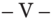

TOMO 334

Volumen 1

2011

## SITIO WEB DE LA

## CORTE SUPREMA DE JUSTICIA DE LA NACIÓN

http://www.csjn.gov.ar/  •   http://www.cij.csjn.gov.ar/

- •  Novedades

## •  JurisprudeNcia

- -Consulta temática en sumarios-fallo y dictamen Parte  de  los  fallos  elegidos  para  esta  base  integran  la  presente publicación
- -Consulta de textos fallos completos Sin sumarios
- -Lista de sentencias recientes

La presente obra se complementa con un CD con la jurisprudencia citada en el presente tomo, dictada por los jueces de la Corte Suprema de Justicia de la Nación en el período febrero-mayo del año 2011.  En el mismo se puede acceder al texto completo digitalizado de los fallos para facilitar su consulta.

## R E P U B L I C A A R G E N T I N A

## FALLOS

DE  LA

C orte S uprema

DE

## J usticia de la N acion

PUBLICACION A CARGO DE LA SECRETARIA DE JURISPRUDENCIA DEL TRIBUNAL

TOMO 334 - VOLUMEN 1

FEBRERO - MAYO

LA LEY S.A.E. e I.

Tucumán 1471 (1050) Buenos Aires

2011

Corte Suprema de Justicia de la Nación.

334 - I Secretaría de Jurisprudencia: Fallos de la Corte Suprema. - 1a ed. - Buenos Aires: Corte Suprema de Justicia de la Nación, 2011.

800 p. + CD-ROM; 24×16 cm.

ISBN 978-987-1625-14-7

1. Corte Suprema de Justicia de la Nación. 2.  Fallos. I. Título. CDD 347.077

Copyright (c) 2011 by Corte Suprema de Justicia de la Nación Queda hecho el depósito que previene la ley 11.723. Impreso en la Argentina Printed in Argentina I.S.B.N.  978-987-1625-14-7

## FALLOS DE LA CORTE SUPREMA

## FEBRERO

PRODECOM S.A. (TF 20.862-I) C/ D.G.I.

## IMPUESTO AL VALOR AGREGADO.

Cabe confirmar la sentencia que dejó sin efecto la resolución por la cual la A.F.I.P. determinó la obligación de la actora en el impuesto al valor agregado -con relación al contrato celebrado con la Municipalidad, consistente en la provisión de alimentos a una serie de centros comunitarios-, dado que el explícito reconocimiento efectuado en el memorial de agravios, referente a que la actividad de aquélla tenía cabida en el art. 3º inc. e, ap. 1, primer párrafo de la Ley del IVA, importó la admisión por parte del ente recaudador de que la actividad desarrollada consistía en la prestación de 'servicios de refrigerios o comidas', servicios a los cuales se refiere dicha norma.

## IMPUESTO AL VALOR AGREGADO.

Cabe confirmar la sentencia que dejó sin efecto la resolución por la cual la A.F.I.P. determinó la obligación de la actora en el impuesto al valor agregado -con relación al contrato celebrado con la Municipalidad, consistente en la provisión de alimentos a una serie de centros comunitarios-, pues el criterio seguido por el a quo para concluir que dicha actividad se encontraba comprendida en la norma que la excluye del impuesto resulta acorde con la doctrina de la Corte en orden a que debe evitarse el excesivo rigor de los razonamientos que desnaturalicen al espíritu que ha inspirado la sanción de la norma, dado que, por encima de lo  que las leyes parecen decir literalmente, corresponde indagar lo que dicen jurídicamente.

## FALLO DE LA CORTE SUPREMA

Buenos Aires, 8 de febrero de 2011.

Vistos los autos: 'Prodecom S.A. (TF 20.862-I) c/ D.G.I.'.

## Considerando:

1º) Que la Sala III de la Cámara Nacional de Apelaciones en lo Contencioso Administrativo Federal, al revocar la sentencia del Tribunal Fiscal de la Nación, dejó sin efecto la resolución por la cual la Administración Federal de Ingresos Públicos determinó la obligación de la actora en el impuesto al valor agregado por los períodos comprendidos entre diciembre de 1996 y marzo de 2000.

2º) Que para decidir en el sentido indicado, el tribunal de alzada se remitió a un precedente de la Sala IV de esa cámara en el que se resolvió una cuestión sustancialmente análoga a la debatida en el sub examine , en una causa seguida entre las mismas partes ('Prodecom S.A. - TF 16.232-I c/ DGI', fallada el 12 de septiembre de 2002), y en el que se estableció -con referencia a períodos fiscales anteriores a los cuestionados en estos autos- que la actividad desarrollada por la actora no se encontraba alcanzada por el impuesto al valor agregado.

3º) Que en efecto, en ese precedente -cuya copia certificada obra a fs. 315/319- se llegó a la conclusión de que tal actividad, llevada a cabo en virtud del contrato que la accionante había celebrado con la entonces Municipalidad de la Ciudad de Buenos Aires y consistente en la provisión de alimentos a una serie de centros comunitarios que le fueron asignados constituía la propia de un 'típico contrato administrativo de suministro' (fs. 317). Al respecto se puntualizó que si bien al establecerse el objeto de la licitación se aludió a la 'entrega de víveres en crudo', no podían caber dudas de que se trataba de la entrega de raciones alimentarias a centros comunitarios -ubicados en villas de emergencia y barrios carenciados- que debían efectuarse todos los días durante el lapso de duración del contrato y en los horarios específicamente detallados. En suma, el a quo desechó el criterio del ente recaudador -que había fundado la determinación de oficio en la inteligencia de que se trataba de la venta de cosas muebles alcanzadas por el IVA en virtud del art. 1º, inc. a, de la ley de ese tributo- y consideró, por el contrario, que se trataba de la prestación de servicios de carácter asistencial, incluida -según su criterio- en el párrafo segundo del punto 1, del inc. e, del art. 3º de la ley de IVA que exceptúa del tributo a las prestaciones de servicios de refrigerios o comidas efectuadas en lugares de trabajo, establecimientos sanitarios exentos o de enseñanza -oficiales o privados- reconocidos por el Estado en tanto sean de uso exclusivo para el personal, pacientes o acompañantes, o en su caso para el alumnado.

- 4º) Que al respecto se señaló en el precedente al que se remite la sentencia que no podía obviarse que entre los propósitos generales de orden económico, financiero y de promoción de la comunidad tenidos a la vista por el legislador se encontraba el de abaratar el costo del servicio de comida prestado en determinadas entidades o establecimientos en atención al vínculo que los unía con sus beneficiarios, así como su situación social o de salud; y que 'la tesis propuesta por el Fisco llevaría a la inadmisible conclusión de que quedarían al margen del impuesto los servicios de comida prestados en comedores de colegios privados -a los que accede alumnado de alta capacidad contributiva- y deberían abonarlo aquellos prestados en los comedores comunitarios de las villas de emergencia y barrios carenciados, contradiciendo abiertamente los fines perseguidos por el legislador' (fs. 317).
- 5º)  Que  contra  lo  así  decidido,  el  organismo  recaudador  dedujo recurso ordinario de apelación (fs. 327) que fue concedido por el a quo a fs. 329, y resulta formalmente admisible pues se dirige contra una sentencia definitiva, dictada en una causa en la que la Nación es parte, y el valor disputado en último término, sin sus accesorios, supera el mínimo establecido en el art. 24, inc. 6º, ap. a, del decreto-ley 1285/58 y la resolución 1360/91 de esta Corte. El memorial de agravios obra a fs. 359/375 y su contestación por la actora a fs. 381/401.
- 6º) Que en su memorial de agravios, el representante del organismo recaudador asevera que 'no caben dudas' acerca de que la actividad que realiza la sociedad en cuestión se encuentra alcanzada por la ley del gravamen, en el art. 3º, inc. e, apartado 1º, primer párrafo (confr. fs. 370 vta.). Aduce que la finalidad social en la que pone el acento el a quo tiene que ver con la situación de los beneficiarios, pero no define el tipo de contrato que la actora suscribió con la Municipalidad de la Ciudad de Buenos Aires. Asimismo, hace notar que en la cláusula sexta del convenio obrante en los antecedentes administrativos se previó que la Municipalidad de la Ciudad de Buenos Aires revestiría la condición de consumidor final 'a los efectos del impuesto al valor agregado' y que 'cuando así correspondiera' el precio que se cotice debería incluir ese tributo (fs. 370 vta.).
- 7º) Que, al respecto cabe señalar, en primer lugar, que el explícito reconocimiento efectuado en el memorial de agravios de que la actividad de la actora tiene cabida en el art. 3º inc. e, ap. 1º, primer párrafo de la Ley del IVA, importa la admisión por parte del ente recaudador de que la actividad desarrollada por aquélla consiste en la prestación

de 'servicios de refrigerios o comidas', pues dicha norma se refiere a tales servicios. Cabe entender entonces -pese a ciertas contradicciones del escrito respectivo- que el Fisco ha abandonado su criterio inicial -consistente en que se trataba de la compraventa de cosas mueblespara sostener que si bien la accionante presta esa clase de servicios, no lo haría en los lugares especificados por el segundo párrafo del ap. 1º, del inc. e, del art. 3º de la ley del tributo ('en lugares de trabajo, establecimientos sanitarios exentos o establecimientos de enseñanza -oficiales o privados reconocidos por el Estado- en tanto sean de uso exclusivo para el personal, pacientes o acompañantes, o en su caso, para el alumnado'), como sería necesario para que estuviesen exceptuados del impuesto.

8º) Que así enfocada la cuestión, resulta claro que los agravios del ente recaudador son insuficientes para desvirtuar los fundamentos de la decisión apelada en lo relativo al carácter asistencial de la prestación de los servicios sobre los que versa la causa; a que no puede obviarse que entre los propósitos generales de orden económico, financiero y de promoción de la comunidad tenidos a la vista por el legislador se encuentra el de abaratar esos servicios; y que la tesis propuesta por la AFIP llevaría a la inadmisible conclusión de que quedarían al margen del impuesto los servicios de comida prestados en comedores de colegios privados, pero estarían gravados los realizados en comedores de centros comunitarios ubicados en villas de emergencia y barrios carenciados.

9º) Que sin perjuicio de ello, cabe destacar que el criterio seguido por el a quo para concluir que la actividad desarrollada por la actora se encuentra comprendida en la norma que la excluye del impuesto resulta acorde con la doctrina de esta Corte en orden a que debe evitarse el excesivo rigor de los razonamientos que desnaturalicen al espíritu que ha inspirado la sanción de la norma (Fallos: 310:464; 500 y 937; 312:1484; 318:879), pues, por encima de lo que las leyes parecen decir literalmente, corresponde indagar lo que dicen jurídicamente, y si bien no cabe prescindir de las palabras, tampoco resulta adecuado ceñirse rigurosamente a ellas cuanto lo requiera la interpretación razonable y sistemática (Fallos: 312:1614; 318:879), ya que el espíritu que la nutre ha de determinarse en procura de una aplicación racional, que elimine el riesgo de un formalismo paralizante (Fallos: 234:482; 302:1284; 326:2095, entre otros).

10) Que por último, frente a la evidente finalidad social del servicio de que se trata, y a la conclusión a que se llega en los considerandos

que anteceden en lo relativo a la inteligencia de las normas respectivas, carece de relevancia a los fines de decidir la presente causa que en el contrato celebrado entre la actora y la entonces Municipalidad de Buenos Aires se haya previsto que ésta revestiría la condición de 'consumidor final' a los efectos del IVA, pues no puede soslayarse que esta materia se encuentra regida por el principio de reserva de la ley.

Por ello, se confirma la sentencia apelada, con costas. Notifíquese y devuélvase.

RICARDO LuIS LOREnzETTI - ELEnA I. HIGHTOn DE nOLASCO - EnRIquE SAnTIAGO PETRACCHI - JuAn CARLOS MAquEDA - E. RAúL zAFFAROnI CARMEn M. ARGIbAy.

Recurso ordinario de apelación interpuesto por el Fisco Nacional (AFIP - DGI), representado por la Dra. María Sofía Presti.

Traslado contestado por Prodecom S.A., representado por Gerardo Agustín Friedmann, con el patrocinio del Dr. Francisco Canese Méndez.

Tribunal de origen: Sala III de la Cámara Nacional de Apelaciones en lo Contencioso Administrativo Federal.

Tribunales que intervinieron con anterioridad: Tribunal Fiscal de la Nación.

## AnTOnIO LOREnzO REAL C/ ADMInISTRACIOn nACIOnAL DE LA SEGuRIDAD SOCIAL

## APORTES PREVISIONALES.

La aplicación dogmática del art. 25 de la ley 18.037 que realiza el organismo previsional para denegar el reajuste al afiliado con fundamento central en la falta de retención de aportes ignora que judicialmente se condenó al empleador a realizar dichos aportes y contribuciones y también que el reclamante en dicha demanda laboral denunció los incumplimientos, con fundamento en normas posteriores al dictado de aquélla (art. 17 de la ley 24.013) cuya hermenéutica debió adecuarse al caso en análisis, por lo que la interpretación realizada no armoniza su texto con el resto del ordenamiento y adopta una hermenéutica parcial, aislada y errónea al limitarse a dar preferencia a las normas de los arts. 2º del decreto 679/95 y arts. 19.c y 21 de la ley 24.241.

-Del dictamen de la Procuración General, al que remitió la Corte Suprema-.

## FALLOS DE LA CORTE SUPREMA 334

## DICTAMEn DE LA PROCuRACIón GEnERAL

## Suprema Corte:

- I -

Los Jueces de la Cámara Federal de la Seguridad Social (Sala II), al revocar el pronunciamiento de grado, rechazaron el reclamo de reajuste del haber jubilatorio solicitado por el actor con fundamento en que en sede laboral se había constatado la registración irregular que implicó una condena a la empleadora a extender un certificado con aportes y contribuciones a los organismos de seguridad social calculados con el salario de actividad reajustado y su incidencia en el haber de la jubilación (v. fs. 93, de los autos principales que se citarán en lo sucesivo).

Para así decidir, el a quo sostuvo que la sentencia laboral sólo producía efectos entre las partes litigantes pero no con respecto a terceros. Explicó que las obligaciones entre el empleador y la administración de la seguridad social según el diseño legal, impiden que se establezca un perjuicio para el dependiente por el incumplimiento de los aportes y contribuciones al sistema. Añadió que la responsabilidad por el ingreso oportuno de las cotizaciones previsionales se encuentran fundamentalmente en cabeza del empleador y si el trabajador consintió durante larga data percibir salarios en negro, en flagrante violación a la legislación de seguridad social, es evidente que no puede pretender un ajuste de su haber jubilatorio con fundamento en aquellos. Agregó que cualquier reconocimiento ha de conllevar recíprocamente el cumplimiento de las cotizaciones de la seguridad social correspondientes. Finalizó que mientras esto no ocurriese era improcedente el reajuste.

- II -

Contra tal pronunciamiento la actora dedujo el recurso extraordinario federal cuya denegación dio origen a la presentación directa en examen (v. fs. 97/99; fs. 102 y fs. 22/24 de la queja, respectivamente).

La recurrente se agravia porque la decisión se apoya en una interpretación de la legislación que exige una obligación de imposible cumplimiento por parte del trabajador, pues recae en el empleador cumplir con el pago de los aportes y contribuciones. Sostiene que po-

ner en cabeza del trabajador la obligación de denunciar al empleador incumplidor implica el riesgo de sufrir un despido encontrándose en situación de avanzada edad, no gozar otros ingresos y falta de capacitación para obtener un nuevo empleo, y rompe el principio de igualdad porque nada le asegura al trabajador la protección y la fuente de trabajo. Sostiene que la sentencia recurrida es arbitraria porque viola la garantía de defensa en juicio que comprende en la exigencia una derivación razonada del derecho vigente con relación a los hechos probados en el proceso.

## - III -

Es dable poner de resalto, en principio que, aun cuando los agravios del recurrente se vinculan con cuestiones de hecho, prueba y derecho común, ajenas - como regla y por su naturaleza a la vía de excepción intentada - ello no resulta óbice para habilitar la instancia federal, cuando lo decidido prescinde de prueba conducente y desatiende los fines tuitivos de la legislación previsional, con grave menoscabo de las garantías constitucionales (v. Fallos: 317:70, 946).

Tal es lo que acontece en el sub lite ,  por  cuanto  el  juzgador ha obviado el estudio de serios y conducentes elementos que se aprecian en la causa. Así lo pienso, toda vez que las afirmaciones dirigidas a sostener que cualquier reconocimiento en la adecuación de los haberes en relación con la remuneración de la actividad depende del cumplimiento de las cotizaciones de la seguridad social correspondiente y en tanto ello no se efectúe es improcedente el reajuste, omite la prueba aportada en el expediente que tramitó en sede laboral, en cuanto allí se determinó la obligación de ingresar esos recursos al sistema por parte del empleador obligado. Tal medio probatorio descartado por el a quo no sólo deja huérfana de fundamento a la sentencia, sino que no encuentra sustento firme en la prueba aportada a la causa, y sólo trasluce el apartamiento de algunos elementos que, por su magnitud, podrían variar el resultado del proceso.

En efecto, la aplicación dogmática del art. 25 de la ley 18.037 que realiza el organismo previsional para denegar el reajuste al afiliado con fundamento central en la falta de retención de aportes (v. fs. 4), ignora que judicialmente se condenó al empleador a realizar dichos aportes y contribuciones (v. fs. 101, del expediente que corre por cuerda) y también que el reclamante en dicha demanda laboral denunció los incumplimientos, con fundamento en normas posteriores al dictado de aquélla

(art. 17 de la ley 24.013) cuya hermenéutica debió adecuarse al caso en análisis (v. fs. 93 en que se citó los arts. 44 y 45 de la ley 25.345). De tal manera, que la interpretación realizada no armoniza su texto con el resto del ordenamiento y realiza una interpretación parcial, aislada y errónea, pues se limitó a dar preferencia a las normas de los arts. 2º del decreto 679/95 y arts. 19.c y 21 de la ley 24.241, que se mencionaron en la resolución administrativa, que no las contradicen en la medida que la sentencia del fuero del trabajo determina la obligación de ingresar los aportes previsionales correspondientes.

A estos efectos es pertinente resaltar aquí que la Cámara no tuvo en cuenta que por sentencia firme del 17 de febrero de 1997 se condenó a la empleadora del aquí actor a abonar tanto las diferencias salariales denunciadas, como a efectuar las contribuciones provisionales ajustadas a las conclusiones de la sentencia y el certificado correspondiente (ver. Fs. 101 expediente 11.037/96 agregado por cuerda). Este certificado nunca fue entregado por la condenada en ese expediente a pesar de las sucesivas intimaciones, solicitudes, etc. (v. fs. 131/132, 143, 153).

Además, a pesar de que la Anses afirma tener en cuenta las conclusiones de la sentencia mencionada en orden al cómputo de los servicios prestados por el trabajador (fs. 8 del principal), no consideró un aspecto conducente: cumplir con la exigencia que ahora traslada al trabajador en su perjuicio (y eventualmente la Administración era la obligada a controlar que así ocurra). Y esta exigencia se encuentra firme, por lo que el razonamiento de la Cámara implica soslayar cuestiones ya decididas -sobre cuyo acierto no corresponde expedirse en esta instancia-, en una sentencia pasada en autoridad de cosa juzgada en sede laboral.

Los excesos y omisiones señalados, pues, bastan para sostener que la actitud del sentenciador no condice con la extrema cautela con que deben actuar los jueces, en el tratamiento de beneficios de orden alimentario (Fallos: 317:983; 318:1695; 322:1522; entre otros). Por lo tanto, opino que se debe declarar procedente el recurso extraordinario y dejar sin efecto la sentencia.

En virtud de lo expuesto, opino que corresponde admitir la queja, declarar procedente el recurso y proceda a dictar por quien correspon-

de nueva sentencia. Buenos Aires, 14 de julio de 2010. Marta A Beiró de Gonçalvez.

## FALLO DE LA CORTE SUPREMA

Buenos Aires, 8 de febrero de 2011.

Vistos los autos: 'Recurso de hecho deducido por la actora en la causa Real, Antonio Lorenzo c/ Administración Nacional de la Seguridad Social', para decidir sobre su procedencia.

## Considerando:

Que los agravios del apelante encuentran adecuada respuesta en los fundamentos del dictamen de la señora Procuradora Fiscal, que el Tribunal comparte y hace suyos por razón de brevedad.

Por ello, se declara procedente el recurso extraordinario interpuesto y se deja sin efecto la sentencia apelada. Vuelvan los autos al tribunal de origen a fin de que, por medio de quien corresponda, proceda a dictar nuevo fallo con arreglo a lo expresado. Notifíquese, agréguese la queja al principal y, oportunamente, remítase.

RICARDO LuIS LOREnzETTI - ELEnA I. HIGHTOn DE nOLASCO - EnRIquE SAnTIAGO PETRACCHI - JuAn CARLOS MAquEDA - E. RAúL zAFFAROnI.

Recurso de hecho deducido por Antonio Lorenzo Real , representado por el Dr. Alberto Oscar Colinas .

Tribunal de origen: Sala II de la Cámara Federal de la Seguridad Social . Tribunales que intervinieron con anterioridad: Juzgado Federal de Primera Instancia de la Seguridad Social Nº 3.

## bAnCO HIPOTECARIO S.A.

## ACUERDO PREVENTIVO EXTRAJUDICIAL.

La sentencia apelada no exhibe el vicio de arbitrariedad que se le endilga si, más allá de su grado de acierto o error, se sustentó en una interpretación posible de las normas concursales que encuentra apoyo en la opinión mantenida por parte de

la doctrina a los fines de determinar las similitudes y diferencias que presentan el concurso preventivo y el acuerdo preventivo extrajudicial.

## ACUERDO PREVENTIVO EXTRAJUDICIAL.

No resulta idóneo para impugnar la sentencia con sustento en la doctrina de la arbitrariedad, el agravio acerca de que el a quo no aplicó el criterio establecido por la Corte al fallar un precedente anterior, ya que el tribunal inferior aportó nuevas argumentaciones para apartarse de lo allí expresado, que fundó en los profundos cambios que -con posterior al dictado del fallo mencionado- introdujo la ley 25.589 en la regulación del acuerdo preventivo extrajudicial, en especial, en cuanto a los efectos de la homologación (art. 76 de la ley concursal), más allá de que los hechos relevantes no eran análogos al presente caso y su solución requirió ponderar otras normas distintas también.

## ACUERDO PREVENTIVO EXTRAJUDICIAL.

La conclusión del a quo relativa a que la prohibición establecida en el art. 50 de la ley de entidades financieras comprende al acuerdo preventivo extrajudicial, pese a que aquel artículo no lo menciona expresamente, condice con la razón de ser o el espíritu al que obedece el dictado de aquél precepto, eso es, atender a las particularidades propias de una actividad en la que se halla comprometida la confianza pública en el sistema financiero, y cuya regulación de neto corte público, requiere soluciones diferentes de las que brinda el derecho común para otra clase de sociedades comerciales.

## ACUERDO PREVENTIVO EXTRAJUDICIAL.

Si la ley 21.526 (y sus modif.) estableció para las entidades financieras un acotado elenco de remedios preventivos a los que pueden acudir para solucionar sus crisis económicas, y les vedó la posibilidad de solicitar la formación de su concurso preventivo (art. 50), la concertación de un acuerdo preventivo extrajudicial -y su posterior homologación-, implicaría un modo de solución de dichas crisis, al margen de la intervención que en el esquema ideado por la ley de entidades financieras, se le ha dado al Banco Central de la República Argentina, y de los procedimientos allí establecidos.

DICTAMEn DE LA PROCuRACIón GEnERAL

Suprema Corte:

- I -

La Sala D de la Cámara Nacional de Apelaciones en lo Comercial confirmó la sentencia de la instancia anterior y, en consecuencia,

rechazó la solicitud de homologación del acuerdo preventivo extrajudicial efectuada por el Banco Hipotecario S.A., por considerar que no constituye un sujeto legitimado, de conformidad con la inteligencia otorgada al artículo 50 de la Ley Nº 21.526 y a los artículos 2º y 5º de la Ley Nº 24.522 (fs. 5309/5329 y 5924/5939).

Para así decidir, el tribunal, básicamente, sostuvo que el acuerdo preventivo extrajudicial regulado en el Capítulo VII del Título II -artículos 69 a 76-, resulta una subespecie del concurso preventivo, valorando especialmente que ambos son institutos complejos, compuestos por un acto inicial de naturaleza contractual -en un caso judicial y en el otro, extrajudicial- y un ulterior acto jurisdiccional. Por otro lado, destacó que el efecto principal e inmediato -tanto en el concurso preventivo como en el APE- es el de hacer oponibles a terceros no contratantes, la eficacia del acuerdo celebrado entre el deudor y determinadas mayorías de acreedores.

En ese orden de ideas, consideró que la referencia del artículo 69 de la Ley Nº 24.522 a 'deudor' debe ser congruente con lo dispuesto en los artículos 2º y 5º de dicho cuerpo legal, donde, como un principio general en materia concursal, se excluye a las entidades financieras como sujetos legitimados para solicitar su concurso (conf. art. 50, Ley Nº 21.526).

A su vez, los magistrados señalaron la incompatibilidad de los regímenes concursales con los sistemas saneatorios previstos en la Ley Nº 21.526, remitiéndose al respecto al dictamen de la Fiscalía General agregado a fojas 5913/5923. Allí, fueron expuestas las diferencias entre los mecanismos preventivos de la Ley Nº 21.526 con los previstos en la ley concursal, teniendo en cuenta las particularidades de las crisis de las entidades financieras y el interés público e institucional involucrado, en consonancia con el principio de especialidad. De esa manera, recordó la Fiscal de Cámara, que el artículo 50 de la ley citada dispone que las entidades financieras no pueden solicitar la formación de concurso preventivo ni su propia quiebra.

En ese contexto, los jueces resaltaron que admitir la concursabilidad de la entidad financiera implicaría excluir de toda participación en su saneamiento al Banco Central de la República Argentina, cuando la regulación específica le otorga una amplia intervención e injerencia en la actividad bancaria.

Contra dicho pronunciamiento, Banco Hipotecario S.A. dedujo recurso extraordinario, que fue concedido (fs. 6006/6076 y 6158/6159). En ajustada síntesis, alega que existe cuestión federal, en tanto se halla en juego la interpretación del artículo 50 de la Ley Nº 21.526 -de naturaleza federal-, y que la sentencia resulta arbitraria desde que realiza afirmaciones sin sustento jurídico ni fáctico.

En particular, argumenta que el tribunal interpreta en forma errónea el artículo 50 mencionado, haciendo extensiva la prohibición allí contenida a un supuesto no previsto, como lo es el APE, escenario que no fue modificado con las reformas introducidas por la Ley Nº 25.780. Concordantemente con ello, afirma que el artículo 69 de la Ley Nº 24.522 se refiere ampliamente a 'deudor' como sujeto legitimado para presentar un APE. Aduce que la solución de la Cámara se aparta de lo resuelto por el Máximo Tribunal en autos 'Banco Río de la Plata c/ Agroservicio Sola y Cía. S.R.L.' (Fallos: 323:2322).

Sostiene que el concurso preventivo difiere del acuerdo preventivo extrajudicial, que puede ser presentado aún ante dificultades económicas o financieras -sin necesidad de encontrarse en cesación de pagos-, aclarando que éste último -APE- importa un procedimiento y no un proceso como es el primero, y que por su naturaleza contractual puede válidamente perfeccionarse sin necesidad de la homologación del juez. No obstante ello, reconoce que en la etapa de homologación hay intervención judicial y que los efectos resultan similares en ambos institutos -oponibilidad del acuerdo a terceros-. Califica de arbitraria la decisión de la alzada, en tanto interpreta que un acuerdo preventivo extrajudicial puede ser catalogado o incluido en la categoría de 'concurso'.

En ese contexto, concluye que si bien el artículo 50 de la Ley Nº 21.526 prohíbe puntualmente a una entidad financiera presentarse en concurso preventivo, no corresponde incluir en dicha veda a los acuerdos preventivos extrajudiciales, lo cual, a su vez, entiende el recurrente, no se compadece con el espíritu que motivó la incorporación de dicho procedimiento, cual es crear una forma simple y accesible de superar situaciones de dificultades económicas y financieras, que,en algún caso, pueden llegar a la cesación de pagos.

Desde otro lado, arguye que su situación particular la diferencia del resto de las entidades financieras, teniendo en consideración la suma

de los depósitos locales al momento de la suscripción del acuerdo -calificada por el recurrente como exigua- y que los pasivos reestructurados son de bancos del exterior o, en su caso, obligaciones negociables, sin que importe -según su entender- afectación de la confianza pública.

Exponen los fundamentos de la presentación del acuerdo preventivo extrajudicial -con una mayoría del 95% de los acreedores financieros no privilegiados-, en el marco del desequilibrio económico nacional, como parte del plan de reestructuración del Banco Hipotecario (v. fs. 6024 vta./6041), en el que tuvo participación el Banco Central de la República Argentina.

Sostiene que el tema en debate trasciende el interés de las partes, revistiendo gravedad institucional, lo cual habilitaría, asimismo, la apertura de la instancia extraordinaria.

- III -

El Banco Central de la República Argentina citado por el tribunal de conformidad con lo ordenado por la Corte Suprema a fojas 6119, contestó el traslado del recurso extraordinario a fojas 6136/6150. En lo sustancial, manifiesta que el Plan de Regularización y Saneamiento que presentó el banco ofrecía diversas medidas de orden interno -consideradas cumplidas en el año 2004- y la reestructuración de la deuda financiera de carácter 'externo', respecto de la cual el B.C.R.A. emitió la Resolución Nº 301/03 (v. fs. 1100/1109). Aclara que contrariamente a lo sostenido por el Banco Hipotecario, la entidad de contralor no prestó conformidad para la presentación del APE, sino que en la Resolución Nº 301/03 mencionada, por un lado se aprobó los términos de la propuesta de refinanciación de la deuda externa, pero con la condición de que la entidad realice una serie de cambios indicados, entre los que se encontraba la eliminación de toda mención a la eventual solicitud de un APE (pto. 1.3 y Considerando 20, Res. cit.).

Desde otro lado, señala que la normativa aplicable a las entidades financieras es la Ley Nº 21.526, y que el B.C.R.A. posee facultades exclusivas y excluyentes -reglamentación, control y fiscalizacióntendientes a regular la actividad bancaria y financiera de aquellos sujetos (conf. arts. 3, 4, 5, 6, 7, 8, 20, 21, 33, 34, 35, 35 bis, 36, 38, 43 y sigs. y concs. del cit. cuerpo legal). En razón de ello, considera que la pretensión de homologación del APE avasalla facultades expresamente

delegadas al Banco Central en la Ley de Entidades Financieras y en su Carta Orgánica, Ley Nº 24.144. En este sentido, aclara que el sistema financiero cuenta con mecanismos de reestructuración propios que se encuentran inspirados en principios protectores, en cuya implementación interviene el B.C.R.A., como organismo de contralor y en ejercicio de su poder de policía bancario.

Desde otro lado, el organismo de control entiende que el APE, por los efectos que produce, resulta ser un subtipo concursal, y sobre dicha premisa, sostiene la imposibilidad legal de solicitar su homologación de conformidad con la prohibición contenida en el artículo 50 de la Ley Nº 21.526. Agrega que, a su vez, el artículo 2 de la Ley Nº 24.522 establece que no son susceptibles de ser declaradas en concurso las personas excluidas por leyes especiales, como es el caso de las entidades financieras.

- IV -

El recurso extraordinario interpuesto es formalmente admisible pues se encuentra en tela de juicio la inteligencia de preceptos federales -Ley Nº 21.526 y normas concs.-, y la decisión ha sido contraria a las pretensiones del apelante (art. 14 inc. 3º, Ley Nº 48 y doctrina de Fallos: 324:4389; 328:3733; entre otros). Entonces, es oportuno recordar que V.E. tiene dicho, que en la tarea de esclarecer el alcance de este tipo de normas no se encuentra limitada por las posiciones del a quo , ni de las partes, sino que le incumbe realizar una declaratoria sobre los puntos en debate (v. Fallos: 326:2342, 2637, 3038, entre otros), y al ser invocadas también causales de arbitrariedad que guardan íntima conexión con los temas federales en discusión, han de ser examinados en forma conjunta (Fallos: 324:1740; 328:2671; etc.).

Sentado ello, estimo necesario precisar que el thema decidendum se circunscribe a determinar si el Banco Hipotecario S.A., como entidad financiera sujeta a una regulación específica -Ley Nº 21.526-, puede presentar un acuerdo preventivo extrajudicial en los términos de la Ley Nº 24.522 -arts. 69 a 76-.

Al respecto, corresponde mencionar que V.E. ha establecido que la actividad de las entidades reguladas por la Ley Nº 21.526, tiene repercusión en el mercado financiero y afecta, en una u otra forma, todo el espectro de la política monetaria y crediticia, en el que se ha-

llan involucrados vastos intereses económicos y sociales, en razón de los cuales, se ha instituido un sistema de contralor permanente, cuya custodia la ley ha delegado en el Banco Central, colocándolo como eje del sistema financiero (v. doctrina de Fallos: 305:2130; 308:418; entre otros). Ello es así, desde que en la actuación de los bancos comerciales,  específicamente, se ve comprometida la confianza pública en el sistema financiero.

De esa manera, según se desprende del texto de la Ley Nº 21.526, el legislador ha querido dotar al Banco Central de la República Argentina de una amplia gama de facultades relativas al ejercicio del poder de policía sobre todas las personas o entidades privadas o públicas oficiales o mixtas de la Nación, de las provincias o municipalidades que realicen intermediación habitual entre la oferta y la demanda de recursos financieros (v. arts. 1, 2, 3, 4, 5, y concs., Ley Nº 21.526 y doctrina de Fallos: 307:2153). El B.C.R.A. ejerce, entonces, el llamado 'poder de policía bancario o financiero', con las consiguientes atribuciones exclusivas, excluyentes e indelegables, para aplicar un régimen legal específico, dictar normas reglamentarias que lo complementen, ejercer funciones de fiscalización y control de las entidades financieras y aplicar sanciones por las infracciones cometidas a dicho régimen (Fallos: 310:203; 315:1026; 319:110; 325:860; etc.), y así está específicamente previsto en los artículos 4 y 5 de la Ley Nº 21.526.

Partiendo de tales premisas, debo destacar que la Ley Nº 21.526 establece una serie de medidas preventivas tendientes a sanear o reestructurar el pasivo de las entidades financieras con dificultades patrimoniales, en resguardo del crédito y de los depósitos bancarios. Así,  tanto  las  medidas  de  saneamiento (presentación de planes de regularización, designación de veedores, constitución de garantías, etc.), como las de reestructuración de la entidad (reducción, aumento y enajenación del capital social, exclusión de activos y pasivos y su transferencia, intervención judicial), se realizan bajo el control del B.C.R.A. quien, asimismo, resuelve sobre su procedencia (v. arts. 34 seg. párr. y 35 bis, primer párr., Ley Nº 21.526).

En dicho marco legal, resulta imprescindible mencionar que el Banco Central, en el caso que nos ocupa, de acuerdo con las constancias agregadas a la causa, mediante Resolución agregada a fojas 1100/1109, el Directorio de la entidad de contralor resolvió aprobar la propuesta de refinanciación de la deuda externa del Banco Hipotecario S.A.

bajo la condición de que la entidad realice los cambios allí indicados, entre los que se encontraba la obligación de eliminar toda mención a la eventual solicitud de un Acuerdo Preventivo Extrajudicial, por lo que no puede considerarse que prestó su conformidad a dicho procedimiento, como pretende el apista (v., asimismo, considerando 19 y 20 de la Res. cit., fs. 1104).

Ese contexto legal y fáctico, en el que el Banco Central que en ejercicio de sus facultades de fiscalización y control delegadas por el Estado Nacional, se opone a la homologación del acuerdo preventivo extrajudicial de una entidad financiera, impide, a mi juicio, la intervención judicial que habilite exorbitar los efectos de dicho contrato, convirtiéndolo en oponible a todos los acreedores quirografarios, aún cuando no hayan participado en el acuerdo -ausentes y disidentes- conforme lo dispuesto por el artículo 76 de la Ley Nº 24.522. Considero que ello es así, desde que la protección de la actividad bancaria, como parte esencial del sistema financiero, no puede escapar del control permanente del Estado, ejercido, en este caso, por el Banco Central -desde la obtención de la autorización para funcionar hasta su revocación-.

Cabe señalar que el artículo 50 de la Ley Nº 21.526 dispone que 'las entidades financieras no podrán solicitar la formación de concurso preventivo ni su propia quiebra' y que 'no podrá decretarse la quiebra de las entidades financieras hasta tanto les sea revocada la autorización para funcionar por el Banco Central de la República Argentina'. A su vez, el artículo 2º de la Ley Nº 24.522 -último párrafo- prescribe que 'no son susceptibles de ser declaradas en concurso, las personas reguladas por las leyes 20.091, 20.321 y 24.241, así como las excluidas por leyes especiales'.

Las particulares circunstancias del sub lite , donde, reitero, la entidad de contralor se opone expresamente al procedimiento regulado en los artículos 69 a 76 de la Ley Nº 24.522, que, vale aclarar, excede el marco contractual, no permiten realizar una interpretación literal, absolutamente restrictiva, del artículo 50 de la Ley Nº 21.526 que habilite la homologación del acuerdo preventivo extrajudicial del Banco Hipotecario S.A.. Recuérdese que el APE, si bien constituye un procedimiento simplificado, no difiere, en sus efectos -con la modificación legislativa del año 2002-, del instituto del concurso preventivo, cuya aplicación a las entidades financieras fue vedada expresamente por el legislador en el artículo 50 mencionado, quien, por otra parte, reguló

otros mecanismos específicos tendientes a superar crisis patrimoniales, aplicables a dichos sujetos, en la Ley Nº 21.526 (v. arts. 34 seg. párr. y 35 bis, primer párr., Ley Nº 21.526, ya referidos).

En este punto, es menester precisar que si bien, como es señalado por el recurrente, el acuerdo preventivo extrajudicial regulado en la Ley Nº 24.522 posee una base contractual que permite que de no lograrse la homologación -salvo pacto en contrario- conserve su validez entre las partes contratantes, conforme la reforma introducida por la Ley Nº 25.589 -B.O. 16/05/02- participa de los efectos del concurso preventivo -v. art. 76, LCQ-. De esa manera, el contrato resulta oponible a todos los acreedores quirografarios, aún cuando no hayan participado en el acuerdo -ausentes y disidentes-, por lo que, en el marco de las consideraciones expuestas en los párrafos anteriores, no parece irrazonable lo manifestado por el tribunal en orden a su asimilación al instituto del concurso preventivo, solución que, vale agregar, remite al examen de cuestiones de hecho y derecho común ajenas, por su naturaleza, a esta instancia extraordinaria.

No puedo dejar de destacar que el precedente citado por el recurrente S.C. B. Nº 62, L. XXXV (Banco Río de la Plata S.A. c/ Agroservicio Solá y Compañía S.R.L.), resulta sustancialmente diverso al sub lite , toda vez que allí, el día 29 de agosto de 2000, resolviendo una cuestión de competencia vinculada a un eventual fuero de atracción del trámite homologatorio de un APE, el Máximo Tribunal -con remisión al dictamen de esta Procuración General- tuvo en consideración, justamente, los  efectos  y  particularidades  del  acuerdo  preventivo  extrajudicial, posteriormente modificados por la Ley Nº 25.589 (B.O. 16/05/02), ya referida.

Atendiendo a la solución que se propone, resulta inoficioso el tratamiento de las cuestiones relativas al alcance de la palabra 'deudor' en el artículo 69 de la Ley Nº 24.522, las que, en definitiva, también conducen al estudio de aspectos de hecho y derecho común, ajenos a la vía del artículo 14 de la Ley Nº 48.

- V -

En función de lo anterior, considero que el recurso extraordinario es procedente y, de considerarlo pertinente V.E., cabría confirmar la sentencia de fojas 5924/5939, con el alcance y por los fundamentos

aquí expuestos. Buenos Aires, 4 de noviembre de 2008. Marta A. Beiró de Gonçalvez.

## FALLO DE LA CORTE SUPREMA

Buenos Aires, 22 de febrero de 2011.

Visto los autos: 'Banco Hipotecario S.A. s/ acuerdo preventivo extrajudicial'.

## Considerando:

- 1º) Que los antecedentes del caso y las posturas de las partes relativas a si el Banco Hipotecario S.A. se encuentra legalmente habilitado para solicitar la homologación de un acuerdo preventivo extrajudicial en los términos de los artículos 69 a 76 de la ley 24.522 (según la redacción dada por la ley 25.589), o si a ello obsta la prohibición contenida en el artículo 50 de la ley de entidades financieras (ley 21.526 y sus modificaciones), han sido reseñados en los apartados I a III, inclusive, del dictamen de la señora Procuradora Fiscal, a cuyas consideraciones corresponde remitir en razón de brevedad.
- 2º)  Que  el  recurso  extraordinario  interpuesto  es  formalmente admisible pues, además de que se invocan causales de arbitrariedad del fallo que guardarían íntima conexión con los temas federales propuestos, se encuentra en tela de juicio la inteligencia de normas de esa naturaleza -ley 21.526 y sus modificaciones- y la decisión del a quo ha sido contraria al derecho que en aquéllas fundó el apelante (artículo 14, inciso 3º, de la ley 48).
- 3º) Que, en primer término, corresponde señalar que los agravios expuestos en el remedio federal con sustento en la doctrina de la arbitrariedad de sentencias, han tenido por objeto demostrar que el a quo efectuó una interpretación '...arbitraria y antojadiza...' de la ley concursal (fs. 6044 y 6046).

Sin embargo, aquella afirmación no se compadece con el exhaustivo examen que se realizó en la sentencia sobre las similitudes y diferencias que presentan el concurso preventivo y el acuerdo preventivo

extrajudicial, y en el que la cámara fundó su decisión en el sentido de que '...ni individualmente, ni en su conjunto, las 'características diferenciales' expuestas por el apelante..., alcanzan a establecer una diferencia esencial entre el concurso preventivo y el APE [acuerdo preventivo extrajudicial], que erijan a uno y otro en institutos autónomos, o que impida caracterizar a ambos como especies de un mismo género 'concurso preventivo', o como subespecies de la especie 'concursos preventivos' integrante del género 'concursos'' (fs. 6100/6101).

En efecto, en apretada síntesis, el raciocinio del a quo se sustentó en que, a la luz de la actual redacción de la ley 24.522, '...tanto el concurso preventivo, cuanto el acuerdo preventivo extrajudicial, son ...institutos complejos compuestos por un inicial acto contractual y un ulterior acto jurisdiccional, y ...el principal e inmediato efecto sustancial de ambos es el de hacer oponibles a terceros no contratantes la eficacia del contrato celebrado entre el deudor y determinadas mayorías de sus acreedores'. Destacó, sin embargo, que ambos se diferencian en que '...en el concurso preventivo el primer tramo del instituto complejo se produce en sede judicial, en tanto que en el segundo el mismo se desarrolla en sede extrajudicial; más ello constituye una diferencia relativa a la sede del trámite y, consecuentemente, referida al trámite mismo, lo cual no establece diferencia esencial o sustancial alguna entre ambos institutos concursales' (fs. 6098).

Sobre estas bases, y tras ponderar especialmente las peculiaridades propias del concurso preventivo y del acuerdo preventivo extrajudicial detalladas a fs. 6100/ 6102, concluyó que '...existe un género conceptual 'concursos preventivos', integrados por dos especies, a saber: (a.1.) concurso preventivo judicial - 'concurso preventivo', en la letra de la ley -, y (a.2.) concurso preventivo extrajudicial -'acuerdo preventivo extrajudicial', en términos de la misma ley 24.522-', y que '...la caracterización del APE [acuerdo preventivo extrajudicial] como una 'subespecie del concurso preventivo' -difundida expresión, largamente criticada por el recurrente- resulta aceptable y arreglada a derecho' (fs. 6098).

Asimismo, el a quo destacó que no obstaba a aquella conclusión, el fallo que el apelante invocó para fundar su postura ('Banco Río de la Plata S.A.' registrado en Fallos: 323:2322), pues en tanto la sentencia en aquel caso había sido dictada por este Tribunal, el 29 de agosto de 2000, esto es, con anterioridad a la entrada en vigencia de la ley 25.589 -que introdujo profundos cambios en el régimen del acuerdo preventivo extrajudicial-, tal circunstancia autorizaba a apartarse de su doctrina.

En este sentido, puso especial énfasis en que la nueva ley al establecer que el acuerdo preventivo extrajudicial homologado es oponible a la minoría que no intervino en él o que no lo aceptó, le ha otorgado un '...efecto idéntico al que resulta de un concurso preventivo judicial' (fs. 6103/6104).

Por otra parte, al abordar la interpretación de los artículos 2, 5 y 69 de la ley concursal, recordó que no pueden ser declaradas en concurso aquellas personas excluidas por leyes especiales (artículo 2), y que respecto de las entidades financieras existe una expresa prohibición de solicitar la formación de concurso preventivo contenida en la ley especial (artículo 50 de la ley 21.526), razón por la que dicha prohibición también impedía solicitar la homologación de un acuerdo preventivo extrajudicial.

Finalmente, con remisión al contenido del dictamen de la señora Fiscal General -agregado a fs. 6081/6092 de esta causa-, sostuvo la especificidad de los sistemas de saneamiento previstos en la ley de entidades financieras, caracterizados por un marcado control del Banco Central de la República Argentina, y la prevalencia de aquéllos ante las soluciones del derecho concursal, motivo por el cual debía ceder la pretensión de homologar un acuerdo como el examinado en estas actuaciones, pues implicaría soslayar el ejercicio de la función propia que le compete a aquella autoridad de aplicación.

4º) Que, como lo ha sostenido el Tribunal reiteradas veces, la doctrina de la arbitrariedad de sentencias, es de carácter excepcional y no tiende a sustituir a los jueces de la causa en cuestiones que le son privativas, ni a corregir en tercera instancia fallos equivocados o que se reputen tales, ya que sólo admite desaciertos u omisiones de gravedad extrema, a causa de los cuales los pronunciamientos no pueden adquirir validez jurisdiccional (Fallos: 314:458; 315:449; 323:2196; 324:2169 y 3421; 325:2794 y 3265; 326:3485, entre otros).

En este orden de ideas, según resulta del relato realizado en el considerando anterior, corresponde afirmar que la sentencia no exhibe el vicio de arbitrariedad que el apelante le endilgó, pues más allá de su grado de acierto o error, aquélla se sustentó en una interpretación posible de las normas concursales que encuentra apoyo en la opinión mantenida por parte de la doctrina (ver, en este sentido, la decisión de fs. 5309/5329, que fue confirmada por el a quo ). Sin embargo, co-

rresponde puntualizar al respecto que, la terminología utilizada por el a quo al  definir al acuerdo preventivo extrajudicial, ha merecido la aclaración de los autores que la comparten, en el sentido de que conciben a dicho acuerdo como un subtipo concursal, dentro de otros subtipos de saneamiento -vgr., el acuerdo preventivo propiamente dicho-, pero que la pertenencia a un mismo grupo, no impide conservar su individualidad.

En consecuencia, las argumentaciones vertidas en el remedio federal con el objeto de demostrar que existirían '...diferencias insalvables que no permiten encasillar al APE dentro de la categoría de concurso preventivo' (fs. 6071 vta.), son insuficientes para descalificar lo resuelto porque sólo reeditan planteos llevados al conocimiento del a quo (ver, por ejemplo, las distinciones expuestas a fs. 6042/ 6042 vta.; 6043/6043 vta.; 6044 y 6061/6061 vta., entre otras), y traducen la discrepancia del apelante acerca de la interpretación de una cuestión opinable regida por normas de derecho común, materia que, por principio, es ajena a la jurisdicción excepcional de esta Corte. La misma deficiencia exhibe el planteo relativo al alcance que correspondería otorgar a los artículos 2, 5 y 69 de la ley concursal, y por ende, ello obsta a su admisión.

Finalmente, no resulta idóneo para impugnar la sentencia con sustento en la doctrina de la arbitrariedad, el agravio del recurrente acerca de que el a quo no aplicó el criterio establecido por esta Corte al fallar el caso registrado en Fallos: 323:2322, pues el tribunal inferior aportó nuevas argumentaciones para apartarse de lo allí expresado, que fundó en los profundos cambios que -con posterioridad al dictado del precedente mencionado- introdujo la ley 25.589 en la regulación del acuerdo preventivo extrajudicial, en especial, en cuanto a los efectos de la homologación (artículo 76 de la ley concursal). Sin perjuicio de ello, tampoco puede obviarse que el punto decidido por el Tribunal en aquella sentencia, fue la imposibilidad de aplicar al acuerdo preventivo extrajudicial, el fuero de atracción previsto por el inciso 1º, del artículo 21, de la ley 24.522, lo cual implicó examinar un caso cuyos hechos relevantes no son análogos a los del sub examine , y su solución requirió ponderar -además de las características propias del concurso preventivo y del acuerdo preventivo extrajudicial- otras normas distintas de las que rigen el presente.

5º) Que, al resultar inadmisibles los agravios del apelante fundados en la doctrina de la arbitrariedad, y mantenerse incólume la conclusión del a quo acerca de que el acuerdo preventivo extrajudicial es una

especie del género concurso preventivo o un subtipo de éste, quedaría sellada la suerte adversa del recurso. En efecto, no existiría óbice para comprender a dicha clase de acuerdo en la expresa prohibición que la ley de entidades financieras prevé en los siguientes términos: ' Las entidades financieras no podrán solicitar la formación de concurso preventivo ni su propia quiebra ' (artículo 50, párrafo primero, de la ley de entidades financieras, según la redacción dada por la ley 25.780).

6º) Que, con independencia de lo hasta aquí señalado, y aún si se considera equivocada la categorización del acuerdo preventivo extrajudicial que hizo el a quo con sustento en la ley concursal, es posible mantener la decisión apelada sobre la base del alcance que aquél le asignó a las normas federales que rigen el caso.

En efecto, ello es así, pues la tarea de esclarecer la inteligencia de las normas no se agota en acudir a su texto, sino que debe indagarse lo que aquéllas, jurídicamente, han querido mandar, razón por la que debe darse pleno efecto a la intención del legislador y computar la totalidad de sus preceptos, de modo armónico con el ordenamiento jurídico restante y con los principios y garantías de la Constitución Nacional (Fallos: 300:417; 301:489; 304:937; 307:2153, entre muchos otros). En este sentido, se adelanta que la conclusión del a quo relativa a que la prohibición establecida en el artículo 50 de la ley de entidades financieras comprende al acuerdo preventivo extrajudicial, pese a que aquel artículo no lo menciona expresamente, condice con la razón de ser o el espíritu al que obedece el dictado de aquél precepto, esto es, atender a las particularidades propias de una actividad en la que se halla comprometida la confianza pública en el sistema financiero, y cuya regulación de neto corte público, requiere soluciones diferentes de las que brinda el derecho común para otra clase de sociedades comerciales (doctrina de Fallos: 325:860).

Esto último ha sido puesto de relieve por el Tribunal al afirmar que la ley 21.526 constituye '...la continuación de una larga trayectoria en la materia, en cuanto coloca al Banco Central como eje del sistema financiero y establece sus facultades en materia de política monetaria y crediticia...', con el objeto de reglar '...a cierta clase de personas jurídicas, que desarrollan una actividad específica de importancia esencial para la vida económica del país' (Fallos: 308:418 y, el allí citado, 303:1776). En el mismo sentido, esta Corte sostuvo que '... la actividad bancaria tiene una naturaleza peculiar que la diferencia

de otras de esencia comercial que se caracteriza, especialmente, por la necesidad de ajustarse a las disposiciones y al control del Banco Central, hallándose sometida a un régimen jurídico que establece un margen de actuación particularmente limitado, que faculta al ente rector del sistema a dictar normas que aseguren el mantenimiento de un adecuado grado de solvencia y liquidez de los intermediarios financieros y a establecer obligaciones a las que deberán sujetarse en relación a aspectos vinculados con su funcionamiento (Fallos: 319:2658)' -ver dictamen de la Procuración General al que esta Corte adhirió al fallar el caso 'Banco del Interior de Bs. As. (BIBA)'- (Fallos: 331:2382; 275:265, considerando 10 y Fallos: 305:2130).

7º) Que, en lo que al caso interesa, las peculiaridades apuntadas se ven reflejadas en que la ley 21.526 (y sus modif.), a la vez que prevé la obligación de respetar estrictas regulaciones en materia de liquidez, solvencia y responsabilidad patrimonial (artículos 30, 31 y 32), concibe los mecanismos preventivos propios -diferentes de los del derecho concursal- para que las entidades financieras puedan superar eventuales crisis patrimoniales o financieras.

En efecto, aquel ordenamiento prevé una serie de medidas de diversa intensidad, que consisten -entre otras- en las explicaciones que deben ser brindadas al Banco Central ante el incumplimiento de la normativa vigente; la exigencia de presentar planes de regularización y saneamiento, sin perjuicio de la facultad de disponer la designación de veedores con facultad de veto, la constitución de garantías o la limitación o prohibición de distribuir o remesar utilidades (artículos 34); o bien, la reestructuración de la entidad en resguardo del crédito y los depósitos bancarios, en sus diversas variantes, vgr.: la reducción, aumento o enajenación del capital social; la exclusión de activos y pasivos y su transferencia; la intervención judicial (artículo 35 bis).

Lo propio de todos estos remedios consiste en que no quedan librados al arbitrio de las entidades, sino que es el Banco Central de la República Argentina el que decide sobre su procedencia, ejerce un activo control de su cumplimiento, y en el supuesto de fracasar los intentos de saneamiento antes aludidos, aquel organismo se encuentra facultado para disponer el cese de las actividades de aquéllas mediante la revocación de la autorización para funcionar (artículos 34 y 44), en consonancia con la atribución genérica reconocida en el artículo 15 de la ley (ver, en especial, su párrafo tercero).

Las mismas razones de interés colectivo en el buen funcionamiento del sistema financiero, han llevado a plasmar específicos procedimientos de liquidación a los que quedarán sujetas dichas entidades, y que en la redacción actual de la ley 21.526 consisten en: la denominada autoliquidación (artículo 45); la liquidación judicial (arts. 44, incisos c y d; 48 y 49); o bien, la quiebra (artículo 50 y sgtes.), supuestos todos éstos en los que las disposiciones de la ley de sociedades y de concursos y quiebras, se aplican únicamente en aquello que no se oponga a las concretas previsiones que en la materia contiene la ley de entidades financieras (artículos 46, 49, 50 y 51).

- 8º) Que, es en el contexto normativo antes referido, en el que corresponde examinar el contenido del artículo 50 de la ley 21.526 (y sus modif.), que en su actual redacción -y en lo que interesa- establece:

' Las entidades financieras no podrán solicitar la formación de concurso preventivo ni su propia quiebra. No podrá decretarse la quiebra de las entidades financieras hasta tanto les sea revocada la autorización para funcionar por el BANCO CENTRAL DE LA REPUBLICA ARGENTINA. A partir de esa revocación regirá lo dispuesto en el artículo 52 de la presente ley ' (texto según la ley 25.780).

Si bien el texto originario de esta norma fue objeto de sucesivas reformas, en todas ellas -con sus matices- se mantuvo para aquellas entidades la prohibición de solicitar su concurso preventivo o su propia quiebra, previsión que en el texto actual antes transcripto, es de toda claridad. En cambio, nada se ha previsto en forma expresa acerca de la alternativa de acudir a la concertación y posterior homologación de un acuerdo preventivo extrajudicial (ver el artículo 49 de la ley 21.526 y el artículo 50, en la redacción de las leyes 24.144; 24.485; 24.627 y 25.780).

Aun cuando, por una razón de orden temporal, al sancionarse la reforma introducida por la ley 25.780 (B.O. 8/9/2003), el legislador tuvo la posibilidad de expedirse al respecto, pues ya había sido sancionada la ley 24.522 (B.O. 9/8/95), y su modificatoria, la ley 25.589 (B.O. 16/5/2002), lo cierto es que no lo hizo. En efecto, en el contexto de otros temas de la ley de entidades financieras que merecían un tratamiento acuciante, aquél se limitó a eliminar de la redacción del artículo 50, el controvertido párrafo que había introducido anteriormente la ley 24.627, sin que la compulsa de los antecedentes parlamentarios permitan inferir cuál es el sentido que debe darse al silencio guardado

con respecto al acuerdo preventivo extrajudicial (ver Mensaje de Elevación del proyecto de la ley 25.780, del día 22 de mayo de 2003, y la Versión Taquigráfica (Provisional) del debate de aquella ley, Cámara de Senadores de la Nación, Sesión Ordinaria, de los días 18 y 19 de junio de 2003, y Cámara de Diputados de la Nación, Sesión Ordinaria, del día 27 de agosto de 2003).

Lo apuntado, sin embargo, no es un dato dirimente, pues cualquiera sea la naturaleza que se le otorgue a dicha clase de acuerdo, y respetando sus características propias, puede predicarse -al menos- que se trata de un medio de saneamiento preventivo que no es extraño a los procedimientos contra la insolvencia, y que, a partir de los efectos que a su homologación judicial le otorgó el artículo 76 de la ley 25.589, se intensificó notablemente la proximidad -o semejanza- con el concurso preventivo, pues aquella norma en forma expresa y mediante una simple remisión, sujetó al acuerdo preventivo extrajudicial, a las mismas disposiciones que en la ley concursal regulan la homologación del concurso preventivo.

En consecuencia, si la ley 21.526 (y sus modif.) estableció para las entidades financieras un acotado elenco de remedios preventivos a los que pueden acudir para solucionar sus crisis económicas, y les vedó la posibilidad de solicitar la formación de su concurso preventivo (artículo 50), la concertación de un acuerdo preventivo extrajudicial -y su posterior homologación-, implicaría un modo de solución de dichas crisis, al margen de la intervención que en el esquema ideado por la ley de entidades financieras, se le ha dado al Banco Central de la República Argentina, y de los procedimientos allí establecidos. Más aún, la interpretación literal del citado artículo 50 -en desmedro de una inteligencia sistemática de la norma-, conduce inexorablemente a un resultado no querido por el legislador: la entidad podría sortear la prohibición de solicitar el concurso preventivo que sobre ella pesa, mediante la concertación en forma privada de un acuerdo con cierta mayoría de acreedores, pues con su posterior homologación judicial, tendría asegurada la obtención de los mismos efectos que los que produce la homologación de una propuesta de concurso preventivo (artículo 76 de la ley concursal, antes citado).

Finalmente, aún si se aceptara la hipótesis de que nada impide concertar un acuerdo preventivo extrajudicial cuando media la conformidad del Banco Central de la República Argentina, en el caso, resulta

estéril  discurrir sobre dicha posibilidad, pues -contrariamente a lo afirmado por el recurrente-, la autoridad de aplicación expresó su clara oposición. En efecto, según lo indicó aquel organismo al contestar el recurso extraordinario, y así resulta de las constancias de la causa, el Banco Hipotecario S.A. -en el ámbito de un Plan de Reestructuración y Saneamiento- propuso la refinanciación de su deuda externa, y si bien ésta fue aceptada por el Directorio del Banco Central de la República Argentina, se sujetó a la condición de que la entidad realizara una serie de cambios, entre los que expresamente se indicó: ' Eliminar toda mención a la eventual solicitud de un Acuerdo Preventivo Extrajudicial' (ver considerandos 19 y 20, de la resolución agregada a fs. 1100/ 1109, y punto 1.3, de su parte resolutiva).

Por ello, y lo concordemente dictaminado por la señora Procuradora Fiscal, se declara procedente el recurso extraordinario interpuesto y, con el alcance indicado, se confirma la sentencia. Las costas de esta instancia se imponen por su orden, en atención a lo novedoso de la cuestión debatida. Notifíquese y, oportunamente, devuélvase.

RICARDO LuIS LOREnzETTI - ELEnA I. HIGHTOn DE nOLASCO - EnRIquE SAnTIAGO PETRACCHI - JuAn CARLOS MAquEDA - E. RAúL zAFFAROnI CARMEn M. ARGIbAy.

Recurso extraordinario interpuesto por el Banco Hipotecario S.A., representado por los Dres . Ernesto Manuel Viñes y Andrés Fabián Ocampo. Traslado contestado por el Banco Central de la República Argentina , representada por los Dres. Cecilia Adriana Tunstall Binazhi y Marcos Eduardo Moiseeff . Tribunal de origen: Cámara Nacional en lo Comercial, Sala D. Tribunales que intervinieron con anterioridad: Juzgado Nacional de Primera Instancia en lo Comercial Nº 14, Secretaría Nº 28.

InES MARInA SAGLIETTI C/ En - Mº JuSTICIA

- RESOL. 28/08 - SSI (ExPTE. 23.002/08)

## ESTABILIDAD DEL EMPLEADO PUBLICO.

Corresponde confirmar la sentencia que rechazó el amparo interpuesto contra el Ministerio de Justicia, Seguridad y Derechos Humanos a fin de que se revoque la

resolución de ese organismo mediante la cual se ordenó cancelar la designación de la recurrente por razones de servicio, con fundamento en lo dispuesto por el art. 21 de la ley 25.164 -que dispone que el personal que goza de jubilación o retiro no tiene derecho a la estabilidad y que su designación podrá ser cancelada en cualquier momento por razones de oportunidad, mérito o conveniencia, mediante el pago de una indemnización- ya que la circunstancia de que encontrarse suspendida la percepción de las sumas correspondientes por haber ejercido la opción prescripta en el decreto 894/01 no resulta suficiente para desvirtuar o modificar la condición que reviste la actora desde el momento en que se le concedió el haber de retiro, el cual puede recibir nuevamente al cesar las causales que dieron origen a la suspensión.

-Del dictamen de la Procuración General, al que remitió la Corte Suprema-.

DICTAMEn DE LA PROCuRACIón GEnERAL

Suprema Corte:

- I -

A fs. 179/185 la Sala I de la Cámara Nacional de Apelaciones en lo Contencioso Administrativo Federal confirmó la sentencia de la instancia anterior y, en consecuencia, rechazó el amparo interpuesto por la actora contra el Estado Nacional (Ministerio de Justicia, Seguridad y Derechos Humanos) a fin de que se revoque la resolución 208/08 de ese organismo, mediante la cual se ordenó cancelar su designación en la Secretaría de Seguridad por razones de servicio, con fundamento en lo dispuesto por el art. 21 de la ley 25.164.

Para así decidir, el tribunal sostuvo que la opción ejercida por la actora -en el sentido de suspender la percepción de su haber previsional para continuar desempeñándose en su función- en los términos del art. 2º del decreto 894/01, no significa quitar virtualidad a lo establecido por el art. 21 de la ley 25.164, pues la Administración podía, dentro de la competencia asignada, disponer o no el cese de los empleados comprendidos en ella, sin afectar la estabilidad del agente (art. 14 bis de la Constitución Nacional). En tal sentido, añadió que el citado art. 21 no se refiere al hecho de que el personal perciba el retiro efectivamente, sino a que lo posea jurídicamente acordado como derecho, aun cuando por un acto voluntario no lo disfrute al momento de cancelarse su designación.

Disconforme con este pronunciamiento, la actora interpuso el recurso extraordinario de fs. 188/205, que fue concedido a fs. 216.

En lo sustancial, aduce que las argumentaciones de la cámara para rechazar el amparo son contradictorias con la breve investigación efectuada al conceder la medida cautelar solicitada, pues introduce el concepto de titularidad a pesar de que el art. 21 de la ley 25.164 'menciona al verbo gozar y no al sustantivo titular', cuyos significados no coinciden. Agrega al respecto que si bien es titular de un beneficio jubilatorio no lo disfruta porque requirió la suspensión temporaria por encontrarse en una relación de empleo público y tener que optar según lo dispuesto por el decreto 894/01.

Por otra parte, sostiene que la resolución cuestionada que cancela la estabilidad en el empleo afecta la garantía prevista por el art. 14 bis de la Constitución Nacional, pues se hace mérito de una incompatibilidad inexistente e importa una cesantía encubierta. Agrega que se le cercena la carrera administrativa por una falsa causa ya que, según se ha acreditado en autos, el goce de su haber de retiro se encuentra suspendido en cumplimiento de las normas que así lo disponen para poder trabajar en la Secretaría de Seguridad y, por lo tanto, el art. 21 de la ley 25.164 no le resulta aplicable.

A mi modo de ver, el recurso extraordinario es formalmente admisible, toda vez que se halla en tela de juicio la aplicación e interpretación de normas de carácter federal (ley 25.164 y decretos 894/01 y 1421/02) y la decisión definitiva del superior tribunal de la causa ha sido adversa a las pretensiones que el apelante funda en ellas (art. 14, inc. 3º, de la ley 48).

Ante todo, corresponde señalar que, según surge de las actuaciones, la actora percibió su haber de retiro mediante la Caja de Retiro, Jubilaciones y Pensiones de la Policía Federal hasta agosto de 2001, oportunidad en la que quedó suspendido el beneficio al haber optado, en los términos del decreto 894/01, por percibir la remuneración corres-

pondiente al cargo que desempeñó en la Secretaría de Seguridad Interior. Con posterioridad, mediante la resolución 208/08 del Ministerio de Justicia, Seguridad y Derechos Humanos se dispuso la cancelación de su designación en aquel organismo por razones de servicio.

Esta decisión -cuya validez se ha puesto en tela de juicio en el sub examine - se funda en el art. 21 de la ley 25.164, en tanto dispone que el personal que goza de jubilación o retiro no tiene derecho a la estabilidad y que su designación podrá ser cancelada en cualquier momento por razones de oportunidad, mérito o conveniencia, mediante el pago de una indemnización. A su vez, el decreto reglamentario 1421/02 establece que este derecho alcanza al personal incorporado a la planta permanente con anterioridad a la vigencia de la ley mencionada, pues a partir de su entrada en vigor la circunstancia de gozar de un beneficio previsional constituye un impedimento para el ingreso a la Administración (art. 5º, inc. f, de la ley 25.164).

Por su parte, el decreto 894/01 modificó el art. 1º del decreto 8566/61 y estableció que el desempeño de una función o cargo remunerado o prestación contractual, con o sin relación de dependencia, bajo cualquier modalidad en la Administración Pública Nacional, es incompatible con la percepción de un beneficio previsional o haber de retiro proveniente de cualquier régimen de previsión nacional, provincial o municipal. Asimismo, su art. 2º dispone que dicho personal debe formular la opción entre percibir el haber previsional y seguir desempeñándose sin percibir remuneración laboral, o solicitar la suspensión del haber previsional, durante el desempeño simultáneo con el cargo, función o contrato, situación en la que se hallaría la apelante según lo acredita a fs. 20/25.

De lo expuesto se desprende que la pérdida de la estabilidad se produce cuando el agente comienza a gozar de una jubilación o haber de retiro y, desde ese momento, su designación puede ser cancelada por la autoridad competente por razones de oportunidad, mérito o conveniencia. Sin embargo, contrariamente a lo que pretende la apelante, el goce del haber jubilatorio al que se refiere el art. 21 de la ley 25.164 no puede asimilarse a su efectiva percepción por parte del beneficiario, sino que dicha expresión alude inequívocamente a tener o poseer el derecho a la jubilación o al haber de retiro. De este modo, la circunstancia de encontrarse suspendida la percepción de las sumas correspondientes -en el caso, por haber ejercido la opción de conformidad con lo prescripto por el decreto 894/01- no resulta suficiente para desvirtuar o

modificar la condición que reviste la actora desde el momento en que se le concedió el haber de retiro, el cual puede recibir nuevamente al cesar las causales que dieron origen a la suspensión.

En este orden de ideas y en lo que se respecta al modo como debe interpretarse aquella norma, cabe recordar que V.E. tiene dicho que las leyes deben interpretarse conforme al sentido propio de las palabras, sin violentar su significado específico, máxime cuando aquél concuerda con la acepción corriente en el entendimiento común y la técnica legal empleada en el ordenamiento jurídico vigente (Fallos: 295:376; 315:1256; 316:2561, entre otros). Asimismo, ha establecido que la primera regla de interpretación de las leyes es dar pleno efecto a la intención del legislador, que la primera fuente para determinar esa voluntad es la letra de la ley (Fallos: 316:2561) y que debe buscarse una interpretación racional que permita a los jueces superar las posibles imperfecciones técnicas de su instrumentación legal (Fallos: 319:2678).

Por lo demás, tal como señala la cámara, el derecho a la estabilidad que protege el art. 14 bis de la Constitución Nacional no ha sido afectado en el caso de autos, pues se trata de un derecho sujeto a reglamentación y puede ser limitado cuando se configuren los supuestos previstos por el ordenamiento.

Tampoco puede considerarse que la postura asumida por el tribunal en el pronunciamiento apelado es contradictoria por haber concedido a fs. 51/52 la medida solicitada por la actora, toda vez que, como resulta de su naturaleza, las medidas cautelares no exigen de los magistrados el examen de certeza sobre la existencia del derecho pretendido, sino sólo su verosimilitud (Fallos: 324:2859; 325:3542) y, por lo tanto, la cámara no se hallaba limitada por aquella decisión, pues sólo al examinar la cuestión de fondo controvertida se expide efectuando un estudio acabado de las distintas circunstancias que rodean la relación jurídica.

En consecuencia, pienso que no es válido concluir, como pretende la apelante, que su designación fue cancelada por un error administrativo y que no se encuentra 'gozando' de una jubilación por haber solicitado la suspensión en los términos del decreto 894/01.

Opino, por tanto, que corresponde declarar formalmente admisible el recurso extraordinario interpuesto y confirmar la sentencia apelada. Buenos Aires, 2 de junio de 2010. Laura M. Monti.

## DE JUSTICIA DE LA NACION 334

## FALLO DE LA CORTE SUPREMA

Buenos Aires, 22 de febrero de 2011.

Vistos los autos: 'Saglietti, Inés Marina c/ EN - Mº Justicia - resol. 28/08 - SSI (expte. 23.002/08) s/ amparo ley 16.986'.

## Considerando:

Que esta Corte comparte los fundamentos y conclusiones del dictamen de la señora Procuradora Fiscal, a los que cabe remitirse en razón de brevedad.

Por ello, se declara admisible el recurso extraordinario interpuesto y se confirma la sentencia recurrida. Notifíquese y devuélvase.

RICARDO LuIS LOREnzETTI - ELEnA I. HIGHTOn DE nOLASCO - EnRIquE SAnTIAGO PETRACCHI - JuAn CARLOS MAquEDA - E. RAúL zAFFAROnI CARMEn M. ARGIbAy.

Recurso extraordinario interpuesto por Inés María Sagietti , con el patrocinio del Dr. Ernesto Luis Chaneton.

Traslado contestado por el Estado Nacional , representado por el Dr. Matías Barletta, con el patrocinio del Dr. Norberto Bisaro.

Tribunal de origen: Cámara Nacional de Apelaciones en lo Contencioso Administrativo Federal, Sala I.

Tribunales que intervinieron con anterioridad: Juzgado Nacional de Primera Instancia en lo Contencioso Administrativo Federal Nº 4, Secretaría Nº 7.

## FELICIAnA HAyDEE ARDILES C/ nuEVO IDEAL S.A.

## RECURSO EXTRAORDINARIO.

Teniendo en cuenta que el haber omitido acompañar la carátula a que hace referencia el art. 2º del reglamento aprobado por la acordada 4/2007 no constituye un obstáculo insalvable corresponde declarar formalmente admisible el recurso extraordinario (art. 11 del citado reglamento), revocar la sentencia apelada y admitir que la franquicia prevista en el contrato de seguro es oponible al tercero

damnificado y que la sentencia no podrá ser ejecutada contra la aseguradora sino en los límites de la contratación.

## RECURSO EXTRAORDINARIO.

Corresponde desestimar la queja y concluir que fue bien denegada la concesión del recurso extraordinario por no haberse acompañado la carátula exigida por el art. 2º del reglamento aprobado por la acordada 4/2007, ya que no surge del mismo que esa modalidad pudiese quedar a criterio discrecional del recurrente y, además, la exigencia procura inducir a una exposición precisa de la pretensión recursiva y que al mismo tiempo facilite al juez o a la Corte el examen de la presentación (Disidencia de la Dra. Carmen M. Argibay).

## FALLO DE LA CORTE SUPREMA

Buenos Aires, 22 de febrero de 2011.

Vistos los autos: 'Recurso de hecho deducido por La Economía Comercial S.A. Compañía de Seguros Generales (citada en garantía) en la causa Ardiles, Feliciana Haydée c/ Nuevo Ideal S.A. s/ daños y perjuicios', para decidir sobre su procedencia.

Considerando:

- 1º) Que la Sala J de la Cámara Nacional de Apelaciones en lo Civil rechazó in limine el recurso extraordinario interpuesto por la aseguradora citada en garantía en virtud de no haber cumplido con los recaudos establecidos en el reglamento aprobado por la acordada 4/2007.
- 2º) Que el Tribunal, en uso de su sana discreción, considera que dicho incumplimiento -haber omitido acompañar la carátula a que hace referencia el art. 2º del reglamento- no constituye, en el caso, un obstáculo insalvable para la admisibilidad de la vía recursiva atento a la índole de la cuestión planteada (art. 11 del citado reglamento).
- 3º) Que, en cuanto al fondo del asunto, los agravios de la recurrente remiten al examen de cuestiones sustancialmente análogas a las examinadas por el Tribunal en Fallos: 329:3054 y 3488; 330:3483; 331:379, y en las causas O.166.XLIII 'Obarrio, María Pía c/ Microómnibus Norte

S.A. y otros' y G.327.XLIII 'Gauna, Agustín y su acumulado c/ La Economía Comercial S.A. de Seguros Generales y otro', sentencias del 4 de marzo de 2008, cuyas consideraciones se dan por reproducidas.

Por ello, resultando inoficioso que dictamine el señor Procurador General, con el alcance indicado y sin que sea necesario examinar otros planteos efectuados por la recurrente, se declara procedente la queja, formalmente admisible el recurso extraordinario y se revoca la decisión apelada. En consecuencia, corresponde admitir que la franquicia prevista en el contrato de seguro es oponible al tercero damnificado y que la sentencia no podrá ser ejecutada contra la aseguradora sino en los límites de la contratación (conf. art. 16, segunda parte, ley 48). Con costas. Agréguese la queja al principal y reintégrese el depósito. Notifíquese y devuélvase.

RICARDO LuIS LOREnzETTI - ELEnA I. HIGHTOn DE nOLASCO - JuAn CARLOS MAquEDA - E. RAúL zAFFAROnI - CARMEn M. ARGIbAy ( en disiden  cia ).

## DISIDEnCIA DE LA SEñORA MInISTRA DOCTORA DOñA CARMEn M. ARGIbAy

## Considerando:

Que la Sala J de la Cámara Nacional de Apelaciones en lo Civil rechazó in limine el recurso extraordinario interpuesto por la aseguradora citada en garantía en virtud de no haber cumplido con los recaudos establecidos en el reglamento aprobado por la acordada 4/2007.

Que en el reglamento aprobado por la acordada 4/2007 se ha señalado con claridad cuáles son los datos que deben consignarse en la carátula en hoja aparte (art. 2º) y no surge de tal reglamento que esa modalidad pudiese quedar a criterio discrecional del recurrente. Además, y como puede advertirse, la exigencia procura inducir a una exposición precisa de la pretensión recursiva y que al mismo tiempo facilite al juez o a esta Corte el examen de la presentación. En tales condiciones, cabe concluir que fue bien denegada por la cámara la concesión del remedio federal por no haberse acompañado dicha carátula.

Por ello, se desestima la queja interpuesta por denegación del recurso extraordinario. Notifíquese y archívese, previa devolución de los autos principales.

## CARMEn M. ARGIbAy.

Recurso de hecho interpuesto por La Economía Comercial S.A. Compañía de Seguros Generales, citada en garantía , representada por el Dr. Roberto Félix Cáccaro Olazábal.

Tribunal de origen: Cámara Nacional de Apelaciones en lo Civil, Sala J . Tribunales que intervinieron con anterioridad: Juzgado Nacional de Primera Ins- tancia en lo Civil Nº 49.

## AzuRIx buEnOS AIRES S.A.

## CONCURSO PREVENTIVO.

Corresponde dejar sin efecto la sentencia que confirmó la decisión de no excluir a la Provincia de Buenos Aires del universo de acreedores habilitados para votar la propuesta de acuerdo preventivo según lo dispuesto por el art. 45 de la ley 24.522 y dejó sin efecto la prohibición a ella impuesta de cobro de facturas por servicios de provisión de agua potable y cloacales prestados con anterioridad a la rescisión del contrato de concesión ya que dio preeminencia a normas de derecho público local sobre las de orden nacional que regulan el proceso concursal, fundándose únicamente en el inadecuado alcance que confirió a un pronunciamiento anterior del mismo tribunal, referente a una medida cautelar, pero que había sido dictado en otro contexto y con diferente objeto.

## CONCURSO PREVENTIVO.

La decisión recurrida se aparta del orden lógico si al concluir que la decisión de grado vulneraba el decreto 508/02 de la Provincia de Buenos Aires, que autorizó el cobro de las facturas y su depósito en una cuenta especial, se circunscribe a examinar la legitimación formal de la provincia para percibir los créditos originados en la concesión o, eventualmente, su liquidación, sin hacer ninguna referencia al planteo formulado en torno a la facultad invocada reiteradamente por el estado local de decidir sobre tales fondos afectándolos a la compensación de créditos y deudas antes de que pudieran ser objeto de disposición por el concurso.

## DE JUSTICIA DE LA NACION

## DICTAMEn DE LA PROCuRACIón GEnERAL

## Suprema Corte:

- I -

La Sala E, de la Cámara Nacional de Apelaciones en lo Comercial, confirmó la decisión de no excluir a la Provincia de Buenos Aires del universo de acreedores habilitados para votar la propuesta de acuerdo preventivo según lo dispuesto por el artículo 45 de la ley 24.522 y dejó sin efecto la prohibición a ella impuesta de cobro de facturas por servicios de provisión de agua potable y cloacales prestados con anterioridad a la rescisión del contrato de concesión dispuesta por decreto local 508/02 a partir del 7 de marzo de 2002 (fs. 2048/2054).

Para así decidir, compartiendo la opinión de la Fiscal General, ponderó de un lado que la Provincia obtuvo la declaración de admisibilidad de su crédito por $ 20.642.768,52 con carácter quirografario por decisión que resultó definitiva para el cómputo de las mayorías y base del acuerdo, siendo procedente su consideración al efecto. Y del otro, que la prohibición de cobro resulta contraria al pronunciamiento dictado en el incidente de determinación de activo nro. 68.000/02 y a lo dispuesto por el decreto provincial 508/02 con menoscabo de los poderes de las autoridades provinciales y en posible colisión con la Corte Local que entiende en la acción promovida por la concursada por rescisión del contrato por culpa de la concedente.

Contra dicho pronunciamiento, la concursada interpuso el recurso extraordinario, que fue contestado por la sindicatura y la Provincia y denegado, dando origen a esta presentación directa (fs. 2828/2848, 2856/2862, 2864/2870 y 2873/2974 y fs. 51/69 del cuaderno respectivo).

- II -

La apelante sostiene que la sentencia es arbitraria pues, omite pronunciarse sobre cuestiones oportunamente planteadas y no obstante declarar que la decisión por la cual el crédito de la Provincia fue verificado con carácter de quirografario se halla firme, en forma contradictoria permite que se cobre de forma distinta a los demás

acreedores con igual graduación, en violación a la normativa concursal (arts. 32, 36 y 239, ley 24.522) y expresas garantías constitucionales (arts. 17 y 18, C.N.).

Explica que no obstante haber reconocido la acreedora que la cartera de créditos consistente en los importes de la facturación anteriores al 7 de marzo de 2002 pertenece a la concursada, ella pretende, de acuerdo con lo dispuesto por aquel decreto y las Resoluciones 20/02 y 70/02 del Organismo Regulador de Aguas Bonaerenses (ORAB) más sus antecedentes, percibirlos por sí, depositarlos en la cuenta especial, compensarlos con los importes resultantes de la liquidación final firme de créditos y deudas de la concesión y recién en caso de haber un remanente, devolverlo al concurso, cobrándose de tal modo el crédito verificado al margen del mismo y de la regla de la pars conditio creditorum .

Plantea, por último, que existe una cuestión federal compleja indirecta en tanto la sentencia otorga primacía a normas provinciales por encima del derecho concursal.

- III -

Previo a todo, cabe aclarar que el debate gira en torno a si, la facultad otorgada a la Provincia para percibir las facturas por servicios prestados por la concesionaria, formar un fondo e imputarlo a la compensación de créditos y deudas, entre ellos, el verificado en el concurso constituye una preferencia o mejor derecho de cobro en violación a la cosa juzgada que emana de la resolución firme verificatoria y a expresas normas concursales (arts. 32, 36 y ccs. y 239 de la ley 24.522).

Debe recordarse, por otra parte, que si bien lo atinente a la determinación del alcance de las peticiones de las partes y de las cuestiones comprendidas en la litis es materia de hecho y derecho común y procesal reservada a los jueces de la causa y ajena, por lo tanto, al remedio excepcional previsto por el art. 14 de la ley 48, corresponde hacer excepción a ese principio cuando, en forma manifiesta, la decisión recurrida ha prescindido de dar un tratamiento adecuado a la controversia de acuerdo con los términos en que fue planteada por las partes, el derecho aplicable y la prueba rendida (v. Fallos: 320:2214; 327:5356, 330:4226 y res. del 18/9/07 en autos S.C. R. 142. L. XLII. Ramírez, Sandra y otros c/ D.G.I. s/laboral, entre muchos), lo cual determina su

invalidez como acto jurisdiccional e impone su descalificación en los términos de la doctrina de la arbitrariedad (res. del 6/3/07 en autos: S.C. B. 683, L. XLI. Bondorevsky, Isabel Leonor c/ Trans Neldin S.A. y otro s/ ejecución hipotecaria; res. del 25/9/07 en autos: S.C. P. 520. L. XXXIX. Petroservice Sociedad Anónima c/ Yacimientos Petrolíferos Fiscales, etc.).

Supuesto que estimo configurado en el caso en el que, la decisión cuestionada, revocatoria de la adoptada por el juez de mérito que había desestimado la pretensión de la Provincia de cobrar sus créditos al margen del concurso y del eventual acuerdo preventivo, vale decir, imputar los fondos de la cuenta especial creada por la resolución 20/02 a la cancelación del crédito admitido en el concurso y/u otras obligaciones que pudieran tener su causa en el incumplimiento del contrato de concesión, omite examinar planteos oportunamente formulados por la recurrente, brindando como consecuencia de ello, una respuesta parcial a las cuestiones debatidas.

En efecto, de las constancias de la causa surge que en la instancia de apelación, la concursada además de plantear la impertinencia de la gestión de cobro por la Provincia y de la prohibición para percibir su propia facturación, sostuvo que el régimen patrimonial y las consecuencias económicas de la concesión rescindida quedaban sujetas al derecho concursal, de modo tal que la insistencia en la afectación del mencionado fondo especial a la compensación de los créditos que se determinasen en sede provincial y devolución del remanente al concurso, se erigía en un privilegio no invocado ni otorgado por la ley en violación a una sentencia firme, a los artículos 32, 36 y 239 de la ley 24.522 y a los principios de ese ordenamiento, normativa que a su vez tiene primacía sobre el derecho público provincial (v. fs. 1919/1931).

Sin embargo, al concluir que la decisión de grado vulneraba el decreto provincial 508/02, que autorizó el cobro de las facturas y su depósito en una cuenta especial (según fallo dictado en el incidente de determinación de activo), los jueces se circunscribieron a examinar lo relativo a la legitimación de la Provincia para percibirlos o, dicho de otro modo, para realizar su gestión de cobro o recaudación, sin hacer ninguna referencia al planteo formulado en torno a la facultad invocada reiteradamente por el estado local de decidir sobre tales fondos afectándolos a la compensación de créditos y deudas antes de que pudieran ser objeto de disposición por el concurso (v. fs. 564/568, 641/642, 680/681, 666/670, 1769/1773, 1862/1867, 1902/1911, 1916/1918 y 1919/1931).

Circunstancia ésta que importa, en primer lugar, soslayar lisa y llanamente que la compensación alegada implica prima facie - una preferencia de pago no invocada por la Provincia al insinuar su crédito, el cual fue admitido con carácter quirografario y, en segundo, la aplicación de la preceptiva contenida en los artículos 15, 32, 36, 37, 56 y concordantes de la ley 24.522 de orden público y sus principios, que se erigen como un impedimento para la disposición de tales fondos -integrantes del activo del concurso- en los términos solicitados. Estos aspectos se encarecen si se pondera, además, que la Provincia formuló reserva de derechos para verificar tardíamente los créditos que pudieran resultar de la liquidación final de créditos y deudas de la concesión en los términos del artículo 56 de la ley 24.522, evidenciando una conducta jurídica anterior relevante contradictoria con la asumida posteriormente (v. fs. 1408/1415, 1651 y 1881/1886). Cuestiones que, a su vez, fueron tratadas en la sentencia de grado y cuyos argumentos o fundamentos sobre estos aspectos no fueron adecuadamente considerados por los jueces de la Alzada en el pronunciamiento impugnado.

La índole de la solución que se propugna no implica anticipar criterio sobre el fondo del problema, extremo que, por otra parte, es potestad exclusiva de las instancias competentes en tales materias, ajenas a la vía del artículo 14 de la ley Nº 48.

- IV -

Por lo expuesto, opino que corresponde declarar procedente la queja, admitir el recurso, dejar sin efecto con el alcance indicado la sentencia y restituir los autos al tribunal de origen para que, por quien corresponda, se dicte un nuevo fallo. Buenos Aires, 19 de noviembre de 2008. Marta A. Beiró de Gonçalvez.

## FALLO DE LA CORTE SUPREMA

Buenos Aires, 22 de febrero de 2011.

Vistos los autos: 'Recurso de hecho deducido por Azurix Buenos Aires S.A. en la causa Azurix Buenos Aires S.A. s/ concurso preventivo', para decidir sobre su procedencia.

## Considerando:

1º) Que, conforme lo señala la señora Procuradora Fiscal en el punto III de su dictamen, la cámara de apelaciones omitió el tratamiento de planteos conducentes para la solución del caso, formulados oportunamente por la concursada. De tal modo, convalidó la actuación de la Provincia de Buenos Aires dirigida a incidir en el proceso concursal comportándose como acreedora privilegiada, cuando las acreencias que insinuó fueron parcialmente declaradas admisibles y graduadas únicamente como quirografarias.

2º) Que, para así decidir, el a quo dio preeminencia a normas de derecho público local sobre las de orden nacional que regulan el proceso concursal, fundándose únicamente en el inadecuado alcance que confirió a un pronunciamiento anterior del mismo tribunal, referente a una medida cautelar. En dicha decisión el a quo había revocado la cautelar dictada en primera instancia, sin pronunciarse sobre aspectos de fondo ni emitir decisión de mérito acerca del derecho de la provincia a percibir los créditos pertenecientes a la concursada. A pesar de ello, en la decisión sub examine , declaró aplicable dicho fallo, dictado en otro contexto y con diferente objeto, con lo que hizo prevalecer el derecho público provincial sin adecuado sustento y con prescindencia del examen de las constancias de la causa.

3º) Que la decisión recurrida se aparta igualmente del orden lógico con que corresponde atender a las cuestiones propuestas, que se asienta sobre la comprobación de que las pretensiones de cobro de la acreedora recaigan sobre créditos que componen el activo concursal, para después discernir su derecho a hacerlo, atendiendo al carácter y -en su caso- la graduación de los créditos que ostenta la provincia mencionada, elementos que, a su vez, determinan las condiciones y preferencias para el pago. En tal sentido, como lo puntualiza la señora Procuradora Fiscal, los jueces se circunscribieron a examinar la legitimación formal de la provincia para percibir los créditos originados en la concesión o, eventualmente, su liquidación, sin reparar en que una compensación de esa índole vulneraba el régimen de concurrencia de los acreedores en el proceso concursal.

Por ello, y demás fundamentos expuestos por la señora Procuradora Fiscal, que este Tribunal comparte y a los que cabe remitirse por razones de brevedad, se hace lugar a la queja, se declara procedente

el recurso extraordinario y se deja sin efecto el fallo, con costas, reintégrese el depósito efectuado. Vuelvan los autos al tribunal de origen a fin de que, por quien corresponda, se dicte nuevo pronunciamiento con arreglo a lo resuelto.

ELEnA I. HIGHTOn DE nOLASCO - EnRIquE SAnTIAGO PETRACCHI - JuAn CARLOS MAquEDA - E. RAúL zAFFAROnI.

Recurso de hecho interpuesto por Azurix Buenos Aires S.A., representada por el Dr. Julio César Rivera (h).

Tribunal de origen: Cámara Nacional de Apelaciones en lo Comercial, Sala E . Tribunales que intervinieron con anterioridad: Juzgado de Primera Instancia en lo Comercial Nº 17, Secretaría Nº 34.

## ORLAnDO PEñA C/ DIRECCIOn GEnERAL IMPOSITIVA

## IMPUESTO AL VALOR AGREGADO.

Cabe revocar la sentencia que declaró la nulidad de la determinación de oficio practicada por la actora en el impuesto al valor agregado, pues el sistema se centra en el control de las declaraciones juradas presentadas por el contribuyente en el período base, y hasta tanto el Fisco no las impugne y practique la determinación de oficio prevista en el art. 17 de la ley 11.683, se presumirá, sin admitir prueba en contrario, la exactitud de todas las similares presentadas por el resto de los períodos anteriores no prescriptos (conf. art. 118)

-Del dictamen de la Procuración General, al que remitió la Corte Suprema-.

DICTAMEn DE LA PROCuRACIón GEnERAL

Suprema Corte:

- I -

A fs. 215/218 de los autos principales (a los que se referirán las demás citas), la Sala IV de la Cámara Nacional de Apelaciones en lo Contencioso Administrativo Federal confirmó, en lo que aquí inte-

resa, lo resuelto por el Tribunal Fiscal de la Nación en lo atinente a la nulidad de la determinación de oficio practicada a la actora en el impuesto al valor agregado por los períodos fiscales enero de 1996 a febrero de 1997.

Para así decidir, recordó que el denominado ' bloqueo fiscal ' fue introducido en los arts. 117 y siguientes de la ley 11.683 (t.o. 1998) por su similar 23.905 y estuvo vigente hasta su derogación por el decreto 455/02.

Señaló que este procedimiento había permitido al Poder Ejecutivo Nacional limitar el alcance de las tareas de fiscalización a desarrollar por la Dirección General Impositiva, respecto de ciertos contribuyentes y responsables cuyos ingresos o patrimonio no superasen las cifras establecidas en el art. 127 de la ley 11.683.

En particular, destacó que el primer párrafo del ya citado art. 117 de esa ley se refiere a los impuestos de liquidación ' anual ', en que circunscribe la acción fiscalizadora a la última declaración jurada presentada. Por el contrario, el segundo párrafo está dedicado a los tributos ' que no se liquiden anualmente ', y allí la fiscalización está acotada a los períodos vencidos durante el transcurso de los últimos doce meses calendario anteriores a ella, con prescindencia de la presentación de las correspondientes declaraciones juradas.

Por ello, al encontrarse fuera de debate que la inspección se inició el 26/08/98 y por tratarse el impuesto al valor agregado de un tributo de liquidación mensual, concluyó que las tareas de fiscalización y posterior determinación de oficio de los períodos enero de 1996 a febrero de 1997 fueron desarrolladas por el Fisco en violación al límite de los doce meses calendario fijados por la norma y, por ende, son nulas.

A fs. 223/237, la demandada interpuso recurso extraordinario, cuya denegación a fs. 242 originó esta presentación directa.

Subrayó, en primer lugar, que el segundo párrafo del art. 117 de la ley 11.683 faculta al organismo recaudador a fiscalizar las últimas doce declaraciones juradas presentadas por el contribuyente con anterioridad al inicio de la inspección, sin quedar acotado a los últimos

doce meses calendario anteriores a ella, como erróneamente resolvió la Cámara.

En tales condiciones, toda vez que la última declaración jurada que había presentado la actora en el impuesto al valor agregado con anterioridad al 26/08/98 -fecha de inicio de la inspección- fue la correspondiente al mes de febrero de 1997 -en la que había rectificado los períodos enero a diciembre de 1996 y febrero de 1997-, afirmó que el Fisco Nacional se encontraba habilitado para fiscalizar y determinar de oficio la deuda resultante desde marzo de 1996 a febrero de 1997.

Explicó que el instituto del bloqueo fiscal tuvo por finalidad alentar el cumplimiento espontáneo de los contribuyentes, asegurándoles que, una vez constatada la corrección de la última declaración jurada presentada, se extendía la presunción de exactitud para las anteriores.  Pero  para  ello,  aclaró,  debe  estarse  siempre  al  análisis  de  una declaración jurada dado que, si ella no existe, el Fisco carece de un documento producido por el contribuyente para evaluar su exactitud o corrección.

- III -

Considero que el recurso extraordinario deducido es formalmente procedente, pues se ha cuestionado la inteligencia otorgada por el superior tribunal de la causa a normas federales -arts. 117 y siguientes de la ley 11.683- y la decisión ha sido contraria al derecho que el recurrente funda en ellas (art. 14, inc. 3, ley 48).

El art. 117 de la ley 11.683 dispone, en lo pertinente: ' Para los contribuyentes y responsables cuyos ingresos o patrimonio no superen las cifras que establece el artículo 127, el Poder Ejecutivo Nacional podrá disponer, con carácter general y por el tiempo, impuestos y zonas geográficas que estime conveniente, que la fiscalización a cargo de la Dirección General Impositiva (...) se limite al último período anual por el cual se hubieran presentado declaraciones juradas o practicado liquidaciones con arreglo a lo dispuesto en el artículo 11, último párrafo.

En caso de tributos que no se liquiden anualmente, la fiscalización deberá abarcar los períodos vencidos durante el transcurso de los úl-

timos doce (12) meses calendario anteriores a la misma ' (subrayado, agregado).

Pienso que, para la correcta hermenéutica de esta norma, es preciso tomar en cuenta la reiterada doctrina de V.E. que indica que es regla inconcusa en la interpretación de las leyes dar pleno efecto a la intención del Legislador, computando la totalidad de sus preceptos de manera que se compadezcan con el ordenamiento jurídico restante y con los principios y garantías de la Constitución Nacional; ese propósito no puede ser obviado por los jueces con motivo de las posibles imperfecciones técnicas de su instrumentación legal, toda vez que ellos, como servidores del Derecho para la realización de la Justicia, no deben prescindir de la ratio legis (Fallos: 310:500 y 2674; 311:2223; 312:1484, entre muchos otros). Por ello, por encima de lo que las leyes parecen decir literalmente, es propio de la interpretación indagar lo que ellas dicen jurídicamente y, en esta labor, no cabe prescindir de sus palabras, pero tampoco atenerse rigurosamente a ellas, cuando la interpretación sistemática y razonable así lo requiere (Fallos: 311:2751; 312:1614).

Desde esta perspectiva, estimo necesario indagar, de manera preliminar, cuál ha sido la intención del Legislador al sancionar la ley 23.905 e implementar el régimen especial de fiscalización aquí analizado.

En el mensaje de elevación del proyecto de ley, el Poder Ejecutivo Nacional expresó: ' En materia de fiscalización de impuestos, se introduce una variable de importancia en la metodología actualmente vigente. Así, se establecen dos presunciones de derecho que actúan, en favor o en contra de los responsables según el caso. Se toman como base uno o más períodos y de la exactitud de la declaración o liquidación correspondiente dependerá que se presuma la exactitud de las declaraciones o liquidaciones de los períodos anteriores no prescriptos, y simétricamente la inexactitud del período base, hace presumir de pleno derecho la de las declaraciones o liquidaciones anteriores. O sea que la presunción de derecho que se establece en uno u otro sentido presupone que el comportamiento del responsable se mantiene invariable en el tiempo, salvo que surgiere lo contrario de una nueva inspección ' (el subrayado no pertenece al original).

El  objetivo  de  esta  reforma  es  explicado  a  continuación  en  los siguientes términos: ' Esta innovación estaría llamada a incidir fuertemente sobre la actitud de los responsables del impuesto, porque la exactitud de las declaraciones o liquidaciones del último período fis-

calizable es potencialmente idónea para repercutir sobre los períodos fiscales anteriores, ya sea para estabilizar definitivamente sus resultados o bien para volverlos vulnerables a una impugnación fiscal, cuantas veces así lo obligue el comportamiento posterior del contribuyente. En la misma medida y por idénticas razones se multiplicaría la capacidad operativa del organismo aplicando los recursos de fiscalización sólo al último período, pero con la posibilidad cierta de actuar con efectos retroactivos ' (cfr. Mensaje 250, del 6 de febrero de 1991, Diario de Sesiones de la Honorable Cámara de Diputados, 14 y 15 de febrero de 1991, p. 4542).

En idéntico sentido, el senador Romero manifestó: ' La innovación más notable en lo que hace al régimen procedimental está dada por el régimen de fiscalización que se estatuye, consistente en limitar la fiscalización a cargo de la Dirección General Impositiva al último período fiscal por el cual se hubieran presentado declaraciones juradas o practicado liquidaciones dependiendo la decisión del Poder Ejecutivo nacional. Este sistema permite, en síntesis, que los contribuyentes que acrediten haber cumplido con exactitud sus obligaciones correspondientes al último período fiscal -sea éste anual o mensual- obtengan del organismo recaudador la convalidación de los períodos anteriores no prescriptos ' (Diario de Sesiones de la Honorable Cámara de Senadores, 16 de febrero de 1991, p. 5.366; el subrayado me pertenece).

En mi parecer, esta intención del legislador quedó fielmente plasmada en el régimen instaurado, lo cual se comprueba a poco que se computen la totalidad de sus preceptos realizando una interpretación razonable y sistemática.

En efecto, el sistema se centra en el control de las declaraciones juradas presentadas por el contribuyente en el denominado ' período base '. Hasta tanto el Fisco no las impugne y practique la determinación de oficio prevista en el art. 17 de la ley 11.683, se presumirá, sin admitir prueba en contrario, la exactitud de todas las similares presentadas por el resto de los períodos anteriores no prescriptos (cfr. art. 118).

Por otra parte, si de la impugnación y determinación de oficio de esas declaraciones juradas presentadas en el ' período base '  resulta un saldo de impuesto a favor del Fisco o, en su caso, se reducen los quebrantos impositivos o saldos a favor de los responsables, el organismo podrá entonces extender la fiscalización y determinar de oficio la materia imponible por los períodos no prescriptos o bien -bajo ciertas

condiciones- presumir que las declaraciones juradas presentadas por estos últimos adolecen de inexactitudes equivalentes, en cada uno de ellos, al mismo porcentaje que haya surgido de relacionar los importes declarados y ajustados a favor de la Administración Federal de Ingresos Públicos en el ' período base ' fiscalizado (cfr. arts. 119 y 120, ley 11.683).

De lo expuesto hasta aquí se colige, sin hesitación, que tanto en el caso de las gabelas de liquidación anual como en aquellas que no lo son, el régimen especial establecido por la ley 23.905 requiere de la constatación de las declaraciones juradas presentadas por el contribuyente en el ' período base ' con una doble finalidad: por un lado, para circunscribir las facultades de verificación de Fisco respecto de los anteriores a aquél y, por el otro, para permitirle al Estado extender la presunción de inexactitud de ese ' período base ' a los restantes anteriores no prescriptos aunque, en este último caso, con las limitaciones fijadas por el art. 125, tercer párrafo, para los tributos que no son anuales.

A la luz de lo expuesto, es que corresponde dilucidar cuál es el ' período base ' que delimita el alcance de las tareas de fiscalización en caso de los tributos anuales y de los que no lo son. En el primer caso, será el último período anual por el cual se hubieran presentado declaraciones juradas o practicado liquidaciones con anterioridad al inicio de la fiscalización que, lógicamente, puede o no coincidir con el último ejercicio fiscal vencido dependiendo de si el contribuyente presentó o no su declaración jurada.

Para el caso de los tributos que no son anuales, el ' período base ' abarcará los ejercicios vencidos durante el transcurso de los últimos doce meses calendario anteriores al inicio de la fiscalización en los que se hubieran presentado declaraciones juradas o practicado liquidaciones (arg. art. 117, ley 11.683).

Se encuentra fuera de debate que la inspección se inició el 26/08/98. Asimismo, el Fisco afirmó, sin merecer negativa de la contraria, que la última declaración jurada presentada en el impuesto al valor agregado con anterioridad a esa fecha fue la correspondiente a febrero de 1997, encontrándose entregadas las anteriores hasta enero de 1996 (cfr. fs. 224 vta.). En consecuencia, considero que asiste razón al apelante cuando afirma que el ' período base ' que se encuentra habilitado para fiscalizar comprende el tributo de febrero de 1997 hasta marzo de 1996, siendo éstos los períodos fiscales cerrados durante el trans-

curso de los últimos doce meses calendario anteriores al inicio de la fiscalización y por los cuales el contribuyente presentó sus respectivas declaraciones juradas.

- V -

Paralelamente, no puede pasar inadvertido que seguir la línea interpretativa dada por las instancias anteriores con respecto a la aplicación del bloqueo fiscal sobre los tributos que no tienen un ejercicio anual, conduce a resultados disvaliosos, que no fueron los queridos por el legislador.

En primer término, implica compeler al organismo recaudador a fiscalizar la situación del responsable por los últimos doce ejercicios inmediatos anteriores al inicio de la inspección, para arribar a un resultado que, indudablemente, será infructuoso a los fines del régimen. En efecto, la determinación de oficio que pueda practicarse arrojará un saldo que, al no haber declaraciones juradas presentadas, no podrá ser luego contrastado con la posición del contribuyente, tornando inoperantes las presunciones de los arts. 118 y 120 de la ley de procedimientos tributarios.

A la vez, y como ocurre en la especie, conduce a paralizar al Fisco en el ejercicio de sus facultades, puesto que al no poder efectuar el cotejo que impone el citado art. 118 de la ley -el que deberá arrojar una diferencia de 5% o $ 10.000 respecto de la base imponible, o del quebranto declarado por el contribuyente, según el art. 3º del decreto 629/92- se verá imposibilitado para avanzar sobre los períodos anteriores no prescriptos.

En mi parecer, esto demuestra también la improcedencia de la tesitura de la Cámara a la luz de la pacífica doctrina del Tribunal que indica que, en la interpretación de la ley, no debe prescindirse de las consecuencias que se derivan de cada criterio, pues ellas constituyen uno de los índices más seguros para verificar su razonabilidad y su coherencia con el sistema en que está engarzada la norma (arg. Fallos: 319:1765; 3232:1406 y 1460, entre otros).

Por los fundamentos aquí expuestos, considero que corresponde declarar formalmente admisible el recurso extraordinario y revocar

la sentencia apelada en cuanto ha sido objeto de éste. Buenos Aires, 1º de febrero de 2010. Laura M. Monti.

## FALLO DE LA CORTE SUPREMA

Buenos Aires, 22 de febrero de 2011.

Vistos los autos: 'Recurso de hecho deducido por la Administración Federal de Ingresos Públicos - Dirección General Impositiva en la causa Peña, Orlando c/ Dirección General Impositiva', para decidir sobre su procedencia.

## Considerando:

Que las cuestiones planteadas han sido correctamente tratadas en el dictamen de la señora Procuradora Fiscal, cuyos fundamentos son compartidos por el Tribunal, y a los que corresponde remitirse por razones de brevedad.

Por ello, se hace lugar a la queja, se declara procedente el recurso extraordinario y se revoca la sentencia en cuanto fue objeto de tal recurso. Con costas. Reintégrese el depósito de fs. 34, agréguese la presentación directa a los autos principales y devuélvanse las actuaciones al tribunal de origen a fin de que se proceda de conformidad con lo resuelto en la presente.

RICARDO LuIS LOREnzETTI - ELEnA I. HIGHTOn DE nOLASCO - EnRIquE SAnTIAGO PETRACCHI - JuAn CARLOS MAquEDA.

Recurso de hecho interpuesto por la AFIP - DGI , representada por el Dr. Ezequiel Silvio Katz , con el patrocinio de la Dra. Carmen Flavia La Valle .

Tribunal de origen: Cámara Nacional de Apelaciones en lo Contencioso Administrativo Federal, Sala IV .

Intervino con anterioridad: Tribunal Fiscal de la Nación .

## HOJA COMPLEMENTARIA

Hoja incorporada a los efectos de permitir la búsqueda por página dentro del Volumen.

## MARZO

## ASTRA CAPSA (TF 19.173-I) C/ DGI

## IMPUESTO A LAS GANANCIAS.

Corresponde confirmar la sentencia que consideró que no resultaba procedente la deducción como pérdida extraordinaria de los gastos ya que si la mina es fuente productora de ganancias gravadas y los yacimientos de hidrocarburos constituyen una especie de ellas, las erogaciones incurridas por la empresa actora destinadas a detener la salida descontrolada de la sustancia mineral del yacimiento revisten el carácter de gastos necesarios para mantener y conservar la fuente de las ganancias gravadas por el tributo.

## MULTAS.

Corresponde dejar sin efecto la multa aplicada con sustento en el art. 45 de la  ley  11.683  ya  que  siendo  inadmisible  la  existencia  de  responsabilidad  sin culpa, y aceptado que la impunidad de una persona que ha cometido un hecho que encuadra en una descripción de conducta que merezca sanción sólo puede apoyarse en la concreta y razonada aplicación de alguna excusa admitida por la legislación vigente, existe error excusable con origen en la complejidad y las dificultades propias de la cuestión debatida -determinación del impuesto a las ganancias y consideración de pérdidas extraordinarias o gastos necesarios- que quedó demostrada por el dispar tratamiento y las encontradas soluciones a las que llegaron los tribunales de las anteriores instancias.

## FALLO DE LA CORTE SUPREMA

Buenos Aires, 2 de marzo de 2011.

Vistos los autos: 'Astra CAPSA (TF 19.173-I) c/ DGI'.

Considerando:

1º) Que el Tribunal Fiscal de la Nación dejó sin efecto la resolución mediante la cual la Administración Federal de Ingresos Públicos deter-

minó de oficio las obligaciones tributarias de la empresa Astra CAPSA en el impuesto a las ganancias -períodos fiscales 1993 a 1996-, calculó los intereses resarcitorios correspondientes y le aplicó una multa con sustento en el artículo 45 de la ley 11.683 (fs. 223/225).

Para fundar tales determinaciones el ente recaudador impugnó la deducción realizada por la empresa, con carácter de pérdida extraordinaria imputable al período fiscal 1993, de los gastos realizados para controlar el accidente ocurrido durante la perforación de uno de los pozos del yacimiento de hidrocarburos cuya exploración y explotación tiene en concesión. En el acto determinativo de oficio, la AFIP-DGI entendió que como el pozo en cuestión se hallaba en estado de abandono temporario desde el control del siniestro -para lo cual tuvo en cuenta las pautas fijadas por la resolución 5/95 de la Secretaría de Energía, Transporte y Comunicaciones- la empresa sólo podía efectuar la deducción de las erogaciones incurridas una vez que se produjese su abandono definitivo, sobre la base de lo dispuesto en la circular (DGI) 1079/79 que establece que cuando se determine la imposibilidad de encarar la explotación económica de los bienes respectivos corresponde computar su costo en el ejercicio fiscal en que ello ocurra (fs. 44/58).

- 2º) Que el Tribunal Fiscal juzgó que la empresa se encontraba facultada para deducir en forma inmediata las erogaciones, por surgir de la prueba reunida en autos -en especial el peritaje técnico producido por los expertos propuestos por la actora- que el procedimiento de contingencia llevado a cabo por la empresa para paliar el incendio desatado en el pozo impedía su reutilización posterior, lo que configuraba su abandono en forma definitiva (fs. 224 vta. in fine).
- 3º) Que la Sala IV de la Cámara Nacional de Apelaciones en lo Contencioso Administrativo Federal -que intervino en la causa en virtud de la apelación deducida por la AFIP- revocó lo decidido por el Tribunal Fiscal de la Nación (fs. 287/288 vta.).

Para así decidir el a quo estimó que no resultaba procedente la deducción como pérdida extraordinaria de los gastos aludidos, al entender que el art. 82 -inc. c- de la ley de impuesto a las ganancias establece como requisito para el cómputo impositivo de los gastos extraordinarios allí contemplados que el bien afectado por el siniestro se encuentre en estado de producción de rentas, lo que no sucedía con el pozo petrolero que se hallaba en exploración, sin haber generado ganancias.

4º) Que contra tal sentencia la actora dedujo recurso ordinario de apelación (fs. 296) que fue bien concedido por el a quo (fs. 305), en tanto se dirige contra una sentencia definitiva, en una causa en que la Nación es parte, y el valor disputado en último término, sin sus accesorios, supera el mínimo establecido por el art. 24, inc. 6º, ap. a, del decreto-ley 1285/58 y la resolución 1360/91 de esta Corte. El memorial de agravios obra a fs. 354/363 vta. y su contestación a fs. 366/375.

5º) Que la cuestión central por decidir en la presente causa consiste en establecer si los desembolsos de dinero -descontadas las sumas cobradas en concepto de seguros- efectuados por Mexpetrol Argentina S.A. (absorbida primero por Astra S.A. y luego ésta por YPF S.A.) para controlar el accidente suscitado en uno de los pozos petroleros operados por la empresa resultan deducibles de las ganancias brutas a fin de llegar a la ganancia neta sujeta a impuesto bajo la ley del tributo (ley 20.628, t.o. -1986-).

6º) Que no es objeto de controversia que la empresa actora había iniciado a mediados de septiembre de 1993 la perforación del pozo de avanzada EPn a-1007 en el yacimiento 'El Portón', Provincia de Neuquén, y que el 3 de octubre de ese mismo año el pozo entró en surgencia expulsando los fluidos internos en forma descontrolada, lo que requirió la realización de una serie de trabajos especiales -incluida la perforación de un pozo de alivio a 300 metros al sudeste de aquél con el que logró conectarse a una profundidad de 1142,50 metros- que permitió el control definitivo de la situación el 24 de diciembre del mismo año, es decir 83 días después de producido el accidente (cfr. informe preparado el 16/11/95 por la Dirección de Exploración y Explotación dependiente de la Dirección Nacional de Recursos en la órbita de la Subsecretaría de Energía obrante a fs. 14/20 del expediente C.O.D. Nº 870/2 agregado por cuerda; peritaje técnico de fs. 159/188 y aclaraciones de fs. 195/196). Tampoco se halla en discusión que a la fecha del siniestro el yacimiento contaba con otros pozos en estado de operación y explotación (cfr. Memoria de los Estados contables de Mexpetrol S.A. -puntos 'Producción' e 'Inversiones'- correspondientes al ejercicio fiscal cerrado al 31 de diciembre de 1993 obrantes en el expediente de la orden de intervención Nº 1669-1 (fs. 14/15) agregado por cuerda, y dichos de la actora de fs. 357 vta.).

7º) Que, sentado lo que antecede, cabe recordar que según la regla iura curia novit los jueces tienen no sólo la facultad sino también el

deber de discurrir los conflictos y dirimirlos según el derecho aplicable, calificando autónomamente la realidad fáctica y subsumiéndola en los preceptos jurídicos que la rigen (Fallos: 298:78, 429; 300:1034; 301:735; 305:405).

8º) Que, en tales condiciones, corresponde destacar que el supuesto de autos no es susceptible de ser examinado bajo la norma del art. 82, inc. c, de la ley de impuesto a las ganancias porque en ella se prevé la deducción de pérdidas y no la de gastos, como ocurre en las presentes actuaciones. Sin embargo, en la sentencia apelada se entiende que la norma citada ' es específica para el caso de las erogaciones extraordinarias (como son las originadas en un incendio, supuesto de autos y al que expresamente se alude en esa norma), y ... en ella se impone como requisito para el cómputo impositivo de la pérdida, el de que el bien afectado esté en estado de producción de rentas (confr., en el mismo sentido, conclusión a la que arribó el tribunal a quo) ', infiriéndose que como ' el pozo en donde se generó el siniestro no produjo ganancias, tampoco corresponde deducción alguna ' (sentencia de cámara, fs. 288 vta., consid. VII, el subrayado corresponde al Tribunal).

En efecto, la norma en cuestión dispone que ' De las ganancias [brutas] de las categorías primera, segunda, tercera y cuarta, y con las limitaciones de esta ley, también se podrán deducir: ... c) las pérdidas extraordinarias sufridas por caso fortuito o fuerza mayor en los bienes que producen ganancias, como incendios, tempestades u otros accidentes o siniestros, en cuanto no fuesen cubiertas por seguros e indemnizaciones ' (art. 82, inc. c, ley 20.628 -t.o. 1986-, el subrayado corresponde al Tribunal).

En tal inteligencia,  la  deducción  de  pérdidas  extraordinarias comprende situaciones que técnicamente no son 'gastos necesarios' por tratarse de pérdidas del capital fuente (cfr. causa 'Roque Vassalli S.A.', Fallos: 304:661, consid. 6º), y por lo tanto, no constituyen, de por sí, un desembolso de dinero, sino que se relacionan con supuestos que importan la disminución del valor -o la desaparición- de bienes que producen ganancias o que se encuentran afectados a la explotación (cfr. causa 'Citibank, N.A.', Fallos: 323:1315, consid. 7º).

9º) Que, en cambio, corresponde encuadrar el caso sub examine en el art. 17 de la ley del tributo que dispone que para ' establecer la ganancia neta [sujeta a impuesto] se restarán de la ganancia bruta los

gastos necesarios para obtenerla o, en su caso, mantener y conservar la fuente, cuya deducción admita esta ley, en la forma que la misma disponga ',  y  en  su  art.  80  en  cuanto establece que ' los gastos cuya deducción admite esta ley, con las restricciones expresas contenidas en la misma, son los efectuados para obtener, mantener y conservar las ganancias gravadas por este impuesto y se restarán de las ganancias producidas por la fuente que las origina '.

Es del caso puntualizar, como lo sostuvo esta Corte en la citada causa 'Roque Vassalli S.A.', que la ley 20.628 no mantuvo un criterio riguroso, particularmente en las ganancias de la tercera categoría, en cuanto al carácter 'necesario' de los gastos, como ocurría con la ley 11.682, sino a través de la finalidad económica de aquéllos (Fallos: 304:661, consid. 7º).

En función de lo anteriormente expuesto cabe concluir que toda vez que la mina es fuente productora de ganancias gravadas (cfr. arg. doctrina de Fallos: 220:939) y que los yacimientos de hidrocarburos constituyen una especie de ellas (cfr. arg. Fallos: 170:274; 301:341; 311:1265; Código de Minería, Apéndice -'Del régimen legal de las minas de petróleo e hidrocarburos fluidos'- art. 1º; ley 17.319, art. 8º), las erogaciones incurridas por la empresa actora destinadas a detener la salida descontrolada de la sustancia mineral del yacimiento revisten el carácter de gastos necesarios para mantener y conservar la fuente de las ganancias gravadas por el tributo.

10) Que al tratarse pues, de uno de los gastos cuya deducción admite la ley queda por determinar el modo y oportunidad en que la empresa se encontraba facultada para restarlos de la ganancia bruta.

A tal fin, resulta necesario remitirse a las normas que regulan el sistema de amortización aplicable en la explotación de minas, canteras, bosques y bienes análogos (art. 75, ley 20.628 -t.o. 1986-, art. 84 del dto. 2353/86 -reglamentario de la ley del tributo-, resolución general DGI 2165/79 y circular DGI 1079/79). Dicho sistema admite deducir el valor impositivo del bien [la mina] -formado por su costo atribuible [aspecto éste reglamentado por la resolución general DGI 2165/79] más los gastos incurridos para obtener la concesión- en forma proporcional al agotamiento de la sustancia productora de la renta (art. 75, ley 20.628 -t.o.  1986-).  El  monto  de  amortización  anual  deducible  se  obtiene multiplicando el valor unitario de agotamiento -obtenido mediante la división del valor impositivo de la mina por el número de unidades que

el contribuyente calcule extraer de ella a lo largo de la concesión- por las unidades de producción extraídas en el período fiscal de que se trate (art. 84, dto. 2353/86, [art. 87 de la actual reglamentación]).

En uso de sus facultades reglamentarias el organismo recaudador fijó mediante la resolución general (DGI) 2165/79 -referente al art. 91 del  texto  reglamentario  anterior,  que  luego  pasó  como  art.  84  del dto. 2353/86- el costo atribuible de los bienes objeto de amortización compuesto por ' el valor de todas las erogaciones relativas al estudio, descubrimiento y/o exploración de los yacimientos y fuentes naturales, realizadas hasta la determinación de la posibilidad de encarar o no su explotación económica, inclusive, computándose en su caso los gastos incurridos para obtener la concesión '. A su vez, en la circular (DGI) 1079/79 se señaló que ' cuando se determine la imposibilidad de encarar la explotación económica de los bienes respectivos, el costo atribuible a los mismos, debidamente actualizado, deberá computarse en el ejercicio fiscal en que tal hecho ocurra '.

Cabe puntualizar que el reseñado método de amortización es el empleado por la empresa actora en la confección de sus balances, en los que se alude a aquél como el ' método del 'costo total'' , en función del cual ' todos los costos incurridos en la exploración y desarrollo de dichas propiedades son activados cuando se incurre en ellos y amortizados por el método de agotamiento en función de los metros cúbicos de hidrocarburos extraídos a partir del mes de puesta en marcha de cada bien, sobre el total de reservas probadas desarrolladas, consideradas en las mencionadas áreas ' (cfr. Nota 1 'Bases de preparación y presentación de Estados Contables' a los estados contables de Mexpetrol Argentina S.A. correspondientes al ejercicio fiscal cerrado al 31 de diciembre de 1993, agregados a fs. 12/42 del expediente de la orden de intervención Nº 1669-1 agregado por cuerda).

11) Que según doctrina de esta Corte, el alcance de las leyes impositivas debe determinarse computando la totalidad de las normas que las integran para que el propósito de la ley se cumpla de acuerdo con los principios de una razonable y discreta interpretación (Fallos: 295:755; 302:661 y 307:871), para lo cual debe atenderse al fin de aquéllas y a su significación económica, a la verdadera naturaleza del hecho imponible y a la situación real de base, con prescindencia de las formas y estructuras elegidas por el contribuyente, a fin de lograr la necesaria prevalencia de la razón del derecho sobre el ritualismo jurídico formal,

sustitutivo de la sustancia que define a la justicia, aprehendiendo la verdad jurídica objetiva (Fallos: 287:408 y 315:1284).

12) Que en atención a las citadas pautas interpretativas y sobre la base del juego armónico de las normas antes reseñadas surge que los gastos que componen el costo atribuible de la mina sólo pueden amortizarse a partir del momento en que se determine la posibilidad de encarar la explotación económica del bien (resolución general DGI 2165/79). En su defecto, tales gastos deben imputarse como gasto deducible íntegramente en el ejercicio fiscal en que se determine la imposibilidad de encarar su explotación (circular DGI 1079/79; art. 18, ley 20.628 -t.o. 1986-). De lo expuesto se infiere, a contrario sensu, que en tanto el contribuyente no determine la viabilidad o la inviabilidad de la explotación del bien -o de la parte de éste que corresponda de acuerdo con el proceso productivo de que se trate-, tampoco podrá imputar el gasto a él relacionado -tomando en cuenta su finalidad económica tal como se expone en el considerando 8º- hasta tanto no adopte la decisión correspondiente.

13) Que, en dicha inteligencia, puede concluirse de las pruebas incorporadas a estas actuaciones que el criterio de imputación del gasto por la empresa actora al período fiscal 1993 no se compadece con la conducta que ella desplegó luego de controlado el accidente, ya que lejos de determinar la imposibilidad de explotación del área del yacimiento involucrada, mantuvo viva la expectativa de su habilitación -no concretada- mediante una vía alternativa.

Ello queda corroborado por la decisión del directorio de la sociedad de persistir en el intento de explotar dicha área del yacimiento mediante el desvío del pozo accidentado a un pozo productor. Así, en la memoria a sus estados contables el órgano de administración de la sociedad destacó que ' durante el ejercicio bajo examen, se finalizó con la perforación del pozo EPn-1003 y se perforaron los pozos EPn-1004, EPn-1005, EPn-1006 y EPn-1007. En este último se generó una situación de descontrol que pudo finalmente normalizarse a través de un pozo de alivio manteniéndoselo en observación con miras a ejecutar un programa de redireccionamiento para su transferencia a un pozo productor en tanto y en cuanto las circunstancias hicieran aconsejable el procedimiento ', agregando que en el programa de actividades del año 1994 siguiente ' está prevista la perforación de seis pozos de desarrollo y dos de exploración y eventualmente, el desvío a productor del pozo EPn-1007 '  (cfr.  memoria a los estados contables de Mexpetrol

Argentina S.A. correspondientes al ejercicio fiscal cerrado el 31/12/93, fs. 14/16 del expediente de la orden de intervención Nº 1669-1, agregado por cuerda, el subrayado es el Tribunal).

De otro lado, aun cuando los estados contables correspondientes a los ejercicios fiscales cerrados al 31 de diciembre de 1994, 1995 y 1996 contienen información generalizada sobre la producción de los pozos ubicados en el yacimiento 'El Portón' y no especifican la concreta evolución operativa del pozo analizado (cfr. fs. 283/311 -ejercicio fiscal cerrado al 31/12/94-, fs. 312/345 -ejercicio fiscal cerrado al 31/12/95- y fs. 346/385 -ejercicio fiscal cerrado al 31/12/96-, exp. adm. cit.), tampoco surge de los antecedentes probatorios que la empresa manifestara su inequívoca voluntad de renunciar a la explotación de dicha área del yacimiento. Muy por el contrario, a fines del año 1999 la empresa reconoció expresamente que ' el pozo de referencia se encuentra en el estado de abandono temporario desde el 24 de diciembre de 1993 ' anunciando que ' se procederá a su abandono definitivo durante el año 2000 ' lo que ratificó en mayo de 2000 al señalar que '[desde el 24/12/93] y hasta la fecha, el pozo quedó inactivo y, tal como surge de la nota enviada por Astra a la Secretaría de Energía de la Nación el día 7 de diciembre de 1999, durante el año 2000 se procederá a su abandono definitivo ' (cfr. nota dirigida por el gerente de la empresa del yacimiento el 7/12/99 a la Secretaría de Energía, fs. 408 del exp. adm. cit.; y escrito de contestación de vista y descargo del contribuyente ante la AFIP-DGI frente al sumario instruido por la administración tributaria, fs. 551 del exp. adm. cit.). Desde tal perspectiva no puede pasarse por alto que el reconocimiento del carácter 'temporario' que la empresa asignó al abandono del pozo en sus declaraciones importa, en esencia, el mantenimiento de la expectativa respecto a su eventual reutilización (resolución 5/96 de la Secretaría de Energía, Transporte y Comunicaciones, art. 1º Anexo I, Capítulo V: Técnicas recomendadas para el abandono de pozos, pto. 1: Abandono temporario), y con ello, la consecuente posibilidad de explotar la zona del yacimiento por él comprendida.

No obsta a tales conclusiones que el peritaje técnico afirme que ' en las condiciones presentes al día 31 de diciembre de 1993, el pozo era imposible de recuperar y poner en producción, al menos desde el punto de vista de una prudente y razonable ecuación técnico-económica ' (fs. 186) toda vez que su objeto se circunscribió exclusivamente a informar ' si el pozo EPn a-1007 [...] se encuentra en estado de abandono, detallando sus condiciones ' (fs. 182), limitándose con ello a evaluar la viabilidad de extracción de petróleo por esa concreta vía, examen que resulta irrele-

vante para conocer la postura que había asumido la empresa respecto a la explotación potencial del área del yacimiento en cuestión.

14) Que en lo concerniente al agravio relativo a la sanción aplicada, cabe señalar que esta Corte tiene dicho que en el campo del derecho represivo tributario rige el criterio de la personalidad de la pena que, en su esencia, responde al principio fundamental de que sólo puede ser reprimido quien sea culpable, es decir, aquel a quien la acción punible pueda ser atribuida tanto objetiva como subjetivamente (Fallos: 271:297; 303:1548; 312:149).

Si bien, por lo tanto, es inadmisible la existencia de responsabilidad sin culpa, aceptado que una persona ha cometido un hecho que encuadra en una descripción de conducta que merezca sanción, su impunidad sólo puede apoyarse en la concreta y razonada aplicación al caso de alguna excusa admitida por la legislación vigente (Fallos: 316:1313; 320:2271). Al respecto, cabe señalar que el Tribunal ha admitido al error excusable como eximente de responsabilidad, cuando él resulta de los extremos fácticos del caso, cuya valoración corresponde a los jueces de la causa (Fallos: 292:195; 'García Navarro, José Ramón', sent. del 10 de diciembre de 1996; Fallos: 327:5345).

Desde tal perspectiva, a juicio del Tribunal, cabe admitir la existencia de un error excusable, con origen en la complejidad y las dificultades propias de la cuestión debatida, que quedó demostrada por el dispar tratamiento y las encontradas soluciones a las que llegaron los tribunales de las anteriores instancias.

15) Que, por las mismas razones, corresponde revocar la sentencia apelada en cuanto le impuso las costas a la actora y distribuirlas por su orden en todas las instancias.

Por ello, en virtud de los fundamentos expuestos en la presente, se confirma la sentencia apelada, excepto en lo relativo a la multa, que se deja sin efecto, y a la imposición de costas, las que se distribuyen por su orden en todas las instancias (arts. 68, segunda parte, del Código Procesal Civil y Comercial de la Nación). Notifíquese y devuélvase.

RICARDO LuIS LOREnzETTI - ELEnA I. HIGHTOn DE nOLASCO - CARLOS S. FAyT - EnRIquE SAnTIAGO PETRACCHI - JuAn CARLOS MAquEDA CARMEn M. ARGIbAy.

Recurso ordinario interpuesto por YPF S.A. como continuadora de ASTRA CAPSA, representada por la Dra. Claudia Alejandra Raiteri, con el patrocinio letrado del Dr. Alberto Tarsitano.

Traslado contestado por el  Fisco Nacional (AFIP-DGI), representado por el Dr. Sergio Daniel Cerdan.

Tribunal de origen: Sala IV de la Cámara Nacional de Apelaciones en lo Contencioso Administrativo Federal.

Tribunales que intervinieron con anterioridad: Tribunal Fiscal de la Nación.

## ALbERTO EDuARDO GIROnDO C/ ESTADO nACIOnAL - MuSEO nACIOnAL DE bELLAS ARTES

## DONACION.

Corresponde confirmar la sentencia que hizo lugar a la excepción de prescripción liberatoria opuesta por el Estado Nacional y rechazó la demanda por la que se perseguía la restitución de obras pictóricas que se habían donado al Museo Nacional de Bellas Artes de la Ciudad de Buenos Aires en las primeras décadas del siglo pasado ante el incumplimiento del cargo de dar el nombre del abuelo del actor a una de las salas, si la inauguración de una de ellas con el nombre de un donante en el año 1971 adquiere relevancia para la determinación del dies a quo del plazo decenal (art. 4023 del Código Civil), sin que sea exigible una noticia subjetiva y rigurosa de su acaecimiento, ya que la exigencia del conocimiento por parte del acreedor se satisface con una razonable posibilidad de información.

## DONACION.

Corresponde declarar la deserción del recurso ordinario de apelación (art. 280, ap. 2º, del Código Procesal Civil y Comercial de la Nación) si el recurrente no formula una crítica concreta y razonada de los fundamentos desarrollados por el a quo , cuando afirmó que el art. 1850 del Código Civil comprende únicamente las obligaciones impuestas al donatario por el donante y no las de orden meramente administrativo, que emergen del decreto 150.132/43, ya que, por su naturaleza, el cargo proviene de la voluntad del donante, y debe cumplirse de la manera en que el disponente ha querido y entendido que debía cumplirse, no siendo admisible su asimilación con otras obligaciones del donatario que emanan de una fuente ajena a esa voluntad.

## DONACION.

Aun de admitirse -a los fines de una acción de revocación de donación por inejecución de cargos- que el art. 1850 del Código Civil sólo comprende los establecidos

por los donantes y no las mandas que surgen de normas legales, la conclusión que de ella derivó el a quo no se ajusta a lo probado en el pleito si la posibilidad de que el Museo Nacional de Bellas Artes facilitara en préstamo las obras que integraron la donación no sólo se hallaba limitada, en principio, por lo establecido en el decreto PEN 150.132/43 sino que surgía, sin mayor dificultad, de una exégesis armónica e integradora de los términos en que la transmisión fue concebida (Disidencia parcial del Dr. Carlos S. Fayt).

## FALLO DE LA CORTE SUPREMA

Buenos Aires, 2 de marzo de 2011.

Vistos los autos: 'Girondo, Alberto Eduardo c/ Estado Nacional Museo Nacional de Bellas Artes s/ proceso de conocimiento'.

## Considerando:

1º) Que la Sala II de la Cámara Nacional de Apelaciones en lo Civil y Comercial Federal confirmó, en lo sustancial, la sentencia dictada en la instancia de grado que, al hacer lugar a la excepción de prescripción liberatoria opuesta por el Estado Nacional, rechazó la demanda por la que se persiguió la restitución de 25 obras pictóricas que la familia del actor había donado al Museo Nacional de Bellas Artes de la Ciudad de Buenos Aires (en adelante M.N.B.A.), en las primeras décadas del siglo pasado. Contra este pronunciamiento, el accionante dedujo recurso ordinario de apelación que fue concedido, fundado y respondido por su contraria (cfr. fs. 1275/1281 vta.; 1284/1285 vta.; 1287; 1294/1383 vta. y 1391/1401).

- 2º) Que el recurso es formalmente admisible en la medida en que se trata de una sentencia equiparable a definitiva, recaída en una causa en que la Nación Argentina es directamente parte, y en la que el valor disputado en último término, sin sus accesorios, supera el mínimo previsto en el art. 24, inc. 6º, ap. a del decreto-ley 1285/58 y la resolución de esta Corte 1360/91.
- 3º)  Que,  para  decidir  como  lo  hizo,  el a  quo compartió la línea argumental desarrollada en la instancia de grado al sostener que la acción de revocación de la donación intentada con fundamento en el incumplimiento de un cargo -haber dado el nombre de un donante a

una de las salas del M.N.B.A. y no adoptar idéntico proceder respecto del abuelo del actor- había quedado expedita en el año 1971 con la apertura de la denominada 'Sala Santamarina', extremo que se encontraba corroborado por diversos elementos de prueba incorporados a la litis que el demandante no había impugnado en tiempo oportuno. Así, citó la constatación notarial realizada por el escribano Felipe Bilbao, de la que surgía que dicha sala ocupaba los gabinetes XVI, XVII y XVIII del museo, sin que la falta de cartel indicativo resultara óbice al efecto por tratarse de un retiro momentáneo y con miras a su refacción; lo argüido en la demanda misma, donde se indicó que la citada apertura había tenido lugar, y, finalmente, el informe del por entonces director del museo, que daba cuenta expresa de tal circunstancia (fs. 1276 vta./1277).

4º) Que, a continuación, la alzada estimó que dicho evento había constituido un 'hecho notorio', susceptible de conocimiento en tal momento. En este orden de ideas, adujo que 'por su naturaleza esencialmente cultural, el museo está abierto al público en general y no puede negarse notoriedad a la apertura del recinto de marras, cuyo desconocimiento inaceptable por quien confiesa la vocación de defensa de los valores culturales y, especialmente, al valioso servicio social que presta el Museo Nacional de Bellas Artes'. Por lo tanto, concluyó que era razonable la notoriedad de la apertura de la 'Sala Santamarina' para el ámbito de los aficionados a la pintura y máxime con respecto a quien era custodio y guardián del cumplimiento del cargo (fs. cit.).

Sobre el particular, puntualizó que el conocimiento del hecho devenía de una simple información y que era adquirido 'por los integrantes del grupo cultural sin otro motivo que su pertenencia al círculo'; y que a ello abonaba la permanencia y exteriorización de las obras de arte en el recinto (fs. 1277 vta.).

5º) Que, desde otra óptica, apuntó que resultaba inadmisible que el actor, heredero declarado de uno de los donantes, invocara 'el desconocimiento del acervo trasmitido', que comprendía el interés en la ejecución del cargo de una donación 'altamente valiosa'. Tal postura, aseveró, importaba 'una excusa ultra subjetiva, que no está respaldada por hechos de fuerza mayor, circunstancias excepcionales probadas que le den credibilidad en el juicio', máxime cuando la declaración judicial de tal condición había ocurrido, según los propios dichos del apelante, el 14/05/65 (fs. cit.). Aseveró que la existencia de la mentada 'Sala

Santamarina' era tan evidente como la ausencia de otra a nombre de Juan Girondo. Sobre tales bases, estimó que la demanda -deducida el 18/12/1996- se hallaba prescripta a tenor de lo dispuesto en el art. 4023 del Código Civil.

6º) Que, en lo concerniente a la dispensa de la prescripción solicitada por el demandante, el a quo también hizo propia la línea de razonamiento que había seguido el juez de grado y aseveró que la disposición del art. 3980 del Código Civil era de interpretación restrictiva, sólo procedente 'ante impedimentos imprevisibles e insuperables que se juzgan con el mismo criterio que se utiliza para tener por configurada la fuerza mayor, respecto de hechos que hubieren ocasionado la imposibilidad de obrar del actor', como las guerras, cuarentenas, inundaciones, etc., y concluyó que la ausencia del país no revestía tal carácter, menos aún cuando ella había sido voluntaria (fs. 1277 vta., in fine ).

7º) Que, en cuanto al incumplimiento de la manda impuesta por el decreto 150.132/43 (no conservar las obras en forma permanente en el museo por haber sido prestadas a diversas entidades y dependencias oficiales), la cámara, si bien reconoció que el juez de grado no había tratado este planteo, consideró que tal omisión no justificaba la promoción de una acción de revocación de una donación por inejecución de cargos en los términos del art. 1850 del Código Civil, dado que esta norma sólo comprendía los establecidos por los donantes y no las mandas que surgían de normas legales. Y aclaró que la inobservancia de estas reglas no trascendía 'del ámbito disciplinario de oportunidad y conveniencia de la Dirección' (fs. 1278/1279).

En párrafo aparte, señaló que el precedente citado por el recurrente como fundamento de su reclamo 'Uriarte c/ Estado Nacional' (Fallos: 313:378) no era de aplicación al caso por haber versado sobre el incumplimiento de un cargo impuesto por el donante, referente a la prohibición absoluta de extracción de las obras entregadas al museo, reconocido expresamente por su contraparte (fs. 1279, in fine ).

8º) Que, en lo que hace a la ausencia de tratamiento por el juez de grado de la prescripción adquisitiva invocada por el Estado Nacional, recordó que dicho instituto sólo era aplicable a inmuebles o cosas muebles robadas o perdidas (art. 3948 Código Civil), ninguno de los cuales era el caso de autos; e indicó que tampoco se hallaba legalmente prevista 'la extensión de la usucapión a las donaciones' (fs. 1280).

Por último, la cámara desestimó el reclamo de imposición de costas a la demandada por el rechazo de la excepción de falta de legitimación para obrar alegando que la contestación de una defensa de fondo -aunque se hiciera en forma autónoma- no constituía propiamente una instancia incidental que devengara costas, al margen de las impuestas en la sentencia; distribuyó las correspondientes al pleito en el orden causado; y afirmó que, por todo lo expuesto, no se daban en autos las nulidades y/o arbitrariedades invocadas por la recurrente (cfr. fs. 1280/1281).

9º) Que, en primer término, el recurrente se agravia de que el a quo confirmara la procedencia de la excepción de prescripción liberatoria. En tal sentido, afirmó:

a. Que, para dar por probado que en el año 1971 el M.N.B.A. había dado el nombre de 'Mercedes Santamarina' a una de sus salas, la cámara se basó en elementos de los que no se desprendía tal circunstancia. Así, señaló, con relación a la diligencia notarial del escribano Felipe Bilbao -llevada a cabo a instancias suyas con anterioridad a la promoción de la demanda-, que éste no había verificado la existencia de la sala sino que se había limitado a transcribir lo manifestado por una empleada del museo, por lo que no había dado fe al respecto, careciendo esta constancia de valor probatorio alguno. Precisó, además, que aquélla había confundido el nombre de una sala con el de una colección. Añadió que a tal falencia se sumaba la ausencia de chapa identificatoria y la falta de exhibición al notario de la resolución administrativa por la que se habría adoptado tal decisión (fs. 1305 vta./1307 vta.). En cuanto a lo argüido al demandar, indicó que allí sólo se había transcripto lo que Mercedes Santamarina había exigido al museo (que en una sala suya se exhibiera su colección y no que se diera su nombre). Aclaró, no obstante, que cualquiera que hubiese sido la afirmación contenida en la demanda, ella quedó sometida a lo que resultase de la prueba a producir (cf. fs. 1307/08). Finalmente, descalificó el informe del ex director del M.N.B.A. invocado en la sentencia, señalando que carecía de valor probatorio por haber sido emitido por la propia accionada y por constituir una reiteración de la constancia que, como prueba documental, fue presentada con la contestación de la demanda (fs. 1308 vta./1309 vta.). Expresó que había impugnado dicho informe mucho antes de que se prestara, por medio de la prueba pericial producida en la causa (dictamen de la notaria Ripamonti), de la que surgía que no había una 'Sala Santamarina' sino una 'colección' con ese nombre (cfr. fs. 1310/1314 vta.).

b. Sobre la temática en tratamiento, el apelante hizo hincapié en que su contraparte no sólo no había demostrado la existencia de un acto administrativo que concediera el nombre 'Santamarina' a una sala del M.N.B.A. sino que había reconocido expresamente -y con carácter de confesión- su ausencia, lo que impedía dar por ocurrido el hecho a tenor de lo previsto en el art. 8º de la ley 19.549 y lo sostenido por la doctrina y la jurisprudencia (fs. 1314/1318); agregó que la inexistencia de una 'Sala Santamarina' se desprendía de los términos mismos de la donación que su autora había efectuado, quien nunca solicitó que a un sector del M.N.B.A. se le otorgara su nombre, a diferencia de lo ocurrido en otros casos en que se había formulado -y concedido- tal exigencia en forma expresa (fs. 1325 vta./1329).

- c. Que, para la hipótesis de que se desecharan los argumentos precedentes, el apelante sostuvo que la concesión del nombre 'Santamarina' a una sala del M.N.B.A. no había constituido un hecho público y notorio y, por ende, conocido por su parte. A tal fin, adujo que la accionada apenas había esbozado tal argumento y que, por ende, la alzada había suplido con creces la actividad de aquélla, transgrediendo así los principios de bilateralidad y congruencia; y que el postulado iura novit curia no justificaba tal defecto porque no facultaba a los jueces a alterar las bases fácticas del litigio. En particular, adelantó que la pertenencia del actor a un 'círculo cultural' específico era una cuestión que no había sido siquiera planteada por la demandada; que no cabía hablar de 'notoriedad' cuando aquélla nunca había dictado un acto o resolución administrativa que otorgase ese nombre a la sala ni colgado un cartel que así lo hiciese saber (fs. 1329/1334).
- d. Precisó que, aunque existían opiniones en doctrina que circunscribían la 'notoriedad' del hecho a su conocimiento por un determinado sector social, el criterio mayoritario -avalado por la jurisprudenciaera omnicomprensivo, abarcando al 'común de un pueblo' dado su carácter extraordinario y trascendente; que, por ello, su ocurrencia debió ser juzgada rigurosamente. Sostuvo que para el comienzo del cómputo del plazo de prescripción era menester probar 'el conocimiento pleno, cabal y efectivo de tal hecho' y no su mera sospecha (fs. 1334 vta./1337 vta.).
- e. A su vez, puntualizó que a pesar de haberse invocado la pertenencia del actor a un determinado 'círculo social' no se había dado una sola razón ni producido prueba alguna que justificara tal aserto. Por el contrario, la citada pertenencia -según el recurrente- en nada

condecía con la realidad del actor, quien había nacido 10 años después de que se concretara la donación, prácticamente no había tenido contacto con su padre o tíos, y no había vivido (mientras residió en el país) en la zona aledaña al M.N.B.A., museo que ni siquiera conocía. Aclaró que una cosa era adherir 'al valioso servicio social que presta el museo' y otra muy distinta era deducir de tal circunstancia 'que, 25 años atrás, el actor conoció la violación de sus derechos por parte de las autoridades de un museo capitalino y que, pese a ello, permaneció indiferente e inactivo ante esa violación'. Agregó que la posición de la cámara, al poner en cabeza del demandante la obligación de concurrir al M.N.B.A. para comprobar si éste había cumplido las obligaciones asumidas, constituía un enfoque parcial de la cuestión que sólo beneficiaba al ente demandado (fs. 1337 vta./1341 vta.).

f.  Por  otro  lado,  aseveró  que  más  allá  del  alcance  que  pudiera atribuirse a la teoría de los hechos notorios, ésta no constituía sino una mera presunción judicial iuris tantum que, además de deber ser aplicada con suma cautela, podía ser desvirtuada mediante prueba en contrario. Sobre el particular, la recurrente adujo que, para dar por sentado su conocimiento de la apertura de la 'Sala Santamarina' en 1971, la cámara no había partido de un hecho cierto y probado sino que había extraído una presunción de otra (que existía un determinado círculo social, que su parte y sus ascendientes lo integraban; y, por ende, que el actor estuvo al tanto de la apertura en cuestión), procedimiento éste expresamente vedado en materia judicial. Añadió que ello había importado dejar de lado las declaraciones testificales producidas en el pleito, que acreditaban de manera explícita lo contrario; y califica como absurdo que -en su calidad de heredero- tuviese obligación de conocer el contenido del acervo transmitido y vigilar la ejecución del cargo (fs. 1342/1344).

g. Que, para la admisión de la excepción opuesta, la demandada sólo había invocado dos circunstancias, que en el año 1971 se había abierto la 'Sala Santamarina' y que ello fue conocido por el actor. Aduce que, en rigor, debió haber alegado y probado algo más: que en esa época el M.N.B.A. no había concedido a otra de sus salas el nombre de 'Juan Girondo' y que de este hecho también estuvo enterada su parte. Aclaró que la primera circunstancia no constituía, por sí sola, incumplimiento alguno del cargo impuesto en el convenio por sus familiares ni, por ende, punto de partida para la promoción de la acción correlativa. Afirmó que la inferencia llevada a cabo por el a quo (derivar de la notoriedad de la falta de apertura de una sala a nombre de 'Juan Girondo', de la

que cabía atribuir a la inauguración de la 'Sala Santamarina') importaba una extensión totalmente irrazonable de la teoría de los hechos notorios a un 'no hecho' (es decir, a una omisión).

- h. Que la cámara soslayó que la demandada nunca alegó ni probó que su parte hubiera conocido la donación y las cláusulas a que estaba sujeta antes de los 10 años de iniciada la demanda, condición ineludible para que pudiera comenzar a correr la prescripción impugnada. Adujo que lo resuelto significó, asimismo, dejar de lado los rotundos testimonios de tres personas incorporados al pleito, que señalaron de manera concordante que el actor había tomado conocimiento de sus términos recién en el año 1996 (fs. 1351/2358 vta.).
- i. Que, aun de desestimarse los agravios precedentemente expuestos, el curso decenal de la prescripción en tratamiento debió ser dispensado, a tenor de lo establecido en el art. 3980 del Código Civil. Ello considerando que quedó probado en el beneficio de litigar sin gastos que desde el año 1979 el actor residía permanentemente en Francia, circunstancia ésta que, unida a su severa escasez de recursos económicos, hicieron que le resultara materialmente imposible tomar los recaudos necesarios para promover la acción aquí deducida con anterioridad a la fecha en que lo hizo. Criticó la interpretación restrictiva empleada por la alzada y postula que la dispensa procede no sólo cuando se tratase de un hecho general o colectivo sino también cuando se presentaran dificultades o imposibilidades de hecho con relación a la persona misma del demandante; ello en tanto no fueran producto de una actitud maliciosa y deliberada de éste, lo que no ocurría ni había sido insinuado en el caso (fs. 1358 vta./1364 vta.).
- j. Para finalizar con este agravio, la apelante señaló que, aun de desecharse los planteos expuestos, la prescripción nunca pudo alcanzar al 'segundo cargo' que los donantes habían impuesto, 'que consistió en la prohibición de que el Museo donatario permitiera la salida de algún cuadro de su recinto, ya sea prestándolo, vendiéndolo o regalándolo a terceras personas'. Precisó que su parte jamás sostuvo que dicho cargo (autónomo respecto de los demás) tuviera 'origen legal y no contractual' que excluyera, a su vez, lo previsto en el art. 1850 del Código Civil, de indudable aplicación al caso; que el deber referido surgía no sólo del convenio sino de lo establecido en el decreto 150.132/43; que quedó suficientemente probado que varias obras en litigio habían salido 'en forma frecuente e indiscriminada del M.N.B.A., y algunas por extensísimos lapsos. A mayor abundamiento, declaró que aun cuando

la obligación hubiera tenido solo origen legal, la alzada no había dado explicación alguna que justificara la exclusión de lo normado en el referido art. 1850 del Código Civil, máxime frente a la amplitud de sus términos (fs. 1364 vta./1370 vta.).

10) Que, en segundo término, la recurrente criticó que el a quo no impusiera las costas a su contraparte por el rechazo de la excepción de falta de legitimación activa que aquélla había deducido, fundada en la alegada ausencia de calidad de heredero del actor. En este sentido, indicó que el a quo no dio fundamento alguno para tal decisión; que el art. 347, inc. 3º, del Código Procesal Civil y Comercial de la Nación expresamente contempla la posibilidad de oponer la defensa como excepción; que si ella había merecido la producción de prueba, correspondía una condena autónoma 'que contemplase esos trabajos adicionales'; que la circunstancia de que fuera decidida en la sentencia definitiva no la convertía, por ese solo hecho, en una defensa de fondo; que el Estado Nacional había diferenciado ambas situaciones al contestar la demanda; que, frente a los términos del contrato de donación y de la partida de nacimiento del actor, su postergación había sido, en rigor, innecesaria, por lo que si se la hubiera tratado previamente habría habido condena; que no se confundía con la cuestión de fondo por tratarse de situaciones jurídicas independientes; y que si no hubiera sido una excepción no se entendía por qué se le había corrido traslado de ella (fs. 1371/1375).

11) Que, a continuación, el apelante recordó que el Estado Nacional también había deducido la excepción de prescripción adquisitiva y afirmó que, aunque los sentenciantes la rechazaron, no se habían expedido sobre la consecuente condena en costas. Por ello, requirió que este Tribunal enmendara tal omisión y atribuyera estos gastos a su contraparte (como se había hecho con la excepción fundada en la falta de habilitación de la instancia judicial). Aseveró que ello procedía por ser el planteo independiente del resultado final del pleito, y por no existir -ni ser invocada- razón jurídica alguna que permitiera eximir a la demandada de dicha obligación (fs. 1375 vta./1376).

12) Que, por último y en capítulo aparte, el apelante propuso -dada la índole de los objetos reclamados y la finalidad de su donación al M.N.B.A.- que no se condenara 'a la íntegra devolución de esos 25 cuadros, sino sólo la de aquéllos que, por su escaso valor artístico, cultural o social', la entidad no tuviera interés en conservar. Solicitó, con relación a los que deseara mantener en su poder, que la condena sólo

consistiera en 'el pago de una suma de dinero que, en su reemplazo, sea equivalente al valor de ellos'. Aclaró que se allanaba, 'desde ya, al ejercicio que el Museo haga de esta opción, la cual podrá adoptar de forma unilateral' (fs. 1382/83).

13)  Que,  como  una  consideración  pertinente  para  abordar  los agravios del actor, corresponde recordar que con la traba de la litis se delimita el thema decidendum y  se  enmarca la decisión judicial. De este modo, las sentencias judiciales deben atenerse a la situación que existía al trabarse el debate, guardando estricta correlación con las cuestiones planteadas por las partes en los escritos constitutivos del proceso (cfr. art. 163, inc. 3º, del Código Procesal Civil y Comercial de la Nación). En este punto, el respeto del principio de congruencia -sustentado en los arts. 17 y 18 de la Constitución Nacional- debe ser escrupuloso, y se habilitaría su vulneración si se admitiera que las partes introdujeran variantes sustanciales en el objeto litigioso con ulterioridad a la traba de la litis. Corolario de lo expuesto es que las modificaciones introducidas a posteriori respecto de las pretensiones expuestas en la demanda o contestación no pueden ser admitidas por extemporáneas (cf. Fallos: 284:206).

14) Que tales consideraciones resultan específicamente aplicables al sub lite , toda vez el actor ha modificado, en el transcurso del proceso, algunos de sus planteos originales, siendo esta mutación inatendible en esta tercera instancia, en la que el Tribunal se ajustará estrictamente a los términos originarios de la pretensión a los fines de dirimir la contienda.

En este sentido, se advierte que el recurrente controvierte la existencia misma, en el Museo Nacional de Bellas Artes, de una Sala denominada 'Santamarina', cuya apertura habría determinado -según la alzada- el inicio del curso de la prescripción. Mas dicho cuestionamiento no se compadece con lo afirmado por esa parte en el escrito de inicio, donde expresó que -con motivo de una publicación en el diario 'La Nación'- impartió instrucciones a personas de su amistad para que comprobaran la existencia de una sala con el nombre del pintor Cesáreo Bernaldo de Quirós en el referido museo. A raíz de esta encomienda, dice haber tenido noticias de que 'en el Museo citado, en la actualidad, existen no menos de cinco salas abiertas al público, que llevan el nombre de los donantes de las obras que en ellas se exhiben '. Con motivo de tal información, el actor decidió viajar a la Argentina y comprobar personalmente la existencia de tales salas

(acompaña a tales fines un acta notarial diligenciada en la sede del museo) y concluye que se trata de las salas 'Alfredo Hirsh y Elizabeth G. de Hirsh', ' Mercedes Santamarina ', 'Torcuato Di Tella', 'María Luisa Bemberg' y 'Cesáreo Bernaldo de Quirós' (fs. 155). Precisa, más adelante, que los hechos mencionados, relativos a las donaciones 'Hirsch' y 'Mercedes Santamarina' 'suponen una clara y evidente inejecución del cargo impuesto a la donación Girondo y, desde luego, autorizan a ejercer el derecho que nace de la condición resolutoria pactada' (fs. 157).

De lo expuesto se infiere que el actor, oportunamente, afirmó el hecho de que se había otorgado el nombre de 'Mercedes Santamarina' a una sala del museo, acontecimiento que habría importado -según su postulación- el incumplimiento del cargo impuesto por los donantes, y que constituiría la causa de la demanda de revocación. Este hecho constitutivo recién pretende ser desconocido por el actor en oportunidad de alegar (fs. 1025/1039; no fue cuestionado en la contestación de excepciones de fs. 375/421), cuando se aduce que solo existen en el museo dos salas que ostentan el nombre de los donantes: la sala 'Di Tella' y la sala 'Quirós'. Esta Corte ha tenido oportunidad de calificar como una reflexión tardía al planteo introducido sólo en la oportunidad de alegar (Fallos: 284:206 y 320:1426), de modo que la no apertura de la sala 'Santamarina' es un planteo que excede el ámbito de conocimiento del Tribunal por vía recursiva. Idénticas consideraciones caben respecto del desconocimiento que el actor dice haber tenido respecto de la donación y de las cláusulas a que estaba sujeta, planteo que se esgrimió por primera vez en la expresión de agravios ante la alzada (punto VI. 1206/1213 vta.).

15) Que, con respecto a la prescripción de la acción por el incumplimiento del cargo, se encuentra fuera de controversia que la inauguración de la 'Sala Santamarina' -cuya existencia como tal deviene según lo antedicho- tuvo lugar en el año 1971. Es aquí donde adquiere relevancia la determinación del dies a quo del plazo decenal (art. 4023 del Código Civil).

Sobre este punto conviene tener presente que la prescripción liberatoria no puede separarse de la pretensión jurídicamente demandable (Fallos: 330:5306) y el plazo respectivo comienza a computarse a partir del momento en que ella puede ser ejercida es decir, coincide necesariamente con el momento del nacimiento de la acción, actioni non natae no praescribitur (Fallos: 312:2172; 318:879; 326:742). Ello

es así, por cuanto no puede reprocharse al acreedor no haber actuado en una época en que no tenía derecho para hacerlo porque, de lo contrario, podría darse el caso de que se hubiese perdido tal derecho antes de haberlo podido ejercer (Fallos: 270:78). De este modo, el punto de inicio debe ubicarse en el momento a partir del cual ha nacido la acción o, en otros términos, desde que la acción quedó expedita (Fallos: 325:2949), lo que equivale, en la especie, a afirmar que el curso de la prescripción nació con el incumplimiento del cargo impuesto por el donante -concretado con la apertura de la 'Sala Santamarina' y la simétrica omisión de erigir una 'Sala Girondo'-, hecho que sustentó la acción de revocación de la liberalidad.

Ahora bien, a tales fines corresponde tener en cuenta la ocurrencia misma del incumplimiento, sin que sea exigible una noticia subjetiva y rigurosa de su acaecimiento, ya que la exigencia del conocimiento por parte del acreedor se satisface con una razonable posibilidad de información (cfr. arg. Fallos: 318:2558), en la medida en que el plazo correspondiente no puede ser sujetado a la discreción del acreedor, supliendo -inclusive- su propia negligencia (cfr. arg Fallos: 256:87; 259:261).

16) Que, en este orden de ideas, la aleatoria noticia subjetiva que el accionante pudo haber tenido respecto de la inejecución del cargo no es relevante a los fines del cómputo de la prescripción, pues -en el caso- no se estaría ante un hecho oculto o no susceptible de ser conocido por terceros, ya que -como bien lo destacó el a quo - el recinto del museo se encuentra abierto al público en general y el conocimiento de sus instalaciones devendría de una simple información, sin necesidad de ocurrir a una investigación o trámite engorroso (fs. 1277). Conclusión particularmente válida si se tiene en cuenta que los herederos del donante -como titulares de la acción de revocación (cf. art. 1852 del Código Civil)- eran los sujetos interesados en controlar la ejecución de las cargas impuestas al donatario.

Por otra parte, de conferirse relevancia a la toma de conocimiento efectivo por parte de los herederos -hecho de por sí circunstancial y contingente- se podría diferir sine die el inicio de la prescripción, aplazando incluso su cómputo hacia descendientes de futuras generaciones, solución incompatible con los fines de la prescripción liberatoria. Esta, precisamente, es una institución de orden público creada para dar estabilidad y firmeza a los negocios, disipar las incertidumbres del pasado y poner fin a la indecisión de los derechos (Fallos: 191:340; 232:654). Este

instituto tiene la virtud de aclarar y bonificar los derechos, así como de extinguir las obligaciones. Deriva pues de la necesidad social de no mantener pendientes las relaciones de derecho sin que sean definidas en un plazo prudencial y respetar las situaciones que deben considerarse consolidadas por el transcurso del tiempo (Fallos: 316:871, voto del juez Fayt). De este modo se preserva la seguridad jurídica, evitando la sustanciación de pleitos en los que se pretenda ventilar cuestiones añejas que, en el momento oportuno, no fueron esgrimidas por los interesados, configurando una inacción que la ley interpreta como desinterés y abandono del derecho por parte de aquéllos. Sin este instituto, en conclusión, 'no habría derechos bien definidos y firmes, desde que estarían sujetos a una constante revisión desde sus orígenes' (voto del juez Fayt antes citado). En mérito a lo expuesto, por estos argumentos corresponde confirmar la solución apelada, en cuanto a que, a la fecha de promoción de la demanda (18/12/96), debe tenerse por expirado el plazo decenal previsto en el art. 4023 del Código Civil.

17) Que en lo que hace a la invocación del art. 3980 del Código Civil, corresponde señalar que el instituto de la dispensa de la prescripción cumplida, por reglar situaciones de carácter excepcional, es de interpretación restrictiva y la facultad conferida a los jueces debe ser ejercida con la máxima prudencia (Fallos: 313:173). A la luz de esta pauta hermenéutica, no es dable admitir los agravios del actor pues, aún asignándole al texto legal un alcance más amplio que el a quo , ponderándose las 'dificultades o imposibilidades de hecho' con relación a la persona misma del demandante (Fallos: 311:1490; 314:862), su alejamiento voluntario del país y su residencia desde 1979 en París (Francia) no puede erigirse en una circunstancia hábil para sustraerlo de las consecuencias de la prescripción, desde que nada impedía -ni impidió en los hechos concretos- al demandante que encomendase a terceros la verificación del cumplimiento de los cargos por parte del Estado Nacional.

18) Que con respecto al supuesto 'segundo cargo' que los donantes habrían impuesto, consistente 'en la prohibición de que el Museo donatario permitiese la salida de algún cuadro de su recinto, ya sea prestándolo, vendiéndolo o regalándolo a terceras personas', es del caso reiterar los razonamientos formulados en los considerandos 13 y 14 de este pronunciamiento. Ello es así pues en la demanda se sostuvo -en forma categórica- que los donantes habían impuesto en forma voluntaria 'dos cargos diferentes': a) la celebración de la pertinente escritura; b) la obligación de abrir una sala con el nombre

de Juan Girondo -para exhibir allí su colección- si se admitía ese temperamento con otro donante (fs. 146 vta./147, punto 6; fs. 150 y ss., punto IV). Al margen del incumplimiento atribuido a la demandada con relación a estas mandas contractuales, el actor invocó también ' La violación de las obligaciones del decreto nacional Nº 150.132/43 ' (fs. 163 vta./165), reglamentario del préstamo de obras del museo. El accionante postuló 'la equiparación entre la inejecución de obligaciones nacidas de cargos contractuales y la inejecución de obligaciones establecidas por la ley ( lato sensu ) básica del servicio', equiparación que habría sido aceptada por esta Corte en el caso 'Uriarte'. En mérito a ello, sostuvo que los préstamos irregulares de las obras de la colección 'Girondo', 'suponen inejecución de las obligaciones impuestas al museo por los arts. 5º y 6º de la ley, y por ello, autorizan el ejercicio de la acción de revocación de la donación (fs. 165).

Empero, la mudable estrategia del demandante transformó este planteo original, de modo que al tiempo de alegar se afirmaba la existencia de ' dos cargos distintos y autónomos ', que esta vez enumera como: a) la no apertura de la Sala 'Girondo ' ; y b) la prohibición de que los cuadros salgan del museo, ' cargo que también reconoce un origen legal ' (fs. 1056, punto IV y ss.). Esta nueva alteración de las bases fácticas del litigio tampoco será atendida por el Tribunal, pues la  controversia  había quedado reducida a los términos antedichos: incumplimiento de dos cargos emanados de la voluntad del donante y de las obligaciones impuestas por el decreto del Poder Ejecutivo Nacional. Siendo ello así, la proposición de un 'nuevo' cargo que surgiría de la voluntad del donante constituye una alegación tardía, que -por extemporánea- no puede ser tenida en consideración para fallar (cfr. Fallos: 265:7; 331:1730).

19) Que, ajustada la pretensión a sus términos originarios -como una revocación fundada en el incumplimiento del decreto 150.132/43-, corresponde declarar la deserción del recurso ordinario de apelación (art. 280, ap. 2º, del Código Procesal Civil y Comercial de la Nación), por cuanto el recurrente no formula -como es imprescindible- una crítica  concreta  y  razonada  de  los  fundamentos  desarrollados  por el a quo , cuando afirmó que el art. 1850 del Código Civil comprende únicamente las obligaciones impuestas al donatario por el donante, y no las de orden meramente administrativo, que emergen del decreto citado (fs. 1279). Es que, por su naturaleza, el cargo proviene de la voluntad del donante, y  debe cumplirse de la manera en que el  disponente ha querido y entendido que debía cumplirse (Fallos:

319:378; 325:2935; 326:1263), no siendo admisible su asimilación con otras obligaciones del donatario que emanan de una fuente ajena a esa voluntad.

Tampoco los agravios desvirtúan las diferencias marcadas por la alzada con relación a lo resuelto por esta Corte en el precedente 'Uriarte' (Fallos: 319:378), toda vez que en ese caso se trataba del incumplimiento de un cargo explícito que prohibía desplazar -con cualquier pretexto- las obras donadas del recinto físico del museo, y fue a raíz de esta estipulación -a la que se subordinaba el mantenimiento de la liberalidad- que se abordó el examen de la norma invocada por el aquí recurrente.

En función de lo expuesto, las razones expresadas en el memorial no son suficientes para refutar los argumentos de hecho y de derecho dados para llegar a la decisión impugnada (Fallos: 329:5198; 330:1336), lo que conduce a la deserción del recurso en este punto.

20) Que, para finalizar, resta examinar los agravios atinentes a la falta de imposición de costas por el rechazo de las excepciones de falta de legitimación para obrar y usucapión, los cuales, se adelanta, no habrán de prosperar. En este sentido, ha señalado recientemente este Tribunal -reiterando un criterio ya expuesto- que no corresponde imponer costas ni realizar una regulación adicional de honorarios cuando, como sucedió en el sub lite , las excepciones no fueron resueltas como de previo y especial pronunciamiento sino en la sentencia definitiva, dado que este modo de considerarlas y decidirlas impide reconocerles las características de un incidente independiente en los términos de los arts. 69 y 175 del Código Procesal Civil y Comercial de la Nación y 33 de la ley 21.839 (cfr. Fallos: 328:3072 y sus citas).

Por todo ello, se declara formalmente admisible el recurso ordinario de apelación deducido a fs. 1284/1285 vta., 1298/1383 y se confirma la sentencia de fs. 1275/1281. Las costas se distribuyen en el orden causado, en atención a la dificultad y la complejidad que suscitó la materia en debate (art. 68, segunda parte, del Código Procesal Civil y Comercial de la Nación). Notifíquese y, oportunamente, devuélvase.

RICARDO LuIS LOREnzETTI - ELEnA I. HIGHTOn DE nOLASCO - CARLOS S. FAyT ( en disidencia parcial ) - EnRIquE SAnTIAGO PETRACCHI - JuAn CARLOS MAquEDA - E. RAúL zAFFAROnI - CARMEn M. ARGIbAy.

## DE JUSTICIA DE LA NACION 334

## DISIDEnCIA PARCIAL DEL SEñOR MInISTRO DOCTOR DOn CARLOS S. FAyT

## Considerando:

1º) Que la Sala II de la Cámara Nacional de Apelaciones en lo Civil y Comercial Federal confirmó, en lo sustancial, la sentencia dictada en la instancia de grado que, al hacer lugar a la excepción de prescripción liberatoria opuesta por el Estado Nacional, rechazó la demanda por la que se persiguió la restitución de 25 obras pictóricas que la familia del actor había donado al Museo Nacional de Bellas Artes de la Ciudad de Buenos Aires, (en adelante M.N.B.A.) en las primeras décadas del siglo pasado. Contra este pronunciamiento el accionante dedujo el recurso ordinario de apelación, que fue concedido, fundado y respondido por su contraria (cfr. fs. 1275/1281 vta.; 1284/1285 vta.; 1287; 1294/1383 vta. y 1391/1401).

- 2º) Que el recurso es formalmente admisible en la medida en que se  trata  de  una  sentencia  equiparable a definitiva, recaída en una causa en que la Nación Argentina es directamente parte, y en la que el valor disputado en último término, sin sus accesorios, supera el mínimo previsto en el art. 24, inc. 6º, ap. a), del decreto-ley 1285/58 y la resolución de esta Corte 1360/91.
- 3º) Que, para decidir como lo hizo, el a quo compartió la línea argumental desarrollada en la instancia de grado al sostener que la acción de revocación de la donación intentada con fundamento en el incumplimiento de uno de los cargos impuestos -por haberse dado el nombre de una donante a una de las salas del M.N.B.A. y no adoptarse idéntico proceder respecto del abuelo del actor- había quedado expedita en el año 1971 con la apertura de la denominada 'Sala Santamarina', lo cual se hallaba corroborado por diversos elementos de prueba incorporados a la litis que el apelante no había impugnado en tiempo oportuno. Así, citó la constatación notarial realizada por el escribano Felipe Bilbao, de la que surgía que dicha sala ocupaba los gabinetes XVI, XVII y XVIII del museo, sin que la falta de cartel indicativo resultara óbice al efecto por tratarse de un retiro momentáneo y con miras a su refacción; lo argüido en la demanda misma, donde se indicó que la citada apertura había tenido lugar; y, finalmente, el informe del por entonces director del museo de marras, que daba cuenta expresa de tal circunstancia (fs. 1276 vta./1277).

- 4º) Que, a continuación, la alzada estimó que dicho evento había constituido un 'hecho notorio', susceptible de conocimiento en tal momento. En este orden de ideas, adujo que 'por su naturaleza esencialmente cultural, el museo está abierto al público en general y no puede negarse notoriedad a la apertura del recinto de marras, cuyo desconocimiento es inaceptable por quien confiesa la vocación por la defensa de los valores culturales y especialmente 'al valioso servicio social que presta el Museo Nacional de Bellas Artes'. Por lo tanto, [concluyó], es razonable la notoriedad de la apertura del gabinete Santamarina, referida al ámbito de los aficionados a la pintura y máxime respecto de quien era custodio y guardián del cumplimiento del cargo' (fs. cit.).

Sobre el particular, puntualizó que el conocimiento del hecho devenía de una simple información y que era adquirido 'por los integrantes del grupo cultural sin otro motivo que su pertenencia al círculo'; y que a ello abonaba la permanencia y exteriorización de las obras de arte en el recinto (fs. 1277 vta.).

- 5º) Que, desde otra óptica, apuntó que resultaba inadmisible que el actor, heredero declarado de uno de los donantes, invocara 'el desconocimiento del acervo transmitido' que comprendía el interés en la ejecución del cargo de una donación 'altamente valiosa'. Tal postura, aseveró, importaba 'una excusa ultra subjetiva, que no está respaldada por hechos de fuerza mayor o circunstancias excepcionales probadas que le den credibilidad en el juicio'; máxime, cuando la declaración judicial de tal condición había ocurrido, según los propios dichos del apelante, el 14/05/65 (fs. cit.).
- Y, de modo terminante, aseveró que la existencia de la mentada 'Sala Santamarina' era tan evidente como la ausencia de otra a nombre de Juan Girondo. Sobre tales bases, estimó que la demanda -deducida el 18/12/1996- se hallaba prescripta a tenor de lo dispuesto en el art. 4023 del Código Civil.
- 6º) Que, en lo concerniente a la dispensa de la prescripción solicitada por el demandante, el a quo también hizo propia la línea de razonamiento que había seguido el juez de grado y aseveró que la disposición del art. 3980 del Código Civil era de interpretación restrictiva, sólo procedente 'ante impedimentos imprevisibles e insuperables que se juzgan con el mismo criterio que se utiliza para tener por configurada la fuerza mayor, respecto de hechos que hubieren ocasionado la imposibilidad de obrar del actor', como las guerras, cuarentenas, inundaciones, etc., y

concluyó que la ausencia del país no revestía tal carácter, menos aún cuando ella había sido voluntaria (fs. 1277 vta., in fine ).

7º) Que, en cuanto al incumplimiento de la manda impuesta por el decreto P.E.N. 150.132/43 (no conservar las obras en forma permanente en el museo por haber sido algunas prestadas a diversas entidades y dependencias oficiales), la cámara, si bien reconoció que el juez de grado no había tratado este agravio, consideró que tal omisión no justificaba la promoción de una acción de revocación de una donación por inejecución de cargos en los términos del art. 1850 del Código Civil, dado que esta norma sólo comprendía los establecidos por los donantes y no las mandas que surgían de normas legales. Y aclaró que la inobservancia de estas reglas no trascendía 'del ámbito disciplinario de oportunidad y conveniencia de la Dirección' (fs. 1278/1279).

En párrafo aparte, señaló que el precedente citado por la recurrente como fundamento de su reclamo ( 'Uriarte c/ E.N.' ) no era de aplicación al caso por haber versado sobre el incumplimiento de un cargo impuesto por el donante, referente a la prohibición absoluta de extracción de las obras entregadas al Museo de la Ciudad, reconocido expresamente por su contraparte (fs. 1279 cit., in fine ).

8º) Que, en lo que hace a la ausencia de tratamiento por el juez de grado de la prescripción adquisitiva invocada por el Estado Nacional , recordó que dicho instituto sólo era aplicable a inmuebles o a cosas muebles 'robadas' o 'perdidas' (art. 3948 Código Civil) ninguno de los cuales era el caso de autos; e indicó que tampoco se hallaba legalmente previsto 'la extensión de la usucapión a las donaciones' (fs. 1280).

Por último, la cámara destacó que el ejercicio de la defensa en juicio no constituía abuso del derecho; desestimó el reclamo de imposición de costas a la demandada por el rechazo de la excepción de falta de legitimación para obrar alegando que la contestación de una 'defensa de fondo' -aunque se hiciera en forma autónoma- no constituía propiamente una 'instancia incidental' que devengara costas al margen de las impuestas en la sentencia; distribuyó las correspondientes al pleito en el orden causado; y afirmó que, por todo lo expuesto, no se daban en autos las nulidades y/o arbitrariedades invocadas por la recurrente (cfr. fs. 1280/1281).

9º) Que, en su abultada presentación ante esta Corte y en primer lugar, la recurrente se agravió de que el a quo confirmara la proce-

## dencia de la excepción de prescripción liberatoria a pesar de la ausencia de los presupuestos para ello. En tal sentido, afirmó:

a. Que, para dar por probado que en el año 1971 el M.N.B.A. había dado el nombre 'Mercedes Santamarina' a una de sus salas, la cámara se basó en diversos elementos de los que no se desprendía tal circunstancia. Así, señaló, con relación a la diligencia notarial del escribano Felipe Bilbao -llevada a cabo a instancias suyas con anterioridad a la promoción de la demanda-, que éste no había verificado la existencia de la sala sino que se había limitado a transcribir lo manifestado por una empleada del museo, por lo que no había dado fe al respecto, careciendo, entonces, de valor probatorio alguno. Precisó, además, que aquélla había confundido el nombre de una sala con el de una colección. Añadió que a tal falencia se sumaba la ausencia de chapa identificatoria y la falta de exhibición al notario de la resolución administrativa por la que se habría adoptado tal decisión (fs. 1305 vta./1307 vta.). En cuanto a lo argüido al demandar , indicó que allí sólo se había transcripto lo que Mercedes Santamarina había exigido al museo (que en una sala suya se exhibiera su colección, y no que se le diera su nombre). Aclaró, no obstante, que 'cualquiera que hubiera sido la afirmación contenida en nuestra demanda, ella quedó sometida a lo que resultase de la prueba a producir' (cf. fs. 1307/1308). Finalmente, descalificó el informe del ex director del M.N.B.A. que citó la sentencia señalando que carecía de valor probatorio alguno por haber sido emitido por la propia accionada y por constituir una reiteración de la constancia que, como prueba documental, ella había presentado al contestar demanda (fs. 1308 vta./1309 vta.). Expresó, contra lo argüido por el a quo , que había impugnado dicho informe 'mucho antes de que se prestara' a través de la prueba pericial que había ofrecido y producido en la causa ( dictamen de la notaria Ripamonti , designada por el magistrado de grado), de la que surgía que no había una 'Sala Santamarina' sino una 'colección' con ese nombre. Consideró, entonces, que la cámara había omitido una prueba esencial sin justificación alguna, defecto que sobresalía aún más si se advertía que, por la calidad de la perito, sus asertos hacían 'plena fe' mientras no fueran redargüidos de falsos; que ella se había limitado a verificar un 'hecho'; y que funcionarios de la demandada la habían acompañado en oportunidad de elaborar su dictamen sin formular aclaración alguna y sin exhibirle el supuesto 'cartel identificatorio de grandes dimensiones'. Sobre el particular, apuntó que se le había achacado el conocimiento de la apertura de la 'Sala Santamarina' cuando de ninguno de los informes notariales incorporados al proceso

('Bilbao' y 'Ripamonti', celebrados con 2 años de diferencia) surgía que el M.N.B.A. hubiera exteriorizado tal decisión a través de la exposición de un cartel. Por otro lado, destacó la extrema vaguedad del informe del museo por su carencia de precisión en cuanto al tiempo y modo en que se había producido la inauguración (cfr. fs. 1310/1314 vta.).

b.  Sobre  la  temática  en  tratamiento,  el  apelante  hizo  hincapié en que su contraparte no sólo no había demostrado la existencia de acto administrativo que concediera el nombre 'Santamarina' a una sala  del  M.N.B.A.  sino  que  había  reconocido  expresamente -y con carácter de confesión- su ausencia, lo que impedía dar por ocurrido el hecho a tenor de lo previsto en el art. 8º de la ley 19.549, Nacional de Procedimientos Administrativos, y lo sostenido por la doctrina y la jurisprudencia. Aclaró, además, que ello evidenciaba que el informe del M.N.B.A. en que se basó la sentencia apelada (de fs. 1007) había faltado a la verdad, violando así el principio cardinal de buena fe (fs.  1314  vta./1318). Adujo también que la cámara soslayó, al igual que el juez de grado, que el ex director del museo (arq. Jorge Glusberg), suscriptor de dicho informe, había reconocido en forma explícita ante los medios que en general la entidad no cumplía con los cargos impuestos a las donaciones que se le efectuaban, lo que corroboraba el falseamiento del contenido de aquella pieza procesal (fs. 1318/1319); que, frente a esta circunstancia, la demandada debió probar, a través de los restantes mecanismos a su alcance, la veracidad de sus dichos, lo que intencionalmente no hizo a pesar de encontrarse en mejores condiciones para ello (cfr. fs. 1319/1321); que la inexistencia de una 'Sala Santamarina' se desprendía de los términos mismos de la donación que su autora había efectuado, quien nunca solicitó que a un sector del M.N.B.A. se le otorgara su nombre, a diferencia de lo ocurrido en otros casos en que se había formulado -y concedido- tal exigencia en forma expresa; que el alegado 'cumplimiento estricto' de los cargos impuestos por Santamarina permitía concluir, por lo antedicho y para evitar una contradicción, que jamás había existido una sala con ese nombre; y que este aserto se hallaba corroborado por los dos planos del museo agregados a la causa, que avalaban -como el informe del perito en artela diferencia existente entre la identificación de una 'sala' y la de una 'colección' (cfr. fs. 1321/1325 vta.). Aseveró, además, que el citado informe de fs. 1007 incluía una 'segunda falsedad' pues allí se había indicado que las obras de la colección Girondo eran exhibidas en forma rotativa por 'falta de espacio' cuando éste era irrelevante para asignar nombre a una sala, sin perjuicio de no haberse aplicado idén-

tica política respecto de la donación 'Quirós' que había sido aceptada mucho tiempo después que aquélla (fs. 1325 vta./1329).

- c.  Que,  para  la  hipótesis  de  que  se  desecharan  los  argumentos precedentes, el apelante sostuvo que la concesión del nombre 'Santamarina' a una sala del M.N.B.A. no había constituido un 'hecho público y notorio' y, por ende, conocido por su parte . A tal fin, adujo que la accionada apenas había esbozado tal argumento (dedicándole sólo 'dos renglones' al demandar, en su alegato y en su presentación ante la cámara), sin ofrecer ni producir prueba alguna al respecto; que, por ende, la alzada había suplido con creces (y mediante una 'artificiosa argumentación') la actividad que a aquélla, con exclusividad, le correspondía, transgrediendo así los principios de bilateralidad y congruencia; y que el postulado ' iura novit curia '  no justificaba tal defecto porque no facultaba a los jueces a 'alterar las bases fácticas del litigio'. En particular, adelantó que la pertenencia del actor a un 'círculo cultural' específico era una cuestión que no había sido siquiera planteada por la demandada; que no cabía hablar de 'notoriedad' cuando aquélla nunca había dictado 'un acto o resolución administrativa que otorgase ese nombre a la sala' ni colgado 'un cartel que así lo hiciese saber'; y que dicho concepto tuvo un significado distinto para su contraparte -reconocido luego por ella-, quien no lo vinculó a un determinado 'círculo social' sino a 'la generalidad de los habitantes del país'. Esta circunstancia, continuó, le impidió alegar y probar el error de tal concepción (fs. 1329/1334).
- d. Precisó que aunque existían opiniones en doctrina que circunscribían la 'notoriedad' del hecho a su conocimiento por un determinado sector social, el criterio mayoritario -avalado por la jurisprudencia- era omnicomprensivo, abarcando al 'común de un pueblo' dado su carácter extraordinario y trascendente; que, por ello, su ocurrencia debió ser juzgada rigurosamente ; que si la apertura de la denominada 'Sala Santamarina' participaba de tal característica, no se entendía para qué se había admitido la producción de prueba al  respecto -lo cual desvirtuaba dicha conclusión-; que para el comienzo del cómputo del plazo de prescripción fue menester probar el conocimiento pleno, cabal y efectivo de tal hecho y no su mera sospecha, como había ocurrido en el caso; y que a pesar de que el 'hecho notorio' admitía prueba en contrario, el sentenciante no sólo había desestimado la oportunamente ofrecida por su parte en tal sentido sino que había fallado dándolo por ocurrido, lo que había vulnerado en forma grave su derecho de defensa (fs. 1334 vta./1337 vta.).

e.  A su vez, puntualizó que a pesar de haberse invocado la pertenencia del actor a un determinado 'círculo social', no se había dado una sola razón ni producido prueba alguna que justificara tal aserto. Así, afirmó que la conclusión sólo podía encontrar sustento en una eventual -y extravagante- 'transferencia genética de interés pictórico' manifestada, además, no ya por su padre o tíos sino recién por su abuelo; y que la citada 'pertenencia' en nada condecía con la realidad del actor, quien había nacido 10 años después de que se concretara la donación, prácticamente no había tenido contacto con su padre o tíos, y no había vivido (mientras residió en el país) en zona aledaña al M.N.B.A., al cual siquiera conocía -circunstancias todas que habrían sido probadas si no hubieran quedado fuera del pleito-. Aclaró que lo antedicho revelaba que la cámara había creado un 'personaje de ficción', modelado 'a gusto de los jueces, a medida que iban redactando sus sentencias'; y que una cosa era adherir 'al valioso servicio social que presta el Museo' y otra muy distinta era deducir de tal circunstancia 'que, 25 años atrás, el actor conoció la violación de sus derechos por parte de las autoridades de un museo capitalino y que, pese a ello, permaneció indiferente e inactivo ante esa violación'. Agregó que la posición de la cámara, al poner en cabeza del demandante la obligación de concurrir al M.N.B.A. para comprobar si éste había cumplido con las obligaciones asumidas, constituía un 'enfoque' parcial de la cuestión que sólo beneficiaba al ente demandado (fs. 1337 vta./1341 vta.).

f. Por otro lado, aseveró que más allá del alcance que cupiera atribuir a la teoría de los 'hechos notorios', ésta no constituía sino una ' mera presunción judicial iuris tantum '  que,  además  de  deber  ser aplicada con suma cautela, podía ser desvirtuada mediante prueba en contrario (art. 163, inc. 5º del Código Procesal Civil y Comercial de la Nación). Sobre el particular, la recurrente adujo que, para dar por sentado su conocimiento de la apertura de la 'Sala Santamarina' en 1971, la cámara no había partido de un 'hecho cierto y probado' sino que había extraído 'una presunción de otra' (que existía un determinado 'círculo social'; que su parte y sus ascendientes lo integraban; y, por ende, que el actor estuvo al tanto de la apertura en cuestión), procedimiento éste expresamente vedado en materia judicial. Añadió que ello había importado dejar de lado las declaraciones testificales producidas en el pleito, que acreditaban de manera explícita lo contrario; y que la mención de que fue obligación del actor -en su calidad de heredero- conocer el contenido del 'acervo transmitido' y vigilar 'la ejecución del cargo' fue, por cómo se desenvolvió el proceso sucesorio, 'tan absurda que casi no merecería respuesta' (fs. 1342/1344).

- g. Que, para la admisión de la excepción opuesta, la demandada sólo había invocado dos circunstancias, que en el año 1971 se había abierto la 'Sala Santamarina' y que ello fue conocido por el actor, cuando debió haber alegado y probado dos más: que en esa época el M.N.B.A. no había concedido a otra de sus salas el nombre 'Juan Girondo' y que de este hecho también estuvo enterada su parte. Aclaró que la primera circunstancia no constituía, por sí sola, incumplimiento alguno del cargo impuesto en el convenio por sus familiares ni, por ende, punto de partida para la promoción de la acción correlativa. Por ello, concluyó que la cámara había incurrido en un claro apartamiento de los términos en que quedó trabada la litis, supliendo indebidamente la actividad que correspondía a las partes (art. 163, inc. 6º, del Código Procesal Civil y Comercial de la Nación). En subsidio, apuntó que la implicancia que el a quo había llevado a cabo ( derivar la 'notoriedad' de la falta de apertura de una sala a nombre de 'Juan Girondo' de la que cabía atribuir a la inauguración de la 'Sala Santamarina' ) había configurado una extensión totalmente irrazonable de la teoría de los 'hechos notorios' a un 'no hecho' (es decir, a una omisión). Agregó que el tribunal había incurrido en una ' petición de principio ' ya que, para llegar a la conclusión buscada, tomó como punto de partida de su razonamiento la circunstancia jurídica que se debía demostrar. 'Porque, como es obvio, para que pudiera ser notoria la no apertura de una sala, debieron ser también públicas y notorias las exigencias de la donación, lo cual no sólo es absurdo, sino que jamás esto fue alegado por la demandada ni tampoco afirmado por los jueces intervinientes' (cfr. fs. 1344/1351 vta.).
- h. Que la cámara soslayó, en cuarto lugar, que la demandada nunca alegó ni probó que su parte hubiera conocido la donación y las cláusulas a que estaba sujeta antes de los 10 años de iniciada la demanda, condición ineludible para que pudiera comenzar a correr la prescripción impugnada. Adujo que lo resuelto significó, asimismo, dejar de lado los ' rotundos testimonios de tres personas ' incorporados al pleito, que señalaban de manera concordante que el actor había tomado conocimiento de sus términos 'recién en el año 1996' (fs. 1351 vta./1358 vta.).
- i. Que, aun de desestimarse los agravios precedentemente expuestos, el curso decenal de la prescripción en tratamiento debió ser dispensado, a tenor de lo establecido en el art. 3980 del Código Civil. Ello, considerando que quedó probado en el beneficio de litigar sin gastos instado en la causa que desde el año 1979 el actor residía permanentemente en Francia ,  'circunstancia ésta que, unida a su severa escasez de

recursos económicos, hicieron que le resultara materialmente imposible tomar los recaudos necesarios para promover la acción aquí deducida con anterioridad a la fecha en que lo hizo'. Adujo, al respecto, que la cámara había empleado un criterio restringido que no surgía de la norma y abandonado hacía tiempo por la jurisprudencia en general -y por esta Corte en particular-, que admitía la dispensa no sólo cuando se tratara de un hecho general o colectivo sino también se presentaran 'dificultades o imposibilidades de hecho con relación a la persona misma del demandante'. Y ello, en tanto no fueran producto de una actitud 'maliciosa y deliberada' de éste, lo que no ocurría ni había sido insinuado en el caso. Añadió que el precedente en que el a quo basó su decisión había contemplado una situación palmariamente distinta de la de autos; y que, aun en caso de duda, debió optarse por la solución que mantuviera incólume 'el principio de conservación de los actos y negocios jurídicos'. En subsidio y para el caso de que se desestimaran estos argumentos, solicitó que se hiciera aplicación del segundo párrafo del art. 3980 del Código Civil y se considerara que la presentación tardía de la demanda había sido consecuencia de 'maniobras dolosas del Museo, que (...) a escondidas y sin notificar a los herederos de los Sres. Girondo, decidió conceder a una sala el nombre de una familia donante y, simultáneamente, resolvió no hacer lo mismo con el apellido de la familia del actor' (fs. 1358 vta./1364 vta.).

j. Para finalizar con este agravio, la apelante señaló que, aun de desecharse los planteos expuestos, la prescripción nunca pudo alcanzar al 'segundo cargo' que los donantes habían impuesto, 'que consistió en la prohibición de que el Museo donatario permitiera la salida de algún cuadro de su recinto, ya sea prestándolo, vendiéndolo o regalándolo a terceras personas'. Precisó, al efecto, que esa proyección nunca fue pedida por la demandada; que su parte jamás sostuvo que dicho cargo (autónomo respecto a los demás) tuviera 'origen legal y no contractual' que excluyera, a su vez, lo previsto en el art. 1850 del Código Civil, de indudable aplicación al caso; que el deber referido surgía no sólo del convenio sino de lo establecido en el decreto PEN 150.132/43; que quedó suficientemente probado que varias de las obras en litigio habían salido 'en forma frecuente e indiscriminada' del M.N.B.A., y algunas por 'extensísimos lapsos'. A mayor abundamiento, declaró que aun cuando la obligación hubiera tenido 'sólo origen legal', la alzada no había dado explicación alguna que justificara la exclusión de lo normado en el referido art. 1850 del Código Civil; máxime, frente a la amplitud de sus términos (fs. 1364 vta./1370 vta.).

10) Que, en segundo término, la recurrente criticó que el a quo no impusiera las costas a su contraparte por el rechazo de la excepción de falta de legitimación activa que aquélla había deducido , fundada en la alegada ausencia de la calidad de 'heredero' del actor. En este sentido, indicó que el a quo no dio fundamento alguno para tal decisión; que el art. 347, inc. 3º, Código Procesal Civil y Comercial de la Nación, expresamente contempla la posibilidad de oponer la defensa como 'excepción'; que si ella había merecido la producción de prueba, correspondía una condena autónoma 'que contemplase esos trabajos adicionales'; que la circunstancia de que fuera decidida en la sentencia definitiva no la convertía, por ese solo hecho, en una 'defensa de fondo'; que el Estado Nacional había diferenciado ambas situaciones al contestar demanda; que, frente a los términos del contrato de donación y de la partida de nacimiento del actor, su postergación había sido, en rigor, innecesaria, por lo que si se la hubiera tratado previamente habría habido condena; que no se 'confundía' con la cuestión de fondo por tratarse de situaciones jurídicas independientes; que el juez de grado había admitido implícitamente tal circunstancia; y que si no hubiera sido una 'excepción' no se entendía por qué se le había corrido traslado de ella (fs. 1371/1375).

11) Que, a continuación, el apelante recordó que el Estado Nacional también había deducido la excepción de prescripción adquisitiva y afirmó que, aunque los sentenciantes la rechazaron, no se habían expedido sobre la consecuente condena en costas. Por ello, requirió que este Tribunal enmendara tal omisión y atribuyera esos gastos a su contraparte (como se había hecho con la excepción fundada en la falta de habilitación de la instancia judicial). Aseveró que ello procedía por ser el planteo 'independiente del resultado final del pleito', y por no existir -ni ser invocada- razón jurídica alguna que permitiera eximir a la demandada de dicha obligación (fs. 1375 vta./1376).

Sobre esta temática y a todo evento, el recurrente negó que fuera viable la excepción mencionada en el apartado anterior. Al efecto, reiteró que ella era de interpretación restrictiva; que sólo podía invocarse con relación a bienes inmuebles y muebles robados o perdidos (arts. 3999 y sgtes.; y 4016 bis del Código Civil, que no era el caso de autos); que la usucapión requería que quien la invocara no fuera el dueño de la cosa (art. 3948 Código Civil), calidad que le correspondía al demandado según sus propios dichos en virtud de la donación efectuada, por lo cual lo único viable era la prescripción 'liberatoria' de los cargos impuestos;

y que este razonamiento estaba avalado por la doctrina e, incluso, por este Tribunal en la causa ' Uriarte ' (fs. 1376/1382).

12)  Que,  por  último  y  en  capítulo  aparte,  el  apelante  propuso, dada la índole de los objetos reclamados y la finalidad de su donación al M.N.B.A., que no se condenara 'a la íntegra devolución de esos 25 cuadros, sino sólo la de aquéllos que, por su escaso valor artístico, cultural o social', la entidad no tuviera interés en conservar. Solicitó, con relación a los que deseara mantener en su poder, que la condena sólo consistiera 'en el pago de una suma de dinero que, en su reemplazo, sea equivalente al valor de ellos'. Aclaró que se allanaba, 'desde ya, al ejercicio que el Museo haga de esta opción, la cual podrá adoptar de forma unilateral' (fs. 1382/1383).

13) Que, en numerosas ocasiones esta Corte ha puesto de relieve que, en la realización de la sublime misión que constitucionalmente tienen asignada, los jueces no están obligados a tratar todas las argumentaciones vertidas por las partes ni a ponderar exhaustivamente todas las pruebas agregadas al pleito. Sin embargo, ha precisado -con análoga nitidez- que no pueden dejar de examinar cuestiones oportunamente propuestas y relevantes para la correcta solución final del conflicto pues ello hace, sin duda, al derecho de defensa en juicio que ampara nuestra Ley Fundamental (cfr., entre muchos otros, Fallos: 233:147; 287:230; 290:293; 311:340 y 2135; 315:2822; 316:647; 324:4026; 325:1922; 327:789. Ver, asimismo, el apartado final del art. 386 del Código Procesal Civil y Comercial de la Nación).

14) Que, con sustento en tal postulado, corresponde desestimar las extensas críticas que formuló el apelante con relación al evento que el a quo tomó como punto de partida para el cómputo del plazo de prescripción liberatoria en debate, así como sobre el particular carácter que a él asignó.

En efecto, la concesión del nombre 'Mercedes Santamarina' a una sala del Museo Nacional de Bellas Artes en el año 1971 aparece corroborada no sólo por distintos elementos de prueba incorporados al proceso, algunos a instancias del propio recurrente, sino, incluso, por la conducta que a su respecto éste adoptó en el juicio.

En tal sentido y como lo destacó la cámara, cobran especial relevancia no sólo el acta de constatación que, a pedido del actor, labró el escribano Felipe Bilbao, en la cual una empleada del M.N.B.A. señaló

cuál era la ubicación de la citada sala (cfr. fs. 93/95, en especial, 94 vta.), y lo argüido al demandar y al contestar las excepciones opuestas por su contraparte, donde se reconoció tal circunstancia (fs. 155, 159 vta., 421 y 424), sino y en especial, el contenido de la prueba de informes (fs. 1007/1009), que no fue cuestionada en debida forma por la aquí recurrente.

Es cierto que a estos elementos se le opusieron otros, de los que pudo derivarse una solución distinta (vgr., el alcance de la denominada 'donación Santamarina' según los términos en que fue concebida, fs. 806/811; las apreciaciones formuladas en la pericia notarial por la escribana Ripamonti, fs. 909/914; o el contenido de los planos del museo agregados a la causa, fs. 927, entre otros). Sin embargo, ello permite colegir que en un proceso signado por un plexo probatorio claramente encontrado e, inclusive, con fluctuaciones en las posiciones asumidas por las partes durante su desarrollo, la mayor fuerza de convicción otorgada al citado informe no constituyó sino el resultado de la aplicación del principio procesal de la 'sana crítica', expresamente enunciado en el art. 386 del Código Procesal Civil y Comercial de la Nación y, en lo que al caso concierne, en el art. 477 de ese código. Más aún si se entiende que dicha actuación constituyó, en función del órgano emisor, un acto administrativo, que lleva ínsita una presunción (si bien iuris tantum ) de legitimidad en los términos previstos en el art. 12 de la ley 19.549 (arg. art. 403 del citado código).

15) Que, a idéntica conclusión cabe arribar respecto del carácter de 'público y notorio' que la cámara atribuyó a la apertura de la sala de marras, sin perjuicio de las serias dificultades que también se advierten en este ámbito.

Así, no pasa desapercibida la exigua referencia que hizo la demandada sobre la cuestión (fs. 305 y 1067); el alcance 'general' que dio al concepto (fs. 1241); la dudosa presencia de uno de los presupuestos a que la cámara condicionó su aplicación (en especial, fs. 1277, quinto párrafo; 1194 vta./1196 vta. y 1240 in fine /1245; y expte. 22.440/96, que corre por cuerda) y el contenido de las declaraciones testificales brindadas en el pleito, coincidentes en cuanto al momento en que el actor habría tomado conocimiento de los términos de la donación y de su incumplimiento por parte del M.N.B.A. (cfr. fs. 491/492 y 494).

Sin embargo, la circunstancia de que el apelante reconociera que el criterio empleado por el a quo no era irrazonable sino que hallaba sus-

tento en doctrina (fs. 1191 vta. y 1334 vta.), sumada al amplio margen de apreciación y decisión que, como principio, tienen los jueces en este ámbito, a ciertas manifestaciones formuladas por aquél al demandar, ensalzando la permanente afición de la 'familia Girondo' por las artes plásticas así como su íntima vinculación y participación en asociaciones directamente relacionadas al museo demandado (fs.  165/166, énfasis añadido), a su reconocida condición de heredero declarado de uno de los donantes desde el 14/5/65 (fs. 379 vta. y arg. arts. 1830, 1831, 1832, 3366, 3368 y 3370 del Código Civil), y al hecho de que la interpretación del art. 3980 del Código Civil ensayada por la cámara constituyera una exégesis posible del precepto que, además, encuentra sustento en su nota correlativa, permiten colegir que la conclusión que postuló el a quo en su sentencia ostenta suficiente fundamento, que la deja al margen de las críticas esbozadas por la recurrente (arg. Fallos: 316:1979, considerando 13 y sus citas).

16) Que, distinta es la solución que cabe predicar respecto de la aplicación de lo establecido en el art. 1850 del Código Civil a la obligación de conservar los cuadros donados en el museo, negada por la cámara, que se consideró transgredida en razón de diversos préstamos que autorizó el M.N.B.A. a lo largo de los años.

En este sentido, es menester recordar que el juez de grado no trató la cuestión, que fue recién abordada en el pronunciamiento apelado. El a quo reconoció dicha circunstancia no obstante lo cual aseveró que ella no justificaba la promoción de una acción de revocación de una donación por inejecución de cargos en los términos de la norma en comentario, dado que ella sólo comprendía los establecidos por los donantes y no las mandas que surgían de normas legales . Y aclaró que la inobservancia de estas últimas no trascendía 'del ámbito disciplinario de oportunidad y conveniencia de la Dirección' (fs. 1278/1279, énfasis añadido).

A su turno y en lo sustancial, la demandada adujo que el supuesto cargo no sólo no tenía 'existencia jurídica' sino que ni siquiera había sido materia de la litis, por lo que su eventual tratamiento y admisión afectaba su derecho de defensa (cfr. fs. 1398/1399).

17) Que estas conclusiones no encuentran asidero en las diversas constancias del pleito.

En efecto, si bien al demandar el apelante planteó, como primer fundamento de su pretensión, el incumplimiento del deber de escriturar

la donación de acuerdo con los términos en que ella había sido pactada, citó a continuación y en forma concreta dos irregularidades más: la referida ausencia de imposición del nombre de su abuelo a una sala del M.N.B.A., no obstante haberse procedido de modo contrario en otros casos; y la violación del deber de mantener en todo momento los cuadros dentro de la entidad 'para su seguridad, buena conservación, integralidad de los repertorios fundamentales y beneficio al público' .  A tal fin, invocó primordialmente lo dispuesto en el decreto PEN 150.132/43, reglamentario del trato a dispensar a las obras de arte del M.N.B.A. en lo atinente a su préstamo (cfr., puntualmente, cap. 25 de la demanda, fs. 163 vta./165). La mención de este incumplimiento fue reiterada en el alegato de bien probado y al expresar agravios ante la cámara (cfr. respectivamente y en especial, fs. 1059/1061 vta. y 1217/1222).

18) Que, por otro lado, del contenido de las 'Bases de la Donación Girondo' que acompañaron la demanda -en que se sustentó permanentemente la pretensión actora y que en momento alguno fueron desconocidas o impugnadas por el Estado Nacional- surgen de manera explícita los términos a que dicho acto quedó sujeto, los cuales condicen con el deber mencionado en el considerando anterior. Esto es, que los benefactores donaron, en nombre de su padre, 25 cuadros al 'Superior Gobierno de la Nación', para que los depositara 'a perpetuidad' en el Museo de Bellas Artes de la Ciudad de Buenos Aires (cfr. fs. 81, puntos 1º y 4º, ap. a; énfasis agregado).

Esta condición conjuga, a su vez, con el deseo que Juan Girondo habría manifestado reiteradamente a sus hijos de que se asignara su nombre a una Sala del M.N.B.A. donde quedaran radicadas las obras para su exposición, que  aquéllos  intentaron  preservar mediante el modo en que concibieron y plasmaron la transmisión (cfr. fs. 81). En tal línea de razonamiento, esta Corte ha señalado que 'el cargo proviene de la voluntad del donante y debe cumplirse de la manera en que el disponente ha querido y entendido que debía cumplirse , sobre todo cuando (...) resulta de una cláusula expresa que el donante ha entendido subordinar el mantenimiento de su liberalidad a la ejecución de las obligaciones que él mismo ha impuesto'. Asimismo, ha precisado que para desentrañar dicha voluntad, corresponde estar a las palabras empleadas por el disponente, 'cuando ellas son suficientemente claras' (cfr. Fallos: 325:2935 y 326:1263, énfasis añadido). Concordemente, la propia accionada sostuvo al contestar demanda que 'el documento base de la donación de los Girondo es donde está volcada la auténtica intención de los donantes, fuente del negocio de marras, y ésa es la

voluntad que hay que buscar ' (cfr. fs. 305 vta., in fine . Lo resaltado no aparece en el texto original).

19) Que, a su vez, el citado decreto PEN 150.132/43, cuya aplicación al caso no fue cuestionada por la donataria (fs. 295/306 vta.) y que justamente regula el préstamo de las obras de arte del M.N.B.A., hace hincapié, en lo que interesa, en tres circunstancias particulares: que el ejercicio de esa atribución es, por principio, excepcional; que no todas ellas pueden ser cedidas de tal modo; y que las que estén excluidas de la prohibición sólo pueden ser prestadas 'a título precario' y bajo determinadas condiciones especiales (fs. 140/141 arts. 1º, 2º, 5º, 6º y 7º del decreto cit.).

En este sentido, útil es recordar que el art. 5º del ordenamiento en comentario veda en forma terminante todo préstamo de las que califica como 'piezas inamovibles' (grupo Nº 1), integradas por 'las obras señeras del Museo, las provenientes de legados regidos por reservas explícitas que establezcan su permanencia obligatoria en el Museo y todas aquellas que necesiten cuidados especiales y continuos, y cuyo préstamo equivaldría a una verdadera desintegración, aparte del riesgo derivado de sus traslaciones'. Por su parte y aunque permite la cesión de lo que identifica como 'obras importantes' (grupo Nº 2), el art. 6º la sujeta a que sea 'por tiempo limitado -no mayor de noventa días- y en condiciones tales que su alejamiento no trastorne la marcha del Museo ni suponga riesgo alguno, y sea al mismo tiempo fructuoso para el prestatario' -recaudo este último que puntualmente define-. Cabe indicar que el Tribunal ha considerado a este reglamento como una muestra suficiente de la comprensión del demandado acerca del alcance de este tipo de limitaciones (cfr. Fallos: 319:378 cit., considerando 13).

20) Que, el experto en arte designado en autos destacó en su informe que de los 25 cuadros donados 2 habían sido robados ('El Sr. Feydeau y su hijo George', de Honoré Daumier, sustraído del M.N.B.A. en diciembre de 1980; y 'Paisaje', de Henri Lebasque, hurtado de la Escuela Naval Militar de Río Santiago, 'donde se encontraba en carácter de préstamo desde 1958'); y otros dos se hallaban, a la fecha, en la residencia Presidencial de Olivos ('El marmitón limpiando los cobres', de Joseph Bail, desde el 30/12/1983 ; y 'Napolitana', de Antonio Manzini, desde 1963; fs.  560/641). Con referencia a las disposiciones del decreto PEN 150.132/43 y a la categorización de obras en él prevista, dicho profesional puntualizó 'no hemos podido constatar su efectivo cumplimiento por parte del museo. Según se nos informa, el museo no

lleva a cabo tal clasificación, y del estudio de las obras examinadas y sus legajos no surge ninguna anotación que pueda asimilarse -o hacer algún tipo de referencia- a la misma' (fs. 640, ap. 4, a). Ello, sin mengua de poner de relieve que, de acuerdo con su criterio, el cuadro hurtado de la Escuela Naval Militar de Río Santiago era una de las que cabía considerar 'obras señeras' y, por ende, excluida de préstamo alguno según el decreto citado (fs. 640 cit., in fine ).

21) Que lo antedicho se suma a lo que ya había manifestado la escribana Ripamonti en su pericia de fs. 199/216, mediante la que constató la situación de los 25 cuadros objeto de este pleito y el contenido de sus respectivos legajos en el M.N.B.A. De ella surge que prácticamente la mitad de dichas obras abandonaron la sede del museo en distintas oportunidades -algunas, incluso, fuera del país, como el caso de los óleos de Fígari, hacia E.E.U.U., y el de la 'Mujer en su Toilette' de Edgar Degas (1), a distintos centros de exposiciones del Japón-, lo que, sin duda, no parece condecir con la intención de los donantes de que ellas permanecieran 'a perpetuidad' en el M.N.B.A., plasmada en las 'Bases' citadas.

22) Que, a estas alturas, resulta importante traer a consideración lo resuelto por esta Corte en el precedente citado por la recurrente (' Uriarte c/ E.N .', Fallos: 319:378), en que se planteó una situación semejante a la de autos. La cámara desestimó su aplicación al caso por entender, en esencia, que él versaba sobre el incumplimiento de un cargo impuesto expresamente por el donante (prohibición absoluta de extracción de las obras entregadas al Museo de la Ciudad) y reconocido del mismo modo por el Estado Nacional, circunstancias éstas que no se hallaban presentes en la causa (cfr. fs. 1279 in fine /1279 vta.).

23) Que, estas conclusiones no constituyen una interpretación válida de lo resuelto por el Tribunal ni se adecuan a lo que surge de las distintas piezas incorporadas al pleito.

En efecto, en esa ocasión y para hacer lugar a la demanda, se tuvo en cuenta que la donación 'Uriarte' contenía un primer cargo consistente en una obligación de no hacer -la prohibición de salida del Museo de la Capital por motivo alguno-, cuyo incumplimiento bastaba por sí solo para revocarla, más allá de que éste encuadrara en alguna de las

(1) La obra de mayor valor de la colección, de acuerdo con la tasación del perito en arte (U$S 6.000.000; cfr. fs. 613/615).

hipótesis que, a título ilustrativo, se habían enunciado en el contrato . Se aclaró, además, que su realización no dependía de circunstancia alguna que escapara a la voluntad y diligencia del Estado Nacional (como ocurría, por el contrario, con la 'exhibición permanente' de las obras entregadas, también contemplada como cargo en dicho acto). Y se precisó que el donatario había comprendido perfectamente el alcance de la limitación considerando los términos del decreto 150.132/43 citado (fallo cit., considerandos 12 y 13).

24) Que, en segundo lugar, si bien indicó que el demandado había reconocido expresamente la salida de las obras en un informe propio, citó en apoyo de tal conclusión las constancias del expediente administrativo agregado a la causa . Al respecto, precisó que no era relevante una enumeración exhaustiva de los préstamos acordados 'puesto que una sola violación comprobada a la prohibición impuesta por los donantes hubiera bastado para tener por configurada la inejecución del cargo , en atención a los términos de la cláusula resolutoria'. Por último, sostuvo que el juez contaba con poderes de apreciación suficientes para decidir no sólo si un cargo había sido ejecutado sino también para determinar en qué casos su no ejecución podía traer consigo la revocación, que juzgó ocurrida en el caso (cfr. considerandos 14 y 15. Lo resaltado no aparece en el texto original).

25) Que, en razón de todo lo antedicho y aun de admitirse la postura del a quo en cuanto al alcance que cupo asignar al precepto del art. 1850 del Código Civil, la conclusión que de ella derivó no se ajusta a lo probado en el pleito. Esto es así pues, como se indicó, la posibilidad de que el M.N.B.A. facilitara en préstamo las obras que integraron la denominada 'donación Girondo' (ocurrido y probado debidamente en la litis) no sólo se hallaba limitada, en principio, por lo establecido en el decreto PEN 150.132/43 citado sino que surgía, sin mayor dificultad, de una exégesis armónica e integradora de los términos en que la transmisión fue concebida . Sobre el particular, no está de más recordar el sempiterno principio que estipula que la interpretación y ejecución de los contratos deben llevarse a cabo 'de buena fe y de acuerdo con lo  que  verosímilmente las partes entendieron o pudieron entender, obrando con cuidado y previsión' consagrado de manera expresa en el art. 1198 del Código Civil; al que esta Corte ha prestado cuidadosa atención en su jurisprudencia (cfr., a mero título de ejemplo, Fallos: 305:1011; 321:1888; 323:3035; 324:4199; 325:1787; 326:2081, 2625 y 3135; 327:5073, entre muchísimos otros); y del que puede predicarse su raigambre constitucional (cfr. Bidart Campos, Germán J. 'Una mi-

rada constitucional al principio de la Buena Fe'. Tratado de la Buena Fe en el Derecho. La Ley S.A.E. e I. Buenos Aires. 2004. Tomo I, pág. 45 y sgtes.).

26) Que, desde otra perspectiva, tampoco tiene asidero lo alegado por la demandada en torno a que la cuestión quedó al margen del pleito, pues tal afirmación no condice con el hecho de que ella la haya examinado en oportunidad de contestar la apelación que el actor dedujo contra la sentencia de grado (cfr. fs. 1247/1247 vta.).

Sin perjuicio de lo antedicho, es menester puntualizar que la conclusión a que se llega no importa en modo alguno adelantar opinión sobre la eventual aplicación al caso del instituto de la prescripción extintiva debatida ni tampoco de lo previsto en los arts. 1848, 1849 y 1850, in fine , Código Civil (cfr. fs. 297, 299/299 vta., 405 vta./406; y Fallos: 326:1263 cit.). Ello así, por resultar cuestiones que quedaron, por el momento, fuera de la actual controversia.

En consecuencia, el pronunciamiento apelado no exhibe en este ámbito fundamento suficiente que lo deje a cubierto de las críticas que, en debido tiempo y forma, expuso la recurrente con base en las diversas constancias incorporadas al pleito (arg. arts. 163, inc. 5, 164 y 265 del Código Procesal Civil y Comercial de la Nación).

27) Que, para finalizar, resta examinar los agravios atinentes a la falta de imposición de los gastos causídicos por el rechazo de las excepciones de falta de legitimación para obrar y usucapión, los cuales, se adelanta, no habrán de prosperar.

En este sentido, ha señalado recientemente este Tribunal -reiterando un criterio ya expuesto- que no corresponde imponer costas ni realizar una regulación de honorarios adicional cuando las excepciones 'no fueron resueltas como de previo y especial pronunciamiento sino en la sentencia definitiva, dado que este modo de considerarlas y decidirlas impide reconocerles las características de un incidente independiente en los términos de los arts. 69 y 175 del Código Procesal Civil y Comercial de la Nación y 33 de la ley 21.839' (cfr. Fallos: 328:3072 y sus citas. Ver, además, fs. 435/436 vta.).

28) Que, en virtud de lo antedicho, no corresponde pronunciarse sobre la propuesta que la actora formuló al demandar y reiteró en su expresión de agravios ante esta Corte, dado su carácter prematuro (cfr. fs. 163, 1382/1382 vta.).

Por ello, se declara procedente el recurso ordinario de apelación y, con el alcance indicado, se revoca la sentencia apelada. Las costas se distribuyen en el orden causado, en atención a la dificultad y complejidad que suscitó la materia en debate (art. 68, segunda parte, del Código Procesal Civil y Comercial de la Nación). Notifíquese y, oportunamente, remítanse los autos.

## CARLOS S. FAyT.

Recurso ordinario interpuesto por Alberto Eduardo Girondo, actor en autos, representado por el Dr. Martín Oyhanarte, con el patrocinio letrado del Dr Julio . Oyhanarte (h).

Traslado contestado por el Estado Nacional, demandado en autos, representado por los Dres Natalia Paola Bentancourt y Alejandro Alberto Caffoz. .

Tribunal de origen: Cámara Nacional de Apelaciones en lo Civil y Comercial Federal, Sala II.

Tribunales que intervinieron con anterioridad: Juzgado Nacional de Primera Instancia en lo Civil y Comercial Federal Nº 8.

## InGEnIO RIO GRAnDE S.A. C/ ESTADO nACIOnAL - Mº DE ECOnOMIA y DE ObRA y SERVICIOS PubLICOS

## EXPORTACION.

Cabe revocar la sentencia que hizo lugar a la defensa prescripción opuesta por la demandada frente a la demanda promovida por la actora a fin de obtener el pago del reembolso por exportaciones de azúcar, pues si bien no puede reprocharse al Estado Nacional que no haya apelado la sentencia dictada por el juez de primera instancia -ya que a pesar de no admitir la defensa de prescripción, rechazó la demanda en virtud de las consideraciones que efectuó sobre el aspecto sustancial de la controversia- la circunstancia de que no haya contestado la expresión de agravios de la actora implica un abandono de aquellas defensas, dado que ésa era la oportunidad idónea para mantenerlas y manifestar su desacuerdo con ese aspecto de la sentencia.

## EXPORTACION.

Cabe revocar la sentencia que hizo lugar a la defensa prescripción opuesta por la demandada frente a la demanda promovida por la actora a fin de obtener el pago del reembolso por exportaciones de azúcar, pues fue indebidamente invocada por el a quo la 'reversión de jurisdicción' ya que, ante la conducta asumida por el Estado Nacional, la alzada carecía de facultades para pronunciarse sobre un punto resuelto por el juez de primera instancia y que no había sido propuesto para su consideración por ninguna de las partes.

## EXPORTACION.

Cabe rechazar la demanda mediante la cual la actora persigue el pago del reembolso del 15% de las exportaciones de azúcar, pues los agravios planteados no logran refutar las conclusiones del juez de grado respecto a que no se ha acreditado que tales operaciones correspondiesen a contratos concertados y registrados durante la vigencia de la normativa invocada, y, en atención al modo en que la actora definió su pretensión, el rechazo de la pretensión en lo relativo a los reembolsos determina que resulte abstracto el reclamo por las 'diferencias de cambio', planteo que quedó circunscripto al modo en que el importe de aquellos debería ser liquidado.

## EXPORTACION.

Cabe revocar la sentencia que hizo lugar a la defensa prescripción opuesta por la demandada frente a la demanda promovida por la actora a fin de obtener el pago del reembolso por exportaciones de azúcar, toda vez que la alzada omitió tratar los agravios deducidos por la actora respecto de la decisión de fondo, y al no haberse pronunciado previamente respecto de tales planteos y revocado lo resuelto por el juez de grado, el tribunal no se encontraba habilitado para conocer en las defensas de caducidad y prescripción planteadas oportunamente por la demandada y desestimadas por el juez de la anterior instancia, por lo que el a quo se excedió del marco de su competencia, dado que la cuestión había sido ajena a la materia del único recurso deducido y, por ende, quedaba fuera de su jurisdicción apelada (Voto de los jueces Ricardo L. Lorenzetti y Elena I. Highton de Nolasco).

## JURISDICCION Y COMPETENCIA.

La reversión de la jurisdicción se opera cuando la alzada revoca el rechazo de la  pretensión por razones de fondo y, en consecuencia, tiene la obligación de conocer en todas las defensas conducentes y oportunamente propuestas por las partes, que -por la diversa solución adoptada- no habían merecido un tratamiento adecuado en la instancia precedente, aún en ausencia de un recurso de la parte que, por haber sido vencedora en esa instancia, no podía agraviarse de un pronunciamiento favorable (Voto de los jueces Ricardo L. Lorenzetti y Elena I. Highton de Nolasco).

## FALLO DE LA CORTE SUPREMA

Buenos Aires, 2 de marzo de 2011.

Vistos los autos: 'Ingenio Río Grande S.A. c/ Estado Nacional - Mº de Economía y de Obra y Servicios Públicos s/ proceso de conocimiento'.

Considerando:

1º) Que la Sala V de la Cámara Nacional de Apelaciones en lo Contencioso Administrativo Federal, revocó -por mayoría- la sentencia de primera instancia, e hizo lugar a la defensa de prescripción opuesta por el Estado Nacional.

2º) Que contra lo así resuelto, Ingenio Río Grande S.A. interpuso el recurso ordinario de apelación obrante a fs. 1171, que fue concedido a fs. 1176 y que resulta formalmente procedente en tanto se dirige contra una sentencia definitiva, dictada en una causa en que la Nación es parte, y el valor disputado en último término, sin sus accesorios, supera el mínimo previsto por el art. 24, inc. 6º, ap. a, del decreto-ley 1285/58 y la resolución 1360/91 de esta Corte. Debe señalarse con relación al último de los recaudos mencionados que si bien resulta exigible -como regla- que su cumplimiento sea acreditado por el apelante en la oportunidad de interponerse el recurso ordinario (Fallos: 320:349, entre otros), el Tribunal ha entendido que no cabe extremar la  exigencia  en  su  demostración cuando de los elementos objetivos que obran en el proceso surge con claridad que el monto sobre el que versa la controversia supera holgadamente al mínimo exigible para la procedencia del recurso (Fallos: 319:167; 323:435, entre otros). La presente causa tiene cabida en tal supuesto si se atiende al contenido de la pretensión deducida por Ingenio Río Grande S.A. (confr. fs. 2/9 vta., 101/104 y peritaje contable de fs. 913 y sgtes.) y a que lo decidido por el a quo importó el rechazo íntegro de aquélla.

El memorial de agravios presentado por la parte actora obra a fs. 1189/1200, y la contestación de la demandada a fs. 1203/1211.

3º) Que Ingenio Río Grande S.A. promovió demanda a fin de obtener el pago del reembolso del 15% de las exportaciones de azúcar correspondiente a las zafras de los años 1974 a 1978 -previsto en la resolución conjunta 742/73 del Ministerio de Comercio y 5/73 del Ministerio de Hacienda y Finanzas- con más su actualización e intereses hasta la vigencia de la ley de convertibilidad e intereses posteriores. Luego amplió su pretensión, reclamando también el cobro de las diferencias de cambio provenientes de la liquidación de divisas correspondientes a las exportaciones realizadas en el período comprendido entre el 13 de marzo de 1974 y el 2 de enero de 1976, con más actualización e intereses (fs. 101/104).

A fs. 136/142 se presentó el Estado Nacional y opuso -en lo que al caso interesa- la excepción de prescripción, cuyo tratamiento fue diferido para el momento de dictarse pronunciamiento sobre el fondo del asunto (conf. auto de fs. 206/208 vta.).

- 4º) Que en su sentencia, el juez de primera instancia estimó que para declarar la caducidad de las actuaciones administrativas en los términos de lo dispuesto por el art. 26 de la ley 24.447, la administración no tuvo en cuenta que dentro del plazo de sesenta días previsto en la mencionada norma, en fecha 12 de junio de 1995, la actora promovió la presente acción judicial, lo que -en su concepto- interfirió en los plazos de caducidad y de prescripción de las actuaciones administrativas (art. 3986 del Código Civil). Tras llegar a tal conclusión, examinó el aspecto sustancial de la controversia, y rechazó la demanda (confr. fs. 1128/1131).

Tal sentencia fue apelada únicamente por la actora (fs. 1134), cuya expresión de agravios (fs. 1141/1153) no fue contestada por el Estado Nacional (confr. fs. 1153).

- 5º) Que la cámara -por mayoría- entendió que correspondía 'ante todo conocer sobre las defensas de caducidad y prescripción planteadas por la demandada y no admitidas por el Sr. Juez de la anterior instancia, aún cuando esta cuestión no haya sido materia de agravio de la demandada, quien no apeló' (fs. 1163 vta.), pues, en su criterio, se presentaba un supuesto de 'reversión de la jurisdicción', en el que las cámaras se encuentran facultadas a conocer en todas las defensas conducentes propuestas oportunamente por las partes que, por la diversa solución adoptada en primera instancia, no merecieron un adecuado tratamiento, sin que se alterara tal conclusión por la circunstancia de que el 'vencedor en primera instancia' no hubiera reiterado las defensas ante la alzada 'precisamente por no haber podido atacar el fallo que le había sido favorable' (fs. 1163 vta.), de manera que el silencio no puede ser interpretado como conformidad con la sentencia o como el abandono de anteriores alegaciones.

En tal inteligencia, hizo lugar a la defensa de prescripción opuesta por la demandada. Al respecto consideró, en síntesis, que resultaba aplicable el plazo de dos años establecido en el art. 4037 del Código Civil, que ese plazo comenzó a correr a partir de que se efectuó cada uno de los embarques por los que se reclaman los reembolsos, que el último de

tales embarques se produjo en el año 1978, que a partir de entonces la actora se encontraba facultada para reclamar tales reembolsos, pese a lo cual el reclamo administrativo se inició 'en el mejor de los casos' en 1987, es decir, nueve años después 'sin que esta demora fuere justificada en ningún momento o se haya alegado acto alguno interruptivo de la prescripción' (fs. 1167). Al prosperar tal excepción, afirmó que el tratamiento de la cuestión de fondo respecto de si procede el pago a la actora de los aludidos reembolsos devino abstracto.

6º) Que en su memorial de agravios ante esta Corte, la actora aduce que la cámara incurrió en exceso de jurisdicción al haber tratado lo atinente a la prescripción, pues esa defensa había sido desestimada por el juez de primera instancia y la demandada no había apelado la sentencia ni contestado la expresión de agravios presentada por su parte. Por lo tanto, solicita que la Corte revoque ese pronunciamiento en cuanto declaró prescripta la acción, y que el Tribunal 'asuma la plenitud de su competencia para conocer sobre los agravios fundamentados a fs. 1140/1153 por mi mandante contra la sentencia de primera instancia, admitiendo la pretensión en todas sus partes, con costas' (fs. 1199 vta.).

7º) Que en razón de que a quien obtuvo una sentencia favorable en primera instancia no puede exigírsele que apele tal decisión para que la alzada revise determinados fundamentos o capítulos examinados en el pronunciamiento en sentido opuesto al pretendido por el litigante -pues habría ausencia de gravamen, desde el punto de vista procesal, que hiciera viable al recurso- la Corte estableció, a fin de salvaguardar el derecho de defensa del litigante que se encuentra impedido de efectuar tales cuestionamientos por vía de apelación, que éste puede plantear, al contestar el memorial de su contraria, los argumentos o  defensas desechados en la instancia anterior (doctrina de Fallos: 253:463; 258:7; 300:1117; 311:696; 315:2125, entre otros).

8º) Que, en consecuencia, si bien no puede reprocharse al Estado Nacional que no haya apelado la sentencia dictada por el juez de primera instancia -pues a pesar de que no admitió la defensa de prescripción, rechazó la demanda en virtud de las consideraciones que efectuó sobre el aspecto sustancial de la controversia- la circunstancia de que no haya contestado la expresión de agravios de la actora implica un abandono de aquellas defensas, pues -según lo señalado en el considerando anterior- ésa era la oportunidad idónea para mantenerlas y

manifestar su desacuerdo con ese aspecto de la sentencia del magistrado de primera instancia.

9º) Que, al ser ello así, fue indebidamente invocada por el a quo la 'reversión de jurisdicción' pues, ante la conducta asumida por el Estado Nacional, la alzada carecía de facultades para pronunciarse sobre un punto resuelto por el juez de primera instancia y que no había sido propuesto para su consideración por ninguna de las partes.

10) Que en las indicadas condiciones, corresponde que esta Corte se pronuncie sobre la cuestión de fondo debatida en el sub examine puesto que -según la doctrina establecida en el ámbito del recurso ordinario de apelación- con excepción de las cuestiones expresa o implícitamente excluidas, -como ocurre en el caso en lo relativo a la prescripción- el tribunal de apelación tiene con respecto a las pretensiones y oposiciones oportunamente interpuestas la misma competencia que corresponde al juez de primera instancia (conf. causa 'Antonio Barillari SACIF y A c/ DGI', Fallos: 332:1147, considerando 6º, y sus citas).

11) Que a efectos de facilitar una adecuada comprensión de la materia debatida, resulta útil efectuar una sucinta reseña del marco normativo. Mediante la ley 19.184 se facultó al Poder Ejecutivo a estructurar regímenes de reintegro de gravámenes con el fin de estimular las ventas al exterior de bienes y servicios (art. 1º); asimismo se permitió a aquél que autorizase a los ministerios de Industria, Comercio y Minería, y de Hacienda y Finanzas para que dispusieran por resolución conjunta la incorporación, eliminación o traslado de productos en las nóminas que establezca (art. 3º). Sobre esa base, el Poder Ejecutivo dictó el decreto 3255/71, por el que enumeró en distintas listas las mercaderías cuyas exportaciones estarían beneficiadas con reintegros o con reembolsos, que se determinarían aplicando los porcentajes normativamente previstos sobre el valor de los bienes vendidos al exterior. Por su parte, la resolución conjunta del Ministerio de Comercio 742/73 y de Hacienda y Finanzas 5/73, incluyó en dicho régimen a las exportaciones de azúcar cuyos embarques se iniciasen a partir de la fecha de esa resolución, fijando para ellas un reembolso del 15% (art. 1). Para gozar del mencionado beneficio se estableció como condición que los exportadores presentaran ante la Dirección Nacional del Azúcar, con anterioridad al 31 de enero de 1973 -tal fecha fue luego extendida hasta el 20 de febrero de ese año por la resolución conjunta (MC) 792/73 y (MHF) 24/73- los contratos de venta con destino al mercado

libre  internacional correspondientes a las zafras 1974/1978, en los términos de la resolución (Ministerio de Comercio) 538/72, por la que se habían fijado cupos de producción y exportación de azúcar (conf. anexo 3). El aludido reembolso fue dejado sin efecto por la resolución 301/74 del Ministerio de Economía a partir del 22 de febrero de 1974, por considerarse que el incremento del precio internacional del azúcar hacía innecesario mantener tal estímulo. Sin embargo, el Ministerio de Economía interpretó que la eliminación de tales reembolsos no alcanzó a las exportaciones que, si bien fueron realizadas después de esa fecha, cumplían con los recaudos exigidos por la ya mencionada resolución conjunta 742/73 y 5/73 (resolución 89/81 del Ministerio de Economía cuya copia obra a fs. 20/23).

12) Que la sentencia del juez de primera instancia rechazó la pretensión de la actora en lo referente a los reembolsos por considerar que no se ha acreditado en autos que las exportaciones correspondiesen a contratos concertados y registrados durante la vigencia de aquellas normas.

13) Que con relación a ello, cabe poner de relieve la importancia decisiva de la prueba del cumplimiento del recaudo previsto en la mencionada resolución conjunta del Ministerio de Comercio 742/73 y de Hacienda y Finanzas 5/73 al que hizo referencia el magistrado de primera instancia -la presentación ante la Dirección Nacional del Azúcar, antes del 20 de febrero de 1973, de los contratos de venta con destino al mercado libre internacional de azúcar correspondiente a las zafras 1974 a 1978 en los términos de la resolución 538/72 del Ministerio de Comercio- pues el reembolso estaba condicionado a su cumplimiento, al punto que -como surge de la reseña normativa efectuada en el considerando 11- después de haber sido dejado sin efecto ese beneficio, fue admitida su ultraactividad respecto de exportaciones que si bien fueron realizadas con posterioridad a su eliminación, correspondían al cumplimiento de contratos que habían satisfecho el aludido recaudo.

14)  Que el  representante del Estado Nacional, al contestar la demanda, negó categóricamente y desconoció la autenticidad de los 'supuestos contratos' (fs. 190) invocados por la accionante, así como la autenticidad de los permisos de embarque y conocimiento de embarque individualizados por aquélla. También negó que la actora hubiese registrado algún contrato de exportación ante la Dirección Nacional del Azúcar.

15) Que a su vez, los oficios librados al Ministerio de Economía y de Obras y Servicios Públicos a fin de que remitiera la documentación y actuaciones administrativas que obrarían en tal ministerio -en especial el expediente administrativo Nº 19.488/87 de la Secretaría de Industria y Comercio Exterior- y de que -sobre la base de los archivos y registros de la ex Dirección Nacional de Azúcar o del ex Ministerio de Comercio- se expidiera acerca del registro de los contratos que habría celebrado la actora de acuerdo con lo dispuesto por las resoluciones MC 538/72, 742/73 y MHF 5/73 y MC 787/93, arrojaron resultado infructuoso, pues no se encontró documentación relacionada con la causa, ni se pudo informar respecto de la autenticidad de los instrumentos acompañados debido a la reestructuración de los organismos administrativos en el tiempo transcurrido (conf. fs. 511, 659, 715, 782, 794, 816, 858, 1016/1016 vta. y 1046/1051). En orden a ello, el Banco Central manifestó que no le fue posible ubicar los antecedentes que le fueron requeridos, y aclaró que al haber pasado más de veinte años desde las fechas en que habrían tenido lugar las transacciones 'se halla holgadamente excedido el plazo de guarda de documentación a que se refiere el art. 67 del Código de Comercio' (fs. 602).

16) Que en tales circunstancias, las fotocopias simples acompañadas por la actora a fs. 40/42, 84/87 y 88/93 -además de no corresponder a 'contratos', como afirma la accionante sino a meras propuestas de compra- son claramente insuficientes para tener por acreditado el recaudo al que se hizo referencia, sin que obste a ello que cuenten con un sello -también en fotocopia- con la leyenda 'Ministerio de Comercio -5 feb. 1973- Dirección Nacional de Azúcar' y la firma de una funcionaria -igualmente en fotocopia- que se habría desempeñado en ese organismo. En efecto, ante la negativa y el desconocimiento de la autenticidad de tales instrumentos por parte de la demandada, y en ausencia de todo documento emanado de los organismos públicos competentes del que surja de modo fehaciente el cumplimiento de la aludida condición, resulta claro que no puede tenerse por probado el cumplimiento de un requisito imprescindible para la procedencia de los reembolsos con las constancias reunidas en estos autos. Al respecto cabe agregar que, dada la naturaleza de los hechos y actos de cuya prueba se trata, el peritaje contable realizado en autos no es idóneo para tener por acreditado ese recaudo, y por los mismos motivos, tampoco la declaración testifical a que se refiere la actora.

17) Que la resolución 89/81 del Ministerio de Economía, además de efectuar una determinada interpretación de la normativa, en lo que

tiene relevancia para la decisión de la presente causa -en razón de la controversia suscitada en orden a la demostración de la condición establecida para la procedencia del reembolso- se limita a hacer lugar a los recursos de alzada deducidos por las cuatro compañías azucareras que menciona, de manera que mal podría sostenerse que implique un reconocimiento del derecho de la empresa aquí accionante a percibir los reembolsos. Es más, en lo que interesa al sub examine , cabe destacar que en los considerandos de esa resolución se expresa, con relación a esas compañías 'que en ningún caso se ha discutido ni negado que las firmas en cuestión hayan cumplimentado los requisitos exigidos', en alusión a los establecidos 'por la Resolución Conjunta M.C. Nº 742/73 y M.H.F. Nº 5/73' (fs. 20). Y no obstante ello, en el art. 3º de esa resolución se dispone que la Dirección Nacional del Azúcar debía informar a la Secretaría de Estado de Hacienda 'las operaciones de exportación de azúcar correspondientes a las zafras 1974 a 1978 inclusive, realizadas por las empresas recurrentes cuyos contratos de venta con destino al mercado internacional, hubieran sido registrados en dicho organismo' en cumplimiento de las resoluciones conjuntas antes mencionadas (fs. 21).

De tal manera, no es determinante para decidir el sub examine que las empresas que promovieron los recursos de alzada que culminaron con el dictado de esa resolución hayan obtenido el pago de los reembolsos -ni que otras compañías azucareras que lo reclamaron a través de distintas actuaciones también hayan podido obtenerlo- pues, en el caso de autos es la ausencia de demostración de los recaudos pertinentes el motivo que obsta al progreso de la pretensión de la actora.

18) Que, por otra parte, el juez de primera instancia rechazó la pretensión de pago de las diferencias de cambio provenientes de la liquidación de divisas correspondientes a las exportaciones realizadas en el período comprendido entre el 13 de marzo de 1974 y el 2 de enero de 1976, sobre la base de sostener que 'la mera existencia de valores de cambio diferenciales no constituye per se en ilegal dicho régimen' y que 'la existencia de un eventual daño configurado en un valor diferencial en la tasa de cambio, no implica afectación del principio constitucional de la igualdad..., en cuanto no se aplique en forma discriminatoria'.

19) Que en este aspecto, y con abstracción de que los agravios planteados no logran refutar las conclusiones del juez de grado, corresponde poner de relieve que en su presentación de fs. 127/128, la actora aclaró los alcances de la ampliación de su demanda, en la que formuló

su reclamo por las diferencias de cambio, señalando que éste 'se encuentra comprendido o englobado en la pretensión principal contenida en el escrito de demanda', y que su objeto es que los reembolsos por exportaciones de las zafras de los años 1974 a 1978, en momentos en que existía un desdoblamiento del mercado cambiario, se abonen a su parte sobre la base del tipo de cambio del mercado financiero. Por lo tanto, según el modo en que la actora definió su pretensión, el rechazo de la demanda en lo relativo a los reembolsos determina que resulte abstracto el reclamo por las 'diferencias de cambio', en razón de que del aludido escrito de fs. 127/128 surge con nitidez que este último planteo quedó circunscripto al modo en que el importe de aquellos debería ser liquidado y, por lo tanto resulta inconducente al desestimarse la procedencia de los reembolsos.

Por ello, se revoca la sentencia de cámara y, por las razones expuestas en la presente, se rechaza la demanda. Con costas (art. 68 del Código Procesal Civil y Comercial de la Nación). Notifíquese y devuélvase.

RICARDO LuIS LOREnzETTI ( según su voto ) - ELEnA I. HIGHTOn DE nOLASCO ( según su voto ) - CARLOS S. FAyT - EnRIquE SAnTIAGO PETRACCHI - JuAn CARLOS MAquEDA - E. RAúL zAFFAROnI - CARMEn M. ARGIbAy.

VOTO DEL SEñOR PRESIDEnTE DOCTOR DOn RICARDO LuIS LOREnzETTI y DE LA SEñORA VICEPRESIDEnTE DOCTORA DOñA ELEnA I. HIGHTOn DE nOLASCO

## Considerando:

Que los infrascriptos se remiten a los considerandos 1º a 6º del voto de la mayoría, los que se dan por reproducidos brevitatis causa .

- 7º) Que este Tribunal ha considerado en reiteradas oportunidades que la reversión de la jurisdicción se opera cuando la alzada revoca el rechazo de la pretensión por razones de fondo y, en consecuencia, tiene la obligación de conocer en todas las defensas conducentes y oportunamente propuestas por las partes, que -por la diversa solución adoptada- no habían merecido un tratamiento adecuado en la instancia precedente (cf. Fallos: 308:656, 327:3925, entre otros). Ello aun en

ausencia de un recurso de la parte que, por haber sido vencedora en esa instancia, no podía agraviarse de un pronunciamiento favorable.

8º) Que tal supuesto de reversión de la jurisdicción no se configura en el sub lite , toda vez que la alzada omitió tratar los agravios deducidos por la actora respecto de la decisión de fondo. De tal suerte, al no haberse pronunciado previamente respecto de tales planteos y revocado lo resuelto por el juez de grado, el tribunal no se encontraba habilitado para conocer en las defensas de caducidad y prescripción planteadas oportunamente por la demandada y desestimadas por el juez de la anterior instancia. Al resolver del modo que lo hizo, el a quo se excedió del marco de su competencia, pues la cuestión había sido ajena a la materia del único recurso deducido y, por ende, quedaba fuera de su jurisdicción apelada.

9º) Que en las indicadas condiciones, corresponde que esta Corte se pronuncie sobre la cuestión de fondo debatida en el sub examine puesto que -según la doctrina establecida en el ámbito del recurso ordinario de apelación- con excepción de las cuestiones expresa o implícitamente excluidas -como ocurre en el caso en lo relativo a la prescripción-, el tribunal de apelación tiene con respecto a las pretensiones y oposiciones oportunamente interpuestas la misma competencia que corresponde al juez de primera instancia (conf. causa 'Antonio Barillari SACIF y A c/ DGI', Fallos: 332:1147, considerando 6º, y sus citas).

10) Que a efectos de facilitar una adecuada comprensión de la materia debatida, resulta útil efectuar una sucinta reseña del marco normativo. Mediante la ley 19.184 se facultó al Poder Ejecutivo a estructurar regímenes de reintegro de gravámenes con el fin de estimular las ventas al exterior de bienes y servicios (art. 1º); asimismo se permitió a aquél que autorizase a los ministerios de Industria, Comercio y Minería, y de Hacienda y Finanzas para que dispusieran por resolución conjunta la incorporación, eliminación o traslado de productos en las nóminas que establezca (art. 3º). Sobre esa base, el Poder Ejecutivo dictó el decreto 3255/71, por el que enumeró en distintas listas las mercaderías cuyas exportaciones estarían beneficiadas con reintegros o con reembolsos, que se determinarían aplicando los porcentajes normativamente previstos sobre el valor de los bienes vendidos al exterior. Por su parte, la resolución conjunta del Ministerio de Comercio 742/73 y de Hacienda y Finanzas 5/73, incluyó en dicho régimen a las exportaciones de azúcar cuyos embarques se iniciasen a partir de la fecha de esa resolución, fijando para ellas un reembolso del 15% (art. 1º).

Para gozar del mencionado beneficio se estableció como condición que los exportadores presentaran ante la Dirección Nacional del Azúcar, con anterioridad al 31 de enero de 1973 -tal fecha fue luego extendida hasta el 20 de febrero de ese año por la resolución conjunta (MC) 792/73 y (MHF) 24/73- los contratos de venta con destino al mercado libre  internacional correspondientes a las zafras 1974/1978, en los términos de la resolución (Ministerio de Comercio) 538/72, por la que se habían fijado cupos de producción y exportación de azúcar (conf. anexo 3). El aludido reembolso fue dejado sin efecto por la resolución 301/74 del Ministerio de Economía a partir del 22 de febrero de 1974, por considerarse que el incremento del precio internacional del azúcar hacía innecesario mantener tal estímulo. Sin embargo, el Ministerio de Economía interpretó que la eliminación de tales reembolsos no alcanzó a las exportaciones que, si bien fueron realizadas después de esa fecha, cumplían con los recaudos exigidos por la ya mencionada resolución conjunta 742/73 y 5/73 (resolución 89/81 del Ministerio de Economía cuya copia obra a fs. 20/23).

11) Que la sentencia del juez de primera instancia rechazó la pretensión de la actora en lo referente a los reembolsos por considerar que no se ha acreditado en autos que las exportaciones correspondiesen a contratos concertados y registrados durante la vigencia de aquellas normas.

12) Que con relación a ello, cabe poner de relieve la importancia decisiva de la prueba del cumplimiento del recaudo previsto en la mencionada resolución conjunta del Ministerio de Comercio 742/73 y de Hacienda y Finanzas 5/73 al que hizo referencia el magistrado de primera instancia -la presentación ante la Dirección Nacional del Azúcar, antes del 20 de febrero de 1973, de los contratos de venta con destino al mercado libre internacional de azúcar correspondiente a las zafras 1974 a 1978 en los términos de la resolución 538/72 del Ministerio de Comercio- pues el reembolso estaba condicionado a su cumplimiento, al punto que -como surge de la reseña normativa efectuada en el considerando 10- después de haber sido dejado sin efecto ese beneficio, fue admitida su ultraactividad respecto de exportaciones que si bien fueron realizadas con posterioridad a su eliminación, correspondían al cumplimiento de contratos que habían satisfecho el aludido recaudo.

13)  Que el  representante del Estado Nacional, al contestar la demanda, negó categóricamente y desconoció la autenticidad de los 'supuestos contratos' (fs. 190) invocados por la accionante, así como la

autenticidad de los permisos de embarque y conocimiento de embarque individualizados por aquélla. También negó que la actora hubiese registrado algún contrato de exportación ante la Dirección Nacional del Azúcar.

14) Que a su vez, los oficios librados al Ministerio de Economía y de Obras y Servicios Públicos a fin de que remitiera la documentación y actuaciones administrativas que obrarían en tal ministerio -en especial el expediente administrativo Nº 19.488/87 de la Secretaría de Industria y Comercio Exterior- y de que -sobre la base de los archivos y registros de la ex Dirección Nacional de Azúcar o del ex Ministerio de Comercio- se expidiera acerca del registro de los contratos que habría celebrado la actora de acuerdo con lo dispuesto por las resoluciones MC 538/72, 742/73 y MHF 5/73 y MC 787/93, arrojaron resultado infructuoso, pues no se encontró documentación relacionada con la causa, ni se pudo informar respecto de la autenticidad de los instrumentos acompañados debido a la reestructuración de los organismos administrativos en el tiempo transcurrido (conf. fs. 511, 659, 715, 782, 794, 816, 858, 1016/1016 vta. y 1046/1051). En orden a ello, el Banco Central manifestó que no le fue posible ubicar los antecedentes que le fueron requeridos, y aclaró que al haber pasado más de veinte años desde las fechas en que habrían tenido lugar las transacciones 'se halla holgadamente excedido el plazo de guarda de documentación a que se refiere el art. 67 del Código de Comercio' (fs. 602).

15) Que en tales circunstancias, las fotocopias simples acompañadas por la actora a fs. 40/42, 84/87 y 88/93 -además de no corresponder a 'contratos', como afirma la accionante sino a meras propuestas de compra- son claramente insuficientes para tener por acreditado el recaudo al que se hizo referencia, sin que obste a ello que cuenten con un sello -también en fotocopia- con la leyenda 'Ministerio de Comercio -5 feb. 1973- Dirección Nacional de Azúcar' y la firma de una funcionaria -igualmente en fotocopia- que se habría desempeñado en el organismo. En efecto, ante la negativa y el desconocimiento de la autenticidad de tales instrumentos por parte de la demandada, y en ausencia de todo documento emanado de los organismos públicos competentes del que surja de modo fehaciente el cumplimiento de la aludida condición, resulta claro que no puede tenerse por probado el cumplimiento de un requisito imprescindible para la procedencia de los reembolsos con las constancias reunidas en estos autos. Al respecto cabe agregar que, dada la naturaleza de los hechos y actos de cuya prueba se trata, el peritaje contable realizado en autos no es idóneo para tener por acreditado ese

recaudo, y por los mismos motivos, tampoco la declaración testifical a que se refiere la actora.

16) Que la resolución 89/81 del Ministerio de Economía, además de efectuar una determinada interpretación de la normativa, en lo que tiene relevancia para la decisión de la presente causa -en razón de la controversia suscitada en orden a la demostración de la condición establecida para la procedencia del reembolso- se limita a hacer lugar a los recursos de alzada deducidos por las cuatro compañías azucareras que menciona, de manera que mal podría sostenerse que implique un reconocimiento del derecho de la empresa aquí accionante a percibir los reembolsos. Es más, en lo que interesa al sub examine , cabe destacar que en los considerandos de esa resolución se expresa, con relación a esas compañías 'que en ningún caso se ha discutido ni negado que las firmas en cuestión hayan cumplimentado los requisitos exigidos', en alusión a los establecidos 'por la Resolución Conjunta M.C. Nº 742/73 y M.H.F. Nº 5/73' (fs. 20). Y no obstante ello, en el art. 3º de esa resolución se dispone que la Dirección Nacional del Azúcar debía informar a la Secretaría de Estado de Hacienda 'las operaciones de exportación de azúcar correspondientes a las zafras 1974 a 1978 inclusive, realizadas por las empresas recurrentes cuyos contratos de venta con destino al mercado internacional, hubieran sido registrados en dicho organismo' en cumplimiento de las resoluciones conjuntas antes mencionadas (fs. 21).

De tal manera, no es determinante para decidir el sub examine que las empresas que promovieron los recursos de alzada que culminaron con el dictado de esa resolución hayan obtenido el pago de los reembolsos -ni que otras compañías azucareras que lo reclamaron a través de distintas actuaciones también hayan podido obtenerlo- pues, en el caso de autos es la ausencia de demostración de los recaudos pertinentes el motivo que obsta al progreso de la pretensión de la actora.

17) Que, por otra parte, el juez de primera instancia rechazó la pretensión de pago de las diferencias de cambio provenientes de la liquidación de divisas correspondientes a las exportaciones realizadas en el período comprendido entre el 13 de marzo de 1974 y el 2 de enero de 1976, sobre la base de sostener que 'la mera existencia de valores de cambio diferenciales no constituye per se en ilegal dicho régimen' y que 'la existencia de un eventual daño configurado en un valor diferencial en la tasa de cambio, no implica afectación del principio constitucional de la igualdad..., en cuanto no se aplique en forma discriminatoria'.

18) Que en este aspecto, y con abstracción de que los agravios planteados no logran refutar las conclusiones del juez de grado, corresponde poner de relieve que en su presentación de fs. 127/128, la actora aclaró los alcances de la ampliación de su demanda, en la que formuló su reclamo por las diferencias de cambio, señalando que éste 'se encuentra comprendido o englobado en la pretensión principal contenida en el escrito de demanda', y que su objeto es que los reembolsos por exportaciones de las zafras de los años 1974 a 1978, en momentos en que existía un desdoblamiento del mercado cambiario, se abonen a su parte sobre la base del tipo de cambio del mercado financiero. Por lo tanto, según el modo en que la actora definió su pretensión, el rechazo de la demanda en lo relativo a los reembolsos determina que resulte abstracto el reclamo por las 'diferencias de cambio', en razón de que del aludido escrito de fs. 127/128 surge con nitidez que este último planteo quedó circunscripto al modo en que el importe de aquellos debería ser liquidado y, por lo tanto resulta inconducente al desestimarse la procedencia de los reembolsos.

Por ello, se revoca la sentencia de cámara y, por las razones expuestas en la presente, se rechaza la demanda. Con costas (art. 68 del Código Procesal Civil y Comercial de la Nación). Notifíquese y devuélvase.

RICARDO LuIS LOREnzETTI - ELEnA I. HIGHTOn DE nOLASCO.

Recurso ordinario interpuesto por la actora Ingenio Río Grande S.A. , , representada por el Dr. Carlos Campitelli , con el patrocinio del Dr. Agustín Alberto Gordillo. Traslado contestado del memorial de agravios: El Estado Nacional ,  representado por el Dr. Victorio Melchiorre.

Tribunal de origen: Sala V de la Cámara Nacional de Apelaciones en lo Contencioso Administrativo Federal.

Tribunales que intervinieron con anterioridad: Juzgado Nacional de Primera Instancia en lo Contencioso Administrativo Federal Nº 12.

EDITORIAL PERFIL S.A. y OTRO C/ E.n. -JEFATuRA GAbInETE DE MInISTROS- SMC

## PUBLICIDAD OFICIAL.

La decisión del Estado de dar o no publicidad permanece dentro del ámbito de la  discrecionalidad estatal, pero si decide darla debe hacerlo cumpliendo dos

criterios constitucionales: 1) no puede manipular la publicidad, dándola y retirándola a algunos medios en base a criterios discriminatorios y 2) no puede utilizar la publicidad como un modo indirecto de afectar la libertad de expresión, por lo que tiene a su disposición muchos criterios distributivos, pero cualquiera sea el que utilice debe mantener siempre una pauta mínima general para evitar desnaturalizaciones.

-Del precedente 'Editorial Río Negro S.A.' (Fallos: 330:3908), al cual remitió la Corte Suprema-.

## PUBLICIDAD OFICIAL.

El gobierno debe evitar las acciones que intencional o exclusivamente estén orientadas a limitar el ejercicio de la libertad de prensa y también aquellas que llegan indirectamente a ese resultado, es decir, que basta con que la acción gubernamental tenga ese objetivo para que se configure un supuesto de afectación a dicha libertad, no resultando necesario la asfixia económica o quiebre del diario, supuesto que, por otro lado, se configuraría en casos de excepción, y la afectación económica debe examinarse no sólo en relación a la pérdida por no recibir publicidad oficial, sino también por la disminución en la venta de diarios en tanto muchos lectores se verán obligados a informarse por otros medios acerca de la gestión pública.

-Del precedente 'Editorial Río Negro S.A.' (Fallos: 330:3908), al cual remitió la Corte Suprema-.

## PUBLICIDAD OFICIAL.

Si el otorgamiento de la propaganda oficial es un arbitrio discrecional de la autoridad competente, que se concede o retira a modo de recompensa o de castigo y si ello gravita sobre la fuente preferente de financiamiento del medio, no es aventurado sostener que unos serán proclives a endulzar sus críticas al gobierno de turno para mantener la que les fue asignada y otros, para alcanzarla; la intención ilícita no es condición sine qua non para que se configure una violación a la libertad de prensa por lo que es irrelevante que se haya actuado o no con ánimo de discriminar al medio en razón de sus ideas y que éste haya probado o no tal intención, ya que, a los efectos de brindar la protección que deriva de los arts. 14 y 32 de la Constitución Nacional, es suficiente con que resulte un tratamiento desparejo y que éste no se encuentre debidamente justificado (Voto de los Dres. Enrique Santiago Petracchi y Carmen M. Argibay).

-De la disidencia de los Dres. Carlos S. Fayt, Enrique Santiago Petracchi y Gustavo A. Bossert en el fallo 'Emisiones Platenses' (Fallos: 320:1191), al que remitió el voto-.

## PUBLICIDAD OFICIAL.

Teniendo en cuenta que si un medio de prensa demuestra una restricción en la distribución de la publicidad oficial que lo afecta podría llegar a considerarse una afectación legítima al ejercicio de la libertad de expresión, en tanto esa conducta

podría tener por objetivo una voluntad de silenciamiento de un medio opositor, el Estado Nacional debía cumplir con la carga de aportar algún tipo de justificación independiente y suficiente de la conducta discriminatoria en la que ha incurrido y,  al  no haber aportado ningún elemento en ese sentido, corresponde concluir que se han configurado los requisitos que habilitan la procedencia de la acción y confirmar la sentencia apelada (Voto del Dr. Juan Carlos Maqueda).

## DICTáMEnES DE LA PROCuRACIón GEnERAL

## Suprema Corte:

El  tema  debatido  en  autos  presenta  el  examen  de  cuestiones sustancialmente análogas a las resueltas por V.E. en los autos E. 1, L.XXXIX 'Editorial Río Negro S.A. c/ Neuquén, Provincia del s/ acción de amparo' (Fallos: 330:3908), por lo que cabe remitirse a ellas, en lo que fuere aplicable, por razones de brevedad.

Sin perjuicio de lo expresado precedentemente, mantengo los términos de mi dictamen del 7 de septiembre de 2006 emitido en la precitada causa 'Editorial Río Negro'.

Por lo tanto, correspondería admitir el recurso extraordinario y, de acuerdo con la doctrina del precedente mencionado, confirmar la sentencia de fs. 362/365. Buenos Aires, 7 de agosto de 2009. Esteban Righi.

## Suprema Corte:

En atención a la remisión que propicio en los autos E. 80 L.XLV 'Editorial Perfil S.A. y otro c/ EN -Jefatura Gabinete de MinistrosSMC s/ amparo ley 16.986' -a los que esta queja corre agregada por cuerda- en razón de que el tema debatido presenta el examen de cuestiones sustancialmente análogas a las resueltas por V.E. en los autos E. 1, L.XXXIX 'Editorial Río Negro S.A. c/ Neuquén, Provincia del s/ acción de amparo' (Fallos: 330:3908), correspondería admitir la queja y, de acuerdo con la doctrina del precedente mencionado, confirmar la sentencia de fs. 362/365, sin perjuicio de que mantengo los términos

de mi dictamen del 7 de septiembre de 2006 en la precitada causa. Buenos Aires, 7 de agosto de 2009. Esteban Righi.

## FALLO DE LA CORTE SUPREMA

Buenos Aires, 2 de marzo de 2011.

Vistos los autos: 'Editorial Perfil S.A. y otro c/ E.N. -Jefatura Gabinete de Ministros- SMC s/ amparo ley 16.986'.

## Considerando:

1º) Que las empresas 'Editorial Perfil S.A' y 'Diario Perfil S.A.' promovieron acción de amparo contra el Poder Ejecutivo Nacional -Secretaría de Medios de Comunicación de la Jefatura de Gabinete de Ministros- con el objeto que se ordene a esa autoridad el cese inmediato de la política discriminatoria que se lleva a cabo contra la demandante, consistente en excluir de la pauta publicitaria oficial a las revistas 'Noticias' y 'Fortuna' -editadas por la primera de las empresas mencionadas- y al diario 'Perfil', editado por la segunda. Además, solicitaron que se declare la ilegitimidad manifiesta y antijurídica de la conducta del Estado demandado, configurada por el abuso de la facultad discrecional del Poder Ejecutivo de la Nación en el manejo de los fondos públicos destinados a la contratación de publicidad oficial para, de esa manera, censurar indirectamente a la revista 'Noticias' y al diario 'Perfil'. Finalmente, peticionaron que se ordene -dentro del ámbito de la administración pública nacional- el cese de toda persecución o exclusión de la información de que eran objeto los periodistas y fotógrafos de esas publicaciones (fs. 2/24).

Denunciaron la existencia de una conducta del Poder Ejecutivo Nacional, ejecutada a través de la Secretaría de Medios de Comunicación, proveniente de una agenda política 'no explicitada' que por su continuidad, persistencia y abierta diferenciación con otros medios de comunicación, se exteriorizaba como una manifestación deliberada tendiente a someter a la libertad de prensa y a los medios periodísticos mediante una gestión poco transparente y arbitraria. Precisaron que el gobierno nacional pretendía claramente utilizar la publicidad oficial

como un 'subsidio encubierto', a fin de premiar o castigar las posturas más complacientes o más críticas sin una justificación técnica clara y que, por lo tanto, incurría en discriminación ideológica.

Puntualizaron que en ejecución de esa política el gobierno nacional, de modo arbitrario y discriminatorio, ha excluido de la pauta publicitaria a todas las publicaciones de propiedad de las empresas actoras. Señalaron que esa conducta contrasta con el significativo incremento en materia de asignación de publicidad oficial a otros medios de comunicación de análogas características y constituye una muestra clara y concluyente de que existe una decisión política de estrangular económicamente al 'Diario Perfil' y a la revista 'Noticias', como un modo de sancionar a las reclamantes por su línea editorial independiente e, indirectamente, de restringir la libertad de expresión.

Fundaron su pretensión en los artículos 14, 16, 17, 19, 28, 29, 31, 32, 43 y 75 de la Constitución Nacional, en los artículos 1, 13 y 24 de la Convención Americana sobre Derechos Humanos y en los artículos 2, 3, 19 y 26 del Pacto Internacional de Derechos Civiles y Políticos.

2º) Que a fs. 132/151 el Estado Nacional presentó el informe del artículo 8º de la ley 16.986 y solicitó el rechazo de la demanda.

En primer término, desconoció que se estuviera en presencia de una cuestión justiciable, y que -en todo caso- la vía del amparo resultare apropiada para ventilar una reclamación como la promovida por la demandante.

Por otro lado, cuestionó que la rama judicial pueda interferir en el ejercicio de una atribución de naturaleza discrecional que ha sido puesta en manos del poder administrador, frente a la ausencia de normas que establezcan criterios concretos para la distribución de la publicidad oficial a la cual debiera ajustarse el Estado Nacional.

Dentro de ese marco, afirmó que el Poder Ejecutivo Nacional distribuye la publicidad oficial sobre la base de criterios discrecionales que en modo alguno resultan irrazonables, ya que se orientan a difundir los actos de gobierno e informar a la mayor cantidad de ciudadanos a través de distintos medios nacionales masivos, teniendo en cuenta -entre otros aspectos- el público consumidor de cada uno de ellos, su periodicidad y los objetivos del mensaje publicitario.

Señaló que admitir la posibilidad de revisar judicialmente esos criterios  que  son  de  resorte  exclusivo  del  poder  administrador,  importaría una clara intromisión del Poder Judicial en la esfera de las atribuciones asignadas al departamento ejecutivo, máxime frente a la ausencia de toda demostración de que se estuviera en presencia de una 'ilegitimidad manifiesta'.

En cuanto al núcleo del conflicto, puso énfasis en precisar que el primer punto sobre el que debía discutirse era si las empresas demandantes tenían derecho a recibir una determinada cantidad de publicidad oficial, circunstancia que negó. Añadió que el hecho de que las actoras carecieran de esa publicidad no podía tomarse como un signo inequívoco de discriminación que autorizara a admitir la vía intentada, pues la razonabilidad en el ejercicio de facultades discrecionales propias del poder administrador debía ser juzgada no desde el punto de vista de un actor social, sino del conjunto de la sociedad. En este orden de ideas, sostuvo que correspondía a los peticionarios acreditar que las facultades discrecionales habían sido ejercidas con arbitrariedad y en desmedro de las garantías constitucionales y de los tratados internacionales invocados por aquéllas.

Por último sostuvo que, en rigor, las actoras pretendían tener derecho a una subvención tácita y que esa conducta implicaba sustituir el riesgo empresario y transferirlo al Estado en aras de la libertad de prensa. Concluyó reiterando los argumentos del pronunciamiento de esta Corte en 'Emisiones Platenses S.A.' (Fallos: 320:1191) y el dictamen del Procurador General de la Nación en la causa 'Editorial Río Negro S.A.' (Fallos: 330:3908), que habían abordado en línea con la postura propiciada la cuestión concerniente a la afectación de la libertad de expresión por parte del Estado como consecuencia de la distribución de la publicidad oficial.

3º) Que la Sala IV de la Cámara Nacional de Apelaciones en lo Contencioso Administrativo Federal, al entender en el recurso de apelación interpuesto por las actoras, revocó el fallo de primera instancia y, en consecuencia, hizo lugar a la acción de amparo y ordenó al Estado Nacional '...que en el término de quince días disponga la distribución de publicidad oficial en las distintas publicaciones de la editorial amparista, respetando un equilibrio razonable con aquéllas de análogas características' (fs. 362/365).

Para decidir así, el tribunal a quo fundó su pronunciamiento -en lo sustancial- en la doctrina sentada por esta Corte en el caso 'Edito-

rial Río Negro S.A.' (Fallos: 330:3908) y en la interpretación dada por este Tribunal al principio de igualdad consagrado en el artículo 16 de la Ley Fundamental.

Tras señalar la sobreabundancia de la prueba producida en la medida en que el hecho invocado por las peticionarias, consistente en la negativa del Estado a realizar publicidad oficial con las actoras, había sido reconocido expresamente en la causa por el demandado, puntualizó que la cuestión controversial no era la razonabilidad en la contratación de la publicidad oficial, sino si resultaba justificado a la luz de los principios constitucionales en juego la exclusión misma de determinados medios de prensa de esa contratación. En este orden de ideas, concluyó -con cita del precedente aludido- que el Estado Nacional tenía sobre sí la carga de probar la existencia de motivos suficientes que justificaran ese modo de proceder en la contratación de la publicidad oficial, deber que no fue satisfecho por la emplazada.

Por otro lado, señaló que era indiferente la circunstancia de que las empresas actoras no dependieran para su subsistencia de los aportes que realizara el Estado en materia de publicidad oficial, pues lo que se examinaba en el sub lite era si existía una conducta discriminatoria por parte del Poder Ejecutivo con el único objeto ostensible de castigar a publicaciones no afectas al gobierno de turno. Agregó que si se exigiera que el Estado solventara aquellas publicaciones deficitarias, se estaría violando con mayor intensidad la libertad de expresión, en tanto le quitaría a la prensa la credibilidad necesaria respecto de la veracidad de lo que informa, pues con ello se avalaría la creación de una prensa deficitaria cuya subsistencia dependería de su apoyo a las medidas circunstanciales del gobierno de turno. Resolvió que, de esa manera, se socavarían las bases mismas de la prensa libre y, con ello, de la libertad de expresión, fundamento del sistema republicano.

En el mismo orden de ideas y con cita del precedente aludido, añadió que no resultaba necesario demostrar la asfixia económica o quiebre del diario, pues la afectación económica debía examinarse no sólo en relación a la pérdida por no recibir publicidad oficial, sino también por la disminución en la venta en tanto muchos lectores -ante la ausencia de información sobre los actos de gobierno en un determinado medio de comunicación- se verían obligados a informarse por otros medios acerca de la gestión pública.

4º) Que contra ese pronunciamiento el Estado Nacional interpuso el recurso extraordinario de fs. 374/393 que fue concedido por el tribunal

a quo en cuanto entendió que en la cuestión se hallaba controvertida la interpretación del artículo 99, inciso 1º de la Constitución Nacional. En cambio, rechazó el remedio federal en lo referente a la tacha de arbitrariedad y a la invocada presencia de un supuesto de gravedad institucional (fs. 409/409 vta.), denegación que dio lugar a la interposición por la demandada de la queja que tramita agregada por cuerda bajo el registro E.84.XLV.

- 5º) Que el recurso extraordinario interpuesto es formalmente admisible y ha sido bien concedido en tanto la controversia planteada en el sub lite se funda directa y exclusivamente en los artículos 14, 16 y 32 de la Constitución Nacional, y en los artículos 13 de la Convención Americana sobre Derechos Humanos y 19 y 26 del Pacto Internacional de Derechos Civiles y Políticos, incorporados a la Ley Superior en los términos establecidos por el artículo 75, inciso 22.
- 6º) Que los antecedentes relacionados dan lugar a cuestiones que son sustancialmente análogas a las examinadas y decididas por esta Corte en la causa 'Editorial Río Negro S.A.' (Fallos: 330:3908), a cuyas consideraciones y conclusión corresponde remitirse por razones de brevedad.
- 7º) Que sobre la base del alcance con que ha sido habilitada la jurisdicción extraordinaria de este Tribunal, de la comprensión asignada a las cláusulas constitucionales puestas en cuestión y al modo en que se resuelve, es inconducente pronunciarse sobre los planteos introducidos en el recurso de hecho que, por ende, deben desestimarse. Ello es así, pues los agravios atinentes a la arbitrariedad que se postula carecen de relación directa con la solución del caso, y la definición sobre si se está en presencia de un supuesto de gravedad institucional es estéril al concurrir -en los términos señalados- todos los requisitos de admisibilidad de la instancia del artículo 14 de la ley 48.

Por ello y de conformidad con lo dictaminado por el señor Procurador General de la Nación, se resuelve: 1. Declarar formalmente admisible el recurso extraordinario con el alcance indicado y confirmar la sentencia apelada de fs. 362/365. Con costas (artículo 68 del Código Procesal Civil y Comercial de la Nación). 2. Desestimar el recurso de hecho E.84.XLV. Intímese al Estado Nacional -Secretaría de Medios de Comunicación de la Jefatura de Gabinete de Ministros- para que, en el ejercicio  financiero  correspondiente, haga efectivo el depósito previsto en el artículo 286 del Código Procesal Civil y Comercial de la

Nación, de conformidad con lo prescripto en la acordada 47/91. Tómese nota por Mesa de Entradas, -agréguese copia del presente y archívese, previa devolución de los autos principales. Notifíquese.

RICARDO LuIS LOREnzETTI - ELEnA I. HIGHTOn DE nOLASCO - CARLOS S. FAyT - EnRIquE SAnTIAGO PETRACCHI ( según su voto )- JuAn CARLOS MAquEDA ( según su voto )- E. RAúL zAFFAROnI - CARMEn M. ARGIbAy ( según su voto ).

VOTO DE LOS SEñORES MInISTROS DOCTORES DOn EnRIquE SAnTIAGO PETRACCHI y DOñA CARMEn M. ARGIbAy

## Considerando:

Que, en cuanto a los antecedentes de la causa, nos remitimos a los considerandos 1º a 5º del voto de la mayoría.

- 6º) Que, a diferencia del caso 'Editorial Río Negro S.A.' (Fallos: 330:3908), en el que se estaba en presencia de una alegada reducción de la publicidad oficial (conf. disidencia de los jueces Petracchi y Argibay, considerandos 4º y sgtes.), en estos autos el a quo ha concluido que 'la negativa de contratar publicidad por parte del Gobierno con Editorial Perfil S.A. y sus publicaciones es un hecho reconocido expresamente en el informe producido por la Secretaría de Medios de Comunicación y por las declaraciones efectuadas en la prensa -y no desmentidas- por su titular' (fs. 363 vta. y 364).
- 7º) Que, en consecuencia, encontramos que el sub lite plantea una cuestión sustancialmente análoga a la examinada en los autos 'Emisiones Platenses S.A.' (Fallos: 320:1191), en donde se estaba frente a un caso en el cual se excluía totalmente a un medio de la publicidad oficial. Ello hace que remitamos a la disidencia formulada en esta última causa por los jueces Fayt, Petracchi y Bossert, la que damos por reproducida en razón de brevedad.
- 8º)  Que  compartimos el criterio de la mayoría en cuanto a las razones que aconsejan desestimar el recurso de hecho (conf. considerando 7º).

Por ello y habiendo dictaminado el señor Procurador General de la Nación, se resuelve: 1. Declarar formalmente admisible el recurso extraordinario con el alcance indicado y confirmar la sentencia apelada de fs. 362/365. Con costas (artículo 68 del Código Procesal Civil y Comercial de la Nación). 2. Desestimar el recurso de hecho E.84.XLV. Intímese al Estado Nacional -Secretaría de Medios de Comunicación de la Jefatura de Gabinete de Ministros- para que, en el ejercicio financiero correspondiente, haga efectivo el depósito previsto en el artículo 286 del Código Procesal Civil y Comercial de la Nación, de conformidad con lo prescripto en la acordada 47/91. Tómese nota por Mesa de Entradas, agréguese copia del presente y archívese, previa devolución de los autos principales. Notifíquese.

EnRIquE SAnTIAGO PETRACCHI - CARMEn M. ARGIbAy.

VOTO DEL SEñOR MInISTRO DOCTOR DOn JuAn CARLOS MAquEDA

## Considerando:

Que el infrascripto se remite a los considerandos 1º a 5º del voto de la mayoría.

6º) Que las cuestiones debatidas en autos deben ser examinadas a la luz del pronunciamiento dictado en la causa 'Editorial Río Negro S.A.',  disidencia  del  juez  Maqueda  (Fallos:  330:3908),  en  la  que  se sostuvo que si un medio de prensa demuestra una restricción que lo afecta en la distribución de publicidad oficial, podría eventualmente llegar a considerarse una afectación legítima al ejercicio de la libertad de expresión, en tanto esa conducta podría tener por objetivo una voluntad de silenciamiento de un medio opositor.

Sin embargo, para la procedencia de este tipo de acción, la demandante debe demostrar la cesación o reducción de publicidad del medio respectivo de manera discriminatoria y con impacto económico, que exista una relación de causalidad adecuada entre tal acto gubernamental y la medida de represalia supuestamente adoptada, que exista una motivación clara por parte de la demandada en la cesación del flujo de

publicidad sustentada en ese acto y, finalmente, que no pueda hallarse una razón independiente y suficiente en el acto u omisión de la autoridad gubernamental que permita concluir que se halla debidamente fundamentada su actitud (considerando 10 in fine ).

En el presente caso, el Estado Nacional no controvierte que el medio actor recibe un tratamiento distinto respecto del flujo de publicidad oficial al que reciben medios de prensa escrita de aparentes similares características, ni que ' la negativa de contratar publicidad por parte del Gobierno con Editorial Perfil S.A. y sus publicaciones es un hecho reconocido expresamente en el informe producido por la Secretaría de Medios de Comunicación y por las declaraciones efectuadas en la prensa -y no desmentidas- por su titular ', tal como surge de la sentencia del a quo (fs.  362/365). Frente a esta evidencia, el Estado Nacional debía cumplir con la carga de aportar algún tipo de justificación independiente y suficiente -en los términos descriptos en el considerando 10 del fallo mencionado- de la conducta discriminatoria en la que ha incurrido.

Sin embargo, el Estado demandado -si bien enuncia en su recurso extraordinario que distribuye la publicidad entre los medios de prensa de manera razonable- no ha aportado ningún elemento en ese sentido, que permita comprender los criterios, o las pautas objetivas, que ha delineado para distribuir la publicidad oficial, y que podrían justificar de alguna manera, en el sub lite , la situación desventajosa en que se encuentra la Editorial Perfil S.A.

En estos términos, corresponde concluir que se han configurado los requisitos que habilitan la procedencia de la acción intentada por la actora en materia de distribución discriminatoria de la publicidad oficial.

7º) Que sobre la base del alcance con que ha sido habilitada la jurisdicción extraordinaria de este Tribunal, de la comprensión asignada a las cláusulas constitucionales puestas en cuestión y al modo en que se resuelve, es inconducente pronunciarse sobre los planteos introducidos en el recurso de hecho que, por ende, deben desestimarse. Ello es así, pues los agravios atinentes a la arbitrariedad que se postula carecen de relación directa con la solución del caso, y la definición sobre si se está en presencia de un supuesto de gravedad institucional es estéril al concurrir -en los términos señalados- todos los requisitos de admisibilidad de la instancia del artículo 14 de la ley 48.

Por ello, oído el señor Procurador General de la Nación, se resuelve: 1. Declarar formalmente admisible el recurso extraordinario con el alcance indicado y confirmar la sentencia apelada de fs. 362/365. Con costas (artículo 68 del Código Procesal Civil y Comercial de la Nación). 2. Desestimar el recurso de hecho E.84.XLV. Intímase al Estado Nacional -Secretaría de Medios de Comunicación de la Jefatura de Gabinete de Ministros- para que, en el ejercicio financiero correspondiente, haga efectivo el depósito previsto en el artículo 286 del Código Procesal Civil y Comercial de la Nación de conformidad con lo prescripto en la acordada 47/91. Tómese nota por Mesa de Entradas, agréguese copia del presente y archívese, previa devolución de los autos principales. Notifíquese.

## JuAn CARLOS MAquEDA.

Recurso extraordinario interpuesto por el Estado Nacional, representado por Enrique R. Albistur, Secretario de Medios de Comunicación de la Jefatura de Gabinete de Ministros , con el patrocinio letrado del Dr. Jorge Horacio Lamacchia.

Traslado contestado por Luis Angel Moretti, vicepresidente y apoderado de Editorial Perfil S.A. y de Diario Perfil S.A., con el patrocinio letrado del J. Romero Villanueva.

Dr. Horacio Recurso de hecho deducido por el Estado Nacional, Jefatura de Gabinete de Ministros - Secretaría de Medios de Comunicación, representado por el Dr. Daniel Osvaldo Motta.

Tribunal de origen: Sala IV de la Cámara Nacional de Apelaciones en lo Contencioso Administrativo Federal.

Tribunales que intervinieron con anterioridad: Juzgado Nacional de Primera Instancia en lo Contencioso Administrativo Federal nº 1, Secretaría nº 1.

## ESTELA MOnICA GuERRERO POR Sí y SuS HIJOS MEnORES C/ RubEn LEAnDRO InSEGnA

## ACCIDENTES DEL TRABAJO.

Corresponde dejar sin efecto la sentencia que no hizo lugar a la acción de daños y perjuicios en la que se reclamaba la reparación de un accidente de trabajo seguido de muerte, ya que, aún cuando la actora sustentó su pretensión en lo normado por la ley 24.028, correspondía al juez de la causa fijar el marco jurídico debido, conforme al principio iura novit curia , más aún cuando fue la propia alzada quien

al confirmar la declaración de inconstitucionalidad del art. 39 de la ley 24.557 determinó la competencia civil de la causa y dispuso que las actuaciones debían regirse por lo normado en los arts. 1109, 1113 y concordantes del Código Civil, por lo que mal pudo luego, so pena de incurrir en auto contradicción, rechazar la acción con fundamento en la normativa derogada en que se sustentaba -ley 24.028-, tomando para ello los dichos del alegato, y máxime teniendo en cuenta el carácter alimentario que reviste la indemnización reclamada y la preeminencia del interés superior de los menores.

-Del dictamen de la Procuración General, al que remitió la Corte Suprema-.

DICTAMEn DE LA PROCuRACIón GEnERAL

## Suprema Corte:

- I -

La Corte Suprema de Justicia de la Provincia de San Luis, rechazó el recurso de casación deducido por la actora contra el decisorio Nro. 91, de fecha 28 de septiembre de 2004, dictado por la Cámara Civil, Comercial, Minas y Laboral Nº 1 de la Segunda Circunscripción Judicial de Villa Mercedes, Provincia de San Luis, que confirmó el pronunciamiento del Juez de Grado, que a su turno no hizo lugar a la acción de daños y perjuicios promovida por la recurrente -por derecho propio y en representación de sus hijos menores de edad- contra Rubén Leandro Insegna, a quien reclamó la reparación por el accidente de trabajo, seguido de muerte, padecido por Daniel Osmar Soria, quien en vida, fue su cónyuge y padre de los menores (v. Fs. 664/668, 619/636, 592/595, 528/530).

Para así decidir, el Superior Tribunal provincial sostuvo, que el recurso de casación solo tiene viabilidad en el caso que exista un motivo legal o causal, por ende refiere, no es suficiente el simple agravio, sino que se precisa que el defecto o error que se le imputa al decisorio recurrido esté expresamente tipificado por la ley.

Señala, también, que la finalidad de carácter general que reviste el recurso de casación, es el de conseguir la uniformidad de la jurisprudencia, y específicamente la de obtener la nulidad de sentencias por errónea aplicación o interpretación de las normas legales sustantivas al caso concreto, fijado en un pronunciamiento definitivo por el Tribunal

de mérito, circunstancia que considera configurada en el sub lite , ya que a su entender la sentencia no rechazó la apelación por haber efectuado una errónea hermenéutica o aplicación del derecho vigente, sino porque la actora centró su pedido en una normativa derogada. Concluyó que no se dan en el caso los presupuestos señalados en el artículo 287 de la Ley Nº VI-0150-2004-5606 'R' (v. fs. 666 vta./667).

Contra dicho pronunciamiento, la accionante interpuso el recurso extraordinario federal previsto por el artículo 14 de la Ley 48, el que fue concedido por el Superior Provincial, solo en lo atinente a la materia federal, por considerar que se hallaban en juego derechos federales que, aunque no fueron expuestos o planteados prolijamente por la parte, no pueden desconocerse como tales -arts. 14 bis, 19 y 75, inc. 22 de la Constitución Nacional-. Asimismo, resaltó jurisprudencia de V.E. en la materia, que fuera invocada oportunamente por la actora, y dejada de lado por su parte al momento de resolver (v. fs. 716/717, 670/684).

- II -

En el sub lite , la actora reclamó el pago de la suma de ciento diez mil pesos ($ 110.000.-), en concepto de indemnización, por el accidente de trabajo seguido de muerte, padecido por Daniel Osmar Soria, mientras se encontraba trabajando a las órdenes del demandado. Sostuvo que el siniestro, que le costó la vida a su esposo y padre de los menores, ocurrió el 1º de octubre de 1998, al caer de un andamio al suelo, hecho que le provocó un traumatismo de cráneo, causal del deceso. Peticionó la inconstitucionalidad e inaplicabilidad de los artículos 1, 2, 6, 8, 14, 15, 21, 22, 39, 40, 46 y 49 de la Ley sobre Riesgos del Trabajo Nº 24.557; fundó su derecho en lo normado por la anterior Ley de Accidentes de Trabajo Nº 24.028.

Luego de diversas actuaciones procesales, la Alzada local, ratificó la inconstitucionalidad del artículo 39 de la Ley 24.557, dispuesta por el Juez de Grado, y se declaró competente para entender en el proceso a la justicia civil, y aplicable al caso los artículos 1109, 1113 y concordantes del Código Civil -v. fs. 115/117-.

Tanto el Magistrado de Primera Instancia, como la Alzada a su turno rechazaron la acción, con fundamento en que se sustentó en legislación  derogada -Ley 24.028-, configurándose un supuesto de improponibilidad objetiva de la demanda. Sostuvieron al respecto, que

no puede encontrar tutela en el fuero civil, una pretensión que tiene su fundamento en legislación laboral.

Contra ésta última resolución, la actora dedujo recurso de casación, el que rechazado, dio lugar a la interposición del remedio extraordinario federal, el que fue concedido por la Corte Suprema de Justicia local, conforme señaláramos ab initio -v. fs. 716/717-.

- III -

La quejosa arguye arbitrariedad en la sentencia. En tal sentido, refiere que el decisorio incurrió en un excesivo rigor formal, que violentó el principio iura novit curia, que prescindió de todos los elementos de prueba aportados a la causa, dejando sin resolver el objeto del litigio, vulnerando el principio de razonablidad prescripto por el artículo 28 de la Constitución Nacional.

Sostuvo, también, la inconstitucionalidad del decisorio. Señala, al respecto, que al rechazar el Superior Tribunal local el recurso de casación deducido por su parte, dejó de lado la aplicación al caso de la jurisprudencia de V.E. sentada en los fallos 'Aquino', 'Milone' y 'Castillo', peticionada expresamente por su parte, convalidando normativa de la Ley de Riesgos del Trabajo, tachada de inconstitucional por la Excma. Corte en los aludidos precedentes, al confirmar el fallo de Cámara, que en su oportunidad, rechazó la apelación de su parte por entender que se fundó en legislación derogada, además de considerar que en el caso concreto, la norma del artículo 39 de la Ley 24.557, no resultaba inconstitucional -conf. fallo 'Gorosito'-.

Señala, que al así decidir, el Superior Tribunal local dejó a su parte en un total desamparo de hecho y de derecho, privándola de percibir una indemnización justa y equitativa respecto del daño producido, en base a una normativa cuya aplicación fue desestimada oportunamente por la misma Cámara que dictó ahora la sentencia recurrida, y en contra también de la jurisprudencia de la Excma. Corte de Justicia de la Nación dictada en la materia.

En tal sentido, refiere, que el decisorio de la Alzada que confirmó el Tribunal local, resulta contradictorio con el pronunciamiento de fojas 115/117 de la misma Cámara, circunstancia también resaltada

por su parte en el recurso de casación cuya denegatoria dio origen al presente recurso.

Concluyó, señalando, que al así decidir el Superior Tribunal vulneró derechos y garantías de raigambre constitucional que le asisten a su parte -arts. 14 bis, 16, 17, 18, 19, 28 y concordantes de la Constitución Nacional-.

En igual sentido, se agravió el Señor Defensor General ante la Corte Suprema de Justicia de la Nación, quien además sostuvo, que tanto el Juez de grado al emitir su sentencia, como la Alzada al confirmarla, omitieron aplicar la normativa vigente, apartándose del principio iura novit curia. Destaca el carácter alimentario, de raigambre constitucional, que reviste la indemnización reclamada por sus asistidos, menores de edad, circunstancia que a su entender el juzgador no ponderó al momento de resolver (conf. art. 12, punto 2, de la Convención sobre los derechos del Niño...) -v. fs. 723/727-.

- IV -

Cabe señalar en primer término que si bien los pronunciamientos de los más altos tribunales provinciales que deciden acerca de la procedencia de los recursos extraordinarios de orden local, no son por principio susceptibles de revisión en la instancia del artículo 14 de la ley 48, no es menos cierto que tal doctrina admite excepción cuando el examen de los requisitos de admisión se efectúa con injustificado rigor formal que traduce una decisión arbitraria, máxime cuando ello conduce, como en el caso, a ignorar la efectividad de un principio sustancial como el consagrado en el artículo 31 de la Constitución Nacional, que demanda un control de constitucionalidad de las leyes, normas y actos, cuya custodia está depositada en el quehacer de todos y cada uno de los jueces (conf. doctrina de fallos: 308:490 y 311:2478).

La citada doctrina sostiene además, que es facultad no delegada por las Provincias al Gobierno Nacional, la de organizar su administración de justicia y por ello la tramitación de los juicios es de su incumbencia exclusiva, razón por la cual pueden establecer las instancias que estimen convenientes, pero que tal ejercicio es desde todo punto de vista inconstitucional si impide a los magistrados locales considerar y aplicar en su integridad la totalidad del orden jurídico del Estado.

Sobre el particular, en el fallo 'Di Mascio' (considerando 14), V.E. dejó establecido que, en los casos aptos para ser conocidos por el Tribunal, según la vía del artículo 14 de la Ley 48, la intervención del Superior Tribunal de Justicia de Provincia es necesaria, en virtud de la regulación que el legislador nacional hizo del artículo 31 de la Constitución Nacional, de modo que la legislatura local y la jurisprudencia de sus tribunales no pueden vedar el acceso a aquel órgano en tales supuestos, vgr.: por el monto de la condena, por el grado de la pena, por la materia o por otras razones análogas.

También señaló, que siendo la disposición de la Ley 48, que todo pleito radicado ante la justicia provincial, en el que se susciten cuestiones federales, debe arribar a la Corte Suprema de Justicia de la Nación sólo después de fenecer ante el órgano máximo de la judicatura local, por lo que cabe concluir que las decisiones que son aptas para ser resueltas por V. E., no pueden resultar excluidas del previo juzgamiento por el órgano superior de provincia.

De tal manera el fallo vino a eludir la intervención jurisdiccional del órgano superior de provincia que resultaba inevitable, con el sólo argumento de lo limitado de su competencia al respecto, lo que traduce una decisión arbitraria por insuficiente fundamentación, que descalifica la decisión en el marco de las previsiones constitucionales y legales señaladas ut supra y de la doctrina de V.E. consagrada en los precedentes 'Strada y Di Mascio'.

En dicho marco, sostener, como fundamento del rechazo, un erróneo encuadramiento legal del reclamo en función de una normativa derogada, como acontece en autos, importa soslayar que los jueces tienen no sólo la facultad, sino también el deber de discurrir los conflictos y dirimirlos según el derecho aplicable, calificando autónomamente la realidad fáctica y subsumiéndola en las normas jurídicas con prescindencia de los fundamentos que enuncian las partes -conf. doctrina de Fallos: 324:2946-. En igual sentido, ha puesto V.E. de relieve que la facultad que deriva del ejercicio de la regla iura novit curia no comporta un agravio constitucional (v. doctrina de Fallos: 323:2456; 324:2946; 326:3050, entre otros).

Por lo expuesto, y aún cuando la actora sustentó su pretensión en lo normado por la Ley 24.028, soy de opinión que correspondería al juez de la causa fijar el marco jurídico debido, conforme al principio

iura novit curia, más aún cuando fue la propia Alzada quien al confirmar la declaración de inconstitucionalidad del artículo 39 de la Ley 24.557, determinó la competencia civil de la causa, y dispuso que las actuaciones debían regirse por lo normado en los artículos 1109, 1113 y concordantes del Código Civil, por lo que mal pudo luego, a mi entender, so pena de incurrir en auto contradicción -como efectivamente ocurre en el propio pronunciamiento del Máximo Tribunal cuando primero sostiene que la Cámara trató en concreto la inconstitucionalidad del artículo 39 de la L.R.T., y luego que no lo hizo (v. fs. 666 vta.)- rechazar la acción con fundamento en la normativa derogada en que se sustentaba -Ley 24.028-, tomando para ello los dichos del alegato -v. fs. 115/117 y 592/595-.

A mayor abundamiento, entiendo que corresponde destacar el carácter alimentario que reviste la indemnización objeto del reclamo, debiendo otorgársele preeminencia al interés superior de los menores -art. 3º de la Convención sobre los Derechos del Niño-, de raigambre constitucional.

Cabe agregar, por último, que a los efectos de conceder el recurso extraordinario en los términos del artículo 14 de la ley 48 a fojas 716/717, el Superior Tribunal local destacó, que sobre la cuestión objeto de litigio hubo, tanto en la Corte Suprema de Justicia de la Nación, como en ese Tribunal, cambios y vaivenes jurisprudenciales de importancia, que a su entender, no sólo confundieron a las partes y sus letrados, sino también a los magistrados de todo el país, resaltando que en autos se dejó sin reparar, ni resarcir, un accidente de trabajo que tuvo consecuencias fatales para el empleado, por lo que entendió se vulneraron derechos federales constitucionales fundamentales que ameritan la concesión del recurso.

En dicho marco, resaltó, el fallo que V.E. dictó en el leading case 'Aquino', que fuera oportunamente invocado por la actora al interponer el recurso de casación, y luego reiterado al deducir el recurso extraordinario federal -v. fs. 716 vta.-.

Por lo expuesto, estimo que cabe declarar bien concedido el recurso extraordinario interpuesto, dejar sin efecto el decisorio apelado, y de-

volver las actuaciones a los fines de que el Tribunal Superior de Provincia se expida, en el marco de la legislación común aplicable, pruebas producidas y precedentes de V.E. al respecto, sobre el progreso o no de la acción de daños y perjuicios deducida. Buenos Aires, 17 de junio de 2009. Marta A. Beiró de Gonçalvez.

## FALLO DE LA CORTE SUPREMA

Buenos Aires, 2 de marzo de 2011.

Vistos los autos: 'Guerrero, Estela Mónica por sí y sus hijos menores c/ Rubén Leandro Insegna s/ muerte por accidente de trabajo'.

## Considerando:

Que los agravios de la apelante encuentran adecuada respuesta en los fundamentos del dictamen de la señora Procuradora Fiscal de fs. 730/733, que esta Corte comparte y a los que cabe remitir.

Por  ello,  se  declara  procedente  el  recurso  extraordinario  de fs. 670/684 vta. y se deja sin efecto la sentencia apelada. Vuelvan los autos al tribunal de origen para que, por quien corresponda, se dicte un nuevo pronunciamiento con arreglo a lo expuesto. Notifíquese, hágase saber al señor Defensor Oficial y, oportunamente, remítase.

ELEnA I. HIGHTOn DE nOLASCO - CARLOS S. FAyT - EnRIquE SAnTIAGO PETRACCHI - JuAn CARLOS MAquEDA - E. RAúL zAFFAROnI.

Recurso extraordinario interpuesto por Estela Mónica Guerrero, por sí y en representación de sus hijos menores , representada por la Dra. Rut Emilce Cardón. Traslado contestado por CNA Asegurador de Riesgos del Trabajo S.A., representada por los Dres. María Esperanza Rubio y Gabriel Alberto Martín .

Tribunal de origen: Superior Tribunal de Justicia de San Luis .

Tribunales que intervinieron con anterioridad: Cámara Civil, Comercial, Minas y Laboral Nº 2 de la Segunda Circunscripción Judicial de San Luis .

## FALLOS DE LA CORTE SUPREMA 334

## JOSE FELIx SALVADOR GIMEnEz

## EMBARGO.

Corresponde revocar la sentencia que -al hacer lugar a la acción de amparoconsideró ilegal el embargo y posterior secuestro de un ómnibus y ordenó su restitución a la actora porque consideró que no revestía la calidad de 'mercadería', ya que el Código Aduanero incluye como tal 'todo objeto que fuere susceptible de ser importado o exportado' (art. 10) y la Exposición de Motivos señala que resulta indudable que todos los medios de transporte quedan incluidos dentro del tal concepto.

## EMBARGO.

Corresponde confirmar la sentencia que hizo lugar al amparo y consideró que resultaba ilegal el embargo y posterior secuestro de un ómnibus para transporte de pasajeros y ordenó su restitución, ya que la situación regulada en el art. 3939 del Código Civil -facultad que corresponde al tenedor de una cosa ajena para conservar la posesión de ella hasta el pago de lo que le es debido por razón de esa misma cosa- se configura cuando se encuentran en curso las operaciones de importación o exportación en cuya virtud la Aduana tiene un grado de disposición funcional de las mercaderías que se hallan en zona primaria aduanera pero no se verifica frente al desarrollo de una actividad diferente de la que dio origen al crédito cuya ejecución se pretende, como cuando se lleva a cabo un transporte internacional de pasajeros mediante un automotor que, para cumplir su cometido, debía atravesar la frontera (Disidencia de los Dres. Elena I. Highton de Nolasco, Carlos S. Fayt y E. Raúl Zaffaroni).

DICTAMEn DE LA PROCuRACIón GEnERAL

Suprema Corte:

- I -

A fs. 67/71, la Cámara Federal de Apelaciones de Resistencia hizo lugar parcialmente al amparo iniciado por el apoderado de Expreso Brújula Sociedad Anónima de Transporte y Turismo contra la Aduana de Clorinda, en cuanto consideró que resultaba ilegal el embargo y posterior secuestro de un ómnibus para transporte de pasajeros de su propiedad -llevado a cabo en el curso de un viaje-, y ordenó su inmediata restitución a aquélla.

En lo que aquí interesa, cabe destacar que, en primer término, recordó que la amparista fue condenada en el sumario SA12-491/86 al pago de una multa por comisión de la infracción prevista en el art. 962 del Código Aduanero, decisión que, apelada judicialmente, quedó firme tras la sentencia de la misma Cámara que rechazó la demanda contenciosa. Posteriormente, la empresa impugnó la liquidación administrativa de la deuda, cuestión que fue rechazada por la Aduana, aduciendo la extemporaneidad de su presentación. Más tarde aún, el subadministrador de la Aduana de Clorinda dictó la disposición 90/03 (cuya copia obra a fs. 10), en la cual dispuso la medida cautelar cuya efectiva traba, realizada el 10 de agosto de 2003, ocasionó la presentación de este amparo.

Seguidamente, adujo que el Código de la materia habilita a la Aduana a adoptar medidas coercitivas sobre mercaderías que se hallaren en jurisdicción aduanera, a tenor de sus arts. 997, 1.122, inc. b), y cc. Pero sostuvo que, de acuerdo con el art. 10 de dicho cuerpo legal, el ómnibus secuestrado no puede considerarse que es una de aquellas mercaderías sobre las cuales el organismo recaudador puede ejercer las referidas facultades cautelares.

En virtud de lo expuesto, expresó que la acreencia fiscal solamente podría haber sido ejecutada, con las medidas cautelares que hubiere menester, ante un juez competente mediante un proceso judicial pertinente.

- II -

Disconforme con lo decidido, la AFIP-DGA interpuso el recurso extraordinario de fs. 83/91, que fue concedido a fs. 99/100 por cuanto se encuentra en juego la interpretación de normas federales.

En síntesis, arguye que la sentencia recurrida desconoce las prerrogativas especiales acordadas por los arts. 997, 1.122 y cc. de la ley 22.415, mediante las cuales puede ejercer medidas coercitivas sobre bienes que se hallaren en jurisdicción aduanera, sin la necesidad de autorización judicial previa. De esta forma, concluyó, se le priva del derecho de garantizar el cobro de una deuda.

Pienso que el recurso federal resulta admisible, toda vez que se halla en discusión la inteligencia que cabe asignar a normas federales

(arts. 997, 1.122 y cc. del Código Aduanero; disposición 90/03 del subadministrador de la Aduana de Clorinda), y la sentencia definitiva del superior tribunal de la causa ha sido contraria a las pretensiones que la recurrente ha sostenido en ellas (art. 14, incs. 1º y 3º, ley 48).

Como expresé, el agravio de la demandada finca en sostener que el a quo ha desconocido su facultad de disponer medidas cautelares sobre bienes de aquellas personas que resulten morosas en el cumplimiento de obligaciones de carácter tributario, o generadas en razón de éstas, para proceder a la ejecución administrativa de deuda.

El estudio de la cuestión, a mi modo de ver, ha de principiar por indicar que, efectivamente, el art. 1.122 del Código Aduanero prevé que si no se pagaren los importes de los tributos y de las multas -entre otros conceptos cuya percepción estuviere encomendada a la Aduana-, dentro del plazo de 15 días de quedar ejecutoriado el acto por el que se hubiera liquidado o fijado el importe, el administrador debe poner en práctica una serie de medidas tendientes a asegurar el cobro de la deuda.

Entre otras facultades, establece que dicho funcionario ha de proceder a 'embargar la mercadería que se hallare en jurisdicción aduanera a nombre, por cuenta o que fuere propiedad de los deudores, garantes o responsables de la deuda (...)' (inc. b; énfasis añadido). Aparte de ello, también puede suspender en el registro correspondiente a los sujetos mencionados cuando estuvieren inscriptos en 'alguna de las matrículas cuyo control se encontrare a cargo del servicio aduanero' (inc. c), o bien 'suspender el libramiento de la mercadería que se encontrare a nombre, por cuenta, o que fuere de propiedad' de alguno de esos sujetos (inc. a; el subrayado me pertenece).

Estimo que resulta claro que todas estas disposiciones involucran cosas (mercaderías) o documentación (registros) que aún se hallan en manos o bajo control directo del propio organismo fiscal, sin que su tenencia o disponibilidad hayan pasado -luego de los trámites y controles pertinentes- a manos de los particulares.

Si, tras el cumplimiento de tales medidas, el pago continuase sin ser efectuado, la aduana dispondrá la venta de tales mercaderías en

los términos de los arts. 419 a 429 del mismo cuerpo legal, previa comunicación al interesado, de acuerdo con el art. 1.124.

A su turno, el art. 1.125 dispone que 'En los supuestos previstos en el art. 1.122, si no se localizare dentro de jurisdicción aduanera mercadería que estuviere a nombre, por cuenta o que fuere de propiedad de los deudores, garantes y demás responsables de la deuda y éstos no hubieran informado dentro del plazo establecido en el citado artículo sobre la existencia de mercadería en tales condiciones, como así también cuando la mercadería que se localizare no fuere suficiente para cubrir el importe adeudado, el servicio aduanero podrá promover la ejecución judicial de la deuda' -el resaltado me pertenece-, la cual se regirá por las disposiciones del Código Procesal Civil y Comercial de la Nación (art. 1.126), sirviendo de título ejecutivo el certificado de deuda expedido por el servicio aduanero.

Por otra parte, el art. 1.000 del Código de la materia señala que la ejecución administrativa podrá ejercerse respecto de la mercadería que se hallare en zona primaria aduanera a nombre, por cuenta o de propiedad del deudor, garante o responsable de la deuda en cuestión.

Sobre las mercaderías de las que vengo hablando, cabe puntualizar que la aduana goza de preferencia respecto de cualesquiera otros créditos, además del derecho de retención sobre ellas, a tenor de lo dispuesto por el art. 997. Estos bienes, por otro lado, no entrarán en la quiebra o concurso del deudor, garante o responsable del pago del crédito aduanero hasta después de satisfecho éste (art. 998), no pudiendo el procedimiento ser enervado por medidas cautelares ni cualesquiera otras de carácter judicial, a excepción de las expresamente contempladas (art. 999).

La reseña normativa efectuada permite ver, como ha dicho V.E., que se trata de un sistema excepcional de realización de bienes (arg. Fallos: 311:157, considerando 4º). Según lo pienso, el legislador ha dotado a la Aduana de la posibilidad de adoptar una serie de métodos que le permitan asegurar y satisfacer el cobro de su crédito fiscal, pero no con relación a todo tipo de mercadería del particular, sino -como dije- solamente con relación a aquellas sobre las cuales tuviera todavía un cierto grado de disposición, del que en ese momento carecen los deudores y demás responsables de los tributos devengados, en virtud de la etapa del desarrollo de las operaciones aduaneras en curso de realización.

Es decir, insisto, sobre aquellas mercaderías que, por hallarse en zona primaria aduanera, están aún bajo control del organismo fiscal (arg. arts. 5, 121 y cc. del Código Aduanero), sin que hayan sido entregadas a las personas indicadas, particulares interesados en las operaciones de importación o exportación de que se tratare, generadoras de los tributos y demás obligaciones debidas.

En efecto, a igual conclusión arribo a tenor de lo dispuesto por el art. 997, en cuanto otorga al Fisco el privilegio ya referido -por encima de todos los demás privilegios establecidos en la legislación nacional-, y le reconoce el derecho de retención sobre esa mercadería. Tal derecho, en los términos del art. 3.939 y cc. del Código Civil, implica la facultad del tenedor de una cosa ajena para conservar su posesión hasta que le sea pagado lo que le es debido en razón de esa misma cosa. Como señaló acertadamente nuestro codificador en la nota al mencionado precepto, la retención es el ejercicio del derecho que nos permite mantenernos 'en el estado en que legítimamente nos encontramos'.

Cabe asimismo destacar que, de no seguirse tal hermenéutica, carecería de sentido la citada disposición de los arts. 1.125, 1.126 y cc., en cuanto posibilitan que, de no alcanzar con el producido de esas mercaderías aún en poder de la Aduana, ésta podrá acudir ante los órganos propios del Poder Judicial para conseguir satisfacer su crédito subsistente.

Por último, es necesario poner de relieve que la inteligencia de las normas que propicio también encuentra sustento en antigua doctrina del Tribunal, donde se sostuvo, con relación a preceptos análogos contenidos en la legislación aduanera entonces vigente, que ' si no existen mercaderías en la Aduana, el cobro debe salir de la jurisdicción administrativa para entrar en la jurisdicción judiciaria, sin que pueda la administración reasumir, para embargar las entradas con posterioridad, la jurisdicción de la que se ha desprendido, con menoscabo de la que corresponde al juzgado de Sección, ni practicarse, por tanto, el embargo sin auto judicial ' (Fallos: 10:203, in re 'Don Manuel Ocampo con la Administración de Rentas del Rosario, sobre mercaderías embargadas').

Según aprecio, en el caso de autos, la reseñada disposición 90/03 se ajustó a lo estatuido por las normas pertinentes del Código Aduanero,

en tanto se limitó a ordenar, de manera genérica, el embargo de mercaderías o bienes de propiedad de la empresa amparista que se hallase en jurisdicción aduanera, en los términos legalmente previstos. Mas no ocurrió lo mismo con el comportamiento del personal aduanero que, en presunto cumplimiento de dicha disposición, procedió al embargo y secuestro del ómnibus propiedad de la actora morosa, actuando allende el marco normativo imperante (confr. constancias del acta del 10 de agosto de 2003, obrante en copia a fs. 9).

Efectivamente, opino que el vehículo objeto de ambas medidas no constituía una mercadería que se 'hallase' en zona primaria aduanera, sino que, por lógica del transporte que realizaba, estaba atravesando tal zona, en la frontera, en dirección a la República del Paraguay, cumpliendo con un viaje programado. No puede mantenerse con éxito, como lo intenta la recurrente, que si bien la mercadería estaba en el momento de la traba de la medida en zona primaria aduanera, fuera de aquella mercadería que se 'hallaba' en dicha zona, y sobre la cual su dueño, importador o demás responsables aún no habían entrado en disposición y que fuera la Aduana quien aún mantenía el control físico y jurídico sobre ella.

Por otra parte, a mayor abundamiento, debo destacar que el secuestro practicado no estaba autorizado por la antedicha disposición 90/03, y que tampoco es una medida que el legislador haya otorgado a las autoridades administrativas en las normas mencionadas en el capítulo anterior del presente dictamen.

Así las cosas, estimo que no puede ser atendido el agravio de la recurrente, dado que no le han sido desconocidas sus extraordinarias prerrogativas, sino que, por el contrario, fue su comportamiento material el que se ubicó allende los confines de las normas que regulan aquéllas.

- VI -

Por lo expuesto, considero que cabe admitir formalmente el recurso extraordinario y confirmar la sentencia de fs. 67/71 en cuanto fue materia de apelación. Buenos Aires, 24 de abril de 2008. Laura M. Monti.

## FALLO DE LA CORTE SUPREMA

Buenos Aires, 2 de marzo de 2011.

Vistos los autos: 'Giménez, José Félix Salvador s/ amparo'.

Considerando:

1º)  Que  el  apoderado  de  la  empresa  Expreso  Brújula  Sociedad Anónima de Transporte y Turismo promovió acción de amparo contra la Aduana de Clorinda, a fin de que se deje sin efecto 'la manifiestamente arbitraria e ilegítima acción de secuestrar indebidamente...un ómnibus de propiedad de su mandante' (fs. 16) lo cual le imposibilita -según afirma el demandante- seguir operando como transportista internacional. En su escrito de inicio, señala que el 10 de agosto de 2003 las autoridades aduaneras procedieron a secuestrar el ómnibus marca Scania, dominio ADS 387 -que se encontraba transportando pasajeros por el puente internacional San Ignacio de Loyola, procedente de Buenos Aires y con destino a Asunción- en cumplimiento de la disposición 90/03 de la Aduana de Clorinda.

2º) Que para una adecuada comprensión del caso cabe señalar que la indicada disposición tuvo su origen en el sumario administrativo SA12-491/86 que el organismo aduanero inició a Expreso Brújula Sociedad Anónima de Transporte y Turismo, y que concluyó con la imposición de una multa por infracción al artículo 962 del Código Aduanero. La empresa sancionada interpuso una demanda contencioso administrativa que fue rechazada por la justicia federal en primera y en segunda instancia, por lo que la sanción de multa aplicada a la empresa actora quedó firme. Posteriormente, el Subadministrador de la Aduana de Clorinda dispuso, como medida cautelar, el embargo sobre mercadería o bienes de propiedad de la mencionada empresa de transportes, que se hallaren en jurisdicción aduanera, hasta cubrir el pago de la multa adeudada, medida que se hizo efectiva el 10 de agosto de 2003, al trabarse el embargo y procederse al secuestro del mencionado rodado en la zona primaria del Area de Control Integrado Argentino Paraguayo del Puente Internacional San Ignacio de Loyala (confr. fs. 9).

3º) Que la Cámara Federal de Apelaciones de Resistencia, al hacer lugar parcialmente al recurso de apelación deducido por Expreso Brújula Sociedad Anónima de Transporte y Turismo, admitió la acción

de amparo -por considerar ilegal el embargo y posterior secuestro del ómnibus al que se hizo referencia- y ordenó su inmediata restitución a la actora (confr. fs. 67/71).

4º) Que para decidir en tal sentido sostuvo -en lo que al caso interesa- que el vehículo de transporte de pasajeros embargado y secuestrado en las circunstancias antes indicadas no reviste la calidad de 'mercadería' a los fines delimitados por la normativa aduanera, por lo que no le resultan aplicables las disposiciones de los artículos 997 y 1122 del código de la materia. Al respecto, señaló que 'el ordenamiento aduanero alude a las mercaderías en cuanto éstas se encuentren en zona primaria a los fines de su importación o exportación y no a fin de asegurar el pago de una multa adeudada al organismo aduanero'; a lo que agregó que en tal entendimiento, la acreencia fiscal solamente podría haber sido ejecutada mediante medidas cautelares ordenadas por el juez competente, en el marco de un proceso judicial de ejecución de deuda, y una vez fracasada la ejecución administrativa por ausencia de bienes a liquidar a nombre del deudor.

5º) Que contra lo así resuelto, la Administración Federal de Ingresos Públicos - Dirección General de Aduanas interpuso el recurso extraordinario que fue concedido mediante el auto de fs. 99/100. El recurrente aduce -en síntesis- que la decisión del a quo implica el desconocimiento de las prerrogativas acordadas a ese organismo por los artículos 997 y 1122 del Código Aduanero, mediante las cuales puede ejercer medidas coercitivas sobre bienes que se hallaren en jurisdicción aduanera, sin la  necesidad de autorización judicial previa. Por otra parte, afirma que el a quo efectúa una interpretación forzada que desvirtúa el concepto de mercadería definido en el artículo 10 del Código Aduanero, al considerar que el ómnibus de propiedad de la empresa actora, no se encuentra comprendido en aquél por la finalidad con la que estaba siendo utilizado.

6º) Que la apelación planteada es formalmente admisible pues se encuentra en tela de juicio la inteligencia y aplicación de normas de carácter federal -como lo son las mencionadas disposiciones del Código Aduanero- y lo resuelto por el superior tribunal de la causa ha sido adverso al derecho que el recurrente sustenta en ellas (artículo 14, inc. 3, de la ley 48).

7º) Que el artículo 1122 del Código Aduanero establece, en lo que al caso interesa, que si no se pagaren los importes de los tributos y de las

multas cuya percepción estuviere encomendada al servicio aduanero dentro del plazo de quince días de quedar ejecutoriado el acto por el que se hubiere liquidado o fijado su importe, el administrador procederá -entre otras medidas previstas por esa norma y siempre que las adoptadas en el sumario para asegurar el cumplimiento de las penas que pudieren corresponder no hubiesen resultado suficientes- 'a embargar la mercadería que se hallare en jurisdicción aduanera a nombre, por cuenta o que fuere de propiedad de los deudores, garantes o responsables de la deuda, en cantidad suficiente para cubrir la misma con más sus accesorios...' (inc. b).

Por su parte, el artículo 997 del mismo ordenamiento dispone que el Fisco goza de preferencia por los créditos aduaneros de cualquier naturaleza incluidos los provenientes de multas sobre la mercadería del deudor garante o responsable que se encuentre en zona primaria aduanera, y otorga al servicio aduanero derecho de retención sobre dicha mercadería 'hasta que fueren satisfechos sus créditos'.

8º)  Que las mencionadas normas -junto con otras disposiciones concordantes- conforman un sistema excepcional de realización de bienes, en tanto en la zona primaria definida por el artículo 5 del código existan mercaderías respecto de las cuales el organismo aduanero pueda ejercer las facultades de retención y ejecución para satisfacer su crédito (conf. Fallos: 311:157, considerando 4º). En tal situación tiene cabida el caso de autos, pues el bien retenido responde al concepto de mercadería, es de propiedad de la empresa de transporte sancionada y al momento del secuestro se hallaba en zona primaria aduanera.

9º) Que en efecto, a los fines del Código Aduanero es mercadería 'todo objeto que fuere susceptible de ser importado o exportado' (artículo 10 del mencionado ordenamiento). Al respecto, la Exposición de Motivos del mencionado código señala que es 'indudable' que según tal definición 'todos los medios de transporte quedan incluidos dentro de tal concepto, es decir constituyen 'mercadería' para el Código Aduanero'. Y a continuación aclara que 'cuando una 'mercadería' es utilizada a su vez para el transporte de mercadería o personas y traspasa la frontera aduanera con ese solo fin, es decir, empleada como medio de transporte, se impone una regulación apropiada, que contemple su situación jurídica durante su estadía dentro del territorio aduanero o fuera del mismo según el caso'. Y en tal sentido se explica en la Exposición de Motivos que el código resuelve tal situación disponiendo que resultan aplicables los institutos aduaneros de la importación temporaria y la ex-

portación temporaria, aplicación que -a diferencia del régimen general que regula tales institutos- se produce de manera automática ya que no requiere que el interesado presente solicitud de destinación ni que constituya garantía (confr. la Exposición de Motivos correspondiente a la Sección VI, Capítulo Primero, y lo dispuesto en sentido concordante por los artículos 466 y siguientes del Código Aduanero).

- 10) Que en relación a lo expuesto cabe recordar que esta Corte ha afirmado que la primera fuente de exégesis de la ley es su letra, y que cuando esta no exige esfuerzo de interpretación debe ser aplicada directamente, con prescindencia de consideraciones que excedan las circunstancias del caso expresamente contempladas por las normas (Fallos: 311:1042), por lo que resulta claro que la conducta seguida por la Aduana tiene sustento en lo dispuesto por los artículos 997 y 1122 del código de la materia.

Por ello, habiendo dictaminado la señora Procuradora Fiscal, se declara formalmente procedente el recurso extraordinario y se revoca la sentencia apelada. Con costas. Notifíquese y devuélvase.

RICARDO LuIS LOREnzETTI - ELEnA I. HIGHTOn DE nOLASCO ( en disidencia ) - CARLOS S. FAyT ( en disidencia ) - EnRIquE SAnTIAGO PETRACCHI JuAn CARLOS MAquEDA - E. RAúL zAFFAROnI ( en disidencia ) - CARMEn M. ARGIbAy.

DISIDEnCIA DE LA SEñORA VICEPRESIDEnTA DOCTORA DOñA ELEnA I. HIGHTOn DE nOLASCO y DE LOS SEñORES MInISTROS DOCTORES DOn CARLOS S. FAyT y DOn E. RAúL zAFFAROnI

## Considerando:

Que los infrascriptos coinciden con los considerandos 1º a 7º del voto de la mayoría.

- 8º) Que a los fines del Código Aduanero es mercadería 'todo objeto que fuese susceptible de ser importado o exportado' (artículo 10 del mencionado ordenamiento). Al respecto, la Exposición de Motivos del mencionado código señala que es indudable que, según tal definición,

'todos los medios de transporte quedan incluidos dentro de tal concepto, es decir constituyen 'mercadería' para el Código Aduanero'. Aclara a continuación que cuando una mercadería es utilizada, a su vez, para el transporte de mercadería o personas y traspasa la frontera aduanera con ese solo fin, es decir empleada como medio de transporte, se impone una regulación apropiada, que contemple su situación jurídica durante su estadía dentro del territorio aduanero o fuera del mismo según el caso. Esa situación es legislada aplicando los institutos de importación temporaria y exportación temporaria, la que -a diferencia del régimen general que regula tales institutos- se produce de manera automática, ya que no requiere solicitud de destinación ni constitución de garantía (conf. Exposición de Motivos, Sección VI, Capítulo Primero y artículos 466 y siguientes del Código Aduanero).

- 9º)  Que,  por  consiguiente,  el a  quo ha  otorgado  un  inadecuado alcance al término 'mercadería' al que se refiere el artículo 1122 del Código Aduanero, que comprende inclusive a los medios de transporte que son a su vez utilizados -como en el sub lite - para el transporte de personas o cosas.
- 10) Que, sin perjuicio de lo precedentemente expuesto, asiste razón a la señora Procuradora Fiscal cuando señala que las atribuciones otorgadas a la Aduana para obtener el cobro de lo adeudado sobre las mercaderías que se encuentran en zona primaria aduanera, se ejercen cuando existe disposición funcional sobre ellas, pero no cuando se encuentran afectadas a otra operación que, aunque no excluye el control aduanero, reconoce una finalidad diferente, que en el caso es la del transporte internacional de pasajeros.

11) Que, como lo destaca la señora Procuradora Fiscal en su dictamen, corrobora tal conclusión lo dispuesto por el artículo 997 del Código Aduanero, que establece que el servicio aduanero goza del derecho de retención sobre la mercadería del deudor que se encuentre en zona primaria aduanera, hasta que fuesen satisfechos sus créditos.

El derecho de retención, según lo establecido por el artículo 3939 del Código Civil, es la facultad que corresponde al tenedor de una cosa ajena para conservar la posesión de ella hasta el pago de lo que le es debido por razón de esa misma cosa. Por consiguiente, quien ejerce tal derecho tiene legítimamente la cosa que pertenece al tercero, con el propósito de que se le abone una deuda relacionada con ella.

La situación regulada en dicha norma se configura -como lo señala la señora Procuradora Fiscal- cuando se encuentran en curso las operaciones de importación o exportación en cuya virtud la Aduana tiene un grado de disposición funcional de las mercaderías que se hallan en zona primaria aduanera. No se verifica, en cambio, frente al desarrollo de una actividad diferente de la que dio origen al crédito cuya ejecución se pretende, tal como acontece en el sub lite , en que se llevaba a cabo un transporte internacional de pasajeros mediante un automotor que, para cumplir su cometido, debía atravesar la frontera.

12) Que, del mismo modo y por las razones expuestas por la señora Procuradora Fiscal, a las que cabe remitirse para evitar repeticiones innecesarias, si no se asignase tal interpretación a las normas en juego, carecerían de sentido las disposiciones de los artículos 1125, 1126 y concordantes del Código Aduanero, en cuanto posibilitan que, de no alcanzar con el producido de las mercaderías en poder de la Aduana para satisfacer el crédito, ésta acuda ante el Poder Judicial para satisfacerlo.

Por tales fundamentos y los demás expuestos por la señora Procuradora Fiscal, que este Tribunal comparte, se declara procedente el recurso extraordinario deducido y se confirma lo decidido, con costas.

ELEnA  I.  HIGHTOn  DE  nOLASCO  -  CARLOS  S.  FAyT  -  E.  RAúL zAFFAROnI.

Recurso extraordinario interpuesto por AFIP - DGA, representada por la Dra. Mónica Lorena Peralta.

Traslado contestado por Expreso Brújula Sociedad Anónima de Transporte y Turismo, representado por el Dr. José Félix Salvador Giménez.

Tribunal de origen: Cámara Federal de Apelaciones de Resistencia.

Tribunal que intervino con anterioridad: Juzgado Federal de Primera Instancia Nº 1 de Formosa.

IMPSAT S.A. C/ GCAbA - LEy 19.798 -

## CUESTION INSUSTANCIAL.

Si la demanda se concretó en la petición de que se dilucidara si la pretensión tributaria local -consistente en gravar el uso del suelo, subsuelo o espacio aéreo

## FALLOS DE LA CORTE SUPREMA 334

de bienes de dominio público por quienes presten servicios públicos de telecomunicaciones- resulta contraria a lo preceptuado en el art. 39 de la ley 19.798 y la cuestión fue dilucidada por la Corte en numerosos precedentes, el agravio resulta insustancial, máxime cuando el apelante no aduce razones que pongan en tela de juicio la aplicabilidad de la jurisprudencia del Tribunal, ni agrega nuevos y serios argumentos que puedan llevar a una modificación del criterio establecido en dichos precedentes, sino que se limita a esgrimir su discrepancia al respecto insistiendo en que la ley 22.016 derogó el mentado beneficio fiscal.

-Del dictamen de la Procuración General, al que remitió la Corte Suprema-.

DICTAMEn DE LA PROCuRACIón GEnERAL

## Suprema Corte:

- I -

A fs. 299/302, la Sala V de la Cámara Nacional de Apelaciones en lo  Contencioso Administrativo Federal confirmó la sentencia de la instancia anterior (obrante a fs. 248/252) en cuanto, tras rechazar la excepción de incompetencia opuesta por el Gobierno de la Ciudad de Buenos Aires, había hecho lugar a la demanda declarativa promovida por Impsat S.A. y dejado sin efecto el gravamen del art. 30 de la ley 1.101 de la Ciudad de Buenos Aires por oponerse al art. 39 de la ley 19.798 en cuanto éste exime el uso del espacio público para la prestación del servicio público de telecomunicaciones.

Para así resolver, estimó -en cuanto a la cuestión de competencia articulada- que se había puesto en tela de juicio la validez de una norma local por resultar contraria a una ley federal, por lo que correspondía que entendieran en el asunto los tribunales federales. Indicó que la tesitura adoptada hallaba cobijo suficiente en la doctrina de V.E. de Fallos: 327:4650, entre muchos otros.

Tras realizar algunas puntualizaciones sobre las diversas modalidades en que se prestan los servicios de telecomunicaciones, sobre el fondo de la cuestión consideró, en consonancia con lo dicho por el juez de primera instancia, que está demostrado en autos que la actora presta el servicio público de telecomunicaciones, por una parte, y que le es aplicable la franquicia mencionada ya que es una norma vigente

en nuestro ordenamiento, tal como lo estableció la Corte en Fallos: 320:162, por la otra.

A fs. 309/328 vta., la demandada interpuso el recurso extraordinario.

Aduce que la sentencia resulta arbitraria puesto que: a) no contiene una fundamentación suficiente para justificar la competencia federal en un asunto que es propio del contencioso administrativo local; b) hizo una errónea interpretación de las normas del régimen legal que regula el servicio de telecomunicaciones; c) no está demostrado que la actora preste el servicio público de telecomunicaciones.

Señaló luego que la Cámara realizó una incorrecta exégesis del gravamen local, concluyendo en su inaplicación, lo que conduce a una cuestión de gravedad institucional puesto que afecta la autonomía de la Ciudad de Buenos Aires.

Añadió que también cometió una violación al principio de legalidad, puesto que no tuvo en cuenta que la ley 22.016 derogó todas las exenciones contenidas en leyes nacionales, por lo que el beneficio del art. 39 de la ley 19.798 no está vigente.

Liminarmente, considero importante destacar que el Tribunal carece de jurisdicción para examinar los agravios fundados en la arbitrariedad de la sentencia y a la aludida gravedad institucional, toda vez que la apelación extraordinaria fue denegada por el tribunal recurrido en este aspecto, limitándose a concederla sólo en lo tocante a la interpretación de normas federales (ver fs. 360), sin que la representación de la demandada haya deducido la pertinente queja (Fallos: 313:1319; 317:1342; 318:141; 319:1057; 322:1231, entre otros).

Por ende, entiendo que la cuestión litigiosa subsistente se halla circunscripta a dos agravios: el atinente a la excepción de incompetencia planteada, y el relativo a la interpretación de las normas federales involucradas.

Con relación al primero de ellos, a mi modo de ver, el recurso es inadmisible, toda vez que las resoluciones referidas a la competencia de los tribunales no autorizan, en principio, la apertura de la instancia extraordinaria, salvo que medie denegación del fuero federal u otras circunstancias excepcionales que permitan equiparar esos interlocutorios a pronunciamientos definitivos, entre ellas cuando la decisión atacada conduce a configurar un supuesto de privación o denegación de justicia de imposible, o de tardía reparación ulterior (v. doctrina de Fallos: 320:2193; 325:2284; 326:1198; 329:5094 y 5648 entre muchos otros), circunstancias que, como resulta patente, no acaecen en la especie, toda vez que la decisión impugnada fue favorable a la competencia del fuero federal.

Por último, con relación al restante agravio, fincado en la interpretación de lo dispuesto en el art. 39 de la ley federal de telecomunicaciones, considero que las instancias anteriores han hecho una correcta aplicación de la doctrina del Tribunal sobre el punto, sin que la recurrente aportase nuevos argumentos, por lo que entiendo que el agravio resulta insustancial.

En efecto, más allá de lo argumentado por dicha parte en su apelación, lo cierto es que la demanda instada por la actora se concretó en la petición de que se dilucidara si la pretensión tributaria local -consistente en gravar el uso del suelo, subsuelo o espacio aéreo de bienes de dominio público por quienes presten servicios públicos de telecomunicaciones- resulta contraria a lo preceptuado en el art. 39 de la ley 19.798. Tal cuestión ya fue dilucidada por V.E. en el precedente de Fallos: 320:162, y su doctrina fue reiterada en muchas otras sentencias, como por ejemplo las recaídas en las causas T.197, L.XXVII, 'Telefónica de Argentina S.A. c/ Municipalidad de Santa Rosa s/ acción meramente declarativa', también del 27 de febrero de 1997; T.125, L.XXXIII, 'Telefónica de Argentina S.A. c/ Municipalidad de General Pueyrredón s/ acción declarativa', del 21 de agosto de 1997; T.124, L.XXXIV, 'Telefónica de Argentina S.A. c/ Municipalidad de la Ciudad de Mendoza s/ acción procesal administrativa', del 29 de febrero de 2000 y más recientemente en T.332, L.XLII, 'Telefónica de Argentina S.A. c/ Municipalidad de General Pueyrredón s/ repetición', del 23 de marzo de 2010.

Así las cosas, resulta aplicable al sub lite la doctrina de V.E. que prescribe que 'las cuestiones federales se tornan insustanciales cuando una clara y reiterada jurisprudencia, indudablemente aplicable a

ellas, impide cualquier controversia seria respecto de una solución' (Fallos:  303:807  y  sus  citas;  304:133,  entre  otros),  máxime  cuando, como señalé, el apelante no aduce razones que pongan en tela de juicio la aplicabilidad de la jurisprudencia del Tribunal, ni agrega nuevos y serios argumentos que puedan llevar a una modificación del criterio establecido en dichos precedentes, sino que, por el contrario, se limita a esgrimir su discrepancia al respecto insistiendo en que la ley 22.016 derogó el mentado beneficio fiscal.

- IV -

Por lo expuesto, opino que debe declararse formalmente inadmisible el recurso extraordinario. Buenos Aires, 7 de junio de 2010. Laura M. Monti.

## FALLO DE LA CORTE SUPREMA

Buenos Aires, 2 de marzo de 2011.

Vistos los autos: 'IMPSAT SA c/ GCABA - ley 19.798 s/ proceso de conocimiento'

Considerando:

Que las cuestiones planteadas han sido adecuadamente consideradas en el dictamen de la señora Procuradora Fiscal, cuyos fundamentos son compartidos por el Tribunal, y a los que corresponde remitirse en razón de brevedad.

Por ello, de conformidad con lo dictaminado por la señora Procuradora Fiscal, se desestima el recurso extraordinario planteado. Con costas. Notifíquese y devuélvase.

RICARDO LuIS LOREnzETTI - EnRIquE SAnTIAGO PETRACCHI - JuAn CARLOS MAquEDA - CARMEn M. ARGIbAy.

Recurso extraordinario interpuesto por el Gobierno de la Ciudad de Bs. As. , representado por la Dra. Luciana Costantini, con el patrocinio del Dr. Pablo G. Tonelli.

Traslado contestado por Global Crossing Argentina SA, representado por el Dr. Miguel Blaquier, con el patrocinio del Dr. Lucas Aníbal Piaggio .

Tribunal de origen: Sala V Cámara Nacional en lo Contencioso Administrativo Federal.

Tribunal que intervino con anterioridad: Juzgado Nacional en lo Contencioso Administrativo Federal Nº 4.

## GERARDO RubEn MORALES

-PRESIDEnTE DE LA unIón CíVICA RADICAL-

## CUESTION ABSTRACTA.

Corresponde declarar abstracta la cuestión si se había impugnado la candidatura de un ciudadano a diputado nacional con fundamento en el incumplimiento del requisito de residencia establecido en el art. 48 de la Constitución Nacional y, con la actuación preliminar cumplida por los tribunales electorales oficializando dicha candidatura, y ante el juicio ulteriormente llevado a cabo por la Cámara de Diputados de la Nación a fin de incorporarlo a su seno (art. 64), el proceso electoral se encuentra actualmente concluido en todas sus etapas, a lo que se agrega el reciente fallecimiento del diputado.

## CUESTIONES POLITICAS.

Corresponde declarar inadmisible el recurso extraordinario contra la sentencia que desestimó la impugnación formulada contra la candidatura de un ciudadano a diputado nacional con fundamento en el incumplimiento del requisito de residencia establecido en el art. 48 de la Constitución Nacional, ya que la decisión por la cual la Cámara de Diputados de la Nación lleva a cabo el juicio sobre la validez del título del diputado electo a fin de incorporarlo constituye una decisión que se halla dentro de las denominadas facultades privativas del Poder Legislativo, cuyo ejercicio no debe ser interferido o limitado por una resolución de la Corte, necesariamente final en los puntos de su competencia, por el carácter supremo del Tribunal, con lo que se salvaguarda igualmente la jerarquía de los poderes legislativo y judicial de la Nación (Voto del Dr. Juan Carlos Maqueda).

DICTAMEn DE LA PROCuRACIón GEnERAL

## Suprema Corte:

- I -

A fs. 91/100, la Cámara Nacional Electoral confirmó la sentencia de primera instancia, en cuanto rechazó el planteo del presidente de la

Unión Cívica Radical por el que impugnaba la candidatura de Néstor Carlos Kirchner a diputado nacional por la alianza 'Frente Justicialista para la Victoria' (fs. 43/45).

Para resolver de ese modo, el tribunal recordó la distinción entre los conceptos de residencia y domicilio y señaló que lo que exige el art. 48 de la Constitución Nacional para ser diputado nacional, si el ciudadano no es nativo de la provincia, son dos años de residencia y no de domicilio. También indicó que la ley 23.298 formula igual distingo entre ambos conceptos, al prever que el domicilio electoral del ciudadano es el último anotado en su documento cívico y, por otra parte, que la residencia puede ser acreditada por cualquier medio de prueba, excepto la testimonial, siempre que aquél figure inscripto en el registro de electores del distrito que corresponda (conf. arts. 20 y 34 de esa ley).

Entendió que no estaba en discusión que desde fines de 2008 el señor Néstor Carlos Kirchner figuraba con domicilio en el registro del distrito Buenos Aires, ni que, de hecho, reside en esa provincia desde el año 2003. Lo que está en discusión -dijo- es el valor que esa residencia puede tener a los fines de acreditar la exigencia constitucional.

Sobre la base de tales premisas, la cámara desestimó los planteos del apelante contra la sentencia de primera instancia, no sin antes recordar que el juez de grado había admitido la posición de aquél en cuanto a que el tiempo que el candidato habitó la quinta de Olivos por su condición de Presidente de la Nación no podía causar residencia.

En cuanto a la alegada falta de 'intención' de residir en la provincia, o el carácter 'accidental' o 'circunstancial' de esa residencia en virtud del cargo que ejerce la esposa del candidato, la cámara señaló que la exigencia del art. 48 del texto constitucional tiene por finalidad hacer real y valedero el principio de la representación y asimismo velar por el conocimiento y la compenetración del representante de los problemas del electorado que lo elige, es decir, el requisito no está dado por las razones que pudo haber tenido un ciudadano para establecerse en una provincia determinada, sino por el conocimiento y compromiso con los intereses del pueblo que habita, adquiridos por el hecho de encontrarse efectivamente radicado en ella. Además, para desestimar el planteo de que no puede válidamente afirmarse que el candidato se vio forzado a fijar su residencia en la Provincia de Buenos Aires, por la obligación conyugal de vivir en la misma casa que impone el art. 199

del Código Civil, dijo que ese mismo precepto normativo exime a los cónyuges de aquel deber cuando por circunstancias excepcionales se vean obligados a mantener transitoriamente residencias separadas, previsión que hubiera amparado la voluntad del candidato de residir en otro lugar.

Por otra parte, aclaró que la circunstancia de que el ciudadano cuya candidatura se impugna haya suscripto una escritura constitutiva de una sociedad comercial en la que consignó un domicilio en Santa Cruz en diciembre de 2007, en nada impide tener por acreditada la residencia en la Provincia de Buenos Aires. Ello es así, sostuvo, porque de la escritura surge que quienes la otorgaron solo aparecen 'domiciliados' en la primera de aquellas provincias, lo cual sería una presunción de residencia que quedó desvirtuada por la circunstancia de público conocimiento -que no se discute en la causa- de que el candidato vive con su cónyuge en la quinta presidencial ubicada en el territorio bonaerense y porque es sabido que resulta de uso corriente en la suscripción de escrituras públicas que se consigne el domicilio que consta en el documento cívico, aunque difiera del lugar de residencia de la persona.

Por último, la cámara mencionó que la condición jurídica del inmueble en el que habita el candidato tampoco podría conducir a desconocer su residencia e impedirle ejercer sus derechos políticos en el ámbito de la Provincia de Buenos Aires, porque, aun cuando aquél sea un establecimiento de utilidad nacional, lo cierto es que materialmente está ubicado en el territorio provincial.

Disconforme con este pronunciamiento, el apoderado de la Unión Cívica Radical dedujo el recurso extraordinario de fs. 105/118.

La cámara concedió parcialmente el recurso, pues entendió que aquél era únicamente admisible en cuanto a la interpretación del art. 48 de la Constitución Nacional, pero lo denegó expresamente por las causales de vulneración de disposiciones constitucionales; de la referencia al art. 34 del texto constitucional -en este caso por falta de relación directa-; por la arbitrariedad que se imputaba al fallo, en lo que respecta al cómputo de los plazos, al carácter de la Quinta Presidencial de Olivos y al examen del domicilio denunciado en la escritura

de constitución de una sociedad comercial, así como por la presunta existencia de gravedad institucional (fs. 126/129).

Toda vez que el apelante no interpuso la correspondiente queja, corresponde señalar que la competencia del Tribunal se encuentra limitada por el auto de concesión del recurso extraordinario, circunstancia que impide tratar los agravios atinentes a la arbitrariedad de la sentencia (Fallos: 310:2144; 312:866; 318:141; 328:1766, 2457; 329:187, entre muchos otros) y los demás que fueron rechazados por la cámara.

Con esta limitación, los agravios del apelante pueden resumirse del siguiente modo: (i) La cámara tomó aisladamente el concepto de residencia que da el autor citado en el fallo, sin entrar en un más profundo examen. En su concepto, la residencia presupone un punto de conexión sociológico. Se trata del lugar donde el candidato desarrolla sus actividades, donde está establecido con un cierto grado de permanencia y sería éste el centro de sus afectos y vivencias, suponiendo estabilidad y permanencia. Por ello, continúa, la nota de permanencia que propone el tribunal es requisito necesario pero no suficiente, pues la mera permanencia no hace suponer la íntima relación que presupone la representación. (ii) Para demostrar la falta de intención del candidato de residir en territorio bonaerense, dice que la aplicación de la segunda parte del art. 34 de la Constitución Nacional a quienes cumplen funciones federales, al titular del cargo que habilita la habitación en la residencia presidencial impide valerse de ella para acreditar la residencia. Es que, según su posición, la mera permanencia otorgada por la función federal de ningún modo puede habilitar una transmisión de circunstancias mejores que las recibidas y que son motivo de aquélla. Esto es, que la situación de la Presidenta de la Nación, que es la del art. 34 citado, no puede generar en cabeza del candidato una situación de hecho de la que nazcan mejores derechos que los de la titular del Poder Ejecutivo Nacional.

- III -

En orden a examinar si en autos concurren los requisitos para habilitar la instancia del art. 14 de la ley 48, cabe reiterar que la cámara denegó el recurso extraordinario por las causales de hecho, prueba y arbitrariedad que en él se invocaron y que, al respecto, el recurrente no planteó la queja pertinente. Ello impide, tal como se indicó, ingresar al examen de tales cuestiones.

En esta categoría se encuentran los planteos que aquél formula relativos a que el fallo impugnado vulnera diversas garantías constitucionales (fs. 110), así como los agravios que le provoca el pronunciamiento por la arbitrariedad con que los jueces resolvieron la cuestión del cómputo del plazo de residencia para determinar si se cumplía la exigencia del art. 48 de la Constitución Nacional -que, siempre según la posición del apelante, importa una errónea aplicación de los arts. 23, 24 y 25 del Código Civil- (fs. 111), o el carácter que le otorgaron a la Quinta Presidencial de Olivos y las conclusiones que derivaron de tal configuración (fs. 111 vta.), o incluso el examen que efectuaron del domicilio denunciado en la escritura de constitución de una sociedad comercial (fs. 114 vta.).

Todos estos temas, como se puede advertir fácilmente, fueron resueltos por la ponderación que efectuaron los jueces de la causa de aspectos de hecho, prueba y derecho común, que de ordinario no autorizan su cuestionamiento por medio del recurso extraordinario. Y si bien este principio admite excepciones, en caso de arbitrariedad, ello es así siempre que se interponga la queja respectiva ante su denegación por parte del tribunal apelado circunstancia que no acontece en el , sub lite (Fallos: 330:2434 y los citados anteriormente).

Respecto de la posible cuestión federal que supone la interpretación del art. 48 de la Constitución Nacional -punto sobre el que la cámara sí concedió el recurso-, debo decir que, a mi modo de ver, el recurso federal es formalmente inadmisible y fue incorrectamente concedido, pues si bien los agravios vertidos en él afirman la existencia de una controversia en punto a normas federales, en realidad sólo traducen una mera discrepancia con las razones de hecho, prueba y evaluaciones que fundan el fallo.

En efecto, conviene destacar que los argumentos del apelante no se dirigen a cuestionar la interpretación dada por la cámara a la citada disposición constitucional, sino que se limitan a controvertir la apreciación que aquélla efectuó tanto de las pruebas del expediente como de la intención que tuvieron los constituyentes al momento de incluir esa exigencia.

Por otra parte, cabe recordar que es doctrina del Tribunal la que enseña que el recurso extraordinario es formalmente improcedente si el apelante no expone fundamentos que sustenten una diversa inteligen-

cia de la norma federal aplicada (Fallos: 310:2277, 2376; 324:1860) y, en el caso, aquél no sólo incumple esta exigencia, sino que, por el contrario, coincide con la cámara en que la finalidad del requisito constitucional es asegurar que el candidato conozca y adquiera un compromiso con los intereses del pueblo que habita, a fin de garantizar el principio de la representación. Así lo indica expresamente en el escrito de apelación extraordinaria -tal como se relató en el acápite precedente-, en forma coincidente con su planteo impugnatorio original (v. en especial fs. 4 vta./5 vta.), aunque ciertamente discrepe con la evaluación que hicieron los jueces de la causa, pues considera que la permanencia en un lugar es necesaria pero no suficiente para lograr aquella finalidad.

Esto demuestra, según mi punto de vista, que el recurrente mantiene diferencias con el criterio evaluativo que utilizaron los jueces para subsumir los hechos en el precepto constitucional y no una distinta interpretación de la disposición que rige el caso y ello, como es bien sabido y ya se indicó, no es suficiente para habilitar la instancia excepcional del art. 14 de la ley 48.

Con relación al segundo planteo que ahora trae a consideración el apelante, el vinculado con el art. 34 de la Constitución Nacional, cabe poner de relieve que la cámara rechazó este agravio pues entendió que carecía de relación directa para resolver la causa, pues el juez de primera instancia había admitido la posición del impugnante que sostenía que, por aplicación de aquel precepto, no se podía computar -a los fines de la residencia que exige el art. 48 del texto constitucional- el tiempo que el candidato residió en la Quinta Presidencial en calidad de Presidente de la Nación.

Ello sería suficiente para desestimar la pretensión de habilitar esta instancia de excepción. No obstante, como aquél ahora postula que el primero de los preceptos mencionados, en cuanto se aplica a la actual titular del Poder Ejecutivo Nacional, también proyecta sus efectos sobre su cónyuge para obstaculizar su candidatura a diputado nacional, es del caso señalar que no puede ser admitido, toda vez que se trata de un planteo extemporáneo, que recién se introdujo al momento de interponer el recurso extraordinario de fs. 105/118 y que, por lo tanto, no se articuló en la primera oportunidad procesal ni se mantuvo en las instancias posteriores.

En efecto, ni en el escrito de impugnación ni en el de apelación contra el fallo de primera instancia se desarrolló un planteo del tipo

que ahora se intenta someter a consideración del Tribunal y, en tales condiciones, resulta aplicable aquella jurisprudencia constante que indica que la argumentación desarrollada en ocasión de interponer el recurso federal constituye un planteo deducido extemporáneamente, pues debió realizarse en la primera oportunidad posible en el curso del procedimiento (conf. doctrina de Fallos: 312:1872; 315:1779; 327:3913; 329:2539, entre muchos otros).

- IV -

En virtud de los fundamentos expuestos, opino que el recurso extraordinario es formalmente inadmisible, así como que los planteos rechazados por el tribunal apelado no se pueden considerar en virtud de la falta de queja ante su denegación. Buenos Aires, 20 de noviembre de 2009. Laura M. Monti.

## FALLO DE LA CORTE SUPREMA

Buenos Aires, 2 de marzo de 2011.

Autos y Vistos; Considerando:

1º) Que en el marco del proceso electoral correspondiente a los comicios llevados cabo el 28 de junio de 2009, la Cámara Nacional Electoral confirmó la decisión del juzgado federal con competencia electoral en el distrito Buenos Aires que, en lo que interesa, había desestimado la impugnación que -con fundamento en el incumplimiento del requisito de residencia establecido en el art. 48 de la Constitución Nacional- formuló la Unión Cívica Radical contra la candidatura a diputado nacional por la alianza 'Frente para la Victoria' del ciudadano Néstor Carlos Kirchner. Contra aquel pronunciamiento la agrupación impugnante interpuso el recurso extraordinario de fs. 105/118, que fue contestado a fs. 121/125 y parcialmente concedido a fs. 126/129.

2º) Que frente a la oficialización de dicha candidatura decidida por dichas autoridades judiciales en uso de las atribuciones que le reconocen los arts. 60 y 61 del Código Electoral Nacional, y ante el resultado de los comicios en que participó la alianza que lo postulaba, dicho can-

didato adquirió la condición de diputado nacional electo. Como resulta de la sesión preparatoria de la Cámara de Diputados de la Nación correspondiente al 3 de diciembre de 2009, tras haber recibido y considerado el diploma correspondiente y ante la falta de impugnaciones en los términos del art. 3º del reglamento de dicho cuerpo, el diputado electo prestó juramento quedando incorporado como miembro de la Cámara del Poder Legislativo para la cual resultó electo.

- 3º) Que con la actuación preliminar cumplida por los tribunales electorales del Poder Judicial de la Nación oficializando la candidatura cuestionada, y ante el juicio ulteriormente llevado a cabo por la Cámara de Diputados de la Nación -sobre la validez del título del diputado electo- a fin de incorporarlo a su seno (art. 64 de la Constitución Nacional), el proceso electoral se encuentra actualmente concluido en todas sus etapas con la intervención de cada una de las autoridades nacionales en cuyas manos ha sido privativamente puesto el ejercicio de las atribuciones respectivas.
- 4º) Que en estas condiciones, a las que se agrega el reciente fallecimiento del diputado cuya candidatura dio lugar a la impugnación, es inoficioso un pronunciamiento del Tribunal sobre la cuestión -que como federal- promueve la agrupación impugnante en el recurso extraordinario, en la medida en que a esta Corte le está vedado expedirse sobre planteos que devienen abstractos, en tanto todo pronunciamiento resultaría inoficioso al no decidir un conflicto litigioso actual  (Fallos:  214:147;  320:2603;  322:1436;  329:1898  y  sus  citas; causa V.991.XL 'Vargas Aignasse, Guillermo s/ secuestro y desaparición', sentencia del 3 de mayo de 2007). Regla tradicional que, por lo demás, el Tribunal viene aplicando en asuntos de esta naturaleza (causa P.211.XL 'Partido Nuevo Distrito Corrientes s/ oficialización de listas de candidatos a senadores y diputados nacionales - elecciones del 23 de noviembre de 2003', sentencia del 27 de mayo de 2009, Fallos: 332:1190) cuando, como en este caso, no concurren circunstancias de excepción que justifiquen abordar las cuestiones constitucionales planteadas.
- 5º) Que al no existir una conclusión que configure un pronunciamiento declarativo sobre el derecho de los litigantes para, desde esta premisa, fundar la decisión sobre las costas con base en el principio objetivo de la derrota, dicha condenación debe distribuirse en el orden causado (Fallos: 329:1854, 1898 y 2733).

Por ello y oída la señora Procuradora Fiscal de la Nación se declara abstracta la cuestión planteada. Con costas de esta instancia en el orden causado. Notifíquese y devuélvase.

RICARDO LuIS LOREnzETTI - ELEnA I. HIGHTOn DE nOLASCO - CARLOS S. FAyT ( según su voto ) - EnRIquE SAnTIAGO PETRACCHI ( según su voto ) -JuAn CARLOS MAquEDA ( según su voto ) - E. RAúL zAFFAROnI ( según su voto ) - CARMEn M. ARGIbAy.

VOTO DE LOS SEñORES MInISTROS DOCTORES DOn CARLOS S. FAyT y DOn E. RAúL zAFFAROnI

## Considerando:

- 1º) Que los infrascriptos concuerdan con los considerandos 1º a 3º del voto que encabeza este pronunciamiento.
- 4º) Que en estas condiciones es inoficioso un pronunciamiento del Tribunal sobre la cuestión -que como federal- promueve la agrupación impugnante en el recurso extraordinario, en la medida en que a esta Corte le está vedado expedirse sobre planteos que devienen abstractos, en tanto todo pronunciamiento resultaría inoficioso al no decidir un conflicto litigioso actual (Fallos: 214:147; 320:2603; 322:1436; 329:1898 y sus citas; causa V.991.XL 'Vargas Aignasse, Guillermo s/ secuestro y desaparición', sentencia del 3 de mayo de 2007). Regla tradicional que, por lo demás, el Tribunal viene aplicando en asuntos de esta naturaleza cuando no concurren circunstancias de excepción que justifiquen abordar las cuestiones constitucionales planteadas (causa P.211.XL 'Partido Nuevo Distrito Corrientes s/ oficialización de listas de candidatos a senadores y diputados nacionales - elecciones del 23 de noviembre de 2003', sentencia del 27 de mayo de 2009, Fallos: 332:1190).
- 5º) Que al no existir una conclusión que configure un pronunciamiento declarativo sobre el derecho de los litigantes para, desde esta premisa, fundar la decisión sobre las costas con base en el principio objetivo de la derrota, dicha condenación debe distribuirse en el orden causado (Fallos: 329:1854, 1898 y 2733).

Por ello y oída la señora Procuradora Fiscal de la Nación se declara abstracta la cuestión planteada. Con costas de esta instancia en el orden causado. Notifíquese y devuélvase.

CARLOS S. FAyT - E. RAúL zAFFAROnI.

VOTO DEL SEñOR MInISTRO DOCTOR DOn EnRIquE SAnTIAGO PETRACCHI

Considerando:

Que el infrascripto concuerda con los considerandos 1º a 3º del voto que encabeza este pronunciamiento.

- 4º) Que la resolución tomada por la Cámara de Diputados en ejercicio de dicha potestad constituye un juicio de carácter definitivo que, por encontrarse excluida de las decisiones comprendidas en el art. 116 de la Constitución Nacional, no puede ser revisada ni revocada por este Departamento Judicial del Gobierno (Fallos: 317:1469, disidencia del juez Petracchi, y su remisión a Fallos: 263:267).
- 5º) Que en las condiciones expresadas de encontrarse regularmente juzgada -con carácter final- la cuestión que dio lugar a la intervención de naturaleza instrumental tomada por el Poder Judicial dentro del procedimiento electoral, no hay caso contencioso que dé lugar al conocimiento y decisión de esta Corte Federal (ley 27, art. 2º; ley 48, art. 14).
- 6º) Que al no existir una conclusión que configure un pronunciamiento declarativo sobre el derecho de los litigantes para, desde esta premisa, fundar la decisión sobre las costas con base en el principio objetivo de la derrota, dicha condenación debe distribuirse en el orden causado (Fallos: 329:1854, 1898 y 2733).

Por ello y oída la señora Procuradora Fiscal de la Nación se desestima el recurso extraordinario. Con costas de esta instancia en el orden causado. Notifíquese y devuélvase.

EnRIquE SAnTIAGO PETRACCHI.

VOTO DEL SEñOR MInISTRO DOCTOR DOn JuAn CARLOS MAquEDA

## Considerando:

1º) Que en el marco del proceso electoral que concluyó en los comicios celebrados el 28 de junio de 2009, la Cámara Nacional Electoral confirmó la decisión del Juzgado Federal con competencia electoral en el distrito Buenos Aires que desestimó la impugnación contra la candidatura a diputado nacional del ciudadano Néstor Carlos Kirchner, formulada por la Unión Cívica Radical con fundamento en el incumplimiento del requisito de residencia establecido en el art. 48 de la Constitución Nacional. Contra ese pronunciamiento, la agrupación impugnante interpuso el recurso extraordinario de fs. 105/118, que fue contestado a fs. 121/125 y parcialmente concedido a fs. 126/129.

2º) Que la justicia electoral oficializó la candidatura en cuestión en uso de las atribuciones que le reconocen los arts. 60 y 61 del Código Electoral Nacional; seguidamente, ante el resultado de los comicios en que participó la alianza 'Frente para la Victoria' que lo postulaba, dicho candidato fue electo diputado nacional por la Provincia de Buenos Aires. Finalmente, tal como resulta de la sesión preparatoria de la Cámara de Diputados de la Nación correspondiente al 3 de diciembre de 2009, tras haber recibido su diploma sin que obre ninguna impugnación en los términos del art. 3º del reglamento de dicho cuerpo, el diputado electo prestó juramento y quedó incorporado como miembro de esa Cámara.

3º) Que frente a la actuación preliminar cumplida por los tribunales electorales del Poder Judicial de la Nación oficializando la candidatura cuestionada, y al juicio llevado a cabo por la Cámara de Diputados de la Nación -sobre la validez del título del diputado electo- a fin de incorporarlo a su seno (art. 64 de la Constitución Nacional), el proceso electoral se encuentra actualmente concluido en todas sus etapas con la intervención de cada una de las autoridades nacionales en cuyas manos ha sido privativamente puesto el ejercicio de las atribuciones respectivas.

A la luz de estas circunstancias, resulta claro que tras la intervención de la Cámara de Diputados de la Nación en el sentido de incorporar al diputado electo, el examen de los planteos efectuados en el recurso extraordinario remitiría necesariamente al modo en que ese cuerpo

legislativo ha ejercitado una atribución que la Constitución Nacional le otorga en términos precisos e inequívocos en tanto prevé en la parte pertinente del art. 64 que 'cada Cámara es juez de las elecciones, derechos y títulos de sus miembros en cuanto a su validez'.

4º) Que tal evidencia es suficiente para demostrar que la cuestión debatida involucra en esta instancia la responsabilidad y autoridad del Congreso de la Nación en el ejercicio de una atribución consagrada expresamente en el art. 64 de la Norma Fundamental, que en sí misma es más política que legal.

En efecto, tal como he sostenido en los precedentes publicados en Fallos: 326:4468 y 330:3160, la decisión por la cual la Cámara de Diputados de la Nación lleva a cabo el juicio sobre la validez del título del diputado electo a fin de incorporarlo constituye una decisión que se halla dentro de las denominadas facultades privativas del Poder Legislativo, cuyo ejercicio no debe ser interferido o limitado por una resolución de esta Corte, necesariamente final en los puntos de su competencia, por el carácter supremo del Tribunal, con lo que se salvaguarda igualmente la jerarquía de los poderes legislativo y judicial de la Nación.

En este entendimiento, el acto de incorporación ha sido cumplido en el ámbito de las facultades que son privativas a la Cámara de Diputados de la Nación con arreglo a la atribución expresamente consagrada en la Constitución Nacional, sin que la función jurisdiccional alcance al modo del ejercicio de tales atribuciones, en cuanto de otra manera se haría manifiesta la invasión del ámbito de las facultades propias de las otras autoridades de la Nación.

5º) Que finalmente, cabe recordar que esta ponderación respecto al ámbito exclusivo de interpretación que incumbe a cada una de las cámaras en este tipo de cuestiones es la que, además, se adecua con la tradición histórica de nuestro país. No hay en esa limitación desmedro alguno del orden constitucional sino, por el contrario, se trata de preservar el principio de separación de poderes, base de su subsistencia. Así fue reconocido desde antiguo por este Tribunal (conf. Fallos: 321:3236), en una corriente jurisprudencial iniciada en Fallos: 2:253, del 14 de noviembre de 1865, sentencia dictada veintiocho años antes que la emitida en el conocido caso 'Cullen' (Fallos: 53:420), y en la que votaron dos convencionales constituyentes de 1853, los doctores Salvador María del Carril y José Benjamín Gorostiaga. Desde enton-

ces la Corte ha considerado que el ejercicio de las atribuciones de las cámaras legislativas como jueces de las elecciones de sus integrantes, constituye una cuestión no revisable por el Poder Judicial. Así lo dijo también Joaquín V. González, al considerar que la Constitución creó, en el art. 56 (actual art. 64), 'el tribunal de última resolución en las elecciones  populares  para  representantes...',  pues 'no  era  posible confiar a otro poder la decisión última de las elecciones del pueblo, porque, careciendo cualquier otro de la soberanía del Congreso y de su representación popular, habría sido poner en peligro su independencia, conservación y funcionamiento; aparte de que importaría dar a un poder extraño superioridad sobre él, destruyendo la armonía y el equilibrio entre los que componen el gobierno' ('Manual de la Constitución Argentina', Nº 373, Ed. Estrada, 1971).

Por ello, y oída la señora Procuradora Fiscal de la Nación, se declara inadmisible el recurso extraordinario. Costas por su orden. Notifíquese y devuélvase.

JuAn CARLOS MAquEDA.

Profesionales actuantes: doctores Gabino Tapia (por la actora); Jorge Landau y Eduardo G.A. López Wesselhoefft (por la demandada). Tribunal de origen: Cámara Nacional Electoral . Organo que intervino con anterioridad: Juzgado Federal con competencia electoral del Distrito Buenos Aires. Ministerio Público: Ha dictaminado la Procuradora Fiscal de la Nación Doctora Laura Monti.

## ROT AuTOMOTORES S.A.C.I.F. C/ SEVEL ARGEnTInA S.A. y OTRO

## CONTRATO DE CONCESION.

Cabe dejar sin efecto la sentencia que condenó a los co-demandados a pagar una indemnización por la diferencia del 2% del margen comisional por las operaciones convencionales y por las concertadas en el marco del régimen de ahorro previo, pues configura un hecho no controvertido la facultad del fabricante demandado, en el marco del contrato de concesión que la unía con la concesionaria, de fijar el precio y el margen de comercialización, no obstante lo cual el tribunal, con basamento en pautas de excesiva laxitud -tales como la posición dominante de la concedente, la necesidad de protección de la parte débil, y la buena fe contrac-

tual-, consideró nulas tales estipulaciones contractuales y desestimó el efecto extintivo de los pagos realizados sin protesto.

- -Del dictamen de la Procuración General, al que remitió la Corte Suprema-.
- -Los jueces Ricardo L. Lorenzetti y Carmen M. Argibay, en disidencia, desestimaron el recurso extraordinario y la queja, por inadmisibles (art. 280 del C.P.C.C.N.)-.

## CONTRATO DE CONCESION.

Cabe dejar sin efecto la sentencia que condenó a los co-demandados a pagar una indemnización por la diferencia del 2% del margen comisional por las operaciones convencionales y por las concertadas en el marco del régimen de ahorro previo, pues no resulta suficiente el carácter de contrato de adhesión para dejar sin efecto una cláusula contractual que no preveía un porcentaje determinado sino la posibilidad del concedente de fijarlo, si no fue, en relación con esta cuestión y en el marco de los antecedentes fácticos en debate, específicamente analizada la abusividad de la conducta del predisponerte en la determinación de la comisión (art. 1071, C.C.), ponderando las circunstancias propias del supuesto examinado en todos sus aspectos y en forma conjunta, lejos de cualquier aplicación mecanicista

- -Del dictamen de la Procuración General, al que remitió la Corte Suprema-.
- -Los jueces Ricardo L. Lorenzetti y Carmen M. Argibay, en disidencia, desestimaron el recurso extraordinario y la queja, por inadmisibles (art. 280 del C.P.C.C.N.)-.

## CONTRATO DE CONCESION.

Sin que importe abrir juicio de valor sobre el fondo de la cuestión, cabe descalificar como acto jurisdiccional, la sentencia que condenó a los co-demandados a pagar una indemnización por la diferencia del 2% del margen comisional por las operaciones convencionales y por las concertadas en el marco del régimen de ahorro previo, pues ha omitido la indispensable fundamentación conforme a las circunstancias de la causa, utilizando pautas de excesiva laxitud, sin pronunciarse sobre articulaciones serias y conducentes para la decisión, formuladas oportunamente por los interesados (Voto del juez E. Raúl Zaffaroni).

-Los jueces Ricardo L. Lorenzetti y Carmen M. Argibay, en disidencia, desestimaron el recurso extraordinario y la queja, por inadmisibles (art. 280 del C.P.C.C.N.)-.

DICTAMEn DE LA PROCuRACIón GEnERAL

## Suprema Corte:

La Sala A de la Cámara Nacional de Apelaciones en lo Comercial, en cuanto aquí interesa, hizo lugar parcialmente a la demanda y, en

consecuencia, condenó a pagar, en concepto de márgenes comisionales, a Sevel Argentina S.A. el importe de $ 169.091, en relación con operaciones convencionales o tradicionales, y a Círculo de Inversores S.A., el monto de $ 109.480, respecto de los contratos de planes de ahorro previo celebrados y entregados mientras el contrato de concesión estuvo vigente, y de los contratos de planes de ahorro previo celebrados mediante la intervención de la actora, pero adjudicados con posterioridad al cese de la concesión; y los gastos de entrega de vehículos a los suscriptores (fs. 1375/1414). Asimismo, impuso las costas a las codemandadas.

Para así decidir, el tribunal, luego de considerar razonable el plazo de preaviso conferido por la terminal -Sevel Argentina S.A.- al notificar el cese de la relación comercial que la unía con la concesionaria actora, y, en ese contexto, rechazar los reclamos concernientes a los daños demandados como consecuencia de la finalización de la concesión, sostuvo la procedencia del reclamo por reducción de esos márgenes de comisión del 2% sobre las ventas convencionales y las correspondientes al sistema de ahorro previo. En relación con los contratos de planes de ahorro previo celebrados por la actora, en los que la adjudicación fue realizada por otra concesionaria, con posterioridad a la finalización de la concesión, sólo se admitió la demanda por el 1,2%.

En el pronunciamiento se aclaró que las operaciones de ahorro previo, son aquellas celebradas por Rot Automotores S.A. en representación del Círculo de Inversores S.A., sociedad cuya legitimación pasiva fue confirmada por la Cámara, teniendo en cuenta la 'relación de convivencia' existente entre el sistema de planes de ahorro que administra la mencionada demandada y el contrato de concesión en cuestión.

Al respecto, el tribunal resaltó que si bien la Asociación de Concesionarios de Automotores de la República Argentina había suscripto el día 25 de marzo de 1991 un Acuerdo para la Reactivación y el Crecimiento del Sector Automotriz, con el Gobierno Nacional, las terminales automotrices y otros sectores vinculados a la industria, por medio del cual, entre otras cuestiones, se había acordado una disminución de un 2% sobre el precio total de cada rodado, que sería soportada por las concesionarias, dicha asociación, representativa de las redes de concesionarios, no participó en las posteriores prórrogas del mencionado acuerdo, que había perdido vigencia el 1 de enero de 1993. No obstante ello, los jueces resaltaron que la concedente -Sevel Argentina S.A.- y

la administradora de planes de ahorro previo -Círculo de Inversores S.A.-, en un accionar abusivo e irracional, continuaron practicando la quita del 2% hasta el 31 de diciembre de 1996.

Destacaron en este sentido que las cláusulas reglamentarias por las que el concesionario reconocía no tener ninguna injerencia o atribución respecto a los precios de los vehículos, o, en su defecto, renunciaba a efectuar cualquier reclamación por daños y perjuicios luego de resuelto el contrato, son el resultado de la posición dominante de la concedente respecto del concesionario y no alteran la conclusión antes expuesta.

Desde otro lado, los jueces actuantes, acogieron la pretensión de la concesionaria por los gastos de entrega de vehículos de la administradora de planes de ahorro previo, valorando que, de la prueba agregada a la causa, surge que Rot Automotores S.A. se encargaba de trasladar el rodado hasta la concesionaria, y que los costos administrativos, según el contrato marco, debían ser reintegrados (cláusula 11, Reglamento para Concesionarios Fiat, fs. 165).

Sin embargo, fueron desestimados los reclamos relativos a gastos de mantenimiento de la estructura operativa, por falta de acreditación de los daños causados, y por los despidos laborales invocados, con fundamento en que no fue introducido en la demanda y en la falta de acreditación del pago de indemnización alguna.

En ese contexto, consideró aplicable al sub lite el plazo de prescripción quinquenal previsto en el artículo 790 del Código de Comercio, por lo que declaró prescriptas las obligaciones devengadas con anterioridad al 29 de octubre de 1992.

- II -

Contra dicho pronunciamiento, Peugeot Citroen Argentina S.A. y Círculo de Inversores S.A. de Ahorros para Fines Determinados dedujeron recurso extraordinario, que fue concedido con base a la causal de gravedad institucional (fs. 1427/1444 y 1470/1471), sin perjuicio de lo cual, los recurrentes interpusieron la queja que corre por cuerda (S.C. R. 357, L. XLIV, fs. 1/9, del cuaderno respectivo). En síntesis, alegan que la sentencia resulta contraria a lo dispuesto por el 'Acuerdo para la reactivación del sector automotriz' celebrado en marzo de 1991, en el que participó el Estado Nacional, carece de fundamentación, y omite

la consideración de argumentos presentados por su parte y conducentes para la solución del litigio, como así también de las constancias agregadas a la causa.

En particular, sostienen que la Cámara sin ningún sustento jurídico rechazó la excepción de falta de legitimación pasiva de la administradora de planes de ahorro previo, cuando esa sociedad, afirman, es una mera recaudadora de aportes de ahorristas, cuya administración le corresponde, para aplicar los fondos con un determinado plan de ahorro, siendo ajena a la relación de concesión que unió a Rot Automotores S.A. con la fabricante.

En otro orden, argumentan que para resolver la inoponibilidad desde mayo de 1993 de lo resuelto respecto de la quita del 2% del margen de comisión de la concesionaria, en los Acuerdos para la Reactivación y Crecimiento del Sector Automotriz, el tribunal no valoró que la actora nunca cuestionó o efectuó reserva o disconformidad alguna al recibir los  pagos,  por  lo  que  tuvieron  efectos  liberatorios.  En  este  sentido, adujeron que, contrariamente a lo manifestado por la alzada, la quita mencionada no agravó la situación patrimonial de los concesionarios, sino que a partir del ejercicio del año 1992 y hasta el año 1995, las ventas y utilidades de la concesionaria se incrementaron considerablemente (conf. fs. 494/495), que atribuyen a las concesiones multilaterales efectuadas en el Acuerdo citado que reactivó la industria automotriz, por lo cual, admitir la procedencia del reintegro del 2% sobre todas las ventas, implica un enriquecimiento sin causa para la accionante.

Manifestaron que el acuerdo no era susceptible de denuncia unilateral, por lo que los sacrificios sectoriales debían continuar mientras no existiese un acuerdo expreso en contrario de todos los intervinientes o hasta tanto se modificaran las condiciones de producción y comercialización de automotores.

Agregaron que, igualmente, la concedente podía, en el marco del contrato de concesión (según Capítulo 12º del Reglamento Fiat, y sección II, capítulo 8 del Reglamento de Concesión 'Safrar'), fijar el precio de los rodados y el margen de comercialización de la concesionaria. Entonces, afirman que la Cámara al desconocer la validez de lo pactado, colocó al concedente en una posición de desigualdad contractual que lesiona su derecho de propiedad. Esta arbitrariedad, es apta para generar, según su juicio, millonarias demandas contra las terminales automotrices, por lo que excede el interés de las partes y atañe a la comunidad.

En cuanto a la imposición de costas, los recurrentes señalan que la actora fue la parte sustancialmente vencida en las presentes actuaciones, y que la alzada prescindió de lo dispuesto por el artículo 71 del código de rito.

- III -

Cabe señalar en el caso que, si bien los agravios presentados remiten, estrictamente, al estudio de cuestiones de hecho, prueba y derecho común, ajenas, como regla y por su naturaleza, a la instancia extraordinaria del artículo 14 de la Ley Nº 48, V.E. ha admitido que corresponde hacer excepción a dicha regla cuando lo decidido se apoya en afirmaciones dogmáticas, que la dan un fundamento sólo aparente y que no encuentran respaldo en las circunstancias comprobadas de la causa y en la aplicación del derecho vigente (v. doctrina de Fallos: 317:832; 325:2965; 326:3043; entre otros), afectando el derecho de defensa que asiste a las partes.

En el sub lite , a mi modo de ver, asiste razón a los recurrentes toda vez que el a quo para decidir condenar a los co-demandados a pagar una indemnización por la diferencia del 2% del margen comisional por las operaciones convencionales y por las concertadas en el marco del régimen de ahorro previo (por el período mayo 1993 a la finalización del contrato de concesión), se sustentó, esencialmente, en la pérdida de vigencia del ya mencionado 'Acuerdo para la reactivación y el crecimiento del sector automotriz' cuyo vencimiento -según afirmaron- operó el día 1 de enero de 1993, mediante el cual, la cámara que nuclea a las concesionarias automotrices -A.C.A.R.A.- había acordado la reducción del margen comisional de las concesionarias, sin haber sido suscriptas las prórrogas de fechas 31 de mayo de 1993 y 2 de agosto de 1994, como así también en que mediando reclamos por parte de dicha entidad, la Terminal continuó descontado el beneficio a la demandada, sin valorar las distintas circunstancias económicas, jurídicas y contractuales, oportunamente planteadas por las partes, y que resultan conducentes para la solución del caso.

En este punto, corresponde destacar que A.C.A.R.A., en representación de todas las concesionarias, había suscripto el 'Acuerdo para la reactivación y el crecimiento del sector automotriz' celebrado entre el Poder Ejecutivo, los proveedores de autopartes, los sindicatos, terminales y las concesionarias el día 24 de marzo de 1991 -y el inmediato

posterior, del 24 de octubre de 1991-, mediante el cual, todas las partes se comprometieron a realizar concesiones en pos de la reactivación y el crecimiento del sector automotriz (el Gobierno Nacional mediante la desgravación de impuestos, los proveedores mediante la reducción del precio en dólares de las autopartes nacionales, los sindicatos absteniéndose de llevar adelante medidas de fuera y de solicitar aumentos salariales, y las concesionarias mediante la reducción de su comisión en un 2% -de 16% a 14%-, v. fs. 1401).

En ese contexto, el tribunal para ordenar la restitución del 2% del margen de reventa, debió realizar un estudio pormenorizado sobre el impacto que tuvieron las concesiones multilaterales efectuadas por el resto de los sectores en las ventas de rodados, y determinar en qué medida dicha modificación de la comisión afectó, en términos absolutos y como resultado final, el patrimonio de la concesionaria. Nótese, al respecto, la evolución de los balances de la actora a fojas 494/495 (informe del perito contador), de donde surge un crecimiento escalonado en las operaciones, no alcanzando para desvirtuar esta apreciación contable, las manifestaciones del tribunal en orden a que la concesionaria 'sufrió una merma en sus márgenes comisionales del 2%', situación que no se encuentra controvertida, pero que, sin embargo, deberá evaluarse conjuntamente con otros factores ya señalados, para decidir sobre la procedencia del reclamo.

A su vez, configura un hecho no controvertido, la facultad del fabricante demandado, en el marco del contrato de concesión que la unía con la concesionaria, de fijar el precio y el margen de comercialización de Rot Automotores S.A. (fs. 165 y 168 vta.). Sin perjuicio de ello, el tribunal, con basamento en pautas de excesiva laxitud, tales como la posición dominante de la concedente, la necesidad de protección de la parte débil, y la buena fe contractual, en definitiva, consideró nulas tales estipulaciones contractuales y desestimó el efecto extintivo de los pagos realizados sin protesto. No puedo dejar de mencionar que el actor, recién hizo el reclamo de la diferencia porcentual en la comisión, una vez que la concedente decidió resolver la relación jurídica que las unía.

Asimismo, no fue demostrada en la sentencia la puntual irrazonabilidad de la facultad del fabricante de fijar el precio y el margen de comercialización de la concesionaria, con relación al funcionamiento y naturaleza del contrato de concesión, como así tampoco que una

comisión del 14% recibida por el concesionario haya frustrado su negocio.

En tales condiciones, en el presente caso, no resulta suficiente el carácter de contrato de adhesión, para dejar sin efecto una cláusula contractual que no preveía un porcentaje determinado sino la posibilidad del concedente de fijarlo, si no fue, en relación con esta cuestión y en el marco de los antecedentes fácticos en debate, específicamente analizada la abusividad de la conducta del predisponerte en la determinación de la comisión (art. 1071, C.C.), ponderando las circunstancias propias del supuesto examinado en todos sus aspectos y en forma conjunta, lejos de cualquier aplicación mecanicista (v. doctrina de Fallos: 330:834).

En este sentido, no es ocioso recordar que V.E. ha dicho que tratándose el contrato de concesión privada de un contrato atípico, el que, por ende, carece de normas expresas que lo regulen, su régimen debe buscarse principalmente, en la propia voluntad de las partes expresadas en la convención y en los principios generales de los contratos (Fallos: 311:1337).

Por otra parte, a mi juicio, deben ser acogidos los agravios relativos a la falta de legitimación pasiva de la sociedad codemandada, Círculo de Inversores S.A., desde que si bien en el pronunciamiento atacado se resaltó una 'conexidad contractual' o una 'relación de convivencia comercial' entre esa administradora de planes de ahorro previo y la relación de concesión habida entre Rot Automotores S.A. y la terminal, ello no conduce a concluir, sin más, como lo hacen los jueces, su participación en el vínculo contractual que dio origen a la reducción del 2% del margen comisional, cuando ni siquiera fue acreditada la existencia de un grupo económico.

De esa manera y atendiendo a la solución que se propicia, estimo prematuro el tratamiento de los restantes agravios relativos imposición de costas.

En función de ello, y sin abrir juicio sobre la solución final que corresponda dar al caso, en mi opinión, V.E. debe dejar sin efecto el pronunciamiento recurrido y remitir los autos al tribunal de origen,

para que se dicte uno nuevo con arreglo a derecho. Buenos Aires, 13 de mayo de 2009. Marta A. Beiró de Gonçalvez.

## FALLO DE LA CORTE SUPREMA

Buenos Aires, 2 de marzo de 2011.

Vistos los autos: 'Rot Automotores SACIF c/ Sevel Argentina SA y otro s/ ordinario'.

## Considerando:

Que esta Corte comparte y hace suyos los fundamentos y conclusiones expuestos en el dictamen de la señora Procuradora Fiscal, a los que cabe remitir en razón de brevedad.

Por ello, de conformidad con lo dictaminado por aquélla, se hace lugar a la queja, se declara procedente el recurso extraordinario interpuesto y se deja sin efecto la sentencia apelada, con los alcances indicados en el dictamen. Con costas. Vuelvan los autos al tribunal de origen para que, por quien corresponda, dicte un nuevo pronunciamiento con arreglo al presente. Reintégrese el depósito. Notifíquese, agréguese la queja al principal y, oportunamente, devuélvase.

RICARDO LuIS LOREnzETTI ( en disidencia ) - ELEnA I. HIGHTOn DE nOLASCO - EnRIquE SAnTIAGO PETRACCHI - JuAn CARLOS MAquEDA - E. RAúL zAFFAROnI ( según su voto ) - CARMEn M. ARGIbAy ( en disidencia ).

VOTO DEL SEñOR MInISTRO DOCTOR DOn E. RAúL zAFFAROnI

## Considerando:

1º) Que los términos de la condena impuesta en el fallo recurrido y los fundamentos dados, por los recurrentes, en el remedio federal plan-

teado, han sido objeto de adecuada reseña en el dictamen de la señora Procuradora Fiscal, a los que cabe remitir en razón de brevedad.

2º)  Que  la  Sala A  de  la  Cámara  Nacional de Apelaciones en lo Comercial, para decidir en el caso sub examine , realizó inicialmente un profuso y pormenorizado análisis de la doctrina y la jurisprudencia atinentes a la naturaleza del contrato de concesión, su objeto, sus diferencias con otras figuras contractuales, sus características y funcionalidad, ponderó la situación relativa al negocio económico-jurídico que relacionó a las partes y destacó la mediación de una conexidad contractual abarcativa de los vínculos jurídicos configurados entre los sujetos involucrados en la presente litis.

3º) Que, en cuanto interesa a la cuestión sostenida en el remedio federal planteado, el a quo juzgó procedente el reclamo consistente en el pago de una indemnización, equivalente al 2% del margen correspondiente a la comisión originada por las operaciones convencionales y  por  las  concertadas  dentro  del  régimen  de  ahorro  previo  -por  el período mayo de 1993 hasta la extinción del contrato de concesión-, acudiendo a la noción inherente a la interpretación del contrato ' como un todo coherente ', pues la consideró de relevancia medular y, en consecuencia, dirimente para ponderar los términos de las relaciones jurídicas plasmadas como ' conjunto orgánico en pos del cumplimiento de ciertos propósitos deseados por los contratantes ' (fs. 1399 vta.). En esa misión, entendió que debía seguir el principio rector de la buena fe, en la ejecución del contrato, y sustentó la condena impuesta en los siguientes fundamentos: a) la pérdida de vigencia, ocurrida el 1/1/93, del 'Acuerdo para la Reactivación y el Crecimiento del Sector Automotriz', que suscribió la cámara que nuclea a las concesionarias automotrices -A.C.A.R.A.-, por el cual se había acordado la reducción del porcentaje de la comisión percibida por las concesionarias, en orden a que las prórrogas del 31 de mayo de 1993 y 2 de agosto de 1994 no fueron suscriptas por la referida cámara; b) que esa disminución, de un 2% sobre el precio total de cada venta de rodados, fue soportada enteramente por las concesionarias, que de ese modo vieron reducido el margen comisional que percibían sobre cada operación del 16% al 14%; c) que 'Sevel' jamás restableció la diferencia descontada, a pesar de las reclamaciones efectuadas por las entidades que agrupaban a los concesionarios -particularmente la representación ejercida por A.C.A.R.A.-; d) que más allá de que se hubieran beneficiado con tal quita las terminales y las administradoras de planes de ahorro pre-

vio, que vieron incrementadas sus ventas al expandirse el mercado automotor con el acrecentamiento de sus ganancias, no fue así para los concesionarios 'Sevel', en particular para la actora, quien como consecuencia de la reducción referida, sufrió en el período comprendido entre agosto de 1993 y agosto de 1997 una merma equivalente a $ 335.239 (experticia contable, fs. 465); e) que el argumento esgrimido por las co-demandadas, en cuanto concierne a que la reducción de la comisión fue realizada en beneficio del cliente, resulta irrelevante en la medida en que ese costo fue afrontado por el concesionario y la concedente carece de facultades para disponer a su arbitrio de los derechos de su contratante; f) que ese abuso fue denunciado en diversos casos sometidos a decisión de la justicia y mereció tratamiento -por la misma Sala- en la causa 'Tommasi Automotores S.A. c/ Ciadea S.A. y otro', sentencia del 14 de febrero de 2007, cuestión que fue analizada en los capítulos IV.5.5, IV.7.1 y IV.7.3, a cuyos fundamentos reenvía y da por ' reproducidos íntegramente ...en lo pertinente, a los fines de evitar reproducciones innecesarias '; g) que, sin perjuicio de esa remisión, una de las ideas centrales allí expresadas -según destacó- fue: ' la quita porcentual cuestionada no sólo agravó la situación por la que atravesaban los concesionarios al reducir sus ganancias, sino que en muchos casos pusieron en serio riesgo la continuidad del negocio, a tal punto que a gran parte se les revocó la concesión, debieron renunciar o, en su defecto, directamente decayeron en un estado falencial irreversible '; y que ' todo lo expuesto es prueba inequívoca del accionar abusivo e irracional en el que incurrieron -respecto de esta cuestión- la terminal y la administradora de planes de ahorro previo, mientras la relación contractual estuvo vigente '.

4º) Que, no obstante la conclusión referida en último término, consideró que también debía ahondarse en uno de los extremos que atiende al desarrollo de una conducta regida por el principio de la buena fe, en el particular, el cumplimiento de la pauta de razonabilidad, pues la parte que así no actúe incurre en abuso del derecho, situación que determina la aplicación del artículo 1071 del Código Civil, en tanto es la misma ley la que no ampara el ejercicio abusivo de los derechos. Este abuso, según afirmó, quedó exteriorizado por: a) la existencia y ejercicio de una conducta permitida por el derecho y lo convenido en términos generales entre las partes, al reducir inicialmente el margen de la comisión del concesionario en un 2%; b) la persistencia en ese proceder, pese a haber vencido el plazo por el cual la concedente se encontraba habilitada para practicarla, conducta contraria con los fines de las reglas de la buena fe, y c) la existencia de un daño cierto al giro comercial

de la concesionaria, demostrado en la disminución de las ganancias genuinas que le hubiesen correspondido. En consecuencia, aseveró que la conducta desplegada por la concedente, según los parámetros que denotan un ejercicio anormal e intrínsecamente injusto del derecho, implicó viciar el vínculo de colaboración característico de este tipo de contratos pues, además, exteriorizó el abuso de la posición contractual dominante ante el débil poder de negociación de la concesionaria. A su vez declaró inaplicables las cláusulas reglamentarias del contrato de concesión, que obstaculicen la viabilidad de los rubros acogidos en el pronunciamiento -particularmente aquéllas en que la concesionaria ' reconoce no tener ninguna injerencia o atribución respecto de los precios de los vehículos, o en su defecto, renuncia a efectuar cualquier reclamación por daños y perjuicios después de resuelto el contrato, aceptando todas la condiciones impuestas por la concedente '-, en razón de que son claramente abusivas en un entorno donde la concesionaria, en su condición de parte débil de la relación, encuentra restringida su libertad de configuración, de conformidad con la valoración que realizó respecto de la posición contractual dominante, los contratos con cláusulas predispuestas y la ilicitud formal y material de estas últimas, pues las renuncias implícitas en las cláusulas de referencia evidencian el ejercicio de una posición dominante del concedente, en tanto no resulta factible admitir que la concesionaria renuncie, sin más, a los derechos económicos que le hubiesen permitido subsistir en un mercado en crisis, por cuanto la asunción de una postura a favor de la concedente significaría tanto como amparar el ejercicio abusivo de los derechos, en franca contraposición a lo establecido por los artículos 1071 y 1198 del Código Civil.

5º) Que, si bien las cuestiones planteadas en el remedio federal remiten a la interpretación y aplicación de normas de derecho común y a la valoración de extremos de hecho y prueba, que no son, por su naturaleza, cuestiones susceptibles de tratamiento por la vía extraordinaria, cabe hacer excepción a ese principio cuando lo resuelto carece de la fundamentación suficiente (Fallos: 311:121; 319:736; 321:1669; 322:440 y 995, entre muchos otros) y omite pronunciarse sobre articulaciones serias formuladas oportunamente por los interesados y conducentes para la decisión respectiva (Fallos: 295:190, 312:1150 y sus citas; 317:1583 y 324:1078).

6º) Que, de acuerdo a este enfoque, cabe señalar que la alzada, en principio, ponderó y procuró precisar la naturaleza jurídica del víncu-

lo plasmado en la controversia suscitada en autos, aspecto al que le asignó el carácter de factor relevante para la decisión, pues la entidad de la respuesta, a tal cuestión previa, habilitaba el tratamiento de los extremos concernientes a la validez y legitimidad de las convenciones y conductas adoptadas por los co-contratantes (fs. 1381). En ese sentido, resaltó el objeto del negocio que se encara al amparo del contrato de concesión -constituido por la comercialización antes que por las compraventas sucesivas de vehículos-, su correspondencia con los contratos interempresariales de colaboración, la trascendencia de la reciprocidad global de las obligaciones correspondientes a una contratación atípica sujetada, especialmente, al principio de la autonomía de la voluntad y, en definitiva, consideró aplicable un criterio hermenéutico comprensivo del contrato como un conjunto orgánico dirigido al cumplimiento de los propósitos deseados por los contratantes.

7º) Que, en tales condiciones, los fundamentos dados por el a quo , que han sido reseñados en el considerando 3º de la presente, denotan la reducción de la situación planteada, en el sub examine , a determinados aspectos que no posibilitan un análisis integral en consonancia con la entidad de los vínculos plasmados y de la conducta seguida por las partes. En efecto, si bien dichos aspectos resultan parte de los elementos que conformaron el desarrollo de la relación jurídica, no permiten agotar los extremos que atienden al contexto de un vínculo de la complejidad que refleja el sistema de comercialización automotriz, por un período de varios años, en el que incidieron diversas circunstancias -que fueron puestas de relieve por los recurrentes- económicas, políticas y sociales que acaecieron, particularmente, en el ámbito donde los contratantes desarrollaron sus actividades, máxime cuando la situación general del sector sufrió modificaciones sustanciales -situación que no fue controvertida- a partir de la operatividad del acuerdo celebrado en marzo de 1991, en un mercado que resultó claramente competitivo.

8º) Que, a su vez, la interpretación que correspondía efectuar, de conformidad con los parámetros iniciales que la propia alzada se encargó de conceptualizar, en tanto relación contractual comprensiva de un conjunto de intereses que se interrelacionan y deben ser observados durante la vida del contrato, imponía una valoración dinámica de aquélla, en la que no cabe omitir la pertinente ponderación de las distintas circunstancias económicas, jurídicas y contractuales, oportunamente planteadas por las partes, en tanto resulten conducentes para la solución del caso.

Al respecto, siendo que la cámara para decidir en la forma referida hizo hincapié, esencialmente, en la pérdida de vigencia del acuerdo celebrado en el año 1991, merece señalarse que el transcurso del tiempo referido en la sentencia resulta una circunstancia cuyo eventual valor, en miras a la consecución puntual del objeto perseguido por las partes en la ejecución del contrato, debe ponderarse de modo concomitante y pormenorizado con lo sucedido, ulteriormente, en relación a las concesiones efectuadas por los diversos partícipes en dicha convención (ver: experticia de fs. 462, de la que se desprende una baja en dólares del precio contado, al público, de los automóviles de un 33% promedio), como así, el comportamiento observado, en vinculación efectiva con los actos en los que se inserta el conflicto planteado en autos. Ese temperamento no fue asumido en el pronunciamiento apelado y, en consecuencia, relega el análisis de los extremos mencionados a la pasiva expresión de la inacción de una imagen fotográfica, cuando -preciso es reiterarlose trata de examinar la actividad inherente al desarrollo del negocio en la consecución de un objetivo común: lograr un mayor número de operaciones de venta de rodados e incrementar los beneficios, colaborando de modo integrado, en un contexto donde no cabe omitir, entre otros extremos, los condicionamientos que conciernen al ámbito donde se desarrolla la actividad del concesionario en el mercado.

Asimismo, se advierte que la argumentación atinente a los términos y condiciones de la afectación derivada de la reducción del porcentaje de comisión, no sólo prescinde del pertinente estudio de los  factores  referidos en el párrafo anterior y agota la cuestión sin reflejar  la  observación orgánica del conjunto, sino que, a partir del simple cálculo respectivo a la aplicación de aquél, efectúa la siguiente afirmación: ' más allá de que se hubieran beneficiado con tal 'quita' las terminales y las administradoras de planes de ahorro previo que vieron incrementadas sus ventas al expandirse el mercado automotor con el consiguiente acrecentamiento de sus ganancias, no fue así para los concesionarios 'Sevel', y en particular para la actora ...' (fs. 1402, segundo párrafo). Esa aseveración, en principio, no se corresponde con lo que surge de la propia experticia contable, obrante en fs. 489, que permite apreciar el aumento del número de operaciones realizadas por la actora, desde 1991, en consonancia con la creciente entidad de sus utilidades (fs. 494/495) -acótase: con la salvedad que corresponde al año 1995, en el cual se redujeron las ventas y, por ende, los beneficios-. A su vez, del pronunciamiento apelado, nada puede colegirse en cuanto a la concurrencia de un fenómeno, de manifestación contraria,

por el cual resulte desfavorable para el concesionario, en las condiciones que conformaron su operatoria, el hecho de acrecentar las ventas, pues no media argumentación de la que se desprenda el sometimiento a una política comercial por la que se imponga vender a pérdida o que, sólo, permita la obtención de un beneficio insustancial en relación al esfuerzo y al capital comprometidos y, en el transcurso del tiempo, ponga en serio riesgo la supervivencia del otro. Tampoco resulta del fallo recurrido, cuál es el sustento probatorio que refleja el acrecentamiento de los beneficios atribuidos a la concedente, en su caso, la magnitud e incompatibilidad con la progresión de las utilidades obtenidas por la concesionaria, o que los resultantes de la comisión marginal del 2%, de alguna forma, ingresaran en el patrimonio de la concedente.

Por último, es dable mencionar que el tratamiento dado por el a quo , en el fallo recurrido, no permite observar la concurrencia de otros supuestos que podrían gravitar en el vínculo, en tanto atendieran al ejercicio de presiones, de tal índole, que condicionaran seria y significativamente la continuidad de la actividad de la concesionaria, en la persecución del objeto común del contrato, o la autonomía de aquélla.

9º) Que, además, los extremos señalados en los considerandos precedentes no aparecen solventados por los fundamentos dados en el antecedente, de la propia Sala, al que remite en fs. 1402 vta., pues más allá de las referencias a las modalidades de los acuerdos celebrados, a las reclamaciones efectuadas por A.C.A.R.A. y a las condiciones en las cuales la concedente fijó el margen de reventa, que resultan de similar tenor a las expresadas en el fallo aquí recurrido; en lo que atiende a la presente causa, de acuerdo a las pruebas que han sido ponderadas en la decisión recurrida, no puede colegirse el acaecimiento de una situación de semejante envergadura -en concreto: el cese de la actividad de la concesionaria o que ésta hubiese experimentado una insuperable crisis que derive en la declaración de su propia quiebra-.

10) Que, aun cuando en el pronunciamiento apelado no ha mediado reflexión en el ámbito de la carga probatoria, con independencia de la diferencia conceptual entre el ejercicio abusivo de un derecho y la previsión contractual abusiva; cabe señalar que en el tratamiento del primero no medió la pertinente ponderación de las circunstancias inherentes a la vinculación examinada en todos sus aspectos y conjuntamente, con la flexibilidad necesaria para su adecuación a las complejas circunstancias del caso -conforme fue expresado en los considerandos

7º, 8º y 9º del presente-, por cuanto no es sino casuísticamente que puede procurarse ese análisis en relación a un concepto jurídico indeterminado, como resulta el previsto en el artículo 1071 del Código Civil. A su vez, la valoración de la segunda, tomando en cuenta la operatividad de las cláusulas comprometidas en la decisión, fue sustentada en pautas de excesiva laxitud, tales como la referencia a los contratos de adhesión, las cláusulas predispuestas, la posición dominante de la concedente, la necesidad de protección de la parte débil y la buena fe contractual que, al no hacer mérito de los extremos indicados en los considerandos citados precedentemente, ni demostrar la concreta irrazonabilidad de la facultad de la concedente de fijar el margen de comercialización para la concesionaria, con relación al funcionamiento y naturaleza del contrato de marras, le otorgan al pronunciamiento un fundamento sólo aparente con afectación del derecho de defensa en juicio (Fallos: 312:683; 315:2514; 320:2748; 323:2314 y 329:5424, entre muchos otros).

11) Que, por último, sin perjuicio de los fundamentos dados en los considerandos precedentes, que devienen aplicables en lo pertinente, la alzada no ha dado un tratamiento adecuado a la controversia con relación a la situación de la co-demandada CISA, de acuerdo con las constancias de la causa y la normativa aplicable con referencia puntual a la funcionalidad del vínculo plasmado con la concesionaria. Esta situación no se observa zanjada con la remisión al precedente 'Tommasi', en la medida en que no resulta explicada fundadamente, en consonancia con los hechos comprobados en autos, la existencia del grupo económico, de las relaciones de control y sus condiciones concretas.

12)  Que,  de  acuerdo  a  las  consideraciones  expresadas,  sin  que importe abrir juicio sobre el fondo de la cuestión, resulta aplicable la doctrina de esta Corte que establece que el pronunciamiento resulta descalificable, como acto jurisdiccional, cuando ha omitido la indispensable fundamentación conforme a las circunstancias de la causa, cuando utiliza pautas de excesiva laxitud, o cuando omite pronunciarse sobre articulaciones serias y conducentes para la decisión, formuladas oportunamente por los interesados (doctrina de Fallos: 314:1322, 1849; 316:1189, 2602; 317:1773 y 320:2198, entre muchos otros).

Por ello, habiendo dictaminado la señora Procuradora Fiscal, con el alcance indicado, se declara procedente la queja, admisible el recurso extraordinario interpuesto y se deja sin efecto la sentencia apelada.

Con costas (art. 68 del Código Procesal Civil y Comercial de la Nación). Reintégrese el depósito. Vuelvan los autos al tribunal de origen para que, por quien corresponda, dicte un nuevo pronunciamiento con arreglo al presente. Notifíquese, agréguese la queja al principal, regístrese y devuélvase.

## E. RAúL zAFFAROnI.

DISIDEnCIA DEL SEñOR PRESIDEnTE DOCTOR DOn RICARDO LuIS LOREnzETTI y DE LA SEñORA MInISTRA DOCTORA DOñA CARMEn M. ARGIbAy

## Considerando:

Que el recurso extraordinario y la queja son inadmisibles (art. 280 del Código Procesal Civil y Comercial de la Nación).

Por ello,  se  declara  improcedente el recurso extraordinario, con costas (art. 68 primer párrafo del código citado) y se desestima la queja. Declárase perdido el depósito. Notifíquese, devuélvanse los autos principales y archívese la queja.

RICARDO LuIS LOREnzETTI - CARMEn M. ARGIbAy.

Recurso extraordinario interpuesto por Gonzalo J. Fontana, en representación de Peugeot Citroen Argentina y de Circulo de Inversores S.A. de Ahorro para fines determinados, con el patrocinio de los Dres. Ricardo R. Gil Lavedra y Gustavo A. Bossert.

Traslado contestado por Rot Automotores S.A., representada por el Dr. Luis Ricardo Rivas, con el patrocinio letrado del Dr. Carlos Juan Zavala Rodríguez.

Recurso de hecho interpuesto por Peugeot Citroen Argentina y de Círculo de Inversores S.A., de ahorro para fines determinados, representado por el Dr. Gonzalo J. Fontana, con el patrocinio letrado de los Dres. Ricardo Gil Lavedra y Gustavo Bossert.

Tribunal de origen: Cámara Nacional de Apelaciones en lo Comercial de la Capital Federal, Sala A.

Tribunales que intervinieron con anterioridad: Juzgado Nacional de Primera Instancia en lo Comercial Nº 19.

## HECTOR DAnIEL TISSERA C/ DIRECCIOn GEnERAL DE ADuAnAS (AFIP)

## INFRACCIONES ADUANERAS.

No se encuentran reunidos los elementos objetivos ni subjetivos del tipo legal incluido en el art. 954, ap. 1º, inc. b) del Código Aduanero, si la Aduana no reprocha ni menos demuestra que haya existido una declaración -de la actora o de los demás imputados- que haya diferido de lo realmente comprobado, ya que sólo se les endilga haber documentado un despacho de importación para consumo de una mercadería prohibida por las normas vigentes en ese momento y además, más allá de la prohibición para la mercadería involucrada establecida por el decreto 683/94 y sus normas complementarias, lo cierto es que la operación fue realizada bajo el amparo de una medida cautelar dispuesta por un juez competente y con pleno conocimiento de la Aduana, debidamente notificada, con lo cual no puede calificarse la conducta de la actora ni siquiera como negligente.

- -Del dictamen de la Procuración General, al que remitió la Corte Suprema-.

DICTAMEn DE LA PROCuRACIón GEnERAL

Suprema Corte:

- I -

A fs. 144/147, la Sala A de la Cámara Federal de Apelaciones de Córdoba revocó la sentencia de la instancia anterior (ver fs. 105/109 vta.) y, por ende, rechazó la demanda interpuesta por Héctor Daniel Tissera, en su carácter de importador no registrado, contra la resolución fallo 1.064/00 del administrador de la Aduana de Córdoba, del 15 de septiembre de 2000, mediante la cual le había sido impuesta una multa de $ 12.172,52 por considerar que se había cometido la infracción prevista por el art. 954, ap. 1º, inc. b), del Código Aduanero, a la vez que se le intimó a ingresar el automotor dominio AEQ700 -indebidamente importado- a zona primaria aduanera y a solicitar una destinación autorizada, sea para su reexportación o para su abandono a favor del Estado.

Para resolver de esa forma, sostuvo la cámara que la cuestión litigiosa estaba limitada sólo a determinar lo concerniente a si se había configurado el tipo infraccional indicado, ya que se había documentado como admitida una mercadería cuya importación estaba prohibida

según lo establecido por el decreto 683/94 y la resolución 300/94 de la Secretaría de Comercio Interior.

Adujo que se halla fuera de debate que el 17 de enero de 1995 se presentó el despacho de importación 7.072, correspondiente a ese vehículo, cuyo ingreso al país estaba vedado. Si bien en autos no se controvierte lo relativo a tal prohibición, recordó que ese tema había sido resuelto por la Corte Suprema in re 'Battistini', al decidir que la resolución 300/94, del 29 de diciembre de 1994, en tanto estableció que hasta el 31 de diciembre de ese año se extendía el plazo de caducidad para el ingreso de vehículos cuya importación se prohibía al territorio nacional, ratificaba lo ya dispuesto por el art. 9º del decreto 683/94.

Tras realizar una reseña jurisprudencial, indicó que el bien jurídico tutelado por el precepto del inc. b) del ap. 1º del art. 954 es la veracidad y exactitud de las manifestaciones o declaraciones de mercaderías que se presentan ante la Aduana. Agregó que resulta evidente la necesidad de que el sistema de autodeclaraciones resulte confiable para su control por parte del organismo fiscal, y que por tal motivo se hace responsables a los declarantes por las inexactitudes.

Estimó que no obsta a la responsabilidad endilgada al actor la circunstancia de que contase con una medida cautelar a su favor, la que ordenaba la liberación a consumo del vehículo, ya que el hecho punible en la declaración inexacta queda configurado con su mera presentación, con prescindencia de toda otra actividad del declarante.

Disconforme con lo resuelto, la actora interpuso el recurso extraordinario que luce a fs. 151/159 vta.

Arguye que se controvierte el alcance de una norma de naturaleza federal, como es el inc. b), del ap. 1º, del art. 954 del Código Aduanero, como así de sus arts. 234 y 241, y que a raíz de una errónea interpretación de tales normas se le ha condenado por una supuesta infracción.

Sostuvo que Export Line SRL, como importador registrado, actuó en su representación a fin de llevar a cabo la operación cuestionada. Agregó que dicha firma había iniciado un proceso de amparo ante el

Juzgado Federal Nº 1 de Córdoba, demandando al Estado Nacional, en el marco del cual fue concedida una medida cautelar de no innovar frente al dictado de citada resolución 300/94 de la Secretaría de Comercio Interior, auto que fue notificado a la Aduana el 2 de enero de 1995 -y confirmado posteriormente por la Cámara-, y que recién el 17 de ese mes se registró la destinación definitiva de importación correspondiente. Añadió que, si bien el amparo fue posteriormente rechazado por la Corte Suprema con fundamento en el precedente de Fallos: 319:1046, al ratificar el alcance de la prohibición establecida por el decreto 683/94, no puede sostenerse -en su criterio- que se haya configurado la infracción reprochada.

Dijo que la transgresión a una prohibición debe ser la consecuencia de la declaración inexacta. En este caso, la declaración fue veraz y exacta, puesto que se consignó precisamente la mercadería a importar, sabiendo siempre el Fisco que se trataba de un vehículo alcanzado por la resolución SCI 300/94. Agregó que el declarante no compromete un régimen legal en su declaración, sino que debe expresar un conjunto de circunstancias relativas a la mercadería para que la Aduana determine la normativa aplicable, de acuerdo con los términos del art. 234 de la ley 22.415 (en su redacción anterior, vigente al momento de los hechos).

- III -

A mi modo de ver, el remedio federal es formalmente admisible, toda vez que se ha puesto en tela de juicio la inteligencia de normas federales (arts. 234, 241 y 954, ap. 1º, inc. b, de la ley 22.415) y la decisión definitiva del superior tribunal de la causa ha sido contraria al derecho que la recurrente ha sustentado en ella (art. 14, incs. 1º y 3º de la ley 48).

Destaco que el recurso ha sido concedido únicamente en lo atinente a la interpretación de normas federales, y rechazado en lo relativo a la arbitrariedad endilgada (ver auto de fs. 170/170 vta.), sin que se haya deducido la pertinente queja, razón por la cual la apelación extraordinaria se halla circunscrita al examen de aquella causal.

El ap. 1º del art. 954 del Código Aduanero dispone que ' El que, para cumplir cualquiera de las operaciones o destinaciones de im-

portación o de exportación, efectuare ante el servicio aduanero una declaración que difiera con lo que resultare de la comprobación y que, en caso de pasar inadvertida, produjere o hubiere podido producir: (...) ' y especifica, en el inc. b) ' una transgresión a una prohibición a la importación o a la exportación (...) ', estableciendo la sanción de multa aplicable.

Tal como ha señalado el Tribunal en oportunidad de examinar esa norma, y con apoyo en la exposición de motivos del citado código de la materia, el bien jurídico tutelado es el principio de veracidad y exactitud de la manifestación o declaración de la mercadería que es objeto de una operación de destinación de aduana (confr. Fallos: 315:929 y 942; 325:786).

Destaco que se halla fuera de debate que el 17 de enero de 1995 fue registrado ante la Aduana de Córdoba el despacho de destinación definitiva de importación para consumo Nº 707-2/1995, a fin de conseguir el ingreso del vehículo aquí involucrado, y que dicha destinación fue realizada por Export Line SRL, por cuenta y orden de la actora, y documentada por Alberto Ghirardi como despachante de aduanas (así lo reconoce la Aduana en la resolución 1.064/00 -ver fs. 2- y en su contestación de demanda -fs. 59 vta.-; y la actora -ver fs. 6 y 152 vta.-). Asimismo, también está claro que, al momento de realizar ese trámite ante la Aduana, estaba en vigor una medida cautelar de no innovar, dictada por la justicia federal de Córdoba, en el marco de un proceso de amparo iniciado por Export Line SRL, ordenando que se suspendiera la aplicación de la citada resolución 300/94 de la Secretaría de Comercio Interior, y que esa decisión fue notificada a la Aduana el 2 de enero de 1995, como asimismo que fue confirmada luego por la Cámara Federal el 8 de febrero de ese año.

Con independencia de la suerte que luego corriera ese juicio de amparo y la medida precautoria indicada -a la luz de la doctrina de Fallos: 319:1046- tengo para mí que el tribunal apelado ha omitido considerar dos extremos que resultan conducentes para la correcta solución de esta causa.

En primer lugar, que en la resolución 1.064/00, la Aduana no reprocha ni menos demuestra que haya existido una declaración -de la actora o de los demás imputados- que haya diferido de lo realmente comprobado. En efecto, sólo se les endilga haber documentado un despa-

cho de importación para consumo de una mercadería prohibida por las normas vigentes en ese momento. Y ello, a mi modo de ver, no resulta una conducta incluida dentro de la descripción del tipo legal del tantas veces citado art. 954, ap. 1º, inc. b) del código de la materia.

Y, además, que aun cuando no se tuviera en consideración lo indicado en el párrafo anterior, más allá de la prohibición para la mercadería aquí involucrada, establecida por el decreto 683/94 y sus normas complementarias, lo cierto es que la operación fue realizada bajo el amparo de una medida cautelar dispuesta por un juez competente, y con pleno conocimiento de la Aduana, debidamente notificada. Es decir, que no puede calificarse la conducta de la actora ni siquiera como negligente, toda vez que realizó una operación autorizada por un juez de la Nación y que, más allá de los avatares que luego sucedieron con relación al fondo del asunto vinculado con la prohibición que se discutía, al momento de la presentación del despacho, la Aduana debió -como ella misma lo ha reconocido en autos- ' proceder a autorizar el libramiento a consumo del referido automotor a efectos de no desobedecer la orden judicial oportunamente impartida' (confr. res. 1.064/00, fs. 2, último párrafo, in fine ).

En consecuencia, considero que no se encuentran reunidos los elementos objetivos ni subjetivos del tipo infraccional bajo estudio, razón que obliga a desestimar el reproche sancionador realizado por la demandada.

- V -

En virtud de lo expuesto, opino que corresponde revocar la sentencia apelada en cuanto fue materia de recurso extraordinario. Buenos Aires, 14 de septiembre de 2010. Laura M. Monti.

## FALLO DE LA CORTE SUPREMA

Buenos Aires, 2 de marzo de 2011.

Vistos los autos: 'Tissera, Héctor Daniel c/ Dirección General de Aduanas (AFIP) s/ contencioso administrativo'.

## Considerando:

Que las cuestiones planteadas han sido adecuadamente consideradas en el dictamen de la señora Procuradora Fiscal, cuyos fundamentos son compartidos por el Tribunal, y a los que corresponde remitirse en razón de brevedad.

Por ello, de conformidad con lo dictaminado por la señora Procuradora Fiscal, se declara formalmente procedente el recurso extraordinario y se revoca la sentencia apelada en cuanto fue materia de agravios. Con costas. Notifíquese y devuélvase.

RICARDO LuIS LOREnzETTI - ELEnA I. HIGHTOn DE nOLASCO - CARLOS S. FAyT - EnRIquE SAnTIAGO PETRACCHI - JuAn CARLOS MAquEDA - E. RAúL zAFFAROnI - CARMEn M. ARGIbAy.

Recurso extraordinario interpuesto por Héctor Daniel Tissera, por derecho propio , con el patrocinio letrado de la Dra. Julieta Serena.

Traslado contestado por la Dirección General de Aduanas , representada por el Dr. Germán Serrichio.

Tribunal de origen: Sala A de la Cámara Federal de Apelaciones de Córdoba.

Tribunal que intervino con anterioridad: Juzgado Federal de Primera Instancia Nº 3 de Córdoba.

## ALVARO VARGAS LEREnA

## C/ CADEnA PAIS PRODuCCIOnES PubLICITARIAS S.A.

## JURISDICCION INTERNACIONAL.

Si el art. 56 del Tratado de Derecho Civil Internacional de Montevideo de 1940 permite la prórroga post  litem ,  que  requiere  la  presentación  en  el  juicio  del demandado, sin cuestionar la jurisdicción, la asunción por parte de éste de su defensa, con la posibilidad de presentar pruebas, articulaciones y excepciones, y la interposición posterior de la reconvención ante esos magistrados, no puede tener otra calificación que una manifestación inequívoca de la voluntad real en orden a la jurisdicción, considerando también que no fue apelada la decisión del magistrado uruguayo que se declaró competente para entender en la causa.

-Del dictamen de la Procuración General, al que remitió la Corte Suprema-.

## DE JUSTICIA DE LA NACION

## DICTAMEn DE LA PROCuRACIón GEnERAL

## Suprema Corte:

- I -

La Sala C de la Cámara Nacional de Apelaciones en lo Comercial (con remisión a los fundamentos y conclusiones del dictamen de la Fiscal General, fs. 514/519), en cuanto aquí resulta pertinente, rechazó el recurso de apelación interpuesto por la demandada contra la sentencia de la instancia anterior, que había reconocido fuerza ejecutiva, invocando los artículos 517 y 523, inciso 7º, del Código de rito, al pronunciamiento dictado por el Tribunal de Apelaciones en lo Civil de 5º Turno, en Montevideo, República Oriental del Uruguay; en el cual, haciendo lugar parcialmente a la demanda, se condenó a Cadena País Producciones Publicitarias S.A. a pagar en concepto de precio, de reembolso de gastos e indemnización por lucro cesante, la suma de U$S 4.442.000 con más intereses (fs. 13/29, 184, 289/299, 424/432 y 520/521).

Para así decidir, el tribunal, en el marco de los planteos de la demandada de fojas 441/488, sostuvo que los tribunales uruguayos resultaban competentes para dirimir la controversia suscitada entre las partes, y que la sentencia dictada en el país vecino no afecta el orden público de nuestro derecho.

En primer lugar, señaló que conforme dispone el Tratado de Montevideo de Derecho Civil de 1940 (cuya aplicación promovió la sociedad apelante), ' las acciones personales deben entablarse ante los jueces del lugar a cuya ley está sujeto el acto jurídico materia del juicio ' (art. 56). En ese sentido, los magistrados consideraron que el artículo 38 del Tratado citado 'permite inferir que el criterio adoptado para determinar la ley aplicable a los diversos contratos se funda en la prestación más característica, entendida ésta en oposición a la que se estima más genérica o común, como lo es de pagar el precio en dinero'.

En tales condiciones, el tribunal concluyó que correspondía interpretar que el lugar del cumplimiento del contrato, en los términos de los artículos 37 y 38 del Tratado, en el caso, era la República Oriental del Uruguay, valorando que la prestación más característica del contrato era aquella a cargo del actor, que debía suministrar el soporte

material y profesional para realizar la radiodifusión de los programas y la publicidad que producía la demandada.

Agregó que, en concordancia con la conclusión expuesta, el tercer párrafo del artículo 56 mencionado, establece que se permite la prórroga territorial de la jurisdicción si, después de promovida la acción, el  demandado la admite voluntariamente, siempre que se trate de acciones referentes a derechos personales patrimoniales, debiendo expresarse la voluntad del demandado en forma positiva y no ficta. Y el a quo recordó que en autos no está controvertido que, por un lado, si bien la demandada opuso la excepción de incompetencia en oportunidad de comparecer ante el juzgado de primera instancia del país vecino, rechazada la articulación, no fue apelada; y, por otro, que Cadena País Producciones Publicitarias S.A. dedujo reconvención en aquel proceso, que fue acogida favorablemente por el tribunal uruguayo.

En segundo lugar, y en cuanto a la alegada violación del orden público, la Cámara entendió que los fundamentos invocados por la recurrente como sustento de tal argumentación, relativos a la falta de causa de la obligación, violación de los principios de equidad (en tanto no se habría permitido el ejercicio de la facultad de rescindir el contrato), buena fe en la ejecución de los contratos y el que veda el enriquecimiento sin causa, debían ser rechazados. Valoró para así concluir, las consideraciones, razones y argumentos de los tribunales uruguayos, como así también la excepcionalidad de la rescisión unilateral en el derecho argentino.

- II -

Contra dicha decisión, Cadena País Producciones Publicitarias S.A. dedujo recurso extraordinario, que fue concedido sólo en cuanto se refiere a la inteligencia de normas federales y desestimado en lo atinente a la arbitrariedad invocada (fs. 538/559 y 576), sin que el apelante haya interpuesto queja.

En ajustada síntesis, afirma que existe cuestión federal en tanto se encuentra en tela de juicio la inteligencia de disposiciones del Tratado de Derecho Civil Internacional de Montevideo de 1940, desde que la sentencia (según su parecer) se aparta de lo establecido en la mencionada norma federal al aplicar la teoría de la prestación característica, no prevista en aquella fuente internacional.

En este sentido, la recurrente sostiene que el artículo 38 del Tratado citado, aplicado por la alzada, contiene definiciones autárquicas sobre qué debe entenderse por lugar de cumplimiento a efectos de definir la ley aplicable y, en consecuencia, la jurisdicción internacional (conf. art. 56 del Tratado). Dice que al tratarse de un contrato sobre prestación de servicios, corresponde estar a lo dispuesto en el apartado (b) de ese artículo 38 y de tal forma al lugar donde se produzcan sus efectos, que -según su parecer- es la República Argentina, que es donde se realizaba la producción y la programación radial, objeto del contrato (invoca la Cláusula Primera del contrato), y destino final de la emisión.

Aduce que en el hipotético supuesto de que existiesen dudas en torno a la aplicación de tal solución, el artículo 38 mencionado establece que fuera de todos los casos indicados allí, se rige el contrato por la ley del lugar del domicilio del deudor al tiempo de la celebración del contrato, que es la República Argentina.

Desde otro lado, considera que, contrariamente a lo manifestado por el tribunal, no medió prórroga voluntaria de jurisdicción, desde que el cuarto párrafo del artículo 56 del Tratado de Derecho Civil Internacional de Montevideo de 1940, requiere que la voluntad sea positiva y no ficta, y argumenta que su voluntad quedó expresada en forma tácita y no positiva, como exige la norma. Señala que el artículo 5 del Protocolo Adicional de 1940, dispone, en línea con lo expuesto, que la jurisdicción y el derecho aplicable no pueden ser modificados por la voluntad de las partes.

Agrega que el tribunal sobre tal base y mediante afirmaciones dogmáticas y sin dar tratamiento a planteos presentados por su parte, reconoció una sentencia dictada por un juez incompetente, que viola el orden público argentino (entiende afectado el principio de que no hay obligación sin causa, el de equidad, el ejercicio de la facultad de rescindir un contrato, la buena fe contractual y el principio que veda el enriquecimiento sin causa). Entiende, entonces, que la sentencia es, en este aspecto, arbitraria.

Cabe precisar, en primer lugar, que el tribunal a quo concedió el recurso exclusivamente en cuanto se halla en tela de juicio la interpretación y aplicación de normas de carácter federal, sin que la interesada

haya deducido recurso de queja con respecto a los fundamentos fácticos de la sentencia, por lo que la jurisdicción de la Corte Suprema queda limitada a la materia federal debatida (Fallos: 315:1687).

Sentado ello, en mi opinión, el recurso interpuesto es formalmente admisible pues se encuentra en tela de juicio el alcance y la inteligencia de previsiones de índole federal (Tratado de Derecho Civil Internacional, suscripto en Montevideo, República Oriental del Uruguay, en el año 1940, ratificado por la Rep. Argentina por Dec. Ley Nº 7771/56, a su vez, rat. por Ley Nº 14.467) y la decisión ha sido contraria a las pretensiones del apelante (art. 14, inc. 3, Ley Nº 48 y doctrina de Fallos: 322:1318; 323:1866; 324:4389, entre otros).

Entonces, es oportuno recordar que V.E. tiene dicho, que en la tarea de esclarecer la inteligencia de este tipo de normas no se encuentra limitada por las posiciones del a quo , ni de las partes, sino que le incumbe realizar una declaratoria sobre los puntos en debate (v. Fallos: 326:2342, 2637, 3038, entre otros), y al ser invocadas también causales de arbitrariedad que se encuentran inescindiblemente vinculadas con los temas federales en discusión, han de ser examinados en forma conjunta (Fallos: 321:703; 323:2519; 324:4307; etc.), lo que quita trascendencia a la falta de queja por la denegación parcial del recurso en referencia puntual a este aspecto (Fallos: 327:4495).

En tales condiciones, es menester precisar que no es materia de controversia la aplicación al sub lite del Tratado de Derecho Civil Internacional de Montevideo de 1940 que, reitero, fue aprobado por nuestro país por el Decreto Ley Nº 7771/56 -rat. por Ley Nº 14.461, B.O. 29/09/58- y por la República Oriental del Uruguay en el año 1942. Sentado ello, es del caso mencionar que la jurisdicción internacional en materia contractual está regulada por el artículo 56 de ese Tratado y por el artículo 5 del Protocolo Adicional a los Tratados de Montevideo de 1940 (también rat. por nuestro país por Dec. Ley Nº 7771/56 y por la Rep. Oriental del Uruguay el 12/11/42).

El artículo 56 dispone que 'las acciones personales deben establecerse ante los jueces del lugar a cuya ley está sujeto el acto jurídico materia del juicio', y agrega, 'podrán entablarse igualmente ante los jueces del domicilio del demandado', permitiendo, en su último párrafo,

'la prórroga territorial de la jurisdicción si, después de promovida la acción, el demandado la admite voluntariamente, siempre que se trate de acciones referentes a derechos personales patrimoniales', para lo cual la norma exige que la voluntad del demandado se exprese 'en forma positiva y no ficta'.

Es decir, que la mencionada norma atribuye jurisdicción internacional a los jueces del Estado cuya ley resulta aplicable a la relación jurídica o a los jueces del domicilio del demandado, a elección del actor, y, también admite su prórroga (siempre que se trate de acciones referentes a derechos personales patrimoniales) si, luego de promovida la acción por el actor, el demandado la acepta voluntariamente mediante una manifestación positiva de voluntad.

Por su parte, el artículo 5 del Protocolo Adicional al Tratado, invocado por la sociedad recurrente, en lo pertinente, establece que 'la jurisdicción y la ley aplicable según los respectivos Tratados, no pueden ser modificados por voluntad de las partes, salvo en la medida en que lo autorice dicha ley', lo cual, en mi opinión, no contradice las reglas antes expuestas. Considero que ello es así, toda vez que ese artículo 5, justamente, resguarda la jurisdicción y ley aplicable por el Tratado, siendo que uno de los criterios atributivos de la jurisdicción internacional permite su prórroga, si después de promovida la acción, el demandado la admite voluntariamente y en forma positiva (v. art. 56, último párrafo).

La ley aplicable a los contratos internacionales está regulada en el Tratado de Derecho Civil Internacional de Montevideo de 1940 en los artículos 36 a 42, y, en lo que aquí interesa, es dable mencionar que el artículo 37 prescribe que la ley del lugar donde los contratos deben cumplirse, rige su existencia, su naturaleza, su validez, sus efectos, sus consecuencias, su ejecución, en suma, todo cuanto concierne a los contratos, bajo cualquier naturaleza.

A su vez, el artículo 38 contiene calificaciones autárquicas del punto de conexión -lugar de cumplimiento-, a saber: 'los contratos sobre cosas ciertas e individualizadas se rigen por la ley del lugar donde ellas existían al tiempo de su celebración (primer párr.), 'los contratos que recaen sobre cosas determinadas por su género, se rigen por la ley del domicilio del deudor al tiempo en que fueron celebrados' (seg. párr.), 'los que versen sobre cosas fungibles, se rigen por la ley del domicilio

del deudor' (tercer párr.). Se contemplan allí también los contratos que importen la prestación de servicios, estableciendo que: 'si los servicios recaen sobre cosas, se rigen por la ley del lugar donde ellas existían al tiempo de su celebración' (cuarto párr., ap. a), 'si los servicios están relacionados con algún lugar especial, por la ley del lugar en donde hayan de producir sus efectos' (cuarto párr. ap. b). Por último, dice que 'en los demás casos, se aplica la ley del domicilio del deudor al tiempo de la celebración del contrato' (art. 38 del Tratado de Derecho Civil Internacional de Montevideo de 1940, cuarto párrafo, ap. c).

Cabe destacar aquí que la ley del lugar de la celebración del contrato, se aplica en forma subsidiaria para aquellos contratos en los que el lugar de cumplimiento no pueda ser determinado al momento de ser celebrados, según las reglas de los artículos 37 y 38 reseñados en los párrafos anteriores (conf. art. 40, del Tratado).

Teniendo en cuenta ese contexto normativo, es oportuno mencionar que las partes -Vargas Lerena, uruguayo, con domicilio en aquel país y  Cadena País producciones Publicitarias S.A., sociedad argentina, con domicilio en la República Argentina- celebraron un 'Convenio de Producción Radial' en Montevideo el 12 de julio de 1996, cuyo objeto era la producción y la programación de la emisora en 104.7 Mhz, que la  actora  posee  en  Colonia  de  Sacramento,  República  Oriental  del Uruguay, quedando a su cargo la explotación de la FM (fs. 354/375, v. Cláusula Primera).

El contrato se llevaba a cabo, según admite la demandada (fs. 195), de la siguiente forma: la producción y programación elaborada en la Ciudad de Buenos Aires por la sociedad recurrente, era captada vía satélite por la emisora de Colonia 104,7 Mhz, quien la transmitía a nuestra ciudad y a la Provincia de Buenos Aires.

En este punto, cabe señalar que si bien las partes acordaron la jurisdicción uruguaya para todos los efectos legales del contrato, renunciando a cualquier otro fuero o jurisdicción (Cláusula Vigésima, fs. 363), conforme lo dispuesto por el artículo 5, del Protocolo Adicional al Tratado, que rechaza en forma expresa la autonomía de la voluntad, dicha declaración no es hábil para determinar la jurisdicción internacional.

Debo agregar que la actora interpuso una acción contra Cadena País Producciones Publicitarias S.A. por 'cobro de adeudos contractuales,

rescisión del contrato de producción y programación radial por incumplimiento de la demandada y reparación de los perjuicios causados' (v. fs. 13), ante el Juzgado de Primera Instancia en lo Civil de 2º Turno de la República Oriental del Uruguay, y que la demandada al contestar demanda y ofrecer prueba, opuso excepción previa de incompetencia y reconvención (fs. 14). El magistrado actuante en dicho proceso, desestimó la excepción opuesta -falta de jurisdicción-, la que quedó consentida (v. fs. 17). Estos aspectos no fueron controvertidos.

En ese marco, a mi modo de ver, y más allá del lugar de cumplimiento del contrato, lo cierto es que el artículo 56 del Tratado, ya referido, permite la prórroga post litem , que requiere la presentación en el juicio del demandado, sin cuestionar la jurisdicción. En este sentido, si bien la sociedad condenada opuso la excepción de falta de competencia ante el juez de primera instancia de la República Oriental del Uruguay, dicho planteo fue rechazado, y no fue apelado. Además, reitero, reconvino la acción contra el actor y otra sociedad, y conforme surge de las sentencias agregadas en copia a fojas 13/29 y 31/44, obtuvo una decisión parcialmente favorable.

Esta conducta del demandado, sin dudas, importó una manifestación real e inequívoca de su voluntad, sin que los argumentos presentados en orden a la distinción entre aceptación tácita y positiva, logren conmover la conclusión arribada. En efecto, el artículo 56, como se expuso, permite la prórroga de la jurisdicción de forma no ficta, en el marco de una acción promovida por el actor, por lo que la asunción por parte de la demandada de su defensa, con la posibilidad de presentar pruebas, articulaciones y excepciones, y la interposición posterior de la reconvención ante esos magistrados, no puede tener otra calificación que una manifestación inequívoca de la voluntad real en orden a la jurisdicción, considerando que, en el sub lite , no fue apelada la decisión del magistrado uruguayo que se declaró competente para entender en la causa.

En relación con los agravios vinculados con la violación a los principios de orden público del derecho argentino, que obstaculizaría la ejecución de la sentencia extranjera (art. 517, inc. 4), Cód. Proc. y art. 20, inc. f) del Protocolo de Cooperación y Asistencia Jurisdiccional en Materia Civil, Comercial, Laboral y Administrativa, ap. por nuestro país por Ley Nº 24.578 y por la Rep. Oriental del Uruguay por Ley Nº 16.971), debo precisar que en realidad se relacionan con el examen

de aspectos, estrictamente, de hecho, prueba y derecho común analizados por los tribunales uruguayos, sin que se advierta, en el marco de la concesión del presente recurso, la afectación a los principios que se invoca. Además, tampoco se evidencia en la solución otorgada por el derecho uruguayo y expuesto en la sentencia en cuestión, una contradicción con lo dispuesto por nuestra legislación común, que importe la afectación de los derechos que se invoca en el recurso extraordinario, como será expuesto en el párrafo siguiente.

En efecto, el tribunal uruguayo en la sentencia que se pretende ejecutar ha sustentado la condena impuesta a la recurrente en consideraciones de hecho, derecho y prueba, que impiden tener por acreditado el planteo argumentativo expuesto por la sociedad apelante, toda vez que allí se expusieron los fundamentos por los cuales la demandada no se encontraba habilitada para resolver en forma unilateral el contrato que la unía con el actor. Al respecto, los jueces, ante la ausencia de una cláusula resolutoria expresa que habilitara la resolución del contrato por interferencias que afectan la recepción de la emisión en el territorio argentino, descartaron la configuración de 'una imposibilidad sobreviniente derivada de una causa extraña', delimitando el alcance de las prestaciones y el objeto de contrato (v. fs. 21), razonamiento que no importa una trasgresión al orden jurídico nacional, teniendo en cuenta lo dispuesto por los artículos 1197 y 1200 a contrario sensu -del Código Civil argentino.

Corresponde agregar que el problema relacionado con la posibilidad de resolver el contrato de autos por el demandado, fue descartado por los jueces uruguayos, sobre la base de que no medió incumplimiento del actor que permitiera dejarlo sin efecto, para lo cual se consideró que las obligaciones del accionante eran de medio y no de resultado. Para así decidir, los magistrados valoraron la prueba aportada a la causa (v. fs. 22/24 y 38/40), y, en tal contexto, fue condenada la recurrente, por lo que no puede razonablemente entenderse afectado el principio que veda el enriquecimiento sin causa, como así tampoco el de buena fe contractual.

En función de lo expuesto, corresponde confirmar el pronunciamiento apelado en cuanto fue materia de recurso. Buenos Aires, 10 de junio de 2010. Marta A. Beiró de Gonçalvez.

## DE JUSTICIA DE LA NACION 334

## FALLO DE LA CORTE SUPREMA

Buenos Aires, 2 de marzo de 2011.

Vistos los autos: 'Vargas Lerena, Alvaro c/ Cadena País Producciones Publicitarias S.A. s/ ejecutivo'.

## Considerando:

Que los agravios del apelante encuentran adecuada respuesta en los fundamentos del dictamen de la señora Procuradora Fiscal, que el Tribunal comparte y hace suyos por razón de brevedad.

Por ello y de conformidad con lo dictaminado por la señora Procuradora Fiscal, se declara procedente el recurso extraordinario y se confirma la sentencia apelada en cuanto fue materia de agravio. Con costas (art. 68 del Código Procesal Civil y Comercial de la Nación). Notifíquese y remítase.

RICARDO LuIS LOREnzETTI - ELEnA I. HIGHTOn DE nOLASCO - CARLOS S. FAyT - JuAn CARLOS MAquEDA - E. RAúL zAFFAROnI.

Recurso extraordinario interpuesto por el apoderado de la demandada Francisco Javier Iraola, con el patrocinio letrado del Dr. Martín Peña.

Traslado contestado por el apoderado de la actora Dr. Guillermo Cabanellas (h).

Tribunal de origen: Cámara Nacional de Apelaciones en lo Comercial, Sala C.

SOCIEDAD ARGEnTInA DE AuTORES y COMPOSITORES DE MuSICA C/ CRAzy COnFITERIA

## DERECHOS DEL AUTOR.

Corresponde dejar sin efecto la sentencia que desestimó el recurso de inconstitucionalidad local sin valorar adecuadamente que la Cámara, al sostener en su decisorio que la alícuota del 16% pretendida por SADAIC debe aplicarse sobre el 20% de los ingresos brutos de boletería, realizó una interpretación restrictiva y parcializada de la norma legal aplicable al caso, si el tribunal se ciñó literal-

mente al significado de la voz 'afectar' contenida en el primer párrafo del art. 4º del decreto 5146/69 sin realizar un examen integral de ese apartado ni de las disposiciones contenidas en los arts. 3º, inc. b, 5º y 7º del precepto, del que se desprende que las previsiones del art. 4º mencionado disponen los topes máximos del arancel que la sociedad de autores puede aplicar y no las bases sobre las que deberá calcularse el referido arancel.

-La Dra. Elena I. Highton de Nolasco, en disidencia, consideró que el recurso  extraordinario  cuya  denegación originó la queja es inadmisible (art. 280 C.P.C.C.N.)-.

DICTAMEn DE LA PROCuRACIón GEnERAL

## Suprema Corte:

- I -

La Corte Suprema de Justicia de la Provincia de Santa Fe rechazó la queja interpuesta contra la decisión del inferior que denegó el recurso de inconstitucionalidad local. Para así decidir, en síntesis, argumentó que: 1) la crítica sólo trasunta disconformidad y pretende reabrir el debate a propósito de una cuestión de derecho común, ajena a la vía; 2) no se demuestra que la alzada se haya expedido sobre una pretensión no introducida por las partes; 3) la determinación de los extremos litigiosos y el alcance de las pretensiones resulta extraño al remedio, sin perjuicio de que la actora había introducido lo referente a la alícuota arancelaria correspondiente a SADAIC; y, 4) no se evidencia en la resolución, al margen de su acierto, fractura lógica, exceso u omisión en sus términos ni gravedad institucional (cf. fs. 57/60).

Contra dicha decisión la actora dedujo el recurso extraordinario, que fue replicado y denegado con apoyo en la índole no federal de lo debatido y en que no se prueba la arbitrariedad y gravedad institucional endilgada al pronunciamiento (fs. 119/135, 138/144 y 148/154), dando así origen a la presentación directa en examen (cfse. fs. 89/93 del cuaderno respectivo).

En resumen, la apelante arguye que la decisión incurre en arbitrariedad y compromete legislación federal, al soslayar reglas sobre

derechos de autor, la 'Convención de Berna' y la garantía del artículo 17 de la Constitución Nacional; al tiempo que suscita un supuesto de trascendencia institucional al involucrar, entre otros aspectos, la responsabilidad internacional del Estado y la posibilidad de subsistencia económica de la propia organización autoral.

Precisa que la sentencia incurre en arbitrariedad al reducir los ingresos de SADAIC a la quinta parte, lo que le impide afrontar las regalías de autores y compositores por su creación artística, contradiciendo, en ese plano, legislación común y federal (leyes Nº 11.723, 17.251, 17.648, decreto 5.146/69, etc.); y que soslayó el periódico y pacífico pago de aranceles por la empresa accionada, extremo que obsta a su cuestionamiento constitucional ulterior (v. fs. 126).

Descalifica el alcance conferido por la Cámara al artículo 4º del decreto Nº 5.146/69, con citas legales e invocación de la Memoria y Balance de la Entidad, haciendo hincapié en que el porcentaje del veinte por ciento implica un tope arancelario y no una base; al tiempo que cita, entre otras normas, el artículo 75, incisos 19 y 22, de la Ley Fundamental, reglas de derecho internacional concordantes y los artículos 11.2 y 13.2 de la Convención de Berna sobre derechos de autor (v. fs. 119/135).

- III -

Previo a todo, y en lo que aquí interesa, corresponde relatar que la Sala Cuarta de la Cámara de Apelaciones en lo Civil y Comercial de Rosario, al revocar el fallo de primera instancia, hizo lugar al reclamo de aranceles -en concepto de derechos de autor- por la suma resultante de aplicar, al 20% de los ingresos de la confitería demandada, la alícuota del 16% pretendida por SADAIC (v. fs. 413/423, 426, 506/512 y 515 del expediente agregado a la causa).

Objetada dicha resolución por la Institución autoral mediante el recurso de inconstitucionalidad provincial (fs. 517/536), la Sala mencionada, integrada especialmente en virtud de lo decidido por la Corte Suprema de Santa Fe a fojas 605/09, denegó el remedio (fs. 640/644).

Impugnada -queja mediante- la citada denegatoria, fue convalidada por la a quo , quien descartó -lo reitero- la apelación federal, arriba-

da a esta instancia, finalmente, por presentación directa (cfr. fs. 47/53, 57/60, 119/135 y 148/154 del expediente agregado Nº 481/05).

Ha reiterado V.E. que los pronunciamientos de los superiores tribunales de provincias que deciden acerca de la procedencia de los recursos extraordinarios de orden local no justifican, por regla, el otorgamiento del remedio federal -en virtud del tenor fáctico y procesal de los temas que suscitan- y que la tacha de arbitrariedad es particularmente restringida a su respecto (Fallos: 324:3612; 329:4783; etc.).

También ha manifestado que la ley Nº 11.723 -y sus reglamentos- son normas de derecho común y, por lo tanto, su interpretación es ajena al recurso extraordinario (cfse. Fallos: 311:438; 329:5051; entre varios otros); y que corresponde desestimar la queja que no satisface el requisito de la fundamentación autónoma, el cual supone además de su autosuficiencia, hacerse cargo de lo expuesto en la denegatoria, realizando una crítica eficaz de los argumentos por los que se desestimó la apelación federal (cfse. Fallos: 328:792, entre muchos más).

Señalado lo anterior, es claro que atañe a la quejosa, con la suficiencia que se deriva de la jurisprudencia precedente, acreditar la existencia de las tachas y asuntos federales que invoca, lo que compete examinar en el orden que se desprende de Fallos: 323:35, etc.

Estimo que no lo logra en lo relacionado con la omisión de tratamiento acusada pues la Cámara, como bien lo reseñó el a quo (cfse. fs. 60 y 152/153 del agregado Nº 481/95), tras recordar que los jueces no están obligados a considerar todas las cuestiones planteadas, ni a darles la dirección exigida por los pleitistas, sino aquellas relevantes para la solución del litigio, puntualizó que en el memorial respectivo no se evidencia la trascendencia de los pagos de aranceles realizados por la empresa con anterioridad al juicio, máxime, si se repara en que la sociedad resultó vencida en la cuestión constitucional que argüía (cf. fs. 643 vta. del agregado).

Frente a ello, la apelante se limita a insistir en su planteo (v. fs. 126), sin hacerse cargo, según es menester, de la respuesta provista al asunto por los jueces de la causa.

En lo relativo a la cuestión de fondo, sin desconocer que son los países signatarios de la Convención de Berna quienes quedan facultados de manera exclusiva para establecer las modalidades de la percepción y el monto a percibir en la materia que se trate (Fallos: 327:679), la quejosa pretende, en el marco de dicha norma federal (Fallos: 315:1848; 326:948, etc.), que la arbitraria inteligencia conferida por la juzgadora al asunto desconoce la exigencia de 'remuneración justa o equitativa' -estipulada, en defecto de pacto amistoso, por la autoridad competente- a que se refieren los artículos 11.2 y 13.2 del mencionado convenio internacional.

Cabe reiterar que, según la Cámara, la alícuota del 16% debe aplicarse sobre una 'base arancelaria' del 20% de los ingresos brutos de boletería, y no sobre el total de ellos como pretende la quejosa, importando el último porcentaje -en la tesis recursiva- el 'tope o límite' en que pueden afectarse los ingresos para afrontar los derechos de autor (art. 4, inc. a), dec. Nº 5.146/69).

A mi ver, la interpretación realizada por la Cámara ceñida literalmente al significado de la voz 'afectar' (v. fs. 509vta.), prescinde, por de pronto, sin proveer razones para ello, de lo dispuesto por los artículos 3, inciso b), 4, 5 y -especialmente- 7 del decreto Nº 5.146/69 y, por esa vía, priva de sustento a la denegación del recurso de inconstitucionalidad local, debiendo estarse, en materia de introducción oportuna de la tacha, al criterio de Fallos: 325:1014; 329:5323, entre otros.

En efecto, el artículo 4 aludido establece que ' Para la determinación de sus aranceles la Sociedad Argentina de Autores y Compositores de Música podrá afectar las siguientes proporciones : a) 20% de los ingresos cuando se trate de actos o espectáculos para los que se cobre entrada [...]. Los porcentajes establecidos en los incisos precedentes, deberán ser considerados como topes máximos , subsistiendo para las partes la facultad de convenir importes menores' (v. art. 3, inc. b).

El artículo 5, por su lado, prevé que el Ejecutivo '... podrá aumentar los topes fijados en el artículo 4 a pedido de la Asamblea de la Sociedad Argentina de Autores y Compositores de Música...'; mientras que el artículo 7 determina que esta última Institución 'podrá convenir el monto de los aranceles y establecer modalidades complementarias,

aun cuando se excedan las proporciones máximas establecidas en el artículo 4 , cuando medie conformidad contractual de los usuarios' (los textos destacados no obran en los dispositivos originales).

En tales condiciones, la decisión no se sustenta conforme es menester y corresponde invalidarla con arreglo a Fallos: 331:583, 1090 y S.C. V Nº 438, L. XLI; 'Vecchi, Amado Alejandro s/ causa Nº 5.499', del 30/10/07; entre otros.

Lo expuesto no importa anticipar criterio sobre la solución que proceda conferir al fondo del asunto, sin perjuicio de que me exima de ponderar restantes agravios de la quejosa.

- VI -

Por lo expuesto, opino que corresponde hacer lugar a la queja, declarar procedente el recurso, dejar sin efecto la sentencia con el alcance indicado y restituir el caso al tribunal de origen, a sus efectos. Buenos Aires, 9 de junio de 2009. Marta A. Beiró de Gonçalvez.

## FALLO DE LA CORTE SUPREMA

Buenos Aires, 2 de marzo de 2011.

Vistos los autos: 'Recurso de hecho deducido por la actora en la causa Sociedad Argentina de Autores y Compositores de Música c/ Crazy Confitería', para decidir sobre su procedencia.

## Considerando:

1º) Que la Corte Suprema de Justicia de la Provincia de Santa Fe rechazó la queja interpuesta contra la decisión de la Sala Cuarta de la Cámara Nacional de Apelaciones en lo Civil y Comercial de Rosario que denegó el recurso de inconstitucionalidad deducido contra el fallo que hizo lugar al reclamo de aranceles -en concepto de derecho de autor- por la suma resultante de aplicar, al 20% de los ingresos de la confitería demandada, la alícuota del 16% pretendida por SADAIC.

Para así decidir, la máxima instancia jurisdiccional local sostuvo que: 1) la crítica de la actora sólo trasunta disconformidad y pretende reabrir el debate de una cuestión de derecho común; 2) no demuestra que la alzada se haya expedido sobre una pretensión no introducida por las partes; 3) la determinación de los extremos litigiosos y el alcance de las pretensiones resulta extraño al remedio; 4) no se evidencia en la resolución, al margen de su acierto, fracturas lógicas, exceso u omisión en sus términos ni gravedad institucional.

2º) Que contra ese fallo SADAIC interpuso el recurso extraordinario cuya denegación origina la presente queja. En esa presentación señaló que la decisión resulta arbitraria y compromete a la legislación federal pues soslaya reglas sobre el derecho de autor, la 'Convención de Berna' y la garantía del artículo 17 de la Constitución Nacional, al tiempo que suscita un supuesto de trascendencia institucional al involucrar, entre otros aspectos, la responsabilidad internacional del Estado y la posibilidad de subsistencia económica de la propia organización autoral. También cuestionó por irrazonable la interpretación que realizó la Cámara del artículo 4º del decreto 5146/69 por considerar que -a diferencia de lo sostenido por el tribunal- el porcentaje del 20% establecido en el precepto implica un tope arancelario y no una base sobre la que debe calcularse el arancel que fije SADAIC. En este sentido, precisó que la decisión reducía los ingresos de la entidad a la quinta parte y le impedía afrontar las regalías de autores y compositores por su creación artística, contradiciendo la legislación común y federal (leyes 11.723, 17.251, 17.648, decreto 5146/69).

3º) Que si bien, en principio, la procedencia o improcedencia de los recursos locales no es materia susceptible de revisión por la vía prevista en el artículo 14 de la ley 48, en virtud del carácter fáctico y procesal de las cuestiones que suscita, cabe hacer excepción de tal premisa cuando la solución adoptada redunda en menoscabo del derecho de defensa del recurrente -en tanto frustra una vía apta para obtener el reconocimiento del derecho invocado-, cuando lo decidido revela un exceso ritual manifiesto -incompatible con el ejercicio del derecho de defensa en juicio (Fallos: 324:2456 y 2554, entre otros)-, y omite ponderar argumentos conducentes para una adecuada solución del litigio (Fallos: 304:1397; 316:2477).

4º) Que el presente es uno de esos casos en tanto se repare en que la Corte provincial desestimó el recurso de inconstitucionalidad local

sin valorar adecuadamente que la Cámara, al sostener en su decisorio que la alícuota del 16% pretendida por SADAIC debe aplicarse sobre el 20% de los ingresos brutos de boletería, realizó una interpretación restrictiva y parcializada de la norma legal aplicable al caso. En efecto, para sustentar esa posición el tribunal se ciño literalmente al significado de la voz 'afectar' contenida en el primer párrafo del artículo 4º del decreto 5146/69 sin realizar un examen integral de ese apartado ni de las disposiciones contenidas en los artículos 3º, inc. b, 5º y 7º del precepto.

5º) Que, en este sentido, es menester señalar que el inciso b) del artículo 3º del decreto 5146/69 autoriza expresamente a SADAIC a fijar aranceles en relación al uso de los repertorios a su cargo. Por otra parte, en el artículo 4º se establece que 'Para la determinación de sus aranceles la Sociedad Argentina de Autores y Compositores de Música podrá afectar las siguientes proporciones: a) 20% de los ingresos cuando se trate de actos o espectáculos [...]. Los porcentajes establecidos en los incisos precedentes, deberán ser considerados como topes máximos, subsistiendo para las partes la facultad de convenir importes menores' . Asimismo, en el artículo 5º se prevé que el Poder Ejecutivo podrá '...aumentar los topes fijados en el artículo 4º a pedido de la Asamblea de la Sociedad Argentina de Autores y Compositores de Música...' . Finalmente, en el artículo 7º se determina que esa sociedad '...podrá convenir el monto de los aranceles y establecer modalidades complementarias, aun cuando se excedan las proporciones máximas establecidas en el artículo 4, cuando medie conformidad contractual de los usuarios' .

6º) Que, en consecuencia, la Corte local no pudo soslayar, sin incurrir en un supuesto de arbitrariedad, que la cámara, con su interpretación literal, omitió examinar el contexto normativo en el que la alocución 'afectar' se encontraba inserta, del que claramente se desprende que las previsiones del artículo 4º del decreto 5146/69 disponen los topes máximos del arancel que la sociedad de autores puede aplicar y no las bases sobre las que deberá calcularse el referido arancel.

7º) Que, por lo demás, la arbitraria inteligencia asignada a los preceptos en cuestión por el tribunal de grado no sólo desconocería la exigencia de 'remuneración equitativa' del autor a la que se refieren los artículos 11 bis.2 y 13.1. de la 'Convención de Berna' -aprobada por la ley 25.140- sino que vulneraría los derechos derivados de las

'obras del autor' que, a partir de la reforma de 1994, encuentran una especial protección en el último párrafo del inciso 19 del artículo 75 de la Constitución Nacional. En este orden de ideas, es evidente que una afectación como la que produciría el fallo en examen a los creadores de música -en especial la nacional- atenta no sólo contra los derechos económicos de los compositores sino que, en definitiva, repercute sobre la adecuada preservación del repertorio musical argentino que indudablemente contribuye a la formación de la identidad cultural y del patrimonio artístico, aspectos del acervo de la Nación que el citado artículo 75, inciso 19 procura, con especial atención, resguardar.

8º) Que, en tales condiciones, el fallo de la Corte Suprema de Justicia de la Provincia de Santa Fe no constituye una derivación razonada del derecho vigente con arreglo a las circunstancias del caso, por lo que corresponde admitir el recurso y descalificar la sentencia.

Por todo lo expuesto, y de conformidad con lo dictaminado por la señora Procuradora Fiscal, corresponde hacer lugar a la queja, declarar admisible el recurso extraordinario y dejar sin efecto la sentencia impugnada con el alcance indicado. Con costas. Agréguese la queja al principal y vuelvan los autos al tribunal de origen para que, por quien corresponda, dicte uno nuevo conforme a lo aquí expuesto. Reintégrese el depósito de fs. 2. Notifíquese y devuélvase.

ELEnA I. HIGHTOn DE nOLASCO ( en disidencia )  -  CARLOS S. FAyT EnRIquE SAnTIAGO PETRACCHI - JuAn CARLOS MAquEDA - E. RAúL zAFFAROnI.

DISIDEnCIA DE LA SEñORA VICEPRESIDEnTA DOCTORA DOñA ELEnA I. HIGHTOn DE nOLASCO

## Considerando:

Que el recurso extraordinario cuya denegación origina la presente queja, es inadmisible (art. 280 del Código Procesal Civil y Comercial de la Nación).

Por ello, se desestima esta presentación directa y se da por perdido el depósito. Notifíquese y archívese.

## ELEnA I. HIGHTOn DE nOLASCO.

Recurso de hecho interpuesto por SADAIC, representado por la Dra. Olga García de Luquita, con el patrocinio del Dr. Iván José María Cullen. Tribunal de origen: Corte Suprema de Justicia de Santa Fe. Tribunales que intervinieron con anterioridad: Cámara de Apelaciones Civil y Comercial de Rosario.

HORACIO RICARDO MARIO ARzuA C/ ESTADO nACIOnAL - ADMInISTRACIOn DE PARquES nACIOnALES RES. 11/2000

## RECURSO DE REPOSICION.

A fin de no incurrir en un exceso de rigor formal, y en razón de lo resuelto por la Corte en el precedente 'Schnaiderman' (Fallos: 331:735), corresponde hacer lugar al recurso de reposición y dejar sin efecto el pronunciamiento que desestimó el recurso de queja por no haber cumplido con los recaudos previstos en el art. 4º de la acordada 4/2007, ya que si bien el escrito no satisface los recaudos establecidos en dicha norma, el incumplimiento se circunscribe a un exceso en once renglones respecto del máximo permitido por la norma.

## RECURSO DE REPOSICION.

En atención a lo resuelto por el Tribunal en la causa 'Bustos', del día de la fecha -que remite al precedente 'Schnaiderman' (Fallos: 331:735)-, corresponde admitir el recurso de reposición contra el pronunciamiento que desestimó el recurso de queja por no haber cumplido con los recaudos previstos en el art. 4º de la acordada 4/2007 (Voto de los Dres. Juan Carlos Maqueda y E. Raúl Zaffaroni).

## RECURSO DE REPOSICION.

Corresponde rechazar el recurso de reposición contra el pronunciamiento que desestimó el recurso de queja por no haber cumplido con los recaudos previstos en el art. 4º de la acordada 4/2007 ya que las decisiones de la Corte no son, en principio, susceptibles de recurso alguno, sin que en el caso se presente un supuesto estrictamente excepcional que justifique apartarse de tal doctrina (Disidencia de la Dra. Elena I. Highton de Nolasco).

DE JUSTICIA DE LA NACION

## FALLO DE LA CORTE SUPREMA

Buenos Aires, 2 de marzo de 2011.

Autos y Vistos; Considerando:

Que contra el pronunciamiento del Tribunal que desestimó el recurso de queja por no haber cumplido con los recaudos previstos en el art. 4º de la acordada 4/2007, el apelante interpuso recurso de reposición a fs. 116/117.

Que si bien el escrito que contiene el recurso de queja no satisface los recaudos establecidos en el art. 4º de la acordada 4/2007, el incumplimiento se circunscribe a un exceso en once renglones respecto del máximo permitido por la norma. En razón de lo expuesto, y de lo resuelto por esta Corte en 'Schnaiderman, Ernesto Horacio c/ Estado Nacional - Secretaría de Cultura y Comunicación de la Presidencia de la Nación' (Fallos: 331:735), corresponde -a fin de no incurrir en un exceso de rigor formal- admitir el planteo de la recurrente.

Por ello, se hace lugar al recurso de reposición de fs. 116/117 y se deja sin efecto el pronunciamiento de fs. 112. Notifíquese y requiéranse los autos principales. A tal fin, líbrese oficio.

ELEnA I. HIGHTOn DE nOLASCO ( en disidencia )  -  CARLOS S. FAyT EnRIquE SAnTIAGO PETRACCHI - JuAn CARLOS MAquEDA ( según su voto ) - E. RAúL zAFFAROnI ( según su voto ).

VOTO DE LOS SEñORES MInISTROS DOCTORES DOn JuAn CARLOS MAquEDA y DOn E. RAúL zAFFAROnI

## Considerando:

Que en atención a lo resuelto por el Tribunal en la fecha, en la causa B.886.XLIII 'Bustos, Jorge Alberto c/ Ministerio de Economía Secretaría de Hacienda', corresponde admitir el planteo de fs. 116/117,

lo que así se declara. Notifíquese y requiéranse los autos principales. A tal fin, líbrese oficio.

JuAn CARLOS MAquEDA - E. RAúL zAFFAROnI.

DISIDEnCIA DE LA SEñORA VICEPRESIDEnTA DOCTORA DOñA ELEnA I. HIGHTOn DE nOLASCO

## Considerando:

Que el pedido de reposición de lo resuelto por el Tribunal resulta improcedente pues las decisiones de esta Corte en los recursos de queja por apelación denegada no son, en principio, susceptibles de recurso alguno (Fallos: 316:1706, entre muchos otros), sin que en el caso se presente un supuesto estrictamente excepcional que justifique apartarse de tal doctrina.

Por ello, se rechaza lo solicitado a fs. 116/117. Notifíquese y estése a lo resuelto por este Tribunal a fs. 112.

ELEnA I. HIGHTOn DE nOLASCO.

Recurso de reposición interpuesto por Horacio Ricardo Mario Arzúa, actor en autos, por derecho propio, con  el  patrocinio  letrado  de  la Dra. María Liliana Ruscio.

OSCAR ALbERTO bIAnCHI y OTROS C/ ADMInISTRACIOn nACIOnAL DE LA SEGuRIDAD SOCIAL

## JUBILACION DE MAGISTRADOS PROVINCIALES.

Cabe hacer lugar a la acción de amparo promovida con el objeto de obtener la recomposición de los haberes previsionales de los actores -jueces jubilados y pensionarios que invocaron el convenio de transferencia del sistema local de previsión social al nacional- afectados por la devaluación resultante del abandono

del régimen de la Ley Nº 23.982, dado que la situación de quienes obtuvieron sus beneficios por un régimen absorbido por la ANSeS no difiere de la de aquellos que se jubilaron por el sistema nacional, pues a partir del traspaso y consiguiente aplicación de la ley 24.463 en el ámbito provincial hasta la entrada en vigencia de la ley 26.417, todos ellos tuvieron la movilidad que debía contemplar el presupuesto general.

## JUBILACION DE MAGISTRADOS PROVINCIALES.

La atipicidad que se presenta como fruto del traspaso previsional y del consiguiente desdoblamiento de normas, nacionales y locales, que deben regular las compensaciones de los magistrados en pasividad o actividad de una misma provincia, con un ámbito de vigencia restringido a cada una de ellas, no puede proyectarse en perjuicio de los jubilados, debiendo adoptarse la solución que mejor se adecue a los principios y garantías de la Constitución Nacional y favorezca la progresividad de los derechos humanos, objetivo que se alcanza nivelándose los beneficios de los recurrentes mediante la utilización del índice de actualización anual aplicado en 'Badaro' (Fallos: 330:4866), pues representa razonablemente la movilidad que deben percibir para evitar discriminaciones ilegítimas.

## JUBILACION DE MAGISTRADOS PROVINCIALES.

Cabe hacer lugar a la acción de amparo promovida con el objeto de obtener la recomposición de los haberes previsionales de los actores -jueces jubilados y pensionarios- afectados por la devaluación resultante del abandono del régimen de la Ley Nº 23.982, pues una solución diferente llevaría a convalidar una discriminación arbitraria en desmedro de quienes, después de haberse desempeñado en la magistratura provincial y tener un beneficio originariamente determinado en un porcentaje fijo del sueldo de actividad y regulado al presente por las leyes del sistema nacional, han visto inmovilizados sus ingresos en un período en el que los índices generales de precios y salarios reflejaron significativos aumentos, y de no ser corregida esa situación quedarían gravemente afectados los principios de movilidad, de integridad de la prestación y de igualdad de trato consagrados por la Constitución Nacional.

DICTAMEn DE LA PROCuRACIón GEnERAL

## Suprema Corte:

La Cámara Federal de Apelaciones de la Seguridad Social, Sala II, confirmó el rechazó del amparo promovido contra la Administración

Nacional de la Seguridad Social con el objetivo de obtener la recomposición de los haberes previsionales de los actores afectados por la devaluación resultante del abandono del régimen de la ley Nº 23.982. Para así decidir, en sustancia, argumentó que los interesados -beneficiarios directos o derivados en virtud del desempeño en la magistratura provincial de San Luis- pretenden una intangibilidad propia del haber de retiro y sin relación con el de actividad, ignorando que aquella garantía remite a una proporcionalidad con el salario de los jueces activos (que no se ha visto acrecentado en este supuesto); sin que obste a lo argüido la transferencia del régimen jubilatorio local a la Nación dado que no puede inferirse de tal extremo una equiparación de los jueces provinciales a los nacionales que generalice el aumento conferido por la Acordada CSJN Nº 41/04 (cf. fs. 62/63 y 86/90).

Contra dicha decisión la parte actora dedujo el recurso extraordinario, que fue contestado y denegado (cf. fs. 108/132, 147/154 y 155), dando origen a la presente queja (fs. 33/37 y 42/43 del cuaderno respectivo).

La quejosa, en suma, basada en las garantías de los artículos 5, 16, 17, 28, 31 y 110 de la Constitución Nacional y en los precedentes, entre otros, de Fallos: 311:268 y 458 ('Bonorino Peró'); 324:1177 ('Gaibisso'); 329:385 ('Chiara Díaz'); 329:1092 ('Gutiérrez'); y 329:3089 y 330:4866 ('Badaro'), alega que la sentencia deviene contradictoria al asentir, por un lado, a la garantía de la intangibilidad, y, por el otro, a su desconocimiento, so pretexto del respeto a la proporcionalidad de los haberes de los jueces activos. Invoca la Acordada CSJN Nº 41/04 como evidencia del envilecimiento del signo monetario, al tiempo que responsabiliza al Estado Nacional por omitir la pertinente actualización, con énfasis en que se reconocieron los derechos adquiridos de los actores al celebrarse el convenio de transferencia del sistema previsional.

En similar orden reprocha que, infundadamente, el fallo subordine el derecho de los actores a los avatares retributivos de los jueces en actividad, estableciendo una suerte de subsidiaridad carente de toda apoyatura legal y lógica, desde que, por la mencionada vía, se confunde intangibilidad con movilidad. Agrega que la proporcionalidad de las retribuciones de activos y pasivos es irrelevante para la solución del caso, dado que ella no garantiza el respeto a la intangibilidad; máxime, cuando la Provincia transfirió -por convenio- la facultad legisferante

en materia previsional a la Nación y ésta nada estableció al respecto; a lo que se añade que el grado del nivel de vida jubilatorio de cada beneficiario se determina por el valor de su haber inicial.

Alega más tarde que la jurisprudencia relativa a la garantía de la intangibilidad, reinterpretada a la luz de la veda indexatoria y de la noción de 'contenido mínimo', concierne a la magistratura -activa y pasiva- de todo el país, sin excepciones; y que desde la fecha de firma del 'Convenio de Transferencia' -septiembre/96- hasta la de promoción de la demanda -febrero/05-, no medió incremento alguno de los salarios, tal como lo reconoció la accionada, pese al abandono del 'Régimen de Convertibilidad', el incremento inflacionario y el deterioro público, notorio y sustantivo de los haberes. Cita, asimismo, las Acordadas CSJN Nº 13/06 y 9/07, al tiempo que acusa una inteligencia de la garantía de intangibilidad opuesta al artículo 16 de la Constitución Nacional (v. fs. 108/32 del principal y fs. 33/37 y 42/43 del cuaderno de queja).

- III -

Previo a todo, compete señalar que la actora -el 07/02/05- promovió demanda de amparo con el fin de lograr la recomposición de los haberes previsionales afectados por la devaluación de la moneda y el proceso inflacionario (fs. 4/10 y 36), justipreciando el deterioro del poder adquisitivo, primero, en alrededor de un 30% (v. fs. 9vta.) y, más tarde, en cerca del 50% (fs. 43vta. de la queja).

La accionada, por su parte, tras reiterar que las remuneraciones de los jueces provinciales no sufrieron ningún aumento, hizo hincapié en que los eventuales incrementos a los magistrados en actividad no se trasladan automáticamente a los pasivos, habida cuenta la transferencia del sistema jubilatorio provincial a la Nación y lo previsto en el convenio y las leyes respectivas (fs. 46/50).

- IV -

Ha reiterado ese Alto Cuerpo que la intangibilidad de las remuneraciones de los jueces consagrada en el texto constitucional es garantía de independencia del Poder Judicial y la esencia republicana de gobierno requiere que no pueda ser soslayada por las provincias, entendiéndose afectada cuando se constata un ostensible deterioro, temporalmente dilatado, de los ingresos de los magistrados, en activi-

dad o retiro, respecto de lo que resulta razonable (cfr. Fallos: 307:2174; 311:460; 313:344, 1371; 314:749, 760, 881; 315:2386; 316:2379, 2747; 322:752; 324:1177; 329:385; entre varios más).

Ha expresado, por otra parte, que el artículo 14 bis de la Constitución Nacional consagra el derecho a conseguir los beneficios de la seguridad social con carácter integral e irrenunciable y garantiza la movilidad de las jubilaciones, dejando abierta a la reglamentación -necesaria y razonable- la forma de hacerla efectiva (v. Fallos: 313:560; 326:1436; 329:3089; 330:4866; y S.C. R. Nº 400, L. XLIII; 'Rey, Juan c/ ANSES', pronunciamiento del 28/05/08; etc.); así como también, que procede el reajuste de los haberes, en los casos de pérdida real del significado económico del beneficio no imputable a su titular, con el fin de impedir que se frustre su finalidad alimentaria y se comprometa la justicia, la propiedad y la movilidad de las prestaciones consagradas en los artículos 14 bis y 17 de la Carta Magna (doctrina de Fallos: 296:228; 300:571; 303:984; 304:101, 387; 305:455, 1893; 307:1948, 2366; 310:1884; 328:1602; etc.).

En ese contexto y atendiendo a la substancia de la pretensión y a su finalidad última, a las que debe estarse en esta materia con arreglo a Fallos: 313:560; 326:1436; entre otros, corresponde decir que el pronunciamiento de la Cámara no se sustenta conforme es menester, toda vez que, como ha sido expresado, la elección de un régimen que de derecho o de hecho congele -según se afirma en el sub lite - los haberes de jubilación y pensión por un término incierto configura un claro apartamiento de lo preceptuado por el artículo 14 bis de la Constitución Nacional (v. Fallos: 300:571).

Y es que, sin perjuicio de coincidir los litigantes en que las remuneraciones de los jueces en actividad de la Provincia no conocieron reajuste durante el período de que se trata, lo cierto es que la reclamación de la actora postula, en suma, que se ha visto vulnerada la sustancia económica de los beneficios previsionales por la ausencia de una recomposición salarial que se haga cargo suficientemente de la devaluación monetaria y de la inflación, y tal planteo no ha sido, en rigor, considerado por la Juzgadora, sin proporcionar las razones que justifiquen tal proceder.

En esas condiciones, entiendo que le asiste razón a la recurrente y que el fallo debe invalidarse, sin que ello importe anticipar un criterio en torno a la solución que incumba adoptar sobre el fondo del asunto.

Por lo expresado, considero que corresponde hacer lugar a la queja, declarar procedente el recurso, dejar sin efecto la sentencia y restituir los autos al tribunal de origen, a sus efectos. Buenos Aires, 18 de febrero de 2009. Marta A. Beiró de Gonçalvez.

## FALLO DE LA CORTE SUPREMA

Buenos Aires, 2 de marzo de 2011.

Vistos los autos: 'Recurso de hecho deducido por la actora en la causa Bianchi, Oscar Alberto y otros c/ Administración Nacional de la Seguridad Social', para decidir sobre su procedencia.

## Considerando:

1º) Que los actores, jueces jubilados y pensionarios del Poder Judicial de la Provincia de San Luis, invocando el convenio de transferencia del sistema local de previsión social al ámbito nacional, promovieron demanda de amparo contra la ANSeS y el Estado con el objeto de obtener una recomposición de sus haberes, que estimaron significativamente afectados a partir del abandono del régimen de convertibilidad y consiguiente devaluación monetaria.

2º) Que, a tal fin, señalaron que desde aquel momento sus prestaciones se mantuvieron sin ajustes y que la omisión estatal de actualizarlas a niveles razonables al tiempo de presentar la demanda a comienzos de 2005, vulneraba la garantía de intangibilidad de las compensaciones de los jueces establecida por el art. 110 de la Constitución Nacional; asimismo, como evidencia del envilecimiento de las retribuciones y antecedente de la corrección solicitada, invocaron el incremento del 30% en los sueldos de los magistrados y funcionarios del Poder Judicial de la Nación reconocido por este Tribunal a partir del 1º de octubre de 2004 (conf. acordada 41/2004, voto de la mayoría y fundamentos del voto del juez Fayt).

3º) Que al contestar el informe contemplado por el art. 8º de la ley 16.986, la ANSeS negó que existiese lesión de derechos constitucionales

y que correspondiese actualizar las jubilaciones; alegó que los jueces de la provincia no habían recibido aumentos salariales en el período en cuestión y que aun en el supuesto de concederse una mejora, no debía ser trasladada a los haberes de pasividad por resultar de aplicación el convenio sobre traspaso previsional y adhesión al régimen de movilidad de la ley 24.463.

- 4º) Que el juez de primera instancia desestimó la demanda, decisión que fue confirmada por la Sala II de la Cámara Federal de la Seguridad Social que hizo hincapié en que la incolumidad de la retribución de los magistrados judiciales alcanzaba a las prestaciones de retiro de los actores (conf. doctrina 'Gaibisso', Fallos: 324:1177), mas consideró que dicha prerrogativa sólo les aseguraba un haber proporcional al de los magistrados que continuaban en idénticas funciones en el ámbito provincial.
- 5º) Que en tal entendimiento y tras recalcarse en la sentencia que la intangibilidad perdía sustento constitucional si se desligaba el haber de retiro del sueldo de actividad, la alzada afirmó que la absorción del régimen local de jubilaciones por la Nación no podía ser interpretada como una equiparación de los jueces provinciales con los nacionales que justificase generalizar el incremento salarial otorgado por la referida acordada 41/2004.
- 6º) Que contra dicho pronunciamiento los demandantes dedujeron recurso extraordinario que, denegado, dio lugar a la presente queja. Sostienen que con fundamentos contradictorios el a quo terminó por desconocer los principios constitucionales de igualdad e intangibilidad y que es de aplicación la jurisprudencia de este Tribunal que interpretó los alcances de la irreductibilidad de las compensaciones judiciales coexistiendo una prohibición legal de utilizar mecanismos de actualización automática (conf. arts. 5, 16, 31 y 110 de la Constitución Nacional; casos 'Gaibisso' citado y 'Chiara Díaz', Fallos: 329:385).
- 7º) Que los recurrentes afirman también que el fallo confunde intangibilidad con movilidad y que no existe norma que autorice a subordinar un ajuste de sus haberes a la situación de los jueces en actividad, aparte de que alegan que dicha relación es irrelevante desde que la Provincia de San Luis delegó en la Nación la potestad de legislar en materia previsional y el Congreso nada dispuso a pesar del deterioro de las retribuciones que soportaban los magistrados -en funciones y jubilados- de aquel ámbito.

8º) Que el remedio federal es formalmente procedente en los términos del art. 14, inc. 3º, de la ley 48, toda vez que se encuentran controvertidos la inteligencia y los alcances del principio de irreductibilidad de las compensaciones judiciales establecido por el art. 110 de la Constitución Nacional y la sentencia definitiva ha sido contraria al derecho que los apelantes han fundado en dicha cláusula.

A ello debe añadirse que por haberse alegado omisión de los poderes del Estado en recomponer el haber de los beneficios que fueron objeto del correspondiente convenio de transferencia previsional, la cuestión debatida está íntimamente vinculada con la interpretación y aplicación del derecho a la movilidad instituido por el art. 14 bis de la Ley Fundamental y su reglamentación por las leyes nacionales a que remite aquel instrumento.

9º) Que el art. 110 de la Constitución dispone, en lo pertinente, que los jueces de la Nación 'recibirán por sus servicios una compensación que determinará la ley, y que no podrá ser disminuida en manera alguna, mientras permanecieren en sus funciones'. Al respecto, esta Corte ha señalado invariablemente que la intangibilidad de las retribuciones de los magistrados es garantía de la independencia del Poder Judicial, de manera que cabe considerarla, conjuntamente con la  inamovilidad, como garantía de funcionamiento de un poder del Estado (Fallos: 176:73; 247:495; 254:184; 307:2174; 311:460; 313:344; 314:760 y 881; 322:752; 324:3219; 330:3109).

Dicha prerrogativa no consagra, pues, un privilegio ni un beneficio de carácter personal o patrimonial de los jueces, sino el resguardo de su función de equilibrio tripartito de los poderes del Estado, cuya perturbación la Ley Suprema ha querido evitar al consagrar rotundamente la incolumidad de las remuneraciones judiciales.

10) Que el valor institucional de dicha garantía fue enfatizado por el Tribunal al hacerla extensiva a los jueces jubilados. Sobre el punto es preciso reiterar que la independencia del Poder Judicial no estaría asegurada si no se tutelara el haber de retiro de los magistrados, desde que la posible disminución de los derechos previsionales generaría intranquilidad en el ejercicio funcional, o presión para motivar el abandono de sus cargos de quienes, con ese grado de incertidumbre, tuvieran que administrar justicia (doctrina de Fallos: 315:2379; 322:752; 324:1177; 329:872; 330:2274).

11) Que, en tal sentido, se ha dicho en el mencionado precedente 'Gaibisso' que el monto del haber que le corresponde a un juez jubilado forma parte de la expectativa de todo magistrado en actividad, quien ya sea por un hecho fortuito (incapacidad sobreviviente) o por el transcurso del tiempo (cumplimiento de la edad para el retiro o jubilación), cuenta con tal régimen y haber para el ejercicio independiente y sereno de su función, que es precisamente lo que persigue la previsión constitucional de incolumidad de las compensaciones.

12) Que establecido el sentido último de tal prerrogativa constitucional, y como la cámara reconoció que ese principio se extiende a los jueces jubilados del orden provincial, ha de afirmarse que la intangibilidad de sus compensaciones no puede ser condicionada por el sueldo que perciban sus pares en actividad, según se interpretó en la sentencia apelada, máxime cuando el régimen de movilidad que se les ha aplicado no contempla una correlación entre una y otra clase de haberes y cuando de aquel condicionamiento sólo resulta una negación del derecho que se pretendió garantizar.

13) Que la Constitución Nacional consagra el derecho de los magistrados judiciales a la referida inmunidad salarial y exige paralelamente en el art. 14 bis que las jubilaciones y pensiones sean móviles y que sean otorgadas con carácter de integral e irrenunciable. Esas disposiciones han de ser coordinadas respetando la unidad sistemática de la Ley Fundamental y sin perder de vista la índole alimentaria de todo beneficio previsional (causa 'Sánchez', Fallos: 328:1602 y 2833). La inconsecuencia o falta de previsión no se supone en el constituyente y por ello debe evitarse darles un sentido que las ponga en pugna y adoptarse como verdadero el que mejor las concilie y deje con valor y efecto.

14) Que con tales pautas se impone destacar que, lejos de existir interferencia u oposición, las cláusulas constitucionales de que se trata son complementarias y convergentes en proteger la retribución, y para integrarlas y conferirles la plenitud de su valor, este Tribunal entiende que, bajo pretexto de respetar la regla de proporcionalidad con las remuneraciones de actividad, no es válido declinar la tutela que persiguen los magistrados sobre sus haberes previsionales, aunque de ello resulten transitoriamente montos dispares respecto de aquéllas.

15) Que ello es así pues aun cuando sobrepasa el marco jurisdiccional de esta causa considerar el mérito, acierto o conveniencia de las medidas adoptadas por la provincia para mantener la intangibilidad de los salarios de sus jueces en actividad, es función de esta Corte re-

visar, en el caso y para el caso, si la ausencia de ajustes en el monto de las jubilaciones y pensiones que, por vía del correspondiente convenio, fueron transferidas a la órbita del Estado Nacional, ha comprometido a partir del año 2002 el derecho constitucional que invocan los recurrentes; y en la hipótesis de haberse verificado ese supuesto, restablecer el imperio de la Ley Fundamental.

16) Que la circunstancia de que los jueces estaduales no hubiesen recibido un aumento salarial, no equivale a decir que los actores estuviesen a salvo del avasallamiento de sus prerrogativas constitucionales, como parece haber entendido el a quo , ni puede obstar al reajuste reclamado en la medida en que sea necesario para mantener un adecuado nivel de sus compensaciones; de otro modo, se consagraría una grave lesión al derecho de defensa en juicio y la garantía de intangibilidad quedaría aniquilada. Tiene dicho este Tribunal que reconocer un derecho pero negarle un remedio apropiado equivale a desconocerlo (Fallos: 326:2868).

17) Que la transferencia del régimen de jubilaciones de la Provincia de San Luis determinó la incorporación de los magistrados y de las autoridades superiores, funcionarios y empleados de los tres poderes estaduales al sistema de las leyes nacionales 24.241, 24.463 y sus modificatorias; la derogación de todas las normas locales de naturaleza previsional y el compromiso de la provincia de abstenerse de establecer nuevos regímenes generales o especiales en la materia; significó también el abandono de la regla que aseguraba a los beneficiarios una relación de proporcionalidad entre los haberes de pasividad y actividad del ámbito local y su sustitución por la movilidad establecida en el sistema de las normas nacionales mencionadas (conf. cláusulas primera, segunda, tercera, quinta y decimosexta del convenio, ratificado por la ley provincial 5089 y decreto nacional 63/97).

18) Que los planteos de los recurrentes sobre tales aspectos, que se centran en impugnar la omisión del Estado Nacional de actualizar los beneficios que por el convenio quedaron bajo su directa responsabilidad, a partir del abandono del régimen de convertibilidad, deben ser atendidos. Más allá de la evolución del sueldo individual de los jueces en la provincia, es indudable que desde aquel momento se produjeron importantes variaciones en las condiciones en que se desarrollaba la economía en el país, variaciones que se vieron reflejadas en cualquiera de los indicadores que pueden utilizarse para evaluar el estándar de vida que las prestaciones previsionales deben preservar, cuestión que

fue ampliamente considerada por este Tribunal al pronunciarse en la causa 'Badaro' (Fallos: 329:3089 y 330:4866).

19) Que en el mencionado precedente se señaló la omisión del Congreso de la Nación y de las autoridades del Poder Ejecutivo de reparar adecuadamente el menoscabo sufrido por los beneficiarios del sistema general de jubilaciones y pensiones que percibían haberes superiores a $ 1.000, derivado de la falta de una oportuna adaptación a los cambios en las condiciones económicas a partir del año 2002. Para ello, el Tribunal valoró que hasta el año 2006 no se habían fijado incrementos por movilidad mediante las leyes de presupuesto y que la política de mejorar sólo los haberes más bajos por vía de varios decretos, había generado un achatamiento de la escala de prestaciones y privado al jubilado del derecho a mantener un nivel de vida acorde con la posición que tuvo durante sus años de trabajo.

20) Que las consideraciones y conclusiones de dicho antecedente son aplicables en lo sustancial al problema planteado en este caso. En efecto, la situación de los actores que obtuvieron sus beneficios por un régimen absorbido por la ANSeS no difiere de la de aquellos que se jubilaron por el sistema nacional, pues a partir del traspaso y consiguiente aplicación de la ley 24.463 en el ámbito provincial hasta la entrada en vigencia de la ley 26.417, todos ellos tuvieron la movilidad que debía contemplar el presupuesto general (doctrina de las causas 'De Majo', Fallos: 331:2353 y 'Elliff', voto de la mayoría y voto concurrente de la jueza Argibay, Fallos: 332:1914).

21) Que, en tal sentido, asiste razón a los apelantes cuando sostienen que en la década transcurrida desde la transferencia del sistema de jubilaciones, que tuvo lugar a partir del 1º de octubre de 1996, hasta el dictado del decreto 764/2006 del Poder Ejecutivo Nacional, sus haberes no fueron alcanzados por incremento alguno y que el otorgado por dicho decreto -11% a partir de junio de 2006- fue insuficiente para compensar la pérdida acumulada desde la crisis de 2002.

22) Que así como el Tribunal ha debido establecer en el antecedente mencionado un método de ajuste sustitutivo frente al deterioro de la prestación del jubilado y con el objeto de hacer efectivo el mandato del art. 14 bis de la Constitución Nacional sobre movilidad previsional, doctrina reiterada al examinarse un problema similar que planteaba la transferencia del sistema de jubilaciones de la ex Municipalidad de la Ciudad de Buenos Aires (causa 'De Majo' citada), análogo criterio ha

de adoptarse en el caso, pues su interés es funcional e institucional por estar comprometido también el respeto a la garantía de intangibilidad de las compensaciones judiciales.

23) Que una solución diferente llevaría a convalidar una discriminación arbitraria en desmedro de quienes, después de haberse desempeñado en la magistratura provincial y tener un beneficio originariamente determinado en un porcentaje fijo del sueldo de actividad y regulado al presente por las leyes del sistema nacional, han visto inmovilizados sus ingresos en un período en el que los índices generales de precios y salarios reflejaron significativos aumentos; de no ser corregida esa situación quedarían gravemente afectados los principios de movilidad, de integridad de la prestación y de igualdad de trato consagrados por la Constitución Nacional.

24) Que la interpretación que se efectúa aparece corroborada por el hecho de que los ajustes previsionales autorizados a partir del dictado del referido decreto 764/2006, abarcaron por igual a los jubilados y pensionarios del sistema nacional y a quienes obtuvieron dichas prestaciones por las cajas previsionales transferidas al Estado, con prescindencia de la movilidad o inmovilidad salarial que hubiese podido tener algún nivel en particular en el ámbito de las provincias o municipalidades; ello indica también una inconsistencia en la resolución del a quo que rechazó los planteos de los actores sobre la base de una comprensión restrictiva del principio de proporcionalidad y sin atender a la realidad económica y social (leyes 26.198 -art. 45- y 26.417).

25) Que de lo expresado resulta, en suma, que debe existir una relación virtuosa entre los haberes de pasividad y actividad (doctrina del caso 'Villanustre, Raúl Félix', del 17 de diciembre de 1991), que ese principio protector de los derechos sociales queda vacío de contenido cuando el punto de referencia -el sueldo de los magistrados de la provincia- aparece encorsetado por un congelamiento de término incierto y cuando la proporcionalidad directa con la situación remuneratoria individual, además de no corresponder al régimen de movilidad aplicado, no es una pauta válida para asegurar la intangibilidad querida por la Constitución Nacional.

26) Que la atipicidad que se presenta como fruto del traspaso previsional y del consiguiente desdoblamiento de normas, nacionales y locales, que deben regular las compensaciones de los magistrados en pasividad o actividad de una misma provincia, con un ámbito de vigen-

cia restringido a cada una de ellas, no puede proyectarse en perjuicio de los jubilados; antes bien, justifica adoptar la solución que mejor se adecue a los principios y garantías de la Constitución Nacional y favorezca la progresividad de los derechos humanos. Dicho objetivo en el caso concreto se alcanza nivelándose los beneficios de los recurrentes mediante la utilización del índice de actualización anual aplicado en 'Badaro', pues representa razonablemente la movilidad que deben percibir para evitar discriminaciones ilegítimas.

Por ello, y por los fundamentos concordantes en lo pertinente del dictamen de la señora Procuradora Fiscal, el Tribunal resuelve: declarar procedente el recurso extraordinario, revocar la sentencia y, por no ser necesaria mayor sustanciación (art. 16, segunda parte, de la ley 48), hacer lugar a la demanda de recomposición de haberes con los alcances indicados en el precedente 'Badaro', fijar como fecha inicial de pago del haber recalculado el 1º de enero de 2005, en atención a que los demandantes solicitaron la aplicación de la medida a partir de ese momento, con más los intereses según la tasa pasiva (conf. causa 'Spitale', Fallos: 327:3721), autorizándose a deducir de la liquidación correspondiente las sumas que se hubiesen percibido en virtud del decreto 764/06. Con Costas (art. 14, ley 16.986). Agréguese la queja al principal, notifíquese y devuélvase.

RICARDO LuIS LOREnzETTI - CARLOS S. FAyT - EnRIquE SAnTIAGO PETRACCHI - E. RAúL zAFFAROnI.

Recurso de hecho interpuesto por el Dr. Oscar Alberto Bianchi y otros , representados por el Dr. Elvio Jorge Rodríguez , y por los Dres. Rodríguez y Carlos Enrique Galante, por derecho propio.

Tribunal de origen: Sala II de la Cámara Federal de la Seguridad Social. Tribunales que intervinieron con anterioridad: Juzgado Federal de Primera Instancia de la Provincia de San Luis.

JuAnA TERESA bERTA RAInOnE DE RuFFO C/ AnSES

## REMUNERACIONES.

Si la propia ANSeS calificó las retribuciones como 'remuneraciones sin aportes' en la certificación respectiva y, al contestar la demanda, no se ha opuesto de ma-

nera concreta y específica al cómputo de dichas sumas, corresponde admitir la pretensión de la recurrente y ordenar que dichos montos sean incorporados en el cálculo del haber inicial, sin perjuicio del cargo por aportes omitidos y de las contribuciones que deban realizarse con destino a la seguridad social, ya que el art. 49 de la ley 18.037 dispone que 'el haber mensual de las jubilaciones ordinaria y por invalidez será equivalente a un porcentaje... de las remuneraciones actualizadas' y debe ser interpretada en concordancia con el art. 10 de ese estatuto, que prevé que debe considerarse remuneración 'todo ingreso que percibiere el afiliado en dinero o especie susceptible de apreciación pecuniaria, en retribución o compensación o con motivo de su actividad personal...'.

## FALLO DE LA CORTE SUPREMA

Buenos Aires, 2 de marzo de 2011.

Vistos los autos: 'Rainone de Ruffo, Juana Teresa Berta c/ ANSeS s/ reajustes varios'.

## Considerando:

- 1º) Que contra la sentencia de la Sala III de la Cámara Federal de la Seguridad Social que confirmó el fallo de la instancia anterior que había ordenado el recálculo del haber inicial de la actora y su posterior movilidad, las partes dedujeron sendos recursos ordinarios de apelación que fueron concedidos (art. 19 de la ley 24.463).
- 2º) Que asiste razón a la recurrente cuando aduce que las instancias anteriores omitieron resolver el planteo referente a la incorporación de las sumas certificadas por la ANSeS como 'remuneraciones sin aportes' en el cálculo del haber inicial (fs. 3), ya que la cuestión había sido introducida en sede administrativa y mantenida en todas las instancias, sin que haya sido objeto de tratamiento por los tribunales anteriores.
- 3º) Que la actora tiene derecho a que se tengan en cuenta todas las sumas efectivamente percibidas en actividad a los fines del cálculo del haber inicial del beneficio de acuerdo con lo dispuesto en el art. 49 de la ley 18.037, norma a cuyo amparo obtuvo la jubilación y según la cual 'el haber mensual de las jubilaciones ordinaria y por invalidez será equivalente a un porcentaje...de las remuneraciones actualizadas',

disposición que debe ser interpretada en concordancia con el art. 10 de ese estatuto, que prevé que debe considerarse remuneración 'todo ingreso que percibiere el afiliado en dinero o especie susceptible de apreciación pecuniaria, en retribución o compensación o con motivo de su actividad personal...'.

- 4º)  Que  en  tales  condiciones,  y  habida  cuenta  de  que  la  propia demandada ha calificado tales retribuciones como 'remuneraciones' en la certificación respectiva y que, al contestar la demanda, no se ha opuesto de manera concreta y específica al cómputo de dichas sumas, corresponde admitir la pretensión de la recurrente y ordenar que dichos montos sean incorporados en el cálculo del haber inicial ordenado por el juez de primera instancia, sin perjuicio del cargo por aportes omitidos y de las contribuciones que deban realizarse con destino a la seguridad social.
- 5º) Que los agravios de la demandante atinentes al reajuste de haberes solicitado a partir del mes de abril de 1995 hasta fines del año 2006, resultan procedentes de acuerdo con lo resuelto por esta Corte en el precedente 'Badaro' (Fallos: 329:3089 y 330:4866), a cuyos fundamentos corresponde remitir por razón de brevedad, sin perjuicio de que al practicar la liquidación se descuenten las sumas que pudieran haberse percibido en virtud de los decretos del Poder Ejecutivo que dispusieron incrementos en las prestaciones en el período indicado.
- 6º) Que las objeciones de las partes relacionadas con la tasa pasiva de interés encuentran adecuada respuesta en el antecedente 'Spitale' (Fallos: 327:3721), al que cabe remitir por razón de brevedad.
- 7º) Que los cuestionamientos de la actora vinculados con la constitucionalidad del art. 21 de la ley 24.463, guardan sustancial analogía con cuestiones que han sido tratadas por el Tribunal en la causa 'Flagello' (Fallos: 331:1873), votos concurrentes y disidencias, a cuyas consideraciones cabe remitir por razón de brevedad.
- 8º) Que los planteos de la jubilada referentes a la actualización monetaria de las diferencias adeudadas no se hacen cargo de lo dispuesto en el art. 4 de la ley 25.561, cuya validez constitucional no ha sido objetada, aspectos que llevan a declarar la deserción del remedio intentado al respecto.

9º) Que resulta abstracto el tratamiento de los agravios de la ANSeS relacionados con el plazo y las modalidades de pago de la sentencia, pues el art. 22 de la ley 24.463 ha sido modificado por la ley 26.153. En virtud de la entrada en vigencia de la última norma citada, el cumplimiento de esta sentencia deberá efectuarse en el plazo allí previsto (conf. art. 2º, ley 26.153).

10) Que los restantes temas introducidos por el organismo previsional no se refieren a aspectos específicos de la sentencia cuestionada, por lo que carecen del requisito de fundamentación.

Por ello, el Tribunal resuelve: declarar procedentes los recursos ordinarios deducidos, ordenar el cumplimiento de la presente en el plazo establecido por el art. 2º de la ley 26.153, confirmar la sentencia apelada respecto de la tasa de interés y las costas en concordancia con los precedentes 'Spitale' y 'Flagello' mencionados y disponer que las sumas certificadas por la ANSeS como remuneraciones sin aportes sean incorporadas al haber inicial del beneficio -sin perjuicio de los descuentos y contribuciones pertinentes- y que la movilidad por el lapso indicado en el fallo 'Badaro', se practique de conformidad con el índice allí fijado, salvo que los incrementos dispuestos por los decretos del Poder Ejecutivo durante igual período arrojasen una prestación superior, caso en el cual deberá estarse a su resultado. Notifíquese y devuélvase.

RICARDO LuIS LOREnzETTI - ELEnA I. HIGHTOn DE nOLASCO - CARLOS S. FAyT - EnRIquE SAnTIAGO PETRACCHI - JuAn CARLOS MAquEDA - E. RAúL zAFFAROnI - CARMEn M. ARGIbAy.

Recursos ordinarios interpuestos por Juana Teresa Berta Rainone de Ruffo y la Administración Nacional de la Seguridad Social, actora y demandada en autos , respectivamente, representados por los Dres. Germán Alejandro Martínez y Analía Valeria Bianconi, en calidad de apoderados.

Traslado contestado por Juana Teresa Berta Rainone de Ruffo, actora en autos, representada por el Dr. Germán Alejandro Martínez, en calidad de apoderado.

Tribunal de origen: Sala III de la Cámara Federal de la Seguridad Social. Tribunales que intervinieron con anterioridad: Juzgado Federal de Primera Instancia de la Seguridad Social Nº 9.

## FALLOS DE LA CORTE SUPREMA 334

## HERALDO AnTOnIO bATISTA y OTRO C/ GRACIELA PARRuCCI y OTROS

## RETENCION DE APORTES.

Corresponde dejar sin efecto la sentencia que rechazó el reclamo con fundamento en el art. 132 bis de la Ley de Contrato de Trabajo si el a quo se limitó a señalar que la retención indebida en que habría incurrido el empleador debió ser acreditada fehacientemente por la actora, sin considerar todos los elementos conducentes a la verificación del presupuesto fáctico de la normativa alegada y con una evaluación parcial de las constancias probatorias a partir del informe contable.

-Del dictamen de la Procuración General, al que remitió la Corte Suprema-.

## SOLIDARIDAD.

Resulta atendible el planteo respecto al requisito del cumplimiento del control de las obligaciones laborales si, llevados los agravios ante la cámara, la recurrente planteó la omisión de tratamiento de este tema por parte del juez de primera instancia y, sin embargo, la alzada se limitó a repetir los argumentos de grado, sin hacerse cargo del nuevo texto legal -ley 25.013 que modificó el art. 30 de la Ley de Contrato de Trabajo- planteado expresamente en los agravios.

-Del dictamen de la Procuración General, al que remitió la Corte Suprema-.

DICTAMEn DE LA PROCuRACIón GEnERAL

## Suprema Corte:

- I -

La  Cámara  Nacional  de Apelaciones  del Trabajo  (Sala  III, fs. 1450/1455), modificó el fallo de primera instancia (v. fs. 1307/1334) rechazando el reclamo con fundamento en el art. 132 bis de la Ley de Contrato de Trabajo y confirmándola en todo lo demás.

Para así decidir, en suma, el a quo sostuvo que con respecto al reclamo del co-actor Darío Facundo Batista correspondía confirmar el rechazo de la demanda porque no se había probado haber trabajado en forma continua, en los horarios alegados, firmado recibos simples, ni haber desempeñado más allá de la jornada legal. Y que al haber actuado efectivamente como ayudante en los términos del art. 28 de

la LCT se requiere de autorización del empleador la que no fue acreditada y, por el contrario, su prestación fue negada.

En cuanto al reclamo del co-actor Heraldo Batista confirmó el rechazo del pedido para que se lo encuadre en el Estatuto de Viajantes de Comercio, porque no se probó que la tarea de ventas fuese la actividad principal, pues realizaba otras labores de modo preponderante. Por otra parte, las horas extras reclamadas fueron desestimadas porque no fue detallada con precisión cuántas de las horas trabajadas en exceso del límite legal se adeudaban al trabajador, decisión que selló la suerte del reclamo de la indemnización del art. 132 bis de la LCT al estar vinculado con el cálculo del salario. También se rechazó la indemnización del art. 2º de la ley 25.323 porque no se cumplió con el requisito de intimación de pago de las indemnizaciones de ley.

Respecto a la condena solidaria con fundamento en el art. 30 de la LCT la sentencia confirmó la responsabilidad conjunta de las codemandadas: Danone S.A., Mastellone Hnos. SA y Logística La Serenísima SA, pues el servicio de transporte de mercadería de esta última, que realizaba el trabajador, integraba el proceso de comercialización del producto elaborado por las dos primeras empresas.

Señaló que la solidaridad del art. 30 de la LCT no constituye a los empleados de los contratistas en dependientes directos de la principal, razón por la cual ésta última no podría ser obligada a entregar el certificado de trabajo exigido en el art. 80 de la LCT, por no ser empleadora directa del trabajador y carecer de elementos para su confección.

Sostuvo que le asistía razón a los co-demandados Parrucci y Con Ser SA, en cuanto no correspondía admitir la condena con fundamento en el art. 132 bis de la LCT, porque no se había acreditado fehacientemente la retención de ingreso de los fondos a los organismos de seguridad social; y además, agregó, que del informe del perito contador surgían aportes en tiempo y forma a partir del mes de octubre del año 2000.

Contra dicho pronunciamiento, los actores y las co-demandadas DANONE ARGENTINA S.A.; LOGISTICA LA SERENISIMA S.A.; PARRUCCI Y CON SER S.A.; MASTELLONE Hnos. S.A., dedujeron la  apelación  federal  (v.  fs.  1963/1480,  fs.  1481/1486,  fs.  1490/1501,

fs. 1503/1507, fs. 1515/1526, respectivamente). A fojas 1564/1565 solamente fue concedido el recurso deducido por Parrucci y CON SER SA (REX. B. 1191, L. XLI) por la falta de tratamiento de la defensa invocada en relación al despido. En cambio, fueron denegados los restantes planteos, dando origen a las quejas ahora en examen (B. 1156, L. XLIV; B. 1164, L. XLIV; B. 1165, L. XLIV.).

En atención al dictado de una sentencia en común y temas conexos para las partes intervinientes y dada la multiplicidad de recursos, es que trataré en este dictamen los planteos deducidos.

- III -

## A) RHE. B. 1156, L. XLIV

Contra la desestimación del recurso extraordinario los actores deducen la presentación directa ante la Corte. El agravio deducido en el remedio federal, respecto del co-actor Heraldo Batista, se dirige, en primer lugar, a cuestionar la revocación de la condena al pago de la sanción conminatoria de origen legal (art. 132 bis de la LCT); luego el rechazo del reclamo de diferencias salariales en el cálculo de las horas extras y finalmente el no haberse reconocido la calidad de viajante de comercio. En segundo lugar el recurrente planteó su disconformidad con el rechazo de la demanda respecto del co-actor Darío Facundo Batista, con fundamento en la violación del derecho de defensa, la garantía del debido proceso legal y violación del derecho de propiedad.

En cuanto a la sanción prevista en el art. 132 bis de la LCT, por falta total o parcial de ingresos de cuotas, aportes y contribuciones a los organismos de seguridad social, le asiste razón a la recurrente por la falta de respuesta del a quo sobre la prueba pericial contable y las reiteradas impugnaciones que mencionó la sentencia de primera instancia (v. fs. 1319/1320) respecto a la falta de constancias requeridas a la empresa CON SER S.A., quien fuera cedente de la relación laboral vigente desde 1980 a septiembre de 2000 en que continuaron los cesionarios (co-demandados Parrucci) hasta el momento del despido. El a quo se limitó a señalar que la retención indebida en que habría incurrido el empleador debió ser acreditada fehacientemente por la actora, sin considerar todos los elementos conducentes a la verificación del presupuesto fáctico de la normativa alegada. Así se desprende del fallo una evaluación parcial de las constancias probatorias en cuanto

del informe contable se tuvo en cuenta solamente los aportes realizados a partir de octubre de 2000 omitiéndose referencia a la falta de registro en el ANSES (v. fs. 1136) del período comprendido entre 1987 y 1991 y la prueba informativa que evidenciaba la falta de aportes (v. fs. 1195/1196).

Desde esta perspectiva, corresponde la apertura de la instancia de excepción y dejar sin efecto lo decidido porque la interpretación del a quo se limita a un análisis parcial y aislado de los diversos elementos de juicio, no los integra ni armoniza debidamente en su conjunto, en consecuencia se impone descalificar el pronunciamiento en este aspecto (Fallos: 325:1616, entre otros).

Ahora bien, con relación al planteo referido a la interpretación del concepto de viajante de comercio, que fue descartado por el a quo por no ser la 'actividad principal' del reclamante, si bien el término 'principal', examinado en la sentencia en crisis, no es sinónimo de la palabra 'habitual' utilizada en el art. 1º de la ley 14.546 que dispone: 'Quedan comprendidos en la presente ley los viajantes, exclusivos o no, que haciendo de esa su actividad habitual y en representación de uno o más comerciantes y/o industriales, concierten negocios relativos al comercio o industria de su o sus representados, mediante una remuneración...' , lo cierto es que para el a quo el actor no logró probar que vendiera mercaderías en nombre y representación de las accionadas de modo habitual (v. fs. 1452, párrafo 4º). En tales condiciones, entiendo que la crítica se reduce a esgrimir una determinada solución jurídica en una cuestión cuya revisión resulta, por regla, ajena a la instancia extraordinaria.

En igual sentido cabe referirse al planteo relativo a las horas extras, pues el fundamento del rechazo del reclamo en este punto se apoyó en que el detalle realizado en la demanda no era suficiente para saber con precisión cuántas horas extras trabajó y no le fueron efectivamente pagadas, pues el a quo entendió que la prueba fue examinada debidamente por el juez de primera instancia, razón por la cual la existencia de trabajo en exceso sólo corroboró que se realizaban y que fueron abonadas (v. fs. 1452 y fs. 950), más no cuántas de ellas, concretamente, se hallaban pendientes de pago.

En definitiva, las cuestiones deducidas en estos dos últimos puntos señalados, sólo traducen una discrepancia con la forma en la que fueron

apreciados y fijados los hechos y las pruebas en la causa, aspectos que en la medida que fueron tratados y resueltos, tanto por el magistrado de grado como por el a quo con argumentos de igual naturaleza, independientemente de su acierto o error, descartan la tacha de arbitrariedad alegada (Fallos: 322:1690, 331:477, entre otros).

- IV -

Sin perjuicio de ello, los agravios del co-actor Darío Batista habilitan sin embargo su tratamiento por esta vía puesto que, si bien lo atinente a la existencia de relación laboral remite al examen de cuestiones de hecho, prueba y derecho común, ajenas a la instancia extraordinaria, cabe hacer excepción al principio cuando, como aquí ocurre, los jueces de la anterior instancia no han dado adecuado tratamiento a la controversia de acuerdo con las constancias del caso y la normativa aplicable, de forma tal que la decisión se basa en afirmaciones dogmáticas que le dan un sustento aparente. En efecto, contrariamente a lo que entendió el a quo , no había discusión en cuanto que existió la prestación de servicios, sino si era suficiente para conformar o no un contrato de trabajo, porque la sentencia de primera instancia había sostenido que 'aparece configurado el supuesto previsto en el art. 28 de la LCT -si el trabajador estuviese autorizado a servirse de auxiliares - o en el segundo párrafo del art. 27 del mismo cuerpo legal Exceptuase las sociedades de familia entre padres e hijos de la figura del Socio Empleado-' (v. fs. 1328). Es decir, en el primer supuesto si el co-actor Darío Batista había realizado tareas como ayudante y, en la segunda alternativa, si había actuado como socio de una sociedad familiar entre padre e hijo.

Con tales consideraciones la parte actora entendió que se había alcanzado a demostrar el hecho de la prestación de servicios, más allá que puntualmente dichas normas no fueron las invocadas por las partes, sino introducidas por el juez de primera instancia. En tales condiciones, la actora buscaba una respuesta con fundamento en la presunción de existencia de contrato de trabajo que genera el hecho de la prestación de servicios mediante la invocación para el caso del art. 23 de la LCT y no obtuvo respuesta en este punto. Sin embargo, al afirmar el a quo que 'de la prueba analizada, no surge acreditada la prestación de trabajo denunciada en el inicio' (v. fs. 1451, párrafo 3º) se apartó de las cuestiones en debate y desvió la discusión al exigir a la actora la acreditación de autorización para desempeñarse como ayudante (v. fs. 1451, párrafo 4º), cuando tal extremo y la norma que lo requiere

(art. 28, LCT) no fueron invocados por las partes. En todo caso, para resolver como lo hizo faltó a la Cámara examinar qué elementos surgen de las constancias probatorias aportadas que demostraron de manera contraria a la presumida legalmente por el art. 23 de la LCT, norma que fue totalmente omitida en el pronunciamiento a pesar de que fue solicitada su aplicación expresamente por la actora (v. fs. 1357)

Lo manifestado, no implica abrir juicio sobre la solución que, en definitiva, proceda adoptar sobre el fondo del problema, ponderando la totalidad de la prueba producida -cuestión que es potestad exclusiva de los jueces de la causa y ajena a la vía del artículo 14 de la ley Nº 48-, circunstancia que estimo me exime de abordar el tratamiento de los restantes agravios.

- V -

## B) REX. B. 1191, L. XLIV

En atención a la opinión propuesta en el primer párrafo, del apartado anterior, deviene innecesario expedirme sobre los planteos deducidos por los co-demandados Venancio Lorenzo Parrucci y CON SER S.A., en la medida en que sus agravios se encuentran vinculados a la decisión que en definitiva se adopte con respecto a la aplicación de la situación prevista en el art. 132 bis de la LCT cuestión respecto al cual se propuso dictar nuevo pronunciamiento, razón por la cual sería prematuro expedirse en este momento sobre la causal de despido traída por los recurrentes en el remedio federal concedido.

- VI -

## C) RHE. B. 1164, L. XLIV

La co-demandada Logística La Serenísima S.A. se agravia de la condena solidaria con fundamento en el art. 30 de la LCT. Explica que sobre este punto, el a quo se limitó a examinar la primera parte del texto legal en cuanto exige que haya existido una contratación o subcontratación de trabajos o servicios correspondientes a la actividad normal y específica propia del establecimiento, sobre el cual se agravia, básicamente, porque a su criterio se apartó del precedente publicado en Fallos: 316:713. Puntualmente, sostiene que el a quo equivocó la

solución arribada en la sentencia en cuanto apoyó la decisión en el texto anterior de la norma citada, actualmente modificado, por cuanto en su presente redacción, para condenar solidariamente, además de darse las condiciones del primer párrafo de la norma ( '...Quienes cedan total o parcialmente a otros el establecimiento o explotación habilitado a su nombre, o contraten o subcontraten, cualquiera sea el acto que le de origen, trabajos o servicios correspondientes a la actividad normal y específica propia del establecimiento, dentro o fuera de su ámbito...') se deberá demostrar el incumplimiento de las obligaciones laborales que tienen los cesionarios o subcontratistas respecto de cada uno de los trabajadores que presten servicios ( '...deberán exigir a sus contratistas o subcontratistas el adecuado cumplimiento de las normas relativas al trabajo y los organismos de seguridad social... número del Código Unico de Identificación Laboral de cada uno de los trabajadores que presten servicios y la constancia de pago de remuneración, copia firmada de los comprobantes de pago mensual al sistema de la seguridad social, una cuenta corriente bancaria de la cual sea el titular y una cobertura de riesgos del trabajo...', texto según art. 17, ley 25.013 que modificó el art. 30 de la LCT).

Respecto al primer apartado de la norma sobre la que discute cuestiones de interpretación y alcance propia del derecho común y su relación con los hechos y prueba de la causa, la crítica no aparece más que una mera discrepancia de los decidido por los jueces, máxime teniendo en cuenta que el presupuesto fáctico para la responsabilidad solidaria previsto en ella fue modificado en su texto por la ley Nº 25.013 (art. 17), como lo afirma el propio recurrente. En consecuencia, serían distintas las consideraciones tenidas en cuenta en Fallos: 316:713 que fue resuelto en virtud del texto anterior de la norma citada.

En cambio, resulta atendible el planteo respecto al requisito del cumplimiento del control de las obligaciones laborales pertinentes. En efecto, llevados los agravios ante la cámara la recurrente planteó la omisión de tratamiento de este tema por parte del juez de primera instancia y, sin embargo, la alzada se limitó a repetir los argumentos de grado, sin hacerse cargo del nuevo texto legal planteado expresamente en los agravios (v. fs. 1367). Y si bien la recurrente admitió su falencia probatoria en cuanto al cumplimiento del control de la contratista sobre la subcontratista, al requerir la producción de prueba en Cámara (ver fs. 1368), lo cierto es que resulta evidente la prescindencia del texto legal vigente por parte de los jueces que deberán dar

al caso un tratamiento adecuado y con fundamento en la norma que corresponde aplicar.

Respecto al tercer agravio por la injuria denunciada como causa de despido con fundamento en el art. 132bis me remito a lo dicho en el apartado V, ut supra , pues deberán expedirse si se dieron en el caso los incumplimiento denunciados, tema que se propone su revisión.

- VII -

## D) RHE B. 1165, L. XLIV

La co-demandada Mastellone Hermanos S.A. se agravia porque la sentencia la condena solidariamente con fundamento en el art. 30 de la Ley de Contrato de Trabajo, pues a su criterio el a quo realizó una consideración arbitraria de la prueba, contradijo las constancias de autos, no resolvió cuestiones conducentes, prescindió del texto legal y doctrina sin razón plausible. En este sentido, cabe realizar las mismas consideraciones del apartado VI, párrafo 3º, precedente, en cuanto, por un lado, más allá del carácter opinable que propone la recurrente y del acierto o error que pueda merecer la posición doctrinaria que se extrae del fallo, la crítica traduce una mera discrepancia sobre la interpretación del texto de una norma de derecho común y el alcance de la prueba producida, aspecto ajeno a esta instancia. Por el otro, merece admitir el planteo que propone la recurrente en el sentido de la falta de análisis del pronunciamiento respecto de la verificación concreta en el caso, del control que debe realizar quienes contraten o subcontraten servicios en los términos del art. 30 de la LCT, pues del fallo impugnado no se observa que el a quo hubiese examinado y verificado efectivamente el cumplimiento o no en el caso de tal exigencia.

## - VIII -

En definitiva, considero que corresponde admitir el planteo federal y dejar sin efecto parcialmente la sentencia en los temas señalados expresamente en los apartados anteriores, a fin de que otros jueces se dediquen a estudiar en plenitud las circunstancias de hecho, prueba y las cuestiones de derecho en los puntos examinados específicamente -en el apartado III (A. RHE. B. 1156, L. XLIV, párrafos 2º y 3º); apartado IV; apartado VI (C. RHE. B. 1164, L. XLIV párrafo 3º); apartado VII (D. RHE B. 1165, L. XLIV)- todo ello para que puedan ofrecer el

debido basamento sobre lo que en definitiva estimen al respecto, sin que obviamente, el señalamiento de defectos de fundamentación que antecede, importe abrir juicio alguno sobre cómo deberá dirimirse el conflicto, desde que ello implicaría inmiscuirse en una potestad exclusiva de las instancias competentes en tales materias, ajenas a la jurisdicción federal del art.14 de la ley 48. Buenos Aires, 13 de abril de 2010. Marta A. Beiró de Gonçalvez.

## FALLO DE LA CORTE SUPREMA

Buenos Aires, 9 de marzo de 2011.

Vistos los autos: ''Batista, Heraldo Antonio y otro c/ Parrucci, Graciela y otros s/ despido' y recursos de hecho deducidos por la actora en la causa B.1156.XLIV 'Batista, Heraldo Antonio y otro c/ Parrucci, Graciela y otros'; por Logística La Serenísima S.A. en la causa B.1164. XLIV 'Batista, Heraldo Antonio y otros c/ Parrucci, Graciela y otros' y por Mastellone Hermanos S.A. en la causa B.1165.XLIV 'Batista, Heraldo Antonio y otro c/ Parrucci, Graciela y otros'', para decidir sobre su procedencia.

## Considerando:

Que las cuestiones planteadas en el sub lite encuentran adecuada respuesta en el dictamen de la señora Procuradora Fiscal a cuyos fundamentos y conclusiones corresponde remitir, en lo pertinente, por razones de brevedad.

Por ello, concordemente con lo dictaminado por la señora Procuradora Fiscal, se hace lugar a las quejas, se declaran procedentes los recursos extraordinarios deducidos y se deja sin efecto la sentencia apelada, con el alcance indicado. Costas por su orden. Vuelvan los autos al tribunal de origen para que, por medio de quien corresponda, se dicte un nuevo fallo con arreglo a derecho. Agréguense las quejas al principal. Reintégrense los depósitos efectuados. Notifíquese y, oportunamente, remítanse.

RICARDO LuIS LOREnzETTI - CARLOS S. FAyT - JuAn CARLOS MAquEDA - E. RAúL zAFFAROnI.

## DE JUSTICIA DE LA NACION

## nORMA ISAbEL CALDEROn DE LOIzA C/ ETERnIT ARGEnTInA S.A. y OTRO

## ENFERMEDAD ACCIDENTE.

Corresponde dejar sin efecto la sentencia que confirmó el monto de condena fijado en concepto de indemnización por muerte por la enfermedad contraída en ocasión de trabajo, extendiendo la responsabilidad a las empresas demandadas y a la aseguradora de riesgo del trabajo si al desestimar el planteo de la actora por razones meramente formales dejó sin respuesta la impugnación concreta que se apoyaba en el principio pro homine , en la afectación del derecho a la salud, a la vida, a la integridad psicofísica, la protección integral de la familia, en el derecho de propiedad y la reparación integral del daño, y dejó firme un pronunciamiento que con particulares apreciaciones fija un monto indemnizatorio que no se corresponde con los criterios delineados por la Corte y que son habitualmente tenidos en cuenta en numerosos precedentes.

-Del dictamen de la Procuración General, al que remitió la Corte Suprema-.

## DICTAMEn DE LA PROCuRACIón GEnERAL

## Suprema Corte:

- I -

En lo que interesa, los Jueces de la Suprema Corte de Justicia de la Provincia de Buenos Aires (v. fs. 1984/2016, de los autos principales que se citarán en lo sucesivo) confirmaron el monto de condena fijado en concepto de indemnización por muerte por la enfermedad cancerígena contraída en ocasión del trabajo, extendiendo la responsabilidad a las empresas demandadas y a la aseguradora de riesgo del trabajo.

Para así decidir, en lo que es materia de impugnación en esta etapa y en síntesis, el a quo decidió que si bien no habría, en principio, responsabilidad por culpa (subjetiva) con fundamento en los arts. 1066, 1074 y 1109 del Código Civil, ello no impedía admitir la condena sobre la base de la responsabilidad objetiva del art. 1113 del Código Civil y con fundamento en la regla del art. 19 de la Constitución Nacional, sin que se hubiera demostrado que aquélla circunstancia incidiere en el quantum del resarcimiento integral, pues el resultado económico del pleito no se había modificado en función de la responsabilidad por culpa subjetiva u objetiva atribuida.

Respecto al monto indemnizatorio, por el que progresó la demanda, respondió que resultaba ajeno al remedio procesal en examen, pues la queja discrepaba con la solución dada al caso y no se habría comprobado la hipótesis que habilitaría el remedio intentado, pues entendió que la decisión estaba ceñida al texto expreso de la ley, ergo el acierto o desacierto de la determinación del monto de condena resultaba propio de las facultades del tribunal de grado (v. fs. 1986vta, punto 3 y fs. 1987).

Contra tal pronunciamiento la actora dedujo el recurso extraordinario federal, el que contestado, fue denegado dando origen a la queja en examen (v. fs. 2021/2050, fs. 2054/2056, fs. 2058).

- II -

La recurrente se agravia -en síntesis- por la falta de ponderación de la responsabilidad subjetiva que considera agravante de la responsabilidad objetiva reconocida en la sentencia y de la fijación del monto indemnizatorio, todo lo cual afecta en forma directa disposiciones de los arts. 17, 18, 19 y 75, inciso 22 de la Constitución Nacional. Sostiene que no se ha reparado suficientemente el daño injustamente producido y a que en él debe incluirse el 'daño al proyecto de vida' admitido en el marco conceptual por organismos internacionales. Afirma que el importe resarcitorio por el que prospera la acción no guarda proporción equitativa con los valores de derechos humanos fundamentales que debe resguardar. Por lo que, su apreciación contradice los fundamentos jurídicos constitucionales que determinaron en el caso la declaración de inconstitucionalidad de la ley 24.557.

## - III -

En primer término, debo destacar que el agravio referido en la condena a la empresa Eternit SA con fundamento exclusivamente en el principio de responsabilidad objetiva (sin admitir la subjetiva) su relación con la determinación del monto del resarcimiento (v. fs. 1802/1804) no merece la apertura de la instancia en la medida que el planteo se dirige al quantum indemnizatorio. Aspecto, en principio ajeno a esta instancia de excepción (Fallos: 303:509, entre muchos otros). Además, al fijar la reparación, el tribunal de grado ponderó distintas circunstancias para reducir la suma estimada como indemnización, pero ninguna

de ellas está determinada por la forma de responsabilidad atribuida. Más aún, ante el planteo de referencia el Superior Tribunal de provincia puntualizó que la respuesta monetaria hubiese sido la misma, por responsabilidad objetiva, o subjetiva (v. fs. 1986 y fs. 1988), ya que en definitiva no se demostraba cuál sería el perjuicio en la pretensión de la actora mediante la admisibilidad de una u otra vía, inclusive de ambas. En consecuencia respecto de este planteo de la recurrente considero que la sentencia contiene argumentos que, más allá del acierto, alcanza para sustentar lo decidido, en una cuestión propia del derecho común (Fallos: 324:2460).

- IV -

En cambio, en mi opinión, corresponde que se admita el recurso desde que la sentencia apelada con argumentos dogmáticos, formales y aparentes omite tratar la cuestión central sometida a su conocimiento en el remedio local relacionada con la absoluta desprotección y ausencia de razonabilidad de los fundamentos que sustentaron la indemnización reconocida en la instancia inferior a la viuda con clara afectación de sus derechos fundamentales. En efecto, en su argumentación ante el Superior la actora observó el quantum indemnizatorio sobre la base de la afectación de derechos de raigambre constitucional (v. fs. 1912vta) y frente a ello, no parece suficiente la respuesta de los jueces del Superior Tribunal local con sustento en cuestiones procesales y en la cláusula constitucional local (v. fs. 1986vta., punto 3 y fs. 1987, punto 4).

Cabe recordar que en el precedente 'Aquino' V.E. destacó que a la hora de proteger la integridad psíquica, física y moral del trabajador, frente a supuestos regidos por el principio alterum non laedere , debe tenerse en cuenta la consideración plena de la persona humana y los imperativos de justicia de la reparación, seguidos por nuestra Constitución Nacional y, de consiguiente por esa Corte, que no debe cubrirse sólo en apariencia (Fallos: 327:3753, considerando 7º, pág. 3769). La descalificación de la LRT en términos de esa doctrina fue precisamente porque la norma no reconocía otro daño que no fuese la pérdida de la capacidad de ganancias, pues partía del valor mensual del 'ingreso base' (vgr. art. 15 y 18 de la LRT) y en definitiva sólo indemnizaba daños materiales y dentro de éstos, únicamente el lucro cesante: pérdida de ganancias, que asimismo evalúa menguadamente tal como lo anunciaba VE en los diferentes votos del precedente 'Aquino' (v. Fallos: 327:3753, considerando 6º, del voto de Petracchi y Zaffaroni, conside-

rando 9º del voto de Belluscio y Maqueda; considerando 11º del voto de Highton de Nolasco).

Asimismo se sostuvo que el valor de la vida humana no resulta apreciable tan sólo sobre la base de criterios exclusivamente materiales, ya que no se trata de medir en términos monetarios la exclusiva capacidad económica de las víctimas, circunstancia que instauraría una suerte de justicia compensatoria de las indemnizaciones según el capital de aquéllas o según su capacidad de producir bienes económicos con el trabajo, puesto que las manifestaciones del espíritu también integran el valor vital de los hombres ('Aquino', votos de los jueces Petracchi y Zaffaroni, Maqueda y Belluscio, y Highton de Nolasco, Fallos: 327:3753, 3765/3766, 3787/3788 y 3797/3798, y sus citas; y 'Díaz', voto de la jueza Argibay, Fallos: 329:473, 479/480, y sus citas; ver considerando 5º in re : 'Arostegui' Fallos: 331:570).

A su vez, al declararse la inconstitucionalidad del pago en renta con fundamento en el precedente 'Milone' (Fallos: 327:4607), VE sostuvo que el examen del caso no se limitaba exclusivamente en la forma de pago, sino que debía evaluarse si la indemnización consagraba una reparación equitativa, o sea, que resguarde el sentido reparador en concreto (v. considerando 5º, último párrafo del Fallo 'Milone', pág. 4617); al paso que con cita de tratados de Derechos Humanos (v. considerando 6º) afirmó que una reparación inadecuada mortifica el ámbito de libertad constitucionalmente protegido resultante de la autonomía del sujeto damnificado ('usualmente el trabajador y, en su caso, a la familia de éste') que experimenta una profunda reformulación de su proyecto de vida (v. considerando 7º y 9º del Fallo 'Milone', doctrina reiterada en 'Arostegui', considerando 6º y en el caso 'Suárez Guimbard', Fallo 331:1510).

Tales extremos no fueron evaluados por el fallo en crisis que dejó firme el pronunciamiento de la instancia que con singulares argumentos entendió que el detrimento sufrido por la viuda fue tan sólo un 25% de los ingresos del causante ($ 1.852,448 por mes, v. fs. 1834vta.), sin dar razones que justifiquen en el caso reducir a esa porción el importe del salario (a $ 463 mensuales, v. fs. 1835), y para el cálculo del resarcimiento reduce una de las pautas a considerar, a extremos que afectan los parámetros mínimos como para considerar una reparación justa. En tal sentido, recuerdo que el precedente 'Aquino' memoraba la jurisprudencia de la Corte Interamericana de Derechos Humanos en cuanto sostuvo que: ' cuando no sea posible el restablecimiento de la

situación anterior a la violación del derecho que corresponda reparar, se impone una 'justa indemnización'. Y las reparaciones, 'como el término lo indica, consisten en las medidas que tienden a hacer desaparecer los efectos de las violaciones cometidas. Su naturaleza y su monto dependen del daño ocasionado en los planos tanto material como inmaterial' y no pueden implicar el 'empobrecimiento de la víctima' -Bamaca Velázquez vs. Guatemala. Reparaciones, sentencia del 22-2-2002, Serie C Nº 91, Informe anual de la Corte Interamericana de Derechos Humanos 2002, San José, 2003, págs. 107/108, párrs. 40/41 y sus citas(v. 'Aquino', votos de los jueces Petracchi y Zaffaroni, considerando 9º, Fallos: 327:3753, 3774)

Siguiendo la particular línea de razonamiento del juzgador -que reitero quedaría firme a partir del rechazo del recurso por el mismo Tribunal local- que primero estimó el promedio de vida de la reclamante en 75 años, y que le restarían 18 años de vida (v. fs. 1835, párrafo 1º), pero luego cuando utiliza esa pauta para realizar el cálculo de la indemnización multiplica sólo por 15 (vgr. reconoce un total de $ 83.340, v. fs. 1835, párrafo 3º) y si de buscar una sustitución de los ingresos se trataba, además de la merma realizada, tampoco da las razones por las cuales sólo calcula 12 meses al año sin agregar el sueldo anual complementario.

A su vez, después de realizar estos cómputos, refiere que el monto de la reparación: 'no ha de basarse exclusivamente en un cálculo puramente matemático' y apunta que la viuda recibe una pensión y ayuda de las hijas convivientes, añade la disminución de gastos en el hogar (aunque no aclara a qué se refiere y en qué se basa para estas afirmaciones); luego agrega: 'el hecho que la presente indemnización habrá de recibirla toda junta y en un solo acto y no a manera de renta mensual, lo que permite una mayor disposición, inversión, etc. resultando en definitiva ajustado a derecho, fijarla en la suma de $ 70.000' . Es decir, realiza una nueva quita al monto total indemnizatorio ya mermado, pues para elaborar ese conjuro partió en esencia del daño meramente material (ingreso salarial) aunque en un ínfimo porcentaje (25%). Resta señalar que tampoco explicó, qué razones justificarían ese menoscabo, y, en tal caso, en que proporción incidirían cada una de ellas para reducir en un 16%, aproximadamente, el monto total. Por otra parte, si bien los jueces de grado reconocieron que la reclamante padece un daño psicológico del 10% de la total obrera, entendieron que la actora no trabaja en relación de dependencia y refirieron que debe ser resarcida con la suma de $ 5.000, sin dar razones de cómo llegó a

este importe (v. fs. 1837 vta./1838). También, con abundante explicación del por qué debe resarcirse por daño moral, estimó que correspondía la suma fija de $ 21.000, aunque sin detallar de dónde surgiría a ese importe (v. fs. 1839vta.).

Desde esa perspectiva, advierto que la respuesta dada por el a quo ,  al  desestimar  el  planteo  por  razones  meramente  formales  (v. fs. 1986vta., punto 3º), dejó sin respuesta la impugnación concreta de la actora que se apoyaban en el principio pro homine, en la afectación al derecho a la salud, a la vida, a la integridad psicofísica, la protección integral de la familia, en el derecho de propiedad y la reparación integral del daño (v fs. 1913vta./1914). De esa manera, el Superior Tribunal a quo dejó firme un pronunciamiento que, con 'particulares' apreciaciones, fija un monto indemnizatorio que no se corresponde con los criterios delineadas por V.E. y que son habitualmente tenidos en cuenta en numerosos precedentes. En tales circunstancias, se torna descalificable el fallo, sin que ello implique anticipar criterio sobre el fondo del asunto, cuestión por otra parte, exclusiva de los jueces de la causa y extraña -por norma- a la vía de excepción.

Por lo dicho, estimo que corresponde declarar procedente el recurso extraordinario, dejar sin efecto la sentencia y restituir las actuaciones al tribunal de origen para que, por quien corresponda, se dicte un nuevo fallo con arreglo a lo expresado. Buenos Aires, 24 de junio de 2009. Marta A. Beiró de Gonçalvez.

## FALLO DE LA CORTE SUPREMA

Buenos Aires, 9 de marzo de 2011.

Vistos los autos: 'Recurso de hecho deducido por la actora en la causa Calderón de Loiza, Norma Isabel c/ Eternit Argentina S.A. y otro', para decidir sobre su procedencia.

## Considerando:

Que esta Corte comparte y hace suyos los argumentos expuestos en el dictamen de la señora Procuradora Fiscal que antecede, a cuyos fundamentos y conclusiones se remite por razón de brevedad.

Por ello, se hace lugar a la queja, se declara procedente el recurso extraordinario y se deja sin efecto la sentencia apelada, con el alcance

indicado, con costas (art. 68 del Código Procesal Civil y Comercial de Comercial de la Nación). Hágase saber, agréguese la queja al principal y, oportunamente, devuélvase a fin de que se dicte un nuevo pronunciamiento con arreglo al presente.

RICARDO LuIS LOREnzETTI - ELEnA I. HIGHTOn DE nOLASCO - CARLOS S. FAyT - EnRIquE SAnTIAGO PETRACCHI - JuAn CARLOS MAquEDA - E. RAúL zAFFAROnI.

Recurso de hecho deducido por Norma Isabel Calderón de Loiza, actora en autos, representada por el doctor Rubén Alberto Suárez, en calidad de patrocinante. Tribunal de origen: Suprema Corte de Justicia de la Provincia de Buenos Aires.

Tribunal que intervino con anterioridad: Tribunal del Trabajo Nº 2 de La Matanza.

## LAuRA VIRGInIA DELFInO C/ ORGAnISMO REGuLADOR DEL SISTEMA nACIOnAL DE AEROPuERTOS

## ESTABILIDAD DEL EMPLEADO PUBLICO.

Corresponde confirmar la sentencia que declaró la inconstitucionalidad del art. 24 del decreto 375/97 -que, al disponer que las relaciones entre el Organismo Regulador del Sistema Nacional de Aeropuertos y su personal dependiente se regirán por la Ley de Contrato de Trabajo privó a la demandante de su la estabilidad del empleado público- y ordenó la reinstalación de la actora, ya que dicha estabilidad en sentido propio, excluye por principio, la cesantía sin causa justificada y debido proceso y su violación trae la nulidad de la medida y la consiguiente reincorporación, en tanto el derecho a la carrera integra el concepto de estabilidad. -Del precedente 'Madorrán' (Fallos: 330:1989), al que remitió la Corte Suprema-.

DICTAMEn DE LA PROCuRACIón GEnERAL

Suprema Corte:

- I -

Los jueces de la Cámara Nacional de Apelaciones del Trabajo, Sala VII, confirmaron la declaración de inconstitucionalidad del artículo 24

del Decreto 375/97, en cuanto dispone que el personal dependiente del Organismo Regulador de Aeropuertos (ORSNA) se rige por la Ley de Contrato de Trabajo y no es de aplicación el Régimen Jurídico Básico de la Función Pública, vulnerando, así, la estabilidad del empleado público reconocida por el art. 14 bis, de la Constitución Nacional. Ordenaron que en un plazo máximo de cinco días, desde que quede firme el pronunciamiento, se reincorpore a la actora al empleo, bajo apercibimiento de astreintes, con igual nivel salarial, más los aumentos que le hubieran correspondido en razón de su trayectoria y antigüedad e idéntica categoría a la desempeñada hasta su egreso (v. fs. 279/283; fs. 200/205; fs. 420).

Contra dicho pronunciamiento dedujeron el recurso extraordinario federal la demandada, ORSNA, y la reclamante (v. fs. 305/361 y fs. 390/402, respectivamente), cuya denegación (v. fs. 427 y fs. 430/431) dio origen a los recursos de hecho: D. 1312, L. XLII y D. 1380, L. XLII, deducidos por las mencionadas en el mismo orden.

Si bien la vista a esta Procuración General se dio en la presentación directa mencionada en primer término, de su encabezado se desprende que se mencionan los expedientes D. 1312 y 1380 (v. fs. 80), por ello entiendo que corresponde dictaminar en ambas quejas.

- II -

## A) RHE D. Nº 1312, L. XLII.

La demandada (ORSNA) plantea -en síntesis- que la sentencia de la Cámara es arbitraria al considerar abstracto el tratamiento de la injuria que dio motivo al despido y, directamente, abordar la inconstitucionalidad del art. 24 del decreto 375/97 disponiendo la estabilidad absoluta de la trabajadora sin sustento legal. Entiende que al descartarse la aplicación al caso del derecho común se desplazó la materia que sirve de base para la atribución de la competencia de la justicia laboral especializada en la materia (art. 20 de la ley 18.345).

Sostiene que arbitrariamente se dispone la reincorporación de la trabajadora sin tener en cuenta la cláusula constitucional que manda a proteger contra el despido arbitrario y que el legislador asegura mediante la previsión de una indemnización tarifada (art. 245 de la LCT). Señala que de esa manera el juzgador se erigió como un poder

constituyente al atribuirle carácter absoluto a la estabilidad que prevé el art. 14 bis de la C.N. e infiere la necesidad de un sumario previo para disponer un despido por justa causa. Afirma que los jueces desprecian la disposición legal del Régimen Jurídico Básico de la Función Pública que faculta al Poder Ejecutivo Nacional a exceptuar de su régimen al personal que requiera un tratamiento particular por las especiales características de sus actividades (art. 2, inciso h de la ley 22.140). Luego, reprocha que ni siquiera se valora la razonabilidad del 'acto expreso' que habilita la inclusión del empleo público en la Ley de Contrato de Trabajo (art. 2, inciso a de la ley 20.744). Afirma que desde el inicio de la relación laboral con el ORSNA, la trabajadora estuvo incluida en la Ley de Contrato de Trabajo y excluida del Régimen Jurídico Básico de la Función Pública, por lo tanto, nunca integró los cuadros de la Administración Pública Nacional debido a que no ingresó al ente autárquico con arreglo a las disposiciones legales específicas que regulan el acceso al régimen de estabilidad.

Asevera que se viola el principio de legalidad, de supremacía constitucional, de división de poderes y se incurre en gravedad institucional al generar 'un peligroso precedente' para todo ente público, nacional o local, cuyas relaciones con sus dependientes se rijan por la Ley de Contrato de Trabajo, porque en definitiva el organismo demandado pierde el régimen sustantivo aplicable a los despidos de sus dependientes.

## B) RHE D. Nº 1380, L. XLII.

La actora se agravia porque en ambas instancias, a pesar de coincidir en aceptar el reclamo y en que se la reincorpore al empleo, los jueces rechazaron el pedido de pago de los salarios caídos desde que fue despedida y hasta su efectiva reincorporación o, en subsidio, desde la interposición de la demanda. Afirma que es arbitrario el razonamiento por el cual se desestima la pretensión con fundamento en que gozó de una beca de estudios en el exterior, ya que se solicitó expresamente la deducción de ese período e inclusive, en subsidio, por todo el tiempo en que no inició la acción. Señala que no se tuvo en cuenta lo dispuesto por el art. 103 de la LCT en cuanto establece que el empleador debe al trabajador la remuneración aunque este no preste servicios, por la mera circunstancia de haber puesto su fuerza de trabajo a disposición de aquél. Explica que la beca de estudios bien pudo realizarse aun manteniendo el vínculo de trabajo, pues dicho programa de estudios no es una relación laboral y el derecho a los salarios caídos hasta la

reincorporación se encuentra implícito en este reconocimiento, tal como lo reconoce la jurisprudencia que cita.

También se agravia porque no se hizo lugar al reclamo de certificación de servicios, en atención que existió un período en que el vínculo se mantuvo mediante la figura fraudulenta de la locación de servicios, sin ingresar aportes a los organismos de la seguridad social. En virtud de ello es que solicitó la indemnización prevista en el art. 45 de la ley 25.345 frente a la falta de entrega del certificado que exige el art. 80 de la LCT. Entiende que no inhibe tal pretensión el hecho que se haya ordenado la reincorporación dada la situación irregular por el período mencionado y del cual se requiere la subsanación ordenando a la demandada efectuar los aportes y contribuciones correspondientes y consignar la fecha real de ingreso bajo apercibimiento de lo dispuesto en el art. 80, último párrafo, de la LCT.

- III -

En primer lugar, procede señalar que el recurso extraordinario deducido es admisible, toda vez que en autos se discute la interpretación y validez de normas federales y la decisión del superior tribunal de la causa fue contraria al derecho que el apelante fundó en ellas (art. 14, inc. 1º y 3º, de la ley 48). En lo que concierne a las causales de arbitrariedad invocadas por la recurrente relativas a la fundamentación de la declaración de inconstitucionalidad, estimo que se vinculan de modo inescindible con los temas federales en discusión y, por ello, deben ser examinados en forma conjunta (conf. doctrina de Fallos: 308:1076; 322:3154; 323:1625, entre muchos otros).

En cuanto a la competencia de los jueces en el dictado del pronunciamiento apelado, cabe señalar el doble aspecto de la sinrazón del recurrente -demandada-. Pues, por un lado, la radicación del trámite que ahora la quejosa cuestiona, no fue objeto de la excepción de incompetencia, como bien lo señaló el Fiscal General ante la Cámara (v. fs. 275 vta., párrafo 3º) a pesar que los términos de la decisión apelada que motivó el planteo resultaba un evento previsible en el marco de los fundamentos de la demanda y su ampliación (v. fs. 22/24, fs. 27/28; fs. 71, punto 2.3.5 y ss). Por el otro, ya que según lo tiene decidido la Corte, todos los magistrados que integran la judicatura de la Capital de la República revisten el mismo carácter nacional (Fallos: 236:8; 246:285; 321:2659). Desde esa perspectiva, el planteo de pérdida de competencia

sobreviviente, cuando en la causa se haya dictado 'actos típicamente jurisdiccionales', no es posible en la medida que ello importa privar de validez a los actos procesales ya cumplidos, pues en el caso se ha decidido un conflicto mediante la adecuación de las normas aplicables, como resulta característico de la función jurisdiccional encomendada a los jueces (v. Fallos: 324:2334 y sus citas). En tales condiciones, las causas en las que ha recaído un acto jurisdiccional de ese tipo -ya sea que se encuentre firme o no, o que las dé por terminadas por alguna de las formas de extinción previstas en la ley- deben continuar su trámite hasta finiquitar ante el fuero que lo dictó.

En lo que respecta al fondo de la cuestión debatida, sin perjuicio de que la calificación de la injuria resultaría un tema ajeno a la instancia de excepción, se encuentra firme la sentencia en cuanto confirma la calificación de arbitrario al despido decidido por la demandada, pues no se ha puesto en tela de juicio en esta etapa, las circunstancias que motivaron la decisión de romper el vínculo en tal sentido. Cabe señalar sobre el particular que los agravios traídos a esta instancia se limitan a la declaración de inconstitucionalidad formulada por los jueces y a la reincorporación de la actora a su puesto de trabajo.

Centrada entonces la cuestión en la impugnación del art. 24 del decreto 375/97 en cuanto dispone que el personal dependiente del Organismo Regulador de Aeropuertos (ORSNA) se rige por la Ley de Contrato de Trabajo y no es de aplicación el Régimen Jurídico Básico de la Función Pública, entiendo que le asiste razón a la recurrente -demandada- en cuanto reprocha al fallo la carencia de fundamento.

En efecto, el a quo afirma que en un organismo descentralizado y autárquico como es el ORSNA, debe prevalecer el pedido de la trabajadora de hacer valer su estabilidad absoluta que recoge el art. 14 bis de la CN (v. fs. 281, punto V, párrafo 5º). Sin hacerse cargo adecuadamente de que la demandada había alegado que el decreto en cuestión fue dictado con la vigencia de la ley 22.140, que facultaba al Poder Ejecutivo Nacional para exceptuar del citado régimen al personal que requiriera un tratamiento normativo particular, por las especiales características de sus actividades (v. art. 2º, inc. h).

En tal sentido, cobra relevancia, para el caso, que la Ley de Contrato de Trabajo en su art. 2º, inc. a, dispone que a los dependientes de la administración pública nacional, provincial o municipal, no les

será aplicable dicho cuerpo legal, excepto que por acto expreso se los incluya. Razón por la cual, no pudo el a quo decidir válidamente, sin extender la impugnación a estas otras normas legales que se mantienen firmes ante la falta de cuestionamiento constitucional por parte de la actora (v. fs. 22/24 y fs. 27/28) y que los jueces tampoco advirtieron, ni evaluaron su validez. Esta falencia también se manifiesta en el fallo de primera instancia (v. fs. 204), sin que supla tal insuficiencia la cita del precedente 'Madorran', en cuanto -como bien lo señaló el Procurador Fiscal ante la Cámara- 'no guarda estricta analogía con el caso de autos, ya que están involucradas otras preceptivas legales' (v. fs. 276 vta.).

Cabe recordar en este aspecto la reiterada jurisprudencia de V.E. en cuanto ha establecido que es condición para la validez de los pronunciamientos judiciales que ellos sean fundados y constituyan derivación razonada del derecho vigente con aplicación de las circunstancias comprobadas de la causa, y consideración de las alegaciones decisivas formuladas por las partes (Fallos: 323:2468, 324:556, 325:2817, entre otros). Asimismo, la declaración de inconstitucionalidad de una norma es un acto de suma gravedad institucional que debe ser considerado como ultima ratio del orden jurídico, por lo que procede en aquellos supuestos donde se advierta una clara, concreta y manifiesta afectación de las garantías consagradas en la Constitución Nacional (Fallos: 327:831; 330:855, entre muchos otros).

En tales condiciones, entiendo que la decisión carece de fundamento jurídico válido, sin que ello implique anticipar opinión sobre el fondo del problema, por lo que, se deberá decidir en definitiva sobre las cuestiones en debate atendiendo a los aspectos señalados, lo cual me exime de emitir opinión sobre los demás temas traídos por la recurrente e inclusive los que introdujo la actora en la queja D. Nº 1380, L. XLII.

Por lo expresado, estimo que corresponde hacer lugar a la queja, declarar procedente el recurso de la demandada, dejar sin efecto la sentencia impugnada y restituir las actuaciones al tribunal de origen para que, por quien competa, se dicte nuevo pronunciamiento con arreglo a lo expuesto. Buenos Aires, 15 de septiembre de 2008. Marta A. Beiró de Gonçalvez.

## FALLO DE LA CORTE SUPREMA

Buenos Aires, 9 de marzo de 2011.

Vistos los autos: 'Recurso de queja deducido por la demandada en la causa Delfino, Laura Virginia c/ Organismo Regulador del Sistema Nacional de Aeropuertos', para decidir sobre su procedencia.

## Considerando:

1º) Que la Sala VII de la Cámara Nacional de Apelaciones del Trabajo declaró la inconstitucionalidad del art. 24 del decreto 375/97 en la medida en que, al disponer que 'las relaciones entre el Organismo Regulador del Sistema Nacional de Aeropuertos y su personal dependiente, se regirán por la Ley de Contrato de Trabajo [...]', privó a la demandante de la 'estabilidad del empleado público' prevista en el art. 14 bis de la Constitución Nacional. En consecuencia, ordenó la reinstalación de la actora en dicho Organismo, el cual había despedido a aquélla con arreglo al art. 242 de la Ley de Contrato de Trabajo (LCT). Contra ello, el vencido dedujo el recurso extraordinario, cuya denegación dio origen a la queja en examen.

- 2º) Que los agravios del demandado mediante los cuales, con arreglo al citado art. 24 y al art. 2, inc. a, de la LCT, se pretende la validez constitucional del sometimiento de la reclamante al régimen de estabilidad impropia previsto en el cuerpo legal últimamente recordado, encuentran respuesta en las consideraciones y conclusiones expresadas por este Tribunal en la causa 'Madorrán, Marta Cristina c/ Administración Nacional de Aduanas' (Fallos: 330:1989 -2007), a las que corresponde remitir, en lo pertinente, en razón de brevedad.
- 3º)  Que  los  restantes  planteos  del  recurso  extraordinario  son inadmisibles (art. 280 del Código Procesal Civil y Comercial de la Nación).

Por ello, oída la señora Procuradora Fiscal, se hace lugar parcialmente a la queja y al recurso extraordinario, y se confirma la sentencia apelada con los alcances indicados, con costas (art. 68 del código citado). Devuélvase el depósito de fs. 73, hágase saber, acumúlese la queja al principal y, oportunamente, remítase.

RICARDO LuIS LOREnzETTI - EnRIquE SAnTIAGO PETRACCHI - JuAn CARLOS MAquEDA - E. RAúL zAFFAROnI.

Recurso de hecho interpuesto por el Organismo Regulador del Sistema Nacional de Aeropuertos, demandado en autos, representado por el doctor Jorge G. Moras Mom, en calidad de apoderado.

Tribunal de origen: Cámara Nacional de Apelaciones del Trabajo, Sala VII. Tribunales que intervinieron con anterioridad: Juzgado Nacional de Primera Instancia del Trabajo Nº 33.

MuLTICAnAL S.A. y OTRO C/ COnADECO - DTO. 527/05 y OTROS

## FUSION DE SOCIEDADES.

Cabe desestimar la acción declarativa de certeza interpuesta por las accionantes con el objeto de que se declare que son titulares del derecho subjetivo de naturaleza privada a la adquisición de porcentajes accionarios de otra sociedad, pues aquéllas no imputaron a la Comisión Nacional de Defensa de la Competencia la realización de actividad concreta alguna que haya podido generar incertidumbre sobre su derecho a someter a aprobación la operación de toma de control del paquete accionario, sino que la pretensión tan sólo se orientó a obtener una genérica declaración respecto de las potestades de la comisión para conocer en la concentración económica que procuraban llevar adelante, no existiendo ningún derecho debatido que deba determinarse para resolver la situación de conflicto, faltando un elemento básico de la acción de mera certeza.

## FALLO DE LA CORTE SUPREMA

Buenos Aires, 9 de marzo de 2011.

Vistos los autos: 'Recurso de hecho deducido por el Estado Nacional -Ministerio de Economía y Producción en la causa Multicanal SA y otro c/ CONADECO - dto. 527/05 y otros', para decidir sobre su procedencia.

## Considerando:

1º) Que Grupo Clarín S.A. y Multicanal S.A. iniciaron una acción declarativa de certeza, en los términos del art. 322 del Código Proce-

sal Civil y Comercial de la Nación, contra el Partido Movimiento para la Reconquista (MPR) y la Comisión Nacional de Defensa de la Competencia con el objeto de que se declarara judicialmente: a) que son titulares del derecho subjetivo de naturaleza privada a la adquisición de porcentajes accionarios de otra sociedad, con el único límite de las disposiciones legales y reglamentarias establecidas a esos fines; b) que los actos ejercidos en virtud de tales derechos son legítimos en tanto no generen distorsión en los mercados o tengan por objeto o efecto disminuir, restringir o distorsionar la competencia, de lo que pueda resultar perjuicio para el interés económico general; c) que la manifestación de cualquier oposición respecto de la operación económica que lleven a cabo las accionantes, y que por su naturaleza esté sujeta a la ley 25.156 debe realizarse ante la autoridad de aplicación de la Ley de Defensa de la Competencia en forma prejudicial y debe agotar dicha instancia; d) que la autoridad de aplicación del régimen de Defensa de la Competencia es la Comisión Nacional de Defensa de la Competencia; y e) que dicha comisión ejerce sus funciones en todo el territorio de la Nación y sus pronunciamientos son obligatorios erga omnes y son válidos para terceros, quienes no pueden impedir su ejercicio.

Manifestaron que tal declaración resultaba necesaria pues la posibilidad de concluir la operación de toma de control del paquete accionario de Cablevisión S.A. -que pretendían llevar adelante y habían sometido al control de la Comisión Nacional de Defensa de la Competencia conforme lo previsto en el art. 8º y concordantes de la ley 25.156- se encontraba en un estado de incertidumbre como consecuencia de la actitud asumida por el presidente del Partido Movimiento Popular para la Reconquista (MPR), quien, mediante acta de escribano público y bajo apercibimiento de iniciar las acciones correspondientes, había intimado a Grupo Clarín S.A. y a Multicanal S.A. a que cesaran con la concentración por resultar violatoria de las disposiciones de las leyes 25.156 y 22.285 y, además, por afectar el derecho a la información y a la libertad de prensa.

2º) Que la Sala III de la Cámara Nacional de Apelaciones en lo Contencioso Administrativo Federal confirmó la decisión del titular del Juzgado Nº 2 del fuero que, como medida cautelar, dispuso que se continuara con la tramitación necesaria para perfeccionar la adquisición del paquete accionario de Cablevisión S.A. o cualquier otra operación económica conexa emprendida por las actoras, en tanto no fuera prohibida, objetada o cuestionada por la Comisión Nacional de Defensa de la Competencia, la que debería asumir la intervención

prejudicial que le correspondiera, si es que la operación se encontraba sujeta a su control.

- 3º) Que, posteriormente, la misma sala confirmó una nueva decisión del juez de primera instancia por la que amplió la medida precautoria mencionada y ordenó a la Comisión Nacional de Defensa de la Competencia que se abstuviera de resolver medidas cautelares 'per se' o ante solicitud de terceros en las actuaciones administrativas iniciadas por las actoras, hasta tanto dictara resolución definitiva, firme y ejecutoriada respecto de la operación sometida a su conocimiento. Contra esta decisión el Estado Nacional interpuso el recurso extraordinario cuya denegación origina la presente queja.
- 4º) Que la admisibilidad del recurso extraordinario se encuentra liminarmente subordinada a la existencia de un 'caso' o 'causa' o 'controversia' (Fallos: 306:1125), en la que el titular de un interés jurídico busca fijar la modalidad de una relación jurídica o prevenir o impedir lesiones a un derecho de base constitucional. La existencia de este requisito, por ser de carácter jurisdiccional, es comprobable de oficio pues su ausencia o desaparición importa la de juzgar y no puede ser suplida por la conformidad de las partes o su consentimiento por la sentencia (Fallos: 308:1489 y sus citas; 325:2982 y 'Mata Peña' Fallos: 330:5111).
- 5º) Que concorde con ello, y con particular referencia a la naturaleza de la acción intentada, cabe recordar la tradicional doctrina establecida por esta Corte en reiterados precedentes, con arreglo a la cual la procedencia de esta vía está condicionada a que la situación planteada en la causa supere la indagación meramente especulativa o el carácter simplemente consultivo para configurar un 'caso', que busque precaver los efectos de un acto en ciernes al que se atribuya ilegitimidad (Fallos: 327:1108).

Desde esta premisa y después de subrayar que no se requiere un daño efectivamente consumado, el Tribunal tiene dicho que para que prospere la acción de certeza es necesario que medie: a) actividad administrativa que afecte un interés legítimo; b) que el grado de afectación sea suficientemente directo; y c) que aquella actividad tenga concreción bastante (Fallos: 307:1379; 325:474; 326:4774; 328:502 y 3586).

- 6º) Que del examen de las actuaciones principales resulta que en el sub examine las actoras no imputaron a la Comisión Nacional de

Defensa de la Competencia la realización de actividad concreta alguna que haya podido generar incertidumbre sobre su derecho a someter a aprobación la operación referida. Por el contrario, la pretensión tan sólo se orientó a obtener una genérica declaración respecto de las potestades de la comisión para conocer en la concentración económica que procuraban llevar adelante, de manera que en la especie no hay ningún derecho debatido que deba determinarse para resolver una situación de conflicto (Fallos: 317:335; 318:986; 324:2381; entre muchos otros), por lo que falta un elemento básico de la acción de mera certeza.

7º) Que tampoco las manifestaciones del presidente del Partido Movimiento Popular para la Reconquista constituían una actividad que pudiera poner en peligro el derecho de los actores, pues tanto el relato de los hechos como las constancias obrantes en autos demuestran que tales afirmaciones nunca tuvieron un principio de concreción por medio de presentaciones judiciales o administrativas. Por lo demás, la mera afirmación de aquél de recurrir a las vías judiciales o administrativas para hacer valer un reclamo que se considera legítimo, no constituye una amenaza o lesión que, en orden a la admisibilidad de la acción de certeza impetrada, pueda afectar en grado suficientemente concreto el derecho de los actores a realizar la operación de concentración económica.

8º) Que, por otra parte, la acción prevista en el artículo 322 del Código Procesal Civil y Comercial de la Nación no resulta apta para sustituir a las autoridades administrativas en el ejercicio de funciones que le resultan propias, ni para obtener el dictado de una genérica prohibición de demandar que, con efectos erga omnes , otorgue a quien la requiere una suerte de inmunidad jurisdiccional frente a terceros.

Por ello, se hace lugar a la queja y al recurso extraordinario, se revoca la resolución apelada y se desestima la demanda iniciada. Con costas. Exímese a la recurrente de efectuar el depósito previsto en el art. 286 del Código Procesal Civil y Comercial de la Nación, cuyo pago se encuentra diferido de conformidad con lo prescripto en la acordada 47/91. Agréguese la queja al principal, notifíquese y, oportunamente, vuelvan a la instancia de origen.

RICARDO LuIS LOREnzETTI - ELEnA I. HIGHTOn DE nOLASCO - EnRIquE SAnTIAGO PETRACCHI - JuAn CARLOS MAquEDA - E. RAúL zAFFAROnI CARMEn M. ARGIbAy.

Recurso de hecho deducido por el Estado Nacional, Ministerio de Economía y Producción , representado por el Dr. Bruno Gabriel Toia , con el patrocinio letrado del Dr. Luis Eduardo Peró .

Tribunal de origen: Cámara Nacional de Apelaciones en lo Contencioso Administrativo Federal Sala III.

Tribunal que intervino con anterioridad: Juzgado Nacional de Primera Instancia en lo Contencioso Administrativo Federal Nº 2.

ESTADO nACIOnAL (EJERCITO ARGEnTInO) C/ PROVInCIA DE MEnDOzA

## MEDIDA DE NO INNOVAR.

Corresponde hacer lugar a la prohibición de no innovar y ordenar a la Provincia de Mendoza que deberá abstenerse, en el marco de las previsiones contenidas en las leyes locales 4807, 5463 y 6045 en virtud de las cuales creó el 'Parque Provincial Aconcagua', de efectuar modificaciones que alteren el dominio que invoca el Ejército Argentino sobre el predio denominado 'Estancia Uspallata' y mantener el statu quo existente a fin de resguardar el destino y uso actual del establecimiento de utilidad nacional, en tanto se encuentra acreditada la verosimilitud en el derecho invocado y concurre el peligro en la demora exigido por el art. 230, inc. 2º, del Código Procesal Civil y Comercial de la Nación.

## MEDIDA DE NO INNOVAR.

Corresponde rechazar la medida cautelar solicitada por el Ejército Argentino a raíz de la creación por parte de la Provincia de Mendoza del 'Parque Provincial Aconcagua' en tanto afectaría una porción del inmueble denominado 'Estancia Uspallata', que le fuera asignado en uso y administración, ya que la actora se ha limitado a exponer meras conjeturas acerca de que podría llegar a interferir con las actividades que en el predio se llevan a cabo y tampoco demuestra que si tales hipotéticas limitaciones se llegasen a concretar, ello traería aparejado una situación de carácter irreversible para una posterior sentencia final favorable a ella (art. 230, inc. 2º, del Código Procesal Civil y Comercial de la Nación) (Disidencia parcial de la Dra. Carmen M. Argibay).

DICTAMEn DE LA PROCuRACIón GEnERAL

## Suprema Corte:

El Estado Nacional (Ejército Argentino) promueve la acción prevista en el art. 322 del Código Procesal Civil y Comercial de la Nación,

contra la Provincia de Mendoza, a fin de obtener la declaración de inconstitucionalidad del decreto-ley 4807/83, que creó el 'Parque Provincial Aconcagua', de su decreto reglamentario 1034/89, y de la ley provincial 5463/89, por la que se efectuó la zonificación primaria y la fijación de los límites de dicho parque, en el cual quedó comprendido un inmueble de su titularidad denominado 'Estancia Uspallata', que fue asignado en uso y administración al Ejército Argentino.

En consecuencia, afirma que su finca quedó así incluida en la ley local 6045, que fija las pautas para la creación de áreas naturales en esa jurisdicción, y por la cual la Provincia de Mendoza se arrogó la facultad de expropiar los bienes particulares que sean necesarios para cumplir con los objetivos impuestos por la referida norma, estableciendo que ellos estarán sometidos a limitaciones y restricciones que deberán incluirse en los títulos de dominio.

Además, el decreto local 1939/96, en relación con ese régimen legal, habilitó al Ministro de Ambiente y Obras Públicas a elaborar un programa destinado a incorporar, a iniciativa de sus titulares, zonas naturales o modificatorias que por su condición tradicional o actual o su valor ecológico sean de interés preservar mediante prácticas de ordenamiento adecuadas, bajo control de los propios interesados y la supervisión técnica de la autoridad de aplicación, denominando a estas áreas como 'reservas naturales voluntarias'.

En tales condiciones, aduce que de este modo la provincia pretende someter a la jurisdicción provincial a un establecimiento de utilidad nacional afectado a la Defensa Nacional, lo cual conculca las leyes nacionales 23.554 y 23.985 y los arts. 31, 121, 126 y 75, incs. 27 y 30, de la Constitución Nacional.

En virtud de lo expuesto solicita, en los términos del art. 230 del Código Procesal Civil y Comercial de la Nación, que se dicte de una medida cautelar por la cual se ordene a la demandada que no inscriba el inmueble del Estado Nacional - Ejército Argentino como perteneciente al 'Parque Provincial Aconcagua', ni que dicte actos, o realice hechos que afecten el uso y la posesión pacífica de tal inmueble, hasta tanto se dicten autos sentencia sobre el fondo del asunto.

A fs. 13 V.E. corre vista, por la competencia, a este Ministerio Público.

A mi modo de ver, en atención a la naturaleza de las partes que han de intervenir en el pleito, el sub lite corresponde a la competencia originaria de la Corte .

En efecto, toda vez que el Estado Nacional -que tiene derecho al fuero federal según lo dispuesto en el art. 116 de la Ley Fundamental- demanda a la Provincia de Mendoza -a quien le corresponde la competencia originaria de la Corte de conformidad con el art. 117 de la Constitución Nacional- entiendo que la única forma de conciliar ambas prerrogativas jurisdiccionales es sustanciar la demanda en esta instancia originaria (v. Fallos: 320:2567; 322:2038; 323:1110, 324:2859; 330:3777).

En consecuencia, opino que el proceso debe tramitar ante los estrados del Tribunal. Buenos Aires, 24 de junio de 2010. Laura M. Monti.

## FALLO DE LA CORTE SUPREMA

Buenos Aires, 9 de marzo de 2011.

Autos y Vistos; Considerando:

1º) Que a fs. 4/12 el Estado Nacional -Estado Mayor General del Ejército- promueve demanda en los términos del artículo 322 del Código Procesal Civil y Comercial de la Nación contra la Provincia de Mendoza, a fin de que se declare la inconstitucionalidad de la ley local 4807, que creó el 'Parque Provincial Aconcagua', de su decreto reglamentario 1034/89 y de la ley provincial 5463, mediante la que se efectuó la zonificación primaria y la fijación de sus límites, por cuanto dicho parque afectaría una porción del inmueble denominado 'Estancia Uspallata', ubicado en el Departamento Las Heras de la referida provincia, que pertenece al Estado Nacional, y que fue asignado en uso y administración al Ejército Argentino.

Expone que con la copia de la escritura 340 del 4 de diciembre de 1945 que acompaña, se acredita el dominio del inmueble indicado en

cabeza del Estado Nacional - Ejército Argentino, extremo que se ve corroborado -según afirma- con el informe de la Dirección de Registro Público y Archivo Judicial de la Provincia de Mendoza que también adjunta.

Relata que el predio en cuestión es utilizado por unidades del sur del Ejército Argentino, y que allí se realizan actividades de instrucción de fracciones de nivel unidad e inferiores, despliegues y ejercicios de puestos de comando, fracciones logísticas en instrucción particular de montaña, reconocimientos, navegación terrestre, captura de datos de campo y comunicaciones.

Destaca que la ley provincial 6045 establece un régimen en el cual el Estado local se arroga la facultad de expropiar los bienes que sean necesarios para cumplir con los objetivos impuestos por esa norma, estableciendo que dichos bienes estarán sometidos a limitaciones y restricciones que deberán incluirse en los títulos de dominio.

Asimismo -continúa-, el decreto 1939/96 dispone, en el marco de la ley 6045 sobre Régimen de Areas Naturales Provinciales, que el Ministro de Ambiente y Obras Públicas deberá elaborar un programa destinado a incorporar, a iniciativa de sus titulares, zonas naturales o modificadas, denominadas Reservas Naturales Voluntarias, que por su condición tradicional o actual o su valor ecológico, sea de interés preservar mediante prácticas de ordenamiento adecuadas, bajo el control de los propios interesados y la supervisión técnica de la autoridad de aplicación.

Sostiene que las restricciones dominiales establecidas condicionan, menoscaban e impiden el ejercicio de la titularidad sobre un establecimiento de utilidad nacional destinado al sistema de Defensa Nacional -de conformidad con las previsiones contenidas en las leyes 23.554, 23.985 y concordantes-, y que las consiguientes perturbaciones que ocasionaría la aplicación de las leyes referidas en las actividades operacionales, evidencian una incompatibilidad tal entre las normas provinciales que se impugnan con los fines previstos al constituirlo, que su aplicación traería aparejada la violación de los artículos 31, 75, incisos 27 y 30, 121 y 126 de la Constitución Nacional.

En virtud de lo expuesto solicita, en los términos del artículo 230 del Código Procesal Civil y Comercial de la Nación, que se dicte una medida cautelar por la cual se ordene a la demandada que no inscriba el

inmueble del Estado Nacional - Ejército Argentino como perteneciente al 'Parque Provincial Aconcagua', y que evite dictar actos o realizar acciones de hecho que afecten el uso y la posesión pacífica del bien, hasta tanto se dicte sentencia sobre el fondo del asunto.

- 2º) Que la presente causa corresponde a la competencia originaria de esta Corte prevista en el artículo 117 de la Constitución Nacional, en virtud de las personas intervinientes.

En efecto, al ser parte en estas actuaciones el Estado Nacional y la Provincia de Mendoza, la única forma de conciliar lo preceptuado por la norma constitucional antedicha con relación a las provincias, con la prerrogativa jurisdiccional que le asiste a la Nación al fuero federal, sobre la base de lo dispuesto en el artículo 116 de la Ley Fundamental, es sustanciando la pretensión en esta instancia (Fallos: 330:1261 y 3777, entre muchos otros).

- 3º) Que en el presente se encuentra acreditada la verosimilitud en el derecho invocado para acceder a la medida pedida, y concurre el peligro en la demora exigido por el artículo 230, inciso 2º, del Código Procesal Civil y Comercial de la Nación, por lo que la prohibición de innovar será admitida.

A tal efecto se tiene en cuenta que mediante la ley 4807 se constituyó el 'Parque Provincial Aconcagua' y que la delimitación efectuada por la ley 5463 incluiría en su superficie un sector del inmueble denominado Estancia Uspallata de propiedad del Estado Nacional, estableciendo una serie de limitaciones a su uso y goce; limitaciones que, según se sostiene, podrían llegar a interferir en la finalidad y destino de la unidad que allí se encuentra del Ejército Argentino. Por lo demás, la Provincia de Mendoza, se arroga la facultad de otorgar en concesión el uso de las tierras fiscales ubicadas en el Parque Provincial (artículos 4º al 9º de la citada ley 5463), como así también de expropiar los bienes que sean necesarios a los efectos de la conservación de las áreas naturales protegidas y sus recursos (artículo 4º, inciso c, de la ley local 6045).

Tal estado de cosas exige la adopción de decisiones que permitan mantener el statu quo existente a fin de evitar conflictos de naturaleza interestadual, que resguarden el destino y uso actual de un establecimiento de utilidad nacional, evitando interferencias que lo afecten hasta tanto se dirima en definitiva la situación planteada.

4º)  Que  en  relación  al  reconocimiento  judicial  cuya  producción anticipada se requiere, no se advierte que exista riesgo de que sea imposible realizarlo en el futuro en el caso de que el Tribunal lo estime necesario. En su mérito, corresponde denegar la producción anticipada requerida en la medida en que no se verifican los presupuestos para que sea admitida (artículo 326 del Código Procesal Civil y Comercial de la Nación).

Por ello, y de conformidad con lo dictaminado por la señora Procuradora Fiscal, se resuelve: I. Declarar que la presente causa es de la competencia originaria de la Corte Suprema de Justicia de la Nación; II. Correr traslado de la demanda interpuesta contra la Provincia de Mendoza, que se sustanciará por la vía del proceso ordinario, por el plazo de sesenta días (artículos 338 y concordantes, Código Procesal Civil y Comercial de la Nación). Para su comunicación al señor gobernador y al señor fiscal de Estado líbrese oficio al señor juez federal correspondiente; III. Denegar la producción anticipada del reconocimiento judicial ofrecido como prueba; IV. Hacer lugar a la prohibición de innovar, y, en consecuencia, ordenar a la Provincia de Mendoza que deberá abstenerse, en el marco de las previsiones contenidas en las leyes locales 4807, 5463 y 6045, de efectuar modificaciones que alteren el dominio que invoca el Estado Nacional sobre el predio objeto de discusión en este proceso, y mantener el statu quo existente a fin de resguardar el destino y uso actual del establecimiento de utilidad nacional. A fin de notificar la medida dispuesta al señor gobernador, líbrese oficio. Notifíquese a la parte actora y comuníquese al señor Procurador General de la Nación.

ELEnA I. HIGHTOn DE nOLASCO - CARLOS S. FAyT - EnRIquE SAnTIAGO PETRACCHI - JuAn CARLOS MAquEDA - CARMEn M. ARGIbAy ( en disidencia parcial ).

DISIDEnCIA PARCIAL DE LA SEñORA MInISTRA DOCTORA DOñA CARMEn M. ARGIbAy

Considerando:

1º) Que a fs. 4/12 el Estado Nacional -Estado Mayor General del Ejército- promueve demanda en los términos del artículo 322 del

Código Procesal Civil y Comercial de la Nación contra la Provincia de Mendoza, a fin de que se declare la inconstitucionalidad de la ley local 4807, que creó el 'Parque Provincial Aconcagua', de su decreto reglamentario 1034/89 y de la ley provincial 5463, mediante la que se efectuó la zonificación primaria y la fijación de sus límites, por cuanto dicho parque afectaría una porción del inmueble denominado 'Estancia Uspallata', ubicado en el Departamento Las Heras de la referida provincia, que pertenece al Estado Nacional, y que fue asignado en uso y administración al Ejército Argentino.

Expone que con la copia de la escritura 340 del 4 de diciembre de 1945 que acompaña, se acredita el dominio del inmueble indicado en cabeza del Estado Nacional - Ejército Argentino, extremo que se ve corroborado -según afirma- con el informe de la Dirección de Registro Público y Archivo Judicial de la Provincia de Mendoza que también adjunta.

Relata que el predio en cuestión es utilizado por unidades del sur del Ejército Argentino, y que allí se realizan actividades de instrucción de fracciones de nivel unidad e inferiores, despliegues y ejercicios de puestos de comando, fracciones logísticas en instrucción particular de montaña, reconocimientos, navegación terrestre, captura de datos de campo y comunicaciones.

Destaca que la ley provincial 6045 establece un régimen en el cual el Estado local se arroga la facultad de expropiar los bienes que sean necesarios para cumplir con los objetivos impuestos por esa norma, estableciendo que dichos bienes estarán sometidos a limitaciones y restricciones que deberán incluirse en los títulos de dominio.

Asimismo -continúa-, el decreto 1939/96 dispone, en el marco de la ley 6045 sobre Régimen de Areas Naturales Provinciales, que el Ministro de Ambiente y Obras Públicas deberá elaborar un programa destinado a incorporar, a iniciativa de sus titulares, zonas naturales o modificadas, denominadas Reservas Naturales Voluntarias, que por su condición tradicional o actual o su valor ecológico, sea de interés preservar mediante prácticas de ordenamiento adecuadas, bajo el control de los propios interesados y la supervisión técnica de la autoridad de aplicación.

Sostiene que las restricciones dominiales establecidas condicionan, menoscaban e impiden el ejercicio de la titularidad sobre un

establecimiento de utilidad nacional destinado al sistema de Defensa Nacional -de conformidad con las previsiones contenidas en las leyes 23.554, 23.985 y concordantes-, y que las consiguientes perturbaciones que ocasionaría la aplicación de las leyes referidas en las actividades operacionales, evidencian una incompatibilidad tal entre las normas provinciales que se impugnan con los fines previstos al constituirlo, que su aplicación traería aparejada la violación de los artículos 31, 75, incisos 27 y 30, 121 y 126 de la Constitución Nacional.

En virtud de lo expuesto solicita, en los términos del artículo 230 del Código Procesal Civil y Comercial de la Nación, que se dicte una medida cautelar por la cual se ordene a la demandada que no inscriba el inmueble del Estado Nacional-Ejército Argentino como perteneciente al 'Parque Provincial Aconcagua', y que evite dictar actos o realizar acciones de hecho que afecten el uso y la posesión pacífica del bien, hasta tanto se dicte sentencia sobre el fondo del asunto.

- 2º) Que la presente causa corresponde a la competencia originaria de esta Corte prevista en el artículo 117 de la Constitución Nacional, en virtud de las personas intervinientes.

En efecto, al ser parte en estas actuaciones el Estado Nacional y la Provincia de Mendoza, la única forma de conciliar lo preceptuado por la norma constitucional antedicha con relación a las provincias, con la prerrogativa jurisdiccional que le asiste a la Nación al fuero federal, sobre la base de lo dispuesto en el artículo 116 de la Ley Fundamental, es sustanciando la pretensión en esta instancia (Fallos: 330:1261 y 3777, entre muchos otros).

- 3º) Que este Tribunal ha sostenido que si bien la admisibilidad de las medidas precautorias como la pedida no exige el examen de certeza sobre la existencia del derecho, pesa sobre quien la solicita la carga de acreditar prima facie la existencia de su verosimilitud y el peligro irreparable en la demora, ya que resulta exigible que se evidencien fehacientemente las razones que las justifican (Fallos: 307:2267; 317:978; 322:1135; 323:337 y 1849, entre otros).

El examen de la concurrencia del peligro en la demora pide una apreciación atenta de la realidad comprometida, con el objeto de establecer cabalmente si las secuelas que lleguen a producir los hechos que se pretenden evitar pueden restar eficacia al reconocimiento del

derecho en juego, operado por una posterior sentencia (Fallos: 319:1277 y confr. 'La Pampa, Provincia de c/ Fondo Fiduciario de Infraestructura Regional', Fallos: 328:4309).

- 4º)  Que  en  estos  términos,  la  medida  cautelar  pedida  debe  ser rechazada. En efecto, la parte actora se ha limitado a exponer meras conjeturas acerca de que las restricciones establecidas en una porción del inmueble denominado 'Estancia Uspallata' como consecuencia de la superposición de sus límites con los del 'Parque Provincial Aconcagua' podría llegar a interferir con las actividades que en el predio lleva a cabo el Ejército Argentino, es decir, con la finalidad para la cual se constituyó el establecimiento de utilidad nacional. Tampoco demuestra que si tales hipotéticas limitaciones se llegasen a concretar, ello traería aparejado una situación de carácter irreversible para una posterior sentencia final favorable a la parte actora (confr. art. 230, inc. 2º, del Código Procesal Civil y Comercial de la Nación y Fallos: 323:3853).
- 5º) Que finalmente, la acreditación de las condiciones antes señaladas debe examinarse con particular estrictez, pues en el caso de concederse la tutela preventiva, se derivarían de ella los mismos efectos que los de la pretensión que constituye el objeto del presente litigio, sin que se advierta por el momento -sin perjuicio de futuras modificaciones de las actuales circunstancias- una situación de hecho que pueda influir en el dictado de la sentencia o convertir su ejecución en ineficaz o imposible (arg. Fallos: 330:1261, voto en disidencia parcial de la doctora Argibay).
- 6º)  Que  en  relación  al  reconocimiento  judicial  cuya  producción anticipada se requiere, no se advierte que exista riesgo de que sea imposible realizarlo en el futuro en el caso de que el Tribunal lo estime necesario. En su mérito, corresponde denegar la producción anticipada requerida en la medida en que no se verifican los presupuestos para que sea admitida (artículo 326 del Código Procesal Civil y Comercial de la Nación).

Por ello, y de conformidad con lo dictaminado por la señora Procuradora Fiscal, se resuelve: I. Declarar que la presente causa es de la competencia originaria de la Corte Suprema de Justicia de la Nación; II. Correr traslado de la demanda interpuesta contra la Provincia de Mendoza, que se sustanciará por la vía del proceso ordinario, por el plazo de sesenta días (artículos 338 y concordantes, Código Procesal Civil y Comercial de la Nación). Para su comunicación al señor gober-

nador y al señor fiscal de Estado, líbrese oficio al señor juez federal correspondiente; III. Denegar la producción anticipada del reconocimiento judicial ofrecido como prueba; IV. Rechazar la medida cautelar. Notifíquese a la parte actora y comuníquese al señor Procurador General de la Nación.

## CARMEn M. ARGIbAy.

Profesionales intervinientes: Parte actora: Estado Mayor General del Ejército. Letrada apoderada: Dra. María Laura Lusso. Parte demandada: Provincia de Mendoza (no presentada en autos) .

## AuTOLATInA ARGEnTInA (TF 11.358-I) C/ DGI

## IMPUESTO A LAS GANANCIAS.

Pesa sobre quien pretende justificar -ante la obligación de abonar impuesto a las ganancias- un incremento patrimonial con el aporte de capital proveniente del exterior, la carga de individualizar al aportante de los fondos, por lo que si el Tribunal Fiscal adujo que la documentación acompañada por el contribuyente no tenía entidad para satisfacer dicho requisito, carecen de asidero los agravios de la actora que insiste en afirmar que resultó probado el ingreso del dinero, pues no logra refutar tal cuestionamiento en orden a la fehaciente identificación del aportante de los fondos.

## IMPUESTO A LAS GANANCIAS.

En lo términos del art. 37 de la Ley de Impuesto a las Ganancias, cabe interpretar que una salida de dinero carece de documentación, tanto cuando no hay documento alguno referente a ella, como en el supuesto que si bien lo hay, el instrumento carece de aptitud para demostrar la causa de la erogación e individualizar a su verdadero beneficiario.

## FALLO DE LA CORTE SUPREMA

Buenos Aires, 15 de marzo de 2011.

Vistos los autos: 'Autolatina Argentina (TF 11.358-I) c/ DGI'.

## Considerando:

- 1º) Que la Sala IV de la Cámara Nacional de Apelaciones en lo Contencioso Administrativo Federal (fs. 1023/1024) confirmó la sentencia del Tribunal Fiscal de la Nación de fs. 962/967 y, en consecuencia, mantuvo las resoluciones de la Dirección General Impositiva mediante las cuales se determinaron las obligaciones de la actora frente al impuesto a las ganancias por los períodos fiscales comprendidos entre 1982 y 1985 y el impuesto adicional de emergencia sobre ese tributo por el período 1984, y se liquidaron la actualización y los intereses correspondientes.
- 2º) Que contra tal sentencia, la accionante interpuso recurso ordinario de apelación (fs. 1027/1027 vta.), que fue concedido a fs. 1031 y que resulta formalmente procedente en tanto se dirige contra una sentencia definitiva, dictada en una causa en que la Nación es parte y el valor disputado en último término, sin sus accesorios, supera el monto mínimo previsto por el artículo 24, inc. 6º, apartado a, del decreto-ley 1285/58 y la resolución 1360/91 de esta Corte. El memorial presentado por la actora obra a fs. 1042/1052 vta., y la contestación de la contraria a fs. 1055/1064.
- 3º) Que para así decidir, el a quo consideró que la actora se agravió ante esa alzada del pronunciamiento del Tribunal Fiscal de la Nación sobre la base de una diferente valoración de la prueba sin tachar ni demostrar arbitrariedad en la decisión de ese organismo jurisdiccional. En orden a ello, puntualizó que de acuerdo con lo previsto por el artículo 86 de la ley 11.683 (t.o. 1998) no correspondía, en principio, que en esa instancia se revisaran las conclusiones a las que había llegado el Tribunal Fiscal sobre la apreciación de los elementos fácticos del proceso, salvo supuestos de error que, en su concepto, no se presentaban en el caso. Por otra parte, señaló que al haberse confirmado el criterio del Fisco en lo atinente al tratamiento como salidas no documentadas de las remesas efectuadas por la actora, correspondía confirmar también el pronunciamiento apelado en cuanto consideró no operada la prescripción respecto de las sumas giradas en el año 1984.
- 4º) Que según surge de las constancias de autos, el organismo recaudador, tras descalificar, a los fines pretendidos por el contribuyente, una operación financiera con un banco del exterior por la cantidad de U$S 10.000.000, consideró que el importe ingresado en el patrimonio de

la responsable debía ser considerado como un incremento patrimonial no justificado. Asimismo, impugnó, gastos deducidos en contraprestación por los fondos recibidos y sus diferencias de cambio, y calificó como salidas no documentadas a los importes girados.

5º) Que en su sentencia, el Tribunal Fiscal de la Nación señaló que en casos anteriores ha dicho que el contrato de mutuo se encuentra enmarcado en el ámbito del derecho comercial, por lo que, en principio, resultan aplicables las normas del Código de Comercio y, específicamente, las referidas al contrato de préstamo o mutuo comercial - libro 2º, título VII, artículos 559 y ccdtes., que se integran con las del Código Civil. En ese orden de ideas, sostuvo que el pasivo cuestionado resulta de un supuesto contrato, que si bien puede justificarse por cualquier medio de prueba (artículo 208 del Código de Comercio) debe entenderse que tal disposición se integra con lo establecido en los artículos 1034 y 1035 del Código Civil, en relación a la oponibilidad del convenio frente a terceros. Sobre esa base y con sustento en lo dispuesto por el artículo 2246 del Código Civil, el cual establece que 'el mutuo puede ser contratado verbalmente, pero no podrá probarse sino por instrumento público, o por instrumento privado de fecha cierta, si el empréstito pasa el valor de diez mil pesos', interpretó que, si no existe instrumento privado o público con fecha cierta, el contrato será inoponible a terceros por no reunir ninguno de los supuestos previstos en el citado artículo 1035.

En la mencionada inteligencia, puntualizó que la actora, como prueba del préstamo que dice haber recibido, acompañó fotocopia de un documento de fecha 23/3/88, emitido por el Deutsche Bank Sucursal Buenos Aires, en el que se expresa que el día 8/7/82 se ha firmado un 'Certificado de Participación', entre la empresa Ford Motor Argentina S.A. y el Deutsche Bank, Sucursal Nueva York a través de la cual se ha adjudicado a la primera una participación de diez millones de dólares estadounidenses en un préstamo de idéntico monto. Y destaca que en tal instrumento se formulan una serie de estipulaciones, tales como que '... queda expresamente entendido que ni Deutsche Bank A.G., Sucursal Nueva York... ni cualquiera de sus agentes formula afirmaciones o asume responsabilidad alguna con respecto a la validez, efectividad, suficiencia, cobrabilidad, efecto obligatorio o ejecutabilidad del antedicho préstamo o de pagaré alguno u otros convenios o instrumentos entregados o a entregar en relación con el mismo...'; y se agrega en tal instrumento que '...la única obligación y responsabilidad del banco bajo el presente y con respecto a esta participación será rendir cuentas al

titular de su participación proporcional, a prorrata de su participación en el antedicho préstamo, de cobranzas o pago de intereses y principal efectivamente recibidos por el Banco sobre el antedicho préstamo, sin perjuicio de que el Banco tendrá derecho a deducir previamente 1/2% anual sobre el monto principal del préstamo antes de dar cuenta al titular de la participación de importes recibidos por la prestataria' (cfr. fs. 19/23 del Cuerpo de Inspección Nº 1).

Por lo expuesto, afirma que la actora pretende demostrar la existencia del préstamo o contrato de mutuo a través de otro documento emitido por el Deutsche Bank Sucursal Buenos Aires casi cinco años después de la operación cuestionada, y en el que este último ni siquiera asume ninguna responsabilidad, excepto la de rendir cuentas a la actora y reservarse un 1/2% en concepto de honorarios. De este modo, al analizar esta situación a la luz de las disposiciones del Código Civil concluye que, al no haberse presentado documento alguno bajo la forma de instrumento público, o de instrumento privado de fecha cierta en el que se encuentre plasmada la operación, el mutuo invocado por la actora es inoponible a terceros ajenos a la relación contractual.

A los fines de analizar la modalidad que los usos indican en cuanto a la formalización de operaciones crediticias, trajo a colación que la actora ha celebrado un contrato de mutuo (cfr. fs. 61/79 del Cuerpo Nº 1 de Inspección), con el Lloyds Bank International Limited, Sucursal Chicago, del que se desprenden indiscutiblemente la existencia de un acreedor, condiciones de pago, garantía (depósito en caución de Bonex), y ejecución, moneda de sentencia y ley de aplicación en caso de incumplimiento, contrato que, conforme a las circunstancias indicadas fue suscripto el 21/12/81. En tales términos, considera que la circunstancia expuesta es indicativa de que resultaba factible instrumentar esa clase de operaciones de modo tal que reunieran los requisitos mínimos indispensables a los efectos indicados.

Por otro lado, juzgó que, sin perjuicio de la inoponibilidad al Fisco Nacional del contrato cuestionado, tampoco ha sido acreditado de manera fehaciente el aportante de los fondos. Al respecto sostuvo -con cita del precedente 'Trebas'- que si bien es cierto que ha quedado probado el ingreso de dinero proveniente del exterior, las pruebas aportadas por la recurrente no resultan hábiles para acreditar el requisito de la individualización del aportante. Y agregó que en este sentido resulta relevante que del documento acompañado por la actora y producido por

la Sucursal Buenos Aires del Deutsche se desprende claramente que esa entidad bancaria actúa como un mero intermediario sin identificarse al titular de la participación, en tanto se expresa -como se señaló supra -que '...la única obligación y responsabilidad del Banco bajo el presente y con respecto a esta participación será rendir cuentas al titular de esta participación por su participación proporcional, a prorrata de su participación en el antedicho préstamo, de cobranzas o pago de intereses y principal efectivamente recibidos por el Banco sobre el antedicho préstamo...'. En orden a ello consideró que lo manifestado por la actora respecto a que el depósito a plazo fijo constituido en el Deutsche Bank era una garantía del préstamo obtenido, era un extremo que no había sido debidamente acreditado en estas actuaciones.

Por último, en lo atinente al tratamiento como salidas no documentadas de las remesas de fondos efectuadas por la actora -y que ésta atribuye al pago de intereses del préstamo- coincidió con el criterio del ente recaudador pues, además de no resultar admisible a los fines del tributo la existencia del mutuo que habría generado tales pagos, el conjunto de circunstancias examinadas pone de manifiesto que no puede tenerse al Deutsche Bank A.G. NY, USA, como verdadero beneficiario de los importes girados ya que, como se vio, en la especie aparece actuando como mero intermediario de una operación que por otra parte, carece del sustento instrumental indispensable.

6º)  Que en síntesis, la actora alega que la sentencia de cámara -que confirmó la del Tribunal Fiscal en los términos reseñados en el cons. 3º- es arbitraria pues carece de fundamentación habida cuenta de que solo realiza meras repeticiones de las conclusiones dadas por el  organismo jurisdiccional y, acude a formalismos procesales para excusar el tratamiento de la cuestión de fondo. En esa inteligencia, reiteró los agravios que expresó contra la decisión del Tribunal Fiscal. De tal manera, aduce que no cabe desconocer la operación crediticia realizada con el Deutsche Bank AG, New York, por la cual se prestó a Ford Motor Argentina en 1982, la cantidad de U$S 10.000.000, lo que dio lugar al consecuente pago de intereses. Sostiene que dicha operación fue realizada con participación de la autoridad monetaria pues el valor de las divisas necesarias para el pago de los intereses y el capital, fueron garantizados mediante seguro de cambio contratado con el Banco Central de la República Argentina. Afirma que en la época en que se concertó la operación la única y posible forma de obtener fondos financieros del exterior, era asegurar fehacientemente al prestamista

la cobrabilidad de su crédito. En tales circunstancias, puntualiza que era usual y corriente que, para obtener un crédito del exterior, se debiera tener depositados en el exterior a satisfacción del acreedor fondos suficientes para garantizar el repago de la operación de préstamo. Afirma que resulta probado que el Deutsche Bank New York remitió a través de su filial en la Argentina, Deutsche Bank Buenos Aires, un préstamo por la suma de U$S 10.000.000, cuyo monto se acreditó en la cuenta de Ford Motor Argentina S.A. en la mencionada sucursal, el día 12 de julio de 1982. Señala que esta circunstancia surge concretamente del peritaje contable. En ese horizonte, refiere que hubo pago de intereses al Banco de New York, retención de ganancias sobre la renta de su préstamo, como operaciones de pase y swaps autorizados por el Banco Central. Sobre la base de tales argumentos, sostiene que no puede endilgarse a su parte un incremento patrimonial no justificado y, al mismo tiempo, afirmar una operación de autopréstamo, porque ambos conceptos se excluyen entre sí. En otro orden de ideas, refiere que en el sub lite no corresponde la aplicación de la figura de la salida no documentada prevista en el artículo 37 de la Ley del Impuesto a las Ganancias.

- 7º) Que en primer lugar corresponde poner de relieve -tal como lo ha señalado el a quo - que el artículos 86, inc. b, de la ley 11.683 otorga carácter limitado a la revisión de la cámara y, en principio, queda excluido de ella el juicio del Tribunal Fiscal respecto de los extremos de hecho (Fallos: 300:985). Si bien no se trata de una regla absoluta y, por consiguiente, la cámara debe apartarse de las conclusiones del mencionado organismo jurisdiccional cuando éstas presentan deficiencias manifiestas (Fallos: 326:2987, considerando 9º), tal situación dista de configurarse en el caso de autos.
- 8º) Que en efecto, la cuestión central debatida en la presente causa radica en establecer si los ingresos de capital provenientes del exterior invocados por el actor son aptos para justificar sus incrementos patrimoniales, en orden a lo dispuesto por el artículo 25 de la ley 11.683 (según su último párrafo en el t.o. en 1974, y su inciso e, en el t.o. en 1978). Y dicho punto fue resuelto por el Tribunal Fiscal de la Nación sobre la base del examen que efectuó de los distintos elementos probatorios reunidos en la causa, que lo llevó a desestimar los argumentos de la actora por considerar, en síntesis que las pruebas incorporadas al  proceso  sólo  acreditan  la  existencia  de  una  operación  financiera internacional pero no tienen entidad para demostrar la existencia de un contrato de mutuo que pueda ser opuesto a terceros.

9º) Que, con esa comprensión, como bien lo señaló la cámara, la recurrente se agravia del pronunciamiento del Tribunal Fiscal sobre la base de una diferente valoración de la prueba, pero sin demostrar arbitrariedad en la decisión. En este sentido, los argumentos de la actora vertidos en la expresión de agravios, que ponen el acento en que la operación fue realizada con la participación de la autoridad monetaria, no tienen entidad para desvirtuar el examen circunstanciado y concreto efectuado por el Tribunal Fiscal, especialmente, en cuanto puso de relieve que los contratos enmarcados en el ámbito del derecho comercial deben ser probados con arreglo a lo dispuesto en el artículo 2246 del Código Civil, según el cual el 'mutuo puede ser contratado verbalmente, pero no podrá probarse sino por instrumento público, o por instrumento privado de fecha cierta, si el empréstito pasa el valor de diez mil pesos'.

10) Que sin perjuicio de que en el caso 'Trebas' (Fallos: 316:1979), esta Corte declaró desierto el recurso ordinario de apelación deducido por el Fisco Nacional, de manera que no es correcto entender que en él haya sido fijada una doctrina que resulte genéricamente aplicable a todas las causas en que se debatan cuestiones como las del sub lite , lo cierto es que -como lo señaló el Tribunal Fiscal- pesa sobre quien pretende justificar un incremento patrimonial con el aporte de capital proveniente del exterior, la carga de individualizar al aportante de los fondos; y, a juicio del mencionado tribunal, la documentación acompañada por el contribuyente no tenía entidad para satisfacer dicho requisito. En su memorial de agravios, la actora insiste en afirmar que resultó probado el ingreso de dinero proveniente del exterior, pero no logra refutar tal cuestionamiento en orden a la fehaciente identificación del aportante de los fondos.

11) Que, en suma, cabe coincidir con el a quo en cuanto a que en la especie no se ha logrado demostrar que se presente un supuesto en el que corresponda apartarse de las conclusiones a las que llegó el Tribunal Fiscal en la apreciación de los extremos fácticos de la causa, según lo previsto por el mencionado artículo 86, inc. b, de la ley 11.683.

12) Que, por otra parte, tampoco fueron rebatidos adecuadamente los fundamentos medulares del fallo del Tribunal Fiscal con respecto a la aplicación del instituto previsto en el artículo 37 de la Ley de Impuesto a las Ganancias -salidas no documentadas- toda vez que lo aseverado por aquél, en orden a que, a la luz de la prueba producida en autos, no puede tenerse al Deutsche Bank como verdadero bene-

ficiario de los importes girados lleva a mantener el criterio del organismo recaudador. A mayor abundamiento, cabe recordar lo dicho por esta Corte en el precedente 'Red Hotelera Iberoamericana' (Fallos: 326:2987) -con relación a lo establecido en la mencionada norma de la Ley del Impuesto a las Ganancias- en cuanto a que debe interpretarse que una salida de dinero carece de documentación -a los fines de esta previsión legal- tanto cuando no hay documento alguno referente a ella, como en el supuesto que si bien lo hay, el instrumento carece de aptitud para demostrar la causa de la erogación e individualizar a su verdadero beneficiario.

Por ello,  se  confirma  la  sentencia  apelada.  Con  costas  (artículo 68 del Código Procesal Civil y Comercial de la Nación). Notifíquese y devuélvase.

RICARDO LuIS LOREnzETTI - ELEnA I. HIGHTOn DE nOLASCO - JuAn CARLOS MAquEDA - CARMEn M. ARGIbAy.

Recurso ordinario de apelación interpuesto por la actora, Autolatina Argentina S.A. , representada por el Dr. Carlos Alberto Velarde y el Dr. Santiago Carlos Velarde.

Traslado contestado por el Fisco Nacional (Administración Federal de Ingresos Públicos - Dirección General Impositiva) , representado por la Dra. Carmen Flavia La Valle , con el patrocinio letrado del Dr. Horacio Jorge Piacentini . Tribunal de origen: Sala IV de la Cámara Nacional de Apelaciones en lo Con- tencioso Administrativo Federal .

GRACIELA EDIT AbECASIS C/ Mº J. y DDHH -ART. 3 LEy 24.043- RESOL. 198/08 (Ex 155.865).

## RECURSO EXTRAORDINARIO.

Si el recurso extraordinario no ha cumplido con el requisito vinculado a la cantidad de renglones por página, exigido en el art. 1º del reglamento aprobado por la acordada 4/2007, corresponde declararlo mal concedido, y las costas deberán ser soportadas por su orden atento a que la contestación del recurso adolece de idéntico defecto.

## RECURSO EXTRAORDINARIO.

Si el recurso extraordinario no ha cumplido con el requisito vinculado a la cantidad de renglones por página, exigido en el art. 1º del reglamento aprobado por

la acordada 4/2007, corresponde declararlo mal concedido e imponer costas al vencido (art. 68 del Código Procesal Civil y Comercial de la Nación) (Disidencia parcial de la Dra. Carmen M. Argibay).

## DESAPARICION FORZADA DE PERSONAS.

Corresponde dejar sin efecto la sentencia que no tuvo en cuenta que la Corte consideró en otros precedentes que la persecución de la que habrían sido víctimas los actores en el país, así como su posterior exilio sí encontraba cabida en la ley 24.043 y que la resolución 1155/06 del Ministro de Justicia y Derechos Humanos -cuya impugnación directa por vía del art. 3º de la ley 24.043 dio origen a la intervención de la Cámara- no ofrece al juzgador elemento alguno como para concluir sobre el acierto o desacierto de lo decidido, toda vez que no contiene los motivos concretos que llevaron a denegar el beneficio solicitado (Disidencia de los Dres. Elena I. Highton de Nolasco y E. Raúl Zaffaroni).

-Del precedente 'Cagni, Carlos Alberto', al que remitió la disidencia-.

## DICTAMEn DE LA PROCuRACIón GEnERAL

## Suprema Corte:

La cuestión debatida en la especie es sustancialmente análoga a la que tuve oportunidad de examinar en mi dictamen del 18 de abril de 2008, in re, C. 1044, L. XLIII, 'CAGNI Carlos Alberto c/ Mº J y DDHH -Art. 3 Ley 24.043- Resol. 1155/06 (ex 141610/04)', cuyos fundamentos y conclusiones fueron compartidos por V.E. (sentencia del 16 de diciembre de 2008).

En virtud de lo allí expuesto y que fuere aplicable al caso  tengo para , mí que correspondería revocar la sentencia de fs. 147/148 en cuanto fue motivo de apelación y devolver los autos al tribunal de origen a fin de que, por quien corresponda, se dicte un nuevo fallo. Buenos Aires, 29 de abril de 2010. Laura M. Monti.

## FALLO DE LA CORTE SUPREMA

Buenos Aires, 15 de marzo de 2011.

Vistos los autos: 'Abecasis, Graciela Edit c/ Mº J. y DDHH - art. 3 ley 24.043 - resol. 198/08 (ex. 155.865)'.

## Considerando:

Que el recurso extraordinario no ha cumplido con el requisito vinculado a la cantidad de renglones por página, exigido en el art. 1º del reglamento aprobado por la acordada 4/2007.

Por ello, oída la señora Procuradora Fiscal, se lo declara mal concedido. Las costas deberán ser soportadas por su orden atento a que la contestación del recurso adolece de idéntico defecto. Notifíquese y remítase.

RICARDO LuIS LOREnzETTI - ELEnA I. HIGHTOn DE nOLASCO ( en disidencia ) - CARLOS S. FAyT - EnRIquE SAnTIAGO PETRACCHI - JuAn CARLOS MAquEDA - E. RAúL zAFFAROnI ( en disidencia ) - CARMEn M. ARGIbAy ( en disidencia parcial ).

DISIDEnCIA PARCIAL DE LA SEñORA MInISTRA DOCTORA DOñA CARMEn M. ARGIbAy

## Considerando:

Que el recurso extraordinario no ha cumplido con el requisito vinculado a la cantidad de renglones por página, exigido en el art. 1º del reglamento aprobado por la acordada 4/2007.

Por ello, oída la señora Procuradora Fiscal, se lo declara mal concedido. Costas al vencido (art. 68 del Código Procesal Civil y Comercial de la Nación). Notifíquese y remítase.

CARMEn M. ARGIbAy.

DISIDEnCIA DE LA SEñORA VICEPRESIDEnTA DOCTORA DOñA ELEnA I. HIGHTOn DE nOLASCO y DEL SEñOR MInISTRO DOCTOR DOn E. RAúL zAFFAROnI

## Considerando:

Que los suscriptos comparten los fundamentos y conclusiones del dictamen de la señora Procuradora Fiscal, a los que cabe remitirse en razón de brevedad.

Por ello, se declara admisible el recurso extraordinario interpuesto y se deja sin efecto el pronunciamiento apelado en cuanto fue motivo de agravios. Devuélvanse los autos al tribunal de origen a fin de que, por quien corresponda, se dicte un nuevo fallo. Notifíquese.

ELEnA I. HIGHTOn DE nOLASCO - E. RAúL zAFFAROnI.

Recurso extraordinario interpuesto por: Graciela Edit Abecasis , representada por la Dra. Elena C. Moreno.

Traslado contestado por: el Estado Nacional, representado por el Dr. Marcos Giangrasso.

Tribunal de origen: Sala V de la Cámara Nacional de Apelaciones en lo Contencioso Administrativo Federal.

RADIO y TELEVISIOn TREnquE LAuquEn S.A. -InC. COMPETEnCIA- C/ E.n.

## RADIODIFUSION.

Cabe desestimar los recursos extraordinarios interpuestos contra la sentencia que hizo lugar a la medida cautelar y ordenó al Estado Nacional que, hasta tanto se dilucidara la cuestión de fondo, se abstuviera de autorizar o realizar cualquier acto que implique admitir la transferencia de una licencia radial, pues no se ha demostrado la existencia de dos requisitos tradicionalmente exigidos por la jurisprudencia del Tribunal para equiparar a sentencia definitiva una medida cautelar, esto es, que medie cuestión federal bastante conjuntamente con un agravio que, por su magnitud y por las circunstancias de hecho, resulte irreparable.

## MEDIDAS CAUTELARES.

La falta de sentencia definitiva debe complementarse con la regla según la cual la medida cautelar no debe anticipar la solución de fondo ni desnaturalizar el derecho federal invocado, y si la sentencia en la acción de fondo demorara un tiempo excesivo, se permitiría a la actora obtener por vía del pronunciamiento cautelar, un resultado análogo al que lograría en caso de que se acogiera favorablemente su pretensión sustancial, razón por la cual, no sólo debe ponderarse la irreparabilidad del perjuicio del peticionante de la medida, sino también el del sujeto pasivo de ésta, quien podría verse afectado de manera irreversible si la resolución anticipatoria es mantenida 'sine die', derivándose de ello que la alteración del estado de hecho o de derecho debe encararse con criterio restrictivo.

## MEDIDAS CAUTELARES.

La prolongación indefinida de una medida precautoria constituye una verdadera desviación del objetivo tenido en cuenta por el legislador al establecer el instituto cautelar, siendo la finalidad de tales medidas asegurar el cumplimiento de un eventual pronunciamiento favorable, objetivo que podría verse desnaturalizado cuando el excesivo lapso transcurrido desde su dictado les hace perder su carácter provisorio, permitiendo a quienes las requieren obtener de forma anticipada el objeto principal de su pretensión.

## MEDIDAS CAUTELARES.

Si  la  índole  provisoria  que  regularmente  revisten  las  medidas  cautelares  se desnaturalizare por la desmesurada extensión temporal y esa circunstancia resultare frustratoria del derecho federal invocado, en detrimento sustancial de una de las partes y en beneficio de la otra, la parte afectada por aquel mandato tiene a su alcance las conocidas instancias previstas con carácter genérico por el ordenamiento procesal para obtener de los jueces de la causa (artículos 202 y cc.), y en su caso la del artículo 14 de la ley 48 ante la Corte, la reparación del nuevo gravamen que se invoque.

## RADIODIFUSION.

Cabe revocar la sentencia que hizo lugar a la medida cautelar y ordenó al Estado Nacional que, hasta tanto se dilucidara la cuestión de fondo, se abstuviera de autorizar o realizar cualquier acto que implique admitir la transferencia de una licencia radial, pues ninguna prueba se ha exigido que permita inferir el concreto perjuicio cuya producción se tiende a evitar, resultando los daños alegados manifiestamente hipotéticos y conjeturales (Disidencia de la juez Elena I. Highton de Nolasco).

DICTáMEnES DE LA PROCuRACIón GEnERAL

## Suprema Corte:

A mi modo de ver, resulta innecesario que me pronuncie en esta queja, toda vez que los agravios que se pretenden someter a consideración de V.E. ya fueron tenidos en cuenta en mi dictamen de la fecha, emitido en los autos principales. Buenos Aires, 3 de agosto de 2009. Laura M. Monti.

Suprema Corte:

A fs. 380/387, la Cámara Nacional de Apelaciones en lo Contencioso Administrativo Federal (Sala III) confirmó la resolución del juez de primera instancia que, al hacer lugar a la medida cautelar solicitada por la actora, ordenó al Estado Nacional que se abstenga de autorizar o realizar cualquier acto que implique admitir la transferencia de la licencia correspondiente a LS4 Radio Continental -que incluye las operaciones de radios AM y FM- al grupo Prisa y/o cualquiera de sus empresas controladas o vinculadas, en particular a Grupo Latino de Radio Inc. y/o Corporación Argentina de Radiodifusión, y dispuso que esa medida subsista hasta que se dilucide la cuestión de fondo, en el juicio que se inicie al respecto (v. copia de la resolución obrante a fs. 24/25).

Para resolver de ese modo, en primer término, la cámara desestimó los agravios del demandado y de los terceros admitidos en el proceso, luego recordó las disposiciones de la ley 22.285, de radiodifusión, y 25.750, de preservación de bienes y patrimonios culturales, en especial la de su art. 2º, que limita la participación de empresas extranjeras hasta un máximo del treinta por ciento del capital accionario, con derecho a voto del mismo porcentaje, en la propiedad de los medios de comunicación y, por último, consideró que estaban reunidos los recaudos para confirmar la medida cautelar otorgada en la instancia anterior.

En tal sentido, respecto del fumus bonis iuris señaló que, si bien se ha invocado que las empresas adquirentes del capital social de las firmas titulares de las licencias de Radio Continental y Radio Stéreo son de nacionalidad argentina y estadounidense, respectivamente, resultaría que, en principio, ambas pertenecerían o se encontrarían bajo el control real y efectivo de un grupo empresario español, en exceso del límite fijado por la ley 25.750. Y ello, en opinión de los jueces de la cámara, introduce factores susceptibles de generar una duda razonable acerca de la real pertenencia, control e integración de las empresas involucradas, extremo que podría llegar a tornar inaplicables las previsiones del tratado suscripto con Estados Unidos de Norteamérica, aprobado por la ley 24.124.

Por ello, después de analizar los planteos recursivos a la luz de las pautas interpretativas que señaló en orden a la vigencia de las

restricciones de la ley específica (22.285, no derogadas ni modificadas por la ley 25.750), teniendo en cuenta la circunstancia antes relatada, así como que la verosimilitud del derecho no requiere un grado de convicción sino sólo una razonable posibilidad de que exista, el a quo concluyó que era prudente y razonable mantener la disposición preventiva adoptada en la instancia anterior, para que en la etapa de conocimiento pleno se aporten los elementos que permitan el debido y completo esclarecimiento de los extremos insinuados en la causa, sin mengua, mientras tanto, de los derechos del cautelante en orden al régimen de competencia en el que se desarrolla su actividad en las condiciones actuales.

En cuanto al requisito del peligro en la demora, lo estimaron configurado en función de que la modificación inminente de la composición, control y dirección de las empresas controlantes de las licencias es susceptible de generar una concreta y real afectación de las pautas de competencia en que se lleva a cabo la actividad de radiodifusión y, por consiguiente, de repercusión en el orden patrimonial de la actora, cuyas consecuencias serán de difícil o imposible reparación ulterior.

Por último, también desestimaron la queja respecto de la contracautela (juratoria) dispuesta en primera instancia, porque la prohibición preventiva no es susceptible de poner en riesgo la validez del contrato de compraventa de acciones, ni de generar un daño o menoscabo actual de carácter patrimonial a las empresas alcanzadas por la cautelar.

Disconformes con esta decisión, Corporación Argentina de Radiodifusión S.A. (CARSA S.A.), TELEFE S.A. y ENFISUR S.A. y el Comité Federal de Radiodifusión (COMFER) dedujeron los recursos extraordinarios de fs. 401/419; 440/454 y 459/478, respectivamente.

El a quo los concedió en la medida en que la decisión adoptada remite a la interpretación de normas de carácter federal y los denegó por las causales de arbitrariedad alegadas (fs. 554). Ante ello, la primera de los recurrentes se presentó en forma directa ante V.E., mediante la queja que tramita por expte. R.169, L.XLIV., sobre la que también me expido en la fecha.

Debido a que todos los apelantes intentan someter a conocimiento del Tribunal temas de similares características, a efectos de no extender

en demasía el presente dictamen, procederé a reseñar en forma unificada los agravios que aquéllos dirigen contra la sentencia del a quo.

En tal sentido, las críticas pueden resumirse del siguiente modo: (i) La decisión es asimilable a definitiva, por los perjuicios irreparables que produce y porque configura una situación de gravedad institucional. Ello es así porque, al ordenar al Estado Nacional que se abstenga de autorizar la transferencia de las licencias radiofónicas, se paraliza el procedimiento administrativo en el que se evalúa dicha operación y se le impide ejercer una atribución que la ley le confiere. Ello, además de constituir una injerencia del Poder Judicial en la órbita de actuación del Poder Ejecutivo, importa una situación de gravedad institucional. Pero la resolución del a quo también es autocontradictoria, porque, por un lado, dispone que la medida cautelar durará hasta que se dicte el acto administrativo que cause estado y, por el otro, se impide continuar el procedimiento administrativo en el que se debe dictar ese acto. En cuanto a los particulares, argumentan que el daño que les produce la sentencia se da porque restringe el derecho a usar y disponer de la propiedad de los medios de comunicación y priva de eficiencia, eficacia y celeridad a la actividad mercantil que desarrollan con agravio al derecho constitucional de propiedad. (ii) En autos no están acreditados los requisitos para que se otorgue una medida cautelar. (ii.a.) El derecho de la actora para oponerse a la transferencia de acciones no sólo no es verosímil, sino que tampoco existe, porque las normas vigentes en materia de radiodifusión (leyes 22.285, 25.750 y 26.053) permiten que las empresas extranjeras puedan poseer hasta el treinta por ciento de un servicio de radiodifusión, con excepción de las personas físicas o jurídicas de los países a los que la República Argentina reconoció derechos iguales a los nacionales por medio de tratados bilaterales. Ello fue lo que sucedió en el caso con la ley 24.124, que aprobó el Tratado bilateral para la promoción y protección recíproca de inversiones con los Estados Unidos de Norteamérica, que sirve de sustento para que una sociedad estadounidense, como es GLR Services Inc., pueda realizar inversiones en el ámbito de la radiodifusión. En los hechos, LS4 Radio Continental (AM y FM) transfiere el 30% de su paquete accionario a favor de Corporación Argentina de Radiodifusión S.A. (CARSA), sociedad argentina, y el porcentaje restante a Grupo Latino de Radio Inc., sociedad estadounidense. A su vez, CARSA está integrada por GLR Services Inc. (de origen americano) y Ediciones Santillana S.A. (de origen local) y todas estas empresas están dentro de los parámetros de la legislación vigente. (ii.b.) Tampoco concurre en la actora

el peligro irreparable en la demora, porque aquélla no explica de qué manera se produce dicho agravio, sino que, al contrario, su propio accionar demuestra que aquél no existe, pues no recurrió en sede administrativa cuando nada le impedía hacerlo. Por lo demás, no acreditó de ninguna manera que de aprobarse la transferencia de acciones se vea afectada en su patrimonio, en particular, porque no hay ningún elemento de convicción que permita sostener que la nueva composición accionaria de LS4 Radio Continental pueda afectar la competencia o repercutir en el orden patrimonial de la actora de manera diferente a lo que sucedía a la fecha de pedir la medida cautelar, cuando era otro grupo empresario el que controlaba las licencias en disputa. (ii.c.) Finalmente, la decisión de la cámara de mantener la caución juratoria como contracautela no resiste el menor análisis, porque la suspensión sine die y con resultado incierto de la instancia administrativa, que demora injustificadamente el pronunciamiento del COMFER respecto de la autorización de transferencia, pone en riesgo concreto la inversión de las empresas que intervienen en esa operación comercial, al mismo tiempo que la contracautela no asegura la posibilidad de resarcirse de la actora en la eventualidad de que el futuro fallo que se dicte en la causa de fondo sea contrario a sus pretensiones.

- III -

En orden a verificar si en autos concurren los presupuestos para habilitar la instancia de excepción, cabe recordar que las resoluciones que ordenan, modifican o levantan medidas cautelares, no revisten, en principio, el carácter de sentencias definitivas, en los términos que exige el art. 14 de la ley 48 para la procedencia del recurso extraordinario (conf. Fallos: 310:681; 313:116, entre muchos otros); pero esa regla cede cuando aquéllas causen un agravio que, por su magnitud y circunstancias de hecho, pueda ser de tardía, insuficiente o imposible reparación posterior (Fallos: 328:4493, 4763), o cuando se configura un supuesto de gravedad institucional (Fallos: 323:337; 328:900; 329:440).

Sobre la base de tales premisas, considero que, en el sub lite ,  la resolución apelada podría ser equiparada a definitiva, en la medida en que ocasiona un agravio de suficiente entidad a la autoridad de aplicación de la ley 22.285, al impedirle ejercer de modo absoluto, en el expediente administrativo que involucra a las partes, las facultades que le otorga aquella ley (conf. doctrina de Fallos: 328:4296).v

En efecto, la medida confirmada por la cámara no se limita a ordenar a la Administración que se abstenga de autorizar la transferencia en cuestión, es decir, a dictar el acto administrativo que resuelva el fondo de la cuestión sometida a su decisión, sino que directamente le impide realizar cualquier actividad tendiente a impulsar el procedimiento administrativo, incluso las que sean necesarias y pertinentes para desestimar el pedido de transferencia de las licencias radiofónicas. En tales condiciones, la resolución impugnada puede llegar a frustrar la aplicación de disposiciones de carácter general, dictadas en ejercicio de facultades privativas de uno de los poderes del Estado, circunstancia que, por la gravedad que trasunta, en el caso, permite apartarse de la regla general en la materia (conf. doctrina de Fallos: 321:1187; 323:950 y 956. C. 217. XLI. 'Consorcio de Empresas Mendocinas para Potrerillos S.A. c/ Secretaría de Energía de la Nación', sentencia del 8 de abril de 2008).

Sentado lo anterior, conviene traer a colación la doctrina de la Corte que enseña, por un lado, que los recaudos de viabilidad de las medidas precautorias deben ser ponderados con especial prudencia cuando una decisión favorable altera el estado de hecho o de derecho existente al momento de su dictado y configura un anticipo de jurisdicción respecto del fallo final de la causa (Fallos: 329:4161), así como aquella otra que resalta que todo sujeto que pretenda la tutela anticipada proveniente de una medida cautelar debe acreditar la existencia de verosimilitud en el derecho invocado y el peligro irreparable en la demora, ya que resulta exigible que se evidencien fehacientemente las razones que justifican  resoluciones  de  esa  naturaleza  (Fallos:  329:4161  y  5160, entre otros).

Con tal comprensión, a mi modo de ver, en autos la peticionaria de la medida cautelar concedida por el a quo no logra satisfacer plenamente esos requisitos, aun cuando es bien sabido que para despachar este tipo de medidas no se requiere certeza absoluta por parte de los jueces.

En efecto, pienso que los magistrados no extremaron los recaudos para verificar si la actora acreditó la verosimilitud del derecho que invoca, máxime cuando V.E. ha dicho en forma reiterada que la viabilidad de las medidas precautorias se halla supeditada a que se demuestre ese requisito, así como el peligro en la demora (art. 230 del Código Procesal

Civil y Comercial de la Nación), y dentro de aquéllas, la innovativa es una decisión excepcional porque altera el estado de hecho o de derecho existente al tiempo de su dictado, habida cuenta de que configura un anticipo de jurisdicción favorable respecto del fallo final de la causa, lo que justifica una mayor prudencia al apreciar los recaudos que hacen a su admisibilidad (Fallos: 329:3464; 330:2186 y 4076).

Este defecto se torna más evidente cuando se repara en que la medida cautelar concedida tiene los mismos efectos que la admisión de la pretensión planteada; anticipación que se manifiesta inaceptable al no advertirse que el mantenimiento o alteración de la situación de hecho pueda influir en el dictado de la sentencia o convierta su ejecución en ineficaz o imposible (Fallos: 330:4076).

Por otra parte, en cuanto al segundo de los recaudos que se exigen para dictar este tipo de medidas, cabe señalar que el examen de su concurrencia requiere una apreciación atenta de la realidad comprometida, con el objeto de establecer cabalmente si las secuelas que lleguen a producir los hechos que se pretenden evitar pueden restar eficacia al ulterior reconocimiento del derecho en juego, originado por la sentencia dictada como acto final y extintivo del proceso, así como que ese extremo debe resultar en forma objetiva del examen sobre los distintos efectos que podría provocar la aplicación de las diversas disposiciones impugnadas, entre ellos su gravitación económica. La Corte ha dicho que el requisito del peligro en la demora debe examinarse de acuerdo con un juicio objetivo, o derivar de hechos que puedan ser apreciados incluso por terceros, y debe considerarse configurado si aparece con suficiente claridad que si no se accediese al pedido formulado, y finalmente le asistiese razón al actor, se podrían generar afectaciones que deben ser evitadas, por lo que la situación denunciada requiere el dictado de medidas que resguarden los derechos invocados, hasta tanto exista la posibilidad de dirimir los puntos debatidos y de esclarecer los derechos que cada una de las partes contendientes aduzca (Fallos: 330:1261).

En el caso, la orfandad de pruebas en cuanto al peligro inminente que se derivaría sobre la actividad de la actora surge palmaria, toda vez que ningún elemento se aporta para justificar este requisito, o para demostrar que la modificación del actual estado de cosas repercutirá negativamente en el patrimonio de aquélla. Ello, sumado a los gravosos efectos que la cautelar provoca tanto a la autoridad de aplicación

de la ley 22.285 como a las empresas afectadas, en la medida en que impide totalmente el ejercicio de los poderes legalmente atribuidos a la Administración, conduce a sostener que, en el caso, aquélla es pasible de ser descalificada.

Lo expuesto, claro está, no implica emitir pronunciamiento sobre el fondo de la cuestión, sino que se limita únicamente al examen de la resolución que se trae a consideración mediante los recursos que ahora se examinan.

- V -

Pienso, entonces, que corresponde declarar formalmente admisibles los recursos extraordinarios deducidos y revocar la sentencia apelada. Buenos Aires, 3 de agosto de 2009. Laura M. Monti.

## FALLO DE LA CORTE SUPREMA

Buenos Aires, 15 de marzo de 2011.

Vistos los autos: 'Radio y Televisión Trenque Lauquen S.A. -Inc. Competencia- c/ E.N. s/ medida cautelar (autónoma)'.

## Considerando:

1º) Que contra la resolución de la Sala III de la Cámara Nacional de Apelaciones en lo Contencioso Administrativo Federal que, al confirmar la decisión de primera instancia, hizo lugar a la medida cautelar y, en consecuencia, ordenó al Estado Nacional que, hasta tanto se dilucidara la cuestión de fondo en el juicio que se iniciara al respecto, se abstuviera de autorizar o realizar cualquier acto que implique admitir la transferencia de la licencia correspondiente a LS4 Radio Continental al Grupo Prisa y/o a cualquiera de sus empresas controladas o vinculadas, la Corporación Argentina de Radiodifusión S.A. (CARSA S.A.) y GLR Services Inc., TELEFE S.A. y ENFINSUR S.A. y el Comité Federal de Radiodifusión interpusieron los recursos extraordinarios de fs. 401/419, 421/434 vta. y 440/454 vta., que fueron contestados a fs. 459/478, 510/529 y 531/550 y concedidos parcialmente por el a quo

a fs. 554. Asimismo, y en virtud de la denegación parcial, CARSA S.A. se presentó en forma directa ante esta Corte mediante la queja que tramita por expediente R.169.XLIV.

- 2º) Que corresponde aplicar en el caso la reiterada jurisprudencia de este Tribunal en relación con que las resoluciones referentes a medidas cautelares no constituyen sentencia definitiva o equiparable a ésta, a los fines de habilitar la instancia extraordinaria del artículo 14 de la ley 48 (Fallos: 327:5068; 329:440, entre muchos otros).

3º)  Que sobre la materia resulta propicio recordar los términos del  precedente de Fallos: 137:352 suscripto por los jueces Bermejo, González del Solar, Figueroa Alcorta y Méndez. Allí se sostuvo que '... según se ha establecido reiteradamente por esta Corte, tratándose de abrir una tercera instancia, el legislador sólo la autoriza respecto de las sentencias definitivas y por tales se entienden las que dirimen la controversia poniendo fin al pleito, o haciendo imposible su continuación, o sea, como lo expresaba la Ley de Partidas, aquélla 'que quiere tanto dezir como juyzio acabado que da en la demanda principal fin, quitando o condenando al demandado' (Ley 2 in fine, Título 22, Partida 3ra.; Fallos: 126:297, entre otros)'. En efecto, es característico de la sentencia definitiva (como sostenían Imaz y Rey) que después de dictada, el derecho discutido no puede volver a litigarse ('Recurso Extraordinario', 2da. ed., Nerva, Buenos Aires, 1962, pág. 199).

En el caso, no se ha demostrado la existencia de dos requisitos tradicionalmente exigidos por la jurisprudencia de este Tribunal para equiparar a sentencia definitiva una medida cautelar, esto es, que medie cuestión federal bastante conjuntamente con un agravio que, por su magnitud y por las circunstancias de hecho, resulte irreparable (Fallos: 295:646; 308:90, entre muchos otros).

En efecto, los alcances de la medida impugnada se hallan limitados a los demandados, sin que se encuentre suficientemente demostrado, con el rigor que es necesario en estos casos, que el mantenimiento del pronunciamiento que se ataca pueda paralizar u obstaculizar la aplicación de disposiciones de carácter general por parte de la autoridad administrativa recurrente. Tampoco las sociedades apelantes han aportado elementos suficientes para tener por acreditado que la decisión atacada les ocasiona un agravio que, por su magnitud o circunstancias de hecho, puede ser de tardía, insuficiente o imposible reparación ulterior.

4º) Que, sin perjuicio de lo expuesto, y atento la fecha en la que la medida cautelar fue dictada (29 de diciembre de 2004 -confr. fs. 24/26-), corresponde reiterar en el sub examine el criterio recientemente expuesto por este Tribunal en la causa G.456.XLVI 'Grupo Clarín S.A. y otros s/ medidas cautelares', fallada el 5 de octubre de 2010, según el cual la falta de sentencia definitiva aplicable al caso debe complementarse con otra regla tradicional de esta Corte, que el tribunal de grado deberá tener en cuenta, y que consiste en que la medida cautelar no debe anticipar la solución de fondo ni desnaturalizar el derecho federal invocado.

No debe perderse de vista que si la sentencia en la acción de fondo demorara un tiempo excesivo, se permitiría a la actora obtener por vía del pronunciamiento cautelar, un resultado análogo al que lograría en caso de que se acogiera favorablemente su pretensión sustancial en autos. Por esta razón, no sólo debe ponderarse la irreparabilidad del perjuicio del peticionante de la medida, sino también el del sujeto pasivo de ésta, quien podría verse afectado de manera irreversible si la resolución anticipatoria es mantenida 'sine die', de lo cual se deriva que la alteración del estado de hecho o de derecho debe encararse con criterio restrictivo (Fallos: 331:941).

5º) Que, en efecto, la esencia de las medidas cautelares es su provisionalidad, según las más tradicionales caracterizaciones doctrinarias. Esto significa que siempre la medida se extingue ante la decisión cognitiva de fondo o la decisión final administrativa. Se trata siempre de resoluciones jurisdiccionales precarias, nunca definitivas. Esta afirmación, que está ampliamente reconocida por la doctrina y por la jurisprudencia dominantes en el terreno del deber ser , se relativiza en el ámbito del derecho vivo que emerge del ejercicio jurisdiccional -en el campo del ser - pues las medidas cautelares tienden a ordinarizarse, es decir, a caer ellas mismas presas del fenómeno que procuran remediar, esto es, que el paso del tiempo convierta en tardía e inútil la decisión cognitiva.  Esto  borra  su  esencia  misma,  pues  hace  desaparecer su provisionalidad, dado que la medida cautelar agota o suple en buena parte el contenido mismo de la pretensión jurídica e impulsa al peticionante a prolongar indefinidamente por todos los medios procesales a su alcance la decisión cognitiva de fondo, que llega cuando carece de toda importancia.

Este agotamiento de la pretensión jurídica mediante la obtención de la medida cautelar es algo que no puede analizarse en abstracto, sino

incorporando la dimensión temporal en la evaluación de las circunstancias concretas de cada caso, por imperio del mandato constitucional de afianzar la justicia. Y es aquí donde la jurisdicción debe observar la más cuidadosa cautela en miras al tiempo: si bien en algunos casos el curso del tiempo no afecta la naturaleza provisoria de la medida cautelar, porque dadas las particulares características no satisface el requerimiento de fondo ni se aproxima progresivamente a éste, no es menos cierto que en otros casos es éste el efecto que provoca.

6º) Que no es posible desvincular por completo la provisionalidad de estas medidas del periculum in mora , pues cuando éste recae sobre un daño irreparable, debe ser muy cuidadosa la jurisdicción y en casos muy excepcionales puede llegar hasta a sacrificar en buena parte la provisionalidad de la medida en función de la naturaleza de los intereses y bienes jurídicos en juego. Pero estas consideraciones no rigen cuando se trata de daños reparables (como pueden ser los intereses puramente patrimoniales en demandas contra el Estado), en que la vigencia de la medida cautelar no puede quedar librada al hiato temporal del proceso cognitivo, cuya excesiva prolongación puede convertirla en los hechos en definitiva. Es en este campo, precisamente, donde las medidas cautelares deberían ser cuidadosamente limitadas en el tiempo, mediante plazos razonables, adecuados a las características particulares de cada supuesto, atendiendo en especial al gravamen que la medida pueda causar a su sujeto pasivo, a la naturaleza del proceso o acción en que se la impetra, al alcance de la prolongación excesiva del proceso en comparación con la pretensión de fondo, etc.

7º)  Que  la  prolongación  indefinida  de  una  medida  precautoria constituye una verdadera desviación del objetivo tenido en cuenta por el legislador al establecer el instituto cautelar. En efecto, la finalidad de tales medidas es asegurar el cumplimiento de un eventual pronunciamiento favorable (Fallos: 327:2490; 330:4076), objetivo que podría verse desnaturalizado cuando el excesivo lapso transcurrido desde su dictado les hace perder su carácter provisorio, permitiendo a quienes las requieren obtener de forma anticipada el objeto principal de su pretensión.

En estos supuestos, el derecho que fue originalmente ejercido en forma regular y con respaldo jurídico, se ve desvirtuado de los propósitos y fines para los que fue concebido, ocasionando de esta forma un daño procesal a una de las partes que interviene en el pleito. Se configura así

un supuesto de antifuncionalidad, que no encuadra estrictamente en la mala fe procesal pero constituye un abuso del derecho que no debe ser tolerado por los magistrados, a quienes el ordenamiento procesal les impone el deber de dirigir el procedimiento y velar por el adecuado cumplimiento de los deberes de lealtad, probidad y buena fe (confr. art. 34 del Código Procesal Civil y Comercial de la Nación).

Es que, en definitiva, los derechos tienen una misión social que cumplir contra la cual no pueden rebelarse, por lo que no pueden ser utilizados con cualquier objeto sino únicamente en función de su espíritu, del papel social que están llamados a desempeñar. No pueden ser ejercidos sin más ni más, sino para un fin legítimo y, en ningún caso, al servicio de la malicia, la mala fe o de la voluntad de perjudicar al prójimo, pues en este caso el apartamiento de la vía regular constituye un abuso del derecho (Josserand, Louis/Brun, André, 'Derecho Civil', Buenos Aires, 1950, Bosch, Tomo I, págs. 153 y ss.). Al decir de Spota, las facultades jurídicas deben ejercerse en el plano de la institución, sin desvirtuar su fin social y económico, en cuya virtud la norma implicada ampara al titular de esa prerrogativa individual (Spota, Alberto, 'La comprensión judicial de las normas legales y el principio del abuso del derecho', J.A. 1954-1-304).

6º) Que, por otra parte, la posibilidad de que se configuren situaciones como las descriptas no pasó desapercibida al legislador quien, en el artículo 208 del Código Procesal Civil y Comercial de la Nación, previó no sólo la posibilidad de que el juez disponga el levantamiento de una medida cautelar si se demuestra que el requirente abusó o se excedió en el derecho que la ley otorga para obtenerla, sino que también lo habilitó a condenar al pago de los daños y perjuicios que tal conducta hubiera podido ocasionar.

7º) Que por esta razón, y para evitar ese efecto no deseado, se considera conveniente la fijación de un límite razonable para la vigencia de la medida cautelar. Si el tribunal de grado no utilizara ex oficio este remedio preventivo, la parte recurrente podría promover la solicitud de la fijación de un plazo. Ello es así, pues si la índole provisoria que regularmente revisten las medidas cautelares se desnaturalizare por la desmesurada extensión temporal y esa circunstancia resultare frustratoria del derecho federal invocado, en detrimento sustancial de una de las partes y en beneficio de la otra (Fallos: 314:1202, voto concurrente de los jueces Cavagna Martínez, Barra y Fayt), la parte afectada por

aquel mandato tiene a su alcance las conocidas instancias previstas con carácter genérico por el ordenamiento procesal para obtener de los jueces de la causa (artículos 202 y cc), y en su caso la del artículo 14 de la ley 48 ante este estrado, la reparación del nuevo gravamen que se invoque.

Por ello, y habiendo dictaminado la señora Procuradora Fiscal, se declaran inadmisibles los recursos extraordinarios interpuestos y se desestima la queja. Con costas (artículo 68 del Código Procesal Civil y Comercial de la Nación). Declárase perdido el depósito de fs. 2 del expte. R.169.XLIV. Notifíquese, archívese la queja y, oportunamente, devuélvase el expediente principal.

RICARDO LuIS LOREnzETTI - ELEnA I. HIGHTOn DE nOLASCO ( en disidencia ) - CARLOS S. FAyT ( según su voto ) - EnRIquE SAnTIAGO PETRACCHI ( según su voto ) - JuAn CARLOS MAquEDA - E. RAúL zAFFAROnI - CARMEn M. ARGIbAy ( según su voto ).

VOTO DE LOS SEñORES MInISTROS DOCTORES DOn CARLOS S. FAyT, DOn EnRIquE SAnTIAGO PETRACCHI y DOñA CARMEn M. ARGIbAy

## Considerando:

Que los recursos extraordinarios son inadmisibles por no dirigirse contra una sentencia definitiva o equiparable a tal (artículo 14 de la ley 48).

Por ello, y habiendo dictaminado la señora Procuradora Fiscal, se declaran inadmisibles los recursos extraordinario interpuestos y se desestima la queja. Con costas. Declárase perdido el depósito de fs. 2 del expte. R.169.XLIV. Notifíquese, archívese la queja y, oportunamente, devuélvase.

CARLOS  S.  FAyT  -  EnRIquE  SAnTIAGO  PETRACCHI  -  CARMEn  M. ARGIbAy.

## DE JUSTICIA DE LA NACION

## DISIDEnCIA DE LA SEñORA VICEPRESIDEnTA DOCTORA DOñA ELEnA I. HIGHTOn DE nOLASCO

## Considerando:

1º) Que esta Corte comparte los fundamentos y conclusiones expuestos en el dictamen de la señora Procuradora Fiscal, a los que corresponde remitir en razón de brevedad.

2º) Que, sin perjuicio de ello, en orden a la particular circunstancia  que  justifica  en  el  caso  considerar  que  la  sentencia  apelada  es equiparable a definitiva, el Tribunal encuentra pertinente efectuar la siguiente precisión.

Al respecto, es de advertir que en los expresos términos en que la medida cautelar fue confirmada por el a quo , el agravio invocado por la Administración resulta irreparable en la medida en que, en la realidad de los hechos, como única alternativa a la suspensión de un procedimiento administrativo sine die y con independencia de los resultados a que pueda arribarse 'en la etapa de conocimiento pleno' -a la cual reiteradamente hace referencia la alzada (conf. fs. 386/386 vta.)-, a aquélla se le impone el dictado de una resolución en un sentido determinado que, precisamente, coincide con el que constituiría el objeto de la pretensión de fondo de la actora.

En efecto, sin alterar el contenido de la decisión adoptada por el magistrado de primera instancia, como ya se dijo, ordenar al Estado Nacional que se abstenga de ordenar o autorizar cualquier acto que implique admitir la transferencia de la licencia correspondiente a LS4 Radio Continental -que incluye las operaciones de Radio Continental (AM 590) y FM Hit (FM 105.5) al Grupo Prisa y/o a cualquiera de sus empresas controladas o vinculadas, en particular Grupo Latino de Radio Inc. y/o Corporación Argentina de Radiodifusión S.A.-, la cámara entendió que la suspensión dispuesta en la medida cautelar 'depende del propio accionar y diligencia de la demandada, pues [...] aquélla es concedida hasta que se dicte la resolución administrativa que causa estado' (conf. fs. 384).

En esas condiciones, debe admitirse la configuración del agravio definitivo invocado pues, por más irrazonable que ello resulte en el marco del cumplimiento de una medida cautelar, a fin de evitar la paralización del trámite administrativo de que se trata, la Administración

queda obligada a pronunciarse por la no aprobación de la transferencia de la licencia requerida, lo cual importa admitir, sin más, aquello que sería el reclamo sustancial de la demandante.

- 3º) Que, asimismo, en lo relativo a la legitimación de esta última, esta Corte considera manifiestamente inadmisible el único argumento expuesto por el a quo para desestimar los cuestionamientos que sobre el punto fueron sometidos a su consideración.

En tal sentido, no puede siquiera inferirse el motivo por el cual, al ser Radio y Televisión Trenque Lauquen '...competidora de Radio Continental en diversos puntos de su cobertura primaria...', la transferencia de la licencia correspondiente a esa emisora, de suyo, sería '...susceptible de interferir en forma directa el ámbito en el que la solicitante desarrolla su propia actividad en el marco de la habilitación que le fuera otorgada...' (conf. fs. 384), circunstancia por la cual, a la vez, se le debería reconocer legitimación procesal activa suficiente para peticionar la medida cautelar de que se trata.

Es que, en atención a la amplitud y generalidad que se atribuye a tal 'interferencia', aun de admitirse la posibilidad de su futura producción, tampoco puede advertirse en qué diferiría de aquélla que, al menos a la fecha del pronunciamiento de la alzada, generaba a la peticionante la actividad de Radio Continental al amparo de la licencia por entonces vigente.

- 4º) Que, por último, merecedoras de idéntico reproche, resultan las vagas referencias de la alzada a 'los derechos del cautelante en orden al [mantenimiento del] régimen de competencia en el que se desarrolla su actividad en las actuales condiciones', cuya modificación repercutiría 'en el orden patrimonial', con consecuencias 'de difícil o imposible reparación ulterior' (conf. fs. 386 vta.).

Desde tal perspectiva, se impone señalar que la medida cautelar materia de los remedios en análisis fue decretada en primera instancia, y mantenida por la alzada, con el único respaldo de tener por válidas meras manifestaciones de la peticionante relativas a que '...la transferencia en cuestión al inversor español desencadenará una gran competencia desleal en virtud de las posibilidades con que cuenta en materia de financiamiento en el exterior y giro comercial y publicitario. Al respecto, cabe señalar que el mercado nacional de radiodifusión, además de encontrarse conformado por capitales nacionales, sufre las restricciones propias de la situación general del país, por lo que

la introducción de un competidor foráneo en violación a las normas y principios aplicables generará consecuencias funestas para el sector' (conf. fs. 21 vta.).

En tal sentido, ninguna prueba se ha exigido que permita inferir, siquiera, el concreto perjuicio cuya producción se tiende a evitar, resultando los daños alegados manifiestamente hipotéticos y conjeturales.

Por ello, y de conformidad con lo dictaminado por la señora Procuradora Fiscal, se declaran admisibles los recursos extraordinarios de fs. 401/419; 421/434 vta. y 440/454 vta. y se revoca la sentencia apelada. Agréguese la queja de referencia al principal y reintégrese el depósito de fs. 2. Notifíquese y remítase.

## ELEnA I. HIGHTOn DE nOLASCO.

Recursos extraordinarios interpuestos por la Corporación Argentina de Radiodifusión S.A. y GLR Services Inc. representada por el Dr. Edmundo Omar Rébora , con el patrocinio letrado de los Dres. Héctor Aquiles Mairal y Mario L. Turzi ; por TELEFE S.A. y ENFISUR S.A. , representadas por el Dr. Mariano J. de los Santos con el patrocinio letrado del Dr. David Andrés Halperín ; y por el Comité Federal de Radiodifusión representado por el Dr. José Antonio Caamaño con el patrocinio letrado de la Dra. Jacqueline E. Dinale .

Traslado contestado por Radio y Televisión Trenque Lauquen S.A. , representada por el Dr. Ezequiel Cassagne , con el patrocinio letrado del Dr. Juan Carlos Cassagne.

Recurso de hecho deducido por la Corporación Argentina de Radiodifusión S.A. y GLR Services Inc. representada por el Dr. Daniel Francisco Di Paola , con el patrocinio letrado de los Dres. Héctor Aquiles Mairal y Mario L. Turzi .

Tribunal de origen: Cámara Nacional de Apelaciones en lo Contencioso Administrativo Federal Sala III .

Tribunal que intervino con anterioridad: Juzgado Nacional de Primera Instancia en lo Contencioso Administrativo Federal Nº 8 .

PEDRO AnGEL SALAS y OTROS C/ ESTADO nACIOnAL - MInISTERIO DE DEFEnSA

## HABER JUBILATORIO.

Cabe confirmar la sentencia que reconoció la naturaleza general de los 'adicionales transitorios' -creados por los artículos 5º de los decretos 1114/05, 1095/06,

871/07, 1053/08 y 751/09-, los que deberán ser integrados en la base de cálculo para la determinación de los haberes de pasividad ( art. 74 de la ley 19.101), pues toda asignación de carácter general u otorgada a la generalidad del personal en actividad, al integrar el sueldo, beneficia el haber del personal retirado.

DICTAMEn DE LA PROCuRACIón GEnERAL

Suprema Corte:

- I -

A fs. 109/111 la Cámara Federal de Apelaciones de Salta hizo lugar parcialmente al amparo interpuesto por los actores -personal retirado y pensionistas de las Fuerzas Armadas- contra el Estado Nacional y, en consecuencia, dispuso que se compute en el cálculo de sus haberes de pasividad los adicionales transitorios no remunerativos ni bonificables establecidos por los arts. 5º de los decretos 1104/05 y 1095/06, descontándose cualquier eventual aumento que hubieran recibido en su condición de pasivos a partir del dictado del primero de ellos.

Para así decidir, el tribunal tuvo en cuenta las disposiciones de la ley 19.101 -modificada por la ley 22.511- que regulan el modo de calcular el haber de retiro del personal comprendido, las cuales incluyen el haber mensual y los suplementos generales y excluyen a ese fin los suplementos particulares y las compensaciones que se otorguen al personal que, en razón de actividades propias del servicio, deban realizar gastos extraordinarios. Asimismo, señaló que los decretos 1104/05 y 1095/06 fueron dictados con el objeto de actualizar los montos de los suplementos y compensaciones establecidos por el decreto 2769/93 y que los arts. 5º de los decretos antes mencionados otorgan un adicional con carácter generalizado para la totalidad del personal en actividad, sin que sea necesaria ninguna circunstancia específica para su otorgamiento, lo que permite apartarse de la doctrina sentada por la Corte Suprema de Justicia en los casos 'Bovari de Díaz' y 'Osiris Villegas'.

Disconformes, tanto la Armada Argentina como el Ejército Argentino interpusieron los recursos extraordinarios de fs. 114/121 y 122/132,

respectivamente, los cuales fueron concedidos a fs. 145/146 en lo que atañe a la cuestión federal planteada.

Ambos apelantes sostienen, en primer lugar, que la vía del amparo no resulta procedente para cuestionar decisiones de la autoridad competente en ejercicio de sus atribuciones legales, pues no hay, en principio, arbitrariedad o ilegalidad manifiestas. Agregan que la sentencia se aparta de la doctrina sentada en 'Bovari de Díaz' y 'Osiris Villegas' y ponen de resalto que mediante los decretos 1104/05 y 1095/06 se actualizaron los montos de los suplementos y compensaciones establecidos por el decreto 2769/93 en atención al transcurso del tiempo y a los compromisos propios de específicas funciones de algunos integrantes de las Fuerzas Armadas.

Por otra parte, destacan que los arts. 5º de ambos decretos establecieron un adicional transitorio no remunerativo y no bonificable para el personal que no resultara alcanzado por los otros suplementos y  complementos, es decir que consisten en beneficios específicos de carácter particular que sólo percibe el personal de menor graduación o antigüedad. Al respecto, señalan que el fin perseguido mediante la creación de estos adicionales fue la de mantener los incrementos de manera proporcionada para evitar que resulten alteradas las relaciones jerárquicas propias de la estructura castrense.

- III -

A mi modo de ver, los recursos extraordinarios interpuestos son formalmente admisibles, toda vez que se halla en juego la interpretación y aplicación de normas de carácter federal y la decisión del superior tribunal de la causa ha sido adversa a las pretensiones que los apelantes fundan en ellas. A ello se agrega que al haber denegado la Cámara los recursos en cuanto invocaron arbitrariedad y gravedad institucional, sin que los recurrentes interpusieran la pertinente queja, la jurisdicción de la Corte ha quedado abierta sólo en la medida que la otorgó el tribunal de la instancia anterior (Fallos: 322:1231; 330:2521). Por lo demás, cabe recordar que, en la tarea de establecer la inteligencia de normas de la índole mencionada, la Corte no se encuentra limitada por las posiciones del tribunal apelado ni por los argumentos de las partes, sino que le incumbe realizar una declaración sobre el punto disputado, según la interpretación que rectamente le otorgue (Fallos: 326:2880).

Los agravios atinentes a la improcedencia formal de la vía procesal del amparo son infundados en esta instancia, pues los recurrentes se limitan a repetir argumentos expuestos y oportunamente rechazados por el tribunal apelado, sin rebatir los fundamentos desarrollados al respecto por el a quo sobre la base de que se trata del reclamo de personas de edad avanzada, que deben obtener la respuesta más expedita posible.

En cuanto al fondo de la cuestión planteada, adelanto desde ya mi opinión en el sentido de que los agravios de los apelantes deben ser desestimados por los motivos que se exponen a continuación.

En primer lugar, cabe recordar que el decreto 2769/93 estableció ciertos suplementos particulares y compensaciones destinados al personal militar en actividad, modificando algunos existentes y creando otros nuevos, con la aclaración de que no integraban el concepto de sueldo y que no podían ser percibidos por la totalidad del personal. En atención a su carácter particular se requiere la verificación de circunstancias fácticas específicas que tornen procedente su percepción, pues se trata de compensar situaciones que han agravado la normal prestación de los servicios. Tales aspectos fueron tenidos en cuenta por V.E. para establecer, en su oportunidad, que ellos 'no han sido creados ni otorgados con carácter generalizado a la totalidad del personal en actividad ni a la totalidad del personal de un mismo grado', a lo que añadió que no puede considerárselas acordadas en concepto de sueldo y, por lo tanto, no deben ser computadas para determinar el haber de retiro (v. Fallos: 323:1048, consid. 6º).

Posteriormente, el Poder Ejecutivo actualizó los montos de los mencionados suplementos particulares y de las compensaciones y, al mismo tiempo, creó 'un adicional transitorio, no remunerativo y no bonificable' mediante los decretos 1104/05 y 1095/06. Los arts. 5º de ambos ordenamientos establecen, en términos similares, que para determinar el monto de los adicionales se adopta como base el salario bruto mensual correspondiente a cada uno de los integrantes del personal militar en actividad, sobre él se calcula un importe de referencia equivalente al 23% a partir de junio de 2005, 10% a partir del 1º de julio de 2006 y 9% a partir del 1º de septiembre de 2006, por otra parte se suman los incrementos que corresponde abonar a cada integrante que percibe los

suplementos creados por el decreto 2769/93, luego se calcula la diferencia entre los montos resultantes y, si arroja un resultado positivo, el monto así determinado conforma el adicional transitorio creado por el art. 5º de cada decreto.

Este procedimiento de cálculo fijado por los mismos preceptos que crean los adicionales demuestra claramente su incompatibilidad con el carácter particular que los apelantes pretenden asignarles, pues resulta evidente que aun cuando solo lo percibiría el personal que no accede a los suplementos por responsabilidad de cargo o función, por mayores exigencias de vestuario, por zona o por vivienda, o que percibiéndolos no supera los porcentajes antes mencionados, lo cierto es que a la totalidad del personal se le abona al menos el 23%, el 10% o el 9%, según el adicional de que se trate, de su salario bruto mensual.

De este modo, si bien las normas expresan que los adicionales transitorios se crean 'en los casos que así corresponda', el carácter general que asume su pago -lo que a su vez demuestra que tienen connotaciones salariales- surge de su propio texto, toda vez que todo el  personal en actividad cobra los suplementos y compensaciones o los adicionales, o ambos conceptos a la vez, siempre que se alcance como mínimo los porcentajes fijados con el fin de preservar 'las relaciones jerárquicas dentro y entre los distintos grados que componen la estructura escalafonaria de que se trata', con lo cual se aprecia que tienen una significación económica equivalente, como así también una permanente disposición de su pago.

Habida cuenta de ello, pienso que resulta acertada la afirmación del a quo en el sentido de que cabe apartarse de la doctrina sentada por el Alto Tribunal en Fallos: 323:1048 y 1061 ('Bovari de Díaz' y 'Osiris Villegas', respectivamente), toda vez que las circunstancias que el Alto Tribunal ha ponderado para resolver del modo en que lo hizo se han modificado sustancialmente con el dictado de los decretos que en el sub examine se hallan en tela de juicio. En efecto, como se señaló supra , en tales precedentes se sostuvo que los suplementos previstos por el decreto 2769/93 no fueron otorgados con carácter generalizado con fundamento en que para que una asignación sea incluida en el concepto de sueldo y, por lo tanto, debiera ser trasladada al haber de retiro por haber sido otorgada con carácter generalizado, se requiere -en principio- que la norma de creación la haya otorgado a la totalidad de los militares en actividad, sin que sea necesario cumplir con

ninguna circunstancia específica para su otorgamiento; y excepcionalmente, en el caso en que de la norma no surja su carácter general, en la medida en que se demuestre de un modo inequívoco que la totalidad del personal en actividad de un mismo grado o de todos los grados lo percibe y que importe una ruptura de la razonable proporcionalidad que debe existir entre el sueldo en actividad y el haber de retiro (v. Fallos: 323:1048, consid. 12º).

Finalmente, cabe señalar que el reconocimiento de su generalidad también se desprende, a mi criterio, de la circunstancia de que se han asignado a los retirados y pensionados de las Fuerzas Armadas compensaciones no remunerativas y no bonificables mediante los decretos 1994/06, 1163/07 y 1653/08. Tales incrementos debieron otorgarse con el fin de mitigar las desigualdades producidas a raíz de los incrementos acordados sobre suplementos particulares y compensaciones para el personal en actividad (v. sus considerandos), soslayando las disposiciones referidas al modo de cálculo del haber de retiro y desvirtuando, de este modo, la estructura salarial prevista por la ley 19.101, modificada por la ley 22.511 (v. dictamen del 5 de noviembre de 2008, in re O. 126, L. XLII, 'Oriolo, Jorge Humberto y otros c/ Estado Nacional - Mº de Justicia y DDHH - PFA - Dto. 2133-91 s/ personal militar y civil de las FFAA y de Seg.').

A mayor abundamiento, estimo que las consideraciones antes expuestas resultan aplicables a los adicionales creados por el art. 5º del decreto 871/07, que se calculan en el 10% y 6,5% sobre el salario bruto mensual, a partir del 1º de junio de 2007 y del 1º de agosto de 2007, respectivamente; como así también a los que se crearon por el art. 5º del decreto 1053/08, que se calculan en el 10% y 9,5% a partir del 1º de julio de 2008 y el 1º de agosto de 2008, respectivamente.

En tales condiciones, el esquema salarial contemplado originariamente por la ley 19.101 -al cual se ajustaron los suplementos particulares previstos por el decreto 2769/93, que requiere el cumplimiento de determinadas condiciones para su percepción- ha quedado desvirtuado a partir de la creación de los adicionales en cuestión, pues del procedimiento de cálculo fijado por los arts. 5º de los decretos 1104/05 y 1095/06 se desprende que han devenido en un ostensible incremento salarial generalizado para el personal en actividad. Por ello, contrariamente a lo sostenido por los apelantes, no parece razonable atribuirles un carácter particular y, en consecuencia, su evidente naturaleza salarial permite

concluir que se torna imperioso su cómputo para la determinación de los haberes de pasividad.

- V -

Opino, por tanto, que corresponde declarar la procedencia del recurso extraordinario interpuesto y confirmar la sentencia apelada. Buenos Aires, 5 de diciembre de 2008. Laura M. Monti.

## FALLO DE LA CORTE SUPREMA

Buenos Aires, 15 de marzo de 2011.

Vistos los autos: 'Salas, Pedro Angel y otros c/ Estado Nacional Ministerio de Defensa s/ amparo'.

## Considerando:

1º) Que contra el pronunciamiento de la Cámara Federal de Apelaciones de Salta, que admitió parcialmente la acción de amparo y reconoció el derecho de los actores a que se computen para el cálculo de sus haberes de retiro los 'adicionales transitorios' creados por los artículos 5º de los decretos 1104/05 y 1095/06, las codemandadas -Armada y Ejército Argentino- dedujeron sendos recursos extraordinarios que fueron concedidos con relación a la interpretación de las normas federales en juego y rechazados respecto de los planteos fundados en las doctrinas de la arbitrariedad y de la gravedad institucional, aspectos que no dieron lugar a queja alguna (fs. 109/111 vta., 114/121, 122/132, y 145/146).

2º)  Que los agravios de los recurrentes se fundan en que: (i) la decisión recurrida se apartó de los precedentes de Fallos: 323:1048 y 1061; y (ii) los decretos 1104/05 y 1095/06 se limitaron a actualizar los montos de los suplementos y compensaciones establecidos por el decreto 2769/93, en razón del tiempo transcurrido y los compromisos propios de las funciones específicas de los diferentes integrantes de las fuerzas armadas.

También puntualizaron que los artículos 5º de ambos decretos establecieron un 'adicional transitorio', no remunerativo ni bonifi-

cable, para el personal en actividad que no percibiera ninguno de los suplementos o compensaciones creados por el decreto 2769/93, cuyo objeto habría sido, según alegan, mantener los incrementos de manera proporcionada para evitar que resultaran alteradas las relaciones jerárquicas propias de la estructura castrense.

3º) Que los recursos extraordinarios resultan admisibles, pues se halla en juego la interpretación de normas federales y la decisión final del pleito ha sido adversa al derecho que los apelantes fundaron en ellas. Por lo demás, corresponde destacar que en la tarea de establecer la inteligencia de normas de la índole señalada, la Corte no se encuentra limitada por las razones de la sentencia recurrida ni por las alegaciones de las partes, sino que le incumbe realizar una declaración sobre los puntos disputados, según la interpretación que rectamente les asigne (Fallos: 326:2880).

4º) Que, a su vez, cabe recordar que, como enunciado general, las decisiones del Tribunal deben atender a las circunstancias existentes al momento del fallo, aunque ellas sean sobrevinientes al recurso extraordinario, y si durante el transcurso del proceso se han dictado nuevas normas sobre la materia discutida, deben ser consideradas para su solución, pues las sentencias de la Corte, también, deben reparar en las modificaciones introducidas por esos preceptos, en tanto configuren circunstancias sobrevinientes a la interposición del recurso extraordinario de las cuales no sea posible prescindir (Fallos: 319:79, 1558, 2845 y 331:2628, entre otros muchos).

En este sentido, resulta imposible soslayar que durante el transcurso del proceso el Estado Nacional introdujo, en forma periódica, incrementos y modificaciones a los suplementos y compensaciones creados por el decreto 2769/93 y creó 'adicionales transitorios, no remunerativos y no bonificables' para el personal militar en actividad; al tiempo que, simultáneamente, otorgó diversas 'compensaciones', de igual naturaleza, al personal retirado y pensionado. Esta circunstancia, respecto de la cual la demandada no es ajena, hace necesario que el Tribunal se aboque en la presente al examen del conjunto de normas que en la actualidad regulan la situación de los actores, de manera de poder fijar una doctrina susceptible de dar una cabal y concreta respuesta a la problemática planteada en autos, la que se repite en una importante cantidad de causas en trámite ante esta Corte y las instancias anteriores.

- 5º) Que los decretos 1104/05, 1095/06, 871/07, 1053/08 y 751/09 -a través de sus artículos 1º a 4º- sustituyeron e incrementaron en diferentes proporciones los suplementos y compensaciones creados por el decreto 2769/93.

Por su parte, mediante el artículo 5º del decreto 1104/05 se creó un suplemento denominado 'adicional transitorio' no remunerativo y no bonificable, cuyo cálculo era equivalente al 23% del 'salario bruto mensual' o a la diferencia entre dicho porcentaje y el incremento del suplemento o compensación del decreto 2769/93 que percibiera el agente, de manera tal que cada uno de los agentes de la totalidad del personal militar en actividad percibiera, al menos, un 23% respecto del 'salario bruto mensual'.

- 6º) Que, mediante la creación de similares 'adicionales transitorios', los decretos 1095/06, 871/07, 1053/08 y 751/09 garantizaron incrementos de, al menos, el 19%, 16,50%, 19,50%, y 15% de los salarios brutos mensuales de todo el personal militar en actividad para los años 2006, 2007, 2008 y 2009, respectivamente; guarismos que, sumados de manera acumulada -sin la incidencia que puedan tener en otros elementos que componen la retribución del personal militar-, permiten estimar a la fecha un aumento del 140,48% respecto del salario bruto mensual del mes de junio de 2005.
- 7º) Que el art. 54 de la ley 19.101 establece que cualquier asignación que se otorgue al personal en actividad cuando revista carácter general se acordará, en todos los casos, en el concepto 'sueldo', determinado por el art. 55 de dicha ley, es decir, en el 'sueldo' correspondiente a cada grado que se fija anualmente por la ley de presupuesto general de la Nación.

Por su parte, el art. 74 de la ley referida establece que cualquiera sea la situación de revista que tuviera el personal en el momento de su pase a situación de retiro, el haber de pasividad se calculará sobre el cien por ciento de la suma del haber mensual y suplementos generales a que tuviera derecho a la fecha de su pase a situación de retiro; y el inciso 1º de dicho artículo establece especialmente que dicho personal retirado percibirá, con igual porcentaje, 'cualquier otra asignación que corresponda a la generalidad del personal de igual grado, en actividad'.

- 8º) Que el decreto 1081/05 sustituyó el inciso 1º del art. 2401 de la  Reglamentación del Título II, Personal Militar en Actividad, del

Capítulo IV, Haberes, de la Ley para el Personal Militar, de manera que el haber mensual del personal militar -en actividad y retirado-, a partir del 1º de julio de 2005, quedó compuesto exclusivamente por el sueldo a que se refieren los arts. 53, 53 bis, 54 y 55 de la ley 19.101, lo que significa que a partir de la fecha indicada el concepto 'sueldo' de la ley y el concepto 'haber mensual' de su reglamentación coinciden como un único elemento.

9º) Que, los suplementos particulares se encuentran legislados en el artículo 57 de la ley 19.101, cuyo inciso 4º establece que el Poder Ejecutivo Nacional podrá crear '...otros suplementos particulares en razón de las exigencias a que se vea sometido el personal como consecuencia de la evolución técnica de los medios que equipan a las fuerzas armadas, o por otros conceptos'.

Tales suplementos se encuentran enunciados en el citado art. 57 (en sus tres primeros incisos) y en el art. 2405 de la Reglamentación del Título II, Personal Militar en Actividad, del Capítulo IV, Haberes, de la Ley para el Personal Militar, y tienen las características comunes de: (a) responder a situaciones especiales del cumplimiento de la misión específica de las fuerzas armadas -suplemento de vuelo, de prueba de aeronaves, de lanzamiento, de buceo, de reconocimiento anfibio, etc.-, (b) otorgarse a un número limitado del personal y sólo por el tiempo en que desarrollen esa actividad especial, y (c) estar expresados por montos accesorios respecto de la remuneración total; circunstancias fácticas que no se verifican en el sub examine .

10) Que los precedentes del Tribunal de los últimos 44 años coinciden en que toda asignación de carácter general u otorgada a la generalidad del personal en actividad, al integrar el sueldo, beneficia el haber del personal retirado.

En efecto, en Fallos: 262:41 (causa 'Del Cioppo'), esta Corte, con la cita expresa del miembro informante de la ley 14.777 -actual 19.101-, puntualizó que la ratio legis del art. 54, al establecer que cualquier asignación que se otorgue al personal en actividad cuando revista carácter general se acordará, en todos los casos, con el concepto de 'sueldo', fue la de evitar en el futuro la sanción u otorgamiento de incrementos de los haberes que posteriormente no se computaran a los efectos del retiro.

Dicho criterio interpretativo fue mantenido en Fallos: 312:787 y 802, (causas 'Martínez' y 'Susperreguy', respectivamente) y reiterado en Fallos: 318:403 (causa 'Cavallo') y Fallos: 322:1868 (causa 'Franco').

11) Que, en el caso, no resulta dudosa la naturaleza general de los 'adicionales transitorios' creados por los decretos 1104/05, 1095/06, 871/07, 1053/08 y 751/09 -en sus respectivos artículos 5º-, toda vez que aquellos han tenido por objeto garantizar, como mínimo, los porcentajes dispuestos en cada uno de ellos para todo el personal militar en actividad.

12) Que en nada modifica lo hasta aquí expuesto el hecho de que los decretos 1104/05, 1095/06 y 871/07 hayan sido dictados en el marco del artículo 99 inc. 3º de la Constitución Nacional y que cuenten con la ratificación del Poder Legislativo.

En efecto, los decretos de necesidad y urgencia involucrados en el caso no tuvieron por objeto alterar el esquema de salarios y haberes de retiro previsto en la ley 19.101.

Por el contrario, pese a que el Poder Ejecutivo podría haber realizado tal modificación, en el decreto 1104/05 se limitó a crear el denominado 'adicional transitorio', que fue el instrumento que garantizó la base de un aumento salarial al personal en actividad dado, año tras año, por los sucesivos decretos antes citados. Empero, al crear dichos 'adicionales transitorios', aquellos decretos establecieron un mecanismo especial para su cálculo que se limitó a ese adicional, sin que pueda interpretarse que ello comportó una modificación de alcance general al modo de calcular retribuciones establecido en la ley 19.101 (confr. arg. sentencia en la causa O.126.XLII 'Oriolo', fallada el 5 de octubre de 2010).

13) Que, por último, tampoco es óbice al reconocimiento reclamado el dictado de los decretos 1994/06, 1163/07, 1653/08, 753/09, 2048/09 y 894/10 que otorgaron compensaciones no remunerativas ni bonificables para los períodos 2006, 2007, 2008, 2009 y 2010 del 11%, 12,50%, 15%, 11,69%, 7,34% y 8,21% respectivamente de los haberes de retiro o de pensión que correspondieran a cada beneficiario.

Sobre el punto, corresponde precisar que la ley 19.101 no prevé la posibilidad de otorgar al personal retirado compensaciones o suplementos de ninguna especie más allá de los expresamente previstos como

integrantes del haber de retiro o pensión, esto es, 'haber mensual' y 'suplementos generales', toda vez que la ecuación de movilidad y proporcionalidad prevista por la ley 19.101 puede resultar vulnerada tanto si se crean asignaciones generalizadas que no se trasladan al personal retirado, cuanto si se crean, como en el caso, compensaciones no previstas por la ley. De tal manera, dichos montos deberán ser considerados como parte integrante de los derechos que se reconocen a los actores y, por tanto, oportunamente descontados al momento de efectuar la liquidación de las respectivas sentencias.

14) Que, por último, teniendo en cuenta las distorsiones salariales que se pueden producir al momento de liquidar los haberes de retiro con la incorporación de los adicionales referidos y la debida proporcionalidad que debe existir entre el haber de retiro respecto del de actividad -artículo 74 de la ley 19.101-, en ningún caso los derechos que aquí se reconocen podrán conducir a que dichos haberes de retiro superen la retribución que le hubiera correspondido percibir al beneficiario de haber continuado en actividad y habérsele incorporado dichos montos al sueldo, de acuerdo con lo prescripto por el artículo 54 de la ley 19.101.

Por ello, y de conformidad con lo dictaminado por la señora Procuradora Fiscal, se declaran admisibles los recursos extraordinarios y se confirma la sentencia apelada en cuanto reconoce la naturaleza general de los 'adicionales transitorios'. Dichos adicionales, creados por los artículos 5º de los decretos 1104/05, 1095/06, 871/07, 1053/08 y 751/09, deberán ser integrados en la base de cálculo para la determinación de los haberes de pasividad (art. 74 de la ley 19.101), con los alcances de los considerandos 13 y 14. Con costas por su orden en atención a la naturaleza de la cuestión debatida. Notifíquese y devuélvase.

RICARDO LuIS LOREnzETTI - CARLOS S. FAyT - JuAn CARLOS MAquEDA - E. RAúL zAFFAROnI.

Recurso extraordinario interpuesto por la Armada y el Ejército Argentino, representado por la Dra. Silvia Mónica Arrostito.

Traslado contestado por Pedro Angel Salas y otros, actores en autos representados por las Dras. Laura M. Salas y Betina T. Kumike.

Tribunal de origen: Cámara Federal de Apelaciones de Salta.

Tribunales que intervinieron con anterioridad: Juzgado Federal de Primera Instancia Nº 2 de Salta.

## DE JUSTICIA DE LA NACION

## MARIA JuLIA TORRES C/ RCI ARGEnTInA InC.

## IMPUESTO A LAS GANANCIAS.

Cabe dejar sin efecto por arbitraria la decisión que hizo lugar al reclamo por la suma descontada en concepto de retención por impuesto a las ganancias de la gratificación que la actora percibió con motivo de un acuerdo extintivo del contrato de trabajo -homologado ante el Servicio de Conciliación Laboral Obligatorio (SECLO)-, pues fue más allá del tema a decidir -procedencia o no de la excepción de cosa juzgada como de previo y especial pronunciamiento resuelta por el juez de grado-,decidiendo sobre el fondo del asunto sobre el cual aquél no se había expedido, privando a la demandada de la doble instancia.

## IMPUESTO A LAS GANANCIAS.

Cabe dejar sin efecto la decisión que hizo lugar al reclamo por la suma descontada en concepto de retención por impuesto a las ganancias de la gratificación que la actora percibió con motivo de un acuerdo extintivo del contrato de trabajo -homologado ante el Servicio de Conciliación Laboral Obligatorio (SECLO)-, pues fue más allá del tema a decidir consistente en la procedencia o no de la excepción de cosa juzgada como de previo y especial pronunciamiento resuelta por el juez de grado, lo que importó la violación del derecho de defensa en juicio de la empresa demandada y la afectación de su derecho de propiedad (Voto de la juez Carmen M. Argibay).

DICTAMEn DE LA PROCuRACIón GEnERAL

## Suprema Corte:

- I -

Los jueces de la Cámara Nacional de Apelaciones del Trabajo, Sala VII, revocaron el fallo de grado e hicieron lugar al reclamo por la diferencia entre la suma pactada en un acuerdo derivado de la extinción del contrato y la efectivamente percibida que había sufrido un descuento realizado por la empresa demandada (v. fs. 127/130).

Para así decidir, -y en lo que interesa- sostuvieron que la extinción por mutuo acuerdo se orienta a una situación de fraude en violación del ordenamiento jurídico y que carecía de validez para extinguir el

vínculo entre las partes. Entendieron que la suma acordada en concepto de gratificación por cese, en realidad se trató de una indemnización por despido sin causa que se encuentra exenta del pago de dicho tributo. Concluyeron, entonces que correspondía hacer lugar al reclamo por la suma retenida en $ 23.426,96.

Por último, rechazaron la falta de legitimación pasiva y citación como tercero de la AFIP, requeridas con fundamento en que carecían de sustento legal y resultaba ajena al reducido ámbito de la cuestión traída al conocimiento del tribunal esa citación, pues -añadieron- la eventual acción de repetición que pudiera promover la empleadora contra la mentada repartición estatal excedería el marco del presente litigio.

Contra tal pronunciamiento, la demandada dedujo recurso extraordinario por arbitrariedad que fue concedido, porque podría afectar la garantía constitucional de la doble instancia y encuadrarse en la doctrina de la arbitrariedad (v. fs. 164).

## - II -

La recurrente se agravia del fallo porque revocó la sentencia interlocutoria que había hecho lugar a la excepción de cosa juzgada y pago opuesta por la demandada y avanzó sobre el fondo del litigio condenando por el monto reclamado. Cuestiona el decisorio porque: a) se excedió del límite que imponía resolver solamente si aceptaba o no la procedencia de la excepción de cosa juzgada de previo y especial pronunciamiento; b) no hubo declaración de puro derecho por parte del juez de primera instancia; c) se remitió a un precedente de la propia Sala ('Rojas') que no se asemeja al caso examinado; d) no obra prueba ni elemento de juicio para concluir que hubo apartamiento de lo dispuesto en el art. 241 de la LCT; e) tampoco hubo prueba de fraude y ni siquiera había sido invocado por la reclamante; f) no se produjo prueba ni elemento de juicio alguno para rechazar la excepción de falta de legitimación pasiva interpuesta; g) resultaba indispensable a fin de realizar la restitución del impuesto a las ganancias a la actora la participación en el litigio de la AFIP.

En tales condiciones, estima que el pronunciamiento atacado resulta violatorio de garantía de la defensa en juicio y el debido proceso legal, apartándose de las constancias de la causa y excediéndose del thema decidendum .  Agrega que el fallo también violenta el derecho de igualdad ante la ley y afecta el derecho de propiedad.

## - III -

Así planteada la cuestión, corresponde recordar, que V.E. tiene dicho que los tribunales de alzada no pueden exceder la jurisdicción que les acuerdan los recursos concedidos ante ellos, pues si prescinden de esa limitación y, resuelven cuestiones ajenas a las pretendidas por las partes, se afecta la garantía constitucional de la defensa en juicio (v. doctrina de Fallos: 310:1371; 311:696, 1601 entre otros). Se ha señalado, asimismo, que es descalificable el fallo que, cambiando los términos del litigio, adopta una solución que resulta extraña al conflicto efectivamente sometido a la decisión de la jurisdicción, con mengua del debido proceso (v. doctrina de Fallos: 311:1829, 324:3839).

A mi modo de ver las referidas circunstancias se verifican en el caso, toda vez que el a quo incurrió en un exceso jurisdiccional al decidir sobre el fondo del asunto cuando el aspecto a resolver fincaba en la excepción de previo y especial pronunciamiento interpuesto por la demandada, sin que, por otra parte, hubiese decisión de la instancia anterior que declarara la cuestión de puro derecho, como erróneamente entendió el tribunal de alzada. En efecto, la propia actora se quejó porque en primera instancia se declaró la cosa juzgada sin producirse prueba alguna con la que se pudiese demostrar las circunstancias que motivaron la ruptura del contrato y la posibilidad de librar oficio o citar como tercero a la AFIP-DGI, a efectos que se exprese respecto al gravamen en discusión (v. fs. 85vta., fs. 86vta./87 y fs. 88vta.). En esa oportunidad, también explicó que la objeción puntual fue por la retención del impuesto a las ganancias que realizó la empresa por el pago como gratificación, cuando en realidad surgiría de las circunstancias del caso que el monto por el que se arribó al acuerdo correspondería a la indemnización por despido y por lo tanto exento de tributación (v. fs. 87).

En tales condiciones, aparecen controvertidos puntos relevantes que debieron ser examinados con la prudencia que requiere el caso en la medida que existen constancias documentales de las que surge una suma determinada e imputaciones dispares (v fs. 16) que fueron tenidas en cuenta ante el SECLO (v. fs. 18, punto primero) y sin embargo en dicha sede administrativa se consignan sumas diferentes (v. fs. 18, punto cuarto) y todas coinciden en que es con motivo de la extinción del contrato.

En consecuencia, queda en claro que no estaba en debate la validez del acuerdo en cuanto sus efectos sobre la extinción del contrato y que

el objeto del presente reclamo no pretendía alterar la finalidad que las partes se propusieron al celebrar dicho convenio. Razón por la cual, con su nulidad los jueces se apartaron de los motivos que dieron origen a la demanda, pues soslayaron pronunciarse sobre si correspondía el dictado de previo y especial pronunciamiento que fuera solicitado. En realidad, estaba en debate un hecho distinto al acto jurídico que se tuvo como ya juzgado, que involucraba a un tercero (el fisco), que se había ofrecido prueba por las partes a los efectos de buscar la verdad jurídica, y que el meollo para resolver el caso era desentrañar la naturaleza jurídica del pago realizado con motivo del acuerdo de extinción suscripto por las partes y verificar, según el caso y la imputación que correspondiere, cuál sería el monto objeto de tributación.

En tales términos, considero que la decisión de la alzada no constituye una derivación razonada del derecho vigente con arreglo a las circunstancias del caso, pues es doctrina reiterada de V.E. la descalificación de aquellas sentencias, que exceden la capacidad de revisión atribuida cuando el tema no está comprendido en la apelación, con fundamento en que tales decisiones vulneran los derechos de propiedad y defensa en juicio (conf. Fallos: 315:501; 319:1606; 321:330; 322:2835; 324:4146). Lo dicho, por cierto, no implica anticipar juicio sobre la solución que, en definitiva, proceda adoptar sobre el fondo del planteo.

- IV -

Por lo expuesto, opino que debe declararse procedente el recurso extraordinario, dejar sin efecto la sentencia apelada, y disponer que vuelvan los autos al tribunal de origen para que, por quien corresponda, se dicte un nuevo pronunciamiento con el alcance indicado. Buenos Aires, 23 de abril de 2009. Marta A. Beiró de Gonçalvez.

## FALLO DE LA CORTE SUPREMA

Buenos Aires, 15 de marzo de 2011.

Vistos los autos: 'Torres, María Julia c/ RCI Argentina Inc. s/ despido'.

Considerando:

1º)  Que  la  Sala VII  de  la  Cámara  Nacional  de Apelaciones del Trabajo, al revocar la sentencia de primera instancia que había dado favorable trato a las excepciones de cosa juzgada y pago, hizo lugar al reclamo por la suma descontada en concepto de retención por impuesto a las ganancias de la gratificación que la actora percibió con motivo de un acuerdo extintivo del contrato de trabajo, que fue homologado ante el Servicio de Conciliación Laboral Obligatorio (SECLO). Contra dicho pronunciamiento la parte demandada interpuso el recurso extraordinario que fue concedido a fs. 164.

- 2º) Que para así decidir, el a quo sostuvo que la entrega de una cantidad de dinero al cese en concepto de gratificación denotaba un apartamiento del artículo 241 de la Ley de Contrato de Trabajo y constituía un fraude a la ley que encubría un despido incausado y que, en consecuencia, había mediado en la especie el pago del resarcimiento del artículo 245 de aquel cuerpo legal que goza de excepción impositiva. Asimismo, rechazó la excepción de falta de legitimación pasiva por entender que en virtud de las razones antedichas carecía de sustento legal. También desestimó el pedido de citación como tercero de la AFIP por considerar que resultaba ajena al reducido ámbito de la cuestión llevada a conocimiento del tribunal, dado que la eventual acción de repetición que pudiera promover la demandada contra la mencionada repartición estatal era ajena al marco del litigio.
- 3º) Que los agravios de la apelante suscitan cuestión federal bastante para su consideración por la vía intentada, pues aunque remiten al examen de cuestiones de hecho, prueba, derecho procesal y común, tal circunstancia no resulta óbice decisivo para abrir el recurso cuando, como en el caso, lo resuelto no constituye una derivación razonada del derecho vigente con aplicación a las circunstancias comprobadas de la causa.

4º) Que la juez de primera instancia (fs. 78/79) consideró que resultaba aplicable en la especie la doctrina del fallo plenario Nº 137 dictado en autos 'Lafalce, Angel y otros c/ Casa Enrique Schuster S.A.'. Según ella, 'La manifestación de la parte actora en un acuerdo conciliatorio de que una vez percibida íntegramente la suma acordada en esta conciliación nada más tendrá que reclamar de la demandada por ningún concepto emergente del vínculo laboral que las uniera, hace cosa juz-

gada en juicio posterior donde se reclama un crédito que no fue objeto del proceso conciliado'. La magistrada sostuvo que lo actuado en sede administrativa sólo era susceptible de revisión en supuestos de ilicitud ostensible o vicios de la voluntad, que no concurrían en el caso.

- 5º) Que en ese contexto y dados los términos en que se habilitó su competencia apelada, la cámara debía ceñirse exclusivamente a decidir acerca de la procedencia de la excepción en el marco de la citada doctrina plenaria. La alzada omitió resolver ese extremo y, sin tener facultades para ello, decidió el fondo de la cuestión, sobre el cual no se había expedido la juez de grado.
- 6º) Que, de tal modo, el tribunal privó a la demandada de la doble instancia, que, al estar en el caso específicamente prevista por la ley, adquiere jerarquía constitucional (doctrina de Fallos: 310:1424 y 322:3241, entre otros). En efecto, la segunda parte del artículo 126 de la ley 18.345, del cual el a quo prescindió, establece que la regla según la cual la cámara al modificar el pronunciamiento de primera instancia incluirá en el suyo la decisión definitiva y fijará el monto de condena, 'no se aplicará cuando se revoquen sentencias que admitan excepciones previas...'.
- 7º) Que, en función de lo expuesto, cabe concluir que lo resuelto guarda nexo directo e inmediato con las garantías constitucionales que se invocan como vulneradas (artículo 15 de la ley 48), por lo que corresponde su descalificación como acto jurisdiccional en los términos de conocida doctrina de esta Corte sobre arbitrariedad.
- 8º) Que, en atención al resultado al que se arriba, deviene inoficioso el tratamiento de los demás planteos de la recurrente.

Por ello, y lo concordemente dictaminado por la Señora Procuradora Fiscal, se declara procedente el recurso extraordinario y se deja sin efecto la sentencia apelada. Con costas (artículo 68 del Código Procesal Civil y Comercial de la Nación). Vuelvan los autos al tribunal de origen a fin de que, por quien corresponda, se dicte un nuevo pronunciamiento con arreglo al presente. Notifíquese y, oportunamente, remítase.

RICARDO LuIS LOREnzETTI - ELEnA I. HIGHTOn DE nOLASCO - CARLOS S. FAyT - JuAn CARLOS MAquEDA - E. RAúL zAFFAROnI - CARMEn M. ARGIbAy ( según su voto ).

## VOTO DE LA SEñORA MInISTRA DOCTORA DOñA CARMEn M. ARGIbAy

## Autos y Vistos:

1º) Las partes celebraron por escritura pública un acuerdo extintivo conforme con el artículo 241 de la LCT (fojas 12/16), en el que se estipuló que la trabajadora percibiría en concepto de gratificación, en los términos y alcance del plenario 'Gatarri', la suma bruta de $ 103.880,15. El convenio se homologó ante el SECLO por la cantidad de $ 80.454 pues se dedujo la suma de $ 23.426, 96 en concepto de retención por impuesto a las ganancias.

En la presente causa, la trabajadora reclama la cifra deducida con sustento en que, en rigor, se abonó la indemnización del artículo 245 de la LCT que se halla exenta del mencionado tributo.

- 2º) La juez de primera instancia (fojas 78/79), se apoyó en el plenario 'Lafalce' y dio trato favorable a las excepciones de cosa juzgada y  pago  opuesta por la demandada. Además, consideró inoficioso el tratamiento de la excepción de falta de legitimación articulada con sustento en que el sujeto pasivo era la AFIP, así como el pedido de citación de terceros.

La Sala VII de la Cámara Nacional de Apelaciones del Trabajo (fojas 127/130), apartándose del dictamen fiscal (fojas 124 y 126), revocó el  pronunciamiento de grado e hizo lugar al reclamo. Básicamente, sostuvo que la entrega de una suma de dinero al cese en concepto de gratificación denota un apartamiento del artículo 241 LCT y constituye un fraude a la ley que encubre un despido incausado y que, en consecuencia, medió en la especie el pago del resarcimiento del artículo 245 LCT que goza de la excepción impositiva.

3º) Contra esta decisión, la demandada interpuso el recurso extraordinario de fojas 143/153, que fue concedido a fojas 164.

La empresa alegó que la sentencia de cámara debía limitarse a resolver si la excepción de cosa juzgada interpuesta y admitida por el juez de primera instancia era procedente, improcedente o debía diferirse su tratamiento para la oportunidad de dictar sentencia definitiva sobre el fondo del litigio.

Sin embargo, en violación a los derechos de debido proceso legal, igualdad ante la ley, propiedad, defensa en juicio y doble instancia, revocó la sentencia interlocutoria y emitió un fallo definitivo sobre el fondo de la cuestión controvertida sin que se hubiera producido prueba alguna de las actuaciones. En definitiva, alegó que existió exceso en su jurisdicción.

4º) El agravio de la demandada configura cuestión federal, pues se relaciona con la modificación del fallo por parte de la alzada a partir de un exceso en su capacidad de revisión circunstancia que le impidió ejercer su derecho de defensa en juicio (artículo 18) y afectó su derecho de propiedad (artículo 17 de la Constitución Nacional).

En tales condiciones, los apelantes han fundado su posición en los artículos 17 y 18 de la Constitución Nacional, tal como han sido interpretados por esta Corte, y la decisión resultó contraria al derecho invocado (artículo 14, inciso 3º de la ley 48).

5º) Según surge de la presente causa, la actora apeló la sentencia del juez de primera instancia, con la aclaración de que su objeto no era atacar ni modificar el acuerdo conciliatorio celebrado, sino que únicamente perseguía la devolución de sumas que fueron retenidas en forma incorrecta en concepto de impuesto a las ganancias.

Concretamente objetó que se haya declarado la cosa juzgada sin producirse prueba alguna con la que se pudiese demostrar las circunstancias que motivaron la ruptura del contrato y la posibilidad de librar oficio o citar como tercero a la AFIP-DGI (ver fs. 85 vta., fs. 86 vta., fs. 87 y fs. 88).

Sentado lo anterior, se advierte un exceso de jurisdicción de la cámara al haberse expedido sobre el fondo de la cuestión planteada. Ello así además, porque el artículo 126 de la ley 18.345 determina que cuando la alzada modifica el pronunciamiento anterior incluirá en el suyo la decisión definitiva y fijará el monto de condena, salvo cuando se revoquen sentencias que admitan excepciones previas, como ocurre en el sub lite .

En consecuencia, se advierte que la decisión de condenar a la empresa al pago del 100 % del monto oportunamente retenido en concepto

de impuesto a las ganancias que fue objeto del reclamo de la actora en esta litis, fue más allá del tema a decidir consistente en la procedencia o no de la excepción de cosa juzgada como de previo y especial pronunciamiento resuelta por el juez de grado, lo que importó la violación del derecho de defensa en juicio de la empresa demandada y la afectación de su derecho de propiedad.

Por ello, y lo concordemente dictaminado por la Señora Procuradora Fiscal, se declara procedente el recurso extraordinario y se deja sin efecto la sentencia apelada. Con costas. Vuelvan los autos al tribunal de origen a fin de que, por medio de quien corresponda, proceda a dictar nuevo fallo con arreglo a lo expresado. Notifíquese y, oportunamente, remítase.

## CARMEn M. ARGIbAy.

Recurso extraordinario interpuesto por RCI Argentina Inc. , representada por el Dr. Nilo Pedro Albano Thomas.

Traslado contestado por María Julia Torres, representada por la Dra. Claudia Isabel Gorno.

Tribunal de origen: Cámara Nacional de Apelaciones del Trabajo, Sala VIII. Tribunales que intervinieron con anterioridad: Juzgado Nacional del Trabajo Nº 58.

## JuAn CARLOS TIERnO C/ LA AREnA S.A.

## TRIBUNAL SUPERIOR.

Corresponde dejar sin efecto la sentencia del superior tribunal provincial que desestimó el recurso extraordinario local con apoyo en razones estrictamente formales, ya que en el marco de una controversia donde compiten dos derechos de rango constitucional -derecho de réplica y libertad de prensa- y encontrándose en tela de juicio la inteligencia de la Convención Americana sobre Derechos Humanos (art. 14.1) y de nuestra Carga Magna (arts. 14 y 32) era menester su previo juzgamiento por parte del más alto órgano judicial de provincia, ya que ni la legislación ni los jueces locales pueden vedar el acceso de los litigantes a la instancia superior.

-Del dictamen de la Procuración General, al que remitió la Corte Suprema-.

## TRIBUNAL SUPERIOR.

Resulta ambivalente el comportamiento del superior tribunal provincial que, por un lado, desestimó el último recurso provincial al atribuir fallas en la fundamentación atribuibles a la parte que lo intentó, y por otra, concedió el recurso extraordinario federal acudiendo a lineamientos sentados por el Tribunal en el precedente 'Di Mascio', que implicó el reconocimiento de que se encontraba obligado a decidir el punto federal y no lo había hecho, lo que encuentra respaldo en la circunstancia de que la cuestión constitucional fue sostenida por el diario demandado en todas las instancias y especialmente en el recurso ante dicho tribunal, con la invocación del precedente 'Petric' para justificar que se encontraba perjudicado en su libertad de prensa por haberse reconocido el derecho de réplica (Voto de los Dres. Carlos S. Fayt y Carmen M. Argibay).

## DICTAMEn DE LA PROCuRACIón GEnERAL

## Suprema Corte:

- I -

Los jueces de la Cámara de Apelaciones en lo Civil, Comercial, Laboral y de Minería de la ciudad de Santa Rosa, confirmaron la sentencia que había admitido la acción entablada en autos, por la que se persigue el ejercicio del derecho de rectificación, respuesta o réplica, con base en lo dispuesto por los arts. 9 de la Constitución de la Provincia de La Pampa, 14.1 de la Convención Americana de Derechos Humanos y 75 inc. 22 de la Constitución Nacional (v. fs. 14 cap. V, 142/152 y 192/195).

Al cuestionar dicho decisorio, entre otros argumentos, la vencida identificó claramente los derechos fundamentales en conflicto. Postuló un análisis sistemático del caso en clave constitucional, método éste que -a su entender- no se habría respetado. Esa ausencia -dijo- afectaría a los derechos de libertad de prensa sin censura previa y propiedad consagrados en los arts. 14, 17 y 32 de la Ley Fundamental, pues la obligaría a una publicación compulsiva y sin sustento legal, privándola del espacio que podría emplear, según su criterio editorial, para la difusión de informaciones que resulten socialmente valiosas. En el curso de la pieza de fs. 199/207, reclamó también el examen de la discusión a la luz de la doctrina constitucional de V. E. sobre real malicia y la que emanaría de fallos tales como Petric y Morales Solá .

A su turno, la Sala 'A' del Superior Tribunal de Justicia de La Pampa, desestimó el recurso extraordinario local, con apoyo en razones estrictamente formales, en orden a los requisitos de admisibilidad contemplados en el art. 263 del ordenamiento procesal provincial. En lo sustancial, sostuvo: a) que las alegaciones de 'La Arena' no son eficaces para demostrar la errónea aplicación de la ley, o la insuficiente motivación o la arbitrariedad de la sentencia impugnada, en los términos del art. 261 incs. 1º y 2º del código adjetivo. b) que dichas causales son incompatibles entre sí, por lo que no resulta posible invocar simultáneamente ambas situaciones. c) que la arbitrariedad no está prevista por la legislación local, relacionando dicho instituto con el recurso extraordinario a nivel nacional. d) que el mero mantenimiento del caso federal no basta, pues -al ignorar su consistencia-, impide una adecuada consideración. e) que lo relativo a la cuestión federal generada por la supuesta arbitrariedad, debió formularse en forma independiente y no juntamente con los extremos del art. 261 inc. 2º antes referido (v. fs. 228/233).

Contra aquel pronunciamiento, se interpuso recurso extraordinario para ante V. E., concedido a fs. 260/264.

- II -

Cabe señalar primero que, si bien se ha decidido reiteradamente que los temas vinculados a la admisibilidad de los recursos locales resultan ajenos a esta instancia de excepción, por revestir carácter netamente procesal (v. doctrina de Fallos: 288:403; 303:330; 307:1100; 310:1424; 313:493; 317:194; 320:1217; 325:798, 1486; 326:621, 750 y 1893), a partir de los precedentes Strada y Di Mascio (Fallos: 308:490 y 311:2478, respectivamente), esa Corte precisó que las limitaciones de orden local no pueden ser esgrimidas por los máximos tribunales provinciales para rehusar el abordaje de las cuestiones federales sometidas a su conocimiento (v. asimismo Fallos: 313:1191; 315:761 y 1939; 317:938; 319:88 y 323:2510 y 3501).

Al diseñar esa consolidada directiva, V. E. interpretó que la potestad exclusiva de las provincias en la organización de su régimen judicial, no las autoriza a impedir que sus magistrados consideren y apliquen la totalidad del orden jurídico del Estado, a la luz del principio de supremacía constitucional (arg. Fallos: 308:490; 311:1887), ya que todos ellos se encuentran habilitados para entender en causas que versan sobre puntos regidos por la Constitución Nacional, las leyes federales y los tratados internacionales (arg. Fallos: 317:938).

En ese contexto, si ante la naturaleza del debate, éste resultara susceptible de tratamiento por la vía excepcional del art. 14 de la ley 48, es menester su previo juzgamiento por parte del mas alto órgano judicial de provincia, de conformidad con lo dispuesto por el art. 31 de la Constitución Nacional (según la regulación que le otorga la citada ley 48). De tal suerte, en aquellos supuestos, ni la legislación ni los jueces locales, pueden vedar el acceso de los litigantes a esa instancia superior (arg. Fallos: 311:2478; 312:483; 316:756; 317:938).

## - III -

Partiendo de dichas premisas, debo apuntar en segundo lugar, que en el caso se ha planteado un asunto constitucional idóneo. En efecto, en el marco de la controversia compiten dos derechos de rango constitucional (tal como, finalmente, lo ha terminado reconociendo los jueces -v. fs. 264 segundo párrafo-), encontrándose en tela de juicio la inteligencia de la Convención Americana sobre Derechos Humanos (art. 14.1) y de cláusulas de nuestra Carta Magna (arts. 14 y 32); con lo  cual,  ante  la  decisión  adversa al derecho que la entidad vencida apoyó en esas normas, puede tenerse por configurada la existencia de una cuestión de neta índole federal (arg. Fallos: 326:145 y 4136; 330:3685 -voto de la mayoría, consid. 3º y voto de los Dres. Maqueda y Zaffaroni, consid. 15-).

Sin embargo, el máximo tribunal provincial declaró inadmisible por causas formales el recurso extraordinario local, de manera que no ha ingresado siquiera en el análisis del punto federal, tal como lo prescribe el criterio antes referido. Esa omisión comporta un obstáculo al correcto ejercicio de la competencia apelada, pues la decisión del caso federal no emana del tribunal superior de la causa.

En ese sentido, el respeto cabal del régimen federal de gobierno y de la zona de reserva jurisdiccional de las provincias, impone -por un lado- reconocer a los magistrados de todas las instancias el carácter de irrenunciables custodios de los derechos y garantías de la Constitución Nacional. Y, por el otro, exige colocar la intervención apelada de la Corte en el quicio que ella le ha señalado: ser su intérprete y salvaguarda final (Fallos: 323:2510).

Por lo expuesto, opino que corresponde dejar sin efecto lo resuelto a fs. 228/233 y ordenar que se dicte una nueva sentencia en la que la

Corte pampeana se dedique a la consideración de la materia federal (arg. Fallos: 326:1958; 327:347, con remisión a los dictámenes de esta Procuración). Buenos Aires, 27 de octubre de 2008. Marta A. Beiró de Gonçalvez.

## FALLO DE LA CORTE SUPREMA

Buenos Aires, 15 de marzo de 2011.

Vistos los autos: 'Tierno, Juan Carlos c/ La Arena S.A. s/ acción de amparo'.

Considerando:

Que esta Corte comparte los fundamentos y conclusiones del dictamen de la señora Procuradora Fiscal, cuyos términos se dan por reproducidos en razón de brevedad.

Por ello, se declara procedente el recurso extraordinario y se deja sin efecto la sentencia apelada. Con costas (art. 68 del Código Procesal Civil y Comercial de la Nación). Vuelvan los autos al tribunal de origen a fin de que, por quien corresponda, se dicte un nuevo pronunciamiento con arreglo al presente. Notifíquese y remítase.

RICARDO LuIS LOREnzETTI - ELEnA I. HIGHTOn DE nOLASCO - CARLOS S. FAyT ( según su voto ) - EnRIquE SAnTIAGO PETRACCHI - JuAn CARLOS MAquEDA - E. RAúL zAFFAROnI - CARMEn M. ARGIbAy ( según su voto ).

VOTO DE LOS SEñORES MInISTROS DOCTORES DOn CARLOS S. FAyT y DOñA CARMEn M. ARGIbAy

## Considerando:

1º) Juan Carlos Tierno se presentó ante los tribunales de la Provincia de La Pampa y solicitó que se hiciera efectivo su derecho de réplica,

previsto en el artículo 9º de la constitución local, mediante una orden judicial dirigida al diario 'La Arena' para que se publique su carta de respuesta a una nota que el periódico difundió en su edición del 23 de abril de 2005. Como fundamento de su petición, el accionante expresó que la nota contenía falsas expresiones y que la negativa del diario a publicar su respuesta no permitía un 'conocimiento de la réplica en cuanto a falseamientos y otras afectaciones que impedían a esos lectores acceder a la verdad, y no sólo a la realidad creada por el escribiente periodístico y la sociedad responsable ideológica y legalmente' (Fojas 10 y 11, énfasis suprimidos).

La nota aludida está relacionada con diversas actuaciones judiciales promovidas por Tierno, quien por ese tiempo se encontraba a cargo del Ministerio de Gobierno, Justicia y Seguridad provincial, las que habrían culminado con pronunciamientos adversos a su interés. Además, la  publicación atribuye al nombrado haber efectuado declaraciones sobre la 'absoluta falta de ecuanimidad' de la jueza que absolvió a los periodistas por él querellados y formulado una denuncia contra dicha magistrada por prevaricato.

El demandante aduce que la falta de ecuanimidad fue declarada por la misma jueza al excusarse, mientras que niega terminantemente haber hecho la denuncia (Fojas 12 y 13).

El diario demandado negó que estuviese obligado a publicar la carta enviada por el actor. En la contestación de demanda, sostuvo que la nota contra la cual se dirige no es de las que genera derecho de réplica, puesto que, al no incurrir en inexactitud alguna ni su contenido tener entidad para provocar deshonra o descrédito en la persona del señor Tierno, no contiene información agraviante (Fojas 49 y 50).

2º) El juez de primera instancia hizo lugar a la demanda; encontró que la publicación periodística habría sido inexacta o agraviante en las siguientes cuestiones: 1) las expresiones sobre la 'falta de ecuanimidad' de la jueza Fantini; 2) la inclusión en la noticia de un supuesto 'conflicto de poderes' inexistente y 3) la denuncia de Tierno contra la mencionada jueza por prevaricato. Sobre lo primero, entendió que no se probó que Tierno hubiera sido el autor de tales manifestaciones (Fojas 149/150); sobre lo segundo que el derecho de rectificación o respuesta no sólo opera ante hechos inexistentes o agraviantes, sino que también debe ser acordado contra expresiones sobre hechos de trascendencia política

(Fojas 151) y en relación con el tercer punto, el magistrado consideró probado que tal denuncia no había tenido lugar (Fojas 151 vta.).

La Cámara de Apelaciones, al confirmar la sentencia de primera instancia, entendió que en casos como estos el medio de prensa tiene la carga de probar la verdad de la información difundida para evitar la obligación de publicar la respuesta y ello 'se compadece con la idea de que lo que se protege en realidad con el derecho de réplica, es ampliar el debate y permitir que el afectado diga su verdad frente a la otra que sostiene el medio informativo', para concluir que 'la prueba producida en la causa, no demuestra con eficacia que el accionante haya manifestado exactamente' lo que se le adjudica en la publicación. Por otra parte, coincidió en que las referencias contenidas en la nota a un supuesto conflicto de poderes, debían ser calificadas como de 'trascendencia política' dado el cargo que tenía Tierno al momento de la publicación, aspecto éste que habilitaba el derecho de réplica por parte del demandante.

En su recurso por ante el Superior Tribunal de Justicia, el diario demandado insistió en que resultaba contrario al principio republicano y a la libertad de prensa otorgar el derecho de réplica a un funcionario público cuando 'no se ha acreditado en modo alguno que el actor se haya visto objetivamente 'afectado' por las publicaciones', requisito que venía exigido por el precedente 'Petric' de esta Corte Suprema (Fojas 203). Argumentó que también es contraria a la libertad de expresión, la decisión de transferir al medio periodístico la carga de demostrar la verdad de los extremos contenidos en la nota, cuando la Corte Suprema, tratándose de publicaciones concernientes a funcionarios públicos, ha adoptado la doctrina de la 'real malicia' que supone el principio inverso (Fojas 203 vta. y 205). Por otro lado, con una nueva invocación del precedente 'Petric', indicó que las apreciaciones relacionadas con el 'conflicto de poderes' no eran más que una opinión o interpretación contenida en la nota periodística que no podía dar lugar a derecho de rectificación o respuesta (Fojas 203 vta./204).

El Tribunal desestimó el recurso local, por razones formales, sin examinar las cuestiones constitucionales propuestas. Entendió que la parte interesada había fallado al fundar su impugnación, pues la mera disconformidad con el modo en que se había resuelto el pleito, sin precisar 'en que se habían equivocado los jueces al fallar' no resultaban suficientes para habilitar la causal prevista en el artículo 261, inciso 1º del código procesal provincial y que tampoco se encontraba

configurada la causal establecida en el art. 261, inciso 2º del mismo cuerpo normativo, vinculada con la arbitrariedad del pronunciamiento impugnado.

3º)  Contra  esa  decisión,  la  demandada presentó un recurso extraordinario federal, en el que, además de replantear el mismo tipo de cuestiones que habían sido propuestas al Tribunal Superior sobre el avasallamiento de su libertad de prensa merced a una aplicación impropia del derecho de rectificación o respuesta, ataca la omisión de todo tratamiento en la máxima instancia local sobre la resolución contraria a la inteligencia de la Constitución Nacional en la que fundara su derecho a no publicar gratuitamente la carta del señor Tierno.

El Tribunal Superior concedió el remedio federal, para lo cual invocó los precedentes 'Strada' (Fallos: 308:490) y 'Di Mascio' (Fallos: 311:2478), entre otros, de esta Corte Suprema (Fojas 262 vta.). Después de mencionar cuáles habían sido las cuestiones constitucionales planteadas expresó que 'si bien el recurso extraordinario provincial ha sido declarado inadmisible estando en presencia de un conflicto entre dos derechos de rango constitucional, el de la libertad de expresión y de imprenta, y el del actor a defender su reputación ante eventuales noticias inexactas y agraviantes, por lo que, de configurarse la cuestión federal -a la cual hace referencia la recurrente- se estarían afectando derechos consagrados en la Carta Magna y, además, teniendo presente que el señor Presidente de la Corte Suprema de Justicia de la Nación ha manifestado recientemente que dicho Tribunal tiene casos a resolver vinculados al tema aquí analizado [sigue la cita de un artículo periodístico], considérase que, por vía de excepción, el recurso debe ser concedido' (Fojas 264).

4º) La doctrina sentada en los precedentes 'Strada' y 'Di Mascio' define el deber que tienen los tribunales superiores de provincia de examinar y resolver las cuestiones federales que las partes les plantean en los recursos de que disponen para acceder a esa instancia, deber que surge de la misma ley 48 y que por ende no puede ser excusado por restricciones formales que impongan las leyes provinciales de procedimiento. Es iluminadora la formulación que de esta misma idea plasmó el juez Holmes de la Corte Suprema de los Estados Unidos en 1923 y recordada en Hart and Wechsler's The Federal Courts and The Federal System , (fourth edition, pág. 581): 'Cualquiera sean las trabas [ springes ] que los estados puedan poner a quienes están procurando defender

derechos conferidos por los mismos estados, la defensa de derechos federales, cuando ha sido clara y razonablemente hecha, no puede ser abatida en nombre de esas prácticas locales' (263 U.S. 22, 24).

Cabe aclarar, sin embargo, que esta regla no tiene el propósito de relevar a las partes interesadas de cumplir con todos los recaudos establecidos por las leyes de procedimientos y las prácticas jurisprudenciales asentadas y conocidas, siempre y cuando estos requisitos no se traduzcan en obstáculos insalvables y hayan sido aplicados razonablemente. Por lo tanto, cuando la desestimación del recurso local responde a un defectuoso cumplimiento de tales exigencias atribuible a la parte interesada, no es válido invocar el precedente 'Di Mascio' para revertir el resultado del pleito. En estos casos, la decisión del tribunal provincial encuentra fundamento suficiente en el derecho procesal local que reglamenta la admisibilidad de los recursos locales y, por ende, resulta aplicable el criterio utilizado reiteradamente por esta Corte en cuanto a que ese tema es ajeno a esta instancia.

5º) En la presente causa, el comportamiento seguido por el Tribunal Superior resulta, en verdad, ambivalente. Por un lado, la decisión desestimatoria del último recurso provincial puede ser atribuida tanto a fallas en su fundamentación atribuibles a la parte que lo intentó, como a la estrechez con que el art. 261 del código procesal provincial reglamenta los motivos que habilitan la jurisdicción del Tribunal Superior. Por otra parte, el mismo Tribunal Superior concedió posteriormente el recurso extraordinario federal, para lo cual acudió a los lineamientos sentados por esta Corte en el ya mencionado precedente 'Di Mascio', admitiendo que la anterior desestimación había sido decidida 'estando en presencia del conflicto entre dos derechos de rango constitucional' referido por la recurrente.

Esta última resolución implica el reconocimiento de que, bajo la doctrina 'Di Mascio', el Tribunal Superior se encontraba obligado a decidir el punto federal y no lo había hecho. Tal inferencia encuentra respaldo en la circunstancia de que, según consta en la reseña practicada precedentemente, la cuestión constitucional fue sostenida por el diario 'La Arena' en todas las instancias y, especialmente, en el recurso por ante el Tribunal Superior, oportunidad en la que invocó el fallo 'Petric' de esta Corte para justificar que se encontraba perjudicado en su libertad de prensa tanto por haberse reconocido derecho de réplica contra meras opiniones a quien no se hallaba en modo alguno afectado

en sus derechos personales, así como por la inversión de la carga de la prueba que releva al demandante de probar las inexactitudes de la publicación.

En tales condiciones, corresponde dejar sin efecto la sentencia del Tribunal Superior, pues debe entenderse que la negativa a expedirse sobre las cuestiones constitucionales propuestas no se debió al defectuoso cumplimiento de exigencias que la parte interesada pudo razonablemente cumplir, sino a requisitos que la ley procesal de la provincia, tal como ella fue aplicada por el Tribunal Superior, puso fuera de su alcance y, por consiguiente, de la jurisdicción de esta Corte para, eventualmente, ejercer su jurisdicción apelada (art. 14 de la ley 48). Todo ello, claro está, sin que lo que aquí se resuelve signifique adelantar ningún criterio sobre el modo en que deberá decidirse el fondo de la cuestión.

Por todo lo expuesto y de conformidad con lo dictaminado por la señora Procuradora Fiscal, se declara procedente el recurso extraordinario y se deja sin efecto la sentencia apelada. Con costas (art. 68 del Código Procesal Civil y Comercial de la Nación). Vuelvan los autos al tribunal de origen a fin de que, por quien corresponda, se dicte un nuevo pronunciamiento con arreglo al presente. Notifíquese y remítase.

CARLOS S. FAyT - CARMEn M. ARGIbAy.

Recurso extraordinario interpuesto por La Arena S.A., representada por el Dr. Alberto José Acosta , con el patrocinio del Dr. Gregorio Badeni.

Tribunal de Origen: Superior Tribunal de Justicia de La Pampa

Tribunales que intervinieron con anterioridad

. : Cámara de Apelaciones en lo Civil,

Comercial, Laboral y de Minería, Sala I.

## ADRIAn ORLAnDO AVAnzATO C/ METROVIAS S.A.

## CONTRATO DE TRABAJO.

La sentencia que hizo lugar a la demanda y ordenó la restitución del actor en el puesto de conductor de trenes subterráneos y el pago de las consiguientes di-

ferencias salariales aplicó inadecuadamente el art. 57 de la Ley de Contrato de Trabajo, al fundar su decisión en un incumplimiento formal carente de virtualidad para definir la solución del caso, ya que lo esencial y decisivo era determinar si el accionante había recuperado su aptitud para el desempeño de la función y el psicodiagnóstico al que se asignó relevancia no indica que se encuentre capacitado para ello, sin que el actor haya producido prueba médica o psicológica alguna con el objeto de fundar su postura.

- -Del dictamen de la Procuración General, al que remitió la Corte Suprema-.

## DICTAMEn DE LA PROCuRACIón GEnERAL

## Suprema Corte:

- I -

La Cámara Nacional de Apelaciones del Trabajo (Sala V), por mayoría, revocó la sentencia de grado (fs. 270/275) y ordenó a Metrovías S.A. que restituya al actor el puesto de conductor y le abone las diferencias salariales devengadas (fs. 289/295). Para así decidir, en sustancia, ponderó que la demandada omitió adoptar una conducta ajustada a los deberes de buena fe, diligencia e iniciativa y al estándar de buen empleador, absteniéndose de acreditar haber intimado al operario a concurrir al control médico -para verificar su aptitud- y de aludir a la existencia de vacantes disponibles en el cargo solicitado por el reclamante. Finalizó señalando que, con arreglo a prueba testimonial, existían vacantes de conductor en las líneas de subterráneos de la empresa y que, con ajuste al informe médico de fojas 87/90, el peticionario se encontraba en condiciones psicológicas de desempeñar la labor profesional referenciada.

Contra dicha decisión la demandada dedujo recurso extraordinario (fs. 298/314), que fue replicado (fs. 317/323) y denegado a fojas 325, dando origen a la presente queja (v. fs. 411/426).

- II -

En síntesis, la apelante aduce arbitrariedad y gravedad institucional con base en que el fallo la obliga a reinstalar como conductor del transporte público de pasajeros a un operario que carece de la habi-

litación pertinente y con antecedentes psicológicos que lo obligaron a cesar en esas funciones con anterioridad, sobre la base de meras presunciones y fundamentos dogmáticos. Denuncia, igualmente, exceso en el pronunciamiento y defectos en la valoración probatoria, haciendo hincapié en que el actor demandó su reinstalación bajo la condición de acreditar su capacidad psicofísica y la habilitación correspondiente, lo que no ha acontecido. Pone énfasis en la necesidad de sortear un concurso para acceder al puesto de conductor. Invoca las garantías de los artículos 16 a 18 de la Constitución Nacional (cf. fs. 298/314).

## - III -

Ante todo, cabe señalar que, sobre la base de las referencias de fojas 343 y 345, esta Procuración General solicitó que se requiera informe a la demandada sobre el resultado del examen psicofísico, inherente a la habilitación para trabajar como conductor, que se habría realizado al actor (v. fs. 432).

VE., por su parte, entendió -a fs. 436/37- que los argumentos aducidos por la recurrente pueden, prima facie , involucrar cuestiones federales susceptibles de estudio en la instancia del artículo 14 de la ley Nº 48, razón por la cual declaró procedente la queja y dispuso la suspensión del pronunciamiento en crisis.

A su turno, como medida para mejor dictaminar, solicitó a la accionada que informe sobre el examen psicofísico que se habría llevado a cabo al pretensor, según lo apuntado (v. fs. 442 y 445).

La parte demandada, a fojas 446/447, adjuntó copia de un informe de psicodiagnóstico expedido por el 'Hospital Nacional Profesor Alejandro Posadas', solicitando que, en el caso de estimarse necesario, se libre oficio al nosocomio a los efectos de acreditar su autenticidad (v. fs. 448).

Vale apuntar que emerge del informe que el accionante 'manifiesta una alteración divergente de la personalidad, ya que sus capacidades cognitivas y de percepción de la realidad permanecen intactas, no así la personalidad que le otorga sus características compatibles con las de la personalidad psicopática' (v. fs. 447).

Puesto en conocimiento el actor de lo informado, cuestiona -e impugna- tanto la procedencia, como las circunstancias y la veracidad

del informe, solicitando que se corrobore lo argüido mediante un oficio al Hospital y, asimismo, que se le efectúe al actor un psicodiagnóstico en un nosocomio de la Secretaría de Salud de la Ciudad de Buenos Aires (v. fs. 450/452).

En este estado, se restituye la causa a la Procuración General (falta la foliatura pero correspondería a fs. 455).

## - IV -

En primer término, corresponde señalar que, en divergencia con lo expresado por la mayoría de la a quo , el informe médico de fojas 87/90 no da cuenta de la aptitud profesional del accionaste como conductor sino como guarda (fs. 291 y señalamiento de la minoría de fs. 293).

En segundo término que, como emerge de diversas constancias y, en especial, del acuerdo celebrado ante el Servicio de Conciliación Laboral Obligatorio, SECLO. el trabajador no superó la renovación de la licencia habilitante para el ejercicio de la función de conductor (v. fs. 5/6 cláusula 2ª, y 109/114), ni acreditó haber recuperado, posteriormente, su aptitud profesional para esa función (v. fs. 40/43, historia clínica en agregado, fs. 40/42 y 45/52, y sobre de fs. 96), como subrayan el juez de grado y la minoría de la Sala atendiendo a lo expuesto por el actor en la demanda (v. fs. 11, 274 y 292/294).

Por lo demás, comparto la opinión de la jueza que se pronunció en disidencia en tanto destaca que la actora consintió la decisión de mérito que entendió innecesaria la peritación pendiente de producción, además de haberse abstenido de alegar (cfse. fs. 45vta., 50, 58/59, 262, 268, 269 y 294).

En tales condiciones, allende involucrar lo debatido extremos -por regla- no federales, aprecio que el pronunciamiento de la a quo no se sostiene como es menester y debe invalidarse.

Y es que, salvo un mejor temperamento de V.E. en orden a corroborar lo obrado por el Hospital Posadas u ordenar la realización al actor de un peritaje psicológico, lo cierto es que, a la fecha, no se encuentra probada su aptitud para la función de conductor de trenes subterráneos -tarea en la que no se desempeñó en los últimos siete años- y, por el contrario, aparece en entredicho con arreglo a las constancias del caso y al informe de fojas 446/447.

Tal extremo, como pone de manifiesto la minoría de la Sala, excede las vicisitudes formales de la causa y el interés individual de las partes para proyectarse sobre el de la comunidad, pues lo contendido toca a la seguridad del transporte público de pasajeros (v. fs. 293), a lo que se agrega que, como observa el juez de grado con referencia al peritaje contable, no se verifican al actor perjuicios económicos considerables o de entidad (v. fs. 274 y 318).

- V -

Por lo expuesto, opino que corresponde declarar procedente el recurso, dejar sin efecto la sentencia y restituir la causa al tribunal de origen, a sus efectos; o bien, en el marco del artículo 16 de la ley Nº 48 y con arreglo a las constancias referidas, revocar el fallo en orden al fondo del problema. Buenos Aires, 1º de octubre de 2009. Marta A. Beiró de Gonçalvez.

## FALLO DE LA CORTE SUPREMA

Buenos Aires, 15 de marzo de 2011.

Vistos los autos: 'Recurso de hecho deducido por la demandada en la causa Avanzato, Adrián Orlando c/ Metrovías S.A.', para decidir sobre su procedencia.

## Considerando:

- 1º) Que la Sala V de la Cámara Nacional de Apelaciones del Trabajo, al revocar la sentencia de primera instancia, hizo lugar a la demanda y ordenó la restitución del actor en el puesto de conductor de trenes subterráneos y el pago de las consiguientes diferencias salariales. Contra dicho pronunciamiento la vencida interpuso el recurso extraordinario cuya denegación dio origen a la presentación directa en examen.
- 2º) Que el 30 de septiembre de 2008 la Corte declaró procedente la queja y dispuso la suspensión del fallo impugnado, por entender que los argumentos invocados podían prima facie involucrar cuestiones de orden federal susceptibles de examen en la instancia del art. 14 de

la ley 48, sin que ello implicase pronunciamiento sobre el fondo del asunto (fs. 436/437).

3º) Que para así decidir como lo hizo, por mayoría, el a quo examinó el convenio por el cual las partes acordaron que el trabajador, en virtud de no haber superado -por afecciones psíquicas- la renovación de su licencia habilitante para el ejercicio de la función de conductor, aceptaba desempeñarse como boletero a fin de posibilitar la continuidad del contrato de trabajo y que, en caso de reunir las condiciones requeridas y existiesen vacantes disponibles, la empresa le asignaría las tareas originarias. Señaló que el actor requirió el cumplimiento de lo estipulado y la demandada rechazó el primer emplazamiento formulado en ese sentido fuera del plazo previsto por el art. 57 de la Ley de Contrato de Trabajo y guardó silencio frente al segundo. Afirmó que, en ese contexto, los deberes de buena fe, diligencia e iniciativa a cargo del empleador, en el marco de un contrato que tiene como principal objeto la actividad productiva y creadora del hombre en sí, llevaban a sostener que la recurrente debió haber adoptado una actitud activa tendiente a constatar el cumplimiento de las condiciones a que se encontraba sujeto el derecho a ocupar la categoría de conductor. Aseveró que la demandada no obró de conformidad con las obligaciones precitadas y el estándar jurídico de 'buen empleador', ni acreditó haber intimado al dependiente a concurrir al control médico requerido para verificar su aptitud para el desempeño del cargo. Agregó que la apelante tampoco aludió a la disponibilidad de vacantes, cuya existencia se encontraba acreditada por la testifical. Añadió que el psicodiagnóstico de fs. 87/89, que no fue objeto de impugnación, daba cuenta que el actor se hallaba en condiciones de desempeñar la función pretendida.

4º) Que los agravios expresados por la recurrente suscitan cuestión federal bastante para su consideración por la vía intentada pues, si bien se refieren a cuestiones de hecho, prueba y derecho común que, como regla, son ajenas al remedio del art. 14 de la ley 48, ello no constituye óbice decisivo para la apertura del recurso cuando -como en el sub lite - la sentencia impugnada sólo satisface de manera aparente la exigencia constitucional de adecuada fundamentación (Fallos: 307:2027; 312:287; 314:423; 315:119, 2673; 316:2598; 319:97, 1085; 325:2340, entre muchos otros).

Asimismo, el sub judice exhibe trascendencia (art. 280 del Código Procesal Civil y Comercial de la Nación), pues atañe a la seguridad en

el transporte público de pasajeros, derecho que el art. 42 de la Constitución Nacional reconoce para consumidores y usuarios.

- 5º) Que en reiteradas oportunidades esta Corte ha declarado que es evidente que a la condición de órganos de aplicación del derecho vigente va entrañablemente unida la obligación que incumbe a los jueces de fundar sus decisiones.

Esta exigencia ha sido prescripta por la ley no solamente para que las partes puedan sentirse mejor juzgadas, ni porque se contribuya así al mantenimiento del prestigio de la magistratura; persigue también la exclusión de decisiones irregulares, es decir, tiende a documentar que el fallo es derivación razonada del derecho vigente y no producto de la individual voluntad del juez. En definitiva, la exigencia de que los fallos tengan fundamentos serios reconoce raíz constitucional, pues están en juego las formas sustanciales de la garantía constitucional de defensa, que deben ser observadas en toda clase de juicios (Fallos: 236:27; 237:193; 240:160).

- 6º) Que el examen de la sentencia apelada pone de manifiesto la falta de fundamentos suficientes para tener por satisfechas las exigencias constitucionales relativas a la defensa en juicio. Ello, por cuanto, el a quo aplicó inadecuadamente el art. 57 de la Ley de Contrato de Trabajo al fundar su decisión en un incumplimiento formal carente de virtualidad para definir la solución del caso y, al efectuar consideraciones sobre los deberes de la empleadora y el principal objeto de la contratación laboral, utilizó pautas de excesiva latitud que no condujeron a un tratamiento serio de la controversia de acuerdo a los términos en que fue planteada y al derecho aplicable.
- 7º) Que, en efecto, toda vez que no se discute que el trabajador no había superado la habilitación para el ejercicio de un cargo que la requiere, lo esencial y decisivo para la adecuada solución de la causa era determinar si el accionante recuperó su aptitud para el desempeño de la función. Tal extremo, debe dilucidarse exclusivamente sobre la base de elementos de juicio científicos, en el caso psicológicos en virtud de la dolencia que aqueja al accionante. En consecuencia, no caben presunciones en razón del silencio o respuestas tardías del empleador a emplazamientos del dependiente.
- 8º) Que el a quo resolvió aquella cuestión con palmario apartamiento de las constancias de la causa, ya que el psicodiagnóstico al que

asignó relevancia no concluye que el empleado estuviera en condiciones de desempeñarse como conductor. Dicho informe únicamente refiere que los indicadores de agresividad e impulsividad presentes en 2001 'han virado a posiciones de mayor integración pulsional' y 'mayor tolerancia a la frustración, con respuestas más adaptadas pudiendo sobreponerse a las dificultades con menor ansiedad' (fs. 87). Pero no se indica que el actor se encuentre capacitado para conducir trenes subterráneos, ya que sólo se expresa que 'presenta una estructura psíquica con mayor estabilidad emocional (fs. 88)'. Además, en la conclusión, no se marcó el casillero correspondiente a 'Apto Conductor' sino el de 'Apto Guarda' (fs. 90).

- 9º) Que, por lo demás, el accionante no produjo prueba médica o psicológica alguna con el objeto de fundar su postura, ya que no impugnó la decisión de la juez de primera instancia que declaró innecesario el peritaje pendiente de producción (fs. 262).

Asimismo, el examen psicológico (fs. 446/447) efectuado por la recurrente con la debida reserva de continuar el trámite de la queja al ser intimada en la etapa de ejecución, que esta Corte requirió como medida para mejor dictaminar a fin de atender a circunstancias sobrevinientes (Fallos: 311:1810, 2131; 318:625; 321:1393), arroja resultado negativo sobre la aptitud del actor para el ejercicio del cargo de conductor.

- 10) Que, en función de lo expuesto, cabe concluir que lo resuelto guarda nexo directo e inmediato con las garantías constitucionales que se invocan como vulneradas (art. 15 de la ley 48), por lo que corresponde su descalificación como acto jurisdiccional válido en los términos de conocida doctrina de esta Corte sobre arbitrariedad.
- 11) Que, en atención al resultado que se arriba, carece de sustento el reclamo por diferencias salariales, pues éstas corresponden a las existentes entre la tarea de boletero cumplida y la de conductor que se pretende (fs. 160/170, 213/218).

Por ello, y lo concordemente dictaminado por la señora Procuradora Fiscal, se declara procedente el recurso extraordinario, se deja sin efecto la sentencia apelada y se rechaza la demanda (art. 16, 2º parte de la ley 48). Con costas (art. 68 del Código Procesal Civil y Comercial de la Nación). Notifíquese y, oportunamente, remítase.

RICARDO LuIS LOREnzETTI - ELEnA I. HIGHTOn DE nOLASCO - CARLOS S. FAyT - JuAn CARLOS MAquEDA - E. RAúL zAFFAROnI.

Recurso de hecho interpuesto por M etrovías S.A., representado por el Dr. Guillermo Fernández Pérez.

Tribunal de origen: Cámara Nacional de Apelaciones del Trabajo, Sala V. Tribunales que intervinieron con anterioridad: Juzgado Nacional de Primera Instancia del Trabajo Nº 70.

## COMAFI FIDuCIARIO FInAnCIERO S.A. C/ AbRAHAM JAIME MuRAVCHIK

## FIDEICOMISO.

Corresponde revocar la sentencia que formuló una inadecuada interpretación y aplicación de las normas federales en juego, al habilitar las acciones de cobro de la letrada de la parte actora contra la totalidad de los bienes fideicomitidos, pues ello contraviene lo dispuesto en el art. 35 bis de la ley de entidades financieras y en las disposiciones de la ley 24.441, de modo que desvirtúa el sistema en ellas establecido para la enajenación de activos y pasivos excluidos; y las acciones de cobro, por ende sólo serán viables sobre el producido del recupero del crédito en razón del cual se efectuaron los trabajos remunerados, que se desarrollaron antes de la constitución del fideicomiso.

DICTAMEn DE LA PROCuRACIón GEnERAL

Suprema Corte:

- I -

La Sala C de la Cámara Nacional de Apelaciones en lo Comercial (fs. 327/329), en cuanto aquí interesa, resolvió afectar todos los bienes que constituyen el patrimonio fideicomitido del Fideicomiso 'Mayo 1', sin limitar su suerte al resultado del proceso ejecutivo, al pago de los honorarios regulados a la letrada patrocinante del Banco Patricios S.A., doctora Liliana Kuperchmit (v. fs. 29).

Para así decidir, el tribunal sostuvo que los honorarios del letrado ejecutante, configuraban créditos accesorios del principal -activo excluido en los términos del art. 35 bis, Ley Nº 21.526-, y por tanto, de

conformidad con lo dispuesto por los artículos 3879, inc. 1º y 3900 del Código Civil tenían privilegio especial respecto de aquél. Valoró a tal efecto, la cláusula 4.7 del Contrato de Fideicomiso (v. fs. 37), que establece que se atenderá con los fondos del fideicomiso el cobro judicial de los bienes fideicomitidos, incluyendo todos los impuestos y tasas de justicia que pudieran corresponder en las distintas jurisdicciones, gastos causídicos y honorarios de abogados que legalmente estén a su cargo, y lo dispuesto por normas específicas de la Ley Nº 24.441 que regula el régimen del fideicomiso (art. 16).

- II -

Contra dicho pronunciamiento, Comafi Fiduciario Financiero S.A. dedujo recurso extraordinario, que fue desestimado (fs. 333/347 y 369), dando lugar a la presente queja (fs. 23/41 del cuaderno respectivo). En síntesis, alega que la sentencia viola las previsiones de la Ley Nº 21.526 y que es arbitraria, pues omite el tratamiento de cuestiones oportunamente presentadas por su parte, que resultaban conducentes para la solución de la causa, carece de fundamentacióin y realiza afirmaciones dogmáticas sin sustento fáctico.

En particular, aduce que el contrato de fideicomiso (fs. 35/46) invocado por la Cámara, fue celebrado sobre la base del contrato de  exclusión  de  activos  y  pasivos  suscripto  entre  Banco  Patricios S.A. y Banco Mayo Coop. Ltdo. y bajo la supervisión del B.C.R.A. (v. fs. 123/163), por lo que para determinar si los honorarios en cuestión fueron excluidos del patrimonio del Banco Patricios S.A., debía analizarse el primero de los acuerdos. Así, afirma, que conforme dispone su cláusula 7.1.9 (fs. 154), dicha obligación no fue transferida al Banco Mayo Coop. Ltdo., continuaba en cabeza de la entidad financiera en crisis, y, en ese contexto, aclara que entonces, el fideicomiso no podía asumir el compromiso de abonar los emolumentos que conformaban un pasivo no cedido.

Por otra parte, si bien reconoce expresamente el derecho de cobro de la letrada sobre el producido del proceso, en el que -corresponde destacar- no fue dictada una sentencia sobre el fondo del asunto, argumenta que no pueden atacarse los bienes fideicomitidos de acuerdo a lo establecido por el artículo 35 bis, apartado V, inciso b), de la Ley Nº 21.526, mediante actos de ejecución forzada, ni tampoco trabarse medidas cautelares sobre ellos.

El recurso extraordinario interpuesto es formalmente admisible pues se encuentra en tela de juicio la inteligencia de preceptos federales -Ley Nº 21.526-, y la decisión ha sido contraria a las pretensiones del apelante (art. 14 inc. 3º, Ley Nº 48 y doctrina de Fallos: 322:1318; 323:1866; 324:4389, entre otros). Entonces, es oportuno recordar que V.E. tiene dicho, que en la tarea de esclarecer el alcance de este tipo de normas no se encuentra limitada por las posiciones del a quo , ni de las partes, sino que le incumbe realizar una declaratoria sobre los puntos en debate (v. Fallos: 326:2342, 2637, 3038, entre otros), y al ser invocadas también causales de arbitrariedad que guardan íntima conexión con los temas federales en discusión, han de ser examinados en forma conjunta (Fallos: 324:1740; S.C. B. Nº 163, L. XL, 'B.N.A. C/ Programa de Defensa de Consumidor Comercio y Cooperativas de la Pcia. San Luis s/ apelación ley 24.240' del 28/7/05; etc.).

Sentado ello, estimo necesario precisar que el thema decidendum se circunscribe a determinar si, para satisfacer el crédito por honorarios de la letrada Liliana Kuperchmit (v. fs. 29), es posible ejecutar los bienes fideicomitidos, que habían sido previamente excluidos del patrimonio del Banco Patricios S.A., en virtud del contrato de transferencia de activos y pasivos (fs. 123/163) -celebrado en los términos del artículo 35 bis de la Ley Nº 21.526 y ratificado por el interventor del B.C.R.A., fs. 35-.

Advierto que constituye un hecho no controvertido por las partes, que el derecho litigioso relativo a estas actuaciones, en las cuales, como ya mencioné, aún no fue dictada una resolución sobre el fondo del asunto, objeto de la promoción del trámite ejecutivo -fs. 7/8-, fue excluido del patrimonio del Banco Patricios S.A., transmitido al Banco Mayo Coop. Ltdo. y, posteriormente, cedido por esta última entidad -como fiduciante- al Comafi Fiduciario Financiero S.A., en su carácter de Fiduciario del fideicomiso 'Mayo 1' -fs. 35/46-.

En ese marco, puede afirmarse que, en primer lugar, como señala el quejoso, no hubo ingreso efectivo de fondos por esa causa al fideicomiso referido, y, en consecuencia, no podría aplicarse el principio de accesoriedad propuesto por la Cámara, para hacer valer un privilegio sobre un crédito que aún no se ha concretado.

Desde otro lado, tampoco es posible afectar los bienes fideicomitidos -excluidos del patrimonio del Banco Patricios S.A.-, desde que el

artículo 35 bis, apartado V, inciso b) de la Ley Nº 21.526, cuya aplicación no desconoce el tribunal a quo , prohíbe la ejecución forzosa de los activos o la constitución de medidas cautelares sobre ellos, salvo que tuvieren por objeto el cobro de un crédito prendario, hipotecario o derivado de una relación laboral, supuestos de excepción que no concurren en el sub lite (v. también, art. 49, tercer párrafo, Carta Orgánica del B.C.R.A., Ley Nº 24.144, art. 1º y sentencia dictada por V.E. en autos S.C. B. Nº 1282, L. XXXIX, 'Banco Central de la República Argentina c/ Banco Patricios S.A. s/ solicita intervención judicial, art. 35, pto. 3 Ley de Entidades Financieras (activos excluidos)' el 18 de julio de 2006, en particular pto. 9º).

A mayor abundamiento, a mi modo de ver y de acuerdo a la constancias de la causa, el pasivo en estudio, no fue excluido en los términos del artículo 35 bis ya citado, sin perjuicio del reconocimiento expreso efectuado por el fiduciario en cuanto al privilegio del crédito de la letrada sobre el resultado del litigio (v. fs. 207/215 y 335 vta.), que podrá, en su caso, hacerse efectivo al momento de dictarse la sentencia sobre el fondo.

Considero que ello es así, pues la cláusula 7.1.9 del Contrato de Transferencia de Activos y Pasivos (fs. 123/163), a cuyos términos es necesario recurrir a efectos de determinar si fue -o no- excluido el pasivo, establece que el Banco Mayo Coop. Ltdo. no asume obligación de pagar los honorarios profesionales de abogados en relación con los derechos litigiosos, que se hubieren generado como consecuencia de actos del Banco Patricios S.A., los que se mantendrán en cabeza de esta última entidad (cfse. fs. 154). Entonces, en mi opinión, Banco Mayo como fiduciante, no podía ceder pasivos no transmitidos previamente a él; por lo que resulta irrelevante, a este respecto, lo pactado en el contrato de fideicomiso de fojas 35/46, en tanto su Cláusula 4.7 (fs. 37) -invocada por la alzada- establece sólo que se atenderán con fondos del fideicomiso, los gastos que demande el cobro judicial de los derechos litigiosos transferidos, debiéndose entender que se refiere a toda erogación que, dentro del marco de la administración del fideicomiso, se realice en orden a efectivizar dichos créditos; situación, que, por otra parte, no ocurrió aún en estos actuados.

Todo ello, refuerza la solución antes expuesta, en orden a la imposibilidad de afectar los bienes del fideicomiso para satisfacer el crédito por honorarios, dejando a salvo, reitero, el reconocimiento expreso del

Comafi Fiduciario Financiero S.A. (fs. 207/215 y 335 vta.), del privilegio de la letrada respecto de lo que, finalmente, ingrese al fideicomiso como activo, en razón de las presentes actuaciones.

En función de lo anterior, considero que V.E. debe hacer lugar a la queja, conceder el recurso extraordinario, y revocar la decisión apelada, en cuanto fue materia de recurso. Buenos Aires, 5 de diciembre de 2006. Marta A. Beiró de Gonçalvez.

## FALLO DE LA CORTE SUPREMA

Buenos Aires, 15 de marzo de 2011.

Vistos los autos: 'Recurso de hecho deducido por la actora en la causa Comafi Fiduciario Financiero S.A. c/ Muravchik, Abraham Jaime', para decidir sobre su procedencia.

## Considerando:

1º) Que contra la sentencia dictada por la Sala 'C' de la Cámara Nacional de Apelaciones en lo Comercial que, al confirmar la de primera instancia, admitió la pretensión de la ex letrada de la ejecutante de afectar al cobro de sus honorarios la totalidad de los bienes fideicomitidos, interpuso Comafi Fiduciario Financiero S.A. el recurso extraordinario cuya denegación dio lugar a la presente queja.

2º) Que para así decidir, el a quo declaró que el crédito por honorarios es accesorio del ejecutado en este proceso, que fue transmitido al fideicomiso financiero en el marco de la liquidación forzosa del Banco Patricios S.A. Juzgó que, en su condición de gastos causídicos, goza del privilegio especial previsto en los arts. 3879 inc. 1º y 3900 del Código Civil, afectación que no resulta alterada por el fideicomiso, de acuerdo con lo regulado por el art. 35 bis de la ley de entidades financieras. Agregó que los bienes fideicomitidos son parte del patrimonio de afectación y no se confunden ni con el patrimonio del fiduciario ni con el

del fiduciante (art. 14 de la ley 24.441), razón por la cual, transferido el crédito, debe soportar las cargas y gravámenes que lo afectan.

Sostuvo también que, conforme a lo previsto en la cláusula 4.7 del respectivo contrato, se afrontan con fondos del fideicomiso los gastos causídicos y honorarios de abogados, sin limitar su suerte al resultado de la ejecución, de lo que deriva el derecho de la letrada a percibirlos, afectando la totalidad de los bienes fideicomitidos a su cobro. Afirmó que de la cláusula 7.1.9 del contrato de exclusión de activos sólo surge que el Banco Mayo no afrontará tales créditos con su propio patrimonio, lo que no contraviene la conclusión antes expuesta que es, además, coherente con lo previsto en el art. 16 de la ley 24.441 en cuanto dispone que las obligaciones contraídas en la ejecución del fideicomiso sólo serán satisfechas con los bienes fideicomitidos, sin hacer distingo de los bienes ni de su conformación.

3º) Que Comafi Fiduciario Financiero S.A. solicita la descalificación del fallo, sosteniendo que la cámara ha incurrido en arbitrariedad por omisión de tratamiento de diversas cuestiones conducentes y oportunamente planteadas y por haber prescindido de la normativa federal aplicable al caso, tornando inoperantes las prescripciones de la ley de entidades financieras que lo rigen. Aún cuando reconoce en forma expresa el derecho de cobro que la letrada tiene sobre el producido de este proceso, lo limita a la circunstancia de que existan fondos resultantes de la ejecución, de conformidad a lo previsto en el Anexo 12, punto 3º apartado XVIII a) del contrato de fideicomiso. Invoca asimismo la inexistencia de vínculo contractual o extracontractual con la letrada, en su carácter de fiduciario del fideicomiso 'Mayo 1' y desarrolla diversos argumentos fundados en el art. 35 bis de la ley de entidades financieras, de la ley 24.441 y en la consiguiente necesidad de preservar la indemnidad de los bienes fideicomitidos frente a las pretensiones de acreedores del enajenante de esos bienes. Cita diversas cláusulas contractuales por las que, a su criterio, el Banco Patricios no había transmitido la obligación reclamada por la letrada al Banco Mayo en la operación de exclusión de activos y pasivos y éste tampoco la había transferido al fideicomiso. Afirma además que, conforme al art. 3266 del Código Civil, las obligaciones que conciernen a quien transmite una cosa, pasan al sucesor singular, pero éste no está obligado a ellas sino con la cosa transmitida. Refiere que, en el caso, la 'cosa transmitida' es el crédito y no la universalidad de bienes fideicomitidos, por lo que la letrada carece de derecho a agredirlos para el cobro. Niega que el

crédito goce del privilegio general que el art. 3879 inc. 1º del Código Civil confiere a los 'gastos de justicia hechos en el interés común de los acreedores' en la medida en que si no ingresan fondos al fideicomiso, la gestión no ha redundado en el beneficio de tales acreedores.

- 4º) Que lo atinente a la admisibilidad formal del recurso extraordinario ha sido objeto de adecuado análisis en el primer párrafo del punto III del dictamen de la señora Procuradora Fiscal, al que cabe remitirse en cuanto habilita su tratamiento por hallarse en juego la interpretación y alcance de normas de naturaleza federal e invocarse causales de arbitrariedad que, por guardar estrecha conexidad con los temas federales en debate, deben examinarse en forma conjunta con éstos. Cabe recordar que, cuando se encuentra en discusión el alcance de una norma de derecho federal, este Tribunal no se encuentra limitado en su decisión por las argumentaciones de las partes o del a quo , sino que le incumbe realizar una declaratoria sobre el punto disputado (Fallos: 325:860).
- 5º) Que el Banco Patricios S.A. promovió la presente ejecución, sobre la base de un pagaré en dólares librado por el demandado y obtuvo sentencia de trance y remate a fs. 19/20, en la que se mandó llevar adelante la ejecución por la suma reclamada y los intereses allí fijados, y se impusieron las costas del juicio al vencido. Antes de que se concretara la ejecución del fallo, los letrados de la actora denunciaron que el Banco Central había decidido la reestructuración del banco actor.

En ese marco, y conforme a las pautas fijadas por la entidad rectora, el Banco Mayo S.A. adquirió un conjunto de activos y pasivos excluidos, siendo condición de su propuesta que para el cobro se constituyera un fideicomiso financiero, que se concertó entre el mismo Banco Mayo, en su condición de fiduciante y Comafi Financiero Fiduciario S.A. en calidad de fiduciario. El Banco Mayo asumió, asimismo, la Gestión de Cobranza para el fideicomiso. Entre los activos transferidos por el Banco Patricios S.A. al Banco Mayo S.A. y por éste al fideicomiso, se encuentra el ejecutado en estas actuaciones. Los letrados que asistieron a la actora en el proceso, entendieron que se hallaba concluida su intervención y solicitaron la regulación de sus honorarios, que fue efectuada a fs. 29/30, fijándose la cantidad de $ 4.700 a favor de la Dra. Kuperschmit como letrada patrocinante de la ejecutante, decisión que quedó firme.

6º) Que este Tribunal ha destacado el neto corte publicístico de las normas que regulan la actividad bancaria y financiera que -en lo que atañe al sub examine - establecen un peculiar sistema por el que se permite escindir determinados activos de una entidad en crisis para afectarlos al pago de ciertos pasivos privilegiados, taxativamente enumerados, por valores contables equivalentes , según la ley 24.485. Cabe recordar que ese criterio fue después modificado por la ley 25.780, en cuanto dispuso que el importe de la valuación no debía ser superior al de los distintos rubros del pasivo mencionados en el inciso 'b'. En ese régimen, los adquirentes de los activos y pasivos excluidos no son continuadores de la entidad reestructurada y, por lo tanto, no asumen responsabilidad respecto de acreedores de ésta que no hayan sido objeto de exclusión. Al mismo tiempo, se dispone en el capítulo V del artículo 35 bis de la ley 21.526 -con las modificaciones de las leyes 24.144, 24.485 y 24.627- que tales transferencias de activos y pasivos se rigen exclusivamente por esa ley y se establecen diversas prohibiciones para la realización de actos que pudiesen impedir u obstaculizar esas operaciones. En forma concordante, los acreedores de la entidad financiera enajenante de activos excluidos carecen de acción o derecho contra el adquirente de éstos, salvedad hecha de los que tuvieran privilegios especiales que recaigan sobre determinados bienes (cap. V, ap. d). En ese contexto, advirtió esta Corte que todo cuestionamiento tendiente a limitar los efectos de este proceso de exclusión respecto de terceros titulares de créditos con un interés diverso y no alcanzados por dicho régimen, alteraría la aplicación sincrónica del producto de los bienes excluidos al pago de los créditos de determinados acreedores privilegiados normativamente especificados (Fallos: 325:860).

7º) Que la reestructuración del Banco Patricios fue dispuesta en el año 1998 y las operaciones celebradas a esos fines -transferencia de activos y constitución de dos fideicomisos- se llevaron a cabo bajo el régimen jurídico entonces vigente, mencionado supra . Como se dijo, con posterioridad -en el año 2003- fue sancionada la ley 25.780 que, entre otros aspectos, dio fuerza legal a algunas modalidades que ya se encontraban en uso, a la vez que incorporó otras modificaciones que flexibilizaron  el  sistema  para  la  concertación  de  fideicomisos. Así, en el apartado II, inciso 'c' del art. 35 bis de la ley de entidades financieras explicitó que: ' También se podrán transferir activos en propiedad fiduciaria a fideicomisos financieros en los términos de la ley 24.441, cuando sea necesario para alcanzar el propósito de este artículo '.

La aplicación de esa opción para la enajenación de activos y pasivos excluidos -que ya había sido empleada en el sub lite , con intervención de una entidad financiera- refuerza la indemnidad de esos activos ante posibles acreedores del transmitente. Tampoco el fiduciario asume responsabilidad patrimonial propia, pues el art. 14 de la ley 24.441 dispone que los bienes fideicomitidos constituyen un patrimonio separado del patrimonio del fiduciario y del fiduciante, en tanto el art. 15 establece que tales bienes quedarán exentos de la acción singular o colectiva de los acreedores del fiduciario o del fiduciante. El art. 16 prescribe, a su vez, que los bienes del fiduciario no responderán por las obligaciones contraídas en la ejecución del fideicomiso, las que sólo serán satisfechas con los bienes fideicomitidos. Cabe agregar que los arts. 68 a 76 de la ley 24.441, modificatorios del Código Civil, complementan las características especiales de este sistema destinado a preservar la universalidad transferida al fideicomiso del riesgo de la entidad en crisis. Así, el art. 71 autoriza a que la cesión de créditos componentes de una cartera pueda realizarse mediante un acto único, individualizándose cada crédito con expresión de su monto, plazos, intereses y garantías. Resulta destacable también el art. 72 en sus incisos 'a' -que exime de notificar al deudor cedido si existe previsión contractual en tal sentido- y 'b', norma que dispone que: 'sólo subsistirán contra el cesionario la excepción fundada en la invalidez de la relación crediticia o el pago documentado anterior a la fecha de cesión', lo que constituye una nítida limitación al principio general por el que el deudor cedido puede oponer al cesionario las mismas excepciones que tenía contra el cedente.

8º) Que se encuentra fuera de cuestión que el crédito de autos fue transferido por el Banco Patricios S.A. al Banco Mayo S.A. y por éste al fideicomiso financiero, bajo la vigencia de las leyes 21.526 -con las reformas de las leyes 24.485 y 24.627-, y 24.441. En ese marco jurídico, resulta esencial identificar con qué extensión ingresó a la universalidad para su ejecución y, en su caso, su grado de afectación por cargas o privilegios que pudiesen resultar oponibles al fideicomiso.

9º) Que, en el caso, se efectuó la cesión de la cartera de créditos por acto único, como lo autoriza el art. 71 de la ley 24.441 y resulta del contrato de Transferencia de Activos y Asunción de Pasivos celebrado entre el Banco Patricios S.A. y el Banco Mayo S.A. -cláusula 7.1.6-, en el que se previó que se obraría del mismo modo para transferir los bienes al fideicomiso financiero. Así se procedió, según resulta de los Conside-

randos y de la cláusula 1 del contrato de fideicomiso celebrado entre Banco Mayo, en calidad de fiduciante y Comafi Fiduciario Financiero S.A. en su calidad de fiduciario (cláusula 1.1 de transferencia de propiedad fiduciaria). En la individualización de los bienes fideicomitidos el contrato remite a los incluidos por el Banco Central de la República Argentina en el Anexo 1 de la Resolución 294/98 (cláusula 2.1), ello de conformidad con la transferencia que anteriormente y en los mismos términos se había efectuado a favor del Banco Mayo (cláusula 7 del contrato de transferencia).

10) Que, según lo previsto en la cláusula 3.1 del contrato de fideicomiso, la transferencia en todos los casos debe efectuarse con todos los derechos, facultades, prerrogativas, garantías, privilegios, acrecidos y accesorios que posea el Banco Patricios por ley y/o por consentimiento de los deudores, sobre la persona y/o patrimonio de los deudores cedidos.

Por ello, habiéndose transferido el crédito litigioso inherente a estas actuaciones, la cesión comprende el derecho al cobro del crédito principal y sus accesorios que, en los términos de la sentencia de trance y remate de fs. 19/20, incluye los intereses que allí se fijan y las costas impuestas a la parte demandada.

11) Que es criterio reiterado de este Tribunal que la acreedora de las costas es la parte vencedora, sin perjuicio de que los profesionales dispongan de acción directa para percibir sus honorarios de la parte vencida (C.1324.XL 'Casas Anastasio Marcelino c/ Dirección General Impositiva', sentencia del 14 de agosto de 2007).

Por consiguiente, las costas causídicas constituyen, en este proceso, un crédito de la actora contra la demandada, que ha ingresado en tal carácter al fideicomiso y cuyo recupero forma parte del objetivo con que fue constituido.

En tales condiciones, la cláusula 7.1.9 del contrato de transferencia celebrado entre el Banco Patricios y el Banco Mayo, carece de incidencia en relación al caso, puesto que nada predica acerca de la transferencia del crédito con sus accesorios.

12)  Que  la  cesión  del  crédito  litigioso  por  el  Banco  Patricios al Banco Mayo y de éste al fideicomiso, colocó a este último en la

posición del transmitente originario, aunque con las limitaciones establecidas por la ley 24.441 en lo referente a la formalización de la cesión, a su notificación y a las excepciones que puede oponer el deudor cedido.

En consecuencia, la letrada que tiene un crédito por honorarios originados en trabajos inherentes al crédito litigioso y al estado en que éste fue transmitido, tiene acción para su cobro contra quien asume la posición del acreedor de las costas causídicas.

13) Que constituye una de las notas distintivas del instituto previsto en el art. 35 bis de la ley de entidades financieras, para la exclusión de activos y pasivos de la entidad en crisis, que debe efectuarse la valuación de los activos de conformidad con las normas contables aplicables a los balances de las entidades financieras, por un importe equivalente al de los distintos rubros del pasivo mencionados en el apartado II, inciso 'b' de esa norma, según el texto establecido por la ley 24.485 -que se encontraba vigente en el caso-, o ajustados a su valor neto de realización, por un importe que no supere al de los pasivos, en orden a la modificación introducida por la ley 25.780.

14) Que, habiéndose optado en el presente caso por la constitución de un fideicomiso financiero para la enajenación de los activos de la entidad en crisis, se ha dispuesto la emisión de certificados de participación, en las condiciones y modalidades especificadas en la cláusula III del contrato de fideicomiso, siendo tales certificados cartulares, nominativos, no endosables y transmisibles con las formalidades propias de esa clase de títulos. Con la adopción del mencionado procedimiento, cobra aún mayor relevancia el real valor de la cartera en función de la negociación de los valores y la reasignación de riesgos hacia eventuales inversores.

15) Que a los efectos antes expuestos, debe tenerse en consideración que cuando un crédito ingresa al fideicomiso, resultan inherentes a su valor tanto los accesorios, como las cargas o deudas que le acceden y, como acontece en el caso, el eventual ejercicio de acciones que se originan en el estado en que se encontraba el crédito litigioso. Tales cargas no se proyectan sobre los restantes bienes fideicomitidos, en tanto son anteriores a la formación de la universalidad y propias del crédito incorporado, que conserva su individualidad a los fines de su ejecución. Así lo ratifica, además, el inciso 'b' del art. 72 de la ley 24.441, que

mantiene la singularidad en el procedimiento de recupero, al limitar las excepciones oponibles al cesionario por el deudor cedido.

16) Que una solución diferente alteraría la eficacia de las normas de derecho público bancario que regulan el sincrónico funcionamiento del proceso de exclusión de activos y pasivos para la atención de los créditos individualizados en la ley, pues harían recaer el álea de incobrabilidad sobre créditos recuperados, en los que no pesaban las cargas que, de tal modo, se verían obligados a satisfacer.

17) Que, por las razones expuestas, el a quo ha  formulado una inadecuada interpretación y aplicación de las normas federales en juego, al habilitar las acciones de cobro de la letrada de la parte actora contra la totalidad de los bienes fideicomitidos, pues ello contraviene lo dispuesto en el art. 35 bis de la ley de entidades financieras y en las disposiciones de la ley 24.441 referidas supra , de modo que desvirtúa el sistema en ellas establecido para la enajenación de activos y pasivos excluidos. Las acciones de cobro, por ende, sólo serán viables sobre el producido del recupero del crédito en razón del cual se efectuaron los trabajos remunerados, que se desarrollaron antes de la constitución del fideicomiso.

Por ello, habiendo dictaminado la señora Procuradora Fiscal, se hace lugar a la queja, se declara procedente el recurso extraordinario y se revoca lo resuelto, disponiéndose que los honorarios de la letrada sólo podrán hacerse efectivos sobre el producto del recupero del crédito en razón del cual se desarrolló la labor remunerada. Las costas del presente se imponen en el orden causado, en atención a las particularidades de la cuestión en debate. Reintégrese el depósito efectuado y devuélvase.

RICARDO LuIS LOREnzETTI - ELEnA I. HIGHTOn DE nOLASCO - CARLOS S. FAyT - JuAn CARLOS MAquEDA - E. RAúL zAFFAROnI.

Recurso de hecho interpuesto por Comafi Fideicomiso Financiera S.A., representado por el Dr. Daniel A. Garín, con el patrocinio del Dr. Jorge Eduardo Helman. Tribunal de origen: Cámara Nacional en lo Comercial, Sala C. Juzgado de Primera Instancia en

Tribunales que intervinieron con anterioridad: lo Comercial Nº 6.

## FALLOS DE LA CORTE SUPREMA 334

## PROVInCIA DE SAn LuIS y OTRA C/ COnSEJO VIAL FEDERAL y OTRAS

## COPARTICIPACION VIAL.

Corresponde rechazar la demanda seguida por la Provincia de San Luis contra el Consejo Vial Federal a fin de que se declare la inconstitucionalidad del art. 8º del Reglamento Operativo para la determinación de los Coeficientes de Coparticipación Vial, ya que mal puede suscribirse y aprobarse el reglamento bajo el cual se establecerán los coeficientes de coparticipación vial federal que le corresponderá a cada uno de los estados provinciales, y las consecuencias que se derivan del incumplimiento de determinadas cargas y, muchos años después proponerse la invalidez constitucional de un sistema que, consensuado, funcionó, y al que las partes deben someterse como a la ley misma.

## COPARTICIPACION VIAL.

Si se extrae sin esfuerzo alguno de la previsión contenida en el art. 8º del Reglamento Operativo para la determinación de los Coeficientes de Coparticipación Vial que la consiguiente sanción al incumplimiento del deber informativo por parte de la provincia es el no reconocimiento de haber realizado inversiones viales con fondos del erario provincial, la conducta observada por el Consejo Vial Federal demandado encuentra suficiente fundamento normativo en dicha disposición, máxime cuando fue la propia provincia actora con su incumplimiento la que se puso en la situación en virtud de la cual ahora reclama, sin que haya podido demostrar de parte de la demandada la conducta antojadiza que le atribuye.

## CONTROL DE CONSTITUCIONALIDAD.

No puede prosperar la demanda promovida por la Provincia de San Luis contra el Consejo Vial Federal a fin de que se declare la inconstitucionalidad del art. 8º del Reglamento Operativo para la determinación de los Coeficientes de Coparticipación Vial, ya que el estado provincial no está legitimado para plantear la invalidez constitucional de una norma que él mismo -como miembro del organismo mencionado- dictó junto con los demás componentes de ese cuerpo (Voto del Dr. Enrique Santiago Petracchi).

## DICTáMEnES DE LA PROCuRACIón GEnERAL

## Suprema Corte:

Previo a dictaminar, solicito a V.E. que remita a esta Procuración General la documental acompañada por las partes en litigio que, de

acuerdo a la constancia de fs. 112, se encuentra reservada en el casillero 19 de la Secretaría. Buenos Aires, 4 de junio de 2008. Laura M. Monti.

## Suprema Corte:

- I -

Como ya relató este Ministerio Público a fs. 38 -en oportunidad de dictaminar acerca de la pertinencia de la tramitación de la presente causa ante los estrados de V.E.- la Provincia de San Luis y la Dirección Provincial de Vialidad promueven demanda contra el Consejo Vial Federal y contra la Dirección Nacional de Vialidad - contra esta última se tiene por desistida la acción, con costas, según resolución del Tribunal de fs. 135/136- a fin de que se declare la inconstitucionalidad del art. 8º del Reglamento Operativo para la determinación de los Coeficientes de Coparticipación Vial -tanto en el texto aprobado por la Asamblea realizada en San Rafael el 3 de diciembre de 1997 cuanto en el texto anterior sancionado en la Asamblea Ordinaria de Córdoba de agosto de 1992 que se aplicó en el Acta Junta de Asesores de Finanzas del 28 y 29 de noviembre de 2002, punto 6, título San Luis- y la nulidad absoluta de los actos administrativos emitidos por el Consejo Vial Federal, a saber: a) las resoluciones de la Asamblea Anual Ordinaria del Consejo, celebrada en Tafí del Valle, Provincia de Tucumán, el 28 y 29 de noviembre de 2002, que continuó, a partir del 12 de diciembre, en la Ciudad de Buenos Aires, en cuanto resuelven aprobar el Acta de la Junta de Asesores de Finanzas, celebrada en dicha ciudad, los días 10 y 11 de diciembre de ese año, en la que se  aconseja determinar a la Provincia de San Luis una inversión con fondos propios en obras viales equivalente a cero (0) pesos en el año 2001 y la determinación de los coeficientes de coparticipación vial federal para el ejercicio 2003 (ley 23.966); b) la resolución de la Asamblea Extraordinaria celebrada en la Ciudad de Buenos Aires el 6 de febrero de 2003, por la que se aprueba lo actuado por el Comité Ejecutivo para tratar el recurso de reconsideración presentado por la Provincia de San Luis respecto de la determinación de aquellos coeficientes y por la que se lo rechaza y c) todos los actos preparatorios de esta última asamblea.

La actora sostiene -sin perjuicio de que en su alegato de fs. 417/419 insiste en que la Dirección Nacional de Vialidad está demandada pese al desistimiento contra ella según consta a fs. 135/136 y en que el objeto de la acción es la declaración de inconstitucionalidad del art. 8º del decreto-ley 505/58 cuando lo cuestionado es, en principio, el art. 8º del Reglamento Operativo para la Determinación de Coeficientes de Coparticipación Vial aprobado por el Consejo Vial Federal en 1992 con la modificación introducida en 1997- que: a) se ha privado a la Provincia de San Luis de su propiedad en tanto no le fue entregado el dinero que le corresponde por participación vial con el consecuente  enriquecimiento indebido de quienes aprovechan de la decisión confiscatoria; b) el reglamento operativo es ilegal desde que autoriza a confiscar fondos de coparticipación vial a las Provincias cuando el decreto-ley 505/58 (art. 34) sólo autoriza a suspender la entrega hasta que la documentación faltante se presente; c) la creación del Consejo Federal Vial no otorga a este organismo facultades sancionatorias; d) el Consejo Federal Vial otorgó a la Provincia de San Luis, durante todo el procedimiento de determinación del índice de coparticipación vial, un tratamiento inequitativo, arbitrario y discriminatorio; e) está viciado todo el procedimiento que llevó a la determinación de índice 0 en el rubro 'inversión propia' para la Provincia.

Por su parte, la demandada -en su contestación de fs. 67/111argumenta que: a) a la Provincia de San Luis no se la privó de la coparticipación vial in totum sino que, de su parte de la masa global correspondiente al año 2003 con base al coeficiente 2001, sólo se puso en crisis el concepto 'obras con inversión propia' que equivale a un 20% de aquella masa y que es la única que depende de una acción positiva de la provincia -el resto se compone, conforme al art. 23 del decreto-ley 505/58, de un 30% a distribuir en partes iguales entre las provincias; un 20% en proporción a su población y un 30% en proporción al consumo de combustible en cada provincia-; b) el decreto-ley 505/58 ha quedado en gran parte abrogado por la ley 23.966 en tanto la cabeza del funcionamiento de la coparticipación de fondos viales no es más la Dirección Nacional de Vialidad sino el Consejo Federal Vial del que aquélla es un miembro más; c) el Consejo Federal Vial, en virtud del art. 12 del decreto-ley 505/58, dicta sus propias normas de regulación y funcionamiento, autofijadas por los propios estados miembros del pacto que se comprometieron a su cumplimiento; d) la Provincia de

San Luis no sólo se sometió voluntariamente al régimen jurídico que ahora ataca de inconstitucional sino que es uno de los miembros del Consejo Federal Vial que lo dictó; e) la nulidad planteada en el procedimiento que culminó con la determinación de coeficiente 0 en inversión propia no refleja más que una discrepancia entre un miembro de la Asamblea (San Luis) que se considera perjudicado porque el voto de la mayoría (demás provincias) le resultó adverso; f) quien articula la nulidad de los reglamentos y procedimientos utilizados en el presente es la misma provincia que se ha sometido pacífica, invariable y sistemáticamente a las normativas y reglamentaciones dictadas en todo lo concerniente a los índices de coparticipación vial; g) la aplicación del art. 8 del Reglamento Operativo para la Determinación de Coeficientes de Coparticipación Vial es la consecuencia necesaria de la falta de cumplimiento de la Provincia de San Luis con su deber de informar a tiempo y de acuerdo a las reglas de procedimiento y a los digestos técnicos.

- III -

Tengo para mí que la pretensión de la actora tiene su fundamento de origen en el planteo de inconstitucionalidad del art. 8º del Reglamento Operativo para la Determinación de Coeficientes de Coparticipación Vial. En esas condiciones, entiendo que la demanda no puede prosperar porque el estado provincial no está legitimado para plantear la invalidez constitucional de una norma que él mismo -como miembro del Consejo Federal Vial- dictó junto con los demás componentes de ese cuerpo (doctrina de Fallos: 122:73; 132:101; 284:218; 303:1039; 307:630; 311:1237; 312:2075; 322:227 y 298 y 325:2893).

Por ello, deviene innecesario el análisis de los restantes planteos de nulidad propuestos, toda vez que no son -según entiendo- sino una derivación de la alegada inconstitucionalidad de la reglamentación dictada por la Provincia de San Luis en su carácter de integrante del Consejo Federal Vial.

Por lo tanto, opino que corresponde rechazar la demanda. Buenos Aires, 11 de agosto de 2008. Laura M. Monti.

## FALLO DE LA CORTE SUPREMA

Buenos Aires, 15 de marzo de 2011.

Vistos lo autos: 'San Luis Provincia de y otra c/ Consejo Vial Federal y otra s/ acción de nulidad', de los que,

Resulta:

I) A fs. 7/36, la Provincia de San Luis y la Dirección Provincial de Vialidad, promueven demanda contra el Consejo Vial Federal y contra la Dirección Nacional de Vialidad, a fin de que se declare la inconstitucionalidad del artículo 8º del Reglamento Operativo para la determinación de los Coeficientes de Coparticipación Vial -tanto en el texto aprobado por la Asamblea realizada en San Rafael el 3 de diciembre de 1997, cuanto en el texto anterior sancionado en la Asamblea Ordinaria de Córdoba de agosto de 1992 que se aplicó en el Acta Junta de Asesores de Finanzas del 28 y 29 de noviembre de 2002, punto 6, título San Luis- y la nulidad absoluta de los actos administrativos emitidos por el Consejo Vial Federal, a saber: a) las resoluciones de la Asamblea Anual Ordinaria del Consejo, celebrada en Tafí del Valle, Provincia de Tucumán, el 28 y 29 de noviembre de 2002, que continuó, a partir del 12 de diciembre, en la Ciudad de Buenos Aires, en cuanto resuelven aprobar el Acta de la Junta de Asesores de Finanzas, celebrada en dicha ciudad, los días 10 y 11 de diciembre de ese año, en la que se aconseja determinar a la Provincia de San Luis una inversión con fondos propios en obras viales equivalente a cero (0) pesos en el año 2001 y la determinación de los coeficientes de coparticipación vial federal para el ejercicio 2003 (ley 23.966); b) la resolución de la Asamblea Extraordinaria celebrada en la Ciudad de Buenos Aires el 6 de febrero de 2003, por la que se aprueba lo actuado por el Comité Ejecutivo para tratar el recurso de reconsideración presentado por la Provincia de San Luis respecto de la determinación de aquellos coeficientes y por la que se lo rechaza y c) todos los actos preparatorios de esta última asamblea.

Impugna ese reglamento y dichos actos administrativos en tanto establecen -a su entender- una determinación arbitraria de su inversión, privándola así del coeficiente de coparticipación vial federal por inversión propia en obras viales que, desde su óptica, le corresponde fáctica y jurídicamente.

Observa que tal conducta del organismo federal lesiona las garantías de la defensa en juicio, del debido proceso, del derecho de propiedad y de la igualdad, así como del objetivo de afianzar la justicia y de la forma de estado federal, consagrados en los artículos 1º, 14, 16, 17, 18 de la Constitución Nacional, en el Preámbulo y en los tratados internacionales con jerarquía constitucional, según el artículo 75, inciso 22 de la Ley Fundamental.

Argumenta que solicita 'la declaración de inconstitucionalidad o ilegalidad manifiesta' del artículo 8º -'Incumplimiento del deber de información'- del llamado Reglamento operativo para la determinación de los coeficientes de coparticipación vial, pues la documentación por ella remitida no fue tenida en cuenta por el Consejo, a través de sus órganos y comisiones, causándole así un agravio al sancionarla con el coeficiente '0'.

Describe la situación poblacional de la Provincia de San Luis al año 2001 y detalla la inversión vial per cápita real y probable frente a la cual nada se le reconoció, extremo que contrasta con la asignación a la Provincia de Buenos Aires.

Incorpora un cuadro del detalle de la deuda que mantiene el Estado Nacional con la Provincia de San Luis al 09/05/03, por rubros diversos que asciende a esa fecha a $ 432.616.286.

Aduce que el Reglamento Operativo es ilegal pues '...autoriza a confiscar a las provincias sus fondos de coparticipación vial contra el texto expreso de la ley...', que sólo permite suspender tal concesión de fondos hasta que los documentos faltantes se presenten, alegando que San Luis no ha acreditado la inversión (v. fs. 12 vta.).

Funda la inconstitucionalidad del artículo 8º del Reglamento Operativo en tanto su aplicación importa la imposición de una sanción que no se encuentra prevista en la norma legal (decreto-ley 505/58).

Expone los antecedentes del Consejo Vial Federal, creado por el decreto-ley 505 del año 1958 (artículo 12) y transcribe un detalle de las actas de reuniones de la Junta de Asesores de Finanzas y del Acta de Asamblea Anual Ordinaria de fecha 28 y 29 de noviembre y 12 de diciembre de 2002, ámbito donde finalmente se resuelve asignarle la inversión '0', de la que se agravia pues desconoce la verdadera inversión efectuada por la Provincia.

Argumenta que tal decisión así como el procedimiento llevado a cabo para obtenerla constituye un tratamiento inequitativo, arbitrario y discriminatorio con relación a la Provincia de San Luis (fs. 21).

Sostiene, en consecuencia, que los actos administrativos que impugna son nulos de nulidad absoluta por carecer de los elementos esenciales, con fundamento en los artículos 14, inciso b, 23, inciso a, 25 y concordantes de la ley nacional 19.549 de Procedimientos Administrativos y en su decreto reglamentario 1.759/72.

Requiere al Tribunal el dictado de una medida cautelar para que se ordene la suspensión de los efectos de los actos administrativos antes detallados y que, por lo tanto, se retenga de la masa coparticipable el coeficiente que le debe ser asignado de conformidad con la inversión propia de la Provincia.

II) A fs. 38/39, el señor Procurador General opina en su dictamen que el caso corresponde a la competencia originaria ratione personae de la Corte, toda vez que en estos autos la Provincia de San Luis dirige su pretensión contra dos entidades autárquicas nacionales, el Consejo Vial Federal (creado por decreto-ley 505/58) y la Dirección Nacional de Vialidad (confr. Fallos: 314:647; 322:2038, entre otros), quienes tienen derecho al fuero federal, según lo dispuesto en el artículo 116 de la Constitución Nacional.

III) A fs. 40, el Tribunal rechaza, por las razones que expone, la medida cautelar solicitada.

IV) A fs. 54/61, se presenta la Dirección Nacional de Vialidad y opone, como de previo y especial pronunciamiento, las excepciones de defecto legal y falta de legitimación pasiva para obrar. La primera de ellas la funda en que del escrito de demanda no surge cuál es la responsabilidad que se le atribuye en esta causa, y la segunda en la falta de intervención de ese organismo en los actos administrativos y hechos cuya nulidad se pide.

V) A fs. 67/111, el Consejo Vial Federal contesta la demanda y pide su rechazo con costas.

En su pormenorizado responde argumenta, en lo sustancial, que: a) a la Provincia de San Luis no se la privó de la coparticipación vial in totum sino que, de su parte de la masa global correspondiente al

año 2003 con base al coeficiente 2001, sólo se puso en crisis el concepto 'obras con inversión propia' que equivale a un 20% de aquella masa y que es la única que depende de una acción positiva de la provincia -el resto se compone, conforme al artículo 23 del decreto-ley 505/58, de un 30% a distribuir en partes iguales entre las provincias; un 20% en proporción a su población y un 30% en proporción al consumo de combustible en cada provincia-; b) el decreto-ley 505/58 ha quedado en gran parte abrogado por la ley 23.966 en tanto la cabeza del funcionamiento de la coparticipación de fondos viales no es más la Dirección Nacional de Vialidad sino el Consejo Federal Vial del que aquélla es un miembro más; c) el Consejo Federal Vial, en virtud del artículo 12 del decreto-ley 505/58, dicta sus propias normas de regulación y funcionamiento, autofijadas por los propios estados miembros del pacto que se comprometieron a su cumplimiento; d) la Provincia de San Luis no sólo se sometió voluntariamente al régimen jurídico que ahora ataca de inconstitucional sino que es uno de los miembros del Consejo Federal Vial que lo dictó; e) la nulidad planteada en el procedimiento que culminó con la determinación de coeficiente 0 en inversión propia no refleja más que una discrepancia entre un miembro de la Asamblea (San Luis) que se considera perjudicado porque el voto de la mayoría (demás provincias) le resultó adverso; f) quien articula la nulidad de los reglamentos y procedimientos utilizados en el presente es la misma provincia que se ha sometido pacífica, invariable y sistemáticamente a las normativas y reglamentaciones dictadas en todo lo concerniente a los índices de coparticipación vial; g) la aplicación del artículo 8º del Reglamento Operativo para la Determinación de Coeficientes de Coparticipación Vial es la consecuencia necesaria de la falta de cumplimiento de la Provincia de San Luis con su deber de informar a tiempo y de acuerdo a las reglas de procedimiento y a los digestos técnicos.

VI) Corrido el pertinente traslado de las excepciones opuestas, la actora las contesta a fs. 117/119.

VII) A fs. 121/122, el Tribunal hizo lugar a la excepción de defecto legal deducida por la Dirección Nacional de Vialidad, fijándose el plazo de cinco días para que la actora subsanase el defecto (conf. artículo 354, inciso 4º del Código Procesal Civil y Comercial de la Nación), y difirió el tratamiento de la excepción de falta de legitimación pasiva (ver parte dispositiva de dicha decisión y su considerando 4º).

VIII) A fs. 135/136, y como consecuencia de la postura sostenida por las coactoras Provincia de San Luis y Dirección Provincial de Via-

lidad -en tanto sostuvieron que la acción incoada contra la Dirección Nacional de Vialidad, se debía a un error- el Tribunal tuvo a dichas coactoras por desistidas de la acción interpuesta al respecto.

IX) A fs. 417/420 y 421/430, la Provincia de San Luis y el Consejo Federal Vial presentan sus respectivos alegatos.

X) A fs. 435/436 dictamina la señora Procuradora Fiscal.

Considerando:

- 1º) Que este juicio es de la competencia originaria de la Corte Suprema de Justicia de la Nación (artículos 116 y 117 de la Constitución Nacional).
- 2º) Que los hechos probados y los argumentos invocados por las partes permiten establecer que la controversia se origina en el planteo de la Provincia de San Luis frente al alegado desconocimiento por parte del Consejo Vial Federal de las obras llevadas a cabo en la jurisdicción provincial, en el período que se reclama, y su implicancia en la asignación del 'coeficiente 0', en el rubro 'inversión propia'.
- 3º) Que, en lo sustancial, los agravios de la Provincia de San Luis consisten en que se la ha privado de su propiedad en tanto no le fueron entregados los fondos que le corresponden por coparticipación vial con el consecuente enriquecimiento indebido de quienes se aprovechan de la decisión confiscatoria; el Reglamento Operativo es ilegal desde que autoriza dar por incumplido el deber de información de las Provincias cuando el decreto-ley 505/58 sólo permite suspender la entrega de nuevos fondos a las Direcciones Viales provinciales hasta que la documentación faltante se presente (artículo 34); la creación del Consejo Vial Federal no otorga a este organismo facultades sancionatorias; el Consejo Vial Federal dispensó a la Provincia de San Luis, durante todo el procedimiento de determinación del índice de coparticipación vial,  un  tratamiento inequitativo, arbitrario y discriminatorio; todo el procedimiento que llevó a la determinación de índice '0' en el ítem 'inversión propia' para la Provincia se encuentra viciado y por ende pasible de nulidad.
- 4º) Que la actora, a fs. 417/419 en oportunidad de alegar, insiste en que la Dirección Nacional de Vialidad está demandada pese al desisti-

miento reconocido a través de la decisión adoptada a fs. 135/136, y en que el objeto de la acción es la declaración de invalidez del artículo 8º del decreto-ley 505/58, bien que la tacha de inconstitucionalidad se dirige contra el artículo 8º del Reglamento Operativo para la Determinación de Coeficientes de Coparticipación Vial aprobado por el Consejo Vial Federal en 1992, con la modificación introducida en 1997.

Dicho examen debe efectuarse sobre la base de que la declaración de inconstitucionalidad configura un acto de suma gravedad que debe ser considerado como ultima ratio del orden jurídico, por lo que requiere inexcusablemente la demostración del agravio en el caso concreto y sólo cabe acudir a ella cuando no existe otro modo de salvaguardar algún derecho o garantía amparado por la Constitución Nacional (conf. Fallos: 256:602; 258:255; 316:188, 1718 y 2624; 319:3148; 321:441 y 1888; 322:842 y 919; 324:920 y 325:1922).

5º) Que la Provincia demandante integra el Consejo Vial Federal y en tal carácter ha conocido y aceptado los mecanismos previstos en el Reglamento Operativo para la determinación del coeficiente de coparticipación vial.

Por ende, debe afirmarse que su propia conducta, según una uniforme doctrina del Tribunal, determina la improcedencia de su impugnación ulterior con base constitucional. Si la interesada realizó actos que, según sus manifestaciones o el significado que se atribuya a su conducta, importan el acatamiento a las disposiciones susceptibles de agraviar las garantías que invoca o suponen el reconocimiento de la validez de la norma que se pretende impugnar, no puede peticionar y obtener el ejercicio del control judicial de la constitucionalidad de dichas disposiciones (arg. Fallos: 327:2905, considerando 5º y los allí citados, y Fallos: 331:901). En consecuencia, no cabe reconocerle la facultad de peticionar y obtener la declaración de invalidez constitucional que arguye, cuando fue la propia Provincia -como miembro del Consejo Vial Federal- en forma concurrente con los demás integrantes de ese organismo interfederal, quien con su voluntad coincidente conformó su dictado.

6º)  Que,  por  lo  demás,  es  preciso  señalar  que  es  dable  exigir  a los integrantes de un organismo complejo e igualitario, como lo es el Consejo Vial Federal, un comportamiento estrictamente coherente, ajeno a los cambios de conductas perjudiciales. Es por ello que debe

desestimarse toda actuación que implique un obrar incompatible con la confianza que -merced a actos anteriores- se ha suscitado en las otras partes (arg. Fallos: 315:890, entre otros); y, que en el caso se agrava frente a la calidad de las personas jurídicas que integran el organismo en cuestión.

Mal puede suscribirse y aprobarse el reglamento bajo el cual se establecerán los coeficientes de coparticipación vial federal que le corresponderá a cada uno de los estados provinciales, y las consecuencias que se derivan del incumplimiento de determinadas cargas, y, muchos años después proponerse la invalidez constitucional de un sistema que, consensuado, funcionó; y al que las partes deben someterse como a la ley misma.

- 7º) Que establecida entonces la improcedencia del planteo de inconstitucionalidad debe determinarse si, según la legislación aplicable y las conductas observadas por las partes debidamente acreditadas en autos, la decisión de la Asamblea Anual Ordinaria del 12 de diciembre de 2002, del ente en cuestión, ha importado un desconocimiento arbitrario de la verdadera inversión propia que la Provincia sostiene haber realizado.

8º) Que al efecto es necesario determinar si la conducta que guardó la Provincia, de no presentar los documentos que se le exigían, tiene como consecuencia legalmente prevista que se le asigne una inversión '0', o si por el contrario esa sanción no encuentra fundamento suficiente.

De conformidad con la previsión contenida en el decreto-ley 505/58, de crear el Consejo Vial Federal para estudiar y coordinar la obra vial del país y proponer soluciones a los problemas de interés común, dicho organismo se encuentra facultado para dictar las normas reglamentarias de su funcionamiento (artículo 12, segundo párrafo).

En ejercicio de esas atribuciones, la XXXVII Asamblea Anual Ordinaria del 4 de diciembre de 1997, aprobó lo resuelto por la Junta de Asesores de Finanzas y en consecuencia modificó el artículo 8º del Reglamento para la determinación de los coeficientes de coparticipación vial, y a través de él estableció que el incumplimiento del deber de información, ya fuese total o parcial, traería aparejado que 'se tome pesos cero ($ 0,00) como inversión de fondos propios', entendiéndose por

apartamiento de la carga de informar la omisión en el cumplimiento de la presentación de los formularios exigibles, o la incongruencia de la información.

9º) Que se extrae sin esfuerzo alguno de dicha disposición que la consiguiente sanción al incumplimiento del deber informativo, es el no reconocimiento de haber realizado inversiones viales con fondos del erario provincial. La conducta entonces observada en el caso por la demandada encuentra, a criterio del Tribunal, suficiente fundamento normativo en la disposición indicada, la que lógicamente se engarza con las emergentes del artículo 3º, apartado A, del decreto-ley 505/58, ya que éste establece que los datos de 'recursos viales propios' los presentará el organismo vial respectivo en los formularios que en esa norma se individualizan, respaldado en su documentación contable oficial y en los comprobantes correspondientes (énfasis que se agrega).

De allí que si el Consejo Vial Federal advierte o considera que la información que se da es parcial o incongruente está facultado para requerir los comprobantes que den sustento a los valores que se pretenden que sean reconocidos.

Frente a observación semejante, nadie está en mejores condiciones de superar el obstáculo que el propio Estado provincial, que es quien cuenta con toda la documentación que, en todo caso, respalda la cuenta que presenta.

10) Que en este punto debe señalarse que el deber de información que existe a cargo de las provincias, y la exigencia de su cumplimiento por parte del Consejo Vial Federal, favorecen a un procedimiento instituido por ellas, que se desarrolla en su propio beneficio y asegura el principio de transparencia de los actos estatales. El estricto apego a su cumplimiento, permitirá lograr un equitativo, justo e igualitario reparto de recursos federales asignados.

Debe ponerse de resalto, asimismo, que la exigencia formulada a la Provincia actora para que acompañara la documentación respaldatoria de la inversión propia declarada también fue formulada a otras provincias, lo cual dio lugar, en la casi totalidad de los casos del período involucrado, a que se contara con los antecedentes completos que permitieron que la Junta de Asesores de Finanzas haya determinado los índices de coparticipación correspondientes.

11) Que ha sido la propia actora con su incumplimiento la que se puso en la situación en virtud de la cual ahora reclama, sin que haya podido demostrar de parte de la demandada la conducta antojadiza que le atribuye.

12) Que no empece a lo expuesto la certificación o constancia emitida por el Tribunal de Cuentas provincial, ya que los datos que se extraen de ese documento, no liberan a la Provincia -ni le otorgan un bill de indemnidad- de su carga de aportar los 'comprobantes correspondientes' que respalden la 'documentación contable oficial' (artículo 3º, apartado A, decreto-ley 505/58, citado), frente a la advertencia del organismo de que los datos y elementos acompañados son parciales e incompletos.

13) Que resta señalar que en virtud de la prueba ofrecida en este proceso por la propia Provincia de San Luis, se llevó a cabo el peritaje contable obrante a fs. 336/372.

De sus conclusiones cabe destacar: a) las diferencias existentes entre las sumas informadas como 'inversión propia' del Estado local, por la Contaduría General de la Provincia y el Tribunal de Cuentas (ver fs. 353/355); b) la existencia de una 'Cuenta Unica' en la que se ingresaban fondos de recaudación provincial y los pertinentes de la coparticipación, lo que dificultó la tarea de desagregar los gastos en que incurrieron los distintos entes provinciales y, en consecuencia, impidió determinar las erogaciones efectuadas con fines viales a las que se pudiese categorizar como 'recursos viales propios'; c) los problemas técnicos-administrativos que genera esa situación a efectos de determinar las sumas asignadas a los fines indicados.

El Tribunal no encuentra razón para apartarse de sus afirmaciones, y de sus consecuencias sin que sea un óbice para ello la impugnación presentada a fs. 381/386, ya que carece de la entidad necesaria para desvirtuar las conclusiones a las que llega el experto.

Con relación al punto es dable recordar que es doctrina de esta Corte que cabe reconocer validez a las conclusiones de los peritos para la decisión de aspectos que requieren apreciaciones específicas de su saber técnico, de las que sólo cabría apartarse ante la evidencia de errores manifiestos o insuficiencia de conocimientos científicos (artículo 477, Código Procesal Civil y Comercial de la Nación; Fallos: 319:469; 320:326; 332:1688).

La impugnación referida no demuestra el error del perito interviniente ni la insuficiencia de sus conocimientos científicos. En todo caso, sólo importa una reiteración de los argumentos ya esgrimidos ante el Consejo Vial Federal, en cuanto a la falta de importancia que le atribuye a la incongruencia existente entre los datos aportados por la Contaduría de la Provincia y el Tribunal de Cuentas, y un intento tardío por parte de la actora de acreditar por esta vía 'una inversión propia', que no pudo justificar documental y suficientemente en forma previa a la imposición de las consecuencias previstas en el artículo 8º del Reglamento.

14) Que, en las condiciones expresadas, los argumentos esgrimidos por la Provincia de San Luis no son aptos para lograr el resultado que pretende.

Por ello, y concordemente con lo dictaminado por la señora Procuradora Fiscal, se decide: Rechazar la demanda seguida por la Provincia de San Luis contra el Consejo Vial Federal. Con costas (artículo 68, Código Procesal Civil y Comercial de la Nación). Notifíquese, envíese copia de esta decisión a la Procuración General de la Nación, y, oportunamente, archívese.

RICARDO LuIS LOREnzETTI - ELEnA I. HIGHTOn DE nOLASCO - EnRIquE SAnTIAGO PETRACCHI ( según su voto ) - JuAn CARLOS MAquEDA - CARMEn M. ARGIbAy.

VOTO DEL SEñOR MInISTRO DOCTOR DOn EnRIquE SAnTIAGO PETRACCHI

Que el infrascripto coincide con los resultandos del voto de la mayoría.

## Considerando:

1º) Que este juicio es de la competencia originaria de la Corte Suprema de Justicia de la Nación (artículos 116 y 117 de la Constitución Nacional).

- 2º) Que los hechos probados y los argumentos invocados por las partes permiten establecer que la controversia se origina en el planteo de la Provincia de San Luis frente al alegado desconocimiento por parte del Consejo Vial Federal de las obras llevadas a cabo en la jurisdicción provincial, en el período que se reclama, y su implicancia en la asignación del 'coeficiente 0', en el rubro 'inversión propia'.
- 3º) Que, en lo sustancial, los agravios de la Provincia de San Luis consisten en que se la ha privado de su propiedad en tanto no le fueron entregados los fondos que le corresponden por coparticipación vial con el consecuente enriquecimiento indebido de quienes se aprovechan de la decisión confiscatoria; el Reglamento Operativo es ilegal desde que autoriza dar por incumplido el deber de información de las Provincias cuando el decreto-ley 505/58 sólo permite suspender la entrega de nuevos fondos a las Direcciones Viales provinciales hasta que la documentación faltante se presente (artículo 34); la creación del Consejo Vial Federal no otorga a este organismo facultades sancionatorias; el Consejo Vial Federal dispensó a la Provincia de San Luis, durante todo el procedimiento de determinación del índice de coparticipación vial,  un  tratamiento inequitativo, arbitrario y discriminatorio; todo el procedimiento que llevó a la determinación de índice '0' en el ítem 'inversión propia' para la Provincia se encuentra viciado y por ende pasible de nulidad.
- 4º) Que la actora, a fs. 417/419 en oportunidad de alegar, insiste en que la Dirección Nacional de Vialidad está demandada pese al desistimiento reconocido a través de la decisión adoptada a fs. 135/136, y en que el objeto de la acción es la declaración de invalidez del artículo 8º del decreto-ley 505/58, bien que la tacha de inconstitucionalidad se dirige contra el artículo 8º del Reglamento Operativo para la Determinación de Coeficientes de Coparticipación Vial aprobado por el Consejo Vial Federal en 1992, con la modificación introducida en 1997.

Dicho examen debe efectuarse sobre la base de que la declaración de inconstitucionalidad configura un acto de suma gravedad que debe ser considerado como ultima ratio del orden jurídico, por lo que requiere inexcusablemente la demostración del agravio en el caso concreto y sólo cabe acudir a ella cuando no existe otro modo de salvaguardar algún derecho o garantía amparado por la Constitución Nacional (conf. Fallos: 256:602; 258:255; 316:188, 1718 y 2624; 319:3148; 321:441 y 1888; 322:842 y 919; 324:920; 325:1922; 330:855 y 5345, y 333:447).

5º) Que la demanda no puede prosperar porque -como bien señala la señora Procuradora Fiscal en su dictamen de fs. 435/436-, el estado provincial no está legitimado para plantear la invalidez constitucional de una norma que él mismo -como miembro del Consejo Federal Vialdictó junto con los demás componentes de ese cuerpo (doctrina de Fallos: 122:73; 132:101; 284:218; 303:1039; 307:630; 311:1237; 312:2075; 322:227 y 298 y 325:2893).

En efecto, el mentado reglamento fue votado en la XXXVII Asamblea Anual Ordinaria del 4 diciembre de 1997, de la cual la propia Dirección Provincial de Vialidad de San Luis fue parte, y la ausencia de oposición oportuna en la aprobación del artículo 8º aquí cuestionado -según la modificación introducida en dicha oportunidad- implica la  imposibilidad de intentar la declaración de inconstitucionalidad incoada.

- 6º) Que la Provincia demandante integra el Consejo Vial Federal y en tal carácter ha conocido y aceptado los mecanismos previstos en el Reglamento Operativo para la determinación del coeficiente de coparticipación vial.

Por ende, debe afirmarse que su propia conducta, según una uniforme doctrina del Tribunal, determina la improcedencia de su impugnación ulterior con base constitucional. Si la interesada realizó actos que, según sus manifestaciones o el significado que se atribuya a su conducta, importan el acatamiento a las disposiciones susceptibles de agraviar las garantías que invoca o suponen el reconocimiento de la validez de la norma que se pretende impugnar, no puede peticionar y obtener el ejercicio del control judicial de la constitucionalidad de dichas disposiciones (arg. Fallos: 327:2905, considerando 5º y los allí citados, y Fallos: 331:901). En consecuencia, no cabe reconocerle la facultad de peticionar y obtener la declaración de invalidez constitucional que arguye, cuando fue la propia Provincia -como miembro del Consejo Vial Federal- en forma concurrente con los demás integrantes de ese organismo interfederal, quien con su voluntad coincidente conformó su dictado.

- 7º)  Que,  por  lo  demás,  es  preciso  señalar  que  es  dable  exigir  a los integrantes de un organismo complejo e igualitario, como lo es el Consejo Vial Federal, un comportamiento estrictamente coherente, ajeno a los cambios de conductas perjudiciales. Es por ello que debe desestimarse toda actuación que implique un obrar incompatible con

la confianza que -merced a actos anteriores- se ha suscitado en las otras partes (arg. Fallos: 315:890, entre otros); y, que en el caso se agrava frente a la calidad de las personas jurídicas que integran el organismo en cuestión.

Mal puede suscribirse y aprobarse el reglamento bajo el cual se establecerán los coeficientes de coparticipación vial federal que le corresponderá a cada uno de los estados provinciales, y las consecuencias que se derivan del incumplimiento de determinadas cargas, y, muchos años después proponerse la invalidez constitucional de un sistema que, consensuado, funcionó; y al que las partes deben someterse como a la ley misma.

- 8º) Que establecida entonces la improcedencia del planteo de inconstitucionalidad debe determinarse si, según la legislación aplicable y las conductas observadas por las partes debidamente acreditadas en autos, la decisión de la Asamblea Anual Ordinaria del 12 de diciembre de 2002, del ente en cuestión, ha importado un desconocimiento arbitrario de la verdadera inversión propia que la Provincia sostiene haber realizado.
- 9º) Que al efecto es necesario determinar si la conducta que guardó la Provincia, de no presentar los documentos que se le exigían, tiene como consecuencia legalmente prevista que se le asigne una inversión '0', o si por el contrario esa sanción no encuentra fundamento suficiente.

De conformidad con la previsión contenida en el decreto-ley 505/58, de crear el Consejo Vial Federal para estudiar y coordinar la obra vial del país y proponer soluciones a los problemas de interés común, dicho organismo se encuentra facultado para dictar las normas reglamentarias de su funcionamiento (artículo 12, segundo párrafo).

En ejercicio de esas atribuciones, la XXXVII Asamblea Anual Ordinaria del 4 de diciembre de 1997, aprobó lo resuelto por la Junta de Asesores de Finanzas y en consecuencia modificó el artículo 8º del Reglamento para la determinación de los coeficientes de coparticipación vial, y a través de él estableció que el incumplimiento del deber de información, ya fuese total o parcial, traería aparejado que 'se tome pesos cero ($0,00) como inversión de fondos propios', entendiéndose por apartamiento de la carga de informar la omisión en el cumplimiento de la presentación de los formularios exigibles, o la incongruencia de la información.

10) Que se extrae sin esfuerzo alguno de dicha disposición que la consiguiente sanción al incumplimiento del deber informativo, es el no reconocimiento de haber realizado inversiones viales con fondos del erario provincial. La conducta entonces observada en el caso por la demandada encuentra, a criterio del Tribunal, suficiente fundamento normativo en la disposición indicada, la que lógicamente se engarza con las emergentes del artículo 3º, apartado A, del decreto-ley 505/58, ya que éste establece que los datos de 'recursos viales propios' los presentará el organismo vial respectivo en los formularios que en esa norma se individualizan, respaldado en su documentación contable oficial y en los comprobantes correspondientes (énfasis que se agrega).

De allí que si el Consejo Vial Federal advierte o considera que la información que se da es parcial o incongruente está facultado para requerir los comprobantes que den sustento a los valores que se pretenden que sean reconocidos.

Frente a observación semejante, nadie está en mejores condiciones de superar el obstáculo que el propio Estado provincial, que es quien cuenta con toda la documentación que, en todo caso, respalda la cuenta que presenta.

11) Que en este punto es dable señalar que el deber de información en cabeza de las provincias, y la exigencia de su cumplimiento por parte del Consejo Vial Federal, alimenta sanamente un procedimiento instituido por ellas, y que juega en su propio beneficio y en el del consabido principio de transparencia de los actos de los organismos del Estado.

En el estricto apego a su cumplimiento, sin la consiguiente demostración de arbitrariedad en la conducta del organismo, es en el marco en que se logrará el equitativo, justo e igualitario reparto de recursos federales asignados.

Al respecto es preciso resaltar que el mismo procedimiento, de exigirle a la Provincia de San Luis la documentación respaldatoria de la inversión propia declarada, se siguió con otros muchos Estados provinciales,  y  las  sucesivas  exigencias  e  intimaciones  al  respecto permitieron, en la casi totalidad de los casos del período en cuestión, contar con los antecedentes completos que permitieron que la Junta de Asesores de Finanzas determinara los índices de coparticipación correspondientes (v. fs. 356/372).

12) Que ha sido la propia actora con su incumplimiento la que se puso en la situación en virtud de la cual ahora reclama, sin que haya podido demostrar de parte de la demandada la conducta antojadiza que le atribuye.

13) Que no empece a lo expuesto la certificación o constancia emitida por el Tribunal de Cuentas provincial, ya que los datos que se extraen de ese documento, no liberan a la Provincia -ni le otorgan un bill de indemnidad- de su carga de aportar los 'comprobantes correspondientes' que respalden la 'documentación contable oficial' (artículo 3º, apartado A, decreto-ley 505/58, citado), frente a la advertencia del organismo de que los datos y elementos acompañados son parciales e incompletos.

14) Que resta señalar que en virtud de la prueba ofrecida en este proceso por la propia Provincia de San Luis, se llevó a cabo el peritaje contable obrante a fs. 336/372.

De sus conclusiones cabe destacar: a) las diferencias existentes entre las sumas informadas como 'inversión propia' del Estado local, por la Contaduría General de la Provincia y el Tribunal de Cuentas (ver fs. 353/355); b) la existencia de una 'Cuenta Unica' en la que se ingresaban fondos de recaudación provincial y los pertinentes de la coparticipación, lo que dificultó la tarea de desagregar los gastos en que incurrieron los distintos entes provinciales y, en consecuencia, impidió determinar las erogaciones efectuadas con fines viales a las que se pudiese categorizar como 'recursos viales propios'; c) los problemas técnicos-administrativos que genera esa situación a efectos de determinar las sumas asignadas a los fines indicados.

El Tribunal no encuentra razón para apartarse de sus afirmaciones, y de sus consecuencias sin que sea un óbice para ello la impugnación presentada a fs. 381/386, ya que carece de la entidad necesaria para desvirtuar las conclusiones a las que llega el experto.

Con relación al punto es dable recordar que es doctrina de esta Corte que cabe reconocer validez a las conclusiones de los peritos para la decisión de aspectos que requieren apreciaciones específicas de su saber técnico, de las que sólo cabría apartarse ante la evidencia de errores manifiestos o insuficiencia de conocimientos científicos (artículo 477, Código Procesal Civil y Comercial de la Nación; Fallos: 319:469; 320:326 y 332:1688).

La impugnación referida no demuestra el error del perito interviniente ni la insuficiencia de sus conocimientos científicos. En todo caso, sólo importa una reiteración de los argumentos ya esgrimidos ante el Consejo Vial Federal, en cuanto a la falta de importancia que le atribuye a la incongruencia existente entre los datos aportados por la Contaduría de la Provincia y el Tribunal de Cuentas, y un intento tardío por parte de la actora de acreditar por esta vía 'una inversión propia', que no pudo justificar documental y suficientemente en forma previa a la imposición de las consecuencias previstas en el artículo 8º del Reglamento.

15) Que, en las condiciones expresadas, los argumentos esgrimidos por la Provincia de San Luis no son aptos para lograr el resultado que pretende.

Por ello, y concordemente con lo dictaminado por la señora Procuradora Fiscal, se decide: Rechazar la demanda seguida por la Provincia de San Luis contra el Consejo Vial Federal. Con costas (artículo 68, Código Procesal Civil y Comercial de la Nación). Notifíquese, envíese copia de esta decisión a la Procuración General de la Nación, y, oportunamente, archívese.

EnRIquE SAnTIAGO PETRACCHI.

Nombre del actor: Provincia de San Luis y Dirección Provincial de Vialidad . Nombre del demandado: Consejo Vial Federal .

Profesionales intervinientes: Dres . Jorge A. Domínguez, María Cristina Valentino; Pablo Miguel Jacoby; Patricio Carballés, Guillermo De Sanctis y Justo Aurelio Sarmiento; Sandra Sirur Flores, y Claudia Liliana Rizzuti .

## nILDA ESTER FLEITA C/ ADMInISTRACIOn nACIOnAL DE LA SEGuRIDAD SOCIAL

## DESPIDO.

Corresponde dejar sin efecto la sentencia que rechazó la demanda por cobro de indemnizaciones derivadas del despido y diferencias salariales ya que la actora afirmó en el escrito de inicio que el organismo demandado -Administración Nacional de la Seguridad Social- se regía por la Ley de Contrato de Trabajo y mantuvo

dicho planteo al contestar los agravios de su contraria, por lo que la cámara debió tratar la mencionada defensa y valorarla a la luz del decreto 2741/91.

## DICTAMEn DE LA PROCuRACIón GEnERAL

## Suprema Corte:

- I -

La Cámara Nacional de Apelaciones del Trabajo, Sala VIII, revocó la decisión de mérito que hizo lugar a la demanda por créditos derivados del despido incausado (cfse. fs. 308/311), fundada, en substancia, en que las partes se vincularon -entre el 01.02.00 y el 12/02/02- por contratos de locación de servicio pactados en el contexto del artículo 1623 -siguientes y concordantes- del Código Civil; y en el antecedente de Fallos: 314:376 -'Leroux de Emede'- (fs. 337/339). Vale aclarar que, en el punto, la demandada invocó concretamente el artículo 15 de la ley Nº 24.447 y el decreto Nº 92/95 (v. fs. 163vta.).

Contra dicha decisión, la actora dedujo recurso extraordinario (fs. 340-346), que fue replicado (fs. 352/353) y denegado a fojas 357, dando lugar a la presente queja (fs. 24/31 del cuaderno respectivo).

- II -

En síntesis, la impugnante arguye que el fallo vulneró las garantías del artículo 18 de la Constitución Nacional, incurriendo así en un supuesto de arbitrariedad, en tanto efectuó un equívoco encuadre legal de la situación laboral de la actora. Subraya que en la aludida sentencia, la Alzada realizó, en suma, una errónea remisión a un precedente de la Corte, desconociendo de tal modo el alcance del artículo 6º del decreto Nº 2741/91, mediante el cual se incluyó expresamente a los empleados de la institución accionada bajo la órbita de la Ley de Contrato de Trabajo. Invoca la teoría de la 'primacía de la realidad' y las garantías de los artículos 16 y 17 de la Constitución Nacional (fs. 340/346).

En primer lugar, cabe decir que la doctrina sobre sentencias arbitrarias posee índole excepcional y no se dirige a corregir pronuncia-

mientos que se reputan erróneos en orden a temas no federales -los agravios remiten aquí al examen de cuestiones de hecho y de derecho procesal y común- pues, para su procedencia, se requiere un apartamiento inequívoco de la solución normativa o una total ausencia de fundamento que descalifique la sentencia apelada como acto jurisdiccional válido (v. Fallos: 323:4028; 326:2156, 2525; entre otros); siendo ella incompatible con argumentos ajenos a la vía que, más allá de su grado de acierto, alcanzan para sustentar lo decidido (cfr. doctrina de Fallos: 324:2460; 325:316, 2794, etc.).

En el caso, opino que no le asiste razón a la quejosa dado que no logra evidenciar que la decisión carezca de un adecuado sustento en los extremos no federales de la causa, trasuntando su presentación, en definitiva, mera discrepancia con lo decidido (cfr. Fallos: 326:3939; 329:1522, etc.).

En ese sentido, incumbe subrayar, asimismo, que el recurso no puede prosperar toda vez que un segundo argumento del presentante -como quedó dicho- giró en torno a la existencia de un acto expreso que incluyó al personal de la ANSeS en el marco del derecho laboral común, conforme al artículo 2º, apartado a), de la L.C.T. Dicha cuestión, no obstante, fue planteada, en estricto, mediante la invocación del decreto Nº 2741/91 al deducir la apelación federal (fs. 343), manifestándose el agravio como el fruto de una reflexión tardía no sometida a los jueces de la causa, resultando ineficaz por ello para habilitar la vía (Fallos: 302:955, 1044; 308:1775; 313:588, voto de los ministros Levene y Oyhanarte; entre muchos otros).

Adviértase que la alegación como hecho nuevo de la resolución MTySS Nº 721/04, por la que se reencuadraron los contratos de locación de servicios pactados en el plano del decreto Nº 1184/01 en contratos a plazo fijo del artículo 93 de la LCT, amén de ser -como reconoce la propia actora- posterior a los hechos (v. fs. 344vta.), fue desestimada por decisión firme en virtud de no resultar determinante para la solución del presente conflicto (v. fs. 282).

Por lo expuesto, entiendo que corresponde desestimar la presentación directa de la actora. Buenos Aires, 25 de septiembre de 2007. Marta A. Beiró de Gonçalvez.

## FALLO DE LA CORTE SUPREMA

Buenos Aires, 22 de marzo de 2011.

Vistos los autos: 'Recurso de hecho deducido por la actora en la causa Fleita, Nilda Ester c/ Administración Nacional de la Seguridad Social', para decidir sobre su procedencia.

## Considerando:

- 1º) Que contra la sentencia de la Sala VIII de la Cámara Nacional de Apelaciones del Trabajo, que revocó la de primera instancia y rechazó la demanda por cobro de indemnizaciones derivadas del despido y diferencias salariales, la actora dedujo el recurso extraordinario cuya denegación dio origen a la queja en examen.
- 2º) Que el a quo entendió que los sucesivos contratos de locación de servicios concertados durante el transcurso de la relación no debían ser entendidos como una declaración de voluntad de la Administración Nacional de la Seguridad Social de incluir a la actora en la Ley de Contrato de Trabajo, porque no es posible aplicar analógicamente a supuestos como el de autos el mencionado sistema sino cuando media un acto expreso del organismo administrativo, extremo que consideró no probado en el sub lite .
- 3º) Que la decisión recurrida importa un supuesto de arbitrariedad, pues el a quo no tuvo en cuenta que la actora, en el escrito de inicio (fs. 57) afirmó que el organismo demandado se regía por la citada Ley de Contrato de Trabajo y que, al contestar los agravios de su contraria, mantuvo dicho planteo al sostener que ésta 'se rige expresamente para con su personal por la Ley de Contrato de Trabajo, no pudiendo incorporar o dejar de incorporar al mismo según su arbitrio' (fs. 324 vta.). Sobre dicha base, la cámara debió tratar la mencionada defensa y valorarla a la luz del decreto 2741/91, ya que la falta de consideración de cuestiones conducentes para la correcta decisión del litigio constituye un supuesto que habilita esta instancia extraordinaria, con arreglo a conocida doctrina del Tribunal (Fallos: 320:2662). En tales condiciones, y sin que ello importe abrir juicio sobre el resultado definitivo del litigio, corresponde dejar sin efecto el fallo apelado.

Por ello, y oída la señora Procuradora Fiscal subrogante, se hace lugar a la queja, se declara procedente el recurso extraordinario y se deja sin efecto la sentencia con el alcance indicado, con costas (art. 68 del Código Procesal Civil y Comercial de la Nación). Vuelvan los autos al tribunal de origen para que, por quien corresponda, se dicte nuevo fallo conforme al presente. Hágase saber, acumúlese la queja al principal y, oportunamente, remítase.

RICARDO LuIS LOREnzETTI - CARLOS S. FAyT - EnRIquE SAnTIAGO PETRACCHI - CARMEn M. ARGIbAy.

Recurso de hecho interpuesto por Nilda Ester Fleita, representada por la Dra. Estela del Carmen Luna.

Tribunal de origen: Sala VIII de la Cámara Nacional de Apelaciones del Trabajo.

Tribunales que intervinieron con anterioridad: Juzgado Nacional de Primera Instancia del Trabajo Nº 10.

## HOJA COMPLEMENTARIA

Hoja incorporada a los efectos de permitir la búsqueda por página dentro del Volumen.

## ABRIL

## SInDICATO DE TRAbAJADORES DE CORREOS y TELECOMunICACIOnES DE bS. AS. C/ MInISTERIO DE TRAbAJO DE LA nACIOn

## SINDICATO.

Cabe revocar la sentencia que rechazó la demanda interpuesta por el sindicato actor contra el Ministerio de Trabajo de la Nación por la restitución de las sumas que se vio obligado a abonar en razón de la demanda por rendición de cuentas por el período en que la administración fue ejercida por el personal designado por dicha cartera del Estado, en el proceso de intervención del gobierno de facto, pues la conducta irregular de las autoridades administrativas salientes relativa tanto a la contestación de la demanda como a la situación previa que vedó la posibilidad de un desempeño procesal exitoso al sindicato, lo dejó en un severo estado de indefensión desde una perspectiva procesal y sustantiva.

DICTAMEn DE LA PROCuRACIón GEnERAL

## Suprema Corte:

- I -

Los jueces de la Justicia Nacional en lo Civil y Comercial Federal (Sala III), al revocar la sentencia de primera instancia rechazaron la demanda que promovió el Sindicato de Trabajadores de Correos y Telecomunicaciones de Buenos Aires contra el Ministerio de Trabajo de la Nación por la restitución de las sumas que se vio obligado a abonar, en razón de la demanda por rendición de cuentas por el período en que la administración fue ejercida por el personal designado por dicha cartera de Estado, en el proceso de intervención del gobierno de facto; como así también la reparación por daños y perjuicio sufridos en ocasión de la deuda que debe afrontar en dicho trámite (v. fs. 1723/1729 y fs. 1655/1659).

Contra ese pronunciamiento, la actora interpuso el recurso ordinario de apelación de fs. 1744/1760, que fue concedido (fs. 1763 y fs. 1775). Asimismo, también dedujo el recurso extraordinario, agregado a fs. 1780/1792, el que se difirió el tratamiento para su oportunidad (fs. 1775).

A fojas 1804/1819 se presentó el memorial correspondiente, acerca de la cual también se ha conferido vista a este Ministerio Público y me expido en el día de la fecha.

- III -

El recurso ordinario es formalmente admisible, pues fue deducido en un juicio en el que es parte la Nación, se dirige contra una sentencia definitiva, en los términos de la jurisprudencia del Tribunal (Fallos: 323:2646), y el valor cuestionado, a la fecha de interposición del recurso, supera el mínimo establecido en el art. 24, inc. 6º, ap. a), del decreto-ley 1285/58, modificado por la ley 21.708 y actualizado por la resolución 1360/91 de la Corte Suprema de Justicia de la Nación.

Sentado lo anterior, cabe señalar que no corresponde que este Ministerio Público se expida con relación a los agravios que por medio de ese recurso la parte demandada pone a consideración del Tribunal (conf. art. 33, inc. a, ap. 3º, de la ley 24.946) y, por ello, devuelvo estos autos a V.E. Buenos Aires, 3 de septiembre de 2008. Marta A. Beiró de Gonçalvez.

## FALLO DE LA CORTE SUPREMA

Buenos Aires, 5 de abril de 2011.

Vistos los autos: 'Sindicato de Trabajadores de Correos y Telecomunicaciones de Bs. As. c/ Ministerio de Trabajo de la Nación s/ daños y perjuicios'.

## Considerando:

1º) Que el Sindicato de Trabajadores de Correos y Telecomunicaciones de Buenos Aires demandó al Ministerio de Trabajo de la Nación por los daños y perjuicios derivados del ejercicio irregular de la intervención que se llevó a cabo entre el 30 de junio de 1979 y el 28 de diciembre de 1984 en virtud de lo dispuesto por el gobierno de facto en la resolución ministerial 567/79. La entidad sindical sostuvo que la cartera laboral es responsable por las consecuencias dañosas originadas en la gestión de los distintos interventores por ella designados y, más específicamente, por los actos cumplidos como administradores del Consorcio de Propietarios Villa Elisa, entidad esta última, que llevó adelante la construcción de un barrio de viviendas con financiación del Banco Hipotecario Nacional. Aclaró que la institución crediticia había exigido al gremio que asumiera la responsabilidad de administrar el consorcio como condición para el otorgamiento del préstamo. De ahí que, una vez intervenido, la administración del consorcio recayó exclusivamente en la intervención. La demandante adujo, también, que ninguno de los interventores rindió cuentas de su gestión al frente del consorcio lo que motivó que éste, antes del cese de la intervención, le iniciara una demanda con tal fin que no fue oportunamente contestada. Además -refirió- el último interventor tampoco informó a las nuevas autoridades electas del sindicato, que asumieron el 28 de diciembre de 1984, de la existencia de la demanda ni que el plazo para su contestación vencía en esa misma fecha. Tal circunstancia, según sostiene la actora, sumada a la falta de documentación respaldatoria de la gestión de la intervención, en algunos casos, o a su insuficiencia, en otros, generó un verdadero estado de indefensión que derivó en la condena de la entidad gremial. En suma, reclama la compensación por las erogaciones que debió y debe afrontar como consecuencia del pleito que le fue entablado (costas, honorarios de letrados y de un contador, etc.) así como las correspondientes a las cuentas del período 1979-1983 (confr. fs. 12 del escrito de demanda glosado a fs. 6/19 y ampliación agregada a fs. 12 y vta.).

2º) Que, el juez de primera instancia, consideró 'comprometida' la responsabilidad del Ministerio de Trabajo, en atención a que, con base en la prueba producida, se había acreditado '...no es solo el desorden que pudo haber habido en el sindicato intervenido sino que no había documentación, circunstancia que condujo, inexorablemente, a la indefensión procesal con la conocida consecuencia'. Por tal motivo

decidió el acogimiento de la demanda y ordenó el pago de las sumas que resultasen del peritaje contable a practicarse en la etapa de ejecución (fs. 1655/1659).

- 3º) Que la Sala III de la Cámara Nacional de Apelaciones en lo Civil  y  Comercial  Federal  revocó  la  sentencia  reseñada,  eximió  de responsabilidad al Ministerio de Trabajo de la Nación e impuso las costas de ambas instancias a la entidad gremial demandante. Para así resolver, el a quo consideró: a) que la apelación de la demandada no satisfacía el requisito de adecuada fundamentación en cuanto a los agravios vinculados con la atribución de ausencia de motivación al fallo de origen; b) que el planteo defensivo de la demandada respecto de la prescripción no autorizaba a tener por correctamente articulada la defensa por lo que en este punto, el pronunciamiento de grado se había extralimitado al abordarla, circunstancia que tornaba abstracto el agravio llevado ante sus estrados; c) que resultaba clara la obligación de los interventores designados por el Ministerio de Trabajo de contestar la demanda y realizar todos los actos inherentes a su mandato, incluidas las rendiciones de cuentas y la entrega a su sucesor de los libros correspondientes. De ahí que -contrariamente a lo postulado- eran dichos interventores quienes debieron instrumentar la contestación de la demanda o por lo menos, haber efectuado los estudios preliminares o provisto los medios para favorecer la tarea de defensa del sindicato a quienes iban a sucederlos en sus funciones, ya que durante el plazo para el responde dispusieron del tiempo necesario para cumplir con esa obligación que para ese entonces estaba a su cargo. Tras formular otras apreciaciones, concluyó responsabilizando a la actora por su negligente accionar procesal en la defensa de sus intereses en el juicio de rendición de cuentas. En relación con ello destacó que, en esa litis, la aquí actora 'en la respuesta a la citación como tercero impetrada por el entonces consorcio actor... no adujo haber carecido de tiempo para efectuar el responde en cuestión'. Tampoco invocó la falta de documentación (que recién en este juicio alega) a cuyo respecto si tal dato resultaba veraz, debió al menos individualizarla oportunamente. Destacó, finalmente, en referencia a la decisión recaída en el juicio de rendición de cuentas, que 'dicha sentencia quedó firme por cuanto el sindicato condenado no apeló' sin que resultasen atendibles las razones esgrimidas para justificar ese proceder (no incrementar las costas; confr. fs. 1723/1729).
- 4º) Que contra tal pronunciamiento la entidad sindical actora interpuso el recurso ordinario de apelación de fs. 1744 que fue concedido

a fs. 1763 y 1775. El memorial correspondiente obra a fs. 1804/1819 y su contestación a fs. 1829/1838.

El recurso resulta admisible en tanto se dirige contra una sentencia definitiva, dictada en una causa en que la Nación es parte y el valor cuestionado supera el mínimo establecido por el art. 24, inc. 6º del decreto-ley 1285/58, sus modificatorios y la resolución de esta Corte 1360/91.

5º) Que, en su memorial, el sindicato apelante alega que el rechazo de la acción se sustenta en afirmaciones que no se ajustan totalmente a la verdad y que resultan contradictorias entre sí, señalamientos que corresponde atender en virtud de que controvierten adecuadamente lo decidido y ponen al descubierto los defectos de sustentación de que adolece la sentencia. Cabe señalar que, contrariamente a lo señalado por la parte demandada en el escrito de contestación de agravios, tal como se desprende de la reseña efectuada en el considerando 1º, ya en el escrito de demanda la actora incluyó en el comportamiento dañoso de los interventores designados por el Ministerio de Trabajo no solamente la omisión de todo recaudo vinculado con el juicio por rendición de cuentas iniciado antes de cesar en sus funciones, sino también los comportamientos anteriores de tales autoridades que habían conducido a la iniciación misma del pleito y también a su resultado adverso. Se constata entonces que la materia debatida se ha mantenido invariable a lo largo del proceso durante cuyo desarrollo la accionada ha tenido sobrada oportunidad de rebatir cada una de las cuestiones planteadas.

6º) Que, de conformidad con las posiciones asumidas por las partes en sus presentaciones ante el Tribunal, en esta instancia es preciso dilucidar si ha existido un perjuicio resarcible que autorice a viabilizar el reclamo indemnizatorio del actor. En ese sentido, debe determinarse si es factible atribuir responsabilidad a la cartera del Estado demandada por la condena recaída contra el sindicato en el juicio por rendición de cuentas ya referido.

Cabe advertir, al respecto, que la propia cámara a quo ha enfatizado que la demanda respectiva debió ser contestada por las autoridades de la intervención dado que el plazo fijado al efecto había prácticamente fenecido al momento en que se produjo la asunción de las nuevas autoridades. En efecto, no hay controversia acerca de que sólo restaba el plazo de gracia, es decir, un breve lapso adicional concedido para

favorecer la temporalidad de los actos procesales y atemperar el rigor y la fatalidad del cumplimiento de los términos. La circunstancia de que entre el vencimiento propiamente dicho y la configuración del plazo de gracia se haya extendido la feria judicial es indiferente para una correcta apreciación de los hechos en cuestión dado que durante su transcurso no hay actividad jurisdiccional -salvo para supuestos que no admiten dilación- lo que releva a los operadores jurídicos -es decir abogados, litigantes, auxiliares- de sus obligaciones procesales.

Es oportuno recordar que la contestación de demanda es uno de los actos más trascendentes del proceso judicial en razón de que se encuentra estrechamente vinculado con la garantía constitucional de la defensa en juicio (Fallos: 316:247 y 319:672) y de las consecuencias que se siguen no sólo de su incumplimiento sino también de su cumplimiento defectuoso.

7º) Que, sin perjuicio de lo señalado precedentemente, es indudable que el daño no tuvo lugar exclusivamente como consecuencia de que las autoridades de la intervención dejaron pasar casi totalmente el término del traslado sin contestar la demanda dirigida contra el sindicato que tenían a cargo. Tal como fue oportunamente alegado (fs. 8 vta., 9, 10/10 vta.) y quedó probado en la causa, también operaron en el mismo sentido otros dos factores. En primer lugar, el dato obvio de que la ausencia de toda rendición de cuentas, motivo central y determinante de la demanda respectiva, no puede ser atribuible sino a las autoridades salientes, que se hallaban todavía en funciones cuando el  pleito  tuvo  inicio.  (Ya  al  presentarse  en  el  juicio  de  rendición  de cuentas, el representante del sindicato dejó constancia de la carencia de constancias documentales y de la brevedad del tiempo que había transcurrido desde que las nuevas autoridades asumieran - fs. 13/13 vta. del expediente respectivo).

En segundo término, las posibilidades que tuvo el sindicato para construir una estrategia defensiva, más allá del escaso tiempo disponible, fueron prácticamente nulas, pues no contaba con ningún elemento de juicio sobre el destino que se había dado a los fondos que, como administrador del consorcio, habían sido recaudados. El desorden administrativo que dejaron detrás las autoridades salientes y la ausencia de documentación contable, como factores de la indefensión procesal que enfrentó el sindicato en el juicio por rendición de cuentas, surgen fluidamente de la prueba rendida (en particular de las decla-

raciones testimoniales de fs. 856, 858 y 981) y fueron adecuadamente reconstruidos por el juez de primera instancia en el parágrafo III de su sentencia (fs. 1657/1658 vta.).

Por otro lado, la verdad de las circunstancias mencionadas no fue objeto  de  refutación  mínimamente eficaz por la parte demandada, que no presentó ningún alegato sobre el mérito de la prueba rendida, ni tampoco en sus presentaciones posteriores mencionó algún indicio de que las cosas pudiesen haber sucedido de otro modo, limitándose a descalificar el comportamiento procesal del sindicato, sin siquiera explicar por qué, dadas las condiciones en que éste se encontraba, considera que fue un error consentir el fallo de primera instancia y cuáles habrían sido las pruebas o argumentos que de ese modo quedaron sin presentar.

- 8º) Que, en definitiva, la conducta irregular de las autoridades administrativas salientes relativa tanto a la contestación de la demanda como a la situación previa que vedó la posibilidad de un desempeño procesal exitoso al sindicato, lo dejó en un severo estado de indefensión desde una perspectiva procesal y sustantiva.

Corresponde, por lo tanto, admitir la apelación y revocar el fallo apelado en cuanto resolvió rechazar la demanda.

- 9º) Resta examinar los agravios dirigidos por la parte actora contra la sentencia dictada en primera instancia y mantenidos ante esta Corte en el memorial de fs. 1804/1819.

El primero de tales cuestionamientos se refiere a la decisión tomada por el magistrado de diferir la determinación del monto indemnizatorio para la etapa de ejecución y a las expresiones del juez que, de acuerdo con la interpretación que de ellas hace la impugnante, serían un adelanto de criterio en torno a los rubros que estaría dispuesto a reconocer. Contra lo así postulado, la decisión tomada por el juez aparece razonable ante una demanda como la deducida que dejó abierto el monto de la indemnización a 'las sumas que surjan de los actuados' (fs. 13 vta.), punto sobre el que, por consiguiente, no ha tenido lugar todavía un debate entre las partes que sirva de apoyo a la decisión judicial respectiva. Por lo demás, en cuanto al criterio para llegar a establecer la suma líquida final, debe señalarse que el planteo es prematuro puesto que no se dirige contra una decisión que el juez haya

tomado y fundado, sino solamente contra lo que sería su intención, tal como ella es interpretada por la recurrente.

El segundo agravio se dirige contra la inclusión de la deuda, que como resultado del pleito pesa sobre el Estado Nacional, en el régimen de consolidación. Se sostiene que parte de la deuda sería anterior al año 1991 y, por ende, quedaría fuera del período establecido en el art. 13 de la ley 25.344. Sin embargo, debe recordarse que, tal como se desprende de su propio texto, la consolidación de deudas dispuesta por la citada cláusula no hizo otra cosa que extender el alcance de la que previamente se había dispuesto por medio de la ley 23.982. Por lo tanto, aun cuando se tratase de obligaciones de causa anterior al 1º de abril de 1991, resultan inocultablemente alcanzadas por el art. 1º, inciso a, de la ley citada que textualmente dice: 'Consolídense en el Estado nacional las obligaciones vencidas o de causa o título anterior al 1 de abril de 1991 que consistan en el pago de sumas de dinero, o que se resuelvan en el pago de sumas de dinero, en cualquiera de los siguientes casos. a) Cuando medie o hubiese mediado controversia reclamada judicial o administrativamente conforme a leyes vigentes acerca de los hechos o el derecho aplicable'.

Por ello, habiéndose dado intervención a la señora Procuradora Fiscal,  se  hace  lugar  al  recurso  ordinario  de  apelación,  se  deja  sin efecto la sentencia apelada y se confirma el pronunciamiento de primera instancia. Costas de esta instancia por su orden, en razón de que ambas dieron lugar a pronunciamientos adversos de esta Corte (art. 68 del Código Procesal Civil y Comercial de la Nación). Notifíquese y devuélvase.

RICARDO LuIS LOREnzETTI - CARLOS S. FAyT - EnRIquE SAnTIAGO PETRACCHI - JuAn CARLOS MAquEDA - CARMEn M. ARGIbAy.

Recurso ordinario de apelación interpuesto por el Sindicato de Trabajadores de Correos y Telecomunicaciones de Buenos Aires, representado por el Dr. Francisco Juan Ferraro.

Traslado contestado por el Ministerio de Trabajo de la Nación , representado por la Dra. Marta Carmen Rey.

Tribunal de Origen: Cámara Nacional de Apelaciones en lo Civil y Comercial Federal, Sala III.

Tribunal que intervino con anterioridad: Juzgado Nacional de 1º Instancia en lo Civil y Comercial Nº 2, Secretaría Nº 3.

## DE JUSTICIA DE LA NACION

334

## GRAInCO PAMPA S.A. C/ PROVInCIA DE LA PAMPA

## - DIRECCIOn GEnERAL DE REnTAS

## IMPUESTO DE SELLOS.

Cabe descalificar como acto jurisdicción válido, el pronunciamiento que, al clausurar sin más la instancia abierta cuando la totalidad del capital y de los accesorios estaban ya abonados con sus intereses hasta la fecha del efectivo pago -esto último en cumplimiento de la negativa al pedido de suspensión del acto administrativo resuelto por ese mismo tribunal- aplicó en forma automática la regla del solve et repete en desmedro de las constancias del expediente, haciendo gala de un ciego ritualismo incompatible con el debido proceso adjetivo.

-Del dictamen de la Procuración General, al que remitió la Corte Suprema-.

## DICTAMEn DE LA PROCuRACIón GEnERAL

## Suprema Corte:

- I -

A fs. 179/182 del expediente 92/07, caratulado 'Grainco Pampa S.A. c/ Provincia de La Pampa - Dirección General de Rentas s/demanda contencioso administrativa' (al que se referirán las citas siguientes), el Superior Tribunal de Justicia de la Provincia de La Pampa declaró la nulidad de la resolución de fs. 152, mediante la que había admitido prima facie el proceso y, en consecuencia, declaró la inadmisibilidad de la acción iniciada.

Para así decidir, sostuvo que el art. 94 del Código Fiscal establece que el pago de las obligaciones tributarias y sus accesorias 'debe ser previo' a la interposición de la demanda.

Especificó que, en este caso, la actora había presentado su demanda en término y la había formulado contra la sentencia 6/07 del Tribunal Administrativo de Apelación, pero sin cumplir con el requisito del pago previo de los 'accesorios' de la deuda fiscal liquidada por la Dirección General de Rentas, sino que lo hizo con posterioridad y como consecuencia del resultado negativo obtenido en la medida precautelar incoada.

Por ello, afirmó que correspondía declarar la nulidad de la resolución que había admitido prima facie el proceso, pues el pago de los accesorios efectuado por la actora resultaba extemporáneo a los fines de la habilitación de esa instancia.

- II -

Disconforme, la accionante interpuso el recurso extraordinario de fs. 188/207 que, denegado a fs. 224/230, motiva esta presentación directa.

En síntesis, señala que el derecho local prevé dos normas alternativas respecto de la regla solve et repete , que son el art. 94 del Código Fiscal y el art. 17 del Código de Procedimiento Contencioso Administrativo. Añade que el Superior Tribunal Provincial optó por aquella que cierra por completo el control judicial suficiente en este caso, lo cual transgrede su deber de interpretar el derecho local de manera tal de evitar problemas constitucionales.

Concluye que la garantía de defensa en juicio se ha visto claramente violada en cuanto: (i) se optó por una interpretación claramente restrictiva a fin de impedir el acceso a la justicia; (ii) se desconoció el hecho de que Grainco S.A. había ingresado el impuesto reclamado de conformidad con el art. 17 del Código de Procedimiento Contencioso Administrativo; (iii) se desconoció el hecho de que Grainco S.A. había solicitado una medida cautelar a fin de evitar el ingreso de los intereses resarcitorios; (iv) al momento de dictarse la sentencia aquí recurrida, Grainco S.A. había pagado esos intereses resarcitorios; y (v) Grainco S.A. ingresó la totalidad de las sumas adeudadas en concepto de capital e intereses resarcitorios calculados a la fecha de su efectivo pago, de manera que no se produjo perjuicio alguno para el Fisco Provincial que justifique o amerite negar el acceso a la revisión judicial.

No es ocioso recordar que, conforme a reiterada doctrina del Tribunal, el examen de los requisitos de admisibilidad del recurso es facultad privativa del tribunal de alzada, por ser una cuestión de hecho y de derecho procesal, ajena a la instancia del art. 14 de la ley 48 (Fallos:

286:177; 287:34; 306:951, entre otros), más aún cuando lo decidido conduce al examen de cuestiones de derecho público local, ajenas como regla general al recurso extraordinario (Fallos: 275:133), en virtud del debido respeto a las facultades de las provincias para darse sus propias instituciones y regirse por ellas (art. 5º, Constitución Nacional).

Sin embargo, opino que, en este caso, existe cuestión federal bastante para apartarse de estos principios pues la resolución que es objeto de la apelación federal ha prescindido, desde mi óptica, de constancias relevantes para la correcta solución de la causa y ha incurrido en un injustificado rigor formal que atenta contra la garantía de la defensa en juicio consagrada por el art. 18 de la Carta Magna (Fallos: 310:854; 312:767 y sus citas; 314:1661; 315:2690 y los allí citados; 323:1978), conforme lo expongo a en el acápite siguiente.

En cuanto al requisito de que el pronunciamiento apelado revista el carácter de sentencia definitiva, entendiéndose por tal la que pone fin al pleito o hace imposible su continuación, o bien aquella que causa un gravamen de imposible o insuficiente reparación ulterior, considero que la resolución aquí recurrida resulta asimilable a tal, en atención a que no habría oportunidad en adelante para volver sobre lo resuelto. Se veda así, en forma definitiva, el acceso a la jurisdicción (Fallos: 323:1084 y sus citas), toda vez que ha transcurrido, con creces, el plazo para impugnar judicialmente lo decidido por el Tribunal Administrativo de Apelación provincial y discutir el fondo del asunto.

Como anticipé en el acápite anterior, pienso que la inadmisibilidad de la acción declarada por el tribunal apelado omite constancias relevantes para decidir y peca de un excesivo rigor formal, que tiñe de arbitrariedad el pronunciamiento y deviene incompatible con un adecuado servicio de justicia.

Es doctrina pacífica del Tribunal que adolece de tales vicios la interpretación literal de una norma procesal que frustra el objetivo perseguido por la institución reglamentada (arg. Fallos: 308:235) e involucra la renuncia al esclarecimiento de la verdad jurídica objetiva del caso (arg. Fallos: 308:435), puesto que la hermenéutica de las normas procesales no puede prevalecer sobre la necesidad de dar primacía a la verdad jurídica objetiva (Fallos: 308:1881; 310:799).

Opino que tales consideraciones resultan aplicables a la especie. En efecto, se encuentra fuera de debate que el 15 de noviembre de 2007 la recurrente inició dos procesos simultáneos: la demanda contencioso administrativa destinada a impugnar la validez de la decisión 6/07 del Tribunal Administrativo de Apelación (expediente 92/07), y el pedido de suspensión de la exigencia de pago de los intereses resarcitorios que habían sido confirmados por el citado acto administrativo (expediente 91/07, que corre agregado por cuerda). En estas condiciones, el Superior Tribunal local admitió prima facie el proceso y corrió traslado de la demanda (cfr. fs. 152).

Con posterioridad, y frente a la sentencia del 29 de enero de 2008 que desestimó el pedido de suspensión de la exigencia de pago de los intereses resarcitorios (cfr. fs. 54/59 del expediente 91/07), la actora ingresó el monto de esos accesorios con más los intereses devengados hasta la fecha del efectivo abono. Hizo esto, como advierte en su recurso, dentro de los quince días de notificada del pronunciamiento denegatorio (el 15/02/08, cfr. fs. 64/66 del expediente 91/07) y lo comunicó también en el expediente principal (cfr. fs. 170/172).

De lo expuesto se colige, sin hesitación, que al 5 de mayo de 2008 -fecha del dictado de la sentencia aquí recurrida, que declaró inadmisible la acción por incumplimiento del requisito del pago previo de los intereses resarcitorios reclamados- éstos ya habían sido cancelados en su totalidad.

Cierto es que este pago de los intereses resarcitorios fue posterior a la interposición de la demanda, pero no menos cierto es que la actora ya había ingresado el capital reclamado al momento de promover la acción y que, por esos accesorios, había solicitado una medida de no innovar que, denegada, originó también el ingreso de esta suma dos meses y medio antes del dictado de la sentencia que aquí se recurre. Estos hechos, concomitantes al proceso principal y sobrevinientes a la interposición de la demanda, no debieron ser obviados por el Superior Tribunal pues, como es inveterada doctrina de V.E., los pronunciamientos judiciales han de ceñirse a las circunstancias dadas cuando se dictan, aunque sean sobrevinientes a la demanda o al recurso (arg. Fallos: 308:1087, 1223, 1489; 310:670, 2246; 311:787, 870, 1680, 1810, 2131; 312:891; 313:584; 319:1558, entre otros).

Por ello, en las circunstancias reseñadas, considero que el pronunciamiento, al clausurar sin más la instancia abierta cuando la totalidad

del capital y de los accesorios estaban ya abonados con sus intereses hasta la fecha del efectivo pago -esto último en cumplimiento de la negativa al pedido de suspensión del acto administrativo resuelto por ese mismo tribunal-, aplicó en forma automática la regla del solve et repete en desmedro de las constancias del expediente, haciendo gala de un ciego ritualismo incompatible con el debido proceso adjetivo, por lo que debe descalificarse la sentencia como acto judicial válido (Fallos: 312:61; 327:4474).

Atento la forma como se dictamina, entiendo que el análisis de los restantes planteos del apelante, en especial el referido a si la norma aplicable al caso es el art. 94 del Código Fiscal o bien el art. 17 del Código de Procedimiento Contencioso Administrativo, deviene inoficioso.

- V -

En virtud de lo hasta aquí expuesto, opino que corresponde hacer lugar a la presente queja, revocar la sentencia de fs. 179/182 y ordenar que, por quien corresponda, se dicte una nueva conforme a derecho. Buenos Aires, 23 de junio de 2010. Laura M. Monti.

## FALLO DE LA CORTE SUPREMA

Buenos Aires, 5 de abril de 2011.

Vistos los autos: 'Recurso de hecho deducido por la actora en la causa Grainco Pampa S.A. c/ Provincia de La Pampa - Dirección General de Rentas', para decidir sobre su procedencia.

## Considerando:

Que las cuestiones planteadas han sido adecuadamente consideradas en el dictamen de la señora Procuradora Fiscal, cuyos fundamentos son compartidos por el Tribunal, y a los que corresponde remitirse en razón de brevedad.

Por ello, de conformidad con lo dictaminado por la señora Procuradora Fiscal, se hace lugar a la queja, se declara admisible al recurso

extraordinario y se deja sin efecto la sentencia apelada. Con costas. Notifíquese. Agréguese la presentación directa al principal, reintégrese el depósito de fs. 4 y vuelvan los autos al tribunal de origen a fin de que, por quien corresponda, se dicte un nuevo pronunciamiento con arreglo a la presente.

RICARDO LuIS LOREnzETTI - ELEnA I. HIGHTOn DE nOLASCO - CARLOS S. FAyT - EnRIquE SAnTIAGO PETRACCHI - JuAn CARLOS MAquEDA CARMEn M. ARGIbAy.

Recurso de hecho interpuesto por Grainco Pampa S.A., representada por el Dr. Eduardo Baistrocchi.

Tribunal de origen: Superior Tribunal de Justicia de la Provincia de La Pampa.

## EMILIO bERTHET

EXTRADICION: Extradición con países extranjeros. Procedimiento.

Cabe revocar la resolución que rechazó la solicitud de extradición, puesto que lo decidido no se ajusta a la realidad de lo actuado, ya que el requerido no invocó la nacionalidad argentina para oponerse a la extradición -extremo que ni siquiera aparece documentado-, sino que sólo manifestó su voluntad de cumplir en la República Argentina la condena en la que se sustentaba el pedido en caso de que tuviera que cumplirla, apartándose el juez de la solución normativa aplicable, dado que cuando los artículos 82 y 83 de la Ley de Cooperación Internacional en Materia Penal admiten que 'las penas privativas de libertad impuestas por un tribunal de un país extranjero a nacionales argentinos podrán ser cumplidos en la Argentina', no está haciendo referencia al ejercicio de la opción del nacional en el proceso de extradición.

## FALLO DE LA CORTE SUPREMA

Buenos Aires, 12 de abril de 2011.

Vistos los autos: 'Berthet, Emilio s/ extradición - art. 52'.

Considerando:

- 1º) Que el señor juez a cargo del Juzgado Nacional en lo Criminal y Correccional Federal Nº 11 rechazó la solicitud de extradición de Emilio Berthet, solicitada por la Cámara Cuarta en lo Penal de Lisboa, República de Portugal, para ejecutar la pena de cuatro años, cuatro meses y 25 días de prisión, residual de la de cinco años de prisión impuesta el 24 de septiembre de 2007 por el delito de tráfico de estupefacientes y que habría adquirido firmeza el 11 de febrero de 2008.
- 2º) Que, para así decidir, el a quo interpretó que, según lo dispuesto por los artículos 12 y 82 de la ley 24.767, el requerido podía ejercer la opción de ser juzgado en la República Argentina en razón de su nacionalidad (punto I del auto obrante a fs. 250/256). A resultas de ello dispuso que terminara de cumplir de manera efectiva y en el establecimiento penal que corresponda de esta República Argentina la pena que le fuera impuesta dando intervención al Juzgado Nacional de Ejecución Penal que por turno corresponda (punto II de la misma sentencia).
- 3º)  Que,  contra  esa  resolución,  la  defensa  interpuso  recurso  de apelación ordinario (fs. 287/294) que, concedido (fs. 295), fue fundado en esta instancia por el señor Defensor Oficial ante el Tribunal con apoyo en que, al resolver el juez como lo hizo, privó a su parte de la realización del debate contradictorio previsto en el artículo 30 de la ley 24.767 impidiéndole cuestionar distintas aristas que -a su juicioobstan al pedido de extradición formulado según el desarrollo que efectuó a fs. 290/293 (conf. escrito de fs. 286/292).
- 4º) Que, a su turno, el señor Procurador Fiscal compartió la propuesta de la defensa y, sobre esa base, solicitó que se revocara la resolución apelada (fs. 296).
- 5º)  Que,  en  el  caso,  resultan  de  aplicación  las  consideraciones expuestas por esta Corte en la línea de sus precedentes de Fallos: 331:2363 ('Campos'), causa S.335.XLIII 'Sanguinetti, Fernando Carlos s/ exención de prisión', sentencia del 4 de noviembre de 2008, Fallos: 329:5871 ('García'), 329:5027 ('Baeza Pincheira'), 329:1425 ('Piñal Barrilaro') y 327:304 ('Vázquez Drovandi').
- 6º) Que, en efecto, el juez se apartó de la solución normativa aplicable al sub lite toda vez que, al recibir los antecedentes obrantes en

sede administrativa (fs. 79/145), tras realizar la audiencia de fs. 150 que se corresponde con la prevista en el artículo 27, último párrafo de la ley 24.767 (fs. 150), debió agotar los estadios procesales contemplados por el marco legal aplicable (artículo 30) antes de dictar la resolución de fs. 250/256 que 'rechazó' la solicitud de extradición.

7º) Que a ello se une que lo resuelto no se ajusta a la realidad de lo actuado ya que el requerido en ningún momento invocó la nacionalidad argentina para oponerse a la extradición, extremo por lo demás que ni siquiera aparece debidamente documentado. Sólo manifestó su voluntad de cumplir en la República Argentina la condena en que se sustentaba el pedido de extradición en caso de que tuviera que cumplirla. En ese sentido cabe enmarcar las expresiones vertidas a fs. 36 ('... no quiero ser extraditado, si tengo que cumplir una condena, la deseo cumplir en la Argentina') y a fs. 150 ('...me opongo a ser extraditado, si tengo que cumplir una condena, la deseo cumplir en la Argentina, debido a una cuestión familiar...').

8º) Que si bien las manifestaciones transcriptas en el considerando que antecede trasuntan la voluntad de ejecutar, a todo evento, la condena extranjera en la República Argentina y así parece haberlo interpretado el a quo al invocar en sustento de lo resuelto el artículo 82 de la ley 24.767 (fs. 254), cabe tener presente que este Tribunal ya ha señalado que el instituto contemplado en ese marco legal no está haciendo referencia a las consecuencias derivadas del ejercicio de la opción del nacional en el proceso de extradición (sentencia dictada en Fallos: 330:4314 'Bossa' por remisión al dictamen de la Procuración General de la Nación).

En tales condiciones, en atención a que el procedimiento no se ajustó a derecho, por aplicación de lo dispuesto por el artículo 253 del Código Procesal en lo Civil y Comercial de la Nación, en concordancia con lo previsto por el artículo 255 de ese mismo cuerpo normativo, y oído el señor Procurador Fiscal, el Tribunal resuelve: Revocar la resolución de fs. 250/256 y remitir la causa al tribunal de origen para que prosiga con el trámite. Notifíquese, tómese razón y cúmplase.

RICARDO LuIS LOREnzETTI - ELEnA I. HIGHTOn DE nOLASCO - CARLOS S. FAyT - EnRIquE SAnTIAGO PETRACCHI - JuAn CARLOS MAquEDA CARMEn M. ARGIbAy.

Recurso ordinario de apelación interpuesto por Emilio Berthet, asistido por el Defensor Oficial Dr. Juan Martín Hermida, y fundado por el Dr. Julián H. Langevin, Defensor Oficial.

Tribunal de origen: Juzgado Nacional en lo Criminal y Correccional Federal Nº 11.

## WALTER L. MARTInEz, MARIA AnGELICA GODOy y MIGuEL L. GALLI

## FALSEDAD IDEOLOGICA.

Cabe descalificar por arbitraria la sentencia que rechazó los recursos de casación interpuestos por los imputados contra la decisión que los declaró coautores de los delitos de falsedad ideológica de instrumento público destinado a acreditar la identidad de las personas y estafa, sólo en cuanto se agravian de la inteligencia que el juez hizo del artículo 292 del Código Penal, pues -a partir de considerar que la filiación es uno de los rasgos que conforman la identidad del individuo- concluyó sin más que la escritura de reconocimiento de la paternidad constituye un documento destinado a acreditar la identidad en los términos del párrafo segundo de dicha figura penal, contrariando lo dispuesto en el artículo 13 de la ley 17.671, según el cual aquélla se acredita con el Documento Nacional de Identidad.

- -Del dictamen de la Procuración General, al que remitió la Corte Suprema-.
- -Los jueces Lorenzetti, Petracchi y Argibay, en disidencia, declararon inadmisible el recurso extraordinario (art. 280 del C.P.C.C.N.)-.

## FILIACION.

La escritura de reconocimiento de filiación no se encuentra comprendida entre los documentos que se enumeran en el párrafo 3º del artículo 292 del Código Penal como 'documentos destinados a acreditar la identidad', a diferencia de los certificados de nacimiento y de parto, que fueron expresamente incorporados mediante la ley 24.410.

- -Del dictamen de la Procuración General, al que remitió la Corte Suprema-.

-Los jueces Lorenzetti, Petracchi y Argibay, en disidencia, declararon inadmisible el recurso extraordinario (art. 280 del C.P.C.C.N.)-.

## INTRODUCCION DE LA CUESTION FEDERAL.

Dado que la cuestión constitucional debe plantearse en la primera oportunidad posible en el curso del proceso -exigencia que tiene por objeto que el tema de agravio haya sido sometido a las instancias ordinarias y debatido en ellas, evitan-

do una reflexión tardía de las partes-, resulta extemporáneo el planteo tocante a la garantía de imparcialidad, pues el apelante omitió toda referencia tanto en el escrito del recurso de casación como en la posterior audiencia ante el a quo , y lo formuló recién en el escrito de interposición del remedio federal.

- -Del dictamen de la Procuración General, al que remitió la Corte Suprema-.
- -Los jueces Lorenzetti, Petracchi y Argibay, en disidencia, declararon inadmisible el recurso extraordinario (art. 280 del C.P.C.C.N.)-.

## DICTAMEn DE LA PROCuRACIón GEnERAL

## Suprema Corte:

- I -

El Superior Tribunal de Justicia de la Provincia de Entre Ríos rechazó los recursos de casación interpuestos por Walter Luis Martínez y las defensas de Miguel Luis Galli y María Angélica Godoy, contra la sentencia de la Cámara de Apelaciones en lo Criminal de la Cuarta Circunscripción Judicial, por la que se los declaró coautores de los delitos de falsedad ideológica de instrumento público destinado a acreditar la identidad de las personas y estafa (en dos oportunidades), hechos identificados como segundo, tercero y cuarto.

Asimismo, hizo lugar parcialmente a los recursos interpuestos por el Ministerio Público Fiscal y los querellantes, revocó dicha sentencia en cuanto declaró prescripta la acción penal en relación al denominado 'hecho primero', y lo integró en la condena junto a los tres antes mencionados, bajo la calificación de falsedad ideológica de documento público destinado a acreditar la identidad de las personas.

En tales condiciones, tuvo por acreditado que de acuerdo con sus coimputados, y en su carácter de escribano público, Galli insertó falsamente en una escritura el reconocimiento de filiación por parte de José Alberto Reggiardo a favor de Godoy, luego encargó a la escribana Raquel Conde de Gasparín el trámite para la anotación marginal de ese instrumento en su acta de nacimiento, a fin de que aquélla y Martínez la presentaran en el expediente de la sucesión de Reggiardo, lo que hicieron, induciendo a engaño al juez y logrando de esa manera el objetivo de que fuera declarada única heredera, lo que le permitió finalmente vender parte de los bienes del acervo.

Contra esa decisión, Galli dedujo recurso extraordinario federal (fs. 50/66), cuya denegatoria dio lugar a la articulación de la presente queja (fs. 104/108).

En la apelación federal el recurrente alegó la afectación del derecho a ser oído por un tribunal imparcial. En ese sentido, señaló que la juez que presidió la deliberación, cuyo voto conformó la opinión mayoritaria del tribunal oral, intervino en una etapa anterior al dictaminar en carácter de Fiscal de Estado respecto de un planteo de inconstitucionalidad del artículo 211 del código procesal penal local, de cuya solución dependía -en su opinión- la suerte del proceso.

Por otra parte, adujo el menoscabo del principio acusatorio de enjuiciamiento, que estimó contenido en la garantía constitucional de la defensa en juicio y en diversos instrumentos internacionales previstos en el artículo 75, inciso 22, de la Ley Fundamental, por haberse fundado la condena en un análisis de comparación de patrones genéticos ordenado de oficio por el tribunal del juicio, como instrucción suplementaria. Sostuvo que, de acuerdo con dicho principio, la actividad probatoria corresponde exclusivamente a las partes, y al disponer la realización de aquel examen el órgano jurisdiccional generó duda acerca de su imparcialidad.

Además, sostuvo la afectación del principio de legalidad previsto en el artículo 19 de la Constitución Nacional, producto de la aplicación analógica y extensiva que el tribunal oral hizo de la figura contenida en el artículo 293 del Código Penal, por haber considerado que la escritura notarial en la que se dejó constancia del reconocimiento de María Angélica Godoy como hija de José Alberto Reggiardo constituye un documento destinado a acreditar la identidad de las personas. Al respecto, expresó que no se trata de un documento de esa naturaleza, ni se encuentra comprendido entre los restantes previstos en el tercer párrafo de esa disposición legal. En apoyo de su posición, invocó los  pronunciamientos de la Corte publicados en Fallos: 303:1769 y 326:3758.

Refirió,  asimismo,  que  como  consecuencia  de  la  cuestionada aplicación de aquella figura penal, el a quo revocó la declaración de prescripción de la acción que pronunció el tribunal oral en relación al

denominado 'hecho primero', vulnerando de esa manera el derecho a ser juzgado en un plazo razonable.

Alegó también la afectación del derecho a recurrir la sentencia ante un tribunal superior, reconocido en el artículo 8º, apartado 2º, inciso 'h', de la Convención Americana sobre Derechos Humanos.

En ese sentido, expresó que el fallo condenatorio no fue objeto de una revisión ajustada a los términos que V. E. expuso en el pronunciamiento de Fallos: 328:3399, desde que el a quo llevó a cabo un análisis superficial de los agravios planteados y omitió el examen amplio de las cuestiones fácticas y jurídicas. Al respecto, puntualizó que no recibieron adecuado tratamiento el agravio por la supuesta ausencia de pruebas acerca de su participación en los hechos atribuidos, y los planteos de nulidad que esa parte formuló.

Agregó que la admisión del recurso de los acusadores contra el sobreseimiento dispuesto respecto del 'hecho primero', y la posterior incorporación de ese hecho dentro de la condena, afectaron el ejercicio del derecho a la revisión de la sentencia de su parte, desde que ha quedado en una posición en la que no cuenta con una vía de impugnación que garantice la amplitud señalada por V. E. en el citado precedente.

Por último, sostuvo la afectación del derecho de defensa, con base en que en la decisión apelada no se trataron las críticas que esa parte formuló contra la sentencia de condena por la omisión de valorar prueba que estimó decisiva, y por la arbitraria evaluación de la que sí fue tenida en cuenta. En este sentido, indicó que el a quo omitió considerar su objeción contra la valoración que el tribunal oral hizo del peritaje documental y del examen genético -en cuanto fundó en éste el reproche a pesar de que en el Código Civil se regula el reconocimiento de un hijo en base a la manifestación de voluntad de quien se presenta como padre-. Y agregó que tampoco se analizó ni se determinó la participación que se atribuye a cada uno de los imputados en los hechos que fueron objeto de acusación.

Tiene dicho el Tribunal que la cuestión constitucional debe plantearse en la primera oportunidad posible en el curso del proceso (Fallos: 316:64), exigencia que tiene por objeto que el tema de agravio haya sido

sometido a las instancias ordinarias y debatido en ellas, evitando así lo que constituye una reflexión tardía de las partes (Fallos: 314:110, considerando 5º).

En ese sentido, advierto que el planteo tocante a la garantía de imparcialidad resulta extemporáneo, pues el apelante omitió toda referencia tanto en el escrito del recurso de casación como en la posterior audiencia ante el a quo , y lo formuló recién en el escrito de interposición del remedio federal. En consecuencia, no puede ser admitido (Fallos: 315:739; 317:170; 324:2962; 325:1981; sentencia del 25 de septiembre de 2007 en los autos L. 953, XLI, 'López Fader, Rafael Félix s/ secuestro extorsivo -causa Nº 32.861-').

Sin perjuicio de ello, estimo pertinente señalar que tampoco cualquier actuación del juez en la etapa anterior al juicio da lugar a la sospecha de parcialidad que admita su apartamiento, por lo que en cada caso concreto debe analizarse qué tipo de actuación le incumbió al magistrado en la etapa preparatoria del juicio. Es decir, habría que verificar si la actuación del juez en esa oportunidad demostró signos claros que pudieran generar en el imputado dudas razonables acerca de su neutralidad frente al caso (conf. Fallos: 328:1491, considerando 22).

En el sub examine , advierto que el recurrente no se ocupó de demostrar que así haya ocurrido con el único acto que dicha magistrada llevó a cabo en la etapa previa al juicio oral, y que consistió en contestar, en carácter de fiscal de Estado, la vista que se le confirió en un incidente de inconstitucionalidad en los términos del artículo 52 de ley provincial 8369 (Ley de Procedimientos Constitucionales), en cuanto establece el traslado del planteo al fiscal de Estado, al presidente municipal o al presidente de la junta de fomento, según el acto impugnado emane del Poder Legislativo, del Poder Ejecutivo, o de los municipios.

En esa oportunidad, aprecio, dio su opinión exclusivamente acerca de la constitucionalidad del artículo 211 del Código Procesal Penal de Entre Ríos, en cuanto establece que las actuaciones del sumario podrán ser examinadas por las partes y sus defensores después de la indagatoria. Por el contrario, no impulsó el proceso (tarea que estuvo a cargo de un agente del Ministerio Público Fiscal de esa provincia), ni se pronunció acerca de la hipótesis fáctica y la participación del recurrente, quien en su apelación federal no se ocupó de demostrar, al

menos, que la entonces fiscal de Estado haya tenido en aquel acto la posibilidad de examinar en profundidad las actuaciones principales y formarse una opinión frente al caso.

En tales condiciones, pienso que, además, el planteo no cuenta con la fundamentación autónoma que se exige en el artículo 15 de la ley 48.

- IV -

Por el contrario, considero que asiste razón al apelante en cuanto se agravia de la inteligencia que en el pronunciamiento apelado se hizo del artículo 292 del Código Penal.

No paso por alto que el principio de legalidad enunciado en el artículo 18 de la Constitución Nacional, si bien proscribe la aplicación analógica o extensiva de la ley penal, no impide la interpretación de sus normas que, en cuanto legales, requiere también la determinación de su sentido jurídico, función que es propia del Poder Judicial (conf. Fallos: 314:1451, considerando 4º, y sus citas).

Sin embargo, aprecio que en el sub examine el a quo , a partir de considerar que la filiación es uno de los rasgos que conforman la identidad del individuo, concluyó sin más que la escritura de reconocimiento de paternidad constituye un documento destinado a acreditar la identidad en los términos del párrafo segundo de la citada figura penal, contrariando lo dispuesto en el artículo 13 de la ley 17.671, según el cual aquélla se acredita con el Documento Nacional de Identidad (conf. Fallos: 326:3758, considerando 5º; 303:1769; 301:897).

Advierto, asimismo, que en apoyo de esa equivocada conclusión el a quo también calificó a los documentos que se enumeran en el párrafo tercero de aquel artículo como 'documentos destinados a acreditar la identidad', en los términos del párrafo segundo, pese a que del texto surge con claridad que el legislador los equiparó exclusivamente ad poenam (conf. Fallos: 301:897, considerando 4º).

Por lo demás, cabe señalar que la escritura de reconocimiento de filiación no se encuentra comprendida en esa enumeración, a diferencia de los certificados de nacimiento y de parto, que fueron expresamente incorporados mediante la ley 24.410, lo que también pone de manifiesto que la interpretación en que se apoyó el pronunciamiento importó

un claro apartamento de los términos de la norma que así consideró aplicable (Fallos: 326:3096, entre otros).

Por lo expuesto, considero que el pronunciamiento apelado, en lo que respecta a la cuestión analizada en este apartado, no constituye derivación razonada del derecho vigente con aplicación a los hechos comprobados de la causa, lo que autoriza su descalificación con base en la doctrina de la Corte en materia de arbitrariedad (Fallos: 325:2202 y sus citas).

- V -

En tales condiciones, estimo que deviene abstracto el tratamiento de los agravios por la alegada afectación de los derechos a ser juzgado en un plazo razonable y de recurrir la sentencia ante un tribunal superior, pues fueron formulados, en definitiva, a causa de la calificación que, a mi modo de ver, debe dejarse sin efecto.

- VI -

Por el contrario, considero que razones de celeridad y economía procesal aconsejan emitir opinión acerca de los restantes planteos, relacionados con la facultad del tribunal oral de realizar prueba de oficio, y con la alegada omisión de tratar las nulidades solicitadas y las críticas formuladas contra la valoración que se hizo de la prueba, puesto que en caso que asistiere razón al recurrente podrían influir en el alcance del nuevo juzgamiento del a quo .

En tal sentido, aprecio que la apelación no cuenta con la debida fundamentación en lo tocante a la supuesta afectación del principio acusatorio y la garantía de imparcialidad, producto de la realización de prueba de oficio, pues el recurrente se limitó a afirmar de manera dogmática que ese principio impone la separación entre el órgano jurisdiccional y el acusador, en el que recae la carga de realizar la prueba, y que el tribunal dejó de ser neutral frente al caso al disponer sobre la prueba por propia iniciativa, sin hacerse cargo de exponer por qué se debería concluir que la garantía invocada obstaría tal proceder en cualquier supuesto, ni por qué vedaría particularmente la decisión que aquí se objeta, cuyas circunstancias y motivación el apelante omitió analizar y relacionar con aquel precepto constitucional.

Al respecto, cabe destacar que fue a partir del planteo de nulidad formulado por el coimputado Martínez en el debate oral que el tribunal, en uso de la potestad prevista en el artículo 393 del ordenamiento procesal local, ordenó la reproducción del examen hemático realizado en la instrucción respecto de Godoy, para lo que tuvo en cuenta, en concordancia con la posición del Ministerio Público Fiscal y los querellantes, que era posible repetir esa medida, lo cual se hizo con intervención de las defensas de los acusados.

Lo mismo ocurre, a mi modo de ver, en lo que respecta al agravio por la supuesta omisión de dar tratamiento a los planteos de nulidad y a las críticas contra la valoración de la prueba que hizo el tribunal oral, desde que advierto que el a quo sostuvo que esas objeciones consistieron en la mera reiteración de las que fueron expuestas y decididas al cabo del debate oral, sin que el recurrente se haya ocupado mínimamente de rebatir ese argumento (fs. 38 vta./39 del presente legajo).

Aprecio, además, que el apelante tampoco se hizo cargo de refutar los fundamentos por los que el tribunal del juicio rechazó cada uno de esos planteos en particular, que el a quo hizo suyos y transcribió en lo pertinente, añadiéndolos a los propios (fs. 33 vta./34 y 38 vta./39 del presente legajo).

Precisamente, cabe destacar que en la respuesta que se dio al planteo de nulidad de la orden de extracción de sangre, se encuentra también la respuesta al cuestionamiento que la defensa reiteró contra el peritaje genético, con base en las limitaciones probatorias establecidas por las leyes civiles en relación al estado civil de las personas, por cuanto se explicó que el objeto de ese examen no consistía en la averiguación de la filiación de Godoy, sino en la determinación de la autenticidad de la escritura de reconocimiento de paternidad confeccionada por el coimputado Galli (fs. 38 vta./39 de este legajo).

A efectos de comprobar tal extremo, se contó también con otros elementos, por ejemplo, declaraciones testimoniales; un dictamen pericial caligráfico respecto de una fotocopia de la escritura en cuestión, que aportó Galli, del que surge que es resultado del ensamble de datos mediante sucesivas fotocopias; y otros dos informes notariales, así como las declaraciones de los expertos que los llevaron cabo, lo que imponía al recurrente la carga de demostrar qué repercusión, a su entender, habría tenido en la decisión del tribunal oral la anulación de dicho informe genético, lo que sin embargo, omitió.

El análisis en conjunto de esas constancias llevó al tribunal oral a tener por acreditado, conforme se anticipó en el apartado I, que en acuerdo con los coimputados Godoy y Martínez, y en su carácter de escribano público, Galli insertó falsamente en una escritura el reconocimiento de filiación por parte de José Alberto Reggiardo a favor de la primera, luego encargó a la escribana Raquel Conde de Gasparín el trámite para la anotación marginal del reconocimiento en la respectiva acta de nacimiento, a fin de que Godoy y Martínez la presentaran en el expediente de la sucesión de Reggiardo, lo que hicieron, induciendo a engaño al juez y logrando de esa manera el objetivo de que aquélla fuera declarada única heredera, lo que le permitió finalmente vender parte de los bienes de la sucesión (ver fs. 4773/4843, en el 24º cuerpo del principal).

Para concluir que esa escritura fue falseada, los jueces también tuvieron en cuenta, entre otras consideraciones, que Galli no remitió  copia  de  ese  documento  a  la  Dirección  General  del  Registro  de Estado Civil y Capacidad de las Personas, dentro de los diez días de confeccionada, de acuerdo con el decreto-ley 8204/63; que la escribana Conde de Gasparín dijo no haber leído el contenido de la escritura que le entregó Galli; que éste no abonó la escritura ni dio cuenta de ella ante la Dirección de Rentas de la ciudad de Gualeguaychú; que resulta poco creíble su versión acerca del robo de que fue objeto, cuando se encontraba en el interior de su automóvil, de lo que no formuló denuncia sino una exposición policial, más de tres meses después del hecho y por indicación del Colegio de Escribanos de Entre Ríos, lo que motivó que fuera destituido y eliminado de la matrícula; que, según informó ese colegio profesional, Galli no entregó el segundo bibliorato de 1997, en el que precisamente debería encontrarse esa escritura; que dos meses después de que muriera Reggiardo y antes de que Godoy supuestamente tuviera noticia del reconocimiento, Martínez realizó averiguaciones ante la Jefatura Departamental de Policía de Nogoyá acerca del grupo sanguíneo y factor de aquélla y de su madre, con el objeto de corroborar -a entender del tribunal- que no excluyeran la pretendida relación de parentesco; que el mismo día en que habría sido informada del reconocimiento de filiación, Godoy cedió el quince por ciento de lo que le correspondiera en la sucesión por doscientos veinte mil dólares, a un cesionario que no contaba con capacidad económica para realizar tal operación; y que a escasos días de tomar posesión de la herencia, cuando ya existía otro informe genético que indicaba a Mario Aníbal Calderón como hijo de Reggiardo, aquélla vendió un

campo de aproximadamente mil hectáreas ubicado en la localidad de Hansenkamp, Provincia de Entre Ríos.

En tales condiciones, pienso que los agravios que se pretende apoyar en la doctrina de la arbitrariedad remiten al examen de cuestiones de hecho y prueba, materia propia de los jueces de la causa y ajena, como regla y por su naturaleza, a esta instancia extraordinaria, en particular si -como a mi entender ocurre en el sub examine - la decisión cuenta con fundamentos suficientes que, más allá de su acierto o error, descartan esa tacha (Fallos: 301:909; 319:1728).

- VII -

Por todo lo expuesto, opino que corresponde hacer lugar a la queja, declarar procedente el recurso extraordinario deducido por Miguel Luis Galli, sólo con el alcance indicado en el apartado IV del presente, y revocar el pronunciamiento apelado a fin de que, por intermedio de quien corresponda, se dicte uno nuevo de acuerdo a derecho. Buenos Aires, 19 de febrero de 2010. Eduardo Ezequiel Casal.

## FALLO DE LA CORTE SUPREMA

Buenos Aires, 12 de abril de 2011.

Vistos los autos. 'Recurso de hecho deducido por Miguel Luis Galli en la causa Martínez, Walter L., Godoy, María Angélica y Galli, Miguel L. s/ falsedad ideológica de instrumento público destinado a acreditar la identidad de las personas -causa 3255/08-', para decidir sobre su procedencia.

## Considerando:

Que el Tribunal comparte, en lo pertinente, los fundamentos y conclusiones del dictamen del señor Procurador Fiscal a cuyos términos se remite por razones de brevedad.

Por ello, se resuelve: Hacer lugar a la queja, declarar procedente el recurso extraordinario y revocar la sentencia apelada con el alcance

indicado. Acumúlese al principal. Notifíquese y devuélvanse los autos al tribunal de origen, para que por quien corresponda, se dicte una nueva resolución con arreglo a la presente.

RICARDO LuIS LOREnzETTI ( en disidencia ) - ELEnA I. HIGHTOn DE nOLASCO - CARLOS S. FAyT - EnRIquE SAnTIAGO PETRACCHI ( en disidencia ) -JuAn CARLOS MAquEDA - CARMEn M. ARGIbAy ( en disidencia ) - JORGE EDuARDO MORán.

DISIDEnCIA DEL SEñOR PRESIDEnTE DOCTOR DOn RICARDO LuIS LOREnzETTI y DE LOS SEñORES MInISTROS DOCTORES DOn EnRIquE SAnTIAGO PETRACCHI y DOñA CARMEn M. ARGIbAy

## Considerando:

Que el recurso extraordinario, cuya denegación originó esta queja, es inadmisible (artículo 280 del Código Procesal Civil y Comercial de la Nación).

Por ello, oído el señor Procurador Fiscal, se desestima la queja. Intímase a la recurrente a que, dentro del quinto día de notificada, efectúe el depósito previsto en el artículo 286 del Código Procesal Civil y Comercial de la Nación, en el Banco de la Ciudad de Buenos Aires, a la orden de esta Corte y bajo apercibimiento de ejecución. Notifíquese y archívese, previa devolución de los autos principales.

RICARDO LuIS LOREnzETTI - EnRIquE SAnTIAGO PETRACCHI - CARMEn M. ARGIbAy.

Recurso de hecho interpuesto por Miguel Luis Galli , con el patrocinio de los Dres. Carlos Alberto Beraldi y Germán González Campaña.

Tribunal de origen: Sala I del Tribunal Superior de Justicia de la Provincia de Entre Ríos.

Tribunal que intervino con anterioridad: C ámara de Gualeguay, Provincia de Entre Ríos.

## FALLOS DE LA CORTE SUPREMA 334

## SILVIA OFELIA bAEzA C/ PROVInCIA DE buEnOS AIRES y OTROS

## DAÑOS Y PERJUICIOS: Responsabilidad del Estado.

Cabe hacer lugar a la demanda promovida por la actora -herida de bala en una estación de subterráneo- contra el sargento de policía que portaba el arma que se detonó y la provincia para la que éste prestaba funciones, pues aquél fue negligente en la custodia y guarda de su arma reglamentaria (art. 1109 del Código Civil) -artefacto eminentemente peligroso que le fue confiado en defensa de la comunidad- y dicha conducta fue la causa eficiente de la lesiones sufridas por la accionante, sin que se halle acreditado el hecho invocado de que un tercero con su accionar habría provocado la detonación al intentar sustraerle el arma.

## CONTRATO DE TRANSPORTE.

Cabe admitir el planteo de prescripción opuesto por la empresa de subterráneos contra la demanda promovida por la actora -herida de bala en una estación de subte-, pues desde la fecha del hecho que genera el reclamo hasta la promoción de la acción, transcurrió con exceso del plazo del art. 855 del Código de Comercio, aplicable al caso por haberse demandado en virtud del invocado deber de indemnidad derivado del contrato de transporte.

## DAÑOS Y PERJUICIOS: Determinación de la indemnización.

Cuando la víctima resulta disminuida en sus aptitudes físicas o psíquicas de manera permanente, esta incapacidad debe ser objeto de reparación al margen de que desempeñe o no una actividad productiva, pues la integridad física tiene en sí misma un valor indemnizable y su lesión afecta diversos aspectos de la personalidad que hacen al ámbito doméstico, social, cultural y deportivo con la consiguiente frustración del desarrollo pleno de la vida, y a fin de evaluar el resarcimiento no es necesario recurrir a criterios matemáticos ni tampoco son aplicables los porcentajes fijados por la ley de accidentes de trabajo, aunque puedan resultar útiles para pautas de referencia, sino que deben tenerse en cuenta las circunstancias personales del damnificado, la gravedad de las secuelas, los efectos que éstas puedan tener en su vida laboral.

## DAÑO MORAL.

El reclamo de daño moral invocado por la actora -herida de bala en una estación de subte- es procedente, ya que debe tenerse por configurado in re ipsa , por la sola producción del episodio dañoso, que -más allá de las escasas secuelas incapacitantes derivadas del mismo-, importó un episodio traumático teñido de dramatismo, que acarreó inevitables padecimientos y angustias a la demandante, cuyas molestias se proyectan al presente, en tanto aquélla porta un cuerpo extraño que

## DE JUSTICIA DE LA NACION

ingresó en forma violenta a su cuerpo, que ocasiona una sensación de hiperestesia al mínimo tacto y se refleja en una cicatriz en el miembro inferior derecho.

## INTERESES: Liquidación. Tipo de intereses.

Los intereses aplicables al capital de condena por la indemnización reclamada por la actora -herida de bala en una estación de subte-, deben calcularse con relación al daño reconocido en concepto de incapacidad y daño moral a partir del 10 de noviembre de 1998 hasta su efectivo pago, a la tasa pasiva promedio que publica en Banco Central de la República Argentina.

## INTERESES: Liquidación. Tipo de intereses.

Los intereses aplicables al capital de condena por la indemnización reclamada por la actora -herida de bala en una estación de subte-, deben calcularse con relación al daño reconocido en concepto de incapacidad y daño moral a partir del 10 de noviembre de 1998 hasta su efectivo pago, a la tasa que percibe el Banco Nación en sus operaciones de descuento (Disidencia parcial de los jueces Lorenzetti y Petracchi).

## FALLO DE LA CORTE SUPREMA

Buenos Aires, 12 de abril de 2011.

Vistos los autos: 'Baeza, Silvia Ofelia c/ Buenos Aires, Provincia de y otros s/ daños y perjuicios', de los que

Resulta:

I) A fs. 3/9 bis se presenta Silvia Ofelia Baeza y promueve demanda contra Eulogio Velardez, la Provincia de Buenos Aires, Metrovías S.A. y quien resulte responsable directo o indirecto de los daños cuyo resarcimiento reclama.

Expresa que el día 10 de noviembre de 1998 cuando se aprestaba a abandonar el andén de la estación 'Uruguay' de la línea B de subterráneos de la empresa Metrovías S.A., habiendo transpuesto el molinete de salida, escuchó una fuerte detonación a escasos centímetros de su ubicación y sintió casi instantáneamente una gran sensación de ardor, dolor y humedad en su pierna derecha, contemplando acto seguido con horror la abundante sangre que emanaba de su miembro inferior.

Dice que el impacto emocional y el dolor físico emergente de la que resultó una herida de bala provocaron en ella un principio de desvanecimiento. Fue atendida inmediatamente e inmovilizada hasta su traslado, en ambulancia del SAME, al Hospital J. M. Ramos Mejía de la Ciudad de Buenos Aires, donde recibió las primeras atenciones hasta que fue posteriormente derivada al Hospital Británico, donde quedó internada.

Puntualiza que las actuaciones penales labradas en virtud del evento permitieron determinar que el proyectil que la hirió había sido disparado del arma reglamentaria portada por el sargento de la policía de la Provincia de Buenos Aires, Eulogio Velardez.

Afirma que puesto que la calidad de personal policial impone a los integrantes de ese cuerpo de seguridad la obligación de portar en todo momento el arma que les es suministrada, los daños causados a terceros a partir de las detonaciones provocadas por ellas, resultan jurídicamente imputables a la citada institución.

Manifiesta que la responsabilidad de Metrovías S.A. surge del incumplimiento del deber de indemnidad emergente del art. 184 del Código de Comercio, como así también de la gravitación que tuvo en el hecho una cosa de su propiedad como lo es el molinete que regula el tránsito de los pasajeros en el ingreso y egreso del andén.

Aduce que como consecuencia del evento dañoso ha sufrido un profundo menoscabo de su integridad psicofísica, verificando daños que revisten una importante entidad incapacitante. Considera que su condición de psicopedagoga se ha visto frustrada o por lo menos sensiblemente menoscabada a partir del hecho descripto.

En cuanto a los rubros indemnizatorios, reclama el resarcimiento del daño físico y psíquico, del daño a la salud y estético, de los gastos de atención médica y traslados y, finalmente, del daño moral.

II) A fs. 32/41 Metrovías S. A. opone excepciones de prescripción y falta de legitimación pasiva y contesta demanda.

Realiza una negativa general de los hechos invocados por la actora y en especial cuestiona la existencia, entidad y cuantía de los daños.

III) A fs. 92/97 Eulogio Ernesto Velardez, al contestar demanda, da su propia versión de los hechos.

Entiende que carece de responsabilidad en lo acontecido pues el arma, que debía obligatoriamente portar, fue detonada por un tercero en un intento por sustraérsela, probablemente tentado porque en aquel momento se encontraba con las dos manos ocupadas portando una caja con material de un peritaje.

IV) A fs. 120/121 se presenta la Provincia de Buenos Aires y contesta demanda. Efectúa también una negativa de los hechos invocados por la actora, niega su responsabilidad por considerar que el accidente no pudo ser previsto ni evitado debido a la acción de un tercero y objeta los rubros reclamados.

## Considerando:

1º) Que frente al prolongado trámite al que dio lugar la sustanciación del proceso y el tiempo transcurrido desde el llamamiento de autos para sentencia, evidentes razones de economía procesal, así como la adecuada preservación de las garantías constitucionales de la defensa en juicio y del debido proceso que asisten a las partes, en cuanto comprenden la necesidad de obtener una decisión judicial que ponga fin a la controversia, llevan a dejar de lado el nuevo contorno del concepto de causa civil definido por la Corte y mantener su competencia originaria para dictar sentencia definitiva (cf. 'Punte, Roberto Antonio c/ Tierra del Fuego, Antártida e Islas del Atlántico Sur, Provincia de' -Fallos: 329:809-; 'Cohen, Eliazar c/ Río Negro, Provincia de y otros s/ daños y perjuicios' (Fallos: 329:2088); B.853.XXXVI 'Bustos, Ramón Roberto c/ La Pampa, Provincia de y otro s/ daños y perjuicios', sentencia del 11 de julio de 2006).

2º) Que no es motivo de controversia el hecho de que el día 10 de noviembre de 1998 la actora fue herida de bala en su pierna derecha en la estación Uruguay de la línea B de subterráneos, como consecuencia de la detonación del arma reglamentaria portada por el sargento de la policía de la Provincia de Buenos Aires Eulogio Ernesto Velardez.

3º) Que, para que se configure la responsabilidad extracontractual del Estado por su actividad ilícita deben reunirse los siguientes requisitos: a) el Estado debe incurrir en una falta de servicio; b) la actora debe haber sufrido un daño cierto, y c) debe existir una relación de

causalidad directa entre la conducta estatal impugnada y el daño cuya reparación se persigue (Fallos: 328:2546). Con respecto al primero de los recaudos, este Tribunal ha expresado que quien contrae la obligación de prestar un servicio público, lo debe hacer en condiciones adecuadas para llenar el fin para el que ha sido establecido, y es responsable de los perjuicios que causare su incumplimiento o su ejecución irregular  (Fallos:  312:1656;  315:1892,  1902;  316:2136;  320:266;  325:1277; 328:4175; 329:3065).

Esta idea objetiva de la falta de servicio -por acción o por omisiónencuentra su fundamento en la aplicación del art. 1112 del Código Civil y traduce una responsabilidad extracontractual del Estado en el ámbito del derecho público (causa 'Securfin S.A. c/ Santa Fe, Provincia de s/ daños y perjuicios', Fallos: 330:3447) que no requiere, como fundamento de derecho positivo, recurrir al art. 1113 del Código Civil (Fallos: 306:2030). En efecto, no se trata de una responsabilidad indirecta la que en el caso se compromete, toda vez que la actividad de los órganos, funcionarios o agentes del Estado, realizada para el desenvolvimiento de los fines de las entidades de las que dependen, ha de ser considerada propia de éste, el que debe responder de modo principal y directo por sus consecuencias dañosas (Fallos: 312:1656; 317:1921; 318:192, 1862; 321:1124; causa 'Serradilla, Raúl Alberto c/ Mendoza, Provincia de s/ daños y perjuicios', Fallos: 330:2748).

En tales condiciones, acreditada en autos la relación causal con la lesión sufrida por la actora, cabe concluir que el disparo del arma de fuego en las circunstancias de tiempo y lugar invocadas en la demanda compromete la responsabilidad del Estado.

- 4º) Que, en cuanto al codemandado Velardez, su conducta revela un grado de negligencia incompatible con el cuidado que las circunstancias de tiempo y lugar le imponían en función de su profesión, que supone una preparación técnica y psíquica adecuada para preservar racionalmente la integridad física de los miembros de la sociedad y sus bienes (arts. 512 y 902 del Código Civil; Fallos: 315:1902; 322:2002; 326:820; 327:1738; 329:3806).
- 5º) Que, en efecto, el citado codemandado fue negligente en la custodia y guarda de su arma reglamentaria (art. 1109 del Código Civil) -artefacto eminentemente peligroso que le fue confiado en defensa de la comunidad- y dicha conducta fue la causa eficiente de las lesiones sufridas por la actora. En este sentido, cabe recordar que, según las 'Normas de Seguridad para el manejo de armas de fuego' aprobadas

por la repartición policial (ver fs. 408), en todo caso de portación con cartucho alojado en la recámara, la pistola ' debe tener colocado por lo menos uno de sus seguros, ya sea el lateral o primer descanso de martillo ' (4a.), recaudo que -de haberse cumplido- habría impedido el disparo, aun cuando el arma se encontrase en condiciones de uso (amartillada y con una bala en la recámara). A este respecto, el agente policial reconoce no recordar 'si ese día el arma se encontraba con el seguro accionado' (cf. indagatoria, fs. 183), aunque aduce que ese mecanismo de seguridad podría haberse zafado a consecuencia del tirón o manotazo de un tercero, que intentó arrebatársela.

- 6º) Que, en este sentido, cabe destacar que no se acreditó el invocado hecho de un tercero no identificado, que con su conducta habría provocado la detonación al intentar sustraerle el arma a Velardez. Mas, aún admitiendo por vía de hipótesis tal intervención causal, lo cierto es que el disparo no habría tenido lugar de haberse accionado preventivamente el seguro según lo expresado en el considerando precedente. A idéntica conclusión cabría arribar en el supuesto de que el arma se hubiese accionado en circunstancias de que el agente transponía el molinete del subterráneo (cf. acta de prevención fs. 1 causa penal), hipótesis que -por otra parte- no cabe admitir como verosímil en razón de que -según los dichos de Velardez no desvirtuados por otros elementos de juicio- el accidente se produjo antes de ingresar al referido molinete de salida (fs. 100 y 183, causa penal agregada ad effectum videndi).
- 7º) Que no obsta a lo expresado la circunstancia de que Velardez haya sido sobreseído en la causa penal incoada a raíz del suceso que motivó la presente, pues tal sobreseimiento sólo descarta la imputación de que el acusado ha procedido con culpa capaz de fundar su condenación criminal, pero no excluye que, llevada la cuestión a los estrados de la justicia civil, pueda indagarse -en la medida que la culpa civil es distinta en grado y naturaleza a la penal- si no ha mediado de su parte una falta o culpa civil que lo responsabilice pecuniariamente (Fallos: 315:1324; 326:3096).

8º) Que la codemandada Metrovías S.A. ha planteado las defensas de prescripción y de falta de legitimación, cuyo tratamiento fue diferido para este pronunciamiento (fs. 123).

El planteo de prescripción ha de ser admitido, pues desde la fecha del hecho que genera el reclamo -ocurrido el 10 de noviembre de

1998- hasta la de la promoción de esta demanda -7 de marzo de 2000-, transcurrió con exceso el plazo del art. 855 del Código de Comercio, aplicable al caso por haberse demandado en virtud del invocado deber de indemnidad derivado del contrato de transporte.

Por lo demás, los alcances de lo dispuesto por el art. 3982 bis del Código Civil, vinculados con los efectos suspensivos de la querella iniciada por la actora contra Eulogio Ernesto Velardez, carecen de toda virtualidad respecto de Metrovías S.A., empresa que no reviste la condición de principal del referido agente policial.

Atento a la suerte favorable de la prescripción, deviene inoficioso el tratamiento de la restante defensa de fondo de Metrovías S.A.

- 9º) Que demostrada la responsabilidad de los codemandados Velardez y Provincia de Buenos Aires, corresponde determinar el alcance del resarcimiento pretendido, comprensivo del daño material y el moral.

En ese sentido debe tenerse presente que esta Corte ha sostenido que cuando la víctima resulta disminuida en sus aptitudes físicas o psíquicas de manera permanente, esta incapacidad debe ser objeto de reparación al margen de que desempeñe o no una actividad productiva pues la integridad física tiene en sí misma un valor indemnizable y su lesión afecta diversos aspectos de la personalidad que hacen al ámbito doméstico, social, cultural y deportivo con la consiguiente frustración del desarrollo pleno de la vida (Fallos: 308:1109; 312:752, 2412; 315:2834; 316:2774; 318:1715; 320:1361; 321:1124; 322:1792, 2002 y 2658; 325:1156; 326:847). Para evaluar el resarcimiento no es necesario recurrir a criterios matemáticos ni tampoco son aplicables los porcentajes fijados por la ley de accidentes de trabajo, aunque puedan resultar útiles para pautas de referencia, sino que deben tenerse en cuenta las circunstancias personales del damnificado, la gravedad de las secuelas, los efectos que éstas puedan tener en su vida laboral y de relación (Fallos: 320:1361; 325:1156).

A tal fin ha de repararse en el hecho de que Silvia Ofelia Baeza a la fecha del suceso contaba con 49 años de edad, era madre de tres hijos, de profesión psicopedagoga y se desempeñaba como docente en la Universidad del Salvador (fs. 203, 346 y 352/383).

El dictamen del perito médico de fs. 266/275 informa que la demandante presenta en la cara posterior de la pierna derecha 'una cicatriz

eutrófica, redondeada, de 0,7 cm. de diámetro, normocrómica, plana, no retráctil ni adherida a planos profundos', que se ha producido una modificación en el cuerpo de la actora, inexistente antes del accidente, a raíz del cual porta un cuerpo extraño que ingresó en forma violenta y que presenta un cuadro de hiperestesia (muy molesta sensación) que le ocasiona su tacto, por lo que concluye que padece una incapacidad permanente del 5%.

Por ello, en atención a lo precedentemente expuesto, a la actividad desarrollada por la damnificada a la época del accidente y teniendo en cuenta la gravitación de la lesión sufrida, este Tribunal -en uso de las facultades que le otorga el art. 165, tercer párrafo, del Código Procesal Civil y Comercial de la Nación- establece el resarcimiento del daño material en la suma de $ 8.000.

Esta partida comprende lo reclamado en concepto de 'daño a la salud o biológico' y 'daño estético' (fs. 6 vta./7), rubros que, más allá de la  discriminación conceptual y las denominaciones empleadas, persiguen la reparación económica de la totalidad de secuelas que la incapacidad origina en la víctima, atendiendo a su incidencia en los múltiples ámbitos en que el sujeto proyecta su personalidad, dimensión a la que atiende el concepto resarcitorio elaborado por esta Corte según lo expresado precedentemente (cf. Fallos: 322:2002).

- 10) Que, por el contrario, no se encuentra probada la existencia de secuelas permanentes que justifiquen el resarcimiento de una incapacidad psíquica definitiva.

Aun cuando la perito psicóloga designada de oficio expresa a fs. 252/256 que la actora presenta un desarrollo psicopatológico post traumático leve, estimando en un 10% el porcentaje de incapacidad, del mismo dictamen se desprende que tal incapacidad no es permanente. Ello es así, no sólo porque la experta no le ha asignado esa condición, sino también porque en reiteradas oportunidades sostiene que el trauma psíquico 'no ha sido elaborado' y concluye en que considera adecuada 'la posibilidad de elaborar psíquicamente el hecho traumático a través de un tratamiento psicoterapéutico' (fs. 255 vta.).

En consecuencia, a los fines de superar el menoscabo psicológico señalado, cabe fijar una indemnización correspondiente a los gastos por el tratamiento psicológico, que la perito ha estimado en una vez por

semana durante un período que oscila entre seis y ocho meses, costo que se fija en $ 60 por cada sesión.

Ante la ausencia de argumentos científicos aptos para desvirtuar estas conclusiones y la inexistencia de pautas objetivas que permitan apartarse de la indicación de la experta, esta partida se establece en la suma de $ 2.100.

11) Que en lo concerniente a la fijación del daño moral, debe tenerse en cuenta el carácter resarcitorio de este rubro, la índole del hecho generador de la responsabilidad, la entidad del sufrimiento causado, que no tiene necesariamente que guardar relación con el daño material, pues no se trata de un daño accesorio a éste (Fallos: 321:1117; 323:3614 y 325:1156, entre otros).

El dolor humano es apreciable y la tarea del juez es realizar la justicia humana; no se trata de una especulación ilícita con los sentimientos sino de darle a la víctima la posibilidad de procurarse satisfacciones equivalentes a lo que ha perdido. Aun cuando el dinero sea un factor muy inadecuado de reparación, puede procurar algunas satisfacciones de orden moral, susceptibles, en cierto grado, de reemplazar en el patrimonio moral el valor que del mismo ha desaparecido. Se trata de compensar, en la medida posible, un daño consumado. En este orden de ideas, el dinero es un medio de obtener satisfacción, goces y distracciones para restablecer el equilibrio en los bienes extrapatrimoniales.

La evaluación del perjuicio moral es tarea delicada, pues no se puede pretender dar un equivalente y reponer las cosas a su estado anterior, como en principio debe hacerse de acuerdo al art. 1083 del Código Civil. El dinero no cumple una función valorativa exacta, el dolor no puede medirse o tasarse, sino que se trata solamente de dar algunos medios de satisfacción, lo cual no es igual a la equivalencia. Empero, la dificultad en calcular los dolores no impide apreciarlos en su intensidad y grado por lo que cabe sostener que es posible justipreciar la satisfacción que procede para resarcir dentro de lo humanamente posible, las angustias, inquietudes, miedos, padecimientos y tristeza propios de la situación vivida.

En el caso sub examen este reclamo es procedente, ya que debe tenerse por configurado in re ipsa , por la sola producción del episodio dañoso, que -más allá de las escasas secuelas incapacitantes derivadas del mismo-, importó un episodio traumático teñido de dramatismo, que acarreó inevitables padecimientos y angustias a la demandante, cuyas

molestias se proyectan al presente, en tanto la actora porta un cuerpo extraño que ingresó en forma violenta a su cuerpo, que ocasiona una sensación de hiperestesia al mínimo tacto y se refleja en una cicatriz en el miembro inferior derecho. En atención a lo expuesto, el rubro en cuestión se determina prudencialmente en la suma de $ 15.000.

12) Que, en consecuencia, el monto total de la indemnización asciende a la suma de $ 25.100. Los intereses se deberán calcular con relación al daño reconocido en concepto de incapacidad y daño moral a partir del 10 de noviembre de 1998 hasta su efectivo pago, a la tasa pasiva promedio que publica el Banco Central de la República Argentina (S.457.XXXIV, 'Serenar S.A. c/ Buenos Aires, Provincia de s/ daños y perjuicios', sentencia del 19 de agosto de 2004). Dichos accesorios deben ser computados a partir de la notificación de la presente en lo que se refiere a la suma de $ 2.100 correspondiente al tratamiento psicológico recomendado por la perito.

Por ello, se decide: I) Admitir la defensa de prescripción y, en consecuencia, rechazar la demanda interpuesta contra Metrovías S.A. Con costas (art. 68 del Código Procesal Civil y Comercial de la Nación). II) Hacer lugar a la demanda seguida por Silvia Ofelia Baeza contra Eulogio Ernesto Velardez y la Provincia de Buenos Aires, condenándolos a pagar, en el plazo de treinta días, la suma de $ 25.100 con más los intereses que se liquidarán en la forma indicada en el considerando precedente. Con costas (art. 68 del Código Procesal Civil y Comercial de la Nación). Notifíquese, devuélvase el expediente acompañado y, oportunamente, archívese.

RICARDO LuIS LOREnzETTI ( en disidencia parcial ) - ELEnA I. HIGHTOn DE  nOLASCO - CARLOS S. FAyT - EnRIquE SAnTIAGO PETRACCHI ( en disidencia parcial ) - JuAn CARLOS MAquEDA - CARMEn M. ARGIbAy.

DISIDEnCIA PARCIAL DEL SEñOR PRESIDEnTE DOCTOR DOn RICARDO L. LOREnzETTI y DEL SEñOR MInISTRO DOCTOR DOn EnRIquE SAnTIAGO PETRACCHI

## Resulta:

I) A fs. 3/9 bis se presenta Silvia Ofelia Baeza y promueve demanda contra Eulogio Velardez, la Provincia de Buenos Aires, Metrovías

S.A. y quien resulte responsable directo o indirecto de los daños cuyo resarcimiento reclama.

Expresa que el día 10 de noviembre de 1998 cuando se aprestaba a abandonar el andén de la estación 'Uruguay' de la línea B de subterráneos de la empresa Metrovías S.A., habiendo transpuesto el molinete de salida, escuchó una fuerte detonación a escasos centímetros de su ubicación y sintió casi instantáneamente una gran sensación de ardor, dolor y humedad en su pierna derecha, contemplando acto seguido con horror la abundante sangre que emanaba de su miembro inferior.

Dice que el impacto emocional y el dolor físico emergente de la que resultó una herida de bala provocaron en ella un principio de desvanecimiento. Fue atendida inmediatamente e inmovilizada hasta su traslado, en ambulancia del SAME, al Hospital J. M. Ramos Mejía de la Ciudad de Buenos Aires, donde recibió las primeras atenciones hasta que fue posteriormente derivada al Hospital Británico, donde quedó internada.

Puntualiza que las actuaciones penales labradas en virtud del evento permitieron determinar que el proyectil que la hirió había sido disparado del arma reglamentaria portada por el sargento de la policía de la Provincia de Buenos Aires, Eulogio Velardez.

Afirma que la calidad de personal policial impone a los integrantes de ese cuerpo de seguridad la obligación de portar en todo momento el arma reglamentaria que les es suministrada, de modo que los daños causados a terceros a partir de las detonaciones provocadas por ellas resultan jurídicamente imputables a la administración provincial demandada. Al fundar esta afirmación, sostiene que juegan, por un lado, el factor de atribución objetivo del riesgo creado por la utilización de una cosa intrínsecamente peligrosa, y, por otro, el factor de imputación indirecto por el cual el principal responde por los hechos de sus dependientes en los términos del art. 1113 del Código Civil.

Manifiesta que la responsabilidad de Metrovías S.A. surge del incumplimiento del deber de indemnidad emergente del art. 184 del Código de Comercio, como así también de la gravitación que tuvo en el hecho una cosa de su propiedad como lo es el molinete que regula el tránsito de los pasajeros en el ingreso y egreso del andén.

Aduce que como consecuencia del evento dañoso ha sufrido un profundo menoscabo de su integridad psicofísica, verificando daños

que revisten una importante entidad incapacitante. Considera que su condición de psicopedagoga se ha visto frustrada o por lo menos sensiblemente menoscabada a partir del hecho descripto.

En cuanto a los rubros indemnizatorios, reclama el resarcimiento del daño físico y psíquico, del daño a la salud y estético, de los gastos de atención médica y traslados y, finalmente, del daño moral.

II) Que los infrascriptos concuerdan con los puntos II, III y IV del voto mayoritario.

## Considerando:

- 1º) Que frente al prolongado trámite al que ha dado lugar la substanciación de este proceso y el tiempo transcurrido desde el llamamiento de autos para sentencia, evidentes razones de economía procesal como las señaladas por el Tribunal en el pronunciamiento dictado en la causa 'Punte, Roberto Antonio c/ Tierra del Fuego, Antártida e Islas del Atlántico Sur, Provincia de s/ cumplimiento de contrato' (Fallos: 329:809), así como la adecuada preservación de las garantías constitucionales de la defensa en juicio y del debido proceso que asisten a las partes, en cuanto comprenden la necesidad de obtener una rápida y eficaz decisión judicial que ponga fin a la controversia (Fallos: 319:2151 y sus citas), llevan a dejar de lado el nuevo contorno del concepto de causa civil definido por esta Corte en la causa 'Barreto, Alberto Damián y otra c/ Buenos Aires, Provincia de s/ daños y perjuicios' (Fallos: 329:759) y, en consecuencia, a mantener su competencia originaria para dictar sentencia definitiva.
- 2º) Que no se halla en discusión ni que el día 10 de noviembre de 1998 la actora fue herida de bala en su pierna derecha en la estación Uruguay de la línea B de subterráneos, como consecuencia de la detonación del arma reglamentaria portada por el sargento de la Policía de la Provincia de Buenos Aires Eulogio Ernesto Velardez, ni que éste se hallaba en cumplimiento de funciones que le habían sido específicamente asignadas.
- 3º) Que en cuanto al codemandado Velardez, su conducta revela un grado de negligencia incompatible con el cuidado que las circunstancias de tiempo y lugar le imponían (arts. 512 y 902 del Código Civil) en función de su profesión, que supone una preparación técnica y psí-

quica adecuada para preservar racionalmente la integridad física de los miembros de la sociedad y sus bienes (Fallos: 315:1902; 322:2002; 326:820; 327:1738 y 329:3806).

4º) Que, en efecto, el citado codemandado fue negligente (art. 1109 del Código Civil) en la custodia y guarda de su arma reglamentaria -artefacto eminentemente peligroso que le fue confiado en defensa de la comunidad- y dicha conducta fue la causa eficiente de las lesiones sufridas por la actora. En este sentido, cabe poner de relieve que las 'Normas de Seguridad para el manejo de armas de fuego' aprobadas por la repartición policial (ver fs. 408), prevén, por un lado, que 'La portación de las armas debe hacerse con firmeza y atención, a los fines de evitarse todo tipo de caída o golpe, ya que los fuertes impactos pueden disparar las mismas' (punto 8), y, por otro, que en todo caso de portación con cartucho alojado en la recámara, la pistola 'debe tener colocado por lo menos uno de sus seguros, ya sea el lateral o primer descanso de martillo' (punto 4). De haberse cumplido este último recaudo, se habría impedido el disparo, aun cuando el arma se encontrase en condiciones de uso (esto es, amartillada y con una bala en la recámara). Según el peritaje balístico, para que el arma de Velardez pueda haberse disparado se necesitaron como presupuestos la existencia de un proyectil en la recámara y que el seguro no haya sido colocado (ver fs. 169/174 de la causa penal 'Velardez, Eulogio por art. 94 C.P.', agregada ad effectum videndi ).

A este respecto, el agente policial reconoce no recordar 'si ese día el arma se encontraba con el seguro accionado', aunque aduce que ese mecanismo de seguridad podría haberse zafado a consecuencia del tirón o manotazo de un tercero, que intentó arrebatársela (ver declaración indagatoria de fs. 182/184 de la causa penal). En este sentido, cabe destacar que no se acreditó el invocado hecho de un tercero no identificado, que con su conducta habría provocado la detonación al intentar sustraerle el arma a Velardez. Mas, aún admitiendo por vía de hipótesis tal intervención causal, lo cierto es que el disparo no habría tenido lugar de haberse accionado preventivamente el seguro según lo  expresado en el considerando precedente. A idéntica conclusión cabría arribar en el supuesto de que el arma se hubiese accionado en circunstancias de que el agente transponía el molinete del subterráneo (cfr. acta de prevención a fs. 1 de la causa penal), hipótesis que -por otra parte- no cabe admitir como verosímil en razón de que -según los dichos de Velardez no desvirtuados por otros elementos de juicio- el

accidente se produjo antes de ingresar al referido molinete de salida (fs. 100 y 183, causa penal).

- 5º) Que no obsta a lo expresado la circunstancia de que Velardez haya sido sobreseído en la causa penal incoada a raíz del suceso que motivó la presente, pues tal sobreseimiento sólo descarta la imputación de que el acusado ha procedido con culpa capaz de fundar su condenación criminal, pero no excluye que, llevada la cuestión a los estrados de la justicia civil, pueda indagarse -en la medida que la culpa civil es distinta en grado y naturaleza a la penal- si no ha mediado de su parte una falta o culpa civil que lo responsabilice pecuniariamente (Fallos: 315:1324 y 326:3096).
- 6º) Que respecto de la codemandada Provincia de Buenos Aires, toda vez que la demandante pretende que se la declare responsable por las conductas ilícitas de naturaleza extracontractual que ella le atribuye, es pertinente recordar que conocidos precedentes del Tribunal han establecido los recaudos de orden genérico que deben concurrir para la procedencia de todo reclamo fundado en la responsabilidad extracontractual del Estado por su actividad ilícita, esto es, que (a) éste haya incurrido en una falta de servicio (art. 1112 del Código Civil), (b) la actora haya sufrido un daño actual y cierto, (c) exista una relación de causalidad entre la conducta estatal impugnada y el daño cuya reparación se persigue (Fallos: 328:2546 y 332:2328).
- 7º) Que, tal como lo ha señalado esta Corte en el precedente de Fallos: 330:563 ('Mosca'), en la misma línea que había desarrollado en el precedente de Fallos: 321:1124 ('Zacarías'), la responsabilidad extracontractual del Estado por el hecho de sus agentes no es indirecta ni basada en la culpabilidad. Por el contrario, cuando se trata de un servicio público que el Estado presta a la comunidad, aquél responde directamente por la falta de una regular prestación. Y es que, aunque la falta sea derivada del hecho de los agentes, existe una imputación directa al titular del servicio. Es decir, la actividad de los órganos, funcionarios o agentes del Estado, realizada para el desenvolvimiento de los fines de las entidades de las que dependen, ha de ser considerada propia de éste, el que debe responder de modo principal y directo por sus consecuencias dañosas (ver considerando 6º).

Esta idea objetiva de la falta de servicio -por hechos u omisionesencuentra su fundamento en la aplicación del art. 1112 del Código

Civil y no requiere, como fundamento de derecho positivo, recurrir al art. 1113 del Código Civil (Fallos: 306:2030 y 331:1690, entre otros).

8º) Que esa responsabilidad directa basada en la falta de servicio y definida por esta Corte como una violación o anormalidad frente a las obligaciones del servicio regular, entraña una apreciación en concreto que toma en cuenta la naturaleza de la actividad, los medios de que dispone el servicio, el lazo que une a la víctima con el servicio y el grado de previsibilidad del daño. Dicho con otras palabras, no se trata de un juicio sobre la conducta de los agentes sino sobre la prestación del servicio y, por ello, la responsabilidad involucrada no es subjetiva, sino objetiva (Fallos: 321:1124 y 330:563, considerando 6º).

9º) Que el factor de atribución genérico debe ser aplicado en función de los mencionados elementos para hacer concreta la regla general.

En primer lugar, corresponde examinar la naturaleza de la actividad involucrada. En este aspecto, resulta relevante diferenciar las acciones de las omisiones, ya que si bien esta Corte ha admitido con frecuencia la responsabilidad derivada de las primeras, no ha ocurrido lo mismo con las segundas.

Respecto del último supuesto corresponde distinguir entre los casos de omisiones a mandatos expresos y determinados en una regla de derecho, en los que puede identificarse una clara falta del servicio, de aquellos otros casos en los que el Estado está obligado a cumplir una serie de objetivos fijados por la ley sólo de un modo general e indeterminado, como propósitos a lograr en la mejor medida posible.

En este sentido, debe ponderarse que la policía provincial elaboró, en forma expresa y determinada, las aludidas 'Normas de Seguridad para el manejo de armas de fuego' [en adelante, 'las normas'], es decir, las reglas concernientes al modo en que los agentes deben portar sus armas reglamentarias a fin de evitar que los ciudadanos -y esos mismos agentes- sufran perjuicio alguno derivado de la portación impropia de dichas armas. Es decir, existe una regla de derecho que contiene un mandato expreso y claro.

En segundo lugar, se debe apreciar si se dispusieron los medios razonables para el cumplimiento del servicio.

No se trata aquí de determinar si la institución policial dispuso los medios razonables en lo que atañe a la misión que le asignó al sargen-

to Velardez, sino de examinar la razonabilidad en el comportamiento de este último en su condición de órgano estatal. Al respecto, tal como surge de lo expuesto en el considerando 4º, aquel agente no siguió las indicaciones contempladas en 'las normas', de modo que puede decirse que, a la luz de tales apreciaciones, él no empleó los medios razonables para el cumplimiento del servicio.

En tercer lugar, se debe atender al lazo que une a la víctima con el servicio.

Existe en el caso un deber jurídico determinado de respetar y observar 'las normas', que fueron elaboradas con el claro y expreso propósito de evitar que los ciudadanos -y los mismos agentes policiales- sufran perjuicios derivados de la portación impropia de las armas de fuego reglamentarias. De otro lado, existe un derecho subjetivo de los integrantes de la comunidad a la reparación de los daños provocados por la conducta extracontractual irregular de los órganos estatales.

En cuarto lugar, corresponde estar al grado de previsibilidad del daño, conforme a la capacidad razonable de prever el curso normal y ordinario de las cosas.

De la lectura de aquellas normas de seguridad, en especial de sus puntos 4 y 8, resulta claramente la alta probabilidad de que ante una caída o un golpe las armas de fuego sean disparadas y que por esa razón se debe colocar 'por lo menos uno de sus seguros'.

10) Que se ha cumplido, pues, con la carga procesal de individualizar del modo más claro y concreto posible cuál ha sido la conducta que específicamente se reputa como irregular, vale decir, describir de manera objetiva en qué ha consistido la irregularidad que da sustento al reclamo.

En función de todo lo expuesto, se advierte con claridad una falta imputable a la Provincia de Buenos Aires con idoneidad para comprometer su responsabilidad.

11) Que la codemandada Metrovías S.A. ha planteado las defensas de prescripción y de falta de legitimación, cuyo tratamiento fue diferido para este pronunciamiento (fs. 123).

El planteo de prescripción ha de ser admitido, pues desde la fecha del hecho que genera el reclamo -ocurrido el 10 de noviembre de 1998- hasta la de la promoción de esta demanda -7 de marzo de 2000-, transcurrió con exceso el plazo del art. 855 del Código de Comercio, aplicable al caso por haberse demandado en virtud del invocado deber de indemnidad derivado del contrato de transporte.

Por lo demás, los alcances de lo dispuesto por el art. 3982 bis del Código Civil, vinculados con los efectos suspensivos de la querella iniciada por la actora contra Eulogio Ernesto Velardez, carecen de toda virtualidad respecto de Metrovías S.A., empresa que no reviste la condición de principal del referido agente policial.

Atento a la suerte favorable de la prescripción, deviene inoficioso el tratamiento de la restante defensa de fondo de Metrovías S.A.

12) Que demostrada la responsabilidad del agente Velardez y de la Provincia de Buenos Aires, corresponde determinar el alcance del resarcimiento pretendido, comprensivo del daño material y del daño moral.

En ese sentido, debe tenerse presente que esta Corte ha sostenido que cuando la víctima resulta disminuida en sus aptitudes físicas o psíquicas de manera permanente, esta incapacidad debe ser objeto de reparación al margen de que desempeñe o no una actividad productiva pues la integridad física tiene en sí misma un valor indemnizable y su lesión afecta diversos aspectos de la personalidad que hacen al ámbito doméstico, social, cultural y deportivo con la consiguiente frustración del desarrollo pleno de la vida (Fallos: 308:1109; 312:752, 2412; 315:2834; 316:2774; 318:1715; 310:1361; 312:1124; 322:1792, 2002 y 2658; 325:1156; 326:847). Para evaluar el resarcimiento no es necesario recurrir a criterios matemáticos ni tampoco son aplicables los porcentajes fijados por la ley de accidentes de trabajo, aunque puedan resultar útiles para pautas de referencia, sino que deben tenerse en cuenta las circunstancias personales del damnificado, la gravedad de las secuelas, los efectos que éstas puedan tener en su vida laboral y de relación (Fallos: 320:1361; 325:1156 y 330:563).

A tal fin ha de repararse en el hecho de que Silvia Ofelia Baeza a la fecha del suceso contaba con 49 años de edad, era madre de tres hijos, de profesión psicopedagoga y se desempeñaba como docente en la Universidad del Salvador (fs. 203, 346 y 352/383).

El dictamen del perito médico (fs. 266/275) informa que la demandante presenta en la cara posterior derecha 'una cicatriz eutrófica, redondeada, de 0,7 cm. de diámetro, normocrómica, plana, no retráctil no adherida a planos profundos', que se ha producido una modificación en el cuerpo de la actora, inexistente antes del accidente, a raíz del cual porta un cuerpo extraño que ingresó en forma violenta y que presenta un cuadro de hiperestesia (muy molesta sensación) que le ocasiona su tacto, por lo que concluye que padece una incapacidad permanente del 5%.

Por ello, en atención a lo precedentemente expuesto, a la actividad desarrollada por la damnificada a la época del accidente y teniendo en cuenta la gravitación de la lesión sufrida, este Tribunal -en uso de las facultades que le otorga el art. 165, tercer párrafo, del Código Procesal Civil y Comercial de la Nación- establece el resarcimiento del daño material en la suma de $ 8.000.

Esta partida comprende lo reclamado en concepto de 'daño a la salud o biológico' y 'daño estético' (fs. 6 vta./7), rubros que, más allá de la  discriminación conceptual y las denominaciones empleadas, persiguen la reparación económica de la totalidad de secuelas que la incapacidad origina en la víctima, atendiendo a su incidencia en los múltiples ámbitos en que el sujeto proyecta su personalidad, dimensión a la que atiende el concepto resarcitorio elaborado por esta Corte según lo expresado precedentemente (cfr. Fallos: 322:2002)

- 13) Que, por el contrario, no se encuentra probada la existencia de secuelas permanentes que justifiquen el resarcimiento de una incapacidad psíquica definitiva.

Aun cuando la perito psicóloga designada de oficio expresa que la actora presenta un desarrollo psicopatológico post traumático leve, estimando en un 10% la incapacidad (fs. 252/256), del mismo dictamen se desprende que tal incapacidad no es permanente. Ello es así, no sólo porque la experta no le ha asignado esa condición, sino también porque en reiteradas oportunidades sostiene que el trauma psíquico 'no ha sido elaborado' y concluye en que considera adecuada 'la posibilidad de elaborar psíquicamente el hecho traumático a través de un tratamiento psicoterapéutico'.

En consecuencia, a los fines de superar el menoscabo psicológico señalado, cabe fijar una indemnización correspondiente a los gastos

por el tratamiento psicológico, que la perito ha estimado en una vez por semana durante un período que oscila entre seis y ocho meses con un costo de $ 60 por cada sesión.

Ante la ausencia de argumentos científicos aptos para desvirtuar estas conclusiones y la inexistencia de pautas objetivas que permitan apartarse de la indicación de la experta, esta partida se establece en la suma de $ 2.100.

14) Que en lo concerniente a la fijación del daño moral, debe tenerse en cuenta el carácter resarcitorio de este rubro, la índole del hecho generador de la responsabilidad, la entidad del sufrimiento causado, que no tiene necesariamente que guardar relación con el daño material, pues no se trata de un daño accesorio a éste (Fallos: 321:1117; 323:3614; 325:1156, 326:820, 847, entre otros).

El dolor humano es apreciable y la tarea del juez es realizar la justicia humana; no se trata de una especulación ilícita con los sentimientos sino de darle a la víctima la posibilidad de procurarse satisfacciones equivalentes a lo que ha perdido. Aun cuando el dinero sea un factor muy inadecuado de reparación, puede procurar algunas satisfacciones de orden moral, susceptibles, en cierto grado, de reemplazar en el patrimonio moral el valor que del mismo ha desaparecido. Se trata de compensar, en la medida posible, un daño consumado. En este orden de ideas, el dinero es un medio de obtener satisfacción, goces y distracciones para restablecer el equilibrio en los bienes extrapatrimoniales.

La evaluación del perjuicio moral es tarea delicada, pues no se puede pretender dar un equivalente y reponer las cosas a su estado anterior, como en principio debe hacerse de acuerdo al art. 1083 del Código Civil. El dinero no cumple una función valorativa exacta, el dolor no puede medirse o tasarse, sino que se trata solamente de dar algunos medios de satisfacción, lo cual no es igual a la equivalencia. Empero, la dificultad en calcular los dolores no impide apreciarlos en su intensidad y grado por lo que cabe sostener que es posible justipreciar la satisfacción que procede para resarcir dentro de lo humanamente posible, las angustias, inquietudes, miedos, padecimientos y tristeza propios de la situación vivida.

En el caso sub examen este reclamo es procedente, ya que debe tenerse por configurado in  re  ipsa ,  por  la  sola  producción  del  epi-

sodio dañoso, que -más allá de las escasas secuelas incapacitantes derivadas del mismo-, importó un episodio traumático teñido de dramatismo, que acarreó inevitables padecimientos y angustias a la demandante, cuyas molestias se proyectan al presente, en tanto la actora porta un cuerpo extraño que ingresó en forma violenta a su cuerpo, que ocasiona una sensación de hiperestesia al mínimo tacto y se refleja en una cicatriz en el miembro inferior derecho. En atención a lo expuesto, el rubro en cuestión se determina prudencialmente en la suma de $ 15.000.

15) Que, en consecuencia, el monto total de la indemnización asciende a la suma de $ 25.100. Los intereses se deberán calcular con relación al daño reconocido en concepto de incapacidad y daño moral a partir del 10 de noviembre de 1998 hasta su efectivo pago a la tasa que percibe el Banco de la Nación Argentina en sus operaciones de descuento (conf. causas S.457.XXXIV 'Serenar SA c/ Buenos Aires, Provincia de s/daños y perjuicios', disidencia de los jueces Petracchi, Belluscio y Vázquez, del 19 de agosto de 2004; 'Goldstein, Mónica c/ Santa Cruz, Provincia de s/ daños y perjuicios', disidencia de los jueces Petracchi, Belluscio y Lorenzetti, Fallos: 328:1569) y 'Tortorelli, Mario Nicolás c/ Buenos Aires, Provincia de s/ daños y perjuicios', disidencia de los jueces Petracchi y Lorenzetti, Fallos: 329:4826). Dichos accesorios deben ser computados a partir de la notificación de la presente en lo que se refiere a la suma de $ 2.100 correspondiente al tratamiento psicológico recomendado por la perito.

Por ello, se decide: (I) Admitir la defensa de prescripción y, en consecuencia, rechazar la demanda interpuesta contra Metrovías SA, con costas (art. 68 del Código Procesal Civil y Comercial de la Nación), (II) Hacer lugar a la demanda promovida contra Eulogio Ernesto Velardez y contra la Provincia de Buenos Aires, condenándolos a pagar, en el plazo de treinta días, la suma de $ 25.100 con más los intereses que se liquidarán en la forma indicada en el considerando 15. Con costas (art. 68 del Código Procesal Civil y Comercial de la Nación). Notifíquese, devuélvase el expediente acompañado y, oportunamente, archívese.

RICARDO LuIS LOREnzETTI - EnRIquE SAnTIAGO PETRACCHI.

## FALLOS DE LA CORTE SUPREMA 334

## ORGAnIzACIOn bRAnDSEn ASESORES DE SEGuROS S.A. C/ ADMInISTRACIOn FEDERAL DE InGRESOS PubLICOS -D.G.I.

## COSTAS.

Si es nula la exención de costas sin fundamento, resulta contrario a la lógica interpretar que el silencio de la sentencia sobre ese punto implique su pago en el orden causado, pues entonces el mero silencio podría constituir una vía indirecta para evitar la nulidad derivada de disponer la exención sin causa explícita, por lo cual ante la omisión del pronunciamiento anterior del Tribunal y conforme al art. 68 del Código Procesal Civil y Comercial de la Nación corresponde que las costas devengadas se impongan a la parte vencida.

## COSTAS.

No corresponde aclaratoria alguna de la sentencia del Tribunal que omitió pronunciarse sobre las costas ya que, conforme a constante jurisprudencia, el silencio con relación a las devengadas en la instancia extraordinaria debe entenderse en el sentido de que su pago se impone en el orden causado (Disidencia de los Dres. Carlos S. Fayt y Enrique Santiago Petracchi).

## FALLO DE LA CORTE SUPREMA

Buenos Aires, 19 de abril de 2011.

Autos y Vistos: Considerando:

- 1º) Que en el fallo de fs. 109/111 se ha omitido el pronunciamiento sobre las costas, lo que motiva la petición de fs. 129/131.
- 2º) Que conforme al art. 68 del Código Procesal Civil y Comercial de la Nación, el principio general es la imposición de las costas al vencido, y sólo puede eximirse de esa responsabilidad -si hay mérito para ellomediante un pronunciamiento expreso acerca de dichas razones, bajo pena de nulidad (conf. causa 'Las Varillas Gas S.A.', Fallos: 328:4504 y causa 'Fiszman y Compañía S.C.A., Fallos: 332:2657).
- 3º) Que si es nula la exención de costas sin fundamento, resulta contrario a la lógica interpretar que el silencio de la sentencia sobre

ese punto implique su pago en el orden causado, pues entonces el mero silencio podría constituir una vía indirecta para evitar la nulidad derivada de disponer la exención sin causa explícita.

Por ello, y por no advertir motivos suficientes para apartarse del principio establecido en el art. 68 del Código Procesal Civil y Comercial de la Nación, corresponde que las costas devengadas por la cuestión resuelta a fs. 109/111 se impongan a la parte vencida. Notifíquese y cúmplase con la devolución ordenada a fs. 121.

RICARDO LuIS LOREnzETTI - ELEnA I. HIGHTOn DE nOLASCO - CARLOS S. FAyT ( en disidencia ) - EnRIquE SAnTIAGO PETRACCHI ( en disidencia ) -E. RAúL zAFFAROnI - CARMEn M. ARGIbAy.

DISIDEnCIA DE LOS SEñORES MInISTROS DOCTORES DOn CARLOS S. FAyT y DOn EnRIquE SAnTIAGO PETRACCHI

## Considerando:

Que contra el fallo de fs. 109/101, la demandada requiere al Tribunal que aclare lo decidido respecto de las costas, dado que, según afirma, la omisión de pronunciamiento implicó que deben ser soportadas por su orden.

Que, tal como lo sostiene la peticionaria y conforme constante jurisprudencia, el silencio de la sentencia de la Corte con relación a las costas devengadas en la instancia extraordinaria debe entenderse en el sentido de que su pago se impone en el orden causado (Fallos: 319:3361; 321:724 y 3671; 327:2926; y causa 'Las Varillas Gas S.A.' -Fallos: 328:4504-, disidencia de los jueces Petracchi y Fayt).

Por ello,  no  corresponde aclaratoria alguna de la sentencia supra mencionada. Hágase saber y estése a la devolución ordenada a fs. 121.

CARLOS S. FAyT - EnRIquE SAnTIAGO PETRACCHI.

## FALLOS DE LA CORTE SUPREMA 334

## CARLOS FAbIAn CERIGLIAnO C/ GObIERnO DE LA CIuDAD AuTOnOMA DE buEnOS AIRES u. POLIVAL. DE InSPECCIOnES Ex DIREC. GRAL. DE VERIF. y COnTROL

## EMPLEO PUBLICO.

La doctrina del precedente 'Ramos' (Fallos: 333:311) encuentra sustento en dos circunstancias fundamentales: por un lado, la relativa a que la naturaleza jurídica de una institución debe ser definida, fundamentalmente, por los elementos que la constituyen, con independencia del nombre que el legislador o los contratantes le atribuyan, y por otro, la atinente a que resulta una evidente desviación de poder la contratación de servicios por tiempo determinado con el objeto de encubrir vinculaciones laborales de carácter permanente, y alcanza además a todos los trabajadores que se encuentran ligados por un vínculo con la Administración nacional, provincial o municipal o la específica de la Ciudad Autónoma de Buenos Aires.

DICTAMEn DE LA PROCuRACIón GEnERAL

Suprema Corte:

- I -

La Cámara Nacional de Apelaciones del Trabajo (Sala II), al revocar la sentencia de primera instancia, rechazó la demanda dirigida a obtener el pago de una indemnización por despido y otros rubros contra el Gobierno de la Ciudad Autónoma de Buenos Aires (fs. 170/171).

Para resolver de ese modo, el a quo consideró que el vínculo jurídico que ligaba a las partes no estaba regido por la Ley de Contrato de Trabajo (LCT), en tanto no se había alegado ni acreditado la existencia de un acto expreso de la demandada destinado a incluir la relación en la órbita de la legislación laboral y que, por lo tanto, correspondía rechazar la pretensión que se basaba en dicho régimen, por aplicación de los precedentes de la Corte de Fallos: 314:376 y 326:4778.

Contra dicho pronunciamiento, el actor dedujo el recurso extraordinario de fs. 174/187, que fue concedido (fs. 194).

Sostiene, en síntesis, que el art. 2º, inc. a), de la LCT es inconstitucional en cuanto dispone que ese régimen jurídico será aplicable a los dependientes de la Administración Pública Nacional, provincial o municipal cuando 'por acto expreso' se los incluya bajo esa órbita. Ello es así, dice, porque esa condición es lesiva de sus derechos, atento a que el individuo que presta servicios subordinados adquiere el carácter de trabajador y, según quién sea su empleador, la relación laboral será pública o privada, de modo tal que no existe ni puede existir, en forma alguna, un subtipo de trabajador excluido de aquel régimen laboral y de las garantías consagradas por los arts. 14 bis y 16 de la Constitución Nacional y 43 de la Constitución de la Ciudad de Buenos Aires.

Señala que la demandada lo excluyó de todo régimen, tanto del derecho público como laboral privado, y que ese proceder vulnera los preceptos constitucionales que amparan al trabajador, tema que introdujo en su escrito de demanda y lo mantuvo ante la cámara sin obtener una respuesta, porque el a quo eludió ese planteo sin declarar la inconstitucionalidad que solicitaba.

- III -

A mi modo de ver, el recurso extraordinario interpuesto es inadmisible desde el punto de vista formal, toda vez que el recurrente no mantuvo en todas las instancias del proceso el agravio que por su intermedio ahora pretende someter a conocimiento de V.E.

La doctrina del Tribunal al respecto enseña que no procede la apelación excepcional con relación a cuestiones federales que, aunque oportunamente introducidas en el juicio, no fueron mantenidas durante el curso subsiguiente del proceso (Fallos: 316:724) y que, por lo tanto, aquéllas no pueden ser objeto de consideración por la Corte si la recurrente ha hecho abandono de dicha cuestión federal, al omitir incluirla entre los puntos sometidos a la decisión del tribunal de segunda instancia (Fallos: 319:1552).

Pues bien, en su concreta aplicación al caso de autos, cabe señalar que en el escrito de demanda el actor formula en forma expresa un planteamiento sobre la inconstitucionalidad del art. 2º, inc. a), de la LCT (v. fs. 12 vta./13 vta.) aunque, ante la decisión del juez de primera instancia de no tratar esa cuestión, por estimarla innecesaria (v. senten-

cia de fs. 128/142, pto. VIII) y en oportunidad de contestar el memorial de agravios con el que la demandada fundó su apelación contra dicha sentencia, aquél no mantuvo la cuestión para que el tribunal de alzada lo examinara y pudiera decidir al respecto. Antes bien, al refutar los argumentos que su contraparte esgrimió para descalificar la sentencia de grado por no aplicar ese precepto legal, lejos de insistir en su planteo de inconstitucionalidad, pretendió justificar su empleo en el sub lite sosteniendo que contaba con el 'acto expreso' que exige esa norma (v. fs. 259 vta.), postura que reiteró para resistir la aplicación del precedente de V.E. de Fallos: 314:376 (v. fs. 265, tercer párrafo).

Dicha conducta, en mi concepto, importó el desistimiento del planteo de inconstitucionalidad referido a la cuestión indicada, pese a que existía la posibilidad cierta de que el a quo revocara la sentencia de primera instancia, al mismo tiempo que ahora impide que se puedan atender estos agravios tardíos.

Refiriéndose al recurso extraordinario, en conceptos que son plenamente trasladables al sub iudice , V.E. ha dicho que si la cámara entendió que la forma en que resolvía la cuestión la eximía de tratar el planteo de inconstitucionalidad de una ley y la actora omitió mantener dicho planteo en su contestación al recurso extraordinario, cabe considerar que ha abandonado el cuestionamiento (Fallos: 315:739; 317:1071).

- IV -

Opino, entonces, que el recurso extraordinario interpuesto es inadmisible. Buenos Aires, 5 de junio de 2008. Esteban Righi.

## FALLO DE LA CORTE SUPREMA

Buenos Aires, 19 de abril de 2011.

Vistos los autos: 'Cerigliano, Carlos Fabián c/ Gobierno de la Ciudad Autónoma de Bs. As. U. Polival. de Inspecciones ex Direc. Gral. de Verif. y Control'.

## Considerando:

1º) Que el actor inició la presente demanda a fin de que el Gobierno de la Ciudad Autónoma de Buenos Aires le pagara las indemnizaciones por despido sin causa y otros créditos salariales previstos en la Ley de Contrato de Trabajo. Adujo que durante siete años y mediante la suscripción de diversos contratos de 'locación de servicios', convino con la demandada la prestación de tareas como 'operario', las que resultaron materialmente consustanciales a una relación de dependencia regida por la mencionada normativa. Expresó que a fines del mes de enero de 2004 la demandada le negó la posibilidad de trabajar, situación que lo ubicó al margen de la protección contra el despido arbitrario contemplado por el art. 14 bis de la Constitución Nacional; a su vez, dedujo la inconstitucionalidad del art. 2º, inc. a de la Ley de Contrato de Trabajo, en tanto éste exige la formulación de un acto expreso de la administración a fin de incluir al trabajador en el régimen laboral privado, cuando, enfatizó, 'en los hechos, [fue] la propia administración [la] que con su actuar me [incluyó] en la misma' (fs. 13 vta.). La sentencia de primera instancia hizo lugar a la demanda sin pronunciarse con relación al planteo de inconstitucionalidad por considerar inoficiosa una decisión en tal sentido; a su turno, la Sala IV de la Cámara Nacional de Apelaciones del Trabajo revocó lo decidido; el a quo expresó que ante la norma citada supra (art. 2º, inc. a de la Ley de Contrato de Trabajo), no resultaba admisible 'sostener que la relación de empleo se halla(r)a regida por la ley laboral común, excepto que resultara evidente la voluntad estatal de incluir a los empleados en el sistema de la LCT (CSJN, 30/4/91, 'Leroux de Emedé, Patricia c/ Municipalidad de la Ciudad de Buenos Aires, Fallos: 314:376)' y que esa aquiescencia no se había constatado, lo que obstaba al progreso de la pretensión (fs. 170/171). Contra esa decisión, la actora dedujo la apelación federal, que resultó concedida en razón de que el actor sostuvo la existencia de 'una cuestión federal compleja directa, porque el inciso a del artículo 2º de la LCT viola el artículo 14 bis de la Constitución Nacional' (fs. 194).

2º) Que con relación a lo expuesto en el dictamen de la Procuración General de la Nación (fs. 201/202), cabe mencionar que no escapa a la consideración de esta Corte que en la contestación de agravios de fs. 157/166 no se reiteró la tacha de inconstitucionalidad mencionada precedentemente. Sin embargo, la falencia remarcada por el Ministerio Público no desmereció el inequívoco planteo del problema del actor y la ofensa constitucional que una decisión adversa podía causarle. En

efecto, en la pieza procesal aludida este último señaló -reiteradamente y mediante variadas argumentaciones- que frente a la ruptura arbitraria del vínculo subordinado que mantenía con la demandada la forma de contratación impuesta lo privó de toda protección, cuando la Constitución Nacional garantiza la tutela del trabajo en sus diversas formas (cfr. fs. 159/165). Súmase a ello la parquedad del auto de concesión, que omitió considerar de manera integral los temas planteados en el recurso extraordinario, todo lo cual obliga a atender los agravios del demandante con la amplitud que exige la garantía de defensa en juicio.

3º) Que, por cierto, la sustancia de estos últimos conduce, en definitiva, a determinar el alcance de la garantía consagrada en el art. 14 bis de la Constitución Nacional y, en tales condiciones, la Corte Suprema no se encuentra limitada en su decisión por los argumentos de las partes o de la cámara, sino que le incumbe realizar una declaratoria sobre el punto controvertido (Fallos: 330:3758, 3764 y 329:3373, 3546, entre muchos otros).

4º) Que, a juicio del Tribunal, cuadra anticipar que la doctrina establecida en la causa 'Ramos, José Luis c/ Estado Nacional - Min. de Defensa - A.R.A. s/ indemnización por despido', fallada el 6 de abril de 2010 -voto de la mayoría y votos concurrentes- (Fallos: 333:311) es de indiscutible aplicación al presente caso, de modo tal que a la luz de sus enunciados deberán ser valoradas las cuestiones de hecho y prueba propias de este pleito.

Al respecto y con relación a las conclusiones del a quo , no es ocioso remarcar que la voluntad de la demandada de no incluir al actor en el régimen de la Ley de Contrato de Trabajo era del todo evidente. No lo era, en cambio, que los contratos agregados a la causa fuesen idóneos para encuadrar válidamente la relación. Valga mencionar el texto del decreto 2138/GCBA/2001 (sobre Nº 2279), que configura el soporte jurídico de aquéllos: ' (a)utorizar la celebración de todos aquellos contratos que, bajo el régimen de locación de servicios o de obra, se encuentren vinculados con el objeto de la Unidad Ejecutora '. Tal enunciado normativo, por su extrema generalidad, puede ser idóneo para concertar relaciones de muy diversa índole; pero no parece eficaz para enmarcar vínculos como los descriptos por el actor, ajenos a toda noción de transitoriedad y, que, por el contrario, se muestran aptos para generar razonables expectativas de permanencia. Resulta inelu-

dible, pues, examinar las diversas probanzas de la causa -la testifical de fs. 100/107, la documental del sobre 2279, la informativa del Banco Ciudad de Buenos Aires, entre otras- para conferir al planteo del demandante una solución justa, siempre a la luz de la ratio decidendi del precedente señalado.

- 5º) Que, en línea con lo anterior, esta Corte estima oportuno efectuar determinadas consideraciones que, al tiempo que responden a la materia específica de esta causa y al marco regulatorio aplicable para su decisión, resultan adecuadas para conferir una mayor precisión a su jurisprudencia.

En efecto, la doctrina aludida, en lo que interesa, encuentra sustento en dos circunstancias fundamentales: por un lado, la relativa a que la naturaleza jurídica de una institución debe ser definida, fundamentalmente, por los elementos que la constituyen, con independencia del nombre que el legislador o los contratantes le atribuyan; por el otro, la atinente a que resulta una evidente desviación de poder la contratación de servicios por tiempo determinado con el objeto de encubrir vinculaciones laborales de carácter permanente ('Ramos' cit., voto de la mayoría y votos concurrentes).

- 6º) Que cabe añadir a lo expuesto una cuestión subyacente en el precedente citado: la concerniente a que quienes no se encuentren sometidos a la Ley de Contrato de Trabajo, en tanto desempeñen tareas materialmente subordinadas y permanentes a favor de la Administración Pública nacional o local, gozan de la protección conferida por el art. 14 bis de la Constitución Nacional.
- 7º) Que, ciertamente, es preciso remarcar que el mandato constitucional según el cual 'el trabajo en sus diversas formas gozará de la protección de las leyes', incluye al que se desarrolla tanto en el ámbito privado como en el público ('Madorrán', Fallos: 330:1989). También lo  es  que 'el  derecho  a  trabajar',  comprende,  entre  otros  aspectos, 'el derecho del trabajador a no verse privado arbitrariamente de su empleo' ('Vizzoti', Fallos: 327:3677). Tales exigencias se dirigen primordialmente al legislador, 'pero su cumplimiento atañe, asimismo, a los restantes poderes públicos, los cuales, dentro de la órbita de sus respectivas competencias, deben hacer prevalecer el espíritu protector que anima a dicho precepto' (conf. lo expresado por el convencional Jaureguiberri como miembro informante de la Comisión Redactora en

'Diario de Sesiones de la Convención Constituyente, año 1957', Tomo II, Buenos Aires, Imprenta del Congreso de la Nación, cit. en 'Valdez c. Cintioni', Fallos: 301:319 y 'Vizzoti', cit.).

- 8º) Que, en suma, la ratio decidendi de 'Ramos' alcanza a todos los trabajadores que se encuentran ligados por un vínculo como el considerado en ese precedente, ya sea con la Administración Pública nacional, provincial, municipal o, como en el presente caso, la específica de la Ciudad Autónoma de Buenos Aires.

En consecuencia y como se adelantó en el considerando 5º, esta Corte dispone que los jueces de la causa examinen el material fáctico de la litis a la luz de la tantas veces citada doctrina, sin soslayar que, en su caso y de corresponder, el modo de reparar los perjuicios que se hubiesen irrogado al actor ha de encontrarse en el ámbito del derecho público y administrativo (doctrina de los considerandos 9º del voto de la mayoría y 10 del concurrente de la causa 'Ramos'). Al respecto, es del todo propicio remarcar que la finalidad reparadora de la indemnización dentro de ese marco específico -conviene enfatizarlo- exigirá un riguroso apego a pautas razonables que garanticen el principio de suficiencia.

- 9º) Que, por último, cabe señalar que el encuadre jurídico establecido determinaría que casos como el sub examine , sean de competencia del fuero Contencioso Administrativo de la Ciudad Autónoma de Buenos Aires; sin embargo, razones análogas a las que llevaron a enunciar la doctrina de 'Tellez' (Fallos: 308:552), aconsejan que la tramitación de la causa, dado su contenido alimentario y su más que avanzado estado procesal, continúe y finalice ante la Justicia Nacional del Trabajo.

Por ello, oído el señor Procurador General de la Nación, se hace lugar al recurso extraordinario y se deja sin efecto la sentencia. Vuelvan los autos al tribunal de origen a fin de que se dicte una nueva. Costas por su orden en todas las instancias, en razón de lo decidido al respecto en el precedente 'Ramos' citado. Notifíquese y, oportunamente, devuélvase.

RICARDO LuIS LOREnzETTI - CARLOS S. FAyT - JuAn CARLOS MAquEDA - E. RAúL zAFFAROnI.

Recurso extraordinario interpuesto por Carlos Fabián Cerigliano ,  representado por la Dra. María Fernanda Elsesser , con el patrocinio del Dr. Marcelo Carlos Ercoli.

Traslado contestado por el Gobierno de la Ciudad de Buenos Aires , representado por el Dr. Rubén A. Luna, patrocinado por el Dr. Héctor Efraín Rolón . Tribunal de origen: Cámara Nacional de Apelaciones del Trabajo, Sala IV . Tribunales que intervinieron con anterioridad: Juzgado Nacional del Trabajo Nº 59.

## IREnE HuRTIG DE bARTOLI C/ SuSAnA MuRRAy DE PRILICK

## DAÑO MORAL.

Corresponde dejar sin efecto la sentencia que hizo lugar a la acción por daños sufridos como consecuencia de declaraciones periodísticas en las que se habría señalado como sospechosa de un delito a la actora si el a quo pasó por alto la ponderación de los hallazgos adquiridos en la causa penal en la que se investiga el crimen y no tuvo en cuenta las actuaciones labradas en sede criminal ni efectuó una sola reflexión explícita para motivar mínimamente el desinterés que exhibe la sentencia respecto de las reglas interpretativas elaboradas por la Corte Suprema en punto a las libertades de expresión y prensa en tanto compitan con el derecho al honor, focalizándose en la óptica de la responsabilidad civil.

-Del dictamen de la Procuración General, al que remitió la Corte Suprema-.

DICTAMEn DE LA PROCuRACIón GEnERAL

## Suprema Corte:

- I -

Contra la sentencia dictada por la Cámara Nacional de Apelaciones en lo Civil -Sala I- que confirmó el decisorio de primera instancia en cuanto al progreso de la acción por daños instaurada en autos, la parte demandada dedujo recurso extraordinario, cuyo rechazo da lugar a la presente queja (v. fs. 334/339, 344/371 y 380 del expediente principal, a cuya foliatura me referiré en adelante).

- II -

En primer lugar, estimo útil puntualizar algunos de los términos en que quedó trabada la litis, que en mi parecer revisten particular

interés, en pos de una mejor comprensión de la cuestión por la que se me corre vista.

En el escrito inicial (fs. 9/23), la actora parte del deceso violento de su medio hermana, María Marta García Belsunce, suceso que -según indica reiteradamente- tomó estado público, generando comentarios constantes, en los que tanto la prensa como personas inescrupulosas, lanzaron las más variadas hipótesis y opiniones, injuriando y calumniando sin reparos.

Al especificar los elementos en los que apoya su reclamo, la Sra. Hurtig se ciñe a la nota publicada por el diario 'La Nación' con fecha 27 de octubre de 2003 (v. asimismo fs. 32), de la que extrae que su contraria, mendazmente y con deliberada intención de desacreditarla: i.al decir '...cuando ella y otros familiares finalmente fueron imputados como encubridores del crimen...', la coloca en el lugar de implicada en la investigación penal. ii.- se refiere a una supuesta insistencia en desprenderse de papeles de la organización para la que trabajaba la difunta, lo cual -si bien no conlleva una afirmación directa en cuanto a su participación en la muerte de su pariente- evidencia la finalidad de sumar ribetes descriptivos al falaz relato, para justificar la atribución de sospecha que realiza sobre su conducta.

Enfatiza que en el proceso penal no ha sido convocada como imputada o sospechosa, sino en calidad de testigo, siendo ajena al hecho investigado.

Relata que, al verse sindicada -a sabiendas- por la accionada, como sospechosa de delitos que no cometió y por los que no ha sido enjuiciada, la ha embargado una profunda aflicción.

Sostiene que el derecho a la libre expresión, no habilita a decir falsedades que la deshonran -y que calificará como injuriantes y calumniosas-; menos ante los medios masivos, porque el daño se multiplica y el alcance del descrédito se amplifica. Más adelante, argüirá con la dimensión constitucional de la dignidad personal y los derechos implicados en ella, transcribiendo el art. 13 inc. 1º del Pacto de San José de Costa Rica y postulando que el derecho a expresarse de la Sra. Murray, encuentra su límite en el debido respeto a sus propios derechos individuales, cuya lesión genera el deber de reparar.

Asevera que el perjuicio para su honor subjetivo que devino de aquellas manifestaciones, se patentiza en la reacción que despertaron, con explícitas y directas referencias a su persona, en íntima relación con las suspicacias planteadas por la demandada.

Ese accionar doloso, dice, se confirma con la trama mediática armada por la Sra. Murray y por su protagonismo, a través de otras dos entrevistas. Una, concedida a la revista 'Noticias', donde rememora haber visto en el velatorio de la Sra. García Belsunce a tres mujeres 'como riéndose' -entre ellas, la actora-, acotación que al par de poco seria, es falsa. La otra, otorgada a la revista 'Gente', en la que intenta transmitir la idea de que la occisa se fue contrariada de la casa de la actora, a raíz de un grave conflicto familiar, y que luego la asesinaron, tendiendo un manto de sospecha, sin sustento alguno.

Propone que la conducta ofensiva de su contraria, aún cuando se tuviese por culpable y no por dolosa, engendra la obligación de resarcir el daño causado.

En función de esos antecedentes, la pretensión persigue que se imponga a la demandada el pago de un resarcimiento, en concepto de daño moral.

Por su lado, la defensa de la demandada se centra en que: i.- las expresiones que su oponente tiene por lesivas de su honor, en lo que atañe a la condición de imputada por encubrimiento, no fueron dichas por ella, sino que son parte de la redacción periodística. ii.- en lo que respecta a las restantes, no obedecieron a la intención de causar daño y, objetivamente, carecen de aptitud para causar ese efecto. iii.- se ha limitado a responder a las requisitorias periodísticas, con la única finalidad e interés de hacer un aporte para el esclarecimiento del crimen de su amiga y compañera de tareas. iv.- sus aserciones no se apartan un ápice de la verdad, y reproducen a las vertidas en la causa en la que se investiga el asesinato. v.- la actora puede sentirse disgustada con sus declaraciones y puede tener de ellas la opinión que le parezca adecuada, pero jamás aquéllas pueden configurar una lesión para su honor, ni darle el derecho de exigir una indemnización. vi.- de hacerse lugar al reclamo, se habrá violado palmariamente la libertad de expresión reconocida por el art. 14 de la Constitución Nacional y en el art. 14 del Pacto de San José de Costa Rica (v. fs. 43/49).

## - III -

La magistrada de primera instancia, no consideró configurados el delito civil de injuria ni la actuación culpable en la esfera del derecho al honor. Para ello, estimó que no se había acreditado una afirmación rotunda sobre la situación procesal de la actora, distinta de la creencia general de la opinión pública -exacerbada por la constante intervención de los medios-, en un contexto de confusión donde estaba incluida la propia demandante (quien requirió ante el Juzgado de Garantías, una certificación acerca de si se encontraba o no imputada o sospechada en algún delito).

Se ubicó, en cambio, dentro del campo del derecho a la intimidad, donde detectó un ejercicio excedentario del derecho a la libre expresión, en tres pasajes -los que connotarían un manto de sospecha sobre el grupo familiar, que debió volcarse exclusivamente en la investigación judicial-, a saber: la impresión emitida sobre cómo se hallaba la actora en el velatorio, el desempeño ulterior de ésta respecto de los papeles de la difunta; y la expresión '[n]o me cierra la actuación de la familia'.

Aclaró que la exceptio veritatis no excluye la antijuridicidad de la conducta lesiva a la intimidad, pues este derecho no se preocupa por la verdad o falsedad de los hechos, sino por evitar la violación de la vida privada.

A su tiempo, el pronunciamiento del tribunal superior de la causa, muestra un razonamiento que puede resumirse como sigue: i.- no hay duda de la importancia fundamental que en una sociedad democrática reviste la libertad de prensa, cuya protección va más allá de la prohibición de la censura previa. ii.- no obstante, pensar que siempre que se requiere tutelar los derechos al honor, identidad e intimidad de personas aludidas en medios de comunicación, queda automáticamente comprometida la garantía de la libertad de prensa y expresión, implica un unilateralismo que desmerece la libertad que supuestamente se busca amparar (Fallos: 321:885). iii.- así como debe evitarse entorpecer la libre expresión de las ideas, tal exigencia no resulta incompatible con el resguardo de la dignidad individual, que impide propalar imputaciones hábiles para dañar injustificadamente, distorsionando el enfoque del ejercicio de esa libertad (Fallos: 321:2250). iv.- el especial reconocimiento que la Constitución otorga a la prensa, no elimina la responsabilidad por los delitos y daños, pues aquella no tiene por pro-

pósito asegurar impunidad (Fallos: 315:1492; 321:2250). v.- el caso se origina en el marco de hechos que dieron lugar a una investigación penal y alcanzaron una amplia repercusión mediática, mas esas características no empecen a que tanto la prensa como las personas que expresan sus opiniones en su ámbito, puedan incurrir en ofensas a los derechos de terceros, susceptibles de generar responsabilidad. vi.- los hechos referidos en la sentencia de primera instancia como violatorios del derecho a la intimidad, estaban destinados a trascender de la esfera íntima, por lo cual su difusión no puede reputarse como una arbitraria intromisión en los asuntos ajenos, en los términos del art. 1071 del Código Civil. vii.- la lectura completa de las declaraciones cuestionadas, revela que tuvieron entidad suficiente para transmitir una suerte de sospecha, sobre el desempeño de la actora en la muerte violenta de su hermana, ya que trasuntan evidentemente un juicio negativo, aunque las conductas a las que se aludió no parezcan incriminatorias . viii.- tal circunstancia comporta una actuación culpable que genera la obligación de resarcir, sin que obste a ello el deficiente conocimiento jurídico de la demandada que, en todo caso y sin mengua de su libertad de expresión, debió haberla llevado a no difundir por la prensa comentarios de lo que ignoraba, cuando de ese modo ocasionaba daños a terceros.

- IV -

Disconforme, la perdidosa sostiene que existe materia federal en tanto se viene discutiendo el alcance de la libertad de expresión, consagrada en el art. 14 de la Constitución Nacional y en tratados internacionales, como el Pacto de San José de Costa Rica.

Asimismo, entiende que la apertura del remedio federal se encuentra justificada por cuanto, si bien lo relativo a la libertad de prensa no estuvo presente de manera expresa en los escritos introductorios de la litis, sí apareció con toda claridad en segunda instancia y mereció el análisis de la Cámara.

Agrega que el conflicto entre los derechos al honor, identidad e intimidad de la persona, por un lado, y la garantía de la libertad de prensa y de expresión, por otro, campea en el litigio y en su resolución, circunstancia que también conforma per se una cuestión federal suficiente.

Paralelamente, arguye con la arbitrariedad del fallo, que aborda desde dos ángulos: (a) el contenido de las declaraciones realizadas por

su parte, a la luz de la prueba rendida; y (b) la valoración de los efectos de esas manifestaciones.

En cuanto a la primera de las facetas indicadas, enfatiza que, para fundar su decisión, el a quo no tomó en consideración la frase en la que se apoyó la actora para achacarle falsamente -alterando con un entrecomillado un pasaje del artículo publicado por 'La Nación'- haber dicho que la Sra. Hurtig estaba imputada como encubridora del homicidio de su medio hermana. En cambio, entiende que la Cámara derivó su responsabilidad del hecho de haber creado, de manera culpable, un estado de sospecha acerca de la participación en esa muerte violenta. Y agrega que la actora no probó aquel aserto, ni en la causa Nº 1141 caratulada 'Murray de Prilik Susana por delito de injurias' (que culminó con un sobreseimiento por prescripción de la acción penal), ni en este proceso. Culmina dejando planteada la arbitrariedad del fallo, si se llegase a colegir que el tribunal la tuvo por autora de esa declaración, haciendo mérito de ella, dado que -en ese caso- se habría dado por cierto un extremo fáctico que no se acreditó.

En lo que respecta al segundo de aquellos aspectos, reprocha que el fallo omita un tramo importante de sus declaraciones ('[y]o no sospecho de nadie, si no lo hubiera declarado ante la justicia'). Y, aunque ese párrafo deja en claro cuáles fueron sus intenciones al hablar frente a los medios, se le endilga haber esparcido sensaciones de sospecha sobre la Sra. Hurtig.

Resalta la contradicción en la que habría incurrido la Sala, ya que repetidamente alude a la instalación de esa sospecha, pero al mismo tiempo, admite que las declaraciones no parecen incriminatorias. Apunta  que  nada que no parezca siquiera incriminatorio puede generar sospechas; con lo cual, al ser éste un elemento central de la sentencia, esa contradicción revela la arbitrariedad que se acusa.

Recuerda el cruce de versiones, público y notorio, en torno a la poco habitual actuación de los parientes, en los momentos inmediatamente posteriores a la muerte. Es ese el marco en el que formuló el comentario de que no le 'cerraba' aquel comportamiento, que no parecía ni parece razonable, como no lo pareció al tribunal que condenó al viudo de María Marta García Belsunce por encubrimiento. Pero de ello, aduce, no se sigue que se le haya querido o podido imprimir el efecto de una acusación por homicidio.

Critica el modo -tergiversado a su juicio- como se evaluó su declaración al diario 'La Nación'. Esta, dice, no fue hecha en el sentido ni con la estructura que recoge la Cámara, en una interpretación de los textos que no se ciñe a su literalidad, y no tiene en cuenta ni su conformación lógica, ni los signos de puntuación de la nota, determinantes a la hora de definir el significado real.

En cuanto a la materia federal, que la recurrente vincula con la libertad de expresión y de prensa y con el eventual conflicto entre derechos constitucionales, sus alegaciones centrales pueden sintetizarse así: i.- un abordaje adecuado, no puede tomar sus declaraciones como generadoras de sospechas sobre la participación de la actora en el crimen de su pariente. ii.- aún concediendo que así fuera, si se atiende al contexto en el que fueron realizadas y a los hechos notorios que acontecieron con posterioridad, su desempeño al exteriorizar esa hipotética suposición ante un medio de prensa, entraría en el ejercicio regular de la libertad de expresión. iii.- por razones jurídicas, de justicia y buen sentido, el análisis del asunto no puede ignorar la verdad y acierto de sus expresiones. iv.- la ausencia de esa consideración, lleva al absurdo de imponer una pena por tender una sospecha, cuando el debate oral llevado a cabo en la causa por homicidio, llevó al Fiscal interventor a la misma conclusión. v.- ello comporta un escándalo jurídico, que se extremaría si la Sra. Hurtig resultara condenada en sede penal, puesto que se habría indemnizado a una persona no por haberle imputado un delito, sino por haber creado recelos por un crimen verificado luego por el órgano judicial. vi.- el art. 1089 del Código Civil excluye la obligación de indemnizar cuando se comprueba la verdad de la afirmación, que en este caso pasaría por la razonabilidad de la sospecha vertida, ratificada por el pedido de juzgamiento efectuado por el Agente Fiscal. vii.- el fallo atacado representa una grave afrenta a la libertad de prensa, que comprende el derecho de publicar las ideas sin censura previa, pues al imponer una reparación con prescindencia del tino o veracidad de los dichos -aunque ellos queden confirmadas por los funcionarios estatales competentes- los individuos deberán autocensurarse para evitar una sanción. viii.- una sociedad democrática, no puede tener ciudadanos y periodistas temerosos de expresar su pensamiento, porque ello afecta su vida misma y la expone a toda clase de males. ix.- el criterio adoptado invierte los términos de la doctrina conocida como real malicia, pues hace lugar al resarcimiento aún cuando ha quedado acreditada la veracidad de lo afirmado oportunamente. x.- acreditada dicha veracidad y razonabilidad -ratificadas por un organismo público-, no

existe competencia entre honor, identidad e intimidad y libertad de expresión y prensa

En cuanto a la admisibilidad de la apelación, atendiendo a las características particulares del caso, en función de la naturaleza fundamental del derecho de defensa en juicio, he de expedirme sobre la impugnación presentada por la recurrente.

Pues bien, profundizando lo atinente a la procedencia formal del recurso, pienso que, aún de interpretarse que existe materia federal -desde que se pusieron en tela de juicio libertades consagradas en los arts. 14 de la Constitución Nacional y 13 del Pacto de San José de Costa Rica, y lo decidido fue adverso a la postura que la recurrente sustentó en ellas-, resulta atinado realizar una revisión integral del decisorio en el plano de la doctrina de la arbitrariedad. Ello así, a la luz de lo reiteradamente resuelto por V. E., en el sentido de que, configurado ese supuesto, no existiría una sentencia propiamente dicha (Fallos: 323:35, 1671 consid. 4º, entre muchos otros).

- VI -

A mi modo de ver, el examen de las motivaciones del fallo relacionadas con eventuales componentes civiles y constitucionales del problema, devela la existencia de un grave déficit que autoriza la intervención de V.E.

De acuerdo con el encuadre adoptado por el a quo ,  en autos: (a) la actora persigue '...el resarcimiento del daño moral... sufrido como consecuencia de declaraciones periodísticas formuladas por la demandada en las que la habría señalado como sospechosa de un delito que no cometió y por el que no habría sido enjuiciada, todo ello en el ámbito de la difusión mediática que rodeó a la muerte de su hermana y las actuaciones penales a las que dio lugar' (v. fs. 334 punto II primer párrafo). (b) no se halla en juego el derecho a la intimidad sino al honor. (c) no está comprometida la garantía de la libertad de prensa y expresión.

Luego, por un lado, la Cámara se hizo eco del enlace de los hechos que aquí se ventilan, con la indagación que cursaba en sede penal, en

tanto esta última -junto con la marcada exposición pública que rodeó al suceso- habría configurado el cuadro en el que tuvieron lugar las declaraciones de la Sra. Murray. Paralelamente, apartó del debate lo concerniente al derecho a la intimidad, ubicándolo en el campo del derecho al honor, en los términos del art. 1089 del Código Civil (v. cita hecha en su conclusión final de fs. 338 segundo párrafo). Por otra parte, descartó que el caso presente aristas vinculadas con las libertades de expresión y prensa.

Desde la perspectiva estrictamente lógico-formal propia de la doctrina de la arbitrariedad, entiendo que -de atenernos a las premisas que ellos mismos se dieron, y más allá de la corrección o desajuste de éstas, que no he de valorar aquí-, los jueces estaban obligados a abordar, en primer lugar, lo relativo a la veracidad de las manifestaciones consideradas injuriantes. En efecto, la jueza de grado había aludido a esta faceta, desechándola por estimar lesionado solamente el derecho a la intimidad. Pero si ahora se tenía por aplicable el mencionado art. 1089, el propio texto del precepto imponía estudiar la eventual virtualidad de aquella eximente, que la norma contempla expresamente, y de la que a todo evento, hace mérito la demandada.

En ese orden de ideas, aparece como necesaria consecuencia, la ponderación de los hallazgos adquiridos en la causa penal en la que se investigaba el crimen, con cuyo estado había argüido la demandada ante la Cámara (v. fs. 324, segundo párrafo).

Sin embargo, el a quo pasó por alto aquel aspecto y tampoco tomó en cuenta las actuaciones labradas en sede criminal, a pesar de que -además de ser público y notorio- la apelante le hizo notar que, en dicho proceso, el fiscal actuante había requerido que se investigara la conducta de la actora en el evento (v. fs. 305 tercer párrafo).

A esta altura, debo apuntar que -aún de coincidir por hipótesis con la postura de la Sala, en el sentido de que el caso está regido por el derecho común, ajeno en principio a la intervención federal-, si el tribunal superior de la causa, sin dar razones plausibles, aborda parcialmente la cuestión o prescinde de uno de los parámetros contenidos en la cláusula legal que juzgó aplicable, con afectación de derechos amparados por la Carta Magna, procederá la apertura de la instancia extraordinaria (arg. Fallos: 320:2455; 324:660; 326:1864, por remisión al dictamen de esta Procuración; 327:608, entre muchos otros).

Me parece, entonces, que al desviarse injustificadamente de la pauta específica que se corresponde con el enfoque al que adhirió el fallo impugnado -sin perjuicio, reitero, de su acierto o error-, se ha incurrido en una desconexión lógica que entraña arbitrariedad.

De tal suerte, al guardar un nexo directo con las garantías constitucionales que se dicen vulneradas (art. 15 de la ley 48), los defectos indicados conducen, a mi juicio, a descalificar la sentencia como acto jurisdiccional, en los términos de la doctrina de esa Corte (arg. Fallos: 322:1025).

## - VII -

A la misma inferencia llego al observar el aspecto atinente a los elementos constitucionales invocados en la controversia.

En efecto, los jueces reconocen el lugar principalísimo que ocupan las libertades de expresión y prensa en un esquema democrático, superando a la mera prohibición de censura previa, en orden a prevenir las restricciones indirectas provenientes de la amenaza de sanciones ulteriores.

Sin embargo, hacen prevalecer la tesis de que en las disputas referidas al honor, identidad e intimidad que se ventilan en los medios de comunicación, no siempre está comprometida aquella garantía. Y dejan sentado que esas libertades no son incompatibles con el resguardo de la dignidad de los particulares, que impide la propalación de imputaciones susceptibles de dañar injustificadamente.

Luego, sin solución de continuidad, examinan algunas frases atribuidas a la demandada, para concluir que a través de ellas se transmitió de modo culpable una suerte de sospecha, sobre la actuación de la Sra. Hurtig en la muerte violenta de la hermana. '[S]in mengua [predican de la demandada] de su libertad de expresión, debió... no difundir por la prensa comentarios de lo que ignoraba cuando de ese modo causaba daño a terceros' (v. fs. 338 segundo párrafo).

Después de recorrer dichas ideas cardinales, tengo para mí que el razonamiento que subyace en este aspecto del fallo, no da cuenta suficiente de la analogía que podría conectar concretamente los hechos de autos con los criterios aplicados en los precedentes de Fallos: 321:885 y

2250, que el primer voto sólo enuncia genéricamente a modo de introito (v. fs. 336 vta. último párrafo).

El a quo tampoco efectúa una sola reflexión explícita, para motivar mínimamente el desinterés que exhibe la sentencia respecto de las restantes reglas interpretativas elaboradas por V.E., en punto a las libertades de expresión y prensa en tanto compitan con el derecho al honor.

En esa línea, parece entender que -en el balance entre expresión de ideas y dignidad personal- para ser resarcible, el daño debe ser injustificado (v. fs. 336 vta. último párrafo). Empero, no relaciona esa condición con las circunstancias específicas que originaron este proceso. Tampoco se pregunta, a la luz del curso de la causa penal sobre homicidio, por la regularidad del ejercicio del derecho a la libre manifestación del pensamiento, en función de la posible razonabilidad o no de una sospecha -aspecto este último, vale señalar, al que se refieren los jueces con alcance difuso- cuya comunicación pública prestó asidero a la condena.

Estimo que esas aristas del análisis debieron afrontarse de manera más cuidadosa y pormenorizada, justamente por la particular relevancia que las mentadas garantías tienen en nuestro sistema políticojurídico. Máxime que: (a) la perdidosa había propuesto un ángulo de abordaje edificado sobre la posibilidad de reproducir -ante la requisitoria periodística y en pos de la libertad de expresión y de prensa, como asimismo, de la búsqueda de la verdad- las impresiones que ya había aportado en el ámbito judicial. Y, en sintonía, había situado a la cuestión en el contexto de un debate abierto sobre un tema público, conectándolo con el derecho a buscar, recibir información y opiniones libremente, como precondición de la democracia.

- (b)  la  propia  Cámara calificó al asunto como de interés público (fs. 338 consid. IV segundo párrafo).
- (c) el fallo desestimó la existencia de dolo, sin preocuparse por el grado de culpa exigible.

El encuadre jurídico del decisorio impugnado se focalizó, entonces, en la óptica de la responsabilidad civil, sin explicar con precisión -más allá de los conceptos genéricos aludidos precedentemente-, su

designio de tratar el supuesto, prescindiendo de las herramientas de cuño constitucional.

Lo dicho me exime de considerar los restantes agravios planteados por la apelante -y sin que ello implique abrir juicio sobre cómo deberá zanjarse el quid central del conflicto-, me lleva a aconsejar que otros jueces se dediquen a examinar en plenitud las circunstancias del caso así como la materia federal, a la luz de la doctrina de V. E., y ofrezcan un basamento adecuado sobre lo que en definitiva estimen corresponder.

## - VIII -

Por ello, opino que debe admitirse la queja, hacer lugar al recurso extraordinario y devolver el expediente para que se dicte un nuevo pronunciamiento. Buenos Aires, 17 de marzo de 2010. Marta A. Beiró de Gonçalvez.

## FALLO DE LA CORTE SUPREMA

Buenos Aires, 19 de abril de 2011.

Vistos los autos: 'Recurso de hecho deducido por la demandada en la causa Hurtig de Bártoli, Irene c/ Murray de Prilick, Susana', para decidir sobre su procedencia.

## Considerando:

Que los agravios del apelante han sido objeto de adecuado tratamiento en el dictamen de la señora Procuradora Fiscal, cuyos fundamentos esta Corte comparte y a los cuales se remite por razón de brevedad.

Por ello, con el alcance indicado, se declara procedente la queja, formalmente admisible el recurso extraordinario y se deja sin efecto la decisión apelada, con costas (art. 68 del Código Procesal Civil y Comercial de la Nación). Vuelvan los autos al tribunal de origen a fin de que, por medio de quien corresponda, proceda a dictar un nuevo fallo

con arreglo a lo expresado. Agréguese la queja al principal. Reintégrese el depósito de fs. 50. Notifíquese y devuélvase.

RICARDO LuIS LOREnzETTI - ELEnA I. HIGHTOn DE nOLASCO - CARLOS S. FAyT - EnRIquE SAnTIAGO PETRACCHI - JuAn CARLOS MAquEDA - E. RAúL zAFFAROnI.

Recurso de hecho interpuesto por Susana Murray de Prilick , representada por el Dr. Pablo Raúl Masud .

Tribunal de origen: Sala I de la Cámara Nacional de Apelaciones en lo Civil. Tribunales que intervinieron con anterioridad: Juzgado Nacional de Primera Instancia en lo Civil Nº 11.

## DOnATI HERMAnOS S.A. C/ REnAuLT ARGEnTInA S.A. y OTROS

## DESISTIMIENTO.

Si, después de la presentación del recurso de hecho y de solicitar a la Corte que se declarara su admisibilidad formal y la suspensión de la ejecución de la sentencia impugnada, la interesada depositó voluntariamente el importe total de la condena impuesta, sin formular reserva de continuar con el trámite de la queja, corresponde reputar que la presentación directa fue tácitamente desistida y dejar sin efecto la devolución del depósito previo ordenada en la resolución anterior ya que así se evitaría que la incorrecta conducta de la recurrente -que motivó dicho pronunciamiento declarando la admisibilidad formal- le permita beneficiarse con la eximición del pago del depósito, cuando en casos similares se ha establecido que corresponde tener por perdidas las sumas obladas en tal concepto.

## FALLO DE LA CORTE SUPREMA

Buenos Aires, 19 de abril de 2011.

Vistos los autos: 'Recurso de hecho deducido por Renault Argentina S.A. en la causa Donati Hermanos S.A. c/ Renault Argentina S.A. y otros s/ ordinario', para decidir sobre su procedencia.

## Considerando:

- 1º) Que la Sala D de la Cámara Nacional de Apelaciones en lo Comercial condenó a Renault Argentina S.A. a abonar a la actora una indemnización por daños anteriores a la resolución unilateral del contrato de concesión, a restituirle el 2% de los denominados 'márgenes comisionales' tanto para operaciones convencionales como de Plan Rombo y a indemnizar los daños derivados de la falta de preaviso.

Contra este pronunciamiento, Renault Argentina S.A. dedujo el recurso extraordinario federal cuya denegación motiva la presente queja.

- 2º) Que de las constancias de fs. 6158 bis/6159 y 6197/6198 de los autos principales se desprende que la interesada, después de la presentación del recurso de hecho y de solicitar a esta Corte que se declarara su admisibilidad formal y la suspensión de la ejecución de la sentencia impugnada, depositó voluntariamente el importe total de la condena impuesta en autos, sin formular en dicho acto reserva de continuar con el trámite de la queja.
- 3º) Que, en tales condiciones, cabe reputar que la presentación directa ha sido tácitamente desistida (Fallos: 311:2021; 312:631; 319:1141; 324:697, entre otros).
- 4º) Que en atención a las circunstancias expuestas en el considerando 2º, que sólo pudieron ser conocidas por este Tribunal al recibir los autos principales, corresponde dejar sin efecto la devolución del depósito ordenado a fs. 166. En consecuencia, el recurrente deberá, en caso de haber efectivizado el retiro autorizado a fs. 171, integrar el monto del depósito previsto en el art. 286 del Código Procesal Civil y Comercial de la Nación.

De esta forma, se evitaría que la incorrecta conducta de la demandada, que motivó el pronunciamiento de fs. 166, le permita beneficiarse con la eximición del pago del depósito, cuando en casos similares al de autos este Tribunal ha establecido que corresponde tener por perdidas las sumas obladas en tal concepto (Fallos: 318:2309; 319:1141; 324:697; entre otros).

Por ello, de conformidad con lo dictaminado por la señora Procuradora Fiscal, se desestima la queja. Notifíquese, devuélvanse los autos principales y, oportunamente, archívese.

RICARDO LuIS LOREnzETTI - ELEnA I. HIGHTOn DE nOLASCO - EnRIquE SAnTIAGO PETRACCHI - JuAn CARLOS MAquEDA - E. RAúL zAFFAROnI.

Recurso de queja interpuesto por Renault Argentina S.A., representada por Ramón A. Aramburu Vicuña, con el patrocinio letrado de los Dres. Osvaldo Marzorati y David Gurfinkel.

Tribunal de origen: Cámara Nacional de Apelaciones en lo Comercial (Sala D).

Tribunales que intervinieron con anterioridad: Juzgado Nacional de Primera Instancia en lo Comercial Nº 11.

## RuTH MyRIAM FAIFMAn y OTROS C/ ESTADO nACIOnAL

## DEFENSOR OFICIAL.

Corresponde decretar la nulidad de la sentencia dictada en primera instancia -que denegó el beneficio de litigar sin gastos deducido con el objeto de reclamar al Estado Nacional la indemnización de los daños y perjuicios derivados de la muerte en el atentado a la AMIA- y de los actos procesales cumplidos con posterioridad, si el Defensor Oficial no ha tenido intervención alguna en la causa y ante la existencia de menores involucrados en la contienda, debía resguardarse el derecho de defensa de éstos y garantizarse la doble representación que legalmente les correspondía.

## FALLO DE LA CORTE SUPREMA

Buenos Aires, 19 de abril de 2011.

Vistos los autos: 'Recurso de hecho deducido por la actora en la causa Faifman, Ruth Myriam y otros c/ Estado Nacional s/ beneficio de litigar sin gastos', para decidir sobre su procedencia.

## Considerando:

- 1º) Que la Sala III de la Cámara Nacional en lo Contencioso Administrativo Federal confirmó la decisión de primera instancia que había denegado el beneficio de litigar sin gastos requerido por Ruth M. Faifman -que actuaba por derecho propio y en representación de sus hijas menores-, deducido con el objeto de reclamar en el juicio principal al Estado Nacional la indemnización de los daños y perjuicios derivados de la muerte de su cónyuge en el trágico atentado a la AMIA.
- 2º) Que después de hacer una reseña de los argumentos utilizados por el juez de primera instancia para denegar el beneficio solicitado y de los agravios de la parte, el a quo sostuvo que el detalle de los gastos que realizaba habitualmente la actora -de acuerdo con lo que surgía de los resúmenes de la tarjeta de crédito obrantes en autos- era demostrativo de un nivel de vida que no se compadecía con el estado de necesidad que regulaba el Código Procesal Civil y Comercial de la Nación para dispensar al justiciable del costo que irroga demandar el servicio de justicia.
- 3º) Que, asimismo, señaló que conceder el beneficio solicitado importaría vulnerar las normas reglamentarias de acceso a la jurisdicción, sin que la falta de oposición del representante del Fisco permitiera concluir que correspondía otorgar la franquicia de manera automática, pues su dictamen no era vinculante para el juez que era -en definitiva- el encargado de valorar las circunstancias particulares de cada caso y resolver conforme con su convicción respecto de su procedencia.
- 4º) Que contra ese pronunciamiento la vencida interpuso recurso extraordinario con sustento en que la alzada había efectuado una valoración irrazonable de la prueba producida en el beneficio de litigar sin gastos y no había ponderado adecuadamente la falta de oposición del representante del Fisco a la concesión del referido beneficio.
- 5º) Que atento la existencia de menores involucrados en la contienda, el Tribunal dispuso -mediante la providencia dictada a fs. 25 del recurso de queja- correr vista de las actuaciones al señor Defensor General. El representante del Ministerio Público de la Defensa señaló que en el caso no se había dado intervención al ministerio pupilar, circunstancia que comprometía las garantías de defensa en juicio, del debido proceso legal, de acceso a la justicia en un pie de igualdad y el derecho a ser oídos, tutelados -con relación a los menores- por

la Constitución Nacional y por la Convención sobre los Derechos del Niño, omisión que no podía ser subsanada con la vista que ahora se le confería (conf. punto IV del dictamen obrante a fs. 33/36).

- 6º) Que sobre esa base el señor Defensor Oficial requirió que se decretara la nulidad de la sentencia de primera instancia y de los restantes actos procesales cumplidos con posterioridad, debiendo remitirse las actuaciones a la instancia de grado, a fin de que se garantizara al menor involucrado la doble representación que legalmente le correspondía. El Tribunal dispuso correr traslado de esa petición a los recurrentes presentados a fs. 17/21 y 39/42, a la parte demandada y al representante del Fisco (fs. 45), traslados que fueron contestados a fs. 48, 49/51 y 52, respectivamente.

7º) Que, concordemente con lo señalado en el dictamen de la Defensoría Oficial (*)  respecto  a  que  se  le  había  impedido  asumir  la

(*) Dicho dictamen dice así:

## EXCMA. CORTE SUPREMA DE JUSTICIA DE LA NACION:

JULIAN HORACIO LANGEVIN , Defensor Oficial ante la Corte Suprema de Justicia de la Nación, constituyendo domicilio en la calle Paraguay 1855, 1º piso (contrafrente), Capital Federal, vengo a contestar la vista conferida a fs. 32vta.

- I.En atención a lo que surge de estos obrados, asumo la representación que por ley corresponde al Ministerio Público de la Defensa (cf. arts. 59 CC y 54, incisos 'a', 'b', 'c', 'd', 'e', 'f', e 'i' de la Ley Nº 24.946), respecto de la menor M. T., nacida el 30 de marzo de 1994 (cf. fotocopia del poder judicial obrante a fs. 5/7 de las actuaciones principales).

II.En tal carácter, paso a expedirme con relación a la queja interpuesta por el letrado apoderado de la parte actora, con motivo de la denegación del recurso extraordinario federal (v. fs. 224/vta.), oportunamente planteado a fs. 204/213, contra la resolución dictada el 13 de mayo de 2009 por la Excma. Cámara Nacional de Apelaciones en lo Contencioso Administrativo Federal (cf. fs. 197/vta.).

Por medio de tal pronunciamiento se confirmó la sentencia de grado, que rechazó el beneficio de litigar sin gastos peticionado.

III.En cuanto a la procedencia formal, cabe destacar, que la presentación directa intentada tiene como presupuesto básico el decisorio atacado que desestimó el recurso extraordinario interpuesto por la actora, expresando, en su parte pertinente: (...) Y CONSIDERANDO: 1º) Que la decisión recaída en estas actuaciones, por la que fue

representación promiscua de los menores, expedirse sobre la prueba producida en el incidente y ejercitar las atribuciones propias de las etapas recursivas, corresponde recordar que el Tribunal reiteradamente ha expresado que es '...descalificable la sentencia que, al confirmar una resolución, omitió dar intervención al ministerio pupilar para que ejerciera la representación promiscua a pesar de que dicha resolución

confirmado el rechazo del beneficio de litigar sin gastos con fundamento en las circunstancias objetivas de la causa y en las normas procesales vigentes, no constituye sentencia definitiva a los fines del art. 14 de la ley Nº 48. 2º) (...) la recurrente no identifica el 'caso' constitucional apto para la apertura de la instancia extraordinaria.(...) no surge de su presentación la identificación de la cuestión federal. 3º) (...) la decisión tuvo sustento en cuestiones de hecho y prueba, aspectos que son ajenos al recurso extraordinario. 4º) (...) la resolución dictada por esta Sala expone las razones fácticas y jurídicas necesarias para considerarla un acto jurisdiccional válido (...) Por los argumentos desarrollados, SE RESUELVE: Denegar el recurso extraordinario interpuesto...' (v. fs. 224/vta.).

A juicio de este Ministerio Pupilar, resulta evidente que el mencionado decisorio no satisface de modo alguno los requisitos exigidos para ser considerado como un pronunciamiento jurisdiccional válido, ya que no se hace cargo de los argumentos esgrimidos por la recurrente para fundar el recurso interpuesto basado en la arbitrariedad y tampoco efectúa una crítica razonada que justifique la solución adoptada.

En primer lugar, no comparto lo sostenido por la Alzada en el 'considerando primero', en mérito a que: '...aún cuando la resolución que concede o deniega el beneficio de litigar sin gastos, en razón de su carácter provisional y de que no causa estado, no constituye sentencia definitiva a los fines del remedio federal, cabe hacer excepción a ello cuando, con menoscabo del derecho de defensa en juicio y de propiedad, se han omitido tratar aspectos oportunamente propuestos y conducentes para resolver la cuestión planteada y la decisión impugnada, por sus consecuencias, produce un agravio de insuficiente reparación ulterior que la torna equiparable a la sentencia definitiva' (Fallos: 329:3059); circunstancia que se verifica en autos.

En segundo lugar, es dable poner de manifiesto, que contrariamente a lo sostenido por el a quo , en el libelo recursivo se analiza concienzudamente cada uno de los agravios que le inflige el fallo cuestionado, precisando la arbitraria interpretación de la prueba y la errónea aplicación del derecho.

En tal sentido, no puede pasar desapercibido que: 'El instituto del beneficio de litigar sin gastos, encuentra su sustento en dos preceptos de raigambre constitucional, como son la garantía de la defensa en juicio y la de la igualdad ante la ley -arts. 18 y 16 Constitución Nacional-.' (v. doctrina de Fallos: 319:2805; 326:287; 328:2426, entre otros).

Por otra parte, corresponde señalar, que si bien es cierto que las cuestiones de hecho y prueba no constituyen cuestión federal, según reiterada jurisprudencia de esa Corte, también lo es que este principio no es absoluto, sino que, por el contrario, cede

comprometía en forma directa los intereses de la menor, lo que importa desconocer el alto cometido que la ley le ha asignado a dicho ministerio, y no sólo menoscaba su función institucional sino que acarrea la invalidez de los pronunciamientos dictados en esas condiciones' (Fallos: 325:1347 y 330:4498; también doctrina de Fallos: 305:1945; 320:1291; 332:1115 y 333:1152).

cuando, como en el caso en estudio, la sentencia apelada no cumple con el requisito de debida fundamentación, exigible a toda decisión judicial, y la exigencia de constituir una derivación razonada del derecho vigente, con particular aplicación a las circunstancias de la causa, resulta satisfecha sólo en forma aparente (cf. doctrina de Fallos: 328:4013; 319:722; 316:653; 310:927, entre muchos otros).

Finalmente, cabe agregar, que la resolución denegatoria de la vía recursiva intentada pretende impedir el acceso de mi asistida a esta instancia, lesionando de este modo sus derechos fundamentales consagrados en instrumentos internacionales de jerarquía constitucional (conf. arts. 33 y 75, inc. 22, C.N.).

Repárese, que las garantías vulneradas guardan relación directa e inmediata con lo resuelto (conf. art. 15 de la ley 48); por ende, corresponde descalificar la sentencia en cuestión.

Por lo expuesto, solicito que se decrete la apertura de la presentación directa incoada.

- IV.Sentado ello, de una atenta lectura de la causa se desprende con meridiana claridad que se ha omitido conferir intervención al Ministerio Público de Menores, lo que sin duda alguna conculca las garantías de defensa en juicio, del debido proceso legal, de acceso a la justicia en un pie de igualdad; como así también, el derecho que tiene todo niño/niña/adolescente a ser oído (arts. 16, y 18 de la Constitución Nacional; y art. 12 de la Convención de los Derechos del Niño), lo cual torna al procedimiento nulo, de nulidad relativa.

En ese entendimiento, es dable remarcar, que se han omitido conferirle vistas fundamentales, a saber: a) Al inicio de las actuaciones, a fin de que asumiera la representación promiscua de los menores; b) Previo al llamado de autos para sentencia, a los efectos de dictaminar sobre el fondo de la cuestión planteada; c) Luego de dictada la sentencia de grado, a fin de que el magistrado de la defensa habilitara -si lo consideraba necesario- la etapa recursiva por su legitimación autónoma, o en su caso, participara en su rol de contralor del recurso de apelación interpuesto por la actora; y finalmente, d) Con posterioridad al dictado del pronunciamiento de la Alzada, a los efectos de que dedujera -de estimarlo viable- la vía recursiva correspondiente.

Deviene entonces palmario, que se ha privado a la menor en las instancias anteriores de gozar de la representación que ejerce el Ministerio Pupilar; y tal omisión, no puede quedar subsanada con la vista que se me confiere; en atención a que ha generado un grado de indefensión, que acarrea, en definitiva, un proceso 'injusto'.

8º) Que, en el caso, el Defensor Oficial, no ha tenido intervención alguna en la causa, razón por la que debe invalidarse la decisión de la cámara que -pese a esa omisión- confirmó el fallo de la instancia anterior. En consecuencia y conforme con lo requerido por el representante del Ministerio Público de la Defensa, corresponde declarar la nulidad

Nuestro ordenamiento legal establece que el Defensor de Menores es parte esencial y legítima en todo asunto en el que intervenga un menor de edad, debiendo incluso participar en forma promiscua con el fin de asistirlo y articular todos los medios que provean a su mejor defensa en juicio, bajo pena de nulidad de todo acto llevado a cabo sin su participación (cf. arts. 59, 493 y 494 del Código Civil y 54 de la ley Orgánica de Ministerio Público Nº 24.946).

A mayor abundamiento, cabe puntualizar, que la doble representación legal prevista por la normativa precitada tiene por finalidad controlar que no exista contraposición con los intereses de sus representantes legales, quienes como se ve en innumerables casos, no siempre actúan diligentemente; ya sea por negligencia, o bien por otras circunstancias no reprochables que pudieran impedírselo.

Así, en las presentes actuaciones ' ...se soslayó conferir la intervención al ministerio pupilar para que ejerciera la representación necesaria del incapaz en el trámite de la causa, circunstancias que habrían producido gravamen irreparable al privar a su representada de hacer valer acciones y defensas antes de dictarse el fallo...' ; y ello por imperativo legal ocasiona la nulidad relativa de todo lo actuado, pues '...debe primar la evidente finalidad tuitiva perseguida por el legislador al prever la defensa apropiada de los derechos del menor, especialmente cuando el tema fue objeto de consideración específica en tratados internacionales que tienen jerarquía constitucional (art. 75, inc. 22 de la Ley Suprema), tales como la Convención sobre los derechos del Niño, arts. 12 inc.2 y 26, inc. 1).' (Fallos: 320:1291; idem v. doctrina de Fallos: 305:1945, 320:1291, 323:1250, y en Fallos: 330:4498, con remisión al dictamen de la Sra. Procuradora Fiscal, que esa Corte compartió).

En consecuencia, considero que se ha incurrido en un grave incumplimiento por omisión, una violación a la garantía del debido proceso legal (cf. arts. 18 C.N., 27 de la Ley 26.061 y art. 12 de la Convención sobre los Derechos del Niño), y al derecho de igualdad de mi representada; fundamentalmente, en mérito a que la normativa vigente en materia de protección integral de los derechos de los niños, les reconoce expresamente el derecho a participar activamente en el proceso y ejercer su derecho de defensa, lo que en autos tampoco se ha contemplado.

Por ello, estimo que corresponde decretar la nulidad de la sentencia de primera instancia, y de los restantes actos procesales cumplidos con posterioridad; debiendo remitirse las actuaciones a la instancia de grado, a fin de que se garantice la doble representación a la que se ha aludido.

V.Para el hipotético supuesto de que no se comparta la solución que propugno; me referiré en primer término, a los hechos en que se funda la presente acción.

de la sentencia de primera instancia y de los restantes actos procesales cumplidos con posterioridad, debiendo resguardarse en la instancia de grado el derecho de defensa del menor involucrado y garantizarle la doble representación que legalmente le correspondía.

A fs. 2/3, se presentó el apoderado de la Sra. Ruth Myrian Faifman, por sí, y en representación de sus hijos menores, T. Y. T., D. T. (hoy mayores de edad) y M. T., a los efectos de solicitar la concesión del beneficio de litigar sin gastos.

- A fs. 41/vta., contestó el traslado el letrado apoderado de la demandada, Estado Nacional - Ministerio del Interior, y solicitó, se rechace el beneficio requerido.
- A fs. 165vta., la Sra. Representante del Fisco no se opuso a la concesión del mencionado beneficio.
- A fs. 175/176vta., con fecha 6 de marzo de 2008, el Juzgado resolvió rechazar el beneficio requerido.
- Dicho decisorio fue apelado por la actora a fs. 179, quien expresó agravios a fs. 181/187vta.
- A fs. 197/vta., con fecha 13 de mayo de 2009, la Excma. Cámara confirmó la sentencia de primera instancia, con costas.
- Contra dicha resolución, la parte actora interpuso recurso extraordinario federal (v. fs. 204/213vta.); cuya denegación motivó la presentación en estudio.
- VI.Con base en la reseña precedente, pasaré a expedirme sobre el fondo del asunto.
- Agravia centralmente a mi defendida, que la Alzada confirmara la resolución de grado -que denegó el beneficio de litigar sin gastos-, con sustento en que: '...el detalle de los gastos que realiza habitualmente la actora, que surge de los resúmenes de la tarjeta de crédito (tales como las constancias obrantes a fs. 82, 87, 93, 98, 104, 110, 116, 121, 127, 133, 138, 144), es demostrativo de un nivel de vida que no se compadece con el estado de necesidad que regula el Código Procesal para dispensar al justiciable del costo que irroga demandar el servicio de justicia' (v. fs. 197vta.)

No comparto tal postura, por cuanto considero arbitrario que se haya afirmado que los gastos efectuados por la actora con su tarjeta de crédito -el menor por $ 1339, y el mayor de $ 2183-, denotan un nivel de vida inconcebible con la concesión del beneficio solicitado; a poco que se advierta, que los gastos causídicos que debe afrontar, son notablemente más elevados (cf. Fallos: 329:5498, 328:1006) . Máxime, cuando dichas erogaciones no pueden imputarse a mi defendida.

Por otro lado, de un valorado análisis del conjunto de la prueba aportada, se desprende con meridiana claridad que la menor no cuenta con los medios suficientes para afrontar los gastos del proceso.

Por ello, y lo concordemente expuesto en el punto IV del dictamen del señor Defensor Oficial, se declara la nulidad de la sentencia dictada en primera instancia y de los actos procesales cumplidos con posterioridad. Vuelvan los autos al tribunal de origen a fin de que tome intervención el Ministerio Pupilar con arreglo a lo expresado en

En efecto, abonan lo expuesto, las declaraciones testimoniales vertidas a fs. 23, y 24, que informan sobre la difícil situación económica de la cónyuge e hijas del causante; la contestación del oficio dirigido Instituto 'Talpiot', que da cuenta de que la menor debió ser becada en un 100% en la institución (v. fs. 44); la contestación del oficio dirigido al Ministerio de Desarrollo Social, Comisión Nacional de Pensiones Asistenciales, que informa que la actora no es titular de ningún beneficio (v. fs. 71); como así también, el hecho de que las accionantes poseen una única propiedad, y no resultan titulares de un automotor (v. oficios contestados glosados a fs. 45/49, 43/47 y 56/58, respectivamente). A idéntica conclusión arribó el Sr. representante del Fisco, quien no se opuso a la concesión del beneficio (v. fs. 165vta.).

En tal sentido, ha dicho ese Digno Tribunal que : 'Corresponde conceder el beneficio de litigar sin gastos si las pruebas aportadas son suficientes para llevar al animo del juzgador la verosimilitud de las condiciones de pobreza alegadas, máxime si la demandada y el representante del Fisco no se han opuesto a la concesión de la franquicia solicitada, ni han impugnado los medios de prueba precedentemente analizados' ('Agüero, Nora del Valle c/ Tucumán, Provincia de y otro s/ daños y perjuicios - incidente sobre beneficio de litigar sin gastos -IN1', 28/08/2007, Sumario Lexis Nº 4/64872).

Finalmente, y a modo de colofón, corresponde recordar que las condiciones para acceder al beneficio de litigar sin gastos debe probarse en cabeza de los menores, y no en relación a las posibilidades de su representante necesario, pues si bien una de las funciones relevantes de la patria potestad es la representación jurídica de los menores, ello no significa imponerles a los padres la responsabilidad patrimonial que la suerte del juicio acarree. Asimismo, tal responsabilidad tampoco puede derivarse de la obligación alimentaria, que no comprende el deber de afrontar los gastos judiciales. Es por eso que, incurre en error la sentencia que, ante el pedido de beneficio de litigar sin gastos formulado en una demanda de daños y perjuicios promovida por los padres de un menor en su carácter de representantes legales del mismo, sostiene que las condiciones para acceder al beneficio deben ser probadas en relación a dichos representantes y no al menor, pues sobre aquellos recae la responsabilidad de los gastos que provoque su accionar (Conf. CNCiv., Sala 'D', 15/11/1995; autos: 'L., H. J. y otros c/ Escuela del Sol y otro', LA LEY 1996-B, 122).

En consecuencia, soy de la opinión, que el agravio en estudio deberá prosperar.

VII.Por estos breves fundamentos, solicito que se decrete la nulidad articulada, con el alcance indicado; y en su defecto, se haga lugar al remedio federal intentado, y se mande dictar una nueva sentencia ajustada a derecho, por intermedio de quien corresponda.

la presente, y haga valer los derechos que estime corresponder en el juicio. Notifíquese y remítase.

RICARDO LuIS LOREnzETTI - ELEnA I. HIGHTOn DE nOLASCO - CARLOS S. FAyT - JuAn CARLOS MAquEDA - E. RAúL zAFFAROnI - CARMEn M. ARGIbAy.

Recurso de hecho interpuesto por Ruth Myriam Faifman, por derecho propio y en representación de sus hijas menores, representada por el Dr. Rubén Osvaldo Luchinsky, con el patrocinio letrado de la Dra. Adriana Rossjanski.

Tribunal de origen: Sala III de la Cámara Nacional de Apelaciones en lo Contencioso Administrativo Federal.

Tribunales que intervinieron con anterioridad: Juzgado Nacional de Primera Instancia en lo Contencioso Administrativo Federal Nº 10.

## FIMACO S.A.

## VERIFICACION DE CREDITOS.

Cabe revocar la sentencia mediante la cual la Corte local desestimó el recurso de Inconstitucionalidad con fundamento en que la normativa federal había sido aplicada y que la naturaleza del proceso verificatorio no eximía a la AFIP de la obligación de justificar el crédito, pues el a quo justificó el examen de la validez intrínseca del título del crédito en el fuero concursal mediante afirmaciones dogmáticas y pautas de excesiva laxitud, en sustitución de normas federales aplicables, omitiendo dar respuesta al planteo referido al desconocimiento del procedimiento tributario administrativo y judicial aplicable al caso, al alcance de cosa juzgada que atribuye al pronunciamiento de la cámara competente, y a que la apelación de la resolución del Tribunal Fiscal se hallaba en trámite ante la Cámara de Apelaciones en lo Contencioso Administrativa Federal.

-Del dictamen de la Procuración General, al que remitió la Corte Suprema-.

-Los jueces Zaffaroni y Argibay, en disidencia, declararon inadmisible el recurso extraordinario (art. 280 del C.P.C.C.N.)-.

A modo de colaboración, y en atención a que Da. Tamara Yael Tenenbaum, y Da. Débora Tenenbaum han alcanzado la mayoría de edad; estimo, que corresponde citarlas a fin de que comparezcan a tomar la intervención que le pudiera corresponder.

DEFENSORIA OFICIAL ANTE LA CORTE SUPREMA DE JUSTICIA DE LA NACION , 5 de mayo de 2010.

## VERIFICACION DE CREDITOS.

La sentencia de la Corte local que rechaza el recurso de inconstitucionalidad -interpuesto contra la decisión que declaró inadmisible los créditos con privilegio general, quirografario y por gastos de justicia insinuados por la Administración Federal de Ingresos Públicos- sin resolver la cuestión relativa a la articulación de las atribuciones de los jueces del fuero concursal con las disposiciones de la ley tributaria, no constituye un acto jurisdiccional válido, más aún cuando a la fecha de su dictado el Tribunal se había expedido en el caso 'Supercanal (Fallos: 326:1774), en orden a la tramitación coetánea de una apelación consentida y el pedido de verificación en el concurso declarando operativo el fuero de atracción una vez que se dicte sentencia por el Tribunal Fiscal.

- -Del dictamen de la Procuración General, al que remitió la Corte Suprema-.

-Los jueces Zaffaroni y Argibay, en disidencia, declararon inadmisible el recurso

- extraordiniario ( art. 280 del C.P.C.C.N.)-.

## DICTAMEn DE LA PROCuRACIón GEnERAL

## Suprema Corte:

- I -

Los integrantes de la Corte Suprema de Justicia de la Provincia de Santa Fe desestimaron la queja deducida por el Estado Nacional - Administración Federal de Ingresos Públicos (AFIP) en virtud del rechazo del recurso de inconstitucionalidad local interpuesto contra la sentencia de la Sala III de la Cámara Civil y Comercial, que al confirmar la de primera instancia, había declarado la inadmisibilidad de los créditos con privilegio general por $ 4.035.819,93, quirografario por $ 22.995.297,05 y $ 50 por gastos de justicia insinuados por ese Organismo (fs. 73/74, 135/136, 166/167 del Expte. 176/01 y fs. 105/111 del Expte. 1364/06).

Para así decidir, los jueces sostuvieron que la AFIP no demostró que la Cámara hubiera omitido la aplicación de la normativa federal pues reconoció su atribución para efectuar determinaciones de oficio sin perjuicio de no relevarlo de la exigencia de justificar el crédito en el concurso exponiendo los fundamentos y detalle de pautas utilizadas para la determinación de la acreencia. Asimismo, que tampoco demostró la arbitrariedad de la conclusión que la sentencia del Tribunal Fiscal no aportaba nuevos elementos para comprobar la real existencia del

crédito y que de la demanda incidental tampoco surgían hechos explicativos que permitieran indagar sobre su causa, cuestión de valoración probatoria que no habilitaba la instancia de excepción. Añadieron, que no se configuró un apartamiento de los precedentes del Máximo Tribunal 'Casa Marroquín' y 'Gregorio Cosimatti' (Fallos: 310:719 y 310:785) pues en el caso no se comprobó -tal como ocurrió en ellos- que la inactividad de los responsables fuera suplida por el tribunal; más aún si se toma en consideración la doctrina sentada en 'Supercanal' postulando que la ley de concursos desplaza la competencia judicial originaria. Tampoco apreciaron como grosera, absurda o irracional la exigencia de demostrar la causa del crédito, basada en la naturaleza del procedimiento verificatorio. Finalmente, consideraron que no se configuraba un caso de gravedad institucional pues no se demostró en concreto que la solución perturbara la recaudación del Fisco o afectara los intereses que se dicen comprometidos (cfr: 'Migra S.A. concurso preventivo -recurso de revisión- s/ queja por denegación del recurso de inconstitucionalidad).

Contra dicho pronunciamiento, el Estado Nacional - AFIP interpuso el recurso extraordinario, que contestado por la sindicatura y la concursada, fue denegado con fundamento en la inexistencia de arbitrariedad, dando origen a esta presentación directa (fs. 105/111, 119/147, 245/247y 249/259 del Expte. 176/01, fs. 264/268 del Expte. 1364/06 y fs. 91/124 del cuaderno de queja).

El recurrente sostiene que la sentencia de la Corte local es arbitraria en razón de no dar tratamiento a serias cuestiones planteadas en todas las instancias, confirmando arbitrariedades de los fallos precedentes, e incurrir en contradicción. Precisa que este defecto radica en que por un lado afirma que no se aparta del precedente del Tribunal 'Casa Marroquín' -conforme al cual el juez del concurso no puede rever o volver sobre una cuestión litigiosa resuelta en otra jurisdicción porque ello implica prescindir de la regulación procesal específica de la ley 11.683-, mientras que por el otro le resta eficacia probatoria para la acreditación de la causa y monto del crédito insinuado a la sentencia del Tribunal Fiscal. De tal manera -dice- mediante el argumento de que el recurso no satisface el recaudo de debida fundamentación omite considerar que el caso federal fue planteado correctamente explicitando las normas federales cuya interpretación y aplicación se hallaban en

juego y los derechos patrimoniales que se verían conculcados de mantenerse la resolución atacada. También refiere que prescinde del planteo relativo a la falta de examen del fallo del Tribunal Fiscal -del cual surgen los hechos y actos que explican suficientemente la determinación de la acreencia- con fundamento en que fue dictado con posterioridad a la apertura del concurso y a la resolución objeto de revisión cuando ello no fue así. Agrega, que además omite examinar el planteo de apartamiento del derecho aplicable sin declararlo inconstitucional y de no conformación a los precedentes del máximo Tribunal 'Casa Marroquín' e 'Hilandería Luján'. Resalta por otra parte que, no obstante saber de la existencia de otro procedimiento con el mismo objeto en trámite ante la justicia federal y corriendo el riesgo del dictado de sentencias contradictorias y de alterar la cosa juzgada, los jueces propician una solución que agrava la situación en contradicción con lo decidido por el Tribunal en el caso análogo 'Supercanal'.

Finalmente dice que, al incurrir en abusos de forma en desmedro de la verdad jurídica sustancial, apartarse de las constancias de la causa, omitir el tratamiento de cuestiones oportunamente propuestas y no aplicar la normativa federal específica, el fallo resulta arbitrario y violatorio de garantías de raigambre constitucional.

Tiene dicho el Alto Tribunal, que las sentencias emanadas de los superiores tribunales de provincia, en oportunidad de pronunciarse sobre recursos extraordinarios previstos en el orden local, son en principio, irrevisables en la vía del art. 14 de la ley 48, salvo arbitrariedad, tacha que a su respecto debe considerarse como particularmente restringida (v. Fallos: 311:519, 326:750 y sus citas, 327:5416, etc.).

Supuesto de excepción que se configura en el sub lite, por cuanto el Juzgador ha prescindido, sin dar fundamentos suficientes, de la consideración de cuestiones o argumentos oportunamente propuestos, que eventualmente, resultarían conducentes para la adecuada solución del litigio.

En efecto, de la lectura de la sentencia atacada se desprende que la Corte local desestimó el recurso de inconstitucionalidad con fundamento en que la normativa federal había sido aplicada y que la naturaleza del proceso verificatorio no eximía a la AFIP de la obligación

de justificar el crédito -conclusión que no apreciaron como grosera, absurda o irracional- cuya existencia por otra parte tampoco surgía de la sentencia del Tribunal Fiscal. Concluyó así que la decisión de la Cámara tampoco se apartaba de los precedentes que cita al no haberse acreditado su analogía con el caso.

Sin embargo, en su recurso de inconstitucionalidad, la AFIP había planteado que la sentencia era arbitraria justamente porque se apartaba de la normativa federal aplicable respecto de las deudas con el Fisco nacional sin declararla inconstitucional y porque prescindía de la sentencia del Tribunal Fiscal de la cual surgía el crédito. Indicó al mismo tiempo que el pronunciamiento se apartaba de la doctrina del Máximo Tribunal que postula que la atribución al fuero concursal de facultades de revisión de la validez intrínseca del título invocado en sustento del crédito proveniente de una determinación impositiva, importaba prescindir inmotivadamente de la regulación procesal específica -ley 11.683 y sus modificaciones y 21.628- que regula un procedimiento y órganos administrativo y judicial exclusivos para entender en su cuestionamiento en detrimento de la competencia de la justicia nacional; además de la improcedencia del fuero de atracción (v. fs. 137/150 del Expte. 176/01).

El a quo, en su pronunciamiento, justifica el examen de la validez intrínseca del título del crédito en el fuero concursal mediante afirmaciones dogmáticas y pautas de excesiva latitud, en sustitución de normas federales aplicables, omitiendo entonces dar respuesta al planteo referido al desconocimiento del procedimiento tributario administrativo y judicial aplicable al caso (arts. 76, 78, 144, 165, 166, 192, 195 y cc., ley 11.683 t.o. dcto. 821/98), al alcance de cosa juzgada que se atribuye al pronunciamiento de la cámara competente, y a que la apelación de la resolución del Tribunal Fiscal se hallaba en trámite ante la Cámara de Apelaciones en lo Contencioso Administrativo Federal.

En efecto, de las constancias de autos surge que las determinaciones de oficio -base de los créditos, sustentados en certificados de deuda y resoluciones de determinación de oficio, declarados inadmisibles por el juez concursal en concordancia con lo dictaminado por la Sindicatura- habían sido apeladas ante el Tribunal Fiscal -con resolución confirmatoria- y ante la Cámara de Apelaciones en lo Contencioso Administrativo Federal con antelación a la apertura del concurso de FIMACO (v. exhorto del expte. 840/09, fs. 6/18, 19/30 y 40/44 del Exp-

## te. 176/01 y fs. 1481/1505 y 1520/1533 del Expte. 7312/00 'Gauchat Enrique Pedro c/ DGI).

Situación que se encarece en cuanto se pondere que esas cuestiones al igual que las relativas al fuero de atracción del concurso sobre la causa en que tramita el mentado recurso de apelación, caratulada 'Gauchat Enrique Pedro c/ DGI', fueron planteadas por la AFIP al impetrar el recurso de revisión y rebatidas por la Sindicatura y la concursada en su contestación (v. fs. 19/30, 34/39 y 40/44 del Expte. 176/01). Agregándose a ello la rogatoria de fecha 22 de septiembre de 2000 que emitió el juez concursal en los términos del artículo 21 de la LCQ y que el 17 de mayo de 2001 desestimó el recurso de revisión articulado, decidiendo sobre el fuero de atracción sin considerar la contestación de la Cámara Federal (v. fs. 73/80 del Expte. 176/01 y fs. 1556, 1565 y 1572/1573 del Expte. 'Gauchat'). Cuestión ésta sobre la que volvió la AFIP al apelar esta sentencia y que fue nuevamente rebatida por la concursada con sustento en que la Cámara Federal el 24 de mayo de 2001 había declarado operativo el fuero de atracción, sin que la Cámara Civil y Comercial la abordara (v. fs. 99/115, 118/131 y 135/136 del Expte. 176/01). La situación se agrava aún más al considerar que las decisiones de la Corte local fueron dictadas con posterioridad a que el Máximo Tribunal hiciera lugar al recurso extraordinario impetrado por la AFIP y revocara la resolución de la Sala IV de la Cámara Federal ordenando a este tribunal que conozca en el recurso interpuesto contra la resolución del Tribunal Fiscal por tratarse de una causa con apelación consentida y que, en caso de confirmar ese fallo, se habilitaría el fuero de atracción debiendo remitir la causa al tribunal del concurso (v. fs. 166/167 del Expte. 176/01, fs. 105/111 del Expte. 1364/06 y fs. 1556, 1565, 1572/1573, 1583/1587 y 1625/1627 del Expte. 'Gauchat').

De tal modo, la sentencia de la Corte local que rechaza el recurso de inconstitucionalidad sin resolver la cuestión relativa a la articulación de las atribuciones de los jueces del fuero concursal con las disposiciones de la ley tributaria, no constituye un acto jurisdiccional válido.

Más aún cuando a la fecha de su dictado el Máximo Tribunal también se había expedido en el caso 'Supercanal' (Fallos: 326:1774), análogo al presente en orden a la tramitación coetánea de una apelación consentida y el pedido de verificación en el concurso, declarando operativo el fuero de atracción una vez que se dictara sentencia por el Tribunal Fiscal en razón de que 'no [podía] admitirse la existencia de dos procedimientos judiciales con el mismo objeto, es decir, tendientes

a revisar la existencia y alcance del crédito y viabilizar su reclamo ante la empresa deudora, porque ello importaría limitar la facultad jurisdiccional de los jueces intervinientes, afectar los principios liminares de defensa en juicio y debido proceso, abriendo la posibilidad de alterar la cosa juzgada y generar el peligro de decisiones contradictorias, con afectación del supremo objetivo de la seguridad jurídica'. A lo que cabe agregar, que si bien las sentencias de la Corte sólo deciden los procesos concretos que le son sometidos y no resultan obligatorias para casos análogos, los jueces inferiores tienen el deber de conformar sus decisiones a esa jurisprudencia, careciendo de fundamentación los fallos que se apartan de los precedentes del Tribunal sin proporcionar nuevos argumentos que justifiquen modificar la posición allí adoptada (Fallos: 329:4931, entre otros).

Por lo expuesto, en mi opinión, corresponde admitir la queja, declarar procedente el recurso extraordinario interpuesto y revocar la sentencia apelada. Buenos Aires, 14 de abril de 2010. Marta A. Beiró de Gonçalvez.

## FALLO DE LA CORTE SUPREMA

Buenos Aires, 19 de abril de 2011.

Vistos los autos: 'Recurso de hecho deducido por el Estado Nacional Argentino - Administración Federal de Ingresos Públicos - Dirección General Impositiva en la causa Fimaco S.A. s/ concurso preventivo incidente de revisión promovido por Administración Federal de Ingresos Públicos - causa Nº 176/01', para decidir sobre su procedencia.

## Considerando:

Que las cuestiones planteadas han sido adecuadamente tratadas en el dictamen de la señora Procuradora Fiscal, cuyos fundamentos son compartidos por el Tribunal y a los que cabe remitir en razón de brevedad.

Por ello, de conformidad con lo dictaminado por la señora Procuradora Fiscal, se hace lugar a la queja, se declara procedente el recuso extraordinario y se revoca la sentencia apelada. Con costas. Agréguese la presentación directa a los autos principales, reintégrese el depósito

obrante a fs. 129 y devuélvase a fin de que el tribunal a quo , por quien corresponda, dicte un nuevo pronunciamiento con arreglo a lo decidido en la presente.

RICARDO LuIS LOREnzETTI - ELEnA I. HIGHTOn DE nOLASCO - CARLOS S. FAyT - EnRIquE SAnTIAGO PETRACCHI - JuAn CARLOS MAquEDA - E. RAúL zAFFAROnI ( en disidencia ) - CARMEn M. ARGIbAy ( en disidencia ).

DISIDEnCIA DE LOS SEñORES MInISTROS DOCTORES DOn E. RAúL zAFFAROnI y DOñA CARMEn M. ARGIbAy

## Considerando:

Que el recurso extraordinario, cuya denegación dio origen a la presente queja, es inadmisible (art. 280 del Código Procesal Civil y Comercial de la Nación).

Por ello, oída la señora Procuradora Fiscal se desestima la queja. Dése por perdido el depósito de fs. 129. Notifíquese y archívese.

E. RAúL zAFFAROnI - CARMEn M. ARGIbAy.

Recurso de hecho interpuesto por: el Estado Nacional - Administración Federal de Ingresos Públicos - Dirección General Impositiva, representada por los Dres. Cristian Enrique Rodrigo Baella e Ignacio Gabriel Rabosto Moleón. Tribunal de origen: Corte Suprema de Justicia de la Provincia de Santa Fe. Tribunal que intervino con anterioridad: Sala Tercera de la Cámara de Apelación en lo Civil y Comercial de la ciudad de Santa Fe.

MARIA ELEnA JIMEnEz C/ PROVInCIA DE SALTA

## ESCRIBANO.

Cabe declarar la inconstitucionalidad del art. 55, inc. e) del Código de la Institución Pública del Notariado (ley 6486 de la Provincia de Salta) -según la cual

el ejercicio del notariado es incompatible con la condición de jubilado, pensionado o retirado-, y autorizar a la recurrente a ejercer dicha profesión, pues no se aprecia en el caso de qué manera el interés de la comunidad podría verse afectado por la condición de pensionada de la profesional que pretende asumir un registro notarial, y con el alcance de incompatiblidad total dado por el a quo , sin distinguir la naturaleza alimentaria de los derechos en juego, aquélla norma parece desprovista de relación con los valores sociales que debe promover y revela manifiesta inequidad.

## ESCRIBANO.

Cabe declarar la inconstitucionalidad del art. 55, inc. e) del Código de la Institución Pública del Notariado (ley 6486 de la Provincia de Salta) -según la cual el ejercicio del notariado es incompatible con la condición de jubilado, pensionado o retirado-, pues la exclusión que se deriva de la norma impugnada resulta manifiestamente contraria a una razonable reglamentación del derecho de trabajar garantizado en el artículo 14 de la Constitución Nacional y en convenciones internacionales incorporadas a ella por su artículo 75, inc. 22, que dan amplia tutela a toda persona trabajadora.

## ESCRIBANO.

La reglamentación de la actividad del notariado se justifica por su especial naturaleza, pues la facultad que se atribuye a los escribanos de registro de dar fe a los actos y contratos que celebren constituye una concesión del Estado, pero las restricciones e inhabilidades a que puede sujetarse el ejercicio de la aludida profesión son válidas en la medida en que resulten razonables, mantengan adecuada proporción con la necesidad de salvaguardar el interés público comprometido y no conduzcan a una desnaturalización del derecho constitucional de trabajar.

DICTAMEn DE LA PROCuRACIón GEnERAL

## Suprema Corte:

- I -

A fs. 209/212 de los autos principales (a los que corresponderán las siguientes citas), la Corte de Justicia de Salta revocó la sentencia de primera instancia que declaró la inconstitucionalidad del art. 55 inc. e) del Código de la Institución Pública del Notariado (ley 6486) y desestimó la demanda articulada por María Elena Jiménez contra la Provincia de Salta a fin de que se declare la nulidad del decreto 3543/99

y se le otorgue la matrícula para ejercer la profesión de escribana, con más la indemnización del daño emergente.

Para así decidir, los magistrados entendieron que en la sentencia de primera instancia se había afectado el principio lógico de no contradicción, porque el juez, en dicho pronunciamiento, si bien, por una parte, había declarado la inconstitucionalidad del art. 55 inc. e) de la ley 6486 -en cuanto dispone la incompatibilidad del ejercicio del notariado con la condición de jubilado, pensionado o retirado- por afectar el principio constitucional de igualdad ante la ley, por la otra, consideró legítimo el decreto 3543/99 que había denegado a la actora la adjudicación del registro notarial con sustento en aquella incompatibilidad.

Al examinar la constitucionalidad de la aludida norma a la luz del art. 16 de la Constitución Nacional -en cuanto aquélla establece que el ejercicio del notariado es incompatible con la percepción de un beneficio previsional salvo que este último (otorgado por una caja diferente a la de los notarios) fuera obtenido por un escribano de registro (art. 58, inc. c de la citada ley)- expresaron que el derecho a ejercer la profesión una vez obtenido el título correspondiente, no reviste carácter absoluto, pues la ley de notariado lo supedita al acceso de uno de los registros creados por el Poder Ejecutivo o de una adscripción.

Manifestaron, además, que la normativa a la que deben someterse los escribanos es excepcional, pues la facultad atribuida de dar fe sobre los actos que celebren conforme a las leyes constituye una concesión del Estado otorgada por la calidad de funcionario o de oficial público que corresponde a los notarios con registro.

Señalaron que del art. 41 de la ley 6486 se desprende con claridad la diferente situación jurídica del escribano titular de un registro respecto del adjunto o adscripto, por consiguiente, la cuestionada incompatibilidad para el ejercicio del notariado no resulta discriminatoria frente a las distintas incumbencias profesionales entre ambas clases de notarios, pues la ratio iuris de la incompatibilidad es la mejor atención y satisfacción del interés público.

Consideraron así que los límites y estrictas exigencias de la reglamentación del ejercicio profesional de notario, lejos de ser arbitrarios o desnaturalizar el derecho constitucional de trabajar, guardan adecuada proporción con la necesidad de tutelar el interés público comprometido.

Por ello, -concluyeron- la diferencia de criterio aplicada por el legislador respecto de la posibilidad de ejercitar el notariado por parte de un escribano con registro respecto de uno adscripto, para el supuesto en que ambos se encuentren percibiendo una prestación previsional, no quebranta el principio de igualdad consagrado en el art. 16 de la Constitución Nacional, pues este precepto no impone una unidad de tratamiento legislativo, ni impide que el legislador contemple en forma distinta situaciones que considere diferentes, siempre que la discriminación no sea arbitraria ni importe ilegítima persecución o indebido privilegio de personas o grupos.

- II -

Contra ese pronunciamiento, la actora interpuso el recurso extraordinario de fs. 218/224, el que, denegado por el a quo a fs. 234/236, da lugar a la presente queja.

Relata que obtuvo el título de escribana en la Universidad Nacional de Tucumán y ejerció la profesión, en calidad de adscripta al Registro Notarial 56, desde el 14 de julio de 1978 hasta el 21 de septiembre de 1989. El 21 de diciembre de 1987 solicitó el otorgamiento de un 'Registro Notarial', de los que habían sido creados por la ley 6491. Iniciados los trámites a tal fin, el Colegio de Escribanos le requirió que efectuara una declaración jurada sobre si se encontraba comprendida en la incompatibilidad prevista en el art. 55 inc. e) de la ley 6486. Con tal motivo, declaró que era pensionada de la ex-Caja de Previsión Social de la Provincia de Salta por fallecimiento de su esposo Pablo Outes, ocurrido en la denominada 'Masacre de Palomitas'.

Recuerda que el trámite administrativo finalizó con el decreto 3543/99, por el que se le denegó el recurso jerárquico que había planteado contra la resolución 143/98 del Ministerio de Gobierno, el cual, a  su  vez,  había  desestimado  el  pedido  de  adjudicación  del  registro notarial, en razón de habérsela encontrado incursa en la causal de incompatibilidad prevista en el art. 55, inc. e) de la ley 6486.

Así las cosas, en cuanto al pronunciamiento que apela, asevera que se afectó el principio de supremacía consagrado en el art. 31 de la Constitución Nacional, al no resolverse una cuestión expresamente incorporada al proceso, cual es la falta de tratamiento de las leyes nacionales que había invocado en la demanda.

Alega que la Provincia de Salta carece de facultades para legislar en materia de incompatibilidades para el ejercicio del notariado, toda vez que la ley 24.521 sancionada por el Congreso de la Nación, al regular las profesiones universitarias, prevé que los títulos oficialmente reconocidos tienen validez nacional y habilitan a ejercer la profesión en todo el territorio del país, sin perjuicio del poder de policía que les compete a las provincias.

Sostiene, en ese sentido, que el art. 55, inc. e) de la ley 6486 excede el poder de policía provincial, ya que al establecer la incompatibilidad para desempeñar la profesión de escribano a todo aquel que perciba un beneficio previsional establece un impedimento que la ley nacional -de mayor rango normativo- no prevé.

Considera que la jurisprudencia que reproduce el tribunal no guarda relación alguna con la aludida incompatibilidad, puesto que en ella no se analizó que la percepción de una pensión o jubilación por un escribano sin registro fuera contraria al interés público. Además -prosigue- la irrazonabilidad del aludido impedimento es manifiesta, toda vez que la demandada, en el art. 58 de la ley 6486, le ha otorgado al escribano con registro el derecho al cobro de la jubilación o pensión, por lo cual jamás pudo sostenerse que la norma impugnada resguarda el interés público.

Enfatiza que tampoco es posible sostener que un escribano con registro sí pueda cobrar un beneficio previsional y un escribano sin registro no pueda cobrarlo, pues tal distinción, evidentemente, consagra una discriminación injustificada y viola el principio de igualdad ante la ley establecida en el art. 16 de la Constitución Nacional.

Por último, se agravia porque la sentencia tampoco trató una cuestión que había planteado oportunamente referida a la violación de los tratados internacionales que prohíben toda forma de discriminación contra la mujer.

Estimo que los agravios fundados en que la ley provincial 6486 viola el principio de igualdad son aptos para habilitar la instancia extraordinaria, pues en ellos se ha cuestionado la inteligencia otorgada por el a quo al art. 16 de la Constitución y la decisión ha sido contraria

a las pretensiones de la recurrente (art. 14, inc. 3º, ley 48) (doctrina de Fallos: 320:52).

Asimismo, V.E. ha declarado que la presunta colisión entre preceptos constitucionales y normas locales que integran el ordenamiento  legal  del  notariado  constituye  cuestión  federal  bastante  (Fallos: 315:1634), como también ha considerado que es formalmente admisible el recurso extraordinario, si se planteó la inconstitucionalidad de la norma local que regula dicha actividad y la decisión ha sido en favor de su validez (Fallos: 318:259).

- IV -

En primer lugar, considero que cabe examinar si corresponde declarar la inconstitucionalidad del art. 55 de la ley 6486 en cuanto dispone que 'El ejercicio del notariado es incompatible con: ...inc. e) La condición de jubilado, pensionado o retirado' por violar el principio de igualdad consagrado en el art. 16 de la Constitución Nacional entre los escribanos con registro y los escribanos sin registro pero que pretenden acceder a él, como es el caso de la apelante .

Sabido es que el control de constitucionalidad de las normas es uno de los fines supremos del Poder Judicial de la Nación, y que, en especial, la declaración de inconstitucionalidad de una disposición legal es un acto de suma gravedad institucional y una de las más delicadas funciones susceptibles de encomendarse a un tribunal de justicia y, por ello, debe ser considerada como ultima ratio del orden jurídico (Fallos: 319:3148; 321:441; 322:1349, entre otros), que sólo debe ejercerse cuando la repugnancia con la cláusula constitucional es manifiesta y la incompatibilidad es inconciliable (arg. Fallos: 322:842 y 919).

Pero además, hay que tener en cuenta, al realizar el estudio de compatibilidad constitucional que, como ha dicho el Tribunal acertadamente, 'la declaración de inconstitucionalidad sólo será procedente cuando no exista la posibilidad de una solución adecuada del juicio por otras razones que las constitucionales comprendidas en la causa' (Fallos: 260:153 y 324:3219).

En la misma línea de pensamiento, esta Procuración General sostuvo, en el dictamen emitido in re 'Satecna Costa Afuera S.A. c/ Provincia de Buenos Aires', del 14 de diciembre de 1990 (Fallos: 316:2206), que

debe aplicarse la doctrina del 'factor de argumento exclusivo' de la jurisprudencia norteamericana, y que el Justice Burger, en ejercicio de la presidencia del Tribunal Supremo, al votar en disidencia en el caso 'Moore v. City of Each Cleveland, Ohio' (431 US. 494-1977) explicitó, al sostener que no es necesario pronunciarse acerca de la inconstitucionalidad de una ley o reglamento cuando el caso puede ser resuelto satisfactoriamente con otros argumentos (ver punto VI del dictamen). De lo contrario, se obligaría al tribunal judicial a pronunciarse sobre el planteo de inconstitucionalidad cuando la solución podría encontrarse en otros motivos -también alegados por la accionante- que tornarían inoficioso aquél.

Advierto que en el sub lite resulta de aplicación esta clara doctrina pues, a mi modo de ver, la incompatibilidad para el ' ejercicio del notariado' prevista en el art. 55 inc. e) de la ley 6486 '...con: ...La condición de jubilado, pensionado o retirado' debe ser entendida en forma sistemática con el contexto normativo donde se encuentra inserta, en particular con el art. 58 inc. c), según el cual 'No se considera incompatible: ...La condición de jubilado o pensionado de otra caja, siempre que tal beneficio fuese obtenido por un escribano de registro'.

Aunque la redacción de dichos preceptos -ubicados ambos en el Capítulo IV denominado 'De las incompatibilidades', establecen igual condición, uno como impedimento y el otro como compatibilidad para el ejercicio del notariado- pudieran considerarse desacertados desde el punto de vista de la técnica legislativa, ello no implica que la limitación a los fines de dicho ejercicio impuesta en el art. 55, inc. e) deba ser descalificada por lesiva a los principios constitucionales, en tanto éstos no se hallan directamente afectados si se atiende a que la ley admite la posibilidad de que un escribano pueda ser jubilado o pensionado de otra caja .

A mi juicio, ello es así, porque no puede entenderse que un escribano con registro pueda cobrar un beneficio previsional -siempre que ese beneficio no corresponda a la caja de los notarios- y que ello sea, a la vez, un impedimento para el escribano que pretende acceder al registro, es decir que la restricción sea aplicable a unos y no aplicable a otros, cuando no hay una objetiva causa que confiera razonabilidad al distingo efectuado.

Por ello, en mi parecer, no corresponde declarar la inconstitucionalidad de la norma impugnada pues debe entenderse, de acuerdo

con la interpretación propiciada, que los escribanos con o sin registro pueden ser beneficiarios, a la vez, de un haber previsional, siempre que éste no provenga de la caja de los notarios y, de acuerdo al modo que se dictamina, deviene inoficioso expedirme sobre los restantes argumentos de la actora.

- V -

Opino, por lo tanto, que debe declararse admisible el recurso extraordinario y confirmar la sentencia de fs. 209/212, en los términos expresados en el acápite IV del presente dictamen. Buenos Aires, 4 de septiembre de 2007. Laura M. Monti.

## FALLO DE LA CORTE SUPREMA

Buenos Aires, 19 de abril de 2011.

Vistos los autos: 'Recurso de hecho deducido por la actora en la causa Jiménez, María Elena c/ Provincia de Salta', para decidir sobre su procedencia.

## Considerando:

1º) Que la escribana María Elena Jiménez solicitó que la Provincia de Salta le adjudicara un registro notarial, con sustento en que había desempeñado la profesión como adscripta y cumplía con la antigüedad necesaria en la matrícula para ser investida de la calidad de titular, sin concurso previo, de acuerdo con el régimen de excepción contemplado por el artículo 105 de la ley local 6486, que regla la actividad.

2º) Que no obstante haberse establecido que dichas exigencias habían sido satisfechas, al manifestar la peticionaria que cobraba una pensión por muerte del esposo en la denominada Masacre de Palomitas, el poder ejecutivo rechazó la solicitud por aplicación del artículo 55, inciso e, de la mencionada ley 6486, norma según la cual el ejercicio del notariado es incompatible con la condición de jubilado, pensionado o retirado (decreto 3543/99; fs. 1/8, 43, 106/108, 116/120, 136/147, 195, 202 y 221, última foliatura, expediente administrativo 2097/87).

- 3º) Que al expedirse sobre la cuestión, la Corte de Justicia de la Provincia de Salta revocó la sentencia de primera instancia que había declarado la inconstitucionalidad del artículo 55, inc. e, de la referida ley y, en consecuencia, desestimó la demanda promovida por la escribana con el objeto de que se anulara el decreto 3543/99, dictado por el gobernador con fundamento en esa norma, y se le asignara un registro para ejercer su profesión (fs. 150/157 y 209/212, causa principal).
- 4º) Que a tal efecto el tribunal, que puso énfasis en que la percepción del beneficio previsional -por una caja diferente de la de los escribanosconstituía impedimento para obtener un registro notarial, consideró que la restricción se justificaba por la índole de la función y no vulneraba la libertad de trabajar ni el principio de igualdad ante la ley; que el derecho a ejercer el notariado una vez otorgado el título universitario no era absoluto y se hallaba supeditado a una concesión del Estado; que la incompatibilidad obedecía a la mejor atención y satisfacción del interés público y que la disparidad de tratamiento entre los escribanos con registro adjudicado -exceptuados del impedimento en cuestión- y aquellos adscriptos o adjuntos, no resultaba arbitraria o discriminatoria frente a las distintas incumbencias de los profesionales.
- 5º) Que contra dicho pronunciamiento la actora interpuso recurso extraordinario cuya denegación dio lugar a la presente queja. Sostiene que el fallo es violatorio de los derechos consagrados en los artículos 14, 16, 17, 18 y 31 de la Constitución Nacional, además de que ha omitido pronunciarse sobre los tratados internacionales invocados (arts. 8, 21, 24 y 25 del Pacto de San José de Costa Rica; 6, 7 y 9 del Pacto Internacional de Derechos Económicos, Sociales y Culturales; 1, 2, 10, 11 y 15 de la Convención sobre la Eliminación de todas las Formas de Discriminación contra la Mujer).
- 6º) Que, según lo destaca el dictamen de la señora Procuradora Fiscal, el remedio federal es formalmente admisible en cuanto se ha puesto en tela de juicio la validez del artículo 55, inc. e, de la ley 6486 de la Provincia de Salta, bajo la pretensión de ser contrario a la Constitución Nacional y el pronunciamiento del superior tribunal ha sido favorable a la norma local (art. 14, inc. 2º, ley 48).
- 7º) Que esta Corte ha expresado que la reglamentación de la actividad del notariado se justifica por su especial naturaleza, pues la facultad que se atribuye a los escribanos de registro de dar fe a los actos y contratos que celebren constituye una concesión del Estado

(Fallos: 303:1796; 311:506; 315:1370; 316:855; 321:2086); empero, el Tribunal ha señalado también que las restricciones e inhabilidades a que puede sujetarse el ejercicio de la aludida profesión son válidas en la medida en que resulten razonables, mantengan adecuada proporción con la necesidad de salvaguardar el interés público comprometido y no conduzcan a una desnaturalización del derecho constitucional de trabajar (Fallos: 235:445, 325:2968 y sus citas).

8º) Que tales exigencias no se cumplen en este caso. No se aprecia de qué manera el interés de la comunidad podría verse afectado por la condición de pensionada de la profesional que pretende asumir un registro notarial; antes bien, con el alcance de incompatibilidad total dado por el a quo , sin distinguir la naturaleza alimentaria de los derechos en juego, el art. 55, inc. e, de la ley 6486 aparece desprovisto de relación con los valores sociales que debe promover y revela manifiesta iniquidad (doctrina de Fallos: 256:241; 308:1781; 314:187; 322:166).

9º) Que la aludida incompatibilidad ha significado una inhabilitación absoluta para desempeñar la profesión como escribana titular de registro por la sola circunstancia de tener la demandante un beneficio previsional, a pesar de que ese derecho proviene de su carácter de causahabiente del cónyuge fallecido, corresponde a un régimen ajeno al que comprende el notariado y en nada puede comprometer los principios de imparcialidad, eficiencia y dedicación inherentes a la actividad específica. La exclusión que se deriva de la norma impugnada resulta, pues, manifiestamente contraria a una razonable reglamentación del derecho de trabajar garantizado en el artículo 14 de la Constitución Nacional y en convenciones internacionales incorporadas a ella por su artículo 75, inc. 22, que dan amplia tutela a toda persona trabajadora (doctrina de Fallos: 325:2968).

10) Que, en ese orden de ideas, exhibe particular relevancia el Pacto Internacional de Derechos Económicos, Sociales y Culturales, que consagra el derecho de toda persona de tener la oportunidad de ganarse la vida mediante un trabajo libremente escogido (art. 6º). Derecho al trabajo que, además de considerarse inalienable de todo ser humano en palabras expresas de la Convención sobre la Eliminación de todas las Formas de Discriminación contra la Mujer, obliga a procurar medidas que coadyuven a su pleno desarrollo en condiciones de igualdad (arts. 3, 11. 1 a, y c), y no se satisface con una negativa cerrada a habilitar la profesión elegida cuando no existen fundamentos ni causas objetivas que justifiquen tan grave disposición.

11) Que la incompatibilidad convalidada en el fallo resulta más injustificada aún al compararse el distinto tratamiento dado a los notarios de registro respecto de aquellos que por reunir las exigencias necesarias aspiran a obtenerlo, pues mientras los primeros están legalmente autorizados para mantener la actividad y cobrar a la vez un beneficio de una caja jubilatoria distinta de la del sector, los restantes escribanos se ven excluidos de la posibilidad de acceder al registro en idéntico supuesto de ser beneficiarios de otro régimen previsional, como acontece en el caso, con el agravante de que el obstáculo consagrado es una pensión que no supone incapacidad de trabajar (conf. arts. 55, inc. e, y 58 de la ley local 6486).

12) Que tal diferenciación se muestra como un arbitrio inapropiado para salvaguardar el buen funcionamiento del notariado y lesiona el derecho de igualdad ante la ley. Frente a una misma contingencia amparada por las leyes de seguridad social -invalidez, vejez o muerte del cónyuge o pariente que da lugar a la pensión-, no es posible negar una razonable paridad de tratamiento a los escribanos que pretenden el registro, pues de otro modo se los privaría de por vida del derecho de trabajar por la sola circunstancia de ser beneficiarios de un derecho previsional preexistente, lo que no solo carece de sustento racional sino que importa una arbitraria e injusta discriminación.

13) Que la confrontación con la Ley Fundamental no se salva por la opción que se pudiera efectuar entre el desempeño del notariado y la condición de jubilado o pensionado. Aparte de que se encuentran en juego derechos irrenunciables por expreso mandato constitucional (art. 14 bis), está fuera de discusión que la potestad de la provincia de regular la actividad del notariado en su territorio no alcanza la de interferir directa o indirectamente en las reglas de percepción de haberes de la seguridad social que no corresponden a su jurisdicción.

14) Que lo expresado cobra importancia desde que el goce de la pensión otorgada a la peticionaria por la ex caja provincial de previsión social, absorbida por la ANSeS, no se suspende por el desempeño de la actividad profesional, según resulta de lo dispuesto en el art. 34 de la ley 24.241 y sus modificaciones, de modo que no podría incidirse en ese derecho sin entrar en colisión con el sistema nacional regulado por leyes a que adhirió expresamente la provincia al celebrarse el correspondiente convenio de traspaso previsional.

15) Que, en consecuencia y por haber acreditado la apelante los requisitos sustanciales para acceder a la titularidad de un registro no-

tarial con arreglo al régimen del art. 105 de la ley 6486, a fin de evitar más demora en las tramitaciones que llevan lapso muy prolongado, corresponde hacer uso de la facultad conferida por el art. 16, segunda parte, de la ley 48 y reconocer el derecho de la recurrente a ejercer la profesión sin incompatibilidad con el beneficio previsional que percibe por la muerte del esposo, declarándose la inconstitucionalidad del art. 55, inc. e, en su aplicación al caso.

Por ello,  y  los  fundamentos  concordantes  en  lo  pertinente  del dictamen de la señora Procuradora Fiscal, se declara procedente el recurso extraordinario, se revoca la sentencia apelada y se hace lugar a la demanda con los alcances que surgen de las consideraciones que anteceden. Con costas (art. 68 del Código Procesal Civil y Comercial de la Nación). Reintégrese el depósito. Agréguese la queja al principal. Notifíquese y devuélvase.

ELEnA I. HIGHTOn DE nOLASCO - CARLOS S. FAyT - JuAn CARLOS MAquEDA - E. RAúL zAFFAROnI - CARMEn M. ARGIbAy.

Recurso de hecho interpuesto por la escribana María Elena Jiménez , representada por el Dr. John Grover Dorado .

Tribunal de origen: Corte de Justicia de la Provincia de Salta.

Tribunales que intervinieron con anterioridad: Juzgado de Primera Instancia en lo Contencioso Administrativo de la Provincia de Salta.

## R. D. R. P. C/ ESTADO nACIOnAL - SECRETARIA DE InTELIGEnCIA DEL ESTADO

## HABEAS DATA.

Para que tenga efectiva concreción el derecho a obtener toda la información que pueda existir en la Secretaría de Inteligencia, útil para acceder al beneficio jubilatorio que se invoca, dicho organismo se encuentra obligado a manifestar si tiene o no los datos requeridos, y si los tuviese sólo podría negarse a revelarlos en los términos del artículo 17, incisos 1º y 2º, de la ley 25.326, mediante 'decisión fundada en función de la protección de la defensa de la Nación, del orden y la seguridad pública, o de la protección de los derechos e intereses de terceros, contando los jueces con la potestad de verificar, a instancias del interesado, si las razones dadas por el organismo justifican la negativa a suministrar la información, para lo cual podrán 'tomar conocimiento personal y directo de los datos solicitados asegurando el mantenimiento de su confidencialidad'.

## HABEAS DATA.

La clasificación de la información de los organismos de inteligencia (artículos 23, inc. 2º, de la ley 25.326 y 16 de la ley 25.520) no es óbice para que los jueces, a pedido de parte, puedan verificar si está comprometido el interés público y hacer efectiva la garantía del hábeas data (artículo 43, tercer párrafo de la Constitución Nacional).

## HABEAS DATA.

Dado que la acción está dirigida a obtener la información existente en la Secretaría de Inteligencia del Estado que permita al actor acceder al beneficio jubilatorio, corresponde concederle tal derecho, razón por la cual el organismo demandado sólo deberá informar si posee datos que sean útiles al demandante a fin de obtener el beneficio mencionado y siempre que no se comprometan los intereses y la seguridad del Estado, y, en caso de no darse dichos requisitos, podrá informar que no posee datos de los requeridos por el Tribunal.

-Del dictamen de la Procuración General, al que remitió la Corte Suprema-.

## HABEAS DATA.

Excluir de la protección reconocida a la identidad personal por el artículo 43 de la Constitución a través de la acción de hábeas data, a aquellos datos que organismos estatales mantienen fuera del acceso de los particulares, comporta la absurda consecuencia de ofrecer una acción judicial sólo en los casos en los que no es necesaria, y vedarla en aquellos en los que el particular no puede sino recurrir a la tutela judicial para ejercer su derecho, preservándose sólo en forma eficiente el derecho de que se trata, en la medida en que se entienda por 'registros o bancos de datos públicos' aquellos que obran en organismos del Estado, incluso, y en especial, los reservados con carácter secreto.

-Del dictamen de la Procuración General, al que remitió la Corte Suprema-.

DICTAMEn DE LA PROCuRACIón GEnERAL

Suprema Corte:

- I -

A fs. 63/73 (del expediente principal al que me remitiré en adelante), la Cámara Nacional de Apelaciones en lo Contencioso Administrativo Federal -Sala I- dejó sin efecto la sentencia de primera instancia, por la cual se había hecho lugar a la acción de habeas data (art. 43, 3er.

párr., de la Constitución nacional) entablada por Rubén Daniel Rodríguez Primón con el objeto de acceder a la información que, sobre su persona, obrase en el Servicio de Inteligencia del Estado (SIDE) desde 1961, y que estimaba necesaria para que la Administración Nacional de la Seguridad Social (ANSeS) le reconociera el período comprendido entre ese año y 1973 como computables para obtener el beneficio jubilatorio.

El tribunal de alzada ordenó que se dictara un nuevo pronunciamiento sobre la base de las pautas que -a su entender- la magistrada de primera instancia había omitido seguir, las cuales, sintéticamente, se enuncian a continuación:

- (i) El actor, de conformidad con lo establecido en el tercer párrafo del art. 43 de la Constitución nacional, tiene derecho a conocer si existen o no los datos, referidos a su persona, almacenados en los archivos de la SIDE. En consecuencia, resulta inadmisible la posición de esta última de abstenerse de reconocer tal circunstancia, ya que, de tener tal información, para negarle al actor el derecho a tomar conocimiento de ella, le bastaba sostener que su revelamiento comprometería los intereses públicos que se encuentra obligada a preservar en los términos de los arts. 17 (incs. 1º y 2º) de la ley 25.326 y 16 (1er. párr.) de la ley 25.520, sin necesidad de dar a conocer su contenido.
- (ii) Empero, la jueza de primera instancia no pudo válidamente hacer lugar a la demanda y ordenarle a la SIDE que permitiese al actor tomar conocimiento de los datos sobre su persona que pudieran eventualmente obrar en su poder, sin tener en cuenta si ellos existían y si el revelamiento de esa información podía o no comprometer efectivamente los intereses públicos que aquel órgano se encuentra legalmente obligado a preservar.
- (iii) En su consecuencia, frente a la negativa de la SIDE a dar a conocer si tenía o no almacenados datos referidos a la persona del demandante, la jueza de primera instancia debió intimar a aquélla para que se manifestara positiva o negativamente sobre el punto y, en caso afirmativo, solicitar que remitiera la información peticionada por el actor.

(iv) Sólo en el supuesto de que, efectuada dicha intimación, la Secretaría hubiera reconocido que tenía los datos en su poder, pero se hubiera negado a remitirlos con fundada invocación de las excepciones

al derecho de acceso, de haber sido éstas cuestionadas por el actor, la jueza de primera instancia pudo haber hecho uso de la facultad de ' tomar conocimiento personal y directo de los datos solicitados' -que, con obligación de mantener su confidencialidad, le otorga el inc. 2º del art. 40 de la ley 25.326- para resolver la controversia.

- II -

Disconforme, el Estado nacional (SIDE) dedujo el recurso extraordinario de fs. 77/97, el que denegado por la Cámara a fs. 106 -por carecer el pronunciamiento apelado del recaudo de ser definitivo-, origina la presente queja.

Sostiene que la sentencia es arbitraria por encontrarse en juego el principio fundamental de supremacía de las normas, toda vez que se omitió tomar en cuenta que la Ley de Inteligencia Nacional (25.520 -la cual regula todo lo referido a los datos que obran en la SIDE-) prevalece, por ser posterior y especial, sobre la Ley de Protección de Datos Personales (25.326).

Afirma que la Cámara  al imponerle la obligación de poner a dispo-, sición de cualquier particular interesado los eventuales datos que pudieren existir sobre su persona, vulnera la Ley Nacional de Inteligencia 25.520. En ese sentido, alega que del juego armónico de ambas leyes surge que todas las actividades desarrolladas por la SIDE, referidas a la producción de inteligencia nacional en favor de la seguridad interior y exterior de la Nación, están incluidas en las excepciones previstas en el art. 17 de la ley 25.326, merced al cual los responsables de los archivos pueden negar el acceso a la información, mediante decisión fundada, en función de la protección de la defensa nacional, del orden y de la seguridad pública (inc. 1º).

Expresa que la ley 25.520 atribuyó exclusivamente al Presidente de la Nación la facultad (hoy delegada en el Secretario de Inteligencia) de desclasificar o autorizar el acceso a determinada información, inclusive los datos que la reglamentación ha llamado 'públicos', así como que asignó el control de las actividades de inteligencia y de los datos que se pudieren almacenar a la Comisión Bicameral creada a tal fin por su art. 31. En tales condiciones, afirma que cuando se interpreta que el Poder Judicial tiene facultades para revisar la razonabilidad de la clasificación de seguridad que pudiere corresponder a los datos

que obran en sus archivos, se violan principios elementales del sistema republicano de gobierno, permitiendo la indebida intromisión de uno de los poderes del Estado en el ámbito exclusivo y excluyente de los otros dos.

Considera que el modo como se han interpretado las leyes 25.326 y 25.520 le ocasiona un gravamen irreparable al punto de que, si se siguiera el criterio de la Cámara  debería brindarle información -des-, tinada al ejercicio de las tareas de inteligencia- a un terrorista que podría estar preparando un atentado y desee conocer cuánto se sabe de él.

Se agravia también, al entender que la mera circunstancia de informar que tiene datos sobre una persona importa reconocer, en primer lugar, que existe información sensible sobre ella -lo que sólo puede ser evaluado eficazmente por el Poder Ejecutivo- y, en segundo término, que la información es de una entidad tal que no puede revelarse.

De modo subsidiario, y frente a la posibilidad de que no se haga prevalecer la ley 25.520 como pide, deja planteada la inconstitucionalidad de la ley 25.326.

Si bien la sentencia apelada no es definitiva -puesto que no impide la prosecución del proceso, ni se pronuncia de modo final sobre el fondo del asunto- resulta equiparable a tal, toda vez que al reenviar la causa a primera instancia para que se ordene a la SIDE a que manifieste si tiene o no almacenados datos referidos a la persona del actor, el pronunciamiento cierra la posibilidad de discutir esta cuestión causándole al Estado nacional un agravio de imposible reparación ulterior, sin que ello pueda ser subsanado con posterioridad.

Asimismo, considero que los agravios esgrimidos por el recurrente guardan relación directa con la interpretación del art. 43 de la Constitución nacional y de las leyes 25.326 y 25.520, por lo cual resulta admisible el recurso extraordinario planteado de acuerdo a lo dispuesto en el art. 14, inc. 3º, de la ley 48. Es preciso resaltar, igualmente, que encontrándose en discusión el alcance que cabe asignar a normas de derecho federal la Corte no está limitada al decidir por los argumentos de las partes o de la cámara, sino que le incumbe realizar una decla-

ración sobre el punto disputado (Fallos: 311:2553; 314:529; 316:27; 321:861, entre muchos otros)

## - IV -

Sentado lo expuesto, cabe recordar que el habeas data consagrado en el art. 43 de la Constitución nacional protege la identidad personal y garantiza que el interesado tome conocimiento de los datos a él referidos y de su finalidad, que consten en registros o bancos públicos o los privados destinados a proveer informes. Constituye, por tanto, una garantía frente a informes falsos o discriminatorios que pudieran contener y autoriza a obtener su supresión, rectificación, confidencialidad o actualización.

El alto Tribunal ha sostenido que excluir de la protección reconocida por la Constitución a aquellos datos que organismos estatales mantienen fuera del acceso de los particulares comporta la absurda consecuencia de ofrecer una acción judicial sólo en los casos en los que no es necesaria, y vedarla en aquellos en los que el particular no puede sino recurrir, ineludiblemente, a la tutela judicial para ejercer su derecho. Sólo se preserva en forma eficiente el derecho de que se trata, en la medida en que se entienda por 'registros o bancos de datos públicos' aquellos que obran en organismos del Estado, incluso, y en especial, los reservados con carácter secreto (v. Fallos: 322:2139, voto del ministro Petracchi y más recientemente, sentencia del 7 de abril de 2009 en la causa E. 268, XXXVII, 'Empresa de Combustible Zona Común S.A. c/ Administración Federal de Ingresos Públicos').

Sin embargo, aun cuando la protección constitucional de que se trata se dirige a que el particular interesado tenga la posibilidad de controlar la veracidad de la información y el uso que de ella se haga (v. Fallos: 321:2767 y 322:2139, sendos votos del ministro Fayt), no debe perderse de vista que el alcance de dicha garantía encuentra su límite en ciertas circunstancias específicas que no pueden ser soslayadas, tales como el carácter de las funciones que desarrolla el organismo requerido o cuando esté en juego la protección de la defensa nacional, de la seguridad pública o la represión de delitos (art. 23, incs. 1º y 2º de la ley 25.326).

En esa línea de pensamiento el art. 17 de la ley citada establece que 'los responsables o usuarios de bancos de datos públicos pueden,

mediante decisión fundada, denegar el acceso, rectificación o la supresión en función de la protección de la defensa de la Nación, del orden y la seguridad públicos, o de la protección de los derechos e intereses de terceros' (v. inc. 1º) como así también cuando de tal modo se pudiera obstaculizar actuaciones judiciales y la investigación de delitos penales (v. inc. 2º).

Desde esa perspectiva, ha de concluirse que, en principio, la obtención de información sobre datos personales obrantes en los organismos y fuerzas de seguridad halla adecuación legal en la acción de habeas data ; pero con la salvedad de los casos en que el suministro de esa información pueda, eventualmente, afectar la seguridad, la defensa nacional, las relaciones exteriores o una investigación criminal, cuestión que en cada caso deberá ser invocada por el titular de la respectiva institución (cf. considerando 13 del Fallo: 322:2139 'Ganora').

La ley 25.520 posterior a dicho fallo y a la Ley de Protección de Datos Personales, 25.326, no modificó tal situación, toda vez que su art. 3º estableció con total claridad que el funcionamiento del Sistema de Inteligencia Nacional debía '...ajustarse estrictamente a las previsiones contenidas en la primera parte, capítulos I y II de la Constitución Nacional y en las normas legales y reglamentarias vigentes' .

Es decir, que aun cuando la función regulada por la ley 25.520 comprenda la inteligencia nacional entendida por tal a la actividad consistente en la obtención, reunión, sistematización y análisis de la información específica referida a los hechos, amenazas, riesgos y conflictos que afecten la seguridad exterior e interior de la Nación (v. art. 2º, inc. 1º), ello no implica que toda la actividad que realicen los organismos de seguridad y de defensa se encuentre alcanzadas por las excepciones previstas en el art. 17, inc. 1º, de la ley 25.326, sino que sólo se podrá denegar el acceso, rectificación o supresión de aquellos datos que involucren '...la protección de la defensa de la Nación, del orden y la seguridad públicos, o de la protección de los derechos e intereses de terceros' .

De igual modo el aludido art. 23 de la ley 25.326 prevé que el tratamiento de los datos personales con fines de defensa nacional o de seguridad pública por parte de las fuerzas armadas, fuerzas de seguridad, organismos policiales o de inteligencia, sin consentimiento de los afectados, queda limitado a aquellos supuestos y categoría de datos

que resulten necesarios para el estricto cumplimiento de las misiones legalmente asignadas a aquéllos para la defensa nacional, la seguridad pública o para la represión de los delitos. Los archivos, en tales casos, deberán ser específicos y establecidos al efecto, debiendo clasificarse por categorías, en función de su grado de fiabilidad (inc. 2º).

A este precepto legal se refiere la reglamentación de la ley 25.520 cuando ordena a los organismos de inteligencia enmarcar, 'inexcusablemente', las actividades mencionadas en su art. 4º inc. 2) -referidas a la prohibición de los organismos de inteligencia de obtener información, producir inteligencia o almacenar datos sobre personas, por el solo hecho de su raza, fe religiosa, acciones privadas u opinión política, o de adhesión o pertenencia a organizaciones partidarias, sociales, sindicales o comunitarias'dentro de las prescripciones generales de la Ley de Protección de los Datos Personales Nº 25.326 y específicamente en lo determinado en el artículo 23 de la citada norma legal' (v . art. 2º, anexo I del decreto 950/02).

Por otra parte, comparto el criterio de la Cámara, en cuanto a que no toda la documentación existente en los organismos de inteligencia encuadra necesariamente en alguna de las cinco categorías previstas en el art. 10 del anexo I del decreto 950/02 -a saber, estrictamente secreto y confidencial, secreto, confidencial, reservado o público- y que por aquel motivo los bancos de datos de los organismos de inteligencia estarán obligados a llevar la clasificación de seguridad que corresponde siempre que lo sea '...en interés de la seguridad interior, la defensa nacional y las relaciones exteriores de la Nación' (v. art. 16 de la ley 25.520).

En ese sentido, no correspondería encuadrar en dicha categoría la  documentación que no comprometa la seguridad y los intereses nacionales.

Por lo expuesto, y habida cuenta de que la acción está dirigida a obtener la información existente en la demandada que permita al actor acceder al beneficio jubilatorio, entiendo que corresponde reconocerle tal derecho, razón por la cual el organismo demandado sólo deberá informar si posee datos que sean útiles al demandante a fin de obtener el beneficio mencionado y siempre que no se comprometan los intereses y la seguridad del Estado. En caso de no darse estos requisitos, podrá informar que no posee datos de los requeridos por el Tribunal.

Opino, por lo tanto, que corresponde declarar admisible la queja deducida y confirmar la sentencia apelada con el alcance establecido en el último párrafo del acápite anterior. Buenos Aires, 9 de noviembre de 2009. Esteban Righi.

## FALLO DE LA CORTE SUPREMA

Buenos Aires, 19 de abril de 2011.

Vistos los autos: 'Recurso de hecho deducido por la Secretaría de Inteligencia de la Presidencia de la Nación en la causa R. P., R. D. c/ Estado Nacional - Secretaría de Inteligencia del Estado', para decidir sobre su procedencia.

## Considerando:

- 1º) Que los hechos relevantes de la causa, los fundamentos de la sentencia apelada y los agravios del recurrente han sido adecuadamente expuestos por el señor Procurador General en su dictamen. Asimismo, el Tribunal comparte lo allí expresado en cuanto al alcance y aplicación al caso de las disposiciones de las leyes 25.326 y 25.520 y del decreto 950/2002 (punto IV del dictamen), con las salvedades que a continuación se formulan.
- 2º) Que, tal como se concluye en el dictamen, las normas aludidas confieren al actor el derecho de obtener toda la información que pueda existir en la Secretaría de Inteligencia y sea útil para acceder al beneficio jubilatorio que invoca.
- 3º) Que, sin embargo, para que tal derecho tenga efectiva concreción, la Secretaría se encuentra obligada a manifestar si tiene o no los datos requeridos; y si los tuviese sólo podría negarse a revelarlos en los términos del artículo 17, incisos 1º y 2º, de la ley 25.326, vale decir, mediante 'decisión fundada (...) en función de la protección de la defensa de la Nación, del orden y la seguridad pública, o de la protección de los derechos e intereses de terceros'. Por su parte, los jueces

cuentan con la potestad de verificar, a instancias del interesado, si las razones dadas por el organismo justifican la negativa a suministrar la información, para lo cual podrán 'tomar conocimiento personal y directo de los datos solicitados asegurando el mantenimiento de su confidencialidad' (artículo 40, inc. 2º, de la ley aludida); confidencialidad o secreto que también imponen los artículos 17 de la ley 25.520 y 12 del decreto 950/2002.

- 4º) Que a lo expuesto cabe añadir que la clasificación de la información de los organismos de inteligencia (artículos 23, inc. 2º, de la ley 25.326 y 16 de la ley 25.520) no es óbice para que los jueces, a pedido de parte, puedan verificar si está comprometido el interés público y hacer efectiva la garantía del hábeas data (artículo 43, tercer párrafo de la Constitución Nacional).

Por ello, se hace lugar a la queja, se declara procedente el recurso extraordinario y se confirma la sentencia apelada. Con costas. Reintégrese el depósito de fs. 2. Agréguese la queja al principal, notifíquese y remítase.

RICARDO LuIS LOREnzETTI - ELEnA I. HIGHTOn DE nOLASCO - CARLOS S. FAyT - EnRIquE SAnTIAGO PETRACCHI - JuAn CARLOS MAquEDA - E. RAúL zAFFAROnI - CARMEn M. ARGIbAy.

Recurso de hecho deducido por la Secretaría de Inteligencia de la Presidencia de la Nación, representada por el Dr. Hernán M. Mariré Palacio.

Tribunal de origen: Cámara Nacional de Apelaciones en lo Contencioso Administrativo Federal - Sala I.

Tribunal que actuó con anterioridad: Juzgado Nacional de Primera Instancia en lo Contencioso Administrativo Federal Nº 8, Secretaría Nº 15.

## ELEnA ROMAnA SOSEnA C/ AnSES

## REAJUSTE JUBILATORIO.

Dado que no se ha efectuado una liquidación y no resulta posible, en consecuencia, verificar si existe o no un crédito a favor del actor, y aun en caso afirmativo, no puede determinarse en el estado actual de la causa a qué período de haberes

corresponde o con qué medio debe cancelarse, resultaría prematuro y conjetural expedirse sobre el planteo de inconstitucionalidad formulado respecto de los artículos 64 y 66 de la ley 25.827 y la forma de aplicación del coeficiente de actualización de la cuarta serie de bonos de consolidación.

- -Del dictamen de la Procuración General, al que remitió la Corte Suprema-.
- -Del precedente V 439 XL 'Vargas, Gerardo c/ ANSeS', del 20/12/2005, a la que remitió el dictamen-.

## REAJUSTE JUBILATORIO.

Si  con  posterioridad al contestar el traslado que la Corte le confirió, el actor planteó la inconstitucionalidad de la ley 26.198 -presupuesto-, ello habilita a que le sean de aplicación las pautas plasmadas en el segundo fallo del Tribunal en la causa 'Badaro' (Fallos: 330:4866) del 26/11/2007, reajustando los haberes previsionales del actor.

-Del dictamen de la Procuración General, al que remitió la Corte Suprema-.

## DICTAMEn DE LA PROCuRACIón GEnERAL

Suprema Corte:

- I -

El  actor,  en  lo  que  interesa,  interpuso  una  demanda  contra  la ANSeS, solicitando se declare la nulidad de la resolución Nº 2889 del 22.05.03 por la cual le fue denegado el reajuste de su haber previsional. Plantea, asimismo, la inconstitucionalidad, en lo principal, de los artículos 55 de la ley 18.037 y 21 de la ley 24.463 (fs. 4/5 y 8/16).

El Magistrado del Juzgado Federal de la Seguridad Social Nº 1, con apoyo esencial en la ley 18.037, admitió parcialmente la petición incoada, disponiendo en consecuencia que se recalcule tanto el haber inicial como la movilidad del haber jubilatorio hasta la entrada en vigencia del art. 7º apartado 2) de la ley 24.463 (fs. 107/109).

Una vez apelada dicha resolución por ambas partes, la Sala II de la  Cámara Federal de la Seguridad Social, en lo sustancial, previo declarar la inconstitucionalidad de los artículos 64 y 66 inc. b) de la ley 25.827, reconoció el derecho a la movilidad previsional con relación a los incrementos sucedidos desde el año 2003, de conformidad

con lo resuelto por esa Corte en el precedente de autos S.C. B. 675; L. XLI 'Badaro Adolfo Valentín c/ A.N.Se.S s/ reajustes varios' (v. Fallos: 330:4866) quedando subsumidos en el mismo los aumentos que se hayan acordado al beneficio en dicho período (cfsé. fs. 113, 118/119, 123/132 y 135/144).

Contra dicha sentencia, el ente previsional interpuso recurso extraordinario, que fue admitido a fs. 155/156 (véase fs. 147/149, 153/154, 164/167 y 170/172).

- II -

Se agravia el demandado, por considerar que, los jueces al determinar directamente un índice de movilidad jubilatoria retroactiva, no aplicaron en forma correcta el señalado precedente 'Badaro'; sobre el punto, dice que la Sala excedió el legítimo control de constitucionalidad e invadió una función primordialmente legislativa, soslayando la manda constitucional.

Insiste, con base en los art. 14 bis y 75 incisos 19 y 23 de la Constitución  Nacional,  que  la  sentencia  en  crisis  no  tuvo  en  cuenta  la separación de poderes establecida para el sistema político que rige; arguye además, que el fallo recurrido, al determinar un quantum de incremento previsional en el caso particular, pasó por alto el derecho del resto de los beneficiarios a la igualdad ante la ley.

Sostiene, también, que la Cámara al declarar la inconstitucionalidad de los artículos 64 y 66 inc. b) alteró la capacidad de afectación patrimonial del organismo previsional, transformando la prelación de pago estipulada. Por ultimo, precisa que el Tribunal desconoció en el  caso las particularidades de financiamiento del sistema jubilatorio argentino, al momento de juzgar la razonabilidad de las medidas adoptadas por los Poderes Legislativo y Ejecutivo, en una peculiar situación de emergencia.

- III -

Sentado lo anterior, estimo que el recurso extraordinario es admisible, pues se cuestionó la validez constitucional de normas federales y la decisión final de la causa fue contraria a las pretensiones del recurrente (art. 14, inc. 1º, ley 48, ver Fallos: 324:1177).

Sobre el fondo de la cuestión, pienso que los agravios esgrimidos deberán correr diferente suerte.

En efecto, primeramente, en lo referido a la doctrina sentada por V.E. en fecha 8 de agosto de 2006 en la causa 'Badaro' referida pienso que no le asiste razón a la apelante. Ello es así, desde que la decisión recurrida no se ve conmovida por sus dichos desde que no aportó argumentos idóneos que permitan descalificar lo resuelto. Dicha circunstancia, pues, desbarata cualquier impedimento para aplicar a la causa tan relevante marco jurisprudencial, desde que no se advierte un apartamiento manifiesto por los jueces de la causa de lo decidido en tal precedente.

Y en todo caso, es de precisar también que con posterioridad, en ocasión de contestar el traslado que V.E. le confirió, el actor planteó -tal como ocurrió en el fallo que nos ocupa- la inconstitucionalidad de la ley 26.198. Tal situación -desde mi óptica- habilita a que ahora sean de aplicación las pautas plasmadas en el segundo fallo de V.E. que recayó en la recordada causa 'Badaro' en fecha 26 de noviembre de 2007, reajustando los haberes previsionales del actor, de acuerdo a las pautas allí reseñadas.

Respecto a la inconstitucionalidad decretada sobre los artículos 64 y 66 de la ley 25.827, debo decir tal planteo suscita el examen de cuestiones sustancialmente análogas a las resueltas por V.E. en la causa S.C. V. 439; L. XL 'Vargas, Gerardo c/ ANSeS s/ reajustes varios', fallada el 20 de diciembre de 2005, a cuyas consideraciones, en lo pertinente, corresponde remitir, en razón de brevedad.

Por lo expuesto, opino que se debe declarar formalmente procedente el recurso extraordinario y revocar la sentencia con el alcance indicado. Buenos Aires, 5 de agosto de 2010. Marta A. Beiró de Gonçalvez.

## FALLO DE LA CORTE SUPREMA

Buenos Aires, 19 de abril de 2011.

Vistos los autos: 'Sosena, Elena Romana c/ ANSeS s/ reajustes varios'.

## Considerando:

Que los agravios de la apelante han sido objeto de examen adecuado en los fundamentos del dictamen de la señora Procuradora Fiscal, que el Tribunal comparte y hace suyos por razón de brevedad.

Por ello, se declara procedente el recurso extraordinario y se deja sin efecto la sentencia apelada. Vuelvan los autos al tribunal de origen a fin de que, por quien corresponda, se dicte un nuevo pronunciamiento con arreglo a lo expresado. Notifíquese y devuélvase.

RICARDO LuIS LOREnzETTI - ELEnA I. HIGHTOn DE nOLASCO - CARLOS S. FAyT - EnRIquE SAnTIAGO PETRACCHI - JuAn CARLOS MAquEDA.

Recurso extraordinario interpuesto por la Administración Nacional de la Seguridad Social, demandada en autos , representada por el Dr. Diego Hernán Ruiz González, en calidad de apoderado.

Traslado contestado por Elena Romana Sosena, actora en autos , representada por la Dra. Patricia Sofía Laks, en calidad de apoderada.

Tribunal de origen: Sala II de la Cámara Federal de la Seguridad Social.

Tribunales que intervinieron con anterioridad: Juzgado Federal de Primera Instancia de la Seguridad Social Nº 1.

FISCO nACIOnAL - ADMInISTRACIOn FEDERAL DE InGRESOS PubLICOS - DIRECCIOn GEnERAL IMPOSITIVA C/ IRMA SuSAnA TARCHInI

## APORTES PREVISIONALES.

Aún cuando la decisión que admitió la defensa de inhabilidad de título opuesta por la ejecutada con respecto a las boletas de deuda relativas a aportes y contribuciones del Régimen Nacional de Seguridad Social, no reviste -en principio- el carácter de definitiva que haga viable el remedio federal, se configura el supuesto de excepción que torna procedente el recurso planteado, ya que la cuestión en debate excede el interés individual de los contendientes y afecta al de la comunidad toda, en razón de que lo resuelto importa un entorpecimiento evidente en la normal percepción de la renta pública.

-Del dictamen de la Procuración General, al que remitió la Corte Suprema-. -El juez Zaffaroni, en disidencia, declaró inadmisible el recurso (art. 280 del C.P.C.C.N.)-.

## APORTES PREVISIONALES.

Cabe descalificar por arbitrariedad la decisión que admitió la defensa de inhabilidad de título opuesta por la ejecutada con respecto a las boletas de deuda relativas a aportes y contribuciones del Régimen Nacional de Seguridad Social, pues el a quo prescindió de la debida ponderación de las circunstancias del caso y de lo prescripto en el art. 92 de la ley de rito fiscal, exigiendo el dictado de un acto administrativo luego de que la acreencia fue determinada y notificada, fundando su decisión en la falta de un acto que estableciese y comunicase la deuda cuyo cobro pretende el Fisco.

-Del dictamen de la Procuración General, al que remitió la Corte Suprema-. -El juez Zaffaroni, en disidencia, declaró inadmisible el recurso (art. 280 del C.P.C.C.N.)-.

## DICTAMEn DE LA PROCuRACIón GEnERAL

## Suprema Corte:

- I -

En su sentencia de fs. 157/159 de los autos principales (a los que se referirán las siguientes citas), el juez federal (subrogante) a cargo del Juzgado Federal de Santiago del Estero admitió la defensa de inhabilidad de título opuesta por la ejecutada con respecto a las boletas de deuda obrantes a fs. 40/77, relativas a aportes y contribuciones del Régimen Nacional de Seguridad Social (RNSS).

Para así decidir, estimó que si bien consta que la deuda fue determinada mediante las actas pertinentes (cuya copia obra a fs. 104/123), y que ellas fueron notificadas al contribuyente el 13 de abril de 2005, sin que ésta haya manifestado haberlas impugnado, tal circunstancia no libera a la AFIP del dictado de la resolución administrativa pertinente.

Adujo que al haberse incorporado la recaudación de aportes y contribuciones de la seguridad social a la esfera de competencias de la DGI, se crearon situaciones que carecen de la normativa adecuada para resolverlas, lo que obliga al juez a interpretar las disposiciones existentes para adaptarlas al nuevo sistema unificado de percepción. Por ende, prosiguió, corresponde aplicar -en lo que a tales tributos respecta- las normas de la ley 11.683, a fin de salvaguardar los requi-

sitos mínimos del debido proceso, tales como la exigencia del dictamen jurídico previo al dictado del acto administrativo y de un funcionario con jerarquía de juez administrativo que intervenga en el asunto.

Por ende, al haberse aquí soslayado la resolución determinativa, la deuda contenida en los títulos ejecutivos es inmotivada, siendo inexigible la obligación cuyo cobro se persigue.

- II -

Disconforme, la actora interpuso el recurso extraordinario de fs. 167/173 vta., que al ser denegado (ver auto de fs. 180), dio lugar a esta presentación directa.

Arguye la quejosa que el tribunal apelado no aplicó correctamente el artículo 92 de la ley 11.683, pues este precepto estipula que para declarar la inhabilidad de título ésta debe sustentarse exclusivamente en vicios extrínsecos de la boleta de deuda.

Indica que la deuda perseguida es firme y líquida, sin que se requiera para su exigibilidad la ratificación por otro acto administrativo ulterior, ya que no lo requiere la legislación aplicable. En este sentido, agrega, la sentencia deviene arbitraria al apartarse de la solución normativa aplicable al caso.

- III -

Considero que el recurso planteado es formalmente admisible puesto que, aun cuando la decisión apelada no reviste, en principio, el carácter de definitiva que haga viable el remedio federal, se ha configurado en el sub lite un supuesto de excepción, ya que la cuestión en debate excede el interés individual de los contendientes y afecta al de la comunidad toda, en razón de que lo resuelto importa un entorpecimiento evidente en la normal percepción de la renta pública (Fallos: 321:1472 y sus citas; 323:2161; F.5, L.XXXIV, 'Fisco Nacional - Dirección General Impositiva c/ Petersen, Thiele y Cruz S.A. de Construcción s/ ejecución fiscal, sentencia del 13 de agosto de 1998; entre otros).

Por otra parte, la decisión ha sido dictada por el superior tribunal de la causa ya que, según el artículo 92 de la ley 11.683 (t.o. en 1998) no es apelable.

En cuanto al fondo del asunto, pienso que lo aquí debatido guarda sustancial similitud con lo decidido por el Tribunal en la causa A.710, L.XLII, in re 'Administración Federal de Ingresos Públicos c/ Juárez, Liliana Noemí s/ ejecución fiscal', sentenciada el 22 de abril de 2008.

En efecto, tal como también ocurrió en la citada causa, aquí el juez interviniente declaró la inhabilidad del título ejecutivo prescindiendo de la debida ponderación de las circunstancias del caso y de lo prescripto por el citado artículo 92 de la ley de rito fiscal, por lo cual el fallo resulta descalificable con arreglo a la conocida doctrina de V.E. respecto de la arbitrariedad de sentencias (Fallos: 293:660; 296:590; 318:2511; 319:2307, entre otros).

El juzgador, efectivamente, exigió el dictado de un acto administrativo luego de que la acreencia fue determinada y notificada. Así, fundó su decisión en la falta de un acto que estableciese y comunicase la deuda cuyo cobro pretende el Fisco, por contribuciones y aportes de la seguridad social.

Sin embargo, como surge de la documentación glosada a fs. 104/123 -la que no ha sido objeto de observación alguna por la ejecutada-, el monto reclamado fue determinado y notificado al contribuyente, tal como lo exige la normativa aplicable para las deudas por aportes y contribuciones con destino al RNSS (conf. arts. 11, 12 y cc. de la ley 18.820 y R.G. AFIP 79/98), sin que el contribuyente haya alegado haberla impugnado a través de las vías pertinentes a tal efecto.

Por ende, la exigencia de una resolución administrativa que no está prevista por el régimen legal vigente resulta inadmisible, lo que basta para descalificar la decisión recurrida a la luz de la doctrina sobre la arbitrariedad de las sentencias.

Debo advertir, sin embargo, que lo hasta aquí señalado no empece a que, al momento de decidir nuevamente sobre el particular, el juez pueda examinar la idoneidad de las actas referidas para sustentar un certificado de deuda. Es decir, que pueda ponderar si los títulos ejecutivos fueron expedidos en forma tal que permitan identificar con precisión suficiente los conceptos y períodos reclamados, de manera que la ejecutada no quede en estado de indefensión (Fallos: 322:804, cons. 8º y

sus citas) y, en el caso que así no fuese, ponderar si la prueba aportada por la AFIP (las ya indicadas constancias de fs. a fs. 104/123) resulta idónea para subsanar dicha falencia denunciada por la ejecutada en su escrito de fs. 80/83 vta., de acuerdo con el criterio sentado por esa Corte en su precedente de Fallos: 323:2161, ya citado.

- V -

Por lo expuesto, opino que cabe declarar procedente el recurso extraordinario, hacer lugar a esta presentación directa, dejar sin efecto la sentencia recurrida y devolver los autos al tribunal de origen para que, por quien corresponda, se dicte un nuevo pronunciamiento con arreglo a lo expresado. Buenos Aires, 9 de diciembre de 2010. Laura M. Monti.

## FALLO DE LA CORTE SUPREMA

Buenos Aires, 19 de abril de 2011.

Vistos los autos: 'Recurso de hecho deducido por la actora en la causa Fisco Nacional - Administración Federal de Ingresos Públicos Dirección General Impositiva c/ Tarchini, Irma Susana', para decidir sobre su procedencia.

## Considerando:

Que los agravios del apelante encuentran adecuada respuesta en los fundamentos del dictamen de la señora Procuradora Fiscal, que esta Corte comparte y a los que se remite por razón de brevedad.

Por ello, se declara procedente el recurso extraordinario y se deja sin efecto la sentencia apelada. Con costas. Vuelvan los autos al tribunal de origen para que, por quien corresponda, se dicte un nuevo pronunciamiento con arreglo a la presente. Agréguese la queja al principal. Notifíquese y remítase.

RICARDO LuIS LOREnzETTI - ELEnA I. HIGHTOn DE nOLASCO - CARLOS S. FAyT - EnRIquE SAnTIAGO PETRACCHI - JuAn CARLOS MAquEDA - E. RAúL zAFFAROnI ( en disidencia ).

## DISIDEnCIA DEL SEñOR MInISTRO DOCTOR DOn E. RAúL zAFFAROnI

## Considerando:

Que el recurso extraordinario, cuya denegación origina la presente queja, es inadmisible (art. 280 del Código Procesal Civil y Comercial de la Nación).

Por ello, se desestima la queja. Notifíquese y, previa devolución de los autos principales, archívese.

## E. RAúL zAFFAROnI.

Recurso de hecho deducido por el Fisco Nacional , representado por el Dr. José Luis Coronel , con el patrocinio letrado de la Dra. Gabriela Rufino. Tribunal de Origen: Juzgado Federal de Santiago del Estero, Provincia de Santiago del Estero.

## bAnCO DE LA nACIOn ARGEnTInA C/ MARITIMA InTEGRADA DE ARMADORES S.R.L.

## CUENTA CORRIENTE.

Corresponde dejar sin efecto la sentencia que para declarar prescripta la acción invocando el art. 790 del Código de Comercio, tuvo por novada la obligación con causa en el incumplimiento del contrato de cambio, al haber sido debitada -en descubierto- la suma adeudada y afrontada por el Banco de la Nación Argentina de la cuenta corriente bancaria con sustento en pautas de excesiva laxitud, ya que para aplicar el efecto novatorio propio de la cuenta corriente mercantil (art. 775 del código citado), debió valorar, por un lado, la finalidad de la apertura de la cuenta corriente bancaria y su naturaleza, que se encuentra regulada en los arts. 791 a 797 y en las circulares del B.C.R.A., considerando, especialmente que, en realidad, desde otra perspectiva, el Banco entabló una relación causal cuyo objeto es el cobro del capital adeudado en razón del contrato de seguro de cambio celebrando con el Banco Central de la República Argentina, que había sido atendido por el actor a su vencimiento.

-Del dictamen de la Procuración General, al que remitió la Corte Suprema-.

-La Dra. Argibay, en disidencia, desestimó la queja por considerar que el recurso extraordinario era inadmisible (art. 280 C.P.C.C.N.)-.

## FALLOS DE LA CORTE SUPREMA 334

## DICTAMEn DE LA PROCuRACIón GEnERAL

## Suprema Corte:

- I -

La Sala Civil de la Cámara Federal de Apelaciones de la Ciudad de Mar del Plata -por mayoría- revocó la sentencia de la instancia anterior y, en consecuencia, admitió la excepción de prescripción planteada por la demandada, declaró extinguida la acción -promovida el 11/11/96-, invocando el artículo 790 del Código de Comercio, y rechazó la demanda promovida por Banco de la Nación Argentina por cobro de pesos (v. fs. 195/206 y 240/248).

Para así decidir el tribunal, en primer lugar, tuvo por acreditado que la deuda que la accionada poseía con el Banco de la Nación Argentina -originada en un mutuo con garantía hipotecaría celebrado el 26/8/80-, fue refinanciada con fecha 17 de marzo 1981, mediante el otorgamiento de un nuevo crédito, pagadero en diez cuotas anuales y consecutivas con dos años de gracia. Asimismo, señaló que, posteriormente, el 16 de diciembre de 1982, se suscribieron varios contratos de seguro de cambio (con vencimiento a partir del 12/11/84, entre ellos el Nº 47.528 -cuyo monto es objeto de la presente acción-, tendientes a cancelar el saldo pendiente, y que, el día 16 de noviembre de 1986, al incumplirse con el pago emergente del acuerdo Nº 47.528 mencionado, la suma adeudada fue debitada -en descubierto- de la cuenta corriente bancaria de la demandada, procediéndose el 25 de octubre de 1990, a su cierre.

En ese contexto fáctico, los jueces consideraron que la suma demandada es la que resultaba del saldo de cuenta corriente -que fue, luego, cerrada- y que el débito del 'saldo en descubierto, importó la novación de su obligación, conforme dispone el artículo 775 del Código de Comercio, valorando que las partes no efectuaron reserva alguna que impidiese la novación. De esa manera, concluyeron que resultaba aplicable al caso la prescripción de cinco años prevista por el artículo 790 del Código de Comercio, para la cuenta corriente mercantil.

- II -

Contra el referido pronunciamiento, el Banco de la Nación Argentina dedujo recurso extraordinario federal, que fue desestimado (fs. 252/265 y 285/287), dando lugar a la presente queja (fs. 64/72 del

cuaderno respectivo). En ajustada síntesis, alega que la sentencia es arbitraria, pues se aparta de las constancias de la causa, realiza afirmaciones dogmáticas sin sustento normativo ni fáctico, y prescinde del derecho aplicable.

En particular, aduce que el tribunal para considerar prescripta la acción incoada, afirmó que se había producido la novación de la obligación aplicando el artículo 775 del Código de Comercio, cuando dicha norma -según expresa el banco recurrente- es inaplicable a la cuenta corriente bancaria. En tales condiciones, argumenta que la Cámara, citando una doctrina en forma errónea, confunde los institutos de la cuenta corriente mercantil y la cuenta corriente bancaria.

Al respecto, entiende que a diferencia de la cuenta corriente mercantil donde existe una concesión recíproca de crédito, la cuenta corriente bancaria configura un reflejo contable de las operaciones de crédito cuya naturaleza jurídica no varía, rigiéndose en cada caso por las estipulaciones convenidas o por las reglas legales aplicables, siendo preciso para que exista novación que quede expresamente manifestado por las partes (conf. art. 812, CC).

Manifiesta que la alzada, arbitrariamente, consideró operado el plazo de cinco años de prescripción dispuesto en el artículo 790 del Código de Comercio para la cuenta corriente mercantil, cuando la pretensión de su parte fue el recupero del importe abonado al Banco Central de la República Argentina, en virtud del contrato de seguro de cambio Nº 47.528 (fs. 18/19), tendiente a saldar parte de la deuda que la demandada mantenía con el Banco de la Nación Argentina, por lo que -dice- resulta aplicable el plazo decenal previsto en el artículo 846 del Código mercantil.

- III -

Si bien los agravios presentados remiten al estudio de cuestiones de hecho, prueba y derecho común, ajenas, como regla y por su naturaleza, a la instancia extraordinaria del artículo 14 de la ley Nº 48, cabe hacer excepción a dicha regla cuando lo decidido se apoya en afirmaciones dogmáticas, que la dan un fundamento sólo aparente y que no encuentran respaldo en las circunstancias comprobadas de la causa y en la aplicación del derecho vigente (v. doctrina de Fallos: 317:832; 325:2965; 326:3043; entre otros), afectando al derecho de defensa de las partes.

Estimo entonces; asiste razón al recurrente toda, vez que el a quo para decidir declarar prescripta la acción -que en el caso, resulta ser un proceso ordinario por cobro de pesos- invocando el artículo 790 del Código de Comercio, tuvo por novada la obligación con causa en el incumplimiento del contrato de cambio Nº 47.528, al haber sido debitada -en descubierto- la suma adeudada -y afrontada por el Banco de la Nación Argentina- de la cuenta corriente bancaria, con sustento en pautas de excesiva laxitud.

Cabe precisar en este punto que, conforme surge de las constancias de la causa, el contrato de seguro de cambio Nº 47.528 mencionado, fue suscripto por la sociedad accionada y el Banco de la Nación Argentina -actuando en representación del B.C.R.A.-, con fecha 16 de diciembre de 1982, como parte de una serie de acuerdos de la misma naturaleza, destinados a cancelar un préstamo con garantía hipotecaria que había sido refinanciado por el banco quejoso el 18 de marzo de 1981 (v. fs. 1/9, 11/13 y 18/19). En virtud de ese contrato de seguro de cambio, Marítima Integrada de Armadores debía comprar al Banco de la Nación Argentina -en su carácter de representante autorizado del B.C.R.A.- los dólares estadounidenses indicados en el acuerdo al cambio asegurado, con compromiso de cancelación del precio a la cotización diferencial para esta operatoria a su vencimiento -12/11/86- (fs. 18/19). Allí se pactó, asimismo, que la entidad, financiera actora quedaba autorizada a debitar de la cuenta corriente bancaria de titularidad de la accionada las diferencias que resultaren de la ejecución del convenio (v., arts. 2º, 3º y 7º, fs. 18 y anexo de fs. 19).

En ese contexto fáctico, el tribunal, para aplicar el efecto novatorio propio de la cuenta corriente mercantil (conf. art. 775, del Código de Comercio), debió valorar, por un lado, la finalidad de la apertura de la cuenta corriente bancaria y su naturaleza, que se encuentra regulada en los artículos 791 a 797 del Código mercantil y en las circulares del B.C.R.A., considerando especialmente que, en realidad, desde otra perspectiva, el Banco de la Nación Argentina entabló una acción causal cuyo objeto, esencialmente, es el cobro del capital adeudado por Marítima Integrada de Armadores S.R.L. en razón del contrato de seguro de cambio Nº 47.528 celebrado con el Banco Central de la República Argentina, que había sido atendido por el actor a su vencimiento. Máxime cuando la sociedad demandada no niega puntualmente la existencia e incumplimiento del contrato de seguro de cambio objeto de la pretensión, ni que el Banco de la Nación Argentina, mediante un

adelanto de fondos, abonó -por ella- la suma adeudada en los términos del acuerdo que la vinculaban con el B.C.R.A.

No puedo dejar de mencionar, al respecto, que en la sentencia recurrida, los jueces -por mayoría- reconocieron que la cuenta corriente mercantil y la bancaria deben diferenciarse, y que la novación no se presume, pues implica la renuncia por el acreedor a la obligación primigenia (art. 812, C.C.). Sin, embargo, concluyeron que eran aplicables las mismas reglas para ambos institutos, sobre la base de una presunta incompatibilidad entre la obligación originada en el contrato de seguro de cambio y el saldo de la cuenta corriente bancaria (v. fs. 245), omitiendo ponderar si el procedimiento seguido por el banco, encontraba justificación en el marco del convenio suscripto por los litigantes, y así como la vinculación del sistema adoptado con las relaciones jurídicas preexistentes ya mencionadas.

- IV -

En tales condiciones, y sin abrir juicio sobre la solución final que corresponda dar al caso, en mi opinión V.E. debe dejar sin efecto el pronunciamiento recurrido y remitir los autos al tribunal de origen, para que se dicte uno nuevo con arreglo a derecho. Buenos Aires, 7 de septiembre de 2009. Marta A. Beiró de Gonçalvez.

## FALLO DE LA CORTE SUPREMA

Buenos Aires, 26 de abril de 2011.

Vistos los autos: 'Recurso de hecho deducido por la actora en la causa Banco de la Nación Argentina c/ Marítima Integrada de Armadores S.R.L.' para decidir sobre su procedencia.

Considerando:

Que esta Corte comparte los argumentos y conclusiones del dictamen de la señora Procuradora Fiscal, a los que se remite por razones de brevedad.

Por ello, de conformidad con lo dictaminado por la señora Procuradora Fiscal, se hace lugar a la queja, se declara procedente el recurso

extraordinario y se deja sin efecto la sentencia apelada. Con costas. Vuelvan los autos al tribunal de origen para que, por quien corresponda, se dicte un nuevo fallo con arreglo a lo decidido en la presente. Reintégrese el depósito de fs. 78. Notifíquese, agréguese la queja al expediente principal y remítase.

RICARDO LuIS LOREnzETTI - ELEnA I. HIGHTOn DE nOLASCO ( en disidencia ) - CARLOS S. FAyT - JuAn CARLOS MAquEDA - E. RAúL zAFFAROnI CARMEn M. ARGIbAy ( en disidencia ).

DISIDEnCIA DE LA SEñORA VICEPRESIDEnTA DOCTORA DOñA ELEnA I. HIGHTOn DE nOLASCO y DE LA SEñORA MInISTRA DOCTORA DOñA CARMEn M. ARGIbAy

## Considerando:

Que el recurso extraordinario, cuya denegación dio origen a esta queja, es inadmisible (art. 280 del Código Procesal Civil y Comercial de la Nación).

Por ello, se desestima la queja. Declárase perdido el depósito de fs. 78. Notifíquese y, oportunamente, archívese.

ELEnA I. HIGHTOn DE nOLASCO - CARMEn M. ARGIbAy.

Recurso de hecho interpuesto por el Banco de la Nación Argentina, representado por el Dr. Ignacio Alfredo Agugliaro, en su condición de apoderado judicial. Tribunal de origen: Cámara Federal de Apelaciones de Mar del Plata. Tribunal que intervino con anterioridad: Juzgado Federal Nº 2 de Mar del Plata.

## PEDRO AnTOnIO ORGAnbIDE

## FALSIFICACION DE DOCUMENTOS.

Corresponde a la justicia local entender en la denuncia formulada por la adquisición, por parte de desconocidos, de líneas de teléfonos celulares a nombre del

denunciante, ya que las falsificaciones se consuman cuando se producen y, en caso de desconocerse el lugar de su confección, debe estarse al lugar en el que se utilizó el documento apócrifo o donde se lo pretendió hacer valer y de los nuevos elementos probatorios incorporados al legajo surge que la documentación habría sido presentada en un comercio situado en territorio bonaerense.

- -Del dictamen de la Procuración General, al que remitió la Corte Suprema-.

## DICTAMEn DE LA PROCuRACIón GEnERAL

## Suprema Corte:

Vuelven las presentes actuaciones a esta Procuración luego de ser suplidas las deficiencias documentales, referidas a la contienda negativa de competencia suscitada entre los titulares del Juzgado Nacional en lo Criminal de Instrucción Nº 47 y del Juzgado de Garantías Nº 3 del Departamento Judicial de San Isidro, Provincia de Buenos Aires, en la causa iniciada a raíz de la denuncia formulada por Pedro Antonio Organbide por la adquisición, por parte de desconocidos, de líneas de teléfonos celulares a su nombre.

El magistrado nacional, tras varias diligencias probatorias -entre ellas, el peritaje caligráfico que dio cuenta acerca de la falsedad de las grafías y firmas insertas en la documentación presentada a nombre del denunciante- remitió la causa a la justicia de General Pacheco, ya que allí se adquirieron las líneas en un comercio denominado 'F. F. E.' (fs. 181/183).

Por su parte, el juez local rechazó el planteo por prematuro, al considerar que los elementos existentes en el legajo resultaban insuficientes para verificar los hechos denunciados y determinar su lugar de ocurrencia (fs. 189/194).

Vueltas las actuaciones al preventor, su titular mantuvo su criterio y elevó el incidente a V.E. (fs. 196/198).

Así quedó trabada la contienda.

Es doctrina del Tribunal que las falsificaciones se consuman cuando éstas se producen y, en caso de desconocerse el lugar de su confección,

debe estarse al lugar en el que se utilizó el documento apócrifo o donde se lo pretendió hacer valer (Fallos: 324:3856).

Sentado ello, toda vez que de los nuevos elementos probatorios incorporados al legajo (ver fs. 219/220), surge que la documentación apócrifa habría sido presentada en un comercio situado en territorio bonaerense, estimo que corresponde a la justicia local investigar la falsificación, así como la estafa que se habría intentado con su utilización,  delitos  que  concurrirían  en  forma  ideal  (Fallos:  329:5842 y 330:638). Buenos Aires, 15 de marzo del año 2011. Luis Santiago González Warcalde.

## FALLO DE LA CORTE SUPREMA

Buenos Aires, 26 de abril de 2011.

## Autos y Vistos:

Por los fundamentos y conclusiones del dictamen del señor Procurador Fiscal a los que corresponde remitirse en razón de brevedad, se declara que deberá entender en la causa en la que se originó el presente incidente, el Juzgado de Garantías Nº 3, del Departamento Judicial de San Isidro, Provincia de Buenos Aires, al que se le remitirá. Hágase saber al Juzgado Nacional en lo Criminal de Instrucción Nº 47.

RICARDO LuIS LOREnzETTI - ELEnA I. HIGHTOn DE nOLASCO - EnRIquE SAnTIAGO PETRACCHI - JuAn CARLOS MAquEDA - E. RAúL zAFFAROnI CARMEn M. ARGIbAy.

## MAYO

## JuAn CARLOS MORAn y OTROS

## JUEGOS DE AZAR.

Corresponde a la justicia provincial entender en la causa en la que las maniobras cuestionadas estarían encauzadas a la distribución del negocio del juego en la Provincia de Buenos Aires, entre algunas empresas privadas y el denunciado, y a la obtención de la habilitación para la instalación de tragamonedas en los hipódromos y agencias hípicas de la misma provincial, todo con la colaboración de autoridades del gobierno bonaerense e institutos provinciales, aun cuando se pudiere demostrar eventualmente que en estas maniobras -de ser delictivasjueguen su influencia o se 'asocien' a sus beneficios, funcionarios nacionales. -Del dictamen de la Procuración General, al que remitió la Corte Suprema-.

## DICTAMEn DE LA PROCuRACIón GEnERAL

## Suprema Corte:

Entre el Juzgado Nacional en lo Criminal y Correccional Federal Nº 5 y el Juzgado de Garantías Nº 1 del Departamento Judicial de San Isidro, Provincia de Buenos Aires, se suscitó la presente contienda negativa de competencia en la causa originada por la denuncia de Juan Carlos M., Walter Domingo M. y Maricel E. M.

Allí manifestaron que el empresario Cristóbal L. estaría llevando a cabo un plan ilícito encaminado a 'ingresar en el negocio del juego en la Provincia de Buenos Aires' (fs. 21 vta.) y que para ello contaría con la colaboración de distintos funcionarios provinciales y directivos de entidades sociales (fs. 22).

En particular, las conductas denunciadas se refieren a la compra del Bingo de los Polvorines, a la posibilidad de trasladar esta sala de juegos a una localidad más rentable del norte del conurbano, a la vio-

lación de una norma contractual en perjuicio de la firma 'B', a raíz de la instalación de salas de bingo en el partido de Tigre, a una propuesta que esa firma le habría hecho al Instituto de Lotería y Casinos bonaerense, a cambio de desistir de la acción legal que había iniciado por aquella violación, y a otras que, como las mencionadas, habrían tenido lugar en territorio provincial (fs. 22/27 vta.)

Accionar presuntamente delictivo que los denunciantes entendieron conexo a las actuaciones obrantes en el juzgado federal Nº 10 donde ellos se investigarían. Sin embargo, el titular de este juzgado, sin columbrar conexidad alguna, decidió elevar la denuncia a la Cámara del fuero para su sorteo.

El juez federal que la recibió, por su parte, declinó la competencia en favor de la jurisdicción ordinaria bonaerense por considerar que, de conformidad con lo dictaminado por el fiscal (fs. 32 y vta.), 'no se divisa en la relación expuesta en la denuncia de origen, la concurrencia de extremos que exciten la competencia federal de acuerdo con los supuestos del art. 33 del ritual...' (fs. 33 vta.), y que 'resulta evidente que los hechos y/o maniobras señaladas sólo podrían tener lugar y producir efectos en el ámbito jurisdiccional ajeno al de competencia de este magistrado' (fs. 33 vta.)

El juez provincial, por su parte, rechazó el conocimiento de la causa al entender que las presuntas conductas delictivas involucrarían, al menos, a un diputado y a un ministro nacionales, en cuanto integrarían maniobras ilícitas de mayor envergadura que son objeto del proceso en trámite por ante el Juzgado Federal Nº 10 de esta ciudad, en la que estos se encuentran imputados de asociación ilícita (fs. 41/42).

A raíz de la insistencia del juzgado de origen, quedó formalmente trabada la contienda (fs. 44 y vta.)

No puede ignorarse que el magistrado del juzgado federal Nº 10, al recibir la denuncia, y valorando que 'en el escrito referido se introducen nuevos hechos distintos a los investigados (-por él mismo-) en el marco de la causa registrada bajo el número 15734/08', la mandó a la cámara para que se sorteara otro colega (fojas 30). Y que el juez federal que la recibió, que es quien traba la contienda, tampoco encontró conexidad alguna, subjetiva u objetiva, con la causa sustanciada en el juzgado federal de la contienda, agregando que, además, advierte ausencia de materia federal en los hechos denunciados.

El juez provincial, por el contrario, sostuvo que ambas causas están 'íntimamente relacionadas', mas no explicó por qué las conductas aquí denunciadas involucrarían a agentes nacionales en el ejercicio de sus funciones propias e integrarían las maniobras ilícitas que se investigan en el proceso originario (fs. 41 vta.)

Con lo cual queda subsistente el criterio negativo de unidad de objeto receptado en la práctica por ambos magistrados federales: el que mandó a sorteo la nueva denuncia, y el que la recibió y la remitió a la jurisdicción ordinaria bonaerense, tesitura que también fue compartida por el ministerio público fiscal (fojas 13 y vta.)

Por último, descartada la vinculación entre las dos causas en cuestión, también comparto la tesitura del juez federal cuando no advierte ninguna circunstancia que habilite la jurisdicción federal, de naturaleza excepcional y restringida (Fallos: 319:2857 y 323:3289), pues la intervención de ese fuero está condicionada a la existencia de hechos que puedan perjudicar directa y efectivamente a la Nación (Fallos: 324:1619 y 325:2436).

Ello encuentra sustento en que, tal como se afirma en la denuncia (fs. 22/27 vta.), las maniobras cuestionadas estarían encauzadas a la distribución del negocio del juego en la Provincia de Buenos Aires, entre las empresas privadas 'C', 'B' y el denunciado L., y a la obtención de la habilitación para la instalación de tragamonedas en los hipódromos y agencias hípicas de la misma provincia, todo con la colaboración de autoridades del gobierno bonaerense e institutos provinciales. Y esto aun cuando se pudiere demostrar eventualmente que en estas maniobras -de ser delictivas- jueguen su influencia o se 'asocien' a sus beneficios, funcionarios nacionales.

Por lo tanto, y al tener en cuenta también que el magistrado bonaerense no desconoció que los hechos tuvieron lugar en la Provincia de Buenos Aires (conf. Competencias Nº 358 L. XXXVII in re 'Olivera, Ismael Alejandro s/robo calificado por empleo de arma, portación de arma de uso civil sin la debida autorización legal' y Nº 1174 L. XLI, in re 'Godoy, Sergio Walter s/encubrimiento', resueltas el 17 de julio de 2001 y el 25 de abril de 2006), opino que le corresponde seguir interviniendo en esta causa, sin perjuicio de lo que resulte de la investigación ulterior y de que si ese magistrado considera que debe entender otro juzgado de su misma provincia, le asigne su conocimiento de acuerdo con las normas de procedimiento local, cuya interpretación y aplicación es aje-

na a la jurisdicción nacional (Fallos: 290:639; 300:884; 307:99). Buenos Aires, 11 de noviembre de 2010. Luis Santiago González Warcalde.

## FALLO DE LA CORTE SUPREMA

Buenos Aires, 3 de mayo de 2011.

## Autos y Vistos:

Por los fundamentos y conclusiones del dictamen del señor Procurador Fiscal a los que corresponde remitirse en razón de brevedad, se declara que deberá entender en la causa en la que se originó el presente incidente el Juzgado de Garantías Nº 1 del Departamento Judicial de San Isidro, Provincia de Buenos Aires, al que se le remitirá. Hágase saber al Juzgado Nacional en lo Criminal y Correccional Federal Nº 5.

ELEnA I. HIGHTOn DE nOLASCO - EnRIquE SAnTIAGO PETRACCHI - E. RAúL zAFFAROnI - CARMEn M. ARGIbAy.

RObERTO LuIS POnTOnI y OTROS S.H. C/ P.E.n. - A.F.I.P. - D.G.I.

## IMPUESTO A LAS GANANCIAS.

Las rigurosas exigencias con que el Tribunal ha rodeado la configuración de la  confiscatoriedad,  no  condicen  con  que  pueda  ser  admitido  teniendo  como único medio de prueba la documentación confeccionada y presentada en forma unilateral por la accionante, aunque ésta incluya un informe o certificación de contador público.

## FALLO DE LA CORTE SUPREMA

Buenos Aires, 17 de mayo de 2011.

Vistos los autos: 'Pontoni, Roberto Luis y otros S.H. c/ P.E.N. A.F.I.P. - D.G.I. s/ acción declarativa de certeza'.

## Considerando:

- 1º) Que resulta aplicable a estos autos el criterio establecido en el caso 'Santiago Dugan Trocello' (Fallos: 328:2567) y, en especial, la doctrina que surge de lo expresado en los considerandos 1º a 6º del precedente 'Candy S.A. c/ AFIP y otro s/ acción de amparo' (Fallos: 332:1571), en cuanto a la validez constitucional de las normas impugnadas.
- 2º) Que tal conclusión conduce a revocar la sentencia apelada y a rechazar la demanda, pues al no haberse producido en estos autos un peritaje contable, no hay suficientes elementos de prueba como para determinar si la aplicación de las referidas normas configura, en la concreta situación de las actoras, un supuesto de confiscatoriedad, como el que el Tribunal tuvo por demostrado en el citado precedente 'Candy' sobre la base, precisamente, del peritaje contable que obraba en tales actuaciones.
- 3º) Que ello es así pues las rigurosas exigencias con que el Tribunal ha rodeado la configuración de ese agravio constitucional (confr. Fallos: 314:1293, cons. 7º y sus citas), no condicen con que pueda ser admitido teniendo como único medio de prueba la documentación confeccionada y presentada en forma unilateral por la accionante, aunque ésta incluya un informe o certificación de contador público (confr. causa S.260. XLIII 'Sol de Mayo S.A. c/ AFIP DGI s/ ordinario', sentencia del 19 de mayo de 2010, entre muchas otras).

Por ello, se declara procedente el recurso extraordinario, se revoca la sentencia apelada y se rechaza la pretensión de la parte actora. Costas de todas las instancias por su orden, en atención a la complejidad de la cuestión debatida (arts. 68, segunda parte y 279 del Código Procesal Civil y Comercial de la Nación). Notifíquese y devuélvase.

RICARDO LuIS LOREnzETTI - ELEnA I. HIGHTOn DE nOLASCO - CARLOS S. FAyT - JuAn CARLOS MAquEDA.

Recurso extraordinario interpuesto por el Fisco Nacional (AFIP-DGI), representado por la Dra. Bárbara Manrique , con el patrocinio letrado del Dr. Juan Franco Moro .

Traslado contestado por: la parte actora , representada por el Dr. Aldo Nallino. Tribunal de origen: Cámara Federal de Apelaciones de Córdoba.

Tribunal que intervino con anterioridad: Juzgado Federal de Primera Instancia de Bell Ville .

## MARTIn RAMOn RIVAROLA

## C/ RuTILEx HIDROCARbuROS ARGEnTInOS S.A.

## MEDIO AMBIENTE.

Resulta competente la justicia local para conocer en la causa tendiente a obtener el cese del daño ambiental y a la salud que según el actor habría ocasionado la demandada, así como a que se realicen las obras necesarias para la recomposición del daño causado por las actividades que se desarrollan en su planta industrial y que se la condene al pago de una indemnización por los daños y perjuicios individuales que le fueran ocasionados, ya que son las autoridades locales las encargadas de valorar y juzgar si la actividad proyectada afecta aspectos tan propios del derecho provincial, como es todo lo concerniente a la protección del medio ambiente y si tampoco se encuentra acreditado que el acto, omisión o situación generada provoque efectivamente degradación o contaminación en recursos ambientales interjurisdiccionales (art. 7º de la ley 25.675) de modo de surtir la competencia federal.

-Del dictamen de la Procuración General, al que remitió la Corte Suprema-.

## MEDIO AMBIENTE.

Resulta competente la justicia federal para conocer en la causa tendiente a obtener el cese del daño ambiental y a la salud que según el actor habría ocasionado la demandada, así como a que se realicen las obras necesarias para la recomposición del daño causado por las actividades que se desarrollan en su planta industrial, ya que se encontraría directamente afectado un recurso interjurisdiccional como es el río Paraná y el art. 7 de la ley 25.675 prevé la competencia federal cuando se trata de la degradación o contaminación de recursos ambientales interjurisdiccionales (Disidencia del Dr. Ricardo Luis Lorenzetti).

## DAÑOS Y PERJUICIOS.

Corresponde a la competencia de los tribunales ordinarios el reclamo por daños individuales derivados del impacto producido por las actividades contaminantes y dañosas a la salud y al medio ambiente que produciría la planta industrial de la demandada (Disidencia del Dr. Ricardo Luis Lorenzetti).

## DE JUSTICIA DE LA NACION

## DICTAMEn DE LA PROCuRACIón GEnERAL

Suprema Corte:

- I -

A fs. 14/67, Martín Ramón, Rivarola promueve demanda, ante el Juzgado en lo Civil y Comercial Nº 1 de Zarate-Campana contra Rutilex Hidrocarburos Argentinos S.A., a fin de obtener que se la condene a realizar las obras necesarias para que cesen las actividades contaminantes y dañosas a la salud y al medio ambiente que produce su planta industrial, ubicada en la ciudad de Campana, Provincia de Buenos Aires, así como que realice las tareas tendientes a recomponer daño ambiental que causó su accionar. En este sentido, también, solicitó una indemnización por los daños y perjuicios individuales que ha sufrido como consecuencia del impacto producido.

- II -

A fs. 68/69, el juez interviniente se declaró incompetente en razón de la materia y envió la causa al fuero en lo contencioso administrativo provincial.

Por su parte, la titular del Juzgado en lo Contencioso Administrativo Nº 1 del departamento judicial de Zarate-Campana, rechazó tal asignación y la elevó a la Suprema Corte de Justicia de la Provincia de Buenos Aires para que resuelva el conflicto suscitado, quien, a fs. 84/85, declaró la incompetencia de la justicia provincial.

A fs. 93/98, el juez subrogante del Juzgado Federal Nº 1 de Campana también se declaró incompetente, al considerar, principalmente la  ausencia de interjurisdiccionalidad y, en consecuencia, elevó los autos a V.E.

- III -

En tales condiciones, ha quedado trabado un conflicto negativo de competencia que corresponde dirimir a V.E., en virtud de lo establecido por el art. 24, inc. 7º), del decreto-ley 1285/58.

- IV -

Sentado lo anterior, es mi parecer que el conocimiento de este proceso le corresponde a la justicia provincial.

En efecto, de los términos de la demanda -cuya exposición de los hechos se debe atender de modo principal para determinar la competencia, de conformidad con los arts. 4º y 5º del Código Procesal Civil y Comercial de la Nación- se desprende que la pretensión del actor consiste en obtener que cese el daño ambiental y a la salud que -a su entender- ocasionó la demandada, así como que se realicen las obras necesarias para la recomposición del daño causado al ambiente por las actividades que se desarrollan en su planta industrial y, por último, que se la condene al pago de una indemnización por los daños y perjuicios individuales que le fueran ocasionados

Ello, a mi modo de ver, determina que sean las autoridades locales las encargadas de valorar y juzgar si la actividad proyectada afecta aspectos tan propios del derecho provincial, como lo es todo lo concerniente a la protección del medio ambiente. En efecto, en el precedente de Fallos: 318:992, la Corte Suprema dejó establecido que corresponde reconocer a las autoridades locales la facultad de aplicar los criterios de protección ambiental que consideren conducentes para el bienestar de la comunidad para la que gobiernan, así como valorar y juzgar si los actos que llevan a cabo sus autoridades, en ejercicio de poderes propios, afectan el bienestar perseguido. Tal conclusión cabe extraerla de la propia Constitución, la que, si bien establece que le cabe a la Nación dictar las normas que contengan los presupuestos mínimos de protección, reconoce expresamente en su art. 41, anteúltimo párrafo, a las jurisdicciones locales en la materia, que por su condición y raigambre no pueden ser alteradas (Fallos: 329:2280 y 2469; 330:4234).

Además, el ambiente es responsabilidad del titular originario de la jurisdicción, que no es otro que quien ejerce autoridad en el entorno natural y en la acción de las personas que inciden en ese medio, máxime cuando no se advierte en el caso un supuesto de problemas ambientales compartidos por más de una jurisdicción (Fallos: 330:4234; 332:1136).

Tampoco se encuentra acreditado, con el grado de verosimilitud suficiente que tal denuncia importe y exige para su escrutinio, que 'el acto, omisión o situación generada provoque efectivamente degradación o contaminación en recursos ambientales interjurisdiccionales' (art. 7º de la ley 25.675), de modo de surtir la competencia federal.

A tal efecto, cabe recordar que la Corte a través de distintos precedentes ha delineado los criterios que deben tenerse en cuenta para

determinar la procedencia de dicha competencia federal en razón de la  materia  ambiental,  estableciendo que, en primer término, debe delimitarse el ámbito territorial afectado, pues, como lo ha previsto el legislador nacional, debe tratarse de un recurso ambiental interjurisdiccional (Fallos: 327:3880 y 329:2316) o de un área geográfica que se extienda más allá de la frontera provincial. Es decir, que abarque a más de una jurisdicción estatal, provincial, de la Ciudad de Buenos Aires o internacional, puesto que debe tratarse de un asunto que incluya problemas ambientales compartidos por más de una jurisdicción (Fallos: 330:4234; 331:1679).

Asimismo, y como la determinación de la naturaleza federal del pleito debe ser realizada con especial estrictez, es preciso demostrar, con alguna evaluación científica, la efectiva contaminación o degradación -según los términos de la Ley General del Ambiente- de tal recurso ambiental interjurisdiccional, esto es, la convicción al respecto debe necesariamente surgir de los términos en que se formule la demanda y de los estudios ambientales que la acompañen, lo que permitirá afirmar la pretendida interjurisdiccionalidad o, en su defecto, de alguna otra evidencia que demuestre la verosímil afectación de las jurisdicciones involucradas (Fallos: 329:2469 y 330:4234).

En el sub lite , el actor no ha aportado prueba o estudio ambiental que permita afirmar ese extremo y las manifestaciones que realiza en el  escrito  de  demanda  no  permiten generar la correspondiente convicción.

En este sentido cabe destacar que en autos la degradación de recursos ambientales, cuya recomposición se pretende, están ubicados en la Provincia de Buenos Aíres y que la contaminación denunciada, atribuida al derrame de los desechos derivados de la actividades que realiza la empresa demandada, también encontraría su origen en el territorio del esa provincia.

Por lo tanto, sin perjuicio de que tras una evaluación científica -cuya seriedad será examinada por el juez correspondiente- pueda llegar a determinarse con suficiente verosimilitud el carácter interjurisdiccional de que se trata, es mi parecer. que el planteo del actor tendiente a obtener que se adopten medidas de política ambiental debe ser ventilado, en las circunstancias actuales, ante la justicia provincial, en cuya sede los actos u omisiones de autoridades provinciales serán ponderados por los jueces naturales a los efectos que la soberanía local

ha querido darle (Fallos: 319:1407; 322:617). Ello es así, en tanto las provincias conservan por el pactum foederis competencias diversas que no han sido delegadas en el Gobierno Federal (arts. 121 y ss. de la Constitución Nacional, Fallos: 322:190; 328:1257).

- V -

Por todo lo expuesto, opino que la presente causa debe continuar su trámite ante la justicia local. Buenos Aires, 14 de abril de 2010. Laura M. Monti.

## FALLO DE LA CORTE SUPREMA

Buenos Aires, 17 de mayo de 2011.

Autos y Vistos; Considerando:

Que el Tribunal concuerda con lo dictaminado por la señora Procuradora Fiscal, a cuyas consideraciones y conclusión corresponde remitir por razones de brevedad.

Por ello se declara que resulta competente para conocer de las actuaciones la justicia local. Remítanse las actuaciones a la Suprema Corte de Justicia de la Provincia de Buenos Aires. Hágase saber al Juzgado Federal de Campana.

RICARDO LuIS LOREnzETTI ( en disidencia ) - ELEnA I. HIGHTOn DE nOLASCO - CARLOS S. FAyT - EnRIquE SAnTIAGO PETRACCHI - JuAn CARLOS MAquEDA - CARMEn M. ARGIbAy.

DISIDEnCIA DEL SEñOR PRESIDEnTE DOCTOR DOn RICARDO LuIS LOREnzETTI

## Considerando:

1º) Que Martín Ramón Rivarola, promovió demanda ante el Juzgado en lo Civil y Comercial Nº 1 de Zárate-Campana contra Rutilex Hidro-

carburos Argentinos S.A., a fin de que se la condene a realizar las obras necesarias para que cesen las actividades contaminantes y dañosas a la salud y al medio ambiente que produciría la planta industrial, así como también a que realice las tareas tendientes a recomponer el daño ambiental. En el mismo sentido, solicitó una indemnización por los daños y perjuicios individuales que habría sufrido como consecuencia del impacto producido al ambiente.

En la demanda, la actora describió los tipos de agresiones que sufre el río (Paraná), los cuales podrían atribuirse a la demandada. Hizo referencia a la contaminación de las aguas con sustancias tóxicas provenientes de aguas residuales, desechos industriales, petróleo y sus derivados, así como también de la contaminación de las aguas con residuos orgánicos. Esto a través del proceso de lixiviado -que en el aspecto técnico, explica- participaría activamente en la contaminación de los cuerpos de agua. Este proceso se produciría en forma directa por el vuelco por las demandadas de los contaminantes en las aguas, por lavado, por descargas de remanentes y deficiente control en su proceso de producción y transporte. Asimismo sería igualmente importante la contribución indirecta por lixiviación (infiltración) de productos, caída por desniveles y por contaminación de suelos.

2º) Que el Juez interviniente del Juzgado en lo Civil y Comercial Nº 1 de Zarate-Campana, se declaró incompetente en razón de la materia, por considerar que del análisis de los hechos invocados no cabría duda de que se encontraba comprometido el orden público provincial y/o municipal, por ser un deber del estado local garantizar a sus habitantes un ambiente sano y la expedición de una declaración de impacto ambiental por autoridad ambiental, representaría un acto administrativo. Con esos argumentos envió la causa al fuero contencioso administrativo provincial.

3º) Que el titular del Juzgado en lo Contencioso Administrativo Nº 1 del Departamento Judicial de Zarate-Campana rechazó tal asignación de competencia. Motivó su decisión el hecho de que no se trataría de un caso originado en la actuación u omisión del ejercicio de funciones administrativas de un órgano de la provincia o municipalidad local, ni de sus entes descentralizados. Por el contrario se trataría de un caso donde un particular pretende la recomposición del medio ambiente provocado por el accionar de otro particular. Elevó la causa a la Corte Suprema de Justicia de la Provincia de Buenos Aires para que resuelva el conflicto suscitado.

- 4º) Que la Corte Suprema de Justicia de la Provincia de Buenos Aires declaró la incompetencia de la Justicia provincial y consideró que la cuestión aquí planteada correspondía a la justicia federal en razón de la materia. Remarcó que el daño ambiental denunciado habría sido irrogado primordialmente al río Paraná por la demandada contaminando sus aguas mediante sustancias tóxicas provenientes de aguas residuales, desechos industriales, petróleo y sus derivados como así también de residuos orgánicos. Se hallaría configurada la situación contemplada en el art. 7º, segundo párrafo de la Ley General del Ambiente (contaminación en recursos interjurisdiccionales, competencia federal).

Sostuvo que ello era aún más claro en el presente por tratarse del río Paraná, un río navegable, y por lo tanto sujeto a la jurisdicción federal en razón del lugar (arts. 26, 75, inc. 10 y 121 Constitución Nacional; art. 2º, inc. 1º ley 48 y art. 1º Código Procesal Civil y Comercial de la Nación; Fallos: 25:419 y L.474.XX 'López Saavedra', Fallos: 311:1494, entre otros).

- 5º) Que el Fiscal Federal ante el Juzgado Federal de Campana, compartió lo decidido por la Corte provincial en cuanto a la competencia de este fuero de excepción. Más, por otro lado, recordó que es opinión ya establecida que no todo aquello que sucede dentro de las márgenes de un río, es competencia federal (argumento de navegabilidad). Destacó que en el caso de análisis, tal extremo se encuentra configurado por el tipo de afluente que se trata y por la posibilidad, prima facie , de encontrarnos ante un supuesto de interjurisdiccionalidad de los daños que se denuncian (art 7º LGA).
- 6º) Que no obstante ello, el Juez a cargo del Juzgado Federal de Primera Instancia de Campana, resistió la competencia atribuida con sustento en la naturaleza restrictiva y de excepción de la Justicia Federal. Para ello recordó el criterio sostenido por este Tribunal en cuanto a que '…para determinar la competencia ha de estarse de modo principal a la exposición de los hechos que el actor hace en su demanda, y después, sólo en la medida en que se adecue a ellos, al derecho que se invoca como fundamento de su pretensión…' (Fallos: 325:483).

Afirmó que sólo la mención en el escrito inaugural acerca del vuelco, por parte de la demandada, de residuos contaminantes que llegan o han llegado al río Paraná, soslayando todo tipo de intervención previa

de los órganos provinciales previstos en el ordenamiento legal local, deviene en una afirmación conjetural e hipotética de suyo insuficiente para excitar la competencia federal.

Sostuvo además que, en lo concerniente al reclamo de los daños y perjuicios individuales que dice habría sufrido el accionante, en la medida que no emerge de las presentes que su agravio se deba efectivamente a la degradación o contaminación de recursos ambientales interjurisdiccionales, resulta patente que, en razón del territorio, sólo corresponde su conocimiento a los jueces ordinarios.

- 7º) Que corresponde a este Tribunal, dirimir el conflicto negativo de competencia suscitado entre el Juzgado Federal de Campana y la Corte Suprema de Justicia de la Provincia de Buenos Aires en los términos previstos por el art. 24, inc. 7º decreto-ley 1285/58.
- 8º) Que en opinión de la señora Procuradora Fiscal ante la Corte Suprema de Justicia de la Nación, existen criterios que deben tenerse en cuenta para determinar la procedencia de dicha competencia federal en razón de la materia ambiental, estableciendo que, en primer término, debe delimitarse el ámbito territorial afectado, pues, debe tratarse de un recurso interjurisdiccional (Fallos: 327:3880 y 329:2316), o de un área geográfica que se extienda mas allá de la frontera provincial.

La señora Procuradora entendió que es preciso demostrar, con alguna evaluación científica, la efectiva contaminación o degradación -según los términos de la Ley General del Ambiente- de tal recurso interjurisdiccional, esto es la convicción al respecto debe necesariamente surgir de los términos en que se formule la demanda y los estudios ambientales que la acompañen, o en su defecto, de alguna otra evidencia que demuestre la verosímil afectación de las jurisdicciones involucradas (Fallos: 329:2469 y 330:4234). En el sub lite , el actor no ha aportado prueba o estudio ambiental que permita afirmar tal extremo y las manifestaciones que realiza en el escrito de demanda no permiten generar la correspondiente convicción.

Además destacó que en estos autos, la degradación de recursos ambientales cuya recomposición se pretende, están ubicados en la Provincia de Buenos Aires y que la contaminación denunciada, atribuida al derrame de los desechos derivados de las actividades que realiza la empresa demandada, también encontraría su origen en el territorio de esa provincia.

9º) Que en lo que respecta al pedido por parte del actor del cese y recomposición de daño ambiental, resulta competente la justicia federal, ya que se encontraría directamente afectado un recurso interjurisdiccional como es el río Paraná. En efecto, en el precedente de Fallos: 329:2316, este Tribunal ha sostenido que '…el art. 7 de la ley 25.675 prevé la competencia federal cuando se trata de la degradación o contaminación de recursos ambientales interjurisdiccionales, hipótesis que se verifica en el sub lite en la medida en que, por un lado, están involucradas más de una jurisdicción estatal; y en que, por el otro dos de las pretensiones promovidas tienen en mira ese presupuesto atributivo de competencia, -la degradación o contaminación de recursos ambientales- al perseguir la recomposición y el resarcimiento del daño de incidencia colectiva…' ('Mendoza, Beatriz Silvia y otros c/ Estado Nacional y otros').

En este sentido, es dable destacar que este Tribunal en ningún caso ha exigido la presentación de una evaluación científica o estudio que pruebe la efectiva contaminación o degradación del recurso interjurisdiccional en casos como el de autos (Fallos: 329:2469). Por el contrario, es jurisprudencia de esta Corte que para que en 'principio' se configure el presupuesto del art. 7º, segundo párrafo, de la Ley General del Ambiente, sólo basta que en la exposición de los hechos en la demanda se observe que el daño afecta directamente un recurso interjurisdiccional. Así lo sostuvo esta Corte en el precedente 'Fundación Medam c/ Estado Nacional Argentino y otro', (Fallos: 327:3880) donde se dijo que: 'En cuanto a la materia, se advierte que, según surge de los términos de la demanda, los procesos contaminantes afectan fuertemente la composición química del acuífero freático y del lindero Río Paraná, circunstancia que habilita a entender que, en principio, se hallaría configurada la interjurisdiccionalidad que requiere el art. 7º, segundo párrafo, de la ley 25.675'.

Por lo demás, sólo cabría hacer excepción a ese principio en aquellos casos en los cuales, tal como sucede en el precedente de Fallos: 330:4234 'Assupa c/ San Juan, Provincia de y otros', la contaminación ambiental no afecta directamente a un recurso interjurisdiccional, sino que dicha afectación se produce por la '…migración de los cursos de agua, y de elementos integrados como consecuencia de la acción antrópica...'.

10) Que en relación al reclamo por daños individuales, corresponde a la competencia de los tribunales ordinarios (Fallos: 329:2469).

Por ello, y oída la señora Procuradora Fiscal, se declara competente para conocer en las actuaciones la justicia federal. Remítanse las actuaciones al Juzgado Federal de Primera Instancia de Campana. Comuníquese a la Suprema Corte de Justicia de la Provincia de Buenos Aires.

RICARDO LuIS LOREnzETTI.

## ACEITERA GEnERAL DEHEzA SA (TF 22.313-A) C/ DGA

## EXPORTACION.

El factor de convergencia puede considerarse comprendido dentro de la amplia enumeración de las medidas tributarias y los estímulos fiscales contemplada en el primer párrafo del artículo 6º de la ley 21.453 -régimen especial para las exportaciones- , pues una conclusión contraria que propicie la supresión de aquél beneficio para las exportaciones, como así de su pago para el caso simétrico de importaciones, no sería conciliable con la doctrina del Tribunal que ha establecido que las leyes deben interpretarse siempre evitando darles un sentido que ponga en pugna sus disposiciones destruyendo las unas por las otras, y adoptando como verdadero el que las concilie y deje a todas con valor y efecto.

-Del dictamen de la Procuración General, al que remitió la Corte Suprema-.

DICTAMEn DE LA PROCuRACIón GEnERAL

Suprema Corte:

- I -

A fs. 125/128 vta., la sala III de la Cámara Nacional de Apelaciones en lo Contencioso Administrativo Federal, al confirmar parcialmente la sentencia de la instancia anterior, revocó la resolución 30/2006 de la AFIP -cuya copia obra a fs. 4/7- e hizo lugar a la pretensión de la actora, en cuanto había solicitado la liquidación y pago del 'factor de convergencia' establecido por el decreto 803/01 por una serie de operaciones de exportación de productos incluidos en la ley 21.453, cuyas

declaraciones juradas de venta fueron registradas: entre el 9 de agosto y el 19 de diciembre del 2001, pero sus respectivos permisos de embarque fueron documentados entre el 11 de febrero y el 30 de julio de 2002, es decir con posterioridad a la derogación del citado decreto, la que se produjo el 29 de enero de 2001 por su similar 191/02.

Para así decidir, estimó -en síntesis- que el decreto 803/01 creó un régimen transitorio para el comercio exterior, y que el factor de convergencia allí establecido buscó otorgar mayor competitividad a las exportaciones. Con relación a las operaciones contempladas en la ley 21.453, el decreto 936/01 determinó que el coeficiente a considerar para su cálculo sería el vigente a la fecha de cierre de cada venta.

Agregó que el art. 6º de la mentada ley permite colegir que el derecho al cobro del beneficio nace y se consolida en la fecha de cada contrato. Si bien es cierto que nadie tiene un derecho adquirido al mantenimiento de un determinado régimen jurídico, también lo es que si se cumplen todas las condiciones fijadas para acceder a un beneficio, éste nace y se adquiere en el patrimonio de la persona involucrada.

- II -

Disconforme con lo resuelto, el Fisco Nacional interpuso el recurso extraordinario que luce a fs. 136/149 vta.

Arguye que se ha realizado una incorrecta aplicación de lo dispuesto por la ley 21.453 y los decretos 803/01 y 191/02, violentando principios constitucionales, en razón de lo cual, además, la sentencia resulta arbitraria por carecer de adecuados fundamentos normativos.

En lo sustancial, sostiene que la obtención del beneficio, de carácter cambiario, se concretaba al momento en que la mercadería era exportada, es decir al momento del registro del correspondiente despacho de exportación definitiva. Agrega que todas las operaciones aquí involucradas fueron efectuadas con posterioridad al dictado del decreto 191/02 que derogó el factor de convergencia, sin que pueda sostenerse que la actora tuviera un derecho adquirido a su percepción.

A mi modo de ver, el recurso federal es formalmente admisible, toda vez que se ha puesto en tela de juicio la validez e inteligencia de

normas federales (ley 21.453 y decretos 803/01, 936/01 y 191/02) y la decisión definitiva del superior tribunal de la causa ha sido contraria al derecho que la recurrente ha sustentado en ella (art. 14, incs. 1º y 3º de la ley 48).

Destaco que el recurso ha sido concedido únicamente en lo atinente a la interpretación de normas federales, y rechazado en lo relativo a la arbitrariedad endilgada (ver auto de fs. 165/165 vta.) sin que se haya deducido la pertinente queja, razón por la cual la apelación extraordinaria se halla circunscrita al examen de aquella causal.

El decreto 803/01 estableció un, 'régimen transitorio para el comercio exterior', instrumentado a través de la instauración del 'factor de convergencia' (art. 1º), el que debía calcularse diariamente por el Banco Central de la República Argentina (art. 3º), de acuerdo con la fórmula establecida en su art. 2º, la que determinaba que aquél era equivalente a un dólar estadounidense menos el promedio simple de un dólar estadounidense y un euro de la Unión Europea, según la cotización allí fijada.

En lo que interesa a la presente causa, el mentado régimen tuvo en miras otorgar a las exportaciones una mayor competitividad para obtener una mejor inserción de la Argentina en el comercio mundial (párrafo 1º de los considerandos del decreto indicado), mediante el otorgamiento de un 'beneficio a las exportaciones' (párrafo 2º) que, dentro del marco de la ley de convertibilidad, no afectaba el esquema monetario entonces en vigor ni tenía costo fiscal (párrafo 4º).

A mi juicio, resulta claro que, para los exportadores -y más allá de la naturaleza jurídica que se le quiera otorgar al instituto cuestiónla  introducción del factor de convergencia en la liquidación de sus operaciones implicaba un beneficio, otorgado por el Estado Nacional, y que debía ser pagado por el Fisco en los términos de los arts. 4º y 6º del citado decreto 803/01.

Por su parte, el decreto 936/01 estableció que, para las operaciones comprendidas por la ley 21.453, el factor de convergencia a computar sería el vigente a la fecha de cierre de cada venta, en los términos del art. 6º de esa ley.

Según observo, en autos está fuera de debate que las operaciones involucradas fueron realizadas con arreglo a lo normado por la citada ley 21.453, que las ventas fueron registradas con antelación al dictado del decreto 191/02, como así también que los respectivos permisos de embarque fueron documentados luego del dictado de este último reglamento.

Es doctrina de esa Corte que la misión judicial no se agota con la remisión a la letra de la ley, toda vez que los jueces, en cuanto servidores de la justicia, no pueden prescindir de la ratio legis y del espíritu de la norma, siendo la primera regla de interpretación de las leyes la que postula dar pleno efecto a la intención del legislador (arg. Fallos: 303:1965, disidencia del juez Black; 304:967 y 1403; 305:538, 657; 307:1018, 2200; 319:1131; 320:1962, entre muchos otros).

También ha dicho el Tribunal que es cometido del intérprete indagar el verdadero sentido y alcance de la ley, mediante un examen atento y profundo de sus términos que consulte la realidad del precepto y la voluntad del legislador y que, cualquiera sea la índole de la norma, no hay método hermenéutico mejor que el que tiene primordialmente en cuenta la finalidad de aquélla (arg. Fallos: 305:1262; 307:146, 1487).

Respecto de las leyes tributarias en particular, V.E. ha establecido que 'Las normas impositivas no deben interpretarse con el alcance más restringido que el texto admita, sino en forma tal que el propósito de la ley se cumpla de acuerdo con los principios de una razonable y discreta interpretación, de donde resulta que las exenciones tributarias pueden resultar del indudable propósito de la norma y de su necesaria implicancia' (Fallos: 296:253; 308:2554; 329:2975, entre otros).

En tales condiciones, estimo que acierta la sentencia apelada en cuanto hace aplicación de la doctrina de V.E. expresada en Fallos: 320:2656. En dicho precedente, esa Corte valoró, de manera tajante, que la ley 21.453 fue concebida para fomentar la exportación de productos de origen agrícola mediante un sistema que facilite a los vendedores la determinación de sus costos con la debida antelación, permitiéndoles prever, al momento de convenir el negocio, la carga fiscal a satisfacer por la exportación (confr. considerandos 7º y 8º).

Más precisamente, entiendo que el factor de convergencia puede considerarse comprendido dentro de la amplia enumeración de

las medidas tributarias y los estímulos fiscales contemplada en el primer párrafo del art. 6º de esa ley. Es que, como ha dicho V.E. en la mentada causa de Fallos: 320:2656, una conclusión contraria -es decir y para el caso de autos, que propicie la supresión del beneficio del factor de convergencia para las exportaciones de autos, como así de su pago para el caso simétrico de importaciones- 'no sería conciliable con la conocida jurisprudencia del Tribunal que ha establecido que las leyes deben interpretarse siempre evitando darles un sentido que ponga en pugna sus disposiciones, destruyendo las unas por las otras, y adoptando como verdadero el que las concilie y deje a todas con valor y efecto (Fallos: 311:193; 312:1461; 316:2390)'. En tal sentido -y siguiendo el razonamiento de esa Corte en el precedente indicado- debe advertirse que una solución como la indicada importaría privar de efectos a lo previsto por el art. 6º de la ley 21.453 o bien asignarle a éste una interpretación ostensiblemente inadecuada (ver cons. 12).

Y, tal como también se afirmó allí, admitir que las exportaciones se han realizado con sujeción al régimen de la citada ley y sus normas complementarias (decretos 803/01 y sus modificaciones y reglamentaciones) pero, al mismo tiempo, negar la procedencia de un beneficio que de acuerdo con ese régimen es inequívocamente aplicable porque estaba vigente la norma que lo instituyó en el momento en que quedó fijado el tratamiento tributario de cada operación, implicaría la construcción por parte del intérprete de una nueva ley, con los aspectos que estima más conveniente de normas sucesivas, lo cual resulta a todas luces inaceptable (confr. Fallos: 319:1514, considerando 10, y 320:2656, considerando 13).

Así las cosas, es mi parecer que la posición adoptada por el Estado Nacional en la causa de Fallos: 320:2656 respecto de la ley 21.453 y sus reglamentaciones -acogida favorablemente por V.E. en su sentencia- es incongruente con la aquí mantenida, lo cual no resulta de recibo toda vez que, como ha dicho esa Corte, él debe 'estar a las verdes y a las maduras' (Fallos: 318:676, considerando 35 del voto del Dr. Petracchi).

- V -

En virtud de lo expuesto, opino que corresponde confirmar la sentencia apelada en cuanto fue materia de recurso extraordinario.  Buenos Aires, 1º de septiembre de 2010. Laura M. Monti.

## FALLO DE LA CORTE SUPREMA

Buenos Aires, 24 de mayo de 2011.

Vistos los autos: 'Aceitera General Deheza SA (TF 22.313-A) c/ DGA'.

## Considerando:

Que las cuestiones planteadas han sido adecuadamente consideradas en el dictamen de la señora Procuradora Fiscal, cuyos fundamentos son compartidos por el Tribunal, y a los que corresponde remitirse en razón de brevedad, con exclusión de lo expresado en el octavo párrafo del punto IV.

Por ello, de conformidad, en lo pertinente, con lo dictaminado por la señora Procuradora Fiscal, se declara formalmente procedente el recurso extraordinario y se confirma la sentencia apelada en cuanto fue materia de agravios. Con costas. Notifíquese y devuélvase.

RICARDO LuIS LOREnzETTI - CARLOS S. FAyT - EnRIquE SAnTIAGO PETRACCHI - JuAn CARLOS MAquEDA - E. RAúL zAFFAROnI - CARMEn M. ARGIbAy.

Recurso extraordinario interpuesto por el Fisco Nacional , representado por la Dra. Aída Inés Moro.

Traslado contestado por Aceitera General Deheza SA , representada por el Dr. Enrique Benítez Cruz.

Tribunal de origen: Sala III de la Cámara Nacional de Apelaciones en lo Contencioso Administrativo Federal.

Tribunal que intervino con anterioridad: Tribunal Fiscal de la Nación.

## L. A. C/ G.C.b.A.

## SENTENCIA.

Corresponde dejar sin efecto la sentencia que confirmó el rechazo del amparo interpuesto con el objeto de que se ordenara al Gobierno de la Ciudad de Buenos Aires otorgar al actor la licencia profesional para conducir que le había sido

denegada por tener antecedentes penales, si uno de los jueces entendió que el cambio normativo no era un impedimento para tratar la constitucionalidad de la ley local 2148 y consideró que era constitucional y otros dos magistrados sostuvieron que en tanto la ley mencionada había modificado sustancialmente el régimen anterior no correspondía expedirse sobre la validez constitucional, por lo que el pronunciamiento carece de mayoría de fundamentos sustancialmente coincidentes sobre la cuestión que decide, no obstando a ello el hecho de que el recurrente no haya planteado agravio al respecto, en tanto el examen de la cuestión federal presupone la existencia de una sentencia y una decisión que carece de mayoría de fundamentos no puede ser considerada como tal.

## TRIBUNAL SUPERIOR.

Corresponde dejar sin efecto la sentencia que confirmó el rechazo del amparo interpuesto con el objeto de que se ordenara al Gobierno de la Ciudad de Buenos Aires otorgar al actor la licencia profesional para conducir que le había sido denegada por tener antecedentes penales si, por un lado, aplica y convalida el criterio establecido por la ley local vigente al momento del fallo pero, por el otro, se abstiene expresamente de resolver el punto omitiendo pronunciarse sobre la violación al derecho de igualdad y al de trabajar, protegidos por los arts. 16 y 14, en que el actor fundara su acción de amparo (Voto de la Dra. Carmen M. Argibay).

DICTAMEn DE LA PROCuRACIón GEnERAL

Suprema Corte:

- I -

A fs. 288/304, el Superior Tribunal de Justicia de la Ciudad Autónoma de Buenos Aires, por mayoría, rechazó el recurso de inconstitucionalidad articulado por L. A. y, en consecuencia, confirmó la resolución de la Cámara en lo Contencioso Administrativo y Tributario local (Sala I), en cuanto desestimó la acción de amparo que aquél había planteado, tendiente a obtener una resolución que ordene a la Dirección General de Educación Vial y Licencias del Gobierno de la Ciudad de Buenos Aires que le otorgue la renovación de una licencia de conductor profesional clase D, subclase 1.

En lo que ahora resulta de interés, cabe señalar que, para resolver del modo indicado, el tribunal apelado entendió que, con posterioridad al dictado de la disposición impugnada por el actor se modificó el régimen jurídico aplicable que comporta el ejercicio de la potestad

reglamentaria por parte de la administración local y se establecieron restricciones para el otorgamiento de licencias de conductor profesional (primero por el decreto 331/04, vigente cuando resolvió la cámara local y luego con la sanción de la ley 2148, que aprobó el Código de Tránsito y Transporte de la Ciudad).

El magistrado que votó en primer término consideró que el otorgamiento de la licencia para conducir está organizado por el legislador como una función administrativa y dentro de esa categoría la enunciada es de aquellas actividades calificadas como regladas, en tanto la autoridad de aplicación debe sujetarse a los textos legales que la limitan. Cuando los jueces controlan la legitimidad de los actos emitidos en ejercicio de las facultades regladas, lo hacen a la luz de las circunstancias de hecho y de derecho a las que debieron conformarse. Señaló que no compete a los jueces emitir registros de conducir, aun cuando puedan establecer si la Administración ha transgredido los límites que la ley fija para denegarlos. En este sentido, consideró que, frente a la pretensión del actor orientada al otorgamiento de la licencia profesional, la alzada verificó si las restricciones normativas para acceder a la licencia denegada al actor subsistían en el régimen vigente y controló su validez constitucional a la luz de los planteos formulados en el escrito de inicio. Finalmente, sostuvo que la Administración motivó la negativa a renovar la licencia relacionando los hechos por los que fue condenado el actor con la seguridad del tránsito, las circunstancias en que se desarrolla este tipo de servicios y los requerimientos para prestarlos y, en cuanto al nuevo régimen normativo que regula la materia, se remitió a otro precedente del tribunal.

Los magistrados que conformaron el voto emitido en segundo término consideraron que, con posterioridad a la interposición del recurso de inconstitucionalidad deducido por el actor, la Legislatura local sancionó el Código de Tránsito y Transporte de la Ciudad de Buenos Aires (ley 2148) que aplicaron al sub lite . En este sentido, agregaron que dicha ley autoriza a la Administración a denegar la licencia de conducir ante la existencia de antecedentes penales por determinados delitos en forma facultativa, lo cual habilita a la autoridad administrativa a desplegar en el procedimiento previo a la emisión del acto las medidas de instrucción necesarias para formarse un juicio de valor que le permita una ponderación de los intereses públicos y privados involucrados en la decisión e impone a ésta el deber de fundar el criterio adoptado en uno u otro sentido. Por último, señalaron que el interesado, si así

lo desea, puede incitar el pronunciamiento de un acto administrativo que decida su solicitud a la luz de la ley vigente.

Los jueces cuya posición quedó en minoría, en tanto, se pronunciaron por admitir el recurso de inconstitucionalidad y revocar la sentencia de la Cámara local.

- II -

Disconforme con tal pronunciamiento, el actor dedujo el recurso extraordinario que luce agregado a fs. 315/334, que fue concedido a fs. 351/356.

El recurrente plantea, en síntesis, los siguientes agravios: a) la sentencia afecta el derecho a trabajar amparado por la Constitución Nacional y por diversos tratados internacionales al convalidar un impedimento (tener antecedentes penales) para obtener la licencia profesional, que resulta contrario al texto constitucional; b) la exigencia impuesta por el Código de Tránsito y Transporte de la Ciudad Autónoma de Buenos Aires (ley 2148), de presentar el certificado de reincidencia y frente a determinados delitos denegar la licencia, es una actitud discriminatoria prohibida, por cuanto la diferencia se asienta en un prejuicio, ya que nada puede vincularse este requisito con la idoneidad o la aptitud para conducir; c) la inconstitucionalidad de la ley 2148 no se deriva solamente del mero hecho de privar a una persona de su derecho a trabajar en virtud de una discriminación prohibida, sino que su defecto más patente se encuentra en la fundamentación de la restricción, que se halla en la presunta peligrosidad del solicitante de la licencia profesional, criterio prohibido por la Constitución Nacional y numerosos tratados internacionales; d) contra lo resuelto por el Superior Tribunal de Justicia, en uno de los votos que conformó la mayoría; la autoridad administrativa no es libre para decidir si otorga o no la licencia ya que la ley le indica cuándo debe otorgarla y cuándo denegarla, sin que le sea dable añadir nuevas condiciones que la ley no impone; e) la sentencia afecta el derecho a la tutela judicial efectiva ya que después de siete años de conflicto no ha podido alcanzar la protección de sus derechos.

En orden a verificar si en autos se encuentra habilitada la instancia de excepción del art. 14 de la ley 48, cabe recordar que la resolución

apelada debe ser definitiva o equiparable a esa categoría, calidad de la que carecen las que rechazan la acción de amparo cuando dejan subsistente el acceso a la revisión, judicial a través de la instancia ordinaria (doctrina de Fallos: 311:1357 y 2319; 330:1076; entre otros).

No obstante, dicho principio no es absoluto, ya que cede cuando las resoluciones impugnadas causen un agravio que, por su magnitud y circunstancias de hecho, pueda ser de tardía, insuficiente o imposible reparación ulterior, o cuando se configura un supuesto de gravedad institucional (Fallos: 323:337).

También es oportuno recalcar que no son revisables por esta vía las decisiones sobre cuestiones de hecho y prueba (Fallos: 327:1459, entre muchos otros), ni las que resuelven temas mediante la aplicación de disposiciones que integran el derecho público local. En el primer caso, porque son privativas de los jueces de la causa y en el segundo porque ello corresponde a los tribunales provinciales, en virtud del respeto debido a las atribuciones de las provincias de darse sus propias instituciones y regirse por ellas (doctrina de Fallos: 305:112; 324:1721, 2672, entre otros), salvo, claro está, supuestos de arbitrariedad.

- IV -

Pues bien, a la luz de tales directrices considero que el recurso extraordinario deducido es inadmisible.

Ello es así, porque de la decisión adoptada por el Superior Tribunal no impide al actor que solicite a la Administración que le expida la licencia de conducir, trámite que será resuelto sobre la base de las disposiciones vigentes, ni, por cierto, que eventualmente cuestione la decisión administrativa por las vías judiciales que correspondan. Si bien como dije en el acápite anterior, tal principio no es absoluto, lo que se exige para admitir el remedio extraordinario es la demostración de que la sentencia impugnada causa un gravamen de imposible o muy difícil reparación ulterior por otras vías. El cumplimiento de dicho requisito, en casos como el de autos, es elemental porque es bien sabido que la acción de amparo no está destinada a reemplazar los medios ordinarios de solución de las controversias, aunque, también es cierto y V.E. se ha encargado de destacarlo, su exclusión por la existencia de otros recursos administrativos o judiciales no puede fundarse en una apreciación meramente ritual.

A mi modo de ver, el pronunciamiento del Tribunal local satisface esta última pauta, pues se apoya en la evaluación de las condiciones fácticas de la causa, aspecto que, por naturaleza y contenido probatorio, es propio de los jueces naturales y ajeno a la instancia del art. 14 de la ley 48.

Así, según mi parecer, el apelante no ha demostrado que en autos concurran las condiciones que permitan obviar el requisito de la sentencia definitiva, circunstancia que impide habilitar esta instancia de excepción, máxime cuando su falta no puede suplirse con la invocación de garantías de orden constitucional supuestamente violadas, ni con la existencia de arbitrariedad en el pronunciamiento (Fallos: 316:766; 320:2999; 322:176 y 2920).

Desde otro punto de vista, los agravios expuestos por el recurrente quedan ceñidos a controvertir, exclusivamente, la interpretación que el tribunal apelado asignó a normas de derecho público local, ajenas -como regla y por su naturaleza- a la instancia del art. 14 de la ley 48 (Fallos: 302:529; 311:2004; 314:1336, entre otros), sin que corresponda apartarse de tal principio.

En efecto, los argumentos del apelante solo traducen su desacuerdo con el criterio interpretativo adoptado con respecto a las normas de derecho público local, en aspectos que son extraños al recurso extraordinario (Fallos: 323:643), remedio que no tiene por objeto sustituir a los jueces de la causa en las decisiones que les son privativas, ni corregir fallos equivocados o que se reputen como tales (Fallos: 313:473, entre otros).

A mayor abundamiento, cabe destacar que los agravios expuestos por el actor respecto de la ley 2418 resultan extemporáneos por prematuros. Ello es así, por cuanto el nuevo régimen, a diferencia de lo establecido por el anterior cuestionado por el actor al promover el amparo, autoriza a la Administración a denegar la licencia de conducir ante la existencia de determinados delitos penales en forma facultativa. Es decir, que la prohibición contemplada en el régimen anterior (decreto 331/04) ha sido convertida por la ley 2148 en una facultad discrecional que la administración debe ejercer en forma razonable.

Así, el recurrente no ha acudido a la Administración para promover el dictado de un acto administrativo que le conceda la renovación de

la licencia de conductor profesional al amparo de la nueva legislación, por lo cual los agravios formulados son meramente hipotéticos, ya que no es posible saber si aquella le concederá o no la renovación sobre la base de la ley 2148, de manera que los derechos (a trabajar, a la igualdad, etc.) que dice vulnerados por la nueva legislación suponen una situación que en la realidad no ha acaecido, toda vez que la licencia no le ha sido denegada con fundamento en la ley mencionada.

- V -

En virtud de los fundamentos expuestos, opino que el recurso extraordinario interpuesto por el actor fue incorrectamente concedido y, por ende, que corresponde declararlo formalmente inadmisible. Buenos Aires, 1º de febrero de 2010. Laura M. Monti.

## FALLO DE LA CORTE SUPREMA

Buenos Aires, 24 de mayo de 2011.

Vistos los autos: 'A., L. c/ G.C.B.S. s/ amparo'.

## Considerando:

- 1º) Que, al denegar el recurso de inconstitucionalidad planteado por el actor, el Tribunal Superior de Justicia de la Ciudad Autónoma de Buenos Aires confirmó la decisión de la Sala I de la Cámara de Apelaciones en lo Contencioso Administrativo y Tributario local, que había rechazado el amparo interpuesto con el objeto de que se ordenara al Gobierno de la Ciudad de Buenos Aires otorgar a L. A. la licencia profesional para conducir clase D1, que le había sido denegada por tener antecedentes penales.

Contra esa decisión, el actor interpuso recurso extraordinario federal, que fue concedido a fs. 351/356.

- 2º) Que, antes de resolver el recurso de inconstitucionalidad y sobre la base de que las normas que regían el otorgamiento de licencias habían sido modificadas, el a quo decidió dar traslado a las partes de

la ley local 2148 (fs. 252). En esa oportunidad, el actor planteó la inconstitucionalidad de los artículos 3.2.14.c y 3.2.15 de la ley citada y de toda otra norma 'que pretenda convertirse en un obstáculo al otorgamiento de una licencia de conductor profesional, con fundamento en los antecedentes penales del peticionante, tal y como se viene sosteniendo desde la primera presentación en juicio' (fs. 257).

3º) Que, en lo que aquí interesa, el pronunciamiento impugnado presenta deficiencias de fundamentación que lo invalidan como acto judicial válido. En particular, en los dos votos que concurrieron para formar la mayoría no hubo coincidencia argumental respecto de la cuestión federal relativa a la constitucionalidad de la ley local 2148 que es, precisamente, la base sobre la cual se concedió el recurso extraordinario ante esta Corte.

Por un lado, el juez Lozano, que votó en primer término, entendió que el cambio normativo no era un impedimento para tratar la constitucionalidad de la ley 2148 en este juicio ya que 'en caso contrario, la modificación en aspectos poco sensibles de las normas que reglamentan la emisión de las licencias profesionales de conducir clase D1 impediría que este Tribunal pueda expedirse en tiempo oportuno sobre la constitucionalidad de esas restricciones (que, en lo que a la objeción constitucional del actor interesa, son sustancialmente iguales a las previstas por las normas anteriores)'. En consecuencia, se expidió sobre la validez de la ley 2148 y consideró que era constitucional, según los fundamentos expresados previamente en un precedente del Superior Tribunal local, al que remitió en este punto.

Por su parte, los jueces Conde y Casás sostuvieron, en lo que aquí importa, que la ley 2148 había modificado sustancialmente el régimen anterior y consideraron que no correspondía expedirse sobre su validez constitucional en este proceso. Concretamente, alegaron que el actor no había demostrado 'un gravamen actual que pueda ser atendido, en tanto la nueva ley aún no ha sido aplicada a su caso (…) Por consiguiente, no resta más que el interesado, si así lo desea, incite el dictado del acto administrativo pertinente que decida su solicitud, a la luz de la ley vigente'.

Finalmente, los jueces Maier y Ruiz, en minoría, votaron en disidencia y propusieron hacer lugar al recurso de inconstitucionalidad interpuesto por el actor y, por ende, a la acción de amparo.

- 4º) Que esta Corte tiene dicho que toda sentencia constituye una unidad lógico-jurídica y no es sólo el imperio del tribunal ejercido en la parte dispositiva lo que da validez y fija los alcances del pronunciamiento, sino que esa parte dispositiva debe ser la conclusión necesaria del análisis de los presupuestos fácticos y normativos efectuado en sus fundamentos (Fallos: 308:139; 313:475, entre otros).

En tales condiciones, si -como ocurre en este caso- un pronunciamiento judicial carece de mayoría de fundamentos sustancialmente coincidentes sobre la cuestión que decide, resulta descalificable como acto judicial válido y debe ser revocado (Fallos: 321:1653; 326:1885; 332:826, 1663, entre muchos otros).

No obsta a lo expuesto el hecho de que el apelante no haya planteado agravio al respecto, ni que el remedio federal se haya concedido porque se encontraba en juego la constitucionalidad de la ley local 2148. Ello es así, pues esta Corte ha hecho uso de la doctrina mencionada aún en casos como el presente, sobre la base de que el examen de la cuestión federal presupone la existencia de una sentencia, y que una decisión que carece de mayoría de fundamentos no puede ser considerada como tal (Fallos: 317:483; 329:1661 y 332:1663).

Por ello, oída la señora Procuradora Fiscal, se declara admisible el recurso extraordinario y se deja sin efecto la sentencia apelada con el alcance indicado. Con costas. Vuelvan los autos al tribunal de origen a fin de que, por quien corresponda, se dicte un nuevo fallo con arreglo al presente. Notifíquese y remítase.

RICARDO LuIS LOREnzETTI - ELEnA I. HIGHTOn DE nOLASCO - CARLOS S. FAyT - EnRIquE SAnTIAGO PETRACCHI - JuAn CARLOS MAquEDA - E. RAúL zAFFAROnI - CARMEn M. ARGIbAy ( según su voto ).

VOTO DE LA SEñORA MInISTRA DOCTORA DOñA CARMEn M. ARGIbAy

## Considerando:

1º) Que el Superior Tribunal de Justicia de la Ciudad Autónoma de Buenos Aires, por mayoría, rechazó el recurso de inconstitucionalidad

interpuesto, y, en consecuencia, confirmó la decisión de la Sala I de la Cámara de Apelaciones en lo Contencioso Administrativo y Tributario que, también por mayoría, había desestimado la acción de amparo promovida por el actor con el fin de que se ordene a la Dirección General de Educación Vial y Licencias del Gobierno de la Ciudad de Buenos Aires que le otorgue la licencia de conducir profesional clase D1, que le fuera denegada por tener antecedentes penales, conforme lo prescripto por la Ley Nacional de Tránsito 24.449 y su decreto reglamentario 779/95 por entonces vigente (conf. fs. 228/304).

2º) Que en lo que interesa, el juez que votó en primer término, en función de los cambios normativos habidos durante el desarrollo del proceso (decreto 779/95 al momento del hecho; decreto 331/94 vigente en la decisión del tribunal de alzada y, finalmente, la ley 2148 que aprobó el Código de Tránsito y Transporte de la Ciudad), entendió que la última norma era aplicable al caso y que resultaba necesario un pronunciamiento del tribunal sobre la cuestión constitucional; a saber la inconstitucionalidad de la reglamentación local para acceder a una licencia de conducir por resultar contraria a los derechos de trabajar y de igualdad ante la ley establecidos en la Constitución Nacional.

En orden a ello basó su escrutinio en los fundamentos dados por la autoridad de aplicación a la luz del primer decreto vigente al tiempo de la solicitud -decreto 779/95- y en las consideraciones vertidas en el acto administrativo que desestimó la petición, considerando razonable y fundada la relación puesta de manifiesto por la autoridad entre la característica del delito y su incidencia en la seguridad como motivo para denegar el otorgamiento de la licencia. Es así como concluyó que el acto denegatorio no podía ser calificado de arbitrario o ilegal.

Por su parte, el voto concurrente de los jueces Conde y Casás, rechazó el amparo por entender que el actor no podía demostrar un gravamen actual, pues la ley 2148 no le había sido aplicada y en consecuencia, carecía de interés en que el tribunal se pronuncie acerca de la constitucionalidad de la norma. De manera tal que el recurrente debía promover nuevamente el mecanismo administrativo y la autoridad de aplicación dictar un nuevo acto en donde, bajo los parámetros de la nueva norma, la administración funde razonablemente la facultad discrecional de conceder o no la licencia.

El juez Maier, con apoyo en la modificación sustantiva operada por la ley 2148, hizo lugar a la demanda de amparo y ordenó al Gobierno

de la Ciudad Autónoma de Buenos Aires que, previa verificación de las exigencias pertinentes, resuelva nuevamente la petición del actor.

Finalmente, la juez Ruiz, en disidencia, ordenó se le otorgue la licencia solicitada al actor, previa comprobación del cumplimiento de los recaudos legales con excepción de la evaluación de los antecedentes penales, por entender que los decretos 779/95, 331/94 y aun la ley 2148 conducían al mismo resultado '…instituyen una categoría de personas que están privadas del potencial ejercicio de derechos fundamentales, lo que es violatorio de los artículos 11 y 13 de la CCBA…' (fs. 299/303).

- 3º) Que cabe señalar, que con posterioridad a la interposición del recurso de inconstitucionalidad, y antes de la decisión que aquí se impugna, el tribunal dio vista a las partes para que se pronuncien acerca de la ley 2148 (fs. 252).

En esa oportunidad, el actor planteó su inconstitucionalidad, en especial la de los artículos 3.2.14.c y 3.2.15, y de toda otra norma que pretenda convertirse en un obstáculo para el otorgamiento de una licencia de conducir profesional con fundamento en los antecedentes penales, tal como lo sostuvo desde su primera presentación. Todo ello por entender que se lo privaba en forma irrazonable de su derecho a trabajar, al crear una categoría sospechosa -personas con antecedentes penales- y apoyar la restricción en una inferencia de peligrosidad que representaría su persona para la seguridad pública, por el solo hecho de haber sido condenado penalmente con anterioridad a la solicitud de otorgamiento de la licencia. En tal sentido alegó que la presunción de peligrosidad es un criterio prohibido por la Constitución Nacional y los Tratados de Derechos Humanos por restringir derechos fundamentales, asimilándose a una sanción administrativa (fs. 256/269).

- 4º)  Que finalmente, contra la decisión del Superior Tribunal de Justicia de la Ciudad antes señalada, el actor interpuso el recurso extraordinario (fs. 315/334) que fue concedido, por mayoría, en los términos de fs. 351/356.

El recurrente, una vez más, plantea la inconstitucionalidad de la reglamentación local para acceder a una licencia de conducir por resultar contraria a los derechos establecidos en la Constitución Nacional, en los términos referidos, en particular, el derecho a trabajar y de las cláusulas que prohíben el trato discriminatorio afectando los principios

fundamentales de dignidad, igualdad ante la ley y debido proceso, y, la decisión ha sido a favor de la norma local en desmedro de los derechos constitucionales invocados.

Asimismo considera que la decisión afecta su derecho de defensa en juicio y la tutela judicial efectiva pues mediante la invocación de las facultades discrecionales de la administración, el tribunal local rehúye el examen de fondo de la materia constitucional debatida.

- 5º) Que en estos términos, la cuestión traída a conocimiento de este Tribunal suscita cuestión federal suficiente pues ha sido puesta en tela de juicio una norma local -ley 2148- por ser contraria a los derechos constitucionales de trabajar (artículos 14 y 14 bis); de igualdad (artículo 16) y de garantía de defensa en juicio o tutela efectiva (artículo 18) y la decisión ha sido contraria a las pretensiones del recurrente.

En efecto, el actor desde la promoción de la acción de amparo y más allá de los cambios legales que se produjeron durante el transcurso del proceso, basó su reclamo en la inconstitucionalidad de cualquier norma que considere la existencia de antecedentes penales como un impedimento para conceder una licencia de conducir. Todo ello con fundamento en que se establecía una categoría sospechosa que implicaba un trato discriminatorio prohibido tanto por la Constitución Nacional como por la Constitución local, a la vez que viola su derecho a trabajar.

- 6º) Que en función de ello, y de los términos en que quedó ceñida la cuestión a decidir, el Superior Tribunal de Justicia de la Ciudad omitió pronunciarse sobre el conflicto planteado por el recurrente sobre la invalidez de las disposiciones locales (ley 2148 y sus antecedentes) por resultar contrarias a la Constitución Nacional.

De la reseña de los votos del tribunal local se advierte que, por un lado, aplica y convalida el criterio establecido por la ley local vigente al momento del fallo, y por el otro, se abstiene expresamente de resolver el punto, puesto que el interés del actor aún podría quedar satisfecho por la administración con el dictado de un nuevo acto administrativo que el recurrente debería instar.

- 7º) Que, en consecuencia, en la especie resultaría aplicable al caso la doctrina del precedente 'Di Mascio' (Fallos: 311:2478), pues el actor fundó la acción de amparo en la violación al derecho de igualdad y al

de trabajar, protegido por los artículos 16 y 14 de la Constitución Nacional, agravio que no fue abordado en la sentencia recurrida.

Al ser ello así, la omisión por parte de la Corte local de todo pronunciamiento sobre los derechos que el recurrente fundara en normas de indudable carácter federal y, sin que ello implique abrir juicio sobre el fondo de la cuestión, constituye un obstáculo para que esta Corte pueda decidir si están dadas las condiciones para el ejercicio de su competencia apelada, pues lo que habilita su jurisdicción es la previa decisión de la cuestión federal por el tribunal a quo .

Por ello, oída la señora Procuradora Fiscal ante la Corte Suprema de Justicia de la Nación, se declara procedente el recurso extraordinario y se deja sin efecto la sentencia con el alcance indicado. Con costas. Vuelvan los autos al tribunal de origen a fin de que, por medio de quien corresponda, proceda a dictar un nuevo fallo con arreglo a lo expresado. Notifíquese y remítase.

## CARMEn M. ARGIbAy.

Recurso extraordinario deducido por L. A. , con el patrocinio letrado del Dr. Mario Jaime Kestelboim, Defensor General de la Ciudad Autónoma de Buenos Aires y de la Dra. Graciela E. Christe, Defensora General adjunta de la Ciudad Autónoma de Buenos Aires.

Traslado contestado por el Gobierno de la Ciudad de Buenos Aires , representado por la Dra. Isabel Tereza Córdoba , con el patrocinio letrado de los Dres. Fernando J. Conti y Alejandro Speroni.

Tribunal de origen: Tribunal Superior de Justicia de la Ciudad Autónoma de Buenos Aires.

Tribunales que intervinieron con anterioridad: Cámara de Apelaciones en lo Contencioso y Tributario de la Ciudad Autónoma de Buenos Aires - Sala I y Juzgado de Primera Instancia en lo Contencioso Administrativo y Tributario Nº 8 de la Ciudad Autónoma de Buenos Aires.

COMPAñIA TuCuMAnA DE REFRESCOS S.A. (TF 20.391-I) C/ DGI

## IMPUESTO A LAS GANANCIAS.

Cuando el art. 18 de la Ley de Impuesto a las Ganancias emplea el término 'devengar' lo hace para que se realice la imputación de las ganancias y los gastos al

ejercicio en que acaecieron los hecho jurídicos que son su causa, con independencia de otras consideraciones que no surjan de lo dispuesto por la ley.

## IMPUESTO A LAS GANANCIAS.

Si la erogación a cargo de la empresa actora- impuesto a las ganancias- tiene su origen en los contratos suscriptos con sus clientes, revendedores de los productos elaborados por aquella, con independencia de que los clientes se hayan comprometido al cumplimiento de una obligación continuada -el uso exclusivo de la línea de bebidas gaseosas que embotella la actora- durante un lapso que abarca más de un ejercicio, lo relevante radica en que la empresa accionante se obligó por el indicado contrato a dar cumplimiento a la prestación pecuniaria y,  en  consecuencia, toda vez que el gasto se originó en el ejercicio fiscal 1999 corresponde tenerlo por devengado en ese mismo año y deducirlo íntegramente en ese ejercicio.

DICTAMEn DE LA PROCuRACIón GEnERAL

## Suprema Corte:

- I -

A fs. 203/205 vta., la Sala IV de la Cámara Nacional de Apelaciones en lo Contencioso Administrativo Federal ratificó la sentencia del Tribunal Fiscal de la Nación (ver fs. 134/138) que, en su oportunidad, había confirmado la resolución D.O. 151/01 del Jefe de la División Revisión y Recursos de la Región Tucumán de la DGI, en cuanto mediante este acto se había impugnado la declaración jurada del impuesto a las ganancias de la actora del periodo 1999, determinando de oficio el resultado neto impositivo, exigido los intereses resarcitorios correspondientes y aplicado una multa de conformidad con el art. 45 de la ley de procedimientos tributarios.

Para decidir de esta forma, consideró que, en primer término, cabía rechazar la argumentación de la actora en cuanto a la nulidad de la actuación del Fisco, basada en que se vio privada de ejercer adecuadamente su derecho de defensa, toda vez que no existía la discordancia alegada entre las imputaciones formuladas al conceder la vista del art. 17 de la ley de rito fiscal y la resolución administrativa. Expresó que ya en esa vista se le hizo saber, con claridad, que la AFIP objetaba que hubiera imputado al ejercicio 1999 la totalidad de los gastos

en discusión, debido a que los contratos que los generaron tenían una duración superior a la de ese período fiscal.

Expresó que el fondo del asunto versa sobre el tratamiento fiscal a acordar a ciertos gastos de la actora -empresa dedicada a la elaboración de bebidas gasificadas- relacionados con los contratos de apoyo de evolución comercial , celebrados con sus clientes, a fin de garantizarse exclusividad con el objeto de mantener o incrementar su cuota de mercado, a cambio de sumas de dinero. Consideró que la actora es un sujeto del art. 69 de la ley del impuesto a las ganancias (t.o. en 1998 y sus modificaciones) y que, como tal, la imputación temporal de sus ingresos y gastos ha de atender al criterio de lo devengado. Así las cosas, el pago a un tercero por una prestación que se prolonga por más de un período fiscal no la habilita para deducir todo el gasto realizado en virtud de cada contrato, ya que su imputación debe realizarse atendiendo al momento en que se generan los presupuestos a los que tal erogación atiende. Por ello, en su caso, éstas debieron haber sido imputadas proporcionalmente al servicio prestado en cada ejercicio fiscal.

Con relación a la sanción, indicó que el tipo del art. 45 de la ley 11.683 es preponderantemente objetivo, sin perjuicio de que la ausencia de culpabilidad pueda excluir la punición. Adujo que aquí no se apreciaba la existencia de error por parte del contribuyente, dado que no puede alegarse la oscuridad de las normas involucradas ni la existencia de jurisprudencia contradictoria.

A fs. 213/242vta. luce el recurso extraordinario interpuesto por la actora, concedido a fs. 253 en cuanto se cuestiona la interpretación de los arts. 69 y 81, inc. f), de la ley del impuesto a las ganancias, que son normas de carácter federal.

Adujo, en primer término, la violación a su derecho de defensa, al insistir en que la vista del art. 17 de la ley 11.683 le fue corrida estando aún pendiente el plazo otorgado por los inspectores actuantes para conformar las observaciones formuladas durante la inspección y que, por otra parte, la resolución determinativa de oficio no guardaba adecuada relación con lo imputado en la citada vista.

Seguidamente expresó que le causa agravio irreparable la sentencia apelada, en cuanto consagra un apartamiento palmario del principio

de lo devengado que debe regir para sus ingresos y sus gastos, que son de la tercera categoría, sin que se haya configurado alguna de las excepciones a tal criterio.

Finalmente, controvirtió los aspectos atinentes a la sanción aplicada.

- III -

A mi modo de ver, el recurso federal es formalmente procedente,  dado  que  se  ha  cuestionado  la  inteligencia  de  normas  federales -art. 18 de la ley del impuesto a las ganancias- y la decisión recaída en la sentencia definitiva del tribunal superior de la causa ha sido contraria al derecho que la apelante fundó en aquélla (art. 14, inc. 3º, de la ley 48).

Tengo para mí que se halla fuera de debate en autos que: 1) la actora es una empresa de las contempladas por el art. 69 de la ley del impuesto a las ganancias, y que sus rentas están reguladas por los arts. 49 y cc. de esa ley; 2) que los gastos cuya imputación aquí se debate son exclusivamente los vinculados con una serie de contratos para brindar apoyo comercial a sus clientes, mediante la entrega de sumas de dinero, lo que permite a la actora mantener un grado de penetración en el mercado, exigiendo mientras dure el convenio el uso exclusivo de las gaseosas que embotella (confr. resolución determinativa de oficio. fs. 27); 3) que tales salidas son gastos de publicidad, inherentes al giro de su negocio.

Por ende, toda la discusión sustantiva se centra en la manera en que tales gastos deben ser imputados. Y ello remite, concretamente, a interpretar el art. 18 de la ley del impuesto a las ganancias.

En las partes pertinentes, dicho precepto establece que las ganancias del art. 49 se consideran del año fiscal en que termine el ejercicio anual en el cual se han devengado (segundo párrafo, inc. a), y agrega más adelante que 'Las disposiciones precedentes sobre imputación de la ganancia se aplicarán correlativamente para la imputación de las gastos salvo disposición en contrario' (cuarto párrafo).

Como señalé, es ajeno a la controversia tanto la deducibilidad de los gastos incurridos como consecuencia de los citados contratos, como que la actora debe aplicar el método de lo devengado para liquidar su tributo (arg. arts. 69, inc. a, y 49 de la ley del gravamen).

En tales condiciones, a mi modo de ver, la norma no presenta mayores dificultades hermenéuticas en cuanto a que los gastos se imputan en el ejercicio en que se devengan.

Debe tenerse presente la inveterada doctrina de V.E. que postula que la primera regla de interpretación consiste en respetar la voluntad del legislador y, en tal sentido, cabe estar a las palabras que ha utilizado (Fallos: 321:2010; 323:3215) y que esa voluntad es la letra de la ley, cuyos términos deben ser comprendidos en el sentido más obvio del entendimiento común, sin que quepa a los jueces sustituir al legislador sino aplicar la norma tal como éste la concibió (Fallos: 321:1614). Asimismo, conviene recordar que tampoco corresponde a los jueces introducir distinciones cuando el precepto no lo hace pues, según el conocido adagio, ubi lex non distinguit, nec nos distinguere debemus (Fallos: 304:226. Voto del juez Gabrielli, y W.48. L.XLI. Wintershall Energía S.A. c/ EN - PEN dto. 786/02 - ley 25.565 s/ amparo, sentencia del 4 de noviembre de 2008).

En el sub lite ,  como he relatado aquí, se trató de un gasto cuyo devengamiento se produjo en el momento en que se incurrió, y correspondía deducirlo íntegramente en el ejercicio fiscal correspondiente a dicho instante.

Vale puntualizar dos aspectos que contribuyen a avalar la postura que propicio, y que dan por tierra con el criterio de la Cámara.

Por una parte, que cuando el legislador prevé excepciones a la utilización del método del devengado -que es, en definitiva, lo que pretendió aquí el Fisco Nacional- lo hace de manera expresa (arg. art. 18, tercer párrafo, de la ley del gravamen). Cabe destacar que en autos no ha sido invocado en la resolución determinativa de oficio, ni por las sentencias de grado, que se esté frente a alguna de esas excepciones a la regla del devengamiento contenidas en el citado tercer párrafo del art. 18 (intereses, alquileres y otros de características similares), que obligaría a imputar los gastos de manera proporcional a la duración de los contratos. Advierto que la única insinuación en este sentido fue introducida por la representante de la demandada, aisladamente, al

contestar la apelación ante el Tribunal Fiscal (confr. fs. 64), sin que haya merecido recepción por las citadas sentencias, ni insistencia por su parte, ni mucho menos que se haya demostrado su acaecimiento, ni que los contratos involucrados sean de tracto sucesivo o que su perfeccionamiento no ocurra íntegramente al momento de su celebración.

Y, por otra, que el precepto bajo análisis contribuye a dar coherencia al mecanismo del tributo, que obliga al contribuyente que debe adoptar el método de lo devengado a que compute con idéntico criterio tanto sus ingresos como sus gastos y deducciones que correspondan. En tal sentido, ha dicho el Tribunal que de acuerdo con la técnica adoptada por la ley del impuesto a las ganancias, es obvio que para el contribuyente que utiliza el sistema de lo devengado, como sucede con la actora, las deudas de cualquier naturaleza son deducibles de los créditos ciertos producidos en el mismo ejercicio, aun cuando no hayan sido efectivizados, del mismo modo que las deudas pagadas lo serían de los créditos efectivamente cobrados para quien utilizara el sistema de lo percibido (arg. Fallos: 285:127).

Por último, advierto que, en razón de lo señalado, se torna insustancial el tratamiento de los restantes agravios de la actora.

- V -

En virtud de lo expresado, opino que corresponde declarar formalmente admisible el recurso extraordinario y revocar la sentencia apelada. Buenos Aires, 1º de febrero de 2010. Laura M. Monti.

## FALLO DE LA CORTE SUPREMA

Buenos Aires, 24 de mayo de 2011.

Vistos  los  autos: 'Compañía Tucumana de Refrescos S.A. (TF 20.391-I) c/ DGI'.

## Considerando:

1º) Que las cuestiones planteadas han sido adecuadamente consideradas en el dictamen de la señora Procuradora Fiscal, cuyos fun-

damentos son compartidos por el Tribunal, y a los que corresponde remitirse en razón de brevedad.

- 2º) Que sin perjuicio de ello la Corte estima conveniente añadir ciertas consideraciones a lo expuesto en dicho dictamen acerca de la inteligencia del término 'devengado', empleado en el art. 18 de la Ley de Impuesto a las Ganancias.
- 3º) Que dicha norma establece -en lo que aquí interesa- que a los efectos de su imputación al año fiscal 'se consideran ganancias del ejercicio las devengadas en el mismo' aclarando más adelante que 'las disposiciones precedentes sobre imputación de la ganancia se aplicarán correlativamente para la imputación de los gastos salvo disposición en contrario' (conf. art. 18, 2º párr., inc. a y 4º párr.).
- 4º) Que 'devengar' es un concepto general del derecho empleado usualmente para dar cuenta de la circunstancia misma del nacimiento u origen de un derecho de contenido patrimonial. Alude, en tal sentido, al fenómeno mismo de la génesis de un derecho. En dicha inteligencia, cuando el art. 18 de la Ley de Impuesto a las Ganancias emplea el citado término lo hace para que se realice la imputación de las ganancias y los gastos al ejercicio en que acaecieron los hecho jurídicos que son su causa, con independencia de otras consideraciones que no surjan de lo dispuesto por la ley.
- 5º) Que en el caso de autos, la erogación a cargo de la empresa actora tiene su origen en los contratos que suscribió con sus clientes, revendedores de los productos elaborados por aquella. De modo tal que, con independencia de que los clientes se hayan comprometido al cumplimiento de una obligación continuada -el uso exclusivo de la línea de bebidas gaseosas que embotella la actora- durante un lapso que abarca más de un ejercicio, lo relevante a los fines discutidos en el sub examine radica en que la empresa accionante se obligó por el indicado contrato a dar cumplimiento a la prestación pecuniaria. En consecuencia, concordemente con lo expuesto en el dictamen de la señora Procuradora Fiscal toda vez que el gasto se originó en el ejercicio fiscal 1999 corresponde tenerlo por devengado en ese mismo año y deducirlo íntegramente en ese ejercicio.

Por ello, de conformidad con lo dictaminado por la señora Procuradora Fiscal, se declara formalmente procedente el recurso extraor-

dinario, y se revoca la sentencia apelada en cuanto ha sido materia de agravios. Con costas. Notifíquese y devuélvase.

RICARDO LuIS LOREnzETTI - ELEnA I. HIGHTOn DE nOLASCO - CARLOS S. FAyT - EnRIquE SAnTIAGO PETRACCHI - JuAn CARLOS MAquEDA - E. RAúL zAFFAROnI - CARMEn M. ARGIbAy.

Recurso extraordinario interpuesto por Compañía Tucumana de Refrescos S.A., representada por el Dr. Pedro M. Rougés.

Traslado contestado por la AFIP-DGI , representada por la Dra. Liliana Luz Alvarez.

Tribunal de origen: C ámara Nacional de Apelaciones en lo Contencioso Administrativo Federal, Sala IV.

Tribunales que intervinieron con anterioridad: Tribunal Fiscal de la Nación.

## ESTADO PROVInCIAL - CASACIOn En AuTOS: 'ROS, GuILLERMO HORACIO y OTROS C/ ESTADO PROVInCIAL - ExPROPIACIón InVERSA'

## EXPROPIACION INVERSA.

Cabe revocar la sentencia que hizo lugar a la demanda por expropiación inversa y declaró que debía tenerse como precio justo de indemnización la suma que el Tribunal de Tasaciones había fijado, pues al disponer la actualización de dicho monto desde la fecha de desposesión -diciembre de 1986- hasta su efectivo pago, se apartó de lo dispuesto por la ley 23.928, que prohíbe cualquier forma de repotenciación de deudas después del 1º de abril de 1991.

## EXPROPIACION INVERSA.

Cabe revocar la sentencia que hizo lugar a la demanda por expropiación inversa, fijando la indemnización más intereses compensatorios, calculados según la tasa activa del Banco de la Nación Argentina, pues el Tribunal -Fallos: 315:158- determinó la aplicación de la tasa de interés prevista en el art. 10 del decreto 941/91 -tasa pasiva promedio mensual que publica el BCRA-, dado que la 'desindexación' perseguida por la ley de convertibilidad (23.928 y su similar 25.561) mediante la supresión, en general, de los procedimientos de actualización sustentados en el empleo de indicadores, quedaría desvirtuada por la aplicación de la tasa activa, la que, a partir de la vigencia de la nueva ley, ha superado sustancialmente a los índices de precios sin mantener incólume el contenido económico, generando en el patrimonio del acreedor un enriquecimiento incausado (Disidencia parcial de los Dres. Carlos S. Fayt y E. Raúl Zaffaroni).

-Del dictamen de la Procuración General, al que remiten-.

## FALLOS DE LA CORTE SUPREMA 334

## DICTAMEn DE LA PROCuRACIón GEnERAL

## Suprema Corte:

- I -

A fs. 123/129 del expediente agregado a los autos principales, los herederos de Luis Ros iniciaron un juicio sumario de expropiación inversa contra la Provincia de La Rioja, procurando el perfeccionamiento del proceso expropiatorio iniciado en 1986 sobre un inmueble del causante afectado por las leyes locales 4.802 y 5.093, y reclamaron la determinación y el pago del justiprecio correspondiente, que debía comprender tanto el capital como los intereses por la privación del bien y la mora administrativa en la tramitación del procedimiento. Al respecto, indicaron su disconformidad con el valor asignado oportunamente por el Tribunal de Tasaciones local, puesto que -a su entender- resulta un precio vil, tanto a la fecha de su dictamen 564 (diciembre de 1996) como a la de promoción de la demanda (octubre de 2002).

Señalaron que la finca se encuentra ocupada por el Club Sportivo San Francisco, entidad a la cual fue legalmente donada, con el cargo de que se destinase a la construcción de un complejo deportivo en las condiciones establecidas por las leyes citadas. Agregaron que dicha ocupación es irregular, puesto que no les fue notificada como corresponde.

En subsidio, plantearon la restitución del bien previa declaración de inconstitucionalidad de las leyes locales indicadas, debido a que aquél no fue identificado con la debida precisión que requiere su declaración de utilidad pública, y merced a las irregularidades incurridas en el trámite.

- II -

A fs. 236/250, la Cámara Primera en lo Civil, Comercial y de Minas de La Rioja dictó sentencia, en la que hizo lugar a la demanda.

En lo que ahora interesa, entendió que se encuentran debidamente comprobados los requisitos que fija el art. 55, inc. a), de la ley local 4.611 para que proceda la expropiación inversa, en cuanto existe ocu-

pación material del inmueble sin que se haya verificado el pago de la indemnización preceptiva.

Por ende, entendió que restaba determinar la cuantía de la reparación debida, y estimó que, de conformidad con las pruebas producidas en autos, debía tenerse como precio justo de indemnización lo fijado por el Tribunal de Tasaciones (ver copia a fs. 71/85). Ordenó que el monto mencionado debía ser actualizado, conforme a la tasa pasiva, más los intereses correspondientes de acuerdo con la tasa activa que informe el Banco de la Nación Argentina, desde el momento de la desposesión hasta el de su efectivo pago.

- III -

A fs. 254/254 vta., el mismo tribunal, en sentencia aclaratoria, fijó que la desposesión del inmueble tuvo lugar en diciembre de 1986, en atención a las pruebas rendidas en autos.

- IV -

El Tribunal Superior de Justicia de La Rioja rechazó el recurso de casación local interpuesto oportunamente por el Estado Provincial, a fs. 61/65, foliatura de los autos principales, a la que me referiré desde ahora.

- V -

A fs. 87/98 luce el recurso extraordinario interpuesto por la demandada en el que alega que la sentencia definitiva del superior tribunal de la causa es arbitraria además de indicar que hizo caso omiso de lo preceptuado por los arts. 7º y 10 de la ley 23.928, modificada por su similar 25.561.

En síntesis, sostiene, por una parte, que habiendo quedado fijado el justiprecio indemnizatorio a valores del mes de diciembre de 1996, la sentencia incurre en un contrasentido al tomarlo incólume desde el mes de diciembre de 1986 como base para practicar la actualización, no haciendo otra cosa que actualizar lo ya actualizado. Y, por otra, que asimismo, al aplicar intereses compensatorios a tasa activa desde diciembre de 1986, el pronunciamiento importa un repotenciación de

las obligaciones del deudor en exceso a la tasa de interés permitida, violando el tope fijado por la jurisprudencia.

Si bien el Tribunal Superior de Justicia local concedió el remedio federal a fs. 112/115 vta., sosteniendo que se estaría ante un supuesto de arbitrariedad, V.E. declaró su nulidad, al entender que estaba formulado en términos excesivamente genéricos, y ordenó que se dictase una nueva decisión sobre el punto. Ello fue cumplido a fs. 133/138 vta.

- VII -

En el presente juicio de expropiación inversa, según aprecio, ha quedado firme y consentido, en primer término, que el inmueble de que se trata fue afectado por la ley provincial 4.802 -modificada en partes no sustanciales por su similar 5.093-; en segundo lugar, que la actora fue desposeída en diciembre de 1986; en tercer lugar también quedó consentido el justiprecio -llevado a cabo por el Tribunal de Tasaciones quien fijó la suma de $ 111.172,04, estimando que tal era el valor que tenía el inmueble en diciembre de 1996-. En resumen, y más allá del acierto o error en la dilucidación de estos extremos, ellos no han sido objeto de reparos por las partes.

Lo que agravia a la recurrente es, en primer término, que el tribunal superior de la causa haya confirmado la sentencia de grado en cuanto ésta ordenó actualizar el valor asignado al inmueble, según la  tasa  pasiva  del  Banco  de  la  Nación Argentina,  realizando dicho cálculo desde el momento en que fue privada de la posesión del bien hasta el de su efectivo pago y, en segundo lugar, el empleo de la tasa activa de la citada institución financiera para calcular los intereses compensatorios.

## - VIII -

Respecto del primer agravio, considero que el recurso extraordinario es admisible porque, frente a la ambigüedad del auto de su concesión, la amplitud que exige la garantía de defensa en juicio justifica que la Corte considere -aunque no se haya interpuesto recurso de quejatambién los planteos referentes a la arbitrariedad del fallo, toda vez

que no fueron objeto de desestimación expresa por parte del a quo y las deficiencias de la resolución apuntada no pueden tener por efecto restringir el derecho de la parte recurrente (Fallos: 302:400; 314:1202; 318:1428; 319:2264; 321:1909 y 3620; 323:2245 y 325:1454).

Sentado lo anterior, observo que asiste razón a la demandada cuando sostiene que la decisión apelada omite hacer mérito de circunstancias relevantes, lo cual impide que la conclusión sea una derivación razonada del derecho vigente, ajustada a las constancias de la causa (Fallos: 318:502; 317:579; 314:423; 311:1602; 311:1435).

En efecto, el a quo ordenó la actualización del justiprecio indemnizatorio a partir de la fecha de desposesión (diciembre de 1986), desconociendo que el Tribunal de Tasaciones había fijado la suma de $ 111.172,04 como justiprecio, estimando que tal era el valor que tenía el inmueble en diciembre de 1996. De esta forma, acierta la Provincia cuando indica que el pronunciamiento actualiza lo ya actualizado, al ignorar la fecha efectiva de fijación del monto indemnizatorio.

Esta circunstancia pone de manifiesto que no se trata en el caso de la mera discrepancia del apelante con la selección y valoración de los hechos y las pruebas efectuada por el tribunal a quo ,  sino de la prescindencia de extremos conducentes para la adecuada decisión del litigio, circunstancia que descalifica al pronunciamiento de su carácter de acto judicial válido (Fallos: 251:464; 268:255; 273:285; 308:380; 322:2839; 310:302, entre otros). Ello así, por cuanto la sentencia deja de ser una derivación razonada del derecho vigente con aplicación a las circunstancias probadas de la causa, no cumpliendo de tal modo con los requisitos de validez que hacen al debido proceso (Fallos: 279:355; 284:119; 294:309).

- Ix -

En lo atinente al segundo agravio, tengo para mí que el recurso intentado también resulta formalmente procedente puesto que se ha cuestionado la falta de aplicación de lo normado por los arts. 7º y 10 de la ley 23.928, modificada por su similar 25.561. Sobre dicho plexo legal, ha sostenido V.E. que sus disposiciones, en tanto establecen el valor de la moneda y vedan -a partir del 1º de abril de 1991- el cómputo de la actualización monetaria, tienen indudable carácter federal, desde que han sido dictadas por el Congreso en uso de atribuciones previstas

en el art. 67, inc. 10 -actualmente art. 75, inc. 11- de la Constitución Nacional (Fallos: 315:1211 y sus citas; 316:2204).

En Fallos: 315:158, V.E. determinó la aplicación de la tasa de interés prevista en el art. 10 del decreto 941/91; esto es, la tasa pasiva promedio mensual que publica el Banco Central de la República Argentina. Especificó el Tribunal en esta oportunidad que ello debía ser así pues la 'desindexación' perseguida por la ley de convertibilidad (23.928, ahora con las modificaciones de su similar 25.561) mediante la supresión, en general, de los procedimientos de actualización sustentados en el empleo de indicadores, quedaría desvirtuada por la aplicación de la tasa de interés activa, ya que ésta, especialmente a partir de la vigencia de la nueva ley, ha superado sustancialmente a los índices de precios, por lo que no mantiene incólume el contenido económico, sino que genera en el patrimonio del acreedor un enriquecimiento incausado (cfr. cons. 32).

Por idénticas razones, pienso que debe revocarse la sentencia recurrida en este aspecto. En razón de brevedad, me remito, en lo pertinente, a los fundamentos expresados en Fallos: 315:158 y 315:1209, por ser sustancialmente idénticas las cuestiones aquí ventiladas con las allí decididas.

- x -

Por lo expuesto, opino que debe hacerse lugar al recurso extraordinario de fs. 87/98, revocarse la sentencia apelada y devolver las actuaciones al tribunal de origen para que, por quien corresponda, dicte un nuevo pronunciamiento ajustado a derecho. Buenos Aires, 27 de octubre de 2008. Laura M. Monti.

## FALLO DE LA CORTE SUPREMA

Buenos Aires, 24 de mayo de 2011.

Vistos los autos: 'Estado Provincial - Casación en autos: 'Ros, Guillermo Horacio y otros c/ Estado Provincial - expropiación inversa''.

## Considerando:

1º) Que el Tribunal Superior de Justicia de La Rioja, al confirmar lo decidido por la Cámara Primera en lo Civil, Comercial y de Minas, hizo lugar a la demanda de expropiación inversa, y declaró que debía tenerse como precio justo de indemnización la suma que el Tribunal de Tasaciones había fijado como el valor que tenía el inmueble en diciembre de 1996. Asimismo, la sentencia dispuso que el monto mencionado debía ser actualizado desde la fecha de la desposesión del inmueble -en diciembre de 1986- hasta su efectivo pago; y que correspondía abonar, durante ese mismo período, intereses compensatorios, calculados según la tasa activa del Banco de la Nación Argentina.

Contra ese pronunciamiento, la demandada interpuso el presente recurso extraordinario.

- 2º) Que, en primer lugar, asiste razón al apelante en cuanto alega que la sentencia impugnada incurre en un contrasentido en tanto dispuso la actualización del monto indemnizatorio a partir de la fecha de desposesión -diciembre de 1986-, y no tuvo en cuenta que el Tribunal de Tasaciones había fijado el precio al valor que tenía el inmueble en diciembre de 1996. Esta decisión importó actualizar desde el año 1986, un valor fijado diez años después. En tales condiciones, el pronunciamiento prescinde de extremos conducentes para la adecuada decisión del litigio y, por ende, resulta arbitrario en este punto.
- 3º) Que, por otra parte, también corresponde hacer lugar al agravio según el cual la actualización dispuesta por los jueces en esta causa resulta ilegítima. Ello es así, toda vez que, al ordenar la actualización del monto indemnizatorio hasta el momento de su efectivo pago, el a quo se apartó de lo dispuesto por la ley 23.928, que prohíbe cualquier forma de repotenciación de deudas después del 1º de abril de 1991.
- 4º) Que, finalmente, el agravio relativo a la tasa de interés aplicable resulta inadmisible, ya que es fruto de una reflexión tardía, toda vez que fue planteado por primera vez en el recurso extraordinario ante esta Corte (Fallos: 311:371; 312:551; y 325:1833, entre otros).

Por ello, oída la señora Procuradora Fiscal, se declara parcialmente procedente el recurso extraordinario interpuesto y se revoca la sentencia apelada con el alcance señalado. Vuelvan los autos al tribunal de

origen a fin de que, por quien corresponda, se dicte un nuevo fallo con arreglo al presente. Notifíquese y, oportunamente, remítase.

RICARDO LuIS LOREnzETTI - ELEnA I. HIGHTOn DE nOLASCO - CARLOS S. FAyT ( en disidencia parcial ) - EnRIquE SAnTIAGO PETRACCHI - JuAn CARLOS MAquEDA - E. RAúL zAFFAROnI ( en disidencia parcial ).

DISIDEnCIA PARCIAL DE LOS SEñORES MInISTROS DOCTORES DOn CARLOS S. FAyT y DOn E. RAúL zAFFAROnI

## Considerando:

Que los agravios del apelante han sido objeto de adecuado tratamiento en el dictamen de la señora Procuradora Fiscal, cuyos fundamentos esta Corte comparte y a los cuales se remite por razón de brevedad.

Por ello,  y  de  conformidad  con  el  referido  dictamen,  se  declara procedente el recurso extraordinario y se revoca la sentencia apelada. Vuelvan los autos al tribunal de origen para que, por quien corresponda, se dicte un nuevo fallo conforme al presente. Con costas (art. 68 del  Código Procesal Civil y Comercial de la Nación). Notifíquese y, oportunamente, remítase.

CARLOS S. FAyT - E. RAúL zAFFAROnI.

Recurso extraordinario interpuesto por el Dr. Mario Fernando Bazán, Fiscal de Estado de la Provincia de La Rioja.

Traslado contestado por: Guillermo Horacio Ros , representado por el Dr. Alfredo José Rojas.

Tribunal de origen: Tribunal Superior de Justicia de La Rioja.

JOHnSOn &amp; JOHnSOn DE ARGEnTInA S.A. CEI C/ DEuTSCHE bAnK S.A.

## COMPRAVENTA.

El decreto 992/02 -en cuanto dispone que los contratos de futuro y opciones existentes al 5 de enero de 2002, concertados bajo legislación argentina y en los

que, al menos una de las partes sea una entidad financiera, debían convertirse a la relación de cambio fija de 1 U$S = 1,40 $, quedando excluidos de la previsión contenida en el art. 1º del decreto 410/02- es inconstitucional, pues altera la esencia misma de los contratos de compraventa de moneda extranjera a término forwards - y produce en el caso una sustancial e injustificada afectación del derecho de propiedad de la actora, por lo que no supera el control sustantivo de constitucionalidad.

## ENTIDADES FINANCIERAS.

Los eventuales intereses de un número no determinado de entidades financieras que incluían a la celebración de los forwards de moneda extranjera en el marco de su actividad propia y que, naturalmente, eran conocedoras de su obligación de hacer frente al álea asumida por vía de aquéllos, no guardan la necesaria proporcionalidad con la decisión pesificadora dispuesta, comprensiva de todos los contratos de esta clase existentes al 5 de enero de 2002, concertados bajo legislación argentina y en los que al menos una de las partes fuera una entidad financiera.

## ENTIDADES FINANCIERAS.

Si bien el decreto 992/02 -en cuanto dispone que los contratos de futuro y opciones existentes al 5 de enero de 2002, concertados bajo legislación argentina y en los que, al menos una de las partes sea una entidad financiera, debían convertirse a la relación de cambio fija de 1 U$S = 1,40 $, quedando excluidos de la previsión contenida en el art. 1º del decreto 410/02- fue dictado en el marco de una emergencia, y tuvo en mira a las entidades financieras que celebraron dichos contratos, privó al cocontratante de su derecho a obtener la íntegra satisfacción de su crédito y desnaturalizó el contrato mismo, sin que se advierta qué nuevos acontecimientos perturbadores -sobrevinientes al decreto 410/02- pudieron justificar el cambio de criterio normativo ni de qué modo la nueva norma tiende a proteger los intereses generales de la sociedad o al interés público, extremo que se requiere cuando se trata de una legislación de emergencia.

DICTAMEn DE LA PROCuRACIón GEnERAL

## Suprema Corte:

- I -

Los magistrados de la Sala 'I', de la Cámara Nacional de Apelaciones en lo Civil y Comercial Federal, al revocar la decisión de primera instancia, rechazaron la pretensión de declaración de inconstitucio-

nalidad del decreto 992/02 y de la Comunicación 'A' 3697 dictada por el Banco Central de la República Argentina (BCRA) y de condena al Deutsche Bank S.A. (el Banco) a pagar la suma de u$s 514.985,49 o la necesaria para adquirirla al tipo de cambio vigente -u$s 1= $ 3,6183en el mercado único y libre de cambios (decreto Nº 260/02), intereses y costas, por el incumplimiento de tres contratos de compraventa de moneda extranjera a término forward - por vía telefónica concertados en agosto de 2001 y liquidados encontrándose vigente la normativa impugnada.

Contra dicho pronunciamiento, la actora interpuso el recurso extraordinario, que fue contestado por la contraria y concedido en razón de hallarse en juego la inteligencia y aplicación de normas federales en los términos del artículo 14, inciso 3º de la ley 48 (fs. 605/609, 625/692, 697/730 y 736).

- II -

La recurrente cuestiona la sentencia con fundamento en que lesiona de manera definitiva e irreparable su derecho de propiedad, retroactivamente derechos adquiridos y los principios de igualdad y razonabilidad, consagrados en los artículos 14, 16, 17 y 28 de la Constitución Nacional.

Afirma que omite ponderar que el decreto 992/02 no está destinado a regir el mercado cambiario ni a evitar desequilibrio alguno; que los forwards consisten en la venta de dólares por el mercado libre pactada en pesos, no tienen cláusula de ajuste en dólares, ni existe operación de cambio; que las operaciones concertadas estaban vinculadas con las de comercio exterior, lo cual surge de la pericia donde se informa que compró forwards por un total de u$s 14.750.000 en el 2001 y que las compras al exterior en ese año ascendieron a u$s 17.965.3654 y a u$s 12.356.125 en el 2002, lo cual resulta demostrativo de que eran utilizados para asegurar previsoramente el costo de los dólares a pagar en el extranjero; y que la derogación de la ley 23.928 era el alea del contrato pues de lo contrario no existía razón para convenir el pago de un mayor valor por los dólares. Refiere que no puede afirmarse que la sujeción a la legislación argentina constituye una operación financiera de alto riesgo.

Plantea la inconstitucionalidad del decreto 992/02 argumentando que no existió motivo para su dictado después de tres meses de promul-

gado el decreto 410/02 -que eximía a los futuros de la pesificación por su naturaleza aleatoria- cuando lo más grave de la emergencia había pasado. Afirma que tampoco es cierto que la liquidez del Deutsche o de los otros beneficiarios de tal regulación pudiera verse comprometida por tales operaciones ya que éstos cubrían sus posiciones compradoras -long - con otras vendedoras short - o que llegaran a distorsionar o crear presiones indeseadas sobre el dólar pues las entidades compensaban entre sí las distintas posiciones.

También sostiene que dicha preceptiva excede el marco del decreto 214/02 y de la ley 25.561 que pesifica las deudas con el sistema financiero, no las del sistema financiero (arts. 76 y 99 inc. 3º, CN) e irrazonablemente deja sin efecto la regla de la libertad contractual establecida en el artículo 1197 del Código Civil al no apoyarse en el artículo 1198, pues la onerosidad resultante para el demandado es consecuencia directa del riesgo propio de los futuros que son contratos aleatorios. Agrega que al alterar la obligación, que sólo se cumple con la entrega de la especie de moneda pactada, tampoco utilizada como pauta de valorización o ajuste, son vulnerados los artículos 617 y 619 del Código Civil y al no existir restricción para su entrega habida cuenta de la existencia del Mercado Unico y Libre de Cambios (decreto 260/02), los artículos 505, 605, 607 y 608 de ese cuerpo legal.

Refiere, además, que instituye una categoría privilegiada con respecto a los demás sujetos que participan en el mercado de futuros, beneficiando a los bancos imprevisores que adoptaron una posición short contra los bancos e importadores previsores que asumieron una posición long , en desigualdad también con los contratos que se liquidaron entre el 5 de enero y 12 de junio de 2002. Afirma por último, que la norma impugnada desnaturaliza la causa fin del contrato desplazando su alea -riesgo cambiario asumido-, sin que existiera un mercado oficial al vencimiento de las operaciones y que resulta confiscatorio de su derecho adquirido a recibir dólares, habiendo acreditado que el daño asciende a $ 1.863.372.

Cabe reseñar que la actora en su demanda dijo, que el 24 de agosto de 2001 concertó con el Banco tres contratos de compraventa de moneda extranjera a término, dos en los que asumió posición compradora (u$s 860.000 y u$s 180.000) y en otro vendedora (u$s 200.000), según

los términos del Acuerdo Marco de igual fecha. También señaló que, al vencimiento de las operaciones -26 de agosto de 2002-, el Banco liquidó arbitrariamente las respectivas diferencias pues las calculó tomando en consideración los precios pactados ($ 1,245 = u$s 1 por las de compra y $ 1,225 = u$s 1 por la de venta) y el cambio fijado en el decreto 992/02 ($ 1,40 = u$s 1) cuando debió hacerlo al tipo de cambio del mercado único y libre de cambios ($ 3,6183 = u$s 1) instituido por el decreto 260/02. Agregó que, como consecuencia de ello, al compensar las diferencias de las operaciones, acreditó en su cuenta un importe ($ 126.200) inferior al debido ($ 1.863.372), el cual según el cambio vigente al 26 de agosto equivale a los u$s 514.985,48 cuyo pago reclama. Planteó, por motivos idénticos a los que vierte en esta apelación federal, la inconstitucionalidad de la ley 25.561 y de los decretos 214/02 y 992/02 (v. fs. 38/58, 64 y 67/101).

El juez de mérito declaró la inconstitucionalidad del decreto 992/02 y condenó al Banco a pagar la suma de dólares reclamada, más intereses calculados según la tasa de descuento a 30 días que utiliza el Banco de la Nación Argentina en sus operaciones habituales (v. fs. 483/492).

Este pronunciamiento, apelado por la actora y el demandado fue, a la postre, revocado por el tribunal de Alzada que rechazó la demanda con base en que la normativa examinada superaba el control de constitucionalidad por no ser irrazonable ni discriminatoria.

Para así decidir, tuvo por acreditado que los forwards se liquidaban por diferencias o compensación, que los contratantes eligieron como aplicable al derecho argentino y que a su vencimiento existían dos mercados para la cotización del dólar estadounidense, el oficial para operaciones concertadas antes del 8 de febrero de 2002 (decreto 992/02) y el libre, para las celebradas con posterioridad (decreto 260/02). Con base en que el decreto 260/02 no alcanza a los forwards que fueron concertados antes de esa fecha y en que por su naturaleza de contratos aleatorios no se había consolidado ningún derecho, concluyó que el decreto 992/02 no degradaba sustancialmente derecho adquirido alguno. Dijo además, que las operaciones no podían calificarse como de comercio exterior por su falta de vínculo necesario con la actividad de importación de la actora y que las normas impugnadas, que expresan razones de índole cambiaria, tampoco podían tildarse de discriminatorias pues dan igual tratamiento a las posiciones compradora y vendedora, sin privilegiar a las entidades financieras (v. fs. 605/609).

El recurso extraordinario es formalmente admisible en relación al planteo de inconstitucionalidad del decreto 992/02, toda vez que se pone en tela de juicio la validez e inteligencia de preceptos de naturaleza federal y la decisión del superior tribunal de la causa ha sido contraria al derecho que la recurrente sustenta en ellos (art. 14, inciso 3º, de la ley Nº 48) y en atención a que son invocadas causales de arbitrariedad que se vinculan de modo inescindible con los temas federales en discusión, por lo que procede su examen conjunto (330:4735). Cabe recordar a su vez, que en la tarea de esclarecer la inteligencia de ese tipo de normas, la Corte no se encuentra limitada por las posiciones del a quo , ni de las partes, sino que le incumbe realizar una declaratoria sobre los puntos disputados (Fallos: 323:1491 y sus citas).

- V -

Para una mejor comprensión de la controversia planteada, resulta oportuno efectuar una reseña sucinta de la normativa que se encuentra en juego en el sub lite .

El mercado financiero que comprende a los mercados de dinero y de capitales, desarrolla una actividad calificada por el máximo Tribunal como de naturaleza peculiar, pues se diferencia de otras de carácter comercial ya que su ejercicio compromete el interés público y debe ajustarse a las disposiciones y contralor del BCRA, vale decir, a la política gubernamental de protección y ordenamiento del sistema financiero (v. Fallos: 310:203; 319:2658; 322:496; 325:860, entre otros). Conforme establece su Carta Orgánica -ley 24.144 mod. por ley 25.562, arts. 1º y 3º- y la Ley 21.526, el BCRA es la autoridad de aplicación del régimen monetario, cambiario y financiero con atribuciones para dictar regulaciones en la materia.

La ley 23.928 al declarar la convertibilidad del peso a la paridad uno a uno con el dólar estadounidense, estableció un régimen cambiario de tipo fijo, el principio nominalista para las obligaciones de dar sumas de dinero y la prohibición de la actualización monetaria o ajuste de los contratos. A partir del dictado del decreto 1570/01 comienza una etapa de regulación del mercado cambiario que termina con la libertad de disposición de divisas. La ley 25.561 al declarar la emergencia económica, administrativa, financiera y cambiaria, si bien mantiene

vigentes esos preceptos, modifica el régimen cambiario y autoriza al Poder Ejecutivo para establecer la relación de cambio entre el peso y el dólar y para dictar regulaciones cambiarias (art. 2º). Al mismo tiempo, le delega la facultad para disponer el reordenamiento del sistema financiero, bancario y del mercado de cambios y para reglar la reestructuración de las obligaciones en curso de ejecución afectadas por el nuevo régimen cambiario (art. 1º).

Consecuentemente, el 10 de enero de 2002 es dictado el decreto 71/02 que fija la relación de cambio oficial en $ 1,40 = u$s 1 y dispone que corresponderá al BCRA especificar, mediante el dictado de las disposiciones pertinentes,  las operaciones y transacciones que, sin excepción, quedarán comprendidas en el mercado oficial de cambios y reglamentar todos los aspectos relacionados con las operaciones de compra y venta de divisas extranjeras (el resaltado me pertenece).

De acuerdo con lo establecido por la ley 25.561, el 4 de febrero de 2002 se dicta el decreto 214/02 cuyo artículo 1º concreta la transformación a pesos de todas las obligaciones de dar sumas de dinero, de cualquier causa u origen -judiciales o extrajudiciales- existentes al 6 de enero de 2002, mientras que en otros preceptos especifica el cambio a que se realizará la conversión en un conjunto heterogéneo de sectores de la economía y de relaciones jurídicas. Medida que se sustenta, entre otras razones, en la virtual ruptura de la cadena de pagos que la crisis del 2001 ocasionó interfiriendo en las relaciones de derecho público y privado y que derivó prácticamente en la interrupción del funcionamiento de la economía.

El 8 de febrero de 2002, con fundamento en la necesidad de restablecer las condiciones para favorecer la recuperación de la economía y finanzas del país y promover las exportaciones, entre otros, es dictado el decreto 260/02 que establece un mercado único y libre de cambios en el que se cursarán, a partir de su vigencia, todas las operaciones de esa naturaleza con divisas extranjeras.

El 1 de marzo de 2002 se dicta el decreto 410/02 que además de enumerar diversas clases de excepciones a la conversión dispuesta por el artículo 1º del decreto 214/02, establece para determinadas obligaciones que han quedado pesificadas, los distintos tipos de cambio a utilizar, coeficientes e intereses a aplicar. Junto con las operaciones de futuro y opciones, incluidos los registrados en mercados autorregulados y las

cuentas destinadas a esa operatoria, son también exceptuadas de la pesificación obligaciones de otra naturaleza, a las que se agregan los supuestos que incorpora posteriormente el decreto 704/02.

Llegamos así, a la modificación que introduce a esa preceptiva 410/02 el decreto 992/02 en virtud del cual son excluidos de la excepción a la pesificación los contratos de futuro y opciones concertados bajo la legislación Argentina antes del 5 de enero de 2002, donde al menos una de las partes sea una entidad financiera, los cuales deberán convertirse al tipo de cambio fijo de $ 1,40 por dólar. El decreto 410/02 experimenta otras modificaciones, posteriores a las mencionadas, dispuestas por los decretos 53/03 y 70/03 que son ajenas a las cuestiones aquí debatidas.

Cambio que se basa en lo informado por el BCRA en cuanto a la necesidad de corregir posibles asimetrías que podrían generarse como resultado de las transferencias de liquidez entre las entidades del sector y que se asienta en dos premisas fundamentales. Una de ellas, que la liquidación de ese tipo de contratos a través del mercado único y libre de cambios podría generar distorsiones y presiones no deseadas sobre el mismo y la otra, que los activos que les sirven de cobertura han sido pesificados, motivo por el cual su cancelación al tipo de cambio libre, podría comprometer la liquidez de las entidades financieras.

- VI -

En virtud de que el tema en debate gira en torno a otra de las medidas que fueron implementadas con el objeto de paliar los efectos de la crisis del año 2001, estimo oportuno recordar que en el precedente 'Bustos' (Fallos: 327:4495), al pronunciarse sobre la constitucionalidad de la conversión a pesos de los depósitos bancarios, tras convalidar la declaración de emergencia y diversas medidas implementadas por el Poder Ejecutivo para conjurarla, V.E. subrayó que no le competía al Poder Judicial ponderar cuestiones de política económica del gobierno nacional que fundan la distribución de las pérdidas derivadas de una situación económica desorbitada, menos aún cuando la imposibilidad del sistema financiero de afrontar sus obligaciones exigibles respondía a una crisis sistémica, la cual presupone un análisis integral para superar el descalce bancario. Asimismo, que de la crisis del 2001 nadie había salido indemne, ni los asalariados, ni los jubilados, ni los comerciantes, ni las empresas que utilizan insumos importados, entre otros.

Al dictaminar en dicha causa, señalé que el Tribunal ha reconocido desde sus orígenes que los derechos declarados por la Constitución Nacional no son absolutos y están sujetos, siempre que no se los altere sustancialmente, a las leyes que reglamenten su ejercicio; restricciones que pueden ser mayores en épocas de emergencia. Asimismo, que no existe violación al derecho de propiedad cuando por razones de necesidad se restringe el ejercicio normal de los derechos patrimoniales siempre que la limitación sea razonable, limitada en el tiempo, un remedio y no una mutación en la sustancia o esencia del derecho adquirido por sentencia o contrato. Conclusión a la que también arribó V.E. en el precedente 'Rinaldi' (Fallos: 330:855) en oportunidad de pronunciarse sobre la interpretación y eficacia de una cláusula de un contrato entre particulares que establecía la entrega de dólar billete como condición básica de un mutuo y la renuncia a la invocación de la teoría de la imprevisión y el abuso del derecho.

Al desestimar el planteo de inconstitucionalidad de las normas que dispusieron la conversión a pesos basado, entre otros motivos, en su retroactividad, sostuvo que no existía afectación de derechos adquiridos cuando la aplicación de la nueva norma comprende los efectos en curso de una relación jurídica pues no le está vedado al legislador establecer o resolver que ella modifique un mero interés, una simple facultad o un derecho en expectativa ya existente. Ponderó igualmente que, si bien las medidas implementadas alteraban el principio de autonomía de la voluntad y otras disposiciones concernientes a las obligaciones y a los contratos (arts. 1197, 617, 619, 740, 742, etc. del Código Civil), en realidad debía analizarse si tales restricciones excedían el empleo de los remedios extraordinarios imprescindibles para la protección del interés general o vulneraban los derechos constitucionales de contratar y de propiedad (arts. 14 y 17, C.N.).

- VII -

La impugnación constitucional del decreto 992/02 que formula la recurrente puede resumiese en que dicha norma: i) excede el marco del decreto 214/02 y de la ley 25.561; ii) no se sustenta en los motivos que determinaron la emergencia ya que no se endereza a evitar desequilibrio alguno; iii) instituye una categoría privilegiada como son las entidades financieras imprevisoras con posición short ; iv) deja sin efecto la regla de la libertad contractual y diversas normas del Código Civil; y) muta la esencia del contrato; vi) vulnera derechos adquiridos; y vii) es confiscatoria.

En ese contexto y sin perjuicio de resaltar que el Congreso de la Nación por el artículo 64 de la ley 25.967 dispuso la ratificación de los decretos 214/02, 410/02 y sus modificatorios, entre los que se encuentra el 992/02, considero oportuno destacar las razones por las que entiendo que este último fue dictado en el marco de las atribuciones conferidas al Poder Ejecutivo y al mismo tiempo, encuentra fundamento en la doctrina de la emergencia elaborada por la Corte pues las medidas que instrumenta no se presentan como irrazonables o discriminatorias conforme se alega.

En efecto, el Congreso declaró la emergencia económica, administrativa, financiera y cambiaria y encomendó al Poder Ejecutivo el establecimiento de la relación de cambio entre el peso y el dólar, el dictado de regulaciones cambiarias, el reordenamiento del sistema financiero, bancario y del mercado de cambios y la reestructuración de las obligaciones en curso de ejecución que se vieran afectadas por el nuevo régimen cambiario. Este poder, a su turno, fijó la relación de cambio oficial en $ 1,40 = u$s 1 y dispuso la conversión a pesos de todas las obligaciones existentes al 6 de enero de 2002 expresadas en moneda extranjera, restableciendo el curso forzoso del peso argentino (cfr. voto de la Dra. Highton de Nolasco en 'Bustos'). De ese modo, tanto la derogación de la convertibilidad y el establecimiento de un tipo de cambio oficial, como la consagración del principio general de transformación a pesos de todas las obligaciones a la relación de cambio que para cada caso se indica, importan claramente el ejercicio de las facultades delegadas y una pesificación de la economía.

Al disponer entonces que no quedan excluidos de la conversión los contratos de futuro y opciones concertados bajo la legislación Argentina antes del 5 de enero de 2002, donde al menos una de las partes fuera una entidad financiera y que el tipo de cambio a aplicar es de $ 1,40 por dólar, el decreto 992/02 responde por principio a tal delegación y a la pauta general de conversión originalmente establecida.

Carece de sustento entonces la queja orientada a cuestionar su validez constitucional con base en que las obligaciones del sistema financiero no fueron pesificadas pues la conversión de todas las obligaciones no sólo resulta del principio general aludido, sino también de una interpretación sistemática del régimen dictado con el objeto de reactivar el funcionamiento de la economía del país.

Debe recordarse que en el precedente 'Bustos', V.E. reconoció que la imposibilidad de las entidades financieras de responder a las obligaciones exigibles trascendía  su particular situación para adquirir dimensión de crisis sistémica, que presupone un análisis  integral para superar el descalce bancario y por otra parte, que uno de los objetivos prioritarios del decreto 214/02 fue, precisamente, disponer el reordenamiento del sistema financiero en virtud de ser uno de los más afectados por la crisis y su significación para el desenvolvimiento de la actividad económica del país (el subrayado me pertenece).

A su vez, que la conversión a pesos de los contratos de futuro y opciones concertados durante la vigencia de la convertibilidad y relación de cambio a aplicar fue dispuesta en el marco de las atribuciones otorgadas para reordenar y preservar el sistema bancario y financiero y con causa en la posible afectación o compromiso de la liquidez de las entidades que hubieran celebrado tal clase de operaciones debido a las asimetrías que pudieran derivarse de la pesificación de sus activos.

Desde esa perspectiva, también procede desestimar la queja que postula que al dictarse el decreto 992/02 lo más grave de la emergencia había pasado y que es falso que la liquidez de las entidades financieras pudiera verse comprometida o se produjeran distorsiones o presiones sobre el valor del dólar pues dichas entidades cubrían las posiciones de las operaciones con las opuestas y las compensaban entre sí. Este argumento, que se halla enderezado a objetar o desvirtuar un aspecto de las finanzas de tales entidades solamente, no resulta adecuado ni suficiente para enervar la motivación del decreto que fundamenta la  medida implementada en consideración a la situación del sector financiero en su conjunto el que, como sostuvo la Corte, padecía una crisis sistémica que presuponía un análisis integral a fin de superar el descalce bancario. Situación general del sector sobre la que ninguna observación formula la recurrente y cuya indagación llevaría a ponderar la política económica del Gobierno Nacional que no le compete al Poder Judicial revisar (cfr: 'Bustos').

Tampoco resulta correcta la afirmación de la apelante en cuanto a que la exención a la conversión de los contratos de futuro y opciones concertados con posterioridad a la entrada en vigencia del régimen de emergencia fue sustentada en su naturaleza de contratos aleatorios. Ello es así, porque el decreto 410/02 fue dictado en reconocimiento de la diversidad de situaciones que quedaban comprendidas en la pesificación

genérica ordenada en el artículo 1º del decreto 214/02 y de la existencia de operaciones que por su naturaleza se diferenciaban de otras también alcanzadas por esa norma, inter alia , los préstamos interfinancieros, las deudas de las entidades, operaciones de pase del BCRA, precios y tarifas de obras y servicios públicos referidos originalmente en dólares o con cláusulas de ajuste en moneda extranjera o índices de otros países. Preceptiva cuya finalidad apuntaba, centralmente, a complementar y precisar aspectos y alcances de la pesificación mediante el establecimiento de distintos tipos de cambio a utilizar según cuáles fueran las obligaciones convertidas y coeficientes e intereses a aplicar, además de generar algunos supuestos de excepción al régimen general.

Se advierte por otra parte, que al eximir de la conversión originariamente a la totalidad de contratos de futuro y opciones, el decreto 410/02 también exceptuó obligaciones como las financiaciones vinculadas al comercio exterior otorgadas por las entidades financieras, los depósitos de entidades o instituciones del exterior que se transformaran en líneas de crédito y las obligaciones contraídas por personas radicadas en el extranjero, pagaderas con fondos provenientes del exterior en favor de personas residentes o radicadas en el país. Circunstancia que permite concluir que las excepciones establecidas no se basan exclusivamente en la naturaleza aleatoria de las operaciones como afirma la recurrente, sino que más bien responden, en lineamientos generales, a las reglas de aplicación de la ley según su ámbito de validez temporal y espacial.

También corresponde desestimar el planteo que tacha al decreto 992/02 de discriminatorio por considerarse que beneficia a bancos imprevisores con posición short en detrimento de bancos e importadores previsores con posición long ya que, como bien señalaron los jueces de la Cámara, tal preceptiva no efectúa disquisición alguna entre esas posiciones, sino que las comprende a ambas. Interpretación ésta que además de guardar correspondencia con el enfoque macro y no micro económico que sustenta esa normativa, se compadece con el interés público o general que busca proteger. Más aún cuando de la reglamentación surge que el tipo de cambio superior que fija en relación a los contratos privados deriva, precisamente, de la actividad también diferenciada que las entidades financieras desarrollan, aspecto que se corrobora con la asimilación expresa que de tales operaciones con los depósitos bancarios realiza en sus considerandos. Agravio que, por otra parte, se contradice con el argumento esgrimido sobre cobertura interna y externa de posiciones atribuida a las entidades financieras y

con la posición short que, como los bancos, también asumió la apelante al vender un forward ,  operación de la cual, según su postura, no se derivaría gravamen alguno.

En definitiva, habida cuenta el diverso interés involucrado en la actividad que desarrollan las entidades financieras por un lado y los particulares por el otro, el tratamiento diferenciado que brinda el decreto 992/02 a los futuros y opciones concertados por unos y otros, no se presenta como incompatible con el principio de igualdad; máxime cuando sus disposiciones tampoco trasuntan persecución, hostigamiento o indebida discriminación en perjuicio de la actora.

## - VIII -

Sentado entonces que el decreto 992/02 supera el control de constitucionalidad pues no excede las atribuciones delegadas, encuentra sustento en la emergencia declarada y persigue la satisfacción del interés público o general, procede determinar si en el sub lite se produce una restricción indebida o irrazonable de los derechos constitucionales de contratar y de propiedad de la actora.

A este fin, cabe poner de relieve que el Tribunal ha dicho en forma reiterada que el examen debe efectuarse sobre la base de que la declaración de inconstitucionalidad constituye la ultima ratio del orden jurídico, inexcusablemente debe demostrarse el agravio en el caso concreto y sólo cabe acudir a ella cuando no existe otro modo de salvaguardar un derecho o garantía constitucional (Fallos: 327:4495). Asimismo, que la doctrina de la arbitrariedad no tiene por objeto corregir fallos equivocados o que se consideren tales, ni resulta apta para cubrir las meras discrepancias de las partes respecto de los fundamentos de hecho, prueba y de derecho común y procesal, máxime cuando la sentencia se sustenta en argumentos no federales suficientes para excluir la tacha que se invoca (Fallos: 330:717, 4770, entre muchos).

En el caso, al rechazar la demanda, el tribunal de Alzada tuvo por acreditado que las partes convinieron que las operaciones se liquidaran por compensación o diferencias entre el precio del bien subyacente -el dólar estadounidense- en el mercado y el precio pactado, con lo cual tanto el valor del contrato como las calidades de deudor y acreedor recién podían conocerse a su vencimiento. También que los contratantes se sujetaron a las leyes y reglamentaciones dictadas por las auto-

ridades competentes de la Argentina, presentes y futuras, según las cuales había un mercado regulado para los forwards y otros derivados concertados antes del 8 de febrero de 2002 y otro libre que coexistía con aquél para los celebrados con posterioridad a esa fecha. Por tal razón, habiéndose concertado las operaciones el 24 de agosto de 2001, concluyó que el Banco liquidó correctamente las diferencias según la cotización del dólar del mercado regulado por el decreto 992/02 y que corresponden a la ganancia de $ 126.200, la cual fue depositada en la cuenta de la actora. Ponderó, además, que la recurrente eligió efectuar una operación de alto riesgo sobre el mercado nacional no obstante que el demandado ofrecía productos financieros sobre otro extranjero, ajeno a las regulaciones locales. Sostuvo que las operaciones no podían calificarse como de comercio exterior debido a la falta de vínculo necesario con la actividad de importación de la actora (v. fs. 605/609).

En dicho contexto, en mi opinión, los agravios vertidos sobre estas cuestiones no federales no rebaten, como es menester, los argumentos de tal naturaleza expuestos en la sentencia, ni resultan suficientes para demostrar la arbitrariedad que endilgan al fallo.

Son éstos los formulados en relación a la clase de operaciones concertadas, obligaciones consecuentes y tasa de cambio utilizada para su liquidación. Con respecto al tipo de forward concertado, la apelante se limita a señalar que la sentencia altera la obligación que se cumple únicamente con la entrega de dólares billetes sin advertir que la Cámara concluyó que las operaciones no revisten el carácter de contratos full delivery -con entrega de la moneda extranjera- sino de contratos cash-settled , es decir, liquidables por diferencias o compensación, circunstancia que consideró surgía del relato de hechos expuestos en la demanda y de la modalidad de contratación empleada por las partes en operaciones concertadas a la luz del mismo Acuerdo Marco, cuestiones éstas sobre las que nada argumenta (v. fs. 163, 168, 198 y 608).

Tampoco observa, como es debido, la conclusión de que las diferencias debían calcularse en función del valor del activo subyacente -tasa de cambio del dólar estadounidense- en el mercado regulado y la tasa de cambio pactada y que, a la fecha del vencimiento de las operaciones para la cotización de esa moneda coexistían dos mercados, el oficial y el libre. En efecto, no surge del Acuerdo Marco o de las confirmaciones de los forwards que las partes hicieran mención a la aplicación de tasa específica alguna, ni a mercado de referencia determinado, sujetando

la contratación por el contrario, a lo que sobre la materia establecían las autoridades competentes de la Argentina y el BCRA al momento de la concertación y a la reglamentación que dictasen en el futuro (el subrayado me pertenece). Circunstancias que ponen de manifiesto la improcedencia de su objeción al argumento de la Cámara sobre la aplicabilidad de la normativa Argentina para establecer el mercado -único o regulado según se debate- y la tasa de cambio pertinentes para el cálculo. De un lado, porque al tiempo de concertación de las operaciones existía un mercado regulado que hacía previsible la continuidad de la injerencia estatal en la materia, lo que de hecho más tarde aconteció con el dictado de la normativa de emergencia aquí impugnada; y del otro, porque más allá de la connotación negativa que la recurrente pretende asignar a la interpretación de la Sala, lo cierto es que en los mercados a término o de futuros que se califican como sofisticados, es habitual que se utilice como tasa de cambio de referencia la de un mercado extranjero para evitar las vicisitudes cambiarias del doméstico, consignándose en el contrato expresamente el banco que la publica, lugar y hora (1) . De tal manera, la recurrente no logra acreditar que la interpretación de las cláusulas contractuales sea irrazonable.

Además, no se halla debidamente fundada la queja que cuestiona la no ponderación de que la derogación de la ley 23.928 constituía el afea del contrato por cuanto no refuta el argumento de la sentencia que señala que el carácter de deudor y acreedor en los forwards at market recién puede conocerse al vencimiento y, por su naturaleza aleatoria, las ventajas y desventajas pueden corresponder a cualquiera de las partes dependiendo de la oscilación del precio del activo subyacente por encima o debajo del convenido, aspecto del que se protegen -cabe agregar- una por la suba y otra por la baja. Cuestión a la que se suma la conclusión referida a que la apelante obtuvo una diferencia o ganancia a su favor, lo cual resulta acorde con la expectativa normal de una posición long como la asumida en dos de las operaciones e impide considerar que el alea del contrato -movimiento de precio- no fue ponderado o que la calidad de acreedora obtenida al momento de su liquidación fue modificada.

Por último, la queja referida a la falta de ponderación de que los forwards estaban vinculados a operaciones de comercio exterior, ha-

(1) Charles W. Smithson. Managing financial risk. A Guide to derivative products, financial engineering and value maximization. Irwing library of investment &amp; finance. Third edition, pág. 61.

biéndose demostrado que se realizaron importaciones por montos superiores a aquéllos, tampoco se presenta como suficiente para rebatir el argumento de la sentencia sobre el particular. En efecto, los jueces concluyeron que la asunción por la apelante de posiciones long y short demuestra una cierta modalidad empresaria de administración del riesgo que no se compadece con la vinculación necesaria, forzosa o inevitable que debe existir con las operaciones de comercio exterior, cuestión de hecho y derecho común sobre la que ningún comentario practica.

Así establecido el substrato fáctico y determinada la aplicación del marco legal cuestionado, debe practicarse el control de razonabilidad en concreto en concordancia con los principios sentados al inicio de este apartado.

Dejando a salvo lo expuesto sobre la autonomía de la voluntad contractual ejercida en el caso, no caben dudas que el decreto 992/02 establece una tasa de cambio diferente y menor a la libre vigente en el mercado creado por el decreto 260/02 para operaciones concertadas con posterioridad al 8 de febrero de 2002.

Ahora bien, dicha medida que establece un tipo de cambio idéntico al reglado para los depósitos bancarios, más allá de la eventual restricción al derecho de contratar que puede concitar, debe ser examinada a la luz de la magnitud de la crisis que pretende paliar y al interés público involucrado en la actividad que persigue proteger. En esas condiciones, no advierto que constituya un exceso en el empleo de los remedios extraordinarios imprescindibles para conjurarla o que resulte desproporcionada toda vez que la tasa de cambio fijada es mayor que la establecida para los contratos entre particulares y, en cualquier caso, también a la acordada por las partes como precio de ejercicio o del contrato. Situación que se encarece si se pondera que en operaciones de este tipo, tal como puntualizó la Sala, las ventajas y desventajas son determinadas recién a su vencimiento y, en el sub lite , la normativa impugnada a esa fecha ya había entrado en vigencia.

No debe olvidarse en tal sentido que nadie tiene un derecho adquirido al mantenimiento de leyes y reglamentaciones (Fallos: 330:3565, entre muchos) ni nada impide que una nueva norma destruya o modifique un mero interés, una simple facultad o un derecho en expectativa ya existente (Fallos: 321:2239). Al tiempo en que el decreto 992/02 fue

dictado, las operaciones en cuestión se hallaban en curso de ejecución, no habiéndose determinado aún las obligaciones de las partes, circunstancia ésta que autoriza a desestimar de raíz el planteo vinculado a la violación de derechos adquiridos por su aplicación retroactiva.

No advierto, por otra parte, que la tasa de cambio que fija el decreto produzca la mutación o modificación de la esencia del contrato como se sostiene y con ello el aniquilamiento del derecho de propiedad, porque la calidad de acreedora obtenida al momento del nacimiento de las obligaciones, en el caso, tampoco resultaría alterada sino solamente restringida.

En este marco, la desestimación del planteo de inconstitucionalidad de tal normativa y rechazo consecuente de la demanda resulta debidamente fundado en la sentencia, la cual contiene una interpretación razonable de la normativa federal aplicable con ajuste a las constancias de la causa.

Por lo expuesto, opino que debe declararse formalmente procedente el recurso extraordinario interpuesto y confirmar la sentencia con arreglo a lo indicado. Buenos Aires, 21 de octubre de 2008. Esteban Righi.

## FALLO DE LA CORTE SUPREMA

Buenos Aires, 24 de mayo de 2011.

Vistos los autos: 'Johnson &amp; Johnson de Argentina S.A. CEI c/ Deutsche Bank S.A. s/ cumplimiento de contrato'.

## Considerando:

1º) Que la Sala I de la Cámara Nacional de Apelaciones en lo Civil y Comercial Federal, revocó la sentencia de la anterior instancia que había hecho lugar a la demanda promovida por Johnson &amp; Johnson de Argentina S.A. y, en consecuencia, tras declarar la inconstitucionalidad

del decreto 992/02, había condenado al Deutsche Bank S.A. a abonar a aquélla la suma adeudada -que se liquidaría del modo convenido entre las partes- por los contratos de compraventa de moneda extranjera a término forwards - concertados el 24 de agosto de 2001 para ser liquidados el 26 de agosto de 2002.

Para decidir en el sentido indicado, el tribunal de alzada juzgó que el mencionado decreto 992/02 'no degradó sustancialmente un derecho adquirido por la parte actora pues, por la índole del contrato celebrado, ningún derecho se había consolidado' (fs. 608 vta.) ya que 'el precio del contrato' se conocía al vencimiento y, en esa oportunidad -por razones de emergencia y de política cambiaria- existían distintos mercados, entre ellos el cambiario propio de operaciones de derivados financieros. En tal sentido, consideró que las normas impugnadas por la actora 'superan el control de constitucionalidad, pues no son discriminatorias ni irrazonables, en tanto expresan razones de política cambiaria que, en cuanto tal, no está sometida a revisión ni en su mérito ni en su oportunidad' (fs. 609).

- 2º) Que contra tal sentencia, la actora dedujo recurso extraordinario -que el a quo concedió mediante el auto de fs. 730, con la aclaración efectuada a fs. 736-, y que resulta formalmente admisible en cuanto se encuentra en discusión la inteligencia y validez de normas de carácter federal -como lo es el decreto 992/02- y la sentencia definitiva del superior tribunal de la causa ha sido contraria al derecho que la apelante ha fundado en ellas (art. 14, inc. 3º, de la ley 48).
- 3º) Que el mencionado decreto dispuso, en lo que interesa, que los contratos de futuro y opciones existentes al 5 de enero de 2002, concertados bajo legislación argentina y en los que, al menos una de las partes sea una entidad financiera, de- bían convertirse a la relación de cambio fija de 1 U$S = 1,40 $, quedando, de tal modo, excluidos de la previsión contenida en el art. 1º inc. d del decreto 410/02.

El demandado procedió a liquidar los contratos sobre los que versa esta causa aplicando la relación de cambio establecida por el mencionado decreto 992/02 y según el mecanismo de compensación de diferencias ( non delivery ), pactado oportunamente. Por su parte, la actora tacha de inconstitucional a dicho decreto y sostiene que el cómputo debe hacerse tomando el valor del dólar en el mercado único y libre de cambios que se encontraba vigente a la fecha de vencimiento convenida.

- 4º) Que a los fines de decidir la cuestión constitucional planteada, es útil, en primer lugar, calificar con precisión la relación jurídica habida entre las partes.

La empresa actora celebró, en agosto de 2001, con el banco demandado, tres contratos de compraventa a término de moneda extranjera. En dos de ellos asumió la posición compradora ( long position ) y en el restante, la vendedora ( short position ). En efecto, el 24 de agosto de 2001 las partes firmaron un acuerdo en el que expresaron que podían concertar operaciones de compraventa de moneda extranjera a término en forma telefónica, estableciéndose en cada oportunidad las condiciones correspondientes a las mismas, tales como el tipo de moneda, monto, plazo de liquidación, precio, tipo de cambio o cualquier otro dato necesario (cláusula primera). Asimismo se estipuló que el día siguiente hábil al día de la concertación de las operaciones, el banco debía enviar al cliente una confirmación por escrito, y dentro de las 24 horas hábiles de recibida dicha confirmación, el cliente debía manifestar su aceptación, también por escrito; de lo contrario las operaciones se considerarían tácitamente aceptadas por el cliente (cláusulas segunda y tercera). Finalmente, en lo que aquí interesa, se previó que todos los pagos se efectuarían en la fecha de liquidación que se indicara en la confirmación, mediante acreditación en las cuentas que las partes debían indicar antes del vencimiento de la operación (cláusula quinta) (fs. 38/44).

El mismo 24 de agosto el banco envió a la actora tres confirmaciones correspondientes a operaciones de compraventa de dólares estadounidenses concertadas ese día. En dos de ellas el banco vendió a la actora USD 860.000 y USD 180.000 al tipo de cambio $ 1,245, y en la restante el banco compró a la actora la suma de USD 200.000 al tipo de cambio $ 1,225; en los tres casos se pactó como fecha de vencimiento y liquidación el 26 de agosto de 2002. Finalmente, en esta última fecha el banco remitió una carta a la actora comunicándole que había procedido a liquidar las operaciones de acuerdo con las pautas establecidas en el decreto 992/02 y en la Comunicación A 3697 del Banco Central de la República Argentina, acreditando en la cuenta de la actora la suma de $ 126.200 en concepto de pago por compensación de las operaciones antes descriptas. Aclaró que dicha compensación fue calculada como diferencia entre los tipos de cambio pactados para las operaciones y el resultado de multiplicar $ 1,40 por el monto original de dólares de cada una de las operaciones (fs. 46/53).

5º) Que los contratos a término o forward -que integran el género de contratos derivados- son convenios bilaterales, consensuales y onerosos por los cuales una de las partes se obliga a comprar y la otra a vender un determinado bien en una fecha futura y a un precio establecido desde el comienzo. Su carácter aleatorio (art. 2051 del Código Civil), connota que las ventajas y pérdidas para ambas contratantes o para una de ellas dependen de un acontecimiento incierto.

La contratación tiene como finalidad la distribución del riesgo inherente a la evolución de una determinada variable subyacente, en el caso, el valor de la moneda extranjera, lo que se traduce en que una de las partes asume el riesgo a cambio del cobro de un precio (prima) o, a la inversa, una de las partes, paga un precio por trasladar ese riesgo a la contraparte. Es lógica consecuencia de ello, que sobrevengan beneficios o perjuicios para una u otra de las partes contratantes según cuál sea el valor del bien subyacente a la fecha prevista para la liquidación.

De tal modo, surge con evidencia que en los contratos de forward de moneda extranjera, el valor de esa moneda constituye el objeto mismo del contrato.

- 6º) Que, en el sub examine el álea tenida en mira por las partes al contratar se centró en la eventual derogación de la Ley de Convertibilidad 23.928, es decir, la modificación del tipo de cambio vigente al momento de la celebración del contrato.

En tal sentido, es útil considerar que la participación en esta operatoria por parte de las entidades financieras como vendedoras o compradoras de esta clase de derivados, hace presuponer la implementación de una sofisticada estrategia en el manejo de riesgos, de manera que la pérdida que pudiese resultar de una determinada operación puede estar cubierta por otros contratos o por circunstancias individuales que la ponen a resguardo.

Es, precisamente, la elevada especialización que se presupone en estos agentes lo que determina que resulten aplicables a su actuación los  principios  establecidos  por  el  art.  902  del  Código  Civil  (Fallos: 308:2461).

- 7º) Que, por otra parte y en orden a una adecuada comprensión del cuestionamiento constitucional deducido, es propicio efectuar una reseña de la normativa que se encuentra en juego en la causa.

El Banco Central ha sido erigido tanto por su Carta Orgánica, en sus arts. 1º y 3º, cuanto por la ley 21.526, como autoridad de aplicación del régimen monetario, cambiario y financiero con atribuciones para el dictado de regulaciones inherentes a éstos.

La Ley de Convertibilidad 23.928 estableció un régimen cambiario de tipo fijo al declarar la convertibilidad de la moneda nacional con el dólar estadounidense a una determinada paridad.

El 6 de enero de 2002 se sancionó la ley 25.561, por la cual se declaró la emergencia pública en materia social, económica, financiera, administrativa y cambiaria, se modificó el régimen cambiario y se autorizó al Poder Ejecutivo Nacional para establecer la relación de cambio entre el peso y el dólar y para dictar regulaciones cambiarias (art. 2º). Asimismo, le delegó la facultad de disponer el reordenamiento del sistema financiero, bancario y del mercado de cambios y para reglar las obligaciones en curso de ejecución afectadas por el nuevo régimen cambiario.

Por medio del decreto 71/02 (B.O. 10/1/02) se fijó un mercado oficial de cambios por el que se cursarían las operaciones y transacciones que el Banco Central especificaría mediante el dictado de las reglamentaciones pertinentes. También se estableció la relación de cambio oficial en $ 1,40 = U$S 1 de conformidad con las previsiones del art. 2º del la ley 25.561 y sin perjuicio de las adecuaciones que, en su caso, correspondiera efectuar (art. 1º del decreto 71/02).

Asimismo, el Poder Ejecutivo Nacional invocando facultades emanadas del inc. 3º del art. 99 de la C.N., dictó el decreto 214/02 (B.O. 4/2/02) -ratificado por la ley 25.967- en cuyo art. 1º se dispuso transformar a pesos todas las obligaciones de dar sumas de dinero, de cualquier causa u origen -judiciales o extrajudiciales- expresadas en dólares existentes al 6/1/02 estableciendo, en forma diferenciada la relación de cambio a la que se realizaría dicha conversión según la naturaleza de las relaciones jurídicas de que se trate.

El decreto 260/02 (B.O. 8/2/02) estableció un mercado único y libre de cambios por el que se cursarían las operaciones de cambio concertadas a partir del 8 de febrero de 2002, fecha de entrada en vigencia de aquél.

El 1º de marzo del mismo año, se dictó el decreto 410/02 (B.O. 8/3/02) que enumera un elenco de operaciones que, en razón de su propia naturaleza, no se encuentran incluidas en la conversión a pesos establecida por el art. 1º del decreto 214/02 entre las que se cuentan 'los contratos de futuro y opciones, incluidos los registrados en mercados autorregulados y las cuentas destinadas exclusivamente a la operatoria de tales mercados' (art. 1º, inc. d). Se dispuso que comenzaría a regir desde su publicación en el Boletín Oficial y que los efectos resultantes de sus disposiciones se aplicarían a partir del 4/2/02 en que entró en vigencia el decreto 214/02.

A su vez, dicho decreto fue modificado por el decreto 992/02 (B.O. 11/6/02) -de 'Reordenamiento del sistema financiero'-, que fue dictado por el Poder Ejecutivo Nacional, invocando las facultades conferidas por el art. 99, inciso 3 de la Constitución Nacional, y por el que se excluye de lo dispuesto por el inciso d del art. 1º decreto 410/02 a los contratos de futuro y opciones existentes al 5 de enero de 2002 concertados bajo legislación argentina y en los que, al menos una de las partes, sea una entidad financiera, los que deberán convertirse a la relación de cambio fija de 1 U$S = 1,40 $ (art. 2º del decreto 992/02).

Sobre tales bases, el Banco Central de la República Argentina dictó la comunicación 'A' 3697 (21/8/02) por la que hizo saber a las entidades financieras que debían 'Convertir a pesos, atento lo dispuesto en el art. 2º del decreto 992/02, a razón de un peso con cuarenta centavos ($ 1,40) por cada dólar estadounidense… todos los contratos de futuro y opciones incluyendo operaciones a término concertadas bajo legislación argentina existentes al 5/1/02, donde al menos una de las partes sea una entidad financiera, que se liquiden a partir del 12/6/02'.

Posteriormente, se emitió la comunicación aclaratoria 'B' 7463 (30/8/02) que estableció que la conversión establecida por el punto 2 de aquélla sería aplicable a todas las operaciones vigentes al 5/1/02, vencidas o a vencer al 12/6/02, que a esa fecha se encontraran pendientes de liquidación, en virtud de las previsiones contenidas por el art. 3º del decreto 992/02.

- 8º) Que como surge de la reseña efectuada los contratos de futuro y opciones -sin distinciones en función de la legislación a la que están sujetos- fueron excluidos, en razón de su especial naturaleza, de la genérica conversión a pesos establecida por el art. 1º del decreto

214/02. Y a sólo tres meses de la adopción de tal criterio normativo por el decreto 410/02, éste fue alterado radicalmente por el decreto 992/02, cuya validez constitucional es impugnada por la actora.

Según resulta de los considerandos de este último decreto, su dictado se originó en las presentaciones efectuadas por entidades financieras, y tuvo por objeto '…corregir posibles asimetrías que podrían generarse como resultado de las transferencias de liquidez entre las entidades del sector que hubieran celebrado estos contratos, atento que la conversión a pesos de los activos que hubieren servido como cobertura de los mismos, podrían comprometer la liquidez de las mismas, a lo que se añade que, la eventual liquidación de las referidas operaciones en su moneda de origen a través del mercado único y libre de cambios, podría derivar en distorsiones y presiones no deseadas sobre este mercado'.

9º) Que pesa sobre los jueces el inexcusable deber de verificar la compatibilidad constitucional, acorde con el art. 31 de la Constitución Nacional, de las normas controvertidas en los casos sometidos a su jurisdicción de modo que, si efectuada esta verificación se comprobara la existencia de desacuerdo o incongruencia, la norma legal debe ser descalificada.

- 10) Que, tradicionalmente, ha sostenido este Tribunal que si bien los derechos y garantías establecidos en la Constitución Nacional no son absolutos y deben ejercerse en el marco de las leyes que los reglamentan, ello se encuentra supeditado a que éstas sean razonables, lo que implica que deben satisfacer un fin público, responder a circunstancias justificantes, guardar proporcionalidad entre el medio empleado y el fin perseguido y carecer de iniquidad manifiesta (Fallos: 248:800; 243:449; 243:467).

Asimismo, cabe recordar que la medida del interés público afectado determina la medida de la regulación necesaria para tutelarlo (Fallos: 313:1638), de modo que la razonabilidad de las mayores restricciones que se impongan deben valorarse en función de la entidad de la crisis que busca superarse (Fallos: 330:855, considerando 34).

- 11) Que en orden a ello, el Tribunal considera que los eventuales intereses de un número no determinado de entidades financieras que incluían a la celebración de los forwards de moneda extranjera en el marco de su actividad propia y que, naturalmente, eran conocedoras de su obligación de hacer frente al álea asumida por vía de aquéllos,

no guardan la necesaria proporcionalidad con la decisión pesificadora dispuesta, comprensiva de todos los contratos de esta clase existentes al 5 de enero de 2002, concertados bajo legislación argentina y en los que al menos una de las partes fuera una entidad financiera.

En efecto, si bien la cuestionada disposición ha sido dictada en el marco de una emergencia, y tuvo en mira a las entidades financieras que celebraron contratos de futuro y opciones en moneda extranjera, privó al cocontratante de su derecho a obtener la íntegra satisfacción de su crédito y desnaturalizó el contrato mismo, sin que se advierta qué nuevos acontecimientos perturbadores -sobrevinientes al decreto 410/02- pudieron justificar el cambio de criterio normativo ni de qué modo la nueva norma tiende a proteger los intereses generales de la sociedad o al interés público, extremo que se requiere cuando se trata de una legislación de emergencia. En tal sentido, la normativa sólo beneficiaría a un grupo de entidades, al eximirlas de hacerse cargo del álea asumida por vía contractual, al tiempo que impone restricciones desproporcionadas a derechos individuales de raíz constitucional, como lo son los de contratar y el de propiedad, consagrados en los arts. 14, 17 y 19 de la Constitución Nacional.

Tal situación contrasta con el carácter generalizado de otras reestructuraciones legales de obligaciones en curso de ejecución afectadas por el nuevo régimen cambiario, y en las cuales quienes se obligaron no lo hicieron respecto de una moneda extranjera que fluctuaba libremente en el mercado cambiario y que podía tener altibajos: su voluntad tuvo el marco de referencia normativo dado por el Estado que les aseguraba la paridad fijada por la ley 23.928, reafirmada por disposiciones de variada índole durante el lapso anterior a la sanción de la ley 25.561 y el art. 1º del decreto 1570/01 (Fallos: 330:855, considerando 29). En cambio, desde la celebración de los contratos de autos, las partes fijaron, a su vencimiento -el 26 de agosto de 2002-, el valor del dólar a $ 1,245 y $ 1,225, según la posición compradora o vendedora que asumió la actora.

La moneda extranjera no es adoptada aquí como medio de pago de obligaciones asumidas en un contrato relativo a otras prestaciones distintas sino que constituye el objeto mismo del contrato, de modo que la mayor onerosidad producida como consecuencia de la variación del tipo de cambio no derivó de causas ajenas al contrato sino de su riesgo propio. No debe perderse de vista que la principal finalidad de estos contratos consiste precisamente en la traslación del riesgo de la

variación del valor de la moneda, a cambio de una contraprestación, mediante la fijación por anticipado del tipo de cambio que se aplicará al momento de la liquidación.

En afín orden de ideas y a diferencia de lo acontecido respecto de las relaciones jurídicas aludidas, mayoritariamente de carácter conmutativo, para las que el legislador contempló con espíritu conciliatorio diversos paliativos -coeficientes, tasas de interés, paridades- que procuraron restablecer el equilibrio económico original de los diversos contratos incididos por la variación de la cotización de la moneda extranjera (v.g. depósitos bancarios, contratos entre particulares) en orden a la efectiva tutela de los derechos constitucionales involucrados, cabe reparar en que la especial característica y naturaleza de los contratos forward impide la aplicación de arbitrios de recomposición, pues en ellos el equilibrio entre las prestaciones es incierto desde la concertación misma de los contratos al ser aleatorios.

12) Que surge entonces que el legislador optó por proteger en mayor medida a las entidades financieras deudoras aduciendo eventuales desequilibrios potenciales de mercado que no fueron expuestos sino de modo anacrónico y cuyo acaecimento resulta, en el ámbito cambiario, cuando menos dudoso en los supuestos en que la liquidación de los contratos forwards se concreta por diferencias.

13) Que en función de lo expuesto, la norma en cuestión, al disponer la pesificación a razón de $ 1,40 por dólar estadounidense, altera la esencia misma de estos contratos y produce, en el caso, una sustancial e injustificada afectación del derecho de propiedad de la actora, por lo que no supera el control sustantivo de constitucionalidad.

Por ello, y habiendo dictaminado el señor Procurador General, se declara formalmente admisible el recurso extraordinario deducido por la actora y se revoca la sentencia apelada. Las costas se imponen por su orden en atención a la naturaleza y complejidad de las cuestiones debatidas. Notifíquese y devuélvanse los autos al tribunal de origen para que, por quien corresponda, se dicte un nuevo pronunciamiento con arreglo a lo aquí decidido.

RICARDO LuIS LOREnzETTI - ELEnA I. HIGHTOn DE nOLASCO - CARLOS S. FAyT - EnRIquE SAnTIAGO PETRACCHI - JuAn CARLOS MAquEDA - E. RAúL zAFFAROnI - CARMEn M. ARGIbAy.

Recurso extraordinario interpuesto por Johnson &amp; Johnson de Argentina S.A. CEI , representada por el Dr. Miguel Angel Emery.

Traslado contestado por el Deutsche Bank S.A ., representado por el Dr. Francisco Diego Uriburu , con el patrocinio del Dr. Martin Campbell.

Tribunal de origen: Cámara Nacional de Apelaciones en lo Civil y Comercial Federal, Sala I.

Tribunal que intervino con anterioridad: Juzgado Nacional de Primera Instancia en lo Civil y Comercial Federal Nº 4.

## TECSA S.A. C/ PROVInCIA DE FORMOSA y OTRO

## ACTOS ADMINISTRATIVOS.

Cabe declarar inadmisible el recurso extraordinario interpuesto contra la sentencia que hizo lugar a la demanda y declaró la nulidad de la resolución del interventor del Instituto Provincial de la Vivienda que revocó en sede administrativa el reconocimiento de mayores costos, pues el planteo atinente a que el a quo desconoce la facultad de la Administración de revocar sus propios actos ilegítimos sin necesidad de acudir a sede judicial, no se ajusta a los términos de la sentencia, toda vez que el tribunal arribó a tal conclusión tras valorar que dicha facultad no correspondía ejercerla en el caso ante la inexistencia de vicios manifiestos en los actos cuestionados.

-Del dictamen de la Procuración General, al que remitió la Corte Suprema-.

## ACTOS ADMINISTRATIVOS.

Cabe declarar inadmisible el recurso extraordinario interpuesto contra la sentencia que hizo lugar a la demanda y declaró la nulidad de la resolución del interventor del Instituto Provincial de la Vivienda que revocó en sede administrativa el reconocimiento de mayores costos, pues los agravios conducen a la discusión de aspectos de hecho y de prueba que, por su naturaleza, están reservados a los jueces de la causa, sin que baste cuestionar el acierto con que tales circunstancias han sido valoradas para justificar la tacha de arbitrariedad que se invoca, máxime cuando el tribunal hizo mérito del ordenamiento jurídico local aplicable al caso, sin que se advierta arbitrariedad en el modo en que resolvió.

-Del dictamen de la Procuración General, al que remitió la Corte Suprema-.

## SENTENCIA ARBITRARIA.

La doctrina de la arbitrariedad es de aplicación estrictamente excepcional y no puede requerirse por su intermedio el reexamen de cuestiones no federales cuya

solución es del resorte exclusivo de los jueces de la causa, salvo que se demuestre su notorio desvío de las leyes aplicables o una total ausencia de fundamento, pues esa doctrina no pretende convertir a la Corte en un tribunal de tercera instancia, ni tiene por objeto corregir fallos equivocados, toda vez que sólo pretende suplir defectos realmente graves de fundamentación o razonamiento que impidan considerar a la sentencia como acto jurisdiccional válido.

- -Del dictamen de la Procuración General, al que remitió la Corte Suprema-.

## CONTRATO DE OBRAS PUBLICAS.

Cabe hacer lugar al recurso extraordinario interpuesto contra la sentencia que hizo lugar a la demanda y declaró la nulidad de la resolución del interventor del Instituto Provincial de la Vivienda que revocó en sede administrativa el reconocimiento de mayores costos, y dejar sin efecto tal pronunciamiento, pues carece de fundamentación suficiente lo expresado por el tribunal a quo con respecto a que las resoluciones que dispusieron tal reconocimiento eran actos administrativos regulares, no comprendidos en los términos del artículo 52 de la Ley de Procedimientos Administrativos local, que autorizaba a revocarlos de oficio (Disidencia de los Dres. Enrique S. Petracchi y Juan C. Maqueda).

DICTAMEn DE LA PROCuRACIón GEnERAL

## Suprema Corte:

- I -

A fs. 363/374, el Superior Tribunal de Justicia de Formosa, al hacer lugar a la demanda interpuesta por la empresa TECSA S.A., declaró la nulidad de la resolución 1448/97 dictada por el Instituto Provincial de la Vivienda y, en consecuencia, dispuso, por un lado, condenar a la provincia demandada al pago de lo dispuesto en las resoluciones 251/95 y 368/95 con más sus intereses legales y las costas del proceso y por el otro, rechazar el resarcimiento de daños y perjuicios articulado por la actora con costas por su orden.

Para así decidir, los magistrados entendieron que de los argumentos empleados por la Administración para declarar la nulidad de las resoluciones 251 y 368, ambas de 1995, no se desprende de manera alguna la existencia en ellas de un vicio manifiesto de tal gravedad que importe su nulidad ni que le sea a aquélla permitido por el orde-

namiento jurídico la declaración de oficio efectuada con el dictado de la resolución 1448/97.

Añadieron que, más allá de que el derecho aplicado por esas resoluciones puede ser discutible en razón de la falta de precisión de dicha normativa, es justamente ese carácter opinable el obstáculo para declarar, con certeza, su nulidad.

De este modo, concluyeron que las resoluciones anuladas por la 1448/97 eran actos administrativos regulares '...de los cuales nacieron derechos subjetivos a favor del accionante en autos, habiéndosele incluso entregado los respectivos certificados de obra emanados de las mencionadas resoluciones (fs. 37/40), por lo que la estabilidad de las mismas deviene indubitable, razón por la cual corresponde acoger la pretensión de la actora en orden al pedido de declaración de nulidad de la Resolución Nº 1.448/97'.

También decidieron -en voto mayoritario- que como la anulación del acto hacía recobrar la vigencia de las resoluciones que reconocieron el mayor costo y, por lo tanto, el crédito en ellas determinado, era inexorable el pago de los certificados por la administración.

Desestimaron, por otra parte, por falta de acreditación, el resarcimiento de los intereses por el pago del I.V.A., por honorarios profesionales soportados y por la privación del cobro de los certificados.

Disconforme, la provincia demandada interpuso el recurso extraordinario de fs. 376/383 que fue concedido a fs. 397/398.

Sostiene, en síntesis, que el pronunciamiento es arbitrario porque: a) resulta lógico cuestionar las resoluciones que contrariaron el derecho vigente puesto que se basaron en el decreto 372/94 -aplicable sólo a las contrataciones anteriores al 30 de julio de 1991- y desconocieron tanto la ley 23.928 como lo expresamente convenido en el contrato suscripto el 24 de agosto de 1992; b) desconoce la facultad de la Administración para anular por sí aquellos actos que contengan una irregularidad muy grave determinante de una nulidad absoluta -arts. 59 y 46, inc. b del código de procedimiento administrativo local-; c) el órgano administrativo que dictó los actos por los que se reconoció una recomposición

de precios, en abierta violación a la ley de convertibilidad, actuó fuera del ámbito de su competencia; d) en los contratos administrativos, la libertad contractual de las partes está limitada y su renegociación no puede violar normas de orden público; e) las resoluciones que reconocen un mayor costo adolecen de un vicio grave -apartamiento de la ley 23.928- que obsta a su regularidad y eficacia y no puede considerárselas como generadoras de derechos subjetivos para las partes, lo que permite su anulación de oficio; y f) era obligación de la Administración dictar la resolución por la que se anulaban las otras, para preservar los principios constitucionales.

## - III -

El recurso extraordinario fue concedido por arbitrariedad de sentencia en cuanto se cuestiona la falta de aplicación de una norma de naturaleza federal -la ley 23.928- y la posibilidad de la Administración pública local para revocar oficiosamente resoluciones que se consideren ilegítimas.

Sin perjuicio de ello, a mi modo de ver, respecto del primer cuestionamiento, el recurso es formalmente inadmisible y por ello, entiendo que fue incorrectamente concedido, pues si bien los agravios vertidos en él afirman la existencia de una controversia en punto a la omisión de aplicar la ley de convertibilidad, en realidad sólo traducen una mera discrepancia con las razones de hecho, prueba y de derecho local que fundan el fallo del a quo , cuya evaluación es materia privativa de los jueces de la causa y, por ende, ajena, en principio, a su revisión por la vía del art. 14 de la ley 48.

En efecto, el superior tribunal de provincia ponderó las circunstancias de hecho y consideró reunidos los requisitos legales para determinar la inexistencia de vicios manifiestos y graves que atenten contra la regularidad de los actos administrativos como para provocar la revocación de oficio que se llevó a cabo con la resolución 1448/97, por entender que el organismo estatal había aplicado el decreto provincial 372/94, con argumentos suficientes que, a mi entender, colocan a la sentencia a resguardo de la tacha de arbitrariedad.

En tales condiciones, en tanto en la decisión se aplican normas de derecho local, sin que se sustente -en principio- en fundamentos irrazonables, y los argumentos de la Provincia apelante no se dirigen

a cuestionar su aplicación al caso sino que se limitan a agraviarse por el supuesto desconocimiento de la ley 23.928, no hay cuestión federal, en ese sentido, a dilucidar.

Por otro lado, respecto de la facultad de la Administración local de anular de oficio las resoluciones de que aquí se trata, corresponde examinar si se encuentran cumplidos los requisitos que permitan admitir formalmente el remedio intentado, pues cabe recordar la jurisprudencia de la Corte según la cual las cuestiones de hecho, prueba y derecho público local son ajenas, como regla y por su naturaleza, a la instancia del art. 14 de la ley 48 (Fallos: 314:1336, entre otros), así como aquella otra que indica que la doctrina de la arbitrariedad es de aplicación restringida, no apta para cubrir las meras discrepancias de las partes respecto de los fundamentos de hecho, prueba y derecho no federal, a través de los cuales los jueces de la causa apoyaron sus decisiones en el ámbito de su jurisdicción excluyente (doctrina de Fallos: 318:73 y 324:436, entre muchos otros).

Desde ese punto de vista, estimo que el agravio dirigido a cuestionar la sentencia por haber prescindido el a quo del marco legal aplicable no es apto para suscitar la apertura de la instancia del art. 14 de la ley 48, toda vez que el tribunal, después de ponderar las circunstancias de hecho y de derecho -específicamente el Código de procedimiento administrativo local que se pretende omitido-, concluyó que la resolución 1448/97 era nula debido a la estabilidad de los actos que revocaba, de los cuales nacieron derechos subjetivos a favor de la empresa TECSA, por lo que, entendió, la Administración no pudo per se revocarlos sino que debió perseguir -conforme a la norma procesal local citada- su anulación judicial.

En efecto, el planteo atinente a que el a quo desconoce la facultad de la Administración de revocar sus propios actos ilegítimos sin necesidad de acudir a sede judicial, no se ajusta a los términos de la sentencia, toda vez que el tribunal arribó a tal conclusión tras valorar que dicha facultad no correspondía ejercerla en el sub examine ante la inexistencia de vicios manifiestos en los actos cuestionados.

De este modo los agravios conducen a la discusión de aspectos de hecho y prueba que, por su naturaleza, están reservados a los jueces de la causa, sin que baste cuestionar el acierto con que tales circunstancias han sido valoradas para justificar la tacha de arbitrariedad que

se invoca (Fallos: 308:1564); máxime cuando el tribunal hizo mérito del ordenamiento jurídico local aplicable al caso, sin que se advierta arbitrariedad en el modo en que resolvió.

Finalmente, no resulta ocioso recordar, una vez más, que la doctrina de la arbitrariedad es de aplicación estrictamente excepcional y no puede requerirse por su intermedio el reexamen de cuestiones no federales cuya solución es del resorte exclusivo de los jueces de la causa, salvo que se demuestre su notorio desvío de las leyes aplicables o una total ausencia de fundamento, pues esa doctrina no pretende convertir a la Corte en un tribunal de tercera instancia, ni tiene por objeto corregir fallos equivocados, toda vez que sólo pretende suplir defectos realmente graves de fundamentación o razonamiento que impidan considerar a la sentencia como acto jurisdiccional válido (confr. Fallos:  304:106 y 375; 305:1103; 306:882, 998, 1012, 1678; 307:514, 1368, entre muchos otros).

- IV -

Opino, por tanto, que el recurso extraordinario interpuesto fue parcialmente mal concedido y, por ende, en ese aspecto, corresponde declararlo formalmente inadmisible.

En cambio, si bien en lo restante es formalmente procedente, entiendo que no corresponde hacer lugar al recurso sino confirmar a su respecto la sentencia recurrida. Buenos Aires, 5 de diciembre de 2006. Laura M. Monti.

## FALLO DE LA CORTE SUPREMA

Buenos Aires, 24 de mayo de 2011.

Vistos los autos: 'TECSA S.A. c/ Provincia de Formosa y otro s/ Contencioso Administrativo'.

Considerando:

Que esta Corte comparte las consideraciones expuestas en los capítulos I a III del dictamen de la señora Procuradora Fiscal.

Que, por tales fundamentos, a los que cabe remitir en lo pertinente por razones de brevedad, corresponde declarar la inadmisibilidad del recurso extraordinario deducido.

Por ello, y lo dictaminado, en lo pertinente, por la señora Procuradora Fiscal, se declara inadmisible el recurso extraordinario interpuesto, con costas. Notifíquese y devuélvase.

RICARDO LuIS LOREnzETTI - ELEnA I. HIGHTOn DE nOLASCO - CARLOS S. FAyT - EnRIquE SAnTIAGO PETRACCHI ( en disidencia ) - JuAn CARLOS MAquEDA ( en disidencia ) - E. RAúL zAFFAROnI - CARMEn M. ARGIbAy ( según su voto ).

## VOTO DE LA SEñORA MInISTRA DOCTORA DOñA CARMEn M. ARGIbAy

## Considerando:

Que el recurso extraordinario es inadmisible (artículo 280 del Código Procesal Civil y Comercial de la Nación).

Por ello, y habiendo dictaminado la señora Procuradora Fiscal, se desestima el recurso extraordinario interpuesto. Con costas. Notifíquese y devuélvase.

CARMEn M. ARGIbAy.

DISIDEnCIA DE LOS SEñORES MInISTROS DOCTORES DOn EnRIquE SAnTIAGO PETRACCHI y DOn JuAn CARLOS MAquEDA

## Considerando:

1º) Que el Superior Tribunal de Justicia de la Provincia de Formosa, al hacer lugar a la demanda, declaró la nulidad de la resolución 1448 de 1997 del interventor del Instituto Provincial de la Vivienda,

que revocó en sede administrativa el reconocimiento de los mayores costos dispuesto por las resoluciones 251 y 368 de 1995. En consecuencia, condenó a la demandada a pagar las sumas de $ 995.435,35, y $ 324.960,36, más intereses y costas.

Contra esa decisión el Fiscal de Estado interpuso el recurso extraordinario, que fue concedido a fs. 397/398, con fundamento en la doctrina de la arbitrariedad.

- 2º) Que el recurrente se agravia porque entiende que el tribunal a quo omitió considerar que el decreto 372/94 era aplicable a las contrataciones anteriores al 30 de julio de 1991, y en consecuencia, el contrato celebrado entre la empresa actora y la provincia el 24 de agosto de 1992, no encuadraba en sus disposiciones. Señala que las resoluciones por las cuales el Instituto Provincial de la Vivienda reconoció mayores costos a favor de la contratista, violaron lo establecido en la ley 23.928, así como lo expresamente convenido en el contrato firmado por las partes. Afirma que el reconocimiento dispuesto por la autoridad local implicó una violación al principio de igualdad que debe regir el trámite de la licitación, en tanto ocurrió con posterioridad a la adjudicación del contrato. Y concluye que, al declarar nula la resolución 1448/97, el Superior Tribunal de la Provincia de Formosa desconoció que las resoluciones 251 y 368 de 1995 contenían una irregularidad grave que determinaba su nulidad absoluta en los términos de los artículos 46º, inc. b y 59º de la Ley de Procedimientos Administrativos de la Provincia de Formosa, y en consecuencia, que la Administración estaba facultada para revocarlas por sí, como lo hizo a través de la resolución 1448/97.

3º) Que el recurso extraordinario interpuesto suscita cuestión federal suficiente, en los términos de la doctrina de la arbitrariedad de sentencia. Ello es así pues, si bien los agravios de la apelante remiten al examen de cuestiones de derecho público local, ajenas como regla a esta instancia, corresponde hacer excepción a tal principio cuando, como en el caso, el pronunciamiento impugnado no constituye una derivación razonada del derecho con arreglo a las circunstancias comprobadas de la causa, pues asigna un sentido que desvirtúa y torna inoperantes las normas aplicables a la solución del caso (Fallos: 317:1271; 318:1012, entre otros).

- 4º) Que, en efecto, el tribunal a quo sostuvo que las resoluciones 251 y 368 de 1995 del Instituto Provincial de la Vivienda no ostentaban un vicio de carácter manifiesto y, en consecuencia, fueron actos regulares,

cuya revocación no pudo ser dispuesta de oficio por la Administración. Fundó esta afirmación en que la cuestión relativa a si el contrato celebrado entre las partes encuadraba en las disposiciones del decreto local 372/97, era opinable, ya que -al exigir que se tratara de 'licitaciones y/o contrataciones efectuadas con anterioridad al 30 de julio de 1991' (artículo 2º inc. e)- la norma resultaba ambigua, en tanto no aclaraba a qué etapa del proceso licitatorio se refería.

Sin embargo, de una interpretación armónica de las normas en juego surge que asiste razón a la recurrente en cuanto afirma que el vicio que afectaba a las resoluciones 251 y 368 de 1995 era de carácter manifiesto, y por ende, que la Administración estaba habilitada para revocarlas por sí. En efecto, el artículo 1º del decreto 372/94 dispone la  aplicación  de  las  pautas  establecidas  en  los  decretos  nacionales 1312/93 y 1936/93 a los contratos de obra realizadas en el ámbito de la provincia, y el sentido de estas normas nacionales debió haber sido tenido en cuenta por el Superior Tribunal provincial, en la interpretación del decreto local.

Al respecto, cabe recordar que mediante el decreto 1312/93 el Poder Ejecutivo Nacional estableció un sistema de redeterminación periódica de los precios en las contrataciones de obras públicas a largo plazo, que se licitaran a partir de su dictado (artículos 1º, 3º y 4º). Más tarde, con el objetivo de lograr la finalización de una serie de obras contratadas con anterioridad a la entrada en vigencia de la ley 23.928, que estaban paralizadas o semiparalizadas (ver considerandos del decreto 1399/93), dictó el decreto 1399/93, reemplazado por su similar 1936/93. Esta norma autorizó a los Ministros y al Secretario General de la Presidencia de la Nación a 'acordar nuevos precios en los contratos de obras públicas...' (artículo 1º) 'en base a los criterios establecidos en los incisos a, b y c del artículo 3º, y en el artículo 4º del Decreto Nº 1312 del 24 de junio de 1993…' (artículo 3º), pero sujetó esa facultad -entre otras condiciones- a 'que la apertura de la oferta económica se haya producido antes del 20 de marzo de 1991' (artículo 1º, inc. a).

Estos decretos -al igual que el decreto provincial 372/94- establecieron la posibilidad de variar los precios originalmente ofertados o convenidos en función de determinados parámetros. Sin embargo, lo hicieron sólo para las contrataciones de obras públicas que se licitaran a partir de su dictado (artículo 1º del decreto 1312/93) y para las anteriores, cuya oferta económica se hubiese realizado antes del 20 de

marzo de 1991 (artículo 1º, inc. a del decreto 1939/93), esto es, antes de la publicación de la ley 23.928 (B.O. 28/03/1991).

De lo expuesto se desprende que las normas nacionales fueron precisas en cuanto a la fijación de su ámbito de aplicación temporal. Dispusieron, como principio, que regían para el futuro, y excepcionalmente, en forma retroactiva, sólo para los contratistas que -por haber presentado su oferta con anterioridad a la ley 23.928- no pudieron prever los efectos de la derogación de los mecanismos de actualización de precios allí dispuesta en el momento de realizar su propuesta económica.

Estas reglas suponían que los contratistas que habían formulado su oferta económica después de la vigencia de la ley 23.928, lo habían hecho con conocimiento de los efectos que sus disposiciones podían tener en la ejecución del contrato. Y, en tales condiciones, excluyeron a ese grupo de su ámbito de aplicación con el objetivo de no vulnerar el derecho del resto de los oferentes a competir en igualdad de condiciones.

A partir de lo expuesto, y teniendo en cuenta la finalidad de las normas nacionales, cabe concluir que el decreto provincial 372/94 sólo contempla a aquellos contratistas que al momento de presentar su oferta económica no pudieron prever las consecuencias de la ley 23.928, porque no estaba en vigencia. Y, en consecuencia, la fecha del 30 de julio de 1991 establecida en el decreto local, sólo puede ser interpretada como un punto temporal aproximado, en cuanto presuponía que en las licitaciones efectuadas o cumplidas a esa fecha (30/7/1991), la oferta económica habría sido presentada con anterioridad a la vigencia de la ley de convertibilidad.

Esta es la única interpretación razonable que cabe hacer del decreto provincial 372/94, que exigió -como requisito para su aplicación- que se trate de 'licitaciones y/o contrataciones efectuadas con anterioridad al 30 de julio de 1991' (artículo 2º, inc. e), pues de otro modo su aplicación podría afectar el principio de igualdad que debe regir los procedimientos de selección del contratista estatal.

Por ello, sostener -como lo hace el tribunal a quo - que en ese contexto la palabra 'efectuadas' puede ser interpretada como sinónimo de en trámite, y no como cumplidas o ejecutadas, no constituye una interpretación armónica de las normas en juego, desconoce la finalidad

de las normas nacionales, aplicables al ámbito provincial en virtud de lo dispuesto en el artículo 1º del decreto 372/94.

5º) Que según el criterio señalado, el caso de autos no encuadra en las disposiciones del mencionado decreto provincial, en tanto al momento de realizar su propuesta económica, la contratista tenía pleno conocimiento del modo en que sus disposiciones podían incidir en la ejecución del contrato.

En efecto, TECSA S.A. presentó su oferta el día 24 de mayo de 1991 (ver fs. 70), aproximadamente dos meses después de la entrada en vigencia de la ley 23.928 (ver B.O. del 28/3/1991 y artículo 13 de la norma), y el proceso licitatorio, concluyó el día 24 de agosto de 1992, con la firma del contrato, antes de la vigencia del decreto que autorizaba la revisión de precios.

Al respecto, es preciso destacar que de las cláusulas segunda y tercera de ese contrato surge que las partes convinieron expresamente que el precio total establecido 'mantiene inalterada la ecuación económica financiera del contrato', y que la contratista se sometía a lo dispuesto en la ley 23.928 y sus normas reglamentarias (ver fs. 3).

6º) Que por lo demás, la aplicación del régimen de redeterminación de precios es de excepción, toda vez que la ley nacional 23.928 modificada por la ley 25.561, veda expresamente el ajuste de precios 'por variación de costos' (artículo 7º).

En tales condiciones, carece de fundamentación suficiente lo expresado por el tribunal a quo con respecto a que las resoluciones 251 y 368 de 1995 eran actos administrativos regulares, no comprendidos en los términos del artículo 52 de la Ley de Procedimientos Administrativos de la Provincia de Formosa, que autoriza a revocarlos de oficio.

Por ello,  oída  la  señora  Procuradora  Fiscal  ante  esta  Corte,  se resuelve: hacer lugar al recurso extraordinario y dejar sin efecto la sentencia apelada. Con costas. Vuelvan los autos al tribunal de origen a fin de que, por medio de quien corresponda, se dicte un nuevo pronunciamiento con arreglo a lo dispuesto en el presente. Notifíquese y, oportunamente, remítanse.

EnRIquE SAnTIAGO PETRACCHI - JuAn CARLOS MAquEDA.

Recurso extraordinario interpuesto por el Estado provincial , representado por la Dra. Alicia Aixa Amad , con el patrocinio letrado del Fiscal de Estado de la Provincia Dr. Claudio Ramón Aguirre.

Traslado contestado por TECSA S.A., representada por el Dr. Raúl A. Granada Notario.

Tribunal de origen: Superior Tribunal de Justicia de la Provincia de Formosa.

## ARMADA HOLLAnD bV SCHIEDAM DEnMARK C/ InTER FRuIT S.A.

## LAUDO ARBITRAL.

Corresponde revocar la sentencia que consideró que no se encontraban satisfechos los recaudos legales para habilitar la ejecución del laudo arbitral ya que la comprobación de los recaudos exigidos por la ley 23.619 -que ratificó la Convención sobre el Reconocimiento y Ejecución de las Sentencias Arbitrales Extranjeras- no autoriza a revisar o alterar las decisiones de fondo adoptadas en el pronunciamiento, por lo que se efectuó una indebida interpretación y aplicación de las normas federales en juego, en tanto mediante su invocación, se incursionó en aspectos definitivamente fallados por el árbitro, referentes a la existencia del contrato de fletamento celebrado entre las partes.

-Los Dres. Enrique Santiago Petracchi, Juan Carlos Maqueda y Carmen M. Argibay, en disidencia, desestimaron la queja por considerar que el recurso extraordinario era inadmisible (art. 280 C.P.C.C.N.)-.

DICTAMEn DE LA PROCuRACIón GEnERAL

Suprema Corte:

- I -

La Sala II, de la Cámara de Apelaciones en lo Civil y Comercial Federal confirmó la sentencia de la instancia anterior, que había desestimado el trámite de reconocimiento y ejecución del laudo arbitral presentado por la actora (v. fs. 398/400 y 449/451).

Para así decidir, el tribunal sostuvo que siendo de aplicación la Convención sobre el Reconocimiento y Ejecución de las Sentencias

Arbitrales Extranjeras (rat. por la Rep. Argentina, por Ley Nº 23.619), no se encontraban configurados, en el caso, los requisitos allí previstos para la admisibilidad de la pretensión del actor (conf. arts. II, inc. 2 y IV, inc. 1, ap. b), de dicho cuerpo legal). Agregó al respecto que la función del magistrado interviniente en el reconocimiento y ejecución de los laudos arbitrales, no se limitaba a un control formal del cumplimiento de los requisitos establecidos en el artículo IV de la Convención, sino que comprende, asimismo, el análisis y verificación de la realidad del acuerdo por escrito, en el que las partes se hubieren obligado a someter a arbitraje sus diferencias respecto de una relación jurídica determinada (v. art. II, inciso 1 de la Convención citada).

En este sentido, manifestó que de las constancias de la causa surge que el único acuerdo por escrito mediante el cual las partes se obligaron a someter a arbitraje todas las diferencias que pudieran suscitarse entre ellas respecto del transporte de un cargamento de fruta, es el referido al buque ICE SEA (v. fs. 289/291, 292/308 y 335/337), por lo que, según el a quo , resultaba inadmisible pretender que ese acuerdo proyecte sus efectos sobre un supuesto convenio relativo a un buque distinto, respecto del que no se aportó prueba para demostrar su aceptación por parte de la accionada (v. telefax enviado por la actora a la demandada, fs. 122/123).

- II -

Contra dicho pronunciamiento, el actor dedujo recurso extraordinario, que fue desestimado (fs. 487/508 y 526), dando lugar a la presente queja (v. fs. 52/57, del cuaderno respectivo). En síntesis, alega que existe cuestión federal pues la Cámara realizó una interpretación equivocada de los artículos II y IV de la Convención de Nueva York de 1958 (rat. por Ley Nº 23.619), ya que -afirma el quejoso- de su texto no surge que los tribunales intervinientes tengan facultades para analizar y verificar la verdadera realidad de la cláusula compromisoria, incurriendo, de esa manera, en un exceso de jurisdicción.

Por otra parte, aduce que dicha solución incumple con lo dispuesto por el artículo V de la citada Convención que dispone que la invalidez del compromiso arbitral se debe analizar teniendo en cuenta la ley a la que las partes se han sometido (en el caso, derecho inglés). Agrega que la Cámara es autocontradictoria, por cuanto al resolver sobre la medida cautelar solicitada en la causa, resaltó que la existencia del compromiso

arbitral había sido valorada por el árbitro, en el marco de un proceso donde fue citada la accionada y tuvo oportunidad de ser oída.

Manifiesta que la cláusula compromisoria, contrariamente a lo señalado por la alzada, es un contrato autónomo del acuerdo al que está incorporado, y en esta inteligencia, afirma que en el telefax enviado a Inter Fruit S.A. el 2 de abril de 1998 (fs. 122), luego de resumirse los términos del contrato, se indicó que las otras condiciones serían regidas por la póliza de fletamento de fecha 18 de marzo de 1997 referida al buque ICE SEA, que incluía el acuerdo arbitral (v. fs. 289/291 y 292/308). En tales condiciones, debió valorarse que la demandada no se opuso a dicha convención, lo que, según su opinión, prueba que fue consentida.

En primer lugar, corresponde mencionar que los argumentos presentados por el recurrente como de naturaleza federal, que se circunscriben a determinar el cumplimiento -o no- de los recaudos previstos en los artículos IV y II de la Convención sobre el Reconocimiento y Ejecución de las Sentencias Arbitrales Extranjeras (rat. por la Rep. Argentina por Ley Nº 23.619), cuya aplicación no controvierten las partes, remiten al examen de aspectos fácticos, probatorios y en definitiva procesales, los cuales resultan ajenos como regla y por su naturaleza a esta instancia extraordinaria (Fallos: 311:341; 312:184; 326:3485). Máxime cuando la sentencia cuenta con motivaciones no federales suficientes que, más allá de su grado de acierto, la sustentan y permiten desestimar la tacha de arbitrariedad invocada -v. doctrina de Fallos: 326:407; 327:1228, 3503; entre muchos otros- (recuérdese a este respecto que las cuestiones de carácter procedimental, aún tratándose de la inteligencia de ley federal, son ajenas al recurso extraordinario - Fallos: 310:319, etc.).

Considero que ello es así, pues la Cámara fundó su decisión de rechazar el trámite de reconocimiento y ejecución del laudo arbitral, con sustento en que, en el caso, no se configuró el recaudo de admisibilidad de la pretensión, cual es el de presentar el acuerdo compromisorio por escrito, incluido en un contrato o un compromiso, firmado por las partes o contenidos en un canje de cartas o telegramas (v. art. IV, inc. b), y su remisión al artículo II, Convención cit.).

En este sentido, el tribunal resaltó que si bien con fecha 18 de marzo de 1997 las partes acordaron celebrar un contrato de fletamento para el transporte de fruta a bordo del buque 'ICE SEA' (fs. 292/294) sujeto a los términos de la póliza de fojas 294/307, cuya cláusula 19 disponía el sometimiento a arbitraje en Londres de cualquier controversia que se origine respecto de aquélla, no fue acreditado que el télex de fecha 2 de abril de 1998 -enviado por la parte actora a la accionada, fs. 122/124-, que se refería a un fletamento previsto para un viaje y buque distintos a los enunciados en el anterior contrato, haya sido aceptado por Inter Fruit S.A. en los términos que exige el artículo II de la Convención aplicable -acuerdo por escrito-. Estas circunstancias fácticas, no fueron rebatidas como es menester para esta instancia extraordinaria, por la quejosa.

En tales condiciones, las argumentaciones relativas al exceso jurisdiccional en el que habrían incurrido los jueces no logran desvirtuar la solución antes referida, toda vez que el acuerdo compromisorio que se pretende hacer valer, se refiere estrictamente a un contrato de fletamento ya cumplido que involucra otro buque (v. fs. 195 y vta., 353/356). Todo ello, con independencia del alcance de las facultades del tribunal interviniente, pues de conformidad con la Convención invocada por ambas partes y aplicable al caso, se exige como requisito para la procedencia del trámite un 'acuerdo por escrito' en los términos en que ese mismo cuerpo legal impone (v. art. II).

Corresponde agregar que, en el marco de la solución propuesta, deviene innecesario el tratamiento de los planteos del recurrente relativos a la -alegada- errónea apreciación de la alzada en orden a la competencia de los tribunales nacionales para entender en las causas derivadas de contratos de fletamento.

En este punto, no es ocioso recordar que, como lo ha reiterado V.E., la doctrina de la arbitrariedad no tiene por objeto convertir a la Corte Suprema en un tribunal de tercera instancia ordinaria, sino que procura cubrir casos de carácter excepcional, en los que groseras deficiencias lógicas del razonamiento, o una total ausencia de fundamento normativo, no permitan considerar el pronunciamiento de los jueces ordinarios, como una 'sentencia fundada en ley', con directa lesión a la garantía del debido proceso (Fallos: 324:4321; 325:3265, entre otros), lo que conforme lo expuesto en los párrafos precedentes, no ocurre en el sub lite , desde que la crítica -finalmente- no excede de la mera discrepancia con lo resuelto por la Cámara.

En función de ello, opino que V. E. debe desestimar la presente queja. Buenos Aires, 10 de diciembre de 2008. Marta A. Beiró de Gonçalvez.

## FALLO DE LA CORTE SUPREMA

Buenos Aires, 24 de mayo de 2011.

Vistos los autos: 'Recurso de hecho deducido por la actora en la causa Armada Holland BV Schiedam Denmark c/ Inter Fruit S.A. s/ incumplimiento de contrato', para decidir sobre su procedencia.

## Considerando:

- 1º) Que las circunstancias de la causa han sido adecuadamente descriptas por la señora Procuradora Fiscal en los capítulos I y II de su dictamen, por lo que cabe remitirse a lo allí expuesto para evitar repeticiones innecesarias.
- 2º) Que el recurso extraordinario es formalmente procedente, ya que se encuentra en juego la interpretación y alcance de normas de naturaleza federal (artículos II, IV y V de la Convención de New York sobre el Reconocimiento y Ejecución de las Sentencias Arbitrales Extranjeras, ratificada por la ley 23.619) y la inteligencia que les asignó el a quo se traduce en una decisión contraria al derecho que el recurrente fundó en ellas (artículo 14, inc. 3º de la ley 48). Cabe recordar que esta Corte, en su tarea de establecer la interpretación de normas de esa índole, no se encuentra limitada por las posiciones de las partes ni los fundamentos del tribunal apelado, sino que le incumbe formular una declaración sobre el punto disputado, según la inteligencia que rectamente le otorgue.
- 3º) Que la ley 23.619 ratificó la Convención sobre el Reconocimiento y Ejecución de las Sentencias Arbitrales Extranjeras, abierta a la firma en Nueva York el 10 de junio de 1958 y suscripta por la República Argentina el 26 de agosto de 1958, disponiéndose que el texto de dicha convención forma parte de la mencionada ley (artículo 1º).

4º) Que en ella se establece que para obtener el reconocimiento y ejecución del laudo, la parte que lo solicita deberá presentar, junto con la demanda, el original debidamente autenticado de la sentencia o una copia que reúna las condiciones requeridas para su autenticidad; el original del acuerdo al que se refiere el artículo segundo o una copia en las condiciones señaladas precedentemente y, si la sentencia o el acuerdo no estuvieran en un idioma oficial del país en que se invoca, deberá acompañarse una traducción debidamente certificada (artículo cuarto).

A su vez, el artículo segundo, en su inciso 2, establece que: 'la expresión 'acuerdo por escrito' denotará una cláusula compromisoria incluida en un contrato o un compromiso, firmados por las partes o contenidos en un canje de cartas o telegramas'.

- 5º)  Que  la  cámara  de  apelaciones,  al  confirmar  la  sentencia  de primera instancia, juzgó que en el caso no se encontraban satisfechos los recaudos legales precedentemente descriptos para habilitar la ejecución del laudo.

Para así decidir, examinó la defensa de la demandada en el sentido de que no había celebrado con la actora un contrato de fletamento, ponderó las pruebas obrantes en la causa y arribó a la conclusión de que no se habían aportado elementos demostrativos de que la accionada hubiese aceptado la nominación del buque designado por el armador, 'a través de un documento firmado por ésta o contenida en un canje de cartas, telegramas o instrumentos análogos, como requiere la norma que regula el presente caso' (fs. 450 vta.).

- 6º) Que, según resulta del laudo que se pretende ejecutar, el árbitro consideró en forma pormenorizada y fundada las objeciones acerca de su propia competencia (v. fs. 176 y ss.), la que finalmente aceptó. Lo hizo sobre la base de encontrar acreditada la existencia del contrato instrumentado el 2 de abril de 1998, con las condiciones establecidas en la póliza del 18 de marzo de 1997 (fs. 122/124), en lo referente a la incorporación de la cláusula de arbitraje (fs. 181 y 182).

Así, en la parte resolutiva, decidió puntualmente: 1) que se celebró una póliza de fletamento entre los Armadores y los Demandados el 2 de abril de 1998 en base a un modelo de póliza de fletamento GENCOM 1994 que incluía una cláusula de arbitraje; 2) que tenía competencia como único árbitro en atención a que la demandada se había abstenido de nombrar un árbitro dentro de los 14 días de habérsele solicitado

ese nombramiento conforme a la cláusula de arbitraje; 3) que los demandados habían incumplido la póliza de fletamento al no efectuar la carga y que por ello los armadores sufrieron pérdidas, que estimó en la suma de U$S 113.925, a la que adicionó determinados intereses (v. fs. 184).

- 7º) Que la comprobación de los recaudos exigidos por la ley 23.619 para la ejecución del laudo arbitral, no autoriza a revisar o alterar las decisiones de fondo adoptadas en el pronunciamiento, debiendo circunscribirse el tribunal a la verificación de la concurrencia de los requisitos indicados.
- 8º) Que, en el caso, el a quo efectuó una indebida interpretación y aplicación de las normas federales en juego, ya que mediante su invocación, incursionó en aspectos definitivamente fallados por el árbitro, referentes a la existencia del contrato de fletamento celebrado entre las partes. Al admitir de ese modo la defensa de la demandada -que sostenía que no existió el contrato de fletamento y, por tanto, tampoco la cláusula compromisoria- se apartó de la normativa aplicable y emitió nuevo pronunciamiento sobre cuestiones ya juzgadas por el árbitro, en un proceso en el que la accionada se abstuvo voluntariamente de participar.
- 9º) Que, habiendo decidido el árbitro que el acuerdo de voluntades se plasmó en un instrumento acompañado a la causa (fs. 178 y 181), y que éste contiene el compromiso arbitral por remisión a las condiciones de la póliza de fletamento de fecha 18 de marzo de 1997 (fs. 122/123/124), el examen del cumplimiento de los recaudos legales debe efectuarse sobre las constancias agregadas, según la virtualidad que a éstas se asigna en el fallo, ya que el tribunal carece de jurisdicción para pronunciarse sobre aspectos definitivamente resueltos en el laudo.

Por ello, y oída la señora Procuradora Fiscal, se hace lugar al recurso extraordinario interpuesto y se revoca la sentencia apelada, con costas. Vuelvan los autos al tribunal de origen a fin de que se dicte nuevo pronunciamiento con arreglo a lo resuelto. Reintégrese el depósito efectuado. Notifíquese, agréguese la queja al principal y, oportunamente, remítase.

RICARDO LuIS LOREnzETTI - ELEnA I. HIGHTOn DE nOLASCO - CARLOS S. FAyT - EnRIquE SAnTIAGO PETRACCHI ( en disidencia ) - JuAn CARLOS MAquEDA ( en disidencia ) - E. RAúL zAFFAROnI - CARMEn M. ARGIbAy ( en disidencia ).

## DE JUSTICIA DE LA NACION 334

## DISIDEnCIA DE LOS SEñORES MInISTROS DOCTORES DOn EnRIquE SAnTIAGO PETRACCHI, DOn JuAn CARLOS MAquEDA y DOñA CARMEn M. ARGIbAy

## Considerando:

Que el recurso extraordinario, cuya denegación origina esta queja, es inadmisible (art. 280 del Código Procesal Civil y Comercial de la Nación).

Por ello y habiendo dictaminado la señora Procuradora Fiscal, se desestima la queja. Declárase perdido el depósito de fs. 2. Notifíquese y, previa devolución de los autos principales, archívese.

EnRIquE SAnTIAGO PETRACCHI - JuAn CARLOS MAquEDA - CARMEn M. ARGIbAy.

Recurso de hecho interpuesto por Armada Holland BV Schiedam Denmark , representada por el Dr. Fernando Luis Porcelli y patrocinada por el Dr. Jorge Marcelo Radovich.

Tribunal de origen: Cámara Nacional de Apelaciones en lo Civil y Comercial Federal, Sala II.

Tribunales que intervinieron con anterioridad: Juzgado Nacional de Primera Instancia en lo Civil y Comercial Federal Nº 11.

## JOnATHAn AbEL CAPRISTO y OTROS

## REFORMATIO IN PEJUS.

Cabe dejar sin efecto la sentencia que modificó la calificación legal de los hechos e implicó un agravamiento de las condenas dictadas por el tribunal oral, pues se violó el principio de la prohibición de la reformatio in pejus , toda vez que la modificación del encuadre típico efectuada por el a quo consistente en la aplicación del tipo penal del art. 80 -inciso 7º- del Código Penal determinó la sujeción de los condenados a un régimen más severo de ejecución de la pena en el que se los priva del derecho a obtener la libertad condicional, siendo irrazonable concederle al inculpado la facultad de impugnación y, al mismo tiempo, exponerlo al riesgo

de que por el ejercicio de dicha potestad -en ausencia de recurso de la parte acusadora- su situación procesal se vea empeorada.

-La jueza Argibay, en disidencia, declaró inadmisible el recurso extraordinario (art. 280 del C.P.C.C.N.)-.

## REFORMATIO IN PEJUS.

La prohibición de la reformatio in pejus cuando no media recurso acusatorio tiene jerarquía constitucional, por lo cual toda sentencia que ignore este principio resulta inválida en tanto importa que ha sido dictada sin jurisdicción, afectando de manera ilegítima la situación obtenida por el encausado merced al pronunciamiento consentido por el Ministerio Público en la instancia inferior, lo que lesiona la garantía contemplada en el art. 18 de la Constitución Nacional.

-La jueza Argibay, en disidencia, declaró inadmisible el recurso extraordinario (art. 280 del C.P.C.C.N.)-.

DICTAMEn DE LA PROCuRACIón GEnERAL

Suprema Corte:

- I -

El Tribunal Oral en lo Criminal Nº 7 de esta ciudad, en lo que aquí interesa, condenó a Jonathan Víctor A. C. a la pena de 16 años de prisión como autor del delito de homicidio cometido con arma de fuego en grado de tentativa en concurso ideal con robo, y a A. G. a la pena de 9 años de prisión como autor de la primera infracción mencionada (fs. 13/48).

La Sala I de la Cámara Nacional de Casación Penal rechazó el recurso interpuesto contra esa decisión y, sin alterar la sanción impuesta, modificó la calificación legal de los hechos (fs. 108/136).

Contra ese pronunciamiento la defensa interpuso recurso extraordinario que, al ser rechazado, motivó esta queja.

En su presentación de fojas 138/162 el recurrente afirmó que había sido vulnerada la prohibición de reformatio in pejus , en tanto que el cambio de calificación adoptado por el a quo implicó un agravamiento

de la situación procesal de sus defendidos al haberles vedado la posibilidad de obtener el beneficio de la libertad condicional, en función de lo dispuesto en el artículo 14 del Código Penal (texto según ley 25,892). Agregó, además, que ello les podría traer aparejado un perjuicio ante una eventual unificación de penas.

Por otra parte, insistió en el planteo de inconstitucionalidad del artículo 41 bis de aquél cuerpo normativo por resultar, a su entender, violatorio de los principios constitucionales de igualdad, proporcionalidad y razonabilidad de las penas

## - III -

En relación con el primer agravio estimo adecuado recordar que el Tribunal tiene establecido que la sentencia constituye una unidad lógico jurídica cuya parte dispositiva no es sino la conclusión final y necesaria del análisis de los presupuestos fácticos o jurídicos efectuados en su fundamentación o, en otras términos, es un todo indivisible en cuanto a la recíproca integración de su parte dispositiva con los fundamentos que la informan (Fallos: 330:4040 y sus citas).

Sobre esa base, cabe apreciar que al tratar el punto, el magistrado preopinante de la instancia anterior -a cuyo voto adhirieron los restantes- aclaró que '...la corrección a la que me he visto obligado no habría, so pena de incurrirse en violación al principio que veda la reformatio in pejus , de incidir en lo decidido respecto... de C. G. y F. como respuesta penal a sus injustos'. Agregó a continuación que '...este Tribunal se ve impedido de agravar la situación de los primeros tres nombrados...' (vid. fs. 1716, último párrafo de los autos principales).

Desde esa perspectiva, resulta evidente que la corrección de la calificación dispuesta por el a quo no implicó un agravamiento del régimen de ejecución penal -y sus consecuencias- adoptado por los jueces del Tribunal Oral sentenciante. Corrobora ese extremo, la circunstancia que, incluso, la prisión impuesta a G. (nueve años) se encuentra por debajo del límite mínimo previsto para el encuadre legal que adoptó la Sala I de la Cámara Nacional de Casación.

De todos modos, la cuestión que se intenta someter a conocimiento de V.E. está sustentada en un agravio futuro y conjetural, lo que impide la admisibilidad de esta queja (Fallos: 311:2518; 312:290 y 916; 327:3532; entre otros). Estimo que ello es así, ya que como admite el

propio recurrente, su planteo pretende remover obstáculos -que por lo recién expuesto no advierto- a una '...eventual unificación de condenas...' y a la '...posibilidad de obtención del beneficio de la libertad condicional...' (vid. fs. 154) que sólo habrían de presentarse al momento que resulten verificados sus requisitos de procedencia (arts. 58 y 13 del Código Penal, respectivamente).

- IV -

Por otra parte, y en lo que respecta al restante agravio, debo advertir que los argumentos expuestos en la apelación federal son sólo una reiteración de aquellos en los que se sustentó el recurso previsto en el artículo 456 del Código Procesal Penal, sin que se pueda apreciar alguno distinto que se dirija a cuestionar lo resuelto por el a quo al tratarlos. Lejos de ello, la lectura comparativa de ambas impugnaciones (ver particularmente fs. 81/85 y 156 vta./161 vta.) permite afirmar que, en lo relativo a esta cuestión, existe una identidad de desarrollo argumental.

Si bien tal extremo resulta suficiente para declarar su improcedencia de acuerdo a lo establecido por V.E. en Fallos: 312:389; 325:1905 y 326:1323, entre muchos otros, estimo que resultan igualmente de aplicación al caso, los fundamentos que expuse al dictaminar en el día de la fecha, en los autos F. 291, L. XLIII in re 'Fortuna, Ariel Gastón y otros s/ homicidio en grado de tentativa en concurso real con robo agravado por el uso de arma de fuego - causa Nº 2093', a los que me remito, en lo pertinente (apartados V, VI y VIII), en beneficio de la brevedad.

- V -

En tales condiciones, opino que V.E. debe desestimar la presente queja. Buenos Aires, 5 de noviembre de 2008. Eduardo Ezequiel Casal.

## FALLO DE LA CORTE SUPREMA

Buenos Aires, 24 de mayo de 2011.

Vistos los autos: 'Recurso de hecho deducido por la Defensa de Jonathan Víctor Abel Capristo y Adrián Grossman en la causa Capristo,

Jonathan Abel y otros s/ homicidio criminis causae en grado de tentativa -causa Nº 2093-', para decidir sobre su procedencia.

## Considerando:

1º) Que el Tribunal Oral en lo Criminal Nº 7 de esta ciudad condenó a Jonathan Víctor Abel Capristo a la pena de 16 años de prisión como autor del delito de homicidio cometido con arma de fuego -en grado de tentativa- en concurso ideal con robo, y a Adrián Grossman a la pena de 9 años de prisión como autor del delito de homicidio cometido con arma de fuego, en grado de tentativa. Estas condenas sólo fueron apeladas por el defensor de los nombrados a través de un recurso de casación que fue concedido, a raíz de lo cual la Sala I de la Cámara Nacional de Casación Penal confirmó la decisión recurrida corrigiendo la calificación de los hechos sin alterar las penas impuestas. En el caso de Capristo, por la de autor del delito de homicidio criminis causa agravado por haberse cometido con arma de fuego en grado de tentativa, en concurso real con el de robo doblemente agravado por haber sido cometido con armas de fuego y en poblado y en banda en grado de conato, en calidad de coautor, ambos en concurso material con el de robo, en calidad de autor; y en el caso de Grossman, por la de autor del delito de homicidio criminis causa agravado por haberse cometido con arma de fuego en grado de tentativa, en concurso real con el de robo doblemente agravado por haber sido cometido con armas de fuego y en poblado y en banda en grado de conato. Contra esta decisión se dedujo recurso extraordinario cuya denegación dio origen a esta queja.

2º) Que, como lo señala el señor Procurador Fiscal, el defensor alega en esta instancia que se ha vulnerado la prohibición de la reformatio in pejus dado que el cambio de calificación adoptado por el a quo implicó un agravamiento de la situación procesal de sus defendidos al haberles vedado la posibilidad de obtener el beneficio de la libertad condicional, en función de lo dispuesto en el artículo 14 del Código Penal (texto según ley 25.892).

3º) Que, según doctrina establecida por esta Corte, la prohibición de la reformatio in pejus cuando no media recurso acusatorio tiene jerarquía constitucional, por lo cual toda sentencia que ignore este principio resulta inválida en tanto importa que ha sido dictada sin jurisdicción, afectando de manera ilegítima la situación obtenida por el encausado merced al pronunciamiento consentido por el Ministerio Público en la instancia inferior, lo que lesiona la garantía contempla-

da en el art. 18 de la Constitución Nacional (Fallos: 255:79; 298:71; 311:2478; 312:1156, entre otros).

4º) Que, desde esta perspectiva, asiste razón a la defensa en cuanto a que se violó dicho principio toda vez que el pronunciamiento apelado implicó un agravamiento de las condenas que habían sido dictadas por el tribunal oral. En efecto, la modificación del encuadre típico efectuada por el a quo consistente en la aplicación del tipo penal del art. 80 -inciso 7º- del Código Penal determinó la sujeción de los condenados a un régimen más severo de ejecución de la pena en el que se los priva del derecho a obtener la libertad condicional, de acuerdo a lo dispuesto en el artículo 14 del Código Penal, según el texto de la ley 25.892 (conf., mutatis mutandis ,  disidencia  de  los  jueces  Fayt  y  Boggiano en Fallos: 319:256). Esta modificación en perjuicio de los imputados resulta inaceptable, pues no es razonable concederle al inculpado la facultad de impugnación y, al mismo tiempo, exponerlo al riesgo de que por el ejercicio de esta potestad -en ausencia de recurso de la parte acusadora- su situación procesal se vea empeorada, puesto que de esta manera se lo colocaría en la disyuntiva de correr ese riesgo o consentir una sentencia que considera injusta (conf. Fallos: 300:671; 307:2236 y 329:1447).

Por ello, y habiendo dictaminado el señor Procurador Fiscal, se hace lugar a la queja, se declara procedente el recurso extraordinario y se deja sin efecto la sentencia apelada. Agréguese la queja al principal, hágase saber y remítanse a fin de que se dicte un nuevo pronunciamiento.

RICARDO LuIS LOREnzETTI - ELEnA I. HIGHTOn DE nOLASCO - CARLOS S. FAyT - EnRIquE SAnTIAGO PETRACCHI - JuAn CARLOS MAquEDA - E. RAúL zAFFAROnI - CARMEn M. ARGIbAy ( en disidencia ).

DISIDEnCIA DE LA SEñORA MInISTRA DOCTORA DOñA CARMEn M. ARGIbAy

Autos y vistos; Considerando:

Que el recurso extraordinario, cuya denegación originó esta queja, es inadmisible (artículo 280 del Código Procesal Civil y Comercial de la Nación).

Por ello, oído el señor Procurador Fiscal, se desestima la queja. Hágase saber y archívese, previa devolución de los autos principales.

CARMEn M. ARGIbAy.

Recurso de hecho interpuesto por el Dr. Hernán Matías Rey, abogado defensor de Jonathan Víctor Abel Capristo y Adrian Grossman. Tribunal de origen: Sala I, Cámara Nacional de Casación Penal. Tribunales que intervinieron con anterioridad: Tribunal Oral en lo Criminal Nº 7.

CAMPO DEL CIELO S.R.L. C/ PROVInCIA DEL CHACO

## EXPROPIACION.

Cabe dejar sin efecto la sentencia que rechazó la demanda de expropiación irregular iniciada por la actora contra la provincia por considerar que el 'Meteorito Chaco', ubicado dentro del inmueble rural expropiado, era de propiedad de ésta por tener el dominio originario de los recursos naturales de acuerdo a lo establecido en el art. 124 de la Constitución Nacional, pues la interpretación amplia efectuada por el a quo respecto del concepto de 'recursos naturales' -según la cual esa expresión incluye a los cuerpos celestes que impactan sobre el planeta tierra-, no encuentra sustento ni en la letra de la norma ni en los debates de la Convención Nacional Constituyente de 1994.

## DOMINIO PUBLICO.

Sin perjuicio de que los meteoritos puedan ser considerados bienes del dominio público en los términos del artículo 2340 del Código Civil -norma cuyo alcance e interpretación corresponde determinar a los jueces de la causa, en tanto constituye una cuestión de derecho común ajena, como regla a la revisión por la vía del recurso extraordinario-, corresponde revocar la sentencia que rechazó la demanda de expropiación irregular iniciada por la actora contra la provincia por considerar que el 'Meteorito Chaco', ubicado dentro del inmueble rural expropiado, era de propiedad de ésta, en tanto el a quo sustentó su decisión en una errónea interpretación del artículo 124 de la Constitución Nacional.

## FALLOS DE LA CORTE SUPREMA

## DICTAMEn DE LA PROCuRACIón GEnERAL

## Suprema Corte:

- I -

A fs. 884/889 (del expediente 58.751-235/2005, al que corresponderán las siguientes citas, salvo cuando expresamente se indiquen otras actuaciones), el Superior Tribunal de Justicia de la Provincia del Chaco, al desestimar el recurso de inconstitucionalidad deducido por Campo del Cielo S.R.L., rechazó la demanda de expropiación irregular que dicha empresa había entablado contra aquel Estado local.

Para así resolver, el tribunal consideró que: i) los meteoritos son recursos naturales comprendidos en el art. 124 de la Constitución Nacional; ii) el art. 38 de la Constitución Provincial consagra como deber de los poderes públicos dictar normas que aseguren la preservación, protección, conservación y recuperación de los recursos naturales y su manejo a perpetuidad (inc. 1º), así como resguardar los cuerpos celestes existentes en el territorio de la Provincia y que son bienes del patrimonio provincial (inc. 10); iii) el art. 2º de la ley local 4076 establece que integran el patrimonio cultural y natural, entre una serie de bienes, los yacimientos meteoríticos y sitios naturales que tengan valor artístico, histórico, paleontológico y arqueológico.

En virtud de las disposiciones señaladas, concluyeron en que el meteorito cuya expropiación irregular solicitaba la actora es un bien del patrimonio de la Provincia, ya que su propiedad pertenece al Estado y, en consecuencia, no existía el conflicto normativo planteado por aquélla.

- II -

Contra esta decisión, la actora interpuso el recurso extraordinario de fs. 892/919, el que denegado por el a quo a fs. 931/933, da origen a la presente queja.

Entiende que: i) el meteorito no es un recurso natural de los aludidos en el art. 124 de la Constitución Nacional porque es un cuerpo extraterrestre, en tanto aquéllos (los recursos naturales) comprenden

la naturaleza terrestre o lo que se encuentra en ella pero no lo que ha venido de fuera del planeta; ii) interpreta que dicha cláusula de la Constitución sólo declara que el dominio originario de los recursos naturales corresponde a cada provincia donde dichos recursos se encuentran pero no agrega nada a la nómina del art. 2342 del Código Civil (bienes privados del Estado); iii) el meteorito tampoco es un bien público del Estado según se desprende del art. 2340 del Código Civil, cuya enumeración es taxativa; (iv) cuando se trata de bienes o recursos de que los particulares pueden apropiarse (art. 2343 del Código Civil) la enumeración es meramente enunciativa y ejemplificativa y (v) para que el meteorito sea considerado un recurso natural debe mediar una reforma al Código Civil.

## - III -

De modo preliminar, corresponde señalar que, en la doctrina del Tribunal, la existencia de los requisitos jurisdiccionales es comprobable de oficio, pues su ausencia o desaparición importa la de juzgar y no puede ser suplida por la conformidad de las partes o su consentimiento por la sentencia (Fallos: 308:1489 y sus citas).

También cabe recordar que la admisibilidad de la demanda se encuentra liminarmente subordinada a la concurrencia de dichos requisitos, entre los cuales se destaca la necesidad de la existencia de un 'caso' o 'causa' o 'controversia', pues la pretensión debe estar referida a situaciones concretas y concluyentes.

La existencia de un 'caso' o 'causa' presupone la de 'parte', es decir, de quien reclama o se defiende y, por ende, la de quien se beneficia o perjudica con la resolución adoptada al cabo del proceso. En este orden de ideas, ha expresado V.E. en Fallos: 322:528, considerando 9º, que, como lo ha destacado acertadamente la jurisprudencia norteamericana, 'al decidir sobre la legitimación resulta necesario determinar si hay un nexo lógico entre el status afirmado [por el litigante] y el reclamo que se procura satisfacer', el cual 'resulta esencial para garantizar que [aquél] sea una parte propia y apropiada que puede invocar el poder judicial federal' ('Flast. v. Cohen', 392 U.S. 83) y, en definitiva, como fue señalado por el juez de la Corte Suprema de los Estados Unidos, Antonin Scalia, a fin de preservar al Poder Judicial de 'la sobrejudicialización de los procesos de gobierno' ('The doctrine of standing as an essential element of the separation of powers', 17 Suffolk Univ. Law Review ,  1983, pág. 881). En síntesis, la 'parte' debe demostrar

la existencia de un 'interés especial' en el proceso o, como lo ha dicho nuestra jurisprudencia, que los agravios alegados la afecten de forma 'suficientemente directa' o 'substancial', esto es, que posean 'suficiente concreción e inmediatez' para poder procurar dicho proceso.

Opino, en ese sentido, que en autos no se configura un 'caso' o 'causa' en los términos de la doctrina del Tribunal, por falta de un perjuicio concreto debidamente demostrado. En efecto, en lo atinente a la demanda de expropiación irregular entablada por Campo del Cielo S.R.L., es necesario tener en cuenta que únicamente si el expropiante no promueve la acción de expropiación, el dueño o poseedor del bien está facultado para suplir la inactividad del expropiante y promover él la acción correspondiente.

Así lo entendió la Corte desde antiguo al expresar que la acción irregular 'conocida comúnmente con el nombre de indirecta o inversa, tiene por objeto lograr del Estado que ha dispuesto por la ley la expropiación del bien, cuyo dominio restringe, la actualización normal de aquélla y supone obviamente que el procedimiento directo no se haya iniciado ni medie pago o indemnización previa -siquiera provisionalen los términos del art. 17 de la Constitución Nacional' (conf. Fallos: 263:502, considerando 2º, el subrayado no es del original).

Así pues y considerando la naturaleza jurídica del instituto que nos ocupa, resultaba improponible en el sub lite demandar la expropiación irregular del meteorito, habida cuenta de que el Estado Provincial ya había iniciado en otra causa -y aún en trámite- la expropiación regular del terreno donde dicho bien se encuentra (conf. expediente 593-34/1998 acompañado a estas actuaciones).

Ello es así porque la expropiación es un acto unilateral y de imperio de la autoridad expropiante, por el cual ésta adquiere la propiedad del bien declarado de utilidad pública sin el concurso de la voluntad del expropiado (Fallos: 238:335).

En esos términos entiendo que no se da por configurado un 'caso' o 'controversia contenciosa' en los términos del art. 2º de la ley 27 y no se suscita, de ese modo, la jurisdicción de V.E.

Lo hasta aquí expuesto es suficiente, en mi opinión, para concluir que es inadmisible el recurso extraordinario y desestimar, por ende,

la queja articulada. Buenos Aires, 18 de noviembre de 2008. Laura M. Monti.

## FALLO DE LA CORTE SUPREMA

Buenos Aires, 24 de mayo de 2011.

Vistos los autos: 'Recurso de hecho deducido por la actora en la causa Campo del Cielo S.R.L. c/ Provincia del Chaco', para decidir sobre su procedencia.

## Considerando:

1º) Que el Superior Tribunal de Justicia de la Provincia del Chaco desestimó el recurso de inconstitucionalidad presentado por Campo del Cielo S.R.L. y, en consecuencia, rechazó la demanda de expropiación irregular que dicha empresa había entablado contra la provincia por considerar que el 'Meteorito Chaco', ubicado dentro de un inmueble rural expropiado, era de propiedad de la provincia demandada en tanto ésta tenía el dominio originario de los recursos naturales de acuerdo con lo establecido en el art. 124 de la Constitución Nacional. Contra dicho pronunciamiento interpuso la actora el recurso extraordinario que denegado motivó la queja en examen.

2º) Que cabe advertir en primer lugar que no se da el supuesto señalado en el dictamen que antecede respecto de la inexistencia de 'caso' o 'causa', toda vez que el tema debatido y resuelto en las instancias anteriores, esto es la propiedad del cuerpo celeste, no fue incluido por la aquí demandada en el objeto de la acción de expropiación directa del inmueble, ni resuelto por los jueces -pese a la pretensión en ese sentido de la empresa actora- en atención, precisamente, a la existencia de esta causa (conf. fs. 2/7, esp. fs. 4, 236/240, 258/260, 262/265, 287 y 311 de la causa 'Provincia del Chaco c/ Campo del Cielo S.R.L. s/ expropiación'). En segundo lugar corresponde señalar que existe cuestión federal que habilita la vía elegida, en tanto se cuestiona en esta instancia la inteligencia de una cláusula de la Constitución Nacional y la decisión impugnada resulta contraria al derecho que la recurrente pretende sustentar.

3º) Que la interpretación amplia realizada por el a quo respecto del concepto de 'recursos naturales' utilizado por el artículo 124 de la Constitución Nacional -según la cual esa expresión incluye a los cuerpos celestes que impactan sobre el planeta tierra-, no encuentra sustento ni en la letra de la norma ni en los debates de la Convención Nacional Constituyente de 1994.

Ello es así, no sólo porque en los debates relativos al artículo 124 se hace referencia a otro tipo de elementos, tales como los recursos ictícolas o de los hidrocarburos, sino porque es en otro artículo diferente en el que los constituyentes discuten la protección de bienes de valor científico como los meteoritos.

En efecto, en oportunidad de informar ante el plenario el dictamen de la mayoría sobre el actual artículo 41, la convencional Roulet incluyó los meteoritos entre los 'bienes naturales' de valor científico que componen el patrimonio natural cuya preservación exige dicha cláusula constitucional y que ésta los diferencia de los 'recursos naturales' cuya utilización racional encomienda proteger a las autoridades. En el sentido expuesto, la mencionada convencional expresó: 'se consagra la obligación del Estado de proveer a la preservación del patrimonio natural, entendiendo por tal el conjunto de los paisajes, restos fósiles, aerolitos, meteoritos y demás cuerpos celestes que constituyen no sólo bienes naturales sino un patrimonio de valor científico muy importante para nuestro país' (13ª Reunión, 3ª Sesión Ordinaria, 20 de julio de 1994, Diario de Sesiones de la Convención Nacional Constituyente, Secretaría Parlamentaria, Dirección de Publicaciones, Santa Fe, Paraná, 1994, tomo II, pág. 1608).

- 4º) Que, en tales condiciones, y sin perjuicio de que los meteoritos puedan ser considerados bienes del dominio público en los términos del artículo 2340 del Código Civil -norma cuyo alcance e interpretación corresponde determinar a los jueces de la causa, en tanto constituye una cuestión de derecho común ajena, como regla a la revisión por la vía del recurso extraordinario-, corresponde revocar la sentencia apelada en tanto el a quo sustentó su decisión en una errónea interpretación del artículo 124 de la Constitución Nacional.

Por ello, oída la señora Procuradora Fiscal, se hace lugar a la queja y al recurso extraordinario deducidos y se deja sin efecto la sentencia. Con costas. Vuelvan los autos al tribunal de origen para que se dicte un

nuevo fallo. Reintégrese el depósito de fs. 1 bis. Notifíquese, acumúlese la queja al principal y, oportunamente, remítase.

ELEnA I. HIGHTOn DE nOLASCO - CARLOS S. FAyT - EnRIquE SAnTIAGO PETRACCHI - JuAn CARLOS MAquEDA - E. RAúL zAFFAROnI - CARMEn M. ARGIbAy ( según su voto ).

VOTO DE LA SEñORA MInISTRA DOCTORA DOñA CARMEn M. ARGIbAy

## Considerando:

1º) Que el Superior Tribunal de Justicia de la Provincia del Chaco desestimó el recurso de inconstitucionalidad presentado por Campo del Cielo S.R.L. y, en consecuencia, rechazó la demanda de expropiación irregular que dicha empresa había entablado contra la provincia por considerar que el 'Meteorito Chaco', ubicado dentro de un inmueble rural expropiado, era de propiedad de la provincia demandada en tanto ésta tenía el dominio originario de los recursos naturales de acuerdo con lo establecido en el art. 124 de la Constitución Nacional. Contra dicho pronunciamiento interpuso la actora el recurso extraordinario que denegado motivó la queja en examen.

- 2º) Que cabe advertir en primer lugar que no se da el supuesto señalado en el dictamen que antecede respecto de la inexistencia de 'caso' o 'causa', toda vez que el tema debatido y resuelto en las instancias anteriores, esto es la propiedad del cuerpo celeste, no fue incluido por la aquí demandada en el objeto de la acción de expropiación directa del inmueble, ni resuelto por los jueces -pese a la pretensión en ese sentido de la empresa actora- en atención, precisamente, a la existencia de esta causa (conf. fs. 2/7, esp. fs. 4, 236/240, 258/260, 262/265, 287 y 311 de la causa 'Provincia del Chaco c/ Campo del Cielo S.R.L. s/ expropiación'). En segundo lugar corresponde señalar que existe cuestión federal que habilita la vía elegida, en tanto se cuestiona en esta instancia la inteligencia de una cláusula de la Constitución Nacional y la decisión impugnada resulta contraria al derecho que la recurrente pretende sustentar.
- 3º) Que la interpretación amplia realizada por el a quo respecto del concepto de 'recursos naturales' utilizado por el artículo 124 de

la Constitución Nacional -según la cual esa expresión incluye a los cuerpos celestes que impactan sobre el planeta tierra-, no encuentra sustento ni en la letra de la norma ni en los debates de la Convención Nacional Constituyente de 1994.

Ello es así, no sólo porque en los debates relativos al artículo 124 se hace referencia a otro tipo de elementos, tales como los recursos ictícolas o de los hidrocarburos, sino porque es en otro artículo diferente en el que los constituyentes discuten la protección de bienes de valor científico como los meteoritos.

En efecto, en oportunidad de informar ante el plenario el dictamen de la mayoría sobre el actual artículo 41, la convencional Roulet incluyó los meteoritos entre los 'bienes naturales' de valor científico que componen el patrimonio natural cuya preservación exige dicha cláusula constitucional y que ésta los diferencia de los 'recursos naturales' cuya utilización racional encomienda proteger a las autoridades. En el sentido expuesto, la mencionada convencional expresó: 'se consagra la obligación del Estado de proveer a la preservación del patrimonio natural, entendiendo por tal el conjunto de los paisajes, restos fósiles, aerolitos, meteoritos y demás cuerpos celestes que constituyen no sólo bienes naturales sino un patrimonio de valor científico muy importante para nuestro país' (13ª Reunión, 3ª Sesión Ordinaria, 20 de julio de 1994, Diario de Sesiones de la Convención Nacional Constituyente, Secretaría Parlamentaria, Dirección de Publicaciones, Santa Fe, Paraná, 1994, tomo II, pág. 1608).

En tales condiciones corresponde revocar la sentencia apelada en tanto el a quo sustentó su decisión en una errónea interpretación del artículo 124 de la Constitución Nacional.

Por ello, oída la señora Procuradora Fiscal, se hace lugar a la queja y al recurso extraordinario deducidos y se deja sin efecto la sentencia. Con costas. Vuelvan los autos al tribunal de origen para que se dicte un nuevo fallo. Reintégrese el depósito de fs. 1 bis. Notifíquese, acumúlese la queja al principal y, oportunamente, remítase.

## CARMEn M. ARGIbAy.

Recurso de hecho deducido por Campo del Cielo S.R.L., representada por el Dr. Juan Víctor Alegre, con el patrocinio letrado del Dr. Jorge Mosset Iturraspe. Tribunal de origen: Superior Tribunal de Justicia de la Provincia del Chaco.

Tribunales que intervinieron con anterioridad: Cámara de Apelaciones de Presidencia Roque Sáenz Peña, Sala Civil y Comercial y Juzgado de Primera Instancia Civil, Comercial y Laboral de Charata.

PATRICIA ELIzAbETH nAVAL POR Sí y En REPRESEnTACIón DE SuS HIJOS MEnORES ROCíO ELIzAbETH nOEMí SAn MARTín nAVAL y MARCO ALEJAnDRO ISAíAS SAn MARTín nAVAL C/ ODIPA S.R.L. y OTROS

## ACCIDENTES DEL TRABAJO.

Cabe descalificar por arbitraria la sentencia que eximió de responsabilidad a la aseguradora por el fallecimiento de un trabajador al accionarse un arma de fuego cuando se desempeñaba como vigilador de una empresa de seguridad, pues desconoce que la regla jurídica del régimen especial que se invocó -art. 4º de la LRT- constituye la que enuncia el marco general de las obligaciones legales de prevención y control que pesan sobre la aseguradora y puede válidamente integrar el basamento jurídico de una pretensión fundada en el art. 1074 del Código Civil, tal como se expresó en 'Torrillo' (Fallos: 332:709).

## ACCIDENTES DEL TRABAJO.

No existe razón alguna para poner a una ART al margen del régimen de responsabilidad previsto por el Código Civil, por los daños a la persona de un trabajador derivados de un accidente o enfermedad laboral, en el caso en que se demuestren los presupuestos de aquél, que incluyen tanto el acto ilícito y la imputación, cuanto el nexo causal adecuado (excluyente o no) entre dichos daños y la omisión o el cumplimiento deficiente por parte de la primera de sus deberes legales.

## ACCIDENTES DEL TRABAJO.

Aun cuando se afirme que el Estado ha delegado en las aseguradoras el control de policía, no puede derivarse de ello la responsabilidad, ya que aquél no responde por los accidentes de trabajo- en el caso el trabajador falleció al accionarse el arma de fuego mientras se desempeñaba como vigilador de una empresa de seguridad- y no hay en el derecho vigente una responsabilidad civil del mismo por los accidentes en los cuales se verifique una omisión de control abstracta, sin que se acredite el nexo causal, no pudiendo delegar un poder de policía estatal que recae en las provincias (art. 126 de la Constitución Nacional) (Disidencia parcial del juez Ricardo L. Lorenzetti).

-De su disidencia en el precedente 'Torrillo' (Fallos: 332:709), a la que remite-.

## FALLOS DE LA CORTE SUPREMA 334

## DICTAMEn DE LA PROCuRACIón GEnERAL

## Suprema Corte:

- I -

Los jueces de la Cámara Nacional de Apelaciones del Trabajo, Sala III, confirmaron la sentencia de primera instancia en cuanto rechazó la demanda con fundamento en que las accionadas no fueron responsables por el accidente de trabajo que terminó con la vida del causante (cfse. fs. 646/649 de los autos principales, fojas que citaré de ahora en adelante salvo indicación en contrario). Para así resolver, y en lo que aquí interesa, consideraron que no correspondía responsabilizar a la Aseguradora de Riesgos de Trabajo porque no se daban en el caso incumplimientos reprochables, ni habría incurrido en una conducta culposa. En cuanto al reclamo dirigido contra el Gobierno de la Ciudad por ser el dueño del lugar donde se produjo el accidente fatal (Parque de la Ciudad de Buenos Aires) tampoco prosperó porque entendieron que la única que podía responder era la empresa de vigilancia Odipa SRL, de quien dependía el occiso, como dueña o guardiana. Agregó que el hecho ventilado en el sub lite -disparo de arma de fuego por otro dependiente- excedió el deber de la entidad gubernamental de control de la cosa (el arma) que correspondía a la empleadora directa.

Contra dicho pronunciamiento, la actora dedujo recurso extraordinario, al que adhirió en todos sus términos el Ministerio Público de Menores; luego denegado con fundamento en que no se trataba de ninguno de los supuestos del artículo 14 de la ley 48 (fs. 654/681; fs. 695, fs. 686/689; fs. 691 y fs. 698) dando motivo a la interposición de la presente queja (v. fs. 41/47 del cuaderno respectivo).

- II -

En síntesis, la impugnante expone que el fallo involucra un supuesto de arbitrariedad de sentencia, haciendo hincapié en la omisión de tratamiento de cuestiones esenciales introducidas oportunamente en los agravios deducidos ante la alzada. En este sentido, entiende que el a quo decidió con apoyo en argumentos que no se ajustan a la situación fáctica planteada ni a la normativa que dio sustento al reclamo. Todo

ello, sostiene, implica una inobservancia del debido proceso legal, incompatible con las garantías que protege la defensa en juicio, además de la trasgresión o desconocimiento de los arts. 14, 14 bis, 16, 17, 18 y 19 de la Constitución Nacional.

## - III -

En primer término, creo menester destacar en cuanto concierne a la atribución de responsabilidad a las demandas que si bien los agravios remiten al examen de cuestiones de hecho, prueba, y derecho común, materia ajena -como regla y por su naturaleza- a la instancia del artículo 14 de la ley 48, V. E. ha sostenido que ello no resulta óbice para abrir el recurso, cuando -como ocurre en el caso- los jueces omitieron dar un tratamiento adecuado a la controversia de acuerdo a los términos en que fue planteada, el derecho aplicable y la prueba rendida, y, por tanto, el pronunciamiento no constituye un acto judicial válido (doctrina de Fallos: 311:1656, 2547; 317:768, entre otros).

En efecto, el a quo afirma que no advertía que se hubiese imputado omisiones a cargo de la ART y que sólo se habría invocado la LRT en cuanto establece obligaciones genéricas de control en los lugares de trabajo y que las aseguradoras no están facultadas para sancionar ni para clausurar establecimientos por razones de seguridad (v. fs. 647). Sin embargo, los incumplimientos reprochados a la ART, expuestos en los agravios ante la alzada (v. fs. 602vta., punto iii) radicaron en que se denunció negligencia por parte de la aseguradora con fundamento en la responsabilidad civil que surge de los arts. 512, 902 y 1074 del Código Civil, en cuanto omitió realizar su labor de prevención en los términos de los arts. 1º, 4º y 31 de la LRT, aspectos de los que los jueces no se hicieron adecuado cargo.

Tampoco mereció respuesta apropiada, el planteo fundado en que, si bien es cierto que la Resolución 32/97, de la Superintendencia de Riesgos del Trabajo, excluyó a las empresas de servicios de investigación y vigilancia de la posibilidad de acceder a 'planes de mejoramiento', esto no significó que no hubiese verificación y control desde que se contrató la cobertura con la ART, pues ésta debió vigilar que la asegurada (Odipa SRL) cumpliera con las normas de higiene y seguridad laboral. Tal posición se apoya en la propia Res. Nº 32/97 que en su art. 4º impone a las aseguradoras el deber de informar a los empleadores excluidos de la posibilidad de acceder a planes de mejoramiento, el cumplimiento de

las condiciones de higiene y seguridad, salubridad, sanidad, seguridad pública y transporte que se hubieran establecido en forma particular en las reglamentaciones internacionales, nacionales, provinciales o municipales de aplicación, exigencia de la cual no se habría demostrado su acatamiento.

En concreto, la actividad de la empresa de vigilancia se encuentra reglamentada por numerosas normativas que fueran invocadas oportunamente (v. fs. 24vta./27 y fs. 587vta./590, v.gr. decreto 1172/88, ley 20.429, decreto reglamentario 395/75; ley 118 de la CABA) de la que se desprende, entre otros, el requisito de estudios de aptitud psicotécnica y que de las constancias del expediente penal surge que al ingreso, tanto a la víctima como al imputado, no se les realizaron los exámenes que dispone los arts. 4º inc. a), 9º y 10 del Decreto 1172/88. Tampoco se tuvo en cuenta el planteo referido a que los involucrados no contaban, al momento del infortunio, con la inscripción respectiva en el RENAR ni autorización para portar armas (ver fs. 608vta.). Esta exigencia de la Ley 118 de la CABA no se advierte cumplida a partir de las constancias con que se cuenta, ni que la ART hubiese informado formalmente a su asegurada de manera preventiva y 'eficazmente' (Fallos: 330:1550). Tal omisión no fue evaluada por el a quo a la hora de examinar el reproche que le hiciera la parte actora, no sólo en la expresión de agravios, sino también desde la interposición de la demanda (v. fs. 24, punto b a 28).

Respecto a la responsabilidad del Gobierno de la Ciudad Autónoma el a quo omitió contestar el agravio de los apelantes respecto a que al contratar con la empresa (Odipa SRL) empleadora del causante para realizar tareas de vigilancia en el 'Parque de la Ciudad' no controló que ésta cumpliera con los requisitos que establece la legislación vigente para dicha actividad, en concreto los arts. 5º, 11, 16, 18 de la ley 118 de la CABA, a la que encomendó la prestación de dichos servicios, que se encuentran minuciosamente reglados, y de los cuales pueden surgir responsabilidades civiles (vgr. arts. 1109, 1067, 1081 del Código Civil, art. 3º de la ley 19.587) por hechos previsibles, sin que se haya verificado puntualmente si en el caso se tomaran las prevenciones requeridas legalmente para evitarlos.

Tampoco puede pasarse por alto que el apelante en su demanda resistió, expresamente, la aplicación del sistema especial de la ley 24.557, peticionando la declaración de inconstitucionalidad del artículo 39,

apartado 1º, de la ley 24.557, del precitado dispositivo y la reparación integral de una minusvalía laboral derivada de un accidente de trabajo ocurrido por el accionar de un dependiente de la empleadora en el lugar y en ocasión del trabajo. Por otra parte, no existió discusión y llega firme que 'no se demostró culpa de la víctima en el acaecimiento del siniestro, si intervino una cosa en la producción del daño y existió un hecho del dependiente en el ejercicio de sus funciones, hecho que contribuyó a la producción del evento, comprometiendo de tal forma la responsabilidad del principal Odipa SRL, contra quien se ha desistido del proceso en estos autos' (v. fs. 568, párrafo 3º).

En el contexto antes mencionado, la cuestión habilitaría la aplicación de la doctrina de V.E. sentada en la causa 'Aquino' (Fallos: 327:3753) y más recientemente en S.C. M. 261, L. XL 'Motzo, Salvador c/ Armada Argentina Comando de Transportes Navales', del 14 de noviembre de 2006 a cuyos fundamentos me remito, en lo pertinente, por razones de brevedad.

Concluyo, entonces, que la sentencia apelada satisface sólo en forma aparente la exigencia de constituir una derivación razonada del derecho vigente con arreglo a los hechos de la causa, por lo que, ante la relación directa entre lo resuelto y las garantías constitucionales invocadas, se impone su descalificación como acto jurisdiccional (Fallos: 301:472; 307:228; 320:1847, entre otros). Lo manifestado, no implica anticipar criterio sobre la solución que, en definitiva, proceda adoptar sobre el fondo del problema, extremo que, por por otro lado, como se dijo al dictaminar, entre muchos, el precedente de Fallos: 324.4178, es potestad exclusiva de las instancias competentes en tales materias, ajenas a la vía extraordinaria del artículo 14 de la ley Nº 48, sin perjuicio de que la índole de la propuesta me exima de tratar los restantes agravios.

- V -

Por  lo  dicho,  estimo  que  corresponde  hacer  lugar  a  la  queja, declarar procedente el recurso extraordinario, dejar sin efecto la sentencia y restituir las actuaciones al tribunal de origen para que, por quien corresponda, se dicte un nuevo fallo con arreglo a lo expresado. Buenos Aires, 11 de noviembre de 2008. Marta A. Beiró de Gonçalvez.

## FALLO DE LA CORTE SUPREMA

Buenos Aires, 24 de mayo de 2011.

Vistos los autos: 'Recurso de hecho deducido por la actora en la causa Naval Patricia Elizabeth por sí y en representación de sus hijos menores Rocío Elizabeth Noemí San Martín Naval y Marco Alejandro Isaías San Martín Naval c/ Odipa S.R.L. y otros', para decidir sobre su procedencia.

## Considerando:

1º) Que la Sala III de la Cámara Nacional de Apelaciones del Trabajo, al confirmar el pronunciamiento de primera instancia, desestimó la demanda por daños y perjuicios interpuesta por los actores en su carácter de viuda e hijos de un trabajador, fallecido al accionarse un arma de fuego cuando se desempeñaba como vigilador de una empresa de seguridad. La pretensión, ante la alzada, estuvo dirigida contra el Gobierno de la Ciudad Autónoma de Buenos Aires (G.C.B.A.), como titular  del  espacio  físico  en  el  que  se  produjo  el  siniestro,  y  contra C.N.A. ART S.A., por haber sido la aseguradora de riesgos del trabajo de la empleadora al momento de los hechos, y se fundó en los arts. 512, 1074 y 1109 del Código Civil, y 4º de la ley 24.557 de Riesgos del Trabajo (LRT). Se reprochó a estas últimas partes el incumplimiento de sus obligaciones de control y fiscalización sobre las condiciones en que prestó servicios la víctima. El a quo , en lo que atañe a la aseguradora, calificó de contradictoria la posición de los reclamantes respecto del derecho aplicable por ampararse, conjuntamente, en normas del Código Civil y de la LRT. Agregó, por otro lado, que no fueron imputadas omisiones de los deberes de la aseguradora, pues sólo se planteó en forma genérica que la LRT le imponía obligaciones de vigilancia y seguridad en los lugares de trabajo. Destacó, asimismo, que las ART carecen de facultades sancionatorias o de clausura de los establecimientos por razones de seguridad, y evaluó que para la procedencia de la responsabilidad civil extracontractual prevista en el citado art. 1074 debía verificarse, además del incumplimiento de obligaciones legales impuestas, 'una conducta omisiva de tal gravedad que haya facilitado el incumplimiento del empleador', extremo que no se daba en el caso. También rechazó la acción dirigida al G.C.B.A. Contra este pronunciamiento la parte actora dedujo recurso extraordinario, cuya denegación motiva la presente queja.

- 2º) Que las objeciones vinculadas con la liberación de responsabilidad del G.C.B.A. son inadmisibles (art. 280 del Código Procesal Civil y Comercial de la Nación).
- 3º) Que, por el contrario, son atendibles los agravios que reprochan arbitrariedad al rechazo del reclamo dirigido contra la aseguradora. En efecto, resulta manifiesto que la contradicción señalada por la cámara carece de todo asidero, pues desconoce que la regla jurídica del régimen especial que se invocó -art. 4º de la LRT- constituye, precisamente, la que enuncia el marco general de las obligaciones legales de prevención y control que pesan sobre la aseguradora y, por ende, puede válidamente integrar el basamento jurídico de una pretensión fundada el art. 1074 del Código Civil, tal como esta Corte ya lo expresó en 'Torrillo' (Fallos: 332:709).
- 4º) Que, por otro lado, no es menos cierto que el a quo se apartó palmariamente de las constancias de la causa al sostener que los actores no imputaron omisiones concretas a los deberes a cargo de la codemandada. Esto es así, pues en el escrito inicial se invocó, además del mencionado art. 4º de la LRT, la falta de control de la aseguradora sobre el cumplimiento de las normas que regulan la actividad de las agencias de vigilancia y los requisitos que deben cumplir las personas contratadas por éstas, en especial, las condiciones para el uso de armas de fuego de los vigiladores (decreto 1172/88, ley 20.429, decreto reglamentario 395/75, ley 118 de la Ciudad Autónoma de Buenos Aires). Los actores alegaron, expresamente, que ni el causante ni el otro empleado presente en el momento del infortunio estaban habilitados para la portación de armas de fuego.
- 5º) Que, finalmente, las restantes consideraciones de la cámara, asentadas, por un lado, en la ausencia de facultades sancionatorias o de clausura de los establecimientos en cabeza de las ART y, por el otro, en que la responsabilidad del art. 1074 del Código Civil requiere para estas últimas, amén del incumplimiento de obligaciones legales, 'una conducta omisiva de tal gravedad que haya facilitado el incumplimiento del empleador', tampoco confieren sustento válido a lo resuelto.

En efecto, sobre ambos argumentos se expidió esta Corte en el ya recordado 'Torrillo', al concluir, con base en la fundamentación que previamente desarrolló, que 'no existe razón alguna para poner a una ART al margen del régimen de responsabilidad previsto por el Códi-

go Civil, por los daños a la persona de un trabajador derivados de un accidente o enfermedad laboral, en el caso en que se demuestren los presupuestos de aquél, que incluyen tanto el acto ilícito y la imputación, cuanto el nexo causal adecuado (excluyente o no) entre dichos daños y la omisión o el cumplimiento deficiente por parte de la primera de sus deberes legales. Tampoco las hay, dada la variedad de estos deberes, para que la aludida exención, satisfechos los mentados presupuestos, encuentre motivo en el solo hecho que las ART no pueden obligar a las empleadoras aseguradas a cumplir determinadas normas de seguridad, ni impedir a éstas que ejecuten sus trabajos por no alcanzar ciertas condiciones de resguardo al no estar facultadas para sancionar ni para clausurar establecimientos. Esta postura, sin rebozos, conduciría a una inadmisible exención general y permanente, por cuanto se funda en limitaciones no menos generales y permanentes'.

- 6º) Que, en tales condiciones, la sentencia apelada, en cuanto exime de responsabilidad a la aseguradora, resulta descalificable con base en conocida doctrina del Tribunal sobre arbitrariedad de sentencias.

Por ello, y lo concordemente dictaminado por la señora Procuradora Fiscal, se hace lugar parcialmente a la queja y al recurso extraordinario, y se revoca la sentencia apelada con los alcances indicados, con costas (art. 68 del Código Procesal Civil y Comercial de la Nación). Hágase saber, agréguese la queja al principal y, oportunamente, devuélvase a fin de que, por quien corresponda, se dicte un nuevo pronunciamiento con arreglo al presente.

RICARDO LuIS LOREnzETTI ( en disidencia ) - CARLOS S. FAyT - EnRIquE SAnTIAGO PETRACCHI - JuAn CARLOS MAquEDA - E. RAúL zAFFAROnI.

DISIDEnCIA PARCIAL DEL SEñOR PRESIDEnTE DOCTOR DOn RICARDO LuIS LOREnzETTI

## Considerando:

- 1º) Que la Sala III de la Cámara Nacional de Apelaciones del Trabajo, al confirmar la sentencia de primera instancia, rechazó la demanda por daños y perjuicios interpuesta por los actores en su carácter de viuda e hijos de un trabajador, fallecido al accionarse un arma de fuego mientras se desempeñaba como vigilador de una empresa de

seguridad. Contra dicho pronunciamiento, los vencidos interpusieron el recurso extraordinario cuya denegación motivó la presentación directa en examen.

- 2º) Que para así decidir, el a quo sostuvo que no se imputaron a la codemandada CNA ART S.A. omisiones de los deberes a su cargo pues sólo se sostuvo en forma genérica que la Ley de Riesgos de Trabajo le ha impuesto obligaciones de vigilancia y seguridad en los lugares de trabajo. Señaló que las aseguradoras carecen de facultades para imponer sanciones o clausurar establecimientos por razones de seguridad y que para responsabilizarlas en los términos del art. 1074 del Código Civil debía mediar una conducta omisiva de tal gravedad que facilite el incumplimiento del empleador, extremo éste que no concurría en la especie.

Afirmó que el hecho ventilado en autos excedía el poder de policía de la codemandada Ciudad Autónoma de Buenos Aires (G.C.B.A.), titular del espacio físico en que se produjo el siniestro, toda vez que el control de la cosa -el arma, en el caso correspondía a la empleadora ODIPA S.R.L.-, respecto de la cual la parte actora desistió del proceso (fs. 300, 303 de los autos principales).

- 3º) Que en lo atinente a liberación de responsabilidad del Gobierno de la Cuidad Autónoma de Buenos Aires el recurso extraordinario es inadmisible (art. 280 del Código Procesal Civil y Comercial de la Nación).
- 4º) Que respecto del rechazo del reclamo dirigido contra la aseguradora, las circunstancias del caso son sustancialmente análogas a las consideradas en la causa 'Torrillo' (Fallos: 332:709) -disidencia del juez Lorenzetti-, a cuyos fundamentos y conclusiones, en lo pertinente, corresponde remitir en razón de brevedad.

Por ello, habiendo dictaminado la señora Procuradora Fiscal, se desestima la queja. Desagréguela. Notifíquese y, previa devolución de los autos principales, archívese.

RICARDO LuIS LOREnzETTI.

Recurso de hecho deducido por Patricia Elizabeth Naval por sí y en representación de sus hijos menores Rocío Elizabeth Noemí San Martín Naval y Marco Alejandro Isaías San Martín Naval, representada por la doctora Mirta Graciela Díaz .

Tribunal de origen: Sala III de la Cámara Nacional de Apelaciones del Trabajo.

Tribunal que intervino con anterioridad: Juzgado Nacional de Primera Instancia del Trabajo Nº 23.

## OSMAR MIGuEL POCOVI y OTRO C/ HORACIO MARCELO SAnTOS bREnnAn y OTROS

## TRANSFERENCIA DE ACCIONES.

Cabe dejar sin efecto la sentencia de Cámara que, lejos de adoptar la nueva decisión a las pautas señaladas la Corte, determinó, sin fundamento hábil, que la expresión pasivos ocultos, inserta en el contrato de transferencia de acciones celebrado entre las partes, como alcance de la obligación de garantía asumida por los vendedores en forma solidaria, comprendía aquellos pleitos que habían sido notificados a la compañía aseguradora con anterioridad a la transferencia de acciones y que no formaban parte del anexo del contrato, limitando el acuerdo a los 'juicios' conocidos y no declarados.

-Del dictamen de la Procuración General, al que remitió la Corte Suprema-.

## SENTENCIA DE LA CORTE SUPREMA.

Las sentencias de la Corte deben ser lealmente acatadas, tanto por las partes como por los organismos jurisdiccionales que intervienen en las causas, principio que se basa primeramente en la estabilidad propia de toda resolución firme pero, además, en la supremacía del Tribunal, que ha sido reconocida por la Ley -art. 16, apartado final, Ley Nº 48-, de modo que el carácter obligatorio de sus decisiones en ejercicio de su jurisdicción, comporta indiscutiblemente lo conducente a hacerlas cumplir.

-Del dictamen de la Procuración General, al que remitió la Corte Suprema-.

DICTAMEn DE LA PROCuRACIón GEnERAL

## Suprema Corte:

La Corte Suprema de Justicia de la Nación, el 28 de mayo de 2008, dejó sin efecto el pronunciamiento de la Sala E, de la Cámara Nacional

de Apelaciones en lo Comercial (con la anterior integración), agregado a fojas 3045/3052 (del expte. principal al que me referiré en lo sucesivo salvo aclaración en contrario), sobre la base de considerarlo arbitrario, y remitió los autos al tribunal para que se dicte uno nuevo con arreglo a lo allí decidido (fs. 3220 y 3215/3217).

Para así decidir, básicamente, el Máximo Tribunal -remitiéndose a los fundamentos y conclusiones del dictamen de esta Procuración General de fecha 12/12/2006, fs. 3215/3217-, sostuvo que la inteligencia otorgada por la alzada a la expresión 'pasivos ocultos', como comprensiva de aquéllos intencionalmente ocultados por la demandada -enajenante del 89,02% de las acciones emitidas por Cía. de Seguros Unión Comerciantes S.A., según contrato del 8/1/85, fs. 3/6-, resultaba arbitraria, desde que el contenido de las cláusulas Séptima y Novena del contrato de transferencia de acciones, no permitía, razonablemente, deducir esa interpretación restringida.

Corresponde recordar que la Cámara en la resolución apelada, valoró, en el marco de la interpretación por ella realizada, que no se había probado que la aseguradora (que administraban los enajenantes) hubiera sido notificada de los juicios en cuestión, antes de celebrar la transferencia de acciones, por lo que no había sido demostrada la 'ilicitud' al declarar a los vendedores su desconocimiento sobre la existencia de otros pleitos además de los reconocidos por el contrato.

Sin embargo, la Corte Suprema consideró que 'la garantía parece extenderse a la inexistencia -al 8/1/85- de pasivos no declarados, y desconocidos, en principio, por ambas partes', y agregó que, inclusive, en el contexto de la interpretación criticada, la alzada había omitido la ponderación de prueba conducente, relativa a los pleitos de cuya existencia la demandada tomó conocimiento, resaltando a tal efecto, la pericia contable de fojas 2051/2100 y 2142/2172.

Con fecha 17 de marzo de 2009, la Sala E (con su actual integración) de la Cámara Nacional de Apelaciones en lo Comercial, rechazó íntegramente la demanda, imponiendo las costas a los actores (fs. 3275/3285 y 3300/3301).

El a quo , en primer lugar, precisó que en el convenio de pago suscripto por las partes del que surge que los actores habían adquirido con

fecha 8 de enero de 1985 acciones ordinarias de Compañía de Seguros Unión Comerciantes S.A., se estipuló que: a) 'los compradores tenían, a esa fecha, total y pleno conocimiento del activo y pasivo sociales' (Cláusula Sexta), b) 'los vendedores se hacían solidariamente responsables por pasivos ocultos o activos inexistentes a la fecha del contrato, conforme al anexo que se firmaba por separado' (Cláusula Séptima), y c) 'los vendedores manifestaban que no era de su conocimiento la existencia de otros juicios en los que la Compañía de Seguros Unión Comerciantes S.A. sea demandada o parte en cualquier otro carácter más que los implementados en el listado de computación que se firmaba como anexo' (Cláusula Novena).

A su vez, puntualizó que la Corte Suprema de Justicia, en el pronunciamiento citado en el punto I del presente dictamen, ha dicho que la cláusula Séptima, se refería a pasivos no incluidos en el anexo al contrato (listado de juicios) y 'que la inteligencia de lo pactado daba cuenta de que no sólo se previó la aparición de pasivos intencionalmente ocultados, sino también de pasivos no declarados y desconocidos, en principio, por ambas partes'. De tal forma, el tribunal afirmó, 'debe concluirse que el riesgo por la existencia de eventuales juicios no incluidos en el anexo fue asumido por los vendedores en forma concreta (art. 1197 del Código Civil)'.

Sentado ello, la Cámara manifestó que las compañías aseguradoras están obligadas a registrar en sus estados contables los pasivos derivados de los juicios promovidos contra la entidad o en los que haya sido citada en garantía de conformidad con lo dispuesto en el punto 39.5 del Reglamento General de la Actividad Aseguradora (v. informe S.S.N., fs. 1014). En base a ello, y teniendo en cuenta el informe pericial de donde surge que se habían efectuado las reservas legales y técnicas que correspondían a las normas de la actividad (fs. 2099), el tribunal dedujo que 'el alegado incumplimiento contractual sólo podría configurarse de hallarse la existencia de juicios notificados a la compañía de seguros antes de la transferencia y no incluidos en el anexo'.

Aclaró que, 'para mentar si existe una obligación de garantía por la que los demandados deben responder, no es relevante la fecha de la denuncia del siniestro (pues en ese momento sólo era exigible la registración de la reserva y ello estaba cumplido) o la de promoción del juicio (porque los vendedores bien pudieron no conocerlo por entonces), sino la de notificación de la demanda a la compañía aseguradora'.

De tal forma, si bien los jueces entendieron que ocho (8) pleitos fueron omitidos del listado, es decir, que medió notificación de la demanda y no fueron incluidos en el anexo al contrato, concluyeron la improcedencia de la garantía respecto de ellos, puesto que, según su parecer, no fue acreditada o alegada la medida en que debieron ser asumidos los importes objeto de condena, valorando los reembolsos a los que se encontraba obligado el I.N.De.R. y la reducción de la participación de los actores en la aseguradora en el año 1986.

## - III -

Contra dicho pronunciamiento, los actores dedujeron recurso extraordinario, que fue desestimado (fs. 3305/3325 y 3407/3409), dando lugar a la presente queja (fs. 218/222, del cuaderno respectivo). En síntesis, afirman que existe cuestión federal, desde que se encuentra en tela de juicio la inteligencia de un pronunciamiento de la Corte Suprema de Justicia de la Nación dictado en la misma causa, siendo que la decisión de la Cámara se aparta -alegan- de los criterios fácticos y jurídicos allí determinados. Y, asimismo, argumentan que la sentencia es arbitraria, pues se sustenta en afirmaciones dogmáticas sin sustento fáctico ni jurídico.

En particular, sostienen que la Cámara resolvió que la 'notificación de la demanda a la compañía aseguradora antes de la transferencia de las acciones' resultaba un requisito esencial para la procedencia de la garantía prevista en la Cláusula Séptima, no obstante los términos (reconocidos -afirman- por la propia alzada) del Fallo de la Corte Suprema en orden al alcance de la expresión 'pasivos ocultos' en el contrato que vinculó a las partes, que no los limitó a aquellos intencionalmente ocultados, sino que consideró abarcaban, asimismo, pasivos no declarados y desconocidos, en principio, por ambas partes.

Además, los apelantes manifiestan que la Cámara, en franca contradicción con lo resuelto por el Máximo Tribunal, afirmó que los siniestros previsionados (es decir, incluidos en la cuenta 'siniestros pendientes'), aunque, eventualmente, hayan dado lugar a posteriores juicios y no fueron incluidos en el anexo al contrato, no se tratarían de pasivos ocultos, ya que fueron declarados de esa forma, y conocidos por la parte actora. En este sentido, argumentan que, por un lado, fue voluntad de las partes cubrir no sólo los juicios notificados a la parte aseguradora, sino también los procesos judiciales existentes al momento

de la transferencia, no declarados en el anexo, aunque hubieran sido desconocidos por ambos contratantes, y, por otro, según surge de la pericia de fojas 2142 y advirtió el juez de primera instancia (fs. 2941), los estados contables de la aseguradora no reflejaban de manera explícita y con concreta imputación los montos con que, supuestamente, debía efectuarse la previsión de los siniestros denunciados y pendientes de pago, siendo un reflejo global y no determinado.

En otro orden, argumentan que la falta de acreditación del daño invocada, como presupuesto para rechazar íntegramente la demanda, no es tal, pues para así resolver, el a quo prescindió de toda referencia a la pericia contable donde se informó que los procesos judiciales importaron una disminución de las utilidades para la sociedad y, en consecuencia, para sus socios (citan fs. 2098 vta.).

Sobre este punto, los quejosos señalan que la cuestión relativa a los pagos del I.N.De.R. fue introducida por los demandados como un hecho nuevo (y, en virtud de ello, a esa parte le correspondía probar dicha circunstancia), y rechazada a fojas 3023 por la Sala E de la Cámara, en su anterior composición. Además, precisan que su parte, en el escrito de estimación de la tasa de justicia (presentado el 13/10/95) había aclarado que al monto indicado y pretendido, ya se le habían deducido las sumas abonadas por el I.N.De.R.

Por último, entienden que el límite respecto a la participación accionaria, teniendo en cuenta la posterior transferencia ocurrida en el año 1986, remite al examen de aspectos precluidos, desde que se vinculan con los planteos de la demandada para sostener la falta de legitimación activa, que fueron oportunamente rechazados en instancias procesales anteriores.

- IV -

En tales condiciones, a mi modo de ver, el recurso deducido es, en principio, procedente, en tanto se encuentra en tela de juicio la inteligencia de un pronunciamiento del Máximo Tribunal recaído en la misma causa, en cuyo mérito el recurrente funda el derecho que estima asistirle (Fallos: 324:3411; 327:3725; entre otros muchos).

A su vez, la admisibilidad sustancial de dicho recurso está condicionada, a que la resolución que se impugna consagre un inequívoco

apartamiento de lo dispuesto por V.E. (v. doctrina de Fallos: 321:2114; 323:2481; 325:1818; etc.), por lo que si bien el Máximo Tribunal es el mejor habilitado para interpretar sus propios pronunciamientos, la intervención de este Ministerio Público de fojas 3215/3217, a cuyos fundamentos se remitió la Corte Suprema en el fallo de fojas 3220, y la vista corrida a fojas 230 (del cuaderno de queja), me llevan a un nuevo examen de la cuestión sobre la base de la sentencia de fojas 3275/3285 y del recurso extraordinario de fojas 3305/3325.

Establecido ello, en mi opinión, asiste razón a los apelantes, cuando afirman que el a quo , lejos de adaptar la nueva decisión a las pautas señaladas por el Tribunal, determinó, sin fundamento hábil, que la expresión pasivos ocultos, inserta en el contrato de transferencia de acciones celebrado el 8 de enero de 1985, como alcance de la obligación de garantía asumida por los vendedores en forma solidaria (v. Cláusula Séptima, fs. 4), comprendía aquellos pleitos que habían sido notificados a la compañía aseguradora con anterioridad a la transferencia de acciones y que no formaban parte del anexo al contrato, limitando, de tal forma, el acuerdo a los 'juicios' conocidos y no declarados.

Es dable recordar que la Cámara en la resolución apelada, valoró, en el marco de la interpretación por ella realizada, que no se había probado que la aseguradora (que administraban los enajenantes) hubiera sido notificada de los juicios en cuestión, antes de celebrar la transferencia de acciones, por lo que no había sido demostrada la 'ilicitud' al declarar a los vendedores su desconocimiento sobre la existencia de otros pleitos además de los reconocidos por el contrato. Sólo reconoció en dicha circunstancia, ocho pleitos, que se los calificó como 'omitidos' (v. fs. 3282 vta. y 3283).

En este punto, corresponde precisar que en la Cláusula Novena del convenio de transferencia de acciones suscripto (v. fs. 3/6), los demandados -enajenantes manifestaron que no conocían la existencia de otros juicios en los que la aseguradora sea demandada o parte en cualquier otro carácter, más que los individualizados en el listado (anexo que forma parte integrante de ese instrumento), y, en relación con ello, en la Cláusula Séptima mencionada in fine -, se pactó que los vendedores eran solidariamente responsables por pasivos ocultos o activos inexistentes a la fecha del convenio, conforme a ese listado de juicios (el subrayado me pertenece, v. fs. 3216 y vta., del dictamen de este Ministerio Público). Estos aspectos contractuales no fueron controvertidos por las partes.

En ese contexto fáctico y contractual, no puede sino concluirse que, si como resolvió la alzada, fuera requisito configurativo del pasivo oculto -para que opere la garantía- que haya sido notificada la demanda a la compañía de seguros con anterioridad a la transferencia accionaria, los vendedores sólo serían responsables por los pasivos que correspondan a pleitos notificados antes de la transferencia, no declarados en el listado anexo al contrato, debiendo entonces mediar un factor subjetivo (culpa), que, justamente, había sido despejado, como determinante, por el Tribunal en el Fallo de fojas 3220 -y fs. 3215/3217-, en una inteligencia razonable de las pautas contractuales.

En efecto, los jueces de la Cámara no obstante reconocer que la Corte Suprema había dicho que 'la cláusula séptima se refería a pasivos no incluidos en el anexo (listado de juicios) y que la inteligencia de lo pactado daba cuenta que no sólo se previó la aparición de pasivos intencionalmente ocultados, sino también de pasivos no declarados y desconocidos, en principio, por ambas partes' , retomaron la línea argumental, sin nuevos fundamentos conducentes, del pronunciamiento de fojas 3045/3052, que había sido dejado sin efecto, en el marco de la doctrina de la arbitrariedad.

Es necesario agregar que, a mi modo de ver y de acuerdo a los criterios sentados en el dictamen de fojas 3215/3217 al que remitió el Tribunal (fs. 3220), no puede deducirse razonablemente de las cláusulas pactadas y ya mencionadas, que la noción de pasivo oculto pueda equipararse a la de la interposición de la demanda, ya que si bien la garantía deberá hacerse efectiva luego de la sustanciación de un proceso judicial con condena, el pasivo fue generado con anterioridad; prueba de ello es la previsión contable de los siniestros referida por la Cámara. Recuérdese que los pasivos declarados son los que figuran en el listado de juicios, anexo al contrato (v. Cláusula Séptima, in fine , fs. 4).

Sentado ello, cabe recordar lo declarado por V. E. en reiterados precedentes en cuanto a que sus sentencias deben ser lealmente acatadas, tanto por las partes como por los organismos jurisdiccionales que intervienen en las causas (v. doctrina de Fallos: 329:5064; 330:2017), principio que se basa primeramente en la estabilidad propia de toda resolución firme pero, además, en la supremacía de la Corte, que ha sido reconocida por la Ley -art. 16, apartado final, Ley Nº 48-. A ello debe agregarse que el carácter obligatorio de las decisiones adoptadas por la Corte Suprema en ejercicio de su jurisdicción, comporta

indiscutiblemente lo conducente a hacerlas cumplir (Fallos: 323:3672; 325:2723), por lo que corresponde dejar sin efecto lo resuelto en orden a la interpretación contractual antes referida.

- V -

La conclusión arribada en el apartado anterior, no descarta el tratamiento de los restantes agravios relativos a la arbitrariedad de la sentencia. Sentado ello, corresponde mencionar que es condición de validez de los pronunciamientos judiciales que sean fundados (Fallos: 323:35; 323:3260; 324:556, 672, 1429, entre otros), exigencia que procura esencialmente la exclusión de decisiones irregulares que afecten el adecuado servicio de justicia.

En ese contexto, sin abrir juicio sobre la solución que, en definitiva, deba adoptarse sobre el asunto, estimo que asiste razón a los actores, toda vez que el a quo para rechazar la demanda, luego de admitir la existencia de ocho pleitos como 'pasivos ocultos'', sostuvo que no fue probada la extensión del daño, desde que -afirmó- 'los accionantes no mencionaron qué porcentaje de lo abonado pudieron recuperar [del Instituto Nacional de Reaseguros, I.N.De.R.]' (fs. 3283 vta.), cuando de fojas 582 surge que los actores manifestaron el importe abonado por ese organismo por los pleitos en cuestión.

En este marco, y atendiendo a que los demandados, conforme surge de las cláusulas contractuales, se hicieron responsables solidariamente por los pasivos ocultos, sin reservas de ningún tipo, como así también que perdieron por negligencia la prueba informativa ofrecida (fs.  2837/2838,  como  es  resaltado  por  los  propios jueces, fs. 3283 vta.), y que nunca alegaron que el I.N.De.R. debía la totalidad del monto de la condena, dicha cuestión no podría impedir el progreso de la demanda en tanto se vincula, estrictamente con la cuantificación del daño.

Abonando lo anterior, estimo que la mera invocación por parte de la Cámara de la posterior reducción de la tenencia accionaria de los actores en Compañía de Seguros Unión Comerciantes S.A., no altera la conclusión expuesta, dado que no se trata aquí del ejercicio de acciones en representación de la sociedad sino de aquellas derivadas del contrato suscripto por las partes (litigantes), y de tal forma, dicha circunstancia tendrá incidencia, eventualmente, en la extensión del daño.

En consecuencia, estimo que corresponde hacer lugar a la queja y al recurso extraordinario, y dejar sin efecto el pronunciamiento con el alcance expuesto y remitir los autos al tribunal de origen, para que dicte uno con arreglo a derecho. Buenos Aires, 5 de agosto de 2010. Marta A. Beiró de Gonçalvez.

## FALLO DE LA CORTE SUPREMA

Buenos Aires, 24 de mayo de 2011.

Vistos los autos: 'Recurso de hecho deducido por la actora en la causa Pocoví, Osmar Miguel y otro c/ Brennan, Horacio Marcelo Santos y otros s/ ordinario', para decidir sobre su procedencia.

## Considerando:

Que esta Corte comparte los fundamentos y conclusiones del dictamen de la señora Procuradora Fiscal, cuyos términos se dan por reproducidos en razón de brevedad.

Por ello, se hace lugar a la queja, se declara procedente el recurso extraordinario y se deja sin efecto la sentencia apelada. Con costas. Reintégrese el depósito efectuado, agréguese la queja al principal y vuelvan los autos al tribunal de origen a fin de que, por quien corresponda, se dicte un nuevo fallo con arreglo al presente. Notifíquese y remítase.

RICARDO LuIS LOREnzETTI - ELEnA I. HIGHTOn DE nOLASCO - CARLOS S. FAyT - EnRIquE SAnTIAGO PETRACCHI - JuAn CARLOS MAquEDA - E. RAúL zAFFAROnI.

Recurso de hecho interpuesto la actora, representada por el Dr. Abel Enrique Marín, con el patrocinio letrado de la Dra. María Claudia Maglio. Tribunal de origen: Sala E de la Cámara Nacional de Apelaciones en lo Comercial.

Tribunales que intervinieron con anterioridad: Juzgado Nacional de Primera Instancia en lo Comercial Nº 20.

## DE JUSTICIA DE LA NACION

## JORGE zubIzARRETA C/ ELICE ELSA ARCE y OTRO

## RECURSO DE QUEJA: Trámite.

A fin de no incurrir en un excesivo rigorismo formal, cabe admitir el recurso de reposición interpuesto contra el pronunciamiento del Tribunal que desestimó la queja por no haber cumplido con el recaudo previsto por el art. 1º del reglamento aprobado por acordada 4/2007, pues si bien la copia del recurso adjuntada en la queja no cumplía con el mismo, se ha acreditado debidamente -con la adjunción de la copia respectiva- que la apelación federal presentada ante la Cámara satisfacía el mismo, no obstante lo cual, y en cuanto a los planteos que hacen al fondo del asunto, el recurso es inadmisible (art. 280 del C.P.C.C.N.).

## FALLO DE LA CORTE SUPREMA

Buenos Aires, 24 de mayo de 2011.

Autos y Vistos; Considerando:

- 1º) Que contra el pronunciamiento del Tribunal que desestimó el recurso de queja por no haber cumplido con el recaudo previsto por el art. 1º del reglamento aprobado por acordada 4/2007, el apelante dedujo recurso de reposición a fs. 32/33.
- 2º)  Que la parte aduce que si bien la copia del remedio federal adjuntada en el recurso de queja no cumplía con el requisito exigido por el art. 1º del citado reglamento -en cuanto excedía el número de renglones permitido-, sí lo hacía el original del escrito presentado ante la alzada, motivo por el cual solicitan que se revea la decisión a fin de resguardar las reglas del debido proceso.
- 3º) Que los planteos del recurrente resultan admisibles a poco que se advierta que se ha acreditado debidamente -con la adjunción de la copia respectiva- que la apelación federal presentada ante la cámara satisfacía los recaudos exigidos por el art. 1º del reglamento aprobado por acordada 4/2007, por lo que a fin de no incurrir en un excesivo rigorismo formal que vulnere la garantía de un debido proceso, corresponde hacer lugar a la revocatoria planteada por la demandada.

- 4º) Que en cuanto a los planteos que hacen al fondo del asunto, el recurso extraordinario, cuya denegación origina la presente queja, es inadmisible (art. 280 del Código Procesal Civil y Comercial de la Nación).

Por ello, se revoca la resolución de fs. 19 y se desestima esta presentación directa y se da por perdido el depósito de fs. 2. Notifíquese y archívese.

RICARDO LuIS LOREnzETTI - ELEnA I. HIGHTOn DE nOLASCO - EnRIquE SAnTIAGO PETRACCHI - JuAn CARLOS MAquEDA - E. RAúL zAFFAROnI.

Recurso de reposición interpuesto por Alberto Jorge Rinaldi y Arce, con el patrocinio letrado del Dr. Eduardo Jorge Darriba.

## CLAuDIO ALbERTO PAz

## HABEAS CORPUS.

Resulta ajeno a la competencia originaria del Tribunal, el reclamo dirigido a cuestionar las condiciones en la que se lleva adelante la detención que se ha impuesto al peticionante en una causa penal que se seguiría en su contra en una provincia, las que, según denunció, se habrían agravado ilegítimamente como consecuencia de los sucesivos traslados sufridos, y más allá del nomen iuris con el que se encabezó la pretensión, debe atenderse a la real sustancia de lo requerido, que en el caso se compadece más con el objeto que caracteriza a la acción de habeas corpus correctivo.

-Del dictamen de la Procuración General, al que remitió la Corte Suprema-.

## HABEAS CORPUS.

Son ajenos a la competencia originaria del Tribunal los pedidos de hábeas corpus, salvo que se trate de alguna de las personas mencionadas en el artículo 117 de la Constitución, pues la jurisdicción que asigna la Carta Fundamental a la Corte es taxativa y no puede ser ampliada por vía interpretativa, por lo que corresponde al magistrado competente en la materia expedirse en los términos del artículo 3º, inciso 2º, de la ley 23.098.

-Del dictamen de la Procuración General, al que remitió la Corte Suprema-.

## DE JUSTICIA DE LA NACION

## DICTAMEn DE LA PROCuRACIón GEnERAL

## Suprema Corte:

- I -

Mediante la presentación de fojas 1/25 vta., Carlos Alberto Paz, actualmente detenido en la Complejo II de la unidad penitenciaria de Marcos Paz, Provincia de Buenos Aires, interpuso, por derecho propio, acción de amparo en los términos de los artículos 18 y 43 de la Constitución Nacional contra las autoridades del Servicio Penitenciario Federal, del Ministerio de Justicia, de la Secretaría de Derechos Humanos de la Nación, del Estado Nacional, y de la Provincia de Santiago del Estero, y solicitó la nulidad de los actos relacionados con su traslado a los distintos establecimientos cancelarios que detalló.

En este sentido, explicó que su objetivo era 'lograr una solución de  máxima que haga cesar los actos irregulares que se cometen' en su contra 'que se traducen en reiterados y constantes traslados hacia unidades penitenciarias federales, sin control de la defensa y sustrayendo del ámbito del juez natural asiento de las causas a la competencia federal' aun 'sin contar con causa federal' (fs. 18/18 vta.) y que también implicaban una transgresión a otros derechos constitucionales como el de la defensa en juicio, de culpabilidad, de la familia, y de la protección de la integridad física y moral, de la salud y de la vida (fs. 18 vta.).

A tal fin, relató los cambios continuos a los que habría sido sometido desde su detención el 22 de abril de 2009 en la Provincia de Santiago del Estero (en una causa sobre cuyo estado procesal dijo no haber sido notificado) y mencionó las diferentes situaciones irregulares o ilícitas que habría tenido que atravesar durante su permanencia en cada una de las cárceles, así como las respectivas presentaciones mediante la forma de habeas corpus o denuncias penales que realizó como consecuencia de ellas y que derivaron, en cada caso, en una nueva transferencia.

Como corolario, solicitó se ordene su 'alojamiento en la Provincia de Santiago del Estero y la prohibición de traslado a otra jurisdicción y/o la libertad del suscripto' lo que sustentó en la falta de 'antecedente

de fuga' y de complejidad de las causas, y en su 'derecho constitucional de esperar el juicio en libertad' (fs. 23) y, para el caso en que no correspondiera la libertad, demandó 'una amplia gama de medidas de protección a mi persona consistente en resguardar mi persona, mi integridad física y moral, salud y mi vida' (fs. 24).

Finalmente, requirió la remisión de las partes pertinentes de la acción a esta Procuración General de la Nación a fin de que se radiquen las correspondientes denuncias penales.

En oportunidad de contestar la respectiva vista, el Defensor Oficial entendió que la presentación no constituía recurso alguno en los términos de los artículos 116 y 117 de la Constitución Nacional que habilite la competencia originaria o extraordinaria de la Corte, razón por la cual correspondía su desestimación, sin perjuicio de la remisión de copias al Juzgado Federal de Santiago del Estero a los efectos que pudieran corresponder (fs. 27).

- II -

Advierto que el reclamo se dirige, según los términos en los que fue expuesto, a cuestionar las condiciones en las que se lleva adelante la detención que se ha impuesto al peticionante en una causa penal que se seguiría en su contra en la Provincia de Santiago del Estero, las que, según denunció, se habrían agravado ilegítimamente como consecuencia de los sucesivos traslados sufridos.

En este sentido, y más allá del nomen iuris con el que se encabezó la pretensión, entiendo que debe atenderse a la real sustancia de lo solicitado (conf. Fallos: 311:327; 317:164, 1755; 321:2767; y 327:3010, entre otros) que en el caso, se compadece más con el objeto que caracteriza a la acción de habeas corpus correctivo en los términos de los artículos 18, 43, y 75, inciso 22, de la Constitución Nacional, y la ley 23.098, al que se ha señalado como instrumento para garantizar la protección otorgada por aquella primera cláusula constitucional (Fallos: 323:4108 y sus citas, y 327:5658).

Sobre el punto, V.E. ha dicho que 'con la extensión del procedimiento sumarísimo de habeas corpus a la protección de la dignidad y respeto a la persona, con los que debe cumplirse la privación de li-

bertad, el legislador ha buscado establecer un medio legal adicional, rápido y eficaz, para resguardar el trato digno en las prisiones y para solucionar situaciones injustas que allí se planteen... lo que caracteriza al instituto sub examine es el objetivo de suministrar un recurso expeditivo para la tutela de los derechos comprometidos cuando fuere urgente modificar el agravamiento de las condiciones de detención, y cuando ello no aconteciere por cualquier razón' (Fallos: 322:2735, considerando 4º, y 327:5658).

En ese orden, creo pertinente recordar que 'desde el célebre caso 'Sojo'  (Fallos:  32:120) el Tribunal ha declarado que son ajenos a su competencia originaria los pedidos de habeas corpus ,  salvo  que  se trate de alguna de las personas mencionadas en el artículo 117 de la Constitución' (Fallos: 328:1146, disidencia parcial del doctor Fayt, considerando 18, y sus múltiples citas, a las que cabe agregar las de Fallos: 328:550, entre otros) pues la jurisdicción que asigna la Carta Fundamental a la Corte es taxativa y no puede ser ampliada por ley ni por vía interpretativa (Fallos: 252:293; 318:1738; 326:585, entre otros). Por ende, desde mi punto de vista, corresponde que sea el magistrado competente en la materia el que se expida en los términos del artículo 3, inciso 2º, de la de la ley 23.098.

Finalmente, en lo relativo a las denuncias sobre la comisión de delitos de acción pública en perjuicio de Paz, y más allá del resultado de las que ya habría formulado al respecto según se desprende de su presentación, soy del criterio que en tanto se vinculan con las condiciones de detención sobre las que también se queja el interno, deberán ser analizadas por el respectivo juez que entienda en esta acción para proceder, en su caso, de acuerdo con el artículo 17 in fine de la ley citada.

En consecuencia, opino que esta pretensión resulta ajena a la competencia originaria de la Corte, por lo que corresponde remitirla a conocimiento del juzgado federal con jurisdicción en Marcos Paz, Provincia de Buenos Aires, de turno en habeas corpus , a sus efectos. Buenos Aires, 16 de noviembre de 2010. Eduardo Ezequiel Casal.

## FALLOS DE LA CORTE SUPREMA 334

## FALLO DE LA CORTE SUPREMA

Buenos Aires, 24 de mayo de 2011.

## Autos y Vistos; Considerando:

Que los agravios del presentante han sido objeto de adecuado tratamiento en el dictamen del señor Procurador Fiscal, a cuyos fundamentos y conclusiones se remite por razones de brevedad.

Por ello, se remite la presentación realizada al juzgado federal con jurisdicción en Marcos Paz, Provincia de Buenos Aires, a sus efectos. Hágase saber y, oportunamente, remítase.

RICARDO LuIS LOREnzETTI - ELEnA I. HIGHTOn DE nOLASCO - EnRIquE SAnTIAGO PETRACCHI - JuAn CARLOS MAquEDA - E. RAúL zAFFAROnI.

EDuARDO MARCELO ASSISA C/ PROVInCIA DE MISIOnES y OTRO

## DEUDA PUBLICA.

Cabe rechazar la acción de amparo interpuesta con el objeto de que se declare la invalidez, inaplicabilidad al caso concreto e inconstitucionalidad de los decretos 214/02 y 471/02, y de todas las normas que se dicten con posterioridad a la interposición de la presente demanda, en cuanto afectan a los certificados de cancelación de deudas de la Provincia de Misiones -CEMIS- ley 3311, cuyo pago ha sido diferido, y se ordene cumplir con las obligaciones asumidas por el Estado provincial en las condiciones, plazo y monedas contratadas con anterioridad a la sanción de la normativa de emergencia, pues las medidas que las autoridades implementaron a través de dicha normativa para conjurar la crisis, encuentran amparo constitucional desde que no aparecen desproporcionadas con relación al objetivo declarado de afrontar el estado de emergencia que perseguían, ni aniquilan el derecho de propiedad del acreedor.

-Del precedente 'Galli' (Fallos: 328:690), al que remite la Corte Suprema-.

ACCION DE AMPARO: Actos u omisiones de autoridades públicas. Trámite.

Se ha admitido la posibilidad de que la acción de amparo tramite ante la instancia originaria de la Corte Suprema, siempre que se verifiquen las hipótesis que

justifiquen su promoción porque, de otro modo, en ciertas ocasiones, quedarían sin suficiente protección los derechos de las partes en supuestos donde fuera admisible la aplicación del art. 43 de la Constitución Nacional.

## DEUDA PUBLICA.

Cabe rechazar la acción de amparo interpuesta con el objeto de que se declare la invalidez, inaplicabilidad al caso concreto e inconstitucionalidad de los decretos 214/02 y 471/02, y de todas las normas que se dicten con posterioridad a la interposición de la presente demanda, en cuanto afectan a los certificados de cancelación de deudas de la Provincia de Misiones -CEMIS- ley 3311, cuyo pago ha sido diferido, y se ordene cumplir con las obligaciones asumidas por el Estado provincial en las condiciones, plazo y monedas contratadas con anterioridad a la sanción de la normativa de emergencia, pues si bien la conversión establecida por el decreto 471/02 implica una quita, no es el fruto de una invasión deliberada en la propiedad del actor, sino la expresión propia de toda reestructuración de deuda, es decir, de todo procedimiento que busca encontrar el modo de resolver un estado de insolvencia o iliquidez del deudor (Voto de la jueza Argibay).

## DICTAMEn DE LA PROCuRACIón GEnERAL

## Suprema Corte:

- I -

Eduardo Marcelo Assisa y otros tenedores de títulos de la deuda pública de la Provincia de Misiones promovieron acción de amparo contra ese Estado y contra el Estado Nacional, tendiente a que se declare la inconstitucionalidad de los decretos 214/02 y 471/02 del Poder Ejecutivo Nacional, en cuanto afectan a los 'Certificados de Cancelación de Deudas de la Provincia de Misiones (CEMIS), ley 3311' (fs. 37/49).

Relatan que son titulares de los aludidos bonos, emitidos en dólares estadounidenses y que el decreto 471/02, al modificar las condiciones de su emisión, en tanto los convierte a pesos y fija una tasa de interés del 4% anual a partir de febrero de 2002, les produce un perjuicio patrimonial.

Después que la Corte declaró que la presente causa corresponde a su competencia originaria (fs. 56), el Estado Nacional y la Provincia de

Misiones presentaron el informe del art. 8º de la ley 16.986 (fs. 72/90 y 98/109, respectivamente).

A fs. 128, el Tribunal dispuso correr vista a esta Procuración General.

Previo a todo, cabe señalar que V.E. sigue siendo competente, a tenor de las consideraciones efectuadas en el dictamen de fs. 52.

Sentado lo anterior, también conviene recordar que, al pronunciamiento en la causa G.2181, L.XXXIX. 'Galli, Hugo Gabriel y otro c/  PEN - Ley 25.561 - Dtos. 1570/01, 214/02 s/ amparo ley 25.561' (dictamen del 16 de febrero de 2005, cuyos argumentos y conclusiones fueron compartidos por la Corte en su sentencia del 5 de abril ppdo.), tuve oportunidad de examinar la validez constitucional de la decisión del Estado Nacional de convertir a pesos las obligaciones instrumentadas en títulos de la deuda pública, adoptada por un complejo plexo normativo, del cual sobresale el decreto 471/02, en el contexto de las medidas adoptadas para conjurar la crisis que padece el país desde hace tiempo, pero que demostró toda su intensidad y gravedad a partir de fines de 2001 y que condujo, entre otras cosas, como es bien conocido, a la declaración legal del estado de emergencia pública en materia social, económica, administrativa, financiera y cambiaria (ley 25.561).

En esa ocasión, con apoyo en los dictámenes emitidos en los casos B.139, L. XXXIX. y P.122, L. XXXIX., del 22 y 26 de octubre de 2004, respectivamente, recordé que, aun cuando la doctrina de la emergencia no es tema novedoso en la historia argentina ni en la jurisprudencia del Tribunal, sí lo es la inusitada gravedad del estado de cosas que hizo eclosión por aquella época y el contexto económico, social e institucional en que se dictaron las medidas que aquí se cuestionan. Puse de resalto, asimismo, que la adecuada comprensión de este fenómeno -que en el tema que ahora nos ocupa llegó hasta la declaración de default de la deuda pública nacional- resulta necesario para que las soluciones que se propugnen no resulten abstractas y que, por lo tanto, aparezcan desvinculadas de la realidad nacional.

También detallé con especial minuciosidad el plexo normativo aplicable a la deuda pública nacional instrumentada en títulos en monedas

extranjeras y luego abordé el examen de su constitucionalidad, con sustento en el precedente de V.E. de Fallos: 319:2886 y en el dictamen en esa causa del Procurador General, doctor Fappiano, para concluir que el decreto 471/02 (ratificado por el art. 62 de la ley 25.725) y las restantes disposiciones vinculadas con el tratamiento de esta deuda, encontraban amparo constitucional, desde que no aparecen desproporcionadas con relación al objetivo declarado de afrontar el estado de emergencia que perseguían, ni aniquilan el derecho de propiedad de los tenedores de los títulos públicos.

Me remito, pues, al aludido dictamen, en razón de brevedad y en aras de no extender en demasía el presente.

- IV -

En el caso corresponde juzgar acerca de la constitucionalidad de la decisión del Estado Nacional de convertir a pesos las obligaciones provinciales vigentes al 3 de febrero de 2002, denominadas en dólares estadounidenses u otra moneda extranjera, cuya ley aplicable sea solamente la ley argentina, a razón de $ 1,40 por cada dólar estadounidense o su equivalente en otra divisa, las que serán ajustadas por el coeficiente de estabilización de referencia (CER) y devengarán intereses a la tasa del cuatro por ciento anual a partir de aquella fecha (arts. 1º y 5º del decreto 471/02, ratificado por el art. 62 de la ley 25.725).

Pues bien, pienso que los argumentos y conclusiones del dictamen en el mencionado caso 'Galli' son aplicables a esta causa y mutatis mutandi sirven para responder afirmativamente acerca de la validez constitucional de las medidas impugnadas.

En cuanto a las condiciones sociales, económicas y legales en las que se adoptó aquella medida, cabe destacar que encuentra su origen en el estado de emergencia pública en todos los órdenes de la vida social declarado por ley del Congreso Nacional, en la cual, con arreglo a lo dispuesto en el art. 76 de la Constitución Nacional, delegó al Poder Ejecutivo Nacional, hasta el 10 de diciembre de 2003 (plazo prorrogado hasta el 31 de diciembre de 2005 por las leyes 25.820 y 25.972), el ejercicio de las facultades en ella establecidas a fin de: (i) proceder al reordenamiento del sistema financiero, bancario y del mercado de cambios; (ii) reactivar el funcionamiento de la economía y mejorar el nivel de empleo y de distribución de ingresos, con acento en un programa de

desarrollo de las economías regionales; (iii) crear condiciones para el crecimiento económico sustentable y compatible con la reestructuración de la deuda pública y (iv) reglar la reestructuración de las obligaciones, en curso de ejecución, afectadas por el nuevo régimen cambiario que además instituyó (art. 1º, incs. 1º a 4º, de la ley 25 561).

En este escenario, el Poder Ejecutivo Nacional primero dispuso transformar a pesos todas las obligaciones de dar sumas de dinero expresadas en dólares estadounidenses u otras monedas extranjeras, existentes a la sanción de la ley 25.561 (art. 1º del decreto 214/02, ratificado por el art. 64 de la ley 25.967) y luego dictó el decreto 471/02 (ratificado por el art. 62 de la ley 25.725), a fin de regular el tratamiento a otorgar al endeudamiento asumido originalmente en dólares estadounidenses u otras monedas extranjeras por parte del sector público nacional, provincial y municipal cuando tales obligaciones se encuentren sometidas a la ley argentina.

A ello, cabe agregar que esta última decisión se inscribe en el marco del 'Acuerdo Nación-Provincias sobre Relación Financiera y Bases de un Régimen de Coparticipación Federal de Impuestos', celebrado entre el Estado Nacional, los Estados provinciales y la Ciudad Autónoma de Buenos Aires el 27 de febrero de 2002 (días antes del decreto 471/02, del 8 de marzo de ese año), ratificado por la ley 25.570, que tiene entre sus propósitos el de establecer los lineamientos básicos sobre los cuales se procederá a la refinanciación de la deuda provincial y establece que tales jurisdicciones podrán encomendar al Estado Nacional la renegociación de las deudas que éste acepte, de modo que se conviertan en títulos nacionales (v. art. 8º del acuerdo aludido).

Se trata, entonces, de una política concertada entre los distintos niveles de gobierno para encontrar vías de solución a un problema acuciante cual es el endeudamiento público provincial, adoptada por los poderes constitucionales encargados de reglar las obligaciones y, si bien en el caso se trata de compromisos asumidos por los Estados provinciales con los tenedores de sus títulos o bonos, cabe recordar que la primigenia decisión del Poder Ejecutivo Nacional de modificar, por razones de emergencia pública, las condiciones que surgen de tales instrumentos, fue convalidada por el Congreso de la Nación mediante la ley 25.725, órgano habilitado para regular los aspectos sustanciales de las relaciones entre acreedores y deudores (conf. doctrina de Fallos: 326:3899).

Procede destacar sobre el punto que la legislación de emergencia responde al intento de conjurar o atenuar los efectos de situaciones anómalas, ya sean económicas, sociales o de otra naturaleza, y constituye la expresión jurídica de un estado de necesidad generalizado, cuya existencia y gravedad corresponde apreciar al legislador sin que los órganos judiciales puedan revisar su decisión ni la oportunidad de las medidas que escoja para remediar aquellas circunstancias, siempre, claro está, que los medios arbitrados resulten razonables y no respondan a móviles discriminatorios o de persecución contra grupos e individuos (v. dictamen del Procurador General en la causa publicada en Fallos: 269:416, donde también se efectúa una reseña de los casos en que el Congreso -o el Poder Ejecutivo en ejercicio de facultades legislativashicieron uso de sus poderes para dictar leyes de ese carácter).

Sentado lo anterior, acerca de la razonabilidad de las medidas adoptadas, entiendo que ello encuentra adecuada respuesta en el tantas veces citado dictamen en la causa 'Galli' (v., en particular capítulos VI y VII) y en el precedente de V. E. de Fallos: 319:2886, porque éstas no se limitaron a convertir a pesos las obligaciones originalmente constituidas en monedas extranjeras, sino que previeron mecanismos de compensación para atenuar la pérdida de su valor que necesariamente trae aparejado el abandono del sistema de convertibilidad adoptado por la ley 23.928, decisión de política económica sobre cuyo acierto no pueden pronunciarse los jueces, como es bien sabido (Fallos: 311:2453; 315:1820; 318:676, entre otros).

En esta línea se inscriben las decisiones de convertir los títulos a $ 1,40, superior incluso a la paridad fijada para otras obligaciones, de aplicar un coeficiente de estabilización de referencia (CER), a fin de resguardarlos de los efectos de la inflación interna y el reconocimiento de intereses (arts. 1º y 5º, del decreto 471/02, respectivamente).

Hay también que considerar las diversas medidas destinadas a flexibilizar  esas  nuevas  condiciones,  tales  como  el  decreto  1579/02 del Poder Ejecutivo Nacional, también ratificado por el art. 62 de la ley 25.725, que aprobó un régimen de conversión de la deuda pública provincial e instruyó al Fondo Fiduciario para el Desarrollo Provincial para que asuma las deudas provinciales instrumentadas en la forma de títulos públicos, bonos, letras del Tesoro o préstamos, e incluso distintos procesos de canje que implantaron varios Estados provinciales para regular la deuda remanente.

Este conjunto de medidas enderezadas a superar los efectos de la crisis en un aspecto puntual pero de gran trascendencia, cual es el endeudamiento público provincial, encuentra amparo, entonces, en la doctrina de la emergencia que busca proteger los derechos presuntamente afectados para que éstos no se vuelvan irreales.

También es importante señalar que los actores no demuestran la manifiesta invalidez de las normas impugnadas, toda vez que es incierta la entidad final del sacrificio impuesto para recomponer una situación crítica que extiende sus efectos a toda la sociedad en diversas formas, a tal punto que no se puede considerar que trascienda los límites que han llevado a la Corte a calificar una medida de confiscatoria y cercenatoria del derecho, como podría suponerse en un primer como no menos superficial análisis de la cuestión.

A fin de evitar repetir conceptos muy conocidos, sólo cabe indicar que desde sus orígenes el Tribunal ha señalado que los derechos declarados por la Constitución Nacional no son absolutos y están sujetos, en tanto no se los altere sustancialmente, a las leyes que reglamenten su ejercicio (art. 28 de la Ley Fundamental), así como que tales restricciones pueden ser mayores en épocas de emergencia en aras de encauzar la crisis y de encontrar soluciones posibles a los hechos que la determinaron.

La Corte ha dicho que el gobierno está facultado para sancionar las leyes que considere convenientes, siempre que tal legislación sea razonable y no desconozca las garantías o las restricciones que impone la Constitución, pues no debe darse a las limitaciones constitucionales una extensión que trabe el ejercicio eficaz de los poderes del Estado (Fallos: 171:79), toda vez que acontecimientos extraordinarios justifican remedios extraordinarios (Fallos: 238:76).

Y, con relación al derecho de propiedad, ha señalado que no hay violación del art. 17 de la Constitución Nacional cuando por razones de necesidad se sanciona una norma que no priva a los particulares de los beneficios patrimoniales legítimamente reconocidos ni les niega su propiedad y sólo limita temporalmente la percepción de tales beneficios o restringe el uso que pueda hacerse de esa propiedad. Antes bien, hay una limitación impuesta por la necesidad de atenuar o superar una situación de crisis que, paradójicamente, también está destinada a proteger los derechos presuntamente afectados que corrían el riesgo de

convertirse en ilusorios por un proceso de desarticulación del sistema económico y financiero (Fallos: 313:1513, consid. 56).

- V -

Por ello, opino que corresponde rechazar la demanda. Buenos Aires, 31 de octubre de 2005. Esteban Righi.

## FALLO DE LA CORTE SUPREMA

Buenos Aires, 24 de mayo de 2011.

Autos y Vistos; Considerando:

1º) Que a fs. 37/49, Eduardo Marcelo Assisa; Marcelo Guillermo Kern; Susana Beatriz Valdemoros; Rosa Aurelia Miñano y Nomerobo S.A., todos tenedores de títulos de deuda pública de la Provincia de Misiones promovieron acción de amparo contra el Estado provincial y contra el Estado Nacional, con el objeto de que se declare 'la invalidez, inaplicabilidad al caso concreto e inconstitucionalidad de los decretos 214/02 y 471/02, y de todas las normas que se dicten con posterioridad a la interposición de la presente demanda', en cuanto afectan a los 'Certificados de cancelación de deudas de la Provincia de Misiones -CEMISley 3311', cuyo pago ha sido diferido, y se ordene que se cumpla con las obligaciones asumidas por el Estado provincial en las condiciones, plazos y monedas contratadas (artículos 1137 y 1197 del Código Civil) con anterioridad a la sanción de la normativa de emergencia.

Afirmaron que son tenedores de los bonos referidos, los que fueron emitidos en dólares estadounidenses, bajo la ley argentina, que se encuentran impagos desde el 1º de febrero de 2002, y acreditaron su titularidad con la documentación que adjuntan.

Adujeron que el decreto 471/02, al modificar los términos y condiciones de emisión de los títulos, en cuanto convierte a pesos y fija una tasa del 4% anual a partir de febrero de 2002, les produce un perjuicio patrimonial.

Relataron que el 1º de agosto de 1996 y por el término de 10 años, es decir hasta el 1º de agosto de 2006, la provincia demandada emitió

'Certificados de cancelación de deuda de la Provincia de Misiones, ley 3311', en la cantidad de 150 millones de dólares estadounidenses con una renta del 6% anual trimestral pagadero a partir del 1º de noviembre de 1998.

Destacaron que, además de la responsabilidad general de la provincia, se afectaron como garantía específica los recursos provenientes del régimen de coparticipación federal de impuestos.

Tras describir la composición técnica del título base del reclamo y la mora en que por la falta de amortización habría incurrido la provincia, detallaron los valores residuales correspondientes a la tenencia de cada actor y los cupones impagos.

Recordaron, a continuación, que el 6 de enero de 2002 se sancionó la ley 25.561, que declaró la emergencia pública y delegó 'facultades legislativas ambiguas y genéricas' en el Poder Ejecutivo para que dispusiera medidas tendientes a preservar el capital perteneciente a los ahorristas con un criterio de respeto a la moneda contratada entre el particular y las entidades financieras y obviamente, añadieron, respetar las condiciones de emisión de los títulos de deuda pública (conf. art. 6º, párrafo 5º).

Indicaron que con el dictado del decreto 214/02 se transformaron a pesos todas las obligaciones de dar sumas de dinero, de cualquier causa u origen expresadas en dólares estadounidenses u otras monedas extranjeras, existentes a la fecha de la sanción de la ley 25.561 y, todos los depósitos en dólares estadounidenses u otras monedas extranjeras existentes en el sistema financiero, a la relación de un peso con cuarenta centavos ($ 1,40) por cada dólar estadounidense o su equivalente en otra moneda extranjera.

Señalaron que por el art. 9º se dispuso la emisión de un bono en dólares estadounidenses, con cargo a los fondos del Tesoro Nacional, por el que podrían optar los depositantes en el sistema financiero en sustitución de la devolución de sus depósitos y hasta el límite de U$S 30.000.

Sostuvieron, además, que ese decreto estableció en forma inconstitucional la suspensión por 180 días de todos los procesos judiciales iniciados contra tales normas.

Explicaron que como corolario del bloque normativo citado se dictó el decreto 471/02, cuyo artículo 1º dispuso la pesificación de las obligaciones del sector público nacional, provincial y municipal, vigentes al 3 de febrero de 2002, a una relación de cambio de $ 1,40, por cada dólar estadounidense, siempre que se rija sólo por la ley argentina.

Argumentaron que, de no atenderse la demanda, los títulos representativos de deuda pública de su propiedad serían abonados 'en pesos devaluados y por un monto muy inferior al realmente adeudado'.

Arguyeron que se trata de un canje coercitivo y compulsivo que se traduce en una importante y sustancial reducción del capital original lesionando la garantía de la propiedad.

Dijeron que la pesificación creaba una ilegítima discriminación dado que, por medio del dictado del decreto 410/02, se excluyeron de la conversión a pesos a las obligaciones del sector público y privado regidas por la ley extranjera.

Observaron que, también en el caso de títulos de deuda pública exigibles mediante la ley argentina no era posible aceptar la modificación unilateral del contrato, el que debía ser cumplido con mayor razón al ser parte el Estado Nacional, provincial o municipal.

Se agraviaron, asimismo, por entender que el Estado Nacional al dictar la normativa impugnada y variar los términos y condiciones de emisión de los títulos, contradijo sus propios actos en tanto tomó dinero prestado de sus ciudadanos para más tarde atribuir el déficit fiscal generado al 'abultado endeudamiento público'. Adujeron que con esa conducta se alteró el principio de la exactitud de la prestación, en su doble aspecto de identidad e integridad, en razón del cual ésta tiene que ser cumplida exactamente.

Concluyeron así en que las normas citadas son palmariamente inconstitucionales en virtud de su ilegitimidad e irrazonabilidad manifiesta, sobre la base de los artículos 14 y 17 de la ley de procedimientos administrativos y de los artículos 1º, 14, 14 bis, 16, 17, 19, 28, 31, 33, 42, 75, 76, 99 y concordantes de la Constitución Nacional, al entender que se ha configurado una violación al derecho de propiedad, con lesión a la doctrina de los derechos adquiridos; de la garantía de la seguridad jurídica y, de los principios de igualdad y razonabilidad, todos ellos de raigambre constitucional.

Solicitaron, por último, el dictado de una medida cautelar a fin de que se ordene a la provincia demandada depositar las sumas adeudadas en una cuenta judicial a nombre de autos y/o en cajas de seguridad de los bancos a tales efectos.

- 2º) Que a fs. 56, el Tribunal declaró su competencia para conocer el caso en la instancia originaria, de conformidad con los términos del dictamen del señor Procurador General de fs. 52, y denegó la medida cautelar solicitada.
- 3º)  Que  a  fs.  72/90,  el  Estado  Nacional  presentó  el  informe  del art. 8º de la ley 16.986.

Consideró, en primer lugar, que por imperio de la ley, la obligación que se reclama es actualmente inexigible, y sostuvo por las razones que adujo que la vía del amparo era improcedente. Advirtió en esa línea que el tema objeto de la acción que se intenta requiere un proceso de mayor amplitud de debate y prueba.

Observó que la normativa, que por esa vía se pretende atacar, forma parte integrante de una serie de normas relativas a la política macroeconómica de la Nación, la cual era objeto de análisis por parte de los organismos internacionales de crédito, por lo cual entendió que la  presentación efectuada resultaba irrazonable y perjudicial a los intereses del país.

Afirmó,  además,  con  cita  del  precedente  de  esta  Corte in  re 'Prodelco' (Fallos: 321:1252), que los actores no alegaban ni habían logrado demostrar el perjuicio concreto ni el daño actual que la aplicación de las normas en cuestión les irrogaba, limitándose a expresar su disconformidad.

Argumentó que el mecanismo aplicado a partir de las normas dictadas resguardaba adecuadamente el derecho de propiedad de los demandantes.

Tras explicar con detalle el marco económico, institucional y jurídico en que se inscribe la emergencia y efectuar una serie de consideraciones acerca de la ley 25.561, entendió que las políticas implementadas a partir del dictado de los decretos 471/02, 644/02 y 530/03 no resultaban decisiones arbitrarias del gobierno nacional, sino que se enmarcaron en

la delegación de competencias atribuidas al Ministerio de Economía, las que a su vez tuvieron acogida legislativa. Al examinar el punto, consideró que las cuestiones de naturaleza macroeconómicas y políticas objeto de esta litis resultaban ajenas al control judicial.

Con cita de los precedentes de esta Corte recaídos in re 'Brunicardi' y 'Bustos' argumentó que las medidas de emergencia de orden público constituyen en definitiva una decisión de política macroeconómica que no atañe a un caso en particular sino al endeudamiento estatal en su generalidad.

Insistió en que en el sub lite no existía un daño resarcible, 'pues solo se invoca un daño incierto o eventual, que puede o no configurarse', y cuya prueba -en todo caso- estaba a cargo del accionante. Entendió que acciones de la índole de la presente podrían obstaculizar la renegociación de la deuda pública en su conjunto, implementada en beneficio del bienestar general y no sólo de los amparistas. Observó que de tal modo se invadirían las competencias propias de los Poderes Ejecutivo y Legislativo. En consecuencia, solicitó la suspensión del trámite de esta acción mientras estuviera pendiente la renegociación global de la deuda del Estado argentino, y hasta tanto la obligación recobre exigibilidad.

4º) Que a fs. 98/109, el Fiscal de Estado de la Provincia de Misiones presentó el informe circunstanciado del artículo 8º de la ley 16.986.

Adhirió, en primer lugar, a la posición esgrimida por el Estado Nacional en su informe de fs. 72/90 y sus anexos con relación al planteo de inconstitucionalidad e inaplicabilidad de los decretos 214/02 y 471/02 y demás normas dictadas por el Poder Ejecutivo y el Congreso de la Nación vinculadas a la pesificación y de aplicación al caso, como también a la inexistencia de violación a garantías constitucionales de los actores.

Sin perjuicio de ello, desarrolló las circunstancias impeditivas, que a su juicio, obstarían el progreso de la acción. En tal sentido, sostuvo que la pretensión de los actores resultaba errónea e improcedente dado que su objeto y finalidad consistían en obtener el pago de los bonos CEMIS en la moneda originaria de emisión, por lo que entendió que la declaración de inconstitucionalidad de las normas atacadas constituía una cuestión conexa y derivada de la primera, razón por la cual

la actora debió determinar primero el pretendido acto lesivo o dañoso, según lo requiere la ley de amparo.

Señaló, también, que los actores se limitaron a afirmar que los títulos en cuestión se hallaban impagos desde el 1º de febrero de 2002, pero sin haber acreditado la legitimación que invocan y sin fundar si dicho acto configuraba o no un acto lesivo o ilegal por parte de la provincia demandada.

Observó, en esa línea, que los amparistas sólo acompañaron copias certificadas de recibos bancarios mas no los certificados y cupones que exige la reglamentación que invocan (decreto provincial 980/96). Al destacar la importancia de los requisitos de validez de los títulos conforme el art. 4º de la ley 3311 y el art. 3º del decreto 980/96, por ser instrumentos al portador, indicó que la carga de presentar los títulos en legal forma recae sobre la parte actora.

Sostuvo por las razones que adujo que la acción intentada había sido presentada en forma extemporánea.

Explicó, asimismo, que la obligación base del reclamo no resultaba exigible en virtud de las normas de prórroga de los vencimientos de los CEMIS -leyes provinciales 3854, 4036 y 4145- cuya vigencia constitucional, a su juicio, fue consentida por los amparistas, dado que no las habían atacado por la vía de la acción autónoma de inconstitucionalidad; todo lo cual conducía a la inadmisibilidad de esta acción de amparo, atento la inexigibilidad de la obligación instrumentada en títulos públicos provinciales, cuyo vencimiento se prorrogó hasta el 31 de marzo de 2006.

En subsidio y sin perjuicio de adherir a las consideraciones vertidas por el Estado Nacional en su informe, argumentó que resultaba aplicable al caso el mecanismo de la pesificación resultante de la ley 25.561, pues la obligación discutida, expresada en bonos CEMIS emitidos en dólares estadounidenses bajo la ley argentina corresponde al sector público provincial.

Recordó la decisión de esta Corte recaída in  re 'Galli'  (Fallos: 328:690), que si bien referida a los títulos BONTES nacionales es, a su entender, de aplicación al sub examine en cuanto a la validez de los decretos cuestionados y a la razonabilidad de las medidas adoptadas.

De otro lado, argumentó que de reconocerse la deuda, la provincia debería pagar casi tres veces más que en la época de la adquisición de los bonos CEMIS, de tal suerte que se conculcaría el derecho de propiedad del Estado local al obligarlo a pagar, después del cese de la convertibilidad, una cantidad mayor con sustento en una ley que establecía la equivalencia entre el peso y el dólar. Sostuvo así que la parte actora no podía hacer valer su pretensión atento a que no es posible alegar derechos irrevocablemente adquiridos frente a leyes de orden público que rigen la renegociación de la deuda pública del Estado, de cuya aplicación no pueden pretender sustraerse.

Por todo ello, concluyó en el rechazo de la acción, lo que así solicitó al Tribunal, con expresa imposición de costas a la demandante.

- 5º) Que a fs. 129/131, luce el dictamen del señor Procurador General de la Nación acerca de las cuestiones constitucionales comprometidas, el cual por remisión a los criterios sostenidos en el fallo 'Galli' se pronunció por el rechazo de la acción de amparo impetrada.
- 6º) Que a fs. 134, la parte actora contestó el pedido de informes formulado por el Tribunal a fs. 132. En tal sentido señaló que no había adherido al canje de la deuda pública nacional dispuesto por el decreto 1735/04, 'por no ser susceptibles del citado canje al tratarse los títulos base de la presente acción de deuda provincial'.

Más tarde, frente a la pregunta del Tribunal tendiente a comprobar si había realizado actos concernientes al canje de los títulos públicos provinciales objeto de estas actuaciones en el marco del proceso de conversión previsto en normas nacionales (decreto 1579/02 y concordantes) y provinciales, la parte actora respondió que 'la Provincia de Misiones no ha pagado suma alguna respecto de los bonos y sus cupones, ni ha ofrecido, hasta lo que mi parte conoce, ningún canje de los citados títulos'. En función de lo expuesto, agregó que la provincia demandada ni siquiera había dado cumplimiento a las previsiones sentadas en el precedente 'Galli' (fs. 139).

- 7º) Que conferido el pertinente traslado a la Provincia de Misiones para que se expidiera sobre tal situación e informara al Tribunal si había establecido algún procedimiento de canje a través del cual se contemple la deuda instrumentada en títulos públicos que no ingresaron a los procesos de conversión existentes, ésta respondió que 'La

Provincia no ha instrumentado ningún procedimiento de canje distinto al ya implementado oportunamente por el Fondo Fiduciario para el Desarrollo Provincial... según el decreto 1579/02' (fs. 146).

Asimismo se informó que no resultaba posible '...determinar si los actores citados han ingresado al canje dispuesto por el decreto nacional 1579/02, dado que como se explica, los tenedores de títulos no se presentan personalmente, sino mediante una institución Financiera, y quien realiza el canje es el Fondo Fiduciario para el Desarrollo Provincial' (fs. 143 in fine).

- 8º) Que los actores persiguen que se declare la inconstitucionalidad de los decretos 214/02 y 471/02, y de todas las normas que se dicten con posterioridad a la interposición de la demanda, en cuanto su aplicación compromete la amortización de los denominados 'Certificados de cancelación de deudas de la Provincia de Misiones -CEMIS- ley 3311', de los que dicen ser tenedores (v. fs. 14/29).
- 9º) Que esta Corte ha señalado reiteradamente que el amparo es un proceso excepcional, utilizable en delicadas y extremas situaciones en las que, por carencia de otras vías aptas, peligra la salvaguarda de derechos fundamentales, y exige para su apertura circunstancias muy particulares caracterizadas por la presencia de arbitrariedad o ilegalidad manifiesta que ante la ineficacia de los procedimientos ordinarios, originan un daño concreto y grave, sólo eventualmente reparable por esta vía urgente y expedita (Fallos: 310:576; 311:612, 1974 y 2319; 317:1128; 323:1825 y 2097; 325:396).
- 10) Que el Tribunal ha admitido la posibilidad de que la acción de amparo tramite ante la instancia originaria de la Corte Suprema, siempre que se verifiquen las hipótesis que justifiquen su promoción porque, de otro modo, en ciertas ocasiones, quedarían sin suficiente protección los derechos de las partes en supuestos donde fuera admisible la aplicación del art. 43 de la Constitución Nacional (Fallos: 329:851).

11) Que, establecido lo expuesto, es preciso recordar que esta Corte ha resuelto reiteradamente que la acción de amparo es inadmisible cuando no media arbitrariedad o ilegalidad manifiesta y la determinación de la eventual invalidez del acto requiere una mayor amplitud de debate y prueba (arts. 1º y 2º, inc. d, de la ley 16.986), requisitos cuya demostración es imprescindible para la procedencia de aquélla (Fallos:

275:320; 296:527; 302:1440; 305:1878 y 306:788). Este criterio no ha variado con la sanción del nuevo art. 43 de la Constitución Nacional pues reproduce, en lo que aquí importa, el citado art. 1º de la ley 16.986 e impone idénticos requisitos para su procedencia.

12) Que el dictamen del señor Procurador General contiene una clara referencia a la situación de emergencia en la cual se inició esta acción de amparo, así como una adecuada reseña de las normas relativas al tratamiento de la deuda pública a partir de la sanción de la ley 25.561, a la que corresponde remitirse por motivos de brevedad.

13) Que, por cierto, en el orden nacional las leyes y decretos dictados para conjurar la crisis, que demostró toda su intensidad y gravedad desde fines de 2001 constituyen el marco legal relativo al tratamiento de la deuda pública (Fallos: 329:4309, in re 'Viplán').

Del mismo modo, el diseño normativo ideado para enfrentar la recordada crisis y atender la posición de los acreedores requirió una acción conjunta y coordinada por parte del Estado Nacional y los estados provinciales. Así lo señala con acierto el señor Procurador General a fs. 130 vta., al afirmar que el proceso aludido respondió a una política concertada entre los distintos niveles de gobierno para encontrar vías de solución al problema del endeudamiento público provincial.

14) Que en este contexto corresponde esclarecer la situación de los actores con relación al proceso de canje de deuda pública provincial, con base en el procedimiento que instituyó el decreto 1579/02, a fin de determinar el tratamiento que cabe otorgarle a sus créditos.

15) Que, en primer término es preciso indicar que los títulos objeto de estas actuaciones no se encuentran alcanzados por las disposiciones contenidas en la ley 26.017, dado que el ámbito de aplicación material de esa norma se refiere sólo a los bonos del Estado Nacional, declarados elegibles para el canje establecido en el decreto 1735/04, y que no se presentaron al mismo.

En consecuencia, al no contemplar esta ley la situación de los títulos como los de autos, tampoco su art. 6º resulta aplicable al sub lite .

Esa disposición establece cuál es el régimen que regula los bonos elegibles, alcanzados por la propuesta de canje de deuda pública na-

cional, que se encuentren depositados por cualquier motivo a la orden de los tribunales. De acuerdo a dicho precepto, tales bonos quedarán reemplazados de pleno derecho (canjeados) por los denominados 'Bonos de la República Argentina a la Par en Pesos Step Up 2038', a menos que sus titulares se opongan a ello mediante manifestación expresa hecha en el expediente, caso en el cual aquellos bonos serán retirados de cotización.

Frente a esta indicación carece de relevancia la manifestación que hizo a fs. 134 la parte actora con relación al referido canje.

16) Que, establecido lo expuesto, es dable recordar que como consecuencia de lo dispuesto en el artículo 7º de la Addenda al Compromiso Federal por el Crecimiento y la Disciplina Fiscal, el Ministro de Economía por medio de la resolución 774/01, instruyó al Fondo Fiduciario para el Desarrollo Provincial (en adelante, 'el Fondo') para actuar en la conversión de la deuda pública provincial por un instrumento en dólares estadounidenses. También por dicha resolución se determinó la deuda provincial elegible, entre la que figura para el caso de la Provincia de Misiones los bonos CEMIS - ley 3311 en dólares estadounidenses 6% 1996-2006, objeto de esta litis. Asimismo se incluyeron las series II y III de estos títulos (v. detalle del Anexo I a la resolución 774/02, según el Anexo sustituido por art. 1º de la resolución 809/2001).

17) Que es sabido que entre las primeras medidas adoptadas en el contexto de la crisis institucional acaecida en diciembre de ese año, el Congreso Nacional sancionó el 7 de enero de 2002, la ley 25.561, que declaró la emergencia pública en materia social, económica, administrativa, financiera y cambiaria. Por medio de su artículo 1º se delegaron facultades en el Poder Ejecutivo Nacional, hasta el 10 de diciembre de 2003, a los efectos de proceder -entre otros aspectos- al reordenamiento del sistema financiero, bancario y del mercado de cambios.

18) Que en su consecuencia se dictaron los decretos nacionales 214/02 y 471/02.

Por el primero de ellos se dispuso la transformación a pesos de todas las obligaciones de dar sumas de dinero, de cualquier causa u origen -judiciales o extrajudiciales- expresadas en dólares estadounidenses, u otras monedas extranjeras, existentes al momento de la sanción de la ley 25.561.

El decreto 214/02 fue ratificado por el Congreso de la Nación mediante el art. 64 de la ley 25.967.

Por medio del decreto 471/2002 (B.O. 13/03/02) se dispuso que las obligaciones del sector público nacional, provincial y municipal vigentes al 3 de febrero de 2002, denominadas en dólares estadounidenses u otra moneda extranjera, cuya ley aplicable fuera solamente la argentina, se convirtieran a $ 1,40 por cada dólar estadounidense o su equivalente en otra moneda extranjera y se ajustaran por el coeficiente de estabilización de referencia -CER- (art. 1º). En lo que interesa, se determinó que las obligaciones pertenecientes a las provincias y a los municipios devengarían una tasa de interés del 4% anual (art. 5º).

Este último decreto, relacionado con las obligaciones del sector público nacional, provincial y municipal vigentes al 3 de febrero de 2002, impactó directamente en las condiciones de conversión de la deuda pública provincial.

El  decreto  en  examen  fue  ratificado  por  el  art.  62  de  la ley 25.725.

19) Que, en agosto de 2002, conforme a las pautas sentadas en el Acuerdo Nación-Provincias sobre Relación Financiera y bases de un régimen de Coparticipación Federal de Impuestos, aprobado por la ley 25.570, se dictó el decreto 1579/2002, por el que se dispuso, a partir de octubre de dicho año, un nuevo mecanismo de conversión de deuda por los nuevos Bonos Garantizados en pesos (BOGAR 2018), con la garantía del 15% de coparticipación y subsidiaria del Tesoro.

El decreto 1579/02 recibió ratificación legislativa por medio del art. 62 de la ley 25.725.

La resolución 539/2002, reglamentaria del decreto 1579/02, aprobó el referido mecanismo de conversión de deuda pública provincial elegible y estableció un cronograma inicial. Se tomó como deuda elegible a los títulos que habían sido listados en los anexos de la resolución 774/01 y se concedió un plazo para ratificar las ofertas o retirarse del nuevo proceso (v. considerando 15 precedente).

20) Que con estricto apego al reparto de competencias entre las provincias argentinas y el Estado Nacional, propio de nuestro régimen

federal, y según el diseño establecido por las autoridades nacionales para llevar adelante el canje de deuda pública provincial a partir de las condiciones fijadas en el recordado Acuerdo Nación-Provincias sobre Relación Financiera y bases de un régimen de Coparticipación Federal de Impuestos, ratificado por ley 25.570 (artículo 8º) y, en el decreto nacional 1579/02 y la resolución 539/02, las jurisdicciones provinciales debían dictar normas para encomendar su deuda, certificarla y finalmente ratificar la conversión.

En el caso de la Provincia de Misiones este procedimiento se materializó con el dictado del decreto local 1369/2002, a través del cual la provincia encomendó a la Nación el canje de sus títulos públicos en pesos y en dólares estadounidenses. A su vez, por medio del decreto 87/03, del 11 de febrero de 2003, se certificó la deuda pública de la provincia, representada en préstamos y títulos públicos escriturales, y por su similar 996/03, del 25 de julio de 2003, se certificó la deuda pública provincial representada en títulos cartulares, en cuyo Anexo I figuran los bonos CEMIS.

Finalmente, por el art. 1º del decreto 1495/03, del 22 de octubre del 2003, se ratificó en todos sus términos el Convenio de Conversión de deuda en bonos garantizados celebrado entre la Nación, el Fondo, las entidades financieras mandatarias, el Banco de la Nación Argentina y la Provincia de Misiones el 29 de agosto de 2003. Por su artículo 2º se afectaron los fondos de coparticipación federal pertenecientes a esa provincia a los fines previstos en el referido convenio.

21) Que entonces, frente a la opción de canje de deuda provincial de carácter voluntaria diseñada por el Gobierno Nacional y las provincias, los particulares tenedores de estos bonos podían aceptar dicha oferta y presentar sus títulos a través de entidades bancarias y financieras mandatarias para canjearlos por BOGAR o bien decidir no participar en el proceso de conversión disponible.

Lo manifestado por la parte actora a fs. 139, en cuanto a que la demandada Provincia de Misiones 'no ha pagado suma alguna respecto de los bonos, ni ha ofrecido, hasta lo que mi parte conoce, ningún canje de los citados títulos', permite sostener que no ejerció la opción de canje de los títulos CEMIS de su tenencia.

22) Que, en las condiciones antes descriptas, los agravios de los actores dirigidos a cuestionar la validez constitucional de las nor-

mas de emergencia y la consecuente modificación de las condiciones originales previstas en los términos y condiciones de emisión de los títulos CEMIS de la Provincia de Misiones de los que resultan ser tenedores, encuentran mutatis mutandi adecuada respuesta en los fundamentos y conclusiones expuestos por el Tribunal en la causa 'Galli' (Fallos: 328:690), a los que corresponde remitirse en razón de brevedad.

Asimismo, en la sentencia de la fecha recaída en los autos M.757. XXXVIII 'Misa, Juana María Luisa y otro c/ Formosa, Provincia de y otro s/ acción de amparo', el Tribunal aplicó el criterio adoptado in re 'Galli' para resolver la pretensión de tenedores de títulos públicos de la Provincia de Formosa, en orden a la pesificación de sus créditos y a la razonabilidad de las medidas introducidas, y convalidó así la conversión de deuda provincial efectuada.

23) Que con arreglo a la doctrina que surge de los precedentes considerados, frente a la opción de canje ofrecida, los planteos constitucionales acerca de la ausencia de razonabilidad en las medidas adoptadas deben ser desestimados.

24) Que, por lo demás, la misión del juez se cumple al examinar la pretensión sometida a juzgamiento sobre la ilegalidad de la medida y del daño que irroga. Cuando se trata de una medida dictada en ejercicio de un poder discrecional y además está en juego el interés público, el alcance del control se ciñe a las causales de arbitrariedad o ilegalidad manifiesta tal como lo establece la ley de amparo, extremos que en el presente caso no se verifican por las razones antes expresadas (doctrina de Fallos: 327:4495, in re 'Bustos').

25) Que por las razones expresadas corresponde rechazar la demanda (arts. 43 de la Constitución Nacional y 1º de la ley 16.986), sin perjuicio de las acciones que en resguardo de sus intereses puedan iniciar los actores en otros procesos (art. 13 de la ley 16.986). En atención a la complejidad de la cuestión sometida a juicio, las costas se distribuyen en el orden causado (art. 68, segunda parte, del Código Procesal Civil y Comercial de la Nación, Fallos: 249:436; 328:690; 330:5144).

Por ello, y de conformidad con lo dictaminado por el señor Procurador General de la Nación, se resuelve: Rechazar la acción de amparo. Costas por su orden (art. 68, segunda parte, Código Procesal Civil y

Comercial de la Nación). Notifíquese, envíese copia de esta decisión a la Procuración General de la Nación y, oportunamente, archívese.

RICARDO LuIS LOREnzETTI ( según su voto ) - ELEnA I. HIGHTOn DE nOLASCO ( según su voto ) - JuAn CARLOS MAquEDA - E. RAúL zAFFAROnI - CARMEn M. ARGIbAy ( según su voto ).

VOTO DE LA SEñORA MInISTRA DOCTORA DOñA CARMEn M. ARGIbAy

## Considerando:

- 1º)  Por  razones  de  brevedad,  remito  a  la  descripción  de  la  controversia que surge de los considerandos 1º a 7º que encabezan este pronunciamiento.
- 8º) Como surge de esa reseña, la pretensión articulada en la demanda de amparo busca un pronunciamiento de esta Corte que declare inconstitucionales y, por ende, inaplicables al crédito que los demandantes dicen tener contra la Provincia de Misiones, las disposiciones del Poder Ejecutivo Nacional que convirtieron a moneda nacional las obligaciones concertadas en dólares estadounidenses, en particular el decreto 471/2002, que por establecer un régimen de pesificación especial para la deuda pública, desplazó el régimen general de pesificación que antes había establecido el decreto 214/2002.
- 9º) A fines del año 2001 la República Argentina suspendió unilateralmente el pago de su deuda pública, es decir, declaró que no cancelaría dichas obligaciones dentro de los plazos establecidos contractualmente con sus acreedores. La cesación de pagos fue el forzoso resultado, según ya ha sido puesto de resalto por esta Corte en decisiones anteriores, de una situación económica y financiera que había dejado al gobierno nacional ante la imposibilidad de afrontar el pasivo público; tal imposibilidad alude a los elevadísimos costos sociales que hubiese irrogado someter a la sociedad argentina a los estragos propios de la hiperinflación o a la penuria social que sigue a la cancelación de servicios públicos esenciales, efectos que lejos de reducir el riesgo de incumplimiento futuro, muy probablemente lo hubiesen incrementado. El 6 de enero de 2002, el Congreso declaró en estado de emergencia a la República a

raíz de la profunda depresión en que se había sumergido la economía del país. De todos modos, por el grave riesgo hacia los mecanismos en que se apoya la cooperación social, la ley 25.561 aludió a la crisis en términos no sólo económicos sino que su artículo 1º la califica como 'social, económica, administrativa, financiera y cambiaria'.

10) La situación de cesación de pagos de su deuda pública que atravesaba la República Argentina, fue enfrentada a través de políticas dirigidas a alcanzar el máximo nivel de cumplimiento que fuese consistente con 'las posibilidades de pago del Estado Nacional en el mediano y largo plazo' (artículo 62 de la ley 25.565, Presupuesto para el Ejercicio 2002, sancionada el 6 de marzo de 2002) y con el aseguramiento de un 'crecimiento económico sustentable' (artículo 6º de la ley 25.561 de Emergencia Pública y Reforma del Régimen Cambiario, sancionada el 6 de enero de 2002).

Dos fueron las acciones de gobierno, posteriores a la devaluación y a la Ley de Emergencia, que se orientaron puntualmente a la reestructuración de la deuda pública. La primera de ellas fue la firma del ACUERDO NACION-PROVINCIAS SOBRE RELACION FINANCIERA Y BASES DE UN REGIMEN DE COPARTICIPACION FEDERAL DE IMPUESTOS, celebrado el 27 de febrero de 2002 (aunque ratificado por el Congreso recién el 10 de abril de ese año, mediante la sanción de la ley 25.570). La segunda de las medidas a que se ha hecho mención fue la firma por el Poder Ejecutivo del decreto 471/2002, en el marco del mencionado Acuerdo con las provincias y de las atribuciones delegadas por la Ley de Emergencia. El primero, se tradujo en una transferencia de facultades de las provincias signatarias al Estado Nacional para centrar en éste la toma de decisiones relacionadas con el arreglo de la deuda pública provincial. Por su lado, el decreto 471/2002, en lo que aquí concierne, dispuso convertir a pesos la deuda provincial expresada en dólares, al tipo de cambio 1,40 pesos por cada dólar.

Las consideraciones que acompañan tanto a uno como a otro, aluden al estado de cesación de pagos y de total iliquidez que enfrentan los estados provinciales y a la necesidad de acercar la cancelación de tales pasivos al campo de lo posible, en el mediano y largo plazo. Así, el Propósito 3º, si bien refiriéndose sólo a la reprogramación de vencimientos, dejó constancia de que era un objetivo del Acuerdo Nación-Provincias, el de 'adecuar los servicios emergentes en función de las reales posibilidades de pago'. A su vez, el artículo 8º del Acuerdo, referido espe-

cíficamente al 'Endeudamiento provincial' menciona expresamente la pesificación que poco después hará efectiva el decreto 471/2002:

'Artículo 8: Las partes acuerdan que cada una de las jurisdicciones pueda encomendar al Estado Nacional la renegociación de las deudas públicas provinciales que éste acepte, de modo que se conviertan en títulos nacionales, siempre que las jurisdicciones deudoras asuman con el Estado Nacional la deuda resultante de la conversión y la garanticen con los recursos provenientes del presente régimen de coparticipación federal de impuestos o el régimen que en el futuro lo reemplace. La deuda en moneda extranjera que se convierta en títulos nacionales se pesifica a una relación de 1 (un) dólar estadounidense igual a Pesos 1,40 (uno con cuarenta centavos). A la deuda provincial que se convierta le será aplicado el Coeficiente de Estabilización de Referencia (CER) a partir de la fecha de pesificación. Los títulos nacionales en que se conviertan las operaciones de deuda pública provincial devengarán una tasa de interés anual fija de hasta 4 (cuatro) por ciento capitalizable hasta el mes de agosto de 2002 inclusive, y tendrán un plazo de 16 (dieciséis) años, con 3 (tres) años de gracia para los vencimientos de capital desde la fecha que determine el Estado Nacional.

Las condiciones antedichas se adecuarán en concordancia con las que acuerde el Gobierno Nacional para su propia deuda que se convierta en títulos pesificados.

Teniendo en cuenta la situación de endeudamiento global de cada una de las Provincias y a los fines de preservar el normal funcionamiento de los servicios básicos de los Estados Provinciales, el Estado Nacional garantizará las acciones conducentes para que los servicios de la deuda pública reprogramada de cada provincia, -incluyendo la deuda proveniente de préstamos para la privatización de bancos provinciales y municipales-, no supere el 15% (quince por ciento) de afectación de los recursos del presente régimen de coparticipación federal de impuestos o el régimen que en el futuro lo reemplace.

En los casos de aquellas deudas provinciales contraídas bajo ley nacional no comprendidas en la citada reprogramación, el Estado Nacional colaborará con las Jurisdicciones a efectos de obtener similar tratamiento de la misma.

Las deudas de las Provincias contraídas bajo ley extranjera seguirán los mismos lineamientos que el Estado Nacional para con sus

deudas, considerando las particularidades de cada jurisdicción provincial.

Las deudas de las Provincias provenientes de programas financiados por organismos multilaterales de crédito recibirán el mismo tratamiento que obtenga el Estado Nacional para con sus deudas con dichos organismos. Con el objeto de atenuar el eventual impacto del tipo de cambio sobre los servicios de deudas provinciales originadas en dichos préstamos el Estado Nacional incluirá partidas presupuestarias destinadas a tal fin.

Las jurisdicciones que conviertan sus deudas estarán sujetas al monitoreo fiscal y financiero que establezca el Estado Nacional a través del Ministerio de Economía.

La Nación y las Provincias procurarán la aplicación de criterios similares para atenuar el impacto de los servicios de la deuda contraída por los Municipios'.

El decreto 471/2002, que se dictó pocos días después, se inscribió expresamente en la política que se había delineado en el Acuerdo Nación-Provincias para superar iliquidez provincial. La motivación del decreto, en sus pasajes pertinentes dice:

'Que la persistencia del déficit fiscal de las cuentas públicas de la Nación; los Estados Provinciales y los Municipios ha derivado forzosamente en la acumulación de un abultado endeudamiento público, el  cual  constituye  indudablemente una de las principales causales determinantes de la delicada crisis económica y financiera que atraviesa nuestro país.

'Que el financiamiento obtenido por el sector público a través de dicho endeudamiento, se encuentra convenido en gran medida mediante instrumentos de deuda denominados originalmente en dólares estadounidenses u otras monedas extranjeras.

'Que el mencionado endeudamiento encontró andamiaje dentro del régimen de convertibilidad, el cual finalizó al sancionarse la Ley Nº 25.561.

'Que asimismo, la presente medida incorpora los términos convenidos en el Acuerdo Nación - Provincias sobre Relación Financiera y Bases de un Régimen de Coparticipación Federal de Impuestos, suscripto con fecha 27 de febrero de 2002, que entre sus puntos estableciera que los Estados Provinciales pueden encomendar al ESTADO NACIONAL la renegociación de las deudas públicas provinciales y que la misma se reprogramará bajo los lineamientos a los que quede sujeta la deuda pública nacional.

'Que junto a la determinación de la modalidad de conversión que resulta aplicable a las obligaciones del Sector Público Nacional, Provincial  y  Municipal,  con  igual  temperamento corresponde también establecer las restantes condiciones financieras que forman parte integrante del cumplimiento de tales obligaciones'.

5º) Por cierto que no fueron éstas las únicas medidas puestas en práctica por el Estado Nacional para atender al problema de la deuda pública. También fue aprobado un procedimiento para el canje de títulos provinciales destinado solamente a aquellos acreedores que tuviesen interés en cambiar sus bonos (decreto 1579/2002) por sustitutos creados al efecto y, más tarde, se lanzó otro régimen de canje, esta vez referido a títulos de deuda emitido por el Estado Nacional (decreto 1735/2004 y ley 26.017). Sin embargo, más allá de la mención, no cabe hacer aquí un análisis pormenorizado de tales políticas, puesto que ninguna de ellas resulta aplicable al caso. En efecto, como ha quedado establecido en el curso del proceso, el promotor de la presente demanda no participó del canje aprobado por el decreto 1579, y ninguna consecuencia en su perjuicio puede derivarse de esa abstención, puesto que ello implicaría modificar ex post facto el carácter voluntario del procedimiento establecido en el decreto 1759/2002. Por otro lado, al tratarse de una deuda provincial, ninguna atingencia tiene las disposiciones del decreto 1735/2004, ni de la ley 26.017.

6º) Todo lo que cabe decidir es, entonces, si la conversión a pesos de la deuda originariamente contraída en dólares, dispuesta por el decreto 471/2002, constituye una alteración del derecho del acreedor, en infracción a la garantía establecida en el artículo 17 de la Constitución Nacional.

Si bien es cierto que en el caso 'Galli' (Fallos: 328:690) se trataba de una acción de amparo entablada contra los efectos del decreto 471/2002 sobre el crédito de los demandantes Galli y Attardi, esta Corte dictó

un fallo compuesto por diversos votos concurrentes, la mayor parte de los cuales se apoyaron en la razonabilidad de la política asumida por el gobierno nacional a través del canje nacional e internacional de bonos ordenado por el Congreso (artículos 62, 61 y 59 de la ley 25.827), cuyas condiciones fueron aprobadas mediante el decreto 1735/2004 y completadas con la sanción de la ley 26.017, normas éstas que, como ya se dijo, no tienen conexión con el caso de autos. El enfoque adoptado por el Tribunal en 'Galli' encuentra su explicación en que, al tratarse de títulos elegibles para el nuevo procedimiento de canje, la quita implícita en la pesificación dispuesta por el decreto 471/2002 había sido desplazada por las reducciones incluidas en el esquema de reestructuración aprobado por el decreto 1735 y la ley 26.017.

7º) Si bien, por los motivos antedichos, la regla sentada en 'Galli' no está referida específicamente a casos como el presente, sí cabe tomar en cuenta el criterio general que siguió esta Corte para fundar esa decisión. En efecto, la razón que guió al Tribunal tuvo en cuenta, primordialmente, que las medidas tomadas por el Estado sobre la base de reconocer que sólo pagaría parcialmente la deuda pública, no fueron otra cosa que hacer explícita una imposibilidad de hecho. El otro factor que dio razón a la decisión tomada en 'Galli' fue que el reconocimiento de falencia estuvo acompañado por el ofrecimiento a los acreedores del Estado de pagarles una prestación razonable dentro del acotado margen que había dejado la crisis, es decir, de una oferta hecha de buena fe y sin discriminaciones arbitrarias.

En este marco, debe admitirse que la conversión establecida por el decreto 471/2002 también implica, por cierto, una quita, pero que no es el fruto de una invasión deliberada en la propiedad del actor, sino la expresión propia de toda reestructuración de deuda, es decir, de todo procedimiento que busca encontrar el modo de resolver un estado de insolvencia o iliquidez del deudor.

8º) Coincido, entonces, con el rechazo de la acción de amparo, en cuanto tuvo por objeto obtener un pronunciamiento contrario a la constitucionalidad del decreto 471/2002 y con la expresa aclaración de que la presente decisión en nada prejuzga sobre el derecho del actor a perseguir el monto resultante de la conversión establecida en dicha norma por las vías que estime procedentes.

Por ello, oído el señor Procurador General de la Nación, se resuelve:  Rechazar la acción de amparo, con las precisiones hechas en el

considerando 8º. Costas por su orden, en razón de la complejidad de las cuestiones debatidas y de las muy particulares circunstancias en que fue dictada la normativa cuestionada (artículo 68, segunda parte, del Código Procesal Civil y Comercial de la Nación). Notifíquese, comuníquese a la Procuración General de la Nación y, oportunamente, archívese.

CARMEn M. ARGIbAy.

VOTO DEL SEñOR PRESIDEnTE DOCTOR DOn RICARDO LuIS LOREnzETTI y DE LA SEñORA VICEPRESIDEnTA DOCTORA DOñA ELEnA I. HIGHTOn DE nOLASCO

## Considerando:

Que los infrascriptos coinciden con los considerandos 1º a 14 que encabezan el presente pronunciamiento, a los que cabe remitir en razón de brevedad.

15) Que, en primer término es preciso indicar que los títulos objeto de estas actuaciones no se encuentran alcanzados por las disposiciones contenidas en la ley 26.017, dado que el ámbito de aplicación material de esa norma se refiere sólo a los bonos del Estado Nacional, declarados elegibles para el canje establecido en el decreto 1735/04, y que no se presentaron al mismo.

En consecuencia, al no contemplar esta ley la situación de los títulos como los de autos, tampoco su art. 6º resulta aplicable al sub lite .

Esa disposición establece cuál es el régimen que regula los bonos elegibles, alcanzados por la propuesta de canje de deuda pública nacional, que se encuentren depositados por cualquier motivo a la orden de los tribunales. De acuerdo a dicho precepto, tales bonos quedarán reemplazados de pleno derecho (canjeados) por los denominados 'Bonos de la República Argentina a la Par en Pesos Step Up 2038', a menos que sus titulares se opongan a ello mediante manifestación expresa hecha en el expediente, caso en el cual aquellos bonos serán retirados de cotización.

16) Que, establecido lo expuesto, es dable recordar que como consecuencia de lo dispuesto en el artículo 7º de la Addenda al Compromiso Federal por el Crecimiento y la Disciplina Fiscal, el Ministro de Economía por medio de la resolución 774/01, instruyó al Fondo Fiduciario para el Desarrollo Provincial (en adelante, 'el Fondo') para actuar en la conversión de la deuda pública provincial por un instrumento en dólares estadounidenses. También por dicha resolución se determinó la deuda provincial elegible, entre la que figura para el caso de la Provincia de Misiones los bonos CEMIS - Ley 3311 en dólares estadounidenses 6% 1996-2006, objeto de esta litis. Asimismo se incluyeron las series II y III de estos títulos (v. detalle del Anexo I a la resolución 774/02, según el Anexo sustituido por art. 1º de la resolución 809/2001).

17) Que es sabido que entre las primeras medidas adoptadas en el contexto de la crisis institucional acaecida en diciembre de ese año, el Congreso Nacional sancionó el 7 de enero de 2002, la ley 25.561, que declaró la emergencia pública en materia social, económica, administrativa, financiera y cambiaria. Por medio de su artículo 1º se delegaron facultades en el Poder Ejecutivo Nacional, hasta el 10 de diciembre de 2003, a los efectos de proceder -entre otros aspectos- al reordenamiento del sistema financiero, bancario y del mercado de cambios.

18) Que en su consecuencia se dictaron los decretos nacionales 214/02 y 471/02.

Por el primero de ellos se dispuso la transformación a pesos de todas las obligaciones de dar sumas de dinero, de cualquier causa u origen -judiciales o extrajudiciales- expresadas en dólares estadounidenses, u otras monedas extranjeras, existentes al momento de la sanción de la ley 25.561.

El decreto 214/02 fue ratificado por el Congreso de la Nación mediante el art. 64 de la ley 25.967.

Por medio del decreto 471/2002 (B.O. 13/03/02) se dispuso que las obligaciones del sector público nacional, provincial y municipal vigentes al 3 de febrero de 2002, denominadas en dólares estadounidenses u otra moneda extranjera, cuya ley aplicable fuera solamente la argentina, se convirtieran a $ 1,40 por cada dólar estadounidense o su equivalente en otra moneda extranjera y se ajustaran por el coeficiente de estabilización de referencia -CER- (art. 1º). En lo que interesa, se determinó

que las obligaciones pertenecientes a las provincias y a los municipios devengarían una tasa de interés del 4% anual (art. 5º).

Este último decreto, relacionado con las obligaciones del sector público nacional, provincial y municipal vigentes al 3 de febrero de 2002, impactó directamente en las condiciones de conversión de la deuda pública provincial.

- El  decreto  en  examen  fue  ratificado  por  el  art.  62  de  la ley 25.725.
- 19) Que, en agosto de 2002, conforme a las pautas sentadas en el Acuerdo Nación-Provincias sobre Relación Financiera y bases de un régimen de Coparticipación Federal de Impuestos, aprobado por la ley 25.570, se dictó el decreto 1579/2002, por el que se dispuso, a partir de octubre de dicho año, un nuevo mecanismo de conversión de deuda por los nuevos Bonos Garantizados en pesos (BOGAR 2018), con la garantía del 15% de coparticipación y subsidiaria del Tesoro.

El decreto 1579/02 recibió ratificación legislativa por medio del art. 62 de la ley 25.725.

La resolución 539/2002, reglamentaria del decreto 1579/02, aprobó el referido mecanismo de conversión de deuda pública provincial elegible y estableció un cronograma inicial. Se tomó como deuda elegible a los títulos que habían sido listados en los anexos de la resolución 774/01 y se concedió un plazo para ratificar las ofertas o retirarse del nuevo proceso (v. considerando 16 precedente).

- 20) Que con estricto apego al reparto de competencias entre las provincias argentinas y el Estado Nacional, propio de nuestro régimen federal, y según el diseño establecido por las autoridades nacionales para llevar adelante el canje de deuda pública provincial a partir de las condiciones fijadas en el recordado Acuerdo Nación-Provincias sobre Relación Financiera y bases de un régimen de Coparticipación Federal de Impuestos, ratificado por ley 25.570 (artículo 8º) y, en el decreto nacional 1579/02 y la resolución 539/02, las jurisdicciones provinciales debían dictar normas para encomendar su deuda, certificarla y finalmente ratificar la conversión.

En el caso de la Provincia de Misiones este procedimiento se materializó con el dictado del decreto local 1369/2002, a través del cual

la provincia encomendó a la Nación el canje de sus títulos públicos en pesos y en dólares estadounidenses. A su vez, por medio del decreto 87/03, del 11 de febrero de 2003, se certificó la deuda pública de la provincia, representada en préstamos y títulos públicos escriturales, y por su similar 996/03, del 25 de julio de 2003, se certificó la deuda pública provincial representada en títulos cartulares, en cuyo Anexo I figuran los bonos CEMIS.

Finalmente, por el art. 1º del decreto 1495/03, del 22 de octubre del 2003, se ratificó en todos sus términos el Convenio de Conversión de deuda en bonos garantizados celebrado entre la Nación, el Fondo, las entidades financieras mandatarias, el Banco de la Nación Argentina y la Provincia de Misiones el 29 de agosto de 2003. Por su artículo 2º se afectaron los fondos de coparticipación federal pertenecientes a esa provincia a los fines previstos en el referido convenio.

- 21) Que entonces, frente a la opción de canje de deuda provincial de carácter voluntaria diseñada por el Gobierno Nacional y las provincias, los particulares tenedores de estos bonos podían aceptar dicha oferta y presentar sus títulos a través de entidades bancarias y financieras mandatarias para canjearlos por BOGAR o bien decidir no participar en el proceso de conversión disponible.

Según lo manifestado por la parte actora a fs. 139, en cuanto a que la demandada Provincia de Misiones 'no ha pagado suma alguna respecto de los bonos, ni ha ofrecido, hasta lo que mi parte conoce, ningún canje de los citados títulos', permite sostener que no ejerció la opción de canje de los títulos CEMIS de su tenencia del modo propuesto

22) Que, en las condiciones antes descriptas, los agravios de los actores dirigidos a cuestionar la validez constitucional de las normas de emergencia y la consecuente modificación de las condiciones originales previstas en los términos y condiciones de emisión de los títulos CEMIS de la Provincia de Misiones de los que resultan ser tenedores, encuentran mutatis mutandi adecuada respuesta en los fundamentos y conclusiones expuestos por el Tribunal en la causa 'Galli' (Fallos: 328:690), a los que corresponde remitirse en razón de brevedad.

23) Que con arreglo a la doctrina que surge de los precedentes considerados, frente a la opción de canje ofrecida, los planteos constitucionales acerca de la ausencia de razonabilidad en las medidas adoptadas deben ser desestimados.

24) Que, por último corresponde aclarar que el Estado provincial determinó a través del artículo 33 de la ley 4397 -del presupuesto para el ejercicio financiero del año 2008- sustituir el texto del artículo 1º de la ley 3854 (modificado por las leyes 4155, 4244 y 4342) y diferir los vencimientos de amortización y renta de los CEMIS hasta el 30 de junio de 2009. Asimismo, por el artículo 42 de la ley local 4509 lo prorrogó hasta el 31 de diciembre de 2010; y mediante la ley VII-Nº 68, prorrogó hasta la misma fecha del año 2011, la emergencia declarada oportunamente ( su artículo 39).

25) Que por las razones expresadas corresponde rechazar la demanda (arts. 43 de la Constitución Nacional y 1º de la ley 16.986). En atención a la complejidad de la cuestión sometida a juicio, las costas se distribuyen en el orden causado (art. 68, segunda parte, del Código Procesal Civil y Comercial de la Nación, Fallos: 249:436; 328:690; 330:5144).

Por ello, y de conformidad con lo dictaminado por el señor Procurador General de la Nación, se resuelve: Rechazar la acción de amparo. Costas por su orden (art. 68, segunda parte, Código Procesal Civil y Comercial de la Nación). Notifíquese, envíese copia de esta decisión a la Procuración General de la Nación y, oportunamente, archívese.

RICARDO LuIS LOREnzETTI - ELEnA I. HIGHTOn DE nOLASCO.

Nombre del actor: Assisa, Eduardo Marcelo y otros.

Nombre del demandado: Provincia de Misiones y Estado Nacional.

Profesionales intervinientes: Gregorio Badeni, Mariano Gagliardo y Mariano Gagliardo (h); Lloyd Jorge Wickstrom; María de los Angeles Azuaga; Héctor Antonio Núñez y Angela Paula Souza Alexandre, y Ana María Balian.

## EL PRACTICO S.A. C/ PROVInCIA DE CORDObA

## TRANSPORTE INTERJURISDICCIONAL.

Por aplicación del art. 19 del decreto 958/92, texto según decreto 808/95 y del art. 4º de la resolución de la Secretaría de Transporte 374/92, texto según re-

solución 140/00, las modalidades que afecten el tráfico intraprovincial están condicionadas a la verificación de un acto complejo al que queda supeditada su ejecución, ya que se integra con la concurrencia expresa y previa de la voluntad de las jurisdicciones locales afectadas, al extremo que obliga a los permisionarios a presentar el instrumento que acredite la conformidad requerida y otorgada, en el que constarán una serie de requisitos relacionados a dicho tráfico, de donde se deriva que el principio general receptado es que el transporte interjurisdiccional y, en consecuencia, su realización, está sujeta a la conformidad expresa de la provincia en cuyo territorio se pretende llevar a cabo, para lo cual se ha creado un procedimiento reglado.

## TRANSPORTE INTERJURISDICCIONAL.

Corresponde rechazar la demanda tendiente a obtener la declaración de inconstitucionalidad de los arts. 1º y 2º de la ley 8669 de la Provincia de Córdoba, 2º de su decreto reglamentario 254/03, y 6º y 9º del anexo C de este último, en tanto prohíben a las empresas que prestan el servicio de autotransporte de pasajeros en virtud de una concesión del Estado Nacional, la realización de tráfico de pasajeros entre puntos situados dentro del territorio provincial y les imponen la obligación de inscribirse ante la Dirección Provincial de Transporte a los efectos de implementar el control correspondiente, si dicha prohibición no debe ser interpretada como una injerencia en las facultades que tiene el gobierno federal en materia de transporte interjurisdiccional y por el contrario resulta compatible con la legislación nacional y su reglamentación, las que a su vez receptan principios básicos para dar efectividad a las autonomías provinciales en el ámbito de sus competencias.

## TRANSPORTE INTERJURISDICCIONAL.

Corresponde rechazar la demanda tendiente a obtener la declaración de inconstitucionalidad de los arts. 1º y 2º de la ley 8669 de la Provincia de Córdoba, 2º de su decreto reglamentario 254/03, y 6º y 9º del anexo C de este último ya que la prestación del servicio de autotransporte de pasajeros en el tramo intraprovincial cordobés previsto en la resolución de la Secretaría de Transporte Nº 46/92 es técnica y económicamente escindible del servicio interjurisdiccional, por lo que no puede válidamente incluirse entre las competencias reconocidas por el art. 75, inc. 13 al Estado Federal y resulta una actividad de exclusiva competencia de la Provincia de Córdoba (arts. 121, 122 y 125 de la Constitución Nacional) (Voto del Dr. Enrique Santiago Petracchi).

## TRANSPORTE INTERJURISDICCIONAL.

La prohibición general que consagra la ley 8669 de la Provincia de Córdoba, modificada por la ley 8697 no debe ser interpretada como injerencia en las facultades que tiene el gobierno central en materia de transporte interjurisdiccional ya que a los efectos de disponer el tráfico intrajurisdiccional es el propio gobierno central el que se ha autolimitado al exigir la conformidad expresa y previa de la

provincia, ya que la ley cuestionada recepta el principio general de la prohibición y, a su vez, condiciona los supuestos que deberán ser ponderados para otorgar las respectivas autorizaciones, por lo que existe un doble estándar de limitaciones en el ámbito del ejercicio de facultades, tanto del gobierno federal como provincial, cuyo objeto es armonizar las reglas y principios que el sistema federal argentino ha instaurado en la materia (Voto del Dr. Juan Carlos Maqueda).

## TRANSPORTE INTERJURISDICCIONAL.

La concesión de un permiso por parte de las autoridades nacionales competentes a una empresa para prestar el servicio de transporte interprovincial de pasajeros por caminos puede incluir la autorización para trasladar personas entre puntos intermedios del recorrido aún cuando éstos se encuentren situados en la misma provincial, sin que ello por sí mismo resulte violatorio de la ley 12.346, ni de los límites que impone el sistema federal al gobierno nacional, por lo que tales concesiones nacionales cuentan con presunción de legitimidad a su favor que exige de quien las impugne la demostración de que sus fines y efectos son diversos de los que resultan de la Constitución y la ley (Disidencia de los Dres. Elena I. Highton de Nolasco, Carlos S. Fayt y Carmen M. Argibay).

-Del precedente S. 1307. XXXIX. 'Santa Fe', de la misma fecha, al que la disidencia remitió-.

## TRANSPORTE INTERJURISDICCIONAL.

Corresponde declarar la inconstitucionalidad de los arts. 1º y 2º de la ley 8669 de la Provincia de Córdoba, 2º de su decreto reglamentario 254/03 y 6º y 9º de anexo C de este último si vulneran el principio de la unidad de jurisdicción -asegurado por la Constitución Nacional- al prohibir en forma expresa que las empresas de transporte interjurisdiccional que tienen autorización otorgada por el Estado Nacional realicen paradas intermedias locales, impidiendo así el ejercicio de la autoridad nacional competente al permitir el tráfico interprovincial sólo con permiso de la provincia y bajo su respectiva reglamentación y afectando el transporte interjurisdiccional que es de exclusiva regulación nacional (Disidencia de los Dres. Elena I. Highton de Nolasco, Carlos S. Fayt y Carmen M. Argibay).

DICTáMEnES DE LA PROCuRACIón GEnERAL

## Suprema Corte:

La empresa EL PRACTICO S.A., con domicilio en la Provincia de Córdoba, en su condición de prestataria del servicio público de auto-

transporte interjurisdiccional de pasajeros, inscripta en el Registro Nacional de Transporte Automotor de Pasajeros bajo el Nº 0096 y autorizada para funcionar por Resoluciones Nº 46/92 y 291/02 de la Secretaría de Transporte de la Nación, promueve demanda, en los términos del art. 322 del Código Procesal Civil y Comercial de la Nación, contra la PROVINCIA DE CORDOBA, a fin de obtener que se declare la inconstitucionalidad de los arts. 1º y 2º de la ley de transporte local 8869, 2º de su decreto reglamentario 254/03 y 6º y 9º del Anexo 'C' de este último.

Cuestiona dicha ley y decreto, en cuanto, para realizar el servicio que presta, la obliga a inscribirse en el Registro de Prestadores de la Dirección Provincial de Transporte, cuando su recorrido tenga origen, destino o atraviese el territorio provincial, como también cuando efectúe paradas en el viaje hacia otra jurisdicción, bajo amenaza de imponerle sanciones que incluyen multa y hasta la paralización inmediata del vehículo en infracción, con lo cual la Provincia se arroga facultades en materia de transporte interprovincial atribuidas en forma exclusiva al Congreso de la Nación, desconociendo así permisos otorgados por la autoridad nacional, todo ello en violación directa y exclusiva de lo dispuesto en los arts. 75, inc. 13 (cláusula comercial), 14 y 31 de la Constitución Nacional y en la ley nacional 12.346 que regula el transporte interjurisdiccional, de carácter federal, especialmente los arts. 2º, 3º, 7º y 10, inc. a).

Manifiesta que la Dirección Provincial de Transporte de Córdoba ha labrado en su contra actas en las que se consigna como infracción 'levantar pasajeros en el trayecto', cuando ello constituye una obligación a su cargo según los arts. 7º y 10 de la ley 12.346 y las autorizaciones dadas a nivel nacional.

Señala, además, que la ha intimado a que se inscriba en el Registro de Prestatarios, a que designe representante legal en la Provincia, que fije un domicilio local, que presente el permiso otorgado y toda la documentación pertinente, exigencias que -a su entender- violan el art. 3º de la ley nacional 12.346, que establece que las provincias y municipios podrán reglamentar el tráfico de pasajeros o cargas en servicios cuyos puntos terminales estén situados dentro de su territorio, siempre que dichas reglamentaciones no afecten los transportes interprovinciales, pues en ningún caso las empresas de transporte quedarán sujetas a más de una jurisdicción.

Afirma que lo expuesto demuestra la existencia del estado de incertidumbre que padece, en tanto se encuentra imposibilitada de cumplir con ambas autoridades a la vez.

Solicita asimismo al Tribunal que dicte una medida cautelar, por la cual ordene a la demandada, hasta tanto recaiga un pronunciamiento definitivo en esta causa, que suspenda la aplicación, a su respecto, de dichas disposiciones, en tanto le ocasiona un perjuicio irreparable de tipo económico, que conlleva, incluso, el peligro inminente de cierre, como así también lesiona al servicio público federal que presta.

En ese contexto, V.E. corre vista a este Ministerio Público, por la competencia, a fs. 332.

- II -

Cabe recordar que uno de los supuestos en que procede la competencia originaria de la Corte, prevista en los arts. 116 y 117 de la Constitución Nacional y 24, inc. 1º, del decreto-ley 1285/58, es cuando se demanda a una Provincia y la acción entablada tiene un manifiesto contenido federal, esto es, si la pretensión se funda directa y exclusivamente en prescripciones constitucionales, en tratados con las naciones extranjeras y en leyes nacionales, de tal suerte que la cuestión federal sea la predominante en la causa (Fallos: 115:167; 122:244; 292:625 y sus citas; 310:877; 311:1588, 1812 y 2104; 313:98, 127 y 548; 314:495; 315:448; 318:2534; 319:1292; 323:1716 entre otros).

A mi modo de ver, tal hipótesis se presenta en el sub lite . En efecto, según se desprende de los términos de la demanda, a cuya exposición de los hechos se debe atender de modo principal para determinar la competencia, según el art. 4º del Código Procesal Civil y Comercial de la Nación y doctrina de Fallos: 308:2230; 312:808; 314:417, la actora pone en tela de juicio una ley y un decreto de la Provincia de Córdoba por ser contrarios en forma directa y exclusiva a prescripciones constitucionales federales y a normas emanadas del Congreso de la Nación, lo que asigna naturaleza federal a la materia sobre la que versa el pleito (v. especialmente Fallos: 316:2865; 321:2501; 324:3048), ya que lo medular del planteamiento remite necesariamente a desentrañar el sentido y los alcances de los referidos preceptos federales, cuya adecuada hermenéutica resulta esencial para la justa solución de la controversia y

permitirá apreciar si existe la mentada violación constitucional (confr. Fallos: 311:2154 cons. 4º).

Asimismo, resulta del caso señalar que, si la pretensión deducida en autos exige esencial e ineludiblemente determinar si la alegada actividad legislativa de las autoridades provinciales invade el ámbito que le es propio a la Nación en materia de transporte interjurisdiccional, en tanto presuntamente afecta la validez de la autorización conferida por las autoridades nacionales, tal circunstancia implica que la presente acción declarativa se encuentre entre las especialmente regidas por la Constitución a las que alude el art. 2º, inc. 1º, de la ley 48, ya que versa sobre el preservamiento de las órbitas de competencias entre las provincias argentinas y el Gobierno federal que determina nuestra Ley Fundamental, lo que torna competente a la justicia nacional para entender en ella (Fallos: 310:877; 308:610; 311:919, 1900 y 2154; 313:127; 314:508 y 1076; 315:1479).

En este orden de ideas, es dable recordar también que es doctrina reiterada del Tribunal que la inconstitucionalidad de las leyes y decretos provinciales -como se solicita en autos- constituye una típica cuestión de esa especie (Fallos: 211:1162; 303:1418; 311:810 y 2154; 317:473; 318:4077; 319:418; 321:194; 322:1442; 324:723, entre otros).

En mérito a lo expuesto, opino que, cualquiera que sea la vecindad de la actora (Fallos: 1:485; 97:177 cons. 9 y 7; 115:167; 122:244; 272:17; 310:697; 311:810, 1812 y 2154 y 313:127; 317:742 y 746 entre otros), el caso  se revela como de aquéllos que deben tramitar ante los estrados del Tribunal en instancia originaria. Buenos Aires, 4 de noviembre de 2003. Nicolás Eduardo Becerra.

Suprema Corte:

La empresa de transporte El Práctico S.A., en su calidad de prestadora del servicio público de autotransporte interjurisdiccional de pasajeros, interpuso demanda en los términos del art. 322 del Código Procesal Civil y Comercial de la Nación contra la Provincia de Córdoba, a fin de obtener que se declare la inconstitucionalidad de los arts. 1º

y 2º de la ley de transporte local 8669, 2º de su decreto reglamentario 254/03 y 6º y 9º del anexo C de este último.

Expresó que la Provincia se arroga facultades en materia de transporte interprovincial atribuidas en forma exclusiva al Congreso de la Nación y desconoce los permisos que le otorgó a la empresa la autoridad nacional en abierta violación a lo dispuesto en la 'cláusula comercial' de la Constitución Nacional (art. 75, inc. 13) y a la regulación nacional de transporte interjurisdiccional aprobada por la ley 12.346, de carácter federal.

Acreditó su inscripción en el Registro Nacional de Transporte Automotor de Pasajeros con el Nº 0096 y aportó la documentación que la autoriza a prestar el servicio interjurisdiccional -resoluciones Nº 46/92 y 291/02 de la Secretaría de Transporte de la Nación-. Sin perjuicio de ello, manifestó que la autoridad local le labró varias actas por la infracción consistente en 'levantar pasajeros en el trayecto', al entender que era aplicable la ley provincial que prohíbe tal accionar cuando ello, en su criterio, constituye una obligación a su cargo en virtud de los arts. 7º y 10 de la ley federal y surge, además, de las respectivas autorizaciones.

Sostuvo también que fue intimada a inscribirse en el Registro de Prestatarios local, entre otras exigencias administrativas, bajo la amenaza de imponérsele duras sanciones económicas ante su incumplimiento, en virtud de la normativa local que -a su entender- viola las disposiciones nacionales en tanto el art. 3º de la ley 12.346 establece que las empresas de autotransporte interprovincial no podrán quedar sujetas a más de una jurisdicción.

Manifestó que la legislación provincial y el consecuente accionar de sus autoridades es inconstitucional porque afectan los derechos de la empresa de trabajar, de ejercer industria lícita, de transitar libremente por el territorio argentino y de usar y disponer de la propiedad y compromete la continuidad de su existencia como tal.

Citó en apoyo de su postura la jurisprudencia de la Corte Suprema de Justicia de la Nación en los autos 'Empresa Gutierrez S.R.L. c/ Provincia de Catamarca' (Fallos: 316:2865) y 'Transporte Interprovincial Rosarina S.A. c/ Buenos Aires, Provincia de s/ sumario' (Fallos: 324:3048).

Solicitó a V.E. el dictado de una medida cautelar que ordene a la demandada suspender, a su respecto, la aplicación de las disposiciones impugnadas hasta tanto recaiga un pronunciamiento definitivo en la causa, por entender que tanto le ocasionan un perjuicio irreparable de tipo económico como lesionan el servicio público federal que presta.

V.E. admitió la radicación de las actuaciones en la instancia originaria -previa intervención a fs. 333/335 de este Ministerio Público- y resolvió correr traslado de la demanda. Asimismo, admitió la cautelar pedida y, en consecuencia, dispuso la prohibición de innovar, a cuyos efectos hizo saber a la Dirección de Transporte de la Provincia de Córdoba que, sin perjuicio de las facultades de poder de policía local que no importen el ejercicio de jurisdicción sobre el transporte interprovincial, debía abstenerse de adoptar medidas que impidan o perturben a la empresa El Práctico S.A. el libre ejercicio del servicio público que realiza entre las ciudades de Capilla del Monte y Paraná, y Córdoba y Paraná, confirme a las autorizaciones otorgadas mediante las resoluciones Nros. 46/92 y 291/02 por la autoridad nacional (fs. 357/358).

- III -

Corrido el pertinente traslado, a fs. 381/395 se presentó la Provincia de Córdoba y solicitó el rechazo in totum de la demanda, con costas a la actora.

Reconoció la competencia del Estado Nacional para regular todo lo atinente a la materia de transporte interjurisdiccional en línea con lo dispuesto por el art. 75, inc. 13 de la Constitución Nacional, que consagra la llamada 'cláusula comercial'.

Apuntó que, en rigor, la norma que se dice inconstitucional no lo es desde el momento en que se refiere al tráfico de pasajeros entre puntos situados dentro del territorio provincial y, por lo tanto, no sólo no obstaculiza, impide o complica el transporte interprovincial sino que tampoco perjudica a los servicios que poseen autorizaciones nacionales.

Entendió que la supresión de la jurisdicción provincial debe limitarse a los casos en que su ejercicio interfiera con la satisfacción del

propósito de interés público que requiere el establecimiento nacional, circunstancia que no se registra en la ley impugnada.

Sostuvo que al ser escindible la actividad que regulan las leyes supuestamente en pugna, una correcta interpretación de las normas nacional y local estriba en que la primera se refiere al transporte de pasajeros 'entre' provincias, entre provincias y la Capital Federal y entre puertos y aeropuertos nacionales o entre ellos y la Capital Federal, mientras que la segunda se refiere a su tráfico 'dentro' de la misma provincia. De ello concluyó en que existe una clara distinción en el objeto de la regulación normativa.

Adujo que, con la sanción de la ley 8669, ejerció la facultad de retener para sí el derecho a regular la actividad cuando ésta se desarrolla dentro de su jurisdicción. Destacó que la reglamentación de la ley nacional de servicio público de transporte automotor por caminos Nº 12.346 aprobada por el decreto 958/92 y modificada por el decreto 808/95, así como la resolución de la Secretaría de Transporte de la Nación 374/92 -modificada por su similar 144/02-, establecen que la realización de tráficos intra jurisdiccionales de empresas autorizadas para prestar servicios inter jurisdiccionales requiere de la conformidad previa de la provincia. En este sentido, reitera su oposición a que la empresa El Práctico S.A. preste el servicio de transporte de pasajeros entre puntos locales, circunstancia que le hizo saber tanto a dicha empresa como a las autoridades nacionales.

Fundó la falta de autorización de su parte para que las empresas de servicios interjurisdiccionales realicen los intrajurisdiccionales en la desigualdad de cargas tributarias entre las que prestan uno y otro, en el nocivo resultado para la economía local y la leal competencia.

Ante todo, cabe señalar que se halla fuera de discusión que el transporte interjurisdiccional resulta alcanzado por los poderes que el art. 75, inc. 13, de la Constitución Nacional confiere al gobierno central, como lo ha señalado en forma reiterada la Corte (Fallos: 188:27; 199:326, entre otros) y lo mantuvo en su jurisprudencia reciente (Fallos: 316:2865 y 324:3048).

Como lógica consecuencia, las provincias no pueden regular el comercio y la circulación territorial fuera del ámbito de sus respectivos

poderes de policía, es decir, que -en lo que aquí interesa- sólo está excluido del régimen nacional el transporte entre puntos internos de una provincia siempre que con ello no se afecte el tráfico interprovincial.

- V -

Sin embargo, lo que está puesto en tela de juicio en el sub examine es si una provincia tiene la facultad de prohibir que las empresas concesionarias del Estado Nacional o de extraña jurisdicción realicen tráfico de pasajeros entre puntos situados -paradas intermedias locales- dentro de su territorio.

Para ello, es preciso analizar las disposiciones que reglamentan las competencias nacional y provincial en lo que al transporte automotor de pasajeros se refiere, que son las siguientes:

- a) Legislación nacional: La ley 12.346, publicada en el Boletín Oficial el 21 de enero de 1937, que creó la Comisión Nacional de Coordinación de Transporte como organismo competente para autorizar los permisos de explotación de los servicios públicos de transporte automotor por caminos, determinó en su art. 2º que se refería a la explotación '...en o entre territorios nacionales, o entre éstos y las provincias, o entre las provincias, o entre ellas o la Capital Federal...'.

Por su parte, el art. 3º estableció que 'Las Provincias y Municipalidades podrán reglamentar el tráfico de pasajeros, encomiendas o cargas en servicios locales cuyos puntos terminales estén situados dentro de su territorio, cualesquiera que sean los caminos que utilice, pero esas reglamentaciones no podrán afectar los transportes interprovinciales regidos por la presente ley y sus disposiciones reglamentarias. En ningún caso las empresas de transporte por caminos quedarán sujetas a más de una jurisdicción , salvo el derecho que corresponde a las municipalidades para fijar recorridos y reglamentar el tráfico dentro de la zona urbana del municipio' (énfasis agregado).

El decreto 958/92, que reglamenta el transporte automotor de pasajeros por carretera y por el cual se crea el Registro Nacional de dicho servicio (art. 4º), reitera que el ámbito de aplicación de la jurisdicción nacional comprende el transporte entre las  Provincias  y  la  Capital Federal, entre Provincias y en los puertos y aeropuertos nacionales, entre ellos, o entre cualquiera de ellos y la Capital Federal o las Provincias (art. 1º).

La disposición siguiente expresa que 'La autoridad de aplicación del presente podrá coordinar con las autoridades provinciales la implementación de este reglamento, de forma de lograr una más eficiente organización o fiscalización de los servicios de transporte interjurisdiccional e internacional, a través de la unificación o complementación de procedimientos, para lo cual podrá celebrar acuerdos o convenios' (art. 2º). Asimismo, por medio del art. 56, se invitó a las Provincias a adherirse a los principios de su régimen.

A su vez, el art. 19, que establecía en la versión originaria que las empresas de servicios públicos podían solicitar la adecuación de cada permiso de acuerdo con las variaciones observadas en las ofertas de servicios o en las demandas de transporte, fue complementado por la resolución de la Secretaría de Transporte 374/92 -que ese organismo dictó como autoridad de aplicación del régimen- en cuyo art. 4º determinó que 'Las modificaciones de modalidades de tráfico que afecten tráficos intraprovinciales deberán ser autorizadas explícitamente por la Secretaría de Transporte, previa conformidad de las Provincias involucradas'.

Aquel art. 19 fue sustituido por el art. 1º del decreto 808/95. En la nueva redacción quedó establecido que las empresas de servicios públicos que solicitaren la adecuación del permiso podían ampliar las modalidades de tráfico que sean exclusivamente interjurisdiccionales, pero aquellas que involucraran a tráficos intraprovinciales requerían de autorización expresa de la autoridad nacional, previa conformidad de las provincias involucradas.

En este orden, se aprobó un nuevo reglamento de dicha disposición, que vino a sustituir el art. 4º de la resolución 374/92, el que quedó así redactado: 'Las modificaciones de modalidades de tráfico que afecten tráficos intraprovinciales deberán ser comunicadas por la permisionaria con una antelación de treinta (30) días corridos al momento de su puesta en ejecución. La referida comunicación deberá ser acompañada con el instrumento que acredite la conformidad expresa de la provincia de que se trate, respecto de la posibilidad de realización de tráfico intraprovincial , con indicación detallada del tramo y localidades que se encontrarían incluidos en dicho tráfico' (art. 3º de la resolución ST 140/00, la cursiva no figura en el original).

b)  Legislación  provincial:  En  el  marco  legal  de  la  Provincia  de Córdoba, la ley 8669 -sancionada en 1998 y modificada por su similar

8697- expresamente prohibió, conforme a su art. 2º, que las empresas concesionarias del Estado Nacional o de extraña jurisdicción realizaran tráfico de pasajeros entre puntos situados dentro del territorio provincial a la par de determinar que era la Provincia quien podía autorizar, por razones de interés público general, la prestación de dichos servicios de transporte intraprovincial cuando éste no fuere cubierto satisfactoriamente por las prestadoras locales, en cuyo caso las concesionarias nacionales debían cumplir con las condiciones y requisitos que estableciera la autoridad de aplicación provincial. La violación de estas disposiciones apareja -en términos de la propia norma- las sanciones previstas en la ley y sus reglamentaciones.

- VI -

Transcriptas las normas involucradas, resulta preciso recordar que, como ha dicho V. E., la función más importante del Tribunal es interpretar la Constitución Nacional de modo que el ejercicio de las autoridades nacional y provincial se desenvuelva de manera armoniosa, evitando interferencias que puedan acrecentar los poderes de uno sobre el otro y lograr un equilibrio en donde coexistan dos órdenes de gobiernos cuyos órganos actúen en órbitas diferentes, encontrándose sólo  para  ayudarse pero nunca para destruirse. Asimismo, declaró '...que la interpretación constitucional ha de tender al desenvolvimiento armonioso de las autoridades federales y locales, y no al choque y oposición de ellas' (Fallos: 137:212; 186:170; 307:374, entre otros). Y, en la causa registrada en Fallos: 239:343 -con cita del precedente de Fallos: 7:373- la Corte expresó que '...los poderes nacionales no pueden válidamente ensanchar, bajo pretexto alguno, la esfera limitada que la Constitución les ha trazado; no puede por interpretación hacerse lo que no podría hacerse por disposición expresa de la ley...' porque '...los poderes no delegados o reservados por las provincias, sin los cuales es inconcebible el federalismo argentino, no pueden ser transferidos al Gobierno de la Nación, en tanto no lo sean por la voluntad de las provincias expresadas en el Congreso General Constituyente'.

Conforme a estos antecedentes y a la luz de las normas constitucionales y legales citadas, la regulación del servicio público de autotransporte de pasajeros con paradas situadas dentro de una misma jurisdicción, compete exclusivamente a las provincias y sus municipios siempre que con esa regulación, aquéllos no afecten el tránsito interprovincial . Este aserto, que dimana del art. 3º de la ley 12.346, representa

una aplicación del derecho que corresponde a las provincias en virtud de los arts. 121 y 122 de la Ley Fundamental, de reglamentar su comercio y circulación en los límites de su jurisdicción.

A ello ha de sumarse que es la propia legislación nacional la que determina que la modalidad intraprovincial en un recorrido interjurisdiccional requiere la conformidad expresa de la provincia involucrada respecto de la posibilidad de realizar dicho tráfico, con la indicación detallada de tramos y localidades (ver art. 19 del decreto 958/92, modificado por su similar 808/95, y resoluciones de la Secretaría de Transportes de la Nación 374/92 y 140/00).

En tales condiciones, más allá de los motivos que promovieron la sanción de la ley 8669, el art. 2º no formula una mera disconformidad de la Provincia a que los servicios públicos concesionados por el Estado Nacional incluyan, en su recorrido, el tráfico intraprovincial sino, antes bien, una prohibición general a que la autoridad de aplicación nacional autorice puntos de parada intermedios en la Provincia de Córdoba en el transporte interjurisdiccional que recorra dicho Estado local, incluso con carácter retroactivo desde el momento en que la provincia aplicó, con fundamento en dicha ley, multas a las empresas que estaban autorizadas a tal fin.

En este orden, si bien es cierto que la exégesis de la propia autoridad de aplicación en el orden nacional con respecto a la autorización de los tráficos intraprovinciales (ver fs. 372/373 copia de la nota ST 138/01 dirigida a la Dirección de Transporte de la Provincia de Córdoba respecto de una consulta relacionada con otra empresa de transporte de pasajeros) ratifica la competencia local en los supuestos de tráficos intraprovinciales dentro de los interjurisdiccionales, al decir que la norma vigente prevé el mecanismo de opinión y conformidad previa local, está claro que es necesario que sea la Provincia la que impulse la supresión de dichos tráficos como parte de los servicios nacionales ante cada consulta. Ello no significa que la autoridad local esté habilitada constitucionalmente a prohibir toda prestación local en relación al tránsito interjurisdiccional porque tal decisión puede afectarlo.

Tampoco obedece al equilibrio constitucional entre los gobiernos nacional y local que la Provincia pueda autorizar ante sí -por insuficiencia de empresas locales- un tráfico interjurisdiccional ni someter el ya existente a su jurisdicción, sin violar la 'cláusula comercial' y la doctrina del Tribunal a su respecto.

En efecto, no puede cuestionarse la jurisdicción unitaria cuando en un transporte interjurisdiccional se concrete al mismo tiempo transporte local sometido al poder de la provincia en cuyo territorio se producen las paradas intermedias, ya autorizadas por el organismo nacional con competencia en el área, desde el momento en que, como dejó sentado V. E. antes de ahora, es la jurisdicción nacional la que alcanza a los servicios en los aspectos locales de su tráfico, en cuanto éste es inescindible del cometido nacional de la empresa (Fallos: 257:159 y 324:3048), siempre que, cabe agregar, la jurisdicción local haya prestado su conformidad a dicho tráfico interno.

Cuando una provincia otorga su aprobación para tráfico intraprovincial dentro de una autorización interjurisdiccional, el cometido se encuentra sometido a la jurisdicción nacional y, en ese supuesto, la modalidad de 'ascenso y descenso' de pasajeros dentro de una misma provincia no enerva el carácter del servicio y la consiguiente imposibilidad de que sea regulado en forma independiente por la autoridad local cuyo territorio recorre. Con ello se evita tanto la interferencia que los constituyentes previeron evitar como la doble jurisdicción prohibida en la ley nacional.

- VII -

Ha de recordarse la reiterada doctrina de V.E. en el sentido de que la declaración de inconstitucionalidad de una disposición legal es un acto de suma gravedad institucional y una de las más delicadas funciones susceptibles de encomendarse a un tribunal de justicia y, por ello, debe ser considerada como ultima ratio del orden jurídico (Fallos: 288:325; 298:511; 302:457, 484 y 1149; 312:122, entre muchos otros).

Empero, no cabe duda de que, en el sub examine , con la sanción de la ley local 8669 -en su art. 2º y concs.- que prohíbe expresamente que las empresas concesionarias de transporte interjurisdiccional que gozan de autorización nacional acordada, realicen paradas intermedias locales, se vulnera la unidad de jurisdicción asegurada constitucionalmente.

De ello se deduce que si bien podría entenderse, en un principio, que la ley local sólo manifestaba una disconformidad provincial para el tráfico intraprovincial en el marco de servicios interjurisdiccionales, en rigor, aquélla estatuye una prohibición genérica que inhibe el ejercicio de la autoridad nacional competente y permite únicamente

dicho tráfico con permiso provincial y bajo sus reglamentaciones, circunstancias que, por afectar el tráfico interjurisdiccional de exclusiva regulación nacional, avalan la tacha de inconstitucionalidad sostenida por el actor.

## - VIII -

Por lo expuesto, pienso que los términos de la ley local 8669 y su reglamentación, en lo que aquí se discute, son inconstitucionales. Buenos Aires, 12 de junio de 2006. Laura M. Monti.

## FALLO DE LA CORTE SUPREMA

Buenos Aires, 24 de mayo de 2011.

Vistos los autos: 'El Práctico S.A. c/ Córdoba, Provincia de s/ acción declarativa de inconstitucionalidad', de los que,

Resulta:

I) A fs. 303/331 se presenta la empresa de Transporte 'El Práctico S.A.' e inicia demanda contra la Provincia de Córdoba a fin de obtener la declaración de inconstitucionalidad e inaplicabilidad al caso de los arts. 1º y 2º de la ley de transporte local 8669, 2º de su decreto reglamentario 254/03 y 6º y 9º del anexo C de este último. Dice que es prestataria del servicio público de autotransporte interjurisdiccional de pasajeros, inscripta en el Registro Nacional de Transporte Automotor de Pasajeros y que está autorizada para funcionar por resoluciones 46/92 y 291/02 de la Secretaría de Transporte de la Nación, dependiente del Ministerio de Economía y Obras y Servicios Públicos.

Manifiesta que para realizar el servicio que presta, el estado local le impone la obligación de inscribirse en el Registro de Prestadores de la Dirección Provincial de Transporte -incluso fue intimada para que designe representante legal en la provincia, que fije un domicilio local y que presente el permiso otorgado y demás documentación pertinentecuando efectúa tráfico de pasajeros entre puntos situados dentro del mismo territorio provincial o cuando realiza paradas intermedias en

viajes interjurisdiccionales, bajo la amenaza de imponérsele sanciones que incluyen multas y hasta la paralización inmediata del vehículo en infracción. Sostiene que la Provincia se arroga, así, facultades en materia de transporte interjurisdiccional atribuidas en forma exclusiva al Congreso de la Nación, desconociendo los permisos otorgados por la autoridad nacional en abierta violación a lo dispuesto en los arts. 75, inc. 13 (cláusula comercial), 14 y 51 de la Constitución Nacional y en la ley 12.346 de carácter federal que establece que las empresas de transporte no podrán quedar sujetas a más de una jurisdicción.

Agrega que la autoridad local le labró varias actas por la infracción de 'levantar pasajeros en el trayecto' al entender que es aplicable la ley provincial que prohíbe tal accionar, cuando en realidad es una obligación a su cargo en virtud de lo dispuesto por los arts. 7º y 10 de la ley federal y de las respectivas autorizaciones.

Solicita, asimismo que se dicte una medida cautelar que ordene a la demandada suspender la aplicación de las normas impugnadas hasta tanto se decida la cuestión en la sentencia definitiva.

Ofrece prueba y pide que se haga lugar a la demanda, con costas.

II) A fs. 357/358 se admite la medida cautelar y se decreta la prohibición de innovar por la que se ordena a la demandada que se abstenga de adoptar medidas que impidan o perturben a la empresa actora el libre ejercicio del transporte de pasajeros en lo que concierne al servicio que realiza entre puntos intrajurisdiccionales.

III) A fs. 381/395 la Provincia de Córdoba contesta la demanda. Reconoce la competencia del Estado Nacional para regular en lo atinente al transporte interjurisdiccional de conformidad con lo dispuesto por el art. 75, inc. 13 de la Constitución Nacional que consagra la llamada 'cláusula comercial'. Manifiesta que la norma que se dice inconstitucional no lo es toda vez que ella se refiere sólo al tráfico de pasajeros entre puntos situados dentro del Estado Provincial, circunstancia que de ninguna manera obstaculiza, complica o impide que la empresa actora transporte pasajeros entre provincias, o entre éstas y la Capital Federal.

Considera que la supresión de la jurisdicción provincial debe limitarse a los casos en que su ejercicio interfiera con la satisfacción del

propósito de interés público que requiere el establecimiento nacional, circunstancia que no se registra en la norma impugnada. Expresa que una recta interpretación de las normas nacional y provincial se basa en que una se refiere al transporte de pasajeros entre provincias, o entre provincias y la capital federal mientras que la otra se refiere al transporte de personas dentro de la Provincia de Córdoba, extremos que a su entender marcan una clara distinción con el objeto de la regulación gubernativa.

Dice que con la sanción de la ley 8669 ejerció la facultad de retener para sí el derecho de regular la actividad cuando se desarrolla sólo dentro de su jurisdicción y que la interpretación de la llamada 'cláusula comercial' que hace la actora constituye ni más ni menos que una intromisión del Estado Nacional en una Provincia que deriva en una transgresión a la organización federal.

Entiende que la realización de los llamados tráficos interjurisdiccionales por parte de las empresas que han obtenido autorización para prestar servicios interjurisdiccionales requiere la autorización previa de la provincia en cuyo territorio los mismos habrán de realizarse pues así se desprende de la resolución de la Secretaría de Transporte de la Nación 374/92 -modificada por su similar 144/02- y del decreto 808/95.

Agrega que el Estado Provincial no ha conferido la autorización a la que hacen referencia dichas normas sino que se ha opuesto en forma expresa y concreta a la efectiva puesta en vigencia de los servicios intrajurisdiccionales que son motivo de agravio en autos pues ello causa un grave perjuicio en la economía local y resulta contrario a la leal competencia.

Ofrece prueba y solicita que se rechace la demanda, con costas.

Considerando:

- 1º) Que este juicio es de la competencia originaria de la Corte Suprema de Justicia de la Nación.
- 2º) Que en las presentes actuaciones corresponde dilucidar si una provincia -en este caso Córdoba- tiene la facultad de prohibir que las empresas concesionarias del Estado -aquí El Práctico S.A.- realicen

tráfico de pasajeros entre puntos señalados -paradas intermedias locales- dentro de su territorio.

- 3º) Que cuando se plantea un caso de pluralidad de fuentes, debe aplicarse la regla de la interpretación coherente y armónica (Fallos: 186:170 y 296:432). La determinación del referido estándar exige: a) delimitar con precisión el conflicto de normas y fuentes a fin de reducirlo al mínimo posible, para buscar una coherencia que el intérprete debe presumir en el ordenamiento normativo; b) proceder a una armonización ponderando los principios jurídicos aplicables; c) considerar las consecuencias de la decisión en los valores constitucionalmente protegidos.
- 4º) Que la decisión que se adopte en este aspecto tiene consecuencias importantes en el desarrollo del comercio y en el régimen de competencias entre las provincias y la Nación.

Con relación a este último aspecto, cabe señalar que el sistema federal establecido por la Constitución Nacional reconoce la preexistencia de las provincias y la reserva de todos los poderes que éstas no hubiese expresamente delegado en el gobierno central. Es principio consolidado en la jurisprudencia del Tribunal que, según el art. 121 de la Constitución Nacional, las provincias conservan su soberanía absoluta en todo lo relativo a los poderes no delegados a la Nación, principio del cual se deduce que 'a ellas corresponde exclusivamente darse leyes de... policía [...], y en general, todas las que juzguen conducentes a su bienestar y prosperidad sin más limitaciones que las enumeradas en el art. 108 (actual art. 126) de la Constitución Nacional' (Fallos: 7:373; 9:277; 150:419 y 320:619, considerando 7º, entre otros) y la razonabilidad, que es requisito de todo acto legítimo (Fallos: 288:240).

Al mismo tiempo, el sistema federal exige aplicar estrictamente la preeminencia de los poderes federales en áreas en que la Ley Fundamental así lo establece.

- 5º) Que la interpretación de la Constitución Nacional revela que, por aplicación de la 'cláusula de comercio' prevista en el art. 75, inc. 13, la competencia corresponde al Congreso de la Nación.

En efecto, el transporte interjurisdiccional resulta alcanzado por los poderes que la referida disposición constitucional confiere al gobierno central como lo ha señalado este Tribunal (Fallos: 188:27 y 199:326).

6º) Que en ejercicio de aquella atribución constitucional, el Congreso Nacional sancionó la ley 12.346 que creó la Comisión Nacional de Coordinación de Transporte como organismo competente para autorizar los permisos de explotación de servicios públicos de transporte automotor en o entre territorios nacionales, o entre éstos y las provincias, o entre las provincias, o entre ellas o la Capital Federal (art. 2º).

A su vez el art. 3º de la citada ley establece que 'las Provincias y las Municipalidades podrán reglamentar el tráfico de pasajeros, encomiendas o cargas en servicios locales cuyos puntos terminales estén situados dentro de su territorio, cualesquiera que sean los caminos que utilice, pero esas reglamentaciones no podrán afectar los transportes interprovinciales regidos por la presente ley y sus disposiciones reglamentarias. En ningún caso las empresas de transporte por camino quedarán sujetas a más de una jurisdicción, salvo el derecho que corresponde a las municipalidades para fijar recorridos y reglamentar el tráfico dentro de la zona urbana del municipio'.

7º) Que el decreto 958/92, al definir el ámbito de su alcance, declara que se aplicará 'al transporte por automotor de pasajeros por carretera que se desarrolle en el ámbito de la jurisdicción nacional que comprende el transporte interjurisdiccional: a) entre las provincias y la capital federal; b) entre provincias; c) en los puertos y aeropuertos nacionales, entre ellos o entre cualquiera de ellos y la Capital Federal o las provincias' (art. 1º).

En su art. 2º establece que 'la autoridad de aplicación del presente podrá coordinar con las autoridades provinciales la implementación de este reglamento de forma de lograr una más eficiente organización y fiscalización de los servicios de transporte interjurisdiccional e internacional', para lo cual podrá celebrar acuerdos o convenios y en su art. 56 invita a las Provincias a adherirse a este régimen.

8º) Que el artículo 19 del decreto 958/92 fue modificado por el decreto 808/95, en lo referido a los requisitos para obtener la 'Adecuación del Permiso'. A tales efectos, y en lo que aquí interesa, dispuso que 'Las empresas de servicio público podrán solicitar la adecuación de cada permiso, de acuerdo a las variaciones observadas en las ofertas de servicios o en las demandas de transporte. En tal sentido podrán ampliar las modalidades de tráfico que sean exclusivamente interjurisdiccionales, sin variar la categorización de los servicios. Dicha modificación

deberá ser comunicada con una antelación de TREINTA (30) días a la Autoridad de Aplicación y mantenida por un lapso mínimo de NUEVE (9) MESES. Cuando la ampliación involucre a tráficos intraprovinciales, se requerirá la autorización expresa de la citada Autoridad, previa conformidad de las provincias involucradas...'.

La primera observación que cabe formular es que la reglamentación citada introduce para los supuestos de tráfico intraprovincial no sólo la autorización expresa de la autoridad de aplicación sino la previa conformidad de las provincias en cuyo territorio se pretende prestar tal servicio. Tales requisitos no estaban previstos en el texto del art. 19 del decreto 958/92, norma que ponía su acento en la adecuación del servicio por parte de la autoridad de aplicación de acuerdo a las variaciones observadas en las diversas ofertas o en las demandas de transporte.

En línea con la modificación recién mencionada, la resolución de la Secretaría de Transporte 374/92, modificada por la resolución 140/00 de la misma secretaría, dispone en su art. 4º que las modificaciones que afecten tráficos intraprovinciales deberán ser comunicadas por la permisionaria con una antelación de treinta días corridos al momento de su ejecución acompañando el instrumento que acredite la conformidad expresa de la provincia de que se trate, respecto de la posibilidad de realización de tráfico intraprovincial con indicación detallada del tramo y localidades que se encontrarían incluidos en dicho tráfico.

9º) Que la ley 8669 de la Provincia de Córdoba (publicada en el boletín oficial el 14 de abril de 1998) dispone en su art. 2º: 'Queda estrictamente prohibido a las empresas concesionarias del Estado Nacional o de extraña jurisdicción, la realización de tráfico de pasajeros entre puntos situados dentro del territorio Provincial. El Estado Provincial podrá autorizar, por razones de interés público general la prestación de servicios de transportes que desarrollan las empresas concesionarias del Estado Nacional o de extraña jurisdicción entre puntos situados dentro del territorio provincial, no cubierto satisfactoriamente por las prestatarias Provinciales, las que deberán cumplimentar al efecto las condiciones y requisitos que establezca la autoridad de aplicación. La violación a tales disposiciones traerá aparejado la aplicación de las penalidades previstas en el Título VI de la presente Ley'.

10) Que, de acuerdo con lo expuesto, en el caso sub examine la cuestión sujeta a controversia no se centra en dirimir si el transporte

interjurisdiccional puede efectuar paradas intrajurisdiccionales y levantar pasajeros entre puntos situados dentro de una provincia sino en determinar si tal actividad está sometida a condiciones regladas en el marco de las cuales las provincias están habilitadas para prohibirlas, establecer penalidades y, en su caso, condicionar la eventual autorización a intereses públicos locales.

11) Que de lo expuesto en el considerando 8º se extrae que por aplicación del art. 19 del decreto 958/92, texto según decreto 808/95, y del art. 4º de la resolución de la Secretaría de Transporte 374/92, texto según resolución 140/00, las modalidades que afecten el tráfico intraprovincial están condicionadas a la verificación de un acto complejo al que queda supeditada su ejecución, ya que se integra con la concurrencia expresa y previa de la voluntad de las jurisdicciones locales afectadas, al extremo que obliga a los permisionarios a presentar el instrumento que acredite la conformidad requerida y otorgada, en el que constarán una serie de requisitos relacionados a dicho tráfico.

A partir de las disposiciones reseñadas, se deriva que el principio general receptado es que el transporte intrajurisdiccional excede el ámbito del transporte interjurisdiccional y, en consecuencia, su realización está sujeta a la conformidad expresa de la provincia en cuyo territorio se pretende llevar a cabo, para lo cual se ha creado un procedimiento reglado.

La exigencia de conformidad previa y expresa de las provincias para autorizar y adecuar el tráfico entre puntos situados dentro de las respectivas jurisdicciones encuentra su correlato en el principio general de la prohibición establecido por la legislatura local, en ejercicio del poder de policía, como facultad propia y exclusiva, no delegada en los términos de la Constitución Nacional.

12) Que los principios de naturaleza constitucional que informan el concepto de federalismo de concertación subyacen en la ley 12.346, y en su decreto reglamentario 958/92, al reconocer que cualquier decisión sobre transporte intrajurisdiccional no debe ser tomada sin la intervención necesaria de cada una de las provincias involucradas, a cuyos efectos dispone un procedimiento cuyo cumplimiento se encuentra a cargo del permisionario interesado en el tráfico con dicha modalidad.

13) Que históricamente esta Corte en la tarea de armonizar el art. 31 de la Constitución Nacional con las disposiciones que regulan

la autonomía de las provincias (arts. 121, 122, 123, 125 y 126 y concordantes de la Norma Fundamental), con el propósito de dar efectividad al sistema federal instrumentado en la Norma Suprema, ha sostenido que 'los actos de la legislatura de una provincia no pueden ser invalidados sino en aquellos casos en que la Constitución concede al Congreso Nacional en términos expresos un exclusivo poder, o en los que el ejercicio de idénticos poderes ha sido expresamente prohibido a las provincias, o cuando hay una directa y absoluta incompatibilidad en el ejercicio de ellos por estas últimas; fuera de cuyos casos, es incuestionable que las provincias retienen una autoridad concurrente con el Congreso' (Fallos: 3:131).

14) Que tales principios permiten determinar ciertas reglas aplicables a las complejas cuestiones que involucran aspectos interjurisdiccionales. La coordinación de las atribuciones locales y de la Nación no debe buscarse a partir de premisas genéricas o enunciados abstractos sino atendiendo a las peculiaridades concretas del caso, principio extendido a otros supuestos en que se debatieron los alcances de dichas facultades (Fallos: 137:212).

En tal sentido cabe destacar el alcance constitucionalmente relevante que reviste el concepto de actividades intrajurisdiccionales a los efectos de asignar sentido a las facultades no delegadas por las provincias y, a su vez, fijar los límites del art. 75, inc. 13 de la Constitución Nacional en sus diversas manifestaciones. En consecuencia, en materia de transporte interjurisdiccional los diversos supuestos que encuadran en tales actividades no importan menoscabo o interferencia con las competencias asignadas al gobierno federal ni con los objetivos perseguidos por la legislación nacional en medida que justifique la invalidación. Se trata, en su caso, de las razonables y mínimas fricciones que la realidad impone y que deben ser toleradas en vista de la coexistencia, dentro del ordenamiento jurídico, de dos gobiernos, el nacional y el provincial, dotados de poderes específicos (Fallos: 137:212, 147:239 y 247:325, considerando 11, entre otros).

15) Que, en consecuencia, y por derivación de las normas y principios constitucionales enunciados, la prohibición general que consagra la ley provincial impugnada no debe ser interpretada como una injerencia en las facultades que tiene el gobierno federal en materia de transporte interjurisdiccional; por el contrario, resulta compatible con la legislación nacional y su reglamentación, las que a su vez receptan

principios básicos para dar efectividad a las autonomías provinciales en el ámbito de sus competencias.

16) Que en cuanto a la aplicación retroactiva de la normativa provincial cabe destacar que la ley local fue sancionada en el año 1998 y que el decreto 808/95, modificatorio del 958/92, antecedente de la ley local, es de fecha noviembre de 1995.

Conforme surge de la demanda a fs. 201, el Acta de la Dirección de Transporte de la Provincia es de fecha 28 de febrero de 2001 y consigna que se trata de un SERVICIO NO AUTORIZADO para el tráfico provincial de pasajeros conforme el art. 2º de la ley 8669 y su decreto 4613/89. A fs. 198 obra agregado un Certificado de Habilitación a favor de la actora, conforme decreto 958/92, con fecha de otorgamiento el 15 de octubre de 1993 y fecha de renovación el 14 de octubre de 1998, fecha a la cual se encontraba vigente el decreto 808/95 modificatorio de aquel en virtud del cual se había otorgado la habilitación.

A su vez de las constancias de autos que obran a fs. 17/51 surge que a partir de abril de 2001 se autorizó a la empresa actora a prestar el servicio con carácter precario y provisional, y en forma conjunta con otra empresa, por el término de un año, la totalidad de los servicios públicos caducados de la empresa A.B.L.O. S.A. Ello motivó la presentación de una acción de amparo y la declaración de nulidad de la resolución de referencia, con fundamento en que la autoridad administrativa había omitido sustanciar, con posterioridad a conceder el permiso precario, el llamado a licitación. La Secretaria de Transporte dispuso el inmediato llamado a licitación pública, sin perjuicio de lo cual dispuso encomendar el servicio en forma precaria y provisional a la empresa El Práctico hasta que se adjudique en forma definitiva conforme lo que resulte de la licitación. Pero además, y en lo que aquí interesa, preveía en forma expresa que el servicio quedaba revocado de pleno derecho en el caso que la interesada no acreditara en el plazo de 90 días de notificada la resolución, el cumplimiento de todos los requisitos establecidos en el decreto 958/92, con las modificaciones introducidas por el Decreto 808/95 y sus reglamentaciones. En línea con ello consta en el Anexo que la modalidad del tráfico era 'interjurisdiccional exclusivamente'. La reseña efectuada muestra el acogimiento de la autoridad administrativa a las disposiciones normativas, lo que permite inferir que a partir del vencimiento de la habilitación otorgada a la empresa de transporte en 1993, con independencia de la naturaleza del permiso que se invocara,

el mismo debía haberse expedido sujeto a las limitaciones y condiciones que regulaban la modalidad del tráfico. Y en tales supuestos era imprescindible acreditar la conformidad de la Provincia en la que se pretendía llevar a cabo el servicio intrajurisdiccional.

Por ello,  y  oída  la  señora  Procuradora  Fiscal,  se  rechaza  la  demanda. Con costas (art. 68, primera parte, del Código Procesal Civil y Comercial de la Nación). Notifíquese. Remítase copia de esta decisión a la Procuración General y, oportunamente, archívese.

RICARDO LuIS LOREnzETTI - ELEnA I. HIGHTOn DE nOLASCO ( en disidencia ) - CARLOS S. FAyT ( en disidencia ) - EnRIquE SAnTIAGO PETRACCHI ( según su voto ) - JuAn CARLOS MAquEDA ( según su voto ) - E. RAúL zAFFAROnI - CARMEn M. ARGIbAy ( en disidencia ).

VOTO DEL SEñOR MInISTRO DOCTOR DOn EnRIquE SAnTIAGO PETRACCHI

Resulta:

I) A fs. 303/331 se presenta la empresa de transporte 'El Práctico S.A.' y promueve acción declarativa en los términos del art. 322 del Código Procesal Civil y Comercial de la Nación, contra la Provincia de Córdoba a fin de que se declare la inconstitucionalidad e inaplicabilidad al caso de los arts. 1º y 2º de la ley provincial 8669, 2º de su decreto reglamentario 254/03, y 6º y 9º del anexo C de éste último, en tanto prohíben a las empresas que prestan el servicio de autotransporte de pasajeros en virtud de una concesión del Estado Nacional, la realización de tráfico de pasajeros entre puntos situados dentro del territorio provincial, les imponen la obligación de inscribirse ante la Dirección Provincial de Transporte a los efectos de implementar el control correspondiente, y establecen las sanciones aplicables para el caso de incumplimiento, en violación a lo establecido en los arts. 75, inc. 13 y 31 de la Constitución Nacional, y en la ley federal de regulación del servicio de transporte 12.346.

Señala que, por las resoluciones 46/92 y 291/02, fue autorizada por la Secretaría de Transporte de la Nación, dependiente del Ministerio de Economía y Obras y Servicios Públicos, a prestar el servicio públi-

co de autotransporte interjurisdiccional de pasajeros, con paradas en distintas localidades ubicadas dentro de la Provincia de Córdoba.

Manifiesta que, por realizar tráfico de pasajeros entre puntos situados dentro del territorio de esa Provincia y por realizar paradas intermedias en viajes interjurisdiccionales, fue intimada por el estado local a designar representante legal en la Provincia, a fijar un domicilio local y a presentar el permiso otorgado y demás documentación pertinente, bajo apercibimiento de imponérsele sanciones que incluyen multas y la paralización del vehículo en infracción.

En el mismo sentido, agrega que la autoridad local labró varias actas por la infracción de 'levantar pasajeros en el trayecto' al entender que es aplicable la ley provincial que prohíbe tal accionar, cuando en realidad esa es una obligación a su cargo en virtud de lo dispuesto por los arts. 7º y 8º de la ley federal de transporte 12.346 y de las respectivas autorizaciones. Entiende que tal conducta de la Provincia interfiere en el servicio interjurisdiccional de transporte de pasajeros que presta, y afecta la prohibición de duplicidad de jurisdicciones, en violación a lo establecido en el art. 3º de la mencionada ley federal.

Por último, sostiene que la Provincia se arroga así facultades en materia de transporte interjurisdiccional, atribuidas en forma exclusiva al Congreso de la Nación, y desconoce los permisos otorgados por la autoridad nacional en abierta violación a lo dispuesto en los arts. 14, 31 y 75 inc. 13 de la Constitución Nacional, y en la ley federal que regula esta materia.

Ofrece prueba y pide que se haga lugar a la demanda, con costas.

II) Que a fs. 357/358 se admitió la medida cautelar solicitada por la actora, y se ordenó a la demandada abstenerse de adoptar medidas que impidan o perturben a la empresa actora el libre ejercicio de transporte de pasajeros en lo que concierne al servicio que realiza entre las ciudades de Capilla del Monte y Paraná, y Córdoba y Paraná, de conformidad con las autorizaciones 46/92 y 291/02.

III) Que a fs. 381/395 se presenta la Provincia de Córdoba y contesta la demanda. Reconoce la competencia del Estado Nacional para regular lo atinente al transporte interjurisdiccional, de conformidad con lo dispuesto en el art. 75, inc. 13 de la Constitución Nacional que consagra la llamada 'cláusula comercial'. Manifiesta que la norma

que se dice inconstitucional no lo es, toda vez que ella se refiere sólo al tráfico de pasajeros entre puntos situados dentro del Estado provincial, circunstancia que de ninguna manera obstaculiza, complica o impide que la empresa actora transporte pasajeros entre provincias, o entre éstas y la Capital Federal.

Considera que la supresión de la jurisdicción provincial debe limitarse a los casos en que su ejercicio interfiera con la satisfacción del propósito de interés público que requiere el establecimiento nacional, circunstancia que no se registra en la norma impugnada. Expresa que una recta interpretación de las normas nacional y provincial se basa en que una se refiere al transporte de pasajeros entre provincias, o entre provincias y la Capital Federal, mientras que la otra se refiere al transporte de personas dentro de la Provincia de Córdoba, y en ese sentido, la actividad que realiza la actora resulta escindible de la regulada en el art. 2º de la ley provincial 8669.

Dice que con la sanción de la ley 8669 ejerció la facultad de retener para sí el derecho de regular la actividad cuando se desarrolla dentro de su jurisdicción y que la interpretación de la llamada 'cláusula comercial' que hace la actora constituye una intromisión del Estado Nacional en una Provincia, que deriva en una transgresión a la organización federal.

Entiende que la realización de los llamados tráficos intrajurisdiccionales por parte de las empresas que han obtenido autorización para prestar servicios interjurisdiccionales requiere la autorización previa de la provincia en cuyo territorio los mismos habrán de realizarse, pues así se desprende de la resolución de la Secretaría de Transporte de la Nación 374/92 -modificada por su similar 144/02- y del decreto 808/95.

Agrega que el Estado provincial no ha conferido la autorización a la que hacen referencia dichas normas sino que se ha opuesto en forma expresa y concreta a la efectiva puesta en vigencia de los servicios intrajurisdiccionales que son motivo de agravio en autos, pues ello causa un grave perjuicio en la economía local y resulta contrario a la leal competencia.

Ofrece prueba, y solicita se rechace la demanda, con costas.

IV) Que a fs. 464 y 488 se ordenó la remisión del expediente a la Procuración General.

V) Que a fs. 489/494 obra el dictamen de la señora Procuradora Fiscal ante ésta Corte.

## Considerando:

1º) Que la cuestión en debate exige interpretar el alcance con que las normas constitucionales en juego, en tanto regulan las facultades del Congreso Nacional en materia de comercio interprovincial -art. 75 inc. 13 de la Constitución Nacional- y reservan para las provincias el ejercicio de los poderes no delegados en el gobierno central -art. 121 de la Ley Fundamental-, afectan la validez de las normas impugnadas, que prohíben a las empresas que prestan el servicio de autotransporte de pasajeros en virtud de una concesión del Estado Nacional, la realización de tráfico de pasajeros entre puntos situados dentro del territorio provincial, les imponen la obligación de inscribirse ante la Dirección Provincial de Transporte a los efectos de implementar el control correspondiente, y establecen las sanciones aplicables para el caso de incumplimiento.

- 2º) Que, tal como lo ha señalado esta Corte en numerosas oportunidades, el transporte interjurisdiccional resulta alcanzado por los poderes que el art. 75, inc. 13 de la Constitución Nacional -antes art. 67, inc. 12- confiere al gobierno central (Fallos: 188:21; 199:326; 316:2865; y 324:3048, entre otros).
- 3º) Que también se encuentra fuera de discusión que el transporte completamente interno de un Estado constituye comercio intraprovincial y, como tal, está fuera de la jurisdicción nacional (Fallos: 316:2865), salvo que se acredite que el servicio local resulta inescindible del cometido nacional de la empresa que lo presta (Fallos: 257:159; 259:157 y 268:306). En tal sentido, esta Corte ha entendido que el criterio determinante para establecer los alcances de la reglamentación federal sobre tramos intraprovinciales del comercio interjurisdiccional es el de la escindibilidad o no, material o económica, del servicio (Fallos: 257:159).
- 4º) Que, en igual sentido, la ley 12.346 delimita las competencias provinciales y federales en materia de tráfico de pasajeros, encomiendas o cargas, al establecer que las provincias podrán reglar los servicios locales 'cuyos puntos terminales estén situados dentro de su territorio, cualesquiera que sean los caminos que utilice, pero esas reglamentaciones no podrán afectar los transportes interprovinciales regidos por la presente ley y sus disposiciones reglamentarias' (art. 3º).

5º) Que en el caso sub examine , el recorrido establecido en el permiso otorgado por el Estado Nacional a la actora mediante la resolución ST 46/92 (fs. 12/16) -con cabeceras en las ciudades de Córdoba (Provincia de Córdoba) y Paraná (Provincia de Entre Ríos)-, es de carácter interjurisdiccional, pero la inclusión de la modalidad de tráfico 'sin limitaciones en el tramo comprendido entre las ciudades de Córdoba y Santa Fe' determina la posibilidad de realizar transporte de pasajeros que asciendan y desciendan en puntos ubicados dentro de la Provincia de Córdoba.

Esta última modalidad implica que, en los tramos intraprovinciales, la actividad es totalmente local, ya que los pasajeros pueden comprar sus boletos y ser transportados de un punto a otro dentro de la misma jurisdicción, sin traspasar frontera provincial alguna.

A su vez, esta actividad intraprovincial resulta materialmente separable del servicio interjurisdiccional prestado por la actora, toda vez que ni organizativa ni técnicamente es necesario prestar ambos servicios en forma conjunta.

Por último, ni de la demanda, ni de las pruebas aportadas al expediente, resulta que la venta de pasajes para los tramos intraprovinciales del recorrido determine la sustentabilidad económica del servicio de autotransporte interjurisdiccional.

En tales condiciones, puede concluirse que la prestación del servicio de autotransporte de pasajeros en el tramo intraprovincial cordobés previsto en la resolución ST 46/92, es técnica y económicamente escindible del servicio interjurisdiccional. Por ende, no puede válidamente incluirse entre las competencias reconocidas por el art. 75, inc. 13 al Estado Federal y resulta una actividad de exclusiva competencia de la Provincia de Córdoba (arts. 121, 122 y 125 de la Constitución Nacional).

6º) Que más allá de la evaluación constitucional que en cada caso pueda merecer la ley local 8669 que, en forma general, prohíbe a las empresas concesionarias del Estado Nacional realizar tráfico intraprovincial, lo cierto es que en este caso, el ejercicio de esa competencia por el estado local no resulta inconstitucional, ya que el servicio interjurisdiccional de transporte de pasajeros a cargo de la actora no resulta técnica ni económicamente inescindible del servicio que ésta presta en

el tramo intraprovincial cordobés, única circunstancia que justificaría su regulación por el Estado Nacional.

- 7º) Que tampoco asiste razón a la actora en cuanto sostiene que la conducta de la Provincia de Córdoba implica una violación a la prohibición de duplicidad de jurisdicciones establecida en el art. 3º, de la ley 12.346. En efecto, de conformidad con lo expresado en los considerandos precedentes, en este caso, la facultad ejercida por el estado local encuentra fundamento en la escindibilidad técnica y económica del servicio de autotransporte de pasajeros intraprovincial respecto del interjurisdiccional, y por ese motivo, tanto la competencia para reglamentar el tráfico entre puntos terminales situados dentro de su territorio, como la de controlar su efectivo cumplimiento, le corresponden a aquél de manera exclusiva.
- 8º) Que, a partir de lo expuesto, corresponde concluir que ni la prohibición de realizar tráfico de pasajeros entre puntos situados dentro del territorio provincial, impuesta por la ley provincial 8669 a las empresas concesionarias del Estado Nacional, ni las normas dictadas en su consecuencia, exceden -en este caso- la competencia federal que le reconoce el art. 75, inc. 13 de la Constitución Nacional a la Nación en materia de comercio interprovincial, y constituyen el ejercicio de una facultad que en forma exclusiva corresponde al estado local.

Por ello, oída la señora Procuradora Fiscal, corresponde rechazar la demanda entablada por 'El Práctico S.A.' contra la Provincia de Córdoba, con costas (art. 68 del Código Procesal Civil y Comercial de la Nación). Notifíquese.

EnRIquE SAnTIAGO PETRACCHI.

VOTO DEL SEñOR MInISTRO DOCTOR DOn JuAn CARLOS MAquEDA

## Resulta:

Que el infrascripto concuerda con los puntos I) a III) de los resultandos que encabezan la sentencia de esta Corte, a los que cabe remitir en razón a la brevedad.

Considerando:

- 1º) Que este juicio es de la competencia originaria de la Corte Suprema de Justicia de la Nación.
- 2º) Que en las presentes actuaciones corresponde dilucidar si una provincia -en este caso Córdoba- tiene la facultad de prohibir que las empresas concesionarias del Estado -aquí El Práctico S.A.- realicen tráfico de pasajeros entre puntos señalados -paradas intermedias locales- dentro de su territorio.
- 3º)  Que  cabe  señalar  que  el  sistema  federal  establecido  por  la Constitución Nacional reconoce la preexistencia de las provincias y la reserva de todos los poderes que éstas no hubiesen expresamente delegado en el gobierno central, a la vez que exige aplicar estrictamente la preeminencia de los poderes federales en las áreas en que la Ley Fundamental así lo establece (Fallos: 324:3048).
- 4º) Que, asimismo, se halla fuera de cuestión que el transporte interprovincial resulta alcanzado por los poderes que el art. 75, inc. 13, de la Constitución Nacional confiere al gobierno central como lo ha señalado en reiteradas oportunidades este Tribunal (Fallos: 188:27; 199:326; 324:3048, entre otros) y en virtud de tal prerrogativa dictó la ley 12.346 que creó la Comisión Nacional de Coordinación de Transporte como organismo competente para autorizar los permisos de explotación de servicios públicos de transporte automotor en o entre territorios nacionales, o entre éstas y las provincias, o entre las provincias, o entre ellas o la Capital Federal (art. 2º).

A su vez el art. 3º de la citada ley establece que 'las Provincias y las Municipalidades podrán reglamentar el tráfico de pasajeros, encomiendas o cargas en servicios locales cuyos puntos terminales estén situados dentro de su territorio, cualesquiera que sean los caminos que utilice, pero esas reglamentaciones no podrán afectar los transportes interprovinciales regidos por la presente ley y sus disposiciones reglamentarias. En ningún caso las empresas de transporte por camino quedarán sujetas a más de una jurisdicción, salvo el derecho que corresponde a las municipalidades para fijar recorridos y reglamentar el tráfico dentro de la zona urbana del municipio'.

- 5º) Que por su parte el decreto 958/92 -que reglamenta el transporte automotor de pasajeros por carretera- define el ámbito de su alcance

al declarar que se aplicará 'al transporte por automotor de pasajeros por carretera que se desarrolle en el ámbito de la jurisdicción nacional que comprende el transporte interjurisdiccional: a) entre las provincias y la capital federal; b) entre provincias; c) en los puertos y aeropuertos nacionales, entre ellos o entre cualquiera de ellos y la capital federal o las provincias' (art. 1º).

En su art. 2º establece que 'la autoridad de aplicación del presente podrá coordinar con las autoridades provinciales la implementación de este reglamento de forma de lograr una más eficiente organización y fiscalización de los servicios de transporte interjurisdiccional e internacional', para lo cual podrá celebrar acuerdos o convenios, y en su art. 56 invita a las Provincias a adherirse a este régimen.

6º) Que el art. 19 del decreto 958/92 fue modificado por el decreto 808/95, en lo referido a los requisitos para obtener la 'Adecuación del Permiso'. A tales efectos, y en lo que aquí interesa, dispuso que 'Las empresas de servicio público podrán solicitar la adecuación de cada permiso, de acuerdo a las variaciones observadas en las ofertas de servicios o en las demandas de transporte. En tal sentido podrán ampliar las modalidades de tráfico que sean exclusivamente interjurisdiccionales, sin variar la categorización de los servicios. Dicha modificación deberá ser comunicada con una antelación de TREINTA (30) días a la Autoridad de Aplicación y mantenida por un lapso mínimo de NUEVE (9) MESES. Cuando la ampliación involucre a tráficos intraprovinciales, se requerirá la autorización expresa de la citada Autoridad, previa conformidad de las provincias involucradas…'.

La primera observación que cabe formular es que la reglamentación citada introduce para los supuestos de tráfico intraprovincial no sólo la autorización expresa de la autoridad de aplicación sino la previa conformidad de las provincias en cuyo territorio se pretende prestar tal servicio. Tales requisitos no estaban previstos en el texto del art. 19 del decreto 958/92, norma que ponía su acento en la adecuación del servicio por parte de la autoridad de aplicación de acuerdo a las variaciones observadas en las diversas ofertas o en las demandas de transporte.

En línea con la modificación introducida, el art. 3º de la resolución 140/00 de la Secretaría de Transporte dispone que las modificaciones que afecten tráficos intraprovinciales deberán ser comunicadas por la permisionaria con una antelación de treinta días corridos al momento de su ejecución, acompañando el instrumento que acredite la conformi-

dad expresa de la provincia de que se trate, respecto de la posibilidad de realización de tráfico intraprovincial con indicación detallada del tramo y localidades que se encontrarían incluidos en dicho tráfico.

- 7º) Que la ley 8669 de la Provincia de Córdoba dispone en su art. 2º: 'Queda estrictamente prohibido a las Empresas concesionarias del Estado Nacional o de extraña jurisdicción, la realización de tráfico de pasajeros entre puntos situados dentro del territorio Provincial. El Estado Provincial podrá autorizar, por razones de interés público general la prestación de servicios de transportes que desarrollan las empresas concesionarias del Estado Nacional o de extraña jurisdicción entre puntos situados dentro del territorio provincial, no cubierto satisfactoriamente por las prestatarias Provinciales, las que deberán cumplimentar al efecto las condiciones y requisitos que establezca la autoridad de aplicación. La violación a tales disposiciones traerá aparejado la aplicación de las penalidades previstas en el Título VI de la presente Ley'.
- 8º)  Que  de  acuerdo  con  lo  expuesto,  en  el  caso sub examine la cuestión sujeta a controversia no se centra en dirimir si el transporte interjurisdiccional puede efectuar paradas intrajurisdiccionales y levantar pasajeros entre puntos situados dentro de una provincia sino en determinar si tal actividad está sometida a condiciones regladas en el marco de las cuales las Provincias están habilitadas para prohibirlas, establecer penalidades y, en su caso, condicionar la eventual autorización a intereses públicos locales.
- 9º) Que de lo expuesto en el considerando 6º se extrae que por aplicación del art. 19 según texto del decreto reglamentario 808/95 y de la resolución 140/2000 de la Secretaría de Transporte, las modalidades que afecten el tráfico intraprovincial están condicionadas a la verificación de un acto complejo al que queda supeditada su ejecución, ya que se integra con la concurrencia expresa y previa de la voluntad de las jurisdicciones locales afectadas, al extremo que obliga a los permisionarios a presentar el instrumento que acredite la conformidad requerida y otorgada, en el que constarán una serie de requisitos relacionados a dicho tráfico.

A partir de las disposiciones indicadas se deriva que el principio general receptado es que el transporte intrajurisdiccional excede el ámbito del transporte interjurisdiccional y, en consecuencia, su realización está prohibida a menos que se acredite la conformidad expresa

de la provincia en cuyo territorio se pretende llevar a cabo, creando a tales efectos un procedimiento reglado.

La exigencia de conformidad previa y expresa de las provincias para autorizar y adecuar el tráfico entre puntos situados dentro de las respectivas jurisdicciones habilita a las legislaturas locales, en ejercicio del poder de policía, facultad propia y exclusiva no delegada en los términos de la Constitución Nacional, a dictar normas que establezcan el principio general de la prohibición, ello sin perjuicio de condicionar la respectiva autorización a aspectos ligados a los intereses locales.

Los principios de naturaleza constitucional que informan el concepto de federalismo de concertación subyacen en la ley 12.346, y en su decreto reglamentario, al reconocer que cualquier decisión sobre transporte intrajurisdiccional no debe ser tomada sin la intervención necesaria de cada una de las provincias involucradas, a cuyos efectos dispone un procedimiento cuyo cumplimiento se encuentra a cargo del permisionario interesado en el tráfico con dicha modalidad.

La prohibición general que en el caso concreto consagra la ley local 8669, modificada por la ley 8697, no debe ser interpretada como injerencia en las facultades que tiene el gobierno central en materia de transporte interjurisdiccional ya que a los efectos de disponer el tráfico intrajurisdiccional es el propio gobierno central el que se ha autolimitado al exigir la conformidad expresa y previa de la provincia. La ley en cuestión recepta el principio general de la prohibición y, a su vez, condiciona los supuestos que deberán ser ponderados para otorgar las respectivas autorizaciones. En conclusión, existe un doble estándar de limitaciones en el ámbito del ejercicio de facultades, tanto del gobierno federal como provincial, cuyo objeto es armonizar las reglas y principios que el sistema federal argentino ha instaurado en la materia.

10) Que históricamente esta Corte en la tarea de armonizar el art. 31 de la Constitución Nacional con las disposiciones que regulan la autonomía de las provincias (arts. 121, 122, 123, 125, 126 y concordantes de la Norma Fundamental), con el propósito de dar efectividad al sistema federal instrumentado en la Norma Suprema, ha sostenido que 'los actos de la Legislatura de una provincia no pueden ser invalidados sino en aquellos casos en que la Constitución concede al Congreso Nacional en términos expresos un exclusivo poder, o en los que el ejercicio de idénticos poderes ha sido expresamente prohibido a las

provincias, o cuando hay una directa y absoluta incompatibilidad en el ejercicio de ellos por estas últimas; fuera de cuyos casos, es incuestionable que las provincias retienen una autoridad concurrente con el Congreso…' (Fallos: 3:131).

11) Que tales principios permiten determinar ciertas reglas aplicables a las complejas cuestiones que involucran aspectos interjurisdiccionales. La coordinación de las atribuciones locales y de la Nación no debe buscarse a partir de premisas genéricas o enunciados abstractos sino atendiendo a las peculiaridades concretas del caso, principio extendido a otros supuestos en que se debatieron los alcances de dichas facultades (Fallos: 137:212).

En tal sentido cabe destacar el alcance constitucionalmente relevante que reviste el concepto de actividades intrajurisdiccionales a los efectos de asignar sentido a las facultades no delegadas por las provincias y, a su vez, fijar los límites del art. 75, inc. 13 de la Constitución Nacional en sus diversas manifestaciones. En consecuencia, en materia de transporte interjurisdiccional los diversos supuestos que encuadran en tales actividades no importan menoscabo o interferencia con las competencias asignadas al gobierno federal ni con los objetivos perseguidos por la legislación nacional en medida que justifique la invalidación. Se trata, en su caso, de las razonables y mínimas fricciones que la realidad impone y que deben ser toleradas en vista de la coexistencia, dentro del ordenamiento jurídico, de dos gobiernos -el nacional y el provincial- dotados de poderes específicos (conf. Doctrina Fallos: 137:212; 147:239 y 247:325, considerando 11, entre otros).

- 12) Que, en consecuencia, y por derivación de las normas y principios constitucionales enunciados, la ley local cuestionada es compatible con la legislación nacional y su reglamentación, las que a su vez receptan principios básicos para dar efectividad a las autonomías provinciales en el ámbito de sus competencias.
- 13) Que en cuanto a la aplicación retroactiva de la normativa provincial cabe destacar que la ley local fue sancionada en el año 1998 y que el decreto 808/95, modificatorio del 958/92, antecedente de la ley local, es de fecha noviembre de 1995.

Conforme surge de la demanda a fs. 201, el Acta de la Dirección de Transporte de la Provincia es de fecha 28 de febrero de 2001 y consig-

na que se trata de un SERVICIO NO AUTORIZADO para el tráfico provincial de pasajeros conforme el art. 2º de la ley 8669 y su decreto 4613/89. A fs. 198 obra agregado un Certificado de Habilitación a favor de la actora, conforme decreto 958/92, con fecha de otorgamiento el 15 de octubre de 1993 y fecha de renovación el 14 de octubre de 1998, fecha a la cual se encontraba vigente el decreto 808/95 modificatorio de aquel en virtud del cual se había otorgado la habilitación.

A su vez de las constancias de autos que obran a fs. 17/51 surge que a partir de abril de 2001 se autorizó a la empresa actora a prestar el servicio con carácter precario y provisional, y en forma conjunta con otra empresa, por el término de un año, la totalidad de los servicios públicos caducados de la empresa A.B.L.O. S.A. Ello motivó la presentación de una acción de amparo y la declaración de nulidad de la resolución de referencia, con fundamento en que la autoridad administrativa había omitido sustanciar, con posterioridad a conceder el permiso precario, el llamado a licitación. La Secretaria de Transporte dispuso el inmediato llamado a licitación pública, sin perjuicio de lo cual dispuso encomendar el servicio en forma precaria y provisional a la empresa El Práctico hasta que se adjudique en forma definitiva conforme lo que resulte de la licitación. Pero además, y en lo que aquí interesa, preveía en forma expresa que el servicio quedaba revocado de pleno derecho en el caso que la interesada no acreditara en el plazo de 90 días de notificada la resolución, el cumplimiento de todos los requisitos establecidos en el decreto 958/92, con las modificaciones introducidas por el decreto 808/95 y sus reglamentaciones. En línea con ello consta en el Anexo que la modalidad del tráfico era 'Interjurisdiccional exclusivamente'. La reseña efectuada muestra el acogimiento de la autoridad administrativa a las disposiciones normativas, lo que permite inferir que a partir del vencimiento de la habilitación otorgada a la empresa de transporte, con independencia de la naturaleza del permiso que se invocara, el mismo debía haberse expedido sujeto a las limitaciones y condiciones que regulaban la modalidad del tráfico. Y en tales supuestos era imprescindible acreditar la conformidad de la Provincia en la que se pretendía llevar a cabo el servicio intrajurisdiccional.

14) Que por lo expuesto no es de aplicación al caso de autos lo resuelto en la causa 'Transporte Interprovincial Rosarina S.A. c/ Buenos Aires, Provincia de s/ sumario' (Fallos: 324:3048) toda vez que el análisis de las cuestiones en debate se rigieron por lo dispuesto en el decreto 958/92 a los efectos de determinar el alcance de la resolución

520/86 de la Secretaría de Transporte de la Nación en relación con el servicio de transporte de pasajeros -ascenso y descenso- entre distintos tramos del recorrido dentro de la Provincia de Buenos Aires, en tanto sus cabeceras terminales tenían asiento en diferentes provincias.

Por ello, y oída la señora Procuradora Fiscal, se rechaza la demanda. Con costas (art. 68 del Código Procesal Civil y Comercial de la Nación) Notifíquese. Remítase copia de esta decisión a la Procuración General y, oportunamente, archívese.

JuAn CARLOS MAquEDA.

DISIDEnCIA DE LA SEñORA VICEPRESIDEnTA DOCTORA DOñA ELEnA I. HIGHTOn DE nOLASCO, DE LOS SEñORES MInISTROS DOCTORES DOn CARLOS S. FAyT y DOñA CARMEn M. ARGIbAy

## Resulta:

Que los infrascriptos concuerdan con los puntos I a III de los resultandos que encabezan la sentencia de esta Corte a los que cabe remitir en razón a la brevedad.

## Considerando:

- 1º) Que este juicio es de la competencia originaria de la Corte Suprema de Justicia de la Nación.
- 2º) Que en las presentes actuaciones corresponde dilucidar si una provincia -en este caso Córdoba- tiene la facultad de prohibir que las empresas concesionarias del Estado Nacional -aquí El Práctico S.A.- realicen tráfico de pasajeros entre puntos señalados -paradas intermedias locales- dentro de su territorio.
- 3º)  Que  cabe  señalar  que  el  sistema  federal  establecido  por  la Constitución Nacional reconoce la preexistencia de las provincias y la reserva de todos los poderes que éstas no hubiesen expresamente delegado en el gobierno central, a la vez que exige aplicar estrictamente la preeminencia de los poderes federales en las áreas en que la Ley Fundamental así lo establece (Fallos: 324:3048).

- 4º) Que, asimismo, se halla fuera de discusión que el transporte interprovincial resulta alcanzado por los poderes que en el art. 75, inc.  13,  de  la  Constitución  Nacional  se  confiere  al  gobierno  central (Fallos: 188:27; 199:326; 324:3048, entre otros). En virtud de esta prerrogativa, el gobierno federal dictó la ley 12.346 que creó la Comisión Nacional de Coordinación de Transporte como organismo competente para otorgar los permisos de explotación del servicio público de transporte automotor en o entre territorios nacionales, o entre éstos y las provincias, o entre las provincias, o entre ellas o la capital federal.

A su vez el art. 3º de la citada ley establece que 'las Provincias y las Municipalidades podrán reglamentar el tráfico de pasajeros, encomiendas o cargas en servicios locales cuyos puntos terminales estén situados dentro de su territorio, cualesquiera que sean los caminos que utilice, pero esas reglamentaciones no podrán afectar los transportes interprovinciales regidos por la presente ley y sus disposiciones reglamentarias. En ningún caso las empresas de transporte por camino quedarán sujetas a más de una jurisdicción, salvo el derecho que corresponde a las municipalidades para fijar recorridos y reglamentar el tráfico dentro de la zona urbana del municipio'.

- 5º) Que por su parte, el decreto 958/92 que reglamenta el transporte automotor de pasajeros por carretera, define el ámbito de su alcance al declarar que se aplicará 'al transporte por automotor de pasajeros por carretera que se desarrolle en el ámbito de la jurisdicción nacional que comprende el transporte interjurisdiccional: a) entre las provincias y la capital federal; b) entre provincias; c) en los puertos y aeropuertos nacionales, entre ellos o entre cualquiera de ellos y la capital federal o las provincias' (art. 1º).

En su art. 2º establece que la autoridad de aplicación del presente podrá coordinar con las autoridades provinciales la implementación de este reglamento de forma de lograr una más eficiente organización y fiscalización de los servicios de transporte interjurisdiccional e internacional para lo cual podrá celebrar acuerdos o convenios y en su art. 56 invita a las Provincias a adherirse a este régimen.

- 6º) Que, asimismo, el art. 1º del decreto 808/95 -al incorporar nuevos aspectos y modificar otros contemplados en el decreto 958- dispone que las empresas de servicios públicos que soliciten la adecuación del permiso pueden ampliar las modalidades del tráfico que sean exclusi-

vamente interjurisdiccionales, pero aquellas que involucraran a tráficos intraprovinciales requieren la autorización expresa de la autoridad nacional, previa conformidad de las provincias involucradas y el art. 3º de la resolución de la Secretaría de Transporte 140/00 consigna que las modificaciones que afecten tráficos intraprovinciales deberán ser comunicadas por la permisionaria con una antelación de treinta días corridos al momento de su ejecución acompañando el instrumento que acredite la conformidad expresa de la provincia de que se trate, respecto de la posibilidad de realización de tráfico intraprovincial con indicación detallada del tramo y localidades que se encontrarían incluidos en dicho tráfico.

- 7º) Que, a su vez, la ley 8669 -modificada por su similar 8697- de la Provincia de Córdoba prohibió de manera expresa que las empresas concesionarias del Estado Nacional o de extraña jurisdicción realicen tráfico de pasajeros entre puntos situados dentro del territorio provincial y determina que es la Provincia quien puede autorizar, por razones de interés público general la prestación de dichos servicios de transporte intraprovincial cuando no fuere cubierto satisfactoriamente por las prestadoras locales, en cuyo caso las concesionarias nacionales deben cumplir con las condiciones y requisitos que establezca la autoridad de aplicación provincial y que la violación de tales disposiciones trae como consecuencia la imposición de las sanciones previstas en la ley y sus reglamentaciones.
- 8º) Que en el caso sub examine no es materia de controversia -como ya se ha dicho en el considerando 4º- determinar si la provincia demandada puede regular el transporte interjurisdiccional ya que la respuesta a ese hipotético interrogante es indudablemente negativa por aplicación de la Constitución Nacional y de la legislación dictada en su consecuencia.

Por ser ello así sólo cabe examinar si existe la posibilidad de que en un transporte interjurisdiccional se concrete, al mismo tiempo, transporte local sometido al poder de la Provincia en cuyo territorio se producen paradas intermedias, autorizadas por el organismo nacional con competencia en el área.

- 9º) Que como lo ha resuelto ya este Tribunal en Fallos: 316:2865 y 324:3048 sólo el transporte entre puntos internos de una provincia está excluido del régimen nacional y sólo en la verdad de este principio se

puede encontrar la razón de la existencia de una jurisdicción unitaria, esto es de una autoridad indivisible. Por otro lado, las disposiciones reglamentarias vigentes ratifican este aserto (art. 1, decreto 958/92).

En igual sentido en la causa S.1307.XXXIX 'Santa Fe, Provincia de c/ Estado Nacional (Secretaría de Transporte -Ministerio de la producción) s/ acción declarativa de inconstitucionalidad' (disidencia de los jueces Highton de Nolasco, Fayt y Argibay), se estableció '…que la concesión de un permiso por parte de las autoridades nacionales competentes a una empresa para prestar el servicio de transporte interprovincial de pasajeros por caminos puede incluir la autorización para trasladar personas entre puntos intermedios del recorrido aún cuando éstos se encuentren situados en la misma provincia, sin que ello por sí mismo resulte violatorio de la ley 12.346, ni de los límites que impone el sistema federal al gobierno nacional. Por lo tanto, tales concesiones nacionales cuentan con presunción de legitimidad a su favor que exige de quien las impugne la demostración de que sus fines y efectos son diversos de los que resultan de la Constitución y la ley, carga que, en modo alguno ha sido satisfecha por la parte actora' (confr. último párrafo, del considerando 3º, de la disidencia citada)'.

10) Que corresponde ahora considerar la aplicación de estos principios al conflicto que da origen a este litigio. El cometido de la empresa actora es el transporte interprovincial y en su virtud se encuentra sometido a la jurisdicción nacional. La función que de tal modo cumple no es ajena al interés general, pues la integración económica del territorio es inconcebible sin que el comercio y todo lo que este concepto implica, se desarrollen 'entre' las provincias y no sólo 'dentro' de cada una de ellas.

Desde esta perspectiva, resulta indiferente que durante el recorrido de un transporte interjurisdiccional, los pasajeros puedan ascender y descender dentro de la misma provincia, puesto que esa modalidad no enerva el carácter del servicio y la consiguiente imposibilidad de que sea regulado en forma independiente por cada una de las autoridades locales por cuyo territorio transita.

11) Que si restase todavía algún margen de duda, éste se vería necesariamente disipado al comprobar que no podría admitirse la existencia de poderes provinciales en la regulación del transporte interjurisdiccional en sus paradas intermedias, sin violar frontalmente

lo dispuesto por el art. 3º de la ley 12.346, en cuanto dispone que en ningún caso las empresas de transporte por camino, quedarán sujetas a más de una jurisdicción.

12) Que si bien es cierto que la propia legislación nacional determina que la modalidad intraprovincial en su recorrido interjurisdiccional requiere la conformidad expresa de la provincia involucrada respecto de la posibilidad de realizar dicho tráfico, con la indicación detallada de tramos y localidades (art. 19, decreto 958/92 -modificada por el 808/95- y resoluciones de la Secretaría de Transporte de la Nación 374/92 y 140/00) no lo es menos que la ley 8669 en su art. 2º no realiza una mera disconformidad de la Provincia en cuanto a que los servicios públicos concesionados por el Estado Nacional incluyan en su recorrido el tráfico intraprovincial sino que efectúa una prohibición general a que la autoridad de aplicación nacional autorice puntos de parada intermedios en la Provincia de Córdoba en el transporte interjurisdiccional que recorra ese estado local, incluso con carácter retroactivo desde el momento en que la provincia aplicó -con fundamento en la citada leymultas a las empresas que ya estaban autorizadas a ese fin.

13) Que si bien como se desprende de la copia de la nota de la Secretaría de Transporte 138/01, la autoridad de aplicación en el orden nacional ratifica la competencia local en los supuestos de tráficos intraprovinciales dentro de los interprovinciales, al establecer que la norma vigente prevé el mecanismo de consulta previa a la provincia involucrada; resulta claro que debe ser la Provincia la que impulse la supresión de dichos tráficos como parte de los servicios nacionales ante cada consulta, pero ello no significa que la autoridad local se encuentre habilitada constitucionalmente para prohibir toda prestación local en relación al tránsito interjurisdiccional.

14) Que si bien es cierto que el Tribunal ha establecido en reiterados antecedentes que la declaración de inconstitucionalidad de una ley, o de cualquiera de sus partes, es un acto de suma gravedad institucional que sólo debe ser considerado como ultima ratio del orden jurídico (Fallos: 250:83; 294:383; 302:1149; 307:531; 312:122, entre muchos otros), no cabe lugar a dudas que en el caso de autos con la sanción de la ley 8669 se vulnera el principio de la unidad de jurisdicción -asegurado por nuestra Carta Magna- al prohibir en forma expresa que las empresas de transporte interjurisdiccional que tienen autorización otorgada por el Estado Nacional realicen paradas intermedias locales.

Que interpretar la ley provincial tal como lo hace la Provincia de Córdoba en la contestación de la demanda, implicaría prohibir la prestación de servicios que se encuentran comprendidos expresamente en concesiones otorgadas por el Gobierno Federal, lo cual se traduciría en una restricción absoluta dirigida contra éste último, lo que resulta a todas luces inadmisible.

La ley provincial impide así el ejercicio de la autoridad nacional competente al permitir el tráfico interprovincial sólo con permiso de la Provincia y bajo su respectiva reglamentación. Ello, por tanto, afecta el transporte interjurisdiccional que es de exclusiva regulación nacional, circunstancia que lleva a declarar la inconstitucionalidad solicitada.

Por ello, y de conformidad con lo dictaminado por la señora Procuradora Fiscal, se decide: Hacer lugar a la demanda entablada por El Práctico S.A. contra la Provincia de Córdoba y, en consecuencia, declarar la inconstitucionalidad de los arts. 1º y 2º de la ley 8669, 2º de su decreto reglamentario 254/03 y 6º y 9º del anexo C de este último. Con costas (art. 68 del Código Procesal Civil y Comercial de la Nación. Notifíquese. Remítase copia de esta decisión a la Procuración General y, oportunamente, archívese.

ELEnA I.  HIGHTOn  DE  nOLASCO  -  CARLOS  S.  FAyT  -  CARMEn  M. ARGIbAy.

Nombre de la actora: El Práctico S.A. - Dres. Antonio María Hernández, Guillermo Massa Nuñez y Alberto Antonio Spota.

Nombre de la demandada: Provincia de Córdoba - Dr. Edgard Bernaus.

## InTERPOL MOSCu

EXTRADICION: Extradición con países extranjeros. Trámite.

Cabe revocar la sentencia que concedió la extradición requerida y desestimar dicho pedido pues lo presentado no cumple los recaudos exigidos por el artículo 13, inciso d de la ley 24.767, solución que, lejos de atentar contra la cooperación la reafirma ya que garantiza que el recurso a la extradición, como un poderoso

## DE JUSTICIA DE LA NACION

medio de prevenir la impunidad, sólo ha de hacerse efectivo con apego a los convenios y leyes que la regulan, en la inteligencia de que no deben ser entendidos exclusivamente como instrumentos destinados a reglar las relaciones entre los estados en la materia, sino que también deben considerarse como garantía sustancial de que una persona no será entregada a un Estado extranjero sino en los casos y bajo las condiciones fijadas en el tratado o la ley aplicable.

## EXTRADICION: Extradición con países extranjeros. Trámite.

La exigencia de que la solicitud de extradición de un imputado debe contener, entre otros, testimonio o fotocopia autenticada tanto de la resolución judicial que 'dispuso la detención del procesado' como 'de la que ordenó el libramiento de la solicitud de extradición' (artículo 13, inciso d de la ley 24.767) responde a los explícitos términos de la ley y es la solución escogida por el legislador para regir las relaciones de la República Argentina, en materia de extradición, con aquellos países con los que no existe un vínculo convencional (artículo 3º de la ley 24.767).

## EXTRADICION: Extradición con países extranjeros. Trámite.

Cabe confirmar la resolución que concedió la extradición, pues si bien la parte se opone a la entrega de la imputada con fundamento en que las afecciones que padece no le permiten afrontar las condiciones de detención a las que se vería sometida en una prisión, dicha circunstancia no implica per se un motivo para rechazar la extradición, bastando para resguardar la integridad física del extraditable, que el Poder Ejecutivo provea de los medios necesarios para que el traslado se efectúe resguardando su salud física y mental, y obtenga del Estado requirente las seguridades de que se continuará con los tratamientos médicos que hubiera menester (artículo 39.b de la ley 24.767) (Disidencia de los jueces Lorenzetti y Argibay).

- -Del dictamen de la Procuración General, al que remitió la disidencia-.

## EXTRADICION: Extradición con países extranjeros. Procedimiento.

Si no se trata de la ausencia de un procedimiento jurisdiccional en el Estado requirente, sino de un ejercicio de facultades en etapas que no tienen su equivalente en el procedimiento penal nacional -lo cual conlleva a un defecto esencial en el debido proceso e imposible de soslayar a los fines de la entrega del requerido- corresponde suspender -por un plazo determinado- la decisión sobre la procedencia o el rechazo de la extradición a fin de que dicho Estado presente resolución judicial fundada (art. 13, inc. d, ley 24.767) que ordene, apruebe o ratifique la detención y la solicitud de extradición del requerido (Disidencia de la jueza Highton de Nolasco).

- -Del precedente 'Xu Zich' (Fallos: 324:2603), al que remitió la disidencia-.

## FALLOS DE LA CORTE SUPREMA 334

## DICTAMEn DE LA PROCuRACIón GEnERAL

## Suprema Corte:

- I -

Contra la sentencia dictada por el Juzgado Federal Nº 3 de Mar del Plata, que concedió la extradición de Tatiana N., requerida por las autoridades de la Federación de Rusia, la defensa interpuso recurso ordinario de apelación, concedido a fojas 699.

A fojas 706/721 el defensor presentó el memorial del que V.E. me corre vista.

- II -

Funda su impugnación a lo dispuesto por el tribunal a quo en las siguientes consideraciones: 1. que el frágil estado de salud de la requerida impide la extradición; 2. que los hechos que se le atribuyen ocurrieron en su mayoría en Argentina; 3. que en la Federación de Rusia se violó la garantía del ne bis in ídem ; 4. que se solicita la entrega por una condena en ausencia; 5. que no garantizaron que computarán el tiempo de detención sufrido en este trámite en el marco de la causa de origen; 6. que se suspendió el juicio extraditorio a fin de solicitar recaudos que no fueron acompañados oportunamente; 7. que no se acompañó la resolución judicial por la cual se solicita la extradición; 8. que el tribunal que reclama la asistencia internacional constituye una comisión especial.

- III -

En primer lugar, cabe señalar que los agravios reseñados en los puntos 7 y 8 serían inadmisibles, toda vez que recién se los introdujo en la presentación del memorial ante V.E., razón por la que correspondería su rechazo in limine (doctrina de Fallos: 320:1775; 323:3749, entre otros).

Sin perjuicio de ello, tendrá cada uno el debido análisis en el presente dictamen.

Por lo demás, creo oportuno mencionar que el caso se rige por las disposiciones contenidas en la Ley de Cooperación Internacional en Materia Penal (24.767).

- IV -

Como se dijo, la parte solicita que no se realice la entrega de Novikova con fundamento en que las afecciones que padece no le permiten afrontar las condiciones de detención a las que se vería sometida en una prisión.

Sin embargo, esta circunstancia no implica per se un motivo para rechazar la extradición. Basta, para resguardar la integridad física de la extraditable, que el Poder Ejecutivo (quien deberá hacer efectivo el extrañamiento -artículo 38 de la ley 24.767-) provea de los medios necesarios para que el traslado se efectúe resguardando su salud física y mental, y obtenga del Estado requirente las seguridades de que se continuará con los tratamientos médicos que hubiere menester (artículo 39.b de la ley 24.767).

Así lo dejo solicitado.

- V -

Aduce la recurrente que debe denegarse la extradición reclamada, por cuanto existen especiales razones de soberanía nacional y orden público, que tornan inconveniente el acogimiento del pedido (artículo 10 de la ley). En ese sentido, sostiene que los hechos que se le atribuyen a la requerida fueron cometidos en Argentina y, por el principio de territorialidad, son de su exclusiva competencia.

Este planteo tampoco constituye una razón que obste necesariamente a la entrega. Así surge del juego de los artículos 5 y 23 de la ley que, en casos como el presente, corresponde al Poder Ejecutivo decidir si hará o no lugar a la entrega reclamada.

Sin perjuicio de ello, realizaré un breve análisis ilustrativo de por qué, a mi entender, no existiría impedimento alguno para satisfacer la ayuda internacional solicitada.

Pues bien, surge de la pormenorizada descripción de los hechos que obra a fojas 187/266, que Tatiana N. integraba una organización criminal internacional destinada al tráfico ilícito de estupefacientes, cuanto menos entre noviembre de 2005 y agosto de 2006, cuyas tareas consistían en: adquirir la droga -cocaína- en la República Argentina, ocultarla dentro de sillas de montar y enviarla a sus cómplices en el Estado requirente, quienes la comercializaban allí y en países aledaños. Asimismo se desprende que, estando en Rusia, intentó vender estupefacientes, no lográndolo por causas ajenas a su voluntad.

Por esas conductas, se la acusa en el país solicitante de 'haber perpetrado el delito previsto por la parte 1 del artículo 210 (fundación de la asociación delictiva destinada a perpetrar delitos de especial gravedad, dirección de tal asociación y participación en la misma), presunta autora de cinco delitos previstos por lo dispuesto en la parte 4 del artículo 188 (contrabando, es decir, importación o exportación de sustancias estupefacientes esquivando el control aduanero y su no declaración cometido por un grupo organizado), seis delitos previstos por lo dispuesto en las letras 'a' y 'g' de la parte 3 del artículo 228 (traspaso ilegal y venta de sustancias estupefacientes perpetrados en dimensiones especialmente grandes por un grupo organizado), el delito previsto por la parte 3 del artículo 30 y la parte 4 del artículo 188 (tentativa de contrabando, es decir, acciones premeditadas del individuo encaminadas directamente a transportar a través de la frontera aduanera de la Federación de Rusia sustancias narcóticas burlando el control aduanero, su no declaración, cometidas por un grupo organizado y no llevadas a punto por las circunstancias ajenas a la voluntad de ese individuo), dos delitos previstos por la parte 1 del artículo 30 y las letras 'a' y 'g' de la parte 3 del artículo 228 (preparación, es decir, búsqueda, fabricación y adaptación de medios, confabulación y otras condiciones premeditadamente creadas por el individuo con el fin de realizar la venta ilegal de drogas por un grupo organizado en dimensiones especialmente grandes, no llevados a punto por las circunstancias ajenas a la voluntad del individuo), el delito previsto por lo dispuesto en la parte 3 del artículo 30 y la letra 'g' de la parte 3 del artículo 228 (tentativa, es decir, las acciones premeditadas del individuo directamente encaminadas a vender ilegalmente estupefacientes en dimensiones especialmente grandes, no llevadas a punto por las circunstancias ajenas a la voluntad de ese individuo) del Código Penal de la Federación de Rusia' (fojas 164).

En suma, conforme puede apreciarse de la resumida descripción de los hechos que realizo, así como de la acusación más arriba transcripta, el objeto de investigación en el país solicitante es una asociación criminal dedicada al contrabando de drogas, que habría desarrollado parte de su actividad, entre otros países, en la República Argentina.

A este respecto, V.E. ha tenido oportunidad de sostener que el tipo penal del delito de tráfico ilícito de estupefacientes, cometido por pluralidad de intervinientes en forma organizada, consume los injustos realizados en el iter criminis , en razón de tratarse de las que se denominan 'infracciones progresivas' en las que el proceder del agente va recorriendo diferentes infracciones jurídicas de creciente gravedad y respecto de las cuales la punición del grado más avanzado comprende el contenido del injusto de los pasos previos (Fallos: 330:261).

En esta inteligencia, cabe recordar que delitos como el aludido, que afectan a la comunidad de las naciones, requieren razonablemente de un proceso multijurisdiccional basado en la cooperación internacional (Fallos: 323:3055, considerando 4º), atento a que, dada la modalidad en que se llevan a cabo, es común la presencia de jurisdicciones concurrentes para juzgar un mismo hecho o tramos típicos de un mismo hecho (Fallos: 330:261).

Sentado ello, cabe analizar lo que disponen las normas nacionales e internacionales respecto de la competencia para entender en supuestos como el presente.

La Convención de las Naciones Unidas contra el Tráfico Ilícito de Estupefacientes y Sustancias Psicotrópicas (ratificada por ambos países), prevé que cada Estado parte podrá adoptar las medidas que sean necesarias para declararse competente respecto de los delitos por ella tipificados, como la participación en la comisión de alguno de ellos, la asociación y la confabulación para cometerlos, la tentativa de realizarlos, y la asistencia, la incitación, la facilitación o el asesoramiento en relación con su comisión, cuando se cometa fuera de su territorio con miras a perpetrar en él alguno de los injustos prohibidos por el instrumento internacional (artículo 4.1.b.iii).

A su vez, la Ley de Cooperación Internacional en Materia Penal contempla dos supuestos en los cuales podrá concederse la extradición cuando un delito cayere también bajo la jurisdicción argentina. Por un

lado, cuando el ilícito por el que se la requiere integre una conducta punible significativamente más grave, que fuese de la competencia del Estado requirente y ajena a la jurisdicción argentina; o por otro, cuando el país solicitante tuviese facilidades notoriamente mayores que la República Argentina para conseguir las pruebas del delito (artículos 5 y 23, a y b).

De lo dicho puede concluirse que ante la concurrencia de jurisdicciones para entender respecto de los delitos sobre los que versa la presente asistencia, el derecho internacional permite el juzgamiento por un Estado de los hechos que se hayan cometido en su inicio fuera de su territorio, cuando produzcan sus efectos en él; temperamento que se condice con lo previsto por la legislación nacional específica, siempre que se configure alguno de los supuestos de excepción allí contemplados. Lo que efectivamente ocurre.

Obsérvese que, conforme surge del legajo, es en la Federación de Rusia donde tienen la mayoría de los integrantes de la organización criminal su lugar de residencia -quienes se encuentran actualmente en casi su totalidad a disposición del juzgado requirente- donde se comercializó el estupefaciente y donde, además, fue decomisada la droga correspondiente a las tentativas de contrabando y venta referidas en la acusación de N. Es, en consecuencia, el país solicitante quien tiene facilidades notoriamente mayores que la Argentina para conseguir pruebas de la existencia de una asociación criminal internacional dedicada al tráfico ilícito de estupefacientes (artículo 23.b).

Esto, más allá de que, como refiriera antes: 'en el caso previsto en el artículo 5º, último párrafo, el Poder Ejecutivo resolverá si le da o no curso al pedido' (primer párrafo del artículo 23 de la ley).

- VI -

Sostiene la defensa que debe denegarse la extradición en virtud de que en el Estado solicitante se habría violado la garantía del ne bis in idem . Para ello, se remite al detallado resumen que efectuaron las autoridades requirentes de las diferentes etapas por las que transitó el proceso por el cual requieren su detención y entrega, de donde surge, según su entender, que la imputada fue sobreseída (fojas 177).

Pero esto no es así. Interpreta erróneamente la recurrente la medida aludida, ya que se puede apreciar a simple vista que lo resuelto

por las autoridades extranjeras es un sobreseimiento del sumario, que de ninguna forma puede interpretarse como una exculpación a la requerida.

Téngase en cuenta, en este sentido, que al momento de dictarse la disposición referida -11 de febrero de 2007- Tatiana Novikova no se encontraba acusada aún en el sumario; lo que ocurre con posterioridad a esa medida -26 de febrero de 2007-.

En consecuencia, mal puede sostenerse que la requerida fue liberada de responsabilidad penal si no se encontraba perseguida por delito alguno.

## - VII -

Se queja la recurrente porque considera que la Federación de Rusia condenó en ausencia a la requerida.

Pero tampoco le asiste razón en esta ocasión. De la mera compulsa del expediente surge que la entrega no es solicitada para el cumplimiento de una condena, sino que lo es en virtud de una orden de captura internacional dictada para ser sometida a proceso. Así, surge del pedido que 'con motivo de estos delitos ella no fue condenada antes ni absuelta' (fojas 165).

Apréciese, además, que las autoridades extranjeras decidieron separarla del trámite de la causa principal -junto a otras personasjustamente en razón de no encontrarse a disposición del tribunal ruso (fojas 183/186).

## - VIII -

Tampoco debe prosperar la queja referida a que el país solicitante no garantizó que el tiempo que demande el presente proceso será tenido en cuenta en el que allí se le sigue (artículo 11.e), toda vez que dicha seguridad fue oportunamente brindada (fojas 639/640).

## - Ix -

Arguye la defensa que debe denegarse la ayuda internacional por cuanto el juez decidió suspender el trámite del juicio extraditorio, a fin de solicitar recaudos adicionales a Rusia.

Ahora bien, esta suspensión obedeció a que durante el transcurso del debate, el a quo advirtió que no se contaba con la garantía exigida por el artículo 11.e de la ley 24.767, por lo que, una vez finalizado, resolvió suspender el proceso hasta tanto el Estado requirente cumpla con lo solicitado.

Decisión que se encuentra expresamente contemplada por el artículo 31 de la mencionada ley, donde se prescribe que si, hasta el momento de dictar la sentencia, el juez advirtiera la falencia de requisitos de forma en el pedido, suspenderá el proceso y concederá un plazo, que no excederá de treinta días corridos, para que el Estado requirente la subsane.

Cabe destacar, además, que el Tribunal ha dispuesto en algunas oportunidades suspensiones análogas a la decidida por el juez de la instancia (Fallos: 324:2603 y 327:2892).

- x -

Como refiriera al comienzo de este dictamen, el agravio relativo a la falta de remisión por parte del Estado requirente de la resolución judicial por la cual se solicita el extrañamiento de la aquí imputada (artículo 13.d de la ley 24.767), fue introducido fuera de la oportunidad procesal pertinente, por lo que correspondería su rechazo liminar.

Sin embargo, en varios precedentes la Corte decidió dejar de lado este reparo formal y tratar el planteo relativo a la 'resolución judicial' entendiendo que se refiere a una cuestión susceptible de afectar el orden público argentino y por ser un presupuesto necesario para que el Estado Nacional conceda la extradición (Fallos: 327:2892; 328:1367).

Planteada así la cuestión, para el supuesto de que el Tribunal decidiera ejercer esa facultad, estimo prudente realizar algunas consideraciones.

En el proceso que tramitó ante el a quo , el representante de este Ministerio Público no tuvo oportunidad de contestar el agravio que hoy introduce la defensa, ni, mucho menos intentar, en su caso, producir la prueba y pronunciarse a su respecto.

Por otra parte, recientemente, en el precedente 'Lavezzari' (Fallos: 331:2202), el Tribunal estableció límites a la actuación que le cabe a

este Ministerio Público en la etapa recursiva, refiriendo que no es ésta instancia la adecuada para subsanar las deficiencias en relación con la completitud de los pedidos formales de extradición.

En razón de ello, solicito a V.E. que, si entiende que debe abrir el recurso en este aspecto, devuelva la causa a primera instancia, a fin de que las partes puedan ejercer sus facultades en plenitud, y el agravio tardío pueda ser evaluado por el juez de la causa.

- xI -

Se queja la defensa por considerar que el organismo judicial del Estado requirente que lleva adelante el proceso constituye una 'comisión especial' en los términos del artículo 18 de la Constitución Nacional y, por ende, la extradición debe ser rechazada en virtud de lo dispuesto en el artículo 8.c de la ley 24.767.

Para fundamentar esa idea, se remite a lo dispuesto a fojas 171, donde se menciona que, con base en las normas del código de procedimientos penales ruso, se traspasa la causa para su posterior investigación al 'juez de instrucción de las causas de especial importancia del Departamento de investigación de crímenes contra la salud de la población de la Dirección de instrucción de la actividad de crimen organizado contra la seguridad pública del Comité de instrucción adjunto al Ministerio del Interior de Rusia'.

De ello, colige que el sumario pasaría a tramitar en una instancia judicial que depende directamente del poder político, caracterizado por el Ministerio del Interior ruso, incompatible con la referida previsión de la Carta Magna.

Pero esta apreciación no es correcta. Es que, en realidad, lo que se está distribuyendo es la competencia de los distintos órganos que conviven en un proceso judicial para llevar adelante la investigación del hecho criminal, de acuerdo a la ley del Estado requirente. Lo que no significa que cambie quien debe juzgar el hecho.

Obsérvese, en este sentido, lo referido por el Fiscal General Adjunto de la Federación de Rusia, en cuanto a que con respecto a Tatiana Novikova, quien dictó el auto de enjuiciarla en calidad de acusada y decretó su búsqueda y captura, fue el Juzgado Distrital 'Savyólovskiy' de Moscú (fojas 165).

Y además lo que surge de ese auto de detención, donde la jueza federal Aksenova L.V. refiere que 'estudió la decisión del mismo juez de instrucción sobre la presentación al juzgado de la demanda de ordenar el arresto en calidad de una medida coercitiva... al comprobar los materiales presentados, al escuchar la opinión del fiscal Belskaya S.A., del juez de instrucción Pogosyan M.V. y del defensor Burmistrova A.M.... el juez de instrucción y el fiscal solicitan la detención... según la opinión del juzgado los órganos de la instrucción poseen bastantes razones para acusarla de la comisión del citado crimen... decidió: ordenar la detención'.

Como puede apreciarse, el juez de instrucción al que se refiere la defensa lejos de constituir el órgano judicial que resolverá, en definitiva, sobre el accionar de la requerida, no es más que uno de los órganos de la instrucción. Es decir, investiga, que no es igual a juzgar.

Por ello no es aplicable al caso la prohibición contenida en el ar  tículo 18 de la Ley Fundamental, ya que lo que la Constitución repudia, es el intento de privar a un juez de su jurisdicción en un caso concreto y determinado, para conferírselo a otro juez que no la tiene, en forma tal que por esta vía indirecta se llegue a constituir una verdadera comisión especial disimulada bajo la calidad de juez permanente de que se pretende investir a un magistrado de ocasión (Fallos: 310:2845).

En mérito a lo expuesto, estimo que el presente agravio no debe proceder.

- xII -

Por las razones antes mencionadas, solicito a V.E. que: 1) no haga lugar a la apelación interpuesta y conceda la extradición con el alcance señalado en el acápite IV; 2) en caso de considerar pertinente el planteo reseñado en el punto X, devuelva la causa al a quo a los fines allí descriptos. Buenos Aires, 8 de septiembre de 2009. Luis Santiago González Warcalde.

## FALLO DE LA CORTE SUPREMA

Buenos Aires, 31 de mayo de 2011.

Vistos los autos: 'Interpol Moscú s/ pedido de extradición de Tatiana Novikova Trochina'.

## Considerando:

- 1º) Que el Juez a cargo del Juzgado Federal de Primera Instancia en lo Criminal y Correccional Nº 3 de Mar del Plata declaró procedente el pedido de extradición formulado por la Federación de Rusia respecto de Tatiana Mikhaylovna Novikova Trochina para someterla a proceso por los delitos de a) creación, participación y organización de una asociación criminal para cometer delitos especialmente graves, b) contrabando de estupefacientes cometido por un grupo organizado consumado y también en grado de tentativa, c) envío, preparación para la venta y venta, esta última en grado consumado y también en tentativa, de estupefacientes cometido por un grupo organizado y a gran escala (fs. 648/655).
- 2º) Que contra esa resolución interpuso recurso de apelación ordinario la defensa de la requerida (fs. 666/698) que, concedido (fs. 699), fue fundado en esta instancia (fs. 706/721).
- 3º) Que en el sub lite la solicitud de extradición ha sido suscripta por el Fiscal General Adjunto de la Federación de Rusia Dn. Alexander G. Zviáguintsev quien hace saber que '…en consonancia con la Legislación de Rusia la Fiscalía General de la Federación de Rusia es el órgano central para cuestiones de extradición' (fs. 164/166).
- 4º) Que el citado señor Fiscal General Adjunto del país requirente incluyó, como base de la imputación extranjera, la 'decisión de inculpación' librada el 15 de enero de 2008 por el Juez de Instrucción de Causas de Especial Importancia del Comité de Instrucción anexo al Ministerio del Interior de Rusia mayor de la Justicia, Zabrodin A.V. respecto de los hechos investigados en dos causas -la 249.732 y la 250.622- iniciadas el 28 de julio de 2006 (fs. 167/169) y el 11 de agosto de 2006 (fs. 174/175), respectivamente, y que luego fueron unificadas el 2 de noviembre de 2007, según surge de fs. 181/182 (fs. 187/266).
- 5º) Que, sin embargo, la única orden de detención acompañada con el pedido de extradición, librada contra la requerida por la señora Juez a cargo del Juzgado del Distrito Savelovskiy de la Ciudad de Moscú, Aksenova L.V. fue emitida el 14 de marzo de 2007 en el marco de la causa penal 250.622 y, por ende, sólo abarca los hechos que allí fueron materia de investigación (fs. 177).

- 6º) Que, en consecuencia, lo presentado no cumple con los recaudos exigidos por el artículo 13, inciso d de la ley 24.767, según fue considerado y resuelto por el Tribunal en casos previos de extradición formulados por la Federación de Rusia (conf. mutatis mutandi , Fallos: 328:1367 'Smirnov' y su cita de Fallos: 327:2892 y 5597 'Andreev').
- 7º) Que la exigencia de que la solicitud de extradición de un imputado debe contener, entre otros, testimonio o fotocopia autenticada tanto de la resolución judicial que 'dispuso la detención del procesado' como 'de la que ordenó el libramiento de la solicitud de extradición' (artículo 13, inciso d de la ley 24.767) responde a los explícitos términos de la ley y es la solución escogida por el legislador para regir las relaciones de la República Argentina, en materia de extradición, con aquellos países con los que no existe un vínculo convencional (artículo 3º de la ley 24.767).

De allí las decisiones que, en el mismo sentido y en lo pertinente, el Tribunal viene adoptando con otros países cuyos pedidos de extradición, al igual que en autos, se rigen por la ley 24.767 ante la ausencia de tratado con el país requirente. Así, Portugal (Fallos: 330:4172 'Vitabar Albornoz'), China (Fallos: 324:2603 'Xu Zichi' y 328:3265 'Cao') e Israel (Fallos: 329:5861 'Akrishevski' y 329:5879 'Moshe Ben Ivgy').

- 8º) Que, por lo demás, resulta inadmisible la pretensión esgrimida en el acápite X del dictamen que antecede desde que se contrapone con el contralor formal ya efectuado por el representante del Ministerio Público Fiscal en la instancia de grado (fs. 396 y 450).
- 9º) Que la solución que así se adopta lejos de atentar contra la cooperación la reafirma ya que garantiza que el recurso a la extradición, como un poderoso medio de prevenir la impunidad ( mutatis mutandi Fallos: 328:1268, considerando 25, primer párrafo con el que coinciden los votos particulares), sólo ha de hacerse efectivo con apego a los convenios y leyes que la regulan, en la inteligencia de que no deben ser entendidos exclusivamente como instrumentos destinados a reglar las relaciones entre los estados en la materia, sino que también deben considerarse como garantía sustancial de que una persona no será entregada a un Estado extranjero sino en los casos y bajo las condiciones fijadas en el tratado o la ley aplicable (Fallos: 327:4168, considerando 4º).
- 10) Que, en tales condiciones, teniendo en cuenta lo que surge de los  antecedentes presentados por el país requirente y la existencia

de la causa 13.500 caratulada 'Av. Contrabando de Estupefacientes' ante el mismo Tribunal que intervino en esta extradición -el Juzgado Federal de Primera Instancia Nº 3 de Mar del Plata, Secretaría Penal Nº 6- (conf. legajo que corre por cuerda), compete a las instancias de grado adoptar las medidas del caso para que el enjuiciamiento sea agotado sin que queden impunes tramos de la actividad ilícita por las que la República Argentina asumió jurisdicción o tenga vocación para asumirla (Fallos: 330:261, considerando 26, segundo párrafo).

Por todo lo expuesto, oído el señor Procurador Fiscal, el Tribunal resuelve: Revocar la resolución de fs. 648/655 y declarar improcedente el pedido de extradición solicitado por la Federación de Rusia respecto de Tatiana Mikhaylovna Novikova Trochina. Regístrese, notifíquese y devuélvase al tribunal de origen.

RICARDO LuIS LOREnzETTI ( en disidencia ) - ELEnA I. HIGHTOn DE nOLASCO ( en disidencia ) - CARLOS S. FAyT - EnRIquE SAnTIAGO PETRACCHI JuAn CARLOS MAquEDA - E. RAúL zAFFAROnI - CARMEn M. ARGIbAy ( en disidencia ).

DISIDEnCIA DEL SEñOR PRESIDEnTE DOCTOR DOn RICARDO LuIS LOREnzETTI y DE LA SEñORA MInISTRA DOCTORA DOñA CARMEn M. ARGIbAy

## Autos y Vistos:

Esta Corte comparte y hace suyos los fundamentos y conclusiones del dictamen del señor Procurador Fiscal en los acápites I a IX, a cuyos términos se remite en razón de brevedad.

Por ello, se rechaza el recurso ordinario de apelación interpuesto y se confirma la resolución apelada en cuanto declaró procedente el pedido de extradición de Tatiana Mikhaylovna Novikova Trochina a la Federación Rusa. Notifíquese, tómese razón y devuélvase al tribunal de origen a sus efectos.

RICARDO LuIS LOREnzETTI - CARMEn M. ARGIbAy.

## FALLOS DE LA CORTE SUPREMA 334

## DISIDEnCIA DE LA SEñORA VICEPRESIDEnTA DOCTORA DOñA ELEnA I. HIGHTOn DE nOLASCO

## Considerando:

- 1º) Que el artículo 13, inciso d de la ley 24.767 de 'Cooperación Internacional en Materia Penal' exige como presupuesto para la procedencia del extrañamiento que la solicitud de extradición responda a una 'resolución judicial'.
- 2º) Que la solicitud de extradición de Tatiana Mykhaylovna Novikova Trochina -requerida por la Federación de Rusia- aparece suscripta por el Fiscal Federal adjunto de dicha Federación, Dn. Alexander G. Zviáguintsev (fs. 164/166).
- 3º) Que, en tales condiciones, la cuestión planteada en estos autos es sustancialmente análoga a la de Fallos: 324:2603, a cuyas consideraciones corresponde remitir en lo pertinente en razón de brevedad (conf. en el mismo sentido, Fallos: 327:2892 y 328:1367 -disidencia de la jueza Elena Highton de Nolasco-).
- 4º) Que así, entonces, por el momento se torna inoficioso ingresar al análisis de los agravios planteados en la apelación.

Por ello, se resuelve: Suspender la decisión sobre la procedencia o el rechazo de la extradición de Tatiana Mykhaylovna Novikova Trochina por un plazo de treinta días -contados a partir de la notificación de este pronunciamiento al Estado requirente por intermedio del Ministerio de Relaciones Exteriores, Comercio Internacional y Culto-, a los efectos de que la Federación de Rusia presente resolución judicial fundada (artículo 13, inciso d, de la ley 24.767) que ordene la solicitud de extradición de la requerida en esta causa. Notifíquese como corresponda y resérvense los autos.

## ELEnA I. HIGHTOn DE nOLASCO.

Recurso ordinario interpuesto por Interpol Moscú, representado por el Dr. Eduardo Soares, defensor de Tatiana Novikova. Tribunal de origen: Juzgado Federal de Primera Instancia Nº 3 de Mar del Plata.

## DE JUSTICIA DE LA NACION 334

## DIRECT TV ARGEnTInA S.A.

## TELEVISION POR CABLE.

Es inadmisible el recurso extraordinario interpuesto contra la decisión que hizo lugar a la medida cautelar que solicitó la empresa actora y suspendió los efectos de la resolución 13/10 de la Comisión de Defensa de la Competencia -que ordenó devolver al usuario el aumento cobrado en el abono del servicio de televisión en violación a la resolución 8/10 que prohibía el mismo por el término de 60 días- hasta tanto se dicte sentencia definitiva en el recurso de apelación que contra dichos actos se ha planteado, pues tal remedio no procede respecto de decisiones tomadas en el marco de actuaciones de tal naturaleza, al no verificarse el recaudo de impugnarse una sentencia definitiva o equiparable a tal, sin que se observe ninguna de las razones que justifiquen hacer excepción a dicho principio.

## TELEVISION POR CABLE.

Es inadmisible el recurso extraordinario interpuesto contra la decisión que hizo lugar a la medida cautelar que solicitó la empresa actora y suspendió los efectos de la resolución 13/10 de la Comisión de Defensa de la Competencia -que ordenó devolver al usuario el aumento cobrado en el abono del servicio de televisión en violación a la resolución 8/10 que prohibía el mismo por el término de 60 días-, pues no se advierte un agravio al recurrente ni a los usuarios que no pueda ser suficientemente reparado por el fallo final del caso, ni una situación que pueda liminarmente considerarse como de trascendencia institucional en tanto no está afectada la aplicación general de un régimen normativo, sin que exista analogía alguna con los casos que dieron lugar a los pronunciamientos por los cuales la Corte habilitó su jurisdicción extraordinaria para revisar decisiones cautelares cuyos efectos eran equiparables a los de una sentencia definitiva, a la par que comprometían situaciones de inocultable gravedad institucional.

## TELEVISION POR CABLE.

Cabe declarar inoficioso el pronunciamiento del Tribunal en el recurso extraordinario interpuesto contra la decisión que hizo lugar a la medida cautelar que suspendió los efectos de la resolución 8/10 de Defensa de la Competencia -que prohibía el aumento en el abono del servicio de televisión por el término de 60 días-, en virtud del límite temporal al cual se sujetó la prohibición y de que el titular de la Secretaría de Comercio Interior dictó la resolución 50/10, la cual implementó un nuevo régimen en materia de precios de la televisión paga estableciendo distintas fórmulas para la determinación del valor del abono mensual total que los usuarios deberían abonar a los operadores.

## DICTAMEn DE LA PROCuRACIón GEnERAL

Suprema Corte:

- I -

La Cámara Nacional de Apelaciones en lo Civil y Comercial Federal (Sala II), por mayoría, al hacer lugar a la medida cautelar que solicitó Direct TV Argentina S.A., ordenó suspender los efectos de las resoluciones 8/10 y 13/10 de la Comisión Nacional de Defensa de la Competencia (CNDC, en adelante) hasta tanto se dicte sentencia definitiva en el recurso de apelación que contra esos actos había planteado la actora (fs. 215/220).

Por la primera de aquellas resoluciones, dictada en el marco de una investigación iniciada de oficio por posibles infracciones al régimen de la ley 25.156, la CNDC ordenó a la actora junto a otras empresas que se abstengan de realizar prácticas colusivas y en particular que se abstengan de aumentar el precio de los abonos de servicios de televisión paga por el término de sesenta días contados a partir de que se encuentren acreditadas todas las notificaciones que en ella se indican, bajo apercibimiento de lo dispuesto en el art. 46, inc. d) de la ley citada. Asimismo, Para el supuesto de que hubieran incrementado los abonos, se les ordenó retrotraer su importe al percibido en noviembre de 2009 y de mantenerlo por el plazo fijado.

Por la resolución 13/10, en tanto, se ordenó a las empresas que, en caso de haber cobrado un incremento de los servicios de televisión paga con posterioridad a la notificación de la resolución 8/10, debían devolverlo a los usuarios en las facturas de los meses siguientes.

- II -

Contra esta decisión, el Estado Nacional (Ministerio de Economía y Finanzas Públicas) interpuso el recurso extraordinario de fs. 234/253, que fue concedido en cuanto se refiere a la interpretación de la ley 25.156 y denegado por las causales de arbitrariedad que también se invocaron (fs. 278).

Ante ello, aquél se presenta en forma directa ante el Tribunal mediante la queja que tramita por expediente D.200, L.XLVI., sobre la que también se confirió vista a este Ministerio Público.

En primer término, señala que la sentencia es asimilable a definitiva, porque produce daños irreparables y proyecta sus efectos sobre toda la comunidad. Ello es así, porque priva al Estado Nacional de ejercer las funciones de protección del interés económico general, cuya tutela le ha sido conferida por la ley 25.156 y el art. 42 de la Constitución Nacional.

También sostiene que la sentencia que recurre realiza una interpretación que desnaturaliza las normas de las leyes 25.156 y 22.262, al sostener que la CNDC no tiene facultades para dictar medidas cautelares. Al respecto, dice que la decisión de la cámara resulta reñida con las pautas interpretativas elaboradas por la Corte Suprema, en tanto hace inoperante el régimen de la primera de aquellas leyes, pues desconocerle facultades a la CNDC para ejercer sus funciones trae como resultado la inexistencia de autoridad de aplicación de la ley 25.156, de modo que tanto sus preceptos como la Constitución Nacional quedan sin tutela. Por otra parte, dice que la única forma de llegar al resultado que provoca la sentencia es partiendo de la imprevisión del legislador.

Con respecto a las críticas sustanciales que plantea contra la decisión, se las puede resumir del siguiente modo: (i) La CNDC está habilitada para dictar las medidas, que contempla el art. 35 de la ley 25.156 y  la  limitación  que  al  respecto  pretende  imponerle la cámara viola disposiciones constitucionales. (ii) La sentencia vulnera el principio de división de poderes, porque invade un ámbito de actuación propio del Poder Ejecutivo Nacional. (iii) En autos no concurren los requisitos para dictar la medida cautelar que ordenó la cámara. Esto es así, porque en la decisión no se observa que exista una apreciación concreta de las supuestas pruebas aportadas por la actora en sustento de su derecho, sino que sólo se esgrimen fundamentos jurídicos aparentes sobre una pretendida incompetencia de la CNDC y se manifiesta dogmáticamente que las medidas impugnadas no tendrían fundamento suficiente en los hechos tenidos en cuenta por la CNDC, pero sin justificar tal aseveración. En cuanto al peligro en la demora, afirma que el voto de la mayoría del tribunal apelado sólo realiza manifestaciones genéricas sobre las causas que justificarían el aumento de los abonos cobrados, pero sin señalar en forma concreta y precisa cuál sería el hipotético perjuicio irreparable que se ocasionaría a la peticionaria de la medida cautelar.

Ante todo, cabe recordar que las resoluciones que ordenan, modifican o levantan medidas cautelares, no revisten, en principio, el

carácter de sentencias definitivas, en los términos que exige el art. 14 de la ley 48 para la procedencia del recurso extraordinario (conf. Fallos: 310:681; 313:116, entre muchos otros), pero esa regla cede cuando aquéllas causan un agravio que, por su magnitud y circunstancias de hecho, pueda ser de tardía, insuficiente o imposible reparación posterior (Fallos: 328:4493, 4763), o cuando se configura un supuesto de gravedad institucional (Fallos: 323:337; 328:900; 329:440).

Con particular referencia al caso de autos, conviene recordar la jurisprudencia que señala que también se asimilan a definitivas, a los fines del recurso extraordinario, las medidas cautelares que eventualmente pueden enervar el poder de policía, o exceden el interés individual de las partes y afectan de manera directa el de la comunidad.

En este sentido, el Tribunal consideró admisible aquel recurso contra una resolución cautelar que podía frustrar los propósitos de disposiciones dictadas en ejercicio del poder de policía y control de lo referente al ingreso y egreso de mercaderías del territorio nacional (Fallos: 330:3582), u otra que impedía la aplicación de disposiciones de carácter general dictadas por los organismos estatales con incumbencia específica en la materia, en ejercicio del poder de policía, con el objeto de preservar los recursos naturales de la Nación (Fallos: 327:1603; 328:900), o cuando con la cautelar se afectaba el poder de policía y control del sistema financiero (Fallos: 312:409).

Pues bien, sobre la base de tales criterios, considero que en autos es  posible  asimilar  a  definitiva  la  sentencia  recurrida,  en  tanto  es evidente que ella entorpece la aplicación de normas dictadas por las autoridades públicas, en ejercicio del poder de policía que establece la ley 25.156.

Por lo demás, considero que también se configura la situación de gravedad institucional que denuncia el recurrente, en tanto es claro que el pronunciamiento apelado trasciende a las partes y proyecta sus efectos sobre toda la comunidad, en la medida en que la suspensión dispuesta judicialmente incide sobre resoluciones administrativas que comprenden a un significativo número de personas abonadas al servicio de televisión paga.

Sentado lo anterior, conviene traer a colación la doctrina de la Corte que enseña, por un lado, que los recaudos de viabilidad de las medidas

precautorias deben ser ponderados con especial prudencia cuando una decisión favorable altera el estado de hecho o de derecho existente al momento de su dictado y configura un anticipo de jurisdicción respecto del fallo final de la causa (Fallos: 329:4161), así como aquella otra que resalta que todo sujeto que pretenda la tutela anticipada proveniente de una medida cautelar debe acreditar la existencia de verosimilitud en el derecho invocado y el peligro irreparable en la demora, ya que resulta exigible que se evidencien fehacientemente las razones que justifican  resoluciones  de  esa  naturaleza  (Fallos:  329:4161  y  5160, entre otros).

Con tal comprensión, a mi modo de ver, en autos la peticionaria de la medida cautelar concedida por la cámara no logra satisfacer plenamente esos requisitos, aun cuando es bien sabido que para despachar este tipo de medidas no se requiere certeza absoluta por parte de los jueces.

En efecto, pienso que los magistrados no extremaron los recaudos para verificar si la actora acreditó la verosimilitud del derecho que invoca, máxime cuando V.E. ha dicho en forma reiterada que la viabilidad de las medidas precautorias se halla supeditada a que se demuestre ese requisito, así como el peligro en la demora (art. 230 del Código Procesal Civil y Comercial de la Nación), y dentro de aquéllas, la innovativa es una decisión excepcional porque altera el estado de hecho o de derecho existente al tiempo de su dictado, habida cuenta de que configura un anticipo de jurisdicción favorable respecto del fallo final de la causa, lo que justifica una mayor prudencia al apreciar los recaudos que hacen a su admisibilidad (Fallos: 329:3464; 330:2186 y 4076).

Este defecto se torna más evidente cuando se repara en que la medida cautelar concedida tiene los mismos efectos que la admisión de la pretensión planteada; anticipación que se manifiesta inaceptable al no advertirse que el mantenimiento o la alteración de la situación de hecho pueda influir en el dictado de la sentencia o convierta su ejecución en ineficaz o imposible (Fallos: 330:4076).

Por otra parte, en cuanto al segundo de los recaudos que se exigen para disponer este tipo de medidas, cabe señalar que el examen de su concurrencia requiere una apreciación atenta de la realidad comprometida, con el objeto de establecer cabalmente si las secuelas que lleguen a producir los hechos que se pretenden evitar pueden restar

eficacia al ulterior reconocimiento del derecho en juego, originado por la sentencia dictada como acto final y extintivo del proceso, así como que ese extremo debe resultar en forma objetiva del examen sobre los distintos efectos que podría provocar la aplicación de las diversas disposiciones impugnadas, entre ellos su gravitación económica. La Corte ha dicho que el requisito del peligro en la demora debe examinarse de acuerdo con un juicio objetivo, o derivar de hechos que puedan ser apreciados incluso por terceros, y debe considerarse configurado si aparece con suficiente claridad que si no se accediese al pedido formulado, y finalmente le asistiese razón al actor, se podrían generar afectaciones que deben ser evitadas, por lo que la situación denunciada requiere el dictado de medidas que resguarden los derechos invocados, hasta tanto exista la posibilidad de dirimir los puntos debatidos y de esclarecer los derechos que cada una de las partes contendientes aduzca (Fallos: 330:1261).

Precisamente, en cuanto al peligro inminente que las resoluciones administrativas producirían al peticionario de la medida cautelar -que éste pretende evitar con ella-, viene al caso recordar que en fecha reciente el Tribunal sostuvo que no es posible desvincular por completo la provisionalidad de estas medidas del periculum in mora , pues cuando éste recae sobre un daño irreparable, debe ser muy cuidadosa la jurisdicción y en casos muy excepcionales puede llegar hasta a sacrificar en buena parte la provisionalidad de medida en función de la naturaleza de los intereses y bienes jurídicos en juego. Pero estas consideraciones no rigen cuando se trata de daños reparables (como pueden ser los intereses puramente patrimoniales en demandas contra el Estado), en que la vigencia de la medida cautelar no puede quedar librada al hiato temporal del proceso cognitivo, cuya excesiva prolongación puede convertirla en los hechos en definitiva (conf. R. 218. L.XLIV. 'Radio y Televisión Trenque Lauquen S.A. - Inc. Competencia- c/ E. N. s/ medida cautelar [autónoma], sentencia del 15 de marzo de 2011, considerando 6º del voto de la mayoría).

Ello, sumado a los gravosos efectos que la cautelar provoca tanto a la autoridad de aplicación de esa ley como al interés general, en la medida en que impide totalmente a la Administración que ejerza los poderes legalmente atribuidos en todo el territorio nacional, conduce a sostener que, en el caso, aquélla es pasible de ser descalificada.

Lo expuesto, claro está, no implica emitir pronunciamiento sobre el fondo de la cuestión ni sobre la competencia de la autoridad adminis-

trativa para dictar medidas provisionales al amparo de la ley 25.156, sino que se limita únicamente al examen de la resolución que se trae a consideración mediante el recurso que ahora se examina.

- V -

Pienso, entonces, que el recurso extraordinario es formalmente admisible y que corresponde revocar la sentencia apelada en cuanto fue materia de aquél. Buenos Aires, 18 de abril de 2011. Laura M. Monti.

## FALLO DE LA CORTE SUPREMA

Buenos Aires, 31 de mayo de 2011.

Vistos los autos: 'Direct TV Argentina S.A. s/ medidas cautelares'.

## Considerando:

- 1º)  Que  en  cuanto  a  los  antecedentes  de  la  pretensión  cautelar declarada procedente en la resolución impugnada, a los planteos que -como de naturaleza federal- sostiene la demandada en el recurso extraordinario, y al contenido de las resoluciones cuya validez fue puesta en cuestión por la demandante, la señora Procuradora Fiscal ha efectuado una apropiada relación por lo que corresponde dar por reproducidos los puntos I y II de dicho dictamen.
- 2º) Que en dos pronunciamientos recientes dictados en el marco de sendos procesos cautelares traídos ante este estrado en la instancia del art. 14 de la ley 48, el Tribunal ha recordado su clásica jurisprudencia con arreglo a la cual el recurso extraordinario no es procedente respecto de decisiones tomadas en el marco de actuaciones de esa naturaleza, pues no se verifica el recaudo de impugnarse una sentencia definitiva o equiparable a ella. También se ha esclarecido en esos fallos las circunstancias excepcionales que deben concurrir para justificar en dichos asuntos la apertura del recurso federal ('Grupo Clarín y otros S.A. s/ medidas cautelares' voto de los jueces Lorenzetti, Highton de

Nolasco, Fayt, Maqueda y Zaffaroni (Fallos: 333:1885) y R.169.XLIV 'Radio y Televisión Trenque Lauquen S.A. Competencia c/ E.N. s/ medida cautelar', sentencia del 15 de marzo de 2011 (voto de los jueces Lorenzetti, Maqueda y Zaffaroni)), a fin de que este Tribunal ponga en ejercicio la jurisdicción más eminente que le ha sido conferida (caso 'Jorge Antonio', Fallos: 248:189).

- 3º)  Que  un  apropiado examen del estado actual de la situación que dio lugar a la controversia, a la luz de los antecedentes que la generaron y -sobremanera- de las modificaciones que ulteriormente se verificaron y de los efectos que se produjeron por el mero transcurso del tiempo, lleva a concluir que no se observa ninguna de las razones que justifiquen hacer excepción al tradicional principio aplicable en esta clase de actuaciones precautorias.
- 4º) Que en lo concerniente a la resolución 8/10, cabe señalar que frente al límite temporal de 60 días al cual se sujetó la prohibición 'de aumentar el precio de los abonos de servicio de televisión paga' y a que el titular de la Secretaría de Comercio Interior dictó el 3 de marzo de ese mismo año la resolución 50/10, la cual implementó un nuevo régimen en materia de precios de la televisión paga estableciendo distintas fórmulas para la determinación del valor del abono mensual total que los usuarios deberían abonar a los operadores, ha devenido inoficioso que este Tribunal emita un pronunciamiento acerca de la validez de una suspensión cautelar que ha perdido vigencia.
- 5º) Que con respecto a lo decidido por el a quo en relación a la resolución 13/10, no se advierte un agravio al recurrente ni a los usuarios que no pueda ser suficientemente reparado por el fallo final del caso, ni una situación que pueda liminarmente considerarse como de trascendencia institucional en tanto no está afectada la aplicación general de un régimen normativo. No hay analogía alguna, entonces, con los casos que dieron lugar a los pronunciamientos por los cuales esta Corte habilitó su jurisdicción extraordinaria para revisar decisiones cautelares cuyos efectos eran equiparables a los de una sentencia definitiva, a la par que comprometían situaciones de inocultable gravedad institucional (Fallos: 330:3582; 333:1023).

Sin perjuicio de ello, atento a que la presente decisión importa el mantenimiento de la medida cautelar decretada respecto de esta última resolución y a fin de evitar que la prolongación de dicha medida constituya una desviación del objetivo cautelar, se considera conveniente

que el tribunal de grado fije -de oficio o a pedido del recurrente- un plazo razonable para su vigencia (conf. causas 'Grupo Clarín' y 'Radio y Televisión Trenque Lauquen S.A.', votos citados).

Por ello, oída la señora Procuradora Fiscal, se declara inoficioso el pronunciamiento del Tribunal respecto de los agravios dirigidos a cuestionar la suspensión de la resolución 8/10. En cuanto a los restantes agravios el recurso es inadmisible. Con costas (art. 68 del Código Procesal Civil y Comercial de la Nación). Se desestima la queja y se declara perdido el depósito de fs. 76 del expediente D.200.XLVI. Notifíquese, devuélvase el expediente principal y archívese la queja.

RICARDO LuIS LOREnzETTI - ELEnA I. HIGHTOn DE nOLASCO - CARLOS S. FAyT ( según su voto ) - EnRIquE SAnTIAGO PETRACCHI ( según su voto ) -JuAn CARLOS MAquEDA - CARMEn M. ARGIbAy ( según su voto ).

VOTO DE LOS SEñORES MInISTROS DOCTORES DOn CARLOS S. FAyT, DOn EnRIquE SAnTIAGO PETRACCHI y DOñA CARMEn M. ARGIbAy

## Considerando:

Que el recurso extraordinario es inadmisible por no dirigirse contra una sentencia definitiva o equiparable a tal (art. 14 de la ley 48).

Por ello y habiendo dictaminado la señora Procuradora Fiscal, se declara inadmisible el recurso extraordinario, con costas (art. 68 del Código Procesal Civil y Comercial de la Nación). Se desestima la queja y se declara perdido el depósito de fs. 76 del expte. D.200.XLVI. Notifíquese, devuélvase el expediente principal y archívese la queja.

CARLOS  S.  FAyT  -  EnRIquE  SAnTIAGO  PETRACCHI  -  CARMEn  M. ARGIbAy.

Recurso extraordinario interpuesto por el Estado Nacional (Ministerio de Economía y Finanzas Públicas) , representado por la doctora Nélida Lorena Casco , con el patrocinio letrado del doctor Andrés Ignacio Aramburu .

Traslado contestado por Direct TV Argentina S.A., representada por el doctor Marcelo A. Den Toom , con el patrocinio letrado de los doctores Rafael Mariano Manóvil y Francisco Martín Gutiérrez .

Recurso de hecho deducido por el Estado Nacional (Ministerio de Economía y Finanzas Públicas), representado por la doctora Nélida Lorena Casco ,  con  el patrocinio letrado del doctor Andrés Ignacio Aramburu .

Tribunal de origen: Cámara Federal de Apelaciones en lo Civil y Comercial Federal, Sala 2.

Organismo que intervino con anterioridad: Comisión Nacional de Defensa de la Competencia.

ESTuDIO COnSuLTOR DE ObRAS PubLICAS S.R.L. C/ EJERCITO ARGEnTInO - COMAnDO DE InG. - Mº DE ECOnOMIA DE LA nACIOn

## CONTRATO DE OBRAS PUBLICAS.

Cabe revocar la sentencia que admitió el reclamo tendiente a que se abonen los mayores gastos generales e indirectos correspondientes al contrato de obra pública que vinculó a las partes, pues el proceder del tribunal implicó sustituir el criterio del órgano administrativo, ya que si bien admitió que el acta acuerdo sólo quedaba perfeccionada con la aprobación del Ministro de la cartera de economía para dar lugar a la ejecutoriedad del acto, tuvo igualmente por reconocida la deuda sobre la base de considerar la mora en que se incurrió en la elevación de las actuaciones a aquellos fines, otorgándole carácter ejecutorio a dicha acta, obviando el hecho de que la eventual mora en la resolución del reclamo no suplía el acto de la única autoridad administrativa facultada por las normas aplicables para reconocer la deuda, requisito imprescindible para proceder a su cancelación bajo el régimen que surgió a partir de la ley 23.982 -al que las actoras sujetaron sus pretensiones-.

-Del dictamen de la Procuración General, al que remitió la Corte Suprema-.

DICTAMEn DE LA PROCuRACIón GEnERAL

Suprema Corte:

- I -

A fs. 602/610, la Cámara Nacional de Apelaciones en lo Contencioso Administrativo Federal (Sala V), por mayoría, al desestimar los recursos de apelación interpuestos por el entonces Ministerio de Eco-

nomía y Producción y por el Ejército Argentino del Estado Nacional, hizo lugar a las demandas que Estudio Consultor de Obras Públicas S.R.L. -ECOP SRL- y Tecniper S.R.L., promovieron contra aquéllos -a fin de evitar los efectos de la prescripción en virtud de lo establecido por la ley 24.447- para que se les abonaran los mayores gastos generales e indirectos correspondientes al contrato 111/83 y se condenara al Estado Nacional al pago total de $ 6.370.029,54.

Los integrantes del tribunal que conformaron la mayoría recordaron que el 13 de octubre de 1983 Ingemon S.R.L. y Tecniper S.R.L. -esta última cedente de un porcentaje de sus créditos a la actora- suscribieron con la Dirección de Construcciones del Ejército Argentino - Comando de Ingenieros el aludido contrato 111/83 para la ejecución de los trabajos consistentes en cambio total de cañerías a vapor y condensado en túneles y reparación integral de montantes y radiadores en el Hospital Militar Central Cirujano Mayor Cosme Argerich. Aclararon que el plazo inicial establecido para la ejecución de este contrato había sido de 36 semanas y que, con posterioridad, tuvo tres ampliaciones sucesivas con el objeto de que se realizaran trabajos adicionales (la primera se extendió a 22 semanas, la segunda a 16 semanas y la tercera a 44 semanas).

Destacaron que el 28 de diciembre de 1992 la Dirección de Construcciones del Estado Mayor General del Ejército y Tecniper S.R.L. e  Ingemon S.R.L. suscribieron un acta acuerdo, ad referéndum del Ministerio de Economía y Obras y Servicios Públicos, según la cual la comitente, de acuerdo con los términos del art. 11 del decreto 1619/86, reconoció que adeudaba a las contratistas, en concepto de mayores gastos generales e indirectos derivados del menor ritmo de obra, el total de $ 6.375.207,62.

Agregaron que, con posterioridad a lo acordado, las actuaciones administrativas fueron remitidas al ex Ministerio de Economía y Obras y Servicios Públicos para que, de conformidad a lo dispuesto en el art. 35 del decreto 2140/91, su titular, como autoridad de aplicación, refrendara el acta, sin que aquél se expidiera, toda vez que los expedientes se devolvieron con observaciones formales. En el ínterin de los trámites que se llevaron a cabo para el refrendo, tanto ECOP S.R.L. como Tecniper S.R.L. interpusieron sus respectivas demandas.

Así expuestas las circunstancias fácticas de la causa, en primer lugar,  los  magistrados entendieron que el Estado había autorizado

las ampliaciones del contrato sobre la base de considerar que la disminución del ritmo de la obra no obedecía a situaciones previsibles o previstas en el contrato ni que pudieran ser imputadas a la contratista, circunstancia que se hallaba constatada por la Comisión Administrativa de la comitente, por las resoluciones que obran en el expediente administrativo y por el informe del perito y el acta acuerdo.

En segundo lugar, rechazaron los planteos de los órganos del Estado atinentes a la falta de fuerza ejecutiva del acta acuerdo por no haber sido refrendada para su perfeccionamiento de conformidad con las previsiones de la ley 23.982 del decreto 2140/91. Estimaron al respecto que en la cláusula tercera del acta se reconoció que ella debió suscribirse el 15 de enero de 1987 y que la obligación de pago había sido admitida por el demandado al acordarse en sede administrativa un reconocimiento de deuda a favor de las contratistas.

Afirmaron que si bien, según la normas aplicables, el convenio sólo quedaba perfeccionado con la aprobación del Ministerio competente para dar lugar a la ejecutoriedad del acto, la mora en la remisión de las actuaciones a esos fines, su estado y las demás circunstancias de autos demostraban de modo suficiente que había existido un claro reconocimiento de la deuda con los efectos que la ley civil le atribuye a dicho instituto jurídico.

En definitiva -expresaron- nada obstaba a la admisión de las demandas, toda vez que se encontraba acreditada la existencia del crédito adeudado sumado a que el acto final de aprobación no se había llevado a cabo por razones ajenas a la voluntad de las contratistas.

En lo que aquí concierne, disconformes con tal pronunciamiento, el Estado Mayor General del Ejército y el (ex) Ministerio de Economía y Producción interpusieron los recursos extraordinarios de fs. 625/634 y 636/650, los que fueron concedidos mediante el auto de fs. 742 por hallarse controvertida la interpretación de normas de carácter federal y desestimados por las causales de arbitrariedad y gravedad institucional. Ambos recursos coincidieron en lo esencial de sus planteos, motivo por el cual los relataré en forma unificada.

Sostienen, con respecto al primer argumento de la sentencia referido a las ampliaciones de obra, que: 1) en las actas donde se convinieron

tales ampliaciones se encontraban especificadas las obras adicionales y el precio acordado para su ejecución, por lo que se presume que las contratistas habían incluido en ellas los mayores gastos generales e indirectos que ahora reclaman; ii) se omitió considerar en la sentencia que el perito no encontró en las actuaciones administrativas las causas concretas de las sucesivas ampliaciones de plazos, lo cual impide acreditar fehacientemente la inimputabilidad de la contratista: iii) no se encuentra esclarecida con suficiencia la aptitud del método aplicado para la estimación del monto de los mayores gastos, de conformidad a la fórmula aritmética establecida; iv) por las características de la obra no hay correlación entre los montos por adicionales y el plazo de éstos que puedan compararse con el monto y el plazo de obra básica; v) no se formularon referencias precisas y concretas sobre la documentación de la obra, los porcentajes pactados a precios nuevos y respecto de los que se ejecutaron a los precios iniciales, la certificación de mayores costos, ni el valor actualizado de los trabajos de acuerdo con los precios estipulados en el contrato original y en cada una de las ampliaciones y vi) no se acompañaron copias de las actas de recepción provisoria ni definitiva de los trabajos, ni se indicó con precisión la alícuota diaria aplicada para el cálculo de mayores gastos generales e indirectos, ni respecto de la cantidad de días en que esa alícuota fue aplicada para llegar a la suma establecida en el acta acuerdo, como tampoco existe coincidencia de ese monto con la documentación en poder de las partes.

En lo que se refiere al segundo argumento del pronunciamiento atinente a la ejecutoriedad del acto de reconocimiento de deuda expresaron que: i) por el art. 35 del decreto 2140/91 se ratificó la derogación, entre otros, del decreto 1619/86 y se facultó a la autoridad de aplicación a suscribir actas acuerdo fundadas en el régimen de los reglamentos derogados que se hubieran originado en trámites iniciados y pendientes hasta la fecha de su derogación, por lo tanto la única autoridad con competencia para celebrar las actas acuerdo a las que se refiere dicho decreto es el Ministro de la cartera de economía; ii) el juez no puede sustituir a dicha autoridad arrogándose atribuciones para celebrar un acto, cuyos antecedentes de hecho y de derecho no se han acreditado suficientemente; iii) no ha existido un acto administrativo definitivo de reconocimiento de la deuda reclamada, pues el acta acuerdo suscripta necesitaba del refrendo del mencionado Ministro para ser perfeccionada y producir plenos efectos jurídicos y iv) en consecuencia, deben proseguirse las actuaciones administrativas tendientes a establecer la eventual existencia y cuantía del crédito reclamado.

Considero que el recurso extraordinario es formalmente admisible, pues en autos se encuentra en tela de juicio la interpretación y aplicación de normas federales (ley 23.982 y decretos 1619/86, 1757/90 y 2140/91) la decisión de la Cámara ha sido contraria a la pretensión que los recurrentes fundan en ellas (art. 14, inc. 3º, de la ley 48).

Es menester destacar que en la tarea de esclarecer la inteligencia de normas federales la Corte no se encuentra limitada por las posiciones de la cámara ni de las partes, sino que le incumbe realizar una declaración sobre el punto disputado (conf. doctrina de Fallos: 323:3160; 331:735).

Ante todo, entiendo que corresponde tratar únicamente los agravios de los apelantes relativos a la falta de ejecutoriedad del acta acuerdo, pues los otros planteos que efectúan en sus recursos remiten al examen de cuestiones de hecho y prueba que, por su naturaleza, son ajenos a la vía extraordinaria impidiendo su consideración en esta instancia, máxime cuando no se dedujeron las pertinentes quejas.

Con el objeto de examinar los agravios a los cuales se circunscribe este dictamen, debo comenzar recordando que el art. 11 del decreto 1619/86 estableció que 'Las comisiones liquidadoras u organismos que hagan sus veces, deberán pronunciarse acerca de las reclamaciones de los contratistas, tendientes a la modificación de la mecánica de reajuste de costos contractualmente estipulados que, fundadas en la distorsión resultante de la mayor incidencia de gastos indirectos y generales originados en una disminución del ritmo de la obra, no imputable a la contratista, y por causa justificada según el art. 35 de la ley 13.064, encuadre en los términos del art. 1º del decreto 2875/75, ratificado por la ley 21.250 y reglamentado por el art. 1º, inc. c) del decreto 2348 del 1º de octubre de 1976...'.

Merece señalarse que por este decreto se otorgaron atribuciones a la autoridad administrativa competente para examinar los reclamos de reconocimiento de mayores gastos generales e indirectos que hubieran ocasionado distorsiones en el contrato, aunque se sujetó la procedencia de tales reclamos a la existencia de una causa justificada que no fuera

imputable a la contratista y a que los gastos pudieran ser comprobados sobre la base de antecedentes y conclusiones debidamente fundados (art. 1º decreto 2875/75, ratificado por la ley 21.250).

El decreto 1619/86 -anteriormente transcripto en forma parcialfue derogado por el art. 93 de su similar 1757/90, cuyo art. 94 dispuso que sólo se considerarían incluidas en la consolidación las deudas correspondientes a las actas-acuerdo firmadas a la fecha de entrada en vigencia de este decreto.

A su vez, el  art.  35  del  decreto  2140/91,  reglamentario  de  la ley 23.982, dejó sin efecto, a partir de la fecha de vigencia de esa ley, el Capítulo VII del decreto 1757/90, a excepción del art. 93 y ratificó la derogación de los decretos 1618, 1619, 1620 y 1621 del 12 de setiembre de 1986. Por dicho artículo también se facultó a la autoridad de aplicación a suscribir actas acuerdo fundadas en el régimen de los decretos derogados , con origen en trámites iniciados y pendientes hasta la fecha de su derogación y se dispuso que los créditos originados en tales decretos estarían alcanzados por la consolidación.

Por su parte, seguidamente, el art. 36 estableció que el Ministerio de Economía y Obras y Servicios Públicos sería la autoridad de aplicación del régimen de consolidación reglamentado y , en ese carácter, se lo Facultó para resolver las cuestiones específicas que generara su puesta en práctica y para que dictara las normas aclaratorias, interpretativas o complementarias que requiriese esta reglamentación.

Con arreglo al contexto jurídico descripto y, particularmente, a lo previsto en los arts. 35 y 36 del decreto 2140/91, resulta claro que el Ministro de Economía y Obras y Servicios Públicos era la única autoridad competente para suscribir el acta acuerdo de reconocimiento de deuda para su consolidación.

Así lo entendieron las partes, toda vez que en el acta celebrada el 28 de diciembre de 1992 entre las contratistas y la Dirección de Construcciones del Estado Mayor General del Ejército, expresamente, indicaron que se suscribía ad referéndum del señor Ministro de Economía y Obras y Servicios Públicos y entre paréntesis agregaron 'Artículos Nros. 35 y 36 del decreto 2140/91, reglamentario de la ley 23.982 y demás normas complementarias' (conf. fs. 31 del expediente principal 27.882).

En tales condiciones, debe concluirse que, tanto por lo dispuesto en las normas a las cuales se sujetó el acta celebrada como por lo expresamente acordado para su validez, era indispensable que aquella autoridad se expidiera sobre la pretensión de las contratistas mediante el dictado del acto administrativo respectivo. Por consiguiente, la falta de dicho acto obstaba a que se tuviera por reconocida la deuda en sede administrativa a los efectos de su cancelación bajo el régimen de la ley 23.982.

Por ello mismo, opino que el criterio adoptado por la Cámara resultó desacertado, pues si bien dicho tribunal admitió que de acuerdo a las normas aplicables, el acta del 28 de septiembre de 1992 sólo quedaba perfeccionada con la aprobación del Ministro de la cartera de economía para dar lugar a la ejecutoriedad del acto, tuvo igualmente por reconocida la deuda sobre la base de considerar la mora en que se incurrió en la elevación de las actuaciones a aquellos fines.

La Alzada que, al así decidir, otorgó carácter ejecutorio al acta acuerdo celebrada, en mi parecer obvió el hecho de que la eventual mora en la resolución del reclamo no suplía el acto de la única autoridad administrativa facultada por las normas aplicables para reconocer la deuda, requisito imprescindible -reitero- para proceder a su cancelación bajo el régimen que surgió a partir de la ley 23.982 -al que las actoras sujetaron sus pretensiones-. Asimismo, considero que el proceder del tribunal implicó sustituir el criterio del órgano administrativo soslayando la doctrina de la Corte de Fallos: 304:721 y 327:548.

- V -

Por las consideraciones que anteceden, opino que corresponde hacer lugar a los recursos extraordinarios deducidos y revocar la sentencia de fs. 602/610. Buenos Aires, 14 de diciembre de 2009. Laura M. Monti.

## FALLO DE LA CORTE SUPREMA

Buenos Aires, 31 de mayo de 2011.

Vistos los autos: 'Estudio Consultor de Obras Públicas S.R.L. c/ Ej. Arg. - Comando de Ing. - Mº de Economía de la Nación s/ contrato de obra pública'.

## Considerando:

Que las cuestiones planteadas en los recursos extraordinarios fueron adecuadamente tratadas en el dictamen de la señora Procuradora Fiscal, a cuyos fundamentos y conclusiones corresponde remitirse en razón de brevedad.

Que, tal como resulta del dictamen mencionado, no corresponde a los jueces sustituir el criterio del órgano administrativo competente para reconocer la deuda reclamada por los actores. Por tal motivo, al no haberse expedido el Ministerio de Economía, el a quo no pudo válidamente pronunciarse sobre la existencia y monto del crédito previsto en el Acta Acuerdo suscripta entre las partes el 28 de diciembre de 1992.

Por ello, de conformidad con lo dictaminado por la señora Procuradora Fiscal, se declaran procedentes los recursos extraordinarios interpuestos y se revoca la sentencia apelada. Con costas. Vuelvan los autos al tribunal de origen a fin de que, por quien corresponda, se dicte un nuevo fallo con arreglo al presente. Notifíquese y devuélvase.

RICARDO LuIS LOREnzETTI - ELEnA I. HIGHTOn DE nOLASCO - CARLOS S. FAyT - EnRIquE SAnTIAGO PETRACCHI - JuAn CARLOS MAquEDA - E. RAúL zAFFAROnI ( según su voto ) - CARMEn M. ARGIbAy.

VOTO DEL SEñOR MInISTRO DOCTOR DOn RAúL E. zAFFAROnI

## Considerando:

Que las cuestiones planteadas han sido adecuadamente examinadas en el dictamen de la señora Procuradora Fiscal, cuyos fundamentos son compartidos por el Tribunal y a los que corresponde remitirse por razones de brevedad.

Por ello, de conformidad con lo dictaminado por la señora Procuradora Fiscal, se declaran procedentes los recursos extraordinarios interpuestos y se revoca la sentencia apelada. Con costas. Vuelvan

los autos al tribunal de origen a fin de que, por quien corresponda, se dicte un nuevo fallo con arreglo al presente. Notifíquese y devuélvanse las actuaciones.

## E. RAúL zAFFAROnI.

Recurso extraordinario interpuesto por el Estado Nacional, Ejército Argentino, co demandado en autos, representado por la Dra. Leonor Tripputi Meli; del Estado Nacional Ministerio de Economía y Producción, co demandado en autos, representado por los Dres. Rodolfo A. Mancuso Pintos y Julio A. J. Scarpino . Traslado contestado por Tecniper SRL, representado por los Dres. Guido A. Pon- zano y Julio A. Cernadas.

Tribunal de origen: Cámara Nacional de Apelaciones en lo Contencioso Administrativo Federal, Sala V.

Tribunales que intervinieron con anterioridad : Juzgado Nacional de Primera Instancia en lo Contencioso Administrativo Federal Nº 7.

## JORGE ALbERTO SLATAPOLSKy C/ bAnCO DO bRASIL S.A.

## CAJAS DE SEGURIDAD.

La indemnización otorgada por responsabilidad contractual, derivada del incumplimiento del banco demandado de su deber de custodia y vigilancia de las sumas existentes en la caja de seguridad de titularidad del actor, constituye una de las denominadas deudas de valor, en las que el dinero representa solamente la medida del objeto de la prestación, el cual consiste en una determinada utilidad que el deudor debe procurar al acreedor, razón por la cual, no resulta aplicable la normativa de pesificación, y una solución contraria no satisfaría la reparación integral que exigen las normas de derecho común que rigen el caso y la garantía de propiedad reconocida por el art. 17 de la Constitución Nacional.

## CAJAS DE SEGURIDAD.

Cabe confirmar la decisión que, tras declarar la inaplicabilidad de la pesificación dispuesta por la ley 25.561 y el decreto 214/02, ordenó el reintegro del faltante en dólares estadounidenses sustraído de una caja de seguridad existente en el banco demandado, desestimando el agravio relativo al incremento del daño moral, pues la conversión del resarcimiento en pesos traería aparejado un detrimento en el patrimonio del acreedor que carecería de justificación fáctica, porque no existe equilibrio obligacional a recomponer y, asimismo, de sustento normativo,

sin que quepa atribuir a la normativa un alcance que no surge de su ratio legis explicitada a través de los antecedentes que precedieron a su sanción.

## CAJAS DE SEGURIDAD.

Cabe revocar la decisión que, tras declarar la inaplicabilidad de la pesificación dispuesta por la ley 25.561 y el decreto 214/02, ordenó el reintegro del faltante en dólares estadounidenses sustraído de una caja de seguridad existente en el banco demandado y, por aplicación del esfuerzo compartido, convertir a pesos el capital reclamado en moneda extranjera a razón de un peso por dólar estadounidense más el 50% de la brecha existente entre un peso y la cotización de la mencionada divisa extranjera en el mercado libre de cambio -tipo vendedor- del día en que corresponda efectuar el pago, salvo que la utilización del coeficiente de actualización, previsto en las norma de emergencia económica arroje un resultado superior (Disidencia de los jueces Highton de Nolasco, Petracchi y Maqueda). -Del precedente 'Longobardi' (Fallos: 330:2345), al que remiten-.

## DICTAMEn DE LA PROCuRACIón GEnERAL

## Suprema Corte:

- I -

Los jueces de la Sala A, de la Cámara Nacional de Apelaciones en lo Comercial, tras declarar la inaplicabilidad de la 'pesificación' dispuesta por la ley 25.561 y el decreto 214/02, confirmaron la decisión de la anterior instancia que ordenó el reintegro del faltante de u$s 150.000 sustraído de una caja de seguridad existente en el banco demandado en esa moneda extranjera más intereses desde el 10 de diciembre de 1999 y hasta la fecha de pago, desestimaron el agravio relativo al incremento del daño moral determinado en pesos e impusieron las costas en un 85% a cargo de este último y en un 15% a cargo del actor (v. fs. 980/994 y 1073/1085).

Para así decidir, tras examinar los agravios vertidos sobre cuestiones no federales, sostuvieron que el contrato de caja de seguridad no constituye una actividad típica del mercado financiero, rigiendo en el caso -por vía analógica- las directivas contenidas en las normas que regulan las obligaciones del depósito regular (arts. 2205, 2208, 2210, 2219 y ccs. del Código Civil), con lo cual la cuestión queda al margen de la normativa de emergencia (CNCom. Sala C en autos 'Navil Travel Service S.R.L. c/ ABN Amro Bank NV s/ ordinario').

Contra dicho pronunciamiento, el banco demandado interpuso el recurso extraordinario, que fue contestado y concedido con fundamento en el articulo 14 inciso 3º de la ley 48 en cuanto el debate versó sobre la interpretación de los preceptos federales (fs. 1091/1097, 1104/1113 y 1136).

- II -

El recurrente sostiene que existe cuestión federal por hallarse en juego la interpretación y aplicación de preceptos federales y que la sentencia adolece de omisiones y desaciertos de gravedad extrema, al efectuar una hermenéutica arbitraria de los mismos. En concreto refiere que la obligación en moneda extranjera (indemnización por los daños y perjuicios derivados del faltante de u$s 150.000 de la caja de seguridad del actor) tuvo su origen el 10 de diciembre de 1999, con lo cual, los jueces yerran al señalar que no constituye ninguno de los supuestos reglados por la ley 25.561 y el decreto 214/02, los cuales ordenan la pesificación de todas las obligaciones de dar sumas de dinero, cualquiera sea su causa. Peticiona por ello la aplicación de los artículos 1º y 8º del decreto 214/02 relativo a las obligaciones no vinculadas al sistema financiero, pues de lo contrario se vulnerarían sus derechos constitucionales de propiedad, igualdad, legalidad y defensa en juicio.

De otro lado, plantea que los defectos de la demanda colocaron a su parte en situación de indefensión, circunstancia que no fue ponderada en la sentencia, como así tampoco que el Banco fue engañado por los delincuentes procesados por hurto calificado y uso de documento falso. Agrega que la sentencia omite considerar la relación de causalidad entre el ilícito y la conducta omisiva de su parte, siendo condenado sobre la base de presunciones que no conducen a la conclusión de que una conducta diferente habría producido un resultado distinto. Asimismo, que no quedó demostrada la existencia de un faltante de dinero y con ello, la de un daño cierto -no hipotético o eventual- que pueda dar lugar a la responsabilidad civil. Concluye que corresponde la aplicación de la normativa de emergencia que dispuso la pesificación.

Si bien en el sub lite se halla en juego la interpretación y aplicación de normas de carácter federal, corresponde tratar, en primer término,

los agravios que atañen en estricto a la causal de arbitrariedad, dado que de existir no habría, en rigor, sentencia propiamente dicha (Fallos: 330:1393, 1422, entre muchos). Ello así, por cuanto la conclusión a su respecto, condiciona el estudio de los argumentos relativos a la moneda de pago de la condena.

Vale recordar a este respecto, que V.E. tiene reiterado que la doctrina de la arbitrariedad posee carácter excepcional y no tiene por objeto  corregir  pronunciamientos  presuntamente  equivocados  en orden a temas no federales, pues para su procedencia se requiere un apartamiento inequívoco de la solución normativa o una absoluta carencia de fundamentación, que descalifique la sentencia apelada como acto jurisdiccional válido (Fallos: 329:3761; 330:133, entre muchos). Asimismo, que cuando los agravios remiten al examen de cuestiones de hecho y derecho común y procesal -materia propia de los jueces de la causa- no son susceptibles de revisión por la vía excepcional, del artículo 14 de la ley 48, máxime cuando la sentencia se fundamenta en argumentos no federales que, más allá de su posible acierto o error, resultan suficientes para excluir la tacha de arbitrariedad invocada (Fallos: 326:3485; 330:4770; 324:700, entre otros).

Situación que, a mi modo de ver, es la que se verifica en el caso, en el cual la sentencia presenta argumentos suficientes respecto al contenido de la demanda, al acaecimiento del ilícito y sus circunstancias, la relación de causalidad entre el hecho, el daño ocasionado y la conducta del banco, circunstancias todas resultantes de prueba producida en la causa penal. Sin que su examen y valoración por los jueces de la causa se presenten como irrazonables a la luz de la doctrina y jurisprudencia que citan y en la que fundan la responsabilidad finalmente atribuida al banco demandado para su condena.

En efecto, tras consignar que en la demanda el actor reclamó el pago de u$s 150.000 sustraídos el 10 de diciembre de 1999 de la caja de seguridad de la que era titular -importe proveniente de un mutuo que le fuera reintegrado por la Organización de Escuelas Israelitas Scholem Aleijem el día anterior- a causa de un hurto y los deficientes controles del recinto y que el demandado negó tales hechos y su responsabilidad con sustento en el cumplimiento de las obligaciones de seguridad impuestas por el BCRA y negligencia del actor, los jueces consignaron en detalle los argumentos en que el juez de mérito basó la sentencia y los agravios vertidos por ambas partes al apelar. Seguidamente exa-

minaron todas y cada una de las quejas formuladas por los apelantes concluyendo que de la causa penal surge la configuración del ilícito, que para la apertura de las cajas siniestradas no se ejerció violencia, sino que se habría utilizado la llave maestra y que la documentación apócrifa facilitó el acceso de los procesados al recinto, sin que resulte aplicable la prejudicialidad por tratarse de cuestiones distintas. Con cita de doctrina y jurisprudencia, partiendo de la definición del contrato de caja de seguridad y de un estándar de responsabilidad profesional agravada, tuvieron por quebrantado el deber de guarda y custodia -obligación de resultado- pues no fue demostrada imprevisibilidad, inevitabilidad y extraneidad al tratarse de una serie de siniestros acaecidos en distintas cajas de seguridad de propiedad del banco. Sostuvieron que tampoco se demostró la ruptura del nexo causal entre el ilícito y el daño pues en el caso se acreditaron deficiencias en las medidas de seguridad del banco para la óptima prestación del servicio, tales como, que al recinto ingresaban personas no registradas en las planillas de acceso, que la filmación de ese día presentaba 'saltos' en la secuencia de imagen y que a principios de diciembre se produjeron fallas en las cajas examinadas, lo cual obligó la contratación de los servicios de un cerrajero. Evidenciada, dijeron, la ligereza del banco en la observancia de sus deberes y la existencia del daño -determinado sobre la base de prueba documental y testimonial que sustenta su presunción-, lo hicieron responsable por el pago de la indemnización pertinente.

Argumentos, que vale resaltar, no son rebatidos por el recurrente como es menester y que impiden la descalificación del acto jurisdiccional.

Sentado lo anterior, corresponde pronunciarse sobre la moneda en que debe pagarse el monto reclamado en la demanda de u$s 150.000, equivalente al sustraído de la caja de seguridad de que era titular el actor, y al que, según el apelante, resultan de aplicación los artículos 1º y 8º del decreto 214/02 reglamentarios de la conversión a pesos de obligaciones no vinculadas al sistema financiero. Postura rechazada por el actor con fundamento en que al no tratarse de una deuda vinculada a dicho sistema tampoco resulta encuadrable en los supuestos de aquel decreto, sino que -por analogía- debe aplicarse la preceptiva del Código Civil que reglamenta el depósito regular (v. fs. 433/439, 1052, 1062, 1091/1097 y 1111/1112).

Cuestión que habilita formalmente la vía extraordinaria pues en aquellos aspectos se encuentran en tela de juicio la interpretación y aplicación de preceptos federales y la decisión ha sido contraria a las pretensiones del apelante (art. 14 inciso 3º, Ley 48 y doctrina de Fallos: 331:127, entre muchos); siendo propicio recordar que V.E. tiene dicho que en la tarea de esclarecer la inteligencia de este tipo de normas no se encuentra limitada por las posiciones del a quo , ni de las partes sino que le incumbe realizar una declaratoria sobre los puntos en debate y, al ser invocadas causales de arbitrariedad que se encuentran inescindiblemente vinculadas con los temas federales en discusión, procede su tratamiento en forma conjunta.

Cabe señalar, previo a todo, que la reparación otorgada por los jueces consiste en el reintegro del importe en moneda extranjera que fue sustraído de la caja de seguridad locada por el actor al banco demandado, contrato al que -concluyeron- resultan de aplicación analógica las previsiones contenidas en el Código Civil referidas al depósito regular. Según esta normativa el depósito de dinero o cosas consumibles entregadas en saco o caja cerrada con llave individualizados conlleva la obligación para el depositario de restituir la misma cosa entregada (art. 2188, inciso 2º y 2210), excepto que se hubiere perdido o deteriorado sin su culpa, y de cumplir aquellos deberes especialmente reglados en capítulo distinto a los concernientes al depósito irregular. Entre otros, el deber de conservación y custodia de la caja o bulto cerrado, de no apertura sin autorización del depositante, de no uso de la cosa depositada, salvo permiso expreso o presunto de este último, y la prohibición de compensar la obligación de restituir la cosa con créditos que tenga el depositario contra el depositante (arts. 2202, 2205, 2208, 2219).

Vale decir que, en el marca del depósito regular -que veda al depositario el uso de la cosa depositada- el deudor cumple su obligación entregando la misma cosa objeto de la deuda, pero si ésta perece cuando no es fungible deberá al acreedor su equivalente y los perjuicios e intereses (arts. 579 y 603), mientras que en el caso que sí sea fungible tendrá que entregar otra cantidad igual de la misma especie y calidad con los perjuicios e intereses (arts. 607, 608 y 610).

Establecido por los jueces que la cosa depositada -fungible por naturaleza- se perdió por culpa del banco demandado, tema fáctico y procesal ajeno a esta instancia extraordinaria, el acreedor se hallaba facultado para pedir la ejecución de la obligación en especie y, por lo

tanto, para que se le reintegre igual cantidad de la misma especie, lo cual así fue resuelto en la sentencia impugnada.

En dicho contexto corresponde precisar entonces si, tal como sostiene el apelante, la obligación de entregar una suma de determinada especie de moneda extranjera queda comprendida en la conversión a pesos de todas las obligaciones de dar sumas de dinero de cualquier causa u origen -judiciales o extrajudiciales- dispuesta por el artículo 1º del decreto 214/02 de acuerdo con las facultades otorgadas en la ley 25.561 al Poder Ejecutivo y, en particular, en el supuesto reglado por el artículo 8º relativo a las obligaciones originadas en contratos entre particulares, no vinculadas al sistema financiero.

Debe recordarse que tal decreto fue dictado en ejercicio de las atribuciones conferidas para reestructurar las obligaciones en curso de ejecución afectadas por el nuevo régimen cambiario instituido en el artículo 2º de la Ley de Emergencia (arts. 1º y 11, ley 25.561) la que, a su vez, mantuvo la vigencia de la redacción establecida para los artículos 617, 619 y 623 del Código Civil en el artículo 11 de la ley 23.928. Preceptiva que, cabe señalar, dispone que cuando se hubiere estipulado dar moneda que no sea de curso legal en la República, la obligación debe considerarse como de dar sumas de dinero y, en tal caso, si el deudor se hubiere obligado a entregar una suma de determinada especie o calidad de moneda, cumple la misma dando la especie designada el día de su vencimiento. No siendo de curso legal la moneda extranjera y tratándose de obligaciones que tengan a ésta como su objeto, del juego de los artículos 607, 617, 619 y 740 del Código Civil, se infiere que por aplicación del principio de identidad del pago y por tratarse -según ya dije- de una relación jurídica encuadrable en el marco de la normativa atinente al depósito regular, la cancelación de la obligación bajo examen debe realizarse únicamente en la especie extranjera designada en el título.

Desde esa perspectiva, la hermenéutica atribuida a los preceptos del decreto en el sentido que resultan inaplicables al supuesto examinado en el sub lite se presenta como una interpretación posible y razonable de los mismos, ya que la finalidad de la normativa de emergencia, tal como ella misma consigna, es la reestructuración de aquellas obligaciones dinerarias que fuesen afectadas por el nuevo régimen cambiario cuyo establecimiento pone en cabeza del Poder Ejecutivo (art. 2º). Situación que, vale resaltar, no se verifica en el caso en razón de tratarse de una

obligación en la cual la moneda extranjera constituye su objeto y, por lo tanto, no resulta utilizada como precio-valor de bienes o servicios intercambiados.

Tanto más, cuando la solución adoptada por los jueces se halla en consonancia con la doctrina de V.E. que postula que no hay violación del derecho de propiedad -artículo 17 de la Constitución Nacionalcuando por razones de necesidad se sanciona una norma que no priva a los particulares de los beneficios patrimoniales legítimamente reconocidos ni les niega su propiedad, sino que sólo limita temporalmente la percepción de tales beneficios o restringe el uso que pueda hacerse de esa propiedad (Fallos: 313:1513). Y que la restricción que en tales casos el Estado impone al ejercicio normal de los derechos patrimoniales debe ser razonable, limitada en el tiempo, un remedio y no una mutación en la sustancia o esencia del derecho adquirido por sentencia o contrato. También, que está sometida al control de constitucionalidad, toda vez que a diferencia del estado de sitio, la emergencia no suspende las garantías constitucionales (conf. Fallos: 243:467, voto de los jueces Aristóbulo D. Aráoz de Lamadrid y Julio Oyhanarte; 315:2300 y 2328).

No siendo factible modificar o cambiar la esencia de los derechos, tampoco puede presumirse que esa haya sido la intención del legislador. En consecuencia, en el marco descripto, a mi criterio, la conclusión de los jueces relacionada con la inaplicabilidad del régimen jurídico de emergencia al sub lite resulta razonable.

En consideración a lo expuesto, en mi opinión corresponde declarar formalmente procedente el recurso federal interpuesto y confirmar el pronunciamiento apelado con el alcance aquí consignado. Buenos Aires, 26 de octubre de 2009. Marta A. Beiró de Gonçalvez.

## FALLO DE LA CORTE SUPREMA

Buenos Aires, 31 de mayo de 2011.

Vistos los autos: 'Slatapolsky, Jorge Alberto c/ Banco do Brasil S.A. s/ ordinario'.

## Considerando:

1º) Que la Sala A de la Cámara Nacional de Apelaciones en lo Comercial, en lo que al caso concierne, confirmó la sentencia de primera instancia que declaró inaplicables las normas de emergencia que dispusieron la pesificación de deudas en moneda extranjera (ley 25.561 y decreto 214/02) y condenó al banco demandado a reintegrar al actor, en la misma moneda de origen, la suma de U$S 150.000 depositados y sustraídos de la caja de seguridad abierta en la entidad bancaria. Contra dicho pronunciamiento la demandada interpuso el recurso extraordinario que fue concedido.

- 2º) Que para así decidir el a quo , tras tener por acreditada la configuración del hecho ilícito, consideró responsable a la entidad bancaria por incumplimiento de su deber de custodia y vigilancia, y entendió que medió relación de causalidad entre dicha conducta omisiva y el hecho ilícito. Declaró inválida la cláusula de irresponsabilidad inserta en el contrato (art. 37 incs. a y b, ley 24.240) y tuvo por probada la existencia de dichas sumas en la caja de seguridad al momento de producirse el hecho. En cuanto al planteo de pesificación, juzgó inaplicables al caso las normas de emergencia (ley 25.561 y decreto 214/02), por cuanto el contrato de caja de seguridad habido entre las partes no constituyó una actividad típica del mercado financiero. Consideró que correspondió aplicar -por vía analógica- las directivas contenidas en las normas que regulan las obligaciones del depósito regular (arts. 2205, 2208, 2210, 2219 y concordantes del Código Civil).

3º) Que el recurso extraordinario es formalmente admisible toda vez que se halla en juego la inteligencia y aplicación de normas de carácter federal, como lo es la legislación de emergencia que dispuso la  conversión a pesos de obligaciones en moneda extranjera (leyes 25.561, 25.820, decreto 214/02). Cabe recordar que en esa tarea esta Corte no se encuentra limitada por la posición del tribunal apelado ni por los argumentos expresados por las partes (Fallos: 323:1406, 1566; 331:1369; 331:1040 y sus citas, entre muchos otros).

- 4º) Que es evidente que el art. 11 de la ley 25.561 y los arts. 1º y 8º del decreto 214/02 aluden a supuestos completamente distintos del de autos. Tales disposiciones se refieren a obligaciones de dar sumas de dinero expresadas en dólares estadounidenses o en otra moneda extranjera. Se trata de restricciones impuestas por razones de emergencia económica a la libertad de configurar el contrato y a la afecta-

ción de la posición contractual (conf. causa 'Massa' Fallos: 329:5913, ampliación de fundamentos del juez Lorenzetti, considerando 26), que guardan nexo con la imposibilidad relativa sobreviniente, supuestos éstos para los cuales el art. 1198 del Código Civil prevé la acción de revisión. La acción de reajuste que contempla la legislación de emergencia (ley 25.561 y decreto 214/02) no es más que una aplicación particularizada de esta regla general (conf. 'Longobardi' -disidencia del juez Lorenzetti- Fallos: 330:5345).

5º) Que en el sub judice la indemnización fue otorgada por responsabilidad contractual, derivada del incumplimiento del banco demandado de su deber de custodia y vigilancia de las sumas existentes en la caja de seguridad de titularidad del actor. Dicho resarcimiento constituye una de las denominadas deudas de valor, en las que el dinero representa solamente la medida del objeto de la prestación, el cual consiste en una determinada utilidad que el deudor debe procurar al acreedor. Por lo tanto, no resulta aplicable la normativa de pesificación. Una solución en contrario, no satisfaría la reparación integral que exigen las normas de derecho común que rigen el caso y la garantía de propiedad reconocida por el art. 17 de la Constitución Nacional. En efecto, en el sub examine la conversión del resarcimiento en pesos traería aparejado un detrimento en el patrimonio del acreedor que carecería de justificación fáctica, porque no existe equilibrio obligacional a recomponer y, asimismo, de sustento normativo, porque no cabe atribuir a la recordada normativa un alcance que no surge de su ratio legis explicitada a través de los antecedentes que precedieron a su sanción.

6º) Que, en cuanto a los restantes agravios deducidos con sustento en la doctrina de la arbitrariedad (puntos VII, VIII, IX, X, XI y XII), el recurso extraordinario es inadmisible (art. 280 del Código Procesal Civil y Comercial de la Nación).

Por ello, habiendo dictaminado la Señora Procuradora Fiscal, se declara procedente el recurso extraordinario y se confirma la sentencia apelada. Costas por su orden en atención a la naturaleza de la cuestión propuesta. Notifíquese y remítase.

RICARDO LuIS LOREnzETTI - ELEnA I. HIGHTOn DE nOLASCO ( en disidencia ) - CARLOS S. FAyT - EnRIquE SAnTIAGO PETRACCHI ( en disidencia ) -JuAn CARLOS MAquEDA ( en disidencia ) - E. RAúL zAFFAROnI ( según su voto ) - CARMEn M. ARGIbAy ( según su voto ).

## FALLOS DE LA CORTE SUPREMA 334

## VOTO DEL SEñOR MInISTRO DOCTOR DOn E. RAúL zAFFAROnI

## Considerando:

1º) Que la Sala A de la Cámara Nacional de Apelaciones en lo Comercial, en lo que al caso concierne, confirmó la sentencia de primera instancia que declaró inaplicables las normas de emergencia que dispusieron la pesificación de deudas en moneda extranjera (ley 25.561 y decreto 214/02) y condenó al banco demandado a reintegrar al actor, en la misma moneda de origen, la suma de U$S 150.000 depositados y sustraídos de la caja de seguridad abierta en la entidad bancaria. Contra dicho pronunciamiento la demandada interpuso el recurso extraordinario que fue concedido.

- 2º)  Que para así decidir el a quo ,  tras  tener por acreditada la configuración del hecho ilícito, consideró responsable a la entidad bancaria por incumplimiento de su deber de custodia y vigilancia, y entendió que medió relación de causalidad entre dicha conducta omisiva y el hecho ilícito. Declaró inválida la cláusula de irresponsabilidad inserta en el contrato (art. 37 incs. a y b, ley 24.240) y tuvo por probada la existencia de dichas sumas en la caja de seguridad al momento de producirse el hecho. En cuanto al planteo de pesificación, juzgó inaplicables al caso las normas de emergencia (ley 25.561 y decreto 214/02), por cuanto el contrato de caja de seguridad habido entre las partes no constituyó una actividad típica del mercado financiero. Consideró que correspondió aplicar -por vía analógicalas directivas contenidas en las normas que regulan las obligaciones del depósito regular (arts. 2205, 2208, 2210, 2219 y concordantes del Código Civil).

3º) Que el recurso extraordinario es formalmente admisible toda vez que se halla en juego la inteligencia y aplicación de normas de carácter federal, como lo es la legislación de emergencia que dispuso la  conversión a pesos de obligaciones en moneda extranjera (leyes 25.561, 25.820, decreto 214/02). Cabe recordar que en esa tarea esta Corte no se encuentra limitada por la posición del tribunal apelado ni por los argumentos expresados por las partes (Fallos: 323:1406, 1566; 331:1369; 331:1040 y sus citas, entre muchos otros).

- 4º) Que el art. 11 de la ley 25.561 y los arts. 1º y 8º del decreto 214/02 refieren a supuestos completamente distintos del de autos. Tales disposiciones conciernen a obligaciones de dar sumas de dinero expresadas en dólares estadounidenses o en otra moneda extranjera. A su vez, la acción de reajuste prevista en dicho plexo normativo no es más que una aplicación particularizada de los principios, dirigidos a la recomposición del equilibrio contractual, que dimanan del art. 1198 del Código Civil (conf. 'Longobardi', voto del juez Zaffaroni, considerando 21 y 22, Fallos: 330:5345).
- 5º) Que en el sub judice la indemnización fue otorgada por responsabilidad contractual, derivada del incumplimiento del banco demandado de su deber de custodia y vigilancia de las sumas existentes en la caja de seguridad de titularidad del actor. Dicho resarcimiento constituye una de las denominadas deudas de valor, en las que el dinero representa solamente la medida del objeto de la prestación, el cual consiste en una determinada utilidad que el deudor debe procurar al acreedor. Por lo tanto, no resulta aplicable la normativa de pesificación. Una solución en contrario, no satisfaría la reparación integral que exigen las normas de derecho común que rigen el caso y la garantía de propiedad reconocida por el art. 17 de la Constitución Nacional. En efecto, en el sub examine la conversión del resarcimiento en pesos traería aparejado un detrimento en el patrimonio del acreedor que carecería de justificación fáctica, porque no existe equilibrio obligacional a recomponer y, asimismo, de sustento normativo, porque no cabe atribuir a la recordada normativa un alcance que no surge de su ratio legis e xplicitada a través de los antecedentes que precedieron a su sanción.
- 6º) Que, en cuanto a los restantes agravios deducidos con sustento en la doctrina de la arbitrariedad (puntos VII, VIII, IX, X, XI y XII), el recurso extraordinario es inadmisible (art. 280 del Código Procesal Civil y Comercial de la Nación).

Por ello, habiendo dictaminado la señora Procuradora Fiscal se declara procedente el recurso extraordinario y se confirma la sentencia apelada. Costas por su orden atendiendo a la naturaleza de las cuestiones propuestas. Notifíquese y vuelvan los autos al tribunal de origen.

E. RAúL zAFFAROnI.

## VOTO DE LA SEñORA MInISTRA DOCTORA DOñA CARMEn M. ARGIbAy

## Considerando:

1º) La Sala A de la Cámara Nacional de Apelaciones en lo Comercial,  en  lo  que  al  caso  concierne,  confirmó  la  sentencia  de  primera instancia que declaró inaplicables las normas de emergencia que dispusieron la pesificación de deudas en moneda extranjera (ley 25.561 y decreto 214/02) y condenó al banco demandado a reintegrar al actor, en la misma moneda de origen, la suma de U$S 150.000 depositados y sustraídos de la caja de seguridad abierta en la entidad bancaria. Contra dicho pronunciamiento la demandada interpuso el recurso extraordinario que fue concedido.

- 2º) Para así decidir el a quo , tras tener por acreditada la configuración del hecho ilícito, consideró responsable a la entidad bancaria por incumplimiento de su deber de custodia y vigilancia, y entendió que medió relación de causalidad entre dicha conducta omisiva y el hecho ilícito. Declaró inválida la cláusula de irresponsabilidad inserta en el contrato (art. 37 incs. a y b, ley 24.240) y tuvo por probada la existencia de dichas sumas en la caja de seguridad al momento de producirse el hecho. En cuanto al planteo de pesificación, juzgó inaplicables al caso las normas de emergencia (ley 25.561 y decreto 214/02), por cuanto el contrato de caja de seguridad habido entre las partes no constituyó una actividad típica del mercado financiero. Consideró que correspondió aplicar -por vía analógica- las directivas contenidas en las normas que regulan las obligaciones del depósito regular (arts. 2205, 2208, 2210, 2219 y concordantes del Código Civil).
- 3º)  Entiendo que el recurso extraordinario es procedente en los términos del art. 14, inc. 3º, de la ley 48, toda vez que el recurrente ha fundado su derecho en una interpretación de la legislación federal, de acuerdo con la cual la ley 25.561 y sus normas complementarias son aplicables al caso, y la sentencia dictada ha sido contraria tanto a esa interpretación de la ley como al derecho que en ella apoya el recurrente.
- 4º) En la presente causa, la indemnización fue otorgada por responsabilidad contractual, derivada del incumplimiento del banco demandado de su deber de custodia y vigilancia de las sumas existentes en la caja de seguridad de titularidad del actor. Dicha reparación,

para ser suficiente, ha de ser de tal entidad que permita al damnificado recuperar la cosa que había entregado en depósito regular u otra similar de igual valor. Por lo tanto, no resulta aplicable la normativa de emergencia, toda vez que la conversión de la deuda antes referida a pesos -como lo pretende el recurrente- equivale a introducir una solución que no satisface la reparación integral que exigen las normas de derecho común que rigen el caso.

- 5º) En cuanto a los restantes agravios deducidos con sustento en la doctrina de la arbitrariedad (puntos VII, VIII, IX, X, XI y XII), el recurso extraordinario es inadmisible (art. 280 del Código Procesal Civil y Comercial de la Nación).

Por ello, habiendo dictaminado la señora Procuradora Fiscal, se declara procedente el recurso extraordinario y se confirma la sentencia apelada. Costas por su orden en atención a la naturaleza de la cuestión propuesta. Notifíquese y remítase.

CARMEn M. ARGIbAy.

DISIDEnCIA DE LA SEñORA VICEPRESIDEnTA DOCTORA DOñA ELEnA I. HIGHTOn DE nOLASCO, DE LOS SEñORES MInISTROS DOCTORES DOn EnRIquE SAnTIAGO PETRACCHI y DOn JuAn CARLOS MAquEDA

## Considerando:

- 1º) Que los antecedentes del caso han sido adecuadamente reseñados en el punto I y II del dictamen emitido por la señora Procuradora Fiscal, al que cabe remitir a fin de evitar repeticiones innecesarias.
- 2º) Que el remedio federal es formalmente admisible por cuanto se encuentran en tela de juicio la interpretación y aplicación de preceptos federales y la decisión ha sido contraria a las pretensiones del apelante (art. 14, inc. 3º, ley 48).
- 3º) Que, en este aspecto, las cuestiones planteadas por el recurrente resultan sustancialmente análogas a las resueltas por este Tribunal

en la causa 'Longobardi' (Fallos: 330:5345), a cuyos fundamentos y conclusiones corresponde remitirse -en lo pertinente- por razones de brevedad.

- 4º) Que, en cuanto a los restantes agravios deducidos con sustento en la doctrina de la arbitrariedad (puntos VII, VIII, XI, X, XI y XII), el recurso extraordinario es inadmisible (art. 280 del Código Procesal Civil y Comercial de la Nación).

Por ello, oída la señora Procuradora Fiscal, se declara formalmente admisible el recurso extraordinario deducido por la demandada, se revoca el fallo apelado con el alcance indicado y, en uso de las atribuciones conferidas por el art. 16, segundo párrafo, de la ley 48, se resuelve -por aplicación del principio del esfuerzo compartido- que el importe en moneda extranjera de la deuda debe convertirse en pesos, a razón de un peso por dólar estadounidense, más el 50% de la brecha que exista entre un peso y la cotización de la mencionada divisa extranjera en el mercado libre de cambios, tipo vendedor, del día en que corresponda efectuar el pago, salvo que la utilización del coeficiente de referencia (CER) arroje un resultado superior, con más la tasa de interés del 7,5% anual, no capitalizable, desde la fecha en que se produjo la mora y hasta la del efectivo pago. Costas por su orden en atención a la forma en que se decide y la naturaleza de las cuestiones propuestas. Notifíquese y vuelvan los autos al tribunal de origen.

ELEnA I. HIGHTOn DE nOLASCO - EnRIquE SAnTIAGO PETRACCHI - JuAn CARLOS MAquEDA.

Recurso extraordinario interpuesto por el Banco do Brasil, representado por el Dr. Héctor O. Rossi.

Traslado contestado por Jorge Alberto Slatapolsky, representado por el Dr. Oscar A. Martínez.

Tribunal de origen: Cámara Nacional de Apelaciones en lo Comercial, Sala A. Tribunales que intervinieron con anterioridad: Juzgado Comercial Nº 14.

## ACORDADAS Y RESOLUCIONES

## AÑO 2011

## FEBRERO-MAYO

## Acordadas (*)

- 1. Dejar sin efecto la acordada 34/09 y disponer que el doctor Walter A. Venditti pase a cumplir funciones en la Secretaría Nº 3. -Nº 1-.
- 2. Disponer un incremento salarial del diez por ciento (10%) a partir del 1 de marzo 2011 remunerativo y bonificable para todas las categorías del escalafón del Poder Judicial. -Nº 2-.
- 3. Feria judicial julio 2011. -Nº 3-.
- 4. Fallecimiento doctor Pedro José Frías. -Nº 4-.
- 5. Modificar la acordada Nº 13/2001 en punto a las asistentes sociales que integran el equipo del Juzgado Nacional de Primera Instancia en lo Civil Nº 25. -Nº 5-.
- 6. Crear el Comité Ejecutivo de Inversión del Poder Judicial de la Nación con dependencia de la Presidencia de la Corte Suprema de Justicia de la Nación. -Nº 6-.
- 7. Suprimir párrafo final artículo 14 del Reglamento para ocupar cargos periciales en cuanto establece un mínimo de 6 puntos en la evaluación de antecedentes. -Nº 7-.

## Resoluciones (**)

## Resolución del Presidente de la Corte Suprema

- 1. Poner en funciones al Secretario General de la Administración de la Corte Suprema de Justicia de la Nación CPN Héctor Daniel Mar-

(*) Los documentos de la lista precedente se encuentran disponibles en el Sitio Web www.csjn.gov.ar - Administración General - Acordadas.

(**) El documento de la lista precedente se encuentra disponible en el Sitio Web www.csjn.gov.ar - Administración General - Resoluciones.

chi como Presidente del Comité Ejecutivo de Inversión del Poder Judicial, al Lic. Germán Ernesto Krieger a/c de la Administración General del Poder Judicial como Vicepresidente y a los Directores de Administración de la Corte y del Consejo de la Magistratura Cdra. Carmen M. Odasso y Walter M. Eusebio como Secretarios. -Nº 891-.

## INDICE POR LOS NOMBRES DE LAS PARTES

Por nombre del actor

Direct TV Argentina S.A.: p. 681 . Donati Hermanos S.A.: p. 417 .

A

A., L.: p. 490. Abecasis, Graciela Edit: p. 256. Aceitera  General  Deheza  SA  (TF  22.313-A): p. 485. Ardiles, Feliciana Haydée: p. 35. Armada Holland BV Schiedam Denmark: p. 552. Arzúa, Horacio Ricardo Mario: p. 196. Assisa, Eduardo Marcelo: p. 596. Astra CAPSA (TF 19.173-I): p. 53. Autolatina Argentina (TF 11 .358-I): p. 249. Avanzato, Adrián Orlando: p. 304. Azurix Buenos Aires S.A.: p. 38.

B

Baeza, Silvia Ofelia: p. 376. Banco de la Nación Argentina: p. 463. Banco Hipotecario S.A.: p. 13. Batista, Heraldo Antonio y otro: p. 214. Berthet, Emilio: p. 362. Bianchi, Oscar Alberto y otros: p. 198.

C

Calderon de Loiza, Norma Isabel: p. 223. Campo del Cielo S.R.L.: p. 565. Capristo, Jonathan Abel y otros: p. 559. Cerigliano Carlos Fabián: p. 398. Comafi Fiduciario Financiero S.A.: p. 312. Compañia Tucumana de Refrescos S.A.  (TF 20.391-I): p. 502.

D

Delfino, Laura Virginia: p. 229.

E

Editorial Perfil S.A. y otro: p. 109. El Práctico S.A.: p. 626. Estado Nacional (Ejército Argentino): p. 240. Estado Provincial - Casación en autos: 'Ros, Guillermo Horacio y otros c/ Estado Provincial expropiación inversa': p. 509. Estudio  Consultor  de  Obras  Públicas  S.R.L.: p. 690.

F

Faifman, Ruth Myriam y otros: p. 419. FIMACO S.A.: p. 427 . Fisco  Nacional  - Administración  Federal  de  Ingresos Públicos ¿ Dirección General Impositiva: p. 458. Fleita, Nilda Ester: p. 343.

G

Giménez, José Félix: p. 128. Girondo, Alberto Eduardo: p. 62. Grainco Pampa S.A.: p. 357 . Guerrero, Estela Mónica por sí y sus hijos menores: p. 120.

H

Hurting de Bártoli, Irene: p. 405.

I

IMPSAT S.A.: p. 139.

Ingenio Río Grande S.A.: p. 95. Interpol Moscú: p. 666.

J

Jiménez, María Elena: p. 434. Johnson  &amp;  Johnson  de Argentina  S.A.  CEI: p. 516.

M

Martínez, Walter L., Godoy, María Angélica y Galli, Miguel L.: p. 365. Morales, Gerardo Rubén -Presidente de la Unión Cívica Radical-: p. 144. Morán Juan Carlos: p. 471. Multicanal S.A. y otro: p. 236.

N

Naval, Patricia Elisabeth por sí y en representación de sus hijos menores Rocío Elisabeth Noemí San Martín Naval y Marco Alejandro Isaías San Martín Naval: p. 573.

O

Organbide, Pedro Antonio: p. 468. Organización  Brandsen Asesores  de  Seguros S.A.: p. 396.

P

Paz, Claudio Alberto: p. 592. Peña, Orlando: p. 44. Pocoví, Osmar Miguel y otro: p. 582. Pontoni, Roberto Luis y otros S.H.: p. 474. Prodecom S.A. (TF 20.862-I): p. 5.

R

R.P., R.D.: p. 445. Radio y Televisión Trenque Lauquen S.A. Inc. Competencia: p. 259. Rainone de Ruffo, Juana Teresa Berta: p. 210. Real, Antonio Lorenzo: p. 9. Rivarola, Martín Ramón: p. 476.

Rot Automotores SACIF: p. 156.

S

Saglietti, Inés Marina: p. 30. Salas, Pedro Angel y otros: p. 275. San Luis, Provincia de y otra: p. 324. Sindicato de Trabajadores de Correos y Telecomunicaciones de Bs. As.: p. 349. Slatapolsky, Jorge Alberto: p. 698. Sociedad Argentina de Autores y Compositores de Música: p. 187 . Sosena, Elena Romana: p. 454.

T

TECSA S.A.: p. 541. Tierno, Juan Carlos: p. 295. Tissera, Héctor Daniel: p. 173. Torres, María Julia: p. 287 .

V

Vargas Lerena, Álvaro: p. 178.

Z

Zubizarreta, Jorge: p. 591 .

## Por nombre del demandado

A

Administración  Federal  de  Ingresos  Públicos -D.G.I.-: p. 396. Administración Nacional de la Seguridad Social: ps. 9, 198, 343. ANSeS: ps. 210, 454. Arce, Elice Elsa y otro: p. 591 .

B

Banco do Brasil S.A.: p. 698. Brennan, Horacio Marcelo Santos y otros: p. 582. Buenos Aires, Provincia de y otros: p. 376.

C

Cadena País Producciones Publicitarias  S.A.: p. 178.

CONADECO - dto. 527/05 y otros: p. 236. Consejo Vial Federal y otras: p. 324. Córdoba, Provincia de: p. 626. Crazy Confitería: p. 187 .

D

D.G.I.: ps. 5, 53, 249, 502. Deutsche Bank S.A.: p. 516. DGA: p. 485. Dirección General de Aduanas (AFIP): p. 173. Dirección General Impositiva: p. 44.

E

E.N.: p. 259. E.N.  -  Jefatura  Gabinete  de  Ministros  -  SMC: p. 109. Ej. Arg. - Comando de Ing. - Mº de Economía de la Nación: p. 690. EN -  Mº  Justicia  -  resol.  28/08  -  SSI  (expte. 23.002/08): p. 30. Estado Nacional - Administración de Parques Nacionales res. 11/2000: p. 196. Estado Nacional - Ministerio de Defensa: p. 275. Estado Nacional - Mº de Economía y de Obra y Servicios Públicos: p. 95. Estado Nacional - Museo Nacional de Bellas Artes: p. 62. Estado Nacional - Secretaría de Inteligencia del Estado: p. 445. Eternit Argentina S.A. y otro: p. 223.

G

G.C.B.A.: p. 490. GCABA - ley 19.798: p. 139. Gobierno de la Ciudad Autónoma de Bs.As. U. Polival. de Inspecciones ex Direc. Gral. de Verif. y Control: p. 398.

I

Inter Fruit S.A.: p. 552.

La Arena S.A.: p. 295.

L

M

Marítima Integrada de Armadores S.R.L.: p. 463. Mendoza, Provincia de: p. 240. Metrovías S.A.: p. 304. Ministerio de Trabajo de la Nación: p. 349. Misiones, Provincia de y otro: p. 596. Mº J. y DDHH - art. 3 ley 24.043 - resol. 198/08 (ex. 155.865): p. 256. Muravchik, Abraham Jaime: p. 312. Murray de Prilick, Susana: p. 405.

N

Nuevo Ideal S.A.: p. 35.

O

Odipa S.R.L. y otros.: p. 573. Organismo Regulador del Sistema Nacional de Aeropuertos: p. 229.

P

P.E.N. - A.F .I.P .-D.G.I.: p. 474. Parrucci, Graciela y otros: p. 214. Provincia de Formosa y otro: p. 541 . Provincia  de  La  Pampa  -  Dirección  General  de Rentas: p. 357 . Provincia de Salta: p. 434. Provincia del Chaco: p. 565.

R

RCI Argentina Inc.: p. 287 . Renault Argentina S.A. y Otros: p. 417 . Rubén Leandro Insegna: p. 120. Rutilex Hidrocarburos S.A.: p. 476.

S

Sevel Argentina S.A. y otro: p. 156.

T

Tarchini, Irma Susana.: p. 458.

## HOJA COMPLEMENTARIA

Hoja incorporada a los efectos de permitir la búsqueda por página dentro del Volumen.

## INDICE ALFABETICO POR MATERIAS

A) VOCES DE REFERENCIA*

A

## ACCION DECLARATIVA

FUSION DE SOCIEDADES (p. 59): 1.

## ACCIONES DE SOCIEDADES ANONIMAS

FUSION DE SOCIEDADES (p. 59): 1.

## ACLARATORIA

COSTAS (p. 46): 1, 2.

## ACORDADAS

RECURSO DE QUEJA (p. 70) Trámite: 1. RECURSO DE REPOSICION (p. 70): 1 a 3.

RECURSO EXTRAORDINARIO (p. 70): 1 a 4.

(*) A partir de la edición del tomo 331 de la colección Fallos de la Corte Suprema de Justicia de la Nación (año 2008) la modalidad del índice por materias ha sido modificada.

Se ha dispuesto que tal índice conste de dos partes:

-La primera parte corresponde a la lista de voces de referencia con la inclusión de las voces principales con las que se relacionan y con la indicación de los números de orden de los respectivos sumarios.

-La segunda parte corresponde al listado de las voces principales ordenadas alfabéticamente y con sus respectivos sumarios.

## ACTOS ADMINISTRATIVOS

CONTRATO DE OBRAS PUBLICAS (p. 44): 1, 2.

## ACTUALIZACION MONETARIA

EXPROPIACION INVERSA (p. 56): 1. REAJUSTE JUBILATORIO (p. 69): 1.

## ACUERDO

CONTRATO DE OBRAS PUBLICAS (p. 44): 2.

## ADICIONAL NO REMUNERATIVO

HABER JUBILATORIO (p. 60): 1.

## ADMINISTRACION FEDERAL DE INGRESOS PUBLICOS

VERIFICACION DE CREDITOS (p. 77): 1, 2.

## ADMINISTRACION NACIONAL DE LA SEGURIDAD SOCIAL

DESPIDO (p. 50): 1.

## ADMINISTRACION PROVINCIAL

ACTOS ADMINISTRATIVOS (p. 40): 1. CONTRATO DE OBRAS PUBLICAS (p. 44): 1.

## ADMINISTRACION PUBLICA

EMPLEO PUBLICO (p. 52): 1. ESTABILIDAD DEL EMPLEADO PUBLICO (p. 54): 2.

## ADUANA

EMBARGO (p. 52): 1, 2. INFRACCIONES ADUANERAS (p. 63): 1.

## AGRAVANTES

REFORMATIO IN PEJUS (p. 71): 1.

## AHORRO PREVIO

CONTRATO DE CONCESION (p. 43): 1 a 3.

## AJUSTE POR INFLACION

IMPUESTO A LAS GANANCIAS (p. 60): 6.

## APORTES PREVISIONALES

REMUNERACIONES (p. 72): 1.

## ARBITRAJE

LAUDO ARBITRAL (p. 65): 1.

## ARMAS

DAÑOS Y PERJUICIOS (p. 48) Responsabilidad del Estado: 2.

## ASEGURADORA DE RIESGOS DEL TRABAJO

ACCIDENTES DEL TRABAJO (p. 39): 2 a 4.

## ASISTENCIA SOCIAL

IMPUESTO AL VALOR AGREGADO (p. 62): 1, 2.

## AUTOMOTORES

CONTRATO DE CONCESION (p. 43): 1 a 3.

## AUTONOMIA PROVINCIAL

TRANSPORTE INTERJURISDICCIONAL (p. 74): 2 a 6.

## AZUCAR

EXPORTACION (p. 54): 1 a 4.

B

## BANCO CENTRAL DE LA REPUBLICA ARGENTINA

ACUERDO PREVENTIVO EXTRAJUDICIAL (p. 40): 4. CUENTA CORRIENTE (p. 46): 1.

## BANCO DE LA NACION ARGENTINA

CUENTA CORRIENTE (p. 46): 1.

## BANCOS

CAJAS DE SEGURIDAD (p. 42): 1 a 3. FIDEICOMISO (p. 58): 1.

## BENEFICIO DE LITIGAR SIN GASTOS

DEFENSOR OFICIAL (p. 49): 1.

## BLOQUEO FISCAL

IMPUESTO AL VALOR AGREGADO (p. 62): 3.

## BONOS DE CONSOLIDACION DE DEUDAS

DEUDA PUBLICA (p. 50): 1, 2. REAJUSTE JUBILATORIO (p. 69): 1.

C

## CAMARA DE DIPUTADOS

CUESTION ABSTRACTA (p. 47): 1. CUESTIONES POLITICAS (p. 47): 1.

## CARCELES

HABEAS CORPUS (p. 59): 1, 2.

## CARGO

DONACION (p. 51): 1 a 3.

## CESANTIA

ESTABILIDAD DEL EMPLEADO PUBLICO (p. 54): 1.

## CODIGO ADUANERO

EMBARGO (p. 52): 1.

## COMISIONES

CONTRATO DE CONCESION (p. 43): 1 a 3.

## COMPENSACION

CONCURSO PREVENTIVO (p. 43): 2.

## COMPETENCIA ORDINARIA

HABEAS CORPUS (p. 59): 2.

## COMPETENCIA ORIGINARIA DE LA CORTE SUPREMA

ACCION DE AMPARO (p. 40) Actos u omisiones de autoridades públicas. Trámite: 1. HABEAS CORPUS (p. 59): 1.

## COMPRAVENTA

ENTIDADES FINANCIERAS (p. 53): 1, 2.

## CONCILIACION

IMPUESTO A LAS GANANCIAS (p. 60): 4, 5.

## CONCURSO PREVENTIVO

ACUERDO PREVENTIVO EXTRAJUDICIAL (p. 40): 1. VERIFICACION DE CREDITOS (p. 77): 1, 2.

## CONFISCATORIEDAD

IMPUESTO A LAS GANANCIAS (p. 60): 6.

## CONSENTIMIENTO

REFORMATIO IN PEJUS (p. 71): 2.

## CONSTITUCION NACIONAL

DOMINIO PUBLICO (p. 51): 1. EXPROPIACION (p. 56): 1. JUBILACION DE MAGISTRADOS PROVINCIALES (p. 64): 2. REFORMATIO IN PEJUS (p. 71): 2.

## CONTRATO DE ADHESION

CONTRATO DE CONCESION (p. 43): 2.

## CONTRATO DE CONCESION

CONCURSO PREVENTIVO (p. 43): 1, 2.

## CONTRATO DE SEGURO

CUENTA CORRIENTE (p. 46): 1. RECURSO EXTRAORDINARIO (p. 70): 1. TRANSFERENCIA DE ACCIONES (p. 74): 1.

## CONTRATO DE SUMINISTROS

IMPUESTO AL VALOR AGREGADO (p. 62): 1, 2.

## CONTRATO DE TRABAJO

DESPIDO (p. 50): 1. ESTABILIDAD DEL EMPLEADO PUBLICO (p. 54): 1. IMPUESTO A LAS GANANCIAS (p. 60): 4. RETENCION DE APORTES (p. 72): 1. SOLIDARIDAD (p. 73): 1.

## CONTRATOS

ENTIDADES FINANCIERAS (p. 53): 2.

JURISDICCION INTERNACIONAL (p. 65): 1.

## CONTRATOS COMERCIALES

IMPUESTO A LAS GANANCIAS (p. 60): 8.

## CONTRATOS INTERNACIONALES

IMPUESTO A LAS GANANCIAS (p. 60): 2, 3. JURISDICCION INTERNACIONAL (p. 65): 1.

## CONTROL DE CONSTITUCIONALIDAD

COMPRAVENTA (p. 43): 1. ENTIDADES FINANCIERAS (p. 53): 2. ESCRIBANO (p. 53): 1. REAJUSTE JUBILATORIO (p. 69): 1, 2.

## COPIAS

RECURSO DE QUEJA (p. 70) Trámite: 1.

## CORREO OFICIAL

SINDICATO (p. 73): 1.

## CORTE SUPREMA

ACCIDENTES DEL TRABAJO (p. 39): 2. ACCION DE AMPARO (p. 40) Actos u omisiones de autoridades públicas. Trámite: 1. DESAPARICION FORZADA DE PERSONAS (p. 49): 1. ENFERMEDAD ACCIDENTE (p. 53): 1. EXPORTACION (p. 54): 5. EXPROPIACION INVERSA (p. 56): 2. REAJUSTE JUBILATORIO (p. 69): 2. SENTENCIA ARBITRARIA (p. 72): 1. TRIBUNAL SUPERIOR (p. 76): 2. VERIFICACION DE CREDITOS (p. 77): 2.

## COSA JUZGADA

IMPUESTO A LAS GANANCIAS (p. 60): 4, 5. VERIFICACION DE CREDITOS (p. 77): 2.

## COSTAS

RECURSO EXTRAORDINARIO (p. 70): 3, 4.

## CUESTION DE DERECHO COMUN

DOMINIO PUBLICO (p. 51): 1.

## CUESTION FEDERAL

SENTENCIA (p. 72): 1. TRIBUNAL SUPERIOR (p. 76): 1 a 3.

## CUESTIONES DE HECHO Y PRUEBA

ACTOS ADMINISTRATIVOS (p. 40): 2.

D

## DAÑO AMBIENTAL

DAÑOS Y PERJUICIOS (p. 48): 1. MEDIO AMBIENTE (p. 67): 1, 2.

## DAÑO MATERIAL

DAÑOS Y PERJUICIOS (p. 48) Determinación de la indemnización: 3.

## DAÑO MORAL

DAÑOS Y PERJUICIOS (p. 48) Determinación de la indemnización: 3.

## DAÑOS Y PERJUICIOS

ACCIDENTES DEL TRABAJO (p. 39): 1, 3. CONTRATO DE TRANSPORTE (p. 45): 1. INTERESES (p. 63) Liquidación. Tipo de intereses: 1, 2. SINDICATO (p. 73): 1.

## DEBIDO PROCESO

EXPORTACION (p. 54): 2. EXTRADICION (p. 56)

Extradición con países extranjeros. Procedimiento: 1, 2.

## DECLARACION JURADA

IMPUESTO A LAS GANANCIAS (p. 60): 7, 8. IMPUESTO AL VALOR AGREGADO (p. 62): 3.

## DEFENSA DE LA COMPETENCIA

FUSION DE SOCIEDADES (p. 59): 1. TELEVISION POR CABLE (p. 73): 3.

## DEFENSA EN JUICIO

IMPUESTO A LAS GANANCIAS (p. 60): 5. REFORMATIO IN PEJUS (p. 71): 2.

## DEMANDA

EXPORTACION (p. 54): 3.

## DEPOSITO PREVIO

DESISTIMIENTO (p. 50): 1.

## DEPOSITOS A PLAZO FIJO

IMPUESTO A LAS GANANCIAS (p. 60): 2.

## DERECHO A LA IDENTIDAD

HABEAS DATA (p. 59): 2.

## DERECHO A LA INTEGRIDAD FISICA

EXTRADICION (p. 56)

Extradición con países extranjeros. Trámite: 5.

## DERECHO A LA SALUD

EXTRADICION (p. 56) Extradición con países extranjeros. Trámite: 5.

## DERECHO AL HONOR

DAÑO MORAL (p. 48): 2.

## DERECHO DE DEFENSA

DEFENSOR OFICIAL (p. 49): 1.

## DERECHO DE PROPIEDAD

CAJAS DE SEGURIDAD (p. 42): 1. COMPRAVENTA (p. 43): 1. IMPUESTO A LAS GANANCIAS (p. 60): 5.

## DERECHO DE REPLICA

TRIBUNAL SUPERIOR (p. 76): 1, 2.

## DERECHO DE RETENCION

EMBARGO (p. 52): 2.

## DERECHO DE TRABAJAR

ESCRIBANO (p. 53): 2, 3. TRIBUNAL SUPERIOR (p. 76): 3.

## DERECHOS HUMANOS

JUBILACION DE MAGISTRADOS PROVINCIALES (p. 64): 2.

## DERECHOS Y GARANTIAS

JUBILACION DE MAGISTRADOS PROVINCIALES (p. 64): 2.

## DEROGACION DE LA LEY

ACCIDENTES DEL TRABAJO (p. 39): 1.

## DESERCION DEL RECURSO

DONACION (p. 51): 2.

## DESPIDO

ESTABILIDAD DEL EMPLEADO PUBLICO (p. 54): 1.

## DETENCION DE PERSONAS

HABEAS CORPUS (p. 59): 1, 2.

## DIFERENCIA SALARIAL

APORTES PREVISIONALES (p. 41): 1.

## DIPUTADOS NACIONALES

CUESTION ABSTRACTA (p. 47): 1. CUESTIONES POLITICAS (p. 47): 1.

## DOCTRINA

ACCIDENTES DEL TRABAJO (p. 39): 2. ACCION DE AMPARO (p. 40) Actos u omisiones de autoridades públicas. Trámite: 1. EXPORTACION (p. 54): 5. SENTENCIA ARBITRARIA (p. 72): 1. VERIFICACION DE CREDITOS (p. 77): 2.

## DOCUMENTO NACIONAL DE IDENTIDAD

FALSEDAD IDEOLOGICA (p. 57): 1.

## DOLARES ESTADOUNIDENSES

CAJAS DE SEGURIDAD (p. 42): 1 a 3. DEUDA PUBLICA (p. 50): 1, 2. FIDEICOMISO (p. 58): 1.

(16)

## DOMINIO PUBLICO

EXPROPIACION (p. 56): 1.

E

## EJERCITO

MEDIDA DE NO INNOVAR (p. 66): 1, 2.

## ELECCIONES

CUESTION ABSTRACTA (p. 47): 1. CUESTIONES POLITICAS (p. 47): 1.

## EMERGENCIA ECONOMICA

CAJAS DE SEGURIDAD (p. 42): 1, 2. DEUDA PUBLICA (p. 50): 1, 2. ENTIDADES FINANCIERAS (p. 53): 1, 2.

## EMPLEADOS FERROVIARIOS

CONTRATO DE TRABAJO (p. 45): 1.

## ENTIDADES FINANCIERAS

ACUERDO PREVENTIVO EXTRAJUDICIAL (p. 40): 3, 4. COMPRAVENTA (p. 43): 1. FIDEICOMISO (p. 58): 1. IMPUESTO A LAS GANANCIAS (p. 60): 2.

## ERROR

MULTAS (p. 67): 1.

## ESCRITURA PUBLICA

FALSEDAD IDEOLOGICA (p. 57): 1. FILIACION (p. 58): 1.

## ESFUERZO COMPARTIDO

CAJAS DE SEGURIDAD (p. 42): 3.

## ESTABLECIMIENTO DE UTILIDAD NACIONAL

MEDIDA DE NO INNOVAR (p. 66): 1, 2.

## ESTADO NACIONAL

CONTROL DE CONSTITUCIONALIDAD (p. 45): 1. COPARTICIPACION VIAL (p. 46): 1, 2. MEDIDA DE NO INNOVAR (p. 66): 1, 2.

## ESTAFA

FALSIFICACION DE DOCUMENTOS (p. 58): 1.

## EXCEPCION DE INHABILIDAD DE TITULO

APORTES PREVISIONALES (p. 41): 2, 3.

## EXCEPCION DE PRESCRIPCION

EXPORTACION (p. 54): 1, 4.

## EXCEPCIONES

IMPUESTO A LAS GANANCIAS (p. 60): 4, 5.

## EXCESIVO RIGOR FORMAL

RECURSO DE QUEJA (p. 70) Trámite: 1. RECURSO DE REPOSICION (p. 70): 1.

## EXCESO EN EL PRONUNCIAMIENTO

EXPORTACION (p. 54): 4. IMPUESTO A LAS GANANCIAS (p. 60): 4, 5. JURISDICCION Y COMPETENCIA (p. 65): 1.

(18)

## EXILIO

DESAPARICION FORZADA DE PERSONAS (p. 49): 1.

## EXPRESION DE AGRAVIOS

EXPORTACION (p. 54): 1.

## EXPROPIACION

DOMINIO PUBLICO (p. 51): 1.

## EXTINCION DE LAS OBLIGACIONES

CONTRATO DE CONCESION (p. 43): 1.

## EXTINCION DEL CONTRATO DE TRABAJO

IMPUESTO A LAS GANANCIAS (p. 60): 4, 5.

F

## FACTOR DE CONVERGENCIA

EXPORTACION (p. 54): 5.

## FACULTADES PRIVATIVAS

CUESTIONES POLITICAS (p. 47): 1.

## FILIACION

FALSEDAD IDEOLOGICA (p. 57): 1.

## FUNCIONARIOS PUBLICOS

JUEGOS DE AZAR (p. 64): 1.

## FUNDAMENTO DEL RECURSO

ACTOS ADMINISTRATIVOS (p. 40): 1, 2.

G

## GARANTIA DE IMPARCIALIDAD

INTRODUCCION DE LA CUESTION FEDERAL (p. 63): 1.

## GARANTIA DE LOS DEPOSITOS

IMPUESTO A LAS GANANCIAS (p. 60): 2.

## GOBIERNO DE FACTO

DESAPARICION FORZADA DE PERSONAS (p. 49): 1. SINDICATO (p. 73): 1.

## GOBIERNO NACIONAL

TRANSPORTE INTERJURISDICCIONAL (p. 74): 1 a 6.

## GRATIFICACION

IMPUESTO A LAS GANANCIAS (p. 60): 4, 5.

## GRAVEDAD INSTITUCIONAL

TELEVISION POR CABLE (p. 73): 2.

H

## HABER JUBILATORIO

ESTABILIDAD DEL EMPLEADO PUBLICO (p. 54): 2. REMUNERACIONES (p. 72): 1.

## HECHOS ILICITOS

CAJAS DE SEGURIDAD (p. 42): 1 a 3. CONTRATO DE TRANSPORTE (p. 45): 1. DAÑO MORAL (p. 48): 1. DAÑOS Y PERJUICIOS (p. 48) Determinación de la indemnización: 3. Responsabilidad del Estado: 2. INTERESES (p. 63) Liquidación. Tipo de intereses: 1, 2.

## HIDROCARBUROS

IMPUESTO A LAS GANANCIAS (p. 60): 1.

## HONORARIOS DE ABOGADOS Y PROCURADORES

FIDEICOMISO (p. 58): 1.

I

## IDENTIFICACION DE PERSONAS

FILIACION (p. 58): 1. FALSEDAD IDEOLOGICA (p. 57): 1.

## IGUALDAD

JUBILACION DE MAGISTRADOS PROVINCIALES (p. 64): 3. TRIBUNAL SUPERIOR (p. 76): 3.

## IMPORTACION

INFRACCIONES ADUANERAS (p. 63): 1.

## IMPUESTO

CUESTION INSUSTANCIAL (p. 47): 1.

## IMPUESTO A LAS GANANCIAS

MULTAS (p. 67): 1.

## IMPUESTOS Y CONTRIBUCIONES

IMPUESTO A LAS GANANCIAS (p. 60): 8.

## IMPUTADO

REFORMATIO IN PEJUS (p. 71): 1.

## INDEMNIZACION

CAJAS DE SEGURIDAD (p. 42): 1 a 3. CONTRATO DE CONCESION (p. 43): 1, 3. DAÑO MORAL (p. 48): 1. ENFERMEDAD ACCIDENTE (p. 53): 1. EXPROPIACION INVERSA (p. 56): 1, 2.

## INSTRUMENTOS PUBLICOS

FALSEDAD IDEOLOGICA (p. 57): 1.

## INTERES PUBLICO

APORTES PREVISIONALES (p. 41): 2. HABEAS DATA (p. 59): 4.

## INTERESES

IMPUESTO DE SELLOS (p. 62): 1.

## INTERPOSICION DEL RECURSO

RECURSO EXTRAORDINARIO (p. 70): 1 a 4.

## INTERPRETACION DE LA CONSTITUCION NACIONAL

DOMINIO PUBLICO (p. 51): 1. EXPROPIACION (p. 56): 1.

## INTERPRETACION DE LA LEY

ACUERDO PREVENTIVO EXTRAJUDICIAL (p. 40): 1, 3, 4.

CAJAS DE SEGURIDAD (p. 42): 2. DERECHOS DEL AUTOR (p. 49): 1. EXPORTACION (p. 54): 5. FILIACION (p. 58): 1. IMPUESTO A LAS GANANCIAS (p. 60): 3, 7. IMPUESTO AL VALOR AGREGADO (p. 62): 2. JUBILACION DE MAGISTRADOS PROVINCIALES (p. 64): 2. SOLIDARIDAD (p. 73): 1.

## INTERPRETACION DE LOS CONTRATOS

CONTRATO DE CONCESION (p. 43): 2. TRANSFERENCIA DE ACCIONES (p. 74): 1.

## IURA NOVIT CURIA

ACCIDENTES DEL TRABAJO (p. 39): 1.

J

## JUBILACION Y PENSION

ESCRIBANO (p. 53): 1. ESTABILIDAD DEL EMPLEADO PUBLICO (p. 54): 2. HABEAS DATA (p. 59): 1, 3. REMUNERACIONES (p. 72): 1.

## JUECES

EXPORTACION (p. 54): 2, 4. HABEAS DATA (p. 59): 3. JURISDICCION Y COMPETENCIA (p. 65): 1. SENTENCIA (p. 72): 1.

## JUICIO CRIMINAL

DAÑO MORAL (p. 48): 2.

## JUICIO EJECUTIVO

APORTES PREVISIONALES (p. 41): 2, 3.

## JUICIOS

TRANSFERENCIA DE ACCIONES (p. 74): 1.

## JURISDICCION Y COMPETENCIA

DAÑOS Y PERJUICIOS (p. 48): 1. FALSIFICACION DE DOCUMENTOS (p. 58): 1. JUEGOS DE AZAR (p. 64): 1. MEDIO AMBIENTE (p. 67): 1, 2.

## JURISPRUDENCIA

ACUERDO PREVENTIVO EXTRAJUDICIAL (p. 40): 2. CUESTION INSUSTANCIAL (p. 47): 1. DESAPARICION FORZADA DE PERSONAS (p. 49): 1. ENFERMEDAD ACCIDENTE (p. 53): 1. EXPROPIACION INVERSA (p. 56): 2. REAJUSTE JUBILATORIO (p. 69): 2. TRIBUNAL SUPERIOR (p. 76): 2.

## JUSTICIA FEDERAL

DAÑOS Y PERJUICIOS (p. 48): 1. JUEGOS DE AZAR (p. 64): 1. MEDIO AMBIENTE (p. 67): 1, 2.

## JUSTICIA PROVINCIAL

DAÑOS Y PERJUICIOS (p. 48): 1. JUEGOS DE AZAR (p. 64): 1. MEDIO AMBIENTE (p. 67): 1, 2.

L

## LEGITIMACION

CONTROL DE CONSTITUCIONALIDAD (p. 45): 1.

## LESIONES CULPOSAS

DAÑOS Y PERJUICIOS (p. 48) Responsabilidad del Estado: 2.

## LEYES IMPOSITIVAS

EXPORTACION (p. 54): 5. IMPUESTO AL VALOR AGREGADO (p. 62): 2.

## LEYES PREVISIONALES

JUBILACION DE MAGISTRADOS PROVINCIALES (p. 64): 1.

## LEYES PROVINCIALES

ESCRIBANO (p. 53): 1.

## LIBERTAD DE EXPRESION

DAÑO MORAL (p. 48): 2. PUBLICIDAD OFICIAL (p. 68): 1 a 4.

## LIBERTAD DE PRENSA

DAÑO MORAL (p. 48): 2. PUBLICIDAD OFICIAL (p. 68): 1 a 4. TRIBUNAL SUPERIOR (p. 76): 1, 2.

## LICENCIAS

RADIODIFUSION (p. 69): 1, 2.

## LOCACION DE SERVICIOS

EMPLEO PUBLICO (p. 52): 1.

M

## MAYORES COSTOS

ACTOS ADMINISTRATIVOS (p. 40): 1. CONTRATO DE OBRAS PUBLICAS (p. 44): 1, 2.

## MAYORIA

SENTENCIA (p. 72): 1.

## MEDIDAS CAUTELARES

CONCURSO PREVENTIVO (p. 43): 1. IMPUESTO DE SELLOS (p. 62): 1. RADIODIFUSION (p. 69): 1, 2. TELEVISION POR CABLE (p. 73): 1 a 3.

## MEDIO AMBIENTE

DAÑOS Y PERJUICIOS (p. 48): 1.

## MENORES

DEFENSOR OFICIAL (p. 49): 1.

## MERCADERIAS

EMBARGO (p. 52): 1, 2.

## MILITARES

HABER JUBILATORIO (p. 60): 1.

## MINAS

IMPUESTO A LAS GANANCIAS (p. 60): 1.

## MINISTERIO PUBLICO

REFORMATIO IN PEJUS (p. 71): 2.

## MONEDA EXTRANJERA

COMPRAVENTA (p. 43): 1. ENTIDADES FINANCIERAS (p. 53): 1, 2. IMPUESTO A LAS GANANCIAS (p. 60): 2, 3.

## MORA

CONTRATO DE OBRAS PUBLICAS (p. 44): 2.

(26)

## MOVILIDAD

JUBILACION DE MAGISTRADOS PROVINCIALES (p. 64): 1 a 3. REAJUSTE JUBILATORIO (p. 69): 2.

## MULTAS

INFRACCIONES ADUANERAS (p. 63): 1.

## MUNICIPALIDADES

IMPUESTO AL VALOR AGREGADO (p. 62): 1, 2.

## MUTUO

IMPUESTO A LAS GANANCIAS (p. 60): 2.

N

## NOVACION

CUENTA CORRIENTE (p. 46): 1.

## NULIDAD DE ACTOS ADMINISTRATIVOS

ACTOS ADMINISTRATIVOS (p. 40): 1, 2. CONTRATO DE OBRAS PUBLICAS (p. 44): 1.

## NULIDAD DE SENTENCIA

DEFENSOR OFICIAL (p. 49): 1.

O

## OBLIGATORIEDAD

SENTENCIA DE LA CORTE SUPREMA (p. 73): 1.

## OMISIONES EN EL PRONUNCIAMIENTO

APORTES PREVISIONALES (p. 41): 3.

P

## PAGARE

FIDEICOMISO (p. 58): 1.

## PAGO

CONTRATO DE CONCESION (p. 43): 1.

## PATRIMONIO

EXPROPIACION (p. 56): 1.

## PENA

EXTRADICION (p. 56) Extradición con países extranjeros. Procedimiento: 1. REFORMATIO IN PEJUS (p. 71): 1.

## PERICIA

CONTRATO DE TRABAJO (p. 45): 1.

## PESIFICACION

CAJAS DE SEGURIDAD (p. 42): 1 a 3. COMPRAVENTA (p. 43): 1. DEUDA PUBLICA (p. 50): 1, 2. ENTIDADES FINANCIERAS (p. 53): 1, 2.

## PETROLEO

IMPUESTO A LAS GANANCIAS (p. 60): 1.

## PLAZO

MEDIDAS CAUTELARES (p. 66): 1, 2, 3.

## PODER DE POLICIA

ACCIDENTES DEL TRABAJO (p. 39): 4.

## PODER JUDICIAL

CUESTIONES POLITICAS (p. 47): 1.

## PODER LEGISLATIVO

CUESTIONES POLITICAS (p. 47): 1.

## POLICIA PROVINCIAL

DAÑOS Y PERJUICIOS (p. 48) Responsabilidad del Estado: 2.

## PRECIOS MAXIMOS

TELEVISION POR CABLE (p. 73): 1, 2, 3.

## PRESCRIPCION

CONTRATO DE TRANSPORTE (p. 45): 1. CUENTA CORRIENTE (p. 46): 1. DONACION (p. 51): 1.

## PRESTACION DE SERVICIO

IMPUESTO AL VALOR AGREGADO (p. 62): 1, 2.

## PRESUPUESTO

REAJUSTE JUBILATORIO (p. 69): 1, 2.

## PRINCIPIO DE PROGRESIVIDAD

JUBILACION DE MAGISTRADOS PROVINCIALES (p. 64): 2.

## PRINCIPIO PRO HOMINE

ENFERMEDAD ACCIDENTE (p. 53): 1.

## PRIVILEGIOS

VERIFICACION DE CREDITOS (p. 77): 1, 2.

## PRONUNCIAMIENTO INOFICIOSO

TELEVISION POR CABLE (p. 73): 3.

## PRORROGA

JURISDICCION INTERNACIONAL (p. 65): 1.

## PROTECCION CONTRA EL DESPIDO ARBITRARIO

EMPLEO PUBLICO (p. 52): 1.

## PROTECCION DE DATOS PERSONALES

HABEAS DATA (p. 59): 3, 4.

## PROVINCIAS

ACCIDENTES DEL TRABAJO (p. 39): 1. CONTROL DE CONSTITUCIONALIDAD (p. 45): 1. COPARTICIPACION VIAL (p. 46): 1, 2. DEUDA PUBLICA (p. 50): 1, 2. ESCRIBANO (p. 53): 1. MEDIDA DE NO INNOVAR (p. 66): 1, 2. MEDIO AMBIENTE (p. 67): 1. TRANSPORTE INTERJURISDICCIONAL (p. 74): 1.

## PRUEBA

APORTES PREVISIONALES (p. 41): 1. FILIACION (p. 58): 1. IMPUESTO A LAS GANANCIAS (p. 60): 6. RADIODIFUSION (p. 69): 2.

R

## RAZONABILIDAD

ESCRIBANO (p. 53): 3. MEDIDAS CAUTELARES (p. 66): 1, 2.

## REAJUSTE JUBILATORIO

APORTES PREVISIONALES (p. 41): 1. JUBILACION DE MAGISTRADOS PROVINCIALES (p. 64): 1 a 3.

## RECLAMO ADMINISTRATIVO PREVIO

CONTRATO DE OBRAS PUBLICAS (p. 44): 2.

## RECURSO DE APELACION

EXPORTACION (p. 54): 1, 4.

## RECURSO DE INCONSTITUCIONALIDAD

VERIFICACION DE CREDITOS (p. 77): 1.

## RECURSO DE QUEJA

DESISTIMIENTO (p. 50): 1. RECURSO DE REPOSICION (p. 70): 1 a 3.

## RECURSO DE REPOSICION

RECURSO DE QUEJA (p. 70)

Trámite: 1.

## RECURSO EXTRAORDINARIO

ACTOS ADMINISTRATIVOS (p. 40): 1, 2. APORTES PREVISIONALES (p. 41): 2. CONTRATO DE OBRAS PUBLICAS (p. 44): 1. COSTAS (p. 46): 1, 2. DOMINIO PUBLICO (p. 51): 1. INTRODUCCION DE LA CUESTION FEDERAL (p. 63): 1. RADIODIFUSION (p. 69): 1.

RECURSO DE QUEJA (p. 70) Trámite: 1. SENTENCIA ARBITRARIA (p. 72): 1. TELEVISION POR CABLE (p. 73): 1 a 3. TRIBUNAL SUPERIOR (p. 76): 1, 2.

## RECURSO ORDINARIO DE APELACION

DONACION (p. 51): 2.

## RECURSOS

MEDIDAS CAUTELARES (p. 66): 3. REFORMATIO IN PEJUS (p. 71): 1.

## RECURSOS NATURALES

DOMINIO PUBLICO (p. 51): 1. EXPROPIACION (p. 56): 1.

## REFRIGERIO

IMPUESTO AL VALOR AGREGADO (p. 62): 1, 2.

## REGISTRO NOTARIAL

ESCRIBANO (p. 53): 1 a 3.

## REGLAMENTACION

ESCRIBANO (p. 53): 3.

## REGLAMENTACION DE LOS DERECHOS

ESCRIBANO (p. 53): 2.

## REGLAMENTO

RECURSO EXTRAORDINARIO (p. 70): 3, 4.

## REINSTALACION

ESTABILIDAD DEL EMPLEADO PUBLICO (p. 54): 1.

## REINTEGRO FISCAL

EXPORTACION (p. 54): 1 a 4.

## RELACION DE CAUSALIDAD

ACCIDENTES DEL TRABAJO (p. 39): 3.

## RENDICION DE CUENTAS

SINDICATO (p. 73): 1.

## RESIDENCIA

CUESTION ABSTRACTA (p. 47): 1.

## RESPONSABILIDAD CIVIL

ACCIDENTES DEL TRABAJO (p. 39): 2, 4.

## RESPONSABILIDAD CONTRACTUAL

CAJAS DE SEGURIDAD (p. 42): 1 a 3.

## RESPONSABILIDAD DEL ESTADO

ACCIDENTES DEL TRABAJO (p. 39): 4.

## RESPONSABILIDAD EXTRACONTRACTUAL

DAÑOS Y PERJUICIOS (p. 48) Responsabilidad del Estado: 2.

## RESPONSABILIDAD EXTRACONTRACTUAL DEL ESTADO

INTERESES (p. 63)

Liquidación. Tipo de intereses: 1, 2.

## RESPONSABILIDAD POR EL HECHO DEL DEPENDIENTE

DAÑOS Y PERJUICIOS (p. 48) Responsabilidad del Estado: 2.

(33)

SECRETARIA DE COMERCIO

## RETIRO POLICIAL

ESTABILIDAD DEL EMPLEADO PUBLICO (p. 54): 2.

## REVERSION

EXPORTACION (p. 54): 2. JURISDICCION Y COMPETENCIA (p. 65): 1.

## REVOCACION

DONACION (p. 51): 3.

## RIESGOS DEL TRABAJO

ACCIDENTES DEL TRABAJO (p. 39): 1, 2. ENFERMEDAD ACCIDENTE (p. 53): 1.

S

## SADAIC

DERECHOS DEL AUTOR (p. 49): 1.

## SALARIO

JUBILACION DE MAGISTRADOS PROVINCIALES (p. 64): 3.

## SALIDA NO DOCUMENTADA

IMPUESTO A LAS GANANCIAS (p. 60): 3.

## SANCIONES

COPARTICIPACION VIAL (p. 46): 2.

## SECRETARIA DE COMERCIO

TELEVISION POR CABLE (p. 73): 3.

## SECRETARIA DE INTELIGENCIA DEL ESTADO

HABEAS DATA (p. 59): 1 a 4.

## SENTENCIA ARBITRARIA

ACTOS ADMINISTRATIVOS (p. 40): 2. ACUERDO PREVENTIVO EXTRAJUDICIAL (p. 40): 1, 2. APORTES PREVISIONALES (p. 41): 1, 3. CONCURSO PREVENTIVO (p. 43): 1, 2. CONTRATO DE CONCESION (p. 43): 1, 3. CONTRATO DE TRABAJO (p. 45): 1. CUENTA CORRIENTE (p. 46): 1. DAÑO MORAL (p. 48): 2. DERECHOS DEL AUTOR (p. 49): 1. DESPIDO (p. 50): 1. FIDEICOMISO (p. 58): 1. IMPUESTO A LAS GANANCIAS (p. 60): 4. RETENCION DE APORTES (p. 72): 1. SOLIDARIDAD (p. 73): 1. TRANSFERENCIA DE ACCIONES (p. 74): 1. VERIFICACION DE CREDITOS (p. 77): 1, 2.

## SENTENCIA CONDENATORIA

EXTRADICION (p. 56)

Extradición con países extranjeros. Procedimiento: 1. REFORMATIO IN PEJUS (p. 71): 1, 2.

## SENTENCIA DE LA CORTE SUPREMA

ACUERDO PREVENTIVO EXTRAJUDICIAL (p. 40): 2. TRANSFERENCIA DE ACCIONES (p. 74): 1.

## SENTENCIA DEFINITIVA

RADIODIFUSION (p. 69): 1.

TELEVISION POR CABLE (p. 73): 1.

## SENTENCIA EQUIPARABLE A DEFINITIVA

APORTES PREVISIONALES (p. 41): 2.

## SENTENCIA EXTRANJERA

LAUDO ARBITRAL (p. 65): 1.

## SEPARACION DE PODERES

CUESTIONES POLITICAS (p. 47): 1.

## SERVICIOS PUBLICOS

CUESTION INSUSTANCIAL (p. 47): 1.

## SILENCIO

COSTAS (p. 46): 1, 2.

## SOCIEDAD ARGENTINA DE AUTORES Y COMPOSITORES DE MUSICA

DERECHOS DEL AUTOR (p. 49): 1.

## SOLVE ET REPETE

IMPUESTO DE SELLOS (p. 62): 1.

## SUBTERRANEOS DE BUENOS AIRES

CONTRATO DE TRANSPORTE (p. 45): 1. DAÑO MORAL (p. 48): 1. DAÑOS Y PERJUICIOS (p. 48) Determinación de la indemnización: 3. INTERESES (p. 63) Liquidación. Tipo de intereses: 1, 2.

## SUELDO

HABER JUBILATORIO (p. 60): 1.

## SUPERIORES TRIBUNALES DE PROVINCIA

TRIBUNAL SUPERIOR (p. 76): 1)

## SUSPENSION

ESTABILIDAD DEL EMPLEADO PUBLICO (p. 54): 2. EXTRADICION (p. 56)

Extradición con países extranjeros. Procedimiento: 2.

## SUSPENSION DEL JUICIO

DESISTIMIENTO (p. 50): 1.

T

## TASA DE INTERES

EXPROPIACION INVERSA (p. 56): 2.

INTERESES (p. 63)

Liquidación. Tipo de intereses: 1, 2.

## TELECOMUNICACIONES

CUESTION INSUSTANCIAL (p. 47): 1.

## TELEFONIA CELULAR

FALSIFICACION DE DOCUMENTOS (p. 58): 1.

## TRANSPORTE DE PASAJEROS

EMBARGO (p. 52): 2.

TRANSPORTE INTERJURISDICCIONAL (p. 74): 1 a 5.

## TRANSPORTE INTERNACIONAL

EMBARGO (p. 52): 2.

## TRANSPORTE INTERPROVINCIAL

TRANSPORTE INTERJURISDICCIONAL (p. 74): 1.

## TRASLADO

RECURSO EXTRAORDINARIO (p. 70): 3.

## TRASLADO DE PERSONAS

EXTRADICION (p. 56) Extradición con países extranjeros. Trámite: 5. HABEAS CORPUS (p. 59): 1, 2.

## TRATADO DE DERECHO CIVIL INTERNACIONAL DE MONTEVIDEO DE 1940

JURISDICCION INTERNACIONAL (p. 65): 1.

## TRIBUNAL SUPERIOR

ACCIDENTES DEL TRABAJO (p. 39): 1.

V

## VERIFICACION DE CREDITOS

CONCURSO PREVENTIVO (p. 43): 1, 2.

## VIGENCIA DE LA LEY

SOLIDARIDAD (p. 73): 1.

## HOJA COMPLEMENTARIA

Hoja incorporada a los efectos de permitir la búsqueda por página dentro del Volumen.

## INDICE ALFABETICO POR MATERIAS

B) VOCES PRINCIPALES

A

## ACCIDENTES DEL TRABAJO

- 1. Corresponde dejar sin efecto la sentencia que no hizo lugar a la acción de daños y perjuicios  en  la  que  se  reclamaba  la  reparación  de  un  accidente  de  trabajo  seguido de muerte, ya que, aún cuando la actora sustentó su pretensión en lo normado por la ley 24.028, correspondía al juez de la causa fijar el marco jurídico debido, conforme al principio iura novit curia , más aún cuando fue la propia alzada quien al confirmar la declaración de inconstitucionalidad del art. 39 de la ley 24.557 determinó la competencia civil de la causa y dispuso que las actuaciones debían regirse por lo normado en los arts. 1109, 1113 y concordantes del Código Civil, por lo que mal pudo luego, so pena de incurrir en auto contradicción, rechazar la acción con fundamento en la normativa derogada en que se sustentaba -ley 24.028-, tomando para ello los dichos del alegato, y máxime teniendo en cuenta el carácter alimentario que reviste la indemnización reclamada y la preeminencia del interés superior de los menores.

-Del dictamen de la Procuración General, al que remitió la Corte Suprema-: p. 120.

- 2. Cabe descalificar por arbitraria la sentencia que eximió de responsabilidad a la aseguradora por el fallecimiento de un trabajador al accionarse un arma de fuego cuando se desempeñaba como vigilador de una empresa de seguridad, pues desconoce que la regla jurídica del régimen especial que se invocó -art. 4º de la LRT- constituye la que enuncia el marco general de las obligaciones legales de prevención y control que pesan sobre la aseguradora y puede válidamente integrar el basamento jurídico de una pretensión fundada en el art. 1074 del Código Civil, tal como se expresó en 'Torrillo' (Fallos: 332:709): p. 573.
- 3. No existe razón alguna para poner a una ART al margen del régimen de responsabilidad previsto por el Código Civil, por los daños a la persona de un trabajador derivados de un accidente o enfermedad laboral, en el caso en que se demuestren los presupuestos de aquél, que incluyen tanto el acto ilícito y la imputación, cuanto el nexo causal adecuado (excluyente o no) entre dichos daños y la omisión o el cumplimiento deficiente por parte de la primera de sus deberes legales: p. 573.
- 4. Aun cuando se afirme que el Estado ha delegado en las aseguradoras el control de policía, no puede derivarse de ello la responsabilidad, ya que aquél no responde por los accidentes de trabajo -en el caso el trabajador falleció al accionarse el arma de fuego

mientras se desempeñaba como vigilador de una empresa de seguridad- y no hay en el derecho vigente una responsabilidad civil del mismo por los accidentes en los cuales se verifique una omisión de control abstracta, sin que se acredite el nexo causal, no pudiendo delegar un poder de policía estatal que recae en las provincias (art. 126 de la Constitución Nacional) (Disidencia parcial del juez Ricardo L. Lorenzetti)

-De su disidencia en el precedente 'Torrillo' (Fallos: 332:709), a la que remite-: p. 573.

## ACCION DE AMPARO

## Trámite

- 1. Se ha admitido la posibilidad de que la acción de amparo tramite ante la instancia originaria de la Corte Suprema, siempre que se verifiquen las hipótesis que justifiquen su promoción porque, de otro modo, en ciertas ocasiones, quedarían sin suficiente protección los derechos de las partes en supuestos donde fuera admisible la aplicación del art. 43 de la Constitución Nacional: p. 596.

## ACTOS ADMINISTRATIVOS

- 1. Cabe declarar inadmisible el recurso extraordinario interpuesto contra la sentencia que hizo lugar a la demanda y declaró la nulidad de la resolución del interventor del Instituto Provincial de la Vivienda que revocó en sede administrativa el reconocimiento de mayores costos, pues el planteo atinente a que el a quo desconoce la facultad de la Administración de revocar sus propios actos ilegítimos sin necesidad de acudir a sede judicial, no se ajusta a los términos de la sentencia, toda vez que el tribunal arribó a tal conclusión tras valorar que dicha facultad no correspondía ejercerla en el caso ante la inexistencia de vicios manifiestos en los actos cuestionados.

-Del dictamen de la Procuración General, al que remitió la Corte Suprema-: p. 541.

- 2. Cabe declarar inadmisible el recurso extraordinario interpuesto contra la sentencia que hizo lugar a la demanda y declaró la nulidad de la resolución del interventor del Instituto Provincial de la Vivienda que revocó en sede administrativa el reconocimiento de mayores costos, pues los agravios conducen a la discusión de aspectos de hecho y de prueba que, por su naturaleza, están reservados a los jueces de la causa, sin que baste cuestionar el acierto con que tales circunstancias han sido valoradas para justificar la tacha de arbitrariedad que se invoca, máxime cuando el tribunal hizo mérito del ordenamiento jurídico local aplicable al caso, sin que se advierta arbitrariedad en el modo en que resolvió.

-Del dictamen de la Procuración General, al que remitió la Corte Suprema-: p. 541.

## ACUERDO PREVENTIVO EXTRAJUDICIAL

- 1. La sentencia apelada no exhibe el vicio de arbitrariedad que se le endilga si, más allá de su grado de acierto o error, se sustentó en una interpretación posible de las normas concursales que encuentra apoyo en la opinión mantenida por parte de la doctrina a los

fines de determinar las similitudes y diferencias que presentan el concurso preventivo y el acuerdo preventivo extrajudicial: p. 13.

- 2.  No  resulta  idóneo  para  impugnar  la  sentencia  con  sustento  en  la  doctrina  de  la arbitrariedad, el agravio acerca de que el a quo no  aplicó el criterio establecido por la  Corte  al  fallar  un  precedente  anterior,  ya  que  el  tribunal  inferior  aportó  nuevas argumentaciones para apartarse de lo allí expresado, que fundó en los profundos cambios que -con posterior al dictado del fallo mencionado- introdujo la ley 25.589 en la regulación del acuerdo preventivo extrajudicial, en especial, en cuanto a los efectos de la homologación (art. 76 de la ley concursal), más allá de que los hechos relevantes no eran análogos al presente caso y su solución requirió ponderar otras normas distintas también: p. 13.
- 3. La conclusión del a quo relativa a que la prohibición establecida en el art. 50 de la ley de entidades financieras comprende al acuerdo preventivo extrajudicial, pese a que aquel artículo no lo menciona expresamente, condice con la razón de ser o el espíritu al que obedece el dictado de aquél precepto, eso es, atender a las particularidades propias de una actividad en la que se halla comprometida la confianza pública en el sistema financiero, y cuya regulación de neto corte público, requiere soluciones diferentes de las que brinda el derecho común para otra clase de sociedades comerciales: p. 13.
- 4. Si la ley 21.526 (y sus modif.) estableció para las entidades financieras un acotado elenco de remedios preventivos a los que pueden acudir para solucionar sus crisis económicas, y les vedó la posibilidad de solicitar la formación de su concurso preventivo (art. 50), la concertación de un acuerdo preventivo extrajudicial -y su posterior homologación-, implicaría un modo de solución de dichas crisis, al margen de la intervención que en el esquema ideado por la ley de entidades financieras, se le ha dado al Banco Central de la República Argentina, y de los procedimientos allí establecidos: p. 13.

## APORTES PREVISIONALES

- 1. La aplicación dogmática del art. 25 de la ley 18.037 que realiza el organismo previsional para denegar el reajuste al afiliado con fundamento central en la falta de retención de aportes ignora que judicialmente se condenó al empleador a realizar dichos aportes y contribuciones y también que el reclamante en dicha demanda laboral denunció los incumplimientos, con fundamento en normas posteriores al dictado de aquélla (art. 17 de la ley 24.013) cuya hermenéutica debió adecuarse al caso en análisis, por lo que la interpretación realizada no armoniza su texto con el resto del ordenamiento y adopta una hermenéutica parcial, aislada y errónea al limitarse a dar preferencia a las normas de los arts. 2º del decreto 679/95 y arts. 19.c y 21 de la ley 24.241.
- -Del dictamen de la Procuración General, al que remitió la Corte Suprema-: p. 9.
- 2. Aún cuando la decisión que admitió la defensa de inhabilidad de título opuesta por la ejecutada con respecto a las boletas de deuda relativas a aportes y contribuciones del Régimen Nacional de Seguridad Social, no reviste- en principio- el carácter de definitiva que haga viable el remedio federal, se configura el supuesto de excepción que torna procedente el recurso planteado, ya que la cuestión en debate excede el interés indivi-

(42)

dual de los contendientes y afecta al de la comunidad toda, en razón de que lo resuelto importa un entorpecimiento evidente en la normal percepción de la renta pública.

- -Del dictamen de la Procuración General, al que remitió la Corte Suprema-.
- -El juez Zaffaroni, en disidencia, declaró inadmisible el recurso (art. 280 del C.P.C.C.N.)-: p. 458.
- 3. Cabe descalificar por arbitrariedad la decisión que admitió la defensa de inhabilidad de título opuesta por la ejecutada con respecto a las boletas de deuda relativas a aportes y contribuciones del Régimen Nacional de Seguridad Social, pues el a quo prescindió de la debida ponderación de las circunstancias del caso y de lo prescripto en el art. 92 de la ley de rito fiscal, exigiendo el dictado de un acto administrativo luego de que la acreencia fue determinada y notificada, fundando su decisión en la falta de un acto que estableciese y comunicase la deuda cuyo cobro pretende el Fisco.
- -Del dictamen de la Procuración General, al que remitió la Corte Suprema-.
- -El juez Zaffaroni, en disidencia, declaró inadmisible el recurso extraordinario (art. 280 del C.P.C.C.N.)-: p. 458.

C

## CAJAS DE SEGURIDAD

- 1. La indemnización otorgada por responsabilidad contractual, derivada del incumplimiento del banco demandado de su deber de custodia y vigilancia de las sumas existentes en la caja de seguridad de titularidad del actor, constituye una de las denominadas deudas de valor, en las que el dinero representa solamente la medida del objeto de la prestación, el cual consiste en una determinada utilidad que el deudor debe procurar al acreedor, razón por la cual, no resulta aplicable la normativa de pesificación, y una solución contraria no satisfaría la reparación integral que exigen las normas de derecho común que rigen el caso y la garantía de propiedad reconocida por el art. 17 de la Constitución Nacional: p. 698.
- 2. Cabe confirmar la decisión que, tras declarar la inaplicabilidad de la pesificación dispuesta por la ley 25.561 y el decreto 214/02, ordenó el reintegro del faltante en dólares estadounidenses sustraído de una caja de seguridad existente en el banco demandado, desestimando el agravio relativo al incremento del daño moral , pues la conversión del resarcimiento en pesos traería aparejado un detrimento en el patrimonio del acreedor que carecería de justificación fáctica, porque no existe equilibrio obligacional a recomponer y, asimismo, de sustento normativo, sin que quepa atribuir a la normativa un alcance que no surge de su ratio legis explicitada a través de los antecedentes que precedieron a su sanción: p. 698.
- 3. Cabe revocar la decisión que, tras declarar la inaplicabilidad de la pesificación dispuesta por la ley 25.561 y el decreto 214/02, ordenó el reintegro del faltante en dólares estadounidenses sustraído de una caja de seguridad existente en el banco demandado y, por aplicación del esfuerzo compartido, convertir a pesos el capital reclamado en moneda extranjera a razón de un peso por dólar estadounidense más el 50% de la brecha

existente entre un peso y la cotización de la mencionada divisa extranjera en el mercado libre de cambio -tipo vendedor- del día en que corresponda efectuar el pago, salvo que la utilización del coeficiente de actualización, previsto en las norma de emergencia económica arroje un resultado superior (Disidencia de los jueces Highton de Nolasco, Petracchi y Maqueda).

-Del precedente 'Longobardi' (Fallos: 330:2345), al que remiten-: p. 698.

## COMPRAVENTA

- 1. El decreto 992/02 -en cuanto dispone que los contratos de futuro y opciones existentes al 5 de enero de 2002, concertados bajo legislación argentina y en los que, al menos una de las partes sea una entidad financiera, debían convertirse a la relación de cambio fija de 1 U$S = 1,40 $, quedando excluidos de la previsión contenida en el art. 1º del decreto 410/02- es inconstitucional, pues altera la esencia misma de los contratos de compraventa de moneda extranjera a término forwards - y produce en el caso una sustancial e injustificada afectación del derecho de propiedad de la actora, por lo que no supera el control sustantivo de constitucionalidad: p. 516.

## CONCURSO PREVENTIVO

- 1. Corresponde dejar sin efecto la sentencia que confirmó la decisión de no excluir a la Provincia de Buenos Aires del universo de acreedores habilitados para votar la propuesta de acuerdo preventivo según lo dispuesto por el art. 45 de la ley 24.522 y dejó sin efecto la prohibición a ella impuesta de cobro de facturas por servicios de provisión de agua potable y cloacales prestados con anterioridad a la rescisión del contrato de concesión ya que dio preeminencia a normas de derecho público local sobre las de orden nacional que regulan el proceso concursal, fundándose únicamente en el inadecuado alcance que confirió a un pronunciamiento anterior del mismo tribunal, referente a una medida cautelar, pero que había sido dictado en otro contexto y con diferente objeto: p. 38.
- 2. La decisión recurrida se aparta del orden lógico si al concluir que la decisión de grado vulneraba el decreto 508/02 de la Provincia de Buenos Aires, que autorizó el cobro de las facturas y su depósito en una cuenta especial, se circunscribe a examinar la legitimación formal de la provincia para percibir los créditos originados en la concesión o, eventualmente, su liquidación, sin hacer ninguna referencia al planteo formulado en torno a la facultad invocada reiteradamente por el estado local de decidir sobre tales fondos afectándolos a la compensación de créditos y deudas antes de que pudieran ser objeto de disposición por el concurso: p. 38.

## CONTRATO DE CONCESION

- 1.  Cabe dejar sin efecto la sentencia que condenó a los co-demandados a pagar una indemnización por la diferencia del 2% del margen comisional por las operaciones convencionales y por las concertadas en el marco del régimen de ahorro previo, pues confi-

gura un hecho no controvertido la facultad del fabricante demandado, en el marco del contrato de concesión que la unía con la concesionaria, de fijar el precio y el margen de comercialización, no obstante lo cual el tribunal, con basamento en pautas de excesiva laxitud -tales como la posición dominante de la concedente, la necesidad de protección de la parte débil, y la buena fe contractual-, consideró nulas tales estipulaciones contractuales y desestimó el efecto extintivo de los pagos realizados sin protesto.

- -Del dictamen de la Procuración General, al que remitió la Corte Suprema-.

-Los jueces Ricardo L. Lorenzetti y Carmen M. Argibay, en disidencia, desestimaron el recurso extraordinario y la queja, por inadmisibles (art. 280 del C.P.C.C.N.)-: p. 156.

- 2.  Cabe dejar sin efecto la sentencia que condenó a los co-demandados a pagar una indemnización por la diferencia del 2% del margen comisional por las operaciones convencionales y por las concertadas en el marco del régimen de ahorro previo, pues no resulta suficiente el carácter de contrato de adhesión para dejar sin efecto una cláusula contractual que no preveía un porcentaje determinado sino la posibilidad del concedente de fijarlo, si no fue, en relación con esta cuestión y en el marco de los antecedentes fácticos en debate, específicamente analizada la abusividad de la conducta del predisponerte en la determinación de la comisión (art. 1071, C.C.), ponderando las circunstancias propias del supuesto examinado en todos sus aspectos y en forma conjunta, lejos de cualquier aplicación mecanicista.
- -Del dictamen de la Procuración General, al que remitió la Corte Suprema-.
- -Los jueces Ricardo L. Lorenzetti y Carmen M. Argibay, en disidencia, desestimaron el recurso extraordinario y la queja, por inadmisibles (art. 280 del C.P.C.C.N.)-: p. 156.
- 3. Sin que importe abrir juicio de valor sobre el fondo de la cuestión, cabe descalificar como acto jurisdiccional, la sentencia que condenó a los co-demandados a pagar una indemnización por la diferencia del 2% del margen comisional por las operaciones convencionales y por las concertadas en el marco del régimen de ahorro previo, pues ha omitido la indispensable fundamentación conforme a las circunstancias de la causa, utilizando pautas de excesiva laxitud , sin pronunciarse sobre articulaciones serias y conducentes para la decisión, formuladas oportunamente por los interesados (Voto del juez E. Raúl Zaffaroni).
- -Los jueces Ricardo L. Lorenzetti y Carmen M. Argibay, en disidencia, desestimaron el recurso extraordinario y la queja, por inadmisibles (art. 280 del C.P.C.C.N.)-: p. 156.

## CONTRATO DE OBRAS PUBLICAS

- 1. Cabe hacer lugar al recurso extraordinario interpuesto contra la sentencia que hizo lugar a la demanda y declaró la nulidad de la resolución del interventor del Instituto Provincial de la Vivienda que revocó en sede administrativa el reconocimiento de mayores costos, y dejar sin efecto tal pronunciamiento, pues carece de fundamentación suficiente lo expresado por el tribunal a quo con respecto a que las resoluciones que dispusieron tal reconocimiento eran actos administrativos regulares, no comprendidos en los términos del artículo 52 de la Ley de Procedimientos Administrativos local, que autorizaba a revocarlos de oficio (Disidencia de los jueces Petracchi y Maqueda): p. 541.
- 2. Cabe revocar la sentencia que admitió el reclamo tendiente a que se abonen los mayores gastos generales e indirectos correspondientes al contrato de obra pública que

vinculó a las partes, pues el proceder del tribunal implicó sustituir el criterio del órgano administrativo, ya que si bien admitió que el acta acuerdo sólo quedaba perfeccionada con la aprobación del Ministro de la cartera de economía para dar lugar a la ejecutoriedad del acto, tuvo igualmente por reconocida la deuda sobre la base de considerar la mora en que se incurrió en la elevación de las actuaciones a aquellos fines, otorgándole carácter ejecutorio a dicha acta, obviando el hecho de que la eventual mora en la resolución del reclamo no suplía el acto de la única autoridad administrativa facultada por las normas aplicables para reconocer la deuda, requisito imprescindible para proceder a su cancelación bajo el régimen que surgió a partir de la ley 23.982 -al que las actoras sujetaron sus pretensiones-.

- -Del dictamen de la Procuración General, al que remitió la Corte Suprema-: p. 690.

## CONTRATO DE TRABAJO

- 1. La sentencia que hizo lugar a la demanda y ordenó la restitución del actor en el puesto de conductor de trenes subterráneos y el pago de las consiguientes diferencias salariales aplicó inadecuadamente el art. 57 de la Ley de Contrato de Trabajo, al fundar su decisión en un incumplimiento formal carente de virtualidad para definir la solución del caso, ya que lo esencial y decisivo era determinar si el accionante había recuperado su aptitud para el desempeño de la función y el psicodiagnóstico al que se asignó relevancia no indica que se encuentre capacitado para ello, sin que el actor haya producido prueba médica o psicológica alguna con el objeto de fundar su postura.

-Del dictamen de la Procuración General, al que remitió la Corte Suprema-: p. 304.

## CONTRATO DE TRANSPORTE

- 1.  Cabe  admitir  el  planteo  de  prescripción  opuesto  por  la  empresa  de  subterráneos contra la demanda promovida por la actora -herida de bala en una estación de subte-, pues desde la fecha del hecho que genera el reclamo hasta la promoción de la acción, transcurrió con exceso del plazo del art. 855 del Código de Comercio, aplicable al caso por haberse demandado en virtud del invocado deber de indemnidad derivado del contrato de transporte: p. 376.

## CONTROL DE CONSTITUCIONALIDAD

- 1. No puede prosperar la demanda promovida por la Provincia de San Luis contra el Consejo Vial Federal a fin de que se declare la inconstitucionalidad del art. 8º del Reglamento Operativo para la determinación de los Coeficientes de Coparticipación Vial, ya que el estado provincial no está legitimado para plantear la invalidez constitucional de una norma que él mismo -como miembro del organismo mencionado- dictó junto con los demás componentes de ese cuerpo (Voto del Dr. Enrique Santiago Petracchi): p. 324.

## COPARTICIPACION VIAL

- 1. Corresponde rechazar la demanda seguida por la Provincia de San Luis contra el Consejo Vial Federal a fin de que se declare la inconstitucionalidad del art. 8º del Reglamento Operativo para la determinación de los Coeficientes de Coparticipación Vial, ya que mal puede suscribirse y aprobarse el reglamento bajo el cual se establecerán los coeficientes de coparticipación vial federal que le corresponderá a cada uno de los estados provinciales, y las consecuencias que se derivan del incumplimiento de determinadas cargas y, muchos años después proponerse la invalidez constitucional de un sistema que, consensuado, funcionó, y al que las partes deben someterse como a la ley misma: p. 324.
- 2. Si se extrae sin esfuerzo alguno de la previsión contenida en el art. 8º del Reglamento Operativo para la determinación de los Coeficientes de Coparticipación Vial que la consiguiente sanción al incumplimiento del deber informativo por parte de la provincia es el no reconocimiento de haber realizado inversiones viales con fondos del erario provincial, la conducta observada por el Consejo Vial Federal demandado encuentra suficiente fundamento normativo en dicha disposición, máxime cuando fue la propia provincia actora con su incumplimiento la que se puso en la situación en virtud de la cual ahora reclama, sin que haya podido demostrar de parte de la demandada la conducta antojadiza que le atribuye: p. 324.

## COSTAS

- 1. Si es nula la exención de costas sin fundamento, resulta contrario a la lógica interpretar que el silencio de la sentencia sobre ese punto implique su pago en el orden causado, pues entonces el mero silencio podría constituir una vía indirecta para evitar la nulidad derivada de disponer la exención sin causa explícita, por lo cual ante la omisión del pronunciamiento anterior del Tribunal y conforme al art. 68 del Código Procesal Civil y Comercial de la Nación corresponde que las costas devengadas se impongan a la parte vencida: p. 396.
- 2. No corresponde aclaratoria alguna de la sentencia del Tribunal que omitió pronunciarse sobre las costas ya que, conforme a constante jurisprudencia, el silencio con relación a las devengadas en la instancia extraordinaria debe entenderse en el sentido de que su pago se impone en el orden causado (Disidencia de los Dres. Carlos S. Fayt y Enrique Santiago Petracchi): p. 396.

## CUENTA CORRIENTE

- 1. Corresponde dejar sin efecto la sentencia que para declarar prescripta la acción invocando el art. 790 del Código de Comercio, tuvo por novada la obligación con causa en el incumplimiento del contrato de cambio, al haber sido debitada -en descubierto- la suma adeudada y afrontada por el Banco de la Nación Argentina de la cuenta corriente bancaria con sustento en pautas de excesiva laxitud, ya que para aplicar el efecto novatorio propio de la cuenta corriente mercantil (art. 775 del código citado), debió valorar, por un lado, la finalidad de la apertura de la cuenta corriente bancaria y su naturale-

za, que se encuentra regulada en los arts. 791 a 797 y en las circulares del B.C.R.A., considerando, especialmente que, en realidad, desde otra perspectiva, el Banco entabló una relación causal cuyo objeto es el cobro del capital adeudado en razón del contrato de seguro de cambio celebrando con el Banco Central de la República Argentina, que había sido atendido por el actor a su vencimiento.

- -Del dictamen de la Procuración General, al que remitió la Corte Suprema-.
- -La Dra. Argibay, en disidencia, desestimó la queja por considerar que el recurso extraordinario era inadmisible (art. 280 C.P.C.C.N.)-: p. 463.

## CUESTION ABSTRACTA

1. Corresponde declarar abstracta la cuestión si se había impugnado la candidatura de un ciudadano a diputado nacional con fundamento en el incumplimiento del requisito de residencia establecido en el art. 48 de la Constitución Nacional y, con la actuación preliminar cumplida por los tribunales electorales oficializando dicha candidatura, y ante el juicio ulteriormente llevado a cabo por la Cámara de Diputados de la Nación a fin de incorporarlo a su seno (art. 64), el proceso electoral se encuentra actualmente concluido en todas sus etapas, a lo que se agrega el reciente fallecimiento del diputado: p. 144.

## CUESTION INSUSTANCIAL

1. Si la demanda se concretó en la petición de que se dilucidara si la pretensión tributaria local -consistente en gravar el uso del suelo, subsuelo o espacio aéreo de bienes de dominio público por quienes presten servicios públicos de telecomunicaciones- resulta contraria a lo preceptuado en el art. 39 de la ley 19.798 y la cuestión fue dilucidada por la Corte en numerosos precedentes, el agravio resulta insustancial, máxime cuando el apelante no aduce razones que pongan en tela de juicio la aplicabilidad de la jurisprudencia del Tribunal, ni agrega nuevos y serios argumentos que puedan llevar a una modificación del criterio establecido en dichos precedentes, sino que se limita a esgrimir su discrepancia al respecto insistiendo en que la ley 22.016 derogó el mentado beneficio fiscal.

-Del dictamen de la Procuración General, al que remitió la Corte Suprema-: p. 139.

## CUESTIONES POLITICAS

1. Corresponde declarar inadmisible el recurso extraordinario contra la sentencia que desestimó la impugnación formulada contra la candidatura de un ciudadano a diputado nacional con fundamento en el incumplimiento del requisito de residencia establecido en el art. 48 de la Constitución Nacional, ya que la decisión por la cual la Cámara de Diputados de la Nación lleva a cabo el juicio sobre la validez del título del diputado electo a fin de incorporarlo constituye una decisión que se halla dentro de las denominadas facultades privativas del Poder Legislativo, cuyo ejercicio no debe ser interferido o limitado por una resolución de la Corte, necesariamente final en los puntos de su competencia, por el carácter supremo del Tribunal, con lo que se salvaguarda igualmente

la jerarquía de los poderes legislativo y judicial de la Nación (Voto del Dr. Juan Carlos Maqueda): p. 144.

D

## DAÑO MORAL

- 1. El reclamo de daño moral invocado por la actora -herida de bala en una estación de subte- es procedente, ya que debe tenerse por configurado in re ipsa , por la sola producción del episodio dañoso, que ¿más allá de las escasas secuelas incapacitantes derivadas del mismo¿, importó un episodio traumático teñido de dramatismo, que acarreó inevitables padecimientos y angustias a la demandante, cuyas molestias se proyectan al presente, en tanto aquélla porta un cuerpo extraño que ingresó en forma violenta a su cuerpo, que ocasiona una sensación de hiperestesia al mínimo tacto y se refleja en una cicatriz en el miembro inferior derecho: p. 376.
- 2. Corresponde dejar sin efecto la sentencia que hizo lugar a la acción por daños sufridos como consecuencia de declaraciones periodísticas en las que se habría señalado como sospechosa de un delito a la actora si el quo pasó por alto la ponderación de los hallazgos adquiridos en la causa penal en la que se investiga el crimen y no tuvo en cuenta las actuaciones labradas en sede criminal ni efectuó una sola reflexión explícita para motivar mínimamente el desinterés que exhibe la sentencia respecto de las reglas interpretativas elaboradas por la Corte Suprema en punto a las libertades de expresión y prensa en tanto compitan con el derecho al honor, focalizándose en la óptica de la responsabilidad civil.
- -Del dictamen de la Procuración General, al que remitió la Corte Suprema-: p. 405.

## DAÑOS Y PERJUICIOS

- 1. Corresponde a la competencia de los tribunales ordinarios el reclamo por daños individuales derivados del impacto producido por las actividades contaminantes y dañosas a la salud y al medio ambiente que produciría la planta industrial de la demandada (Disidencia del Dr. Ricardo Luis Lorenzetti): p. 476.

## Responsabilidad del Estado

- 2. Cabe hacer lugar a la demanda promovida por la actora -herida de bala en una estación de subterráneo- contra el sargento de policía que portaba el arma que se detonó y la provincia para la que éste prestaba funciones, pues aquél fue negligente en la custodia y guarda de su arma reglamentaria (art. 1109 del Código Civil) -artefacto eminentemente peligroso que le fue confiado en defensa de la comunidad- y dicha conducta fue la causa eficiente de la lesiones sufridas por la accionante, sin que se halle acreditado el hecho invocado de que un tercero con su accionar habría provocado la detonación al intentar sustraerle el arma: p. 376.

## Determinación de la indemnización

- 3. Cuando la víctima resulta disminuida en sus aptitudes físicas o psíquicas de manera permanente, esta incapacidad debe ser objeto de reparación al margen de que desempeñe o no una actividad productiva, pues la integridad física tiene en sí misma un valor indemnizable y su lesión afecta diversos aspectos de la personalidad que hacen al ámbito doméstico, social, cultural y deportivo con la consiguiente frustración del desarrollo pleno de la vida, y a fin de evaluar el resarcimiento no es necesario recurrir a criterios matemáticos ni tampoco son aplicables los porcentajes fijados por la ley de accidentes de trabajo, aunque puedan resultar útiles para pautas de referencia, sino que deben tenerse en cuenta las circunstancias personales del damnificado, la gravedad de las secuelas, los efectos que éstas puedan tener en su vida laboral: p. 376.

## DEFENSOR OFICIAL

- 1. Corresponde decretar la nulidad de la sentencia dictada en primera instancia -que denegó el beneficio de litigar sin gastos deducido con el objeto de reclamar al Estado Nacional la indemnización de los daños y perjuicios derivados de la muerte en el atentado a la AMIA- y de los actos procesales cumplidos con posterioridad, si el Defensor Oficial no ha tenido intervención alguna en la causa y ante la existencia de menores involucrados en la contienda, debía resguardarse el derecho de defensa de éstos y garantizarse la doble representación que legalmente les correspondía: p. 419.

## DERECHOS DEL AUTOR

- 1. Corresponde dejar sin efecto la sentencia que desestimó el recurso de inconstitucionalidad local sin valorar adecuadamente que la Cámara, al sostener en su decisorio que la alícuota del 16% pretendida por SADAIC debe aplicarse sobre el 20% de los ingresos brutos de boletería, realizó una interpretación restrictiva y parcializada de la norma legal aplicable al caso, si el tribunal se ciñó literalmente al significado de la voz 'afectar' contenida en el primer párrafo del art. 4º del decreto 5146/69 sin realizar un examen integral de ese apartado ni de las disposiciones contenidas en los arts. 3º, inc. b, 5º y 7º del precepto, del que se desprende que las previsiones del art. 4º mencionado disponen los topes máximos del arancel que la sociedad de autores puede aplicar y no las bases sobre las que deberá calcularse el referido arancel.
- -La Dra. Elena I. Highton de Nolasco, en disidencia, consideró que el recurso extraordinario cuya denegación originó la queja es inadmisible (art. 280 C.P.C.C.N.)-: p. 187.

## DESAPARICION FORZADA DE PERSONAS

- 1. Corresponde dejar sin efecto la sentencia que no tuvo en cuenta que la Corte consideró en otros precedentes que la persecución de la que habrían sido víctimas los actores en el país, así como su posterior exilio sí encontraba cabida en la ley 24.043 y que la resolución 1155/06 del Ministro de Justicia y Derechos Humanos -cuya impugnación directa por vía del art. 3º de la ley 24.043 dio origen a la intervención de la Cámara-

no ofrece al juzgador elemento alguno como para concluir sobre el acierto o desacierto de lo decidido, toda vez que no contiene los motivos concretos que llevaron a denegar el beneficio solicitado (Disidencia de los Dres. Elena I. Highton de Nolasco y E. Raúl Zaffaroni).

- - Del precedente 'Cagni, Carlos Alberto', al que remitió la disidencia-: p. 256.

## DESISTIMIENTO

- 1. Si, después de la presentación del recurso de hecho y de solicitar a la Corte que se declarara su admisibilidad formal y la suspensión de la ejecución de la sentencia impugnada, la interesada depositó voluntariamente el importe total de la condena impuesta, sin formular reserva de continuar con el trámite de la queja, corresponde reputar que la presentación directa fue tácitamente desistida y dejar sin efecto la devolución del depósito previo ordenada en la resolución anterior ya que así se evitaría que la incorrecta conducta de la recurrente -que motivó dicho pronunciamiento declarando la admisibilidad formal- le permita beneficiarse con la eximición del pago del depósito, cuando en casos similares se ha establecido que corresponde tener por perdidas las sumas obladas en tal concepto: p. 417.

## DESPIDO

- 1. Corresponde dejar sin efecto la sentencia que rechazó la demanda por cobro de indemnizaciones derivadas del despido y diferencias salariales ya que la actora afirmó en el escrito de inicio que el organismo demandado -Administración Nacional de la Seguridad Social- se regía por la Ley de Contrato de Trabajo y mantuvo dicho planteo al contestar los agravios de su contraria, por lo que la cámara debió tratar la mencionada defensa y valorarla a la luz del decreto 2741/91: p. 343.

## DEUDA PUBLICA

- 1. Cabe rechazar la acción de amparo interpuesta con el objeto de que se declare la invalidez, inaplicabilidad al caso concreto e inconstitucionalidad de los decretos 214/02 y 471/02, y de todas las normas que se dicten con posterioridad a la interposición de la presente demanda, en cuanto afectan a los certificados de cancelación de deudas de la provincia de Misiones -CEMIS- ley 3311, cuyo pago ha sido diferido, y se ordene cumplir con las obligaciones asumidas por el Estado provincial en las condiciones, plazo y monedas contratadas con anterioridad a la sanción de la normativa de emergencia, pues las medidas que las autoridades implementaron a través de dicha normativa para conjurar la crisis, encuentran amparo constitucional desde que no aparecen desproporcionadas con relación al objetivo declarado de afrontar el estado de emergencia que perseguían, ni aniquilan el derecho de propiedad del acreedor (Del precedente 'Galli' -Fallos: 328:690- al que la Corte se remite): p. 596.
- 2. Cabe rechazar la acción de amparo interpuesta con el objeto de que se declare la invalidez, inaplicabilidad al caso concreto e inconstitucionalidad de los decretos 214/02

y 471/02, y de todas las normas que se dicten con posterioridad a la interposición de la presente demanda, en cuanto afectan a los certificados de cancelación de deudas de la provincia de Misiones -CEMIS- ley 3311, cuyo pago ha sido diferido, y se ordene cumplir con las obligaciones asumidas por el Estado provincial en las condiciones, plazo y monedas contratadas con anterioridad a la sanción de la normativa de emergencia, pues si bien la conversión establecida por el decreto 471/02 implica una quita, no es el fruto de una invasión deliberada en la propiedad del actor, sino la expresión propia de toda reestructuración de deuda, es decir, de todo procedimiento que busca encontrar el modo de resolver un estado de insolvencia o iliquidez del deudor (Voto de la jueza Argibay): p. 596.

## DOMINIO PUBLICO

- 1. Sin perjuicio de que los meteoritos puedan ser considerados bienes del dominio público en los términos del artículo 2340 del Código Civil ¿norma cuyo alcance e interpretación corresponde determinar a los jueces de la causa, en tanto constituye una cuestión de derecho común ajena, como regla a la revisión por la vía del recurso extraordinario, corresponde revocar la sentencia que rechazó la demanda de expropiación irregular iniciada por la actora contra la provincia por considerar que el 'Meteorito Chaco', ubicado dentro del inmueble rural expropiado, era de propiedad de ésta, en tanto el a quo sustentó su decisión en una errónea interpretación del artículo 124 de la Constitución Nacional: p. 565.

## DONACION

- 1. Corresponde confirmar la sentencia que hizo lugar a la excepción de prescripción liberatoria opuesta por el Estado Nacional y rechazó la demanda por la que se perseguía la restitución de obras pictóricas que se habían donado a Museo Nacional de Bellas Artes de la Ciudad de Buenos Aires en las primeras décadas del siglo pasado ante el incumplimiento del cargo de dar el nombre del abuelo del actor a una de las salas, si la inauguración de una de ellas con el nombre de un donante en el año 1971 adquiere relevancia para la determinación del dies a quo del plazo decenal (art. 4023 del Código Civil), sin que sea exigible una noticia subjetiva y rigurosa de su acaecimiento, ya que la exigencia del conocimiento por parte del acreedor se satisface con una razonable posibilidad de información: p. 62.
- 2. Corresponde declarar la deserción del recurso ordinario de apelación (art. 280, ap. 2º, del Código Procesal Civil y Comercial de la Nación) si el recurrente no formula una crítica concreta y razonada de los fundamentos desarrollados por el a quo , cuando afirmó que el art. 1850 del Código Civil comprende únicamente las obligaciones impuestas al donatario por el donante y no las de orden meramente administrativo, que emergen del decreto 150.132/43, ya que , por su naturaleza, el cargo proviene de la voluntad del donante, y debe cumplirse de la manera en que el disponente ha querido y entendido que debía cumplirse, no siendo admisible su asimilación con otras obligaciones del donatario que emanan de una fuente ajena a esa voluntad: p. 62.

- 3. Aun de admitirse -a los fines de una acción de revocación de donación por inejecución de cargos- que el art. 1850 del Código Civil sólo comprende los establecidos por los donantes y no las mandas que surgen de normas legales, la conclusión que de ella derivó el a quo no se ajusta a lo probado en el pleito si la posibilidad de que el Museo Nacional de Bellas Artes facilitara en préstamo las obras que integraron la donación no sólo se hallaba limitada, en principio, por lo establecido en el decreto PEN 150.132/43 sino que surgía, sin mayor dificultad, de una exégesis armónica e integradora de los términos en que la transmisión fue concebida (Disidencia parcial del Dr. Carlos S. Fayt): p. 62.

E

## EMBARGO

- 1. Corresponde revocar la sentencia que -al hacer lugar a la acción de amparo- consideró ilegal el embargo y posterior secuestro de un ómnibus y ordenó su restitución a la actora porque consideró que no revestía la calidad de 'mercadería', ya que el Código Aduanero incluye como tal 'todo objeto que fuere susceptible de ser importado o exportado' (art. 10) y la Exposición de Motivos señala que resulta indudable que todos los medios de transporte quedan incluidos dentro del tal concepto: p. 128.
- 2. Corresponde confirmar la sentencia que hizo lugar al amparo y consideró que resultaba ilegal el embargo y posterior secuestro de un ómnibus para transporte de pasajeros y ordenó su restitución, ya que la situación regulada en el art. 3939 del Código Civil -facultad que corresponde al tenedor de una cosa ajena para conservar la posesión de ella hasta el pago de lo que le es debido por razón de esa misma cosa- se configura cuando se encuentran en curso las operaciones de importación o exportación en cuya virtud la Aduana tiene un grado de disposición funcional de las mercaderías que se hallan en zona primaria aduanera pero no se verifica frente al desarrollo de una actividad diferente de la que dio origen al crédito cuya ejecución se pretende, como cuando se lleva a cabo un transporte internacional de pasajeros mediante un automotor que, para cumplir su cometido, debía atravesar la frontera (Disidencia de los Dres. Elena I. Highton de Nolasco, Carlos S. Fayt y E. Raúl Zaffaroni): p. 128.

## EMPLEO PUBLICO

- 1. La doctrina del precedente 'Ramos' (Fallos: 333:311) encuentra sustento en dos circunstancias fundamentales: por un lado, la relativa a que la naturaleza jurídica de una institución debe ser definida, fundamentalmente, por los elementos que la constituyen, con independencia del nombre que el legislador o los contratantes le atribuyan, y por otro, la atinente a que resulta una evidente desviación de poder la contratación de servicios por tiempo determinado con el objeto de encubrir vinculaciones laborales de carácter permanente, y alcanza además a todos los trabajadores que se encuentran ligados por un vínculo con la Administración nacional, provincial o municipal o la específica de la Ciudad Autónoma de Buenos Aires: p. 398.

## ENFERMEDAD ACCIDENTE

- 1. Corresponde dejar sin efecto la sentencia que confirmó el monto de condena fijado en concepto de indemnización por muerte por la enfermedad contraída en ocasión de trabajo, extendiendo la responsabilidad a las empresas demandadas y a la aseguradora de riesgo del trabajo si al desestimar el planteo de la actora por razones meramente formales dejó sin respuesta la impugnación concreta que se apoyaba en el principio pro homine , en la afectación del derecho a la salud, a la vida, a la integridad psicofísica, la protección integral de la familia, en el derecho de propiedad y la reparación integral del daño, y dejó firme un pronunciamiento que con particulares apreciaciones fija un monto indemnizatorio que no se corresponde con los criterios delineados por la Corte y que son habitualmente tenidos en cuenta en numerosos precedentes.

-Del dictamen de la Procuración General, al que remitió la Corte Suprema-: p. 223.

## ENTIDADES FINANCIERAS

- 1. Los eventuales intereses de un número no determinado de entidades financieras que incluían a la celebración de los forwards de moneda extranjera en el marco de su actividad propia y que, naturalmente, eran conocedoras de su obligación de hacer frente al álea asumida por vía de aquéllos, no guardan la necesaria proporcionalidad con la decisión pesificadora dispuesta, comprensiva de todos los contratos de esta clase existentes al 5 de enero de 2002, concertados bajo legislación argentina y en los que al menos una de las partes fuera una entidad financiera: p. 516.
- 2. Si bien el decreto 992/02 -en cuanto dispone que los contratos de futuro y opciones existentes al 5 de enero de 2002, concertados bajo legislación argentina y en los que, al menos una de las partes sea una entidad financiera, debían convertirse a la relación de cambio fija de 1 U$S = 1,40 $, quedando excluidos de la previsión contenida en el art. 1º del decreto 410/02- fue dictado en el marco de una emergencia, y tuvo en mira a las entidades financieras que celebraron dichos contratos, privó al cocontratante de su derecho a obtener la íntegra satisfacción de su crédito y desnaturalizó el contrato mismo, sin que se advierta qué nuevos acontecimientos perturbadores -sobrevinientes al decreto 410/02- pudieron justificar el cambio de criterio normativo ni de qué modo la nueva norma tiende a proteger los intereses generales de la sociedad o al interés público, extremo que se requiere cuando se trata de una legislación de emergencia: p. 516.

## ESCRIBANO

1. Cabe declarar la inconstitucionalidad del art. 55, inc. e) del Código de la Institución Pública del Notariado (ley 6486 de la Provincia de Salta) -según la cual el ejercicio del notariado es incompatible con la condición de jubilado, pensionado o retirado-, y autorizar a la recurrente a ejercer dicha profesión, pues no se aprecia en el caso de qué manera el interés de la comunidad podría verse afectado por la condición de pensionada de la profesional que pretende asumir un registro notarial, y con el alcance de incompatibilidad total dado por el a quo , sin distinguir la naturaleza alimentaria de los derechos en juego, aquélla norma parece desprovista de relación con los valores sociales que debe promover y revela manifiesta inequidad: p. 434.

- 2. Cabe declarar la inconstitucionalidad del art. 55, inc. e) del Código de la Institución Pública del Notariado (ley 6486 de la Provincia de Salta) -según la cual el ejercicio del notariado es incompatible con la condición de jubilado, pensionado o retirado-, pues la exclusión que se deriva de la norma impugnada resulta manifiestamente contraria a una razonable reglamentación del derecho de trabajar garantizado en el artículo 14 de la Constitución Nacional y en convenciones internacionales incorporadas a ella por su artículo 75, inc. 22, que dan amplia tutela a toda persona trabajadora: p. 434.
- 3. La reglamentación de la actividad del notariado se justifica por su especial naturaleza, pues la facultad que se atribuye a los escribanos de registro de dar fe a los actos y contratos que celebren constituye una concesión del Estado, pero las restricciones e inhabilidades a que puede sujetarse el ejercicio de la aludida profesión son válidas en la medida en que resulten razonables, mantengan adecuada proporción con la necesidad de salvaguardar el interés público comprometido y no conduzcan a una desnaturalización del derecho constitucional de trabajar: p. 434.

## ESTABILIDAD DEL EMPLEADO PUBLICO

- 1.  Corresponde confirmar la sentencia que rechazó el amparo interpuesto contra el Ministerio de Justicia, Seguridad y Derechos Humanos a fin de que se revoque la resolución de ese organismo mediante la cual se ordenó cancelar la designación de la recurrente por razones de servicio, con fundamento en lo dispuesto por el art. 21 de la ley 25.164 -que dispone que el personal que goza de jubilación o retiro no tiene derecho a la estabilidad y que su designación podrá ser cancelada en cualquier momento por razones de oportunidad, mérito o conveniencia, mediante el pago de una indemnización- ya que la circunstancia de que encontrarse suspendida la percepción de las sumas correspondientes por haber ejercido la opción prescripta en el decreto 894/01 no resulta suficiente para desvirtuar o modificar la condición que reviste la actora desde el momento en que se le concedió el haber de retiro, el cual puede recibir nuevamente al cesar las causales que dieron origen a la suspensión.
- -Del dictamen de la Procuración General, al que remitió la Corte Suprema-: p. 30.
- 2. Corresponde confirmar la sentencia que declaró la inconstitucionalidad del art. 24 del decreto 375/97 -que, al disponer que las relaciones entre el Organismo Regulador del Sistema Nacional de Aeropuertos y su personal dependiente se regirán por la Ley de Contrato de Trabajo privó a la demandante de su la estabilidad del empleado público- y ordenó la reinstalación de la actora, ya que dicha estabilidad en sentido propio, excluye por principio, la cesantía sin causa justificada y debido proceso y su violación trae la nulidad de la medida y la consiguiente reincorporación, en tanto el derecho a la carrera integra el concepto de estabilidad. -Del  precedente  'Madorrán'  (Fallos:  330:1989),  al  que  remitió  la  Corte  Suprema-:
- p. 229.

## EXPORTACION

- 1. Cabe revocar la sentencia que hizo lugar a la defensa prescripción opuesta por la demandada frente a la demanda promovida por la actora a fin de obtener el pago del

reembolso por exportaciones de azúcar, pues si bien no puede reprocharse al Estado Nacional que no haya apelado la sentencia dictada por el juez de primera instancia ¿ya que a pesar de no admitir la defensa de prescripción, rechazó la demanda en virtud de las consideraciones que efectuó sobre el aspecto sustancial de la controversia la circunstancia de que no haya contestado la expresión de agravios de la actora implica un abandono de aquellas defensas, dado que ésa era la oportunidad idónea para mantenerlas y manifestar su desacuerdo con ese aspecto de la sentencia: p. 95.

- 2. Cabe revocar la sentencia que hizo lugar a la defensa prescripción opuesta por la demandada frente a la demanda promovida por la actora a fin de obtener el pago del reembolso por exportaciones de azúcar, pues fue indebidamente invocada por el a quo la 'reversión de jurisdicción' ya que, ante la conducta asumida por el Estado Nacional, la alzada carecía de facultades para pronunciarse sobre un punto resuelto por el juez de primera instancia y que no había sido propuesto para su consideración por ninguna de las partes: p. 95.
- 3. Cabe rechazar la demanda mediante la cual la actora persigue el pago del reembolso del 15% de las exportaciones de azúcar, pues los agravios planteados no logran refutar las conclusiones del juez de grado respecto a que no se ha acreditado que tales operaciones correspondiesen a contratos concertados y registrados durante la vigencia de la normativa invocada, y, en atención al modo en que la actora definió su pretensión, el rechazo de la pretensión en lo relativo a los reembolsos determina que resulte abstracto el reclamo por las 'diferencias de cambio', planteo que quedó circunscripto al modo en que el importe de aquellos debería ser liquidado: p. 95.
- 4. Cabe revocar la sentencia que hizo lugar a la defensa prescripción opuesta por la demandada frente a la demanda promovida por la actora a fin de obtener el pago del reembolso por exportaciones de azúcar, toda vez que la alzada omitió tratar los agravios deducidos por la actora respecto de la decisión de fondo, y al no haberse pronunciado previamente respecto de tales planteos y revocado lo resuelto por el juez de grado, el tribunal no se encontraba habilitado para conocer en las defensas de caducidad y prescripción planteadas oportunamente por la demandada y desestimadas por el juez de la anterior instancia, por lo que el a quo se excedió del marco de su competencia, dado que la cuestión había sido ajena a la materia del único recurso deducido y, por ende, quedaba fuera de su jurisdicción apelada (Voto de los jueces Ricardo L. Lorenzetti y Elena I. Highton de Nolasco): p. 95.
- 5. El factor de convergencia puede considerarse comprendido dentro de la amplia enumeración de las medidas tributarias y los estímulos fiscales contemplada en el primer párrafo del artículo 6º de la ley 21.453 -régimen especial para las exportaciones-, pues una conclusión contraria que propicie la supresión de aquél beneficio para las exportaciones, como así de su pago para el caso simétrico de importaciones, no sería conciliable con la doctrina del Tribunal que ha establecido que las leyes deben interpretarse siempre evitando darles un sentido que ponga en pugna sus disposiciones destruyendo las unas por las otras, y adoptando como verdadero el que las concilie y deje a todas con valor y efecto.
- -Del dictamen de la Procuración General, al que remitió la Corte Suprema-: p. 485.

## EXPROPIACION

- 1. Cabe dejar sin efecto la sentencia que rechazó la demanda de expropiación irregular iniciada por la actora contra la provincia por considerar que el 'Meteorito Chaco', ubicado dentro del inmueble rural expropiado, era de propiedad de ésta por tener el dominio originario de los recursos naturales de acuerdo a lo establecido en el art. 124 de la Constitución Nacional, pues la interpretación amplia efectuada por el a quo respecto del concepto de 'recursos naturales' -según la cual esa expresión incluye a los cuerpos celestes que impactan sobre el planeta tierra-, no encuentra sustento ni en la letra de la norma ni en los debates de la Convención Nacional Constituyente de 1994: p. 565.

## EXPROPIACION INVERSA

- 1. Cabe revocar la sentencia que hizo lugar a la demanda por expropiación inversa y declaró que debía tenerse como precio justo de indemnización la suma que el Tribunal de Tasaciones había fijado, pues al disponer la actualización de dicho monto desde la fecha de desposesión -diciembre de 1986- hasta su efectivo pago, se apartó de lo dispuesto por la ley 23.928, que prohíbe cualquier forma de repotenciación de deudas después del 1º de abril de 1991: p. 509.
- 2. Cabe revocar la sentencia que hizo lugar a la demanda por expropiación inversa, fijando la indemnización más intereses compensatorios, calculados según la tasa activa del Banco de la Nación Argentina, pues el Tribunal -Fallos 315:158- determinó la aplicación de la tasa de interés prevista en el art. 10 del decreto 941/91 -tasa pasiva promedio mensual que publica el BCRA-, dado que la 'desindexación' perseguida por la ley de convertibilidad (23.928 y su similar 25.561) mediante la supresión, en general, de los procedimientos de actualización sustentados en el empleo de indicadores, quedaría desvirtuada por la aplicación de la tasa activa, la que, a partir de la vigencia de la nueva ley, ha superado sustancialmente a los índices de precios sin mantener incólume el contenido económico, generando en el patrimonio del acreedor un enriquecimiento incausado (Disidencia parcial de los jueces Fayt y Zaffaroni).

-Del dictamen de la Procuración General, al que remiten-: p. 509.

## EXTRADICION

## Procedimiento

- 1.  Cabe  revocar  la  resolución  que  rechazó  la  solicitud  de  extradición,  puesto  que  lo decidido no se ajusta a la realidad de lo actuado, ya que el requerido no invocó la nacionalidad argentina para oponerse a la extradición -extremo que ni siquiera aparece documentado-, sino que sólo manifestó su voluntad de cumplir en la República Argentina la condena en la que se sustentaba el pedido en caso de que tuviera que cumplirla, apartándose el juez de la solución normativa aplicable ,dado que cuando los artículos 82 y 83 de la Ley de Cooperación Internacional en Materia Penal admiten que 'las penas privativas de libertad impuestas por un tribunal de un país extranjero a nacionales argentinos podrán ser cumplidos en la Argentina', no está haciendo referencia al ejercicio de la opción del nacional en el proceso de extradición: p. 362.

- 2.  Si  no  se  trata  de  la  ausencia  de  un  procedimiento jurisdiccional en el Estado requirente, sino de un ejercicio de facultades en etapas que no tienen su equivalente en el procedimiento penal nacional -lo cual conlleva a un defecto esencial en el debido proceso e imposible de soslayar a los fines de la entrega del requerido- corresponde suspender -por un plazo determinado- la decisión sobre la procedencia o el rechazo de la extradición a fin de que dicho Estado presente resolución judicial fundada (art. 13, inc. d, ley 24.767) que ordene, apruebe o ratifique la detención y la solicitud de extradición del requerido (Disidencia de la juez Highton de Nolasco).

-Del precedente 'Xu Zich' (Fallos: 324:2603), al que remitió la disidencia-: p. 666.

## Trámite

- 3. Cabe revocar la sentencia que concedió la extradición requerida y desestimar dicho pedido pues lo presentado no cumple los recaudos exigidos por el artículo 13, inciso d de la ley 24.767, solución que, lejos de atentar contra la cooperación la reafirma ya que garantiza que el recurso a la extradición, como un poderoso medio de prevenir la impunidad, sólo ha de hacerse efectivo con apego a los convenios y leyes que la regulan, en la inteligencia de que no deben ser entendidos exclusivamente como instrumentos destinados a reglar las relaciones entre los estados en la materia, sino que también deben considerarse como garantía sustancial de que una persona no será entregada a un Estado extranjero sino en los casos y bajo las condiciones fijadas en el tratado o la ley aplicable: p. 666.
- 4. La exigencia de que la solicitud de extradición de un imputado debe contener, entre otros, testimonio o fotocopia autenticada tanto de la resolución judicial que 'dispuso la detención del procesado' como 'de la que ordenó el libramiento de la solicitud de extradición' (artículo 13, inciso d de la ley 24.767) responde a los explícitos términos de la ley y es la solución escogida por el legislador para regir las relaciones de la República Argentina, en materia de extradición, con aquellos países con los que no existe un vínculo convencional (artículo 3º de la ley 24.767): p. 666.
- 5. Cabe confirmar la resolución que concedió la extradición, pues si bien la parte se opone a la entrega de la imputada con fundamento en que las afecciones que padece no le permiten afrontar las condiciones de detención a las que se vería sometida en una prisión, dicha circunstancia no implica per se un motivo para rechazar la extradición, bastando para resguardar la integridad física del extraditable, que el Poder Ejecutivo provea de los medios necesarios para que el traslado se efectúe resguardando su salud física y mental, y obtenga del Estado requirente las seguridades de que se continuará con los tratamientos médicos que hubiera menester (artículo 39.b de la ley 24.767) (Disidencia de los jueces Lorenzetti y Argibay).
- -Del dictamen de la Procuración General, al que remitió la disidencia-: p. 666.

F

## FALSEDAD IDEOLOGICA

- 1. Cabe descalificar por arbitraria la sentencia que rechazó los recursos de casación interpuestos por los imputados contra la decisión que los declaró coautores de los deli-

tos de falsedad ideológica de instrumento público destinado a acreditar la identidad de las personas y estafa, sólo en cuanto se agravian de la inteligencia que el juez hizo del artículo 292 del Código Penal, pues -a partir de considerar que la filiación es uno de los rasgos que conforman la identidad del individuo- concluyó sin más que la escritura de reconocimiento de la paternidad constituye un documento destinado a acreditar la identidad en los términos del párrafo segundo de dicha figura penal, contrariando lo dispuesto en el artículo 13 de la ley 17.671, según el cual aquélla se acredita con el Documento Nacional de Identidad.

- -Del dictamen de la Procuración General, al que remitió la Corte Suprema-.
- -Los jueces Lorenzetti, Petracchi y Argibay, en disidencia, declararon inadmisible el recurso extraordinario (art. 280 del C.P.C.C.N.)-: p. 365.

## FALSIFICACION DE DOCUMENTOS

- 1. Corresponde a la justicia local entender en la denuncia formulada por la adquisición, por parte de desconocidos, de líneas de teléfonos celulares a nombre del denunciante, ya que las falsificaciones se consuman cuando se producen y, en caso de desconocerse el lugar de su confección, debe estarse al lugar en el que se utilizó el documento apócrifo o donde se lo pretendió hacer valer y de los nuevos elementos probatorios incorporados al legajo surge que la documentación habría sido presentada en un comercio situado en territorio bonaerense.
- -Del dictamen de la Procuración General, al que remitió la Corte Suprema-: p. 468.

## FIDEICOMISO

- 1. Corresponde revocar la sentencia que formuló una inadecuada interpretación y aplicación de las normas federales en juego, al habilitar las acciones de cobro de la letrada de la parte actora contra la totalidad de los bienes fideicomitidos, pues ello contraviene lo dispuesto en el art. 35 bis de la ley de entidades financieras y en las disposiciones de la ley 24.441, de modo que desvirtúa el sistema en ellas establecido para la enajenación de activos y pasivos excluidos; y las acciones de cobro, por ende sólo serán viables sobre el producido del recupero del crédito en razón del cual se efectuaron los trabajos remunerados, que se desarrollaron antes de la constitución del fideicomiso: p. 312.

## FILIACION

- 1. La escritura de reconocimiento de filiación no se encuentra comprendida entre los documentos que se enumeran en el párrafo 3º del artículo 292 del Código Penal como
- 'documentos destinados a acreditar la identidad', a diferencia de los certificados de na-
- cimiento y de parto, que fueron expresamente incorporados mediante la ley 24.410.
- -Del dictamen de la Procuración General, al que remitió la Corte Suprema-.
- -Los jueces Lorenzetti, Petracchi y Argibay, en disidencia, declararon inadmisible el recurso extraordinario (art. 280 del C.P.C.C.N.)-: p. 365.

## FUSION DE SOCIEDADES

- 1.  Cabe desestimar la acción declarativa de certeza interpuesta por las accionantes con el objeto de que se declare que son titulares del derecho subjetivo de naturaleza privada a la  adquisición  de  porcentajes  accionarios  de  otra  sociedad,  pues  aquéllas no imputaron a la Comisión Nacional de Defensa de la Competencia la realización de actividad concreta alguna que haya podido generar incertidumbre sobre su derecho a someter a aprobación la operación de toma de control del paquete accionario, sino que la pretensión tan sólo se orientó a obtener una genérica declaración respecto de las potestades de la comisión para conocer en la concentración económica que procuraban llevar adelante, no existiendo ningún derecho debatido que deba determinarse para resolver la situación de conflicto, faltando un elemento básico de la acción de mera certeza: p. 236.

H

## HABEAS CORPUS

- 1. Resulta ajeno a la competencia originaria del Tribunal, el reclamo dirigido a cuestionar las condiciones en la que se lleva adelante la detención que se ha impuesto al peticionante en una causa penal que se seguiría en su contra en una provincia, las que, según denunció, se habrían agravado ilegítimamente como consecuencia de los sucesivos traslados sufridos, y más allá del nomen iuris con el que se encabezó la pretensión, debe atenderse a la real sustancia de lo requerido, que en el caso se compadece más con el objeto que caracteriza a la acción de habeas corpus correctivo.
- -Del dictamen de la Procuración General, al que remitió la Corte Suprema-: p. 592.
- 2. Son ajenos a la competencia originaria del Tribunal los pedidos de hábeas corpus , salvo que se trate de alguna de las personas mencionadas en el artículo 117 de la Constitución, pues la jurisdicción que asigna la Carta Fundamental a la Corte es taxativa y no puede ser ampliada por vía interpretativa, por lo que corresponde al magistrado competente en la materia expedirse en los términos del artículo 3º,  inciso  2º,  de  la ley 23.098.
- -Del dictamen de la Procuración General, al que remitió la Corte Suprema-: p. 592.

## HABEAS DATA

- 1. Dado que la acción está dirigida a obtener la información existente en la Secretaría de Inteligencia del Estado que permita al actor acceder al beneficio jubilatorio, corresponde concederle tal derecho, razón por la cual el organismo demandado sólo deberá informar si posee datos que sean útiles al demandante a fin de obtener el beneficio mencionado y siempre que no se comprometan los intereses y la seguridad del Estado, y , en caso de no darse dichos requisitos, podrá informar que no posee datos de los requeridos por el Tribunal.

-Del dictamen de la Procuración General, al que remitió la Corte Suprema-: p. 445.

- 2. Excluir de la protección reconocida a la identidad personal por el artículo 43 de la Constitución a través de la acción de hábeas data, a aquellos datos que organismos estatales mantienen fuera del acceso de los particulares, comporta la absurda consecuencia de ofrecer una acción judicial sólo en los casos en los que no es necesaria, y vedarla en aquellos en los que el particular no puede sino recurrir a la tutela judicial para ejercer su derecho, preservándose sólo en forma eficiente el derecho de que se trata, en la medida en que se entienda por 'registros o bancos de datos públicos' aquellos que obran en organismos del Estado, incluso, y en especial, los reservados con carácter secreto.

-Del dictamen de la Procuración General, al que remitió la Corte Suprema-: p. 445.

- 3. Para que tenga efectiva concreción el derecho a obtener toda la información que pueda existir en la Secretaría de Inteligencia, útil para acceder al beneficio jubilatorio que se invoca, dicho organismo se encuentra obligado a manifestar si tiene o no los datos requeridos, y si los tuviese sólo podría negarse a revelarlos en los términos del artículo 17, incisos 1º y 2º, de la ley 25.326, mediante 'decisión fundada en función de la protección de la defensa de la Nación, del orden y la seguridad pública, o de la protección de los derechos e intereses de terceros', contando los jueces con la potestad de verificar, a instancias del interesado, si las razones dadas por el organismo justifican la negativa a suministrar la información, para lo cual podrán 'tomar conocimiento personal y directo de los datos solicitados asegurando el mantenimiento de su confidencialidad': p. 445.
- 4.  La clasificación de la información de los organismos de inteligencia (artículos 23, inc. 2º, de la ley 25.326 y 16 de la ley 25.520) no es óbice para que los jueces, a pedido de parte, puedan verificar si está comprometido el interés público y hacer efectiva la garantía del hábeas data (artículo 43, tercer párrafo de la Constitución Nacional): p. 445.

## HABER JUBILATORIO

- 1. Cabe confirmar la sentencia que reconoció la naturaleza general de los 'adicionales transitorios' -creados por los artículos 5º de los decretos 1114/05, 1095/06, 871/07, 1053/08 y 751/09-, los que deberán ser integrados en la base de cálculo para la determinación de los haberes de pasividad (art. 74 de la ley 19.101), pues toda asignación de carácter general u otorgada a la generalidad del personal en actividad, al integrar el sueldo, beneficia el haber del personal retirado: p. 275.

## IMPUESTO A LAS GANANCIAS

- 1. Corresponde confirmar la sentencia que consideró que no resultaba procedente la deducción como pérdida extraordinaria de los gastos ya que si la mina es fuente productora de ganancias gravadas y los yacimientos de hidrocarburos constituyen una

especie de ellas, las erogaciones incurridas por la empresa actora destinadas a detener la salida descontrolada de la sustancia mineral del yacimiento revisten el carácter de gastos necesarios para mantener y conservar la fuente de las ganancias gravadas por el tributo: p. 53.

- 2. Pesa sobre quien pretende justificar -ante la obligación de abonar impuesto a las ganancias- un incremento patrimonial con el aporte de capital proveniente del exterior, la carga de individualizar al aportante de los fondos, por lo que si el Tribunal Fiscal adujo que la documentación acompañada por el contribuyente no tenía entidad para satisfacer dicho requisito, carecen de asidero los agravios de la actora que insiste en afirmar que resultó probado el ingreso del dinero, pues no logra refutar tal cuestionamiento en orden a la fehaciente identificación del aportante de los fondos: p. 249.
- 3. En los términos del art. 37 de la Ley de Impuesto a las ganancias, cabe interpretar que una salida de dinero carece de documentación, tanto cuando no hay documento alguno referente a ella, como en el supuesto que si bien lo hay, el instrumento carece de aptitud para demostrar la causa de la erogación e individualizar a su verdadero beneficiario: p. 249.
- 4. Cabe dejar sin efecto por arbitraria la decisión que hizo lugar al reclamo por la suma descontada en concepto de retención por impuesto a las ganancias de la gratificación que la actora percibió con motivo de un acuerdo extintivo del contrato de trabajo -homologado ante el Servicio de Conciliación Laboral Obligatorio (SECLO)-, pues fue más allá del tema a decidir -procedencia o no de la excepción de cosa juzgada como de previo y especial pronunciamiento resuelta por el juez de grado-,decidiendo sobre el fondo del asunto sobre el cual aquél no se había expedido, privando a la demandada de la doble instancia: p. 287.
- 5. Cabe dejar sin efecto la decisión que hizo lugar al reclamo por la suma descontada en concepto de retención por impuesto a las ganancias de la gratificación que la actora percibió con motivo de un acuerdo extintivo del contrato de trabajo -homologado ante el Servicio de Conciliación Laboral Obligatorio (SECLO)-, pues fue más allá del tema a decidir consistente en la procedencia o no de la excepción de cosa juzgada como de previo y especial pronunciamiento resuelta por el juez de grado, lo que importó la violación del derecho de defensa en juicio de la empresa demandada y la afectación de su derecho de propiedad (Voto de la juez Carmen M. Argibay): p. 287.
- 6. Las rigurosas exigencias con que el Tribunal ha rodeado la configuración de la confiscatoriedad, no condicen con que pueda ser admitido teniendo como único medio de prueba la documentación confeccionada y presentada en forma unilateral por la accionante, aunque ésta incluya un informe o certificación de contador público: p. 474.
- 7. Cuando el art. 18 de la Ley de Impuesto a las Ganancias emplea el término 'devengar' lo hace para que se realice la imputación de las ganancias y los gastos al ejercicio en que acaecieron los hecho jurídicos que son su causa, con independencia de otras consideraciones que no surjan de lo dispuesto por la ley: p. 502.
- 8. Si la erogación a cargo de la empresa actora -impuesto a las ganancias- tiene su origen en los contratos suscriptos con sus clientes, revendedores de los productos ela-

borados por aquella, con independencia de que los clientes se hayan comprometido al cumplimiento de una obligación continuada ¿el uso exclusivo de la línea de bebidas gaseosas que embotella la actora¿ durante un lapso que abarca más de un ejercicio, lo relevante radica en que la empresa accionante se obligó por el indicado contrato a dar cumplimiento a la prestación pecuniaria y, en consecuencia, toda vez que el gasto se originó en el ejercicio fiscal 1999 corresponde tenerlo por devengado en ese mismo año y deducirlo íntegramente en ese ejercicio: p. 502.

## IMPUESTO AL VALOR AGREGADO

- 1. Cabe confirmar la sentencia que dejó sin efecto la resolución por la cual la A.F.I.P determinó la obligación de la actora en el impuesto al valor agregado -con relación al contrato celebrado con la Municipalidad, consistente en la provisión de alimentos a una serie de centros comunitarios-, dado que el explícito reconocimiento efectuado en el memorial de agravios, referente a que la actividad de aquélla tenía cabida en el art. 3º inc. e, ap. 1, primer párrafo de la Ley del IVA, importó la admisión por parte del ente recaudador de que la actividad desarrollada consistía en la prestación de 'servicios de refrigerios o comidas', servicios a los cuales se refiere dicha norma: p. 5.
- 2. Cabe confirmar la sentencia que dejó sin efecto la resolución por la cual la A.F.I.P. determinó la obligación de la actora en el impuesto al valor agregado -con relación al contrato celebrado con la Municipalidad, consistente en la provisión de alimentos a una serie de centros comunitarios-, pues el criterio seguido por el a quo para concluir que dicha actividad se encontraba comprendida en la norma que la excluye del impuesto resulta acorde con la doctrina de la Corte en orden a que debe evitarse el excesivo rigor de los razonamientos que desnaturalicen al espíritu que ha inspirado la sanción de la norma ,dado que, por encima de lo que las leyes parecen decir literalmente, corresponde indagar lo que dicen jurídicamente: p. 5.
- 3. Cabe revocar la sentencia que declaró la nulidad de la determinación de oficio practicada por la actora en el impuesto al valor agregado, pues el sistema se centra en el control  de  las  declaraciones  juradas  presentadas  por  el  contribuyente  en  el  período base, y hasta tanto el Fisco no las impugne y practique la determinación de oficio prevista en el art. 17 de la ley 11.683, se presumirá, sin admitir prueba en contrario, la exactitud de todas las similares presentadas por el resto de los períodos anteriores no prescriptos (conf. art. 118).

-Del dictamen de la Procuración General, al que remitió la Corte Suprema-: p. 44.

## IMPUESTO DE SELLOS

- 1. Cabe descalificar como acto jurisdicción válido, el pronunciamiento que, al clausurar sin más la instancia abierta cuando la totalidad del capital y de los accesorios estaban ya abonados con sus intereses hasta la fecha del efectivo pago -esto último en cumplimiento de la negativa al pedido de suspensión del acto administrativo resuelto por ese mismo tribunal- aplicó en forma automática la regla del solve et repete en desmedro de

las constancias del expediente, haciendo gala de un ciego ritualismo incompatible con el debido proceso adjetivo.

- -Del dictamen de la Procuración General, al que remitió la Corte Suprema-: p. 357.

## INFRACCIONES ADUANERAS

- 1. No se encuentran reunidos los elementos objetivos ni subjetivos del tipo legal incluido en el art. 954, ap. 1º, inc. b) del Código Aduanero, si la Aduana no reprocha ni menos demuestra que haya existido una declaración -de la actora o de los demás imputados- que haya diferido de lo realmente comprobado, ya que sólo se les endilga haber documentado un despacho de importación para consumo de una mercadería prohibida por las normas vigentes en ese momento y además, más allá de la prohibición para la mercadería involucrada establecida por el decreto 683/94 y sus normas complementarias, lo cierto es que la operación fue realizada bajo el amparo de una medida cautelar dispuesta por un juez competente y con pleno conocimiento de la Aduana, debidamente notificada, con lo cual no puede calificarse la conducta de la actora ni siquiera como negligente.
- -Del dictamen de la Procuración General, al que remitió la Corte Suprema-: p. 173.

## INTERESES

## Tipo de intereses

- 1. Los intereses aplicables al capital de condena por la indemnización reclamada por la actora -herida de bala en una estación de subte-, deben calcularse con relación al daño reconocido en concepto de incapacidad y daño moral a partir del 10 de noviembre de 1998 hasta su efectivo pago, a la tasa pasiva promedio que publica en Banco Central de la República Argentina: p. 376.
- 2. Los intereses aplicables al capital de condena por la indemnización reclamada por la actora -herida de bala en una estación de subte-, deben calcularse con relación al daño reconocido en concepto de incapacidad y daño moral a partir del 10 de noviembre de 1998 hasta su efectivo pago, a la tasa que percibe el Banco Nación en sus operaciones de descuento (Disidencia parcial de los jueces Lorenzetti y Petracchi): p. 376.

## INTRODUCCION DE LA CUESTION FEDERAL

- 1. Dado que la cuestión constitucional debe plantearse en la primera oportunidad posible en el curso del proceso -exigencia que tiene por objeto que el tema de agravio haya sido sometido a las instancias ordinarias y debatido en ellas, evitando una reflexión tardía de las partes-, resulta extemporáneo el planteo tocante a la garantía de imparcialidad, pues el apelante omitió toda referencia tanto en el escrito del recurso de

casación como en la posterior audiencia ante el a quo , y lo formuló recién en el escrito de interposición del remedio federal.

- -Del dictamen de la Procuración General, al que remitió la Corte Suprema-.

-Los jueces Lorenzetti, Petracchi y Argibay, en disidencia, declararon inadmisible el recurso extraordinario (art. 280 del C.P.C.C.N.)-: p. 365.

J

## JUBILACION DE MAGISTRADOS PROVINCIALES

- 1. Cabe hacer lugar a la acción de amparo promovida con el objeto de obtener la recomposición de los haberes previsionales de los actores -jueces jubilados y pensionarios que invocaron el convenio de transferencia del sistema local de previsión social al nacional- afectados por la devaluación resultante del abandono del régimen de la Ley Nº 23.982, dado que la situación de quienes obtuvieron sus beneficios por un régimen absorbido por la ANSeS no difiere de la de aquellos que se jubilaron por el sistema nacional, pues a partir del traspaso y consiguiente aplicación de la ley 24.463 en el ámbito provincial hasta la entrada en vigencia de la ley 26.417, todos ellos tuvieron la movilidad que debía contemplar el presupuesto general: p. 198.
- 2. La atipicidad que se presenta como fruto del traspaso previsional y del consiguiente desdoblamiento de normas, nacionales y locales, que deben regular las compensaciones de los magistrados en pasividad o actividad de una misma provincia, con un ámbito de vigencia restringido a cada una de ellas, no puede proyectarse en perjuicio de los jubilados, debiendo adoptarse la solución que mejor se adecue a los principios y garantías de la Constitución Nacional y favorezca la progresividad de los derechos humanos, objetivo que se alcanza nivelándose los beneficios de los recurrentes mediante la utilización del índice de actualización anual aplicado en 'Badaro' (Fallos: 330:4866), pues representa razonablemente la movilidad que deben percibir para evitar discriminaciones ilegítimas: p. 198.
- 3. Cabe hacer lugar a la acción de amparo promovida con el objeto de obtener la recomposición de los haberes previsionales de los actores -jueces jubilados y pensionariosafectados por la devaluación resultante del abandono del régimen de la Ley Nº 23.982, pues una solución diferente llevaría a convalidar una discriminación arbitraria en desmedro de quienes, después de haberse desempeñado en la magistratura provincial y tener un beneficio originariamente determinado en un porcentaje fijo del sueldo de actividad y regulado al presente por las leyes del sistema nacional, han visto inmovilizados sus ingresos en un período en el que los índices generales de precios y salarios reflejaron significativos aumentos, y de no ser corregida esa situación quedarían gravemente afectados los principios de movilidad, de integridad de la prestación y de igualdad de trato consagrados por la Constitución Nacional: p. 198.

## JUEGOS DE AZAR

- 1. Corresponde a la justicia provincial entender en la causa en la que las maniobras cuestionadas estarían encauzadas a la distribución del negocio del juego en la Provin-

cia de Buenos Aires, entre algunas empresas privadas y el denunciado, y a la obtención de la habilitación para la instalación de tragamonedas en los hipódromos y agencias hípicas de la misma provincial, todo con la colaboración de autoridades del gobierno bonaerense e institutos provinciales, aun cuando se pudiere demostrar eventualmente que en estas maniobras -de ser delictivas- jueguen su influencia o se 'asocien' a sus beneficios, funcionarios nacionales.

-Del dictamen de la Procuración General, al que remitió la Corte Suprema-: p. 471.

## JURISDICCION INTERNACIONAL

1. Si el art. 56 del Tratado de Derecho Civil Internacional de Montevideo de 1940 permite la prórroga post litem , que requiere la presentación en el juicio del demandado, sin cuestionar la jurisdicción, la asunción por parte de éste de su defensa, con la posibilidad de presentar pruebas, articulaciones y excepciones, y la interposición posterior de la reconvención ante esos magistrados, no puede tener otra calificación que una manifestación inequívoca de la voluntad real en orden a la jurisdicción, considerando también que no fue apelada la decisión del magistrado uruguayo que se declaró competente para entender en la causa.

-Del dictamen de la Procuración General, al que remitió la Corte Suprema-: p. 178.

## JURISDICCION Y COMPETENCIA

1. La reversión de la jurisdicción se opera cuando la alzada revoca el rechazo de la pretensión por razones de fondo y, en consecuencia, tiene la obligación de conocer en todas las defensas conducentes y oportunamente propuestas por las partes, que ¿por la diversa solución adoptada- no habían merecido un tratamiento adecuado en la instancia precedente, aún en ausencia de un recurso de la parte que, por haber sido vencedora en esa instancia, no podía agraviarse de un pronunciamiento favorable (Voto de los jueces Ricardo L. Lorenzetti y Elena I. Highton de Nolasco): p. 95.

## LAUDO ARBITRAL

1. Corresponde revocar la sentencia que consideró que no se encontraban satisfechos los recaudos legales para habilitar la ejecución del laudo arbitral ya que la comprobación de los recaudos exigidos por la ley 23.619 -que ratificó la Convención sobre el Reconocimiento y Ejecución de las Sentencias Arbitrales Extranjeras- no autoriza a revisar o alterar las decisiones de fondo adoptadas en el pronunciamiento, por lo que se efectuó una indebida interpretación y aplicación de las normas federales en juego, en tanto me-

diante su invocación, se incursionó en aspectos definitivamente fallados por el árbitro, referentes a la existencia del contrato de fletamento celebrado entre las partes. -Los Dres. Enrique Santiago Petracchi, Juan Carlos Maqueda y Carmen M. Argibay, en disidencia, desestimaron la queja por considerar que el recurso extraordinario era inadmisible (art. 280 C.P.C.C.N.)-: p. 552.

M

## MEDIDA DE NO INNOVAR

- 1. Corresponde hacer lugar a la prohibición de no innovar y ordenar a la Provincia de Mendoza que deberá abstenerse, en el marco de las previsiones contenidas en las leyes locales 4807, 5463 y 6045 en virtud de las cuales creó el 'Parque Provincial Aconcagua', de efectuar modificaciones que alteren el dominio que invoca el Ejército Argentino sobre el predio denominado 'Estancia Uspallata' y mantener el statu quo existente a fin de resguardar el destino y uso actual del establecimiento de utilidad nacional, en tanto se encuentra acreditada la verosimilitud en el derecho invocado y concurre el peligro en la demora exigido por el art. 230, inc. 2º, del Código Procesal Civil y Comercial de la Nación: p. 240.
- 2. Corresponde rechazar la medida cautelar solicitada por el Ejército Argentino a raíz de la creación por parte de la Provincia de Mendoza del 'Parque Provincial Aconcagua' en  tanto  afectaría  una  porción  del  inmueble  denominado 'Estancia  Uspallata',  que le fuera asignado en uso y administración, ya que la actora se ha limitado a exponer meras conjeturas acerca de que podría llegar a interferir con las actividades que en el predio se llevan a cabo y tampoco demuestra que si tales hipotéticas limitaciones se llegasen a concretar, ello traería aparejado una situación de carácter irreversible para una posterior sentencia final favorable a ella (art. 230, inc. 2º, del Código Procesal Civil y Comercial de la Nación) (Disidencia parcial de la Dra. Carmen M. Argibay): p. 240.

## MEDIDAS CAUTELARES

- 1. La falta de sentencia definitiva debe complementarse con la regla según la cual la medida cautelar no debe anticipar la solución de fondo ni desnaturalizar el derecho federal invocado, y si la sentencia en la acción de fondo demorara un tiempo excesivo, se permitiría a la actora obtener por vía del pronunciamiento cautelar, un resultado análogo al que lograría en caso de que se acogiera favorablemente su pretensión sustancial, razón por la cual, no sólo debe ponderarse la irreparabilidad del perjuicio del peticionante de la medida, sino también el del sujeto pasivo de ésta, quien podría verse afectado de manera irreversible si la resolución anticipatoria es mantenida 'sine die', derivándose de ello que la alteración del estado de hecho o de derecho debe encararse con criterio restrictivo: p. 259.

- 2.  La  prolongación  indefinida  de  una  medida  precautoria  constituye  una  verdadera desviación del objetivo tenido en cuenta por el legislador al establecer el instituto cautelar, siendo la finalidad de tales medidas asegurar el cumplimiento de un eventual pronunciamiento favorable , objetivo que podría verse desnaturalizado cuando el excesivo lapso transcurrido desde su dictado les hace perder su carácter provisorio, permitiendo a quienes las requieren obtener de forma anticipada el objeto principal de su pretensión: p. 259.
- 3. Si la índole provisoria que regularmente revisten las medidas cautelares se desnaturalizare por la desmesurada extensión temporal y esa circunstancia resultare frustratoria del derecho federal invocado, en detrimento sustancial de una de las partes y en beneficio de la otra, la parte afectada por aquel mandato tiene a su alcance las conocidas instancias previstas con carácter genérico por el ordenamiento procesal para obtener de los jueces de la causa (artículos 202 y c.c.), y en su caso la del artículo 14 de la ley 48 ante la Corte, la reparación del nuevo gravamen que se invoque: p. 259.

## MEDIO AMBIENTE

- 1. Resulta competente la justicia local para conocer en la causa tendiente a obtener el cese del daño ambiental y a la salud que según el actor habría ocasionado la demandada, así como a que se realicen las obras necesarias para la recomposición del daño causado por las actividades que se desarrollan en su planta industrial y que se la condene al pago de una indemnización por los daños y perjuicios individuales que le fueran ocasionados, ya que son las autoridades locales las encargadas de valorar y juzgar si la actividad proyectada afecta aspectos tan propios del derecho provincial, como es todo lo concerniente a la protección del medio ambiente y si tampoco se encuentra acreditado que el acto, omisión o situación generada provoque efectivamente degradación o contaminación en recursos ambientales interjurisdiccionales (art. 7º de la ley 25.675) de modo de surtir la competencia federal.
- -Del dictamen de la Procuración General, al que remitió la Corte Suprema-: p. 476.
- 2. Resulta competente la justicia federal para conocer en la causa tendiente a obtener el cese del daño ambiental y a la salud que según el actor habría ocasionado la demandada, así como a que se realicen las obras necesarias para la recomposición del daño causado por las actividades que se desarrollan en su planta industrial, ya que se encontraría directamente afectado un recurso interjurisdiccional como es el río Paraná y el art. 7 de la ley 25.675 prevé la competencia federal cuando se trata de la degradación o contaminación de recursos ambientales interjurisdiccionales (Disidencia del Dr. Ricardo Luis Lorenzetti): p. 476.

## MULTAS

- 1. Corresponde dejar sin efecto la multa aplicada con sustento en el art. 45 de la ley 11.683 ya que siendo inadmisible la existencia de responsabilidad sin culpa, y aceptado que la impunidad de una persona que ha cometido un hecho que encuadra en una descripción de conducta que merezca sanción sólo puede apoyarse en la concreta y razonada aplicación de alguna excusa admitida por la legislación vigente, existe error ex-

cusable con origen en la complejidad y las dificultades propias de la cuestión debatida -determinación del impuesto a las ganancias y consideración de pérdidas extraordinarias o gastos necesarios- que quedó demostrada por el dispar tratamiento y las encontradas soluciones a las que llegaron los tribunales de las anteriores instancias: p. 53.

P

## PUBLICIDAD OFICIAL

- 1. La decisión del Estado de dar o no publicidad permanece dentro del ámbito de la discrecionalidad  estatal,  pero  si  decide  darla  debe  hacerlo  cumpliendo  dos  criterios constitucionales: 1) no puede manipular la publicidad, dándola y retirándola a algunos medios en base a criterios discriminatorios y 2) no puede utilizar la publicidad como un modo indirecto de afectar la libertad de expresión, por lo que tiene a su disposición muchos criterios distributivos, pero cualquiera sea el que utilice debe mantener siempre una pauta mínima general para evitar desnaturalizaciones.
- -Del precedente 'Editorial Río Negro S.A.' (Fallos: 330: 3908), al cual remitió la Corte-: p. 109.
- 2. El gobierno debe evitar las acciones que intencional o exclusivamente estén orientadas a limitar el ejercicio de la libertad de prensa y también aquellas que llegan indirectamente a ese resultado, es decir, que basta con que la acción gubernamental tenga ese objetivo para que se configure un supuesto de afectación a dicha libertad, no resultando necesario la asfixia económica o quiebre del diario, supuesto que, por otro lado, se configuraría en casos de excepción, y la afectación económica debe examinarse no sólo en relación a la pérdida por no recibir publicidad oficial, sino también por la disminución en la venta de diarios en tanto muchos lectores se verán obligados a informarse por otros medios acerca de la gestión pública.
- -Del precedente 'Editorial Río Negro S.A.' (Fallos: 330:3908), al cual remitió la Corte-: p. 109.
- 3. Si el otorgamiento de la propaganda oficial es un arbitrio discrecional de la autoridad competente, que se concede o retira a modo de recompensa o de castigo y si ello gravita sobre la fuente preferente de financiamiento del medio, no es aventurado sostener que unos serán proclives a endulzar sus críticas al gobierno de turno para mantener la que les fue asignada y otros, para alcanzarla; la intención ilícita no es condición sine qua non para que se configure una violación a la libertad de prensa por lo que es irrelevante que se haya actuado o no con ánimo de discriminar al medio en razón de sus ideas y que éste haya probado o no tal intención, ya que, a los efectos de brindar la protección que deriva de los arts. 14 y 32 de la Constitución Nacional, es suficiente con que resulte un tratamiento desparejo y que éste no se encuentre debidamente justificado (Voto de los Dres. Enrique Santiago Petracchi y Carmen M. Argibay).

-De la disidencia de los Dres. Carlos S. Fayt, Enrique Santiago Petracchi y Gustavo A. Bossert en el fallo 'Emisiones Platenses' (Fallos: 320:1191), al que el voto remitió: p. 109.

- 4. Teniendo en cuenta que si un medio de prensa demuestra una restricción en la distribución de la publicidad oficial que lo afecta podría llegar a considerarse una afectación legítima al ejercicio de la libertad de expresión, en tanto esa conducta podría tener por objetivo una voluntad de silenciamiento de un medio opositor, el Estado Nacional debía cumplir con la carga de aportar algún tipo de justificación independiente y suficiente de la conducta discriminatoria en la que ha incurrido y, al no haber aportado ningún elemento en ese sentido, corresponde concluir que se han configurado los requisitos que habilitan la procedencia de la acción y confirmar la sentencia apelada (Voto del Dr. Juan Carlos Maqueda): p. 109.

## RADIODIFUSION

- 1. Cabe desestimar los recursos extraordinarios interpuestos contra la sentencia que hizo lugar a la medida cautelar y ordenó al Estado Nacional que, hasta tanto se dilucidara la cuestión de fondo, se abstuviera de autorizar o realizar cualquier acto que implique admitir la transferencia de una licencia radial, pues no se ha demostrado la existencia de dos requisitos tradicionalmente exigidos por la jurisprudencia del Tribunal para equiparar a sentencia definitiva una medida cautelar, esto es, que medie cuestión federal bastante conjuntamente con un agravio que, por su magnitud y por las circunstancias de hecho, resulte irreparable: p. 259.
- 2. Cabe revocar la sentencia que hizo lugar a la medida cautelar y ordenó al Estado Nacional que, hasta tanto se dilucidara la cuestión de fondo, se abstuviera de autorizar o realizar cualquier acto que implique admitir la transferencia de una licencia radial, pues ninguna prueba se ha exigido que permita inferir el concreto perjuicio cuya producción se tiende a evitar, resultando los daños alegados manifiestamente hipotéticos y conjeturales (Disidencia de la juez Elena I. Highton de Nolasco): p. 259.

## REAJUSTE JUBILATORIO

- 1. Dado que no se ha efectuado una liquidación y no resulta posible, en consecuencia, verificar si existe o no un crédito a favor del actor, y aun en caso afirmativo, no puede determinarse en el estado actual de la causa a qué período de haberes corresponde o con qué medio debe cancelarse, resultaría prematuro y conjetural expedirse sobre el  planteo de inconstitucionalidad formulado respecto de los artículos 64 y 66 de la ley 25.827 y la forma de aplicación del coeficiente de actualización de la cuarta serie de bonos de consolidación.
- -Del dictamen de la Procuración General, al que remitió la Corte Suprema-.
- -Del precedente V 439 XL 'Vargas, Gerardo c/ ANSeS', del 20/12/2005, a la que remitió el dictamen-: p. 454.

- 2. Si con posterioridad al contestar el traslado que la Corte le confirió, el actor planteó la inconstitucionalidad de la ley 26.198 -presupuesto-, ello habilita a que le sean de aplicación las pautas plasmadas en el segundo fallo del Tribunal en la causa 'Badaro' (Fallos: 330:4866) del 26/11/2007, reajustando los haberes previsionales del actor. -Del dictamen de la Procuración General, al que remitió la Corte Suprema-: p. 454.

## RECURSO DE QUEJA

## Trámite

- 1. A fin de no incurrir en un excesivo rigorismo formal, cabe admitir el recurso de reposición interpuesto contra el pronunciamiento del Tribunal que desestimó la queja por no haber cumplido con el recaudo previsto por el art. 1º del reglamento aprobado por acordada 4/2007, pues si bien la copia del recurso adjuntada en la queja no cumplía con el mismo, se ha acreditado debidamente -con la adjunción de la copia respectiva- que la  apelación  federal  presentada ante la Cámara satisfacía el mismo, no obstante lo cual, y en cuanto a los planteos que hacen al fondo del asunto, el recurso es inadmisible (art. 280 del C.P.C.C.N.)-: p. 591.

## RECURSO DE REPOSICION

- 1. A fin de no incurrir en un exceso de rigor formal, y en razón de lo resuelto por la Corte en el precedente 'Schnaiderman' (Fallos: 331:735), corresponde hacer lugar al recurso de reposición y dejar sin efecto el pronunciamiento que desestimó el recurso de queja por no haber cumplido con los recaudos previstos en el art. 4º de la acordada 4/2007, ya que si bien el escrito no satisface los recaudos establecidos en dicha norma, el incumplimiento se circunscribe a un exceso en once renglones respecto del máximo permitido por la norma: p. 196.
- 2. En atención a lo resuelto por el Tribunal en la causa 'Bustos', del día de la fecha que remite al precedente 'Schnaiderman' (Fallos: 331:735)-, corresponde admitir el recurso de reposición contra el pronunciamiento que desestimó el recurso de queja por no haber cumplido con los recaudos previstos en el art. 4º de la acordada 4/2007 (Voto de los Dres. Juan Carlos Maqueda y E. Raúl Zaffaroni): p. 196.
- 3. Corresponde rechazar el recurso de reposición contra el pronunciamiento que desestimó el recurso de queja por no haber cumplido con los recaudos previstos en el art. 4º de la acordada 4/2007 ya que las decisiones de la Corte no son, en principio, susceptibles de recurso alguno, sin que en el caso se presente un supuesto estrictamente excepcional que justifique apartarse de tal doctrina (Disidencia de la Dra. Elena I. Highton de Nolasco): p. 196.

## RECURSO EXTRAORDINARIO

- 1. Teniendo en cuenta que el haber omitido acompañar la carátula a que hace referencia el art. 2º del reglamento aprobado por la acordada 4/2007 no constituye un obstá-

culo insalvable corresponde declarar formalmente admisible el recurso extraordinario (art. 11 del citado reglamento), revocar la sentencia apelada y admitir que la franquicia prevista en el contrato de seguro es oponible al tercero damnificado y que la sentencia no podrá ser ejecutada contra la aseguradora sino en los límites de la contratación: p. 35.

- 2. Corresponde desestimar la queja y concluir que fue bien denegada la concesión del recurso extraordinario por no haberse acompañado la carátula exigida por el art. 2º del reglamento aprobado por la acordada 4/2007, ya que no surge del mismo que esa modalidad pudiese quedar a criterio discrecional del recurrente y, además, la exigencia procura inducir a una exposición precisa de la pretensión recursiva y que al mismo tiempo facilite al juez o a la Corte el examen de la presentación (Disidencia de la Dra. Carmen M. Argibay): p. 35.
- 3. Si el recurso extraordinario no ha cumplido con el requisito vinculado a la cantidad de renglones por página, exigido en el art. 1º del reglamento aprobado por la acordada 4/2007, corresponde declararlo mal concedido, y las costas deberán ser soportadas por su orden atento a que la contestación del recurso adolece de idéntico defecto: p. 256.
- 4. Si el recurso extraordinario no ha cumplido con el requisito vinculado a la cantidad de renglones por página, exigido en el art. 1º del reglamento aprobado por la acordada 4/2007, corresponde declararlo mal concedido e imponer costas al vencido (art. 68 del Código Procesal Civil y Comercial de la Nación) (Disidencia parcial de la Dra. Carmen M. Argibay): p. 256.

## REFORMATIO IN PEJUS

- 1. Cabe dejar sin efecto la sentencia que modificó la calificación legal de los hechos e implicó un agravamiento de las condenas dictadas por el tribunal oral, pues se violó el principio de la prohibición de la reformatio in pejus ,  toda vez que la modificación del encuadre típico efectuada por el a quo consistente en la aplicación del tipo penal del art. 80 -inciso 7º- del Código Penal determinó la sujeción de los condenados a un régimen más severo de ejecución de la pena en el que se los priva del derecho a obtener la libertad condicional, siendo irrazonable concederle al inculpado la facultad de impugnación y, al mismo tiempo, exponerlo al riesgo de que por el ejercicio de dicha potestad -en ausencia de recurso de la parte acusadora- su situación procesal se vea empeorada.
- -La juez Argibay, en disidencia, declaró inadmisible el recurso extraordinario (art. 280 del C.P.C.C.N.)-: p. 559.
- 2. La prohibición de la reformatio in pejus cuando no media recurso acusatorio tiene jerarquía constitucional, por lo cual toda sentencia que ignore este principio resulta inválida en tanto importa que ha sido dictada sin jurisdicción, afectando de manera ilegítima la situación obtenida por el encausado merced al pronunciamiento consentido por el Ministerio Público en la instancia inferior, lo que lesiona la garantía contemplada en el art. 18 de la Constitución Nacional.
- -La juez Argibay, en disidencia, declaró inadmisible el recurso extraordinario (art. 280 del C.P.C.C.N.)-: p. 559.

## REMUNERACIONES

1. Si la propia ANSeS calificó las retribuciones como 'remuneraciones sin aportes' en la certificación respectiva y, al contestar la demanda, no se ha opuesto de manera concreta y específica al cómputo de dichas sumas, corresponde admitir la pretensión de la recurrente y ordenar que dichos montos sean incorporados en el cálculo del haber inicial, sin perjuicio del cargo por aportes omitidos y de las contribuciones que deban realizarse con destino a la seguridad social, ya que el art. 49 de la ley 18.037 dispone que 'el haber mensual de las jubilaciones ordinaria y por invalidez será equivalente a un porcentaje...de las remuneraciones actualizadas' y debe ser interpretada en concordancia con el art. 10 de ese estatuto, que prevé que debe considerarse remuneración 'todo ingreso que percibiere el afiliado en dinero o especie susceptible de apreciación pecuniaria, en retribución o compensación o con motivo de su actividad personal...': p. 210.

## RETENCION DE APORTES

1. Corresponde dejar sin efecto la sentencia que rechazó el reclamo con fundamento en el art. 132 bis de la Ley de Contrato de Trabajo si el a quo se limitó a señalar que la retención indebida en que habría incurrido el empleador debió ser acreditada fehacientemente por la actora, sin considerar todos los elementos conducentes a la verificación del presupuesto fáctico de la normativa alegada y con una evaluación parcial de las constancias probatorias a partir del informe contable.

-Del dictamen de la Procuración General, al que remitió la Corte Suprema-: p. 214.

S

## SENTENCIA

1. Corresponde dejar sin efecto la sentencia que confirmó el rechazo del amparo interpuesto con el objeto de que se ordenara al Gobierno de la Ciudad de Buenos Aires otorgar al actor la licencia profesional para conducir que le había sido denegada por tener antecedentes penales, si uno de los jueces entendió que el cambio normativo no era un impedimento para tratar la constitucionalidad de la ley local 2148 y consideró que era constitucional y otros dos magistrados sostuvieron que en tanto la ley mencionada había modificado sustancialmente el régimen anterior no correspondía expedirse sobre la validez constitucional, por lo que el pronunciamiento carece de mayoría de fundamentos sustancialmente coincidentes sobre la cuestión que decide, no obstando a ello el hecho de que el recurrente no haya planteado agravio al respecto, en tanto el examen de la cuestión federal presupone la existencia de una sentencia y una decisión que carece de mayoría de fundamentos no puede ser considerada como tal: p. 490.

## SENTENCIA ARBITRARIA

1. La doctrina de la arbitrariedad es de aplicación estrictamente excepcional y no puede requerirse por su intermedio el reexamen de cuestiones no federales cuya solución es

del resorte exclusivo de los jueces de la causa, salvo que se demuestre su notorio desvío de las leyes aplicables o una total ausencia de fundamento, pues esa doctrina no pretende convertir a la Corte en un tribunal de tercera instancia, ni tiene por objeto corregir fallos equivocados, toda vez que sólo pretende suplir defectos realmente graves de fundamentación o razonamiento que impidan considerar a la sentencia como acto jurisdiccional válido.

-Del dictamen de la Procuración General, al que remitió la Corte Suprema-: p. 541.

## SENTENCIA DE LA CORTE SUPREMA

- 1. Las sentencias de la Corte deben ser lealmente acatadas, tanto por las partes como por los organismos jurisdiccionales que intervienen en las causas, principio que se basa primeramente en la estabilidad propia de toda resolución firme pero, además, en la supremacía del Tribunal, que ha sido reconocida por la Ley -art. 16, apartado final, Ley Nº 48-, de modo que el carácter obligatorio de sus decisiones en ejercicio de su jurisdicción, comporta indiscutiblemente lo conducente a hacerlas cumplir.

-Del dictamen de la Procuración General, al que remitió la Corte Suprema-: p. 582.

## SINDICATO

- 1. Cabe revocar la sentencia que rechazó la demanda interpuesta por el sindicato actor contra el Ministerio de Trabajo de la Nación por la restitución de las sumas que se vió obligado a abonar en razón de la demanda por rendición de cuentas por el período en que la administración fue ejercida por el personal designado por dicha cartera del Estado, en el proceso de intervención del gobierno de facto, pues la conducta irregular de las autoridades administrativas salientes relativa tanto a la contestación de la demanda como a la situación previa que vedó la posibilidad de un desempeño procesal exitoso al sindicato, lo dejó en un severo estado de indefensión desde una perspectiva procesal y sustantiva: p. 349.

## SOLIDARIDAD

- 1. Resulta atendible el planteo respecto al requisito del cumplimiento del control de las obligaciones laborales si, llevados los agravios ante la cámara- la recurrente planteó la omisión de tratamiento de este tema por parte del juez de primera instancia y, sin embargo, la alzada se limitó a repetir los argumentos de grado, sin hacerse cargo del nuevo texto legal -ley 25.013 que modificó el art. 30 de la Ley de Contrato de Trabajoplanteado expresamente en los agravios.

-Del dictamen de la Procuración General, al que remitió la Corte Suprema-: p. 214.

## TELEVISION POR CABLE

- 1. Es inadmisible el recurso extraordinario interpuesto contra la decisión que hizo lugar a la medida cautelar que solicitó la empresa actora y suspendió los efectos de la

resolución 13/10 de la Comisión de Defensa de la Competencia -que ordenó devolver al usuario el aumento cobrado en el abono del servicio de televisión en violación a la resolución 8/10 que prohibía el mismo por el término de 60 días- hasta tanto se dicte sentencia definitiva en el recurso de apelación que contra dichos actos se ha planteado, pues tal remedio no procede respecto de decisiones tomadas en el marco de actuaciones de tal naturaleza, al no verificarse el recaudo de impugnarse una sentencia definitiva o equiparable a tal, sin que se observe ninguna de las razones que justifiquen hacer excepción a dicho principio: p. 681.

- 2. Es inadmisible el recurso extraordinario interpuesto contra la decisión que hizo lugar a la medida cautelar que solicitó la empresa actora y suspendió los efectos de la resolución 13/10 de la Comisión de Defensa de la Competencia -que ordenó devolver al usuario el aumento cobrado en el abono del servicio de televisión en violación a la resolución 8/10 que prohibía el mismo por el término de 60 días- , pues no se advierte un agravio al recurrente ni a los usuarios que no pueda ser suficientemente reparado por el fallo final del caso, ni una situación que pueda liminarmente considerarse como de trascendencia institucional en tanto no está afectada la aplicación general de un régimen normativo, sin que exista analogía alguna con los casos que dieron lugar a los pronunciamientos por los cuales la Corte habilitó su jurisdicción extraordinaria para revisar decisiones cautelares cuyos efectos eran equiparables a los de una sentencia definitiva, a la par que comprometían situaciones de inocultable gravedad institucional: p. 681.
- 3. Cabe declarar inoficioso el pronunciamiento del Tribunal en el recurso extraordinario interpuesto contra la decisión que hizo lugar a la medida cautelar que suspendió los efectos de la resolución 8/10 de Defensa de la Competencia -que prohibía el aumento en el abono del servicio de televisión por el término de 60 días-, en virtud del límite temporal al cual se sujetó la prohibición y de que el titular de la Secretaría de Comercio Interior dictó la resolución 50/10, la cual implementó un nuevo régimen en materia de precios de la televisión paga estableciendo distintas fórmulas para la determinación del valor del abono mensual total que los usuarios deberían abonar a los operadores: p. 681.

## TRANSFERENCIA DE ACCIONES

- 1. Cabe dejar sin efecto la sentencia de Cámara que, lejos de adoptar la nueva decisión a las pautas señaladas la Corte, determinó, sin fundamento hábil, que la expresión pasivos ocultos, inserta en el contrato de transferencia de acciones celebrado entre las partes, como alcance de la obligación de garantía asumida por los vendedores en forma solidaria, comprendía aquellos pleitos que habían sido notificados a la compañía aseguradora con anterioridad a la transferencia de acciones y que no formaban parte del anexo del contrato, limitando el acuerdo a los 'juicios' conocidos y no declarados.

-Del dictamen de la Procuración General, al que remitió la Corte Suprema-: p. 582.

## TRANSPORTE INTERJURISDICCIONAL

- 1. Por aplicación del art. 19 del decreto 958/92, texto según decreto 808/95 y del art. 4º de la resolución de la Secretaría de Transporte 374/92, texto según resolución 140/00,

las modalidades que afecten el tráfico intraprovincial están condicionadas a la verificación de un acto complejo al que queda supeditada su ejecución, ya que se integra con la concurrencia expresa y previa de la voluntad de las jurisdicciones locales afectadas, al extremo que obliga a los permisionarios a presentar el instrumento que acredite la conformidad requerida y otorgada, en el que constarán una serie de requisitos relacionados a dicho tráfico, de donde se deriva que el principio general receptado es que el transporte interjurisdiccional y, en consecuencia, su realización, está sujeta a la conformidad expresa de la provincia en cuyo territorio se pretende llevar a cabo, para lo cual se ha creado un procedimiento reglado: p. 626.

- 2. Corresponde rechazar la demanda tendiente a obtener la declaración de inconstitucionalidad de los arts. 1º y 2º de la ley 8669 de la Provincia de Córdoba, 2º de su decreto reglamentario 254/03, y 6º y 9º del anexo C de este último, en tanto prohíben a las empresas que prestan el servicio de autotransporte de pasajeros en virtud de una concesión del Estado Nacional, la realización de tráfico de pasajeros entre puntos situados dentro del territorio provincial y les imponen la obligación de inscribirse ante la Dirección Provincial de Transporte a los efectos de implementar el control correspondiente, si dicha prohibición no debe ser interpretada como una injerencia en las facultades que tiene el gobierno federal en materia de transporte interjurisdiccional y por el contrario resulta compatible con la legislación nacional y su reglamentación, las que a su vez receptan principios básicos para dar efectividad a las autonomías provinciales en el ámbito de sus competencias: p. 626.
- 3. Corresponde rechazar la demanda tendiente a obtener la declaración de inconstitucionalidad de los arts. 1º y 2º de la ley 8669 de la Provincia de Córdoba, 2º de su decreto reglamentario 254/03, y 6º y 9º del anexo C de este último ya que la prestación del servicio de autotransporte de pasajeros en el tramo intraprovincial cordobés previsto en la resolución de la Secretaría de Transporte Nº 46/92 es técnica y económicamente escindible del servicio interjurisdiccional, por lo que no puede válidamente incluirse entre las competencias reconocidas por el art. 75, inc. 13 al Estado Federal y resulta una actividad de exclusiva competencia de la Provincia de Córdoba (arts. 121, 122 y 125 de la Constitución Nacional) (Voto del Dr. Enrique Santiago Petracchi): p. 626.
- 4. La prohibición general que consagra la ley 8669 de la Provincia de Córdoba, modificada por la ley 8697 no debe ser interpretada como injerencia en las facultades que tiene el gobierno central en materia de transporte interjurisdiccional ya que a los efectos de disponer el tráfico intrajurisdiccional es el propio gobierno central el que se ha autolimitado al exigir la conformidad expresa y previa de la provincia, ya que la ley cuestionada recepta el principio general de la prohibición y, a su vez, condiciona los supuestos que deberán ser ponderados para otorgar las respectivas autorizaciones, por lo que existe un doble estándar de limitaciones en el ámbito del ejercicio de facultades, tanto del gobierno federal como provincial, cuyo objeto es armonizar las reglas y principios que el sistema federal argentino ha instaurado en la materia (Voto del Dr. Juan Carlos Maqueda): p. 626.
- 5. La concesión de un permiso por parte de las autoridades nacionales competentes a una empresa para prestar el servicio de transporte interprovincial de pasajeros por caminos puede incluir la autorización para trasladar personas entre puntos intermedios del recorrido aún cuando éstos se encuentren situados en la misma provincial, sin que ello por sí mismo resulte violatorio de la ley 12.346, ni de los límites que impone el

sistema federal al gobierno nacional, por lo que tales concesiones nacionales cuentan con presunción de legitimidad a su favor que exige de quien las impugne la demostración de que sus fines y efectos son diversos de los que resultan de la Constitución y la ley (Disidencia de los Dres. Elena I. Highton de Nolasco, Carlos S. Fayt y Carmen M. Argibay).

-Del precedente S. 1307. XXXIX. 'Santa Fe', de la misma fecha, al que la disidencia remitió-: p. 626.

- 6. Corresponde declarar la inconstitucionalidad de los arts. 1º y 2º de la ley 8669 de la Provincia de Córdoba, 2º de su decreto reglamentario 254/03 y 6º y 9º de anexo C de este último si vulneran el principio de la unidad de jurisdicción -asegurado por la Constitución Nacional- al prohibir en forma expresa que las empresas de transporte interjurisdiccional que tienen autorización otorgada por el Estado Nacional realicen paradas intermedias locales, impidiendo así el ejercicio de la autoridad nacional competente al permitir el tráfico interprovincial sólo con permiso de la provincia y bajo su respectiva reglamentación y afectando el transporte interjurisdiccional que es de exclusiva regulación nacional (Disidencia de los Dres. Elena I. Highton de Nolasco, Carlos S. Fayt y Carmen M. Argibay): p. 626.

## TRIBUNAL SUPERIOR

- 1. Corresponde dejar sin efecto la sentencia del superior tribunal provincial que desestimó el recurso extraordinario local con apoyo en razones estrictamente formales, ya que en el marco de una controversia donde compiten dos derechos de rango constitucional -derecho de réplica y libertad de prensa- y encontrándose en tela de juicio la inteligencia de la Convención Americana sobre Derechos Humanos (art. 14.1) y de nuestra Carga Magna (arts. 14 y 32) era menester su previo juzgamiento por parte del más alto órgano judicial de provincia, ya que ni la legislación ni los jueces locales pueden vedar el acceso de los litigantes a la instancia superior.
- -Del dictamen de la Procuración General, al que remitió la Corte Suprema-: p. 295.
- 2.  Resulta  ambivalente el comportamiento del superior tribunal provincial que, por un lado, desestimó el último recurso provincial al atribuir fallas en la fundamentación atribuibles a la parte que lo intentó, y por otra, concedió el recurso extraordinario federal acudiendo a lineamientos sentados por el Tribunal en el precedente 'Di Mascio', que implicó el reconocimiento de que se encontraba obligado a decidir el punto federal y no lo había hecho, lo que encuentra respaldo en la circunstancia de que la cuestión constitucional fue sostenida por el diario demandado en todas las instancias y especialmente en el recurso ante dicho tribunal, con la invocación del precedente 'Petric' para justificar que se encontraba perjudicado en su libertad de prensa por haberse reconocido el derecho de réplica (Voto de los Dres. Carlos S. Fayt y Carmen M. Argibay): p. 295.
- 3.  Corresponde dejar sin efecto la sentencia que confirmó el rechazo del amparo interpuesto con el objeto de que se ordenara al Gobierno de la Ciudad de Buenos Aires otorgar al actor la licencia profesional para conducir que le había sido denegada por tener antecedentes penales si, por un lado, aplica y convalida el criterio establecido por la ley local vigente al momento del fallo pero, por el otro, se abstiene expresamente de resolver el punto omitiendo pronunciarse sobre la violación al derecho de igualdad y al

de trabajar, protegidos por los arts. 16 y 14, en que el actor fundara su acción de amparo (Voto de la Dra. Carmen M. Argibay): p. 490.

V

## VERIFICACION DE CREDITOS

- 1. Cabe revocar la sentencia mediante la cual la Corte local desestimó el recurso de Inconstitucionalidad con fundamento en que la normativa federal había sido aplicada y que la naturaleza del proceso verificatorio no eximía a la AFIP de la obligación de justificar el crédito, pues el a quo justificó el examen de la validez intrínseca del título del crédito en el fuero concursal mediante afirmaciones dogmáticas y pautas de excesiva laxitud, en sustitución de normas federales aplicables, omitiendo dar respuesta al planteo referido al desconocimiento del procedimiento tributario administrativo y judicial aplicable al caso , al alcance de cosa juzgada que atribuye al pronunciamiento de la cámara competente, y a que la apelación de la resolución del Tribunal Fiscal se hallaba en trámite ante la Cámara de Apelaciones en lo Contencioso Administrativa Federal.

-Del dictamen de la Procuración General, al que remitió la Corte Suprema-.

-Los jueces Zaffaroni y Argibay, en disidencia, declararon inadmisible el recurso extraordinario (art. 280 del C.P.C.C.N.)-: p. 427.

- 2. La sentencia de la Corte local que rechaza el recurso de inconstitucionalidad -interpuesto contra la decisión que declaró inadmisible los créditos con privilegio general, quirografario y por gastos de justicia insinuados por la Administración Federal de Ingresos Públicos- sin resolver la cuestión relativa a la articulación de las atribuciones de los jueces del fuero concursal con las disposiciones de la ley tributaria, no constituye un acto jurisdiccional válido, más aún cuando a la fecha de su dictado el Tribunal se había expedido en el caso 'Supercanal (Fallos: 326:1774), en orden a la tramitación coetánea de una apelación consentida y el pedido de verificación en el concurso declarando operativo el fuero de atracción una vez que se dicte sentencia por el Tribunal Fiscal. -Del dictamen de la Procuración General, al que remitió la Corte Suprema-.

-Los jueces Zaffaroni y Argibay, en disidencia, declararon inadmisible el recurso extraordinario (art. 280 del C.P.C.C.N.)-: p. 427.

## HOJA COMPLEMENTARIA

Hoja incorporada a los efectos de permitir la búsqueda por página dentro del Volumen.

## INDICE DE LEGISLACION (*)

| LEYES NACIONALES             |      |    |
|------------------------------|------|----|
| 20.744                       |      |    |
| Art. 2º, inc. A):            |      |    |
| 398.                         |      |    |
| Art. 3, párr. 1º, ap. E:  5. |      |    |
| 23.619                       |      |    |
| Art. -: 552.                 |      |    |
| 23.982                       |      |    |
| Art.                         |      |    |
|                              | 690. | -: |

| 25.164              | 25.164              |
|---------------------|---------------------|
| Art.                |                     |
| 21:                 | 582.                |
| DECRETOS NACIONALES | DECRETOS NACIONALES |
| 5146/1969           | 5146/1969           |
| Art.                |                     |
| -:                  | 187.                |
| 1619/1986           | 1619/1986           |
| Art.                |                     |
| 11:                 | 690.                |
| 2140/1991           | 2140/1991           |
| Art.                |                     |
| 35:                 | 690.                |
| 36:                 | 690.                |

(*) NOTA:

El Indice de Legislación, que lleva las citas legales efectuadas por la Corte Suprema y la Procuración General en tanto aquélla remita, excluyendo las que sólo fueron invocadas por las partes, señala con la letra 'c' las normas cuya  constitucionalidad fue debatida.

| CIUDAD AUTONOMA DE   BUENOS AIRES CODIGOS CTT (Código de Transito y Transporte)   | DECRETOS 254/2003 Art. 626.   |
|-----------------------------------------------------------------------------------|-------------------------------|
| Art. -: 490.                                                                      | -:                            |
| 2138/2001 Art. -: 398.                                                            |                               |
|                                                                                   | 434.                          |
| LEGISLACION PROVINCIAL CORDOBA LEYES 8669                                         | Art. 55:                      |
| Art. 1º, párr. 2º:                                                                |                               |

## INDICE GENERAL

## Tomo 334

## Volumen 1

|                                                                                                                 | Pág.   |
|-----------------------------------------------------------------------------------------------------------------|--------|
| Fallos de la Corte Suprema ....................................................................                 | 5      |
| Febrero  .....................................................................................................  | 5      |
| Marzo .......................................................................................................   | 53     |
| Abril ......................................................................................................... | 349    |
| Mayo ........................................................................................................   | 471    |
| Acordadas y Resoluciones  .......................................................................               | 713    |
| Indice por los nombres de las partes  ......................................................                    | (1)    |
| Indice alfabético por materias - A) Voces de Referencia .......................                                 | (5)    |
| Indice alfabético por materias - B) Voces Principales ...........................                               | (39)   |
| Indice de legislación  ................................................................................         | (79)   |

## HOJA COMPLEMENTARIA

Hoja incorporada a los efectos de permitir la búsqueda por página dentro del Volumen.

SE TERMINO DE IMPRIMIR EN LA 1ª QUINCENA DE JULIO DE 2011 EN LOS TALLERES GRAFICOS DE 'LA LEY' S.A.E. e I. - BERNARDINO RIVADAVIA 130 AVELLANEDA - PROVINCIA DE BUENOS AIRES - REPUBLICA ARGENTINA

## HOJA COMPLEMENTARIA

Hoja incorporada a los efectos de permitir la búsqueda por página dentro del Volumen.

## HOJA COMPLEMENTARIA

Hoja incorporada a los efectos de permitir la búsqueda por página dentro del Volumen.

## HOJA COMPLEMENTARIA

Hoja incorporada a los efectos de permitir la búsqueda por página dentro del Volumen.