TOMO 335

Volumen 2

2012

## SITIO WEB DE LA

## CORTE SUPREMA DE JUSTICIA DE LA NACIÓN

http://www.csjn.gov.ar/  •   http://www.cij.csjn.gov.ar/

## •  Novedades

- -Base Colección de Fallos CSJN - Tomos   a 1 307 ( 1863 1985 -)

## -Fallos Completos (a partir de 1994 )

Las sentencias dictadas a partir del  1º  de  febrero  de  2012  serán publicadas  con  valor  agregado,  de  manera  que  a  la  búsqueda tradicional de fallos completos -publicados en su integridad desde 1994- por datos del expediente (letra, número, tomo), autos, fecha o texto, se le suma la opción de "Búsqueda Avanzada", que permite acotar por campo Materia, Voces y Tipo de acción. Asimismo, se han incorporado otros campos de selección como ser: sentido de la resolución, vías de acceso a la Corte, tipo de recurso, etc., lo que permite al usuario efectuar una selección más concreta y precisa. Todo ello, facilita el acceso al texto completo de la sentencia con el valor agregado de una información que define la particularidad del caso.

A partir del año 2012 las sentencias de la Corte Suprema de Justicia de la Nación se publican en el tomo escaneadas, tal como se visualizan en el sitio web.

- -Base temática de Sumarios ( 1863 a 1966 solo suma  rios; 1966 a 1994 , fallos en formato imagen y desde 1994 a septiembre de 2012 en soporte digital)
- -Boletines de Jurisprudencia

## R E P U B L I C A A R G E N T I N A

## FALLOS

DE  LA

C orte S uprema

DE

## J usticia de la N acion

PUBLICACION A CARGO DE LA SECRETARIA DE JURISPRUDENCIA DEL TRIBUNAL

TOMO 335 - VOLUMEN 2

JULIO - DICIEMBRE

LA LEY S.A.E. e I.

Tucumán 1471 (1050) Buenos Aires

2012

Argentina.  Corte  Suprema  de  Justicia  de  la  Nación.  Secretaría  de Jurisprudencia

Tomo 335 vol. 2 - Fallos de la Corte Suprema de Justicia de la Nación: Secretaría de Jurisprudencia de la Corte Suprema. - 1a ed. Buenos Aires: Corte Suprema de Justicia de la Nación, 2013. v. 2, 1664 p.; 24x16 cm.

ISBN 978-987-1625-25-3

1. Fallos de la Corte Suprema de Justicia de la Nación. I. Título. CDD 347.077

Copyright (c) 2013 by Corte Suprema de Justicia de la Nación Queda hecho el depósito que previene la ley 11.723. Impreso en la Argentina Printed in Argentina I.S.B.N.  978-987-1625-25-3

## FALLOS DE LA CORTE SUPREMA

## JULIO

## BARRICK EXPLORACIONES ARGENTINAS S.A. y OTRO C/ ESTADO NACIONAL S/ ACCIóN DECLARATIvA DE INCONSTITuCIONALIDAD

## MEDIO AMBIENTE.

Cabe revocar la medida cautelar dictada por un juez federal a fin de suspender la aplicación de los artículos 2, 3, 5, 6, 7 y 15 de la ley 26.639 -Protección de los glaciares y el ambiente periglacial-, pues los fundamentos dados por el magistrado que previno para tener por acreditado el requisito de verosimilitud del derecho, resultan dogmáticos y no son suficientes para tornar procedente la medida, ya que, teniendo en cuenta la presunción de legitimidad de que gozan los actos legislativos, no basta para sustentar la verosimilitud del derecho la mera argumentación de que la norma impugnada afectaría los derechos de la actora sin demostrar claramente de qué modo se produciría un gravamen en el caso concreto, siendo insuficiente la mera alegación de un perjuicio cuando todavía no se conoce si la actividad se desarrolla en el ámbito del recurso protegido por la ley.

## MEDIO AMBIENTE.

Cabe revocar la medida cautelar dictada por un juez federal a fin de suspender la aplicación de los artículos 2, 3, 5, 6, 7 y 15 de la ley 26.639 -Protección de los glaciares y el ambiente periglacial-, dado que en lo concerniente al requisito del peligro en la demora, no se ha sustentado adecuadamente el perjuicio irreparable que sufriría la actora de no concederse la medida solicitada, no existiendo razones suficientes para adoptar una decisión tan grave como eximirla del cumplimiento de lo ordenado por la ley, que debe ser acatada por aquélla hasta tanto se resuelva sobre su validez constitucional.

## MEDIO AMBIENTE.

Cabe revocar la medida cautelar dictada por un juez federal a fin de suspender la aplicación de los artículos 2, 3, 5, 6, 7 y 15 de la ley 26.639 -Protección de los glaciares y el ambiente periglacial-, pues conforme el procedimiento en ella establecido, se requiere que exista un inventario de glaciares y periglaciares; que se haya realizado una auditoría ambiental de la actividad desarrollada por la actora (art. 15 ley 26.639); y, recién en ese momento, se conocerá si la ley afecta o no los derechos de la peticionante.

## MEDIO AMBIENTE.

Cabe revocar la medida cautelar dictada por un juez federal a fin de suspender la aplicación de los artículos 2, 3, 5, 6, 7 y 15 de la ley 26.639 -Protección de los glaciares y el ambiente periglacial-, pues no aparece como un remedio proporcionado a la naturaleza y relevancia de la hipotética ilegitimidad que se denuncia, no solo por la falta de adecuación entre la violación constitucional alegada y las consecuencias de la medida dispuesta, sino también porque, en la tarea de ponderación, el juez debió haber tenido en cuenta que una cautelar que suspende la vigencia de la parte esencial de la ley 26.639 tiene una significativa incidencia sobre el principio constitucional de división de poderes, por lo que su procedencia, debió ser evaluada con criterios especialmente estrictos que no parecen haber sido considerados en el sub lite.

## FALLO DE LA CORTE SuPREMA

## Buenos Aires , 3

Autos Vistos; Considerando

1 % ) Que el juez cargo del Juzgado Federal n' de San Juan hizo lugar la medida cautelar requerida por Barrick Exploraciones Argentina S .A (BEASA ) Y Exploraciones Mineras Argentinas S .A (EMASA) Y dispuso la suspensión de la aplicación de los artículos 2 , 3 , 5 , 6 , Y 15 de la 26.639 para el em prendimiento Pascua Lama ley

Que para fundar el otorgamiento de la medida cautelar, el Juez Federal de San Juan sostuvo en primer término que al considerar procedencia de otorgamiento debía "tener en cuenta primariamente que las medidas cautelares dictadas contra actos legislativos deben ser tratadas con carácter restrictivo por cuanto dichos actos ~en este caso gozan de un grado elevado de legitimidad, que solo puede ser desvirtuado por razones que imponen una gravedad tal que necesiten de este remedio judicial para evitarla" {fs 103) ley-

En la búsqueda de aplicar el criterio señalado , el Juez sostuvo respecto de la acreditación de la verosimilitud del derecho por parte de la actora, que el posible enfrentamiento de

10s arts 2 , 3 y 5 de la 26.639 con los arts 41 Y 124 de la Constitución Nacional las prohibiciones contenidas en el art 6 , generan un estado de incertidumbre acerca de las actividades que desarrollan las actoras BEASA EMASA en las zonas en que podrían existir glaciares ambiente periglacial según la conceptuación que se esgrime en el art de Y que quedarían determinadas según el inventario que crea el art 3" (fs 104 ) En este marco , concluyó que "todo ello crea estado de intranquilidad incertidumbre para representantes de las empresas actoras que verían afectado el patrinonio Y 10s derechos adquiridos de BEASA EMASA ; derechos ejercer industrias lícitas, de conformidad 10 estipulado er los arts. 17 Y 14 de a Constitución Nacional (fs 104 ) ley las ley

En cuanto 1os arts. 6 7 , el magistrado agregó que debía suspenderlos hasta tanto se dictase la sentencia definitiva "correspondiendo para ello analizar si existieron presupues tos excesivos en la actividad legislativa al prohibir actividades establecer evaluaciones de impacto ambiental diferenciadas según las actividades proyectadas Y las excluidas" (fs 104)

Para acredi el peligro en demora, afirmó que se advierte en forma objetiva si se consideran 10s diversos efectos irreparables para las actoras (fs 105 vta. ) que podría provocar la aplicación de la totalidad de la ley tar

Que la ley 26 . 639 fue promul el 28 de octubre de 2010\_ De conformidad con su artículo 1' la norma tiene por objeto establecer los presupuestos mínimos para la protección de glaciares Y del ambiente periglacial con el objeto de preservarlos como reservas estratégicas de recursos hídricos para el consumo humano ; la agricultura como proveedores de agua para la recarga de cuencas hidrográficas; para la protección de la biodiversidad; como fuente de información científica como atractivo turístico Los glaciares constituyen bienes de carácter público gada para

4 % ) Que la medida cautelar suspende las normas referidas la definición de glaciar 2 ) la creación del In-

ventario Nacional de Glaciares (art\_ 3) , realización de un inventario (art\_ 5) , la prohibición de actividades que impliquen la destrucción de glaciares (art\_ 6) , obligación de realizar estudios de impacto ambiental (art\_ 7) , la disposición transitoria que establece la obligación de presentar un cronograma para la ejecución del inventario y la obligación de someter las actividades en ejecución al momento de la sanción de la una auditoría ambiental (art 15) ley

Que criterio de este Tribunal la decisión en recurso suspende la aplicación de la ley con un fundamento con-tradictorio\_

Ello es así porque para la adopción de esta medida el quo sostiene que 1a ley contiene una definición amplia, imprecisa Y, por tanto, "crea un estado de intranquilidad incertidumbre para 10s representantes de las empresas actoras" Sin embargo, la medida cautelar, al suspender algunos de 105 artícu10s señalados neutraliza los procedimientos establecidos por la propia para generar la precisión que requiere el peticionante ley

En efecto el artículo 2 0 de la ley define el concepto de glaciar Y ambiente periglacial' estableciendo luego la forma de individualizarlos través de 1a realización de un inventario Una vez que se haya llevado cabo el inventario de glaciares se conocerán con exactitud las áreas que se encuentran protegidas por la ley -

De se sigue que efectuado el relevamiento se podrá determinar si glaciares Y ambiente periglacial en 10s lugares en que se realiza el emprendimiento minero; por otro lado , las actividades de la actora "deberán en un plazo máxino de 180 días de promulgada la presente [ley] someterse una auditoría anbiental en que se identifiquen Y cuantifiquen 10s impactos ambientales potenciales Y generados" (art 15) Se nocerá entonces si la actividad minera de la peticionante ~ya en ejecución al tiempo de la sanción de 1a se encuentra alcanaquí hay ley-

zada por la Recién en ese momento, si correspondiere, ésta podrá articular los remedios judiciales que estime pertinentes ley

Que la medida no es auto contradictoria, sino que , adenás no cumple con 1os requisitos mínimos exigibles toda medida cautelar

En 10 que refiere 1a verosimilitud del derecho es preciso recordar, que las leyes gozan de una presunción de legitimidad que opera plenamente cual es requisito ineludible para admitir la pertinencia de medidas cautelares como la decretada en autos, una especial prudencia en la apreciación de 10s recaudos que tornen viable su concesión (confr. Fallos: 319: 1317 ; 320:1027; 333:1023) por

Que en el caso, 10s fundamentos dados por el ma gistrado que previno para tener por acreditado el requisito de verosimilitud del derecho, resultan dogmáticos no son suficientes para tornar procedente la medida decretada

En efecto, teniendo en cuenta la presunción de legitimidad de que gozan 10s legislativos no basta para 5u5 = tentar la verosinilitud del derecho la mera argumentación de que 1a norma impugnada afectaría 10s derechos de actora sin de mostrar claramente de modo se produciría un gravanen en el caso concreto, no resultando suficiente la mera alegación de un perjuicio cuando todavía no se conoce si la actividad se desarrolla en el ámbito del recurso protegido por la ley qué

Que , en que concierne al requisito del peligro en la demora , tampoco se ha sustentado adecuadanente el perjuicio irreparable que sufriría la actora de no concederse medida cautelar solicitada por ello, no existen razones suficientes para adoptar una decisión tan grave como eximirla del pliniento de 1o ordenado por la ley, que debe ser acatada por aquélla hasta tanto se resuelva sobre su validez constitucional

Que , en tal sentido, la recordada presunción inpone una estricta apreciación de las circunstancias del caso con relación al peligro en demora (confr Fallos: 195:383 ; 205 :

261 ) Esto es especialnente así cuando la medida cautelar decretada enerva las consecuencias de una dictada por el Congreso de Nación\_ ley

De conformidad con el procediniento descripto anteriormente, se requiere que exista un inventario de glaciares Y periglaciares que se haya realizado una auditoría ambiental de la actividad desarrollada por la actora (art\_ 15 26.639) recién en ese momento, se conocerá si la afecta no 10s de rechos de la peticionante\_ ley ley

Desde esta perspectiva, no se advierte cuáles son los "efectos irreparables" en intereses de empresa actora que advirtió el juez en la sentencia en recurso para suspender 1a aplicación de las normas constitutivas de un régimen jurídico que busca preservar l0s glaciares Y al ambiente periglacial como reserva estratégica de recursos hídricos para el consumo humano, para 1a agricultura como proveedores de agua para la recarga de cuencas hidrográficas (art de la ley 26.639)

10) Que 10s jueces deben valorar de forma eguilibrada 10s hechos del caso , así como normas principios jurídicos en juego, resolver las tensiones entre ellos mediante una pon deración adecuada , que logre obtener una realización más pleta posible de las reglas Y principios fundamentales del derecho , en el grado Y jerarquía en que éstos son valorados por el ordenamiento jurídico las la luz de l0s principios señalados, la medida pre cautoria dispuesta por el quo no aparece como un remedio proporcionado naturaleza relevancia de la hipotética ilegitimidad que se denuncia. Ello es así, no por la falta de adecuación entre la violación constitucional alegada las con secuencias de medida dispuesta, sino también porque, en la tarea de ponderación, el juez debió haber tenido en cuenta que una cautelar que suspende la vigencia de la parte esencial de 1a ley 26.639 tiene una significativa incidencia sobre el principio constitucional de división de poderes , por que su proceden cia, debió ser evaluada con criterios especialmente estrictos que no parecen haber sido considerados en el sub lite

11) Que por demás los fundamentos expuestos resultan también aplicables la ampliación de la cautela pretendida por la Provincia de San Juan, máxime cuando de una decisión semejante se desprenderían mismos efectos que se persiguen con el pronunciamiento definitivo Y ello implicaría un adelanto temporal que , de por sí , resulta inaceptable (arg. Fallos: 323:3853)

Por ello, resuelve I Revocar por contrario imperio la decisión adoptada fs 102/106 por el señor juez cargo del Juzgado Federal de San Juan en consecuencia, disponer el levantamiento de la medida cautelar ordenada ; II\_ Denegar el pedido de ampliación de la cautela efectuado por la Provincia de San Juan en VI fs . 153/216 Notifíquese se

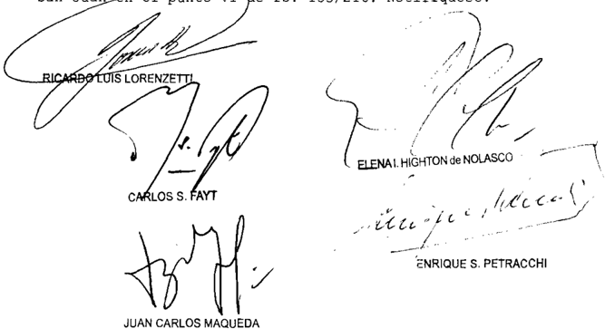

Parte actora Barrick Exploracione8 Argentinas 8 .A . representada por Dres Jimena del Valle Daneri Alberto Eduardo Bloise Alberto B . Bianchi Explorepresentada por la Dra Jimena del Valle Daneri con el patrocinio del Dr Alberto Eduardo Bloise

Parte demandada Estado Nacional representado por Dr Marcelo Adrián Bibiani con el patrocinio del Dr Sergio Ricardo . Landín

Tercero Provincia de San Juan representada por los Dres Mario Enrique Díaz Fiscal de Eetado de dicha provincia Guillormo Horacio de Sanctis

## DEL GIZZO, MARIO C/ ANSES S/ REAjuSTES vARIOS

## HABER JUBILATORIO.

Cabe remitir las actuaciones a la ANSeS a fin de que proceda a liquidar el haber inicial de la prestación y a reajustarlo de acuerdo con las pautas dadas por el pronunciamiento de la cámara, que al respecto se encuentra firme, debiendo a partir de enero y hasta diciembre de 2006 recomponer la prestación conforme el precedente 'Badaro' (Fallos: 329:3089 y 330:4866), para que la parte pueda gestionar el cobro en forma de las sumas que correspondan, devolviéndose luego las actuaciones a los efectos de continuar con el trámite de la causa.

## FALLO DE LA CORTE SuPREMA

Vistos los autos IGizzo, Mario c/ ANSeS reajustes varios" "Dek

## Considerando:

10) Que contra el pronunciamiento de la Sala II de la Cámara Federal de la Seguridad Social que desestimó agra vios de la ANSeS referentes al plazo de cumpliniento de la sentencia dispuesto en la instancia anterior Y rechazó los del jubilado vinculados con la declaración de inconstitucionalidad del art 24 de la ley 24 . 241 Y con la denegación del reajuste soli citado para el período posterior enero de 2002\_ ambas partes dedujeron recursos ordinarios de apelación que fueron concedidos en los términos del art 19 de la ley 24 . 463 (fs. 122)

2 % ) Que los planteos relacionados con el reajuste de haberes solicitado partir del mes de enero de 2002 hasta fines del año 2006 , resultan procedentes de acuerdo con 1o resuelto

por esta Corte en el precedente "Badaro" (Fallos 329:3089 330:4866) , cuyos fundamentos corresponde remitir por razón de brevedad , sin perjuicio de que al practicar la liquidación se descuenten las sunas que pudieran haberse percibido en virtud de decretos del Poder Ejecutivo que dispusieron incrementos en las prestaciones en el período indicado

Que habida cuenta de que fs \_ 167/168 el actor solicita la aplicación del precedente citado Y requiere que , una vez firme se devuelvan las actuaciones la ANSeS para que se ejecute la parte consentida del pronunciamiento, frente razones de necesidad alegadas esta Corte estima adecuado las circunstancias del caso atender la petición formulada Ya que median razones humanitarias que hacen admisible posibilitar el cobro de sus acreencias con el alcance que se solicita, sin perjuicio de la consideración ulterior por el Tribunal de los tantes agravios esgrinidos en el memorial de fs \_ 142/155 (confr\_ art 2 párrafo, del Código Procesal Civil Comercial de la Nación causa "Wittall, Reinaldo Carlos c/ ANSeS s / reajustes varios" del 16 de agosto de 2005 ) las

Que en cuanto las críticas de la demandada vinculadas con los arts22 23 de la 24 . 463 , el planteo resulta abstracto pues en virtud de la entrada en vigencia de la ley 26.153 el artículo 23 ha sido derogado Y el plazo de cun plimiento de la sentencia deberá ser adecuado al término previsto por el artículo 2 del último cuerpo legal citado ley

Por ello, el Tribunal resuelve declarar procedentes los recursos ordinarios deducidos, revocar parcialmente la sentencia apelada Y remitir las actuaciones la ANSeS fin de que proceda liquidar el haber inicial de la prestación Y reajustarlo de acuerdo con las pautas dadas por el pronunciamiento de la cánara, que al respecto se encuentra firme partir de enero de 2002 Y hasta diciembre de 2006 , deberá recomponer la prestación de conformidad con resuelto en el precedente "Badaro" para que la parte pueda gestionar el cobro en forma de las sumas que

correspondan . Fecho , devuélvanse las actuaciones los efectos de continuar con el trámite de la causa Notifíquese y cúmplase

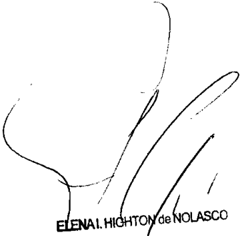

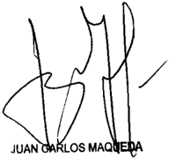

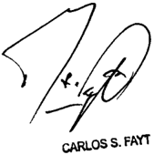

Recurso ordinario interpuesto por Mario Gizzo, actor en autob , representado por el Dr Edgardo Jorge Haissbein, en calidad do apodorado \_

Recurso ordinario interpuesto por a ANSeS demandada en autos, representada por el Dr Estoban Castro en calidad de apoderado

Traslado contestado por Mario Del Gizzo, actor en autog representado por el Dr Edgardo Jorge Waibsbein, en calidad de apoderado

Tribunal de origen: Sala II de la Cánara Federal de Seguridad Social

Tribunales que intervinieron con anterioridad: Juzgado Federal de Primera Instancia de la Seguridad Social jOSE NuCETE E HIjOS S.C.P.A. C/ LA RIOjA, PROvINCIA DE S/ AMPARO

## TRANSPORTE.

Si bien el Tribunal ha resuelto que las acciones de amparo son procedentes -de manera general- en las causas que tramitan por vía originaria, en el caso el ob-

jeto de la pretensión -obtener la declaración de inconstitucionalidad del decreto 240/2012, en cuanto prohíbe el traslado de las aceitunas en crudo producidas en la provincia, desde su dictado hasta el 31/12/2012-, exige que la tutela de los derechos y facultades constitucionales invocados se canalice por vías procesales que no se limitan a la específicamente reglada por la ley 16.986, por lo que cabe disponer que la misma se sustancie por el trámite previsto para el juicio ordinario en el C.P.C.C.N., siendo la acción declarativa -que al igual que el amparo tiene una finalidad preventiva-, el medio plenamente eficaz y suficiente para satisfacer el interés de la actora.

## TRANSPORTE.

Cabe hacer lugar a la medida cautelar requerida en el marco de la acción de amparo tendiente a obtener la declaración de inconstitucionalidad del decreto 240/2012 de la Provincia de La Rioja -en cuanto prohíbe el traslado de las aceitunas en crudo producidas en la provincia, desde su dictado hasta el 31/12/2012-, pues si bien por vía de principio medidas cautelares como las requeridas no proceden respecto de actos administrativos o legislativos, habida cuenta de la presunción de validez que ostentan, tal doctrina debe ceder cuando se los impugna sobre bases prima facie verosímiles, y de las constancias del expediente resultan suficientemente acreditadas la verosimilitud del derecho y la configuración de los presupuestos establecidos en los incisos 1º y 2º del artículo 230 del C.P.C.C.N para acceder a la medida pedida.

DICTAMEN DE LA PROCuRACIóN GENERAL

Suprema Corte:

- I -

José Nucete e hijos S.C.p.A., empresa olivícola dedicada a la elaboración de aceitunas crudas en conserva, dedujo acción de amparo en los términos de los arts. 43 de la Constitución Nacional y 1º de la ley 16.986, ante el Juzgado Federal de Mendoza, contra la Provincia de La Rioja, a fin de obtener que se declare la inconstitucionalidad del decreto 240/2012, en cuanto prohíbe el traslado de las aceitunas en crudo allí producidas fuera del territorio de la provincia, desde el momento de su dictado hasta el 31 de diciembre de 2012.

Manifestó que dicho acto local, en forma actual e inminente, lesiona, restringe, altera y amenaza, con arbitrariedad e ilegalidad manifiesta,

sus derechos de propiedad, de libre comercio y de libre circulación de personas y bienes, y los principios de legalidad, igualdad y razonabilidad, consagrados en los arts. 9º, 10, 11, 16, 17, 19, 28, 75, inc. 1º y 126 de la Constitución Nacional, puesto que le impide el traslado de las aceitunas adquiridas en la Provincia de La Rioja, correspondientes principalmente a la cosecha de febrero de 2012, sean de producción propia o derivadas de los contratos que celebró con otras empresas, hasta su planta industrial ubicada en el Municipio de Guaymallén de la Provincia de Mendoza.

Señaló que realizó una presentación ante el Secretario de Agricultura de la provincia, requiriendo la liberación de esa materia prima, pero sólo se le autorizó el traslado de 600.000 kilogramos de mercadería desde la finca C.A.C. Sociedad Anónima, que es de su propiedad y tiene una producción de 2.000.000 de kilogramos, así como también se le negó respecto de los contratos de compra celebrados con otros productores.

Solicitó como medida cautelar de no innovar, que se suspendan los efectos del acto que se pretende impugnar y se ordene a la demandada que se abstenga de aplicar el decreto 240/2012, hasta que se dicte sentencia sobre el fondo del asunto en autos.

A fs. 115/118, el juez federal se declaró incompetente, adhirió a las conclusiones de la fiscal (v. fs. 113/114) y consideró que la causa corresponde a la competencia originaria de la Corte Suprema de Justicia de la Nación, en tanto resulta ser parte la Provincia de La Rioja.

A fs. 120 bis, se corre vista, por la competencia, a este Ministerio Público.

A mi modo de ver, la cuestión de competencia en examen resulta sustancialmente análoga a la que fue objeto de tratamiento por este Ministerio Público, en la causa M. 1267. XLIV, Originario, 'Molinos Río de la Plata S.A. y otra c/ Misiones, Provincia de s/ acción declarativa de inconstitucionalidad', dictamen del 16 de diciembre de 2008, al que se remitió V.E. en su sentencia del 29 de diciembre de 2008.

En virtud de lo expuesto en esa oportunidad, cuyos fundamentos doy aquí por reproducido brevitatis causae , opino que esta acción de amparo debe tramitar en la instancia originaria de la Corte, por ser parte la Provincia de Santiago del Estero en una causa de manifiesto contenido federal. Buenos Aires, 30 de mayo de 2012. Laura M. Monti.

## FALLO DE LA CORTE SuPREMA

## Buenos Aires, 3 c

Autos Vistos; Considerando:

10 ) Que la descripción del objeto de la demanda de hechos en que se la funda , han sido debidanente reseñados en el apartado del dictamen de la señora Procuradora Fiscal, los que corresponde remitir por razones de brevedad -

20 ) Que en mérito tales antecedentes (artículos Y del Código Procesal Civil Comercial de la Nación) según 1o resuelto por esta Corte en 10s precedentes de Fallos: 316:2855 ; 327:3202, este juicio corresponde la competencia originaria prevista en el artículo 117 de Constitución Nacional

Que este Tribunal ha establecido que si bien por vía de principio medidas cautelares como las requeridas no proceden respecto de actos administrativos legislativos habida cuenta de la presunción de validez que ostentan, tal doctrina debe ceder cuando se impugna sobre bases prima facie verosímiles (Fallos: 250 :154 ; 251:336; 307:1702 ; 314 :695)

4 0 ) Que en ese sentido, de las constancias obrantes en el expediente resultan suficientemente acreditadas la verosimilitud del derecho Y la configuración de 10s presupuestos establecidos en incisos 1 0 2 0 del artículo 230 del Código Pro-

cesal Civil Conercial de la Nación para acceder 1a medida pedida

Además , en el limitado marco de conociniento propio del instituto en examen , dichos antecedentes resultan prina facie demostrativos de que la situación descripta en la demanda es sustancialmente análoga la resuelta por esta Corte en el citado pronunciamiento de Fallos: 327:3202 \_

5 " ) Que finalmente, es dable señalar que si bien el Tribunal ha resuelto que las acciones de amparo son procedentes ~de manera generalen las causas que tranitan por vía originaria (Fallos: 307:1379; 323:2107, entre muchos otros) en el sub lite el objeto de la pretensión exige que la tutela de los derechos facultades constitucionales invocados se canalice por vías procesales que no se limitan a específicamente reglada por la 16.986 por que cabe disponer que el presente se sustancie por el trámite previsto para el juicio ordinario en el Código Procesal civil Y Comercial de la Nación (arg\_ Fallos 310:877 sus citas; 311:810; 313:1062; 323:2107; C.1693.XLIV "Corrientes, Provincia de Misiones, Provincia de s / amparo" pronunciamiento del 15 de septiembre de 2009 , entre muchos otros) ley

Que la acción declarativa, al igual que el anparo tiene una finalidad preventiva, Y es un medio plenamente eficaz Y suficiente satisfacer el interés de la actora (Fallos 323:2107) para

Por ello de conformidad con dictaminado por señora Procuradora Fiscal, se resuelve I Declarar que la presente causa corresponde competencia originaria de esta Corte; II\_ Hacer lugar la medida cautelar solicitada, cuyo efecto co rresponde hacer saber la demandada que deberá abstenerse de ejecutar el decreto 240/2012 fin de notificar la medida dispuesta al señor gobernador, líbrese oficio\_ III Conceder la actora el plazo de diez días que encauce su denanda por vía para

del juicio ordinario, en virtud de dispuesto en el considerando Comuníquese Y notifíquese por cédula-

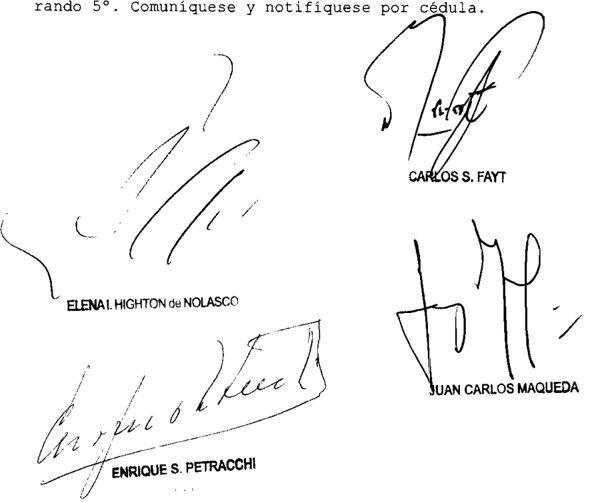

Parte actora única presentada) José Nucate Hijog representada por Ricardo A. con el Patrocinio letrado de Dra . María Cla ra Aubone

Parte demandada: Provincia de La Rioje.

yPF S.E. C/ ESSO S.A.P.A. S/ PROCESO DE CONOCIMIENTO

## VENTA DE COMBUSTIBLES.

Cabe revocar la sentencia que hizo lugar a la demanda interpuesta con el objeto de que se le abone a la actora el sobreprecio impago por las ventas de combustible para vuelos internacionales -denominados JP1-, durante todo el período de vigencia de la resolución 439/83 del Ministerio de Obras y Servicios Públicos de la Nación, pues los decretos 1246 y 1546 de 1985 que la ratificaron con efectos retroactivos en los términos del art. 19 de la ley 19.549, son ilegítimos pues la

delegación no era procedente en el caso y, por ende, la resolución dictada por un órgano incompetente, no podía ser válidamente ratificada, en razón de que las leyes 17.319 y 17.597 otorgaron al Poder Ejecutivo la facultad para fijar los precios de los combustibles pero no existía previsión legal de la que pudiera inferirse una autorización para subdelegar dicha competencia.

## REGLAMENTOS DELEGADOS.

Las atribuciones especiales que el Congreso otorga al Poder Ejecutivo para dictar reglamentos delegados, pueden ser subdelegadas por éste en otros órganos o entes de la Administración Pública, siempre que la política legislativa haya sido claramente establecida, pero no resulta suficiente invocar una ley genérica o poco específica para justificar que la subdelegación se encuentra permitida, dado que el instituto de la delegación es de interpretación restrictiva, tanto cuando ocurre entre órganos de la administración (artículo 3º de la ley 19.549), como cuando se trata de delegación de facultades de un Poder del Estado a otros, en particular, cuando se delegan facultades legislativas en órganos del Poder Ejecutivo, en tanto se está haciendo excepción a los principios constitucionales de legalidad y división de poderes.

## FALLO DE LA CORTE SuPREMA

## Buenos Aires, 3 de

Vistos los autos: 'YPF c/ Esso SAPA 5 / proceso de conocimiento' Esso S .A Petrolera Argentina c/ EN Y P) 5 / proceso de conocimiento' ; S .442 .XLV 'Shell pañía Argentina de Petróleo c / EN (MOSP) otra s / proceso de conociniento' y Shell Compañía Argentina de Petróleo c/ Estado Nacional de Econonía y 0.S . P . ) s / proceso de conocimiento'

## Considerando:

10 ) Que en las presentes causas , que fueron oportunamente acumuladas se discute la validez de las nornas que regulaban la venta del combustible para vuelos internacionales deno minado así como los montos que , según esas normas , debían abonar las empresas refinadoras la ex empresa estatal Y .P .F Sociedad del Estado por las ventas realizadas durante el período

de su vigencia, comprendido entre el de junio de 1983 el 31 de diciembre de 1990 , cuando la actividad fue desregulada Con cretanente, en los expedientes de referencia se plantearon las si guientes cuestiones a) En la causa "YPE S .E Esso SAPA" (expediente Y.18 .XLV) iniciada el 22 de julio de 1985 , la ex YPE Sociedad del Estado denandó Esso por no haber abonado el "sobreprecio" fijado por la resolución del Ministerio de Obras Servicios Públicos 439/83 ~ratificada por decreto 1246/85para el petróleo crudo vendido por la ex empresa estatal utilizado para elaborar el combustible denominado JP1, destinado vuelos internacionales \_ c/

b) En la causa "Esso SAPA c / Estado Nacional (expediente E.97 .XLV) iniciada el 19 de agosto de 1985 , Esso demandó al Estado Nacional con el objeto de que se declarara nulidad de a resolución 439/83 Y del decreto 1246/85 . El Estado Nacional no reconvino c) En la causa Shell CAPSA c / Estado Nacional Y .P . F S .E (expediente S.442 .XLV) iniciada el de febrero de 1986 , Shell demandó al Estado Nacional Y . P .F\_ S .E . con el objeto de que 1 Se declarara nulidad de la resolución 439/83 Y de su decreto ratificatorio 1546/85 ; Se le reintegrara abonado bajo reserva en concepto de "sobreprecio" fijado por las normas citadas durante el período al 30 de junio de 1983

Por su parte, al contestar demanda , Sociedad del Estado reconvino por diferencias en menos de abonado por Shell , sobre la base de que , al calcular el sobreprecio, presa no habría respetado 10 previsto en Télex YPF 2537/83 y 4669/83 , en 10 relativo la fecha considerar en determinación del tipo de canbio aplicable\_ El Estado Nacional no reconvino d) En la causa "Shell CAPSA c / Estado Nacional S .A . (expediente 443 .XLV) iniciada el 30 de junio de

1994 , con posterioridad la privatización de YPF Sociedad del Estado , Shell interpuso una nueva demanda en la que 1 Reiteró su acción contra el Estado Nacional por la nulidad de la resolución 439/83 del decreto 1546/85; 2 Solicitó YPF SA al Estado Nacional el reintegro de abonado oportunamnente la ex YPF Sociedad del Estado en concepto de "sobreprecio" durante el período de julio de 1983 31 de diciembre de

Por su parte, al contestar demanda , YPF SA reconvino 1 Las diferencias adeudadas del sobreprecio pagado, sobre la base de que para calcular el monto del sobreprecio Shell había deducido las bonificaciones realizadas los consumidores al vender el JPl , 1o que no estaba previsto ni autorizado por las normas citadas 2 Los períodos impagos en concepto de breprecio, dado que Shell había dejado de pagar partir del 1 0 de enero de 1987 por

El Estado Nacional, al contestar demanda , también reconvino contra Shell por los misnos conceptos que YPF S .A . para el caso de que fuera el Estado Nacional no 1a empresa privatizada el acreedor de montos discutidos en el juicio, en razón de 10 dispuesto por el artículo 1 0 del decreto 546/93

La sentencia de prinera instancia, en lo que aquí interesa, decidió declarar la validez de las normas impugnadas por ende condenó las empresas Esso Y Shell abonar el sobreprecio impago \_

Posteriormente, raíz de un pedido de aclaratoria interpuesto por Shell, sobre de que sentencia no ha bía especificado si 1a condena debía abonarse al Estado Nacional YPF S .A . se dispuso que el titular del crédito era el Estado Nacional base

La Sala IV de Cámara Nacional de Apelaciones en 10 Contencioso Administrativo Federal confirmó parcialmente la sen tencia de la instancia anterior Y decidió:

Hacer lugar la demanda interpuesta por Sociedad del Estado contra Esso con el objeto de que se le abo-

nara el sobreprecio impago por las ventas de combustible JPl, durante todo el período de vigencia de la resolución 439/83 (expediente Y.18 .XLV)

2 Rechazar las acciones interpuestas por Esso Shell contra el Estado Nacional por la nulidad de la resolución 439/83 Y de su5 decretos ratificatorios 1246/85 Y 1546/85 (causa5 "Esso SAPA c/ Estado Nacional" expediente E.97 .XLV; "Shell CAPSA c/ Estado Nacional S .E . expedientes S .442 .XLV 443 .XLV) así como 1a solicitud de Shell para que se le reintegrara 10 abonado bajo reserva en concepto de sobreprecio" (causa "Shell CAPSA c/ Estado Nacional Y .P .F S .E . expedientes S . 442 .XLV S .443 XLV)

3 Hacer lugar las reconvenciones deducidas por YPF SA Y el Estado Nacional contra Shell en el expediente S .443 .XLV por: 1 Las diferencias adeudadas por haber descontado bonificaciones para calcular el sobreprecio pagado ; 2 Los periodos impagos desde el 10 de enero de 1987 Asimismo, confirmó 10 dispuesto por la aclaratoria en cuanto que el Estado Nacional era el titular de créditos las

4 Revocar la sentencia de primera instancia en cuanto había tenido por válidos los Télex emitidos por la ex Y .P .F \_ S .E \_ que regulaban la fecha que debía considerarse para determinar el tipo de cambio aplicable al calcular el sobreprecio En este punto, la cámara consideró que los Télex eran ilegítimos Y, por ello, ordenó practicar una nueva liquidación la deuda de acuerdo con parámetros fijados por la resolución 649/82, sin consideración de dispuesto por 1os Télex impugnados por las empresas Esso Y Shell\_

5 = Con relación las costas, decidió: a) imponer las de la instancia anterior Y respecto del Estado vencedor empresas Esso Y Shell; b) imponer las costas de alzada Shell, Esso Y al Estado Nacional en la medida de sus respectivos vencimientos; c) imponer YPF S .A las costas del incidente respecto de la titularidad del crédito, así como las derivadas las

de honorarios de sus profesionales en defensa del fondo del asunto

2 0 ) Que para decidir del modo en que 10 hizo, la cánara consideró que a) El vicio de incompetencia en razón del grado de las resoluciones 649/82 Y 439/83 , que establecían el precio di ferencial "sobreprecio" impugnado por las empresas refinadoras, no era suficiente para anularlas Ello era así, porque las resoluciones habían sido ratificadas mediante los decretos 1246/85 Y 1546/85 por el Poder Ejecutivo, que era el organismo competente para fijar precios en materia hidrocarburos Adenás , esa ratificación implicaba su saneamiento con efectos retroactivos, en los términos del artículo 19, inciso de la 19.549 ley

b ) La decisión de cobrar un precio diferencial 50 breprecio" por el petróleo crudo utilizado para elaborar el com bustible denominado destinado vuelos internacionales, no resultaba irrazonable Ello era así, porque en ese momento el mercado se encontraba regulado Y .P .F \_ S .E vendía petróleo crudo las empresas refinadoras un precio que , generalmente, era inferior al En tales condiciones, resultaba legítima finalidad estatal de impedir que las empresas obtu vieran una ganancia considerada excesiva al vender al exterior, precios internacionales productos elaborados partir de un petróleo crudo adquirido un precio subsidiado c) Las empresas refinadoras privadas no habían logrado denostrar que el pago del sobreprecio les ocasionara un que branto en su actividad ni tampoco que les impidiera obtener una utilidad razonable Se habían limitado acreditar que el ingres0 que obtenían por venta de combustible JPl al exterior era inferior al que les procuraba venta de combustible para vuelos de cabotaje, eso no resultaba suficiente para concluir que el sobreprecio era ilegítimo\_

d) Sin perjuicio de ello, asistía razón Y Esso en cuanto 1a ilegitimidad de Télex de la ex YPF So -

ciedad del Estado \_ En esas comunicaciones la ex empresa del Es tado había excedido las facultades que le otorgaba el artículo de resolución 439/83 para implementar la mecánica necesaria para ejercer el contralor de 1os volúmenes de producto al canzados por la presente norma la forma en que las empresas alcanzadas por la presente harán efectivo el pago" había tructurado un sistema de pago diferido que modificaba Y contradecía el previsto en las resoluciones ministeriales 649/82 439/83Por ese motivo correspondía modificar la sentencia de la anterior instancia en ese punto ordenar una nueva liquidación del monto de la deuda sobre la base de los parámetros fijados por la resolución 649/82 , sin consideración de las modificaciones establecidas por Télex impugnados e) Por otra parte, en cuanto la titularidad de créditos resultantes, correspondía reconocerlos favor del tado Nacional Y no de Y .P .F\_ Sociedad Anónima Ello era así, porque "por encima de que el crédito estuviere no registrado en la contabilidad de Sociedad del Estado , su naturaleza 10 lleva caracterizarlo como una compensación resultante de su calidad estatal Y como herramienta de gobierno Y de ningún modo como un crédito emergente de una operación que tuviera la misma naturaleza comercial que posee Sociedad Anónima

Contra esa decisión, Y .P .F\_ Sociedad Anónima Shell Compañía Argentina de Petróleo S .A Y Esso Petrolera Argentina Sociedad de Responsabilidad Limitada dedujeron recursos ordinarios de apelación, que fueron concedidos fs 1499/1499 vta del expediente fs 969 del expediente E .97 .XLV, fs 1163 del expediente 5 .442 .XLV , fs\_ 1540 1543 del expediente S . 443 .XLV

Las recurrentes presentaron sus memoriales fs 1515/1550 1552/1620 del expediente Y.18 .XLV ; fs 980/1010 del expediente E.97 .XLV; 1180/1215 vta. Y 1217/1287 del expe diente S .442 . XLV; Y fs\_ 1569/1604 Y 1605/1674 del expediente Los escritos de expresión de agravios fueron respon didos fs\_ 1627/1653 vta. , 1659/1686 vta . 1693/1724 , 1725/1790

vta. del expediente Y .18 XLV ; fs \_ 1020/1048 vta del expe diente E 97 . XLV; fs 1294/1319 vta 1326/1353 vta 1360/1389 vta. Y 1390/1462 del expediente Y fs\_ 1681/1707, 1713/1740 vta. 1747/1776, 1777/1851 del expediente S .443 .XLV

30 ) Que 1os recursos ordinarios interpuestos por las empresas Shell Esso resultan formalmente admisibles toda vez que se trata de una sentencia definitiva en un pleito en que el Estado Nacional es parte, se discuten cuestiones que afectan en forma directa el patrimonio estatal, Y el valor disputado en último término, supera el mínimo establecido por el artículo 24 , inciso 6 ' ap . del decreto-ley 1285/58 modificado por 1a ley 21 .708 Y reajustado por la resolución 1360/91 de esta Corte

4 % ) Que en sus memoriales las apelantes refieren que al momento del dictado de las resoluciones que impugnan, el mercado de hidrocarburos estaba fuertemente regulado , Y la ex YPF Sociedad del Estado prácticamente tenía el monopolio de 1a ex ~ tracción de petróleo crudo Relatan que de ese crudo , la ex presa estatal utilizaba una parte para sus actividades de refinación Y vendía el resto refinadoras vadas Señalan que , tanto el precio del petróleo crudo como el de algunos los combustibles derivados, eran fijados por el Poder Ejecutivo Na cional, de conformidad con l0 previsto por los artículos 2 0 Y 3 0 de la 17.597 Y el artículo 6 0 de la 17.319 pri ley ley por

Concretamente, las apelantes explican que el precio oficial de 1os combustibles destinados al mercado interno estaba integrado por dos conceptos , ambos determinados por el Estado el valor de retención (que constituía la remuneración de las em presas) el gravamen la transferencia de combustibles líquidos derivados del petróleo, ello según lo previsto en el artícu1 0 de 1a 17.597\_ Destacan que , adenás la ley garantizaba , en su artículo 3 0 que es0s valores de retención serían fijados en forma tal que permitieran las empresas cubrir su5 costos obtener una utilidad razonable ley

Asimismo, recurrentes señalan que el artículo de la ley 17.319 imponía otra obligación para el Estado Nacional las

al fijar 10s precios de 10s combustibles Puntualmente, refieren que la norma exigía que se otorgara un trato igualitario las empresas privadas con respecto la ex YPF Sociedad del Estado

Después de reseñar el marco normativo del mercado de hidrocarburos, las apelantes relatan que el Ministerio de Obras Servicios Públicos dictó la resolución 649/82 , que reguló la venta de combustibles al exterior dispuso que las refinerías privadas debían abonar un precio diferencial "sobreprecio" por el petróleo crudo comprado YPF SE cuando 10s combustibles elaborados con ese petróleo fueran destinados la exportación Las recurrentes explican que según surgía de la motivación de la norma la resolución había tenido en cuenta que YPF Sociedad del Estado vendía el crudo las refinerías privadas un precio sustancialmente más bajo del que regía en el mercado internacional Por esa razón, el sobreprecio tenía la finalidad de equiparar el precio del crudo los niveles internacionales, Y dado que no era posible deterninar de antemano la cantidad de crudo utilizada para combustibles destinados la exportación, la resolución había previsto que el sobreprecio sería pagado YPF Sociedad del Estado con posterioridad la realización de las ventas

En 10 que al caso interesa, las apelantes manifiestan que la citada resolución 649/82 no había incluido entre 10s bustibles destinados al exterior al que utilizan las aeronaves denominado JPI Al advertir esa omisión el Ministerio de Obras Servicios Públicos dictó la resolución en la que dispuso encuadrar dentro de alcances de la resolución 649/82 al combustible JPl destinado vuelos internacionales, cuyo precio era fijado oficialmente acorde con los precios vigentes en el mercado internacional Para el caso del JP1 , la resolución previó que el sobreprecio sería calculado como "1a diferencia entre 10s precios oficiales internacionales Y destinados cabotaje, descontando los impuestos derechos de exportación, si 10s hubiere" (artículo 2 % )

Las recurrentes Esso Y Shell relatan que , contra esa resolución ministerial, interpusieron recursos administrativos

que fueron rechazados por el Poder Ejecutivo Nacional mediante los decretos 1246/85 Y 1546/85 Destacan que , al desestimar sus recursos, el Poder Ejecutivo reconoció que el de Obras Servicios Públicos era incompetente para dictar las resoluciones 649/82 Y 439/83 pero consideró que al tratarse de un vicio de incompetencia en razón del grado era posible subsanarlo Y , por ende ratificó las resoluciones con efectos retroactivos de conformidad con lo previsto por el artículo 19 de la 19.549 ley partir de 10 expuesto, las apelantes explican que en las causas de referencia que se encuentran estudio de este Tribunal\_ se discute la legitimidad aplicación de las resoluciones que impusieron el sobreprecio al petróleo crudo utilizado para la elaboración de JPl para vuelos internacionales, así como la validez de 1os decretos que las ratificaron Y sus efectos Concretamente, en esta instancia se agravian de 10 resuelto por jueces de cámara porque consideran que los

a) El sobreprecio previsto en las normas impugnadas era excesivo no les permitía obtener una utilidad razonable, la que tenían derecho según el artículo 3 0 de la ley 17.597Sostienen que esta circunstancia había quedado demostrada con las pruebas periciales producidas en la causa, según las cuales "el réginen de sobreprecios establecido por la resolución 439/83 generaba un importante quebranto mi mandante si se compara sus resos por las ventas de JPl para vuelos internacionales con 10 que hubiese percibido por igual volunen de ventas de JPl para cabotaje ( Ese quebranto, claramente probado en autos, demues tra el incumplimiento del deber del Estado de fijar precios que permitan refinadoras privadas cubrir sus costos Y obtener una utilidad razonable" las b) El modo de cálculo del sobreprecio fijado en la resolución 439/83 era irrazonable, Ya que no tenía en cuenta el precio real que las refinadoras percibían por las ventas del combustible JPl, sino el precio oficial fijado por la Secretaría de Energía En este punto, explican que el precio real de venta era inferior al oficial, ya que la ex YPF SE realizaba bonifica-

ciones quienes compraban combustible JPl Y, como tenía una pO sición doninante en el mercado esto obligaba al resto de las empresas otorgar bonificaciones similares sus compradores \_ Alegan que , en tales condiciones, el sobreprecio fijado sobre la base de precios oficiales no tenía sustento fáctico suficiente era, por 10 tanto, irrazonable.

c) El sobreprecio también era violatorio del artículo del decreto-ley 17.319 en tanto no respetaba la obligación del Estado Nacional de otorgar un trato igualitario YPF Sociedad del Estado Y las refinadoras vadas , fijar el precio de comercialización del petróleo crudo en el mercado interno pri d) Asimismo, aducen que la resolución 439/83 se encontraba afectada por el vicio de desviación de poder , al no cumplir con sus fines declarados Alegan que de la motivación de las resoluciones 649/82 Y 439/83 surge que la finalidad del breprecio era equiparar el valor oficial del petróleo crudo al precio internacional Se agravian porque consideran de los dictámenes periciales obrantes en la causa, surge que si al cio oficial del crudo se le sumaba el sobreprecio, las refinadoras privadas terminaban pagando un valor superior al precio internacional que

e ) Por otra parte, consideran ilegítimos 1os decretos 1246 1546 de 1985 , que ratificaron las resoluciones 649/82 439/83 , en términos del artículo 19 de la ley 19.549 10s

Los apelantes alegan el citado artículo 19 no era aplicable al caso Y, por ende , 1a resolución 439/83 , que fue dictada por un órgano incompetente, no podía ser válidamente ratificada con efectos retroactivos que

Por un lado sostienen que el articulo 19 de la 19.549 solo resulta aplicable actos administrativos de cance individual, la resolución 439/83 era un reglamento, por que no era susceptible de ratificación ley al -

Por otra parte, alegan que según el artículo 19 de la 19.549 la ratificación so10 procede cuando "la avocación, ley

delegación sustitución fueran procedentes" 1o que no ocurría en este caso Explican que facultad de fijar los precios de los combustibles correspondía al Poder Ejecutivo Nacional Y éste no estaba autorizado para delegarla . Por ello, concluyen que el saneamiento intentado por los decretos 1246 Y 1546 de 1985 no fue válido \_

Se agravian porque jueces de las instancias anteriores consideraron que el artículo 14 de la de ministerios 22 . 520 , vigente al momento del dictado de la resolución 439/83 el artículo 97 de la ley 17.319 permitían al Poder Ejecutivo Nacional delegar las facultades que aquí se discuten. Sostienen que esas dos normas son generales inespecíficas Y no pueden interpretarse como una autorización suficiente para delegar ley f) Por su parte, Shell se agravia porque sostiene que parte de las diferencias reclamadas su empresa, relativas al descuento de bonificaciones al calcular el sobreprecio paga do , se encuentran prescriptas \_ Concretamente, explica que YPF S .A el Estado Nacional dedujeron reconvenciones por ese con cepto el 21/9/1995 el 20/11/1995 , por 10 que sostiene que se encuentran prescriptas las diferencias anteriores al 21 de septiembre de 1985 Y al 20 de noviembre de 1985 , respectivamente las

Por otro lado , Esso se queja porque considera que respecto de su empresa, no resulta procedente la condena favor del Estado Nacional decidida por la cámara Explica que ello es así porque el reclamo Esso se discutió en el expediente Y. 18 .XLV , en el que el Estado Nacional no fue parte h) Finalmente, ambas apelantes se quejan por el modo en que cámara distribuyó las costas del juicio en ambas instancias

5 ' ) Que 10s agravios identificados en el considerando anterior con letras a, b , Y no pueden prosperar\_

Las apelantes alegan que el sobreprecio era ilegítimo Ahora bien, justificar tal afirmación, las recurrentes tenían que demostrar que el sobreprecio había sido fijado en para

violación 10 dispuesto en las leyes 17.319 17.597 , que eran las norma 5 que otorgaron la competencia al Poder Ejecutivo, que su vez le impusieron os límites para su ejercicio Con cretamente, debían probar que el sobreprecio les impedía cubrir 10s costos de su actividad obtener una utilidad razonable, en términos del artículo 30 de la ley 17.597 10s

Las pruebas que invocan en sustento de su postura no acreditan esa circunstancia Las apelantes insisten en que los ingresos por las ventas de JPl para vuelos internacionales eran inferiores percibidos por igual volumen de ventas de JPl para cabotaje, de allí deducen , automáticamente sin mayor explicación, que el sobreprecio "generaba un importante quebranto mi mandante" "demuestra el incumplimiento del deber del Estado de fijar precios permitan las refinadoras cubrir costos obtener una utilidad razonable (art\_ 3 0 de ley También alegan que el sobreprecio era excesivo porque no tenía en cuenta las bonificaciones que las refinadoras se ían obligadas realizar en sus ventas internacionales, porque el valor total que terminaban pagando por el crudo era mayor precio internacional que

Sin embargo , ninguno de esos planteos ~aun cuando se consideraran debidamente probados en el expedienteresulta su ficiente para acreditar ilegitimidad del sobreprecio El hecho de que el sobreprecio hiciera menos rentable la venta de JPl al exterior, no demuestra que el Estado haya ejercido su competencia fuera de los límites que le impusieron las leyes 17.319 17.597 Para denostrar ese incumplimiento legal , las recurrentes tendrían que haber producido prueba relativa los costos de su actividad y cuál era la utilidad que consideraban razonable No hicieron oportunamente, no pueden suplir esa omisión en esta instancia con otras pruebas que sól0 demuestran que el sobreprecio disminuía la rentabilidad del negocio. Al respecto, cabe recordar quien invoca ciertos hechos como fundanento de pretensión tiene carga de acreditarlos (artículo 377 del Código Procesal Civil Y Comercial de Na ción) si no logra cumplir con esa carga mediante la actividad que

probatoria desarrollada durante el juicio, corre el riesgo de que su reclamo sea denegado \_

Finalnente, tampoco asiste razón 1as apelantes en cuanto sostienen que el sobreprecio era violatorio del artículo del decreto-ley 17.319, por no respetar la obligación del Es tado Nacional de otorgar un trato igualitario YPF Sociedad del Estado Y las refinadoras privadas De la lectura del articulo citado resulta, con toda claridad, que esa norma só10 se refiere períodos en que la producción nacional de hidrocarburos no cance cubrir las necesidades internas del país, que no ocurría al monento en que se dictaron las normas que fijaron el sobreprecio Las recurrentes invocan esta norma en sustento de su posición, sin fundamentos sólidos Admiten que 1a norma se refiere períodos de desabastecimiento, pero alegan que el Es tado Nacional YPF no invocaron oportunamente su inaplicabilidad, Y consideran que los jueces no pueden decidirlo de oficio\_ Este argumento no resiste el menor análisis en tanto no propone una interpretación distinta del artículo en juego tampoco tiene en cuenta el principio iuris novit curia.

Que , sin embargo, asiste razón Esso Y Shell en cuanto, en el agravio identificado con la letra e , aducen la ilegitinidad de los decretos 1246 1546 de 1985 , por haber ratificado la resolución 439/83 con efectos retroactivos, en los términos del artículo 19 de la ey

En este punto, cabe recordar que el artículo 19 de 1a ley 19.549 prevé que l0s actos dictados con incompetencia en razón del grado pueden ser ratificados por el órgano superior, con efectos retroactivos fecha de su emisión, siempre que la avocación, delegación sustitución fueran procedentes

Ahora bien, tal como señalan 1os apelantes, la delegación no era procedente en este caso Y, por ende , la resolución 439/83 , había sido dictada por un órgano incompetente, no podía ser válidamente ratificada En efecto las leyes 17.319 17.597 otorgaban al Poder Ejecutivo Nacional la facultad para fijar precios de combustibles, Y no existía previsión que los

legal de la que pudiera inferirse una autorización para subdeleesa gar

Al respecto, esta Corte tiene dicho que atribuciones especiales que el Congreso otorga al Poder Ejecutivo para dictar reglamentos delegados pueden ser subdelegadas por éste en otros órganos entes de la Administración Pública, siempre que la política legislativa haya sido claramente establecida (Fallos: 318 :137; 330:1855) Sin embargo , Y en esto asiste razón las apelantes, no resulta suficiente invocar una ley genérica poco específica para justificar que la subdelegación se encuentra permitida En este punto, cabe recordar que el instituto de la delegación es de interpretación restrictiva, tanto cuando ocurre entre órganos de la administración (artículo 3 de la ley 19 .549) comO cuando se trata de delegación de facultades de un Poder del Estado otros , en particular, cuando se delegan facultades legislativas en órganos del Poder Ejecutivo, en tanto se está haciendo excepción los principios constitucionales de legalidad división de poderes (Fallos: 326:2150, 4251) las

En tales condiciones no puede entenderse que la de legación encontraba permitida, con el simple argumento de que el entonces vigente artículo 14 de la de ministerios autorizaba en forma genérica al Poder Ejecutivo Nacional delegar fa cultades en ministros Ello es así, porque de los propios términos del artículo citado resulta que autorización allí prevista es para delegar "facultades relacionadas con las materias que le competen" es decir, aquéllas propias del Poder Ejecutivo como se ha señalado, la interpretación de este tide normas debe ser restrictiva, por 10 que no cabe entender que esa autorización también permite subdelegar aquellas tades que el Ejecutivo recibe por vía de delegación legislativase ley 1os

Por similares motivos, tampoco resulta suficiente invocación del artículo 97 de la ley 17.319, pues esta norma se limita disponer que la entonces Secretaría de Estado de Energía Minería los organismos que dentro de su ámbito se determinen, es la autoridad de aplicación de dicha Esta previley

sión no hace referencia concreta las facultades de fijación de precios que la reconoce al Poder Ejecutivo, la simple de terminación de la autoridad de aplicación del régimer resulta notoriamente insuficiente como autorizaciór para subdelegar esa competencia en otro organismo de inferior jerarquía ley

En consecuencia, corresponde admitir el agravio las apelantes en este punto, ya que no existía habilitación legislativa para que el Poder Ejecutivo subdelegara las facultades que 1e otorgaban leyes 17.319 y 17.597 en materia de fijación de precios Y, por ello, la resolución 439/83 no pudo ser ratificada en forma retroactiva, en términos del artículo 19 de la ley 19 .549 1os

70 ) Que , asimismo, asiste razón Shell en cuanto, en el agravio identificado con la letra f , alega que parte del crédito reclamado por el Estado Nacional su empresa se encuen tra prescripto\_

Según surge de las constancias de la causa , las diferencias en concepto de bonificaciones indebidamente descontadas sól0 fueron reclamadas Shell en el expediente S .443 .XLV , me diante las reconvenciones deducidas por YPF S .A . Y el Estado Na cional el 21/9/1995 el 10/11/1995 , respectivamente (fs 187 vta /192 vta. Y 221 vta./223 vta del expediente citado) Es importante resaltar que en el expediente la ex YPF Sociedad del Estado s610 reconvino por diferencias derivadas del de cambio aplicable (ver fs 73/80) las tipo

Ahora bien, el Estado Nacional no intimó ni constituyó en mora Shell con anterioridad la reconvención interpuesta en el expediente S . 443 . XLV citado\_ Por ese motivo, teniendo en cuenta el plazo de prescripción decenal aplicable al caso, no tiene derecho exigirle las diferencias en concepto de bonificaciones anteriores al 10 de noviembre de 1985\_

Finalmente, atento al modo en que se resuelve este juicio de conformidad con 10 que se expondrá en el considerando 11 , resulta innecesario tratar la cuestión de la prescripción respecto de YPF S .A

Que , por otro lado , resulta inadmisible el agravio planteado por la empresa Esso respecto de la improcedencia de la condena en favor del Estado Nacional

Esso solicita el rechazo total de 1a demanda porque considera que a) YPF S .A . no es titular del crédito por sobreprecio, tal como 1c decidió la cámara, Y b) el Estado Nacional no reclamó pago alguno respecto de Esso, por no haber sido parte en el expediente Y . 18 XLV

Ahora bien, el expediente Y .18 XLV fue iniciado por la ex YPF Sociedad del Estado en el año 1985 , las tres etapas del juicic fueron desarrolladas concluidas antes de su privatización, por 10 que el crédito fue correctamente reclamado por quien tenía legitimación activa

El problema dilucidar en este expediente, en realidad , se relaciona con cuestiones diferentes las planteadas por Esso Y tiene que ver con las normas que rigieron la transforma ción Y privatización de la ex sociedad estatal, específicamente, las que regularon: a) quién correspondía hacerse cargo de la defensa de los intereses de la ex YPF SE Y, b ) quién era el tular de 10s créditos de causa anterior al 31 de dicienbre de 1990 ti -

En este punto, precisanente, argumentos de la apelante no logran rebatir dos circunstancias que obstan la procedencia de su agravio: a) que YPF asumió defensa de ex Sociedad del Estado Esso n se opuso su actuación en tal carácter; Y b) que , posteriormente, Y s610 1os efectos de defenderse en el eventual conflicto surgiera respecto de la titularidad del crédito que se discutía, el Estado Nacional se presentó fue tenido como parte en el expediente, 1o que Esso tampoco impugnó en forma oportuna 10s que

Al respecto, cabe destacar que YPF S .A asunió 1a fensa de los intereses de la ex empresa estatal, por ser su con tinuadora según las normas que regularon la vatización Además , la empresa dejó claro que se hacía cargo de la representación, sin perjuicio de que ulteriormente se decidiera que el pri

crédito correspondía al Estado Nacional no YPF S .A. , de confornidad con lo dispuesto por la ley 24 .145 Y su decreto reglamentario 546/93 \_

En efecto, con posterioridad la privatización, YPF informó al Ministerio de Econonía Obras Servicios Públicos que continuaría la representación judicial de la ex presa estatal en todos juicios generados en causa título anterior al 31 de diciembre 1990 , en tanto no recibiera instrucción en contrario de ese ministerio (ver fs 67 del expe diente S .443 .XLV) En este mismo sentido, en escritos de fs 270/271 del expediente S .443 .XLV Y fs 1552/1620 del expediente Y.18 .XLV , YPF S .A expresó que su intervención en las causas era en nombre de a ex YPF SE \_ Concretamente, sostuvo que "Dada la continuidad societaria Y empresaria existente en estos procesos , la intervención natural de YPF S .A..resultaba imprescindible obligada, ya que no existía una XPF Residual' que pudiere asu mir la representación de la misma así 1o hizo S .A tanto en estos procesos acumulados . como en la totalidad de juicios en trámite (ver fs 1610/1613 del expediente Y.18 XLV) Por demás aclaró que el "Decreto 546/93 , en manera alguna aparta ni sustituye mi representada en su carácter de parte legitinada en el juicio, en razón de haber sido el organismo al que se debía ingresar el sobreprecio en discusión La ferida norma sól0 obliga citar en calidad de tercero al Es tado Nacional, por tratarse de un reclamo de título causa gen anterior al 31/12/90, para 1a eventualidad de que de la condena pudiera verse afectado beneficiado como consecuencia de 10 dispuesto por el citado Decreto 546/93" (fs. 270/271 del ex = ente que re oripedi partir de 10 expuesto, no puede aducirse ~como hace Essoque YPE S .A . sólo ejercía la defensa del juicio para el caso de que el crédito le fuera finalmente reconocido su empresa.

Es cierto que , posteriormente, surgió un conflicto de intereses entre YPE S .A Y el Estado Nacional, que se refleja en

la expresión de agravios de YPF de fs 1336/1398 del expediente Y . 18 XLV Sin embargo, en ese momento antes del dictado de la sentencia de segunda instancia, el Estado Nacional se presentó pidió ser tenido como parte. fs 1209 se hizo lugar su petición Esso no impugnó esa decisión En consecuencia, 1a revocatoria que solicitó respecto de la providencia de fs 1485 , con motivo de una nueva presentación del Estado , resulta tardía Y , por ende , inadmisible, tal como decidió el quo fs 1503 (expediente Y.18 .XLV)

En tales condiciones reparos de apelante no fueron oportunanente introducidos cuestión que ahora plantea resulta incompatible sus conductas anteriores por que el agravio resulta inadmisible Ello, con mayor razón , si se tiene en cuenta que postura de la recurrente conduce necesariamente se rechace totalmente la demanda en su contra aun cuando comO se ha explicado en 10s considerandos anteriores, ha quedado demostrado que Esso tiene una deuda con la ex YPF So ciedad del Estado por el sobreprecio que nunca pagó \_ que

9 ' ) Que , por demás , resultan inadmisibles los agravios relativos la imposición de costas Ello es así, porque las recurrentes se limitan reiterar argumentos relativos al fondo del asunto que justifican, su criterio, apartarse del principio general en la materia\_ Pero esas afirmaciones son meramente dogmáticas no constituyen una crítica concreta razonada de decidido por la cámara en este aspecto \_

10) Que, finalmente, corresponde tratar el recurso ordinario interpuesto por YPF S .A . que se agravia porque la sentencia del quo :

a) Consideró que la titularidad de los créditos reconocidos en concepto de sobreprecio correspondía al Estado Naciono ella nal b) Decidió que asistía razón Shell Esso en cuanto la ilegitimidad de Télex emitidos por la ex YPF So ciedad del Estado Y, en consecuencia, ordenó una nueva liquida-

ción del monto de la deuda sobre la base de 10s parámetros fijados por la resolución 649/82, y sin consideración de las modificaciones establecidas por Télex impugnados c) Impuso YPF S .A las costas derivadas de los honorarios de sus profesionales en la defensa del fondo del asunto

En primer lugar, cabe señalar que recurso ordinario resulta formalmente admisible en 10 relativo al agravio identificado con la letra a, toda vez que allí se discuten cuestiones que afectan en forna directa el patrimonio estatal, Y el valor disputado en último término, supera el mínimo establecido por el artículo 24 , inciso 6 ' ap . a , del decreto-ley 1285/58 , modificado por la ley 21 .708 Y reajustado por la resolución 1360/91 de Corte \_

sin embargo, el remedio no puede admitirse respecto de restantes agravios ya que la apelante no ha denostrado que en las cuestiones que allí se discuten, se encuentre afectado el patrimonio estatal directa indirectanente, que constituye requisito indispensable para su adnisibilidad (Fallos: 323:2785; 326:1176, 3465 , entre otros)

En el agravio identificado con la letra b , YPF realiza planteos sobre el fondo del asunto, para el caso de que se decida su favor la titularidad del crédito por sobreprecio Ahora bien, en esas quejas s610 se encuentran en juego sus intereses y los de las empresas Shell Esso \_ En efecto, aun cuan do se reconociera el crédito favor de YPF S .A . la discusión sobre el alcance de la deuda no tendría efecto alguno sobre el patrinonio del Estado Nacional

Por otra parte, el recurso tampoco resulta admisible respecto del agravio identificado con 1a letra Según el régi men establecido por la ley 24 .145 Y su decreto reglanentario 546/93 , el pago de 1os honorarios fijados judicialnente 10s letrados apoderados de YPF S .A debe ser afrontado por 1a presa, no involucra en modo alguno el patrimonio del Estado Nacional Ello es así, pues el artículo inciso del para

creto 546/93 establece que La asunción por el Estado Nacional de las obligaciones descriptas en los incisos Y 2 del artículo de este decreto que hubieran sido reclamadas judicialmente en procesos en tránite la fecha del presente, no se extenderá las costas decretadas en dichas condenas como cargo de Sociedad Anónina por parte que corresponda 1os apoderados , procuradores, letrados peritos consultores técnicos designados por Y .P .F\_ Sociedad Anónima para su defensa, representación asesoramiento en 10s procedimientos señalados"

partir de expuesto, tal como ha sostenido este Tribunal, cuando los honorarios regulados judicialmente que debe abonar YPF S .A se encuentran comprendidos en la excepción prevista en el primer Párrafo del artículo inciso 4 0 del decreto 546/93 , la discusión sobre su pago no compromete el pa trimonio de la Nación Y , por 1o tanto, no habilita la vía ordinaria ante esta Corte (ver causa F.708 XLIV "Fisco Nacional (D.G.I.) c/ Yacinientos Petrolíferos Fiscales Soc del Estado ejecución fiscal DGI" fallada el 6 de octubre de 2009)

11) Que , sentado 1o anterior, corresponde tratar el agravio identificado con letra a, relativo la titularidad del crédito por sobreprecio\_

En este punto, no asiste razón la apelante porque las pruebas que invoca en sustento de su postura no resultan ficientes para demostrar que , de conformidad con lo previsto por el artículo 9 0 de la ley 24 .145 Y su decreto reglanentario 546/93 , YPF tiene derecho al crédito que se discute en este juicio\_

Al respecto, cabe recordar que el artículo 9 0 citado dispuso que "E1 Estado Nacional asumirá todos créditos deudas originadas en causa , título compensación existente al 31 de diciembre de 1990 , que no se encuentren reconocidos como tales en 1os estados contables de Yacimientos Petrolíferos Fiscales Sociedad del Estado dicha fecha, que fueran auditados por la sindicatura General de Empresas Públicas"

En igual sentido , el artículo 1 del decreto reglamnentario 546/93 previó, en 10 al caso interesa, que: "El Es tado Nacional asume por este acto: 1 \_ Todos créditos todas las deudas de Y .P .F\_ S .A \_ originados en causa, título sación, existentes al 31 de diciembre de 1990 Y que no hubieran sido objeto de stración asiento en libros Y registros contables de Yacimientos Petrolíferos Fiscales Sociedad del tado, en base los cuales se confeccionaron los Estados Contables de esta última empresa al 31 de diciembre de 1990 que fueran auditados por la ex Sindicatura General de Empresas Públicas" que regi

En tales condiciones para demostrar la titularidad que invoca, YPF tendría que haber acreditado que se trataba de un crédito reconocido en los estados contables de la ex YPF Sociedad del Estado en términos de las normas citadas No hizo Y, por ese motivo, su agravio debe ser rechazado

En efecto, del dictanen emitido en la causa por el perito oficial contador Adornetto, resulta que al 31 de diciembre de 1990 no existía en los libros contables de la ex YPF So ciedad del Estado registro del crédito por sobreprecio El ex perto señaló que la ex empresa estatal había contabilizado el crédito en forma expresa Y específica en dos asientos, en 1os Libros de Inventario Y Balances correspondientes los ejercicios finalizados el 31 de diciembre de 1986 Y el 30 de septiembre de 1987 , en las notas 21 Y 20 , respectivamente (ver fs 679/683 del expediente Sin embargo , el perito des tacó que "en ejercicios posteriores, esto es al 31 de diciembre de los años 1987 1990 , existen registraciones genéricas en la cuenta Deudores en Gestión' () que no se encuentran individua1izadas como deudas de Shell Esso en concepto de sobreprecios JP-1" (ver fs 68 4 del expediente citado)

Del dictamen también surge que no fue posible determinar si en el registro global referido deudores en gestión se había incluido el crédito por sobreprecio Al respecto, el ex perto explicó que 1os papeles de trabajo Y las fotocopias de re-

gistros no rubricados denoninados 'Subdiario de Operaciones Varias" que le habían sido entregados por la consultoría técnica de YPE , no eran suficientes para determinar que el crédito por sobreprecio había sido incluido en libros contables rubricados, porque esa documentación no podía ser validada Por ello, sostuvo que "a pesar de la colaboración brindada por Consultoría Técnica de Y .P .F . no fue factible establecer que importes citados correspondan al concepto de sobreprecios de JP-1, verificándose únicanente el total general consignado en la cuenta Deudores en Gestión (ver fs 685/686 del expediente citado) En idéntico sentido se expidió la perito Casas, al responder impugnaciones de las partes al trabajo del contador Adornetto (ver 782/783 del expediente citado) las fs

Por 10 demá s , cabe destacar que del dictamen pericial del contador Díaz Manini tampoco surge conclusión alguna que pueda dar sustento postura de YPF , en particular si se tiene en cuenta que el mismo experto adnite que nunca pudo tener acceso contabilidad de empresa (ver fs . 558/559 del ex ente S .442 .XLV) pedi partir de 10 expuesto, ninguno de los argumentos que intenta YPF demostrar que el crédito estaba registrado al 31 de diciembre de 1990 resulta idóneo para rebatir la prueba concordante Y concluyente que obra en el expediente La recu rrente invoca un Memorándum Interno de empresa del 28 de tubre de 1994 , en el que se expresa dogmáticanente que el crédi to se encuentra registrado, pero no se hace cargo de os do cumentos elaborados por la propia empresa no tienen suficiente fuerza probatoria si no son debidanente validados con otra mentación, máxime cuando YPF 1os presentó en forma tardía al impugnar el informe pericial (ver fs . 564/566 vta. del expediente XLV , citado) para que

Por otra parte, YPF alega que la empresa había sido autorizada por resolución 532 de la Inspección General de Justicia para llevar su contabilidad en soporte magnético Y, por ese motivo, el Subdiario de Operaciones Varias que ofrecen como

prueba no se encuentra rubricado Esta afirmación, sin embargo, tampoco resulta suficiente para rebatir los dichos de los peritos En primer lugar, porque tal como surge del dictamen del pe rito Adornetto de la contestación las impugnaciones de la contadora Casas el problena no era solamente que las hojas sueltas del Subdiario no se encontraban en un libro rubricado, sino que, además , se trataba de fotocopias Y los expertos nunca tuvieron acceso al original \_ YPF no se hace cargo de esta circunstancia no intenta siquiera rebatir las impugnaciones del Estado Nacional en el sentido de que YPF tenía 10s originales Y no los puso disposición de los expertos (ver fs 728/729 del expediente S.443 .XLV , citado) Por otra parte, YPF invocó esa autorización tardíamente Y no la puso disposición de peritos cuando estaban realizando su trabajo; más aún , nunca pañó la resolución de la Inspección General de Justicia al expe diente De tal modo peritos no pudieron verificar ni su existencia, ni tampoco si las fotocopias de hojas sueltas pañadas por YPF cumplían con 10s requisitos exigidos por la resolución 532 citada (por ejemplo, que se tratara de hojas correlativamente numeradas) los

Por todo expuesto, Y teniendo en cuenta que quien invoca ciertos hechos comO fundamento de su pretensión tiene la carga de acreditarlos (artículo 377 del Código Procesal Civil Comercial de la Nación) corresponde concluir que YPE no ha 10grado acreditar el presupuesto fundamental para reclamar la titularidad del crédito que aquí se discute máxime cuando la do cumental necesaria para respaldar su reclano se encontraba en poder de la apelante (artículo 388 código citado)

Por ello, se declaran admisibles los recursos ordinarios interpuestos por Esso Y Shell Y se declara parcialmente admisible el recurso ordinario interpuesto por YPE S .A . de conformidad con 10 expuesto en el considerando 10 Asimismo, se revoca la sentencia apelada con el alcance indicado en 1os considerandos 6 Y 7 0 Y se confirma en cuanto al resto de agravios Las costas se imponen en proporción de respectivos venci10s

mientos (artículo 68 del Código Procesal Civil Y Comercial de la Nación) Notifíquese Y devuélvanse los autos

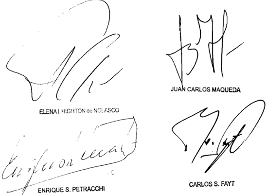

Recursos ordinarios interpuestos pOI: Petrolera Argentina de Responbabilidad Limitada por Shell Compañía Argentina de Petróleo S .A representadas pOI el Dr Alberto Carlob Cappagli , con el Patrocinio letrado de 1cs Dres Mairal Jorge Pérez Dølgado ; YPF 8 .A . representada Por el Dr . Mario Alberto Sacchi, con el Patrocinio letrado del Dr Carlob Tombeur

Trasladcs contestados Pcr: Petrolera Argontina Socieded de Reeponbabilidad Limitada por Shell Compañía de Petróleo S.A representadas por el Dr Alberto Carlos Cappagli , con el patrocinio letrado de los Héctor Mairal Jorge Pérez Delgado ; el Nacional de Planificación Federal Pública Serviciog representado patrocinado Por 10s Noelia Floreb Lazdín, Eduardo Villar Javier Suárez Benito por YPF representada por 01 Mario Sacchi con el Patrocinio lecrado del Dr Carlob Tombeur

Tribunal de origen: Sala IV de Cánara Nacional de Apelacionee en 1o Conten ciobo Administrativo Federal

Tribunal que intervino con anterioridad: Juzgado Nacional de Primera Instancia Administrativo Federal

AMBROGIO, jOSE NAZARIO RAMON y OTROS C/ ESTADO DE LA PROvINCIA DE CORRIENTES S/ ACCIóN CONTENCIOSA ADMINISTRATIvA

## ESTABILIDAD DEL EMPLEADO PUBLICO.

Corresponde dejar sin efecto la sentencia que rechazó la solicitud de reincorporación de un grupo de agentes por considerar que no habían adquirido estabili-

## FALLOS DE LA CORTE SUPREMA 335

dad en el empleo, si ninguno de los fundamentos resulta válido para justificar el incumplimiento de un acto administrativo no revocado, que había dispuesto incluir a los actores en planta permanente -decreto 1990/91 de la Provincia de Corrientes-, ya que la exigencia de que no habían cumplido con el plazo de seis meses de trabajo posterior a su nombramiento resulta inadmisible no sólo porque solicitan, precisamente, que se cumpla el decreto que nunca fue implementado, sino porque, con posterioridad al decreto, continuaron prestando servicios por un período que excede el de seis meses, siendo reprochable también la afirmación de que los agentes debían consentir el decreto mencionado en tanto no se encuentra sustentada en ninguna disposición normativa y no siendo óbice la falta de reserva o protesta debido al principio protectorio que enuncia el art. 14 bis de la Constitución Nacional.

-La jueza Highton de Nolasco, en disidencia, consideró que el recurso extraordinario cuya denegación originaba la queja era inadmisible (art. 280 C.P.C.C.N.)-.

## DICTAMEN DE LA PROCuRACIóN GENERAL

Suprema Corte:

- I -

A fs. 271/278 de los autos principales, el Superior Tribunal de Justicia de la Provincia de Corrientes resolvió hacer lugar parcialmente a la demanda incoada contra el Estado Provincial por un grupo de personas que prestaban servicio en la Comisión Conjunta de Lucha contra la Garrapata y Sarna.

Para así decidir, entendió que si bien hubo un acto de nombramiento en planta permanente (decreto provincial 1990/91) no tuvo eficacia o fue incumplido porque tanto la administración como los actores consideraron al plantel como personal contratado; la primera, por haber renovado, semestralmente y de manera ininterrumpida, los convenios por decreto hasta que se notificó la baja y los actores al convalidar las sucesivas prórrogas de los contratos -ocho años- sin hacer reserva ni reclamo alguno.

Por tales motivos, consideró que no revistaron como planta permanente los seis meses que requiere la ley local para lograr la estabilidad ni lograron modificar su situación administrativa de revista.

Disconformes, los actores interponen el recurso extraordinario de fs. 297/312 que denegado a fs. 325, motiva la presentación en queja.

En síntesis, los agravios para sostener la arbitrariedad de la sentencia son: a) el desconocimiento por parte del tribunal del acto expreso -decreto 1990/91- que los designa en planta permanente y que, por lo tanto, los incluye en el régimen de estabilidad; b) la continuidad en la prestación de servicios por más de veinte años; c) la inexistencia de un voluntario sometimiento a la renovación contractual; d) la imposibilidad jurídica de que los decretos que renovaron sucesivamente los contratos pudieron derogar o dejar sin efecto a aquél que los designó en planta permanente; e) la convalidación de actos inexistentes; f) el apartamiento de las constancias de la causa; g) el estado de indefensión y la violación del derecho a la tutela judicial efectiva; h) la aplicación al caso de los precedentes de V.E. causas 'Bolardi' (Fallos: 311:2799) y 'Madorrán' (M.1488.XXXVI del 3 de mayo de 2007) y, con ello, la inconsistencia de considerar, a quienes cumplieron las mismas funciones durante veinte años, como transitorios o temporarios, más allá del decreto de designación en planta permanente.

- III -

Reseñadas las actuaciones, cabe destacar que, según reiterada doctrina de la Corte las cuestiones de hecho, prueba y derecho público local son ajenas, como regla y por su naturaleza, a la instancia del art. 14 de la ley 48 (Fallos: 314:1336, entre otros), así como aquella otra que indica que la doctrina de la arbitrariedad es de aplicación restringida, no apta para cubrir las meras discrepancias de las partes respecto de los fundamentos de dicha índole, a través de los cuales los jueces de la causa apoyaron sus decisiones en el ámbito de su jurisdicción excluyente (doctrina de Fallos: 318:73 y 324:436, entre muchos otros).

Desde ese punto de vista, estimo que los agravios dirigidos a cuestionar la sentencia por haber prescindido el a quo del  marco legal aplicable y omitir la prueba incorporada al proceso no son aptos para suscitar la apertura de la instancia del art. 14 de la ley 48, toda vez que el tribunal, más allá del acierto o error en la ponderación de las constancias de la causa, concluyó -con argumentos suficientes- que los actores formaban parte del plantel de contratados por la administración provincial y que ésta estaba facultada a no renovarles los contratos.

En efecto, el superior tribunal entendió que las sucesivas prórrogas de los convenios sin ningún tipo de reclamo, protesta o reserva de los actores conllevaban un voluntario sometimiento a su condición

en la prestación de las funciones como tales, sin que el decreto de designación en planta permanente hubiera tenido entonces virtualidad jurídica al no haber existido un acto de 'consentimiento registrado' ni una modificación en la situación de revista administrativa de los contratados 'no existiendo consentimiento para ese nombramiento o, si se quiere, a la inversa, se consintió el continuar en la misma situación de contratados'.

Por ello, considero que además de remitir a cuestiones no federales, el a quo hizo mérito del ordenamiento jurídico local aplicable al caso y de las constancias de la causa, sin que se advierta arbitrariedad en el modo en que resolvió.

Ello es así, máxime cuando también tiene dicho el Tribunal que aquella doctrina es de aplicación estrictamente excepcional y no puede requerirse por su intermedio el reexamen de cuestiones no federales cuya solución es del resorte exclusivo de los jueces de la causa, salvo que se demuestre su notorio desvío de las leyes aplicables o una total ausencia de fundamento, pues no pretende convertir a la Corte en un tribunal de tercera instancia, ni tiene por objeto corregir fallos equivocados, toda vez que sólo pretende suplir defectos realmente graves de fundamentación o razonamiento que impidan considerar a la sentencia como acto jurisdiccional válido (confr. Fallos: 304:106 y 375; 305:1103; 306:882, 998, 1012, 1678; 307:514, 1368, entre muchos otros).

Opino, por tanto, que corresponde desestimar la queja. Buenos Aires, 17 de junio de 2008. Laura M. Monti.

## FALLO DE LA CORTE SuPREMA

## Buenos Aires, 19 de 20/2 .

Vistos autos "Recurso de hecho deducido por actora en la causa Ambrogio, José Nazario Ramón otros c/ Estado de 1a Provincia de Corrientes" para decidir sobre su procedencia.

## Considerando:

Que el Superior Tribunal de Justicia de la Provincia de Corrientes, al hacer lugar parcialmente la demanda , rechazó la solicitud de reincorporación de un grupo de agentes que habían sido contratados en el año 1979 para prestar servicios en la Comisión Conjunta de Lucha contra la Garrapata Sarna Contra tal decisión, actores interpusieron el recurso extraordinario que , denegado , dio origen esta presentación directa.

2 ' ) Que, para decidir como 10 hizo, el quo sostuvo que agentes no habían adquirido estabilidad en el empleo, pesar de haber sido designados en planta permanente mediante el decreto 1990/91 , pues después de ocho años de su dictado, continuaron como contratados hasta la baja dispuesta en el año 1999 \_ Apuntó que no habían efectuado reserva protesta alguna ante las sucesivas prórrogas contractuales, ni habían prestado con sentimiento respecto de su nombramiento como permanentes que tampoco habían cumplido con el plazo de seis meses de trabajo efectivo posterior al nombramiento (art 16 de la 4067) ley

Concluyó, entonces que había existido un sometimiento voluntario sin reservas un régimen jurídico determinado, que impedía los actores efectuar un reclamo atinente la es tabilidad en el empleo público, de confornidad con el precedente "Gil" de esta Corte

Que el recurso extraordinario resulta formalnente procedente en cuanto se halla en juego el alcance del art\_ 14 bis de la Constitución Nacional (art\_ 14 , inc de la 48) Además , en el caso, la ponderación de los agravios referentes la valoración de determinados extremos fácticos de la causa se presenta inescindiblemente unida tal cuestión interpretativa, por que corresponde que se examine en forma conjunta con la amplitud que exige la garantía de la defensa en juicio (Fallos 318 : 63 ; 319:1500 ; 324 :1590; 329:4206 , entre muchos otros) ley

Que el quo no dio adecuada respuesta 10s planteos referentes la aplicación del decreto 1990 , Ya que ninguno de 1os fundamentos de la sentencia apelada resulta válido para justificar el incumplimiento de un acto administrativo no revocado , que había dispuesto incluir los actores en planta permanente

En primer lugar, el quo sostuvo que los agentes ca recían de estabilidad porque no habían cumplido con el plazo de seis meses de trabajo efectivo posterior al nombramiento (art\_ 16 de la ley 4067) Esta exigencia resulta inadmisible no s610 porque 1os actores solicitan, precisamente, que se cumpla el decreto que nunca fue implementado sino porque\_ adenás , está suficientemente probado que ~con posterioridad al decretocontinuaron prestando servicios por un período que excede el de seis meses señalado \_

Por otra parte, la afirmación del Superior Tribunal en cuanto sostuvo que os agentes debían consentir el decreto 1990/91 también resulta reprochable por cuanto no se encuentra sustentada en ninguna disposición normativa, que traduce una aserción meramente dogmática que priva de debida fundamentación la sentencia apelada

Finalmente, tampoco es óbice la falta de reserva protesta ya que una vez establecido que la disputa interesa al trabajo del art 14 bis de a Constitución Nacional, el principrotectorio que éste enuncia el carácter inviolable de 1os derechos que reconoce, conducen con necesidad la indisponibilidad y la prohibición de renuncia de la aplicación de las normas que tutelan el trabajo "en todas sus formas" vale decir, tanto al prestado en el ámbito público comO en el privado \_ Por tanto, en este caso, no resulta aplicable el precedente "Gil" pio

Que , por último Y en cuanto al agravio por el monto de 1os adicionales reclamados por la imposición de las costas , el recurso extraordinario resulta inadmisible (art 280 del Código Procesal civil y Comercial de la Nación)

En suma , corresponde revocar la sentencia apelada devolver las actuaciones al tribunal de origen para que se expida nuevamente sobre las cuestiones planteadas

Por ello, oída la señora Procuradora Fiscal, se hace lugar parcialmente queja Y al recurso extraordinario y se de ja sin efecto sentencia apelada con el alcance indicado Vuelvan los autos al tribunal de origen fin de que por quien corresponda \_ se dicte un nuevo pronunciamiento con arreglo al presente\_ Notifiquese, agréguese la queja al principal Y, oportunamente, remítase

Juan CARLOS MAQUEDA

DE LA SEÑORA VICEPRESIDENIA DOCTORA DOÑA ELENA I. HIGHTON de NOLASCO

Considerando:

Que el recurso extraordinario, cuya denegación origi-

na la presente queja, es inadnisible (art\_ 280 del Código Procesal civil Y Comercial de 1a Nación)

Por ello, oída la señora Procuradora Fiscal se la desestima Notifíquese, devuélvanse los autos principales, Y archívese\_

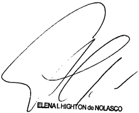

Recurso de hecho interpuesto por José Nazario Ramón Anbrogio otrob , representados por el Ramón Enrique Álvarez con el patrocinio del Dr Luis M ría Rey.

Tribunal de origen: Superior Iribunal de Justicia de Provincie de Corrientes .

BANCO DE LA NACION ARGENTINA C/ GIAMBENEDETTI HNOS. S/ ORDINARIO

## ACLARATORIA.

La cámara transgredió los precisos límites de su competencia y rebasó el marco de las atribuciones conferidas por el art. 166, inc. 2º, del Código Procesal Civil y Comercial de la Nación al disponer, con la invocación de la falta de determinación numérica de los honorarios profesionales regulados en la resolución anterior, la capitalización de los intereses y sobre dicho monto aplicar la tasa pasiva promedio que publique el Banco de la Nación Argentina, ya que la nueva resolución es sustancialmente diversa de la que se dijo aclarada, configurándose de ese modo un exceso jurisdiccional, en tanto la previsión legal mencionada sólo la habilita a corregir errores materiales, suplir omisiones o aclarar conceptos oscuros.

-Del dictamen de la Procuración General, al que remitió la Corte Suprema-.

## DE JUSTICIA DE LA NACION

## DICTAMEN DE LA PROCuRACIóN GENERAL

Suprema Corte:

- I -

A fs. 15/16 de los autos principales (a los que corresponderán las siguientes citas salvo mención en contrario), el Banco de la Nación Argentina (BNA) promovió demanda contra los Sres. Juan Giambenedetti, Juan Franco Giambenedetti, Elías Alonso, Mario Cattai y Horacio Domingo Roland con el objeto de ejecutar el contrato de fianza suscripto por los demandados para garantizar un crédito de U$S 240.000 otorgado por la institución bancaria a la firma Giambenedetti Hnos. S.A. A fs. 18/19 rectificó el monto de la demanda, reduciéndolo a la suma de U$S 182.119,85.

A fs. 216/228 el juez subrogante del Juzgado Federal de San Rafael, Provincia de Mendoza, rechazó la demanda, en decisión que fue confirmada por la Cámara Federal de Apelaciones de Mendoza (sala 'A') (v. fs. 258/261). Contra tal pronunciamiento el actor interpuso el recurso extraordinario de fs. 270/278.

A fs. 413/414 la Corte declaró procedente el recurso, revocó la sentencia apelada y devolvió la causa para que se dictara una nueva.

En virtud del reenvío dispuesto, la cámara, en el nuevo pronunciamiento ordenado, revocó la sentencia de primera instancia e hizo lugar, a la demanda respecto de los codemandados Juan Giambenedetti, Juan Franco Giambenedetti, Elías Alonso y Mario Cattai, en tanto que rechazó el recurso de la parte actora con relación al codemandado Horacio Domingo Roland (fs. 444/449).

A fs. 501/503 los Dres. Nedo Carlucci, José Luis Sabatini y Fabiana Carlucci de Sabatini solicitaron que se regularan sus honorarios por la labor profesional desarrollada en representación del codemandado Horacio Domingo Roland.

A fs. 547/548 el magistrado subrogante del Juzgado Federal de San Rafael reguló los honorarios correspondientes al Dr. Nedo Carlucci en la suma de U$S 32.782, más la alícuota del IVA, y a los Dres. José Luis Sabatini y Fabiana Carlucci en la suma de U$S 6.556 más la alícuota

del IVA, y dispuso que a dichos montos correspondía aplicar la tasa activa de interés, no capitalizable, para la operatoria de préstamos en dólares estadounidenses del BNA desde el 18 de enero de 1983 hasta la fecha de su efectivo pago. Para así decidir tuvo en cuenta el monto reclamado en la demanda, esto es, U$S 182.119,85, así como también lo dispuesto en los arts. 6º, 7º y 19 de la ley 21.839. Dicha resolución fue apelada por la parte actora (v. fs. 553/556).

A fs. 568, se ordenó la formación de una compulsa a los fines de la tramitación ante la alzada de la apelación interpuesta contra la regulación de honorarios.

A fs. 577/579 de dicha compulsa, la Cámara Federal de Apelaciones de la Provincia de Mendoza -sala A- redujo los honorarios de los profesionales citados, fijándolos en un 15% del monto del juicio. Asimismo, en aplicación, según dijo, del art. 61 de la ley 21.839, fijó una tasa de interés del 6% anual a computarse desde el 18 de enero de 1983 hasta la sanción de la ley de convertibilidad y a partir de allí y hasta el efectivo pago la tasa pasiva del BNA para plazos fijos en dólares de acuerdo a lo estipulado en el artículo citado.

Posteriormente, y ante un pedido de aclaratoria presentado por los mencionados profesionales tendiente a obtener la determinación numérica de los emolumentos, los magistrados procedieron a establecer la suma a favor de aquéllos en concepto de capital e intereses al 1º de abril de 1991, y que a partir de esta última fecha debían adicionarse a dicha suma los intereses de la tasa pasiva promedio que publicara el Banco de la Nación Argentina para sus operaciones en dólares (v. fs. 585/587).

- II -

Contra este último pronunciamiento, el BNA dedujo recurso extraordinario (fs. 593/600), que fue denegado (fs. 680), lo que originó la presentación de la queja en examen.

Arguye que la resolución aclaratoria recurrida afecta su patrimonio, pues lo obliga a abonar una suma de dinero en concepto de honorarios superior a la fijada en el fallo de origen, es arbitraria pues no se limita a corregir errores materiales, suplir omisiones o aclarar conceptos oscuros, sino que introduce modificaciones sustanciales que contradicen

lo decidido en la primera resolución, dispone capitalizar los intereses que corren desde el 18 de enero de 1983 al 31 de marzo de 1991 y a dicha suma capitalizada aplicar la tasa pasiva promedio, lo que no estaba pautado en la sentencia anterior y, en consecuencia, modifica el monto de los honorarios de acuerdo a lo estipulado en esta última, lo que implica un exceso de las facultades jurisdiccionales, y afecta la garantía del debido proceso y defensa en juicio de su parte.

Considera que la resolución impugnada equivale a una sentencia definitiva toda vez que tiene consecuencias irreparables, desconoce principios constitucionales y no permite otra posibilidad de revisión judicial.

- III -

En orden a verificar las condiciones requeridas para habilitar la vía del art. 14 de la ley 48, cabe recordar que V. E. tiene dicho que el alcance de las  soluciones aclaratorias es -por tratarse de materia procesal- ajeno al ámbito del remedio federal; sin embargo, cabe hacer excepción a tal principio cuando el tribunal de segunda instancia excedió el ejercicio de las facultad prevista en las normas aplicables del ordenamiento procesal (Fallos: 290:274; 301:169; 326:3056, entre otros).

Considero que la excepción se presenta en el caso, toda vez que la resolución aclaratoria apelada no se limitó a sanear alguna omisión en el pronunciamiento principal sino que lo modificó, circunstancia, en mi criterio, apta para la habilitación de esta instancia.

En efecto, lo resuelto en ese pronunciamiento rebasó claramente el marco de las atribuciones conferidas por el art. 166, inc. 2º, del Código Procesal Civil y Comercial de la Nación ya que al disponer, con la invocación de la falta de determinación numérica de los honorarios profesionales regulados en la resolución anterior, la capitalización de los intereses entre el 18 de enero de 1983 y el 31 de marzo de 1991 y sobre dicho monto aplicar la tasa pasiva promedio que publique el BNA, la alzada transgredió los precisos límites de su competencia (Fallos: 289:478).

Tal conclusión implica que el tribunal modificó sustancialmente lo resuelto a fs. 577/579, pues en dicha oportunidad no dispuso la mencionada capitalización.

En las condiciones expresadas, la cámara dictó una nueva resolución que es sustancialmente diversa de la que se dijo aclarada (Fallos: 311:1722), configurándose de este modo un exceso jurisdiccional al apartarse del marco de la competencia atribuida por vía del pedido de aclaratoria que, conforme a la previsión legal mencionada, sólo la habilita a corregir errores materiales, suplir omisiones o aclarar conceptos oscuros (art. 166 inc. 2º del Código Procesal Civil y Comercial de la Nación), lo cual lesiona las garantías de los arts. 17 y 18 de la Constitución Nacional.

Por otro lado cabe mencionar que el a quo , con el dictado de la sentencia apelada, violó una norma expresa de orden público que veda la capitalización de los intereses (art. 623 del Código Civil) sin que concurran los supuestos legales de excepción, de modo que la resolución adoptada aparece desprovista de fundamento (Fallos: 316:3131; 324:2471; 325:2652, entre muchos otros).

Por ello, entiendo que las garantías constitucionales que se invocan como vulneradas guardan relación directa e inmediata con lo resuelto (art. 15 de la ley 48) con arreglo a la doctrina de la arbitrariedad de sentencias.

En cuanto al agravio referido a la modificación de la tasa de interés pasiva por la tasa pasiva promedio introducida por el fallo aclaratorio considero que debe ser rechazado. Ello es así pues el recurrente no logra demostrar cuál es el gravamen que le provoca lo decidido por la cámara en este aspecto. En efecto, de los términos del recurso extraordinario surge que el perjuicio económico para el B.N.A. está dado exclusivamente por la capitalización de los intereses dispuesta por la alzada en su segunda resolución, mas no logra acreditar que la aplicación de la tasa pasiva promedio en lugar de la tasa de interés pasiva le ocasione un daño al derecho de propiedad. En tales condiciones, observo que el planteo de la actora en este punto configura una alegación abstracta sobre la supuesta violación del Mencionado derecho, pero sin que se haya aportado al sub examine elemento probatorio concreto alguno sobre tal extremo.

Sin perjuicio de lo expuesto, que se ciñe a tratar los agravios del recurso del banco, y a los efectos que V. E. estime corresponder, he de señalar que: a) las regulaciones de honorarios fueron realizadas en dó-

lares, sin respetar lo dispuesto en normas de orden público (ley 25.561 y disposiciones complementarias) que imponían que se lo hiciera en pesos; b) se realizaron a valores de la demanda y su rectificación, que se remontaban a la deuda de 1983 (en dólares) y se les aplicaron intereses desde esa fecha, a pesar de que las leyes arancelarias revisten carácter de orden público (cfr. Fallos: 224:752; 227:518 y 244:31), y que prevén la aplicación de intereses solo desde la mora del deudor (art. 61). Es preciso destacar, al respecto que, como reiteradamente ha sostenido V.E., en función de la finalidad resarcitoria que poseen los intereses (accesorios), ellos tienen como presupuesto la mora del deudor y sólo se devengan a partir del momento en que se configura dicha situación de retardo una vez transcurridos los 30 días de notificado el auto regulatorio (art. 49 y 61 de la ley 21.839) (Fallos: 327:1827; 324:375: entre muchos otros); c) a ello se suma que la regulación a cargo del ente estatal y a favor de los Dres. Nedo Carlucci, José Luis Sabatini y Fabiana Carlucci de Sabatini se realizó sobre el monto total del juicio, a pesar de que ellos representaron a uno solo de los cinco codemandados (el Sr. Roland), y de la clara letra del art. 11 de la ley 21.839.

- v -

Por lo expuesto, con los alcances indicados, corresponde hacer lugar a la queja, declarar procedente el recurso extraordinario, dejar sin efecto la sentencia aclaratoria y devolver las actuaciones para que, por quien corresponda, dicte una nueva ajustada a derecho. Buenos Aires, 16 de febrero de 2012. Laura M. Monti.

## FALLO DE LA CORTE SuPREMA

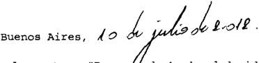

Vistos autos "Recur de hecho deducido por actora en la causa Banco de la Nación Argentina Giambenedetti Hnos 9 / ordinario" para decidir sobre su procedencia

Considerando:

Que esta Corte comparte fundamentos Y conclusioneg del dictamen que antecede en cuanto no correspondía dejar

sin efecto, por vía de resolución aclaratoria, decidido en el fallo original Y en tal sentido se dan por reproducidos sus términos en razón de brevedad \_

Por ello, con el alcance indicado\_ se hace lugar la que ja, e declara procedente el recurso extraordinario Y se deja sin efecto la sentencia aclaratoria. Con costas Reintégrege el depóaito de fs 39 Agréguese la queja al principal Y devuélvan se autos al tribunal de origen fin de que , por quien co rresponda , se dicte un nuevo fallo con arregl9 presente No tifíquese Y remítage

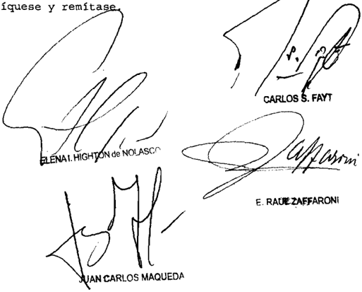

Recurso de hecho interpuesto por 1a actora , representada por la Dra . Bandra Fernández BabtfaB , con el patrocinio letrado del Dr Brnebto Llorente

Tribunal de origen: Bala de 1a Cínara Pederal de Mendoza

Tribunales que intervinieron con anterioridad: de 10 cúmara Federal de de Kendoza

DELTA COMPRESION S.R.L. C/ E.N. Mº ECONOMIA - AFIP - DGA

- DTO. 1043/03 S/ PROCESO DE CONOCIMIENTO

FACTOR DE CONVERGENCIA.

Cabe confirmar la sentencia que rechazó el planteo de inconstitucionalidad del decreto 1043/03 del Poder Ejecutivo Nacional -que reglamentó el procedimiento

para determinar los importes adeudados en concepto de factor de convergencia y fijó el tipo de cambio a considerar teniendo en cuenta la fecha en que se hubieran registrado las solicitudes de destinación de exportaciones y los intereses a aplicar a la deuda-, y de la resolución 30/03 de la Secretaría de Hacienda -que estableció la forma, plazos y condiciones para cancelar los importes debidos-, pues no resulta atendible la alegada violación del principio constitucional de igualdad, por el hecho de que el mismo Poder Ejecutivo Nacional -por medio del decreto 261/02- resolvió devolver el impuesto al valor agregado a los exportadores de manera diferente a lo que resulta del decreto 1043/03, ya que la devolución del IVA se da en el ámbito de las relaciones tributarias, en cambio en el caso se trata de la forma en la que el decreto cuestionado, al amparo de la ley 25.561, regula una deuda derivada de la derogación del régimen del decreto 803/01 que no tiene carácter tributario sino que consiste en un beneficio o estímulo a una determinada actividad.

-Del dictamen de la Procuración General, al que remitió la Corte Suprema-.

## DICTAMEN DE LA PROCuRACIóN GENERAL

## Suprema Corte:

- I -

La Cámara Nacional de Apelaciones en lo Contencioso Administrativo Federal (Sala II) confirmó la sentencia de primera instancia, en cuanto rechazó la pretensión de la actora de que se declare la inconstitucionalidad del decreto 1043/03 del Poder Ejecutivo Nacional, de la resolución 30/03 de la Secretaría de Hacienda y de sus normas complementarias. Asimismo, ordenó que en la etapa de liquidación se tenga en cuenta que las sumas que se deben devolver se encuentran sujetas a la debida registración de los respectivos permisos de embarque (fs. 316/318).

Para resolver de ese modo, en primer término, la cámara recordó que, por medio del decreto 803/01, el Poder Ejecutivo Nacional estableció un régimen transitorio para el comercio exterior instrumentado por el factor de convergencia, el que fue derogado por el decreto 191/02, por entender que resultaba incompatible con el nuevo marco de política económica implementado a partir de 2002.

En este contexto, el decreto 1043/03 reglamentó el procedimiento para determinar los importes adeudados en concepto de factor de con-

vergencia y fijó el tipo de cambio a considerar teniendo en cuenta la fecha en que se hubieran registrado las solicitudes de destinación de exportaciones y los intereses que corresponde aplicar a la deuda. Por su parte, la resolución 30/03 de la Secretaría de Hacienda estableció la forma, los plazos y las condiciones para cancelar los importes debidos, de acuerdo con el cronograma que determinó.

En segundo término, la cámara entendió que aquel régimen constituía  un  mecanismo de promoción de las exportaciones financiado por los importadores, que buscaba lograr estabilidad a los patrones del comercio exterior argentino con respecto a las monedas rectoras (dólar estadounidense y euro).

Respecto de la relación de cambio que fija el decreto 1043/03 -que varía de acuerdo con la fecha de registro de la solicitud de destinación de exportación entre U$S 1 = $ 1 y U$S 1 = $ 1,40 si aquélla se produjo durante la vigencia de la ley de convertibilidad o durante el período en que rigió el mercado oficial de cambios que se implementó a partir del 11 de enero de 2002, respectivamente-, sobre la base de otros precedentes de otras salas del mismo tribunal, el a quo señaló que la constitucionalidad de esa medida no resulta manifiestamente ilegítima, desde que no se invocó que fuera distinta de la aplicada respecto de los importadores que, durante la misma época, debieron ingresar el factor de convergencia por su importación, que tampoco podía considerarse de aplicación retroactiva, toda vez que no podía descartarse, frente a los claros términos de los arts. 1º y 17 del decreto 214/02, que las obligaciones vinculadas al comercio exterior hubieran quedado fuera de la conversión a pesos que aquél establece, máxime cuando el propio decreto 1043/03 remite en sus considerandos al decreto 214/02.

Además, con apoyo en la doctrina de la Corte Suprema sobre la legislación de emergencia y en que la declaración de inconstitucionalidad de una norma es un acto de suma gravedad y ultima ratio del ordenamiento jurídico, desestimó el planteo que en tal sentido había formulado la actora.

Disconforme con esta decisión, la actora -Delta Comprensión S.R.L.- dedujo el recurso extraordinario obrante 367/385, que fue concedido únicamente en cuanto a la cuestión federal involucrada en

la causa y denegado respecto de la arbitrariedad imputada al fallo (fs. 394), sin que se planteara queja alguna al respecto.

Sostiene, en sustancial síntesis, que la sentencia no se hace cargo de que los beneficios a la exportación no son una de las materias respecto de las cuales el Poder Ejecutivo estuviera autorizado a legislar en el marco de la emergencia declarada y menos aún bajo el amparo del art. 2º de la ley 25.561. Dice que el Congreso fijó pautas precisas y delimitó claramente las áreas de actuación así como las materias a legislar, extremos que el Poder Ejecutivo desatendió al dictar el decreto 1043/03.

También afirma que el Estado asumió un compromiso a partir del decreto 803/01, por el cual convino con la actora, como exportadora de productos, la devolución del factor de convergencia, de modo tal que surgió un contrato ente el particular-exportador y el Estado del cual surgieron obligaciones para ambas partes, que el primero cumplió acabadamente y el segundo no.

Finalmente, arguye que el decreto 1043/03 discrimina irrazonablemente a los exportadores al momento de fijar la devolución de las sumas en concepto de factor de convergencia, si se lo compara con la devolución del IVA para los exportadores que prevé el decreto 261/02.

- III -

El recurso extraordinario es formalmente admisible, pues en autos se ha puesto en tela de juicio la validez e inteligencia de normas federales (decreto 1043/03 y resolución 30/03) y la decisión definitiva del superior tribunal de la causa ha sido contraria al derecho que el recurrente ha sustentado en ellas (art. 14, inc. 3º, de la ley 48).

Cabe recordar que, al encontrarse controvertido el alcance que cabe asignar a normas de derecho federal, la Corte no se encuentra limitada en su decisión por los argumentos de las partes o de la cámara, sino que le incumbe realizar una declaración sobre el punto disputado, según la interpretación que rectamente le otorgue (Fallos: 328:1740; 329:3577; 330:3836 y 4713, entre muchos otros).

Asimismo, toda vez que el recurso ha sido concedido únicamente en lo atinente a la interpretación de normas federales y rechazado con

relación a la arbitrariedad endilgada a la sentencia, sin que se haya deducido la pertinente queja, la jurisdicción de la Corte ha quedado abierta sólo en la medida en que la otorgó el tribunal de la instancia anterior (doctrina de Fallos: 322:2926; 327:4201, entre muchos otros).

Aun cuando en el sub lite se discute únicamente sobre la constitucionalidad del decreto 1043/03 del Poder Ejecutivo Nacional, de la resolución 30/03 de la Secretaría de Hacienda y de otras normas complementarias, considero que el examen de esta cuestión debe incluir necesariamente al régimen instaurado por el decreto 803/01 y su posterior derogación por su similar 191/02, en tanto las primeras normas citadas regulan un aspecto particular del mencionado régimen, cual es el tratamiento que corresponde asignar a las deudas estatales derivadas de su cancelación.

En este sentido, cabe recordar que el decreto 803/01 estableció un ' régimen transitorio para el comercio exterior ', instrumentado a través de la instauración del ' factor de convergencia ' (art. 1º), el que debía calcularse diariamente por el Banco Central de la República Argentina (art. 3º), de acuerdo con la fórmula establecida en su art. 2º, la que determinaba que aquél era equivalente a un dólar estadounidense menos el promedio simple de un dólar estadounidense y un euro de la Unión Europea, según la cotización allí fijada.

En lo que interesa a la presente causa, el mentado régimen tuvo en miras otorgar a las exportaciones una mayor competitividad para obtener una mejor inserción de la Argentina en el comercio mundial (párrafo 1º de los considerandos del decreto indicado), mediante el otorgamiento de un ' beneficio a las exportaciones '  (párrafo  2º)  que, dentro del marco de la ley de convertibilidad, no afectaba el esquema monetario entonces en vigor ni tenía costo fiscal (párrafo 4º).

El 25 de enero de 2002, el Poder Ejecutivo Nacional, por medio del decreto 191/02, derogó el decreto 803/01 (art. 1º); facultó a los organismos técnicos competentes, cada uno en el ámbito de su jurisdicción, para dictar las normas complementarias que estimen pertinentes (art. 2º) y dispuso que entraría en vigencia a partir de su publicación en el Boletín Oficial (art. 3º), circunstancia que se produjo el 29 de enero de aquel año.

Como fundamento de esta medida se indicó que, en el nuevo marco de política económica diseñada por el Gobierno Nacional, resultaba incompatible el mantenimiento de ciertos instrumentos del comercio exterior, tal el caso del factor de convergencia.

En este contexto, el decreto 1043/03 determinó el procedimiento de cálculo de los importes adeudados en concepto de factor de convergencia, estableció la tasa de interés y la fecha efectiva de puesta a disposición de los fondos.

En los considerandos de esta norma se explica que el decreto 803/01 determinó que el factor de convergencia multiplicado por el valor FOB de las exportaciones para consumo se valuara en dólares estadounidenses y que el decreto 71/02 -dictado en virtud de las facultades conferidas por el art. 2º de la ley 25.561- instrumentó los mercados oficial y libre de cambios con vigencia a partir del 11 de enero de 2002 y determinó las operaciones a ser cursadas por cada uno de ellos, adoptando como tipo de cambio para el mercado oficial el de un peso con cuarenta centavos por cada dólar estadounidense.

Las operaciones incluidas en el régimen del decreto 803/01 debieron ser cursadas por el mercado oficial de cambios y, en atención a que dicho régimen se derogó por el decreto 191/02, resultaba necesario determinar el procedimiento de cálculo de los importes adeudados en concepto de factor de convergencia. En tal sentido, dado que el decreto 214/02 dispuso la conversión a pesos de todas las obligaciones de dar sumas de dinero y fijó el tipo de cambio a tener en cuenta para ello, sin contemplar las originadas en el pago a los exportadores del factor de convergencia, el decrete 1043/03 fijó dicho procedimiento.

En lo que ahora resulta de interés, se toma en cuenta la fecha de registro de la solicitud de destinación de exportación para consumo para fijar la relación de cambio de un peso por cada dólar estadounidense (entre el 19 de junio de 2001 y el 10 de enero de 2002), o un peso con cuarenta centavos por cada unidad de aquella moneda extranjera (entre el 11 y el 28 de enero de 2002) (art. 1º, incs. a y b, respectivamente).

A su vez, el citado decreto establece que los montos adeudados se cancelarán en la forma, plazo y condiciones que establezca la Secretaría de Hacienda del Ministerio de Economía (art. 2º), a cuyo efecto ésta dictó la resolución 30/03.

Efectuada la reseña normativa, corresponde extraer algunas conclusiones. En primer término, teniendo en cuenta los fines perseguidos en la instauración del régimen del decreto 803/01 -explicitados en sus considerandos- y las disposiciones que surgen de su parte resolutiva, cabe concluir en que por su intermedio el Estado otorgó un beneficio a las exportaciones .

En efecto, resulta claro que, para los exportadores -calidad que reviste la actora en el sub lite - la introducción del factor de convergencia en la liquidación de sus operaciones implicaba un beneficio, otorgado por el Estado Nacional, tal como lo sostuvo este Ministerio Público Fiscal en la causa A. 311. L.XLVI. 'Aceitera General Deheza S.A. (TF 22313-A) c/ DGA' (dictamen del 1º de septiembre 2010, cuyos términos y conclusiones, en lo pertinente, compartió V.E. en su sentencia del 24 de mayo del corriente año).

Se trata, entonces, de un régimen de incentivo a las exportaciones y no de uno de características tributarias que afecte a los exportadores -esto dicho con independencia de los efectos que el régimen pudiera tener sobre otros sujetos-, que fue dejado sin efecto por el decreto 191/02 en virtud de las nuevas medidas de política económica adoptadas por el Gobierno nacional en los primeros meses de 2002, en el marco de la declaración del estado de emergencia en los distintos órdenes de la vida social y económica dispuesto por la ley 25.561.

Caracterizar adecuadamente el régimen del decreto 803/01 que implementó el factor de convergencia es relevante, porque ello permite comprender la naturaleza del decreto 1043/03 y de sus normas complementarias -cuya constitucionalidad impugna la actora, planteo que fue desestimado por el a quo -, que vienen a participar del mismo carácter que aquél. En efecto, tales normas se dictaron para regular una situación particular que surgió como consecuencia de la derogación del régimen promocional, cual es el procedimiento de cálculo de las sumas adeudadas en concepto de factor de convergencia, sin que corresponda asignarles un carácter distinto.

Desde esta perspectiva, considero que no puede prosperar el agravio de la actora por el cual pretende descalificar la constitucionalidad de las últimas normas citadas sobre la base de atribuirles un contenido tributario que excederían las bases de la delegación que surgen del art. 2º de la ley 25.561.

Por el contrario, pienso que, al regular el tratamiento que se le debe asignar a un universo acotado de deudas (las que derivan de la derogación del régimen), el decreto 1043/03 y sus normas complementarias encuentran respaldo en los arts. 1º, inc. 4º), y 2º de la ley recién mencionada.

Para finalizar este capítulo sólo resta por señalar que los agravios de la actora se limitan a impugnar la validez constitucional del decreto por considerar que no encuentra apoyo en la ley delegante -aspecto que recién se descartó-, pero nada dicen acerca de otros vicios que aquél pudiera contener, de modo tal que nada más corresponde agregar sobre este punto.

- vI -

Sentado lo anterior, es del caso señalar que tampoco se puede admitir otro de los agravios que la recurrente plantea contra la sentencia de la cámara, cual es la alegada existencia de un contrato -o acto bilateral- entre el exportador y el Estado Nacional en la aplicación del régimen del decreto 803/01.

Ello es así, porque se trata de una medida de estímulo a las exportaciones que el Estado implementó de modo unilateral y con independencia de la voluntad del particular. En efecto, a diferencia de lo que sucedía en otros precedentes del Tribunal (Fallos: 296:672; 307:993), en el caso el Estado nada convino con los exportadores, sino que instituyó un régimen de incentivo a las exportaciones en el cual aquellos sujetos tenían derecho a percibir el factor de convergencia siempre y cuando cumplieran con las condiciones impuestas en el régimen, pero sin que ello implicara un contrato u otro tipo de acto bilateral.

De ahí que resulte aplicable a estos autos la doctrina de la Corte que enseña que nadie tiene derecho adquirido al mantenimiento de un determinado régimen jurídico (conf. Fallos: 310:2845; 311:1213; 323:3412; 329:976; 330:3565, entre muchos otros).

Por último, a mi juicio tampoco resulta atendible para descalificar la sentencia apelada la alegada violación del principio constitucional de igualdad, por el hecho de que el mismo Poder Ejecutivo Nacional, por medio del decreto 261/02, resolvió devolver el impuesto al valor

agregado a los exportadores de manera diferente a lo que resulta del decreto 1043/03.

En efecto, en forma reiterada ha dicho V.E. que la igualdad consiste en tratar del mismo modo a los que se encuentran en iguales situaciones o en igualdad de circunstancias, pero que el art. 16 de la Ley Fundamental no impone una rígida igualdad, por lo que tal garantía no obsta a que el legislador contemple en forma distinta situaciones que considere diferentes, atribuyéndose a su prudencia una amplia latitud para ordenar y agrupar, distinguiendo y clasificando los objetos de la reglamentación (Fallos: 320:1166), aunque también ha destacado que ello es así en la medida en que las distinciones o exclusiones se basen en motivos razonables y no en un propósito de hostilidad contra determinada persona o grupo de personas o indebido privilegio personal o de un grupo (Fallos: 315:839; 322:2346 y 332:1039).

A mi modo de ver, en el caso de la devolución del IVA sí estamos en el ámbito de las relaciones tributarias (el anverso de la obligación tributaria, en tanto supone que el Estado es el que debe devolver el tributo cobrado en exceso o cuyo pago, directamente, no corresponde) y ello es suficiente para diferenciarlo de la situación de autos, en la que se trata de la forma en la que el decreto 1043/03, al amparo de la ley 25.561, regula una deuda derivada de la derogación del régimen del decreto 803/01, que, tal como ya se explicitó, no tiene carácter tributario sino que consiste en un beneficio o estímulo a una determinada actividad.

- vII -

Por lo expuesto, considero que corresponde confirmar la sentencia apelada en cuanto fue materia de recurso extraordinario. Buenos Aires, 8 de septiembre de 2011. Laura M. Monti.

## FALLO DE LA CORTE SuPREMA

## Buenos Aires, 10 de d 2014

Vistos 10s autos: Delta Compresión SRL c/ EN M de Economía AFIP DGA dto . 1043/03 s / proceso de conocimiento"

## Considerando:

Que las cuestiones planteadas han sido adecuadamente consideradas en el dictamen de la señora Procuradora Fiscal, cu yos fundamentos son compartidos por el Iribunal, Y 10s que rresponde remitirse en razón de

Por ello, de conformidad con 10 dictaminado por la señora Procuradora Fiscal, se declara formalmente procedente el recurso extraordinario se confirma la sentencia apelada \_ Sin costas en atención 10 resuelto fs\_ 392 Notifíquese devuélvase

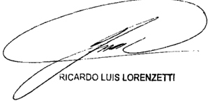

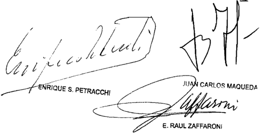

Recurso extraordinario interpuesto 1a actora, Delta Compresión SRL representada por el Dr

No hubo con testación dol traordinario

Tribunal de origen; Sala II de 1a Cámara Nacional de Apelacioneb en 1o Conten cioso Adninibtrativo Federal

Iribunal que intervino con anterioridad: Juzgado Nacional de Prinera Inbtancia en 1o 5 .

## FALLOS DE LA CORTE SUPREMA 335

## ESTADO NACIONAL -ESTADO MAyOR GENERAL DEL EjERCITOC/ CORDOBA, PROvINCIA DE S/ ACCIóN DE INCONSTITuCIONALIDAD

## TRANSFERENCIA DE LOS SERVICIOS EDUCATIVOS.

Cabe rechazar la acción declarativa promovida a fin de obtener que se declare la inconstitucionalidad de la ley de la provincia de Córdoba Nº 8253 y del decreto reglamentario 1312/99 -en cuanto autorizan a inscribir en el Registro de la Propiedad local a nombre de la demandada un bien del dominio del Estado Nacional-, pues dichas normas no han excedido los estándares establecidos en la ley nacional 24.049, ni los alcances del Convenio de Transferencia celebrado, como tampoco se revelan contrarias a las cláusulas constitucionales invocadas, conclusión que mejor concilia con la norma nacional base del Convenio de Transferencia, las disposiciones provinciales dictadas, y el compromiso asumido por las partes en dicho instrumento frente a la preservación y desarrollo de bienes de orden superior amparados en las disposiciones constitucionales contenidas en los artículos 14 y 75, incisos 18, 19 y 23 de la Constitución Nacional.

## TRANSFERENCIA DE LOS SERVICIOS EDUCATIVOS.

El Convenio de Transferencia del inmueble ocupados por servicios educativos, da cuenta del compromiso asumido por la provincia demandada y el Estado Nacional a su respecto, y, como las demás creaciones legales del federalismo de concertación, configura el derecho intrafederal (Fallos: 314:862) y se incorpora una vez ratificado por la legislatura al derecho público interno de cada Estado provincial aunque con la diversa jerarquía que le otorga su condición de ser expresión de la voluntad común de los órganos superiores de nuestra organización constitucional: Nación y provincias, siendo prueba de su categoría singular el hecho de que no es posible su derogación unilateral por cualquiera de las partes.

DICTAMEN DE LA PROCuRACIóN GENERAL

## Suprema Corte:

- I -

A fs. 3/11, el Estado Nacional (Estado Mayor General del Ejercito) promueve acción declarativa, en los términos del art. 322 del Código Procesal Civil y Comercial de la Nación, contra la Provincia de Córdoba, a fin de obtener que se declare la inconstitucionalidad de la ley local 8253 y del decreto reglamentario 1312/99.

Cuestiona dichas normas en cuanto autorizan a inscribir en el Registro de la Propiedad de la Provincia a nombre de la demandada un bien del dominio del Estado Nacional, lo cual, -a su entender- vulnera lo dispuesto en los arts. 31, 75, incs. 27), y 30), y 126 de la Constitución Nacional, así como también las leyes nacionales 23.554 y 23.985.

En tal sentido, manifiesta que Estado provincial al dictar dichas normas, excedió las atribuciones que le fueron conferidas por la ley 24.049 de transferencia de los servicios educativos a las provincias, puesto que la afectación prevista abarca la totalidad del inmueble en cuestión, cuando en realidad -según dice-, sólo una de las tres fracciones en las que se encontraría dividido el terreno está destinada a actividades educativas (actualmente funciona el Instituto Provincial de Educación Media 279 y el Instituto Provincial de Enseñanza Superior Dr. Bernardo Houssay).

Solicita, asimismo, la concesión de una medida cautelar de no innovar para que se ordene a la Provincia de Córdoba que se abstenga de inscribir en forma directa en la Dirección de Registro General de la Provincia el dominio en cuestión.

## - II -

A fs. 65/71, la Provincia de Córdoba contestó demanda y solicitó su rechazo.

En primer lugar, sostuvo que es erróneo el argumento esgrimido en la demanda, en cuanto a que la ley local y su decreto reglamentario son contrarios a la ley 24.049 y a la Constitución Nacional, pues esas disposiciones locales sólo cumplen el propósito establecido en la ley nacional, que concluyó con la celebración del convenio de transferencia de inmueble suscripto entre la Nación y la Provincia de Córdoba (Anexo I de la ley 8253).

Por otra parte, señaló que la invocación del hecho de la existencia de un supuesto fraccionamiento fáctico del inmueble resulta improcedente, porque, por un lado, esa división no surge del título inscripto en el Registro General de la Propiedad y, por el otro, porque los establecimientos educacionales mencionados en la demanda están edificados sobre aquel inmueble que constituye una unidad, que no ha sido fraccionado conforme a los términos del art. 2326 y concordantes del Código Civil.

En consecuencia, puntualizó que lo único que el Estado Nacional podía transferir a la Provincia de Córdoba era el inmueble que ocupaban los servicios educativos en Capilla del Monte, según surge del decreto 1312/99.

- III -

Clausurado el período probatorio, el Estado Nacional y la Provincia de Córdoba presentaron sus alegatos, por medio de los escritos de fs. 197/199 y 201/204, respectivamente.

A fs. 207, V.E. dispuso correr vista a esta Procuración General.

- Iv -

Ante todo, cabe señalar que V.E. sigue siendo competente, a tenor de las consideraciones efectuadas en el dictamen de fs. 15.

Respecto de la cuestión debatida, cabe recordar que la ley 24.049 facultó al Poder Ejecutivo Nacional a transferir a las provincias y a la ex Municipalidad de la Ciudad de Buenos Aires, los servicios educativos administrados en forma directa por el Ministerio de Cultura y Educación y por el Consejo Nacional de Educación Técnica, así como, las facultades y funciones sobre los establecimientos privados reconocidos.

Asimismo, el art. 2º de esa ley prevé que los requisitos específicos de las transferencias se establecerán mediante convenios a celebrarse entre el Poder Ejecutivo Nacional y cada una de las jurisdicciones, en los que se acordará toda otra cuestión no prevista en la ley de acuerdo a las particularidades de cada jurisdicción. Dichos convenios serán refrendados según la normativa vigente en cada una de las jurisdicciones, por medio de las legislaturas provinciales.

Finalmente, el art. 5º dispone que la transferencia de los servicios educativos a cada una de las jurisdicciones comprenderá los bienes libres de todo gravamen afectados al Ministerio de Cultura y Educación y al Consejo Nacional de Educación Técnica, a saber: a) el dominio y todo otro derecho que el Gobierno Nacional tenga sobre los bienes inmuebles y sus accesorios, cualquiera sea el origen de sus derechos,

con destino actual o previsto para establecimientos educacionales y organismos de apoyo al sistema educativo; b) los bienes muebles de todo tipo, incluyendo equipos, semovientes y elementos de uso y consumo regular; c) la documentación y todo otro antecedente relativo a los inmuebles y muebles transferidos que sean de utilidad a las jurisdicciones receptoras; d) los contratos de locación de cosas, obras y servicios, sin perjuicio de las adecuaciones contractuales necesarias a fin de mantener la continuidad de los servicios.

Sobre estas bases, el Estada Nacional y la Provincia de Córdoba suscribieron el convenio de transferencia de los servicios educativos nacionales que fue aprobado por la ley local 8.253, cuya cláusula vigésimo-tercera establece: 'LA NACIÓN cede, transfiere y otorga la posesión a partir de la fecha de la efectiva transferencia a LA PROVINCIA, de todos los bienes inmuebles y muebles sean registrables o no que estén afectados o prevista su afectación a los servicios educativos transferidos, al igual que todos los derechos de cualquier naturaleza y origen que sobre ellos tenga, libres de todo tipo de gravámenes y/o deudas sin que ello implique ni genere a favor de LA NACIÓN derecho a reclamar pago o compensación alguna. A tales efectos LA NACIÓN realizará por su cuenta y cargo en el plazo perentorio de ciento ochenta (180) días a partir de la presente, la transferencia de titularidad de dominios en debida forma, y sus correspondientes inscripciones en los respectivos registros, de todos los bienes muebles e inmuebles registrables, cualquiera sea el origen de sus derechos, que tenga destino actual o previsto para establecimientos educacionales y/u organismos de apoyo al sistema educativo que sean objeto de la transferencia prevista en la ley 24.049. En caso contrario LA PROVINCIA iniciará tales gestiones y/o trámites, todo ello a exclusivo cargo de LA NACIÓN (v. fs. 26/27).

Por otra parte, en el Anexo I de dicho convenio se identifican los establecimientos a transferir, donde bajo el Nº 18 se especifica el Colegio Nacional, ubicado en la calle Hipólito Irigoyen 450 de la localidad de Capilla del Monte, que es el que aquí se cuestiona (v. fs. 33), sin que surjan reservas o indicaciones en cuanto a que el predio en cuestión se encuentre dividido en tres fracciones.

En tales condiciones, considero que la pretensión del actor de que las fracciones no destinadas a servicios educativos deben ser del dominio del Estado Nacional (Ejercito Argentino), no puede prosperar, toda vez que la transferencia del inmueble fue completa y sin ningún tipo

de reservas o aclaraciones en cuanto a su extensión. Además, constituiría una actitud contraria a lo estipulado en el convenio que celebró con el Estado provincial.

En tal sentido, vale recordar al respecto que los contratos deben celebrarse, interpretarse y ejecutarse de buena fe y de acuerdo con lo  que  verosímilmente las partes entendieron o pudieron entender obrando con cuidado y previsión (art. 1198 del Código Civil), principios aplicables al ámbito de los contratos interadministativos (confrontar doctrina de Fallos: 315:890; 319:2005).

Sobre la base de lo expuesto, cabe concluir que no se verifica que las normas locales cuya constitucionalidad aquí se cuestionan, hayan excedido los parámetros establecidos en la ley nacional 24.049 o sean contrarias a la Constitución Nacional.

- v -

Por ello,  opino  que  corresponde rechazar la presente demanda. Buenos Aires, 21 de mayo de 2008. Laura M. Monti.

## FALLO DE LA CORTE SuPREMA

## Buenos Aires, 10

Vistos los autos "Estado Nacional Estado Mayor General del Ejército c/ Córdoba, Provincia de s / acción de inconstitucionalidad" de los que

## Resulta:

I) fs \_ 3/11, el Estado Nacional (Estado Mayor General del Ejército) promueve acción declarativa, en términos del artículo 322 del Código Procesal Civil Comercial de la ción, contra Provincia de Córdoba , fin de obtener que se declare la inconstitucionalidad de la local 8253 del de creto reglamentario 1312/99 Na ley

Relata que en el año 1948 la Asociación Tiro Federal de Capilla del Monte le donó un predio sito en esa localidad de la Provincia de Córdoba , donación que fue aceptada por medio del decreto 30 . 405/48 (fs 30/31 del expediente administrativo 419 0951/5) Con posterioridad, el 17 de diciembre de 1968 , dicho inmueble fue inscripto en el Protocolo de Dominio N 33.901 , F' 46880 , año 1968 , del Registro de la Propiedad Inmueble de la Provincia de Córdoba (ver fojas 10 del expediente citado) Indica que aquél se encuentra designado catastralmente como Dpto \_ 23 Pedanía 01 Pblo 06, circunscripción 05 Sección 03 Manzana 037 Parcela 015 , con una superficie total de 14 .530 Sostiene su vez , que el inmueble en cuestión se halla dividido en tres fracciones según las especificaciones detalles que describe (fs\_ vta. )

Se agravia porque resultas de dispuesto en la ley nacional 24 049 de transferencia de servicios educativos las provincias, Y en el Convenio de Transferencia, se operó el traspaso de todo el inmueble Y no de la sola porción destinada ese fin.

Cuestiona así las disposiciones locales en cuanto autorizaron inscribir en el Registro de la Propiedad de la Provincia nombre de la demandada un bien del doninio del Estado Nacional, 10 cual, ~a su entender vulnera 10 dispuesto en 10s artículos 31, 75, incisos Y 30 , Y 126 de la Constitución Na cional, así como también las leyes nacionales 23.554 Y 23.985 , Y el decreto 653/96-

En tal sentido, observa que el Estado provincial al dictar esas normas , excedió las atribuciones que le fueron con feridas por la 24 . 049 puesto que 1a afectación prevista abarca la totalidad del inmueble en cuestión, cuando en realidad ~según dice-, sólo una de las tres fracciones en las que se encontraría dividido el terreno está destinada actividades edu cativas, en la que funcionan el Instituto Provincial de Educa ción Media 279 Y el Instituto Provincial de Enseñanza Superior doctor Bernardo Houssay ley

Explica por ello que 1a declaración de inconstitucionalidad que persigue, implica el levantamiento de orden dictada la Subdirección de la Escribanía General de Gobierno provincial de efectuar la inscripción de la totalidad del predio el respectivo registro de la propiedad fin de ingresarlo al dominio privado de la provincia (artículo 1 del decreto 1312/99) en

Aduce que las fracciones no destinadas servicios educativos deben mantenerse en el dominio del Estado Nacional Ejército Argentino

En esa línea pone de resalto que el Gobierno Federal tiene jurisdicción exclusiva sobre los lugares destinados la defensa nacional, enclaves también alcanzados por la legislación "necesaria" dictada por el Congreso de la Nación sobre establecimientos de utilidad nacional para cumplir con los fines que les son propios (artículo 75 , inciso 30 de la Constitución Na cional) Y que frente la imposibilidad de conciliar las dos jurisdicciones local Y federal, debe darse prioridad esta última los

Pide, asimismo, la concesión de una medida cautelar de no innovar para que se ordene Provincia de Córdoba que se abstenga de inscribir en forma directa en la Dirección de Registro General de esa jurisdicción el dominio en cuestión.

II) A fs 15 , obra el dictamen de la señora Procuradora Fiscal acerca de la competencia-

III) A fs \_ 49 , el Tribunal declara su competencia ratione personae para intervenir en este proceso por la vía de su instancia originaria Y hace lugar la medida precautoria ba jo la forma de anotación de la litis

IV) fs \_ 65/71 Provincia de Córdoba contesta la demanda

En primer lugar, solicita que se declare, por las razones que aduce, la caducidad de instancia; Y, en subsidio re-

quiere que se rechace la pretensión cuyo efecto sostiene en 10 sustancial es erróneo el argumento esgrimido en la demanda , en cuanto que la ley local Y su decreto reglamentario son con trarios la ley 24 \_ 049 Y la Constitución Nacional Arguye al efecto que esas disposiciones provinciales só10 cumplen el propósito establecido en Ley Nacional de Transferencia de los Servicios Educativos, que se plasmó en la celebración del Convenio de Transferencia entre la Nación Y la Provincia de Córdoba , que incluyó el inmueble que aquí se reclama (Anexo de 1a ley 8253) que

Puntualiza que a invocación del hecho de la existencia de un supuesto fraccionamiento del inmueble resulta improcedente, porque, por un lado , esa división no surge del título inscripto en el Registro General de la Propiedad, por el otro, porque establecimientos educacionales mencionados en la demanda están edificados sobre aquel inmueble que constituye una unidad, que no ha sido fraccionado conforme 10s términos del artículo 2326 concordantes del Código Civil

En ese contexto esgrime que el Estado Nacional no podía transferir la Provincia de Córdoba otra cosa que no fuese el inmueble que ocupaban los servicios educativos en Capilla del Monte, tal como surge del decreto local 1312/99

V) fs 197/199 el Estado Nacional presentó su alegato, Y fs . 201/204 lo hizo Provincia de Córdoba

VI) fs 209/210 dictaminó la señora Procuradora Fiscal sobre las cuestiones constitucionales planteadas en autos

## Considerando

Que este juicio corresponde la competencia originaria de esta Corte de conformidad con las previsiones contenidas en los artículos 116 117 de Constitución Nacional

Que la demanda intentada por la vía de una acción declarativa de certeza resulta compatible con las exigencias del

artículo 322 del Código Procesal Civil Y Comercial de la Nación Y de la jurisprudencia del Tribunal (Fallos: 307:1379; 310:606; 316:2855; 318 :2374 Y otros) en tanto ha mediado una actividad explícita de la Subdirección de la Escribanía General de Gobierno provincial dirigida inscribir la totalidad del inmueble en cuestión en el registro de la propiedad nombre de la Provincia de Córdoba , en 1os términos del Convenio de Transferencia, de la 8253 del decreto local 1312/99 ley

Que el asunto en debate requiere determinar si la transferencia se concretó en las condiciones establecidas por la ley nacional 24 . 049 de transferencia de servicios educativos las provincias del Convenio celebrado en su consecuencia, si por el contrario la autoridad provincial ha excedido tal man dato acuerdo de voluntades suscripto entre dos estados

Que cabe consignar que la recordada 24 \_ 049 facultó al Poder Ejecutivo Nacional transferir las provincias Y la ex Municipalidad de la ciudad de Buenos Aires los servicios educativos administrados en forma directa pOr el Mi nisterio de Cultura Educación de Nación Y por el Consejo Nacional de Educación Técnica, así cono las facultades fun ciones sobre 10s establecimientos privados reconocidos depen dientes de esas áreas del gobierno nacional ley

Asimismo, través del artículo 2 se previó que 1os requisitos específicos de las transferencias se establecerían mediante la suscripción de convenios específicos celebrarse entre el Poder Ejecutivo Nacional Y cada una de las jurisdicciones en que se acordaría toda otra cuestión no prevista en la ley de acuerdo as particularidades de cada jurisdicción\_ Dichos convenios habrían de ser refrendados por medio de las legislaturas provinciales, según normativa vigente en cada una de las jurisdicciones participantes

Finalmente por el artículo 5 se dispuso que la transferencia de los servicios educativos comprendería los bienes libres de todo gravamen afectados al Ministerio de Cultura Y Educación Y al Consejo Nacional de Educación Técnica, saber:

a) el dominio todo otro derecho que el Gobierno Nacional tenga sobre 1os bienes inmuebles Y sus accesorios, cualquiera sea el origen de sus derechos con destino actual previsto para establecimientos educacionales Y organismos de apoyo al sistema edu cativo; b) bienes muebles de todo tipo, incluyendo equipos semovientes Y elementos de uso consumo regular; c) la tación Y todo otro antecedente relativo los inmuebles Y muebles transferidos que sean de utilidad las jurisdicciones receptoras; d) contratos de locación de cosas, obras servicios, sin perjuicio de las adecuaciones contractuales necesarias fin de mantener la continuidad de servicios

Que , en ese marco, el 1 de diciembre de 1992 , el Ministro de Cultura Educación de a Nación el gobernador de la Provincia de Córdoba suscribieron el Convenio de Iransferencia de Servicios Educativos Nacionales esa Provincia, el que fue aprobado por la Legislatura local por medio de la ley 8253 , del 11 de diciembre de ese año (v . fs 19/45)

En que interesa, por medio de la cláusula vigésimo-tercera se establece que "La NACIÓN cede , transfiere otorga la posesión partir de la fecha de la efectiva transferencia LA PROVINCIA , de todos bienes inmuebles muebles sean registrales no que estén afectados prevista su afectación 10s servicios educativos transferidos, al igual que todos derechos de cualquier naturaleza origen que sobre ellos tenga , libres de todo tipo de gravámenes y/o deudas sin que ello impl ni genere favor de LA NACIÓN derecho reclamar pago compensación alguna tales efectos LA NACIÓN realizará por cuenta cargo en el plazo perentorio de ciento ochenta (180) días partir la presente transferencia de titularidad de do minios en debida forma , sus correspondientes inscripciones en respectivos registros, de todos bienes muebles inmuebles registrables cualquiera sea el origen de su5 derechos\_ que tenga destino actual previsto para establecimientos educacionales organismos de apoyo al sistema educativo que sean objeto de transferencia prevista en la ley En caso contrar1o LA aquí ique su y/u

PROVINCIA iniciará tales gestiones trámites\_ todo ello ex clusivo cargo de LA NACIÓN" fs 26/27)

su vez , en el Anexo I de dicho Convenio se identifican 105 establecimientos transferir Así , bajo el 18 se especifica el Colegio Nacional\_ ubicado en calle Hipólito Irigoyen 450 de la localidad de Capilla del Monte, que es el que se cuestiona (v \_ fs 33) , sin que surjan reservas indicaciones en cuanto que ese predio se encuentre dividido en tres fracciones aquí

Que , en efecto, la local cuya tacha de inconstitucionalidad se persigue, aprobó el referido Convenio de transferencia suscripto por el Poder Ejecutivo Nacional Provincia de Córdoba , con fundamento en la federal , por el que operativizó el traspaso de todos los bienes inmuebles muebles que estén afectados prevista su afectación 10s servicios educativos transferidos (ver fs 26 , título De 10s bienes transferidos" ) Por medio del decreto 1312/99 del Poder Ejecutivo provincial del de julio de 1999 , se ordenó la transferencia de todo el terreno y la pertinente inscripción ley ley

Que , pesar de ello, el Estado Nacional firmante del acuerdo discute las referidas normas locales sobre base de 1a alegada existencia de una división del predio en tres fracciones, reivindica para sí dos de ellas, al sostener que 10s fines del Convenio só10 una , en 1a que se erige y funcionan las escuelas transferidas cumple con la finalidad educativa Por tal razón, entiende que las otras parcelas deben quedar fue ra de mentada trasferencia, dado que no cumplirían la condición relevante establecida en la ley 24 . 049

8 % ) Que contrariamente 10 sostenido por el Estado Nacional en cuanto existencia de tres fracciones diferenciables, corresponde señalar que de las constancias del expe diente administrativo surge que la Dirección de Catastro de la Provincia de Córdoba informó que Las parcelas corresponden una sola fracción inscripta en el Registro General al Dominio citado precedentemente, la asignación de tres números de parce-

las es consecuencia de interrupción física de la citada fracción por una calle pública Almte Brown la Ruta Nacional N 38. nota D-98/2000 del 25 de febrero de 2000 , 14 del expediente adninistrativo 4I9-0951/5) De tal manera, no puede identificárselas con fracciones catastralmente diferentes sino que cabe identificarlas como una unidad registral objeto único de 10 que fue transferido (ver fs 162/163 Y 171/173 de esta causa; actuaciones agregadas al expediente administrativo 419-0951/5, correspondientes al "Comando General del Ejército Comando de Ingenieros Bienes Raíces" decreto 9877 del de diciembre de 1964 del Poder Ejecutivo Nacional, allí incorporado, que obra reservado en la Secretaría interviniente según prueba documental aportada por el actor constancia de fs . 12 de estas actuacíones)

Que , en tales condiciones comO bien destaca fs 209/210 la señora Procuradora Fiscal en el acápite IV de su dictamen, la pretensión de que las aludidas fracciones deben permanecer bajo el dominio del Estado Nacional ~Ejercito Argen tinono puede prosperar, dado que recordada transferencia del inmueble fue completa Y sin ningún tipo de reserva aclaraciones en cuanto su extensión\_ Ello es así máxime cuando el propio Estado Nacional ninguna salvedad hízo respecto al celebrar el Convenio con la Provincia de Córdoba en términos apuntados acuerdo que los fines del título resulta eficaz al derecho real de dominio favor de la provincia, Y que se perfeccionó través de la pertinente Y correcta inscripción registral (artículo 2505 del Código Civil) Cabe en dicho contexto poner de resalto la conducta observada por las partes firmantes del Convenio de Transferencia constituye una base cierta de interpretación del vínculo jurídico que las unió (arg. Fa 326:2457; 329:4789) , Y en ese aspecto se debe resaltar, adenás de la letra del acuerdo respectivo Y la ausencia de vedad alguna con relación al inmueble, el comportamiento registrado por parte del Estado Nacional en desde el año 1993 no sól0 consintió el uso del bien por parte de la Provincia de Córdoba , sino que ningún uso le dio, que permita concluir que se que sal qui

encuentra afectado el fin de utilidad nacional, su destino es pecífico de dicho bien El obrar de ambas partes es un elemento corroborante de 10 que cabe extraer del Convenio en sí mismo, así como también de que entendieron, debieron entender , obrando con el cuidado Y la previsión que resultan exigibles tan altas esferas del gobierno\_

10) Que cabe poner de resalto, que dicho Convenio no só10 se dirige implementar mecanismos trazados por la norma nacional aplicable, sino que constituye una expresión de las relaciones de coordinación propias de la dinámica del Estado federal , por que no parece razonable que el Estado Nacional que acordó para suscribirlo, pretenda ~al concretarse el traspaso efectivo del inmuebledarle una inteligencia distinta la es tablecida en cláusula vigésimo tercera del acuerdo (arg. Fa 1l0s: 331:1262)

11) Que en esa línea de pensamiento, cabe recordar que el Convenio de Transferencia da cuenta del compromiso asuni do por la Provincia de Córdoba Y el Estado Nacional respecto, Y, como las demás creaciones legales del federalismo de concertación, configura el derecho intrafederal (Fallos 314:862) se incorpora una vez ratificado por la legislatura al derecho público interno de cada Estado provincial aunque con la diversa jerarquía que le otorga condición de ser expresión de la luntad conún de 10s órganos superiores de nuestra organización constitucional: Nación Y provincias Esa gestación institucional ubica los tratados leyes convenios celebrados entre las provincias Y el Gobierno Nacional con un rango normativo específico dentro del derecho federal Prueba de su categoría singular es que no es posible su derogación unilateral por cualquiera de las partes (Horacio Zorraquín Becú: "El Federalismo Argentino" Edit Perrot, 1958 , pág . 194 ; V . causa "AGUEERA" Fallos 322:1781 Y 331:1262, ya citado)

12) Que, por 10 demás , sabido es que contratos deben celebrarse, interpretarse Y ejecutarse de buena fe de acuerdo con que las partes verosímilmente entendieron pu -

dieron entender , obrando con cuidado previsión, este principio cardinal de la buena fe informa y fundamenta todo nuestro ordenamiento jurídico, tanto público como privado, al enraizarlo en las más sólidas tradiciones éticas Y sociales de nuestra cul tura (Fallos: 330:1649)

En materia de contratos públicos, así como en 10s de más ámbitos en que desarrolla su actividad la Administración Pública, ésta se halla sujeta al principio de legalidad, cuya virtualidad propia es la de desplazar la plena vigencia de la regla de la autononía de la voluntad de las partes someterla contenidos impuestos normativamente, de 10s cuales las personas públicas no se hallan habilitadas para disponer sin expresa au torización legal (Fallos: 316:3157; 333:1922)

En el sub lite, el Convenio de Iransferencia Y los actos dictados en su consecuencia que implementaron el traspaso resultan consistentes con la letra Y el espíritu de la ley 24 . 049

13) Que por las razones expresadas cabe concluir en que en el sub lite las normas locales cuya constitucionalidad aquí se cuestiona, han excedido 10s estándares establecidos en la nacional 24 . 049 ni 10s alcances del Convenio de Transferencia celebrado , como tampoco se revelan contrarias as cláusulas constitucionales invocadas no ley

14 ) Que esta conclusión es la que mejor concilia la norma nacional base del Convenio de Iransferencia, las disposiciones provinciales dictadas, Y el compromiso asunido por las partes en dicho instrumento frente la preservación Y desarrollo de bienes de orden superior amparados en las disposiciones constitucionales contenidas en 10s artículos 14 75 , incisos 18 , 19 Y 23 de la Constitución Nacional (confr. causa E.129.XL "Estado Nacional Ministerio de Cultura Educación c/ Universidad de General Sarmiento res (au) 6/99 H.A.U \_ aplicac\_ Ley 24 . 521" sentencia del de mayo de 2008)

Por ello, Y concordemente con el dictamen de la señora Procuradora Fiscal que antecede, se decide: Rechazar la demanda de ducida por el Estado Nacional contra la Provincia de Córdoba Costas por su orden (decreto 1204/01) Notifíquese Remítase Co pia de esta decisión al señor Procurador General de la Nación oportunamente, archívese

JUAN CARLOS MAQUEDA

Nombre del actor: Eatado Mayor del Ejército Eetado Nacional

Nombre del demandado: Provincia de Córdoba

Profesionales Intervinientes doctoreb Sandra Puchornau Patricio Clusellab; Carolina Brígide Doweb Edgard Claudio Martín Viale; Elea Peliche Carlog Peracca

Ministerio Público: doctorab Graciola Reiriz Laura Monti

GARCIA, juLIO HECTOR y OTROS C/ ESTADO NACIONAL - ESTADO MAyOR GENERAL DEL EjERCITO y OTROS S/ RESPONSABILIDAD CONTRACTuAL DEL ESTADO

## DEFRAUDACION.

Si el actor -quien fuera sometido a un sumario administrativo por el supuesto delito de 'defraudación militar'- reconoció que los procedimientos licitatorios

fueron anómalos; que la cámara admitió tal circunstancia; que el régimen para la contratación de obras aplicable al ámbito militar (ley 20.124 y su decreto reglamentario 4027/73) sentaba como regla el procedimiento de la licitación para tales fines; y que dicho estatuto contemplaba expresamente la posibilidad de contratar directamente en casos de urgencia, cabe concluir que el juez de instrucción militar contó con elementos de juicio razonables y suficientes para hacer uso de la potestad prevista que contemplaba el art. 312 CJM y dictarle al actor la prisión preventiva decretada, sin llegar a configurarse el 'error palmario o inexcusable' a que se refirió la alzada y que habilitase la reparación pretendida en razón de la comisión de un error judicial.

## PRISION PREVENTIVA.

La indemnización por la privación de la libertad -en el caso, dictada con motivo del sumario administrativo instruido contra el actor por el supuesto delito de defraudación militar- debe ser reconocida únicamente cuando el auto de prisión preventiva se revele como incuestionablemente infundado o arbitrario.

## DICTAMEN DE LA PROCuRACIóN GENERAL

Suprema Corte:

- I -

A fs. 968/1037 (del expediente principal al que corresponderán las siguientes citas, salvo cuando se indiquen otras actuaciones), la Cámara Nacional de Apelaciones en lo Civil y Comercial Federal (Sala 2), confirmó parcialmente la sentencia de primera instancia en cuanto esta última había hecho lugar a la demanda de daños y perjuicios articulada por el coronel Julio Héctor García -del arma de ingenieros-, Nélida Ester Greco de García, Débora Beatriz García e Ignacio Gabriel García contra el Estado Nacional y el coronel (R) Juan Esteban Echazú, a la vez que la modificó en los montos de resarcimiento por el daño moral y pérdida de chance de Julio Héctor García de ascender al grado inmediato superior, incorporó la condena por la frustración de la chance de trabajar fuera del Ejército en el ámbito de su preparación especializada y estableció el 27 de julio de 1989 como fecha de inicio del curso de los intereses.

Relataron los magistrados que, con motivo del sumario sustanciado por el juez de instrucción militar -coronel Echazú (codemando en esta

causa)-, el actor Julio H. García fue procesado y se le dictó prisión preventiva atenuada por el supuesto delito de 'defraudación militar', la que posteriormente fue transformada en prisión preventiva rigurosa. Señalaron, también, que en el informe final de elevación del sumario, el juez de instrucción imputó al sumariado el hecho de haber sido responsable directo de la corrupción administrativa comprobada en la Dirección de Construcciones del Ejército Argentino y hallarse incurso en el delito de defraudación militar.

En lo que aquí interesa, atribuyeron responsabilidad al codemandado Echazú por entender que durante su desempeño como juez de instrucción militar en el sumario instruido al actor Julio Héctor García había revelado un proceder jurídicamente reprochable por negligencia o por inadecuada preparación para desempeñar el cargo. Ello, por cuanto los extremos que Echazú había valorado como demostrativos de corrupción administrativa en la Dirección de Construcciones resultaron desde todo punto de vista insuficientes para formular la imputación de responsabilidad con que culminó el sumario.

En tal sentido, estimaron que la prisión preventiva del actor había sido dictada con un doble vicio que la convertía en arbitraria e inexcusable jurídicamente, tanto porque el funcionario que la decretó había obrado contra legem , sin competencia, al prescindir del texto legal que atribuye el conocimiento de la causa a la justicia federal (art. 108 del Código de Justicia Militar, reformado por la ley 23.049; decisión de la Corte a fs. 251 y vta. de la causa 13.071, que obra por cuerda separada, y precedentes de Fallos: 307:1025; 308:1579 y 1586) como porque al dictar la de prisión preventiva -fundada en el trato discriminatorio dispensado a las oferentes en las licitaciones 1089/88, 24/89, 26/89, 1073/88 y 1074/88- había obrado con palmaria arbitrariedad, puesto que el examen de los respectivos actos licitatorios no demostraba, en modo alguno, la comisión del delito de defraudación militar (art. 844, incs. 6º y 7º, CJM o art. 261 del Código Penal).

Enfatizaron que la privación de la libertad, decretada por un fuero incompetente -dejada sin efecto por el juez natural, inmediatamente, al asumir la causa- y resuelta a sabiendas, había importado una restricción ilegítima, ya que no podía presumirse que el funcionario -aunque fuese lego-, no conociera, al menos en el ámbito de sus legítimas facultades, los límites impuestos de modo expreso y unívoco por el legislador.

Así pues, señalaron que la prescindencia del límite legal en la resolución, decidida voluntariamente o por ignorancia o por error de derecho, tornaba arbitraria la prisión preventiva en cuanto había comportado la irregular prestación del servicio, máxime cuando la privación de la libertad se había basado sobre fundamentos que no se ajustaban a los hechos reales (art. 1112 del Código Civil). Destacaron que, si bien el Consejo Supremo de las Fuerzas Armadas afirmó su competencia en la causa penal -lo que fue desautorizado por la Corte-, los vicios del procedimiento sumarial, la falta de justa razón para decretar el procesamiento y la extensa prisión preventiva por un delito cuya existencia no fue probada, resultaron extremos no convalidados por el Consejo, pues éste no alcanzó a examinar la validez formal y sustancial de esas medidas. De allí que el criterio sustentado en la resolución de fs. 510/511 (del expte. 10.371) no excusaba la responsabilidad del funcionario.

De esta manera, concluyeron en que el codemandado Juan Esteban Echazú debía responder por los daños causados por el cumplimiento irregular de sus funciones (art. 1112 del Código Civil), al igual que el Estado Argentino (arts. 33 inc. 1º, 43, 1112 y 1113 del Código Civil), pues -al entender de los magistrados- toda persona que fuera ilegítimamente detenida, tenía el derecho efectivo a obtener reparación (art. 9º, inc. 5º del Pacto Internacional de Derechos Civiles y Políticos).

- II -

Disconformes Con tal pronunciamiento, el Estado Nacional y el codemandado Juan Esteban Echazú interpusieron los recursos extraordinarios de fs. 1045/1057 -ampliada a fs. 1058- y de fs. 1062/1078, respectivamente, frente a cuyas denegatorias (fs. 1098) sólo este último dedujo queja ante V.E. En tales condiciones, al haber sido consentida por el Estado Nacional la desestimación de su recurso extraordinario, sólo queda subsistente la presentación directa planteada por el codemandado Echazú a la que me ceñiré en el presente dictamen.

Este último afirma que la decisión es arbitraria y vulnera la garantía del debido proceso legal y los derechos de defensa en juicio y de propiedad (arts. 18, 33 y 17 de la Constitución Nacional), toda vez que incurre en defectos de fundamentación, incongruencia, omite considerar hechos relevantes y realiza afirmaciones dogmáticas.

Manifiesta que como juez instructor indicó en su informe que correspondía al coronel García el cargo de 'conocer y proseguir la consumación de las irregularidades en los llamados de las licitaciones 1073/88 y 1074/88, fraguadas a posteriori de su concreción'.

Señala que, sin embargo, el fallo concluyó con ligereza por aceptar, como si fueran hechos sin importancia alguna -en contravención a la ley 20.124 y sus normas complementarias-, que tales licitaciones se convocaron con posterioridad a la ejecución de dos obras que estaban ya concluidas.

En tal sentido, asevera que el pronunciamiento es incongruente, ya que los magistrados a pesar de reconocer que dichas licitaciones revelaban un origen 'anómalo' e 'irregular', igualmente le atribuyeron responsabilidad solidaria con el Estado Nacional por haber advertido que dichas irregularidades justificaban elevar el sumario al plenario para su resolución. Agrega, que la alzada omitió tener en cuenta que el modo en que se tramitaron tales licitaciones por ser fraudulento está expresamente prohibido por la ley, haya o no causado perjuicio.

Alega que de acuerdo con el Código de Justicia Militar el juez de instrucción no dicta sentencias, ni actúa de oficio sino que recibe la orden de la autoridad competente para iniciar el sumario y que una vez concluido, sólo aconseja elevarlo a plenario o sobreseer definitiva o provisoriamente al sumariado.

Sostiene que el tribunal desconoció que elevó el informe final de las actuaciones para ser auditado por un letrado y que éste no encontró irregularidad o vicio alguno en la instrucción del sumario. Añade que si el auditor hubiera advertido la existencia de irregularidades o vicios, era su obligación devolverlo al instructor para que los subsanara y si no lo hizo, el auditor debió ser el responsable y no él que no es abogado.

Por otra parte, destaca que resultó competente para instruir el sumario hasta que la Corte resolvió lo contrario. En ese sentido, pone de relieve que de acuerdo con el art. 83 del Código de Justicia Militar los jueces de instrucción son designados por la autoridad encargada de disponer, en cada caso, la sustanciación de los sumarios y que sobre la base de ello no tuvo más alternativa que cumplir con la orden que se le había impartido labrando las pertinentes actuaciones, so pena de incurrir en desobediencia de una orden de servicio. Por ello, señala que si se hizo responsable a quien actuó siendo incompetente,

esa responsabilidad debió recaer en el propio Consejo Supremo de las Fuerzas Armadas, esto es, en definitiva, en el Estado Nacional, pero en ningún caso en el instructor.

## - III -

A mi juicio, las críticas del apelante suscitan cuestión federal para su consideración por la vía intentada, pues si bien, en principio, según reiterada doctrina de la Corte, el examen de cuestiones de hecho, prueba y de derecho procesal constituyen materia propia de los jueces de la causa y ajenas al recurso extraordinario previsto en el art. 14 de la ley 48, ello no constituye óbice para habilitar tal instancia cuando el tribunal a quo prescinde de dar un tratamiento adecuado a la controversia de acuerdo a las constancias del expediente y a las normas aplicables (doctrina de Fallos: 310:927, 2114; 311:1171, entre otros), y  cuando formula consideraciones fragmentarias de los elementos conducentes para la decisión del litigio, lo cual impide una visión de conjunto sobre la prueba reunida y frustra el derecho a obtener una sentencia que sea derivación razonada del derecho vigente (Fallos: 311:608, 621, 880, entre otros),

- Iv -

La cámara entiende que el juez militar Echazú es responsable por las consecuencias dañosas que derivaron de la prisión preventiva que dictó durante la sustanciación del sumario instruido al coronel García, básicamente por dos motivos: 1) porque aquél era incompetente para ordenar tal medida y 2) porque el informe sumarial se encontraba fundado en hechos que no eran reales.

Respecto del primero de ellos, la alzada argumentó que Echazú -pese a ser lego- no podía ignorar que el delito de defraudación militar, por el cual dictó la prisión preventiva, escapaba a su competencia en razón del texto unívoco del art. 108 del Código de Justicia Militar reformado por la ley 23.049, en cuanto establece que la jurisdicción militar comprende los delitos y faltas que exclusivamente las leyes de tal carácter prevén y sancionan.

Más allá de que, a mi juicio, dicho artículo concordado con el Tratado Tercero, Libro II, Título XIII de tal Código que contempla las figuras de 'Omisiones, Defraudaciones y Malversaciones en la Administración Militar' (arts. 839 a 850) no tiene un texto unívoco que califique de

delito 'común' a la defraudación militar, lo cierto es que, como bien dice el apelante, la justicia militar fue competente hasta el momento en que la Corte dirimió el conflicto jurisdiccional suscitado entre aquel Consejo y el Juzgado de Primera Instancia en lo Criminal y Corrección Federal Nº 5, a favor de este último.

En ese sentido, estimo que es arbitraria la sentencia al responsabilizar al instructor del sumario por 'haber obrado contra legem , sin competencia, al prescindir del texto legal que atribuye el conocimiento de la causa a la justicia federal (art. 108 del Código de Justicia Militar, reformado por la ley 23.049)', pues el Consejo Supremo de las Fuerzas Armadas pudo adoptar una de las interpretaciones posibles de aquel texto legal y entender que era competente para juzgar el delito, lo cual descarta además, y consecuentemente, la existencia de error de derecho inexcusable que la alzada endilga al instructor, máxime ello cuando el conflicto jurisdiccional recién fue resuelto por la Corte al momento en que ya se encontraba finalizado el sumario.

En lo que se refiere al segundo de los motivos por los cuales se atribuyó responsabilidad al codemandado Echazú -haber fundado el informe sumarial en hechos no reales- en mi parecer la sentencia también resulta arbitraria.

En efecto, considero que asiste razón al recurrente cuando afirma que dicho pronunciamiento fue contradictorio en tanto, por un lado, concluyó en que los trámites de las licitaciones por los cuales se inició el sumario fueron anómalos e irregulares y, por el otro, que la medida por la cual se privó de la libertad a García no se ajustó a los hechos reales.

Así, en la sentencia se estableció que 'El procedimiento empleado (en las licitaciones) fue anómalo, extremo que no ignoraba el mencionado Oficial Superior (coronel García)...' (fs. 998 vta.), 'Dicho en otros términos, la irregularidad o anomalía de enmarcar en un llamado a licitación una obra ya concretada...' (fs. 998 vta.) y que 'Es cierto que las licitaciones 1073/88 y 1074/88 revelan un origen anómalo y pueden ser tachadas de irregularidades desde el punto de vista formal' (fs. 1004 vta.).

Sin embargo, y pese a estas claras manifestaciones, la cámara hizo lugar a la demanda y condenó al entonces instructor Echazú al enten-

der que '...la privación de la libertad (del coronel García) se basó en fundamentos que no se ajustaban a los hechos reales, según ha quedado antes expuesto (arts. 1112 C.C.)' (fs. 1007).

Cabe recordar al respecto que sólo podría configurarse el error judicial indemnizable cuando se acredita que la decisión que dispone la prisión preventiva resulta objetivamente contradictoria con los hechos que surgen de los autos, o respecto de las normas que condicionan la aplicación de la medida, pues en tales casos media un apartamiento, objetivamente comprobable, de la tarea de hacer justicia a través de la aplicación del derecho (Fallos: 325:1855, voto del doctor Gustavo A. Bossert).

Tampoco puede olvidarse que la prisión preventiva es de carácter cautelar y que dicha medida provisoria sólo traduce la existencia de un serio estado de sospecha, fundado en los elementos de juicio existentes hasta ese momento (doctrina de Fallos: 318:1990 y 321:1712). En tal sentido, es necesario tener en cuenta, como expresa el apelante, que el coronel García fue detenido a raíz de habérselo encontrado responsable de conocer y proseguir el trámite de las licitaciones privadas 1073/88 y 1074/88, las cuales se habían conformado falsamente para pagar obras ya ejecutadas y que ello era contrario a las disposiciones de la ley 20.124 y sus normas complementarias, por lo cual su proceder resultaba ilegal haya o no causado perjuicio a la Administración.

Por tal motivo, estimo que, a fin de determinar si el instructor sumariante incurrió en error, correspondía ponderar la decisión que privó de libertad al accionante, esto es si se invocaron fundadas razones para disponer tal medida. La sola afirmación de la cámara referente a que las anomalías constatadas en las licitaciones mencionadas sólo constituían irregularidades en sentido formal, a mi modo de ver, no aparece fundada en las normas aplicables al caso ni en la valoración adecuada de las constancias de la causa.

- v -

Por las razones expuestas, opino que corresponde revocar la sentencia de fs. 968/1037, en lo que ha sido motivo de recurso extraordinario del codemandado Echazú y devolver las actuaciones, para que, por quien corresponda, se dicte una nueva conforme a derecho. Buenos Aires, 6 de agosto de 2010. Laura M. Monti.

## FALLO DE LA CORTE SuPREMA

## Buenos Aires, {9 de 202 Jvho

Vistos los autos: "Recurso de hecho deducido por la apoderada Juan Esteban Echazú en la causa García, Julio Héctor otros c/ Estado Nacional Estado Mayor General del Ejército Y otros s / responsabilidad contractual del Estado" para decidir sobre su procedencia de

## Considerando

Que con relación antecedentes del caso, los fundamentos desarrollados en la sentencia apelada , agravios expuestos por el actor, Y la causal de apertura de la instancia extraordinaria, esta Corte comparte los puntos III del dictamen de la senora Procuradora Fiscal\_ cuyos térninos remite fin de evitar repeticiones innecesarias

Que para hacer lugar al reclamo , el tribunal quo se bas6 , en esencia, en dos argumentos fundamentales un lado, que Echazú había actuado sin competencia, circunstancia que fundó en lo dispuesto en la ley 23.049 Y en solución dada por esta Corte la causa "Di Lelle" Y que , pese su condición de lego, Echazú no pudo hábilnente desconocer Por el otro lado , que labor del magistrado militar, al instruir el sumario decretar la prisión preventiva de García, había resultado palmariamente arbitraria en tanto se halló plagada de "gruesos errores Y omisiones" que también observó en el informe final que el instructor militar elevó al Consejo Supremo de las Fuerzas Armadas Y en el que le atribuyó responsabilidad al actor por el delito investigado Por

Que con relación la primera cuestión, no aparece comO acertada la conclusión la que arribó la cámara En efecto, de acuerdo con que establecía el Código de Justicia Militar (CJM) 1a instrucción del sumario origen de estas actuaciones ~expresamente dispuesta por la superioridad raíz de la denuncia que un tercero había realizado era una obligación la

cual Echazú no podía rehusarse, pena de incurrir él mismo en la comisión de uno de 10s delitos tipificados en dicho cuerpo legal (cfr\_ arts. 83 ; 8 5 , inciso 10 87 ; 180 ; Y 674 CJM)

No obstante, Y aun en la hipótesis de que impartida la orden, el instructor hubiera tenido dudas en cuanto su petencia para investigar 10s hechos denunciados ~precisamente, en virtud de que disponía el art 108 CJM , texto según 23 .049 citado en repetidas ocasiones por la cámara-, Y mediando una exégesis amplia de lo que establecían los arts\_ 150, inciso 2 % , Y 153 CJM ~que preveían la posibilidad de inhibirse de conocer en las causas promovidas-, lo cierto es que el juez militar no hubiera podido resolver sobre la cuestión "sin previa consulta sus auditores asesores legales" tal como 10 disponía el art 154 , in fine, CJM \_ ley

En el caso, Y una vez planteado el conflicto de con petencia por uno de los involucrados (coronel Lelle) , es0 fue que precisamente hizo Echazú . Requirió dictamen al asesor legal, que sostuvo que la jurisdicción castrense era la que se hallaba habilitada para investigar el contenido de la denuncia (cfr fs 9 , segundo párrafo; 163; Y 183 vta./185)

Sobre esta base, Y teniendo en cuenta quë el instructor era (arts 83 84 CJM) ; que éste contaba con un plazo por demás breve para labrar el sumario (art\_ 185 CJM) que aun una denuncia anónima podía "dar motivo la instrucción de una prevención sumaria sumario" (art\_ 195 CJM) que la calificación legal en la etapa instructoria era provisoria; que aún el propio Consejo Supremo de las Fuerzas Armadas avaló la conclusión del asesor jurídico, como se desprende del fallo de este Tribunal en la causa Competencia N 89 . XXIII "Di Lelle, Ri cardo Ángel s / defraudación militar" (sentencia del de abril de 1990 , considerando no parece irrazonable concluir que Echazú tuvo motivos para considerarse competente al momento de instruir el sumario ordenar la cautelar cuestionada lego

En el peor de 10s casos , cierto es que el conflicto positivo de competencia entre la justicia militar el fuero

de excepción quedó finalmente zanjado con la decisión que este Tribunal emitió en la referida causa "Di Lelle" En consecuen cia, no resulta ilógico concluir que al menos hasta ese momento más allá de que la controversia no fuera propuesta por el actorno había quedado definitivamente sellada la incompetencia de la justicia militar para la resolución del caso

Cabe también señalar que 10 que en verdad parece haberle imputado la cámara al recurrente fue una actitud poco diligente en atención al tipo de conductas que entendió delictivas No obstante, Y en razón de 1o precedentemente expuesto, tal conclusión no parece encontrar sustento en las constancias de la causa

4 0 ) Que en cuanto al segundo de los argumentos utilizados por la cámara, reseñado en el considerando de este nunciamiento, debe recordarse que Echazú le atribuyó responsabilidad García en los términos de dispuesto en el art 844 , incisos 60 Y 70 del CJM , por continuar el trámite de dos licitaciones que fueron confeccionadas en palabras de la cámara, "cuando Ya habían sido realizadas las obras Y con la única finalidad de dar solución al compromiso contraído Y regularizar la situación de deuda" (cfr fs 110 vta. ) Y ello fue así, en función de la urgencia con que se necesitaron tales tareas pro-

En este orden de ideas, sentado 10 expuesto en el considerando anterior en cuanto la viabilidad de 10s motivos que tener Echazú para considerarse competente, cabe recordar ~en que interesaque el art. 84 4 , inciso 70 CJM , expresamente disponía que se consideraba "particularmente autor de defraudación militar: [al] que teniendo su cargo un expe diente de suministros, construcciones, obras otros servicios no 10 formare con estricta sujeción justificativos docu mentos de comprobación que se requieran, con arreglo las disposiciones que hallaren en vigencia" pudo se

Si se considera que el propio García reconoció que 1os procedimientos licitatorios fueron anómalos; que la cámara admitió tal circunstancia; que el régimen para contratación

de obras aplicable al ámbito militar (ley 20 .124 Y su decreto reglamentario 4027/73) sentaba como regla el procedimiento de la licitación para tales fines; que dicho estatuto contemplaba expresamente la posibilidad de contratar directamente en casos de urgencia, no cabe más   que concluir que el juez de instrucción militar contó con elementos de juicio razonables Y suficientes para hacer uso de la potestad prevista que contemplaba el art. 312 CJM Y dictarle al actor la prisión preventiva decretada ello es así, sin que se llegase configurar el "error palmario inexcusable" que se refirió la alzada Y que habilitase la reparación pretendida en razón de la conisión de un error judicial

Con respecto al último punto destacado en el párrafo anterior, conviene recordar que este Iribunal ha resuelto, desde antaño, que es un principio uniformemente aceptado que la sión de la licitación pública, cuando ella es requerida por la vicia de nulidad absoluta el acto de adjudicación Y, por añadidura, el contrato celebrado con el contratista, ya que "las distintas formalidades de que se reviste dicho acto constituyen verdaderas garantías para intereses en juego, tanto los públicos de la Administración como los privados de 1os proponentes" (Fallos: 175:254 ; 179:249; 241:313; 294 : 69 Y 316:382 , entre otros) omiley,

Más esta Corte ha destacado con relación los contratos por razones de urgencia, que el criterio para evaluar la concurrencia de estas últimas "no puede apoyarse en otras consideraciones que no sean las que con objetividad surjan de los informes técnicos que , en la emergencia se requieran" sin que quepa su reemplazo meras conjeturas hipótesis de va riada especie" (Fallos: 310:2278) "por

Las consideraciones apuntadas, que no fueron evaluadas por la cámara, resultan de indudable extensión al caso máxime cuando no dan presupuestos que habiliten la aplicación de la doctrina que surge de Fallos: 301:292 Y 311 :2385se

Que cabe recordar, por demás , que esta Corte

ha señalado pacíficamente que la indemnización por la privación de la libertad debe ser reconocida únicamente cuando el auto de prisión preventiva se revele comO incuestionablemente infundado arbitrario (Fallos: 329:3176, 3806 Y 3894 , entre muchos otros) hipótesis que, la de las circunstancias que han sido reseñadas , queda descartada -

Por ello, Y 10 concordemente dictaminado por la señora Procuradora Fiscal, se hace lugar la queja, se declara procedente el recurso extraordinario se deja sin efecto la sentencia ape lada Con costas Vuelvan los autos al tribunal de origen para que, por medio de quien corresponda , se dicte un nuevo fallo con arreglo al presente Devuélvase el depósito de fs 1 Notifíquese, agréguese la queja âl principal Y, oportunamente, remítase

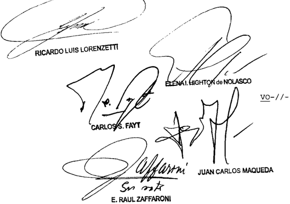

## =I/-Io DEL SEÑOR MINISTRO DOCTOR DON E RAÚL ZAFFARONI

## Considerando:

Que esta Corte comparte los fundamentos Y conclusiones del dictamen de la señora Procuradora Fiscal, al que se remite en razón de brevedad\_

Por ello, se hace lugar la queja Y al recurso traordinario deducido, Y se deja sin efecto la sentencia en cuanto fue motívo de agravios \_ Con costas Vuelvan 10s autos al tribunal de origen fin de que , por quien corresponda, se dicte un nuevo pronunciamiento con arreglo al presente\_ Devuélvase el depósito de 1 Notifíquese, agréguese la queja al principal Y, oportunamente, remítase fs -

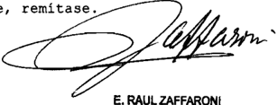

Recurso de hecho interpuesto Juan Esteban Echarú , representado 1a Dra Marina Sandra Margrett

Tribunal de origen: Cánara Nacional de Apelacionob en 10 Civil Comercial Federal , Sala 2

Tribunal que intervino con anterioridad: Juzgudo de Primera Inbtancie en 1o Civil Comercial Federal 10 , Secretaría 20

LOMA NEGRA COMPAÑIA INDuSTRIAL S.A. y OTROS S/ LEy 22.262

## DEFENSA DE LA COMPETENCIA.

Cabe admitir el recurso de queja incoado, declarar procedente el recurso extraordinario y suspender la ejecución de la sentencia de cámara que confirmó las sanciones impuestas a los actores por infracción a la Ley de Defensa de la Competencia 22.262, mediante la resolución SCT Nº 124/2005 de la Secretaría de Coordinación Técnica del Ministerio de Economía y Producción de la Nación, pues las particularidades que presentó el trámite de la causa por ante los diversos tribunales intervinientes, la importancia económica de las multas impuestas y el hecho de que los argumentos aducidos en el recurso extraordinario y mantenidos en esta presentación directa pueden, prima facie, involucrar cuestiones de orden federal, llevan al tribunal a declarar procedente la queja y decretar la suspensión del curso del proceso, sin que esto implique pronunciamiento alguno sobre el fondo del asunto.

-En igual sentido: causas L 155 XLV 'Loma Negra Compañía Industrial S.A y otros s/ ley 22.262 - Comisión Nacional de Defensa de la Competencia'; L 159 XLV 'Loma Negra Compañía Industrial S.A y otros s/ ley 22.262'; y L 161 XLV 'Loma Negra Compañía Industrial S.A y otros s/ ley 22.262', sentencias de la fecha-.

## FALLO DE LA CORTE SuPREMA

## Buenos Aires Juo

Vistos 10s autos "Recurso de hecho deducido por Loma Ne gra S .A Cemento San Martín en la causa Loma Negra pañía Industrial S .A . Y otros 5/ 22 . 262" para decidir sobre su procedencia ley

## Considerando

10 ) Que la gala "B" de la Cámara Nacional de Apela ciones en Penal Económico, en cuanto al caso interesa, con firmó las sanciones impuestas Loma Negra C .I.A.S.A. Juan Mi netti S .A Cementos Avellaneda S .A Petroquímica Comodoro Ri vadavia S .A Cemento San Martín S .A Y la Asociación Fabricantes de Cemento Pórtland por infracción la Ley de Defensa de la Competencia 22 .262 , mediante la resolución SCT no 124/2005 de la Secretaría de Coordinación Técnica del Ministerio de Economía Y Producción de la Nación

Las sancionadas interpusieron contra aquella sentencia sendos recurgo de que tuvieron un trámite irregular puesto que la sala IV de la Cámara Federal de Casación Penal admitió formalmente 10s recursos de cinco de ellas mientras que la sala III, en cambio, desestimó el que había deducido la Aso ciación Fabricantes de Cemento Pórtland\_ Lo actuado por esta últimà sala fue anulado por este Tribunal oportunidad en la que también se dispuso que 1a sala IV se expidiera respecto del recurso interpuesto por la Asociación (pronunciamiento del 10 de agosto de 2010 en el expte 1.319 XLV) el que finalmente fue admitido

Abierta la instancia de casación desde el punto de vista formal la cámara , por medio de su sala IV dejó sin efecto la sentencia de la Cámara Nacional de Apelaciones en 1o Penal Económico Y le reenvió el expediente para que dictase una nueva de conformidad con la doctrina de Fallos 325:1702

Finalmente Y ante un planteo del Estado Nacional , la

misma sala ~aunque con diferente integraciónanuló el procedimiento llevado cabo en esa instancia, para resolver después volviendo sobre sus pasos , que los recursos de casación eran inadmisibles puesto que esa cámara carecía de competencia para re visar cuestiones vinculadas con infracciones de defensa de la competencia (pronunciamientos del 21 de año en curso) ley

20 ) Que las sancionadas además de 10s recursos de casación, interpusieron recursos extraordinarios contra la sen tencia de la sala "B" de la Cámara Nacional de Apelaciones en Penal Económico que fueron denegados Y dieron lugar las res pectivas quejas El recurso extraordinario de la Asociación Fa bricantes de Cemento Pórtland fue declarado formalmente admisible por esta Corte Y se dispuso la suspensión de la ejecución de la sentencia (resolución del de noviembre de 2009 en el expte L.152 XLV) toda vez que como se esta entidad se le había denegado también la vía casatoria\_ Por último Y en oca sión de anular el trámite del recurso de casación ante la sala III Y dar intervención la sala IV este Tribunal suspendió emitir pronunciamiento en el recurso extraordinario interpuesto por la asociación mencionada (conf punto de la parte dispositiva de la resolución dictada el 10 de agosto 2010 en el 1.319 .XLV) Y pospuso también pronunciarse respecto de las restantes quejas por denegación de recursos extraordina rios

Los representantes de Loma   Negra C.I.A.S.A. Juan Mi netti S .A Cementos Avellaneda S .A . Petroquímica Comodoro Ri vadavia Y Cemento San Martín S .A manifiestan que como secuencia de 10 resuelto por la Cámara Federal de Casación Penal el 21 de junio pasado , al declarar inadmisibles 10s recursos de casación, corren el riesgo de que la autoridad administrativa intente ejecutarle multas impuestas por la resolución SCT 124/2005 por que solicitan esta Corte que declare formal mente admisible 10s recursos extraordinarios Y ordene suspender dicha ejecución las

Que las particularidades que presentó el trámite de la presente causa por ante 10s diversos tribunales intervi-

nientes la importancia económica de las multas impuestas Y el hecho de que los argumentos aducidos en el recurso extraordinario Y mantenidos en esta presentación directa pueden , prima facie involucrar cuestiones de orden federal llevan al tribunal declarar procedente la queja Y decretar la suspensión del s0 del proceso sin que esto implique pronunciamiento alguno bre el fondo del recurso (Fallos 295 : 658 ; 297 :558 ; 308 :249 Y 317:1447 entre otros)

Por ello, se admite el recurso de queja incoado declara procedente el recurso extraordinario Y se suspende la ejecución de la sentencia dictada el 26 de agosto de 2008 por la Sala de la Cámara Nacional de Apelaciones en Penal Económico en -// -causa 54 419 Suspéndese asimismo, el trámite del presente recurso extraordinario por no hallarse firme el pronun ciamiento dictado el 21 de junio de 2012 por la Cámara Nacional de Casación Penal (Sala IV) en la causa registro 1012/12 Reintégrense depósitos de fs 2/3 Noti fíque se 10

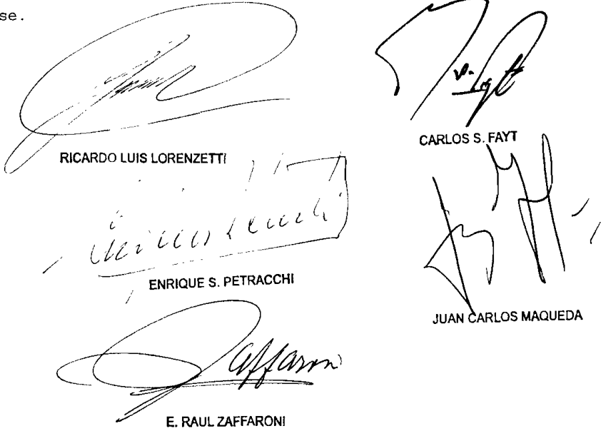

Recurso de hecho deducido por Loma Negre Compañía Induetrial Argedtino 8 .A . Canento San Martín 8 .A repregentadog por 108 Dreb Alfredo Iriberren con el patrocinio letrado del Dr Ricardo G11 Lavedra ,

Tribunal de origen: Hacional 0n Ponal Económco . Sala 10

## DE JUSTICIA DE LA NACION

## MENENDEZ, LuCIANO BENjAMIN S/ CAuSA Nº 12942

## PROCEDIMIENTO PENAL.

Cabe dejar sin efecto la sentencia por arbitraria que desestimó los recursos de casación deducidos contra la resolución que admitió la excepción de incompetencia planteada por la defensa y dispuso la remisión de la causa al juzgado federal local con el objeto de que se aplique en lo sucesivo el procedimiento establecido por la ley 2372 -procedimiento penal ya derogado-, pues la interpretación que efectuó el a quo acerca de la norma transitoria del artículo 12 de la ley 24.121 -según la cual las causas iniciadas con anterioridad a la entrada en vigencia del Código Procesal Penal de la Nación proseguirán sustanciándose de conformidad con las disposiciones del Código de Procedimientos en Materia Penal-, es el producto de la irreflexiva consideración de los términos de la ley, que tampoco fue acompañada por una razonable apreciación de las circunstancias de la causa.

- -Del dictamen de la Procuración General, al que remitió la Corte Suprema-.

-El juez Petracchi, en disidencia, declara inadmisible el recurso extraordinario (art. 280 C.P.C.C.N.)-.

## PROCEDIMIENTO PENAL.

Cabe dejar sin efecto la sentencia por arbitraria que desestimó los recursos de casación deducidos contra la resolución que admitió la excepción de incompetencia planteada por la defensa y dispuso la remisión de la causa al juzgado federal local con el objeto de que se aplique en lo sucesivo el procedimiento establecido por la ley 2372 -procedimiento penal ya derogado-, pues no ha observado las pautas fijadas por el Tribunal al interpretar el artículo 12 de la ley 24.121, desde que concluyó que esa norma por la que se pretendió regular la transición entre dos sistemas procesales, alude a las causas iniciadas antes de la entrada en vigencia de la ley 23.984, a pesar de que dicho artículo se refiere a las que en ese momento hubieren estado 'en trámite', término que, aunque implica un acto de iniciación, tiene una significación más concreta, que reduce o acota ese universo, en tanto expresa claramente la idea de actividad, movimiento o conducción por cada uno de los actos y etapas del proceso penal con el objetivo de llegar a su conclusión. -Del dictamen de la Procuración General, al que remitió la Corte Suprema-.

-El juez Petracchi, en disidencia, declara inadmisible el recurso extraordinario (art. 280 C.P.C.C.N.)-.

## PROCEDIMIENTO PENAL.

Cabe dejar sin efecto la sentencia por arbitraria que desestimó los recursos de casación deducidos contra la resolución que admitió la excepción de incompetencia planteada por la defensa y dispuso la remisión de la causa al juzgado federal local con el objeto de que se aplique en lo sucesivo el procedimiento establecido por la ley 2372 -procedimiento penal ya derogado-, pues al interpretar el artículo 12 de la ley 24.121 no tomó en cuenta la consideración de sus consecuencias -pauta

## FALLOS DE LA CORTE SUPREMA 335

fijada por el Tribunal a fin de verificar si la inteligencia de una disposición es racional y congruente con el resto del sistema del que forma parte-, por cuanto no reconoció significación al tiempo transcurrido desde que tuvo lugar la transición al régimen procesal actual, ni al que pasó desde que se formuló el requerimiento de instrucción, ni al hecho de que todo lo actuado luego de esa requisitoria hasta la elevación de la causa a juicio se realizó bajo las normas del Código Procesal Penal de la Nación, con la participación sin objeciones de aquél.

- -Del dictamen de la Procuración General, al que remitió la Corte Suprema-.

-El juez Petracchi, en disidencia, declara inadmisible el recurso extraordinario (art. 280 C.P.C.C.N.)-.

## SENTENCIA EQUIPARABLE A DEFINITIVA.

Cabe equiparar a sentencia definitiva, el pronunciamiento que desestimó los recursos de casación deducidos contra la resolución que admitió la excepción de incompetencia planteada por la defensa y dispuso la remisión de la causa al juzgado federal local con el objeto de que se aplique en lo sucesivo el procedimiento establecido por la ley 2372 -procedimiento penal ya derogado-, en la medida que los agravios que provoca, al disponer la aplicación de un ordenamiento procesal derogado hace ya casi veinte años a una causa que ha tramitado bajo las normas del código procesal que lo sucedió, pueden ser de tardía, insuficiente o imposible reparación ulterior.

- -Del dictamen de la Procuración General, al que remitió la Corte Suprema-.

-El juez Petracchi, en disidencia, declaró inadmisible el recurso extraordinario (art. 280 C.P.C.C.N.)-.

DICTAMEN DE LA PROCuRACIóN GENERAL

## Suprema Corte:

- I -

La Sala III de la Cámara Nacional de Casación Penal rechazó los recursos de casación deducidos por la parte querellante y el Fiscal General contra la resolución por la que el Tribunal Oral en lo Criminal Federal de la provincia de Jujuy hizo lugar a la excepción que planteó la defensa de Luciano Benjamín M., se declaró incompetente, y dispuso la remisión de la causa al juzgado Federal nº 2 de esa provincia, con el objeto de que se aplique en lo sucesivo el procedimiento establecido por la ley 2372.

Para así decidir, el a quo -por mayoría- coincidió con el tribunal oral en cuanto a que la causa actual es continuación de las iniciadas

previamente en los años 1984 y 1986, por la denuncia de la desaparición de Dominga A. S. de S., que originalmente tramitó bajo las disposiciones de ese régimen procesal.

Sobre esa base, los jueces que conformaron la opinión mayoritaria sostuvieron que la resolución del tribunal oral cuenta con adecuada motivación.

En ese sentido, consideraron que la decisión se ajusta a los parámetros establecidos en el artículo 12 de la ley 24.121, ' que indica que aquellas causas que se hubieren iniciado con anterioridad a la entrada en vigencia del Código Procesal Penal de la Nación (ley 23.984), 'proseguirán sustanciándose y terminarán de conformidad con las disposiciones de la ley 2372 y sus modificatorias, salvo que el procesado o acusado solicitare la aplicación del procedimiento previsto en la ley 23.984 dentro de los quince días de notificado legalmente para el ejercicio de esa opción' y que 'En las causas en que hubiere más de un procesado o acusado, la opción prevista en el párrafo anterior debe ser ejercida en forma unánime '.

Asimismo, estuvieron de acuerdo con el tribunal oral en cuanto sostuvo que ' De las constancias de la causa no surge que el imputado M. haya ejercido la opción prevista por el art. 12 de la ley 24.121'; que 'su silencio durante la instrucción sólo puede interpretarse como una elección del procedimiento escrito previsto por la ley 2372, que también establece el trámite del juicio plenario ante los tribunales federales'; y que 'al no poder ejercer al imputado M. la opción legal comprendida en el artículo 12, fueron vulnerados sus derechos y garantías constitucionales protegidos por los arts. 16, 17 y por sobre todo se violó el art. 18 de la Constitución Nacional que garantiza que todo procesado tiene derecho a ser juzgado por el juez natural, el juez que correspondía lo juzgase al momento de la comisión del hecho '.

Agregaron que en la causa no se notificó a ninguno de los imputados de aquella facultad que la ley les otorgaba, y dijo que ' la circunstancia de que el imputado no ejerza la opción que impone la ley 24.121 implica, ministerio legis, su voluntad de continuar con la sustanciación del proceso bajo las previsiones de la ley 2372 '.

Finalmente, también coincidieron con el tribunal oral en que la resolución por la que se rechazó un planteo anterior en el mismo sentido, formulado por el imputado B., no resultaba oponible a M. por cuanto no

le fue notificada. Y concluyeron que al haber expresado esos dos imputados la pretensión de que se aplicara la ley 2372, no cabía proseguir de acuerdo con la ley 23.984, desde que el artículo 12 de la ley 24.121 requiere que el ejercicio de esa opción sea unánime.

- II -

Contra esa decisión, el representante del Ministerio Público Fiscal dedujo recurso extraordinario (fs. 8/17) en el que la tachó de arbitraria por entender que cuenta con fundamentación sólo aparente.

En ese sentido, objetó la aplicación que se hizo en el sub lite del artículo 12 de la ley 24.121, por considerarla producto de una errónea interpretación de sus términos y de una defectuosa apreciación de las circunstancias de la causa.

Al respecto, dijo que aunque durante la vigencia del Código de Procedimientos en Materia Penal se iniciaron actuaciones con motivo de la desaparición y el posterior hallazgo del cuerpo -sin vida- de Dominga Á. S. Sin embargo, los autores del hecho no estaban en ese entonces identificados, y recién se formuló requerimiento fiscal de instrucción contra M. y demás imputados el 6 de octubre de 2003, con el actual código procesal vigente, de manera que no existía siquiera la necesidad de aplicar la norma transitoria del artículo 12 de la ley 24.121.

Por otra parte, agregó que entre esa imputación contra M. y la fecha del planteo por el que éste solicitó la aplicación del procedimiento previsto en la ley 2372, transcurrió un considerable lapso y se desarrolló un copioso trámite de acuerdo con las reglas del ordenamiento previsto en la ley 23.984, en el que participaron constantemente el imputado y su defensa, lo que significó una opción por ese último régimen procesal.

La denegación de esa apelación extraordinaria motivó la interposición de la presente queja (fs. 25/26).

En cuanto a la procedencia formal del remedio federal deducido, entiendo que cabe equiparar el pronunciamiento apelado a una sen-

tencia definitiva, en la medida que los agravios que provoca, al disponer la aplicación de un ordenamiento procesal derogado hace ya casi veinte años a una causa que ha tramitado bajo las normas del código procesal que lo sucedió, pueden ser de tardía, insuficiente o imposible reparación ulterior (Fallos: 308:90 y 144).

Por otra parte, y como quedará demostrado a partir del análisis que se realizará en los apartados que siguen, se hallan comprometidos en el caso principios vinculados al debido proceso legal, lo que torna necesario, a mi modo de ver, la oportuna intervención de V.E. (doctrina de Fallos: 319:2720, considerando 3º y sus citas).

- Iv-

Acerca del fondo del asunto, a los argumentos desarrollados por el magistrado recurrente, a los que me remito y doy aquí por reproducidos en beneficio de la brevedad, estimo conveniente agregar algunas consideraciones sobre la arbitrariedad del pronunciamiento.

Al respecto, aprecio que la opinión mayoritaria reprodujo la defectuosa fundamentación en que se apoyó el tribunal oral para hacer lugar a la excepción planteada por la defensa de M.

En primer lugar -por ser el punto de partida de la errónea aplicación de la ley en el sub examine - cabe destacar la interpretación que efectuó aquel tribunal acerca de la norma transitoria del artículo 12 de la ley 24.121, y que el a quo hizo suya, según la cual las causas iniciadas con anterioridad a la entrada en vigencia del Código Procesal Penal de la Nación proseguirán sustanciándose de conformidad con las disposiciones del Código de Procedimientos en Materia Penal,

A mi modo de ver, tal afirmación es el producto de la irreflexiva consideración de los términos de la ley, que tampoco ha sido acompañada por una razonable apreciación de las circunstancias de la causa.

En ese sentido, tiene dicho la Corte que, si bien la primera fuente de interpretación de la ley es su letra, las palabras deben entenderse empleadas en su verdadero significado -el que tienen en la vida diaria-, y cuando la ley emplea varios términos, no son superfluos, sino que han sido empleados con algún propósito, sea de ampliar, de limitar o de corregir conceptos, por cuanto, en definitiva, el fin primordial del

intérprete es dar pleno efecto a la voluntad del legislador y, al mismo tiempo, ha considerado que debe evitarse el excesivo rigor de los razonamientos que desnaturalicen al espíritu que ha inspirado su sanción (Fallos: 331:2550 y sus citas).

Asimismo, 'el Tribunal ha entendido históricamente que la misión judicial no se agota con la sola consideración indeliberada de la letra de la ley. En primer término porque, sin mengua de ella, es ineludible función de los jueces, en cuanto órganos de aplicación del ordenamiento jurídico vigente, determinar la versión, técnicamente elaborada, de la norma aplicable al caso, tarea a que esta Corte se ha referido aludiendo al establecimiento del sentido jurídico de la ley como distinto de su acepción semántica o vulgar, y como resultado de una interpretación sistemática y razonable. Y también porque los jueces son, en cuanto ministros de la ley, servidores del derecho para la realización de la justicia, que puede alcanzarse con resoluciones positivamente valiosas, derivadas razonablemente del ordenamiento jurídico vigente (Fallos: 244:27; 238:550; 243:80, entre otros) incluso en los principios que lo integran para la decisión de los casos concretos (Fallos: 249:37)' (Fallos: 331:2550, considerando 14º).

A mi modo de ver, el pronunciamiento apelado no ha observado esas pautas al interpretar el artículo 12 de la ley 24.121, desde que concluyó que esa norma por la que se pretendió regular la transición entre dos sistemas procesales, alude a las causas iniciadas antes de la entrada en vigencia de la ley 23.984, a pesar de que dicho artículo se refiere a las que en ese momento hubieren estado 'en trámite', término que, aunque implica un acto de iniciación, tiene una significación más concreta, que reduce o acota ese universo, en tanto expresa claramente la idea de actividad, movimiento o conducción por cada uno de los actos y etapas del proceso penal con el objetivo de llegar a su conclusión.

Además, cabe tener presente que esa disposición legal alude a causas en las que hubiera alguien procesado o acusado, es decir, aquéllas con un determinado desarrollo del procedimiento en las que, al menos, se haya llamado al imputado a prestar declaración indagatoria en los términos del artículo 236 del Código de Procedimientos en Materia Penal -que bajo ese ordenamiento implicaba el procesamiento-.

Es evidente, en mi opinión, que dicha norma transitoria no se dirige a casos como el presente, en el que -conforme lo destacó la Cámara

Federal de Apelaciones de Salta para rechazar un planteo similar, y lo reiteró el representante del Ministerio Público Fiscal ante el a quo - se iniciaron actuaciones por denuncia en el año 1984, y estuvieron paralizadas entre 1985 y 2003, lapso durante el cual no se llevó a cabo medida alguna, y recién el 6 de octubre de ese último año se formuló requerimiento fiscal de instrucción contra el imputado M.

En tales condiciones, considero que no constituía una de las 'causas actualmente en trámite' a las que se refiere el artículo 12 de la ley 24.121, y correspondía llevarla adelante, como se hizo, bajo las normas del Código Procesal Penal de la Nación (ley 23.984), lo que además se ajustó a la doctrina de la Corte según la cual las leyes modificatorias de la jurisdicción y competencia se aplican de inmediato a las causas pendientes, porque la facultad de cambiar las leyes de forma pertenece a la soberanía, y no existe derecho adquirido a ser juzgado por un determinado procedimiento, pues las normas procesales y jurisdiccionales son de orden público, especialmente cuando estatuyen acerca de la manera de descubrir y perseguir delitos (Fallos: 306:2101; 320:1878, 321:1865 y 327:5496, entre muchos otros).

Sin perjuicio de ello, ha dicho también el Tribunal que una de las pautas más seguras para verificar si la inteligencia de una disposición es racional y congruente con el resto del sistema del cual forma parte, es  la  consideración  de  sus  consecuencias  (Fallos:  234:482;  303:917; 310:464, considerando 9º; 323:3412; 324:68; 328:53; 331:1262).

A mi modo de ver, el fallo apelado tampoco atiende a esa pauta. Así lo pienso, por cuanto no reconoció significación al tiempo transcurrido desde que tuvo lugar la transición al régimen procesal actual, ni al que pasó desde que se formuló el requerimiento de instrucción respecto de M., ni al hecho de que todo lo actuado luego de esa requisitoria hasta la elevación de la causa a juicio se realizó bajo las normas del Código Procesal Penal de la Nación, con la participación sin objeciones de aquél. Antes bien, sin dar otro fundamento más que el de que las palabras suponen, en toda hipótesis, un mandamiento inflexible y sin salida (conf. Fallos: 313:1232) sostuvo que la norma que correspondería aplicar, en adelante, era el régimen de la derogada ley 2372, a pesar de sus características sustancialmente distintas a las del ordenamiento procesal que rigió hasta ahora la causa, entre las que cabe destacar -por las graves consecuencias que podría tener- el diverso método de valoración de la prueba.

A lo hasta aquí expuesto, estimo pertinente agregar que, en mi opinión, la alegada violación de la garantía del juez natural, con base en que -según el fallo- el imputado no pudo ejercer la opción prevista en el artículo 12 de la ley 24.121, no es más que una mera afirmación dogmática que, además, resulta contradicha por la aplicación que se hizo del único régimen procesal por el que aquél podía optar en los términos de aquella disposición legal.

En efecto, la única opción que ésta prevé en cabeza del imputado, frente a la prosecución bajo las reglas de la ley 2372 que establece la propia ley -y no la voluntad de aquél- para determinados supuestos, es por la aplicación del procedimiento previsto en la ley 23.984, que es el que -como se dijo- fue aplicado sin objeciones en la causa.

Por lo demás, estimo que la cláusula del artículo 18 de la Constitución Nacional que dice 'Ningún habitante de la Nación puede ser... juzgado por comisiones especiales, o sacado de los jueces designados por la ley antes del hecho de la causa' no brinda amparo frente a modificaciones de la ley procesal como la que tuvo lugar en el sub examine, de conformidad con la jurisprudencia de la Corte con arreglo a la cual 'el verdadero fundamento de la formulación, en su doble aspecto, de la garantía de los jueces naturales, consiste en la voluntad de asegurar a los habitantes de la Nación una justicia imparcial, cuyas decisiones no pudieran presumirse teñidas de partidismo contra el justiciable, completando así el pensamiento de implantar una justicia igual para todos, que informara la abolición de los fueros personales... Lo inadmisible, lo que la Constitución repudia, es el intento de privar a un juez de la jurisdicción en un caso concreto y determinado, para conferírsela a otro juez que no la tiene, en forma tal que por esta vía indirecta se llegue a constituir una verdadera comisión especial disimulada bajo la calidad de juez permanente de que se pretende investir a un magistrado de ocasión' (Fallos: 310:804, considerando 6º).

El principio mencionado en el apartado precedente, según el cual la  facultad  de  cambiar  las  leyes  procesales  es  una  atribución  que pertenece a la soberanía, y no existe derecho a ser juzgado por un determinado procedimiento pues las leyes sobre esa materia son de orden público, especialmente cuando estatuyen acerca de la manera de descubrir y perseguir delitos, es compatible con la garantía del juez

natural, conforme lo expresó el Tribunal en el precedente de Fallos: 17:22, en cuanto sostuvo 'Que el objeto del artículo diez y ocho de la Constitución ha sido proscribir las leyes ex post facto , y los juicios por comisiones nombradas especialmente para el caso, sacando al acusado de la jurisdicción permanente de los jueces naturales, para someterlo a Tribunales o jueces accidentales o de circunstancias: que estas garantías indispensables para la seguridad individual no sufren menoscabo alguno, cuando a consecuencia de reformas introducidas por la ley en la administración de justicia criminal, ocurre alguna alteración en las jurisdicciones establecidas, atribuyendo a nuevos Tribunales permanentes, cierto género de causas de que antes conocían otros que se  suprimen o cuyas atribuciones restringen: que la interpretación contraria serviría muchas veces de obstáculo a toda mejora en esta materia, obligando a conservar magistraturas o jurisdicciones dignas de supresión o reformas'.

No paso por alto que la Corte ha reconocido que el principio con arreglo al cual las leyes que regulan la competencia son de inmediato aplicables a las causas pendientes, no impide la pertinencia de excepciones, como podría ocurrir cuando la ley contenga disposiciones de las que resulte un criterio distinto (conf. Fallos: 306:2101, considerando 14º del voto de la mayoría y considerando 7º del voto concurrente del juez José Severo Caballero).

Sin embargo, opino que esa situación no se configura en el sub lite , de acuerdo con las consideraciones expuestas supra al analizar la norma transitoria en cuestión con referencia a las concretas circunstancias del caso.

Por todo lo expuesto, considero que la decisión apelada resulta descalificable con arreglo a la doctrina de la Corte invocada por el apelante, que tiende a resguardar la defensa en juicio y el debido proceso, al exigir que las sentencias sean fundadas y constituyan una derivación razonada del derecho vigente con aplicación a las circunstancias comprobadas de la causa (Fallos: 311:948, 2314, 2547; 312:2507, entre otros).

En consecuencia, y teniendo además en cuenta los fundamentos del Fiscal General, mantengo esta queja. Buenos Aires, 14 de febrero de 2012. Esteban Righi.

## FALLO DE LA CORTE SuPREMA

## Buenos Aires, lode dulso

Vistos 10s autos: "Recurso de hecho deducido por el Fiscal General ante la Cámara Nacional de Casación Penal en la causa Menéndez , Luciano Benjanín 5 / causa 12 . 942" para decidir bre su procedencia

## Considerando:

Que esta Corte comparte hace suyos \_ en l0 pertinente, los fundamentos conclusiones del señor Procurador General, cuyos térninos se remite en razón de brevedad -

Por ello, concordemente con dictamninado por el señor Procurador General , se hace lugar la queja, se declara procedente el recurso extraordinario Y se deja sin efecto la sentencia apelada . Vuelva al tribunal de origen para que por quien corresponda , se dicte un nuevo pronunciamiento con arreglo ello agréquese al principal cúmplase

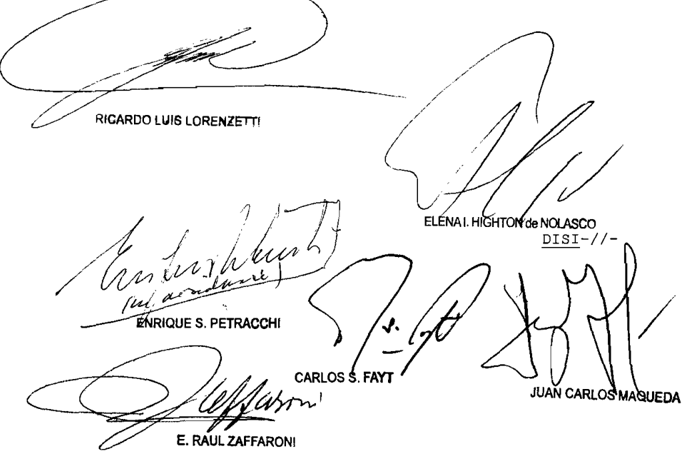

## DE JUSTICIA DE LA NACION

DEL SEÑOR MINISTRO DOCTOR DON ENRIQUE SANIIAGO PETRACCHI

## Considerando

Que el recurso extraordinario, cuya denegación motiva esta queja, es inadmisible (art\_ 280 del Código Procesal Civil y Comercial de la Nación)

Por ello, se la desestima Notifíquese archívese

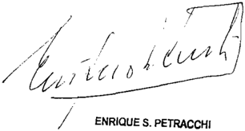

de hecho interpuesto Por Eateban Righi Procurador General de Na ción

Tribunal de origen: Sala III , Cámara Federal de Casación Penal

Tribunal que intervino cor anterioridad: Iribunal Oral 10 Criminal Federal de Jujuy

## MINERA DEL ALTIPLANO S.A. C/ ESTADO NACIONAL P.E.N. y OTRA S/ AMPARO

## MINERIA.

La ley 24.196 -Régimen de Inversiones Mineras- ni en su reglamentación -Decreto 2683/93- no eximen a los sujetos comprendidos en su régimen del pago de los nuevos gravámenes que se establezcan, o de los incrementos que se dispongan, con posterioridad a la presentación del estudio de factibilidad al que se hace referencia en su art. 8, por lo que extender los beneficios de la 'estabilidad fiscal' más allá de la letra de la ley implicaría sustituir al legislador en su tarea, aspecto vedado a los tribunales, quienes no pueden juzgar el mero acierto o conveniencia de las disposiciones adoptadas por los otros poderes en ejercicio de sus facultades propias, debiendo limitarse a su aplicación tal como éstos las concibieron.

-Del dictamen de la Procuración General, al que remitió la Corte Suprema-.

## DERECHOS DE EXPORTACION.

La pretensión de cobro del nuevo gravamen -los derechos de exportación- y el hipotético aumento de la carga tributaria total -en caso de producirse- no resultan, por sí solas, conductas estatales manifiestamente arbitrarias e ilegítimas a la luz del régimen de la ley 24.196 y de sus normas reglamentarias, exigencia que no ha variado para los procesos de amparo por la sanción del nuevo art. 43 de la Constitución Nacional pues reproduce el art. 1 º de la ley 16.986, imponiéndose idénticos requisitos para su procedencia.

-Del dictamen de la Procuración General, al que remitió la Corte Suprema-.

DICTáMENES DE LA PROCuRACIóN GENERAL

Suprema Corte:

- I -

A fs. 159/165 de los autos principales (a los que se referirán las siguiente citas), la Cámara Federal de Apelaciones de Salta, al revocar la sentencia de la instancia anterior, hizo lugar al amparo promovido y declaró inaplicables las notas 130/07 de la Secretaría de Minería y 288/07 de la Secretaría de Comercio Interior, con relación al proyecto 'Fénix', llevado adelante por la actora en el Salar del Hombre Muerto.

Para así decidir, puntualizó que la accionante se encuentra amparada por el beneficio de la estabilidad fiscal regulado por el art. 8º de la ley 24.196, lo que implica que debe mantenerse por treinta años la situación vigente al 2 de septiembre de 1996 respecto de los tributos nacionales que alcanzan a su actividad promovida.

En este sentido, destacó que el decreto 310/02 y la resolución del Ministerio de Economía 11/02 habían incrementado los derechos de exportación pero la Dirección General de Aduanas, por medio de la instrucción general 19/02, había aclarado que las mercaderías producidas por los exportadores que gozan de estabilidad fiscal en los términos del art. 8º de la ley permanecían exentas, lo que fue corroborado por las notas 3/02, 70/02, 175/02, 161/03 y 163/03 de la Subsecretaría de Minería.

Afirmó que es el Estado Nacional quien debe demostrar que el pago de los derechos de exportación reclamado por las notas aquí cuestio-

nadas no afecta la estabilidad fiscal del amparista. Y enfatizó que las citadas notas 130/07 y 288/07, en tanto órdenes de cobro de ciertos gravámenes a cuyo abono no estaba anteriormente obligada la actora, constituyen prueba suficiente del incremento de su carga tributaria, frente a lo cual no deben exigirse más probanzas.

En todo caso, concluyó, es el Estado Nacional quien pudo demostrar en este expediente que su decisión no afectaba la estabilidad fiscal de la actora y, sin embargo, no lo hizo, omisión que torna irrelevante el cuestionamiento fincado en la existencia de una vía administrativa específica, prevista por la ley 24.196 y su reglamentación, para que la amparista reclame el perjuicio que le provoca el incremento de los derechos de exportación.

## - II -

Disconforme, el Estado Nacional interpuso el recurso extraordinario de fs. 168/187, que fue concedido a fs. 219/220 en cuanto se cuestionó la interpretación y el alcance de normas de carácter federal y desestimado en lo referente a la arbitrariedad y la gravedad institucional invocadas. Ante esta decisión, la apelante presentó recurso de hecho que, bajo el registro M.889, L.XLV, corre agregado por cuerda a la presente causa.

Explicó que la estabilidad fiscal no importa otorgar al contribuyente una constancia de indemnidad, que le garantice que no se le impondrán nuevas gabelas en el futuro, sino que ella lo resguarda de posibles incrementos en la carga tributaria teniendo en cuenta la suma de todos los impuestos fijados en una jurisdicción en particular. Por ende, no importa si a la actora se le impuso un gravamen a sus exportaciones pues, para establecer que se ha alterado su beneficio, deberá demostrar que se produce un aumento en su carga tributaria total respecto del momento en que se le otorgó el certificado de estabilidad.

Esgrime que el contribuyente no ha acreditado esta circunstancia y tampoco podría haberlo hecho en un proceso como el presente amparo, en el cual la amplitud del debate sobre los hechos y las pruebas se encuentra notoriamente acotado.

Por contrario, subraya que la cámara creyó necesario invertir la carga de la prueba y erróneamente, pretende que sea el Estado Nacional quien demuestre en concreto que los incrementos en los derechos

a la exportación dispuestos por el decreto 310/02 y la resolución del Ministerio de Economía 11/02 no cercenan la estabilidad fiscal de la amparista.

Denunció, para finalizar, la existencia de gravedad institucional en lo resuelto, atento la trascendencia de la cuestión debatida y el interés público comprometido.

## - III -

Estimo que, por razones de economía procesal, es conveniente tratar de manera conjunta lo referido al recurso extraordinario de fs. 168/187 y al de hecho del expediente M.889, L.XLV, que corre por cuerda.

En tal sentido, considero que ambos resultan formalmente admisibles, toda vez que se halla en tela de juicio la inteligencia de preceptos de carácter federal (ley 24.196 y sus normas reglamentarias) y la decisión definitiva del superior tribunal de la causa ha sido contraria al derecho que el recurrente ha sustentado en ellas (art. 14, inc. 3º, de la ley 48).

Además, pienso que corresponde examinar, en forma conjunta, las impugnaciones traídas a conocimiento del Tribunal, ya que las referidas a la alegada arbitrariedad en que habría incurrido el tribunal anterior y las atinentes a la interpretación de la cuestión federal son dos aspectos que guardan entre sí estrecha conexidad (conf. doctrina de Fallos: 321:2764; 323:1625).

La ley 24.196 instituye un régimen destinado a promover las inversiones en la actividad minera que, entre otros beneficios, contempla que los emprendimientos mineros allí comprendidos gozarán de estabilidad fiscal por el término de treinta años contados a partir de la fecha de presentación de su estudio de factibilidad (art. 8º, ley 24.196),

Para ello, la propia ley define el concepto de 'estabilidad fiscal' con los siguientes términos: ' Significa que las empresas que desarrollen actividades mineras en el marco del presente régimen de inversiones no podrán ver incrementada su carga tributaria total, considerada en forma separada en cada jurisdicción determinada al momento de la presentación, del citado estudio de factibilidad, en los ámbitos na-

cional, provinciales y municipales ' (art. 8º, inc. 1, pto. 2., ley 24.196, subrayado agregado).

A continuación, la ley especifica que ' Por incremento de la carga tributaria total, y en atención a las pertinentes normas legales vigentes a la fecha de presentación del estudio de factibilidad, se entenderá a aquel que pudiere surgir en cada ámbito fiscal, como resultado de los actos que se enuncian en el párrafo siguiente y en la medida que sus efectos no fueren compensados en esa misma jurisdicción por supresiones y/o reducciones de otros gravámenes y/o modificaciones normativas tributarias que resulten favorables para el contribuyente ' (art. 8º, inc. 2., ley 24.196, el subrayado no obra en el original).

En su art. 8º, inc. 5), la ley dispone: ' Estará a cargo de los sujetos beneficiarios de la estabilidad fiscal que invoquen que ella ha sido vulnerada, justificar y probar en cada caso -con los medios necesarios y suficientes- que efectivamente se ha producido un incremento en la carga tributaria en el sentido y con los alcances emergentes de las disposiciones de este artículo. Para ello deberán efectuar sus registraciones contables separadamente de las correspondientes a sus actividades no comprendidas por la estabilidad fiscal, adoptar sistemas de registración que permitan una verificación cierta y presentar al organismo fiscal competente los comprobantes que respalden su reclamo, así como cumplir toda otra forma, recaudo y condiciones que establezca la autoridad de aplicación de esta ley '.

Para despejar toda duda, en esta misma norma el Congreso de la Nación asimismo estableció: ' La compensación de aumentos tributarios y arancelarios con reducciones de los mismos conceptos, para determinar si se ha producido en el mismo ámbito jurisdiccional un incremento de la carga tributaria total, se realizará por cada emprendimiento alcanzado por la estabilidad fiscal y por cada ejercicio fiscal vencido, entendiéndose, en todos los casos el que corresponde a la empresa para el impuesto a las ganancias, en la forma y condiciones que establezca la autoridad de aplicación ' (art. 8º, inc. 7, énfasis añadido).

Al reglamentar esta norma, el Poder Ejecutivo dispuso, con la finalidad de determinar la magnitud de la carga tributaria y arancelaria efectivamente soportada y asegurar el efectivo goce del beneficio de la estabilidad fiscal, lo siguiente: ' El sujeto que hubiera soportado en un ejercicio fiscal una carga tributaria y/o arancelaria total superior a la que hubiera correspondido, atendiendo a su calidad de sujeto bene-

ficiario de la estabilidad fiscal, de conformidad con las disposiciones establecidas por la ley 24.196 y sus modificaciones, podrá solicitar la compensación o devolución de las sumas que hubiere abonado de más, en la forma, plazo y condiciones que establezca la Administración Federal de Ingresos Públicos, entidad autárquica en el ámbito del Ministerio de Economía, la que, asimismo, establecerá la forma, plazo y condiciones para el ingreso al Fisco de lo que se hubiere tributado de menos por aplicación de estas normas, pudiendo además determinar los intereses compensatorios que correspondieren en uno u otro caso ' (art. 4º, inc. c, del Anexo I del decreto 2.686/93. El subrayado me pertenece).

- v -

De la forma en que ha quedado planteada la litis, pienso que el primer tema a dilucidar consiste en determinar si las notas 130/07 de la Secretaría de Minería y 288/07 de la Secretaría de Comercio Interior resultan manifiestamente arbitrarias e ilegítimas a la luz de lo dispuesto por régimen de promoción de las inversiones mineras establecido por la ley 24.196 y sus reglamentaciones, cuyos aspectos de interés para este pleito reseñé en el acápite anterior.

Corresponde señalar, en este sentido, que no es objeto de controversia aquí la constitucionalidad del decreto 310/02 ni tampoco de la resolución del Ministerio de Economía 11/02, normas en las que basa el Estado Nacional su pretensión de cobro de los derechos de exportación.

Realizada esta aclaración, corresponde recordar la inveterada doctrina de V.E. que señala que la primera fuente de interpretación de la ley es su letra y las palabras deben entenderse empleadas en su verdadero sentido, en el que tienen en la vida diaria, y cuando la ley emplea varios términos sucesivos, es la regla más segura de interpretación la de que esos términos no son superfluos, sino que han sido empleados con algún propósito, sea de ampliar, de limitar o de corregir los conceptos (Fallos: 304:1820; 314:1849; 328:456, entre otros).

Con base en este reiterado criterio, nada encuentro en la ley 24.196 ni en su reglamentación que derechamente exima a los sujetos comprendidos en su régimen del pago de los nuevos gravámenes que se establezcan, o de los incrementos que se dispongan, con posterioridad a la presentación del estudio de factibilidad al que se hace referencia en su art. 8º.

En consecuencia, extender los beneficios de la ' estabilidad fiscal ' más allá de la letra de la ley implicaría sustituir al legislador en su tarea, aspecto vedado a los tribunales (Fallos: 273:418), quienes no pueden juzgar el mero acierto o conveniencia de las disposiciones adoptadas por los otros poderes en ejercicio de sus facultades propias, debiendo limitarse a su aplicación tal como éstos las concibieron (Fallos: 277:25; 300:700).

Cierto es que la verificación en los hechos de esta hipótesis podría conducir a un aumento de la ' carga tributaria total ' en las condiciones definidas por el legislador en el ya citado art. 8º de la ley, toda vez que las nuevas gabelas o sus incrementos podrían superar, en cada ámbito fiscal, las supresiones, reducciones o modificaciones tributarias favorables para el contribuyente.

Pero no menos cierto es que frente a esta eventual situación dentro del régimen de la ley, el decreto 2.686/93 -cuya constitucionalidad tampoco ha sido aquí objeto de debate- fija un mecanismo de compensación o devolución de las sumas abonadas de más, en la forma, plazo y condiciones que establezca la Administración Federal de Ingresos Públicos.

En mi parecer, la integración entre la ley 24.196 y el decreto 2.683/93 que la reglamenta evidencia que la conducta vedada al Estado por el régimen posee, necesariamente, dos componentes: el incremento de la ' carga tributaria total ' (art. 8º, ley 24.196) y la negativa a la compensación o devolución de las sumas abonadas de más por la empresa promovida (art. 4º, inc. c, del Anexo I del decreto 2.686/93).

Esto último no ha sido ni alegado ni mucho menos demostrado por la actora, motivo que, en mi criterio, impone la revocación de la sentencia apelada y sella definitivamente la suerte adversa de la pretensión por la vía procesal elegida, puesto que la pretensión de cobro del nuevo gravamen -los derechos de exportación- y el hipotético aumento de la carga tributaria total -en caso de producirse- no resultan, por sí solas, conductas estatales manifiestamente arbitrarias e ilegítimas a la luz del régimen de la ley 24.196 y de sus normas reglamentarias (Fallos: 294:152; 301:1061; 311:1974), exigencia que no ha variado para los procesos de amparo por la sanción del nuevo art. 43 de la Constitución Nacional pues reproduce -en lo que aquí importa- el art. 1º de la ley 16.986, imponiéndose idénticos requisitos para su procedencia (Fallos: 319:2955; 323:1825, entre otros).

Sentado lo anterior, no puede pasar desapercibido que si bien los beneficios tributarios tienen fundamento en el art. 75, inc. 18), de la Constitución Nacional, el mismo texto del inciso aludido los califica como ' privilegios ', desde que importan alterar la generalidad con que deben ser aplicados los gravámenes, para conjugarlos con el art. 16 de la Ley Fundamental en el sentido de que la igualdad es la base del impuesto y las cargas públicas, debiendo aplicarse abarcando íntegramente las categorías de personas o bienes previstos por la ley y no a una parte de ellas (Fallos: 307:1083).

Por tal razón, cuando la normativa establece -como en el caso de autos lo hace el art. 8º, inc. 5), de la ley 24.169 y el art. 4º, inc. c) del anexo I del decreto 2.686/93- una condición a cargo del beneficiario, teniendo en cuenta, precisamente, dicha situación de privilegio, cabe exigir de parte de éste el estricto cumplimiento que aquélla supone (Fallos: 314:1824), por cuanto la opción elegida resulta una circunstancia deliberada, jurídicamente relevante y plenamente eficaz (Fallos: 307:1602; 315:1738).

Por ello, al estar comprendida Minera del Altiplano S.A. en los beneficios de la estabilidad fiscal consagrada en el art. 8º de la ley 24.169, cabe concluir que ella sólo tiene derecho -tras justificar y probar, en cada caso, con los medios necesarios y suficientes, que efectivamente se había producido un incremento en su ' carga tributaria total ' (cfr. art. 8º, inc. 5, de la ley)- a solicitar la compensación o devolución de las sumas abonadas de más, en la forma como lo establece el art. 4º, inc. c) del anexo I del decreto 2.686/93.

Resulta entonces inaceptable que ahora, mediante esta acción de amparo, pretenda alzarse contra el alcance del beneficio y el procedimiento al que voluntariamente se sometió para hacerlo valer, para conseguir una suerte de exención frente a los nuevos gravámenes o a los incrementos de los ya existentes, cuando ello no fue lo pactado en el régimen (arg. Fallos: 225:216; 285:410; 299:221; 307:1582; 314:1175, entre otros).

No escapa a mi análisis que podría argumentarse que una fórmula legal más conveniente para garantizar la estabilidad fiscal de las empresas promovidas hubiera sido excluirlas totalmente del pago de los futuros tributos o de sus incrementos. Sin embargo, el acierto o el error, el mérito o la conveniencia de las soluciones legislativas no son puntos sobre los que el Poder Judicial deba pronunciarse. Desde

antiguo ha dejado sentado V.E. que este órgano del Estado 'es el menos adecuado, por su naturaleza, funciones y reglas de procedimiento, para decidir sobre la necesidad y equidad de las contribuciones y para apreciar los resultados económicos de ellas, según su monto o la manera de cobrarlos' (Fallos: 100:51, doctrina reiterada en Fallos: 153:46; 166:383; 171:390; 188:105; 318:676, entre otros). Con mayor énfasis aún, ya había precisado que 'existiendo la facultad de legislar en el Congreso, corresponde a éste apreciar las ventajas e inconvenientes de las leyes que dictare, siendo todo lo referente a la discreción con que hubiere obrado el cuerpo legislativo ajeno al poder judicial, que no tiene misión sino para pronunciarse de conformidad a lo establecido por la ley, y aun en la hipótesis de que se arguyera o pretendiera que la ley es dura o injusta' (Fallos: 68:238, 295).

## - vII -

Atento a la forma como se dictamina, pienso que deviene inoficioso tratar los restantes agravios de la demandada, vinculados con el error en que habría incurrido la cámara al sostener que la mera implementación de los derechos de exportación produce -por sí y sin necesidad de ningún otro análisis- un incremento de la carga tributaria total de la amparista, así como las quejas que vierte respecto de la indebida inversión de la carga de la prueba de tal extremo, en perjuicio de su parte.

Para finalizar, creo necesario poner de relieve que las consideraciones anteriores no importan abrir juicio definitivo sobre la legitimidad de la pretensión sustancial de la amparista en orden a los derechos que entienden le asisten, la que podrá -entonces- ser debatida y dilucidada por la vía pertinente.

## - vII -

Por lo hasta aquí expuesto, considero que corresponde dejar sin efecto la sentencia de fs. 159/165 en cuanto fue materia de apelación extraordinaria y rechazar la demanda de amparo. Buenos Aires, 7 de abril de 2011. Laura M. Monti.

## Suprema Corte:

La cuestión planteada en este recurso de hecho ha sido examinada en mi dictamen del día de la fecha, en la causa M.137, L.XLVI, 'Minera del Altiplano S.A. c/Estado Nacional - Poder Ejecutivo Nacional y otra s/amparo', a cuyos términos me remito brevitatis causae . Buenos Aires, 7 de abril de 2011. Laura M. Monti.

## FALLO DE LA CORTE SuPREMA

## Buenos Aires, AO de

Vistos los autos: "Minera del Altiplano SA c/ Estado NacioPEN Y otra amparo" nal

## Considerando:

Que las cuestiones planteadas han sido correctamente tratadas en 10s acápites V del dictamen de la sefora Procuradora Fiscal, cuyos fundamentos son compartidos por el Iribunal, Y los que corresponde remitirse en razón de

Por ello, y de conformidad en 10 pertinente con nado por la señora Procuradora Fiscal, se hace lugar la queja, se declara procedente el recurso extraordinario, se revoca la sentencia apelada se rechaza la demanda de amparo (art 16 , segunda parte, de la 48) Con costas Agréguese la presentación directa los autos principales, notifíquese Y devuélvanse las actuaciones al tribunal de origen. ley

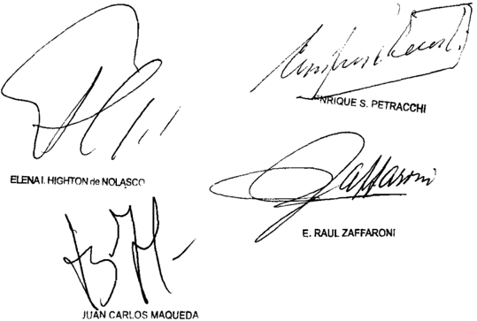

Recurso de hecho deducido por el Betado Nacional Podor Ejocutivo Nacional Minibterio de Planificación Fedoral Invarbión Pública representado por el Dr Alejandro Enrique Scarano

Recurso extraordinario deducido por el Eetado Nacional Poder Ejocutivo Nacional Ministerio de Planificación Federal Inverbión Pública representado por la Dra Silvia Mónica Arrobtito

Traslado contestado por 1a actora, representada por el DI Wabhington Álvarez, con el patrocinio del Dr Carlob García Díaz

Tribunal de origen: Salta

Tribunal intervino con anterioridad: Juzgado Foderal Primera Ingtancia de Salta que

## RuIZ, RAFAEL ANACLETO C/ FERREIRO, ALBERTO

S/ EjECuCIóN HIPOTECARIA

## REFINANCIACION HIPOTECARIA.

Cabe revocar la sentencia que dio por perdido el derecho de acogerse al sistema de refinanciación de la ley Nº 26.497 disponiendo continuar la ejecución en trámite, estableciéndose que actualizada la liquidación aprobada se adecue el trámite al procedimiento previsto en el art. 3º de la reglamentación de la ley Nº 26.497 (Decreto Nº 1781/2009), pues si bien la demandada recurrente consintió el apercibimiento de darle por perdido el derecho a la refinanciación de la ley 26497 y modificó parcialmente su argumentación, haciendo hincapié en la inexistencia de una liquidación que no sólo fue practicada sino que mereció aprobación, parece de un rigor formal excesivo condicionar la factibilidad misma de una operatoria habilitada legalmente, reclamada por la deudora, aceptada oportunamente por la acreedora y propiciada por el ente fiduciario, en función de una exigencia -al par que ficticia-, de cumplimiento imposible, máxime que tal proceder compromete el derecho a la vivienda digna, cuya conservación y tutela amplia reconoció el Tribunal en el especifico marco de la emergencia económica, en los términos del art. 14 bis de la Constitución Nacional y en conexión con la protección integral de la familia.

-Del dictamen de la Procuración General, al que remitió la Corte Suprema-.

DICTAMEN DE LA PROCuRACIóN GENERAL

Suprema Corte:

- I -

Contra la resolución de la Sala M de la Cámara Nacional de Apelaciones en lo Civil -confirmatoria de la providencia que dio por perdido el derecho de acogerse al sistema de refinanciación de la ley Nº 26.497, disponiendo continuar la ejecución en trámite-, los demandados interpusieron el recurso extraordinario de fs. 484/496, concedido a fs. 512.

La apelación federal sostiene, en síntesis, que: (i) el fallo, calificado de arbitrario, viola los derechos de propiedad, vivienda digna e igualdad

ante la ley, así como las garantías de defensa en juicio y debido proceso, todos ellos consagrados por los arts. 14 bis, 17 y 18 de la Constitución Nacional. (ii) la Sala omite tratar la cuestión decisiva atinente a que en autos no se estableció si el crédito debe liquidarse en base a la ley Nº 26.167 o a la ley Nº 26.497. (iii) dicha determinación tiene inmediata incidencia en el cálculo de la cobertura fiduciaria, pues ambos mecanismos arrojan importes finales diversos. (iv) el mutuo otorgado en los términos de la ley Nº 25.798 se encuentra vigente y las respectivas cuotas se cancelan en tiempo y forma. (v) no es posible celebrar un nuevo contrato con el Banco de la Nación si no se conoce el monto definitivo objeto de refinanciación. (vi) ninguna de las directivas del régimen exige suscribir el respectivo acuerdo sin saber primeramente cuál es el quantum que debe afrontar el Estado. Antes bien, la ley Nº 26.497 impone, además, corroborar previamente que el valor de mercado del inmueble represente un respaldo suficiente para el recupero de la cantidad adelantada por la entidad fiduciaria. (vii) no es posible llevar a cabo esos pasos si no se ha definido la norma aplicable.

## - III -

En cuanto a la procedencia formal del recurso, cabe señalar en primer lugar que, a mi ver, la objeción hecha a fs. 505/507 sobre la oportunidad del planteo, no debe atenderse. Es que, en este ámbito, la exigencia a cumplir consiste en proponer el punto federal a consideración de los jueces de la causa para que ellos estén en condiciones de resolverlo, sin que esa precisión pueda confundirse con la enunciación de una salvedad a modo de reserva, ni esté sujeta a fórmulas sacramentales (Fallos: 327:3024; 3032; 3157; 5528; 330:1572). De tal manera, si -como ocurre en el caso- la cuestión federal fue definida en la sentencia, la posible extemporaneidad de la articulación se encuentra saneada (Fallos: 327:2551; 328:242).

En definitiva, el recurso resulta admisible desde que se ha puesto en tela de juicio la inteligencia de un estatuto de carácter federal (el de refinanciación hipotecaria) y la decisión impugnada es contraria al derecho que la recurrente pretende sustentar en él (art. 14 inc. 3 de la ley 48). Por ende, los argumentos de las partes o de los jueces de la causa no restringen la actuación de ese tribunal, sino que le incumbe a V.E. realizar una declaratoria sobre la controversia (doct. de Fallos: 329:5621; 330:2286, 2416, 3758, 3764, 4721; 333:604 y 2396).

Asimismo, atento a que la arbitrariedad que se atribuye al pronunciamiento apelado -que, advierto, no ha sido desestimada expre-

samente por el a quo - guarda estrecha relación con la violación de los derechos constitucionales invocados, ambas aristas han de examinarse conjuntamente (arg. Fallos: 321:2764; 325:2875; 326:1007; 327:3536, 5736, entre muchos otros).

## - Iv -

Los demandados se acogieron a todos los esquemas legislativos de refinanciación creados sucesivamente. Así, conforme fueron promulgadas las leyes Nº 25.798 (mod. por la ley Nº 25.908) y Nº 26.167, adhirieron a sus beneficios, mediante pedidos que merecieron sustanciación y suscitaron sendos interlocutorios sobre la aplicabilidad de dicha normativa. Estos fueron revocados a fs. 323/325, donde la Sala mandó proceder de conformidad con la ley 26.167 (v. fs. 58/59, 62, 70/71, 140 y vta., 207/209, 210, 215/217 y 246).

A fs. 382, los interesados -que habían obtenido la refinanciación de la ley Nº 25.798- denunciaron hallarse abonando las cuotas respectivas y, esta vez, reclamaron el ajuste del proceso a lo dispuesto por el art. 2º de la ley Nº 26.497, con el propósito de lograr la cobertura de la totalidad del crédito y sus accesorios legales. El Juzgado, al tiempo que dio traslado de dicha presentación, proveyó una audiencia en los términos de la anterior ley Nº 26.167, acto en el que los esposos Ferreiro-Macchi volvieron a manifestar su voluntad de ampararse en el citado art. 2º de la ley Nº 26.497 (v. fs. 384 y 390).

Oído el Fondo Fiduciario, este invocó -en lo que nos interesa- la imposibilidad de conocer los límites concretos de su actuación, en función de que, a la sazón, la ley Nº 26.497 aún no se había reglamentado, ofreciendo fondos disponibles en los términos de la ley Nº 26.167 (v. fs. 397/400).

A su turno, los acreedores -quienes anteriormente habían planteado una genérica oposición, postulando el cumplimiento de la sentencia de fs. 323/325 [v. fs. 385]-, frente a la presentación del agente fiduciario vinieron finalmente a admitir que '...atento el dictado de la ley 26.497 y habiendo optado la deudora por las disposiciones establecidas en esta última, nada cabe decir a esta parte acreedora...' (v. fs. 403 ap. 2). En esa misma pieza presentaron su propio cálculo y solicitaron se intimara al Banco Nación a manifestar si cubriría el saldo resultante, con más los respectivos honorarios (v. fs. 403 vta. ap. 3 y 4).

Dicha cuenta se aprobó a fs. 422, punto III, previa audiencia por un lado, del Banco Nación que, en su calidad de fiduciario, insistió con lo manifestado a fs. 397/400 (v. fs. 414); y, por el otro, de los Sres. FerreiroMacchi, quienes como deudores reiteraron su requerimiento de imprimir al expediente el trámite previsto por la ley 26.497 (v. fs. 411).

Reglamentada la ley 26.497, en vez de emplazar al Banco de la Nación en orden a la liquidación aprobada, se intimó a la parte demandada para que acreditase el cumplimiento de lo establecido por dicha norma y por el Decreto Nº 1781/09, con la prevención de darle por perdido el derecho de ingresar en su sistema, y de seguir adelante con la ejecución (v. fs. 424), apercibimiento éste que -ante el silencio guardado- se hizo efectivo a fs. 427.

Es a raíz de esta última providencia que se inicia la cadena recursiva por la que la causa llega a esta instancia, y cuyo primer estadio es la apelación ante la Cámara, donde los deudores reconocieron no haber contestado el emplazamiento, pero repusieron que:- (i) lo resuelto le impone una conducta que corresponde al actor y al Fondo Fiduciario. (ii) de tal modo, se consagra la caducidad -carente de respaldo normativo- de una prerrogativa nacida a la luz de una regulación de orden público y plenamente incorporada a su derecho de propiedad. (iii) la refinanciación que les fue concedida conforme a la ley 25.798 sigue vigente y los pagos al día. (iv) no se trata, entonces, del supuesto de contratos rescindidos, al que se refiere el Decreto 1781/09 en los párrafos segundo y tercero de su primer artículo. (v) las restantes cláusulas legales y reglamentarias prevén sólo la realización de actividad por parte del Banco y el acreedor. (vi) aprobada la liquidación presentada por su contraria, el a quo debió proveer al pedido del ejecutante en orden a que el Fondo informara si haría o no frente al pago, alegando que es el agente fiduciario el único habilitado para rechazar o no la cobertura del crédito (v. fs. 432/437).

El decisorio impugnado respondió a esas alegaciones haciendo mérito, en lo sustancial, de lo informado por el Banco de la Nación así como de una serie de normas que se limitó a referir sin analizar su alcance. Afirmó, en definitiva, que según esos elementos '...es condición de procedencia para dar curso a la solicitud de pago del total del monto adeudado por la parte ejecutada ,  que el mutuo suscripto con el Fiduciario se encuentre vigente ante el Fideicomiso para la Refinanciación Hipotecaria. Ello determina que para que se cumpla con la normativa de los Decretos 1176/07 y 1141/08, reglamentarios de la

ley 26.167, antes de producirse el pago por subrogación, sin perjuicio de que se encuentre vigente el mutuo originario y al día los pagos por ese concepto -tal como en el presente caso- el deudor deberá suscribir con el Fiduciario, los instrumentos necesarios para documentar la totalidad del monto que el Agente Fiduciario afrontará...' (v. fs. 460 consid. II.-). De esa premisa los jueces concluyeron que -aun cuando la deudora alega haber llenado los recaudos impuestos por el Decreto Nº 1781/09-, no acreditada la celebración de los actos necesarios para financiar el saldo pendiente, la prosecución de la ejecución se adecua a derecho puesto que -si bien la ley Nº 26.497 es una norma de orden público- su operatividad requiere la intervención activa del deudor en la suscripción de los pertinentes documentos.

A su vez, el agente fiduciario -que oportunamente había aprobado el mutuo en los términos de la ley Nº 25.798-, al promulgarse la ley 26.167 apoyó el pedido de adhesión a ese régimen, que describió como una aclaratoria del conjunto normativo de la emergencia pública, consagratoria de un procedimiento especial protectorio de los deudores en orden al derecho a la vivienda única y familiar, calificando su aplicación como 'imperativa' (v. fs. 308/fs. 309 vta.). En esa misma línea, una vez dictado el respectivo Decreto reglamentario, no negó la elegibilidad del crédito en el marco de la ley Nº 26.497. Por el contrario, con fundamento en el art. 3º del Decreto 1176/07, instó al juez de la causa a definir si el supuesto se encuentra alcanzado por dicha norma, temperamento que volvió a sostener con posterioridad a la interposición del recurso extraordinario, solicitando expresamente que, en caso afirmativo, se le notifique lo resuelto y, una vez firme la liquidación de la deuda, se ordene un traslado para que pueda informar el monto disponible en favor de la acreedora (v. esp. fs. 503 primer párrafo).

- v -

La secuencia precedente -que me he permitido reseñar por estimarlo necesario para una acabada comprensión del problema-, pone de manifiesto varios elementos que, apreciados en su conjunto, me parecen definitorios.

Ante todo, puede observarse que la denegatoria apelada no se funda en la falta de adecuación del caso a los extremos impuestos por el cuerpo normativo que invocan los deudores, cuyo estudio cabal -bueno es recordarlo- no se llevó a cabo, aunque su aplicabilidad a esta ejecución constituía el thema decidendum propuesto a los jueces.

En cambio, el razonamiento central del fallo -contenido en su considerando II- se construye a partir de los Decretos reglamentarios de la ley 26.167 (Nº 1176/07 y Nº 1141/08). En todo caso, estos dispositivos -que ni siquiera venían en discusión-, tampoco autorizaban directa o analógicamente a mantener una sanción tan severa sin una directiva legal expresa que le prestara asidero, desde que, en caso de duda, su art. 15 conmina a los jueces a decidir '...en el sentido más favorable a la subsistencia y conservación de la vivienda digna y la protección integral de la familia, en los términos del artículo 14 bis de la Constitución Nacional'.

No obstante y sin motivar su aserto, la resolución impugnada infiere dogmáticamente que en la economía de otra ley (ahora sí, la Nº 26.497), la activación del aporte estatal está sujeta a la previa firma de un nuevo contrato de préstamo entre deudor y fiduciario.

Pero, más allá del defecto que se acaba de señalar, lo decisivo es que -según la respectiva reglamentación-, el mutuo que debe encontrarse vigente para poder acceder a una cobertura plena, es -indudablemente- el pactado con el Banco Nación en los términos de la ley Nº 25.798 (art. 1º inc. 'b' reg. Decreto Nº 1781/2009). Tanto es así que, a renglón seguido, el Decreto determina un mecanismo específico destinado a quienes hubiesen rescindido el acuerdo originario e intentaran reincorporarse al sistema. Es que la existencia de este último contrato configura el presupuesto capital del régimen, en tanto éste nació, precisamente, con el objeto de '...encontrar una solución definitiva para aquellos deudores incluidos en el Fideicomiso para la Refinanciación Hipotecaria creado por la Ley Nº 25.798 ...' (el resaltado me pertenece; conf. consid. tercero del citado Decreto Nº 1781/2009). Por ende, además de la inconsecuencia expuesta más arriba, la interpretación que alienta la sentencia, no encuentra justificación en el texto o en el espíritu de las disposiciones aplicables.

Valga subrayar que -como bien apuntó en su momento la ejecutada-, nada hay en el esquema trazado por la ley Nº 26.497 y su decreto reglamentario que asigne al deudor alguna obligación accesoria a cumplir en este estadio preliminar. Al contrario, el diseño normativo parte de una opción exteriorizada en la ejecución -paso éste que, en la especie, fue sobradamente cumplido por los demandados-, para pasar luego a la liquidación que, una vez firme, dará lugar a un período de quince días hábiles para que el Fiduciario -habiendo determinado administrativamente el valor de mercado del inmueble- aclare en el

juicio cuál es el monto disponible. Recién después de verificada esa etapa (que, por cierto, no ha concluido aquí), y antes de producirse el pago por subrogación, el deudor deberá firmar los instrumentos necesarios para documentar la totalidad del monto que afrontará el Banco, de conformidad con la manifestación efectuada en la causa, sin perjuicio de una serie de otros actos que conciernen directamente al acreedor.

Tal el claro procedimiento previsto específicamente por el art. 3º de la citada reglamentación del cual, insisto, en modo alguno puede derivarse que el progreso de la refinanciación integral de la ley Nº 26.497 esté subordinado a la constitución ab initio del nuevo mutuo con el Banco de la Nación. Más aún, la idea contraria resulta incongruente, no bien se piensa que ella supone una exigencia de imposible realización para el deudor, quien está impedido de instar la concreción de ese acto administrativo si anteriormente -liquidado el crédito en juicio- el tribunal no emplaza al fiduciario para que informe el quantum de la contribución, porque esa actuación servirá, justamente, para establecer el monto del contrato de préstamo a celebrar con el agente financiero estatal.

- vI -

Por último, entre los demás antecedentes sintetizados en el punto IV, cabe atender a que el ente fiduciario no ha desechado la refinanciación como salida adecuada para el conflicto de autos, y no lo ha hecho en ninguna fase de su evolución legislativa. Este es, según creo, un dato de gran importancia para evaluar la situación generada en este proceso y darle solución, sobre todo a la luz de los fallos de esa Corte que tuvieron en especial cuenta la declaración de elegibilidad de los respectivos préstamos, o -cuando menos- la verificación de los recaudos legales que permiten el acceso al beneficio. Es que -aunque elaborado en torno a la ley Nº 26.167- dicho parámetro puede extenderse en este aspecto a la ley Nº 26.497, pues esta norma no ha hecho sino ampliar el dispositivo de pago previsto por aquella otra, abriendo la posibilidad de que la totalidad del crédito sea satisfecho por la vía del Fondo Fiduciario (v. Fallos: 330:2902; 331:926 y 2898; S.C. H. Nº 82, L. XLI, 'Hodari, Estela Carina y otros c/Vila, Antonio Nicolás Argentino', del 25/9/2007; S. C. L. Nº 839, L. XLII, 'Lama, Enrique Gustavo Tadeo c/ Jiménez Alejandro Rumildo y otra' del 6/11/2007; S.C. D. Nº 1444, L. XL, 'Ducasse, Esther Beatriz c/Tierno, Marta Susana s/ejecución hipotecaria' del 11/12/2007, entre otros).

Paralelamente, puede advertirse, por un lado, que en ningún momento se cuestionó que el mutuo aprobado en los términos de la ley Nº 25.798 estuviese vigente; y, por el otro, que la ejecutante no mantuvo la inconstitucionalidad de la ley Nº 26.497 y, según se adelantó, se avino al mecanismo allí previsto (v. fs. 403 y vta.).

Asimismo, el examen de la causa permite reparar en que -dentro de un trámite marcadamente impreciso y aunque los traslados se confieren en calidad de autos-, nunca se decidió, como sí se había hecho respecto de las leyes Nº 25.798 y Nº 26.167, la aplicabilidad de la ley Nº 26.497, mutándose a una intimación que -como se vio- considero abiertamente extraña al estatuto cuyo amparo se perseguía en esta causa.

## - vII -

No se me escapa que la recurrente consintió el apercibimiento de darle por perdido el derecho a la refinanciación de la ley 26497. Tampoco ignoro que en esta instancia aquella modificó parcialmente su argumentación, haciendo hincapié en la inexistencia de una liquidación que, en rigor, no sólo fue practicada sino que mereció aprobación.

Empero, en el contexto descripto en los dos puntos anteriores, parece de un rigor formal excesivo condicionar la factibilidad misma de una operatoria habilitada legalmente, reclamada por la deudora, aceptada oportunamente por la acreedora y propiciada por el ente fiduciario, en función de una exigencia -al par que ficticia-, de cumplimiento imposible. Máxime que tal proceder compromete el derecho a la vivienda digna, cuya conservación y tutela amplia reconoció V.E. en el específico marco de la emergencia económica, en los términos del art. 14 bis de la Constitución Nacional y en conexión con la protección integral de la familia (arg. Fallos: 331:926 y sus citas; 331:2491).

## - vIII -

Por lo expuesto, opino que V.E. debe hacer lugar al recurso extraordinario interpuesto, revocar la sentencia apelada y disponer que, actualizada la liquidación aprobada a fs. 422, punto III, se adecue el trámite al procedimiento previsto en el art. 3º de la reglamentación de la ley Nº 26.497 (Decreto Nº 1781/2009). Buenos Aires, 20 de abril de 2012. Marta A. Beiró de Gonçalvez.

## DE JUSTICIA DE LA NACION 335

## FALLO DE LA CORTE SuPREMA

Buenos Aires, 70 Q 2042 . Vistos 10s autos "Ruiz, Rafael Anacleto c/ Ferreiro, Al berto otro s / ejecución hipotecaria" \_

## Considerando

Que agravios de los apelantes sido objeto de adecuado tratamiento en el dictamen de la señora Procuradora Fiscal, cuyos fundamentos esta Corte comparte Y los cuales se renite por razón de han

Por ello, con el alcance indicado, se declara admisible el recurso extraordinario Y se deja sin efecto la sentencia apelada \_ Con costas (art\_ 68 del Código Procesal Civil Y Comercial de la Nación) Vuelvan los autos al tribunal de origen fin de que por medio de quien corresponda proceda dictar un nuevo fallo con arreglo expresado\_ Notifíquese Y devuélvase

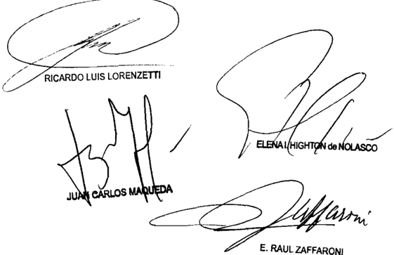

Recurso extraordinario interpuesto pOr Alborto Ferreiro Etelvina Macchi de Forreiro en Bu carácter de con el Patrocinio letrado del Dr Héctor Hugo Olearo

Traslado contestado POI Rafael Anacleto Ruiz, en carácter de parte actora representado POI su letrado rado Dr Luis Viedna apode

Iribunal de origen: Sala M de de Apelacionee en lo Civil

Iribunales que intervinieron con anterioridad: Juzgado Nacional de Primera Instancia 1o Civil 98

## vILLANuEvA DE GREEN, MARIA MATILDE C/ RICHARDS, juAN MIGuEL y OTROS S/ ORDINARIO

## ASAMBLEA SOCIAL.

Si la Cámara declaró la caducidad de la acción de nulidad de la asamblea realizada por una sociedad anónima, y encuadró la pretensión en el artículo 251 de la Ley Nº 19.551 -en tanto manifestó que de los términos del escrito inaugural no surgía, a su juicio, que la misma se haya incoado en el marco de los artículos 1044 y 1047 del Código Civil, aunque reconoció que sí habían sido plasmadas citas jurisprudenciales a su respecto-, y la actora inició una nueva acción peticionando expresamente la nulidad absoluta de dicha asamblea, con sustento en los artículos 1044 y 1047 y cctes. del Código Civil, cabe dejar sin efecto por arbitraria la decisión que admitió la excepción de cosa juzgada opuesta por la demandada y rechazó la acción promovida, pues correspondía efectuar un examen integral de ambas contiendas y así determinar si la sentencia que declaró operada la caducidad en los términos del art. 251 de la Ley Nº 19.550, pasada en autoridad de cosa juzgada, importaba una decisión sobre lo que constituye el objeto de la nueva acción sustentada en un régimen distinto al que habría intentado ampararse en la anterior.

-Del dictamen de la Procuración General, al que remitió la Corte Suprema-. -El juez Fayt, en disidencia, declaró inadmisible el recurso extraordinario (art. 280 del C.P.C.C.N.)-.

DICTAMEN DE LA PROCuRACIóN GENERAL

Suprema Corte:

- I -

La Sala A de la Cámara Nacional de Apelaciones en lo Comercial, por mayoría, revocó la sentencia de la instancia anterior y, en consecuencia, admitió la excepción de cosa juzgada opuesta por la parte demandada y rechazó la acción promovida (fs. 197/201238/243).

Para así decidir, el a quo sostuvo que los términos de la demanda de fojas 18/23 son idénticos a los del escrito inaugural de autos 'Villanueva de Green María Matilde c/ Richards Juan Miguel y otros si ordinario' (expte. Nº 90.856, que no fue agregado al presente), en los que el mismo tribunal había declarado la caducidad de la acción de nulidad de la asamblea realizada por Belgrano Day School S.A. el 4 de noviembre de 2003 en el marco de lo previsto por el artículo 251 de la Ley Nº 19.550. Ello, afirmaron los magistrados, sin perjuicio que la parte actora varíe su planteo jurídico sustentando su nueva acción en la nulidad absoluta de la asamblea en los términos del Código Civil, en tanto se encuentran involucradas las mismas partes, circunstancias y finalidad.

En este sentido, el tribunal concluyó que la simple variante intentada por la parte actora en cuanto al encuadramiento jurídico (de nulidad relativa de la asamblea pretendida en la anterior acción, a nulidad absoluta del mismo acto societario solicitada en las presentes actuaciones) no transforma el objeto del litigio en uno diferente al ya sentenciado.

Por último, agregaron que lo resuelto no implicaba en modo alguno desconocer la posibilidad de plantear respecto de un acto asambleario, como el que es materia del sub lite , la nulidad 'absoluta' por aplicación de los artículos 18 y 1047 del Código Civil, luego de vencido el plazo establecido por el artículo 251 de la Ley Nº 19.550 ya citado, pero -aclararon- que en el caso no era posible, desde que, por un lado, no fue ése el objeto que la actora asignó a su pretensión primigenia y, por otro, la nueva demanda, idéntica de la anterior salvo por la referencia a nulidad 'absoluta', no explica ni fundamenta el cambio de la pretensión.

Contra dicho pronunciamiento, la actora dedujo recurso extraordinario, que fue concedido (fs. 253/271 y 280). En ajustada síntesis, alega que la sentencia es arbitraria, pues se aparta de las constancias de la causa, realiza afirmaciones dogmáticas sin fundamento fáctico ni jurídico, lo cual importa, básicamente, una denegación de justicia para su parte, afectando, asimismo, su derecho de propiedad y defensa en juicio (arts. 17 y 18, C.N.).

En particular, manifiesta que la primera acción de nulidad del acto asambleario (expte. Nº 90.856) fue calificada por la Cámara como 're-

lativa' y, en ese contexto, fue declarada la caducidad en los términos del artículo 251 de la Ley Nº 19.550, y que, en la segunda demanda, fue peticionada la nulidad absoluta de la asamblea en cuestión con sustento en los artículos 1044 y 1047 -y concordantes- del Código Civil, pero el tribunal hizo lugar al planteo de cosa juzgada. En virtud de ello, la recurrente argumenta que, o bien la primera demanda fue erróneamente rechazada al no tratarse de una nulidad relativa, o no existe la triple identidad de sujeto, objeto y causa necesaria para la procedencia de aquella excepción.

Al respecto, añade que en el caso nunca se ha juzgado sobre el fondo del asunto: la nulidad de la asamblea celebrada por los demandados respecto de los cuales la justicia criminal dictó procesamiento por los delitos de defraudación y administración fraudulenta (v. referencia de fojas 249vta./250), no habiendo, en tales condiciones, cosa juzgada.

Por otra parte, sostiene que los sujetos en ambas causas difieren, valorando que esta nueva demanda, donde se pretende la nulidad absoluta de la asamblea, está dirigida contra los autores de la maniobra fraudulenta y no contra Belgrano Day School S.A. y que el objeto es diferente, por cuanto posee un alcance jurídico distinto.

Si bien lo atinente a la existencia o inexistencia de cosa juzgada resulta ser, en principio, una cuestión de hecho y de derecho procesal, extraña a la instancia extraordinaria, V.E. ha establecido que ello no es óbice para invalidar lo resuelto cuando, con menoscabo de la garantía consagrada en el artículo 18 de la Constitución Nacional, los tribunales de la causa extienden su valor formal más allá de los límites razonables, utilizan pautas de excesiva laxitud y prescinden de una adecuada ponderación de aspectos relevantes del expediente (v. doctrina de Fallos: 307:949; 310:302), lo cual, a mi modo de ver, ocurre en el caso en estudio.

Sentado ello, en primer término, resulta necesario precisar que en el expediente Nº 90.856, caratulado 'Villanueva de Green, María Matilde c/ Richards, Juan Miguel y otros s/ ordinario' (que tramitó ante el mismo juzgado y secretaría), el día 22 de junio de 2006, la Sala A de la Cámara Nacional de Apelaciones en lo Comercial resolvió ' declarar operada la caducidad de la acción de nulidad de la asamblea realizada

por Belgrano Day School S.A. el día 4 de noviembre de 2003, promovida por María Matilde Villanueva de Green en los términos de la LSC: 251 ' (v. fs. 26/29). En esa sentencia, el tribunal resolvió encuadrar la acción dentro de la previsión del artículo 251 de la Ley Nº 19.550, en tanto manifestó que de los términos del escrito inaugural no surgía, a su juicio, que la acción haya sido incoada en el marco de los artículos 1044 y 1047 del Código Civil, aunque reconoció que sí habían sido plasmadas citas jurisprudenciales a su respecto (conf. resolución agregada en copia a fs. 26/29).

Entonces, la actora inició una nueva acción contra los señores Juan Miguel Richards, Hipólito Valverde, Pedro Víctor Poggi, Martín Alfredo Macadam y Juan Carlos Beortegui, peticionando expresamente la nulidad absoluta de la asamblea citada, con sustento jurídico en los artículos 1044 y 1047 -y concordantes- del Código Civil, por encontrarse afectadas, según expone, normas de orden público y derechos inderogables de los verdaderos titulares de las acciones de Belgrano Day School S.A. (fs. 18/23).

En ese contexto, y habiendo sido planteado un recurso extraordinario por la parte actora contra el pronunciamiento dictado en el expediente Nº 90.856 mencionado que fue rechazado (v. informe de fs. 24), estimo asiste razón a la recurrente, desde que la Cámara, para admitir la excepción de cosa juzgada opuesta por los demandados, por un lado, reconoce la posibilidad de plantear respecto de un acto asambleario como el que es materia del sub lite , luego de vencido el plazo establecido por el artículo 251 de la Ley Nº 19.550, la nulidad absoluta de ese acto por aplicación de normas de derecho común, conforme las cuales tal acción -afirmó- no es susceptible de extinguirse por vía de la prescripción (arts. 18 y 1047 del Código Civil), pero, sin embargo, luego desechó la procedencia de la demanda en el caso, sin sustento suficiente.

En efecto, valorando las particulares circunstancias que rodean al caso -donde se ha ordenado el procesamiento en sede penal por delitos vinculados con la asamblea en cuestión, v. fs. 9/15, 169/192 y 228/236 referidos en forma evidente a un proceso distinto al mencionado a fojas 278 y que fue expresamente reconocido por los demandados a fojas 159- y que la sentencia firme dictada en el expediente Nº 90.856 no ha decidido sobre el fondo de la pretensión deducida en la causa, a mi modo de ver, no parece razonable lo manifestado por el a quo en orden a que la parte debió haber encuadrado su acción primigenia en las normas

del código civil, cuando el propio tribunal reconoció la posibilidad de entablar una acción como la que es materia de estudio, luego de vencido el plazo de caducidad previsto por la Ley Nº 19.550.

En virtud de ello, correspondía realizar un examen integral de ambas contiendas, y así determinar si la sentencia que declaró operada la caducidad en los términos del artículo 251 de la Ley Nº 19.550, pasada en autoridad de cosa juzgada, importaba una decisión sobre lo que constituye ahora el objeto de la nueva acción sustentada en un régimen distinto al que habría intentado ampararse en la anterior.

No es ocioso mencionar que V.E. ha establecido que no es necesaria la concurrencia de las tres identidades clásicas, pues lo esencial es determinar si los litigios considerados en su conjunto, son idénticos o no, contradictorios o susceptibles de coexistir (v. doctrina de Fallos: 316:3126).

- III -

Por lo expuesto, y, reitero, sin adelantar opinión sobre la solución final que corresponda dar al caso, a mi modo de ver, V.E. debe dejar sin efecto el pronunciamiento recurrido y remitir los autos al tribunal de origen, para que se dicte uno nuevo con arreglo a derecho. Buenos Aires, 7 de octubre de 2011. Marta A. Beiró de Gonçalvez.

## FALLO DE LA CORTE SuPREMA

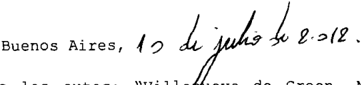

Vistos los autos: "Villabueva de Green, María Matilde c/ Richards, Juan Miguel Y otros ordinario"

## Considerando:

Que los agravios del apelante encuentran adecuada respuesta en los fundanentos del dictamen de la señora Procuradora Fiscal, que el Tribunal comparte Y hace suyos por razón de

Por ello, Y de conformidad con lo dictaminado por la señora Procuradora Fiscal, se declara procedente el recurso extraordinario Y se deja sin efecto la sentencia apelada , con los alcances indicados en el dictamen Con costas (art\_ 68 del Codigo Procesal Civil Y Comercial de la Nación) Vuelvan 10s autos al tribunal de origen para que por quien corresponda , dicte un nuevo pronuncianiento con arreglo al presente Notifíquese remítase

DEL SEÑOR MINISTRO DOCTOR DON CARLOS FAYT

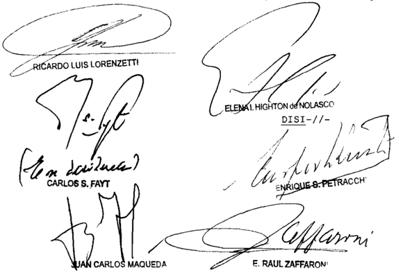

## Considerando:

Que el recurso extraordinario es inadmisible 280 del Código Procesal Civil y Comercial de la Nación)

ello se 10 desestima Con costas (art. 68, primera parte, del Código Procesal Civil y Comercial de Nación) Notifíquese y remítanse autos Por

Recurso extraordinario 1nterpuesto por María Matilde Villanueva de Green , Pa trocinada pOr 1os Dres Mario Laporta Mario Alfongo de Ipola \_

Traslado contestado por Juan Miguel Richarde Hipólito Valverde Víctor Roberto Poggi Martín Alfredo Macadam Y Juan Carlob Beortegui representados el Dr Roberto Fornando Lascano

Iribunal de origen: Cámara Nacional de Apolaciones Comercial Sala

Tribunal intervino con anterioridad: Juzgado Nacional de Primere Inbtancia en 1o Comercial 13 , Secretaría 26 que

BARBAT, CECILIA C/ uNIvERSIDAD DE BuENOS AIRES S/ DESPIDO

## LOCACION DE SERVICIOS.

Cabe revocar la sentencia que admitió el reclamo de la actora y condenó a la demandada a abonar la indemnización prevista por la Ley de Contrato de Trabajo para los casos de despido incausado e intempestivo, por los perjuicios derivados de la ruptura del vínculo de empleo que unía a las partes, pues a dicho fin resulta una solución razonable y equitativa el régimen indemnizatorio previsto en la Ley Marco de Regulación de Empleo público Nacional - 25.164 -art. 11, párrafo 5º-, que prevé una indemnización de un mes de sueldo por cada año de servicio o fracción mayor de tres meses, tomando como base la mejor remuneración mensual, normal y habitual percibida durante el último año o durante el tiempo de prestación de servicios si éste fuera menor, debiendo adicionársele -dado el carácter intempestivo de la ruptura contractual-, una suma equivalente a la que se seguiría del período previsto en el párrafo tercero de dicha norma ('antigüedad').

-Del precedente 'Ramos' (Fallos: 333:311), al que la Corte remitió-.

## LOCACION DE SERVICIOS.

Dado que el encuadre jurídico formulado determinaría que situaciones como la presente -la actora reclama a la Universidad de Buenos Aires una indemnización por los perjuicios derivados de la ruptura del vínculo de empleo que unía a las partes- sean de la competencia del fuero contencioso administrativo federal, razones análogas a las que llevaron a enunciar la doctrina de la causa 'Tellez' (Fallos: 308:552) aconsejan que el sub lite, dado su avanzado estado de tramitación, continúe y finalice ante el fuero laboral (Voto de los jueces Highton de Nolasco y Enrique S. Petracchi).

## DICTAMEN DE LA PROCuRACIóN

## Suprema Corte:

- I -

A fs. 288/301, la Cámara Nacional de Apelaciones del Trabajo (Sala V) -por mayoría- revocó la sentencia de primera instancia y, en con-

secuencia, admitió la demanda que inició la profesora de tenis Cecilia Barbat contra la Universidad de Buenos Aires (UBA, en adelante) por despido arbitrario.

Para resolver de ese modo, entendió que los actos jurídicos de los organismos públicos deben adecuarse a los principios de legalidad y que la Universidad no alegó ni probó que la situación de la actora encuadrara en los supuestos de contratación de excepción al margen del régimen de los concursos -según estipula la ley de Educación Superior- ni que existieran causas objetivas que justificaran la temporalidad del vínculo.

Asimismo sostuvo que la contratación de la actora por más de 23 años -si bien en un cargo transitorio- llevaba a la conclusión de que la  prestación  laboral  tuvo  por  finalidad  el  cumplimiento  de  tareas permanentes.

También consideró que el hecho de que el trabajador consienta su exclusión del régimen de estabilidad absoluta del empleado público no era motivo para que, ante una contratación irregular, se le niegue la protección jurisdiccional contra el despido arbitrario que prevé la legislación común, no obstante exponer que su argumento para acoger el reclamo no constituye una aplicación directa de las normas de la Ley de Contrato de Trabajo sino analógica.

Entendió que la doctrina del precedente 'Leroux de Emede' no resultaba aplicable al sub lite desde que, con el voto en disidencia en el caso 'Gaundri', era posible afirmar la existencia de otras interpretaciones probables de V.E. para situaciones como las planteadas en este proceso.

No coincide con la doctrina de la Corte en cuanto a la aplicación de la teoría de los actos propios y la del voluntario sometimiento sin reserva a un determinado régimen jurídico porque, en su criterio, la renuncia anticipada de derechos debe ser rechazada.

## - II -

Disconforme con este pronunciamiento, el representante de la Universidad de Buenos Aires dedujo el recurso extraordinario de fs. 306/315, que fue concedido a fs. 322.

Tras describir los antecedentes del juicio, plantea la arbitrariedad de la sentencia con los siguientes agravios: a) se entromete con la juris-

prudencia del obrar administrativo, vulnerando el principio de división de poderes; b) es violatoria del principio de autonomía y autarquía de las Universidades Nacionales de jerarquía constitucional; c) pone en tela de juicio actos administrativos con presunción de legalidad y ejecutorios; d) no contempla que la Universidad de Buenos Aires se encuentra excluida del régimen de la Ley de Contrato de Trabajo; e) no tiene en cuenta que en el ámbito de una persona jurídica de derecho público como la demandada, sólo los empleados permanentes gozan de estabilidad mientras que los transitorios o contratados no tienen tal beneficio; f) omite considerar que la renovación periódica del servicio no modifica la naturaleza jurídica del vínculo ni intenta encubrir una relación laboral diferente; g) la actora siempre supo y consintió su carácter transitorio y se notificaba sin reservas de cada acto de renovación de su vínculo contractual; h) alude indistintamente a la ley de contrato de trabajo y a la ley de educación superior cuando de lo que se trata aquí es una relación de empleo público; i) no hubo ruptura laboral, sólo se consideró inconveniente continuar con la contratación una vez vencida la última renovación; la actora nunca fue dependiente; j) la universidad no incumplió ninguna norma ni actuó ilegalmente.

## - III -

A mi modo de ver, el recurso extraordinario es formalmente admisible, toda vez que se ha puesto en tela de juicio un acto de autoridad nacional y la decisión ha sido contraria a los derechos que la recurrente fundó en él (art. 14, inc. 3° de la ley 48).

Por lo demás, en cuanto a las causales de arbitrariedad invocadas, estimo que deben ser examinadas juntamente con el tema federal dada su estrecha relación (Fallos: 327:5640, entre otros).

- Iv -

En cuanto al fondo del asunto, conviene tener presente que en autos no existe controversia con relación a la contratación sucesiva de la señora Barbat para las tareas indicadas en su designación por parte de la Universidad de Buenos Aires. Lo que está en discusión es determinar si su vínculo laboral y, en consecuencia, el distracto, está regido por normas de derecho público -como sostiene la UBA- o si, por el contrario, como dice la actora y concuerda la alzada, la transitoriedad encubre una relación laboral fraudulenta y su no renovación implica

una ruptura que hace aplicable -por analogía- las normas del régimen de la ley de Contrato de Trabajo.

Sobre el particular, en un asunto de similares características al aquí planteado, advertí -con base en los precedentes 'Gil c/UTN' (Fallos: 312:245), 'Galiano' (Fallos: 312:1371) y 'Leroux de Emede' (Fallos: 314:372)- que a fin de poder calificar a la relación que vincula a las partes como propia del derecho público o regida por el derecho privado, corresponde atender, en primer lugar, a la existencia de un régimen jurídico específico y, luego, a la intención de las partes al momento de celebrar la contratación (dictamen del 14 de diciembre de 2006 en autos S. 2225, L.XLI 'Sánchez, Carlos Próspero c/ Auditoría General de la Nación' -recurso de hecho-).

En atención a ello, no cabe duda alguna de que la Universidad de Buenos Aires, en su carácter de institución universitaria nacional, es una persona jurídica de derecho público con autonomía académica y autarquía económico-financiera (art. 75, inc. 19 de la Constitución Nacional). En ese marco -según la ley 24.521 (art. 59)- le corresponde, en lo que aquí interesa, fijar su régimen de administración de personal.

En tal sentido, considero que asiste razón a la recurrente cuando sostiene que el vínculo que mantuvo con la actora estaba regido por normas del régimen jurídico específico que reglamenta los derechos de los agentes -sean permanentes, interinos o contratados- de la Universidad de Buenos Aires y que no existe en esos estatutos disposición alguna que los incluya en el régimen de la ley de Contrato de Trabajo.

Por otro lado, como afirmé en el dictamen antes citado, V.E. también ha señalado -en términos que considero aplicables a la presente causa- que 'la aceptación de los contratos y sus pertinentes prórrogas, presididos por un régimen de inestabilidad, veda al actor reclamar los derechos emergentes de la estabilidad del empleo, dado que, de otro modo, se violentaría el principio que impide venir contra los propios actos' (Fallos: 310:2117; 312:245), pues 'el voluntario sometimiento, sin reservas expresas, a un régimen jurídico, comporta un equívoco acatamiento que determina la improcedencia de su impugnación ulterior, con base constitucional, por medio del recurso extraordinario' (Fallos: 312:1371).

Así también, V.E. tiene dicho que 'la mayor o menor conveniencia de recurrir a la contratación del actor, así como la de poner fin al contrato, constituye una decisión de política administrativa no revi-

sable en sede judicial, por estar limitado el control jurisdiccional de los actos administrativos a los aspectos vinculados a su legitimidad' (Fallos: 312:245).

Es mi parecer que, frente a la existencia de un régimen jurídico específico, al reconocimiento de la actora de que se trataba de una designación interina, a la aceptación sin reservas de la renovación sucesiva de la designación, a la falta de acto expreso en las disposiciones de la universidad sobre la aplicación de las leyes laborales, al establecimiento del plazo de duración de cada una de las designaciones, circunstancias que hacen inatendible la pretensión de la actora, corresponde revocar la sentencia apelada en cuanto acogió la demanda sobre la base de las disposiciones de la ley de Contrato de Trabajo.

- v -

Por lo expuesto, considero corresponde admitir el recurso extraordinario y revocar la sentencia de fs. 288/301. Buenos Aires, 2 de febrero de 2009. Laura M. Monti.

## FALLO DE LA CORTE SuPREMA

## Buenos Aires, o

Vistos 10s autos: "Barbat, Cecilia c/ Universidad de Buenos Aires s / despido"

## Considerando

Que las cuestiones planteadas resultan sustancialmente análogas las resueltas por el Tribunal en la causa Ramos José Luis c/ Estado Nacional (Min de Defensa A.R.A.) " (Fa llos: 333:311) ~votos concurrentes-, cuyos fundamentos corresponde dar por reproducidos por razón de brevedad -

Por ello Y oída la señora Procuradora Fiscal, se declara formalmente admisible el recurso extraordinario Y se revoca el fallo apelado \_ Vuelvan los autos al tribunal de origen fin de que por medio de   quien corresponda , proceda dictar un nuevo fallo con arreglo expresado Costas por orden atento al cambio de jurisprudencia (art 68 , segundo párrafo, del Código

Procesal Civil Comercial de la Nación) Notifíquese devuélvanse las actuaciones .

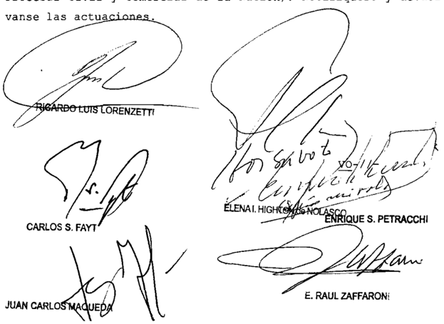

DE LOS SEÑORA VICEPRESIDENTA DOCTORA DOÑA ELENA I. HIGHTON de NOLASCO DEL SEÑOR MINISTRO DOCTOR DON ENRIQUE SANTIAGO PETRACCHI

## Considerando:

1 % ) Que la Sala V de la Cámara Nacional de Apelaciones del Trabajo, al revocar la sentencia de primera instancia, hizo lugar al reclamo de la actora Y condenó la Universidad de Buenos Aires pagar una sua de dinero en concepto de indemni\_ zación, por 1os perjuicios derivados de la ruptura del vínculo de empleo que unía las partes Contra este pronunciamiento, la demandada interpuso el recurso extraordinario, que fue concedido fs 322

2 % ) Que , para decidir cono 10 hizo, la Cámara consideró que 1a Universidad había utilizado figuras jurídicas autorizadas legalmente para casos excepcionales, con una evidente desviación de poder que tuvo como objetivo encubrir una designación pernanente bajo la apariencia de sucesivos contratos por

tiempo deterninado\_ En consecuencia, Y sobre la base de la aplicación analógica de las normas de derecho común , condenó la demandada abonar la indemnización prevista por la Ley de Con trato de Trabajo para casos de despido incausado intempestivo

Que el recurso extraordinario resulta procedente en cuanto se halla en juego el alcance de normas de índole federal Y, en particular, del art 14 bis de la Constitución Nacional (art\_ 14 , inc de la 48) Además en el caso, la ponderación de 1os agraviog referentes la valoración de determinados extremos fácticos de a causa se presenta inescindiblemente unida tal cuestión interpretativa, por que corresponde que se exanine en forna conjunta con la amplitud que exige la garantía de la defensa en juicio (Fallos 318 :63 ; 319:1500 ; 321:703; 324:1590; 329:4206 , entre muchos otros) ley

Que , tal como sostuvo el quo de conformidad con el criterio expuesto por esta Corte en la causa "Ramos José Luis c/ Estado Nacional" (Fallos: 333:311) , el comportaniento de la Universidad tuvo aptitud para generar en la actora una legítima expectativa de permanencia laboral que merece la protección que el art 14 bis de la Constitución Nacional otorga al trabajador contra el "despido arbitrario"

Sin embargo, asiste razón la apelante en cuanto que resulta arbitraria la aplicación de la Ley de Contrato de Trabajo para determinar la indemnización pagar por la Universidad Ello es así porque tal comO se señaló en el precedente "Ramos citado\_ cuando ~comO en el caso"por el modo en el que se desenvolvió la relación largo de 1os años el de tareas que desempeñaba el actor Y las figuras contractuales utilizadas , las partes no tuvieron la intención de someter el vínculo un régimen de derecho privado () considerando que se trata de la reparación por la conducta ilegítina de un organismo estatal, la solución debe buscarse en el ámbito del derecho público Y adninistrativo" Por ello, fin de establecer el importe, falta de previsiones legislativas específicas\_ debe acudirse una solución que por analogía, repare debidamente sufridos por el actor en este caso . De ahí que se tipo

considera que la aplicación de la indemnización prevista por el artículo 11 de la Ley Marco de Regulación de Empleo Público Na cional (ley 25.164) , resulta una medida equitativa para reparar l0s perjuicios demostrados por actor en este caso" el

5" ) Que , por demás , cabe añadir que no resulta admisible el agravio de la recurrente sustentado en el precedente "Gil" de esta Corte, según el cual el voluntario sometiniento, sin reservas expresas , un régimen comporta un inequívoco aca tamiento que deternina la improcedencia de su impugnación ulterior (sentencia reseñada en Fallos: 312:245) Esto es as1, pues una vez establecido que la disputa interesa al trabajo del art 14 bis de la Constitución Nacional, el principio protectorio que éste enuncia el carácter inviolable de derechos que reconoce , conducen con necesidad la indisponibilidad Y la prohibición de renuncia de la aplicación de las normas que tutelan el trabajo "en todas sus formas vale decir, tanto al prestado en el ámbito público comno en el privado

6" ) Que , finalnente, cabe agregar que dado que el en cuadre jurídico formulado deterninaría que situaciones como la presente sean de la competencia del fuero contencioso administrativo federal, razones análogas las que llevaron enunciar la doctrina de la causa "Tellez" (Fallos: 308 : 552) aconsejan que el sub lite, dado su avanzado estado de tramitación, continúe Y finalice ante el fuero laboral \_

Por ello, habiendo dictaminado la señora Procuradora Fiscal se deja sin efecto la sentencia con el alcance indicado Costas por su orden Vuelvan los autos al tribunal de origen fin de que , por quien corresponda , se dicte un nuevo fallo\_ No tifíquese Y remítase

ELENAI HIGHTON de NOLASCO

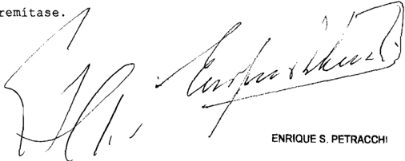

Recurso extraordinario interpuesto por Universidad de Buenob representada por Victor Darío Herrera . Dr .

Traslado contestado POr Cocilia Barbat, representada por 10 Dra María Elena Lópoz

Tribunal de origen: Sala de la Cámara Nacional del Irabajo\_

Tribunales que intervinieron con anterioridad: Juzgado Nacional de Prinera Ingtancia en 10 Laboral 62

## BANCO ESPAÑOL DEL RIO DE LA PLATA S.A. S/ QuIEBRA

## REGULACION DE HONORARIOS.

Cabe revocar la sentencia que reguló los honorarios de la síndica ad hoc y de su letrado patrocinante conforme a las pautas establecidas en la ley 24.318 pese haber desarrollado su labor con anterioridad a su entrada en vigencia, pues asiste razón a los apelantes en cuanto sostienen que dicha ley es inconstitucional porque altera derechos patrimoniales adquiridos al amparo de una legislación anterior (Disidencia del juez Enrique S. Petracchi).

-La mayoría declaró inadmisible  el  recurso  extraordinario  (art.  280  del C.P.C.C.N.)-.

## REGULACION DE HONORARIOS.

Cuando una situación se ha desarrollado en forma íntegra al amparo de determinadas normas -en el caso, L.C.Q 19.551-,mal puede valorarse el mérito, la extensión, la cuantificación del trabajo de acuerdo al nuevo régimen legal-ley 24.318-, sin que obste a ello la circunstancia de hallarse pendiente la determinación de sus honorarios, toda vez que la regulación judicial solo agrega un reconocimiento -y cuantificación- de un derecho preexistente a la retribución del trabajo profesional, por lo que es necesario indagar en cada caso el momento o la época en que se cumplió el hecho, acto o relación jurídica que engendró y sirvió de fundamento a la obligación, ya que tal circunstancia determinará cuál es la legislación aplicable (Disidencia del juez E. Raúl Zaffaroni).

-La mayoría declaró inadmisible  el  recurso  extraordinario  (art.  280  del C.P.C.C.N.)-.

## DERECHO ADQUIRIDO.

Si bajo la vigencia de una ley el particular ha cumplido todos los actos y condiciones sustanciales y los requisitos formales previstos en esa ley para ser titular de un determinado derecho, hay derecho adquirido aunque falte la declaración

formal de una sentencia o de un acto administrativo, pues éstos solo agregan el reconocimiento de ese derecho o el apoyo de la fuerza coactiva necesaria para que se haga efectivo (Disidencia del juez E. Raúl Zaffaroni). -La mayoría declaró inadmisible  el  recurso  extraordinario  (art.  280  del C.P.C.C.N.)-.

DICTAMEN DE LA PROCuRACIóN GENERAL

Suprema Corte:

- I -

A fs. 4/11 del cuadernillo de recurso extraordinario, la Cámara Nacional de Apelaciones en lo Comercial (Sala E) confirmó la resolución de primera instancia, en cuanto reguló los honorarios de la sindica ad hoc Cecilia Goldenberg y del Dr. Martín Luis Bosch, su letrado patrocinante, por su actuación en la presente causa, conforme a las pautas establecidas en la ley 24.318.

Para resolver de este modo, el a quo sostuvo que, no obstante que la sindica ad hoc y su letrado patrocinante desarrollaron su labor íntegramente antes de la vigencia de la mencionada norma, ella prevé en su art. 2º y 4º su aplicación retroactiva.

En tal sentido, consideró que dicha retroactividad encontraba justificación en el art. 1º de la ley que atribuyó al Banco Central de la República Argentina el ejercicio en forma exclusiva y excluyente de los procesos de quiebra de entidades financieras y, en consecuencia, ordenó dejar sin efecto las designaciones ad hoc efectuadas hasta el momento.

También entendió que, como el objetivo de la ley 24.318 era el de evitar regulaciones exorbitantes que colisionaran con el orden público en el marco de los procesos de liquidación de las entidades financieras, el medio escogido por el legislador -limitar los honorarios de aquellos profesionales que habían actuado hasta su vigencia conforme al salario mensual de un delegado liquidador del B.C.R.A.- resultaba razonable.

Asimismo destacó que toda vez que los derechos individuales no son absolutos sino que se encuentran limitados por las leyes que re-

glamentan su ejercicio, la aplicación del tope arancelario fijado por la ley 24.318 no resultaba inconstitucional.

- II -

Contra tal pronunciamiento, los profesionales nombrados dedujeron el recurso extraordinario de fs. 12/30, que fue contestado por el Banco Central de la República Argentina a fs. 41/46 y concedido por el tribunal a quo a fs. 49/50 en orden a la cuestión federal involucrada y rechazado en lo atinente a las invocadas causales de arbitrariedad, sin que aquéllos dedujeran queja.

Afirman, en primer lugar, que la decisión constituye sentencia definitiva, toda vez que no existen instancias ni recursos previos al extraordinario, y señalan la existencia de una cuestión federal, en cuanto se funda en una norma de ese carácter (art. 2º de la ley 24.318), cuya validez constitucional ha sido cuestionada.

Sostienen que la resolución impugnada se basa en una disposición legal que vulnera garantías constitucionales como las consagradas en los artículos 14, 14 bis, 16, 17, 18, 28 y 35 de la Constitución Nacional.

En el mismo sentido, alegan que la retroactividad de la ley 24.318, dispuesta por su art. 2º, altera su derecho adquirido a obtener una retribución fundada en la ley vigente al tiempo en que desarrollaron sus tareas, con lo cual deviene irrazonable, contrariando lo establecido en el art. 28 de la Ley Fundamental.

En tales condiciones, consideran que la sentencia impugnada afecta su derecho constitucional de propiedad, ya que la aplicación de dicha normativa disminuye notablemente el monto de sus honorarios en comparación con los que les corresponderían de acuerdo a las disposiciones legales imperantes al tiempo en que realizaron sus funciones.

Por último, entienden que la sentencia es arbitraria por cuanto deja sin respuesta un argumento conducente y oportunamente planteado como es el referido a la existencia de un derecho adquirido por su parte.

Ante todo, entiendo que el pronunciamiento impugnado resuelve de materia definitiva la articulación de los aquí recurrentes -habida

cuenta de que cobrarán los honorarios conforme a la ley 24.318 según resulta del fallo del a quo - y les causa un gravamen no susceptible de reparación por una vía ulterior.

Por otro lado, considero que el recurso extraordinario es procedente por hallarse en tela de juicio la validez constitucional de los arts. 2º y 4º de la ley 24.318 -en cuanto a la aplicación retroactiva del tope arancelario a los honorarios de los síndicos ad hoc - y la resolución ha sido adversa a los derechos invocados por los recurrentes.

- Iv -

La ley en cuestión establece en su art. 1º el desempeño de manera exclusiva y excluyente por el Banco Central de la República Argentina de la sindicatura de los procesos de quiebra de las entidades financieras liquidadas con anterioridad a la ley 24.144 y, por lo tanto, ordena el cese de las designaciones de los síndicos ad hoc efectuadas hasta ese momento.

En su art. 2º fija la remuneración de los síndicos ad hoc , cuya designación se deja sin efecto por el precepto anterior -la hace extensiva a su letrado patrocinante- y les fija un tope equivalente a la suma que resulte de multiplicar el número de meses efectivamente afectados al desempeño de la función por el sueldo correspondiente al delegado liquidador de la entidad fallida designado por el BCRA, al momento de efectuar el cálculo. La disposición se refiere, a continuación, a los honorarios ya regulados en los procesos.

El trámite administrativo-judicial se establece en el art. 3º y en el art. 4º se dispone que 'Las normas incluidas en el texto de la ley son aplicables a los procesos en trámite'.

- v -

En primer lugar, cabe destacar que V.E. en autos B.248.XXXII 'Banco Sindical S.A. s/ quiebra' (Fallos: 321:2730 y otros) expresó que resultaba inaplicable lo dispuesto por el art. 2º de la ley 24.318 si los honorarios profesionales habían sido regulados judicialmente con anterioridad a la vigencia de la ley y las resoluciones estuvieran firmes pues, de otra manera, se afectada el debido respeto a la cosa juzgada.

No es el caso del sub lite , en donde la regulación se efectúa una vez en vigor la nueva ley. A mi moda de ver, no se desconoce -como en los precedentes citados- una regulación pasada en autoridad de cosa juzgada sino que se restringe la expectativa de cobro de un honorario devengado hasta la fecha de vigencia de la ley.

La Corte tiene dicho que la fijación por ley de límites temporales para el nacimiento o extinción de los derechos -aquí, el art. 4º de la ley 24.318- cuando se produce un cambio de régimen jurídico -como en el presente, dejar sin efecto las designaciones de los síndicos ad hoc y determinar sus honorarios por las tareas cumplidas- es un recurso legitimo con el que no se vulnera la igualdad constitucional en tanto nadie tiene un derecho adquirido al mantenimiento de leyes o reglamentos ni a su inalterabilidad.

De hecho es de advertir que la ley no hace más que cerrar el circulo de prestaciones laborales de los síndicos ad hoc -trata específicamente el tope remuneratorio en función del cese de las designaciones- en lo que, entiendo, no se vulnera el derecho adquirido al honorario sino que se determina, de un modo razonable, su monto por ley. En consecuencia, considero que no se trata, en principio, de la aplicación retroactiva de una ley sino de la operatividad de ésta a una situación jurídica no consumida a la fecha de su entrada en vigencia y circunstanciadamente enmarcada en ella.

- vI -

Por las consideraciones expuestas, opino que corresponde confirmar la sentencia de fs. 4/11 del cuadernillo de recurso extraordinario. Buenos Aires, 23 de septiembre de 2009. Laura M. Monti.

## FALLO DE LA CORTE SuPREMA

Vistog 108 autos

Río quiebra"

Considerando:

Que el recurso extraordinario, es inadmigible (art 280 del Código Procesal Civil Y Comercial de la Nación)

Por ello, oída la señora Procuradora Fiscal se degestima el recurgo planteado Con costab (art\_ 68 del Código Procesal Civil Y Comercial de Nación) Notifíquese Y devuélvase

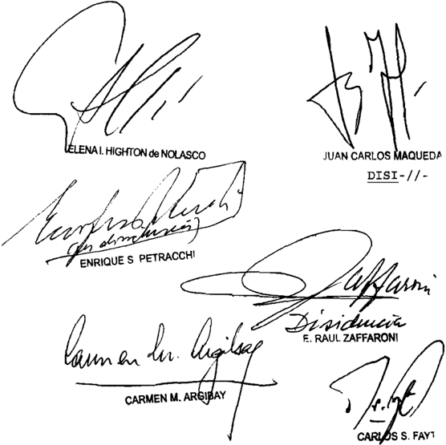

/ -DENCIA DEL 'SEÑOR\_MINISTRO\_DOCTOR DON ENRIQUE SANTIAGO

## PETRACCHI

## Considerando:

10) Que la Sala E de la Cámara Nacional de Apelaciones en Comercial confirmó parcialmente la regulación de honorarios realizada en primera instancia para la síndica ad hoc Y su letrado patrocinante que había fijado 8u8 emolumentos sobre base de 1o dispuesto por la ley

En 1o que al caso el art de 1a norma citada prevé que 1a remuneración de 10s BIndicos ad hoc Y letradog patrocinantes "que hubieran degempeñado funciones hasta 1a vigencia de esta ley , Berá equivalente la suma que regulte de multiplicar el número de meses efectivamente afectado al desempeño de la función por el sueldo correbpondiente al delega do liquidador de la fallida, designado por el Banco Central de la República Argentina al momento de efectuarse el cálculo, como máximo En congecuencia, honorarios que se hubieran regulado judicialmente podrán percibirge hasta la concurrencia del quantum determinado precedentemente digpogición de aplicación 1os casos en que se halle pendiente de pago la remuneración"

20 ) Que , para decidir de ese modo , el quo rechazó el planteo de inconstitucionalidad introducido por 1og apelantes regpecto de la ley 24 . 318 Al respecto, que el objetivo de ley fue el de evitar regulaciones exorbitanteb colisionaran con el orden público, Y el medio utilizado para lograr eba finalidad era adecuado Y proporcionado en tanto el salario mensual de un delegado liquidador del Banco Central remuneraba tareas muy similares las de los profesionales en cuestión que

Contra este pronunciamiento, la síndica ad hoc Y el letrado patrocinante interpusieron el presente recurso extraordinario.

3 0 ) Que agraviog traídos consideración en esta instancia suscitan cuestión federal suficiente toda vez que se ha cuestionado la validez de 1a 24 318 que se considera contraria las garantías que son tuteladas por la Constitución Nacional Y la decisión del tribunal superior de causa ha sido adversa derechoe que recurrentes fundaron en ellas (art 14 incs Y 3 0 de 48 ) ley los ley

Asimismo apelantes han demostrado que la decisión impugnada afecta derechos adquiridos Y , ende\_ que existe una relación directa inmediata entre 10 decidido Y las ga rantías constitucionales que se dicen vulneradas (Fallos 321:1757 Y sus citas) por

4 0 ) Que esta Corte se ha pronunciado en numerosas

oportunidades en el sentido de que no corresponde aplicar nuevas disposiciones en materia arancelaria trabajos profesionarealizados con anterioridad su vigencia, pues ello implica privar al profesional del derecho patrimonial adquirido al ampa ro de una legislación anterior que resulta violatorio del derecho de propiedad consagrado en el art 17 de 1a Constitución Nacional (Fallog: 268:561 ; 314:1477 ; causa A.367 XXXIII "Al mandos Gustavo 1. c/ Superintendencia de Segurog de la Nación" sentencia del de marzo de 2011) 109

Ello aun cuando la norma disponga aplicación retroactiva porque bien es cierto que en nuestro ordenamiento leyes pueden tener ese efecto, 1o es bajo condición obvia inexcusable de que tal retroactividad no afecte garan tías constitucionales (Fallos 320:31 Y 321:2730) las

En taleb condiciones asiste razón 1og apelantes en cuanto sostienen que la 24 318 es inconstitucional porque altera derechos patrimonialeg adquiridog al amparo de una legislación anterior por lo que corresponde así declararlo ley

Por ello, oída la señora Procuradora Fiscal se declara procedente el recurgo extraordinario interpuesto Y se revoca la sentencia apelada. Con costas (art 68 del Código Procesal Civil Y Comercial de la Nación) Vuelvan autos al tribunal de gen fin de que por quien corresponda, se dicte un nuevo fallo con arreglo al presente \_ Not Y, oportunamente, remítase ori-

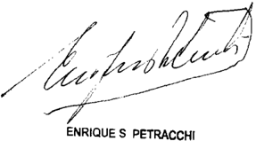

DISI-// -

MINISTRO DOCTOR DON E RAÚL ZAFFARONI

Considerando:

Que la Sala E de la Cámara Nacional de Apelacione8 en 1o Comercial desestimó log planteog de inaplicabilidad

inconstitucionalidad formulados respecto de ley 24 . 318 Y admitió parcialmente los agraviog expresados por recurrenteb modificando deciaión apelada (f8 5460/5462) que había regulado 109 honorarios de la contadora Cecilia Goldemberg (síndica ad hoc) Y de su letrado patrocinante doctor Martín Bogch , con fundamento en esa norma , en la suma de $ 16.000 res pectivamente

Que para decidir, previo dictamen de Beñora Fiscal General (fs 5548/5549) procedió transcribir par cialmente el texto del art 20 Y el correspondiente al art 3 0 de citada Afirmó que "la labor de 1a Bíndica ad hoc Y su letrado se degarrollaron íntegramente antes de la vigencia de esa norma" Y, en cuanto concierne al rechazo de 1o8 planteog de inaplicabilidad inconstitucionalidad efectuados por 108 recurrentes , expre8ó siguientes argumentog a) que el mencionado art 2 0 ebtablece expresamente su aplicación retroactiva art 3 0 del Código Civil) previsión legal que encuentra jugtificación en 1a disposición del art 10 que atribuyó al B.C .R.A\_ el ejercicio de la sindicatura, en forma exclusiva Y excluyente, en 10s de quiebra de entidades de precedentes de eba Sala, "Banco Español del Río de la Plata 9/ quiebra 9/ incidente de revisión por Bentencia del 20 de octubre de 2006 Y "Banco Comercial del Norte 8/ quiebra 8 / incidente de revisión por gentencia del 16 de julio de 2004 ; b) que ese fundamento no excluye la aplicación del tope arancelario\_ fijado en el art 20 para aquellos casos en 109 cuales ~por el motivo que fuerela designación continuación en funcionee de bíndicos ad hoc más allá de la fecha de entrada en vigencia de la ley 24 . 318 pues la actuación de es0s profesionales responde las mismas directivas Y funciones que degempeñaban antes de vigencia de la 21 526 en su actual redacción; c) que no resultaba aplicable la doctrina del caso "Transfina" sentencia del 27 de diciembre de 2001 pues allí resuelto pretendió adecuarge decidido en el precedente "Greco" sentencia del 6 de febrero de 1997 ~señala que en este último, esta Corte había establecido el criterio aplicable resde honorarios de funcionarios del concurso que ley . (arg ley pecto

habían actuado durante el imperio de la 19 551 Y debían ser retribuidos luego de la reforma introducida por 1a 24 \_ 522 mas no se había pronunciado sobre la aplicabilidad del tope previsto en ley 24 . 318 los estipendios correspondientes 10s síndicos ad hoc \_ en consecuencia, realizó un nuevo análisis de la cuestión, al fallar en el caso "Banco comercial del Norte" en razón que constituía un régimen específico Y diferenciable del rige para demás procesos universales; d) que de acuerdo las consideraciones plasmadas en este último precedente 1a irrazonabilidad de una ley aparece ~conforme lo puesto por la señora Fiscal General\_ cuando 10s medios que arbi tra no se adecuan fines cuya realización procuran, cuan do congagran una manifiesta inequidad en tanto, el objetivo de la 24 318 fue evitar regulaciones exorbitantes que colisionaran con el orden público en el marco de 109 procesos liqui datorios de entidades financierab, regulta adecuado tal fin el medio elegido por el legislador para limitar 10g honora riog de profebionales \_ conforme el mensual de un de legado liquidador del B c.R.A. en 1a medida que ~en definitivaremunera muy similares; e) que no advierte manifiesta indad aunque el honorario rebulte inferior al que correbpon dería conforme las normas previstas en ley 24 522 para las sindicaturas concursales ni aún al considerar que los de legadog liquidadores cuentan con una infraebtructura que no de ben costear mismog en tanto trata de funciones asimilables, Y el galario multiplicado por meseg efectivamente laborados no arroja un monto ingignificante ni reducido; f) que además , la actual 21 526 dispone en 8u8 arts. 45 último párrafo Y 48 \_ último párrafo, que honorariog de log liquidadores judiciales de entidadee financieras así como de peritos auxiliareb designados por el juez en procesos deben regularbe en función de la tarea efectivamente realizada por aquéllog\_ con absoluta independencia de la cuantía de 8u8 activog\_ pasivog patrimonio de entidad; g) derechos individualeb no Bon absolutos, Bino que encuentran limitados por lab leyes que reglamentan su ejercicio ~argumento del dictamen fiscal que el quo comparteY agí , como el tope arancelaley ley 10s que ley equi ley

rio que aplicar por imperio de la ley no rebulta manifiebtamente irrazonable de acuerdo con tareas efectivamente realizadas en el incidente, no correeponde ebtimar vulneradoe derechos Y garantíag conbagradog en la Carta Magna Y; h) que finalmente en atinente la igualdad ante la no reeulta procedente asimilar la labor de Bíndicog ad hoc en la quiebra de las entidades financieras con de 10s de más funcionarios concursales en cualquier otro proceso univer sal pues en la primera se encuentra comprometido con mayor énfasis el orden público en razón de 10s que este tipo de falencias genera respecto de toda la comunidad \_ Y , además 10s procesos liquidatorios de las entidades financieras cuentan con un régimen arancelario particular que ya fue mencionado que resulta diferenciado del establecido para 10s demás concur Y quiebras las ley,

Rechazados 10s planteos de inaplicabilidad incons titucionalidad, consideró que atendiendo 1a especificación establecida en el art 2 0 de la ley 24 318 respecto del sueldo del delegado liquidador al momento de efectuarse el cálculo, no podía tomarse como parámetro para fijar 10s estipendios profesionales la retribución que percibía en el mes de octubre del año 1999 ~fecha en la dejó de exigtir dicha figuracomo se hizo en primera instancia, pues resultaba un hecho público Y no torio que 10s salarios han aumentado considerablemente desde aquella época raíz de 10s índices inflacionarios que se registraron desde principiog de 2002 Afirmó\_ en consecuencia, que tomar como pauta referencial un galario devengado en el año 1999\_ importaría desconocer el texto de la norma que \_ como prevé 8u aplicación retroactiva, determina que el referido tope se debe calcular según el sueldo vigente la fecha de regu-lación\_ Frente ello , juzgó   que corresponderá adecuar la regulación apelada , multiplicando la cantidad de meses en que se ejerció la función retribuida por el salario actual de un fun cionario del B .C.R.Ade equivalente escalafón al que correspondía , oportunamente al cargo de delegado liquidador En el Caso que dicha equivalencia no existiera no pudiera Ber determinada entonceg , se requerirá al B.C.R.A. que informe qué porque

centaje de aumento Balarial se ha concedido 108 funcionariog de ege ente desde el año 1999 hasta la actualidad; alcance con el que se admite agraviog exprebadog por

3% ) Que contra la sentencia la contadora Cecilia Goldemberg (Bíndica ad hoc) Y letrado patrocinante doctor Martín Bosch interpusieron el recurgo extraordinario que obra globado 12/30 del cuadernillo formado al efecto, el cual fue concedido por la alzada por considerar que rebulta formal mente procedente pueg prima facie, exiete un debate sobre cueb tionee de orden de examen por ebta Corte en términos del art 14 de la 48 en tanto en re lación la caugal de arbitrariedad\_ ey

4 % ) Que los recurrentes exponen 1og Biguienteb agravio: a) que la decigión adoptada por el quo vulnera 1og principiog de retribución justa igual remuneración por igual tarea con afectación de garantía constitucional congagrada en el art 14 de la Constitución Nacional, puee la regulación de honorariog realizada en a decibión recurrida no guarda relación alguna con en juego ni con la extengión Y calidad de lag tareas desarrolladas Y bien log derechoa conbtitucionalmente garantizadog no son absolutoe sino que ben ejercerse conforme las leyes que reglamentan, lo cierto eg que no absoluto el poder del Eøtado para reglamentarlos\_ en la medida en que el art 28 de la Constitución Nacional exige que no alteren la naturaleza de derechos que re glamentan\_ Al respecto, agrega que puede ser atendible Y hasta loable la pretensión de evitar "honorarios exorbitantes pero el medio utilizado para tal fin no puede sin caer en irrazonable producir regulacioneg de honorarios desproporcionadamente magras claramente desiguales con lag regulaciones que corresponden tareas semejantes Y, el fundamento dado por la alzada al señalar "no se advierte manifiebta inequidad, aunque el honorario regulte inferior al que correspondería conforme las normas arancelariag en para las demás sindicaturas concursales. resulta dogmático, sin respaldo al guno Y sin congideración ninguna la tarea realizada , ni montos en juego, ni 1os beneficios obtenidos ni al derecho de que ley

ser tratados en forma igual , en tanto no se indica el parámetro con el que se ponderó 1a dad Y que en todo caso tal aspecto debería ser analizado en función de la 19.551 ~vigente en el período de actuación\_ Y no con la posterior 24 . 522 El dogmatismo de esa afirmación ~aseverasalta la viata en la medida en que no es el resultado de un análisis particular de este expediente, por as tareas realizadas en el proceso principal de quiebra sino que la reiteración de sostenido en otro ex pediente de distinta naturaleza (un incidente) con tareab total mente diveraas con otros montos en juego, con aranceleb di rentes su vez , en que concierne la violación de la igualdad que resulta del fallo apelado en cuanto aplica lo dispuesto por el art 2 0 de ley 24 318 destaca que funda mentos dados vinculados con el énfasis del orden público en procesos de quiebra de entidades financieras Y el régimen arancelario aplicable éstas equipara honorarios por tareas judiciales con bueldos percibidog en una relación de depen dencia, omitiendo 1a diversa entidad de aspectog centrales que hacen la existencia de éstas ~señala al respecto: 1a tarea profesional, acotada en el tiempo, de modo independiente en virtud de un mandato temporario que se asume bajo condicioneg legaleg vigenteg en esa instancia, por un lado, Y 1a acepta ción de 1a remuneración, estabilidad Y beneficios en cuanto concierne la últimaConcluye afirmando que la equiparación que establece el fallo recurrido viola el art 16 de Constitución Nacional al otorgar el mismo tratamiento quieneg se encuentran en Bituaciones absolutamente diferenciadag ; porque el principio de igualdad obliga igual tratamiento quieneg comparten una misma categoría, pero obliga también no agignar el mismo tratamiento quienes pertenecen otra, que el error en que el art de 1a cuestionada incurre por lo cual está viciado de inconstitucionalidad; b) que tambien, re sulta inconstitucional la aplicación retroactiva de topeg previbtog para la regulación de honorarioe devengados con anterioridad vigencia, en tanto vulnera el derecho de propiedad al afectar derechog adquiridos Y violentar la garantía del art 17 de Constitución Nacional\_ pueb una vieja doctrina Corte equi ley feley

Suprema de Jugticia de la Nación indica que bien en nuestro ordenamiento lab leyes pueden tener ee efecto (retroactivo) 1o e8 bajo condición obvia inexcugable de que tal retroactividad no afecte garantías constitucionales Ni el legislador ni el Juez podrían en virtud de una nueva de interpretación, arrebatar alterar un derecho patrimonial adquirido al amparo de la legislación anterior pueb en este caso el principio de no retroactividad deja de ser una norma infraconstitucional para confundirse con garantía de inviolabilidad de la propiedad reconocida por la Ley Suprema (Fallos: 137:47 ; 152:268 ; 163 155 ; 178 : 431 ; 238 :496 ; 317,218 Y 320:32) Asimismo agregan que aun cuando 10s honorarios no hubieran sido regulados al entrar en vigencia la ley 24 . 318 \_ el derecho esos honorarios de conformidad con la 19 551 para entonces ya había nacido Y se había incorporado definitivamente patrimonio, Ya que toda regulación de honorarios es un acto declarativo Y no constitutivo de un derecho Fallos 296 : 723 ) en consecuencia la aplicación retroactiva vulnera garantías de orden constitucional (cfr. Fallos 268 :561 ; 319:1915; 320:32 Y 1542) Destaca que todos estos fundamentos fueron expuestos en la expresión de agravios propuesta ante la alzada Y fueron soslayados por el quo mediante una argumentación solo aparente en medida en que la remisión 1o resuelto en el antecedente "Banco comercial del Norte quiebra-incidente de revisión por el B.C.R.A\_ (16 de julio de 2004 ) carece de pertinencia, en tanto las tareas allí degplegadas por 10s profesionales fueron desarrolladas con posterioridad entrada en vigencia de la 24 . 318 diferencia sustancial que exterioriza la arbitrariedad del pronun ciamiento, en un contexto en el cual hizo referencia, también, ley 24 522 Y su vetado art 290 particularmente mas de interpretación con relación al inicio de su vigencia cuando dicha norma carece de toda relación con 1a cuestión objeto del planteo Y; c) que por último tachan de arbitraria 1a decisión recurrida por haber omitido examinar Y tratar cues tiones conducentes Y oportunamente propuestas para la adecuada Bolución del pleito ~que fueron rebeñadas en 1os puntoe precedentes en ese proceder medió una afectación sustancial de 8u8 derechob ley ley ley 1as

50 ) Que , en primer término correeponde señalar que recurrenteb introdujeron el planteo de inconstitucionalidad del art 2 0 de la ley 24 .318 fs. 4406/4410 al Bolicitar la regulación de honorariog formulación que reiteraron en cada oportunidad en la cual realizaron Bimilar pedido habta que fi nalmente medió pronunciamiento al Dicho planteo 1o BoBtuvieron en el memorial de agravioe dirigido 1a alzada re8pectiva Y , al ser desestimado, fue mantenido en el remedio federal

Que Bi bien atinente honorariob regulados en instancias ordinarias conbtituye como regla, materia ajena al recurbo del art 14 de la 48 , pueb la determinación del monto del litigio, apreciación de trabajos profebionaleb cumplidos Y la aplicación de las arancelariab no Bon , por su naturaleza cuestioneg de tratamiento por la vía extraordinaria, cabe hacer excepción principio cuando lo rebuelto carece de la fundamentación Buficiente (Fa311 :121 , 2835 Y 315:1469 , 1835) Y omite pronunciarse sobre articulaciones Beriab formuladae oportunamente por 10g interebaY conducentes para la deciaión reøpectiva 314:832 Y 319:992) ley

70 ) Que su vez , el recurgo extraordinario es formalmente procedente, Ya que halla en juego la interpretación de normas de naturaleza federal cuya inconbtitucionalidad, con resultado advergo, fue planteada por recurrenteb (art\_ 14 inc 3 0 de la 48) En la tarea de establecer la inteligencia de las normas federales este Tribunal no se encuentra limitado por las del quo ni por 10s argumentos de las parsino que le incumbe realizar una declaratoria sobre el pun to disputado (art 16 de la ley 48) según interpretación que rectamente le otorgue (Fallos 307:1457 ; 324 : 803 , entre muchos otros) Cabe añadir que en el caso la alegada arbitrariedad del fallo se encuentra estrechamente vinculada con la valoración el quo agignó la normativa federal acaecimiento que toriza que ambas cuestiones sean consideradas en forma conjunta (Fallos: 314 :1460 318:567; 321 : 2764\_ entre muchos otros) Además\_ en relativo la interpretación efectuada por el ley tes que

quo , respecto de la norma tachada de inconstitucionalidad ~en cuanto establece la aplicación todos 10s casos en que se halle pendiente de pago la remuneración del síndico agraviog guscitan cuestión federal pues si bien el principio de no retroactividad de leyes establecido por el art 3 0 del go Civil no tiene jerarquía constitucional Y, por tanto no obliga al legislador (Fallos 315:2999) no es menos que la facultad de legislar sobre hechos pasados no es ilimitada, ya que la ley nueva no puede modificar alterar derechos incorporados al patrimonio al amparo de una legislación anterior sin menoscabar el derecho de propiedad consagrado en el art 17 de la Constitución Nacional (Fallos: 305 899) las

8 0 ) Que el quo aseveró que la labor de la síndica ad hoc Y letrado se desarrollaron íntegramente antes de la vigencia de la ley 24 .318\_ sin embargo omitió considerar cuál era el régimen legal vigente la época en que fueron realizados 1o8 trabajog profesionaleg Y, consecuentemente, su implicancia con el precepto del art \_ 2 0 de aquel texto legal Al respecto cabe precigar que síndica ad hoc fue degignada el 30 de julio de 1993 900) Y aceptó el cargo conferido el de agogto de 1993 903) realizando primera presentación con patrocinio letrado f, 971 , escrito en el cual solicitó la concesión de una prórroga para formalización del informe que se le en comendó \_ Con pogterioridad, también con dicho patrocinio, efectuó pregentaciones que lucen en fs 1368 , 1395 , 1417 Y 1730/2879 En esta última síndica ad hoc, con fecha 27 de di ciembre de 1993 formalizó pregentación del informe individual (art 35 de la 19.551) correbpondiente al crédito nuado por el Banco Central de la República Argentina , oportuni dad anterior la vigencia de la 24 .318 , fin de dar cum plimiento al cometido asignado en el pronunciamiento de f8 824/825 , acreencia respecto de la cual el juez de grado Be nunció f8 3854 ~con basamento en fundamentos expresados en incidentes de impugnación 20 .825 Y 22 . 220 , procedimiento impugnativo que resultaba viable bajo el régimen de ley 19.551 , art Cabe recordar que debignación de un síndico ad hoc , en lo mediato, tendía proteger derechog de la faley ley pro-

1lida Y del conjunto de acreedoreb pues proponía evitar la exibtencia de interese8 contrapuegtos que confluirfan en instancia en cual el Banco Central pretendía verificar su propio crédi cuando por un imperativo legal debía ejercer 1a Bindicatura en el peculiar de quiebra de una entidad financiera (confr B.393 XLV "Banco Sidesa S.A 9/ quiebra" considerando sentencia del de diciembre de 2010) 1ob to,

9" ) Que de acuerdo con las constancias referidas tanto la labor de la síndica ad hoc como la de su letrado patrocinante se desarrollaron durante la vigencia de la 19.551, extremo que también resulta evidente en razón de la renuncia realizada por este último fs \_ 3911 , el 10 de marzo de 1995 , es decir con anterioridad la entrada en vigor de la 24 . 522 embargo , el quo omitió toda consideración al respecto Y efectuó una afirmación dogmática al señalar que "no advierte manifiesta inequidad aunque el honorario resulte inferior al correspondería conforme las normas previstas en la 24 522 para la demás sindicaturas concursales ni aún advirtiendo que los delegadog del BCRA cuentan con una infraestructura no deben costear ellog mismos\_ en tanto reiterase que se trata de funciones similares, (y) el galario multiplicado por meses efectivamente laborados no arroja un monto ingignificante ni reducido () ley ley ley que que

10) Que en tales condiciones resulta aplicable la doctrina de esta Corte que establece que el pronunciamiento regulta descalificable, como acto jurisdiccional cuando ha omitido la indispengable fundamentación conforme las circunstancias de la causa , cuando utiliza pautas de excesiva latitud, cuando omite pronunciarse sobre articulaciones serias Y conducentes pa ra la decisión, formuladas oportunamente por interesados (Fallos: 308:1079; 313 : 664 ; 316:2166 ; 324 :2966 ; 328;3067 , entre muchos otros) pueb para decidir no podía prescindirse de la puntual valoración de la entidad de trabajos realizados , su extensión , calidad Y complejidad, vinculándolos con las normas arancelarias vigentes al tiempo de su realización, tomando en cuenta que la mera referencia de porcentajes establecidos por el art 290 de la ley 551 no permite inferir tal extremo 19

en tanto la propia norma que establece también determina que dentro de ellos se encuentran comprendidog honorarios de la totalidad de funcionariog Y profesionaleg por las tareas que atienden la congumación integral del procego de quiebra, cuan do en el las labores en cuestión quedaron al come tido asignado en la decisión de fs\_ 824/825 Y cumplimentaron bajo el imperio de aquella ley

11) Que la ponderación de talee circunbtancias no ca be suplirla mediante una argumentación tendiente Bostener genéricamente la razonabilidad de previsioneg contenidas en la ley 24 . 318 pues le otorgan fundamentación aparente Igual consideración merece la reflexión que Beñala la inexiatencia de una manifiebta inequidad gubtentada en la adecuación al fin pergeguido de evitar regulacioneg exorbitantes que colibionaran con el orden público\_ en el marco de toriog de entidades financieras

12) Que asimismo en la adecuada valoración de extremog referidos resultaba indispengable el tratamiento de agraviog vertidog en relación garantías que dicen vulneradas máxime si se evalúa aquello expu sieron en el remedio federal 10s recurrentes (f8 26 del cuadernillo formado al efecto) en concerniente lab circunbtanciag de tiempo Y modo que operaron en el incidente en el cual recayó el pronunciamiento cuyog fundamentos fueron trangcriptog para fundar la decisión recurrida en el presente\_ que

13 ) Que relacionado con la cuestión señalada en el considerando precedente esta Corte ha expresado que no es admi sible exigir indiscriminadamente el requisito de sentencia previa sanción de 1a nueva para tener un derecho como irrevocablemente adquirido bajo la vigencia de 1a anterior\_ No tratándose de algunog casog de pronunciamientos constitutivos de derechos sentencias declaran la existencia de un derecho anterior ellag Y condenan , precisamente, porque ese derecho estaba adquirido por la parte vencedora en juicio Si bajo la vigencia de una ley el particular ha cumplido todos actos Y condiciones gubstanciales Y formales previstog en esa para ser titular de un determinado derecho , debe consiley ley ley

derarse que derecho adquirido aunque falte declaración formal de una sentencia de un acto administrativo, pues éstos sol0 agregan el reconocimiento de ese derecho el apoyo de fuerza coactiva necegaria para que se haga efectivo (Fallos 296 : 723 , considerando 70 ) hay

La nueva no puede modificar alterar derechos incorporados al patrimonio al amparo de una legislación anterior, pueg en tal caso 109 poderes legislativog se enfrentan con la protección del derecho de propiedad consagrado por el art 17 de la constitución Nacional (Fallos 305:899 320 :378 ; 321 :1757) El nuevo ordenamiento no se proyecta atrás en el tiempo ni altera el alcance jurídico de las consecuencias de 10s hechos Y actos realizados en su momento bajo un determinado dispogitivo legal pues de lo contrario podría afectar derechos adquiridos bajo un régimen anterior (Fallos: 314 481) Para que exista derecho adquirido Y, por tanto, se encuentre vedada la aplicación de la nueva es necegario que Bu titular haya cumplido ~bajo la vigencia de norma derogada modificada todas condiciones sustanciales Y 1og requiaitog formaleg previstog eba ley para ser titular del derecho de que trata (Fallob: 298 :472 ; 304 : 871 Y 314 :481) ley ley ,

En tal sentido, corresponde recordar que cuando ~como sucede en el cago una situación Be ha degarrollado en forma íntegra al amparo de determinadas normas mal puede valorarse el mérito, la extengión, la cuantificación del trabajo de acuerdo al nuevo régimen legal (Fallos: 319:1915 , considerando 10 Y A.367 .XXXIII "Almandos Gustavo 1. c/ Superintendencia de Segu de Nación 9/ empleo público" considerando 3 0 sentencia del 2 de marzo de 2010) que obste ello circunbtancia de hallarge pendiente la determinación de 8u8 honorariob toda vez que la regulación judicial solo agrega un reconocimiento cuantificación de un derecho preexibtente la retribución del trabajo profebional (conf Fallog: 314:481)

En consecuencia, es necebario indagar en cada caso el momento la época en que se cumplió el hecho , acto relación jurídica que engendró Y Birvió de fundamento la obligación, ya que esta determinará cuál e8 la legislación apli-

cable. En el caso de profesionaleg el derecho se conbtituye en la oportunidad en que se 108 realiza, allá de la época en que practique la regulación Ee partir de ahí que nace una situación jurídica concreta individual en cabeza del que como tal se hace inalterable Y no puede Ber suprimida, modificada, por ley pobterior sin agravio al derecho de propiedad consagrado por el art 17 de la Constituci6n Nacional (Fallos: 306 : 1799 ; 324 : 2966)

14 ) Que en dicho contexto Y resultas de principios enunciados debe concluirge que en el caso sub examine no se debe aplicar la 24 318 con relación trabajos profesionales realizados con anterioridad su vigencia, pues ello traería aparejada una afectaci6n de derechos adquiridos que integran el patrimonio de en tanto se ha configurado a situación jurídica concreta individual referida en el considerando anterior, que no puede ser alterada sin riesgo de afectar el derecho de propiedad \_ ley

15) Que según inveterada jurisprudencia, declara ci6n de inconstitucionalidad de un precepto de jerarquía legal constituye 1a más delicada de las funciones encomendar un tribunal de justicia, configurando un acto de suma gravedad que debe ser considerado 1a ultima ratio del orden jurídico (Fallos 303 : 248 ; 312:72 ; 324 : 920 , entre muchos otros) por 10 que no ca be formularla sino cuando un acabado examen del precepto conduce la convicción cierta de que su aplicación conculca el derecho la garantía constitucional invocados (Fallos 315 923 ; 328 :4542)

En razón de fundamentos que anteceden , al no re sultar posible efectuar una interpretación que haga compatible la norma involucrada con derechos de raigambre constitucional en juego , corresponde declarar la inconstitucionalidad del art de 24 318 en lo que al presente caso concierne 10s ley

Por ello, Y oída la señora Procuradora Fiscal se declara formalmente admisible el recurso extraordinario deducido con indicados, se declara la inconstitucionalidad del art 2 0 de la 24 318 Y se revoca la Bentencia recurrida Con costab (art 68 del Código Procesal Civil Y Comercial de Na ley

ción) Vuelvan 10s autos al tribunal de origen fin de que por quien corresponda, se dicte un nuevo pronunciamiento con arreglo Notifíquese Y, oportunamente remítase

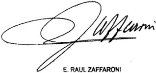

Recurso extraordinario interpuesto por Martín Bobch , POr 8u8 derechos con el patrocinio letrado de la Dra Maríe Eugenla Urquijo. contestado por Bindicatura legal ejerclda por el Banco Central de Argentlna, Dr Tribunal de origen: Cámara Naclonal de Apelaclone8 en 1o comerclalBala B.

EMPRESA NACIONAL DE TELECOMuNICACIONES EN LIQuIDACION C/ TELEFONICA DE ARGENTINA S.A. S/ CONTRATO ADMINISTRATIvO

## RECURSO ORDINARIO DE APELACION.

Corresponde declarar desierto el recurso ordinario de apelación contra la sentencia que hizo lugar a la acción promovida por la Empresa Nacional de Telecomunicaciones (en liquidación) contra Telefónica Argentina S.A. y dispuso que se efectuara la rendición de cuentas en el plazo de 60 días hábiles de conformidad con lo resuelto en el pronunciamiento y lo convenido en el Contrato de Transferencia, ya que no refutó el núcleo central del raciocinio del a quo , consistente en que la liquidación presentada por la demandada no puede ser considerada una rendición de cuentas pues no se trata de un informe circunstanciado sino de un simple listado de ingresos y descuentos que no fue acompañado de la documentación necesaria.

## RENDICION DE CUENTAS.

No puede ser admitido el agravio referido a que el a quo , al no aplicar las previsiones del art. 73 del Código de Comercio, estableció un privilegio injustificado a favor del Estado Nacional en detrimento de los derechos constitucionales de la empresa telefónica demandada, ya que omite toda referencia al fundamento de la sentencia acerca de que la falta de observación de las liquidaciones presentadas por la demandada dentro del plazo fijado en aquel artículo no cons-

## DE JUSTICIA DE LA NACION

tituía un reconocimiento implícito de aquéllas, pues en el ámbito del derecho público el principio general que ha sido consagrado normativamente es que en caso de que una pretensión requiera un pronunciamiento concreto de la Administración, su silencio o ambigüedad se interpretará como negativa (art. 10 de la ley 19.549).

## FALLO DE LA CORTE SuPREMA

## Buenos Aires, de de 20/2

Vistos autos 'Empresa Nacional de Telecomunicaciones (en liquidación) c/ Telefónica de Argentina 5 .A . contrato administrativo" los

## Considerando:

10 ) Que la Sala IV de la Cámara Nacional de Apelaciones en 1o Contencioso Administrativo Federal, al confirmar la decisión de instancia anterior, hizo lugar la acción promo vida por la Empresa Nacional de Telecomunicaciones (en liquidación) contra Telefónica de Argentina S .A con el objeto de que la demandada presentara la rendición de cuentas de las sumas percibidas por cuenta Y orden de la actora en concepto de los servicios de telecomunicaciones que ésta prestó en forma previa la toma de posesión por parte de la licenciataria En consecuencia, dispuso que se efectuara dicha rendición en el plazo de 60 días hábiles, de conformidad con pautas establecidas en la sentencia, 1o convenido en el Contrato de Transferencia suscripto por las partes , bajo apercibimiento de tener por aprobadas las cuentas que presentare demandante

2 0 ) Que el quo , en sustancia, fundó su pronunciamiento en siguientes argumentos a) que a liquidación presentada por la demandada el de noviembre de 1993 ~así como las acompañadas con anterioridad esa fechano satisfacen os recaudos mínimos fin de tener por cumplida la obligación de rendir cuentas , pues si bien ésta no se halla sujeta fórmulas sa cramentales, en el caso, adenás de haberse omitido el detalle de

las operaciones de cobro Y de 10s gastos realizados , no se acomla documentación pertinente que permita avalar la gestión cumplida En este aspecto, en particular, ponderó carencia de respaldo documental de varios de movimientos producidos en las cuentas presentadas 1a precariedad probatoria de ciertas constancias ~vg la certificación de escribano obrante fs 434/522- , la ausencia de recibos de pago cuyo otorgamiento era usual en práctica comercial, el hecho de que la falta de presentación de la documentación que se hallaría en poder de 1a Empresa Nacional de Telecomunicaciones se refiere una serie de conceptos ajenos específica materia sobre la que versa esta rendición de cuentas , esto es , sumas percibidas por la licenciataria con motivo de servicios de telecomunicación prestados por 1a actora; b ) que no correspondía admitir el planteo de 1a demandada en el sentido de que las liquidaciones se hallaban aprobadas porque no fueron impugnadas por 1a actora dentro del plazo establecido por el art 73 del Código de cio Fundó tal aseveración en que \_ por una parte, ningún plazo correspondía computar si dichas liquidaciones no reunían la ca lidad de rendiciones de cuentas Y, por otra, en que si bien las reglas del derecho privado pueden ser aplicadas por analogía ante la ausencia de normas de principios de derecho público que rijan el punto, en el caso , no correspondía aceptar una aprobación tácita de las liquidaciones por el mero silencio de Administración, pues el principio que rige en el ámbito del derecho público es que el silencio debe entendido en sentido negativo (art 10 de la ley 19.549) ; c) que partes suscribieron un Contrato de Transferencia que contiene específicas previsiones en materia de gestión de cobro, descuentos de gastos Y rendición de cuentas (Cláusula X) de modo tal que aquéllas expresamente fijaron en qué casos 1a actora debía pagar por las gestiones realizadas por la demandada , Y en casos los gastos correrían por cuenta riesgo de las sociedades licenciatarias Por esta razón, ~enfatizó el quo\_ era imprescindible discrimi nar en la rendiciór de cuentas, las distintas hipótesis contempladas en el contrato, Y la consiguiente explicación de las ope raciones efectuadas; d) que en relación ciertos gastos pagados pañó las las qué

terceros, como son las comisiones bancarias abonadas por el depósito de 1os sueldos , la licenciataria no tenía derecho compensación alguna pues no se había previsto contractualmente la deducción de aquéllos ~Cláusula IX del Contrato de Transferencia-; e) que a prueba rendida en causa no permitía tener por acreditado el incumplimiento contractual de la actora que su contraria adujo, esto es , la ausencia de escrituración de 252 inmuebles Y, que aun de ser así, era un tema ajeno debatido en esta causa, razón por la que correspondía reclamar el cumplimiento de dicha obligación en la forma por a vía pertinente En este aspecto, el quo también destacó los gastos en que habría incurrido Telefónica Argentina S .A por las transferencias de aquellos bienes que se hicieron por su cuenta ~gastos de escrituración-, no eran un concepto deducible de la liquidación, de conformidad con lo previsto en la cláusula relativa la Transferencia de Activos ~Cláusula VII, en especial, punto 7 .11 ~; f ) no resultaba aceptable deducir en la liqui\_ dación presentada, la compensación por las sumas que habría abonado la demandada por reclanos judiciales, pues existía en el Contrato de Transferencia un procedimiento peculiar al que las partes acordaron someterse ~Cláusula XII-; por último en cuanto las órdenes de descuento presentadas por la demandada la cámara ponderó las limitaciones contractuales que impedían su reconocimiento en 10 relativo pagos efectuados al personal ~Cláusula IX- , los gastos por la importación de material como las restantes órdenes por otros conceptos , 1a ausencia de documentación para sustentar los descuentos realizados por denandada de que

3 0 ) Que contra la sentencia demandada interpuso recurso ordinario de apelación 2158/2159) que fue concedido (fs\_ 2208 ) Y resulta formalmente admisible pues se dirige contra una sentencia definitiva dictada en una causa en la que la Nación es parte el valor disputado en último término supera el monto mínimo previsto en el art 24 , inc . ap a . del decreto-ley 1285/58 , modificado por la ley 21 .708 la resolución 1360/91 de esta Corte, pues aun cuando dicho valor se encuentra

indefinido por haberse diferido su determinación, el cálculo de aqué1 puede ser establecido en términos concretos con arreglo elementos de juicio objetivos que han sido producidos en la causa , según 10 sostenido por el Tribunal, no corresponde extremar 1a exigencia en la demostración de aquel recaudo si en el caso existen claras constancias acerca de que el monto del agravio excede el mínimo legal la fecha de interposición del recurso (ver, en especial' Fallos: 312:64 ; doctrina de Fallos: 320:349; 325:3225 ; 327:1456; 330:1332, Y el escrito de interposición del recurso de fs 2158/2159)

Que en una constante jurisprudencia el Tribunal ha sostenido que corresponde declarar 1a deserción del recurso ordinario de apelación si en su memorial de agravios ante 1a Corte el apelante no formula ~como es imprescindibleuna crítica concreta Y razonada de los fundamentos desarrollados por el quo (Fallos: 310:2914 ; 311:1989; 312:1819, entre muchos otros , art 280 del Código Procesal Civil Y Comercial de la Nación) sin que resulte suficiente reeditar argumentos vertidos en instancias anteriores ni formular asertos dogmáticos que no baten 10s aspectos específicos tenidos en cuenta por la cámara para decidir la cuestión planteada (Fallos: 324:2745 ; 328:2579; 329:2825 3537) las

Que el menorial de agravios presentado fs 2214/2231 presenta las deficiencias apuntadas en el considerando precedente

En efecto, el apelante no ha refutado el núcleo central del raciocinio del quo , consistente en que la liquidación presentada por la demandada en el mes de noviembre de 1993 ~como ocurre también con las liquidaciones parciales presentadas ante-riormente\_ no puede ser considerada una rendición de cuentas pues no se trata de un informe circunstanciado con las ex plicaciones referencias sobre las actuaciones realizadas por Telefónica por cuenta Y order de ENTEL sino de un simple listado de ingresos descuentos" que no fue acompañado de documentación necesaria para acreditar una correcta actuación

en la gestión de cobranza encomendada , consistente en la percepción de las sumas correspondientes servicios prestados por la Empresa Nacional de Telecomunicaciones con anterioridad la toma de posesión por parte de la licenciataria, Y la consiguiente deducción de aquellos conceptos autorizados por cláusula del Contrato de Transferencia (ver fs

En este sentido, es nítida la insuficiencia del memorial, pues el recurrente lejos de rebatir aquella conclusión del quo en relación las severas deficiencias de las liquidaciones presentadas 18/28 ) , que han sido señaladas desde un inicio en el peritaje producido en la causa (ver, entre otras, fs 338 , párrafos Y fs \_ 342 ; fs 343 ; fs 344 ; fs \_ 347 ; fs 349 , Párrafo 1 0 fs \_ 351/354 ; fs 357 último párrafo fs 358 , párrafos 1 0 Y 3 ' ) , cuestionó en forma dogmática Y sin consistencia alguna aspectos parciales de la decisión

Son de dicho tenor ~siguiendo el orden expositivo del menorial-, la afirmación de que , contrariamente 1o sostenido por el quo , era necesario acreditar la confornidad de enes recibieron pagos realizados por la demandada , pues si ningún proveedor ningún empleado [de] ENTel han realizado reclamo alguno 10s pagos TASA realizó por cuenta orden de ENTel , no corresponde poner en duda su efectiva existencia integridad Mucho menos corresponde hacer lugar la demanda con referir l0 que cierta jurisprudencia ha fa llado acerca de la forma en la cual debe hacerse la rendición de cuentas (fs 2219/vta .) ; bien, la genérica manifestación de que la falta de documentación de respaldo que fue señalada por la perito contadora se refiere 1a que se hallaba en de la actora Y ésta se negó poner disposición de aquella profesional, pero que la denandada realizó procedimientos alternativos acreditaron pagos realizados por cuenta orden de ENTel (fs 2219 vta.) , 0 , finalmente, la mera alusión que es irrazonable la conclusión de 1a cámara al considerar insuficientes certificaciones del escribano que obran fs 434/522 de estos autos, para avalar las deducciones realizadas por la demandada , aseveración que sól0 fundó en que el voluqui por que poder que las

men de documentación involucrada impedía realizar el de talle de todos los comprobantes fueron entregados por Telefónica de Argentina S .A . la Empresa Nacional de Telecomunicaciones (fs 2220) que

6" ) Que , la misma endeblez, presenta el agravio del apelante acerca de que el quo, al no aplicar al caso las previsiones del art 73 del Código de Comercio, estableció un privilegio injustificado favor del Estado Nacional en de trimento de los derechos constitucionales de Telefónica de Argentina 2222) En efecto, tal planteo omite toda referencia al fundamento de la sentencia acerca de que , la falta de observación de las liquidaciones presentadas por la demandada dentro del plazo fijado en aquel artículo no constituía un reconocimiento implícito de aquéllas pues en el ámbito del derecho público el principio general que ha sido consagrado normativamente es que en caso de que una pretensión requiera un pronunciamiento concreto de la Administración, su silencio ambigüedad se interpretará como negativa (art 10 de la ley 19 549)

Que tampoco el apelante expuso una crítica concreta razonada en relación decidido sobre las comisiones cuyo cobro pretendió por el desempeño de su gestión, bien, que pagó un tercero para que aquélla fuera llevada cabo, es el caso de las conisiones bancarias pagadas del de pósito de sueldos de empleados de la Empresa Nacional de Telecomunicaciones (ver considerandos y 8 de la sentencia) las

En efecto, el recurrente ~más allá de mostrar su senso fundado en que conforme las normas del Código de cio el mandato no se presume gratuitono ha dado argumento guno para refutar 10 dicho en la sentencia acerca de que 10s únicos gastos que 1a demandada se hallaría habilitada para reclamar en este pleito por gestión de cobranza son específicamente establecidos en el Contrato de Transferencia, razón por la que resultaba imprescindible discernir con toda claridad los supuestos que habilitaban el reintegro de desembolsos , en tanto existiese prueba fehaciente de ellos, de aquellos otros 1os su

en los que la gestión correría por cuenta riesgo de la licenciataria (ver el detalle de 1a Cláusula X del contrato)

El agravio del recurrente resulta particularmente inconsistente si se tiene en cuenta que no se ha hecho cargo de expresado, en el mismo orden de ideas, en pericia contable acerca de que con relación ingresos percibidos por la de mandada con sustento en el punto 10 .2 .2 del Contrato de Transferencia, éste no indica a posibilidad de cobro alguno de comisión por parte de 1a demandada 1a actora"ni se ha podido identificar documento alguno entre las partes donde se consigne la posibilidad por un lado, Y forma de determinación, por otro, de conisiones Y que , con relación los ingresos percibidos en razón de los puntos 10 .1 1 . ; 10 .1 .2 a) 10 .2 .1 de aquel contrato, si bien ~en principioadmitirían la deducción de 1os gastos en que razonablemente se hubiese incurrido, no existe ninguna documentación que avale ni tampoco se ha acreditado la existencia de acuerdo alguno entre las partes en el que se haya estipulado una tasa que operase como techo náximo que la actora oblaría 1a demandada por sus tareas de gestión de facturación cobranza tal coIO establecía el Contrato de Transferencia (ver fs 351/352)

La misma deficiencia exhibe el memorial con relación los gastos efectuados en la implementación del sistema de pago de sueldos , pues no se refutó sostenido por el quo acerca de que la Cláusula IX de aquel contrato, no previó ninguna clase de  compensación en favor de la licenciataria, menos aún, en cepto de comisiones bancarias\_ En este sentido, no puede omitirse que contrarianente expresado por el recurrente, la pe rito contadora se expidió sobre "Comisiones Descontadas por Pago Sueldos en los siguientes términos las respecto este ítem, no surge de la documentación analizada la existencia de un acuerdo entre las partes acerca del cobro de una comisión sobre sueldos , concepto que recién aparece en la RENDICIÓN FINAL del ESTADO DE CUENTAS pero no en las LIQUIDACIONES PROVISORIAS , aun cuando en las mismas se "Con

hace mención al pago de sueldos" Del análisis de la docunenta ción aportada por la demandada , no surgen elementos que establezcan las condiciones por las cuales se liquidaron comisiones por sueldos sí manifesté la existencia de un memorándum de la demandada de fecha de mayo de 1992 donde se indican 10s valores pagados por mes entre Noviembre de 1990 Febrero de 1992 en concepto de haberes adicionales, sobre los que se cal culaba el 18 en concepto de comisiones bancarias promedios" "Como también inforné\_ no había tenido la vista, como hasta ahora, la existencia de un acuerdo entre las partes que avale la aplicación del concepto Y porcentaje precedentemente conentado" (ver, las fs 125/126; fs 4 62 fs 533 del cuaderno de prueba de la parte actora, que cita el propio apelante' fs 2224 /vta\_ de su memorial)

Que la misma suerte adversa deberá correr el agravio que el apelante expone bajo el rótulo de "La interpretación errónea de 10s planteos de TASA que se vinculan con la transferencia de inmuebles los juicios laborales (fs 2225 vta siguientes)

En primer término, es pertinente recordar que ~como fue señalado por los jueces de grado\_ el planteo que se examina ha puesto en evidencia una conducta errátil de la parte denanda da

En efecto, en forma invariable Y, desde su primera presentación, el apelante rechazó la pretensión de la actora bre la base de que Ya había cumplido su obligación de rerdir cuentas por la gestión realizada, Y que la liquidación presentada "el día 1 de noviembre de 1993" constituía la liquidación final liquidación definitiva (fs\_ 104 vta.) \_ Sin embargo, al propio tiempo en el cuerpo del mismo escrito-, alegó que por no hallarse cumplida la totalidad de las obligaciones asumidas contractualnente por ambas partes existían créditos Y débi tos recíprocos que no permiten arribar una liquidación total mente definitiva (fs 104 vta fs 106/106 vta. ) Y, finalmente, ante la alzada manifestó que TASA =con fecha 3 hizo entrega de la liquidación final pero quedaron

dientes de conclusión 10s cálculos referidos gastos de transferencia de bienes inmuebles Y compensaciones derivadas de sentencias dictadas en juicios laborales \_ que estaban cargo de Empresa Nacional de Telecomunicaciones (fs. 2138 vta.) \_

Con independencia de ello, corresponde señalar que carece de todo sustento el exceso de jurisdicción que en el me morial se le atribuye sentencia al abordar las deducciones pretendidas por apelante por los dos conceptos que se examinan ~gastos de escrituración asumidos por la demandada por la transferencia de ciertos bienes y pagos desembolsados por aquélla raíz de sentencias dictadas en juicios laborales-, pues no sól0 el tema ha sido llevado conocimiento del quo , sino que precisanente, 1a queja del recurrente consistió en que 1a decisión de primera instancia no se había expedido sobre tales planteos ~ni sobre la prueba producida en autospor considerarlos ajenos debatido en estas actuaciones Y , juicio del recurrente, se trataba de puntos que necesariamente de bían tener su reconociniento judicial en este expediente" (fs 2137 vta. Y 2138 ) aquí las

En cuanto sustancia de 10 decidido por el quo en este aspecto, cuestionamientos del apelante son de una nítida vaguedad que obsta su trataniento por el Tribunal Así, nada ha dicho el recurrente acerca de que ~pese la prueba producida en autosno se ha podido acreditar que efectivamente quede pendiente de escrituración la transferencia de 252 inmuebles ; tampoco refutó afirmación del quo en el sentido de que aun de ser ello así, Y sin perjuicio de que pueda reclamarse el cumplimiento de esa obligación por la vía pertinente, se trata de un tema ajeno al objeto de este juicio\_ Menos aún , ha rebatido 10 sostenido en la sentencia acerca de que , en esta rendición de cuentas relativa importes percibidos por la de mandada conforme la Cláusula X del Contrato de Transferencia, resulta improcedente deducir los gastos habría realizado 1a demandada por las transferencias de bienes realizadas por su propia cuenta, pues no se trata de pagos cuya deducción autoriza que

el párrafo 3 0 punto 7 .11 , de la Cláusula VII del contrato citado

Por último, ha dejado sin contestaciór la conclusión del quo acerca de que la inclusión de pagos por litigios dentro de las liquidaciones referidas créditos de las facturas señaladas en puntos 10 .1 .3 Y 10 .2 .2 devienen improcedentes por encontrarse claramente en contradicción con 1o convenido por as partes" (fs 2154 ) , aseveración que aquél fundó en la. transcripción de las disposiciones de la Cláu sula XII del Contrato de Transferencia, y en la mención del pecífico procedimiento de pago recupero previsto en el Anexo XII 1 de aquel contrato

=// -Por ello, se declara desierto el recurso ordinario interpuesto (art 280 del Código Procesal Civil Comercial de la Na ción) Con\_costas \_ Notifíquese Y, oportunamente, devuélvase

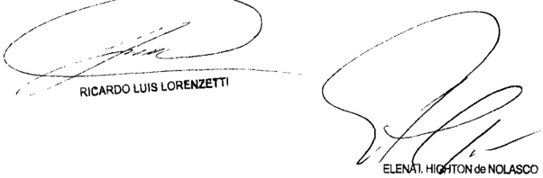

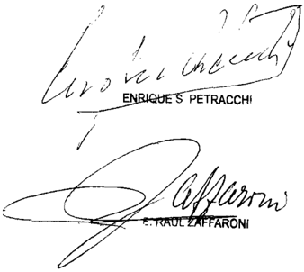

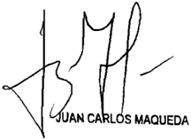

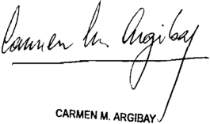

Recurso ordinario interpuesto por Telefónica de Argentina denandada en autob, representada por el Dr Gastón Gónez Buquerín, con el patrocinio letrado del Dr Diego Andrós Alonso

Iraslado contestado por el Estado Nacional Minibterio de Econonía, representado por las Paule María Alicie Pace con el patrocinio etrado del Dr Francisco Sanz

Tribunal de origen: Cámara Nacional de Apelaciones en Contenciogo AduinisSala

Trbuna que intervinieron con anterioridad: Juzgado Nacional de Primera Instancia en 1es

GOBIERNO DE LA CIuDAD DE BuENOS AIRES C/ PODER EjECuTIvO NACIONAL - DTO. 679/99 S/ PROCESO DE CONOCIMIENTO

## IMPUESTO AL VALOR AGREGADO.

En tanto el propósito del legislador fue liberar a las provincias y a los municipios del pago del IVA devengado por los intereses de los préstamos u operaciones bancarias y financieras que llevaban a cabo con las entidades 'privadas' regidas por la ley 21.526, a las cuales debieron recurrir como consecuencia del traspaso de sus propias entidades 'oficiales' de crédito, se encuentran fuera de la dispensa los intereses cobrados al Gobierno de la Ciudad de Buenos Aires por las financiaciones o refinanciaciones otorgadas por otras entidades diferentes de las reguladas por la ley 21.526 y, por ende, el art. 1º, inc. i), del decreto 679/99 no altera la sustancia de los derechos otorgados por la ley 24.920 ni introduce restricciones ajenas a su espíritu sino que resulta compatible con la voluntad política que se plasmó en esta última ley.

-Del dictamen de la Procuración General, al que remitió la Corte Suprema-.

DICTAMEN DE LA PROCuRACIóN GENERAL

Suprema Corte:

- I -

A fs. 513/515, la Sala I de la Cámara Nacional de Apelaciones en lo Contencioso Administrativo Federal revocó lo resuelto en la instancia anterior y, en consecuencia, declaró la inconstitucionalidad del art. 1º, inc. i), del decreto 679/99.

Para así decidir, recordó que la ley 24.920 -al modificar la ley del impuesto al valor agregado (IVA)- había establecido la exención de este tributo para: ' Los intereses de préstamos u operaciones bancarias y .financieras en general cuando el tomador sean las Provincias o Municipios ' (cfr. art. 7º, inc. h, pto. 16, ap. 9º, ley 23.349, texto ordenado según decreto 280/97, al que se referirán las citas siguientes).

Sin embargo, señaló que el beneficio fue limitado con posterioridad por el art. 1º, inc. i), del decreto 679/99, el cual dispuso: ' La exención prevista en el apartado 9º, del punto 16), del inciso h), del artículo 7º de la ley, sólo comprende a los intereses originados en préstamos u operaciones financieras de cualquier tipo, celebradas por las provincias o municipios Con entidades regidas por la ley 21.526 '.

Consideró que, al restringir la dispensa únicamente a las operaciones financieras celebradas con las entidades regidas por la ley 21.526, el Poder Ejecutivo Nacional excedió sus facultades reglamentarias, afectando así el principio de reserva o legalidad en materia tributaria.

- II -

Disconforme, la demandada interpuso el recurso extraordinario de fs. 526/535, concedido a fs. 562 por existir cuestión federal y denegado expresamente en cuanto a la arbitrariedad y gravedad institucional alegadas.

En primer lugar, indica que la valla fijada por el art. 1º, inc. i), del decreto 679/99 se ajusta a la intención del legislador plasmada al momento de sancionar la ley 24.920, en la que el objetivo perseguido era liberar del IVA solamente a los intereses de los préstamos otorgados por entidades financieras públicas o privadas.

En tal sentido, especifica que los intereses cobrados al Gobierno de la Ciudad de Buenos Aires por sus proveedores, en virtud de las financiaciones que le otorgan, no pueden ser asimilados a aquellos percibidos por las entidades financieras de la ley 21.526, que son los únicos que el legislador tuvo en mira al momento de sancionar la ley.

Indica, por último, que la cuestión ya ha sido resuelta en Fallos: 327:4356, precedente al cual la Cámara debió conformar su decisión o bien aportar nuevos argumentos que justifiquen modificar la posición sentada por V.E. en su carácter de último intérprete de la Constitución Nacional.

## - III -

Considero que el recurso extraordinario resulta formalmente procedente puesto que se halla en juego la inteligencia de normas federales -ley 24.920, decreto 679/99- y la sentencia definitiva del superior tribunal de la causa es contraria a los derechos que la vencida fundó en aquélla (art. 14, incs. 1º y 3º, de la ley 48).

## - Iv -

Como acertadamente lo señala la Cámara, la ley 24.920 introdujo el ap. 9º al art. 7º, inc. h), pto. 16, de la ley 23.349 y, por ende, eximió del IVA a los intereses de préstamos u operaciones bancarias y financieras en general cuando el tomador sean las Provincias o Municipios.

Al momento de fundamentar el proyecto que posteriormente se transformaría en ley, los diputados Machado y Pernasetti sostuvieron: ' Se proponer eximir del gravamen del IVA a los intereses de los préstamos u operaciones bancarias y financieras en general cuando el tomador sean las provincias o municipios, beneficiando de tal manera las operaciones realizadas por aquellas provincias y municipios que no operan a través de entidades oficiales de crédito ' (Diario de Sesiones de la Honorable Cámara de Diputados, 27 y 28 de noviembre de 1997, pg. 4634. El subrayado no pertenece al original).

Añadieron: ' El proceso de reordenamiento de las finanzas provinciales y las consecuentes reformas llevadas adelante por distintos Estados provinciales y municipales, ha hecho que en muchos casos se hayan resuelto y concretado procesos de privatización de entidades financieras estatales, lo cual si bien ha redundado en un beneficio y un objetivo buscado por las entidades, las ha privado del agente financiero natural '.

Por ello, concluyeron: ' Esta situación y el hecho de tener que recurrir a instituciones financieras y bancarias privadas ha hecho que dichas instituciones resulten alcanzadas por el gravamen del IVA, sin que puedan compensar los créditos que produce dicho gravamen ' (subrayado, agregado).

En idéntico sentido, el senador Gagliardi manifestó: ' Se trata de una cuestión que no afecta sólo a la Provincia de Río Negro, sino a todas aquellas que privatizaron sus bancos en el marco de la reforma del Estado y que se ven perjudicadas por el pago del IVA sobre intereses ',

expresiones que fueron apoyadas por el senador Costanzo (Diario de Sesiones de la Cámara de Senadores, 9 de diciembre de 1997, pg. 6524).

Con particular referencia al alcance del supuesto en estudio, reiteradamente V.E. ha dicho que la primera regla de interpretación de un texto legal es la de asignar pleno efecto a la voluntad del legislador, y en esta tarea no pueden descartarse los antecedentes parlamentarios, que resultan útiles para conocer su sentido y alcance (Fallos: 306:1047). Y, en la especial materia de las exenciones impositivas, ha sido constante el criterio conforme al cual ellas deben resultar de la letra de la ley, de la indudable intención del legislador o de la necesaria implicancia de las normas que las establezcan (Fallos: 277:373; 279:226; 283:61; 284:341; 286:340; 289:508; 292:129; 302:1599) y que su interpretación debe practicarse teniendo en cuenta el contexto general de las leyes y los fines que las informan (Fallos: 285:322, entre otros), ya que la primera regla de interpretación es dar pleno efecto a la intención del legislador (Fallos: 302:973).

Desde esta óptica, es claro para mí que en proósito del legislador fue liberar a las provincias y a los municipios del pago del IVA devengado por los intereses de los préstamos u operaciones bancarias y financieras que llevaban a cabo con las entidades ' privadas ' regidas por la ley 21.526, a las cuales debieron recurrir -en palabras de los citados legisladores- como consecuencia del traspaso de sus propias entidades ' oficiales ' de crédito, situación ésta que las había privado de sus agentes financieros naturales.

Pienso que bajo este prisma es que deben ser entendidos los términos ' préstamos u operaciones bancarias y financieras en general ', empleados por la ley 24.920, referidos entonces únicamente a aquellas previstas en el art. 20 de la ley 21.526, realizadas con intervención de bancos comerciales, de inversión, hipotecarios, compañías financieras, sociedades de ahorro y préstamo para la vivienda u otros inmuebles y cajas de crédito, entre otras (cfr. art. 2º de la citada ley 21.526).

En esta línea de razonamiento, estimo que se encuentran fuera de la dispensa en estudio los intereses cobrados a la actora por las financiaciones o refinanciaciones otorgadas por otras entidades diferentes de las reguladas por la ley 21.526 y, por ende, que el art. 1º, inc. i), del decreto 679/99 no altera la sustancia de los derechos otorgados por la  ley  24.920 ni introduce restricciones ajenas a su espíritu. Por el

contrario, resulta compatible con la voluntad política que se plasmó en la ley 24.920 y que se revela en los fundamentos transcriptos anteriormente.

Por ello, toda vez que la conformidad que debe guardar un decreto respecto de la ley no consiste en una coincidencia textual entre ambas normas, sino de espíritu, y que, en general, no vulneran el principio establecido en el art. 99, inc. 2º, de la Constitución Nacional, los reglamentos que se expidan para la mejor ejecución de las leyes, entiendo que corresponde rechazar la inconstitucionalidad planteada, dado que -como señalé- el art. 1º, inc. i), del decreto 679/99 mantiene inalterables los fines y el sentido con que la ley 24.920 fue sancionada (Fallos: 151:5; 178:224, entre muchos otros).

- v -

Frente a la solución que aquí se propicia, estimo que deviene inoficioso analizar si la Ciudad Autónoma de Buenos Aires se encontraba, o no, comprendida en la exención de ley 24.920 con anterioridad al dictado del decreto 1.008/01 pues, cualquiera sea el resultado al que se arribe en ese razonamiento, lo cierto es que -en lo que constituye la materia de este pleito- la norma legal no alcanza a los intereses de las operaciones de préstamos realizadas con entidades diferentes de las reguladas por la ley 21.526.

- vI -

Por lo expuesto, opino que corresponde dejar sin efecto la sentencia apelada en cuanto ha sido materia de recurso extraordinario. Buenos Aires, 03 de febrero de 2012. Laura M. Monti.

## FALLO DE LA CORTE SuPREMA

Buenos Aires, 31 8e

Vistos 10s autos: "Gobierno de la Ciudad de Buenos Aires c/ PEN dto . 679/99 s / proceso de conocimiento"

## Considerando:

Que las cuestiones planteadas han sido adecuadamente consideradas en el dictamen de señora Procuradora Fiscal, yos fundamentos son compartidos por el Iribunal, los que rresponde remitirse en razón de brevedad

Por ello, de conformidad con dictaminado por la señora Procuradora Fiscal, se declara procedente el recurso extraordinario, se revoca la sentencia apelada se rechaza la demanda Con costas (arts 68 Y 279 del Código Procesal Comercial de 1a devuélvase\_

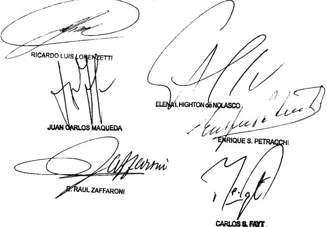

Recurso extraordinario interpuesto por el Fibco Nacional, representado Por el Dr Enrique Carloe Carballo, con el Patrocinio de Dreb Sergio Cerdán María del Robario Creixent Laborde .

Traslado contestado 01 Gobiarno de la Ciudad Autónona de Buenob Aires representada POI 01 Dr Carloø Horacio Jinónez , con el patrocinio del Dr . Ra niro Ricardo Monnor Sans Procurador Gonoral del Gobierno de Ciudad Autóno de 1a Dra Cuello

Tribunal de origen: Sala de Cámara Nacional de Apolacioneb en lo Conton-

Tribunal intervino cor anterioridad: Juzgado Nacional de Prinora Inbtancia en Contenciobo Adninistrativo Faderal que

## DE JUSTICIA DE LA NACION 335

## LIX KLETT S.A.I.C. C/ BIBLIOTECA NACIONAL - SECRETARIA

DE CuLTuRA DE LA NACION S/ COBRO DE SuMAS DE DINERO

## CONTRATO ADMINISTRATIVO.

Corresponde desestimar el recurso ordinario de apelación contra la sentencia que revocó el pronunciamiento que había hecho lugar a la demanda que perseguía el cobro de facturas derivadas de la prestación de servicios de mantenimiento que la actora había brindado a la Biblioteca Nacional si, al haber vencido las contrataciones directas, se encuentra fuera de discusión que no es posible hacer lugar a una acción basada en obligaciones que derivan de acuerdos verbales cuando, en razón de la normativa aplicable, los contratos administrativos debían ser celebrados con las formalidades que establece el derecho administrativo para su confección.

## FALLO DE LA CORTE SuPREMA

## Buenos Aires, 31 de d 20l2

Vistos los autos: "Lix Klett S.A.I.C\_ (s/ quiebra) c/ Biblioteca Nacional Sec . de Cultura de la Nación s / cobro de su mas de dinero"

## Considerando

1%) Que la Sala III de a Cámara Nacional de Apelaciones en Civil Y Comercial Federal revocó sentencia de instancia que había hecho lugar la demanda promovida la quebrada Lix Klett S .A.I.C (en adelante Lix Klett) , en la que persiguió el cobro de la sua consolidada de 1.149.335,16, imputada facturas pendientes de pago , con más intereses Y costas por parte de la Biblioteca Nacional Secretaría de Cultura de la Nación (en adelante Biblioteca Nacional) (fs 800/802) por

Contra tal decisión, actora interpuso recurso ordinario de apelación solicitando la revocación de la sentencia recurrida, el que resultó concedido fs . 816.

Que el recurso ordinario deducido por la actora es formalmente procedente, pues se dirige contra una sentencia definitiva, el pronunciamiento ha sido dictado en una causa en que la Nación es parte Y el monto disputado en último término, sin sus accesorios supera el mínimo establecido en el art. 24 inc 6' ap . del decreto-ley 1285/58 resolución 1360/91 de esta Corte El memorial de agravios corre agregado fs\_ 823/838 vta Y su contestación fs . vta

Que , en relativo al fondo del asunto, esto es , si es admisible no la demanda interpuesta, el quo hizo lugar los agravios que cuestionaron a conclusión del juez de primera instancia en cuanto la violación de las normas de contratación del Estado, la falta de efectiva prestación de servicios Y de la conformidad de las facturas brindada por la autoridad competente

Expresó al respecto que "de las constancias.se extrae que si bien en sus orígenes hubo contratación directa no así du rante el período reclamado, durante el cual no consta vinculación formal alguna entre la actora Y la Biblioteca Nacional\_ La Corte Suprema de Justicia de la Nación ha sostenido reiteradamente que la validez eficacia de los contratos administrativos se supedita al cumplimiento de las formalidades exigidas por las disposiciones legales pertinentes en cuanto la forma Y procedimiento de contratación (Fallos: 308: 618 Y 316:382) agregó que la prueba de la existencia de un contrato administrativo se halla íntimamente vinculada la forma en que dicho contrato queda perfeccionado Cuando la legislación exige una forma es pecífica para la conclusión de un determinado contrato dicha forma debe ser respetada pues se trata de un requisito esencial de su existencia Consecuentemente, toda vez que la actora no aportó elemento de convicción alguno ~como era su propio interés (art\_ 377, Código referido este aspecto corresponde desestimar sin más el planteo de la demandante"

En otro orden de ideas , el tribunal consideró que 1as facturas comerciales no son títulos ejecutivos ni constituye prueba indudable del cumplimiento de la prestación aludida en

ellas Son , en todo caso, un documento remitido unilateralmente por el conerciante que  puede según las circunstancias, configurar un indicio que forme la convicción del magistrado en un sen tido determinado  (s) in embargo, en autos no obra constancia alguna que dé cuenta de la realización de los servicios prestados, prueba ésta que le incumbía probar la actora frente a negativa efectuada al respecto por la en la oportunidad prevista por los arts\_ 355 Y 356 del Código Procesal"

Por último, la cámara sostuvo que "el decreto 5720/72 (B.0 \_ 31/8/72) reglamentario del Capítulo Iv de la Ley de Con tabilidad Y destinado ordenar esclarecer las etapas cum plir en las relaciones que se establezcan con motivo de las contrataciones en que el Estado sea parte, fija en el inc. 110 del art 61 el plazo para el pago de las facturas En é1 se indica que ~salvo casos de excepción establecidos en las cláusulas particularesel pago se efectuará dentro de los 30 días contados partir del día siguiente al que se produzca la conformidad definitiva (1)a conformidad por la autoridad de turno era uno de 1os requisitos que estaba condicionado el pago de las facturas que emitiera la actora por los servicios prestados \_ Consecuentemente, toda vez que no obra en autos constancia alguna que dé cuenta del cumplimiento de ese requisito carece de sentido el reclamo de la El quo decidió, en definitiva, revocar la sentencia apelada , con costas de ambas instancias la actora vencida

Que los efectos de exponer con nitidez las cuestiones planteadas en causa, conviene recordar que mediante la presente demanda actora pretendió el cobro de facturas derivadas de la prestación del servicio de operación de mantenimiento de aire acondicionado (calefacción refrigeración) ventilaciones mecánicas, calderas Y tratamiento químico del agua (aire acondicionado) todo ello con seguro de repuestos personal propio Y permanente en la Biblioteca Nacional por el período comprendido entre enero diciembre de 1996 Y desde julio de 1997 enero de 1999 (v fs 145 vta.) \_

Según constancias de la causa, cabe señalar existieron dos contrataciones directas por servicios ejecutados en la Biblioteca Nacional, entre Lix Klett Y el Ministerio de Cultura Y Educación, correspondientes los períodos septiembre/31 de diciembre 1992 Y septiembre/diciembre por $ 232 . 688 cada uno (v . fs 503/504 , resolución 3056 en el expte administrativo 25287/92 342 , constancia de contratación directa 75/93) partir de 1997 por decreto 545/96 , la Biblioteca Nacional pasó ser autárquica Y quedó bajo la órbita de la Secretaría de Cultura de la Nación, también dependiente del Poder Ejecutivo Bajo este marco de situación, Lix Klett Y el ente reconocieron que la relación continuó por acuerdos verbales que

5 % ) En el memnorial sub examine la actora niega en su agravio inicial que hubieran sido violadas normas de contratación del Estado , tal como 1o sostuvo la cámara, Y afirma que la supuesta violación tampoco fue planteada por 1a accionada (fs. 828 vta./830 vta. )

En primer lugar, Lix Klett alega que el dictado de la resolución formal en un servicio esencial para la Biblioteca Na cional, como el que brindaba Y necesario para su actividad, no es disponible para la contratista ni imputable su demora ella, toda vez que no es la responsable de su emisión.

Agrega que la omisión de la Administración de documentar las contrataciones verbales no le otorga derecho desconocer actuado en consecuencia, menos aún de cuestionar luego los servicios prestados en su beneficio, parcialmente abonados claramente consintió que

En virtud de ello, solicita 1a aplicación de la teoría de los actos propios Y, eventualmente, la nulidad relativa de 1os actos \_

6" ) Que , con relación al planteo efectuado cabe tener presente que en razón del carácter administrativo de la locación de servicios de autos, el caso debe ser juzgado con arreglo principios Y reglas del derecho público, para lo debe los cual

acudirse la 24 . 629 de ejecución del presupuesto de la Ad ministración Nacional (B.0 08/03/96) Y al decreto 5720/72 , reglamento de las contrataciones del Estado (B.0 . 31/8/72) El segundo párrafo del artículo de la referida establece que (t)odos contratos de locación de obra de servicios que resulten indispensables para la cobertura de servicios esenciales incluidos los de 1os entes descentralizados, deberán tener respaldo presupuestario Y ser autorizados por decreto del Poder Ejecutivo nacional, por decisión administrativa, por resolución del ente descentralizado , en la que constarán detalladamen te 10s fundamentos de las contrataciones, sus respectivos montos Y las obligaciones que generen" Hasta el dictado de la 25 .565 (B.0 . 21/3/2002) el párrafo cuarto del artículo citado disponía que (s) erá nulo todo acto contrato otorgado por cualquier autoridad, aun cuando fuere competente que no hubiere sido precedido del cumplimiento de las normas previstas en la 24 .156 , en su reglanentación Y en la presente si del mismo resultare la obligación del Tesoro nacional de pagar sumas de dinero" La aplicación de esta normativa fue advertida por el ente en su escrito de contestación de denanda (fs 236/239) ley ley ley ley ley,

70 ) Que , en el referido escrito, la Biblioteca Nacional señaló que (1)a inexistencia de instrumento contractual impide reconocer vinculación alegada por 1a actora, sin perjuicio de que de resultar en autos el cumpliniento de prestaciones de su parte que importen una utilidad para el Estado Nacional\_ su reconocimiento pueda provenir de otra fuente de obligaciones Y que cualquier tipo de prestación que hubiera cumplido la actora, s610 importaría haberlo hecho en forma ocasional, por en cargo iniciativa de algún agente funcionario de la Biblioteca Nacional, Y en tal caso, confirmaría postura asumida de que ello deberá acreditarse con extrenos antes indicados, por no existir contratación válida" (fs\_ 237 vta \_ Y 238 ) aquí se los

En el nismo orden de ideas, Lix Klett afirma que "la relación contractual continuó por acuerdo verbal entre las partes ratificado por diferentes actos administrativos En efecto, demandada abonó períodos posteriores al vencimiento de la

contratación administrativa original con total normalidad Y sin cuestionamientos de ninguna especie durante varios meses" Y ausencia de contratación escrita conocida por mi parte, al me nos no enerva la procedencia del cuando ha quedado acreditada por actos de ambas partes la existencia de una prestación Y de actos administrativos en consecuencia, fue verbal mente aprobada" (fs\_ 829 Y 830)

Que en que respecta la prueba producida en autos, de la documental que obra agregada surge que para la blioteca Nacional fueron efectuadas las contrataciones di rectas correspondientes períodos septiembre/31 de diciembre 1992 Y septiembre/diciembre 1993 (fs 342/345 , entre otras) En cuanto la pericial contable el experto no la existencia de contrataciones directas por los períodos reclamados (v\_ fs\_ 640 vta . preguntas Y del cuestionario de la parte actora) Asimismo, interrogado el testigo Sr. Raúl Jesús Pano, empleado de la demandada desde 1985 , sobre 1os sistemas de con tratación de Biblioteca Nacional indicó "que era un tema que no llevaba él, que 1o llevaba la Dirección directamente que pone que dependían de los estamentos normales del Ministerio de Cultura de la Secretaría de Cultura, eran propios de la Dirección de Administración que se encargaba de esos temas , de la Dirección de la propia Biblioteca que tenía propios asesores técnicos" Finalmente exhibidos que le fueron originales de órdenes de provisión del ente (fs13/23) para que los reconociera comO instrumentos habitualmente utilizados 1a demanda da en sus contrataciones el testigo los identificó como tales indicó que eran del "Ministerio de Educación Y su momento pone que eran de cuando la Biblioteca dependía de los servicios administrativos del Ministerio de Educación, porque es autárquica desde el año 1997, esto es anterior" (fs. 306/307) Bipor en

Por tanto, conforme el reconociniento expreso de las partes Y la prueba producida en la causa surge que , por tratarse de acuerdos verbales, no se observaron los procedimientos sustanciales pertinentes ni se contó con la habilitación presu-

puestaria necesaria para atender el gasto respectivo, tal como exige la normativa señalada -

9 ' Que la prueba de la existencia de un contrato administrativo se halla íntimamente vinculada con la forma en que dicho contrato queda legalnente perfeccionado Cuando la legislación aplicable determina una forma específica para la conclusión de un contrato, dicha forma debe ser respetada pues se trata de requisito esencial de su existencia (Fallos: 323:1515; 323:1841; 323:3924 ; 324 : 3019; 326:1280; 326:3206; 327:84 Y

Esta condición, que se impone ante las modalidades propias del derecho administrativo, concuerda con el principio general también vigente en derecho privado en cuanto establece que 1os contratos que tengan una forma determinada por las leyes no se juzgarán probados si no estuvieren en 1a forma prescripta (arts 975 Y 1191 del Código civil) En tal sentido, este Tribunal ha sostenido que la validez Y eficacia de 1os contratos ministrativos se supedita al cumplimiento de las formalidades exigidas por las disposiciones legales pertinentes en cuanto la forma Y procedimientos de contratación (Fallos: 308 : 618 ; 311:2831 ; 323:1515, 1841 Y 3924 ; 324:3019; 326:1280 Y 3206; 327 :84 Y 329:809) ad-

10) Que , conforme surge de todo reseñado , se encuentra fuera de discusión que no es posible hacer lugar una acción basada en obligaciones que derivan de acuerdos verbales cuando en razón de la normativa aplicable, los contratos nistrativos con un objeto como el de las prestaciones de autos debían ser celebrados con las formalidades que establece el derecho administrativo para su confección. Por tanto, se desestima el primer agravio.

11) Que , en relativo al segundo agravio, Lix Klett afirma que la Alzada no consideró acreditados los servicios pese que mismos fueron reconocidos por demandada , 1o que le causa un gravamen \_ Invoca que tanto las afirmaciones de de mandada como las declaraciones testimoniales Y los informes

técnicos presentados en autos cuestionan la calidad de 10s servicios brindados, no su falta de realización

12) Que , en prueba informativa del Ministerio de Educación, Ciencia Y Tecnología de la Nación se senala que "del informe producido por el Departamento de Contrataciones. surge que esa área no existe ninguna constancia que acredite si los servicios presentados por la firma Lix Klett han sido efectivanente brindados Y que además Comisión de Recepción Definitiva de Bienes fue creada recién en el año 1997 , por que carece de registros anteriores esa fecha" (fs 433) Asismo , la Dirección de Infraestructura del citado Ministerio informó que en esa dependencia "no existe registro alguno relacionado con dichas tareas" (fs\_ 441) . La Dirección de Contabilidad Finanzas informó que "con respecto las facturas adeudadas por servicios prestados en la Biblioteca Nacional, según surge del anexo IV (confeccionado por la actora) dentro del período anual 1996 , se informa que las mismas no registran ingreso en este Servicio Administrativo Financiero" (fs 446) mi

En su declaración testimonial el Sr Patricio Coffey' jefe de mantenimiento en la Biblioteca Nacional partir del 11 de abril de 1997, indicó que "el servicio (de Lix Klett) fue de ficiente durante el período de su gestión, por 10 tanto nunca conformó el servicio ni las facturas, las instalaciones, cada vez fueron deteriorándose más con el transcurso del tiempo hasta llegar al 13 de octubre de 1998 donde fue notificado el Sr\_ Fernando Lix Klett para que reparara las torres enfriamiento atento que entraban en época estival el mismo 13 de octubre de 1998 , le respondió por escrito que no iba acceder lo licitado atento que la Biblioteca le debía determinada cantidad de abonos , de ahí en más el servicio de aire acondicionado quedó paralizado hasta mediados del 2000 , fecha en que con personal propio de la Institución, la jefatura de mantenimiento su cargo pone en marcha las instalaciones previas reparaciones inversiones que consta en las respectivas documentaciones de la Biblioteca Nacional, deja constancia que puesta en marcha de equipos de aire acondicionado Y calefacción cargo del

área de mantenimiento le implica la Biblioteca Nacional una erogación mensual en el orden de ocho mil pesos" que "el contrato con la empresa Lix Klett de 30 000 pesos es mano de obra con seguro de reposición, sea , con repuestos incluidos para su operación, su jefatura le consta que partir de abril de 1997, las instalaciones termomecánicas estaban colapsadas debido la falta de repuestos Y/o mantenimiento de las instalaciones, cosa que manifiesta el 13 de octubre de 1998 al Sr\_ Fernando Lix Klett donde le solicita las intervenciones correspondientes en las torres de enfriamiento, cosa que no hace Y tiene que realizar la Biblioteca Nacional su costo en el año 2001 juntamente con otras reparaciones que las facturas no conformadas se referían al abono mensual por la puesta en marcha con seguro de reposición al tomar conciencia de que el seguro de reposición se cumplía deficientemente, la jefatura su cargo no conformó el servicio desde que se hizo cargo del mantenimiento desde el 11 de abril de 1997 hasta la fecha Y "que no había aire acondicionado Y por tanto consideraba que no se había cum plido el servicio, que nunca tuvo documentación (para determinar el cumplimiento incumplimiento de la actora con las obligaciones asumidas) (fs\_ 617/618 vta. )

Finalmente, el informe pericial contable da debida respuesta cuestiones esenciales como el cumplimiento de servicios, la enumeración concreta de las facturas, el contenido de las mismas Y montos impagos, entre otras Más aún , tampo co da certeza de que las facturas en pugna correspondan trabajos realizados durante períodos reclamados , puesto que del detalle de facturas pagas confeccionado por el experto, se ob servan órdenes de pagos imputados servicios prestados de junio diciembre de 1996 (fs\_ 698/701) no

13) Que , no se advierte, partir de tales extremos la prueba acabada de la existencia del sustrato fáctico de los acuerdos verbales Nada se probó sobre el supuesto servicio brindado de enero diciembre de 1996 Y , respecto al período julio 1997/enero 1999 , las pruebas no remiten un servicio circunscripto al objeto de los supuestos acuerdos verbales Es más ,

en el acta del 23/12/96 ~suscripta por el Sr Pano en representación de Biblioteca Nacional\_ se acordó la cesación del servicio de mantenimiento de las instalaciones por parte de Lix Klett, pero no se especificó de servicios seguiría prestando \_ Frente ello la actora tampoco logró probar en autos los trabajos concretos podrían haberse realizado (fs335) qué tipo que

En el mismo orden de ideas no existen precisiones sobre los servicios imputados en facturas Ante el desconocimiento de los trabajos ~situación que puede darse aun mediando contratación formalcorrespondía la actora demostrar su realización en los períodos pertinentes, apelando documentos firmados por la accionada, testigos informes, circunstancia que no se produjo en autos

En resumen , la actora no asumió diligentemente la carga de acreditar hechos invocados, que por imperativo lele corresponde (art 377 del Código Procesal Civil Coner cial de la Nación) , pese que tuvo su alcance instrumentos necesarios para hacerlo. gal

14 ) Que del conjunto de antecedentes reseñados no puede sino derivarse, entonces, que el razonaniento del quo se ajustó, prudentemente, las constancias incorporadas la causa, por que mal puede alegarse un injustificado rigor formal en su apreciación. En consecuencia, corresponde que este agravio sea tanbién desestimado

15) Que el tercer agravio del recurso sub examine versa sobre la falta de conformidad de las facturas\_ Lix Klett se agravia sosteníendo que la demandada jamás manifestó su rechazo las facturas que , por 1o tanto, no puede pretenderse que su parte pruebe el por de la omisión, pues tampoco existió un accionar positivo contrarioqué

El decreto 5720/72 , reglamentario del capítulo VI de la ley de contabilidad, establece que en las contrataciones con el Estado el plazo para el pago de facturas, salvo que en cláu -

sulas particulares como caso de excepción se establezcan formas especiales, éste se efectuará dentro del plazo de 30 días que se comenzará contar partir del día siguiente al que se produzca la conformidad definitiva (art. 61 , inc 110) La referida confornidad se acordará dentro de los días de la entrega de los elementos de prestados los servicios en caso de silencio, una vez vencido dicho plazo, el adjudicatario podrá intimar el pronunciamiento sobre el rechazo la conformidad definitiva, la cual se tendrá por acordada si no se manifiesta en el término de días de recibida la intimación (art. 61 , inc 102)

16) Que , en el caso no se cumplió con los procedimientos propios para las contrataciones con el Estado la actora no logró acreditar la efectiva prestación del servicio Como consecuencia de ello, no se tramitó la habilitación presupuestaria Y, por ende, no se obtuvo la conformidad la autoridad de turno para el pago de las facturas reclamadas Por lo tanto, más allá de las intimaciones de pago que la actora hubiera efectuado , que en este caso, resultan infructuosas, corresponde aplicar la doctrina del silencio negativo\_ por

Esta Corte tiene decidido que el silencio de la administración no debe ser considerado como manifestación positiva de la voluntad pues salvo disposición expresa de las normas dicho silencio debe ser interpretado sentido negativo (arts 913 , 918 , 919 , 1145 Y 1146 del Código Civil) Nada debe tomarse como concedido sino cuando es expresado en térninos inequívocos por una implicancia igualmente clara (Fallos: 314:217, considerando 12 , 316:1025, considerando 17; entre otros) Por ex puesto, en esta oportunidad también corresponde rechazar el agravio en análisis-

17) Por último, la aplicación de los principios del enriquecimiento sin causa no es procedente en el sub toda vez que ello importaría una grave violación al principio de congruencia, puesto que a actora fundó su demanda de "cobro de pesos" en el supuesto incumplimiento contractual, no en la institución citada

En este sentido, cabe recordar que esta Corte ha resuelto que 10s presupuestos de procedibilidad de la acción de enriquecimiento sin causa deben ser previstos al incoarse la demanda , así también que carga de su prueba corresponde actora, circunstancias que no acontecieron en la causa (arts 163, inc. 6 , 330 Y 337 , segunda parte, el Código Procesal Civil Comercial de la Nación, Fallos: 292: 97)

Por ello, se desestima el recurso ordinario de apelación interpuesto por la actora Y se confirma la sentencia apelada en todas sus partes \_con costas la vencida Notifíquese Y devuél -

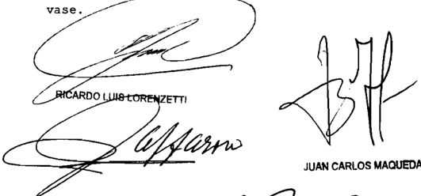

E. RAUL ZAFFARONI

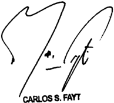

Recurso extraordinario interpuesto por Ana Beatriz Chprintzer en representación de actora Lix Klett con patrocinio del Dr cardo Alfredo Borthwick

Traslado contestado por la Biblioteca Nacional denandada en autog , representada por 1os Dres Natalia Paola Bontacourt Alejandro Alborto Caffoz

Tribunal de origen Cámara Nacional de Apelaciones 1o Civil Conercial Fedoral , Sala III

Tribunales intervinieron con anterioridad: Juzgado Nacional de Primera Inbtancia en lo Civil Federal 11 que

## DE JUSTICIA DE LA NACION

335

## LOS CIPRESES S.A. C/ ADMINISTRACION FEDERAL DE INGRESOS PuBLICOS DIRECCION GENERAL DE ADuANAS S/ ADMINISTRACIóN NACIONAL DE ADuANAS

## ADUANA.

Corresponde desestimar el recurso contra la sentencia que declaró la nulidad de los memorandos 13/99 y 14/99 -éste último modificado por su similar 16/99emitidos por el Departamento de Aduana de Buenos Aires, mediante los cuales se dispuso comunicar a las empresas de transporte fluvial que los buques de bandera argentina no podrán contar con tiendas libres a bordo y que en los de bandera extranjera no podrá efectuarse la venta de productos de tienda libre en aguas argentinas y del Río Paraná, si no se ha refutado el argumento central de la sentencia apelada, referente a que la Dirección General de Aduanas carece de facultades legales para dictar disposiciones que regulan actos cumplidos fuera del territorio aduanero.

-El juez Petracchi, en voto aparte, consideró que el recurso no cumplía con los recaudos establecidos en los arts. 1º y 3º, inc. d, del reglamento aprobado por la acordada 4/2007-.

## ADUANA.

No resulta cuestionable lo dispuesto por los memorandos 13/99 y 14/99 (modificado por su similar 16/99 en cuanto a que las tiendas situadas en buques de bandera argentina o extranjera que se hallen en el ámbito de la competencia jurisdiccional de la República Argentina no serán consideradas 'libres' frente a la ley argentina ya que éstas difieren de aquellas libres ubicadas 'en los aeropuertos internacionales que cuenten con servicio permanente de aduanas', único supuesto de franquicia vigente para el tipo de tiendas en nuestro sistema jurídico, regulado en forma específica por la ley 22.056 (art. 1º) (Disidencia de los Dres. Carlos S. Fayt y Juan Carlos Maqueda).

-Del dictamen de la Procuración General, al que remitió la disidencia-.

DICTAMEN DE LA PROCuRACIóN GENERAL

## Suprema Corte:

- I -

A fs. 715/717 de los autos principales (a los que se referirán las demás citas), la Sala III de la Cámara Nacional de Apelaciones en lo Contencioso Administrativo Federal revocó la sentencia de la instancia anterior y declaró la nulidad de los memorandos 13/99 y 14/99 (modificado por su similar 16/66), suscriptos por el Administrador de la Aduana di Buenos Aires.

Para así decidir, manifestó que los actos citados habían ordenado a las autoridades correspondientes comunicar a las empresas de transporte fluvial que los buques de bandera argentina no pueden contar con tiendas libres a bordo, que los buques de bandera extranjera no se puede efectuar la venta de productos de tienda libre en aguas argentinas y que deberán, en estos casos, observar que las mercaderías no excedan las previsiones de equipaje, aplicándose la resolución (ANA) 3751/94.

Explicó que, según lo dispuesto en el art. 2º del Código Aduanero, el territorio aduanero es el ámbito donde se aplica un mismo sistema arancelario y de prohibiciones de carácter económico a las importaciones y exportaciones, y que su determinación concreta se obtiene por exclusión de los ámbitos sometidos a la soberanía nacional contemplados en el art. 3º de ese cuerpo legal. Esta última disposición, puntualizó, excluye del territorio aduanero a los ríos internacionales, entendiendo por tales a los que separan dos Estados haciendo las veces de frontera entre ambos, siendo éste el caso del Río de la Plata

Por ello, afirmó que el ingreso del buque a la franja costera argentina de ese río no significa su entrada al territorio aduanero y, por lo tanto, no hay importación para consumo que pueda dar lugar a la aplicación de los derechos de aduana o a las prohibiciones de carácter económico, las que comenzarán a regir recién cuando los efectos que transporte el pasajero arriben a un puerto argentino. Mientras tanto, las mercaderías a bordo con destino a la venta a los pasajeros es parte del ' rancho ' que incluye, entre otras cosas, las mercaderías necesarias para el consumo propio del buque y para el de su tripulación y pasaje.

Sobre esta base, concluyó que las ventas a bordo del buque antes de su arribo a territorio aduanero no requieren de autorización del ente recaudador y que, por consiguiente, las disposiciones administrativas impugnadas han interferido ilegítimamente -por manifiesta incompetencia material- con el círculo vital de intereses protegido por los arts. 14 y 20 de la Constitución Nacional.

## - II -

A fs. 722/731, la demandada interpuso el recurso extraordinario que, denegado a fs. 738, dio lugar a la presente queja.

En primer término destacó que la ley 22.056, que regula las tiendas libres para la venta de mercaderías ( free shops ), únicamente se aplica en aquellos espacios habilitados para funcionar como tales en

los aeropuertos internacionales que cuenten con servicio permanente de aduanas, supuesto ajeno al aquí debatido.

A renglón seguido indicó que si bien es cierto que, según el art. 2º del Código Aduanero, los ríos internacionales no constituyen territorio aduanero -de lo que la Cámara infirió que no se aplica en ellos el régimen arancelario y de prohibiciones aduanero general- no menos cierto es que dicho Código es un plexo normativo que va más allá del mero establecimiento de un régimen de aranceles y prohibiciones económicas y que, como toda ley de la Nación, extiende su alcance a la totalidad del territorio político argentino, en el que corresponde incluir al Río de la Plata en su franja costera, pues allí nuestro país ejerce plenamente su soberanía.

En consecuencia, agregó, al ser la franja costera parte del territorio nacional y alcanzada por el código de la materia, carece de relevancia que en ese espacio rijan o no aranceles o prohibiciones económicas para cuestionar con ello los memorandos 13, 14 y 16/99 pues estas disposiciones fueron dictadas para prevenir la comisión de ilícitos aduaneros en grado de delito o infracción, función esencial de la Dirección General de Aduanas.

Por último, negó que la mercadería cargada para ser expendida en las tiendas libres a bordo del buque pueda ser considerada ' rancho ' pues, según lo establece el art. 509 del Código Aduanero, la persona a cuyo cargo se encuentre el medio de transporte no puede dar a la mercadería que constituye ' rancho ' otro destino que el consumo a bordo. Esta idea, remarcó, se refuerza con la previsión del art. 137 del citado código, que establece un mecanismo para imposibilitar el ingreso al territorio aduanero de la mercadería de tal carácter.

## - III -

En mi opinión; el remedio federal es formalmente admisible, toda vez que se halla en juego la inteligencia de normas federales (' Tratado del Río de la Plata y su frente marítimo ', aprobado por ley 20.645, leyes 22.056, 22.415 y resolución ANA 3751/94) y la decisión definitiva del superior tribunal de la causa es contraria a los derechos que la vencida fundó en aquéllas (art. 14, incs. 1º y 3º, de la ley 48).

Liminarmente, es necesario advertir que, en su tarea de establecer la correcta interpretación de las normas de carácter federal, V.E. no

se encuentra limitada por las posiciones del tribunal apelado y del recurrente, sino que le incumbe realizar una declaración sobre el punto disputado (art. 16, ley 48), según la inteligencia que rectamente les otorgue (arg. Fallos: 307:1457; 320:1915, entre otros).

Los memorandos 13/99 y 14/99 (modificado por su similar 16/66) disponen, acordando una correcta interpretación a sus expresiones, que las tiendas situadas en buques de bandera argentina o extranjera, que se hallen en el ámbito de la competencia jurisdiccional de la República Argentina, no serán consideradas ' libres ' frente a la ley argentina y que las mercaderías allí adquiridas quedarán sujetas a las previsiones de equipaje fijadas por la resolución (ANA) 3751/94.

Desde esta perspectiva, estimo que no resulta cuestionable lo dispuesto por la autoridad aduanera pues es claro que las tiendas situadas a bordo de los buques que opera la actora difieren de aquellas libres ubicadas ' en los aeropuertos internacionales que cuenten con servicio permanente de aduanas ', único supuesto de franquicia vigente para tal  tipo  de  tiendas  en  nuestro  sistema  jurídico,  regulado  en  forma específica por la ley 22.056 (cfr. art. 1º). Esta interpretación literal es corroborada por el mensaje que acompañó este proyecto de ley, en el cual se consignó como finalidad del régimen, a la vez que brindar confort al viajero, permitir que, con la explotación de ese rubro comercial, se obtengan recursos orientados a recuperar el costo de operación y mantenimiento de los ' aeropuertos '.

Es evidente, entonces, que el legislador seleccionó a los aeropuertos, descartando la instalación de tiendas libres en puertos, buques, rutas u otros sitios, lo cuál indica que priorizó el tráfico aéreo por sobre otras modalidades. Por tal motivo, carece de fundamento dispensar un tratamiento analógico o extensivo para abarcar también a las tiendas de la aquí demandante (arg. Fallos: 289:508; 292:353; 300:1153 y 316:1567), pues la primera regla de interpretación de la ley es dar pleno efecto a la intención del legislador y la primera fuente para determinarla es su letra (conf. Fallos: 308:1745, 1861; entre muchos otros).

A mayor abundamiento, considero necesario aclarar que la instalación y el manejo de otro tipo de tiendas, diferentes de las comprendidas en las previsiones de la ley 22.056, en los buques de la actora,

constituyen manifestaciones válidas de su derecho de trabajar y ejercer industria lícita, amparado por el art. 14 de la Constitución Nacional y sujeto a una razonable reglamentación.

De esta afirmación se derivan dos importantes consecuencias que no pueden pasar inadvertidas en este análisis.

En primer lugar, como lo reconoce también la propia demandada, que las transacciones perfeccionadas en esas tiendas son llevadas a cabo en buques situados fuera del territorio aduanero (cfr. fs. 40 vta. y 729) y, por ende, que las mercaderías allí adquiridas quedarán sujetas a los derechos de importación y exportación al momento de su introducción a este último ámbito espacial (art. 9º, Código Aduanero). En esta oportunidad, como lo destaca el memorando 14/99 y su modificatorio, se realizarán las tareas de control de equipajes y valoración que normalmente se llevan a cabo cuando cualquier otra mercadería proveniente del extranjero es nacionalizada.

En segundo término, que quien resulte responsable de la operatoria de estas tiendas deberá abonar todos los tributos -nacionales y locales- que correspondan por la actividad que en ellas se realiza, de conformidad con la legislación vigente.

- vI -

En virtud de lo aquí dicho, opino que corresponde admitir la queja, declarar procedente el recurso extraordinario interpuesto y revocar la  sentencia apelada. Buenos Aires, 30 de junio de 2009. Laura M. Monti.

## FALLO DE LA CORTE SuPREMA

## Buenos Aires, 31

Vistos autos "Recurso de hecho deducido por la deman dada en la causa Los Cipreses c/ Administración Federal de Ingresos Públicos Dirección General de Aduanas para decidir sobre su procedencia los

## Considerando

Que la Sala III de la Cámara Nacional de Apelaciones en Contencioso Administrativo Federal, al revocar la sentencia de primera instancia, declaró nulidad de memo randos 13/99 Y 14/99 ~este último modificado por su similar 16/99 emitidos por el Departamento de Aduana de Buenos Aires mediante los cuales se dispuso comunicar las empresas de transporte fluvial que los buques de bandera argentina no podrán contar con tiendas libres bordo Y que en de bandera ex tranjera no podrá efectuarse la venta de productos de tienda bre en aguas argentinas Y del Río Paraná , debiendo observarse además , que las mercaderías adquiridas no excedan las previsiones de equipaje conforme la resolución 3751/94 715/717) la los

Que, para así decidir, el quo señaló que el art 2 del Código Aduanero caracteriza al territorio aduanero como el ámbito donde se aplica un mismo sistema arancelario Y de prohibiciones de carácter econónico las importaciones Y las exportaciones\_ Y que su determinación concreta se obtiene por exclusión de los ámbitos sometidos la soberanía nacional contemplados en el art 3 de dicho cuerpo, que excluye del territorio aduanero los ríos internacionales, entendiendo por tales que separan dos Estados modo de frontera entre ambos como ocurre con el Río de la Plata

Agregó que el Tratado del Río de la Plata, suscripto entre la República Argentina Y la República Oriental del Uruguay, contempla una franja costera de siete millas marinas en la cual se aplica la jurisdicción exclusiva del Estado con costas adyacentes , Y para el resto de las aguas del río, denominadas "aguas de uso común no prevé ninguna norma que pueda interferir con las facultades que el Código Aduanero otorga al servicio aduanero en esos ámbitos De esta manera ~sostuvo el quo\_ el ingreso del buque transportando mercadería la franja costera argentina del Río de la Plata no significa el ingreso al territorio aduanero por 10 tanto no importación para consuo que pueda dar lugar la aplicación de 1os derechos de aduana hay

las prohibiciones de carácter económico las que comenzarán regir recién cuando los efectos que transporte el pasajero arriben puerto argentino Mientras tanto, 1os productos bordo con destino la venta pasajeros constituyen para el transportista parte del 'rancho" que incluye entre otras cosas la mercadería necesaria para el consumo propio del buque para el de su tripulación Y pasaje, Y una vez que el pasajero adquiera la mercadería deberá afrontar, al arribo del buque al territorio argentino, los trámites para su ingreso al territorio aduanero, cuyo fin deberá ajustarse las reglas del equipaje

De acuerdo con ello, el quo concluyó que la venta bordo de un buque antes de su arribo territorio aduanero no requiere autorización del servicio aduanero Y que , por consiguiente, las disposiciones adninistrativas impugnadas han interferido ilegítimamente ~por manifiesta incompetencia materialun círculo vital de intereses protegido por arts. 14 20 de Constitución Nacional -

3 " ) Que contra este pronunciamiento, la demandada interpuso el recurso extraordinario de fs 722/731 , que al ser de negado fs . 738, motivó la presente queja\_

La recurrente expresa que si bien es cierto que según el art\_ del Código Aduanero los ríos internacionales no cons tituyen territorio aduanero, no es menos cierto que dicho código conforma un plexo normativo que va mucho más allá del mero establecimiento de un régimen de aranceles prohibiciones económi cas Y que el mismo como toda de la Nación, extiende su al cance la totalidad del territorio político argentino, en el que corresponde incluir al Río de la Plata en su franja costera, pues allí la República Argentina ejerce plenamente su soberanía \_ En consecuencia ~agregaal ser la franja costera parte del territorio nacional Y alcanzada por el codigo de la materia, no se entiende qué relevancia tiene que en ese espacio rijan no aranceles Y prohibiciones económicas para cuestionar con ello memorandos 13, 14 Y 16/99 cuando éstos fueron dictados para prevenir comisión de ilícitos aduaneros en grado de delito ley

infracción, que es la función esencial de la Dirección General de Aduanas

Por otra parte, niega que mercadería cargada para ser expendida en las tiendas libres bordo pueda ser considerada 'rancho" pues según el art 509 del Codigo Aduanero, esa mercadería solo puede destinarse para su consumo bordo Y no con posterioridad al mismo, idea que se ve reforzada con a previsión del art 137 del mencionado código, que establece un mecanismo para impedir que la mercadería de rancho ingrese al territorio aduanero

Por último, señala que la sentencia apelada concede la actora una habilitación para el funcionamiento de una verda dera tienda libre sin una formal que establezca, tal como lo requiere el art 591 del Código Aduanero, pese que la ley 22 . 056 expresanente limita a existencia de free shops espacios relacionados con el transporte aéreo, que no es el caso de autos ley

Que de los considerandos precedentes se desprende que la recurrente no ha refutado el argumento central de la sen tencia apelada, referente que la Dirección General de Aduanas carece de facultades legales para dictar disposiciones que las cuestionadas , regulan actos cumplidos fuera del terri torio aduanero aquí

Sobre este punto, 10s agravios de la apelante se li mitan argumentar que el Código Aduanero extiende su alcance a franja costera del Río de la Plata que los memorandos impugnados fueron dictados en cumplimiento de la función esencial de 1a Aduana de controlar fiscalizar el tráfico internacional de mercaderías, pero no hace referencia ninguna norma legal que habilite dicho organismo dictar las disposiciones cues tionadas

En tales condiciones, toda vez la recurrente tampoco expone fundamentos que sustenten una diversa inteligencia de las normas federales aplicadas, el recurso extraordinario que

resulta improcedente (Fallos: 302:1519; 306:1011 ; 310:2277 ; 332 51)

Por ello, oída la señora Procuradora Fiscal, se desestima la queja. Declárese perdido el depósito de fs . Hágase saber y archívese, previa devolución de 10s autos principales

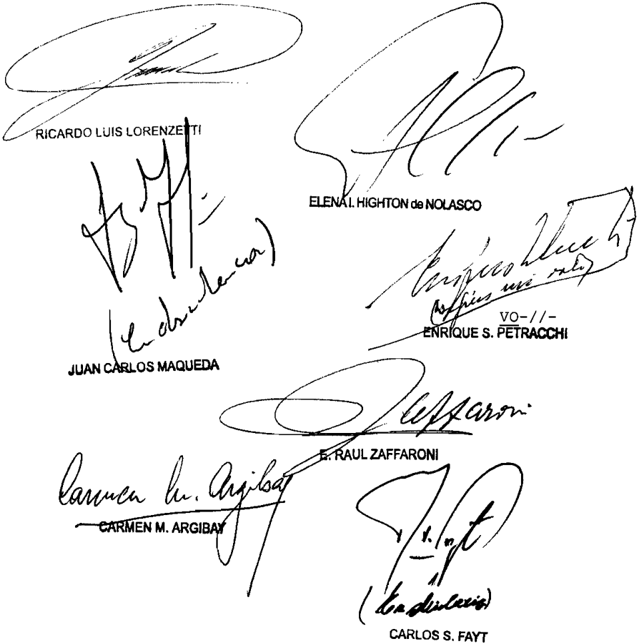

=I/-Io DEL SEÑOR MINISTRO DOCTOR DON ENRIQUE SANTIAGO PETRACCHI

Considerando

Que el recurso extraordinario no cumple con los recaudos establecidos en arts\_ Y inc . d, del reglamento aprobado por la acordada 4/2007\_ 1 0

Por ello, oída la señora Procuradora Fiscal, se desest el recurso de hecho Declárase perdido el depósito de fs\_ 83 Hágase saber archívese, previa devolución de los autos principales ima

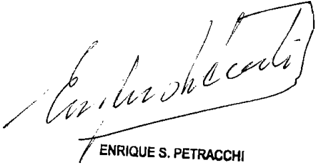

DE SEÑORES MINISTROS DOCTORES DON CARLOS

## DON JUAN CARLOS

## MAQUEDA

## Considerando

Que las cuestiones planteadas han sido adecuadamente consideradas en el dictamen de la señora Procuradora Fiscal, cu fundamentos son compartidos por el Tribunal, Y los rresponde remitirse en razón brevedad yos que

Por ello, de confornidad con dictaminado por la señora Procuradora Fiscal, se hace lugar la queja, se declara formal mente procedente el recurso extraordinario Y se revoca la sen tencia apelada\_ Con costas Reintégrese depósito de fs . 83 \_ Agréguese la queja al principalNotifíquese Y devuélvase el

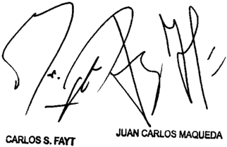

Recurso de hecho interpuesto por AFIP-DGA , representada Dr Claudio Bachur

Tribunal de origen: Sala III de 1a Cámara Macional de Apelaciones en 1o Con tonciobo Adnlnibtrativo Fodoral\_

Tribunal que intervino con anterioridad: Juzgado Nacional de Prinera Inbtancie en

## MALTERIA PAMPA S.A. (TF 22821-I) C/ DGI

## IMPUESTO AL VALOR AGREGADO.

La expresión 'operaciones y transacciones que este convenio autoriza' del art. VI, de la sección 9 del Convenio constitutivo de la Corporación Financiera Internacional (CFI) aprobado por ley 14.842 es amplia y genérica y abarca no sólo a la CFI sino también a las operaciones que ella efectúa, ya que de otro modo, si la dispensa sólo fuera aplicable a la entidad internacional, no resultaría claro cuál sería el beneficio o en qué se vería favorecido el sector o actividad cuyo fomento se persigue al tomar el crédito de este organismo internacional y no de otras entidades financieras -cualquiera fuere su naturaleza- que también otorguen préstamos con fines semejantes, por lo que al estar exenta la operación de 'toda clase de impuestos' no puede reclamarse el pago del IVA por los intereses, siendo innecesario ingresar al estudio del carácter de contribuyente o sustituto de la actora.

-Del dictamen de la Procuración General, al que remitió la Corte Suprema-.

DICTAMEN DE LA PROCuRACIóN GENERAL

Suprema Corte:

- I -

A fs. 178/179 vta., la Sala III de la Cámara Nacional de Apelaciones en lo Contencioso Administrativo Federal revocó lo decidido oportunamente por el Tribunal Fiscal de la Nación (ver sentencia de fs. 84/89 vta.) y, en consecuencia, dejó sin efecto parcialmente la resolución de la Administración Federal de Ingresos Públicos por la que se había determinado de oficio la obligación de la actora frente al IVA en concepto de los pagos de intereses girados al exterior por los

períodos 4 y 10 de 1999, más intereses resarcitorios y multa del 70% del gravamen determinado por aplicación del art. 45 de la ley 11.683. Para así decidir, consideró que los intereses pagados por la actora por la operación de préstamo de fomento que le fue otorgado por la Corporación Financiera Internacional (CFI, en adelante) se encontraban exentos frente a dicho tributo.

Destacó que la Argentina había ingresado a dicho organismo internacional mediante la aprobación del Convenio constitutivo de la CFI por la ley 14.842. Indicó que el objeto de dicha entidad es la promoción del desarrollo económico mediante el estímulo de empresas privadas productivas, para lo que cuenta con amplias facultades a la hora de establecer las condiciones de financiamiento que brinda.

Sostuvo que debía analizarse el alcance de la exención impositiva consagrada en el art. VI, de la sección 9 del Convenio referido, y entendió que ella no era sólo subjetiva sino también objetiva al comprender las operaciones y transacciones que fueran autorizadas por aquél, de lo que concluyó que los intereses de que se trata en el sub lite se encontraban liberados al haberse generado en una operación beneficiada por la franquicia.

Puntualizó que la dispensa general de que se trata no había sido derogada ni acotada por la ley del IVA y que la interpretación que cabía hacer del hecho imponible incorporado en su art. 1º, inc. d), por la ley 25.063, llevaba a concluir que la responsabilidad del prestatario local (responsable sustituto) no podía subsistir si el sujeto en quien recae, como ocurre en el caso, se hallaba exento.

Disconforme con lo decidido, el Fisco Nacional interpuso el recurso extraordinario de fs. 186/200, el cual le fue parcialmente concedido a fs. 228.

En lo fundamental, sostiene que, a partir de la reforma introducida por la ley 25.063 en la ley de IVA, los intereses derivados de préstamos que otorguen entidades financieras del exterior se encuentran alcanzados por dicho tributo -cfr. art. 1º inc. d)- y que, en virtud de lo establecido en el art. 4º, inc. g) de la ley del impuesto, el sujeto pasivo del echo

imponible allí contemplado es el prestatario, siempre que sea sujeto del gravamen por otros hechos imponibles y que revista la calidad de responsable inscripto. Así entonces, señala que 'Maltería Pampa S.A.' es sujeto pasivo del IVA por la importación de servicios recibidos en el país relativos a los intereses de los préstamos de la banca internacional y que, por lo tanto, debe tributar sobre dichos intereses.

En otras palabras, la demandada no niega la existencia de la exención, pero afirma que ella no rige en el supuesto de autos ya que el sujeto pasivo del gravamen es la actora y no la CFI. Agrega, que se trata de una exención subjetiva o mixta, que no tiene carácter objetivo, como lo señala el pronunciamiento cuestionado, y que si la ley del IVA hubiese pretendido otorgar la liberación del gravamen habría destacado dicha intención, así como el método a utilizar, de modo expreso, lo que no ocurre en el caso.

- III -

A mi modo de ver, el remedio extraordinario es formalmente admisible toda vez que se ha puesto en tela de juicio la interpretación de normas de carácter federal -leyes 14.842 y 25.063- y la inteligencia dada por la cámara ha sido contraria al derecho que el recurrente ha sustentado en ellas (art. 14, inc. 3º, ley 48).

- Iv -

De la forma en que ha quedado planteada la litis, se desprende que el thema decidendum estriba en determinar si la franquicia establecida en el art. VI, sección 9, del Convenio aprobado por ley 14.842 exime a la actora del pago de los préstamos otorgados.

V.E. ha tenido oportunidad de estudiar el referido Convenio en las sentencias de Fallos: 330:2892, in re : 'Corporación Financiera Internacional v. Luis Alberto Facundo Aragón', del 3 de julio de 2007, y de la causa C.3170, L.XLII 'Corporación Interamericana de Inversiones c/  Sagemuller S.A. y otro', del 26 de agosto de 2008, en las que se pronunció sobre la personalidad jurídica de la CFI así como sobre el reconocimiento por parte de los gobiernos que celebraron el acuerdo de inmunidades y privilegios en su favor con el objeto de promover el

desarrollo económico mediante el estímulo de empresas privadas productivas en los países miembros (cfr. art. 1º del Convenio).

A lo allí dicho, corresponde añadir ahora que la dispensa consagrada en el art. VI, de la sección 9 del Convenio establece: ' Exenciones de Impuestos: (a) La Corporación, sus activos, sus bienes, sus ingresos, y sus operaciones y transacciones que este convenio autoriza, estarán exentos de toda clase de impuestos y derechos de aduana. La Corporación estará también exenta de toda responsabilidad respecto a la recaudación o pago de cualquier impuesto o derecho ', y que, según surge de su art. III, entre las operaciones que se encuentra habilitada a realizar la entidad está comprendida la aquí controvertida, en cuanto consistió en un préstamo de fomento- (el subrayado me pertenece),

Corresponde recordar, con arreglo a la jurisprudencia de V.E., que la primera fuente de interpretación de la ley es su letra, pero, por encima de lo que las leyes parecen decir literalmente, corresponde indagar lo que dicen jurídicamente, y si bien no cabe prescindir de las palabras, tampoco resulta adecuado ceñirse rigurosamente a ellas cuando así lo requiera la interpretación razonable y sistemática (Fallos: 291:181; 293:528; 327:5649), Ello es así máxime cuando, en materia de exenciones tributarias, es constante el criterio conforme al cual deben resultar de la letra de la ley, de la indudable intención del legislador o de la necesaria implicancia de las normas que las establezcan (Fallos: 277:373; 279:226; 283:61; 284:341; 286:340; 289:508; 292:129; 302:1599) y su interpretación debe practicarse teniendo en cuenta el contexto general de las leyes y los fines que las informan (Fallos: 285:322, entre otros), ya que la primera regla es dar pleno efecto a la intención del legislador (Fallos; 302:973).

Con la certera guía de las pautas hermenéuticas señaladas, de la lectura de ambos preceptos colijo que la exención de que se trata ha sido otorgada no sólo por el carácter del sujeto que otorga el préstamo -CFI- sino también por la finalidad última de la prestación sobre la que recae: facilitar el crédito internacional y particularmente los destinados al desarrollo de la industria y producción local, objeto para el cual fue constituido el citado organismo internacional.

Tengo para mí que la expresión ' operaciones y transacciones que este convenio autoriza '  es  amplia y genérica y abarca no sólo a la

CFI sino también a las operaciones que ella efectúa. De otro modo, si la dispensa sólo fuera aplicable a la entidad internacional, no resultaría claro cuál sería el beneficio o en qué se vería favorecido el sector o actividad cuyo fomento se persigue al tomar el crédito de este  organismo internacional y no de otras entidades financieras -cualquiera fuere su naturaleza- que también otorguen préstamos con fines semejantes.

En virtud de lo expuesto, considero que, al estar exenta la operación celebrada de 'toda clase de impuestos', no puede reclamarse el pago del IVA por los intereses, siendo innecesario ingresar al estudio del carácter de contribuyente o sustituto de la actora.

- v -

Opino entonces que corresponde declarar formalmente admisible la apelación extraordinaria y confirmar la sentencia en cuanto fue materia de recurso. Buenos Aires, 10 de junio de 2011. Laura M. Monti.

## FALLO DE LA CORTE SuPREMA

## Buenos Aires, 31

Vistos 1os autos: "Maltería Pampa S .A (TF 22 .821-I) c/ D.G .I.

## Considerando

Que las cuestiones planteadas han sido adecuadamente tratadas en el dictamen de a señora Procuradora Fiscal, cuyos fundanentos son compartidos por el Tribunal, Y los que corresponde remitirse en razón de brevedad , con exclusión de 1o expresado en el primer párrafo del punto IV\_

Por ello, de conformidad con dictaminado por la señora Procuradora Fiscal, se declara formalmente admisible el recurso

sentencia Con costas

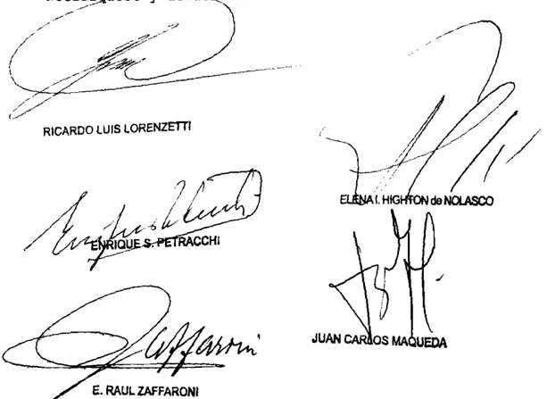

extraordinario Y se confirma la apelada Notifíquese devuélvase

Recurso extraordinario interpuesto por: Federal de Impobitiva, representada por 1a Dra Harcola Victoria Caparrós Vázquez \_ con el patrocinio letrado de 1a Dra Carnen Flavia La Valle

Traslado contestado por: Maltería Pempa 8 .A. representada por 1a Dra Gabrie1a Inée Buratti

Tribunal de origen: Nacional de en 1o Contencioso Adminibtrativo Foderal Sala III

Tribunal que intervino con anterioridad: Tribunal Flocal de la Nación.

RuARTE BAZAN, ROQuE CARLOS C/ uNIvERSIDAD NACIONAL DE CORDOBA S/ RECuRSO juDICIAL ART. 32 LEy 24.521

## CONCURSOS UNIVERSITARIOS.

Si se impugnó la legitimidad de los actos administrativos universitarios con la finalidad de revocar la designación que aquéllos efectuaron a favor de una docente

que no participó en las actuaciones, la incorrecta integración del proceso y su anómalo desarrollo imponen la obligación de declarar la nulidad de las actuaciones ya que no se la debió privar de la posibilidad de intervenir en los autos.

## DICTAMEN DE LA PROCuRACIóN GENERAL

Suprema Corte:

- I -

A fs. 272/282, la Cámara Federal de Apelaciones de Córdoba hizo lugar al recurso que, en los términos del art. 32 de la ley 24.521, interpuso el doctor Roque Carlos Ruarte Bazán y, en consecuencia, declaró la nulidad absoluta de las resoluciones 319/05 del Consejo Directivo de la Facultad de Derecho y Ciencias Sociales y 253/06 del Consejo Superior de la Universidad Nacional de Córdoba y de los actos administrativos antecedentes por vicios insalvables de procedimiento, dictados en el trámite de selección interna para proveer un cargo de profesor adjunto interino, dedicación simple, en la cátedra de 'Economía Política', de la Escuela de Trabajo Social de la facultad mencionada.

Por la primera de aquellas resoluciones, el Consejo Directivo de la Facultad rechazó la impugnación del actor y, en consecuencia, aprobó el dictamen del tribunal evaluador de los postulantes que se inscribieron al llamado a selección interna para cubrir la plaza docente en cuestión (art. 1º) y designó en el cargo interinamente a la licenciada Silvia Susana Morón, desde el 15 de diciembre de 2005 hasta, el 31 de marzo de 2006, o antes si el cargo se proveyera por concurso (art. 2º). Por el segundo acto administrativo, el Consejo Superior de la Universidad rechazó la impugnación del actor y confirmó la designación interina de la otra docente, de acuerdo con la resolución 319/05 del Consejo Directivo de la Facultad.

Disconforme, la Universidad Nacional de Córdoba interpuso el recurso extraordinario de fs. 290/302, que fue concedido a fs. 309/310.

Ante todo, cabe recordar que entre las funciones de este Ministerio Público se encuentra la de velar por el efectivo cumplimiento del debido proceso legal (art. 25, inc. h, de la ley 24.946) y que, en ejercicio

de ese deber-atribución, un atento examen de las actuaciones pone al descubierto el modo formalmente erróneo e inadecuado en que se condujo el proceso, defecto de tal entidad que afecta la validez misma del pronunciamiento que V.E. habrá de dictar, circunstancia que debe ser atendida y declarada con antelación al tratamiento de las cuestiones planteadas por la recurrente.

Si bien es doctrina del Alto Tribunal que sus sentencias deben limitarse a lo peticionado por las partes en el recurso extraordinario, constituye un requisito previo emanado de su función jurisdiccional el control, aun de oficio, del desarrollo del procedimiento cuando se encuentran involucrados aspectos que atañen al orden público, toda vez que la eventual existencia de un vicio capaz de provocar una nulidad absoluta y que afecta una garantía constitucional, no podría ser confirmada por las sentencias ulteriores (Fallos: 312:1580 y sus citas).

Desde esta perspectiva se advierte que el proceso tramitó sin la participación de la persona designada para ocupar el cargo docente por los actos administrativos cuya nulidad se solicitó en la causa, petición a la que accedió el tribunal en la sentencia ahora apelada y que pierde toda utilidad al no poder ser aplicada a quien no fue parte ni tuvo la posibilidad de ejercer su derecho defensa en juicio.

Así,  con  independencia de la calidad en la que aquélla hubiera debido participar en el proceso, ya sea como litisconsorte necesario pasivo o como tercero interesado, lo cierto y determinante es que no se la debió privar de la posibilidad de intervenir en estos autos, sino que, por el contrario, se le debió asegurar esa opción a efectos de que pudiera manifestar lo que estimare pertinente para la defensa de los derechos que los actos administrativos le otorgaban, los que al final fueron desbaratados en la sentencia dictada en un litigio irregularmente integrado.

Al respecto, cabe recordar que lo que se encuentra en juego es nada menos que la garantía constitucional de la defensa en juicio, sobre cuyo contenido la Corte ha señalado que requiere que se otorgue al interesado ocasión adecuada para su audiencia y prueba en la forma y con las solemnidades que establecen las leyes procesales (Fallos: 319:1600; 323:2653, entre otros).

En el caso, esta participación se hace más necesaria por dos circunstancias puntuales. La primera surge cuando se repara en que el

actor expresamente solicitó que se declarara la nulidad absoluta de la resolución HCS 253/06 y de los actos administrativos precedentes (resoluciones HCD 319/05 y HCACETS 94/05 y los dictámenes jurídicos y de la comisión evaluadora) ' todo en cuanto haga a la designación de la Lic. Silvia Morón en el cargo de Profesor Adjunto de Economía Política de la Escuela de Trabajo Social... ' (conf. punto V. Petitum, del escrito por el que se dedujo el recurso judicial del art. 32 de la ley 24.521, obrante a fs. 209/217), es decir que en la causa se impugnó la legitimidad de los actos administrativos universitarios con la finalidad de revocar la designación que aquéllos efectuaron a favor de la otra docente, lo que demuestra sin mayores dudas que ésta tiene interés suficiente para intervenir en el pleito.

La segunda, en tanto, porque de haberse integrado correctamente la litis la  solución bien podría ser distinta de la que surge de la sentencia apelada, toda vez que la Universidad Nacional de Córdoba expuso desde su primera intervención en el juicio que la Prof. Morón no tomó posesión del cargo en el período indicado (v . fs. 237, énfasis en la presentación original) y por ello advirtió a la cámara que la cuestión era abstracta, ' ya que se está persiguiendo la nulidad de una Resolución que jamás se materializó porque la Prof. Morón no asumió el cargo en cuestión en ese período señalado... ' (fs. citada), posición que volvió a reiterar al presentar el alegato sobre la prueba (v. escrito de fs. 259/265, en especial, fs. 260 vta. y 262 vta.).

En tales condiciones, la incorrecta integración del proceso y su anómalo desarrollo imponen la obligación de declarar la nulidad de las actuaciones realizadas sin la participación de la licenciada Morón, incluso la sentencia de fs. 272/282.

Por último, cabe recordar que la solución que se propicia no desatiende aquel principio que indica que la intervención de terceros en un proceso debe ser admitida con carácter restrictivo, ya que siempre importa una alteración de la normalidad del juicio y que, por ello, está sujeta a que se dé una relación jurídica sustancial que vincule de manera actual o posible al citado, con alguna o ambas partes de la causa con relación a las pretensiones invocadas, o cuando el convocado sea integrante subjetivo y legitimado activa o pasivamente de la relación jurídica que se debate en el pleito (conf. Fallos: 327:1020), pues precisamente en autos y por lo que llevo dicho, aquella intervención era imprescindible para el correcto trámite de la causa.

Opino, entonces, que corresponde declarar la nulidad de las actuaciones realizadas sin la participación de la licenciada Morón, incluso la sentencia de fs. 272/282 y devolver las autos al tribunal de origen para que le dé el trámite de ley. Buenos Aires, 12 de julio de 2011. Laura M. Monti.

## FALLO DE LA CORTE SuPREMA

Buenos Aires 34

Autos Y Vistos

Atento dictaminado por la señora Procuradora Fiscal se declara la nulidad de las actuaciones realizadas sin la participación de la Lic Silvia Susana Morón , incluso la sen tencia de fs 272/282 vta. Y se devuelven autos al tribunal de origen para que le dé el trámite de Notifíquese Y remí tase ley .

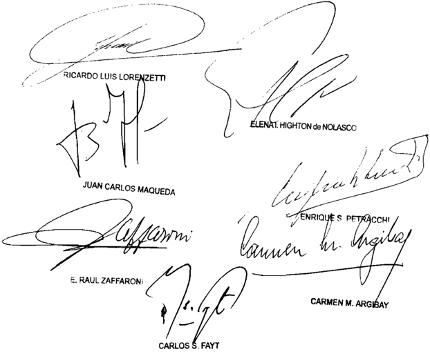

## AGOSTO

ALvAREZ, WASHINGTON C/ A.F.I.P. S/ DILIGENCIA PRELIMINAR - ACTuACIONES RELATIvAS AL RECuRSO DE APELACIóN

## SECRETO FISCAL.

Cabe confirmar la sentencia que intimó a la AFIP para que informe los antecedentes fiscales del contribuyente, y le hizo saber que en caso de encontrarse involucrada información referida a terceros -la cual estuviese obligada a mantener en reserva por aplicación del art. 101 de la ley 11.683-, podía abstenerse de darla a conocer previa indicación de los terceros contribuyentes eventualmente afectados, pues dicha orden judicial no contraviene la norma federal referida, dado que lo perseguido con la medida es determinar si existe o no una conducta arbitraria, irrazonable o persecutoria del Fisco en la selección de los contribuyentes sometidos a las tareas de fiscalización dirigidas a los profesionales independientes, y la individualización de los contribuyentes no parece poseer un rango de protección más estricto o riguroso que la individualización de aquéllos que hayan incumplido con la presentación de sus declaraciones juradas, o con el pago de sus obligaciones exigibles o que cuentan con determinaciones de oficio firmes o ajustes conformados, datos excluidos del secreto fiscal conforme el párrafo quinto del artículo mencionado.

-Del dictamen de la Procuración General, al que remitió la Corte Suprema-.

## SECRETO FISCAL.

El sentido de la previsión consagrada en el actual art. 101 de la ley 11.683 -secreto fiscal- es llevar tranquilidad al ánimo del contribuyente, con la ineludible consecuencia de que cualquier manifestación que se formule ante la DGI será secreta, tratándose de la seguridad jurídica como medio decisivo establecido por el legislador para facilitar la adecuada percepción de la renta pública, habiéndose atenuado por el Tribunal el rigorismo de la prohibición en los casos en que el propio autor, en cuyo interés se estableció el secreto de las manifestaciones, es quien pide o consiente expresamente que se traigan como prueba en el juicio contra terceros, sus propias declaraciones presentadas ante el organismo fiscal. -Del dictamen de la Procuración General, al que remitió la Corte Suprema-.

## SECRETO FISCAL.

El secreto que ampara a los terceros respecto de quienes se solicita la medida -en el caso se intimó a la AFIP para que informe los antecedentes fiscales del

## FALLOS DE LA CORTE SUPREMA 335

contribuyente, y le hizo saber que en caso de encontrarse involucrada información referida a aquéllos, la cual estuviese obligada a mantener en reserva por aplicación del art. 101 de la ley 11.683, podía abstenerse de darla a conocer previa indicación de los terceros contribuyentes eventualmente afectados- puede ser relevado por estos, ya que ha sido instituido en su propio interés, de modo que el conflicto entre el interés declarado por el actor y el que la ley ampara a favor de terceros, debe dirimirse mediante la debida consulta efectuada por el Fisco a éstos acerca de si se encuentra autorizada a dar sus nombres al tribunal en el marco de la medida solicitada, y dar cuenta del resultado de esa diligencia, sin individualizar a quienes se hubiesen negado, y sobre tal base, y la ponderación del interés invocado por el actor en función del resultado de la diligencia, decidir lo que corresponda en cuanto al levantamiento del secreto fiscal (Disidencia de la jueza Elena I. Highton de Nolasco).

## DICTAMEN DE LA PROCuRACIóN GENERAL

Suprema Corte:

- I -

A fs. 42/47 de los autos principales (a los que me referiré en adelante), el Dr. Washington Álvarez inició diligencias preliminares en los términos del art. 323 del Código Procesal Civil y Comercial de la Nación (CPCCN), tendientes a que la Administración Federal de Ingresos Públicos (AFIP) proporcione la siguiente información:

- 1.  causas que motivaron las dos inspecciones impositivas a las que estaba sometido;
- 2.  fechas de los pases internos de los expedientes administrativos labrados en consecuencia;
- 3.  asistencia a sus respectivos lugares de trabajo del inspector y supervisor a cargo de las tareas de fiscalización;
- 4.  cantidad de profesionales abogados en la Provincia de Salta objeto de inspección durante los últimos tres años, precisando alcance de las tareas de fiscalización y tiempo insumido en ellas;
- 5.  todos los antecedentes fiscales del actor durante los años 2000 a 2005, con sus incumplimientos, multas e importes declarados y abonados en los impuestos a las ganancias, al valor agregado y sobre los bienes personales.

Esgrimió tener fundada sospecha de la existencia de una actitud discriminatoria, persecutoria y de hostigamiento fiscal en su contra, basada en su actuación profesional en diversas causas contra la AFIP, en su declaración testimonial en la causa penal 870/04 del Juzgado Federal de Primera Instancia Nº 1 de Salta, que culminó con el procesamiento de la Jefa de la Región de esa repartición, y en la inexistencia de otros profesionales independientes que haya sido fiscalizados por más de dos anos, con 200 horas aproximadamente de trabajo denunciadas por el propio inspector actuante.

Por ello, a los fines de precisar los alcances de la futura y eventual acción urgente protectoria y para garantizar el ejercicio de su derecho de defensa, es que solicitó la información ya detallada.

- II -

A fs. 51, el Juzgado Federal de Primera Instancia de la Provincia de Salta ordenó a la AF IP que informara sobre los puntos requeridos, en los términos de los arts. 326 y 327 del CPCCN. Ese requerimiento fue respondido por la AF1P a fs. 94/97 y 178/180.

- III -

Posteriormente, y en lo que aquí interesa, la actora solicitó la presentación de nueva información, complementaria de la anterior, consistente en la totalidad de los antecedentes documentales y expedientes administrativos producidos por la AFIP como consecuencia de las instrucciones de fiscalización impartidas por la Subdirección General de Operaciones Impositivas II el 24/06/03 hasta la emisión de la orden de inspección 1235/1 (fs. 181).

A ello  se  opuso  la  demandada,  con  sustento  en  el  art.  397  del CPCCN, al señalar que allí obraban datos correspondientes a terceros, por lo que su aporte en este proceso violaría el secreto fiscal contemplado en el art. 101 de la ley 11.683 y en su Instrucción General 8/06 (fs. 244/247).

A fs. 263. el Juzgado de Primera Instancia desestimó la oposición de la AFIP y la intimó a presentar lo requerido, sin perjuicio de lo cual le  hizo  saber  que,  en  caso  de  encontrarse  involucrada  información referida a terceros, la cual estuviese obligada a mantener en reserva

por aplicación de lo dispuesto en el art. 101 de la ley 11.683, podía abstenerse de hacerla conocer previa indicación de los contribuyentes eventualmente afectados, individualizándolos en debida forma.

Disconforme, la AFIP-DGI interpuso el recurso de reposición con apelación en subsidio de fs. 304/308. Denegado el primero y concedido el segundo a fs. 317/318, la Cámara Federal de Apelaciones de Salta confirmó el pronunciamiento de la instancia anterior (fs. 330/335).

Para así decidir, advirtió que la decisión recurrida había habilitado a la AFIP, en caso de encontrarse comprometida la divulgación de datos correspondientes a terceros, a limitarse a individualizarlos claramente, sin que ello vulnere la finalidad con la que se encuentra legislado el secreto fiscal.

- v -

Contra esta última decisión, la AFIP-DGI interpuso el recurso extraordinario de fs. 338/354, concedido a fs. 366/367 únicamente en lo referido a la interpretación del art. 101 de la ley 11.683 y denegado respecto de los planteos de arbitrariedad y gravedad institucional, sin que se haya interpuesto la correspondiente queja.

Señaló el Fisco Nacional que la sentencia recurrida le causa gravamen irreparable al tornar ilusorias, inoperantes y abstractas las facultades de verificación y fiscalización de los tributos que le otorga la ley 11.683, con la consiguiente repercusión en el ámbito socio-económico en que se desenvuelve su aplicación.

Añadió que el pronunciamiento se aparta expresamente de la normativa y del encuadramiento legal de los hechos, al hacer lugar a lo peticionado por el actor en el sentido de obligar al organismo a revelar datos de terceros, en franca oposición a lo preceptuado por el art. 101 de la ley ritual tributaria.

Concluyó que, de confirmarse el decisorio, se lograría fomentar el incumplimiento de las obligaciones legales de los contribuyentes, por el riesgo de que sus datos puedan ser dados a conocer en cualquier momento y sin causa justificada.

A mi modo de ver, el recurso extraordinario es formalmente admisible pues se discute la interpretación de normas federales (art. 101 de la ley 11.683) y la sentencia definitiva del superior tribunal de la causa ha sido contraria al derecho que la apelante funda en ellas (art. 14, inc. 3º, de la ley 48).

Por otra parte, no corresponde tratar los planteas de arbitrariedad y gravedad institucional en esta instancia, pues el auto de concesión del recurso extraordinario ha sido suficientemente explícito en cuanta circunscribió la admisibilidad de la apelación a la cuestión federal y el recurrente no interpuso, como dije, la correspondiente queja (Fallos: 319:228, entre otros).

## - vII -

Es inveterada doctrina del Tribunal que el sentido de la previsión consagrada en el actual art. 101 de la ley 11.683 es llevar tranquilidad al ánimo del contribuyente, con la ineludible consecuencia de que cualquier manifestación que se formule ante la DGI será secreta. Se trata, pues, de la seguridad jurídica como medio decisivo establecido por el legislador para facilitar la adecuada percepción de la renta pública (Fallos: 237:355: 248:627; 250:530; 331:2305, entre otros).

El rigorismo de la prohibición fue atenuado por la Corte en los casos en que el propio autor, en cuyo interés se estableció el secreto de las manifestaciones, es quien pide o consiente expresamente que se traigan como prueba en el juicio contra terceros., sus propias declaraciones presentadas ante el organismo fiscal (Fallos: 237:355; 248:627).

Creo, sin embargo, que la orden judicial en el punto concretamente cuestionado aquí no contraviene la norma federal en análisis. En efecto, como con acierto destaca la Cámara, se ha intimado a la AFIP a aportar la totalidad de los antecedentes documentales y/o expedientes administrativos por ella producidos como consecuencia de las instrucciones de fiscalización impartidas por la Subdirección General de Operaciones Impositivas II el 24/06/03, hasta la emisión de la orden de inspección 1235/1 (cfr. fs. 263). Y, para la hipótesis de encontrarse comprometida la divulgación de datos correspondientes a terceros, obrantes en esos antecedentes documentales y expedientes administrativos, el a quo dispuso que el organismo recaudador deberá limitarse a su mera individualización.

No debe perderse de vista que lo perseguido por la medida ordenada por el juez de la causa, como se colige de las manifestaciones del actor a fs. 261/262, es determinar si existe o no una conducta arbitraria, irrazonable o persecutoria de la AFIP en la selección de los contribuyentes sometidos a las tareas de fiscalización dirigidas a los profesionales independientes (médicos. contadores, dentistas, abogados, etc.), en los términos dispuestos por la Subdirección General de Operaciones Impositivas II como surge de fs. 59/60.

Para ello, y en virtud de la cantidad de actuaciones realizadas sobre el universo de los profesionales que prestan servicios jurídicos (código 741101), según lo informa la AFIP a fs. 61. en autos se busca constatar efectivamente la realización de esos trabajos o, al menos, identificar a quienes han sido sujetos a ellos.

En estas condiciones, es evidente en mi parecer que el organismo recaudador no se encuentra indefectiblemente compelido a revelar información entregada por los contribuyentes y amparada por el primer Párrafo del art. 101 de la ley 11.683 sino que, para la hipótesis de existir esta clase de datos en los antecedentes documentales y expedientes administrativos que se le obliga a presentar, la sentencia aclara que es su deber abstenerse de hacerlo y, en ese caso, limitarse a individualizar a tales contribuyentes.

La interpretación que realizo queda reforzada por la inteligencia del quinto párrafo del artículo mencionado, que excluye del secreto fiscal una serie de datos, entre ellos la falta de presentación de las declaraciones juradas, de pago de obligaciones exigibles, los montos resultantes de las determinaciones de oficio firmes y de los ajustes conformados, etc. En este sentido, la individualización de los contribuyentes sometidos a fiscalización como consecuencia de las mencionadas instrucciones de la Subdirección General de Operaciones Impositivas II no parece poseer un rango de protección más estricto o riguroso que la individualización de aquellos sujetos que hayan incumplido con la presentación de sus declaraciones juradas, o con el pago de sus obligaciones exigibles, o que cuentan con determinaciones de oficio firmes o ajustes conformados.

## - vIII -

Por lo  expuesto,  opino  que  corresponde  confirmar  la  sentencia apelada en cuanto ha sido materia de recurso extraordinario. Buenos Aires, 3 de julio de 2009. Laura M. Monti.

## FALLO DE LA CORTE SuPREMA

## Buenos Aires, 8e

Vistos los autos: "Álvarez Washington c/ AFIP s / diligencia prelininar actuaciones relativas al recurso de apelación" \_

## Considerando

Que las cuestiones planteadas han sido correctamente tratadas en el dictamen de la señora Procuradora Fiscal, cuyos fundamentos son compartidos por el Tribunal Y 1os que cabe remitir en razón de brevedad

Por ello, de conformidad con 10 dictaminado por la señora Procuradora Fiscal, se declara formalmente procedente el recurso extraordinario, Y se confirma la sentencia Con costas Notifíquese devuéIvase

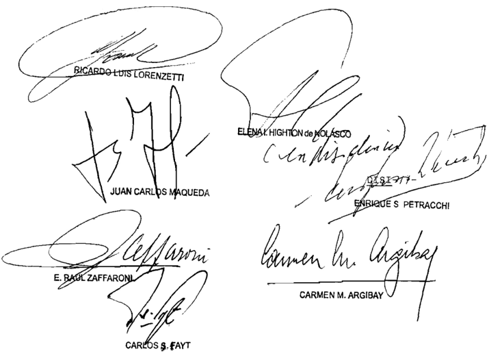

## DE LA SEÑORA VICEPRESIDENTA DOCTORA DOÑA ELENA HIGHTON de NOLASCO

## Considerando

Que las circunstancias de la causa han sido ade cuadamente descriptas por señora Procuradora Fiscal en los capítulos I V de su dictamen de fs 372/374, las que cabe remitirse fin de evitar repeticiones innecesarias

Que este Tribunal comparte las consideraciones vertidas en el capítulo VI del dictamen mencionado\_ en cuanto el recurso extraordinario resulta formalmente procedente en referente la interpretación de las normas federales en juego

Que es doctrina reiterada de este Tribunal que el sentido del secreto fiscal consagrado en el art 101 de la 11.683 es llevar tranquilidad al ánimo del contribuyente, con la ineludible consecuencia de que cualer manifestación que formule ante el organismo fiscal secreta Se trata, pues , de seguridad jurídica como medio decisivo establecido por el legislador para facilitar la adecuada percepción de las rentas públicas (Fallos: 295 : 812 sus citas, entre otros) ley qui será

4 % ) Que la norma citada resguarda asimismo, en forma expresa, el interés de los terceros que podrían ser afectados por la divulgación de informaciones suministradas al Fisco (art 101 de la 1l . 683 párrafo tercero) Esa previsión legal no solo alcanza declaraciones manifestaciones formuladas por aquéllos, sino también expedientes, actas , resoluciones documentos en que constan pueden constar tales de claraciones manifestaciones (Fallos: 248 : 627) ley las

5 " ) Que , en el caso, el secreto que ampara los terceros respecto de enes se solicita la medida puede ser relevado por éstos, ya que ha sido instituido en su propio interés Por consiguiente, el conflicto entre el interés declarado por el actor el que la ley ampara favor de terceros, debe ser dirimido mediante la debida consulta efectuada por la AFIP terceros acerca de si se encuentra autorizada dar sus nombres qui

al tribunal en el de la nedida solicitada, Y dar cuenta del resultado de esa diligencia, sin individualizar enes se hubiesen negado \_ Sobre tal base, Y la ponderación del interés invocado por el actor en función del resultado de la diligencia, se decidirá 10 que corresponda en cuanto al levantamiento del secreto fiscal respecto de terceros qui

Por ello, Y oída la señora Procuradora Fiscal se resuelve: Hacer lugar al recurso extraordinario deducido, con el alcance indicado en el considerando 5 0 de la presente\_ Costas en el den causado en atención la naturaleza de la cuestión. Notifí quese Y devuélvase

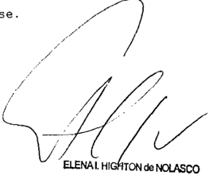

Recurso extraordinario interpuesto por el Fisco Nacional Adminibtración Fe deral Públicos Dirección General Impositiva, representada por la Dra María Silvina Pecci

Traslado contestado por Washington Álvarez letrado en causa propia.

Tribunal de origen: Cámara Federal de Apelaciones de Salta

Tribunales que intervinieron con anterioridad: Juzgado Federal de Primera Ingtancia de Salta

## BRuNO PEREZ, ALDO S/ CAuSA Nº 13794

## DELITOS DE LESA HUMANIDAD.

Corresponde dejar sin efecto el pronunciamiento que declaró inadmisible el recurso de casación interpuesto por el representante del Ministerio Público contra la confirmación de la exención de prisión ya que no podía dejar de analizar los fundamentos desarrollados para sostener la existencia de riesgo procesal relacionadas con las condiciones personales del imputado y las características de los hechos, en tanto no se puede desconocer que quienes ejercieron funciones estra-

tégicas y de mando en las fuerzas de seguridad civil durante la última dictadura pueden conservar un ascendiente sobre la organización criminal formada a su amparo y que sus estructuras de acción dieron sobradas pruebas de poder aun en tiempos recientes.

- -Del dictamen de la Procuración General, al que remitió la Corte Suprema-. -Los jueces Enrique Santiago Petracchi y Carmen M. Argibay, en disidencia, consideraron que el recurso no había dado cumplimiento a los recaudos establecidos por el art. 7º, inc. 'c', del reglamento aprobado por la Acordada 4/2007-.

DICTAMEN DE LA PROCuRACIóN GENERAL

Suprema Corte:

- I -

La Sala II de la Cámara Nacional de Casación Penal declaró inadmisible el recurso de casación interpuesto por el representante de este Ministerio Público contra la confirmación de la exención de prisión de Aldo Patrocinio B. P. (fs. 15/16 vta.). Igual suerte corrió el recurso extraordinario articulado por el Fiscal General ante aquel tribunal (fs. 38 y vta. y 17/37 respectivamente), lo que motivó la presente queja (fs. 39/43 vta.)

- II -

Si bien es cierto que, como lo sostuvo el a quo para rechazar el recurso federal, V.E. tiene establecido que las cuestiones relativas a la admisibilidad de los recursos locales no son, por regla, revisables en esta instancia extraordinaria (Fallos: 297:52; 302:1134; 311:926; 313:1045, entre otros), también lo es que tal criterio admite excepción cuando la resolución impugnada conduce, sin fundamentos adecuados, a una restricción sustancial de la vía utilizada que afecta el debido proceso (Fallos: 301:1149; 312:426; 323:1449 y 324:3612). Y creo que éste es uno de esos casos de excepción, tal como lo afirma el recurrente (fs. 39 vta./42), máxime cuando lo decidido por la casación, al confirmar la libertad de un imputado por numerosos delitos de lesa humanidad, pone inmediatamente en riesgo los compromisos de la Nación y, por lo mismo, configura un caso de gravedad institucional (G 1162, XLIV, 'Guevara, Aníbal Alberto s/causa 8222', de 8 de febrero de 2011).

Nótese que ese tribunal rechazó el recurso de su especialidad con base en dos motivos: primero, dijo que en el escrito no se demostró 'cuál sería el agravio actual, dado que no hay título jurídico para privar de

la libertad al imputado', al haber sido procesado sin prisión preventiva (fs. 16); segundo, afirmó que en la audiencia oral, el recurrente no trató las circunstancias concretas del caso (fs. 16).

Pues bien, en mi opinión, los dos motivos son aparentes. El primero lo es porque, como se desprende del escrito agregado en fotocopias al presente dictamen, el recurrente explicó que su agravio reside en la arbitrariedad de la confirmación de la exención de prisión de B. P. y en la gravedad institucional que reviste esa decisión (véase, en particular, lo argumentado bajo el subtítulo 'Motivos de casación'). Y la actualidad de ese agravio no puede ser desconocida como lo ha hecho el a quo , puesto que la suerte del título jurídico para privar de la libertad al imputado depende justamente del resultado de la impugnación que nos ocupa. Luego, no se puede postular que no hay agravio actual porque no hay título, cuando la controversia por el título es preexistente y mantiene su vigencia.

En efecto, al dictar el procesamiento de B. P., el juez de instrucción simplemente se remitió, en lo que hace a la prisión preventiva, a los argumentos brindados para conceder la exención de prisión, cuya apelación por el Ministerio Público se encontraba pendiente de resolución (cf. fs. 14), de modo que si esa exención resultara finalmente revocada, debería obviamente adecuar 'los títulos'.

Además, el argumento usado por la casación para rechazar el recurso fiscal implica frustrar, por medios no previstos, la facultad del acusador público de recurrir toda exención de prisión o excarcelación que se haga efectiva, lo cual resulta manifiestamente inadmisible. Pues la falta de título jurídico para privar de la libertad al imputado existe siempre que se concede la exención de prisión o la excarcelación bajo ningún tipo de caución o cuando el imputado da cumplimiento a lo exigido en tal concepto.

En lo que respecta al segundo motivo del rechazo del recurso de casación -aquel consistente en que el Fiscal General no habría tratado las circunstancias concretas del caso en la audiencia realizada de conformidad con el artículo 465 bis del código ritual-, cabe recordar que ese motivo no constituye uno de los previstos en la misma ley para declarar formalmente inadmisible el recurso, ni para tenerlo por desistido (cfr., en particular, artículos 444 y 454), por lo que mal podría aceptarse que se lo invoque como justificación de su rechazo y se evite, de esta manera, la consideración de los argumentos expuestos en el escrito, donde ya se habían analizado tales circunstancias. Lo dicho por

el recurrente para fundamentar el recurso en la audiencia no tiene por qué interpretarse como una sustitución o anulación de los fundamentos ya brindados en el escrito, sino que, a lo sumo, los amplía.

En otras palabras, el a quo no podía dejar de analizar, amparándose para ello en el argumento en cuestión, los fundamentos desarrollados en el escrito del recurso de casación para sostener la existencia de riesgo procesal. Me refiero, en particular, a las condiciones personales del imputado y a las características de los hechos que, en precedentes recientes de V.E. (G. 21, XLVI, 'Guil, Joaquín s/ causa nº 10.456', de 12 de abril del corriente, entre otros), dejando a salvo una mejor interpretación de sus fallos, fueron consideradas relevantes para evaluar la existencia de aquel riesgo.

Se recordó, en efecto, que B. P. está procesado como coautor de numerosos delitos de lesa humanidad, que habría cometido en su calidad de 'Subjefe y Jefe del principal centro clandestino de detención que funcionó en Mendoza' (cfr. fs. 9 del escrito agregado al presente dictamen), por lo que se trataría, en consecuencia, de 'un imputado capacitado en las más altas instancias de entrenamiento en la campaña de represión ilegal' (fs. 5 del mismo escrito), que habría organizado, además, los 'procedimientos de detención de personas sindicadas como subversivas', previa comunicación directa con el Jefe de Policía (fs. 10 del mismo escrito).

En síntesis, tal como se afirmó en el precedente citado, dejando siempre a salvo una mejor interpretación de los fallos de V.E., no se puede desconocer que quienes ejercieron funciones estratégicas y de mando en las fuerzas de seguridad civil durante la última dictadura, como el aquí imputado, pueden conservar un ascendiente sobre la organización criminal formada a su amparo, y que sus estructuras de acción dieron sobradas pruebas de poder aun en tiempos recientes.

Expuestas las razones por las cuales el tribunal de casación no podía, sin incurrir en arbitrariedad, rechazar como lo hizo el recurso homónimo interpuesto, y sin que esto importe emitir juicio sobre el fondo del asunto, opino que V.E. puede abrir la queja, declarar procedente el recurso extraordinario y revocar aquella decisión, para que se dicte otra en la que se tengan en cuenta los lineamientos expuestos en el apartado anterior. Buenos Aires, 16 de agosto de 2011. Luis Santiago González Warcalde .

## FALLO DE LA CORTE SuPREMA

Vistos autos: "Recurso de hecho deducido por el Fiscal General cargo de la Fiscalía Nacional 3 de a Cámara Nacional de Casación Penal en la causa Bruno Pérez, Aldo s / causa 13\_ 794" para decidir sobre su procedencia los

## Considerando

Que el Tribunal comparte, en pertinente, los fun damentos expuestos por el señor Procurador Fiscal en el dictamen de fs 58/59 vta. cuyos términos corresponde remitirse por razones de brevedad -

Por ello, se resuelve hacer lugar la queja, declarar procedente el recurso extraordinario dejar sin efecto el proamiento impugnado Notifíquese devuélvanse autos al tribunal\_de-origen a sus efectos nunci

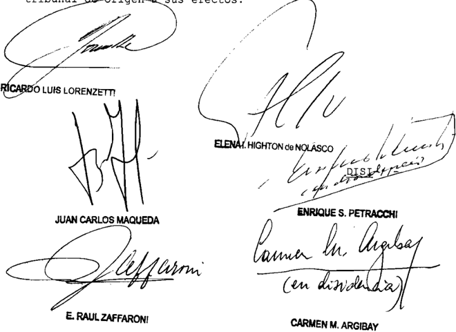

/ -DENCIA DE LOS SEÑORES MINISTROS DOCTORES DON SANTIAGO PETRACCHI DOÑA CARMEN M ARGIBAY

## ENRIQUE

## Considerando

Que la apelante no ha dado cumplimiento 1os recaudos establecidos por el artículo 7 0 inciso c" del reglamento aprobado por la acordada 4/2007 , por que corresponde declarar inadmisible esta presentación directa

Por ello, habiendo dictaminado el señor Procurador Fiscal se desestima Notifíquese y archívese

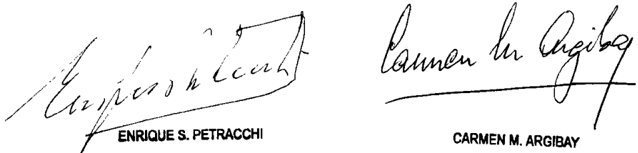

Recurso de hecho interpuesto por Dr Ricardo Fiscal Gene ral ante la Cámara Foderal de Casación Penal

Tribunal de origen: Sala II Cámara Fadoral do Cabación

Tribunal intervino con anterioridad: Cámara Foderal de de doza . que

CABLEvISION SA C/ DNCI - DISP. 739/10 (EXPTE S01:248.077/09)

## RECURSO ORDINARIO DE APELACION.

Corresponde declarar mal concedido el recurso ordinario de apelación contra la sentencia que confirmó las multas por infracción al punto I, del inc. b, del art. 2º del decreto 1153/97 -reglamentario de la ley 22.802- y del art. 4º de la ley 24.240 ya que el eventual y secundario interés fiscal que pueda tener la Nación en la percepción de ingresos provenientes de la aplicación de sanciones administrativas pecuniarias -disciplinarias o represivas- no basta para autorizar dicho recurso, toda vez que no puede hablarse de valor disputado cuando está en juego la aplicación de tales sanciones, cuya finalidad es restaurar el orden jurídico infringido, y no reparar un perjuicio o constituir una fuente de recursos para el erario.

## FALLO DE LA CORTE SuPREMA

## Buenos Aires, 242

Vistos 10s autos: "Cablevisión S .A c/ DNCI DISP . 739/10 (expte. 501:248 .077/09)

Considerando:

1 %) Que Sala II de Cámara Nacional de Apelaciones en Contencioso Administrativo Federal, confirmó parcialmente la Disposición D.N.C.I 739/2010 que impuso CABLEVISION sendas multas por infracción al punto I, del inciso b del artículo segundo del decreto 1153/97 ~reglamentario de Y del artículo 4 0 de la En consecuencia, s610 reajustó el monto de las sanciones un total de pesos dos nillones doscientos mil ($ 2 .200 . 000) (confr. fs 255/262) ley ley

2%) Que contra dicho pronunciamiento actora interpuso recurso ordinario de apelación (fs. 270/272) que fue concedido mediante el auto de fs 276 . El memorial de agravios obra 294/300 , su contestación fs \_ 303/326.

3%) Que para la procedencia formal del recurso dedu cido es necesario entre otros requisitos, que el valor disputado en último término, sin accesorios, sea superior la suma de $ 726.523,32 , según lo dispuesto por el artículo 24 , inciso ap a, del decreto-ley 1285/58 , modificado por la ley 21.708 Y resolución 1360/91 de esta Corte (Fallos: 327:598)

Que tales efectos no corresponde computar el monto correspondiente las multas impuestas en las resoluciones administrativas cuya impugnación dio origen este juicio, pues esta Corte ha establecido que el eventual secundario interés fiscal que pueda tener la Nación en la percepción de ingresos provenientes de aplicación de sanciones administrativas pecuniarias ~disciplinarias represivasno basta para autorizar el recurso ordinario de apelación de tales sanciones cuya finalidad es restaurar el orden jurídico infringido, no reparar un

perjuicio constituir una fuente de recursos para el erario (Fallos: 324:3083 ; 327:598 Y causa V.93 .XLIV "Vicente, José Vicente, Omar Antonio Y Vicente, Norberto 17.731-Ic/ DGI"\_ sentencia del 10 de agosto de 2010)

5%) Que la circunstancia expresada determina improcedencia formal de la apelación ordinaria deducida para ante esta Corte por ausencia de uno de 10s presupuestos esenciales de adnisibilidad del recurso, sin que obste ello el hecho de que la cámara la haya concedido (Fallos: 314 :1455; 318:1052, entre muchos otros)

Por ello , se declara mal concedido el recurso ordinario de -I/-apelación. Con costas de conformidad al cambio de criterio expresado en 1a causa "Delpino" (Fallos: 334:1041) Notifíquese Y devuélvase

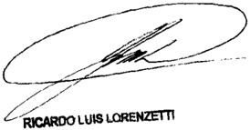

ELENALHIGHTON de NOLASCO

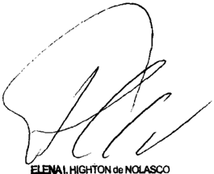

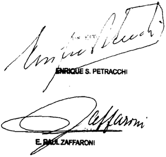

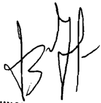

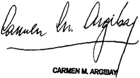

Recurso ordinario interpuesto por Cablavisión actora autob , represen tada el Dr Carlos María Campillo, con el Patrocinio letrado de la Dra Aldana Paola por

Traslado contestado por el Eutado Nacional de Econonía Y Finanzab Públicab donandado en autob representado por el Dr Gabriel Bruno Toia, con el patrocinio letrado de Carlob Gubtavo Piotarini Yari

Tribunal de origen: Camara Nacional de Apelacionae en 1o Contenciobo Aduinibtrativo Federal Sala II

## ESTABLECIMIENTO METALuRGICOS OCHOTECO S.A.I.C. C/ BANCO CENTRAL DE LA REPuBLICA ARGENTINA S/ DEMANDAS

## COMERCIO EXTERIOR.

Cabe descalificar por arbitraria la sentencia que hizo lugar a la demanda y condenó al Banco Central de la República Argentina a abonar al exportador -demandante- la suma reclamada equivalente a los fondos que, en concepto de pago a la sociedad accionante por una operación de comercio exterior, depositó el importador extranjero y que no fueron transferidos al actor tal como fuera requerido, pues en el examen de la relación de causalidad entre el accionar del demandado y el perjuicio sufrido por la sociedad actora, el razonamiento del tribunal a quo se apartó del orden lógico que vincula a los hechos que motivaron el daño y sus consecuencias.

## BANCO CENTRAL DE LA REPUBLICA ARGENTINA.

Quien imputa al Banco Central de la República Argentina responsabilidad civil por un obrar negligente o ilícito tiene la carga de individualizar y probar, del modo más concreto posible, el ejercicio irregular de la función.

## ENTIDADES FINANCIERAS.

La suspensión de la operatoria de una entidad financiera puede derivar en la revocación de la autorización para operar por la afectación de la solvencia o liquidez del intermediario financiero, asimilable al estado de cesación de pagos, por lo que no corresponde efectuar pagos a los acreedores beneficiando a uno de ellos respecto de otros y obviar la prohibición legal, la cual es inaceptable, máxime cuando, como en el caso, el importe registrado a favor de la sociedad exportadora en el intermediario financiero no se encuentra alcanzado por el privilegio previsto por los arts. 49 y 53 de la L.E.F., por no constituir un depósito.

## ENTIDADES FINANCIERAS.

La suspensión de la exigibilidad de los pasivos de las entidades financieras que dispone el art. 49 de la Carta Orgánica debe ser correlacionada con lo establecido por el art. 44 de la Ley de Entidades Financieras, texto según ley 24.627, en cuanto prescribe que, durante el periodo de suspensión transitoria, el Banco Central podrá ordenar que se efectivice el pago a los acreedores laborales y a los depositantes -con privilegio general o especial-, respetando el orden de prelación respectivo y distribuyendo los fondos de que disponga la entidad a prorrata entre los acreedores de igual rango, cuando fueran insuficientes.

DICTAMEN DE LA PROCuRACIóN GENERAL

Suprema Corte:

- I -

La Sala I de la Cámara Nacional Civil y Comercial Federal revocó la sentencia de la instancia anterior y, en consecuencia, hizo lugar a la demanda, condenando al Banco Central de la República Argentina a abonar al actor la suma reclamada (Euros 30.737,20) equivalente a los fondos que, en concepto de pago a la sociedad accionante por una operación de comercio exterior, depositó el importador extranjero en una cuenta a nombre del Scotiabank Quilmes S.A. (hoy en liquidación) en su banco corresponsal (Natexis Banques Populaires) en París, Francia, sumas que no fueron transferidas a nombre del exportador -ahora actor- tal como fuera solicitado (fs. 247/251 y 282/283 del expte. principal, al que me referiré en lo sucesivo, salvo aclaración en contrario). Ordenó, asimismo, calcular intereses a una tasa del 6% anual, desde el momento del reclamo extrajudicial.

Contra dicho pronunciamiento, el Banco Central de la República Argentina dedujo recurso extraordinario, que fue desestimado (fs. 287/303 y 312), dando lugar a la presente queja (fs. 34/38, del cuaderno respectivo).

Advierto del examen de las constancias agregadas al expediente principal, que el Banco Central de la República Argentina, los días 4 de enero y 15 de abril de 2010, es decir, con posterioridad a la interpo-

sición del recurso de hecho (26/02/08, v. fs. 38 vta., recurso de queja), depositó las sumas correspondientes a capital e intereses (fs. 426/428) resultantes de las liquidaciones aprobadas a fojas 330 y 455, sin formular reserva de continuar con el trámite de la queja.

En tales condiciones, corresponde atribuir a la conducta del organismo demandado el carácter de desistimiento tácito de la impugnación, teniendo en consideración que reiterada jurisprudencia de V.E. ha establecido que sus sentencias, deben atender a las circunstancias existentes al momento de la decisión (v. doctrina de Fallos: 318:2309; 326:5, 3975; 327:488, 664, entre otros), que evidencian que el apelante carece de interés actual en su recurso. Así, el pago de las sumas determinadas en la sentencia recurrida, con posterioridad a la interposición de la queja, sin efectuar reserva alguna, importa la renuncia del recurso, en tanto media incompatibilidad manifiesta entre ambas gestiones procesales (v. doctrina de Fallos: 324:697; 326:3996; entre otros).

- III -

Por las razones expuestas, a mi modo de ver, cabe reputar que la presentación directa ha sido tácitamente desistida, de conformidad con lo dispuesto por los artículos 873, 915 y 918 del Código Civil, y, en consecuencia, no corresponde dictar un pronunciamiento sobre el fondo del asunto, por haberse tornado abstracta la cuestión debatida. Buenos Aires, 1º de abril de 2011. Marta A. Beiró de Gonçalvez.

## FALLO DE LA CORTE SuPREMA

## Buenos Aires,

Vistos autos "Recurso de hecho deducido por el Banco Central de República Argentina en la causa Estableciniento Me talúrgicos Ochoteco c/ Banco Central de la República Argentina" para decidir sobre su procedencia

## Considerando:

Que Cámara Nacional de Apelaciones en Civil Comercial Federal, Sala I, al revocar la sentencia de la ins -

tancia anterior, hizo lugar la demanda , condenando al Banco Central de la República Argentina abonar al actor la suma de 30.737,20 euros \_ equivalente 1os fondos que , en concepto de pago 1a sociedad accionante por una operación de comercio ex terior, ingresó el importador del extranjero el 9 de mayo de 2002 en una cuenta nombre del Scotiabank Quilmes en su banco corresponsal en París, Francia ~Nataxis Banques Populaires-, sumas que no fueron transferidas nonbre del exportador ahora actortal como había sido solicitado

Que , en su sentencia, cámara sostuvo que el Scottabank Quilmes ~una vez que ingresaron 1os fondos en la referida cuenta Y que fue presentada la documentación necesariarequirió oportunamente que se cumpliera la orden de su cliente; pero ~según 1o señaló el quo \_ la suma en cuestión no pudo ser transferida encontrarse embargada en virtud de la orden de un juez francés (fs\_ 282) Asinismo puntualizó sala el Scotiabank tenía dificultades en la plaza local, cual notivó que el 18 de abril de 2002 se designara un veedor, el 16 de mayo un veedor adicional Y que el 20 de junio se dispusiera la intervención de la entidad con exclusión Y transferencia de activos pasivos Y que finalnente, el 20 de agosto operara la revocación en su calidad de entidad financiera (conf fs . 282 in fine) que

Que en ese contexto, afirnó que el Scotiabank quería pagar la actora que fue el Banco Central quien trabó dicho pago En orden ello destacó que aquella entidad solicitó autorización al veedor para efectuar conversión dólares realizar el pago , que el veedor formuló determinadas exigencias que culminaron con la negativa de aquél \_ Al respecto, la cámara consideró que el art 49 de Carta Orgánica del Banco Central ~que fulmina con la nulidad 1os compromisos que aumen ten los pasivos de la entidad financiera durante suspensión operativainvocado por la veeduría designada por el superintendente financiero para denegar el pedido de conversión de la mo neda del crédito de la actora y su ulterior pago , resultaba ineficaz para justificar tal conducta pues ~en su concepto por las características de la operación, al producirse el ingreso de

10s fondos abonados por el importador Y girados por el banco co rresponsal, se genera una correlativa obligación de la entidad bancaria ocal con la sociedad exportadora, la que queda registrada en una cuenta pasiva que refleja el derecho de ésta comO acreedora del Scotiabank Quilmes 5 .A\_ En esa inteligencia, entendió que no apreciaba el modo cómo el pago exigido no resistido por el intermediario financiero- podía aumentar el pasivo de esta entidad\_

4 ' Que , por lo tanto, juzgó que el proceder del Ban co Central había engendrado un daño la actora medido en la cantidad que se reclana 1o que imponía el progreso de a denanda toda vez que aquél había sido acreditado, como también la relación de causalidad entre el perjuicio sufrido por el actor Y el accionar del Estado Y la posibilidad de imputar el daño la demandada

Fijó la tasa de interés al 68 anual partir del reclamo extrajudicial por tratarse de una condena en euros

5") Que , contra tal decisión, el Banco Central de la República Argentina planteó el recurso extraordinario obrante fs \_ 288/303 vta . cuya denegación fs\_ 312/312 vta dio motivo al planteo de la queja en examen

Que según doctrina de esta Corte, para que medie responsabilidad del Estado debe existir una relación de causalidad directa entre 1a conducta estatal impugnada Y el dafo cuya reparación se persigue; asinismo se ha establecido que quien reclama la correspondiente indennización debe probar esa relación de causalidad (conf Fallos: 332:2328 ; 328:2546, entre otros) En similar sentido, se ha expresado que la posibilidad de imputarle los daños que ha sufrido el actor, requiere, entre otros requisitos ineludibles, que la mencionada relación de causalidad sea directa Y relevante entre el actuar del Estado Y el daño cu ya reparación se persigue (doctrina de Fallos: 321:1776)

Que tal presupuesto dista de hallarse configurado en el caso de autos toda vez que es claro fue el embargo que

trabado sobre la cuenta de corresponsalía del intermediario financiero el motivo que impidió 1a retransferencia requerida por el Scotiabank Quilmes S .A (v\_ fs 154/155 Y 216 , respuesta quinta pregunta Y primera Y sexta repregunta) por carecer aquélla de saldo

En tales condiciones\_ en el examen de la relación de causalidad entre el accionar del demandado Y el perjuicio sufrido por la sociedad actora, el razonaniento del tribunal quo se apartó del orden logico que vincula 10s hechos que motivaron el daño Y consecuencias

8 0 ) Que por demás , quien imputa al Banco Central de la República Argentina responsabilidad civil por un obrar negligente ilícito tiene la carga de individualizar Y probar, del modo más concreto posible, el ejercicio irregular de la función (Fallos: 318:74)

Al respecto, cabe recordar que la suspensión de 1a operatoria de una entidad financiera encuentra sustento en las atribuciones que la ha conferido al Banco Central de la Re pública Argentina como eje del sistema monetario Y financiero Y que aquélla no fue cuestionada por la sociedad actora\_ A su vez , el art 49 de la Carta Orgánica establece que la suspensión transitoria de operaciones \_ en ningún caso, dará derecho los acreedores al reclano por daños Y perjuicios contra el Banco el Estado Nacionalley

Por otra parte, esta Corte ha interpretado que dicha suspensión, puede derivar en la revocación de a autorización para operar por 1a afectación de la solvencia liquidez del termediario financiero, asimilable al estado de cesación de pa gos por que no corresponde efectuar pagos los acreedores beneficiando uno de ellos respecto de otros Y obviar la prohibición legal, cual es claramente inaceptable (doctrina de llos: 329:2876) , máxime cuando , como en el caso, el importe registrado favor de la sociedad exportadora en el intermediario financiero no se encuentra alcanzado ~como senala el recurrentein-

por el privilegio previsto por los arts. 49 Y 53 de la L.E.F., por no constituir un depósito\_

Esta circunstancia determinó que no fuera incluido en el elenco de pasivos excluidos en el sistema regulado por el art 35 bis de dicha norma, diferencia de 1o acaecido con la cuenta del Scotiabank Quilmes S .A en el Bank of America, Sucursal Nueva York que ~según se consigna fs . 299 vta. último párrafo fue excluida en el marco del proceso de reestructuración de activos pasivos aplicado al intermediario financiero\_

9%) Que , en este contexto, el quo la vez que omitió considerar que la suspensión operativa dispuesta por la autoridad monetaria por resolución 55/02 no s0 extendió las operaciones de mera administración conservatoria (punto 2 , inc . f, de la parte resolutiva) tampoco reparó en la diversa conducta observada por los veedores , designados en términos del art 34 de la Ley de Entidades Financieras en relación las múltiples soluciones planteadas tanto por la actora como por el Scotiabank Quilmes 5 .A en aras de concretar el pago \_

En tal sentido, cabe destacar que la orden impartida por el Scotiabank Quilmes para que los fondos recibidos oportunamente por Nataxis Banques Populaires fueran retransferidos otro banco de plaza ~Banco de 1a Provincia de Buenos res Casa Centralpara hacer efectiva su entrega 1a sociedad exportadora (v fs 134) , no solo no fue objetada por la veedu ría sino que tenor de 1o expuesto por la propia actora, habría sido autorizada No obstante ello, tal operación no pudo concretarse pues como consecuencia del embargo trabado en la cuenta del Scotiabank Quilmes S .A . en aquél, ésta carecía de saldo (v . fs\_ 206 vta. respuesta la segunda repregunta)

10) Que tampoco la ulterior negativa de la veeduría la propuesta del Scotiabank Quilmes 5 .A. de retransferir tal suma cuenta clearing en el Bank of America ~previa conversión de los 30 . 737,20 euros dólares- puede encuadrarse en el ámbito de la aducida negligencia en el obrar del En efecto pueden considerarse razonables 1os motivos expuestos en el

morándum de fs 161 para justificar la respuesta comunicada por aquélla, poco que se considere que el embargo judicial dispuesto el 24 de mayo de 2002 había dejado sin saldo la cuenta del banco corresponsal en que el importador habfa depositado 10s fondos ; en consecuencia, la propuesta del intermediario financiero suspendido el de junio de ese año implicaba afrontar el pago al exportador aplicando fondos depositados en otra cuen ta del exterior, que se traducía en un claro acto de disposición de activos no autorizado por la resolución 55/02 Y una afectación de los derechos de la Masa de acreedores sobre la totalidad de 10s bienes del banco (v . fs 164)

11) Que en línea con 1o señalado resulta útil recordar que, en forma concorde, ha sostenido esta Corte que la pensión de 1a exigibilidad de pasivos de las entidades financieras que dispone el art 49 de Carta Orgánica debe ser correlacionada con o establecido por el art 44 de la Ley de Entidades Financieras texto según 24 . 627 , en cuanto preg cribe que, durante el período de suspensión transitoria, el Ban co Central podrá ordenar que se efectivice el pago acreedores laborales Y depositantes ~con privilegio general especial-, respetando el orden de prelación respectivo Y distribuyendo 10s fondos de que disponga la entidad prorrata entre 10s acreedores de igual rango, cuando fueran insuficientes (FaIlos: 329:2876, considerando ley

12) Que, por otra parte, tampoco resulta posible dilgar al banco demandado responsabilidad por la actuación de interventores judiciales designados en el marco del proceso reglamentado el capítulo III del art 35 bis de la L.E.F., en tanto éstos han sido nombrados por el juez de comercio con las facultades necesarias para implementar las alternativas previstas por esta norma Y su permanencia en sus cargos se extiende hasta tanto se verifigue el cumplimiento del objetivo encomenda do

13) Que de lo expuesto surge que la decisión apelada presenta deficiencias que imponen descalificación como acto jurisdiccional válido por aplicación de la doctrina de esta Cor-

te en materia de arbitrariedad de sentencias en tanto su funda mentación resulta solo aparente Y existe relación directa entre lo resuelto Y las garantías constitucionales que el recurrente aduce conculcadas

14) Que finalmente, juicio del Tribunal no corresponde tener por tácitamente desistido al Banco Central de la queja en exanen en razón de actuaciones cumplidas con posterioridad su planteo en el marco de ejecución de sentencia que incluyó el depósito por el Banco Central de las sumas reclamadas fs 426/428 433 como consecuencia del embargo decretado en términos del art 502 del Código Procesal Civil Y Comercial de la Nacióntoda vez que tal conducta fue determinada de modo compulsivo por la medida ejecutoria ordenada sobre sus bienes

Por ello, oída señora Procuradora Fiscal, se hace lugar la queja, se declara procedente el recurso extraordinario Y se revoca la sentencia apelada Vuelvan 10s autos al tribunal de origen para que, por quien corresponda , se dicte nuevo pronunciamiento con arreglo 10 aquí expuesto Con costas Notifíquese, agréguese la queja alprincipal Y, oportunanente\_ remítanse las actuaciones

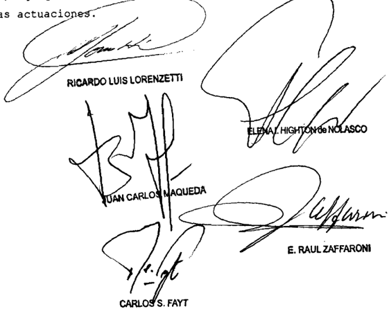

Recurso de hecho interpuesto por el Banoo Central Ropúblioe representado por la Dra con el patrocinio letrado de la

Tribunal de origen: Nacional de 1o I.

Iribunal que Intervino con anterioridad: lo Civil Conor-

MANAZZA, CARLOS ALBERTO C/ uNIvERSIDAD NACIONAL DE LA PLATA S/ RECuRSO ADMINISTRATIvO DIRECTO

## CONCURSOS UNIVERSITARIOS.

Cabe descalificar por arbitraria la sentencia que hizo lugar al recurso interpuesto por el actor en los términos del art. 32 de la ley 24.521 y declaró la nulidad de la resolución del Consejo Superior de la Universidad Nacional de La Plata, mediante la cual se rechazó el planteo de nulidad formulado con respecto al concurso que se realizó para cubrir el cargo de ayudante diplomado, pues el pronunciamiento apelado no ha fundado debidamente la existencia de un vicio de tal magnitud que justifique declarar la nulidad del concurso, dado que la cámara circunscribió su análisis a la vía utilizada por el actor para solicitar que se modifique la fecha de la clase de oposición por encontrarse con licencia médica y destacó la supuesta contradicción en que habría incurrido la universidad al desconocer la notificación cursada por vía de e-mail cuando esa modalidad fue empleada en diversas oportunidades para comunicar cuestiones inherentes al trámite del concurso.

-Del dictamen de la Procuración General, al que remitió la Corte Suprema-.

## CONCURSOS UNIVERSITARIOS.

La designación de profesores universitarios, así como los procedimientos arbitrados para la selección del cuerpo docente no admiten, en principio, revisión judicial, por tratarse de cuestiones propias de las autoridades que tienen a su cargo el gobierno de la universidad, salvo en aquellos casos en que los actos administrativos impugnados estén afectados por arbitrariedad manifiesta.

-Del dictamen de la Procuración General, al que remitió la Corte Suprema-.

DICTAMEN DE LA PROCuRACIóN GENERAL

Suprema Corte:

A fs. 54/57 de los autos principales (a los que me referiré en adelante), la Cámara Federal de Apelaciones de La Plata hizo lugar al

recurso interpuesto por el actor en los términos del art. 32 de la ley 24.521 y declaró la nulidad de la resolución del Consejo Superior de la Universidad Nacional de La Plata del 4 de abril de 2008, mediante la cual se rechazó el planteo de nulidad formulado con respecto al concurso que se realizó para cubrir el cargo de ayudante diplomado para la cátedra de Educación Física I -Eje Básquetbol I- del Profesorado Universitario en Educación Física de la Facultad de Humanidades y Ciencias de la Educación de esa universidad.

Para así decidir, el tribunal tuvo en cuenta que el concursante -quien se encontraba con licencia médica por cinco días- solicitó que se cambiara la fecha de la clase de oposición por vía de e-mail a la dirección de correo que dispuso el Departamento de Concursos. Al no ser admitida esta petición, la clase se desarrolló en la fecha y el horario previstos.

Tras efectuar una reseña de las normas que rigen las notificaciones en los procedimientos concursales en el ámbito de la universidad, la cámara señaló que, aunque la modalidad empleada por el participante no se encuentra prevista, el propio Departamento de Concursos ha cursado notificaciones a los profesores inscriptos por la vía que luego desconoció como válida, conducta que afecta el principio de buena fe, es contraria a la doctrina de los actos propios y coloca al docente en una posición de desigualdad respecto del resto de los concursantes.

Disconforme con este pronunciamiento, la demandada interpuso el recurso extraordinario de fs. 60/78 que, denegado, dio origen a la presente queja.

En lo sustancial, aduce que la sentencia es arbitraria porque se funda en cuestiones que atañen al medio de comunicación empleado por el actor para solicitar la suspensión de la clase de oposición cuando el tema central giraba en torno a determinar si el concurso debía continuar ante la imposibilidad de presentarse a esa clase por encontrarse con licencia médica. Agrega que las razones particulares esgrimidas por el actor no podían estar por encima del interés general que perseguía la universidad al llamar a concurso, debiendo continuar dicho trámite hasta finalizar con la designación del docente. Asimismo, sostiene que la cámara incurre en contradicción por cuanto reconoció el derecho del

actor a que el procedimiento se desarrolle respetando el principio de igualdad de los participantes y, al mismo tiempo, declaró la nulidad de lo actuado afectando el derecho a la igualdad de los demás aspirantes que concurrieron al examen en la fecha fijada.

Pone de resalto que la decisión fue dictada sin sustento jurídico ni fáctico, se aparta de las reglas de la sana crítica y desconoce las normas universitarias que rigen los concursos docentes.

## - III -

Ante todo, cabe recordar que la Corte tiene establecido que la designación de profesores universitarios, así como los procedimientos arbitrados para la selección del cuerpo docente no admiten, en principio, revisión judicial, por tratarse de cuestiones propias de las autoridades que tienen a su cargo el gobierno de la universidad, salvo en aquellos casos en que los actos administrativos impugnados estén afectados por arbitrariedad manifiesta (v. Fallos: 314:1234 y sus citas; 317:40; 326:2374; 327:2678).

Sobre la base de esta reiterada doctrina, la cámara examinó la actuación desarrollada por la universidad en el concurso convocado para cubrir un cargo de ayudante diplomado para la cátedra de Educación Física I -Eje Básquetbol I- del Profesorado Universitario en Educación Física y concluyó que corresponde anular la resolución dictada en el expediente nº 500-5934/06 del registro de la Facultad de Humanidades y Ciencias de la Educación, mediante la cual se rechazó el planteo del actor tendiente que se declarara la nulidad del concurso por haberse realizado la clase de oposición el 17 de julio de 2007 sin su participación.

Sin embargo, entiendo que el pronunciamiento apelado no ha fundado debidamente la existencia de un vicio de tal magnitud que justifique declarar la nulidad del concurso y que, al proceder de este modo, es el tribunal el que ha incurrido en arbitrariedad, violando el derecho de defensa en juicio del apelante (art. 18 de la Constitución Nacional).

En efecto, la cámara circunscribió su análisis a la vía utilizada por el actor para solicitar que se modifique la fecha de la clase de oposición por encontrarse con licencia médica y, asimismo, destacó la supuesta contradicción en que habría incurrido la universidad al desconocer

la notificación cursada por vía de e-mail cuando esa modalidad fue empleada en diversas oportunidades para comunicar cuestiones inherentes al trámite del concurso.

Si bien lo relativo a los medios válidos de notificación fue introducido por el actor en las sucesivas presentaciones y replicado por la demandada, la cuestión fundamental a resolver en el sub lite ,  como señala el apelante, consistía en determinar si la universidad actuó en forma ilegítima al haber continuado con el trámite del concurso pese a la ausencia del profesor Manazza, quien se encontraba de licencia por razones de salud el día que se llevó a cabo la clase de oposición. Por lo tanto, la cámara omitió examinar argumentos conducentes para la correcta solución del litigio, lo que exigía considerar si la decisión de la universidad constituyó un legítimo ejercicio de sus facultades discrecionales por encontrarse en juego el interés general de la comunidad universitaria y si se afectó el derecho de igualdad del postulante.

En consecuencia, el tribunal justificó su decisión en afirmaciones dogmáticas referidas a una cuestión formal a la cual las partes no otorgaron mayor trascendencia y soslayó el tratamiento de los fundados agravios planteados por la demandada en torno a que la postergación del concurso a pedido de un postulante habría afectado el interés general y el derecho de igualdad de los demás aspirantes, argumentos que fueron oportunamente propuestos por la universidad y que podrían haber variado la solución del caso (Fallos: 319:305).

En tales condiciones, la decisión del tribunal importa un claro apartamiento de las constancias de la causa y de los argumentos invocados por las partes y guarda nexo directo e inmediato con las garantías constitucionales que se invocan como vulneradas (art. 15 de la ley 48), por lo que corresponde su descalificación como acto jurisdiccional válido con relación a este punto, con arreglo a la doctrina de la Corte sobre arbitrariedad de sentencias.

Opino, por tanto, que corresponde hacer lugar a la queja interpuesta, dejar sin efecto la sentencia apelada en cuanto fue materia de recurso extraordinario y devolver las actuaciones al tribunal de procedencia a fin de que dicte una nueva conforme a lo expuesto. Buenos Aires, 24 de mayo de 2011. Laura M. Monti.

## FALLO DE LA CORTE SuPREMA

## Buenos Aires de ce 202

Vistos 105 autos "Recurso de hecho deducido por dada en la causa Manazza , Carlos Alberto c/ Universidad Nacional de La Plata 5 / recurso administrativo directo" para decidir 50 bre su procedencia\_

## considerando:

Que el Tribunal comparte 1os fundanentos del dictamen de la señora Procuradora Fiscal cuyos términos cabe remitirse por razones de brevedad .

Por ello, se hace lugar la queja, se declara procedente el recurso extraordinario Y se deja sir efecto la sentencia apelada Con costas Vuelvan los autos al tribunal de origen fin de que , por medio de quien corresponda \_ dicte nuevo pronunciamiento con arreglo 10 expresado \_ Reintégrese el depósito de fs 2 Agréguese Ja\_queja al principal Notifíquese Y devuélva-

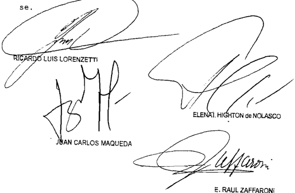

Recurso de hecho interpuesto por Necional de La Plata, representada por Dr Gustavo Leandro Krauge con el patrocinio letrado del DI Fernando Favio Levene

Tribunal de origen Cánara Federal de Apelaciones d0 La Plata Sala

## DE JUSTICIA DE LA NACION 335

## MOLINA, HONORIO HuGO C/ ADMINISTRACION NACIONAL DE LA SEGuRIDAD SOCIAL y ESTADO PROvINCIAL S/ PERSONAL MILITAR y CIvIL DE LAS FF.AA. y DE SEG.

## RETIRO POLICIAL.

Cabe confirmar la sentencia que rechazó la pretensión del actor -quien gozaba del beneficio de jubilación de retiro policial obligatorio, en los términos del artículo 14, incisos c) y ll) de la ley 4935 de la Provincia de La Rioja, liquidándose su haber en el equivalente al 100% móvil del grado comisario general- cuestionando la decisión administrativa que incluyó su prestación en el Convenio de Transferencia del Sistema de Previsión Social de dicha provincia al Estado Nacional y tras revisar el monto del beneficio lo redujo en razón de superar el haber máximo previsto para su categoría, pues no se advierte un exceso en la incumbencia revisora de la ANSES, puesto que se encuentra expresamente habilitada a auditar y verificar 'en cualquier oportunidad', que los beneficios y el importe de las prestaciones se ajusten a la legislación aplicable en cada caso.

-Del dictamen de la Procuración General, al que remitió la Corte Suprema-.

## RETIRO POLICIAL.

Cabe confirmar la sentencia que rechazó la pretensión del actor -quien gozaba del beneficio de jubilación de retiro policial obligatorio, en los términos del artículo 14, incisos c) y ll) de la ley 4935 de la Provincia de La Rioja, liquidándose su haber en el equivalente al 100% móvil del grado comisario general- cuestionando la decisión administrativa que incluyó su prestación en el Convenio de Transferencia del Sistema de Previsión Social de dicha provincia al Estado Nacional y tras revisar el monto del beneficio lo redujo en razón de superar el haber máximo previsto para su categoría, pues tal resolución no vino a comprometer el beneficio jubilatorio en si mismo sino la cuantía económica que constituye su consecuencia patrimonial, la que en ciertos supuestos excepcionales y bajo determinadas condiciones puede ser reducida, cuando median razones de orden público o de interés general o frente a graves vicios o errores fehacientemente comprobados por la autoridad competente.

-Del dictamen de la Procuración General, al que remitió la Corte Suprema-.

DICTAMEN DE LA PROCuRACIóN GENERAL

## Suprema Corte:

- I -

La Cámara Federal de la Seguridad Social, Sala III, dejó sin efecto la decisión de grado que hizo lugar a la demanda e impuso a la Admi-

nistración Nacional de la Seguridad Social -ANSES- el cumplimiento de la resolución 2287/96 del entonces Instituto de Previsión. Seguridad y Asistencia Social de La Rioja -IPSAS- que estableció la integración y cuantía del beneficio jubilatorio del actor.

Para así decidir adujo que: a) el hecho nuevo denunciado (dec. nº 614/04) fue introducido extemporáneamente, incluso, con posterioridad a los alegatos; b) el hecho nuevo fue ponderado pese a encontrarse firme el proveído que negó su sustanciación; c) el decreto nº 614/04 no establece su carácter retroactivo ni es oponible a la ANSES; d) la revisión por la ANSES del beneficio en examen resultó ajustada a derecho y se probaron errores de cálculo en la cuantía final; y e) la Provincia debe afrontar integralmente los reclamos de titulares de beneficios transferidos pues fue voluntad de las partes del convenio limitar la responsabilidad del Estado Nacional al pago de las prestaciones regulares y por los importes que resultan de sus anexos (v. fs. 140/144 y 196).

Contra la decisión la actora dedujo recurso extraordinario, que fue contestado y denegado con base en que toca a la Corte expedirse sobre la arbitrariedad y trascendencia del fallo, dando lugar a la presente queja (fs. 199/216, 226/234 y 236 del principal y 35/37 del cuaderno respectivo).

La recurrente argumenta que se encuentran en tela de juicios disposiciones de orden federal como la resolución ANSES nº 07/01, el Convenio de Transferencia del Sistema Previsional de la Provincia de La Rioja a la Nación y los artículos 1, 14, 14bis, 16 a 19, 28, 31 y 33 de la Constitución Nacional.

En concreto, dice que la Sala incurrió en un exceso formal al preterir el decreto nº 614/04, cuyo dictado no constituye un hecho nuevo en términos procesales por tratarse de un acto administrativo, de tenor reglamentario, publicado en el Boletín Oficial (art. 163, inciso 6º. CPCCN).

Agrega que la a quo también se equivocó cuando dogmáticamente refirió que el decreto no dispone su aplicación retroactiva, olvidando considerar que la norma soluciona la cuestión litigiosa y aclara expresamente la forma de calcular los haberes del pretensor en los ítems

desconocidos por la resolución ANSES nº 07/01, y que la jubilación otorgada lo ha sido con carácter móvil, es decir, que se actualiza como lo hacen los haberes del personal en actividad.

Apunta, asimismo, que el criterio sentado en el decreto coincide con la manera en que la Provincia de La Rioja liquidó el haber jubilatorio del actor -comisario general con un sueldo equivalente al 100% móvil de lo que cobra el personal activo- hasta que fue revocada por la ANSES.

En otro orden. acusa que la resolución ANSES nº 07/01 vulnera el Acuerdo de Transferencia del Sistema Previsional de la Provincia a la Nación por cuanto afecta derechos adquiridos del reclamante y el trato diferenciado reconocido al personal policial en el aludido convenio.

Hace hincapié en que el Acuerdo mantiene inalterada la movilidad del haber y no autoriza el menoscabo de las prestaciones, y en que la reducción del salario del pretensor casi en un 50%, avalada por la Juzgadora, configuró un proceder arbitrario, opuesto al status jubilatorio del accionante.

Resalta que el Convenio no exime de responsabilidad a la ANSES por el daño derivado de sus propios actos, máxime, cuando se trata de la obligada al pago del beneficio hasta el importe históricamente asignado y de las actualizaciones reconocidas de acuerdo a las condiciones de movilidad.

Reprocha la nulidad absoluta de la resolución ANSES nº 07/01, expedida más de cinco años después de haberse otorgado el beneficio jubilatorio y de haberse transferido el Sistema Previsional, y fundada en un erróneo cálculo del adicional del artículo 23, párrafo 2º, de la ley nº 4.935, creado para equiparar la retribución del comisario general retirado y la del jefe o subjefe de la policía local, en su caso.

Acota que el actor ejerció el cargo de Jefe de la Policía de la Provincia durante diversos períodos, por lo que el adicional aludido debió calcularse con relación a ese cargo, y que el cómputo realizado por ANSES condujo a un resultado inferior en un treinta por ciento a la retribución correspondiente al cargo de subjefe de la policía provincial ($ 3.678,35 contra $ 5.115), extremos de los que deriva que la resolución se halla viciada en el objeto, la causa y la motivación.

Postula que frente a un acto estable, como la resolución IPSAS nº 2287/96, la ANSES no pudo decidir unilateralmente la merma del beneficio sino que, en todo caso, debió deducir una acción de lesividad (art. 17, ley nº 19.549), y que frente a la supresión del cargo de subjefe y la creación del cargo de jefe del comando superior, procedía cotejar el haber del actor -ex comisario general- con la del último cargo creado (arts. 35, ley nº 6.943; 6 y 7, dec. nº 914/00; y 1º, dec. nº 614/04).

Por último, refiere dogmática la aserción de la Cámara en el sentido de que la reducción del beneficio practicada por la ANSES '...resultó ajustada a derecho...' (cfse. fs. 199/216).

- III -

Por medio de la resolución IPSAS nº 2287/96 -del 14/05/96- y tras reconocerle treinta años, seis meses y dieciséis días de servicios, se confirió al pretensor el beneficio de jubilación de retiro policial obligatorio, en los términos del artículo 14, incisos c) y II), de la ley nº 4935, liquidándose su haber en el 'equivalente al 100% móvil del grado 'comisario general de la Policía de la Provincia' y aplicación del artículo 23, último párrafo, a partir del 19/03/95' (v. fs. 2 y 3).

La prestación aludida resultó comprendida por el 'Convenio de Transferencia del Sistema de Previsión Social de la Provincia de La Rioja al Estado Nacional', rubricado el 29/03/96 y ratificado, más tarde, por la ley provincial nº 6.154/96 y por el decreto nacional nº 503/96.

La resolución ANSES nº 07/01 -del 10/09/01- por su lado, tras revisar el monto del beneficio reconocido al actor, lo redujo de la suma de $ 6.241,74 a la suma de $ 3.678.35 y ordenó determinar si, a partir de la fecha inicial de pago, mediaron desembolsos en exceso y, en su caso, fijar los cargos procedentes (v. fs. 12/14).

Con cita de la cláusula 9ª del Convenio de Transferencia y de los artículos 23, párrafo 2º, y 24 de la ley nº 4.935, el organismo explicó que el sueldo de 'subjefe de policía' que debe tomarse como referencia -computando el sueldo básico, gastos de representación, adicionales generales y particulares y otras asignaciones- permite alcanzar un haber máximo previsional para la categoría de $ 5.115, importe que resulta superado por el emolumento del actor.

Adicionó a ello que el cálculo del haber del grado de retiro del titular -comisario general- arroja un resultado de $ 2.372,30; que la diferencia entre esa categoría y la de sub-jefe, asciende a $ 1.306,05; y que la sumatoria de ambas representa un salario de $ 3.678,35, extremo del que deriva la necesidad de un reajuste inmediato del beneficio del actor, puesto que el excedente -de $ 2.563,39- configura un enriquecimiento ilícito que damnifica el sistema previsional.

Ante ello, el interesado dedujo una acción de amparo que fue desestimada por el Juzgado Federal de La Rioja, cuyo pronunciamiento fue confirmado por la alzada con base en la necesidad de una mayor amplitud de debate y prueba para resolver -art. 2º, inc. d), ley nº 16.986- (v. fs. 1).

En ese estado, el actor inició demanda ordinaria -el 01/09/03- contra la ANSES y la Provincia de La Rioja, reclamando que se deje sin efecto la resolución nº 07/01 y que se le reconozca el dinero descontado a partir del 10/09/01 (v. fs. 30).

Expuso allí, en síntesis, que la resolución es nula de nulidad absoluta toda vez que, entre otras normas, no respeta el Convenio de Transferencia del Sistema Previsional ni los artículos 4, 14 bis, 17 y 18 de la Constitución Nacional y 46 y 50 de la Constitución local; a lo que se suma que vulnera el status jubilatorio, los principios de ejecutoriedad, legitimidad, estabilidad e integridad del beneficio y las garantías de igualdad, defensa y propiedad (cfr. fs. 19/23 y alegato, fs. 118/120).

La ANSES, por su parte y en lo que interesa, adujo que el beneficio del actor incluyó conceptos incorrectos y porcentajes excesivos, concretamente, en lo relacionado con los gastos de representación -inherentes sólo al subjefe y jefe de policía- y en el monto de la antigüedad, lo que implicó un exceso de $ 1.762,50 y $ 1.057,50, respectivamente; esto es, un total de $ 2.563.39 mensuales. Defendió su potestad anulatoria basada en el artículo 15 de la ley nº 24.241 y en la cláusula 8ª del Convenio de Transferencia citado (cf. fs. 37/40 y alegato, fs. 126/127),

El Estado Provincial, a su turno, rechazó las aserciones del actor y postuló que el haber liquidado por la resolución nº 07/01 se ajusta a derecho, extremo que fue advertido, incluso, por los pares del actor, quienes denunciaron la irregular determinación originaria por la prensa. Resaltó que no existe derecho adquirido al quantum jubilatorio; que la rectificación del haber del actor no vulnera sus necesidades

básicas ni las de su familia y que, con arreglo al convenio respectivo, las prestaciones transferidas podrán ser auditadas por la ANSES -en cualquier momento- en su calidad de responsable final del pago (fs. 43, 70 y 71/75 y alegato, fs. 121).

Tras la clausura del período de prueba, de la agregación de los alegatos y del dictado de 'autos para sentencia', la actora alega como 'hecho nuevo' el decreto nº 614, del 24/05/04, que -asegura- provee claridad absoluta a la cuestión controvertida (cfr. fs. 114, 128 y 132/134).

El juez de grado, sustentado en constancias del expediente administrativo y en distintas normas constitucionales, cláusulas del Convenio de Transferencia y disposiciones de la legislación provincial, concluyó que el proceder de la ANSES se ajustó a derecho, tanto al auditar el beneficio del actor, como al modificar el monto de su haber jubilatorio. Resolvió, no obstante, que el decreto nº 614/04 -de aplicación ineludible dada su relación con lo discutido y el tenor alimentario del asuntovino a convalidar el alcance que le confirió a la prestación la resolución IPSAS nº 2278/96, por lo que le impuso a la ANSES el efectivo cumplimiento de la resolución local (v. fs. 140/144).

Apelada la sentencia por el Ente Nacional y habiendo opinado el fiscal ante la alzada -con énfasis en las reservas hermenéuticas que impone la ponderación de regímenes especiales y en las anomalías constatadas en la concesión de tales beneficios- fue revocada por la Sala III, extremo que dio lugar a la presentación llegada -queja mediante- a la instancia de excepción (v. fs. 154, 177/182, 188/193, 195 y 196).

Ante todo, opino que el remedio es admisible pues, tanto sobre la base de una cuestión federal estricta como de un temperamento arbitrario de la alzada, se puso en tela de juicio la validez de un acto de una autoridad nacional y la inteligencia conferida a previsiones de orden federal y la sentencia resultó contraria al derecho que la quejosa fundó en ellas (art. 14. incs. 1º y 3º, ley nº 48). La estrecha relación entre las causales invocadas aconseja que sean tratadas en forma conjunta (Fallos: 323:1625; etc.).

Compete recordar que en la tarea de establecer la inteligencia de la normativa federal, la Corte no se encuentra limitada por las posiciones

de las partes ni del inferior, sino que le incumbe realizar una declaración sobre el punto disputado según la interpretación que rectamente le otorgue (Fallos: 324:803, etc.).

## - v -

Como se refirió, el 29/03/96 se firmó el Convenio de Transferencia del Sistema de Previsión Social de la Provincia de La Rioja al Estado Nacional, ratificado por la ley local nº 6.154, BO 04/06/96 -v. ley nº 6.119, BO 09/01/96- y por el decreto nacional nº 503/96, BO 14/05/96.

En el Convenio se incluyó un apartado específico relativo a la transferencia de beneficios como el examinado -correspondientes al Régimen de Retiros del Personal Policial de la ley nº 4.935- constituido por las cláusulas 8ª, 9ª, 10ª y 11ª del citado instrumento legal (v. además, cláusulas 1ª, párrafos 1º y 4º, 3ª, pár. 6º; 4ª, pár. 2º; 21ª, in fine ; etc. En análogo sentido, v. Convenio modificatorio del 06/07/98, cláusula 1ª; ratificado por ley nº 6.494 y dec. nº 1.321/98).

Se determina allí que la nómina de los beneficiarios de la que se hará cargo la ANSES, debidamente certificada por las autoridades provinciales, se incorpora como anexo III del acta complementaria, el que 'podrá ser auditado y controlado en cualquier oportunidad por la ANSES, a fin de verificar que los beneficios acordados y el monto de las prestaciones se ajustan a la legislación aplicable en cada caso, sin  perjuicio  de  lo  dispuesto  en  la  cláusula  novena  y  concordantes del presente Convenio...' (cfr. cláusula 8ª. En similar sentido, si bien a propósito del régimen general, ver la cláusula 2ª del Convenio y la cláusula 3ª del Acuerdo modificatorio citado).

La cláusula 9ª, por su lado, tras señalar que la ANSES respetará los derechos adquiridos de los retirados y pensionados del régimen policial y observará los parámetros de movilidad pautados en el sistema vigente al tiempo de la firma del convenio, subraya que el reconocimiento de los derechos adquiridos se refiere a situaciones en las que se encontraren cumplidos los requisitos exigidos por la ley vigente, 'en tanto no fueren objeto de suspensión, revocación, modificación o sustitución por razones de ilegitimidad en sede administrativa y/o judicial en forma preventiva o definitiva, fundado en un acto administrativo oportunamente notificado a la parte y aunque la prestación se hallare en vías de cumplimiento' (cfr. cláusula 9ª. En análogo sentido, si bien a propósito del régimen general, v. cláusula 3ª, párrafo 5º; del Convenio).

Un temperamento similar se deriva del articulo 15 de la ley nº 24.241, a la que remiten el artículo 5 de la ley local nº 6.119 y las cláusulas 1ª in fine ; 3ª, párrafo 2º; 5ª; 6ª; 7ª; etc., del Convenio de Transferencia y su modificatorio, en orden a que, cuando la resolución otorgante estuviere afectada de nulidad absoluta que resultara de hechos o actos probados fehacientemente '...podrá ser suspendida, revocada, modificada o sustituida por razones de ilegitimidad en sede administrativa, mediante resolución fundada, aunque la prestación se hallare en curso de pago...' (v. art. 15, pár. 2º).

En ese plano, según indicó el juez de mérito, se llevó a cabo un primer control por la ANSES del beneficio del reclamante, por el que se determinó -el 13/05/97- que obran acreditados los servicios prestados para la policía provincial, sin perjuicio de dejar sentado el Organismo nacional que el cómputo del haber podrá ser auditado con arreglo al convenio de referencia (cfr. fs. 141vta.).

A ese primer control, al que le siguió la liberación del beneficio para el cobro a que se refiere el actor (v. fs. 4, 6 y 20, ítem 2), le sucedió un segundo control sobre el importe del haber que determinó el dictado de la resolución ANSES nº 07/01, objeto de estudio (v. fs. 141vta/142. Vale subrayar que las actuaciones administrativas aludidas por el juez no fueron acompañadas a esta instancia).

Enmarcado en la citada perspectiva y a la luz, principalmente, de las cláusulas 8ª y 9ª del Convenio de Transferencia, no advierto patentizado un exceso en la incumbencia revisora de la ANSES puesto que se encuentra expresamente habilitada a auditar y verificar, 'en cualquier oportunidad', que los beneficios y el importe de las prestaciones se ajusten a la legislación aplicable en cada caso.

A lo puntualizado se agrega que el reconocimiento de los derechos adquiridos al que se ciñe el actor, se refiere -reitero- a situaciones en las que se encontraren satisfechos íntegramente los recaudos exigidos por cada disposición legal aplicable al beneficio, en tanto no fueren objeto de modificación administrativa basada en razones de ilegitimidad -notificada a la parte- formalizada aun cuando la prestación se hallare en vías de cumplimiento (cláusula 9ª del Convenio), tal como aconteció con el dictado de la resolución ANSES nº 07/01 (cfr. fs. 12/14).

Por lo demás, y como bien apunta el juez de grado, no advierto que las partes, en rigor, discrepen en torno al alcance otorgado al adicio-

nal del artículo 23, pár. 2º de la ley nº 4.935, texto según ley nº 5.053 -anterior al dictado del dec. 614/04-, desde que coinciden en que la 'diferencia' entre los cargos comparables alcanza a $1.306,05 (cfse. recibo, fs. 3; resol. nº 07/01. fs. 13: responde, fs. 39; sentencia, fs. 142, párrafo 3º; apelación, fs. 179vta.; etc.).

La controversia, en cambio, se sitúa en torno a la bonificación por antigüedad y a los gastos de representación, como lo indicaron el juez de grado y la ANSES en ocasión de apelar (v. fs. 142. pár. 3º, fs. 179 y 180 y vta.).

En el primer caso, el actor defiende que en la base de cálculo del concepto se incluye el haber básico del cargo de comisario general. $1.043,95, y la suma correspondiente a los gastos de representación, $1.762,50, es decir: $2.806,45; importe que multiplicado por un 2% por cada año de servicio (en este caso, 30 años), arroja un resultado de $1.638,87 (cf. fs. 22).

Las demandadas, por el contrario, sustentadas en el artículo 13 del decreto nº 1.121/91, aprecian que no procede incluir en la base de cálculo los gastos de representación, temperamento con el que coinciden el juez de grado y, en definitiva, la alzada y que conduce a un resultado del adicional por antigüedad de $626,37 (cfr. fs. 38vta./39; 142 y vta.; 196vta; 228vta.; etc.).

Cabe anotar que ese es el monto que surge de los recibos de fojas 70 y 85/86 y de lo informado por la policía provincial -a propósito del rubro- en los haberes del cargo de comisario general en actividad correspondientes a marzo de 1995 y agosto de 2001 (cfse. fs. 91/92).

En el supuesto de los gastos de representación, la tesitura de las accionadas, compartida por los jueces del caso, es que incumben sólo al subjefe y jefe de la policía local, calidad que -en la perspectiva del juzgador- no se demostró que hubiera revistado la actora, toda vez que en la certificación de servicios -agregada a las actuaciones administrativas- no emerge que haya desempeñado tales cargos (cfr. fs. 39, 142vta., 180, 196vta., 228vta./229, etc.).

Sobre el particular advierto, en primero término, que la actora no cuestiona el alcance conferido al adicional 'gastos de representación' en el contexto de los preceptos que precedieron al dictado del decreto nº 614/04 (decs. nº 2.350/88 y nº 221/96); y, en segundo, que su discre-

pancia probatoria se patentiza dogmática y, en todo caso, inherente a un legajo personal tardía y genéricamente aludido y no especificado entre las pruebas de la causa (cfr. fs. 22vta./23, 191 y vta. y 211vta.), pese a que la oportuna negativa de la ANSES en torno al tema imponía un proceder distinto (v. fs. 39).

En tales condiciones, no habiéndose refutado que el adicional competa sólo al subjefe y al jefe de policía ni habiéndose demostrado que el  actor  revistiera  tales  categorías,  deviene  inoficioso  pronunciarse sobre si la bonificación por antigüedad incluye en la base de cálculo a los gastos de representación, toda vez -insisto- que no se evidenció que los últimos correspondan al pretensor, motivo por el cual procede, igualmente, confirmar la resolución en estudio.

Por lo demás, no es ocioso anotar en línea con lo observado por la ANSES en la resolución nº 07/01, que la suma total de los emolumentos correspondientes al subjefe y al jefe de policía -en actividad- resulta inferior al haber del reclamante derivado de la resolución IPSAS nº 2.287/96 -$ 6.241,74 al 19/3/95- (cf. informe de fs. 84/95), y la propia retribución del actor en actividad era muy inferior a esa cifra (v. fs. 3, 70 y 85/86).

A lo expresado se añade que la resolución administrativa cuestionada no vino a comprometer el beneficio jubilatorio en sí mismo sino la cuantía económica que constituye su consecuencia patrimonial, la que en ciertos supuestos excepcionales y bajo determinadas condiciones puede ser reducida; v. gr., cuando median razones de orden público o de interés general (Fallos: 315:800; 324:3805; etc.) o frente a graves vicios o errores fehacientemente comprobados por la autoridad competente (doctrina de Fallos: 316:2992: 326:1657; 327:30; etc.).

- vI -

Conforme se reseñó, luego de emitida la resolución ANSES nº 7 del 10/09/01, el Ejecutivo provincial dictó el decreto nº 614, del 24/05/04, por el que reglamentó el artículo 23, último párrafo, de la ley local nº 4.935 -y su modificatoria ley nº 5.053-, '...determinando como diferencia salarial el monto que resulta de compararse la Liquidación de Sueldo Total y Habitual que percibe el agente en el grado de Comisario General con el que debiera percibir como si cumpliera las funciones en el cargo de Jefe de Comando Superior de la Policía de la Provincia

[sic], o el que en el futuro lo reemplace, teniéndose en cuenta todos los adicionales particulares y generales, que integran cada una de las composiciones de haberes' (v. art. 1º, BO 03/08/04).

El precepto fue invocado por la actora como 'hecho nuevo' con posterioridad a los alegatos y al decreto de autos para sentencia, el 01/04/05, y su sustanciación fue negada por el magistrado de primera instancia, atendiendo al estado procesal de las actuaciones, sin perjuicio de su eventual valoración al momento de dictar la sentencia definitiva (cfse. fs. 128, 134 y 135).

La posterior aplicación del decreto por el juez de mérito, como se reseñó en el capítulo inicial del dictamen, fue dejada sin efecto por la Cámara con arreglo a razones tanto procesales como sustanciales (v. fs. 196).

Si bien la naturaleza no federal de las primeras obstaría a su consideración en la instancia, advierto que -como observa el actor- las partes consintieron el proveído que dejó a salvo la eventual valoración del decreto nº 614/04 al expedirse sobre el fondo del problema (cf. fs. 136/138 y 189vta.), a lo que se añade que la ulterior protesta de la ANSES en torno al tema no se detuvo en la supuesta extemporaneidad de la invocación del precepto (cf. fs. 178 vta. y sgtes.).

Distinto es el caso -a mi juicio- de las razones sustanciales esgrimidas por la a quo para desestimar la aplicación de la norma, supuesto en el que -entiendo- asiste razón al tribunal.

Y es que, en efecto, el decreto reglamentario nº 614/04 no prevé expresamente su aplicación retroactiva (cf. art. 3, C. Civil), la que debería remontarse aquí al mes de marzo de 1995, conforme se desprende del artículo 2º de la resolución IPSAS nº 2.267/96 (cfse. fs. 2).

Por otra parte, y según se expuso en el acápite anterior, la controversia habida entre las partes no involucró el alcance conferido al adicional del artículo 23, párrafo 2º, de la ley nº 4.935 -texto según ley nº 5.053, previo a la reglamentación por decreto nº 614/04- sino la procedencia de los suplementos por antigüedad y representación, de lo que se infiere que lo relativo a la diferencia entre los cargos se hallaba firme.

Adviértase que la tardía argumentación de la actora sobre el particular, anterior a la cita del artículo 1, in fine , del decreto nº 614/04,

se expuso al contestar los agravios de la apelación y se fundó en el artículo 22, párrafo 2º, de la ley nº 4.953, en la redacción de la ley nº 5.053 (v. fs. 190vta.).

En ese plano, interpreto que el dogmático planteo del peticionario basado en el decreto nº 614/04, receptado, en definitiva, en primera instancia (cfr. fs. 134, 143 y vta. y 179, pár. 2ª), constituye, en rigor, una pretensión autónoma, distinta de la dirigida originariamente contra la resolución ANSES nº 07/01 y que, por tanto, debe examinarse como tal ante quien competa.

Lo dicho es así, máxime, cuando a la luz del Convenio de Transferencia -como coligió la a quo - puede verse comprometida la responsabilidad del Estado Provincial, a quien ninguna participación se le confirió en la causa con posterioridad a la notificación del fallo de fojas 140/144 y hasta la notificación del proveído de fojas 240vta. (cfse. fs. 147 y 241vta. del principal).

## - vII -

Por lo manifestado, considero que corresponde hacer lugar a la queja, declarar procedente el remedio federal y confirmar la sentencia impugnada en cuanto fue materia de recurso. Buenos Aires, 13 de mayo de 2011. Marta A. Beiró de Gonçalvez.

## FALLO DE LA CORTE SuPREMA

## Buenos Aires,

Vistos 1os autos: "Recurso de hecho deducido pOr la actora en la causa Molina, Honorio Hugo c/ Administración Nacional de la Seguridad Social Estado Provincial" para decidir sobre su procedencia-

## Considerando:

Que esta Corte comparte 1os fundanentos Y conclusiones del dictamen de la señora Procuradora Fiscal, cuyos términos se dan por reproducidos por razón de brevedad

Por ello, se hace lugar la queja, se declara admisible el recurso extraordinario se confirma la sentencia apelada. Notifíquese, agréguese al principal devuélvase

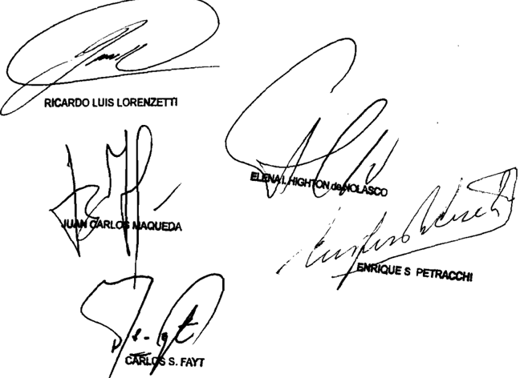

Recurso de hecho interpuesto por Bonorio Hugo Holine, representado por el Dr Pacífico Rodríguez Villar\_

Tribunal de origen Sala III de 1a Cámara Foderal

Tribunales que intervinieron con anterioridad: de tancia do La Rioja

MuNICIPALIDAD DE MERCEDES C/ ARCOR S.A.I.C. S/ APREMIO

## PUBLICIDAD.

Cabe descalificar por arbitraria la sentencia que rechazó las excepciones de falta de legitimación de la actora e inhabilidad de título e hizo lugar a la de prescripción, mandando llevar adelante la ejecución por derechos de publicidad y propaganda por los períodos 2001 a 2006, pues contiene un fundamento aparente que la priva de su carácter de acto judicial válido, dado que la solución definitiva del caso sólo

requiere la simple constatación de la publicación oficial de la ordenanza 515/2006 de la Municipalidad de Mercedes, Pcia. de Bs As, acto requerido para la satisfactoria divulgación y certeza sobra la autenticidad del texto de aquellas decisiones de contenido normativo general y que, en la especie, la sencilla verificación de tal extremo no parece afectar el carácter ejecutivo de la acción promovida.

-Del dictamen de la Procuración General, al que remitió la Corte Suprema-.

## JUICIO DE APREMIO.

El remedio federal intentado por la demandada contra la sentencia que desestimó el recurso local respecto de la decisión que rechazó las excepciones y mandó llevar adelante la ejecución, fue mal denegado pues si bien en principio las sentencias recaídas en los juicios ejecutivos no reúnen el carácter de definitivas a los fines del recurso previsto en el art. 14 de la ley 48, debido a la posibilidad que asiste a las partes de plantear nuevamente sus derechos, ya sea por el Fisco librando una nueva boleta de deuda o, por el ejecutado, mediante la vía de repetición, en el caso se rechazaron las excepciones de falta de legitimación activa y de inhabilidad de título por manifiesta inexistencia de deuda, con sustento en lo dispuesto en el art. 226, inc. 8º, de la Ley Orgánica de las Municipalidades (decreto 6769/58) de forma que lo resuelto no podrá ser replanteado posteriormente.

-Del dictamen de la Procuración General, al que remitió la Corte Suprema-.

DICTAMEN DE LA PROCuRACIóN GENERAL

## Suprema Corte:

- I -

A fs. 13/15 de los autos principales, a los que se referirán las siguientes citas salvo indicación en contrario, la Municipalidad de Mercedes inició el presente juicio de apremio contra Arcor S.A.I.C. por la suma de $ 365.983,82.-, más intereses, multas y recargos devengados desde la fecha de expedición del título de deuda hasta su efectivo pago, en concepto de derechos de publicidad y propaganda por los períodos 2000 a 2006.

A fs. 73/106 vta. la ejecutada negó la deuda y opuso las excepciones de falta de legitimación activa, inhabilidad de título y prescripción.

En relación a la primera, señaló que el municipio carecía de poder de imperio para reclamarle dichas obligaciones ya que no tenía actividad, ni sede, local o establecimiento en el Partido de Mercedes por lo que no

revestía la calidad de contribuyente respecto del municipio. Alegó, además, que las obligaciones que se le reclamaban le eran inexigibles por falta de publicación de la ordenanza fiscal e impositiva municipal.

En punto a la inhabilidad de título sostuvo que la boleta de deuda tenía vicios extrínsecos ya que no permitía  identificar las conceptos gravados por los derechos de publicidad y propaganda que se pretendían ejecutar. Añadió que, además, dichos derechos no podían ser reclamados por la vía del juicio de apremio en tanto carecían de naturaleza tributaria. Agregó que el decreto 515/2006 del Ejecutivo municipal -sobre el que se basaba el título- no había determinado la obligación tributaria a su respecto sino en cabeza de 'Visa S.A.'.

Por último puntualizó que la deuda correspondiente al año 2000 se encontraba prescripta, lo que, por añadidura, ya había sido admitido por el propio municipio al dictar el decreto referido en el párrafo precedente.

- II -

A fs. 165/168 el Juzgado de Primera Instancia en lo Civil y Comercial nº 4 del Departamento Judicial de Mercedes, Provincia de Buenos Aires, rechazó las excepciones de falta de legitimación de la actora e inhabilidad de título e hizo lugar a la de prescripción. En consecuencia, mandó llevar adelante la ejecución por derechos de publicidad y propaganda por los períodos 2001 a 2006, por la suma total de $ 313.212, más intereses y multa.

Para así decidir, señaló que '...la aludida falta de publicación de la ordenanza fiscal a que alude el excepcionante en el capítulo relativo a la falta de legitimación y en el pto. III-C para fundar la inhabilidad de título (fs. 100), he de decir que el art. 226 inc. 8º de la Ley Orgánica de las Municipalidades por su literalidad y claridad eximen de mayores comentarios máxime si la carga de la prueba pesa sobre la parte que alega el hecho negativo, que no ha sido probado, por lo que el planteo debe ser desestimado (art. 547 del CPCCP)'.

Por su parte, a fs. 295/297 vuelta, la Cámara de Apelaciones en lo  Civil  y  Comercial de Mercedes confirmó la sentencia de primera

instancia. Sostuvo que las defensas debían ser desechadas en razón del carácter autónomo del título ejecutivo y del limitadísimo marco de conocimiento de dicho proceso.

- Iv -

Disconforme, la demandada interpuso el recurso extraordinario de inaplicabilidad de ley de fs. 300/320. Entendió que la sentencia encuadraba en la categoría de arbitraria o absurda, y que el pronunciamiento contravenía el art. 168 de la Constitución Provincial puesto que en él se había omitido considerar cuestiones que eran propias del juicio apremio y se habían soslayado argumentos decisivos de las excepciones planteadas.

Resaltó que el fallo se fundaba en una norma que le era inaplicable por no ser vecina del Partido de Mercedes y, esencialmente, porque el municipio no sólo no había acreditado la publicación de la ordenanza sino que ni siquiera había manifestado que ella se hubiera realizado. Agregó que el título era inhábil por no contener una deuda líquida y exigible, ya que comprendía una multa que no estaba firme por haber sido impugnada judicialmente. Reiteró, finalmente, los argumentos en punto a la inhabilidad de título y a la manifiesta inexistencia de deuda.

- v -

A fs.  321,  la  Cámara  desestimó  por  inadmisible  el  recurso  de inaplicabilidad de la ley, pues consideró que la resolución recurrida no revestía el carácter de 'definitiva' exigido por los arts. 278 y 296 del CPCCP.

Contra tal resolución denegatoria, la ejecutada interpuso el recurso de queja obrante a fs. 137/161 del incidente de inaplicabilidad de ley que corre agregado por cuerda.

A fs. 162/163 del incidente citado, la Suprema Corte de Justicia de la Provincia de Buenos Aires declaró inadmisible el recurso por entender que la sentencia atacada no revestía la calidad de definitiva en tanto había sido dictada en un proceso de apremio y porque las cuestiones debatidas podrían ser replanteadas en un juicio ordinario posterior (conf. art. 551 del CPCCP).

## - vII -

Disconforme, a fs. 167/184 vta. del citado incidente, Arcor S.A.I.C interpuso recurso extraordinario federal.

Allí insistió en que, a pesar de haber sido dictada en el marco de un juicio de apremio, la sentencia cuestionada es definitiva o asimilable a tal ya que en ella se habían definido aspectos sobre los que no podría reeditarse la discusión en una instancia ulterior. Calificó al pronunciamiento como arbitrario porque, apartándose de pacífica jurisprudencia del Tribunal, admitió la ejecución de una multa que no estaba firme y omitió pronunciarse sobre la vigencia de la ordenanza municipal base del reclamo, aspecto que consideró esencial puesto que de verificarse la falta de publicación de la norma, se mandaría llevar adelante el cobro de una deuda tributaria sin sustento legal, es decir inexigible e inexistente, con afectación del principio de reserva de ley que rige la materia tributaria.

Afirmó que en tanto no tiene sede ni actividad en la comuna no está alcanzado por los derechos de publicidad y propaganda cuyo pago se le requiere.

## - vIII -

A fs.  201/202 vta. del citado incidente, la Suprema Corte de la Provincia rechazó el recurso por entender que solo traducía la disconformidad de la demandada con lo decidido sin sustentarse en una adecuada impugnación de las razones brindadas por el fallo, ni contar con argumentos prima facie suficientes para que pudiera considerárselo arbitrario, y por tratarse de cuestiones de derecho público local y procesal, las que resultaban privativas de los tribunales locales.

Frente a ello, la ejecutada realizó la presentación directa obrante a fs. 38/42 vta. de este expediente.

Tengo para mí que el remedio federal intentado por la demandada fue mal denegado pues si bien en principio las sentencias recaídas en los juicios ejecutivos no reúnen el carácter de definitivas a los fines del recurso previsto en el art. 14 de la ley 48, debido a la posibilidad que asiste a las partes de plantear nuevamente sus derechos, ya sea por el Fisco librando una nueva boleta de deuda o, por el ejecutado,

mediante la vía de repetición (Fallos: 308:1230; 311:1724, entre muchos otros), en la presente causa se han rechazado las excepciones de falta de legitimación activa y de inhabilidad de título por manifiesta inexistencia de deuda, con sustento en lo dispuesto en el art. 226, inc. 8º, de la Ley Orgánica de las Municipalidades (decreto 6769/58) de forma que lo aquí resuelto no podrá ser replanteado posteriormente (conf. art. 551 del CPCCP y arg. de Fallos: 271:158; 294:363; 315:2954; 321:706, entre otros)

Por otro lado, los agravios del recurrente suscitan -desde mi óptica- cuestión federal bastante para su examen por la vía elegida, sin que obste a ello que las cuestiones debatidas sean de hecho, prueba y derecho público local y, como regla, ajenas al recurso del art. 14 de la ley 48, toda vez que lo decidido sobre temas de esa índole admiten revisión en supuestos excepcionales cuando -como en el presente- se omiten ponderar argumentos conducentes para la correcta solución del pleito que importan la aplicación mecánica de un precepto legal.

Finalmente, la sentencia ha sido dictada por el superior tribunal que establece el ordenamiento local (arts. 160 y 161 de la Constitución de la Provincia y arts. 292 y sgtes. del CPCCP).

Sentado lo anterior, creo oportuno recordar que tratándose de juicios de apremio, V.E. ha admitido en forma excepcional la procedencia de la vía extraordinaria cuando resultaba manifiesta la inexistencia de deuda exigible, pues lo contrario implicaba privilegiar un excesivo rigor formal con grave menoscabo de garantías constitucionales (Fallos: 278:346; 298:626; 302:861, entre, otros).

En el sub lite Alcor S.A.I.C. opuso desde su primera presentación en juicio, la defensa basada en la inexistencia de deuda, pues esgrimió que la ordenanza que establece el tributo no ha sido publicada, Para fundar este aserto, ofreció prueba documental en poder de la actora (v. fs. 105 y 105 vta.).

Al contestar las excepciones (fs. 136/141), el municipio sólo realizó una negativa genérica sobre la cuestión, sin acompañar copia de la publicación ni individualizar sus datos, oponiéndose expresamente a la producción de la prueba ofrecida por la actora.

Frente a ello, el juez de primera instancia -en aspecto confirmado por las instancias posteriores- sostuvo que el planteo sobre la falta de publicación debía ser desestimado en razón la literalidad y claridad del art. 226, inc. 8º, de la Ley Orgánica de las Municipalidades, precepto que lo eximía de efectuar mayores comentarios sobre la falta de publicación de la ordenanza, máxime cuando, por tratarse de un hecho negativo, quien lo alegaba debía probarlo, lo que no se había logrado en este caso (art. 547 C.P.C.C.) (v. fs. 166).

Por el contrario, observo que el citado art. 226, inc. 8º, de la Ley Orgánica de las Municipalidades se limita a incluir dentro los impuestos, tasas, derechos, licencias, contribuciones, retribuciones de servicios y rentas que constituyen recursos municipales, la 'Colocación de avisos en el interior y exterior de tranvías, vehículos en general, estaciones de ferrocarril, teatros, cafés, cinematógrafos, y demás establecimientos públicos, colocación, inscripción o circulación de avisos, letreros, chapas, banderas de remates, escudos, volantes, y toda otra publicidad o propaganda escrita u oral hecha o visible en la vía pública con fines lucrativos y comerciales', aspecto ajeno a la debida publicación de la ordenanza que es lo controvertido en la litis.

Así las cosas, es claro para mí que la sentencia contiene un fundamento aparente, que la priva de su carácter de acto judicial válido, razón por la cual corresponde atender a la arbitrariedad que la ejecutada imputa a lo resuelto (Fallos: 312:1656, 314:1887).

A mayor abundamiento y a la luz de la doctrina de Fallos: 327:4474, no puede dejar de señalarse que contrariamente a lo sostenido por el juez de grado, la solución definitiva del caso sólo requiere la simple constatación de la publicación oficial de la mencionada ordenanza, acto  requerido para la satisfactoria divulgación y certeza sobre la autenticidad del texto de aquellas decisiones de contenido normativo general (Fallos: 293:157. cons. 6º) y que, en la especie, la sencilla verificación de tal extremo no parece afectar el carácter ejecutivo de la acción promovida.

En virtud de lo expuesto, opino que corresponde hacer lugar a la presente queja, revocar la sentencia de fs. 162/163 del incidente de inaplicabilidad de la ley y ordenar que, por quien corresponda, se dicte una nueva conforme a derecho. Buenos Aires, 2 de diciembre de 2011. Laura M. Monti.

## FALLO DE LA CORTE SuPREMA

## Buenos Aires, de

Vistos autos: "Recurso de hecho deducido por la deman dada en la causa Munlcipalidad de Mercedes c/ Arcor S.A.I.C. aprenio" para decidir sobre su procedencia

## Considerando:

Que las cuestiones planteadas han sido adecuadamente consideradas en el dictamen de la señora Procuradora Fiscal, yos fundamentos son compartidos por el Tribunal, Y que rresponde remitirse en razón de brevedad-

Por ello, de conformidad con dictaninado por la selora Procuradora Fiscal, se hace lugar la queja, se declara formalmente admisible el recurso extraordinario se revoca la sentencia apelada Con costas Agréguese queja al principal, notifíquese vuelvan los autos al tribunal de origen fin de que, por quien corresponda , se dicte un nuevo pronunciamiento con en la presente

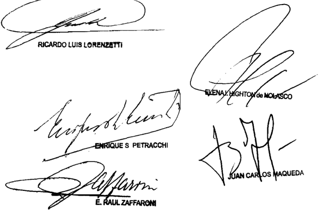

Recuso de queja interpuesto por: 8.A.I.C. representada por el Dr Fede rico Cottlieb, con el patrocinio letrado del Dr Rodrigo Lana

Tribunal de origen Buprone Corte d Buenos Aireb

Tribunales que intervinieron con anterioridad: II d de on Conorcial dol Dopartanento d Mercodes Juzgado de Primera Inbtancia an Conorcial Judicial de provincla de ALrOB

OLIMA, juAN CARLOS S/ RECuRSO EXTRAORDINARIO

## TRIBUNAL SUPERIOR DE LA CAUSA.

Corresponde devolver las actuaciones si la Cámara Federal de Casación Penal, al no hacer lugar a la queja por el recurso de casación denegado y omitir examinar el punto de la defensa relativo a la garantía a ser juzgado en un plazo razonable reglada por el art. 8, inc. 1º de la Convención Americana sobre Derechos Humanos y por el art. 14, inc. 3º del Pacto Internacional de Derechos Civiles y Políticos, se apartó de la doctrina del precedente 'Di Nunzio' que estableció que siempre que se invoquen agravios de naturaleza federal que habiliten la competencia de la Corte, por vía extraordinaria en el ámbito de la justicia penal nacional conforme el ordenamiento procesal vigente, éstos deben ser tratados previamente por la Cámara de Casación, en su carácter de tribunal intermedio, constituyéndose en tribunal superior de la causa.

-La jueza Argibay consideró que el recurso extraordinario era inadmisible (art. 280 C.P.C.C.N.)-.

## FALLO DE LA CORTE SuPREMA

## Buenos Aires,

Vistos 10s autos: "Olima, Juan Carlos s / recurso ex traordinario"

## Considerando:

Que en estas actuaciones 1a defensa solicitó, por me dio de una excepción, que se dictara el sobreseimiento del impu -

tado decretando la prescripción de la acción con base en una serie de argumentos, siendo que uno de ellos se refería la violación al plazo razonable del proceso reglado por el art inc 1 de la Convención Americana sobre Derechos Humanos Y por el art 14 inc. del Pacto Internacional de Derechos Civiles Y Políticos

Este planteo fue rechazado por el Juzgado en 10 Penal Económico 3 Y la Sala B de la Cámara Nacional de Apelaciones del mismo fuero, posteriormente denegó el recurso de casación interpuesto contra la resolución por la que confirmó esa decisión. Por su parte, 1a Sala de la Cámara Nacional de Casación Penal no hizo lugar al recurso de queja presentado ante la gatoria del recurso de especialidad por entender que éste no se dirigía contra una sentencia definitiva Sin embargo, sí en tendió que se encontraba satisfecho este requisito de admisibilidad los efectos de conceder el recurso extraordinario federal previsto en 48 interpuesto contra dicha decisión ley

En consecuencia, la Cánara de Casación Penal al no hacer lugar la queja por el recurso de casación denegado omitir examinar el punto federal propuesto por la defensa relativo garantía ser juzgado en un plazo razonable se apartó de la doctrina de1 precedente "Di Nunzio" (Fallos 328 : 1108) que estableció que siempre que se invoquen agravios de naturaleza federal habiliten la competencia de la Corte, por vía extraordinaria en el ámbito de la justicia penal nacional conforme ordenaniento procesal vigente éstos deben ser tratados previamente por Cámara de Casación, en su carácter de tribunal intermedio, constituyéndose en tribunal superior de 1a causa que

Por ello, cabe devolver las actuaciones dicho tribunal para que habilite su instancia Y analice la cuestión de fondo alegada por la parte en 10s términos de la doctrina de plazo razonable del proceso Y, asinismo corresponde declarar mal conce dido el recurso extraordinario respecto de los demás agravios en atención que su respecto, nc se satisface el requisito de

sentencia definitiva equiparable tal Notifíquese Y devuél vanse los autos al tribunal quo fin de que dicte un pronunciamiento conarreglo al

CARMEN M. ARGIBAY

=-To DE LA SEÑORA MINISTRA DOCTORA DOÑA CARMEN M ARGIBAY

Considerando

Que el recurso extraordinario es inadmisible (art\_ 280 del Código Procesal civil Y Comercial de la Nación)

Por ello, se declara improcedente\_ Hágase saber Y de vuélvanse has actuaciones al tribunal de origen.

CARMEN M. ARGIBAY

Recurso extraordinario interpuesto por León Carloe González Canpaña abogadoe dofensores de Juan Carlos Olima

Traslado contestado 0l Dr Juan Martin Ronero Victoria Fiscal General ante la Cámara Federal de Casación Penal por Fisco Nacional Administración Federal de Públicos Dirección General de Aduanab representado el Dr Carloo Alberto Lobob Ordoño Patrocinado por el Dr Luis Mario Vetere

## FALLOS DE LA CORTE SUPREMA 335

Tribunal de origen Cámara Nacional Casación Penal (Sala I)

Tribunales que intervinieron con anterioridad: Sale Nacional de Apelacioneg en Penal Econónico

## PAN AMERICAN ENERGy LLC SuC. ARG. S/ DENuNCIA

## SERVICIOS PUBLICOS.

Corresponde entender a la justicia federal si como consecuencia de los hechos denunciados -ingreso violento, daños y agresiones en el establecimiento de la empresa- se habría visto interrumpido el flujo de gas y de crudo y afectado el transporte interprovincial de gas producido en los yacimientos de la empresa, por lo que se habría interrumpido la prestación de un servicio público interjurisdiccional.

-Del dictamen de la Procuración General, al que remitió la Corte Suprema-.

DICTAMEN DE LA PROCuRACIóN GENERAL

## Suprema Corte:

Entre los titulares del Juzgado Federal de Primera Instancia y del Juzgado Penal, arribos con asiento en Comodoro Rivadavia, provincia de Chubut, se suscitó la presente contienda negativa de competencia, en la causa iniciada por denuncia de Ignacio F. D. L. C., apoderado de P. A. E. LLC Sucursal Argentina.

Allí manifestó que el día 21 de junio del presente año, un grupo de más de 500 personas, que pertenecerían a gremios de la construcción, nucleados en un sector denominado los 'dragones', junto con empleados de C. II S.A., J. O. y S. ingresaron violentamente a las instalaciones de su poderdante. En ese trance habrían roto alambrados perimetrales, derribado el portón de ingreso, cortado fibra óptica para interrumpir comunicaciones y filmaciones e intentado derribar torres

de iluminación: al mismo tiempo que habrían robado dos camionetas de la empresa y habrían golpeado con palos y piedras al personal, y a integrantes de la Gendarmería Nacional. De tal manera, que fue imposible para la empresa evitar el inicio de los procesos de cierre de la planta, corte de gas y de energía eléctrica, con la consecuente merma en el bombeo de crudo a la terminal de Caleta Córdova y el corte de la producción de petróleo y gas natural, imposibilitando la operación total  del  campo,  afectándose  la  prestación  de  servicios públicos esenciales, amén de haberse producido el corte de la Ruta Nacional Nº 26 (fs. 5/6).

La titular del Juzgado Federal declinó la competencia, en razón de la materia, al entender que los hechos denunciados escapaban al conocimiento del fuero de excepción, por tratarse de una afectación a la propiedad privada, ajena al Estado Nacional (fs. 9).

El juez provincial, por su parte, rechazó la atribución de competencia por prematura, y sostuvo que en el caso de configurarse un delito, el objeto que se afectó fue la explotación, industrialización, transporte y comercialización de hidrocarburos, produciéndose una vulneración de intereses interjurisdiccionales, por lo tanto correspondía continuar la investigación a la justicia de excepción (fs. 21/22).

Tras reunir diversos elementos probatorios -entre los cuales se encontraba el sumario de la Policía de la provincia de Chubut-, la magistrada federal dejó sin efecto la formación del incidente de competencia y envió nuevamente las actuaciones a la justicia local por entender que allí debía continuar la instrucción por tratarse del tribunal que primero conoció de los hechos (fs. 293/295).

Por su parte, el titular del juzgado penal rechazó que la justicia provincial hubiese prevenido en el caso, mantuvo su criterio y remitió la causa a la justicia de excepción, por hallarse afectados intereses interjurisdiccionales, al tratarse de una infracción al artículo 194 C.P. (fs. 483/486).

Devueltas las actuaciones al tribunal de origen, su titular resolvió elevar el incidente V.E (504/514 sin foliar).

Así quedó trabada la contienda.

Más allá de las vicisitudes procesales señaladas por los jueces y los reiterativos pronunciamientos sobre la competencia, corresponde aclarar que de las constancias de la causa surge que, como consecuencia de los hechos denunciados, se habría afectado la provisión de servicios públicos esenciales en las provincias de Chubut, Río Negro y Neuquén, al verse interrumpido el flujo al Gasoducto Patagónico -el cual se une al Gasoducto Cordillerano-, así como también el flujo de gas que la empresa P. A. provee al Gasoducto TGS que abastece hasta la Provincia de Buenos Aires, y el flujo de crudo que se envía a la Monoboya de Caleta Córdova.

Además, de la ampliación de la denuncia (fs. 33/34), surge que se habría afectado el transpone interprovincial de gas producido en los yacimientos de la empresa, mientras que del informe de fs. 458 subyace que se produjeron dos interrupciones totales a la provisión de gas, tanto el que se inyecta al Gasoducto Patagónico, que abastece a consumidores de las provincias cordilleranas (Chubut, Río Negro y Neuquén), como al gasoducto San Martín que integra el sistema nacional proveyendo gas a consumidores de amplias regiones del país, incluyendo Buenos Aires.

Por todo lo expuesto, en la medida en que se habría interrumpido la prestación de un servicio público interjurisdiccional, corresponde a la justicia federal continuar con el trámite de la causa (Fallos: 328:880). Buenos Aires, 12 de julio del año 2012. Luis Santiago González Warcalde.

## FALLO DE LA CORTE SuPREMA

## Buenos Aires, 7 de de 2ol2. aq5

## Autos Vistos:

Por 10s fundamentos Y conclusiones del dictamen del señor Procurador General , los que corresponde remitirse en razón de brevedad , se declara que deberá entender en la causa en la que se originó el presente incidente el Juzgado Federal de

Comodoro Rivadavia, al que se le remitirá Hágase saber al juzgado penal de Comodoro Rivadavia de la provincia del Chubut-

PRADO, NOEMI C/ uNIvERSIDAD NACIONAL DE ROSARIO S/ RECuRSO DE APEL. ART. 32 LEy 24.521

## DOCENTES.

Cabe confirmar la sentencia que rechazó el recurso directo interpuesto por la actora en los términos del art. 32 de la ley 24.521 -Educación Superior- y confirmó la resolución del Consejo Superior de la Universidad local mediante la cual se dispuso la baja de la bonificación por antigüedad en el cargo docente que ocupaba aquélla a partir del momento en que comenzó a percibir el beneficio jubilatorio, pues el ejercicio de la facultad reglamentaria mediante la determinación de las condiciones en las cuales procede la percepción de la bonificación por antigüedad en el servicio que efectúa el art. 1º del decreto 5614/68, no altera la sustancia de los derechos otorgados por la ley 14.473 a los docentes en actividad, no introduce

restricciones ajenas a su espíritu, ni efectúa una discriminación arbitraria que importe una violación a la garantía del art. 16 de la Constitución Nacional. -Del dictamen de la Procuración General, al que remitió la Corte Suprema-.

## DOCENTES.

En virtud de que la ley 14.473 regula de modo general el derecho a percibir la bonificación por antigüedad y los servicios que se tienen en cuenta a los efectos de practicar las liquidaciones correspondientes (arts. 40 y 41), y el decreto 5614/68 precisó la situación del personal jubilado que vuelve al servicio activo, no es posible atribuir un exceso reglamentario a éste último ni se advierte que exista contradicción alguna entre su texto y los términos del Estatuto del Docente, sino que se limitó a establecer las condiciones necesarias para percibir la bonificación por antigüedad disponiendo que el personal que percibe sus haberes jubilatorios y vuelve a prestar servicios no queda alcanzado por el art. 41 de la ley 14.473, que considera acumulables a los efectos de las bonificaciones por antigüedad todos los servicios simultáneos de carácter docente.

-Del dictamen de la Procuración General, al que remitió la Corte Suprema-.

## DOCENTES.

El decreto 5614/68 -que precisó la situación del personal jubilado que vuelve al servicio activo- no es irrazonable en su art. 1º -percepción del beneficio por antigüedad del personal jubilado que se reintegre al servicio siempre que cese la percepción del beneficio jubilatorio-, pues la circunstancia de que el pago del haber jubilatorio excluya el pago del beneficio por antigüedad encuentra fundamento suficiente en que no procede remunerar dos veces el mismo concepto cuando se trata de un mismo período, motivo por el cual la actora debía optar por una de las alternativas según mejor convenga a sus intereses.

-Del dictamen de la Procuración General, al que remitió la Corte Suprema-.

DICTAMEN DE LA PROCuRACIóN GENERAL

## Suprema Corte:

- I -

A fs. 95/99 la Cámara Federal de Apelaciones de Rosario rechazó el recurso directo interpuesto por la actora en los términos del art. 32 de la ley 24.521 y, en consecuencia, confirmó la resolución 486/07 del Consejo Superior de la Universidad Nacional de Rosario que, a su vez, desestimó el recurso deducido contra la resolución 3971/06 del rector,

mediante la cual se dispuso la baja de la bonificación por antigüedad en el cargo docente que ocupaba la actora a partir del momento en que comenzó a percibir el beneficio jubilatorio.

Para así decidir, consideró que, según lo establecido por la legislación vigente y la doctrina sentada por el alto Tribunal, la actora no tenía derecho a percibir en forma simultánea el haber jubilatorio y el beneficio por antigüedad, por cuanto se le estaría abonando dos veces el mismo concepto. Añadió que la accionante debió optar por percibir el haber renunciando a la bonificación o suspender el cobro de la jubilación para continuar percibiendo aquélla. En cuanto al reintegro de lo pagado indebidamente, entendió que las erogaciones efectuadas por la demandada en concepto de antigüedad deben considerarse como 'pago sin causa', lo que genera el deber de restituir, aplicando el plazo de diez años de prescripción previsto en el art. 4023 del Código Civil por tratarse de una acción de repetición.

## - II -

Disconforme con este pronunciamiento, la actora dedujo el recurso extraordinario de fs. 102/115, que fue concedido parcialmente por la cuestión federal planteada y denegado en cuanto a la causal de arbitrariedad (fs. 130/131).

En lo sustancial, aduce que el art. 1º del decreto 5614/68 es inconstitucional por cuanto impone un requisito no previsto por la ley 14.473 para el goce del derecho a la bonificación por antigüedad, pese a que se trata de una norma de superior jerarquía que no delegó la determinación de tales requisitos, violando así los arts. 14 bis, 31, 75, incs. 12 y 32, y 99 de la Constitución Nacional. Añade que este aspecto no fue examinado en el precedente 'Martínez' que cita la cámara para fundar la solución, pues no se había cuestionado la validez del decreto. Asimismo, sostiene que la sentencia es contraria a los principios que favorecen el trabajo y la seguridad social, desde que la pretensión deducida no tiende a objetar salarios futuros sino que objeta la repetición de salarios ya percibidos en concepto de bonificación por años de servicio

Por otra parte, expresa que la decisión es arbitraria por cuanto omitió ponderar que la demandada consideró irrelevantes las jubilaciones otorgadas en el ámbito provincial y municipal a los efectos del pago de la bonificación mencionada, pues se ocupó de aclarar esta cuestión recién con el dictado de la resolución (CS) 608/03.

A mi modo de ver, el recurso extraordinario interpuesto es formalmente admisible, en cuanto se ha puesto en tela de juicio la validez de una norma de carácter federal y la decisión definitiva del superior tribunal de la causa -que omitió pronunciarse expresamente sobre la cuestión aludida oportunamente propuesta por la actora- configura una resolución contraria implícita al derecho federal invocado por la apelante que habilita la apertura de la instancia extraordinaria para el conocimiento de la cuestión constitucional planteada (Fallos: 310:1065; 327:887). Por otra parte, al haberse denegado el recurso en cuanto a la arbitrariedad alegada sin que la apelante interpusiera la pertinente queja, la jurisdicción de la Corte ha quedado abierta sólo en la medida que la otorgó el tribunal de la instancia anterior (Fallos: 330:2521).

En cuanto al fondo del asunto, cabe recordar que V.E. tuvo oportunidad de expedirse acerca de la posibilidad de percibir la bonificación por antigüedad tras obtener el beneficio jubilatorio en el precedente publicado en Fallos: 329:5621 (caso 'Martínez'). Allí se señaló que el art. 40 de la ley 14.473 establece que el personal docente en actividad, cualquiera sea el grado o categoría en que revista, percibirá bonificaciones por años de servicio que se determinarán teniendo en cuenta la antigüedad total en la docencia. El art. 41 especifica que, a los efectos de la bonificación por antigüedad, se consideran acumulables todos los servicios no simultáneos de carácter docente prestados en jurisdicción nacional, provincial o municipal, o en establecimientos adscriptos a la enseñanza oficial.

Por otra parte, ante los problemas que se suscitaron en torno a la  aplicación  de  estas  normas,  el  Poder  Ejecutivo  Nacional  dictó  el decreto 5614/68, cuyo art. 1º establece que la percepción del beneficio por antigüedad que determina el art. 40 del Estatuto del Docente son aplicables, entre otros supuestos, al personal jubilado que se reintegre al servicio activo, siempre que dicho reintegro produzca el cese de la percepción de su haber jubilatorio.

Tras la reseña de las normas en juego, el Tribunal consideró que una vez percibido dicho haber, no corresponde computar, a los efectos de la bonificación por antigüedad de los docentes que signen cumpliendo

funciones, los servicios que condujeron a la determinación de aquél, pues ello implicaría un doble pago sustentado en una misma causa. Añadió que el reingreso a la actividad no produce por sí solo el cese en la percepción del beneficio jubilatorio, puesto que el jubilado tiene la posibilidad de reintegrarse y seguir percibiéndolo, pero en tal caso no le corresponde adicionar, en concepto de bonificación por antigüedad, los años considerados para la obtención del beneficio sino el porcentual correspondiente a los años posteriores al reingreso,

Si bien en el sub lite la discrepancia no está referida a la correcta interpretación de las normas que regulan el pago de la bonificación por antigüedad, sino que se ha puesto en tela de juicio la validez constitucional del art. 1º del decreto 5614/68, entiendo que las consideraciones vertidas en el precedente mencionado resultan útiles a los efectos de determinar la razonabilidad de la norma impugnada.

En efecto, de los textos antes reseñados se desprende que la ley 14.473 regula de modo general el derecho a percibir la bonificación por antigüedad y los servicios que se tienen en cuenta a los efectos de practicar las liquidaciones correspondientes (arts. 40 y 41) y que, a su turno, el decreto 5614/68 precisó la situación del personal jubilado que vuelve al servicio activo. En virtud de ello, entiendo que no es posible atribuir un exceso reglamentario a la norma cuestionada ni se advierte que exista contradicción alguna entre su texto y los términos del Estatuto del Docente, sino que aquélla se limitó a establecer las condiciones necesarias para percibir la bonificación por antigüedad disponiendo que el personal que percibe sus haberes jubilatorios y vuelve a prestar servicios no queda alcanzado por el art. 41 de la ley 14.473, que considera acumulables a los efectos de las bonificaciones por antigüedad todos los servicios simultáneos de carácter docente.

Tampoco se advierte la irrazonabilidad de lo dispuesto por el art. 1º del decreto 5614/68, pues la circunstancia de que el pago del haber jubilatorio  excluya  el  pago  del  beneficio  por  antigüedad  encuentra fundamento suficiente en que no procede remunerar dos veces el mismo concepto cuando se trata de un mismo período, motivo por el cual la actora debía optar por una de las alternativas según lo que mejor conviniera a sus intereses. Si bien esta postura importa la devolución de lo percibido por la actora en concepto de bonificación por antigüedad desde el momento en que obtuvo la jubilación en el ámbito provincial tal como dispuso la resolución 486/07 del Consejo Superior, entiendo que no corresponde endilgar a la norma la afectación de las garantías

de inviolabilidad de la propiedad ni de tutela del trabajo, toda vez que se trata de una consecuencia propia de la aplicación de un precepto que no aparece disconforme con la Constitución Nacional ni con las leyes nacionales que regulan la materia.

En este orden de ideas, cabe recordar que cuando una disposición reglamentaria desconoce o restringe irrazonablemente derechos que la ley reglamentada otorga, o de cualquier modo subvierte su espíritu y finalidad, ello contraria la jerarquía normativa y configura un exceso en el ejercicio de las atribuciones que la propia Constitución concede al Poder Ejecutivo (Fallos: 322:1318). Sin embargo, V.E. también ha sostenido que la conformidad que debe guardar un decreto respecto de la ley no consiste en una coincidencia textual entre ambas normas, sino de espíritu y que, en general, no vulneran el principio establecido en el art. 99, inc. 2, de la Constitución Nacional, los reglamentos que se expidan para la mejor ejecución de las leyes, cuando la norma de grado inferior mantenga inalterables los fines y el sentido con que la ley haya sido sancionada (doctrina de Fallos: 318:1707 y sus citas),

Por último, cabe añadir que V.E. tiene reiteradamente dicho que la declaración de inconstitucionalidad de una norma legal, es un acto de suma gravedad institucional que debe ser considerado como la ultima ratio del orden jurídico, sólo estimada viable si su carencia de razonabilidad es evidente (Fallos: 323:2409 y sus citas, entre otros), extremo que, como ha quedado expuesto, no se verifica en el sub lite .

En tales condiciones, pienso que el ejercicio de la facultad reglamentaria mediante la determinación de las condiciones en las cuales procede la percepción de la bonificación por antigüedad en el servicio que efectúa el art. 1º de decreto 5614/68, no altera la sustancia de los derechos otorgados por la ley 14.473 a los docentes en actividad, no introduce restricciones ajenas a su espíritu, ni efectúa una discriminación arbitraria que importe una violación a la garantía del art. 16 de la Constitución Nacional.

- v -

Opino, por tanto, que el recurso extraordinario interpuesto es formalmente admisible y que corresponde confirmar la sentencia apelada en los términos indicados. Buenos Aires, 30 de diciembre de 2011. Laura M. Monti.

## FALLO DE LA CORTE SuPREMA

Vistos autos: Prado, Noení c/ UNR s / recurso de apelac6n art 32 ley 24 .521 "

## Considerando:

Que esta Corte comparte fundamentos Y conclusiones del dictamen de la señora Procuradora Fiscal, cuyos térninos se dan reproducidos en razón de brevedad por

Por ello, Y de confornidad con el referido dictanen, se declara admisible el recurso extraordinario, Y se confirma la sentencia apelada, con costas (art\_ 68 del Procesal civil Conercial de

Recurso extraordinario interpuesto pOr: Noení Prado , actora en con patrocinio de Gustavo Cébar De Feo Dres

Traslado contestado por la Univerbidad Nacional Robario , tob \_ representada por la Dre\_ Silvia R . Spinelli

Tribunal Faderal de Apelacioneb Bal0

## RODRIGuEZ, DANIEL GERMAN S/ P.S.A. ABuSO SEXuAL -CAuSA Nº 18/09-

## PRESCRIPCION DE LA ACCION PENAL.

Cabe dejar sin efecto la sentencia que rechazó el recurso de casación interpuesto por la defensa contra la decisión que lo condenó como autor del delito de abuso sexual simple, en el que planteó que la acción penal se hallaba prescripta, pues la ley 25.990 prevé como causal interruptora del curso de la prescripción al requerimiento acusatorio de apertura o elevación a juicio, efectuado en la forma que lo establezca la legislación procesal correspondiente, surgiendo del caso que la sentencia condenatoria fue dictada cuando había transcurrido un lapso superior al máximo de la pena prevista para el delito por el que el apelante fue condenado (4 años).

-La jueza Argibay, en disidencia,  declaró  inadmisible  el  recurso  (art.  280 C.P.C.C.N.)-.

## PRESCRIPCION DE LA ACCION PENAL.

Cabe dejar sin efecto la sentencia que rechazó el recurso de casación interpuesto por la defensa contra la decisión que lo condenó como autor del delito de abuso sexual simple, en el que planteó que la acción penal se hallaba prescripta, pues la exégesis que de la reforma introducida por ley 25.990 al art. 67 del Código Penal efectuó el Superior Tribunal de Justicia local carece de apoyatura en el texto de la ley que no alude a cualquier requerimiento acusatorio sino únicamente al de apertura o elevación a juicio, habiéndose cercenado arbitrariamente la expresión legal en cuestión para definir únicamente lo que debe entenderse por 'requerimiento acusatorio', soslayando por completo la última parte de aquella disposición.

-La jueza Argibay, en disidencia,  declaró  inadmisible  el  recurso  (art.  280 C.P.C.C.N.)-.

## PRESCRIPCION DE LA ACCION PENAL.

Cabe dejar sin efecto la sentencia que rechazó el recurso de casación interpuesto por la defensa contra la decisión que lo condenó como autor del delito de abuso sexual simple, en el que planteó que la acción penal se hallaba prescripta, pues la interpretación de la reforma introducida por ley 25.990 al art. 67 del Código Penal efectuada por el a quo, predica el efecto interruptor de la prescripción que la ley confiere al 'requerimiento acusatorio de apertura o elevación a juicio' respecto de actos procesales que no integran la enumeración taxativa efectuada por el legislador, incurriendo en una hipótesis de interpretación analógica practicada in malam partem -en la medida en que neutraliza un impedimento a la operatividad de la penalidad-, con claro perjuicio a la garantía de legalidad (artículo 18 de la Constitución Nacional).

-La jueza Argibay, en disidencia,  declaró  inadmisible  el  recurso  (art.  280 C.P.C.C.N.)-.

## DE JUSTICIA DE LA NACION

## DICTAMEN DE LA PROCuRACIóN GENERAL

## Suprema Corte:

- I -

El Tribunal Superior de Justicia de Córdoba rechazó el recurso de casación interpuesto por la defensa de D. G. R. contra la sentencia de la Cámara Criminal y Correccional de la ciudad de Río Tercero de aquella provincia, que lo condenó a la pena de un año de prisión de ejecución condicional por ser autor del delito de abuso sexual simple (art. 119, primer párrafo, último supuesto, del Código Penal).

Bajo la tacha de arbitrariedad por prescindirse de la ley aplicable, esa resolución fue impugnada mediante recurso extraordinario, cuya denegatoria ha generado la presente queja.

La controversia suscitada se vincula, en definitiva, con el instituto de la prescripción de la acción penal, pues a criterio del apelante y sobre la base de la reforma introducida por la ley 25.990 al artículo 67 del Código Penal, la pretensión punitiva estatal habría cesado con anterioridad al dictado de la sentencia condenatoria del 2 de junio de 2008. A tal efecto, tuvo en cuenta que el máximo de la pena prevista en la norma aplicada es de cuatro años y que el único acto interruptivo antes del fallo no firme fue el auto de citación a juicio del 7 de marzo de 2003.

El a quo hizo aplicación de la norma reformada y juzgó que entre esos dos hechos interruptivos se había producido el pedido de condena del querellante del 2 de julio de 2004, por lo que la acción penal se hallaba vigente al tiempo de dictarse la condena. Para ello consideró que esa solicitud integró el 'requerimiento acusatorio' contemplado en el inciso 'c' del cuarto párrafo del citado artículo 67, porque en el régimen procesal local el acusador particular está habilitado autónomamente a tal fin recién durante el debate (art. 402 del Código Procesal Penal). También basó su decisión en precedentes propios y en los de V.E. publicados en Fallos: 327:120, 321:2021 y 330:5158 (disidencia parcial del doctor Lorenzetti) referidos, respectivamente, a la acusación como forma esencial del juicio, a su posible formulación por el acusador particular y a que el sentido de las causales de interrupción de la prescripción del artículo 67, cuarto párrafo, del Código Penal debe establecerse a la luz de las distintas legislaciones procesales.

Por su parte, el recurrente afirmó que ese criterio descalifica lo resuelto porque importa la desnaturalización de la finalidad que tuvo el legislador al regular taxativamente las causales de interrupción de la prescripción, máxime cuando la fórmula 'acto procesal equivalente' ha sido prevista para el supuesto del inciso 'd' de aquella norma (auto de citación a juicio) y no para el supuesto invocado en la sentencia impugnada. Sostuvo que de ese modo se afectaron las garantías constitucionales de su asistido (arts. 18, 19 y 31) y el acceso a la jurisdicción (arts. 8, 9 y 25 de la Convención Americana sobre Derechos Humanos y 10 de la Declaración Universal de Derechos Humanos), lo cual habilita la instancia extraordinaria pretendida.

- II -

Con respecto a la procedencia formal de la queja, es oportuno recordar que las resoluciones que declaran la improcedencia de los recursos deducidos ante los tribunales de la causa, por vincularse con asuntos de naturaleza no federal son, en principio, ajenas a la apelación federal salvo arbitrariedad (Fallos: 317:1679; 328:4558 -voto de la doctora Highton de Nolasco y del doctor Fayt- y sus citas, entre otros). Estimo que el recurrente no ha alcanzado a demostrar esa falencia y que, más allá de su acierto o error, la decisión luce razonablemente fundada.

En efecto y como quedó descripto en el apartado anterior, al rechazar el recurso de casación local el Tribunal Superior de Justicia formuló una interpretación del texto actual del artículo 67 del Código Penal y de los actos a los que en el sub judice y en función de esa norma, y del artículo 402 de la ley procesal penal local, consideró interruptivos de la prescripción de la acción penal. Entre ellos, asignó tal carácter al pedido de condena de la parte querellante, el que a criterio de la defensa carece de esa condición.

Como se advierte con claridad, el planteo remite a una controversia que no corresponde que sea examinada por V.E. porque trata de la vinculación entre el significado de ciertos actos procesales y sus efectos sobre una disposición de derecho común, materias ambas que resultan ajenas a la vía del recurso extraordinario. (Fallos: 307:2504; 308:627 y 2447; 311:1960; 313:1034; 321:2375, disidencia del doctor Petracchi; 327:5668; 329:5590, entre otros).

No obstante ello y toda vez que el agravio parte de la aplicación retroactiva de la ley 25.990 -aspecto no controvertido en autos- una vez más cabe recordar y dar por reproducidos en beneficio de la breve-

dad, los fundamentos invocados por el señor Procurador General de la Nación al dictaminar el 8 de noviembre de 2006 en in re 'Torea, Héctor s/ recurso de casación' (Fallos: 330:5158), donde concluyó que la ley que debe regir para la consideración de las causales de interrupción de la prescripción es la vigente al momento de producirse los respectivos actos de ese carácter, sin que resulte por ello afectada la garantía que asegura el imperio de la ley más benigna, pues no concurren las razones que justifican ese excepcional instituto. Es decir que, en el caso, el texto sancionado por la ley 13.569 es aplicable para los ocurridos antes del 20 de enero de 2005, fecha de entrada en vigencia de la ley 25.990.

Sin perjuicio de esa hermenéutica sobre el derecho aplicable, en atención al orden público involucrado corresponde señalar aun dentro del limitado ámbito de conocimiento aludido, que los fundamentos normativos, jurisprudenciales y doctrinarios que, en materia que le es propia, invocó el a quo para considerar al pedido de condena del querellante como acto interruptivo de la prescripción lucen razonables cualquiera sea el texto legal desde donde se analice su decisión, pues alcanzan para juzgarlo tanto como 'secuela de juicio' (art. 67, cuarto párrafo, del Código Penal, según ley 13.569) o bien como 'requerimiento acusatorio' ( idem , inciso 'c', según ley 25.990).

Así lo pienso porque además de la invocación de los precedentes 'Mostaccio' y 'Santillán', sobre la base del voto del doctor Lorenzetti in re 'Torea' el Tribunal Superior de Justicia sostuvo que, sin menoscabo de la taxatividad buscada por el legislador al modificar la norma, debía determinarse el alcance del concepto 'acusación' según el régimen procesal cordobés, y concluyó de aquel modo en atención a que ese ordenamiento faculta al querellante a solicitar la condena recién durante la audiencia de debate, la cual -al igual que la acusación particular entonces formulada- mantenía plena validez.

Estas consideraciones no han sido objeto de una adecuada refutación por el recurrente, quien no sólo se ha limitado a insistir en su postura adversa -que incluso desatiende sin brindar argumentos el criterio del precedente 'Santillán' de V.E.-, sino que ha efectuado una interpretación literal de la cita del aludido voto del doctor Lorenzetti que no se ajusta al sentido con que fue invocado en la sentencia apelada, claramente referido al supuesto del inciso 'c' de la norma aplicada y no al 'auto de citación a juicio o acto procesal equivalente' (inciso 'd'). Reitero: el a quo se ciñó a la interpretación de la causal 'requerimiento acusatorio' a la luz de la ley ritual local -que tampoco cuestionó el

recurrente- para el caso en que es realizado por la parte querellante, sin acudir a ninguna extensión del concepto. Ese modo de resolver, por lo demás, observó fielmente la letra del mencionado inciso 'c' en cuanto establece para ese supuesto que sea 'efectuado en la forma que lo establezca la legislación procesal correspondiente'.

En esas condiciones, tal como adelanté al inicio de este apartado, debo concluir que el remedio intentado no cumple con el requisito del artículo 15 de la ley 48 (Fallos: 325:309 y 1905; 326:2056, entre otros).

Resta agregar en abono de la aludida posibilidad de interpretar la cuestión según el texto legal anterior, que oportunamente V.E. señaló que sólo aquellos actos que impulsan el procedimiento, tienden a la prosecución del proceso o implican un avance cualitativo en la causa, podían ser considerados secuela de juicio (conf. Fallos: 312:1221; 316:1752; 321:2375; 323:1023). Esa definición permite asignar tal carácter al pedido de condena formulado por el querellante, no sólo por su calidad de parte en el juicio y la entidad propia de esa manifestación, sino porque en el caso y tal como la Corte reconoció in re 'Santillán', su solicitud adquirió plena autonomía ante la absolución que postuló el representante del Ministerio Público (ver fs. 299 vta./300 del legajo principal).

Por ello, opino que V.E. debe declarar improcedente la queja de fojas 43/7. Buenos Aires, 31 de marzo de 2011. Eduardo Ezequiel Casal.

## FALLO DE LA CORTE SuPREMA

## Buenos Aires, 7 de

Vistos los autos: "Recurso de hecho deducido por la defensa de Daniel Germán Rodríguez en la causa Rodríguez, Daniel Germán s / abuso sexual causa 18/09" para decidir sobre su procedencia

## Considerando:

1 % ) Que la Cámara criminal Y Correccional de Río Tercero, provincia de Córdoba , resolvió declarar Daniel Germán

Rodríguez autor del delito de abuso sexual simple en 10s térmi nos de 1os artículos 45 Y 119 , primer párrafo, último supuesto, del Código Penal; imponiéndole la pena de un año de prisión de ejecución condicional Contra tal decisión, la defersa interpuso un recurso de casación en el que planteó que la acción penal rivada de ese ilícito se hallaba prescripta, siendo rechazado por el Superior Tribunal de Justicia local

Para así decidir, dicho tribunal sostuvo que el pedido de condena efectuado durante el juicio por el querellante forma parte de que debe entenderse por la expresión "requerimiento acusatorio" prevista en el artículo 67 , inciso C , del Código Penal

Ello motivó la presentación del recurso extraordinario cuyo rechazo originó esta queja\_

Que en la apelación extraordinaria la fensa del procesado se agravió sobre la base de la afectación garantía de legalidad por la concurrencia de un supuesto de arbitrariedad en la interpretación que se hizc del artículo 67 del Código Penal de

En efecto, consideró que al momento de dictarse 1a condena de Daniel Germán Rodríguez la acción penal derivada del delito imputado se encontraba prescripta Y que dicho obstáculo había sido soslayado mediante una exégesis irrazonable que de la citada disposición de fondo practicó el máximo tribunal provincial

Que fs\_ 55/57 de esta queja, el señor Procurador Fiscal sostuvo que el planteo concretado en especie remite una controversia cuyo examen no corresponde esta Corte porque trata acerca de 1a vinculación entre el significado de ciertos actos procesales Y efectos sobre una disposición de derecho común , materias anbas que resultan ajenas 1a vía intentada; Y que por demás 10s fundamentos normativos jurisprudenciales Y doctrinarios que en materia que le es propia, invocó el quo para considerar al pedido de condena del quere-

llante como acto interruptivo de la prescripción lucen razonables para juzgarlo como 'requerimiento acusatorio" (ver específicamente fs \_ 56)

4 % ) Que el recurso extraordinario federal deducido por la defensa de Daniel Germán Rodríguez resulta procedente en a medida en que se dirige contra una sentencia definitiva ema nada del superior tribunal de la causa Y toda vez mediante dicha vía, el recurrente cuestionó lesión al principio de egalidad (artículo 18 de la Constitución Nacional) derivada de que consideró una exégesis irrazonable de una norma de derecho común que

Que en ese orden de ideas , resulta claro advertir que la 25 .990 prevé como causal interruptora del curso de la prescripción al requerimiento acusatorio de apertura elevación juicio, efectuado en forma 10 establezca la legislación procesal correspondiente ley que

En el sub examine es de relevar que con fecha de marzo de 2003 se dispuso el auto de citación juicio (ver fs 245) , mientras que la sentencia condenatoria fue dictada el de junio de 2008 (fs. 409/419) , es decir, cuando ya había transcurrido lapso superior al máxino de la pena prevista para el delito por el que el apelante fue condenado (4 años) un

6 ' ) Que el Superior Tribunal de Justicia cordobés hizo aplicación de la reforma al aludido art 67 del Código Pe nal operada por ley pero incorporó al listado de actos interruptores del curso de la prescripción el pedido de con dena efectuado con fecha de julio de 2004 por 1a parte del querellante, cual confería vigencia la acción penal al tiempo de dictarse la condena En sustento de dicha conclusión sostuvo que la acusación constituye una actividad procesal con pleja que se inicia con "el decreto de elevación juicio practicado por el Fiscal de instrucción Y finaliza con el pedido de condena efectuado por el Fiscal de Cámara por el querellante particular en audiencia de debate"

Para ello valoró asinismo que la nornativa procesal de esa provincia confiere facultad autónoma de intervención al querellante Particular, recién en el debate , oportunidad en frente al Pedido absolutorio del fiscal, puede habilitar la jurisdicción mediante el pedido de condena" {ver fs 489 in fine 489 vta.) que

Que , ciertamente, exégesis que de la norma ha efectuado el Superior Tribunal de Justicia local carece de apoYatura en el texto de la ley que ~como ya fuera puesto de relieve al transcribírselo en el considerando 5 no alude cual quier requerimiento acusatorio sino únicamente al de apertura elevación juicio\_

De esta manera se cercenó arbitrariamente la expresión legal en cuestión para definir únicamente 10 que debe entenderse por requerimiento acusatorio" soslayando por completo última parte de aquella disposición.

Resulta claro entonces que la norma citada refiere exclusivamente al momento procesal en que el acusador (público particular) impulsa la causa hacia etapa del debate razón por la cual ha de ser más que artificioso embutir dentro de di cha expresión un acto muy posterior que sól0 puede ser produ cido cuando ello Ya ha ocurrido, es decir, una vez que se ha cumplido el trámite de elevación juicio\_

Que por ende , la interpretación cuestionada dica el efecto interruptor de prescripción que la ley confiere al 'requerimiento acusatorio de apertura elevación juicio" respecto de actos Procesales que no integran la enuneración taxativa efectuada por el legislador en la norma aludida, incurriendo así en una hipótesis de interpretación analógica practicada in malam partem ~en la medida en que neutraliza un impedimento la operatividad de la penalidad , con claro perjuicio garantía de legalidad (artículo 18 de la Constitución Nacional) pre-

Por ello, oído el señor Procurador Fiscal, se hace lugar la queja, se declara procedente el recurso extraordinario se

deja sin efecto sentencia apelada Hágase saber devuélvase al tribunal de origen fin de que, por quien corresponda , se dicte un nuevo pronunciamiento conforme resuelto en el presente

=I/-DENCIA DE LA SEÑORA MINISTRA DOCTORA DOÑA CARMEN M ARGIBAY

## Considerando

Que el recurso extraordinario, cuya denegación dio origen esta queja, es inadmisible (artículo 280 del Código Procesal civil Y Comercial de la Nación)

Por ello, oído el señor Procurador Fiscal, se desestima la queja Intímese la parte recurrente que, dentro del quinto día, efectúe el depósito que dispone el artículo 286 del Código Procesal Civil Y de la Nación, en el Banco de Ciu-

dad de Buenos Aires a orden de esta Corte Y bajo apercibimiento de ejecución Hágase saber Y archivese, previa devolución de autos Arincipales

Recurso hecho interpuesto Daniel Germán Rodríguez representado el Marcelo Gustavo Prado

Tribunal de Origen: Tribunal Superior de Justicia de la Provincia de Córdoba

Tribunales que intervinieron con anterioridad: Crininal Correccional de Río Tercero, provincia de Córdoba\_

ROLDAN, GERMAN ESTEBAN C/ GIOMON S.R.L. y OTRO S/ ACCIDENTE DE TRABAjO

## RIESGOS DEL TRABAJO.

Del hecho de ser constitucionalmente inválido el artículo 39.1 de la Ley 24.557 de riesgos del trabajo, en cuanto exime de responsabilidad civil al empleador, no se sigue que las aseguradoras de riesgos del trabajo no deban satisfacer las obligaciones que han contraído en el marco de dicha ley.

-Del precedente C 1936 XL 'Cura, Hugo Orlando', del 14 de junio de 2005, al que la mayoría de la Corte remitió-.

-La jueza Argibay, en disidencia parcial, declara inadmisible el recurso extraordinario (art. 280 C.P.C.C.N.)-.

DICTAMEN DE LA PROCuRACIóN GENERAL

Suprema Corte:

- I -

La Cámara Nacional de Apelaciones del Trabajo, Sala VIII, confirmó el fallo de grado que declaró la inconstitucionalidad del articulo 39 de la ley nº 24.557, entendió aplicable al sub-lite el antecedente de Fallos: 327:3753 ('Aquino'), responsabilizó al principal como propietario de la

cosa riesgosa que le ocasionó daños al trabajador en los términos de los artículos 1109 y 1113 del Código Civil y rechazó la acción respecto de la ART por valorar que el empleador tenía contrato de seguro en los términos de la Ley de Riesgos del Trabajo, que excluye el resarcimiento de los daños previstos en la preceptiva civil (cfse. fs. 570/577 y 619/622).

Dicho pronunciamiento motivó que la accionada dedujera el recurso de fojas 628/633, que fue contestado (v. fs. 636 y 643/644) y denegado a fojas 647, dando lugar a esta queja (fs. 31/33 del cuaderno respectivo).

- II -

En síntesis, la impugnante aduce la existencia de una cuestión federal estricta y también de arbitrariedad, haciendo hincapié en la grave trascendencia que reviste el tema. Asimismo, refiere una violación a las garantías de los artículos 17, 19 y 31 de la Ley Fundamental.

En ese orden, con cita del antecedente de Fallos: 325:11 ('Gorosito'), defiende la validez del artículo 39 de la ley nº 24.557 y rechaza que el caso sea asimilable al de Fallos: 327:3753 ('Aquino'). Precisa sobre ese punto que la sentencia es arbitraria por cuanto hace afirmaciones dogmáticas que le proveen un sustento aparente, además de que soslaya los extremos propios del caso, que son diametralmente opuestos a los del citado por la Sala. Arguye que el infortunio del actor, quien se desempeñaba en tareas de vigilancia en un comercio, no obedeció a la falta de entrega de los elementos de seguridad, negligencia u obligación alguna a cargo del principal, sino que fue resultado de un hecho delictivo cometido por un tercero, por lo que no medió, en rigor, cosa riesgosa en los términos del artículo 1113 del Código Civil,

Concluye señalando que la Alzada se aparta del fallo citado al eximir de condena a la aseguradora co-demandada, desde que la invalidación de un precepto -art 39, LRT-, no importa la de la disposición en su conjunto ni la del contrato respectivo (cfr. fs. 626- 633).

Ha reiterado V.E. que resulta improcedente la apelación federal si remite al examen de cuestiones de hecho, prueba y derecho común y

procesal, materia propia de los jueces de la causa y extraña, por naturaleza, a la instancia del artículo 14 de la ley nº 48; en particular, si la decisión cuenta con fundamentos suficientes de igual carácter que, más allá de su acierto o error, le confieren base jurídica y descartan la tacha de arbitrariedad (cfr. Fallos: 323:2879; 324:3729; entre muchos).

En mi parecer, ese es el supuesto de autos. Y es que, aun dejando de lado que en ocasión de contestar la demanda la empleadora se limitó, en estricto, a negar 'el desarrollo de los hechos expuestos' (fs. 155), introduciendo su queja relativa a la producción del daño por un tercero y a la ausencia de cosa riesgosa recién en oportunidad de apelar (cf. fs. 593vta.), lo cierto es que la Cámara al examinar la presentación, entre otros argumentos, remitió a los 'propios de la sentencia apelada' (cf. fs. 621). De la lectura de dicho resolutorio, a su turno, resulta que la cuestión que motiva la protesta sustancial de la quejosa fue tratada por el juez de mérito (cf. fs. 574), con arreglo a razones que, más allá de su grado de acierto, alcanzan para sustentar la decisión, máxime, considerando la índole excepcional de la tacha intentada, cuya procedencia requiere un apartamiento inequívoco de la solución normativa o una decisiva carencia de fundamento (Fallos: 325:924, 3265; etc.).

Corresponde rechazar los agravios -ha dicho V.E.- que sólo trasuntan discrepancia con el alcance de normas no federales y con la valoración de extremos fácticos (Fallos: 326:3939; 329:1522).

- Iv -

Por lo dicho, estimo que corresponde desestimar el recurso directo de la demandada. Buenos Aires, 23 de agosto de 2007. Marta A. Beiró de Gonçalvez.

## FALLO DE LA CORTE SuPREMA

<!-- formula-not-decoded -->

Vistos 10s autos "Recurso de hecho deducido por Giomon S .R.L en la causa Roldán , Germán Esteban c / Giomon S .R.L. Y otro" para decidir sobre su procedencia

Considerando:

1 % ) Que 1a Sala VIII de la Cámara Nacional de Apelaciones del Trabajo confirmó la sentencia dictada en primera instancia que \_ tras declarar inconstitucionalidad del art 39 , inc 1 de la 24 . 557 , había condenado la demandada   empleadora al pago de la indemnización por accidente laboral reclamada con sustento en las disposiciones del derecho común , eximido de responsabilidad la aseguradora de riesgo del trabajo por entender que el contrato de seguro celebrado no comprendía el resarciniento de daños previstos en civil ley ley

2 % ) Que contra tal pronunciamiento la vencida dedujo el recurso extraordinario ~cuya denegación dio lugar la queja en exanen mediante el cual cuestiona tanto 10 concerniente descalificación constitucional decretada como 1o resuelto en or den la responsabilidad de la compañía aseguradora

Que , en vinculado con el primer aspecto de la impugnación, la apelación federal resulta inadmisible (art\_ 280 del Código Procesal Civil Comercial de la Nación)

4 Que , de otro lado, el agravio que postula la responsabilidad de la aseguradora de riesgo del trabajo, suscita el de una materia análoga la debatida Y resuelta en causa C.1936 .XL "Cura, Hugo Orlando c/ Frigorífico Riosma S .A 5 / accidente acción civil" sentencia del 14 de junio de 2005 , cuyos fundamentos y conclusiones corresponde remitir, en pertinente, por razones de brevedad\_

Por ello, oída la señora Procuradora Fiscal subrogante, hace lugar parcialnente la queja Y al recurso extraordinario Y se deja sin efecto la sentencia con el alcance indicado\_ Costas la aseguradora en la medida en que progresa la pretensión recursiva (art 68 del código citado) Vuelvan autos al tribunal de origen para que , por en corresponda, se dicte un nuevo fallo con arreglo al presente Agréguese 1a queja al principal se qui

Reintégrese el depósito de fs Notifíquese Y, oportunamente, remítase

CARMEN M. ARGIBAY

DE LOS SEÑORES MINISTROS DOCTORES DON ENRIQUE SANTIAGO PETRACCHI Y DON E RAÚL ZAFFARONI

Considerando:

Que la Sala VIII de la Cámara Nacional de Apelaciones del Trabajo confirmó la sentencia de primera instancia que , luego de haber declarado la inconstitucionalidad del art 39 , inc de la 24 .557 , condenó la empleadora demanda da con base en el Código Civil, al pago de la indemnización por daños derivados del accidente laboral reclamada por el actor\_ Asimismo eximió de responsabilidad aseguradora de riesgos del trabajo, con fundamento en que el contrato de seguro que ley

vinculaba ésta con la empleadora "no cubra el resarcimiento de 1os daños previstos en la civil" ley

2 " ) Que contra dicha sentencia la empleadora interpus0 recurso extraordinario, cuya denegatoria motivó la queja en examen , agraviándose de 1a antedicha declaración de inconstitucionalidad Y la eximición de responsabilidad de aseguradora

3 % ) Que , en cuanto al primer punto indicado, el curso extraordinario es insustancial (art 280 del Código Procesal Civil Comercial de la Nación; doctrina del caso "Aquino" (Fallos: 327:3753) Y Hugo Orlando c/ Frigorífico Riosma S .A 5 / accidente acción civil" sentencia del 14 de junio de 2005) Por el contrario, asiste razón la apelante en su restante cuestionamiento pues , tal como ha sido juzgado en el recordado precedente, la invalidez constitucional del citado art 39 inc de la Ley de Riesgos de Trabajo no libera las aseguradoras de riesgos del trabajo del deber de satisfacer las obligaciones contraídas en el marco de la ley 24 557 (voto de los jueces Petracchi Zaffaroni ~considerando 14-, Belluscio Maqueda ~considerando 11\_ Biggiano ~considerando 4 "Cura, 0 \_)

Por ello, se resuelve Hacer lugar parcialmente la queja, admitir el recurso extraordinario revocar la sentencia apelada 'con el alcance indicadoCostas la aseguradora, en la medida en que progresa el recurso (art\_ 68 del código citado) Hágase saber, reintégrese el depósito, agréguese la queja al principal Y , oportunamente, devuélvase fin de que se dicte un nuevo pronunciamiento con arreglo al presente

DISI-/ / -

## PARCIAL DE LA SEÑORA MINISTRA DOCTORA DOÑA CARMEN M ARGIBAY

Considerando

1 % ) Que la Sala VIII de la Cámara Nacional de Apela ciones del Trabajo confirmó la sentencia de primera instancia que luego de haber declarado la inconstitucionalidad del art 39 , inc 1, de la 24 . 557 , condenó la empleadora demandada con base en el Código Civil, al pago de la indemnización por derivados del accidente laboral reclamada por el actor Asimismo eximió responsabilidad la aseguradora de riesgos del trabajo con fundamento en que el contrato de seguro que vinculaba ésta con la empleadora cubre el resarcimiento de 10s daños previstos en a civil" ley da ños "no ley

Que contra dicha sentencia la demandada interpuso recurso"ëxtraordinario, cuya denegatoria motivó la queja en examen , agraviándose de la antedicha declaración de inconstitucionalidad Y la eximición de responsabilidad de la aseguradora

Que el recurso extraordinario cuya denegación origina la presente queja, resulta inadmisible (art 280 Código Procesal Civil Y Comercial de la Nación)

- Por ello, se desestima esta presentación directa Y se da el depós fs 36 Notifíquese Y archívese\_

Recurso de hecho interpuesto pOr codemandada Giomon S .R.L. representada por el Dr Mario Fabián Mora

Tribunal de origen: Sala VIII de la Cámara Nacional de Apelaciones del Irabajo

Tribunal que intervino con anterioridad: Juzgado Nacional de Prinera Instancia del Irabajo

## FALLOS DE LA CORTE SUPREMA 335

## SERvICIOS DE AGuAS DE MISIONES S.A. (TF 19.309-I) C/ D.G.I.

## IMPUESTO AL VALOR AGREGADO.

Corresponde revocar la sentencia que consideró que no se encontraban alcanzadas con el IVA aquellas tasas cobradas directamente por los municipios a los usuarios del servicio de provisión de aguas corrientes y de desagües cloacales si los importes facturados por la empresa actora no son 'tributos' cuyos contribuyentes sean los usuarios, sino que son gravámenes de los cuales la propia empresa es contribuyente, que no es entonces 'agente de percepción' de los gravámenes locales como sostiene sino que es el auténtico contribuyente de jure de las gabelas, cuya traslación a través del precio de su servicio -como un costo más de los tantos que posee- tiene habilitada a través de las normas que rigen su concesión.

-Del dictamen de la Procuración General, al que remitió la Corte Suprema-.

DICTAMEN DE LA PROCuRACIóN GENERAL

## Suprema Corte:

- I -

A fs. 352/357, la Sala II de la Cámara Nacional de Apelaciones en lo Contencioso Administrativo Federal confirmó la sentencia de la instancia anterior (ver fs. 197/200) en lo relativo al impuesto a las ganancias del ejercicio 1999, en cuanto se discutía tanto el criterio de imputación por lo devengado de los intereses cobrados por Servicios de Aguas de Misiones S.A. (SAMSA) por la mora de sus clientes en el pago de sus servicios, como la multa impuesta con fundamento en el art. 45 de la ley 11.683 (t.o. en 1998 y sus modificaciones). En cambio, la revocó en lo atinente al tratamiento en el IVA de tres conceptos cobrados por la actora a sus clientes, usuarios del servicio de aguas corrientes y desagües cloacales -'Fondo de Obras IMAS', 'Tasa de Fiscalización EPRAC' y 'Tasa municipal de ocupación del dominio público'-, que fueron discriminados en las facturas pero sin tomarlos en cuenta para la base imponible del gravamen.

Sobre este último punto -el que interesa en esta instancia- sostuvo que de la prueba pericial contable realizada surge que el monto recaudado por dichos tributos a los usuarios coincide con lo depositado al ente recaudador local respectivo.

Destacó, con cita de jurisprudencia del Tribunal Fiscal de la Nación, que no corresponde gravar con el IVA los ingresos percibidos en ejercicio del poder tributario local. Por tal razón, expresó que no se encuentran alcanzadas con el IVA aquellas tasas cobradas directamente por los municipios a los usuarios de un servicio.

Con fundamento en el art. 44 del decreto 692/98 -reglamentario de la ley del tributo-, coligió que están excluidos de la base imponible del IVA aquellas gabelas que, como las aquí involucradas, tengan como hecho imponible la misma operación gravada, es decir el servicio de provisión de aguas corrientes y de desagües cloacales.

- II -

A fs.  361/372  obra  el  recurso  extraordinario  interpuesto  por  el Fisco Nacional.

En lo sustancial, se agravia en cuanto ha resuelto el tribunal superior de la causa que los montos cobrados por el 'Fondo de Obras IMAS', por la 'Tasa de Fiscalización EPRAC' y por la 'Tasa municipal de ocupación del dominio público' no deben ser incluidos en el cálculo de la base imponible del IVA por la prestación del servicio realizada por SAMSA.

Arguye que está en juego la interpretación del art. 44 del decreto reglamentario citado y que la sentencia apelada es arbitraria toda vez que no resulta una derivación razonada del derecho vigente con aplicación a los hechos comprobados de la causa. Puntualiza al respecto que ninguno de los hechos imponibles de los tres gravámenes locales recae sobre la misma prestación alcanzada por el IVA, motivo por el cual han de conformar su base imponible.

A mi modo de ver, la apelación deducida resulta formalmente procedente toda vez que se halla en tela de juicio la inteligencia de normas federales (arts. 10 y cc. de la ley del IVA y art. 44 de su reglamento) y la decisión definitiva del superior tribunal de la causa ha sido contraria al derecho que el recurrente ha sustentado en ellas (art. 14, inc. 3º, de la ley 48).

Por otra parte, es de recordar que al versar la causa sobre la inteligencia de normas federales, V.E. no se encuentra limitada por los argumentos del a quo o  de las partes, sino que le incumbe efectuar una declaración sobre el punto disputado (Fallos: 310:2200; 314:529 y 1834, entre otros).

- Iv -

Está fuera de debate que los tres conceptos cuya inclusión en la base imponible del IVA se discute aquí corresponden a sendos tributos locales que, más allá de su naturaleza jurídica, deben ser solventados por la actora, en su carácter de sujeto pasivo de ellos.

En efecto, la 'tasa por fiscalización EPRAC', establecida por el art. 79 de la ley 3.391 de la Provincia de Misiones -con la modificación hecha por su similar 3.522-, es un tributo cuyo hecho imponible consiste en la prestación de servicios de  fiscalización y control por parte del Ente Provincial Regulador de Agua y Cloacas (EPRAC), y cuyos sujetos pasivos son quienes brindan tales servicios sanitarios. Es decir que, en el presente caso, el contribuyente es SAMSA.

Lo mismo ocurre con el 'Fondo de obras IMAS', del art. 32 de la citada ley local, conceptuado por esa norma como una tasa por servicios de inspección y control, cuya recaudación se destina a obras de carácter hídrico, que debe abonarse al Instituto Misionero de Agua y Saneamiento (IMAS).

En el caso de la 'Tasa municipal de ocupación del dominio público' establecida en los arts. 233 a 237 del Código Fiscal de la Municipalidad de Posadas (t.o. en 1994), su hecho imponible es el uso del dominio público que, en lo que ahora interesa, es el realizado por SAMSA al ocupar tales espacios con la instalación de las redes de agua potable y de desagües cloacales.

Los tres casos indicados dejan ver a las claras que la relación jurídico tributaria que importa la obligación de pago de cada uno de los  gravámenes locales descritos se establece entre SAMSA, como contribuyente, y alguna entidad pública (sea el EPRAC, el IMAS o la municipalidad de Posadas, según se trate).

Queda así en evidencia que los usuarios de los servicios sanitarios brindados por SAMSA no son sujetos pasivos de estas tasas locales

y que, por ende, permanecen al margen de tales relaciones jurídicotributarias. En efecto, no hay vinculación alguna entre aquéllos y los entes estatales mencionados como sujetos activos de las respectivas obligaciones de pago.

De tal manera, a mi modo de ver, la situación no resulta subsumible en el primer párrafo del art. 44 del decreto reglamentario, en tanto aclara que no integran el precio neto gravado a que se refiere el art. 10 de la ley ' los tributos que, teniendo como hecho imponible la misma operación gravada, se consignen en la factura por separado (...) ' (el subrayado me pertenece).

Ello es así porque los importes facturados por SAMSA no son 'tributos' cuyos contribuyentes sean los usuarios, sino que son gravámenes de los cuales la propia SAMSA es contribuyente.

Desde esta perspectiva, tales conceptos son un componente más de su estructura de costos, que deriva en la posterior conformación del precio que ha cobrar a sus clientes. No obsta a ello que, por imposición del estado provincial concedente -en uso de atribuciones tarifarias que no se discuten aquí- SAMSA deba discriminarlos en la factura, toda vez que lo mismo ocurre con otros conceptos tributarios cuyo pago ella ha de afrontar -v. gr. las contribuciones patronales para la seguridad social- que también influyen en sus costos, y que determinan el precio final a percibir aunque no haya obligación contractual alguna de expresarlos separadamente en la tarifa.

Es decir que, contrariamente a lo afirmado por la actora, no es ella un 'agente de percepción' de esos gravámenes locales -bajo la errada idea de que sus sujetos pasivos serían los usuarios-, sino que es el auténtico contribuyente de jure de las gabelas, cuya traslación a través del precio de su servicio -como un costo más de los tantos que posee, insisto- tiene habilitada a través de las normas que rigen su concesión.

Si bien con ello bastaría para la solución de la presente litis, por otra parte no puede escaparse que tampoco se verifica la necesaria coincidencia, exigida por el citado art. 44 del reglamento, entre el hecho imponible de la operación gravada con IVA -prestación de servicios de agua y de desagües- y las hipótesis de incidencia de los tres tributos locales que, como quedó dicho, dos de los cuales solventan las tareas de fiscalización e inspección de las actividades de SAMSA por

parte del EPRAC y del IMAS, y el restante retribuye la ocupación del espacio público.

En nada modifican lo anterior las alegaciones de la actora en el sentido de que la autoridad concedente había aclarado el pliego respectivo en cuanto a que los tributos locales indicados no deben ser considerados para el cálculo del IVA, toda vez que ella es manifiestamente incompetente para pronunciarse al respecto, circunstancia que no pudo pasar desapercibida para SAMSA, dado que su carácter supone una especial versación técnica y jurídica sobre las características de la actividad que desarrolla (arg. Fallos: 323:1146, cons. 8º).

Es más, tal como se convino en el art. 8.2 del Anexo II, Contrato de Concesión (ver fs. 246 de los antecedentes administrativos agregados por cuerda), surge claramente que la actora debía tener en claro que, a los efectos de la inclusión en la tarifa, ' todos los tributos nacionales o provinciales que pudieran afectar al concesionario, serán considerados como costos a los efectos del cálculo tarifario ', con excepción del IVA y del impuesto sobre los ingresos brutos provincial.

- v -

En atención a lo expuesto, opino que corresponde revocar la sentencia apelada, en cuanto fue materia de recurso extraordinario. Buenos Aires, 15 de diciembre de 2011. Laura M. Monti.

## FALLO DE LA CORTE SuPREMA

## Buenos Aires,

Vistos los autos: "Servicios de Aguas de Misiones S .A \_ (TF 19.309-I) c / DGI"

## Considerando:

Que las cuestiones planteadas han sido correctamente tratadas en el dictamen de la señora Procuradora Fiscal, cuyos

fundamentos son compartidos por el Tribunal Y 10s que cabe remitir en razón de brevedad\_

ello, de conformidad con dictaminado por la señora Procuradora Fiscal, se declara formalmente procedente el recurso extraordinario, Y se revoca la sentencia apelada en cuanto fue materia de agravios Con costas \_ Notifiqúese devuélvase Por

Recurso extraordinario interpuesto por AFIP-DGI , representada por la Dra Nancy Edith Yaffe, con el patrocinio letrado de la Dra Carmen Flavia La Va lle.

Traslado contestado por: Servicios de Aguas de Misiones S .A representada por el Dr Esteban Laspina, con el patrocinio letrado la Dra . Analía Sánchez

Tribunal de origen Sala II de la Cámara Nacional de Apelaciones en Contencioso Administrativo Federal

Intervino con anterioridad: Iribunal Fiscal de la Nación

## FALLOS DE LA CORTE SUPREMA 335

## SuAREZ, juLIO EvERTO C/ Mº j. y DDHH - ART. 6 LEy 24.411 RESOL. 1305/07 (EX 142.195/04)

## DERECHOS HUMANOS.

Cabe rechazar los agravios de la recurrente dirigidos a cuestionar la falta de claridad del criterio de cómputo determinado por el a quo a fin de verificar la procedencia del beneficio extraordinario de la ley 24.411, ya que la sentencia resulta una derivación razonada del derecho vigente en su aplicación al caso, dado que realizó una interpretación de las normas en juego al indicar que, para determinar si correspondía el beneficio extraordinario, debía realizarse una simple operación aritmética, consistente en restar al monto previsto en ésta que era una suma que permanece fija en el tiempo y que es igual para todos los casos, 'los importes efectivamente cobrados' en virtud de otros regímenes reparadores.

-Del dictamen de la Procuración General, al que remitió la Corte Suprema-.

DICTAMEN DE LA PROCuRACIóN GENERAL

Suprema Corte:

- I -

A fs. 236/238 vta., la Sala I de la Cámara Nacional de Apelaciones en lo Contencioso Administrativo Federal hizo lugar a los agravios de la parte actora y ordenó al Ministerio de Justicia y Derechos Humanos que practicara una nueva liquidación en el expediente administrativo 142.195/04 de su registro, de acuerdo con las pautas indicadas en el considerando VIII.

Para así resolver, estimó que la liquidación realizada por el Servicio Administrativo Financiero de ese ministerio (obrante a fs. 117), tenida en cuenta por la resolución 1.305/07 para denegar a la actora el  beneficio  extraordinario  de  la  ley  24.411,  no  resultaba  ajustada a las prescripciones de esa ley en cuanto en su art. 9º establece que los sujetos con derecho a la indemnización prevista en el art. 1º sólo podrán percibir la diferencia entre lo allí establecido y los importes efectivamente obrados por otros regímenes, entre los que se encuentra el de la ley 24.043.

Señaló que resulta claro que, para determinar si corresponde la indemnización en este caso, se debe realizar una sencilla operación de

sustracción entre el monto establecido por la ley 24.411 y el importe que la parte actora percibió en su momento por la otra ley que, según la cámara, fue de $ 229.831 de acuerdo con el formulario agregado a fs. 94.

Así las cosas, concluyó en que no cabe apartarse de lo establecido por el legislador, sea recalculando cada día de detención al valor indemnizatorio diario a la fecha de liquidación, o proyectando la tasa de interés del bono entregado en pago, tal como equivocadamente propusieron los diversos organismos asesores que intervinieron en el expediente administrativo.

- II -

A fs. 250/257 vta. luce el recurso extraordinario interpuesto por el Estado Nacional, concedido a fs. 267, al haber cuestión federal suficiente.

Aduce, en primer término, que la sentencia resulta imprecisa, en tanto no menciona cuál es, en concreto, el monto establecido por la ley 24.411 a fin de realizar la comparación señalada. Agrega que se efectuó una errónea interpretación de esa ley, y que la resolución 1.305/07 rechazó el beneficio solicitado al considerar que lo percibido en virtud de la indemnización de la ley 24.043 fue superior a lo que le correspondía por aquélla.

Señala que mediante la resolución 932/95 del Ministerio del Interior, del 18 de abril de 1995, se le reconoció a la actora una indemnización de $ 273.554,24, más allá de que se haya cobrado en bonos en dólares por el equivalente a $ 229.831, diferencia debida al cómputo de su precio técnico y de los intereses que ellos devengaban.

A mi modo de ver, el recurso federal es formalmente procedente, dado que se ha cuestionado la inteligencia de normas federales -leyes 24.043 y 24.411, y la resolución 932/95 del Ministerio del Interior- y la decisión recaída en la sentencia definitiva del tribunal superior de la causa ha sido contraria al derecho que la apelante fundó en aquélla (art. 14, inc. 3º, de la ley 48).

## - Iv -

La primera queja traída por el Estado Nacional se dirige a cuestionar lo decidido por la instancia anterior en cuanto a la imprecisión de los criterios liquidatorios ordenados en la sentencia, a fin de determinar la procedencia de la indemnización de la ley 24.411.

En lo que interesa al sub lite , corresponde indicar, en primer término, que la ley 24.411 estableció, en su art. 2º, que los causahabientes de toda persona fallecida como consecuencia del accionar de las fuerzas armadas, de seguridad, o de cualquier grupo paramilitar, verificada con anterioridad al 10 de diciembre de 1983, tendrán derecho a percibir ' un beneficio extraordinario, equivalente a la remuneración mensual de los agentes Nivel A del escalafón para el personal civil de la administración pública nacional aprobado por el decreto 993/91, por el coeficiente 100 '. Es decir, se trataba de una suma fija, que se obtenía multiplicando por 100 la remuneración mensual indicada que estaba vigente al momento de entrar a regir esa ley.

Si bien en la redacción original su art. 7º preveía que la solicitud del beneficio debía efectuarse dentro de los 180 días de entrar en vigencia la ley, bajo apercibimiento de caducidad, ese plazo fue sucesivamente prorrogado por sus similares 24.499, 25.814, 25.985, 26.178 y 26.521.

Por otra parte, tal como consideró la cámara, en caso de haber obtenido una indemnización reconocida por otros regímenes -entre ellos el de la ley 24.043-, los beneficiarios de la primera sólo podrán recibir la diferencia entre lo establecido por esta ley y los importes efectivamente cobrados por la otra normativa, y que si la percepción hubiera sido igual o mayor no tendrán derecho a la nueva reparación pecuniaria de la ley 24.411.

A mi modo de ver, la sentencia en recurso realizó una acertada interpretación de las normas en juego al indicar que, para determinar si correspondía el beneficio extraordinario de la ley 24.411, debía realizarse una simple operación aritmética, consistente en restar al monto previsto en ésta -que, de acuerdo con lo indicado supra ,  era una suma que permanece fija en el tiempo y que es igual para todos los casos-, 'los importes efectivamente cobrados' en virtud de otros regímenes reparadores.

Es inveterada doctrina de V.E. que la primera regla de interpretación consiste en respetar la voluntad del legislador y, en tal sentido, cabe

estar a las palabras que ha utilizado (Fallos: 321:2010; 323:3215) y que esa voluntad es la letra de la ley, cuyos términos deben ser comprendidos en el sentido más obvio del entendimiento común, sin que quepa a los jueces sustituir al legislador sino aplicar la norma tal como éste la concibió (Fallos: 321:1614). Y también que tampoco corresponde a los jueces introducir distinciones cuando el precepto no lo hace pues, según el conocido adagio, ubi lex non distinguit, nec nos distinguere debemos (Fallos:.304:226, voto del juez Gabrielli; 331:2453, entre otros).

Por tales razones, considero que los agravios de la recurrente dirigidos a cuestionar, de manera harto genérica, la falta de claridad del criterio de cómputo determinado por el a quo a fin de verificar la procedencia del beneficio extraordinario de la ley 24.411 deben ser rechazados, ya que la sentencia, en este punto, resulta una derivación razonada del derecho vigente en su aplicación al caso.

- v -

Ahora bien, y de acuerdo con las mismas pautas indicadas en el acápite anterior, estimo que el restante agravio de la apelante, relativo al monto de indemnización a computar en el cálculo indicado como correspondiente a la actora en virtud de la ley 24.043, sí debe ser atendido.

En efecto, de acuerdo con la resolución 932/95 del Ministerio del Interior (obrante a fs. 48/51), por aplicación de la ley 24.043, el beneficio correspondiente a la actora ascendía a $ 273.554,24. Según lo pienso, es este monto el que debe cotejarse a los efectos de determinar si cabe o no la indemnización de la ley 24.411, con independencia de que su cobro se haya hecho efectivo en bonos en dólares estadounidenses, y de que éstos ascendieran en cuanto a capital a $ 229.831, debido a la consolidación de la deuda en los términos de la ley 23.982 y sus normas reglamentarias (cfr. art. 7º, segundo párrafo, ley 24.043), importe cuya corrección no ha sido objeto de debate en autos.

- vI -

En virtud de lo expresado, opino que corresponde declarar formalmente admisible el recurso extraordinario y confirmar la sentencia apelada, con la salvedad indicada en el acápite V. Buenos Aires, 23 de febrero de 2012. Laura M. Monti.

## FALLO DE LA CORTE SuPREMA

Vistos los autos: "Suárez, Julio Everto c/ M J . Y DDHH art 6 24 \_ 411 resol 1305/07 (ex . 142.195/04) " ley

## Considerando

Que esta Corte comparte fundamentos Y conclusiones del dictamen de señora Procuradora Fiscal cuyos términos se dan por reproducidos en razón de brevedad

Por ello, y de conformidad con el referido dictamen , se declara formalmente admisible el recurso extraordinario y se confirma sentencia apelada, con la salvedad indicada en acá pite del Con costas (art 68 del Código Procesal Ci vil Comercial de la Nación) Notifíquese Y , oportunamente,

Recurso extraordinario interpuesto por Jorge Somashini en representación del Estado Nacional, con el patrocinio letrado del Dr Guatavo A. Miguenb \_

Traslado contestado María Suárez Aniova en representación de Lila Mongerrat Amiova de Suárez\_ Ana Celina Facundo Ernebto Martín Suárez Aniova por

Tribuna] de origen: Sala de la Cánara Nacional de la Apelaciones en 1o Con tencioso Adminibtrativo Federal

## DE JUSTICIA DE LA NACION

335

## TELEFONICA DE ARGENTINA S.A. y OTRO (TF 22.098-A)

## C/ DIRECCION GENERAL DE ADuANAS

## TASA DE ESTADISTICA.

Corresponde confirmar la sentencia que revocó la resolución de la Aduana de Ezeiza haciendo lugar al pedido de devolución de los importes abonados por las empresas de telefonía en concepto de tasa de estadística, ya que del juego del art. 763 del Código Aduanero y del art. 1º de la Resolución 856/95 del Ministerio de Economía y Obras y Servicios Públicos resulta claro que en el caso de importación de los programas de aplicación para computadoras ingresados bajo la Nomenclatura Común del Mercosur (N.M.C.) 8524 el legislador definió como valor a los efectos de liquidar el derecho de importación el de su facturación de su soporte físico, siendo éste, por tanto, el que debe tomarse para calcular la base imponible de la tasa de estadística.

- -Del dictamen de la Procuración General, al que remitió la Corte Suprema-.

-En igual sentido, en la misma fecha 'T 234 XLVII 'Telefónica de Argentina S.A.

- y otro (TF 22.098-A) c/ DGA'-.

## TASA DE ESTADISTICA.

De los párrafos 2º y 8º de los considerandos de la Resolución 856/95 del Ministerio de Economía y Obras y Servicios Públicos surge nítido que el otorgamiento de un especial tratamiento arancelario a los programas de aplicación para computadoras -software- obedeció al propósito del legislador de dar cumplimiento a lo establecido en la Decisión del Comité de Valoración Aduanera del GATT, del 24 de setiembre de 1984, en razón de su importante valor educativo y cultural, circunstancia que no puede soslayarse al dilucidar la causa en que se reclama la devolución de importes abonados en concepto de tasa de estadística.

-Del dictamen de la Procuración General, al que remitió la Corte Suprema-. -En igual sentido, en la misma fecha 'T 234 XLVII 'Telefónica de Argentina S.A. y otro (TF 22.098-A) c/ DGA'-.

DICTAMEN DE LA PROCuRACIóN GENERAL

Suprema Corte:

A fs. 210/211 la Sala V de la Cámara Nacional de Apelaciones en lo Contencioso Administrativo Federal confirmó la resolución del Tribunal Fiscal de la Nación y, en consecuencia, revocó la resolución 1347/05 (DI

ADEZ) de la Aduana de Ezeiza e hizo lugar al pedido de devolución de los importes abonados por 'Telefónica de Argentina S.A' y 'Telecom Argentina Stet France Telecom S.A.', continuadoras de Startel S.A., en concepto de tasa de estadística correspondientes a la destinación 97 073 IC04 I59333N, importación Nº 55.825-8/96 (software).

Para así resolver, señaló que el art. 1º de la resolución del Ministerio de Economía y Obras y Servicios Públicos (MEOSP) 856/95 establece que todo programa de aplicación -software- que ingrese al territorio aduanero bajo la posición arancelaria de la Nomenclatura Común del Mercosur (N.C.M.) 8524 debía tributar derechos de importación solamente sobre el valor de facturación de su soporte físico, resultando menester para ello, de conformidad con lo previsto en su art. 3º, que en la factura que avale la operación de importación se encuentren discriminados el valor del soporte físico y el correspondiente al derecho de autor, añadiendo que, en caso contrario, se deberá tributar sobre el total de lo facturado.

Entendió que dicho régimen normativo actúa como un criterio de excepción al régimen general al disponer que el tributo no debe ser ingresado no obstante verificarse el hecho imponible.

Concluyó que, en tanto el art. 763 del Código Aduanero prevé que la base imponible para liquidar la tasa de estadística es el valor en aduana de la mercadería, entendiendo por tal el 'definido a los efectos de liquidar el derecho de importación o exportación', es el valor de facturación del soporte físico el único que debe tomarse para calcular la tasa de estadística.

- II -

Disconforme con lo decidido, el Fisco Nacional interpuso el recurso extraordinario de fs. 216/219, sosteniendo que se encontraban en juego la interpretación del Código Aduanero y las leyes 24.425, 23.981 (Tratado de Asunción) y 23.354 (Tratado de Montevideo de 1980).

Sostuvo que la sentencia recurrida resultaba arbitraria ya que desvirtuaba por completo el régimen legal aplicable al caso. En tal sentido, expuso que los arts. 1º y 3º de la resolución MEOSP 856/95 únicamente se limitan a disponer que, en caso de cumplirse con los requisitos allí estipulados, procede la exención del pago de los derechos

de importación pero sin decir nada, expresa y específicamente, respecto de la tasa de estadística.

Adujo que la sentencia recurrida, al no valorar adecuadamente las circunstancias de la causa ni la motivación de las normas vinculadas a la cuestión suscitada, adolecía de gravedad institucional al repercutir en otras situaciones o afectar otros intereses fuera de los invocados por la actora.

- III -

A fs. 225, la Cámara hizo lugar a la apelación exclusivamente en lo que respecta a la inteligencia de las normas federales.

Por tal motivo, considero que esa Corte carece de jurisdicción para examinar los agravios fundados en la arbitrariedad y en la gravedad institucional endilgada a la sentencia, toda vez que el recurso extraordinario no fue concedido por el tribunal recurrido en este aspecto (v. fs. 225), sino que únicamente se lo otorgó en lo tocante a la interpretación de normas federales (Fallos: 313:1319; 317:1342; 318:141; 319:1057; 321:1997; 322:1231, entre otros).

Corresponde señalar que el Código Aduanero regula la tasa de estadística en sus arts. 762 a 766. En el art. 763, y luego de haber definido su hecho imponible, consagra que: ' La base imponible para liquidar la tasa de estadística es el valor en aduana de la mercadería de que se tratare. Dicho valor es el definido a los efectos de liquidar el derecho de importación o de exportación, según correspondiere '.

Por su parte, la resolución (MEOSP) 856/95, en su art. 1º establece que: ' Todo programa de aplicación para computadoras -Software- que ingrese al territorio aduanero nacional bajo la posición arancelaria Nomenclatura Común del Mercosur (N.M.C.) 8524 correspondiente a su medio transportador, deberá tributar derechos de importación solamente sobre el valor de facturación de su soporte físico '.

Del juego de ambos preceptos resulta claro que en el caso de importación de los programas de aplicación para computadoras ingresados bajo la N.M.C. 8524, el legislador definió como valor a los efectos

de liquidar el derecho de importación el de facturación de su soporte físico, siendo éste, por tanto, el que debe tomarse para calcular la base imponible de la tasa de estadística.

Frente a ello cobra particular importancia el art. 3º de la resolución, el cual establece que: ' A efectos de posibilitar el cumplimiento de lo dispuesto en el artículo 1º de la presente, resultará menester que en la factura que avale la operación de importación se encuentre claramente discriminado del valor total el precio correspondiente al soporte físico, así como también el valor correspondiente a derechos de autor. Caso contrario deberá tributarse derechos de importación sobre el valor total de la facturación ', requisito cuyo cumplimiento se encuentra fuera de debate (cfr. último párrafo del punto IV.1 de la sentencia recurrida),

A mayor abundamiento, cabe señalar que del 2º y 8º párrafos de los considerandos de la resolución (MEOSP) 856/95 surge nítido que el otorgamiento de un especial tratamiento arancelario, a los programas de aplicación para computadoras -software- obedeció al propósito del legislador de dar cumplimiento a lo establecido en la Decisión del Comité de Valoración Aduanera del GATT, del 24 de septiembre de 1984, en razón de su importante valor educativo y cultural, circunstancia que no puede soslayarse al dilucidar la presente causa ya que, según inveterado criterio del Tribunal, la primera regla de interpretación de las leyes es dar pleno efecto a la intención del legislador (Fallos: 302:973; 320:389; 323:566, entre muchos otros).

- v -

En virtud de lo expuesto, opino que corresponde declarar formalmente admisible la apelación extraordinaria y confirmar la sentencia en cuanto fue materia de recurso. Buenos Aires, 06 de febrero 2012. Laura M. Monti.

## FALLO DE LA CORTE SuPREMA

## Buenos Aires, d

Vistos los autos: "Telefónica de Argentina SA Y otro (TF 22 .098-A) c/ Dirección General de Aduanas"

## Considerando

Que las cuestiones planteadas han sido adecuadamente consideradas en el dictamen de la senora Procuradora Fiscal, cu Yos fundamentos son compartidos por el Tribunal, 1os que Corresponde remitirse en razón de brevedad-

Por ello, de confornidad con dictaminado por la señora Procuradora Fiscal, se declara formalmente procedente el recurso extraordinario Y se confirma la sentencia apelada Sin costas en atención que no ha sido contestado el traslado conferido fs . 220 Notifíquese devuélvase

Recurso extraordinario interpuesto pOr deAduanab , representada pOr la Dra c

Tribunal de origen: Sale de 1a Naaional en 1o Conten Ciobo

Tribunales que intervinieron con anterioridad: Irbunal de la Naolón,

## FALLOS DE LA CORTE SUPREMA 335

## BLANCO, SARA y OTRO C/ FERNANDEZ, HORACIO RAMON y OTRO

S/ EjECuCIóN HIPOTECARIA

## LIQUIDACION.

Cabe revocar la decisión que aprobó la liquidación practicada por los acreedores, dado que se edifica sobre una base falsa, porque al expedirse sobre la cuestión de fondo controvertida en autos y en la acción declarativa relativa a la pesificación, el Tribunal no sólo determinó la aplicación del principio del esfuerzo compartido según el criterio del precedente 'Longobardi' (Fallos: 330:5345), sino que también dejó sin efecto ese pronunciamiento e implícitamente su respectiva aclaratoria, al disponerse expresamente la revocación del modo en que debía calcularse el monto por el que progresaba la ejecución y fijarse la cuantía de los intereses adeudados en el 7,5% anual, no capitalizables, entre compensatorios y punitorios.

-Disidencia de los jueces Elena I. Highton de Nolasco, Juan Carlos Maqueda y E. Raúl Zaffaroni (La mayoría rechazó la queja por no haber cumplido con el reglamento aprobado por Acordada 4/2007)-.

DICTAMEN DE LA PROCuRACIóN GENERAL

## Suprema Corte:

- I -

La actora practicó liquidación que fue aprobada por el juez de primera instancia con fundamento en que se ajustaba a las pautas establecidas en el precedente de Fallos: 330:5345 'Longobardi' al que remitió la Corte en estos autos (S.C. B. 1302, L XLVI). Más tarde rechazó el pedido de aclaratoria que dedujo la demandada argumentando que la resolución era suficientemente clara (fs. 393, 395/397, 399/402, 412/414, 417 y 421/422).

La Sala H de la Cámara Nacional de Apelaciones en lo Civil, al decidir la apelación interpuesta por esta última parte, confirmó el resolutorio con base en que la liquidación se ajustaba a las pautas establecidas en los decisorios de autos. Puntualizó al efecto que la Alzada en su sentencia de fs. 179/180 había decidido que tanto el capital de u$s 200.000 como las diferencias de las cuotas de intereses según aclaratoria de fs. 186 fueran restituidos según el esfuerzo compartido determinado menos los montos pagados en pesos, criterio que más tarde

fue modificado por la Corte al ordenar aplicar las pautas establecidas en 'Longobardi'. Asimismo, que la metodología de cálculo de las diferencias de tales cuotas había quedado firme pues la demandada sólo interpuso recurso extraordinario contra la resolución de fojas 179/180, no contra la aclaratoria de fojas 186; a lo que se agregaba, el posterior rechazo por el Máximo Tribunal del pedido de aclaratoria  sobre las sumas adeudadas en concepto de intereses (v. fs. 381 refoliada 437).

Contra esa resolución, la parte demandada interpuso el recurso extraordinario (31 de marzo de 2010), que fue contestado y desestimado, dando origen a esta presentación directa (fs. 441/452, 456/458 y 460 de los autos principales y fs. 25/29 del cuaderno de queja).

También interpuso recurso extraordinario contra la decisión que rechazó la aclaratoria y nulidad, el cual fue contestado. La Corte, con base en el estrecho vínculo de las cuestiones planteadas, difirió el tratamiento de la queja hasta que se resolviese con carácter firme sobre la  admisibilidad de esta nueva apelación federal (fs. 487, 493, 496, 499/502 y 504/505).

El a quo finalmente, la desestimó con fundamento en que la resolución de tales pretensiones no reviste carácter de pronunciamiento definitivo (fs. 507 y 42 del cuaderno de queja).

- II -

En la apelación federal que origina esta queja, la demandada sostiene que en todas y cada una de las instancias impugnó la liquidación de autos porque adiciona al capital los intereses pactados del 1,8% mensual y sobre dichos montos aplica el esfuerzo compartido e intereses del 7,5% fijados según la doctrina de 'Longobardi'. Afirma que el agravio de morigerar los intereses pactados fue acogido por el Procurador General de la Nación y la Corte en el fallo que dictó en autos, de modo que la aprobación de la liquidación en las condiciones aceptadas por la Cámara Civil vulnera la cosa juzgada y configura un anatocismo ilegítimo en violación a los artículos 17 y 18 de la Constitución Nacional.

Por ello dice, existe cuestión federal al hallarse en tela de juicio la interpretación de un pronunciamiento del Máximo Tribunal, en el cual, además de revocarse el fallo de fojas 179/180, se ordenó recomponer el capital -sin los intereses pactados- de acuerdo al esfuerzo

compartido (50% de la diferencia de paridad con el dólar) y adicionar una tasa máxima de intereses no capitalizables del 7,5% anual y porque, además, con lo decidido se consumaría un verdadero despojo al deudor no obstante haber planteado oportunamente que los intereses eran abusivos y usurarios.

Señala que resulta absurdo sostener que consintió lo decidido sobre los intereses porque el recurso extraordinario no alcanzó a lo resuelto a fojas 186 y que, en consecuencia, el pronunciamiento de la Corte receptando la doctrina de 'Longobardi' no alcanza a la resolución aclaratoria del fallo que revocó.

En la segunda apelación federal, la recurrente plantea que al desestimar la aclaratoria afirmando que la resolución de fajas 186 se halla firme, el a quo consolida el error que estriba en aplicar el 7,5% de intereses sobre los intereses del capital, se aparta de la sentencia de la Corte y vulnera la cosa juzgada no sólo de ésta sino también de la resolución de fojas 186. Aduce que la falta de consideración de extremos conducentes y la existencia de contradicciones e incongruencias tornan al decisorio en arbitrario; siendo procedente la apelación pues la materia de agravio no se encontraba firme al momento de interponer el primer recurso extraordinario. Con relación a la nulidad, sostiene que la violación del derecho de defensa se consuma, precisamente, con la denegatoria misma de la primera apelación (fs. 500/502).

- III -

Previo a todo cabe señalar, que en autos la actora promovió ejecución hipotecaria por un total de u$s 235.459 como saldo adeudado por la venta de unos inmuebles, concretada el 25 de julio de 2000 y discriminado conforme sigue: i) u$s 200.000 en concepto de capital con vencimiento el 30 de junio de 2003 y ii) u$s 35.459 en concepto de diferencias de las cuotas mensuales y consecutivas de intereses compensatorios calculados al 1,8% mensual, con vencimientos  en el periodo que va del 30 de diciembre de 2001 al 28 de febrero de 2003, que por haber sido canceladas en pesos oportunamente fueron imputadas como pagos a cuenta. Planteó además la inconstitucionalidad de la normativa de emergencia que ordenó la pesificación de las obligaciones expresadas en moneda extranjera (fs. 20/32 y 33/37).

Asimismo, que la demandada planteó en síntesis, que al aprobarse la liquidación de fs. 395/397, el esfuerzo compartido y el 7,5% anual de intereses fijados por todo concepto en 'Longobardi' no sólo fueron

aplicados sobre el capital como se ordena, sino también sobre las diferencias de las cuotas de intereses compensatorios pactados. Motivo por el cual, afirma, que el fallo apelado no se ajusta al decisorio del Máximo Tribunal, en el que aparte de resolverse la recomposición de los intereses convenidos en el contrato, V.E. modificó el monto por el que progresó la ejecución (v. fs. 179/180, 186 y 230/271).

## - Iv -

A mi entender el recurso extraordinario deducido contra la sentencia que aprobó la liquidación es, en principio, procedente, puesto que se halla comprometida la inteligencia y alcance de un pronunciamiento del Máximo Tribunal recaído en la misma causa, en cuyo mérito el recurrente funda el derecho que estima asistirle (Fallos: 317:201; 324:3411; 327:3725; entre otros).

No puedo dejar de recordar que este Ministerio Público ha sostenido en reiteradas ocasiones que cuando la cuestión planteada se centra en la inteligencia de un pronunciamiento anterior del Máximo Tribunal -dictado en la misma causa- son sus miembros quienes revisten el carácter de intérpretes naturales y finales de los alcances de sus sentencias (v. dictámenes en causas S.C. C. Nº 537, L. XXXIV y S.C. C. Nº 578 L XXXV). Dicha pauta adquiere particular relevancia en el caso, puesto que el Sr. Procurador General de la Nación emitió opinión en un sentido diverso al que resolvió el Máximo Tribunal (v. fs. 270/271). Más recientemente, se dictamina en sentido análogo al aquí propuesto en los autos S.C. D Nº 83, L. XLVII 'Dupit Alonso, Pablo Roberto c/ Poder Ejecutivo Nacional s/ Amparo' (dict. del 10 de noviembre de 2011).

No obstante lo expuesto y más allá de la interpretación auténtica que el Tribunal pueda realizar de su fallo, atendiendo a la relevancia de las cuestiones en debate y a la vista que se me corre a fojas 51 del cuaderno de queja, expondré mi opinión sobre los puntos en debate.

En tal sentido, interpreto que, si bien el a quo afirma que la metodología de cálculo de las diferencias de las cuotas de intereses compensatorios establecida en la sentencia de fs. 179/180 y su aclaratoria de fs. 186 había adquirido firmeza, lo cierto es, que al expedirse sobre la cuestión de fondo controvertida en autos y en la acción declarativa relativa a la pesificación, V.E. no sólo determinó la aplicación del principio del esfuerzo compartido según el criterio del precedente 'Longobardi' sino que también revocó ese pronunciamiento y su respectiva aclaratoria.

Contrariamente a lo sostenido, a mi entender, el planteo vinculado a la recomposición de los intereses compensatorios pactados en el contrato no sólo fue llevado a conocimiento del Máximo Tribunal por la demandada -tanto en el recurso extraordinario como la queja que dedujo en el expediente S.C. B Nº 1302 L. XII-, sino que también fue resuelto al disponerse expresamente la revocación del modo en que debía calcularse el monto por el que progresaba la ejecución (v. fs. 230/271).

En efecto, tras remitir a los fundamentos del precedente 'Longobardi', la Corte revocó la sentencia de Cámara en cuanto declaró la inconstitucionalidad del régimen de emergencia y en lo que respecta al modo en que debe calcularse el monto por el que progresa la ejecución. Haciendo uso de las atribuciones que le confiere el artículo 16, segundo párrafo de la ley 48, V.E. condenó entonces -por aplicación del principio del esfuerzo compartido- a pagar el capital reclamado en moneda extranjera a razón de un peso por dólar estadounidense, más el 50% de la brecha que exista con la cotización de la divisa extranjera en el mercado libre de cambios, tipo vendedor, del día que corresponda efectuar el pago, salvo que la utilización del Coeficiente de Estabilización de Referencia (CER) arroje un resultado superior, con más una tasa de interés del 7,5% anual, no capitalizable, entre moratorios y punitorios desde la fecha en que se produjo la mora y hasta el efectivo pago (el subrayado me pertenece).

Advierto, por otra parte, que contrariamente a lo ordenado por V.E. en cuanto a aplicar los intereses del 7,5% anual a partir de la fecha de la mora (3 de marzo de 2003), de la liquidación de fs. 396/397 surge que ellos han sido aprobados por periodos anteriores a la misma (v. fs. 170/180).

En ese contexto, considero que la sentencia que aprobó la liquidación practicada por la actora no se ajusta a las pautas establecidas por V.E. en su anterior sentencia, ordenando aplicar las sentadas en el precedente 'Longobardi'. Ello, sin perjuicio de las precisiones que este Alto Tribunal estimare pertinente realizar en orden a los intereses compensatorios y su modo de cálculo.

En estos términos dejo contestada la vista conferida a fin de que V.E. pueda pronunciarse sobre las cuestiones planteadas. Buenos Aires, 23 de abril de 2012. Marta A. Beiró de Gonçalvez.

## FALLO DE LA CORTE SuPREMA

Vistos 10s autos "Recurso de hecho deducido por deman dada en la causa Blanco, Sara Y otro c/ Fernández, Horacio Ramón Y otro 5 / ejecución hipotecaria" para decidir sobre su procedencia

## Considerando

Que 10s apelantes no han cumplido con los recaudos establecidos por 1 ' 4 Y inc. del reglamento aprobado por la acordada 4/2007\_

Por ello, se rechaza esta presentación directa Y se da por perdido el depósito de fs 32 \_ Notifíquese Y, oportunamente, archívese

## =I/-DENCIA DE LA SEÑORA VICEPRESIDENTE DOCTORA   DOÑA ELENA I HIGHTON de NOLASCO Y DE LOS\_ SEÑORES DOCTORES DON JUAN CARLOS MAQUEDA DON E RAÚL ZAFFARONI

## Considerando:

10 ) Que contra el pronunciamiento de la Sala H de la Cámara Nacional de Apelaciones en que confirmó el de primera instancia que había aprobado la liquidación practicada por los acreedores los obligados al pago interpusieron recurso extraordinario cuya denegación 'dio origen la presente queja

Que para adoptar esa decisión el tribunal sostuvo que la suma adeudada en concepto de capital puro era de USS 200 . 000 , que debía ser restituida ~conforne con decidido por la Corte fs . 271/272\_ mediante la aplicación del principio del esfuerzo compartido, resultante de transformar pesos el capital reclamado en moneda extranjera razón de un peso por dólar estadounidense más el 508 de la brecha que exista entre un peso la cotización de la mencionada divisa extranjera en el mercado libre de cambios tipo vendedor , con más una tasa de interés del 7, 58 anual, no capitalizable, entre torios Y compensatorios puni

Que con relación las diferencias reclamadas en concepto de intereses, entre lo que debía abonar ejecutada según convenido en el contrato de mutuo hipotecario (USs 3 . 600) la suma que había abonado partir de la entrada en vigencia de la normativa de emergencia económica ($ 3 . 600) la alzada sostuvo que en una resolución anterior se había establecido que por cada cuota de interés abonada parcialmente se debía aplicar el esfuerzo compartido fijado en la sentencia dictada en autos, considerando la cotización del dólar libre en la oportunidad en que debía hacerse efectiva cada cuota, debiendo dedu cirse la suma abonada en pesos , pues de esa forma surgiría la diferencia que restaba abonar en materia de intereses (conf de cisión aclaratoria de fs\_ 186)

4 % ) renglón seguido, señaló que la metodología indicada para calcular las diferencias de los intereses

adeudados se encontraba firme, pues la demandada se había limi tado interponer recurso extraordinario contra la sentencia que había establecido el alcance del esfuerzo compartido, mas no respecto de dispuesto en la resolución aclaratoria que había determinado la forna en que debían liquidarse diferencias adeudadas en concepto intereses, circunstancia que llevaba concluir que la parte actora había ajustado sus cuentas las resoluciones dictadas en la causa las

5 " ) Que el recurso extraordinario deducido por los ejecutados es procedente pues la interpretación de las sentencias de la Corte Suprema en las mismas causas en que ellas han sido dictadas, constituye cuestión federal para ser examinada en la instancia del art 14 cuando , como sucede en autos , el fallo apelado consagra un inequívoco apartamiento de 1o dispuesto por el Iribunal Y desconoce, en 10 esencial, su decisión (Fallos: 306:1698 ; 307:483 ; 1948 Y 2124 ; 308:215 1104 ; 321:2114 , entre muchos otros)

6" ) Que la resolución apelada se edifica sobre una base falsa, porque al expedirse sobre la cuestión de fondo trovertida en autos Y en la acción declarativa relativa la sificación, el Tribunal no sól0 determinó la aplicación del principio del esfuerzo compartido según el criterio del precedente 'Longobardi (Fallos 330:5345) sino que también dejó sin efecto ese pronunciamiento implícitamente su respectiva aclaratoria, al disponerse expresanente la revocación del modo en que debía calcularse el monto por el que progresaba la ejecución Y fijarse la cuantía de los intereses adeudados en el 7, 58 anual, no capitalizables entre compensatorios Y punitorios\_

70 ) Que al practicar la liquidación de su crédi 10s acreedores incorporaron comO parte del capital adeudado ~que debía ser reajustado conforme con el principio del esfuerzo partidodiferencias reclamadas en concepto de intereses que se habían generado partir del 30 de dicienbre de 2001 hasta el 30 de marzo de 2003 \_ Asimismo las sumas resultantes 10s ejecutantes le adicionaron la referida tasa del 7, 58 anual, fijada to, las

por este IribunalTal procedimiento revela que los ejecutantes se apartado de las pautas indicadas para el cálculo de las sumas adeudadas han transgredido la prohibición de capitalizar los intereses establecida por el art 623 del Codigo Civil (conf decisión de fs 395/397) han

Que , en tales condiciones, las garantías titucionales que se invocan como vulneradas guardan relación recta inmediata con resuelto (art 15 de la ley 48) , por 1o que corresponde, con el alcance indicado, el acoginiento del recurso

Por 10 expresado, Y oído la señora Procuradora Fiscal, se declara procedente la queja, formalmente adnisible el recurso extraordinario deducido por los demandados se revoca la decisión que aprobó la liquidación practicada fs . 395/397 \_ Con costas (art\_ 68 del Código Procesal civil Y Comercial de la Na ción) Reintégrese el depósito Agréguese queja al principal Notifíquese Y devuélvase

Recurso de hecho interpuesto por Ernesto Fernández Horacio Fornández en calidad de ejecutados\_ representados la Dra Cristina Poceiro de Dieguoz Por

Tribunal de origen Sala de la Cámara Nacional de Apelacioneb

Tribunales que intervinieron con anterioridad: Juzgado Nacional de Primera Inbtancia en lo Civil 62

CORDOBA, PROvINCIA DE C/ ESTADO NACIONAL S/ CuMPLIMIENTO DE CONvENIO y COBRO DE SuMAS DE DINERO

## COMPETENCIA ORIGINARIA DE LA CORTE SUPREMA.

Corresponde a la competencia originaria de la Corte Suprema la causa en la que la Provincia de Córdoba promueve demanda contra el Estado Nacional, a fin de obtener el cumplimiento del Convenio 80/09, denominado 'Convenio para la Armonización y el Financiamiento del Sistema Previsional de la Provincia de Córdoba para los Ejercicios 2010-2011', suscripto el 18 de diciembre de 2009 y aprobado por la ley provincial 9721, así como el pago de una suma de dinero en concepto de capital adeudado con sus intereses ya que es la única forma de conciliar la prerrogativa de la provincia a esta competencia (art. 117 de la Constitución Nacional) con el derecho al fuero federal que tiene el Estado Nacional (art. 116).

-Del dictamen de la Procuración General, al que remitió la Corte Suprema-.

DICTAMEN DE LA PROCuRACIóN GENERAL

Suprema Corte:

- I -

La provincia de Córdoba promueve demanda contra el Estado Nacional, a fin de obtener el cumplimiento del Convenio 80/09, denominado 'Convenio para la Armonización y el Financiamiento del Sistema Previsional de la Provincia de Córdoba para los Ejercicios 2010-2011', suscripto el 18 de diciembre de 2009 por las partes, el cual fue aprobado por la ley provincial 9.721, así como el pago de una suma de dinero en concepto de capital adeudado con sus intereses.

A fs. 22, se corre vista, por la competencia, a este Ministerio Público.

A mi modo de ver, el sub lite corresponde a la competencia originaria de la Corte, en atención a la naturaleza de las partes enfrentadas en el proceso.

En efecto, toda vez que la provincia de Córdoba -a quien le concierne la competencia originaria de la Corte de conformidad con el art. 117 de la Constitución Nacional-, demanda al Estado Nacional -que tiene derecho al fuero federal según lo dispuesto en el art. 116 de la Ley Fundamental-, entiendo que la única forma de conciliar ambas prerrogativas jurisdiccionales es sustanciar el pleito en esta instancia originaría (Fallos: 320:2567; 322:2038; 323:1110; 324;2859 y 330:3777, entre muchos otros).

Por ello, en virtud de lo expuesto, opino que la causa debe tramitar ante los estrados del Tribunal. Buenos Aires, 06 de agosto de 2012. Luis Santiago González Warcalde.

## FALLO DE LA CORTE SuPREMA

## Buenos Aires, 14 de

Autos Vistos; Considerando

Que el Iribunal comparte 10s argumentos Y conclusión del dictamen señor Procurador General 10s que rresponde tir fin de evitar repeticiones innecesarias remi

Por ello, se resuelve: I Declarar que la presente causa corresponde la competencia originaria de la Corte Suprema de Justicia de la Nación\_ II Convocar una audiencia de conciliación en l0s términos del punto 2 , apartado II, de la acordada 30/07 de este Tribunal realizarse en la sede de esta Corte el de septiembre de 2012 , las 11 horas Para su comunicación al Estado Nacional, íbrese oficio al Ministerio de Econonía Y Finanzas Públicas de Nación (arg. artículo 90 ley 25 .344) , Y respecto del señor Gobernador de la Provincia de Córdoba, líbre-

se oficio al señor juez federal en turno de la ciudad de Córdoba Notifíquese la actora por Secretaría, Y comuníquese al señor Procurador la Nación -

Parte actora Provincia de represantada por 1og doctores Jorge do Córdoba (Fiscal de Estado) Pablo Juan María Reyna Alberto Manuel García Lema (letradob Patrocinantes)

Parte demandada Estado Nacional Minibterio de Econonía Finanza8 Públicas de 1a Nación

GRANILLO FERNANDEZ, ALEjANDRO jOSE C/ Mº DE juSTICIA y DERECHOS HuMANOS - P.E.N. S/ RESTITuCIóN AL CARGO y DAÑO MORAL

## ESTABILIDAD DEL EMPLEADO PUBLICO.

Cabe confirmar la sentencia que hizo lugar a la demanda interpuesta por el actor a fin de que se declare la nulidad de la resolución mediante la cual se canceló su designación como delegado de la Procuración del Tesoro de la Nación, le otorgó una indemnización por daño moral y denegó su restitución al cargo, pues la circunstancia de que la entidad administrativa obrare en ejercicio de facultades discrecionales, no puede constituir un justificativo de su conducta arbitraria, como tampoco de la omisión de los recaudos que, para el dictado de todo acto administrativo, exige la ley 19.549, siendo la legitimidad -constituida por la legalidad y la razonabilidad- con que se ejercen tales facultades, el principio que otorga validez a los actos de los órganos del Estado y que permite a los jueces,

ante planteos concretos de parte interesada, verificar el cumplimiento de dichas exigencias.

-Del precedente 'Schnaiderman' (Fallos: 331:735), al que remite la Corte Suprema-.

## DICTAMEN DE LA PROCuRACIóN GENERAL

## Suprema Corte:

- I -

A fs. 264/269, la Cámara Federal de Apelaciones de La Plata modificó parcialmente la sentencia de la instancia anterior y, en consecuencia, hizo lugar a la demanda interpuesta por el actor, en cuanto solicitó que se declare la nulidad de la resolución 748/00 del Ministerio de Justicia y Derechos Humanos de la Nación mediante la cual se canceló su designación como delegado de la Procuración del Tesoro de la Nación, como así también de todos los actos administrativos que rechazaron los recursos deducidos contra aquella resolución. Asimismo, le otorgó una indemnización por daño moral y denegó la restitución en el cargo.

Para resolver de este modo, el tribunal consideró que la administración, al decidir la separación del actor de su cargo, se limitó a señalar que carecía del derecho a la estabilidad porque no había transcurrido el período de doce meses de prueba previsto por el decreto 66/99. Añadió que los actos administrativos impugnados no eran válidos, en tanto dicho período tiene como objetivo la evaluación de la idoneidad del agente (art. 17 de la ley 25.164), circunstancia que debe ser tenida en cuenta al momento de cancelar una designación.

En cuanto a la indemnización por daño moral, sostuvo que la lesión en los sentimientos del afectado como consecuencia de la ilegitimidad del acto debía ser reparada en los términos del art. 522 del Código Civil y fijó una suma equivalente a cuatro sueldos mensuales a valores actuales correspondientes a un agente de similar cargo y función. Por último, rechazó la pretendida restitución en el cargo.

Contra esta decisión, tanto el actor como el demandado interpusieron sendos recursos extraordinarios (v. fs. 273/283 y 284/292, res-

pectivamente), los cuales fueron concedidos por encontrarse en juego la interpretación de normas constitucionales y federales.

El primero de ellos sostiene que la sentencia que declara la nulidad del acto que lo removió del cargo carece de operatividad al rechazar su reincorporación a la relación de empleo. Señala que, de haber continuado, hubiera estado protegido por el principio de estabilidad y, por lo tanto, sin perjuicio de que finalizaron las funciones de los delegados de la Procuración del Tesoro, la relación de trabajo quedó preservada para quienes se desempeñaban en dicho organismo al momento del despido.

A su turno, el Estado Nacional expresa que, según la normativa aplicable a la relación del actor, la estabilidad en el empleo público solamente se adquiere a partir de los doce meses contados desde la designación (arts. 24 y 25 del convenio colectivo aprobado por decreto 66/99 y 17 de la ley 25.164) y sostiene que estas normas constituyen la causa o motivo de los actos impugnados. Añade que el actor no fue designado por concurso -a diferencia del supuesto que se presentó en el caso 'Schnaiderman'- sino en el marco de facultades excepcionales conferidas para la cobertura de vacantes en la Procuración del Tesoro.

Entiende que el reconocimiento de indemnización por daño moral carece de sustento normativo y que no se ha demostrado en autos compromiso emocional alguno ni la frustración de expectativas que nunca debieron desbordar el ámbito de lo posible.

- III -

A mi modo de ver, los recursos extraordinarios son formalmente admisibles, toda vez que se halla en juego la interpretación y aplicación de normas de carácter federal y la decisión definitiva del superior tribunal de la causa ha sido adversa a las pretensiones de ambos apelantes.

En cuanto al fondo del asunto, estimo que el tribunal ha resuelto en forma adecuada los planteos formulados por el actor con respecto a la nulidad de las resoluciones impugnadas, pues las cuestiones que se discuten en el sub lite son sustancialmente análogas a las debatidas y resueltas en los precedentes publicados en Fallos: 331:735 y 332:2741

(causas 'Schnaiderman' y 'Miceli', respectivamente), en los cuales el Tribunal sostuvo que la cancelación de una designación en planta permanente dentro del período de prueba constituye una facultad discrecional, mas ello no exime a la Administración de respetar los recaudos que el decreto-ley 19.549/72 exige para la validez de los actos administrativos, ni tampoco puede justificar una decisión arbitraria, irrazonable o discriminatoria.

Sentado ello, procede examinar las cuestiones que derivan de la declaración de nulidad del acto y de las cuales se agravian las partes, esto es el derecho del actor a ser reincorporado y la procedencia del daño moral.

En cuanto al primer aspecto mencionado, cabe señalar que la cámara -por mayoría- rechazó la restitución en el cargo con fundamento en que los servicios jurídicos de los respectivos ministerios han reasumido la representación del Estado Nacional en los expedientes que eran llevados por la Delegación del Cuerpo de Abogados de la Procuración del Tesoro, según lo dispuesto por el art. 14, anexo III, del decreto reglamentario 1116/00. Concluyó que, teniendo en cuenta el modo en que el actor circunscribió su petición, la restitución solicitada es material y jurídicamente imposible sin que se incurra en exceso de jurisdicción.

A mi modo de ver, las circunstancias a las que alude el tribunal no constituyen fundamento válido a los efectos de denegar lo peticionado, pues la modificación dispuesta por el art. 14 antes citado con respecto a la representación del Estado Nacional en las causas judiciales a cargo del Cuerpo de Abogados de la Procuración del Tesoro de la Nación no puede razonablemente impedir que se produzcan los efectos propios de la declaración de nulidad de los actos impugnados por ilegitimidad, máxime cuando el actor solicitó expresamente desde el escrito de inicio su reincorporación al cargo y porque es ésta la única forma de respetar su derecho a, eventualmente, adquirir la estabilidad en el empleo.

Sin embargo, corresponde tener en cuenta que el actor, al momento en que se dictó la resolución 748/00 que canceló su designación, aún no había adquirido estabilidad por no cumplir la prestación efectiva de servicios durante el período de doce meses de prueba; tal como requiere el art. 24, inc. a), del anexo I, del decreto 66/99, homologatorio del Convenio Colectivo de Trabajo para la Administración Pública Nacional. En virtud de ello, considero que el restablecimiento del derecho

del reclamante sólo puede producirse mediante su reintegro al empleo con la habilitación de la vacante pertinente en las mismas condiciones que ostentaba al dictarse la resolución 748/00, lo que permitirá a la Administración adoptar las medidas necesarias para que, en caso de corresponder, el actor adquiera la estabilidad protegida por el art. 14 bis de la Constitución Nacional.

Finalmente, los agravios relativos al reconocimiento del daño moral sufrido por el demandante remiten al examen de cuestiones de hecho, prueba y derecho común, propias del tribunal de la causa y ajenas, como regla y por su naturaleza, al remedio del art. 14 de la ley 48, máxime cuando no se ha demostrado que decisión haya incurrido en arbitrariedad (Fallos: 321:1970; 324:2471, entre otros).

- v -

Opino, por tanto, que corresponde declarar la admisibilidad formal de los recursos extraordinarios interpuestos, confirmar la sentencia apelada en cuanto declaró la nulidad de los actos administrativos impugnados y concedió una reparación por daño moral, y revocarla en cuanto denegó al actor la restitución en el empleo. Buenos Aires, 9 de agosto de 2011. Laura M. Monti.

## FALLO DE LA CORTE SuPREMA

## Buenos d d 202 \_

Vistos autos: "Granillo Fernández, Alejandro José c/ Min. de Justicia Derechos Humanos PEN restitución al cargo Y daño moral"

## Considerando

Que el recurso extraordinario interpuesto por el actor no cumple con el requisito establecido en el art\_ 10 del reglamento aprobado por la acordada 4/2007-

Que los planteos articulados por demandada en su apelación federal encuentran suficiente respuesta en el prece-

dente registrado en Fallos: 331:735, cuyos fundamentos conclusiones cabe renitir, en 1o pertinente, por razones de brevedad

Por ello, oída la señora Procuradora Fiscal: 1) Se rechaza el recurso extraordinario interpuesto por el actor, con costas ; 2) Se declara procedente el recurso extraordinario deducido por la denandada Y se confirma la sentencia apelada, con costas No tifíquese Y, oportunamente devuélvase

PARCIAL DEL SEÑOR NINISTRO DOCTOR DON JUAN CARLOS

## MAQUEDA

## Considerando:

Que el recurso extraordinario interpuesto por el actor no cumple con el requisito establecido en el art. 10 del reglamento aprobado por la acordada 4/2007 \_

Que los planteos articulados por la demandada en su apelación federal encuentran suficiente respuesta en el prece dente registrado en Fallos: 331:735, cuyos fundamentos conclusiones cabe remitir, en lo pertinente, por razones de brevedad

Por ello, oída la señora Procuradora Fiscal: 1) Se rechaza el recurso extraordinario interpuesto por el actor, con costas; 2 ) Se declara procedente el recurso extraordinario deducido por la demandada se confirma la sentencia apelada \_ Costas por su orden en razón de que la contestación de fs 294/296 no cumple con el recaudo del art. 1' del reglamento aprobado por la acordada 4/2007 Notifíquese Y, oportunamente devuélvase .

Recursos extraordinarlos interpuestos por Alejandro Jobó Granillo Fornández actor en autob , abogado en propia por Estado donandado en autob, representado por el Dr Jorge Piraino, con el patrocinio letrado del Norberto Salvador Bigaro\_

Traslado contestado pOI Alejandro Fernández , actor autos abogudo Cauba propia por Batado Nacional denandado en autob, representado por el Dr Jorgo Piraino, con el patrocinio letrado del Dr Norberto Salvador

Tribunal de origen: Cánara Federal de Apolaciones de La Plata, Sala

Tribunales que intervinieron con anterioridad: Juzgado Foderal de Prinera Inbtancia de La Plata.

MALINI vERDu, FRANCISCO jOSE C/ AMERICA Tv S.A. S/ DAÑOS y PERjuICIOS

## RECURSO DE REPOSICION.

Si bien el escrito que contiene el recurso extraordinario no satisface los recaudos establecidos en el art. 1º de la Acordada 4/2007, pues ha mediado un exceso en la cantidad de renglones respecto del máximo permitido por la norma, tomando en consideración la trascendencia de la cuestión federal en juego y la entidad de los derechos personalísimos involucrados corresponde admitir el recurso de reposición y dejar sin efecto el pronunciamiento del Tribunal que desestimó el

recurso de queja por no haber cumplido con dichos recaudos (Disidencia del Dr. E. Raúl Zaffaroni).

-La mayoría del Tribunal desestimó el recurso de reposición en tanto sus sentencias no son como principio susceptibles de ser revocadas por recurso alguno, sin que se configure un supuesto excepcional-.

## FALLO DE LA CORTE SuPREMA

Autos Vistos; Considerando

Que según reiterada jurisprudencia de esta Corte, sus sentencias no son , como principio, susceptibles de ser revocadas por recurso alguno (Fallos 326:4192, 4692 ; 327 :45 , 234 , 1636, 2354\_ 3065 , 3841 , entre muchos otros) sin en el caso se configure un supuesto estrictamente excepcional que autorice apartarse de tal doctrina (Fallos 315:2581 ; 318 2329; 312:426 ; 327:2245 , entre otros) que

Por ello, se desestima la presentación de fs 290/294 \_ No tifíquese-

## =/ / -DENCIA DEL SEÑOR MINISTRO DOCTOR DON E RAÚL ZAFFARONI

## Considerando

Que contra el pronunciamiento del Tribunal que   desestimó el recurso de queja por no haber cumplido con recaudos previstos en el art 1 del reglamento aprobado por la acordada 4/2007, el apelante interpuso recurso de reposición fs 290/294 \_

Que si bien el escrito que contiene el recurso extraordinario no satisface recaudos establecidos en el art\_ 1 0 de la acordada 4/2007 , pues ha mediado un exceso en la cantidad de renglones respecto del máximo permitido por la norma en el caso tomando en consideración la trascendencia de la cuestión federal en juego Y la entidad de derechos personalísimos involucrados corresponde admitir el planteo la recurrente de ello, se hace lugar al recurso de reposición de fs\_ 290/294 Y se deja sin efecto el pronunciamiento de fs 286 No -tifíquese\_ Por

Recurso de reposición interpuesto por Francisco José Malini Verdu con el pa trocinio del Dr Daniel Stragá

MONASTEROLO, jORGE RAuL C/ E.N.R.E. S/ DEMANDA CONTENCIOSA

## ENERGIA ELECTRICA.

Cabe confirmar la sentencia que rechazó la demanda articulada por una municipalidad de la provincia de Santa Fe contra el Ente Nacional Regulador de la Electricidad (ENRE), al considerar que no existía relación jurídica alguna entre las partes que resultara fuente de responsabilidad del mencionado ente, pues a

partir de la vigencia de la resolución 159/93, aun cuando el ENRE tuvo la función de controlar la adecuada liquidación del subsidio -además, de su inclusión por la Secretaría de Hacienda en el Presupuesto General de la Nación y su pago por aquélla- ningún deber pesaba sobre el mismo de controlar la liquidación del tributo municipal ni había disposición alguna que impusiera al ENRE la obligación de controlar que la distribuidora presupuestara el porcentaje correspondiente al derecho reclamado.

- -Del dictamen de la Procuración General, al que remitió la Corte Suprema-.

## DICTAMEN DE LA PROCuRACIóN GENERAL

## Suprema Corte:

- I -

A fs. 295/299, la Cámara Federal de Apelaciones de Rosario (Sala B), por mayoría, al confirmar el pronunciamiento de primera instancia, rechazó la demanda articulada por la Municipalidad de Fray Luis Beltrán de la Provincia de Santa Fe contra el Ente Nacional Regulador de la Electricidad (ENRE), pues consideró que no existía relación jurídica alguna entre las partes que resultara fuente de responsabilidad del mencionado ente.

Para arribar a tal conclusión, los magistrados que suscribieron el voto de la mayoría de la Cámara examinaron el decreto nacional 2443/92 'Régimen Especial Temporario para Usuarios Electrointensivos', por el cual se estableció un subsidio a favor de aquellas empresas en cuya actividad la materia prima del proceso de producción es la energía eléctrica, previéndose en tales casos que la diferencia tarifaria a cobrar por la distribuidora sería solventada por el Estado Nacional, mediante la Secretaría de Hacienda.

Afirmaron que la relación entre las distribuidoras provinciales (en este caso, la Empresa Provincial de la Energía de Santa Fe -EPE-) y las autoridades locales (Municipalidad de Fray Luis Beltrán), escapa a la jurisdicción del ENRE. Ello por cuanto, según disponen los arts. 1º y 2º de la resolución 159/93 de la Secretaría de Energía de la Nación, esta última transfirió al ENRE el control de la aplicación del régimen creado por el decreto 2443/92, como también la facultad de extender el certificado habilitante para los usuarios electrointensivos y las funciones establecidas por los arts. 3º y 5º del decreto citado, por

los cuales dicho ente, luego de recibir la información de las distribuidoras y, previo control de los precios estacionales vigentes en el Mercado Eléctrico Mayorista (MEM), debía remitir tal información a la Secretaría de Hacienda de la Nación para que dispusiera el pago del subsidio a la distribuidora.

En tal sentido, interpretaron que de la facultad de control a cargo del ENRE, establecida en el decreto citado, no podía deducirse en absoluto la obligación de pago por parte de este último, toda vez que, atendiendo a la pretensión de la actora, en cuanto a cómo debía hacerse efectivo el derecho a percibir el porcentaje de subsidio por el uso de dominio público, resultaba necesario establecer, precisamente, quién era el obligado directo a su cumplimiento, deber -que a juicio de los magistrados- no pesaba en el organismo demandado, por tratarse de un ente de carácter nacional ajeno a las disposiciones de las normas municipales y provinciales.

En conclusión, señalaron que no existía sustento legal alguno que indicara que el ENRE podría ser el sujeto pasivo de la pretensión esgrimida por la actora, en razón de ser aquél un organismo extraño a las relaciones examinadas precedentemente.

- II -

Disconforme con tal pronunciamiento, el municipio interpuso el recurso extraordinario de fs. 329/335, que fue concedido por la cuestión federal, planteada y denegado por las causales de arbitrariedad y gravedad institucional (fs. 357), respecto de las cuales no se dedujo la pertinente queja, motivo por el cual la jurisdicción del tribunal ha quedado abierta en la medida que la concedió la Cámara.

Luego de relatar los antecedentes de la causa, concentra sus agravios del siguiente modo: (i) la mayoría de la Cámara omitió analizar su pretensión enderezada a que el ENRE adopte las medidas necesarias a fin de que se le concedan las prerrogativas y derechos que se le venían reconociendo pacíficamente en cuanto al cobro, en concepto de uso de dominio público, del 6% de la facturación de energía eléctrica y del 6% sobre la facturación subsidiada por el decreto 2443/92, (ii) no se examinaron los planteos referidos a la responsabilidad del ENRE por falta de ejercicio de facultades de control del sistema y se repare, por ende, '...el perjuicio ordenando los pagos como correspondía por

intermedio del distribuidor o bien indemnizando por su obrar negligente' (fs. 332 vta.); (iii) no se tuvo en cuenta su petición para que se ordene al ENRE, en calidad de autoridad de aplicación, que requiera a la Secretaría de Hacienda la reserva de una partida del Presupuesto General de la Nación y se le giren de ella los montos adeudados y (iv) se desconocieron las disposiciones del art. 54 de la ley 24.065 por el cual se creó el ENRE, en el ámbito de la Secretaría de Energía de la Nación, para que lleve a cabo todas las medidas necesarias a fin de que se cumplan los objetivos enunciados en el art. 2º y las del art. 56, cuyo inc. a) sujeta el accionar del ente a los principios y disposiciones de la ley además de imponerle el deber de controlar que la actividad del sector eléctrico se ajuste a ellos.

- III -

El recurso extraordinario interpuesto es formalmente admisible, toda vez que en autos se encuentra en discusión el alcance y la interpretación del marco regulatorio eléctrico (leyes 15.336, 24.065 y sus normas reglamentarias y complementarias), al que V.E. ha otorgado carácter federal (Fallos: 323:2992), y la decisión del superior tribunal de la causa ha sido contraria a los derechos que la apelante funda en aquél (art. 14, inc. 3º de la ley 48).

En cuanto al fondo del asunto, cabe recordar que, en la tarea de establecer la inteligencia de normas federales, la Corte no está limitada por las posiciones de las partes o de la cámara, sino que le incumbe realizar una declaración sobre el punto disputado (Fallos: 329:4309).

De acuerdo con los términos en que ha sido planteado el recurso, estimo que el tema decidendum consiste en determinar si el ENRE se encuentra obligado a controlar que se haga efectivo el porcentaje en concepto de 'derecho de ocupación del dominio público' -establecido en la ley 8173 (de la Provincia de Santa Fe) y la ordenanza 45/92 (de la Municipalidad de Fray Luis Beltrán)- sobre la parte subsidiada de la facturación por consumo de energía eléctrica que abonan los usuarios electrointensivos.

La Municipalidad de Fray Luis Beltrán señala que ese derecho era percibido del usuario electrointensivo Sulfacid S.A., mediante el car-

go que la distribuidora de electricidad -por entonces Agua y Energía Eléctrica de la Nación- incluía en la factura correspondiente y que luego giraba al municipio, situación que se mantuvo hasta que el Poder Ejecutivo Nacional dictó el decreto 2443/93. Manifiesta que por este decreto se estableció un régimen temporario especial para usuarios electrointensivos, el cual consistía en un subsidio que la Secretaría de Energía otorgaba sobre el 50% de la facturación mensual de tal usuario y que era abonado a la distribuidora -la cual a partir de enero de 1994 fue la Empresa Provincial de Energía de Santa Fe (EPE)-.

También recuerda que a los fines de adecuar la normativa local al decreto 2443/92 citado, la municipalidad dictó la ordenanza 23/93 que estableció la obligación de pago del 'derecho de ocupación de dominio público' en un 6% de la facturación de energía eléctrica, por una parte, y el 6% sobre la facturación subsidiada por dicho decreto por la otra, ordenamiento que se mantuvo en las posteriores ordenanzas sancionadas por el municipio (ord. 41/93 y 4/96).

A pesar de lo expuesto, indica que en virtud del decreto 2443/92, la municipalidad sólo percibió el 50% de lo que venía recibiendo por aquel concepto, ya que desde el momento de su vigencia se le dejó de abonar el monto que le correspondía cobrar por la facturación de energía eléctrica subsidiada.

- v -

Sentado lo expuesto, considero que a los fines de determinar si el ente aquí demandado era responsable de verificar el cumplimiento del derecho esgrimido por la actora, debo partir de examinar el decreto 2443/92, pues -además de ser la norma que aquélla primordialmente invoca como fuente de obligación de control del ENRE- es desde el momento de su dictado que la Municipalidad aduce que dejó de percibir el 50% en concepto de derecho de ocupación de dominio público.

Este decreto estableció un régimen especial temporario destinado a los usuarios electrointensivos -para los cuales la energía eléctrica constituye una materia prima en el proceso productivo- que reunieran las condiciones establecidas en su acápite I del anexo I.

Tales usuarios se beneficiarían con una 'tarifa diferencial' (v. art. 4º del decr. cit.) y su aplicación abarcaba tanto a aquellas empresas cuyo

abastecimiento eléctrico estuviera a cargo de entes nacionales, como provinciales o privados.

La diferencia entre la tarifa común y la efectivamente aplicada a esas empresas sería asumida por el Estado Nacional mediante un subsidio otorgado a las distribuidoras.

En ese sentido, el art. 3º del decreto estableció que los subsidios constituirían aportes que el Tesoro Nacional debía efectuar a las distribuidoras en cuyas jurisdicciones se encontraran los usuarios electrointensivos, para lo cual debía hacerse con imputación a una partida particularizada incluida en el Presupuesto General de la Administración Nacional correspondiente al ejercicio fiscal de cada año.

Para ser incluido en la mencionada partida presupuestaria, cada distribuidora debía enviar a la Secretaría de Energía una estimación global de la asignación anual que le correspondiera por aplicación de este régimen especial y aquella Secretaría remitiría a su vez a la Secretaría de Hacienda la información consolidada de todas las jurisdicciones a efectos de incluir el monto total en el correspondiente Presupuesto General de la Administración (v. último párrafo del art. 3º cit.).

En el supuesto caso de que algún usuario no cumpliera con las obligaciones de pago emergentes de la aplicación de este régimen no sólo se le podía suspender el beneficio, sino que la distribuidora, con la previa autorización de la Secretaría de Energía, podía facturar el consumo a las tarifas normales vigentes (v. art. 5º).

Además, se dispuso que la Secretaría de Energía sería la encargada de expedir un certificado habilitante para aquellos usuarios a los cuales les fueran aplicables las disposiciones del régimen (acápite I del anexo I del decr. cit.).

De todo lo expuesto, puede deducirse que las funciones de la Secretaría de Energía en el régimen creado por el decreto 2443/92 quedaba limitada a extender el certificado habilitante que solicitaran los usuarios, a recibir la información de las distribuidoras -previo control de los precios estacionales- remitirla a la Secretaría de Hacienda y, en caso de incumplimiento del usuario respectivo, a autorizar a la distribuidora para que le cobrara las tarifas regulares.

Con posterioridad, por resolución 159/93, la Secretaría de Energía transfirió al ENRE el control de la aplicación del régimen especial creado por el decreto citado (v. art. 1º), a la vez que le delegó la facultad de extender el certificado habilitante indicado (v. art. 1º) y las funciones de los arts. 3º y 5º de dicho decreto (v. art. 2º).

A la luz de tales disposiciones puede decirse que, a partir de la vigencia de la resolución 159/93, aun cuando el ENRE tuvo la función de controlar la adecuada liquidación del subsidio -además, de su inclusión por la Secretaría de Hacienda en el Presupuesto General de la Nación y su pago por aquélla- ningún deber pesaba sobre dicho ente de controlar la liquidación del tributo municipal o dicho en otras palabras, no había disposición alguna que impusiera al ENRE la obligación de controlar que la distribuidora presupuestara el porcentaje correspondiente al derecho reclamado.

La modalidad operativa establecida en el régimen para el pago del subsidio confirma esta tesitura, pues en este caso, era el EPE el que debía remitir la estimación anual para que el ENRE la informara a la Secretaría de Hacienda a los fines de su previsión presupuestaria, al igual que debía hacerlo con la información mensual pormenorizada que le brindara la usuaria Sulfacid S.A. como requisito para su cobro (v. anexo I del decreto 2443/92).

En ese contexto del procedimiento la actividad del ENRE se encontraba limitada a recibir del EPE la documentación (v. anexo I acápite III - Obligaciones del Ente Distribuidor, del decr. cit.) y a revisar la información que la distribuidora le enviaba en lo que se refiere a los Términos que surgen del anexo I acápite II - Metodología de Cálculo de la Asignación para Entes Distribuidores (v. decr. cit.), es decir los precios estacionales vigentes en el MEM y, eventualmente, de resultar razonables, aprobar los costos adicionales de distribución declarados, sin tener más obligación que la de una vez efectuada dicha revisión enviar tal información a la Secretaría de Hacienda a los fines de su pago a la EPE.

Por otra parte, las normas del marco regulatorio de la electricidad que se mencionan en el recurso extraordinario no mejoran la posición de la actora. En efecto, los cometidos que la ley 24.065 le impone al ENRE en el art. 2º inc. a) en función del art. 54 'de proteger adecuadamente a los derechos de los usuarios', al igual que el 'de hacer cumplir (dicha)

ley, su reglamentación y disposiciones complementarias, controlando la prestación de los servicios y el cumplimiento de las obligaciones fijadas en los contratos de concesión' (art. 56, inc. a), nada aportan al tema en debate, toda vez que la jurisdicción del ENRE y, por ende; el cumplimiento de las mandas legales transcriptas, se limita exclusivamente a sus relaciones con los agentes del MEM, esto es con los generadores y  transportistas que producen y transmiten a las distribuidoras la electricidad que necesitan para abastecer a los usuarios.

Por tal motivo, en el caso, las relaciones de la EPE con sus usuarios y la municipalidad actora -en tanto no actúen como agentes del MEM- escapan a la órbita jurisdiccional del ENRE.

En tales condiciones, no se verifica que haya existido o que exista relación jurídica alguna que sea fuente de la responsabilidad pretendida por la actora, careciendo ésta de legitimación para exigirle a dicho ente que controle que el municipio perciba sus tributos.

- vI -

Por todo ello, opino que cabe confirmar la sentencia de fs. 295/299 en cuanto ha sido materia de recurso extraordinario. Buenos Aires, 8 de julio de 2010. Laura M. Monti.

## FALLO DE LA CORTE SuPREMA

## Buenos Aires, 44 de de 20/2 , 2gosto

Vistos los autos: "Monasterolo, Jorge R c/ E.N.R.E\_ 5 / demanda contencioso adm \_

## Considerando:

Que esta Corte Comparte 1os fundanentos conclusiones del dictanen de la señora Procuradora Fiscal de la Nación, que cabe remitirse en razón de

Por ello, de conformidad con 1o dictaninado por señora Procuradora Fiscal\_ se declara admisible el recurso extraordina-

rio Y se confirma la sentencia apelada . Con costas \_ Notifíquese Y, oportunamente+ devuélvase

Recurso extraordinario interpuesto pOI el Municipio de Fray Beltrán , vincia de Santa Fe , representado por el Dr . Adalberto Di Santo, en calidad de apoderado \_

Traslado contestado por el Ente Nacional Regulador de 1a Enorgía , representado por el Dr Francibco Juan Sinópoli

Tribunal de origen: Cámara Fedoral de Apelacioneg de Rogario, Sala

Tribunales que intervinieron con anterioridad: Juzgado Faderal de tancia de Rogario.

NOvELLO, RAFAEL vICTOR - APODERADO DE LA uNION CIvICA RADICAL y OTROS S/ IMPuGNAN CANDIDATuRA A DIPuTADO NACIONAL

## ELECCIONES.

Resulta abstracta la cuestión referida a las impugnaciones efectuadas por los apoderados de distintos partidos políticos contra dos candidaturas a diputados

## FALLOS DE LA CORTE SUPREMA

nacionales si, como resulta de las medidas para mejor proveer ordenadas por el Tribunal, los candidatos de que se trata presentaron sus renuncias a los cargos para los que habían sido electos y la Junta Electoral Nacional de la Provincia de Buenos Aires aceptó las mismas, y en tanto a la Corte le está vedado expedirse sobre planteos que devienen abstractos, en tanto todo pronunciamiento resultaría inoficioso al no decidir un conflicto litigioso actual.

## DICTáMENES DE LA PROCuRACIóN GENERAL

## Suprema Corte:

Toda vez que existen informaciones periodísticas que dan cuenta de que las personas cuyas candidaturas se impugnan por este expediente han renunciado a los cargos que obtuvieron en los comicios del 28 de junio de 2009, considero que se debe certificar dicho acontecimiento.

Por ello, de estimarlo pertinente, como medida para mejor proveer y en ejercicio de las facultades que le otorga el art. 36 del Código Procesal Civil y Comercial de la Nación, el Tribunal debería requerir a las partes o a los órganos judiciales pertinentes que informen acerca de esta situación. Buenos Aires, 11 de noviembre de 2009. Esteban Righi.

## Suprema Corte:

A fs. 144/180, la Cámara Nacional Electoral, por mayoría, confirmó la resolución del juez federal con competencia electoral de Buenos Aires de fs. 66/71, por la que había desestimado las impugnaciones que los apoderados de los partidos políticos Unión Cívica Radical, Afirmación para una República Igualitaria y GEN plantearon contra las candidaturas a diputados nacionales de Daniel Osvaldo Scioli y Sergio Tomás Massa para los comicios del 28 de junio de 2009.

Disconforme con aquella decisión, los apoderados de los partidos mencionados dedujeron el recurso extraordinario de fs. 187/205, que fue concedido (fs. 214/217).

Con motivo de la existencia de informaciones periodísticas que daban cuenta de que las personas cuyas candidaturas se impugnan por este expediente habían renunciado a los cargos que obtuvieron en aquellos comicios, en la anterior intervención de este Ministerio Público se indicó que era necesario certificar dicho acontecimiento y, por ello, se sugirió que, como medida para mejor proveer y en ejercicio de las facultades que le otorga el art. 36 del Código Procesal Civil y Comercial de la Nación, el Tribunal requiriera a las partes o a los órganos judiciales pertinentes que informaran acerca de esta situación (v. dictamen de fs. 234).

En consideración a lo solicitado, por disposición de la Corte se libraron oficios para constatar si los ciudadanos Scioli y Massa habían renunciado a los cargos de diputados nacionales, para los cuales resultaron respectivamente electos como candidatos de la agrupación Frente para la Victoria (fs. 235 y 249).

El Juzgado Federal Nº 1 de La Plata envió copias de los escritos que cada uno de los ciudadanos mencionados presentó en los que renunciaron a los cargos de diputados nacionales para los que fueron elegidos en los comicios del 28 de junio de 2009 (obrantes a fs. 239 y 243). Por su parte, la Junta Electoral Nacional, distrito Provincia de Buenos Aires, acompañó copia del acta Nº 114 de ese órgano (obrante a fs. 254/257), por medio de la cual se resolvió la validez de la elección de diputados nacionales, legisladores provinciales y concejales y consejeros escolares realizada en aquella fecha; se aceptaron las renuncias presentadas por los candidatos electos a diputado nacional por la alianza 'Frente Justicialista para la Victoria' Daniel Osvaldo Scioli y Sergio Tomás Massa (punto 3º) y se proclamaron a los ciudadanos que resultaron elegidos diputados nacionales titulares y suplentes por esa provincia (punto 4º).

Cumplida la medida ordenada por el Tribunal, se pasaron nuevamente los autos a esta Procuración General (fs. 258).

## - III -

Ante todo, dado que se ha certificado que los ciudadanos cuyas candidaturas se impugnan en esta causa renunciaron a los cargos para los que resultados elegidos en los últimos comicios nacionales y que, por ello, no asumieron los cargos de diputados nacionales, corresponde

establecer qué incidencia tienen tales hechos con respecto al recurso extraordinario concedido por la cámara.

En tal sentido, conviene recordar que las sentencias de la Corte deben ajustarse a las condiciones existentes al momento en que se dictan, aunque sean sobrevinientes al recurso extraordinario (Fallos: 259:76; 267:499; 311:787, 329:4717, entre otros), de tal manera que no corresponde emitir pronunciamiento cuando a la luz de esas circunstancias se ha tornado inoficioso decidir la cuestión materia de agravios (Fallos: 305:2228; 317:711; 329:4096).

El Tribunal ha señalado que la subsistencia de los requisitos jurisdiccionales es comprobable de oficio y su desaparición importa la de poder juzgar y que, entre tales extremos, se halla la inexistencia de gravamen cuando las circunstancias sobrevinientes han tornado inoficiosa la decisión pendiente (Fallos: 329:187). Ello es así, porque V.E. debe resolver una disputa actual y concreta entre las partes que configure un 'caso' susceptible de ser sometido a los jueces, ya que el poder de juzgar ha de ejercerse en la medida en que perdure la situación de conflicto de intereses contrapuestos en el marco de una 'controversia' (conf. Fallos: 328:2440 y sus citas; 331:322).

Asimismo, desde antiguo la Corte también tiene dicho que para instar el ejercicio de su jurisdicción, tanto originaria como apelada, es necesario que la controversia que se intente traer a su conocimiento no se reduzca a una cuestión abstracta, como sería la que pudiera plantear quien ya carece de interés económico o jurídico susceptible de ser eficazmente tutelado por el pronunciamiento a dictarse (v. casos recién citados).

Pues bien, por aplicación de tales criterios considero que no corresponde emitir una decisión en esta causa, pues en virtud de los sucesos ocurridos con posterioridad a la interposición y concesión del recurso extraordinario cualquier pronunciamiento no sería la resolución de una controversia efectiva sino una declaración en abstracto.

Ello es así, porque los impugnantes pretendieron impedir que los ciudadanos Scioli y Massa integren la lista de candidatos a diputados nacionales por el Frente Justicialista para la Victoria y el resultado de tal planteo, en caso de prosperar, sería el desplazamiento de los nombrados y su sustitución por los ciudadanos que siguen en el lista de candidatos, pero ello es precisamente lo que sucedió con la renuncia que aquéllos formularon a sus cargos e incluso así lo dispuso la Junta

Electoral Nacional, por lo que a esta altura del proceso no existe una contienda seria, real y efectiva que necesite una resolución por parte del Tribunal.

En tales circunstancias, el planteo introducido en el recurso extraordinario carece de objeto actual en la medida en que ha desaparecido el presupuesto que dio lugar al reclamo de los partidos políticos actores y ello impide considerar la sustancia de la cuestión que, como de naturaleza federal, aquéllos invocan, por la tradicional doctrina del Tribunal que enseña que le está vedado expedirse sobre planteos que devienen abstractos en tanto todo pronunciamiento resultaría inoficioso al no decidir un conflicto litigioso actual (Fallos: 320:2603; 322:1436; 329:1898 y sus citas y P. 72. XLVI. 'Pinedo, Federico - Inc. Med. (8-I-10) y otros c/ EN - dto. 2010/09 s/ proceso de conocimiento', sentencia del 3 de marzo de 2010).

- Iv -

Pienso, entonces, que es inoficioso que la Corte se pronuncie sobre los temas que se plantean en el escrito de apelación federal y que, por lo tanto, corresponde declarar abstracta la cuestión planteada en aquél. Buenos Aires, 15 de abril de 2010. Esteban Righi.

## FALLO DE LA CORTE SuPREMA

Vistos los autos: "Novello, Rafael Víctor apoderado de la Unión Cívica Radical otros 5 / impugnan candidatura Diputado Nacional

## Considerando

10 ) Que en el marco del proceso electoral correspondiente los comicios llevados cabo el 28 de junio de 2009 la Cámara Nacional Electoral confirnó la decisión del juzgado fede ral con competencia electoral en el distrito Buenos Aires que , en 10 que interesa, había desestimado las impugnaciones que ~con fundamento en lo establecido en 1os arts 2 Y 73 de la Constitu-

ción Nacional; I b , de la Convención Americana de Derechos Humanos ; Y 25 \_ b , del Pacto Internacional de Derechos Civiles Y Políticosformularon la Unión Cívica Radical Afirmación para una República Igualitaria Y GEN , contra las candidaturas diputados nacionales por la alianza "Frente Justicialista para la Victoria de los ciudadanos Daniel Osvaldo Scioli Y Sergio Tomás Massa\_ Contra aquel pronuncianiento las agrupaciones impugnantes interpusieron el recurso extraordinario de fs 185/206, que fue contestado fs 209/213 Y parcialnente concedido fs 214/216 En cuanto fue denegado , las recurrentes promovieron la presentación directa bajo registro N .137 XLV\_ 23 -

2 % ) Que como resulta de las medidas para mejor proveer ordenadas por el Tribunal, candidatos de que se trata presentaron sus renuncias cargos para los que habían resultado electos (fs 239/245) \_ La Junta Electoral Nacional de la Provincia de Buenos Aires aceptó dichas renuncias Y tras tenerlas presentes los fines de la asignación de cargos correspondientes procedió en consecuencia proclamación de los candidatos electos por la alianza de que se trata, excluyendo candidatos Scioli Massa (fs 254/257)

30 ) Que en estas condiciones es inoficioso un pronun ciamiento del Tribunal sobre la cuestión ~que como federalpromueven las agrupaciones impugnantes en el recurso extraordinario, en la medida en que esta Corte le está vedado expedirse sobre planteos que devienen abstractos en tanto todo pronunciamiento resultaría inoficioso al no decidir un conflicto litigios0 actual (Fallos: 214:147 ; 320:2603 ; 322: 1436; 329:1898 Y sus citas; causa V.991 .XL "Vargas Aignasse, Guillermo s / secuestro desaparición" sentencia del de mayo de 2007) Regla tradicional que , por demás , el Tribunal viene igualmente aplicando en asuntos de esta naturaleza ("Partido Nuevo Distrito Corrientes 5 / oficialización de listas de candidatos senadores Y diputados nacionales elecciones del 23 de noviembre de 2003" Fa llos 332:1190) cuando , como en este caso, no concurren circunstancias de excepción que justifiquen abordar las cuestiones constitucionales planteadas

4 ' ) Que al no existir una conclusión que configure un pronunciamiento declarativo sobre el derecho de litigantes para desde esta premisa, fundar la decisión sobre las costas con base en el principio objetivo de la derrota, dicha condena ción debe distribuirse en el orden causado (Fallos: 329:1854 , 1898 2733)

Por ello, de conformidad con dictaminado por el señor Procurador General de la Nación se declara abstracta la cuestión planteada Con costas de esta instancia en el orden causado No tifíquese' archívese el recurso de N .137 .XLV Y devuélvase el expediente principal

Recurso extraordinario interpuesto por Rafael Victor Novallo, apoderado de 1a Unión Cívica Radical por Martello apoderado de Afirmación para una República Igualitaria; Pablo Marcelo Carona apoderado de GEN con el patrocinio letrado de 10s doctores Ricardo Gil Lavedra Félix Loñ Y Alicia Cano

Traslado contestado por Jorge Landau Eduardo apodarados del Frente Justicialista para la Victoria

Tribunal de origen: Cánara Nacional Elactoral

Tribunales que intervinieron con anterioridad: Juzgado con competencia electoral de la Provincia de Buenos Aires

Ministerio Público: Dictaninó el Procurador General de 1a Nación . Dr Eduardo Righi

Recursc de hecho interpuesto por Rafael Víctor Novello apoderado d0 la Unión Cívica Radical con patrocinio letrado de 10s doctores Ricardo Gil Lavedra \_ Félix Loñ Alicia Cano

Ministerio Público: Dictaninó el Procurador General de Nación . Dr Eduardo Righi

PERSOGLIA, RAuL ANTONIO - HOMICIDIO CuLPOSO AGRAvADO POR LA CONDuCCIóN DE uN vEHíCuLO AuTOMOTOR (EXPTE. 597/97) S/QuEjA POR DENEGACIóN DEL REC. DE INCONST.

## CONCESION DEL RECURSO EXTRAORDINARIO.

Resulta contradictorio el tratamiento dado por el superior tribunal local a la cuestión relacionada con la aplicación de la norma contenida en el art. 27 del Código Penal, ya que sostuvo que el planteo no podía ser tratado en esa instancia porque presentaba deficiencias en su fundamentación pero, por el contrario, al conceder el recurso extraordinario afirmó que la cuestión -alegada en iguales términos- era apta para ser conocida por la vía del art. 14 de la ley 48, ya por estar 'suficientemente desarrollada', ya por cumplir satisfactoriamente los recaudos formales o en virtud de tener 'trascendencia constitucional', según los distintos votos (Disidencia de los Dres. Lorenzetti, Maqueda y Zaffaroni).

- -Del dictamen de la Procuración General, al que remitió la disidencia-.

-La mayoría del Tribunal, jueces Highton de Nolasco, Fayt, Petracchi y Argibay, rechazó el recurso extraordinario por considerarlo inadmisible (art. 280 del C.P.C.C.N.)-.

DICTAMEN DE LA PROCuRACIóN GENERAL

Suprema Corte:

La Sala Tercera de la Cámara de Apelación en lo Penal de Santa Fe confirmó la condena de dos años de prisión de cumplimiento efecti-

vo y cinco de inhabilitación especial impuesta a Raúl Antonio P. como autor responsable del delito de homicidio cometido por la conducción imprudente de un automotor.

Contra esa decisión, la defensa interpuso recurso de inconstitucionalidad, que al ser denegado por la Cámara motivó la presentación de un recurso directo de queja ante la Suprema Corte de Justicia provincial.

La desestimación de la queja por el voto mayoritario de ese tribunal superior dio lugar al presente recurso extraordinario, concedido en forma parcial a fojas 107/112.

## - II -

La materia por la que fue habilitada la vía extraordinaria remite al examen de la validez constitucional del segundo párrafo del artículo 27 del Código Penal, en cuanto no permite suspender la ejecución de la pena por segunda vez al condenado si al momento de la comisión del delito no hubiere transcurrido un plazo de ocho años desde su primera condena firme.

El apelante formuló en todas las instancias ese planteo en referencia a la particular situación de su defendido, quien había sido condenado el 4 de diciembre de 1996 a la pena de quince días de prisión de ejecución condicional por desobediencia a la autoridad, antecedente que -por aplicación de la norma objetada- le impidió acceder al derecho a una segunda suspensión de la pena por el delito culposo, cometido el 5 de marzo de 2003, que motivó su nueva condena en esta causa.

En sustento de su pretensión, señaló que el imputado es cabeza y único sostén del grupo familiar compuesto por sus tres hijos estudiantes y su esposa ama de casa. Además apuntó que debe tenerse en cuenta que su primera condena fue por el tiempo mínimo posible y que a partir de ella observó una conducta intachable, lo que revela la inexistencia de necesidades preventivas especiales.

Luego de señalar eventuales efectos criminógenos y desocializantes de una pena efectiva de tan corta duración, dijo que la aplicación inexorable de la norma de nivel legal contenida en el artículo 27 del Código Penal contradice, en el caso concreto, principios de jerarquía constitucional como el de proporcionalidad de la pena y el que establece que su finalidad es la reforma y readaptación social del penado.

Estimo que el tratamiento que el superior tribunal local deparó a la presente cuestión es contradictorio. Así lo pienso, pues en la decisión impugnada sostuvo, por mayoría, que el planteo no podía ser tratado en esa instancia porque presentaba deficiencias en su fundamentación. Por el contrario, al conceder el recurso extraordinario afirmó que la cuestión -alegada en iguales términos- era apta para ser conocida por la vía del artículo 14 de la ley 48, ya por estar 'suficientemente desarrollada' (según el voto de la mayoría), ya por cumplir satisfactoriamente los recaudos formales (según el voto concurrente del juez Falistocco) o en virtud de tener 'trascendencia constitucional' (según el voto concurrente del juez Creus) -ver fs. 107/112-.

Esta última decisión implica el reconocimiento por parte del a quo de la existencia de materia federal que, como tal, se encontraba obligado a resolver conforme la doctrina sentada por V.E. en Fallos: 308:490 y 311:2478, según la cual los tribunales superiores de provincia tienen el deber surgido de la misma ley 48 de examinar y decidir las cuestiones federales que las partes les plantean en los recursos de que disponen para acceder a esa instancia y, por ende, no puede ser excusado por restricciones formales que impongan las leyes provinciales de procedimiento (conf. Fallos: 334:295, voto de los jueces Fayt y Argibay).

Por ello, y a fin de garantizar condiciones de racionalidad en la administración de justicia, considero que corresponde hacer lugar al recurso extraordinario y dejar sin efecto la sentencia apelada, sin que ello implique adelantar criterio sobre el fondo de la cuestión. Buenos Aires, 16 de abril de 2012. Eduardo Ezequiel Casal.

## FALLO DE LA CORTE SuPREMA

## Buenos Aires \_

Vistos autos Persoglia, Raúl Antonio ~homicidio cul poso agravado por la conducción de un vehículo automotor-(expte\_ 597/07) queja por denegación del recurso de inconstitucionalidad" 10s

## Considerando:

Que el recurso extraordinario concedido parcialmente fs 107/109 es inadmisible (art\_ 280 del Código Procesal Civil Comercial de la Nación)

Por ello, oído el señor Procurador Fiscal se rechaza el recurso extraordinario federal de fs 71/89 Hágase saber Y, oportunamente, devuélvase

SEÑOR PRESIDENTE DOCTOR DON RICARDO LUIS LORENZETTI LOS SEÑORES MINISTROS DOCTORES DON JUAN CARLOS MAQUEDA DON E RAÚL ZAFFARONI

## Considerando:

Que esta Corte comparte Y hace suyos los fundamentos Y conclusiones del señor Procurador Fiscal, cuyos términos se remite en razón de brevedad -

Por ello, concordemente con dictaminado por el señor Procurador Fiscal, declara procedente el recurso extraordinario Y se dejá sin efecto la sentencia apelada Vuelvan los autos al tribunal de origen para que se dicte un nuevo pronunciamiento con arreglo al presente Notifíquese Y devuélvase se

Recurso extraordinario interpuesto pOr: Raúl Antonio Persoglia, representado pOr el Dr Juan Vicente Caro

Traslado contestado pOr el Dr Arealdo Dante Bertoldi Fiscal de Cámara de Apelaciones II

Tribunal de origen: Corte Suprema de Justicia de la Provincia de Santa Fe

Tribunales que intervinieron con anterioridad: Juzgado de Primera Instancia de Distrito en Penal Correccional Sala Tercera de Cámara de Apelación en 1o Penal de 1a ciudad de Santa Fe

## F., S. E. C/ CENTRO DE EDuCACION MEDICA E INvESTIGACIONES CLINICAS DR. NORBERTO QuIRNO S/ AMPARO

## COSA JUZGADA.

Corresponde dejar sin efecto la sentencia que admitió la ampliación de los alcances del amparo interpuesto a fin de que se provea a una menor discapacitada la cobertura integral de todas las prestaciones enunciadas en la ley 24.901, si el renglón 'acompañante terapéutico' no integró la demanda ni la condena y la

propia actora lo calificó como 'ampliación', por lo que la introducción y el progreso del rubro con posterioridad a que la sentencia de fondo quedara firme implicó un exceso de los alcances tanto de la litis contestatio como de la cosa juzgada; máxime si la cámara no dio respuesta al agravio relativo a que la demandada no estaba legal ni contractualmente obligada a satisfacer dicha prestación, en tanto la ley 26.682 fue promulgada con posterioridad a la sentencia impugnada y carece de efectos retroactivos.

-Los jueces Highton de Nolasco y Petracchi, en disidencia, desestimaron la queja por considerar inadmisible el recurso extraordinario cuya denegación la originó (art. 280 C.P.C.C.N.)-.

DICTAMEN DE LA PROCuRACIóN GENERAL

Suprema Corte:

- I -

Contra la resolución de la Cámara Nacional de Apelaciones en lo Civil -Sala C- que confirmó lo decidido en primera instancia en torno al deber del Centro de Educación Médica e Investigaciones Clínicas 'Norberto Quirno' (CEMIC) de cubrir a la actora -menor de edad discapacitada- la totalidad de las prestaciones enunciadas en la ley 24.901, la perdidosa interpuso recurso extraordinario federal, cuya denegatoria da lugar a la presente queja.

- II -

La apelante arguye centralmente que los jueces ampliaron el alcance de la sentencia que ya se encontraba firme, imponiendo ahora a su parte el otorgamiento completo de la asistencia regulada por la ley 24.901, no sólo la de naturaleza médica sino también la de índole social, que le es ajena. Sostiene entonces, por un lado, que la petición admitida excede el objeto del pleito, pues no es lo que se reclamó en la demanda ni lo que se le reconoció en el fallo dictado en el juicio de amparo. Y, por el otro, que no se trata de una prestación asumida contractualmente ni atribuida legalmente, desde que -en su tesitura- el estatuto citado obliga en principio a las obras sociales y al Estado y, respecto de la medicina prepaga, su cumplimiento sólo le es exigible en los aspectos médicos incluidos en el Programa Médico Obligatorio. En ese orden, alega que el decisorio no ha advertido la diferencia entre

'derecho a la salud' y 'derecho a las prestaciones de salud', que es el Estado el que debe garantizar los derechos constitucionales y que esa carga sólo es trasladable de manera positiva a los particulares mediante una ley dictada por el Poder Legislativo, noción que se desprende del principio de legalidad consagrado por nuestra Carta Magna (art. 19). Insiste en que la ley 24.754 asigna a la medicina prepaga la cobertura de las prestaciones médicas impuestas a las obras sociales, pero no se refiere en ningún momento a las de tipo social, como es la de acompañante terapéutico que pretende la actora como ampliación del amparo oportunamente articulado.

## - III -

Así  planteada  la  cuestión,  creo  útil  advertir  ante  todo  que  la idea que subyace en el recurso no se atiene a las constancias del expediente pues, más allá de las prestaciones concretas requeridas en el inicio, la discusión sobre la que versó el amparo -como la misma interesada se encargó de subrayarlo a fs. 211 (primer párrafo) y fs. 261 (cuarto párrafo)- se redujo a establecer si, conforme al marco regulatorio existente al tiempo de interponerse la demanda, CEMIC -en su carácter de entidad de medicina prepaga- se hallaba o no constreñida a otorgar a su afiliada la totalidad de las prestaciones contempladas por la ley 24.901, sin distingo en la naturaleza -social o médica- de éstas.

A fs. 240/243, el tribunal superior de la causa zanjó ese problema -que, como surge de la reseña realizada en el punto II, coincide con la que se trae a esta instancia- afirmando que el sistema de salud está estructurado de forma tal que la prestataria organizada en forma privada debe brindar -como estándar mínimo- similares servicios que los que se imponen a las obras sociales, que tienen a su cargo con carácter obligatorio la cobertura total de las prestaciones básicas enunciadas en la ley 24901 (v. fs. 242 vta. último párrafo),

El predicho decisorio fue atacado mediante el recurso extraordinario de fs. 247/266, que no se dedicó a objetar la procedencia de los rubros específicamente reconocidos (algunos de los cuales, como ser el transporte o la maestra integradora, distan del concepto restrictivo que propugna la demandada), sino a formular una crítica del criterio referido en el párrafo anterior. Esa impugnación (rechazada por auto de fs. 276, que fue consentido por la interesada), se hizo en base

a argumentos que, reitero, convergen en lo sustancial con los que se esgrimen ahora.

Estimo que de las circunstancias descriptas se siguen dos consecuencias que, en este caso particular, sellan la suerte adversa del recurso.

La primera es que, al incluir la cobertura de acompañamiento terapéutico dentro de los efectos del citado decisorio, la Sala no ha incurrido en una abierta incongruencia que deba corregirse en esta instancia de excepción, a la luz de la doctrina de la arbitrariedad. Digo esto porque, como lo enseña V.E. desde antiguo, toda sentencia constituye una unidad lógico-jurídica, cuya parte dispositiva es la conclusión necesaria del análisis de los presupuestos fácticos y normativos contenidos en sus fundamentos. No es, pues, sólo el imperio del tribunal ejercido concretamente en esa parte dispositiva lo que da validez y fija los alcances del pronunciamiento, sino que ambos aspectos dependen también de las motivaciones que sirven de base a la decisión (Fallos: 329:1661 y 4078; 330:1366, entre muchos otros).

Así las cosas, no parece razonable colocar a la persona discapacitada en la necesidad de transitar por todas las etapas de un nuevo proceso, para obtener el reconocimiento de un derecho que ya ha sido consagrado, sobre todo cuando ese derecho refiere a un campo tan delicado como es el de su calidad de vida (arg. Fallos: 324:122 y sus citas; 327:2127).

El segundo corolario -decisivo, según lo pienso- es que la apelación en tratamiento no es sino un intento de reabrir elípticamente una discusión definitivamente clausurada en función de la preclusión operada a su respecto.

Desde otra perspectiva, cabe hacer notar que la atención integral impuesta en autos ha venido a merecer consagración en la reciente ley nº 26.682 que, al fijar el marco regulatorio para la denominada medicina prepaga, establece que dicho sector debe '...cubrir, como mínimo en sus planes de cobertura médica asistencial, el Programa Médico Obligatorio vigente según Resolución del Ministerio de Salud de la Nación y

el Sistema de Prestaciones Básicas para Personas con Discapacidad prevista en la ley 24.901 y sus modificatorias' (art. 7º).

En tales condiciones, el régimen citado es aplicable a la situación planteada en esta causa, puesto que -según criterio recibido en el proceso con carácter firme- la actora se encuentra alcanzada por las disposiciones de la ley 24.901 y la demandada se ubica dentro de las llamadas entidades de medicina prepaga, como ella misma lo dejó reconocido en la etapa constitutiva del proceso (v. fs. 112, cap. II. A), ap. 7).

Si se atiende ahora al tenor de la cuestión federal que concretamente se trae a esta instancia (esto es, si la inexistencia de normativa específica que ponga en cabeza de CEMIC la cobertura pretendida, exime o no a esa entidad de hacerse cargo de este tipo de prestaciones), y ponderando que los fallos de esa Corte deben atender a las circunstancias existentes al momento de la decisión, aunque ellas sean sobrevinientes a la interposición del recurso federal (arg. Fallos: 327:4199; 328:4448, 1122 y 339; 329:5023, 4925, 4717, 4309 y 4007; 330:5, 240, 640 y 642, entre muchos otros), estimo que a futuro, el debate resulta abstracto (arg. Fallos: 331:2353; 332:2806; 333:1474 y S.C. M. Nº 761, L. XXXIX in  re 'Martorell, Nélida Leonor c/Instituto Obra Social s/ acción de amparo' del 12/8/2008).

- v -

De coincidirse con las conclusiones a las que llego en los puntos anteriores, estimo que la revisión que persigue la recurrente no es técnicamente posible. Pero aún ubicados en la hipótesis de que la cuestión haya quedado subsistente, estimo que la postura de la apelante tampoco podría prosperar.

En ese orden, el tema de la cobertura por parte de CEMIC de las prestaciones contempladas en la ley 24.901, ya fue objeto de estudio en el dictamen publicado en Fallos: 330:3725, en un supuesto donde el afiliado discapacitado requería la provisión de elementos que exceden del ámbito estrictamente médico. Allí tuve oportunidad de expedirme en el sentido de que ambas vertientes prestacionales -médicas y sociales- corresponden a la esfera de las entidades de medicina privada. A sus conceptos me remito pues, sin perjuicio de los alcances que esa Corte pudiere asignar a los conceptos desarrollados en el considerando 8º de dicho precedente. Buenos Aires, 26 de agosto de 2011. Marta A. Beiró de Gonçalvez.

## DE JUSTICIA DE LA NACION 335

## FALLO DE LA CORTE SuPREMA

## de de 90/2. Buenos Aires

Vistos 1os autos "Recurso de hecho deducido por la deman dada en causa S E . c/ Centro de Educación Médica Investigaciones Clínicas Dr \_ Norberto Quirno s / amparo" para de cidir sobre su procedencia.

## Considerando:

1 %) Que Sala de la Cámara Nacional de Apelaciones en 1o Civil, al confirnar 1o resuelto en primera instancia, admitió la ampliación de los alcances del amparo interpuesto por la parte actora ~que contaba con sentencia firme\_, fin de que se provea la hija menor de aquélla la cobertura integral de todas las prestaciones enunciadas en la 24.901, petición que fue deducida sobre la base de la necesidad del servicio de acom pañante terapéutico para la niña indicado por los profesionales que asisten Contra dicho pronunciamiento vencida interpuel recurso extraordinario cuya denegación dio origen la presente queja. ley

Que para así decidir, el quo consideró que la beneficiaria del presente amparo es una menor discapacitada que goza de la mayor protección legal Sostuvo que no podía prosperar el agravio de la accionada referente que l0 pretendido no fue reclamado en el inicio, Ya que más allá del vocablo ampliación" utilizado por la actora al formular su reclamo (fs 319 de 1os autos principales cuya foliatura se citará en 1o sucesivo) en rigor solo se persegula el cumplimiento de la sentencia dictada en autos Aseveró que la problemática giraba alrededor de la interpretación del pronunciamiento de fs . 240/243 , confirma torio del de fs 187/191 , del que se extrae que la demandada de be cumplir con todas las prestaciones de ley 24 .091 \_ Expresó que no era cierto que la decisión recurrida no pusiera límites

temporales al reclamo , Ya que impuso la obligación de acredi en cada caso, correspondiente prescripción médica Aseveró que frente los derechos de defensa propiedad alegados por la accionada se alzaba el derecho la salud de la menor interesade idéntica raigambre constitucional tar, da ,

Que según conocida jurisprudencia de esta Corte las resoluciones dirigidas hacer efectivas las sentencias, mo así también las que interpretan determinan su alcance con posterioridad su dictado, no son eficaces para habilitar la vía intentada, habida cuenta de de que no revisten el carácter de definitivas fines del art\_ 14 de la ley 48 Empero, ello no es más que la formulación de una regla general que admite excepción cuando , cono en el sub judice, lo resuelto es ajeno constituye un apartamiento palmario de 10s términos del fallo final de la causa (Fallos: 273:206; 300:793 ; 301:543; 304:106; 316:3054 , entre otros)

4 % ) Que en el caso se han planteado cuestiones que exceden el marco propio del procedimiento correspondiente esta etapa del juicio, pues el renglón "acompañante terapéutico" no integró la demanda ni la condena (fs 21/23 , 187/191, 240/243) Más aún; la propia actora calificó como ampliación" del an paro (fs 319/321) , sosteniendo, entre otros argumentos que el transcurso del tiempo tornaba necesaria la diversificación de prestaciones cuales pueden aumentar" (fs 319 vta.) En consecuencia, la introducción el progreso del rubro en examen con posterioridad que la sentencia de fondo quedara firme implicó un injustificado exceso de los alcances tanto de la litis contestatio cuanto de la cosa juzgada , con notoria violación de las garantías de propiedad Y defensa en juicio\_ las "las

Que , 10 demás , la cámara no dio respuesta concreta al agravio relativo que la demandada no estaba legal ni contractualmente obligada satisfacer la mentada prestación, pues se limitó realizar una genérica consideración sobre el derecho la salud de la menor, sin efectuar el desarrollo inpor

dispensable para resolver la cuestión constitucional que surge de la contraposición entre 1os aludidos derechos de ambas partes

6" ) Que no obsta precedentemente expuesto que dispone el art. de la ~promulgada con posterioridad la sentencia impugnada Y sobre la que se expidieron las partes en virtud de dispuesto por esta Corte (fs. 58 , 62/64 , 65/66 de la queja) \_ en el sentido de que el sector de la medicina prepaga debe "cubrir, como mínimo en sus planes de bertura médica asistencial, el Programa Médico Obligatorio vigente según Resolución del Ministerio de Salud de la Nación el Sistema de Prestaciones Básicas para Personas con Discapacidad prevista en la 24 901 Y sus modificatorias ley ley

En efecto, dicha norma carece de efectos retroactivos (art\_ 28 ) Y, en todo caso , si bien una puede tenerlos, ello es así bajo la condición obvia inexcusable de que tal retroactividad no afecte garantías constitucionales\_ Ni el legislador ni el juez podrían , en virtud de una nueva de su interpretación, arrebatar alterar un derecho patrimonial adquirido al amparo de una legislación anterior, pues en este caso el princide no retroactividad deja de ser una norma infraconstitucional (art 3 del Codigo Civil) confundirse con la garantía de la inviolabilidad de la propiedad reconocida por la Su prema (Fallos: 317:218 ; 330 :1026, entre otros) ley ley pio para Ley

70 ) Que en función de expuesto, cabe concluir que 10 resuelto guarda nexo directo inmediato con las garantías constitucionales que se invocan como vulneradas (art\_ 15 de la 48) por que corresponde su descalificación cono acto jurisdiccional en los términos de conocida doctrina de esta Corte sobre arbitrariedad ley

Por ello, habiendo ;dictaminado la señora Procuradora Fiscal se declara procedente queja el recurso extraordinario interpuestos, se deja sin efecto la sentencia apelada \_ Con costas (art. 68 del Código Procesal civil Comercial de la Na -

ción) Vuelvan los autos al tribunal de origen fin de que por corresponda , se dicte un nuevo fallo con arreglo al presente Agréguese la queja al principal Reintégrese el de pósito de 2 Notifíquese Y remítase

DE LA SEÑORA VICEPRESIDENTA DOCTORA DOÑA ELENA I HIGHTON de NOLASCO DEL SEÑOR MINISTRO DOCTOR DON ENRIQUE SANTIAGO PETRACCHI

Considerando:

Que el recurso extraordinario, cuya denegación motiva la presente queja, es inadmisible (art. 280 del Código Procesal Civil Y Comercial de la Nación)

Por ello, se desestima 1a queja Dase por perdido el de-

pósito de fs 2 Devuélvase el expediente principal Hágase sa ber Y, oportunamente, archívese

ELENAL HIGHTON de NOLASCO

Recurso de hecho interpuesto por 01 Contro de Educación Módica InvostigacioClínicab Norberto Quirno representado por doctor Julio Frigorio

Tribunal de origen: Camara Nacional en lo Civil, Sala C

Tribunales que intervinieron con anterioridad: Juzgado Nacional de Prinera Inbtancia en lo Civil 17

G., P. C. C/ H., S. M. S/ REINTEGRO DE HIjO

## RESTITUCION INTERNACIONAL DE MENORES.

Cabe confirmar la sentencia que admitió el pedido de restitución a los Estados Unidos de América formulado por el progenitor respecto de sus hijos menores, y dado que el interés superior del niño debe constituir la preocupación fundamental para los padres y en virtud de la rapidez que amerita el trámite iniciado por el actor a los efectos de que no se frustre la finalidad del CH 1980, corresponde exhortar a ambos progenitores a colaborar en la etapa de ejecución de sentencia a los efectos de evitarles una experiencia aún más conflictiva y sostener a sus hijos con el mayor de los equilibrios, evitando su exposición pública o psicológica, dando pronto cumplimiento a la restitución con una actitud ponderada de acompañamiento, y asegurando la asiduidad de contacto entre todos los integrantes de la familia.

## RESTITUCION INTERNACIONAL DE MENORES.

Cabe confirmar la sentencia que admitió el pedido de restitución a los Estados Unidos de América formulado por el progenitor respecto de sus hijos menores, pues la mera Invocación genérica del beneficio del niño no basta para configurar la situación excepcional que permitiría rehusar la restitución y la mera invocación de agravios constitucionales, o la expresión de una solución jurídica distinta a la que siguió el pronunciamiento sobre la base de la interpretación de reglas federales, no alcanzan para descalificar lo decidido por el tribunal de la causa, por lo que la apelación extraordinaria interpuesta por la madre no debe progresar.

- -Del dictamen de la Procuración General, al que remitió la Corte Suprema-.

## DICTAMEN DE LA PROCuRACIóN GENERAL

## Suprema Corte:

- I -

Contra la sentencia dictada por la Sala M de la Cámara Nacional de Apelaciones en lo Civil -que admitió el pedido de restitución a los Estados Unidos de América (EE.UU.) formulado por el progenitor respecto de sus hijos menores S., J. M. y C. M.-, la madre demandada dedujo el recurso extraordinario de 719/734, concedido a fs. 758.

- II -

La apelación resulta formalmente procedente, ya que se ha puesto en tela de juicio la inteligencia del Convenio sobre aspectos civiles de la sustracción internacional de menores de La Haya (que denominaré 'CH 1980' y a cuyo articulado me referiré, salvo aclaración en contrario) y de la Convención sobre los Derechos del Niño (en lo sucesivo, CDN). Asimismo, la decisión impugnada es contraria al derecho que la recurrente pretende sustentar en los predichos instrumentos internacionales (art. 14 inc. 3 de la ley 48).

En tales condiciones, los argumentos de las partes o del a quo no restringen la actuación de ese Tribunal, sino que le incumbe a V.E. realizar una declaratoria sobre la controversia (doct. de Fallos: 308:647; 322:1754; 324:2184 y sus citas, entre muchos otros)

## - III -

Los elementos del caso que, estimo, deben considerarse primeramente para una mejor comprensión del problema, pueden sintetizarse como sigue:

- i.- la pareja -conformada por un ciudadano argentino (P. C. G.; en adelante, Sr. G.) y una ciudadana estadounidense de origen argentino (S. M. H.; en adelante, Sra. H.)-, contrajo enlace con fecha 19 de noviembre de 1999.

ii.- en el país nacieron S. -el 11 de junio de 2000-, y J. M. -el 29 de enero de 2002-.

iii.- en el mes de enero de 2003, la familia emigró a EE.UU. para establecerse en Lafayette, Candado de Tippecanoe, Estado de Indiana.

iv.- en ese entonces, los niños tenían dos años y un año de edad, respectivamente.

- v.- el tercero de los hijos del matrimonio -C. M.- nació en suelo norteamericano, con fecha 9 de febrero de 2004.
- vi.- el 7 de junio de 2008 -después de cinco años y medio de vivir en EE.UU.-, la Sra. H. partió junto a S., J. M y C. M., con destino a Buenos Aires.

vii.- el viaje tuvo por motivo explícito visitar a la familia extensa y contó con la anuencia paterna.

viii.-  la  Sra.  H.  no  ha  controvertido  que  las  vacaciones  debían concluir a fines de julio de 2008, ni que el 29 de junio de ese año, ella comunicó al esposo su voluntad de no regresar a los niños (v. fs. 117).

ix.- al responder el traslado del pedido restitutorio, la Sra. H. invocó el vencimiento del plazo acordado por el art. 12. Empero, ante la contestación que el padre dio a este punto de la defensa, afirmó que 'ld]esconocía que… hubiese iniciado trámites con anterioridad a este proceso. Pero, habiéndole acreditado ahora no voy a desconocer esa documentación. Por lo que reconozco la documentación agregada, que da cuenta de que... [el Sr. G.] inició en el mes de junio los trámites en el

Ministerio de Relaciones Exteriores...'. Finalmente, en esta instancia dirá que la acción se entabló '…5 días antes del vencimiento del plazo que dispone el art. 12 de la Convención...' (v. esp. fs. 360/369 [cap. IV]; fs. 374/385 vta.; fs. 436/437 [cap. V] y fs. 732 in fine ).

x.- en ese mismo campo, la solicitud de reintegro -cuyo formulario lleva fecha 26 de mayo de 2009- fue girada por la Autoridad Central estadounidense (Departamento de Estado) a su par argentina (Ministerio de Relaciones Exteriores, Comercio internacional y Culto). Esta última la recibió el 3 de junio de 2009, circunstancia de la que da clara cuenta la nota agregada a fs. 181/183.

xi.- el pedido se encauzó, entonces, dentro del año subsiguiente a la retención.

xii.- según la decisión del 17 de febrero de 2009 -emanada de la Corle del Condado de Tippecanoe, en los términos del art. 15 del CH 1980-, para el ordenamiento del Estado de Indiana:- (a) el Sr. G. es considerado legalmente padre de los niños, por haber nacido éstos durante el matrimonio. (b) al tiempo del viaje a Argentina, el progenitor era titular de un derecho, inherente a su condición de tal, respecto de la custodia de la prole, prerrogativa que le sigue asistiendo conforme a la ley de Indiana. (c) la retención de los niños fuera del territorio de EE.UU. constituye una violación, con los alcances del art. 3º de la CH 1980, xiii.- más allá de la admisibilidad de los instrumentos transmitidos por los conductos convencionales (v. arts. 23, 24 y 30 del CH 1980, que nuestra Autoridad Central se ocupa de comentar a fs. 222/223), la Sra. H. no ha puesto en discusión las características o aplicabilidad del régimen familiar de origen estadounidense, Tampoco lo ha hecho respecto de los derechos que, en su contexto, asistían al padre desasido, a los fines del CH 1980.

xiv.- al trabarse la litis, la Sra. H. sólo presentó como excepciones:(a)  la  inobservancia  del  plazo  del  art.  12,  alegación  que  constituyó el eje central de su defensa y de la cual, como se vio se desdijo más adelante. (b) el grave peligro psíquico al que se expondría a los niños (art. 13), limitándose a aducir que '[e]s evidente que para los chicos sería intolerable vivir a una distancia tan considerable de su madre' (fs. 368 cap. V). c) la opinión de los hijos (art. 13), descargo que fundó

exclusivamente en que '[l]os chicos tienen diferentes edades. Pero en particular es importante la opinión de [S.]. Por ser la mayor y la más cercana a su padre. Ella le ha expresado a su padre en todo momento que desea que él regrese a Buenos Aires, para poder tenerlo cerca. Pero que no está dispuesta a vivir alejada de mí, de su hermano mayor y de sus familiares' (fs. 368 cap. VI; v. asimismo fs. 364 tercer párrafo).

xv.-  la  interesada  cuenta  con  asesoría  jurídica  en  EE.UU.  Ejerciendo su representación legal, Mr. James Gothard intervino en los procedimientos que culminaron respectivamente, con la resolución del 17 de febrero de 2009 -que sustancialmente califica la retención como ilícita, en orden a los arts. 3 y 15-;, y con la sentencia del 14 de octubre de 2009 -que, entre otros ítems, decretó el divorcio y atribuyó la tenencia al progenitor- (v. esp. fs. 108, 141 y 711/717; y fs. 26/38 del expediente nº 109.367/2009). Además, el 30 de mayo de 2011 -antes del dictado del fallo de primera instancia-, el actor denunció específicamente la existencia de cargos estatales y federales contra la madre (fs. 598/602).

xvi.- no está en discusión que el problema planteado en autos, se rige por el CH 1980.

- Iv -

De los datos reseñados, se sigue que:

i.- en los términos del CH 1980, la residencia habitual de los niños inmediatamente anterior a la salida hacia la Argentina, se situó en los EE.UU.

ii.- luego, el alcance del derecho de custodia debe determinarse en base al ordenamiento de ese Estado contratante, de cuyo contenido ilustra la resolución de la Corte del Condado de Tippecanoe fechada 17 de febrero de 2009, antes mencionada (art. 3º, inc. a).

iii.- en la economía del CH 1980, el traslado a nuestro país, no puede calificarse como jurídicamente impropio.

iv.- por el contrario, la retención en territorio nacional reviste la calidad de ilícita. Es que -como se vio- en el momento de verificarse dicho acto, el progenitor desasido ejercía juntamente con la madre un derecho de custodia relevante a los fines convencionales, sin que la

demandada haya sugerido siquiera una interpretación de las cláusulas del CH 1980 o del régimen estadounidense, que conduzca a una conclusión diversa.

v.-  presentada como quedó la solicitud restitutoria ante nuestro país, dentro del año de revelada la voluntad de permanencia en la República, el supuesto de autos queda encuadrado en la primera parte del art. 12.

vi.- por lo tanto, aunque el retorno fuese conflictivo, la eventual adaptación al medio -sobreviniente a la retención-, no puede invocarse como motivo autónomo de oposición, ni excusa el cumplimiento urgente de la devolución, de manera que corresponde '...ordenar el retorno inmediato… a menos que [se compruebe] la existencia de una de las excepciones previstas en el propio Convenio…' (v. Fallos: 318:1269: consid. 17º; Reporte Pérez-Vera, esp. parág. 106 y 108).

vii.- el agravio en torno al referido plazo del art. 12, contraría a la postura fijada por la interesada, tanto en el capitulo V de fs. 436/437, como en el propio escrito donde se incoa el recurso extraordinario (v. fs. 732 in fine ); inconsistencia que pone en seria duda la procedencia formal de la respectiva crítica (arg. Fallos: 331:1730)

viii.- la declaración acerca de las consecuencias perniciosas irremisibles que sufriría la Sra. H. al transponer las fronteras de los EE.UU. como producto de una acción iniciada con anterioridad a este proceso, aparece como fruto de una reflexión tardía, puesto que no fue propuesta oportunamente frente a los jueces de la causa no obstante resultar, desde un inicio, claramente conducente a la controversia planteada (arg. Fallos: 329:4349; 330:1447 y 1491; 331:1730, entre lotos). Por lo demás, esa secuela negativa se esgrime dogmáticamente, sin ningún desarrollo argumentativo que -aparte de establecer qué conexión guarda la impugnación con el esquema convencional aplicable y, a partir de allí, con la regla del art. 9 CDN-, demuestre seriamente que lo alegado en ese punto, se ajusta a la realidad.  Así lo pienso, porque aquella afirmación tiene como único sustento un correo electrónico proveniente del letrado Sr. Gothard, pieza de la cual -en definitiva- no surge ni la existencia de la condena penal invocada a fs. 731 (primer párrafo), ni la certeza de un encarcelamiento (v. fs. 711/717). En ese sentido creo que, al par de extemporáneo, el agravio no llena el requisito de suficiencia o autonomía (arg. Fallos: 324:2835; 326:1478; 327:4622; 328:1400; 332:297, entre muchos otros).

Las premisas básicas determinadas precedentemente, tienen su correlato en los criterios exegéticos que examiné en los dictámenes emitidos en los precedentes de Fallos; 333:604; 334:913; 334:1287 y 334:1445. Es que, a mi modo de ver, dichos parámetros interpretativos dan respuesta al conflicto, de modo que a ellos he de remitirme, teniéndolos aquí por reproducidos para aconsejar, como lo haré, el progreso del recurso interpuesto.

No obstante, atento a las características que presenta el caso, estimo útil subrayar alguno de los conceptos allí expuestos, a saber:

i.- aun cuando el procedimiento '...concluye normalmente con un nuevo desprendimiento, fruto de la sustracción, de los lazos que hubiese tendido en el país requerido...' (Fallos: 318:1269 [consid. 14]), lo cierto es que el centro de vida no puede adquirirse a través de un acto ilícito; de lo contrario, el sistema devendría inaplicable. El art. 3º de la ley Nº 26.061 y el art. 3º de su Decreto reglamentario Nº 415/2006, se inclinan por esa misma solución.

ii.- la salvedad consagrada en el segundo párrafo del art. 12, no es susceptible de extensión analógica a la situación contemplada en la primera parte de la norma, en cuyo diseño -reitero-, la estabilidad lograda como consecuencia de un traslado o retención indebidos, no habilita la denegatoria del reintegro.

iii.-  la  interpretación amplia del art. 12 fuerza uno de objetivos fundamentales de la estructura cooperativa, que es el restablecimiento del statu quo ante , mediante la rápida devolución del niño trasladado o retenido ilícitamente (arts. 1º CH 1980).

iv.- es el presunto captor quien debe demostrar la concurrencia de los supuestos de excepción. Y debe hacerlo cabalmente, toda vez que las  hipótesis  de  denegación poseen carácter excepcional -por ende, riguroso- con lo cual, las defensas que se articulen en este terreno deben evaluarse con estrictez.

v.- el CH 1980 no pretende resolver el problema de la atribución de la guarda. Por lo mismo, este trámite no admite la formulación de juicios sobre los méritos de la custodia desde que la definición del asunto de

fondo se defiere a las autoridades competentes del Estado requirente. La calidad del rol paterno resulta, pues, ajena a la apreciación de las autoridades argentinas, cuyo cometido -encuadrado en el contexto especialísimo de un desplazamiento transfronterizo- se focaliza -repitoen el regreso del niño al lugar que operó como su centro de vida, de no concurrir alguna de las causales tipificadas como eximentes.

vi.- en el marco convencional, la ponderación de la opinión del niño no pasa por la indagación de su voluntad de vivir con uno u otro de los progenitores.

vii.- en razón de su singular finalidad, el CH 1980 no adhiere a una sumisión irrestricta respecto de los dichos del niño involucrado. Por el contrario, la posibilidad del art. 13 (penúltimo párrafo) sólo se abre frente a una voluntad cualificada, que no ha de estar dirigida a la tenencia o a las visitas, sino al reintegro al país de residencia habitual; y, dentro de esta área puntual, no ha de consistir en una mera preferencia o negativa: sino en una verdadera oposición, entendida como un repudio irreductible a regresar.

viii.- en cuanto al extremo excepcional del art. 13, inc. b), los cánones interpretativos aplicables se alinean con el propósito de la Conferencia de La Haya. Esta aprehende las posibles situaciones de peligro con la especificidad propia del CH 1980, y lo demuestra con una estricta selección de la terminología empleada, de la que -por ejemplo- se excluyeron los perjuicios de tipo económico o educativo.

ix.- los Estados partes han adquirido el compromiso de combatir la sustracción de menores y, salvo circunstancias rigurosamente particulares, no deberían abdicar de esa responsabilidad -contraída ante la comunidad mundial-, al abrigo de hechos consumados, generados irregularmente por uno de los progenitores. De lo contrario, el CH 1980 caería en letra muerta, x.- ello no implica priorizar las obligaciones de la República por sobre los derechos del infante. Antes bien, los Estados signatarios han calibrado la incidencia del mejor interés del niño en el ámbito propio del CH 1980, y se han decantado por el procedimiento de restitución como una herramienta del todo coherente con la defensa de ese interés, en la emergencia de una sustracción internacional. Es que el CH 1980 tiene como premisa que el bienestar de aquél se alcanza volviendo al

estado de cosas anterior al acto de turbación, de manera que preserva su mejor interés -proclamado como prius jurídico por el art 3.1. CDN-, mediante el cese de la vía de hecho. La víctima del fraude debe ser, entonces y ante todo, restablecida en su situación anterior, salvo -repito- las circunstancias eximentes reguladas explícitamente en el instrumento convencional.

- vI -

Aunque los ejes centrales del recurso encuentran satisfacción en lo que llevo dicho hasta aquí, creo prudente profundizar algunas de sus aristas.

## i.Audiencia y opinión de los niños:

(a) Cumplimiento del art. 12 CDN:- En el dictamen emitido el 25 de octubre de 2011, in re S.C. P. Nº 195, L. XLVII, 'P., G.M. y P., C.L. s/ protección de persona', tuve oportunidad de estudiar los alcances de dicha norma, a la luz de la jurisprudencia de esa Corte y de la doctrina del Comité de los Derechos del Niño de las Naciones Unidas (principalmente en base a la Observación General Nº 12 [CRC/C/GC/12, del 20/7/2009, 'El derecho del niño a ser escuchado']).

Allí transcribí la recomendación atinente a que los Estados deben ser conscientes de las posibles repercusiones adversas de una práctica desconsiderada del derecho del niño a ser escuchado, adoptando todas las medidas necesarias para garantizar el ejercicio en condiciones que aseguren su plena protección.

Por otro lado, insistí en la idea de que dicha cláusula confiere a los Estados partes un margen de apreciación relativamente amplio en la organización puntual del derecho; enfatizando que tanto la consistencia de la escucha, como la modalidad con la que se lleve a cabo, son asuntos cruciales.

Entonces, el deber de oír al niño no está sujeto a un formato único, ni han de perderse de vista los costos que conlleva la multiplicación de comparendos personales, eventualmente innecesarios.

Desde ese ángulo conceptual, creo que no corresponde descalificar a la sentencia por haberse dictado sin una previa convocatoria de

los niños, dado que éstos concurrieron a dos audiencias en primera instancia, fueron evaluados psicológicamente, y sus dichos quedaron plasmados vastamente tanto por la titular del Juzgado interviniente como por dos profesionales psicólogas (v. fs. 243, 250, 547/561, 596, 621, segundo párrafo, y 623, segundo párrafo).

La apelación no se hace cargo de esa circunstancia que, ciertamente, caracteriza este aspecto del caso, de manera que pudo llevar razonablemente a los jueces a prescindir de un nuevo encuentro, máxime que el último de ellos había tenido lugar poco tiempo antes.

Por añadidura, estima que esa secuencia contesta per se al pedido efectuado en esta instancia por la madre, insistiendo en que esa Corte tome contacto personal con S., J.M. y C.M. (v. fs. 765). De cualquier manera, si V.E. tuviese por necesario actualizar los datos de los que ilustra el expediente -a los que recientemente se agrega lo actuado por el Sr, Defensor Oficial [v. esp. fs. 784 vta./785]- previo a todo, podría disponer que aquellos sean nuevamente oídos en punto a su mejor interés.

## (b) La opinión de S., J.M. y C.M. (art. 13 cuarto párrafo):

A este respecto -como se adelantó- al evacuar el traslado de la demanda, la Sra. H. presenta un único argumento (la importancia del parecer de S., por ser la mayor y la más cercana a su padre). En todo momento -se dice en dicho escrito- ella habría expresado el deseo de que su padre regrese a Buenos Aires para poder tenerlo cerca, pero que no está dispuesta a vivir alejada de su madre, de su hermano G. (hijo de una unión anterior de la madre) y de sus familiares.

Por otro lado, el 13 de noviembre de 2009, el tribunal de familia oye a los niños en presencia del Defensor de Menores y de una psicóloga integrante del Cuerpo Médico Forense (fs. 243). La experta informa a fs. 250, haber observado que los hijos ostentan '... claro conocimiento de la situación que atraviesan y se muestran ansiosos por saber como será el régimen de visitas con su padre que se encuentra en el exterior' ( sic ) y que la condición '…del sistema familiar en crisis, generada por la disfunción conyugal, no ha afectado los vínculos parentales, manteniendo altamente conservada la relación paterno y materno filiar'.

Más tarde -habiéndose celebrado una segunda entrevista personal el 31 de mayo de 2011-, el fallo de primera instancia vuelca el resultado de los encuentros donde los niños expusieron su voluntad '…de convivir

aquí con su madre y su hermano [G.]; continuar con sus estudios en el colegio San Tarsicio; jugar al rugby los varones y al jockey la niña...; seguir integrando su grupo de amigos, relacionarse a diario con sus abuelos, tíos y primos… [y] tener con su padre un contacto más fluido que el que hoy poseen...' (fs. 621 segundo párrafo; v. asimismo fs. 623 segundo párrafo).

A su hora, el dictamen del Sr. Defensor Oficial ante esa Corte, nos impone de las aspiraciones que S., J.M. y C.M. le habrían transmitido en el sentido de permanecer aquí, donde habrían lograda conformar una gran red social y familiar. Asimismo, refleja un 'cierto enojo' respecto del Sr. G., por las promesas reiteradas e incumplidas de venir a Buenos Aires, sin perjuicio del cual insisten en mantener un contacto más fluido con él, no telefónico sino personal, pensando que sería ideal que se mudara a esa ciudad. Agrega que '…no visualizan como posible -quizás porque han crecido y cuentan con madurez para entender la situación- que alguien ajeno a su familia, los obligue a abandonar sus afectos, sus amistades, su casa, sus actividades, sus torneos de rugby en el Club CUBA, a su madre y a su hermano quien ya no conviviría con ellos, en vez de obligar a su padre a que sea él quien venga a su encuentro a fin de impedir que pasen por esa triste situación' (v. fs 784 vta./785).

En esa misma línea, van las constataciones hechas por la perita psicóloga de oficio Lic. Docampo, en su extenso dictamen de fs. 547/561, de las que -a mi juicio- en modo alguno puede extraerse una oposición férrea al regreso.

Es cierto que durante la evaluación, S. manifiesta que '[l]e gustaría que el padre esté en Argentina', y que '[s]e puso a pensar lo que sería estar con el padre allá y no se imagina sin [G.] y sin la madre'. En ella están presentes, como el temor y la fantasía más rechazados, que '...los lleven a los tres a la fuerza separándolos de [G.] de la mamá, de los abuelos y primos', mas en el mismo nivel se ubica el '… no volver a ver a su papá hasta que sea grande y pueda visitarlo ella' (fs. 554 vta./555 vta.)

También lo es que en J.M. aparecerían facetas traumáticas generadas posiblemente por la inseguridad que implica el temor de que el grupo sea separado, pero en primer lugar, por el desarraigo (fs. 557 vta.).

En ese orden, la perito apunta en sus conclusiones que '[d]el material  recogido  se  deduce  que  los  problemas  no  comenzaron con la partida sin regreso de los chicos, sino que esto fue la consecuencia de la que ocurría en EEUU. Tampoco fue la solución más acertada por razones legales, afectivas, ya que no hubo una elaboración previa de la partida, no se pudieron despedir de su padre, ni de sus amistades, como tampoco traer algo de sus pertenencias más queridas (juguetes, etc.)...' (fs. 59 vta.).

Es este, justamente, el extrañamiento que la comunidad internacional se ha propuesto combatir, a través de '… la protección del derecho esencial del niño a no ser desarraigado por una vía de hecho de su medio habitual de vida familiar y social…' (Fallos: 318:1269, consid. 10º), hábitat este último que, en la especie, estaba situado indudablemente en los Estados Unidos de América.

A nadie se le escapa que, en este arduo problema de la sustracción internacional, los principales afectados -que, a no dudarlo, son los niños- difícilmente puedan librarse de padecer preocupación, temor y dolor (v. esp. Fallos: 318:1269, consid. 14º y, asimismo, Fallos: 333:604, consid. 7º; 334:913, consid. 10º; 334:1287, consid. 10º: y 334:1445, consid. 2º y 4º), sobre todo cuando -como ocurre en el caso-, el proceso se dilata, apartándose llamativamente de la urgencia impuesta en el art. 11 (v. Fallos: 318:1269, consid. 17).

Sin embargo, lo decisivo aquí -repito nuevamente- es que, desde el enfoque ciertamente diferenciado en el que debemos situamos -al igual que no podemos considerar a nuestro país como un núcleo existencial que deba recibir aval jurisdiccional, en tanto vino a suplantar ilícitamente al centro de vida constituido regularmente en EE.UU. [v. punto V, acáp. i.]-, tampoco estamos en presencia de una negativa intransigente de los niños a regresar a EE.UU., con las características requeridas por V.E. para tener por configurada la eximente del art. 13 párrafo cuarto.

## ii.Grave riesgo (art. 13 inc. b):-

## (a) Peligro psíquico:-

En línea con las reflexiones que anteceden, es menester insistir en la doctrina de V.E. en cuanto a que la facultad de denegar el retomo en base a la cláusula de grave riesgo, requiere que el niño presente una

perturbación superior a la que normalmente deriva de la ruptura de la convivencia con uno de sus padres; situación extrema de la que no nos advierte la pericia psicológica que, por el contrario, parece inscribir las repercusiones emocionales del retorno dentro de las consecuencias esperables ante un nuevo alejamiento,

## (b) Hechos violentos:-

Como tuve ocasión de expresar en el dictamen publicado en Fallos: 334:1445, esta Procuración '…ya ha dejado sentada su firme opinión acerca del modelo de abordaje específico que la complejidad de la violencia familiar reclama, y ha llamado la atención sobre la responsabilidad internacional que, también en esa esfera, compromete al Estado argentino (ley nº 26.485; Convención sobre eliminación de todas las formas de discriminación contra la Mujer, aprobada mediante la ley nº 23.179; Recomendación General de las Naciones Unidas [Comité para la eliminación de la discriminación contra la mujer - CEDAW] nº 19, esp. puntos 6, 19. 23, 24 incs. 'b', 'i', 'k', 'l' y 'r' acáp. 'v'; y Convención Interamericana para prevenir, sancionar y erradicar la violencia contra la mujer, aprobada mediante la ley nº 24.632; v. dictamen emitido in re S.C. G. Nº 2125; L. XLII, al que V.E. adhirió en sentencia de fecha 26/10/2010)'.

También manifesté allí que '[l]as cuestiones planteadas en torno a dicha materia son indudablemente delicadas, máxime cuando confluyen con estas otras, que también tocan aspectos profundos de la condición humana'.

No obstante, estimo que -en el contexto de las estrictas pautas interpretativas aplicables-, no puede tenerse por acreditado en autos un proceso de violencia familiar en sentido técnico.

Digo esto porque -aun cuando en el curso de la pericial los niños narraron una desafortunada escena, coincidente con la versión de la madre, y se detectaron vivencias negativas relacionadas con la agresión y las peleas entre los padres-, después de varias sesiones evaluativas -que incluyeron la administración de una batería de tests- el diagnóstico de la Lic. Docampo no hace referencia a aquel cuadro. Antes bien, la experta concluye describiendo una realidad y proponiendo unos cursos de acción exclusivamente orientados, en mi parecer, a un supuesto de divorcio conflictivo. Bueno es rememorar aquí que también la Lic.

Gaziglia, psicóloga del Cuerpo Médico Forense, había ubicado el origen de la crisis familiar en la disfunción conyugal (v. fs. 250).

Por otro lado, no es ocioso tener presente que, en el inicio, la interesada no articuló concretamente la existencia de violencia doméstica como un factor configurativo de la excepción prevista por el art. 13 inc. b (v. punto III acápite xiv); sino que su relato en ese orden apuntó más bien, a justificar el porqué de su permanencia en Argentina. Tampoco mencionó, como lo hace ahora, la faz física del peligro que, de regresar a EE.UU., se cerniría sobre los hijos, ciñéndose -repito- a esgrimir un peligro de índole psíquica, consistente en que '…para los chicos sería intolerable vivir a una distancia tan considerable de su madre' (v. fs. 368).

## (c) Factor económico:-

Sobre este particular, debo remitirme una vez más a lo dicho en el dictamen de Fallos: 334:1445, donde recordé lo discutible del peso que esa variable puede tener en el esquema convencional (con cita del Reporte Pérez-Vera -parág. 116 y su nota-: de los Documentos de Trabajo nº 41 y nº 42, pág. 302; y de los antecedentes que proporciona INCADAT, Análisis de Jurisprudencia [voz 'Excepciones a la restitución', acápite 'Grave riesgo de daño', apartado 'Factores económicos' y cita de fallos allí contenida]; v. asimismo punto V, acáp. viii.-). Paralelamente, subrayé que la madre no había acreditado la concurrencia de la falta sustancial de recursos alegada, como así que éstos fueran inasequibles, con probabilidad cierta de sumir al niño en vivencias extremas.

Entiendo que esa situación vuelve a repetirse en la especie, desde que la alegación respectiva -carente, además, del sostén argumental exigible en la formulación de un agravio- se circunscribe a enunciar dogmáticamente que el Sr. G. 'carece de estabilidad económica' (v. fs. 730 vta. segundo párrafo) y que en el país se cuenta con mejores posibilidades ( ídem párrafo cuarto).

(d) En base a los elementos de juicio analizados, dado que los niños deberán regresar a un lugar en el que -por elección de ambos padres- vivieron la mayor parte de su vida en condiciones legitimas (C.M. nació allí), en un contexto en el que la pericial no da cuenta del riesgo de connotaciones rigurosas al que se refiere el CH 1980, estimo que los jueces argentinos no están habilitados para rechazar la petición de autos, máxime que la Sra. H.:-

d.1.- no invocó oportuna ni fundadamente la imposibilidad absoluta que ahora aduce, en cuanto a ingresar a EE.UU. (v. punto IV, acáp. viii.-). Como lo dije en el precedente publicado en Fallos: 334:1445, admitir una desactivación automática del mecanismo restitutorio por la mera oposición de la madre a retornar al país requirente, equivaldría a dejar todo el sistema diseñado por la comunidad de naciones, a merced cíe la voluntad unilateral de la parte demandada;

- d.2.- consintió lo decidido en EE.UU. respecto de la atribución de la tenencia al progenitor, en tanto peticionó el exequátur de la sentencia que así lo dispuso. La resolución que determinó aquel extremo se encuentra firme (v. fs. 26, 37/38, 81 y 126/127 vta. [esp. consid. III.-] del expediente agregado nº 109.367/2009);
- d.3.- cuenta con representación legal en el Estado de Indiana, de manera que estaría en posición de ejercer adecuadamente su derecho de defensa en juicio;
- d.4.- es nacional norteamericana por nacimiento;
- d.5.- entre 2003 y 2008, pudo insertarse laboralmente, incluso en la esfera universitaria, y de la educación pública, y abrió con el Sr. G. un servicio de inmigración y mediación;
- d.6.- trabajó en una organización dedicada a la violencia doméstica, de suerte que cuenta con recursos adicionales para activar medidas en ese campo, si fuere menester.

## iii.Orden público :-

Más allá de reparar en que esta excepción no fue invocada al contestar la demanda (v. punto III acápite xiv), cabe señalar aquí que, como se recordó en los citados precedentes de Fallos: 318:1269 y 333:604:- el texto del art. 20 -inspirado en el Convenio Europeo para la protección de los derechos humanos y de las libertades fundamentales-, fue incorporado en la reunión final de octubre de 1980, con el propósito de evitar que se frustrara o vaciara de contenido el sistema instaurado, mediante la introducción de una cláusula o de una reserva, por las que -para evitar el retorno- el Estado requerido pudiese invocar los principios de su legislación en materia de derecho de familia (Fallos: 318:1269, consid. 15º). ii- la República ha resignado la invocación del

orden público interno, renunciamiento que '... es la medida del sacrificio que el Estado debe hacer para satisfacer la .., directiva del art. 11 de la Convención sobre los Derechos del Niño y procurar que la vigencia de un tratado de aplicación rápida y eficaz tenga efectos disuasivos sobre las acciones de los padres que cometen sustracciones o retenciones ilícitas en atropello a los derechos del niño y, a la vez, que se convierta en un instrumento idóneo para restablecer en forma inmediata los lazos perturbados por el desplazamiento…' (ídem, consid. 16º). iii.- la ponderación sobre la concurrencia o no de '… la violación o el peligro de violación de un derecho humano fundamental…', normalmente, guarda directa relación con los hallazgos realizados en torno a los restantes supuestos de excepción contenidos en el CH. 1980.

Entonces, descartados como quedaron los argumentos planteados por la demandada en este último campo, la hipótesis de una vulneración de aquel tipo cae por su propio peso.

## - vII -

De consiguiente, dado que la mera invocación genérica del beneficio del niño, no basta para configurar la situación excepcional que permitiría rehusar la restitución (Fallos: 318:1269, consid. 18º) y que, como V. E. enseña desde antiguo, la mera invocación de agravios constitucionales, o la expresión de una solución jurídica distinta a la que siguió el pronunciamiento sobre la base de la interpretación de reglas federales, no alcanzan para descalificar lo decidido por el tribunal de la causa (arg. Fallos: 316:1979, 329:1628 -voto del Dr. Petracchi-, entre muchos otros), opino que la apelación no debe progresar.

Por último, creo importante recomendar que, en este trance, ambos padres sostengan a sus hijos con el mayor de los equilibrios, evitando su exposición pública o psicológica, dando pronto cumplimiento a la restitución con una actitud ponderada de acompañamiento, y asegurando -en cualquier caso- la asiduidad del contacto entre todos los integrantes de la familia.

Paralelamente, aun cuando -como se vio- las alusiones a supuestas dificultades en el terrero de la manutención del grupo, de las reacciones violentas del padre y de la situación judicial de la Sra. H. en EE.UU., carecen de idoneidad para configurar una causal de exención en estos autos, considero que -en el marco que V.E. puso de resalto en

los precedentes de Fallos: 334;1287 [consid, 7º a 9º y 334:1445 [consid. 3º]- la Autoridad Central argentina debería actuar coordinadamente con su par extranjera en función preventiva -arbitrando los medios informativos, protectorios y de asistencia jurídica, financiera y social que fueren menester-, en orden a que tanto el regreso como el proceso de adaptación en territorio estadounidense, transcurran del modo más respetuoso a la condición personal de los niños y a la especial vulnerabilidad que deviene de las etapas vitales por las que atraviesan, en lo posible, con la presencia de la madre y del joven G.

## - vIII -

Aconsejo, pues, que el recurso extraordinario interpuesto sea desestimado, en los términos expuestos. Buenos Aires, 12 de junio de 2012. Marta A. Beiró de Gonçalvez.

DICTAMEN DEL DEFENSOR OFICIAL ANTE LA CORTE SuPREMA

## EXCMA. CORTE SUPREMA DE JUSTICIA DE LA NACIÓN:

- JULIÁN HORACIO LANGEVIN , Defensor Oficial ante la Corte Suprema de Justicia de la Nación, constituyendo domicilio en la calle Paraguay 1855, 1º piso (contrafrente), Capital Federal, vengo a contestar a vista conferida a fs. 764vta.
- I.En atención a lo que surge de estos obrados, asumo la representación que por ley me corresponde (cf. arts. 59 de Código Civil y 54 de la Ley Orgánica de Ministerio Público Nº 24.946) respecto de los menores S.G.H., nacida el 11 de junio de 2000, en la República Argentina, J.M.G.H, nacido el 29 de enero de 2002, en la República Argentina y C.M.G.H., nacido el día 9 de febrero de 2004 en Lafayette, Indiana, Estados Unidos de América (cf. 163/165).

Asimismo, debo señalar que es mi compromiso también velar por el interés superior de G.M.H, nacido el 23 de mayo de 1997, en Buenos Aires, Argentina, quien se encuentra indirectamente afectado por la

decisión que en definitiva se adopte, ya que ello podría interferir en su realidad familiar y en el vínculo con sus hermanos.

II.En tal carácter, paso a expedirme con relación a recurso extraordinario interpuesto por a Sra. S.M.H. que fuera concedido a fs.758/vta., oportunamente planteado a fs. 718/734vta. contra la sentencia dictada el 2 de noviembre de 2011 por la Sala M de la Cámara Nacional de Apelaciones en lo Civil  (v. fs. 699/706vta.).

Por medio de tal pronunciamiento el Tribunal resolvió revocar la decisión de fs. 615/623vta. y, en consecuencia admitió el requerimiento de restitución internacional de los menores S.G.H., J.M. G.H. y C.M. G.H. efectuado por el padre en los términos del Convenio de la Haya de 1980 y admitió la ejecución de la sentencia extranjera reconocida en el expediente acumulado (Expte. Nº 109.367/2009), mandando llevar adelante la misma en cuanto a la restitución de los menores a su padre.

III.En cuanto a la procedencia formal del recurso extraordinario, entiendo que en el sub lite se encuentra en juego el alcance e interpretación de normas que integran el bloque de constitucionalidad, y el decisorio impugnado ha sido contrario a las pretensiones que la recurrente fundara en ellas (cf. art. 14, inc. 3º, de la ley 48; Fallos: 323:3804; 324:1648, 2193, entre otros y Fallos: 326:2906).

Por ello, considero que el remedio federal deducido ha sido correctamente concedido.

IV.En cuanto al fondo de la cuestión, en primer lugar me referiré a los hechos en que se funda la presente acción.

## IV. a).- Expte. Nº 109.367/2009

Ambas partes promovieron el trámite de exequátur y reconocimiento de la sentencia dictada el 14 de octubre de 2009 por la Corte Superior Nº 2 de Tippecanoe, Estado de Indiana, Estados Unidos de Norteamérica, que decretó el divorcio por culpa de la cónyuge y otorgó la tenencia de los hijos al padre, sin fijar un régimen de vistas para la progenitora (cf. Fs. 15/16 y fs. 27/28).

A fs. 73/74 la magistrado de grado decidió ordenar la inscripción de la disolución del matrimonio en el Registro de Estado Civil y Capacidad de las Personas de esta Ciudad.

Dicha resolución fue recurrida por las partes (v. fs. 79, 81, 82 y fs. 90, 92/96vta.).

A fs. 126/127vta. obra glosada la sentencia dictada por la Excma. Cámara Nacional de Apelaciones en lo Civil que decidió rechazar el recurso interpuesto a fs. 90 y en consecuencia, confirmar la sentencia de grado.

## IV. b).- Expte. Nº 73.111/2009

Se iniciaron las actuaciones en el mes de septiembre de 2009, con el objeto de solicitar que en los términos del Convenio de la Haya sobre los Aspectos Civiles de a Sustracción Internacional de menores de 1980 (en adelante CH1980), se ordene en forma inmediata la restitución de los niños S.G.H., J.M.G.H., y C.M.G.H. a su residencia habitual en Estados Unidos de América (v. fs. 171/173vta.).

Del relato de los hechos efectuados en la presentación de inicio, se desprende que los padres de mis defendidos, contrajeron matrimonio en Argentina el 19 de noviembre de 1999, y que tanto a Niña S., como el niño J.M. nacieron en Argentina en las fechas ya indicadas en el primer acápite del dictamen.

Refiere, que en el mes de noviembre de 2002, los cónyuges viajaron a los Estados Unidos de América con el fin de buscar colegio para los niños y un lugar donde vivir e instalarse en busca de nuevos horizontes laborales. Concretado ello, en el mes de enero de 2003 la familia se trasladó a Lafayette, Indiana, Estados Unidos. (v. fs. 198/199).

Los niños iniciaron sus actividades escolares, y en el mes de febrero de 2004 nació C.M. G.H. e tercer hijo del matrimonio.

Resaltó, que la única vez que se trasladaron del lugar, fue por vacaciones durante un mes con destino a la Argentina en el mes de diciembre de 2005.

Luego destacó que los primeros días del mes de junio de 2008, en plena crisis conyugal, e abuelo materno invitó a la Sra. S. y a sus hijos a pasar unas semanas de vacaciones en Buenos Aires. Según relató el actor, este viaje tenía un motivo vacacional aparente, prometiendo la demandada que iba a regresar.

Los niños partieron junto a su progenitora el 7 de junio de 2008. Una vez que la Sra. S. y los niños estaban en Buenos Aires, el Sr. P.G. comenzó a sospechar que la intención de la madre de los niños era quedarse en Argentina, tal es así que el día 29 de junio la Sra. S. le comunicó que no iba a regresar.

Tras esta comunicación el actor inició un proceso de divorcio en Estados Unidos de América.

A fs. 221 se convocó a las partes a una audiencia a fin de lograr una solución amistosa o una restitución voluntaria. Una vez llevada a cabo la audiencia el día 12 de noviembre de 2009, con la presencia del Defensor de menores, Sra. H. y su letrado y la apoderada del actor en su nombre y representación, si bien no se logró un acuerdo sobre el fondo, la apoderada del padre de mis defendidos se comprometió a que éste no se dirija a los menores haciendo manifestaciones en contra de la madre y, a su vez, la Sra. H. asumió el compromiso de no transmitir ningún comentario negativo acerca del padre de los menores. Asimismo se estableció que los hijos podrán comunicarse por teléfono con su padre libremente y ellos mismos decidirán cuando interrumpir la comunicación (v. fs. 242).

El día 13 de noviembre de 2009, conforme surge del acta glosada a fs. 243 fueron oídos los niños en los términos del art. 12 de la Convención sobre los Derechos del Niño.

A fs. 245, se ordenó correr traslado de la demanda por el plazo de tres días a fin de garantizar el derecho de defensa de la contraria.

A fs. 247, la Autoridad Central Ministerio de Relaciones Exteriores, Comercio Internacional y Culto, con fecha 13 de noviembre de 2009, solicitó a la magistrada de grado que tenga a bien informarle cual es el estado actual del proceso (cf. Art. 7 del CH 1980) indicándose si no se arribó a una decisión final, cuáles son los motivos de la demora en resolver.

A fs. 249, se ordenó que mediante de oficio de estilo se informe que se mantuvieron entrevistas con las partes y con los niños y ordenó sustanciar por el plazo de tres días el pedido de restitución.

A fs. 250, obra glosado un informe efectuado con fecha 14 de noviembre de 2009, por la Licenciada en Psicología Marta Susana Gazi-

glia, del Cuerpo Médico Forense quien estuvo presente en la entrevista con los menores, del cual emerge: ' (…) Se observa claro conocimiento de la situación que atraviesan y se muestran ansiosos por saber cómo será el régimen de visitas con su padre que se encuentra en el exterior. (...). Por lo observado y los datos aportados en la Audiencia, se infiere que la situación del sistema familiar en crisis, generada por la disfunción conyugal, no ha afectado los vínculos parentales, manteniendo altamente conservada la relación paterno y materno filial. Se sugiere preservar a los niños de toda posibilidad de revictimización, corriéndolos del eje del conflicto, promoviendo los lazos equitativos con ambos padres y de acuerdo a las necesidades básicas evolutivas de los niños '.

A fs. 360/369vta. con fecha 10 de diciembre de 2009, se presentó la Sra. S.H., contestó la demanda y solicitó el rechazo de la pretensión. En tal sentido argumentó, que pese que el actor conocía la normativa que aquí se invoca, por ser abogado, inició el requerimiento de restitución transcurrido el plazo de un año (cf. art. 12, primer párrafo del CH de 1980).

A su entender, ello hace presuponer que su interés no era lograr la restitución inmediata de los niños a su residencia habitual, sino generar una disputa en la que los niños se convierten en el botín de guerra.

El actor sabía desde el mes de junio de 2008, que ella no regresaría con los niños a Estados Unidos y que estos estaban inscriptos en un colegio en Buenos Aires, para asistir a partir del mes de agosto del mismo año. Tal es así que el Sr. G. se comunicó en más de una oportunidad con ese instituto educativo.

Por otra parte aduce, que el tiempo que el actor dejó transcurrir para dar inicio a la vía judicial, con las consecuencias que ello acarrea, hizo que los niños se encuentren adaptados e integrados a nuevo ámbito y, en ese contexto ordenar la restitución los expondría a un grave riesgo psíquico (cf. Art. 13 inc. b).

Asimismo, afirmó que los niños desean que sea su padre quien venga a Buenos Aires para estar con ellos, de allí la importancia de que los niños sean oídos y su opinión sea tenida en cuenta.

Bajo tal posición, luego, relató cómo se sucedieron los hechos.

Señaló, que la relación de noviazgo se inició en el año 1998. Ella tenía un hijo de un año de edad, G., fruto de una relación anterior, a quien el actor le daba un excelente trato. En el año 1999, deciden contraer matrimonio y de dicho vínculo nacieron en Argentina la niña S. en el año 2000 y en el año 2002 el niño J., manteniéndose una relación armónica de todo el grupo familiar, sin que el Sr. P.C.G. marcara diferencias en el trato entre sus hijos y el niño G.

En el mes de enero de 2003, deciden trasladarse e instalarse en Estados Unidos donde nació el niño C. Según sus dichos, viajaron con muchas expectativas de inserción laboral, las que finalmente no se cumplieron y esto generó en el Sr. P.C.G. un estado depresivo que derivó en algunos roces en la pareja y ciertos resquemores con el hijo mayor de la Sra. S.H., trasluciéndose en episodios de violencia siendo víctimas, tanto ella como el niño. Tras estas circunstancias, iniciaron terapia, intentándolo con distintos profesionales y hasta con un sacerdote, pero los resultados fueron negativos.

Tal es así que relató, que era frecuente que el actor se bloqueara y por varios días no les dirigiera la palabra, e incluso refirió algunos hechos concretos de violencia física, particularmente uno ocurrido el 2 de junio de 2008, que los cuatro niños presenciaron y que precipitó la decisión de viajar a la Argentina. Ella estaba muy angustiada y preocupada por la situación, temía tanto por ella como por los niños.

Refirió que tras estos hechos fue el propio actor quien le solicitó ayuda al suegro y acordaron que lo mejor sería adelantar el viaje a Buenos Aires -que estaba previsto para efectuarse en el mes de julio-, de modo tal de poder tomar distancia.

Así es que, el 7 de junio de 2008, viajó la Sra. H. con los cuatro niños a Buenos Aires.

Una vez instalada, contenida por su familia y con ayuda terapéutica, tomó la decisión de no regresar a Estados Unidos, pues hacía más de cinco años que la relación atravesaba una crisis y las cosas no iban a cambiar y ello, sin duda, repercutía negativamente en los niños.

Destacó que los niños están asistiendo al Colegio San Tarsicio y  que  se  encuentran sumamente adaptados e integrados, habiendo descubierto una familia numerosa que los quiere y los apoya. Residen

en un departamento alquilado ubicado a cuadras del colegio, siendo la progenitora quien sustenta económicamente todas las necesidades de sus hijos.

Asimismo, relató que los chicos extrañan a su padre y le han pedido que venga a verlos.

Ofreció prueba y solicitó la realización de un psicodiagnóstico de interacción familiar, a realizarse por el Cuerpo Médico Forense, en particular para que se expida acerca de los vínculos de los niños con su hermano mayor G., con su familia materna extensa, con sus compañeros de colegio y con la progenitora.

A fs. 432, la Autoridad Central volvió a requerir se informe si con posterioridad a las entrevistas llevadas a cabo con las partes y los niños con fecha 12 y 13 de noviembre hubo alguna novedad en el expediente.

A fs. 436/437vta, la demandada solicitó la apertura de la causa a prueba y remarcó que desconocía la existencia de trámites administrativos previos, efectuados por el actor durante el mes de junio de 2009, cuestión que de todos modos no cambia o modifica el tiempo transcurrido sin instar la acción judicial y notificar a la demandada que su voluntad era que los niños retornaran. Por otra parte, destacó que el actor nunca vino a Buenos Aires a verlos, es decir que no los ve desde junio de 2008.

A fs. 448, se ordenó la realización del psicodiagnóstico de interacción familiar solicitado por la demandada.

A fs. 449, por tercera vez, la Autoridad Central requirió que se informara el estado procesal de la causa y remarcó la importancia del factor tiempo en estos procedimiento y en especial las disposiciones contempladas en los arts. 2 y 11 del CH 1980.

A fs. 450, se dispuso se haga saber a la Autoridad Central, mediante oficio de estilo que se ordenó la realización de un psicodiagnóstico de interacción familiar.

A fs. 453/454, se presentó la demandada a fin de hacer saber que el actor envió una carta documento al colegio al que asisten los niños,

poniendo en conocimiento de los directivos que él en el ejercicio de su autoridad parental se opone a que los niños concurran a ese establecimiento.

Asimismo, relató un extraño episodio en el que se vió involucrada la niña S. a raíz de una supuesta denuncia policial de secuestro que había efectuado el actor, en oportunidad en que la niña se encontraba de viaje con sus abuelos maternos en la Patagonia.

A fs. 455, la magistrada a fin de preservar el interés superior del niño conminó al actor a abstenerse de efectuar acciones que perjudiquen el normal desenvolvimiento de la vida cotidiana de la Sra. H. y sus hijos en común.

A fs. 474, la magistrada de grado, exhortó a las partes a que depongan sus rencillas personales, considerando la situación en que se encuentran los hijos que han concebido dando estricto cumplimiento a lo acordado en audiencia de fs. 242.

A fs. 487, por cuarta vez la Autoridad Central, requirió que se informe cuáles son los motivos de la demora en resolver, de conformidad con lo normado por el art. 11 del CH 1980.

A fs. 488, con fecha 4 de agosto de 2010, se dispuso se haga saber a la Autoridad Central, mediante oficio de estilo que el 22 de abril de 2010 se ordenó la realización de un psicodiagnóstico de interacción familiar, el que hasta ese entonces no había sido efectuado, por no contarse aún con especialista que lo practique.

A fs. 511, la Autoridad Central por quinta vez reitera la preocupación por la inobservancia del cumplimiento de los plazos previstos en el art. 11 del CH 1980, puesto que no puede perderse de vista la urgencia con que deben ser tramitados los casos de restitución de menores, a fin de no desnaturalizar el objetivo del Convenio que es el pronto retorno al país de residencia habitual.

A fs. 513, con fecha 10 de septiembre de 2010, se dispuso se haga saber a la Autoridad Central, mediante oficio de estilo, que el psicodiagnóstico de interacción familiar ordenado, se encuentra el pleno proceso de realización, practicándose las entrevistas con los integrantes del grupo familiar.

A fs. 545/561, obra glosado el informe psicodiagnóstico de interacción familiar ordenado en autos. La Licenciada en psicología Gloria Concepción Docampo efectuó una aclaración previa para tener presente al momento de apreciar y valorar la pericia y señaló que si bien los niños pueden repetir cosas que escuchan de su mayores los resultados de un psicodiagnóstico van más allá de eso porque abarca todo el materia inconsciente que se recoge en cada una de las técnicas empleadas y ello no puede organizarse como un libreto o historias inducidas en la mente de los niños (v. fs. 547vta.). De dicho informe emerge que: la niña S. manifestó: ' (...) Le gustaría que el padre esté en Argentina. Cuando vinieron pensó que eran vacaciones, pero después cuando le dijeron que se quedaban le gustó y se emocionó. 'Si pudiera hacer magia' le gustaría que los padres sigan separados, pero que el papá este viviendo en Argentina. Ella le pide que venga. Él le dice que si pero no viene por eso ahora no le cree nada porque miente y la defraudó. (…). Su temor y fantasía más rechazada es que se los lleven a los tres a la fuerza, separándolos de Guido, de la mamá, de los abuelos y primos, o también no volver a ver a su papá hasta que sea grande y pueda visitarlo ella. (…). Tiene una percepción de todo lo que ocurre a su alrededor muy intensa, (…) esto permite que capte y traduzca de acuerdo a su entendimiento, todos los conflictos y situaciones familiares. '  Con  respecto, al  niño J. ' (…) Dice que cuando el papá le pegaba a la mamá ellos espiaban y tenían miedo de que le hiciera daño. Cuando vinieron S. extrañaba más al padre, él no. Ahora algunas veces habla por teléfono y el papá le pregunta cómo está. Dice que no lo extraña pero que le gustaría verlo y 'Le pedí un millón de veces que venga'. (...) 'me gustaría que papá me venga a visitar '. Con relación al Niño C. se desprende que: ' (…) Está algo enojado con su padre porque por teléfono le dice que va a venir y no viene y que se lo pidió muchas veces. (…) dice que le gustaría verlo pero si hay peleas no. Relata con sus palabras el último incidente allá, el papá enojado la mamá caída sobre el auto de juguete, el papá que le rompió el celular, el miedo que tenía (...) 'que le salga sangre a mi mamá' En las conclusiones generales, la profesional afirmó: '(…) La última pelea de la cual fueron testigos directo los niños fue clave y definitoria en las cinco personas que emigraron. Como resultado apareció una división familiar marcada y novedosa porque nadie lo esperaba ya que S. no dudó en defender a su hermano G. y a su madre, alejándose de su padre. Quedó muy claro el vínculo de los hermanos entre sí, colocándose todos al lado de la madre. También digo que es esperable que los niños estén bien adaptados, no sólo porque cuando llegaron eran muy pequeños y dependían enteramente de su madre y

entorno, sino porque ese vínculo de unión entre ellos ya se encontraba presente en Lafayette  Esto no ocurría con el papá posiblemente por la . sensación de inseguridad entre otras cosas, que les generaba cuando se encerraba o se iba a su oficina y ellos se quedaban sin saber que habían hecho, pensando que eran culpables. (...). De alguna manera sería importante, tratar de armar o reconstruir esos vínculos, siempre teniendo en cuenta que son niños que deben ser cuidados como tales, sin forzarlos ni exigirles y por sobre todo respetando sus tiempos, sus afectos. (…). En todas las familias hay roles, pero a medida que cambian las circunstancias, los miembros también deben cambiar y adaptarse para que la familia siga siendo saludable. Sofía cambió su rol fijo de hija predilecta y obediente y eso tomó por sorpresa a todos incluso a ella misma. (…) lo que se necesitaba era estabilizar esa experiencia emocional caótica y proporcionar una sensación de seguridad y solidez familiar, es lo que posiblemente transformó unas vacaciones planeadas, en una residencia en Argentina. En la actualidad la presencia real del padre parece no ser indispensable para los hijos, porque vivencian los recuerdos de los últimos tiempos de convivencia con tristeza y en especial desde que están aquí, porque se defraudaron (lo sostuvieron los tres), por lo que consideran promesas telefónicas incumplidas del papá y por el dolor que les produce las críticas que hace de la mamá y de G. (esto principalmente lo dice S). (...). La presencia e interacción con ambos padres es importante. El grupo familiar que integran con la madre y con la familia ampliada, abuelos, tíos, primos y todos los vínculos de amistad que tienen en el momento actual, también es muy importante para el crecimiento y desarrollo de los hijos. Posiblemente lo ideal sería ampliar, no dividir ni separar y la forma de hacerlo sería sumar a la familia paterna a este grupo que ya está constituido. '

A fs. 563 y 568 la Autoridad Central con fecha volvió a requerir se informe sobre el estado de la causa, haciendo saber que si no hubiera sido resuelta, se le imprima al trámite el carácter de muy urgente, con el objeto de evitar mayores dilaciones (cf. Art. 11 CH) y se informe las razones de la demora.

A fs. 569 la magistrada ordenó librar oficio de estilo para informar sobre el estado de la causa, haciendo saber que se elaboró el psicodiagnóstico y se corrió traslado a las partes del mismo.

A fs. 581, se fijó audiencia para oír a los niños en los términos del art. 12 de la Convención sobre los Derechos del Niño.

A fs. 583, la Autoridad Central, volvió a remarcar la demora y la necesidad de resolver en forma urgente la cuestión a estudio.

A fs. 584, se puso en conocimiento de la Autoridad Central que se fijó una audiencia para escuchar a los niños.

A fs. 596, obra acta que da cuenta de la celebración de la audiencia, a la que asistieron las partes junto a sus letrados y los niños.

A fs. 609 se glosa un acta que da cuenta de una nueva audiencia celebrada con las partes en el juzgado. En dicha oportunidad la Sra. H. propuso que los niños continúen residiendo en esta ciudad y que convivan con su padre en los períodos vacacionales de verano e invierno, mientras que el Sr. G. no aceptó la propuesta y exigió el cumplimiento de la sentencia de E.E.U.U., el inmediato reintegro de sus hijos a su domicilio en Indiana y una vez allí acordar un régimen de vistas para la madre e incluso si la Sra. H. decidiera permanecer en Buenos Aires, propone que los niños pasen sus vacaciones en Buenos Aires. Sin más se cerró el acta sin lograr acuerdo alguno.

A fs. 612/614, emitió opinión el Defensor de Menores e Incapaces y solicitó el rechazo del pedido de restitución efectuado, por entender que se encuentra acredita el supuesto de excepción previsto en el art. 13 inc. b del C.H 1980, siendo esta la solución que mejor contempla el interés superior de los niños involucrados. Asimismo peticionó se rechace el despacho de ejecución respecto de la sentencia declarativa dictada en el tribunal extranjero.

A fs. 615/623vta., obra glosada la sentencia de grado que decidió desestimar los pedidos de restitución internacional y de ejecución de sentencia extranjera incoados por el actor. Para así decidir sostuvo en base a su impresión personal tras haber escuchado a los niños en dos oportunidades, a la expresa voluntad manifestada por estos y a la prueba pericial producida en autos, que resultaba absolutamente inconveniente ordenar la restitución, pues acceder al pedido implicaría desarraigarlos de su núcleo familiar y de su integración a su actual medio social y familiar y desatender sus propios deseos de no regresar a Estados Unidos y permanecer aquí con su madre. Invocó como sustento normativo para oponerse al retorno a Estados Unidos, los arts. 12, 13 inc. b y 20 del CH1980. Asimismo, destacó que de las distintas entrevistas diagnósticas efectuadas se desprenden los episodios

de violencia familiar vividos por este grupo, los que cabe tenerlos por acreditados por este medio probatorio, circunstancias que motivaron el traslado a la Argentina.

Dicho decisorio  fue  recurrido  por  la  demandada  (v.  fs.  633  y fs. 636/651vta.) y contestado por la demanda a fs. 671/688.

A fs. 693/vta. la Sra. Defensora de menores de Cámara solicitó el rechazo de los agravios esgrimidos por el actor y, en consecuencia, que se confirmara la sentencia de grado.

A su turno, a fs. 696/697vta. el Fiscal General ante la Excma. Cámara opinó que correspondía confirmar la sentencia de grado.

A fs. 699/706vta. obra la sentencia dictada por la Sala M de la Excma. Cámara Nacional de Apelaciones en lo Civil, que resolvió revocar el pronunciamiento de fs. 615/623vta. y, en consecuencia admitió el requerimiento de restitución internacional de los menores S.G.H., J.M.G.H, y C.M.G.H. efectuado por el padre en los términos del Convenio de la Haya de 1980 y admitió la ejecución de la sentencia extranjera reconocida en el expediente acumulado, Nº 109.367/2009, mandando llevar adelante la misma en cuanto a la restitución de los menores a su padre.

A fs. 711/716, obra glosada una presentación efectuada por la Señora S.H. con el objeto de informar cuál es su situación procesal en la causa penal que se le sigue en Estados Unidos, advirtiéndose que existe un riego concreto de que en caso de regresar a Estados Unidos sea detenida.

Contra dicho decisorio la demandada interpuso recurso extraordinario federal (v. fs. 718/734vta.), el que concedido a fs. 758/vta., motivó la elevación de las actuaciones a esa Corte y presente vista.

IV. b).Luego de haber circunscripto los hechos en que se funda esta causa, me avocaré específicamente a la cuestión traída a estudio y a los agravios que ocasiona la decisión puesta en crisis.

Agravios. Les  causa  gravamen centralmente a mis defendidos que la Alzada afirme: ' (…). El pedido de restitución fue presentado ante la Autoridad Central Americana el día 2 de junio de 2009 y el ex-

horto diplomático ante el Ministerio de Relaciones Exteriores y Culto -Autoridad de Aplicación de la Convención en nuestro país- el día 3 de junio de 2009 (fs. 181), poco tiempo antes del vencimiento del plazo al que se refiere el art. 12 del Convenio. Las actuaciones judiciales, en cambio, se iniciaron en septiembre de 2009, cuando habían transcurrido 15 meses desde la salida de USA de los niños, extremo que fue especialmente meritado por la a-quo. (...) aún cuando este Tribunal comparta la postura asumida por muchos autores en cuanto a que el superior interés del menor no es un principio vacío de contenido sino que debe calificarse y redefinirse atendiendo a las particularidades de cada situación (…), lo cierto es que (...) no se advierte que el informe de psicodiagnóstico (...) arroje las conclusiones que la magistrada de grado ha interpretado en su lectura y parcial transcripción. Es que no resulta suficientemente acreditada la existencia de un riesgo de que la restitución exponga a los menores a un peligro grave físico o psíquico o a una situación intolerable en los términos del art. 13, inc. b, del CH 1980, y menos aún con el estándar exigido por los precedentes del Superior (…) requiere que el niño presente un grado de perturbación emocional muy superior al que normalmente deriva de la ruptura de la convivencia con uno de sus padres y que esa situación excepcional exige de una situación delicada que va más allá del natural padecimiento que puede provocar un cambio de lugar de residencia o de la desarticulación de un grupo conviviente (...) la integración conseguida en el nuevo medio no constituye una causal autónoma de oposición ni es decisiva para excusar el incumplimiento de aquel, aún cuando un nuevo desplazamiento fuere conflictivo (…), como bien lo ha entendido la magistrada de grado, los hechos que motivaron esta litis comenzaron con las desavenencias habidas en la pareja que constituyeron las partes, no exenta de escenas de violencia doméstica, como relatan los menores en la peritación. (…), esas cuestiones que involucraban a toda la familia repercutían negativamente en los menores, debieron ser encaradas por las vías legales disponibles y no acudiendo a vías de hecho como lo hizo la demandada (…). Por ello (…) el Tribunal RESUELVE: 1) Revocar en todas sus partes el fallo apelado (...) admitir el requerimiento de restitución internacional de los menores (...)2) Admitir la ejecución de la sentencia extranjera ' (cf. Fs. 704/706vta.).

Tales afirmaciones no hacen más que reflejar la arbitrariedad del fallo recurrido, sustentado en una argumentación aparente, que -como se demostrará- en nada se condice con las circunstancias comprobadas de la causa, y lo grave es, que tal decisión poco tuitiva del efectivo

y real interés superior de mis defendidos fue adoptada a espaldas de estos, es decir sin haberlos conocido y escuchado.

Ello hoy no puede admitirse y ni permitirse a la luz de la normativa interna e internacional vigente, máxime teniendo en cuenta que la Alzada decidió revocar la decisión de grado que si cumplió con tales requerimientos y resolvió sobre esa base en desmedro de los niños.

Tras haber entrevistado a los cuatro niños interesados en esta causa el día 17 de abril, entiendo corresponde en primer lugar, despejar algunos interrogantes que se plantean en el sub lite , para poder determinar, cuál es a esta altura la solución más contemplativa del interés superior que me corresponde tutelar, teniendo en cuenta que es doctrina de esa Corte que sus sentencias deben adecuarse a las circunstancias existentes al momento en que se dictan (cf. Fallos: 269:31; 308:1087; 316:1824; 317:704; 321:865), como así también, evaluar si se garantizó a mis defendidos un debido proceso en todas las instancias, de modo de asegurarles iguales derechos que a los niños que integran una familia sin contenidos internacionales.

Pues, como lo tiene dicho V.E., el interés superior del niño no puede ser aprehendido ni entenderse satisfecho sino en la medida de las circunstancias particulares comprobadas en cada caso (cf. Fallos: 330:642).

En el sub lite serían, entre otras: 1) el tiempo transcurrido desde que se encuentran residiendo en el país requerido, 2) la demora del actor en iniciar el pedido de restitución y su incidencia en los niños, 3) la existencia de integración a un nuevo medio, 4) la voluntad de los niños, con madurez suficiente para manifestarse, 5) la situación procesal de la progenitora en Estados Unidos, 6) el futuro de estos niños, 7) las garantías que tendrían en el país requirente ante la imposibilidad de contacto de los niños con su madre, como consecuencia de los efectos de la causa penal y de lo decidido en cuanto al derecho de visitas en la sentencia de divorcio.

Asimismo para completar el análisis, cabe preguntarse, ¿Quien ejercía la custodia de los niños? ¿Cuáles fueron las causas del traslado a la Argentina? ¿Si el traslado fue ilícito o en su caso hubo una retención que pueda calificarse de ilícita? ¿Fue consentida la residencia en nuestro país por el padre solicitante? ¿Cómo influyó el transcurso del tiempo, conforme art. 12 del CH 1980 en la vida de estos niños? ¿Se

respetó la noción de urgencia que estas cuestiones requieren a fin de garantizar un retorno inmediato al estado en el que tenían su residencia habitual, conforme art. 11 del CH 1980? ¿Cuál es hoy su situación, su centro de vida y su residencia habitual? En síntesis: ¿Cuál es hoy su interés superior?

Previo a responder y analizar tales cuestionamientos, me veo hasta el altura en la obligación de realizar preliminarmente un breve análisis del objetivo o fin último del CH 1980, para luego examinarlo en el contexto de las circunstancias y particularidades del caso bajo análisis y de lo normado por la Convención sobre los Derechos del Niño (en adelante CDN) y el resto de los tratados internacionales que nuestro país suscribió (art. 75 inc. 22 C.N y art. 20 de la CH1980) y evaluar sus alcances.

Apreciaciones sobre el CH1980 y la protección integral del niño tras 32 años de su celebración. Inicialmente, cabe recordar cómo fue ideada y pensada en su origen la cooperación internacional que aquí se pretende y, en definitiva, cuáles son las implicancias y modificaciones que se vienen reiterando actualmente y que, en mi opinión, dan cuenta de un cambio de paradigma o, al menos, de una modificación del escenario social producto de la incidencia de la globalización incluso de marcadas cuestiones de género .

Sabido es, que la restitución del menor obedece: a una finalidad general , que es el mantenimiento del status quo , y a tres objetivos claros : 1) el respeto de los derechos de custodia y visitas preestablecidos, 2) la defensa de la competencia natural de la residencia habitual anterior para decidir sobre cualquier modificación en dicha custodia y 3) el mantenimiento de una situación de igualdad procesa entre las partes, al tratar de impedir que el progenitor cuyo derecho de custodia ha sido vulnerado con la sustracción, quede en una situación de desventaja.

Dichos objetivos, se trazaron en función de un contexto, en el que el porcentaje mayoritario de sustracciones se realizaba por el/la progenitor/a que no estaba al cuidado del menor y con el cual el niño tenía menos relación que con el titular de la custodia, cuyo derecho se veía infringido mediante la sustracción internacional.

De ese modo, la cooperación internacional y la orden de restitución permitían restablecer la situación existente con anterioridad al traslado

o sustracción, en un claro beneficio del interés del niño, que había sido alejado ilícitamente de quien tenía su custodia.

Pero como se demostrará, este no es concretamente el supuesto en el que se hallan inmersos mis defendidos, ni tampoco el que se viene observando en la praxis.

Ello es así, en tanto, puede percibirse que las sustracciones internacionales (aunque cabe cuestionar esa calificación, como lo he venido planteando ante esa Corte en las causas, Expte. Letra 'G', Nº 256, Libro XLVI, Año 2010; Expte. Letra 'C', Nº 44, Libro XLVI, Año 2010, Expte. Letra 'R', Nº 390, Libro XLVI, Año 2010, Expte. Letra 'K', Nº 125, Libro XLIV, Año 2008, Expte. Letra 'F', Nº 441, Libro XLVI, Año 2010, Expte. Letra 'V', Nº 24, Libro XLVII, Año 2011, Expte. Letra 'W', Nº 58, Libro XLVI, Año 2010 y Expediente Letra 'D', Nº 27, Libro XLVII, Año 2011, son realizadas por el progenitor que se encontraba al cuidado del menor o quien era al menos titular de una custodia compartida y, no a la inversa.

Asimismo, debe resaltarse que en cada uno de los casos referidos eran mujeres las que modificaban su residencia junto con sus hijos tras una crisis de pareja, lo que impone una renovada lectura desde la perspectiva de género, máxime si se considera la abrumadora coincidencia del sexo femenino en todos los precedentes de esa Corte.

Este nuevo escenario, nos conduce a que si se obtiene la orden de una restitución bajo ese ropaje de sustracción, lo que se logra no es el restablecimiento del status quo , sino que por el contrario, se lo modifica.

Nótese, que el niño involucrado en este tipo de supuestos, con las nuevas características antes descriptas, pasa (en base a la cooperación internacional) a residir bajo los cuidados de quien no se venía encargado de su atención cotidiana y, en consecuencia, se origina necesariamente la realización de un proceso en el que se debe discutir su custodia.

Ello, sin detenerse a evaluar el daño grave o perjuicio en su integridad psicofísica que se genera al niño involucrado, sobre el cual me expediré más adelante.

Pero lo preocupante es, que en algunos de esos casos, la situación puede verse agravada, porque el progenitor que venía ejerciendo la

custodia efectivamente en forma unilateral o compartida pero que fue calificado como sustractor, no puede acompañar al menor tras la orden de restitución, o si logra viajar, como ocurriría en este caso, pierde el contacto con sus hijos, y en definitiva los menores quedan en una situación intolerable de tener que verse separados de su cuidador hasta que se resuelva el fondo de la custodia (de ahí lo del daño al que se aludía ut supra ).

Tales circunstancias necesariamente obligan a realizar una interpretación armónica del CH 1980 y de la CDN y del resto de los tratados de derechos humanos suscriptos por nuestro Estado en concordancia con las circunstancias del caso en estudio y, o bien oponerse a los pedidos de restitución, en base a la existencia de alguna excepción o del propio interés superior del niño (eje rector de toda decisión que lo afecta) o bien permitir el retorno pero sometido a ciertos condicionamientos ( undertakings, safe habour orders y mirror orders ), que no están previstos en el Convenio en tanto este presenta un vacío al respecto, al no prever mecanismos para cubrir el ' post retorno '.

Los condicionamientos a que se alude, son promesas generalmente hechas por el solicitante, como por ejemplo medidas de protección sobre el menor o su acompañante, es decir disposiciones que garanticen el cumplimiento de recaudos tendientes a asegurar una cierta estabilidad emociona para el menor (v. Pilar Jiménez Blanco, ' Litigios sobre la custodia y sustracción internacional de menores ', Marcia Pons, Madrid, 2008, p. 15 y 88/89).

Todo ello denota, que no siempre el interés superior del niño coincide con ordenar una restitución, de allí la necesidad de ser minucioso en su análisis, contemplando todas las circunstancias y posibles afectaciones de la decisión que en definitiva se va a adoptar y sin desconocer la interpretación restrictiva que se exige de las excepciones previstas, y sin permitir que terminen convirtiendo en una trampa legal para estos niños.

Así, frente a la existencia de casos difíciles, como los que se argumentan, resulta especialmente complejo decidir sobre la no restitución, sin entrar a valorar circunstancias que hacen a la cuestión de fondo (visitas 2 custodia), a pesar de la marcada delimitación que se pretende (cf. Arts. 16 y 19 CH).

En este sentido, resulta asimismo vital, la valoración de la opinión del niño y de su eventual oposición al retorno, la que no puede conocerse sin su escucha previa.

Sin embargo, a 22 años de la ratificación de la Convención de los Derechos del Niño, (cf. art. 12), y tras el dictado de la O.C. 17/02 CIDH, la ley 26.061 (arts. 3,19, 24 y 27) y la Observación General Nº 12 del Comité sobre los Derechos del Niño ' El derecho del niño a ser escuchado ', 51º Período de sesiones, Ginebra, del 25/5 al 12/6 de 2009 (v. http:// www2.ohchr.org/english/bodies/crc/docs/CRC.C.GC.10\_sp.pdf) que fijó pautas interpretativas y claras recomendaciones, para dar efectividad al derecho del niño a ser oído y a que su opinión sea tenida en cuenta, se siguen observando vulneraciones a tal derecho.

Tales omisiones exponen al Estado a supuestos de responsabilidad internacional por violación a derechos humanos , como ocurre en el presente caso.

Estas circunstancias, que hacen a la garantía del debido proceso o proceso justo son también exigibles para los niños involucrados.

La escucha, sin duda le permite a quien tiene la potestad de juzgar, conocer cuáles son las necesidades del niño afectado por el conflicto internacional y, en base a ello, determinar cuál es su efectivo y real interés superior, eje que, también por imperativo legal, debe orientar la decisión judicial que se adopte.

Pero en el sub lite , lo llamativo es que la magistrada de grado escuchó a los niños en forma directa en dos oportunidades, y en forma indirecta, a través del dictamen del representante promiscuo y de los informes elaborados por profesionales que entrevistaron a los niños. Es así que en base a lo expresado por los niños, su impresión personal y las demás circunstancias aportadas a la causa, tomó la decisión de oponerse a la restitución.

Pero sin embargo, llamativamente, tal decisión luego fue revocada por la Alzada, y modificó la realidad de estos niños desatendiendo la garantía del debido proceso de estos. Recuérdese, que no se trata de discutir derechos sobre objetos inanimados, sino de sujetos que día a día van forjando su identidad y personalidad. En base a ello, no puede desconocerse, que los niños tienen derecho a una protección especial,

cuya tutela debe prevalecer como factor primordial de toda relación judicial, de modo que ante cualquier conflicto de intereses de igual rango, el de los menores debe tener prioridad sobre cualquier otra circunstancia que pueda presentarse en cada caso concreto (cf. Fallos: 328:2870).

La complejidad de la materia conduce a la necesidad de trabajar interdisciplinariamente, de modo de acompañar y contribuir para que las familias inmersas en un conflicto alcancen soluciones que se avengan con la urgencia y trascendencia de caso, y evitar que los daños que la propia problemática ya provocó, se multipliquen.

En ese contexto, el juez de familia y los tribunales superiores, deben asumir un rol activo y en tal sentido deben orientar, aconsejar y acompañar a las familias en crisis (v. al respecto las conclusiones a las que arribó la Comisión de Derecho Procesal de Familia en el XXVI Congreso Nacional de Derecho Procesal. http://www.aadproc.org.ar/ pdfs/conclusiones/familia\_2011.pdf).

Cabe preguntarse, si todo ello se ve reflejado en la decisión que aquí se critica.

En tal sentido, cabe recordar un precedente de la SCBA que ya en el año 2002, con muy buen criterio, sentó una postura firme al respecto, a punto de entender que corresponde anular de oficio las sentencias, si el requisito de oír a niño no se ha cumplido por el tribunal, cualquiera sea su edad, pues será imprescindible verlo, porque es ese el único y verdadero modo de saber de él, ya que para ser protegido el niño necesita la mirada de su juez. En consecuencia, se dispuso anular de oficio el fallo recurrido por no haberse cumplido con el requisito de la audición, pues la representación que el Asesor de Incapaces ejerce no suple, ni por ende subsana, la omisión de contacto personal (SCBA 2 de mayo de 2002, en LL 2003-A-425) y señaló que el derecho del menor a ser oído constituye una garantía sustancial y los casos en que los tribunales jurisdiccionales resuelven cuestiones que involucran a menores, sin previamente haberlos escuchado, acarrean la nulidad del pronunciamiento dictado.

E incluso es dable traer a colación un antiguo precedente de Máximo Tribunal Federal -' S., R.P. ' sentencia de 5/9/89-, en el que se garantizó ese derecho del niño a emitir opinión. Ello así, previo a resolver la procedencia o no del recurso extraordinario federal, se celebró una

audiencia para conocer a la menor, con el objeto de indagar en su situación personal y familiar, dado que la cuestión de fondo involucraba un cambio de guarda. Dicho fallo, fue dictado con anterioridad a la aprobación de la Convención sobre los Derechos del Niño adoptada por la Asamblea General de las Naciones Unidas con fecha 20/11/89, ratificada por nuestro país casi un año después (09/90). (Fallos: 312:1580).

En definitiva, la decisión de cooperar o no internacionalmente con la restitución del niño, exige de nuestros órganos jurisdiccionales una evaluación integral de la situación y del conjunto de derechos humanos que podrían vulnerarse en caso de optarse por ordenar la restitución. Así, se debe analizar la existencia de riesgo o peligro para el niño (art. 13 I.b, del Convenio de la Haya), la violación a las libertades fundamentales del Estado requerido (art. 20 CH 1980) y la valoración de la oposición del menor (art. 13.II CH 1980), para no incurrir tampoco, en responsabilidad internacional en base a los tratados internacionales que el Estado suscribió e integran el bloque de constitucionalidad.

Otro de los conceptos que se advierte como desdibujado, al momento de aplicar el CH 1980, es el de ' residencia habitual ' como punto de conexión para el reclamo de restitución internacional y la aplicación del convenio.

## Prueba de ello es el presente caso, como se verá más adelante.

La interpretación del concepto central de residencia habitual (Preámbulo, arts. 3 y 4 CH 1980) ha demostrado ser cada vez más problemática, con interpretaciones divergentes que surgen de distintas jurisdicciones. No hay uniformidad respecto de si al momento de determinar la residencia habitual, el énfasis debe estar sobre el niño exclusivamente, o si debe estar primordialmente en las intenciones de las personas a cargo del cuidado del menor. La residencia habitual puede parecer un factor de conexión muy flexible en algunos Estados Contratantes, y mucho más rígido para otros, reflejándose en la noción de una residencia a largo plazo.

Cualquier valoración de la interpretación de residencia habitual se torna aún más complicada por el hecho de que los casos pueden involucrar situaciones fácticas muy diversas.

A modo de ejemplo, la residencia habitual puede tener que considerarse como consecuencia de una mudanza permanente, o una mudanza más tentativa, aunque tenga un final abierto o potencialmente abierto, o la mudanza puede ser, de hecho, por un plazo de tiempo definido. (v. Re J. (A Minor) (Abduction: Custody Rights) [1990] 2 AC 562, [1990] 2 All ER 961, [1990] 2 FLR 450, sub nom C. v. S. (A Minor) (Abduction) HC/E/UKe 2 http://www.incadat.com/).

Asimismo, se pudo notar en muchos de los supuestos que he debido analizar, un común denominador: las residencias mutaban y no perduraban en el tiempo.

Obsérvese, que en el presente caso, el matrimonio es celebrado en Buenos Aires, Argentina en el año 1999, lugar donde la pareja residía, y es allí donde nacen S. y J. Luego en el año 2003, deciden trasladarse en busca de mejores horizontes laborales a Indiana, Estados Unidos, donde finalmente, nació el tercer hijo del matrimonio. Pese a no haberse cumplido con las grandes expectativas laborales que tenían, sobre todo en caso del requirente que no logró estabilidad laboral alguna. Allí permaneció todo el grupo familiar hasta que a principio del mes de junio de 2008 se produce una crisis de pareja que estaba latente desde el 2004. Tal es así que tras algunas situaciones de violencia vividas, el Sr. G. le pidió al padre de la Sra. H., que arbitrara los medios para adelantar un viaje a la Argentina que estaba previsto para realizarse más adelante. Así es que los niños viajaron con su madre a Buenos Aires, el 7 de junio de 2008, y desde esa fecha se encuentran residiendo ininterrumpidamente en Buenos Aires.

Por lo tanto, se observa que el tiempo de residencia de estos niños en el país requerido, según la edad de cada uno de ellos, supera o iguala al tiempo de residencia de aquellos, en el país requirente. Y lo cierto es que tras haber transcurrido casi cuatro años desde que están residiendo en Buenos Aires, obviamente, se han integrado a un nuevo centro de vida, y se han desarraigado de su residencia en Indiana.

De allí, la dificultad que se señalaba para interpretar el concepto de residencia habitual.

Ello demuestra que el status quo que el CH 1980 intenta preservar y recuperar en forma inmediata, retornando a la residencia anterior ya no existe, toda vez que, la situación, es otra totalmente distinta,

pues se constituyó inexorablemente otra residencia, que tiene una permanencia.

Parecería así,  que  los  conceptos  de 'resistencia  habitual'  (CH 1980) y de 'centro de vida' (Ley 26.061) se enfrentan y contraponen a la hora de aplicar el Convenio y decidir este tipo de conflictos y, lo grave es que finalmente quienes se perjudican con esa contraposición son los niños.

Recuérdese, que la residencia habitual anterior del menor sirve, a un doble objetivo: permite la calificación de un traslado como sustracción ilícita y, presupone un criterio de competencia de los tribunales de dicho estado.

Tal como lo establece el art. 92 del C.C., la residencia para que cause domicilio, ha de ser habitual y no accidental (Fallos: 124:269).

Esta idea de permanencia de la residencia, hace que entren en juego los 'efectos derogatorios' y los 'efectos atributivos' de la competencia judicial para resolver este tipo de conflictos (v. Pilar Jiménez Blanco, ob. cit. p. 28), producto así también de la manipulación del concepto de residencia habitual (el que exige algún grado de permanencia para tener un viso de seriedad).

En síntesis, debe partirse de la idea de que la residencia es el centro de intereses vitales del niño, donde aquel se siente más integrado; siendo los tribunales de dicho lugar, los más próximos para poder resolver (principio de inmediación) acerca de cualquier modificación sobre su custodia.

En tal sentido, cabe concluir, que los criterios interpretativos del concepto de residencia habitual deben partir de los componentes fácticos que rodean al caso, que en definitiva son los que conducirán a obtener una solución justa y contemplativa del interés que se debe tutelar.

IV. c).En base a tales, paradigmas y modificaciones observadas, sin perjuicio de las consideraciones que he ido efectuando en el acápite anterior con relación a las circunstancias envuelven al caso, procedo a analizar la cuestión fáctica del sub examen , y la solución, que en mi opinión, corresponde dar al caso para tutelar el interés superior de los niños.

Entiendo, todos coincidimos en que los menores ya no deben ser considerados propiedad de sus padres; sino que, deben ser reconocidos como individuos con derechos y necesidades propias (cf. Asamblea Parlamentaria del Consejo de Europa. 31 Sesión Ordinaria. Recomendación relativa a una Carta Europea de los derechos del Niño. Texto adoptado el 4 de octubre de 1979).

- El Caso y su análisis : Pero lo cierto es, que en el supuesto de autos se han dado algunas particularidades que permiten sostener que:
- 1) Se trata de una familia de carácter internacional, pues los padres contrajeron matrimonio en Argentina, dos de los niños nacieron en Argentina, luego mudaron su residencia a Estados Unidos, donde nace el tercer hijo de la pareja, pese a que el resto de la familia extensa tanto materna como paterna permanecían en la Argentina.
- 2) El Señor P.C.G. no tenía la custodia efectiva de los niños, en tal caso había una custodia compartida, aunque tal como surge de las constancias de autos era la Sra. H, quien se encargaba del cuidado de los niños, dado que aquel, ya sea por su carácter o por la frustración que le producía su inestable situación laboral, solía encerrarse y abstraerse.
- 3) Que no hubo un traslado ilícito, en tanto fue el propio Sr. G., quien solicitó ayuda a su ex suegro y le requirió que arbitrara los medios para adelantar el viaje a la Argentina de la Sra. H. y sus hijos, dada la grave crisis de pareja que estaban atravesando.
- 4) Tampoco hubo una retención que pueda catalogarse de 'ilícita',  que justifique que se ordene una restitución inmediata, ya que cuanto menos, hay varios actos desplegados por el  requirente que permiten argumentar que sus conductas condujeron a que las cosas se hayan dado del modo en que se fueron desencadenando (por ejemplo, el inicio del pedido de restitución en sede administrativa a pocos días de cumplirse un año de que los niños  residían junto a su madre en el país requerido y las promesas constantes de que sería él quien mudaría su residencia a la Argentina).

- 5) La situación anterior a la que se pretende retornar, no se asemeja ni un poco a la que dejaron en junio de 2008. Pasaron cuatro años. El Sr. G., de tener una custodia compartida, pasó a obtener la custodia unilateral de los niños por sentencia judicial de tribunal extranjero dictada en rebeldía de la Sra. H., sin que se fije un régimen de vistas a favor de ella hasta que se presente a estar a derecho. Así, la Sra. H. de tener la custodia compartida y luego -de  hecho- la custodia exclusiva en Buenos Aires, si regresa deberá sortear todo tipo de obstáculos judiciales hasta obtener un régimen de vistas o un cambio de la custodia. Y los niños volver a convivir al exclusivo cargo de su padre -respecto de quien el vínculo debe reconstruirse-, en un lugar al que ya no los une nada, y separados de su hermano mayor G.
- 6) Los niños crecieron y se han manifestado sobre el conflicto que los involucra y expresaron reiteradamente su voluntad de permanecer en el que reconocen su centro de vida, a nivel social y familiar, sin reconocer ninguna otra opción como válida o posible de ocurrir.
- 7) Es evidente que atentar contra esa voluntad generará en ellos una situación intolerable, cuyas consecuencias se mostraran palpables una vez acaecidas y la actuación de la justicia será tardía, ocurrirá en el Estado requirente, sin garantías o mecanismos post retorno previstos para estos niños y con una situación de desigualdad entre las partes.
- 8) El tiempo transcurrió e influyó en la vida y desarrollo de estos niños. Nótese, que pasó casi un año, antes de que se efectuara el pedido de restitución en sede administrativa y quince meses hasta que se promovió la acción judicial, y luego ese trámite ante el órgano jurisdiccional lleva ya dos años y medio. Por lo tanto, la idea de 'urgencia', de 'procedimientos de urgencia' de 'restitución inmediata', 'el plazo de seis semanas' que emerge del contenido de los artículos del CH 1980, quedaron en el olvido, como así también la noción de tutela efectiva de los derechos en juego en un plazo razonable.

Sentado ello, cabe analizar cada uno de los conceptos esenciales para la aplicación del CH1980, a la luz de las circunstancias del caso en la actualidad.

Residencia habitual: Como se señaló ut supra mis defendidos cuentan hoy con 11, 10 y 8 años mientras que su hermano mayor tiene 14 años, tanto la niña S. como el Niño C, y el hijo mayor de la Sra. H, nacieron en Argentina y residieron aquí hasta comienzos de 2003, luego se trasladaron a Indina Estados Unidos, y allí permanecieron hasta el mes de junio de 2008, fecha desde la cual residen en Buenos Aires, Argentina.

En ese entendimiento, las variaciones en las residencias, obedecieron primero a la búsqueda de mejores oportunidades económicas y laborales (producto de las crisis Argentina durante el 2001/2002), y luego a la crisis de la pareja, que motivó que la Sra. H. vuelva incentivada por el actor al que en definitiva era su primer ambiente familiar, donde la esperaba su familia extensa, para darles (a ella y a sus hijos) la contención necesaria para afrontar el mal paso.

Esa decisión de traslado, fue consentida y hasta estimulada por los actos propios desplegados por quien luego peticionó tardíamente la restitución internacional. Así, parecería que la cuestión de fondo, estaba más vinculada a una ruptura o crisis de pareja, que a la real existencia de un traslado ilícito o de una retención ilícita, en violación del derecho de custodia del requirente, que justificara la aplicación del Convenio y la orden de restitución.

A ello,  debe  sumarse, que en oportunidad de entrevistar a mis defendidos, manifestaron su enojo porque el padre les había dicho en todo momento que él vendría a vivir a Buenos Aires, tal es así que los niños refieren que su ideal sería que su padre viviera en Buenos Aires, pero en otro barrio, así ellos pueden visitarlo y él a ellos.

Y prueba de tal postura de consentimiento de la permanencia en Buenos Aires, es que el actor inició en la ciudad de Indiana un proceso de divorcio, en lugar de articular la acción correcta, que aseguraría la inmediata restitución, de modo de evitar que los niños se arraiguen a un nuevo ambiente y eventualmente puedan sufrir un desequilibrio emocional, por la demora.

Este transcurso del tiempo , implicó que finalmente: la niña S. haya residió de sus 11 años de vida, 6 años en Argentina, y 5 años en EEUU, el niño J. de sus 10 años de vida, residió 5 años en Estados Unidos y 5 años en Argentina, el niño C. de sus 8 años de vida permaneció 4 años en Estados Unidos, y 4 años en Argentina.

De ello emerge, con meridiana claridad, que la República Argentina también constituye su residencia habitual con una notoria significación de permanencia, e incluso cabe sostener que desplazó a la anterior, ya que se conformó en una etapa de pleno desarrollo y evolución para estos niños.

Adviértase, por ejemplo que la niña S. hizo de primero a sexto grado de ciclo primario en Buenos Aires, Argentina, donde tal como me lo expresó, conformó rutinas, actividades extracurriculares, como comedia musical, coro y hockey a las que asiste con sus amigas.

En el caso de los niños J. y C. se da una situación similar, ya que ambos practican rugby y fútbol y han logrado establecer lazos fuertes con compañeros del colegio y del Club CUBA.

Resulta ilustrativa la jurisprudencia de Canadá, en materia de residencia habitual, ya que adoptó un enfoque orientado al menor. Así la Cour d'appel de Montréal sostuvo, que la determinación de la residencia habitual de un menor era una cuestión puramente fáctica que debía resolverse a la luz de las circunstancias del caso con respecto a la realidad de la vida  del menor, más que a la de sus padres. El plazo de residencia efectiva debe haberse extendido  durante un período de tiempo continuo no insignificante; el menor debe tener un vínculo real y  activo con el lugar, aunque no se establece período de residencia mínimo alguno (cf. Droit de la famille 3713, Cour d'appel de Montréal, 8 septiembre 2000, No 500-09-010031-003 [Cita INCADAT: HC/E/CA 651]).

Recaudos que se dan claramente en el sub lite, con relación a la residencia en Buenos Aires.

Residencia habitual consentida por el ahora requirente: No obstante lo hasta aquí marcado, nótese que los actos que el Sr. G. ha venido desplegando, fueron motivando que la residencia de él y la de su hijos no coincidan y que la residencia de los niños en la República Argentina se convierta en habitual.

Obsérvese que si bien el Sr. G., el día 29 de junio de 2008, tomó fehaciente conocimiento de que los niños no regresarían a Indiana, hecho afirmado por ambas partes en sus escritos constitutivos y no

controvertidos, recién a días de cumplirse un año de que sus hijos estaban residiendo ininterrumpidamente en Buenos Aires, Argentina, esto es con fecha 3 de junio de 2009, inició un reclamo administrativo a través de la Autoridad Central y, luego transcurridos quince meses de que permanecían junto a su progenitora en Argentina instó la acción judicial de restitución.

Tal es así, que tanto de las entrevistas que efectuó a los niños la profesional que realizó el psicodiagnóstico, como luego pude constatar tras conversar individualmente con cada uno de ellos, la idea que todos expresan era que el Sr. G. vendría a la Argentina a mantener contacto con sus hijos y no que ellos regresarían a vivir en Estados Unidos.

Tal como se señaló, la jurisprudencia comparada ha referido que la aceptación posterior puede ser activa , en forma de alguna medida tomada por el progenitor perjudicado que es probadamente incongruente con la insistencia de su parte respecto de una restitución inmediata, o puede ser inactiva o pasiva , en el sentido de que el progenitor perjudicado deje pasar el tiempo sin palabras o acciones de su parte que se refieran a la insistencia de una restitución inmediata, como ha sucedido en este caso. (INCADAT, H. v. H. (Abduction: Acquiescence) [1996] 2 FLR 570, HC/E/UKe 169, http://www.incadat.com/).

En tales circunstancias sería injusto permitirle al progenitor perjudicado retractarse de la postura que, según el leal saber y entender del otro progenitor, había adoptado de manera inequívoca.

En el presente caso, las acciones del padre, como ya se adelantó, no fueron clara e inequívocamente congruentes con su intención de obtener un recurso inmediato en el marco del Convenio. ( cf.  INCADAT Re H. and Others (Minors) (Abduction: Acquiescence) [1998] AC 72 HC/E/UKe 46, Aceptación posterior-art. 13(1) a), http://www. incadat.com/).

De hecho, si se analiza la postura procesal que este desplegó , se advierte que si bien su letrada apoderada efectuó un sinnúmero de presentaciones, que engrosaron el expediente, en ninguna de ellas solicitó un pronto despacho de la cuestión, ni instó a que se le imprimiera al trámite la urgencia que este requiere, el que ya venía bastante demorado en tanto fue aquel quien lo instó quince meses después de que se anotició del no regreso.

Nótese, que quien estuvo encargada de marcar la necesidad de resolver en forma urgente y sin demoras fue la Autoridad Central, mas no el presunto principal afectado e interesado, esto es, el padre que habría sufrido la sustracción.

Prueba de ello es, que el trámite judicial lleva ya dos años y siete meses, es decir plazo que superó ampliamente las seis semanas que el CH 1980 indica para requerir explicaciones de las razones que demoraron la decisión de la cuestión.

Durante ese período, tampoco requirió el actor, la fijación de un régimen de visitas que le permitiera tener adecuado contacto con sus hijos en este largo período de casi cuatro años, tal es así que el único acercamiento que tuvo en forma directa con los niños, fue una aparición sorpresiva, inesperada e inadecuada, por el momento elegido para reaparecer, en tanto lo hace en la oportunidad en que los niños debían presentarse a una audiencia ante el tribunal, circunstancia sin duda, inoportuna y movilizadora para tres niños que no veían a su padre desde hace tiempo.

Y así lo recuerdan, con enojo mis defendidos, pues me refirieron todos con disgusto que aquel apareció sin avisarles y se fue en forma repentina sin despedirse.

Centro de vida: En  base  al  tiempo  transcurrido  ya  no  puede sostenerse que Indiana pueda considerarse su residencia habitual o su centro de vida, siguiendo la terminología que utiliza la ley de Protección Integral de los Derechos de Niños, Niñas y Adolescentes Nº 26.061 y su Decreto reglamentario, sino que por el contrario, es la República Argentina.

Pues, por cuestiones ajenas a ellos, residen en Buenos Aires, donde han crecido, y sus necesidades y motivaciones fueron variando de acuerdo a sus edades.

Destacados autores, sostienen que ante la laguna de la Convención, el concepto de residencia habitual debería definirse de la manera que mejor responda a la justicia del caso. Tal parecer fue el criterio seguido al fallar el caso ' R. de M., E. E. ', donde se ponderó que la República Argentina era el centro de vida del niño (v. Cont. Adm. Río Cuarto 2ª, sentencia del 15/12/2005 en Solari, Néstor, 'Sustracción Internacional

de menores. El centro de vida del menor en el contexto del Convenio de la Haya' LL Córdoba 2006-793).

Asimismo, corresponde analizar otro de los presupuestos, la custodia efectiva de estos niños.

Custodia efectiva: A dicho concepto se le ha atribuido una interpretación muy amplia a los fines del Convenio.

Notablemente, se ha afirmado que un derecho a la tenencia y cuidado por términos interrumpidos de un menor se puede considerar como un derecho de custodia (v. Gross v. Boda [1995] 1 NZLR 569 [Cita INCADAT: HC/E/NZ 66]; Dellabarca v. Christie [1999] 2 NZLR 548 [Cita INCADAT: HC/E/NZ 295] y Anderson v. Paterson [2002] NZFLR 641 [Cita INCADAT: HC/E/NZ 471]).

Tal como se ha venido delineando en el caso puntual de mis defendidos, ha sido su progenitora quien ejerció el cuidado ininterrumpido de los niños, cuestión fáctica que el actor consintió durante un período prolongado. Ello permite cuestionar seriamente la legitimación del Sr. G. para reclamar la restitución en los términos de la Convención.

Por otra parte es dable recordar, que previo a que los niños viajaran a la Argentina con su madre, en su caso, existía una custodia compartida de hecho, pero no una custodia unilateral a favor del progenitor requirente, y lo cierto es, que si hoy se ordena la restitución de los niños a Estados Unidos, las circunstancias variarán sustancialmente. Pues, la custodia compartida que existía y la convivencia de los cuatro hermanos, hoy no puede darse.

Nótese, que los niños tras encontrarse al cuidado exclusivo de su madre desde hace cuatro años, si regresan pasarán a quedar al cuidado únicamente del padre y sin un adecuado contacto con su madre, al menos hasta que ésta logre obtener una decisión judicial que así lo garantice y sortear los efectos de la causa penal que en EEUU se le sigue, o que en el mejor de los casos alcance un acuerdo con el progenitor.

A ello cabe agregar la triste realidad de que dejarán de convivir con su hermano mayor, con quien tal como pude percibir en mi entrevista personal con los niños, guardan una excelente relación afectiva.

Es decir regresarían para afrontar una situación totalmente diversa a la que dejaron hace cuatro años, debiendo superar cotidianamente el dolor y el desequilibrio por tan profunda modificación.

Así, a esta altura y al momento de resolver, conforme a las circunstancias actuales, no puede dejar cuestionarse, ¿cuál era el status quo que se pretendía proteger con la aplicación del convenio y que presumiblemente coincidía con el interés superior del niño y a que ' status ' se los regresa hoy con una orden de restitución?

Este nuevo estado al que se los conduciría con los elementos que circundarían su regreso, ¿responde al interés superior de los niños? Y en ese caso, ¿cómo se compone esa noción de 'interés superior', que circunstancias se analizan para valorarlo y conformarlo?

El equilibrio emocional de estos niños y la prevención de una situación  intolerable . Asimismo, en base a lo hasta aquí marcado y las demás constancias obrantes en el expediente, corresponde evaluar si ordenar una restitución en esas condiciones no genera un serio riesgo en el equilibrio afectivo-emocional de estos niños (cf. Art. 13 CH 1980).

Resulta palmario, que desde el mes de junio de 2008 los menores se encuentran ininterrumpidamente residiendo en la Ciudad de Buenos Aires, República Argentina y tal como se remarcó, estos niños han pasado en algunos casos la mitad de su vida en Buenos Aires y la otra mitad en Indiana, y en el caso de los más grandes más de la mitad de su vida en Buenos Aires.

No cabe duda que hoy es Buenos Aires su residencia habitual, donde los niños han configurado su centro vital.

Lo cierto es que al no haberse ordenando en forma inmediata la restitución a su residencia anterior, se desdibujó el objetivo del CH 1980, que recordemos, es retornar con urgencia las cosas al estado anterior, por presumir que es ese el interés superior del niño . Ahora bien, cabe preguntarse qué sucede si el tiempo transcurrido, impidió el cumplimiento del objetivo del Convenio con la urgencia que impone, por circunstancias obviamente ajenas a los mayores perjudicados, los niños.

En este sentido el Convenio presenta un vacío, toda vez que no prevé una solución para estos supuestos, que sin embargo en Argentina son

sumamente frecuentes y preocupantes, en tanto aún no se cuenta con una normativa interna que regule o reglamente este tipo de procesos a los que debe darse un trámite urgente y preferencial.

Tampoco contempla mecanismos para cubrir el post retorno.

Es por tal razón que, en este tipo de supuestos, se viene bregando, porque se realice un análisis minucioso respecto de cuál es el real interés de los niños afectados, el que necesariamente debe ir acompañado de una mirada atenta a las circunstancias fácticas que rodean al caso en el momento en que debe resolverse.

Pues, como es sabido, las necesidades de los niños varían conforme a su edad y al paso del tiempo y lo que hoy es beneficioso para ellos, mañana puede no serlo, de allí que se requiera un análisis comprometido de las repercusiones de cada decisión que se adopte, la que claramente incide en el futuro de estos pequeños.

Así es, que corresponde a esta altura demostrar si hoy se mantiene incólume la presunción o fórmula de que 'la restitución a su situación o estado anterior responde al interés superior del niño'.

Postura, que en mi opinión, sostenerla en este estadio implicaría prescindir de examinar, que con esa decisión los niños perderán el contacto con su madre, quien probablemente quede detenida al llegar a Indiana, y deberá afrontar un largo proceso para que se le garantice su derecho a mantener contacto con sus hijos, toda vez que el actor obtuvo una sentencia que le concedió la custodia unilateral de los niños, sin prever la posibilidad de contacto con la progenitora no conviviente. Cuestión, que sin duda los coloca en una situación de grave riesgo y ante la pérdida, no sólo de su referente principal, sino también del vínculo con su hermano mayor, con él que dejaran de convivir, y quien, bajo ese panorama, se desconoce cuál será su destino y al cuidado de quien quedará.

O bien, si por el contrario su interés superior hoy se refleja en oponerse a la restitución y mantener la estabilidad que alcanzaron durante estos cuatro años en Argentina, continuando junto a su hermano, al cuidado de su madre y gozando de un amplio régimen de visitas con el progenitor no conviviente, de modo de prevenir la perturbación intolerable, que la modificación en su status quo podría ocasionar.

Nótese, que es en estos casos claramente se advierte como la aplicación del Convenio se convierte en una piedra en el camino de estos niños, y la protección que en su origen el convenio pretendía, se transforma luego en un instrumento de tortura y castigo para ellos.

Ello es así, toda vez que por la aplicación del CH1980 vuelven a sufrir una modificación de su situación de cotidianidad, y lo grave es, que ahora no es provocada por quien injustamente muchas veces es calificado de 'sustractor', sino por el propio Estado, que decide restituirlos pese a que trascurrió un largo período, sin analizar cuáles serán las repercusiones de estas decisiones.

Tales decisiones, los colocarían en una situación de desigualdad frente a aquellos niños que se encuentran inmersos en una familia sin puntos de conexión internacionales, quienes parecería gozan de mayores garantías y de un concreto y minucioso análisis, de cuál es su interés superior, mientras que respecto del niño que se inserta en una familia internacional, es una presunción -que en apariencia se muestra indestructible- la que decide su suerte, y así lo viene reflejando la praxis judicial.

## La opinión de los niños (art. 13 CH1980) y mi impresión personal.

Como lo adelanté en varios acápites, mantuve contacto personal con mis defendidos, a fin de conocerlos y, en base a ello, poder conformar mi opinión y argumentar y peticionar la solución que mejor contemple su interés superior.

En dicha oportunidad, los niños fueron todos coincidentes, en que es su deseo permanecer en la ciudad de Buenos Aires, donde hoy han logrado conformar una gran red social y familiar.

Pude apreciar, que son niños que se han adaptado e integrado al nuevo medio y se muestran felices de encontrase aquí con una gran familia, con nueve primos hermanos, a quienes ven con periodicidad y que estarían aún más contentos si su padre pudiera estar aquí compartiendo con ellos todas sus actividades.

Asimismo, refirieron que si bien mantienen contacto telefónico con su padre, muchas veces, esos llamados no son recibidos con entu-

siasmo, sino que lo viven con la obligación de tener que responder y abandonar la actividad que estaban desarrollando y, ello genera que ninguno quiera hacerlo y se pasen el teléfono de uno a otro, para que en definitiva, el llamado sea atendido por alguno.

Se advierte, y así lo sostuvieron, que esa actitud se debe a un cierto enojo por las promesas reiteradas e incumplidas de que vendría a Buenos Aires. No obstante esto, todos refieren que quieren tener un contacto más fluido con él, pero no telefónico sino de carácter personal, pensando todos que sería ideal que él se mudara a Buenos Aires para que puedan visitarse con frecuencia.

Sentado ello, y en base a mi impresión personal, considero que si bien mis defendidos, conocen la existencia del conflicto judicial que los involucra, no son conscientes, ni están preparados para afrontar un cambio radical como el que se avecinaría de confirmarse la solución que se critica.

Ello es así, porque no visualizan como posible -quizás porque han crecido y cuentan con madurez para entender la situación- que alguien ajeno a su familia, los obligue abandonar sus afectos, sus amistades, su casa, sus actividades, sus torneos de rugby en el Club CUBA, a su madre y a su hermano quien ya no conviviría con ellos, en vez de obligar a su padre a que sea él quien venga a su encuentro a fin de impedir que pasen por esa triste situación.

El  regreso  obviamente los desequilibrará profundamente y los conducirá a una situación intolerable, que es mi compromiso evitar o prevenir y no luego lamentar.

Interés superior de los niños. Se impone así la necesidad de una evaluación proyectando cualquier solución sobre los menores hacia el futuro , pues el interés superior del menor no se agota con el examen de las necesidades actuales a satisfacer en el caso concreto, sino que cualquier decisión obliga a proyectar la evaluación de cara al futuro, de modo que pueda considerarse cada fórmula como estando destinada a facilitar la formación del menor y establecer las pautas para el desarrollo de su personalidad (cf. Roca y Trías, E., 'Contestación' al discurso de ingreso de la doctora Alegría Borrás sobre 'El interés de menor como factor de progreso y unificación en el ámbito del derecho internacional privado', Revista Jurídica de Cataluña 4 (1994) 976, ci-

tada por Marina Vargas Gómez-Urrutia en 'El interés de menor como principio inspirador en el derecho convencional de la Conferencia de la Haya de derecho Internacional Privado').

En este orden de ideas, no puede pasar desapercibido que bajo el panorama hasta aquí descripto no puede resultar garante de su interés superior y, mucho menos, de su voluntad, ordenar su restitución a una ciudad de la que ya se han desarraigado, y la que solo reflejará para ellos pérdidas, angustia, enojo y desestabilización .

Como ya se ha venido señalando, dejarán atrás, su colegio, sus amigos, sus actividades extracurriculares, sus rutinas, su familia extensa, y o más grave es, que perderán el contacto con su principal referente de cuidado, su madre. En base a la decisión obtenida en el tribuna extranjero, a regresar, inexorablemente quedarán bajo el cuidado de su padre con quien no mantienen vínculo desde hace cuatro años y vivirán alejados de su hermano mayor, G., hijo de la Sra. H., quien no puede desconocerse, es también sujeto interesado en la decisión que se adopte y debe asegurársele su derecho a ser oído y valorada su opinión -y así lo hice-, en tanto la resolución sin duda lo afectará y definirá su futuro.

Al respecto resulta ilustrativo un precedente del Tribunal de Relaçao de Oporto, Portugal, que presenta circunstancias fácticas análogas al presente caso, pero que tuvo final más tuitivo que el que ahora se critica, pues se resolvió denegar la restitución a Estados Unidos, por considerar que la decisión dictada por los Tribunales de EEUU, que había atribuido la custodia al padre, originaría una situación intolerable para el menor, con sustento no en la indefensión de la madre en dicho juicio -a pesar de que se realizó en rebeldía- sino en las buenas circunstancias en las que vive el niño en Portugal, el desconocimiento de la situación actual del padre, y de la razón que ha determinado la decisión definitiva del tribunal americano de modificar el derecho de custodia. (cf. Tribunal de Relaçao de Oporto, Portugal del 29 de mayo de 1990, citado por Jiménez Blanco, Pilar, ob. Cit. p. 22 nota 38).

Bajo tal plataforma fáctica, no cabe duda que nos encontramos frente a un supuesto que merece una mirada diferente a fin de que no se pierda el eje central del CH 1980 y su aplicación armónica con la CDN, que es asegurar el interés superior del niño, el que no se preserva castigando al padre o madre sustractor, ni beneficiando al padre o madre o sustraído, sino

que se asegura en la medida en que se adopte la decisión que mejor satisfaga todos los derechos de estos niños (integridad psicofísica, salud, derecho a un debido contacto con el progenitor no conviviente, derecho a ser oído, expresar su voluntad y que esta sea tenida en cuenta).

Sentado lo anterior, debo recordar que el interés superior del niño reclama que las decisiones que los afectan no se tomen a sus espaldas, como lo hizo la Alzada.

En ese entendimiento, la propia ley 26.061 establece desde el inicio de su articulado, que los derechos reconocidos están asegurados por su máxima exigibilidad y sustentados en el principio del interés superior del niño (cf. Art. 1º).

Por otra parte, resulta esclarecedor lo señalado por los Jueces Kovler y Steiner de la Corte Europea de Derechos Humanos, en un caso de restitución internacional. El primero sostuvo que para resolver casos tan sensibles como el de autos, la Corte debe enfocarse en las condiciones materiales y psicológicas en las que el niño tendría que vivir con cada padre, respectivamente. Y por su parte, Steiner aludió a que: ' el interés superior es el criterio rector que debe aplicar para dilucidar la cuestión bajo litis, interés que debe prevalecer por sobre cualquier otra consideración y criticó el excesivo formalismo jurídico en que se peca cuando se soslaya ese interés ' (Caso: ' Isabelle Neulinger y Noam Shuruk v. Suiza ' solicitud nro. 41614/2007, fecha de resolución 8/1/2009).

Así las cosas, como ya se señaló, ordenar una restitución en ese contexto, acarrearía sin duda consecuencias nocivas ; desvirtuando totalmente '…la misión específica del tribunal especializado en asuntos de familia.' (cf. CSJN 'T., A. D.' sta. 15/02/00, L.L. 2000-C, 423).

Conforme lo hasta aquí  reseñado, deviene palmario, que la restitución no puede proceder, en tanto no se configuran los  presupuestos legales exigibles para que la cooperación internacional se ponga en marcha, principalmente porque la noción de urgencia se perdió y ello incidió en la vida de estos niños y en su futuro.

Ordenar una restitución en estas condiciones vulnera el resto de los compromisos asumidos por el Estado Argentino

y sin duda generará para mi defendidos un grave perjuicio, que se consolidará al desembarcar y enfrentarse con su nueva realidad, debiendo insertarse en un medio social que hoy prácticamente desconocen y con los efectos y pesares que ello acarreará en sus vidas cotidianas.

Vuelvo a preguntarme, en base a la argumentación sostenida por la Excma. Cámara al fundar su decisorio puesto en crisis: ¿Qué objetivo se persigue con una orden con estas características y consecuencias? ¿Cumplir tardíamente con el CH 1980 a costa de los niños? ¿Proteger su interés superior? ¿De qué modo? ¿Qué circunstancias se evalúan para determinar si una perturbación es intolerable? ¿Cómo se advierte ex ante sí es muy superior a la que normalmente deriva de la ruptura de la convivencia con uno de sus padres, del cambio de lugar de residencia o de la desarticulación de un grupo conviviente? ¿Cómo se determina o analiza si hay integración o adaptación al nuevo medio?

¿Cómo evaluó la Alzada todas estas circunstancias, para arribar a la decisión que se critica? O mejor dicho ¿evaluó todo esto o fundó su postura en forma abstracta y no referenciada al caso concreto?

Y las respuestas a estos interrogantes, arrojan que la Excma. Cámara al resolver del modo en que lo hizo, se limitó realizar afirmaciones dogmáticas, sin conocer a los principales involucrados, sin percibir cuáles eran sus necesidades y sin analizar cuáles serían las reales repercusiones de su decisión.

Pues a esta altura de los acontecimientos, cabe preguntarse qué se entiende por perturbación grave o intolerable, como así también, si su determinación debe ser preventiva o habrá que esperar que realmente estos niños estén perturbados seriamente para actuar luego paliativamente.

No cabe duda, que si se aplica automáticamente el Convenio de la Haya, sin analizar las circunstancias fácticas que rodean al caso y, los matices que cada supuesto conlleva se desdibuja el objetivo o fin último de la cooperación internacional que se pretende, en franca violación de otros derechos fundamentales

## de los principales sujetos involucrados (art. 20 CH 1980), los niños, tal como se argumentó en los acápites anteriores.

Siguiendo a la Juez del Tribunal Constitucional Español Dña. Elisa Pérez-Vera en su informe explicativo del Convenio de la Haya de 1980, aquella al referirse a la importancia dada al interés superior del menor señala ' el Convenio ha hecho hincapié en la protección del derecho de los menores al respeto de su equilibrio vital, es decir del derecho de los menores a no ver alteradas las condiciones afectivas, sociales, etc. que rodean su vida, a menos que existan argumentos jurídicos que garanticen la estabilidad de la nueva situación. Este enfoque se refleja en la limitación del ámbito de aplicación del Convenio a los derechos de custodia efectivamente ejercidos... ' (Parágrafo 72).

De allí que aquí se sostenga, que justamente con la aplicación del Convenio no se logrará proteger el ' equilibrio vital, es decir el derecho de los menores a no ver alteradas las condiciones afectivas, sociales, etc. que rodean su vida, a menos que existan argumentos jurídicos que garanticen la estabilidad de la nueva situación ', sino que por el contrario si se decide ordenar una restitución en las condiciones que hoy viven estos niños, luego de largos años de retrasos ajenos a ellos, lo que se consigue es justamente desequilibrar la estabilidad que les ha costado tanto conseguir, tras los episodios que originaron su traslado con acuerdo del padre a Buenos Aires.

En base a la solución que propugno, me compete asimismo insistir en que se garantice a mi defendidos, en la medida de las necesidades que estos manifiesten y sientan, con el acompañamiento terapéutico que el caso amerite, el derecho a mantener contacto con el progenitor no conviviente , no obstante que se encuentren residiendo en distintos países.

Al respecto resulta esclarecedor lo señalado por el Tribunal Europeo de Derechos Humanos: ' Para un padre o una madre y su hijo, disfrutar de la mutua compañía representa un elemento fundamental de la vida familiar... ' (cf. Johnsen contra Noruega , sentencia del 7 de agosto de 1996 y Bronda contra Italia , sentencia del 19 de junio de de 1998).

V.Sin perjuicio de todo lo expresado y del contacto personal que he podido tener con mis defendidos el día 17 de abril, toda vez que la recurrente efectuó una presentación ante esa Corte peticionando que los niños sean oídos por V.E. y fuera remitida para ser agregada a los

autos que se encontraban en vista en esta dependencia, el día 27 de marzo, solicito a V.E. que previo a resolver, convoque a mis defendidos a una audiencia en los términos de los arts. 12 de la CDN y 19, 24 y 27 de la ley 26.061, a la que una vez notificado comprometo mi asistencia.

VI.Asimismo, toda vez he podido advertir que las imágenes de los niños se encuentran subidas a la web (cf. http://www.missingkids. com/ y v. fs. 598), es que en pos de preservar el derecho a la intimidad de mis defendidos y evitar agravar el conflicto generado en el marco de la causa y, los perjuicios que éste les ocasiona, solicito se exhorte al progenitor a que se abstenga de exponer públicamente hechos o circunstancias de las vidas de aquéllos (cf. Fallos: 334:913).

VII.Por lo expuesto, y en estricto resguardo de los derechos de mis asistidos; solicito que se haga lugar al recurso extraordinario interpuesto, se revoque el decisorio apelado y se rechace sin más trámite la restitución peticionada, asegurándose a mis defendidos el debido contacto con el progenitor no conviviente en la medida de sus necesidades y con el acompañamiento terapéutico que el caso aconseja (art. 9 de la Convención sobre los derechos del Niño).

## DEFENSORÍA OFICIAL ANTE LA CORTE SUPREMA DE JUSTICIA DE LA NACIÓN , 19 de abril de 2012.

## FALLO DE LA CORTE SuPREMA

Buenos Aires,

Vistos los autos: "G. , P C\_ c/ H. , S M s / reintegro de hijo"

## Considerando:

Que contra el pronunciamiento de la Sala M de Cámara Nacional Apelaciones en Civil que , al revocar la sentencia de primera instancia, hizo lugar al pedido de restitución de los menores J M Y C . M . solicitada por su padre, el señor G . P .C la demandada interpuso recurso extraordinario fue concedido (fs 718/734 Y 758) que

Que las cuestiones planteadas han sido adecuada mente examinadas en el dictamen de la señora Procuradora Fiscal, cuyos fundamentos son compartidos por el Tribunal Y 1os que corresponde remitirse, por razones de brevedad-

Que asimismo esta Corte Suprema ha señalado que el art 7 0 del CH 1980 establece que las Autoridades Centrales de los Estados requirente Y requerido, que cumplen un rol primordial en los procesos de restitución, tienen la obligación de cooperar entre sí Y con las autoridades locales competentes para el funcionamiento eficaz del convenio Y el retorno seguro de los menores (conf Fallos 334:1287)

En tal sentido, cabe señalar que la primera parte de la Guía de Buenas Prácticas del mencionado convenio ~elaborada por la Comisión Especial organizada por el Buró Permanente de la Conferencia de La de derecho internacional privado-, específicamnente destinada al funcionamiento de dichas autoridades contempla que dicha colaboración debería implicar, entre otras cuestiones, el aporte mutuo de información acerca de la asistencia jurídica, financiera Y social Y de todo mecanismo de protección existente en el Estado requirente, de modo de facilitar el contacto oportuno con estos cuerpos en el caso de resultar apropiado \_ Asimismo al referirse al retorno seguro, reconoce que la protección del menor puede veces requerir tomar medidas para proteger al padre acompañante Y, con posterioridad, asegurarse de que tales medidas sean aplicadas (conf Guía de Buenas Prácticas del CH 1980 , Primera Parte ptos \_ 3.18 Y 3 .20 , págs . 42/43) Haya

4 % ) Que dicha también concede la autoridad central requerida la facultad de , una vez dictada la decisión de restitución, consultar la autoridad central requirente sobre cualquier cuestión preocupación relativa la seguridad del retorno del menor de su padre; establece que ambas autoridades deben colaborar para garantizar que el padre sustractor que desea volver con el menor sea informado de 1os servicios de asistencia existentes en el Estado requirente (conf Guía de guía

Buenas Prácticas del CH 1980 , Primera Parte, ptos . 4 .23 Y 4 .24 , págs \_ 60/61)

5 % ) Que en virtud de 1o expresado respecto de la situación penal en la que alega encontrarse la apelante de retornar Estados Unidos junto con su hija hijos menores , esta Corte entiende que corresponde hacer saber la Autoridad Cen tral argentina que por medio de mecanismos adecuados , de berá actuar coordinadamente con su par extranjera en función preventiva ~arbitrando 10s medios informativos, protectorios de asistencia jurídica, financiera Y social que fueren menester-, en orden que el regreso transcurra del modo más respetuoso la condición personal de los niños Y la especial vulnerabilidad que deviene de etapas vitales por las que atraviesan los las

6" ) Que , por último, dado que el interés superior del niño debe constituir la preocupación fundamental para en virtud de la rapidez que amerita el trámite iniciado por el actor efectos de que no se frustre la finalidad del CH 1980 , corresponde exhortar ambos progenitores de S . M Y C M . colaborar en la etapa de ejecución de sentencia efectos de evitarles una experiencia aún más conflictiva actuar en términos del segundo párrafo del capítulo VII del dictamen de la señora Procuradora Fiscal, esto es , sostener sus hijos con el mayor de equilibrios, evitando su exposición pública psicológica, dando pronto cumplimiento la restitución con una actitud ponderada de acompañamiento, Y asegu rando la asiduidad de contacto entre todos los integrantes de la familia

Igual requerimiento cabe dirigir la señora jueza cargo de la causa, quien deberá llevar adelante la ejecución de la sentencia de la manera menos lesiva Y en condiciones que mininicen 1os eventuales riesgos

Por ello, oído el señor Defensor Oficial ante esta Corte Y de conformidad con dictaminado por la señora Procuradora Fis-

cal se declara formalmente admisible el recurso extraordinario deducido Y se confirma la sentencia apelada \_ Con costas (art\_ 68 Código Procesal Civil Y Comercial de la Nación) Hágase saber la Autoridad Central argentina establecido en el considerando 5 0 Asimismo, esta Corte exhorta los progenitores de los menores Y la jueza de primera instancia en los términos del considerando Notifíquese' devuélvase Y comuníquese con copia la Autoridad Central argentina

Recurso extraordinario interpuesto por M. en representación de sus hijos menores 5 . M. con el patrocinio del Dr José Cárdenas

Traslado contestado por G . representado por la Dra Ana Paula Panaccio con el patrocinio del Dr Claudio Cégar Cacio-

Tribunal de origen Cámara Nacional de Apelacioneg en 1o Civil Sala

Tribunales que intervinieron con anterioridad: Juzgado Nacional de Primera Instancia en Civil 102

## FALLOS DE LA CORTE SUPREMA 335

## vENIERO, BRuCE vITO S/ EXTRADICIóN

## PRINCIPIO DE DOBLE INCRIMINACION.

Para dar por acreditado el requisito de la 'doble subsunción' no se exige identidad normativa entre los tipos penales en que los Estados partes subsumieron los hechos que motivaron el pedido, sino que lo relevante es que las normas penales del país requirente y del país requerido prevean y castiguen en sustancia la misma infracción.

## EXTRADICION.

El nomen juris empleado por el país requirente para calificar la conducta imputada -en el caso, 'lavado de dinero'-, no condiciona el encuadre que debe adoptar el país requerido a los fines del principio de doble incriminación, y lo relevante es atender a la sustancia de la infracción.

## DICTAMEN DE LA PROCuRACIóN GENERAL

## Suprema Corte:

- I -

Contra la sentencia dictada por el Juzgado Nacional en lo Criminal y Correccional Federal Nº 8, que concedió la extradición de Bruce Vito V. por el delito de conspiracy para distribuir marihuana y un hecho de lavado de dinero, requerida por las autoridades de los Estados Unidos de Norteamérica, la defensa interpuso recurso ordinario de apelación, concedido a fojas 376.

A fojas 382/399 el defensor presentó el memorial del que V.E. me corre vista.

- II -

Puede resumirse su impugnación a los siguientes agravios: I. que la orden de detención se refiere a un delito que no es tal para la legislación argentina, respecto del cual no se acompañó la documentación exigida por el tratado bilateral, y distinto de aquéllos por los cuales se

concede la extradición; 2. que la solicitud de entrega no emana de un juez; 3. que no son adecuadas la reseña de los hechos acompañada ni la exposición de las etapas procesales cumplidas en el extranjero; 4. que tampoco se brindaron las garantías de que se le suministrará un tratamiento médico acorde a su estado de salud y las contenidas en el artículo 11.d y e de la ley 24767; y 5. que no se cumple el requisito de la doble subsunción.

- III -

Se queja la defensa porque la única orden de detención agregada al pedido formal de extrañamiento se refiere a un delito que no lo es tal para la legislación argentina y distinto de aquéllos por los cuales se solicita y, finalmente, se concede la extradición.

De esta forma, entiende que esa circunstancia imposibilita acoger el pedido de ayuda internacional por dos razones: 1. por cuanto impide la comprobación del requisito de la doble incriminación de la conducta reprochada en la resolución judicial; y 2. porque 'no puede tomarse a aquélla como fundamento para los hechos que dieron lugar a la asistencia internacional'.

- 1. Pues bien, asiste razón a la parte en cuanto a que el ilícito que origina la captura -incomparecencia a la audiencia de imposición de pena- no está conminado en Argentina (Fallos: 326:991 y 331:608), pero ello nada tiene que ver con el objeto de esta extradición.

En primer lugar, el país requirente no solicita la entrega en función de ese delito (ver nota verbal nº 762 de la Embajada del país del norte a fojas 241/243 y la declaración jurada del fiscal auxiliar a fojas 177/182), sino que lo hace en relación al los de asociación ilícita ( conspiracy ) para distribuir marihuana y lavado de dinero, por lo que, obvia decirlo, es a éstos a los que hay que estar a fin de comprobar si se verifican los requisitos que permiten acoger la colaboración rogada.

En segundo lugar, tampoco el magistrado a quo decide la extradición en función de esa incomparecencia a la audiencia de imposición de pena, por lo que no existe motivo de agravio concreto para la defensa en este aspecto.

- 2. Contrariamente a lo sostenido por la parte, la orden de detención acompañada por las autoridades del país del norte encuentra sustento

único en la causa que tiene como objeto, justamente, los delitos arriba mencionados.

A este fin, entiendo que su yerro radica en confundir la causa por la cual se libra el auto de prisión con el motivo que inspiró su dictado. Así, si bien se resuelve la captura por la incomparecencia a la audiencia de imposición de pena, ello responde, en realidad, a que el extraditable se substrajo del proceso que se le sigue por los delitos de conspiracy para distribuir marihuana y de lavado de dinero.

En este sentido, se observa, sin mayores esfuerzos, que toda la documentación remitida se refiere al 'Caso 97 CR 614 (S-1) (TCP)' (ver declaración jurada del fiscal auxiliar de fojas 177/182, acusación formal de fojas 185/187, orden de arresto de fojas 189 y nota verbal nº 1008 de fojas 298/299), de la cual surge, además, que la circunstancia de que la orden de detención tenga su origen en la inasistencia a una audiencia de imposición de pena responde a que, justamente, ese 'es el mecanismo legal por el cual el acusado es llamado ante el tribunal' en aquella nación (ver fojas 179 in fine de la declaración citada y, en el mismo sentido, fojas 353 de la carta adjunta a la nota verbal nº 1290). Fracasado el llamado para que el imputado acuda libremente a cumplir el acto procesal, ahora se emplea la coerción, pero esta variación de los métodos, no implica la de la finalidad de la medida, esto es: celebrar la audiencia de imposición de pena por los delitos mencionados.

De esta forma, no caben dudas respecto a que la solicitud de ayuda transnacional y, consecuentemente, la orden de detención, son libradas sólo para enjuiciar a V. por conspiracy para distribuir marihuana y por lavado de dinero.

Sostiene la recurrente que el pedido formal de extradición no satisface la exigencia prevista en el artículo 13.d de la Ley de Cooperación Internacional en Materia Penal (24767), por cuanto la solicitud no emana de una autoridad con potestad jurisdiccional.

Pero olvida la parte que el presente trámite extraditorio se rige por el Tratado de extradición con los Estados Unidos de Norteamérica (cfr. ley 25126) y, en este sentido, V.E. tiene dicho que ante la existencia de un tratado bilateral, sus disposiciones y no las de la legislación interna

son las aplicables al pedido de extradición, ya que lo contrario importaría tanto como apartarse del texto del instrumento internacional (artículo 31 de la Convención de Viena sobre el Derecho de los Tratados) e incorporar un recaudo no previsto por las partes contratantes, alterando unilateralmente lo que es un acto emanado del acuerdo entre varias naciones (Fallos: 324:1564 y 3713 y 329:1245).

Así, el tratado aplicable demanda únicamente que la solicitud de extradición sea presentada por vía diplomática, sin designar a un órgano específico facultado para realizarla (artículo 8). Por lo tanto, al no encontrarse pactado que dicho recaudo deba emanar de un juez, su falta no acarrea perjuicio alguno para el procedimiento ni -al menos no sé demostró tal cosa- para los intereses de la defensa.

En consecuencia, al haberse formalizado el pedido de acuerdo a lo previsto en el instrumento bilateral, se satisface el fin allí perseguido, que consiste en asegurar que la persona reclamada no será entregada sino en los casos y bajo las condiciones convenidas por las partes contratantes (Fallos: 329:5203).

-v-

Aduce la defensa que el pedido formal de extradición es defectuoso, por cuanto carece de una adecuada descripción de los hechos que se le reprochan a V. y de una exposición de las etapas procesales cumplidas que permitan determinar en qué estado se encuentra el trámite en el extranjero (artículo 8.2.b del tratado aplicable). En particular, si el requerido es solicitado en calidad de condenado -en cuyo caso, no se habrían remitido las constancias pertinentes- o imputado.

Pero tal aserción no es correcta. Muy por el contrario, en lo que se refiere a los sucesos que constituyen la base de la requisitoria internacional, de la documentación aportada por las autoridades del país requirente surge que se le imputan a V. dos cargos, perfectamente determinados en la información de reemplazo formulada ante el Tribunal de Distrito de los Estados Unidos, Distrito Este de Nueva York (fojas 185/187), en la nota verbal nº 762 (fojas 241/243) y en la declaración jurada del fiscal auxiliar (fojas 177/182).

El primero de ellos consiste en que, aproximadamente, entre enero de 1993 y junio de 1997, V. se asoció a otras personas, para poseer y

distribuir marihuana, dentro del Distrito Este de Nueva York y lugares aledaños -en contravención de la Sección 841 (a) (1) del Título 21 del Código de los Estados Unidos-; y el restante, en que entre el 1º de abril de 1996 y el 22 de agosto de 1997, aproximadamente, con sus socios en el crimen, realizó transacciones financieras con el dinero obtenido de aquella actividad ilícita, que incluyeron el depósito y retiro de aproximadamente 1.200.000 dólares en efectivo de una caja de seguridad -en violación de la Sección. 1956 (a) (1) (A) (i), 2 y 3551 y siguientes del Título 18 del cuerpo mencionado-.

Como puede apreciarse, se acompañó información suficiente sobre los acontecimientos que motivan la entrega de la persona reclamada (modo, lugar y tiempo), satisfaciendo de esta forma la exigencia convencional y, además, los estándares fijados por V.E., ya que cumple con la finalidad de brindar certidumbre al extraditable sobre los hechos por los cuales habrá de defenderse en el marco del proceso que se le sigue en el Estado requirente (Fallos: 330:2065).

Por otra parte, las dudas planteadas en cuanto al grado alcanzado en el desarrollo del proceso extranjero, tampoco encuentran asidero en las constancias que obran en el legajo.

En este sentido, las autoridades de aquél país informaron que, según sus leyes, el trámite judicial puede desenvolverse por distintos carriles. Así, un enjuiciamiento penal puede comenzar con la decisión del gran jurado federal -órgano que es parte del poder judicial y está compuesto por dieciséis ciudadanos elegidos al azar, quienes deben determinar si de las pruebas aportadas existe causa probable para presumir que se haya cometido un delito, y en su caso, que haya intervenido el imputado- de emitir y radicar una acusación formal ante el Secretario del Tribunal de Distrito de los Estados Unidos; o bien, un imputado puede renunciar a esa intervención del gran jurado y aceptar una acusación por medio de una información, que no es otra cosa que un cargo formulado por el fiscal (ver explicación brindada a fojas 178/179).

De allí puede concluirse, ostensiblemente, que los procedimientos difieren en cuanto al tiempo de duración. Así, mientras que el primero implica un trámite prolongado, el segundo admite uno sumario, mediante la expresa renuncia del interesado a la intervención del gran jurado.

Este último supuesto es el que se verifica en la presente rogatoria, donde se solicita al acusado en función de una información de reemplazo emitida por el Fiscal de los Estados Unidos el 29 de enero de 1998 y de cuyos cargos se declaró culpable V. al día siguiente, restando únicamente que se celebre la audiencia para dictar sentencia, que, en un primer momento se fijó para el 29 de junio de 1998 y luego, para darle una oportunidad más al imputado y facilitarle que pueda cooperar con las autoridades en unas investigaciones penales en curso, se la pospuso para el 2 de octubre de ese mismo año (cuya incomparecencia generó la orden de captura).

De lo mencionado, se advierte que el requerido aún no ha sido condenado, por lo tanto, obvia decirlo, a su respecto deben facilitarse, como bien lo hizo el país del norte, las constancias previstas para solicitar la extradición de un imputado.

La hesitación de la defensa parte de que el requerido se declaró culpable en el marco del proceso que se le sigue en el estado requirente, situación que entiende comprendida por la prevista en el artículo 8.4.a del instrumento bilateral, donde se dice que 'la solicitud de extradición de una persona declarada culpable o condenada por el delito... estará también acompañada por... una copia de la declaración de culpabilidad...'.

Pero a poco de analizarlo, se ve que son supuestos disímiles. Por un lado, se trata del reconocimiento de culpabilidad formulado por el imputado en un procedimiento, si se quiere, abreviado; y por otro, de la declaración judicial de culpabilidad. Es decir, no se refiere a la mera aserción del requerido, sino a la expresión judicial de una convicción en cuanto a su culpabilidad.

El error de la defensa radica, a mi entender, en la redacción de la norma en castellano, que ante supuestos como el presente, puede prestarse a equívocos. Divergencia que queda zanjada al cotejar el artículo en el idioma del país requirente -a cuya, fuente cabe remitirse, atento a que se trata de un instituto propio de su sistema legal, con arreglo a las reglas de la sana crítica (Fallos: 314:1132)- de donde surge que lo que se exige es ' a copy of the judgement of conviction ' (confrontar el sitio de internet de la Organización de Estados Americanos, sobre Asistencia Mutua en Materia Penal y Extradición; http://www.oea.org/ juridico/mla/en/traites/en\_traites-ext-usa-arg.pdf).

En suma, la documentación aportada por la parte requirente para sustentar la entrega reclamada, no deja lugar a dudas respecto de cuáles son los hechos que se le imputan a V. en el proceso foráneo ni de que aún no ha sido condenado por ellos.

## - vI -

Se queja la defensa por cuanto, a su entender, el estado requirente no brindó adecuadamente las garantías exigidas por el artículo 11.d y e de la ley 24767, ni la seguridad de que, atento el estado de salud de su pupilo, se le suministrarán en aquel país el tratamiento médico y la asistencia correspondiente.

En este sentido, sostuvo que ese compromiso, que debe emanar de una autoridad jurisdiccional, en ningún caso puede suplirse con la comunicación efectuada por la delegación diplomática.

Sin embargo, disiento con la aludida falta de idoneidad de la nota verbal para comunicar la voluntad del Estado solicitante, en función de las razones que de seguido expondré.

En primer lugar, los Estados requirente y requerido acordaron sobre el modo en que debía realizarse la comunicación de la voluntad de las partes en relación con el acto más trascendental para el proceso de extrañamiento, y estipularon que la solicitud de extradición sea presentada por vía diplomática (artículo 8).

Tesitura que no es ajena a la adoptada internacionalmente. Así, de acuerdo al artículo 3.1.a de la Convención de Viena sobre Relaciones Diplomáticas (aprobada por decreto ley 7672/63, ratificada por ley 16478), la misión diplomática permanente representa al Estado acreditante ante el Estado receptor. Función que, en el caso, ejerce la Embajada de los Estados Unidos de Norteamérica; y lo hace, obvia decirlo, por medio de sus agregados.

Por lo tanto, la comunicación diplomática inserta en una nota verbal emanada de esta misión extranjera (Fallos: 323:3749), se adecua a las exigencias del convenio, y es por este medio apto que la delegación extranjera hace uso de su potestad de manifestar la voluntad del Estado requirente solicitando formalmente la extradición.

Por otra parte, el Tribunal ya ha considerado adecuado este modo de comunicación, tanto cuando un Estado extranjero asume el compromiso de computar al extraditable el tiempo de detención sufrido en la Argentina (Fallos: 330:2507) como para designar un representante en el proceso de extradición (Fallos: 323:1755).

En segundo lugar, por cuanto en el tratado bilateral se prescribe específicamente que para el país solicitante el término 'autoridad competente' se refiere a la Autoridad Ejecutiva (artículo 20); lo que, claramente, excluye la exigencia de que sea un órgano con potestad jurisdiccional, como lo pretende la defensa.

De esta forma, si el Estado requirente transmite un compromiso mediante las autoridades facultadas para ello, no puede dudarse de que dicha comunicación es idónea para expresar su voluntad.

Sentado ello, y en lo que respecta a las garantías en sí, entiendo que han sido debidamente aseguradas.

En este sentido, el país del norte aseguró que computará el tiempo que V. se encuentre privado de su libertad en el trámite de extradición como si lo hubiera sufrido en el mareo del proceso que generó la solicitud de entrega (fojas 354). Esto, más allá de que la garantía prevista en el artículo 11.d de la ley de extradiciones no es exigible por cuanto no se encuentra estipulada en el tratado que rige el presente trámite (Fallos: 329:1245).

Asimismo, informó que la Oficina Federal de Prisiones, a cargo de designar el lugar donde una persona con las afecciones de V. debe cumplir sentencia, tiene centros médicos y profesionales disponibles para tratar internos con arteriosclerosis y congestión cardiaca, así como de pacientes en recuperación por ataques o paros cardíacos (fajas 275/276 y 354).

Finalmente, si bien, como dice la defensa, no se garantizó que la persona requerida podrá gozar de los derechos que le asisten a la condenada en ausencia, no era necesario hacerlo por cuanto esa seguridad corresponde, obviamente, a los casos en que se solicita la extradición en virtud de una condena y no, como ocurre en el presente, cuando se la requiere para ser juzgada.

## - vII -

Por último, sostiene la recurrente que no se verifica el requisito de la doble incriminación de la conducta en relación con los delitos de conspiracy para distribuir marihuana, de lavado de dinero y de incomparecencia a la audiencia de imposición de pena.

En lo que atañe a éste último ya me he referido en el punto III de este dictamen, por lo que me remito a las consideraciones allí efectuadas, para desestimar, a su respecto, el agravio traído por la defensa. Por consiguiente, debe establecerse si los restantes ilícitos encuentran correlato en la legislación represiva nacional.

Y ese análisis debe realizarse teniendo en cuenta que, como sostiene el Tribunal, la configuración de aquel principio no exige identidad normativa entre los tipos penales en que las partes contratantes subsumieron los hechos que motivan la entrega reclamada, sino que lo relevante es que las normas penales de los países requirente y requerido prevean y castiguen en sustancia la misma infracción (Fallos: 329:4891, entre muchos otros) y para esta constatación el juez de la extradición no está limitado por el nomen iuris del delito (Fallos: 284:459 y 315:575). Lo decisivo es, entonces, la coincidencia en la 'sustancia de la infracción' (Fallos: 326:4415).

De acuerdo con esas pautas, entiendo que las acciones ilícitas que se le imputan a V. se encuentran tipificadas por el ordenamiento argentino.

En lo que incumbe al delito de conspiracy , cabe remitirse a lo especialmente previsto por el tratado bilateral, donde se establece que 'un delito será extraditable si es punible en virtud de la legislación de ambas partes con la privación de la libertad por un período máximo superior a un año o con una pena más severa' (artículo 2.1), y luego reza que también dará lugar a la entrega: 'una conspiración tal como la define la legislación de los Estados Unidos de Norteamérica o una asociación ilícita según la define la legislación de la República Argentina, para cometer cualquier delito de los contemplados en el párrafo I' (artículo 2.2).

De lo mencionado, se sigue que esa figura penal extranjera se encuentra homologada, por voluntad de los Estados parte, a la de asociación ilícita del código penal argentino.

La defensa discute esta equiparación de las figuras extranjera y local, al entender que varían en los elementos típicos. En particular, que la asociación ilícita requiere para su configuración, que tenga como fin la comisión de una pluralidad de delitos, mientras que para la conspiracy basta con que se trate de uno solo.

Sin embargo, olvida que la Corte tiene dicho que no afecta a la ya mencionada sustancia de la infracción una diferencia en los elementos normativos del tipo (Fallos: 315:575) o cuando la figura, tal como está regulada en el Estado requirente, posee mayores elementos típicos que la nacional (Fallos: 320:1775) o cuando carece de algunos elementos establecidos en el tipo argentino (Fallos: 326:3696).

En este sentido, cabe recordar que el Tribunal, durante la vigencia del anterior acuerdo bilateral, en el que también se hallaba incluida la equiparación de las figuras discutida, sostuvo que la norma extranjera 'halla ajuste suficiente con la que prevé el artículo 210 del Código Penal, al tratarse de una figura autónoma que ambas legislaciones han previsto de manera expresa en su derecho interno y en el tratado que las vincula' (Fallos: 317:109 y 319:277).

Y más recientemente, la Corte ha entendido en 'Arancibia Clavel' (Fallos: 327:3312), al analizar los preceptos contenidos en las normas de derecho internacional, que el instituto anglosajón de conspiracy es asimilable al de asociación ilícita (ver considerandos 13 in fine y 14).

Sentado ello, en el caso, ese acuerdo criminal del cual participó el requerido V. tuvo como fin comerciar estupefacientes, en particular marihuana, conducta que se encuentra tipificada, como bien lo sostiene el magistrado a quo , por la ley específica, en sus artículos 5.c y 11.c (ley 23737).

Por otra parte, la defensa sostiene que no se verifica la doble incriminación del delito de lavado de dinero, por cuanto a la fecha de la comisión de los hechos (entre el 1º de abril de 1996 y el 22 de agosto de 1997, aproximadamente), no era considerado tal en la legislación nacional, circunstancia que se vio modificada con la sanción de la ley 25246, en el año 2000.

Pues bien, he tenido oportunidad de pronunciarme de un agravio análogo al traído por la defensa, al dictaminar en la causa 'Schlaen'

(Fallos: 331:505, en la que la mayoría del Tribunal no se pronunció a su respecto, pero si lo hicieron los ministros Lorenzetti, Highton de Nolasco y Argibay, quienes decidieron, en este punto, de acuerdo a lo postulado), en la que el país aquí requirente también solicitaba la extradición por hechos de lavado de dinero anteriores a la sanción de la mencionada ley.

En aquella oportunidad, sostuve que 'Sabido es que el proceso de extradición no es un juicio en sentido estricto (Fallos: 323:1755) puesto que su función no es expedirse sobre la culpabilidad o inculpabilidad de la persona por los hechos que se lo requiere (Fallos: 324:1557), sino constatar si se cumplen en la especie las condiciones legales o convencionales para hacer lugar a la pretensión del Estado requirente de que la persona le sea entregada.

'En este marco, el requisito de la doble punibilidad tiene por objeto verificar si el delito motivo del requerimiento tiene su correlato en nuestra legislación; es decir, si en el supuesto de que los hechos hubieran ocurrido en jurisdicción nacional, nuestro orden jurídico hubiese procedido penalmente contra ese individuo. Ello es así porque resultaría irrazonable que el Estado argentino admita la persecución penal de una persona en condiciones que él no considera susceptibles de criminalizar.

'Como se ve, la doble subsunción en cuanto obliga a la inserción en la ley penal interna de la conducta atribuida en el extranjero a un individuo, está lejos de constituir una medida penal por parte del Estado argentino, sino que es el modo de proteger las garantías de los individuos contra injerencias estatales que él no está dispuesto a realizar.

'Por el contrario, el Estado requirente sí busca ejercer su potestad penal, y de allí que se le exija en el pedido formal de extradición la concreción típica de los hechos por los cuales solicita el extrañamiento (cfr. artículo 8.2.c en el tratado aquí aplicable y artículo 13.b en la ley 24767).

'Así se advierte la disparidad del análisis en lo que hace a la exigencia de la tipificación en los órdenes jurídicos de los Estados requirente y requerido. En efecto, la doble subsunción que exige la aplicación del principio de la doble incriminación no se realiza en un mismo plano, pues mientras que el examen de la adecuación del hecho a un tipo le-

gal del país requirente se efectúa sobre la base de un hecho hipotético que el país requirente pretende probar, el examen de la adecuación del mismo hecho a un tipo legal del país requerido se efectúa sobre la base de que ese hecho, hipotéticamente, cayese bajo la ley del país requerido (Fallos: 315:575 y 317:1725).

'Si, como se dijo, el Estado requerido (en el caso, la República Argentina) no pretende probar la responsabilidad del extraditable sino si  están  dadas  las  condiciones  para  proceder a su entrega, necesariamente esta adecuación hipotética al ordenamiento interno deberá hacerse sobre la base de la legislación punitiva vigente al tiempo del pedido de extradición.

'No rige aquí el principio de legalidad en su exigencia de lex praevia . Y ello es así puesto que, como tiene dicho el Tribunal, las normas de extradición no son reglamentarias del artículo 18 de la Constitución Nacional sino de su artículo 14, en tanto no es la finalidad de estos procedimientos la determinación de la culpabilidad del sujeto requerido por el hecho por el que se lo solicita sino que importan excepciones a la libertad de entrar, permanecer y salir del país (Fallos: 323:3749).

'Si lo que se pretende es verificar si la República Argentina considera adecuado prestar colaboración a una nación que se la solicita, poco importará saber si cuando el hecho acaeció la conducta era reprimida por el orden jurídico argentino; lo que sí será importante es constatar si la Argentina considera viable el ejercicio de la persecución penal por ese hecho al momento en que se solicite su asistencia internacional, esto es, a partir del ingreso del pedido formal de extradición, que es la primera ocasión en la cual se le pide al Estado argentino que haga uso de su poder represivo a título de cooperación internacional.'

En consecuencia, a los efectos de la doble subsunción corresponde tener en consideración los tipos penales que se encuentran vigentes a la fecha en que el pedido formal de extradición ingresó a la Argentina, que al haber ocurrido en el año 2009, son los sancionados por la ley 25246.

Sin perjuicio de lo mencionado, cabe señalar que el lavado de dinero proveniente del tráfico de estupefacientes ya se encontraba conminado por el artículo 25 de la ley 23737, el cual fue derogado, justamente, con la sanción de la ley 25246. Y al tiempo de su vigencia, el Tribunal

sostuvo que ese ilícito 'da lugar a la extradición entre nuestro país y los Estados Unidos de Norteamérica' (Fallos: 317:1725).

Y como última razón diré que nada impide incluir la conducta, al momento de la comisión de los hechos señalados en la requisitoria, en la figura de encubrimiento, desde que el lavado de activos de origen delictivo ha sido legislado como una forma especial de encubrimiento, sin perder su carácter de delito consecuente (Fallos: 326:4530). Luego, suprimida la figura específica -el lavado- queda subsistente la figura general -el encubrimiento-.

## - vIII -

Por todo lo expuesto, solicito a V.E. que confirme la sentencia en todo cuanto fuera materia de agravio. Buenos Aires, 22 de abril de 2010. Luis Santiago González Warcalde.

## FALLO DE LA CORTE SuPREMA

## Buenos Aires, de Zag

Vistos autos "Veniero, Bruce Vito s / extradición"

## Considerando:

Que sustanciada la "medida complementaria" dispuesta por sentencia del 23 de junio de 2011 (fs. 414/416) , rresponde reanudar el trámite de este recurso de apelación ordinaria

2 % ) Que tal comO el Iribunal señaló en su primera intervención de fs 414/416, la solicitud de extradición de una "persona declarada culpable" debe estar acompañada , en el marco de 1o dispuesto por el artículo 8 . 4 del tratado de extradición aplicable al caso (aprobado por ley 25 .126) , entre otros, de una "copia de la declaración de culpabilidad" (inciso a) 0 , "si di cha copia no existiera, una constancia de una autoridad judicial de que la persona ha sido declarada culpable" con la información

que establezca que la persona reclamada eg aquella la cual se refiere declaración de culpabilidad" (inciso b)

Que con la Afirmación Suplementaria en apoyo de extradición, presentada por el Juez Principal Thomas Platt del Iribunal de Distrito de los Estados Unidos para el Distrito Este de Nueva York quien tuviera su cargo, en esa instancia del trámite, el proceso penal extranjero al que se vincula esta solicitud (conf fs 4/5 cuya traducción obra fs 37/38 del agregado acompañado por el país requirente fs\_ 721/722) cabe tener por acreditada la calidad de "persona declarada culpable" en que se funda el pedido de extradición de Bruce Vito Veniero 1os Estados Unidos de Norteamérica

Por ende resulta inoficioso el agravio planteado con apoyo en el artículo 8 . 2 .b del tratado aplicable que cualquier duda que pudiera existir en punto las "etapas procesales cumplidas" en el proceso extranjero al que se vincula este pedido de extradición, ha quedado disipada.

Que igual temperamento cabe adoptar respecto del agravio de la defensa basado en ausencia de una copia de orden de arresto emitida en relación 10s delitos en que se funda el pedido de extradición (conf\_ memorial de fs 382/399 , en especial fs\_ 386 vta/387 vta.) Tal recaudo s610 está contem plado para la "persona que es reclanada para ser imputada (artículo 8 . 3.a ) sin que por ende , sea exigible en supuestos conO el del sub lite de "persona declarada culpable" (artículo 8 . 4 \_ antes citado)

5 % ) Que los antecedentes aconpañados por el país quirente incluyen una "relación sunaria de hechos del delito" (artículo del tratado aplicable) según cual. bajo el CARGO I, se le imputa Veniero que "Entre 1993 , alrededor de esa fecha , el 30 de junio de 1997, ambas fechas son aproximadas inclusivas, dentro del Distrito Este de Nueva York en otros lugares, acusados BRUCE VENIERO. ROBERT HARRIS BER KLEY JR . junto con otros, sabiendas intencionalnente confabularon para distribuir Y poseyeron con intención de distrire-

buir (conf fs . 241/244 ; 165/166 Y 208/209 cuya traducción luce fs 185/187 Y 228/230 , 156/162 Y 198/205 cuya traducción luce fs \_ 177/182 Y 220/225 , fs \_ 181 Y 224 ) aquí

Asimismo bajo el CARGO II que "entre el de abril de 1996, alrededor de esa fecha Y el 22 de agosto de 1997 , am bas fechas son aproximadas inclusivas, dentro del Distrito Es te de Nueva York Y en otros lugares, los acusados BRUCE VENIERO ~Y ROBERT HARRIS BERKLEY , Jr.\_realizaron transacciones financieras saber: el depósito Y el retiro de aproximadamente $ 1 .200.000 en efectivo de una caja de seguridad de depósito, sa biendo que el efectivo involucrado en dichas transacciones representaba las ganancias de. una actividad ilícita específica, saber: la distribución Y venta de marihuana, con intención de promover realización de dicha actividad ilícita específica" (conf fs 165/166 208/209 cuya traducción luce fs 185/187 Y 228/230)

En tales condiciones, cabe desestimar el agravio de la defensa planteado fs . 389 vta \_ del memorial agregado fs\_ 382/399

Que , también, según señala el dictamen del señor Procurador Fiscal (acápite III.1 de la pieza agregada fs \_ 401/408) , el objeto del pedido de extradición no incluyó el de ito de incomparecencia la audiencia de imposición de pena sino 1os calificados como "conspiración para distribuir Y poseer con la intención de distribuir Marihuana" ("conspiracy to distribute and possess with intent to distribuye marijuana" ) (CARGO I) en violación al Título 21 , Secciones 846 Y 841 (1) (A) (vii) del título 21 del Código de Estados Unidos Y Sección 3551 sgtes del Título 18 de ese mismo código Y "lavado de dinero" "money laundering" ) (CARGO II) previsto en las Secciones 1956 {a) (1) (A) (i) Y 2 Y 3551 Y sgtes del Título 18 del mismo código (conf fs\_ 165/166 Y 208/209 cuya traducción luce fs 185/187 Y 228/230 Y copia de las disposiciones legales fs 170/172 Y 213/215 , traducidas fs\_ 191/193 Y 234/236) \_

Que , al respecto, el pedido de extradición cumple con la obligación de acompañar el "texto de la ley leyes que describen la conducta delictiva por cual se requiere la ex tradición Y la pena aplicable" (artículo como así tam bién con una "declaración que ni la acción penal ni a pena han prescripto conforme la legislación del Estado requirente" (art\_ cit. d Y Declaración Jurada obrante fs. 156/162 cuya traducción luce fs. en especial fs \_ 180)

8 ' ) Que , por demás , más allá de su introducción tardía, cabe desestimar el agravio introducido por la defensa de Veniero fs\_ 388/389 , en tanto el marco convencional aplicable s610 exige, en que aquí concierne, que el país requirente presente la solicitud de extradición" (artículo 8 .1 ) mas no como regula de Cooperación Internacional en Materia Penal (n que sea, además , acompañada por 'resolución judicial que ordenó su libramiento (artículo 13.d.) (conf doc trina del precedente "Foye" considerando (Fallos: 332 :1309) ley

Que , en otro orden de ideas, el tratado de extradición que rige el caso, contempla cono "delito extraditable" aquél que sea punible en virtud de la legislación de ambas Partes con la privación de la libertad por un período máxino supe rior un con una pena severa (artículo 2 ' párrafo Y agrega que también será "delito extraditable" una "conspiración" ("conspiracy") tal comO la define la legislación de Estados Unidos de América una "asociación ilícita" ("illicit association" ) según la define la legislación de la República Argentina, para cometer cualquier delito de contemplados en el párrafo 1. (artículo 2 , párrafo 2 % ) \_

10) Que la referencia que el tratado aplicable efectúa la "conspiracy" Y la "asociación ilícita" lejos está de suponer una "homologación" ~en el sentido de equiparaciónde ambos tipos penales, tal como sostiene el señor Procurador Fiscal fs 406 Y la defensa al afirmar que ~aquello que para el requirente configura una conspiración, para nuestra legislahoy

ción configura una asociación ilícita" (fs. 394 ) Só10 tiene por objeto erigir ambas conductas típicas comO figuras autónonas que cada una de las legislaciones contempló de manera expresa en su derecho interno Y que, en el tratado que las vincula, consa graron como "delito extraditable"

11) Que esta interpretación se reafirma con lo previsto por el artículo 6 ' de Convención de Viena sobre Tráfico Ilícito de Estupefacientes Y otras Sustancias Psicotrópicas, aprobada por ley Al regular el instituto de extradición, consagra que se aplicará os delitos tipificados por las Partes de confornidad con lo previsto en el artículo 3 ' párrafo que incluye como delitos la "asociación" ("association") Y la "confabulación" ("conspiracy") para cometer alguno de de litos previstos en ese tratado (apartado c.iv.) Y que cada uno de los delitos que se aplica ese artículo se considerará incluido entre los delitos que den lugar extradición en todo tratado de extradición vigente entre las Partes, las que se prometen incluir tales delitos como casos de extradición en todo tratado de extradición que concerten entre sí (artículo 6 .2 . )

12) Que sentado ello, cabe calificar el hecho narrado por el país requirente bajo el CARGO al momento de introducción del presente pedido de extradición, hipotéticamente, en la disposición prescripta en el artículo 29 bis de que castiga como delito de "confabulación" al ~que toma re parte de una confabulación de dos más personas\_ para come ter alguno de 1os delitos previstos en esa entre 1os que queda incluida la distribución Y la posesión esos fines ley ley,

13) Que , en cuanto al hecho descripto bajo el CARGO sabido es que el citado principio no exige identidad norma tiva entre 10s tipos penales , sino que relevante es que las normas del país requirente Y el país requerido prevean Y castiguen , en sustancia, la misma infracción (confr Soriano" considerando 5 Y sus citas (Fallos: 330:3673) , reiterado en "Schlaen" considerando 5 ' de 1a mayoría Y considerando de 1a disidencia (Fallos: 331:505)

14) Que , en esa inteligencia, el nomen juris empleado por el país requirente para calificar la conducta imputada Veniero, bajo el CARGO II, cono "lavado de dinero" "money laundering" ) no condiciona el encuadre que debe adoptar el país reque\_ rido los fines del principio en juego ("James Douglas Lus Fallos: 330:2065 por remisión al acápite IV in fine del dictamen del señor Procurador Fiscal con cita de Fallos: 318:2148 )

Lo relevante es atender la "sustancia de la infracción" que según Sección 1956 (a) (1) (A) (i) del Título 18 del U .S .C . alcanza quien Sabiendo que propiedad implicada en una transacción financiera constituye ganancias de algún de actividad ilegal, realice trate de realizar dicha transacción que de hecho implique las ganancias de una actividad ilegal específica. (A) (i) con la intención de promover la realización de una actividad ilegal específica\_ (conf\_ transcripción de las disposiciones legales fs \_ 170/172 Y 213/215, traducidas fs 191/193 Y 234/236)

15) Que , por ende , cabe adoptar, hipotéticamente, el encuadre del artículo de la 23.737 ("financiamiento") atento que 1os hechos con relevancia típica escogidos por el país requirente se basan en que las transacciones que llevó cabo Veniero, de depósito Y retiro de dinero en efectivo que as cendió la suma de dólares estadounidenses 1,200.000 de una ca ja de seguridad de depósito, representaban las ganancias de la actividad ilícita de distribución Y venta de marihuana Y fueron llevadas cabo por el nombrado con el fin de promover la realización de dicha actividad ilícita ley

16) Que , por último, el Tribunal considera ajustadas, al régimen legal Y convencional aplicable Y 1as constancias del proceso, las razones brindadas por el quo para desestimar el agravio fundado en el cómputo del tiempo de detención de Veniero en este trámite de extradición, los fines del proceso extranjero, como así también el referido al estado de salud del requerido 369) sin que la parte brindado, en esta apelación, razones que conmuevan 10 así resuelto haya

Por expuesto de conformidad en pertinente con 1o dictaminado por el señor Procurador Fiscal, el Tribunal resuelve Confirmar la resolución apelada en cuanto declaró procedente 1a extradición de Bruce Vito Veniero 10s Estados Unidos de Norteamérica por los delitos en que se sustentó este pedido (CARGOS Y II) con la aclaración que ello se efectúa en su carácter de "persona declarada culpable"

Notifíquese, tómese razón devuélvase al juez quo para que prosiga con el trámite de 1a causa

Abogados Angel Inchausti Y Natalia Montobano

Tribunal interviniente: Jurgado Nacional en 1o Crininal Corroccional Federal

## SEPTIEMBRE

BIAGIO CEREALES S.A. C/ BOLSA DE CEREALES B.A. y OTRO S/ AMPARO LEy 16.986

## CEREALES.

Cabe confirmar la sentencia que hizo lugar al amparo promovido y ordenó a la Bolsa de Cereales de Bs. As. que -cumplidos todos los requisitos objetivos previos- preste a la actora el servicio de certificación de operaciones previsto en el art. 33 de la resolución general (AFIP) 1394, pues conforme dicha normativa, una vez que el agente de retención o el sujeto pasible de ella han optado por el mecanismo de certificación, no hay precepto alguno que permita a las Bolsas de Cereales negarse, sobre la base de su sola voluntad, a prestar un servicio que ha sido establecido con carácter general por una norma cuya constitucionalidad no es motivo de debate.

-Del dictamen de la Procuración General, al que remitió la Corte Suprema-.

## CEREALES.

Si bien el servicio de certificación de operaciones previsto en el art. 33 de la resolución general (AFIP) 1.394, al cual pretende acceder la actora mediante la acción de amparo interpuesta, fue sustituido por la resolución general (AFIP) 2.266, y ésta, a su vez, por la resolución general (AFIP) 2.300, con las modificaciones de su similar 2.596, el Tribunal ha admitido la virtualidad de dictar pronunciamiento aun frente al cambio de marco fáctico o jurídico, siempre que subsista el interés de las partes por los efectos jurídicos producidos durante el lapso anterior a esa variación.

-Del dictamen de la Procuración General, al que remitió la Corte Suprema-.

DICTAMEN DE LA PROCuRACIóN GENERAL

## Suprema Corte:

A fs. 245/250 de los autos principales (a los que se referirán las citas siguientes, salvo indicación en contrario), la Sala IV de la Cámara

Nacional de Apelaciones en lo Contencioso Administrativo Federal, al revocar la sentencia de la instancia anterior, hizo lugar al amparo promovido y ordenó a la Bolsa de Cereales de Buenos Aires que -cumplidos todos los requisitos objetivos previos- preste a la actora el servicio de certificación de operaciones previsto en el art. 33 de la resolución general (AFIP) 1.394.

Para así decidir, recordó que la resolución general (AFIP) 991 había implementado un régimen de retención del impuesto al valor agregado aplicable a las operaciones de comercialización de granos no destinados a la siembra, estableciendo un sistema especial para los sujetos inscriptos en el ' Registro fiscal de operadores en la compraventa de granos y legumbres secas ' (el ' Registro ', en adelante) que allí se instauraba.

Manifestó que este reglamento fue posteriormente reemplazado por su similar 1.394,  el  que  -en  lo  que  aquí  interesa-  dispuso  el modo en que los sujetos pasibles de la retención debían acreditar ante los respectivos agentes de retención estar incluidos en el ' Registro ' (art. 31), la información que esos agentes estaban obligados a verificar (art. 32), y la posibilidad de sustituir el procedimiento indicado en los dos artículos anteriores por medio de una ' certificación extendida por las  bolsas  de  cereales  autorizadas  por  el  Poder  Ejecutivo  Nacional ' (art. 33).

Establecido ello, interpretó que los verdaderos obligados al pago del impuesto, es decir, los sujetos pasibles de retención (situación en la que se encuentra la actora cuando actúa como vendedora), deben contar con la posibilidad de que sus operaciones puedan ser objeto de la mencionada ' certificación ', siempre que se verifiquen los requisitos normativamente exigidos.

Por el contrario, negó que la expedición de este certificado fuese una tarea ' facultativa y potestativa ' para las bolsas de cereales -como interpreta la demandada- pues, aún cuando ellas revistan el carácter de personas jurídicas de derecho privado, tales actividades se vinculan con el interés público, común a todos los operadores económicos pertenecientes al sector de comercialización de cereales, así como al adecuado funcionamiento del mercado en general.

Especificó que el principio fundamental de igualdad de trato obliga a la demandada a otorgar a la actora la posibilidad de certificar operaciones de modo semejante al resto de los operadores que se en-

cuentren en similar situación y, en cambio, resulta arbitrario que se trate a algunos de una forma especial, distinta a la que se establece con carácter general en la legislación vigente.

Tuvo por acreditado el perjuicio actual que poseía la amparista pues, según la información aportada por la propia demandada a fs. 133, el 81,6% del total de los contratos registrados ante ella emplearon el mecanismo de la ' certificación ' durante el año 2004, mientras que ese porcentaje fue del 71,8% en el año 2005. La elocuente magnitud de transacciones certificadas por sobre el total de los contratos registrados demuestra la limitación comercial que conlleva para un operador del mercado su marginación a priori de negocios que la práctica comercial sujeta a este tipo de validación.

Por último, aseveró que no existe otra vía judicial más idónea para tutelar el derecho que se invoca, puesto que la pretensión de autos no puede ser encuadrada en el mecanismo de revisión previsto por el art. 36 de la resolución general (AFIP) 1.394 para la hipótesis de ' exclusión ' del registro.

- II -

Disconforme, la Bolsa de Comercio de Buenos Aires interpuso el recurso extraordinario de fs. 253/287.

Liminarmente, plantea la inadmisibilidad de la acción de amparo deducida por extemporánea, por carecer la actora de legitimación, por la necesidad de un mayor debate y prueba, por la existencia de otros medios legales disponibles, por la falta de acreditación del perjuicio sufrido por el accionante y por la falta de ilegalidad o arbitrariedad manifiesta.

En lo sustancial, esgrime la violación de la garantía de legalidad (art. 19, Constitución Nacional) pues indica que el servicio de certificación está regido por las normas del derecho privado, siendo su prestación facultativa y alternativa para las Bolsas de Cereales. Añade que su negativa a prestarlo es un derecho constitucionalmente amparado y, por ende, que el rechazo de la solicitud de certificación no genera un trato discriminatorio ni vulnera la defensa de la competencia.

Por último, se agravia también frente a la transgresión de la doctrina de los propios actos, pues la cámara restó todo valor al formulario

denominado ' Solicitud de servicio de certificación (RG AFIP 1394/02)', suscripto por la amparista, que posee una leyenda que dice: ' Declaramos conocer y aceptar que las Bolsas no están obligadas a aceptar el encargo del agente de retención y que, por lo tanto, están facultadas a no prestar el servicio de certificación '.

## - III -

También la AFIP interpuso recurso extraordinario contra la sentencia de fs. 245/250, el que luce fs. 311/335.

Manifiesta que el pronunciamiento le ocasiona un gravamen irreparable y de presencia actual, al introducir una peligrosa innovación en el régimen de la resolución general (AFIP) 1.394, vulnerando las potestades de recaudación y fiscalización tributarias que posee el organismo.

Especifica que lo decidido excede el interés de las partes y atañe también a la comunidad en razón de su aptitud para perturbar el erario público, al convertirse en una potencial interferencia en la marcha de los negocios y en la recaudación, de evidente importancia y repercusión socio-económica.

Destaca que la actora no ha probado el daño que le ocasiona transitar la vía de los arts. 31 y 32 de la resolución general (AFIP) 1.394, ni menos aún la obligatoriedad de la Bolsa de Cereales de Buenos Aires de prestarle el servicio de certificación.

Por último, resalta que fue instalada gratuitamente como tercero interesado en este pleito por un contribuyente que mantiene una controversia con una bolsa de cereales. Agrega que la eventual sentencia favorable que obtenga la actora puede ser cumplida sin necesidad de la intervención procesal del organismo recaudador. Por estos motivos, concluye que no ha sido codemandada en este juicio, ni parte condenada en él, y por ende que no corresponde que se le apliquen las costas.

Es reiterada doctrina de V.E. que sus sentencias deben ajustarse a las circunstancias existentes al momento de ser dictadas, aunque sean sobrevivientes a la interposición del recurso extraordinario (Fallos: 310:819; 324:3948; 325:2275, entre muchos otros).

Desde esta perspectiva, advierto que el servicio de certificación de operaciones previsto en el art. 33 de la resolución general (AFIP) 1.394, al cual pretende acceder la actora mediante el presente amparo, fue sustituido por la resolución general (AFIP) 2.266 y ésta, a su vez, por la resolución general (AFIP) 2.300, con las modificaciones de su similar 2.596.

Sin embargo, el Tribunal ha admitido la virtualidad de dictar pronunciamiento aun frente al cambio de marco fáctico o jurídico, siempre que subsista el interés de las partes por los efectos jurídicos producidos durante el lapso anterior a esa variación (Fallos: 325:3243; 326:1138).

Pienso que ello es lo que acontece en esta causa, ya que el amparista obtuvo una medida cautelar que ordenó a la demandada Bolsa de Cereales de Buenos Aires que provea a la actora el servicio de certificación, en tanto se observe el cumplimiento de todos los requisitos objetivos previos, ' ...absteniéndose de rechazar a Biagio Cereales S.A., sin fundamento, el servicio de certificación de operaciones instrumentado en el marco de lo dispuesto por el art. 33 de la resolución general AFIP Nº 1394/02, mientras la sentencia favorable recaída en autos (fs. 124/129) no sea eventualmente recurrida y revocada ' (cfr. fs. 123/124 del expediente 5.495/07, caratulado 'Biagio Cereales S.A. -incidente de medida cautelar- c/ Bolsa de Cereales de Buenos Aires s/amparo ley 16.986').

En tales circunstancias, la actora fue autorizada provisionalmente para solicitar el servicio de certificación en las condiciones que persigue mediante la presente acción de amparo, como también lo informa la propia demandada a fs. 185 del incidente citado. Siendo ello así, pienso que mantiene virtualidad la decisión que declare, de modo definitivo, si los derechos invocados por el amparista han sido arbitraria e ilegítimamente vulnerados por la demandada, tal como lo sostiene la cámara en el pronunciamiento recurrido por la vía extraordinaria, puesto que la accionante obtuvo una tutela judicial que produjo efectos jurídicos y patrimoniales en el ámbito de dicha controversia (Fallos: 331:1765).

## -v-

Un orden lógico impone, en mi parecer, examinar en primer lugar el recurso extraordinario interpuesto por la AFIP a fs. 311/335 y concedido a fs. 419.

En tal sentido, el organismo recaudador asevera que lo decidido excede el interés de las partes y atañe también a la comunidad en razón de su aptitud para perturbar el erario público y vulnerar las potestades de recaudación y fiscalización tributarias que posee.

Observo que tales afirmaciones omiten toda referencia particularizada a las circunstancias de la causa, sin revelar los motivos ni indicar en que manera concreta el pronunciamiento impide -o al menos dificulta- al ente administrativo verificar y fiscalizar a la amparista cuando sigue gozando con plenitud de todas las atribuciones que le confieren los arts. 33 y sgtes. de la ley 11.683, cuya validez ninguna de las partes ha controvertido.

Tampoco explica en qué forma se afecta el erario público al establecer que la demandada Bolsa de Cereales de Buenos Aires no puede negarse discrecionalmente a prestar el servicio de certificación pedido por la actora.

En tales condiciones, es mi parecer que estas carencias impiden tener por configurado el agravio ' concreto ' que inexcusablemente requiere el recurso previsto en el art. 14 de la ley 48 para su procedencia, lo que impone su rechazo (Fallos: 256:125; 302:939).

Por último, en cuanto a los agravios vinculados con la imposición de las costas del juicio fundados en cuestiones de hecho y derecho procesal, entiendo que la suerte adversa de la procedencia del recurso extraordinario al respecto ha sido sellada ante la desestimación expresa por parte de la cámara de las causales de arbitrariedad alegadas, con la consiguiente inactividad posterior del recurrente. Es que la resolución de fs. 419 fue suficientemente explícita en cuanto circunscribió la admisibilidad del recurso al alcance y aplicación de las normas de carácter federal, al tiempo que lo denegó por la arbitrariedad imputada al decisorio, y el Fisco Nacional no ha interpuesto la queja correspondiente, razón por la cual estimo que no corresponde el tratamiento de este último planteo en la instancia (Fallos: 319:288), ya que la competencia del Tribunal se halla limitada en este aspecto.

Seguidamente, corresponde tratar el recurso extraordinario interpuesto por la Bolsa de Cereales de Buenos Aires, concedido también a fs. 419 en cuanto se debate la interpretación y aplicación de normas

de carácter federal, y expresamente desestimado en lo referente a la arbitrariedad alegada, sin que -al igual que lo relatado en el acápite anterior- la recurrente interpusiera la correspondiente queja.

Como consecuencia de ello, estimo que ha quedado fuera de debate la afirmación de la cámara -sustentada en elementos de hecho, prueba y derecho común, irrevisables en esta instancia- respecto de los efectos adversos que la negativa de la Bolsa de Cereales de Buenos Aires le irroga al amparista, al marginarlo de transacciones que la práctica comercial sujeta a la existencia previa de certificación por parte de esa entidad, como así también la inoperancia de la doctrina de los actos propios en la especie.

Por ello, en mi criterio, corresponde rechazar los agravios de la Bolsa de Cereales fundados tanto en la falta de acreditación del perjuicio sufrido por el accionante, como así en la citada doctrina de los actos propios, puesto que si el auto de concesión del recurso extraordinario fue suficientemente explícito en cuanto circunscribió la admisibilidad de la apelación a la cuestión federal y el recurrente no interpuso queja con relación a la arbitrariedad, no cabe tratar ese planteo (Fallos: 319:288).

## - vII -

Sentado lo anterior, deben analizarse en primer término los planteos de la Bolsa de Cereales vinculados con la procedencia formal de la acción de amparo.

En cuanto al reparo sobre la legitimación de la actora, el art. 31 de resolución general (AFIP) 1.394 la obliga a acreditar su incorporación al ' Registro ' ante cada uno de los agentes de retención con los que opere al momento de celebrar la primera venta y también, en ese mismo momento, a aportar una serie de documentos (acta constitutiva de la sociedad, designación de autoridades, poderes, etc.) otorgados por escribano público con certificación del respectivo colegio o juez de paz letrado, así como luego comunicar cualquier modificación en su situación.

Por el contrario, al acceder a la certificación extendida por las Bolsas de Cereales autorizadas por el Poder Ejecutivo Nacional -en los términos previstos por el art. 33 de la citada resolución general (AFIP) 1.394- la actora se libera de la carga de acreditar su situación frente a

todos y cada uno de los agentes de retención, presentando una y otra vez la misma documentación.

Ello es suficiente, en mi parecer, para admitir el interés que posee la actora en este proceso y la legitimación de la que se encuentra investida, máxime cuando la propia Bolsa de Cereales demandada es quien reconoce que el servicio que presta evita ' la incomodidad de tener que presentar a cada comprador su documentación ' y ' contribuye al más eficaz desenvolvimiento de la actividad comercial ' (segundo y cuarto párrafo, fs. 272).

En cuanto a las demás cuestiones vinculadas con la admisibilidad de la acción de amparo -plazo, necesidad de un mayor debate y prueba, existencia de otros medios legales disponibles, etc.- pienso que los argumentos de orden fáctico y procesal esgrimidos por el apelante no tienen entidad suficiente para refutar los fundamentos dados por la cámara ni para dilatar el control de constitucionalidad que constituye la primera y principal misión del Tribunal (Fallos: 318:1154; 323:2256, entre otros), por lo que el recurso deberá ser declarado inadmisible.

## - vIII -

En lo restante, pienso que el recurso extraordinario de la Bolsa de Cereales de Buenos Aires es formalmente admisible, toda vez que se ha puesto en tela de juicio el alcance e interpretación de normas federales y la decisión definitiva del superior tribunal de la causa ha sido contraria al derecho que los recurrentes han sustentado en ellas (art. 14, inc. 3, ley 48).

- IX -

La cuestión a resolver se circunscribe entonces a dilucidar si las Bolsas de Cereales autorizadas por el Poder Ejecutivo Nacional para actuar en el mercado de granos pueden, basadas en su sola voluntad, negarse prestar el servicio de certificación establecido por el art. 33 de la resolución general (AFIP) 1.394.

Contrariamente a lo sostenido por la demandada, es claro que este precepto autoriza a utilizar el mecanismo de certificación ante esas Bolsas como alternativa tanto a los agentes de retención como a los sujetos pasibles de ella.

De esta forma, se permite que los primeros eviten desarrollar las tareas que les encomienda el art. 32 de la resolución general (AFIP) 1.394, entre ellas, verificar la identidad del operador, la documentación que así lo acredita, su falta de inclusión en las nóminas de bajas que publica la AFIP, etc.

Por su parte, también evita a los sujetos pasibles de la retención el esfuerzo de acreditar, ante cada uno de los agentes de retención, su inclusión en el ' Registro ' y presentar la documentación certificada por escribano público a la que hace referencia el art. 31 de la resolución general (AFIP) 1.394.

Pero una vez que el agente de retención o el sujeto pasible de ella han optado por el mecanismo de la certificación en los términos que autoriza el art. 33 de la resolución general (AFIP) 1.394, no encuentro precepto alguno que permita, a las Bolsas de Cereales negarse, sobre la base de su sola voluntad, a prestar un servicio que ha sido establecido con carácter general por una norma cuya constitucionalidad no es motivo de debate.

En estas condiciones, es mi parecer que asiste razón al tribunal apelado en cuanto a la arbitrariedad e ilegalidad manifiesta que imputa al comportamiento de la demandada.

Por último, creo necesario dejar en claro que lo dicho hasta aquí no afecta el deber en que se encuentran las Bolsas de Cereales de negar la expedición del certificado a los sujetos que no reúnan los requisitos objetivos para acceder a él, cuestión diferente de la debatida en esta causa, la que se limita sólo a la obligación de tramitar la solicitud del particular.

- X -

Por lo hasta aquí expuesto, considero que corresponde declarar inadmisible el recurso extraordinario interpuesto por el Fisco Nacional y, en lo referente al presentado por la Bolsa de Cereales, admitirlo formalmente con el alcance indicado en los puntos VIII y IX del presente, confirmando la sentencia apelada en ese aspecto por los fundamentos aquí vertidos. Buenos Aires, 15 de febrero de 2011. Laura M. Monti.

## FALLO DE LA CORTE SuPREMA

Buenos Aires, 4 de

Vistos los autos: "Biagio Cereales S .A . c/ Bolsa de Cereales BA Y otro s / amparo 16.986" ley

## Considerando

Que las cuestiones planteadas han sido adecuadamente consideradas en el dictamen de 1a señora Procuradora Fiscal, yos fundamentos son compartidos por el Tribunal, Y que co rresponde remitirse en razón de brevedad los

Por ello, de conformidad con o dictaminado por la señora Procuradora Fiscal, se desestina el recurso extraordinario interpuesto por la se declara formalmente admisible el deducido por Bolsa de Cereales de Buenos Aires ~con los al cances indicados en el dictamense confirma la sentencia ape lada en cuanto ser materia de dicho recurso\_ Con costas Notifiquese Y devuélvase\_ pudo

Recursos extraordinarios interpuestos la Bolba de Coreal0s de 5 .A . demandada en autos, representada por el Dr , Adrián Vera, en calidad de

apoderado con el Patrocinio letrado de los Dres Roque Caivano Carlos Ginefra Mario Kaninker; la AFIP DGI representada por el Dr Eduardo Salvatore, con el del Dr Enrique Carballo

Iraslado contestado por Biagio Cerealeb representada el Dr Pacífico Rodríguez Villar con el Patrocino letrado del Dr Jorge Barbagelata

Tribunal de origen: Cánara Nacional de Apelaciones en 1o Contencioso trativo Federal Sala IV

Tribunal que intervino con anterioridad: Juzgado Nacional de Primera Inbtancia en 10 Contenciobo Adninistrativo Fedoral 12

COMPAÑIA INDuSTRIAL CERvECERA S.A. S/ APEL. RESOL. COMISIóN NACIONAL DEFENSA DE LA COMPET.

## DEFENSA DE LA COMPETENCIA.

Corresponde confirmar la sentencia que declaró la nulidad de la Resolución de la Comisión Nacional de Defensa de la Competencia Nº 114/08 que rechazó el planteo de prescripción incoado por la empresa investigada ya que la trascendencia y consecuencias que se derivan de una decisión como la examinada -que se expide acerca de si el administrado deberá continuar, o no, sometido a investigación- traducen claramente el ejercicio de una actividad resolutoria que excede ampliamente las facultades de investigación e instrucción del procedimiento que el ordenamiento le asigna a la comisión mencionada (art. 12 de la ley 22.262).

DICTAMEN DE LA PROCuRACIóN GENERAL

Suprema Corte:

- I -

A fs. 123/125, la Cámara Nacional Civil y Comercial Federal (sala III) resolvió declarar la nulidad de la resolución CNDC 114/08 por la que se rechazó el planteo de prescripción presentado por la Compañía Industrial Cervecera S.A. respecto de la denuncia por infracción a la ley 25.156 formulada por Arcamuza S.R.L. y ordenó remitir las actuaciones al Secretario de Comercio Interior para que dicha autoridad resuelva la prescripción deducida por la empresa investigada.

Para así decidir, el tribunal -tras resaltar que los temas sobre los que resuelve no fueron planteados por la recurrente en su memorial

de agravios- sostuvo que la nulidad del acto proviene del hecho de que el rechazo fue dictado por la Comisión Nacional de Defensa de la Competencia, excediendo las facultades de instrucción y asesoramiento que le incumben, en lugar de haber sido dictada por la autoridad ejecutiva de la cartera económica que, de acuerdo a la estructura organizativa, le correspondiera la facultad resolutoria -el Secretario de Comercio Interior-.

A su vez, agregó que la resolución sólo fue firmada por dos de los cinco miembros que integran la Comisión por lo que no se cumpliría con los requisitos formales para considerar que hubo quórum necesario para sesionar y votar.

- II -

Disconforme, el Estado Nacional -Ministerio de Economía y Producción- interpuso el recurso extraordinario de fs. 134/151 que fue concedido a fs. 156 por tratarse de la interpretación de normas federales.

Los agravios del recurrente, en síntesis, son: a) no se valoraron las reglas de funcionamiento de la CNDC previstas en la resolución 123/08, lo que importa una intromisión del órgano judicial en las facultades propias de la autoridad de aplicación de la ley 25.156; b) los dos firmantes de la resolución impugnada eran los únicos dos miembros de la comisión con mandato vigente al momento de su dictado; c) la resolución 114/08 es un acto de instrucción del procedimiento que no pone fin a la tramitación y, como tal, su dictado es de resorte de la CNDC.

## - III -

A mi modo de ver, el recurso es formalmente admisible toda vez que se ha puesto en tela de juicio la interpretación de las leyes 22.262 y 25.156 y la decisión definitiva del superior tribunal de la causa ha sido contraria al derecho que la apelante fundó en ellas.

En cuanto al fondo del asunto, circunscribo el examen del recurso a la interpretación que el a quo formula respecto de qué órgano entiende competente para dictar los actos como el cuestionado en autos en tanto éste fue el argumento decisorio para declarar nula la resolución 114/08 (' 5. Sin perjuicio de este fundamento suficiente para declarar la nulidad de la resolución apelada- ...fs. 124'- la cursiva no es del original).

Sobre el particular, V.E. resolvió en la causa 'Credit Suisse' (Fallos: 330:2527) -compartiendo los fundamentos del dictamen de este Mi-

nisterio Público- que '...la toma de decisiones -sean de aplicación de multas, de archivo de las actuaciones, de desestimación de denuncias, de aceptación de compromisos, de cese o abstención de la conducta imputada, de disposición de pase del expediente a la justicia, entre otras (arts. 19, 24, 26, 28, 29 y 30)- corresponde al Secretario ministerial, si bien en algunos casos con dictamen previo de la Comisión citada'.

En el sub lite , considero que si bien el rechazo del planteo de prescripción no genera la finalización del procedimiento ni su archivo, lo cierto es que escapa a las facultades que competen a la CNDC en tanto decide una situación que no es meramente instructoria.

En tales condiciones,  resulta  inoficioso  pronunciarse  sobre  el tema del quórum para sesionar de la CNDC y la falta de análisis de la resolución SCI 123/08 (más allá del precedente 'Belmonte' Fallos: 331:781).

- Iv -

Por lo expuesto, entiendo que corresponde confirmar la sentencia apelada en cuanto sostiene la nulidad de la resolución 114/08 por la incompetencia de la CNDC para su dictado. Buenos Aires, 16 de diciembre de 2010. Laura M. Monti.

## FALLO DE LA CORTE SuPREMA

## Buenos Aires, 4 de setiewbke d 2012 .

Vistos los autos 'Compañía Industrial Cervecera s / apel \_ resol\_ Comisión Nac\_ Defensa de la Compet

## Considerando

Que hechos Y las circunstancias de la causa sometida decisión de este Tribunal han sido adecuadamente ex puestos en 10s apartados Y II del dictamen de la señora Procuradora Fiscal, cuyos términos cabe remitirse por razones de

Que el recurso extraordinario resulta formalmente admisible pues se ha puesto en tela de juicio el alcance Y la interpretación que cabe asignar las leyes 22 . 262 Y 25 .156 Y la

decisión definitiva del superior tribunal de la causa ha sido contraria al derecho que el apelante fundó en ellas

Que corresponde en primer término exaninar agravios del Estado Nacional referentes al órgano que , de acuerdo con 10 dispuesto en las leyes 22 . 262 Y 25.156, resulta conpe tente para dictar actos como el que en el sub examine se cues tiona Al respecto resulta indispensable recordar que esta Corte ha señalado que ~la autoridad la que alude el art 58 de la ley 25 .156 comprende la Comisión Nacional de Defensa de la Competencia ~con facultades de instrucción Y de asesoramientoY al órgano ejecutivo de la cartera econónica que , según la es tructura organizativa, e corresponda facultad resolutoria través del dictado de los actos adninistrativos pertinentes\_ Ello es así, hasta tanto el Tribunal creado por la ley 25 . 156 se constituya ~en cuyo caso corresponderá según dispone dicha tanto la tarea instructoria como la de decisiónY mientras rija el sistema de transitoriedad previsto en su artículo 58. (Fa1l0s: 330:2527; 331:781 M. 237 .XLVI "Moda R.L s / solicitud de intervención (c . 1216) fallada el la ley,

En este entendimiento se destacó que instrucción investigación de las infracciones la ley son facultades de la Comisión Nacional, como también la de emitir los dictámenes pertinentes que indiquen Y aconsejen la autoridad adinistra tiva competente, cuando la así prevé el tratamiento seguir en las actuaciones. que ~la facultad resolutoria de estos procedimientos, por medio del dictado de actos administra tivos corresponde al Secretario ministerial (confr. fallos cit.) ley

4 0 ) Que en el caso , la recurrente sostiene que la resolución de la Comisión Nacional de Defensa de Competencia 114/08 , que rechazó el planteo de prescripción incoado por la empresa investigada, cons tituye una decisión intermedia atinente la consecución del proceso, propia de las potestades instructorias que se confieren 1a Comisión Nacional de Defensa de la Competencia en las leyes 22 . 262 Y 25 .156-

5" ) Que el criterio propuesto no resulta atendible poco de que se repare en que la trascendencia Y consecuencias que se derivan de una decisión como la examinada ~que se expide acerca de si el administrado deberá continuar, no sometido investigacióntraducen claranente el ejercicio de una actividad resolutoria, que excede ampliamente las facultades de investigación instrucción del procedimiento que el ordenaniento le asigna la Comisión Nacional de Defensa de la Competencia (confr. en especial, art 12 de la ley 22 . 262)

Que , en atención expuesto toda vez que el argumento referido la incompetencia de la Comisión Nacional de Defensa de la Competencia resultó ser determinante para que el quo declarara la nulidad de la resolución 114/08 , deviene inoficioso emitir pronunciamiento acerca de los restantes agravios formulados en el recurso extraordinario\_

Por ello, de conformidad con dictaminado por la señora Procuradora Fiscal, se declara admisible el recurso extraordinario se confirma la sentencia de fs \_ 123/125Sin especial imposición de costas en esta instancia por no haber contestado, la parte recurso federal Notifíquese devuélvase

Recurso extraordinario interpuesto 01 Nacional Ministerio de Econonía Producción , representado Dra Gabriola Alejandra Haiale. 1a

Tribunal de origen: Cámara Nacional de en lo Civil Conercial Fodaral Sala III

EL BRujO S.R.L. C/ E.N. Mº ECONOMIA - AFIP - DGA - RESOL. 485/05 S/ DIRECCIóN GENERAL DE ADuANAS

## IMPORTACION.

Corresponde revocar la sentencia que confirmó la resolución que había declarado inconstitucional la Resolución del Ministerio de Economía y Producción 485/05 -que estableció un procedimiento de licencias no automáticas de importación para el consumo por el cual se exigió a los importadores de juguetes la obtención del 'certificado de importación de juguetes'- si las afirmaciones enderezadas a sostener dicha impugnación resultan meras alegaciones sobre los supuestos perjuicios que experimentaría la actora como consecuencia de las tareas de verificación a las que se debe someter, producidos mediante una reglamentación que tilda de irrazonable, pero la demandante no aportó, ni el tribunal evaluó, elementos probatorios concretos sobre tales extremos, por lo que sus argumentos resultan, en la mejor de las hipótesis, meramente conjeturales.

-Del dictamen de la Procuración General, al que remitió la Corte Suprema-.

DICTAMEN DE LA PROCuRACIóN GENERAL

## Suprema Corte:

- I -

A fs. 256/265, la Cámara Nacional de Apelaciones en lo Contencioso Administrativo Federal (sala III) confirmó la sentencia por la cual se había declarado la inconstitucionalidad de la resolución del Ministerio de Economía y Producción 485/05.

El acto impugnado se fundó en diversos convenios internacionales que cita, como el Acuerdo sobre Procedimientos para el Trámite de Licencias de Importación que establece que en los casos que se consideren

debidamente justificados, la gestión de las solicitudes de destinación de importación definitiva para consumo pueden quedar sujetas a la tramitación anticipada de licencias previas de importación de carácter automático y no automático.

En sus considerandos se explicó que en algunos productos del sector juguetes se habían detectado cambios significativos en los flujos de comercio cuyo comportamiento resultaba conveniente evaluar, para luego sostener que, por ello, era necesario el establecimiento de un procedimiento de verificación previo al libramiento a plaza de dichas mercaderías con el objeto de efectuar el seguimiento y el control de las importaciones.

Con ese fin, se instrumentó como procedimiento para el seguimiento y control de las importaciones una licencia no automática consistente en la exigencia del 'certificado de importación de juguetes' (CIJ) para el libramiento a plaza de la mercadería en las operaciones de importaciones definitivas para consumo.

Opinó la Cámara que la obtención del CIJ contradecía las intenciones de los firmantes de los acuerdos internacionales citados y que, además, ocasionaba una demora injustificada en el libramiento a plaza de la mercadería, lo que fundó en la gran cantidad de litigios que generó la medida atacada y en la irrazonabilidad de la solicitud de un nuevo documento al encontrarse ya cumplidas las exigencias esenciales de seguridad de conformidad con lo establecido en otra resolución ministerial.

Disconforme, la Dirección General de Aduanas interpuso el recurso extraordinario de fs. 267/278, contestado a fs. 281/288, que fue concedido por encontrarse controvertida la interpretación de una norma federal (fs. 290 y vta.).

El recurrente esgrime los siguientes agravios: a) no existe vicio en la finalidad en la resolución impugnada; b) la resolución goza de presunción de legitimidad; c) el acto cumple con el requisito de legalidad y por ello con el elemento causa; d) no se trata de una barrera paraarancelaria sino de una herramienta estadística con funciones de control de tráfico internacional de mercaderías.

## - III -

A mi modo de ver, el recurso es formalmente admisible pues se ha puesto en tela de juicio la validez e inteligencia de una norma federal, la resolución M. E. y P. 485/05, y la decisión definitiva del superior de la causa es contraria al derecho que el apelante sustentó en ella (art. 14 de la ley 48). Además, al versar la causa sobre la inteligencia de normas federales, V.E. no se encuentra limitada por los argumentos del tribunal apelado o de las partes, sino que le incumbe efectuar una declaración sobre el punto disputado.

En cuanto al fondo, adelanto mi opinión en el sentido de admitir los agravios del apelante.

En el marco de la Accesión de la República Argentina al Acuerdo General sobre Aranceles Aduaneros y Comercio (GATT), aprobada por la 17.799 y del Acta Final de Marrakech, aprobada por la ley 24.425 (GATT de 1994), se inscribe el Acuerdo sobre Procedimientos para el Trámite de Licencias de Importación que prevé el derecho de cada país a imponer licencias no automáticas para establecer restricciones cuantitativas a las importaciones.

Sobre esa base, mediante la resolución MEyP 485/05 se estableció un procedimiento de licencias no automáticas de importación para el consumo por el cual se exigió a los importadores de juguetes la obtención del CIJ.

Los requisitos allí establecidos no aparecen, en principio, como de dificultosa producción: identificación del importador, caracterización de la mercadería a importar, su descripción técnica y comercial, su valor FOB total, el valor en moneda de origen y en dólares estadounidenses, la cantidad de unidades, peso, la identificación del país de origen y de procedencia y, en consecuencia, no se advierte, en este aspecto, la irrazonabilidad del acto.

Además, el fundamento de su dictado radica, como se explicó, en la detección de cambios significativos en el flujo comercial de los productos del sector juguetes y su finalidad es la de efectuar el seguimiento y control de las importaciones de dicho rubro.

Sin embargo, la cámara consideró que el procedimiento para obtener el CIJ era de muy extensa duración, sin explicar las razones de esa afirmación. Tampoco dio argumento suficiente para sostener que el nuevo instrumento constituía un obstáculo para la importación o

que se trataba del cumplimiento de una carga irrazonable que debía cumplir quien desarrolla la actividad importadora. Aun así, declaró la inconstitucionalidad de la medida.

En mi criterio, sustentar tal drástica solución -como lo hace el tribunal apelado- en el perjuicio que supuestamente le irrogaría a la actora el llevar a cabo un trámite para la obtención del certificado, resulta absolutamente arbitrario. Ello es así, toda vez que aparece como dogmático el fallo de la cámara, cuando reiteradamente tiene dicho el Tribunal que la declaración de inconstitucionalidad de una norma implica un acto de suma gravedad institucional, de manera que debe ser considerada como ultima ratio del orden jurídico (Fallos; 302:457) y que es preciso poner de resalto que está a cargo de quien invoca una irrazonabilidad su alegación y prueba (confr. Fallos: 247:121).

En tales condiciones observo que las afirmaciones de la sentencia recurrida, enderezadas a sostener la impugnación de inconstitucionalidad que efectúa, resultan meras alegaciones sobre los supuestos perjuicios que experimentaría la actora como consecuencia de las tareas de verificación a las que se debe someter, producidos mediante una reglamentación que tilda de irrazonable Sin embargo, la demandante no aportó ni, por lo tanto, el tribunal evaluó, elementos probatorios concretos sobre tales extremos, razón por la cual sus argumentos resultan, en la mejor de las hipótesis, meramente conjeturales.

Así, el demandante no ha traído o mencionado ninguna constancia que permita evaluar la desproporción de la exigencia de obtener el CIJ, por lo cual no demostró la irrazonabilidad de la reglamentación impugnada.

Tampoco lo ha hecho en lo que respecta a su derecho a trabajar y ejercer industria lícita, desde el momento en que no ha intentado acreditar de qué manera se ve impedido el ejercicio de su actividad comercial por el deber de control impuesto, o aunque más no fuere, esbozar las dificultades, lesivas y concretas, que le irrogaría la reglamentación bajo examen.

Opino, entonces, que corresponde revocar la sentencia en cuanto fue materia de recurso extraordinario. Buenos Aires, 24 de agosto de 2010. Laura M. Monti.

## FALLO DE LA CORTE SuPREMA

## Buenos Aires, d

Vistos los autos; "El Brujo SRL c/ EN M Economía AFIP DGA ~resol 485/05 c/ Dirección General de Aduanas"

## Considerando:

Que las cuestiones planteadas han sido adecuadamente consideradas en el dictamen de la señora Procuradora Fiscal, cu fundamentos son compartidos por el Tribunal, 10s que rresponde renitirse en razón de brevedad -

Por ello, de confornidad con 10 dictaminado por la señora Procuradora se declara fornalmente procedente el recurso extraordinario, se revoca la sentencia apelada Y se rechaza la denanda Con costas Notifíquese Y devuélvase

Recurso extraordinario interpuesto por Dirección General representada por el Dr . Sebabtián Héctor Pantuso

Traslado contestado pOr El Brujo SRL , representada por el Dr Mariano Pini

Tribunal de origen Sala III de 1a Nacional de en 1o Con tencioso

Tribunal que intervino con anterioridad: Juzgado Nacional de 1o Contonciobo Adninistrativo Foderal

FRANCHINI, RAFAEL LuIS -HOy jEROSIMICH, MARGARITAS/ RECuRSO DE APELACIóN ART. 32 DE LA LEy Nº24.521 C/ RESOL. Nº320/03 DEL CONSEjO SuPERIOR DE LA u.N.N.E.

## UNIVERSIDAD.

Cabe declarar mal concedido el recurso ordinario de apelación interpuesto contra la sentencia que anuló la resolución del Consejo Superior de la Universidad del Nordeste, mediante la cual se había dispuesto que los decretos 894/01 y 946/01que establecían la incompatibilidad entre el cobro de un haber previsional y una remuneración por cargo en la función pública- eran aplicables al ámbito de esa universidad, pues del expediente y de los agravios expresados por la actora en su memorial, surge que las cuestiones que pretende se resuelvan no tienen contenido patrimonial, por lo que tal incumplimiento trae aparejada la improcedencia formal de la apelación ante la Corte por ausencia de uno de los presupuestos esenciales de admisibilidad del recurso, sin que obste a esta decisión el hecho de que la cámara lo haya concedido.

## UNIVERSIDAD.

Cabe confirmar la sentencia que anuló la resolución del Consejo Superior de la Universidad del Nordeste, mediante la cual se había dispuesto que los decretos 894/01 y 946/01-que establecían la incompatibilidad entre el cobro de un haber previsional y una remuneración por cargo en la función pública- eran aplicables al ámbito de esa universidad, pues dicha decisión, lejos de cercenar la autonomía universitaria, la asegura al resolver que no se aplique en su ámbito un régimen destinado a regir al personal de la Administración central.

-Del dictamen de la Procuración General, al que remitió la Corte Suprema-.

DICTAMEN DE LA PROCuRACIóN GENERAL

## Suprema Corte:

- I -

A fs.  108/110,  la  Cámara Federal de Apelaciones de Corrientes hizo lugar al recurso que, en los términos del art. 32 de la ley 24.521, dedujo Rafael Luis Franchini. En consecuencia, declaró la nulidad de la resolución 320/03 del Consejo Superior de la Universidad Nacional

del Nordeste (UNNE) y de su antecedente inmediato, la resolución 15/03 del Consejo Directivo de la Facultad de Agroindustrias de esa universidad, por las que se habían declarado aplicables, en el ámbito universitario, los decretos 894/01 y 946/01 del Poder Ejecutivo Nacional, que establecieron, para los trabajadores de la administración pública, la incompatibilidad de cobrar simultáneamente un haber previsional y la remuneración por un cargo en actividad.

Para resolver de ese modo, el tribunal sostuvo que el decreto 894/01 no es aplicable a la universidad y que el acto impugnado está viciado por falta de causa de derecho. Ello es así, afirmó, debido a que las  universidades nacionales son autónomas (art. 75, inc. 19, de la Constitución Nacional) y, por lo tanto, están facultadas para fijar su propio régimen de incompatibilidades. En tal sentido, recordó que la UNNE así lo había hecho por la resolución 575/00, que no incluye los impedimentos que prevén los decretos del Poder Ejecutivo Nacional antes mencionados.

Asimismo, advirtió la presencia de vicios en el procedimiento que culminó con los actos administrativos impugnados. Explicó que el Consejo Directivo de la Facultad de Agroindustrias se expidió estando subsistente un recurso ante el superior y, de esta manera, violó las previsiones de los arts. 1º, inc. 7º), y 7º, inc. d), de la ley 19.549. Del mismo modo, sostuvo que también se -vulneró el principio de retroactividad, ya que la incompatibilidad fue declarada por el Consejo Superior el 13 de agosto de 2003 mientras que la baja del actor se dispuso desde el 13 de agosto de 2001.

Finalmente, consideró que se afectó el art. 7º, inc. b), de la ley 19.549 ya que el Consejo Directivo justificó su obrar en el ejercicio de su jurisdicción disciplinaria.

Contra esta decisión, la actora dedujo el recurso ordinario obrante a fs. 114 y la demandada el recurso extraordinario de fs. 120/155. Ambos fueron concedidos por la cámara.

En atención a lo que dispone la Ley Orgánica del Ministerio Público, a continuación dictaminaré sobre el recuso extraordinario (arts. 33, inc. a] ap. 3º y 5º, de la ley 24.946).

## - III -

La UNNE se agravia porque la sentencia decidió contra la validez de la Ley de Educación Superior (24.521) y el Estatuto Universitario vigente, que establece que el Consejo Superior es quien tiene a su cargo la dirección y el control de la Universidad (art. 19, inc. 1º), así como contra el art. 32, inc. t), del Estatuto que faculta a intervenir como alzada a los consejos directivos en las cuestiones de empleo público. Sostiene, asimismo, que la decisión es contraria a los decretos 2666/92, 894/01, 964/01, 1033/01 del Poder Ejecutivo Nacional y a la ley 24.156 y que hace una inapropiada aplicación de la ley 19.549.

Alega que la sentencia apelada desconoce la autonomía universitaria, porque examina el acto sin que exista arbitrariedad manifiesta en el dictado de las resoluciones que el actor impugnó. Por el contrario, afirma que tanto el Consejo Directivo como el Consejo Superior actuaron en el marco de sus competencias y facultades de organización interna de la UNNE.

Sostiene que la sentencia es arbitraria al carecer de fundamentación suficiente, debido a que el tribunal no explica adecuadamente por qué la incompatibilidad prevista en el decreto 894/01 no es aplicable en el ámbito de las universidades nacionales teniendo en cuenta que, al rechazar la medida cautelar peticionada en el sub lite , se pronunció a favor de su aplicación.

Estima que otro motivo de arbitrariedad en la sentencia es la invocación errónea de la posición de su parte, toda vez que no tuvo en cuenta que el actor fundó la inaplicabilidad de los decretos alegando su inconstitucionalidad, cuando, en realidad, éstos nunca fueron así declarados y, en consecuencia, debieron obligatoriamente ser aplicados. A ello agrega que el actor tampoco peticionó previamente su declaración de inconstitucionalidad, sino que se limitó a solicitar su inaplicabilidad.

Finalmente, considera que se configura un supuesto de gravedad institucional, ya que la cuestión excede el interés particular y la sentencia invade competencias específicas de los órganos universitarios.

Toda vez que se halla en tela de juicio la interpretación de normas federales (ley 24.521, decretos 894/01 y 946/01) y la decisión definitiva

del superior tribunal de la causa es contraria al derecho que en ellas funda la apelante (art. 14, inc. 3º, de la ley 48), a mi modo de ver, cabe admitir el recurso en el presente caso.

Considero, asimismo, que toda vez que los agravios vinculados con la arbitrariedad de sentencia se encuentran inescindiblemente ligados con los referentes a la inteligencia de las normas federales, resulta procedente tratar en forma conjunta ambos aspectos.

-v-

Sentado lo anterior, el thema decidendi se circunscribe a determinar la aplicabilidad del régimen de incompatibilidad establecido por los decretos 894/01 y 946/01 al ámbito universitario y si ello afecta la autonomía de las universidades nacionales, tal como lo resolvió la cámara, y lo cuestiona el recurrente.

Al respecto, es preciso recordar, en primer término, que la Constitución Nacional, en su art. 75, inc. 19), tercer párrafo, establece que corresponde al Congreso ' Sancionar leyes de organización y de base de la educación que consoliden la unidad nacional respetando las particularidades provinciales y locales...; y que garanticen la autonomía y autarquía de las universidades nacionales '.

Asimismo, cabe señalar que la Ley de Educación Superior 24.521 establece  que  las  instituciones  universitarias  tendrán  autonomía académica e institucional, que comprende básicamente las siguientes atribuciones: dictar y reformar sus estatutos; administrar sus bienes y recursos, conforme a sus estatutos y las leyes que regulen la materia; establecer el régimen de acceso, permanencia y promoción del personal docente y no docente (art. 29, incs. a, b, y h, respectivamente). A su turno, con respecto a la organización y el funcionamiento de las universidades nacionales, la ley dispone que tengan autarquía económico-financiera dentro del régimen de la ley 24.156 y que en ese marco posean la facultad de fijar su régimen salarial y de administración de personal (art. 59, inc. b).

En concordancia con estas previsiones legales, el estatuto universitario de la UNNE prevé que aquélla establecerá el régimen de incompatibilidades para su personal (art. 68) y ello efectivamente sucedió con el régimen que se aprobó por la resolución 575/00 del Consejo Superior.

A ello cabe agregar, como tiene dicho V.E., que el objetivo de la autonomía es desvincular a la universidad de su dependencia del Poder Ejecutivo, mas no de la potestad regulatoria del Legislativo, en la medida que ella se enmarque en las pautas que fijó el constituyente emanadas de la Constitución Nacional (Fallos: 326:1355).

En consecuencia, de las normas recientemente mencionadas se desprende que las universidades se encuentran habilitadas para establecer el régimen de incompatibilidades para su personal, pues ello está incluido en el ámbito de su autonomía que consagran tanto la Constitución Nacional como la Ley de Educación Superior. Además, en cuanto concierne al sub lite y tal como se describió antes, así lo entendió la UNNE desde que su propio Estatuto Universitario contempla que el Consejo Superior dictará el régimen de incompatibilidades para su personal y, en virtud de esa atribución, aquel órgano dictó la resolución 575/00.

De ello se deriva también que el Régimen sobre acumulación de cargos, funciones y pasividades para la Administración Pública Nacional, aprobado por el decreto 8566/61, modificado, entre otros, por su similar 894/01, no se aplique en el ámbito universitario, toda vez que el régimen jurídico que lo rige habilita a estas instituciones a dictarse sus propias normas sobre la materia, al mismo tiempo que desplaza a un régimen que tiene otro ámbito de aplicación personal.

A mayor abundamiento, cabe señalar que el máximo órgano de asesoramiento jurídico del Poder Ejecutivo concuerda con esta conclusión. En efecto, el Procurador del Tesoro de la Nación se pronunció en contra de la aplicabilidad del decreto 894/01 en el ámbito de las universidades nacionales, pues tuvo en cuenta que su nuevo status jurídico -que implementan la Constitución Nacional reformada en 1994 y la Ley de Educación Superior- las posiciona institucionalmente en un lugar que se halla exento del control de poder central y en virtud de tales circunstancias, incluso modificó expresamente el criterio que había sostenido en otro precedente (con dictámenes 140, del 27 de abril de 2005 y 15, del 18 de enero de 2007, publicados en Dictámenes: 253:108 y 260:68, respectivamente).

Lo expuesto demuestra que la decisión de la cámara lejos está de cercenar la autonomía universitaria -como afirma la apelante-, sino que, por el contrario, la asegura al resolver que no se aplique en su

ámbito un régimen destinado a regir al personal de la Administración central.

Por otra parte, si el régimen aprobado por la resolución 575/00 estuvo suspendido hasta el 30 de septiembre de 2003 porque así lo dispuso su similar 658/02 (como lo pone de manifiesto la apelante en el apartado III de su escrito de recurso extraordinario) y el acto que dio de baja al actor se dictó durante ese período (resolución 15/03 del 20 de marzo de 2003, v. fs. 47), entonces cabe concluir que durante ese lapso la universidad careció de un régimen de incompatibilidades y, por lo tanto, que el actor no pudo incurrir en falta.

En tales condiciones, considero que lo expuesto es suficiente para confirmar la sentencia, sin que resulte necesario examinar los restantes agravios.

Opino, entonces, que corresponde rechazar el recurso extraordinario y confirmar la sentencia apelada. Buenos Aires, 15 de diciembre de 2009. Laura M. Monti.

## FALLO DE LA CORTE SuPREMA

## Buenos Aires' 4 de sefieubbve 202.

Vistos autos Franchini, Rafael Luis ~hoy Jerosimich, Margarita5 / recurso de apelación art 32 de a ley 24 . 521 c/ resolución 320/03 del Consejo Superior de la Universidad Nacional del Nordeste"

## Considerando

1 0 ) Que la Cánara Federal de Apelaciones de Corrientes declaró la nulidad de 1a Resolución del Consejo Superior la Universidad Nacional del Nordeste, mediante la cual se había dispuesto que decretos 894/01 946/01 ~que establecían la

incompatibilidad entre el cobro de un haber previsional una remuneración por cargo en la función públicaeran aplicables al ámbito de esa universidad

Contra esa decisión, la demandada interpuso recurso extraordinario federal, que fue concedido 158/158 vta Por su parte, la parte actora dedujo recurso ordinario de apelación, que fue concedido mediante el auto de fs 162 La recurrente ex presó sus agravios fs 171/171 vta. Y la demandada respondió en el escrito de fs 174/176 vta

2 % ) Que , en 1o relativo al recurso extraordinario federal, esta Corte comparte los fundamentos y conclusiones del dictamen de la señora Procuradora Fiscal de la Nación, que cabe remitirse en razón de brevedad \_ 10s

30 ) Que, con respecto al recurso ordinario de apelación, este Iribunal ha sostenido reiteradamente que para su pro cedencia el apelante debe cumplir con la carga de demostrar que "el valor disputado en último término" sea aquél por el que se pretende la modificación de la condena monto del agravio" excede el mínimo legal vigente la fecha de interposición de aquel recurso, de acuerdo con dispuesto en el art 24 , inc ap a, del decreto-ley 1285/58 Y la resolución de esta Corte 1360/91 (Fallos: 311:232 ; 314:133; 315:2625 ; 323:1904 325:217, entre muchos otros)

Que dicha carga no ha sido cumplida en este caso Por el contrario, según surge del expediente de 1os agravios expresados por la actora en su memorial, las cuestiones que pretende que se resuelvan en esta instancia no tienen contenido pa trimonial En tales condiciones el incumplimiento antes aludido trae aparejada la improcedencia formal de la apelación ante esta Corte por ausencia de uno de los presupuestos esenciales de admisibilidad del recurso, sin que obste esta decisión el hecho de que la cánara 10 haya concedido (Fallos 323:2360 Y sus citas)

Por ello, de conformidad con 10 dictaminado por señora

Procuradora Fiscal, se declara concedido el recurso ordinario de apelación deducido por la actora fs 114 Con costas mal

=1 Se declara admisible el recurso extraordinario interpuesto por la demandada se confirma la sentencia apelada costas Notifíquese-Ydevuélvanse 1os autos Con

RICARDO LUIS LORENZETTI

Recursc ordinario interpuesto por Margarita Jeroeinich, actora en autob representada 105 DreB Juan Carrillo del Pino Ermelinda Catapano de de Bardeci hox

Traslado contestado por : la Univerbidad Nacional del Nordebte , demandada autos representada por la Dra Margarita Corraa con el Patrocinio letrado de 1a Dra Elba Beatriz Ganopol

Recurso extraordinaric deducido por la Universidad Nacional del denandada en autob , representada por la Dra Margarita Correa de Payes

Traslado contestado por: Margarita Jeromibich, actora en autob representada pOr Juan Carrillo del Pino Ermolinda Catapano de de Bardeci hoy

Tribunal de origen: Cámara Federal de Apelacionee de Corrientos\_

GARCIA, jOSE PABLO y OTROS S/ RECuRSO DE CASACIóN

## TRIBUNALES COLEGIADOS.

Si del examen del fallo se desprende que uno de los jueces propone conceder parcialmente el recurso, otro de ellos sólo se pronuncia, de manera explícita, en cuanto a la parte que rechaza la impugnación del condenado y en la parte dispositiva se resuelve, por mayoría, el rechazo in totum del recurso de casación resulta evidente la falta de congruencia entre la parte dispositiva y los fundamentos que le dan sustento -por ausencia de mayoría de opiniones sustancialmente coincidentes- por lo que corresponde devolver las actuaciones a la Cámara Nacional de Casación Penal para que emita un nuevo pronunciamiento con relación a esta cuestión.

-Del dictamen de la Procuración General, al que remitió la Corte Suprema-.

DICTAMEN DE LA PROCuRACIóN GENERAL

## Suprema Corte:

1. El recurso extraordinario (fs. 8035/8052) por el que se me corre la presente vista viene concedido por la Sala II de la Cámara Nacional de Casación Penal (fs. 8123/8125), en cuanto la defensa de José Pablo G. se agravió de que en su sentencia del 10 de febrero del corriente (fs. 7987/8024) se habría omitido el tratamiento de una cuestión conducente, cual es la arbitrariedad en la mensuración de la pena de cinco años de prisión, accesorias legales y el 5% de las costas, impuesta a G. por el Tribunal Oral en lo Criminal Federal Nº 1 de La Plata, por ser autor del delito de extorsión en grado de tentativa.

- 2. En su escrito, la defensa tacha el fallo por arbitrariedad en tanto del voto que hizo mayoría con relación a su pupilo, no es posible conocer la posición del juez Yacobucci respecto de la pena impuesta. Esto porque si bien compartió las conclusiones del juez que lideró el acuerdo -Mitchell-, al mismo tiempo efectuó consideraciones particulares, excepto sobre este punto, respecto del cual el primero había propuesto conceder parcialmente el recurso por ausencia de fundamento suficiente en la mensuración de la pena; mientras que García -el tercer vocal- se pronunció por la absolución,
- 3. Para conceder la apelación del art. 14 de la ley 48 el a quo admite la falta de tratamiento de cuestiones conducentes respecto de la pena impuesta a G., mencionando incluso el juez Madueño la ausencia de mayoría en ese punto.
- 4. Del examen del fallo se desprende que el juez Mitchell propone conceder parcialmente el recurso, que el juez Yacobucci sólo se pronuncia, de manera explícita, en cuanto a la parte que rechaza la impugnación de G.; y en la parte dispositiva se resuelve, por mayoría, el rechazo in totum del recurso de casación.
- 5. Por resultar así evidente la falta de congruencia entre la parte dispositiva y los fundamentos que le dan sustento -por ausencia de mayoría de opiniones sustancialmente coincidentes (Fallos: 316:609, entre otros)-, opino que corresponde devolver las actuaciones a la Cámara Nacional de Casación Penal para que emita un nuevo pronunciamiento con relación a esta cuestión. Buenos Aires, 30 de noviembre de 2011. Luis Santiago González Warcalde.

## FALLO DE LA CORTE SuPREMA

## Buenos Aires,4 Qc

Vistos 10s autos: "García, José Pablo Y otros s / recurso de

## Considerando

Que esta Corte comparte Y hace propios 10s fundamen tos Y conclusiones del dictamen del señor Procurador Fiscal, cuyos términos se remite por razones de brevedad .

Por ello, se hace lugar al recurso extraordinario interpuesto Y se deja sin efecto la sentencia apelada \_ Vuelvan autos al tribunal de origen para que, por quien corresponda, se dicte un nuevo pronunciamiento con arreglo No-

Recurso extraordinario interpuesto por García , con 1a defanga oficial Dra Brenda Palmuccí

Traslado contestado por el Dr \_ Juan Martin Fiacel

Tribunal de origen: Sala II, Chnara Federal de Penal

Tribunaleg que intervinieron con anterioridad: Iribunal Oral 1o Crininal Federal de La Plate\_

## FALLOS DE LA CORTE SUPREMA 335

## INGENIO LA ESPERANZA S.A. C/ ESTADO NACIONAL - SEC. DE ENERGIA

S/ PROCESO DE CONOCIMIENTO

## HIDROCARBUROS.

Cabe confirmar la sentencia que rechazó la demanda interpuesta con el objeto de que se condenara al Estado Nacional a abonar a la firma actora una indemnización de daños y perjuicios generados por el incumplimiento de una serie de actos administrativos, o en su defecto, por el incumplimiento de lo dispuesto en el art. 4º, inc. c, de la ley 23.287 -emisión de bonos de inversión pública- pues no asiste razón a la apelante en cuanto afirma que la cámara omitió tener en cuenta la prueba pericial contable producida en el expediente, sino que de la causa se desprende que el a quo la consideró y concluyó que las diferencias allí expresadas no resultaban suficientes para tener por acreditado el perjuicio invocado por la demandante.

## HIDROCARBUROS.

Cabe confirmar la sentencia que rechazó la demanda interpuesta con el objeto de que se condenara al Estado Nacional a abonar a la firma actora una indemnización de daños y perjuicios generados por el incumplimiento de una serie de actos administrativos, o en su defecto, por el incumplimiento de lo dispuesto en el art. 4º, inc. c, de la ley 23.287-emisión de bonos de inversión pública-, pues el a quo descartó la configuración de un daño cierto al concluir que la actora aportó los elementos necesarios para acreditar los costos del alcohol anhidro y el margen de beneficio que consideraba razonable, y señaló que las notas DNPPC/SSC no comprometían al Estado porque habían sido emitidas por un órgano incompetente y tenían carácter meramente informativo, afirmaciones que suponen que tales notas no le otorgaron el derecho al mantenimiento del método de fijación de precios de la aleonafta allí previsto y, por ende, que el Estado Nacional -al modificarlo- no produjo la lesión a una situación jurídicamente protegida en los términos de la jurisprudencia del Tribunal (Fallos: 318:1531).

## IMPUESTO A LOS COMBUSTIBLES.

Si las retenciones fijadas para las naftas comunes ya no guardaban relación proporcional alguna con los costos de producción de alcohol anhidro, la pretensión de que la Secretaría de Energía se hallaba obligada a mantener el sistema de ajuste del precio del alcohol adoptado hasta ese momento, según el cual el precio de dicho producto debía evolucionar proporcionalmente en función del aumento de las retenciones fijadas para las naftas comunes -que, a su vez, reflejaban el costo y utilidad correspondientes a la producción de petróleo crudo-, aparece desprovista de fundamento.

-Del precedente 'Compañía Azucarera Concepción S.A' (Fallos: 327:2231), al que la Corte remite-.

## DE JUSTICIA DE LA NACION 335

## FALLO DE LA CORTE SuPREMA

## Buenos Aires, 20/2.

Vistos los autos Ingenio La Esperanza S .A . c/ Estado Na cional de Energía5 / proceso de conocimiento" ~Sec -

## Considerando

1%) Que , al confirmar la decisión de primera instancia, la Sala IV de la Cámara Nacional de Apelaciones en tencioso Administrativo Federal, rechazó la demanda interpuesta con el objeto de que se condenara al Estado Nacional abonar la firma actora una indemnización de daños Y perjuicios generados por el incumplimiento de una serie de actos administrativos, en su defecto, por el incumplimiento de dispuesto en el inc. C , de la ley 23 .287 (fs\_ 543/552)

Que para decidir de tal modo , la cámara consideró que , de conformidad con 10 establecido en el decreto 1339/80 , la única autoridad competente para modificar situación de los productores de los elementos que componían el precio de la al conafta era la Secretaría de Energía de la Nación. Entendió que esa no era delegable en autoridades inferiores concluyó que las notas DNPPC /SSC 15.442/86 17.449/86 , emanadas de la Subsecretaría de Combustibles dependiente de aquélla, según las cuales 10s incrementos del precio del alcohol se fijarían en proporción al incremento en el valor de la retención de las naftas" no podían tener más efecto que el informativo, Y no comprometían al Estado Nacional\_ Agregó que la ley 23 .287 se limitó esbozar un programa tendiente impulsar la producción de alconafta, y que ello no había generado relación contractual alguna entre el Estado empresas productoras de alcohol anhidro Finalmente, señaló que de la prueba producida en el ex pediente no surgía que el nuevo método por el que 1a demandada fijó el precio del combustible no hubiera respetado el paránetro de costos márgenes razonables de beneficios"\_ previsto en el art de 1a 23 .287las las ley

Contra dicho pronunciamiento la actora dedujo el recurso ordinario de apelación (fs 597) , que fue concedido fs 598 La recurrente presentó su memorial fs 605/609 , Y el Es tado Nacional lo respondió fs 613/632 vta

3" ) Que el recurso ordinario interpuesto resulta formalmente admisible en tanto se dirige contra una sentencia nitiva en una causa en que la Nación es parte Y el valor disputado en último término supera el mínino establecido en el art\_ 24 inc ap a , del decreto-ley 1285/58 , con las modificaciones introducidas por la 21 . 708 Y la resolución 1360/91 de esta Corte ley

Que la recurrente se agravia, en priner lugar de que la cámara haya considerado que la nota DNPPC / SSC 15 442/86, firmada por Subsecretario de Combustibles\_ tuvo una función meramente no implicó un compromiso del Estado frente productores de alcohol anhidro\_ Alega que la nota mencionada fue ratificada expresamente por la autoridad de aplicación mediante la nota DNPPC / SSC 17 .449/86 , pedido de a Cámara de Alcoholes Y que el compromiso allí asumido fue cum plido por la denandada hasta el año 1988 , en que la Secretaría de Energía dictó 1a resolución 077/88\_ Afirma que ambas misivas fueron actos administrativos productores de efectos jurídicos bilaterales, que por ello no podían ser válidanente revocadas en sede administrativa, de conformidad con establecido en el art 18 del decreto-ley 19.549/72 . que

En segundo término, se queja de que la cámara haya juzgado que no se habían aportado elementos prueba suficientes para determinar el precio que pretendían los productores \_ Al respecto, aduce que el tribunal quo omitió valorar prueba pericial producida en el expediente, especialmente, las diferencias que de allí surgen . Concretamente, sostiene que pericia mencionada exhibe no solo las diferencias entre el precio de venta del alcohol anhidro, que debió fijarse de acuerdo con

dispuesto mediante las Notas DNPPC /SSC 15.442/86 Y 17.449/86 Y el fijado por las normas impugnadas sino también las diferencias entre este último precio Y el que debió fijarse de conformidad con el art 4 0 inc. de la ley 23 .287-

Finalmente, se agravia de que la cámara tampoco con sideró que , aun en el caso en que la Administración hubiese es tado facultada para modificar el régimen en examen , ello no obs taba al derecho de su mandante ser indennizada por daños perjuicios ocasionados por el actuar lícito del Estado Funda menta su posición en que el compromiso asumido por la Secretaría de Energía, según el cual el precio del alcohol anhidro ajustaría en proporción al incremento de la retención de las naftas era un acto administrativo bilateral, debió haber sido mantenido hasta que se reglanentara la 23.287 , Y que su modificación afectó el derecho constitucional de igualdad ante las cargas públicas que asiste se que ley

5 ' ) Que l0s agravios de apelante remiten al examen de cuestiones sustancialmente análogas las consideradas en la causa "Conpañía Azucarera Concepción S .A c/ Estado Nacional Secretaría de Energía" (Fallos: 327:2231) , cuyos fundamentos conclusiones corresponde remitir en razón de brevedad-

6" ) Que 10 expuesto, cabe añadir que el agravio relativo al desconocimiento por la cámara de la prueba de las di ferencias reclamadas en virtud de las notas DNPPC /SSC 15 .442/86 y 17.449/86 tampoco puede prosperar \_ En efecto, 10s argumentos de la apelante tienden demostrar el monto de tales diferencias, pero no logran desvirtuar afirmado por el tribunal quo ~en consonancia con 1o resuelto por esta Corte en Fallos 327 en cuanto que las misivas tenidas en cuenta por el perito para calcular esas uma s no comprometieron al Estado

De tal modo , la comparación realizada el experto sobre tales parámetros no constituía una prueba conducente para por

la resolución de este juicio en consecuencia, no le era exigible al tribunal quo tomarla en consideración\_

Tampoco resulta atendible el argumento según el cual la cámara omitió considerar que con la pericia contable también se acreditaron las diferencias entre el precio fijado por las resoluciones impugnadas Y el que debió fijarse de conformidad con el art inc. de la ley 23 .287Ello es así, porque la apelante no se hace cargo de que la razón por la que la cámara concluyó que el margen razonable de beneficio pretendido por la actora no se había acreditado, radicó en que las empresas alcoholeras no habían proporcionado 1a Secretaría de Energía la información suficiente para la estimación del costo del alcohol etilico anhidro (fs 229)

Por 10 demás cabe destacar que el tribunal quo afirmó que la causa por la cual la Secretaría de Energía estimó que el criterio para la fijación de del alcohol 50 bre la base de 10s valores de retención de las naftas dejó de ser un instrumento razonable para compensar 10s costos Y márgenes razonables de ganancias en el caso del alcohol fue que ~en deterninado momentoel precio de las naftas comenzó fijarse "en función de 1os precios internacionales del petróleo crudo" con los cuales ya no guardaba ningún tipo de relación (ver tam bién Fallos 327:2231, considerandos 12 13) Este argumento tampoco fue refutado por la recurrente partir de expuesto, no asiste razón apelante en cuanto afirma que cámara onitió tener en cuenta la prueba pericial contable producida en el expediente. Por el con trario, de la causa se desprende que el 1a consideró concluyó que las diferencias allí expresadas no resultaban suficientes para tener por acreditado el perjuicio invocado por la quo

70 ) Que , finalmente, el agravio según el cual la cámara omitió tener en cuenta que la actora había planteado ~como pretensión subsidiariael reclamo de una indemnización

con fundamento en el accionar lícito del Estado Nacional, tampo co puede prosperar \_

Al respecto, cabe recordar que para que se configure la responsabilidad por daños Y perjuicios son requisitos ineludibles la existencia de un daño cierto, la relación de causalidad entre la conducta fundamento del reclamo Y el perjuicio invocado , 1a posibilidad de que esos daños sean jurídicamente imputables demandada (Fallos: 315:2865; 320:266 Y 330:2748 Y 332 :1367)

Particularmente, respecto de la responsabilidad del Estado por su accionar legítimo, esta Corte ha establecido que su presupuesto básico consiste en que esa actuación haya produ cido una lesión una situación jurídicamente protegida (Fallos 318:1531 , considerando 7 0 del voto de la mayoría, considerando 9 0 del voto de jueces Petracchi Y Boggiano; Fallos: 319:2658)

En este caso, la cámara descartó la configuración de un daño cierto al concluir que la actora no había aportado elementos necesarios para acreditar 1os costos del alcohol an hidro Y, en consecuencia, el margen de beneficio que consideraba razonable en los términos del art inc de la ley 23.287- la cámara señaló las notas DNPPC / SSC 15 .442/86 17 .449/86 no comprometían al Estado porque habían sido emitidas por un órgano incompetente tenían carácter meramente informativo (ver en este sentido 10 resuelto por esta Corte en Fallos: 327:2231) que

Estas afirmaciones del tribunal quo suponen que las notas mencionadas no otorgaron la actora el derecho al mantenimiento del método de fijación de precios de 1a alconafta allí previsto Y , por ende , que el Estado Nacional ~al modificarlono produjo la lesión una situación jurídicamente protegida en 10s términos de la jurisprudencia del Tribunal (Fallos: 318 1531 considerando 7 0 del voto de la mayoría, considerando 9 0 del voto de 10s jueces Petracchi Boggiano; Y Fallos: 319:2658)

Por ello, se confirma la sentencia apelada Con costas devuélvase

Recurso ordinario interpuesto por Ingenio La Bøperanza 5 .A . actora en autos , representado por 1a Dra Pilar Fernández Arbol

Traslado contestado Por e1 Estado Nacional Minibterio de Econonía, demandado representado por 1a Dra Mariela Beatriz García

Iribunal de origen: Cámara Nacional de Apelacioneb en Contanciobo Adniniotrativo Federal Sala IV

Iribunales que intervinieron con anterioridad: Juzgado Nacional de Primera Instancia en 1o Contenciobo Adninistrativo Federal 11

## DE JUSTICIA DE LA NACION 335

## MuLTICANAL S.A. C/ COMFER S/ AMPARO

## PRONUNCIAMIENTO INOFICIOSO.

Si con posterioridad a la iniciación de la demanda, en la que la empresa cuestionó la Resolución 227/08 por considerar que el Comité Federal de Radiodifusión carecía de facultades para adoptar una decisión respecto de la grilla de programación de los operadores del servicio de televisión por cable, el Congreso Nacional sancionó la ley 26.522 con el objeto de regular los servicios de comunicación audiovisual en todo el ámbito territorial de la República Argentina, resulta inoficiosa toda decisión respecto de su validez ya que no se advierte la presencia de un interés actual que deba recibir una respuesta de la Corte, en tanto le está vedado expedirse sobre planteos que han devenido abstractos.

## FALLO DE LA CORTE SuPREMA

## Buenos Aires, 4 9 2042 .

Vistos 10s autos "Multicanal S .A . c/ COMFER amparo"

Considerando:

Que la Cámara Federal de Apelaciones de Mar del Plata, al revocar la sentencia de primera instancia, hizo lugar la acción de amparo deducida por Multicanal S .A Y, en consecuencia, declaró la inconstitucionalidad de la resolución 227/08 del Conité Federal de Radiodifusión en cuanto había aprobado el "Reglamento para el Ordenamiento de la Grilla de Canales de Servicios Complementarios de Radiodifusión" pOr considerar que fue dictado por una autoridad incompetente Y vulnera el derecho de la actora la libertad de expresión, publicar ideas por 1a prensa contratar libremente, consagrados en artículos 14 , 17 Y 32 de la Constitución Nacional; 13 Y 21 de la Convención Americana sobre Derechos Humanos Y 19 del Pacto Internacional de Derechos Civiles Y Políticos

Que contra esta sentencia, el Estado Nacional dedujo el recurso extraordinario de fs\_ 227/248 , que fue contestado 251/268 Y concedido por el tribunal quo en lo concerniente la cuestión federal invocada Y denegado en relativo la arbitrariedad Y gravedad institucional invocadas (fs 270/270 vta.)

3" ) Que cabe recordar que las sentencias de la Corte deben ajustarse las condiciones existentes al momento en que se dictan, incluso si éstas son sobrevinientes al recurso extraordinario (Fallos: 259: 76; 267:499; 311:787; 319:3241; entre otros) de tal manera que no corresponde emitir pronunciamiento cuando la luz de esas circunstancias se ha tornado inoficioso decidir la cuestión materia de agravios (Fallos: 305:2228 ; 329:4096)

Este Tribunal ha señalado que la subsistencia de requisitos jurisdiccionales es comprobable de oficio Y su des aparición importa la de poder juzgar Y que entre tales extremos se halla la inexistencia de gravamen cuando las circunstancias sobrevinientes han tornado inoficiosa la decisión pendiente (Fallos: 329:187) Ello es así Ya que corresponde la justicia nacional resolver disputas actuales concretas entre que configuren un "caso" susceptible de ser sometido los jueces , ya que el poder de juzgar ha de ejercerse en la medida en que perdure 1a situación de conflicto de intereses contrapuestos en el de una "controversia" (conf Fallos: 328 : 2440 sus citas; 331;322)

Asinismo, desde antiguo la Corte también tiene dicho que para instar el ejercicio de su jurisdicción tanto originaria como apelada , es necesario que la controversia que se intente traer su conociniento no se reduzca una cuestión abstracta como sería la que pudiera plantear quien ya carece de interés económico jurídico sus ceptible de ser eficazmente tutelado por

el pronunciamiento dictarse (Fallos: 312:995 Y 328 :2440 antes citado)

Que ésta es la situación que se configura en el sub examine pues con posterioridad la iniciación de la deman da , en la que Multicanal S .A cuestionó la resolución 227/08 por considerar que el Conité Federal de Radiodifusión carecía de facultades para adoptar una decisión respecto de grilla de programación de operadores del servicio de televisión por ca ble, el Congreso Nacional sancionó la 26 .522 con el objeto de regular los servicios de comunicación audiovisual en todo el ámbito territorial de la República Argentina ley

Dicha ley regula en forma integral prestación de servicios de comunicación audiovisual Y , en 10 que ahora resulta de interés, en su artículo 65 legisla sobre los contenidos de la programación Y, en particular, establece concretas disposiciones respecto del ordenamiento de la grilla de operadores de servicios televisión por suscripción de recepción fija (conf 3 , acap. b) Asimismo el decreto 1225/10 la resolución 296/10 de Autoridad Federal de Servicios de Comunicación Visual que reglamentaron el citado artículo establecieron precisiones respecto de la forma en que debería materializarse el ordenaniento de las señales en grilla En consecuencia, al haberse sustituido las disposiciones contenidas en la resolución 227/08 , resulta inoficiosa toda decisión respecto de su validez Ya que no se advierte la presencia de un interés actual que deba recibir una respuesta de esta Corte Suprema\_ pues le está vedado expedirse sobre planteos que han devenido abstractos (Fallos: 318 :550; 320 2603 ; 322:1436; 328 : 1425; 329:40 ; entre muchos otros)

Por ello, se declara inoficioso un pronunciamiento de este Tribunal sobre las cuestiones planteadas en el recurso extraordinario Con costas por su orden atento al modo en que se re-

suelve (artículo 68 segunda parte, del Código Procesal Civil Comercial de la Nación) Notifíquese Y devuélvase

Recurso extraordinario interpuesto por Conitó Federal de Radiodifusión \_ donandado en autos representado por Dra Adriana Mabel Gónez

Traslado contestado por Multicanal 8.A , actora en representada el Dr en calidad de apoderado \_ por

Tribunal de origen: Cámara Federal de Har del Plata.

Tribunales que intervinieron con anterioridad: Juzgado Federal de Prinera Ingtancia de Mar del Plata \_

MuSILLARIO, HECTOR SALvADOR C/ E.N. - LEy 25.967 DTO. 1735/04 S/ AMPARO LEy 16.986

## EMERGENCIA ECONOMICA.

Corresponde revocar la sentencia que concluyó erróneamente que los bonos de titularidad del actor podían ser cancelados en la moneda y condiciones estipuladas

## DE JUSTICIA DE LA NACION

por el decreto 1735/04, encontrando como justificación de la decisión los problemas de salud que aquél acarrea si no concurre ninguno de los supuestos previstos en el art. 6º de la ley 26.017 como mecanismo automático de canje ya que los bonos del actor no están depositados judicialmente y, lejos de mediar el silencio previsto por la norma, el interesado ha manifestado enfáticamente su rechazo, no sólo al canje ofrecido por el decreto 1735/04, sino también a la nueva operación de reestructuración de la deuda pública abierta a la participación voluntaria de los tenedores de títulos elegibles autorizada por la ley 26.547.

-Del dictamen de la Procuración General, al que remitió la Corte Suprema-.

## EMERGENCIA ECONOMICA.

La disparidad de trato entre los títulos públicos que -bajo determinadas condiciones- fueron exceptuados del diferimiento del pago de los servicios de la deuda, y otros que no fueron incluidos en esas excepciones no configura un tratamiento desigual entre acreedores que vulnere el art. 16 de la Constitución Nacional y encuentra justificación en el hecho de que, en el marco del estado de emergencia pública en materia social, económica, administrativa, financiera y cambiaria (declarado por la ley 25.561 y sucesivamente prorrogado por las leyes 25.972, 26.077, 26.204, 26.330, 26.456 y 26.563) que padeció el conjunto de la sociedad, el sector público nacional sólo estaba en condiciones de afrontar el pago de los servicios financieros de títulos públicos que habían sido convertidos a pesos a la paridad de $ 1,40 por cada dólar estadounidense y que estuvieran en poder de un determinado universo de tenedores, minuciosamente descripto en las disposiciones aplicables y que fue progresivamente reduciéndose hasta que dejó de haber excepciones al diferimiento de los pagos a partir del ejercicio presupuestario 2010.

-Del dictamen de la Procuración General, al que remitió la Corte Suprema-.

## DICTAMEN DE LA PROCuRACIóN GENERAL

## Suprema Corte:

- I -

Contra la sentencia de fs. 143/144 de la Cámara Nacional de Apelaciones en lo Contencioso Administrativo Federal (Sala III) que, al revocar la decisión de primera instancia que había rechazado la acción de amparo, emplazó al Estado Nacional para que efectuara una previsión presupuestaria para cancelar los bonos globales 2003 y 2006 de titularidad del actor, en la moneda y bajo las condiciones establecidas por el decreto 1735/04, las partes interpusieron sendos recursos extraordinarios (v. fs. 147/149 y 152/163), que fueron concedidos en cuanto se halla en juego la interpretación de normas de carácter fede-

ral, y expresamente rechazado respecto de la arbitrariedad atribuida a la decisión (v. fs. 181).

La actora se agravió de que el a quo ordenara canjear los bonos globales 2003 y 2006 que posee por los títulos públicos creados por el decreto 1735/04, desconociendo el carácter voluntario de esa operatoria, imponiéndole una quita que lesiona su derecho de propiedad (art. 17 de la Constitución Nacional).

La demandada, por su parte, sostuvo que la decisión de la Cámara violaba el principio de división de poderes, ya que el Poder Judicial no puede imponer al Legislativo la obligación de legislar sin seguir los cauces políticos de la sanción de leyes. Agregó que el Estado Nacional, por medio del decreto 1735/04 y la ley 26.017, ya había fijado las pautas para atender la deuda soberana.

- III -

En mis anteriores intervenciones de fs. 187 y 209, solicité al Tribunal, por una parte, que -en ejercicio de las facultades que le otorga el art. 36 del Código Procesal Civil y Comercial de la Nación- dispusiera un traslado a las partes a fin de que manifestaran lo que entendieran pertinente acerca de la nueva situación planteada a partir de la sanción y promulgación de la ley 26.547 y, por otro lado, que se aclarara la situación relativa a la inexistencia de cuentas abiertas a nombre del actor en la Caja de Valores S.A.

V.E. accedió a disponer esas medidas (v. fs. 191 y 210), y de las respuestas brindadas por las partes surgió que los bonos globales 2003 y 2006 que dieron origen a la acción de amparo de autos no fueron ingresados a la nueva oferta de canje de títulos públicos autorizada por la ley 26.547 (v. fs. 199) y que dichos bonos se encuentran depositados en el Euroclear Bank (v. fs. 212).

Los recursos extraordinarios deducidos son formalmente admisibles, toda vez que se cuestiona la inteligencia de normas federales y la

sentencia definitiva del superior tribunal de la causa ha sido contraria al derecho que los apelantes fundan en ellas (art. 14, inc. 3º, de la ley 48; Fallos: 328:690).

Por cuestiones de orden metodológico, debo referirme, en primer término, a los agravios vertidos por la parte demandada contra la sentencia apelada.

A mi modo de ver, la cámara no ha interpretado correctamente las normas federales en juego y, por ello, ha concluido erróneamente que los bonos de titularidad del actor podían ser cancelados en la moneda y condiciones estipuladas por el decreto 1735/04, encontrando como justificación de esa decisión los problemas de salud que aquél acarrea, antecedente que -sin dejar de ser atendible- resulta notoriamente insuficiente para dictar sentencia en un sentido que no encuentra sustento en disposición legal alguna.

Así lo pienso, pues el a quo , más allá de no especificar a cuál de todas las opciones ofrecidas por el citado decreto quiso referirse en su pronunciamiento, soslayó completamente el hecho de que para recibir aquellos pagos, era condición ineludible la expresa manifestación de voluntad de los tenedores de bonos, cuyo pago hubiera sido objeto de diferimiento, de adherir a la operación de canje instrumentada por aquel decreto.

Es decir, si el actor ha decidido no participar de dicho canje, y así lo ha manifestado expresamente, no puede obligarse al Estado Nacional a cancelar esos títulos públicos en la forma y condiciones ofrecidas por el decreto 1735/04.

Cabe recordar que el art. 6º de la ley 26.017 previó un mecanismo automático de canje sólo en el caso de que se tratara de bonos del Estado Nacional elegibles -de acuerdo con lo dispuesto por el decreto 1735/04- que estuvieran depositados por cualquier causa o título a la orden de tribunales de cualquier instancia, competencia y jurisdicción, siempre que sus titulares no hubieran adherido al canje dispuesto por ese decreto o no hubieran manifestado en forma expresa en las respectivas actuaciones judiciales su voluntad de no adherir al canje antes de la fecha de cierre de éste.

En el sub examine no concurre ninguno de estos supuestos, ya que los bonos del actor no están depositados judicialmente (v. fs. 212) y, lejos de mediar el silencio previsto por la norma, el interesado ha manifestado enfáticamente su rechazo, no sólo al canje ofrecido por el decreto 1735/04, sino también a la nueva operación de reestructuración de la deuda pública abierta a la participación voluntaria de los tenedores de títulos elegibles, autorizada por la ley 26.547 (v. fs. 199).

- vI -

En cuanto a las críticas que formula el actor a la sentencia de la cámara, cabe señalar que la acción de amparo de autos tiene por objeto que se ordene al Estado Nacional que honre los bonos externos globales 2003 8,375% y 2006 11% que aquél posee, en las condiciones originales de emisión, una vez concluido el proceso de reestructuración de la deuda pública tal como lo dispuso el art. 46 de la ley 25.967.

Es decir que, en rigor, en la demanda, no se ha impugnado la validez constitucional del diferimiento de los pagos de los servicios de la deuda pública del Gobierno nacional dispuesto por el art. 46 de la ley 25.967, sino que se pretende que, una vez finalizado el proceso de reestructuración de la deuda pública, el Estado Nacional cumpla con las obligaciones asumidas en las cláusulas de emisión de los bonos globales de propiedad del actor.

Ahora bien, ese diferimiento ha sido mantenido en los sucesivos presupuestos aprobados por el Congreso Nacional (leyes 26.078, 26.198, 26.422 y 26.546 -este último, prorrogado para regir en este año por el decreto 2053/10-). Tal postergación de los pagos se mantiene hasta que sea declarada la finalización del proceso de reestructuración de la totalidad de la deuda pública contraída originalmente con anterioridad al 31 de diciembre de 2001, o en virtud de normas dictadas antes de esa fecha, e incluye también a los servicios de títulos públicos comprendidos en el régimen de la ley 26.017 (v. arts. 49 y 51 de la ley 26.546), esto es, a los de los que no fueron ingresados al canje propuesto por el decreto 1735/04.

Por otra parte, el actor planteó la inconstitucionalidad del art. 47 de la ley 25.967, al considerar que violaba el derecho a la igualdad

(art. 16 de la Constitución Nacional), en cuanto estableció excepciones al diferimiento de los pagos de la deuda del Estado Nacional a favor de determinados títulos públicos, entre los que no se encuentran los que él posee.

Es preciso destacar que las condiciones de emisión de los bonos externos globales 2003 8,375% y 2006 11% (aprobadas por los decretos 2455/93 y 1161/94 y sus modificatorios, y por las resoluciones 457/93 y 110/96 de la Secretaría de Hacienda), autorizaron a incluir cláusulas que establecieran la prórroga de jurisdicción en favor de los tribunales ubicados en la ciudad de Nueva York, Estados Unidos de Norteamérica, así como la renuncia a oponer la defensa de inmunidad soberana, preservando la inembargabilidad de ciertos activos, bienes y fondos.

Al ser ello así, estos títulos públicos no se encuentran regidos exclusivamente por la ley argentina y, por tanto, han quedado fuera del alcance de la conversión a pesos dispuesta por el art. 1º del decreto 471/02.

Hecha la aclaración precedente, entiendo que la disparidad de trato entre los títulos públicos que -bajo determinadas condiciones- fueron exceptuados del diferimiento del pago de los servicios de la deuda, y otros que no fueron incluidos en esas excepciones -como los que son de propiedad del actor- no configura un tratamiento desigual entre acreedores que vulnere el art. 16 de la Constitución Nacional.

En efecto, si bien el art. 47 de la ley 25.967 -siguiendo el camino iniciado por las resoluciones 73/02 y 158/03 del Ministerio de Economía y por el art. 60 de la ley 25.827- contempló el pago de los servicios financieros de determinadas especies de títulos públicos que estuvieran en poder de personas que padecieran severos problemas de salud (situación en la que afirma encontrarse el actor), lo hizo con relación a bonos de la deuda que habían sido previamente alcanzados por la conversión a pesos dispuesta por el decreto 471/02, mientras que las tenencias del actor no sufrieron esa modificación.

Ello permite inferir que la distinción criticada por el actor parece encontrar justificación en el hecho de que, en el marco del estado de emergencia pública en materia social, económica, administrativa, financiera y cambiaria (declarado por la ley 25.561 y sucesivamente prorrogado por las leyes 25:972, 26.077, 26.204, 26.339, 26.456 y 26.563)

que padeció el conjunto de la sociedad, cuyas causas y efectos fueron ampliamente relatados en numerosos precedentes de V.E. (Fallos: 327:4495; 328:690; 329:5913; entre otros), el sector público nacional sólo estaba en condiciones de afrontar el pago de los servicios financieros de títulos públicos que habían sido convertidos a pesos a la paridad de $ 1,40 por cada dólar estadounidense y que estuvieran en poder de un determinado universo de tenedores, minuciosamente descripto en las disposiciones aplicables y que fue progresivamente reduciéndose hasta que dejó de haber excepciones al diferimiento de los pagos a partir del ejercicio presupuestario 2010 (v. ley 26.546).

La Corte ha resuelto en reiteradas oportunidades que el art. 16 de la Ley Fundamental no impone una rígida igualdad, por lo que tal garantía no obsta a que el legislador contemple en forma distinta situaciones que considere diferentes. De ahí que se atribuya a su prudencia una amplia latitud para ordenar y agrupar, distinguiendo y clasificando los objetos de la reglamentación (Fallos: 320:1166), aunque también destacó que ello es así en la medida en que las distinciones o exclusiones se basen en motivos razonables y no en un propósito de hostilidad contra determinada persona o grupo de personas o indebido privilegio personal o de un grupo (Fallos: 315:839; 322:2346; 332:1039, entre otros).

Por otra parte, frente a las opciones de canje voluntario de deuda diseñadas por el Gobierno Nacional, primero mediante el decreto 1735/04 y más tarde por medio de la ley 26.547 y el decreto 563/10, los planteos constitucionales de la parte actora acerca de la ausencia de razonabilidad en el marco legal relativo al tratamiento de la deuda pública encuentran mutatis mutandi adecuada respuesta en los fundamentos y conclusiones expuestos por el Tribunal en la causa 'Galli' (Fallos: 328:690), a los que corresponde remitirse en razón de brevedad, por lo que deben ser desestimados (conf. causa A. 551. XXXVIII., Originario, 'Assisa, Eduardo Marcelo c/ Misiones, Provincia de y otro s/ acción de amparo', sentencia del 24 de mayo del corriente año).

## - vIII -

Por las razones expuestas, considero que corresponde hacer lugar al recurso extraordinario interpuesto por la parte demandada, desestimar el de la actora y revocar la sentencia apelada. Buenos Aires, 30 de junio de 2011. Laura M. Monti.

## FALLO DE LA CORTE SuPREMA

## Buenos Aires, 4 4e

Vistos autos "Musillario Héctor Salvador c/ EN Ley 25 .967 dto 1735/04 s / amparo ley 16.986"

## Considerando:

Que esta Corte comparte hace suyos fundamentos del dictamen de señora Procuradora Fiscal, los que corresponde remitirse en razón de brevedad

Por ello, de conformidad con dictaminado por la señora Procuradora Fiscal, se desestima el recurso extraordinario dedu cido por la actora, se declara admisible el interpuesto por la parte demandada , Y se revoca la sentencia en cuanto fue nateria de este último recurso, en los términos que resultan del dictamen al que se remite Costas de esta instancia por su orden en atención complejidad de las cuestiones debatidas Notifíquese devuélvanse las actuaciones al tribunal de origen fin de que, por\_quien--corresponda , se dicte un nuevo fallo

Recursos extraordinarios interpuestos pOr Héctor Salvador Musillario, por de recho proPio, con el patrocinio letrado de la Dra . María Cecilia Bilós; Estado Nacional representado por la Dra . Inós Sofía Signoris.

Iraslado contestado por Héctor Salvador Mubillario, por derecho propio, con el patrocinio letrado de Dra . María Cecilia Bilós\_

Iribunal de origen: Cámara Nacional de Apelaciones en 1o Contencioso trativo Federal Sala III

Iribunales que intervinieron con anterioridad: Juzgado Nacional de Primera Instancia en 1o Contencioso Adninistrativo Federal

## POGNANTE, RAuL MATIAS C/ BANCO DE LA NACION ARGENTINA S/ ORDINARIO

## PRESCRIPCION BIENAL.

Cabe revocar la sentencia que declaró prescripta la acción de reparación promovida contra un banco en reclamo de las indemnizaciones por perjuicios ocasionados como consecuencia de medidas cautelares -calificadas de ilícitas y abusivas por el actor- trabadas en un expediente judicial que concluyó con el rechazo de la demanda, pues el a quo sostuvo que el plazo de prescripción debía computarse desde la fecha de las subastas realizadas en ejecuciones promovidas contra aquél y por medio de las cuales resultó desapoderado de sus bienes -oportunidad en las cuales tuvo conocimiento de los hechos generadores de los daños cuya reparación se reclama-, asistiéndole razón al recurrente respecto a que el plazo comenzó a correr desde que el ejecutado embargado se encontró en condiciones jurídicas de accionar y ello acontece al quedar demostrada por sentencia judicial la ilicitud de dichas medidas cautelares.

## PRESCRIPCION BIENAL.

Cabe revocar la sentencia que declaró prescripta la acción de reparación promovida contra un banco en reclamo de las indemnizaciones por perjuicios ocasionados como consecuencia de medidas cautelares trabadas en un expediente judicial, pues lo decidido por la cámara en cuanto a que el plazo de prescripción debe correr desde la subasta de los bienes de la actora, porque a partir de ese momento esta había tenido conocimiento del hecho daño, ha importado a la vez que un apartamiento de los términos de la demanda, prescindir de un presupuesto esencial para la admisibilidad de la acción por reparación de daño: el hecho antijurídico generador de responsabilidad.

## FALLO DE LA CORTE SuPREMA

Vistos los autos: Pognante Raúl Matías c/ Bco de la Na ción Argentina 5 / ordinario"

## Considerando

Que la Sala 3 de la Cámara Federal de Apelaciones de Córdoba revocó ~por unaninidad la sentencia de primera instancia, hizo lugar excepción de prescripción opuesta por el Banco de la Nación Argentina impuso las costas la actora

Que contra así resuelto el señor Raúl M . Pognante, demandante en estas actuaciones interpuso el recurso ordinario de apelación obrante fs 228/229 que fue concedido fs \_ 259 Y resulta formalmente procedente en tanto se dirige contra una sentencia definitiva dictada en una causa en que la Nación es parte indirectamente (Fallos: 326:4328 , considerando 5 ' ) , Y el valor disputado en último término, sin sus accesorios supera el mínimo previsto por el artículo 24 , inc. ap a, del decreto-ley 1285/58 Y la resolución 1360/91 de esta Corte Esto último si se tiene en cuenta que el monto reclamado en la demanda asciende $ 2 .230 . 560 Y 10 decidido por el quo importó el rechazo íntegro de aquélla

El memorial de agravios presentado por la parte actora obra fs \_ 269/279 Consta adenás en autos 283) que vencido el plazo para contestar su traslado demandada no hizo

3 % ) Que el señor Raúl Pognante interpuso demanda contra el Banco de la Nación Argentina (fs 1/13) en la que reclamó el pago de $ 2 .230 .560 en concepto de daños Y perjuicios sufridos como consecuencia de la ejecución de la garantía de una deu da que ~según adujo\_ era inexistente en el momento en que la acción tuvo su inicio (autos "Banco de la Nación Argentina c/ Dolcemascolo, Raúl Osvaldo Y otro P .V .E Ejecutivo" trami-

tados en el Juzgado Federal de Córdoba) Ello tornaba absurda , en su opinión, 1a continuación del pleito que, no obstante se prolongó hasta mayo de 2004 , cuando ~notificada a dene gación del recurso extraordinario interpuesto por la actora en dichas actuacionesquedó firme la sentencia que rechazó la manda

Relató que , como consecuencia de las medidas cautelares trabadas en esas actuaciones bajo responsabilidad de la actora ~inhibición general de bienes embargos sobre inmuebles-, disminuyeron su5 posibilidades crediticias se produjo el cierre de sus cuentas bancarias la cancelación de las tarjetas de crédito la ejecución forzada de sus saldos , que incluyó venta de dos innuebles Y dos automotores de su propiedad . Tampoco pudo continuar con el desarrollo de un emprendimiento comer cial en el rubro gastronómico recreativo, en Villa Carlos Paz (Provincia de Córdoba) perdió todas inversiones realizadas Añadió que todo ello deterioró gravemente su salud física ~fue intervenido rúrgicamente en dos oportunidadespsíquica dado que también padece de depresión, 10 que afectó sus vínculos afectivos Y 1a convivencia faniliar qui

Reclamó entonces que el Banco de la Nación Argentina indemnizara pagándole el monto indicado en el primer párrafo de este considerando, desglosado en daño emergente ($ 974 . 560) lucro cesante ($ 756.000) daño moral ($ 500 .000)

Según da cuenta cargo de fs \_ 13 vta la demanda fue presentada el de mayo de 2006 el

4 % ) Que fs 158/178 el Banco de la Nación Argentina contestó la demanda solicitó que se declarase la prescripción de la acción entablada por Pognante, atento que la fecha de promoción de la demanda había transcurrido el pazo de dos años, previsto en el artículo 4037 del Código Civil

Que , en primera instancia 196/197) , el planteo de prescripción de la acción fue rechazado Para ello el ma gistrado h:zo mérito de a doctrina que sostiene que la acción

de daños perjuicios causados por embargos judiciales se encuentra en condiciones de ser ejercida una vez que se declara judicialmente la ilicitud del embargo, que acontece cuando queda firme la sentencia que así resuelve

Ello ocurrió ~según la sentencia de primera instanciael 11 de mayo de 2004 , fecha en que el Banco de la Nación Argentina se notificó del rechazo del recurso extraordinario de ducido en 10s autos Banco de la Nación Argentina c/ Dolcemascolo, Raúl Osvaldo otro P .V.E\_ Ejecutivo" contra la sentencia de cámara que desestimó la demanda Y las aclaratorias dictadas como consecuencia de dicha resolución. Acreditado que la presentación de la demanda se hizo el 11 de mayo de 2006 13 vta.) el juez rechazó excepción opuesta, tuvo la demanda por presentada en tiempo impuso las costas al Banco Nación, vencido en 1a incidencia

Apeló la denandada fs \_ 199 Y expresó agravios fs 202/208 , que fueron contestados por a actora fs 211/213\_

7 0 ) La Sala de la Cámara Federal de Apelaciones de Córdoba, revocó la sentencia de primera instancia declaró prescripta la acción de daños Y perjuicios promovida por Pognante El quo afirmó que l0s hechos generadores de responsabilidad, que correspondía valorar 1os efectos de computar el plazo de prescripción, eran las subastas públicas realizadas en 10s autos Banco del Suquía S .A c / Raúl Matías Pognante Ejecutivo" ~producida el 18 de noviembre 2000 y "Prena, Oscar Daniel c/ Raúl M Pognante Ejecutivo" ~efectuada el 16 de agosto de 2001- , respectivanente-

La cánara cotejó esas fechas con las del inicio de la presente acción (11 de mayo de 2006) Y estableció que el plazo bienal de prescripción, previsto en el artículo 4037 del Código Civil, la fecha de presentación de la demanda estaba vencido Y , en consecuencia, la acción había prescripto, que así de claró\_ Finalmente, impuso las costas de ambas instancias la actora (fs 220/223)

Que la denandante, al expresar agravios ante esta Corte, afirmó que la sentencia impugnada era arbitraria porque al resolver no tuvo en cuenta, conforme se había alegado , que el hecho generador de 1os daños fueron las medidas cautelares trabadas por la demandada sobre patrinonio ~que calificó cono abusivas ilegítimasen autos "Banco de la Nación Argentina c / Dolcemascolo, Raúl Osvaldo Y otro 5 / Ejecutivo" que implicaba que el plazo de prescripción de la acción de resarcimiento debía correr desde el momento en que quedase firme sentencia rechazó acción intentada en dichas actuaciones '~momento en el cual le otorgó mi parte 1a acción para de -mandar\_ añadiendo que ~la acción se encontraba sujeta condicionada otra contingencia que no era ni más ni menos que quedara firme la sentencia rechazaba 1a improcedente demanda en cual se habían trabado dichas medidas Y que hasta tanto ello aconteciera, mi parte no podía ejercer la acción" (fs 272/272 vta. ) que que

Sostuvo que la sentencia, sin dar razón suficiente, se apartó de ese principio Y otorgó un inusitado valor ~a una contingencia secundaria cual fue la subasta de bienes Y en ese sentido deberá repararse que mi parte en la reparación económica que formula, no reclama exclusivamente 1a pérdida de los bienes como consecuencia de los remates que se operaron por la debacle económica producto de las cautelares insisto, sino que por el contrario se reclamó por diversos daños incluido el daño moral aquellos remates no fueron la causa determinante del daño acaecido ni fundante de la demanda , sino un perjuicio económico más (fs 273 vta. )

Afirmó que la sentencia omitió la consideración de un punto relevante que era el relativo la aplicación del plazo decenal previsto en el artículo 4023 del Código civil, atento que el Banco de 1a Nación Argentina cuando solicitó las medidas cautelares que la agraviaron 10 hizo "bajo su responsabilidad" 10 que ~para actorasituaba su actuación bajo el régimen aplicable la "fianza judicial normativa que incluye al citado plazo legal de prescripción decenal

Como consecuencia de ello solicitó que se admitiera el recurso, revocara la sentencia de 1a anterior instancia se rechazara, con costas la excepción de prescripción opuesta por el Banco de la Nación Argentina se

Que es doctrina reiterada de este Tribunal que 1a prescripción liberatoria no puede separarse de la causa de la obligación jurídicamente demandable (Fallos 308 :1101 ; 320:2289 ; 323:3351, entre otros) La aplicación de tal principio a1 sub lite conduce destacar que , en autos el objeto de la demanda fue el reclamo del pago de indemnizaciones por perjuicios ocasionados demandante como consecuencia de medidas cautelares ~calificadas ilícitas y abusivas por actoratrabadas en un expediente judicial que concluyó con el rechazo de 1a demanda al

10) Que agravios que sustentan la apelación ordinaria se orientan inicialmente cuestionar admisión por el quo de defensa de prescripción, en cuanto estableció que el punto de partida de su curso debía computarse desde las fechas de las subastas realizadas en ejecuciones promovidas contra la actora por medio de las cuales ésta resultó desapoderada de sus bienes oportunidades en las cuales tuvo conocimiento de hechos generadores de 10s daños cuya reparación se reclana

11) Que respecto del comienzo del cómputo del plazo de prescripción aplicable la pretensión de responsabilizar al demandado , debe tenerse en cuenta el momento partir del cual la responsabilidad existe Y ha nacido la consiguiente acción pa ra hacerla valer (Fallos 312 2352 Y 321:2144)

En este caso, referido traba de medidas cautelares dispuestas en una causa judicial bajo la responsabilidad del actor, el plazo conenzó correr desde que el ejecutado embargado se encontró en condiciones jurídicas de accionar ello acontece al quedar demostrada por sentencia judicial la ilicitud de dichas medidas cautelares

12) Que con tal alcance le asiste razón al recurrente en cuanto que el plazo de prescripción empezó correr desde

que quedó firme sentencia que confirmó el rechazo de la demanda en autos Banco de la Nación Argentina c/ Dolcemascolo, Raúl Osvaldo Y otro 5 / P .V .E \_ Ejecutivo" . es de cir, el 11 de mayo de 2004 , fecha en que el Banco de la Nación Argentina, por retiro del expediente (fs 226/227 de esas actua ciones) se notificó de denegación del recurso extraordinario de la resolución de la aclaratoria interpuesta por Pognante Desde entonces Y hasta el momento en que se interpuso la presente demanda ~11 de mayo de 2006 , fs . 13 no había trascurrido el plazo de dos años que establece el artículo 4037 del Códig0 Civil, por 1o que la acción del recurrente no había prescripto

Al respecto, corresponde añadir que en el sub exanine la demandada no invocó circunstancia alguna que obste atribuir al aludido pronunciamiento recaído en el juicio ejecutivo la virtualidad antes indicada ~demostración de la ilicitud de las medidas cautelares-

13) Que en razón de 10 expuesto, 10 decidido por la cánara en cuanto que el plazo de prescripción debe correr des de la subasta de los bienes de actora, porque partir de ese momento ésta había tenido conocimiento del hecho dañoso , ha importado ~a la vez que un apartamiento de términos de la de manda (considerando 3" ) = , prescindir de un presupuesto esencial para 1a admisibilidad de la acción reparación de daños: el hecho antijurídico generador de responsabilidad \_ por

14 ) Que en atención al modo en que se decide resulta innecesario el análisis del restante agravio del apelante relativo la omisión de trataniento de su planteo atinente la aplicación del plazo decenal previsto en el artículo 4023 del Código Civil

Por ello, se hace lugar al recurso ordinario interpuesto por el actor Y se revoca 1a sentencia de fs 220/223 , que admi tió excepción de prescripción opuesta por el demandado \_ Con costas en todas las instancias al vencido (artículos 68 Y 279

del Código Procesal Civil Y Comercial de la Nación) Notifíquese Y , oportunamente, devúélvanse autos

Recurso ordinario de apelación deducido por el actor Raúl Hatías Pognante, con el patrocinio del Dr Juan Molae Molae

Recurso no contestado al demandado

Tribunal de Origen Cámara Foderal de Apelaciones de Córdoba , Sala

Tribunal intervino con anterioridad: Juzgado Foderal de Córdoba que

## ROSSI y vILAPREÑO S.A. C/ vOLKSWAGEN ARGENTINA S.A. y OTRO S/ ORDINARIO

## AHORRO PREVIO.

Cabe dejar sin efecto por arbitraria la sentencia que condenó a los co-demandados a pagar una indemnización por la diferencia del 2% del margen comisional por las operaciones convencionales y por las concertadas en el marco del régimen de ahorro previo, pues correspondía determinar el alcance y funcionamiento del sistema pactado, y en ese marco, evaluar puntualmente en qué medida la modificación, en menos, de la retribución total en concepto de comisión alegada por la accionante tenía su causa exclusivamente en razones de mercado y en la actividad de comercialización o en la conducta de la concedente, para decidir luego, sobre la procedencia del reclamo de 'restitución del 2% del margen comisional'.

-Del dictamen de la Procuración General, al que remitió la Corte Suprema-.

-Ver también: A 215 45 'Autocam SACIFI c/ Autolatina Arg. SA y otros s/ ordinario', sentencia del 11/09/2012-.

## AHORRO PREVIO.

Cabe dejar sin efecto por arbitraria la sentencia que condenó a los co-demandados a pagar una indemnización por la diferencia del 2% del margen comisional por las operaciones convencionales y por las concertadas en el marco del régimen de ahorro previo, pues en el caso no fue pactada expresamente la facultad del fabricante en el marco del contrato de concesión que lo unía con la concesionaria, de fijar el precio de venta y en consecuencia el margen de comisión de ésta última, y tampoco fue estudiada la situación de la administradora de ahorro previo y su participación en la operatoria comercial que autorice a condenarla a restituir un porcentaje de comisión en las ventas concluidas mediante el sistema de ahorro previo.

-Del dictamen de la Procuración General, al que remitió la Corte Suprema-.

-Ver también: A 215 45 'Autocam SACIFI c/ Autolatina Arg. SA y otros s/ ordinario', sentencia del 11/9/2012-.

## AHORRO PREVIO.

Sin que importe abrir juicio de valor sobre el fondo de la cuestión, cabe descalificar como acto jurisdiccional, la sentencia que condenó a los co-demandados a pagar una indemnización por la diferencia del 2% del margen comisional por las operaciones convencionales y por las concertadas en el marco del régimen de ahorro previo, pues ha omitido la indispensable fundamentación conforme a las circunstancias de la causa, utilizando pautas de excesiva laxitud, sin pronunciarse sobre articulaciones serias y conducentes para la decisión, formuladas oportunamente por los interesados (Voto del juez E. Raúl Zaffaroni).

-De su voto en el precedente 'Rot Automotores SACIF c/ Sevel Argentina SA y otro' (Fallos: 334:156), al que remitió-.

-Ver también: A 215 45 'Autocam SACIFI c/ Autolatina Arg. SA y otros s/ ordinario', sentencia del 11/9/2012-.

DICTAMEN DE LA PROCuRACIóN GENERAL

Suprema Corte:

- I -

La Sala B de la Cámara Nacional de Apelaciones en lo Comercial, en cuanto aquí resulta pertinente, hizo lugar parcialmente a la demanda y, en consecuencia, condenó a las sociedades demandadas, a pagar los importes correspondientes a: (i) las comisiones sobre seguros de unidades vendidas mediante el sistema de ahorro previo por la suma que resulte de la liquidación que se ordena practicar tomando como punto de partida la fecha de emisión de la Circular de Autoahorro

Volkswagen Nº 30/87 (9/6/87), (ii) la diferencia del 2% del margen de comisión respecto de operaciones convencionales o tradicionales y de contratos de planes de ahorro previo, respectivamente, por el período comprendido entre el 1 de enero de 1994 al 30 de noviembre de 2001, como así también, (iii) lo abonado en exceso por la actora en concepto de impuesto a los ingresos brutos, por ventas realizadas en el marco del sistema de ahorro previo, con más intereses según la tasa activa que cobra el Banco de la Nación Argentina, para sus operaciones de descuento a 30 días, desde que cada rubro fue adeudado (fs. 5248/5309, del expte. principal al que me referiré en lo sucesivo, salvo aclaración en contrario).

Para así decidir y sólo en lo que aquí interesa, el a quo , en primer lugar, sostuvo que de conformidad con la Circular de Autoahorro Volkswagen Nº 30/87 (del 9/6/87) -punto B) 1) 1.2, 'De los cambios comerciales'- la concesionaria tenía derecho a percibir una comisión sobre seguros de unidades vendidas a través de planes de ahorro previo, cuya cuantificación ordenó calcularla sobre una base comparativa con otros concesionarios que actuaban como mandatarios del plan de ahorro de similares características, tomando como punto de partida la fecha de la Circular mencionada.

En orden a la diferencia del 2% de la comisión sobre las ventas de las concesionarias que fue reconocida en el pronunciamiento, el tribunal resaltó que si bien la Asociación de Concesionarios de Automotores de la República Argentina (A.C.A.R.A.) había suscripto el 25 de marzo de 1991 un Acuerdo para la Reactivación y el Crecimiento del Sector Automotriz, con el Gobierno Nacional, las terminales automotrices y otros sectores vinculados a la industria, por medio del cual, entre otras cuestiones, se había acordado la disminución de tal porcentaje sobre el precio total de cada rodado, que sería soportada por las concesionarias, dicha asociación, representativa de las redes de concesionarios, no participó en las posteriores prórrogas del mencionado acuerdo, que había perdido vigencia a finales del año 1992. En ese marco, concluyó que sólo podrían ser vinculantes tales prórrogas para quienes expresaron su voluntad en tal sentido, y dado que el accionante reclamó las diferencias desde el 1º de enero de 1994, ordenó calcular la condena por este concepto a partir de esa fecha y hasta el cese de la concesión (30/11/01).

Desechó en este aspecto, lo manifestado por la parte demandada en orden a que la concesionaria no percibía una comisión sino un

margen de reventa, sobre la base de considerar el contenido de los acuerdos en conjunto, de donde surgía que el precio final era fijado por la concedente.

Por otra parte, los jueces estimaron procedente el reclamo de las sumas abonadas en concepto de impuesto a los ingresos brutos por ventas concluidas dentro del sistema de ahorro previo, ya que era la administradora quien adquiría el vehículo, abonaba el preció a la Terminal y percibía las cuotas de los suscriptores (conf. Normas Operativas Generales que regulaban la relación habida entre las partes, fs. 1107/1114). De tal forma, los magistrados entendieron que el concesionario se limitaba a captar clientes y obtener la suscripción de la solicitud de adhesión, no obstante ello, en los hechos la parte actora facturaba el vehículo al adjudicatario y en virtud de ello abonaba el mencionado impuesto.

Esa operatoria -señalaron- no reflejaba la verdadera intervención de la accionante en el sistema, puesto que a la luz del principio de la realidad económica no existía venta (hecho imponible) del concesionario, por lo que la concesionaria sólo debía abonar, en concepto de impuesto a las ganancias, la alícuota correspondiente a los valores que percibió en concepto de margen comisional. Los sentenciantes ordenaron practicar la liquidación por estos conceptos en la etapa de liquidación de la resolución.

- II -

Contra dicho pronunciamiento, Volkswagen Argentina S.A., Volkswagen S.A. de Ahorro para Fines Determinados y Volkswagen Credit Compañía Financiera S.A., por un lado, y el síndico de la quiebra de Rossi y Vilapreño S.A. dedujeron recursos extraordinarios, que fueron desestimados (fs. 5320/5341, 5342/5349 y 5379/5381). Ello dio lugar sólo a la presente queja interpuesta por las demandadas (fs. 202/206, del cuaderno respectivo).

Cabe mencionar que la Corte Suprema de Justicia de la Nación, a fojas 208 del cuaderno de recurso de hecho, declaró procedente la queja y ordenó suspender los efectos de la sentencia apelada y el curso del proceso.

En síntesis, los demandados alegan que la sentencia es arbitraria pues carece de fundamentación, omite el examen de circunstancias

fácticas que resultan de las constancias agregadas a la causa, conducentes para la solución de la controversia, e incurre en exceso de jurisdicción.

En cuanto a la supuesta retención indebida de márgenes comisionales por un 2%, aducen que el tribunal no consideró que la concesionaria establecía libremente el precio de venta de los productos al público y que la ganancia consistía en la diferencia entre el precio pagado a la fábrica y el valor de enajenación que -afirma- no era fijado por la concedente. En ese marco, resalta que la actora en su escrito de demanda sólo reclamó la indemnización por la supuesta retención indebida de ese porcentaje sobre los precios de todas las operaciones de venta, pretensión que a su juicio, debió ser rechazada sobre la base de la operatoria antes expuesta, pero que sin embargo, tuvo favorable acogida por el tribunal quien resolvió la restitución del 2% de las comisiones sobre ventas con sustento en argumentaciones no presentadas por la parte.

Argumentó que la propia actora reconoció en su escrito de inicio que el Acuerdo Automotriz del año 1991 tuvo como efecto en los siguientes cuatro (4) años, un incremento de la producción y ventas extraordinario, aspecto que demuestra la ausencia de daño y que no fue tenido en cuenta en la sentencia.

Manifiesta, por otra parte, que los fundamentos de la sentencia atacada no se condicen con la prueba aportada a la causa, en orden a la pretensión de la actora por el reintegro de los montos pagados por impuesto a los ingresos brutos en virtud de las operaciones realizadas dentro del sistema de ahorro previo, ya que no obstante se afirma que la concesionaria efectuó reclamos por estos conceptos a su parte que no habrían sido atendidos, no surge de las constancias del expediente la existencia de tales intimaciones, que, a su vez, fueron negadas por la concedente al contestar la demanda.

Al respecto, agregan que no fue valorado por el tribunal que la accionante consintió el sistema de facturación y que no fue acreditado el pago de más al fisco.

Por otro lado, sostienen que la actora reclamó las supuestas comisiones por seguros no cobradas sobre contratos por planes de ahorro entregados a los compradores, pero el tribunal no dio tratamiento alguno a la argumentación de su parte en orden a que Volkswagen S.A. de Ahorro para Fines Determinados no era deudora de esos conceptos.

Al respecto, invocan que es legitimada pasiva de esa pretensión Plan Ovalo S.A. de Ahorro para Fines Determinados, desde que de la Circular Nº 30/87 del 9 de junio de 1987 que luce a fojas 12/15, citada por la Cámara para sustentar su decisión, dirigida a toda la red de concesionarios como consecuencia de la creación de Autolatina Argentina S.A. (por la fusión societaria de Ford Argentina S.A. y Volkswagen Argentina S.A.), surge que la empresa Plan Ovalo S.A. (antigua administradora de planes de ahorro de la marca Ford) cambiaría su denominación social por el de Autolatina Argentina de Ahorro para Fines Determinados y que, a partir de ese momento, sería solo esa empresa la que comercializaría la administración de los planes de ahorro de las marcas Volkswagen y Ford. En ese marco, afirman que Volkswagen S.A. de Ahorro para Fines Determinados sólo continuaba administrando los planes de la marca Volkswagen existentes hasta ese momento (9/6/87).

Reprochan al tribunal que para ordenar calcular las sumas supuestamente debida por esos conceptos desde la fecha de la circular (junio de 1987), por un lado, no tuvo en cuenta que la perito contadora de oficio afirmó que ' la administradora reasumió la administración de los planes de ahorro marca Volkswagen, a partir del 01/01/96 ' y, por otro, que la propia concesionaria actora fijó como fecha de inicio de su reclamo el año 1992 (citan fs. 466, cuarto párrafo, del escrito de demanda).

En relación con los intereses, tachan de arbitraria la sentencia en cuanto ordena calcularlos desde 'que cada suma fue debida' y no desde que su parte hubiera sido constituida en mora.

Entienden, además, que la imposición de costas en el orden causado resulta infundada, toda vez que la demanda fue rechazada en un 90%.

Sostienen que el tema en debate trasciende el interés de las partes, revistiendo gravedad institucional, lo cual habilitaría, asimismo, la apertura de la instancia extraordinaria.

## - III -

Cabe señalar en el caso que, si bien los agravios presentados remiten, estrictamente, al estudio de cuestiones de hecho, prueba y derecho común, ajenas, como regla y por su naturaleza, a la instancia

extraordinaria del artículo 14 de la Ley Nº 48, V.E. ha admitido que corresponde hacer excepción a dicha regla cuando lo decidido se apoya en afirmaciones dogmáticas, que la dan un fundamento sólo aparente y que no encuentran respaldo en las circunstancias comprobadas de la causa y en la aplicación del derecho vigente (v. doctrina de Fallos: 317:832; 325:2965; 326:3043; entre otros), afectando el derecho de defensa que asiste a las partes.

Estimo entonces, asiste -en parte- razón a los demandados recurrentes toda vez que el a quo para decidir condenar a los co-demandados a pagar una indemnización por la diferencia del 2 % del margen comisional por las operaciones convencionales y por las concertadas en el marco del régimen de ahorro previo, se sustentó, esencialmente, en la pérdida de vigencia del 'Acuerdo para la reactivación y el crecimiento del sector automotriz', cuyo vencimiento -dijo- operó a fines de 1992 dado que la cámara que nuclea a las concesionarias automotrices -A.C.A.R.A.- no había suscripto las prórrogas posteriores, sin valorar las distintas circunstancias económicas, jurídicas y contractuales, oportunamente planteadas por las partes, y que resultan conducentes para la solución del caso.

En este punto, corresponde destacar que A.C.A.R.A., en representación de todas las concesionarias, había suscripto el 'Acuerdo para la reactivación y el crecimiento del sector automotriz' celebrado entre el Poder Ejecutivo, los proveedores de autopartes, los sindicatos, terminales y las concesionarias el día 24 de marzo de 1991 -y el inmediato posterior, del 24 de octubre de 1991-, mediante el cual, todas las partes se comprometieron a realizar concesiones en pos de la reactivación y el crecimiento del sector automotriz (el Gobierno Nacional mediante la desgravación de impuestos, los proveedores mediante la reducción del precio en dólares de las autopartes nacionales, los sindicatos absteniéndose de llevar adelante medidas de fuerza y de solicitar aumentos salariales, y las concesionarias mediante la reducción de su comisión en un 2%, v. fs. 2574/2576).

Ahora bien, más allá de entender que, como fue expuesto por la Corte Suprema de la Nación el día 2 de marzo de 2011 en autos 'Rot Automotores S.A. c/ Sevel Argentina S.A. y otro s/ ordinario' (S.C. R. Nº 409, L. XLIV) -donde hizo propios los fundamentos y conclusiones del dictamen de este Ministerio Público del 13 de mayo de 2009 en esa causa-, para ordenar la restitución del 2% del margen de reventa era menester realizar un estudio pormenorizado sobre el impacto que

tuvieron las concesiones multilaterales efectuadas por el resto de los sectores en las ventas de rodados, y determinar en qué medida dicha modificación de la comisión afectó, en términos absolutos y como resultado final, la rentabilidad global de la concesionaria (v. al respecto manifestaciones de la propia actora a fs. 451), cabe precisar que de los instrumentos contractuales agregados a la causa, no parece surgir la facultad del concedente de fijar o imponer el precio de venta de los rodados y el margen de comercialización (fs. 47/56 y 1107/1114).

Nótese que no obstante la Cámara concluyó que de la interpretación en conjunto de los convenios suscriptos se desprendía que la ganancia del concesionario actor consistía en una comisión y no en la diferencia entre el costo del rodado y el precio de venta al público libremente pactado con cada cliente. Citó en apoyo de esta postura cláusulas del Reglamento para Concesionarios de Volkswagen Argentina S.A. (artículos 2 y 2.a, fs. 19), y del Programa de Ventas al Personal (fs. 192/195) que expresamente se refieren al precio de venta de los productos del fabricante a la concesionaria y del fabricante al personal, respectivamente, y no de la concesionaria al cliente.

Entonces, en mi opinión, en el caso, correspondía determinar el alcance y funcionamiento del sistema pactado, y en ese marco, evaluar puntualmente en qué medida la modificación, en menos, de la retribución total en concepto de comisión alegada por la accionante tenía su causa exclusivamente en razones de mercado y en la actividad de comercialización o en la conducta de la concedente, para decidir luego, sobre la procedencia del reclamo de 'restitución del 2% del margen comisional'.

Sin perjuicio de ello, el tribunal, con fundamento en pautas de excesiva laxitud, referidas sólo a la inoponibilidad de los convenios suscriptos luego del 'Acuerdo para la reactivación y el crecimiento del sector automotriz' ya citado, en virtud del cual A.CA.R.A., en representación de todas las concesionarias, había renunciado a un 2% del margen de comisión, ordenó el reintegro de ese porcentaje por cada una de las operaciones -convencionales o mediante el sistema de ahorro previo-.

Entiendo oportuno aclarar que en autos 'Rot Automotores S.A. c/ Sevel Argentina S.A. y otro s/ ordinario' (S.C. R. Nº 409, L. XLIV) mencionado en los párrafos anteriores, configuraba un hecho no con-

trovertido, la facultad del fabricante en el marco del contrato de concesión que lo unía con la concesionaria, de fijar el precio de venta y en consecuencia el margen de comisión de ésta última, a diferencia de lo que ocurre en el sub lite , donde, como ya mencioné, esta atribución no aparece expresamente pactada. En este punto, corresponde agregar que tampoco fue estudiada la situación de la administradora de ahorro previo y su participación en la operatoria comercial que autorice a condenarla a restituir un porcentaje de comisión en las ventas concluidas mediante el sistema de ahorro previo.

Por otra parte, y en lo referente a la condena por comisiones sobre seguros de unidades vendidas a través de planes de ahorro, el tribunal ordenó calcular tomando como punto de partida la fecha de la Circular de Autoahorro Volkswagen Nº 30/87 (9/6/1987) -v. fs. 12/15-, sin ponderar adecuadamente las constancias de la causa ni el alcance de las pretensiones de la sociedad actora, quien en su escrito de demanda reclamó los importes por este concepto desde el año 1992 (fs. 466).

También, en relación con ello, resulta menester resaltar que habiendo sido planteada por la demandada la falta de legitimación pasiva en orden a estos rubros, al menos hasta el 1 de enero de 1996 (fecha identificada por la perito contadora oficial como el momento de reasunción de la administración de los planes de ahorro de la marca Volkswagen, fs. 2630), la alzada debió estudiar en forma pormenorizada el contenido de la Circular Nº 30/87 citada que daba cuenta de un cambio en la administración de los planes de ahorro y la situación de Volkswagen S.A. de Ahorro para Fines Determinados, para poder así resolver sobre la procedencia de la pretensión de la actora sobre este rubro.

En estos aspectos, en mi opinión, el recurso de fajas 5320/5341 debe prosperar. Sobre estas cuestiones en particular, y en igual sentido, no es ocioso recordar que esta Procuración General de la Nación ha emitido opinión en autos 'Autocam S.A.C.I.F.I. c/ Autolatina Argentina S.A. y otros s/ ordinario' (S.C.A. Nº 215; L. XLV) el día 9 de noviembre de 2010.

Sin embargo, a mi juicio, no pueden tener favorable acogida los agravios relacionados con los pagos realizados en concepto de impuesto a los ingresos brutos por las operaciones concertadas dentro del sistema de ahorro previo que el tribunal condenó a reintegrar, ya que los apelantes no rebaten adecuadamente lo resuelto por la alzada, sino

que su crítica se centra en que no fue acreditado que la actora haya abonado los impuestos que reclama y en que la concesionaria, en definitiva, al no haber hecho ningún reclamo con anterioridad, consintió el sistema de facturación.

La alzada, sobre la base de la actuación de la accionante en la operatoria y el sistema de facturación, entendió que la carga tributaria fue indebidamente trasladada a la concesionaria en las ventas concluidas mediante el sistema de ahorro previo, sin que los argumentos presentados en esta instancia referidos a la falta de acreditación del efectivo pago, posean habilidad para alterar lo decidido, desde que los jueces difirieron para la etapa de ejecución de sentencia la determinación del monto indemnizatorio por este concepto (v. fs. 5300). En tales condiciones, resulta prematuro el tratamiento de ese agravio.

En función de la solución que se propicia, los planteos de los recurrentes, vinculados con el momento en que debían computarse los réditos ('desde que cada suma fue adeudada'), como así también los relacionados con la imposición de las costas, no corresponde sean analizados en esta instancia.

- Iv -

En función de lo expuesto, y sin abrir juicio sobre la solución final que corresponda dar al caso, en mi opinión V.E. debe dejar sin efecto el pronunciamiento recurrido y remitir los autos al tribunal de origen, para que se dicte uno nuevo con arreglo a derecho, con el alcance expuesto en el punto III del presente dictamen. Buenos Aires, 27 de mayo de 2011. Marta A. Beiró de Gonçalvez.

## FALLO DE LA CORTE SuPREMA

Vistos autos de hecho deducido por la deman dada en la causa Rossi Y Vilapreño c/ Volkswagen Argentina otro s/ordinario" para decidir sobre su procedencia\_

## Considerando

Que esta Corte comparte Y hace suyos 1os fundamentos Y conclusiones expuestos en el dictamen de la señora Procuradora Fiscal, los que cabe remitir en razón de brevedad.

Por ello, de conformidad con 1o dictaminado por aquélla, se declara procedente el recurso extraordinario interpuesto Y se deja sin efecto a sentencia apelada , con 10s alcances indicados en el dictamen. Con costas Vuelvan los autos al tribunal de origen para que por quien corresponda dicte un nuevo pronun ciamiento con arreglo al presente\_ Notifíquese' agréguese la queja al principal Y, oportunamente, devuélvase

## DEL SEÑOR MINISTRO DOCTOR DON E RAÚL ZAFFARONI

## Considerando:

1 %) Que la Sala B de la Cámara Nacional de Apelaciones en o Comercial estinó parcialmente 1os recursos de apelación interpuestos Y, en consecuencia, condenó las demandadas

pagar 1os importes correspondientes a: i) las conisiones sobre seguros de unidades vendidas mediante el sistema de ahorro pre vio, por la suma que resulte de la liquidación cuya práctica ordenó tomando como punto de partida la fecha de enisión de la Circular de Autoahorro Volkswagen 30/87 (del 9/6/87) , ii) la diferencia del 28 del margen de la conisión atinente las operaciones convencionales Y las de ahorro previo, por el período comprendido entre el 1/1/1994 Y el del cese de concesión 30/11/2001 , Y iii) abonado en exceso por la actora, en con cepto de impuesto 10s ingresos por ventas realizadas dentro del sistema de ahorro previo. Asimismo, dispuso que 10s rubros reconocidos 1o son sin perjuicio de 1a posterior liquidación que contemple 1os réditos pertinentes calcularse desde que cada sua fue debida, mediante la aplicación de la tasa que percibe el Banco de la Nación Argentina en operaciones de descuento cada treinta días, sin capitalizar.

2 % ) Que , en 1o concerniente la diferencia del 28 del margen la comisión relativa las operaciones convencionales Y 1os contratos de ahorro previo, además de adecuada ponderación que debió merecer, por parte de alzada , la circunstancia individualizada en el dictamen de la serora Procuradora Fiscal 219 , último párrafo, de este recurso de hecho) en cuanto las previsiones contractuales vinculadas con el precio de venta, restantes temas propuestos resultan sustancialmente análogos 10s analizados en el precedente "Rot Automotores S .A c/ SEVEL Argentina S .A (Fallos: 334 :156) voto del juez Zaffaroni\_ cuyos fundamentos , en lo pertinente, cabe remitir en razón de brevedad Y, en consecuencia, con tales alcances corresponde dejar sin efecto la decisión apelada de

3 % ) Que respecto de las cuestiones mencionadas bajo i) iii) , en el considerando primero de la presente, como así también en relación al cómputo de los réditos la imposición de costas, esta Corte comparte Y hace suyos 1os fundamentos conclusiones expuestos fs 219 vta./220 , acápite III, del dictamen del Ministerio Público Fiscal, que cabe remitir fin de evitar reiteraciones innecesarias

Por ello, Y lo concordemente dictaminado por la señora Procuradora Fiscal, con el alcance antes indicado, se declara cialmente procedente el recurso extraordinario interpuesto se deja sin efecto la sentencia apelada Con costas Vuelvan autos al tribunal de origen para que , por quien corresponda \_ dicte un nuevo pronunciamiento con arreglo al presente \_ Notifíquese agréguese la queja al principal oportunanente, devuél vase par-

Recurso de hecho interpuesto por 1a denandada\_ VolkevagonArgontina 8.1 . representada por 01 Dr Gustavo Balconi con el patrocinio letrado del Dr

Tribunal de origen: Sala de Nacional de clal

Tribunales que intervinieron con anterioridad: Juzgado Naclonal de 1o Comorolal

WOLCOFF, jORGE ALBERTO y OTRO C/ AMARILLA AuTOMOTORES SOCIEDAD ANONIMA y/O AMARILLA GAS SOCIEDAD ANONIMA y/O QuIEN RESuLTE RESPONSABLE S/ DESPIDO

## CONTRATO DE TRABAJO.

Corresponde dejar sin efecto la sentencia que descalificó la existencia del contrato de trabajo sustentándose en que la prestación de servicios llevada a cabo por los reclamantes era de tipo profesional y basándose en la declaración de un solo testigo, si el resto de las pruebas testimoniales junto con la documental llevaban a la convicción de que existía una relación laboral dependiente y no fueron examinadas acabadamente por las respectivas instancias superiores, pues hacen coincidir a los testigos con aquel relato referido a la calidad de profesionales de los actores, tema que no resultaba un punto controvertido, pero soslayan la valoración de las afirmaciones que describen características propias de la dependencia, dato que también debió tenerse en cuenta a fin de estudiar si correspondía la aplicación del art. 21 de la Ley de Contrato de Trabajo, independientemente de la presunción

## FALLOS DE LA CORTE SUPREMA 335

del art. 23 de la misma, que no fue analizada integrando los restantes materiales probatorios existentes en la causa.

-Del dictamen de la Procuración General, al que remitió la Corte Suprema-.

DICTAMEN DE LA PROCuRACIóN GENERAL

Suprema Corte:

- I -

La Sala Primera del Superior Tribunal de Justicia de la Provincia del Chaco, por mayoría, desestimó el recurso extraordinario de inconstitucionalidad deducido por los actores contra la sentencia de la Cámara del Trabajo local que había rechazado la demanda (v. fs. 982/989; fs. 905/922 y fs. 923).

Para así decir, el Juez que intervino en primer término e integró la mayoría sostuvo que la valoración de la prueba testifical realizada por la Cámara laboral local resultaba válida, descartando la arbitrariedad atribuida tanto respecto a la evaluación de la modalidad remunerativa, como en cuanto a que los actores no estuvieron incorporados al ámbito empresarial de la demandada y que las tareas desplegadas como martilleros no conformaban las actividades específicas de las empresas reclamadas (que se dedicaban a la venta de automotores y venta de gas envasado). Señaló que tales circunstancias fueron determinantes para desechar la posibilidad de aplicar la presunción contenida en el art. 23 de la LCT y constituyó una interpretación de los hechos acreditados en esta causa, que se encuentra dentro de la esfera de las facultades del ámbito conferido a los jueces de grado. Afirmó que los magistrados están autorizados a elegir el material probatorio que respalde y sustente su convicción entendiendo razonable el ejercicio de dicha facultad llevada a cabo por la Cámara y que además resultó una derivación razonada del derecho vigente en relación a las circunstancias comprobadas de la causa. Explica que la interpretación desplegada respecto a una norma de derecho común como es el art. 23 de la LCT se adapta al criterio sustentado por ese Tribunal en torno a la presunción contenida en dicha norma que no basta con la acreditación de la prestación del acto, sino que también es necesaria la demostración de su carácter.

Por su parte, quien intervino en segundo término, en disidencia, sostuvo que la sentencia de la Cámara local recurrida incurrió en arbitrariedad al no mediar un análisis crítico como lo exigía el caso, de las circunstancias especiales y conducentes para dilucidarlo, en el marco de las previsiones del art. 23 de la LCT y la regla de la sana crítica. Aseguró que la prueba de testigos aportada resultó suficiente para acreditar el trabajo dirigido denunciado y la relación de dependencia. Añadió a ello que, frente a tales pruebas, en el marco del art. 23 de la LCT, correspondía demostrar fehacientemente que la causa jurídica que vinculó a las partes resultaba diferente de la alegada por los actores. Señaló que en este aspecto el pronunciamiento de la instancia anterior luce contradictorio porque en el fallo se había afirmado que la actividad de los martilleros, constituyó un acto en nombre y por cuenta propia, pero obrando por cuenta de otro, reflexión de los jueces de la Cámara laboral que, según aseveró, se mostraba contradictoria.

- II -

Contra tal  pronunciamiento la parte actora dedujo el  recurso  extraordinario  federal  que  fue  concedido  (v.  fs.  1000/1018  y fs. 1026/1029).

La recurrente se agravia de la sentencia del Superior Tribunal porque a su entender afecta las garantías constitucionales de defensa en juicio, debido proceso, igualdad ante la ley y derecho de propiedad, ínsitos en los artículos 14, 16, 17, 18 de la Constitución Nacional. Con apoyo en la doctrina de la arbitrariedad la recurrente manifiesta que la decisión de la mayoría del Tribunal apelado, se aparta sin fundamento de hecho ni de derecho, de la presunción del artículo 23 de la Ley de Contrato de Trabajo (LCT) que tiene por contrato de trabajo la  sola  acreditación  del  hecho  de  la  prestación  de  servicios  y  sólo puede dejarse de lado, por excepción, mediante prueba en contrario que no se produjo. Sostiene que de la prueba de testigos y documental surge que se trataba de una actividad prestada por los actores de forma dependiente, es decir laboral y no de otra índole. Señala que se realizó una valoración parcial en cuanto se tomó como válida la declaración de un testigo al que le comprende las generales de la ley dado que expresó en la audiencia que 'está interesado material y/o moralmente con el caso' y además se interpretó dicho testimonio de modo coincidente con el resto de las declaraciones cuando difieren totalmente.

Afirma que se omitió el tratamiento de prueba relevante para la solución del caso cuya consideración hubiese posibilitado un resultado diferente al arribado en la sentencia en crisis. Puntualiza que la demandada no logró demostrar que la actividad realizada por los actores fuese autónoma, libre e independiente sin sujeción a directivas o subordinación. Agrega que existe dependencia económica en tanto que, a pesar que la remuneración era variable, existía periodicidad en el pago por un prolongado lapso, hecho respaldado por prueba documental que demuestra que por un tiempo superior a los dos años han trabajado casi  con  exclusividad para las demandadas, salvo algunas facturas -aclara- exiguas y discontinuas emitidas a favor de terceros.

En cuanto a las actividades de martilleros de los actores, refiere que no surge de la causa que mientras que ellos mantuvieron el vínculo con las demandadas hubiesen desempeñado sus funciones profesionales en otras causas judiciales y/o para otros profesionales que no fueran los  dependientes de aquellas. Asimismo señala que la demandada solo proponía a los actores para que fuesen designados en las causas judiciales, en donde se percibía el cobro de sus créditos asumiendo los gastos y costos que abonaba periódicamente. Asevera que el recupero de los créditos y/o cobro a deudores es una actividad esencial dentro del movimiento comercial de empresas con un gran volumen de actividades, pues por vía de los procesos judiciales se recuperaban los vehículos, tarea a cargo de los accionantes, los que luego eran sacados a subasta y allí compensados por las demandadas, con lo cual volvían a su patrimonio.

Cabe señalar que la Corte tiene resuelto reiteradamente que las cuestiones de hecho, prueba, derecho común y procesal, así como las que se refieren a la aplicación de disposiciones normativas de orden público y local, como sucede en el sub-lite, son ajenas, por principio, al recurso extraordinario, razón que habilitaría la desestimación del planteo (doctrina de Fallos: 308:1908; 2405; 311:904; 310:676, 2277, 2376; 313:473; etc.). Mas advierto que en el caso se han alegado supuestos que harían procedente la intervención del Alto Tribunal y la apertura del remedio excepcional por vía de la doctrina de arbitrariedad de sentencia; pues la garantía de defensa en juicio no sólo comprende la posibilidad de ofrecer y producir pruebas sino también la de obtener una sentencia que sea una derivación razonada del derecho vigente

con relación a los hechos demostrados en el proceso (v. doctrina Fallos: 319:2262, entre otros). En concreto, los agravios del recurrente habilitan su tratamiento por esta vía puesto que, sí bien lo atinente a la existencia de relación laboral remite al examen de cuestiones que, como se dijo, son ajenas a la instancia extraordinaria, cabe hacer excepción al principio cuando, como aquí ocurre, los jueces de la anterior instancia no han dado adecuado tratamiento a la controversia de acuerdo con las constancias del caso y la normativa aplicable, de forma tal que la decisión se basa en afirmaciones dogmáticas que le dan un sustento aparente (v. Fallos: 323:2314; 330:372, entre otros).

En efecto, no existe discusión acerca de que entre las partes existió una relación mediante la cual los actores prestaron servicios y que el vínculo se extendió durante un tiempo suficiente para entender que debía examinarse si en el caso era aplicable la presunción del art. 23 de la LCT. La descalificación por parte del a quo de la existencia del contrato de trabajo se sustentó en que la prestación de servicios llevada a cabo por los reclamantes era de tipo profesional. Dicho presupuesto fáctico, se basó en la declaración de un testigo con lo cual se introdujeron exigencias no previstas legalmente, al señalar que 'es preciso la demostración del carácter de dicho acto' (sin precisar a qué se refirió con el término 'carácter' -ver fs. 984vta., párrafo 2º-). Ese relato del único testigo que rescata la versión de las demandadas, además de ser un 'mandatario judicial' de éstas (v. fs. 646), no se encuentra corroborado por el resto de los testigos que dieron detalles que fueron particularizados por el juez de primera instancia y que contradicen lo dicho por aquél, coincidentes en señalar las notas de dependencia típicas de un contrato laborar, según lo entendió el juez de primera instancia (v, fs. 808/813).

Tales pruebas junto con la documental (fs. 817) fueron las que llevaron a la convicción del juez de primera instancia de que existía una relación laboral dependiente y sin embargo no fueron examinadas acabadamente por las respectivas instancias superiores, pues hacen coincidir a los testigos con aquel relato referido a la calidad de profesionales de los actores, tema que no resultaba un punto controvertido, pero soslayan la valoración de las afirmaciones que describen características propias de la dependencia. Dato que también debió tenerse en cuenta a fin de estudiar si correspondía, en el caso, la aplicación del art. 21 de la LCT, independientemente de la presunción del artículo 23 LCT antes referido, norma ésta última, que no fue analizada integrando los

restantes materiales probatorios existentes en la causa, prescindiendo de prueba conducente para la dilucidación del caso.

Lo manifestado, no implica abrir juicio sobre la solución que, en definitiva, proceda adoptar sobre el fondo del problema, ponderando la totalidad de la prueba producida -cuestión que es potestad exclusiva de los jueces de la causa y ajena a la vía del artículo 14 de la ley nº 48-. En consecuencia, a partir de lo expresado entiendo inconducente abordar el tratamiento de los restantes agravios.

- Iv -

Por lo expuesto, aprecio que corresponde declarar procedente el recurso federal, dejar sin efecto la sentencia apelada y disponer que vuelvan los autos al tribunal de origen para que, por quien competa, se dicte un nuevo fallo con arreglo a lo indicado. Buenos Aires, 13 de octubre de 2011. Marta A. Beiró de Gonçalvez.

## FALLO DE LA CORTE SuPREMA

## Buenos Aires, 4 da Zol2

Vistos autos: "Wolcoff, Jorge Alberto Y otro c/ AmariAutonotores S.A\_ y/o Amarilla Gas S.A. quien resulte responsable despido" Y/o

## Consíderando:

Que esta Corte comparte Y hace suyos 1os fundamentos conclusiones expuestos en el dictamen de la señora Procuradora Fiscal, que cabe remitir en razón de brevedad -

Por ello, de confornidad con 10 dictaminado por aquélla, se declara procedente el recurso extraordinario interpuesto Y se deja sin efecto la decisión apelada , con los alcances indicados en el dictamen . Con costas Vuelvan autos al tribunal de origen para que, por quien corresponda , dicte un nuevo

ciamiento con arreglo al presente. Notifíquese Y, oportunamente, devuélvase

Recurso extraordinario interpuesto Wolcoff Jorge Alborto Pitteri \_ llormo Hugo representados por 01 Dr Santiago

Iraslado contestado por Aparilla Gab Amarilla Autopotoreb representada 01 Dr Juan Francibco Serrano por

Iribunal de origen Suparior Iribunal de Justicia Chaco

Tribunales que intervinieron con anterioridad: de del bajo de Robistencia, Sale Sogunda \_

yOMA S.A. y OTROS S/ CONCuRSO PREvENTIvO

## CADUCIDAD DE LA INSTANCIA.

Dado que la caducidad de la instancia halla justificación en la necesidad de conferir un instrumento al Estado para evitar la indefinida prolongación de los juicios, pero que no configura un artificio tendiente a impedir un pronunciamiento sobre el fondo del pleito, corresponde dejar sin efecto la sentencia que la admitió en un recurso de casación, si carece de un análisis crítico de los elementos relevantes para la solución del planteo, y por aplicación del criterio que preside dicho instituto más allá del ámbito que le es propio, culmina en la frustración ritual del derecho del recurrente a obtener una sentencia sobre el fondo de la pretensión, con grave lesión del derecho de defensa en juicio.

-Del dictamen de la Procuración General, al que remitió la Corte Suprema-.

## CADUCIDAD DE LA INSTANCIA.

La perención de la instancia debe responder a las particularidades de cada caso, y por ser un modo anormal de terminación del proceso y de interpretación restrictiva, la aplicación que de ella se haga debe adecuarse a ese carácter sin llevar ritualísticamente el criterio que la preside más allá del ámbito que le es propio, especialmente cuando -como ocurre en el caso- el trámite se encuentra en estado avanzado y los justiciables lo han instado durante años, encontrándose la causa para definitiva, aunque estuviese pendiente el llamamiento de autos a cargo del juzgador.

-Del dictamen de la Procuración General, al que remitió la Corte Suprema-.

## RECURSO EXTRAORDINARIO.

Si bien lo atinente a la caducidad de la instancia remite al estudio de cuestiones fácticas y de derecho procesal local, materia ajena -en principio- a la instancia del artículo 14 de la ley 48, tal doctrina admite excepción cuando el examen de aquellos requisitos se efectúa con injustificado rigor formal que afecta a la garantía de defensa en juicio y el debido proceso, y no obstante que la tacha de arbitrariedad es particularmente restringida respecto de pronunciamientos de superiores tribunales de provincia, cabe hacer excepción a ese principio cuando la sentencia impugnada conduce, sin fundamentos adecuados, a una restricción sustancial de la vía utilizada por el justiciable, y afecta irremediablemente, el derecho de defensa en juicio

-Del dictamen de la Procuración General, al que remitió la Corte Suprema-.

DICTAMEN DE LA PROCuRACIóN GENERAL

## Suprema Corte:

- I -

Los integrantes del Tribunal Superior de Justicia de La Rioja hicieron lugar al planteo deducido por los Síndicos del concurso y declararon perimido, en los términos del artículo 277 de la ley 24.522, el recurso de casación interpuesto por la Administración Federal de Ingresos Públicos -AFIP-DGI- contra la decisión de la Cámara en lo Civil y Comercial del 16 de marzo de 2005, que rechazó la acción de nulidad que había promovido y reguló honorarios a profesionales y Síndicos (fs. 12/18 del cuaderno de queja).

Para así decidir, los jueces ponderaron que entre la fecha en que se notificó a la AFIP-DGI -25 de octubre de 2007- el decreto comunicando

el pedido de la Cámara para que extrajera fotocopias de las actuaciones solicitadas por el Superior y la fecha en que se planteó la perención -27 de noviembre de 2009- transcurrió ampliamente el plazo de caducidad de 3 meses reglado por la ley concursal. Sostuvieron que si bien es cierto que el impulso procesal corresponde al juez, la AFIP-DGI debió arbitrar las medidas necesarias para que dichas actuaciones fueran remitidas al Superior o instar el proceso si consideró que la paralización era imputable a la Cámara, cosa que no hizo poniendo de manifiesto un marcado desinterés en el pleito objetivamente considerado.

Contra dicho pronunciamiento, la AFIP interpuso el recurso extraordinario, que fue contestado por la sindicatura y denegado, dando origen a esta presentación directa (fs. 19/37, 41/43, 45/49 y 51/55 de la queja).

- II -

La recurrente cuestiona la sentencia con base en la doctrina de la arbitrariedad y la existencia de cuestión federal por violación -dicede distintas garantías constitucionales (entre otras, las de los arts. 16 y 18 de la Constitución Nacional). Tras efectuar una reseña de los antecedentes del caso, plantea que el fallo incurre en exceso ritual manifiesto pues desnaturaliza las formas procesales en desmedro de la verdad material, omitiendo considerar que cumplió con todas las exigencias del Código Procesal (arts. 257 y ss.), que la Cámara trasladó ilegítimamente la responsabilidad del pedido de copias que el Superior le formuló a ella y que sobre su parte no pesaba ninguna carga para impulsar el procedimiento. Agrega que, si tales actuaciones resultaban necesarias el Superior debió dictar una medida para mejor proveer y suspender el llamamiento de autos para sentencia -notificándolo por cédula-, pero como no lo hizo, el impulso del proceso dependía de ese Tribunal local. Concluye entonces que encontrándose el expediente en estado de llamamiento de autos, la perención resulta improcedente en virtud de lo dispuesto por el articulo 313 incisos 3º y 4º del CPCCN.

Afirma, por otra parte, que la sentencia es arbitraria por nulidad de todas las resoluciones -que se dictaron en virtud del fuero de atracción no obstante la Corte Suprema en los autos: S.C. Comp. 567, L.XXXIX resolvió que debía entender la justicia federal- que dieron origen a la de regulación de honorarios e inclusive ésta por la incompetencia de la justicia provincial, cuestión que planteó por vía de la acción autónoma de nulidad que fue desestimada por el a quo y que es objeto del recurso de casación en el que se declaró la caducidad.

En su presentación directa aduce, por otra parte, que esta decisión le impide obtener una resolución del Superior Tribunal y verse compelido a cumplir con una sentencia dictada por un tribunal manifiestamente incompetente. Reitera que se omite dar tratamiento a los agravios relativos al exceso ritual manifiesto y nulidad de resoluciones anteriores.

## - III -

Cabe señalar, en primer lugar, que el Máximo Tribunal ha establecido que es equiparable a sentencia definitiva, en los términos del artículo 14 de la ley 48, la decisión que causa un agravio que por su magnitud y circunstancias de hecho, puede resultar de tardía, insuficiente o imposible reparación ulterior (Fallos: 314:1202; 319:1492, etc.); situación que, a mi modo de ver, se podría configurar en el sub-lite desde que, conforme expuso la AFIP, la caducidad de la instancia frustraría el dictado de un pronunciamiento sobre la cuestión de fondo del pleito ya resuelta por sentencia definitiva -acción autónoma de nulidad desestimada- y que es objeto del recurso de casación.

Sentado lo anterior, si bien es cierto que lo atinente a la caducidad de la instancia remite al estudio de cuestiones fácticas y de derecho procesal local, materia ajena -en principio- a la instancia del artículo 14 de la ley 48, también lo es que, conforme reiterada jurisprudencia del Máximo Tribunal, tal doctrina admite excepción cuando el examen de aquellos requisitos se efectúa con injustificado rigor formal que afecta a la garantía de defensa en juicio y el debido proceso (v. Fallos: 329:1391, entre otros). Por otra parte, no obstante que la tacha de arbitrariedad es particularmente restringida respecto de pronunciamientos de superiores tribunales de provincia, V.E. también ha sostenido que cabe hacer excepción a ese principio cuando la sentencia impugnada conduce, sin fundamentos adecuados, a una restricción sustancial de la vía utilizada por el justiciable, y afecta irremediablemente, el derecho de defensa en juicio (Fallos: 327:608, entre muchos).

Supuestos de excepción que entiendo configurados en el sub-lite desde que los jueces han denegado el recurso extraordinario interpuesto sin dar tratamiento a los agravios vertidos por la recurrente, los cuales denuncian que la sentencia apelada exhibe un excesivo rigor formal en el examen de los requisitos que informan el instituto de la caducidad de instancia.

En efecto, los jueces concluyen que el apelante no rebatió los fundamentos del fallo que tacha de arbitrario y que se dedicó a cuestionar

el decreto por el cual la Cámara ordenó fotocopiar ciertas actuaciones solicitadas por el Superior y la sentencia que rechazó la acción de nulidad, vale decir, resoluciones que precedieron la declaración de caducidad del recurso de casación. Sin embargo, a entender, dichos argumentos estuvieron enderezados a justificar o sostener los agravios principales que vertió en el recurso extraordinario, relativos a la importancia del pronunciamiento sobre el fondo del asunto y a que la carga del impulso procesal -por distintas circunstancias- no pesaba sobre la AFIP como fue resuelto, sino sobre el Tribunal local, órgano que no dispuso la suspensión del llamamiento de autos para sentencia ni impuso ninguna obligación procesal a su cargo.

Por otra parte, para resolver la caducidad del recurso, los jueces se limitaron a sostener que no le asistía razón a la AFIP en sus planteos porque después de extraer las fotocopias debió pedir su remisión al Superior o instar el proceso si la paralización de la causa era imputable a la Cámara. Tal conclusión, ante el concreto planteo de la AFIP de que no quedaba ninguna actividad procesal a su cargo pues el pedido de actuaciones habla sido formulado por el Superior directamente a la Cámara y que el recurso se encontraba en estado de autos para sentencia, no constituye la debida fundamentación que se exige a los pronunciamientos jurisdiccionales. Máxime si se tiene en cuenta que las actuaciones en cuestión fueron requeridas, conforme fue reconocido en la sentencia, luego que el recurso de casación fue declarado admisible, venció el plazo para su contestación y que los autos fueron puestos a observación por el plazo del artículo 261 del Código Procesal Civil y Comercial de La Rioja (CPCLR), tras lo cual era obligación del presidente del Tribunal llamar autos para sentencia. Circunstancia que se encarece en cuanto se pondera que la AFIP -según manifiestadio cumplimiento con la extracción de fotocopias solicitada, pero fue la Cámara quien omitió remitirlas conforme le requirió expresamente el Superior. Órgano que, además, tampoco consideró lo dispuesto por el artículo 154 del CPCLR en el sentido que no opera la perención de instancia cuando el proceso hubiere entrado en estado de sentencia, previsión que a diferencia del artículo 313 del Código Procesal Civil y Comercial de la Nación no contempla como excepción el supuesto en que se ordene prueba de oficio, aspectos que dadas las circunstancias del sub-lite debieron ser examinados y fundados.

Viene al caso recordar que V.E. tiene reiterado que la perención de la instancia debe responder a las particularidades de cada caso, y que por ser un modo anormal de terminación del proceso y de interpreta-

ción restrictiva, la aplicación que de ella se haga debe adecuarse a ese carácter sin llevar ritualísticamente el criterio que la preside más allá del ámbito que le es propio, especialmente cuando -como ocurre en la especie- el trámite se encuentra en estado avanzado y los justiciables lo han instado durante años, encontrándose la causa para definitiva, aunque estuviese pendiente el llamamiento de autos a cargo del juzgador (Fallos: 326:1183, entre otros).

En virtud del tenor de los agravios, el contexto del caso y lo avanzado de su estado, en mi opinión, no se advierte que haya existido una obligación inexcusable de la recurrente de instar el proceso o que la inactividad obedeciera a su marcado desinterés como puntualiza el Superior, máxime cuando cumplió con la actividad procesal que expresamente le fue encomendada.

Considerando entonces que V.E. tiene reiterado que la caducidad de la instancia halla justificación en la necesidad de conferir un instrumento al Estado para evitar la indefinida prolongación de los juicios, pero que no configura un artificio tendiente a impedir un pronunciamiento sobre el fondo del pleito (Fallos: 329:1391), corresponde dejar sin efecto la sentencia que la admitió en un recurso de casación, si carece de un análisis crítico de los elementos relevantes para la solución del planteo, y por vía de una aplicación del criterio que preside dicho instituto más allá del ámbito que le es propio, culmina en la frustración ritual del derecho del recurrente a obtener una sentencia sobre el fondo de la pretensión, con grave lesión del derecho de defensa en juicio (Fallos: 310:1091, entre otros).

Por lo expuesto, considero que corresponde hacer lugar a la queja, declarar procedente el recurso extraordinario, dejar sin efecto la sentencia y restituir la causa al tribunal de origen, para que se dicte una nueva con arreglo a derecho. Buenos Aires, 15 de Noviembre de 2011. Marta A. Beiró de Gonçalvez.

## FALLO DE LA CORTE SuPREMA

Buenos Aires,

Vistos los autos: de hecho deducido por la Admi- nistración Federal de Ingresos Públicos Dirección Regional San

Juan en la causa Yoma S.A Y otros concurso preventivo" para decidir sobre su procedencia

## Considerando:

Que cuestión propuesta por la recurrente encuentra suficiente respuesta en el dictanen de la sefora Procuradora Fiscal, cuyos fundamentos Y conclusiones cabe remitir por razones de brevedad.

Por ello, de conformidad con lo se hace lugar la queja Y al recurso extraordinario Y se deja sin efecto el pronunciamiento recurrido Vuelvan los autos al tribunal de origen fin de que , por medio de quien corresponda, proceda dictar un nuevo pronunciamiento con arreglo resuelto. Con cos= tas (art 68 del Codigo Procegal Civil Comercial de Na ción) Agréguese laqueja al Notifíquese Y remítase.

Recurso de hecho interpuesto por la Adminiatraoión Federal PúbliDirección Rogional San Juan , representada 10s Daniel Iduardo Cardús María Celina Torcivia

Tribunal de origen: Iribunal Buperior de Jubticie de 1a Provincia do La Rioja

Iribunales que intervinieron con anterioridad: Civil , de de 1a Sogunda Circunscripción Judicial Provincia de Le Rioja

## FALLOS DE LA CORTE SUPREMA 335

## y.P.F. S.A. C/ E.N. - Mº ECONOMIA RESOL. 776/06 AFIP - DGA NT 56/06 S/ PROCESO DE CONOCIMIENTO

## DERECHOS DE EXPORTACION.

Corresponde revocar la sentencia que rechazó la demanda si de la interpretación del art. 4º de la ley 26.217 se desprende la voluntad del Congreso de extender el ámbito territorial de aplicación del gravamen del art. 6º de la ley 25.561, para así alcanzar también a las operaciones realizadas desde el Área Aduanera Especial y que esa ampliación tomaría efecto a partir de la publicación de la ley nombrada en primer término en el Boletín Oficial y abarcando las operaciones cuyas solicitudes de destinación de exportación para consumo se registrasen desde el 7 de enero de 2007, y la interpretación realizada en la Resolución Nº 776/06 del Ministerio de Economía y Producción se opone a la recta inteligencia que cabe asignar a lo dispuesto en la ley 25.561 ya que del hecho de que la ley de emergencia -norma general- no previera una 'excepción expresa' para el AAE se deriva lo contrario a lo concluido por la resolución ministerial: la continuidad de la vigencia de la franquicia.

-Del dictamen de la Procuración General, al que remitió la Corte Suprema-.

DICTáMENES DE LA PROCuRACIóN GENERAL

## Suprema Corte:

- I -

En su sentencia de fs. 298/304, el juez de primera instancia hizo lugar en forma parcial a la presente acción declarativa del art. 322 del Código Procesal Civil y Comercial de la Nación iniciada por YPF S.A. y, en consecuencia, declaró que los derechos de exportación de hidrocarburos creados por la ley 25.561 (art. 6º, tercer párrafo) son aplicables a las operaciones realizadas desde el Área Aduanera Especial de Tierra del Fuego establecida por la ley 19.640 (AAE, en adelante) a partir del 16 de enero de 2007, de acuerdo con lo normado por la ley 26.217.

Consideró, de manera preliminar, que en la causa se presenta una situación de falta de certidumbre con respecto a la relación tributaria que liga a la actora a raíz del dictado de la resolución 776/06 del Ministerio de Economía y Producción y de la nota externa 56/06 de la Dirección General de Aduanas.

Sobre el fondo del asunto en disputa, señaló que la ley 19.640 estableció un régimen, fiscal y aduanero especial para la zona de Tierra del Fuego, Antártida e Islas del Atlántico Sur y, que, en lo que ahora interesa, su art. 13, inc. c), fijó una exención total de derechos de exportación existentes o a crearse en el futuro pero que, para este último caso, indicó que cesaría la exención cuando una ley posterior 'expresamente estableciere su aplicación al supuesto'.

En tales condiciones, agregó que la ley 25.561, que declaró la emergencia económica por un año (sucesivamente prorrogada por leyes posteriores), dispuso un derecho de exportación sobre hidrocarburos en su art. 6º, por el término de 5 años, delegando en el Poder Ejecutivo Nacional la determinación de la alícuota correspondiente. Estimó que, como esta ley no contempló expresamente la modificación o derogación de la referida exención de la ley 19.640, y al no haber tampoco manifiesta incompatibilidad entre ambas normas, la franquicia no fue dejada sin efecto por aquélla.

Indicó que la resolución 776/06 entendió, en sus considerandos, que como la ley 25.561 no contempló expresamente una excepción para el AAE, el tributo en cuestión alcanzaba a las operaciones allí realizadas, e instruyó a la DGA para aplicar a éstas las alícuotas fijadas por los decretos 310/02, 809/02 y 645/04, a partir de su entrada en vigor. Paralelamente, la nota externa 56/06 de la DGA instruyó a las dependencias aduaneras para formular los cargos correspondientes ordenados por la resolución ministerial, incluyendo a las operaciones realizadas con anterioridad, desde la vigencia del citado decreto 310/02.

Por las razones aducidas, concluyó que estos reglamentos excedían una razonable interpretación de la ley 25.561, abarcando un ámbito de operaciones no contemplado por ésta, motivo por el cual estimó que colisionaban con el principio de reserva de ley en materia tributaria.

En cambio, con respecto a su similar 26.217, publicada en el Boletín Oficial el 16/1/07, señaló que tras prorrogar por cinco años a partir de su vencimiento los derechos de exportación de marras, 'aclaró' que éste sería aplicable también para las exportaciones que se realizaran desde el AAE de la ley 19.640.

Adujo que más allá de las posibles fallas en la técnica legislativa, está en claro que el Poder Legislativo quiso alcanzar con el gravamen las exportaciones realizadas desde el área en cuestión, dejando así sin

efecto la exención del inc. c), del art. 13 de la ley 19.640. Agregó que si bien el art. 4º de la ley 26.217 dispuso su aplicación para las exportaciones cuyas solicitudes de destinación de exportación para consumo se registrasen a partir del 7 de enero de 2007, al haber sido publicada la norma recién el 16 de ese mes, es a partir de esta última fecha cuando debe considerarse en vigor, so pena de realizar una aplicación retroactiva del tributo, incompatible con la Constitución Nacional.

- II -

Por su parte, la Sala IV de la Cámara Nacional de Apelaciones en lo  Contencioso Administrativo Federal, a fs. 377/381 vta., revocó la sentencia anterior y rechazó íntegramente la demanda.

Para decidir de tal forma, tras realizar una reseña de las leyes y demás disposiciones involucradas en este pleito, rechazó el agravio del Fisco Nacional vinculado con la vía seguida por la actora, y señaló que, en su criterio, existía un evidente estado de incertidumbre sobre la existencia del derecho discutido, y que ella admite remedio a través del mecanismo del art. 322 del código de forma.

Sobre el fondo del asunto, estimó que si bien es cierto que la ley 19.640 estableció la exención total de derechos de exportación para las operaciones realizadas desde el AAE, no puede desconocerse que el Congreso Nacional sancionó la ley 25.561 ante una situación excepcional y gravísima de emergencia social, económica, administrativa, financiera y cambiaria, delegando incluso facultades legislativas en el Poder Ejecutivo Nacional.

En este marco, la resolución 776/06 fue dictada en el marco de dicha delegación, y con fundamento en el art. 755 del Código Aduanero, estando el Poder Ejecutivo habilitado para aplicar derechos de exportación, así como para gravar, desgravar o modificar esos derechos.

En tales condiciones, dicho reglamento no luce como manifiestamente ilegal o arbitrario, debiendo concluir que las actividades de exportación desde el AAE se encontraban alcanzadas desde la implementación misma del régimen.

A fs. 387/403 vta. luce el recurso extraordinario presentado por la actora.

Indica que se halla en juego la interpretación de normas federales contenidas en las leyes 19.640, 25.561 y 26.217, como así en diversas normas reglamentarias dictadas por la Administración.

Señala que tanto la resolución 776/06 como la nota externa 56/06 resultan palmariamente inconstitucionales debido a que fueron dictadas por órganos claramente incompetentes, al querer establecer un tributo a las exportaciones por encima de lo expresa y específicamente legislado por el Congreso para el AAE.

Agrega que, además, la sentencia resulta manifiestamente arbitraria puesto que no se ha hecho cargo de la impugnación específica y autónoma realizada por su parte contra la ley 26.217.

Si bien la apelación extraordinaria fue parcialmente concedida a fs. 425/425 vta., la actora interpuso la pertinente queja, expediente Y.23, L.XLI, 'YPF S.A. c/ Estado Nacional - Ministerio de Economía - Resol. 776/06 - Administración Federal de Ingresos Públicos - Dirección General de Aduanas', que corre agregado por cuerda y que, por razones de economía procesal, será tratado aquí de manera conjunta.

- Iv -

Con relación a la procedencia formal del remedio federal intentado, estimo que éste resulta admisible, pues remite a la interpretación que cabe otorgar a normas de carácter federal cuya constitucionalidad se ha controvertido (resolución 776/06 del Ministerio de Economía; nota externa 56/06 de la Dirección General de Aduanas) y también a la interpretación de las leyes 19.640, 25.561 y 26.217, y la sentencia definitiva del superior tribunal de la causa ha sido contraria al derecho que fundó en ellas (art. 14, incs. 1º y 3º, ley 48).

Por otra parte, hay que tener presente que, en la tarea de establecer el correcto sentido de normas de tal naturaleza, la Corte no se encuentra limitada por las posiciones del tribunal apelado ni del recurrente, sino que le incumbe realizar una declaración sobre el punto (art. 16 de la ley 48), según la inteligencia que ella rectamente les otorgue (arg. Fallos: 307:1457; 310:2200; 314:529 y 1834; 320:1915, entre otros).

-v-

Tengo para mí que resulta primordial para la correcta solución de esta controversia, comenzar dejando en claro que la ley 19.640 creó

un área aduanera especial para el -entonces- Territorio Nacional de Tierra del Fuego, la cual abarcaba la Isla Grande de Tierra del Fuego (art. 10).

En lo que aquí importa, entre otras franquicias, su art. 13 estableció que las exportaciones de mercaderías realizadas desde el AAE a su exterior, incluido en éste las áreas francas nacionales y el resto del territorio de la Nación, ' gozarán de los siguientes beneficios: (...) c) exención total de derechos de exportación, como así también de todo impuesto, con afectación especial o sin él, contribuciones especiales (incluido el impuesto sobre los fletes marítimos de exportación) a, o con motivo de la exportación, existentes o a crearse en el futuro, excepción hecha, en este último caso, cuando la ley respectiva expresamente  estableciere su aplicación al supuesto (...) ' (el subrayado me pertenece).

Estimo que no puede caber duda en cuanto a que nos encontramos con una norma que establece y regula un sistema de carácter singular, dentro del conjunto de disposiciones que componen el régimen fiscal general del país. Como lo ha señalado V.E. en el precedente de Fallos: 319:2694, la mencionada ley contiene un conjunto de normas que establecen un régimen fiscal y aduanero de contenido especial (confr. cons. 4º).

Así las cosas, se desprende con facilidad que, en tanto la exención contenida en el inc. c) del citado art. 13 es una norma de carácter especial, a su respecto es de aplicación el consagrado principio hermenéutico de V.E. que postula que una ley general posterior no deroga la ley especial anterior, salvo expresa abrogación o manifiesta incompatibilidad (arg. Fallos: 150:158; 202:48; 305:887; 312:1484; 315:1274; 319:2594328:2829, 4044, entre muchos otros).

A mayor abundamiento al respecto, es dable observar que, a tenor de lo dicho, lo dispuesto por el legislador en ese inciso in fine conforma una norma redundante, en cuanto requiere de una ley que expresamente disponga la aplicación del derecho de exportación al AAE, exigencia que viene dada por su propia naturaleza jurídica especial, con independencia de que expresamente en ella se haya previsto la forma de su abrogación.

Desentrañada así la naturaleza del beneficio fiscal singular vigente para el AAE, corresponde seguidamente ingresar al estudio de la ley

25.561 y sus modificatorias, a fin de determinar si se ha producido alguno de los dos hechos con relevancia jurídica indicados para tenerlo por derogado.

- vI -

Al hilo de lo expuesto, interesa aquí destacar que el art. 6º de la ley 25.561, en su tercer párrafo, facultó al Poder Ejecutivo Nacional para establecer medidas compensatorias que evitasen desequilibrios en las entidades financieras emergentes del impacto producido por la llamada pesificación asimétrica, incluyendo entre tales alternativas la posibilidad de emitir títulos del Gobierno Nacional en moneda extranjera garantizados.

Seguidamente, a fin de respaldar dicha garantía, el legislador creó ' un derecho a la exportación de hidrocarburos por el término de CINCO (5) años facultándose al Poder Ejecutivo nacional a establecer la alícuota correspondiente ', tributo cuya constitucionalidad no ha sido puesta aquí en tela de juicio.

Coincido con lo señalado las instancias anteriores en cuanto a que, en lo referente al aspecto territorial de la gabela, se trata ésta de una norma de carácter general, dado que la estableció de manera amplia y sin hacer salvedades específicas con relación al ámbito espacial de su vigencia.

De la atenta lectura del debate parlamentario respectivo, nada se desprende en cuanto a que los legisladores hubieran tenido en miras dejar sin efecto el régimen específico aludido en el acápite anterior, o bien que hubieran manifestado la incompatibilidad del régimen especial del AAE con el instituto contenido en la norma debatida.

En efecto, ni la sesión en la Cámara de Diputados llevada a cabo en los días 5 y 6 de enero de 2002 -en la que, con relación al art. 6º, intervinieron más de 25 de sus miembros-, ni la sesión de la Cámara de Senadores del 6 de enero -tras haber hecho uso de la palabra 6 de los legisladores para referirse a dicha norma del proyecto-, dejan entrever alusión alguna al régimen específico del AAE ni a que éste resultase ostensiblemente incompatible con el mecanismo articulado en el art. 6º del proyecto en cuanto se enderezaba a paliar la grave situación de emergencia tratada.

En tales condiciones, se desprende que no puede considerarse que la ley 25.561 haya derogado expresamente la franquicia del art. 13, inc. c), de su similar 19.640. Y, paralelamente, al no haber pauta alguna que revele que en la voluntad del legislador estaba siquiera latente la existencia de esa 'manifiesta incompatibilidad' entre ambos regímenes, debe colegirse también que la exención relativa al AAE continuaba en vigor tras la sanción de la ley de emergencia del 2002.

Situación que, es menester poner de relieve, no se vio modificada por la sanción de las leyes 25.820 (que prorrogó su vigencia hasta el 31/12/04), 25.972 (que hizo lo propio hasta el 31/12/05), 26.077 (que lo hizo hasta el 31/12/06) e inclusive con la 26.204 (que llevó su vigor hasta el 31/12/07).

- vII -

Siguiendo con el orden de ideas expresado en los capítulos anteriores, corresponde ahora indicar que el 11 de octubre de 2006 fue publicada la resolución 776/06 del Ministerio de Economía y Producción, que estableció que 'resultaba de aplicación' el derecho de exportación del art. 6º de la ley 25.561 para las exportaciones de gas, petróleo y sus derivados realizadas desde el AAE de la ley 19.640.

Entre sus considerandos, y contrariamente a lo concluido en el acápite anterior, tuvo por cierto que ' una interpretación armónica (...) permite concluir que resulta de aplicación la ley Nº 25.561 y sus normas complementarias y modificatorias a las exportaciones de petróleo, gas y sus derivados, realizadas desde el Área Aduanera Especial prevista por la ley Nº 19.640 ' (cons. 12) y que ' (...) toda vez que la normativa de emergencia no contempló una excepción expresa al Área Aduanera Especial, debe efectuarse una interpretación restrictiva y severa de sus alcances ' (énfasis añadido).

Tengo para mí que la interpretación realizada por el ministro del ramo en la citada resolución 776/06 se opone a la recta inteligencia que cabe asignar a lo dispuesto oportunamente por el Congreso Nacional en la ley 25.561. Precisamente, y de manera contraria a lo invocado por la Administración, del hecho de que la ley de emergencia -norma general- no previera una 'excepción expresa' para el AAE se deriva lo contrario a lo concluido por la resolución ministerial: la continuidad de la vigencia de la franquicia.

Además, y de manera adicional, observo que la invocación a las facultades conferidas por el art. 755 de la ley 22.415, realizada en los considerandos del reglamento, es asimismo fútil debido a que dicha norma -que también es de carácter general- requiere que su ejercicio se haga ' en las condiciones previstas (...) en las leyes que fueren aplicables '. Al estar operativo el beneficio de la ley 19.640, no puede pensarse que el ministro del ramo pueda sortear su vigencia con una mera resolución, siendo que para ello se requería, como quedó dicho, de una ley del Congreso que específicamente se refiriera a él.

En tales condiciones, se desprende que la resolución en trato resulta chocante con el principio de reserva de ley en materia tributaria. En efecto, dicho reglamento es portador de un serio defecto de origen y resulta írrito del principio de reserva legal, al contradecir los arts. 4º, 17, 52, 75 (incs. 1º y 2º) y 99 (inc. 3º) de la Carta Magna (ver C.524, L.XLII, 'Cladd Industria Textil S.A. y otro c/ E.N. SAGPYA - resol. 91/03 s/ amparo ley 16.986', sentencia del 4 de agosto de 2009, y los precedentes allí citados), en cuanto extiende el alcance de un tributo (el del art. 6º de la ley 25.561 y sus modificatorias) mediante un mecanismo que se halla claramente a extramuros de la única forma que nuestra Carta Magna prevé, es decir, mediante ley formal.

Al hilo de lo expuesto, no puedo dejar de recordar aquí que nuestra Constitución Nacional prescribe, de manera reiterada y como regla fundamental, tanto en el art. 4º como en los arts. 17 y 52, que sólo el Congreso impone las contribuciones referidas en el primero de ellos. Ha dicho el Tribunal al respecto, contundentemente, que 'los principios y preceptos constitucionales prohíben a otro Poder que el Legislativo el establecimiento de impuestos, contribuciones y tasas (Fallos: 155:290; 248:482; 303:245; 312:912, entre otros) y, concordantemente con ello, ha afirmado reiteradamente que ninguna carga tributaria puede ser exigible sin la preexistencia de una disposición legal encuadrada dentro de los preceptos y recaudos constitucionales, esto es, válidamente creada por el único poder del Estado investido de tales atribuciones' (arg. Fallos: 316:2329; 318:1154; 319:3400; 321:366; 323:3770, entre muchos otros).

Lo expuesto en este acápite asimismo resulta aplicable al otro reglamento cuestionado por la actora -la nota externa 56/06, inclusive de inferior jerarquía-, motivo por el cual se concluye también en su inconstitucionalidad, sin necesidad de abundar en su análisis.

Por último -y como señaló en el acápite siguiente-, debo advertir desde ahora que la inteligencia aquí asignada al plexo normativo bajo estudio es coincidente en un todo con la que le ha dado el Congreso Nacional al dictar la ley 26.217 con la que ha dejado zanjada la cuestión.

## - vIII -

La referida ley 26.217 (B.O. del 17 de enero de 2007), en lo que aquí interesa, tras prorrogar por cinco años a partir de su vencimiento ' el derecho de exportación de hidrocarburos ' creado por el art. 6º de la ley 25.561 -como así las facultades delegadas en el Poder Ejecutivo nacional para establecer las alícuotas correspondientes-, ' aclaró ' que ese derecho también resultaba ' de aplicación para las exportaciones que se realicen desde el Área Aduanera Especial creada por la ley 19.640 '.

Es crucial, desde mi óptica, tomar en cuenta lo normado por el art. 4º de la citada ley, puesto que allí anida la inteligencia dada por el Congreso Nacional a la extensión del ámbito territorial del impuesto de mentas.

En efecto, en dicho artículo, por una parte, ordenó el legislador que las disposiciones de esa misma ley ' entrarán en vigencia el día de su publicación en el Boletín Oficial ', y , por otra, que ellas surtirían efecto para ' las operaciones cuyas solicitudes de destinación de exportación para consumo se registren ante las respectivas aduanas a partir del 7 de enero de 2007, inclusive '.

Es inveterada doctrina de V.E. que las leyes deben interpretarse siempre evitando otorgarles un sentido que ponga en pugna sus disposiciones destruyendo las unas por las otras, y adoptando como verdadero el sentido que las concilie y deje a todas con valor y efecto (Fallos: 301:461; 315:38, entre muchos otros).

Con dicha pauta interpretativa como norte, dos consecuencias normativas se desprenden sin hesitación. La primera: que el Congreso expresó, sin ambages y contundentemente, su voluntad de extender el ámbito territorial de aplicación del gravamen del art. 6º de la tantas veces citada ley 25.561, para así alcanzar también a las operaciones realizadas desde el AAE. La segunda, relativa a su aspecto temporal, que esa ampliación tomaría efecto a partir de la publicación de la ley

26.217 en el Boletín Oficial y abarcando las  operaciones cuyas solicitudes de destinación de exportación para consumo se registrasen  desde el 7 de enero de 2007.

Tal como adelanté en el acápite VII in fine , el aserto del Legislador ratifica en un todo la inteligencia aquí propiciada para el plexo normativo en juego, puesto que la perspectiva opuesta, es decir la que tiende a sostener que el gravamen debía aplicarse al AAE con anterioridad a su dictado -sea en virtud de la ley 25.561, o bien merced a la resolución 776/06- dejaría vacía de contenido la previsión dada en tal sentido por el Congreso Nacional en los arts. 1º y 4º de la ley 26.217, órgano que, no resulta ocioso reiterarlo, es el único poder estatal competente para el establecimiento de tributos en nuestro sistema constitucional y cuya inconsecuencia o falta de previsión no cabe que sea presumida (arg. Fallos: 315:1922; 321:2021 y 2453; 322:2189; 329:4007, entre otros).

Paralelamente, advierto que no podría argüirse con éxito que lo dispuesto en ese art. 4º sea de aplicación para las operaciones de exportación de hidrocarburos indiscriminadamente, en general, es decir para las realizadas desde cualquier punto del territorio nacional, debido a que implicaría prescindir, lisa y llanamente, de lo decidido por el mismo legislador en la ley 26.204 (B.O. del 20 de diciembre de 2006), la que pocos días antes había prorrogado in totum , la ley 25.561 -incluyendo, es ello obvio, al tributo aquí tratado- hasta el 31 de diciembre de 2007. Por ende, esa errada interpretación que denuncio conduce, de manera irremediable, a la inconsecuencia del legislador que, como recordé recién, no cabe presumir.

La recta inteligencia que aquí se propicia para las normas en juego también da por tierra con lo pretendido por la actora en cuanto a que la ley 26.217 resultaría ' inocua ' respecto de la situación jurídica anterior a su dictado, ya que -según arguyó en su escrito de fs. 201/209 vta.- esa ley no 'creó' el gravamen, sino que únicamente 'prorrogó su vigencia temporal', no tratándose por ende de la 'ley respectiva' exigida por el inc. c) del art. 13 de su similar 19.640.

En efecto, tal pretensión es, a mi modo de ver, claramente inadmisible ya que, por una parte, si bien el art. 1º de la ley 26.217 utiliza el verbo 'aclarar' con relación a la aplicabilidad territorial del tributo en crisis, entiendo que no sólo no se trata propiamente de una ley aclaratoria debido a que -a tenor de lo ya expresado- ella innova claramente

en el ordenamiento jurídico (arg. Fallos: 312:912, cons. 8º). Y a que, por otra, también aquí resulta de aplicación el consagrado criterio hermenéutico de V.E. que postula que por encima de lo que las leyes parecen decir literalmente, corresponde indagar lo que dicen jurídicamente, y si bien no cabe prescindir de las palabras, tampoco resulta adecuado ceñirse rigurosamente a ellas cuando así lo requiera la interpretación razonable y sistemática (arg. Fallos: 291:181; 293:528; 315:38, 356, 2157; 318:879; 327:5649, entre muchos otros).

- IX -

Por último, resta señalar que si bien fue advertido en la sentencia de fs. 298/304 que la publicación de la ley 26.217 resulta posterior al momento a partir del cual se aplica el gravamen con relación a las operaciones realizadas desde el AAE, es decir el 7 de enero de 2007, al tratarse la presente de una acción meramente declarativa de certeza, y al no haber la actora oportunamente argüido, ni mucho menos demostrado, haber realizado operaciones durante el lapso temporal comprendido entre ambas fechas, el tratamiento del posible agravio fincado en la violación del derecho de propiedad por el carácter retroactivo de la norma (arg. Fallos: 321:2933), resulta inoficioso por ser aquél meramente hipotético o conjetural.

-X-

En virtud de lo expuesto, opino que corresponde revocar la sentencia apelada y declarar que el gravamen del art. 6º de la ley 25.561 y sus modificatorias y complementarias resulta aplicable a las exportaciones realizadas desde el Área Aduanera Especial para las operaciones documentadas desde el 7 de enero de 2007, inclusive, a tenor de lo ordenado por la ley 26.217. Buenos Aires, 27 de abril de 2011. Laura M. Monti.

## Suprema Corte:

La cuestión planteada en este recurso de hecho ha sido examinada en mi dictamen del día de la fecha, en la causa Y.29, L.XLVI, 'YPF S.A. c/ EN - Mº Economía - Resol. 776/06 AFIP - DGA NT 56/06 s/ proceso de conocimiento', a cuyos términos me remito, brevitatis causae . Buenos Aires, 27 de abril de 2011. Laura M. Monti.

## FALLO DE LA CORTE SuPREMA

## Buenos Aires, 4 4epheubre

Vistos los autos: "YPE SA c/ EN M Economía 776/06 AFIP DGA NT 56/06 proceso de conocimiento"

## Considerando

Que las cuestiones planteadas han sido correctamente tratadas en el dictamen de la senora Procuradora Fiscal, cuyos fundamentos son compartidos por el Tribunal, Y los que corresponde remitirse en razón de brevedad .

Por ello, de confornidad con dictaminado por la señora Procuradora Fiscal, se hace lugar la queja, se declara formalmente procedente el recurso extraordinario Y se revoca la sentencia apelada \_ Con costas Agréguese la presentación directa los autos principales Y reintégrese el depósito de fs 2 \_ No tifíquese Y devuélvase fin de que el tribunal de origen, por en corresponda , dicte un nuevo fallo con arreglo decidiqui

Recurso de hecho interpuesto por YPF representado por Claudia Raiteri, con el Patrocinio de los Enrique Bullit Goñi Gonzalo Llanoe \_

IRecurso extraordinario interpuesto por XPF representado pOr la Dra Claudia Raiteri, con el patrocinio de los Enrique Bullit Goñi Gon zalo J. Llanos

Traslado contestado por el Eetado Nacional, representado por el Dr Bruno Ga briel Toia, con el patrocinio del señor Procurador del Teboro de Naci Dr Joaquín Podro da Rocha ón ,

Tribunal de origen: Sala de la Cámara Nacional de Apelacioneb en 1o Conten = ciogo Adniniatrativo Federal

Tribunal que intervino con anterioridad: Juzgado Nacional de Prinera Instancia en lo Contenciobo Administrativo Federal 12

## OLMOS, juAN MANuEL y OTRO S/ FORMuLA DENuNCIA

## ELECCIONES.

Si  los  hechos  denunciados -relacionados con numerosas llamadas telefónicas efectuadas mediante un sistema automático- tuvieron lugar en ocasión de una campaña electoral local, y prima facie aparecen dirigidos contra un candidato a un cargo público electivo, también de carácter local, sobre la base de los elementos reunidos hasta el momento corresponde declarar la competencia de la justicia de la Ciudad de Buenos Aires para entender en la causa, sin perjuicio de lo que eventualmente pudiera decidirse en el futuro sobre el particular, con motivo del desarrollo ulterior de la pesquisa.

## DICTAMEN DE LA PROCuRACIóN GENERAL

## Suprema Corte:

La presente contienda positiva de competencia se ha suscitado entre la titular del Juzgado Nacional en lo Criminal y Correccional Federal Nº 1, con competencia electoral para la Ciudad de Buenos Aires, y el magistrado a cargo del Juzgado Penal, Contravencional y de Faltas Nº 2 de la Ciudad Autónoma de Buenos Aires, en dos procesos con idéntico objeto procesal iniciados paralelamente ante sendos juzgados por la alegada comisión del delito del artículo 140 del Código Electoral Nacional.

Los hechos sobre los que versan ambos procesos consisten en la realización de numerosas llamadas telefónicas, mediante un sistema automático, a usuarios del servicio telefónico de esta ciudad, en las cuales, con la apariencia de una encuesta política, se propalaba información falsa o engañosa dirigida a inducir un voto contrario al candidato al que aludía la información, o a la alianza electoral a la que representaba. Las llamadas telefónicas habrían tenido lugar durante el mes de julio de 2011, en el contexto de la campaña electoral correspondiente a los comicios para la jefatura de gobierno de la Ciudad Autónoma de Buenos Aires, y la información falsa habría aludido, directa o indirectamente, a un candidato a jefe de gobierno porteño, Daniel Fernando F.

El juez de la Ciudad Autónoma de Buenos Aires defiende su competencia sobre la base del carácter local de la elección que las llamadas telefónicas en cuestión habrían estado dirigidas a influir y pide, en consecuencia, a la titular del juzgado federal actuante que se inhiba de conocer en la causa que, con idéntico objeto procesal, se ha iniciado ante sus estrados. Por su parte, la jueza federal postula que a esta altura de la investigación no es posible asegurar que la inducción que se imputa haya estado limitada a la elección local de jefe de gobierno de la Ciudad Autónoma de Buenos Aires dirimida el 31 de julio de 2011 y no se haya dirigido también a influir en la elección nacional que te2ndría lugar sólo catorce días después -a saber, las primarias abiertas, simultáneas y obligatorias del 14 de agosto de 2011- en las que participaba la alianza electoral a la que pertenecía el candidato F. En virtud de esa posible afectación de una elección nacional, la jueza federal reclamó para sí la competencia sobre el caso y exigió inhibirse al magistrado local.

Así quedó formalmente trabada la contienda positiva de competencia (cf. fs. 700/701 vta.).

Cuando en el proceso se ventila la posible comisión de un delito electoral, como el imputado en estas actuaciones, es la naturaleza federal o local de la elección de que se trate la que gobierna -de acuerdo con la doctrina de V.E.- la decisión acerca de cuál es la justicia competente para entender en la causa. Así, corresponde a la justicia federal intervenir en el enjuiciamiento infracciones al Código Electoral Nacional si el delito imputado ha sido cometido en relación con una elección nacional, o ha afectado el servicio o el patrimonio de las instituciones vinculadas a los comicios nacionales (cf., por ejemplo, Fallos: 313:474;

324:2091); y compete, en cambio, a la justicia local, si la elección involucrada o las instituciones afectadas tienen carácter local (cf., entre muchos otros, Competencia Nº 307, L.XXXVIII, 'Cortés, Alberto Juan s/ denuncia', del 3 de diciembre de 2002; Competencia Nº 85, L.XLVI, 'Juzgado de Paz de Trevelin s/denuncia', del 6 de julio de 2010; Competencia Nº 66, L.XLVI, 'Perea, Juan Nicolás s/denuncia', del 30 de noviembre de 2010).

Ahora bien, en principio, y toda vez que no hay razón alguna para refutar lo que sostienen ambos jueces, las maniobras imputadas en este proceso fueron susceptibles de afectar dos elecciones distintas: la local, en la que F. era candidato, y la nacional en la que intervenía la alianza electoral que él representaba.

Mas hete aquí que esta doble posibilidad de afectación tiene como base una única conducta de inducción con engaños -la que habría tenido lugar, en este caso, al poner en funcionamiento el mecanismo automático de llamadas-.

Y ya sea que esta sola conducta configure un único delito de esa clase, o que permita la atribución de una pluralidad de delitos -en los términos del artículo 54 del Código Penal-, según importe o no el número y la variedad de comicios sobre los que el comportamiento inducido podría operar, en ambos casos no puede haber más que un único proceso penal, entre otras cosas, porque el juzgamiento por separado de un mismo hecho violaría la prohibición constitucional de persecución penal múltiple (cf. Fallos: 328:3318; 329:2136, entre otros).

Finalmente, en los casos en los que la pluralidad de ilícitos que concurren en el sentido del artículo 54 del Código Penal comprende delitos comunes y otros de índole federal (y con mayor razón si sostenemos que está en juego un único ilícito), el Tribunal tiene establecido que corresponde a la justicia nacional de excepción el juzgamiento unificado de todos ellos (cf., entre muchos otros, Fallos: 325:902; 327:269 y 2869; Competencia Nº 296, L.XLIII, 'Cruz, Alfredo Claudio s/arts. 172 y 296, en función del 292, del CP', del 29 de mayo de 2007).

En virtud de lo expuesto, opino que corresponde al Juzgado Nacional en lo Criminal y Correccional Federal Nº 1 continuar entendiendo en las presentes actuaciones, sin perjuicio de lo que surja del trámite ulterior. Buenos Aires, 9 de mayo de 2012. Luis Santiago González Warcalde.

## DE JUSTICIA DE LA NACION 335

## FALLO DE LA CORTE SuPREMA

## Buenos Aires, Il @ de Zolz.

## Autos Y Vistos; Considerando

1 ' ) Que la presente contienda positiva de competencia se suscitó entre el Juzgado en Penal , Contravencional Y de Faltas n' 2 , de la Ciudad Autónoma de Buenos Y el Juzgado Nacional en Criminal Y Correccional Federal n' raíz de la existencia de dos causas con idéntico objeto procesal iniciadas por denuncias similares efectuadas el mismo día (5 de julio de 2011) por el Dr Juan Manuel Olmos (apoderado de la Alianza Frente para la Victoria de la ciudad Autónoma de Buenos Aires) ante la justicia local (fs 636/637 vta.) Y ante el fuero federal (fs por hechos que habrían lesionado la honorabilidad del Lic Daniel F\_ Filmus , durante la última campaña electoral Jefe de Gobierno de la ciudad, en la que era candidato

2 % ) Que la justicia contravencional solicitó la hibición del fuero federal\_ porque los hechos habrían ocurrido en el marco de las elecciones locales Y que no surgiría hasta el momento, indicio alguno que motive su intervención Ya que no habría perjuicio intereses nacionales (fs. 657/662) in-

3 % ) Que la titular del Juzgado Federal 1 , rechazó el pedido de inhibitoria, indicando que debido la cercanía temporal entre la segunda vuelta de las elecciones locales Jefe de Gobierno (31-7-2011) Y las primarias abiertas, simultáneas obligatorias nacionales (14-8-2011) correspondería justicia de excepción profundizar la investigación, Ya que hechos denunciados podrían haber incidido en la voluntad de los votantes porteños en las elecciones nacionales Agrega, que las actuaciones tuvieron inicio ante ese fuero con anterioridad las iniciadas en la justicia local Y que atento al avanzado estado de investigación debería ser la justicia federal a que continúe con la pesquisa (fs. 670/675)

4 % ) Que toda vez los hechos denunciados tuvieron lugar en ocasión de una campaña electoral local, Y prima facie aparecen dirigidos contra un candidato un cargo público electivo, también de carácter local, sobre la base de 1os elementos reunidos hasta el momento corresponde declarar la competencia de la justicia local para entender en la causa (Fallos: 312:693 ; 318:1834 Y 325:2984 , entre otros) sin perjuicio de 10 que eventualmnente pudiera decidirse en el futuro sobre el particular, con motivo del desarrollo ulterior de la pesquisa\_ que

Por ello, oído el señor Procurador Fiscal, se declara que deberá entender en 1a causa en la que se originó el presente incidente el Juzgado en 10 Penal , Contravencional Y de Faltas n' de la Ciudad Autónoma de Buenos Aires, al que se le remitirá Hágase saber al Juzgado Nacional en Criminal Y Correccional Federal 1-

SANTIAGO DEL ESTERO, PROvINCIA DE C/ SuPERINTENDENCIA DE RIESGOS DEL TRABAjO S/ RECuRSO DE APELACIóN

## COMPETENCIA ORIGINARIA DE LA CORTE SUPREMA.

Es ajeno a la competencia originaria de la Corte, el recurso de apelación interpuesto contra la resolución de la Superintendencia de Riesgos del Trabajo -mediante

la cual la Provincia, empleadora autoasegurada, fue sancionada con multa por haberse determinado durante un sumario administrativo ciertas irregularidades en el cumplimiento de las obligaciones a su cargo-, pues el ejercicio de la opción de autoasegurar los riesgos de los trabajadores bajo su dependencia por parte de la provincia, importó aceptar la competencia asignada a la Cámara Nacional de Apelaciones en lo Comercial de la Capital Federal, y debe juzgarse como una renuncia tácita a la jurisdicción prevista en el artículo 117 de la Constitución Nacional, en la medida en que la condición impuesta por el régimen a los Estados locales para ingresar al sistema, es la adecuación a los requisitos estipulados para los empleadores privados que opten por el autoaseguro (art. 3º, decreto 719/96).

## DICTAMEN DE LA PROCuRACIóN GENERAL

Suprema Corte:

- I -

A fs. 86/90 la Provincia de Santiago del Estero, en su condición de autoasegurada en materia de riesgos del trabajo, por intermedio de una letrada apoderada, dedujo el recurso de apelación previsto por la resolución 10/97 de la Superintendencia de Riesgos del Trabajo -entidad autárquica en la órbita del Ministerio de Trabajo, Empleo y Seguridad Social (v. art. 35 de la ley 24.557)-, contra la resolución 71/09 de ese organismo, mediante la cual se impuso a dicha provincia una sanción de multa de setecientos cincuenta módulos previsionales (MOPREs), equivalentes a la suma de sesenta mil pesos.

La cuestionó en tanto la autoridad de control de riesgos del trabajo tuvo por configurado -desde el momento en que la Provincia funciona como autoasegurada hasta la fecha de la fiscalización, llevada a cabo en el año 2006- el incumplimiento del cronograma de realización de exámenes médicos con la frecuencia semestral o anual de acuerdo al agente de riesgo denunciado, a los efectos de determinar la existencia de riesgos y sus potenciales efectos sobre la salud de los trabajadores expuestos que prestan servicios en el hospital regional Ramón Carrillo y en el hospital Independencia de esa provincia.

Sostuvo que recién en 2005 la nueva administración se hizo cargo del gobierno provincial, y a partir de entonces se puso en funcionamiento la Unidad Ejecutora de Riesgos del Trabajo. Agregó que cuando se realizó la fiscalización fue explicada la crisis institucional que había

atravesado la Provincia hasta la asunción de las nuevas autoridades provinciales, lo cual no fue debidamente valorado al imponerse la sanción, lo que constituye -a su entender- un vicio del acto administrativo por carencia de fundamentación.

Señaló la incompetencia de la Cámara Nacional en lo Comercial para entender en el recurso, y dijo que la causa debía tramitar ante V.E. en virtud de lo dispuesto por el art. 117 de la Constitución Nacional.

A fs. 95/96 la Superintendencia de Riesgos del Trabajo concedió el recurso de apelación y remitió las actuaciones a la Cámara Nacional en lo Comercial, la que a fs. 106 se declaró incompetente por considerar que correspondía asignar competencia a la Corte en instancia originaria, en razón del carácter que revisten las partes que intervienen en la contienda.

A fs. 117/120 la citada Superintendencia, a través de apoderado, dedujo el recurso extraordinario contra la decisión de la cámara, el que fue denegado fs. 127.

A fs. 134 se corre vista, por la competencia, a este Ministerio Público.

- II -

A mi modo de ver, en atención a la naturaleza de las partes que han de intervenir en el pleito, la causa corresponde a la competencia originaria de la Corte.

En efecto, toda vez que la Provincia de Santiago del Estero -a quien le corresponde la competencia originaria de la Corte de conformidad con el art. 117 de la Constitución Nacional- demanda a una entidad nacional -que tiene derecho al fuero federal según lo dispuesto en el art. 116 de la Ley Fundamental- entiendo que la única forma de conciliar ambas prerrogativas jurisdiccionales es sustanciar el pleito en esta instancia (Fallos: 313:98 y 551; 317:746; 320:2567; 323:1110; 331:1427, entre muchos otros), cualquiera sea la materia del pleito.

En consecuencia, opino que el proceso debe tramitar ante los estrados del Tribunal. Buenos Aires, 31 de mayo de 2011. Laura M. Monti.

## DE JUSTICIA DE LA NACION 335

## FALLO DE LA CORTE SuPREMA

## Buenos Aires,

Autos Y Vistos; Considerando

1') Que fs \_ 86/90 la Provincia de Santiago del Es tero, en su condición de empleadora autoasegurada en materia de riesgos del trabajo, interpuso recurso de apelación contra 1a resolución SRT 71/2009 mediante la cual fue sancionada con una multa de setecientos cincuenta (750) módulos previsionales (MO PRES ) equivalente sesenta mil pesos ($ 60 .000) por haberse deterninado durante 1a instrucción del sumario administrativo 15.242/06 de la Superintendencia de Riesgos del Trabajo ciertas irregularidades en el cumplimiento de las obligaciones su cargo previstas en 1os apartados Y del artículo 3 Y en el anexo II de la resolución SRT 43/97 , en relación exámenes médicos periódicos que debieron realizarse 1os trabajadores del Hospital Regional Ramón Carrillo Y del Hospital Independen cia de esa provincia, efectos de la detección temprana de enfermedades relacionadas con agentes de riesgo que se encuentran expuestos en el ámbito laboral \_

Planteó la incompetencia de 1a Cámara Nacional de Apelaciones en Conercial para entender en el recurso Y reclamó la jurisdicción originaria de esta Corte prevista en el artículo 117 de la Constitución Nacional fs\_ 95/96 la Superintendencia de Riesgos del Irabajo concedió el recurso de apelación remitió las actuaciones la Cámara Nacional de Apelaciones en 1o Comercial, que fs\_ 106 se declaró incompetente por considerar que correspondía la instancia originaria de este Tribunal-

fs 117/121 la Superintendencia dedujo recurso ex traordinario contra la decisión de la cámara, el que fue denega do fs \_ 127

Que la ley 24 . 557 establece 10s empleadores deben contratar una cobertura por riesgos del trabajo, permique

tiendo con carácter de excepción, cuando se acredite solvencia econónica financiera Y se garanticen las prestaciones en especie que la misma ley prevé, la incorporación al régimen de autoaseguro

El artículo 30 de la citada impone los empleadores autosegurados la carga de cumplir con las mismas obligaciones que pesan sobre las aseguradoras, con excepción de afiliaci el aporte al fondo de reserva previsto en el artícu34 Y toda otra obligación incompatible con dicho réginen. ley 6n , su vez, el artículo apartado 4 , de 1a Ley sobre Riesgos del Trabajo, faculta al Estado Nacional, las Provincias, su5 Municipios Y a entonces Municipalidad de la ciudad de Buenos Aires optar por autoasegurarse para cubrir riesgos de 10s trabajadores bajo su dependencia\_

Asimismo, el decreto 719/96 estableció que partir del 1 de enero de 1997 , las Provincias, sus Municipios Y el Gobierno Autónomo de la Ciudad de Buenos Aires podían ejercer la opción de autoasegurarse, bien contratar el seguro través de una Aseguradora de Riesgos del Trabajo hoy

En ese marco se le concedió la Provincia de Santiago del Estero la autorización que requirió para autoasegurar los riesgos del trabajo definidos por la 24 .557 (resolución conjunta 223/2001-SRT Y 28 .165-SSN) ley

3" ) Que es preciso señalar que la Superintendencia de Riesgos del Trabajo ~entidad autárquica en la Órbita del Ministerio de Empleo Y Seguridad Social (artículo ley tiene, en que interesa, las siguientes facultades : dictar las disposiciones complementarias que resulten de delegaciones de la decretos reglamentarios; imponer las sanciones allí previstas; requerir la información necesaria para el cumplimiento de sus competencias, Y, entre otras supervisar Y fiscalizar las empresas autoaseguradas Y el cumplimiento de las rmas de higiene Y seguridad del trabajo (artícu36) aquí ley no

En el ejercicio de tales atribuciones dictó a resolución SRT 10/97 en la que se aprobó el procediniento para la comprobación Y juzgamiento de las infracciones por parte de las aseguradoras empleadores autoasegurados Y compañías de seguros de retiro que operan en el sistema

En el anexo I, punto 2 , apartado 2 .13 de la resolución indicada, se estableció las resoluciones definitivas de a Superintendencia de Riesgos del Irabajo serán recurribles ante Cámara Nacional de Apelaciones en Comercial de la Capital Federal\_ que

Que el ejercicio de la opción de autoasegurar riesgos de 10s trabajadores bajo su dependencia por parte de la Provincia de Santiago del Estero, ha importado la aceptación de competencia asignada en la disposición referida en el considerando anterior, Y debe juzgarse comO una renuncia tácita la jurisdicción prevista en el artículo 117 de la Constitución Na cional, en la medida en que 1a condición impuesta por el régimen los Estados locales para ingresar al sistena, es la adecuación requisitos estipulados para empleadores privados que opten por el autoaseguro (artículo decreto 719/96)

En su mérito, ha prorrogado la competencia originaria de la Corte en favor de la Cámara Nacional de Apelaciones en 1o Comercial, conducta que el Tribunal ha admitido cuando dicha jurisdicción ~como en el casocorresponde ratione personae, constituyendo una prerrogativa que como tal puede ser renunciada (Fallos: 315:2157; 321:2170 ; entre muchos otros)

Que cabe añadir hasta aquí expuesto, que responsabilidad administrativo-jurisdiccional del sistema, en los aspectos que atañen de modo general del trabajo, ha sido depositada en organismos de orden federal, circunstancia frente la prórroga indicada en el considerando precedente, denuestra ausencia de objeciones de orden constitucional la competencia atribuida 1a Cámara Nacional de Apelaciones en 10 Comercial en el anexo punto 2 , apartado 2 . 13 de la resolución SRT 10/97 para entender en el recurso inter-

puesto por la Provincia de Santiago del Estero (arg. Fallos: 322:1220) , máxime cuando las normas que atribuyen competencia determinados tribunales para entender en ciertas materias cuando de recursos se trata, son indicativas de una determinada especialización que el ordenamiento les reconoce (Fallos: 313:542)

Que , por últino, no es ocioso destacar que la turaleza del asunto, esto es , la revisión por vía recursiva de una sanción pecuniaria impuesta en sede adninistrativa por la Superintendencia de Riesgos del Trabajo, impide considerar que se trata de un caso comprendido en la trascendente insustituible atribución institucional que le corresponde este Iribunal en su condición de intérprete final de la Constitución Nacional custodio último de las garantías superiores reconocidas en la Ley Fundamental (arg Fallos 329: 759)

Por ello, Y oída la señora Procuradora Fiscal, se resuelve Declarar que el recurso de apelación interpuesto fs 86/90 resulta ajeno la competencia originaria de esta Corte prevista en el artículo 117 de la Constitución Nacional. Notifíquese, co muníquese la señora Procuradora General Y, oportunamente, devuélvase la Sala "D" de la Cámara Nacional de Apelaciones en lo Comercial\_

Parte actora Provincia de Santiago del Estero, representada POr 8u apoderada , doctora Liliana Beatriz

Parte demandada Superintendencia de Riobgob dal Irabajo, representada por su apoderado, doctor Eugenio Miguel Moling

## ANTONIO BARILLARI S.A. C/ BuENOS AIRES, PROvINCIA DE

S/ ACCIóN DECLARATIvA DE INCONSTITuCIONALIDAD (PROCESAMIENTO DE PESCADO y MARISCO EN ESTABLECIMIENTOS EN LA PROvINCIA DE BuENOS AIRES)

## PESCA.

La resolución 524/04 de la Subsecretaría de Actividades Pesqueras del Ministerio de Asuntos Agrarios del Estado local, al imponer como condición necesaria para la salida de pescados y mariscos que se descarguen en puertos de la Pcia. de Bs. As. la obligación de procesarlos en establecimientos sitos en dicha jurisdicción, excede el marco de razonabilidad esperado y encubre bajo esa apariencia legal una exigencia que obra como un freno para la circulación de los frutos de la pesca, gravitando negativamente sobre tal actividad impidiendo la realización del producto final de la actividad industrial autorizada.

## PESCA.

Cabe declarar la invalidez de la resolución 524/04 de la Subsecretaría de Actividades Pesqueras del Ministerio de Asuntos Agrarios de la Pcia. de Bs. As. -que impone como condición necesaria para la salida de pescados y mariscos que se descarguen en puertos locales la obligación de procesarlos en establecimientos sitos en dicha jurisdicción-, pues tales restricciones funcionan como un derecho aduanero, afectando la entrada, salida y tránsito de un producto al imponerle a las mercaderías una carga que actúa como un obstáculo y prohibición en razón de su destino, y la imposibilidad del transporte fuera del territorio provincial afecta de manera efectiva la libre circulación de las mercaderías, y la libertad de ejercer en su más amplio y cabal sentido una industria licita, en la medida en que impide el traslado a otras jurisdicciones provinciales en las que la actora ha acreditado tener plantas procesadoras.

## CONSTITUCION NACIONAL.

La interpretación constitucional debe atender al desenvolvimiento armonioso de las autoridades locales y federales y no al choque y oposición entre ellas, y la función más importante de la Corte es interpretar la Constitución de modo tal que en el ejercicio de ambos órdenes de autoridad se eviten interferencias o roces susceptibles de acrecentar los poderes del gobierno central en detrimento de las facultades provinciales o viceversa, por lo que la atribución que tiene el Tribunal de declarar inaplicables leyes o actos emanados de otros poderes del

## FALLOS DE LA CORTE SUPREMA 335

Estado Nacional o provincial, a título de contrarios a la Constitución o a las leyes nacionales, debe ejercerse con suma prudencia.

## PESCA.

Dado que la resolución 524/04 de la Subsecretaría de Actividades Pesqueras del Ministerio de Asuntos Agrarios de la Pcia. de Bs. As. alude exclusivamente al obligatorio procesamiento de pescados y mariscos dentro del territorio provincial y al propósito de defender la mano de obra local, la denegación a la actora de guías para el transporte no ha sido otra cosa que el instrumento elegido para ejecución administrativa de las prohibiciones contenidas en dicha resolución, por lo que dicha actividad administrativa y las competencias que ella supone carecen de virtualidad para modificar el sentido y los efectos que las normas sustantivas aplicadas tienen sobre el comercio interprovincial, ni, por ende, para restablecer su validez constitucional (Voto de la jueza Carmen M. Argibay).

## DICTAMEN DE LA PROCuRACIóN GENERAL

Suprema Corte:

- I -

Antonio Barillari S.A., empresa pesquera que opera buques autorizados para la captura de merluza y otras especies en aguas nacionales, promovió acción declarativa, en los términos del art. 322 del Código Procesal Civil y Comercial de la Nación, contra la Provincia de Buenos Aires, a fin de obtener que se declare la inconstitucionalidad de la resolución 524/04 de la Subsecretaría de Actividades Pesqueras dependiente del Ministerio de Asuntos Agrarios.

Cuestionó dicha resolución en cuanto le impide transportar los pescados y mariscos frescos que obtiene en el mar argentino (más allá de las 12 millas) y desembarca en puertos de la Provincia de Buenos Aires, destinados a otras jurisdicciones -esto es, a Comodoro Rivadavia y a Caleta Olivia, donde también se encuentran sus plantas industriales-, imponiéndole como condición que su procesamiento debe hacerse previamente en los establecimientos industriales habilitados al efecto y radicados en el territorio de la provincia demandada.

Asimismo, señaló que, con fundamento en esa resolución cuestionada, la Dirección de Fiscalización de Pesca de aquel Ministerio le negó

la guía de tránsito que necesita para transportar productos pesqueros desde la Provincia hacia otras jurisdicciones.

Por lo tanto, indicó que el accionar de la Provincia de Buenos Aires afecta su derecho a la libre circulación interprovincial de mercaderías y su libertad de trabajar y comerciar, conculcando los arts. 9º, 10, 11, 12, 14, 17, 75, incs. 13) y 18), y 126 de la Constitución Nacional y los arts. 3º y 4º de la ley nacional 24.922 que establece el Régimen Federal de Pesca, al prohibir que la captura realizada en jurisdicción federal, más allá de las 12 millas marinas, y descargadas en puertos bonaerenses pueda circular libremente dentro del país.

Por último, solicitó la concesión de una medida cautelar innovativa a fin de que se disponga la inaplicabilidad la resolución 524/04 y se ordene emitir las guías de tránsito que posibiliten el transporte de los productos pesqueros desde la Provincia de Buenos Aires hacia otras provincias.

- II -

A fs. 72, el Tribunal declaró su competencia originaria, corrió traslado de la demanda e hizo lugar a la medida cautelar solicitada.

- III -

A fs. 85/93, la Provincia de Buenos Aires contestó demanda y solicitó su rechazo.

En primer lugar, sostuvo que no se configuran los presupuestos para que proceda la acción declarativa, en particular porque, en rigor de verdad, no hay un estado de incertidumbre en cuanto a la existencia,  alcance  o  modalidad dé la relación jurídica existente entre las partes, sino que lo que existe es una disconformidad de la actora con la  posición de la Administración que al aplicar una normativa que considera razonable y constitucional, le ha denegado el otorgamiento de las guías de tránsito.

En consecuencia, señaló que la actora posee suficiente certeza de los alcances de la resolución, aunque cuestiona su constitucionalidad y que existen procedimientos de revisión establecidos en la legislación

local para plantear su desacuerdo con el criterio y con las decisiones adoptadas por la Administración, ya sea por medio del procedimiento administrativo o bien mediante una demanda de inconstitucionalidad que prevé el art. 682 y cc. del Código Procesal Civil y Comercial de la Provincia de Buenos Aires.

Por otra parte, manifestó que es erróneo el argumento esgrimido en la demanda, en cuanto a que la resolución 524/04 es contraria a la ley nacional 24.922 del Régimen Federal de Pesca, por cuanto el propósito de la primera es promover la tutela de los intereses de la comunidad bonaerense, preservando los recursos ictícolas, la mano de obra local y la equidad respecto de otros estados provinciales.

Puntualizó que la norma cuestionada no transgrede la cláusula comercial, ni restringe la circulación de los recursos pesqueros pues, si bien es cierto que le corresponde al Congreso de la Nación la facultad de regular el comercio interprovincial e internacional, también es real que dicha potestad no puede ser confundida con el poder de policía de las provincias. En consecuencia, afirmó que la resolución 524/04 ha sido dictada por la Provincia de Buenos Aires en uso de sus atribuciones no delegadas, en virtud de lo previsto en el art. 121 de la Constitución Nacional con la finalidad de promover la industrialización y el progreso económico en el territorio provincial.

Clausurado el período probatorio, la Provincia de Buenos Aires presentó su alegato, por medio del escrito de fs. 306/307.

A fs. 308, V.E. dispuso correr vista a este Ministerio Público.

-v-

Ante todo, pienso que debe examinarse la defensa de la demandada, en cuanto sostiene que en autos no concurren los requisitos de admisibilidad de la acción declarativa.

Al respecto, conviene recordar que la declaración de certeza, en tanto no tenga carácter simplemente consultivo, no importe una indagación meramente especulativa y responda a un ' caso ' que busque precaver los efectos de un acto en ciernes, al que se atribuye ilegitimidad y lesión al régimen federal, constituye una causa en los términos

de la Ley Fundamental (Fallos: 308:2569; 310:606 y 977; 311:421; 331:400 entre otros).

Sobre la base de estas premisas, considero que se encuentran reunidos los requisitos establecidos por el art. 322 del Código Procesal Civil y Comercial de la Nación, pues ha mediado una actividad explícita de la Dirección de Fiscalización de Pesca del Ministerio de Asuntos Agrarios de la Provincia de Buenos Aires por la que niega la emisión de la guía de transito correspondiente al permiso de transito restringido Nº 419-A Nº 00802 de la firma 'Antonio Barillari Sociedad Anónima', correspondiente al SE.NA.SA. (v. acta obrante a fs. 11/12) y esta actividad sumió a la actora en un ' estado de incertidumbre sobre la existencia, alcance y modalidad de una relación jurídica ', entendiéndose por tal a aquella que es ' concreta ' al momento de dictarse el fallo (Fallos: 310:606; 311:421; 331:400).

Como claramente advirtió V.E. en Fallos: 310:606 (cons. 5º), la admisión de que en la especie concurren los presupuestos de la acción meramente declarativa, en especial el estado de incertidumbre respecto de los alcances de la relación jurídica concreta y del interés suficiente en el accionante, constituye el primer obstáculo a la viabilidad de la defensa intentada por la demandada.

Asimismo, no puede obviarse que la presente demanda corresponde a la competencia originaria del Tribunal, como sostuvo este Ministerio Público a fs. 70/71, competencia que -por provenir de la Constituciónno puede quedar subordinada al cumplimiento de los requisitos exigidos por las leyes locales (Fallos: 323:1206, cons. 2º, entre otros).

Por lo expuesto, considero que se encuentran reunidos los recaudos fijados por el art. 322 del Código Procesal Civil y Comercial de la Nación para la admisibilidad de la acción intentada.

Sentado lo anterior, el thema decidendi estriba en determinar si las condiciones exigidas en la resolución 524/04 de la Subsecretaria de Actividades Pesqueras (Ministerio de Asuntos Agrarios de la Provincia de Buenos Aires) de que los pescados y mariscos que se descarguen en puertos de la Provincia de Buenos Aires no podrán salir de su territorio sin que previamente sean procesados en plantas radicadas dentro

del territorio provincial, resultan violatorias de las disposiciones de los arts. 9º, 10, 14, 17, 75 incs. 13) y 18), entre otros, de la Constitución Nacional.

Ante todo, corresponde recordar que la interpretación constitucional debe atender al desenvolvimiento armonioso de las autoridades locales y federales y no al choque y oposición entre ellas (Fallos: 286:301; 307:360, ente otros) y que, en ese orden de ideas, se ha dicho que la función más importante de la Corte es interpretar la Constitución de modo tal que en el ejercicio de ambos órdenes de autoridad se eviten interferencias o roces susceptibles de acrecentar los poderes del gobierno central en detrimento de las facultades provinciales o viceversa (Fallos: 315:660, 2157 y voto del doctor Carlos S. Fayt en Fallos: 317:1195 y 318:2664).

La 'cláusula comercial' consagrada en el art. 75, inc. 13), de la Ley Fundamental, que se aprobó por unanimidad de los congresales según constancias de las actas (sesión del 28 de abril de 1853), es una réplica, en lo esencial, de la correspondiente a la Constitución federal norteamericana, aunque las potestades reconocidas al Congreso Nacional respecto del comercio son aún más amplias que las de su modelo del norte, desde que el inc. 13) del mismo artículo (ex art. 67, inc. 12) lo faculta a dictar el código respectivo, extremo que no acontece en los Estados Unidos. Pero, además, el tema se ratifica con lo dispuesto en el art. 126, que prohíbe a las provincias ' expedir leyes sobre comercio o navegación interior o exterior ' (confr. dictámenes de esta Procuración en Fallos: 319:998 y 320:1302).

V.E.  también ha consagrado, como su par norteamericana, una constante jurisprudencia tendiente a interpretar de manera amplia los alcances de la 'cláusula comercial'. Así pues, en Fallos: 154:104, expresó que el vocablo 'comercio' usado por la Constitución Americana, igual al de nuestro inc. 12 del art. 67 (actual inc. 13 del art. 75), ha sido interpretado en el sentido de comprender, además del tráfico mercantil y la circulación de efectos visibles y tangibles para todo el territorio de la Nación, la conducción de personas y la transmisión de telégrafos, teléfono u otro medio, de ideas, órdenes y convenios (122 U.S., 347).

También ha dicho, en ese orden de ideas, que el control del transporte, como elemento esencial del comercio, incluye no sólo el relativo a la propiedad en cualesquiera de sus manifestaciones, tranvías, camiones, telégrafos, teléfonos, buques, aviones, ómnibus, etc., sino

también las personas y las relaciones jurídicas derivadas del mismo transporte cuando éste tiene lugar entre habitantes de diferentes estados (Fallos: 188:27).

La Corte, en la misma línea desde Fallos: 154:104 (antes aludido), ha declarado que el derecho a reglar el comercio interjurisdiccional asignado en forma exclusiva al Poder Legislativo de la Nación ' es tan extenso y absoluto, que se convierte para el Congreso en el deber de vigilar que el intercambio entre los estados y la transmisión de las ideas por cualquier clase de sistema, desde el correo a caballo hasta la telefonía, no sea obstruida de un modo innecesario por la legislación de los estados ' (COOLEY, Derecho Constitucional, Reglamentación del Comercio , pág. 60).

Todo esto implica que debería haber cierta uniformidad en los reglamentos de comercio de todos los puertos, sin que por medio de leyes especiales pueda establecerse una primacía o preeminencia de un puerto en detrimento o en perjuicio de otro, pues es sabido que no pueden los Estados provinciales invocar la titularidad territorial para poner trabas de índole alguna a las actividades que, en su esencia, se vinculan al tráfico interprovincial e internacional (confr. dictamen de esta Procuración en Fallos: 320:1302).

En este último sentido, cabe señalar que los principios contenidos en el art. 12 y el contenido amplio asignado a la cláusula del 'comercio' en el art. 75, inc. 13), de la Constitución Nacional impiden que las leyes provinciales puedan ser fruto de una política que discrimine el comercio interior en función de su origen, o que beneficie a un Estado provincial respecto de otro, o que se encarezca su desenvolvimiento al extremo de dificultado o impedirlo.

Basta sobre el punto recordar los conceptos vertidos, en nuestro Derecho Público, por Juan Bautista Alberdi, para quien, según puede leerse en sus 'Elementos de Derecho Público Provincial' -Primera Parte, Capítulo I-, ninguna provincia podía tener el poder de dañar a otra estableciendo derechos ínfimos de tránsito, internación o tonelaje, de modo de atraer al extranjero. Tras considerar a su vez el autor de las 'Bases', que el comercio exterior e interprovincial era 'el grande agente de prosperidad de la República Argentina' sostenía que 'no debe estar, para su arreglo y gobierno, en manos de las autoridades de Provincia, sí en las del gobierno central' ('Obras Completas', Tomo V, Buenos Aires, 1886, pág. 13, párrafos 2º y 3º).

Esta doctrina, por lo demás, era la defendida por Hamilton, quien dejó escrito que ' la competencia entre los estados en materia de comercio sería otra fuente fecunda de contiendas, ... alimentaríanse continuas animosidades que probablemente concluirían en graves perturbaciones de la tranquilidad pública... ',  así como por Madison, quien expreso que ' la necesidad de una autoridad de superintendencia sobre el comercio recíproco de los Estados Federados, ha sido demostrada con ejemplos de otros países y del nuestro mismo ' ('El Federalista', Nros. 7 y 42, págs. 25 y 185, respectivamente, Fondo de Cultura Económica, México, 1943).

## - vII -

Pues bien, a partir de tales principios, en su concreta aplicación al caso de autos, considero que la empresa actora se vio obstaculizada en su propósito de comerciar, toda vez que la resolución cuestionada condiciona el otorgamiento de las guías de transito necesarias para el transporte de productos pesqueros fuera del territorio provincial, al procesamiento del pescado capturado en establecimientos industriales bonaerenses (v. acta obrante a fs. 11/12). Ello afecta, sin lugar a dudas, la libre circulación de mercaderías y la libertad de trabajar y comerciar, al restringir el traslado de la mercancía hacia otros estados provinciales, en los que la actora posee plantas procesadoras.

En efecto, contrariamente a lo sostenido por la demandada, considero que su pretensión de que los productos que ingresen en los puertos de la provincia que se comercializan en el ámbito de la Nación de aquellas empresas pesqueras que cuenten con permisos de pesca otorgados por la autoridad nacional, como es en el caso trasciende los límites de la competencia provincial para proyectarse en la regulación del comercio interprovincial, en violación a lo previsto en el art. 75, inc. 13), de la Constitución Nacional.

En tales condiciones, la inteligencia de la cuestión suscitada, a la luz de los preceptos constitucionales enunciados, parte de consagrados principios de hermenéutica aplicados por V.E., como aquel que sostiene que la Constitución debe ser analizada como un conjunto armónico dentro del cual cada una de sus disposiciones ha de interpretarse de acuerdo con el contenido de las demás (Fallos: 240:311; 296:432) y que las provincias, dada la posición que ocupan dentro del régimen constitucional, deben observar una conducta que no interfiera ni directa ni indirectamente en el ejercicio del comercio interjurisdiccional. Las

facultades de las provincias, por importantes y respetables que sean, no justifican la prescindencia de la solidaridad requerida por el destino común de los demás estados autónomos y de la Nación toda (Fallos: 257:159; 263:437; 270:11).

En tal sentido y con relación a los temas que ahora se debaten, el Tribunal ha señalado que si bien es cierto que todo aquello que involucre el peligro de limitar las autonomías provinciales ha de instrumentarse con la prudencia necesaria para evitar el cercenamiento de los poderes no delegados, no lo es menos que el ejercicio por parte de la Nación de sus facultades propias no puede ser enervado por aquéllas, so pena de convertir en ilusorios los propósitos y objetivos de las citadas facultades, que radican en la necesidad de procurar eficazmente el bien común de la Nación toda, en el que necesariamente se encuentran engarzadas y participan las provincias (dictamen del Ministerio Público in re 'Provincia de Buenos Aires c/ Servicios Eléctricos del Gran Buenos Aires', Fallos: 305:1847).

Por lo demás, es del caso mencionar que la norma cuestionada no puede legitimarse en el poder de policía concedido a la autoridad provincial, ya que aquél no constituye una fuente para ampliar las atribuciones del poder local frente al nacional (v. dictámenes de este Ministerio Público, in re , S. 841, L. XXXVII, 'Servicios Portuarios Integrados SA c/ Chubut, Provincia de s/ acción de amparo' y A. 481, L. XXXIX, 'Argenova S.A. c/ Chubut Provincia de s/ acción declarativa', del 6 de abril de 2006 y del 25 de marzo de 2008, respectivamente).

## - vIII -

Por ello, opino que corresponde hacer lugar a la demanda. Buenos Aires, 12 de noviembre de 2009. Laura M. Monti.

## FALLO DE LA CORTE SuPREMA

## Buenos d 2012

Vistos autos: "Antonio Barillari c/ Buenos Aires provincia de acción declarativa de inconstitucionalidad" de los que

## Resulta:

I) A fs . 59/67 , Antonio Barillari S .A promueve la acción prevista en el artículo 322 del Codigo Procesal Civil Comercial de la Nación contra la Provincia de Buenos Aires con el objeto de que se declare la inconstitucionalidad de la rede la Subsecretaría de Actividades Pesqueras dependiente del Ministerio de Asuntos Agrarios, por medio de la cual se dispuso que los pescados y mariscos que se descarguen en puertos bonaerenses deberán ser procesados en establecimientos industriales habilitados al efecto Y radicados en el territorio provincial como condición para poder ser transportados fuera de la provincia\_

Manifiesta que realiza una importante actividad pesquera de merluza y otras especies en aguas nacionales, que las capturas son procesadas en establecimientos de su propiedad en Mar del Plata, Comodoro Rivadavia Caleta Olivia, que la decisión provincial afecta serianente el giro normal de su actividad comercial, al restringir ilegítimanente el tras lado de 1a mercadería hacia otras jurisdicciones, provocando el peligro de un desabastecimiento de materia prima en las plantas procesadoras que se encuentran en extrana jurisdic-ción\_

Cuestiona así dicha resolución en cuanto le impide transportar los pescados Y nariscos frescos que obtiene en el mar argentino (más allá de las 12 millas) Y desenbarca en puertos de 1a Provincia de Buenos Aires, pero destinados otras jurisdicciones ~Comodoro Rivadavia Y Caleta Olivia, don de también se encuentran sus plantas industriales-, imponiéndole la carga de su procesamiento previo en 10s establecimientos sitos en la provincia demandada

Observa que con fundamento en la resolución que impugna 1a Dirección de Fiscalización de Pesca provincial le ha denegado ~comO acredita con el acta obrante fs .

las guías de tránsito necesarias para el transporte de 10s productos pesqueros fuera de su territorio.

Pone de resalto que la norma cuestión conculca su derecho la libre circulación de mercaderías Y la ibertad de trabajar Y comerciar previstos en 10s artículos 9 ' 10 , 11, 12 , 14 , 17 , 75 , inc 13 Y 18 , Y 126 de la Constitución Nacional; como tanbién los artículos Y de la federal de pesca 24 922 , al prohibir que la captura realizada por buques con permiso nacional\_ en jurisdicción federal ~más allá de las 12 millas marinasY descargada en puertos bonaerenses pueda circular libremente dentro del país ley

Por últino, solicita la concesión de una medida cautelar innovativa fin de que se disponga la inaplicabilidad de la resolución 524/04 Y se ordene emitir las guías de tránsito posibiliten el transporte de los productos pes = queros desde 1a Provincia de Buenos Aires hacia otras provincias que

II) fs . 72 , el Tribunal declara su competencia originaria, de acuerdo 1os fundamentos Y conclusiones dados en el dictamen del senor Procurador Fiscal subrogante de fs 70/71; corre traslado de demanda Y hace lugar la medida cautelar solicitada

III) A fs . 85/93 , la Provincia de Buenos Aires contesta demanda Y solicita su rechazo

Tras negativas de rigor, aduce que no se configuran presupuestos para que proceda la acción declarativa, en particular porque, su juicio, no un estado de incertidumbre en cuanto 1a existencia, alcance modalidad de 1a relación jurídica existente entre las partes sino que que existe es una disconformidad de 1a actora con la posición de la Administración provincial al aplicar una normativa que considera razonable Y constitucional, le ha denegado el otorgamiento de las guías de tránsito. las hay

Afirma que la actora tiene certeza suficiente de 1os alcances de 1a resolución, aunque cuestiona su constitucionalidad que existen procedimientos de revisión establecidos en 1a legislación local para plantear su desacuerdo con el criterio Y con las decisiones adoptadas por autoridad 1ocal, ya sea por medio del procedimiento administrativo bien mediante una demanda de inconstitucionalidad que prevé el artículo 682 del Código Procesal Civil Y Comercial de la Provincia de Buenos Aires

Arguye que es erróneo el argumento esgrimido en la demanda , en cuanto que la resolución 524/04 es contraria la ley nacional 24 . 922 del Régimen Federal de Pesca, por cuanel propósito de la prinera es promover la tutela de 10s intereses de la comunidad bonaerense, preservando los recursos ictícolas la mano de obra local Y la equidad respecto de otros Estados provinciales to

Discrepa acerca del significado que la actora pretende asignar al término "procesamiento" al fraccionarlo en dos etapas "adelanto de procesaniento" Y "procesamiento final" (fs 90) para desconocer la resolución 524/04 , Y alega que en cambio el concepto correcto apunta la obtención de un objetivo común En abono de su postura invoca diversas resoluciones del Consejo Federal Pesquero creado por el artículo 8 de la 24 . 922 (v fs 90 , 125 Y 5s . ) ley

Explica también que la norma provincial no vulnera la cláusula comercial, ni restringe la circulación de recursos pesqueros pues , si bien es cierto que le corresponde al Congreso de Nación la facultad de regular el comercio in terprovincial internacional, no es menos real que dicha po testad no se puede confundir con el poder de policía de la Provincia (fs 92 vta.)

Sostiene, en consecuencia, que la resolución 524/04 fue dictada por la Provincia de Buenos Aires en uso de atribuciones no delegadas , en virtud de previsto en el artículo

121 de la Constitución Nacional con finalidad de promover la industrialización el progreso económico en el territorio provincial \_

IV) Clausurado el período probatorio, la Provincia de Buenos Aires presentó su alegato, por medio del escrito de fs 306/307

V) A fs \_ 309/312 , obra el dictamen de sefora Procuradora Fiscal sobre las cuestiones constitucionales propuestas

## Considerando

Que la presente demanda corresponde la compe tencia originaria de esta Corte en virtud de 1o dispuesto en 1os artículos 116 117 de la Constitución Nacional\_

Que en primer lugar se debe determinar si la cuestión suscitada habilita la vía del artículo 322 del Codigo Procesal Civil y Comercial de la Nación.

ese respecto, en el precedente Provincia de San tiago del Estero c/ Nación Argentina" (Fallos: 307:1379) , el Tribunal ~según resuelto por la Corte Suprema de 1os Estados Unidos en la causa "Aetna Life Insurance Co \_ c/ Havorth, 300 227" \_ definió los presupuestos formales de admisibilidad de este tipo de acción, saber: a) que la actividad ministrativa afecte un interés legítimo; b) que grado de afectación sea suficientemente directo; c) que aquella actividad tenga concreción bastante (conf\_ "Elyen S .A . c/ La Pam pa , Provincia de Fallos: 328 :502 ; Y "Argenova c/ Santa Cruz, Provincia de" Fallos: 333:2367) ad-

3 % ) Que , en el sub lite cabe cons iderar reunidos esos recaudos , en orden establecido por el artículo 322 del Código Procesal Civil Y Comercial de la Nación, pues ha mediado una actividad explícita de la Dirección de Fiscalización de Pesca del Ministerio de Asuntos Agrarios de Provin-

cia de Buenos Aires por la que niega la emisión de las guías correspondientes al permiso de tránsito restringido 419-A 00802 de la firma "Antonio Barillari Sociedad Anónina del SE . NA . SA (v . acta obrante fs 11/12) Y esta actividad sumió la actora en un "estado de incertidumbre sobre la existencia, alcance Y modalidad de una relación jurídica" entendiéndose por tal aquella que es "concreta" al monento de dictarse el fallo (Fallos 310:606; 311 :421 ; 331:400)

En efecto, la cuestión suscitada no configura una indagación meramente especulativa ni tiene carácter consultivo, sino que responde un acto en ciernes al que se atribuye ilegitinidad Y lesión al régimen constitucional federal (Fallos: 322 : 678 Y 1253, entre otros)

En estas condiciones concurren en la especie, presupuestos de la acción meramente declarativa, en particular el estado de incertidumbre respecto de alcances de la relación jurídica concreta Y del interés suficiente del accionante, que obsta la viabilidad de la defensa intentada por la representación provincial impone el pronunciamiento del Tribunal los

4 % ) Que el thema decidendi consiste en determinar s1 la disposición contenida en la resolución 524/04 , de la Subsecretaría de Actividades Pesqueras ~Ministerio de Asuntos Agrarios de la Provincia de Buenos Aires(v fs . 10) resulta violatoria de las normas constitucionales invocadas; Y si la Provincia de Buenos Aires en ejercicio de su poder de policía está facultada para negar las guías de tránsito frente al incumplimiento de norma referida

Que , la cuestión planteada concierne al deslinde de competencias entre el Estado Nacional Y Estados provinciales, asunto que requiere interpretar el alcance de la resolución en crisis con respecto las facultades que la Ley Fundamental acuerda órganos del gobierno federal, fin de establecer si como sostiene actora, el Estado local con

fundamento en el ejercicio del poder de policía se ha arrogado funciones que no le competen, cuyo ejercicio lesiona derechos garantías que le asisten (Fallos: 332: 66) si dicha resolución encuadra en el ejercicio por parte de las provincias de poderes no delegados en la Nación (artículo 121 de la Constitución Nacional)

6' ) Que sabido es que el diseño del sistema federal en la Constitución Nacional reconoce la preexistencia de las provincias Y la reserva de todos 1os poderes que éstas no hubiesen expresamente delegado en el gobierno central, la vez que exige aplicar estrictamente la preeminencia de po federales en las áreas en que la Ley Fundamental así estableció\_

En el marco de estos principios esta Corte, al examinar el modo en que se realizan ambos plexos de potestades ha sostenido que los poderes de las provincias son originarios indefinidos Y 10s delegados la Nación son definidos Y exprepero aquellos poderes provinciales no pueden enervar el ejercicio razonable de 10s poderes delegados al gobierno fede ral, s0 pena de convertir en ilusorios propósitos Y objetivos de las citadas facultades que fincan en la necesidad de procurar eficazmente el bien común de la Nación toda , en el que necesariamente se encuentran engarzadas Y del cual participan todas las provincias (Fallos: 304 :1186; 305:1847 ; 312:1437 Y 332: 66)

7 % ) Que interpretación constitucional debe atender al desenvolviniento armonioso de las autoridades locales Y federales no al choque oposición entre ellas (Fallos: 286:301 ; 307 :360 , entre otros) Y que , en ese orden de ideas se ha dicho que la función más importante de la Corte es interpretar la Constitución de modo tal que en el ejercicio de órdenes de autoridad se eviten interferencias roces susceptibles de acrecentar poderes del gobierno central en detrimento de las facultades provinciales viceversa (Fallos 315:660 , 2157 Y voto del doctor Carlos S . Fayt en Fallos:

317:1195 318:2664) Por estas razones la atribución que tiene el Tribunal de declarar inaplicables leyes actos ema nados de otros poderes del Estado Nacional provincial, título de contrarios Constitución las leyes nacionales , debe ejercerse con suma prudencia (Fallos: 286: 76 Y "Argenova S .A c/ Santa Cruz , Provincia de" Fallos: 333:2367)

Que la solución del caso ha de apoyarse en la interpretación de las cláusulas constitucionales del marco legal federal aplicable, sobre la base de la doctrina que el Iribunal ha establecido con relación al ejercicio de las facultades provinciales su confrontación con aquéllas.

Que , al efecto es dable transcribir la disposición dictada la demandada \_ Por medio de la resolución 524/04 la Subsecretaría de Actividades Pesqueras dependiente del Ministerio de Asuntos Agrarios de Provincia de Buenos Aires dispuso que "Los pescados mariscos sin procesar que se descarguen en puertos de la Provincia de Buenos Aires, no podrán salir de su territorio sin el previo cumplimiento de 1o dispuesto en el art\_ 2" (artículo que "Los pescados mariscos referidos en el artículo anterior, deberán ser procesados en cualquiera de 1os establecimientos industriales habilitados al efecto radicados en el territorio de la Provincia de Buenos Aires" (artículo 2 % ) por

Asimismo través del artículo se estableció que "Las infracciones cometidas por las personas físicas y/o jurídicas por contravención de 1o dispuesto en el artículo primero de la presente Resolución, serán sancionadas conforme previsto en el art\_ 38 de la Provincial de Pesca Nro 11 .477 su Decreto Reglamentario 3237/95 . (B.0 . del 30 de julio de 2004) ley

10) Que en el sistema de Constitución Nacional, las cláusulas referentes la cuestión en debate buscan asegurar un espacio económico único, libre de trabas fundadas en

el hecho de que circulación de bienes personas atraviese 1os límites provinciales Se procura evitar acciones de inspiración proteccionista favor de las actividades económicas internas de las provincias en contra de bienes servicios que provengan de las demás Por dicha razón, tales preceptos liberan dan garantías al movimiento interprovincial de sonas Así, el artículo 9 ' de la Fundamental prime las aduanas interiores; el 10 establece de manera expresa la regla según la cual en el "interior de la República es libre de derechos la circulación de los efectos de producción fabricación nacional" ; el 11 dispone que ningún derecho podrá imponerse los bienes los medios que transportan 'por el hecho de transitar el territorio" Y, finalmente, el hace extensivo este régimen de libre circulación mica la navegación interprovincial\_ perLey econó -

Se enmarcan también en estos principios de libre circulación, el propósito de promover el tráfico interprovincial la cláusula del comercio, según corresponde al Congreso de la Nación reglarlo con las naciones extranjeras, las provincias entre sí (artículo 75 , inciso 13) preceptos que, asimismo, se deben interpretar en armonía con la cláusula del progreso (artículo 75 , inciso 18) Derivación de ello es que en el ejercicio de la jurisdicción en examen se evitaran la concesión de privilegios preferencias un lugar sobre otro La libertad concurrencia competitividad están así explícitas en el texto Y en el espíritu constitucional, de tal manera que la concepción econónica de libre comercio industria quedara asegurada en el plano interno cual

11) Que "cláusula comercial" referida es la expresión que sintetiza arraigada "doctrina de la corriente del comercio" originariamente concebida en los Estados Unidos de América por el juez Marshall en el caso "Gibbons V Ogden" (9 Wheat,1) de 1824 ; noción que la jurisprudencia precisó al aclarar su alcance Y sentido, Y que esta Corte ha receptado en sus decisiones más tempranas Y de modo constante (v . docun

trina de Fallos: 154:104 , Y también in re "Empresa Gutierrez S .R.. Fallos: 316:2865 ; 319:998 ; 320:1302; 324 ; 3048 Y 327:1292 , entre muchos otros)

12) Que en la noción orgánica integradora del término "comercio" cobra virtualidad el caso en estudío Tal como describió esta Corte en "The United River Plate Telephone Cía Ltda Unión Telefónica c/ Provincia de Buenos Aires" (Fa154:104) : "El derecho de la Nación del Congreso para reglamentar las comunicaciones entre las provincias es tan extenso absoluto, que se convierte para el Congreso en el deber de vigilar que el intercambio entre los estados Y la transmisión de ideas por cualquier clase de sistema, desde el correO caballo hasta la telefonía, sea obstruida estorbada de un modo innecesario por la legislación de los estados (Cooley, Derecho Constitucional Reglamentario del Comercio, pág . 60) " ~ Ello de manera tal que esa concepción logre evitar que las actividades económicas interjurisdiccionales puedan ser entorpecidas complicadas impedidas por os estados provinciales, que tal estado de cosas conspiraría contra la unidad del sistema federal Y su regular funcionamiento, según ha sido concebido por el constituyente (causa "Molinos Fallos: 332: 66) no

13) Que cuando se trata de interpretar el alcance de las atribuciones provinciales en el área abarcada por la cláusula referida debe acudirse esa noción integradora de la actividad econónica en el territorio nacional, que fue la base no s610 de exclusividad de 10s poderes del Congreso en la regulación del comercio interprovincial, sino también de 10s que le competen en forma exclusiva en el dictado de la legislación común ser aplicada dentro de los territorios provinciales, por las autoridades locales (Fallos: 324:3048 , considerando 6 % )

14) Que en ese contexto cabe examinar si la exigencia de la Provincia de Buenos Aires de procesar en su territo-

rio los frutos del Mar descargados en sus puertos como paso previo su comercialización, puede prosperar sin lesión la cláusula constitucional del artículo 75 , inciso 13\_ La imposición local se relaciona en el sub lite con actividades económicas interjurisdiccionales ya que la actora posee ~tal como se expuso en los resultandos precedentes plantas procesadoras de pescado en Comodoro Rivadavia Y en Caleta Olivia, Y ello exige establecer en medida , dado su contenido Y finalidad (v . artículos 2 3 ~sancionesde resolución 524/04 , fs\_ 10) , interfiere Y obstaculiza la actividad comercial que lleva cabo empresa demandante en distintas jurisdicciones Y si influye en el libre tránsito del producido de la pesca qué

15) Que príncipios del artículo 12 Y la noción orgánica asignada la recordada "cláusula del comercio" de 10s artículos 75 , inciso 13 , Y 126 de la Constitución Nacional, previenen las legislaturas provinciales de dictar leyes que discriminen el comercio interior en función de su origen que beneficien un Estado provincial respecto de otro, que se grave su desenvolviniento al extremo de dificultarlo impedirlo (v causa P .l110 .XXXIX Pescargen 5 .A. Y otra c/ Chu but, Provincia del acción declarativa de inconstitucionalidad" sentencia de la fecha) De tal manera es constitucionalmente exigible evitar regulaciones locales "defensivas" toda vez que admitirlas sería incongruente con el sistema económico interno ya recordado\_ cuya preservación se encuentra cargo del Congreso Nacional

En su mérito, es dable sostener ~en forma coincidente con 1os fundamentos dados en el dictamen de la señora Procuradora Fiscal de fs 309/312-, que la aplicación de la disposición local obstaculiza en forma efectiva la actividad comercial de la empresa actora, en tanto condiciona la industria de la pesca la obligación de procesar el producido de esa actividad, desembarcado en sus puertos , en jurisdicción de Provincia de Buenos Aires estableciendo así una "condición" al derecho constitucional de comerciar Y ejercer una industria

lícita, que no se concibe en el contexto de las disposiciones examinadas Ninguna razón de orden econónico regional incluso laboral permite convalidar la disposición que aquí se impugna sin detrimento de ese concepto mucho más amplio del "comercio" cuya finalidad es hacer de toda la extensión territorial de nuestro país una Nación .

Es preciso señalar que cabe reconocer los Estados provinciales la creación Y el de instrumentos adecuados de fomento promoción para mejorar las condiciones de las personas para las que gobiernan, Y así 10 ha reconocido esta Corte (arg. Fallos 7:373 ; 150:419 Y 191 :460) pero dichas facultades deben encontrar su límite en un ejercicio razonable, cuya ejecución no importe la clara violación de normas constitucionales Y de leyes federales

16) Que en este aspecto cabe tanbién poner de resalto que ha sido la autoridad federal, en el marco de sus atribuciones legales , quien ha otorgado el permiso de pesca que aquí se hace valer, ello no es un dato de menor entidad en la solución de la cuestión planteada

En efecto, el otorgamiento de ese permiso importa una concesión estatal (artículo 27 , ley 24 . 922) que ha sido consecuencia de una valoración por parte de la autoridad na cional, del proyecto pesquero presentado su consideración, el cual constituye la causa, en los términos del artículo de la 19.549 , del acto administrativo en cuya virtud se emitió el permiso de pesca; Y si bien sus consideraciones se vinculan con el tipo de buque de que se trata la actividad que se realiza en su interior, con el puerto base ~en el que se descargará el mayor porcentaje de sus capturas-, con a cuota de captura sus zonas ; ninguna de sus previsiones de termina no podía ser de otra manerala carga legal de procesar el pescado en determinado territorio como condición para ejercer la actividad que realiza\_ ley

Esta es otra razón para privar de validez una

disposición provincial que específicamente Y en los hechos pretende incidir en definitiva como causa determinante, no prevista en la ley federal en el permiso de pesca otorgado

No puede concluirse de otra manera si se tiene en cuenta que la falta de procesamiento del pescado en plantas radicadas en el territorio de la Provincia de Buenos Aires impide su circulación, consiguiente su comercialización final por

17) Que ello lleva también examinar la defensa invocada por provincia vinculada con su poder de policía Y la emisión de las guías de tránsito del producto extraído; facultades en las que pretende ampararse para justificar la razón del dictado de resolución 524/04 de la Subsecretaría de Actividades Pesqueras dependiente del Ministerio de Asuntos Agrarios local

18) Que esta Corte ha señalado desde antiguo que todo aquello que involucre el peligro de limitar las autonomías provinciales ha de instrumentarse con la necesaria cautela para evitar el cercenamiento de 1os poderes no delegados por las provinciasPero también puso de resalto ~en aras de 10s altos fines que está llamada tutelar-, que aquellos poderes provinciales no pueden enervar el ejercicio razonable de los poderes del Gobierno Federal, s0 pena de convertir en ilusorios los propósitos Y objetivos de las citadas facultades que fincan en la necesidad de procurar eficazmente el bien común de la Nación toda , en el que necesariamente se encuen tran engarzadas Y del participan todas las provincias (Fallos: 304 :1186; 305:1847 , dictamen del señor Procurador neral, Dr Mario López , 312:1437) cual

19) Que así el Tribunal ha reconocido poderes Y facultades los Estados provinciales para el cumplimiento de sus fines, por los que les es dable intervenir por vía reglamentaria en el desenvolvimiento de ciertas industrias Y actividades en la medida en que 10 exijan defensa Y el afianza-

miento de la salud, el orden público 10s intereses económi cos de la comunidad\_

20) Que en ese contexto aparece el ejercicio del poder de policía, el que ha sido definido como la potestad reguladora del ejercicio de los derechos Y del cumplimiento de los deberes constitucionales del individuo, la que para asumir validez constitucional debe reconocer un principio de razonabilidad que disipe toda iniquidad Y que relacione medios elegidos con 1os propósitos perseguidos (Fallos: 160:247 ; 171 :349; 243 : 98 Y 319:1934)

En el sub lite, el punto propuesto implica también determinar si la resolución 524/04 en tanto dispone conO con dición necesaria para la salida de pescados mariscos que se descarguen en puertos de la Provincia de Buenos Aires la obligación de procesarlos en establecimientos sitos en dicha jurisdicción, guarda razonabilidad con el fin esgrimido\_

21) Que , como se ha expuesto al confrontar la disposición impugnada con la cláusula comercial, la resolución referida de la Subsecretaría de Actividades Pesqueras depen diente del Ministerio de Asuntos Agrarios dispuso que 1os pes cados mariscos sin procesar que se descarguen en puertos de la Provincia de Buenos Aires , no podrían salir de su territorio sin antes ser procesados en establecimientos radicados en el territorio provincial; fijando sanciones frente su incumplimiento.

22) Que la prohibición de salida del territorio de la Provincia de Buenos Aires de productos ictícolas que no hayan sido procesados en él funciona en 10s hechos como un impedimento para expedición de las guías de tránsito, documento indispensable para la circulación de 1os productos

En efecto, tal como se desprende del instrumento público obrante fs \_ 11/12 , jefa del Sector de la Dirección de Fiscalización de Pesca del Ministerio de Asuntos Agra-

rios de la Provincia de Buenos Aires, pretendió justificar la no expedición de las en el deber de hacer cumplir la ley que determina el tipo de proceso que debe tener el pescado en territorio de a Provincia para que puedan ser otorgadas guías

23) Que es doctrina de esta Corte, que las guías ~en este caso de tránsito- tienen como propósito legitimar la circulación de productos, la vez que facilitan 1a individualización de sus propietarios estableciendo una presunción juris tantum frente al control que ejercen las autoridades públicas durante la circulación econónica dentro del ámbito local interjurisdiccional Por otra parte, tienen la condición de instrumentos públicos acreditantes de la habilitación para el tenedor poseedor del bien durante su tránsito

24 ) Que en esas condiciones la modalidad escogida por la autoridad provincial al privar empresa de ob tención de dichas guías para el transporte de recursos marinos fuera del territorio provincial, por no procesar los productos en esa jurisdicción, le impide el traslado de la mercancía hacia otros Estados provinciales, en que cuenta también con plantas procesadoras Así, excede el marco de razonabilidad esperado Y encubre bajo esa apariencia legal una exigencia que obra como un freno para la circulación de frutos de la pesca \_ De tal manera, la conducta provincial gravita negativamente sobre la industria en impidiendo realización del producto final de la actividad industrial autorizada \_

25) Que las restricciones funcionan entonces aunque no se le acuerde tal caráctercomo un derecho aduanero, afectando la entrada, salida Y tránsito de un producto (Fallos: 163:285 ; 174 :193; 280:203) al imponerle las mercaderías una carga que actúa como un obstáculo Y prohibición en razón de su destino (arg Fallos 298: 341 ; 316:1962, considerando La imposibilidad del transporte fuera del territorio provincial afecta de manera efectiva la libre circulación de las nercaderías Y la libertad de ejercer en su más amplio

cabal sentido una industria lícita, en la medida en que impide el traslado otras jurisdicciones provinciales en que la actora ha acreditado tener plantas procesadoras las

26) Que los medios escogidos por autoridad local para incentivar el procesamiento en territorio provincial se observan en pugna con el objetivo perseguido por 1a regulación constitucional del tráfico de los bienes; los argumentos es grimidos por la representación provincial (fs 93 306) no son suficientes para justificarlos pues las razones de política económica local no pueden autorizar que 10s Estados provinciales excedan las facultades propias que corresponde reconocerles fin de impulsar el desarrollo pleno Y justo de su5 fuerzas económicas (Fallos: 151:359; 243:98)

27) Que no es ocioso recordar que las provincias, pretexto de su jurisdicción territorial están impedidas de dictar leyes que discriminen el comercio interior en función de su origen, que beneficien un Estado provincial respecto de otro, que graven su desenvolvimiento al extremo de dificultarlo impedirlo (v\_ causa XXXIX Pescargen S .A . Y otra c/ Chubut, Provincia del 5 / acción declarativa de inconstitucionalidad" sentencia de la fecha)

28) Que en tales condiciones, 1a resolución 524/04 de la Provincia de Buenos Aires debe ser privada de validez por el principio de supremacía federal contenido en el artícu1o 31 de la Constitución Nacional (confr. "Argenova S .A c/ Santa Cruz, Provincia de" considerando 24 Y sus citas, Fa 1los: 333:2367)

29) Que las costas del juicio deben ser soportadas por la Provincia de Buenos Aires según establece el artículo 68 del Código Procesal Civil Y Comercial de la Nación, toda vez que la conducta asumida la demandada hizo necesa ria la promoción de este proceso (Fallos: 332 : 66) por

Por ello concordemente con 1o dictaminado por la seño-

ra Procuradora Fiscal, se resuelve Hacer lugar la demanda seguida por Antonio Barillari contra la Provincia de Bue nos Aires , declarar la invalidez de la resolución 524/04 , de la Subsecretaría de Actividades Pesqueras del Ministerio de Asuntos Agrarios del Estado local Con costas (artículo 68 Código Procesal Civil Y Comercial de la Nación) Notifíquese remítase copia la Procuración de la Nación Y archívese

DE LA SEÑORA MINISTRA DOCTORA DOÑA CARMEN M ARGIBAY

Vistos autos: "Antonio Barillari S .A c/ Buenos Ai res , provincia de acción declarativa de inconstitucionalidad" de 10s que

## Resulta:

La infrascripta se remite 1os resultandos V del voto que encabeza este pronunciamiento-

## Considerando

Por razones de brevedad , infrascripta se remite expuesto en 1os considerandos del voto que encabeza esta sentencia\_

Una interpretación que incluya posibilidad de regímenes locales defensivos de la propia econonía contra la de otras provincias sería incongruente con el sistema creado por la Constitución Nacional en sus articulos 8 9 11 Y 12 cuya preservación se encuentra cargo del mismo Congreso Nacional, única legislatura con jurisdicción para reglar el comercio con las naciones extranjeras, Y de las provincias entre (artículo 75.13 CN)

Cabe reproducir 1os pasajes pertinentes del pronun ciamiento en el caso "Argenova" (Fallos: donde se exponen criterios que ha seguido esta Corte para examinar la posible trasgresión por la legislación provincial del régimen de libre comercio interno contenido en la Constitución Nacional En tal sentido, se dijo que:

[1]as citadas cláusulas constitucionales buscan asegurar un espacio económico único libre de trabas fundadas en el hecho de que la circulación de bienes Y personas atraviese los límites provinciales, es decir, de aque llas que tengan una inspiración proteccionista favor de las actividades económicas internas de las provincias contra aquellos bienes Y servicios que provienen de las demás Por dicha razón, tales preceptos liberan Y dan garantías al movimiento interprovincial de personas Y bienes El artículo 8 0 dispone que 10s 'ciudadanos de cada provincia gozan de todos los derechos privilegios inmunidades inherentes al título de ciudadano en las demás el 9 0 suprime las aduanas interiores; el 10 es tablece de manera expresa la regla según la cual en el interior de la República es libre de derechos la circulación de efectos de producción fabricación nacio-

nal' el 11 introduce una precisión aún mayor este principio Y dispone que ningún derecho podrá imponerse los bienes Y los medios que los transportan 'por el hecho de transitar el territorio' Y , finalmente, el artículo 12 hace extensivo este régimen de libre circulación económica la navegación interprovincial

En defensa del réginen constitucional federal, esta Corte ha determinado que el diferente tratamiento tributario que las leyes provinciales otorguen bienes según provengan de una otra provincia, con la finalidad de favorecer la propia producción constituye un proteccionismo interno manifiestamente perjudicial del es pacio económico nacional unificado que buscan conformar cláusulas constituclonales precitadas (Fallos 342-3 [1917]) \_ En el primero de 1os casos citados esta Corte declaró inconstitucional una de la provincia de Santa Fe que establecía un tributo sobre venta de cerveza, el cual se incrementaba cuando se trataba de cerveza elaborada fuera de provincia. En uno de sus pasajes más significativos, expresó: 'Es indudable que una Provincia puede gravar con impuestos las mercaderías que ha introducido de otra Y se encuentran Ya incorporadas su riqueza general, pero desde el momento en que el gravamen se basa esa procedencia establece diferencias en perjuicios de las mismas Y en beneficio de las de origen local, sale de su esfera propia de acción Y afecta el conercio interprovincial cuya reglamentación ha sido atribuida al Honorable Congreso de la Nación. (Fallos 125:333 , 342-3 , el subrayado es anadido Estas ideas fueron reiteradas en Fallos: 149:137 [1927] Y 163:285 [1931], entre otros) En un posterior, el Iribunal tuvo oportunidad de puntualizar que 'el tratamiento diferente del mismo producto, según sea local importado, según se consuma en se exporte otra provincia' era un impedimento para que el país fuera 'un solo territorio para una sola nación' 1os ley

(Fallos: 178:308 , 321 Y 322 , último párrafo [1937]) que condenable, 1o ilegal de un gravamen provincial son sus fines económicos de protección de preferencia, fin de manejar la circulación económica' (ibídem p 323) , aspecto que no se verificaba en el caso dem , 326 , primer párrafo Y 331) , puesto que el impuesto tenía la misma incidencia sobre bienes de producción local Y los provenientes de otras provincias Este precedente fue ampliamente reproducido por esta Corte en el caso 'Transportes Vidal del año 1984 (Fa1l0s: 306:516) en el que se retomó la distinción entre aquellos impuestos que tienen un efecto colateral sobre el comercio interprovincial Y aquellos otros que toman precisamente este aspecto de la actividad económica como rasgo que determina el origen de la obligación fiscal La vigencia de esta regla ha sido recordada en Fallos: 327:5147 , 5157 [2004]" -

"Una suerte similar han corrido otras restricciones no tributarias impuestas por una provincia al comercio interprovincial (Fallos: 173:429 [1935] Y 197:381 [1943]) , aunque, al respecto, esta Corte tomó la decisión de validarlos sobre la base de que invadían el campo de las atribuciones exclusivas que tiene el Congreso para reglar el comercio de las provincias entre sí (Fallos: 173:429 [1935]) También ha habido casos en que ese fundamento añadi6 el de constituir tales barreras una franca trasgresión al artículo 10 la Constitución Nacional' (Fallos: 197:381 [1943]) En Fallos 173:429 se declaró la inconstitucionalidad de una ley de la provincia de Tucumán que establecía un cupo máximo para la producción de azúcar que podían volcar ingenios al mercado interno 10s obligaba exportar 1os exceden tes Para ello, la Corte tuvo en cuenta que la cantidad Y precios fijados por la provincial habrían de recaer sobre la venta de azúcar en todo el territorio de la República Y que , por 1o tanto, no podía sostenerse que inde ley

se trataba solamente de una regulación del comercio interior de la provincia (Fallos: 173:429, 457) En el otro de 1os precedentes mencionados (Fallos: 197:381) se invalidó una ley de Mendoza que impedía dentro de su territorio la comercialización de carnes faenadas inspeccionadas fuera del matadero local Y procedentes de otras provincias Para ello se puso de resalto que la afectaba los productos que provenían de otras jurisdicciones Y que ello no era 'un episodio circunstancial intrascendente de una reglamentación interna sino 'la general que interfiere el comercio interprovincial, tanto comO el interno, con menosprecio de la clara Y categórica cláusula del inc 12 del art 67 de la Constitución' (Fallos: 197:381, 394 ) Más adelante, afadió que la ley mendocina era una franca trasgresión al art 10 de la Constitución Nacional, si se reparaba en que ella no gravaba con un impuesto, sino que directanente impedía la entrada de productos Y el consiguiente comercio interprovincial en el momento mismo de su importación, es decir cuando aun la jurisdicción provincial no ha comenzado tener imperio' (Fallos: 197;381, 396) (Fallos: 333:2367 , 2391-3) ley

La disposición impugnada tiene, como efecto principal Y deliberado, contratación exclusiva de plantas de procesamiento del pescado situadas dentro de la Provincia de Buenos Aires, en perjuicio de aquellas ubicadas fuera de sus límites, en el territorio de otras provincias, cual resulta del propio texto de las normas cuestionadas Y no merece mayores indagaciones

En efecto, por medio de la resolución 524/04 , Subsecretaría de Actividades Pesqueras, dependiente del Ministerio de Asuntos Agrarios de la Provincia de Buenos Aires dispone , en su artículo 1' que "Los pescados Y mariscos sin procesar que se descarguen en puertos de a Provincia de Buenos Aires, no podrán salir de su territorio sin el previo cumpli-

miento de lo dispuesto en el art\_ 2" , el cual dispone que pescados Y mariscos referidos en el artículo anterior, deberán ser procesados en cualquiera de 1os establecimientos industriales habilitados al efecto Y radicados en el territorio de Provincia de Buenos Aires Por último, establece que las contravenciones estas disposiciones serán sancionadas en 1os términos de 1a Ley Provincial de Pesca 1l \_ 477 Y su decreto reglamentario 3237/95 \_ "Los

La finalidad de estas medidas quedó expuesta en la exposición de 1os motivos que precede la resolución 524/04 al decir que "dada realidad que existe en todo el país Y particularmente dentro del territorio de la Provincia de nos Aires respecto de la falta de empleo, se hace necesario tomar medidas para promover la mayor ocupación Y permanencia de puestos de trabajo dentro de la Provincia de Buenos Aires" [El subrayado es afadido] De esta manera, se buscaría favorecer los trabajadores de la propia provincia reservándoles todo el trabajo que pueda requerir la firna actora en el procesamiento de sus capturas pesqueras, impidiéndole la contratación de trabajadores que cabo la misma actividad , pero en el territorio de otras provincias

8%) Tal como queda dicho en el considerando precedente, el impedimento la circulación interprovincial de pescados Y mariscos frescos propiedad de la firna denandante es el efecto principal Y expresanente buscado por las autoridades de la Provincia de Buenos Aires mediante la resolución 524/04 Y no la consecuencia colateral indirecta de un régimen que busca la realización de otros fines que competen al gobierno provincial, revelándose entonces como una restricción del comercio interno dictada en abierto desconociniento de la prohibición constitucional que pesa sobre las legislaturas 1ocales , de acuerdo con o expuesto anteriormente en el considerando de adoptar políticas proteccionistas contra la ecode las denás provincias En particular, estas prácticas contravienen la regla de libre circulación de la producción

nacional implícita en el artículo de la Constitución Nacional Y formulada expresamente en el artículo

Por otra parte, en cuanto la declarada finalidad de proteger 1a mano de obra local, como toda respuesta, cabe recordar otro señalamiento hecho en el precedente "Argenova" (Fallos: 333:2367) saber: que "es igualmente proteccionista la polltica provincial que otorga un trato preferencial 1os bienes producidos en su propio territorio que la orientada limitar la libre entrada salida de factores de la produc ción , uno de los cuales es precisamente el trabajo, con el ex clusivo propósito de favorecer la contratación de 10s que se encuentran en el propio territorio Y sin que medien otras razones vinculadas con otras finalidades cuyo cumplimiento es tarea del gobierno local (Fallos: 2394)

9" ) La provincia ha invocado las facultades propias de policía para reglamentar las condiciones de emisión de las guías de transporte de productos Y verificar su cumplimiento Y en ellas ha intentado fundar la validez de la resolución 524/04 , dictada por la Subsecretaría de Actividades Pesqueras dependiente del Ministerio de Asuntos Agrarios local

Si bien, esta Corte ha declarado que, en decisiones que puedan conllevar el riesgo de cercenar los poderes provinciales corresponde utilizar un criterio cauteloso en favor de la autononía política de las provincias Y de 1os actos públicos dictados en ejercicio de las atribuciones que ellas conservaron al incorporarse Nación, el argumento defensivo debe ser, en este caso, desestimado ha de ser así apenas se advierta que la normativa impugnada en la demanda no versa sobre la expedición de guías de transporte, ni tiene conexión con alguna finalidad similar la de dichos instrumentos, es decir, con la identificación Y verificación de las cargas transportadas \_ En efecto, la Reso lución 524/2004 no alude estas cuestiones, sino exclusivamente al obligatorio procesamiento de pescados Y mariscos

dentro del territorio provincial Y al Ya referido propósito de defender así la mano de obra local De tal manera que 1a dene gación la actora de guías para el transporte no ha sido otra cosa que el instrumento elegido para ejecución administrativa de las prohibiciones contenidas en la resolución Por tal motivo, dicha actividad administrativa Y las competencias que ella supone carecen de virtualidad para modificar el sen tido Y los efectos que las normas sustantivas aplicadas tienen sobre el comercio interprovincial, ni, por ende , para restablecer su validez constitucional

10) Que en tales condiciones, la resolución 524/04 de la Provincia de Buenos Aires debe ser privada de validez por el principio de supremacía federal contenido en el artícu31 de la Constitución Nacional (confr. "Argenova 5 .A c/ Santa Cruz, Provincia de 5 / acción" considerando 24 Y sus citas, Fallos: 333:2367)

11) Que las costas del juicio deben ser soportadas por la Provincia de Buenos Aires, según establece el artículo 68 del Código Procesal Civil Y Comercial de la Nación, toda vez que conducta asumida por la demandada hizo necesaria la promoción de este proceso (Fallos: 332: 66)

Por ello Y concordenente con 1o dictaminado por la señora Procuradora Fiscal, se resuelve Hacer lugar demanda seguida por Antonio Barillari S .A contra la Provincia de Bue Y declarar la invalidez de la resolución 524/04 , de la Subsecretaría de Actividades Pesqueras del Ministerio de ~I/-Asuntos Agrarios del Estado local Con costas (artículo 68 , Código Procesal Civil Y Comercial de la Nación) Notifíquese remítase copia la Procuración General de la Nación Y archívese

Nonbre del actor:

Antonio Barillari

Nonbre del demandado Provinaia

Profesionales intervinientes Carlos Chacco (h) Roborto Muquillo Y Muquillo;

Ministerio público: Ricardo Montf.

GuILFORD ARGENTINA S.A. C/ E.N. - Mº ECONOMIA DTOS. 2000/92 y 541/00 S/ PROCESO DE CONOCIMIENTO

## EXPORTACION.

Cabe confirmar la sentencia que hizo lugar a la demanda dirigida a obtener la declaración de nulidad de los decretos 2000/92 y 541/2000 y la indemnización de los daños y perjuicios derivados de tales actos, que fue fijada en el importe correspondiente a los reembolsos por las exportaciones realizadas, con sus intereses, pues el recurrente no logra desvirtuar los fundamentos dados por el tribunal a quo en cuanto a la existencia de un derecho adquirido en cabeza del demandante, al carácter autónomo del decreto impugnado, y a que los alcances del decreto 2054/92 fueron considerados inaplicables a la empresa actora.

## EXPORTACION.

Cabe confirmar la sentencia que hizo lugar a la demanda dirigida a obtener la declaración de nulidad de los decretos 2000/92 y 541/2000 y la indemnización de los daños y perjuicios derivados de tales actos, que fue fijada en el importe correspondiente a los reembolsos por las exportaciones realizadas, con sus intereses, pues no se esgrimen razones que, a juicio del Tribunal, sean suficientes para revocar una decisión que se ajusta al criterio establecido en el precedente 'Urundel del Valle' (Fallos: 323:1906), en el cual se destacó que -ante la falta de cuestionamiento por parte del apelante- se aplicaba la doctrina conforme la cual no se admitió que el Estado alterase las franquicias acordadas por períodos limitados a favor de industrias consideradas de interés nacional.

## EXPORTACION.

Cabe confirmar la sentencia que hizo lugar a la demanda dirigida a obtener la declaración de nulidad de los decretos 2000/92 y 541/2000 y la indemnización de los daños y perjuicios derivados de tales actos, que fue fijada en el importe correspondiente a los reembolsos por las exportaciones realizadas, con sus intereses,

pues, frente a los defectos de fundamentación advertidos, cabe declarar desierto el recurso interpuesto por el Estado. -Del precedente A. 585.XLIV 'Aluar Aluminio Argentino SAIC c/ Mº Economía -

Dtos. 2000/92 y 541/00', del 1º de noviembre de 2011, al que la Corte remite-.

## FALLO DE LA CORTE SuPREMA

## Buenos Aires,

Vistos 10s autos: "Guilford Argentina 5 .A . c/ EN M' de Economfa dtos 2000/92 y 541/00 s/ proceso de

## Considerando:

1 %) Que la Sala de la Cámara Nacional de nes en 1o Contencioso Administrativo Federal revocó la sentencia de la anterior instancia Y, en consecuencia, hizo lugar de manda diriglda obtener la declaración de nulidad de 1os decretos 2000/92 541/2000 la indemnización de 1os daños Y perjuicios derlvados de tales actos , que fue fijada en el Importe correspondiente 10s reembolsos por las exportaciones realizadas, con Intereses (confr\_ fs\_ 659/664 vta. 694)

Que en su sentencia, el quo señaló que em presa actora era titular ~en virtud de los decretos 667/85 1683/85 de 10s beneficios promocionales establecidos por a 21 . 608 Y, especificamente, del previsto por el decreto 2332/83 en su art 8 ' consistente en un reembolso las exportaciones Puntuallzó que d1cha norma fue derogada por el art del decreto 2000/92 , cuyo art 2 dejó sin efecto, partir de su entrada en vigencla, 1os reembolsos las exportaciones otorgados las empresas beneficiarias por las disposiciones derogadas , que el reclamo adinistrativo interpuesto por la actora contra el mencionado decreto 2000/92 habfa s1do rechazado medlante decreto 541/2000 ley 01

Que' para decidir en el sentido indicado, la cáma ra afirmó que ias normas reglamentarias integran la ley en

medida en que respeten su espíritu de manera que en su concepto, la normativa inserta en el decreto 2332/83 , al tener un co rrelato con la norma legal reglamentada, conforma con ésta un todo jurídico que s610 podría ser derogado por otra norma de igual naturaleza reglamentaria. Sobre esa base, juzgó que la tora gozaba de un derecho adquirido\_ configurado por el acto de otorgamiento del beneficio que como tal, debía ser cumplido por el Estado Para sustentar esa conclusión, tuvo en cuenta prece dentes de esta Corte, dictados con relación regímenes promo cionales, en los que se hizo referencia actos administrativos bilaterales, de 10s que resultaban derechos subjetivos para los administrados Desde esa perspectiva, afirmó que el Poder Ejecutivo carecía de atribuciones para cercenar mediante un reglamen to autónomo ~como es el decreto 2000/92el derecho del que gozaba la empresa accionante, 1o que es concorde con la prohibición constitucional de dictar tal tipo de normas ablatorias En síntesis, entendió que el decreto 2000 se encontraba afectado por dos vicios que determinaban su nulidad: incompetencia abso luta violación de la ley ac-

Que, al respecto, puso de relieve que esta Corte en el precedente Urundel del Valle" (Fallos: 323:1906) había confirmado sentencia de otra sala de ese fuero en cuanto había declarado viciado, por violación de al citado de creto 2000/92 Asimismo señaló que la decisión la que llegaba seguía lineamientos de dos precedentes de esa sala ("Steelhead" Y "Aluar") , cuyas consideraciones según indicó, forman parte de la resolución ley,

Que con relación al monto que correspondía liquidar en favor de la accionante, la alzada aseveró que se trata de reembolsos por exportacioneg realizadas desde el ano 1992 hasta el año 2000 , por una sua de USS 2.070.412,41 Y que ~de acuerdo con reguelto esa cánara en el citado precedente "Aluar"\_ deben considerarse consolidados en términos de Asimismo entendió que al ser obligaciones del sector expresadas en moneda extranjera, existenteb fecha de sanclón de ley 25.561 , no vinculadas al sistema financiepor ley

ro, Y las que resulta apllcable la ley argentlna, quedaron transformadas pesos , la relación de un peso pOr dolar con nas la aplicación del coeficiente de estabilízación de referencfa (CER) en virtud de 1o dispuesto arts. 1 0 Y 8 ' del decreto 214/02 Y normas concordantes , con mas su8 intereses por

6 % ) Que, por últino, aclaró que la invocación por parte de 1a jueza de anterior instancia sobre supuesta renuncia tácita que impllcaba percepción de reembolsos instituidos por la ley 23.108 , nada quita el reconociniento del derecho de actora, toda vez que la obligación estatal no se extinguló con pago , habida cuenta de que ella había puesto de nanifiesto oportunamente su oposición la validez del decreto 2000/92 , Y obtuvo una medida cautelar que le permltió permanecer en el régimen de promoción, con las limitaciones de beneficios establecidas partir del de diciembre de 1992 por el decreto 2054/92 , mientras tramitara el reclamo administrativo ello agregó que en níngún momento 1a demandada h1zo manifestación excepción alguna sobre 10g efectos que podrían tener los bolsos perclbidos bajo el amparo de aquella ley

Asimismo indicó que alcances del decreto 2054/92 , por el que se establecieron una serie de condicionamientos quienes desearan permanecer dentro de los beneficios promocionales entre ellos la renuncia reclamos Y acciones\_ había sido considerado inaplicable la empresa actora fs 239/241 vta

7 % ) Que , contra esa sentencia el Estado Nacional interpuso recurso ordinario de apelación (fs\_ 670/671 vta.) , que fue concedido fs 698 Y resulta formalmente admisible se dirige contra una sentencia definitiva, dictada en un pleito en que la Nación es parte, Y el monto disputado en último término, sin sus accesorios, supera el mínimo establecido por el art 24 , inc 6 ' ap . a, del decreto-ley 1285/58 , modificado por la 21.708 Y la resolución 1360/91 de esta Corte El memorial de agraviog obra fs 718/742 vta Y su contestación por la actora fs 745/758 ley

Además , referida sentencia fue objeto del recurso

ordinario de apelación deducido por la accionante fs \_ 669 que tras haber sido concedido por el quo , fue desistido fs 716

Que el recurso interpuesto por el Estado Nacional no puede prosperar en atención que 1os agravios expuestos en el respectivo memorial no son suficientes para refutar 1os argumentos de hecho derecho dados por el quo para llegar la decisión impugnada (Fallos: 304:1444 ; 308 :818 Y 317:1365 arts\_ 265 , 266 Y 280 , tercer párrafo, del Codigo Procesal Civil Y Comercial de la Nación)

9 % ) Que en efecto, el recurrente no logra desvirtuar 10s fundamentos dados por el tribunal quo en cuanto la existencia de un derecho adquirido en cabeza del demandante, al carácter de autónomo del decreto impugnado , que 1os alcances del decreto 2054/92 fueron considerados inaplicables empresa actora fs . 239/241 vta

10) Que del mismo nodo , en atinente que no resultaría aplicable la situación del sub exanine el precedente de este Tribunal in re "Urundel del Valle" (Fallos; 323:1906) argumentos desarrollados por la recurrente no aportan razones suficientes para prescindir en la decisión del caso de autos del criterio establecido por el Tribunal hace ya más de diez al decidir la mencionada causa \_ Al respecto cabe recordar que en "Urundel del Valle" se destacó ~entre otras consideracioque recurrente no se había hecho cargo "del juicio del quo respecto de la aplicación al caso del criterio establecido en precedentes de esta Corte en 10s que no se admitió que el Es tado alterase franquicias acordadas poF períodos limitados favor de industrfas consideradas de interes nacional" (considerando 11 in fine) Y en el caso de autos, pese esfuerzos de argumentación realizados por 1a representación del Estado Na cional, la situación no difiere, en sustanclal, de considerada en el citado precedente: no se esgrimen razones que , Corte, sean suficientes para revocar una sentencia que se ajusta al criterio establecido en la jurisprudencia del Tribunal tenida en cuenta por el quo \_

11) Que , por 1o demás , corresponde poner de relieve que la sentencia dictada por el en el caso "Aluar" ~cuyog fundamentos , según 10 expresó la sala, integran el pronunciamiento dictado en los presentes autosha sido confirmada por esta Corte al decidir en las mencionadas actuaciones registradas en esta instancia con el número A.585 .XLIV "Aluar Aluminio Argentino SAIC c/ M' Economía dtos 2000/92 Y 541/00 5 / procede conocimiento" (sentencia del de noviembre de 2011 la que corresponde remitirse, en lo pertinente, por razones de brevedad) quo

Por ello, el Tribunal resuelve I Tener por desistido el recurso ordinario de apelación deducido por la actora fs 669, sin costas en razón de que dicho recurso no fue sustanciado II\_ Confirmar la sentencia apelada en cuanto pudo ser materia del recurso de demandada Con costas Notifíquese Y devuélvase

ordinarlo de apelación deducido por Naoional representado por los Carlob

Recurso contestado por Gullford Argontin representada por el Dr\_ con el patrocinio letrado de 1os Juan (parte

Tribunal de origen: Bala d 1o Contan-

Tribunal que intervino con anterioridad: Jurgado Naclonal d 11

## DE JUSTICIA DE LA NACION 335

MENDOZA, BEATRIZ SILvIA y OTROS C/ ESTADO NACIONAL y OTROS S/ DAÑOS y PERjuICIOS (DAÑOS DERIvADOS DE LA CONTAMINACIóN AMBIENTAL DEL RíO MATANZA-RIACHuELO)

## AUDIENCIA.

La celebración de una audiencia pública es el mejor modo de asegurar la participación ciudadana en actuaciones que han alcanzado la más alta trascendencia institucional y social, a la par que permite satisfacer el no menos relevante propósito de difundir públicamente el modo en que la Corte conoce en uno de los diversos asuntos en que, con carácter primordial, ejerce la jurisdicción más eminente que le confiere la Constitución Nacional.

## FALLO DE LA CORTE SuPREMA

## Buenos Aires,

Autos Vistos; Considerando

Que ante 1a presentación fornulada por la Autoridad de Cuenca que contempla 26.168 frente al requeriniento efectuado ~mediante resolución del pasado 14 de agostopara que , conjuntamente con el Estado Nacional, la Provincia de Bue nos Aires Y la Ciudad Autónoma de Buenos Aires, realizara un informe circunstanciado sobre el íntegro Y fiel cumpllmlento llevado cabo de todos 1os mandatos impuestos en la sentencia del 8 de julio de 2008 (Fallos: 331:1622) el Tribunal mantiene inalterada su concepción de que la celebración de una audiencia pública es el nejor modo de asegurar la partlcipaclón ciudadana en actuaciones que han alcanzado a más alta trascendencia institucional social que permite satisfacer el no menos relevante propÓsito de difundir públicamente el modo en que esta Corte conoce en uno de 1os diversos asuntos en que, con carácter primordial, ejerce la jurisdicción más eninente que le confiere la Constltución Nacional (conf\_ acordada 30/2007 ; resoluciones de fechas 6 de abril de 2010 y 17 de febrero de 2011) ley

Que es de utilidad establecer, de igual modo en que se procedió en las audiencias celebradas en 2011, que correspon dera la Autoridad de Cuenca que contempla 1a 26.168 con centrar en su representación la información concerniente al genuino Y preciso de avance respecto cada uno de los diversos mandatos de ejecución obligatoria fijados en el fallo definitivo del 8 de julio de 2008 , sin perjuicio de la colaboración que ~ante la índole del requerimiento- podrán efectuar los más altos funcionaríos responsables de cada una de las jurisdicciones alcanzadas por el pronunciamiento condenatorio: el Estado Nacional, la Provincia de Buenos Aires Y Ciudad Autónona de Buenos Aires ley grado

Que , es conveniente que señores intendentes de dístintos municipios cuyos territorios se encuentran en la cuenca concurran al acto fin de informar, en su caso, sobre el grado de cumplimiento alcanzado en sus respectivas jurisdícciones

## Por ello se resuelve:

1 Convocar una audiencia pública que se llevará cabo en la sede de esta Corte el día de octubre de 2012 las diez horas , en. la cual Autoridad de Cuenca que contempla la ley 26.168 junto con 1os demás obligados, Estado Nacional, Provincia de Buenos Aires Y Ciudad Autónoma de Buenos Aires; Y 10s Municipios de Almírante Brown, Avellaneda , Esteban Echeverría, La Matanza, Lanús Y Lomas de Zamora, informarán oralnente al Tribunal, con la intervención personal de los funcionarios quienes asista la más alta responsabilidad en cada uno de órganos respectivos, sobre el grado de avance alcanzado ~en sus respectivas jurisdiccionesen el cumplimiento de cada uno de 1og mandatos impuestos en 1a sentencia condenatoria dictada el de julio de 2008 \_

2 Disponer que en dicha audiencia tomara Intervención el Defensor del Pueblo de Nación, fin de expresar las observaciones que tenga respecto del grado de cumpliniento del plan de saneamíento hasta la fecha; Y la Auditoría General de la

Nación, con el objeto de informar as dificultades que haya tenido para efectuar el control encomendado en el fallo y las servaciones que ha realizado hasta el momento\_ ob -

3 Encomendar al señor Presidente del Tribunal, para que dicte todas las medidas complementarias para el mejor cumpllmiento del acto al que se convoca Notifíquese en el día

PARRILLI, ROSA ELSA S/ REC. EN SCD-187/09-0 (DENuNCIA EFECTuADA POR EL SEÑOR MINISTRO DE juSTICIA y SEGuRIDAD DEL GCBA)

## JUICIO POLITICO.

Si la enjuiciada fue imputada por un cargo definido en base a una conducta descripta con precisión, tuvo las oportunidades procesales legalmente contempladas -en las dos etapas del procedimiento político- para ejercer su defensa y fue destituida por el órgano en cuyas manos la Constitución de la Ciudad Autónoma de Buenos Aires depositó la atribución ejercida, mediante una decisión que cuenta

con la mayoría especial prevista en los textos normativos en juego y que estimó acreditada la causal típicamente reglada de mal desempeño, la sentencia dio respuesta a los planteos mediante desarrollos argumentativos que la sostienen suficientemente como acto judicial válido por lo que, ausente la demostración en forma nítida, inequívoca y concluyente de la lesión a las reglas estructurales del debido proceso, no hay materia federal para la intervención de la Corte en el marco de los rigurosos límites de su competencia (arts. 31, 116 y 117 de la Constitución Nacional y art. 14 ley 48).

## GARANTIA DEL JUEZ NATURAL.

Corresponde desestimar el agravio referido a la violación de la garantía del juez natural pues, sin cuestionar la defensa que el órgano juzgador que tomó intervención en el procedimiento fue la autoridad local a la cual las normas constitucionales y legales le asignan la atribución de que se trata respecto de todos los magistrados de igual condición que la recurrente, la circunstancia de que algunos de los miembros que integraron el jurado de enjuiciamiento hayan sido designados con posterioridad a los hechos investigados -y aún al comienzo de las actuaciones cumplidas ante el órgano acusador- es absolutamente inocua para comprometer la mencionada garantía consagrada por la Constitución Nacional.

## FALLO DE LA CORTE SuPREMA

Vistos 1os autos: "Parrilli, Rosa Elsa recurso en SCD 187/09-0 (denuncia efectuada por el Señor Minlstro de Justicia Y Seguridad del GCBA)

## Considerando

Que señora Rosa Elsa Parrilli se presentó ante el Superior Tribunal de Justicia de Cludad Autónoma de Buenos Aires ~en los términos del art. 123 de la Constitución de dicho Estado Y del art 29 de la ley 54 con el objeto de interponer recurso directo contra dos pronuncianlentos del Jurado de Enjuiclanlento; pOr el prlmero de ellos, dicho órgano rechazó planteos de nulídad que había promovido 1a enjulciada ~como cuestiones.prelininares: el juiclo, Y ~por hizo lugar 1a Y destltuyó recurrente del cargo

de en 1o Penal, Contravencional Y de Faltas del Estado 1ocal mencionado por considerarla incursa en causal de nal des -

Expresó en apelación, agregada fs . 1/40, que en las actuaciones de ese tranitadas por ante el Consejo de la Magistratura de la Ciudad dicho órgano incurrió en arbitraredad al violentar garantías constitucionales locales Y federa saber: a) "falta de una imputación prima en el mer traslado (violación al derecho de defensa) " ; b) [A]mplitud probatoria para la acusación restricciones probatorias para defensa durante la etapa preliminar (violación al derecho de dec) [A]cusación del Dr Vega en exceso del mandato del plenario (falta de jurisdicción, violación al principio de con gruencia, violación al debido proceso) Y, d) [E]1 irregular nombraniento de representantes del estamento de la Legislatura de la Ciudad Autónoma de Buenos Aires (violación la ga rantía del juez natural)" les, pri-

Agregó que el Jurado de Enjuiciamiento tambien pecó de arbitrariedad "en la subsunción de 10s hechos en la causal de mal desempeno por "ignorarrespecto "el derecho Público local" (fs. 18 vta.) \_ A vez, sostuvo que esta arbitrariedad desdoblaba en: a) arbitrariedad en la configuración de causal; b) arbitrariedad en la subsunción de 1os hechos en tal causal Y en la valoración de la prueba; Y c) arbitrariedad en la utilización de la caugal inhabilidad psíquica" de modo concurrente subjuntivo

Que el Superior Tribunal de Justicia de la Ciudad Autónoma de Buenos Aireg, con el voto concurrente de 10s cuatro miembros que participaron del acuerdo rechazó el recurso interpuesto pOr la doctora Rosa Elsa Parrilli (fs\_ 164/211)

Después de subrayar que el art 123 de Constitución local dispone que el fallo del jurado de enjuiciamiento será irrecurrible casos de manifiesta arbitrariedad, cláusula que es reproducida por el art. 28 de la ley 54 , el superior tribunal estadual consideró que el alcance de 1a revisión

judicial estaba linitado las reglas establecidas por Vasta doctrina sentada por esta Corte Suprema en materia de enjuiciamiento político de magistrados judiciales, citando conocidos precedentes que han dado lugar esa jurisprudencia clásica Con esta comprensión, Y tras recordar el criterio seguido por el proplo tribunal en un caso análogo Y por Corte Interamericana de Derechos Humanos en las sentencias que menciona, afirmó que en el marco doctrinal desarrollado por este Tribunal Federal se han establecido pautas esenciales que han dado un contorno especlfico al ánbito Y contenido de dicho control judicial en este tipo de procesos , instituyendose diversas reglas las cuales estaría sometido el control promovldo por la enjuiciada, que Coinciden en resguardar eficaznente ~en el marco de esta clase de actuaclones de las afectaclones al debido proceso Y al derecho de defensa en juicio.

Desde este encuadramiento del genuino alcance de 1a revlsión Judlclal puesta en sus manos , el tribunal quo efectuó el exanen de todos agravios invocados pOr la recurrente con base en las afectaclones de las garantías constitucionales men cionadas , verificadas en cualquiera de las etapas de las ciones que concluyeron con la destitución, Y sea que hicieran pie en el apartanlento de las constancias de la causa, en el desconocInlento de disposiciones del derecho público local expresamente apllcables en el trámite del enjuiciamiento en la vulneración del contenido de garantías procesales de raiganbre en la Constitución Nacional Y en los Tratados Internacionales de Derechos Humanos

En ese quehacer decisorlo, el superlor tribunal s1deró Y rechazó 1os planteos sobre violación al derecho de defensa por la falta de una imputaclón en el primer traslado conferido por la Comisión de Disciplina Y Acusación del Congejo de la Maglstratura (Dra\_ Conde: fs \_ 171/172; Dr \_ Lozano fs 183/184; Dra Ruiz: fs . 188/189; Dr \_ Balbín: fs \_ 200/203) , pOr restricciones probatorias impuestas en la etapa preliminar (Dra\_ Conde : fs \_ 172/174 ; Dr Lozano: fs 184 ; Dra Ruiz: 188/189; Dr . Balbín: fs . 200/203) ; por falta de jurisdicción Y violación

al principio de congruencia (Dra\_ Conde : fs \_ 174/176; Dr Lozano: fs . 184 ; Dra Ruiz: fs \_ 188/189; Dr \_ Balbín: fs 206/207) ; por la garantía del juez natural por irregular nom braniento de 10s representantes de legislatura (Dra\_ Conde: fs 176/179; Dr Lozano: fs . 184/185; Dra Ruiz: fs . 188/189; Dr . Balbín: fs\_ 203/206) ; por arbitrariedad en la configuración de la causal, en la subsunción de 1os hechog , en la valoración de 1a prueba Y en la utilización de la causal de inhabilidad quica (Dra\_ Conde : fs \_ 179/183; Dr Lozano: fs . 185/187; Dra Ruiz: fs \_ 189/194 ; Dr \_ Balbín: 207/211)

3%) Que contra dicha sentencia 1a enjuiciada Rosa El sa Parrilli interpuso el recurso extraordinario de fs . 217/237 en el que propone el examen de materias que califica como de índole esencialmente federal Por un lado, dice mantener las cuestiones constituclonales promovidas apelaclón directa local que han sido resueltas de modo contrario al derecho invocado; por el otro, con invocación de la doctrina de la arbitrariedad, alega que la sentencia del superior tribunal estadual ~al rechazar todos 10s planteos promovidos ante ese estrado convalidar la decisión del jurado de enjuiciamiento vulnera de modo directo inmediato las garantías superiores del debido proceso Y de defensa en Julcio reconocidas en Fundamen ~ tal Ley

Ante el traslado corrido, el Consejo de Magistratura de la Ciudad Autónoma de Buenos Aires solicitó que se dene gara el recurso pues , en primer lugar, carecía de fundamentación crítica suficlente en medida en que ~en su opinlónse limitaba reeditar cuestiones promovidas con anterioridad Y presar una mera discrepancia con los fundamentos dados por el superlor tribunal local \_ Agregó que la argumentación giraba en torno la apreciación de pruebas Y hechos de la causa, sin plantear concretamente una cuestión federal que habilitara la vía pretendida. Iras contestar los agravios atinentes la violación al derecho de defensa, al debldo proceso, al principio constitucional de Juez natural acerca del análisis efectuado respecto de las causales de destitución de mal desempeto inex-

habilidad psíquica, concluyó reiterando que el recurSO extraordinario eta Improcedente pOr inobservancla de recaudos formales Y substanciales que condicionaban su admisibilidad (fs. 242/250)

4 %) Que el Superior Tribunal de Justicia de la Ciudad Autónoma de Buenos Aires declaró parcialmente admisible el reextraordinario, concediéndolo mediante el pronunciamiento de fs . 252/253 con el alcance fijado en sus considerandos

Para decidir, afirmó que dado que la recurrente invoca la violación las garantías del debido proceso legal, 1a defensa en juicio Y 1a garantía del juez natural, el caso encuadra en el inciso de la federal n' 48 Y hablllta jurisdicción apelada de 1a Corte Suprema de Justicia de la Nación" ley

Tras esa calificación liminar, agregó que "La argumentación, fundada en cuestiones prima facie de naturaleza federal,-contiene agravios mínimos suficientes 1os fines de la concesión del recurso, toda vez que el escrito plantea el tena que pretende someterse la consideración de la instancia extraordinaria.as1 como el nexo inmediato de éste con las garantías constitucionales que se dicen infringidas En este sentido el recurrente se explaya acerca de 10s agravlos referidos falta de imputación prima facie en el primer traslado otorgado en etapa preliminar\_ amplitud probatoria para la acusación restricciones para defensa.. acusación formulada en exceso del mandato del plenario del consejo de la magistratura; al irregular nonbramiento de 1os representantes del estamento de la legislatura\_ arbitrariedad en la utilización de la causal de mal desempeño\_ la arbitrariedad en la subsunción de hechos Y en la valoración de la prueba; Y arbitrariedad en la utilización de la causal de inhabilidad psíquica = como causal concurrente subjuntiva" Concluyó este apartado afirmando que "En consecuencía, el recurso debe ser concedido en relación estog agravios"

Por último Y con respecto la arbitrariedad atribui-

da por recurrente 1a sentencia del superior tribunal que rechazó el recurso directo local, la resolución sefaló la ausencia de relación directa entre 1o decidido Y las garantías constitucionales invocadas, al mediar fundanentos no federales entre ambos , acerca de cuyo merito había precluido la oportunidad para expedirse\_

Que el extraordinario plantea cuestiones propias del derecho público local en 1o referente al procedimiento llevado cabo por el órgano de a magistratura local. En efecto, 1os agravios que la recurrente pretende someter esta Corte como de carácter federal con base en invocación de ga rantías constitucionales, defensa en juicio Y debido proceso, traducen , en rigor, discrepancias con la interpretación aplicación de normas procesales locales, el examen de 1os hechos su encuadraniento dentro de las causales de mal desem penoque el órgano encargado de su consideró conducentes para formar su convicción acerca de la conducta que se atribuyó al apelante que motivó su destltución.

Además planteos que la apelante fue reproduclendo con identidad de argumentos, través de las distintas ingtancias, fueron exaninados Y resueltos por el tribunal quo con fundamentos que sostienen constituclonalmente el fallo apelado (fs\_ 164/211) ; Y en este sentido, los defectos hermenéuticos que se invocan en la tacha distan de alcanzar el estándar definído por este Iribunal hace más de cincuenta anos , para lugar un supuesto de inequlvoco carácter excepcional comO es la trariedad (caso "Estrada" publicado en Fallos: 247:713) con arreglo al cual ~aun en materia de julcio polltico, como 1o ha dicho esta Corte en pronunciamlentos reclentes comO el caso "Trova" de Fallos: debe demostrarse que equivocadel pronunciamiento impugnado es tan grogera que aparece comO algo inconcebible dentro de una racional de justicia dar arbi-

6' ) Que partir del precedente "Graffigna Latino" (Fallos: 308:961) esta Corte ha sostenido de modo invariable la

doctrina según la cual las decisiones en materla de llamados juicios políticos enjuicianiento de magistrados en la esfera provincial, cuyo trámite se efectuó ante 6rganos ajenos los poderes judiciales locales, constituyen un ánbito en el que es posible la intervención judicial en la medida en que se aduzca demuestre inequívocamente por el interesado, la violación de alguno de 1os derechos garantías establecidos en el art\_ 18 de la Constitución Nacional.

En el sub lite, esa rigurosa carga argumentativa Y justificatoria no ha sido satisfecha por la defensa de la magistrada, pues el escrito de presentación del remedio federal extraordinario carece de un desarrollo eficiente en la medida en que no demuestra cÓmo se configuraría 1a relación directa inmediata entre 1os dispositivos constitucionales sefalados Y la materia sentenciada

Que con arreglo clásica jurisprudencia del Tribunal, para la correcta deducción del recurso extraordinario es menester que se 1o funde , dado su carácter autónomo , nediante un preciso relato de 1os hechos de la causa , de Materia federal en debate Y de la vinculación existente entre ésta Y aquéllos; además , el escrito respectivo ha de contener una crítica concreta Y circunstanciada de sentencia que se impugna, debendo el apelante refutar todos Y cada uno de 1os fundamentos en que se apoya el quo para arribar las conclusiones que agravian (Fallos: 295: 99 Y 621 ; 296:639; 305:706, entre otros) Estas exigencias han sido expresamente tiplficadas en el reglamento aprobado pOr la acordada 4/2007 (art 3% incs\_ b Y d) \_

Con esta comprensión, se advlerte que en el escrito de interposición del remedio federal no se rebaten todos cada uno de 1os fundamentos que sostienen cuatro votos que componen la sentencia impugnada , defecto que conspira contra la prodel recurso intentado. Evidencia clara de 1a insuficiencia apuntada se advlerte partir del silencio de la impug nante frente la afirmación del tribunal quo, en torno al agravio de falta de encuadre jurídico en el traslado de la

denuncia corrido en 1a etapa preliminar cumplida ante el órgano acusador , acerca de que lo esenclal en dicha etapa fue que en el acto de la acusación se había descripto con toda precislón la conducta reprochada Y se la había calificado dentro de causal de mal desempeno , Y con cita del dictamen del Procurador en Fa llos: 327:1914 aludió que defectos que pudieran tener lugar en la etapa previa pueden ser subsanados en ocasión del debate 172) ; que en cuanto alegada restricción probatoria, se sostuvo que la prueba denegada en la etapa preliminar fue requerlda al contestar la acusación, Y pOr ende toda posible afectación del derecho de defensa quedó subsanada al ser producida la prueba en ocasión del debate (fs. 173/174) ; que de acuerdo con la doctrina sentada en Fallos: 310:804 no se había afectado la garantía constitucional de Juez natural imparcial, ni tampoco podía considerarse afectada a garanta de imparcialidad en este proceso de Juicio polltico la luz del precedente "Bogglano" de este Tribunal (fs 176/179) ; que según la doctrina de Corte Suprema el planteo sobre la subsunción de 1a conducta es una materia extrana a revisión judicial en este tipo de procesos Y que 1os argumentos que al respecto sostenían el fa1lo del Jurado de Enjuicianiento eran suficientes Y abundantes , impedían descalificarlo como acto judicial válldo (fs\_ 179/182) ; Y, por últino, que del fallo del jurado surgía claranente que las reflexiones acerca de la eventual configuración de la causal de inhabilidad psíquica fueron realizadas en un obiter, referido como una eventualidad desde que estaba supeditada, su vez , otros hechos conjeturales no veríficados en la causa como 1o eran una adecuada acusación Y un mayor debate Y prueba sobre ella (fs\_ 182/183)

Estas decisivas aseveraciones dadas por el superior tribunal para cancelar el recurso local no fueron refutadas adecuadanente por la recurrente, quien reproduce en forna necánica lineanientos argumentativos seguidog por la defensa en las presentaciones efectuadas en diversas etapas y en el recurso judicial, Y se limita desarrollar su critica en forma parcial Y selectiva sobre algunos aspectos de

mentos que sostuvieron votos concurrentes de los Jueces juezas Conde , Lozano, Ruiz Y Balbín, incumpliendo de tal modo con el recaudo de fundamentación que aquí se trata.

Que en línea con expuesto, cuadra añadir que por ser el objetivo del instituto del Juicio político antes que sancionar al Maglstrado, el de determinar s1 éste ha perdido 1os requisitos que la ley Y la constitución exigen para el desempeño de una función de tan alta responsabilidad, el sentido de un proceso de esta naturaleza es muy diverso al de las causas de naturaleza judicial, por 1o que exigencias revisten una ma yor laxltud De ahí, pues , que como concordenente ha subrayado este Tribunal desde su tradicional precedente sentado en la causa "Nicosia" (Fallos: 316:2940) , con respecto las decisiones del Senado de la Nación en esta materia; 1o reiteró con pos = terioridad la reforma de 1994 frente al nuevo texto del art 115 de la Ley Suprema en el caso "Brusa" (Fallos: 326:4816) con relación fallos del Jurado de Enjuicianiento de la Nación; Y 1o viene extendiendo al ámbito de 1os enjuiciamientos de ma gistrados provinciales hasta sus pronunciamlentos recientes (causas P.1163 XXXIX Paredes, Eduardo Y Pessoa , Nelson 9 / queja inconstitucionalidad" sentencia del 19 de octubre de 2004 ; "Acufa , Ranón Porfirio" (Fallos: 328 :3148) ; "De Cruz , Eduardo Matías (Procurador General de Suprema Corte de Justicia) (Fallos: 331:810) "Rodríguez, Ademar Jorge" (Fallos: 331;2156) "Rojas, Ricardo Fabián" (Fallos: 331 :2195) "Trova, Facundo Martín" antes citada; Y causa A.936.XLV \_ "Agente Fiscal 80licita instrucción de suario" sentencia del de junio de 2010) \_ quien pretenda el ejercicio de aquel escrutinio deberá demostrar en forma nítida, inequívoca Y concluyente, con flagrancia, un grave menos cabo las reglas del debido proceso Y la garantía de defensa en juiclo que , asinismo exhiba relevan cia bastante para variar suerte de la causa en función de la directa inmediata relación que debe tener la cuestión federal invocada con la nateria del juiclo (art. 18 de la Constitución Naclonal; arts \_ 8 Y 25 de Convención Americana sobre Derechos Humanos; art. 15 de la 48) ley

Que la jurisprudencia sefalada en el considerando anterior, como se subrayó , no puede ser aplicada en este pleito, pues la interesada ha incumplido con 1os requisitos insoslayables para que ello resulte pertinente en esta clase de asuntos: demostrar un grave menoscabo las reglas del debido proceso que exhiba relevancia bastante para hacer variar suerte de la causa (Fallos: 316:2940 Y sus citas, entre otros)

Ello es as1 con particular referenca la alegada violación de la garantía del juez natural pues sin cuestlonar la defensa que el juzgador que tomó Intervención en este procedimlento fue autoridad local cual las normas constitucionales Y legales le asignan atribución de que se trata respecto de todos 1os magistrados de igual condición que la recurrente, la circunstancia de que algunos de los miembros que integraron el jurado de enjuiciamiento hayan sido designados con posterioridad 1os hechos investigados aún al comienzo de las actuaciones cumplidas ante el órgano acusadores absolutamente inocua para comprometer mencionada garantía consagrada pOr 1a Constitución Nacional, cuya recta comprensión esta Corte ha desarrollado en 1os clásicos precedentes de Fallos: 234: 482; 310;2845 ; 323:2035 Y 326:2805 , en cuyas consideraciones Y con clusiones recurrente encontrará una exhaustiva respuesta bre un objetable planteo que no hace pie en el art. 18 de la Constitución Nacional\_

Por 1o demás , la garantía reconocida por el art. 8 . 1 de Convención Americana sobre Derechos Humanos ser juzgado un tribunal competente establecido con anterioridad ley" tampoco acude en auxilio de la postulación que se considera En efecto, para decirlo con expresiones de la Corte Interamericana en el caso "Apitz Barbera Y otros (Corte Primera de 1o Contencioso Administrativo) Vs Venezuela" (sentencia del 5 de agosto de 2008 , parágrafos 50 Y 53 , Y su cita) esa cláusula bus ca evitar que las personas sean juzgadas por tribunales especiales , creados para el caso, ad hoc, razón por la cual el Estado no debe crear tribunales que no apliquen normas procesales debidamente establecidas para sustituir la jurisdicclón que coIreS -

ponde normalnente los tribunales ordinarios. De ahí que , como lo decidió el mencionado tribunal internacional en dicho asunto ~en que también se ventilaba el alcance de esta garantía procesal en un sobre remoción de magistrados\_ no hay violación del derecho ser Juzgado por un tribunal competente cuando el órgano no fue ~un tribunal ad hoc, toda vez que se le otorgó competencia de forma general para conocer de todos los procesos disciplinarios contra 1os jueces de Venezuela bajo un procedimiento común"

10) Que con particular referencia las alegaciones atinentes la concurrencia de los presupuestos que dieron lugar la causal de Mal desempeño Y las consecuencias que se derivarían de presencia de la causa de inhabilidad pslquica, esta Corte Suprema ha señalado que ni subsunción de hechos en las causales de destitución ni apreciación de los extrenos fácticos de derecho constituyen matería de pronunciamiento, dado   que no se trata de que el órgano judicial convertido en un tribunal de alzada sustituya el criterio de quienes por impero de la están encargados en forma excluyente del de responsabilldad política del magistrado (Fallos: 314:1723; 317: 1098 ; 318 ; 2266; Y 327:4635; 330:725; 332;2504; causas De la Cruz , Eduardo Matías (Procurador General de la Suprema Corte de Justicia) ~Fallos: Y "Rodríguez, Ademar Jorge" ~Fallos: ley

Por 1o demás , igualnente objetable el argumento ~expresado por la recurrente fs . 235 vta. de que la causal de inhabilldad psíquica "desplaza automáticamente aquella otra alegada pOr la acusación Y conformada pOr el Jurado de Enjuiciamiento ~Mal Y que ~si el Jurado creyó que se encontraba probada la existencia de trastornos psicológicos\_la destitución debería haber estado fundada (y la acusación tam bién) en inhabilidad psíquica" Ello es as1, pues además de que parte de una premisa que el jurado no tuvo por verificada prueba de causal de que se tratael planteo es insostenible desde su base, desde diversos enfoques \_ Por un lado\_ por que desnaturaliza el sistema acusatorio al avanzar sobre las ~a

atribuciones exclusivas del consejo de la magistratura, cuando pretende imponerle la caugal por la cual debió promover remoción de la magistrada investigada. Por el otrO, porque la postulación desconoce uno de los contenidos esenciales de la garantía constitucional de defensa que la misma recurrente ha invocado en el sub lite en su favor, al proponer ~conociendo Ya el resultado adverso del enjuiciamiento que se consune una grave violación ese indisponible derecho que le asiste como enjuiciada, mediante tardía pretensión de que el jurado de enjuiciamiento funde la remoción en una causal por la cual no fue acusada por el Consejo de la Magistratura Y que . además , el propio Órgano juzgador 1ocal consideró no estaba probada que

11) Que , en definitiva, Rosa Elsa Parrilli fue imputada pOr un cargo definido en base una conducta descripta con preclsión; tuvo las oportunidades procesales legalmente contenpladas ~en las dos etapas del procedimiento político para ejercer su defensa mediante descargo, recusaciones Y ofrecimiento de prueba ; su conducta fue evaluada con arreglo 10s recaudos normativos exigidos Y, tras esa valoración Y calificación, fue des tituida por el órgano en cuyas manos la constitución de la Ciudad Autónona de Buenos Aires depositó la atribución ejercida, mediante una decisión que cuenta con la mayoría especial también prevista en los textos normativos en Juego que estimó acreditada la caugal tlpicamente reglada de mal desempefio \_ Promovido el control judlcial de dicho enjuiciamiento mediante las cuestiones que la interesada voluntarianente introdujo ante la jurisdicción revisora del superior tribunal estadual, la sentencia dictada dio respuesta los planteos conslderados mediante desa rrollos argumentativos que la sostienen suficientemente acto judiclal válido\_ En estas condiciones, Y ausente la demostración en forma inequlvoca Y concluyente de la lesión las reglas estructurales del debido proceso, no materia federal la intervención de esta Corte en el marco de 1os rigurosog línites de su competencia para asuntos de esta naturaleza, le imponen 10s arts\_ 31, 116 Y 117 de la Constitución Nacional Y el art. 14 de la ley 48 (causas "Torres Nieto" ~Fallos: "Rodriguez, Ademar Jorge 9 / presentación" hay para

Fallos: M, 613.XLIV "Moreno, Daniel Enrique 9 / amparo" sentencia del 10 de febrero de 2009; "González Schinca, Jullo César Arturo Y acumulado en Expte. N' ~JE-07" ~Fallos: 332: 1085-; S .374 , XLIV "Salvado de Sotelo, Graciela Brlgida Candelaria causa 428/07" sentencia del 12 de mayo de 2009 , voto del juez Lorenzetti; M.346.XLIV "Molina de Alcázar, Graciela s / amparo" sentencia del 20 de octubre de 2009)

Por ello, se desestima el recurso extraordinario federal deducido Con costas (art\_ 68 del Código Procesal Civil Y Comer cial de Nación) Notifíquese Y , oportunamente, devuélvase

DEL SEÑOR PRESIDENTE DOCTOR DON RICARDO LUIS LORENZETTI Y DEL SEROR DOCTOR DON CARLOS

considerando:

Que infrascriptos concuerdan con el voto que en-

cabeza este pronunciamiento, con excepción del considerando que quedará redactado en 1os siguientes terminos:

"Que en línea con 1o expuesto, cuadra afadir gue por ser el objetivo del instituto del juicio polltlco, antes que sancionar al magistrado, el de deterninar si éste ha perdido 1os requisitos que la ley y Constitución exigen para el desempeno de una función de tan alta responsabilidad, el sentido de un proceso de esta naturaleza es muy diverso al de las causas de naturálezá judicial, pOr 1o que su8 exlgencias revisten una ma yor laxitud\_ De ahí, pues , que comO concordemente 1o ha subrayado este Tribunal desde su tradicional precedente sentado en la causa "Nicosia" (Fallos: 316:2940) , con respecto las decisiones del Senado de Nación en esta materia; 10 reiteró teriorldad la reforma de 1994 frente al nuevo texto del art. 115 de la Ley Suprema en el caso "Brusa" (Fallos: 326:4816) con relación 1os fallos del Jurado de Enjuiclamiento de la Nación; lo viene extendiendo al ámbito de enjuiclamientos de ma gistrados ' provinciales hasta sus pronunciamientos más recientes (causas P.1163 .XXXIX "Paredes , Eduardo Pessoa , Nelson 9 / queja Inconstituclonalldad" sentencla del 19 de octubre de 2004 ; "Acuña, Ramón Porfirio" ~Fallos: 328:3148-; "De la Cruz, Eduardo Matías (Procurador General de la Suprema Corte de Justicia)" ~Fallos: 331:810-; "Rodríguez, Ademar Jorge" ~Fallos: "Rojas, Ricardo Fabián" ~Fallog: 331:2195 ; "Irova" ~Fallos 332:2504 y causa A. 936.XLV "Agente Fiscal 9 / solicita instrucción de sumario" sentencia del de junio de 2010) \_ quien pretenda el ejercicio de aquel escrutinio deberá demostrar un grave menoscabo las reglas del debido proceso Y la garantía de defensa en juicio que, asimismo, exhiba relevancia bastante para variar la suerte de la causa en función de la directa inmediata relación que debe tener la cuestión federal invocada con la materia del juicio (art. 18 de la Constitución Nacional; arts\_ Y 25 de la Convención Americana sobre Derechos Humanos ; art\_ 15 de la 48) ley

Por ello, se desestina el recurso extraordinario federal

deducido Con costas (art\_ 68 del Codigo Procesal Civil Y Comer cial de la Nación}. Notifíquese oportunamente, devuélvase

Recurso extraordinario interpuebto por con el patrocinlo letrado de Juan Publo

Traslado contestado por el d d 1a Cludad Autóno d representado por la con el patroletrado de Carolina

Tribunal de origen: Suporior de

Tribunales Intervinieron con anterloridad; Juredo de Podor Judlolal d que

PESCARGEN S.A. y OTRA C/ CHuBuT, PROvINCIA DEL S/ ACCIóN DECLARATIvA DE INCONSTITuCIONALIDAD

## PESCA.

Si bien el legislador nacional ha indicado que a los fines del otorgamiento de los permisos de pesca se debe reconocer prioridad a los buques que contraten mano de obra argentina en mayor porcentaje, no por ello asignó preferencia alguna a los residentes de una región en desmedro de otras, por lo que, la circunstancia de que los trabajadores sean migrantes o bien residentes en una determinada provincia no puede constituirse en un factor limitante de su admisibilidad en el empleo del que se trata, sin conculcar los principios constitucionales enunciados.

-Del precedente A 481 XXXIX 'ARGENOVA S.A c/ Chubut, Pcia. del', sentencia del 14/12/2010 al que remitió la Corte, en la que se reiteró el criterio esgrimido en 'ARGENOVA S.A c/ Sta. Cruz, Pcia. de' (Fallos: 333:2367)-.

## PESCA.

Si bien es facultad de la provincia otorgar los permisos de pesca en su jurisdicción, lo cierto es que la ley 5639 -art. 11 inc. 2º- de la provincia del Chubut, al imponer un cupo determinado de tripulación domiciliada en ese estado local, crea

una condición para la renovación de esos permisos que en su aplicación traspasa la esfera de competencia provincial, ya que importa una fuerte restricción a la libertad de contratar y a la igualdad de trato que no puede ser convalidada, por lo que cabe declarar su inconstitucionalidad.

-Del precedente A 481 XXXIX 'ARGENOVA S.A c/ Chubut, Pcia. del', sentencia del 14/12/2010 al que remitió la Corte, en la que se reiteró el criterio esgrimido en 'ARGENOVA S.A c/ Sta. Cruz, Pcia. de' (Fallos: 333:2367)-.

## PESCA.

La obligación de desembarcar el total de la captura en puertos situados en la Pcia. del Chubut y de procesarlos en plantas radicadas dentro del territorio provincial, prevista en el art. 38 de la ley local nº 5639, obstaculiza la actividad comercial de las empresas actoras, en tanto condiciona el ejercicio de la pesca a la obligación de desembarcar el total de la captura en los puertos provinciales, afectando la libre concurrencia al mercado de servicios de otros puertos de oferentes y demandantes, con aptitud para perjudicar los intereses de la comunidad que de ello se beneficia, razón por la cual deviene inconstitucional.

## PESCA.

El artículo 14 de la ley 5639 de la Pcia. del Chubut, al condicionar el otorgamiento o renovación de permisos de pesca comercial para operar con los buques congeladores respecto a la relación entre la capacidad de bodega de los buques y la generación proporcional de puestos de trabajo en tierra, se revela en pugna con la libertad de contratar, trabajar y de practicar el comercio, de raigambre constitucional y con los pertinentes principios que resultan del régimen federal de pesca, por lo que cabe declararlo inconstitucional.

## PESCA.

El art. 14 de la ley local 5639 crea una condición para el otorgamiento o renovación de los permisos de pesca -respecto a la relación entre la capacidad de bodega de los buques y la generación proporcional de puestos de trabajo en tierra-, que en su aplicación traspasa la esfera de la competencia provincial (Voto de la jueza Elena I. Highton de Nolasco).

DICTAMEN DE LA PROCuRACIóN GENERAL

## Suprema Corte:

- I -

A fs. 48/54 Pescargen S.A. y Pesquera Galfrio S.A., empresas que operan buques tangoneros para la captura de la especie langostino,

promovieron demanda, con fundamento en el art. 322 del Código Procesal Civil y Comercial de la Nación, contra la Provincia del Chubut, a fin de obtener que se declare la inconstitucionalidad de los arts. 3º, 7º y 13 de la ley local 4738 y de su decreto reglamentario 1264/01, que disponen la emergencia ocupacional en la actividad pesquera y regulan el otorgamiento de los permisos de pesca, pues, según dicen, son contrarios a previsto en los arts. 9º, 12, 14, 16 y 17 de la Constitución Nacional y a la Ley Federal de Pesca 24.922.

Cuestionaron las disposiciones de la ley local en cuanto establecen que la renovación de tales permisos estará condicionada, además del cumplimiento de otros requisitos, a: 1) crear nuevos puestos de trabajo en tierra calculados sobre la capacidad de la bodega (art. 3º); 2) que la tripulación de sus buques pesqueros esté constituida en un treinta por ciento (30%) por personal que tenga residencia permanente de dos años en la Provincia (art. 7º) y 3) la utilización de puertos y astilleros provinciales (art. 13).

Señalaron que la legislación cuestionada limita la capacidad de contratar libremente a su tripulación y les impide analizar las condiciones de idoneidad, confianza, antecedentes, aptitudes físicas, entre otras. Asimismo, explicaron que cumplir con la exigencia consagrada en la norma provincial trae aparejado el tener que despedir al personal actual de las empresas, que en su mayoría lo es desde hace muchos años, ciudadanos argentinos, pero no residentes en la Provincia del Chubut.

Por otra parte, en lo que a la utilización de puertos y astilleros provinciales se refiere, entendieron que la ley que impugnan instala un servicio monopólico a favor de los astilleros ubicados en la Provincia del Chubut en detrimento de otros que tienen domicilio en extraña jurisdicción, tal como acontece en el caso, toda vez que para que un buque pueda acceder a la renovación del permiso de pesca deberá, indefectiblemente, utilizar astilleros provinciales y que, de no hacerlo, no podrá ejercer su actividad, pues se le denegará la renovación de los permisos de pesca o se le reducirá su cupo. Sostuvieron que ello les ocasiona un grave perjuicio económico, al impedirles contratar los servicios de otros astilleros que ofrecen mejores precios y servicios.

En tales condiciones, dijeron que esa disposición cuestionada resulta violatoria del art. 12 de la Ley Fundamental, en cuanto establece una limitación a la libre elección de tránsito o permanencia en un puerto

determinado y crea preferencias de una determinada jurisdicción en desmedro de otra, condicionado, de esta forma, la renovación de los permisos de pesca a la utilización de astilleros y puertos provinciales.

Por último, solicitaron la concesión de una medida cautelar de no innovar para que se ordene la inaplicabilidad de las normas hasta tanto se resuelva sobre el fondo del asunto.

- II -

A fs. 68. el Tribunal declaró su competencia originaria, corrió traslado de la demanda e hizo lugar a la medida cautelar solicitada.

## - III -

A fs. 120/129, la Provincia del Chubut contestó demanda y solicitó su rechazo.

En primer lugar, sostuvo que este marco legal no le es ajeno a las actoras, ya que en el mes de abril del 1999 suscribieron un acuerdo de inversión con la Provincia con la vigencia de la ley 3780, en el que para obtener los permisos de pesca se establecían una serie de compromisos, tales como contratar a los empleados necesarios para las plantas instaladas en la Provincia, así como también que los fresqueros debían procesar y desembarcar en los puertos provinciales.

Por otra parte, manifestó que es erróneo el argumento utilizado por las empresas pesqueras en el sentido de que se encuentra afectado su patrimonio, toda vez que justamente el recurso que ellas explotan no es de su propiedad sino que pertenece al dominio provincial y, por lo tanto, el Estado provincial tiene las facultades para reglamentar y establecer los requisitos a las empresas pesqueras interesadas en su explotación.

Alegó, además, que el art. 3º de la ley 24.922 establece que ' son de dominio de las provincias con litoral marítimo y ejercerán esta jurisdicción para los fines de su exploración, explotación, conservación y  administración, a través del marco federal que se establece en la presente ley, los recursos vivos que poblaren las aguas interiores y mar territorial  argentino  adyacente a sus costas, hasta doce (12) millas marinas medidas desde las líneas de base que sean reconocidas por la

legislación nacional pertinente ', así como también que el art. 124 de la Constitución Nacional dispone que le corresponde a las provincias el dominio originario de los recursos naturales existentes en su territorio. En consecuencia, remarcó que son las empresas pesqueras las que requieren voluntariamente los permisos de pesca a la Provincia del Chubut y no a la inversa.

- Iv -

A fs. 244/247, las actoras informaron al Tribunal que la Provincia del Chubut sancionó la ley 5639, denominada Ley General de Pesca Marítima, por la que derogó la ley 4738 cuya declaración de inconstitucionalidad persiguen en esta causa.

Sin embargo, sostuvieron que la modificación legislativa empeora las circunstancias que motivaron sus planteas de inconstitucionalidad contra la norma ahora derogada. En tal sentido, manifestaron que la nueva ley repite, con algunas variantes, las condiciones establecidas en los arts. 3º, 7º y 13 de la ley 4738.

Ello es así, porque para obtener un permiso de pesca comercial se exige la residencia efectiva de dos años en el territorio provincial del personal a bordo, en una proporción no menor al cincuenta por ciento de la tripulación total embarcada. La autoridad de aplicación podrá disminuir este porcentaje en caso de que el titular del permiso acredite fehacientemente la inexistencia de personal debidamente capacitado que cumpla dicho requisito (art. 11. inc. 2º).

Además, con relación a los permisos para operar con buques congeladores, su otorgamiento se condiciona a que el titular acredite: un puesto de trabajo en tierra cada nueve metros cúbicos en buques de hasta seiscientos metros cúbicos de bodega: 2) un puesto de trabajo en tierra cada ocho metros cúbicos por bodega: 3) un puesto de trabajo en tierra cada siete metros cúbicos en buques de más de mil trescientos metros cúbicos de bodega. El otorgamiento de los permisos para operar con buques fresqueros de altura se condiciona a la acreditación por parte del titular de un puesto de trabajo en tierra cada tres metros cúbicos de bodega. El personal requerido obligatoriamente para el otorgamiento de permisos de pesca, previsto en los artículos anteriores deberá ser sumado en caso de que la persona física o jurídica titular del permiso opere con ambos estratos de flota (arts. 14. 15 y 16 de la ley 5639).

Por su parte, la nueva legislación dispone que el ejercicio de la pesca lleva consigo la obligación de desembarcar el total de la captura en puertos situados en la Provincia del Chubut y su procesamiento en plantas radicadas dentro del territorio provincial, con excepción de aquellas embarcaciones que se encuentren comprendidas en convenios interprovinciales (art. 38).

Por último, establece que la autoridad de aplicación podrá suspender los permisos otorgados cuando se observe la disminución del número de personal efectivamente contratado en planta al 31 de enero del 2007 (art. 45. inc. 5º).

Por ello, y por los mismos fundamentos que expusieron en su escrito de demanda, solicitaron que se declare la inconstitucionalidad de la citada ley local. Asimismo, requirieron que se amplíe la medida cautelar concedida el 23 de marzo de 2004, en el sentido de que se extienda la prohibición de innovar respecto de esta nueva disposición normativa.

A fs. 262/265, la Corte dispuso tener por ampliada la demanda y, por decisión de la mayoría de sus integrantes, también amplió la medida cautelar y ordenó a la demandada que se abstenga de aplicar los arts. 11, inc. 2º), 14, 15, 16, 38 y 45, inc. 5º), de la ley 5639.

La Provincia del Chubut contestó el traslado sobre el hecho sobreviviente y solicitó su rechazo mediante el escrito de fs. 285/290.

Sostuvo, en síntesis que, al sancionar la Ley General de Pesca Marítima, el legislador local tuvo como objetivo general consolidar un cuerpo normativo de regulación de la actividad pesquera en jurisdicción provincial, que incluyó diversos beneficios para las empresas permisionarias. En concreto, señaló que el nuevo texto legal contempla que no se exija el porcentaje de personal residente que determina la ley si el titular del permiso acredita fehacientemente la inexistencia de ese personal idóneo (art. 11, inc. 2º, última parte).

También señaló que resulta incompresible que las actoras se sientan agraviadas con lo previsto en los arts. 15 y 16 de la ley 5639, toda vez que dichas normas imponen una serie de obligaciones para operar con buques fresqueros de altura, condición que no se les aplica pues no poseen dicha clase de navíos sino de la clase de los tangoneros congeladores, según lo manifiestan en el escrito de la demanda.

Asimismo, afirmó que corresponde el rechazo de la pretensión de declaración de inconstitucionalidad del art. 38, toda vez que contempla como excepción al cumplimiento de dicha exigencia a aquellas embarcaciones que se encuentren comprendidas en convenios interprovinciales, situación que acontece en el caso pues las empresas pesqueras afirman que sus buques se hallan habilitados con licencia originaria de pesca en virtud de lo dispuesto en el pacto interprovincial denominado Convenio de Administración Conjunta del Golfo San Jorge.

- v -

Clausurado el período probatorio,  las  actoras  y  la  Provincia del  Chubut presentaron sus alegatos, por medio de los escritos de fs. 301/302 y 304/312, respectivamente.

A fs. 314, V.E. dispuso correr vista a este Ministerio Público.

## - vI -

Ante todo, cabe señalar que con la derogación de la ley 4738 que dispone el art. 66 de la ley 5639, resulta inoficioso pronunciarse sobre la inconstitucionalidad de la primera de esas leyes.

No obstante, toda vez que V.E. admitió tramitar en esta causa la impugnación constitucional que las actoras formulan contra los arts. 11, inc. 2º), 14, 15, 16, 38 y 45, inc. 5º), de la ley 5639, en cuanto exigen determinadas condiciones para otorgar los permisos de pesca, entiendo que corresponde emitir opinión al respecto.

Sentado lo anterior, considero que el thema decidendi estriba en determinar si las condiciones exigidas en la ley local 5639 para renovar o obtener los permisos de pesca es contrario a lo establecido en la Ley Federal de Pesca 24.922 y a la Constitución Nacional.

En primer lugar, en cuanto a la exigencia de que al menos el cincuenta por ciento de la tripulación total embarcada se conforme con personal de residencia efectiva de dos años en la provincia y que dicha obligación puede ser disminuida por la autoridad de aplicación en caso de que el titular del permiso de pesca acredite fehacientemente la inexistencia de personal debidamente capacitado que cumpla dicho requisito estimo que resulta aplicable las conclusiones del dictamen de este Ministerio Público del 25 de marzo de 2008, in re ,  A. 481. L. XXXIX. 'Argenova S.A. c/ Chubut, Provincia de s/ acción declarativa'.

En efecto, en dicha oportunidad sostuve que la ley nacional 24.922, al regular lo atinente a la tripulación de los buques, previó que el setenta y cinco por ciento del personal de maestranza, marinería y operarios de planta a bordo de los buques pesqueros debe estar constituido por argentinos o extranjeros con más de diez años de residencia permanente efectivamente acreditada en el país (v. art. 40, inc. b. de la ley 24.922), mientras que, según se indicó, la ley local crea un requisito adicional que atenta contra la ley federal que rige la materia y vulnera el art. 31 del texto constitucional.

Ello es así, porque el legislador nacional ha advertido que, a efectos de otorgar los permisos de pesca, se dará prioridad a aquellos buques que empleen mano de obra argentina en mayor porcentaje, pero no asignó preferencia alguna a los residentes de una región en desmedro de otra, sin perjuicio de lo cual la ley local 5639 genera un distingo que el régimen federal no contempla.

Por otra parte, la facultad conferida en este último a la Secretaría de Agricultura, Ganadería, Pesca y Alimentación -en su carácter de autoridad de aplicación- para establecer, previa aprobación del Consejo Federal Pesquero, los requisitos y condiciones que deben cumplir los buques y empresas para desarrollar tal actividad ha sido dada por el Congreso con sustento en las atribuciones que le asigna el art. 75, inc. 18), de la Constitución Nacional, para proveer lo conducente a la prosperidad del país.

Siendo ello así, resulta manifiesto que la Nación actúa con plena jurisdicción y en ejercicio de un derecho emanado de su naturaleza constitucional, fundado, a su vez, en el deber de 'promover el bienestar general' establecido en el preámbulo.

## - vII -

En segundo lugar, en lo que se refiere a las obligaciones de desembarcar el total de la captura en puertos situados en la Provincia del Chubut y de procesarlos en plantas radicadas dentro del territorio provincial (art. 38 de la ley 5639), es menester analizar si resulta violatorio de lo establecido en el art. 12 de la Constitución Nacional.

En tal sentido, cabe recordar que el art. 12 de la Constitución Nacional prescribe ' que los buques destinados de una provincia a otra no

serán obligados a entrar, anclar y pagar derechos por causa de tránsito, sin que en  ningún caso puedan concederse preferencias a un puerto respecto de otro, por medio de leyes o reglamentos de comercio ' (subrayado agregado). Esto implica que deberá haber cierta uniformidad en los reglamentos de comercio de todos los puertos, sin que por medio de leyes especiales pueda establecerse una primacía o preeminencia de un puerto en detrimento o en perjuicio de otro. Es sabido que no pueden los Estados provinciales invocar la titularidad territorial para poner trabas de índole alguna a las actividades que, en su esencia, se vinculan al tráfico inerprovincial e internacional (confr. dictamen de esta Procuración en el caso de Fallos: 320:1302).

En este último sentido, cabe señalar que los principios del art. 12 y el contenido amplio asignado a la 'cláusula del comercio' en el art. 75, inc. 13), de la Constitución Nacional, impiden que las leyes provinciales puedan ser fruto de una política que discrimine el comercio interior en función de su origen, o que beneficie a un Estado provincial respecto de otro, o que se encarezca su desenvolvimiento al extremo de dificultarlo o impedirlo.

Basta sobre el punto recordar los conceptos vertidos, en nuestro Derecho Público, por Juan Bautista Alberdi, para quien, según puede leerse en sus 'Elementos de Derecho Público Provincial' -Primera Parte, Capítulo I-, ninguna provincia podía tener el poder de dañar a otra estableciendo derechos ínfimos de tránsito, internación o tonelaje, de modo de atraer al extranjero. Tras considerar a su vez el autor de las 'Bases', que el comercio exterior e interprovincial era 'el grande agente de prosperidad de la República Argentina'', sostenía que 'no debe estar, para su arreglo y gobierno, en manos de las autoridades de Provincia, sí en las del gobierno central' (conf. 'Obras Completas', Tomo V, Buenos Aires, 1886, pág. 13, párrafos 2º y 3º).

En el sub lite , las empresas actoras se ven obstaculizadas en su propósito de comerciar, toda vez que la ley local condiciona el ejercicio de la pesca, en tanto las obliga a desembarcar el total de la captura en los puertos provinciales, y afecta sin lugar a dudas, la libre concurrencia al mercado de servicios de otros puertos de oferentes y demandantes, con aptitud para perjudicar los intereses de la comunidad que se beneficia de él.

En tales condiciones, la inteligencia de la cuestión suscitada, a la luz de los preceptos constitucionales enunciados, parte de consagrados

principios de hermenéutica aplicados por V.E., como aquel que sostiene que la Constitución debe ser analizada como un conjunto armónico dentro del cual cada una de sus disposiciones ha de interpretarse de acuerdo con el contenido de las demás (Fallos: 240:311: 296:432) y que las provincias, dada la posición que ocupan dentro del régimen constitucional, deben observar una conducta que no interfiera ni directa ni indirectamente en el ejercicio del comercio interjurisdiccional. Las facultades de las provincias, por importantes y respetables que sean, no justifican la prescindencia de la solidaridad requerida por el destino común de los demás estados autónomos y de la Nación toda (Fallos: 257:159; 263:437; 270:11).

En tal sentido y con relación a los temas que ahora se debaten, V.E. ha señalado que si bien es cierto que todo aquello que involucre el peligro de limitar las autonomías provinciales ha de instrumentarse con la prudencia necesaria para evitar el cercenamiento de los poderes no delegados, no lo es menos que el ejercicio por parte de la Nación de sus facultades propias no puede ser enervado por aquéllas, so pena de convertir en ilusorios los propósitos y objetivos de las citadas facultades, que radican en la necesidad de procurar eficazmente el bien común de la Nación toda, en el que necesariamente se encuentran engarzadas y participan las provincias (dictamen del Ministerio Público in re 'Provincia de Buenos Aires c/ Servicios Eléctricos del Gran Buenos Aires', Fallos: 305:1847).

En virtud de lo hasta aquí expuesto, y teniendo en cuenta que la Corte tiene dicho reiteradamente, desde sus orígenes, que 'los actos de las legislaturas provinciales no pueden ser invalidados sino en los casos en que la Constitución concede al Congreso Nacional, en términos expresos, un poder exclusivo, o en que el ejercicio de idénticos poderes ha sido expresamente prohibido a las provincias, o cuando hay una absoluta y directa incompatibilidad en el ejercicio de ellos por estas últimas' (Fallos: 320:619 y sus citas, entre otros), considero que V.E. debe hacer lugar a la demanda y declarar que las exigencias de los arts. 11, inc. 2); 14. 38 y 45 inc. 5), de la ley 5639 de la Provincia del Chubut se encuentran en pugna con la obligación asumida en el art. 40, inc. b). de la ley 24.922 y con lo previsto en el art. 12 de la Constitución Nacional.

Por lo demás, es del caso mencionar que la norma cuestionada no puede legitimarse en el poder de policía concedido a la autoridad provincial, ya que aquél, no constituye una fuente para ampliar las

atribuciones del poder local frente al nacional (v. dictámenes de este Ministerio Público, in re , S. 841, L. XXXVII. 'Servicios Portuarios Integrados SA c/ Chubut, Provincia de s/ acción de amparo' y A. 481, L. XXXIX, 'Argenova S.A. c/ Chubut Provincia de s/ acción declarativa' del 6 de abril de 2006 y del 25 de marzo de 2008, respectivamente).

Finalmente, no obsta al control de constitucionalidad que se impetra, el hecho de que la ley que se impugna sea de emergencia, pues aun en situaciones de grave crisis o de necesidad pública, frente a la invocación de derechos subjetivos o agravios concretos dignos de la tutela judicial, corresponde a los jueces controlar si los instrumentos jurídicos implementados por los otros poderes del Estado no son contradictorios con la normativa constitucional (Fallos: 316:2624).

## - vIII -

Por otra parte, considero que la declaración de inconstitucionalidad de los arts. 15 y 16 de la ley 5639 solicitada por las actoras no puede prosperar.

En efecto, ello es así, pues aquéllas no demuestran ni explican de qué modo esas disposiciones les impiden ejercer su actividad, pues ellas establecen una serie de obligaciones para el otorgamiento de permisos de pesca para operar con buques fresqueros de altura, exigencia que no se les aplicaría a las actoras, desde que, según lo manifiestan en el escrito de la demanda, son empresas que operan con buques tangoneros para la captura de la especie de langostino (v. fs. 48 vta.).

En tales condiciones, es mi parecer que no existe demostración del agravio que a las actoras les ocasiona la aplicación esas normas y. por lo tanto, carece de sentido pronunciarse sobre su inconstitucionalidad (Fallos: 310:211; 314:407), pues las críticas de aquéllas a las disposiciones locales resultan conjeturales o hipotéticas, en tanto, como se dijo, no probaron comportamiento alguno configurativo del requisito del ' acto en ciernes ' que pueda válidamente originar una relación jurídica con la demandada (Fallos: 326:4774: 328:1701).

Por ello, opino que, con la salvedad expuesta en el acápite anterior, corresponde hacer lugar a la demanda. Buenos Aires, 14 de octubre de 2009. Laura M. Monti.

## DE JUSTICIA DE LA NACION 335

## FALLO DE LA CORTE SuPREMA

## Buenos

Vistos 10s autos 'Pescargen S .A Y otra c/Chubut, Provincia del s /acción declarativa de inconstitucionalidad, de 1os que

## Resulta:

I) Que fs 48/54 , Pescargen Pesquera Galfrio empresas que operan buques tangoneros para la captura de la especie langostino, promueven presente acción declarativa de certeza en los términos del artículo 322 del Codigo Procesal Civil Comercial de la Nación, contra la provincia del Chubut , fin de obtener la declaración de inconstitucionalidad de la ley 4 . 738 (artículos Y 13) Y del decreto reglamentario 601/02 que modificó el anterior 1 .264/01

Cuestionan dichas normas en cuanto establecen requisitos para mantener, renovar Y otorgar los permisos de pesca, 1o cual resultaría violatorio de los artículos 8 ' 9 Y 29 de la Federal de Pesca 24 .922 , implicaría una intromisión de la provincia demandada en una materia de naturaleza federal comO es el comercio interprovincial, lesionando sus derechos Y garantías consagrados en 1os artículos 12, 14 , 16 17 de la Constitución Nacional Ley

Objetan las disposiciones de la ley local en cuanto establecen que la renovación de tales permisos estará condicionada , además del cumplimiento de otros requisitos a: creación de nuevos puestos de trabajo en tierra calculados sobre la capa cidad de 1a bodega (artículo que la tripulación de sus bu ques pesqueros esté constituida en un treinta por ciento (308) por personal que tenga residencia permanente de dos años en la Provincia (artículo 7%) , Y, la utilización de puertos Y astilleros provinciales (artículo 13)

Sostienen que la legislación impugnan restringe capacidad de contratar librenente su tripulación Y les inque

pide examinar las condiciones de idoneidad, confianza, antecedentes , aptitudes físicas de postulantes, entre otras \_

Señalan que el cumplimiento de a exigencia consagrada en la norma provincial trae aparejado el tener que despedir personal de las empresas\_ que en su mayoría son ciudadanos argentinos pero no residentes en la Provincia del Chubut

Aducen que tampoco logra aprobar el "test" de constitucionalidad el artículo 13 de la ley local, en tanto también supedita el otorgamiento de permisos de pesca utilización de puertos Y astilleros provinciales

Puntualizan, al respecto, que dicha obligación, impuesta por la que impugnan, entraña una arbitraria restricción la libertad de contratar instala un servicio monopólico favor de 10s astilleros ubicados en la Provincia del Chubut , en detrimento de otros que tienen domicilio en extraña jurisdicción ley

Argumentan que través de las normas examinadas, Provincia ha generado un contexto hostil las garantías de la igualdad, de la propiedad privada Y de la libertad de comercio

Exponen que la exigencia que la introduce colisiona con el artículo 12 de 1a Constitución Nacional, que establece que "Los buques destinados de una provincia otra, no serán obligados entrar, anclar pagar derechos por causa de tránsito, sin que en ningún caso puedan concederse preferencias un puerto respecto de otro, por medio de leyes reglamentos de comercio" 52 vta. ) ley

Sostienen así que la norma provincial crea preferen cias favor de una determinada jurisdicción en desmedro de otras, condicionando de esta forma la renovación de 10s permisos de pesca la utilización de astilleros Y puertos provinciales

Por último, solicitan 1a concesión de una medida cautelar de no innovar consistente en que se ordene suspensión de la aplicación de las normas impugnadas hasta tanto se dicte sentencia definitiva

II) A fs . 66/67 , las actoras amplían demanda con mO = tivo del dictado de la ley 5040 , en tanto al modificar el artículo 3 ' de la 4738 , agrava su juicio la tacha de inconstitucionalidad referidaley

III) A fs 68 , el Tribunal declaró su competencia originaria para conocer en este caso; corrió traslado de la de manda , hizo lugar la medida cautelar solicitada

IV) fs \_ 120/129 , la Provincia del Chubut contesta demanda y solicita su rechazo\_

Tras las negativas de rigor, y el examen de la naturaleza jurídica del permiso de pesca la luz de la jurisprudencia del Superior Tribunal de la Provincia del Chubut, sostiene que el marco legal no le es ajeno las actoras Ya que en el mes de abril del 1999 suscribieron un Acuerdo de Inversión con la Provincia, virtud de la disposiciones de local 3780 en el que para obtener los permisos de pesca se establecían una serie de compromisos tales como contratar l0s empleados necesarios para las plantas instaladas en la Provincia, así como también que buques fresqueros debían procesar Y desembarcar en 10s puertos provinciales ley su vez , expone que es erróneo el argumento utilizado por las empresas pesqueras en el sentido de que se encuentra afectado su patrimonio, dado que el recurso que ellas explotan no es de su propiedad sino que pertenece al dominio provincial

Aduce , en consecuencia, que el Estado provincial tiene las facultades para reglamentar Y establecer 10s requisitos cumplir por parte de las empresas pesqueras interesadas en su explotación

Alega, en tal sentido, que el artículo 3 0 de 1a 24 922 establece que son de dominio de las provincias con litoral marítimo Y ejercerán esta jurisdicción para 1os fines de su exploración, explotación, conservación administración, través del marco federal que se establece en la presente ley, 10s recursos vivos que poblaren las aguas interiores mar teley

rritorial argentino adyacente sus costas , hasta doce (12) nillas marinas medidas desde las líneas de base que sean reconocidas por 1a legislación nacional pertinente"

Invoca tanbién el artículo 124 de la Constitución Na cional, que reconoce las provincias el dominio originario de 1os recursos naturales existentes en su territorio.

Subraya, por ende que son las empresas pesqueras las que requieren voluntarianente 10s pernisos de pesca la Provincia del Chubut Y no 1a inversa\_

V) A fs \_ 244/247 , las actoras denuncian como hecho nuevo sobreviniente sanción de la ley 5639 (fs 249/261) de nominada General de Pesca Marítima de la Provincia del Chu but, del 28 de julio de 2007 , por que se derogó ley 4.738\_ por ende la ley 5040 , cuya declaración de inconstitucionalidad persiguen en esta causa Ley

Sostienen que la modificación legislativa agrava las circunstancias que motivaron sus planteos de inconstitucionalidad contra la norma derogada \_ En tal sentido, indican que nueva ley reitera con algunas variantes, las condiciones establecidas en 1os artículos 3% , Y 13 de la ley 4738

Explican que para obtener un permiso de pesca cial bajo la nueva ley, se exige la residencia efectiva de dos años en el territorio provincial del personal bordo , en una proporción no menor al cincuenta por ciento (508) de la tripulación total embarcada , bien que la autoridad de aplicación podrá disminuir este porcentaje en caso de que el titular del permiso acredite fehacientemente la inexistencia de personal debidamente capacitado que cumpla dicho requisito (artículo 11 , inc . 2 % )

Adenás con relación la obtención de permisos para operar con buques congeladores indican que se debe acreditar un puesto de trabajo en tierra en proporción metros cúbicos de bodega Se agravian porque el otorgamiento de permisos se condiciona la acreditación por parte del titular de dicha exigencia (artículos 14, 15 Y 16 de la ley 5639) 1os

Observan que según 1a nueva legislación, el ejercicio de la pesca lleva consigo la obligación de desembarcar el total de la captura en puertos situados en la Provincia del Chubut su procesamiento en plantas radicadas dentro del territorio pro vincial, con excepción de aquellas enbarcaciones que se encuen tren comprendidas en convenios interprovinciales (artículo 38 )

Por último, advierten acerca de la facultad de la autoridad de aplicación para suspender 10s permisos otorgados cuando se observe la disminución del número de personal efectivamente contratado en planta al de enero de 2007 (artículo 45 , inciso

Por ello Y por los mismos fundamentos que expusieron en su escrito de denanda , solicitan que se integre al planteo de inconstitucionalidad la nueva ley local piden que se amplíe la medida cautelar concedida por el Tribunal, el 23 de marzo de 2004

VI) A fs \_ 262/263 , la Corte hizo lugar l0 solicitado tuvo ampliada la demanda extendió la medida cautelar decretada fs 68 , sobre la base de considerar que la nueva legislación afectaba a empresa no se apartaba de objeciones que prima facie habían generado la verosimilitud en el derecho que justificó el dictado de aquélla Ordenó a Provincia demandada que se abstuviera de aplicar los artículos 1l, incisos 14 , 15 , 16, 38 , Y 45 , inciso de la ley 5639 \_ por las

VII) A fs 285/290 , la Provincia del Chubut contesta el traslado conferido sobre el hecho sobreviniente Y solicita su rechazo

Sostiene en sustancial que al sancionar la General de Pesca Marítima, el legislador local tuvo como objetivo general consolidar un cuerpo normativo de regulación de la actividad pesquera en jurisdicción provincial, que incluyó di versos beneficios para las empresas permisionarias En concreto, señala que el nuevo texto legal admite que no se exija el porcentaje de personal residente que determina la si el titular Ley ey

del permiso acredita fehacientemente la inexistencia de ese personal idóneo (artículo inciso in fine)

También considera improcedente que las actoras se sientan agraviadas con lo previsto en los artículos 15 Y 16 de 5639 , toda vez que dichas normas imponen una serie de obligaciones para operar con buques fresqueros de altura, condición que no se les aplica pues no poseen dicha clase de navíos sino de 1a indole de los tangoneros congeladores , según 1o manifiestan en el escrito de la demanda \_ ley

Asimismo, afirma que corresponde el rechazo de pretensión de declaración de inconstitucionalidad del artículo 38 , toda vez que contempla como excepción al cumplimiento de di cha exigencia aquellas embarcaciones que se encuentren com prendidas en convenios interprovinciales, situación que acontece en el caso pues las empresas pesqueras afirman que sus buques se hallan habilitados con licencia originaria de pesca en virtud de dispuesto en el pacto interprovincial denominado Convenio de Administración Conjunta del Golfo San Jorge \_

VIII) Clausurado el período probatorio, las actoras la Provincia del Chubut presentaron sus alegatos, por medio de los escritos de 301/302 Y 304/312 , respectivamente

IX) fs 315/319 obra el dictamen de la señora Procuradora Fiscal sobre las cuestiones constitucionales propues tas

## Considerando:

1 % ) Que la presente demanda corresponde la conpe tencia originaria de esta Corte en virtud de lo dispuesto en los artículos 116 Y 117 de la Constitución Nacional

Que corresponde dejar establecido que, de conformidad con 10 que se desprende de resultandos precedentes, cuestión debatida se ciñe al examen de las disposiciones de 5639 dado que la (y sus modificatorias 5040 Y 5 .242) ~impugnada en un principio por 1a empresa actoraha sido ley ley

expresamente abrogada por el artículo 66 de aquélla, por 10 que deviene abstracto pronunciarse sobre su constitucionalidad\_

Que sentado ello, la demanda deducida constituye una vía idónea para suscitar la intervención de esta Corte, pues no se trata de dar solución una hipótesis abstracta sino que procura precaver 1os efectos de la aplicación de la provincial 5639 , que la empresa actora atribuye ilegitimidad Y lesión al régimen constitucional federal la par de fijar las relaciones legales que vinculan las partes en el conflicto (Fallos 311:421 ; 318:30; 323:1206 Y 327:1034) extremos que imponen el pronunciamiento del Tribunal ley

4 % ) Que , en tales condiciones, la pretensión de las actoras en estos autos radica en la impugnación constitucional que formulan 1os artículos 11 , inciso 14 , 15, 16 , 38 Y 45, inciso de la 5639 , en cuanto exigen determinadas condiciones para el otorgamiento y mantenimiento de 1os permisos de pesca ley

El thema decidendi consiste en determinar requisitos exigidos por la referida ley local para obtener renovar permisos de pesca resultan contrarios 1o establecido en la Constitución Nacional y en la Ley Federal de Pesca 24 .922 , promulgada el 6 de enero de 1998 , y reglamentada por decreto 748/99 , Y sus modificatorias

Que es sabido que la función más importante de Corte Suprema consiste en interpretar la Constitución de modo que el ejercicio de la autoridad nacional provincial se desen vuelva armoniosamente, evitando interferencia roces susceptibles de 1os poderes del gobierno central en detrimento de las facultades provinciales y viceversa (Fallos; 306:1883, entre otros)

Que tres son las cuestiones que se plantean en estos autos: la primera se vincula al cumplimiento de un cupo especial de tripulación con residencia en la Provincia del Chu but , como condición para renovar 10s permisos de pesca (artículo 1l, inciso 2 0 de la ley 5639)

La segunda cuestión se centra 1a constitucionalidad del artículo 38 de la según el cual el ejercicio de la pesca trae aparejada la obligación de desembarcar el total de la captura en puertos situados en la Provincia del Chubut Y su procesaniento en plantas radicadas dentro de esa jurisdicción, con excepción de las embarcaciones comprendidas en convenios interprovinciales en ley, tercera consiste en la observancia del tonelaje de los buques metros cúbicos de bodegacomo parámetro para la generación proporcional de puestos de trabajo en tierra (artícu15 Y 16 de la ley 5639) ~1os 14 ,

todo ello se añade la consecuente facultad de la autoridad de aplicación para suspender 10s permisos otorgados cuando se observe disminución del número de personal efectivamente contratado en planta la fecha allí prevista (artículo 45 , inciso

Que con respecto la primera cuestión, al imponer el nuevo régimen el requisito de que el 508 del personal bordo acredite una residencia no menor 10s dos años en el territorio de la provincia, agravar así las obligaciones que en este sentido establecía la legislación anterior, en pugna con 10 dispuesto su respecto en la federal de pesca 24 .922 sus modificatorias (v . artículo 40 Y concordantes) el planteo guarda sustancial analogía con el examinado Y resuelto por esta Cor te en la causa A.481 .XXXIX "ARGENOVA S .A c/ Chubut , Provincia del acción declarativa de certeza sentencia del 14 de di ciembre de 2010 , Y, en consecuencia, los fundamentos allí puestos Y su conclusión corresponde remitirse en razón de brevedad ley ex-

Que , en orden la segunda cuestión, en que se refiere las obligaciones de desembarcar el total de la captura en puertos situados en la Provincia del Chubut Y de procesarlos en plantas radicadas dentro del territorio provincial (artículo 38 de la ley 5639) es menester confrontarlo con 1o establecido en el artículo 12 de la Constitución Nacional Y examinar si sulta violatorio de la norma constitucional re-

Que en "El Derecho Público Provincial Argentino" Juan Bautista Alberdi , exhortó Dad leyes si no queréis dar Constituciones cread costunbres si no queréis dar leyes suelNada importa eso la organización, con tal que por suelta por costumbre no deis legislatura de provincia, por ejemplo, los poderes de reglar el comercio exterior, de tablecer aduanas , de levantar escuadra Y ejércitos de firmar tratados\_ (Buenos Aires, Taller Gráfico 1. J Rosso Y cía, 1917 , pág . 217) tas ley es-

Dictada Constitución de 1853 Y consolidada or ganización nacional en 1860 con 1a incorporación definitiva del Estado de Buenos Aires, el nuevo sistema constitucional recepta Y vigoriza el pensaniento de Alberdi Así , en 1o que interesa, el artículo 12 de Ley Fundamental dice que "Los buques destinados de una provincia otra no serán obligados entrar, anclar pagar derechos por causa de tránsito, sin que en ningún caso puedan concederse preferencias un puerto respecto de otro, por medio de leyes de comercio" (énfasis agregado) aquí reql

Es dable recordar que la actual redacción del artícu1o 12 procede del debate de la Conisión ad hoc de 1860 , que incorporó la segunda parte referida la igualdad entre los puertos de todo el territorio nacional, que no figuraba en la cláusula original de 1853 , aunque en su fuente en la Constitución de 10s Estados Unidos de Norteanericana (v Convención del Estado de Buenos Aires, Sesión Ordinaria del 30 de abril de 1860 , intervención del Diputado por Buenos Aires señor Mitre, páginas 193/194 , en "Reforma Constitucional de 1860" . "Textos Y documen tos fundamentales" Talleres de la Dirección del Boletín Oficial impresiones del Estado de la provincia de Buenos Aires La Plata, 1961 )

10) Que en el sistema de la Constitución Nacional, las cláusulas relacionadas buscan asegurar un espacio económico único, libre de trabas fundadas en el hecho de que la circulación de bienes personas atraviese 1os límites provinciales \_ Se procura evitar acciones de inspiración proteccionista favor de

actividades econónicas internas de las provincias Y en contra de bienes Y servicios que provengan de las demás Por dicha razón, tales preceptos liberan dan garantías al movimiento interprovincial de personas bienes\_ Así , el artículo 8 de la Fundamental\_ dispone que los "ciudadanos de cada provincia gozan de todos los derechos , privilegios inmunidades inherentes al título de ciudadano en las demás" el artículo 90 suprime las aduanas interiores; el artículo 10 , establece de manera expresa la regla según cual en el "interior de la República es libre de derechos la circulación de 1os efectos de producción fabricación nacional" el artículo 1l, dispone que ningún derecho podrá imponerse los bienes Y 1os medios que 1os transportan "por el hecho de transitar el territorio" Y, finalmente, el artículo 12 , hace extensivo este régimen de libre circulación económica la navegación interprovincial \_ las Ley

Se enmarcan también en estos principios de libre circulación, comercio navegación que consagra la Ley Fundamental, el propósito de promover el tráfico interprovincial por medio de la libre navegación de 10s ríos (artículo 26 de la Constitución Nacional) ; la jurisdicción de la Nación en Materia de habilitación Y reglamentación de puertos fin de garantizar la libre navegación (artículo 75 , inciso 10) Y la cláusula del comercio, según la cual corresponde al Congreso de la Nación reglar el mercio con las naciones extranjeras\_ Y de las provincias entre s1 (artículo 75 , inciso 13) ; preceptos que se deben interpretar en armonía con cláusula del progreso (artículo 75, inciso 18)

11) Que 1a Constitución Nacional previó que en el ejercicio de tal jurisdicción no pudieran concederse privilegios preferencias un puerto sobre otro\_ La libertad Y concurrencia competitividad están así explícitas en el texto Y en el espíritu constitucional, de tal manera que 1a concepción económica de libre comercio Y navegación quedara asegurada en el plano interno

Señala Joaquín V González, con relación los derechos de tonelaje, que ~entre nosotros esta prohibición las

provincias es absoluta, por las mismas causas que se refieren al comercio terrestre, exterior interior; esto es: evitar que por cualquier género de razones pudieran permitirse derechos diferenciales para cada puerto, según 1o exigiesen las necesidades de las respectivas Provincias (González, Joaquín V "Manual de Derecho Constitucional" Editorial Estrada Buenos Aires 1959, páginas 683 Y 684)

En esa inteligencia, desde sus pronunciamientos más tempranos esta Corte ha sostenido que sería violatorio del artículo 12 de la Ley Fundamental, obligar un mismo buque , en igualdad de condiciones, pagar en algunos puertos mayores derechos retribuciones de servicios que 10s creados por la ley en otros por conceptuársele de ultramar en 10s primeros de cabotaje en os últimos (causa "Mihanovich, Nicolás Y Cía. c/ Empresa del Puerto del Rosario" 1913 , Fallos: 117:424)

De ello se infiere que debe existir cierta uniformidad en 10s reglamentos de comercio de todos los puertos sin que por medio de leyes especiales pueda establecerse una primacía preeminencia de un puerto detrimento en perjuicio de otro-

12) Que en efecto, sabido es que no pueden los Estados provinciales invocar la titularidad territorial para poner trabas de índole alguna las actividades que en sustancia se vinculan al tráfico interprovincial internacional (conf Fa ll0s: 320:1302)

En este último sentido, cabe señalar que 1os principios del artículo 12 Y la noción orgánica asignada la recordada "cláusula del comercio" de artículos 75 , inciso 13, 126 de la Constitución Nacional, previenen las legislaturas prO vinciales de dictar leyes que discriminen el comercio interior en función de su origen que beneficien un Estado provincial respecto de otro, que grave su desenvolvimiento al extremo de dificultarlo impedirlo se

13) Que una interpretación contraria que contemple posibilidad de regulaciones locales "defensivas" en esta materia sería incongruente con el sistema económico creado por la Cons -

titución Nacional sus artículos 9 ' 10 , 11 12 , cuya preservación se encuentra cargo del Congreso Nacional, con jurisdicción para reglar el comercio con las naciones extranjeras de las provincias entre sí" (conf artículo 75 , inciso 13 , Constitución Nacional, ya citado) en

14) Que de acuerdo estos criterios en su aplicación al sub lite, es posible sostener ~en forma coincidente con el dictamen de la señora Procuradora fiscal de 315/319-, que la aplicación de la local en este punto obstaculiza actividad comercial de las empresas actoras en tanto condiciona el ejercicio de la pesca la obligación de desembarcar el total de la captura 10s puertos provinciales, afecta por ende la bre concurrencia al mercado de servicios de otros puertos de oferentes Y demandantes con aptitud para perjpdicar 1os intereses de la comunidad que de ello se beneficia ley

15) Que esta Corte ha señalado desde antiguo que todo aquello que involucre peligro de linitar las autononías vinciales ha de instrumentarse con necesaria cautela para evitar el cercenaniento de 1os poderes no delegados de las pro vincias Pero también destacó que aquellos poderes provinciales no pueden enervar el ejercicio razonable de los poderes delega dos al Gobierno Federal, s0 pena de convertir en ilusorios 10s propósitos Y objetivos de las citadas facultades que fincan en a necesidad de procurar eficazmente el bien conún de la Nación toda , en el que necesariamente se encuentran engarzadas del participan todas las provincias (Fallos: 304 : 1186; 305:1847 , dictamen del señor Procurador General, Dr Mario J López , Y 312:1437) procual

También ha dicho el Tribunal que actos de las legislaturas provinciales no pueden ser invalidados sino en los casos en que la Constitución concede al Congreso Nacional, en térninos expresos un poder exclusivo en que el ejercicio de idénticos poderes ha sido expresamente prohibido las provincias cuando una absoluta Y directa incompatibilidad en el ejercicio de ellos por estas últimas" (Fallos: 320: 619 Y sus citas, entre otros) hay

16) Que , en tales condiciones, la luz de los preceptos constitucionales examinados Y de criterios fijados por la Corte su respecto, la impugnación de validez constitucional del artículo 38 de la 5 . 639 debe prosperar, sin que la excepción propia disposición nornativa contempla con respecto embarcaciones que se encuentren comprendidas en convenios interprovinciales tenga virtualidad de impedir ración antedicha Ello es así ya que aun cuando las empresas actoras se encontrasen en esa situación, extremo que no se ha acreditado en autos los alcances Y oponibilidad de esos convenios en el tema examinado importaría tanto como convalidar un bloque interprovincial de legalidad especial, en detrimento de otros Estados provinciales ~que aun con costa marítima Y actividad pesquerano hayan participado de ellos Por 1o denás la virtualidad de su validez, efectos aquí tratados, significaría el olvido de principios constitucionales recordados en el considerando 15 precedente, según 10s cuales debe evitarse que poderes delegados en el Gobierno Federal se tornen ilusorios afectando el bien común del deben participar todas las provincias (énfasis agregado) ley que aquí cual

17) Que con relación la tercera cuestión, relativa la relación entre la capacidad de bodega de buques Y la generación proporcional de puestos de trabajo en tierra, el artículo 14 de ley 5 . 639 , condiciona el otorgamiento renovación de permisos de pesca comercial para operar con 10s congeladores, acreditación, como mínimo, por parte del titular del permiso de: Un (1) puesto de trabajo en tierra cada nueve (9) metros cúbicos en buques de hasta seiscientos (600) metros cúbicos de bodega; Un (1) puesto de trabajo en tierra cada ocho (8) metros cúbicos en buques de hasta mil trescientos (1300) metros cúbicos de bodega ; Un (1) puesto de trabajo en tierra cada siete (7) metros cúbicos en buques de más de mil trescientos (1300) metros cúbicos de bodega -

Si bien la norma buscó morigerar un problema de tica ocupacional de la provincia, según se desprende de considerandos , su texto fue tomado de la ley 5040 del polí que

2001 , por cuyo artículo se declaró la emergencia ocupacional en el marco del estado de emergencia que sufre la actividad pes quera marítima industrial, en todo el ámbito de la jurisdicción provincial" ; Y por el artículo 2 se condicionó la renovación de los permisos de pesca anuales de los buques congeladores la creación mantenimiento de puestos de empleo en tierra en relación de dependencia que acrediten las empresas propietarias armadoras de buques permisionarios, de acuerdo la relación entre metros cúbicos de bodega Y los puestos de trabajo en tierra que la norma determina (ver debate parlamentario de 5040 fs 96/115) , ello no obsta al control de constitucionalidad que se impetray/o ley

En efecto, aun en situaciones de grave crisis de necesidad pública, frente invocación de derechos subjetivos agravios concretos que requieren tutela judicial, corresponde 10s jueces controlar si instrumentos jurídicos implementados por los otros poderes del Estado no son contradictorios con la normativa constitucional (Fallos: 316:2624)

En tal sentido la restricción que impone el artículo 14 de la provincial se revela en pugna con la libertad de contratar, de trabajar de practicar el comercio, de raigambre constitucional con 10s pertinentes principios que resultan del réginen federal de pesca , por las razones dadas su respecto en "ARGENOVA S .A c/santa Cruz, Provincia de" (Fallos: 333:2367) en A. 481 XXXIX "ARGENOVA S .A c/ Chubut , Provincia del s/acción declarativa de certeza sentencia del 14 de diciembre de 2010, Y, en consecuencia, los fundamentos allí expuestos Y su conclusión corresponde remitir en razón de brevedad . ley

18) Que en virtud de 1o hasta aquí expuesto corresponde hacer lugar la demanda Y declarar que las exigencias de los artículos 11 , inciso 2 % , 14 , 38 , Y 45 , inciso de a ley 5639 de la Provincia del Chubut se encuentran en pugna con la obligación asumida en el artículo 40 , inciso b, de la ley 24 . 922 Y suS modificatorias, Y con previsto el artículo 12 de la Constitución Nacional

19) Que, por 1o demás , las normas locales cuestionadas no pueden legitimarse en el poder de policía concedido la autoridad provincial, que aquél no constituye una fuente para ampliar las atribuciones del poder local frente al nacional (arg. Fallos: 325 : 3209 Y 326:676)

20) Que , en canbio, distinta solución le cabe al exa men de constitucionalidad de los artículos 15 Y 16 de la ley 5639 solicitada por las actoras cuya pretensión debe ser recha zada

En primer lugar, de la sola lectura de la disposiciones en cuestión surge que las empresas demandantes no están al canzadas por ellas, dado que tal como manifiestan en el escrito de la demanda (v . fs . 48 vta.) operan buques tangoneros para la captura de la especie de langostino, no fresqueros de altura, categoría la cual está dirigida la exigencia que di chos artículos imponen para el otorgamiento de los permisos de pesca \_

En tales condiciones , no existe demostración del agravio que les origina la aplicación de esas normas Y, por 1o tanto, carece de sentido pronunciarse sobre el punto propuesto (Fallos: 310:211 Y 314:407) Las críticas de las denandantes las disposiciones locales resultan así conjeturales hipotéticas en tanto, no probaron comportamiento alguno configurativo del requisito del "acto en ciernes" que pueda válidanente originar una relación jurídica con la denandada (Fallos: 326:4774 ; 328:1701)

21) Que las costas del juicio deben imponerse la Provincia del Chubut , por ser sustancialnente vencida (Fallos: 333:244 2367 A. 481 XXXIX "ARGENOVA S .A c/ Chubut , Provincia del s/acción declarativa de certeza" sentencia del 14 de di ciembre de 2010)

Por ello Y concordemente con 10 dictaninado por la señora Procuradora Fiscal, se resuelve I Declarar abstracta la pretensión atinente la inconstitucionalidad de las leyes provinciales 4738 Y 5040 ; II. Hacer lugar sustancialmente a deman -

da seguida por Pescargen S .A Y Pesquera Galfrio S .A contra la Provincia del Chubut Y declarar la inconstitucionalidad de los articulos inciso 2 ' , 14 , 38 45 , inciso de la ley local 5639; desestimarla en que respecta los artículos 15 16 de la citada. III Con costas (artículo 68 , Codigo Procesal Civil Comercial de la Nación) Notifíquese, remítase copia la Procuración\_General de a Nación Y archívese ley

Vo-// -

## DE LA SEÑORA VICEPRESIDENTA DOCTORA ELENA I HIGHTON DE NOLASCO

## Considerando

Que la infrascripta concuerda con fundamentos las conclusiones del voto que encabeza la presente sentencia, con excepción del considerando 17 , cuyo texto queda redactado del siguiente modo:

17) Que con relación la tercera cuestión, relativa relación entre capacidad de bodega de 1os buques Y la generación proporcional de puestos de trabajo en tierra, el artículo 14 de 5639 , condiciona el otorgamiento renovación de permisos de pesca comercial para operar con buques congeladores, la acreditación, como mínimo, por parte del titular del permiso de: Un (1 ) puesto de trabajo en tierra cada nueve (9) metros cúbicos en buques de hasta seiscientos (600) metros cúbicos de bodega ; Un (1) puesto de trabajo en tierra ca da ocho (8 ) metros cúbicos en buques de hasta mil trescientos (1300) metros cúbicos de bodega ; Un (1) puesto de trabajo en tierra cada siete (7) metros cúbicos en buques de más de mil trescientos (1300) metros cúbicos de bodega \_ ley

Si bien la norma buscó morigerar un problema de política ocupacional de la provincia, según se desprende de sus con siderandos , que su texto fue tomado de ley 5040 del año 2001, por cuyo artículo 1 se declaró la emergencia ocupacional en el marco del estado de emergencia que sufre la actividad pes quera marítima industrial, en todo el ámbito de la jurisdicción provincial" ; Y por el artículo 2 se condicionó renovación de los permisos de pesca anuales de 10s buques congeladores la creación Y mantenimiento de puestos de empleo en tierra en relación de dependencia que acrediten las empresas propietarias armadoras de buques permisionarios, de acuerdo la relación en tre 10s metros cúbicos de bodega los puestos de trabajo en tierra que norma determina (ver debate parlamentario de la 5040 fs . 96/115) , ello no obsta al control de constitucionalidad que se impetra y/o ley

En efecto, aun en situaciones de grave crisis de necesidad pública, frente la invocación de derechos subjetivos agravios concretos que requieren tutela judicial, corresponde jueces controlar si los instrumentos jurídicos implementados por los otros poderes del Estado no son contradictorios con la normativa constitucional (Fallos: 316:2624)

En tal sentido, el artículo 14 de la ley provincial crea una condición para el otorgamniento renovación de 1os per-

misos de pesca que en su aplicación traspasa la esfera de compe tencia provincial, en tanto implica una restricción que se revela en pugna con la libertad de contratar Y de practicar el mercio ~de raigambre constitucionalY con los pertinentes principios que resultan del régimen federal de pesca (conf Fallos: 333:2367 , considerando 16)

Por ello concordemente con 1o dictaminado por la señora Procuradora Fiscal, se resuelve: I Declarar abstracta la pretensión atinente la inconstitucionalidad de las leyes provinciales 4738 5040 ; II \_ Hacer lugar sustancialmente la deman da seguida por Pescargen S .A Pesquera Galfrio contra la Provincia del Chubut Y declarar la inconstitucionalidad de los articulos 11 , inciso 2 ' 14 , 38 Y 45 , inciso 5 ' de local 5639; desestimarla en 1o que respecta 10s artculos 15 16 de la citada III. Con costas (artículo 68 , Código Procesal Civil Comercial de la Nación) Notifíquese remítase copia la Procuración General de Nacíón archivese ley ley

ELENAL HIGHTON de NOLASCO

Parte actora PESCARGEN otre , representadas por el Lino Alborto Palacio.

Parte Demandada Provincia del Chubut , representada por los Dreb María Ale jandra Ahmad , Jorge E Fernández Valeria vILA, ALFREDO LuIS C/ GOBIERNO NACIONAL - PODER EjECuTIvO NACIONAL S/ uSuCAPIóN

## USUCAPION.

Si no se ha acreditado de manera suficiente que mediaron por parte del Estado Nacional actos o hechos que importarían la desafectación de los predios que

ocupa, resulta improcedente el instituto de la usucapión, por lo que corresponde rechazar la demanda instaurada contra aquél con el objeto de obtener el dominio de una fracción de terreno.

## USUCAPION.

Cabe desestimar la demanda de usucapión instaurada contra el Estado Nacional si no se encuentra controvertido en la causa la inexistencia de un acto de desafectación formal, y de las constancias del expediente no surge la existencia de actos o hechos de los que se pueda derivar la desafectación pretendida -actos o hechos que deben ser indudables y manifestarse por constancias inequívocas de las que se desprenda una evidencia absoluta de la desafectación-, y, por el contrario, en el caso ha mediado una continuación del uso público del bien, toda vez que el Estado Nacional transfirió el predio en litigio a favor de una universidad nacional con destino al uso educativo.

## FALLO DE LA CORTE SuPREMA

## Buenos

Vistos 10s autos "Recursos de hecho deducidos por el Estado Nacional Ministerio de Educación en la causa 'Vila, Alfredo Luis c/ Gobierno Nacional Poder Ejecutivo Nacional' Y por a Universidad Nacional de Cuyo en la causa V . 497 XLIII 'Vila, Al fredo Luis c/ Gobierno Nacional Poder Ejecutivo Nacional 5 / usucapión' para decidir sobre su procedencia y/o

## Considerando:

1% ) Que el actor ~Alfredo Luis Vilainició demanda de usucapión contra el Estado Nacional con el objeto de obtener el dominio de una fracción de terreno ubicada al Oeste de la Avda Champagnat, la ciudad de Mendoza (31 hectáreas 9 .124 , 53 metros cuadrados) Y, en consecuencia, la inscripción su nombre en el Registro de la Propiedad \_ Alegó haber poseído el terreno por más de veinte años en forma continua, ininterrumpida pública, pacífica con ánimo de tener la cosa para sí de acuerdo lo prescripto en arts 2510 , 2524 , 4015 , 4016 Y concordantes del Código Civil

Que fs 96/103 vta el Estado Nacional contestó demanda Y solicitó se cite en calidad de tercero la Universidad Nacional de Cuyo (en adelante UNC) fs 136 vta. se citó la mencionada Universidad la que contestó demanda reconvino reivindicación de 1a fracción del inmueble en cuestión. Por

Que la Cámara Federal de Mendoza confirmó la sentencia de primera instancia que había hecho lugar la demanda \_ Contra dicho pronunciamiento el Estado Nacional interpuso recurso ordinario de apelación ante esta Corte Manifestó que la presente causa reúne los requisitos exigidos por el artículo 24 del decreto ley 1285/58 (es parte la Nación, la sentencia es definitiva Y el valor disputado en último térnino sin sus accesorios es superior 726.523, 32) fin de acreditar el valor del bien acompañó una tasación efectuada por la Facultad de Ingeniería de la UNC (fs 27/28 ) Y avisos publicitarios de los terrenos colindantes Asimismo, UNC Y el Estado Nacional interpusieron sendos recursos extraordinarios que , al ser denegados , motivaron las quejas V . 497 XLIII Y V.498 . XLIII.

Que la cámara denegó el recurso ordinario por considerar la valuación presentada por el Estado no demos traba el valor del inmueble en disputa. Sostuvo que debió haberse solicitado una tasación de cualquier profesional matriculado , conforme faculta el artículo 8 , inc b, de la ley 20 .266 Y el artículo 2 , inc. 2 , de la 13.895 (decreto 17.946/94) ; que la circunstancia de que la tasación fuera enitida por un funcionario de la Universidad demnandada en autos le resta objetividad dicha labor, Y que la valuación presentada no satisfacía los requisitos una suficiente fundamentación técnica Respecto de esto último señaló que a) "si bien por tratarse los presentes de un juicio por título supletorio, el monto del proceso 10 ha de constituir el valor del inmueble usucapido, no debe tonarse para ello su precio actual, el que incluiría las mejoras adqui ridas con el transcurso del tiempo en que se estuvo poseyendo ; sino aquel histórico, el que existió al momento en que se menzó poseer" b) el cálculo de treinta lotes por hectárea constituye una mera conjetura del profesional; c) el innueque ley

ble carece de obras urbanización que impide colocar los terrenos la venta en lotes; d) si bien la tasación hace mérito de las carencias señaladas por ello considera solo el 308 del precio del terreno urbanizado sus conclusiones no resultan suficientes 1377/1379)

Por último, el tribunal quo resaltó la diferencia entre el avalúo fiscal del banco de información catastral de la provincia ($ el de la tasación presentada ($ 8 . 616.348)

Que contra el pronunciamiento que denegó el recurso ordinario, el Estado Nacional interpuso recurso de queja (V.499.XLIII) Este Tribunal declaró formalmente admisible el recurso ordinario de apelación interpuesto (fs1837)

fs 1563 esta Corte hizo lugar al recurso de hecho V.498 .XLIII, declaró admisible el recurso extraordinario Y suspendió la ejecución de la sentencia dictada el 31 de mayo de 2007 a Cámara Federal de Apelaciones de Mendoza en 10s autos caratulados "Vila, Alfredo Luis c/ Gobierno de la Nación ylo PEN por usucapión (título supletorio) (n' 65054-V-992) Asinismo , dispuso que para el caso de se hubiesen levado cabo inscripciones registrales del inmueble en litigio, se mande asentar en el registro respectivo que la sentencia que admitió la usucapión no se encuentra firme debido la interposición ante esta Corte de los recursos nominados como V .497 XLIII, V.498 .XLIII Y V . 499 XLIII\_ por que

6" ) Que en virtud de mayor amplitud de la jurisdicción ordinaria de este Tribunal (doctrina de Fallos: 266:53 ; 306:1409 Y 326:4909 entre otros) , corresponde tratar en primer término el recurso ordinario de apelación deducido por el Estado NacionalAl presentar el memorial previsto en el segundo párrafo del artículo 280 del Código Procesal civil Comercial de la Nación, manifiesta que: 1) el tribunal quo consideró ~en forma extra petitala superficie sujeta usucapión, más allá de 10 consentido por el actor, Ya que dicha superficie, delimitada en primera instancia, quedó consentida, no mereciendo agravio de su

parte al respecto 1913) ; 2) no encontrándose controvertida condición de doninio público del inmueble objeto del litigio, la configuración de la desafectación tácita mereció ser objeto de un tratamiento Y estudio exhaustivos por parte de cámara, 1o que no habria acontecido (fs 1921) ; 3) el tribunal quo llegó la conclusiór de se había producido la desafectación tácita apartándose de la solución normativa aplicable Y prescindiendo de las pruebas colectadas en autos (fs\_ 1921) Finalmente, con carácter subsidiario, plantea la inexistencia de los requisitos exigidos por el Código civil para la procedencia de la prescripción adquisitiva (fs 1927 vta. ) que

70 ) Que en primer lugar, corresponde definir su perficie localización del terreno en cuestión para luego de terminar si dicho terreno pertenece al dominio público privado del Estado Nacional

Al respecto, asiste razón al recurrente cuando manifiesta que el tribunal quo consideró ~en forna extra petitala superficie sujeta usucapión, pues dimensión del terreno había quedado delimitada en primera instancia consentida por el actor\_

En efecto, luego de analizar las distintas pruebas aportadas la causa el magistrado de primera instancia manifestó que "el terreno objeto del litigio es el demarcado como superposición en el plano presentado por el Sr . Perito Agrimensor Mario Eduardo Bermúdez , glosado en el Cuaderno de Pruebas de la UNC fs \_ 59; ya que el terreno ubicado al Norte, no pertenece los demandados el ubicado al Sur, no está incluido por el actor como el terreno que intenta adquirir por usucapión" (fs 4 78 )

Cabe señalar, que el actor no se agravió respecto de este punto, ya que en su recurso de apelación contra el pronun ciamiento de primera instancia se limitó cuestionar la imposición de las costas en el orden causado ; tampoco se refirió es = te aspecto de la controversia en la contestación los recursos de apelación interpuestos por el Estado Nacional la UNC De

aquí se sigue que , como manifiesta el recurrente, la cámara no tenía jurisdicción para modificar la superficie del terreno en discusión, por que corresponde revocar la sentencia recurrida en este

Que una vez delimitada la superficie del terreno que se pretende usucapir ~conforme estableciera el magistrado de prinera instanciacorresponde ahora precisar la naturaleza de dicho terreno Ello por las consecuencias que tiene los efectos de la prescripción, en tanto el actor planteó en su demanda que se está en presencia de un terreno que pertenece al doninio privado del Estado , por que es susceptible de ser adrido por prescripción Y 1os denandados ~Estado Nacional entienden que integra el doninio público Y, por 10 tanto, resulta imprescriptible qui

Que , al respecto, cabe señalar que no se encuentra controvertido en la causa el carácter de dominio público del terreno que se busca usucapirEn efecto, tal como se ha señalado ut supra, la conclusión del magistrado de primera instancia respecto que la superficie en cuestión pertenece al dominio público del Estado Nacional ~que fue confirmada por la cámaratampoco ha sido controvertida por el actor\_ En consecuencia, esta cuestión también ha quedado zanjada en la sentencia recurrida en la que , en este sentido, se establece: "no ha sido objeto de apelación la calificación de bien de doninio público que el inferior le asigna al innueble objeto del litigio" 1720 vta.) \_

Por demás , cabe señalar que el carácter de dominio público del terreno surge de las constancias de causa En efecto mediante la ley 17 (octubre de 1896) el Gobierno de la Provincia de Mendoza al Gobierno Nacional dos fracciones de terreno de una superficie de 101 hectáreas 807 n2 En dicha norma local se establece: "Autorizase al Poder Ejecutivo [de la provincia de Mendoza] para donar la Nación, con destino la construcción de cuarteles campo de tiro Y anexos , ciento una hectáreas ochocientos ochenta Y siete metros de terreno fiscal que se ubicarán al Norte de Cárcel Penitenciaria en construc-

ción Y entre Canales del Oeste Y Jarillal, así comO también cuarenta Y seis hectáreas setecientos setenta dos metros al Oeste del Canal de este nombre hasta llegar al cerro de la An gostura (artículo 1)

Dicha donación fue protocolizada mediante la escritura 216 del Protocolo del escribano Francisco Álvarez el 15 de marzo de 1898 inscribiéndose al 759 del Tomo del Registro de Propiedad Raíz del Departamento Capital (fs\_ 13 y siguientes)

su vez, por nacional 22 . 207 se incluyeron en el patrimonio de cada Universidad los bienes del Estado Nacional que estuvieran afectados al uso de cada una de ellas (artículo 63 , inciso b ) Por su parte, el Estado Nacional prestó conformi dad quedando el Polígono de Tiro afectado al destino de ampliación de la ciudad Universitaria\_ Esta afectación se inscribió en el Asiento de Dominio 759 Tomo del Departamento Capital: afectado al patrimonio de la Universidad Nacional de Cuyo el de noninado Polígono de Tiro el que según plano está ubicado en la localidad de Alto Godoy Depto Capital con una superficie total del polígono CNOP de cuarenta seis Has setecientos setenta y dos mts al norte. ley n 0

De se sigue que se pueda afirmar que 10s terrenos que la parte actora pretende usucapir, fueron primero afectados por el Estado al militar Y posteriormente la ampliación de la ciudad universitaria de la UNC aquí

10) Que la sentencia recurrida, para hacer lugar la pretensión, consideró que habiendo pertenecido el inmueble al dominio público del Estado Nacional ~por su afectación al uso militar-, quedó tácitamente desafectado de ese dominio trasladado al doninio privado partir de cual pudo ser poseído por el actor Y adquirido por prescripción. El recurrente se agravia de esta conclusión al afirmar que el terreno nunca dejó de pertenecer al dominio público: prinero, al Ejército Argentino Y, luego, la UNC afectándose en este últino supuesto al edu cativo

11 ) Que 10s bienes que pertenecen al doninio público del Estado Nacional pueden cambiar su condición jurídica través de la desafectación\_ Desafectar un bien significa sustraerlo de su destino al público, haciéndolo salir del dominio público para ingresar al dominio privado, sea del Estado de adninistrados El principio consiste en que los bienes afectados ingresan al doninio privado del Estado ; la excepción consiste en que dichos bienes ingresen al doninio privado de 10s administrados (Marienhoff, Miguel "Tratado de Derecho Adninistrativo" Tomo V , página 205 Y siguientes) des -

En este sentido, se ha establecido que la desafectación es "decisión del Estado adoptada por sus autoridades competentes, en el sentido de alterar el destino de la cosa agregando que "de ordinario tal determinación corresponde al Po der Legislativo del Estado , pero se ha considerado que también desafectación cuando en virtud de una declaración del poder adninistrador de otro acto suyo resulta indudable que cosa ha dejado de servir directanente al uso goce público, al cual hasta el momento se encontraba destinada" (Llambías, Jorge, "Tratado de Derecho Civil" Parte General, t II, número 1350 páginas 240/241) hay

Por su parte, este Iribunal ha manifestado que : "La propiedad pública () termina por la desafectación tal desafectación () produce el efecto general de cambiar la condición jurídica del bien, que se torna partir de ella enajenable, prescriptible, embargable y regido, no ya por las disposiciones del derecho administrativo relativas la policía de caminos de las calles, sino por el derecho civil, cuyo campo de acción ha ingresado como consecuencia de aquélla (Fallos: 146:289 Y 297 ; 147:154-155 Y 164-165)

12 ) Que según la naturaleza del bien que se trate 1a desafectación de un bien del dominio público debe efectuarse por hechos actos administrativos

La necesidad de una evidencia absoluta de la desafectación ha sido reconocida por esta Corte (conf doctrina de Fa263:437 ; 311:2842, entre otros)

13) Que no se encuentra controvertido en la causa la inexistencia de un acto de desafectación formal Asimismo, de las constancias del expediente no surge la existencia de actos hechos de 0s que se pueda derivar la desafectación que pretende el actor\_ Tal como se estableció ut supra dichos actos hechos deben ser indudables Y manifestarse por constancias inequívocas de que se desprenda una evidencia absoluta de desafectación, as que no se encuentran presentes en el sub lite\_ Por el contrario, en el presente caso ha mediado una continuación del uso público del bien, toda vez que el Estado Nacional transfirió el predio en litigio ~oportunamente afectado al uso militar del Ejército Argentino\_ favor de UNC con el objetivo de ser destinado al uso educativo. las

De se sigue que si no se ha acreditado de manera suficiente que mediaron por parte del Estado Nacional actos hechos que importarían la desafectación de 10s predios que ocu = pa , resulta improcedente el instituto de la usucapión, por que corresponde rechazar la denanda aquí

14 ) Que en el marco de la jurisdicción más amplia que permite el recurso ordinario, la forma en se resuelve determina la inoficiosidad del tratamiento del recurso extraordinario interpuesto por el Estado Nacional (fs 1227/1246) declarado prima facie adnisible por este Tribunal (fs 1563) Y del recurso de queja interpuesto por la Universidad Nacional de Cuyo (V.497 .XLIII) que habían sido deducidos antes de la concesión parte de este Tribunal del recurso ordinario sub examine\_ que por

Por todo 10 expuesto, se declara: a) procedente el recurso ordinario interpuesto por el Estado Nacional, se revoca el pronunciamiento de fs 1163/1182 , se rechaza la demanda Y se ordena el desalojo del actor del terreno en cuestión; b) las costas de todas las instancias se imponen al actor (artículos 68 Y 279 del Código Procesal Civil Comercial de la Nación) Y c) inoficioso expedirse respecto del recurso extraordinario interpuesto por el Estado Nacional, con costas por su orden (artículo 68 , segunda parte, del código citado) respecto del recurso de queja interpuesto por la Universidad Nacional de Cuyo Re intégrese el

depósito de del expte V .497 .XLIII (Fallos: 317:704) agréguese copia de este pronuncianiento Y, oportunamente, archíveselo \_ Notifíquese Y devuélvanse los autos

Recurso ordinario deducido por Eetado Nacional, representado por el Dr Jobó Miguol Abdala Memorial presentado por Luib Alberto Quintaro Raúl guel Cavanna con el patrocinio del Dr Adolfo Gubtavo Scrinzi

Traslado contestado por Alfredo Luie Vila, representadc por el Dr Fernando Nicolás Figueredo , COn patrocinio de Ángel Julio Figueredo \_

Recursos de hecho deducidos 0l Nacional, representado el Dr Raúl Cavanna por 1a Univeraidad Nacional de representada por ca Estupiñán con el patrocinio de Norna Lea Mut de Duranti Jobé Luig Correa Y Alberto Bianchi Cuyo,

Tribunal de origen: Cámara Foderal de Hendoza , Sala

Iribunales que intervinieron con anterioridad: Juzgado Federal za .

## FALLOS DE LA CORTE SUPREMA 335

## ALFONSIN, MARIA CELIA y OTROS C/ ESTADO NACIONAL - Mº DE ECONOMIA y PRODuCCION S/ PROCESO DE CONOCIMIENTO

## PROGRAMA DE PROPIEDAD PARTICIPADA.

Cabe dejar sin efecto por arbitraria la sentencia que dio trato favorable a la excepción de prescripción e hizo lugar al reclamo indemnizatorio por exclusión del Programa de Propiedad Participada respecto de determinados actores y dispuso que la situación de otros codemandantes se dilucide en la etapa de ejecución de la sentencia, pues el a quo incurrió en error al computar el término y concluir que el plazo decenal del artículo 4023 del Código Civil no se hallaba cumplido y nada arguyó en torno a la existencia de una causal suspensiva o interruptiva del curso de la prescripción, por lo que razones de economía procesal autorizan a extender tal solución también a los actores cuyo tratamiento se difirió para la etapa de ejecución, máxime cuando el fallo carece notoriamente de sostén con arreglo a las normas en materia de cargas probatorias y aplicación oficiosa del derecho vigente.

-Del Dictamen de la Procuradora Fiscal, al que la Corte remitió parcialmente-.

DICTAMEN DE LA PROCuRACIóN GENERAL

## Suprema Corte:

- I -

La Cámara Nacional de Apelaciones en lo Civil y Comercial Federal, Sala 2ª, revocó la sentencia de mérito y admitió el reclamo de las acciones clase 'B' del Programa de Propiedad Participada de Aerolíneas Argentinas S.A. promovido por los empleados cesados en la firma con anterioridad a la implementación del PPP. Por otra parte, difirió para la etapa de ejecución el esclarecimiento de la situación del personal que ingresó a la sociedad estatal y conservó su empleo incluso con posterioridad a la privatización -esto es, si fue excluido del Programa ilegalmente- a fin de definir las consecuencias jurídicas de lo acaecido (fs. 128/129 y 165/168).

Contra esa decisión las partes dedujeron recursos extraordinarios, que fueron replicados y concedidos por hallarse en debate legislación federal, y denegado el de la parte actora en materia de costas, sin queja de la interesada (cf. fs. 170/174, 177/187, 192/197, 200/205 y 207).

La actora impugna en su presentación los montos indemnizatorios establecidos por la Cámara. Destaca que ellos resultan alcanzados por la ley nº 25.344 y que las costas fueron fijadas por su orden, por lo que se impone concluir que, en verdad, se ha desestimado el reclamo de daños y perjuicios.

Critica, además, que se prive a los trabajadores de percibir sus acreencias en efectivo, como lo autorizan la ley nº 25.344 y el decreto reglamentario nº 1.116/00 (arts. 14 y 10, inc. a, anexo IV, respectivamente), y que se los obligue a cobrar en bonos del artículo 66 de la ley nº 25.827.

Censura, por último, que se haya omitido considerar, para establecer el monto de condena, lo previsto en la ley nº 26.412 y que se hayan impuesto las costas por su orden (v. fs. 170/174).

## - III -

La demandada denuncia en su recurso que la decisión es arbitraria, configura un caso federal estricto y reviste gravedad institucional, al ignorar los principios de división de poderes, debido proceso, defensa en juicio y propiedad (arts. 1, 17 y 18, C.N.) y las leyes nº 23.696, 25.344, 25.725 y 26.078 y sus decretos reglamentarios.

En concreto, acusa que la sentencia incurre en contradicción pues, por un lado, admite el plazo de prescripción decenal (art. 4023, C.Civil), tomando como fecha de inicio del cómputo el dictado del decreto nº 596 del 2/05/95, y por el otro, revoca el fallo desestimatorio del inferior pese a haberse deducido la demanda el 11/04/06.

Dice, además, fundada en los decretos 1.591/89 y 596/95, que los empleados debieron reclamar dentro de los diez años de suscripto el Acuerdo General de Transferencia; y que carecían de tal potestad quienes se habían desligado de la empresa con anterioridad a esa fecha.

Adiciona que los actores no pagaron las acciones del PPP y que les incumbía probar el incumplimiento obligacional del Estado o la mora en la instrumentación del régimen, extremo que omitieron.

Finaliza censurando la postergación del esclarecimiento de la situación jurídica de los actores en actividad, pese a contar la Sala con

elementos suficientes para expedirse, por irrogar un dispendio jurisdiccional (v. fs. 177/187).

Los accionantes, trabajadores de Aerolíneas Argentinas S.A. desvinculados de la firma y en actividad (al menos hasta la fecha de la pericia contable), promovieron demanda reclamando la entrega de las acciones clase 'B' del PPP de la compañía o, en su defecto, la reparación de los daños y perjuicios derivados del supuesto incumplimiento obligacional del Ministerio de Economía (v. fs. 6/11, 22/23 y 104/109).

El Estado Nacional interpuso, a su turno, entre otras alegaciones, excepción de prescripción con base en el artículo 256 de la Ley de Contrato de Trabajo (nº 20.744), la que fue respondida y diferida en su valoración para el momento de dictar sentencia (cfr. fs. 50/67, 69, 70 y 124).

En ocasión de pronunciarse, el juez de grado apreció que correspondía estar al término decenal del artículo 846 del Código Comercial y que el punto de partida del cómputo estaba dado por el dictado del decreto nº 461/90 (BO: 13/3/90), sobre cuya base se adjudicó la empresa. Evaluó luego que el 11/04/06, fecha en que se dedujo el reclamo, la acción se hallaba prescripta con holgura (v. fs. 128/129).

Recurrida la decisión (fs. 132 y 157/158), condujo al pronunciamiento arribado en crisis a esta instancia federal (v. fs. 165/168).

Ponderó la a quo ,  con cita de un precedente del propio tribunal ('Stegmüller'), que el hito inicial de la prescripción liberatoria se configuró con la exclusión de los actores del PPP, lo que se verificó con el dictado del decreto nº 596/95, que data del 02/05/95. Por dicho motivo -aseveró- la demanda iniciada el 11/04/06 no se encontraba prescripta (cf. fs. 11vta. y 166).

-v-

Ha reiterado V.E. que, si al fundarse el recurso se alegó, entre otros extremos, la arbitrariedad del pronunciamiento, compete tratar esta tacha en primer término, dado que de existir no habría, en rigor, una sentencia propiamente dicha (Fallos: 330:4706, entre varios otros).

En ese contexto, si bien lo atinente a la prescripción remite a materias que, por su tenor fáctico, de derecho común y procesal son ajenas a la instancia, esto es así en tanto no medie una irrazonable aplicación de las normas vigentes a las circunstancias probadas de la causa (v. Fallos: 329:1012, etc.).

En el sublite , incurre en error la a quo cuando, tras referir que el comienzo del cómputo debe establecerse el 02/05/95 -día de publicación en el Boletín Oficial nº 28.134 del decreto nº 596/95, del 25/04/95-, concluye que el plazo decenal del artículo 4.023 del Código Civil no se hallaba cumplido el 11/04/06, día de formalización del reclamo según el cargo de fs. 11 vta.; esto es, cerca de once años después de acaecido 'el hito inicial de la prescripción liberatoria' (v. fs. 166).

Adviértase al respecto que nada arguye la Juzgadora en torno a la existencia de una causal suspensiva o interruptiva del curso de la prescripción.

Cabe agregar que, si bien la decisión de la a quo carecería de alcance definitivo en lo tocante a la situación de los actores en actividad, pues su tratamiento se difiere para la etapa de ejecución de sentencia, considero que razones de economía procesal autorizan a extenderle la solución propuesta, máxime, cuando el fallo carece notoriamente de sostén en ese punto -basado en la ausencia de datos suficientes y en razones de justicia (cf. fs. 167vta. y 168)- con arreglo a las normas en materia de cargas probatorias y aplicación oficiosa del derecho vigente.

En tales condiciones, corresponde invalidar jurisdiccionalmente la decisión de la Sala por carecer del debido fundamento.

Por último, y en orden a la invocación por los actores de la ley nº 26.412, opino que cabe estar, en lo pertinente, a lo dictaminado el 30/06/10 en los autos S.C. A. nº 560, L. XLI: 'Accionistas del PPP de Aerolíneas Argentinas c/ Aerolíneas Argentinas S.A.', punto II, segundo párrafo, in fine , en razón de brevedad.

Por lo expuesto, opino que corresponde declarar procedente el recurso federal, dejar sin efecto la sentencia impugnada y restituir las actuaciones al tribunal de origen, a sus efectos. Buenos Aires, 20 de octubre de 2010. Marta A. Beiró de Gonçalvez.

## FALLO DE LA CORTE SuPREMA

## Buenos

Vistos los autos: "Alfonsín, María Celia Y otros c/ Estado Nacional M de Econonía Y Producción proceso de conociniento"

## Considerando

1 % ) Que Sala II de la Cámara Nacional de Apelaciones en 10 Civil Y Comercial Federal, al revocar la sentencia de primera instancia que había dado favorable trato la excepción de prescripción, hizo lugar al reclamo indemnizatorio por exclusión del Programa de Propiedad Participada de Aerolíneas Argentinas S .A respecto de determinados actores dispuso que a situación de otros codemandantes se dilucide en la etapa de ejecución de sentencia Contra dicho pronunciamiento ambas partes interpusieron sendos recursos extraordinarios que fueron concedidos excepto en atinente del agravio de la parte actora referido las costas , sin que se interpusiera queja por dicha dene gación parcial

Que para así decidir el quo consideró que la acción no se hallaba prescripta. Sostuvo que el hito inicial de la prescripción se configuró con el dictado del decreto 596/95 (publicado en el Boletín Oficial el 2 de mayo de 1995) que aprobó la instrumentación del programa excluyendo de él actores Añadió que toda vez que la demanda se promovió el 11 de abril de 2006 (conf cargo de fs 11 vta \_ no había transcurrido el plazo decenal previsto por el art 4023 del Código Civil que juzgó aplicable En cuanto al fondo , resolvió en base su propia jurisprudencia en la que adhirió precedentes de Sala del fuero

3 % ) Que agravios de la demandada vinculados con la prescripción, encuentran adecuada respuesta en el dictamen de señora Procuradora Fiscal, que este Iribunal comparte Y cu yas consideraciones cabe remitir en razón de brevedad\_ Ello de -

termina que deba admitida sustancialmente la apelación federal interpuesta por accionada que reclama la revocación del pronunciamiento, cual torna abstracto el tratamiento del recurso extraordinario deducido por la parte actora que impugna la cuantía del resarcimiento Y forma de cancelación del crédito\_

Por ello, de conformnidad con dictaminado por señora Procuradora Fiscal ~con el alcance que surge de 10 expuesto\_ se declara procedente el recurso extraordinario deducido por la demandada Y se deja sin efecto el pronunciamiento apelado Se de clara abstracto el tratamiento del recurso extraordinario interpuesto por la actora Con costas vencida (art\_ 68 del Código Procesal civil Y Comercial de la Nación) Vuelvan 1os autos al tribunal de origen fin de que , por quien se dicte un nuevo fallo con arreglo al presente rênítase

CARMEN M. ARGIBAY

Recursos extraordinarios interpuestos pOr María Celia Alfonsin otros , representados por el Dr Roberto Goddeb ; 0l Eatado Nacional Minietario de Econonía , representado por Dra Valeria Beatriz Berraro patrocinado por Dra Natalia Sabrina Huerta

Traslado contestado por el Eetado Nacional de repre sentado pOI 1a Dra Natalia Sabrina Huerta patrocinado por la Dra Valeria Ferraro María Celia Alfonsín otros , representados e1 Dr Rober to Goddes

Tribunal de origen: Nacional de en 10 Civil Comercial Federal Sala II

Tribunal que intervino con anterioridad: Juzgado Nacional de Primera tan cia en Comercial Foderal 1, Secretaría Ins

M. D. S., R. y OTRA S/ ORDINARIO S/ NuLIDAD DE SENTENCIA E IMPuGNACIóN DECLARATORIA DE HEREDEROS

## ADOPCION POST MORTEM.

Teniendo en cuenta que el interés superior del niño proporciona un parámetro objetivo que permite hacer prevalecer por sobre todos los intereses en juego el del sujeto más vulnerable y necesitado de protección, los tribunales deben ser sumamente cautos en modificar situaciones de hecho respecto de personas menores de edad, por lo que corresponde dejar sin efecto el pronunciamiento que tuvo como consecuencia la desvinculación del menor, si quien en vida lo cuidó en sus primeros años de su existencia generando un vínculo materno-filial, lo insertó en su grupo familiar y expresó su voluntad adoptiva no solo al promover y obtener su guarda sino también al designarlo públicamente como su hijo en uno de sus testamentos ológrafos.

## PLAZO.

No obsta a la decisión de revocar la sentencia apelada la circunstancia de que el Defensor General de la Provincia de Entre Ríos hubiese deducido el recurso de queja por apelación extraordinaria denegada fuera del plazo establecido por los arts. 282 y 285 del Código Procesal Civil y Comercial de la Nación, con más la ampliación del art. 158, pues dar prioridad al principio de perentoriedad de los plazos no solo resultaría contrario a razones de justicia y equidad que median en el caso sino que además significaría frustrar los derechos que se encuentran en juego mediante una decisión excesivamente rigurosa y, cuando se trata de resguardar el interés superior del niño, atañe a los jueces buscar soluciones que se avengan con la urgencia y la naturaleza de las pretensiones, encauzar los trámites por vías expeditivas y evitar que el rigor de las formas pueda conducir a la frustración de derechos que cuentan con particular tutela constitucional.

## DE JUSTICIA DE LA NACION

## DICTAMEN DE LA PROCuRACIóN GENERAL

## Suprema Corte:

- I -

Contra la sentencia del Superior Tribunal de Justicia de Entre Ríos que dejó sin efecto la adopción post mortem acogida en las dos instancias anteriores, así como la declaratoria de herederos dictada en su consecuencia, el Defensor General de dicha provincia interpuso recurso extraordinario, cuya denegatoria da lugar a la presente queja (v. fs. 318/330, 338/360 y 383/386 del expediente nº 581/07).

- II -

Para así decidir, la mayoría de la Sala Civil y Comercial de aquel tribunal sostuvo sustancialmente que:- (i) el caso no está legalmente previsto, con lo cual se debe '...definir el sentido y alcance a dar a la aplicación de la normativa reguladora concebida por el legislador a una situación especial como la de autos teniendo como standard rector la primacía de la preservación del interés del niño...' ( sic ; v . fs. 323 supra ). (ii) la muerte del único guardador extingue la guarda no sólo por tornarse impracticable su objetivo procesal, así como su propósito en lo que hace a la protección, custodia, educación y contención del niño, que indefectiblemente quedará frustrado. También porque -en tanto presupuesto necesario aunque no suficiente de la adopción- se ve truncada su razón de ser, ante la imposibilidad jurídica y fáctica de instaurar la acción respectiva, de ejercicio personal, voluntario e indelegable. (iii) el proceso autónomo de adopción no es una mera continuación del trámite -también autónomo- de la guarda preadoptiva. (iv) si bien la solicitud de la guarda preadoptiva haría presumir la futura intención de adoptar, la voluntad y legitimación activa a tal fin no es sustituible (art. 315 del Código Civil), de manera que sin el acto del adoptante cuya función es impulsar el emplazamiento en el estado de familia adoptivo, tal emplazamiento no es viable. (v) el ejercicio de los derechos y obligaciones que conlleva la guarda preadoptiva, es intransmisible. (vi) cuando el deceso del aspirante se produce con anterioridad al inicio de la adopción, el dato antes indicado no puede soslayarse con la intervención del Ministerio Pupilar, que carece de legitimación adoptiva, puesto que dicha legitimación le es atribuida por la ley al adoptante, exclusiva y excluyentemente. (vii) la imprescindible participación en

el proceso de adopción y la representación promiscua, en los términos de los arts. 59 y 321 inc. a) del Código Civil, no le confieren legitimación adoptiva a la Defensoría de Menores. (viii) la urgencia provocada por la súbita carencia de representación del menor a raíz de la muerte de la guardadora, no es fundamento válido para la injerencia del Ministerio de la Defensa al amparo de las normas que rigen su función. (ix) la invocación de este último estatuto es excesiva e irrazonable a todas luces, en tanto se da al art. 40 inc. c) de la ley provincial 9544, una inadmisible extensión que violenta el régimen adoptivo vigente. (x) en los procesos de guarda y adopción el Ministerio Pupilar no es representante legal del adoptando, como tampoco lo son el guardador o el adoptante postulado. (xi) el vicio esencial de falta de legitimación no puede ser subsanado. (xii) aun sorteando el defecto apuntado, la adopción no es compatible con el interés superior del niño, puesto que -por ser material y jurídicamente imposible- no podrá cumplirse el objeto primordial de este arbitrio, cual es la relación afectiva que justifica ese tipo de filiación, y el compromiso legal y moral de cuidado y formación. (xiii) resulta paradójico y contrario a dicha finalidad, que el acto constitutivo de la filiación implique simultáneamente la puesta del menor en desamparo y en estado de adoptabilidad. En ese orden, frente al deceso del adoptante, le legislador no ha seguido los lineamientos diseñados para la filiación biológica -en cuyo ámbito, prevé la designación de tutor- sino que establece específicamente el otorgamiento de una segunda adopción (art. 312 primer párrafo in fine , 377, 38, 389, 392 y concs. del Código Civil). (xiv) este caso no puede asimilarse al supuesto que contempla el art. 324 del Código Civil -referido a la muerte de uno de los esposos postulantes- pues allí el principal designio del sistema permanece intacto. (xv) también difiere sustancialmente del precedente jurisprudencial que otorgó la adopción post mortem en favor de un aspirante fallecido en el curso del proceso de adopción, dado que allí se había ejercido la acción por la parte legitimada y se trataba de una larga historia vital consolidada con vínculos biológicos compartidos.

## - III -

En cuanto a la procedencia formal de la apelación, debo decir ante todo que -a mi entender- el Ministerio Público de la Defensa se encuentra habilitado para recurrir la sentencia definitiva, desde que ésta desestimó la legitimación de aquel organismo para entablar la demanda de adopción del niño A. y evaluó el mejor interés de éste en la emergencia de la adopción post mortem .

En este sentido, creo que el arbitrio sustentado a fs. 384 vta. -que apoya la denegatoria de la apelación federal en la ausencia de legitimación adoptiva-, resulta incongruente en tanto que, de seguirse ese temperamento, cualquier sujeto a quien se le rehusara la participación en juicio, se vería apriorísticamente impedido de impugnar su exclusión del proceso.

De igual manera, lo resuelto a fs. 383/386 desconoce expresas directivas legales según las cuales -tal como se explicitará más adelante-, el Ministerio Pupilar es parte esencial en los asuntos que comprometen a menores de edad, llegando a gozar de autonomía de postulación en múltiples situaciones.

Hecha esta aclaración, cabe señalar ahora que si bien el instituto de la adopción refiere -en principio- a preceptos de derecho común, cuya interpretación sería ajena a la actividad revisora extraordinaria de V.E. (art. 15 de la ley 48), pienso que el tribunal superior de la causa ha incurrido en una apreciación rigurosamente literal de los textos legales aplicables, en desmedro del mejor interés del niño consagrado en los arts. 3.1 y 21 de la Convención sobre los Derechos del Niño (en adelante, CDN), y con la consecuente frustración de los derechos amparados por los arts. 17, 18 y 19 de la Constitución Nacional. Dicha circunstancia configura, a mi ver, justificación bastante para autorizar la apertura de esta instancia excepcional (arg. Fallos: 308:1978 y 321:865).

En orden al cometido que nos ocupa, juzgo menester tener presentes las líneas interpretativas que pueden extraerse de los precedentes de Fallos:- 308:1978; 321:865; 328:2870; 330:642; 331:147; y S.C. G. Nº 617, L. XLIII, 'G., M.G. s/protección de persona -causa nº 73.154/05-', del 16 de septiembre de 2008.

A ellas corresponde ceñirse, dándolas aquí por reproducidas, aunque creo de utilidad destacar seguidamente algunos de esos conceptos, en función de las características del debate por el que se me corre vista:- i.- en el ámbito de los derechos del niño, se reconoce a la adopción como un instrumento necesario para su protección, que encuentra justificación y fundamento en los valores justicia, solidaridad y paz social.

ii.- acorde con la misión específica que les compete en el ámbito del derecho de familia, los jueces no pueden dirimir los problemas humanos mediante la aplicación de fórmulas o modelos prefijados, desentendiéndose de las características del caso. Por ende, para apreciar si corresponde la adopción de un niño, no es posible prescindir del estudio de los antecedentes de la causa.

iii.- los tribunales han de implementar el principio del mejor interés del niño analizando sistemáticamente cómo los derechos y las conveniencias de éste se ven o se verán afectados por las decisiones que habrán de asumir (Comité de los Derechos del Niño, Observación General Nº 5, 'Medidas generales de aplicación de la Convención sobre los Derechos del Niño (artículos 4 y 42 y parág. 6 del artículo 44)', 2003, HRI/GEN/1/Rev. 7, parág. 12, p. 365). Aquella regla no atiende exclusivamente a los beneficios en el plano económico, social o moral, sino que impone ponderar las implicancias que la sentencia pueda tener sobre la personalidad en desarrollo.

iv.- la atención central hacia el interés del niño, orienta y condiciona toda solución en materia de menores de edad, de manera que -como órgano supremo de uno de los poderes del Gobierno Federalcorresponde a esa Corte aplicar -en la medida de su jurisdicción- los tratados internacionales a los que nuestro país está vinculado, con la preeminencia que la Constitución les otorga (art. 75, inc. 22, Ley Fundamental).

v.- la CDN no sólo vuelve sobre dicho interés en repetidas oportunidades (arts. 9.1 y 3, 18, 20.1, 37.c y 40.2.b.iii), sino que lo hace con una muy particular significación en la presente materia: '[l]os Estados Partes que reconocen o permiten el sistema de adopción cuidarán de que el interés superior del niño sea la consideración primordial' (art. 21).

vi.-  en  palabras  del  Comité,  ese  interés  será 'la'  consideración primordial en la adopción y no sólo 'una' consideración primordial (Observación General Nº 7, Realización de los derechos del niño en la primera infancia, 2005, CRC/C/GC/7/Rev. 1, párr. 36.b).

vii.- el niño tiene derecho a una protección especial que debe prevalecer como factor esencial de toda relación judicial. Ante un conflicto de intereses de igual rango, el interés moral y material de la persona menor de edad -como extremo de ponderación ineludible para los juecesdebe tener prioridad sobre cualquier otra circunstancia del caso.

viii.-  la  identidad  filiatoria  también  puede  gestarse  a  través  de vínculos consolidados en los primeros años de vida, configurándose allí un dato con contenido axiológico relevante a la hora de evaluar el interés superior del interesado.

ix.- la interpretación de este régimen requiere máxima prudencia en aquellos supuestos no contemplados expresamente, pero tampoco incluidos entre las causales de prohibición. Se torna así aconsejable preferir aquella inteligencia de la ley que no la oponga eventualmente a los textos constitucionales; y, en definitiva, aquella que favorezca la vigencia del instituto y no la que dificulte o entorpezca la jerarquización del vínculo adoptivo y la integración familiar.

x.- el efecto retroactivo de la sentencia constituye un elemento de juicio conducente.

Como lo adelanté, es desde este enfoque que habrán de examinarse los dos fundamentos en los que asienta la sentencia apelada (v. asimismo Comisión Interamericana de Derechos Humanos, 'La infancia y sus derechos en el sistema interamericano de protección de derechos humanos' [2ª. edición: OEA/Ser.L./V/II.133; Doc. 34, 29/10/2008], cap. I, parág. 44 [toda decisión debe ser tomada 'a la luz del interés más ventajoso para el niño']).

- v -

En cuanto a la incompatibilidad de la adopción con el interés del adoptando -que el fallo presupone-, los jueces entienden que ello es así por la imposibilidad de cumplimiento de los fines del instituto, idea que correlacionan con el absurdo que -en su parecer- comporta que, dictada la sentencia de adopción, el niño A. quede nuevamente en estado de adoptabilidad, por así preverlo el art. 312 del Código Civil.

Pienso que esa referencia contrasta marcadamente con el texto y el contexto del precepto citado, que no parece imponer una segunda adopción, sino que deja abierta expresamente la posibilidad de que así ocurra ('se podrá otorgar' [el subrayado me pertenece]), de modo que la adopción sucesiva por quienes no sean cónyuges no está vedada, como sí lo está la adopción simultánea.

A mi modo de ver, lo relativo a la frustración del objetivo de este mecanismo legal por muerte de la postulante única, fue abordado con

igual dogmatismo. Digo esto porque -allende lo delicado de la adopción póstuma monoparental, en orden al efectivo cumplimiento de las obligaciones que la paternidad conlleva-, lo cierto es que, en el sub lite , los jueces consideraron malogradas a dichas finalidades, sin dar razón de su aserto en función de los factores particulares de la causa.

En este sentido, se abstuvieron inmotivadamente de escuchar personalmente o por otros medios al niño, puesto que no ordenaron una evaluación interdisciplinaria actualizada, pero tampoco tuvieron en cuenta los informes técnicos producidos.

Omitieron igualmente estudiar cuál es el vínculo de A. con la figura de quien fue declarada su madre y con la realidad vital en la que ella lo insertó desde sus primeros meses; ni qué lugar ocupa en su vida el grupo con el que reside, que -según la sentencia de adopción- serían sus tíos y primos maternos (v. fs. 257/265 del sucesorio venido en fotocopias); ni, en fin, qué secuelas psicofísicas son esperables en este niño si se dejara sin efecto el estado filiatorio en el que fue emplazado.

De tal suerte, estimo que los genéricos argumentos del tribunal fuerzan los términos del ordenamiento que rige el caso, olvidando que los magistrados -en su arduo oficio- deben desentrañar la significación jurídica de las leyes y superar la rigidez de las pautas gramaticales y, a la vez, abstenerse de toda inteligencia que equivalga a prescindir del régimen aplicable (arg. Fallos: 316:814; 319:2476; 326:1864, por remisión al dictamen de esta Procuración). La búsqueda de ese equilibrio era, en mi opinión, tanto más exigible porque nuestro sistema normativo -bien que no contempla específicamente el supuesto de autos- no repulsa sino que recepta la idea de la adopción post mortem respecto del guardador fallecido (art. 324 del Código Civil), admitiendo también ciertos efectos relacionados con personas muertas, como es la adición del apellido de éstas (arts. 326 y 332).

Dicha circunstancia tiene, en la especie, repercusiones en torno a las aristas constitucionales del problema, puesto que el voto de la mayoría se impuso como premisa cardinal y único enfoque para el análisis, la primacía del interés del niño en las circunstancias específicas de la causa. Asimismo, enfatizó la necesidad de valorar '... todos los aspectos de los efectos jurídicos de la decisión y si la preservación de... [los] derechos fundamentales como lo es el emplazamiento en el seno de una familia, se cumplimenta en el caso ... adecuadamente e

identifica con el objetivo de sumar a favor de su crecimiento, desarrollo y felicidad', facetas estas cuya relevancia fundamental en la vida del niño se encargó de subrayar. Sostuvo también que el hecho natural y necesario de adoptar, funciona y se desarrolla antes de que el juez proporcione el instrumento legal que da permanencia y juridicidad a los vínculos engendrados.

Sin embargo, la Corte local no se atuvo al postulado que ella misma se había dado, y ha terminado -en palabras de V.E.- poniendo a la CDN al margen de la solución del sub discussio , desde que -insisto- no hizo aplicación ni consideración concreta de sus pautas, en orden a las condiciones puntuales de este niño (conf. S.C. G. Nº 617, L. XLIII, 'G., M.G. s/protección de persona -causa nº 73.154/05-', consid. 5º; arg. S.C. P. Nº 140, L. XLIV, 'P. de la S., L. del C. c/ P., G.E. s/divorcio y tenencia', consid. 9º y 10º, del 10/8/2010).

- vI -

Respecto del restante eje conceptual de la sentencia (esto es, la falta de legitimación del Defensor de Menores para promover la demanda de adopción), creo pertinente recordar los conceptos expuestos por esta Procuración in re S.C. V. Nº 154, L. XLIV, 'Vargas, Moisés Roberto c/ Balut Hermanos S.R.L. s/daños y perjuicios', que V.E. apreció de conformidad en su fallo fechado el 7 de junio de 2011, reafirmando la doctrina de que el Ministerio Público Pupilar -entre otras y, en lo que aquí nos incumbe- tiene la atribución de entablar cuantas acciones hagan a la defensa de los intereses de los menores de edad; potestad -agrego hoy- que es facultad y deber, y adquiere magnitud singular cuando el niño carece de representación legal.

Estimo, en efecto, que estas nociones resultan -en lo tocante al caso- aplicables al problema planteado en sede provincial, desde que aluden a una cláusula básica de la legislación de fondo -como es el art. 59 del Código Civil-, al tiempo que -si bien hacen referencia a una ley nacional- la homóloga local reproduce casi textualmente sus lineamientos (v. art. 40 de la ley entrerriana nº 9.544).

Allí tuve oportunidad de decir que '...los incapaces son promiscuamente representados por el Ministerio de Menores, que será parte legítima y esencial en todo asunto judicial o extrajudicial, de jurisdicción voluntaria o contenciosa en que los aquellos demanden o sean

demandados, o en que se trate de las personas o bienes de ellos, so pena de nulidad de todo acto y de todo juicio que hubiere lugar sin su participación (v. Fallos: 331:994 consid. 5º, con cita de Fallos: 312:1580 y de lo dispuesto concordantemente por los arts. 59, 494 y sgtes. del Código Civil)...'

- '...Profundizando esa idea, en el precedente de Fallos: 331:994 (consid. 5º), esa Corte ha puesto de resalto que, con la sanción de la ley 24.946, entre los deberes y atribuciones de los defensores públicos de menores e incapaces, se cuenta el de '...intervenir en los términos del art. 59 del Código Civil, en todo asunto judicial o extrajudicial que afecte la persona o bienes de los menores e incapaces, y [entablar en defensa de éstos, las acciones y recursos pertinentes, ya sea en forma autónoma o junto con sus representantes necesarios]; así como el promover o intervenir en cualquier causa y requerir todas las medidas conducentes a la protección de la persona y bienes de los menores, cuando carecieren de asistencia o representación legal; [fuere necesario suplir la inacción de sus asistentes y representantes legales, parientes o personas que los tuvieren a su cargo; o hubiere que controlar la gestión de estos últimos] (art. 25, inc. i; 54, incs. a y c; 55, inc. b y Fallos: 324:245)...' (...v. asimismo dictamen emitido en S.C. R. Nº 221, L. XLIV in re 'Rivera, Rosa Patricia (en nombre y representación de sus hijos menores) c/ Estado Nacional y/o Estado Mayor Gral. del Ejército Arg. s/daños y perjuicios - ordinario' resuelto de conformidad el 6/7/2010)...'
- '...Y si bien, en esa ocasión, se reiteró la doctrina sentada en Fallos: 320:2762, 324:151 y 324:253, en el sentido de que la intervención de la Defensoría se caracteriza por ser promiscua y complementaria (en tanto representa al menor en forma conjunta con sus representantes legales, a quienes no sustituye ni reemplaza [v. consid. 6º ); al propio ] tiempo, se puso de resalto que dicho organismo puede requerir, en su carácter de parte, todas las medidas conducentes para la mejor defensa de la persona y bienes de los incapaces. Desde ese ángulo, se enfatizó que la función atribuida por el art. 59 del Código Civil y la ley 24.946, es de orden público y '...no se limita a una simple ratificación de lo actuado por los representantes necesarios, sino que sus atribuciones se extienden a entablar todas las acciones y recursos necesarios en resguardo del interés de sus representados...' (consid. 7º)...'
- '...Por  otro  lado,  en  Fallos:  323:1250 (consid. 13 y 14), V.E. hizo mérito de la nota del codificador al art. 58 del Código Civil, para remarcar el alto cometido que la ley ha asignado al Ministerio Pupilar y

valorizar su función institucional, adoptando una postura contraria al menoscabo de los derechos de los herederos menores cuyos intereses no fueron defendidos con el celo necesario por sus diversos representantes (v. asimismo, en lo pertinente, Fallos: 305:1945; 320:1291; 325:1347; 330:4498; S.C. C. Nº 1096, L. XLIII, 'Carballo de Pochat, Violeta Sandra Lucía c/ANSeS s/daños y perjuicios' del 19/5/2009; y S.C. R. Nº 221, L. XLIV, 'Rivera, Rosa Patricia -en nombre y representación de sus hijos menores- c/Estado Nacional y/o Estado Mayor Gral. del Ejército Arg. s/daños y perjuicios', del 6/7/2010)...'.

La reseña que antecede, me lleva a concluir que el tribunal local se ha apartado inmotivadamente de la doctrina de esa Corte. En ese sentido, es sabido que -aun cuando los pronunciamientos de V.E. sólo resuelven los juicios que le son sometidos y no obligan en casos análogos- los jueces deberían sujetar sus decisiones a esa jurisprudencia o justificar la falta de conformidad (Fallos: 329:4931; 330:704 y 4040; y 332:616, entre muchos otros).

Advierto aquí la seriedad que reviste la discordancia apuntada, dado que por esa vía ha venido a consagrarse la pérdida de derechos personales y patrimoniales en cabeza del niño, consecuencia que exigía, de suyo, extremar la prudencia en el análisis de los componentes fácticos y jurídicos de la cuestión (arg. Fallos: 308:1978, por remisión al dictamen de esta Procuración).

Por lo demás, no obstante que el trámite de guarda no necesariamente continúa y culmina con la adopción, su íntima conexión resulta obvia, desde que la primera constituye una etapa introductoria de la segunda (arg. S.C. G. Nº 617; L. XLIII; in re 'G., M.G. s/protección de persona - causa nº 73.154/05', fechado 16 de septiembre de 2008). En este punto, el razonamiento de los jueces no da cuenta de que el legislador regula a ambos tramos del tracto adoptivo en un mismo capítulo; retrotrae los efectos de la respectiva sentencia a la fecha de otorgamiento de la guarda (art. 322); y, en el inc. 'c' de su art. 317, califica al postulante a guardador preadoptivo como 'adoptante'.

Más allá de advertir que los jueces omitieron estudiar los argumentos planteados a fs. 263 vta. y 275 vta. del expediente nº 581/07 (referidos, de una parte, a la idoneidad de la acción autónoma de nu-

lidad como vía para impugnar la valoración de los hechos o la interpretación del derecho; y, de otra, a la existencia de un error de hecho en la plataforma fáctica que dio origen al pronunciamiento atacado mediante dicha acción, como condición que delimitaría, sine qua non , su procedencia formal; puntos estos que merecían respuesta, sobre todo -al par de tratarse de aspectos técnicamente atinentes- frente al impacto que la solución jurisdiccional puede tener en la vida de una persona en plena formación), en el contexto que vengo describiendo creo que, en definitiva, la sentencia incurre en dogmatismo cuando -valiéndose únicamente de óbices formales- desconoce la posibilidad de que el Defensor de Menores pueda impulsar -en beneficio de A.- la continuación de los procedimientos iniciados por la guardadora fallecida, con la explícita pretensión de adoptarlo.

Y, al propio tiempo, olvida la directiva central de la CDN, plasmada especialmente en sus arts. 3 y 21. Así lo digo, porque -reitero- en el fallo no se sopesan en ningún momento los datos específicos del caso donde -además de los elementos ya ponderados-, tenemos que:- (i) la occisa había pedido y obtenido la guarda con miras a adopción; (ii) en ese marco judicial -y en los términos de lo decidido a fs. 94 vta. ap. 1) del expediente nº 2963, de los que la Corte local no se hizo cargo- había tenido al pequeño a su cuidado por un período mayor al de seis meses requerido por el art. 316 del Cód. Civil; (iii) habría trabado con él un lazo a nivel materno-filial, que fue evaluado como tal y positivamente por los especialistas; (iv) existió una voluntad adoptiva vastamente manifestada y ratificada en juicio por la guardadora, quien además -según la documental agregada a fs. 107 del sucesorio [de la que la actora se hace eco a fs. 371 segundo párrafo del exp. nº 581/2007]-, habría designado públicamente a A. como 'mi hijo'.

Estimo que, aun al decidir aristas procesales del asunto -que, por cierto, no escapan a la perspectiva hermenéutica de las cláusulas convencionales citadas-, era menester que el tribunal estudiara escrupulosamente todos esos aspectos, no en función -desde luego- de los méritos de la custodia ejercida en el pasado por una persona muerta, sino en pos de establecer la significación que para A. ha tenido esa vivencia -estable y referida a años fundacionales de su existencia-, así como las repercusiones personales, sociales y patrimoniales que, en esta emergencia singular, podrían sobrevenir para el infante a partir de la abrupta interrupción de las actuaciones producida -bueno es advertirlo- por circunstancias insalvables y ajenas a los dos protago-

nistas de esta relación humana cuya consagración jurisdiccional dio origen al pleito.

## - vIII -

En tales condiciones, y dadas las peculiaridades del caso, aconsejo que se haga lugar a la queja, se declare procedente el recurso extraordinario interpuesto y se revoque la sentencia apelada. Buenos Aires, 24 de abril de 2012. Marta A. Beiró de Gonçalvez.

DICTAMEN DEL DEFENSOR OFICIAL ANTE LA CORTE SuPREMA

## EXCMA. CORTE SUPREMA DE JUSTICIA DE LA NACIÓN:

JULIÁN HORACIO LANGEVIN , Defensor Oficial ante la Corte Suprema de Justicia de la Nación, constituyendo domicilio en la calle Paraguay 1855, 1º piso (contrafrente), Capital Federal, vengo a contestar la vista conferida a fs. 62.

- I.- En atención a lo que surge de estos obrados, asumo la representación que por ley me corresponde (cf. arts. 59 del Código Civil y 54 de la Ley Orgánica del Ministerio Público Nº 24.946) respecto del menor A. M. d. S., nacido el día 30 de enero de 2003 (cf. certificado de nacimiento obrante a fs. 7).
- II.- En tal carácter, paso a expedirme con relación a la queja interpuesta por el Sr. Defensor Oficial (v. 54/58vta.), con motivo de la denegación del recurso extraordinario federal (v. fs. 383/386), oportunamente planteado a fs. 338/360 contra la sentencia dictada el 31 de agosto de 2010 por la Sala Civil del Tribunal Superior de Justicia de la Provincia de Entre Ríos (v. fs. 318/330).

Por medio de tal pronunciamiento el Tribunal resolvió casar la sentencia impugnada por resultar violatoria de los arts. 31, 311, 315, 317, 59, 491/494 del C.C. y art. 2.1 y cc. de la Convención Internacional sobre los Derechos del Niño y, dejó sin efecto la adopción post mortem que el fallo disponía y la declaratoria de herederos dictada en consecuencia.

III.- En cuanto a su procedencia formal , cabe puntualizar, que la presentación directa intentada tiene como presupuesto básico la resolución atacada, la que dice textualmente: ' ///CUERDO En la ciudad de Paraná, capital de la provincia de Entre Ríos, a los diecisiete días del mes de diciembre del año dos mil diez, (...) no existe en estas actuaciones cuestión federal que habilite la instancia extraordinaria, habida cuenta que la decisión de esta Sala se basó en la aplicación e interpretación de normas de derecho común, irrevisables en la instancia extraordinaria que se intenta, lo cual de igual modo obsta a la admisibilidad de la impugnación que se plantea.- De esta manera, son cuestiones que revisten carácter federal, '... las que versan sobre la interpretación de normas federales o de actos federales de autoridades de la Nación o acerca de los conflictos entre la Constitución Nacional y otras normas o actos de autoridades nacionales o locales (...) supuestos éstos ajenos al caso de autos. Por los fundamentos del acuerdo que antecede, se RESUELVE: DENEGAR el recurso extraordinario federal deducido... '

En primer lugar, desde ya anticipo, que no comparto los argumentos esgrimidos por el Tribunal Superior de la causa en su juicio de admisibilidad, al decidir denegar el recurso federal interpuesto, en tanto la existencia de una cuestión federal y constitucional, resulta ser -en mi opinión- la base del recurso extraordinario deducido, en orden a que se halla en juego el alcance e interpretación de la Convención sobre los Derechos del Niño -Ley Nº 23.849- y el decisorio impugnado ha sido contrario a las pretensiones que se fundaran en ellas (cf. art. 14, inc. 3º, de la ley 48; Fallos: 323:3804; 324:1648, 2193, entre otros).

Ello es así en tanto, resulta palmario que la decisión que por vía extraordinaria se impugna, efectuó una errada interpretación del interés superior en juego y, como lo sostuvo esa Corte: ' es admisible el recurso extraordinario si las cuestiones propuestas importan dilucidar el alcance de una norma de naturaleza federal, como es la contenida de modo genérico en el art. 3.1 de la Convención Sobre los Derechos del Niño, y la sentencia apelada es contraria al derecho que los recurrentes fundan en ella '. (Fallos. 330:642, en igual sentido, Fallos: 328:4343).

Al tratarse de la vida de una persona menor, la utilización ciega de la letra de la ley, huérfana de otra compañía que avale la prudencia de la decisión, en función de lo más conveniente para ese pequeño en particular, tiñe la actuación jurisdiccional de arbitrariedad, pues es claro que los textos positivos deben contrastarse con los antecedentes

de hecho, máxime en asuntos en los que el interés del niño -de rango superior-, opera imperativamente en un papel integrador, que llena los eventuales vacíos de la ley y prevalece sobre los preceptos cuya implementación se revele contraria a los derechos de aquél. (-Del dictamen de la Procuración General, al que remitió la Corte Suprema-. Fallos: 331:941).

En el sub lite el  Defensor  de  Menores  -que  con  su  actuación me precediera- solicitó,  el  dictado  de una medida cautelar (v. fs. 57vta/58vta), que tiene por objeto justamente que se disponga cautelarmente, la suspensión de la resolución que se cuestiona, por ser ella manifiestamente arbitrada. Justificó el peligro en la demora, en la probabilidad de que se afecte el patrimonio del niño, toda vez que en base a lo decidido se modificó también su declaración como heredero de su madre adoptiva.

En ese entendimiento, conviene recordar, que si bien es cierto, que la interposición del recurso de queja carece de efecto suspensivo, es dable destacar, que sin embargo esa Corte frente a circunstancias excepcionales (Fallos: 193:138; 236:670; 247:460; 294:327; 316:363, Expte. F. 929. XLI; RHE Fanelli, Fabián c/ Luveco, Alejandro, sta. del 29/04/2008 y Fallos: 330: 4364 ),  dispuso en algunas oportunidades hacer una excepción al principio precedentemente enunciado y, en consecuencia, ordenó la suspensión del trámite seguido ante los jueces de la causa.

En base a ello, debo señalar que, en el sub examen , existe cuestión federal de significativa trascendencia en el caso, al hallarse en tela de juicio la interpretación de las normas de un tratado internacional con jerarquía constitucional y su directa incidencia sobre la aplicación de normas de derecho de familia que han de ser entendidas siempre a la luz de los principios y disposiciones de aquellos tratados (Fallos: 323:91) y la cuestión de fondo que aquí se debate tiene suma incidencia en su vida, en su identidad y en su derecho a la propiedad, y cualquier decisión que se adopte tendiente a ejecutar la decisión que aquí se cuestiona, sin duda, puede perjudicarlo de modo irreversible.

En consecuencia, se encuentran involucradas las siguientes cuestiones federales 1) la aplicación e interpretación de la Convención sobre los Derechos del Niño, en tanto se puso en tela de juicio el alcance del interés superior del niño y de su derecho a la identidad, 2) el valor y la

posibilidad de revisión de la cosa juzgada, 3) el derecho a la propiedad 4) arbitrariedad por fundamentación aparente y autocontradicción y toda vez que las garantías vulneradas guardan relación directa e inmediata con lo resuelto (conf. art. 15 de la ley 48); corresponde a V.E. en su rol de intérprete efectuar el adecuado control de constitucionalidad y convencionalidad a la luz de las circunstancias fácticas que rodean a la causa y al interés superior en juego.

Por lo expuesto, solicito a V.E. que decrete la admisibilidad de la presentación directa incoada, con efecto suspensivo.

IV.A fin de poder expedirme sobre el fondo de la cuestión, me permito hacer una prieta síntesis de los hechos en que se funda la presente acción.

A fs. 7/20 vta. se presentaron los letrados apoderados de R. M. del S. y M. S. E. de M. del. S. con el objeto de promover acción autónoma de nulidad contra la sentencia dictada por el Sr. Juez de Familia, Civil y Penal de Menores de fecha 14 de junio de 2006, en los autos caratulados ' S., A. J. R. s/ adopción ' y demanda de impugnación de declaratoria de herederos dictada en los autos ' M. del. S.; M. I. s/ sucesoria ab intestato '.

Como antecedentes, refirieron que la Sra. Defensora de Pobres y Menores, con fecha 4 de mayo de 2006, inició una medida autosatisfactiva con el objeto de que se declare que el menor A. J. R. S. es hijo adoptivo de la Sra. M. I. M. del S., quien si bien había fallecido el día 16 de abril de 2006, en vida era su guardadora preadoptiva. Tal medida fue concedida, declarándose la adopción plena del niño a favor de la Sra. M.I. M. del S., y en consecuencia se modificó el nombre de pila del menor y su apellido, por el de A. M. del S. Asimismo se le designó a aquel una tutora ad litem .

Explicaron la procedencia de la vía intentada, manifestando que la sentencia que se ataca adolece de graves irregularidades por apartarse de las normas legales de orden público. Justificaron su legitimación, en el interés que poseen, toda vez que son herederos legítimos de la causante M.I.M. del S. y serían desplazados si se mantiene la adopción plena del menor A.J.R. S, establecida por la sentencia írrita y nula que impugnaron.

Luego agregaron, que el Ministerio Pupilar no estaba habilitado para promover la acción violentándose el art. 311 del C.C. y señalan

que su representación es promiscua y no es parte, sino que su deber es coadyuvar.

Desde otra óptica afirmaron, que el trámite de la medida autosatisfactiva no era el correcto para el juicio de adopción y argumentaron que la guarda preadoptiva se extinguió con la muerte de la guardadora.

Analizaron la interpretación que hizo el juez que dictó la medida autosatisfactiva del art. 324 C.C..

Asimismo, solicitaron la declaración de nulidad de la declaratoria de herederos en tanto, en base a la medida autosatisfactiva que critican, se otorgó la calidad de heredero al menor.

A fs. 38/53 contestó demanda la tutora legal del niño, Sra. M. E. M. del S., hija de los actores y solicitó el rechazo de la acción intentada, por entender que no estaban dados los presupuestos legales que habilitaran la vía entablada. Asimismo, opuso excepción de falta de legitimación activa.

A fs. 123/140vta., obra glosada la sentencia de grado que, en cuanto aquí interesa, rechazó íntegramente la demanda promovida.

Dicho  decisorio  fue  recurrido  por  la  parte  actora  (v.  fs.  143, 154/172vta.).

A fs. 209/221vta. obra la sentencia dictada por la Excma. Cámara de Apelaciones, Civil, Comercial y Laboral de Gualeguaychú, Provincia de Entre Ríos que decidió rechazar el recurso de apelación interpuesto por los actores y, en consecuencia, confirmó la sentencia de grado.

Contra tal pronunciamiento los actores interpusieron recurso extraordinario de inaplicabilidad de ley (v. fs. 232/255).

A fs. 318/330 dictó sentencia la Sala Civil y Comercial del Tribunal Superior de Justicia de la Provincia de Entre Ríos y resolvió, declarar procedente el recurso de inaplicabilidad de ley y casar la sentencia impugnada por resultar, entre otros, violatoria de los arts. 31, 311, 315, 317, 59, 491/494 y cc. del C.C. y art. 2.1 y cc. de la Convención Internacional sobre los Derechos del niño, dejándose sin efecto la adopción post mortem que el fallo dispuso y, como efecto directo y necesario, la

declaratoria de herederos dictada en su consecuencia, debiendo proseguir las actuaciones según su estado y conforme al debido trámite de ley.

Dicho decisorio fue recurrido por la vía del recurso extraordinario federal por el Defensor General de la Provincia de Entre Ríos (v. fs.  338/360vta.),  el  que  denegado  a  fs.  383/386,  motivó  la  presente queja.

V.En base a tal plataforma fáctica, procedo a expedirme sobre la cuestión de fondo y específicamente, sobre los agravios que ocasiona a mi defendido el decisorio del superior tribunal de la causa.

V.a).- Agravios: Le causa gravamen centralmente que el Excmo. Tribunal Superior de la Provincia de Entre Ríos afirmó que: ' (...) No vamos a explayarnos en el subexámine en particular acerca de la viabilidad formal de la acción autónoma de nulidad en nuestro sistema jurídico procesal no obstante su no regulación expresa (...) ni una cosa juzgada con toques de divinidad, de carácter infalible e indiscutible, ni una posibilidad total de revisión, sin límites de tiempo y de motivos (...). ' Sentado ello, se impone pues definir si durante el proceso de adopción de que se trata se configuraron tales vicios y si la sentencia dictada como culminación de él consolida las infracciones legales denunciadas ' (v. fs. 321vta./322). ' (...) decimos que le Ministerio Pupilar no tiene legitimación adoptiva , no estando habilitado válidamente a promover el proceso de adopción por cuanto ésta le fue conferida por la ley exclusiva y excluyentemente al pretenso adoptante (art. 311), siendo esta facultad indelegable e insustituible, ya que, como adelantáramos, sin adoptante no hay adopción. Esta no es una postura formal ni rigurosa. En principio la ausencia del pretenso adoptante único torna inviable el objeto y razón de ser de la adopción misma, salvo excepcionalísimos y singulares supuestos que no se configuran en el presente. (...) Su intervención promiscua -como acertadamente invocara el Defensor interviniente al iniciar la petición adoptiva (...)- no le confiere, en modo alguno, legitimación adoptiva (...) cuadra en este estadio destacar que el 'vitio juris' señalado, -falta de legitimación adoptiva- que por su gravedad extrema y carácter esencial no puede ser subsanado, resulta ser dirimente y suficiente para declarar la procedencia del recurso (...), conclusión que me exime de dar tratamiento a los agravios que versan sobre otros vicios e irregularidades (...) no se aprecia en el subjúdice razonable pretender que se ha atendido en el fallo controvertido al mejor interés

del menor en las condiciones concretas y comprobadas de la causa' (v. fs. 325vta./326vta.). '(... ) el irregular otorgamiento de la adopción de A. a la causante debió valorar no lo hizo, en cuanto refiere al tópico puntual bajo análisis -mejor interés del niño-, todos los aspectos de los efectos jurídicos de la decisión y si la preservación de sus derechos fundamentales como lo es el emplazamiento en el seno de una familia, se  cumplimenta en el caso concreto adecuadamente e identifica con el objetivo de sumar a favor de su crecimiento, desarrollo y felicidad; aspectos éstos cuya relevancia fundamental en la vida del niño no se satisfacen con el pronunciamiento en crisis. Resulta manifiestamente paradojal, incongruente y contrario a la finalidad del instituto, la solución dada al caso en cuanto en la lógica estructura sentencial, del acto constitutivo de la filiación -sentencia judicial que otorga la adopción a instancia del Ministerio Público- implica simultáneamente la puesta del menor en situación de desamparo y en estado de adoptabilidad en tanto el régimen legal regulatorio de la adopción específicamente prevé como respuesta idónea para el supuesto de su extinción -en el caso, por orfandad, por muerte de la única adoptante- la adopción sucesiva o sea, el otorgamiento de una segunda adopción (art. 312, 1er. párr. in fine, del Código Civil) no siguiendo en lo puntual los lineamientos del Código Civil para el caso de la filiación biológica que prevé y regula el instituto de la tutela -legal, dativa o testamentaria- (arts. 377, 383, 389, 392 y cc). Situación, la anteriormente descripta, que patentiza la distorsión hermenéutica incurrida en la respuesta jurisdiccional impugnada y su incompatibilidad marcada con el espíritu del régimen legal vigente en la materia.(....) no podemos dejar de mencionar que en modo alguno puede asimilarse este caso a la situación expresamente prevista en el art. 324 del Código Civil, que contempla el supuesto -en la adopción simultánea, matrimonial- de la muerte de uno de los cónyuges con anterioridad al cumplimiento del plazo legal de guarda pudiendo otorgarse la adopción al viudo o viuda y el hijo adoptivo lo será del matrimonio, en tanto en él, precisamente a diferencia del subexámine, la finalidad esencial del instituto quedará intacta. Habrá un vínculo filial que se desarrollará a partir de una interdinámica relación afectiva de continuo cuidado, protección y amparo del menor por parte del cónyuge supérstite y un concreto ejercicio de su patria potestad con la necesaria integración familiar que orienta el instituto, extremos todos estos ausentes en este caso. (...) concluimos entonces finalmente, (...) que la sentencia impugnada ha incurrido en vicios legales insalvables como los señalados e infringido principios de orden público familiar al otorgar una adopción sin el presupuesto necesario e ineludible para su

constitución y resultar incompatible con las constancias probadas del caso. En orden a ello, corresponde admitir el recurso de inaplicabilidad de ley interpuesto y en consecuencia CASAR la sentencia impugnada por resultar, entre otras violatoria de los arts. 31, 311, 315, 317, 59, 491/494 y cc. del Código Civil, y art. 2. 1 y cc. de la Convención Internacional de los Derechos del Niño, dejándose sin efecto la adopción post mortem que el fallo dispone y como efecto necesario y directo, la declaratoria de herederos dictada en su consecuencia... ' (v . fs. 327/328).

V. b).-Improcedencia de la acción autónoma de nulidad de la cosa juzgada irrita. En primer lugar, es dable recordar, que la acción autónoma de nulidad ha  sido  pretorianamente admitida (cf. Fallos: 233:17; 254:320; 275:389; 283:66; 279:59, entre otros) para obtener la declaración judicial de invalidez de una sentencia que ha pasado en autoridad de cosa juzgada (formal o material).

Así, la acción de nulidad pone en jaque el proceso íntegro y puede ser ejercida por quien, considerándose parte efectiva de la relación procesal y afectado por la sentencia, no tuvo oportunidad de apersonarse al juicio y ejercer oportuna y eficazmente su derecho de defensa y, de esta forma, encuentra la oportunidad para reparar el vicio. (cf. Giordano, Aldo Luis, 'Los límites de la acción de nulidad de la cosa juzgada írrita', El Derecho 185:877).

Cabe destacar, ab initio , que en modo alguno en el supuesto de autos se dan estos presupuestos de legitimación activa, toda vez que los aquí actores, no podían ser parte en el proceso adoptivo , e incluso, conviene a esta altura también señalar, que tampoco era necesaria la participación en dicho proceso de la madre biológica del niño (irregularidad que marcaron los actores) en tanto ya había prestado su consentimiento en el proceso de guarda preadoptiva, (cf. Sitilerman-Sepliarsky, Adopción. Integración Familiar. Ed. Universidad, Bs. As. 1999, p. 130).

De ahí que fuera factible, la vía autosatisfactiva inaudita pars intentada para obtener la declaración de la adopción post mortem , pues el único interesado en el proceso era el niño, cuyo derecho a la identidad se encontraba en juego y quien, por su corta edad, no actúa por sí sino a través de su representante promiscuo, el Defensor de Menores.

No puede perderse de vista, que la sentencia cuyo valor de cosa juzgada se cuestionó por la acción de nulidad entabla-

da, no solo involucra cuestiones de índole jurídica; sino que, primordialmente afecta y engloba sentimientos y aspectos de estricta naturaleza familiar, que no pueden verse afectados o sujetos a ser revisados por la mera voluntad de terceros.

El análisis de la procedencia de la vía de revisión intentada debe ser más restrictivo, teniendo presente que el objeto de la acción instada, es declarar la nulidad de una sentencia que otorgó una filiación adoptiva.

Y lo cierto es, que el Código Civil en el art. 337, prevé causales específicas para que proceda la nulidad de una adopción, y dichos supuestos tampoco aquí se configuran.  De modo tal, que no puede admitirse que con tanta liviandad, se arroje por la borda el vínculo filiatorio que el niño generó con su madre adoptiva, pese al deceso de aquella y a su clara voluntad de dar al niño A. el trato de hijo , en tanto, se ocupó en sus disposiciones de última voluntad, de expresar quien deseaba que se hiciera cargo del cuidado del pequeño.

Nótese, asimismo, que puntualmente, sobre la legitimación para plantear la nulidad de una adopción , dadas las graves consecuencias que su admisibilidad genera en el adoptado, se exige una interpretación restrictiva de quienes pueden tener un interés para peticionarla , justamente para aventar los daños e injusticias que algunas nulidades pueden significar (cf. Sitilerman-Sepliarsky, ob. cit., p. 242).

Pues, no puede pasarse por alto, que las personas no son cosas y los efectos que  sobre ellas produce el acto anulado no pueden ser borrados por un decisorio, y mucho menos cuando la  persona afectada por el acto que se pretende anular es un niño, toda vez que, como lo tiene dicho V.E. ' (...), a más de la especial atención que necesitan de quienes están directamente obligados a su cuidado, requieren también la de los jueces y de la sociedad toda, siendo que la consideración primordial del interés del niño que la Convención sobre los Derechos del Niño impone a toda autoridad nacional en los asuntos concernientes a ellos viene tanto a orientar como a condicionar la decisión de los jueces llamados al juzgamiento en estos casos '. (-Del dictamen de la Procuración General, al que remitió esa Corte-, Fallos: 326: 2906).

Aunque resulta palmario, que dicha doctrina no fue tenida en cuenta por el Superior Tribunal Provincial al decidir del modo en que lo hizo , tal como se demostrará más adelante.

Por su parte, en el proceso civil se han reconocido algunas causales, que permiten o habilitan la procedencia de la acción de nulidad de la cosa juzgada irrita, claro está, en casos excepcionales, que como se adelantó, no es el de autos.

Dichas causales se basan en los vicios y fraudes procesales, tales como , la existencia de vicios formales: que son aquellos que pueden provenir del accionar de las partes o de la actuación del tribunal y que se refieren a los aspectos formales del proceso. Mientras que los Vicios sustanciales: son aquellos que derivan de la violación del debido proceso. El Error judicial o de derecho: proviene exclusivamente del tribunal actuante y puede consistir en la tergiversación de las citas doctrinarias o de la jurisprudencia invocada como base de sustentación argumental. Y la injusticia propiamente dicha: se verifica en aquellos supuestos en donde si bien la decisión jurisdiccional cumple con los recaudos formales y sustanciales, su aplicación genera una situación de extrema injusticia (cf. Gil Domínguez, Andrés ' La acción de nulidad por cosa juzgado írrita. Aspectos formales y sustanciales ' La ley 2006-B, 808). En síntesis cabe concluir que para que exista nulidad, debe existir un vicio y aquel debe ser concomitante al momento del dictado del fallo.

Ahora bien, corresponde entonces analizar si existe o no en el sub lite un vicio en la sentencia firme. Tal como se desprende de la compulsa de las actuaciones sobre guarda, el derecho de defensa de la parte contraria (esto es la familia biológica del pequeño A., únicos legitimados pasivos en dicho proceso) ha sido debidamente resguardado, en tanto la madre biológica (menor de edad) prestó su consentimiento, y contó con la debida de representación de su padre y del representante promiscuo (v. fs. 29/30, 38, 87).

## Ello permite descartar la existencia de un vicio sustancial.

También debe despejarse la existencia de un error judicial o de derecho, si se advierte que la decisión que se intenta anular resulta ajustada a derecho y contemplativa del interés superior del niño.

Conforme lo establece el art. 1037 del C.C., lo jueces no pueden declarar otras nulidades de los actos jurídicos que las que en ese código se establecen. Por su parte el art. 169 del CPCCN prevé que ningún acto procesal será declarado nulo, si la ley no prescribe expresamente

esa sanción y, a reglón seguido señala, que la nulidad también puede proceder cuando el acto carezca de los requisitos indispensables para la obtención de su fin (principio de trascendencia).

En el sub examen la sentencia firme que se intentaba impugnar por esa vía, no había privado de su fin al justiciable (el niño adoptado y la adoptante) en tanto la decisión que se tachaba de nula había reconocido el vínculo afectivo existente entre ellos, y el estado de hijo que la propia adoptante reconoció en su testamento (v .  fs.  107  del  proceso sucesorio e informe social de fs. 69/71 del expte. de guarda).

Y, ello guarda estricta relación puntualmente con la causal o vicio que se le imputa a la resolución atacada que es la 'la injusticia propiamente dicha'.

Dicha causal, sin duda ingresa en un terreno de una gran subjetividad, que podría generar el peligro de que cualquier circunstancia subjetiva que no refleje la verdadera voluntad del ordenamiento, abra la posibilidad de dejar sin efecto la cosa juzgada.

Y ello se vislumbra claramente, en el caso traído a estudio.

Obsérvese, que el tribunal superior de la causa consideró que la sentencia firme debía ser declarada nula en tanto violaba los arts. 31, 311, 315, 17, 59, 491/494 del C.C. y art. 2.1 y cc. de la Convención Internacional sobre los Derechos del Niño y, dejó sin efecto la adopción post mortem que el fallo disponía y la declaratoria de herederos dictada en consecuencia.

Para alcanzar tal solución, aunque parezca paradójico, por lo poco tuitiva que resulta, el tribunal se amparó en el interés superior del niño (art. 3 de la Convención sobre los Derechos del Niño, art. 75 inc. 22 CN); pero lo cierto es, que en base a la interpretación que efectuó, más que ampararlo lo perjudicó, en tanto desconoció su identidad, su realidad, su historia y el claro vínculo afectivo existente entre él y su madre adoptiva, el que no se pierde, no desaparece, ni se destruye, por el deceso de aquella.

En mi opinión, ello refleja la clara existencia de cuestión federal suficiente, en base a la errada interpretación del interés

superior del niño efectuada, en franca violación o contradicción con la normativa constitucional y convencional vigente, invocada por el recurrente (arts. 14 y 15 de la ley 48) y tal circunstancia no puede ser el argumento que habilite la revisión de un pronunciamiento firme y consecuentemente su nulidad.

Nótese que si bien, el tribunal marcó la atipicidad del supuesto llevado a estudio al afirmar: '(...). El caso no está previsto normativamente, sin embargo ello no puede obstar al pronunciamiento, debiendo recurrirse a tal fin a un análisis jurídico integral que permita examinar supuestos particulares dentro de una correcta hermenéutica interpretativa, teniendo como principio general orientador el interés superior del menor necesariamente compatibilizado con la finalidad de los institutos analizados... ' (cf. fs. 22vta/323).

Sin embargo, en la oportunidad de efectuar el análisis integral (art. 15 y 16 del C.C y art. 3 de la Convención sobre los Derechos del Niño), el a quo entró en subjetividades y en una ostensible contradicción.

Adviértase, que para garantizar el interés superior de A. decidió privarlo no solo de su identidad (desconociendo su pasado, sus tres primeros años de vida junto a la Sra. M.I.M. del S. quien le dio el afecto y la contención material y espiritual propias es una madre) sino también, de su condición de heredero.

Cabe aquí preguntarse: ¿A quién se quiso proteger: al niño o a los adultos involucrados? ¿Realmente esta decisión contempla el interés superior que se invoca?

Al momento de resolver, no debe perderse de vista que el interés superior no es más que la satisfacción integral de los derechos fundamentales del niño. Se trata de ' bañar los derechos fundamentales de que debe gozar este último con las contingencias propias de cada vida en particular ' (v . Rubén Santos Belandro 'El interés superior del menor en el derecho Internacional Privado', www.asapmi. org.ar/publicaciones/artículos jurídicos).

En tal sentido, la solución más contemplativa de ese interés es la que mejor satisfaga a todos ellos.

Eso es justamente lo que hizo el magistrado que dictó la medida autosatisfactiva impugnada y que, solo en apariencia intentó hacer el Superior Tribunal de Justicia  de la Provincia de Entre Ríos en el pronunciamiento que se encuentra a examen de esa Corte.

Ello es así, a poco que se advierta, que pese a fundar su decisión en el interés superior de A., no logró garantizarle con la solución a la que arribó, ni su derecho a la identidad, ni su derecho a la propiedad, entre otros, de los derechos en pugna.

Ahora bien, lo hasta aquí delineado, no hace más que demostrar que en el sub lite no existieron: ni vicios sustanciales, ni un error judicial o de derecho que amerite sancionar con la nulidad a la sentencia originaria, sino la propia voluntad del Tribunal superior de querer casar la sentencia, con sustento en una interpretación que afecta el interés superior del niño, que el Estado Argentino se obligó a garantizar y proteger.

V. c).- Legitimación adoptiva del Defensor de Menores. Se criticó  también,  la  legitimación  adoptiva  del  Ministerio  Público  de Menores. Otra interpretación aparente de la ley, y poco contemplativa del interés superior de A.

Sabido es, que el Defensor de Menores por imperativo legal es parte en todo asunto judicial o extrajudicial en el que se encuentre involucrado un niño y, su falta de intervención genera la nulidad de todo lo actuado sin su participación (arts. 59 y 494 C.C, CSJN Expte. A 1123, XLIV, del 03/0572011 y CSJN Expte. F, 501, XLV, 19/04/2011).

Su participación tiene una doble finalidad: 1) controlar que no exista contraposición con los intereses de sus representantes legales, quienes como se ve en innumerables casos, no siempre actúan diligentemente, ya sea por falta de buena fe o bien por otras circunstancias no reprochables que pudieran impedírselo y 2) suplir la inacción de estos con su propia legitimación autónoma y directa que le permite peticionar y accionar en nombre del niño (es tal finalidad la que se puso en marcha en el sub lite ).

En materia de adopción, el art. 321 del C.C. le reconoce expresamente el carácter de parte y si bien, se entiende que el menor no es parte en la guarda ni en la adopción, hoy a la luz de la nueva normativa vi-

gente (v. art. 27 de la ley 26.061), no puede ya desconocerse su derecho a peticionar y participar en forma directa, con un letrado especializado que lo patrocine o, como en este caso, a través de su representante promiscuo, en un proceso que claramente lo involucra y afecta.

Por otra parte, debe tenerse especialmente en cuenta a la Convención sobre los Derechos del Niño, que compromete a los Estados partes a respetar su derecho a preservar su identidad (cf. Arts. 3, 8 y 21 de CDN) y quien mejor que el propio interesado y su representante promiscuo  para exigir tal reconocimiento.

A lo anterior, cabe adunar, que la legitimación directa del Defensor de Menores, ha sido claramente admitida por esa Corte (Fallos: 333:1152).

En igual sentido, se reconoció en el art. 255 del C.C. la facultaddeber del Ministerio Público para instar el reconocimiento filiatorio paterno (v. López Mesa, Marcelo J, 'Código Civil y leyes complementarias. Anotados con jurisprudencia' Tomo I, Lexis Nexis, Bs. As., 2007, p. 345). Obsérvese que es la propia ley, en un caso tan delicado como el de la filiación y el reconocimiento paterno, la que expresamente le confiere al Ministerio Público legitimación para promover las acciones legales pertinentes , exigiendo como presupuesto habilitante, la previa conformidad de la progenitora, aunque luego ésta desista. Ello habilita al Defensor a continuar con la acción, en defensa del derecho a la identidad del niño y de su realidad biológica.

Sentado tal reconocimiento normativo, cabe sostener que ello es de aplicación al caso traído a estudio, en tanto la finalidad que los motiva es análoga. Nótese, que lo que se quiere lograr, es el reconocimiento de una realidad fáctica, que encierra el derecho a la identidad de un niño y, la concreta declaración judicial de un vínculo afectivo que existirá en la historia e este pequeño por siempre.

No se advierten distinciones que pudieran impedir su aplicación , si se recuerda que el representante promiscuo únicamente dio continuidad al camino que había iniciado la madre adoptiva, tras haber obtenido la guarda preadoptiva, que reconoció una situación fáctica preexistente. Ello resulta asimilable a la conformidad que se exige de la progenitora en el art. 255 aunque luego ella desista.

Específicamente con relación a la procedencia de la adopción post mortem y la legitimación , la doctrina ha sostenido con relación a los distintos supuestos que pueden presentarse que: ' Si el fallecimiento de ambos peticionantes se produce luego de cumplido el plazo de guarda sin que se haya iniciado el proceso de adopción , consideramos que el juez deberá evaluar el interés del niño en que la 'adopción afectiva' iniciada con la guarda se consolide con el otorgamiento de la  adopción (…) También en este caso pueden peticionar la adopción los familiares directos de los adoptantes fallecidos, el tutor del menor y el Asesor de Menores (...). Asimismo, y aun cuando nuestro ordenamiento legal no regula la situación que había previsto el artículo 11 de la ley 13.252 para el caso de fallecimiento del o los adoptantes, no cabe duda que aquél no obsta al otorgamiento de la adopción -ya peticionada- si ella fuere conveniente para el menor. Es deseable incorporar al artículo 324 CC un segundo párrafo que contemple en forma expresa estas situaciones que, si bien son excepcionales, no pueden ni deben ser ignoradas por una legislación que tiene como eje primordial el interés del menor. ' (cf. Sitilerman-Sepliarsky, ob. cit., p. 172/173).

Adviértase que la doctrina citada hace referencia al supuesto del art. 324 C.C. pero se alude a la posibilidad de que fallezcan ambos pretensos adoptantes, recomendando que sea el juez quien en base al interés superior del niño conceda la adopción, aunque no hubiera sido peticionada. Tal hipótesis permite asemejarla al supuesto en que hay un único peticionante que fallece, en tanto en ambos casos, no habría adoptante en los términos del art. 311 C.C. que pudiera continuar el pedido.

Así las cosas, entiendo que el único posible impedimento a sortear, para no conceder una adopción post mortem , con las circunstancias fácticas que aquí se dan, sería que frente al fallecimiento de M.I.M. del S. se demostrara: 1) que el vínculo fuera nocivo para el interés superior del niño, 2) que ese lazo afectivo no se había generado, 3) que algún interesado se opusiese a la adopción con efectos del art. 324 CC, pero demostrando que la fallecida no había tenido nunca la intención de adoptar, o que habiéndola tenido originariamente había cambiado de parecer (cf. Sitilerman-Sepliarsky, ob. cit, p. 174).

Pero lo cierto es, que de las constancias de la causa ello no emerge, por el contrario de los antecedentes del proceso de guarda y del propio testamento ológrafo de la Sra. M. del S. se

infiere que aquella daba al niño trato de hijo y era su deseo adoptarlo (v. fs. 107 del proceso sucesorio y fs. 69/71 del expediente sobre de guarda) y tampoco intentaron los actores probar inexistencia del vínculo o el arrepentimiento de aquella de su idea de adoptarlo, como para que pueda desestimarse la posibilidad de la adopción post mortem , es claro que los actores , con su actuación lo único que mostraron fue su intención de pasar por alto toda la situación fáctica afectiva que su propia hija había generado y su reconocimiento del niño como su hijo (ver testamento al que se aludió), priorizando su interés de estricto índole patrimonial, toda vez que ante el reconocimiento de la adopción ellos perdían su vocación hereditaria.

Se advierte así, con meridiana claridad, la notoria tensión existente entre los derechos de los adultos frente a los derechos de este niño.

Sin embargo a su turno, el tribunal superior con la solución a la que arribó sobrevaloró los derechos de los adultos en desmedro del niño, en franca violación al principio de prevalencia, que impone la solución contraria (cf. art. 3 in fine de la ley 26.061).

V. d).- El concreto interés superior de A. analizado en base a las  circunstancias fácticas del caso. Recordemos que el niño A. permaneció bajo el cuidado de la Señora M.I.M. del S. desde que tenía 8 meses de edad y cuando ésta falleció el pequeño tenía 3 años y 2 meses. Esto implica, que para A. su referente materno durante su primera infancia fue la Señora M.I.M. del S.

Tales años vividos, el cariño y los cuidados recibidos configuran su realidad, parte de su origen, su verdad y, ello conforma su identidad en un sentido dinámico.

Dicha realidad, no puede ni obviarse, ni desconocerse, bajo el argumento dado por el Tribunal Superior al afirmar, que el acto constitutivo de la filiación '-sentencia judicial que otorga la adopción a instancia del Ministerio Público- implica simultáneamente la puesta del menor en situación de desamparo y en estado de adoptabilidad en tanto el régimen legal regulatorio de la adopción específicamente prevé como respuesta idónea para el supuesto de su extinción -en el caso, por orfandad, por muerte de la única adoptante- la adopción sucesiva o sea, el otorgamiento de una segunda adopción (art. 312, 1er. párr. in fine, del Código Civil)'.

Se equivoca nuevamente el a quo en su argumentación.

Contrario sensu a  lo  sostenido, el acto constitutivo de la filiación adoptiva, tuvo en cuenta el interés superior del niño y fundamentalmente su derecho a la identidad, y la situación de abandono o desamparo que se escribe no existió.

Ello es así, en tanto, tal como lo había previsto su madre adoptiva en su declaración de última voluntad (v .  fs.  107  del proceso sucesorio que corre por cuerda), el pequeño quedó bajo el cuidado de su tía (hermana de la Sra. M.I.M. del S.) quien hoy detenta su tutela (v. fs. 257/265vta, de dichas actuaciones).

Estos extremos demuestran, que bajo ningún concepto quedó en estado de abandono o desamparo, sino que en realidad, lo único que se tuvo en cuenta en todo momento con las decisiones judiciales que se fueron dictando (medida autosatisfactiva, declaratoria de heredero, tutela a favor de su tía), es el interés superior del niño y la clara voluntad expresada por la madre adoptiva (cf. art. 383 C.C.).

Sentado ello, conviene asimismo resaltar, que el tribunal superior de la causa, incurrió en una contradicción interna, al fundar su posición para anular la sentencia que concedió la adopción post mortem , bajo el pretenso fin de evitar un desamparo que nunca existió, y ello es particularmente visible si se advierte que con los efectos de la solución disvaliosa que dice querer evitar, deja nuevamente al niño en situación de adoptabilidad, desatiende su derecho a la identidad y su derecho a la propiedad, acarreando ello una desprotección.

En otras palabras, construye de modo arbitrario un juego dialéctico que soslaya el evidente perjuicio al interés superior del niño involucrado. Se sostiene que la sentencia primigenia de adopción lo lleva a un estado de desamparo que nunca existió, toda vez que se encuentra bajo la tutela de la Sra. M.E.M. del S., pues lo que la sentencia de adopción hizo fue reconocer la realidad originada por el trato de madre e hijo que M. I. M. del S. y el niño A. se dispensaban. La ironía del caso es que para aventar esa inexistente situación de desamparo se lo priva del derecho a la identidad y de los consiguientes derechos here-

ditarios. Es evidente el perjuicio en el patrimonio del niño, lo que le permitiría en el futuro solventar su salud, educación y alimentación. De tal modo, se incurrió en el contrasentido de que para 'protegerlo' se lo despoja de todos los derechos. Queda así al descubierto que lo realmente se privilegió a través del fallo que ante esa Corte se impugna, fue el interés de los mayores involucrados, que no son superiores a los del menor cuyos derechos fueron afectados.

En base a la contradicción que se marca, dicha argumentación resulta insostenible.

V. e).- Alcance del derecho a la identidad y estado de hijo. Ahora bien, en base a lo hasta aquí delineado, cabe entonces repreguntarse: ¿Era procedente la acción de nulidad intentada? ¿Era revisable la sentencia constitutiva de vínculo adoptivo? ¿Eran los actores los legitimados para peticionar la nulidad de la adopción? ¿Cuál es el vicio o fraude procesal que puede hacer caer por tierra la relación afectiva existente entre el niño A. y la Sra. M. I. M. del S.? ¿Se dan las causales que prevé el art. 337 C.C. para que proceda la nulidad de la adopción? ¿Puede el interés de terceros adultos (los actores de autos) primar por sobre el interés del niño y por sobre la última voluntad de la Señora M.I.M. de S.?

Creo, resulta palmario, que el decisorio del Tribunal superior de la causa atenta contra el derecho a la identidad y el interés superior de mi defendido al decidir revisar la sentencia constitutiva del vínculo adoptivo y declarar su nulidad.

De la compulsa del expediente sobre guarda preadoptiva, surge con toda claridad la existencia del llamado 'estado de hijo' , que no es otra cosa que la asiduidad en el trato, y el considerarse recíprocamente como madre e hijo a lo largo del tiempo, relación que se había generado entre mi defendido y la Sra. M.I.M. del S.

Muestra sobrada de la existencia de dicho estado, son los informes sociales obrantes en la causa (v. fs. 69/71 del expediente sobre guarda) y el propio testamento ológrafo de la Sra. M. del S. en el que alude a A. como su hijo (v. fs. 107 del proceso sucesorio).

Tales relaciones forman parte de la identidad de A. Ello es así, ya que la identidad del niño no consiste únicamente en saber quiénes

fueron sus padres biológicos;  sino que la conforma también, su historial personal desde su nacimiento, dónde ha vivido, quien ha cuidado de él, porque se han tomado decisiones importantes a su respecto. Todo ello debe preservarse, máxime cuando se trata de detalles sobre los primeros años de la vida del niño que no se puede esperar que recuerde (cf. Manual de Aplicación de la Convención sobre los Derechos del Niño, UNICEF, Suiza, 2001, p. 117/118).

Así, conforma su identidad, el trato de hijo que recibió durante sus primeros tres años de vida, por parte de la Señora M.I.M. del S., trato del que, sin duda, hubiera seguido gozando de no haber acaecido el hecho fortuito del deceso.

No puede perderse de vista que la adopción es una institución que tiene características muy peculiares y que tiende a crear un vínculo que no se apoya en el nexo biológico, sino en la convicción de que el amor filial no se limita a aquél y, aquí el vínculo estaba  creado y era sólido, y ello no puede ni negarse ni borrarse con un acto procesal.

Lo cierto es, que las identidades individuales y sociales se construyen de la misma manera en que se construye en mundo social. En este proceso de producción, circulación y consumo de significaciones, el derecho juega un papel fundamental. No puede dudarse que la adopción de un niño coloca en ciernes su derecho a la identidad, tanto en su faz estática como dinámica; así como también la identidad del resto de los involucrados (v. Herrera, Marisa 'El derecho a la identidad en la adopción', tomo I, Ed. Universidad, Bs. As. 2008, p. 82 y 101).

El reconocimiento del derecho a la identidad como un derecho humano, por aplicación del principio pro homine , obliga a que en todo conflicto donde éste se vea comprometido, se intente alcanzar su protección o, en su defecto, estarse por la medida menos restrictiva (cf. Herrera, Marisa, ob cit. p. 66).

En el supuesto de autos, la decisión que concedió la adopción post mortem , claramente contribuyó en la construcción de la identidad individual de A., con sustento en la interpretación más extensiva.

No obstante ello, esa tarea luego se vio obstaculizada, derrumbada, por la decisión ulterior que dictó el Tribunal Superior de la Provincia

de Entre Ríos (en base a argumentaciones contradictorias y poco tuitivas del interés superior que se invocó).

Así las cosas, en mi opinión, ante la laguna del derecho que se vislumbra, la adecuada interpretación armónica y analógica de los arts. 3, 8 y 21 de la CDN, es la que permite alcanzar la solución que resulta más tuitiva del vínculo afectivo que se intentó proteger y reconocer, pese al triste final que la relación materno-filial tuvo.

Sentado ello, bajo ningún concepto, puede aceptarse que la solución que ahora se impugna ante esa Corte, contemple el interés superior de A., ya que frustra y desconoce el vínculo afectivo.

Mucho menos, puede admitirse, que el impedimento para que se dé reconocimiento judicial a esa relación sea la falta de legitimación adoptiva de su representante promiscuo, que está como se argumentó claramente habilitada.

En base a lo expresado, y en estricta defensa del interés que me corresponde proteger, entiendo, que la pretensión autónoma de nulidad en el sub lite es inadmisible, en tanto no se encuentran configurados los presupuestos que admiten su procedencia, toda vez que el real agravio de los actores es el efecto jurídico que sobre su vocación hereditaria produce la sentencia impugnada, mas no existe ningún vicio que amerite la nulidad de un pronunciamiento judicial de la naturaleza del que aquí se intenta hacer caer, y que repercute seriamente sobre la identidad y el interés superior de un niño.

Repárese, que la acción revocatoria de la cosa juzgada tiene carácter subsidiario o residual, ya que se intenta luego de haberse agotado las posibilidades de impugnación previstas por las leyes de forma, o bien tras demostrarse la imposibilidad de utilizar tales medios de impugnación; y lo cierto es, que ni en el proceso de guarda preadoptiva, ni en la medida autosatisfactiva, los interesados directos (familia biológica del niño A.) interpusieron los respectivos recursos, ni tampoco son ellos, quienes ahora articulan esta acción subsidiaria.

En síntesis, soy de opinión que la sentencia firme que se quiere revisar e impugnar, alcanza, en base a una interpretación armónica de la normativa vigente, la solución más tuitiva del vínculo adoptivo en cuestión y del interés superior de A.

En este estadio procesal, le compete ahora a esa Corte, en su rol de intérprete final y garante del efectivo cumplimiento de los derechos y principios que aquí se invocan, alcanzar una solución justa, de modo que a A. se le garantice con el grado de exigibilidad que establece el art. 29 de la Ley de Protección Integral de los derechos de Niños, Niñas y Adolescentes, respetando su derecho a la identidad en su aspecto dinámico, haciendo operativo y efectivo su interés superior.

La solución que propugno, resulta a todas luces la más funcional en la armonización de los intereses en disputa.

VI.Por lo expuesto, entiendo que la sentencia atacada se aparta de las normas aplicables al caso, y de la delicada misión que incumbe a los jueces de familia, con la consecuente frustración de los derechos amparados por los arts. 18 y 19 de la Ley Fundamental, como así también de la Convención sobre los Derechos del Niño y, en consecuencia, es que solicito que se haga lugar al recurso extraordinario interpuesto, se revoque el decisorio apelado y se rechace sin más trámite la acción de nulidad intentada. DEFENSORÍA OFICIAL ANTE LA CORTE SUPREMA DE JUSTICIA DE LA NACIÓN , 7 de junio de 2011.

## FALLO DE LA CORTE SuPREMA

## Buenos Aires, 26 8 Qe 2072

Vistos los autos: "Recurso de hecho deducido por el Defen sor Oficial de M d en la causa S . R Y otra s / ordinario s / nulidad de sentencia impugnación declaratoria de herederos" para decidir sobre su procedencia

## Considerando:

Que con fecha 30 de agosto de 2005 se otorgó M M . S . vda de R la guarda preadoptiva del menor A J R . ~nacido el 30 de enero de 2003- , quien había permanecido bajo su cuidado Y recibido el trato de hijo desde primeros días septiembre de 2003 , cuando tenía meses de vida Dicha decisión se fundó no solo en el hecho de que la solicitante ha de

bía denostrado su solvencia idoneidad moral, espiritual, afectiva, econónica material, sino también porque el juez entendió que en el hogar provisto por la guardadora se había generado una realidad afectiva producto de una arraigada consolidada estabilidad familiar

Que seis meses después de haber sobrevivido un accidente con una avioneta que cayó en el Río de La Plata días después de haber aceptado fornalnente el cargo de guardadora preadoptante, el 16 de abril de 2006 M . I M d . falleció mo consecuencia de un accidente automovilístico en la localidad de Mar de Aj6, provincia de Buenos Aires, sin que hasta ese mento hubiese pronovido el correspondiente juicio de adopción propianente dicho

Que frente dicha situación en atención al vínculo que se había generado entre la guardadora el niño, quienes habían convivido por más de dos años medio, el de mayo de 2006 1a Defensora de Pobres Menores de Gualeguaychú, provincia de Entre Ríos , en ejercicio de 1a representación promiscua del menor, solicitó como medida autosatisfactiva que se declare A R hijo adoptivo de su guardadora fallecida, por ser la medida que mejor contemplaba el interés supe rior del menor

Dicho planteo tuvo favorable acogida, concediéndose la adopción plena, ordenándose su anotación con el nonbre de A que le había dado la causante desde su temprana edad por el cual era pública y familiarmente conocido, designándosele adenás una tutora legal \_

4 0 ) Que en imultánea, el de mayo de 2006 , R M d . M . E de M . d padres de M I. promovieron la sucesión ab intestato de su hija, en que el niño fue declarado único heredero el 19 de abril de 2007 (con posterioridad a resolución fue ampliada, nonbrándose M M M d 5 . hermana de la causante, heredera instituida según testamento ológrafo declarado válido)

Cabe destacar que con fecha 26 de abril de 2007 , Cámara de Apelaciones en lo Civil, Conercial y Laboral de Entre Ríos confirmó la sentencia de grado que había designado tutora del niño otra de las hermanas de 1a causante, M M d 5 . , con fundanento en la aludida disposición de última voluntad

Que ante tal situación, alegando como perjuicio concreto que el menor A los desplazaba de la línea sucesoria, los progenitores de la causante promovieron acción autónoma de revisión de cosa juzgada , con el objeto de que se declarara la nulidad de la sentencia de adopción Y de la declaratoria de herederos Invocaron que existían vicios formales sustanciales que invalidaban los distintos pronuncianientos, tales como la extinción de la guarda preadoptiva por el fallecimiento de la guardadora; la falta de legitimación de la defensora de menores para promover la adopción; la improcedencia del trámite de medida autosatisfactiva acordado la causa la incompetencia del juez de familia para decidir sobre dicho aspecto al haberse iniciado a sucesión.

6" ) Que contra el pronunciamiento del Tribunal Supe rior de Justicia de la Provincia de Entre Ríos que , al casar sentencia de cámara hizo lugar la acción planteada Y declaró la nulidad de las citadas resoluciones el señor Defensor General de la provincia de Entre Ríos dedujo el recurso extraordinario cuya denegación dio origen la presente queja

El recurrente sostiene a) que la promoción de la adopción encontró suficiente respaldo en el imperativo de impedir frustración de un derecho , supuesto en el es necesaria su actuación como representante directo; b) que el fallo es arbitrario al concluir que la sentencia de adopción dictada es incompatible con el mejor interés del menor, pues una familia será digna de protección por parte del Estado cuando sea posible verificar la existencia de un vínculo afectivo perdurable; c) que se debió colocar al niño en el centro de su protección, dictando un pronunciamiento que resulte armónico con la propia realidad de quien Ya está inserto en un grupo familiar Y ha de sarrollado en él su identidad dinánica; d) que en el caso, cual

se habían verificado 10s recaudos plenos para la tramitación culminación de la adopción, que son el estado de adoptabilidad del niño Y 1a idoneidad, la aptitud Y el vínculo con M e) que al decidir como 1o hizo, el quo ha conculcado el derecho de igualdad consagrado en el art\_ 16 de la Constitución Nacional pues si el niño hubiera estado bajo la guarda preadoptiva de un matrimonio Y uno de ellos falleciere, el art 324 del Código Ci vil autorizaría que sea adoptado por el cónyuge sobreviviente Y como hijo del matrimonio, pero tratándose de una guardadora individual que fallece, dicha opción no existiría pese verificarse la total integración del niño familia extensa de ella\_

70 ) Que por encontrarse comprometidos los intereses de un menor de edad , se dio vista al señor Defensor Oficial ante esta Corte Suprema , quien después de asumir la representación de aquél Y de expedirse respecto de la procedencia del remedio fe-deral\_ solicitó que se revoque la sentencia Y se rechace la ac ción intentada, por entender que la decisión apelada se aparta de las normas aplicables al caso y de la delicada misión que incumbe 10s jueces de familia, con la consecuente frustración de 105 derechos amparados pOr 10s arts. 18 y 19 de Constitución Nacional, como así también de Convención sobre los Derechos del Niño

Que 1os agravios del apelante han sido objeto de adecuado tratamiento en el dictamen de la señora Procuradora Fiscal\_ cuyos fundamentos esta Corte se remite por razón de brevedad \_

9" ) Que asimismo, corresponde poner de resalto que en un reciente caso en que se alegaba la violación del derecho de protección la familia de un padre Y su hija biológica en un proceso de adopción también tramitado en la provincia de Entre Ríos, la Corte Interamericana de Derechos Humanos reiteró que "toda decisión estatal, social familiar que involucre alguna limitación al ejercicio de cual quier derecho de un niño niña\_ debe tomar en cuenta el interés superior del niño Y ajustarse rigurosanente las disposiciones rigen esta materia" que que

dicho interés superior ~se funda en la dignidad misma del humano , en las características propias de los niños, Y. en la cesidad de propiciar el desarrollo de éstos , con pleno aprovechamiento de sus potencialidades\_ que su determinación ~en casos de cuidado custodia de menores edad se debe hacer partir de la evaluación de los comportamientos parentales específicos Y su impacto negativo en el bienestar desarrollo del niño según el caso , 10s daños riesgos reales probados no especulativos imaginarios en el bienestar del niño (caso Forneron hija Argentina" sentencia del 27 de abril de 2012) ne-

10) Que en dicha causa, la Corte Interamericana tanbién insistió en el reconocimiento del derecho la identidad, al que conceptualizó como ~el conjunto de atributos Y características que permiten la individualización de la persona en sociedad destacando 1a especial importancia que entraña rante 1a niñez du -

11 ) Que esta Corte Suprema ha señalado que el interés superior del niño proporciona un parámetro objetivo que permite resolver los problemas de niños en el sentido de que a de cisión se define por que resulta de mayor beneficio para ellos De esta manera, frente un presunto interés del adulto, se prioriza el del niño (conf Fallos 328 : 2870 ; 331 :2047 Y causa N . 157 .XLVI "N N U V \_ 5 / protección de persona sentencia del 12 de junio de 2012) 10s

Asimismo, se ha señalado que al considerar y hacer prevalecer por sobre todos los intereses en juego, el de1 sujeto más vulnerable y necesitado de protección, los tribunales deben ser sumamente cautos en modificar situaciones de hecho respecto de personas menores de edad mantener, en consecuencia, aquellas condiciones de equilibrio que aparecen comO más estables, evitando así nuevos conflictos cuyas consecuencias resultan impredecibles (confFallos: 328 : 2870 331:147)

12) Que , en consecuencia, no resulta razonable interpretar que , en el caso , el interés superior del niño se encuen-

tre reflejado en una aplicación literal dogmática de preceptos normativos que regirían 1a materia, que produce como consecuencia ~entre otras que no han sido evaluadas el la desvinculación del menor A respecto de quien en vida 10 cuidó en sus primeros años de existencia generando un vínculo materno-filial, insertó en su grupo familiar expresó su luntad adoptiva no solo al promover obtener su guarda sino también al designarlo públicamente como "mi hijo" en uno de sus testamentos ológrafos (ver fs 107 del expte 5 / sucesión abintestato) por

13) Que las circunstancias señaladas bastan para po ner de manifiesto que las garantías constitucionales que se invocan como vulneradas guardan relación directa inmediata con resuelto, por que corresponde revocar a sentencia apelada (art\_ 15 de la 48 ) ley

14) Que no obsta 10 expresado la circunstancia de que el Defensor General de la provincia de Entre Ríos hubiese deducido el recurso de queja por apelación extraordinaria denegada , fuera del plazo establecido por los arts\_ 282 285 del Código Procesal Civil Y Comercial de la Nación, con más la ampliación del art 158

15) Que ello es así, pues dar prioridad al principio de perentoriedad de los plazos no resultaría contrario razones de justicia equidad que median en el caso, sino que además significaría frustrar los derechos que se encuentran en juego mediante una decisión excesivamente rigurosa

16) Que en tal sentido, se ha resuelto que cuando se trata de resguardar el interés superior del niño, atañe los jueces buscar soluciones que se avengan con la urgencia Y la turaleza de las pretensiones encauzar los trámites por vías ex tivas evitar que el rigor de las formas pueda conducir la frustración de derechos que cuentan con particular tutela constitucional (conf\_ Fallos: 324 :122 327:2413 5210) pedi

17) Que por último en cuestiones en que se ven involucrados derechos de los menores , esta Corte Suprema ha afirmado que resulta totalmente desvirtuada la misión específica de 1os tribunales especializados temas de familia si éstos se limitan decidir problemas humanos mediante la aplicación de una suerte de fórmulas modelos prefijados, desentendiéndose de las circunstancias del caso que la les manda concretamente valorar (conf Fallos 323 91 ; 328 :2870 ; 331:147 Y 2047) ley

Por ello, de conformidad con 10 dictaminado por la señora Procuradora Fiscal, se declara procedente la gueja, formalnente admisible el recurso extraordinario se deja sir efecto la resolución apelada Vuelvan autos al tribunal de origen fin de por medio de guien corresponda , proceda dictar un nuevo fallo con arreglo 10 expresado Con costas {art\_ 68 del Código Procesal Civil Y Comercial de 1a Nación) Notifíquese Y devuélvase: que

Recurso de hecho interpuesto por M. representado por 0l Dr Maximi liano Francisco Benitez ~Defensor General de Provincia de Entre

Iribunal de origen: Sala Civil Conercial del Superior Iribunal de Justicia de Entre Ríos

Iribunal que intervino con anterioridad: Juzgado de Prinera Inbtancia en 10 Civil Comercial 3 , Secretaria Gualeguaychú Entre Ríos; Juzgado de Familia, Civil Penal de Menores de Gualeguaychú Cámara de Apelacioneg de Concopción del Uruguay Sala Civil Comercial Cámara d0 Apolaciones de leguaychú , Sala Civil, Comercial Laboral

## FALLOS DE LA CORTE SUPREMA 335

## MENENDEZ, LuCIANO BENjAMIN y OTROS S/ DENuNCIA LAS PALOMITAS CABEZA DE BuEy S/ HOM. PRIvACIóN ILEGITIMA DE LA LIBERTAD y OTROS

## DELITOS DE LESA HUMANIDAD.

Corresponde revocar la sentencia que al circunscribirse a la omisión de investigar del imputado como juez federal respecto del homicidio de un grupo de personas en el año 1976 consideró que dicho ilícito no constituía un delito de lesa humanidad y que la acción penal a su respecto se encontraba prescripta ya que a partir del sobreseimiento por prescripción de un hecho puntual canceló indebidamente la investigación de otros comportamientos que podrían constituir delitos de lesa humanidad, es decir crímenes imprescriptibles, máxime teniendo en cuenta que la querella había planteado la necesidad de merituar si no cabía endilgarle al imputado una responsabilidad mayor y que los mandatos procesales no surgen sólo de las normas de ese tipo vigentes sino además, y de modo preponderante, del deber que tiene el Estado Argentino de investigar los crímenes de lesa humanidad cometidos en su territorio.

DICTAMEN DE LA PROCuRACIóN GENERAL

## Suprema Corte:

- I -

La Cámara Federal de Apelaciones de Salta, en lo que aquí interesa, revocó el auto de prisión preventiva relativo a Ricardo L., por considerar que la acción penal se encontraba extinguida por prescripción, y resolvió sobreseer definitivamente al imputado de los delitos de violación de los deberes de funcionario público y encubrimiento, por los que había sido indagado (fs. 270/295).

Debe destacarse, ante todo, una especial circunstancia de la parte resolutiva de la sentencia recurrida. En primera instancia, se había dictado auto de prisión preventiva por el delito de violación de deberes de funcionario público (punto XIV) y un sobreseimiento en forma parcial por el delito de encubrimiento (punto XIX). Ambas calificaciones se reconducían a una sola circunstancia histórica, consistente en la supuesta omisión de investigar, por parte del imputado L., un hecho delictivo. Ahora bien, en el punto VII dispositivo de la sentencia de cámara se revocan, al mismo tiempo, los puntos XIV y XIX de la sen-

tencia de primera instancia, disponiendo el sobreseimiento definitivo del imputado por extinción de la acción penal por prescripción (fs. 295). Es del caso recordar que, tal como ha reconocido reiteradamente V.E., las sentencias judiciales constituyen una unidad lógico-jurídica que debe interpretarse no sólo en su parte dispositiva sino también en sus fundamentos y conclusiones parciales (Fallos: 305:209; 307:112, entre otros). Y, en tal sentido, atendiendo a los considerandos del fallo, debe entenderse que ese sobreseimiento no fue revocado, sino confirmado o, al menos, sustituido el fundamento de la no continuación de la imputación, especialmente teniendo en cuenta que ambos aspectos reconducen a una misma base fáctica.

- II -

Aclarado esto, en aras de una mayor claridad expositiva, estimo conveniente recordar someramente los aspectos fácticos sustanciales del caso en el que he sido llamado a pronunciarme. En el marco de este expediente se le ha imputado a Ricardo L., quien se desempeñó como Juez Federal en Salta, no haber investigado los hechos ocurridos el 6 de julio de 1976 en la provincia de Salta. En aquella oportunidad, varios detenidos fueron retirados de los lugares en los que estaban alojados y posteriormente resultaron asesinados en Las Palomitas, un paraje ubicado a unos 50 Km. de la ciudad de Salta. Esta omisión de proceder a la investigación fue calificada como violación de los deberes de funcionario público y encubrimiento. En primera instancia, el imputado había sido sobreseído en base a la calificación encubrimiento, y se había dictado prisión preventiva con relación a la violación de deberes. La cámara declaró extinguida la acción penal por prescripción.

El camino argumental de la cámara, para llegar a esa conclusión, fue el siguiente. La cámara puso de manifiesto que la imputación de hechos que se había dirigido a L. consistía exclusivamente en 'haber omitido investigar, en su carácter de Juez Federal de la provincia de Salta, el homicidio…' de una serie de personas. Por lo tanto, según el fallo, la discusión que se observa en el expediente, relativa a una supuesta participación del imputado en una reunión con los autores, previa a la perpetración de los homicidios, o de la supuesta intervención en el planeamiento del traslado de los detenidos (en el curso del cual se los mató), o acaso si tuvo una intervención mediata en los hechos, se encontraría fuera del alcance del objeto del recurso. En efecto, según la cámara, la consideración de esos hechos como base para una deci-

sión sobre la continuación de la investigación, violaría el principio de congruencia, ya que esas circunstancias fácticas no le fueron dirigidas al imputado en el acto de la indagatoria.

Por lo tanto, la base fáctica sobre la que la cámara decidió limitar su decisión consistió en la mera omisión de investigación posterior a los hechos, hipótesis fáctica que excluye cualquier forma de participación en ellos durante las etapas previas y simultáneas a su comisión. Así limitada la cuestión, la cámara sostuvo que el hecho imputado no reviste las características de los delitos de lesa humanidad, conforme a los parámetros establecidos en el dictamen correspondiente a la causas 'D. 1682. XL. Derecho, René Jesús s/ incidente de prescripción de la acción penal -causa Nº 24.079-' (cf. fs. 288vta./292vta.).

Contra esa decisión, interpusieron recursos extraordinarios el doctor Ávila, en representación de la Secretaría de Derechos Humanos del Ministerio de Justicia, Seguridad y Derechos Humanos de la Nación; el doctor T., en representación de la querellante Helia F. A. y el doctor Pérez, Fiscal General ante la Cámara Federal de Apelaciones de Salta, los que fueron concedidos a fs. 412/414.

Los agravios de los recurrentes convergen, más allá de los matices, en un núcleo único. En lo central, todos alegan que la sentencia de cámara yerra en la calificación del hecho de encubrimiento como un delito común (y, por lo tanto, prescripto por el paso del tiempo), ya que -según afirman- se trataría de un delito de lesa humanidad. Para sostener esa postura se basan, entre otros argumentos, en que el Estatuto de Roma, en su artículo 25, 3, e) establece que la responsabilidad penal individual alcanza también a quien 'con el propósito de facilitar la comisión de ese crimen, sea cómplice o encubridor o colabore de algún modo en la comisión o la tentativa de comisión del crimen, incluso suministrando los medios para su comisión'.

Sin embargo, en su presentación recursiva, el Fiscal General descalifica también la sentencia de cámara como acto jurisdiccional válido al considerar, en esencia, que la existencia de una discusión en el expediente acerca de una eventual participación anterior del imputado tornaba al alcance genérico del efecto del sobreseimiento por encubrimiento en una decisión irrazonable.

En particular, funda la tacha de arbitrariedad dirigida contra la decisión impugnada en la omisión en la que incurrió el a  quo al no examinar la conducta de L. en su totalidad y de conformidad con todos los elementos incorporados a la causa. Refiere, en ese sentido, que la cámara -guiada únicamente por la constancia formal de que al momento de la indagatoria se le endilgó al imputado el 'haber omitido investigar'- restringió con exceso ritual manifiesto los hechos que fueron motivo de imputación y que excedían en mucho el ámbito de la simple omisión de investigación. Y dice que, tanto es así, que el propio imputado había presentado un escrito intentando rebatir la principal acusación que pesaba sobre él, esto es, la existencia de un acuerdo previo al traslado de los prisioneros luego ejecutados.

En ese orden de ideas, el fiscal señala la contradicción del decisorio recurrido en tanto sobreseyó a L. pese a la posibilidad de que la simple omisión de investigar formara parte de un hecho delictivo de mayor envergadura sobre el cual, incluso a criterio de la propia cámara, no había existido instrucción suficiente.

- Iv -

En mi opinión, asiste razón al Fiscal General en la tacha de arbitrariedad que dirige contra el fallo. Pienso que ello es así, pues considero que los jueces  prescindieron de la normativa procesal aplicable al sobreseer definitivamente al imputado con relación al hecho histórico investigado, cuando aún se hallaba pendiente de discusión en el sumario la hipótesis de una eventual complicidad -y no un mero encubrimiento- de parte del imputado.

Este déficit en modo alguno se ve subsanado por la invocación que hace el a quo a la congruencia que debía mediar entre el objeto del recurso y el objeto de su decisión. Pues si bien es cierto que en virtud de ello la cámara sólo podía confirmar el auto de prisión preventiva o dejarlo sin efecto, tomando en cuenta para ello exclusivamente los hechos que habían sido objeto del auto recurrido, de ello no se sigue que pudiera -y mucho menos que debiera- clausurar definitivamente la investigación respecto de otras hipótesis fácticas que debían aún ser investigadas -y sobre las que carecía de la certeza negativa que la ley procesal exige para un sobreseimiento- por la sola razón de que aún no le habían sido impuestas al imputado.

En suma, como bien lo señala el Fiscal General, el a quo dictó un sobreseimiento respecto de un acontecimiento histórico que incluía

aspectos que aún debían ser investigados, incluso de oficio, según la ley de rito y de fondo vigentes.

En tales condiciones, no cabe sino concluir que la sentencia resulta arbitraria, según la jurisprudencia del Tribunal, por haberse prescindido en ella del derecho aplicable al caso (Fallos: 301:970; 302:236; 311:345; 327:5857, entre otros).

En este marco deviene entonces inoficioso el tratamiento de los restantes agravios pues sería prematuro pronunciarse sobre la eventual condición de lesa humanidad del delito de encubrimiento cuando ni siquiera está establecida de manera definitiva la hipótesis fáctica y, mucho menos, su calificación legal, en la medida en que se trata de aquellos aspectos que, por lo dicho en el párrafo anterior, aún se hallan pendientes de precisión en el sumario.

A mérito de lo expuesto, mantengo la queja fiscal en lo que se refiere al agravio vinculado con la arbitrariedad, y en relación al restante agravio opino que V.E. debe declarar improcedentes, por inoficiosos, los recursos extraordinarios. Buenos Aires, 4 de junio 2009. Esteban Righi.

## FALLO DE LA CORTE SuPREMA

## Buenos Aires,

Vistos los autos "Menéndez, Luciano Benjamín otros 5 / denuncia Las Palomitas Cabeza de Buey homicidio, privación ilegítima de libertad otros"

1 % ) Los antecedentes del caso han sido debidamente reseñados por el señor Procurador General en acápites III de su dictamen, los que se remite en honor la brevedad -

2 % ) Los recursos extraordinarios deducidos por el Ministerio Público Fiscal Y las querellas son adnisibles pues sus planteos están directamente vinculados con la aplicación al caso de la Convención sobre Imprescriptibilidad de los Crímenes de Guerra Y de Lesa Humanidad ~tratado con rango constitucional

conforme al artículo 75 , inciso 22 de la Constitución Nacional Y la 25 . 778 Y la decisión recurrida ha sido contraria tal pretensión \_ ley

3 ' ) La Cámara Federal ~al tratar el recurso de apelación deducido por la defensa de Ricardo Lona contra el auto dictó su prisión preventiva (ley 2372) por el delito de incumplimiento de l0s deberes de funcionario público, Y el recurso de apelación interpuesto por el Ministerio de Justicia, Seguridad Derechos Humanos de la Nación, querellante en esta causa, contra el auto que dispuso el sobreseimiento por el delito de encubri-miento\_ afirmó que su decisión podía referirse al hecho por el cual había sido indagado el imputado saber: haber omitido investigar, pese que ello obligaba su condición de juez federal, homicidio de un grupo de personas ocurrido el de julio de 1976 en el paraje denoninado "Las Palomitas" ~Cabeza de Buey\_ de provincia de Salta En el momento del hecho , las víctimas estaban siendo trasladadas desde el centro tenciario de Villa Las Rosas , de a mentada provincia, hacia la ciudad de Córdoba que peni la vez que señaló 10 precedente, el tribunal quo indicó que quedarían fuera de la decisión dictarse una serie de comportamientos atribuidos Lona que no habían sido incluidos en la imputación formal de la indagatoria\_ En consecuencia, la Cámara no trató ni emitió ningún pronunciamiento con respecto discusión sobre si Lona habría participado en a reunión previa los hechos , si formó parte del proceso de planeamiento Y decisión de la orden de traslado , si conocía Y aceptó la extracción de presos del penal , si tuvo una intervención di recta incluso mediata en el exterminio de las víctimas" ex trenos éstos que habrían surgido de las múltiples actuaciones que se agregaron la causa con relación al nombrado Y nune rosos dichos vertidos sobre su actuación vinculada al caso" (punto "X.C" de la decisión recurrida, párrafos quinto sexto) Ello, pese que, en el mencionado recurso de apelación, el Mi nisterio de Justicia, Seguridad Y Derechos Humanos de la Nación, querellante en esta causa, le había planteado al basándo -

se en diversos elementos arrimados al legajo que allí individualizó, las razones por las que debería merituarsesi la promesa de impunidad fue realizada antes del hecho que abriría lâ posibilidad llegar una autoría participación secunda ria" (fs 176/176 vta. )

Circunscripto entonces su análisis la omisión de investigar, la Cámara señaló que dicho ilícito no constituía un delito de humanidad Y que la acción penal su respecto se encontraba prescripta; en consecuencia, el imputado Lona fue breseído \_ lesa

La declaración de prescripción con respecto la omisión de investigar, por un lado , la decisión de no adoptar ninguna medida con respecto los demás comportanientos, otro, implicaron en definitiva ~tal cono 1o señala el señor Procurador Generalsobreseer Lona completa Y definitivamente con respecto al hecho histórico investigado \_ por

De este modo , la Cámara Federal ~a partir del sobreseiniento por prescripción de un hecho puntualha cancelado indebidamente la investigación de otros comportamientos que podrían constituir delitos de lesa humanidad, es decir, ímenes imprescriptibles\_

En relación con ello, acierta el señor Procurador Ge neral al afirmar que la circunstancia de que ciertos hechos no hubiesen sido incluidos en la indagatoria no autorizaba la Cámara clausurar la investigación respecto de mismos máxime cuando 1a mencionada querella le había planteado 1a necesidad de merituar si no cabía endilgarle al imputado una responsabilidad mayor, Y que tal decisión infringió al menos dos mandatos procesales esenciales: la obligación de investigar todas las imputaciones Y la necesidad de certeza negativa para sobreseer una persona con respecto determinado hecho ello debe agregarse que en este caso, los referidos mandatos no surgen so10 de las normas procesales vigentes, sino además , de modo\_preponderante' del deber que tiene el Es tado Argentino de investigar los crímenes de lesa humanidad co -

metidos en su territorio Al respecto, corresponde recordar que este compromiso internacional presupone no sol0 que el Estado no pueda oponer normas internas que obstaculicen el enjuiciamiento Y eventual castigo de responsables (verbigracia, leyes de amnistía prescripción) sino que además debe abstenerse de adoptar cualquier otro de medidas que disuelvan la posibi lidad de reproche (cfr "Simón" ~Fallos 328 : 2056- , voto de la jueza Argibay, considerando 14 ; voto del juez Maqueda , considerandos 62 Y 65 ; voto del juez Lorenzetti, considerandos 21 23 , Y voto de la jueza Highton de Nolasco, considerandos 25 Y 30 ) tipo

5 " ) Corresponde señalar, por otra parte, que la invocación que hace la Cámara del principio de congruencia no resulta atendible, pues éste ~como una de las expresiones del derecho de defensa exige que el hecho endilgado mantenga su identidad la acusación, el debate la sentencia, extremo ne que ver con la posibilidad de que 1a imputación pueda ser pliada durante la etapa de investigación\_

Debe advertirse además que el tribunal quo luego de circunscribir la decisión la sión de investigaranalizó la posible vinculación entre el hecho atribuido Lona Y el acontecimiento principal Así , indicó, por ejemplo, que no podía colegirse válidamente" que la supuesta omisión de investigación de Lona único juez federal de la provincia formado parte de un plan coordinado con las autoridades gobernantes la fecha de a masacre" (fs290) Y señaló además que tampoco puede considerarse el supuesto encubrimiento de de litos de humanidad constituye de por sí un ilícito de ese carácter" (fs 290 vta.) omi haya que lesa

Dicho análisis, en realidad, está indebidamente con dicionado por previa decisión de la Cámara de no expedirse con respecto las imputaciones que ubicaban Lona como participante de todo parte del hecho principal Así, el razonamiento queda fragmentado pues en él se desliga el comportamiento posterior de Lona (omisión de investigar) de la preparación ejecución del hecho , sin haber antes dilucidado si el imputado había tenido intervención en el acontecimiento principal\_

7 0 Conforme argumentos expuestos , corresponde revocar el sobreseimiento dictado con respecto al imputado Lona (punto resolutivo VII de la sentencia recurrida) para que se cte un nuevo pronunciamiento en el que se evalúe medida rresponde adoptar con respecto las imputaciones que fueron al menos en principio indebidamente excluidas cómo deben conjugarse éstas con el reproche relativo la omisión de investigar qué

Por último, en razón de 10 aquí resuelto, deviene inoficioso, por prematuro, que esta Corte se pronuncie respecto de la invocada condición de delito de lesa humanidad que tendría el delito de encubrimiento imputado al nombrado Lona

Por ello, habiendo dictaminado el señor Procurador General de la Nación, con los alcances aquí indicados, se declaran cedentes 10s recursos extraordinarios concedidos se revoca la sentencia apelada\_ Notifíquese Y devuélvase pro-

Recursos extraordinarios interpuestos por Helia Fornández Alonbo, representada por el Dr Daniel Roberto Iort Y por 01 General de anto Cámara Federal de Apelacioneg de Salta, Dr Héctor Pérez

Iraslado contestado por Ricardo Lona , representado Por 105 Dres Enrique Piazo Luis Héctor Santander

Tribunal de origen: Cámara Federal de Apelaciones de Salta

Tribunales intervinieron con anterioridad: Juzgado de Salta que

## OLIvERA, juLIA PATRICIA

S/ RECuRSO DIRECTO ART. 32 LEy 24.521 C/ RES. 400/07 u.N.E.R.

## IMPUGNACION DEL ACTO ADMINISTRATIVO.

Cabe dejar sin efecto por arbitraria la sentencia que desestimó el recurso que, en los términos del art. 32 de la ley 24.521 dedujo la actora contra la resolución rectoral que la reencasilló y la resolución del Consejo Superior de la universidad local que rechazó su apelación y confirmó el acto impugnado, pues la Cámara fundó su decisión en que el recurso judicial se presentó una vez vencido el plazo del art. 25 de la ley 19.549, sin examinar el planteo de que ese término no había siquiera comenzado al momento de interponer aquel recurso por aplicación de lo expresado por la misma institución en el acto de notificación, cuando expresó que la resolución estaba condicionada a la aprobación de proyecto integral de reencasillamiento por el Consejo Superior, y que cumplida la condición se tendrá concluida la vía administrativa y podrían interponerse los recursos.

-Del Dictamen de la Procuradora Fiscal, al que remitió la Corte-.

## RECURSOS ADMINISTRATIVOS.

La notificación del acto que utilizó la Universidad -en el caso, en la resolución que ordenó el reencasillamiento de la actora- es una circunstancia que no debería perjudicar al particular al momento de intentar la revisión judicial del acto que considera lesivo de sus derechos, debiendo procurarse un atento examen de la cuestión a fin de evitar que se afecte gravemente la garantía constitucional del acceso a la justicia y se desconozca el principio in dubio pro actione , rector en materia de habilitación de la instancia contencioso administrativa.

-Del Dictamen de la Procuradora Fiscal, al que remitió la Corte-.

DICTAMEN DE LA PROCuRACIóN GENERAL

## Suprema Corte:

La Cámara Federal de Apelaciones de Paraná (Sala única Civil) desestimó el recurso que, en los términos del art. 32 de la ley 24.521,

dedujo Julia Patricia Olivera contra la resolución rectoral 400/07-que la reencasilló en un cargo categoría 4 titular del agrupamiento administrativo- y la resolución del Consejo Superior de la Universidad Nacional de Entre Ríos 98/07 -que rechaza su apelación y confirma el acto impugnado- por considerar que se presentó una vez vencido el plazo del art. 25, último párrafo, de la ley 19.549 (fs. 331).

- II -

Disconforme con esta decisión, aquélla dedujo el recurso extraordinario de fs. 334/346 que fue declarado inadmisible en cuanto a la cuestión federal simple y compleja planteada y admisible en lo atinente a la 'hipótesis de arbitrariedad en abstracto' (fs. 365/366).

Sostuvo, en síntesis que: a) la resolución de la cámara es definitiva, porque consolida la situación jurídica en el ámbito universitario y no existe instancia ulterior para revisarla; b) el fallo aplicó erróneamente las normas federales porque el plazo para interponer el recurso directo se computa solo a partir de la notificación de una resolución que agote las instancias administrativas y la del 4 de junio de 2007 no era tal desde que estaba condicionada a la aprobación del Proyecto Integral de Reencasillamiento; c) el apartamiento de la solución normativa prevista vulnera de manera directa su garantía del debido proceso y de defensa en juicio; d) el tribunal no aplicó el principio de in dubio pro actione .

- III -

A mi modo de ver, el recurso extraordinario interpuesto es formalmente admisible, pues aun cuando, en principio, la resolución de temas procesales está reservada a los jueces de la causa, incluso cuando se trata de normas federales (Fallos: 323:1919), esta regla admite excepciones si -como ocurre en el sub lite - se menoscaba la garantía de defensa en juicio (conf. Fallos: 317:387).

También cabe agregar que en una situación similar, en la que se discutía la resolución de cuestiones procesales en el trámite del recurso judicial que contempla el art. 32 de la ley 24.521, la Corte habilitó la instancia de excepción cuando se verificó una afectación a la garantía mencionada (v. Fallos: 330:1025),

En cuanto al requisito de que el pronunciamiento revista el carácter de sentencia definitiva, entendiendo por tal la que pone fin al pleito o hace imposible su continuación y aquella que causa un gravamen de imposible o insuficiente reparación ulterior, considero que se da en el caso, porque la resolución apelada clausura toda posibilidad de acceso a la justicia (Fallos: 323:1919 y sus citas).

- Iv -

En tales condiciones, considero que asiste razón a la apelante cuando sostiene que la decisión que ahora impugna afectó sustancialmente su derecho de defensa, toda vez que el a quo resolvió la cuestión sin atender a las disposiciones que rigen el caso, que aquélla invocó en tiempo oportuno, y sin dar razones válidas para apartarse de ellas.

En efecto, la cámara fundó su decisión en que el recurso judicial se presentó una vez vencido el plazo del art. 25 de la ley 19.549, sin examinar el planteo de que ese término no había siquiera comenzado al momento de interponer aquel recurso por aplicación de lo expresado por la misma Universidad en el acto de notificación -sin que corresponda analizar la validez o no de una notificación con las características de la efectuada por no ser materia de agravio- a saber: '...Se le hace saber, además, que en razón de que la citada Resolución [resolución C.S. 098/07] está condicionada a la aprobación del Proyecto Integral de Reencasillamiento por el Consejo Superior, cumplida la condición se tendrá por concluida la vía administrativa y podrá interponer los Recursos previstos en el Art. 18º del Anexo I de la Resolución 'C.S.' Nº 252/06, que, en su parte pertinente, dice: ' Artículo Décimo Octavo: La resolución del Consejo Superior concluye la vía administrativa. Puede ser recurrida por recurso de reconsideración, no obligatorio, o ser objeto del recurso previsto en el art. 32 de la Ley de Educación Superior ante la Cámara Federal de Paraná... '  dentro del plazo de TREINTA (30) días' (la cursiva es origina-la negrita no está en el texto).

En este orden, considero que esta modalidad en la notificación del acto que utilizó la Universidad es una circunstancia que no debería perjudicar al particular al momento de intentar la revisión judicial del acto que considera lesivo de sus derechos. De ahí que resulte procedente requerir un examen atento de la cuestión para evitar que, como sucede en el caso, se afecte gravemente la garantía constitucional de acceso a la justicia (art. 18 de la Constitución Nacional) y se desconoz-

ca el principio in dubio pro actione , rector en materia de habilitación de la instancia contencioso administrativa (Fallos: 313:83; 316:3231; 318:1349; 324:1087; 330:1389; 331:1660, entre tantos otros).

Ello es así, máxime cuando la aquí recurrente viene anticipando los hechos ya desde el escrito de apelación, en donde solicita que previamente se oficie a la Administración para que informe la fecha exacta de cumplimiento de la condición -de la que la actora se habría enterado 'por los pasillos'- a fin de poder recurrir judicialmente su reencasillamiento. De otro modo, incluso, dado el condicionamiento impuesto por el propio acto de su designación (art. 2º de la resolución 400/07 - copia de fs. 27/30) y el de notificación (copia de fs. 307) la Administración razonablemente podría haber considerado que el recurso de apelación directa era prematuro y el agravio de la actora, hipotético.

Así las cosas, a mi entender media relación directa e inmediata entre lo decidido y las garantías constitucionales invocadas (art. 15 de la ley 48 y Fallos: 323:647), y la decisión judicial es descalificable como acto jurisdiccional válido.

- v -

En virtud de lo expuesto, opino que corresponde dejar sin efecto el fallo impugnado en lo que fue materia de recurso extraordinario y devolver las actuaciones al tribunal de origen para que, por donde corresponda, dicte uno nuevo ajustado a derecho. Buenos Aires, 4 de abril de 2011. Laura M. Monti.

## FALLO DE LA CORTE SuPREMA

## Buenos Aires, 26 dc sefeubre de 20/2

Vistos 10s autos: "Olivera, Julia Patricia 5 / recurso recto art 32 24 . 521 c/ res 400/07 U ,N.E.R. ley

## Considerando

Que esta Corte comparte los fundamentos y conclusiones del dictamen de la señora Procuradora Fiscal, con excepción

del segundo párrafo del punto 3 , los que cabe remitirse en razón de brevedad -

Por ello, se declara procedente el recurso extraordinario se deja sin efecto el fallo impugnado . Vuelvan autos al tribunal de origen para que, por quien corresponda , se dicte una nueva sentencia con arreglo al presente Notifíquese devuélva - se

Recurso extraordinario interpuesto por Julia Patricia Olivora, por su propio derecho actora autob con Patrocinio letrado del Dr Martín Julián Ace -

Traslado contestado por la Univerbidad Nacional de Entre Ríob , Bn autob representada Por el Dr Lucilo María LÓpoz Meyar en calidad de apodera do

Tribunal de origen: Foderal de Apolaciones de Paraná

## HOJA COMPLEMENTARIA

Hoja incorporada a los efectos de permitir la búsqueda por página dentro del Volumen.

## OCTUBRE

## BARBEITO, GuIOMAR y OTRO C/ ESTADO NACIONAL - MINISTERIO DE ECONOMIA S/ AMPARO

## TITULOS DE LA DEUDA PUBLICA.

Cabe confirmar la sentencia que ordenó al Estado Nacional que abonara los títulos de la deuda pública de la actora en la moneda, tasa y demás condiciones que establece el decreto 471/02, pues no hay ninguna disposición en las leyes que el apelante invoca que permita sostener su aplicación retroactiva, mientras que, por el otro, en numerosos casos en los que concurrían situaciones similares, el Estado Nacional abonó los servicios de la deuda al incluir a los tenedores de los títulos en alguna de las excepciones al diferimiento de los pagos que se contemplaron en distintas normas, sin que interrumpiera el cumplimiento de tal obligación por el mero vencimiento del ejercicio fiscal o por la sanción de una nueva ley de presupuesto, conducta que demuestra que el apelante consideró que la inclusión del tenedor de un título entre las excepciones al diferimiento de los servicios de la deuda pública nacional no se ve modificada por nuevas leyes que contemplan otras modalidades de tratamiento y regulación de la deuda pública, en posición que coincide con la que adoptó la cámara en la resolución que ahora se impugna. -Del precedente T.394.XLIV 'Tapella, Néstor Carlos y otro', del 27/09/2011, al que remite la Corte Suprema-.

DICTAMEN DE LA PROCuRACIóN GENERAL

Suprema Corte:

- I -

A fs. 132/134, la Cámara Federal de Apelaciones de Córdoba (sala B), al confirmar la decisión de la jueza de primera instancia, ordenó al Estado Nacional que abonara los títulos de la deuda pública de la parte actora (bonos del Tesoro 2003) en la moneda, tasa y demás condiciones que establece el decreto 471/02.

Para así decidir, tuvo en cuenta que se había acreditado en la causa que la situación de los coactores encuadraba en las excepciones al

diferimiento del pago de los servicios de la deuda pública contempladas por la resolución 158/03 del Ministerio de Economía y las leyes 25.827 y 25.967.

Contra ese pronunciamiento, el Estado Nacional dedujo el recurso extraordinario de fs. 138/156, que fue concedido a fs. 169 por configurarse una cuestión federal suficiente y por la causal de gravedad institucional, y rechazado respecto de la arbitrariedad atribuida a la decisión, sin que la recurrente planteara queja alguna.

En su recurso, la demandada sostiene que la decisión de la cámara, al ordenar pagar los servicios de los bonos de la actora de acuerdo con las disposiciones del decreto 471/02, se aparta injustificadamente  del  criterio  establecido  por V.E.  en  el  precedente 'Galli'  (Fallos: 328:690).

Por otra parte, cuestiona que el a quo no aplicara al caso lo dispuesto por las leyes 26.017 y 26.547 y los decretos 1735/04 y 563/10, que instrumentaron el canje de la deuda pública y regularon la situación de aquellos tenedores de bonos del Estado Nacional que resultaran elegibles para dicho proceso y no se hubieran presentado en él.

- III -

A mi modo de ver, el recurso extraordinario es formalmente admisible, pues se encuentra en discusión el alcance y la interpretación de disposiciones de carácter federal (resolución 158/03 del Ministerio de Economía, leyes 25.827, 25.967, 26.078, entre otras) y la decisión definitiva del superior tribunal de la causa es contraria al derecho que el apelante funda en ellas (art. 14, inc. 3º, de la ley 48).

En primer lugar, considero oportuno mencionar que si bien el Estado Nacional pagó -y la parte actora percibió- los servicios financieros de los bonos del Tesoro 2003 que motivaron la promoción de la demanda de autos, en los términos del decreto 471/02, dicho pago se

realizó como consecuencia de la medida cautelar que dictó la jueza de primera instancia (v. fs. 33 y 78/85).

Es por ello que la cuestión no ha devenido inoficiosa en los términos de la doctrina de Fallos: 318:550; 320:2603; 322:1436; 328:1425; 329:40, entre muchos otros, ya que subsiste el gravamen alegado por la recurrente.

- v -

Sentado lo anterior, cabe destacar que en las causas A. 277, L. XL, 'Argañaraz, Noemí Gladys c/ P.E.N. - ley 25.561 dtos. 1570/01 y 214/02 s/ amparo ley 16.986' e Y. 53, L. XXXIX, 'Yánez María Nelly c/ Estado Nacional s/ acción de amparo', sentencias del 30 de octubre de 2007 y del 1º de abril de 2008, respectivamente, el Tribunal, sin perjuicio de aplicar la doctrina establecida in re 'Galli' (Fallos: 328:690) en cuanto a la modificación de la moneda de pago e intereses previstas en las condiciones originarias de los títulos -tal como hizo el a quo en la sentencia apelada-, hizo expresa mención de las disposiciones legales y de rango inferior según las cuales los bonos que habían dado origen a las demandas se encontraban exceptuados del diferimiento de pago de los servicios de la deuda pública del gobierno nacional, lo cual, a mi entender, resulta indicativo de que, a criterio de V.E., lo resuelto en la causa 'Galli' no resulta un obstáculo para que aquellas personas cuya situación se encuentra contemplada entre dichas excepciones puedan percibir sus acreencias en los términos y condiciones fijados por el decreto 471/02.

Al respecto, conviene señalar que, más allá de que los aspectos fácticos de la causa no se pueden revisar en esta instancia porque su resolución está reservada -de ordinario- a los jueces de la causa y sólo excepcionalmente pueden llegar a conocimiento del Tribunal, lo cierto es que en el sub lite la demandada no discute que la situación de la parte actora encuadra en la excepción prevista por el art. 2º, inc. d) apartado II, de la resolución 158/03 del Ministerio de Economía -que fue reproducida en las leyes de presupuesto para los ejercicios 2004 y 2005 (v. arts. 60, inc. 'd' apartado II, de la ley 25.827 y 47, inc. 'd' apartado II, de la ley 25.967, respectivamente)-, por tratarse de un tenedor de bonos del Tesoro que atraviesa una situación en la que existe un severo compromiso de su salud, y que en virtud de ello le habría correspondido percibir los servicios financieros de esos bonos en las condiciones

establecidas por el decreto 471/02 (v. fs. 153), que es precisamente el modo de cancelar los títulos que ordenó la cámara.

En tales condiciones, desde mi punto de vista resultan aplicables al sub examine las conclusiones a las que arribó V.E. al pronunciarse en una causa sustancialmente análoga al sub examine , a las que corresponde remitir, en lo que fueren aplicables a este caso (autos T. 394, L. XLIV, 'Tapella, Néstor Carlos y otro c/ EN - Bocones previsionales s/ amparo ley 16.986', sentencia del 27 de septiembre de 2011), en cuanto a que la situación del actor se consolidó con las normas que contemplaron aquella excepción al diferimiento de los pagos de la deuda pública, sin que obste a ello la circunstancia de que en leyes posteriores se regulara de modo diferente el tratamiento de la deuda pública.

Opino, por tanto, que corresponde declarar formalmente admisible el recurso extraordinario deducido por la parte demandada y confirmar la sentencia apelada. Buenos Aires, 9 de mayo de 2012. Laura M. Monti.

## FALLO DE LA CORTE SuPREMA

## Buenos Aires, de Ocfubre

Vistos 1os autos "Barbeito, Guiomar Y otro c/ Estado Na cional amparo"

## Considerando:

Que resulta aplicable en el sub examine el criterio establecido por el Tribunal al decidir la causa T.394 XLIV pella, Néstor Carlos otro c/ E .N . amparo ley 16.986" sen tencia del 27 de septiembre de 2011, cuyos fundamentos Y con clusiones corresponde remitirse, en pertinente, por razones de "Ta-

Por ello, de conformidad con 10 dictaminado por la señora Procuradora Fiscal, se declara formalmente admisible el recurso

extraordinario Y se confirma la sentencia apelada . Costas por su orden en atención la complejidad de la cuestión debatida Y las particularidades del Notifíquese Y devuélvase

Recurso extracrdinario interpuesto POI el Estado Nacional Hinisterio de Econonía Públicab, representado por María Leandra Cravero

Iraslado contestado por Antonio Moisóe, con el patrocinio letrado de la Dra Leonor Jargiotto de Kozapeh

Tribunal de origen Sala B de deCórdoba

Tribunales que intervinieron con anterioridad: Juzgado Federal n' de la ciudad de Córdoba

BERNARDEZ ARAujO, PATRICIA ELENA C/ BANKBOSTON N.A. S/ EjECuCIóN DE CONvENIO

## JUICIO EJECUTIVO.

Corresponde dejar sin efecto la sentencia que consideró que el convenio de mediación que se pretendía ejecutar carecía de objeto jurídicamente posible ya que le asignó a la palabra 'astreinte' un alcance reñido con el que oportunamente

## FALLOS DE LA CORTE SUPREMA 335

parecen haberle otorgado los litigantes y desvinculado, a su vez, de la realidad contractual, sin evaluar que no fue controvertido por la entidad financiera el incumplimiento a la obligación de hacer pactada en el convenio y, por otro, es la propia demandada quien, al referirse a la astreinte pactada -cuya morigeración solicita- alude indistintamente a 'cláusula penal', 'sanción', 'multa', 'pena'. -Del dictamen de la Procuración General, al que la Corte Suprema remite-.

## DICTAMEN DE LA PROCuRACIóN GENERAL

## Suprema Corte:

- I -

La Sala G de la Cámara Nacional de Apelaciones en lo Civil revocó la sentencia de la instancia anterior (fs. 128/129 del expte. principal, al que me referiré en lo sucesivo, salvo aclaración en contrario) que, en cuanto aquí interesa, había mandado llevar adelante la ejecución del convenio agregado en copia a fojas 8, de donde surge que Bankboston N.A. se comprometió a: (i) abonar $ 10.000 a la actora -obligación que fuera luego cumplida, de acuerdo al escrito de inicio, fs. 26- en concepto de indemnización por los daños y perjuicios ocasionados a la accionante por su errónea inclusión como cliente y deudora de la entidad, y (ii) realizar las comunicaciones al Banco Central de la República Argentina, entidades emisoras de tarjetas de crédito Visa y otros centros de información dentro del plazo de 30 días corridos a partir del día de su celebración (17 de Julio de 2001).

A su vez, el juez de grado, había reducido la 'astreinte' pactada (v. fs. 8 vta., cláusula Cuarta), convirtió su monto a pesos en el marco de lo dispuesto por la Ley Nº 25.561 -y normas concs., cuya constitucionalidad sostuvo- de acuerdo al criterio de reajuste equitativo, estableció como fecha de inicio para el cálculo de la condena, el día de la audiencia de mediación (26/12/06), y aplicó la tasa pasiva.

Para revocar la sentencia referenciada, el tribunal sostuvo que el instrumento que se pretende ejecutar resulta inhábil a tal fin, pues 'no contiene la existencia de una obligación eficaz o susceptible de hacerse valer por la vía intentada'. Los magistrados manifestaron al respecto que, si bien en el convenio referido, las partes, contando con asesoramiento y patrocinio letrado, ante el eventual incumplimiento de la obli-

gación de hacer asumida por el banco, dispusieron fijar una 'astreinte' por cada día de demora, al tratarse ' condenaciones conminatorias de carácter pecuniario que los jueces aplican a quien no cumple un deber jurídico impuesto en una resolución judicial ', les estaba vedado a los contratantes acordar dicha consecuencia en ese marco privado.

Consideraron que, de tal forma, el convenio que se pretende ejecutar carece de 'objeto jurídicamente posible' (v. fs. 128, primer párr. última parte).

- II -

Contra dicho pronunciamiento, la actora dedujo recurso extraordinario,  que  fue  desestimado (fs.  132/146  y  162),  dando  lugar  a  la presente queja (fs. 32/36, del cuaderno respectivo). En síntesis, alega que la sentencia es arbitraria, pues carece de fundamentación, realiza afirmaciones dogmáticas sin valorar la verdadera intención de las partes e incurre en un exceso de rigor formal, violando sus derechos constitucionales de defensa en juicio y debido proceso.

En particular, argumenta que so pretexto del indebido uso del término 'astreinte' en lugar de 'cláusula penal' o 'multa' rechaza la presente ejecución, en exceso de su jurisdicción (cita arts. 34, inc. 4º y 163, C.P.C.C.N.) y privando a su parte de manera injustificada de la debida indemnización por los daños y perjuicios provocados por el incumplimiento de un acuerdo, entre otros, la imposibilidad de acceso a un crédito hipotecario. En este sentido, aclara que el banco en ninguna de sus presentaciones se refirió al término 'astreinte' sino que, por el contrario, solicitó la morigeración de la multa, reconociendo el incumplimiento.

Por otra parte, aduce que el tribunal realiza una interpretación, sin atender a la voluntad de las partes, las constancias de la causa y, en especial, a las reglas establecidas en el Código de Comercio (arts. 217 a 220).

En primer término, corresponde recordar que si bien en estricta técnica recursiva, las decisiones recaídas en los juicios ejecutivos no

son susceptibles de recurso extraordinario, por no revestir el carácter de sentencia definitiva, reiterada jurisprudencia de V.E. ha establecido que son equiparables a ésta y susceptibles, por tanto, de instancia extraordinaria, aquellos decisorios que priven al interesado de valerse de remedios legales ulteriores que tornen efectiva la defensa de sus derechos, provocando un agravio de imposible o insuficiente reparación ulterior (Fallos 327:3032, 5068; entre muchos otros), como, a mi modo de ver, es el caso de autos, en el que se pretende el resarcimiento de daños y perjuicios derivados de un compromiso asumido en julio de 2001.

Sentado ello, y no obstante los agravios presentados remiten, estrictamente, al estudio de cuestiones de hecho, prueba y derecho común y procesal, ajenas, como regla y por su naturaleza, a la instancia extraordinaria del artículo 14 de la Ley Nº 48, V.E. ha admitido que corresponde hacer excepción a dicha regla cuando lo decidido se apoya en afirmaciones dogmáticas, que la dan un fundamento sólo aparente y que no encuentran respaldo en las circunstancias comprobadas de la causa y en la aplicación del derecho vigente (v. doctrina de Fallos: 317:832; 325:2965; 326:3043; entre otros), afectando el derecho de defensa de las partes.

Sentado ello, corresponde precisar que del Convenio de Mediación suscripto por los litigantes surge que la entidad financiera reconoció que nunca había tenido relación comercial alguna con la actora, y que nunca se le había emitido ninguna tarjeta de crédito, ni abierto una cuenta corriente o caja de ahorro, y que su inclusión como cliente y  deudora del banco 'se debió a un error por parte de la entidad' (v. Cláusula Cuarta, fs. 8). Asimismo, el demandado se comprometió en dicho instrumento a ' realizar las respectivas informaciones al Banco Central, a las entidades emisoras de tarjetas de crédito Visa, y a los siguientes centros de información: Organización Veraz S.A., Experian S.A. (Fidelitas), Nosis S.A., Axfone S.A. y/o cualquier otro centro de información dentro del plazo de treinta días corridos a partir de la fecha [de celebración del convenio, 17/7/01]' a los fines de poner en conocimiento de dichos sujetos la ausencia de relación con la actora y el error incurrido en los términos antes expuestos.

Ante el incumplimiento del demandado en el plazo señalado, se fijó ' una astreinte de u$s 30.- por cada día de demora ' (v. Cláusula Cuarta, última parte).

Estimo entonces, asiste razón a la recurrente toda vez que el a quo no obstante reconocer la procedencia de la vía procesal elegida (v. fs. 128 vta.), para rechazar la demanda, otorgó una importancia decisiva a la redacción de la Cláusula Cuarta, puntualmente al significado técnico-jurídico de la palabra 'astreinte' allí consignada, sin ponderar la voluntad real de las partes como así tampoco los hechos de los contrayentes posteriores al contrato, para arribar a una interpretación auténtica de la cláusula en cuestión.

En efecto, por un lado, no fue controvertido por la entidad financiera el incumplimiento a la obligación de hacer pactada en el convenio (informar a diversos organismos sobre la ausencia de relación jurídica con la actora y de deuda alguna, v. cláusula Cuarta) y, por otro, es la propia demandada quien, al referirse a la 'astreinte' pactada -cuya morigeración solicita- alude indistintamente a 'cláusula penal', 'sanción', 'multa', 'pena' (v. fs. 59/68 y 108/114). Estos aspectos no fueron evaluados por el tribunal, quien le asignó a la palabra utilizada -'astreinte'- un alcance reñido con el que oportunamente -y de acuerdo a las constancias de la causa- parecen haberle otorgado los litigantes y desvinculado, a su vez, de la realidad contractual.

A ello debo añadir que el tribunal, al resolver de tal forma, incurrió en un exceso de jurisdicción, valorando que la demandada en su recurso de apelación -más allá de los aspectos procesales rechazados por la Cámara a fs. 128 vta.- sólo solicitó la morigeración del monto de condena, cuestionó la fecha de inicio para el cómputo de la multa, la aplicación del criterio de esfuerzo compartido y la imposición de costas.

En ese contexto, no es ocioso señalar que V.E. ha descalificado aquellas sentencias que exceden de la capacidad de revisión atribuida porque el tema no está comprendido en la apelación, con fundamento en que tales decisiones vulneran los derecho de propiedad y defensa en juicio (v. doctrina de Fallos 324:4146; 332:2146).

En función de ello, en mi opinión, V.E. debe dejar sin efecto el pronunciamiento recurrido y remitir los autos al tribunal de origen, para que se dicte uno nuevo con arreglo a derecho. Buenos Aires, 25 de abril de 2012. Marta A. Beiró de Gonçalvez.

## FALLO DE LA CORTE SuPREMA

## Buenos Aires, 20/8

Vistos autos: "Recurso de hecho deducido por la actora en causa Bernardez Araujo, Patricia Elena c / BankBoston N .A 5 / ejecución de convenio" para decidir sobre su procedencia

## Considerando

Que los agravios de la apelante han sido objeto de adecuado tratamiento en el dictamen de la señora Procuradora Fiscal, cuyos fundamentos esta Corte comparte Y los cuales se remite por razón de

Por ello, con el alcance indicado, se declara admisible el recurso extraordinario Y se deja sin efecto la sentencia apelada \_ Con costas (art\_ 68 del Código Procesal Civil Y Comercial de la Nación) Vuelvan autos al tribunal de origen fin de que por medio de quien corresponda proceda dictar un nuevo fallo con arreglo &amp;-lo expresado Notifíquese Y devuélvase

Recurso de hecho interpuesto por Petricia Elena Bernardez Araujo, con e1 Patrocinio del Dr Jobó Fabián Franganillo.

Tribunal de origen: Sela de la Cámara Nacional de Apolaciono8

## DE JUSTICIA DE LA NACION 335

Tribunales intervinieron con anterioridad: Juzgado Nacional de Primera Instancia en 10 Civil 57 . que

## CAGNI, CARLOS ALBERTO C/ MINISTERIO DE juSTICIA y DERECHOS HuMANOS S/ ART. 3 LEy 24.043

## EXILIO.

Es arbitraria la sentencia que desestimó el recurso contra la resolución del Ministerio de Justicia y Derechos Humanos de la Nación que había rechazado la solicitud del beneficio previsto en la ley 24.043 si no dio razón alguna para restar todo valor probatorio a los pronunciamientos agregados y que tuvieron por acreditado que el actor había sufrido persecuciones como consecuencia de su militancia política, los cuales resultaban de decisiva relevancia para la fundada solución del caso en la medida en que representan una declaración expresa y circunstanciada del Poder Judicial de la Nación, efectuada en el marco de un proceso contencioso promovido por el peticionario contra la agencia federal competente en materia de seguridad social, sobre el reconocimiento de un derecho subjetivo de naturaleza previsional en cabeza del demandante, con base en una circunstancia de hecho común con la ventilada, como es la demostración de la persecución política sufrida por el recurrente durante un lapso semejante.

-El juez Petracchi, en disidencia, consideró que los escritos de interposición del recurso extraordinario y queja no cumplían con el requisito vinculado a la cantidad de renglones por página exigido en el art. 4º del reglamento aprobado por la acordada 4/2007-.

DICTáMENES DE LA PROCuRACIóN GENERAL

## Suprema Corte:

La cuestión debatida en la especie es sustancialmente análoga a la que tuve oportunidad de examinar en mi dictamen del 26 de febrero ppdo., in re , D. 282, L. XLV, 'DUCA Carmelo Eduardo c/ Mº J y DDHH -Art. 3 Ley 24.043- Resol. 1580/06 (Ex 145.687/04)'.

En virtud de los fundamentos allí expuestos en lo que fueren aplicables al caso, opino que corresponde dar por contestada la vista que

se confirió a este Ministerio Público Fiscal y devolver los autos a VE., a sus efectos. Buenos Aires, 15 de julio de 2010. Laura M. Monti.

Suprema Corte:

- I -

A fs. 155, V.E. revocó la decisión de la Sala V de la Cámara Nacional de Apelaciones en lo Contencioso Administrativo Federal en es actuaciones.

En virtud del reenvío allí dispuesto, resultó desinsaculada para intervenir la Sala II de dicho tribunal, la que a fs. 166/67 hizo lugar al recurso deducido por Carmelo Eduardo Duca contra la resolución nº 1580/06 del Ministro de Justicia y Derechos Humanos nº 2089/08, que le había denegado el beneficio previsto por la ley 24.043 (modificada por la ley 24.906), por el período durante el cual se exilió del país.

Para así resolver, en lo que aquí interesa, señaló que en la especie se encontraba acreditado que el recurrente fue reconocido como refugiado bajo el mandato del Alto Comisionado de las Naciones Unidas para los Refugiados (ACNUR), delegación España, ' ...a los efectos de su repatriación voluntaria (ver fs. 13 y 28)'. (énfasis agregado)

Sostuvo, también, que a ello debía agregarse -según surgía de la fotocopia autenticada del pasaporte del actor- que éste había salido del país el 30 de noviembre de 1977 y que había regresado al mismo el 14 de diciembre de 1983.

A partir de tales apreciaciones concluyó, sin más, que se verificaba en el caso un supuesto análogo al que fue ponderado por V.E. in re 'Yofre de Vaca Narvaja'.

- II -

Es dable señalar, ante todo que -con arreglo a lo previsto en el art. 14 de la ley 48- se configura una hipótesis que hace formalmente viable el recurso extraordinario, siempre que esté en tela de juicio la inteligencia de un pronunciamiento del Tribunal dictado en la misma causa, en la que el recurrente funda el derecho que estima asistirle

(doctrina de Fallos: 312:396; 324:3411, entre muchos otros), tal como sucede en el sub lite .

Empero, la procedencia sustancial de dicho recurso se halla supeditada a que la resolución impugnada consagre un inequívoco apartamiento de lo dispuesto por la Corte y es mi opinión que son sus integrantes -por el carácter de interprete máximo y final que de sus propios dichos tiene el Tribunal- quienes deben desentrañar el alcance de lo decidido, según ha dejado expuesto esta Procuración General en diversos dictámenes (conf. dictámenes en los casos de Fallos: 324:3411; 325:2835; 327:4994; 331:2573, entre otros, así como el dictamen del 27 de julio de 2009, in re S. 2083, L. XLI 'Sosa, Eduardo Emilio c/ Provincia de Santa Cruz').

En tales términos, doy por contestada la vista que se confiere a este Ministerio Público Fiscal. Buenos Aires, 26 de febrero de 2010. Laura M. Monti.

## FALLO DE LA CORTE SuPREMA

## Buenos Aires, d 2042

Vistos autos: "Recurso de hecho deducido por la actora en la causa Cagni, Carlos Alberto c/ Ministerio de Justicia Y Derechos Humanos 3 0 24 , 043" para decidir sobre su procedencia ley

## Considerando:

1%) Que fin de evitar reiteraciones innecesarias corresponde dar por reproducido el relato de antecedentes de la causa efectuado en el punto del dictanen de señora Procuradora Fiscal, al que renitió esta Corte en sentencia dictada el 16 de diciembre de 2008 (fs\_ 197/201 de 1os autos principales)

2%) Que la Cámara Nacional de Apelaciones en 1o tencioso Administrativo Federal, Sala III, desestinó el recurso directo pronovido por el peticionario contra la resolución del Con -

Ministerio de Justicia Y Derechos Humanos de la Nación que, en 10 que interesa, había rechazado la solicitud del beneficio previsto en 24 .043 Aquel pronuncianlento fue impugnado por el vencido nediante el recurso extraordinario de fs 215/226 del expediente citado, cuya denegación de fs \_ 244 la presente queja. ley

3%) Que el tribunal quo consideró que los fallos de justicia de la Seguridad Soclal, cuyas copias obran en autos, tuvieron por acreditado que el actor había sufrido persecuciones como consecuencia de su militancia política. Empero, entendió no demostrados 10s extremos invocados dicha parte en su relato referentes que su decisión de emigrar fue la úníca alternativa que tuvo para salvar su vida preservar su libertad, pues los expedientes administrativos ofrecidos no habían sido agregados como prueba, ni se había reiterado su ofrecimiento

Que asiste razón al recurrente en cuanto sostiene que la decisión apelada resulta inconcebiblemente errónea luz del estándar de arbitrariedad definido por esta Corte hace más de cincuenta años en el caso "Estrada, Eugenio" sentencia del 23 de septiembre de 1960 (Fallos: 247:713) Y mantenido hasta sus pronunciamientos más recientes (Fallos: 330 ;4797; 332:2504)

En efecto, ello es así toda vez que a cámara no ha dado razón alguna para restar todo valor probatorio los men cionados pronunciamientos, pasados en autoridad de cosa juzgada agregados en copia simple al expediente, los cuales resultaban de decisiva relevancia para a fundada solución del caso en la medida en que representan una declaración expresa Y circunstanciada del Poder Judicial de la Nación, efectuada en el marco de un proceso contencioso promovido por el peticionario contra agencia federal competente en nateria de seguridad social, sobre el reconocimiento de un derecho subjetivo de naturaleza previsional en cabeza del demandante, con base en una circunstancia de hecho común con la ventilada en el sub lite, como es la demostración de la persecución política sufrida por el recurrente durante un lapso semejante.

5" ) Que en las condiciones expresadas , la grave sión en que incurrió la alzada afecta de modo directo inmediato la garantía constitucional de defensa en juicio que asiste al demandante 48 , art 15) , defecto que justifica la invalidación del pronunciamiento fin de que la situación del recurrente sea nuevamente considerada Y decidida mediante un pronunciamiento constitucionalnente sostenible omi(ley

Por ello, oída 1a señora Procuradora Fiscal, se hace lugar la queja, se declara procedente el recurso extraordinario Y se deja sin efecto la sentencia apelada Agréguese la queja al principalReintégrese el depósito de fs 35 \_ Notifíquese Y, oportunamente, devuélvase fin de que , por quien corresponda , se dicte un nuevo pronuncianiento de acuerdo con el presente

~I/-DENCIA DEL SEÑOR MINISTRO DOCTOR DON ENRIQUE SANTIAGO PETRACCHI

Considerando:

Que los escritos de interposición del recurso extraordinario Y de esta presentación directa no cumplen con el re-

quisito vinculado la cantidad de renglones por página exigidg en el art del reglamento aprobado por 1a acordada 4/2007\_

Por ello, oída senora Procuradora Fiscal, se desestima la queja. Dase por perdido el depósito de fs\_ 35 . Notifíquese Y, oportunamente, archívese\_

Recurso de hecho interpuesto por 0 actor (Carlos Alborto Cagni) con el pa trocinio letrado del Dr -

Tribunal de origen:

CAMINO DE vELAZQuEZ, ZOILA LEONOR C/ ADMINISTRACION NACIONAL DE LA SEGuRIDAD SOCIAL S/ REAjuSTES vARIOS

## HABER JUBILATORIO.

Al haber quedado demostrado que durante la vigencia del régimen local se cumplieron todas las condiciones legales para obtener una prestación proporcional a los diferentes cargos desempeñados, debe concluirse que existe un derecho adquirido al reajuste según las reglas previstas por esa legislación, con independencia del momento en que se haya presentado la solicitud, toda vez que los beneficios previsionales no se extinguen por el mero transcurso del tiempo, ni pueden ser alterados o suprimidos por una norma posterior sin menoscabo de las garantías consagradas en los arts. 14 bis y 17 de la Constitución Nacional.

-Del precedente 'Mazzina, Blanca Lidia c/ ANSeS' (Fallos: 331:232), criterio reiterado por la Procuradora Fiscal a cuyo dictamen la Corte remite-.

## HABER JUBILATORIO.

El reconocimiento pleno de los beneficios que pasaron al manejo jurisdiccional de la ANSeS encuentra su expresión más clara en lo dispuesto por el convenio de transferencia del Sistema de Previsión Social local al Estado Nacional, que garantiza la intangibilidad de las situaciones alcanzadas por la ley provincial cuando han sido cumplidos todos los requisitos exigidos durante su vigencia, norma a la que corresponde asignar la prioridad necesaria para dar solución al problema, pues de otro modo dicho instrumento aparecería como una vía para

limitar beneficios, prescindiendo de los principios propios de esta materia que imponen no llegar a su desconocimiento sino con extrema cautela.

-Del precedente 'Mazzina, Blanca Lidia c/ ANSeS' (Fallos: 331:232), criterio reiterado por la Procuradora Fiscal a cuyo dictamen la Corte remite-.

## JUBILACIONES PROVINCIALES.

La delimitación de responsabilidades con la provincia en el pago de las jubilaciones, no debe servir de excusa para la frustración de los objetivos de la transferencia, ni puede redundar en perjuicio de los titulares de las prestaciones. -Del precedente 'Mazzina, Blanca Lidia c/ ANSeS' (Fallos: 331:232), criterio reiterado por la Procuradora Fiscal a cuyo dictamen la Corte remite-.

## DICTAMEN DE LA PROCuRACIóN GENERAL

## Suprema Corte:

- I -

La Sala I de la Cámara Federal de la Seguridad Social confirmó la sentencia de la anterior instancia que había rechazado la acción tendiente a que se incorpore en el cálculo correspondiente al haber previsional de la actora el monto de un plus por función jerárquica que le fue reconocido por el período comprendido entre el 16/9/91 hasta el 31/03/93 por la provincia de Salta. Para así decidir, sostuvo que de acuerdo a las cláusulas tercera y decimosexta del 'Convenio de Transferencia del Sistema de Previsión Social de la Provincia de Salta al Estado Nacional' (aprobado por la ley provincial 6818 y por el decreto del P.E.N. 71/96) el Estado Nacional no era responsable del derecho al pago de lo reclamado, en tanto su reconocimiento fue posterior a la fecha de corte estipulada por dicho convenio. Por último, sostuvo que el referido estado provincial quedó al margen del litigio a partir de que el magistrado de primera instancia hiciera lugar a la excepción de falta de legitimación pasiva, decisión que, una vez notificada, quedó firme y consentida. Contra dicho fallo la actora interpuso recurso extraordinario que al ser denegado motivó esta queja (v. fs. 125, 129/131 y 133 del principal y 140/143 del cuaderno respectivo).

Explica la recurrente que en el año 1991 inició los trámites correspondientes para obtener su beneficio jubilatorio ante la Caja de

Previsión Social de la provincia de Salta, el que le fue reconocido en el año 1993, determinándose su haber de acuerdo al promedio obtenido de las remuneraciones del cargo de Auxiliar de Enfermería con varios adicionales. En atención a que no se le había reconocido el nivel alcanzado durante su carrera, inició los trámites correspondientes ante el Gobierno provincial que, por medio del decreto 2710/00, le reconoció, desde el 16 de septiembre de 1991 hasta el 31 de marzo de 1993, la función Supervisora de Enfermería del área operativa, otorgándole la  sobreasignación por Función Jerárquica. Continúa diciendo que, como el sistema ya se encontraba transferido a la Nación, realizó las gestiones necesarias para que se readecuara su haber previsional, tomando en cuenta la sobreasignación referida, ante la UDAI - Salta, organismo que en fecha 2 de agosto de 2002 resolvió no hacer lugar a lo peticionado. Apelada dicha resolución, la Comisión Administrativa de Revisión de la Seguridad Social, también rechazó su solicitud en virtud de la cláusula VI del acta complementaria del pacto citado, que estipula que cualquier reclamo posterior a abril de 1996 se rige por la normativa nacional, que veda toda posibilidad de reajuste de haberes como el pretendido.

Asevera que dicha Resolución no se ajustó a derecho, pues la mora de la administración pública en reconocer las funciones jerárquicas desempeñadas le es ajena, como así también que tomar en cuenta el monto de la retribución que a ella le correspondía para calcular su haber jubilatorio es un derecho adquirido, independientemente que fue reconocido casi una década después de haber obtenido su beneficio previsional.

Achaca arbitrariedad a la sentencia de la Cámara en cuanto basó su decisión exclusivamente en cláusulas del Convenio de Transferencia sin hacer referencia a las garantías constitucionales contenidas en el artículo 14 bis, referentes a la integralidad e irrenunciabilidad de los derechos de la seguridad social.

Por otro lado, afirma que no es cierto que la provincia de Salta sea la obligada al pago del reajuste, pretendido, pues sostiene que según jurisprudencia de V.E. ni el acuerdo de transferencia ni las leyes 24.241 y 24.463 contienen disposición alguna que justifique la postura de aplicar retroactivamente la legislación nacional para determinar el haber inicial de las prestaciones provinciales. Aduce que el a-quo dejó a su parte en una total indefensión, toda vez que se negó a incorporar a su haber previsional el cómputo de un adicional por tareas efectivamente

cumplidas, aunque reconocidas pecuniariamente en forma tardía lo que -reitera- de ninguna manera puede constituir una valla para su pago, pues no se solicitó su inclusión en el haber previsional en el marco del Convenio de Transferencia, sino de acuerdo a la normativa provincial por medio de la cual se determinó su status jubilatorio .

Cita jurisprudencia que entiende aplicable al caso y, finalmente, critica la denegatoria del recurso extraordinario.

## - II -

Estimo que la presente causa guarda substancial analogía a la fallada por V.E. en fecha 19 de febrero de 2008, en el expediente S.C. B 852; L. XLI 'Blanco de Mazzina, Blanca Lidia c/ ANSeS s/ inconstitucionalidades varias' (v. Fallos: 331:232) a cuyos términos corresponde remitir ' mutatis mutandis '.

Sobre ello, debo recordar que en la causa referida -donde se ponía en juego la inteligencia de las normas de un Convenio de Transferencia muy similar al suscripto por la provincia de Salta- V.E. enfatizó que ' Al haber quedado demostrado que durante la vigencia del régimen local se cumplieron todas las condiciones legales para obtener una prestación proporcional a los diferentes cargos desempeñados, debe concluirse que existe un derecho adquirido al reajuste según las reglas previstas por esa legislación, con independencia del momento en que se haya presentado la solicitud, toda vez que los beneficios previsionales no se extinguen por el mero transcurso del tiempo, ni pueden ser alterados o suprimidos por una norma posterior sin menoscabo de las garantías consagradas en los arts. 14 bis y 17 de la Constitución Nacional '. Ello, pues, es lo que aconteció en el sub-lite , desde que -tal como ya se expuso- la actora obtuvo su beneficio jubilatorio con anterioridad a la transferencia del sistema y, por un error de la administración provincial, no se le reconoció un monto referido a un suplemento computable para determinar el respectivo haber, sino diez años después y luego de recorrido un largo camino administrativo, sin que dicha circunstancia le sea pasible de ser atribuida a su parte.

Asimismo en nada restringe el derecho de la reclamante el hecho que la provincia haya quedado fuera del presente litigio desde que en la misma causa ese Alto Tribunal determinó que ' El reconocimiento pleno de los beneficios que pasaron al manejo jurisdiccional de la ANSeS encuentra su expresión más clara en lo dispuesto por la cláusula

tercera del convenio, que garantiza la intangibilidad de las situaciones alcanzadas por la ley 3900 de la Provincia de San Luis cuando han sido cumplidos todos los requisitos exigidos durante su vigencia, norma a la que corresponde asignar la prioridad necesaria para dar solución al problema, pues de otro modo dicho instrumento aparecería como una vía para limitar beneficios, prescindiendo de los principios propios de esta materia que imponen no llegar a su desconocimiento sino con extrema cautela '. Y que ' ...tal derecho no resulta mermado por la circunstancia de que alguna cláusula ambigua del régimen de transferencia pudiera generar dudas sobre su alcance, habida cuenta de que en este supuesto la solución legal debe estimarse que apunta a los mayores niveles de bienestar posible y no a restringir beneficios adquiridos en el marco de la normativa local que el Estado Nacional se obligó a respetar. La delimitación de responsabilidades con la provincia en el pago de las jubilaciones, no debe servir de excusa para la frustración de los objetivos de la transferencia, ni puede redundar en perjuicio de los titulares de las prestaciones ' (v . considerandos 16 y 15 del Fallo citado).

Cabe acotar aquí que la cláusula tercera del convenio celebrado con la provincia de Salta es idéntica al que luce en acuerdo de transferencia de la provincia de San Luis que la sentencia transcripta interpreta.

Por lo expuesto, considero que se debe admitir la queja, declarar formalmente procedente el recurso extraordinario y revocar la sentencia apelada. Buenos Aires, 20 de abril de 2012. Marta A. Beiró de Gonçalvez.

## FALLO DE LA CORTE SuPREMA

## 2012 . Buenos Aires

Vistos autos: "Recurso de hecho deducido por la actora en la causa Canino de Velázquez, Zoila Leonor c/ Administración Nacional de la Seguridad Social" para decidir sobre su proce dencia

## Considerando:

Que agravios de la apelante encuentran adecuada respuesta en el dictamen de la señora Procuradora Fiscal, cu 1os

Yos fundamentos conclusiones corresponde remitir en razón de brevedad .

Por ello, se hace lugar la queja, se declara procedente recurso extraordinario y se deja sin efecto la sentencia apelada , con costas Vuelvan los autos al tribunal de origen fin de medio de quien corresponda , se dicte un nuevo fallo con arreglo expresado Agréguese la queja al principal tifíquese Yz\_oportunamente, remítase el que por

ERAULZAFFARON

Recurso de hecho interpuesto por Zoila Leonor Canino representada por la Dra Rita dol Rogario Palacios

Tribunal de origen: Sala de Federal de Soguridad Social

Tribunal que intervino con anterioridad: Juzgado Rederal de Primera Inbtancie deSal te .

DISTEFANO, CRISTINA C/ INSTITuTO MEDICO DE DIAGNOSTICO y TRATAMIENTO S.A. y OTRO - INDEMNIZACIóN DAÑOS y PERjuICIOS S/ RECuRSO DE INCONST.

## MALA PRAXIS.

Cabe dejar sin efecto por arbitraria la sentencia que desestimó la acción de daños por mala praxis en el tratamiento suministrado a la actora al nacer y que luego provocara su ceguera, y frente a la cual la recurrente plantea que los jueces olvidaron la confesión formulada por los demandados, con una tardanza de quince años, acerca de que la historia clínica de la que se hizo mérito no correspondía

a la actora sino a su hermana melliza, pues los jueces no pueden verse privados de ponderar una historia clínica que puede tener una decisiva influencia para una acabada solución del caso, y el a quo hizo caso omiso a las irregularidades denunciadas por las partes, manteniendo un pronunciamiento a favor de la demandada, que era responsable de adjuntar los registros médicos fidedignos, todo lo cual irroga un claro perjuicio al derecho de defensa en juicio de la parte actora, incompatible con un adecuado servicio de justicia.

## PRUEBA DOCUMENTAL.

Nuestro ordenamiento privilegia la adecuada protección del derecho a la defensa en juicio y del debido proceso, y en circunstancias de encontrarse controvertida la documental base del juicio -en el caso la historia clínica incorporada en un juicio de mala praxis-, debe estarse a favor de aquella solución que evite la conculcación de garantías de neta raíz constitucional.

DICTAMEN DE LA PROCuRACIóN GENERAL

## Suprema Corte:

- I -

Contra la sentencia de la Corte Suprema de Justicia de la Provincia de Santa Fe que mantuvo el fallo desestimatorio dictado por la Cámara de Apelaciones en lo Civil y Comercial respecto de la acción de daños por mala praxis instaurada en autos, la parte actora interpuso el recurso extraordinario de fs. 799/815, concedido a fs. 849/852.

- II -

En la especie se debate la responsabilidad civil adjudicada al Dr. Carlos Daniel Alico y al Instituto Médico de Diagnóstico y Tratamiento S.A., frente a M. D. o M. -nacida en dicho establecimiento y atendida por el mencionado neonatólogo-, en función de las irregularidades que habría presentado el tratamiento que le fue administrado -tanto en el control de los valores de oxígeno durante la internación, como en la falta de un examen oftalmológico al momento del alta-, defectos que, según postula la demanda, provocaron su ceguera.

El escrito inicial sostiene que, ante el cuadro médico que presentaba la paciente -prematura, en un alumbramiento gemelar-, era ne-

cesario realizar los monitoreos y evaluaciones que allí se enumeran e, incluso, proceder a la derivación a un servicio de mayor complejidad; recaudos todos ellos que fueron omitidos, configurándose negligencia culpable e incumplimiento contractual. Asimismo, aduce que pesa sobre el instituto sanatorial una obligación tácita de seguridad directa y contractual de prestar asistencia adecuada, a través de los facultativos de su cuerpo médico,

- III -

El tribunal superior de la causa consideró principalmente que: i.-  el  recurso de inconstitucionalidad no refuta los fundamentos del fallo referidos al nexo causal, focalizándose en cambio en el aspecto relativo al factor de atribución, terreno al que no puede ingresarse, si no se demostró previamente que el daño obedeció a una causa determinada por la actividad de la persona imputada ii.- el juzgamiento de la Cámara respecto de la causalidad entra en el campo residual del recurso de inconstitucionalidad, en tanto se integra con valoraciones de hecho y prueba que están reservadas al a quo -cualquiera sea su acierto- y que, en la especie, no contradicen las reglas de ponderación del material probatorio, ni se apartan manifiestamente de las pautas de la lógica y la experiencia, ni conducen a un resultado abiertamente inequitativo que prescinda de las normas aplicables.

Disconforme, la perdidosa invoca la concurrencia de cuestión federal, consistente en que, en un caso de mala praxis, los jueces olvidaron la confesión -formulada por los demandados, con una tardanza de quince años- acerca de que la historia clínica de la que se hizo mérito en los fueros penal y civil no correspondía a la actora sino a su hermana melliza; con lo cual, todas las pericias médicas llevadas a cabo sobre esa base, carecen de valor. De esta situación, deriva también la existencia de gravedad institucional pues -asevera- ella se configura cuando la verdad objetiva se mantiene oculta y las soluciones adoptadas crean un estado de desconfianza en las instituciones.

Tilda a la sentencia de arbitraria, por vulnerar entre otros, los derechos de defensa en juicio, propiedad, debido proceso e igualdad y el principio de legalidad.

En lo que ahora interesa, reprocha sustancialmente que: i.- la Corte local haya pasado por alto lo atinente a la sustitución de la historia clínica que habrían hecho los demandados, en un contexto procesal que se califica de absurdo, por los ribetes que -según la actora- rodearon la apertura a prueba en segunda instancia. ii.- en ese orden, es innegable que pudo darse una maniobra tendiente a defraudar la buena fe e inducir la equivocación de los magistrados y, aún en el supuesto de que se haya incurrido en error, las consecuencias deben ser asumidas por quien lo cometió. iii.- la relación de causalidad, como presupuesto de la responsabilidad, vincula el daño con la acción u omisión del agente activo y no con la culpa, como arguyeron los jueces. iv.- en autos, la acción médica -no ya la culpa- no puede probarse o está falsamente probada a través del empleo (voluntario o involuntario) de la historia clínica de la hermana sana, de modo que lo acreditado es el incompleto tratamiento que se impartió a esta última (faltan las constancias atinentes al control respiratorio y oftalmológico; y el reporte de enfermería contiene tachaduras, enmiendas y hojas en blanco). v.- el fallo omite tratar el tema de la falta de control oftalmológico como concausa del daño,

- v -

En lo relativo a la procedencia formal del recurso, debo destacar que el recurrente parece entender que en la especie existe materia federal (v. esp. fs. 801 vta. cap. 2 ap. a.- y fs. 804 y vta. ap. c.-).

Sin embargo, además de la notable imprecisión que exhibe este punto de su planteo, resulta indiscutible que el debate suscitado en autos se reduce a un tema de responsabilidad civil, que pone en juego situaciones de hecho y prueba, así como normas de naturaleza eminentemente común, ajenas en principio al ámbito de este remedio excepcional (arg. Fallos: 307:1199 y 1204).

Desde otro ángulo, cabe señalar que las resoluciones de las Cortes provinciales que desestiman recursos a nivel local, escapan -como regla- al control propio del remedio extraordinario, máxime si se trata de situaciones de naturaleza ritual (arg. Fallos: 325:798, 1486; 326:750, 1893; 327:370, entre muchos otros).

Pero todo ello es así, en tanto y cuanto no se configure -como pienso ocurre en el caso- una manifiesta arbitrariedad o una restricción indebida del derecho de defensa (arg. Fallos: 315:2364; 327:608).

Pues bien, el rechazo del recurso de inaplicabilidad de ley interpuesto oportunamente por la actora, se sustenta -a mi modo de veren motivos eminentemente formales, sin hacerse cargo de argumentos esenciales que le fueron propuestos por la interesada.

Me refiero, en primer lugar, a que todas las actuaciones judiciales se habrían llevado a cabo a partir de registros médicos que no corresponderían a la actora, punto de extrema gravedad, sobre todo en orden a la trascendencia capital de la historia clínica, en el contexto de los litigios por mala praxis (v. esp. fs. 731 vta./732).

Con apoyo en esa relevancia sustancial -que este Ministerio tuvo oportunidad de destacar en el precedente de Fallos: 331:2109, con la adhesión de V.E.-, entiendo que la omisión reseñada imprime un cariz dogmático a la solución impugnada. Es que al así decidir, los jueces terminaron avalando la decisión de un tribunal que -no obstante la peculiar amplitud demostrada en la recepción de nuevos aportes probatorios-, no ordenó medidas idóneas tendientes a esclarecer la situación planteada en torno a aquel elemento central, y, en su caso, a incorporar a la causa los archivos médicos correctos. Tampoco se ocupó de que la documental cuya remisión había ordenado a fs. 569 (acáp. 1.2), fuera recibida -y, por ende, analizada- en su totalidad (confrontar las notas de fs. 575 y 577, con la lista de instrumentos entregados por el Departamento de Neonatología, contenida en el acta de fs. 7 del expediente nº 581/67/1991, caratulado 'Alico, Carlos Daniel s/lesiones culposas').

En directa vinculación con esa sesgada perspectiva, la Corte local tampoco dio respuesta a otras alegaciones conducentes, en cuanto a la arbitrariedad en que habrían incurrido los jueces de segunda instancia. En efecto, tal como lo señala la recurrente, la Sala desechó el informe del Instituto Médico Legal de Rosario -que calificó como el principal elemento de cargo- porque éste pudo haber partido de una confusión entre los asientos médicos de ambas hermanas. Empero, pasó por alto que los demás dictámenes también se habrían elaborado sobre las mismas constancias colectadas por el juzgado correccional -al parecer, extrañas al proceso patológico que se juzga en autos-; con lo cual, de ser coherente con su propia premisa, todos

ellos habrían quedado igualmente descalificados como elementos de juicio eficaces.

Además, la Cámara hizo mérito del sobreseimiento de Carlos D. Alico, sin justificar por qué lo allí resuelto debería alcanzar al derecho esgrimido en autos, en los perentorios términos del art. 1103 del Código Civil, a pesar, reitero, de haberse sustanciado la denuncia por lesiones en función de una historia clínica labrada, aparentemente, respecto de una tercera persona.

Entonces, más allá del modo en que se hayan desencadenado efectivamente los sucesos, o del conocimiento que ambas partes hayan podido tener desde un comienzo acerca del supuesto cambio, interpreto que la Cámara optó dogmáticamente por atribuir consecuencias jurídicas a un hecho irregular, en favor del único sujeto procesal que tenía la responsabilidad de aportar registros médicos fidedignos, por ser su autor y custodio. Con ello -me parece- sus jueces vinieron, en el fondo, a descartar apriorísticamente la posibilidad misma de que exista una historia clínica demostrativa del tratamiento deficiente invocado en la demanda, en detrimento del derecho de defensa de quien nada podía hacer para disipar el interrogante abierto al respecto.

Estimo que, con ese panorama, se imponía el máximo rigor en la apreciación, sobre todo ante la llamativa informalidad (entre otras cosas, espacios en blanco, hojas pegadas entre sí, enmiendas) y al tenor de algunos asientos (v.gr., el de su página 58) del cuaderno escolar denominado 'report de enfermería', puesto de resalto en el recurso de inconstitucionalidad, como expresión de desidia y negligencia; no obstante lo cual, se mantuvo una decisión que había tenido por acreditada la realización fiel del indispensable seguimiento de la recién nacida.

Por último, creo que también asiste razón a la actora cuando alega que la falta de control oftalmológico como concausa del daño, no fue siquiera considerada por el tribunal. No se me escapa que el discurso judicial no debe necesariamente seguir a las partes en todas sus invocaciones jurídicas, pero en este caso concreto, resulta claro que -sin dar ningún motivo explícito para así proceder- el tribunal omitió aquel punto, cuyo abordaje era conducente a la solución del pleito, pues se había articulado como una causal autónoma de responsabilidad. La selección fragmentaria efectuada por la Corte local, se torna así en

arbitraria y habilita por ende, la apertura del remedio federal (arg. Fallos: 329:4133 y 4931, entre muchos otros).

## - vII -

Profundizando esa línea, cabe recordar ahora que -como apunta la recurrente- V.E. enseña permanentemente que el proceso civil ha de tener un desarrollo lógico donde las formas -instrumentales por naturaleza-, no deben abordarse de modo tal que conduzcan a un abandono de la verdad jurídica objetiva (arg. Fallos: 330:2915 y 5303, entre muchos otros).

Este Ministerio ya ha emitido opinión en diversos supuestos de hecho; en pos de la consagración efectiva de la garantía del debido proceso, como fundamento central de nuestro sistema. Propició también que los jueces ponderen la realidad subyacente, conforme a la constante doctrina de esa Corte e, incluso, frente a la restricción cognoscitiva propia de algunas relaciones o etapas procesales, (arg. S.C. L. Nº 237, L. XLIII in re 'López, Ernesto Francisco c/ Banco Provincia de Buenos Aires s/ incidente de ejecución de sentencia' del 22/12/2009 por remisión al dictamen de esta Procuración, y sus citas).

En sintonía con esos criterios, estimo que el fallo apelado incurrió en un excesivo rigor formal y se apartó sin explicación alguna de la directiva de V.E. en el sentido de que las circunstancias relevantes sean tenidas en cuenta, y se adopten las previsiones que permitan evaluar integralmente aquellos aspectos conducentes y no meras apariencias (arg. Fallos: 302:1611; 327:4198; 328:338, 1122 y 4448; 329:4007, 4309, 4717, 4925 y 5023; 330:5, 240, 640, 642, 4647 y 4735; S.C. M. Nº 133, L. XLI in re 'Murgier, María Estela y otros c/ AFIP' del 6/5/2008, cit. in re S.C. L. Nº 237, L. XLIII, entre muchos otros).

Por ende, tengo para mí que la envergadura de los defectos señalados en los puntos anteriores, autoriza a descalificar el fallo apelado, en los términos de la doctrina de la arbitrariedad.

## - vIII -

En tales condiciones, sin que ello implique adelantar opinión acerca del sentido y alcances de la decisión futura -reservada a los jueces de la causa-, considero que V. E. debe hacer lugar al recurso extraordinario interpuesto en autos y dejar sin efecto la sentencia apelada. Buenos Aires, 8 de abril de 2011. Marta A. Beiró de Gonçalvez.

## FALLO DE LA CORTE SuPREMA

## ce Q20/2 . Buenos Aires

Vistos autos: "Distéfano, Cristina c/ Instituto Médico de Diagnóstico Y Tratamiento S .A Y otros ~indemnización daños perjuicioss / recurso de inconstitucionalidad"

## Considerando:

Que antecedentes del caso se encuentran adecuadamente reseñados en capítulos I, II, III IV del dictamen de la señora Procuradora Fiscal, al que cabe remitir por razones de brevedad -

Que también cabe hacer remisión al citado dictamen ~Capítulo V-, en cuanto la procedencia formal del recurso\_

3% ) Que , los fines de resaltar el núcleo del deba te, cabe aclarar, que la coactora Cristina Distéfano dio luz dos niñas gemelas Melina MelisaA la primera se le diagnosticó "dificultad respiratoria" "síndrone de membrana hialina" por que se le indicó "oxigenoterapia 1008" Y "asistencia respiratoria mecánica" Meses después del alta médica, el pediatra derivó Melina un ofta lmólogo, quien le diagnosticó pérdida total de la facultad visual por "retinopatía del prematuro"

En 1o que interesa, se agravia la recurrente por considerar que la sentencia no constituye una derivación razonada del derecho vigente Y, fundamentalmente, de la prueba incorporada la causa aquí

La quejosa señala que propios demandados reconocieron que la historia clínica agregada al expediente no correspondía la niña que padece ceguera, sino su hermana genela, por 10 que pronunciamientos dictados, tanto en la causa pe nal como civil habrían sido emitidos sobre la base de una historia clínica de una persona sana distinta la de la actora, circunstancia que, aduce , vulnera las garantías de defensa en

juicio, de propiedad, de debido proceso, igualdad Y el principio de legalidad (arts. 16, 17 , 18 19 de la Constitución Nacional)

4 % ) Que , en tal contexto, no obstante tratarse de cuestiones de hecho, prueba Y derecho común , resuelto admite revisión en supuestos excepcionales como el que ocurre en el sub examine pues la sentencia impugnada se aparta de las constancias de la causa Y del análisis de prueba que podría resultar conducente para su debida solución, todo cual redunda en un evidente menoscabo de la garantía de defensa en juicio Y de correcta fundamentación exigible fallos judiciales (Fallos: 312:1234; 315:502 Y 2514 ; 319:2637; 330 :2498 , entre otros)

Al respecto, cabe señalar que según denunciaron anbas partes en diferentes etapas , todo el juicio se habría llevado cabo partir de registros médicos que no corresponderían la actora, circunstancia que reviste extrema gravedad pues no deben abordarse las actuaciones judiciales de modo tal que conduzcan un abandono de la verdad jurídica objetiva (arg Fallos 305:419; 330:2915 Y 5303 , entre otros) que

Que , en tal sentido, cabe poner de relieve que la anomalía señalada ya había sido planteada por la actora en el recurso de inconstitucionalidad local (fs 726/743) , sin que la Corte provincial se haya expedido al respecto (fs 788/793)

Tal falta de tratamiento pareciera haberse advertido en la concesión del recurso en análisis, pues en dicho pronunciamiento se indicó que el fallo habría convalidado el criterio de la cámara estimando decisivo para ello la falta de acreditación del mentado nexo causal, sin haberse dado respuesta alguna la supuesta sustitución de las historias clínicas alegada por la actora, todo 10 cual podría afectar la garantía del debido proceso Y derechos de raigambre constitucional (fs 851 vta 852)

Que ahora bien, de la compulsa del expediente surge que con fecha 18 de abril de 2005 , se presentó el code -

mandado doctor Alico Y manifestó que la historia clínica sobre la base de la se habían efectuado las pruebas periciales se había dictado sentencia, no pertenecía la actora, sino la hermana gemela ~sana-, Melisa (fs 663/665) cual bien no se escapa que el expediente fue iniciado el 18 de novienbre de 1993 (fs6 vta.) , que manifestación del demandado fue realizada una vez que la sentencia de prinera instancia le resultó adversa, Y que ni siquiera acompañó en di cho escrito la historia clínica supuestamente perteneciente la niña ciega, no es menos cierto que tal circunstancia Ya había sido denunciada por la parte actora doce años antes en la causa penal (11 de febrero de 1993 , fs 206 de la citada causa) quien volvió plantear la cuestión al momento de haberse rechazado la demanda en la cámara (fs 726/743)

En razón de 1o expuesto, las consecuencias de llevar adelante un juicio de mala praxis sobre la base de una historia clínica acerca de la cual ambas partes coinciden no sería la de la actora que padece ceguera, no pueden caer en cabeza de la accionante, solución que se compadece con la tutela de las garantías constitucionales comprometidas (arts 16 , 17 , 18 19 de la Constitución Nacional)

7%) Que más allá del conocimiento que ambas partes pudieron haber tenido desde un comienzo acerca del supuesto cambio de la historia clínica, es dable recordar que a teoría de las cargas procesales hace recaer en quien se halla en mejor situación el deber de aportar elementos tendientes obtener la verdad objetiva Y, en este sentido, era la demandada quien se encontraba en mejores condiciones para acompañar la documentación correcta al proceso

Los jueces no pueden verse privados de ponderar una historia clínica que puede tener una decisiva influencia para una acabada solución del caso (Fallos 311:103, entre otros) El tribunal quo hizo caso omiso las irregularidades denunciadas por las partes , mantuvo un pronunciamiento favor de la de que era 1a responsable de adjuntar 1os registros médi-

cos fidedignos todo cual irroga un claro perjuicio al derecho de defensa en juicio de la parte actora, que es incompatible con un adecuado servicio de justicia (arg. Fallos: 330:4216; 331 1906; 333:2251)

Que en definitiva, el tribunal quo no ponderó las objeciones formuladas por la actora ~ni su temporaneidad , que podrían resultar decisivas para la resolución de la causa, máxime si se tiene en cuenta que ambas partes se encuentran con testes en que los diecisiete años de juicio habrían transcurrido tomando como base la historia clínica de Linares II (que es como supuestamente se denominaba Melisa, la niña sana) en lugar de la de Linares I, Distéfano Maidana I (que es como se identificaría Melina, la niña que padece ceguera)

Es dable recordar que nuestro ordenamiento privilegia la adecuada protección del derecho la defensa en juicio Y del debido proceso, Y, en circunstancias de encontrarse controvertida la documental base del juicio, debe estarse favor de aque1la solución que evite la conculcación de garantías de neta raíz constitucional (Fallos: 323:52; 327:5965; 329: 5528 , entre otros)

90 ) Que en dicho marco, con abstracción de la oportunidad del planteo de recurrente, de su acogimiento favorable no, atento que el quo ha omitido pronunciarse sobre dichas articulaciones oportunamente propuestas Y que pue den resultar conducentes para la adecuada solución del litigio (Fallos: 296:743; 300:1246; 303: 578 , entre otros) todo cual redunda en menoscabo de los derechos de defensa en juicio bido proceso (Fallos: 324 :1908 ; 329:4870; 330:829; entre otros) cabe descalificar el fallo apelado en los términos de la doctrina de arbitrariedad\_

En virtud de expuesto, media en el caso relación directa inmediata entre resuelto Y as garantías constitucionales invocadas (art\_ 15 de la 48) que justifica de jar sin efecto el pronunciamiento en crisis con el alcance seña lado ley

10) Que , en tales condiciones resulta inoficioso el tratamiento de las restantes cuestiones planteadas, dada la carencia de virtualidad de una decisión al respecto en atención al modo como se resuelve

Por ello, Y habiendo dictaminado la señora Procuradora Fiscal se declara procedente el recurso extraordinario interpuesto Y se deja sin efecto el pronunciamiento impugnado \_ Con costas Vuelvan autos al tribunal de origen fin que, por internedio de quien corresponda , se dicte uno nuevo con arreglo 10 expresado Notifíquese Y, oportunamente, remítase\_ de

Recurso extraordinario interpuesto por Cristina Elba Distéfano representada por 10s Abel Antonio Ponse Y Háctor Gabriel Somaglia Dres

Traslado contestado por Genoveva Beyerdford de Gleizes Y Élida Scarabelli representadas por el Dr Roberto Pablo Büsser por Carlos Alico, representado también por dicho letrado; por el Sanatorio Médico de Diagnóstico Trataniento 5 .A , representado por los Dres Rodolfo Benavídes Nicolás Torres del Sel

Tribunal de origen: Suprema Corte de la Provincia de Santa Fe

Tribunal intervino con anterioridad: Cámara de Apelaciones en 1o Civil Comercial de Santa Fe Sala Segunda \_ que

## DE JUSTICIA DE LA NACION 335

## ESTANCIAS ARGENTINAS EL HORNERO S.A. C/ E.N. - AFIP-DGI

- LEy 24.073 S/ PROCESO DE CONOCIMIENTO

## AJUSTE POR INFLACION.

Si los quebrantos traídos a la causa por la actora estaban regulados por la ley 20.628, con las modificaciones que en su momento dispuso la ley 24.073, norma que, conjuntamente con lo establecido por la ley 23.928 -y mantenido por su similar 25.561-, suspendió la aplicación del mecanismo del ajuste por inflación en el impuesto a las ganancias, inclusive para los quebrantos, a partir del 1º de abril de 1992 en adelante, no puede argüirse un caso de afectación de derechos adquiridos, toda vez que el giro comercial y fiscal estuvo regido por las mismas normas que prohibían todo tipo de actualización o repotenciación de quebrantos desde la sanción de la mentada ley 24.073 hasta que se originaron los declarados en el ejercicio 2002 y no le compete al Tribunal considerar la bondad de un sistema fiscal para buscar los tributos que necesita el erario público y decidir si uno es más conveniente que otro sino sólo declarar si repugna o no a los principios y garantías contenidos en la Constitución Nacional.

-Del dictamen de la Procuración General, al que la Corte Suprema remite-.

## DICTáMENES DE LA PROCuRACIóN GENERAL

## Suprema Corte:

- I -

A fs. 235/237 vta. el juez de primera instancia rechazó la presente acción declarativa de certeza del art. 322 del Código Procesal Civil y Comercial de la Nación, iniciada por Estancias Argentinas El Hornero S.A. a fin de que se declarase la inconstitucionalidad de los arts. 39 de la ley 24.073, 7º y 10 de la ley 23.928 (texto según el art. 4º de la ley 25.561), del decreto 214/02, como así también de toda otra norma legal o reglamentaria que le impidiera aplicar el ajuste por inflación impositivo en el impuesto a las ganancias (arts. 94 y concordantes de la ley 20.628 -t.o. en 1997 y sus modificaciones-) para el ejercicio fiscal comprendido entre el 1/5/02 y el 30/4/03, debido a que la suspensión de dicho mecanismo le representaba una disminución en sus quebrantos. En efecto, según alegó la actora, su declaración jurada pasaba de exponer una pérdida de $2.762.451,21 a una menor, de $2.204.303,93, si la realizaba a valores históricos, tal como la obligan dichas normas.

Para así decidir, sostuvo en forma preliminar que el cauce procesal intentado no es el más apto para ventilar el planteamiento traído a sus estrados, al haber otros de mayor idoneidad, y puesto que no se percibe con claridad la existencia de un estado de incertidumbre.

Sin perjuicio de ello, sobre el fondo del asunto, señaló que el Poder Judicial no puede juzgar sobre el acierto o error de las soluciones legislativas, motivo por el cual la impugnación de la actora dirigida contra las normas que impiden utilizar el ajuste indicado sólo podría apoyarse en la violación de principios garantizados por la Constitución Nacional.

Con cita del precedente de Fallos: 328:2567, indicó que el mero cotejo entre una liquidación del gravamen con aplicación del mecanismo y otra sin ella no resulta apto para acreditar la alegada afectación del derecho de propiedad. Agregó que, en tales condiciones, no está acreditado el acaecimiento de un despojo en su patrimonio.

- II -

La Sala III de la Cámara Nacional de Apelaciones en lo Contencioso Administrativo Federal revocó esa decisión (fs. 274/274 vta.) y, en consecuencia, hizo lugar a la demanda declarando la inaplicabilidad del conjunto normativo reseñado con relación a la declaración del impuesto a las ganancias de la actora correspondiente al ejercicio 2002.

Con remisión a un precedente suyo, 'Christensen Roder Argentina S.A.' (cuya copia obra agregada en el segundo cuerpo de estos autos, sin foliar), adujo que el ajuste por inflación impositivo no fue derogado sino suspendido a partir de la sanción de las leyes 23.928 y 24.073, en razón de las condiciones económicas imperantes en ese momento, las que han sufrido importantes cambios a partir de la salida del sistema de la convertibilidad monetaria.

Añadió que los arts. 1º y 2º de la ley 11.683 (t.o. en 1998 y sus modificaciones), en tanto reciben el principio de realidad económica en el ordenamiento jurídico, obligan al intérprete de las normas tributarias a estar a la real significación de los hechos gravados.

Por otra parte, destacó que la nota externa 10/02 de la AFIP resulta ilícita pues importa contravenir el art. 113 de la ley de rito fiscal,

toda vez que afecta la indisponibilidad de los créditos tributarios por parte del Fisco, al beneficiar injustamente a aquellos contribuyentes que tienen deudas en pesos y que, por efecto de la inflación, tributan menos de lo que legalmente correspondería. Paralelamente, indicó que dicha nota está reñida con el art. 28 de la Constitución Nacional, ya que consagra una insostenible diferencia entre los contribuyentes, al ver que unos resultan favorecidos y otros perjudicados frente al fenómeno inflacionario.

Afirmó que no cabe pretender que surjan obligaciones fiscales en cabeza de los contribuyentes por encima del proceso generador de riqueza, es decir más allá de sus rentas reales.

Por ello, sostuvo que existe un conjunto de razones que fundan la puesta en vigor del mecanismo del ajuste por inflación al haber cesado las causas de su suspensión, y que es preciso privilegiar la verdad jurídica objetiva por encima de afirmaciones formalistas despojadas de realidad.

Estimó que, dada la forma en que se resolvía la cuestión, se tornaba innecesario examinar los planteamientos de la actora vinculados con la confiscatoriedad.

## - III -

Disconforme con lo resuelto, el Fisco Nacional interpuso el recurso extraordinario que obra a fs. 280/296.

Expresa que la vía escogida por la actora no resulta apta, al no reunirse los requisitos que le son propios, ya que existen otros cauces procesales más idóneos para dilucidar la controversia, tal como el procedimiento de determinación de oficio y sus recursos para impugnarlo, ya que el impuesto a las ganancias es complejo en su liquidación. Agrega que, además, no se advierte el estado de incertidumbre alegado, sino una mera disconformidad con la solución ideada por el legislador.

Puntualiza que si bien durante el año 2002 el país sufrió una serie de modificaciones en las variables económicas, no puede decirse que la alteración en los precios relativos de determinados bienes y servicios haya sido inflación, entendida ésta como una tendencia constante al alza del nivel general de precios. Además, indicó que los mencionados

desajustes se circunscribieron a ciertos valores y fueron limitados en el tiempo.

Por otra parte, aduce que se ha realizado una interpretación de las  normas federales que rigen la cuestión con apartamiento de lo ya resuelto por el Tribunal en la citada causa de Fallos: 328:2567, en cuanto a que la prohibición de ajustar el balance fiscal por inflación no es, por sí, inconstitucional, salvo que se demuestre la afectación de algún derecho de raigambre constitucional, circunstancia que no acaece en la especie.

En mérito a tales razones, al considerar que la sentencia se aparta con prescindencia absoluta de las normas que rigen el caso, la tacha de arbitraria, a la vez que considera que hay gravedad institucional ya que lo decidido incide en la normal y tempestiva percepción de las rentas públicas.

Si bien la apelación extraordinaria fue parcialmente concedida a fs. 331/331 vta., el Fisco Nacional interpuso la pertinente queja, expediente E.197, L.XL, 'Estancias Argentinas El Hornero S.A. c/ Estado Nacional - Administración Federal de Ingresos Públicos - Dirección General Impositiva s/ acción declarativa', que corre agregado por cuerda y que, por razones de economía procesal, será tratado aquí de manera conjunta.

- Iv -

A mi modo de ver, el agravio dirigido contra el cauce procesal del art. 322 del CPCCN, admitido por las instancias de grado, se vincula con cuestiones de índole fáctica y procesal que son ajenas, en principio, al recurso extraordinario, motivo por el cual estimo que no resulta apto para abrir esta instancia de excepción (arg. Fallos: 325:1731 y 1981; 327:5345, entre otros).

Por otra parte, y a mayor abundamiento, advierto que V.E. ha admitido transitar la acción declarativa de certeza con relación al tema de fondo aquí debatido, en numerosos precedentes (S.935, L.XLIV, 'Scarafia, Julio César c/ AFIP s/ acción declarativa de certeza', sentencia del 26/5/2010; H.2, L.XLVI, 'Hijos de Justo Ramón Zabaleta S.R.L. c/ E.N.A. - AFIP s/ acción declarativa de certeza', sentencia del 26/5/2010); A.622, L.XLIII, 'Alciati, Carlos Domingo c/ AFIP s/ acción declarativa de certeza', sentencia del 8/6/2010; Q.58, L.XLV, 'Quevedo,

Eliseo Vicente c/ ENA - AFIP s/ acción declarativa de certeza', sentencia del 8/6/2010; entre muchos otros), sin que en autos la recurrente haya aducido razones específicas que ameriten adoptar una tesitura diversa sobre este punto.

- v -

En lo restante, empero, considero que el recurso interpuesto es formalmente admisible, toda vez que se halla en tela de juicio la inteligencia de normas federales y la decisión definitiva del superior tribunal de la causa ha sido adversa a la pretensión que la recurrente fundó en ella (art. 14, inc. 3º, ley 48).

## - vI -

La pretensión esgrimida por la actora involucra el estudio sobre la constitucionalidad de los arts. 39 de la ley 24.073, 4º de su similar 25.561 y 5º del decreto 214/02, como asimismo de toda otra norma, legal  o  reglamentaria, que impida aplicar en la declaración jurada del  impuesto a las ganancias correspondiente al ejercicio fiscal del año 2002 el denominado 'ajuste por inflación impositivo', previsto en el título VI de la ley 20.628, cuestión que ya fue resuelta por V.E., de manera favorable a su validez, en los precedentes de Fallos: 328:2567 y 332:1571.

En prieta síntesis, en ellos se sostuvo que tales normas representan una decisión clara y terminante del Congreso Nacional de ejercer las funciones que le encomienda el art. 75, inc. 11, de la Carta Magna y que, en principio, resultan constitucionalmente admisibles salvo que, en cada caso concreto, se demuestre su repugnancia con alguna garantía del contribuyente, en especial la de la inviolabilidad de la propiedad, que se vería afectada, por lo común, si se produjeran efectos confiscatorios en su patrimonio o en su renta.

Este Ministerio Público sostuvo en los dictámenes emitidos en ambos precedentes que el acierto o el error, el mérito o la conveniencia de las soluciones legislativas no son puntos sobre los que el Poder Judicial deba pronunciarse. Desde antiguo ha dejado sentado V.E. que este Poder del Estado ' es el menos adecuado, por su naturaleza, funciones y reglas de procedimiento, para decidir sobre la necesidad y equidad de las contribuciones y para apreciar los resultados económicos de ellas, según su monto o la manera de cobrarlos '  (Fallos:  100:51,  doctrina reiterada en Fallos: 153:46; 166:383; 171:390; 188:105; 318:676, entre

otros). Con mayor énfasis aún, ya había precisado que ' existiendo la facultad de legislar en el Congreso, corresponde a éste apreciar las ventajas e inconvenientes de las leyes que dictare, siendo todo lo referente a la discreción con que hubiere obrado el cuerpo legislativo ajeno al poder judicial, que no tiene misión sino para pronunciarse de conformidad a lo establecido por la ley, y aun en la hipótesis de que se arguyera o pretendiera que la ley es dura o injusta ' (Fallos: 68:238, 295).

Bajo mi óptica, han de entenderse dirigidos a cuestionar tal extremo los argumentos de la actora, recogidos por la cámara, que critican la falta de homogeneidad de la norma tributaria, en cuanto si bien pretende gravar ganancias reales, al no corregir los efectos causados por la inflación, puede recaer sobre ingresos ficticios o meramente contables. Tales argumentaciones, en mi parecer, quedan fuera de la órbita de análisis de los magistrados.

Así las cosas, es mi opinión que el cuestionamiento de la demandante al conjunto de normas enjuiciado en el sub lite , que no incorpora argumentos novedosos con relación a los expuestos en los indicados precedentes, no es atendible ni por alegarse un vicio de origen ni tampoco uno sobreviniente por el solo hecho del resurgimiento de la inflación. Por el contrario, reitero que aquél únicamente puede apoyarse en el apartamiento o violación de los principios garantizados por nuestra Constitución Nacional.

## - vII -

Arribados a este punto, destaco que la actora también pretende sostener la inconstitucionalidad de las normas impugnadas en virtud de que su aplicación para el ejercicio fiscal del año 2002 le ocasionan una disminución en sus quebrantos, toda vez que, como surge del relato efectuado, su pérdida pasa de $2.762.451,21 a una menor, de $2.204.303,93, obtenida ésta a valores históricos.

Estimo que deviene imprescindible para la correcta solución de la controversia el estudio del mecanismo instaurado en el art. 19 de la ley del impuesto a las ganancias, en cuanto contempla la compensación de quebrantos (pérdidas del ejercicio comercial) en relación con los beneficios obtenidos en el mismo ejercicio (entre las categorías del gravamen) o bien en ejercicios siguientes. Tal instituto, en cuanto vincula el resultado negativo de un ejercicio fiscal con el eventual resultado positivo de otro posterior, representa un crédito aplicable únicamente

contra un hipotético e incierto saldo a favor del Fisco, en el futuro, en razón del mismo impuesto. Su télesis estriba en morigerar la carga del gravamen en forma equitativa, de manera que el Estado tenga en cuenta tanto las pérdidas como las ganancias que puedan obtener los sujetos pasivos del tributo en más de un ejercicio fiscal.

Tal como sostuvo V.E., el quebranto ' es el resultado negativo en el giro económico de una persona física o ideal, registrado al cierre de un ejercicio, y que, por cierto, debe ponderarse a la luz de los anteriores y los posteriores; porque el giro económico, al margen de las conveniencias contables, no se fracciona arbitrariamente, y el resultado negativo de un lapso puede enjugarse con el positivo de otro. Constituye en realidad (...) un crédito contra el Fisco, intransferible a terceros, pero transferible a los sucesores a título universal ' (Fallos: 279:247, cons. 22º del voto en disidencia de los jueces Risolía y Argúas).

La factibilidad del traslado de quebrantos hacia ejercicios futuros ha tenido tratamiento legislativo diverso en el tiempo. A modo de ejemplo y sin agotar los existentes, cabe recordar que la ley 20.628 fijó que ellos podían trasladarse hasta los 10 ejercicios posteriores a su generación, transcurridos los cuales, la porción de quebranto que no hubiera sido absorbida en ellos se perdía definitivamente para el contribuyente. Ese plazo fue reducido a cinco años por su similar 23.260. Más adelante, la ley 23.549 dispuso que los quebrantos acumulados en ejercicios fiscales cerrados con anterioridad a su entrada en vigencia no podrían ser deducidos durante los dos primeros ejercicios cerrados a partir de tal fecha, a la par que estableció tanto una limitación de su deducción al 50% de las ganancias gravadas -a partir del tercer ejercicio fiscal siguiente- como una disposición especial para la deducción sin límite de tiempo de aquellos que no hubieran podido utilizarse con motivo de las restricciones señaladas.

Considero oportuno poner de relieve que la regulación de los quebrantos, dentro del sistema fiscal en general, y del impuesto a las ganancias en particular, importa una decisión discrecional del legislador que, salvo agravio de orden constitucional, queda al  margen de la competencia de los demás poderes del Estado.

En efecto, esa Corte tiene dicho que no le compete a ella considerar la bondad de un sistema fiscal para buscar los tributos que necesita el erario público y decidir si uno es más conveniente que otro; sólo le corresponde declarar si repugna o no a los principios y garantías

contenidos en la Constitución Nacional (Fallos: 223:233). Asimismo ha definido ese Tribunal que el Poder Judicial no tiene por función clasificar los sistemas económicos y rentísticos según su conveniencia y eficacia, sino simplemente la de pronunciarse sobre su conformidad con los arts. 4º, 16 y 75, inc. 2º, de la Constitución Nacional (arg. Fallos: 187:495; 223:233; 318:676, entre otros). Y que tampoco les compete a los jueces resolver cuestiones de política económica que son privativas de los otros poderes del Estado (confr. Fallos: 315:1820, considerando 8º, entre muchos otros).

Es que, salvo el valladar infranqueable que suponen las limitaciones constitucionales, las facultades del Congreso Nacional para crear impuestos o contribuciones son amplias y discrecionales, de modo que el criterio de oportunidad o acierto con que las ejerza es irrevisable por cualquier otro poder (Fallos: 314:1293, considerando 5º, y sus citas).

Así las cosas, observo que los quebrantos traídos a esta causa por la actora, correspondientes a su ejercicio iniciado el 1/5/02 y cerrado el 30/4/03, estaban regulados por la ley 20.628, con las modificaciones que en su momento dispuso la ley 24.073 (B.O. 13 de abril de 1992), norma que, conjuntamente con lo establecido por la ley 23.928 -y mantenido por su similar 25.561-, suspendió la aplicación del mecanismo del ajuste por inflación en el impuesto a las ganancias, inclusive para los quebrantos, a partir del 1º de abril de 1992 en adelante.

Es por ello que, a mi modo de ver, no podría aquí argüirse un caso de afectación de derechos adquiridos, toda vez que el giro comercial y fiscal de la actora estuvo regido por las mismas normas que prohibían todo tipo de actualización o repotenciación de quebrantos desde la sanción de la mentada ley 24.073 hasta la fecha en que se originaron los declarados en el ejercicio 2002.

Por otra parte, tal como recordé más atrás, en las ya citadas causas de Fallos: 328:2567 y 332:1571 se concluyó en que la suspensión del ajuste por inflación no es per se inconstitucional ante la reaparición de ese fenómeno económico, salvo que, en cada caso concreto, se demuestre su repugnancia con alguna garantía amparada por la Constitución Nacional, pesando sobre el contribuyente que la impugne la carga de su demostración.

Las alegaciones de la actora con relación a la confiscatoriedad sufrida (ver fs. 19 y ss.) a mi modo de ver tampoco pueden ser acogidas.

En efecto, cabe recordar que si bien en sus principios V.E. rechazó la posibilidad de que un tributo resultara inconstitucional por confiscatorio, al tratarse de un acto lícito del Estado que no podía ser confundido con la sanción prevista y prohibida por el art. 17 de la Carta Magna (arg. Fallos: 105:50), más adelante, y como es sabido, admitió que un tributo válidamente dictado por el Poder legislativo podía, en algún caso concreto, absorber una porción sustancial del capital o de la renta alcanzados y perder, en consecuencia -y en esa proporción- su validez constitucional (arg. Fallos: 220:1082, 1300; 239:157; 314:1293; 322:3255, 332:1571, entre muchos otros).

Tal solución pretoriana del Tribunal tuvo por miras conjurar aquellas situaciones en las que el pago de uno o más gravámenes implicaban una lesión a la garantía de la propiedad individual, al reducir más allá de lo constitucionalmente tolerable sea la renta o el capital de los contribuyentes.

Es de toda evidencia que el caso de autos no puede ser encuadrado dentro de los lineamientos de esa doctrina, por la sencilla razón de que no hay tributo a pagar que pueda ser cotejado con el capital o la renta gravados para verificar si hay una absorción inadmisible de éstos.

Por tal motivo, y al no haber esa parte alegado ni mucho menos demostrado qué otra eventual causa de agravio constitucional padece a causa de la suspensión del mecanismo de ajuste inflacionario en trato, estimo que con lo dicho basta para desestimar su demanda.

## - vIII -

Por lo hasta aquí expuesto, considero que se debe hacer lugar al recurso extraordinario, revocar la sentencia apelada y rechazar la demanda. Buenos Aires, 11 de marzo de 2011. Laura M. Monti.

## Suprema Corte:

La cuestión planteada en este recurso de hecho ha sido examinada en mi dictamen del día de la fecha, en la causa E.204, L.XLV, 'Estancias Argentinas El Hornero S.A. c/ EN - AFIP - DGI - ley 24.073 s/ proceso de conocimiento', a cuyos términos me remito, brevitatis causae . Buenos Aires, 11 de marzo de 2011. Laura M. Monti.

## FALLO DE LA CORTE SuPREMA

## Buenos Aires, %

Vistos los autos "Estancias Argentinas El Hornero c/ EN AFIP DGI 24 . 073 proceso de conocimiento" ley

## Considerando

Que las cuestiones planteadas han sido correctamente tratadas en el dictamen de señora Procuradora Fiscal cuyos fundamentos son compartidos por el Tribunal Y los que cabe remitir en razón de brevedad -

Por ello, de conformidad con 10 dictaminado por la señora Procuradora Fiscal, se hace lugar la queja, se declara procedente el recurso extraordinario, se revoca sentencia apelada se rechaza la demanda (art 16 , segunda parte, de la ley 48 ) Las costas de todas las instancias se distribuyen por su orden en atención complejidad de las cuestiones debatidas (arts 68 segundo párrafo, Y 279 del Código Procesal Civil Y Comercial de la Nación) Agréguese la presentación directa autos principales reintégrese el depósito de fs 61, notifíquese devuélvanse-las actuaciones al tribunal de origen.

Recurso extraordinario interpuesto por 01 Fibco Nacional (AFIP-DGI) representado por Dra Cintia Mariel de con el Patrocinio letrado de la Dra . Alcira Souto.

Iraslado contestado por E1 Hornoro 8.A. representada por el Dr Luib Rodolfo Bullrich, con el patrocinio letrado de la Felicitaa Argüello Dra .

Recurso de hecho interpuesto e1 Fiaco Nacional (AFIP DGI) representado por 1a Dra , Cintia Hariel de Angelie, con el patrocinio letrado de la Dra Alcira Souto por

Tribunal de origen; Cánara Nacional de Apelacionos @n 10 Contencioao Adminietrativo Fedoral , Sala III

Tribunal que intervino con anterioridad: Juzgado Nacional de Primera Instancia en Adninietrativo Foderal n'

## GARCIA, ELIDA C/ ADMINISTRACION NACIONAL DE LA SEGuRIDAD SOCIAL S/ REAjuSTES vARIOS

## AGOTAMIENTO DE LA VIA ADMINISTRATIVA.

Recurrida mediante recurso extraordinario la sentencia que declaró la inhabilidad de la instancia judicial por falta de agotamiento de la vía administrativa, toda vez que han transcurrido 16 años desde que se inició el trámite de reajuste y que la reapertura del procedimiento desde la etapa administrativa puede volver ilusorio el cobro de los créditos a que la actora podría tener derecho, corresponde calificar el pronunciamiento apelado como equiparable a definitivo a los fines del remedio intentado, pues la decisión impugnada ha sometido a la demandante a la contingencia de ver clausurada la posibilidad de acceder a una decisión útil sobre el fondo del asunto frente a la eventualidad -nada incierta en reclamos de esta naturaleza- de no poder afrontar por razones biológicas o económicas un nuevo proceso.

## AGOTAMIENTO DE LA VIA ADMINISTRATIVA.

Si bien los agravios formulados por la actora contra la sentencia que declaró la inhabilidad de la instancia judicial por falta de agotamiento de la vía administrativa en el trámite de un reajuste jubilatorio, suscitan el examen de cuestiones de hecho y derecho procesal, propias de los jueces de la causa y ajenas -como regla y por su naturaleza- al remedio del art. 14 de la ley 48, ello no resulta óbice para la admisibilidad de la vía intentada cuando, como en el caso, la alzada ha fallado en forma dogmática, sin tener a la vista el expediente administrativo ni revisar las copias de esas actuaciones agregadas al principal o, al menos, atenerse en forma estricta a lo manifestado por la actora al relatar los antecedes del caso en su escrito de demanda, todo ello en desmedro de la garantía de defensa en juicio consagrada en el art. 18 de la Constitución Nacional.

## FALLOS DE LA CORTE SUPREMA 335

## AGOTAMIENTO DE LA VIA ADMINISTRATIVA.

Habida cuenta del dilatado trámite que ha tenido la causa -transcurrieron 16 años desde la solicitud de reajuste de haber previsional-, en uso de las facultades previstas en el art. 16 de la ley 48, corresponde revocar la sentencia que declaró la inhabilidad de la instancia judicial por falta de agotamiento de la vía administrativa, declarar habilitada la instancia judicial y devolver la causa al juzgado de origen a los efectos de que siga según su estado.

## DICTAMEN DE LA PROCuRACIóN GENERAL

## Suprema Corte:

- I -

Contra la sentencia de los integrantes de la Sala III de la Cámara Federal de Apelaciones de la Seguridad Social, que revocó la de la anterior instancia e hizo lugar a la excepción de falta de agotamiento de la vía administrativa, la actora interpuso recurso extraordinario que, al ser denegado, motivó la presente queja (v. fs. 129, 137/146; y 161 del principal y 173/177 del cuaderno respectivo).

Se agravia la recurrente, por entender que la sentencia atacada es arbitraria, toda vez -dice- que se han dejado de ponderar pruebas conducentes que fueron ofrecidas en tiempo oportuno y que llevarían a una solución diametralmente opuesta a la arribada por la Sala.

Asevera, además, que el juzgador obvió considerar que al interponer la demanda, se hizo en virtud de la denegatoria tácita de la administración que se configuró a partir de su silencio, como así tampoco se tuvo en cuenta que el procedimiento llevaba un duración de más de diez años.

- II -

Pienso necesario recordar, primeramente, que si bien V.E. tiene reiteradamente dicho que a los fines del recurso extraordinario previsto en el artículo 14 de la ley 48, revisten carácter de definitivas, no sólo aquellas sentencias que ponen fin al pleito e impiden su prosecución, sino también las que causan un agravio de imposible o insuficiente re-

paración ulterior (Fallos 310:1045; 312:2348; 323:1084; 325:2623 entre muchos otros), considero que en el caso la resolución que declaró no habilitada la instancia judicial es asimilable a una sentencia definitiva, en cuanto clausura totalmente el acceso del actor a la jurisdicción (Fallos 312:1724).

Sentado lo anterior debo decir que, en mi parecer, le asiste razón a la recurrente. Así lo pienso, pues el juzgador ni siquiera tomó en cuenta, para arribar a su conclusión, la prueba ofrecida por la actora para corroborar sus dichos (solicitud de un expediente administrativo), sobre la cual el a-quo podría haber dispuesto una medida previa peticionándolo, singularmente factible y justificada en el marco de la materia de que se trata.

Nótese, además que de tales elementos probatorios, que fueron agregados al proceso -estimo en oportunidad de interponer la queja-, conjuntamente con las otras actuaciones que también se encuentran glosadas, dan cuenta del largo camino transitado por el reclamo que ahora nos ocupa, por ante los organismos previsionales (Unidad de Control Previsional de Salta y ANSeS central) y de donde surgen, no sólo resoluciones denegatorias de lo peticionado, sino variantes en el camino administrativo poco usuales, que coadyuvaron a dilatar aún más la cuestión (v. fotocopia foliadas con los números 1587/88, 1627/29, 1630/32, 1833/35, del expediente 36236/96 que corre por cuerda).

Estimo, pues, que exigirle al actor, luego de sufrir todo ese largo tramitar burocrático, que interponga una amparo por mora tal como lo hizo la Cámara, es un excesivo rigorismo que no condice con el tratamiento que debe dársele a los derechos de tan especial naturaleza como los aquí reclamados (v. Fallos: 321:3291; 323:3014; y, más recientemente, dictamen de este Ministerio Público recaído en 325:2161).

Asimismo, cabe precisar que, tal como lo sostiene en esta instancia,  la  actora  inició  la  presente  demanda  indicando,  expresamente, que lo hacía a partir del silencio de la administración, circunstancia que fue ignorada por el sentenciador en su discurso, lo que también descalifica su decisión. Cabe recordar aquí lo dicho por V.E. en ese sentido ' Que es sabido que la administración no sólo tiene que decidir las cuestiones que se le plantean (arts. 1º inc. f, ap. 3, 3º y 7º, inc. c, de la ley 19.549), sino que también debe hacerlo en término (art. 1º, inc. e, ap. 1, del mismo cuerpo legal). Esta obligación legal no es ajena a los

organismos previsionales, por lo que frente al silencio el particular tiene la opción de esperar el dictado de la resolución o bien acudir a la instancia administrativa o judicial que corresponda (arts. 10 y 28 de la ley de procedimiento aludida), pues cuenta con un medio idóneo para la protección de sus derechos frente a una actitud pasiva que lo perjudica (arts. 23 y 26 de la Ley de Procedimientos Administrativos) ' (v. Fallos: 324:1405).

Por lo expuesto, opino que se debe admitir la queja, declarar procedente el recurso extraordinario, dejar sin efecto la sentencia y mandar a que, por medio de quien corresponda se dicte una nueva con arreglo a lo expuesto. Buenos Aires, 26 de abril de 2012. Marta A. Beiró de Gonçalvez.

## FALLO DE LA CORTE SuPREMA

## Qe 20/2 Buenos Aires,

Vistos los autos "Recurso de hecho deducido por la actora en la causa García, Élida c/ Administración Nacional de la Seguridad Social s / (Materia: Previsional) reajustes varios para decidir sobre su procedencia\_

## Considerando:

Que contra la sentencia de la Sala III de la Cámara Federal de la Seguridad Social que , al revocar el fallo de la instancia anterior, declaró la inhabilidad de instancia judicial por falta de agotamiento de la vía administrativa, actora dedujo el recurso extraordinario cuya denegación dio origen la queja en examen .

2 % ) tal efecto, la alzada consideró que par tir de la entrada en vigencia de la 25 .344 Y la consiguiente sustitución de los 30 31 Y 32 de 1a 19.549 , se había consagrado como condición insoslayable para la viabilidad de la acción judicial la interposición de un reclamo administrativo previo, requisito que no había sido cumplido por la actora que ley ley

había omitido agotar la vía administrativa, según se desprendía de 10 manifestado por ella sma en el punto III de su demanda mi\_

Que toda vez que han transcurrido 16 años desde que se inició el trámite de reajuste que la reapertura del procedimiento desde la etapa administrativa puede volver ilusorio el cobro de los créditos que la actora podría tener derecho , corresponde calificar el pronunciamiento apelado como equi parable definitivo los fines del remedio intentado (conf Fallos 316:779; 319:2151 Y causa 0.531 XXXIX "Ordiz, Beatriz Haydée c/ ANSeS s / reajustes varios" fallada el de diciembre de 2010)

Que ello es así pues la sentencia impugnada ha sometido la demandante la contingencia de ver clausurada 1a posibilidad de acceder una decisión útil sobre el fondo del asunto frente la eventualidad ~nada incierta en reclamos de esta naturalezade no poder afrontar por razones biológicas económicas nuevo proceso (Fallos: 330 5342)

Que agravios formulados por la actora suscitan el examen de cuestiones de hecho Y derecho procesal, propias de 10s jueces de la causa Y ajenas ~como regla Y por su naturalezaal remedio del art 14 de la ley 48 ; empero, ello no resulta óbice para la admisibilidad de la vía intentada cuando como en el caso, la alzada ha fallado en forma dogmática, sin tener la vista el expediente administrativo ni revisar las pias de esas actuaciones agregadas al principal 0 , al menos atenerse en forma estricta 10 manifestado por la actora al relatar los antecedes del caso en su escrito de demanda , todo ello en desmedro de 1a garantía de de fensa juicio consagrada en el art 18 de la Constitución Nacional (Fallos: 310:854 ; 312:727; 317:1765, entre otros)

6" ) Que del expediente administrativo que este Tribunal solicitó 183 del recurso de hecho (cuyas copias certificadas corren por cuerda en virtud de ordenado fs 184) , surge que en el año 1996 fue iniciado un trámite de reajuste ante la Unidad de Control Previsional de Salta por varios legisla-

dores provinciales jubilados, entre que se encontraba Jacinto Roque Puebla, conviviente de la actora, fallecido antes de iniciar el juicio de conocimiento 2/4 del expediente administrativo en copias certificadas)

70 ) Que dicho organismo se declaró competente para entender en el reclamo en virtud de lo dispuesto en la cláusula cuarta del Convenio de Transferencia celebrado entre la Provincia de Salta y la Nación, Y posteriormente denegó la pretensión de legisladores pasivos de incorporar sus prestaciones el adicional por función representativa" cobrado por activos (fs 24/28 35/41 del expediente citado)

8 % ) Que esa decisión fue impugnada por peticionarios mediante un recurso de reconsideración, que fue dene gado , Y un remedio jerárquico que , al ser declarado procedente mediante la resolución 29/99 de la Secretaría de la Función Pública Provincial, dio lugar un proyecto de resolución favorable al reajuste, que fue remitido la ANSeS los efectos de que prestara conformidad con dicha solución de acuerdo con prescripto en la citada cláusula cuarta (ver fs 50/59; 72/76; 84/88 ; 98 y 103/105 del anexo mencionado)

9" ) Que la ANSeS desestimó la petición del causante por medio de la resolución 207 de fecha 29 de octubre de 1999 (fs 107/115 , del expediente en copias citado) acto administrativo que agotó la vía respectiva por ser de carácter definitivo Y haber causado Todo lo :actuado con posterioridad en sede administrativa tuvo origen en el recurso de reconsideración presentado por legisladores jubilados contra la mencionada resolución 207/99 , remedio que pesar de que nunca fue resuelto no resultaba necesario para la habilitación de la instancia, ni obstaba la posterior admisibilidad formal de acción judi cial, en virtud de la interrupción de los plazos que produjo su interposición (arts\_ 15 de la 24 . 463 Y 10 inciso e, apartado 7 , de la ley 19.549) ley

10) Que , en tales condiciones habida cuenta del latado trámite que ha tenido la causa, en uso de las facultades

previstas en el art 16 de la 48 corresponde revocar la sentencia apelada, declarar habilitada la instancia judicial devolver la causa al juzgado de origen 1os efectos de según su estado\_ ley siga que

Por ello, Y concordemente con los fundamentos dados por la señora Procuradora Fiscal, el Tribunal resuelve Hacer lugar al recurso directo, declarar procedente el recurso extraordinario, revocar la sentencia apelada , tener por habilitada la instancia judicial Y remitir la causa al tribunal de origen sus efectos Notifíquese Y devuélvase

ZAFFARONI

Recurso de hecho interpuesto por Élida García, representada la Dra Rita Martínoz por

Tribunal de origen: Sale II de la Cámara Fodoral de la Seguridad Social

Tribunales intervinieron con anterioridad: Juzgado de Primera Instancia N' de Salta, Provincia de Salta que

GuTIERREZ, HELDO C/ SuPERINTENDENCIA DE SEGuROS DE LA NACION S/ SuMARIO

## RESPONSABILIDAD DEL ESTADO.

Corresponde dejar sin efecto la sentencia que hizo lugar a la demanda que pretendía la reparación de los daños y perjuicios deducida contra la Superintendencia de Seguros de la Nación por su responsabilidad en la omisión en el ejercicio del

## FALLOS DE LA CORTE SUPREMA 335

poder de policía que la ley 20.091 le impone ya no es posible soslayar la diferencia entre las competencias de dicho ente para ejercer el poder de policía, de carácter eminentemente administrativo, y la actividad aseguradora que es típicamente comercial, de allí que el deber del Estado de fiscalizar -ya sea examinando todos los elementos atinentes a las operaciones de los aseguradores, adoptando medidas correctivas o bien sancionando los incumplimientos- no pueden ser entendidos como una garantía contra la insolvencia de los operadores, porque de ser ello así traería aparejado que los riesgos de la actividad comercial de las aseguradoras se transfirieran al Estado.

## DICTáMENES DE LA PROCuRACIóN GENERAL

## Suprema Corte:

A fin de evacuar la vista que se me corre en estas actuaciones, remito a lo expresado en mi dictamen del día de la fecha en el expediente G.310.XLVII. 'Gutierrez, Heldo c/ Superintendencia de Seguros de la Nación - sumario', a cuyos términos y conclusiones cabe reiterar aquí en razón de brevedad.

En virtud de los fundamentos allí expuestos, opino que corresponde hacer lugar al recurso extraordinario y revocar la sentencia apelada en cuanto fue materia de aquél. Buenos Aires, 23 de marzo de 2012. Laura M. Monti.

## Suprema Corte:

- I -

A fs. 385/389 del expediente principal (al que me referiré en adelante), la Cámara Federal de Apelaciones de Córdoba, al confirmar la resolución de primera instancia, hizo lugar a la demanda que pretendía la reparación de los daños y perjuicios deducida por Heldo Gutiérrez contra la Superintendencia de Seguros de la Nación (SSN) por su responsabilidad en la omisión en el ejercicio del poder de policía que la ley 20.091 impone a esta última sobre las aseguradoras.

Para una mejor comprensión de la causa, los magistrados recordaron que la demanda se promovió para obtener la indemnización que el actor no pudo cobrar en un proceso laboral debido a que, ante la

convocatoria de acreedores de la empresa que había sido su empleadora, desistió de ejecutar la sentencia contra ella y prosiguió el juicio contra la compañía de seguros, de la cual no pudo obtener reparación habida cuenta de que la justicia dispuso su liquidación forzosa en diciembre de 2000.

En esas condiciones, expusieron que durante el largo período desde que la compañía aseguradora pidió su autoliquidación -27 de julio de 1998- hasta que se ordenó su liquidación forzosa -11 de diciembre de 2000-, la SSN no fiscalizó las reservas de aquélla con el fin de preservar el bien común y evitar el riesgo al asegurado, omitiendo así el deber impuesto por la ley 20.091 de ejercer un control exclusivo y excluyente de la actividad aseguradora y reaseguradora en cualquier lugar del territorio nacional (art. 1º, primer párrafo de la ley citada).

A tal efecto, tomaron en cuenta que tras la decisión del ente asegurador, adoptada el 27 de julio de 1998 en Asamblea General Ordinaria y Extraordinaria de Accionistas, de disponer su disolución y liquidación anticipada, la SSN, mediante resolución 26.099 del 5 de agosto de ese año, le revocó la autorización para operar. Luego, el 29 de noviembre de 1999 se dispuso su liquidación judicial forzosa y el 11 de diciembre de 2000 la SSN asumió la liquidación de la compañía mediante la designación de los liquidadores.

También hicieron mérito de un informe periodístico agregado al expediente (v. fs. 1/2 vta.) -que hacía referencia al resultado que, en el ámbito asegurador, arrojaba el ejercicio anual a junio de 1997-, donde se aludía al quebranto en ese sector en cifras millonarias y resultados técnicos desastrosos. En particular, advirtieron, de tal informe surgía que Sud América Compañía de Seguros de Vida y Patrimoniales S.A. (Sud América) -condenada en el proceso laboral señalado- no quería aportar más capital en el negocio y había dejado de operar en las principales actividades de seguro, transfiriendo activos y pasivos (6.000 juicios) a IAB Compañía de Seguros S.A., a la par que se mencionaban allí las críticas que la Asociación de Entidades Aseguradoras Privadas de la República Argentina a Sud América había realizado por la operatoria de esta última en cuanto al cambio de nombre y sus implicancias.

En tales condiciones, indicaron que la SSN mantuvo una actitud pasiva a pesar de que contaba con mecanismos suficientes -previstos en los arts. 30, 31 y concordantes de la ley 20.091- para regularizar y sanear la situación de la compañía de seguros ante la disminución del capital mínimo por pérdidas.

Así, pues sobre la base de considerar que el poder de policía instituido para preservar el bien común constituye un atributo irrenunciable del Estado en pos de los objetivos de proteger a los asegurados, amparar a los beneficiarios, preservar el mercado de seguros y capacitar permanentemente al asegurador, sostuvieron que en el sub examine la conducta antijurídica del órgano de control había quedado configurada por el incumplimiento de los deberes consagrados imperativamente en el ordenamiento jurídico, del mismo modo que habían quedado configurados los presupuestos del daño, ante la imposibilidad del accionante de cobrar la indemnización laboral reconocida judicialmente a su favor, y de relación de causalidad, pues -siempre según su criterio- la SSN, de haber acatado las normas vigentes, podría haber prevenido la insolvencia de la compañía aseguradora y, de ese modo, evitado el desenlace dañoso ocasionado al accionante.

En igual sentido expusieron, respecto del factor de atribución, que de haberse ejercido oportuna y eficazmente los amplios deberes y facultades que la ley citada confiere a la SSN, ello habría impedido la insolvencia del asegurador y habría posibilitado la conclusión de los contratos en la forma convenida.

Por último, acotaron que no obstaba a todo lo dicho que, ante la falencia de la compañía aseguradora y sin perjuicio de los derechos que la ley 20.091 le reconoce al trabajador, el demandante tuviera expedita la vía contra el empleador o, en su caso, pudiera reclamar el fondo de garantía con arreglo a lo dispuesto en el art. 14 de la ley 24.028, pues la circunstancia de no haberse recurrido a dicha vía no podía desnaturalizar el bien jurídico tutelado, cual es la eficaz protección de la salud y vida del trabajador, ni la garantía del cobro de indemnizaciones legales por la minusvalía padecida por los dependientes.

Contra tal pronunciamiento, la SSN interpuso el recurso extraordinario de fs. 392/413, el que fue concedido, parcialmente, por la cuestión federal y desestimado por las causales de arbitrariedad y gravedad institucional invocadas (v. fs. 426), lo que dio origen a la presente queja.

Sostiene, esencialmente, que: (i) el pronunciamiento tiene fundamentos aparentes cuando se afirma que omitió observar las funciones a su cargo, pues no hay imputación alguna en su contra, al igual que cuando se invocó un presunto incumplimiento del deber de garantía,

que la ley no le impuso; (ii) el actor debió enderezar su reclamo contra el fondo de garantía residual previsto en la ley 24.028; (iii) se ha desnaturalizado la función de policía que le compete según la ley 20.091, toda vez que la SSN no puede ni debe garantizar el éxito empresario de las compañías aseguradoras; (iv) el daño tiene su origen en el accidente de trabajo sufrido por el actor en 1991 (el mismo año en que su ex empleador contrató la póliza de seguro) y la declinación de la compañía aseguradora devino mucho tiempo después, por lo cual al momento en que el daño tuvo lugar no era posible imaginar que esta última tendría una involución; (v) no existe un nexo causal eficiente entre la supuesta omisión negligente que se le endilga y el daño cuya reparación pretende el actor; (vi) se ha omitido considerar que la SSN no interviene en la gestión de las entidades aseguradoras ni tiene facultades para obligar a los interesados a reponer los importes faltantes, pues su competencia se agota, en caso de que ellas incumplan con las medidas de regularización y saneamiento, en la posibilidad de revocar la autorización para funcionar.

- III -

A mi modo de ver, el recurso extraordinario es formalmente admisible por hallarse en discusión la interpretación de una ley del Congreso (ley 20.091) de carácter federal (conf. Fallos: 314:1460 y 324:3470) y la decisión definitiva de la cámara es contraria al derecho que el apelante funda en ella (art. 14, inc. 3º de la ley 48).

En ese sentido, es preciso resaltar que, al encontrarse en discusión el alcance que cabe asignar a normas de derecho federal, la Corte no se encuentra limitada en su decisión por los argumentos de las partes o de la cámara, sino que le incumbe realizar una declaración sobre el punto disputado (Fallos: 311:2553; 316:27; 321:861, entre muchos otros), circunstancia que impone examinar la interpretación que realizó el juzgador de las normas aplicables al litigio.

Asimismo, corresponde destacar la doctrina de la Corte que establece que habiendo sido concedido el recurso extraordinario únicamente por encontrarse en tela de juicio la interpretación y aplicación de normas federales y no por la causal de arbitrariedad, y el recurrente ha interpuesto recurso de queja por la denegación parcial, corresponde tratar ambas cuestiones si ellas son similares y no escindibles (conf. Fallos: 325:1905).

Cabe recordar que en supuestos como el del sub examine -donde se discute la omisión antijurídica en el ejercicio del poder de policíarigen los presupuestos derivados de la responsabilidad extracontractual del Estado, los que en términos generales se verifican cuando: a) aquél incurra en una falta de servicio (art. 1112 del Código Civil), b) el actor haya sufrido un daño cierto y c) exista una relación de causalidad directa entre la conducta u omisión estatal impugnada y el daño cuya reparación se persigue (conf. doctrina de Fallos: 328:2546).

Es menester tomar en cuenta, asimismo, que en tales supuestos sólo le puede caber responsabilidad al organismo oficial si incumplió el deber legal que le imponía obstar el evento lesivo, puesto que una conclusión contraria llevaría al extremo de convertir al Estado en un ente asegurador de todo hecho dañoso que se cometiera (conf. doctrina de Fallos: 329:2088 y 332:2328).

A la luz de tal doctrina, estimo que en el sub lite la potestad genérica de la SSN de control, que contempla ley 20.091, sobre los entes aseguradores (art. 64) y los deberes y atribuciones que dicho ordenamiento le confiere, referidos a adoptar las resoluciones y medidas necesarias para hacer efectiva la fiscalización respecto de cada asegurador y aplicar las sanciones previstas en la ley (art. 67, inc. e), no son suficientes para responsabilizar a la demandada por omisión.

Tal insuficiencia se verifica si se toma en cuenta que las competencias atribuidas por la citada ley a la SSN para controlar las compañías aseguradoras no le imponen el deber de garantizar la continuidad de estas últimas en el mercado asegurador -prohibiendo su disolución-, o en su caso, como expresa la apelante, el éxito comercial de todas ellas.  Dicho  criterio  encuentra  sustento,  entre  otras  disposiciones, en los arts. 50, 51 y 52 de la ley 20.091 que prevén la liquidación de la compañía aseguradora, incluso la posibilidad de que sea el propio asegurador quien resuelva voluntariamente su disolución (v. art. 50 cit., primera parte).

Tampoco es posible soslayar la diferencia entre las competencias del  citado  ente  oficial  para  ejercer  el  poder  de  policía,  de  carácter eminentemente administrativo, y la actividad aseguradora que es típicamente comercial, de allí que el deber del Estado de fiscalizar -ya sea examinando todos los elementos atinentes a las operaciones de los

aseguradores, adoptando medidas correctivas o bien sancionando los incumplimientos (arts. 26, 31, 44, 48, 49, 50, 51, 52, 53, 58, 64, 67, 68, 82 y 86 de la ley 20.091)-, no pueden ser entendidos como una garantía contra la insolvencia de los operadores, porque de ser ello así traería aparejado que los riesgos de la actividad comercial de las aseguradoras se transfirieran al Estado.

A tal efecto, es menester también recordar que la competencia que la ley citada acuerda a las SSN, ante el incumplimiento de los entes aseguradores del plan de saneamiento previsto en el art. 31, se agota en la potestad de revocar la autorización para operar en seguros (art. 48, incs. b, d y f de la ley 20.091).

Como conclusión, no puede afirmarse que existiera un deber legal impuesto al órgano del Estado de garantizar la permanencia de todas las compañías aseguradoras en el mercado del seguro y menos aún de responder por los eventuales daños que pudieran producir ante su liquidación.

A mayor abundamiento y desde otro punto de vista, es necesario tener en cuenta que, como regla, para atribuir responsabilidad al Estado o a sus organismos por 'falta de servicio' no basta con hacer referencia a una secuencia genérica de hechos y actos sin calificarlos singularmente tanto desde la perspectiva de su idoneidad como factor causal en la producción de los perjuicios, como en punto a su falta de legitimidad (Fallos: 319:2824).

En tal sentido, pienso que los reproches que realiza la cámara a las medidas que adoptó la SSN, a partir del conocimiento que ésta tuvo de la autoliquidación de la compañía aseguradora, no estaban dirigidos a ponderar la ilegitimidad de la actividad desplegada por el organismo, sino a la demora en aplicar aquéllas y a su insuficiencia, aunque no identificó en concreto cuáles eran las medidas presuntamente incumplidas por la SSN, pues efectuó una simple remisión a los arts. 30 y 31 de la ley 20.091.

Además, en cuanto a esta última imputación realizada por la cámara en orden a la insuficiencia en el control, estimo que asiste razón a la apelante cuando sostiene que omitió considerar las serias alegaciones que efectuó acerca de que no pretendió sustraerse al cumplimiento de las obligaciones a su cargo, pues aquélla ningún mérito hizo de sus argumentos referidos a que: ' la cobertura de seguros fue contratada en el

mismo año en que ocurrió el accidente laboral, esto es 1991, cuando la entidad aseguradora estaba in bonis ', ' la propia pericia contable -aun con sus deficiencias- concluye respecto de los balances relativos a los años 1997/1998, que el activo de la entidad alcanzaban para enjugar su pasivo ' (v. fs. 404) y respecto del período 1998/2000, la compañía aseguradora había obtenido una sentencia de un juzgado comercial, que hacía lugar a su concurso preventivo ' situación jurídica que por resultar incompatible con el régimen legal relativo al control de la actividad aseguradora (impulsó a la SSN) a incoar recursos de apelación y nulidad por ante la Cámara Nacional de Apelaciones en lo Comercial de la Capital Federal ' (v . fs. 404 vta.), hasta obtener la revocación del concurso preventivo.

En consecuencia, al haberse omitido ponderar tales extremos que resultaban conducentes para la resolución de la causa, queda desprovista de fundamentos la falta que se imputa al organismo estatal, apartándose así la sentencia de los presupuestos que desde antiguo viene la Corte exigiendo para que se configure su responsabilidad extracontractual.

En definitiva, no parece razonable pretender que la responsabilidad general del Estado en orden al ejercicio de poder de policía y la facultad para adoptar las medidas que sean necesarias para el cumplimiento legal de su deber de fiscalización puedan llegar a involucrarlo a tal extremo en las consecuencias dañosas que se produzcan con motivo de hechos extraños a su intervención directa.

- v -

Por todo lo expuesto, opino que corresponde declarar admisible el recurso extraordinario, hacer lugar a la queja y revocar la sentencia de fs. 385/389. Buenos Aires, 23 de marzo de 2012. Laura M. Monti.

## FALLO DE LA CORTE SuPREMA

Vistos 1os autos: "Gutiérrez, Heldo c/ Superintendencia de Seguros de la Nación 5 / sumario"

## Considerando:

Que esta Corte comparte Y hace suyos fundamentos conclusiones del dictamen de la señora Procuradora Fiscal, 10s que corresponde remitir en razón de brevedad -

Por ello, se hace lugar la queja Y al recurso extraordinario interpuestos se deja sin efecto la sentencia apelada con el alcance indicado Costas por su orden Vuelvan autos al tribunal de origen fin de que por quien corresponda , se dicte un nuevo fallo con arreglo resueltoAgréguese la queja al principar. Notifíquese y devuélvase

Recurso de hecho interpuesto por 1a Suporintondancia de 1a Nación, representada por 1a Dra . Mariana con el patrocinio de la Dra María Laura Ezcurra

Recurso extraordinario interpuesto por la de Seguroe de la Nación, representada por a Dra María Leandra Cravoro

Traslado contestado por Holdo representado por la Dra María Adela

Tribunal de origen: Cámara Federal de Apolacionob de Cordoba , Bala

Tribual que intervino con anterioridad: Juzgado Federal de Pripera Inatancia de Río Cuarto.

## FALLOS DE LA CORTE SUPREMA 335

## MuLLEADy, juAN BENITO C/ SOCIEDAD ANONIMA DE TENIS ARGENTINO CIF y OTROS S/ SuMARIO

## CAPITALIZACION DE INTERESES.

Si bien el art. 623 del Código Civil, después de su reforma, autoriza la capitalización de intereses con un criterio más amplio que en la anterior redacción, sigue limitándola a los supuestos contemplados en la norma los que, dado su carácter de excepción a la regla, no pueden ser interpretados extensivamente.

## CAPITALIZACION DE INTERESES.

Tratándose de un requisito lógicamente previo al de la aprobación por el juez y al de la intimación al pago, basta la comprobación de la ausencia de liquidación de la deuda para poder concluir en que la sentencia impugnada -en cuanto tuvo por configurada la segunda excepción a la prohibición de capitalizar intereses prevista en el artículo 623 del Código Civil- constituye un claro apartamiento de las constancias de la causa y guarda nexo directo e inmediato con las garantías constitucionales que se invocan como vulneradas (art. 15 de la ley 48), por lo que corresponde su descalificación como acto jurisdiccional en los términos de la doctrina sobre arbitrariedad.

DICTAMEN DE LA PROCuRACIóN GENERAL

Suprema Corte:

- I -

La Corte Suprema de Justicia de la Nación, el 25 de noviembre de 2008 -con remisión al dictamen de esta Procuración General de la Nación, fs. 1824/1825-, declaró admisible el remedio federal presentado por la parte demandada y dejó sin efecto la sentencia que había aprobado la liquidación practicada a fojas 1610, en cuanto aplicaba el mecanismo de capitalización de intereses (fs. 1685/1689 y 1826).

En este sentido, sostuvo que resultaba descalificable el pronunciamiento, en tanto admitía, con menoscabo de las garantías de los artículos 17 y 18 de la Constitución Nacional, la capitalización de intereses, en violación de una norma expresa de orden público (art. 623, C.C.), sin que concurrieran los supuestos legales de excepción. En tales condiciones, ordenó dictar un nuevo pronunciamiento con arreglo a lo expresado.

En función de ello, con fecha 19 de marzo de 2009, la Sala E de la Cámara Nacional de Apelaciones en lo Comercial modificó la decisión agregada a fojas 1685/1689, declarando la improcedencia de la capitalización de intereses. Valoró que el caso -ejecución de honorariosno encuadraba en ninguna de las excepciones legalmente previstas -art. 623, C.C.- (fs. 1841/1842).

- III -

Atendiendo a la nueva liquidación presentada por la obligada y a la impugnación del letrado beneficiario -quien, a su vez, realizó un cálculo- (v.  fs.  1953/1956  y  1970/1975),  el  juez  de  grado,  en  cuanto aquí resulta pertinente, no admitió la capitalización de los réditos correspondientes al período posterior al que fue materia de debate ante el Máximo Tribunal, con sustento en que -a su entender- no se verificaban los presupuestos de excepción previstos en el artículo 623 del Código Civil (fs. 2037/2040).

Apelada la sentencia por ambas partes, la Sala E de la Cámara Nacional de Apelaciones en lo Comercial -en lo que interesa- revocó la sentencia de la instancia anterior y, en consecuencia, declaró procedente la capitalización de intereses devengados con posterioridad a la liquidación de fojas 1610 (9/9/05), en el entendimiento que el pronunciamiento del Máximo Tribunal de fojas 1826 (25/11/08) sólo alcanza a los accesorios que surgen de este último cálculo.

Para así decidir, los jueces sostuvieron que se verificaban los supuestos que autorizan la capitalización de intereses (art. 623, in fine , C.C.), desde que existía en autos ' una cuenta debidamente aprobada (si bien luego de la concesión del recurso [extraordinario] reducida al capital y los intereses calculados a tasa simple) ' y la parte demandada, intimada al pago el día 7 de julio de 2006 (fs. 1705), no había cumplido con su obligación.

Contra este último pronunciamiento, la demandada dedujo recurso extraordinario, que fue desestimado (fs. 2133/2142 y 2297/2298), dando lugar a la presente queja (fs. 43/46, del cuaderno respectivo).

En síntesis, alega que la sentencia es arbitraria, por incongruente, en tanto realiza afirmaciones dogmáticas sin sustento en las constancias de la causa.

En particular, argumenta que la intimación de pago a la que se refiere la alzada resulta ser la consecuencia de la decisión de fojas 1685 que aprobó la liquidación de fojas 1610 (septiembre de 2005), de donde no surge cálculo alguno respecto de la tasa activa sin capitalizar, y que, por otra parte, fue dejada sin efecto por la Corte Suprema de acuerdo a su pronunciamiento de fojas 1826 (25/11/08). De ahí, concluye que resulta arbitraria la decisión judicial recurrida que pretende otorgar efectos a la intimación de pago referida, enviada en julio de 2006.

Destaca que sólo fue desestimada la apelación extraordinaria en cuanto se refería a la imputación de los pagos y a la aplicación de la tasa pasiva, por lo que, a su entender, la intimación resultaba prematura e inoportuna. Este defecto, según su parecer, no es subsanado, como pretende la alzada, con lo dispuesto por los artículos 258 y 499 del Código de rito, pues le sentencia no estaba consentida ni ejecutoriada, el apelado no otorgó fianza, ni siquiera fue confeccionado el testimonio que menciona el artículo 499 citado.

Por otra parte, manifiesta que la sentencia recurrida se aparta de lo resuelto por la Corte Suprema de Justicia de la Nación en la misma causa, al otorgarle eficacia a una intimación de pago de una liquidación cuya decisión aprobatoria fue dejada sin efecto por el Máximo Tribunal y, en consecuencia, confirmar el derecho del letrado del actor a percibir intereses capitalizados, prohibidos por resoluciones firmes.

- v -

En ese contexto, es preciso recordar que V.E. ha establecido que es condición de validez de los pronunciamientos judiciales que sean fundados y constituyan derivación del derecho vigente con aplicación de las circunstancias comprobadas de la causa (Fallos 323:2468; 324:556; 325:2817; entre otros), exigencia que procura esencialmente la exclusión de decisiones irregulares que afecten el adecuado servicio de justicia.

Ahora bien, de la lectura del expediente advierto que la liquidación efectuada por el letrado beneficiario de los honorarios cuya ejecución se pretende, agregada a fojas 1610, fue aprobada, en definitiva, por la

sentencia de la alzada de fojas 1685/1688 (26/5/06). Esta decisión fue objeto de recurso extraordinario (junio 2006), concedido respecto al mecanismo de capitalización de los accesorios (29/3/07, fs. 1798/1800) y, finalmente, dejada sin efecto por el Máximo Tribunal a fojas 1826 (25/11/08).

En tales condiciones, a mi modo de ver asiste razón al recurrente, toda vez que el a quo declaró admisible el anatocismo sobre la base de considerar que el caso constituía un supuesto de excepción contemplado en el artículo 623 del Código Civil, ya que a su entender existía en autos ' una cuenta debidamente aprobada (si bien luego de la concesión del recurso [extraordinario] reducida al capital y los intereses calculados a tasa simple) ' -el subrayado me pertenece- y la parte demandada, intimada al pago el día 7 de julio de 2006 (fs. 1705), no había cumplido con su obligación, sin valorar las especiales circunstancias del sub lite .

En efecto, en mi opinión, la decisión de la alzada importó, por un lado, otorgarle efectos a una liquidación cuyos cálculos, en particular, en cuanto se referían a los accesorios, en virtud de lo resuelto por la Corte Suprema de Justicia de la Nación, había sido modificada por la propia Cámara a fojas 1841/1842 (19/3/09), como así también virtualidad a una intimación de pago por un total de $394.688 realizada con sustento en aquel cálculo, cuya revisión, reitero, se habla ordenado por el Máximo Tribunal (v. fs. 1704/1705). Todo ello con desconocimiento de jurisprudencia de V.E. según la cual la descalificación de una sentencia implica la de las decisiones accesorias a ella (v. doctrina de Fallos 333:819).

En este sentido, cabe destacar que, tal como menciona el recurrente, no surge de la liquidación de fojas 1610 antes mencionada, cálculo alguno que permita determinar el monto de los intereses según la tasa activa promedio que cobra el Banco de la Nación Argentina sin capitalizar, procedimiento que devenía necesario, de acuerdo a lo manifestado por el propio letrado beneficiario a fojas 1596vta./1597, para la ejecución de su pretensión.

Nótese que la parte demandada, luego de la sentencia de la alzada de fojas 1841/1842 que modificó la de fojas 1685/1688, practicó una liquidación y depositó la suma que estimó corresponder a intereses -$ 194.000-, y el juez de grado el 13 de mayo de 2010 realizó un cálculo teniendo en cuenta lo resuelto en autos respecto a la capitalización de

los intereses, que ascendía a la suma de $ 272.300,09 al 30 de diciembre de 2009 (v. fs. 1946, 1953/1956 y 2037/2040).

Por lo expuesto, en mi opinión V.E. debe dejar sin efecto el pronunciamiento recurrido y remitir los autos al tribunal de origen, para que se dicte uno nuevo con arreglo a derecho. Buenos Aires, 20 de marzo de 2012. Marta A. Beiró de Gonçalvez.

## FALLO DE LA CORTE SuPREMA

## Buenos Aires, 2

Vistos los autos: "Recurso de hecho deducido por la deman dada en la causa Mulleady, Juan Benito c/ Sociedad Anónima de Tenis Argentino CIE otros 5/ sumario" para decidir sobre su procedencia

Considerando

Que esta Corte, en su anterior intervención en la presente causa, descalificó el fallo de la Sala E de la Cámara Nacional de Apelaciones en Comercial en cuanto había confirmado la aprobación de la liquidación efectuada fs \_ 1610 por el doctor Juan José Guaresti (nieto) en la cual en 1o que interesa al caso, éste había capitalizado, desde el 11/12/91 hasta el 4/5/05 , 1os intereses devengados por los honorarios que le eran adeudados (M . 484 XLIII. "Mulleady, Juan Benito c/ Sociedad Anó nima de Tenis Argentino CIF otros sumario" sentencia del 25 de novienbre de 2008 ; fs . 1826/1827) \_

En dicho pronunciamiento, por remisión al dictamen de la señora Procuradora Fiscal ante la Corte, se destacó que el fallo de la alzada era descalificable por haber autorizado la

violación de una norma expresa de orden público que veda la ca pitalización de intereses (art\_ 623 del Codigo civil) sin que concurrieran los supuestos legales de excepción

2 % ) Que en la nueva liquidación practicada luego del nuevo fallo dictado por la cámara según 1os lineamientos fijados por esta Corte, el doctor Guaresti volvió capitalizar los intereses devengados por sus honorarios, pero desde la intimación al deudor efectuada en julio de 2006 , en adelante (fs 1970/1975) Sostuvo que respecto este período, posterior al 4/5/05 , nada había decidido esta Corte en el fallo dictado en la causa que, por configurarse después del incumplimiento de la intimación aludida el segundo supuesto de excepción previsto en el art 623 del Código Civil, la capitalización resultaba procedente (fs. 2031/2035)

Que la Sala E de la Cámara Nacional de Apelaciones en comercial, en que interesa al caso, revocó la decisión de grado hizo lugar la nueva capitalización pretendida por el letrado (fs 2104/2107)

4 ' ) Que para así decidir, sostuvo que la liquidación practicada por el doctor Guaresti fs \_ 1610 (en cual, cabe recordar, se habían capitalizado intereses desde el 11/12/91 hasta el 4/5/05 Y, en este aspecto , fue posteriormente dejada sin efecto por esta Corte) había sido oportunamente aprobada por el juez Y dicha aprobación había sido confirmada por la cámara Agregó que como consecuencia de ello, el 10 de julio de 2006 la deudora había sido intinada pagar la sua resultante por intimación obrante fs 1705 , Y no había Destacó que si bien contra tal aprobación aquélla había interpuesto un recurso extraordinario federal, éste había sido concedido únicanente en punto la decisión de admitir 1a capitalización de intereses

5 % ) Que el quo interpretó que la luz del limitado alcance de la concesión del recurso extraordinario, la aproba ción de la liquidación en 1o que refería al capital Y los

réditos calculados tasa sin capitalizar había quedado ejecutoriada Y, por ende , era ejecutable Por lo expuesto, entendió que se había configurado en autos uno de en que se autoriza la capitalización de intereses, por cuanto, existiendo una cuenta aprobada (si bien luego de la concesión del remedio federal reducida al capital intereses sin capitalizar) parte demandada, intimada de pago, no había cumplido (fs. 2105 Y vta.) \_

Que , en consecuencia, concluyó en que correspon día hacer lugar solicitado por el acreedor en orden que en esta nueva liquidación, se capitalizaran 1os intereses incluidos en la anterior de fs 1610, calculados tasa sin capitalizar según ordenado por esta Corte, desde el incumplimiento de 1a intimación de fs . 1705 , en el mes de julio de 2006\_

7 % ) Que contra este último pronunciamiento, la denan dada dedujo el recurso extraordinario federal 2255/2262) cuya denegación (fs 2297/2298 ) motiva esta presentación directa

La recurrente sostiene en el sub examine no se ha configurado ninguna excepción prohibición de capitalizar intereses Afirma que sentencia es arbitraria por cuanto intimación la cual alude es consecuencia de decisión que aprobó la liquidación de fs\_ 1610, de donde no surge cálculo alguno respecto de 1os intereses tasa simple Y que , además , fue anulada por la Corte Suprema Arguye que en tales condiciones su parte nunca recibió una intimación pagar el capital más 1os intereses la tasa activa del BNA sin capitalizar\_

8 " ) Que el agravio de la apelante, en tanto cuestiona la capitalización de los intereses desde julio de 2006, justifica la apertura del remedio federal pues , si bien 1o resuelto bre cuestiones de hecho, prueba Y derecho común es ajeno, como regla, al remedio del art 14 de la ley 48 cabe hacer excepción tal principio cuando , como ocurre en el caso, la decisión impugnada no constituye una derivación razonada del derecho vigen-

te con aplicación las circunstancias comprobadas de la causa (Fallos: 331:583)

Que , en efecto, cabe recordar que si bien el art 623 del Código civil, después de su reforma, autoriza la capitalización de intereses con un criterio más amplio que en la anterior redacción, sigue limitándola supuestos contemplados en la norma que dado su carácter de excepción la regla, no pueden ser interpretados extensivamente (Fallos: 319:63)

10) Que en la sentencia impugnada a cámara pretende que se ha configurado en el caso 1a segunda salvedad prevista en el art\_ 623 mencionado, en cuanto establece que procede la capitalización de intereses "cuando liquidada la deuda judicialnente con 1os intereses , el juez mandase pagar la sua que resultare Y el deudor fuese moroso en hacerlo"

11) Que el quo sostuvo, en concordancia con varios fallos de esta Corte (Fallos: 315:441 ; 316:42 324 : 155, entre otros) que para que se configure excepción aludida, ~una vez aceptada la cuenta por el juez, el deudor debe ser intimado su pago, pues recién allí, si no efectiviza, debe intereses sobre el monto total de la liquidación impaga" (fs. 2104 in fine/2104 vta.)

12) Que en el marco de esta postura, para poder con siderar suficientemente fundada decisión del quo de autorizar la capitalización en el supuesto de autos, los intereses adeudados por el demandado ~reducidos, según se admite en la propia sentencia impugnada, 10s calculados tasa simple bieron encontrarse, al mes de julio de 2006, liquidados junto con el capital debido, aprobada la cuenta correspondiente intimado el pago de la suma resultante.

13) Que contrariamente 1o sostenido por el quo , de las presentes actuaciones surge que la fecha mencionada su pra 10s intereses adeudados por el recurrente no se encontraban liquidados ni determinado su monto En la liquidación de

1610 la que alude alzada , se cuantificó, junto con el capital, una deuda por intereses diferente ~capitalizados tasa compuestaque , adnite el propio sentenciante, el deudor no estaba obligado pagar según

14) Que , mayor abundamiento, el acreedor admitió oportunamente esta circunstancia. En efecto, fs 1808 Y 1810 obran 1os escritos en 1os que el doctor Guaresti solicitó esta Corte remisión de autos principales primera instancia fin de sacar fotocopias para que el suscripto su cuenta Y riesgo intente obtener una liquidación Y pago de todo aquello que pasó en autoridad de cosa juzgada Y de todo aquello sobre 10 cual la Cámara Nacional en no haya concedido recur50 extraordinario para ante la Corte de Justicia" (fs 1809 Y 1810) por

15) Que , en consecuencia, tratándose de un requisito logicamente previo al de 1a aprobación por el juez al de la intimación al pago , basta la comprobación de la ausencia de quidación de la deuda para poder concluir en que la sentencia impugnada ~en cuanto tuvo por configurada la segunda excepción la prohibición de capitalizar intereses prevista en el artículo 623 del Codigo Civilconstituye un claro apartamiento de las constancias de la causa guarda nexo directo inmediato con las garantías constitucionales que se invocan 'como vulneradas (art 15 de ley 48 ) por que corresponde su descalificación como acto jurisdiccional en 1os términos de la doctrina 50bre arbitrariedad (Fallos: 331:583)

Por ello, la señora Procuradora Fiscal. ante esta Corte, se hace lugar la queja, se declara procedente el recurso extraordinario federal Y se deja sin efecto el pronunciamiento apelado con el alcance indicado Vuelvan 1os autos al tribunal de origen fin de que, por medio de quien corresponda, proceda dictar nuevo fallo con arreglo 1o expresado Con costas (art\_ 68 del Código Procesal Civil Y Comercial de la Nación)

Re intégrese el depósito de fs 3 Agréguese la queja al principalNotifíqueso Y oportunamente, remítanse

Recurso de hecho interpuesto pOr 1a (Sociodad Anónina de Ar gentino CIF) representada pOI el Dr . Rafael calldad de apode rado con el patrocinio letrado del Dr .

Tribunal de origen: 1o Comercial,

Tribunales que intervinieron con anterioridad: Jurgudo Naclonal de Primera Inbtancia Comercial 21

SINISCALCHI, jORGE ARMANDO C/ BALSEIRO DE DE BENEDETTI, ANA MARIA y OTRO S/ COBRO DE SuMAS DE DINERO

## ESCRIBANO.

Cabe dejar sin efecto la sentencia que admitió la citación a juicio del fondo fiduciario creado por el art. 158 de la ley 404 (C.A.B.A), y le extendió la condena en

## FALLOS DE LA CORTE SUPREMA 335

los términos de dicho precepto, al Colegio de Escribanos local -en su carácter de administrador de aquel fondo-, pues la norma solo alude a una obligación que nace a partir de los daños causados con motivo de actos realizados 'en ejercicio de la función notarial', noción que no fue estudiada con la profundidad del caso, a pesar de su notable presencia en la ley 404 que -precisamente- enuncia como su objeto específico la regulación de aquel ejercicio y, adicionalmente, enumera en su art. 20 las funciones notariales, sin incluir intermediación financiera proscripta expresamente del ámbito de ese ministerio por el art. 17, inc. c), advirtiéndose que el fallo admite que este tipo de gestiones excede el marco de actuación notarial y al mismo tiempo afirma que las operaciones efectuadas no configuran 'actos claramente ajenos a ella'.

-Del dictamen de la Procuradora Fiscal, al que la Corte Suprema remite-.

## ESCRIBANO.

Cabe dejar sin efecto la sentencia que admitió la citación a juicio del fondo fiduciario creado por el art. 158 de la ley 404 (C.A.B.A), y le extendió la condena en los términos de dicho precepto, al Colegio de Escribanos local -en su carácter de administrador de aquel fondo-, pues aun cuando el discurso judicial no tiene que seguir necesariamente a las partes en sus invocaciones jurídicas, examinando todos y cada uno de los elementos argumentativos y probatorios traídos al expediente, en la especie ha quedado en claro que el tribunal atendió a unos puntos e ignoró -sin fundamentos plausibles- otros de importancia, realizando una selección incongruente.

-Del dictamen de la Procuradora Fiscal, al que la Corte Suprema remite-.

DICTAMEN DE LA PROCuRACIóN GENERAL

## Suprema Corte:

- I -

Contra la sentencia dictada por la Cámara Nacional de Apelaciones en lo Civil -Sala H- que revocó el pronunciamiento del juez de grado, admitió la citación a juicio del fondo fiduciario creado por el art. 158 de la ley 404 (C.A.B.A.), y le extendió la condena en los términos de dicho precepto, el Colegio de Escribanos de la Ciudad de Buenos Aires -en su carácter de administrador de aquel fondo-, interpuso recurso extraordinario, cuya denegatoria da lugar a la presente queja (v. fs. 511/514, 530/540 y 555 del expediente principal, a cuya foliatura me referiré en adelante).

Para así decidir, la Sala tuvo principalmente en cuenta que: (i) La Ley Orgánica Notarial de la Ciudad de Buenos Aires define claramente como de incumbencia profesional la recepción de depósitos de dinero (art. 21 inc. 'c' ap. IV), circunstancia que fue admitida por la defensa del respectivo Colegio. (ii) Por ende, el depósito de autos -documentado mediante recibos con membrete de la escribanía-, constituye un acto  realizado  dentro  de  la  competencia  notarial,  comprometiendo así la responsabilidad subsidiaria del fondo de garantía (art. 158 de la ley 404). (iii) La demanda no se basa en el incumplimiento de un mandato prohibido por la ley (que, en la postura del Colegio, constituiría una causa ilícita), pues no se solicita la reparación de los daños producidos por la falta de inversión de los importes respectivos, sino que sólo persigue su restitución. (iv) Por lo demás, no se ha probado que la notaría cobrara comisión o remuneración por la gestión, aparte del honorario por la autorización de las hipotecas. (v) Las operaciones documentadas en los recibos de marras, no involucran de por sí una causa ilícita sancionada por el art. 502 del Código Civil. (vi) Si bien existe jurisprudencia y doctrina en contrario, los integrantes del tribunal comparten la postura según la cual el daño debe provenir del ejercicio de la función y no de la función misma; esto es que, para responsabilizar al fondo de garantía, el acto dañoso debe ser concebido como integrando la esfera aparente de actuación profesional. (vii) El depósito es un contrato de confianza y el notario, por su condición misma, genera apariencia de seguridad, de modo que -más allá de que la intermediación entre acreedores y deudores excede el marco de su desempeño- quien acude a solicitar los servicios de un escribano lo hace fiándose de tal investidura. (viii) No se trata de asuntos claramente ajenos a la función notarial (v.gr., daños producidos por un accidente de tránsito), sino de relaciones en las cuales la demandada intervino por años ostentando su calidad profesional, con la consecuente confianza que ello generó en el actor. (ix) Esa lectura se ve reforzada por el fallo recaído en sede penal, según el cual el delito se consumó a través del desempeño abusivo de la profesión de escribano público, así como que -ante el cariz de seguridad de ese ámbito- los inversores se vieron persuadidos a encomendar su capital. (x) Si se tiene en cuenta que la responsabilidad del fondo fiduciario es subsidiaria, se advierte que la finalidad no es la de proteger a los matriculados a modo de seguro, sino a los terceros que resultan perjudicados con motivo de la actuación de aquellos como tales.

En definitiva, el fallo impugnado concluye que el mecanismo del art. 158 se activa frente a los daños causados por actos realizados por los escribanos en ejercicio de sus funciones, por actos que sean de su aparente incumbencia funcional o por actos que se encuentren directamente vinculados con esa calidad.

## - III -

La apelación federal sostiene que la sentencia es arbitraria, sustancialmente porque: (i) Vulnera el debido proceso y la defensa en juicio, en tanto omite la real consideración de las constancias de la causa, condenando a su parte por los perjuicios causados por un actuar no profesional, ajeno por tanto a la función notarial. (ii) Fue dictada contra legom , apartándose de la normativa legal y tergiversándola al interpretarla en un sentido distinto del que resulta de ella, con ofensa de las reglas de la lógica. (iii) La ley 404 ha puesto como condición sine qua non que el acto garantizado se realice 'en ejercicio de la función notarial'. Esta prescripción tiene un significado preciso y determinado, puesto que el objeto del fondo es cubrir los eventuales daños producidos por aquel obrar y no por negocios incompatibles o prohibidos. (iv) Es requisito indispensable para que opere la responsabilidad fiduciaria del Colegio, el análisis de la función notarial que no puede ser expandida discrecionalmente vía judicial. No hay más actos notariales que los que la ley consagra y los tribunales no deben ampliarlos, arrogándose facultades legislativas. (v) La circunstancia fáctica de haber recibido dinero no convierte al suceso en una actuación llevada a cabo 'en ejercicio de la función notarial', dado que -tal como surge del texto de cada uno de los recibos- la relación reconoce una causa-fin ilícita: que el importe fuera invertido a su libre arbitrio por la escribana en contratos de mutuo, intervención vedada por el art. 17 inc. 'c' de la ley 404. (vi) Esa ilicitud en la etapa generativa ocasiona que la obligación carezca de efectos respecto del fondo fiduciario, por ser contraria a la solución consagrada por el citado art. 17 (arg. arts. 502, 14, 2, 22, 953, 1066 y concs. del Código Civil). (vii) Según rezan los recibos agregados al expediente, los dólares fueron entregados y recibidos para ser aplicados a operaciones de mutuo, esto es, para ser invertidos y no para reintegrarlos cuando le fuese requerido, de modo que fueron tomados bajo la responsabilidad personal de la codemandada y no en una actividad profesional. No es función notarial realizar inversiones por cuenta de terceros, dato fáctico que la sentencia soslaya y cuyo alcance no varía por haberse extendido los recibos en papel membretado. (viii) La teoría de la apariencia exige que la situación de hecho fuera objetivamente

idónea para llevar a engaño a quien haya actuado de buena fe, cosa que no acontece autos. De allí resulta inadmisible que el actor pretenda ser indemnizado, cuando la ley se presume conocida por todos y él mismo no era una persona ignorante de las prácticas propias de este tipo de operaciones. El actor sabía o debía saber que la intermediación -que, tal como lo admite en la demanda, requirió a la escribana- era incompatible con la función notarial. (ix) La Cámara desagrega e ignora el hecho del destino del dinero, parcializando claramente el material fáctico y probatorio, porque la situación hubiese variado de no haberse establecido el objeto de las entregas. Al respecto, en la contestación de demanda se insistió en la incompatibilidad prevista expresamente por el mentado art. 17, restricción que ubica el problema en el plano de un contrato civil incumplido, con repercusiones para la receptora pero no para el fondo de garantía. (x) Eludir los hechos o interpretar la norma como lo hizo la Sala, legítima o cuando menos crea un puente para que terceros estafen inescrupulosamente y sin limitaciones al fondo que administra el Colegio de Escribanos, abriendo un cauce para que por la vía jurisprudencial se condene a ese fondo por operaciones financieras o de corretaje, consecuencia que los jueces debieron ponderar. (xi) La ley 404 -en cuanto faculta a los escribanos a recibir dinero en depósito- no puede aplicarse al recibo fechado 23/9/1999, momento en el que estaba vigente la ley 12.990, que no habilitaba ese tipo de actos. (xii) La interpretación armónica de los arts. 17 inc. c) y 158 de la ley 404 y los arts. 520 y 1066 del Código Civil, desemboca en una dirección distinta de la que toma la Sala cuando dice que los recibos no involucran de por sí una causa ilícita sancionada por el art. 502 de dicho cuerpo legal.

- Iv -

En cuanto a la procedencia formal del recurso extraordinario, cabe puntualizar ante todo que el diferendo traído ante V.E. pone en juego normativa de índole esencialmente local y común. Con ello, el decisorio atacado no sería susceptible de revisión.

Empero, la circunstancia de que las impugnaciones se vinculen -reitero- con facetas en principio ajenas al recurso federal, no siempre resulta óbice para la habilitación de esta vía excepcional, puesto que cuando un tribunal superior, con afectación de derechos amparados por la Carta Magna, realiza una lectura tal que equivale a relegar a la norma aplicable o se aparta de las reglas que hacen al debido proceso, procede la apertura de la instancia (arg. Fallos: 318:1378; 320:2455;

324:660; 326:1864, por remisión al dictamen de esta Procuración; 327:608, entre muchos otros).

- v -

A mi modo de ver, es esta última la situación que se presenta en autos. En efecto, no se discute aquí que el fondo de garantía constituye una reserva que actúa subsidiariamente frente a daños provocados a terceros, sino que el debate se suscita a la hora de determinar cuáles son los perjuicios comprendidos en el régimen que implementa el art. 158 de la ley local nº 404.

A ese respecto, la sentencia consagra el criterio según el cual -como ya se reseñó en el punto II- la responsabilidad del fondo opera frente a las consecuencias dañosas producidas por tres tipos de actos: a) los realizados por los escribanos en ejercicio de sus funciones; b) los que sean de su aparente incumbencia profesional; y c) los que se encuentren directamente vinculados con la calidad de notario público (v. esp. fs. 513 vta., segundo párrafo). Esta formulación devela, a mi juicio, una perspectiva hermenéutica arbitraria, desde que no da cuenta del texto legal, ni del marco en el que se inserta el instituto.

Digo esto porque el precepto específico no hace ninguna referencia a dos de los supuestos que los jueces dan por sentados como comprendidos en la estructura legal (apariencia y directa vinculación con la función notarial). Por el contrario, el art. 158 sólo alude a una obligación que nace -en lo que aquí interesa- a partir de los daños causados con motivo de actos realizados 'en ejercicio de la función notarial' (inc. a).

Esta última noción no fue estudiada con la profundidad del caso, a pesar de su notable presencia en la ley 404, que -precisamente- enuncia como su objeto específico la regulación de aquel ejercicio (art. 1 [v. as. arts.12, 15, 17, 18, 29 y 59]); y, adicionalmente, enumera en su art. 20 las funciones notariales, sin incluir a la intermediación financiera, proscripta expresamente del ámbito de ese ministerio por el art. 17, inc. c). A esta altura, se observa de inmediato cómo el fallo admite que este tipo de gestiones excede el marco de la actuación notarial (fs. 512 vta. in fine ), pero al propio tiempo afirma que las operaciones efectuadas no configuran 'actos claramente ajenos' a ella (fs. 513, primer párrafo).

Por otro lado, el decisorio reputa a la relación jurídica subyacente como mero depósito, de donde considera que las operaciones entre el actor y la escribana son actos propios de la competencia notarial, en los

términos del art. 21, inc. 'c', ap. 'IV'. Sin embargo -más allá de obviar que no todas las transacciones se celebraron vigente esa norma-, la sentencia omite compatibilizar aquella tipificación con el tenor de las constancias que documentan el vínculo negocial, en tanto dan cuenta de la entrega de moneda extranjera para que la escribana la impusiera en contratos de mutuo indeterminados.

Pienso que la subsunción efectuada en el fallo debió justificarse minuciosamente, no sólo por su abierto contraste con el texto de la instrumental mencionada, sino -en primer lugar- porque es el mismo tribunal el que adopta como plataforma fáctica que la recepción del dinero lo fue en orden a su inversión a cargo de la escribana (fs. 511 vta., segundo párrafo del consid. IV). De otra parte, porque esa calificación no parece compadecerse con el relato proporcionado por el propio actor, quien en el escrito inicial reconoce que 'se generó un verdadero encadenamiento de colocaciones de capital, cobro de intereses, amortizaciones parciales, cancelaciones y nuevas inversiones', describiéndose a sí mismo como cliente inversor de los escribanos y a éstos como sus asesores financieros (v. esp. fs. 55 cuarto párrafo, 55 vta. tercer párrafo, y 58 primer párrafo). Y, en tercer lugar, porque la tipificación tampoco se ajusta al encuadre del que se valieron los magistrados penales (v. esp. fs. 416 vta. supra, 417 segundo párrafo, 418 vta. supra y penúltimo párrafo, fs. 419 vta. segundo y tercer párrafo y 420 primer párrafo y 432 quinto párrafo de la causa agregada), de modo que la Sala se valió fragmentariamente de la condena criminal, a la que sí recurrió para evaluar lo relativo al desempeño profesional del notariado, sin examinar en qué medida las consideraciones realizadas en esa sede debían incidir en el juicio civil.

En estrecha conexión con el tratamiento conferido a los predichos aspectos, el tema de la ilicitud de la causa -planteada por el Colegio, en virtud de la expresa restricción legal, como sustento de la falta de legitimación de su contraria para perseguir en juicio al fondo de garantía-, fue abordado con igual dogmatismo, ya que los jueces se restringieron a afirmar sin dar razón de su aserto que este punto '... resulta un argumento erróneo, pues en modo alguno las operaciones documentadas en los recibos de marras involucraban de por sí una causa ilícita sancionada por el art. 502 del Código Civil' (v. fs. 512, último párrafo).

Finalmente, este Ministerio no puede pasar por alto que el fallo identifica como finalidad del fondo 'no... la de proteger a su matricu-

lado a modo de seguro, sino a los terceros que resultan perjudicados con motivo de su actuación como tales' (v. fs. 513, penúltimo párrafo; el subrayado es mío). Como se ve de inmediato, esta idea remite directamente a la incumbencia profesional descripta por la ley -que no es, insisto, la intermediación financiera, vedada a los escribanos-; pero, además, resulta incongruente con la construcción conceptual esgrimida por la Sala en el sentido de que la apariencia confiable que suscitaría la imagen del notario -haya éste procedido estrictamente o no como tal-, deriva también en la responsabilidad del fondo.

- vI -

Según enseña desde antiguo V.E., los magistrados deben desentrañar la significación jurídica de las leyes, superando la rigidez de las pautas gramaticales, pero en su labor exegética están igualmente obligados a abstenerse de toda inteligencia que equivalga a prescindir del régimen aplicable (arg. Fallos: 316:814; 319:2476; 326:1864, por remisión al dictamen de esta Procuración).

Por otro lado, aun cuando el discurso judicial no tiene que seguir necesariamente a las partes en sus invocaciones jurídicas, examinando todos y cada uno de los elementos argumentativos y probatorios traídos al expediente, en la especie ha quedado en claro que el tribunal atendió a unos puntos e ignoró -sin fundamentos plausibles- otros de importancia, realizando una selección incongruente (arg. Fallos: 329:4133 y 4931, entre muchos otros).

En tales condiciones, la resolución impugnada no constituye derivación razonada del derecho vigente con arreglo a las circunstancias de la causa, por lo que, al afectar las garantías constitucionales invocadas, estimo que debe hacerse lugar sin más al recurso interpuesto y descalificar el pronunciamiento en base a la doctrina de la arbitrariedad.

Por consiguiente, opino que corresponde declarar procedente la queja, admitir el recurso extraordinario, dejar sin efecto la sentencia y disponer que vuelvan los actuados al tribunal de origen para que, por quien corresponda, se dicte nuevo pronunciamiento. Buenos Aires, 30 de noviembre de 2011. Marta A. Beiró de Gonçalvez.

## FALLO DE LA CORTE SuPREMA

## 2 &amp; Buenos Aires,

Vistos autos: "Recurso de hecho deducido por el Colegio de Escribanos de la Ciudad de Buenos Aires en el carácter de administrador del Fondo Fiduciario de Garantía en la causa Siniscalchi, Jorge Armando c/ Balseiro de De Benedetti, Ana Maria Y otro 9 / cobro de sumas de dinero" para decidir sobre su procedencia

## Considerando:

Que los agravios del apelante han sido objeto de adecuado tratamiento en el dictamen de la señora Procuradora Fiscal, cuyos fundamentos esta Corte comparte Y los cuales se remite por razón de brevedad \_

Por ello, con el alcance indicado, se declara procedente la queja, formalmente admisible el recurso extraordinario Y se deja sin efecto la decisión apelada, con costas 68 del Código Procesal Civil Y Comercial de Nación) Vuelvan autos al tribunal de origen fin de que , por medio de quien corresponda, proceda dictar un nuevo fallo con arreglo lo expresado Agréguese la queja al principal Reintégrese el depósito de fs

Recurso de hecho interpuesto 01 Cologio de Bfcribanob de la Ciudad de Bue no8 Aireg , calidad de adniniotrador del Fondo fiduciario de Garantía representado por el Dr Raúl Eduardo Soll0bo

Tribunal de origen: H de la Cánara Naclonal 1o Civil

Tribunales que intervinieron con arterioridad: Juzgado Nacional de Prinera en 1o Civil

CONAPA COMPAÑIA NAvIERA PARANA S.A. C/ BANCO NACIONAL DE DESARROLLO S/ INC. DE EjECuCIóN DE SENTENCIA

## BONO DE CONSOLIDACION DE DEUDAS.

Cabe dejar sin efecto la sentencia que admitió el planteo de la actora -en el marco de la ejecución de sentencia- vinculado con una diferencia a su favor de bonos de consolidación, pues la Cámara para declarar la existencia de la diferencia a su favor en concepto de renta correspondiente a cupones vencidos entre la fecha en la que comenzaron a abonarse la Renta y Amortización y la fecha en la que fueron depositados los Bonos de Consolidación, se sustentó en lo dispuesto por los artículos 19 y 20 del Decreto Nº 2140/91 que impone la capitalización mensual de los intereses, cuando el demandado no había criticado este mecanismo, sin dar adecuada respuesta al planteo que en realidad y efectivamente realizó el Estado Nacional.

-Del dictamen de la Procuradora Fiscal, al que la Corte Suprema remite-.

## BONO DE CONSOLIDACION DE DEUDAS.

Cabe dejar sin efecto la sentencia que admitió el planteo de la actora -en el marco de la ejecución de sentencia- vinculado con una diferencia a su favor de bonos de consolidación, pues la alzada omitió efectuar una adecuada valoración de las tasas aplicadas, para poder determinar la procedencia -o no- de la diferencia, defecto que no es posible subsanar apelando a la exigencia reglamentaria de la capitalización de los accesorios, ponderando los argumentos del Estado Nacional que afirma haber capitalizado los intereses, desde que fueron integrados al capital para calcular el valor de los cupones en cuestión.

-Del dictamen de la Procuradora Fiscal, al que la Corte Suprema remite-.

DICTAMEN DE LA PROCuRACIóN GENERAL

Suprema Corte:

La Sala II de la Cámara Nacional de Apelaciones en lo Civil y Comercial Federal -en cuanto aquí interesa- revocó el pronunciamiento

de la instancia anterior y, en consecuencia y en el marco del presente incidente de ejecución de sentencia, admitió el planteo de la actora vinculado con la diferencia a su favor de 240.504,25 Bonos de Consolidación en Dólares Estadounidenses Proveedores Primera Serie - PRO 2 (fs. 599 y 635/636).

Para así decidir, el tribunal sostuvo, en primer lugar, que no resultaba aplicable el principio de preclusión, ya que las observaciones formuladas por la actora en cuanto a la suficiencia de los bonos acreditados, no se referían a ningún acto que hubiere sido objeto de debate y resolución por parte del poder jurisdiccional.

En ese contexto, los jueces afirmaron que no existía controversia en relación al monto del depósito realizado por el banco en Bonos de Consolidación en Dólares Estadounidenses Proveedores Primera Serie PRO2 (U$S 10.974.600,74), como así tampoco que el interés acumulado durante el período de gracia de los títulos ascendió a 32,8198%.

Concluyeron en base a lo anterior que: (i) el valor de cada uno de los cupones resultaría de recalcular el capital original más los intereses devengados durante el referido período de gracia ($ 14.576.442,75), y (ii) que dado que cada una de las 119 primeras cuotas mensuales que vencieron a partir del 1º de mayo de 1997 de amortización equivalen al 0,84% del valor del título, el importe de cada uno de los 35 cupones vencidos hasta el momento del pago (marzo de 2000) en concepto de capital más intereses capitalizados durante los primeros 72 meses desde la emisión del bono, asciende a $ 122.442,11. En función de ello, los magistrados manifestaron que el total de los 35 cupones vencidos al momento del depósito es de $ 4.285.474,16.

Agregaron que a esa suma debe añadirse la correspondiente a los intereses que los títulos comenzaron a devengar entre el fin del período de gracia (1/5/97) y la fecha del pago (marzo/00). En este sentido, sostuvieron que no debe admitirse la posición del Estado Nacional acerca de haberse computado dos veces el interés correspondiente al período de gracia, teniendo en consideración que la normativa aplicable -arts. 19 y 20, Dec. Nº 2140/91- preveía la capitalización mensual de tales réditos. En consecuencia, el tribunal entendió que el valor correspondiente a la renta de los 35 cupones vencidos debía ser calculado sobre el importe resultante de adicionar al capital original los intereses devengados durante el período de gracia (32,8198%).

Contra dicho pronunciamiento, el Estado Nacional interpuso recurso extraordinario, que fue concedido (fs. 641/658 y 676). En ajustada síntesis, alega que existe cuestión federal, pues la sentencia realiza una interpretación errónea de la Ley de Consolidación de la Deuda Pública, poniendo en riesgo el erario público y la seguridad jurídica y económica de la Nación, por lo cual -aduce- media en el caso gravedad institucional.

Argumenta que la alzada ordenó que se abone una diferencia en bonos inexistente atento a que se depositó en autos la liquidación definitiva -a la cual la actora prestó conformidad al percibir el pago- en su totalidad con los accesorios. Al respecto, tacha de arbitraria la sentencia, en tanto realiza un cálculo aritmético en forma improcedente y concluye que no resulta aplicable el principio de preclusión, omitiendo la consideración de las constancias de la causa.

En particular, afirma que el 30 de mayo de 2000 (fs. 195) fueron depositados en Caja de Valores S.A. a nombre de la actora los bocones por la suma de $ 17.685.602 en pago de la condena de autos, por lo que se solicitó la regulación de honorarios de los letrados actuantes. Atendiendo a ello, se dictó la sentencia de fojas 196 -donde se daba cuenta de la conclusión de los trámites de ejecución de sentencia-, que fue confirmada a fojas 209 el día 1 de septiembre de 2001. En función de ello, el apelante entiende que la actora con su planteo de fojas 483/491 pretendió impugnar una liquidación que se encontraba firme y consentida -$ 12.810.367,70-, ya que la sentencia de fojas 196 referida, solo había sido impugnada en orden a la regulación de honorarios y no en cuanto dio por concluidos los trámites de ejecución.

Por otra parte, manifiesta que los $ 6.951.505,53 citados en la sentencia corresponden al monto reclamado por la actora en su escrito de inicio como lo debido en efectivo, el cual no fue reconocido por el Estado Nacional, y los $ 6.711.001,28, también mencionados por el a quo , fueron entregados en concepto de renta y amortización de los 35 cupones vencidos al valor residual técnico en el período comprendido entre el 1 de mayo de 1997 y el 1 de marzo de 2000 con más los intereses capitalizados desde el 1 de abril al 1 de abril de 1997.

En relación con ello, el recurrente entiende que la diferencia no resulta ajustada a derecho, dado que conforme los cálculos realizados

por la parte actora, a los cuales remite el tribunal, la renta computó dos veces los intereses capitalizados durante el período de gracia (32,8198%), ya que fueron calculados sobre el valor del capital original más esos intereses, por la tasa del bono, más esos mismos accesorios. Ello fue explicado por la Coordinación de Bocon Proveedores de la Oficina Nacional de Crédito Público en el informe de fojas 512/516.

Por último, argumenta que la sentencia en crisis se aparta de lo dispuesto por los artículos 12 de la Ley Nº 23.982, 19, 20, 23 y 24 del Decreto 2140/91 y 1º del Decreto Nº 526/92, en tanto ordena calcular dos veces el mismo interés (32,8198%), cuando dichos accesorios fueron capitalizados como dispone la normativa aplicable, integrándolos al capital sobre el cual debían calcularse la renta y amortización de los cupones vencidos.

## - III -

En primer lugar, corresponde aclarar que los argumentos presentados por el recurrente como de naturaleza federal, que se circunscriben al cuestionamiento de la forma de cálculo de los intereses en el marco de lo establecido por las reglamentaciones -Ley Nº 23.982, Dec. Nº 2140/91, Resolución Nº 71/99 y concs.- cuya aplicación e interpretación, estrictamente, las partes no controvierten, remiten, en realidad, al examen de aspectos fácticos, que son -en principio- ajenos a la instancia extraordinaria. Sin embargo, tal circunstancia no constituye óbice para su consideración con arreglo a la doctrina de la arbitrariedad, cuando la decisión se apoya en argumentos que le otorgan una fundamentación sólo aparente y, en consecuencia, resultan ineficaces para sostener la solución adoptada (v. doctrina de Fallos 328:1128; entre otros).

Sentado ello, a mi modo de ver, y aún admitiendo que no medió preclusión, asiste razón al Estado Nacional recurrente, pues la Cámara para declarar la existencia de la diferencia a favor de la actora en concepto de renta correspondiente a los 35 cupones vencidos entre el 1 de mayo de 1997 (fecha en la que comenzaron a abonarse la Renta y Amortización) y el 28 de marzo de 2000 (fecha en la que fueron depositados los Bonos de Consolidación Proveedores en Dólares Estadounidenses PRO 2, fs. 189), se sustentó en lo dispuesto por los artículos 19 y 20 del Decreto Nº 2140/91 que impone la capitalización mensual de los intereses, cuando el demandado no había criticado este mecanismo, sin dar adecuada respuesta al planteo que en realidad y efectivamente realizó el Estado Nacional.

En efecto,  el  Estado  Nacional,  en  oportunidad  de  contestar  el memorial (v. en particular fs. 613 vta.) y de acuerdo al informe de la Coordinación Bocón Proveedores de la Oficina Nacional de Crédito Público del Ministerio de Economía agregado a fojas 512/516, sostuvo que en el cálculo de la Renta de los 35 cupones mencionados, realizado por la actora, fueron imputados dos veces los accesorios (32,8198%) devengados durante el período de gracia (primeros 72 meses desde la fecha de emisión del título, 1/4/91, v. art. 12, Ley Nº 23.982, arts. 19 y 20, Dec. 2140/91 y Res. M.E. Nº 71/99) -el subrayado me pertenece-, ya que a la tasa de interés Libor del bono se le había adicionado el porcentaje mencionado y, a su vez, se había determinado el monto final sobre el capital más estos mismos intereses (v. informes de fs. 480/482 y 512/516).

En tales condiciones, en mi opinión, la alzada omitió efectuar una adecuada valoración de las tasas aplicadas, para poder determinar la procedencia -o no- de la diferencia, defecto que no es posible subsanar apelando a la exigencia reglamentaria de la capitalización de los accesorios, ponderando los argumentos del Estado Nacional que afirma haber capitalizado los intereses, desde que fueron integrados al capital para calcular el valor de los cupones en cuestión.

- Iv -

Por lo expuesto, y sin abrir juicio sobre la solución final que corresponda dar al caso, en mi opinión V.E. debe dejar sin efecto el pronunciamiento recurrido y remitir los autos al tribunal de origen, para que se dicte uno nuevo con arreglo a derecho. Buenos Aires, 23 de febrero de 2012. Marta A. Beiró de Gonçalvez.

## FALLO DE LA CORTE SuPREMA

Vistos los autos "Conapa Compañía Naviera Paraná S .A c/ Banco Nacional de Desarrollo 5 / incidente de ejecución de sentencia"

## Considerando

Que esta Corte comparte los fundamentos y conclusiones del dictamen de la señora Procuradora Fiscal, al cual se remite por razones de

Por ello, de conformidad con el referido dictamen, se de clara procedente el recurso extraordinario interpuesto por la demandada y se deja sin efecto la sentencia apelada \_ Con costas (art. 68 del código Procesal Civil y Comercial la Nación) Vuelvan los autos al tribunal de origen fin de que , por quien corresponda, dicte un nuevo fallo con arreglo la presente No tifíquese y oportunamente, devuélvase

Recurso extraordinario interpuesto por el Eetado Nacional representado por la Dra Andrea Gabriela Calveyra \_

Traslado contestado por Horacio sindico, con el patrocinio letrado del Dr . Conde

Tribunal de origen: Cánara Nacionel de Apolaciones 1o Civil Comercial Foderal Sala II

Iribunales intervinieron con anterioridad: Juzgado Nacional de Primere tancia en Federal que Ing

## FALLOS DE LA CORTE SUPREMA 335

## DEL RIO, jORGE C/ BANCO DE LA NACION ARGENTINA S/ DESPIDO

## CONTRATO DE TRABAJO.

Cabe revocar la sentencia que hizo lugar a la demanda y condenó al Banco de la Nación Argentina a indemnizar al actor -repatriado después de prestar servicios durante veinticinco años en el exterior- pues del análisis del régimen particular del personal expatriado, el contrato suscripto entre las partes y la prueba testimonial, se sigue que la designación de los agentes en el exterior era temporaria y sujeta a que pudiera disponerse el retorno al país o su traslado a otro destino en el extranjero, en virtud de un mejor servicio o de necesidades internas del banco, por lo que el cambio del lugar de trabajo formaba parte de las condiciones del contrato en razón de su objeto, debiendo entenderse el traslado como un evento normal en el desarrollo del vínculo contractual, previsto para atender a la buena marcha y organización de la empresa.

## REMUNERACIONES.

Si al decidirse la repatriación del actor a la República Argentina, ambas partes coinciden en que de conformidad con lo resuelto por el Directorio del banco demandado, el rubro 'complemento por ubicación geográfica' era percibido en función del mayor costo de vida del empleado en el exterior, dicho rubro pudo ser  válidamente dejo sin efecto por el empleador, cuando la circunstancia de traslado se modificara, por no contar el demandante con un derecho adquirido a la permanencia en un lugar físico.

## CONTRATO DE TRABAJO.

Cabe revocar la sentencia que hizo lugar a la demanda y condenó al Banco de la Nación Argentina a indemnizar al actor -repatriado después de prestar servicios durante veinticinco años en el exterior-, pues toda vez que el empleador ejerció la facultad de traslado de una manera razonable, dentro de las modalidades del vinculo laboral y que el reclamante no se presentó a trabajar a su nuevo destino, frente a la ultima intimación efectuada para dar cumplimiento a la resolución del Directorio del Banco que dispuso su reintegro a la República Argentina para desempeñarse en la casa central del accionado, el despido acontecido por el abandono de trabajo se encuentra ajustado a derecho (art. 244 LCT).

## CONTRATO DE TRABAJO.

Cabe confirmar la sentencia que hizo lugar a la demanda y condenó al Banco de la Nación Argentina a indemnizar al actor -repatriado después de prestar servicios durante veinticinco años en el exterior-, pues la apelante persiste en no dar las razones que motivaron la repatriación del actor y su reemplazo por otro agente, mediante el incumplimiento -de manera intempestiva- del plazo de tres

años establecido en el último de los convenios celebrado entre las partes, cuando el tribunal a quo mencionó tal circunstancia como fundamento de su decisión y señaló expresamente que el Banco había omitido producir prueba que permitiera analizar la razonabilidad de la medida (Disidencia de los jueces Enrique S. Petracchi, Juan Carlos Maqueda y E. Raúl Zaffaroni).

## FALLO DE LA CORTE SuPREMA

## d Buenos Aires,

Vistos los autos "Del Río, Jorge c/ Banco de la Nación Argentina despldo" \_

## Considerando:

1%) Que al revocar a decisión de prinera instancia, la Sala V de la Cámara Nacional de Apelaciones del Trabajo híz0 lugar la demanda , Y condenó al Banco de la Nación Argentina abonar al actor la suna de $ 2 .064 .887, 86 , en concepto de indem nización por despido (arts. 245 , 232 Y 233 de la Ley de Contrato de Trabajo) más los intereses desde el momento del distracto hasta su efectivo pago, la tasa activa fijada por la entidad demandada para el otorgamiento de préstamos (fs357/371) \_

Que para decidir del modo en que lo hizo, a cámara consideró que a) El art. 66 de la Ley de Contrato de Irabajo limita el ejercicio del ius Variandi que 10s cambios impuestos por el empleador no importen el ejercicio irrazonable de esa facultad, no alteren modalidades esenciales del contrato, ni causen perjuicio material moral al trabajador.

b) En el caso de autos, 1a demandada no solo omitió invocar las razones objetivas que justificaron 1a repatriación de un trabajador que prestó servicios en el exterior durante veinticinco años , que estructuró su vida personal familiar Y social teniendo en cuenta esas condiciones laborales, sino que

tampoco produjo prueba alguna que pernita analizar la razonabilidad de la medida de traslado\_

c) Ello, sumado que el cambio resuelto por el Banco implicaba que el señor Del Río tuviera que dejar de atenderse con su nédico de cabecera ~al que acudía en razón de su estado de salud Y de percibir el "complenento por ubicación geográfiocasionaba un perjuicio material moral al demandante ca"

d) La transitoriedad de nombranientos en el exterior, invocada por la apelante, no se condice con historia laboral del actor, quien durante veintitrés (23) años cumplió sus funciones en 1os Estados Unidos e) La existencia de una cláusula convencional, según la cual el plazo máximo para permanecer en el exterior era de cinco años , no obsta las consideraciones precedentes, pues el actor se desempeñó en forna continuada Y sin volver al país des de el año 1978 , por ende , 10 allí dispuesto nunca se cumplió su respecto

f) La aceptación anticipada de traslados no resulta válída si la demandada no invoca circunstancias que justifiquen objetivamente esa previsión.

g) En el contrato suscripto el 4/6/2003 se fijó cono fecha de vencimiento el 6/6/2006 (fs. 78/83) A pesar de ello, 10s pocos meses de celebrado el convenio ~el 18/12/2003el co en forma unilateral intempestiva sin brindar sustento ob jetivo alguno, le comunicó al actor la decisión de cambiar su lugar de trabajo h) No resulta extemporánea alegación de ejercicio abusivo del ius variandi por parte de actora, pues al ser intimada fehacientemente ocupar su nuevo destino, expresamente rechazó el traslado sobre la base de este argumento.

Contra ese pronunciamiento, el Banco de la Nación Argentina interpuso recurso ordinario de apelación, que fue conce dido fs . 376 Asinismo, dedujo recurso extraordinario, que fue

denegado fs \_ 406 dio origen la queja que tramita en el ex pediente D.289.XLVI\_

3") Que el recurso ordinario interpuesto por la demandada resulta formalmente admisible toda vez que fue deducido contra una sentencia definitiva en un pleito en que el Estado Nacional es parte, se discuten cuestiones que afectan en forma directa el patrimonio estatal, el valor disputado en último término supera el mínimo establecido por el art 24 , inc . 6 ' a, del decreto-ley 1285/58 , modificado por la ley 21 708 reajustado por la resolución 1360/91 .

Que en estas actuaciones cuestión discernir se circunscribe determinar si existió ejercicio razonable del ius variandi por parte del empleador \_ En este sentido el argumento central del banco recurrente se basa en las particularidades de a prestación del servicio de su personal expatriado Remarca que el traslado distintos destinos en el exterior resulta ser un elemento ínsito 1a vinculación, ello significa, su entender , que esa facultad como empleador es relativa la modalidad esencial del contrato En tal sentido alega pese que el actor prestó servicios durante un extenso período en un destino deterninado ello no modifica la característica esencial de la contratación que

Por su lado el actor sostiene desconocer la provisionalidad de su destino al exterior imputa al banco denandado un ejercicio irrazonable del ius variandi-

Que el art 66 de la Ley de Contrato de Trabajo modificado por la 26.088 establece que el empleador está facultado para introducir todos aquellos cambios relativos la forma Y nodalidades de la prestación del trabajo, en tanto esos cambios no importen un ejercicio irrazonable de esa facultad, ni alteren modalidades esenciales del contrato, ni causen perjuicio material ni moral al trabajador Asimismo, prescribe que cuando el empleador disponga medidas vedadas por este artículo, al trabajador le asistirá la posibilidad de considerarse despedido sin ley

causa accionar persiguiendo el restableciniento de las condiciones alteradas

En este sentido corresponde analizar si en el sub lite se encuentran cumplidos dichos requisitos

Que surge de contratos obrantes en estas actuaciones suscriptos el 30 de septiembre de 1994 Y el junio de 2003 (conf sobre obrante en caja A 4418) , resoluciones del Directorio del Banco de la Nación Argentina del 21 de julio de 1983 Y 24 de julio de 2002 respectivamente, asimismo del relato de la entidad bancaria en su contestación de demanda (fs\_ 164) las declaraciones testimoniales obrantes en la causa 232 Y 280 , entre otras) la sucursal del banco denandado con sede en Nueva York cuenta con: a) empleados locales que tienen ciuda danía estadounidense, residencia permiso de trabajo en 10s Es tados Unidos de América, encontrándose incluidos en la nómina salarial del personal local y b) personal expatriado, esto es empleados de planta permanente de República Argentina que se designan para cumplir funciones en el exterior. Este personal continúa percibiendo su salario en la República Argentina además cobra un complemento por ubicación geográfica (confresolución del Directorio del Banco Nación del 27 de enero de 1983) En este caso no se produce una desvinculación ruptura del contrato con casa central Y la relación con el banco está regida por Ley de Contrato de Irabajo, Convenios Colectivos, el Estatuto para el Personal del Banco de 1a Nación Argentina resoluciones del Directorio del Banco que

Que en el último contrato suscripto entre el Ban co demandado Del Río del de junio de 2003 , se estableció que

De acuerdo la Resolución de la Dirección del Ban con sede en la Ciudad de Buenos Aires , de fecha 02/11/95 se des ignó al Agente actual integrante de su dotación efectiva para actuar en calidad de Gerente de la sucursal del Banco en la plaza New York (EE. UU) que implica el desarrollo de funciones de confianza Y dirección del Banco en la mencionada Sucursal Se

deja convenido que el Sr Jorge del Río, con terioridad al contrato que suscribiera con fecha 30-09-94 , continuó actuando en la función con carácter temporario. El venciniento del presente contrato operará el 4-06-2006 Vencido el mismo, queda asentado 1os efectos correspondientes que 'el Agente ha toma do debido conocimiento de términos de la Resolución emitida por el Directorio del BNA de fecha 24/07/02 , Pto 1 ) que se transcribe: 'DETERMINAR , partir de sanción de la presente resolución, que el personal argentino destacado cumplir funciones transitorias de Gerente/Administrador en filiales ubica das en el exterior por un período superior sesenta (60) días , el plazo máximo de permanencia en dicho destino será hasta de cinco (5) años Vencido el mismo , indefectiblenente tendrá que retornar nuestro país en el cual deberá transcurrir en todos los casos cualquiera hubiera sido el plazo anterior un tiempo mínimo de dos (2) años para ser destinado nuevamente al exterior. Todo ello sin perjuicio de que el Banco sin expresar causal alguna Y con anterioridad al cumplimiento del lapso precedentemente estipulado, podrá , cuando así 1o ime conveniente disponer el retorno de cualquier funcionario al país, comu = nicándole éste tal decisión con sesenta (60) días de anticipa ción 2) Se deja constancia que la temporalidad de la designación es consecuencia de la actividad de banca internacional que rea liza 'el Banco' que obliga su personal rotaciones traslados de su lugar de trabajo, circunstancia ésta que define la naturaleza jurídica del presente instrumento Por tal causa , el cambio de destino que pudiera operarse en el futuro como conse cuencia de 10 convenido en cláusulas uno (1 ) Y tres (3) de este contrato Y siempre teniendo presente el 20 máximo de permanencia en el exterior conforme dispuesto por Resolución de H Directorio del BNA de fecha 24/07/02 , no podrá ser conside rado como causal de despido indirecto\_ 3) 'Banco' se reserva el derecho de resolver unilateralmente el presente instrumento en cualquier momento anterior al cumplimiento total del plazo establecido en la cláusula uno cuyo fin cursará comunicación al 'Agente con sesenta (60) días de anticipación fecha de efectivización de la rescisión. Para ejercitar este derecho , 'el Banco no necesitará alegar causal alguna\_ pos est las pla

Que de la prueba testimonial ofrecida por la parte demandada , surge que el testigo Rossi manifestó (fs 277/278) ~nosotros somos personal que tiene relación de dependencia con Banco Nación en Argentina cuando somos designados en el exterior se entiende que es una designación temporaria, Y que reúne las características de ir cubrir un puesto en el exterior Y siempre está subyacente que por cualquier razón de servicio uno puede reintegrado al país destinado otro destino\_Y sabe esto 'porque Yo he prestado servicios en el exterior con anterioridad

Por su parte, el testigo Vittori (fs\_ 280/281) , declaró también ser personal expatriado del Banco , agregó que era conún que se 1os cambiara de destino de un país otro de acuerdo necesidad institucional que "el funcionario expatriado acepta las reglas de juego que implica ser trasladado 1os distintos destinos cuando la empresa así 1o requiere~

Asinismo el testigo Alnada (fs282/283) se refirió la modalidad de traslados de funcionarios asignados al exterior implementada por el banco de la siguiente manera: ~la política es una asignación temporaria que se hace por una determinada cantidad de años Y una designación específica por resolución interna Los empleados debemos firmar un contrato que entre otras cosas asigna una serie de beneficios Y el tiempo por el cual vamos destinados la finalización del mismo se le puede renovar el contrato para continuar prestando servicios en la misma casa en otra que designe el Banco en su defecto nos trasladan nuevamente con un destino específico nuestra casa central al su turno, los testigos propuestos por el actor, Salve fs\_ 232/233 Y Picón 273/276 , afirmaron que se efectuaban rotaciones al personal que cumplía funciones en el extranjero

Que , en virtud de las declaraciones reseñadas en el considerando que antecede, corresponde valorar que todos

testigos coincidieron en que los funcionarios que habían sido designados por el Banco de la Nación Argentina para trabajar en el exterior, tenían relación de dependencia con la entidad de mandada que su designación era temporaria Asimismo que siempre estaba subyacente que por cualquier razón de servicio, el agente pudiera ser reintegrado al país destinado al exterior, en función de cuestiones de mejor servicio de necesidades internas del Banco

10) Que, entonces , del análisis del régimen particular del personal expatriado, el contrato suscripto entre las partes Y la prueba testimonial descripta, se sigue que la de signación de los agentes en el exterior era temporaria Y sujeta que pudiera disponerse el retorno al país su traslado otro destino en el extranjero, en virtud de un mejor servicio de necesidades internas del Banco En este sentido, el cambio del lugar de trabajo formaba parte de las condiciones del contrato en razón de su objeto En consecuencia correbponde afirmar que, el traslado debe entenderse como un evento normal en el desarrollo del vinculo contractual, previsto para atender la buena marcha Y organización de la empresa .

11) Que , en relación al alegado perjuicio material por la supresión del cobro del rubro "complemento por ubicación geográfica" al decidirse la repatriación del actor la pública Argentína, cabe senalar que ambas partes coinciden en que de conformidad con la resolución del Directorio del Banco del 21 de julio de 1983, éste es percibido en función del mayor costo de vida del empleado en el exterior

En ese contexto, se considera que dicho rubro pudo ser válidamente dejado sin efecto por el empleador, cuando la circunstancia de traslado se modificara, por no contar el deman dante con un derecho adquirido la permanencia en un lugar fijo

12) Que tampoco resultan atendibles 10s reparos que el dependiente opuso al traslado con sustento en su estado de

salud, Ya que si bien está acreditado que padece de hipertensión arterial, diabetes Y depresión, como hicieran saber tanto su médico personal como el de la demandada , en 1os certificados del de febrero extendidos uno por el doctor Richard Pisano (conf sobre Y caja A 4418) Y el otro por el doctor Pollack (fs 216, expediente de desvinculación en caja A 4418) respectivamente\_ no existe elemento alguno\_ ni siquiera el certificado médico acon pañado por Del Río, del 12 de julio de 2004 (confsobre caja A 4418) que autorice afirmar que esas dolencias desaconsejaban el traslado que aquéllas no pudieran ser objeto de adecuado tratamiento en el nuevo destino que impidiesen la ejecución del contrato en éste

13) Que en consecuencia, toda vez que el empleador ejerció la facultad de traslado de una Manera razonable, dentro de las modalidades del vínculo laboral y que el reclamante se presentó trabajar su nuevo destino, frente la últina intimación efectuada el 13 de diciembre de 2004 (conf página 242 del expediente de desvinculación) para dar cumplimiento la resolución del Directorio del Banco del 18 de dicienbre de 2003 que dispuso su reintegro la República Argentina para desempe ñarse en la casa central del accionado, el despido acontecido por el abandono de trabajo se encuentra ajustado derecho (art\_ 244 LCT)

14) Que en virtud de la solución la que se arriba fundamentos de los consíderandos que resulta inoficioso tanto el tratamiento de los restantes agravios relatiVos la cuantía de la indemnización así como el alegado daño noral-

15) Que , por razones análogas las antedichas, ha devenido abstracta la consideración de la queja

Por ello, se revoca sentencia apelada Y se desestima la demanda , con costas en todas las instancias la vencida (arts 68 279 del Código Procesal Civil Y Comercial de la Nación) Asimismo, se declara inoficioso pronunciarse en el recurso de

hecho D.289.XLVI, debiéndose reintegrar el depósito de fs \_ Notifíquese, agréguese queja al principal devuélvase

ERAUL ZAFFARONI

|          | DE        | LOS   | SEÑORES   | MINISTROS   | MINISTROS   | DOCTORES   | DON   | ENRIQUE   | ENRIQUE   |
|----------|-----------|-------|-----------|-------------|-------------|------------|-------|-----------|-----------|
| SANTIAGO | PETRACCHI | DON   | JUAN      | CARLOS      | MAQUEDA     |            | DON   | E         | RAÚL      |

## ZAFFARONI

## Considerando

1%) Que , al revocar 1a decisión de primera instancia, Sala V de la Cámara Nacional de Apelaciones del Trabajo hizo

lugar la demanda , condenó al Banco de la Nación Argentina abonar al actor suma de 2 . 064 .887,86 , en concepto de indem nización por despido (arts 245 , 232 y 233 de la Ley de Contrato de Trabajo) más 1os intereses desde el momento del distracto hasta su efectivo pago , la tasa activa fijada por la entidad demandada para el otorgamiento de préstamos 357/371)

Que para decidir del modo en que 1o hizo, la cámara consideró que a) El art. 66 de la L.C.I\_ limita el ejercicio del ius varfandi que 1os cambios impuestos el empleador no importen el ejercicio irrazonable de esa facultad, no alteren modalidades esenciales del contrato, ni causen perjuicio material moral al trabajador. por

b) En el caso de autos , la demandada no solo omitió invocar las razones objetivas que justificaron la repatriación de un trabajador que prestó servicios en el exterior durante veinticinco y que estructuró su vida personal familiar Y social teniendo en cuenta condiciones laborales, sino que tampoco produjo prueba alguna que permita analizar la razonabilidad de medida de traslado c) Ello, sumado que el cambio resuelto por el Banco implicaba que el señor Del Río tuviera que dejar de atenderse con su médico de cabecera ~al que acudía en razón de su estado de saludde percibir el complemento por ubicación geográfica ocasionaba un perjuicio material Y moral al demandante

d) La transitoriedad de 10s nombramientos en el exterior, invocada pOr la apelante, no se condice con historia laboral del actor, quien durante veintitrés (23) años cumplió sus funciones en 10s Estados Unidos e) La existencia de una cláusula convencional según la el plazo máximo para permanecer en el exterior era de cinco años no obsta las consideraciones precedentes, pues el actor se desempeñó en forma continuada sin volver al país des cual

de el año 1978\_ por ende , allí dispuesto nunca se cumplió su respecto\_

f) aceptación anticipada de traslados no resulta válida si la demandada no invoca circunstancias que justifiquen objetivamente esa previsión.

g) En el contrato suscripto el 4/6/2003 se fijó como fecha de venciniento el 6/6/2006 (fs 78/83) A pesar de ello, 10s pocos meses de celebrado el convenio ~el 18/12/2003 el Ban Co , en forma unilateral, intempestiva Y sin brindar sustento ob jetivo alguno, le comunicó al actor la decisión de canbiar su lugar de trabajo h) No resulta ext emporánea la alegación de ejercicio abusivo del ius variandi por parte de la actora, pues al ser intimada fehacientemente ocupar su nuevo destino, expresamente rechazó el traslado sobre a base de este argumento.

Contra ese pronunciamiento, el Banco de Nación Argentina interpuso recurso ordinario de apelación, que fue concedido fs. 376 Asinismo, dedujo recurso extraordinario, que fue denegado fs \_ 406 Y dio origen la queja que tramita en el expediente D.289.XLVI\_

3%) Que el recurso ordinario interpuesto por la demandada resulta formalmente admisible toda vez que fue deducido contra una sentencia definitiva en un pleito en que el Estado Nacional es parte, se discuten cuestiones que afectan en directa el patrímonio estatal, Y el valor disputado en último término Bupera el establecido por el art\_ 24 , inc. ap . a, del decreto-ley 1285/58 , modificado por la 21 . 708 reajustado por la resolución 1360/91 ley

Que esta última conclusión determina a improcedencia formal del recurso extraordinario, en razón de la mayor amplltud de ordinaria del Tribunal (doctrina de Fa316:1066; 318:1593 Y 329:5198) Por ello, corresponde de sestimar el recurso de hecho intentado

5%) Que en el menorial de fs \_ 419/427 la apelante no realiza una crítica concreta Y razonada de fundamentos de sarrollados por el tribunal quo, en tanto 1os motivos allí expuestos no resultan suficientes para refutar argumentos facticos Y jurídicos de sentencia apelada. En tales condiciono obstante la adnisibilidad formal antes señalada , el curso ordinario interpuesto debe declararse desierto (art 280 ap del Código Procesal civil Comercial de la Nación Fallos: 315: 689 , 316:157 Y 329:5198) re-

Que , en efecto, la recurrente se agravia porque entiende que al considerar aplicables al caso límites al ejercicio del ius variandi que surgen del art 66 de la Ley de Contrato de Trabajo, la cámara tuvo en cuenta que , de acuerdo con la prueba producida, la movilidad geográfica era una característica esencial de la relación laboral del actor Y de todos los funcionarios expatriados del Banco de la Nación Argentina Sin embargo, onite rebatir uno de 1os principales argumentos de la sentencia apelada , según el cual, la transitoriedad de los nombramientos en el exterior no se condice con la historia laboral del actor, quien durante veintitrés (23) años prestó servicios para el Banco , en forma ininterrumpida, en los Estados Unidos no

En ese sentido, Y más allá de que la apelante reconoce que el plazo de cinco años para permanecer fuera del país recién se introdujo en 1os contratos con 1os expatriados partir del 24/7/02 , sobre el final de su relación laboral con el agente Del Río, no se hace cargo de que la cámara consideró que la aludida linitación temporal nunca se cumplió en el caso de autos

70 ) Que la recurrente tampoco refuta de modo suficiente 1o afirmado por el tribunal quo en el sentido de que la aceptación anticipada de traslados resulta inválida si la deman dada no invoca circunstancias que justifiquen objetivamente esa previsión. Al respecto, se limita mencionar una cláusula del contrato celebrado con la actora según la cual el cambio de des tino podía ser considerado como causal de despido indirecto, sin explicar por entiende que esa disposición justifica no qué

apartarse de 1o dispuesto por el art 66 de la de Contrato de Irabajo, esto es , modificar las condiciones pactadas sin expresar motivo para ello\_ Ley

En este punto, la apelante persiste en no dar las razoneg que motivaron la repatriación del actor su reemplazo por otro agente, mediante el incumplimiento ~de manera intempestivadel plazo de tres años establecido en el último de 1os convenios celebrado entre las partes cuando el tribunal quo mencionó esta circunstancia como fundamento de su decisión señaló ex presamente que el Banco había omitido producir prueba que permitiera analizar la razonabilidad de la medida

Que tampoco resultan suficientes agravios di rigidos cuestionar el criterio de la cámara para tener por acreditado el perjuicio material y

Con respecto la configuración del perjuicio moral, apelante señala que 1os hechos tenidos en cuenta por el quo no fueron probados la demandante, pero no repara en que circunstancia de que Del Río haya vivido por casi veinte años en 1a misma ciudad, tras cuales firmó un nuevo contrato para seguir trabajando allí por tres años más , permite presumir ~comO 1o hace la cámaraque su vida personal, familiar social estaba armada en ese lugar. Tampoco advierte que ella misma reconoció que el agente padecía de hipertensión, diabetes depresión, al momento de disponerse su traslado al país (ver fs 424 vta.) por

En relación con el perjuicio material, el Banco de mandado sostiene que la cámara omitió considerar que de los convenios celebrados con la actora surge que el "complenento por ubicación geográfica se acordaba en compensación por los mayores gastos le ocasionaba el destino transitorio en el exterior, Y que este quedaría sin efecto cuando el agente retornara al país Sin embargo, nada dice respecto de 1o afirmado por el tribunal quo en el sentido de que el beneficio constituía una ventaja patrimonial para el trabajador porque éste no debía acreditar 10s gastos para 10s cuales 1o utilizaba que

Que por último, la recurrente tampoco realiza una crítica fundada de las razones dadas por la cámara para considerar oportuna la alegación del ejercicio abusivo del ius va = riandi por parte de la actora Ello es así, pues omite rebatir el fundamento de la sentencia según el cual, al recibir la comu nicación de traslado , el agente informó que no podía realizar tareas en virtud de su estado de salud Y se sometió al control médico de la empleadora, para luego ~frente intimación fehaciente presentarse en el nuevo destinoinvocar el ejercicio abusivo de aquel derecho \_ Concretamente, la recurrente no se hace cargo de que cámara consideró que el actor nunca había consentido la decisión de su empleadora (Fallos: 255:117 Y 321:1696)

Por ello, se declara desierto el recurso ordinario de apelación (art\_ 280 , ap . 2 del código citado) Con costas la recurrente Se desestima el recurso de queja Y el extraordinario federal de fs\_ 377/396 \_ Declárase perdido el depósito de fs . 3 Notifíquese Y, oportunanente, archívese la queja Y devuélvase el

Recurso ordinario interpuesto 01 Banco de 1a Nación Argentrepresentado por el Matíab Anieiro, con el Patrocinio de a María Beatriz Bezina .

Iraslado contestado Río, representado por el Dr Antonio Pascual Franciaco Salviolo, con el Patrocinio de 1a Dra

Recurso de queja interpuesto por 01 Banco de representado pOr el Dr Jobé Apieiro, con el Patrocinio de Dra . María Beatriz Bezina

Tribunal de origen Camara Nacional de Apelacioneb del Irabajo, Sala IV

Tribunal que intervino con anterioridad: Juzgado Nacional de Pripera Inbtancia 78

## QuILPE S.A. S/ INCONSTITuCIONALIDAD

## TASA MUNICIPAL.

Cabe revocar la sentencia que rechazó la demanda de inconstitucionalidad deducida con el objeto de impugnar la pretensión fiscal de la municipalidad local, respecto de la tasa por inspección de seguridad e higiene, por entender que resultaban inconstitucionales las normas que regulaban dicho tributo, pues no se acreditó que el servicio relacionado con la tasa en cuestión haya sido efectivamente prestado a la actora, y frente a la negación de tal extremo por parte de la accionante, la demandada ni siquiera intentó demostrar su acaecimiento, pese a encontrarse indudablemente en mejores condiciones de probar la prestación del servicio.

## TASA MUNICIPAL.

La efectiva prestación de un servicio individualizado en el contribuyente es un elemento esencial para justificar la validez de la imposición de una tasa, por lo cual es un punto que debe ser debidamente esclarecido para la adecuada decisión del pleito.

## TASAS.

La tasa es una categoría tributaria derivada del poder de imperio del Estado, que si bien tiene una estructura jurídica análoga al impuesto, se diferencia de éste por el presupuesto de hecho adoptado por la ley, que consiste en el desarrollo de una actividad estatal que atañe al obligado y que, por ello desde el momento en que el Estado organiza el servicio y lo pone a disposición del particular, éste no puede rehusar su pago aun cuando no haga uso de aquel, o no tenga interés en él, ya que el servicio tiene en mira el interés general.

## FALLOS DE LA CORTE SUPREMA 335

## DICTAMEN DE LA PROCuRACIóN GENERAL

## Suprema Corte:

- I -

A fs. 260/277 vta., el Tribunal Superior de Justicia de La Rioja -por mayoría- rechazó la acción de inconstitucionalidad deducida por Quilpe S.A., en los términos de los arts. 9º y 132 de la Constitución provincial, y 386 y cc. del Código Procesal Civil local, dirigida a impugnar la pretensión fiscal de cobro de la tasa por inspección de seguridad e higiene de la municipalidad de La Rioja, tal como está regulada por el art. 144 del código tributario comunal y por su ordenanza impositiva 4.000/2005.

En primer término, con relación a la vía elegida, expresó que ella procede contra disposiciones de carácter general que regulan un universo de relaciones sociales, ya que tiene por fin proteger la pureza legitimante del ordenamiento normativo. Por ello, consideró que no era apta para lograr la solución pretendida por la actora, por cuanto entendió que ésta se quejaba ante la falta de prestación del servicio de salubridad, higiene y seguridad por parte del municipio, cuestión que debió haber sido denunciada administrativamente en su momento, a fin de que la municipalidad procediera a brindárselo, tal como corresponde.

Seguidamente, indicó que no existe analogía entre el tributo local y el IVA, en los términos de la ley 23.548, dado que éste es un impuesto y aquél una tasa que, en su presupuesto de hecho, precisa de una concreta y efectiva actividad estatal relacionada directamente con el contribuyente.

En cuanto a la tacha de confiscatoriedad esgrimida por la actora, recordó la doctrina de V.E. en cuanto a que se requiere, para su procedencia, que el afectado demuestre la absorción por parte del Estado de una porción sustancial de la renta o del capital. En esta causa -siguió- el contribuyente sólo se limitó a denunciar que el tributo fue aumentado de $ 4.000 al año en 2004 a $ 6.000 mensuales a partir del ejercicio siguiente, a la vez que a aducir -sin demostración alguna- que ello supera el costo del servicio y que obstaculiza insalvablemente su actividad, con lesión de su capital.

A fs. 282/291 vta., la actora interpuso recurso extraordinario.

Alega que hay cuestión federal suficiente, debido a que la tasa que pretende aplicar el municipio resulta contraria a la ley de coparticipación federal, a que afecta su derecho de propiedad en tanto debe pagar una suma exorbitante por un servicio que no se ha prestado, motivo por el cual, además, deviene confiscatoria de su patrimonio.

Señala que, en los hechos, al cobrarse una tasa sin servicio efectivo que la justifique, ella actúa como si fuera un impuesto, impactando negativamente en su productividad. Por ello, sostiene que la interpretación realizada por el tribunal apelado sobre el tributo en cuestión no se compadece con las disposiciones de derecho federal que regulan la materia, ni con la jurisprudencia inveterada de V.E. al respecto.

## - III -

A mi modo de ver, el recurso federal intentado es formalmente admisible, en tanto se ha puesto en tela de juicio la validez constitucional de una norma local, como así su oposición a lo establecido en normas federales y la sentencia definitiva del superior tribunal de la causa ha sido a favor de la validez de la primera (art. 14, incs. 1º y 2º, de la ley 48).

- Iv -

Esa Corte ha expresado, en reiteradas oportunidades, que la tasa es una categoría tributaria derivada del poder de imperio del Estado, que si bien posee una estructura jurídica análoga al impuesto, se diferencia de éste por el presupuesto de hecho adoptado por la ley, que consiste en el desarrollo de una actividad estatal que atañe al obligado y que, por ello, desde el momento en que el Estado organiza el servicio y lo pone a disposición del particular, éste no puede rehusar su pago aun cuando no haga uso de aquél, o no tenga interés en él, ya que el servicio tiene en mira el interés general (Fallos: 251:50 y 222; 312:1575; 323:3770; 326:4251; 332:1504, entre otros).

Resulta prudente recordar que en el citado precedente de Fallos: 332:1504, V.E. afirmó que esta distinción entre especies tributarias no es meramente académica, sino que desempeña un rol esencial en la

coordinación de las potestades tributarias entre los diferentes niveles de gobierno, a poco que se advierta que el art. 9, inc. b), de la ley 23.548, de coparticipación federal de impuestos, excluye a las tasas retributivas de servicios efectivamente prestados de la prohibición de aplicar gravámenes locales análogos a los nacionales distribuidos. Valga añadir ahora que la provincia de La Rioja adhirió a este régimen federal mediante su ley 5.054 (B.O. del 9 de septiembre de 1988), circunstancia que también obliga a sus respectivos municipios.

Por otra parte, lo señalado condice con la inveterada jurisprudencia del Tribunal en cuanto a que al cobro de una tasa debe corresponder siempre la concreta, efectiva e individualizada prestación de un servicio referido a algo no menos individualizado (bien o acto) del contribuyente (Fallos: 234:663; 236:22; 251:222; 259:413; 312:1575; 325:1370; 329:792, 332:1504, entre otros).

Y, con respecto a la correspondencia entre el monto de este tributo en el caso concreto y el costo del servicio, ese Tribunal ha afirmado que ha de guardar cierta relación, sin que ello se deba interpretar en el sentido de una equivalencia estricta, prácticamente imposible de establecer (arg. Fallos: 201:545; 234:663, entre otros), a lo que agregó, con rotundidad, que ' no se ha considerado injusto y se ha tenido más bien por equitativo y aceptable que para la fijación de la cuantía de la tasa retributiva de los servicios públicos se tome en cuenta, no sólo el costo efectivo de ellos con relación a cada contribuyente, sino también la capacidad contributiva de los mismos representada por el valor del inmueble o el de su renta, a fin de cobrar a los menos capacitados una contribución menor que la requerida a los de mayor capacidad, equilibrando de ese modo el costo total del servicio público ' (Fallos: 234:663; el subrayado me pertenece).

Esta doctrina de V.E. no hace más que reflejar las consecuencias jurídicas de la decisión financiera adoptada por el legislador quien, al estimar oportuno brindar un determinado servicio y frente a la necesidad de prever la manera en que éste ha de financiarse, al apreciar la característica de su divisibilidad -que permite individualizar a cada uno de sus recipiendarios-, optó por solventarlo mediante una tasa, descartando así los demás recursos financieros a su alcance (endeudamiento, ingresos patrimoniales, otro tipo de tributo).

De tal forma, es el propio legislador quien, en el origen de la obligación, liga la recaudación del tributo a la financiación de un servicio,

por lo que mal puede pretender que aquélla, apreciada globalmente, sobrepase con exceso el costo de la prestación. Ello no implica necesariamente, desde la óptica individual de los contribuyentes a quienes el servicio les ha sido prestado -como bien lo advirtió esa Corte en el precedente citado-, que la cuota individual con la que cada uno ha de concurrir al sostenimiento de ese determinado gasto público deba tener una estricta equivalencia con lo que le cuesta al Estado prestar el servicio  en cuestión a ese contribuyente en concreto, puesto que el coste global del servicio no sólo puede distribuirle proporcionalmente entre ellos, sino que es susceptible de hacerse de acuerdo con criterios de capacidad contributiva (arg. Fallos: 234:663 y concordantes).

- v -

Arribados a este punto, y atendiendo a las constancias del expediente, opino que la valoración realizada por la sentencia recurrida no se adecua a la doctrina de V.E. expuesta en el punto anterior, por dos motivos que, desde mi perspectiva, resultan decisivos para la correcta solución de esta controversia.

En primer lugar, puesto que el municipio no ha aducido ni mucho menos intentado demostrar que, contrariamente a lo afirmado por el contribuyente, el producido de la tasa guarde proporción con el costo total del servicio de inspección de seguridad, higiene y salubridad que estimó necesario llevar a cabo, y para el cual previó su retribución por la tasa fijada en el art. 144 de su código tributario.

Es más, no hay constancia alguna de que el incremento en la gabela decidido por la ordenanza impositiva 4.000/2005 haya sido precedido por el correspondiente informe o estudio de la erogación en la que el municipio deberá incurrir a fin de llevar a cabo ese servicio, de manera tal que se explicite la preceptiva correlación entre recaudación total por la tasa y el coste global del servicio a prestar.

A mayor abundamiento, no puedo dejar de advertir a V.E. que dicha parte afirma sobre este extremo que ' no existe norma constitucional o legal que obligue a que el monto de las tasas exhiban proporcionalidad entre el costo del servicio y el monto del gravamen ', agregando que ' con lo que se percibe no debe atenderse únicamente

los gastos  que se generan por la prestación del servicio ' (ver fs. 111, tercer párrafo; el subrayado me pertenece), confesando así, de manera clara, que se considera habilitada para financiar, además, actividades ajenas al servicio retribuido mediante la recaudación de este tributo, y que no se halla atado a limitación de norma alguna en cuanto al coste global del servicio prestado, circunstancia que resulta inadmisible, a la luz de la inveterada doctrina del Tribunal señalada en el acápite anterior.

Si bien con lo indicado ya bastaría, a mi juicio, para invalidar la pretensión tributaria local, creo oportuno destacar también que en autos no hay demostración de que el servicio de cuya retribución se trata se haya brindado efectivamente al contribuyente. Es más, el a quo tuvo por cierto que no hubo prestación, al afirmar que ' El incumplimiento del servicio (...) debe ser denunciado mediante las vías administrativas o judiciales propias para ordenar al demandado mediante resolución o sentencia -según el caso- a cumplir con la contraprestación por el cobro de la tasa en cuestión ' (confr. fs. 264 vta.), afirmación que, contrariamente a lo que era menester, no fue objeto de observación por parte de la demandada al contestar el recurso extraordinario.

En la misma línea de pensamientos, también ha de destacarse que la actora negó tal extremo sin que la demandada haya siquiera intentado demostrar su acaecimiento, a lo que venía obligada de acuerdo con la doctrina del Tribunal de Fallos: 275:407; 319:2211; M.715, L.XLI, 'Municipalidad de Concordia c/ Nación Administradora de Fondos de Jubilaciones y Pensiones S.A. s/ ejecución fiscal', sentencia del 26 de marzo de 2009; R.1055, L.XLIII, 'Renault Argentina S.A. (TF 19.292-A) c/ DGA', del 16 de febrero de 2010, entre otros. Por el contrario, se limitó a indicar, dogmáticamente, que la carga de la prueba de tal extremo recaía en la actora (ver fs. 111 y fs. 298), cuando, como lo ha dicho V.E., endilgar al contribuyente una tarea de tal calibre 'constituiría una exigencia procesal de imposible cumplimiento que frustraría el derecho sustancial' (Fallos: 319:2211, cons. 5º), ya que, en efecto, la Administración está, indudablemente, en mejores condiciones para demostrar -si así hubiere ocurrido- la prestación del servicio de marras, mediante todo tipo de pruebas (v.gr. los informes y actas de las inspecciones realizadas; con testimonio de los inspectores actuantes; etc.).

Por último, a la luz de lo expresado, estimo que deviene inoficioso el examen del resto de los agravios de la recurrente.

Por lo expuesto, considero que corresponde declarar formalmente admisible el recurso extraordinario, revocar la sentencia apelada y devolver las actuaciones al tribunal de origen para que, por quien corresponda, se dicte un nuevo fallo de acuerdo con lo aquí dictaminado (art. 16, ley 48). Buenos Aires, 23 de noviembre de 2011. Laura M. Monti.

## FALLO DE LA CORTE SuPREMA

## Buenos Aires , Qe

Vistos 1os autos "Quilpe S .A\_ Inconstitucionalidad"

## Considerando:

Que Tribunal Superior de Justicia de la Provincia de La Rioja ~por mayoríarechazó demanda de inconstitucionalidad deducida por Quilpe S .A . con el objeto de impugnar pretensión fiscal de a municipalidad de la ciudad capital de mencionada provincia, respecto de la tasa por inspección de seguridad higiene, por entender que resultaban inconstitucionales las normas que regulaban dicho tributo 144 del código tributario municipal Y la ordenanza impositiva 4000/2005 , art\_ 13 , I) el inc

Que para así decidir, en primer lugar consideró que vía elegida no era apta para lograr la solución pretendida por la actora, por cuanto aquélla procedía contra disposiciones de carácter general, que regulaban un universo de relaciones sociales, en tanto, ante la queja por la falta de prestación del servicio de salubridad, higiene Y seguridad por parte del municipio, correspondía la denuncia administrativa judicial que resulte pertinente fin de que se ordene la comuna la prestación de tales servicios

En segundo lugar indicó que el tributo por inspección de seguridad higiene que percibe la Municipalidad de La Rioja pertenecía la categoría "tasa" Ya que conforme la norma que 1o estableció, la del contribuyente era correlativa de una actividad estatal concreta que justificaba el tributo; por lo que concluyó que el gravamen cuestionado no presentaba ninguna analogía con el Impuesto al Valor Agregado \_

Finalmente, rechazó la tacha de confiscatoriedad formulada la actora Al respecto, señaló que la accionante no había aportado pruebas que demostraran que la gabela impugnada absorbiera una parte sustancial de sus ingresog patrimonio, sino que se había limitado denunciar que el importe del tributo había sido incrementado significativamente en el año 2005 Y aducir ~sin denostración algunaque ello superaba el costo del servicio Y obstaculizaba insalvablemente su actividad\_ por

Que contra dicho pronunciamiento, la actora interpuso recurso extraordinario, que fue concedido mediante el auto de fs\_ 308/311, Y es formalmente procedente en tanto se ha puesto en tela de juicio la validez constitucional de una norma local Y la sentencia definitiva del superior tribunal de la provincia ha sido favor de la validez de aquélla (art\_ 14 , incs Y de la ley 48 )

4 ' ) Que esta Corte ha expresado en reiteradas oportunidades, que la tasa eg una categoría tributaria derivada del poder de imperio del Estado, si bien tiene una estructura jurídica análoga al impuesto, se diferencia de éste por el presupuesto de hecho adoptado por ley, que consiste en el desa rrollo de una actividad estatal que atañe al obligado Y que , por ello desde el momento en que el Estado organiza el servicio Y pone disposición del particular, éste no puede rehusar su pago aún cuando no haga uso de aquél, no tenga interés en él, Ya que el servicio tiene en mira el interés general (Fallos: 251:50 222; 312:1575; 323:3770; 326:4251; 332 : 1503 , entre otros) que

Asimismo en el citado precedente de Fallos: 332 1503 (Laboratorios Raffo se señaló que esta distinción entre

especies tributarias no es meramente académica, sino que desen peña un rol esencial en la coordinación de las potestades tributarias entre 1os diferentes niveles de gobierno, pues el art\_ 9 inc. de la ley 23.548 , de coparticipación federal de puestos , excluye las tasas retributivas de servicios efectivamente prestados de prohibición de aplicar gravámenes locales análogos 1os nacionales distribuidos

Por demás , inveterada jurisprudencia del Tribunal establece que al cobro de una tasa debe corresponder siempre concreta, efectiva individualizada prestación de un servicio relativo algo no menos individualizado (bien acto) del tribuyente (Fallos: 236:22 ; 251:222 ; 259:413; 312;1575; 329:792 entre otros)

5 " ) Que en autos no se acreditó que el servicio relacionado con tasa en cuestión haya sido efectivanente pres tado la actora; Y cabe destacar sobre el particular que ante la negación de tal extreno por parte de la accionante, la deman dada ni siquiera intentó denostrar su acaecimiento, pese en contrarse indudablemente en mejores condiciones de probar ~si así hubiera ocurrido la prestación del servicio (confr. Fallos: 319:2211 , considerando Al respecto no puede dejar de observarse que según surge de la jurisprudencia citada largo de este pronuncianiento, la efectiva prestación de un servicio individualizado en el contribuyente es un elemento esencial para justificar la validez de la imposición de una tasa, por 1o cual es un punto que debe ser debidamente esclarecido para la adecua da decisión del pleito

6 " ) Que expuesto precedentemente hace inoficiosa la consideración de los restantes agravios planteados

Por ello, oída la señora Procuradora Fiscal, se declara formalmente admisible el recurso extraordinario se revoca la sentencia apelada \_ Con costas Notifíquese vuelvan los autos al tribunal de origen fin de que , por quien corresponda , se

dicte un nuevo pronunciamiento con arreglo decidido en presente

Recurso extraordinario interpuesto por Quilpe representada por el Dr Amado con el patrocinio letrado del Dr Cabrera

Traslado contestado por la Municipalidad de La representada por 1os Horrora Hugo Vidablo.

Tribunal de origen: de Jubticia de 1a Provincia de La Rioja,

REGISTRO NACIONAL DE TRABAjADORES RuRALES y EMPLEADORES C/ FEDERACION DE OBREROS y EMPLEADOS vITIvINICOLAS y AFINES y OTROS S/ ACCIóN DE AMPARO

## ACCION DE AMPARO.

Cabe rechazar la acción de amparo interpuesta a fin de que se declare la invalidez del acuerdo por el cual las relacione laborales de los obreros y empleados vitivinícolas (C.C.T 154/91) quedaron excluidas del Régimen de Trabajadores Agrarios de la ley nº 22.248, y por lo tanto de la aplicación de la ley nº 25.191 de creación del RENATRE, si el acuerdo cuestionado cuenta prima facie para su validez con el principio de legitimidad, que confiere a partir del acto de la homologación ins-

trumentada por parte de la autoridad de aplicación correspondiente, no resulta suficientemente fundado admitir su ilicitud o arbitrariedad sin que medie un análisis concreto, preciso y detallado sobre los elementos y pruebas que, al menos en principio, privarían a esos actos de su validez en derecho.

-Del Dictamen de la Procuradora Fiscal, al que la Corte Suprema remite-.

## ACCION DE AMPARO.

Cabe rechazar la acción de amparo interpuesta a fin de que se declare la invalidez del acuerdo por el cual las relacione laborales de los obreros y empleados vitivinícolas (C.C.T. 154/91) quedaron excluidas del Régimen de Trabajadores Agrarios de la ley nº 22.248, y por lo tanto de la aplicación de la ley nº 25.191 de creación del RENATRE, pues más allá de la cuestión referida a la falta de tratamiento de la extemporaneidad de la acción planteada por las recurrentes, la existencia de una vía legal adecuada para la protección de los derechos que se dicen lesionados excluye, en principio, la admisibilidad del amparo, dado que este medio no altera el juego de las instituciones vigentes, regla que se ha sustentado cuando las circunstancias comprobadas en la causa evidencian que no aparece nítida una lesión cierta o ineludible causada con arbitrariedad o ilegalidad manifiesta, o el asunto versa sobre una materia opinable que exige una mayor amplitud de debate o de prueba para la determinación de la eventual invalidez del acto.

-Del dictamen de la Procuradora Fiscal, al que la Corte Suprema remite-.

## REQUISITOS DE LA ACCION DE AMPARO.

La acción de amparo constituye un remedio de excepción y es inadmisible cuando no media arbitrariedad o ilegalidad manifiesta, así como cuando la determinación de la eventual invalidez del acto o conducta que se impugna requiere amplitud de debate y de prueba, extremos cuya demostración es decisiva para su procedencia e imprescindibles, por lo que si bien dicha acción es excluyente de las cuestiones que requieren trámites probatorios, descarta aquellas que son complejas o de difícil acreditación y que, por lo tanto, exigen un aporte mayor de elementos de juicio que no pueden producirse en el breve trámite previsto en la reglamentación legal.

-Del dictamen de la Procuradora Fiscal, al que la Corte Suprema remite-.

DICTAMEN DE LA PROCuRACIóN GENERAL

## Suprema Corte:

La Cámara Nacional de Apelaciones del Trabajo (Sala IV), revocó el fallo de primera instancia haciendo lugar a la demanda promovi-

da por el Registro Nacional de Trabajadores Rurales y Empleadores (RENATRE) a fin de que se declare la invalidez del acuerdo (del 3110-2003), por el cual las relaciones laborales de los obreros y empleados vitivinícolas, regidas por el Convenio Colectivo de Trabajo 154/91, quedaron excluidas del Régimen de Trabajadores Agrarios de la ley nº 22.248 y por lo tanto de la aplicación de la ley nº 25.191 de creación del RENATRE (v. fs. 432/434; fs. 370/371).

Para así decidir, el a quo -siguiendo los lineamientos del dictamen fiscal- declaró la invalidez del acuerdo colectivo del 31-10-2003 y sostuvo que las partes se excedieron en sus potestades al establecer que '…en atención a los inconvenientes originados por la interpretación de la aplicación de la ley 25.191, de creación del RENATRE, las partes ratifican que las relaciones laborales comprendidas en la actividad descripta en el Convenio Colectivo de Trabajo 154/91 se rigen supletoriamente por la Ley de Contrato de Trabajo, sus modificatorias y complementarias, estando excluidas del régimen de la Ley 22.248 y de la mencionada Ley 25.191, debiendo, en consecuencia los trabajadores tributar al Fondo Nacional de Empleo previsto en la Ley 24.013, atento a que los trabajadores del sector actualmente revisten como beneficiarios del mismo...'.

Observó que con ello las partes colectivas pretendieron sustraerse de la aplicación de las normas que son de orden público y no pueden ser soslayadas en ejercicio de la autonomía sectorial, pues -entendió- las convenciones no pueden dejar sin efecto normas imperativas, ya que es ajeno al principio de autonomía de la voluntad el desplazamiento del derecho estatal.

Agregó que no es admisible la utilización del Convenio Colectivo de Trabajo para dejar sin efecto una norma en un ámbito determinado o para interpretar sus alcances desplazando a todo un sector ante un conflicto de derecho que es privativo de la jurisdicción, más allá de lo que podría llegar a resolver al respecto en las contiendas puntuales que eventualmente se dedujeran.

Contra dicho pronunciamiento, las co-demandadas: Bodegas de Argentina A. C. y Asociación de Cooperativas Vitivinícolas (ACOVI);

Federación de Obreros y Empleados Vitivinícolas y Afines (FOEVA); y Estado Nacional (Ministerio de Trabajo, Empleo y Seguridad Social) interpusieron la apelación federal (v. fs. 449/468, fs. 470/478, fs. 486/496 respectivamente). Contestados los agravios a fojas 502/522 los recursos fueron denegados, porque las objeciones formuladas por las recurrentes remitían a cuestiones de hecho y derecho común, ajenas como regla al recurso extraordinario, sin que se advirtieran motivos suficientes para dar sustento a la invocación de un caso de arbitrariedad (v. fs. 524), ello dio origen a las quejas en examen (R. 486, L.XLV; R. 482, L. XLV; R. 519, L XLV., respectivamente).

En atención al dictado de una sentencia en común y temas conexos para las partes intervinientes y dada la multiplicidad de recursos, es que trataré en este dictamen los planteos deducidos.

- III -

## A) RHE. R. 486, XLV

La recurrente por Bodegas de Argentina A. C. y Asociación de Cooperativas Vitivinícolas (ACOVI) plantea que el fallo incurre en la violación del debido proceso y del derecho de defensa porque no se trató la cuestión oportunamente propuesta referida a la caducidad del plazo para la interposición de la medida de amparo, pues se dejó pasar más de cuatro años para la promoción de la demanda, además de haberse omitido el planteo de la falta de tratamiento del tema referido a la elección de una vía más idónea que la deducida.

Critica también la interpretación de la cláusula 3º del acuerdo homologado, pues se desconoce que los viñateros pactaron dicho acuerdo con plena autonomía colectiva y que lo allí dispuesto se corresponde con las normas y jurisprudencia aplicable. Afirma que si los obreros de viñas no se rigen por la ley 22.248, tampoco están alcanzados por la ley 25.191 como lo entendió el Ministerio de Trabajo al homologar el referido acuerdo. Además, dicha cartera de Estado es la autoridad de aplicación del RENATRE, conforme dicha ley y su reglamentación (art. 8 y 18 de la ley 25.191 y art. 22 y 23 del Decreto 453/01) de las que se desprende que entre sus funciones le corresponde entender en la determinación de los objetivos y políticas de la seguridad social y en la elaboración, ejecución y fiscalización de programas y regímenes

integrados de seguridad social. Sostiene que ello se corresponde con la Resolución 143/08 por la cual se rechazó la impugnación del RENATRE a la Resolución 197/04 de la Secretaría de Trabajo que homologó el acuerdo de referencia, con fundamento en que los obreros de viñas están expresamente excluidos del ámbito de aplicación de la ley 22.248, rigiéndose por la LCT.

Cuestiona que la alzada haya entendido que el fallo de primera instancia avanzaba sobre la hermenéutica en un ámbito procesal inadecuado cuando en definitiva es el marco de lo pretendido por la actora y que la Cámara lo resolvió en definitiva favorablemente. Afirma que la controversia fue resuelta en sede administrativa, por parte de la autoridad de aplicación de la ley 25.191 y por la justicia a la que el propio RENATRE se sometió por el trámite sumario del amparo consintiendo que se resolviera de puro derecho. Insiste con que la única verdadera cuestión a resolver es la hermenéutica de la ley 25.191 y en especial del art. 4º, tal como se resolvió en primera instancia.

Señala que si bien es cierto que la negociación colectiva pudo no ser el ámbito ideal para interpretar cuál norma de la Seguridad Social era aplicable a la actividad vitivinícola, no es menos cierto que el Ministerio de Trabajo intervino en dos oportunidades, cuando homologó dicha cláusula y al rechazar el recurso planteado por el RENATRE. Refirió que según la Resolución nº 143/08 surge evidente que los obreros de viñas están expresamente excluidos del ámbito de aplicación de la ley 22.248 y que las partes signatarias del acuerdo impugnado tanto por la parte empresaria como la parte sindical pertenecen a la actividad viñatera con total ausencia de la rural. Asevera que la pretensión del RENATRE no es la mera nulidad de la cláusula del acuerdo, sino la autoexclusión al sector vitivinícola del subsistema de Seguridad Social creado por la ley 25.191. Por esa razón explica que la decisión no ponderó adecuadamente la controversia realizando un análisis fragmentario del caso. De todo ello deduce que la decisión incurrió en gravedad institucional al retrotraer el debate, forzando la judicialización y prolongando innecesariamente la inseguridad jurídica que provoca a los miles de productores vitivinícolas. Señala que resulta incongruente la afirmación de que la controversia que subyace debe ser dilucidada en los eventuales procesos puntuales que podrían suscitarse, pues si lo que subyace es la aplicabilidad de la ley 25.191 a la actividad vitivinícola, entonces el RENATRE no tendría legitimidad en esta causa para impugnar el acuerdo, si se debe resolver en otro juicio la aplicabilidad de aquella ley.

## B) RHE. R. 472, XLV

El recurso federal deducido por la Federación de Obreros y Empleados Vitivinícolas y Afines plantea en primer término la falta de examen de las objeciones oportunamente deducidas en cuanto a la improcedencia de la vía de amparo por que a su criterio resultaba extemporánea la acción interpuesta cuatro años después que decidiera el Ministerio de Trabajo rechazar el planteo del RENATRE. Asimismo en cuanto la vía judicial intentada pudo haberse llevado adelante por el trámite ordinario y no por este instrumento de excepción como es el amparo.

Sostiene que la norma impugnada de ningún modo altera el orden público ni el acuerdo de las partes se opone al ámbito de aplicación de la ley 25.191, pues el acuerdo se ajusta a la ley de negociación colectiva y la decisión conmueve los derechos más favorables de los trabajadores acordados en dicha cláusula. Sostiene que se afectan los principios de legalidad, debido proceso, el derecho de defensa en juicio, el de propiedad y el de negociar colectivamente. Afirma que además se ha violado el derecho de propiedad de los representados pues declarar inválida la cláusula 3º del convenio colectivo implicó un deterioro en los derechos adquiridos a que sea aplicable en todo el territorio subsidiariamente la LCT y no el Régimen Nacional de Trabajo Agrario, alterando el derecho protectorio y el de negociar colectivamente del art. 14bis de la Constitución Nacional. Concluye en que todo ello redunda en un apartamiento de la solución normativa y de las constancias de la causa.

- v -

## C) RHE. R. 519, XLV

Por su parte, el Estado Nacional (Ministerio de Trabajo, Empleo y  Seguridad Social), deduce el remedio federal con fundamento en que la decisión cuestionada violentaba la legítima defensa en juicio, produciendo un gravamen irreparable en violación a la Constitución Nacional. Afirma que el acuerdo fue homologado porque es válido y no puede ser declarado nulo, pues las partes signatarias fueron legalmente habilitadas para celebrarlo, acreditaron sus respectivas personerías y facultades para negociar colectivamente. Afirma que el instituto de la

homologación ha sido considerado un acto administrativo de producción del efecto establecido por la ley, fundado en la constatación de la concurrencia de los requisitos formales y de la ausencia de objeciones de legalidad y oportunidad, de conformidad con las leyes de orden público.

La decisión asimismo, sostiene este apelante, afecta normas nacionales como la ley 14.250 de negociación colectiva y se aparta del derecho vigente porque los trabajadores ocupados en viñas no son trabajadores rurales y por ende no están comprendidos en el régimen de la ley 22.248 de Trabajadores Agrarios. En esa línea la decisión del a quo genera una confusión de normas aplicables, trasladando la cuestión a la determinación del régimen compatible con los aportes y recursos económicos de la seguridad social que corresponda. Afirma que los trabajadores vitivinícolas por aplicación de la ley 23.808 al no desempeñar tareas agrarias relacionadas principal o accesoriamente con la actividad rural, están comprendidos en el marco normativo de la LCT y los aportes, en materia ventilada en autos, se destinan en la forma ordenada por la ley 24.013 y por ende no se canalizan por el RENATRE. Puntualiza que están en tela de juicio normas de carácter nacional tales como las leyes 14.250; 22.248; 23.808 y 25.191 cuya errónea interpretación genera cuestión federal suficiente para ameritar la procedencia del recurso.

- vI -

Los agravios de las recurrentes estriban en cuestionar la decisión de la Cámara en cuanto declaró la invalidez del acuerdo (del 31-102003), por el cual las relaciones laborales de los obreros y empleados vitivinícolas,  regidas  por  el  Convenio  Colectivo  de Trabajo  154/91, quedaban excluidas del Régimen de Trabajadores Agrarios de la ley nº 22.248 y por lo tanto de la aplicación de la ley nº 25.191 de creación del RENATRE.

En tal sentido, cabe recordar que la Corte ha declarado, reiteradamente, que la acción de amparo constituye un remedio de excepción y es inadmisible cuando no media arbitrariedad o ilegalidad manifiesta, así como cuando la determinación de la eventual invalidez del acto o conducta que se impugna requiere amplitud de debate y de prueba. Dichos extremos, cuya demostración es decisiva para su procedencia, V.E. los ha calificado de imprescindibles (doctrina de Fallos: 319:2955 -con sus citas-; 321:1252 y 323:1825, entre otros).

Desde esa perspectiva, más allá de la cuestión referida a la falta de tratamiento de la extemporaneidad de la acción planteada por las recurrentes (v. fs. 460; fs. 474), la existencia de una vía legal adecuada para la protección de los derechos que se dicen lesionados excluye, en principio, la admisibilidad del amparo, pues este medio no altera el juego de las instituciones vigentes (Fallos: 303:419 y 422), regla que ha sustentado la Corte cuando las circunstancias comprobadas en la causa evidencian que no aparece nítida una lesión cierta o ineludible causada con arbitrariedad o ilegalidad manifiesta, o el asunto versa sobre una materia opinable que exige una mayor amplitud de debate o de prueba para la determinación de la eventual invalidez del acto (doctrina de Fallos: 303:422).

Es por ello que el Tribunal ha señalado, al delimitar la acción prevista en la ley 16.986, que si bien ella no es excluyente de las cuestiones que requieren trámites probatorios, descarta aquellas que son complejas o de difícil acreditación y que, por lo tanto, exigen un aporte mayor de elementos de juicio que no pueden producirse en el breve trámite previsto en la reglamentación legal (Fallos: 307:178).

Es del caso, precisar que la doctrina sobre el alcance y el carácter del amparo no ha sido alterada por la reforma constitucional de 1994, al incluirla en el art. 43, pues cuando éste dispone que 'toda persona puede interponer acción expedita y rápida de amparo, siempre que no exista otro remedio judicial más idóneo', mantiene el criterio de excluir dicha vía en los casos que por sus circunstancias requieran mayor debate y prueba y, por tanto, sin que se configure la 'arbitrariedad o ilegalidad manifiesta' en la afectación de los derechos y garantías constitucionales, requisitos cuya demostración, como se dijo, es imprescindible para la procedencia de esa acción (Fallos: 306:788; 319:2955 y 323:1825, entre otros).

En el caso, cobra especial relevancia la circunstancia que los jueces de la Cámara declaran inválida una cláusula convencional que fue homologada por la autoridad de aplicación (Res. 197/2004, v. fs. 97/100 de la documentación que obra en sobre cerrado), legitimada para ello y cuya función es precisamente la de control de legalidad, sin perjuicio que también tiene la responsabilidad de ser la autoridad de aplicación en las funciones de la entidad actora (art. 8 y 18 de la ley 25.191 y art. 22 y 23 del Decreto 453/01). Cabe señalar que el control de legalidad de carácter objetivo del acto de la homologación del Ministerio de Trabajo es una verificación del acuerdo celebrado por las partes, a fin de comprobar que no contenga cláusulas violatorias de normas de

orden público, o que afecten el interés general (art. 4 de la ley 14.250, segundo párrafo, t.o. por decreto 1135/2004). Producido dicho acto queda aprobado el acuerdo colectivo pactado por las partes, otorgándole efecto de generalidad e imperatividad para todos los sujetos comprendidos en su ámbito (art. 4 de la ley 14.250, primer párrafo, t.o. Decreto 1135/2004).

Por ello, si el acuerdo que ha sido cuestionado cuenta prima facie para su validez con el principio de legitimidad, que confiere a partir del acto de la homologación instrumentada por parte de la autoridad de aplicación correspondiente, no resulta suficientemente fundado admitir su ilicitud o arbitrariedad sin que medie un análisis concreto, preciso y detallado sobre los elementos y pruebas que, al menos en principio, privarían a esos actos de su validez en derecho (Fallos: 318:2431; 321:685).

En este punto, cabe atender el agravio que señala la incongruencia del fallo (ver fs. 466vta , punto 3) en cuanto el a quo concluye en que la controversia que subyace en el debate debe ser dilucidada en los eventuales procesos puntuales que podrían suscitarse, pues si como dice la recurrente, el problema en realidad se vincula con la ley 25.191 a la actividad vitivinícola, entonces el RENATRE no tendría legitimidad en esta causa para impugnar el acuerdo, si se debe resolver en otro juicio la aplicabilidad de aquella ley que es con la que se sustenta la legitimidad del reclamo, tema previo a dilucidar en el marco de la solución propuesta por la Alzada y que omitió tratar.

Tales advertencias, cobran sentido en atención al planteo deducido por la actora, pues en él subyace la cuestión central que resulta previa para resolver el objeto de la pretensión, esto es la legitimidad de las partes en la contienda independientemente del acuerdo colectivo que se intenta cuestionar. Sigue sin desentrañarle el conflicto normativo entre dos instrumentos legales (leyes nº 22.248 y nº 23.154) que concurren en un mismo ámbito personal, condición previa y necesaria para luego avanzar sobre las respectivas legitimidades en el accionar. Ello es así, desde que la ley que creó el RENATRE considera trabajador rural a todo aquel trabajador que desempeñe tareas agrarias relacionadas principal o accesoriamente con la actividad rural en cualquiera de sus especializaciones, tales como la agrícola, frutihortícola, pecuaria, forestal, avícola o apícola de acuerdo con lo establecido por el Régimen Nacional Agrario, aprobado por la ley 22.248 con las modificaciones de la ley 23.808 (artículo 4º de la Ley 25.191). Por otro lado, las demanda-

das sostienen que los trabajadores comprendidos en el ámbito personal del convenio 154/91 y el acuerdo complementario del 31 de octubre de 2003, homologado por Resolución nº 197/04 cuyo marco legal son las leyes 23.154, 20.744 y 24.013 -Contratistas de Viñas y Frutales, la Ley de Contrato de Trabajo y la Ley de Empleo, respectivamente- están excluidos del ámbito de la ley 22.248 (v. fs. 453vta; fs. 475/476; fs. 495/ vta.). Debate que la propia Cámara admite que debe dilucidarse en otro trámite (v. fs. 433, párrafo 2º).

Insisto, la decisión además de sostenerse en una vía improcedente deja un debate abierto y pendiente que exige desentrañar normas de carácter especial, como son dos ámbitos de aplicación personal de estatutos especiales de trabajo (Ley 23.154 de Contratistas de viñas y frutales, el CCT 154/91 y la Ley 22.248 del Régimen de Trabajo Agrario), que regulan actividades diversas que ante las precisiones delimitantes de cada una de las normas que concurren en un mismo ámbito personal, exigen un examen pormenorizado, detallado y específico de los presupuestos fácticos de cada norma y la adecuada aplicación de ellas en los ámbitos que correspondan.

## - vII -

A modo de colofón de lo hasta aquí expresado, creo necesario destacar que tales consideraciones no importan abrir juicio definitivo sobre la legitimidad de la pretensión sustancial de la amparista en orden al derecho que entiende que le asiste, la cual podrá ser discutida y atendida, por la vía pertinente. El modo en que concluye la propuesta, me exime del tratamiento de los restantes agravios deducidos por las co-demandadas.

En tales condiciones, considero que corresponde revocar la sentencia apelada y rechazar in limine el amparo. Buenos Aires, 4 de agosto de 2011. Marta A. Beiró de Gonçalvez.

## FALLO DE LA CORTE SuPREMA

## Buenos Aires,

Vistos los autos "Recursos de hecho deducidos por la Fede ración de Obreros Y Empleados Vitivinícolas Y Afines en la causa Registro Nacional de Trabajadores Rurales Y Empleadores c/ Fe-

deración de Obreros Y Empleados Vitivinícolas Y Afines Y otros s/ acción de amparo' por Bodegas de Argentina A.C Y Asociación de Cooperativas Vitivinícolas en la causa R. 486.XLV Renatre c/ Federación de Obreros Y Empleados Vitivinícolas Y Afines Y otros acción de amparo' Y por el Estado Nacional (Ministerio de Irabajo, Empleo Y Seguridad Social) en la causa R.519 .XLV 'Registro Nacional de Irabajadores Rurales Y Empleadores c/ Federación de Obreros Y Empleados Vitivinícolas Y Afines otros s/ acción de amparo' para decidir sobre su procedencia

## Considerando:

Que esta Corte comparte los fundamentos Y conclusiones del dictamen de la señora Procuradora Fiscal, cuyos términos se dan por reproducidos en razón de brevedad .

Por ello, haciendo uso de la facultad conferida en el art\_ 11 del reglamento aprobado por la acordada 4/07 de confornidad con 1o dictaninado, se declaran procedentes las presentaciones directas Y los recursos extraordinarios interpuestos, se revoca a sentencia apelada Y se rechaza la acción de amparoCon tas (art\_ 68 del Código Procesal Civil Y Comercial de la Na ción)

Agréguense las quejas al principal Reintégrese el depósito obrante fs\_ 2 de la queja R. 472 .XLV\_ Notifíquese Y remítase -

JUAN CARLOS MAQUEDA

## DE JUSTICIA DE LA NACION 335

## ROMANO DuFFAu, GuSTAvO CESAR C/ DIARIOS y NOTICIAS S.A. y OTROS S/ DAÑOS y PERjuICIOS

## LIBERTAD DE EXPRESION.

Corresponde confirmar la sentencia que rechazó la demanda tendiente a obtener una indemnización por daños y perjuicios derivados de la publicación de una noticia en virtud de la cual se le imputaba al actor la comisión de conductas ilícitas y contrarias con el recto ejercicio de la abogacía si las fuentes judiciales fueron señaladas como el origen del cual provino la noticia sin que exista una modificación relevante de aquéllas o una total discordancia entre lo declarado y lo difundido y, por otro lado, las circunstancias del caso no indican que las publicaciones cuestionadas hayan sido hechas con conocimiento o despreocupación acerca de su inexactitud o falsedad como elementos que conforman la 'real malicia'.

- -Del dictamen de la Procuración General, al que la Corte Suprema remite-.

-Los jueces Petracchi y Argibay, en disidencia, consideraron que el recurso extraordinario cuya denegación había originado la queja era inadmisible (art. 280 C.P.C.C.N.)-.

DICTAMEN DE LA PROCuRACIóN GENERAL

Suprema Corte:

- I -

A fs. 711/722 de los autos principales (al que corresponderán las siguientes citas), la Cámara Nacional de Apelaciones en lo Civil -sala C- revocó parcialmente la sentencia de la instancia anterior y, en consecuencia, rechazó la demanda que promovió Gustavo César Romano Duffau contra Sociedad Anónima La Nación, Arte Gráfico Editorial Argentino S.A. (Diario Clarín), Editorial La Página S.A. (Diario Página 12), Editorial La Capital S.A (Diario La Prensa) y Diarios y Noticias S.A., a fin de obtener una indemnización por daños y perjuicios derivados de la publicación de una noticia, realizada por los medios de prensa demandados el 11 y el 12 de mayo de 2001, en virtud de la cual se le imputaba la comisión de conductas ilícitas y contrarias con el recto ejercicio de la abogacía.

En primer lugar, la Cámara rechazó la excepción de prescripción opuesta por Editorial La Página S.A. al entender que, según del juego armónico de los arts. 3983, 3986, segunda parte y 4037 del Código Civil,

entre la fecha de la publicación (12/5/2001) y el de iniciación de estos actuados (30/12/2003), no transcurrió el término de tres años requerido para iniciar la acción civil extracontractual.

Puso de manifiesto, en cuanto al fondo del asunto, que la garantía de la libre expresión ocupa un lugar eminente en el plano del derecho constitucional argentino, aunque no es absoluta sino que debe armonizarse con los restantes derechos constitucionales, entre los que se encuentran el de la integridad moral y el honor de las personas.

En tal sentido, consideró aplicable la 'doctrina de la real malicia'. Indicó, al respecto, que si bien dicha doctrina se circunscribió en un principio a noticias referidas a 'funcionarios públicos', la jurisprudencia ulterior amplió el ámbito de su aplicación a los 'hombres públicos' incluyendo a simples particulares cundo se veían implicados en acontecimientos o sucesos de grave repercusión pública, situación que se presentó en el sub lite ,  toda vez que el actor reviste la condición de hombre público o al menos de persona privada vinculada a un acontecimiento de interés público. Agregó que, de conformidad con dicha doctrina, es el actor quien tiene la carga de acreditar que el diario publicó la noticia a sabiendas de su falsedad o sin preocuparse respecto de si era o no cierta, lo que no aconteció en esta causa, ya que no logró acreditar dichos extremos.

Sostuvo, al considerar los agravios expresados por Sociedad Anónima La Nación, que el derecho al honor del actor no resultó lesionado, toda vez que las noticias difundidas por los distintos medios de prensa, citaron como fuente una declaración indagatoria efectuada por Luis Sarlenga en la causa 768/95 en trámite por ante el Juzgado Nacional en lo Criminal y Correccional Federal Nº 8 (en especial fs. 373/374). Entendió que de tal declaración surgen los hechos que constituyeron la base del reclamo formulado en estos obrados y la fuente de información, importando la constatación de la veracidad de lo publicado. Así, concluyó que los dichos atribuidos a Luis Sarlenga por los medios demandados fueron efectivamente declarados por él y son suficientes para demostrar que no existe falsedad en el contenido de lo publicado. De este modo no advirtió una intención de dañar en las diferentes notas periodísticas, en el sentido de atribuirle al declarante algo que no dijo.

Por último, señaló que la realidad había demostrado que, en todo caso, la noticia era exacta y que la inexactitud o falsedad surgía de la

fuente y no del medio periodístico y agregó que, en el caso, la fuente había sido la declaración de Sarlenga. En consecuencia, dijo, debido a que la falsedad de la información proviene de la fuente y no de la prensa, no podía responsabilizarse a esta última, pues la falsedad o inexactitud de la información fue producto de aquella declaración.

- II -

Contra tal pronunciamiento, el actor dedujo el recurso extraordinario de fs. 730/741 que, al ser denegado por la Cámara (v. fs. 803/804), dio lugar a esta presentación directa.

En lo sustancial, aduce que la sentencia apelada vulnera derechos fundamentales consagrados tanto en la Constitución Nacional como en instrumentos internacionales de jerarquía constitucional, como la integridad moral y el honor de las personas. También resulta afectado -afirma- el derecho de ejercer la abogacía de manera independiente y libre de toda injerencia de terceros.

Alega que la base de las publicaciones cuestionadas estuvo constituida por una reunión privada entre un abogado y un interno dentro de su unidad de detención, razón por la cual jamás debió haber sido objeto de una publicación periodística.

Por otra parte, sostiene que la prensa publicó manifestaciones vertidas durante una declaración indagatoria, lo que significa claramente que se trata de dichos no juramentados de los que posteriormente el declarante se puede retractar, desconocer o modificar, en virtud de la propia naturaleza de dicha declaración.

Enfatiza que la sentencia es arbitraria y manifiestamente incongruente con lo consignado en la declaración de Sarlenga que cita como sustento, toda vez que de ella no se desprende ninguno de los hechos difundidos en las publicaciones cuestionadas.

En efecto, puntualiza que en la declaración indagatoria ampliatoria prestada por aquél a fs. 19.805/19.811, de la causa 'Armas' 798/95 en trámite ante el Juzgado Nacional en lo Criminal y Correccional de Instrucción Nº 8, Secretaría Nº 16, no surge la atribución ni existencia de 'oferta' o intento alguno de su parte para que el entonces detenido Sarlenga cambiara su declaración anterior.

Destaca, al contrario de lo sostenido por la alzada (respecto de lo publicado por el diario Sociedad Anónima La Nación) que, de acuerdo con la declaración prestada por Sarlenga, en el marco de la presente causa surge que la noticia difundida por los demandados resulta, en lo que a su parte respecta, absolutamente falsa. Añade que dicha falsedad determina la inexactitud e inconsistencia de la sentencia recurrida, la cual resulta arbitraria por la manifiesta contradicción que la sola lectura de sus postulados indiscutiblemente demuestra al confrontarlos con los elementos en que dice apoyarse.

En definitiva, afirma que la sentencia no constituye un pronunciamiento jurisdiccional válido y ajustado a las circunstancias acreditadas en la causa.

## - III -

El recurso extraordinario planteado es formalmente admisible, en los términos del art. 14 de la ley 48, ya que si bien el reclamo del actor se refiere a un supuesto de responsabilidad civil fundado en la lesión al derecho al honor, el tribunal superior de la causa decidió la cuestión federal en litigio -el alcance e interpretación de las cláusulas constitucionales que protegen la libertad de expresión (arts. 14 y 32 de la Constitución Nacional)- en forma contraria a las pretensiones de aquél.

En lo concerniente a las causales de arbitrariedad invocadas, estimo que se vinculan de modo inescindible con los temas federales en discusión, pues a ello se imputa la directa violación de los derechos constitucionales invocados, guardando, en consecuencia, ambos aspectos, estrecha vinculación entre sí. Por la tanto, considero que deben ser examinados en forma conjunta (cfr. doctrina de Fallos: 308:1076; 322:3154; 323:1625, 329:1631, entre muchos otros).

## - Iv -

En primer lugar, cabe recordar que las publicaciones de los distintos medios demandados tuvieron por finalidad dar a conocer lo que venía aconteciendo en una causa penal, conocida por el nombre de 'Armas', 'Tráfico de Armas' o 'Contrabando de Armas' que tuvo gran repercusión pública y que involucró a varios ex funcionarios públicos, incluyendo a un ex Presidente de la República, En el marco de dicha causa una de las personas que estuvo imputada y detenida por casi tres

años, fue el ex interventor de Fabricaciones Militares, Luis Sarlenga, cuya ampliación de declaración indagatoria -en la que mencionó al aquí actor- constituyó el objeto principal de aquellas publicaciones.

También corresponde señalar que en la sentencia dictada por la Cámara se consideró que la fuente de dichas publicaciones había sido la ampliación de declaración de Sarlenga, aunque el actor entiende que, contrariamente a lo informado de la citada indagatoria no surge la atribución ni existencia de 'oferta', como tampoco intento alguno de su parte para que el entonces detenido cambiara su declaración anterior.

- v -

Como es habitual en esta clase de procesos, se encuentran en conflicto en el caso, por un lado, el derecho a la libertad de expresión, información y prensa, en que fundaron los demandados su posición, y por el otro, el derecho al honor y a la reputación que invocó el actor.

Con relación al derecho a la libertad de expresión, V.E. ha declarado en forma reiterada el lugar eminente que ella tiene en un régimen republicano. En este sentido ha dicho desde antiguo que '...entre las libertades que la Constitución Nacional consagra, la de prensa es una de las que posee mayor entidad, al extremo de que sin su debido resguardo existiría tan sólo una democracia desmedrada o puramente nominal...' (Fallos: 248:291 y 332:2559). Sin embargo, ha enfatizado que 'el especial reconocimiento constitucional de que goza él derecho de buscar, dar, recibir y difundir información e ideas de toda índole, no elimina la responsabilidad ante la justicia por los delitos y daños cometidos en su ejercicio' (Fallos: 308:789; 310:508; 321:667 y 3170).

En consecuencia, corresponde examinar las circunstancias del caso y los planteos realizados a la luz de las doctrinas del Tribunal vinculadas con los derechos a la libertad de prensa y al honor de las personas, a fin de determinar si existe responsabilidad derivada de las publicaciones.

Surge de la reseña de la causa efectuada en los acápites anteriores que de todas las cuestiones traídas a esta elevada instancia por el recurrente, la que sin duda ocupa el primer orden, consiste en comprobar si, conforme a los precedentes del Tribunal, concurren en la especie los

requisitos de la doctrina del caso 'Campillay', en orden a la atribución sincera de la noticia a una fuente.

Respecto de este recaudo, la Corte tiene dicho que para eximir de responsabilidad al informador, éste debe atribuir directamente la noticia a una fuente identificable y que, al precisar aquélla, deja en claro el origen de las noticias y permite a los lectores no atribuirlas al medio del cual la han recibido sino a la específica causa que las hubiera generado. Agregó, también, que los propios aludidos por la información resultan beneficiados con este proceder, en la medida en que sus eventuales reclamos -si se creyeran con derecho- podrán ser dirigidos contra aquellos de quienes las noticias realmente emanaron y no contra los que sólo fueron sus canales de difusión (Fallos: 316:2394 y 324:2419, entre otros).

V.E. ha resaltado el carácter fuertemente tutelar de esta doctrina en la medida en que se permite al que suministra una información desinteresarse de la verdad o falsedad de ella y eximirse de responsabilidad con la sola cita de la fuente (Fallos: 319:3428). El fundamento principal de la mencionada doctrina radica en que en temas de relevancia pública parece prioritario que todas las voces sean escuchadas, para que se acreciente y robustezca el debate propio de un sistema democrático. Si el informador pudiera ser responsabilizado por el mero hecho de la reproducción del decir ajeno -supuestamente lesivo de terceros- es claro que se convertiría en un temeroso filtrador y sopesador de la información, más que su canal desinhibido. Ello restringirla la información recibida por la gente y, al mismo tiempo, emplazaría al que informa en un impropio papel de censor (causa D.828.XL, 'Dalhlgren, Jorge Eric c/ Editorial Chaco SA y otro s/ daños y perjuicios', sentencia del 9 de noviembre de 2010).

En tal sentido, no puede condenarse a un medio de prensa por la falsedad o inexactitud de la información suministrada por la fuente cuando ella es fielmente citada en la información, ya que en tal supuesto la falsedad o inexactitud de la noticia proviene de la fuente y no del medio.

Atento a lo expuesto, se advierte que las 'fuentes judiciales' dando cuenta de la declaración indagatoria de Luis Sarlenga -prestada en la causa Nº 798/95 'Sarlenga, Luis s/ abuso de autoridad, violación de los deberes de funcionario público, falsedad ideológica, encubrimiento y asociación ilícita', tramitada ante el Juzgado Nacional en lo Crimi-

nal y Correccional Federal Nº 8-, fueron señaladas como el origen del cual provino la noticia que distintos medios propalaron el 11 y el 12 de mayo de 2001, origen que también se corresponde con el que indicó el cable de la agencia DyN. Esta coincidencia fortalece el argumento de los demandados en el sentido de que la atribución de la noticia a dicha fuente fue sincera.

Esta circunstancia no se ve modificada, en mi parecer, por el hecho de las posibles inexactitudes en las que hubieren incurrido algunos medios, pues, a contrario de lo que sostiene Romano Duffau, de la ampliación de indagatoria a Sarlenga podía extraerse que se le efectuó una 'oferta' para cambiar la declaración, como se dijo en diversas publicaciones.

Con el objeto de fundar tal aserto, estimo conveniente transcribir los  párrafos  de  la  mencionada  declaración  que,  en  mi  parecer,  son relevantes para dilucidar el sub lite y de la cual surge lo siguiente: ' Exhibida que le es al compareciente la lista de visitantes proporcionada por autoridades de Gendarmería Nacional y preguntado por su S.Sa. para que diga cuál fue el tenor de la entrevista que mantuvo con el Dr. López Mestre y el Dr. Romano Duffau (según surge obrante a fs. 19.228 de los autos, que se le exhiben), respondió: se acercó primero a mí el Dr. López Mestre, de parte de Cúneo Libarona, y me dijo que quería ayudarnos a Yoma y a mí. Los mandó Cúneo Libarona. Me dijo que había que ayudarlo a Emir, que era una barbaridad lo que había pasado, para aliviarle la situación. Me llevó un escrito , por supuesto no me dejaron copia. Fueron de parte de Cúneo, no de Yoma… López Mestre me llevó un escrito donde decía que yo había estado muy asustado ante el fallo de la Cámara Federal, que por eso lo había acusado a Emir Yoma de ser organizador... Agregó el abogado que había que cambiar esa situación. Que renunciara al defensor oficial ... López Mestre señaló también que Yoma se había dado cuenta que me había dejado solo, y que esto se podía reparar pagando la fianza de $150.000 (pesos ciento cincuenta mil) y buscando algún tipo de ayuda económica . Que Cúneo se iba a hacer cargo de ponerme un buen abogado. Pretendía para ello simular que me compraban una parte de mi fábrica de agua mineral, que aclaro se encuentra a la fecha inactiva. Me dijo que yo simularía la venta de esa fábrica, y así me iban a pagar la fianza. Me ofrecían también darme algo por mes para que pudiera vivir tranquilo . Le dije que no estaba de acuerdo, y que me parecía una barbaridad. Con esta respuesta se fue López Mestre. Des-

pués , no puedo precisarlo con exactitud pero fue al día siguiente o al otro, apareció el otro personaje, Romano Duffau, abogado . Esto fue por la mañana, ya que pese a que están prohibidas las visitas, igual los abogados pueden entrar. Me pareció un hombre mucho mejor que López Mestre. Me propuso firmar el mismo escrito pero ya hecho por un chico de quinto año bachiller y no de sexto grado. Me dijo que Cúneo me quería ayudar .  Le pregunté qué abogado me quería poner. Me respondió que los defensores oficiales no son buenos, que por ejemplo el domingo no los podía llamar. Continué la charla diciéndole que quería salir en libertad pero la Cámara Federal me había puesto como organizador de una asociación ilícita. Este abogado me propuso entonces ser mi defensor , ante lo cual le pregunté si me garantizaba mi libertad. Fue mucho más serio que López Mestre y me respondió que tenía quince años de profesión y no podía garantizar mi libertad. Que iba a tomar todas las causas, la de contrabando también. Tampoco me dejó copia del escrito que llevó consigo, aunque me dejó una tarjeta. Terminé diciéndole que no, que no iba a cambiar absolutamente nada, que le debía todo a mis defensores oficiales y que si hacía lo que me proponía, no iba a poder mirarme al espejo …' (los textos resaltados no figuran así en el original, fs. 368/374, en especial fs. 373 y 374).

De la transcripción parcial de la declaración de Sarlenga se desprende que los abogados concurrieron en forma separada y que el aquí actor lo hizo en forma posterior al abogado López Mestre, que ambos le llevaron un escrito para que aquél lo firmara con el objeto de que mejorara la situación de otro imputado y que lo visitaron para efectuarte un ofrecimiento con el objeto de lograr su retractación, sin que los medios de prensa mencionaran -salvo los casos puntuales como, por ejemplo, el de Sociedad Anónima La Nación al cual alude el actor en su recurso- la naturaleza, el alcance o el contenido de la oferta.

Estimo así que las noticias propaladas coinciden, al menos sustancialmente, con la declaración de Sarlenga, sin que exista una modificación relevante de lo dicho por aquél en las publicaciones o una total discordancia entre lo declarado y lo difundido.

## - vI -

Ahora bien, la Cámara señaló que el diario La Nación había afirmado  -asertivamente- que el actor le ofreció a Sarlenga ' un sueldo, el pago de la fianza para su excarcelación y simular la compra de una

planta de agua mineral ' y que ello surgía precisamente de la citada declaración.

Resulta necesario destacar un aspecto que, según entiende el actor, configuraría un incumplimiento del estándar 'Campillay', pues sostiene que de aquella declaración no se desprenden tales términos y de allí, en lo que a él respecta la noticia publicada fue absolutamente falsa.

Cabe recordar sobre el particular que, en lo concerniente a publicaciones falsas, erróneas o que contienen aseveraciones inexactas, son cuestiones que remiten a las condiciones de aplicación del estándar conocido como la doctrina de la 'real malicia'. No obsta a tal conclusión la circunstancia de que el apelante no revista el cargo de funcionario público, toda vez que V.E. la considera aplicable no solo respecto de informaciones referidas a funcionarios públicos sino también a figuras públicas o particulares que hubieran intervenido en cuestiones de esa índole (Fallos: 331:1530), lo que, a mi juicio, sucede en el sub lite en virtud de la vinculación del actor a un tema de indudable interés público e institucional como es la causa 'Armas' mencionada.

El estándar de la 'real malicia' fue introducido originariamente por la Corte Suprema de los Estados Unidos en el precedente 'New York Times v. Sullivan' (376 U.S. 254-1964). El alcance de la regla sentada en 1964, tomó su forma definitiva recién en 1974 al fallarse el caso 'Gertz v. Welch' (418 U.S. 323). Con este contenido final, fue posteriormente acogida la regla por V.E.

En ese fallo, la Corte Suprema estadounidense resolvió el conflicto entre el derecho al honor y la libertad de expresión. La ideología que siguió la Corte en ese momento consistió, básicamente, en juzgar preferible proteger un amplio margen de la libertad de expresión, aun cuando ello pudiera redundar, en casos concretos, en la lesión efectiva del honor de algún ciudadano particular.

Es dable advertir que la doctrina de la 'real malicia' encuentra su fundamento en que las personalidades públicas tienen un mayor acceso a los medios periodísticos para replicar las falsas imputaciones. Por otra parte, atiende de manera prioritaria al valor constitucional de resguardar el más amplio debate respecto de las cuestiones que involucran a personalidades públicas o materias de interés público, como garantía esencial del sistema republicano.

La doctrina de la real malicia, a diferencia del test de la veracidad, no opera en función de la verdad o falsedad objetiva de las expresiones, pues entra en acción cuando ya está aceptado que se trata de manifestaciones cuya verdad no ha podido ser acreditada, son erróneas e incluso falsas. Lo que es materia de discusión y prueba, si de real malicia se trata, es el conocimiento que el periodista o medio periodístico tuvo o debió tener de esa falsedad o posible falsedad. La segunda y no menos importante particularidad radica en que el específico contenido del factor subjetivo al que alude el concepto de real malicia -conocimiento de la falsedad o indiferencia negligente sobre la posible falsedad- no cabe darlo por cierto mediante una presunción, sino que debe ser materia de prueba por parte de quien entable la demanda contra el periodista o medio periodístico. Si bien esto último puede implicar una alteración del principio general en otros sistemas jurídicos, en el contexto del derecho argentino y, en particular, de la legislación aplicable por los tribunales nacionales (art. 377 del Código Procesal Civil y Comercial de la Nación), se trata precisamente de seguir lo que es norma, esto es, la carga de probar un hecho recae sobre el que lo alega (Fallos: 331:1530).

Con respecto a la aplicación de la doctrina al caso concreto, corresponde señalar que ello depende de la comprobación de circunstancias de hecho. Estas circunstancias consisten en la existencia de un elemento subjetivo de conocimiento o al menos despreocupación o negligencia respecto a la falsedad de los hechos, cuya prueba está en cabeza del demandante.

En el sub lite no surge que haya existido la comprobación de la existencia de alguno de estos elementos. Las circunstancias del caso no indican que las publicaciones cuestionadas hayan sido hechas con conocimiento o despreocupación acerca de su inexactitud o falsedad, elementos que conforman la 'real malicia'.

En efecto, -como bien indica la Cámara- el actor no aportó elementos que permitan concluir que el diario conocía la invocada falsedad de los hechos afirmados en la noticia publicada o que obró con notoria despreocupación acerca de su verdad o falsedad, sino que por el contrario, los hechos reproducidos por los demandados se basaron en indicios razonables existentes al momento de su redacción (cfr. doctrina de Fallos: 331:1530). Ello, habida cuenta de que las publicaciones de los diarios presentaron el caso y, en particular, la visita del actor a Sarlenga dentro del mismo contexto que la que le había efectuado

el otro abogado, o cuanto menos como la continuidad de la maniobra iniciada por este último. Si ello es tenido en cuenta, es evidente que, en este supuesto, las afirmaciones efectuadas por los medios de prensa se corresponden con la declaración de aquél.

Por último, considero que cabe desestimar el agravio formulado por el apelante basado en que se publicó un noticia amparada por el secreto profesional, pues es menester precisar que la demanda no se fundó en la improcedente difusión de información confidencial o en los otros argumentos que esgrime el actor en la apelación extraordinaria, sino en el menoscabo a la imagen pública, credibilidad y honorabilidad personal y profesional del actor por la falsedad de la publicación, en consecuencia, dicho agravio resulta un planteo tardío que hace improcedente su tratamiento en esta instancia de excepción (cfr. doctrina de Fallos: 330:1491),

## - vII -

Por todo lo expuesto, opino que corresponde declarar admisible la queja y el recurso extraordinario y confirmar la sentencia apelada. Buenos Aires, 4 de abril de 2011. Laura M. Monti.

## FALLO DE LA CORTE SuPREMA

Buenos Aires,

Vistos los autos: "Recurso de hecho deducido actorz en la causa Romano Duffau, Gustavc César c/ Diarios Y Ncticias Y otros s/ daños Y perjuicios"\_ para decidir sobre cedencia pro-

## Considerando:

Que agravios del recurrente encuentranl adecuada respuesta en los términos del dictanen de la señora Procuradora Fiscal, cuyos fundanentos el Tribunal se por razón de brevedad.

Por ello, se declara adnisible la queja, procedente el recurso extraordinario de fs \_ 731/741 Y se confirna Sentencia de fs 711/722 costas Agréguese al principal, reintégrese el depósito; notifíquese devuelvase Con

~I/-DENCIA DE SENORES MINISTROS DOCTORES DON ENRIQUE

## SANTIAGO PETRACCHI DOÑA CARMEN M ARGIBAY

## Considerando

Que el recurso de hecho , interpuesto raíz de la denegación del recurso extraordinario, es inadmisible (art. 280 del Codigo Procesal Civil Y Comercial de Nación)

Por ello, oída la Procuradora Fiscal, se desestima la queja Declárase perdido el depósito de fs 2 \_ Notifíquese Y, oportunamente, archívese, previa devolución de 1os autos principales \_

Recurso de hecho interpuesto Ronno Duftau , representado por el Dr Aldo Potropo .

Tribunal de origen: de Apelacionoo

Tribunales que intervinleron con anterioridad: Juzqudo aolonal de 79 ,

SuLLIvAN, SILvIA MONICA y OTROS C/ uLTRACOMB PuNTANA S.R.L. S/ MEDIDA CAuTELAR EMB. PREvENTIvO - RECuRSO EXTRAORDINARIO DE INCONST.

## INTERESES.

La sentencia que resolvió aplicar a los créditos de origen laboral la suspensión de los intereses impuesta por el art. 19 de la ley 24.522 (texto anterior a la modificación de la ley 26.684), omitió la consideración de planteos presentados oportunamente por los actores vinculados con la aplicabilidad al caso de las disposiciones de la ley 24.285 que ratificó el Convenio 173 sobre Protección de los Créditos Laborales en caso de Insolvencia del Empleador de la Organización Internacional del Trabajo que resultaban conducentes para la solución de la controversia, ponderando la especial tutela que el ordenamiento concursal le concede al trabajador.

-Del dictamen de la Procuración General, al que la Corte Suprema remite-.

DICTAMEN DE LA PROCuRACIóN GENERAL

## Suprema Corte:

- I -

El Superior Tribunal de Justicia de la Provincia de San Luis resolvió rechazar los recursos extraordinarios locales interpuestos por los actores contra la sentencia de la instancia anterior, que había limitado la extensión de la condena en relación con los intereses a lo dispuesto por el artículo 19 de la Ley Nº 24.522 (fs. 364/366 y 423/427).

Para así decidir, el Superior Tribunal Provincial sostuvo, básicamente, que 'no existen razones valederas, ni prescripciones legales' que

justifiquen exceptuar a los créditos de los trabajadores de lo previsto por el artículo 19 citado (Ley Nº 24.522, anterior a la reforma de la Ley Nº 26.684, B.O. 30/06/11), que, recordó, establecía que la presentación del concurso preventivo producía la suspensión de los intereses que devengue todo crédito de causa o título anterior a ella. Agregó que una solución contraria importaría alterar principios básicos del proceso concursal (como la par conditio creditorum ).

Asimismo, el tribunal consideró suficientemente fundada y ajustada a derecho la sentencia de la Cámara apelada, por lo cual, concluyó que no logran descalificarla los agravios vertidos por los recurrentes, que evidencian sólo disconformidad con lo allí resuelto.

- II -

Contra dicho pronunciamiento, los actores dedujeron recurso extraordinario federal, que fue concedido (fs. 428/434 y 447/448). En síntesis, alegan que la sentencia es arbitraria, pues prescindió de la aplicación de la Ley Nº 24.285, que había sido oportunamente invocada por su parte, violando su derecho de propiedad y lo establecido por los artículos 31 y 75, inciso 22 de la Constitución Nacional.

En particular, argumentan que el superior tribunal de la provincia omitió estudiar la aplicabilidad al caso de la Ley Nº 24.285 que ratifica el Convenio Nº 173 de la O.I.T. y prevé puntualmente la protección del crédito laboral ante las situaciones de insolvencia del empleador, estableciendo que si el privilegio de esa acreencia es objeto de limitación por la legislación nacional, ésta debe ser reajustada para mantener su valor (art. 7º), cuando su procedencia había sido planteada por los actores.

Al respecto, señalan que el principio de suspensión de intereses establecido por el artículo 19 de la Ley Nº 24.522 no es aplicable al trabajador, dado el carácter alimentario del crédito laboral, protegido por la Constitución Provincial (arts. 58, 59, 60 y 61) y Nacional, valorando el proceso inflacionario de nuestro país. Afirman, en este sentido, que los intereses devengados a la fecha de presentación del recurso extraordinario (octubre de 2009) superan la cuantía del capital. Citan la jurisprudencia plenaria de la Cámara Nacional Comercial en autos 'Seidman y Bonder' -2/11/89- y 'Club Atlético Excursionistas' -28/06/06-.

## - III -

Si bien la tacha de arbitrariedad es particularmente restringida respecto de pronunciamientos de superiores tribunales de provincia, cuando deciden sobre recursos extraordinarios locales, cabe hacer excepción a ese principio cuando median graves defectos de fundamentación, que descalifican al fallo como acto judicial válido (v. doctrina de Fallos 330:3092; entre otros).

Estimo entonces, asiste razón a los recurrentes toda vez que el a quo para, en definitiva, resolver aplicar a los créditos de origen laboral, la suspensión de los intereses impuesta por el artículo 19 de la Ley Nº 24.522 (texto anterior a la modificación de la Ley Nº 26.684), omitió la consideración de planteos presentados oportunamente por los actores vinculados con la aplicabilidad al caso de las disposiciones de la Ley Nº 24.285 (B.O. 29/12/93) que ratificó el Convenio 173 sobre Protección de los Créditos Laborales en caso de Insolvencia del Empleador de la Organización Internacional del Trabajo que, a mi juicio, resultaban conducentes para la solución de la controversia, ponderando la especial tutela que el ordenamiento concursal le concede al trabajador.

Al respecto, cabe destacar que dichas cuestiones fueron introducidas por los accionantes a fojas 372/378 y 382/386 y no fueron estudiadas por el Superior Tribunal de la provincia.

En ese contexto, los agravios de los recurrentes, según mi parecer, no importan meras discrepancias con lo resuelto por los jueces de la causa, sino que se apoyan en argumentos conducentes no evaluados adecuadamente en las sentencias apeladas. En este punto, no puedo dejar de mencionar que en línea con lo pretendido por los actores y dictaminado por la Procuración General de la Provincia de San Luis a fojas 416/417, el artículo 6º de la Ley Nº 26.684 (B.O. 30/6/11), que entró en vigencia el 8 de julio del corriente año, es decir, con posterioridad al dictado de la sentencia atacada, excluye de la suspensión dispuesta por el artículo 19 a los créditos laborales correspondientes a la falta de pago de salarios y toda indemnización derivada de la relación laboral.

## - Iv -

Por lo expuesto, opino que V.E. debe dejar sin efecto el pronunciamiento recurrido y remitir los autos al tribunal de origen, para que se dicte uno nuevo con arreglo a derecho. Buenos Aires, 30 de septiembre de 2011. Marta A. Beiró de Gonçalvez.

## FALLO DE LA CORTE SuPREMA

## Buenos Aires,

Vistos 1os autos: "Sulli Silvia Mónica otros c/ tracomb Puntana S.R.L. medida cautelar enb \_ preventivo recurso extraordinario de inconstitucionalidad" van,

## Considerando

Que esta Corte comparte hace suyos los fundamentos conclusiones del dictamen de la señora Procuradora Fiscal 10s que cabe remitir por razones de brevedad\_

Por ello, de conformidad con dictaminado, se hace lugar al recurso extraordinario se deja sin efecto la sentencia ape lada, con costas \_ Vuelvan los autos al tribunal de origen para que por quien corresponda , se dicte un nuevo fallo con arreglo al presente. Notifíquese Y oportunamente, remítase

Recurso extraordinario interpuesto Silvia Sullivan otroB representados pOr el Dr \_ Fedorioo Alberto Pondal , patrocinados POI 10s Dres Darío Crivello Darío D' Agata.

Iraslado contestado por: NaxoB 0x Ultracomb Puntana 8 .A representada por el Dr

Tribunal de origen Suporior Iribunal de Jubticia de la Provincia de San Luib

Tribunal que intervino con anterioridad: de en lo Civil , Comercial, Minas Laboral de 1a Pripera Circunacripción Judicial de provincia de San Luib

PRO FAMILIA ASOCIACION CIvIL C/ GCBA y OTROS S/ IMPuGNACIóN DE ACTOS

## ABORTO NO PUNIBLE.

Cabe suspender la ejecución de la medida cautelar dictada por la Justicia Nacional en lo Civil -en el marco de una acción declarativa iniciada en dicho fuero mientras tramitaba un proceso similar en la Justicia Contencioso Administrativa y Tributaria local, con el objeto de que se declare la nulidad de la Resolución Nº 1117 MSGC-07, que aprobó un reglamento que regula el 'Procedimiento para la atención profesional frente a solicitudes de prácticas de aborto no punibles (art. 86, inc. 1º y 2º del C.P.)- y hacer saber a las autoridades de la Ciudad Autónoma de Bs. As., con carácter de urgente, que ante el pedido de realizar el aborto no punible de que se trata, deberán proceder a la práctica con prescindencia de la resolución judicial que suspendió su realización, pues frente a lo decidido por la Corte sobre la base de la interpretación de textos constitucionales e infraconstitucionales en la causa F.259. XLVI 'F .A. L. s/ medida autosatisfactiva', sentencia del 13 de marzo de 2012 (voto de la mayoría), la medida que se adoptará es la demostración más concluyente del modo en que ha de realizarse por los poderes judiciales de la Nación, de las provincias y de la Ciudad Autónoma de Buenos Aires, la exhortación dada por el Tribunal para que se abstengan de judicializar el acceso a los abortos no punibles.

## ABORTO NO PUNIBLE.

Al dictar la Justicia Nacional en lo Civil la medida cautelar en el marco de una acción declarativa iniciada en dicho fuero -mientras tramitaba un proceso similar en la Justicia Contencioso Administrativa y Tributaria local que venía rechazando tal requerimiento-, con el objeto de que se declare la nulidad de la Resolución Nº 1117 MSGC-07, que aprobó un reglamento que regula el 'Procedimiento para la atención profesional frente a solicitudes de prácticas de aborto no punibles' (art. 86, incs. 1º y 2º del C.P), los tribunales han asumido su competencia adoptando decisiones que podrían encontrarse en contradicción, circunstancia que habilita a esta Corte para adoptar las medidas necesarias y apropiadas para evitar  consecuencias que comprometerían hondamente la administración de justicia, de igual modo al que lo ha hecho en una cuestión sustancialmente análoga (Competencia Nº 623 XLVIII 'Ami Cable Holding LDT y otros s/ incidente', sentencia del 28/8/2012).

## 335

## FALLO DE LA CORTE SuPREMA

## Buenos Aires de 0 once

Autos Y Vistos; Considerando

10) Que la Asociación para la Promoción Y Defensa de la Familia ~Pro Familia- promovió demanda contra la Ciudad Autónoma de Buenos Aires con el objeto de que se declare la nulidad de la Resolución N' 1174 MSGC-07 , por la cual dicho Estado , en que interesa, aprobó un reglamento que aprueba el "Procedimiento para la atención profesional frente solicitudes de prácticas de aborto no punibles artículo 86 , incisos Y 2 del Código Penal" Dichas actuaciones quedaron radicadas el 23 de septiembre de sin objeciones de las partes\_ por ante la justicia contencioso administrativo Y tributario de la Ciudad Autónoma de Buenos Aires (Juzgado n' 14)

En el marco de ese proceso , el doctor Jorge Nicolás Lafferreriere ~en su carácter de "abogado del niño" designado en los autos en términos del art 27 , inc C , de la ley 26.061el doctor Pedro Javier María Andereggen ~en su condición de apoderado de la demandantesolicitaron al juez que dicte una medida cautelar consistente en ordenar al Gobierno de ciudad Autónoma de Buenos Aires que se abstenga de realizar cualquier acto maniobra tendiente quitar la vida un niño por nacer habita en esta ciudad\_ Sostuvieron ese pedido en 1a circunstancia de haber tomado conocimiento por un medio de comunicación del día de octubre, que el Jefe de Gobierno de la ciudad de Buenos Aires Mauricio Macri, había hecho público ante un auditorio que quiero contar que el próximo martes se hace el primer aborto legal en ciudad de Buenos Aires Es una mujer de 32 en un caso que pasó por todas las instancias lega les" Concluyeron pidiendo suspensión de la anunciada realización de un aborto el próximo martes de octubre (presentación de fs 514/517, del de octubre de 2012) que

2 0 ) Que mediante resolución del de octubre de 2012 el juez de primera instancia rechazó la petición 519/520)

En 10 sustancial, fundó su decisión en que por tratarse de una mujer adulta se encontraba plenamente vigente la resolución 1252 /NSGC/2012 que en el ámbito de la Ciudad Autónoma de Buenos Aires Y en sustitución del texto impugnado en a causa, aprobó un nuevo procedimiento para atención profesional de prácticas de abortos no punibles en Hospitales del Subsector Público de la Salud , contemplados en el art 86 , incisos Y del Códi go Penal ; en 10 establecido por Corte Suprema en la sentencia dictada el 13 de marzo de 2012 en la causa "F.A.L. acerca de innecesariedad de solicitar una autorización judicial para interrumpir el embarazo con respecto las mujeres que se encuentren en las condiciones descriptas en el art 86 , inciso 2 0 del Código Penal ; en 1os criterios generales de actuación emanados de la Asesoría General Tutelar de Ciudad (resolución AGT 38/12)

Contra esa resolución, 10s peticionarios promovieron el de octubre de 2012 recursos de revocatoria de apelación subsidiaria (fs 521/525) El juez, tras habilitar días horas rechazó el primero, concedió el segundo Y ordenó inmediata elevación del expediente al tribunal alzada (providencia del de octubre de 2012 , de 526)

La alzada mantuvo la habilitación de días y horas Y dio intervención 10s ministerios públicos fiscal y tutelar (proveído del de octubre; fs 527) A fs\_ 530/531, el de tubre, dictaminó el asesor tutelar opinando que debía rechazarse el recurso La cámara recibió el expediente al día siguiente y pasó los autos para sentencia (fs 532)

3" ) Que en tanto, el de octubre de 2012 , el doctor Pedro Javier María Andereggen promovió, en su condición de apo derado de "Asociación Civil para la Promoción Y Defensa de la Vida (Pro Familia) una demanda declarativa de certeza de la inviolabilidad y superioridad del derecho la vida del níño por nacer que dan cuenta las publicaciones periodísticas que se adjuntan. Sostuvo raíz de la noticia difundida el de octubre de 2012 por un medio masivo de comunicación, el Jefe de Go bierno de la Ciudad Autónoma de Buenos Aires Mauricio Macri, que

había hecho público ante un auditorio que "Les quiero contar que el próximo martes se hace el primer aborto legal en la ciudad de Buenos Aires Es una mujer de 32 años en un caso que pasó por todas las instancias legales" Solicitó al juez que dicte como medida cautelar autosatisfactiva en forma previa inmediata la urgente suspensión de la práctica abortiva (fs. 42/41)

La denanda fue presentada directamente ante el Juzga do Nacional en 10 Civil 106 y fue caratulada 'Asociación Ci vil para la Promoción Y la Defensa de Familia s / acción de clarativa" actuaciones que corren agregadas por cuerda

La señora juez dictó resolución el mismo de octubre como medida cautelar de no innovar decretó la suspensión del aborto programado ~para el día de en el Hospital Ramos Mejía cualquier otro hospital de esta Ciudad" (fs 52/54 ) Tras diversas comunicaciones intervenciones que dispuso, ordenó que una vez cumplidas con dichas diligencias pasaren autos al Centro de Informática para el sorteo de la causa hoy

4 0 ) Que retomando el relato de antecedentes efectuado en el considerando el 10 de octubre de 2012 la Sala de 1a Cámara de Apelaciones en 10 Contencioso Administrativo Tributario de la Ciudad Autónoma de Buenos Aires confirmó decisión del juez de primera instancia que , cabe subrayar había rechaza do la medida cautelar solicitada por la demandante (fs 533/ 534 )

La alzada , tras exponer 1os fundanentos que sostenían a decisión que adoptaba , consideró que intervención que había tomado a justicia nacional en civil ante un mismo litigio Y en forma simultánea configuraba una cuestión de compe tencia, razón por la cual Y en mérito la índole de derechos en juego correspondía superar los ápices procesales dar urgente intervención la Corte Suprema , cuyo fin dispuso inmediata elevación de las actuaciones

5 " ) Que por verificarse, en principio, una cuestión de competencia que da lugar la intervención de esta Corte en

términos de dispuesto por el art 24 , inc 7 0 del decreto-ley 1285/58 \_ toda vez que se encuentran agregadas por cuerda las actuaciones principales tranitadas ante la justicia na cional en 1o civil, corresponde dar inmediata intervención la Procuración General de la Nación como 10 dispone el art 33 de la ley

6" ) Que comO surge de 10s antecedentes relacionados tribunales que han asumido su competencia adoptado decisiones que podrían encontrarse en contradicción, circunstancia que habilita esta Corte para adoptar las necesarias apropiadas para evitar consecuencias que comprometerían honda mente la administración de justicia, de igual modo al que ha hecho en fecha reciente frente una cuestión sustancialmente análoga (Competencia 623 .XLVIII Ami Cable Holding LDI otros incidente" sentencia del 28 de agosto de su cita) han

70 ) Que además , frente decidido por esta Corte sobre la base de la interpretación de textos constitucionales infraconstitucionales en la sentencia dictada en la causa F 259 XLVI "F.A.L\_ 5 / medida autosatisfactiva" sentencia del 13 de marzo de 2012 (voto de la mayoría) la medida que se adoptará es a demostración más concluyente del modo en que ha de realizarse por los poderes judiciales de la Nación, de las provincias de la ciudad Autónoma de Buenos Aires, la exhortación dada por el Tribunal para se abstengan de judicializar el acceso 10s abortos no punibles que

8 0 Que en las condiciones expresadas, corresponde suspender la ejecución de la medida cautelar dictada por la jus ticia nacional en 10 civil Y , en consecuencia, hacer saber autoridades de la Ciudad Autónoma de Buenos Aires que ante el pedido de realizar el aborto no punible de que se trata, deberán proceder la realización de la práctica prescindiendo de a resolución judicial que suspendió su realización las

Por ello se resuelve: I Suspender la ejecución de la medida cautelar dictada por a justicia nacional en 10 civil en la

causa "Asociación Civil para la Promoción Y Defensa de la Fami lia 5 / acción declarativa" (Expte. 82.259/2012; fs 52/54 ) II\_ Hacer saber las autoridades de la ciudad Autónoma de Buenos Aíres, con carácter urgente, que ante el pedido de realizar el aborto no punible de que se trata, deberán proceder la práctica con prescindencia de 1a resolución judicial que suspendió su realización Disponer la intervención de la Procuradora Ge neral de la Nación en términos del art 33 de la 24 . 946Hágase saber con carácter urgente todos 10s tribunales mencionados ley

ESTIvILL, FEDERICO GuILLERMO C/ ADMINISTRACION NACIONAL DE SEGuRIDAD SOCIAL S/ DESPIDO

## ADMINISTRACION PUBLICA.

Cabe dejar sin efecto por arbitraria la sentencia que al desestimar la demanda sostuvo que la relación habida entre las partes quedó enmarcada dentro de la

## DE JUSTICIA DE LA NACION

doctrina del precedente 'Leroux de Emede' (Fallos: 314:376) mediante el cual se excluyó del ámbito de la LCT a los dependientes de la administración pública, salvo que se los incluya por acto expreso o mediante la negociación colectiva, pues en dicho pronunciamiento no sólo se aplicó la doctrina de un precedente que no contaba con las mismas circunstancias debatidas en este trámite, sino que se omitió dar respuestas a las cuestiones planteadas y conducentes para la dilucidación del caso, pues la decisión no se hizo cargo de las normas invocadas por las partes.

-Del dictamen de la Procuradora Fiscal, al que la Corte Suprema se remite-.

## DICTAMEN DE LA PROCuRACIóN GENERAL

Suprema Corte:

- I -

La Sala IX de la Cámara Nacional de Apelaciones del Trabajo revocó la sentencia de primera instancia en cuanto, en ella, se había admitido la demanda con fundamento en la Ley de Contrato de Trabajo (LCT).

Para así decidir sostuvo que coincidía con los fundamentos expuestos por el Sr. Fiscal General referentes a que la relación habida entre las partes quedó enmarcada dentro de la doctrina de la Corte sentada en el precedente 'Leroux de Emede' (Fallos 314:376) mediante el cual, señaló, se excluyó del ámbito de la LCT a los 'dependientes de la administración pública', salvo que se los incluya por acto expreso o mediante la negociación colectiva, conforme lo regula el art. 2 de la LCT. Afirmó que no existió tal inclusión y que la relación quedó encuadrada en la figura de la locación de servicios prevista en el Código Civil (art. 1623 y concordantes). Agregó que en virtud de la calidad que enviste la demandada sólo puede estimarse que el vínculo que unía a las partes estaba incluido en el régimen de la ley 25.164, situación que excluye la LCT y en consecuencia tornaba innecesario el tratamiento de las demás cuestiones planteadas.

Contra tal pronunciamiento la actora dedujo el recurso extraordinario federal, que fue respondido por la contraria y concedido porque la decisión es contraria al decreto nº 2741/91 y el recurrente fundó su planteo en dicha norma (fs. 402/415, fs. 419/420, fs. 423).

El actor se agravia -en resumen- porque la sentencia es arbitraria al no tener en cuenta las normas aplicables al caso. El recurrente sostiene que se omitió el decreto 2741/91 que en su artículo 6º dispone que el personal que se incorpore a la ANSeS se regirá por la Ley de Contrato de Trabajo. Asimismo lo establecido por el art. 2, inciso a, de ésta última y el Convenio Colectivo de Trabajo nº 305/98 aplicable al personal del ANSES.

También se desatendió la ley 24.447 y arts. 1º a 5º del Decreto 92/95. Afirma que no corresponde resolver el caso con fundamento en el precedente 'Leroux de Emede' (Fallos 314:376), porque en ese antecedente se excluyó la aplicación de la LCT; en cambio -afirma- en este caso existió un acto expreso de inclusión en dicho cuerpo normativo mediante el dictado del decreto 2741/91, que se ignoró en la sentencia en crisis. Agrega que la ley 25.164, regulatoria del empleo público exceptúa al personal de la administración pública que esté regido por la LCT y, a su vez, el decreto 92/95 dispone los requisitos que se deben cumplir para la contratación de personal. Concluye en que la contratación del actor no se ajustó a las normativas mencionadas de las que se desprende que el actor no se vinculaba con la demandada mediante la locación de servicios, sino que era una típica relación laboral de derecho común, con la cual, afirma, debió tenerse en cuenta lo regulado por el art. 23 de la LCT y el principio de realidad.

En mi opinión, los agravios deducidos con fundamento en la arbitrariedad deben tener favorable acogida toda vez que V.E. tiene reiteradamente dicho que son susceptibles de descalificación las sentencias que omiten el examen y tratamiento de alguna cuestión oportunamente propuesta, siempre que así se afecte de manera sustancial el derecho del apelante y lo silenciado sea conducente para la adecuada solución de la causa (Fallos 300:1114; 316:2602; 319:434, 645, entre otros).

En efecto, en el sub lite el debate estaba instalado desde la traba de la litis en cuanto la actora demandó la aplicación al caso de la Ley de Contrato de Trabajo (v. fs. 16vta.) y la demandada defendió su posición con apoyo en la ley 24.447, decreto 92/95 y el art. 1623 del Código Civil (v. fs. 150 vta.). Al respecto la juez de primera instancia admitió

la demanda con fundamento en la ley laboral común (v. fs. 364/371) decisión que dio motivo a los agravios de la vencida, quien insistió en que no hubo acto expreso de la Administración tendiente a someterse al ámbito de la norma laboral común conforme el art. 2º, inciso a, de la LCT (v. fs. 371vta., párrafo 2º); planteo que fue respondido por la parte actora con fundamento en el decreto 2741/91, norma de creación del ANSES, que en su artículo 6º, expresamente dispone que su personal se regirá por LCT (v. fs. 380, párrafo 1º). Otro punto controvertido fue la invocación de la demandada del decreto 92/95 y la ley 24.447, en cuanto a que la modalidad de contratación de estas normas fue debatida porque no se cumplía con los recaudos por ellas establecidos (v. fs. 379vta., in fine ). Sin embargo ninguno de estos dos temas fue tratado en la sentencia.

Es decir, la cuestión debatida llegó claramente a la Cámara y sin embargo la respuesta del a quo se limitó a enmarcar el caso en la doctrina sentada en Fallos 314:376, en cuanto a la exigencia de un acto expreso de la administración para incluir al personal dependiente en las normas de la LCT, cuando el debate llevado a la alzada, precisamente, exponía según la actora, que tal exigencia se había cumplido con el dictado del decreto 2741/91; y en caso de que se admitiesen las normas alegadas por la demandada (ley 24.447 y decreto 92/95) debla tenerse en cuenta el examen realizado por la juez de primera instancia, en cuanto concluyó que de las pruebas reunidas no se habla cumplido con los presupuestos fácticos para que resulten aplicables al caso (v. fs. 366/367). Desde esa perspectiva, se advierte que en el pronunciamiento cuestionado no sólo se aplicó la doctrina de un precedente que no contaba con las mismas circunstancias debatidas en este trámite, sino que se omitió dar respuestas a las cuestiones planteadas y conducentes para la dilucidación del caso, pues la decisión no se hizo cargo de las normas invocadas por las partes, puntualizadas en el párrafo anterior.

Corresponde precisar que tales omisiones son suficientes para la descalificación del pronunciamiento en crisis, como acto jurisdiccional válido. Por otra parte, especialmente si se tiene en cuenta la doctrina del Tribunal in re : S.C. F. 1521, L. XLI, RHE, 'Fleita, Nilda Ester c/ Administración Nacional de la Seguridad Social', sentencia del 22 de marzo de 2011 y S.C. C. 1733, L. XLII; REX 'Cerigliano, Carlos Fabián c/Gobierno de la Ciudad Autónoma de Bs. As. U. Polival. de Inspecciones ex Direc Gral de Verif. y Control', sentencia del 19/04/2011.

Por todo ello, opino que corresponde declarar procedente el remedio federal, dejar sin efecto la sentencia y disponer la restitución de los autos al tribunal de origen para que, por quien competa, se dicte un nuevo fallo con arreglo a lo expuesto. Buenos Aires, 7 de octubre de 2011. Marta A. Beiró de Gonçalvez.

## FALLO DE LA CORTE SuPREMA

## Buenos Aires,

Vistos autos: "Estivill, Federico Guillermo c/ Administración Nacional de la Seguridad Social s / despido"

## Considerando:

Que esta Corte comparte hace suyos 1os fundamentos y conclusiones del dictamen de la señora Procuradora Fiscal, que que cabe remitir en razón de

Por ello, se declara procedente el recurso extraordinario Y se deja sin efecto la sentencia apelada con los alcances indicados en el dictamen, con costas Vuelvan 10s autos al tribunal de origen para que, por quien corresponda , se dicte nuevo pronun ciamiento con acuerdo al presente\_ Hágase saber remítase

Racurso extraordinario deducido por Cuilloro repreentado por

Traslado contestado por ANSI8 , representado 01 Crlatóbul Osvaldo

Tribunal de Origen: Irebajo.

que con anterioridad: Juzgudo Haoional de Pripera

## LOPEZ, EDuARDO ROBERTO C/ SINDICATO DE SEGuROS DE LA REPuBLICA ARGENTINA S/ DESPIDO

## CONTRATO DE TRABAJO.

Cabe dejar sin efecto por arbitraria la sentencia que hizo lugar al reclamo indemnizatorio de quien revestía la calidad de 'colaborador gremial', pues la alzada prodigó al asunto un examen que, pese a su extensión, no se hace cargo de las particularidades de la problemática del 'colaborador gremial', figura que no está regulada normativamente a nivel general, aunque ha sido prevista en algún caso de convenciones colectivas de trabajo y objeto de recepción por la jurisprudencia, según la cual, pese a que la prestación de servicios en sede sindical puede tener cierta similitud con las condiciones fijadas para el cumplimiento del contrato de trabajo, ambas situaciones difieren porque la primera tiene una causa distinta que consiste en cooperar con la entidad para el cumplimiento de los fines que les son propios por razones similares a las que motivarían a un representante gremial, por lo que no existe en el caso relación de trabajo sino funcional.

-Los jueces Highton de Nolasco, Petracchi y Argibay, en disidencia, declararon inadmisible el recurso (art. 280 C.P.C.C.N.)-.

## CONTRATO DE TRABAJO.

Cabe dejar sin efecto por arbitraria la sentencia que hizo lugar al reclamo indemnizatorio de quien revestía la calidad de 'colaborador gremial', pues la alzada sostuvo que era necesario un acto expreso de designación como colaborador cuando ninguna norma del estatuto del sindicato, que permite ese tipo de nombramientos y no fue impugnado por el accionante, exige esa formalidad, de modo que la cámara introdujo un requisito no previsto estatutariamente.

-Los jueces Highton de Nolasco, Petracchi y Argibay, en disidencia, declararon inadmisible el recurso (art. 280 C.P.C.C.N.)-.

## CONTRATO DE TRABAJO.

Cabe dejar sin efecto por arbitraria la sentencia que hizo lugar al reclamo indemnizatorio de quien revestía la calidad de 'colaborador gremial', pues lo expuesto

## FALLOS DE LA CORTE SUPREMA 335

por la alzada sobre la sujeción a directivas con apoyo en que el Secretario General del sindicato debía aprobar los trabajos, omite ponderar que ese extremo, lejos de resultar concluyente para demostrar una subordinación laboral, puede estar presente tanto en un contrato de trabajo como en otro tipo de relación jurídica, pues responde al orden propio de una organización empresarial, más aún cuando según los términos del escrito inicial, la labor del accionante se centraba en el asesoramiento.

-Los jueces Highton de Nolasco, Petracchi y Argibay, en disidencia, declararon inadmisible el recurso (art. 280 C.P.C.C.N.)-.

DICTAMEN DE LA PROCuRACIóN GENERAL

## Suprema Corte:

- I -

Los jueces de la Sala IV de la Cámara Nacional de Apelaciones del Trabajo, en lo principal, revocaron la sentencia del estrado inferior e hicieron lugar a la demanda (v. fs. 949/965 y fs. 884/885 de los autos principales, a los que me referiré en adelante).

Para así decidir, sostuvieron que en primera instancia se había discriminado la relación que mantuvieron las partes en dos períodos. Respecto al primero de ellos, llegaba firme la decisión que entendió que en modo alguno podía calificarse como un vínculo laboral dependiente el que transcurrió desde junio de 1970 hasta el año 1992, en el que se tuvo por acreditado el carácter de dirigente gremial electo y miembro del secretariado general del sindicato, pues la parte actora se había limitado a cuestionar el segundo período que abarcó desde julio de 1993 hasta la ruptura en 2004.

Respecto a este último tramo adelantaron que correspondía reconocer que existió una relación laboral no solamente por la presunción del art. 23 de la LCT, en la medida que se demostró la existencia de prestación de servicios, sino también, sostuvieron, por la prueba rendida en cuanto se habrían probado los extremos alegados en la demanda referidos al vínculo laboral dependiente.

En cuanto a la alegada designación del actor como 'colaborador gremial', afirmaron que el Estatuto del Sindicato demandado efectivamente contempla la posibilidad de nombrar a quienes se desempeñen

en dicha función, sin embargo, destacaron, no se demostró la existencia de resolución y/o acta alguna que corrobore la designación con dicho carácter. Agregaron que tampoco hubo elemento probatorio alguno que revele que a partir de 1993 el actor hubiese prestado servicios en establecimientos comerciales de la actividad de seguros, ni ejercido cargo sindical alguno y menos aún la utilización de la licencia gremial prevista en los arts. 217 de la LCT y 48 y concordantes de la ley 23.551, por lo que entendieron que ' ... echa por tierra que las tareas desarrolladas en el sindicato obedecía a su carácter de 'dirigente gremial'... '. A ello agregaron que tampoco se habría presentado a elecciones del gremio; por ello descartaron el argumento de la demanda que las tareas desarrolladas por el actor en el área de prensa del sindicato demandado, a partir del año 1993, obedecieran a una colaboración prestada en virtud de revestir carácter de representante sindical y/o dirigente gremial. También descalificaron el argumento del desempeño del actor en cargos políticos entre junio de 1993 a diciembre 1999, pues en modo alguno ello significaría un impedimento para la celebración de contratos con terceros. Además existían constancias de certificación de servicios y remuneraciones, como así también recibos de sueldos que reconocían la prestación de servicios. Anudaron a ello las declaraciones de los testigos que corroboraron la existencia de la actividad laboral del actor en la entidad sindical como 'colaborador', inclusive los jueces respondieron a las impugnaciones que formuló la demandada respecto al grado de credibilidad de las declaraciones.

Sostuvieron que no surgía de la prueba aportada que los colaboradores fueran designados por el Consejo Directivo Nacional del sindicato, extremo que no advirtieron cumplido respecto del actor. En cuanto al pago mensual en carácter de 'compensación económica' durante el período objeto de debate, no se verificó el goce de las licencias gremiales respectivas, y en cambio se comprobó, además de la mencionada 'compensación', conceptos tales como: 'sueldo básico', vacaciones; 'SAC', respecto a los cuales realizó los correspondientes descuentos a los organismos de la seguridad social, los que fueron consignados en el libro de registros laborales previsto en el art. 52 de la LCT.

Concluyeron que se encontraba acreditado en autos que a partir del 1.07.1993 el actor prestó servicios en el área de prensa del sindicato demandado, en las sucesivas instalaciones que éste utilizó como oficina, inserto en una organización que le era ajena, poniéndose a disposición del empleador, quedando sujeto al poder de dirección de éste, sin perjuicio de que lo utilizara o no, cumpliendo de esta manera

los presupuestos que emanan de los arts. 4, 5, 21, 22, 23, 26 y concordantes de la LCT que determinan la calificación de esa relación como un contrato de trabajo. Finalmente condenó a los rubros reclamados teniendo en cuenta la antigüedad registrada en los recibos de sueldo extendidos por la demandada, que datan desde el 1º de junio de 1970 y que fueron utilizados durante la relación para el computo de las vacaciones, extremo que aceptaron en virtud de la teoría de los actos propios reprochable a la conducta de la responsable de su confección.

- II -

Contra tal pronunciamiento la demandada deduce el recurso extraordinario federal cuya denegación dio origen a la queja que fue declarada procedente porque podría prima facie , involucrar cuestiones de orden federal susceptible a examen en la instancia del art. 14 de la ley 48, sin que ello implique pronunciamiento alguno sobre el fondo del recurso, disponiéndose la suspensión del pronunciamiento de la Sala IV de la Cámara (v. fs. 989/1028, fs. 1056 y fs. 2051 -foliatura cuya falta de correlación obedece a que se advierte un salto a partir de fojas 1199 en adelante, mientras que el foliado de la queja que figura al pie es correcto-).

Con apoyo en la doctrina de la arbitrariedad la recurrente se agravia porque entiende que el fallo ha sido dictado en franca violación a las disposiciones de los arts. 163 y 277 del CPCCN, pues sostiene en su planteo que los jueces se alejaron de las constancias de la causa resolviendo la cuestión sobre la base de consideraciones meramente dogmáticas y ajenas a las constancias de la causa como al derecho vigente violando los principios constitucionales de defensa en juicio y debido proceso.

Afirma que el magistrado que intervino en primer término, no obstante haber reconocido que había llegado firme la decisión de la instancia anterior respecto a la inexistencia de vinculo laboral en el denominado 'primer período', condenó a su mandante por todo el período del vínculo denunciado, decidiendo más allá del interés de la propia agraviada. A su vez tampoco se atendió el planteo de que los agravios de la actora ante la alzada no habían sido propuestos al juez de primera instancia, en violación al art. 277 del CPCCN. Sostiene que es erróneo considerar por un lado que la prestación de servicios activa la presunción del art. 23 de la LCT aun cuando el actor fuese afiliado

al gremio, cuando era más que eso ya que fue dirigente gremial, condición esta última que revelaría una prueba en contrario que no se tuvo en cuenta. También cuestiona la interpretación del a quo respecto a la designación de los colaboradores, porque del estatuto del sindicato no se exige ninguna formalidad por parte del órgano facultado para ello. Discrepa con la descalificación que hace la sentencia del hecho que el actor ocupara cargos públicos, porque no se ponderó -según su criterio- que 'es público y notorio' que se debe tener 'una dedicación full time en la función'. Observa que no podría ser considerado prueba del vínculo la circunstancia que se haya extendido certificados de servicios desde el año 1970 y el pago por compensación gremial desde esa fecha. Sostiene que no se hicieron cargo de las impugnaciones formuladas a las declaraciones de los testigos, ni se tuvo en cuenta aquellos relatos que detallaban que el actor no se hallaba sujeto a directiva alguna ni a cumplimiento de un horario determinado.

Agrega que se omitió considerar que el actor percibió una indemnización por el vínculo laboral con una compañía de seguros por el período que abarca desde 1962 hasta el año 1986, tema que fue consentido por el actor y no fue cuestionado al tiempo de apelar ante la alzada.

En cuanto a la imposición de las costas a su parte, señala que en su oportunidad se consideró inexistente la contestación de agravios, por carecer de firma, por lo tanto, entiende que debieron imponerse las costas en el orden causado. Finalmente asevera que no sólo se han violado la garantía del debido proceso y la legítima defensa en juicio de su representada, sino también el derecho de propiedad al condenar al pago de sumas de dinero sobre la base de aplicar una convención colectiva ajena a la relación habida entre las partes.

En primer término cabe señalar que es reiterada la jurisprudencia de la Corte según la cual las cuestiones de hecho y prueba son ajenas, como regla y por su naturaleza, a la instancia del art. 14 de la ley 48 (Fallos 314:1336, entre otros), así como aquella otra que indica que la doctrina de la arbitrariedad es de aplicación restringida no apta para cubrir las meras discrepancias de las partes respecto de los fundamentos de dicha índole, sobre los cuales los jueces de la causa apoyaron sus decisiones en el ámbito de su jurisdicción excluyente (doctrina de Fallos: 318:73 y 324:436, entre muchos otros).

En efecto, las críticas vertidas giran, sustancialmente, en torno a que la sentencia impugnada convalidó la tipificación del nexo que ligó a las partes como una relación laboral, y sólo traducen diferencias con el criterio del juzgador para la selección y valoración de la prueba, ya que no resultan suficientes para rechazar las consideraciones en que se apoya el pronunciamiento recurrido, máxime frente a la excepcionalidad del remedio que se intenta.

La sentencia del a quo cuenta con suficientes fundamentos en cuanto entendió que se encontraban acreditados elementos que tipifican al contrato de trabajo que permitían establecer el verdadero vínculo dependiente, ya no por factores presuncionales del artículo 23 citado, sino directamente por el artículo 21 de la LCT que define al contrato de trabajo (v. fs. 958/959).

En definitiva, la sentencia se sustenta con argumentos no federales que, más allá de su acierto o error, resultan suficientes para excluir la tacha de arbitrariedad invocada (Fallos: 308:986, entre otros). Asimismo, también ha sostenido la Corte que la doctrina de la arbitrariedad no tiene por objeto corregir fallos equivocados o que se consideren tales, sino que atiende solamente a supuestos de excepción en los que, fallas de razonamiento lógico en que se sustenta la sentencia, o una manifiesta carencia de fundamentación normativa, impiden considerar el pronunciamiento apelado como un acto jurisdiccional válido (Fallos: 304:279), pues su objeto no es abrir una tercera instancia para revisar decisiones judiciales.

- Iv -

Sin perjuicio de ello, los agravios referidos al llamado primer período habilitan su tratamiento por esta vía puesto que, si bien lo atinente a la existencia de relación laboral remite al examen de cuestiones ajenas a la instancia extraordinaria, como ya se señaló, cabe hacer excepción al principio cuando, como aquí ocurre, la jurisdicción de los tribunales de segunda instancia está limitada por el alcance de los recursos concedidos; y si se prescinde de esa limitación resolviendo cuestiones que han quedado firmes, se causa agravio a las garantías constitucionales de la defensa en juicio y de la propiedad (Fallos 303:624; 304:355 y 1462; 310:999), pues los órganos judiciales de apelación no pueden fallar sobre capítulos que no le fueron propuestos ni sobre cuestiones respecto de las cuales no haya mediado agravio concreto de los recurrentes (Fallos 312:1625).

En efecto, llegó firme a la alzada lo decidido por el juez de primera instancia en cuanto, durante el llamado 'primer período' el actor cumplió funciones de delegado gremial, que trabajó como empleado dependiente en dos empresas y que el propio actor reconoció que su relación con la demandada, hasta mediados de 1992, tuvo su origen en el desempeño de cargos electivos gremiales (v. fs. 884, considerando 1, párrafo 6). Extremo que aparece reconocido por la actora en su expresión de agravios ante la alzada en cuanto su debate parte de cuestionar solamente el rechazo de la demanda respecto del segundo período (v. fs. 891vta, punto I), para luego ratificar su postura al hacer la distinción de los períodos; sin cuestionarlo directamente reconoce que ' el primero hasta el año 1992, período en el que se ha acreditado que era representante gremial electo y miembro del Secretariado Nacional del gremio ' (v. fs. 892 punto I. A.); luego reitera dicha distinción al argumentar sobre la relación entre las partes (v. fs. 895vta. punto I. E.) e inclusive cuando pretende el reconocimiento de toda la antigüedad que surge de la documentación de la obra social del sindicato demandado para la que se desempeñó en un breve lapso (julio 1993 hasta agosto 1996, ver fs. 952/vta.) reafirma que el actor fue dirigente gremial durante el transcurso que abarcó el llamado 'primer período' (v. fs. 906vta.). Tales circunstancias son las que llevan al a quo a decir que ' ...dicha conclusión permanece firme en esta Alzada (art. 116 de la L. O., pues tal que como surge de los términos del memorial recursivo de la parte actora, en realidad la apelante cuestiona el análisis del segundo período que se inició a partir del 1.7.1993... '(v. fs. 950, punto III.)

En consecuencia, no pudo válidamente involucrar ese lapso de la relación como laboral dependiente cuando la propia recurrente admitió en sus agravios otro tipo de vínculo que llega firme ante la alzada y descarta de plano la presunción del art. 23 de la LCT y el encuadre en la figura de contrato laboral del art. 21 del mismo cuerpo normativo. Cabe agregar que, además de la limitación en que se encontraba la alzada, aparece irrazonable que el extremo fáctico admitido sin discusión, pudiese suplirse con el pedido de que se compute toda la antigüedad en razón de las fechas consignadas en la documentación de la Obra Social, pues si para la determinación de la relación laboral, por el segundo período reconocido, no fueron suficiente tales elementos para el a quo y acudió a las numerosas consideraciones que se desprenden de la sentencia en crisis, las que se detallan en el primer apartado de la presente, no habría motivo que justifique tener por cierto un hecho en que las partes están contestes que no sucedió, respaldado por una decisión judicial firme que vedaba la posibilidad de revisarla.

Por todo lo expresado, opino que V.E. debe hacer lugar parcialmente a la queja y al recurso extraordinario, dejar sin efecto la sentencia apelada exclusivamente en los aspectos individualizados en el punto IV del presente y disponer se dicte una nueva ajustada a derecho con el alcance indicado. Buenos Aires, 1º de abril de 2011. Marta A. Beiró de Gonçalvez.

## FALLO DE LA CORTE SuPREMA

## Buenos Aires, Ac

Vistos los autos: "Recurso de hecho deducido por la deman dada en la causa López , Eduardo Roberto c/ Sindicato de Seguros de la República Argentina para decidir sobre su procedencia

## Considerando:

Que la Sala IV de la Cámara Nacional de Apelaciones del Trabajo, al revocar la sentencia de primera instancia, hizo lugar al reclamo indemnizatorio por despido Contra dicho pronunciamiento la vencida interpuso el recurso extraordinario cuya denegación dio origen la presentación directa en exanen

20 ) Que el de junio de 2010 la Corte declaró procedente la queja Y dispuso suspensión del fallo impugnado por entender que argumentos invocados podían prima facie involucrar cuestiones de orden federal susceptibles de examen en la instancia del art 14 de la 48 , sin que ello implicase pronunciamiento sobre el fondo del asunto (fs 2051) . ley

3 % ) Que para así decidir el quo consideró que llegaba firme alzada que entre el 1 de junio de 1970 Y el año 1992 no hubo relación laboral entre las partes sino cumplimiento de funciones sindicales En cambio, entendió que medió un víncusubordinado desde el de julio de 1993 hasta el de junio de 2004 Sostuvo que el planteo defensivo de la accionada , con sistente en que el actor revistió la calidad de colaborador gre-

mial, no podía tener favorable trato porque no se acreditó la existencia de resolución acta que designara en tal carác-ter\_ Añadió que no estaba probado que el accionante ~durante el lapso en cuestión- prestara servicios en establecimientos de la actividad del seguro, se hubiera presentado elecciones en el gremio, ni ejercido cargo sindical alguno utilizado la licencia prevista en los 217 de la Ley de Contrato de Trabajo Y 48 Y concordantes de la ley 23.551, cual echaba por tierra que las tareas cumplidas en el sindicato hayan obedecido la condición de dirigente gremial Sostuvo que era irrelevante el desempeño de cargos políticos pues ello no constituía un impedimento para celebrar contratos con terceros Hizo mérito de recibos de sueldo, certificados de remuneraciones Y servicios Efectuó consideraciones sobre el desempeño del actor con sustento en la prueba testifical Aseveró que no podía restársele naturaleza salarial la compensación económica" que percibió el accionante habida cuenta de que no se acreditó el goce de licencias gremiales Y los recibos hacían referencia conceptos tales como 'sueldo básico" "vacaciones" "SAC" respecto de los cuales la demandada efectuó los correspondientes descuentos con destino los organismos de seguridad social, 1o que cabía añadir que tales datos fueron consignados en el libro del art 52 de la Ley de Contrato de Trabajo En el contexto concluyó el actor prestó servicios en el área de prensa del sindicato de mandado , en las distintas instalaciones que éste utilizó como oficinas, inserto en una organización que le era ajena, poniéndose disposición del empleador , sujeto al poder de dirección de éste, sin perjuicio de que utilizara no A los fines de la indemnización tuvo en cuenta la antigüedad correspondiente al primer período, con sustento en que la accionada la reconoció al consignarla en los recibos de sueldo Y computarlas para el pago de la licencia anual, por que, en el punto, resultaba aplicable la doctrina de actos propiosque

4 % ) Que los agravios expresados por la recurrente suscitan cuestión federal bastante para su consideración por la vía intentada pues , si bien se refieren cuestiones de hecho ,

prueba derecho común que como regla, son ajenas al remedio del art 14 de la ley 48 , ello no constituye Óbice decisivo para la apertura del recurso cuando ~como en el sub litesentencia impugnada solo satisface de manera aparente la gencia constitucional de adecuada fundamentación (Fallos: 307:2027; 312:287; 314:423; 315:119, 2673; 316:2598 ; 319:97 , 1085 ; 325 : 2340 , entre muchos otros) exi

Que la alzada prodigó al asunto un exanen que pese su extensión, no se hace cargo de las particularidades de la problemática del "colaborador gremial" figura que no está regulada normativamente nivel general, aunque ha sido prevista en algún caso en convenciones colectivas de trabajo (vgr art 100 CCT 76/75) objeto de recepción por la jurisprudencia Con forme con esta última, pese que la prestación de servicios en sede sindical puede tener cierta similitud con las condiciones fijadas para el cumplimiento del contrato de trabajo, ambas tuaciones difieren porque la primera tiene una causa distinta que consiste en cooperar con la entidad para el cumplimiento de 10s fines que les son propios por razones similares las que motivarían un representante gremial, por que no existe en el caso relación de trabajo sino funcional si-

6" ) Que el actor sostuvo en a demanda , cuyos térmi nos la propia cámara consideró escuetos, que en el período cuestionado en autos comenzó desempeñarse como asesor en temas relacionados con la capacitación, formación profesional, prestando servicios en la Obra Social del Personal de Seguro y en el Sindicato indistintamente, siempre disposición de que decidiera el entonces Secretario General del Sindicato, don Ramón VALLE (mayúsculas en el original) quien, por los años de trato trabajo conjunto, conocía perfectamente la capacidad del suscripto para colaborar resolver problemas de relativa importancia Era considerado un asesor de consulta que no cumplía un horario preestablecido \_ En los últimos años me ocupaba fundamen talmente de las tareas de asesoramiento en el área de prensa, en relación al funcionamiento de los Centros Educativos que   posee el Sindicato Y también en tareas de representación institucio(fs 5/5 vta de los autos principales) nal"

70 ) Que la alzada sostuvo que era necesario un acto expreso de designación como colaborador cuando ninguna norma del estatuto del sindicato (obrante en el sobre que corre por cuerda ) que permite ese tipo de nombramientos (art 45 , inc 1) Y no fue impugnado por el accionante, exige esa formalidad De tal modo la cámara introdujo un requisito no previsto estatutaria-mente\_

Además , soslayó la estrecha vinculación entre el pretensor Y el Secretario General de la recurrente, la cual ~como surge la transcripción efectuada en el considerando anterior fue admitida en el escrito inicial, en el que también se puso énfasis en la ininterrumpida militancia sindical del actor du rante más de treinta años Tales extrenos eran / de ineludible consideración para elucidar la naturaleza del vínculo que ligó las partes con independencia de forma del nombramiento, del desempeño del demandante en empresas del sector, en cargos gremiales de su candidatura ellos

8 % ) Que el restó relevancia al nombramiento del actor en cargos públicos entre 1993 Y 1996 sobre la base de que la exclusividad no es nota tipificante del contrato de trabajo cuando\_ 1os fines de una adecuada solución de la causa, debió examinar si este último era no compatible con el ejercicio de aquella función quo

9" ) Que para resolver atinente al horario la cáma ra sostuvo que no existe normativa alguna que imponga cumplimiento de uno mínimo para calificar el vínculo como laboral Y la prestación era diaria Y continua. Ello constituye un fundamento aparente, toda vez que decisivo para dilucidar si el actor estuvo sometido un poder de dirección jurídicamente ajeno no giraba alrededor de 1a extensión horaria ~que no estaba preestablecida según términos de la demanda sino si 1a jornada era determinada por la recurrente el actor, dada la índole de sus funciones, estaba en condiciones de fijarla por sí \_

10) Que 1o expuesto por la alzada sobre la sujeción directivas con apoyo en que el Secretario General del sindicato

debía aprobar los trabajos omite ponderar que ese extremo, lejos de resultar concluyente para demostrar una subordinación laboral, puede estar presente tanto en un contrato de trabajo como en otro tipo de relación jurídica pues responde al orden propio de una organización empresarial (doctrina de Fallos: 328:2047) Más aun, cuando según los términos del escrito inicial, la labor del accionante se centraba en el asesoramiento

11) Que el quo se ciñó al nomen iuris de rubros en que se discriminó la compensación abonada al actor Y al registro de ella, sin reparar en que las sumas que percibe el "colaborador gremial" carecen de naturaleza remuneratoria pues tienen como finalidad posibilitar el cumplimiento de la función Y compensar los ingresos que ha dejado de percibir por no desempeñarse en una empresa del sector, por que resulta razonable que se integre con los ítems que componen la retribución de un trabajador de la actividad Ello equivale una renuncia de verdad jurídica objetiva, incompatible con el adecuado servicio de justicia (Fallos: 304 :1698 sus citas, entre otros)

12) Que idéntica conclusión cabe arribar respecto de las retenciones con destino la seguridad social Y del certificado de servicios remuneraciones pues de no realizarse las primeras el accionante resultaría perjudicado al disminuirse el tiempo de servicios por aportes computables los fines de la jubilación el segundo es necesario para acceder al beneficio\_

13) Que; en función de expuesto, cabe concluir que resuelto guarda nexo directo inmediato con las garantías constitucionales que se invocan como vulneradas (art\_ 15 de la ley 48 ) por corresponde su descalificación como acto jurisdiccional válido en términos de conocida doctrina de esta Corte sobre arbitrariedad\_ que

14 ) Que , en atención al resultado que se arriba, resulta inoficioso el tratamiento de las propuestas de la recurrente relativas al monto de condena

Por ello, Y habiendo dictaminado la señora Procuradora Fis-

cal, se declara procedente el recurso extraordinario se deja sin efecto la sentencia apelada . Con costas (art 68 del Código Procesal Civil Y Comercial de la Nación) Vuelvan autos al tribunal de origen fin de que , por quien corresponda, se dicte un nuevo pronunciamiento con arreglo al presente Notifíquese Y, oportunamente , remítase

CARMEN M. ARGIBAY

DE LA SEÑORA VICEPRESIDENTA DOCTORA DOÑA ELENA I HIGHTON de NOLASCO DE LOS SEÑORES MINISTROS DOCTORES DON ENRIQUE SANTIAGO PETRACCHI DOÑA CARMEN M ARGIBAY

## Considerando:

Que el recurso extraordinario, cuya denegación origina la presente queja, es inadmisible (art\_ 280 del Código Procesal Civil Y Comercial de la Nación)

Por ello, oída la señora Procuradora Fiscal, se la desestima Notifíquese, renítanse las actuaciones al tribunal de origen

Recurso de hecho interpuesto pOr el Sindicato de Seguro de la Ropública Argen tina, representado por el Dr Carlos Alberto Miodownik Vera con el patrocinio del Dr Gustavo Alberto Bossert

Tribunal de origen: Sala Iv de la Cámara Nacional del Irabajo -

Tribunal que intervino con anterioridad: Juzgado Nacional de Primera Instancia del Irabajo 28

LOZANO, ROQuE juAN y OTRA C/ SuPERMERCADOS NORTE S.A. S/ ARBITRAjE

## VENTA DE ACCIONES.

Cabe modificar la sentencia que confirmó en lo sustancial la decisión del Tribunal de Arbitraje Gral. de la Bolsa de Comercio que al hacer lugar parcialmente a la demanda condenó a la demandada a abonar a los actores el 50% de la diferencia existente entre las sumas pagadas en pesos y la cotización del dólar en el mercado libre de cambios, respecto al saldo de precio adeudado por una operación de compraventa de acciones celebrada en moneda extranjera y condenar a la demandada a pagar a los actores la diferencia entre lo abonado en pesos y el importe que resulte de aplicar a la suma total adeudada en dólares las pautas fijadas en el precedente 'Longobardi', es decir conversión a pesos a razón de un

peso por dólar estadounidense, más el 50% de la brecha que exista entre un peso y la cotización de la mencionada divisa extranjera en el mercado libre de cambio, tipo vendedor, del día que corresponda efectuar el pago, salvo que la utilización del C.E.R. arroje un resultado superior, más una tasa de interés del 7,5% anual, no capitalizable, entre moratorios y punitorios, desde la fecha de mora y hasta su efectivo pago (Disidencia de los jueces Elena I Highton de Nolasco, Enrique S. Petracchi y Juan Carlos Maqueda).

-Del precedente 'Longobardi' (Fallos: 330:5345), al que remitió la disidencia-. -La mayoría, declaró inadmisible el recurso (art. 280 C.P.C.C.N.)-.

DICTAMEN DE LA PROCuRACIóN GENERAL

## Suprema Corte:

- I -

El Tribunal de Arbitraje General de la Bolsa de Comercio de Buenos Aires hizo lugar parcialmente a la demanda y, en consecuencia, condenó a Supermercados Norte S.A. a abonar a los actores el 50% de la diferencia existente entre las sumas ya pagadas (en pesos, al valor nominal) y la cotización del dólar estadounidense en el mercado libre de cambio a la fecha de vencimiento de cada una de las tres cuotas en cuestión (10/09/02, 1/09/03 y 1/09/04), que, según se resolvió, habían sido pactadas originalmente en esa moneda extranjera, y que constituían el 'saldo de precio' de una operación de compraventa de la totalidad de las acciones de Casa Lozano S.A. celebrada por los litigantes (fs. 3661/3679 del expte. principal, al que me referiré en lo sucesivo, salvo aclaración en contrario). Aplicó para ello el criterio del 'esfuerzo compartido', invocando los artículos 11 de la Ley Nº 25.561 y 8 del Decreto Nº 214/02 -respecto de los cuales sostuvo su constitucionalidad-.

A su vez, impuso intereses compensatorios por el período indicado contractualmente (cláusula 2.2.2.b, fs. 42) a una tasa del 5% anual, no capitalizable, y punitorios, a una tasa del 3% anual, no capitalizable. Éstos debían ser calculados, con relación a los pagos correspondientes a las cuotas de los años 2002 y 2003, desde la fecha en que la parte actora rechazó dar efecto cancelatorio a cada pago, por considerarlo a cuenta de una suma mayor, y respecto de la cuota del 2004 -cuyo vencimiento operó con posterioridad a la interposición de la demanda arbitral- desde que el pago parcial fue notificado en la causa (v. fs. 3677 vta./3678).

El Tribunal de Arbitraje, para así resolver, sostuvo, en primer lugar, que el Acuerdo de fecha 28 de diciembre de 1999, que modificó el Contrato de Compraventa de Acciones del 27 de agosto de ese mismo año, en cuanto determinó el monto del ajuste del precio de las acciones transferidas por los actores a los vendedores, en el marco de lo pactado en el Contrato de Compraventa !mencionado (v. fs. 42 y sigs.), si bien hacía referencia a '$' (v. fs. 125), no alteró la moneda en la que debía cancelarse la deuda conforme el contrato primigenio -dólares estadounidenses- (fs. 34/72 y 124/130).

Al respecto, valoró que el Contrato de Compraventa de Acciones del 27 de agosto de 1999, contenía disposiciones muy específicas en materia de moneda de pago -dólares estadounidenses-, y que sólo dejaba pendiente la determinación del monto del ajuste que resultaría de un due diligence contable, impositivo y previsional, cuyo monto definitivo, luego, fue plasmado en el Acuerdo Modificatorio celebrado durante la vigencia de la Ley de Convertibilidad, donde los contratantes acordaron una reducción del precio, sin que -al entender del tribunal- resulte aplicable al caso la teoría del error.

Según se expuso en el laudo, el propio Acuerdo Modificatorio del 28 de diciembre de 1999, abonaba dicha conclusión, al mantener la fuerza obligatoria de todas las cláusulas del contrato del 27 de agosto de 1999 que no hubieran sido modificadas expresamente, entre las que se encontraban aquellas que establecía como moneda de pago, dólares estadounidenses. El Tribunal Arbitral tuvo también en consideración la participación letrada invocada por la accionante y no desvirtuada por Supermercados Norte S.A. quien no relevó del secreto profesional al abogado (Dr. M. Crivelli) que se presentó a testificar, y la pericia contable de fojas 3316/3317 -que, aclaró, no fue desacreditada por ninguna de las partes- de donde surge que si bien la demandada registró la deuda en el Libro inventario y Balance en pesos, en el Anexo G - Activos y Pasivos en Moneda Extranjera, fue consignada en dólares estadounidenses (registros correspondientes a los años 1999, 2000 y 2001). En igual sentido, se señaló que, según dicho informe pericial en la Nota Nº 17 a los estados contables al 31 de diciembre de 2001 de Supermercados Norte S.A., la deuda a pagar a los actores fue expresada en pesos convertibles a la relación 1 a 3 con la moneda extranjera (v. fs. 3321).

Descartó, asimismo, que el Acuerdo Modificatorio haya constituido una transacción en los términos del artículo 832 del Código Civil (con fundamento en la falta de concurrencia de los requisitos allí estableci-

dos), como así tampoco una novación objetiva por cambio de prestación (de acuerdo con lo dispuesto por el artículo 617 del Código Civil).

Entonces, en el marco de una deuda pactada originalmente en dólares estadounidenses, los miembros del Tribunal Arbitral entendieron que no fue legalmente excluida de la conversión a pesos por el Decreto Nº 410/02. En particular, afirmaron que siendo la demandada una sociedad argentina, no resultaba aplicable al caso el inciso g) del artículo 1º, del citado Decreto Nº 410/02.

En este punto, aclararon que si bien el Decreto Nº 53/03 (B.O. 10/01/03) había incorporado una nueva excepción, referida a la sociedad radicada o residente en el país, pero controlada directa o indirectamente por una persona física o jurídica residente o radicada en extranjero, que hubiera podido corresponder al caso de autos donde Supermercados Norte S.A. es controlada por Grupo Carrefour (según fs. 1317), el Decreto Nº 70/03 derogó dicha disposición el 10 de enero de 2003.

En ese contexto, el Tribunal Arbitral consideró constitucional la normativa de emergencia, resaltando que, por su carácter de orden público, devenía insustancial la falta de invocación de esa regulación por la demandada. Agregó que las características excepcionales en las que fueron dictadas las normas mencionadas, habilitaban concluir que el contrato celebrado se encontraba comprendido en el artículo 1198 del Código Civil.

En tales condiciones, desestimó la aplicación lisa y llana de la pesificación, receptando en su lugar la 'teoría del esfuerzo compartido', con invocación de los artículos 11 de la Ley Nº 25.561 y 8º del Decreto Nº 214/02, con el alcance expuesto en el primer párrafo del presente dictamen. A su vez, rechazó la indemnización por daños pretendida por los actores, con fundamento en la inexistencia de dolo, señalando, además, que de la pericia (fs. 2746 y 2770) surgía la forma en que el señor Lozano había invertido su dinero y la ganancia percibida en dichas operaciones, lo que, a juicio de los miembros del tribunal, habilitaba concluir que los intereses impuestos en el laudo por mora compensaban los daños sufridos.

Apelado el laudo del Tribunal de Arbitraje General de la Bolsa de Comercio de Buenos Aires por ambas partes (fs. 3683/3727 y 3731/3767), la Sala C de la Cámara Nacional de Apelaciones en lo Comercial lo

confirmó, en lo sustancial, y lo modificó en cuanto al modo de calcular la deuda (fs. 3837/3843).

Así, en primer lugar, desestimó el recurso de la sociedad demandada, por cuanto consideró que ésa parte no había acreditado que el Acuerdo Modificatorio suscripto el 28 de diciembre de 1999 había alterado las cláusulas relativas a la moneda en la cual debía pagarse el precio, cuando -sostuvo- estaba a su cargo el deber de probarlo. Al respecto, tuvo en cuenta las conclusiones de la pericia contable y la conducta de la demandada al no relevar del secreto profesional al doctor Crivelli, quien habría participado en la confección del acuerdo en estudio. El a quo descartó la aplicación de la teoría del error, con fundamento en la profesionalidad de la actividad comercial de la entidad accionada.

En segundo lugar, con remisión al precedente de ese tribunal en autos 'López, Walter Daniel c/ Cejas, Rosa Elsa y otros s/ ejecutivo' del 11 de mayo de 2004, los jueces resolvieron convertir a pesos la deuda pactada en dólares estadounidenses, aplicando el criterio de 'esfuerzo compartido', y condenaron, de tal forma, a la parte demandada a abonar a los actores el 50% de la diferencia existente entre el importe pesificado a la paridad uno a uno con el dólar estadounidense y el 'valor actual' de esa moneda extranjera, tipo vendedor, en el mercado libre de cambio, con más intereses. Modificaron, en este punto, la decisión de los miembros del Tribunal Arbitral, que, reitero, ordenaba calcular la diferencia teniendo en consideración la cotización de la moneda foránea en el mercado libre de cambio a la fecha de vencimiento de cada una de las tres cuotas en cuestión (10/09/02, 1/09/03 y 1/09/04).

Los magistrados mantuvieron el esquema para el cálculo de los intereses compensatorios y punitorios expresado en el laudo a fojas 3678, salvo en cuanto a la determinación del dies a quo de los segundos (v. resolución de fojas 3892, que desestima los recursos de aclaratoria presentados por las partes). En este sentido, la Cámara dispuso la siguiente modalidad: (a) desde la fecha de la mora y hasta el 6 de enero de 2002 según la tasa activa que cobraba el Banco de la Nación Argentina para operaciones de descuento en dólares estadounidenses a 30 días, (b) a partir de allí y hasta el día de la sentencia de la Cámara a la tasa del 7% anual, por ser la adecuada -según expresión del a quo - frente a la inexistencia desde el 6 de enero de 2002 de tasa para obligaciones en dólares, y (c) desde esa fecha y hasta el efectivo pago, a la tasa activa que cobra el Banco de la Nación Argentina para las operaciones de descuento en pesos a 30 días, sin capitalizar.

Por último, los magistrados dejaron a salvo la posibilidad del deudor de cancelar la obligación según lo pactado originalmente con más los intereses moratorios y punitorios calculados según lo dispuesto en los contratos, si este monto fuese menor al que resulte de aplicar los parámetros indicados en la sentencia.

## - III -

Los  recursos  de  aclaratoria  interpuestos  por  los  actores (fs. 3847/3849) y la sociedad demandada (fs. 3844/3846), fueron desestimados por la alzada mediante resolución de fojas 3891/3894.

- Iv -

Contra el pronunciamiento referido en el punto II de la Sala C de la Cámara Nacional de Apelaciones en lo Comercial, la demandada y los actores dedujeron recursos extraordinarios, que fueron concedidos sólo en cuanto se refieren a la aplicación de normas dictadas con motivo de la emergencia de carácter federal, respecto de obligaciones expresadas originariamente en moneda extranjera (v. fs. 3850/3870, 3871/3889 y 3847/3848). Ello dio lugar a las quejas que corren agregadas a los autos S.C. L. 62; L. XLV y S.C. L. 74; L. XLV, respecto de los cuales V.E. ordenó, asimismo, correr vista a esta Procuración General, por lo que serán estudiados conjuntamente (fs. 3955).

- v -

Supermercados Norte S.A. argumenta que el pronunciamiento es arbitrario por incongruente, pues prescinde de las constancias de la causa, de los planteos conducentes presentados en forma oportuna, resuelve en exceso de jurisdicción y realiza afirmaciones dogmáticas sin sustento fáctico. Asimismo, afirma que existe cuestión federal en tanto se encuentra en tela de juicio la interpretación y aplicación de la Ley Nº 25.561 -y normas concordantes-, y la sentencia en crisis es contraria al derecho federal de orden público, que invoca supletoriamente al rechazo de su pretensión.

## (i) En cuanto al alcance del Acuerdo Modificatorio:

Aduce que la Cámara no trató la cuestión vinculada a la errónea interpretación que el Tribunal Arbitral realizó del Acuerdo Modificatorio celebrado el 28 de diciembre de 1999, invirtiendo la carga pro-

batoria. A este respecto, sostiene que, por un lado, ante la claridad de los términos del Acuerdo Modificatorio, debió realizarse un análisis literal de ellos, y, por otro, pues se limitó a la cláusula 2, cuando el 'saldo de precio' fue modificado y regulado no sólo por dicha disposición sino por todo el Acuerdo. La sociedad recurrente afirma que la renuncia expresa e irrevocable, efectuada por los actores en el Acuerdo Modificatorio, a formular reclamos vinculados con el monto del precio de compra, no fue evaluada en ninguna de las instancias, siendo que dicha situación permitiría considerar ese instrumento contractual como una transacción.

A su vez, entiende que la negativa a relevar del secreto profesional al abogado Crivelli no pudo haber tenido la relevancia asignada en el pronunciamiento recurrido ya que su parte negó la participación de tal profesional en el negocio alegada por los actores, quedando a su cargo la prueba de su aseveración.

Asimismo, según su parecer, la alzada sustentó sus conclusiones con el informe contable, sin tener en cuenta que las notas allí referidas no constituyen información básica y relevante a los fines contables, sino que tienen una función meramente residual. En igual medida, entiende que tampoco fueron estudiados los aspectos referidos a la conducta de los actores antes, durante y después de la celebración del Contrato de Compraventa de Acciones y del Acuerdo citado, que conducen -a su juicio- a concluir que fue su voluntad modificar la moneda de pago a pesos. Al respecto menciona que los actores son experimentados comerciantes que suscribieron con asesoramiento profesional los instrumentos contractuales que involucraban un negocio de magnitud.

## (ii) En cuanto a la aplicabilidad e interpretación del plexo normativo de emergencia (Ley Nº 25.561 y concs.):

En subsidio, manifiesta que ninguna de las partes solicitó que se recurriera al mecanismo de reajuste que utilizó la Cámara en exceso de su jurisdicción y que, adicionalmente, dicho sistema es contrario al derecho federal (arts. 11, Ley Nº 25.561 y 8, Dec. Nº 214/02) que resultaría aplicable si es rechazada su postura en orden a que el saldo de precio había sido pactado originalmente en moneda nacional. El reajuste, a su juicio, sólo resultaría aplicable si se demuestra que el monto de las cuotas pesificado con el C.E.R. es inadecuado al valor real de la cosa o prestación a la que el pago se refiere, procedimiento que -dice- no puede realizarse de oficio sino a petición de parte. En este

sentido, Supermercados Norte S.A. invocó que el valor de las acciones es menor a lo ya abonado a los actores por las cuotas a su vencimiento (10/09/02, 1/9/03 y 1/9/04, en pesos, a la paridad uno a uno con el dólar estadounidense).

## (iii) En cuanto a la condena en concepto de intereses:

La demandada desconoce, por último, la mora de su parte y, en ese contexto, y ante la ausencia de dolo o culpa, critica la imposición de intereses por esa causa, como así también su sistema de cálculo, que entiende arbitrario, en cuanto aplica una tasa del 7% hasta la fecha de la sentencia y, sin dar razón alguna, la tasa activa desde ese momento y hasta el efectivo pago.

- vI -

Los actores, básicamente, alegan cuestión federal, pues se halla en tela de juicio la constitucionalidad, interpretación y aplicación de disposiciones dictadas con motivo de la emergencia, y, asimismo, sostienen que el pronunciamiento de la Cámara es arbitrario en tanto desatiende, para aplicar el criterio del 'esfuerzo compartido', las constancias de la causa y las alegaciones de las partes.

En primer término, argumentan que los magistrados no tuvieron en consideración que la sociedad deudora no se vio afectada por la crisis que motivó el dictado del plexo normativo de emergencia, ya que, según lo convenido, Supermercados Norte S.A. adoptó medidas para asegurar el cambio de las obligaciones en dólares estadounidenses, remitiendo al exterior sus divisas, según surge de la pericia contable de fojas 3322 (punto 15 y concordantes). En tales condiciones, afirman que la aplicación del denominado 'esfuerzo compartido' beneficia a la demandada, que no puede caracterizarse como parte débil en la relación jurídica (diferencian el caso de los que motivaron los fallos del Máximo Tribunal en autos 'Massa', 'Longobardi', 'Rinaldi' y 'Bezzi').

Agregan que más allá de la derogación del Decreto Nº 53/03, los jueces omitieron ponderar que la inaplicabilidad al caso de la normativa de emergencia (cuya inconstitucionalidad sostienen, pero no fundan en esta instancia), tiene sustento en que dicho régimen no ampara a quienes la devaluación no afectó, finalidad que se compadece con el principio de equidad y que excede los supuestos mencionados en el Decreto Nº 410/02.

En segundo término, sostienen que Supermercados Norte S.A. actuó de mala fe, pudiendo cumplir y alegando un alcance del Acuerdo Modificatorio diverso al pactado, por lo que debió reparar integralmente los daños.

En relación con los accesorios, entienden que la conclusión de la Cámara afecta su derecho de propiedad, desde que, como el capital resultante es mayor al pagado, la demandada debe abonar los compensatorios pactados (11% anual, Cláusula 2.2.2.) hasta el vencimiento de cada cuota, y a partir de allí, en razón de la mora, la tasa activa, conforme el fallo plenario citado por la alzada ['Calle Guevara, Raúl (Fiscal de Cámara) si revisión de plenario'].

Por último, aducen que no obstante haber sido íntegramente desestimada la defensa principal de los demandados vinculada con el cambio convencional de moneda en el Acuerdo Modificatorio, impusieron sin otra razón, las costas por su orden.

## - vII -

Si bien en el sub lite se halla en juego la validez constitucional, interpretación y aplicación de normas de carácter federal, corresponde tratar, en primer término, los agravios de la demandada que atañen en estricto a la causal de arbitrariedad vinculados al alcance del Acuerdo Modificatorio de fecha 28 de diciembre de 1999 en orden a la moneda de pago [v. pto. V, (i), del presente dictamen], dado que de existir no habría, en rigor, sentencia propiamente dicha (Fallos 323:35; 325:279; 326:2235; entre muchos otros), y por cuanto la conclusión a su respecto condiciona la procedencia del estudio de los argumentos relativos a la aplicabilidad e inteligencia del plexo normativo de emergencia.

Sentado ello, es menester recordar que la doctrina de la arbitrariedad posee carácter excepcional y no tiene por objeto corregir pronunciamientos presuntamente equivocados en orden a temas no federales -en el caso, los agravios en estudio remiten al examen de cuestiones de hecho y prueba-, pues para su procedencia se requiere un apartamiento inequívoco de la solución normativa o una absoluta carencia de fundamentación, que descalifique la sentencia apelada como acto jurisdiccional válido (v. doctrina de Fallos 323:4028; 326:2156, 2525; entre otros).

En mi opinión, la sentencia recurrida -en el marco estricto de los aspectos en estudio en el presente punto- halla adecuado sustento en

las consideraciones de hecho y derecho común realizadas, así como en la valoración de la prueba acompañada, por lo que no resulta descalificable en los términos de la excepcional doctrina de la arbitrariedad.

En efecto, la mera manifestación de Supermercados Norte S.A. en torno a que el Tribunal Arbitral y la alzada debieron realizar una interpretación literal del Acuerdo Modificatorio del 28 de diciembre de 1999, no logra desvirtuar las premisas de las que parten los sentenciantes en la causa, quienes, para afirmar que dicho instrumento no alteró la moneda de pago (dólares estadounidenses), tuvieron en cuenta que el Contrato de Compraventa de Acciones de fecha 27 de agosto de 1999 y el Acuerdo Modificatorio citado conformaban un 'todo negocial', cuyas cláusulas debían ser interpretadas atribuyendo a cada una el sentido que resulta del conjunto (v. fs. 3665 y 3838). A su vez, el laudo confirmado por la alzada ponderó que el contrato citado en primer término contenía disposiciones muy específicas en materia de moneda -dólares estadounidenses, fs. 34/76 y 3664/3665 vta.-, y que el Acuerdo Modificatorio posterior fue suscripto durante la vigencia de la ley de convertibilidad y como consecuencia de lo convenido en el contrato marco, que relegó la determinación del monto de ajuste, previa realización del due diligence , estableciendo como límites mínimo y máximo las sumas de U$S 1.000.000 y U$S 6.000.000 (Cláusula 2.3,6., Contrato de Compraventa de acciones del 27/8/99, fs. 45 y fs. 3665 vta.).

En tales condiciones, y habida cuenta que el denominado 'saldo de precio' fijado en el Acuerdo Modificatorio no es más que parte del precio total -que se encontraba sujeto a ajuste- pactado en dólares estadounidenses en el Contrato de Compraventa de Acciones, no parece irrazonable apelar a otros métodos interpretativos para determinar el alcance de las disposiciones en cuestión, por lo que no resulta atendible el planteo relativo a la indebida inversión de la carga de la prueba.

Así, a mi juicio, deben ser rechazadas las alegaciones de Supermercados Norte S.A. tendientes a restarle valor a lo expuesto en las notas y anexos a los estados contables de la propia sociedad, tenidos en cuenta por los tribunales en tanto de allí surgía que la deuda en cuestión se trataba de un pasivo en dólares estadounidenses (fs. 3316/3317). Considero que ello es así, toda vez que el artículo 65 de la Ley Nº 19.550 dispone que las notas y cuadros que acompañan a los estados contables deben considerarse parte de aquellos, y por cuanto, dicha sociedad, al momento de los hechos se encontraba sujeta al régimen de oferta pública de valores negociables, y, en consecuencia, a la reglamentación

dictada por la Comisión Nacional de Valores como organismo de control, la cual, en el Capítulo XXIII, de las NORMAS -N.T. 2001, imponía la presentación del Anexo G - Activos y Pasivos en Moneda Extranjera (v. también, art. 19, Cap. XXXI, incorporado por la R.G. C.N.V Nº 392 para los períodos anuales cerrados al 31 de diciembre de 2001).

En igual medida, considerando -como señalé en los párrafos precedentes- que se encontraba a cargo de Supermercados Norte S.A. probar que el contrato modificatorio había sido pactado en pesos, y no obstante los esfuerzos argumentativos de la demandada, según mi parecer, no puede tildarse de arbitraria la valoración que de la negativa de Supermercados Norte S.A. a relevar del secreto profesional al abogado Crivelli, hizo el a quo , desde que su testimonio sobre el punto podría, como fue señalado por los jueces, haber resultado conducente para la dilucidación del caso, develando la intención del contratante en cuanto a la moneda de pago. Más allá de que dicho testimonio haya sido producto de una alegación de la parte actora y que la demandada haya negado la participación del letrado en el negocio, ya que de haber relevado al mismo del secreto profesional esas cuestiones podrían haber sido aclaradas.

En tales condiciones, los agravios de la sociedad recurrente solo traducen disconformidad con el criterio de selección y valoración de la prueba adoptado por el a quo , sin que ello tenga respaldo en la doctrina de la arbitrariedad de sentencias, pues los jueces no se encuentran obligados a tratar todos los argumentos desarrollados por las partes ni todas las pruebas producidas, sino los que estimen conducentes para fundar sus conclusiones (Fallos 303:1700; 305:1886; entre otros). Es más, la invocada renuncia expresa e irrevocable a formular reclamos vinculados con el monto del precio de compra efectuada por las partes en el Acuerdo Modificatorio del 28 de diciembre de 1999 (fs. 128), no logra conmover la solución adoptada por la alzada que se vincula estrictamente con la moneda de pago y no con la alteración del monto de la obligación.

A su vez, en mi opinión, las críticas de la demandada en orden a la falta de consideración de la conducta de los actores, su profesionalidad y asistencia letrada para celebrar el Acuerdo Modificatorio que, en su cláusula 2 se refiere a '$', tampoco pueden ser acogidas favorablemente desde que, tal como fue indicado en las decisiones apeladas, en aquel momento se encontraba vigente el régimen de convertibilidad de la Ley Nº 23.928 y en dicho instrumento se dejaba a salvo la fuerza obligatoria

de todas las cláusulas no modificadas por él. Aspectos, éstos últimos, que no fueron debidamente controvertidos por la demandada.

En este punto, no es ocioso recordar que, como lo ha reiterado V.E., la doctrina de la arbitrariedad no tiene por objeto convertir a la Corte Suprema en un tribunal de tercera instancia ordinaria, sino que procura cubrir casos de carácter excepcional, en los que groseras deficiencias lógicas del razonamiento, o una total ausencia de fundamento normativo, no permitan considerar el pronunciamiento de los jueces ordinarios, como una 'sentencia fundada en ley', con directa lesión a la garantía del debido proceso (Fallos 324:4321; 325:3265, entre otros), situación que conforme lo expuesto en los párrafos precedentes, no ocurre en el sub lite .

## - vIII -

En razón de lo anterior y considerando entonces que las cuotas en cuestión fueron pactadas originariamente en dólares estadounidenses, es necesario precisar que los recursos interpuestos, en cuanto se refieren a la constitucionalidad, interpretación y aplicabilidad de la Ley Nº 25.561 -y normas concordantes-, son formalmente admisibles pues se encuentra en tela de juicio la inteligencia de preceptos federales, y la decisión ha sido contraria a las pretensiones de los apelantes (art. 14 inc. 3, Ley Nº 48 y doctrina de Fallos 323:1866; 324:4389; 326:2964, entre otros); y al ser invocadas, también, en este aspecto, causales de arbitrariedad que guardan íntima conexión con los temas federales en discusión, serán examinados en forma conjunta (Fallos 324:1740; 328:2671; etc.).

Entonces, estudiaré, en primer lugar, si las cuotas del saldo de precio, como fue alegado por los actores, pueden ser exceptuadas del régimen general establecido por la Ley Nº 25.561 -y normas concordantes-, cuya constitucionalidad, subsidiariamente, fue criticada por los actores -aunque, vale aclarar, no fundada en esta instancia-.

Ahora bien, el Decreto Nº 410/02 (B.O. 8/03/02), en su artículo 1º, estableció excepciones a la conversión a pesos dispuesta por la Ley Nº 25.561 y Decreto Nº 214/02, incluyendo, en cuanto aquí interesa, a las obligaciones de dar sumas de dinero en moneda extranjera, contraídas por personas físicas o jurídicas residentes o radicadas en el extranjero, pagaderas con fondos provenientes del exterior, a favor de personas físicas o jurídicas residentes o radicadas en el país, aún

cuando fuera aplicable la ley argentina (inc. g), incorporado por Dec. Nº 704/02, B.O. 2/05/02). En consecuencia, no concurren en el caso los presupuestos establecidos legalmente para que opere la excepción, en tanto la demandada es una sociedad argentina con sede social en el país, lo cual fue señalado por los jueces y no criticado por los actores (fs. 3671 y vta., 3842 y 3878vta./3879).

Sentado ello, no es ocioso aclarar -dada las menciones reiteradas de los accionantes-, como lo han hecho los jueces de la causa, que la excepción incorporada como inciso h), del artículo 1º, del Decreto Nº 410/02, por el Decreto Nº 53/03 (B.O. 10/01/03), que se refería a la situación de las sociedades deudoras controladas por personas radicadas en el extranjero, no tuvo vigencia, ya que esta última norma en su artículo 2 establecía que comenzaría a regir a partir de su publicación en el Boletín Oficial, es decir el 10 de enero de 2003, y, ese mismo día, entró en vigor el Decreto Nº 70/03 (v. artículo 2º, B.O. 14/01/03), que derogó, entre otros, ese inciso h). Esto no fue desconocido por los accionantes (fs. 3878vta./3879).

En ese contexto, corresponde resaltar que los supuestos enumerados en el artículo 1º del Decreto Nº 410/02, por sus características particulares, merecieron, por parte del legislador, un tratamiento diferenciado en torno al régimen que el Decreto Nº 214/02 -y concs.- estableció para el resto de las obligaciones expresadas en moneda extranjera, sin que -cabe añadir- logren alterar dicha conclusión, los fundamentos de los accionantes tendientes a incorporar excepciones no legisladas, alegando una supuesta falta de afectación de la crisis en el patrimonio de la sociedad demandada (situación que, a su entender, impide caracterizarla como parte débil de la relación jurídica que amerite protección). Máxime cuando dicha circunstancia no puede, en mi opinión, ser acreditada sólo con la existencia de divisas en el extranjero, desvinculada de su actividad comercial en conjunto. Es más, si la sociedad controlante es extranjera, que en principio constituiría una persona jurídica distinta de su controlada -única demandada en autos y situación legal que no ha sido objeto de puntual debate en esta causa-, ello no resulta suficiente, a mi modo de ver, en el caso, sin mediar una decisión legislativa al respecto, a tener por configurada una excepción al régimen general legalmente establecido.

Es dable recordar aquí, que V.E. ha dicho que las excepciones de leyes generales, obra exclusiva del legislador, no pueden crearse por inducciones o extenderse por interpretación a casos no expresados en

la disposición excepcional (v. Fallos 151:135; 'Casas, Anastacio c/ Dirección General Impositiva', S.C. C. Nº 1324; L. XL, 14/8/07).

Despejada esta última cuestión, deviene necesario el estudio de los aspectos que se vinculan -centralmente- con la constitucionalidad, aplicación e interpretación de la legislación de emergencia (Ley Nº 25.561, Dec. Nº 214/02 y normas dictadas en su consecuencia), que guardan sustancial analogía con los examinados por esta Procuración General en el precedente publicado en Fallos 330:855 ('Rinaldi'), el día 8 de febrero de 2007, a cuyos términos y consideraciones cabe remitir, en todo lo pertinente, por razones de brevedad, no obstante las particularidades del sub lite , donde las obligaciones pactadas en moneda extranjera tienen su origen en un contrato de compraventa de acciones (v., entre muchos otros, dictamen de este Organismo en autos 'International Technologies S.A. c/ Ingram Micro Argentina S.A. y otro', S.C. I. Nº 169; L. XLII, del 17 de mayo de 2007, donde, no obstante tratarse de una operación comercial entre sociedades anónimas, se consideró aplicable la normativa en cuestión con el alcance expuesto en el precedente publicado en Fallos 330:855, citado).

Vale añadir que V.E. se ha pronunciado sobre dichas cuestiones al dictar sentencia en las causas 'Rinaldi', ya citada, y 'Longobardi' y 'Fecred' (Fallos 330:855; 330:5345 y 331:1040, respectivamente) [v., asimismo, sentencia del 12/8/08 en el expte. S.C. I. Nº 169; L. XLII, mencionado en el párrafo anterior].

En función de ello, solicito a V.E. que tenga por evacuada la vista, en estos aspectos, en los términos indicados.

## - X -

Sin perjuicio de ello, considero necesario precisar que los litigantes, estrictamente, cuestionan el alcance que los jueces de la causa otorgaron al denominado reajuste equitativo en el marco de lo dispuesto por el segundo párrafo del artículo 11, de la Ley Nº 25.561, cuya aplicación resulta ser de orden público -conf. art. 19, de ese cuerpo legal-. Al respecto, V.E. ha dicho que cuando el artículo 277 del Código Procesal Civil y Comercial de la Nación dispone que la alzada no podrá fallar sobre capítulos no propuestos a la decisión del juez de primera instancia, tal limitación sólo veda la introducción de pretensiones o defensas

ajenas a las que fueron objeto de debate original, más ello no obsta a la calificación que les correspondiere por ley, desde que el juzgador tiene la facultad y el deber de discurrir los conflictos litigiosos y dirimirlos según el derecho vigente, calificando autónomamente la realidad fáctica y subsumiéndola en las normas que la rigen, con prescindencia de los fundamentos jurídicos que enuncien las partes (v. doctrina de Fallos 324:1590; entre otros).

No puede entonces, concluirse que el tribunal actuó en exceso de jurisdicción al resolver sobre este aspecto, como pretende la demandada; y, en todo caso, la solución que propicia la alzada, en línea con el sistema que la Corte Suprema de Justicia de la Nación adoptó en los precedentes señalados en el punto IX del presente dictamen, deberá ser objeto de revisión por V.E., como mejor intérprete de sus fallos, para poder determinar si el caso en cuestión por las particularidades expuestas, puede ser resuelto de la forma descripta. Dicha pauta adquiere particular relevancia en el sub lite , pues este Ministerio Público ha emitido opinión sobre el punto en las causas indicadas en el punto IX, en un sentido diverso al resuelto por el Máximo Tribunal.

Dicho lo anterior, corresponde aclarar que los agravios vinculados a la alegada omisión por parte del a quo del beneficio económico que, según los actores, obtiene Supermercados Norte S.A. con este sistema, toda vez que posee divisas en extranjero, como así también aquellos que, presentados por la demandada, intentan cuestionar la decisión con sustento en el valor actual de las acciones de Casa Lozano S.A., remiten al examen de cuestiones de hecho, prueba y derecho común, ajenas, por naturaleza, a la instancia extraordinaria (v. doctrina de Fallos 326:2156; 327:2074, entre otros). Además, según lo informado por la perito contadora designada por el Tribunal Arbitral, no es posible determinar el valor actual de las acciones de Casa Lozano S.A. que los actores vendieron a Supermercados Norte S.A., en tanto formó parte de un proceso de escisión - fusión, cuyo compromiso previo fue aprobado por actas de asamblea de fechas 28 de noviembre de 2001, por medio del cual la demandada absorbió los activos, pasivos y patrimonio neto escindidos de Casa Lozano S.A. (fs. 3339, pericia económica oficial fs. 2783 e informes del Licenciado en Economía, fs. 2939 y de la Contadora Pública, de fs. 3344, presentados por la parte actora).

A su vez, corresponde resaltar que la Cámara resolvió distribuir la diferencia del valor de la divisa respecto de la moneda nacional, en un 50%, con el objetivo de mantener la equivalencia de las prestaciones y

del sinalagma contractual indispensable en toda operación mercantil (v. laudo arbitral de fs. 3673 vta./3675, confirmado en este punto por la alzada), sin que se haya acreditado la irrazonabilidad de dicho cálculo en el contexto particular de autos. Ello, aventa la imputación de arbitrariedad presentada, más allá de lo opinable que pueda resultar el reparto de los efectos de la devaluación monetaria en el estricto marco de la relación jurídica en estudio.

- XI -

En cuanto a los agravios vinculados con la imposición de accesorios -con la salvedad que expondré en relación a los intereses moratorios- y costas, como así también aquellos referidos con el rechazo de los rubros indemnizatorios pretendidos por los actores, considero que se reducen a meras discrepancias con la interpretación de normas procesales, de derecho común y valoración de las circunstancias de hecho, practicadas por los jueces de la causa, ajenas, como regla y por su naturaleza a  la  instancia  extraordinaria  (v.  doctrina  de  Fallos  327:3503;  entre muchos otros).

Por lo demás, en el marco de las facultades morigeratorias otorgadas por los artículos 656, 953 y 1071 del Código Civil, de la tasa de interés convenida por las partes, los sentenciantes resolvieron, atendiendo a las circunstancias particulares de autos (v. fs. 3677 vta.), aplicar como intereses compensatorios por el período indicado contractualmente (cláusula 2.2.2.b, fs. 42) una tasa del 5% anual, no capitalizable, siendo que la sola pretensión de los actores para que se aplique la tasa originalmente pactada (11% anual, capitalizable), configura en sí misma una mera discrepancia con lo resuelto por el laudo arbitral -confirmado por la alzada-.

Por otra parte, lo resuelto por el tribunal en orden a la mora del deudor, lejos de resultar arbitrario, se aprecia como razonable, teniendo en cuenta que fue pactada la mora automática (v. cláusula 6.4, Contrato Compraventa de Acciones, fs. 68), y que la sociedad litigante abonó a los actores, al vencimiento de las cuotas pactadas en dólares estadounidenses (10/9/02, 1/09/03 y 1/09/04), el importe en pesos a su valor nominal, sin adicionarle coeficiente alguno, cuando ya se encontraba en vigencia la Ley Nº 25.561 -y concs.-. Ello, sin que, a mi juicio, el precedente del Máximo Tribunal en autos S.C. M. 1191; L. XLIV ('Morales, Mirta del Carmen y otro c/ Radivoj, Teresa del Carmen y otra'),

sea aplicable al caso en estudio, en tanto se vincula con el Sistema de Refinanciación Hipotecaria regulado por las Leyes Nº 25.798 y 26.167 -y concs.-. En tales condiciones, los argumentos presentados por la demandada, sobre la base de la inexistencia de mora de su parte, deben ser rechazados.

Sin perjuicio de ello, entiendo que asiste razón a ambas partes en cuanto tachan de arbitraria la sentencia en orden a la imposición de los intereses punitorios. En efecto, el tribunal dispuso la siguiente modalidad para el cálculo de esos intereses: (a) desde la fecha de la mora y hasta el 6 de enero de 2002 según la tasa activa que cobraba el Banco de la Nación Argentina para operaciones de descuento en dólares estadounidenses a 30 días, (b) a partir de allí y hasta el día de la sentencia -8/7/08- a la tasa del 7% anual, y (c) desde esa fecha y hasta el efectivo pago, a la tasa activa que cobra el Banco de la Nación Argentina para las operaciones de descuento en pesos a 30 días, sin capitalizar, sin atender los planteas de las partes presentados en oportunidad de apelar el laudo arbitral.

A ello debo agregar que, habiendo sido desestimados los recursos de aclaratoria presentados por los litigantes conforme fue señalado en el punto III, tampoco surge del pronunciamiento en crisis fundamentación alguna que justifique la pauta de cálculo indicada como (a), desde que las obligaciones en cuestión vencieron el 10 de septiembre de 2002, 1º de septiembre de 2003 y 1º de septiembre de 2004, como así tampoco el cambio en la tasa de interés aplicable para el período posterior a la sentencia. Estos aspectos adquieren relevancia, teniendo en cuenta la diferencia sustancial entre el 7% anual no capitalizable y la tasa activa que cobra el Banco de la Nación Argentina para sus operaciones de descuento en pesos a 30 días, sin capitalizar, y la magnitud del importe de la condena.

Por otro lado, cabe destacar que los agravios de los actores en relación con el rechazo de los rubros indemnizatorios, constituyen reiteraciones de argumentos presentados en las instancias anteriores y que han obtenido suficiente respuesta. En efecto, el tribunal arbitral en el laudo confirmado resaltó la suficiencia de los intereses impuestos para compensar el daño alegado y la Cámara, en el pronunciamiento recurrido, desestimó el daño moral invocado, para lo cual descartó que, en el marco de un contrato de compraventa de acciones, su incumplimiento pueda ser causa de lesión a los sentimientos personales o a la tranquilidad anímica de los accionantes.

En ese contexto, los actores no rebatieron como era menester los fundamentos -no federales- del tribunal para rechazar la procedencia de los rubros indemnizatorios pretendidos, como así tampoco aquellos vinculados con la inexistencia de dolo en el incumplimiento de las obligaciones de la demandada (v. fs. 3676/3677 y 3841/3842).

Por otra parte, en relación con los agravios relativos a la imposición de costas, cabe recordar que de conformidad con lo dispuesto por el artículo 68 del código de rito, el juez podrá eximir total o parcialmente de esta responsabilidad al litigante vencido, siempre que encontrare mérito para ello, expresándolo en su pronunciamiento, bajo pena de nulidad, y en virtud de tal manda, el tribunal impuso las costas por su orden, atendiendo 'las dudas interpretativas que ofrece la particular situación jurisprudencial planteada en el litigio' (v. fs. 3843).

## - XII -

En función de lo anterior, a mi modo de ver, V.E. debe confirmar la sentencia apelada en cuanto fue materia de los recursos extraordinarios de fojas 3850/3870 y 3871/3889, con el alcance señalado, desestimar, en lo sustancial, las presentaciones directas agregadas a los autos S.C. L. 62; L. XLV y S.C. L. 74; L. XLV, y devolver las actuaciones al tribunal de origen para que, por quien proceda, se dicte una nueva sentencia sobre el cálculo de los intereses punitorios, por las razones expuestas en el punto XI, párrafos cuarto y quinto del presente dictamen. Buenos Aires, 18 de marzo de 2011. Marta A. Beiró de Gonçalvez.

## FALLO DE LA CORTE SuPREMA

Vistos los autos "Lozano, Raque Juan Y otra Superliercedos Norte 5 .A

## Conaiderando:

Que los recursos extraordinariog, son inadnisibleg (art. 280 del Código Procesal Civil Y Conercial de la Mación)

Por ello, oída señora Procuradora Fiscal se 1og timâ 1og autosaltribunal de origen

DISI-// -

/-DENCIA DE LA SERORA VICEPRESIDENIA DOCTORA DORA ELENA HIGHTON de NOLASCO DE LOS SEÑORES DOCTORES DON ENRIQUE\_ SANIIAGO PETRACCHI DON JUAN CARLOS\_MAQUEDA

## Considerando

Que las cuestiones planteadas en recursos extraordinarios de ambas partes, en cuanto fueron concedidos por encontrarse en juego la aplicación de las normas de emergencia, encuentran respuesta en 1o decidido por el Tribunal en la causa "Longobardi" (Fallos: 330:5345) , cuyos fundamentos Y conclusiones corresponde remitir, en pertinente, por razones de brevedad \_

Por ello, la sefora Procuradora Fiscal, se declaran formalmente adnisibles los recursos extraordinarios en cuanto fueron concedidos, se modifica el fallo apelado Y, en uso de las atribuciones conferidas pOr el art 16, segundo párrafo, de la ley 48 , se condena denandada pagar los actores la diferencia entre 1o abonado en pesos Y el importe que resulte de aplicar la sua total adeudada en moneda extranjera las pautas establecidas en el citado precedente "Longobardi es decir, conversión pesos razón de un peso por dólar estadounidense, más el 508 de la brecha que exista entre un peso Y la cotización de la mencionada divisa extranjera en el mercado libre de cam bio, tipo vendedor , del día en que corresponda efectuar el pago , Salvo que la utilización del coeficiente de estabilización de referencia (CER) arroje un resultado superior, más una tasa de interés del anual, no capitalizable, entre moratorios pu nitorios, desde la fecha en que se produjo la mora Y hasta la del efectivo pago \_ Costas por su orden en atenclón 1a forma en que se decide Y naturaleza de las cuestiones propuestas Notifíquese Y vuelvan 1os autos al tribunal de origen -

ENRIQUE $ PETRACCHI

JUAN CARLOS MAQUEDA

Recurso extraordinarlo Interpuesto Suporarondo Morte representado pOr 01 Dr Hugo con patrocinlo letrado del Dr , Girotti; Lobano representados por Jorge Borrate Juan con patrocinlo de por

Iraslados contestados por Norte representado por el Hugo con el Patrocinlo letrado de 1os represøntados por Dlogo Jorgo Juap Carloe con 0l patrocinio de 1os

Tribunal de orlgen:

Tribunal que Intervino con anteriorldad; d 4 8 8

RODRIGuEZ, NELSON GuSTAvO C/ E.N. - Mº INTERIOR - PFA DTO. 2744/93 S/ PERSONAL MILITAR y CIvIL DE LAS FFAA y DE SEG.

## POLICIA FEDERAL.

Cabe confirmar la sentencia que hizo lugar parcialmente a la demanda, declaró la nulidad de las resoluciones impugnadas y de los actos dictados en consecuencia, y ordenó la reincorporación del actor a la Policía Federal Argentina en el mismo grado y escalafón jerárquico en el que revistaba antes de su pase a disponibilidad, pues tanto la calificación que recibió el actor como 'prescindible para el servicio efectivo', como el posterior acto administrativo que dispuso su pase a retiro obligatorio, no cumplen con las exigencias que establecen la ley 21.965 y el decreto 1866/83 en materia de evaluación y calificación del personal policial.

-Del dictamen de la Procuradora Fiscal, al que la Corte Suprema remite-.

## POLICIA FEDERAL.

Cabe confirmar la sentencia que hizo lugar parcialmente a la demanda, declaró la nulidad de las resoluciones impugnadas y de los actos dictados en consecuencia, y ordenó la reincorporación del actor a la Policía Federal Argentina en el mismo grado y escalafón jerárquico en el que revistaba antes de su pase a disponibilidad, pues no existió una verdadera valoración, por parte de los órganos legalmente habilitados para hacerla, de las aptitudes morales, profesionales, físicas e intelectuales, conducta, concepto y todo otro antecedente del actor que sirviera para evaluar sus condiciones generales para permanecer o no en la fuerza policial, sino que simplemente el jefe de la Policía Federal acusó recibo de la voluntad presidencial (no expresada por escrito) de desvincularlo -junto con otros funcionarios- del servicio efectivo y puso en marcha el mecanismo formal de someterlo

## DE JUSTICIA DE LA NACION

a la Junta de Calificaciones, sin que la sustancia del procedimiento haya brindado elemento alguno que justificara la decisión de excluirlo.

- -Del dictamen de la Procuradora Fiscal, al que la Corte Suprema remite-.

## DICTAMEN DE LA PROCuRACIóN GENERAL

## Suprema Corte:

- I -

A fs. 3/30, Nelson Gustavo Rodríguez promovió demanda contra el Estado Nacional (Ministerio del Interior - Policía Federal Argentina), a fin de obtener que se declare la nulidad de los actos administrativos por los cuales se dispuso su pase a disponibilidad, se lo declaró prescindible para el servicio efectivo y finalmente se ordenó su pase a retiro obligatorio. Además, solicitó la reincorporación al servicio efectivo con retroactividad al tiempo de cambio de situación de revista -ocurrido el 7 de mayo de 2004-, el pago de los importes establecidos por el decreto 2744/93 con más los intereses corridos desde que dejó de percibir esa asignación y la indemnización de los daños y perjuicios sufridos como consecuencia de aquellos actos.

- II -

A fs. 290/294, la Cámara Nacional en lo Contencioso Administrativo Federal (Sala IV), al confirmar la sentencia de la anterior instancia, hizo lugar parcialmente a la demanda, declaró la nulidad de las resoluciones impugnadas y de los actos dictados en consecuencia, y ordenó la reincorporación del actor a la Policía Federal Argentina en el mismo grado y escalafón jerárquico en el que revistaba antes de su pase a disponibilidad. Además, dispuso el pago al actor de los suplementos creados por el decreto 2744/93 desde el 1º de mayo de 2004 y de la suma de $ 80.000 en concepto de daño moral.

Para decidir de ese modo, señaló que los actos administrativos que la parte actora cuestionó carecían de los elementos esenciales que hacen a su validez, y destacó especialmente que habían sido dictados sin la expresión de los hechos y de las razones que justificaban la decisión. Por otra parte, descartó -por falta de pruebas- la alegada existencia

de una solicitud de retiro voluntario supuestamente presentada por el actor.

Agregó que la autonomía funcional y las facultades discrecionales de orden técnico de las juntas de calificaciones de la Policía Federal no colocan a la actividad administrativa al margen del ordenamiento jurídico, ya que ella puede ser sometida al control de legalidad de su actuación.

Por otra parte, sostuvo que la 'disponibilidad' era una situación de revista asignable al personal en actividad, por lo que no había justificación para dejar de pagar al actor el suplemento previsto por el decreto 2744/93 mientras no se efectuara su pase a situación de retiro.

Finalmente, estimó que la actuación arbitraria e ilegítima de la Policía Federal Argentina en orden a la calificación y posterior segregación del actor, brindaba sustento a la condena indemnizatoria.

## - III -

Disconforme con la decisión, la parte demandada interpuso el recurso extraordinario de fs. 298/311, que fue concedido por hallarse en juego la interpretación y aplicación de normas de carácter federal (ley 21.965 y decreto 2744/93) y expresamente rechazado en cuanto a la arbitrariedad atribuida al pronunciamiento, sin que se interpusiera queja alguna.

La recurrente sostuvo, esencialmente, que lo actuado en sede policial  había sido plenamente legítimo y debidamente fundado en la necesidad de poner en marcha los mecanismos previstos por el decreto 1866/83 para evitar la permanencia en las filas policiales de aquellos integrantes que no respondían al perfil exigido por la fuerza, y para ello se convocó a una junta de calificaciones, cuya apreciación acerca de la aptitud de los agentes sólo es revisable por el jefe de la Policía Federal Argentina, sin que pueda ser objeto de cuestionamiento en sede judicial, salvo que contenga algún vicio que afecte la validez del acto, situación que -a su entender- no se presenta en la especie.

Recordó que, al ingresar a la institución policial, el actor se sometió voluntariamente a sus reglamentaciones, entre ellas las relativas a ascensos y retiros, aspecto en el que debe prevalecer el criterio técnico adecuado a los fines y eficiencia del servicio.

Insistió en afirmar que el demandante había solicitado su retiro voluntario, tal como surge del dictamen de la junta de calificaciones, y criticó que no se tomaran en cuenta las sanciones disciplinarias impuestas al actor.

Por otra parte, defendió la naturaleza particular de los suplementos y compensaciones establecidos por el decreto 2744/93, en virtud de la cual sólo puede percibirlos el personal en servicio efectivo que encuadre en las situaciones especiales descriptas por esa norma.

Finalmente, señaló que no existía elemento de prueba alguno que acreditara el daño moral que adujo el actor y reconoció el a quo , y afirmó que, al ser legitimo el acto administrativo que se impugna en autos, no pudo haber causado ningún desmedro espiritual al demandante.

- Iv -

Ante todo, cabe señalar que al haber concedido la cámara el recurso extraordinario únicamente en cuanto a la interpretación de normas federales y denegarlo expresamente en lo que se refiere al planteo de arbitrariedad de la decisión, sin que la demandada interpusiera la pertinente queja, la jurisdicción de la Corte ha quedado abierta sólo en la medida que la otorgó el tribunal de la instancia anterior (Fallos: 330:2521 y sus citas).

Considero que, en este sentido, el recurso extraordinario es formalmente admisible, en tanto se encuentra en tela de juicio el alcance de disposiciones de naturaleza federal (ley 21.965 y decretos 1866/83 y 2744/93), así como la validez de los actos de autoridades nacionales que determinaron el pase a situación de retiro obligatorio del actor, y la decisión del superior tribunal de la causa ha sido adversa a los derechos que la apelante fundó en aquellas, tal como lo establece el art. 14, incs. 1º y 3º, de la ley 48 (Fallos: 311:1835; 311:1945; 316:1567; 321:1614 y 1848; 324:1871; 326:3308; 330:1649; 331:735, entre otros).

- v -

Cabe recordar que V.E. tiene dicho que el estado policial presupone el sometimiento a las normas de fondo y de forma que estructuran la institución policial, ubicándola en una situación especial dentro del esquema general de la administración pública, de la que difiere tanto

por su composición como por las normas que la gobiernan, las que establecen las relaciones de su personal sobre la base de la subordinación jerárquica y la disciplina; y también que esa sujeción a la jurisdicción policial y disciplinaria se extiende al régimen de ascensos y retiros, por el cual se confiere a los órganos específicos la capacidad de apreciar en cada caso la concreta aptitud con suficiente autonomía funcional, derivada, en última instancia, del principio cardinal de división de los poderes (Fallos: 303:559; 320:147, entre otros).

Además, el Tribunal ha señalado que la apreciación de la Junta de Calificaciones de la Policía Federal respecto de la aptitud para ascender, conservar el grado o pasar a situación de retiro del personal policial,  comporta el  ejercicio  de  una  actividad  discrecional  que  no es susceptible, en principio, de justificar el control judicial, salvo que se demuestre la irrazonabilidad del proceder administrativo (Fallos: 307:1821 y sus citas, entre otros).

Bajo esas premisas, examinaré los agravios vertidos por la parte demandada contra la sentencia de la cámara de apelaciones.

De acuerdo con el art. 48, inc. a), de la ley 21.965, el personal policial  en  actividad  revistará  en  disponibilidad  cuando  se  encuentre por un tiempo de hasta un año a la espera de asignación de destino, transcurrido el cual debe asignársele destino o ser sometido a junta de calificación.

A su vez, el art. 92, inc. c), apartado 1º, de la ley 21.965 dispone que el personal policial pasará a situación de retiro obligatorio cuando merezca una calificación que, según la reglamentación, determine su no permanencia en actividad.

Al determinar las funciones de las Juntas de Calificaciones, el decreto 1866/83 -reglamentario de la ley 21.965- establece que el tratamiento del personal debe hacerse valorando las aptitudes morales, profesionales, físicas e intelectuales, conducta, concepto, participación en cursos regulares y especiales y todo otro antecedente que sirva para evaluar las condiciones generales del calificado (art. 316), y que en las planillas de calificaciones que confeccionen las Juntas deben dejar constancia del voto de cada uno de sus miembros, que deberán ser fundados cuando fueran desfavorables (art. 324, inc. e).

En el caso, el pase del actor a situación de disponibilidad tuvo lugar, según lo señala el jefe de la Policía Federal Argentina en la resolución del 18 de mayo de 2004, por la decisión del Poder Ejecutivo Nacional de desvincular del servicio efectivo a un grupo de funcionarios policiales (fs. 86/88).

Posteriormente, en respuesta a la consulta que el jefe de la Policía Federal Argentina dirigió al Ministro del Interior acerca de la conducta a seguir con relación a dicho personal (v. fs. 227), el titular de esa cartera ministerial dictó la resolución 670, del 6 de octubre de 2004, mediante la cual lo instruyó para que, como lo establecen la ley 21.965 y el decreto 1866/83, adoptara las medidas necesarias para que el personal comprendido en la resolución del 18 de mayo de 2004 pasara a situación de retiro (fs. 124/125).

En cumplimiento de esa directiva, el demandante fue sometido a la evaluación de la Junta de Calificaciones Nº 1 -año 2004-, la cual lo consideró 'prescindible para el servicio efectivo' con el fundamento de que, por la resolución 670/04 del Ministerio del Interior, se había dispuesto su discontinuidad en el servicio efectivo (fs. 122).

Luego de que el jefe de la Policía Federal aprobara la tarea cumplida por la Junta de Calificaciones Nº 1 -año 2004- y la de la Junta de Calificaciones -año 2004- en lo concerniente a los pedidos de reconsideración formulados por el personal superior que había merecido objeciones por parte de las Juntas Nº 1 y 2 (v. fs. 123 y 127/129, respectivamente), en el orden del día interna 115 publicada el 27 de junio de 2005, se difundió la resolución 1097/05 del Ministerio del Interior, mediante la que se dispuso el pase a situación de retiro obligatorio del demandante a partir del 1º de julio de aquel año (fs. 118/121).

Así  las  cosas,  surge  claramente  -a  mi  entender-  que  tanto  la calificación  que  recibió  el  actor  como 'prescindible  para  el  servicio efectivo', como el posterior acto administrativo que dispuso su pase a retiro obligatorio, no cumplen con la exigencias que establecen la ley 21.965 y el decreto 1866/83 en materia de evaluación y calificación del personal policial.

En efecto, al tratar el caso del demandante, la Junta de Calificaciones Nº 1 -año 2004- se limitó a citar, como único fundamento para

discernir la mentada calificación, lo dispuesto por la resolución 670/04 del Ministerio del Interior.

Esa actuación de la Junta de Calificaciones Nº 1 fue avalada por la Junta de Calificaciones -año 2004- en oportunidad de pronunciarse respecto del recurso de reconsideración deducido por el actor y, a la postre, convalidada por el jefe de la Policía Federal Argentina al rechazar esa impugnación. Más tarde, todo el proceder anterior fue aprobado por el Ministro del Interior al disponer el pase a situación de retiro obligatorio del demandante.

Resulta, entonces, que la primigenia decisión de disponer el pase a disponibilidad del actor encontró justificación en la decisión del Poder Ejecutivo Nacional de desvincular del servicio efectivo a un grupo de funcionarios policiales (v. resolución del jefe de la Policía Federal Argentina del 18 de mayo de 2004). A su turno, el pase a situación de retiro obligatorio aparece fundado en la instrucción del Ministro del Interior de desvincular del servicio efectivo a los policías mencionados en la citada resolución del jefe de la fuerza.

Se puede advertir, de esta manera, que en ningún momento existió una verdadera valoración, por parte de los órganos legalmente habilitados para hacerla, de las aptitudes morales, profesionales, físicas e intelectuales, conducta, concepto y todo otro antecedente del actor que sirviera para evaluar sus condiciones generales para permanecer o no en la fuerza policial (v. art. 316 del decreto 1866/83). Simplemente, el jefe de la Policía Federal acusó recibo de la voluntad presidencial (no expresada por escrito) de desvincularlo -junto con otros funcionarios policiales- del servicio efectivo, y puso en marcha -luego de recibir una expresa instrucción del Ministro del Interior- el mecanismo formal de someterlo a la Junta de Calificaciones Nº 1 para, posteriormente, aprobar el desempeño de dicho organismo asesor y permitir que se dispusiera el pase a situación de retiro obligatorio del demandante por parte del órgano competente, sin que la sustancia de lo actuado a lo largo de todo ese procedimiento brinde, a mi modo de ver, elemento de juicio alguno que justifique la decisión de excluirlo del servicio efectivo.

En particular, la actuación de la Junta de Calificaciones Nº 1 no satisface, desde mi punto de vista, el deber de fundar la desfavorable valoración que recibió el actor (v. art. 324, inc. 'e', del decreto 1866/83), pues de ningún modo puede considerarse que la mera referencia a una instrucción ministerial -materializada por medio de la resolución

670/04 ya citada- alcance para dar por cumplido el deber de brindar motivación adecuada a la calificación discernida, tal como exigen las normas de específica aplicación al caso.

Por otra parte, el agravio que esgrime la demandada al cuestionar la sentencia apelada, a la que critica por no haber tenido en cuenta las sanciones disciplinarias que recibió el actor a lo largo de su carrera, no se hace cargo, a mi entender, de que es la Junta de Calificaciones correspondiente la que debe valorar la incidencia que tales sanciones -en caso de existir- producen sobre la idoneidad del policía para permanecer en la fuerza. En el caso, ninguna referencia hizo la Junta de Calificaciones Nº 1 acerca de la existencia de sanciones disciplinarias impuestas al demandante, por lo que resulta inadmisible pretender que sean los jueces quienes lo hagan, cuando su función se limita a controlar la legalidad del procedimiento cumplido y examinar la razonabilidad de la decisión administrativa, y nunca debe llegar a sustituir el criterio de los órganos legalmente facultados para discernir las aptitudes adecuadas para una determinada situación de revista dentro de los cuadros policiales, integrados por sus más altas jerarquías y establecidos con ese fin único y específico (doctrina de Fallos: 315:2692).

## - vII -

En suma, la circunstancia de que la evaluación de la aptitud para ascender, conservar el grado o pasar a situación de retiro del personal policial constituya el ejercicio de una actividad discrecional de los órganos administrativos que intervienen en ese procedimiento, en manera alguna puede constituir un justificativo de su conducta arbitraria, como tampoco de la omisión de los recaudos que, para el caso, exigen la ley 21.965 y el decreto 1866/83, ya que es precisamente la legitimidad -constituida por la legalidad y la razonabilidad- con que se ejercen tales facultades, el principio que otorga validez a los actos de los órganos del Estado y que permite a los jueces, ante planteos concretos de parte interesada, verificar el cumplimiento de dichas exigencias (doctrina de Fallos: 331:735 y sus citas).

## - vIII -

La demandada también se agravia de la decisión de la cámara de que se pague al actor la suma otorgada por el decreto 2744/93, rubro que aquél dejó de percibir desde su pase a situación de disponibilidad.

A mi modo de ver, los cuestionamientos de la apelante reciben adecuada respuesta en la sentencia de V.E. del 5 de octubre de 2010 dictada en la causa O. 126. XLII. 'Oriolo, Jorge Humberto y otros' (Fallos: 333:1909), a cuyos términos y conclusiones, en lo que fueren aplicables a este caso, cabe remitir por razón de brevedad.

Opino, por tanto, que corresponde declarar formalmente admisible el recurso extraordinario interpuesto y confirmar la sentencia apelada en cuanto fue materia de recurso extraordinario. Buenos Aires, 17 de agosto de 2011. Laura M. Monti.

## FALLO DE LA CORTE SuPREMA

Vistos los autos: "Rodríguez, Nelson Gustavo c/ EN M' Interior PFA dto 2744/93 5 / Personal Militar civil de las FFAA de Seg .

## Considerando:

Que lo resuelto por el quo agravios de la recurrente referidos validez de 10s actos admninistrativos impugnados han sido objeto de adecuado tratamiento por 1a señora Procuradora Fiscal en su dictamen, acápites VII, cuyos fundamentos conclusiones esta Corte se remite en razón de brevedad

Que con relación la decisión del quo de que se pague al actor la suma otorgada por el decreto 2744/93 desde su pase situación de revista de disponibilidad hasta que se efectuó su pase situación de retiro, los agravios del apelante no refutan los fundamentos de 1a sentencia apelada \_

Por ello, se declara parcialmente admisible el recurso ex traordinario se confirma 1a sentencia apelada . Con costas

(art 68 del Código Procesal Comercial de la Nación) Notifiquese Y; oportunamente, devuélvase

Recurso extraordinario interpuesto por el Eatado Nacional Policía Federal Argentina demandada en autos , representada por Dr . Marcelo Daniel Canzo nieri

Iraslado contestado por Gustavo Rodríguez actor en por pro pio derecho con el patrocinio letrado de 1 Dr Claudio Alberto Babsignani\_

Iribunal de origen: Cámara Nacional de Apolacioneg en 1o Contenciobo Administrativo Federal Sala

Iribunales que intervinieron con anterioridad: Juzgado Nacional de Prinera Inbtancia en 10 Contencioso Adninistrativo Fedoral n'

## SERSIDER S.A.M.I.C.F.I.A. C/ ACEROS ZAPLA S.A. S/ ORDINARIO

## DESISTIMIENTO DE LA ACCION Y DEL DERECHO.

Cabe dejar sin efecto por arbitrarios los pronunciamientos en virtud de los cuales se rechazó el pedido de revocación del desistimiento de la acción y del derecho formulado por la actora y se desestimó el recurso de reposición interpuesto contra dicha decisión, pues el tribunal -para rechazar la solicitud presentada por la actora para que se deje sin efecto el desistimiento- exigió la acreditación de la existencia de la intimidación alegada, cuando, como afirma la actora, la posibilidad de revocar el desistimiento de la acción y del derecho está regulada en el código de rito, donde no se impone la obligación de explicar las causas de tal decisión. -Del dictamen de la Procuradora Fiscal, al que la Corte Suprema remite-.

## FALLOS DE LA CORTE SUPREMA 335

## DESISTIMIENTO DE LA ACCION Y DEL DERECHO.

La resolución que rechaza la petición de la parte actora para que se revoque el desistimiento manifestado, resulta equiparable a sentencia definitiva, toda vez que origina al litigante un perjuicio de dificultosa reparación ulterior, advirtiéndose que el desistimiento del derecho en materia disponible produce como efecto la terminación del juicio y la imposibilidad, en lo sucesivo, de promover otro proceso por el mismo objeto y causa.

-Del dictamen de la Procuradora Fiscal, al que la Corte Suprema remite-.

DICTAMEN DE LA PROCuRACIóN GENERAL

Suprema Corte:

- I -

La Sala D de la Cámara Nacional de Apelaciones en lo Comercial rechazó la petición de la parte actora para que se deje sin efecto su presentación de fojas 249, mediante la cual (el letrado apoderado en representación de la sociedad accionante) había manifestado su renuncia a la acción y el derecho en contra de Aceros Zapla S.A. y había declarado que esta última sociedad no le adeudaba nada, por ningún concepto derivado de la presente causa (v. fs. 249, 250, 270/277 y 282, de la causa Nº 84.429, que corre agregada a la presente, a la cual me referiré en lo sucesivo, salvo aclaración en contrario).

Para así decidir, en el marco de un proceso ordinario promovido por cobro de $ 174.942,63 -más intereses-, reconvenido por $ 27.566,72, y al que se acumuló el expediente Nº 88.387, cuyo objeto era el reclamo de los daños y perjuicios de la actora a la misma demandada, derivados de la rescisión unilateral del contrato de concesión que los vinculaba, y en donde fue dictada la sentencia de primera instancia sobre el fondo del asunto, condenando a Aceros Zapla S.A. por la suma de $ 1.965.963,80 -más accesorios- (fs. 210/221), el tribunal sostuvo que no era posible, con las constancias agregadas a la causa, admitir el reclamo sustentado en una alegada extorsión que habría privado al emisor del acto, de la necesaria libertad para expresar su voluntad en forma regular, en tanto debía ser materia de prueba.

En este sentido, el a quo aclaró que la petición podría ser reiterada en caso de que el vicio (violencia) denunciado, fuese acreditado en la querella que la actora había deducido.

Contra dicho pronunciamiento y el que denegó la reposición deducida a fojas 299/303, Sersider S.A.M.I.C.F.I.A. interpuso sendos recursos extraordinarios federales (fs. 536/557 y 570/590). Mediante resolución del 6 de octubre de 2010, la alzada desestimó las apelaciones extraordinarias interpuestas (fs. 599), lo cual dio lugar a la queja que corre agregada a fojas 59/63, del cuaderno respectivo.

La revocatoria fue rechazada a fojas 565/566, con sustento en la inadmisibilidad formal en tanto se dirige contra un pronunciamiento del tribunal que resuelve un recurso idéntico. Al respecto, el tribunal estimó que la presentación de fojas 276 constituye un recurso de reposición, valorando a tal efecto que fue proveído el día 5 de marzo de 2010 el desistimiento de la acción y del derecho presentado por la actora el día 4 de marzo del mismo año (fs. 249 y 250), y que tal decisión fue notificada ministerio legis el día 9 de marzo de 2010.

El tribunal estimó que la revocación prevista por el artículo 306 del Código procesal fue presentada tardíamente, cuando -concluyóla providencia del 5 de marzo de 2010 ya se encontraba firme. En tal situación, los magistrados sostuvieron que fue ajustada a derecho la decisión de fojas 282 que rechazó el planteo de fojas 276/277 fundado en la alegación de haber existido un vicio del consentimiento.

- III -

En síntesis, la actora afirma que la sentencia de fojas 282 es definitiva, pues paraliza en forma indefinida el proceso e impide su continuación, causándole un daño de imposible reparación ulterior. Además, alega que la sentencia es arbitraria, por cuanto sin fundamento prescinde del derecho aplicable (arts. 305 y 306 del código de rito), crea exigencias no previstas legalmente y realiza afirmaciones dogmáticas sin sustento jurídico, violando su derecho de propiedad y defensa en juicio (arts. 17 y 18, Constitución Nacional).

En particular, argumenta que la alzada le impidió la posibilidad de revocar el desistimiento de la acción y del derecho y paralizó las actuaciones hasta tanto recaiga sentencia en sede penal, omitiendo la consideración de lo dispuesto por el artículo 306 del Código Procesal Civil y Comercial de la Nación que pone en cabeza del actor la posi-

bilidad de revocar aquel acto. En este sentido, aclaró que luego de la presentación de fecha 17 de marzo de 2010, a través de la cual la sociedad actora solicitó se deje sin efecto el desistimiento del 4 de marzo de ese mismo año, y sin que haya mediado un pronunciamiento del juez de grado conforme dispone el artículo 305 del Código procesal, el presidente de la Cámara requirió la elevación de las actuaciones y con fecha 24 de abril de 2010 se resolvió no hacer lugar a la revocación y rechazó la solicitud de continuación de la causa.

Manifiesta que la prejudicialidad de la causa penal pretendida por la alzada no constituye un requisito para la procedencia de la revocatoria de acuerdo a lo dispuesto por las normas aplicables -arts. 305 y 306, C.P.C.C.N.-. En este sentido, aduce que la Cámara, en forma arbitraria, concluyó que resultaba improcedente la 'simple revocación de un acto procesal antecedente', aún cuando, como en el caso, no se había dispuesto la finalización del proceso en los términos de los artículos 305 y 306 antes citados, que -dice- constituye la única exigencia legal.

- Iv -

En orden a la decisión que rechazó el recurso de revocatoria interpuesto contra la decisión de fojas 282 (fs. 565/566), la quejosa sostiene que reviste el carácter de definitiva en tanto impide la continuación del pleito sujetándolo al resultado de la causa penal sin apego a lo dispuesto en normas aplicables al caso.

Entiende que resulta arbitraria la afirmación de la alzada, que asimiló la presentación de fojas 276, donde su parte hizo uso de la facultad prevista en el artículo 306 del código de rito, a un recurso de reposición, toda vez que no había sido sustanciada la revocatoria de fojas 276, teniendo en cuenta que la simple providencia de la presidencia de la Cámara, a su juicio, no importó la aprobación del desistimiento en los términos del artículo 305 del Código Procesal Civil y Comercial de la Nación en tanto no dio por terminado el proceso.

- v -

En primer lugar, es menester precisar que el 10 de febrero de 2009, el juez de primera instancia condenó a la sociedad demandada a abonar a Sersider S.A.M.I.C.F.I.A. la suma de $ 1.965.963,80.- más intereses

y costas, haciendo lugar, sustancialmente, a la demanda promovida en estas actuaciones por cobro de pesos por obligaciones impagas en el marco de un contrato de concesión, como así también a la acción de la actora contra Aceros Zapla S.A. (expte. Nº 88.387, acumulado al principal, expte. Nº 84.429) por los daños y perjuicios derivados de la rescisión unilateral del contrato de comercialización que unía a las partes (fs. 210/221).

Luego de concedido el recurso de apelación de la accionada contra esta última decisión, presentado el memorial y contestado el traslado por la actora el día 11 de mayo de 2009 -y sin mediar sentencia de la alzada-, Sersider S.A.M.I.C.F.I.A., el 4 de marzo de 2010, desistió de la acción y del derecho, renunció al crédito de autos y declaró que la demandada nada le adeudaba en relación con la presente causa (fs. 223, 224, 237/240, 242/247 y 249).

El 5 de marzo de 2010, el presidente de la Sala D, de la Cámara Nacional de Apelaciones en lo Comercial dictó el siguiente proveído: ' Tiénese presente la renuncia de la acción y del derecho en la presente causa, manifestada por la parte actora en el escrito a despacho. '. Y ordenó devolver las actuaciones a la anterior instancia (fs. 250).

Recibido el 10 de marzo de 2010 en primera instancia el expediente -con su acumulado- (fs. 251 vta.), el 18 de marzo de ese año (fs. 261) la actora acompañó copia de la presentación efectuada en la Cámara el día anterior, mediante la cual dejaba sin efecto el desistimiento de la acción y del derecho.

En tales condiciones, a mi modo de ver, la resolución que rechaza la  petición de la parte actora para que se revoque el desistimiento manifestado, resulta equiparable a una sentencia definitiva, toda vez que origina al litigante un perjuicio de dificultosa reparación ulterior (v. doctrina de Fallos 332:479). Al respecto, cabe recordar que el desistimiento del derecho en materia disponible produce como efecto la terminación del juicio y la imposibilidad, en lo sucesivo, de promover otro proceso por el mismo objeto y causa (Fallos 330:4526).

De tal forma, no obstante que en el pronunciamiento en crisis los jueces dejaron a salvo la posibilidad de reiterar la petición en caso de que el vicio (violencia) denunciado, fuese acreditado en la querella deducida por la actora, la solución adoptada dilata, injustificada e

innecesariamente, la satisfacción de la pretensión de la sociedad recurrente que, en el marco de los agravios expuestos en las presentaciones extraordinarias, encuentra reparo en disposiciones legales expresas; valorando particularmente, la situación procesal de la actora vencedora y que la demandada sólo apeló, en parte, la sentencia condenatoria (v. fs. 210/221 y 237/240).

En mi opinión, asiste razón a la apelante, desde que el tribunal para rechazar la solicitud presentada por la actora para que se deje sin efecto el desistimiento exigió la acreditación de la existencia de la intimidación alegada, cuando, como afirma la actora, la posibilidad de revocar el desistimiento de la acción y del derecho está regulada en el código de rito, donde no se impone la obligación de explicar las causas de tal decisión.

Además, no parece razonable considerar sin más que la providencia de fojas 250, donde un integrante de la Cámara dispuso: ' Tiénese presente la renuncia de la acción y del derecho en la presente causa, manifestada por la parte actora en el escrito a despacho ' y ordenó devolver las actuaciones a la anterior instancia, tenga los efectos previstos en el artículo 305 del Código Procesal. Ello, por cuanto el tribunal no declaró extinguido el proceso ni se expidió respecto de las costas, como exige la norma citada, y en el marco de la facultad de revocar el desistimiento que asiste a la parte, hasta tanto el juez se pronuncie en los términos antedichos o surja del expediente la conformidad de la contraria (art. 306, C.P.C.C.N.). Estos aspectos no fueron debidamente estudiados en los pronunciamientos de fojas 282 y 565/566.

En ese contexto, a mi juicio, resultó arbitrario el rechazo del pedido de fojas 276, toda vez que omite el análisis puntual de la aplicabilidad al caso de los artículos del Código de Procedimientos y, en concordancia con ello, el alcance del proveído de fojas 250, ponderando que a la fecha de la presentación en cuestión (fs. 276) la demandada no se había notificado del desistimiento en cuestión.

En función de ello, en mi opinión, V.E. debe dejar sin efecto los pronunciamientos recurridos y remitir los autos al tribunal de origen, para que se dicte uno nuevo con arreglo a derecho. Buenos Aires, 29 de febrero de 2012. Marta A. Beiró de Gonçalvez.

## FALLO DE LA CORTE SuPREMA

Vistos 1os autos: "Recurso de hecho deducido por la actora en a causa Sersider SAMICFIA c/ Aceros Zapla s/ ordinario" para decidir sobre su procedencia

## Considerando:

Que esta Corte comparte el dictamen de la señora Procuradora Fiscal, Y se remite sus fundamentos Y conclusiones pOr razones de brevedad

Por ello, de conformidad con lo dictaminado por serora Procuradora Fiscal ante la Corte Suprema de Justicia de la Na ción, se hace lugar la queja, se declaran procedentes los recursos extraordinarios de fs 536/557 Y 570/590 Y se dejan sin efecto los pronunciamientos apelados Con costas (art\_ 68 del Codigo Procesal Civil Y Comercial de 1a Nación) Vuelvan autos al tribunal de origen fin de por medio de quien rresponda se dicte un nuevo fallo con arreglo 1o expresado . Agréguese la queja al Reintégrese depósito de

Recurso de queja interpuesto por actora (Sersider SAMICFIA) representada por el Dr Toricolli en calidad de apoderado , con el patrocinio letrado del Dr Alberto Bianchi

Tribunal de origen Cámara Nacional de Apolacione (Bala D)

Tribunales intervinieron con anterioridad: Juzgado Nacional de Pripora Instancia en que

TSOLOKIAN, RuBEN S/ CONCuRSO PREvENTIvO S/ INC. DE REvISIóN POR AFIP-DGI

## TRABAJADOR AUTONOMO.

Dado que el Decreto 507/93 (ratificado por ley 24.447) otorgó a la DGI las atribuciones para la aplicación, recaudación, fiscalización y ejecución judicial de los recursos de la seguridad social correspondientes, entre otros, a los regímenes nacionales de jubilaciones y pensiones de trabajadores en relación de dependencia o autónomos, en dicho marco de competencia la decisión de negarle legitimación activa en materia de recursos previsionales pertenecientes al régimen de trabajadores autónomos y para perseguir su cobro por vía judicial, no comporta una interpretación razonable del derecho vigente en la materia.

-Del precedente 'Scalise, Claudio s/ concurso preventivo - incidente de revisión por Fisco Nacional', del 9/8/2011, al que la Corte Suprema remite-.

## TRABAJADOR AUTONOMO.

Uno de los principales objetivos de la ley 24.476, regulatoria de la exigibilidad de las obligaciones previsionales del régimen de trabajadores autónomos fue superar la etapa anterior, condonando las deudas previsionales de los trabajadores independientes y su consecuente regularización con normas similares a las utilizadas para los trabajadores en relación de dependencia, de modo que dicha ley sería un aliciente par que, de aquí en más, pudieran cumplir periódicamente con sus obligaciones previsionales.

-Del precedente 'Scalise, Claudio s/ concurso preventivo - incidente de revisión por Fisco Nacional', del 9/8/2011, al que la Corte Suprema remite-.

## TRABAJADOR AUTONOMO.

La decisión que niega legitimación a la AFIP para solicitar la verificación condicional de un crédito resultante de una determinación administrativa sobre la base de la inexigibilidad de los aportes previsionales, sin efectuar un análisis pormenorizado del derecho vigente en la materia, no constituye derivación razonada del mismo con arreglo a las constancias de la causa.

-Del precedente 'Scalise, Claudio s/ concurso preventivo - incidente de revisión por Fisco Nacional', del 9/8/2011, al que la Corte Suprema remite-.

## FALLO DE LA CORTE SuPREMA

## @ 212 Buenos Aires ,

Vistos autos "Tsolokian, Rubén concurso 5 / incidente de revisión por AFIP DGI" \_

## Considerando:

Que 1as cuestiones traídas conociniento de esta corte guardan sustancial analogía las tratadas Y resueltas en la causa 5.1069 .XLIV . "Scalice, Claudio s/ concurso preventivo incidente de revisión por Fisco Nacional" fallada el de agos to de 2011 , cuyos fundamentos Y conclusiones corresponde remitir, en lo pertinente, por razones de brevedad -

Por ello, se declara formalmente procedente el recurso ex traordinario Y se revoca la sentencia apelada \_ Con costas Notifíquese Y devuélvanse las actuaciones al tribunal de origen fin de que, por quien corresponda, dicte un nuevo pronunciamiento con arreglo en la presente\_

Recurso extraordinario interpuesto por Nacional (DGI) representado por 1a Dra Parlo , con el patrocinio letrado, de 1ob Ana Cecilia Di Stefano

Traslado contestado Hugo Raúl Bíndico, con el patrocinio de 1a Dra por

Tribunal de origen: Cémara Nacional de Apolacionob @n 1o Conercial,

Tribunal intervino con anterioridad: Jurgado Naclonal de 1 0 Inbtancia @n 10 Couercial 26 , n' 51 \_ que

ACE SEGuROS S.A. C/ AIR FRANCE y OTRO S/ FALTANTE y/O AvERíA DE CARGA TRANSPORTE AéREO

## TRANSPORTE AEREO.

Cabe dejar sin efecto la sentencia que hizo lugar a la demanda y condenó a las demandadas -transportistas- a abonar la suma reclamada en moneda extranjera por la compañía aseguradora subrogada en los derechos de la consignataria de la mercadería perdida en un envío realizado en diciembre del año 2000, en razón de un contrato de transporte aéreo, con más intereses, pues el a quo dispuso dicha responsabilidad solidaria sin estudiar la procedencia -o no- de la aplicación del Protocolo Nº IV de Montreal de 1975 sobre Transporte Aéreo Internacional, que modificó el artículo 22 inciso 2 b), del Convenio de Varsovia de 1929, estableciendo como límite de la responsabilidad del transportista de mercaderías la suma de 17 derechos especiales de giro por kilogramo.

-Del dictamen de la Procuración General al que la mayoría de la Corte remite-.

## TRANSPORTE AEREO.

Cabe dejar sin efecto la sentencia que hizo lugar a la demanda y condenó a las demandadas -transportistas- a abonar la suma reclamada en moneda extranjera por la compañía aseguradora subrogada en los derechos de la consignataria de la mercadería perdida en un envío realizado en diciembre del año 2000, en razón de un contrato de transporte aéreo, con más intereses, dado que el a quo no ha resuelto en forma definitiva el recurso de apelación interpuesto por la codemandada contra la decisión de primera instancia, en cuanto nada ha dicho sobre la aplicación al caso del límite de responsabilidad del transportista de mercaderías previsto en el art. 22 inc. 2 b del Convenio de Varsovia - La Haya, con las modificaciones introducidas en el Protocolo nº IV de Montreal, oportunamente introducido por la recurrente, por lo que cabe reenviar la causa al tribunal de Alzada a fin de que se pronuncie sobre el derecho que la recurrente fundara en normas federales (Voto de la jueza Carmen M. Argibay).

## DE JUSTICIA DE LA NACION

## DICTAMEN DE LA PROCuRACIóN GENERAL

## Suprema Corte:

La Sala II de la Cámara de Apelaciones en lo Civil y Comercial Federal, en cuanto aquí interesa, confirmó la sentencia de fa instancia anterior y, en consecuencia, hizo lugar a la demanda y condenó a las demandadas (transportistas) a abonar la suma reclamada en moneda extranjera (U$S 10.788,78) por la compañía aseguradora -subrogada en los derechos de la consignataria de la mercadería perdida en un envío realizado en diciembre del año 2000, en razón de un contrato de transporte aéreo- con más intereses (fs. 311/314 y 374/380).

- II -

Contra dicho pronunciamiento, Société Air France S.A. dedujo recurso extraordinario, que fue concedido (fs. 383/389 y 399). En síntesis, alega que tanto la sentencia de primera instancia como la de la alzada omitieron la consideración del planteo presentado por su parte oportunamente, vinculado con el límite de responsabilidad dispuesto el Protocolo Nº IV de Montreal del año 1975 (aprobado por nuestro país mediante Ley Nº 23.556, B.O. 12/07/88), que modificó el Convenio para la unificación de ciertas reglas relativas al transporte aéreo internacional, de Varsovia de 1929 que, a su vez, había sido reformado por el Protocolo de La Haya de 1955.

En particular, argumentan que la Cámara al confirmar la decisión del juez de grado se limitó a condenar al transportista a indemnizar el valor en plaza de la mercadería transportada hasta el importe desembolsado por la compañía de seguros al consignatario, sin analizar la aplicabilidad, o no, del Protocolo de Montreal Nº IV, que, afirma la recurrente, integra la Convención de Varsovia de 1929. En este sentido, aduce que en la guía aérea se acordó la aplicación de la Convención de Varsovia de 1929 y el Protocolo de La Haya de 1955, pero, a su entender, no surge que haya sido intención de las partes excluir el Protocolo Nº IV de Montreal, lo cual, según entiende, no es materia disponible para los contratantes, en tanto los tres instrumentos constituyen un solo cuerpo normativo.

Sentado ello, corresponde precisar que los agravios presentados como de naturaleza federal por la co-demandada, se vinculan estrictamente con la alegada omisión de tratamiento por parte de los jueces de la causa de planteas presentados, como así también la prescindencia de la aplicación del derecho vigente (Protocolo Nº IV de Montreal del año 1975).

En ese contexto, es preciso recordar que V.E. ha establecido que es condición de validez de los pronunciamientos judiciales, que éstos sean fundados, exigencia que no se satisface cuando las decisiones atacadas no proveen un estudio razonado de cuestiones introducidas oportunamente y que resultan conducentes para la dilucidación de la causa (Fallos 324:556), todo lo cual procura, esencialmente, la exclusión de decisiones irregulares que afecten el adecuado servicio de justicia.

Estimo entonces, asiste razón a la apelante toda vez que el a quo resolvió condenar a las transportistas en forma solidaria a abonar la suma solicitada por la compañía aseguradora en subrogación de la sociedad consignataria de la mercadería faltante (U$S 10.788,78), más intereses, sin estudiar la procedencia -o no- de la aplicación del Protocolo Nº IV de Montreal de 1975 sobre Transporte Aéreo Internacional, que modificó el artículo 22 inciso 2 b), del Convenio de Varsovia de 1929 mencionado, estableciendo como límite de la responsabilidad del transportista de mercaderías la suma de 17 derechos especiales de giro por kilogramo.

Esta cuestión jurídica fue oportunamente presentada por la codemandada al momento de contestar demanda (fs. 87), presentar el alegato (fs. 304) y en la expresión de agravios de fojas 358/359, y, a mi modo de ver, su tratamiento resulta necesario y conducente para la solución del litigio, ponderando especialmente que de acuerdo con lo manifestado por la sociedad apelante a fojas 386 vta. el valor de 17 DEG (derechos especiales de giro) ascienden a U$S 25,62 y el peso de la mercadería faltante es de 155 kilogramos. Recuérdese que su valor es definido por el Fondo Monetario Internacional (conf. art. VII Protocolo Nº 4 de Montreal del año 1975).

Estos aspectos deberán ser evaluados por el tribunal, teniendo especialmente en cuenta que en la carta de porte aéreo de fecha 8

de diciembre de 2000 que vinculó a la consignataria y a Danzas Air (fs. 286 vta.), tal como fue resaltado por el magistrado de primera instancia, se pactó la aplicación del Convenio para la Unificación de ciertas reglas relativas al transporte aéreo internacional, suscripto en Varsovia el 12 de Octubre de 1929 y el Protocolo de La Haya, del 28 de septiembre de 1955 (aprobados por la Rep. Argentina por Leyes Nº 14.111, B.O. 29/10/51 y 17.386, B.O. 16/8/67), dejando expresa constancia en ese acuerdo privado del límite de responsabilidad de 250 francos por kilogramo en caso de pérdida (v. primer párr., fs. 286 vta.)

- Iv -

Por lo expuesto, y sin abrir juicio sobre la solución final que corresponda dar al caso, en mi opinión, V.E. debe dejar sin efecto el pronunciamiento recurrido y remitir los autos al tribunal de origen, para que se dicte uno nuevo con arreglo a derecho. Buenos Aires, 19 de agosto de 2011. Marta A. Beiró de Gonçalvez.

## FALLO DE LA CORTE SuPREMA

Vistos autos "ACE Seguros S .A. c/ Air France Y otro 5 / faltante avería de carga transporte aéreo"

## Considerando:

Que esta Corte comparte Y hace suyos 1os fundamentos Y conclusiones expuestos en el dictamen de señora Procuradora Fiscal, que cabe remitir en razón de brevedad

Por ello, de conformidad con dictaminado por aquélla, se declara procedente el recurso extraordinario interpuesto Y se deja sin efecto la decisión apelada , con alcances indicados en el dictamen Con costas Vuelvan 10s autos al tribunal de origen para que , por quien corresponda , dicte un nuevo pronun -

DE LA SEÑORA MINISTRA DOCTORA DOÑA CARMEN M. ARGIBAY

Considerando:

1 0 ) Los antecedentes del caso Y el agravio expuesto por el recurrente han sido adecuadamente tratados en 1os apartados Y II del dictamen de la señora Procuradora Fiscal, los que cabe remitir por razones de brevedad \_

20 ) La controversia en torno la interpretación del Protocolo IV de Montreal del año 1975 (aprobado por nuestro país mediante 23.556) que integra la Convención de Varsovia La Haya, suscita cuestión federal suficiente para habilitar la instancia del art\_ 14 de la ley 48 , toda vez que se ha invocado su aplicación al caso Y la resolución de los jueces de la causa ha onitido pronunciarse sobre el derecho que la denandada fundara en esa norma de carácter federal

30 ) En efecto, Société Air France S .A desde que se presentó contestar demanda solicitó que el supuesto que se

la condenase pagar la actora una suma de dinero, se sujete su obligación al límite de responsabilidad contemplado en el Protocolo de Montreal antes citado\_ Esta pretensión, fue mantenida al presentar el alegato de 304 Y traída explícitamente como agravio en el recurso de apelación de fs . 358/359

Por toda respuesta, el tribunal de Alzada confirmó sentencia de primera instancia Y condenó al transportista indemnizar el valor en plaza de la mercadería transportada hasta el importe desembolsado por la compañía de seguro al consignatario, sin analizar la procedencia ~0 no de la norma reclanada por la recurrente aquí

4 % ) Habida cuenta de expuesto, la Sala II de la Cámara de Apelaciones en 10 Civil Y Comercial Federal no ha resuelto en forma definitiva el recurso de apelación interpuesto por a codenandada contra la decisión de primera instancia, en cuanto nada ha dícho sobre aplicación al caso del límite de responsabilidad del transportista de mercaderías previsto en el art 22 inc b del Convenio de Varsovia La Haya, con las mo dificaciones introducidas en el Protocolo IV de Montreal, oportunamente introducido por la recurrente

En consecuencia con fundamento en la doctrina ex puesta en Fallos: 329:3956 ~voto de la jueza Argibay\_, entre chos otros, la causa debe ser reenviada al tribunal de Alzada fin de que se pronuncie sobre el derecho que la recurrente fundara en normas federales

Por ello, Y 10 dictaminado por la Señora Procuradora Fiscal de la Nación, se declara procedente el recurso extraordinario se deja sin efecto la sentencia apelada \_ Con costas Vuelvan los autos al tribunal de origen para que , por medio de quien corres ponda , proceda dictar un nuevo fallo con arreglo expresado Notifíquese Y,

Recurso extraordinaric interpuesto por Sociótó France 9 .A . representada por el Gualterio Iruppel , con el patrocinio letrado del DI Eduardo Couontino

Traslado contestado Ace 9,A representada por el Dr Félix Guillormo Daglio, con Patrocinio letrado del Dr Mario

Tribunal de origen: Sala II Cámara Nacional Civil Comercial Federal \_

Tribunal que intervino anterioridad: Juzgado Nacional de Pripera Inetancia en lo Civil Y Comercial Foderal n'

DE REyES BALBOA, MANuEL C/ EDITORIAL RIO NEGRO S.A.

S/ DAÑOS y PERjuICIOS

## LIBERTAD DE EXPRESION.

Cabe rechazar la demanda interpuesta en reclamo de los daños y perjuicios que dijo haber sufrido el actor -quien debió actuar como Fiscal en el denominado 'Caso Carrasco'-, habida cuenta que tanto el artículo periodístico -que trataba sobre el curso del citado proceso judicial- como la fotografía -que ilustraba cuando ingresaba a dependencias del Poder Judicial- publicados en un diario, sólo divulgaban datos sobre la actuación pública de aquél en oportunidad en que se encontraba ejerciendo su rol de funcionario público, actividad que le confería prestigio o notoriedad, por lo que no cabe entender que mediante tal publicación -que además se encontraba justificada por el interés general que suscitaba el caso judicial al que se hacía referencia- la editorial demandada se hubiese inmiscuido en su esfera privada protegida de toda intromisión por el art. 19 de la Constitución Nacional.

## LIBERTAD DE EXPRESION.

No puede considerarse violatoria del derecho a la propia imagen, la publicación de una fotografía del actor -quien se desempeñó como fiscal en el denominado 'Caso Carrasco'- que reproduce la imagen de un funcionario público en el ejercicio de su cargo, en el marco de un caso de indudable relevancia e interés público y que fue captada con motivo de un acto masivo público, en un lugar público.

## DERECHO A LA IMAGEN.

Si bien el legislador, por ley 11.723, ha prohibido como regla la reproducción de la imagen en resguardo del correlativo derecho a ella, ello cede en los casos en los que exista un interés público en la captación o difusión de aquélla y dicho interés se considere constitucionalmente prevalente al de la persona en evitar la captación o difusión de su imagen.

335

## DERECHO A LA IMAGEN.

Si la fotografía del actor -fiscal interviniente en el denominado 'Caso Carrasco'-, fue tomado en el marco de un caso de indudable relevancia e interés público y fue captada con motivo de un acto masivo público, en un lugar público, dichas circunstancias hicieron que el retrato fuese de libre publicación en los términos del art. 31, tercer párrafo de la ley 11.723, sin que obste a ello el hecho de que la fotografía hubiese sido tomada en un contexto temporal diferente al de la época de su divulgación, pues había sido obtenida en el contexto de expresiones públicas ligadas al proceso al que se hacía alusión en el artículo (homicidio y encubrimiento de un soldado) en los que el actor había ejercido su función de fiscal.

DICTAMEN DE LA PROCuRACIóN GENERAL

Suprema Corte:

- I -

La Cámara de Apelaciones en lo Civil, Comercial, Laboral y de Minería de Neuquén confirmó la sentencia de primera instancia en cuanto hizo lugar parcialmente a la demanda de daños y perjuicios promovida por el actor.

Contra esa resolución, la parte demandada (Editorial Río Negro S.A.) interpuso recurso de casación por inaplicabilidad de ley y recurso de nulidad extraordinario. Al conocer en esas impugnaciones, el tribunal Superior de Justicia de la provincia de Neuquén rechazó los recursos presentados y confirmó, en consecuencia, la sentencia dictada.

Contra ese pronunciamiento, la editorial interpuso recurso extraordinario federal que fue concedido a fs. 635/641 vta.

- II -

En el marco del presente expediente se discutió acerca del deber de indemnizar en razón de una demanda interpuesta contra la mencionada editorial por Manuel de Reyes Balboa. El actor reclamó los daños y perjuicios que dijo haber sufrido a raíz de un artículo allí publicado el 8 de julio de 1998, en circunstancias en que debió actuar como Fiscal en el denominado 'caso Carrasco' (causas: 'Canevaro, Ignacio R. y

otros s/homicidio simple y encubrimiento'; 'Whit, Guillermo y otros s/ infracción arts. 272, 292, 294 y otros del C.P.').

Tal como se desprende del relato de los hechos efectuado en la sentencia impugnada, la editorial publicó una fotografía del actor para ilustrar una nota sobre el curso del proceso judicial conocido como el caso Carrasco II en el que éste intervenía en su rol de fiscal. En la fotografía en cuestión se aprecia el rostro del actor y, detrás de él, un cartel sostenido por una persona con la siguiente leyenda: 'De Reyes Balboa se vendió a los militares'. Sin embargo, esa imagen había sido obtenida tiempo atrás en relación con la marcha del juicio acaecido en la causa denominada Carrasco I; dicho en otras palabras, el retrato ciertamente no pertenecía al marco temporal en el que fue publicada para ilustrar una noticia en cuyo contexto, se reitera, no había sido obtenida.

Los magistrados integrantes del Tribunal Superior de Justicia rechazaron el recurso de nulidad extraordinario, en razón de que no consideraron que se hubiere afectado el principio de congruencia, ni que la decisión hubiere contenido un déficit de motivación, tal como postulaba la apelante.

Por otra parte, el tribunal analizó los agravios relativos al recurso de inaplicabilidad de ley. En lo central, la recurrente cuestionó la no aplicación de las reglas emanadas de la denominada doctrina de la 'real malicia'. Sin embargo, el a quo descartó el argumento de la impugnante sobre la base de que dicha cuestión y los problemas que suscita '...en el sub-lite es irrelevante, tal como lo expresara la Cámara sentenciante, en razón de que resulta suficientemente fundada la condena de responsabilidad de la demandada en base a la violación del derecho a la imagen.' (fs. 560 vta.).

En efecto, en relación con el conflicto de intereses producido por la publicación de dicha fotografía, el tribunal a quo , concordantemente con lo resuelto en las instancias anteriores, señaló que ello debía ser encuadrado en el marco del derecho a la imagen. Al respecto, recordó que el legislador, mediante el dictado de la ley 11.723 (Régimen legal de la Propiedad Intelectual), ha establecido como regla la prohibición de la reproducción de la imagen (artículo 31), aunque esta prohibición -indicó- cedería ante circunstancias que tengan en mira un interés general que merezca prevalecer sobre ella.

No obstante ello, sostuvo que en el sub examine la publicación del retrato no habría encerrado ningún interés superior, general, científico o cultural y que, por lo tanto, no se encontraba comprendida dentro de las excepciones previstas en aquella norma. En efecto, afirmó que 'De acuerdo a las circunstancias de tiempo, modo y lugar (...) la publicación de marras contra la voluntad del actor y su utilización fuera del contexto en la cual había sido tomada, ha tenido entidad suficiente para afectar el derecho a la imagen conforme se demandara'. (fs. 564vta.), y, en consecuencia, confirmó, la sentencia recurrida.

- III -

En su presentación recursiva, la editorial demandada cuestionó lo decidido por el a quo a tenor de los siguientes agravios.

En primer lugar, la apelante invocó la violación de los artículos 1, 14, 16, 17, 18, 28, 31, 32 y 33 de la Carta Magna, principalmente, en virtud de que el voto mayoritario del Tribunal Superior habría dejado de lado la aplicación de las reglas emanadas de la doctrina de la real malicia, afectándose de ese modo su derecho a la libertad de prensa.

En este orden, destacó que 'Cuando se trata de informaciones referidas a funcionarios públicos, figuras públicas o particulares involucrados en cuestiones de esa índole, únicamente resulta posible achacar responsabilidad al medio periodístico si éste ha realizado afirmaciones agraviantes que resultan falsas, y han sido publicadas con conocimiento de esa falsedad o con total despreocupación por verificar la veracidad o exactitud de lo publicado. Extremos que deberán ser probados por quien exija la indemnización' (fs. 589).

Señaló que, en su opinión, no existirían razones para negarle a una fotografía, o a las palabras o imágenes televisivas, el carácter de información, y que, por ende, tanto en estos supuestos como en el de las crónicas escritas el criterio de valoración debería ser único. Puntualizó que si lo que reproducen son hechos ocurridos en público en los que interviene un funcionario, no podrían generar responsabilidad en cabeza del medio en tanto la crónica sea una reproducción auténtica de lo ocurrido.

Sostuvo también que, a tenor de las reglas emanadas de la real malicia, el actor no habría probado, la configuración de ninguna de

las condiciones necesarias para fundar la responsabilidad por la publicación cuestionada, es decir, la falsedad del retrato y el estándar subjetivo reseñado.

Por otra parte, en razón de la índole de la cuestión debatida en el presente expediente, la recurrente invocó que el mismo revestiría gravedad institucional.

Finalmente, la impugnante tachó de arbitraria la sentencia recurrida por las siguientes razones:

- (i) En primer lugar, sostuvo que el tribunal a quo no sólo habría dejado de lado la aplicación de la doctrina de la real malicia, sino que, además, habría omitido valorar el caso a la luz de las reglas emanadas del precedente 'Campillay' (Fallos: 308:789).
- (ii) Reiteró, por otra parte, el planteo relativo a la afectación del principio de congruencia, pues -en su inteligencia- la afectación a la honra no habría sido alegada en la demanda, y por ello, al haberse concedido una indemnización sobre la base de dicha lesión, la sentencia se habría tornado arbitraria.
- (iii) Finalmente, calificó a la sentencia de autocontradictoria y afirmó que tendría motivaciones aparentes. En este sentido, la recurrente formuló diversas críticas al pronunciamiento impugnado, cuestionando en lo principal el factor de atribución de responsabilidad utilizado y su ambigüedad en torno a la cuestión de qué derecho se consideró afectado.
- (iv) Paralelamente, discrepó con el razonamiento esgrimido por el a quo , en virtud del cual consideró que el uso de la imagen por parte de la editorial habría sido abusivo por su extemporaneidad, así como también por considerar que no se subsumía en ninguna de las excepciones previstas en la ley 11.723, que permiten la libre divulgación de retratos aun sin contar con el consentimiento de su titular.

En primer lugar, cabe recordar que V.E. tiene reiteradamente dicho que en los casos en que en la apelación prevista por el artículo 14 de la ley 48 se aduce una distinta interpretación de una norma federal y se

formulan agravios que tienen cabida en la doctrina de la arbitrariedad, este último planteo debe ser considerado en primer término pues, de existir la arbitrariedad alegada, deviene insustancial el tratamiento de los demás argumentos ya que no habría sentencia propiamente dicha (Fallos: 312:1034; 317:1455; 322:904; 318:634; 323:2504 y 326:601, entre muchos otros).

En relación con la alegada arbitrariedad, si bien los agravios de la impugnante remiten al examen de cuestiones de hecho y de derecho común, materia ajena -como regla- al remedio extraordinario, tal circunstancia no constituye óbice decisivo para invalidar lo resuelto cuando la decisión impugnada sólo satisface en apariencia la exigencia constitucional de adecuada fundamentación, con menoscabo de la garantía de debido proceso y defensa en juicio (Fallos: 298:565; 308:264; 321:1442).

Esta es la situación que a mi entender se verifica en el sub examine , en tanto el a quo rechazó el recurso de inaplicabilidad de ley con afirmaciones meramente dogmáticas, desprovistas de sustento en las constancias de la causa e invocadas oportunamente por la recurrente. En efecto, sin perjuicio de las consideraciones relativas a la naturaleza del derecho a la imagen y su protección en la ley 11.723 (Régimen Legal de la Propiedad Intelectual), el tribunal, en definitiva, confirmó la condena con sustento en que ni la obtención ni la publicación de la fotografía habrían contado con el consentimiento del actor. En especial, sostuvo que el retrato no habría sido tomado con los fines o en el marco de una de las situaciones en que se encuentra permitida su libre publicación, es decir, cuando se relaciona '... con fines científicos, didácticos y en general culturales, o con hechos o acontecimientos de interés público o que se hubieran desarrollado en público' (artículo 31 de la ley 11.723).

Sin embargo, más allá de esa afirmación, no se observa en la sentencia las razones en virtud de las cuales la fotografía cuestionada no estaría comprendida en una de esas excepciones, en especial, habida cuenta de que la recurrente insistió, en todas las instancias, en que el retrato reflejaba la imagen de un funcionario público e ilustraba una nota periodística relativa a la marcha de un proceso penal, en el que, justamente, él intervenía en su calidad de funcionario. Desde esta perspectiva y, además, en función de la indudable notoriedad que alcanzó el denominado 'Caso Carrasco', el tribunal a quo debería haber explicado, cuanto menos, los motivos por los cuales omitió la consideración

de las circunstancias mencionadas a fin de establecer si concurrían algunas de esas excepciones.

Por añadidura, tampoco se comprende, a partir de los argumentos de la sentencia, por qué razón la publicación de la foto devendría en ilícita por el hecho de que hubiese sido tomada en un contexto temporal diferente al de ese momento si, en definitiva, la fotografía había sido obtenida en el marco de un proceso penal inexorablemente ligado al proceso al que se hizo referencia en la nota que suscitó la presente contienda (homicidio y encubrimiento del homicidio de Omar Carrasco, respectivamente), habiendo intervenido el actor, en su calidad de funcionario, en ambas etapas.

Tales omisiones, de conformidad con la doctrina de la arbitrariedad desarrollada por el Tribunal, privan al pronunciamiento de fundamentos suficientes que lo sustenten y bastan para descalificado como acto jurisdiccional válido (Fallos: 313:1095; 321:2243 y 325:1549, entre otros).

- v -

Por lo expuesto, y sin abrir juicio acerca de la decisión que en definitiva corresponda adoptar sobre el fondo del asunto, considero que V.E. debe dejar sin efecto la sentencia apelada y devolver las actuaciones al Superior Tribunal de Justicia de la provincia de Neuquén para que se dicte un nuevo pronunciamiento conforme a derecho. Buenos Aires, 18 de marzo de 2009. Esteban Righi.

## FALLO DE LA CORTE SuPREMA

## Buenos Aires, 2012 \_

Autos Y Vistos; Considerando

1% ) Que Manuel De Reyes Balboa ~fiscal actuante en el denominado caso "Carrasco II"\_ promovió demanda contra Editorial Río Negro S .A . por indemnización de los daños Y perjuicios derivados de la publicación en la edición del de julio de 1998 de un artículo que trataba sobre el curso del citado proceso judicial, ilustrado por una fotografía en la que aparecía ingresando

dependencias del Poder Judicial en segundo plano , se distinguía una manifestación popular en la que se advertía un cartel sostenido por una persona que decía "De Reyes Balboa se vendió los militares imagen que había sido obtenida tiempo atrás, durante el trámite del caso "Carrasco I" en el tam bién había intervenido con el citado rol que

Que el Superior Tribunal de Justicia de la Provincia de Neuquén , por mayoría, rechazó recursos de nulidad extraordinario Y de inaplicabilidad de deducidos por la demandada respecto de la sentencia de cámara que confirmó la decisión de primera instancia que había hecho lugar la demanda , condenando la editorial pagar la suma de $ con más sus intereses Y publicar un extracto del fallo, además de prohibir en sucesivo la utilización de la citada fotografía ley tal efecto, después de concluir que en el caso no existía violación del principio de congruencia pues el actor había solicitado en su demanda la reparación del daño al honor, la profesionalidad Y su función, sin que la alzada se hubiese apartado de 10s términos de la litis al fallar, el quo efectuó consideraciones vinculadas con la libertad de prensa en el sistema constitucional argentino Y con la aceptación en nues tro derecho positivo de 1a doctrina de la real malicia

En tal sentido, el superior tribunal de justicia 10cal sostuvo que en el caso resultaba irrelevante analizar el factor de atribución de responsabilidad específico del medio pe riodístico, en razón de que la condena resultaba suficientemente fundada en la violación del derecho la imagen Y que la responsabilidad de la editorial se infería de la publicación de una fotografía que indicaba una noticia periodística inexacta por no corresponderse con las circunstancias de tiempo Y lugar, aparte de ilustraba una frase agraviante contra el honor del actor que

3 % ) Que no obstante ello, el quo efectuó algunas consideraciones sobre el tema Afirmó que la recurrente omitía hacerse cargo de que sin perjuicio de la opinión de la alzada respecto de la doctrina de la real malicia, se analizaba la res-

ponsabilidad de la demandada la luz de un factor de atribución subjetivo; que la publicación de la fotografía del actor se enmarcaba en el del derecho la propia imagen, autónomo respecto de los demás derechos personalísimos, que teniendo en cuenta establecido por los arts \_ 1071 bis del Código Civil Y 31 de la 11 .723 , en el caso dicha publicación no resguardaba ni procuraba ningún interés superior general, científico cultural resultaba un claro exceso en la difusión de la ima gen , más cuando podría haberse prescindido del retrato en cues tión sin alterar la eficacia de la nota realizada 10 ley

Asimismo añadi6 que las excepciones contempladas por el citado art 31 no podían ser interpretadas de modo literal sino con restricciones; que la imagen no puede ser reproducida expuesta lanzada al comercio si del hecho resultare perjuicio la honra, reputación simple decoro de la persona retratada; que la conducta del órgano periodístico con relación la divulón de la fotografía se encuadraba en un uso abusivo de la imagen del actor, pues no podía entenderse comprendida en la bre publicación de retratos, que no se relacionaba con fines científicos, didácticos Y en general culturales con hechos acontecimientos de interés público que se hubiesen desarrollado en público, amén de que el carácter de figura pública no gitimaba la difusión de imágenes agraviantes al honor\_ gaci le-

Agregó que la publicación de la fotografía fuera de la ocurrencia real de las circunstancias de tiempo, modo lugar Y de los acontecimientos en que fue plasmada , sin mediar causa de justificación alguna como había quedado acreditado, no guardaba la debida Y necesaria relación de temporalidad con el momento en que se hacía referencia en la nota; que ello se ba que el actor había expresado directivos de la demandada su oposición que se utilizase nuevamente el retrato.

4 % ) Que contra dicho pronunciamiento, la editorial demandada dedujo el recurso extraordinario federal que fue concedido fs\_ 635/641

Señala que la imagen publicada no fue la de un simple particular, sino la de un funcionario público en ejercicio de su

cargo Y de las críticas populares =no de su parte\_ su actuación como tal en un caso de relevancia institucional para la 20 na para todo el país, sin que se hiciese referencia la vida privada intimidad de aquél \_

Asimismo, la editorial demandada se agravia de que el superior tribunal de justicia provincial haya dejado de aplicar la doctrina de la real malicia implícitamente haya recurrido un factor de atribución objetivo, el abuso de derecho Entiende que la citada doctrina no tiene en niras un determinado derecho del funcionario, sino que toma como punto de partida las características objetivas de la información la situación subjetiva del medio periodístico al tiempo de publicarla.

Insiste en que si que se reproduce son hechos públicos \_ en los que interviene un funcionario público, ninguna responsabilidad puede caberle al medio en tanto la crónica sea una divulgación auténtica de 10 ocurrido la fotografía no se encuentre trucada ni se haga propio el mensaje que resulta de ella; que no resulta antijurídico difundir las manifestaciones de terceras personas en tanto el medio periodístico no las haga propias; que una conclusión en contrario implicaría la imposibilidad de reproducir fotografías de manifestaciones que no sean estrictamente actuales; que se revela es la fuente informa tiva, que la sentencia es arbitraria porque condena reparar daños no reclamados ~al derecho al honorincurre en autocontradicciones al aceptar un factor de atribución subjetivo ueg0 fundar su condena en uno objetivo cual

Que el recurso extraordinario es formalmente admisible pues controvierte la inteligencia que el tribunal apelado ha dado las clausulas constitucionales que protegen la libertad de expresión Y la decisión ha sido contraria al derecho que la denandada fundara en ellas (art\_ 14 , inc 30 , de la 48) Asinismo, corresponde tratar en forma conjunta 1os agravios vinculados con la arbitrariedad de sentencia por guardar es trecha conexidad con las cuestiones aludidas \_ ley

6 ' Que de modo prelininar, corresponde señalar que se encuentra fuera de discusión que la nota periodística se vin-

culaba con el caso denoninado "Carrasco" de indiscutida trascendencia institucional, en la que el actor se había desempeñado como fiscal; que fotografía publicada junto al artículo es autentica Y fue tomada en un lugar público, en oportunidad en que el demandante ejercía funciones; que ilustra en segundo plano una manifestación popular en la que una persona desconocila que no se ha relacionado con el medio de comunicación, muestra un cartel con la leyenda De Reyes Balboa se vendió 1os militares" ; que dicho retrato pertenecía al archivo de la editorial demandada Y ya había sido publicado con anterioridad da ,

Que sentado ello, corresponde precisar que en el presente caso se encuentran en juego, por un el derecho la libertad de expresión, información Y prensa sobre el cual la recurrente ha fundado su postura Y, por el otro, el derecho la intimidad Y la propia inagen que el actor ha invocado comO vulnerados por la publicación efectuada

Que con respecto la libertad de expresión esta Corte ha declarado en forma reiterada el lugar eninente que di cha libertad tiene en un réginen republicano \_ En este sentido ha dicho desde antiguo que ~entre las libertades que la Constitución Nacional consagra, la de prensa es una de que posee ma yor entidad, al extremo de que sin su debido resguardo existiría tan una democracia desmedrada puramente nominal (Fa1l0s 248 291 ; 331:1530 Y 332:2559) Sin embargo , también manifestó que "el especial reconocimiento constitucional de que goza el derecho de buscar, dar, recibir Y difundir información ideas de toda índole, no elimina la responsabilidad ante la justicia por delitos Y daños cometidos en su ejercicio" (Fallos: 308 : 789; 321:667 Y 3170 , Y 332:2559) las

Que en que respecta al derecho la intimidad, este Tribunal ha señalado que encuentra su fundamento constitucional en el art 19 de la Constitución Nacional Y que , en relación directa con la libertad individual, protege jurídicamente un ámbito de autonomía individual constituida por sentinientos hábitos Y costumbres las relaciones faniliares, la situa-

ción económica, las creencias religiosas la salud mental física Y, en suna , las acciones\_ hechos datos que teniendo en cuenta las fornas de vida aceptadas por la conunidad, están reservadas al propio individuo Y cuyo conocimiento Y divulgación por extraños significa un peligro real potencial para la intinidad (conf Fallos: 306:1892 ; 316:703 Y 324 :2895)

10) Que de acuerdo dicho criterio, habida cuenta de que tanto el artículo periodístico como la fotografía publicados só10 divulgan datos sobre la actuación pública del actor en oportunidad en que se encontraba ejerciendo su rol de funcionario público, actividad que le confería prestigio notoriedad, no puede entenderse que nediante la publicaci6n efectuada ~que además se encontraba justificada por el interés general que sus = citaba el caso judicial al que se hacía referenciala editorial demandada hubiese inmiscuido en la esfera privada de aquél, protegida de toda intromisión por el citado art 19 de la Cons titución Nacional se

11) Que en cuanto al derecho la propia imagen, la Corte Suprema ha resuelto que el legislador, por la ley 11.723, ha prohibido como regla la reproducción de la imagen en resguardo del correlativo derecho ella, 10 que solo cede si se dan circunstancias que tengan en mira un interés general que aconseje hacerlas prevalecer por sobre aquel derecho (conf Fallos: 311:1171 Y 330:5088 , disidencia de jueces Petracchi Y Maqueda)

En referencia al tema , el Tribunal Constitucional Es = pañol ha señalado que el citado derecho la propia imagen no es absoluto Y que existen circunstancias que pueden conllevar que la regla ceda, lo que ocurrirá en los casos en 1os que exista un interés público en la captación difusión de la imagen Y dicho interés se considere constitucionalmente prevalente al de la persona en evitar la captación difusión de su imagen (STC 072/2007 158/2009)

12) Que no puede considerarse violatoria del derecho la propia inagen, 1a publicación de una fotografía del actor

que reproduce la imagen de un funcionario público en el ejercicio de su cargo, en el marco de un caso de indudable relevancia interés público Y que fue captada con motivo de un acto masivo público, en un lugar público\_

Dichas características hacían que el retrato fuese de libre publicación en los términos del art\_ 31 , tercer párrafo, de la ley 11 723 , sin que obste ello el hecho de que la fotografía hubiese sido tomada en un contexto temporal diferente al de época de su divulgación, pues había sido obtenida en el contexto de expresiones públicas ligadas al proceso al que se hacía alusión en el artículo (homicidio Y encubrimiento del dado conscripto Omar Carrasco) en los que el actor había ejercido s1 función de fiscal

13) Que en consecuencia, la decisión apelada que res ponsabilizó al medio de comunicación denandado cons tituye una restricción indebida la libertad de expresión que desalienta el debate público de temas de interés general, por 10 que debe ser revocada\_ 10s

Pox ello habiendo dictaminado el señor Procurador Gene ral de la Nación, se revoca la sentencia apelada Y, en uso de las atribuciones conferidas por el art 16 , segundo párrafo, de la 48 se rechaza Ia demanda Con costas Norifiqyese de vuélvanse las actuaciones ley

Recurso extraordinario interpuesto Editorial Río Nagro representada por el Dr . Eduardo Saint Martin, con el patrocinio del Gregorio Badeni

Traslado contestado por Manuel De Reyes Balboa representado por e1 Dr lando Lucio Funeb con el patrocinio de Cunini Jorge Mob Bet Iturraspe

Tribunal de origen Iribunal Superior la Provincia de Neuquón \_

Tribunal que intervino con anterioridad: Cánare Apolaciones en 1o Civil Conercial Laboral de Mineria de Nouquón \_

## DGI (AuTOS WHIRLPOOL ARGENTINA S.A. TF 17569-I)

## IMPUESTO A LAS GANANCIAS.

Cuando el art. 73 de la ley del impuesto a las ganancias alude a las operaciones realizadas en interés de la empresa -recaudo estrechamente ligado al establecido en la reglamentación acerca de que la presunción operará si los fondos entregados en calidad de préstamo no responden a operaciones propias del giro de la empresa-, no se refiere al interés del conjunto económico sino al del sujeto al que se encuentra dirigida la norma, esto es, la sociedad de capital que efectúa la disposición de fondos o bienes, sin perjuicio de ponderarse en cada caso la existencia de modalidades comerciales peculiares que podrían derivarse de esa vinculación económica, mediante un exhaustivo examen de la causa que originó la entrega de los fondos o bienes, y de la correlativa contraprestación por parte de quien los receptó.

## IMPUESTO A LAS GANANCIAS.

Cabe revocar la sentencia que dejó sin efecto las resoluciones de la A.F.I.P por las que se habían determinado las obligaciones tributarias de una sociedad en el impuesto a las ganancias por diferencias derivadas de retenciones practicadas en menos a beneficiarios del exterior, pues asiste razón al Fisco en cuanto a que el art. 73 de la ley del gravamen no distingue si la operatoria que genera la presunción allí establecida debe tener un tratamiento de excepción en el caso de sociedades controladas y controlantes y a que el a quo no explicó de qué modo estas disposiciones de fondos resultan ser propias del giro comercial o en interés de la empresa, toda vez que la sentencia apelada no individualiza la concreta modalidad comercial y su consecuente contraprestación que habría justificado la íntegra disposición de los fondos societarios.

## FALLO DE LA CORTE SuPREMA

## Buenos

Vistos autos DGI (Autos Whirlpool Argentina 17.569-I)

## Considerando:

Que la sala III de la Cámara Nacional de Apelaciones en Contencioso Administrativo Federal, al confirmar la sentencia del Tribunal Fiscal de la Nación, dejó sin efecto las resoluciones de la Administración Federal de Ingresos Públicos por las que habían determinado las obligaciones tributarias de Whirlpool Argentina S .A en el impuesto las ganancias por diferencias derivadas de retenciones practicadas en menos beneficiarios del exterior (Whirlpool Financial Corporation Overseas) durante períodos fiscales comprendidos entre octubre de 1994 Y dicienbre de 1997 abril de 1998 ; Y Whirlpool Pun tana S .A en el mismo tributo, también por diferencias de retenciones beneficiarios del exterior por 10s períodos comprendidos entre octubre de 1994 Y enero de 1998 Y abril de este últino año, Y, además , sobre 10s intereses presuntos derivados de la disposición de fondos favor de terceros según el art 73 de ley del gravamen, por 10s ejercicios fiscales de los años 1992 1996 (confr. resoluciones 45/99 ~fs 8/2368/99 ~fs 350/367Y 67/99 196/206-) Los ajustes comprenden la liquidación de respectivos intereses resarcitorios la cación de sendas multas equivalentes al 708 del impuesto determinado con sustento en el artículo 45 de la ley 683 (t.0\_ en 1998 sus modificaciones) se los apli-

2 % ) Que con relación al primero de ajustes referidos el organismo recaudador señaló que 1os pagos girados por Whirlpool Argentina S .A Whirlpool Puntana S .A Whirlpool Financial Corporation Overseas motivados en el contrato de factoring (fs 25/53 Y fs 54/88 ) no podían considerarse incluidos coIO sostenían las actorasen el supuesto previsto en el inc

del artículo 93 de la ley del tributo, que presume sin admi tir prueba en contrario, que el 408 de las sumas pagadas en concepto de intereses originados en créditos, préstamos colocaciones de fondos de cualquier origen naturaleza obtenidos en el extranjero constituyen 'ganancia neta del beneficiario del exterior sujeta retención, por entender que ante la ausencia de regulación específica en nuestro país de la figura del contrato de factoring no correspondía atribuir las operaciones derivadas del aludido convenio calidad de préstamos sino que había que considerarlas como meras cesiones de créditos regidas por las normas aplicables esta última figura (confr resol 045/99 , 12 párraforesol 068/99 , fs 355 párrafo-) En consecuencia, concluyó que resultaba de aplicación al caso el inc h del citado artículo 93 que fija ~para 1os supues tos no contemplados en los anteriores incisos de ese artículo1a presunción de ganancia neta del beneficiario del exterior en el 908 de las suma $ pagadas

En 1a situación específica de Whirlpool Puntana S .A tuvo por configurada, además la disposición de fondos favor de terceros prevista en el art 73 de la del gravamen en razón de el dinero proveniente de 1as operaciones comerciales realizadas con terceros del contrato de factoring con Whirlpool Financial Corporation Overseas , no ingresaban en aquella sociedad ~que tan s610 mantenía un registro contable de las sumas respectivassino en las cuentas de Whirlpool Argentina S .A que tenía su cargo la gestión de cobranza pago de 10s créditos obligaciones de Whirlpool Puntana S .A (confr resol n0 67/99 , fs 199 6" párrafosfs 200, primer párrafo) 1ey que

3" ) Que al confirmar la sentencia del Tribunal Fiscal, el quo convalidó el tratamiento fiscal asignado por las actoras los pagos efectuados en concepto de interés Whirlpool Financial Corporation Overseas Para ello, consideró que el factoring es un contrato de asistencia crediticia que tiene cabida en el C , del art 93 de 1a ley del gravamen En esa inteligencia, sostuvo que la interpretación de 10s res-

pectivos convenios realizada por el Tribunal Fiscal traducía bajo principios establecidos en los arts 10 Y 2 0 de la un examen de las características definitorias del nego cio de factoring que no podía ser desvirtuado por la aplicación forzada de la figura de la cesión de créditos, como pretendía hacerlo el organismo recaudador ey 1os

En tal sentido señaló que "si bien el factoring tiene elementos en común con el contrato de cesión de créditos regulado por nuestro derecho civil (generando así una indudable similitud, derivada del hecho de que el factoring requiere una cesión de derechos como una de las etapas de ese negocio) aquel posee características propias que exceden las de la cesión (en la que no existe el financiamiento característico del factoring) pues no se agota en ese hecho de transmisión de acreencias la que tiene en el factoring una función meramente instrumental 578 10 que agregó que 'de ese particular elemento de financiamiento derivan, vgr . asistencia técnica Y admi nistrativa que se prestan las partes entre s1, originada por 1a relación de cooperación que el factoring presupone la subsistencia del vínculo entre ellas, pues el factoreado deviene en un cliente asistido, manteniendo siempre su condición de tal, no obstante la cancelación de sus deudas que podría entenderse que implica la cesión de os créditos; la posibilidad de inexistencia de vínculo entre el factor Y el cliente del factoreado sin perjuicio de que resulten determinantes su solvencia Y capacidad de pago Tras ello, concluyó que "mientras el factoring es un contrato de asistencia crediticia, cesión de créditos es un contrato de cambio\_sin que pueda entonces aplicarse esa figura como propuso en sustento de la pretensión fiscal revocada (confr\_ fs 578 vta.)

En atinente al ajuste fiscal practicado Whirlpool Puntana 5 .A con base en la figura de la disposición de fondos favor de terceros señaló en primer lugar, que [e] sos fondos , registrados en la contabilidad de Whirlpool Pun tana en cuenta Whirlpool Argentina 5 .A respondían dos tipos de operaciones por un lado , 10s contratos de factoring

examinados resultando ser sunas que ingresaban directamente Whirlpool Argentina\_ provenientes de Whirlpool Financial Corpo ration Overseas , sin ingresar Whirlpool Puntana; Y , por el otro, cobranzas que efectuaba Whirlpool Argentina como agente cobrador pagador de Whirlpool Puntana, 1a que por tonces no contaba con una sección administrativa propia, sino que pagaba un servicio administrativo que le prestaba Whirlpool Argentina" En ese contexto juzgó que no correspondía aplicar la presunción consagrada en el art 73 de ley del tributo Y en el art 103 de su decreto reglamentario porque 1os movimientos de fondos que registraba la cuenta contable de Whirlpool Puntana con Whirlpool Argentina S .A no constituían préstamos acordados ésta última sino un depósito irregular de las sumas percibidas en su calidad de gestora de las cobranzas de las facturas emitidas por Whirlpool Puntana que esta modalidad operativa ~acordada en el 1991 por los respectivos Órganos de administración de ambas tenía por finalidad hacer más efectivas las operaciones de cobranzas pagos de Whirlpool Puntana S .A en aras de evitar que mantuviese una infraestructura administrativa propia (conf fs 580 , 1 0 Y 2 párrafos) las

Al respecto puntualizó ~con cita del precedente "Kellogg Co registrado en Fallos: 307:118que la existencia de dos sociedades de capital perfectamente delimitadas conforme al orden público privado no era óbice para establecer la efectiva unidad econónica de aquéllas Y su comunidad de intereses través de la significación económica de los hechos examinados Así , concluyó que operatoria descripta por la contribuyente no puede sino ser considerada en interés de la empresa , de su giro comercial en térninos de esa norma atendiendo los diversos conceptos que pueden involucrar movimientos de fondos que pueden entenderse vinculados con la actividad empresaria" (conf fs\_ 580 in fine/ fs 580 Vta.) propia

Que contra dicha sentencia la Administración Fe deral de Ingresos Públicos dedujo recurso ordinario de apelación (fs 586) que fue bien concedido por el quo 609) , en tanto se dirige contra una sentencia definitiva, en una causa en

que la Nación es parte, y el valor disputado en último término, sin sus accesorios, supera el mínimo establecido por el art\_ inc. 6 ' ap a , del decreto-ley 1285/58 la resolución 1360/91 de esta Corte. El memorial de agravios obra fs . 615/632 y su contestación por la actora fs \_ 635/650

Que en relativo al encuadramiento de los pagos derivados del contrato de factoring, efectuados por Whirlpool Argentina 5 .A y Whirlpool Puntana 5 .A Whirlpool Financial Corporation Overseas, el recurso interpuesto debe desestimarse, pues el apelante no formula, comnO es imprescindible, una crítica concreta razonada de 1os fundamentos desarrollados por el quo para sustentar decidido sobre el punto, circunstancia que conduce declarar la deserción del recurso en este aspecto, desde que las razones expuestas en el memorial respectivo deben ser suficientes para refutar argumentos de hecho de derecho dados en sentencia para llegar decisión impugnada (confr art 280 , párrafo segundo , del Código Procesal Civil y Comercial de 1a Nación) Fallos: 315:689 316:157 , entre mu = chos otros)

Que , en efecto, el memorial de agravios de fs 615/632 vta. no logra desvirtuar el fundanento que tuvo en cuenta la cámara para decidir del modo como 10 hizo, que fue reseñado en el considerando 2 0 que en síntesis, se centra en destacar que el factoring es un contrato de asistencia crediticia, respecto del cual 1a cesión de derechos cumple una función meramente instrumental, de manera que corresponde considerar incluidos el supuesto del inc C , del art\_ 93 de la ley del gravanen los pagos realizados como consecuencia de tal nio En su memorial ante esta Corte, el Fisco Nacional insiste en sostener que como el factoring no resulta un instrumento previsto por legislación nacional, corresponde adecuarlo la figura de la cesión de créditos arguyendo, en esa comprensión, que montos abonados por tal concepto no son intereses en el sentido que le otorga la ley del impuesto en el citado inc C , del art 93 Sin embargo, tal aseveración es ineficaz al fin pretendido pues se formula sin reparar siquiera en las condi -

ciones especificaciones particulares de los instrumentos glosados en autos, Y sin refutar características propiamente financieras del contrato de factoring puestas de relieve por el las quo \_

70 ) Que , mayor abundamiento, el mencionado inc . C , del art 93 de la ley del impuesto las ganancias (t.0en 1997) al emplear la expresión intereses pagados por créditos de cualquier origen naturaleza, obtenidos en el extranjero" permite entender que tienen cabida en ese supuesto las prestaciones derivadas de diversas modalidades de asistencia crediticia, 10 cual no condice con el restrictivo criterio hermenéutico sostenido por el organismo recaudador largo de este pleito\_

Que , en cambio, en 10 relativo la determinación del impuesto las ganancias de Whirlpool Puntana S .A . sobre la base de 10 dispuesto por el art 73 de la del gravamen ~por la disposición de fondos en favor de Whirlpool Argentina S .A . es correcto afirmado por el organismo recaudador en cuanto que esa norma [no distingue] si la operatoria que genera la presunción [allí establecida] debe tener un tratamiento de ex cepción en el caso de sociedades controladas Y controlantes (fs 629 , segundo párrafo) En efecto, sobre este aspecto de la controversia corresponde remitirse al criterio establecido por esta Corte al pronunciarse en la causa F.260 .XLIII "Fiat Concord S .A . 16.778-I) c / DGI" (sent. del de marzo de 2012) En particular, resulta pertinente destacar que en el citado prece dente se afirmó "establecida la individualidad jurídica de cada sujeto [lo que no se encuentra controvertido en autos] cuando el art 73 de ley alude lâs operaciones realizadas en interés de la empresa no se refiere al interés del conjunto econónico sino al del sujeto al que se encuentra dirigida la norma esto es , la sociedad de capital que efectúa 1a disposición de fondos bienes considerando primer párrafo) ley que

9 " ) Que , en tales condiciones Y desde perspectiva fijada por esta Corte en el aludido precedente, asiste razón

1a representante del Fisco Nacional cuando señala que el quo no explica "de modo estas disposiciones de fondos [resul ser] 'propias del giro comercial' en interés de 1a empresa (fs\_ 630 vta in fine) toda vez que la sentencia apelada no individualiza la concreta modalidad comercial su consecuente contraprestaciónque habría justificado íntegra disposición de los fondos de Whirlpool Puntana S .A por parte de Whirlpool Argentina Por demás cabe agregar que la circunstancia alegada por la actora, consistente en que la constitución de Whirlpool Puntana por Whirlpool Argentina S .A como persona jurídica independiente sól0 habría tenido por finalidad "satisfacer necesidades administrativas de orden práctico de la [Provincia] de San Luis al tiempo de aprobar el proyecto promocional encarado por la empresa" Y que por ello habría prescindido de contar con una sección administrativa propia que gestionase el cobro de su5 acreencias Y el pago de las obligaciones derivadas de su giro comercial, configurándose entre las partes sendos contratos de mandato de cobro Y pago Y depósito remunerado (conf fs 248/259 vta. en especial fs 253 vta . conf asimisescrito de contestación del memorial de agravios de fs 635/650 , en particular 649) no evidencia estrictamente una modalidad comercial entre partes establecida en interés de Whirpool Puntana S .A . sino un organización de índole administrativa diseñada para facilitar el desenvolvimiento del conjunto económico (confr. en igual sentido que el citado precedente "Fiat Concord" causa B .824 XLIII "BJ Services SRL 22 .368-I\_ c/ DGI" fallada el de marzo de 2012 . ) qué tan las

Por ello, el Tribunal resuelve: I\_ Declarar desierto el recurso ordinario de apelación en 10 atinente la cuestión exa minada en los considerandos 5 0 la presente, con tas de esta instancia al Fisco Nacional; Y II\_ Revocar la sen tencia apelada respecto del punto tratado en los considerandos 8 Y 9 0 de este Pronuncianiento Y, en consecuencia, con ese al cance, confirmar el acto administrativo impugnado por Whirlpool Puntana en 1o relativo la deterninación tributaria apelada , capital intereses\_ Las costas de todas las instancias re-

lativas este punto se imponen por su orden en atención 10 complejo Y novedoso de las cuestiones debatidas (arts segunda parte, Y 279 del Código Procesal Civil Comercial de la Nación) Notifíquese Ydevuélvase

Recurso ordinario de apelación interpuesto el Fisco Nacional representado por a Dra Verónica Iris Carra con el pacrocinio letrado, en memorial de agravios, de la Dra María del Carmen Dø Mingo

Traslado contestado Por actoras Whirlpool Argontina Whirlpool Pun tana representadas por el Dr Folipe Stopanonko

Tribunal de origen: Cámara Nacional de Apelaciones 1o Contencioso Adminietrativo Federal Sala III

Iribunal que incervino con anterioridad: Tribunal Fibcal de la Nación

MESSINA, CECILIA PATRICIA y OTROS C/ ESTADO NACIONAL MINISTERIO INTERIOR RESOL. 496/04 - AC. 56/91 CSjN S/ EMPLEO PúBLICO

## TRIBUNAL DE CUENTAS DE LA NACION.

Cabe revocar la sentencia que admitió el reclamo de los actores -ex agentes del Tribunal de Cuentas de la Nación- por diferencias salariales del adicional

reconocido a los integrantes del Poder Judicial de la Nación por aplicación de la acordada 14/92 de la Corte Suprema de Justicia, dado que dicha normas les es inaplicable toda vez que no incluyó en la modificación de los montos del suplemento al 'juez de cámara' al que, conforme las disposiciones vigentes, hubiera podido corresponder -de así decirlo el Tribunal de Cuentas por acto dispositivo expreso- una readecuación del monto remunerativo de sus vocales y, en su consecuencia, de sus empleados.

-Del dictamen de la Procuración General, al que la Corte Suprema remite-.

DICTAMEN DE LA PROCuRACIóN GENERAL

Suprema Corte:

- I -

A fs. 195/198, la Cámara Nacional de Apelaciones en lo Contencioso Administrativo Federal (sala II), revocó -en lo que aquí interesa- la decisión de primera instancia en cuanto rechazó la demanda en punto al reclamo de los actores -ex agentes del Tribunal de Cuentas de la Nación- por las diferencias salariales del adicional reconocido a los integrantes del Poder Judicial de la Nación por aplicación de la acordada 14/92 de la Corte Suprema de Justicia.

Sostuvo que en atención a que el Ministerio de Economía había reconocido (resoluciones MEyP 87/02; 620/06 y 173/07) la diferencia salarial en los haberes de los ex agentes del Tribunal de Cuentas del suplemento establecido por la acordada CSJN 14/92, su incorporación al Ministerio del Interior debió haber sido respetando sus remuneraciones con dichas diferencias en virtud del art. 13 del decreto 993/91en su remisión al decreto 5592/68.

Asimismo declaró prescriptas las sumas devengadas con anterioridad a noviembre de 1997 y resolvió que los montos debidos estaban alcanzados por la consolidación de deudas del Estado.

Disconforme, el Estado Nacional interpone el recurso extraordinario de fs. 205/215, contestado a fs. 219/220, que es concedido a fs. 221.

El recurrente se agravia del alcance equívoco que se le da a la acordada CSJN 14/92 para acordar la diferencia salarial a favor de los ex agentes del Tribunal de Cuentas porque no solo ésta se dirigía a determinados cargos dentro del escalafón del Poder Judicial que no era justamente el cargo de juez de cámara -al que hace referencia el art. 78 de la Ley de Contabilidad- sino porque por el art. 45 de la ley 23.659 la vinculación de la remuneración de los empleados del Tribunal lo era en relación con los haberes de sus vocales según la resolución TCN 3598/88 y éstos no vieron incrementado su sueldo por la acordada en cita.

Afirma que el reconocimiento que hiciera el Ministerio de Economía no modifica la solución del caso judicial porque se omite tener en cuenta la correcta interpretación de la acordada en cuestión respecto de los ex integrantes del Tribunal resultando su aplicación a los actores inválida e ilegal.

## - III -

En el sub lite ,  en tanto se discute el alcance y la interpretación de normas federales y la decisión recaída es contraria al derecho que el apelante funda en ellas (art. 14 de la ley 48), corresponde admitir formalmente el recurso extraordinario.

Asimismo, cabe tener en cuenta que V.E. ha dicho, que en la tarea de esclarecer la inteligencia de las normas federales, la Corte no se encuentra limitada por las posiciones de la Cámara ni del recurrente, sino que le corresponde realizar una declaración sobre el punto disputado (art. 16 de la ley 48), según la interpretación que rectamente le otorgue (Fallos: 307:1457; 317:779, entre otros).

- Iv -

En ese entendimiento, la cuestión a resolver radica en determinar si los ex empleados del ex Tribunal de Cuentas de la Nación fueron acreedores del aumento otorgado por la Corte Suprema de Justicia de la Nación por acordada 14/92 que modifica los importes del suplemento no remunerativo creado por la acordada 56/91 para los cargos comprendidos entre Fiscal de primera instancia y prosecretario administrativo, ambos inclusive.

Para ello, considero prudente transcribir las disposiciones de orden salarial de los integrantes del ex Tribunal de Cuentas de la Nación

que hacen a la dilucidación del asunto: (1) último párrafo del art. 78 de la Ley de Contabilidad (hoy derogada en virtud del art. 137 de la ley 24.156) '...Su remuneración [la de vocal del Tribunal de Cuentas de la Nación] estará equiparada a la de los vocales de las cámaras nacionales de apelación'. (2) Art. 1º de la ley 23.199 (1985) 'Déjase sin efecto, para la fijación de las remuneraciones de los funcionarios no pertenecientes al Poder Judicial de la Nación toda vinculación mediante coeficientes, índices u otro tipo de referencias con las retribuciones que perciben los magistrados judiciales de la Nación...'. (3) Art. 57 de la ley 23.410 (incorporado a la ley 11.672 Complementaria Permanente de Presupuesto) 'Facúltase al Tribunal de Cuentas de la Nación... a fijar las remuneraciones y adicionales de sus vocales, que no podrán superar los montos que resultarían de la aplicación del art. 78 de la ley de contabilidad aprobada por el decreto ley 23.354/56... Los vocales del Tribunal de Cuentas de la Nación... percibirán sus remuneraciones de acuerdo con lo establecido por el art. 78 de la ley de contabilidad aprobada por el decreto ley 23.354/56...'. (4) Art. 45 de la ley 23.659 (1988) 'El Tribunal de Cuentas de la Nación adecuará el régimen remuneratorio de su personal al sistema que comprende a los vocales de dicho cuerpo, conforme a lo establecido en el art. 78 de la Ley de Contabilidad, y dentro de los créditos asignados a esa jurisdicción, a partir de la sanción de la presente ley'. (5) resolución TCN 3598/1988 art. 1º 'El personal del TRIBUNAL DE CUENTAS DE LA NACION, a partir del 29 de diciembre de 1988 revistará en las categorías correlativamente enumeradas del I al XI y percibirá, también desde la misma fecha, mensualmente los siguientes conceptos: A) como remuneración de la categoría, la suma que resulte de aplicar sobre la remuneración total que perciban mensualmente los Vocales del Cuerpo, excluidos los adicionales de carácter particular, los porcentajes que a continuación se detallan:...' que van del 91% para la categoría I descendiendo hasta el 27% para la categoría XI; art. 2º 'Toda mejora de orden conceptual /.notdef material que se produzca en el futuro en beneficio de los señores Vocales, excluidos los adicionales de carácter particular, será de aplicación automática para el personal del TRIBUNAL DE CUENTAS DE LA NACION, de acuerdo con la porcentualidad fijada por la presente y conforme a lo establecido por el artículo 45 de la ley 23.659'.

Por otro lado, la acordada CSJN 56/91 creó, a partir del 1º de octubre de 1991, un suplemento mensual no remunerativo para los cargos enumerados en la planilla anexa a su art. 2º -entre los que figura el cargo 'juez de cámara y cargos equiparados'- y por los montos también allí indicados.

El ex Tribunal de Cuentas, por resolución 205/91 en uso de las facultades emergentes de los arts. 57 y 45 de las leyes 23.410 y 23.659, respectivamente, adecuó el régimen remunerativo de su personal y aprobó a partir del 1º de marzo de 1992 las remuneraciones de aquellos comprendidos en las categorías VI a XI y dispuso, desde igual fecha, un suplemento mensual no remunerativo ni bonificable para las categorías I a VI.

La acordada CSJN 14/92 estableció que '...a partir del 1º de abril de 1992 el suplemento mensual no remunerativo ni bonificable creado por el artículo 2º) de la Acordada 56/91 queda fijado en los importes que se consignan en la planilla anexa a la presente y para los cargos que allí se detallan' entre los que no figura el juez de cámara y equiparados.

En mi concepto, como ya sostuve en oportunidad de dictaminar en la causa A.l0.XLIV 'Abregú, Pedro Alberto c/ Tribunal de Cuentas de la Nación s/ empleo público', queda claro, que a partir de la facultad legal del (ex) Tribunal de Cuentas de la Nación de fijarse sus propias remuneraciones (art. 57 de la ley 23.410), de lo dispuesto en el art. 45 de la ley 23.659 que faculta al (ex) TCN a fijar la remuneración de su personal adecuado al sistema de sus vocales y lo normado a través de la resolución TCN 3598/88 en cuanto a que la remuneración del personal resulta de aplicar sobre el monto que perciban los Vocales un determinado porcentaje y que los empleados gozan de una aplicación automática de toda mejora de orden conceptual o material -excluidos los adicionales particulares- que se produzca en beneficio de los vocales, el mentado suplemento de la acordada 14/92 debió traducirse en un acto del (ex) Tribunal de Cuentas disponiendo la fijación del suplemento o su aumento como sucedió con el dictado de la resolución 205/91 de dicho cuerpo. Ello es así, máxime si se tiene en cuenta que la mencionada acordada 14/92 no incluía en la modificación de los montos del suplemento al 'juez de cámara' al que, conforme las disposiciones en cita, hubiera podido corresponder -de así decidirlo el Tribunal de Cuentas por acto dispositivo expreso- una readecuación del monto remunerativo de sus vocales y, en su consecuencia, de sus empleados.

En tales condiciones, asiste razón al recurrente en cuanto sostiene la inaplicabilidad de la acordada 14/92 a los ex integrantes del TCN aun a pesar del reconocimiento administrativo por actos del Ministerio de Economía y Producción, en tanto ellos no impiden que, frente al planteo judicial respecto de la invalidez de la interpretación que se le acordó, así se la declare.

Por los fundamentos expuestos, opino que corresponde revocar la sentencia de fs. 195/198 en cuanto fue materia de recurso extraordinario. Buenos Aires, 21 de abril de 2010. Laura M. Monti.

## FALLO DE LA CORTE SuPREMA

## Buenos Aires' 20 4

Vistos autos: "Messina, Cecilia Patricia Y otros c/ EN M' Interior resol 496/04 Ac \_ 56/91 CSJN 5 / empleo públi-

## Considerando

Que 10s agravios del apelante han sido objeto de ade cuado tratamiento en el dictamen de la señora Procuradora Fiscal cuyos fundamentos esta Corte comparte da por reproducidos por razón de brevedad \_

Por ello, se declara procedente el recurso extraordinario Y se revoca 1a sentencia apelada en cuanto fue materia de recurso\_ Con costas en todas las instancias (art\_ 68 del Código Procesal Comercial de la Nación) Aqtifíquese Y , oportunamente devuélvase

ERAULZAFFARONI

PARCIAL DEL SEÑOR MINISTRO DOCTOR DON RAÚL ZAFFARONI

## Considerando

Que 10s agravios del apelante han sido objeto de ade cuado tratamiento en el dictamen de la señora Procuradora Fiscal cuyos fundamentos esta Corte comparte da por reproducidos por razón de brevedad .

Por ello, se declara procedente el recurso extraordinario Y se revoca la sentencia apelada en cuanto fue materia de recurso Con costas por su orden (arts 68 segundo párrafo, Y 279 del Procesal civil Comercial de la Nación) Notifíquese Y, oportunamente, devuélvase Código

Recurso extraordinario interpuesto por Estado Nacional Ministorio del terior damandado en autog, representado por el Dr Alberto Otero , con el patrocinio letrado de la Dra

Traslado contestado por Messina; Estela Elena Linares Gustavo Mario Tuliano Rubón Héctor Freire Gil actores en autos por propio con el patrocinio del Dr Luib Acevedo . Carlos Gabriel Arturo Spiazzi actor en autoe, representado por e1 Dr Renato Montali con el patrocinio letrado del Luis Acevedo

Tribunal de ori Cámara Nacional de Apelacioneb en 1o Administrativo Faderal Sala II gen:

Tribuna que intervinieron con anterioridad: Juzgado Nacional de Primera Inbtancia 1o Contencioso Adninistrativo Federal 10 . les

MuNICIPALIDAD DE MONTE CRISTO (TF 18706-I) C/ DGI

## IMPUESTO AL VALOR AGREGADO.

Cabe confirmar la sentencia que hizo lugar a la repetición solicitada por la Municipalidad actora con relación a sumas indebidamente ingresadas en concepto de IVA en razón del servicio de agua corriente que había prestado a sus habitantes y que éstos habían abonado mediante el pago de una tasa, pues la modificación introducida en el art. 81 de la ley 11.683 por la ley 25.795 -en cuanto a que los

impuestos indirectos sólo pueden ser repetidos por los contribuyentes de derecho cuando éstos acrediten que no trasladaron el impuesto al precio, o bien cuando lo trasladaron, acrediten su devolución en la forma y condiciones establecidas por la AFIP- no resulta aplicable al caso de autos pues la citada ley 25.795 es posterior tanto a los pagos cuya repetición pretende la accionante, como a la resolución administrativa que rechazó el reclamo formulado por el municipio y al recurso planteado ante el Tribunal Fiscal.

## REPETICION DE IMPUESTOS.

Siendo la actora de la acción de repetición, un municipio -ente estatal con sustento territorial y de carácter público, cuyo patrimonio está destinado íntegramente a los fines públicos que justifican su existencia-, aun si por hipótesis se participara del criterio de que incluso antes de su consagración legislativa por la ley 25.795 la acreditación del 'empobrecimiento' era un recaudo exigible para la procedencia de la repetición de impuestos -como lo estableció el Tribunal en el precedente 'Mellor Goodwin' (Fallos: 287:79)- no podría hacerse valer tal exigencia frente a un ente municipal, en tanto la totalidad de sus recursos están destinados por vía del gasto público en beneficio de su población, que sería la que mediante el pago de la respectiva tasa habría soportado la carga del tributo cuya repetición se persigue, por lo que en razón de la naturaleza del sujeto que promovió las actuaciones, se estaría frente a un supuesto en el cual 'el empobrecimiento cabe razonablemente inferirlo del solo hecho del pago'.

DICTAMEN DE LA PROCuRACIóN GENERAL

Suprema Corte:

- I -

A fs. 146/148, la Sala III de la Cámara Nacional de Apelaciones en lo Contencioso Administrativo Federal confirmó de manera parcial lo decidido oportunamente por el Tribunal Fiscal de la Nación (ver sentencia de fs. 46/48 vta.) y, en consecuencia, hizo lugar a la repetición solicitada por la Municipalidad de Monte Cristo con relación a sumas indebidamente ingresadas en concepto de IVA por ciertos períodos fiscales comprendidos entre 1991 y 1998, en razón del servicio de agua corriente que había prestado a sus habitantes y que éstos habían abonado mediante el pago de una tasa.

La Cámara compartió el criterio de la instancia anterior y rechazó la defensa del Fisco Nacional basada en la falta de legitimación activa del accionante. Adujo que, a diferencia de lo acaecido en el precedente

de Fallos: 327:4023, en el que se tuvo por probada la traslación del gravamen hacia adelante, aquí no se trata de una actividad comercial sino de un servicio prestado por la misma municipalidad, sin fines de lucro, y cuyo objetivo es satisfacer las necesidades de la comunidad. Por tal motivo, estimó que carecía de sustento el argumento de la demandada en cuanto a que si se accediese a la repetición se convalidaría un enriquecimiento sin causa de la actora, agregando que, por definición, todas las sumas de dinero obtenidas por el municipio están destinadas a volcarse en servicios a sus habitantes, entre los cuales están los mismos contribuyentes que pagaron la tasa.

Con respecto a los accesorios exigidos sobre la suma pagada por la municipalidad en concepto de intereses resarcitorios, estimó que ellos deben ser calculados según el porcentaje que fijan las resoluciones del Ministerio de Economía, de conformidad con lo dispuesto por el art. 179 de la ley 11.683 (t.o. en 1998 y sus modificaciones), y que ellos deben computarse desde la presentación del reclamo de repetición en sede administrativa hasta el 1º de enero de 2000, fecha de corte fijada por la ley 25.344.

- II -

Disconforme con lo decidido, el Fisco Nacional interpuso el recurso extraordinario de fs. 155/169, concedido a fs. 173.

En lo fundamental, sostiene que resulta evidente la falta de legitimación activa de la actora para intentar repetir el IVA en discusión, toda vez que la incidencia económica del gravamen recayó en aquellos particulares que, como usuarios, recibieron el servicio y sufrieron una detracción en sus patrimonios al abonar un gravamen sin causa. En tales condiciones, acceder a lo solicitado importaría incrementar indebidamente los beneficios del municipio prestador.

Asimismo se agravia con relación a la tasa de interés fijada por la Cámara aplicable para la suma cuya devolución fue dispuesta en sede administrativa, al afirmar que si bien modificó la sentencia del Tribunal Fiscal, continúa siendo un pago de intereses sobre los intereses, no previsto por los arts. 81, 179 y cc. de la ley de rito fiscal.

A mi modo de ver, el recurso extraordinario resulta formalmente admisible, puesto que se halla en discusión la interpretación de normas

federales (leyes 23.349 y 11.683, con sus respectivas modificaciones) y la inteligencia dada por la cámara ha sido contraria al derecho que la apelante fundó en aquélla (art. 14, inc. 3º, de la ley 48).

El primer agravio que el Fisco Nacional trae nuevamente ante los estados de V.E. remite al debate acerca de si cabe o no asignarle consecuencias jurídicas al hecho de la traslación de los tributos, fenómeno de carácter económico, frente a supuestos en los que se plantea su repetición.

Tal asunto ha dado lugar a diversos puntos de vista que, en definitiva, pueden agruparse en dos posiciones diversas y encontradas, las cuales -paradójicamente- han tenido positiva acogida en la jurisprudencia del Tribunal a lo largo de los años.

Así, por una parte, se halla la opinión favorable a reconocer relevancia a la traslación de los tributos, la que puede ilustrarse con un precedente relativamente cercano, publicado en Fallos: 327:4023, in re 'Nobleza Piccardo S.A.', del 5 de octubre de 2004. La discusión versó allí sobre una demanda de repetición del impuesto sobre los cigarrillos destinado al 'Fondo Transitorio para Financiar Desequilibrios Fiscales Provinciales', creado por la ley 23.562 (y sus modificatorias) -gravamen considerado indirecto-, en cuanto fue prorrogado por la ley 23.905, habiéndose acreditado en la causa que la actora había incorporado el monto del tributo al precio de venta de sus productos.

La Corte sostuvo -en resumidas cuentas- que estaba probado por el Fisco que el impuesto había sido trasladado hacia el consumidor, que la empresa no había demostrado el 'empobrecimiento' ni una lesión en su patrimonio y que, como consecuencia de ello, carecía de 'perjuicio' o 'gravamen' concreto, motivo por el cual se rechazó la demanda. Agregó que tal solución no implicaba un examen de los recaudos propios de la procedencia de la acción de repetición en materia tributaria, como tampoco adherir al criterio de otros precedentes del Tribunal (en particular el de Fallos: 287:79).

Esa postura del Tribunal, sin perjuicio de lo allí afirmado, se condice -en términos generales- con otros precedentes, entre los cuales se pueden mencionar los de Fallos: 3:131; 155:78; 168:226; 170:180; 210:885;

267:247; 287:79; 288:333; 289:67; 291:62, 579; 294:20, entre otros, en los cuales las respectivas decisiones tuvieron en cuenta, con mayor o menor relieve, el fenómeno económico de la traslación del gravamen.

En síntesis, tal tesitura implica -en lo que a la repetición de tributos se refiere que se exija no sólo la demostración del pago del gravamen y de que éste carece de causa, sino además de un extremo adicional, denominado como el 'empobrecimiento' del contribuyente de derecho que efectuó el abono.

Desde esta perspectiva, se entiende que ese 'empobrecimiento' no se desprende sin más del hecho del pago, sino que precisa de la prueba de que el peso económico que la cancelación del tributo importa haya sido soportado, en definitiva, por el actor ya sea porque no ha podido -o no ha querido- trasladar la carga.

Debo destacar que esta doctrina ha sido recientemente acogida por el legislador nacional, por medio de la modificación introducida en el art. 81, último párrafo, de la ley 11.683 (t.o. en 1998 y sus modificatorias) a través de la ley 25.795 (B.O. del 17 de noviembre de 2003), art. 1º, punto XXIII, al exigir para la repetición de impuestos indirectos por parte de los contribuyentes de derecho que acrediten que no han trasladado el gravamen al precio o, en tal caso, cuando lo han hecho, que demuestren su devolución en la forma y condiciones que establezca la AFIP -organismo que, a pesar del tiempo transcurrido desde la sanción de la ley, no ha cumplido con este deber reglamentario-.

Dejo sentado desde ya que, a mi modo de ver, esta norma no resulta aplicable al caso de autos ya que su entrada en vigor es posterior tanto al pago de las posiciones de IVA involucradas, como a su pedido de devolución en sede administrativa como también al inicio de las actuaciones ante el Tribunal Fiscal de la Nación.

Por el lado opuesto, esa Corte Suprema también ha sustentado la tesis contraria en diversos otros precedentes, la que consiste -también en síntesis- en centrarse en el hecho jurídico del tributo y en las relaciones de tal carácter que éste genera, y en sólo atender a la traslación cuando la norma legal la contempla y regula, sea facultando u obligando al contribuyente de derecho a realizarla, no asignando así -en principio- consecuencias jurídicas al mero efecto económico de su eventual traslado.

Así lo hizo -siempre en líneas generales- en los precedentes de Fallos: 101:8; 170:159; 183:160; 187:392; 188:143, 373; 190:464, 580; 283:360; 297:500; 323:2256, entre muchos otros.

Cabe destacar que en el precedente de Fallos: 297:500, 'S.A. Petroquímica  Argentina -P.A.S.A.-', del 17 de mayo de 1977, sostuvo que la acción para repetir el tributo pagado indebidamente ' encuentra su fundamento superior en el principio de derecho natural de que 'nadie debe enriquecerse sin causa a costa de otro', regla ética de proyección patrimonial que no solamente alcanza a las personas privadas sino también al Estado ' (cons. 5º), y que ' la introducción de la exigencia de probar el empobrecimiento del contribuyente como un requisito o presupuesto necesario para que el órgano jurisdiccional pueda entrar a juzgar si la acción .de repetición es o no procedente, se relaciona directamente con el arduo problema de la traslación de los tributos ', agregando -con cita en otros precedentes- que ' el interés inmediato y actual del contribuyente que paga un impuesto, existe con independencia de saber quién pueda ser, en definitiva, la persona que soporte el peso del tributo, pues las repercusiones de éste determinadas por el juego complicado de las leyes económicas, podrían llevar a la consecuencia inadmisible de que en ningún caso las leyes de impuestos indirectos y aun las de los directos en que también aquélla opera, pudieran ser impugnadas como contrarias a los principios fundamentales de la Constitución Nacional ', y que ' siempre se ha reconocido interés y personería a los inmediatos afectados por un impuesto para alegar su inconstitucionalidad sin tomar en cuenta la incidencia que aquél puede tener sobre el precio de las cosas, ni quién sea el que en definitiva las abona, extremos ambos sometidos a reglas económicas independientes de las leyes locales; que jurídicamente el derecho de repetir un pago sin causa o por causa contraria a las leyes corresponde a quien lo hizo siendo su devolución a cargo de la personas pública o privada que lo exigió. La circunstancia de que quien realizó el pago haya cobrado a su vez, fraccionadamente la misma suma a otras personas, no puede constituir argumento valedero para su devolución si procede, porque los últimos podrían a su turno; accionar contra los introductores y  los consumidores contra aquéllos, si en un caso hipotético pero posible, las cosas se hubieran preparado en una acción conjunta con esa finalidad (Fallos: 101:8; 170:159; 183:160; 187:392; 188:43 y 373; 190:464 y 580; 191:35; 283:360) ' (cons. 8º).

A pesar del tiempo transcurrido desde el dictado de este fallo, considero que sus lineamientos describen, en sustancia, lo fundamental de esta segunda posición.

Resumidas de forma esquemática y sucinta en el acápite anterior las posturas divergentes sobre el asunto, estimo que es preciso que este Ministerio Público exponga su opinión al respecto, y en tal sentido adelanto que considero correcta y ajustada a los principios y reglas constitucionales la segunda de aquéllas, es decir la que atiende al fenómeno tributario exclusivamente en su faz jurídica, sin incursionar en los intrincados vericuetos de las consecuencias económicas que éste pueda poseer, por no resultar ello pertinente.

En efecto, es mi parecer que la primera de las posiciones indicadas tiene varios escollos que demuestran que la razón no está de su lado.

En primer lugar, porque parte de la equívoca premisa de que los impuestos indirectos se trasladan y los directos no, lo que implica prescindir del hecho de que toda carga mensurable en dinero -sea tributaria o no- es un costo para el desempeño económico de las empresas como también de los particulares (entendidos éstos en el sentido de los consumidores finales de bienes y servicios). Y que tanto aquéllas como éstos, de una manera o de otra, buscarán, como es lógico en una economía de mercado, incrementar su rentabilidad o la potencialidad económica disponible mediante la remoción de dichas cargas económicas -entre otros caminos-, sea sustituyendo insumos gravados por otros que no lo estén -o que lo estén en menor medida-, sea disminuyendo el consumo de bienes y servicios gravados -o reemplazándolo por otros que lo estén en una medida inferior-, sea trasladando la carga económica -hacia adelante, hacia atrás, o bien lateralmente, hacia otros bienes y servicios distintos; y en la proporción en que ello le sea factible-, etc., lista que no agota las enormes posibilidades que pueden llegar a darse dentro de cada mercado y que se multiplican si se considera la posición que en ellos ocupa cada uno de los operadores económicos que allí se desempatan.

Es decir que siempre, e indefectiblemente, un tributo será un costo -entre muchos otros que hay- tanto para empresas como para particulares, y que éstos buscarán remover la carga; las empresas incrementando el precio de sus bienes, o bien obteniendo una rebaja en el precio de los insumos -o ambas cosas a la vez, y en la medida en que ello sea posible en cada dirección-; y los particulares, ya que en su carácter de consumidores finales de bienes y servicios no pueden trasladar la carga hacia adelante por la vía de la comercialización, o bien buscarán un

incremento de sus ingresos por las vías que fueren pertinentes -paritarias; protestas gremiales; diversas fuentes de negociación; etc.-, o bien articulando los mecanismos que estimen convenientes para sustituir o disminuir el consumo del producto gravado.

Con relación a las empresas, subrayo que no puede omitirse poner de relieve que ellas, en el afán de maximizar sus beneficios, también intentan incrementar su ganancia no sólo trasladando todos los costos -entre ellos, insisto, los tributarios- sino además, si las condiciones normativas y fácticas del mercado se lo permiten, aumentar la parte de precio que sea puramente 'utilidad'. Y que tal comportamiento, en principio, encuentra amparo dentro del amplio ámbito de las libertades y derechos que garantiza nuestra Constitución Nacional (arts. 1º, 14, 17, 19, 28 y 33).

En segundo término, considero que la postura criticada cae en un simplismo excesivo, al suponer que todo impuesto indirecto es trasladable y que todo impuesto directo no lo es, poniendo las cosas en los inciertos términos de tercero excluido, como si se tratase de una cuestión absoluta, cuando la verdad es que se trata de un fenómeno susceptible de graduación. Luego, la clasificación no puede hacerse a priori , sino que deberá esperarse a ver los efectos de cada tributo respecto de cada contribuyente (y de cada período), para ver si su comportamiento ha implicado su traslación (y, por ende, será calificable como 'indirecto'), o bien si no lo ha sido (y, entonces, será tildado como 'directo'), quedando entre un extremo y el otro una inmensa cantidad de supuestos en los que la traslación haya sido parcial, y en diferentes medidas y sentidos.

Y ello es así ya que ese funcionamiento fáctico de la riqueza, que V.E. con indudable acierto calificó de ' juego complicado de las leyes económicas ' (Fallos: 297:500, citado), depende de las diversas circunstancias que se den para cada contribuyente en cada momento y en cada mercado en que se opere.

En efecto, no serán las mismas posibilidades en épocas de bonanza que de escasez, ni para quien comercie productos de consumo imprescindible como para quien lo haga con aquellos que no lo sean, ni para aquel trabajador agremiado en un sindicato con peso relevante que para quien no lo esté, y un largo etcétera. Circunstancias que -como señalé- son además susceptibles de grado en cada caso y en cada momento, debido a que la traslación es un fenómeno que puede darse de

manera parcial, y según lo permitan -insisto- las condiciones en que se desenvuelve la economía en cada mercado y en cada época.

Como derivación necesaria de lo anterior, en tercer lugar, aparece una compleja circunstancia fáctica que tornaría inoperante -o casi- el instituto de la repetición dado que la prueba de un hecho negativo -la falta de traslación del gravamen- importaría una exigencia de difícil -sino de imposible- cumplimiento, tal como lo advirtió V.E. en Fallos: 297:500, citado en el acápite anterior.

Cabe añadir aquí que esta postura se desentiende de la configuración jurídica del tributo como obligación ex lege , nacida por obra del legislador, y que, ocurrido el hecho imponible que la hace surgir, liga al acreedor -generalmente el Estado- con el deudor -por lo común un particular-. Por ende, la acción de regreso ha de establecerse de manera simétrica entre ellos; sin que quepa colocar dentro del marco de la repetición a sujetos extraños a tal relación pero que, por una razón u otra, se han vinculado con el contribuyente dentro de relaciones privadas diferentes y ajenas a la que hace surgir el tributo.

Además, en cuarto término, y de manera determinante, estimo que la doctrina sustentada en Fallos: 287:79 y 327:4023, lleva inexorablemente a consagrar -en derecho y en los hechos- una inadmisible injusticia: no sólo que el Estado se enriquezca por vías impropias sino, además, que sea contumaz en esa conducta.

En efecto, al privar al contribuyente de derecho, es decir al pagador del gravamen, de la posibilidad de repetir, es imposible (o casi) que todos quienes con aquél se vincularon (clientes en caso de traslación hacia adelante; proveedores en caso de traslación hacia atrás; ambos en caso de las traslaciones laterales; y las innumerables alternativas que puedan existir según los casos ocurrentes) demanden al Estado a fin de obtener el resarcimiento que le fue negado al contribuyente. En este último caso, sea por razones vinculadas con la prueba (v.gr. ¿cómo demuestra un adquirente de cigarrillos que efectivamente fue él quien ha comprado un paquete y que el precio que ha pagado tiene un componente impositivo cierto y determinado?), o bien por razones ligadas a la viabilidad económica de un planteamiento de tal calibre (v.gr. volviendo al caso anteriormente ejemplificado, ¿cuál es el costo de un reclamo administrativo o judicial frente a sumas tributarias que, individualmente para cada consumidor, no son relevantes?).

A mi modo de ver y tal como digo, esta postura lleva a sacralizar una situación que resulta doblemente injusta: por un lado, un enriquecimiento indebido -ilícito- de una persona y, por otro, que esa persona injustamente beneficiada sea, precisamente, el propio Estado, quien actuó en su triple carácter de legislador, acreedor de la obligación inexistente y juez de la controversia suscitada.

No debe permanecer fuera del foco de estudio de esta cuestión que los tributos son detracciones coactivas de riqueza, taxativamente autorizadas por ley formal, y que todo otro importe que el Estado exija sin contar con tal permisión, cercena irremediablemente el derecho de propiedad de los particulares, en la medida en que éstos han abonado tal suma indebida (arg. Fallos: 318:676).

Sentado ello, es a mi juicio de toda evidencia que aquellas consideraciones basadas en ' normas éticas ' o en la ' buena fe ' (Fallos: 281:79), o bien en ' consideraciones de equidad ' (Fallos: 3:131) -invocadas para exculpar al Estado de su deber de devolver lo indebidamente apropiado- deben ser enfáticamente rechazadas pues, precisamente, tal deber ' ético ',  ' equitativo ' y ' de buena fe ', es el contrarió, dando así el ejemplo a sus ciudadanos ya que tal como ha sostenido inveteradamente el Tribunal, no es moral, ni justo, que la Administración, que debe ser leal, franca y pública en su comportamiento, se enriquezca indebidamente a costa de los particulares -y más allá de la opinión que pueda merecer la conducta que éstos han llevado a cabo (arg. Fallos: 10:203; 308:1392 -voto del Dr. Petracchi-; M.715, L.XLI, 'Municipalidad de Concordia c/ Nación Administradora de Fondos de Jubilaciones y Pensiones s/ ejecución fiscal', del 26 de marzo de 2009; entre otros)-, lo que implicaría, al mismo tiempo, una violación al principio de ejemplaridad que debe presidir todos sus actos (arg. Fallos: 328:456 y 4198; 330:2049).

En efecto, si bien puede llegar ser objeto de debate ético (pero no jurídico) la conducta del contribuyente de derecho que intenta repetir una suma en las condiciones de traslación indicadas, a mi juicio sí es enteramente reprochable la posición asumida por el Estado al negarse a su restitución, cuando a él no debe incurrir en prácticas que impliquen comprometer intereses superiores que está obligado a preservar (arg. Fallos: 310:2278; 325:1787; entre otros), amén de serle exigible con estrictez que guarde un comportamiento coherente (arg. Fallos: 308:2153, cons. 10), toda vez que es una persona que debe guiarse insalvablemente por una finalidad ética (arg. Fallos: 312:1725; 314:1376; 325:669; 330:4749, disidencia del Dr. Zaffaroni, entre otros).

Paralelamente a lo anterior, tal como consta en la causa, el Fisco Nacional ha reconocido -desde las instancias administrativas- que recibió una suma de dinero a título de un gravamen cuyo abono no correspondía, pero se ha negado pertinazmente a su devolución, conducta que no casa con lo que le es exigible a la luz de la doctrina de los actos propios, la que construida sobre una base primordialmente ética sirve para descalificar ciertos actos (en este caso: negarse a la devolución) que contradicen otros anteriores (en este caso: reconocer la impertinencia de la percepción de la suma en su inicio) en tanto una solución opuesta importaría restar trascendencia a comportamientos que son jurídicamente relevantes y plenamente eficaces (arg. Fallos: 312:1725; 323:3035; 325:1787, entre otros).

- vI -

A mayor abundamiento, creo oportuno traer a colación que la postura que sostengo encuentra apoyo en importante doctrina del Derecho Financiero,

Esa doctrina siempre distinguió, a mi juicio con total claridad y corrección, entre dos tipos diversos de traslación. Por una parte, se aprecia la traslación del tributo que el legislador ha contemplado dentro de la relación jurídica tributaria por él creada -obligando o facultando al sujeto pasivo para que traslade el peso del gravamen hacia quienes con él operan-. Fue el caso claro de los impuestos sobre las ventas y sobre el volumen de negocios, típicos antecedentes de la moderna imposición sobre consumos cuyo modelo es el IVA, con sus ventajas de ser plurifásico pero no acumulativo y de poder determinarse en cada momento y con precisión el componente impositivo de la mercancía o del servicio de que se trate.

Y, por otra parte, destacaron otro tipo de traslación, de nula relevancia jurídica, consistente en los efectos económicos que se verifican en el mercado por la acción del gravamen. Esta traslación sólo les ha interesado desde el punto de vista económico, ya que no está prevista (ni implícita ni explícitamente) en las normas reguladoras de un gravamen (tal vez por las aducidas razones de imposibilidad de su previsión en todos y cada uno de los casos ocurrentes).

Así, Achille Donato Giannini reconoció que no siempre la persona obligada al pago del tributo quien, en definitiva, soporta la carga. Agregó que a este hecho económico de la traslación o regreso en sentido lato

' corresponden en el ámbito del Derecho situaciones sustancialmente diversas entre sí. En efecto, a veces se trata de un mero proceso económico, que el Derecho no regula de ningún modo; otras se trata de una relación (regreso en sentido propio), regulada por una norma tributaria o extraña al Derecho tributario, entre el sujeto pasivo del impuesto y otra persona que no participa en la relación tributaria, o bien entre los diversos participantes en dicha relación ', y añadió que ' el ordenamiento jurídico se desinteresa de ordinario de este proceso económico, en el sentido de que no juzga necesario dictar ninguna disposición para regularlo, bien sea autorizándolo, bien imponiéndolo, bien prohibiéndolo. Esto no quiere decir que el legislador tributario lo ignore, hasta el punto de que algunos impuestos (...) se establecen sobre la base de que ese proceso de traslación ha de producirse; pero se trata de un presupuesto que entra en la esfera de los motivos de política tributaria que determina la formación de la ley y que permanece extraño al contenido de la misma, por lo que el hecho de que la traslación pueda o no producirse, en concreto, de un modo total o parcial no influye en modo alguno en la aplicación de aquélla ' (Instituciones de Derecho tributario, Editorial de Derecho Financiero, Madrid, 1957, ps. 70 y ss.; 83 y ss.; 132 y ss.). Agregó que aún en los casos en que el legislador interviene con normas para facilitar u obstaculizar la traslación, según sea o no querida, o a orientarla en determinada dirección, sea cual fuere el mecanismo de intervención, el deudor sigue coincidiendo con el sujeto pasivo del gravamen, ya que en la relación impositiva no se introducen nuevos sujetos, sin confundirse con los casos de responsabilidad o sustitución.

También Fernando Sainz de Bujanda sostuvo que la distinción entre contribuyentes de iure y contribuyentes de facto es fértil en consecuencias para la dogmática tributaria siempre que se eliminen de ella ciertos elementos perturbadores provenientes de la teoría económica, en tanto afirmó que la existencia de dos sujetos, uno de los cuales soporta la carga en definitiva, deriva de la intención del legislador, y que ' esa intención, si no se plasma en normas jurídicas de tipo imperativo, es perfectamente irrelevante para la construcción jurídica del impuesto ', agregando que ' la contraposición entre un contribuyente de iure y un  contribuyente de facto es perfectamente inservible dentro de los esquemas de la ciencia del Derecho tributario. Un análisis jurídico del impuesto tiene que rechazar de plano semejante separación, porque el contribuyente de facto es una figura que no existe para el Derecho ' (Impuestos directos e indirectos, en Hacienda y Derecho, tomo II, Instituto de Estudios Políticos, Madrid, 1962, ps. 445 y ss.; el subrayado me pertenece).

Para el maestro español, el hecho de la traslación económica, es decir que la persona que soporta la carga sea diferente de aquella a cuyo cargo nace la obligación impositiva, es irrelevante para el Derecho. Si la traslación se da fuera de los esquemas legales, no puede considerarse desde el punto de vista del Derecho tributario, y sólo será contribuyente quien paga de iure , ya que lo decisivo es que la obligación haya nacido ex-lege . Culmina su razonamiento señalando que ' Es evidente que el pago de una cuota tributaria por el sujeto pasivo del impuesto puede dar origen a un ulterior proceso de resarcimiento, pero ese proceso sólo puede interesar al Derecho tributario en la forma prevista y regulada por la Ley, por lo que quien, en definitiva, resulte incidido por esa traslación de tipo legal, no será (...) un contribuyente de facto, sirio un pagador de iure, aunque de segundo o tercer grado '.

## - vII -

Si bien con lo señalado en los acápites anteriores bastaría para rechazar el agravio del Fisco Nacional sobre el punto y justificaría el retorno a la doctrina de Fallos: 297:500, estimo que aun cuando V.E. considerase que la correcta es la que surge del precedente de Fallos: 327:4023, hay razones adicionales que, a mi modo de ver, también impiden aplicar tal tesitura al presente caso.

En primer lugar, no puede omitirse que esta causa fue resuelta como de puro derecho (ver fs. 16), sin que se hubiese demostrado acabadamente por parte del Fisco que la carga económica fue trasladada por el municipio actor en todos y cada uno de los casos, requisito ineludible a su cargo a la luz del precedente 'Nobleza Piccardo'.

Y, por otra parte, pues -como bien remarcaron las instancias anteriores- no debe ser soslayado que en este pleito el actor es un municipio, ente estatal con sustento territorial y de carácter esencialmente público (arts. 5º y 123 de la Carta Magna, y 33 del Código Civil). Ello deja a la luz que su patrimonio está destinado íntegramente a los fines públicos que justifican su existencia, motivo por el cual las razones que justificaron la aplicación de la doctrina contraria basadas en ' normas éticas ' o en la 'buena fe ' (Fallos: 287:79), o bien en ' consideraciones de equidad ' (Fallos: 3:131) están ausentes aquí.

En efecto, no corresponde invocar un principio ético a favor del enriquecimiento del Estado Nacional en desmedro del municipio, máxime cuando, como quedó dicho, el primero se ha hecho con los fondos en disputa de una forma que no está legalmente autorizada, y cuando su

regreso a quien le pertenecen -Municipalidad de Monte Cristo- será volcado, por la vía del gasto público, en beneficio de su población.

## - vIII -

El restante agravio del Fisco Nacional se limita a cuestionar el hecho de que, a su juicio, la sentencia apelada involucra un caso de anatocismo no previsto en la ley 11.683, al obligarlo al pago de intereses sobre la suma por él recibida de parte del contribuyente.

Al respecto, tal como surge de la resolución R 6/2000 (DV RRCO), del Jefe de la División Revisión y Recursos de la Región Córdoba de la DGI (obrante en copia a fs. 37/39), se accedió a la devolución de la suma de $ 6,64 abonados por el contribuyente a título de 'intereses resarcitorios' correspondientes al período fiscal 8/91, que había sido cancelado fuera de término.

Cabe recordar que la aquí demandada sólo controvirtió la admisibilidad de la acción de repetición de ciertas sumas -por las razones supra mencionadas, vinculadas con la demostración del 'empobrecimiento'-, pero que no estuvo jamás en tela de juicio la inexistencia de una deuda tributaria, ya que como el propio Fisco admitió desde las actuaciones administrativas, ese abono fue realizado sin causa, es decir sin que hubiera a su respecto un hecho imponible válidamente realizado.

En tales circunstancias, y más allá de que el ingreso por parte de la actora de la suma aquí tratada haya sido realizado a título de 'intereses resarcitorios', lo cierto es que tal cifra conforma -junto con el resto, ingresado bajo el rótulo de 'impuesto' o 'principal'- un monto global que fue, in totum , un ingreso indebido y que, como tal, origina en cabeza de quien lo ha recibido -sin derecho- el deber de restituirla, con la indemnización correspondiente, siendo ésta, como es lógico, el pertinente interés.

No hay, por tanto, un caso de 'interés sobre el interés', como mal lo encuadra el representante del Fisco a fs. 165 de su recurso, motivo por el cual estimo que también cabe rechazar su recurso a su respecto sin más.

Por lo tanto, opino que corresponde declarar formalmente admisible el recurso extraordinario y confirmar la sentencia recurrida. Buenos Aires, 17 de febrero de 2010. Laura M. Monti.

## DE JUSTICIA DE LA NACION 335

## FALLO DE LA CORTE SuPREMA

## Buenos Aires, 30

Vistos autos: "Municipalidad de Monte Cristo (TF 18 . 706-I) c/ DGI"

## Considerando:

1 % ) Que la Sala III de la Cámara Nacional de Apelaciones en Contencioso Administrativo Federal , al irmar parcialmente la sentencia del Tribunal Fiscal de la Nación, hizo lugar la acción de repetición promovida por la Municipalidad de Monte Cristo respecto de abonado en concepto del impuesto al valor agregado sobre la tasa por el servicio de suministro de agua Por otra parte, modificó 10 decidido por aquel tribunal en referente los intereses conf

Que para así decidir el aspecto central de la controversia, el quo destacó que en el caso de autos , quien pretende la restitución del tributo es un estado municipal, sin fines de lucro, y cuya finalidad es satisfacer las necesidades de la comunidad\_ En tales condiciones entendió que quedaba sin sustento el argunento del Fisco Nacional relativo que adnitir la repetición implicaría un enriquecimiento sin causa de la actora, ya que el monto que así obtendría la accionante solo dría volcarse en servicios 10s contribuyentes de ese municipio, es decir, los usuarios que pagaron la tasa el servicio de agua por

Sobre la base de ese orden de consideraciones\_ coincidió con el criterio del Tribunal Fiscal respecto de la improcedencia de la defensa de falta de legitimación activa opuesta por la AFIP Añadió 10 anteriormente reseñado que se verificaba en el caso la existencia de perjuicio en el actor, que constituía un requisito vinculado con la legitimación para reclanar

Que por otra parte, señaló que en la resolución administrativa, a AFIP había afirmado que no existía controver-

sia en cuanto que la tasa cobrada por el municipio por el su ministro de agua corriente no constituía objeto del IVA que contestar el recurso ante el Tribunal Fiscal, el representante del ente recaudador no había aducido que esa tasa resultara gravada por el referido impuesto\_ Al ser ello así, concluyó que de conformidad con 1o dispuesto por el art 277 del Código Procesal Civil Y Comercial de la Nación, no podían ser consideradas en esa alzada las manifestaciones introducidas por la representación de aquel organisno al expresar agravios ante esa instancia, oportunidad en la que , modificando su anterior criterio, sostuvo que las tasas por servicio de provisión de agua potable Y desa gües cloacales estaban gravadas por el mencionado tributo\_ al

Asimismo desestimó el agravio de AFIP relativo al devenganiento de intereses sobre la suma que la actora había abonado en su momento por tal concepto Y por la cual en sede administrativa se había admitido la repetición \_

Finalmente, estableció que los intereses debían calcularse según las tasas que fijan las resoluciones del Ministerio de Econonía por el período correspondiente, por tratarse de una reglamentación propia de as leyes fiscales que desplaza las disposiciones de carácter más general, Y que tales accesorios debían computarse desde la presentación del reclamo (conf art 179 de la 11 .683) hasta el de enero de 2000 , fecha de corte fijada por la ley 25 .344 , pues partir de esa fecha ~cono 10s bonos incluyen interesesno correspondía un doble cálculo de aquéllos \_ ley

Que contra dicho pronunciamiento, el Fisco Nacional interpuso recurso extraordinario que fue concedido por el quo fs 173 , Y que resulta formalmente admisible ~en cuanto se desprenderá de las consideraciones que siguen\_ en tanto se cues = tiona la interpretación de normas de carácter federal (art\_ 14 , inc de la ley 48 )

Que el organismo recaudador sostiene en su recurque Municipalidad de Monte Cristo carece de legitimación para repetir lo abonado en concepto del impuesto al valor agre-

gado sobre la tasa de suministro de agua , incidencia del gravamen recayó sobre usuarios, que recibieron el servicio sufrieron un detrimento en sus patrimonios al abonar el impues to, no sobre el municipio, que "de manera alguna acreditó em pobrecimiento raíz del pago de la tasa en cuestión" (fs 163) Al respecto afirmó que , causa de la traslación de la carga del tributo los usuarios, no hubo perjuicio alguno para la municipalidad que promovió el reclamo de repetición por cual, en su criterio, la decisión del quo es contraria lo dispuesto por el art 81 de la ley 11.683 ~según la modificación introducida por la ley Y la jurisprudencia de esta Corte elaborada partir del precedente "Mellor Goodwin" (Fallos: 287 : 79) . sin que obste ello "la circunstancia de que la actora sea un Estado Municipal sin fines de lucro" (fs. 162 vta. ) pues

Por otra parte, aduce que la provisión de agua co rriente mediante redes se encuentra alcanzada pOr el IVA con prescindencia de que el prestador sea un organismo estatal que percibe una retribución tasa, de manera que ~según afirma servicios prestados por la Municipalidad de Monte Cristo se encuentran gravados por ese tributo

Por expresa que el art 179 de la ley 11 .683 no prevé el devengamiento de intereses sobre intereses para casos en que se repitan estos últimos

Que en priner lugar corresponde poner de relieve ~tal como con acierto señaló el quo\_ que en la resolución de la Administración Federal de Ingresos Públicos que rechazó el reclamo de repetición formulado por la Municipalidad de Monte Cristo ~cuya copia obra fs \_ 37/39\_ se afirmó, con cita de dictaminado por una oficina asesora de ese organismo, que "cuan do los municipios perciben por la prestación de servicios de agua potable Y desagües cloacales un importe en concepto de tasa, no existe base legal para aplicar el impuesto al valor agregado" \_ Y que, por lo tanto, "no existe controversia en cuanto que no constituye objeto del gravanen la tasa establecida en la Ordenanza Impositiva Anual cobrada por el municipio por el suninistro de agua corriente" de manera que no había discrepancia

en cuanto que se trataba de un "pago sin causa como tampoco la había respecto de la acreditación del efectivo ingreso de las sumas reclamadas (fs. 38 ) En concordancia con ello, en referida resolución se señaló, como único obstáculo para 1a repetición solicitada por la de Monte Cristo la ausencia de legitimación de dicho municipio en razón de que la carga del IVA recayó sobre 10s usuarios que recibieron el suministro de agua corriente que fueron quienes ~según la expresión textual pleada por 1a AFIP en el referido acto administrativo"sufrieron indebidanente un detraimiento en sus patrimonios al abonar un impuesto sin causa" (fs\_ 38 vta.)

Que , al ser ello así, resultan manifiestamente inatendibles en esta instancia 10s argumentos desarrollados por la representación del organismo recaudador en su recurso extraordinario, en cuanto ~en franca oposición con el criterio expresado por ese organismo al dictar la resolución que al ser impug\_ nada dio origen este pleitoaduce que el servicio de suministro de agua corriente prestado por la municipalidad accionante se encontraría alcanzado por el IVA . Por en el mencionado memorial, se refuta 1o dicho al respecto por el quo , quien entendió que aquella cuestión no podía ser considerada en esa alzada en razón de dispuesto por el art 277 del Código Procesal Civil Comercial de la Nación, que prohíbe pronunciarse sobre capítulos no propuestos decisión del juez de mera instancia no pri-

8 % ) Que , en consecuencia, encontrarse al margen de toda posible controversia ante esta instancia que fueron efectuados sin causa, corresponde detenerse en el examen de la defensa esgrimida por el ente recaudador con sustento en la alegada falta de perjuicio empobrecimiento de la conuna, raíz de la traslación de la carga impositiva los usuarios\_ al

Que al respecto cabe poner de relieve que modificación introducida en el art\_ 81 de la 11.683 por la 25 . 795 ~en cuanto que 10s impuestos indirectos pueden ser repetidos por 10s contribuyentes de derecho cuando éstos acrediten que no trasladaron el impuesto al precio, bien cuando trasladaron, acrediten su devolución en la forma condiciones ey ley

establecidas por AFIPno resulta aplicable al caso de autos pues la citada 25 . 795 (publicada en el Boletín Oficial del 17 de noviembre de 2003) es posterior tanto los pagos cuya repetición pretende la accionante (que corresponden períodos comprendidos entre los años 1991 1998) , como la resolución administrativa que rechazó el reclamo formulado por el municipio fecha 31 de mayo de 2000 (confr\_ fs 37) - Y al recurso plan teado ante el Tribunal FiscalPor 10 tanto, resultaría inoficioso el examen de alcances y efectos que podrían atribuirse dicha norma ley ~de

10) Que , sentado que antecede, esta Corte considera que resulta determinante para la decisión del caso de autos la circunstancia señalada por el quo puesta de relieve por señora Procuradora Fiscal en el punto VII de su dictamen, en el sentido de que la actora es un municipio; es decir, un ente estatal con sustento territorial de carácter público (arts 5 ' 123 de la Constitución Nacional Y 33 del Código civil) , cuyo patrimonio está destinado íntegranente los fines públicos que justifican su existencia Al ser ello así, aun si por hipótesis se participara del criterio de que incluso antes de su consagración legislativa por la 25 . 795 la acreditación del empobrecimiento" era un recaudo exigible para la procedencia de repetición de impuestos ~como 1o estableció este Tribunal en el citado precedente "Mellor Goodwin" (Fallos: 287 : 79) no podría hacerse valer tal exigencia frente un ente municipal, en tanto la totalidad de sus recursos están destinados por vía del gasto público en beneficio de su población que sería, por demás la que mediante el pago de la respectiva tasa, habría soportado la carga del tributo cuya repetición se persigue \_ Desde tal perspectiva, debería concluirse que en razón de la naturaleza del sujeto que promovió estas actuaciones, se estaría frente un supuesto en el cual ~en palabras de esta Corte, con una integración casi idéntica la que dictó el recordado precedente "Mellor Goodwin" \_ "el empobrecimiento cabe razonablemente inferirlo del sol0 hecho del pago" (Fallos: 294 : 20) ley

1l) Que al ser ello así, resultaría inoficioso exten-

derse en la consideración de las distintas posiciones que pueden encontrarse en 1os repertorios de fallos de este Tribunal, acerca de recaudos exigibles para la procedencia de la acción de repetición pues sea que se siga la línea jurisprudencial que tiene como centro el precedente "Mellor Goodwin" citado en el considerando que antecede , que se adopte la propiciada pOr la señora Procuradora Fiscal en su dictamen ~para la cual es exigible que se demuestre el pago del gravamen que éste carece de causa (confr \_ doctrina de la causa "P.A.S.A. Petroquímica Argentina Fallos: 297 :500) se llegaría el caso sub examine idéntica conclusión, favorable al progreso de la repetición 50licitada por el municipio de Monte Cristo

12) Que finalnente, en cuanto 10s agravios de la AFIP referente 10 decidido acerca de intereses, el recurso extraordinario resulta inadmisible (art\_ 280 del Código Procesal Civil Conercial de la Nación)

Por ello, oída la señora Procuradora Fiscal, se confirma la sentencia apelada\_ Sin costas en razón de que fue contestado el traslado de fs 170 Notifíquese Y devuélvase

Recurso extraordinario interpuesto pOI 1a AFIP DGI , representada por 1a Dra , María Gabriela Makuc, con el patrocinio letrado de Dra Carmen Flavia La Valle

## traelado no fue contestado

Tribunal de origen: Cámara Nacional de Apelacioneg en trativo Federal Sala III

Tribunales que intervinieron con anterioridad: Iribunal Fibcal de la Nación.

## PATRIA COMPAÑIA DE SEGuROS GENERALES S.A. EN LIQuIDACION C/ INDER S/ REASEGuROS

## REASEGURO.

Cabe revocar la sentencia que rechazó la demanda deducida contra el Instituto Nacional de Reaseguros en reclamo de la contribución que adeudaría en su carácter de reasegurador frente a una nómina de siniestros que la demandante debió afrontar como aseguradora, dado que sobre la base de la aplicación dogmática de las normas que rigen los alcances de la jurisdicción de los tribunales de apelación, del principio de preclusión y prescindiendo, paralelamente, de considerar constancias de la causa, se ha omitido el examen de un planteo fundado y conducente para su resolución, como es el relativo a los efectos de la apelación de la condena en costas de un incidente de verificación de créditos respecto del cómputo del plazo de prescripción.

## REASEGURO.

Tratándose de la demanda deducida contra el Instituto Nacional de Reaseguros en reclamo de la contribución que adeudaría en su carácter de reasegurador frente a una nómina de siniestros que la demandante debió afrontar como aseguradora -responsabilidad derivada de un contrato de reaseguro, regida por el Título II de la ley 17.418-, dado que dicha norma no contiene una previsión expresa respecto del plazo de prescripción liberatoria aplicable a las acciones que resulten de dicho contrato, tal falta de regulación específica acarrea la necesidad de acudir al criterio de la mayor proximidad analógica (art. 16 del Código Civil), resultando de aplicación el plazo de un año, establecido por el art. 58 de la ley 17.418, para la prescripción de las acciones fundadas en el contrato de seguro.

## REASEGURO.

Tratándose de la demanda deducida contra el Instituto Nacional de Reaseguros en reclamo de la contribución que adeudaría en su carácter de reasegurador frente a una nómina de siniestros que la demandante debió afrontar como aseguradora, y

aplicándose analógicamente el plazo de un año establecido por el art. 58 de la ley 17.418 para la prescripción de las acciones fundadas en el contrato de seguro, respecto al comienzo del cómputo de dicho plazo debe tenerse en cuenta el momento a partir del cual la responsabilidad existe y ha nacido la consiguiente acción para hacerla valer, y a dicho fin la norma de referencia establece que el mismo debe computarse desde que la correspondiente obligación es exigible.

## FALLO DE LA CORTE SuPREMA

Vistos los autos Patria Cía de Seguros Generales en liquidación c/ INDER 5 / reaseguros"

## Considerando:

1 %) Que la Sala II de la Cámara Nacional de Apelaciones en Civil Y Comercial Federal, por unaninidad, confirmó la decisión de primera instancia que rechazó la demanda interpuesta por Patria Compañía Argentina de Seguros Generales (en li quidación) contra el Instituto Nacional de Reaseguros impuso las costas la actora

Que contra así resuelto la actora interpuso el recurso ordinario de apelación obrante fs 1176/1177, que fue concedido fs . 1198 que resulta formalmente procedente en tanto se dirige contra una sentencia definitiva dictada en una causa en que la Nación es parte indirectamente (Fallos: 326:4328 , cons 5 ' Y el valor disputado en último término, sin sus accesorios, supera el mínimo previsto por el art 24 , inc 6 ' ap a, del decreto-ley 1285/58 , (ratificado por la 14 .467) Y la resolución 1360/91 de esta Corte Esto último si se tiene en cuenta que el monto reclamado en demanda asciende 12.180.566,08 Y 1o decidido por el quo importó el rechazo íntegro de aquélla ley

En el memorial obrante fs \_ 1209/1230 constan agravios de la recurrente, que previo traslado, fueron contestados por a demandada fs 1233/1246

3 0 ) Que Patria Compañía Argentina de Seguros Generales el 12 de junio de 1995 Y al solo efecto de interrumpir a prescripción (art\_ 3986 del Código civil) , inició demanda contra el Instituto Nacional de Reaseguros (INDER) fin de reclamar créditos existentes su favor derivados del vínculo con = tractual que ligó las partes, cuyo monto se encontraba diente de determinación en os autos Patria Compañía de Seguros S .A 5 / Liquidación forzosa" en trámite ante el Juzgado Nacional de Primera Instancia en 10 Comercial 10 pen -

En una presentación posterior obrante fs\_ 164/172 precisó que demandaba la contribución ~por parte del INDER , en su calidad de reaseguradorde $ 12 .180.566 , 08 , conforme la nómina de siniestros que la demandante detalló en planilla anexa, con intereses Y previa deducción, cuando correspondiera, del límite de retención (prioridad) cargo de la actora Solicitó ~como medida cautelarque el juzgado ordenase la deman dada que reserve en sus asientos contables la provisión de fondos suficientes para cancelar rubros demandados más la cifra que provisionalmente se presupueste para atender el pago de tereses Y costas , medida que fue concedida fs \_ 191/192 Y, tras su apelación por el demandado , confirmada fs 574/575 \_ in-

4 0 ) Que fs 344/363 el INDER opuso la defensa de prescripción de la acción , argumentando que al tiempo de interposición de la demanda había transcurrido el plazo de prescripción de un año , establecido en el 58 de la 17.418 , res pecto de las acciones emergentes del contrato de seguro, que\_ conforme jurisprudencia que invocó, resultaba aplicable también para 10s reaseguros Subsidiariamente contestó la demanda , negó ser deudor de la /actora Y adujo que ésta, en su condición de re asegurada no cumplió con una serie de cargas informativas indispensables para ante un siniestro, el reasegurador pueda conducir su actuación dentro de los carriles contractuales \_ Des tacó la inejecución de esas cargas por la asegurada acarrea ~una sanción que consiste en la no contribución por el reasegurado en 10s siniestros" 358) ley que

5 % ) Que en primera instancia el planteo de prescripción de acción, opuesto por demandada , fue admitido Y la demanda fue rechazada , con costas (fs1079/1085)

6' ) Que apelada esa resolución por la actora fue firmada por la cámara fs 1164/1169\_

7 0 ) Que el quo comenzó por establecer naturaleza jurídica del contrato de reaseguro al que calificó como una mo dalidad del contrato de seguro, definiéndolo como ~un convenio, mediante el cual el reasegurador contrae con la aseguradora las mismas obligaciones que ésta ha contraído con el asegurado\_ Como el contrato de reaseguro se celebra entre la aseguradora Y el reasegurador, el asegurado no tiene injerencia en su contratación desarrollo\_ Como corolario, el reaseguro es un contrato independiente del seguro, con modalidades propias Y su celebración extinción no influyen sobre el de seguro\_ 1166) Asentó esta postura, en 10 afirmado en sentido concordante por esta Corte en Fallos 146:49cuando expresó que ~el reaseguro participa de la naturaleza jurídica del seguro Y de caracteres esenciales del mismo, del que deriva directamente, sin el cual no tiene existencia posible Y del que no puede en consecuencia, considerarse independiente en sus constitutivos Y antecedentes originarios" y/o los

De ello derivó que el término de prescripción aplicable en el caso es el previsto en el párrafo primero del artículo 58 de la ley 17.418 , que dice: "Las acciones fundadas en el contrato de seguro prescriben en el plazo de un año computado desde que la correspondiente obligación es exigible"

Que , sentado ello, la cámara analizó los actos cumplidos por la demandante relacionados con el curso de la prescripción legal invocada en su defensa por demandada

Mencionó, en primer término, la causa 46764 "Patria Cía. Arg de Seguros S .A s / liquidación forzosa" que tramitó ante el Juzgado Nacional de Primera Instancia en Comercial 10 Y observó que, según constancias obrantes fs 595 de esas

actuaciones, la actora estuvo en condiciones de accionar contra el INDER desde el 27 de febrero de 1987 , fecha de la declaración judicial relativa la admisibilidad de sus créditos

Agregó que desde entonces , el primer acto interruptivo del curso de prescripción fue la presentación del escrito de inicio de esta demanda hecho que ~conforme se ha indicado en el considerando de esta sentenciaocurrió el 12 de junio de 1995, esto es cuando ya estaba vencido el plazo legal de un año

Señaló , seguidamente, que tampoco podía tomarse como acto interruptor del curso de la prescripción la iniciación, por la actora, del incidente de determinación de deuda (causa 50.259 , de tránite ante el mismo juzgado) no só10 porque existencia de la deuda se había reconocido con anterioridad ~el 27 de febrero de 1987-, sino también porque el referido incidente fue promovido el 14 de diciembre de 1988 , cuando ya estaba cumplido el plazo de prescripción anual igual conclusión llegó respecto del incidente de revisión 47489 Recordó que allí se dictó sentencia el de noviembre de 1998 es decir, con posterioridad la iniciación de este proceso (con 10 cual la fecha de promoción de la demanda no existía un crédito reconocido que pudiera prescribir) Sin embargo, la fecha de presentación del escrito de fs 164/172 , en el que la actora amplió determinó la demanda , hecho ocurrido el 26 de febrero de 2001 , Ya estaba cumplido el plazo de la prescripción anual prevista en el art 58 de la 17.418ley

Por aplicación del principio procesal de preclusión, el quo rechazó planteos de la actora en que hacía referencia actos que podían considerarse interruptivos del curso de la prescripciónEllo fue así porque, según sostuvo , dichas cuestiones tidas al contestar la excepción opuesta por la recién fueron expuestas en el escrito de expresión de agravios, resultando inadmisibles porque "no fueron sometidas al juzganiento del juez de primera instancia" (fs\_ 1168) ~omi

Finalmente impuso las costas la actora perdidosa (art\_ 68 del Código Procesal Civil Comercial de la Nación)

Que recurrente se agravia, en primer término por la asimilación efectúa la cámara entre el contrato de reaseguro Y el contrato de seguro, efectos de aplicar, en el caso Y ante la falta de una regulación legal específica para el reaseguro el plazo anual de prescripción que el art 58 de la ley 17.418 establece para las acciones fundadas en el contrato de seguro Afirma que el razonaniento del quo "es denasiado simplista Y ajeno la realidad Y lleva conclusiones erróneas" (fs 1210 vta.) \_ Resalta que el art 162 de la ley 17.418 es ficientemente claro al dejar sentado que el contrato de reasegu ro se por las disposiciones del Título II de la ley (referido los reaseguros) no por las disposiciones del Título I, relativo 1os seguros Añade que ningún sentido habría tenido la división en esos títulos diferentes de la ley, si ambas figuras contractuales pudieran subsumirse exclusivamente en ras gos de seguros Menciona doctrina en apoyo esa argumentación, jurisprudencia de este Tribunal sobre la que pretende afirmar esa postura (Fallos 146:49, citado) normas de de recho extranjero que prevén plazos para la prescripción en el reaseguro, más extensos distintos de los que rigen para el seguro Concluye en que no corresponde ~como 10 hizo la cámaraaplicar el plazo anual de prescripción de las acciones derivadas del contrato de seguro (art 58 de la 17.418) , sino que debe acudirse al término genérico de diez años previsto por el art 846 del Código de Comercio, que es el aplicable siempre que en este Código en leyes especiales, no se establezca una pres cripción más corta" que rige ley

Afirma que la sentencia afecta garantía de de fensa en juicio Y al derecho de propiedad, ocasionándole un graal prescindir de la normativa aplicable Y utilizar forzadamente un plazo de prescripción que es el previsto por el legislador no

Considera que la resolución que impugna también la agravia al no respetar criterios de interpretación jurispruden-

cial vigentes en materia de prescripción liberatoria, tales como aquellos que establecen que las normas que la rigen son de interpretación estricta en cuanto su admisión que , en caso de duda , ha de preferirse la solución que mantenga vivo el derecho

Observa que la sentencia, al aplicar el principio de preclusión ha incurrido en un exceso ritual, cercenado su derecho de defensa ignorado en forma consciente la verdad jurídica objetiva, conforme constancias debidanente acreditadas en el expediente; que ha prescindido de pruebas fehacientes regularmente incorporadas la causa debidanente señaladas en el escrito de expresión de agravios\_

tal efecto precisa que hay constancias en el expediente en actuaciones recibidas ad effectum videndi de las que resulta que partir del 21 de diciembre de 1987 comenzó ~entre la Superintendencia de Seguros el INDER un proceso de determinación de la contribución del reasegurado que impidió el curso de la prescripción, por aplicación del tercer párrafo del art 58 de la 17.418 que establece que actos de procedimiento de liquidación del daño interrumpen la prescripción para el cobro de la indemnización" Concretamente el recurrente hizo referencia un informe de la Superintendencia de Seguros de Nación de fecha de diciembre de 2006 ~que obra fs . 718/723 que transcribió íntegramente-Odonde se alude las gestiones administrativas cumplidas por la liquidadora de Patria S .A ante INDER los efectos de establecer contribución que correspondía este último respecto de siniestros cuya cobertura había asumido la actora ley

Sostuvo que la cámara se negó analizar el efecto interruptivo ~en términos del art 3986 del Código Civilque tuvo el expediente "Patria Compañía de Seguros Generales S .A . s / liquidación 5 / incidente de determinación de deuda (expte 50.259) soslayando adenás que, pesar de demoras que acarreó el dictado del decreto 171/92 , que dispuso la liquidación del INDER , las partes realizaban tratativas tendientes la deterninación del crédito, 10 que , en su opinión, demuestra la existencia de una conducta interruptiva de la prescripción los las

Manifestó que respecto de la ampliación de la demanda de fs \_ 164/172 , referida al crédito admitido con posterioridad en 1os autos "Patria Cía de Seg . SA 5 / Liquidación Inc de Revisión de Crédito por: Instituto Prov . de Desarrollo Urbano Viv de la Provincia del Chaco" expte \_ 47 .849 , se puso de relieve en el escrito de agravios que aún en la hipótesis de que se aplicase el plazo de prescripción anual su transcurso no debía computarse desde la fecha de a sentencia de primera instancia que hacía lugar la revisión ~4.10.1998-, sino que debía contarse partir de la fecha de la sentencia de cámara dado que la apelación de las costas era relevante toda vez de haberse la condena en costas , este rubro también debía ser incluido en la proporción que correspondía la contribución del INDER como reasegurador

Destacó finalmente que todos los términos del proceso estaban suspendidos desde el 21 de diciembre de 1998\_ merced al acuerdo expreso celebrado entre las partes, suspensión que se mantuvo hasta el 16 de noviembre de 2000 fines de que el INDER formulase una propuesta de cancelación en los términos del art 9 del decreto 1061/99 y que , aún en el supuesto de que fuere aplicable el art 3980 del Codigo civil, la ampliación de la demanda fue efectuada el 16 de febrero de 2001 , sin que hubiera transcurrido el plazo de caducidad de tres meses previsto en la norma citada\_

Concluyó que "la falta de consideración consciente de tales cuestiones y pruebas por el Tribunal quo resulta violatoria de la garantía de defensa en juicio debido proceso con una lesión directa inmediata en el derecho de propiedad de la masa de asegurados" (fs 1226 vta./1227)

10) Que siguiendo el orden de los agravios expuestos por recurrente cabe tratar ~en primer términoel referido al plazo legal de prescripción liberatoria aplicable en el presente caso

En tal sentido cabe recordar que es doctrina reiterada de este Tribunal que la prescripción liberatoria no puede se-

pararse de la causa de la obligación jurídicamente demandable (Fallos: 308 :1101 ; 320:2289; 323:3351, entre otros) En el caso se ha demandado al INDER reclamándole a contribución que adeu daría en su carácter de reasegurador frente una nómina de siniestros que demandante debió afrontar como aseguradora Se trata entonces de una responsabilidad derivada de un contrato de reaseguro ~que vinculó las partesde conformidad con establecido por el Título II ("Reaseguro") de la 17.418 ley

Puede observarse que el art 162 de la ley citada dispone que "El contrato de reaseguro se rige por las disposiciones de este título Y las convenidas por las partes no obs tante ello, el referido título II de la no contiene una previsión expresa respecto del plazo de prescripción liberatoria aplicable las acciones que resulten del contrato de reaseguro ley

La falta de regulación específica acarrea la necesidad de acudir ~de conformidad con el principio general contenido en el art 16 del Código Civilal criterio de la mayor proximidad analógica, utilizado por esta Corte para resolver cuestiones relativas prescripción en Fallos: 281:211 ; 319:1801-

Naturalmente esa analogía, debe orientarse ~tal como se hizo en la decisión impugnadahacia las normas del Título de la que contienen una regulación precisa en torno la prescripción liberatoria en materia de seguros \_ Tal criterio resulta acorde con 10 sostenido por esta Corte cuando afirmó "Que si bien no existe disposición legal expresa que equipare el contrato de reaseguro al de seguro, los antecedentes doctrinarios Y de legislación al respecto así como la opinión general de los comentaristas en la materia, permiten tablecer con certeza que el reaseguro participa de la naturaleza jurídica del seguro Y de los caracteres esenciales del mismo, del que deriva directamente, sin el cual no tiene existencia po sible Y del que no puede , en consecuencia, considerarse independiente en sus constitutivos Y antecedentes originarios" (Fallos: 146:49 "Compañía de seguros la Unión Gremial contra la Compañía de Seguros Skandinavia, por rendición de cuentas" ) que ley

Por consiguiente resulta de aplicación, para decidir este caso el plazo de un año , establecido por el art 58 de la 17.418 para la prescripción de las acciones fundadas en el contrato de seguro ley

11) Que , sentado ello, cabe referir que respecto del comienzo del cómputo del plazo de prescripción aplicable la pretensión de responsabilizar al demandado , debe tenerse en cuenta el momento partir del cual la responsabilidad existe ha nacido la consiguiente acción para hacerla valer (Fallos 312:2352 321 :2144) En ese sentido el art. 58 de la ley 17.418 establece que el plazo de un año debe computarse "desde que la correspondiente obligación es exigible"

coincidencia entre las partes, reflejada también por las sentencias dictadas en las anteriores instancias, que respecto de créditos de asegurados que fueron declarados admisibles en el proceso de liquidación de la actora (expte 46 . 764 , del registro del Juzgado Nacional de Primera Instancia en Conercial 10 , caratulado Patria Compañía Argentina de Seguros 5 / liquidación forzosa" ) el inicio del plazo de prescripción debe computarse partir del 27 de febrero de 1987 , fecha en que se declaró judicialmente su admisibilidad (v . fs \_ 595 , de dichas actuaciones) Hay los

Por tanto, Y su respecto, el plazo de prescripción establecido en el art 58 de la ley 17.418 (un año) se tendería hasta el 27 de febrero de 1988 \_

12) Que una vez establecidos el plazo de prescripción aplicable las fechas de su inicio de terminación, corresponde exaninar, de acuerdo con las alegaciones de las partes Y las constancias obrantes en las actuaciones, si han existido hechos que tuvieron por efecto interrumpir el transcurso de ese plazo impedir que la prescripción liberatoria se operase

Cabe tener presente que el art 58 \_ párrafo 3 0 de la ley 17.418 establece que "Los actos del procedimiento establecido por la ley por el contrato para la liquidación del daño in-

terrumpen la prescripción para el cobro de la prima Y de la indemnización"

Sin perjuicio de resuelto por el quo respecto de 10s diferentes actos invocados por la actora con virtualidad pa ra interrumpir el curso de la prescripción, puede observarse en el caso concreto de 10s créditos energentes de autos "Patria Cía de Seg . SA liquidación s / de revisión de crédito por: Instituto Prov de Desarrollo Urbano Y Viv de la Provincia del Chaco" expte \_ 47.849 se ha soslayado ~sobre base de argumentos formales infundadosel tratamiento de una cuestión debidamente planteada y relevante para decidir. inc

Ha reiterado esta Corte que es condición de validez de 10s pronunciamientos judiciales que éstos sean fundados (Fallos: 318:189) exigencia que no se satisface en circunstancias en que se evidencia que las decisiones atacadas no proveen análisis razonado de cuestiones introducidas oportunamente conducentes para correcta dilucidación del pleito (Fallos: 310:1707; 317:39; entre varios más)

En la causa, a actora cuando expresó agravios, tuvo que el inicio del plazo de prescripción no debía tomarse desde el de octubre de 1998 , fecha de la sentencia de primera instancia que hacía lugar la revisión 3655/3662 , del referido incidente) sino que debía contarse partir del de agosto de 1999 , fecha de la sentencia de segunda instancia 3678) dado que la apelación de las costas era relevante por constituir un rubro por incluir en contribución que estaría cargo del INDER como reasegurador \_ (fs-

Sin embargo la cámara rechazó ese planteo (fs 1167/1168) , aduciendo que excedía límites de su jurisdicción por cuanto no fue efectuado por la actora en la instancia anterior en oportunidad de contestar el traslado de la excepción de prescripción, opuesta por 1a demandada , sino que fue traído consideración de a alzada en oportunidad de expresar agravios

Cabe observar en este punto que si bien es cierto que la actora al contestar el traslado de excepción ~fs 369/374 no hizo una mención precisa de cuestión, no es menos que ella fue tratada por el magistrado de primera instancia al dictar la sentencia que obra fs 1079/1085 , donde fue objeto de una consideración específica ~punto VI de la sentencia (fs\_ 1084/1085) = que llevó al juez expedirse restando virtualidad la apelación de las costas en el incidente, 10s efectos de realizar el cómputo del plazo de prescripción

13) Que el Tribunal ha descalificado como sentencias válidas pronunciamientos en que , con menoscabo de la rantía de defensa en juicio, se ha incurrido en un excesivo riformal Y prescindido de examinar cuestiones propuestas Y conducentes para a correcta solución del caso (Fallos 314 :169) temperamento del que no han sido excluidas las cues tiones relativas al cumplimiento del plazo de prescripción, el inicio de su cómputo Y las circunstancias relativas su interrupción (Fallos: 306:1850) gor

Tal es que ocurre en el presente caso , el cual sobre la base de la aplicación dogmática de las normas que rigen alcances de la jurisdicción de tribunales de apelación, del principio de preclusión Y prescindiendo, paralelamente, de considerar constancias obrantes en la causa, se ha omitido el examen de un planteo fundado Y conducente para su resolución, como es el relativo efectos de la apelación de la condena en costas de un incidente de verificación de créditos respecto del cómputo del plazo de prescripción (punto IV.H del escrito de expresión de agravios fs 1137 vta./1140) Dicha omisión invalida la sentencia impugnada , que debe revocarse fin de que, por quien corresponda, se dicte un pronunciamiento que trate ex presanente la cuestión

14) Que ello debe circunscribirse el pronunciamiento de la Corte en supuestos como el sub lite, toda vez que así exige el resguardo de la competencia constitucional asignada este Tribunal la garantía de la defensa en juicio (conf

sidencia del juez Fayt en Fallos: 318:2228 , considerandos 70 16; causa V . 600 .XL "Vaggi, Orestes Juan c/ Tanque Argentino Me diano Sociedad del Estado TAMSE 5 / cobro de pesos" sentencia del 13 de mayo de 2008 ; Y más recientemente Fallos: 334 :1172) correspondiendo el reenvío al tribunal de origen fines de que se pronuncie sobre los aspectos omitidos en

Por ello, se hace lugar al recurso ordinario interpuesto por la actora Y se revoca la sentencia de fs 1164/1169 con alcances expresados en el segundo párrafo del considerando 13\_ Con costas 68 Código Procesal Civil Y Comercial de la Na ción) Notifíquese Y, oportunanente, remítanse

Recurso ordinario de apelación deducido por Patria Cía. Graleb 8.A en liquidaci representada por el Daniel ón , contestado Por el Instituto Nacional representado por la Dra . Marcola Alojandra Coeta, con el patrocinio letrado del Dr Hartín 0' Connor

Tribunal de origen: Cánara Nacional de en 1o Civil Conercial Federal , Sala II

Tribunal que intervino con anterioridad: Juzgado Nacional de Prinera Inbtancia en 1o Civil Comercial Faderal

## FALLOS DE LA CORTE SUPREMA 335

## QuANTIN, NORBERTO juLIO C/ BENEDETTI, jORGE ENRIQuE y OTROS S/ DERECHOS PERSONALíSIMOS ACC. RELACIONADAS

## LIBERTAD DE EXPRESION.

Cabe revocar la sentencia que admitió la indemnización requerida por el actor -ex fiscal de Cámara- por haberse difundido en distintos medios periodísticos, unas grabaciones de conversaciones telefónicas que habría sostenido y haber sido acusado -sin fundamento- de nazi y antisemita, dentro de una campaña que según él fuera orquestada en su contra, pues las expresiones del periodista demandado sobre la ideología política del fiscal han sido expresiones muy generales, que no le imputan ningún hecho ilícito concreto y, por lo tanto, no deben someterse al test de veracidad, por cuanto se limitan a adjudicarle determinada ideología, y no obstante haber sido muy dolorosas para el accionante debe advertirse que la libertad periodística comprende el posible recurso a una cierta dosis de exageración hasta la provocación.

-En igual sentido: Q 12 XLIV, sentencia de la fecha, en el cual tramitó la queja interpuesta por el codemandado-.

## LIBERTAD DE EXPRESION.

Cabe revocar la sentencia que admitió la indemnización requerida por el actor -ex fiscal de Cámara- por haberse difundido en distintos medios periodísticos, unas grabaciones de conversaciones telefónicas que habría sostenido y haber sido acusado -sin fundamento- de nazi y antisemita, dentro de una campaña que según él fuera orquestada en su contra, pues los dichos del periodista demandado si bien pudieron haber incurrido en una gran hipérbole, no tradujeron sino una lamentable costumbre según la cual se califica rápidamente de fascista, comunista o trotskista a quienes solo demuestran inclinaciones derechistas, o izquierdistas, según el caso, pero se hallan muy lejos de esos extremos del arco ideológico, no obstante que es mejor para la vida democrática tolerar ese exceso que caer en el contrario, que consistiría en convertir a los jueces en especialistas en ciencia política que -biblioteca en mano- deberían pronunciarse sobre la exactitud de las calificaciones políticas que los participantes en el debate social se enrostran mutuamente, y no solo la tarea sería impropia de los tribunales, sino que la libertad del debate público se restringiría peligrosamente.

-En igual sentido: Q 12 XLIV, sentencia de la fecha, en el cual tramitó la queja interpuesta por el codemandado-.

## LIBERTAD DE EXPRESION.

En la arena del debate sobre temas de alto interés público, no solo se protege la emisión de expresiones inofensivas o bien recibidas por la opinión pública, sino también aquéllas que chocan, irritan o inquietan a los funcionarios públicos o a un sector cualquiera de la población.

-En igual sentido: Q 12 XLIV, sentencia de la fecha, en el cual tramitó la queja interpuesta por el codemandado-.

## DE JUSTICIA DE LA NACION

## DICTAMEN DE LA PROCuRACIóN GENERAL

Suprema Corte:

- I -

A fs. 2372/2389, la Cámara Nacional de Apelaciones en lo Civil -Sala F- confirmó, en lo sustancial, la sentencia de primera instancia, que hizo lugar a la demanda promovida por Norberto Julio Quantín -en su carácter de Fiscal General ante la Cámara Nacional de Apelaciones en lo Criminal y Correccional- contra Guillermo Jorge Cherasny -en su calidad de periodista-, entre otros, y aumentó a treinta mil pesos ($ 30.000) el monto del capital de condena por daño moral, condenándolo en solidaridad con Samuel Gelblung.

Los magistrados se refirieron, en primer lugar, a la lesión del derecho a la intimidad del actor. Al respecto, sostuvieron que la conversación que Quantín mantuvo con el sacerdote (v. fs. 2380 vta.) era una acción privada que estaba protegida no sólo de la interferencia, sino también de la difusión por terceros, pues ella no había sido autorizada por sus protagonistas.

Consideraron, en lo que aquí interesa, que el codemandado -Cherasny- conocía que se trataba de una grabación telefónica privada que había sido obtenida ilegítimamente por un tercero, en razón de que así lo había reconocido en su escrito de contestación de demanda (v. fs. 1251/1260) y en el momento de su reproducción en el programa radial, al expresar ' Ahora, ahí te tengo que dar totalmente la razón a vos, porque esto es para que lo dejen cesante, para que se investigue en el Parlamento, no cómo lo grabaron, sino lo que dijo... '.  A su vez, indicaron que el otro periodista había calificado de hecho aberrante a la grabación pero poniendo de resalto que lo que nadie discutía es lo que se había grabado (oír casete en cuya caja se indica 145/96 fs. 146 vta.).

Destacaron que si ambos aludieron a la forma de cómo grabaron la conversación y uno de ellos la calificó de ' aberrante ' es porque sabían la ilegitimidad de la grabación, aunque -como alude el actor a fs. 2337 bis- no lo consideraron relevante frente al contenido del diálogo, lo cual se opone, a su entender, al principio de licitud en los modos de adquisición de la prueba, resultando aquélla inadmisible, según lo previsto en el art. 378 del Código Procesal Civil y Comercial de la Nación.

Por lo tanto, argumentaron que si la grabación resultaba inadmisible también lo era su difusión, aunque ella fuera por medios periodísticos, pues de lo contrario la defensa del derecho a la privacidad perdía eficacia si en razón del contenido de la información obtenida ilegítimamente se autorizaba su difusión.

En cuanto a la violación del derecho al honor, se refirieron al contenido del art. 1089 del Código Civil y diferenciaron la ' calumnia ' de la ' injuria ', diciendo que la primera alude a la imputación de un delito y la segunda abarca a cualquier conducta que ataque al honor, aunque no encuadre en el tipo penal, dado que la protección civil del honor es más amplia que la penal.

Asimismo, distinguieron entre la ' imputación de un hecho ' y una ' opinión '.  Al respecto, consideraron que el contenido de un comentario puede configurar una u otra y que en el caso, la afirmación del periodista de que el actor ' pertenecía a la extrema derecha ', que ' es sabido que era un nazi confeso y conocido ', que ' tiene antecedentes nazis ' y que ' tenía mucha fama de nazi ', no constituyeron meras opiniones, sino imputaciones de hechos susceptibles de ser probados.

En esa línea de ideas, entendieron que se trató de una conclusión o aserción del periodista luego de reproducir dos veces la grabación de la conversación telefónica del actor durante, el programa radial, que había sido obtenida ilegalmente por otro y que afecto su reputación en orden a la función que desempeñaba, pues no debería siquiera estar sospechado públicamente.

A su vez, expresaron que el asunto no versaba sobre la reproducción de noticias provenientes de otra fuente, la conversación difundida no era la información o noticia y el comentario del periodista tampoco era una simple opinión, pues sus propias manifestaciones constituyeron una acusación asertiva, emitida con liviandad, que agravió el honor e identidad del actor.

Agregaron que tal manifestación no se derivaba necesariamente de la conversación privada que se difundió, sino que ésta podía dar lugar a varias interpretaciones y que su contenido resultaba insuficiente para considerar a Quantín como un ' nazi confeso con antecedentes ', menos aún cuando existían pruebas demostrativas de lo contrario, en las que el Juez de Primera Instancia había fundado su decisión (v. los

testimonios de fs. 1469/1472, 1606/1609, 1688/1697, 1888/1889, y los informes de fs. 1485, 1613/1614, 1704, 1824 y 1861/1862).

También dijeron, que resultaba inadmisible considerar que el término ' nazi ' fuera utilizado como sinónimo de ' nacionalista ', ya que más allá de que la grabación había sido emitida dos veces, el demandado aseveró (tal como se indicó con anterioridad) que esas manifestaciones de Quantín eran para que lo dejaran cesante y que lo investigara el Parlamento, lo que evidenciaba -a su entender- que aquél término era empleado en forma descalificadora.

Finalizaron desestimando el resto de los argumentos del apelante relacionados con el alcance del término ' nazi ', que la grabación era fuente de información y que los comentarios del periodista eran meras opiniones.

- II -

Disconforme, Guillermo J. Cherasny interpuso el recurso extraordinario federal a fs. 2425/2436, que fue concedido por el a quo a fs. 2473/2474, en razón de considerar que la cuestión debatida en la causa se vincula con la libertad de prensa consagrada en el art. 14 de la Constitución Nacional.

El recurrente alegó que si bien una opinión podía contener una imputación, para que esta última tuviera ' carácter jurídico ' debía ' adjudicar la comisión de un hecho lesivo ' pero ' opinar que una persona es 'nazi' se puede tomar como una imputación política más no jurídica '.

Sostiene que, bajo tales circunstancias, la sentencia lesiona su derecho de prensa de publicar sus ideas sin censura previa, contenido en el art. 14 de la Constitución Nacional.

En esa línea de ideas, manifiesta que debe distinguirse entre 'opinión', 'calumnia' e 'injuria', y que las expresiones ' nazi ', ' de extrema derecha ', ' bolche ' o ' progre ' son meras opiniones, y no 'acusaciones' como entendió el Tribunal, que no constituyen un delito penal ni civil,

Asimismo, aduce que la Cámara viola el art. 43 de la Constitución Nacional, al considerar que difundió la grabación sabiendo que había

sido obtenida en forma ilegitima. En ese sentido, se agravia, en cuanto sostiene que esa disposición consagra de modo absoluto el secreto de información de la fuente periodística y, en consecuencia, excluye lisa y llanamente el control de legitimidad en el modo de obtención de la prueba, principio que puede ser invocado en un proceso judicial pero no puede inhabilitar la grabación como medio idóneo de información pública.

Por último, argumenta con fundamento en los precedentes 'Campillay' (Fallos: 308:789), 'Granada' (Fallos: 316:2394) y 'Triacca' (Fallos: 316:2416), entre otros, que cumplió con el estándar judicial de individualizar la fuente periodística y transcribir en forma fiel el contenido de la grabación,

A fin de hacer una exposición más acabada de los hechos del caso, es conveniente señalar que el actor alegó en su demanda la violación de sus derechos a la intimidad, al honor y a la identidad, con motivo de la intromisión arbitraria en su vida privada, a raíz de la difusión de una conversación telefónica que mantuvo con un sacerdote (agregada a fs. 1416/1418), la cual fue obtenida en forma ilegitima, sin su consentimiento. Además, se agravió de los comentarios infamantes e injuriantes respecto de su persona que hizo aquel periodista luego de dar a conocer la grabación, en el programa radial conducido por Samuel Gelblung, emitida por Radio Libertad, el 5 de enero de 1996 (v. fs. 532/534).

Por lo tanto, solicitó una acción de inhibición, mediante la cual peticionó la prohibición definitiva al demandado de continuar publicando o difundiendo esa grabación sea mediante la reproducción pública o privada de las cintas o casetes o mediante la divulgación de las versiones escritas de ellas, y el cobro de un monto no inferior a trescientos mil pesos ($ 300.000) por daño moral, más sus intereses.

Fundó ambas pretensiones en los arts, 17, 18, 19 y 43 de la Constitución Nacional, 1071 bis del Código Civil y 18, 20, 21 de la ley nacional 19.798 de Telecomunicaciones, 11 de la Convención Americana sobre Derechos Humanos, 12 de la Declaración Universal de Derechos Humanos, y 17, inc. 1º, del Pacto Internacional de Derechos Civiles y Políticos.

El recurso extraordinario interpuesto es formalmente admisible en tanto controvierte la inteligencia que el tribunal apelado ha dado a las cláusulas constitucionales que protegen la libertad de expresión (arts. 14 y 32 de la Constitución Nacional) y la decisión ha sido contraria al derecho que el demandado fundó en ellas (art. 14, inc. 3 de la ley 48).

Al respecto, cabe recordar que V.E. tiene dicho que cuando se encuentra en discusión el alcance que cabe asignar a un precepto de derecho federal, el Tribunal no se encuentra limitado en su decisión por los argumentos de las partes o del a quo , sino que le incumbe realizar una declaración sobre el punto disputado (Fallos: 310:2200; 322:1754; 330:2286, entre muchos otros).

- v -

Sentado lo expuesto, cabe precisar que existen en el caso dos conflictos de derechos, pues el derecho a la libertad de expresión, en que apoyó su posición el demandado, se enfrenta, por un lado, al derecho al honor e identidad, y, por el otro, al derecho a la intimidad, los cuales han sido invocados como afectados por el actor.

Con respecto a la libertad de expresión, V.E. ha declarado en forma reiterada el lugar eminente que ella tiene en un régimen republicano. En este sentido, se ha dicho desde antiguo que ' …entre las libertades que la Constitución Nacional consagra, la de prensa es una de las que posee mayor entidad, al extremo de que sin su debido resguardo existiría tan sólo una democracia desmedrada o puramente nominal… ' (Fallos: 248:291; 315:1943 y 321:2250).

Sin embargo, ha reconocido que, el derecho a la libre expresión no es absoluto y, bajo ciertas circunstancias, no ampara a quienes cometen ilícitos civiles en perjuicio de la honra y la reputación de terceros (Fallos: 308:789; 310:508).

En efecto, ello resulta de manera expresa del texto de algunos de los instrumentos internacionales del art. 75, inc. 22 de la Ley Suprema, que cuentan con jerarquía constitucional, en cuanto aluden al derecho que tiene toda persona a la protección de la ley contra los ataques o

injerencias a su honra, a su reputación, a su vida privada y familiar, al reconocimiento de su dignidad, etc. (art. V de la Declaración Americana de los Derechos del Hombre, Bogotá 1948; art. 12 de la Declaración Universal de Derechos Humanos, aprobada por la Asamblea General de la O.N.U. el 10 de diciembre de 1948; art. 11 de la Convención Americana sobre Derechos Humanos, Pacto de San José de Costa Rica, aprobada por ley 23.054; art. 17 del Pacto Internacional de Derechos Civiles y Políticos, adoptado por la Asamblea General de la O.N.U. el 16 de diciembre de 1966, aprobado por la ley 23.313).

Por su lado, los aludidos instrumentos cuando reconocen el derecho a la libertad de expresión e información contemplan también la posible colisión con los derechos personalísimos consagrados en esos tratados, imponiendo responsabilidades para el caso de su afectación. Así, la Convención Americana sobre Derechos Humanos expresa al respecto que: ' 1) Toda persona tiene derecho a la libertad de pensamiento y de expresión. Este derecho comprende la libertad de buscar, recibir y difundir informaciones e ideas de toda índole, sin consideración de fronteras, ya sea oralmente, por escrito o en forma impresa o artística, o por cualquier otro procedimiento de su elección y 2) El ejercicio del derecho previsto en el inciso precedente no puede estar sujeto a previa censura sino a responsabilidades ulteriores, las que deben estar expresamente fijadas por la ley y ser necesarias para asegurar: a) el respeto a los derechos o a la reputación de los demás... ' (art. 13, incisos 1º y 2º).

Asimismo, el Pacto Internacional de Derechos Civiles y Políticos, luego de reconocer la libertad de expresión con idéntico alcance, dispone que el ejercicio de ese derecho ' entraña deberes y responsabilidades especiales. Por consiguiente puede estar sujeto a ciertas restricciones que deberán, sin embargo, estar expresamente fijadas por la ley y ser necesarias para: a) Asegurar el respeto a los derechos o a la reputación de los demás... ' (art. 19, incs. 1º, 2º y 3º) (Fallos: 321:2637).

En este orden de ideas, a su vez, resulta jurídicamente relevante distinguir entre hechos y opiniones, para establecer qué tipo de regla se debe aplicar para juzgar la responsabilidad civil. En efecto, en el marco del debate sobre temas de interés público, cuando el afectado por un juicio de valor es un funcionario o una personalidad pública, toda expresión que admita ser clasificada como una opinión, por sí sola, no da lugar a responsabilidad civil o penal a favor de las personas que ocupan cargos en el Estado; no se daña la reputación de éstas mediante

opiniones o evaluaciones, sino exclusivamente a través de la difusión maliciosa de información falsa (Fallos: 332:2559, causa 'Brugo').

En consecuencia, sólo cuando se trata de la afirmación de 'hechos' se utilizarán las doctrinas 'Campillay' (Fallos: 308:789) y de la 'real malicia' (Fallos: 331:1530, causa 'Patitó'), no así, en el caso de las opiniones críticas, en tanto no es posible predicar de ellas verdad o falsedad (voto de los jueces Petracchi y Bossert en Fallos: 321:2558).

Sentado lo anterior, en el sub lite , la Cámara sostuvo que fundó el deber de reparar sobre la base de que los comentarios efectuados por el codemandado constituyeron 'imputaciones de hechos', que fueron expresadas en forma descalificadora por el periodista, pues el término ' nazi ' que empleó varias veces en su discurso constituyó una 'acusación asertiva', que fue emitida con liviandad, a modo de conclusión, luego de reproducir la grabación ilegal de la conversación telefónica del actor durante el programa radial, la cual afectó su honra, reputación e identidad en orden a la función que desempeñaba como Fiscal General ante la Cámara Nacional de Apelaciones en lo Criminal y Correccional. Frente a esto, el demandado alegó que sus comentarios sólo habrían traducido su 'opinión' respecto de las manifestaciones efectuadas por el actor en las conversaciones telefónicas mencionadas que, como tal, se encontraría amparada por el art. 14 de la Constitución Nacional.

A mi modo de ver, acierta el recurrente al sostener que las opiniones respecto de asuntos de interés público no pueden ser limitadas de manera alguna, Al respecto, basta con recordar la doctrina de V.E. de Fallos: 321:2637, causa 'Cancela', en cuanto las críticas al ejercicio de la función pública ' no pueden ser sancionadas aun cuanto estén concebidas en términos cáusticos, vehementes, hirientes, excesivamente duros o irritantes ' y que ' no quedan exentos de ellas ni siquiera los jueces de la Nación ', pero siempre y cuando ' se encuentren ordenadas al justificable fin del control de los actos de gobierno ' (con cita de Fallos: 269:200 y 308:789). Tal como lo expuse en mi dictamen de la causa 'Patitó' (Fallos: 331:1530) ' la crítica, la discusión de ideas, en tanto no implique la atribución de hechos a otra persona, no puede tener límites, ya que ello impedirla la existencia de un proceso de discusión indispensable para el mejoramiento del manejo de las cuestiones públicas '.

Diferente es, en cambio, cuando las manifestaciones hechas por el medio periodístico afirman la existencia de alguna circunstancia fáctica

imputable a un tercero, como ocurre en el caso, cuando el demandado sostiene que Quantín ' pertenecía a la extrema derecha ', que ' es sabido que era un nazi confeso y conocido ', que ' tiene antecedentes nazis ', que ' tenía mucha fama de nazi ' y al concluir que con el transcurso del tiempo ' no cambió ', en cuanto configuran verdaderas 'imputaciones de hechos' de carácter asertivo, relativas a que el actor, tanto en un tiempo pretérito como en el momento de efectuarse las manifestaciones, había adoptado conductas que podrían ser calificadas de discriminatorias en relación con personas que profesan una determinada religión. En efecto, obsérvese que las conclusiones del demandado, en el marco del mencionado programa de radio, obedecieron a su propia interpretación de los hechos relativos a que el actor no había estado dispuesto a interponer una acción de amparo a favor de una persona que aparentemente profesaba el culto católico (o en todo caso, que no profesaba la religión judía) para que no fuera atendida en el Hospital Israelita, entre otros comentarios.

Asimismo, considero que dicha acusación resulta, además, falsa, en tanto que no se advierte una vinculación directa con el contenido de la conversación telefónica privada del actor o con las conductas de este último circunstanciadas en un determinado tiempo y lugar, por lo que no se corresponde con la realidad de los hechos, pues tal como lo afirman el Juez de Primera Instancia (fs. 2207/2213) y la Cámara (fs. 2372/2389), existían pruebas aportadas por el actor que demostraban lo contrario (v. los testimonios de fs. 1469/1472, 1606/1609, 1688/1697, 1888/1889, y los informes de fs. 1485, 1613/1614, 1704, 1824 y 1861/1862).

Despejada esta cuestión, podría continuar mi análisis extendiéndome sobre la aplicación al caso de las doctrinas 'Campillay' y de la 'real malicia', máxime cuando la conclusión expuesta constituye su presupuesto, no obstante, toda vez que el codemandado no expresó agravios al respecto, entiendo que no cabe que me expida sobre estos principios, dada la naturaleza limitada del recurso extraordinario federal (Fallos: 320:2925).

En relación con el segundo tema, vinculado a la difusión de las grabaciones de las conversaciones telefónicas privadas del actor, circunstancia que el Tribunal a quo consideró lesiva de su derecho a la intimidad, advierto que el demandado introdujo recién en esta instancia extraordinaria el agravio relativo a la afectación de la garantía cons-

titucional a mantener en secreto las fuentes periodísticas (art. 43 de la Constitución Nacional).

Así lo pienso, en tanto el argumento de que el art. 43 de la Constitución Nacional consagra de modo absoluto el secreto de información de la fuente periodística y, en consecuencia, excluye lisa y llanamente el control de legitimidad en el modo de obtención de la prueba, no fue oportunamente propuesto a consideración de la Cámara en la expresión de agravios, aun cuando el Juez de grado había constatado la lesión al derecho a la intimidad del actor sobre la base de argumentos de similar tenor a los que desarrolló luego la Alzada.

En este sentido, se desprende de las presentaciones del codemandado (v. fs. 1251/1260 y 2300/2311), que su defensa se centró -en cuanto a dicho aspecto de la controversia- en el argumento de que la reproducción de las mentadas conversaciones habría sido válida en razón de que las grabaciones eran auténticas, es decir, que se correspondían con diálogos telefónicos efectivamente mantenidos por Quantín. Además, justificó su actuación en la circunstancia de que se encontraban involucrados funcionarios públicos en asuntos -que consideró- de interés público.

En tales condiciones, entiendo que el planteamiento de la cuestión federal es extemporáneo, en la medida en que constituye el producto de una reflexión tardía e ineficaz para la apertura del recurso extraordinario (Fallos: 303:659; 312:2340; 314:110 y 1404).

A su vez, aun cuando este último defecto sería suficiente para desestimar sin más el agravio, corresponde destacar que -a mi modo de ver- el argumento no puede prosperar. En efecto, la Cámara fundó su posición en que las conversaciones telefónicas están comprendidas dentro del 'ámbito de autonomía individual' de la persona, el cual, vale señalar, encuentra su protección jurídica en el art. 19 de la Constitución Nacional.

Al respecto, es oportuno recordar que el contenido del derecho a la privacidad e intimidad ha sido delineado por V.E. en Fallos: 306:1892, el cual está constituido por ' los sentimientos, hábitos y costumbres, las relaciones familiares, la situación económica, las creencias religiosas, la salud mental y física y, en suma, las acciones, hechos o datos que, teniendo en cuenta las formas de vida aceptadas por la comunidad están reservadas al propio individuo y cuyo conocimiento y divulgación por los extraños significa un peligro real o potencial para la intimidad '.

Y, agregó que, abarca ' no sólo a la esfera doméstica, el círculo familiar y de amistad, sino a otros aspectos de la personalidad espiritual o física de las personas tales como la integridad corporal o la imagen y nadie puede inmiscuirse en la vida privada de una persona ni violar áreas de su actividad no destinadas a ser difundidas, sin su consentimiento o el de sus familiares autorizados para ello y sólo por ley podrá justificarse la intromisión, siempre que medie un interés superior en resguardo de la libertad de los otros, la defensa de la sociedad, las buenas costumbres o la persecución del crimen ' (cfr. considerando 8º).

Por lo tanto, la Cámara concluyó que el demandado excedió el límite legitimo y regular de la libertad de expresión, al considerar que tanto la interferencia como la difusión de tales conversaciones telefónicas habían sido arbitrarias, toda vez que no fueron autorizadas ni consentidas por sus protagonistas, lo cual configuró una violación al derecho a la intimidad del actor (conf. art. 1071 bis del Código Civil).

Pero el demandado, en relación a este argumento del Tribunal, sólo se limita a postular una solución jurídica distinta, sin controvertir los fundamentos de tales conclusiones ni explicar acabadamente las suyas. Por el contrario, parece deducir, sin más, del art. 14 de la Constitución Nacional una permisión absoluta en relación con el ejercicio de la libertad de expresión y omite explicar por qué el derecho a la reserva de las fuentes de información periodística consagrado en el art. 43 de la Ley Fundamental autorizaría a publicar información obtenida por métodos reputados ilegítimos o lesivos de otros derechos, ni de qué modo se vería afectada la prohibición de censura previa bajo aquellos presupuestos. Es que, por lo demás, el derecho a no revelar la fuente no implica el deber -ni otorga la justificación ipso iure - de publicar lo que la fuente reveló. El argumento del demandado, bajo tales condiciones, se encuentra lógicamente viciado.

En razón de lo expuesto, entiendo que tal agravio constituye una invocación carente del sustento necesario para habilitar la vía de excepción intentada y que, por lo tanto, debe ser rechazado (Fallos: 331:563 y 2149).

Por ello, opino que corresponde declarar formalmente admisible el recurso extraordinario interpuesto y confirmar la sentencia apelada. Buenos Aires, 14 de junio de 2011. Laura M. Monti.

## DE JUSTICIA DE LA NACION 335

## FALLO DE LA CORTE SuPREMA

## Buenos Aires, Qe

Vistos autos "Quantín, Norberto Julio c/ Benedetti, Jorge Enrique Y otros 5 / derechos personalísimos

## Considerando

Que el actor, Norberto Julio Quantín ~que en esa época era fiscal ante la Cámara Nacional de Apelaciones en 10 Criminal Y Correccional de la Capital Federal- promovió un juicio por cobro de daños Y perjuicios contra diversas personas sobre base de que habían sido difundidas , en distintos medios periodísticos, unas grabaciones de conversaciones telefónicas que él había sostenido, Y que tanto la grabación como difusión habrían lesionado sus derechos demandante destacó que además , se 10 había acusado ~sin fundamentode nazi Y antisemita, dentro de una campaña que ~sostuvohabía sido orquestada en su contra

Que la sentencia de primera instancia condenó Jorge E Benedetti Y Eliseo A. Roselló pagar al demandante la suma de 60.000 Y , por otra parte, Samuel Gelblung Y Guillermo J. Cherasny hacer l0 propio con la de 20 .000\_

Apelado el pronunciamiento, la Sala F de la Cámara Nacional en 1o Civil 1o confirmó, en 10 principal, elevando 100.000 Y 30 . 000 , respectivamente, las sumas que había fijado el fallo anterior

3 % ) Que contra esa decisión se interpusieron dos recursos extraordinarios, uno , el correspondiente Benedetti (fs 2394/2419 del expediente Q.18 XLIV) Y otro, el relativo Che rasny (fs 2425/2436 del mismo expediente) El primero fue concedido, 10 que motivó la queja Q.12 .XLIV En cuanto al recurs0 de Cherasny, fue bien concedido por el quo , con fundamento en que estaba en juego la inteligencia de cláusulas constitucionales relativas la libertad de expresión que la decisión no

apelada había sido contraria al derecho que el apelante fundaba en aquéllas (conf fs \_ 2473/2474 del Q.18 .XLIV)

Que es el recurso extraordinario de Guillermo J Cherasny el que se considerará\_ fin de evitar repeticiones innecesarias es conveniente remitirse reseñado por el dictamen de la señora Procuradora Fiscal ~sobre los antecedentes de la causaen los capítulos I, II, III Y IV de aquél (fs 2486/2488) los que se dan por reproducidos\_ aquí

Que igual remisión al citado dictamen de Procuración corresponde hacer en concerniente al tardío Y extemporáneo planteamiento que hace Cherasny de la cuestión federal vinculada al art 43 , tercer párrafo, in fine, de la Constitución Nacional, que versa sobre el secreto de las fuentes de información periodísticas (capítulo VI del dictanen, fs \_ 2489 vta./2490)

Del mismo defecto adolece el argumento del recurrente por el cual ahora admite su recurso extraordinarioque "pudo haber sabido que esa grabación de las conversaciones telefónicas] se obtuvo ilegítimanente mas ese carácter no la priva como medio idóneo de información" Alega que "es cierto que una prueba obtenida subrepticia ilegalmente no vale como tal ni se puede invocar en un proceso judicial, no la inhabilita como nedio de información pública (fs. 2432/2432 vta. ) ~en

Este agravio federal no había sido planteado en las instancias ordinarias Basta con constatar que ante la cámara el apelante sostuvo enfáticamente 'El quo califica de ilegales' las 'escuchas telefónicas pero àCómo podía saberse de su ilegalidad? Para ello Cherasny tendría que haber recorrido todos los Juzgados del país(fs 2303 más adelante, al manifestar que solo surgía de la sentencia la ilegalidad de las grabaciones, declaraba hecho éste reitero que no podía ser conocido por Cherasny (fs2305 vta.)

Como se advierte fácilmente, ante la Corte el apelante plantea un tema nuevo, que es fruto de una reflexión tardía que no fue introducido oportunamente Tal es el relativo si

alguien, que ~por hipótesisadquiere legítimamente una grabación, pero sabe que su origen ésta ha sido obtenida ilegítimamente, puede igual proceder propalarla, amparado en la li bertad de expresión en

Por las razones apuntadas supra, la cuestión no puede ser abordada por el Tribunal (Fallos: 310:896; 311:371 ; 312:551 sus citas)

6" ) Que en cambio, esta Corte no comparte lo resuelto por el quo en punto que las expresiones vertidas por Cherasny sobre el actor Quantín, justifican que este último se haga acreedor una indemnización por una supuesta lesión su honor (conf sentencia de la cámara, fs 2381 in fine/2383) Consiguientenente, tampoco se comparte el capítulo del dictamen de la Procuración, que argumenta en igual sentido

70 ) Que corresponde en priner lugar, precisar dijo Cherasny en el programa radiofónico que dirigía Samuel blung pues es0s dichos son que motivan el reclamo del actor contra aquél qué

fallo de primera instancia así los reseña: "Quantín pertenecía la extrema derecha parecía que había cambiado\_ es sabido que era un nazi confeso Y conocidotiene antecedentes nazis\_ por el 84 había gente que decía que era nazi\_ pero tenía mucha fama de na (fs 2210 zi

El dictamen de la Procuración transcribe de manera similar (conf fs . 2489)

8 % ) Que , como reconoce el propio dictanen, resulta decisivo en esta materia precisar si se trata de expresiones en las que prima la afirmación de hechos (aseveraciones fácticas) si, por el contrario, se está en presencia de otras en las que prevalecen las ideas las opiniones , juicios críticos de valor, 0 , por no, las conjeturas Y las hipótesis qué

90 ) Que la utilización de esta clasificación tiene como antecedente el famoso caso "Lingens VS Austria" del Tri-

bunal Europeo de Derechos Humanoe (TEDH) sentencia del 8 -7 1986

Allí se afirmó que se debe distinguir cuidadosamente entre hechos Y juicios de valor Mientras que la realidad de los primeros puede probarse, 10s segundos no son susceptibles de prueba" (párrafo 46) Como el periodista Lingens había calificado la conducta del canciller austríaco con expresiones como "el peor más odioso oportunismo" Y criticaba su comportamiento mo inmoral indigno" sus dichos fueron encuadrados como juicios de valor Y, por tanto, considerados como el legítimo ejercicio de la libertad de expresión-

El TEDH reiteró en más de una ocasión esa doctrina Así lo hizo, por ej. en "De Haes Y Gijsels Bélgica (24-2 1997) También allí recordó "Lingens diciendo que había que distinguir con cuidado entre hechos Y juicios de valor, pues , si la materialidad de los prineros puede ser probada , 10s segundos no se prestan una demostración de su exactitud" (párrafo 42) Recordó ~asimismoque la libertad de expresión vale no solamente para las informaciones las ideas acogidas favorablemente consideradas como inofensivas indiferentes, sino tam bién para aquellas que lastiman, chocan inquietan al Estado una fracción cualquiera de la población Además la libertad periodística comprende el posible recurso una cierta dosis de exageración, hasta de provocación" (párrafo 46)

Desde esa perspectiva, el TEDH liberó de responsabilidad los periodistas De Haes Gijsels, énes ~en marco de una polémica desatada en torno un resonante caso judicialhabían indicado que una de las partes habría sido favorecida por la notoria ideología de extrema derecha que tenían varios de los miembros de la cámara de apelaciones de la ciudad de Amberes \_ uno de ellos se sindicó como afín Protea (un club proapartheid sudafricano) en tanto que otro se le atribuyeron simpatías por el V .M.0 (Vlaanse Militanten Orde) grupo filo nazi de la extrema derecha flamenca qui

El Tribunal decidió que , en el contexto del caso , las

expresiones vertidas sobre la ideología de los jueces se encua draban en la categoría de "opiniones" las que , por definición, no se prestan una demostración de veracidad\_

TEDH expresó que aunque no aprobaba el tono polémico Y hasta agresivo usado por 10s periodistas, debía recordar que la convención europea tutelaba, en su art 10 , no la substancia de las ideas expresadas sino también su modo de ex presión (con cita del fallo dictado en Jersild Dinamarca del 23-9-1994) El

10) Que también resulta paradigmático un fallo del Tribunal Constitucional de España, por cuanto el destinatario de las expresiones fue, en ese caso, nada menos que el Rey Juan Carlos de Borbón (sentencia 20/1990 , del 15-2-1990, B.0 .E . del 1-3-1990) Esa decisión ~que ya fuera citada aprobatoriamente en Fallos 321:2637 , 2657/2658 se relacionó con la condena sufrida por el autor de un artículo publicado en una revista del país vasco, en el que se aludía al "pasado fascista" del Rey, fotos de Juan Carlos presidiendo el mitín fascista en la Plaza de Oriente, justificando 10s fusilanientos de opositores en 1975-

Dijo el tribunal español las palabras despectivas para S .M . el Rey se han utilizado, contrariando sin duda el respeto debido la más alta Magistratura del Estado , con la finalidad prevalente de robustecer a idea crítica preside todo el artículo, [por 1o cual] tales palabras rechazables moral socialmente por innecesarias, injustas contradictorias con una conducta que ha merecido la adhesión mayoritaria del pueblo es pañol que ha hecho posible la transición política Y la consolidación democrática no pueden ser sancionadas con una condena penal sin vulnerar las libertades invocadas por el recurrente Terminó afirmando que 1a libertad ideológica indisolublemente unida al pluralismo político que , comO valor esencial de nuestro ordenamiento jurídico propugna la Constitución, exige la máxima amplitud en el ejercicio de aquélla Y, naturalmente no solo en 10 coincidente con la Constitución con el resto del que

ordenamiento jurídico, sino también en 10 resulta contrapuesto 10s valores Y bienes que en ellos se consagran, excluida siempre la violencia para imponer propios criterios, pero permitiendo la libre exposición de mismos en los términos que impone una democracia avanzada De ahí la indispensable interpretación restrictiva de las limitaciones la libertad ideológica del derecho expresarla, sin el cual carecería aquélla de toda efectividad" (fundamento que 10s

11) Que la Corte Interamericana de Derechos Humanos al dictar sentencia en el caso Kimel Eduardo G c/ República Argentina (2-5-2008) también recogió la distinción entre hechos "juicios de valor" Kimel se recuerda, había sido querellado por un juez federal de expresiones vertidas en libro Masacre de San Patricio" "La

La Corte dijo, en su fallo: "Las opiniones vertidas por el señor Kimel no pueden ser consideradas verdaderas ni falsas Como tal, a opinión no puede ser objeto de sanción, más aún cuando se trata de un juicio de valor sobre un acto oficial de un funcionario público en el desempeño de su cargo \_ En principio, la verdad falsedad se predica solo respecto hechos De allí que no pueda ser sometida requisitos de veracidad la prueba de juicios de valor" (párrafo con cita del caso "Lingens Austria" )

La distinción de que se viene hablando fue recogida, asimismo, en un pronuncianiento posterior de la misma Corte Interamericana; "Caso Tristán Donoso c/ Pananá del 27-01-2009 párrafo 124

En el párrafo 86 de la citada sentencia Kimel, la Corte Interamericana destacó que "las expresiones concernientes la idoneidad de una persona para el desempeño de un cargo público [.. . ] gozan de mayor protección, de manera tal que se propicie el debate democrático (Conf Caso Herrera Ulloa, párr \_ 128 Caso Ricardo Canese, párr. 98 ) La Corte ha señalado que en una sociedad democrática 10s funcionarios públicos están más expuestos al escrutinio Y la crítica del público

Dijo, además , en el párrafo 88 del fallo Kimel: En la arena del debate sobre temas de alto interés público, no só10 se protege la emisión de expresiones inofensivas bien recibidas por la opinión pública, sino también la de aquellas que chocan, irritan inquietan 10s funcionarios públicos un seccualquiera de la población" (Conf Caso La Última Tentación de Cristo  párr 69 , Caso Ivcher Bronstein, párr 152 , Caso Ricardo Canese , párr \_ 83 Y Fontevecchia D' Amico Argentina párrafo 47) tor

12) Que también en esta Corte ha sido reconocida la distinción que se alude en el considerando

En casos Patitó, José  Ángel Diario Nación Y otros" Y Brugo , Jorge Ángel c/ Lanata, Jorge Y otros" (Fallos: 331:1530 Y 332 : 2559, respectivamente) votos de jueces Highton de Nolasco (considerando 12) Y Petracchi (considerandos Y 5 " ) en el primero de los precedentes citados\_ del juez Maqueda (considerandos 12 Y 13) en el segundo , adhirieron explícitamente al criterio expuesto en el voto transcripto en Fallos: 321 :2558 , (causa Amarilla" ) En este último, se señaló que el estándar de la malicia "resulta inaplicable los supuestos de expresión de ideas opiniones Y juicios de valor En otras palabras, solo cuando se trata de la afirmación de hechos es posible sostener un deber de veracidad como el que subyace al estándar de 'New York Tines Sullivan' Ello es así, pues respecto de las ideas opiniones, juicios de valor, juicios hipotéticos conjeturales [.. .] no es posible predicar verdad falsedad" (considerando 9 " ) real relación las "opiniones, ideas juicios de lor agresivos respecto de la reputación el honor de terceros" (considerando 13 del citado voto en Amarilla" ) , se expresó que sól0 corresponde tomar como objeto de posible reproche jurídico la utilización de palabras inadecuadas esto es la forma de la expresión Y no su contenido pues éste, considerado en sí, en cuanto de opinión se trate, es absolutamente libre" (loc cit.) Con va-

Se subrayó , asimismo no era suficiente indagación de los significados literales de los términos usados , pues resultaba necesario considerar "la terminología usual en el contexto en el que han sido vertidos" se concluyó señalando que "el criterio de ponderación deberá estar dado pues por la ausencia de expresiones estricta indudablemente injuriantes Y que manifiestamente carezcan de relación con las ideas opiniones que se expongan . En otras palabras no hay un derecho al insulto, la vejación gratuita injustificada" (loc\_ cit.) que

13) Que la Suprema Corte de los EEUU dijo en el caso Gertz vs Robert Welch Inc. 418 339/340 (1974) que "Bajo a Primera Enmienda no existe algo así comO una idea falsa Por perniciosa que pueda ser una opinión, dependemos  para su rectificación, no de la conciencia de jueces jurados, sino de 1a competencia con otras ideas

El mismo tribunal también decidió ~en consonancia con 10 que se señaló en el voto de la causa que resultaba necesario superar un estrecho literalismo fin de apreciar el verdadero sentido de las expresiones Así, en Letters Ca rriers Austin" 418 U . $ 264 (1974) resolvió que la acusación de "traidores que se había formulado los demandantes no generaba responsabilidad pues solo implicaba una hipérbole. En efecto, era claro que ninguno de 1os lectores del periódico ~en el que se detallaban acciones de actores reprensibles y des tructivas para el tejido socialpodría haber entendido que aquéllos habían conecido el delito de traición, en sentido es tricto.

14) Que si la límitación del tipo de expresiones que venimos tratando consiste en que no deben caer en el "insulto" ni en la "vejación gratuita injustificada" (conf voto cit en Amarilla" ) no resulta extraño que existan ejemplos de casos en los que el citado límite fue franqueado Solo título de ejemplo citamos dos de ellos

En el primero, el Tribunal Constitucional de RePública Federal Alemana (BVerfGe 86, 1 , sentencia del 25-3-1992)

resolvió que no se encontraba protegido por el derecho la li bertad artística reconocido en la Fundanental de ese país, el calificativo de "tullido" respecto de una persona que padecía de una severa discapacidad física Ley

En el segundo , el Tribunal Constitucional de España , en su sentencia 105/1990 . del 6-6-1990 , en B.0.E del 5-7-90 , tuvo oportunidad de analizar las opiniones de un conocido periodista deportivo (José María García) sobre José 1 Roca , presidente de la Asociación Española de Fútbol y diputado de las Cortes de Aragón.

El Tribunal estimó que algunas de aquéllas podían reextremadamente penosas para el afectado, pero que en s18tema inspirado en los valores democráticos, sujeción la crítica es parte inseparable de todo cargo de relevancia pública Estaban, en consecuencia, tuteladas por la Constitución. En cambio, evaluó que otras las que versaban sobre sus supuestos defectos físicos, sobre su valía moral sobre su falta de capa cidad intelectual, constituían "sin duda insultos en el más es tricto sentido de la expresión, Y colocan, pOr tanto, fuera del ámbi constitucionalmente protegido de la libre ex presión se to

15) Que resulta ya posible abordar concretamente si las expresiones de Cherasny sobre el fiscal Quantín (ver considerando 79 ) , están, no , tuteladas por la libertad de expresión que consagra la Constitución Nacional\_

Las opiniones de Cherasny sobre la ideología política de fiscal Quantín presentan sustancial similitud con aquellas otras que los periodistas holandeses endilgaron 1os magistrados de Amberes un articulista vasco al Rey de España (ver su pra considerandos Y 10) Y merecen ~por las razones apuntadas en esos fallos en otros similaresel amparo constitucional

Han sido expresiones muy generales, que no imputan ningún hecho ilícito concreto al fiscal Quantín que por 10 tanto, no deben someterse al test de veracidad, por cuanto se

linitan adjudicarle determinada ideología. Deben haber sido muy dolorosas para el actor ~1o que esta Corte comprende pero cabe recordar que ya transcribimos del TEDH en cuanto que la libertad periodística comprende el posible recurso una cierta dosis exageración, hasta de provocación" (ver supra considerando 9 %) , cono así también establecido por la Corte Interamericana cuando dijo que "las expresiones concernientes la idoneidad de una persona para el desempeño de un cargo público gozan de mayor protección, de manera tal que se propi cie el debate democrático" Y también que En la arena del deba te sobre temas de alto interés público, no solo se protege la emisión de expresiones inofensivas bien recibidas por la opinión pública, sino también la de aquellas que chocan, irritan inquietan los funcionarios públicos un sector cualquiera de la población" (ver supra, considerando 11)

16) Que dichos de Cherasny pueden haber incurrido en una gran hipérbole, pero ~en ese casono traducen sino una lamentable tumbre, según cuál, se califica rápidamente de fascista ("facho" ) comunista ("bolche" ) trotskista ("trotsko" ) \_ quienes demuestran inclinaciones derechistas, izquierdistas según el caso, pero se hallan muy lejos de esos ex tremos del arco ideológico

De todos modos , es mejor para la vida democrática tolerar ese exceso que caer el contrario, que consistiría en convertir 10s jueces en especialistas en ciencia política que ~biblioteca en manodeberían pronunciarse sobre la exactitud de las calificaciones políticas que los participantes en el debate social se enrostran mutuanente

No solo la tarea sería impropia de 10s tribunales, sino que la libertad del debate público se restringiría peligrosamente

17) Que , por fin, resulta claro que las expresiones de Cherasny tampoco pueden ser encuadradas como insulto" "vejación gratuita injustificada" (conf votos en Amarilla" Patitó" ) por 10 que no ha sido traspasado aquel límite más allá del cesa la protección constitucional cual

La conclusión es ~por tantoque corresponde revocar parcialmente la sentencia por 10s motivos desarrollados en 10s considerandos 6 0 17 adecuar el decisorio apelado 10 aquí resuelto, en punto que los dichos de Cherasny (ver considerando merecen protección constitucional

18) Que , cabe aclarar, que la jueza Highton de NolasCo , deja salvo su opinión al considerar que no se configura en el caso un interés público imperativo' que justifique la imposición de sanciones para el autor del juicio de valor (cond causa Patitó" anteriormente citada, voto de la jueza Highton de Nolasco)

Por ello, habiendo dictaminado la señora Procuradora Fiscal se declara parcialmente procedente el recurso extraordinario de fs 2425/2436 se revoca la sentencia en la forma indicada precedentemente Costas por su orden por la forma en que se =I-resuelve la cuestión (art 71 del Procesal civil Comercial de la Nación) Vuelvan los autos al tribunal de origen para que se dicte un nuevo pronunciamiento con arreglo este fallo \_ Notifíquese Y , oportunamente, devuélvase

Recurso extraordinario interpuesto por Guillormo Cherasny representado por Dr Luib Alojandro Rizzi

Traslado contestado por Norborto Julio Quantín , representado por 1os Julio Cóbar Rivera Julio Cógar Rivara (h)

Tribunal de origen: Sala F de Cámara Nacional de Apelaciones en 10 Civil

Tribunales intervinieron con anterioridad: Juzgado Nacional de Prinera Instancia en 1o Civil 74 que n'

SOSA DE BASSO, MARIA ANGELICA y OTRO C/ BuENOS AIRES, PROvINCIA DE y OTRO S/ ACCIóN REAL

## COSA JUZGADA.

Dado que la cosa juzgada busca amparar, más que el texto formal del fallo la solución real prevista por el juzgador, el cambio de argumentación jurídica, o una variante en el planteamiento, no transforma a la actual pretensión en una diferente, si se sustenta en las mismas circunstancias de hecho y persigue igual finalidad que el juicio anterior, por lo que la diferencia de vía o de acción por la cual se pretende ejercitar un derecho que reconoce una misma y única causa inmediata, no es óbice para que se admita la existencia de dicho instituto, desde que definitivamente declarado o negado el derecho, no se concibe que pueda renovarse la discusión sobre el mismo punto sin exponerse a que la justicia llegara a conclusiones contradictorias que anularían la autoridad de la cosa juzgada. -Los jueces Juan Carlos Maqueda, E. Raúl Zaffaroni y Carmen M. Argibay, en disidencia, admiten la radicación de las actuaciones en la instancia originaria de la Corte, rechazan la medida de no innovar requerida y ordenan correr traslado de la demanda-.

## ACCIONES REALES.

Cabe desestimar la demanda promovida a fin de recobrar la titularidad de dominio de un inmueble, al mediar cosa juzgada en razón de esgrimirse idéntico reclamo que en un juicio anterior en el cual se admitió la excepción de prescripción, y se pretende atribuir al nuevo reclamo el alcance de una acción real que ya fue invocada en la demanda anterior al contestar el traslado de la defensa aludida, por lo que existe identidad de personas, de causa y el objetivo de la pretensión en uno y otro caso es el mismo.

-Los jueces Juan Carlos Maqueda, E. Raúl Zaffaroni y Carmen M. Argibay, en disidencia, admiten la radicación de las actuaciones en la instancia originaria de la Corte, rechazan la medida de no innovar requerida y ordenan correr traslado de la demanda-.

DICTAMEN DE LA PROCuRACIóN GENERAL

Suprema Corte:

- I -

A fs. 67/77, María Angélica Sosa de Basso y María Cristina Basso ,  quienes dicen tener su domicilio en la Ciudad Autónoma de

Buenos Aires, promueven demanda, con fundamento en los arts. 577, 953, 1050, 1057, 1058 bis, 1329, 2342, 2445, 2453, 2454, 2508, 2510, 2511, 2523, 2756, 2757, 2800, 2803, 3265, 3270, 3275, 4006, 4008 y concordantes del Código Civil, contra la Provincia de Buenos Aires y la Municipalidad de Junín a fin de recobrar la titularidad de dominio que -según dicen- les corresponde sobre un inmueble ubicado en dicha jurisdicción.

Explican que por el decreto local 3074/69 se inscribió a nombre de la Provincia de Buenos Aires parte del predio cuyo derecho de dominio invocan. Luego, por la ley local 3936 se concreta la donación de las tierras por parte de la Provincia a la comuna de Junín por medio de la escritura 721 de 1976 que se inscribió en el Registro de la Propiedad al folio 760 de 1976 (v. inscripción registral ordenada por el decreto local 3074/69 citado de fs. 60 y 61/66).

En consecuencia, para restablecer judicialmente el ejercicio del derecho real de dominio que dicen tener sobre el predio solicitan que se declare la cancelación de las inscripciones de los folios 816 de 1970 y 760 de 1976 en tanto abarcan parcialmente el inmueble que -según expresan- les pertenece.

Señalan que al coexistir dos inscripciones registrales de dominio sobre un mismo bien se debe determinar a cuál de ambos corresponde su titularidad.

Dirigen su pretensión contra la Provincia y el municipio en tanto la primera no era titular de dominio de parte del predio que trasmitió a la segunda habiendo incurrido así en la 'venta de una cosa ajena prohibida', por lo que el segundo no puede adquirir un mejor derecho que su antecesora, razón por la cual obró con mala fe puesto que conocía la titularidad preexistente (v. copia de inscripción al folio 739 de 1973 a favor de las actoras agregada a fs. 46) a favor de terceros.

Solicitan, además, que se disponga la prohibición de innovar con relación al estado de la fracción cuya titularidad invocan a efectos de garantizar sus pretensiones y su pertinente anotación en el Registro de la Propiedad de la Provincia de Buenos Aires.

A fs. 82 se corre vista por la competencia a este Ministerio Público.

## - II -

La competencia originaria de la Corte, conferida por el art. 117 de la Constitución Nacional y reglamentada por el art. 24, inc. 1º, del decreto-ley 1285/58 procede en los juicios en que una provincia es parte si a la distinta vecindad de la contraria se une el carácter civil de la materia en debate (Fallos: 269:270; 272:17; 294:217; 310:1074; 313:548; 323:690, 843 y 1202; 324:732, entre muchos otros).

Se ha atribuido tal carácter a los casos en los que su decisión hace sustancialmente aplicables disposiciones del derecho común, entendido como tal el que se relaciona con el régimen de legislación enunciado en el art. 75, inc. 12, de la Constitución Nacional (doctrina de Fallos: 327:2497).

En el sub lite , de los términos de la demanda, a cuya exposición de los hechos se debe atender de modo principal para determinar la competencia (Fallos: 306:1056; 308:229, 1239 y 2230, entre otros), se desprende que las actoras, con fundamento en normas de derecho común, pretenden obtener el reconocimiento de su derecho de dominio sobre una fracción de tierra de la que -según afirman- son sus legítimas titulares y en consecuencia con ello, la cancelación de las inscripciones registrales respectivas.

En su mérito, es mi parecer, prima facie y dentro del limitado marco cognoscitivo propio de la cuestión de competencia en examen, que cabe asignar naturaleza civil a la materia del pleito (v. Fallos: 291:139, cons. 1º; 300:651; 324:851), toda vez que V.E. para solucionar el pleito deberá aplicar e interpretar sustancialmente normas de derecho común que rigen el dominio y sus modos de adquirirlo y mantenerlo, en especial lo dispuesto en los arts. 2506 a  2523, 2756, 2758, 2772 y siguientes del Código Civil, todo lo cual confirma la naturaleza civil de la materia en debate (v. doctrina de Fallos: 239:129; 319:1325; 239:129; 319:1325; 327:2497 entre muchos otros y, dictamen de este Ministerio Público in re , C. 288, L. XXXIV, Originario, 'Córdoba, Provincia de c/ Chiera, Francisco Antonio s/ reivindicación', del 23 de junio de 1988).

No obsta a lo expuesto el hecho de que la solución del juicio pueda traer como consecuencia -posteriormente- la modificación de los títulos del inmueble y de las correspondientes inscripciones registrales, puesto que ello es una derivación inevitable del proceso reivindicatorio y, por lo tanto, no transforma la naturaleza civil de la causa, que está regida, como se dijo ut supra , sustancialmente por los preceptos del Código Civil referentes al dominio.

Sin perjuicio de lo expuesto, cabe advertir a V.E. que en los casos en que resulta demandada una Provincia, en un pleito de naturaleza civil, resulta esencial que el actor pruebe su distinta vecindad (v. doctrina de Fallos: 310:697; 314:240; 315:2544; 322:1514, entre muchos otros), recaudo que no se ha cumplido en autos.

En tales condiciones, entiendo que, previo a resolver se deberá intimar a las actoras para que cumplan con lo señalado. Buenos Aires, 05 de febrero de 2008. Laura M. Monti.

## FALLO DE LA CORTE SuPREMA

## Buenos Aires, 30 d

Autos Y Vistos; Considerando:

Que fs \_ 67/77 se presentan María Angélica Sosa de Basso Y María Cristina Basso inician demanda contra la Provincia de Buenos Aires Y la Municipalidad de Junín, fin de que se les restablezca la libertad del ejercicio del derecho real de dominio que alegan tener sobre el inmueble identificado como circunscripción I, sección M , fracción I, quinta 14 (partida 250) ; quinta 15 (partida 53411) ; quinta 16 (partida 53412) quinta 17 (partida 53413) del partido de Junín, Provincia de Buenos Aires ~según se encontraría inscripto nombre de las actoras, bajo el 739 del año 1973 de ese partido Piden también que se condene la demandada al pago de las tas costos del juicio, como asimísmo responder por la dene gación de indemnización expropiatoria en el expediente administrativo 2410-8-2311/76" que

Afirman que la acción promovida es de naturaleza real, asinilable la acción negatoria prevista en los arts 2800 2806 del Código civil para el caso de que un titular do minial vea obstaculizado su derecho por otra inscripción sin sustento, de modo que solicitan que la sentencia que se dicte contenga la cancelación de las inscripciones de los folios 816 del año 1970 Y número 760 del año 1976, del partido de Junín, en

cuanto se refieren parcialmente al inmueble cuyo dominio les pertenecería \_

Manifiestan que con anterioridad promovieron ante ta Corte el juicio caratulado "Sosa de Basso, María Angélica otra c/ Buenos Aires, provincia de otra s / nulidad , cancelación de inscripción Y daños perjuicios" (expediente S . 875 XVIII) , que en dicha causa "se resolvió sobre el do de lidad de un acto pero no sobre el fondo de la cuestión planteada con as demandadas , es decir, ante la coexistencia de dos ins cripciones de dominio sobre un mismo bien\_ cuál de ellas tiene mejor derecho Y en consecuencia cuál debe ser anulada declarada inoponible" dado que ~según interpretanen el pronunciamiento referido se consideró que no se había entablado una acción real que por ello no se había discutido la prioridad en la posesión Por ese motivo, ocurren nuevamente ante el Iribunal para determinar "a quién le corresponde con exclusividad el do minio de las tierras mencionadas" dado que consideran que sobre el punto no existe cosa juzgada pedi

Expresan que por escritura del 24 de octubre de 1872 , Luis R . Basso adquirió de la Corporación Municipal de Junín cua tro quintas, según consta en el índice de ventas municipales de ese partido conforme al régimen de la de ejidos N' 695 del año 1870 , las que el nombrado , su vez , con fecha 22 de julio de 1873 , vendió Santiago Basso por escritura pasada ante el juez de paz de Junín \_ ley

Señalan que en 1910 la municipalidad codemandada realizó gestiones para comprar dichas tierras, que raíz de ello se suscribió un convenio que aprobó el Concejo Deliberante\_ No obstante, la escritura no llegó concretarse, como tampoco la entrega la posesión, por 10 que años después los sucesores de Santiago Basso iniciaron un proceso judicial en el que reclamaron la declaración de prescripción del boleto de compraventa El 17 de abril de 1964 se dictó sentencia favorable dicha pretensión, Y el de octubre de 1968 actores sostienen que toma ron posesión judicial de 10s bienes en cuestión. Posteriormente ~continúanse gestionó la inscripción del título favor de

Santiago Basso ante el Registro de la Propiedad Inmueble el 13 de septiembre de 1973 , sin que mediara oposición alguna

Describen los procesos sucesorios Y demás actos jurídicos en virtud de cuales alegan ser las únicas propietarias del bien objeto de esta causa, dicen que en ese carácter, ante la afectación de una parte la construcción de la ruta de acces0 Junín, reclamaron una indemnización expropiatoria que no les fue reconocida .

También detallan los trámites, gestiones Y trabajos que demostrarían efectiva posesión de las fincas sin oposición de terceros entre ellos la realización de una comprobación en agosto de 2007 , de la que surgiría el estado físico de 10s inmuebles , Y la consecuente inexistencia de actos posesorios por parte de demandada través de todos estos años \_

En cuanto al título que invoca la Provincia de Buenos Aires, señalan que organismos provinciales iniciaron un procedimiento administrativo en virtud del cual se dictó el decreto 3074 , el 17 de abril de 1969, que dispuso la inscripción nombre del Estado provincial de una superficie mayor que incluyó la que motiva esta causa, declaración que ~según aducen las deman dantesse realizó después de quedar firme la sentencia recaída en el juicio por prescripción de boleto, pesar de conocerse la invocación de dominio pOr terceros , Y contra la opinión de dictámenes de funcionarios que veían como única posibilidad la expropiación de las tierras

Luego iempre según la denanda se concretó la dona ción del bien por parte de la Provincia de Buenos Aires la muna de Junín 3936) cuyo nombre se inscribió en el Re gistro de la Propiedad bonaerense Sostienen que la municipalidad procura apropiarse de un inmueble parcialmente ajeno, desconociendo una sentencia que le fue adversa Y sin intentar el pago de indemnización alguna por vía expropiatoria Según las pretendientes, referida inscripción no solo violó la norma contenida en el art 2508 del Código Civil, sino tanbién las normas locales que tienden evitar la registración de títulos incompatibles entre sí (ley

Por consiguiente, concluyen en que el dominio que exhiben es oponible al título que invocan las demandadas Provincia de Buenos Aires Y su sucesora Municipalidad de Junín, razón por la cual solicitan una declaración judicial que así establezca \_

2 % ) Que la causa 5.875 .XVIII caratulada Sosa de Bas 50 María Angélica Basso, María Cristina c/ Buenos Aires Provincia de Municipalidad de Junín s / nulidad, cancelación de inscripción daños Y perjuicios"\_ tramitó ante esta Corte Vo por objeto la declaración de nulidad del decreto provincial 3074/69 , de la escritura 721 de transferencia al municipio de bienes inmuebles descriptos en el primer párrafo del considerando precedente, del 1 0 de junio de 1976, la de las inscripciones registrales consiguientes efectuadas en el Registro de la Propiedad bonaerense 10s folios 816 de 1970 Y 760 del año Y, asinismo, la indemnización de daños Y perjuicios alegados tulos

Que los antecedentes de hecho en los que se fundó la demanda que encabezó el proceso de referencia se reproducen sustancialmente en el escrito de inicio de esta causa (ver fs 47/63 de este expediente 613/618 de la causa 5 .875 .XVIII)

Que en aquellas actuaciones la Municipalidad de Junín, al contestar la demanda (fs121/131) , afirmó que la fracción de cerreno en disputa se encontraba, la época en que se transmitió Luis R Basso, fuera del ejido del citado municipio, formaba parte del dominio privado de la Provincia de Bue nos Aires no fue puesta bajo dominio municipal hasta la sanción de la ley 3936 del 18 de octubre de 1927 , de modo que , tuvo \_ a enajenación efectuada por aquélla en 1872 resultó ineficaz, porque el transmitente ~Corporación Municipal de Junínno era el propietario de cosa vendida \_ Por demás ~continuó la mencionada ley transfirió bienes pa ra la construcción de un parque, destino al que ya estaban afectados , lo que los ubicó dentro de la categorfa de públicos contemplados en el inc. 70 del art 2340 del Código Civil, Y de los que se derivó su carácter de inalienables imprescriptibles Concluyó afirmando en que actoras carecían de título. las

Que , por su parte, la Provincia de Buenos Aires contestó la demanda , Y opuso excepción de prescripción basada en el art 4030 Y, eventualmente en el art 4023 del Código vil En cuanto al fondo del asunto, se remitió ~en sustancial10 expresado por la codenandada Municipalidad de Junín Destacó que las tierras estaban fuera del ejido de la comuna que habrían sido ocupadas por la Municipalidad por error en 1910 , destinadas al uso CO , situación que no cambió con posterioridad; que la provincia tomó posesión de bienes en el año 1926; que poco después\_ por la 3936, se dispuso la escrituración en favor del municipio; en 1969 , en virtud del decreto 3074 , se ordenó su inscripción nombre del Estado provincial, con fundamento en que había sido siempre su propietaria; Y como formaban parte del doninio público, ningún acto posesorio de particulares podía considerarse válido Por consiguiente, afirmó que la venta Luis R. Basso careció de todo valor, porque las tierras formaban parte del dominio público prO vincial, Y como tales estaban fuera del comercio Y resultaban insusceptibles de apropiación privada \_ En cuanto al juicio por prescripción de boleto, consideró inoponible su respecto la sentencia dictada, pues adujo no haber sido parte en el expe diente en cuestión (ver fs\_ 138/144 de la causa de referencia) públiley que que

Que mediante sentencia definitiva dictada en la causa referida en el considerando 2 precedente (Fallos: 310:1589) esta Corte rechazó la denanda promovida por María Angélica Sosa de Basso María Cristina Basso contra la Provincia de Buenos Aires la Municipalidad de Junín, porque al mo mento de haber sido iniciada (año 1981) estaba prescripta la acción de nulidad del decreto provincial 3074/69 , antecedente imprescindible de la pretensión de invalidez de la escritura 721 de la cancelación de las inscripciones efectuadas en el Registro de la Propiedad los folios 816 Y 760 de los años 1970 1976, respectivamente (fs\_ 613/618)

Para decidir de ese modo el Tribunal tuvo en cuenta que la denanda persiguió cono propósito específico la declaración de nulidad del citado decreto 3074/69 Y la de actos no-

tariales Y registrales dependientes de é1 , Y que esa pretensión se fundó , esencialmente, en que el título adquirido Y el acto adninistrativo que le dio origen serían 'naturalmente nulos por ausencia de causa Y referirse bienes ajenos 54 Vta. )

Que dicha sentencia constituyó definición sus tancial del intrínseco de la controversia sometido conocimiento del Tribunal Y, por tanto, pesar de expresado por la actora en el último párrafo del punto del escrito de inicio de este nuevo proceso (fs 67 vta.) , esa decisión no pue de ser revisada por una nueva demanda sin afectar la autoridad Y eficacia del pronunciamiento emanado de esta Corte Y, por ende\_ la seguridad jurídica. Lo contrario implicaría autorizar al li tigante vencido reincidir indefinidamente en el ejercicio de una misma acción cuando , en razón del desacierto de su planteo, le fuese imputable él no sus contrariosdejar así pen diente la seguridad señalada (Fallos: 289:151 Y 308 :1150)

Que en este sentido, cabe recordar que conocida jurisprudencia de este Tribunal ha conferido jerarquía constitucional la cosa juzgada (Fallos 224 : 657; 250:435 ; 252:370) en razón de que la inalterabilidad de los derechos definitivamente adquiridos por sentencia firme reconoce fundamento en 1os derechos de propiedad Y defensa en juicio (Fallos: 199: 466; 258 : 220 ; 281 :421) Y que la estabilidad de las decisiones jurisdiccionales constituye un presupuesto ineludible de la seguridad jurídica (Fallos: 319:2527)

9" ) en efecto, el examen del presente Y de los citados autos "Sosa de Basso, María Angélica Y otra c/ Buenos Aires, provincia de otra 5 / nulidad, cancelación de inscripción Y daños Y perjuicios" (expediente 5.875 .XVIII)\_ indica que existe cosa juzgada porque la denanda promovida por las aquí pretendientes fue rechazada luego de sustanciado un proceso de conociniento, Y se deduce una nueva por los mismos fundamentos entre as mismas partes persiguiendo la misma finalidad, tratando de plantear como nuevo argumento que en aquél proceso no se discutió "la prioridad en la posesión" (ver apartado 2 , fs\_ 67 Y vta)

10) Que la existencia no de cosa juzgada exige' co mo condición previa, el exanen integral de ambas contiendas efectos de determinar si se trata del mismo asunto sometido decisión judicial, que por existir continencia, conexidad, accesoriedad subsidiariedad la sentencia firme ya ha decidido que constituye la materia la pretensión deducida en el nuevo juicio que se pronueve (art\_ 347 , inc 6" Código Procesal Civil comercial de la Nación)

11) en es0s térninos, esta Corte ha señalado que la cosa juzgada busca amparar, más que el texto formal del fallo la solución real prevista por el juzgador (Fallos: 297:383; 298 : 673 ; 308 :1150; 311:1458 ; 319:2527 Y 328 :3299)

De allí que el cambio de argumentación jurídica, una variante en el planteamiento, no transforma la actual tensión en una diferente, si se sustenta en las mismas circunstancias de hecho (Fallos: 308:1150) persigue igual finalidad el juicio anterior (Fallos: 328:3299) Es decir diferencia de vía de acción por la cual se pretende ejercitar un derecho que reconoce una misma Y única causa inmediata, no es Óbice para que se adnita la existencia del instituto sub exanine, desde que definitivamente declarado negado el derecho, no se concibe que pueda renovarse discusión sobre el mismo punto sin exponerse que la justicia llegara conclusiones contradictorias que anularían la autoridad de la cosa juzgada (Fallos: 169:330 Y sus citas) preque

12) Que , tal como se señaló, en el sub lite existe identidad de personas , y el objetivo de la pretensión en uno otro caso es el mismo , 10s bienes inmuebles identificados como circunscripción sección M, fracción I, quinta 14 (partida 250) quinta 15 (partida 53411) ; quinta 16 (partida 53412) quinta 17 (partida 53413) del partido de Junín, Provincia de Buenos Aires; extremo que se concreta través de la solicitud de cancelación de las inscripciones de folios 816 del año 1970 Y 760 del año 1976 del partido de Junín (ver apartado de 1a demanda de fs 67/76 Y capítulo II del escrito de fs 47/63 de 1a causa S .875 .XVIII)

También media identidad de causa, dado que 1a razón de pedir es la misma en uno otro caso En efecto, tal como se señaló en el considerando la demanda de fs 67/76 reproduce la estructura Y contenido de a de 47/63 del expediente ya juzgado

13) Que por 10 demás , desde un ángulo estricto, no puede soslayarse que esta demanda está contenida en 1a ya exami nada causa "Sosa" en la medida en que aquí se esgrime también la declaración de nulidad del acto adninistrativo (ver punto de fs 72 vta. ) con relación al cual se admitió la excepción de prescripción opuesta en aquélla; Y se pretende atribuirle la pretensión el alcance de una acción real que ya fue invocada en la demanda anterior al contestar el traslado de la defensa referida (ver fs 48 , 51, 55 , 57 , 150/151 , causa S .875 .XVIII) Fue la misma actora quien, al interponer fs 623 el recurso de aclaratoria desestimado por la Corte fs 625 , señaló que la base de aquella demanda ya desestimada por el Tribunal fs 613/618 "consistía en analizar parte ostentaba título adqui\_ sitivo válido quién detentaba la posesión del inmueble" qué

De tal manera cabe concluir que la Corte, al pronun ciarse ha resuelto todas las cuestiones cuyo examen fue lógicamente necesario para llegar la solución expresada en la decisión final

14 ) Que por consiguiente, el argumento expuesto por las peticionarias en el apartado de la demanda , relativo que el Tribunal no habría resuelto la cuestión de fondo planteada en el proceso antecedente (conf considerando 70 de la sentencia de fs 613/618 , Fallos: 310:1589) no sól0 es incorrecto en función de los elementos objetivos de la pretensión contenida en la de manda que encabezó la causa 5 .875 .XVIII, sino que además ~en la hipótesis más favorable para la actoratal argumento tampoco habilitaría la admisibilidad del trámite de la pretensión puesta, dado que el inscituto en exanen no sólo impide la renovación de alegaciones apoyadas en los mismos hechos que fueron objeto del proceso anterior, sino también ~en virtud del principro-

pio de eventualidad la de proponer otras continentes, conexas accesorias subsidiarias no deducidas que pudieron Y debieron ser introducidas en su oportunidad, no fueron (arg art. 347 , inc. 6 , Código Procesal Civil Comercial de la Nación)

Que la conclusión que se arriba determina el rechade la demanda (arts 337 347 , últino párrafo, Código Procesal Civil Comercial de la Nación)

Por ello se resuelve: Rechazar la denanda promovida fs

DEL LOS SEÑORES MINISTROS DOCTOR DON JUAN CARLOS MAQUEDA , DOCTOR DON RAÚL ZAFFARONI DOCTORA DOÑA CARMEN ARGIBAY

Considerando

Que de conformidad con 10s fundamentos Y la conclusión dados en el dictamen de la señora Procuradora Fiscal de fs .

83 , que cabe remitir en razón de brevedad , Y que surge de la información sumaria producida fs 88/89 , la presente causa corresponde la competencia originaria de esta Corte prevista en el art 117 de la Constitución Nacional los

Que en el sub lite el Iribunal considera que los elementos de ponderación acompañados resultan insuficientes para tener por configurados los presupuestos de admisibilidad de la prohibición de innovar solicitada en el apartado 11 del escrito de inicio (art 230 , Código Procesal civil Y Comercial de la Na ción)

Por ello, Y de conformidad con 10 dictaminado por la señora Procuradora Fiscal, se resuelve: I la radicación de es = tas actuaciones en la instancia originaria de esta Corte, prevista en el art 117 de la Constitución Nacional \_ II Rechazar la medida cautelar solicitadaIII Correr traslado de la deman da interpuesta la provincia de Buenos Aires Y la Municipalidad de Junín, que se sustanciará por la vía del proceso ordinario, por el plazo de sesenta días fin de practicar las notificaciones correspondientes 1os señores gobernadores de la provincia, Fiscal de Estado intendente del municipio codeman dado líbrense sendos oficios los señores jueces federales de las ciudades de La Plata Y Junín, respectivamente\_ Notifíquese

Parta actora (única presentada en Haría Angólica María Criatina con el patrocinio letrado del doctor Ouvaldo Luppi \_

Parte demandada : Provincia de Buonob Aireb Y Municipalidad de Junín .

TELECOM ARGENTINA STET FRANCE TELECOM S.A. C/ E.N.A. - COMISION NACIONAL DE COMuNICACIONES S/ ACCIóN DECLARATIvA DE CERTEZA

## TARIFAS.

Cabe confirmar la sentencia que declaró legítimas las resoluciones de la Comisión Nacional de Comunicaciones y le ordenó a la actora abstenerse, a partir de la vigencia de la ley 25.561, de trasladar el mayor costo de tributos municipales a la tarifa, además de que, en caso de haberlo hecho, reintegrara tal concepto a los usuarios en la facturación siguiente y que a partir de dicha ley no trasladara costo impositivo indirecto alguno a las tarifas sin previa intervención de la Administración Pública, dado que la CNC al dictar aquéllas resolvió con ajuste a las normas en vigor, esto es en el marco de la emergencia pública declarada por la ley 25.561.

-Del dictamen de la Procuración General, al que la Corte Suprema remite-.

## TARIFAS.

La profunda transformación de la realidad económica vigente al momento de la sanción de la ley 25.561 permite concluir que la tarifa del servicio básico de telefonía fija no quedó ceñida con exclusividad a las condiciones del pliego y el contrato de transferencia sino que debió sujetarse también a la renegociación contractual impuesta por la ley citada y sus normas complementarias, debido a las nuevas condiciones económicas y financieras imperantes que surgieron del estado de emergencia pública en materia social, económica, financiera y cambiaria declarada en el art. 1º de la citada ley.

-Del dictamen de la Procuración General, al que la Corte Suprema remite-.

DICTAMEN DE LA PROCuRACIóN GENERAL

Suprema Corte:

- I -

A fs. 164/167, la Cámara Federal de Apelaciones de la Cuarta Circunscripción Judicial (Sala B) revocó la sentencia de primera instancia y declaró legitimas las resoluciones de la Comisión Nacional de Comunicaciones (CNC) 1144/02, por la cual se desestimó el recurso de recon-

sideración planteado por TELECOM ARGENTINA STET - FRANCE TELECOM S.A. (TELECOM) -hoy TELECOM ARGENTINA S.A.- contra la nota CNC 1133/92 y le ordenó abstenerse, a partir de la vigencia de la ley 25.561, de trasladar el mayor costo de tributos municipales a la tarifa, además de que, en caso de haberlo hecho, reintegrara tal concepto a los usuarios en la facturación siguiente y que a partir de la citada ley no se trasladara costo impositivo indirecto alguno a las tarifas sin previa intervención de la Administración Pública y CNC 1307/03, en virtud de la cual aquel órgano sancionó a TELECOM con una multa equivalente a 9.000.000 unidades de tasación por haber incumplido la resolución anterior.

Para así decidir, los magistrados, en primer lugar, pusieron de manifiesto que no se hallaba controvertida la cláusula de estabilidad económica prevista en el numeral 16.9.3 del contrato de transferencia aprobado por el decreto 2332/90 y puntos 16.1.1 y 16.4 del pliego de bases y condiciones aprobado por el decreto 62/90, en virtud de la cual se reconoce a la actora el derecho de trasladar a la tarifa los incrementos de la carga impositiva.

Argumentaron que la CNC, al dictar las aludidas resoluciones, tomó en cuenta que el numeral 16.9.3 del contrato de transferencia era uno de los aspectos alcanzados por el proceso que lleva a cabo la Comisión de Renegociación de los contratos de obras y servicios públicos creada por el decreto 293/02 y que por lo tanto la actora debía someter al control de la CNC su intención de trasladar el mayor costo impositivo a sus clientes, como un paso previo a que interviniera la unidad renegociadora.

Sobre este último aspecto señalaron que, efectivamente, la resolución 38/02 del Ministerio de Economía -fundamento central de los actos sub examine y derogada por la resolución conjunta del Ministerio de Economía y Producción 188 y del Ministerio de Planificación Federal, Inversión Pública y Servicios 44 del 6 de agosto de 2003- había dispuesto que, en el marco de los arts. 1º, 8º y 9º de la ley 25.561 y del decreto 293/02, los entes reguladores debían abstenerse de adoptar cualquier decisión o ejecutar acciones que afectaran directa o indirectamente los precios y tarifas de los servicios públicos, así como que debían interrumpirse los procesos de revisión tarifaria o cualquier otro mecanismo de fijación de precios y tarifas que se encontraran en curso.

En ese contexto, expresaron que aun cuando la traslación a tarifas de los mayores costos por tributos se hallaba estipulada en el contrato,

tal previsión debía interpretarse en el marco de la ley 25.561 y sus normas complementarias y si bien dicha traslación no era técnicamente un 'ajuste tarifado' no podía soslayarse que aquélla incidía, al menos indirectamente, en los precios del servicio.

Advirtieron, además que, aun con anterioridad a que la actora entablara la acción declarativa (24/10/03) -que dio origen a este proceso- e incluso previamente a que la resolución 38/02 fuera derogada, el Ministerio de Economía había dictado la resolución 72 del 4 de febrero de 2003, por la cual aprobó la metodología para calcular la incidencia mensual del impuesto a los créditos y débitos en cuentas corrientes bancarias y otras operaciones en la facturación de los clientes del servicio básico telefónico, lo que significó -según el tribunal- admitir 'para el futuro' el traslado a la tarifa del mayor costo por el impuesto establecido en la ley 25.413.

Al respecto, entendieron que en esta última resolución se previeron dos etapas, una anterior a su dictado, donde la incidencia del mayor costo por la carga impositiva quedaba comprendida en el proceso de renegociación dispuesto por la ley 25.561 y otra posterior, que admitía el traslado de la incidencia tributaria a la tarifa. Estimaron que dicha resolución constituía un importante criterio orientador para dilucidar la cuestión sub examine y señalaron que ello se encontraba corroborado por la 'Carta Entendimiento entre el Estado Nacional y las Empresas Licenciatarias de Telecomunicaciones de Telefonía Básica - Telecom Argentina y Telefónica Argentina S.A.' firmada el 20 de mayo de 2004, cuya cláusula cuarta estipula que todo nuevo impuesto o gravamen o la variación de los existentes, de conformidad con lo dispuesto en el numeral 16.9.3 de los contratos (de transferencia), será incluido en forma discriminada en las facturas que se emitan a los usuarios.

Dijeron que si bien tal cláusula se encuentra estipulada para regir hacia el futuro, al expresar que comprende a 'todo nuevo impuesto', arroja certeza a la situación planteada por la actora para el momento en que la traslación debe tener vigencia, por ello -según el parecer de los jueces- una vez derogada la resolución ME 38/02, la Carta Entendimiento consolidó el criterio del Ministerio de Economía.

Contra tal pronunciamiento, la actora planteó el recurso extraordinario de fs. 177/197, el cual fue concedido por hallarse en juego la

validez de normas federales y denegado por la causal de arbitrariedad (fs. 208), sin que se dedujera la pertinente queja.

Se agravia porque considera que la Cámara, al expedirse sobre la legitimidad de las resoluciones CNC 1144/02 y 1307/02, soslayó tratar y decidir sobre la pretensión principal deducida al entablar la acción declarativa, cual era que se estableciera si había ejercido, en el marco de la ley 25.561, 'en forma ajustada a derecho' la facultad de incrementar las tarifas.

Afirma que no surge del numeral 16.9.3 del contrato de transferencia ni del pliego de privatización que deba mediar una intervención previa de la CNC, sin embargo en la sentencia, infundadamente, la Cámara asevera que ese control es previo y que el ejercicio de la facultad de trasladar la carga tributaria a la tarifa debe someterse al proceso de renegociación del contrato, que lleva a cabo la comisión creada a tal efecto.

Agrega que la resolución 72/03 estableció no sólo la metodología para calcular la incidencia del impuesto a los créditos y débitos bancarios y otras operaciones, sino que también dejó sin efecto las resoluciones de la CNC que habían ordenado el cese del traslado de dicho impuesto y su reintegro a los clientes en los casos en que se los hubiera facturado.

Objeta la afirmación de la Cámara que considera que surgen, de tal resolución, dos etapas diferenciadas respecto de la aplicación de la cláusula de estabilidad impositiva. Advierte que si ello se desprende del art. 2º de aquélla, en cuanto prevé que los importes ingresados al Fisco por las empresas en concepto del mencionado impuesto, con anterioridad a su vigencia, quedan comprendidos en el proceso de renegociación dispuesto en la ley 25.561 y el decreto 293/02, ello no se refiere al traslado del tributo a los clientes sino a su pago al Fisco, sin que exista, precisamente, dicho traslado a raíz de la oposición por parte del organismo de control a reconocer la información proporcionada por las empresas licenciatarias.

Dice que la sentencia frustra sus derechos de índole federal por cuanto no es posible sostener que el mantenimiento de la cuestión económica mediante la estabilidad impositiva es una facultad del prestador y al mismo tiempo entender que dicha cláusula está sujeta al proceso de renegociación de los contratos, lo que supone que hasta

que no se logre un acuerdo ella carecerá de todo efecto. Por lo expuesto, señala que pudo decirse, o que la cláusula de estabilidad existe y el prestador puede ejercer la facultad allí conferida con el control de la autoridad regulatoria, o que se considera dejada sin efecto o suspendida por la ley de emergencia económica, pero no expresarse al mismo tiempo que subsiste y que su ejercicio debe sujetarse al resultado de la renegociación.

- III -

El recurso extraordinario es formalmente admisible, toda vez que en el sub lite se discute la inteligencia de normas federales y la sentencia del superior tribunal de la causa fue adversa al derecho que la apelante fundó en ellas (art. 14, inc. 3º, de la ley 48).

Por otra parte, es preciso resaltar que, al encontrarse en discusión el alcance que cabe asignar a normas de derecho federal, la Corte no se encuentra limitada en su decisión por los argumentos de las partes o de la cámara, sino que le incumbe realizar una declaración sobre el punto disputado (Fallos: 311:2553; 314:529; 316:27; 321:861, entre muchos otros), circunstancia que impone examinar la interpretación que realizó el juzgador de las normas aplicables al litigio.

- Iv -

De la forma como ha quedado planteada la litis , entiendo que aquí el thema decidendum radica en determinar si la interpretación que la Comisión Nacional de Comunicaciones hace de la Ley de Emergencia 25.561 al dictar las resoluciones CNC 1144/02 y CNC 1307/03 se ajusta a derecho según el contexto de lo que disponen la cláusula de estabilidad impositiva y normas federales superiores aplicables. A tal fin debo partir de examinar el régimen que rige al servicio de telefonía fija, y especialmente, considerar la situación en que se encontraba el sistema al momento de dictarse aquellos actos.

Corresponde puntualizar, en primer lugar, que el marco regulatorio de las telecomunicaciones -conformado por los decretos y el plexo normativo dictado en su consecuencia- previó la cláusula de estabilidad impositiva.

En efecto, el contrato de transferencia de acciones a la Sociedad Licenciataria Norte aprobado por el decreto 2332/90, dispuso en el nu-

meral 16.9.3 que ' Las tarifas emergentes del contrato han sido fijadas teniendo en cuenta la carga impositiva indirecta de la Sociedad Licenciataria Norte a la toma de posesión. El incremento de dicha carga con relación a la vigente a la toma de posesión podrá ser considerado por la Sociedad Licenciataria Norte como un cambio en la ecuación económicofinanciera originaria, y en consecuencia afectar la tarifa en su exacta incidencia económica y geográfica. Recíprocamente, la disminución de dicha carga impositiva indirecta deberá provocar la disminución correlativa de la tarifa. El ejercicio de la facultad conferida en este punto estará sujeto al control de la Autoridad Regulatoria conforme a lo previsto en los incisos a) c) y d) del punto 12.15 del Pliego '.

Es necesario aclarar que, en lo sustancial, los incisos de este último punto del Pliego de Bases y Condiciones para el Concurso Público Internacional para la Privatización del Servicio Público de Telecomunicaciones -aprobado por el decreto 62/90- establecen que las tarifas entrarán en vigencia al día siguiente de su publicación, sin necesidad de aprobación previa.

Por su parte los numerales 16.1.1 y 16.4 del mencionado pliego dispusieron, respectivamente, que ' los  servicios  de  telecomunicaciones no estarán sujetos a un tratamiento fiscal discriminatorio respecto de otras actividades. En caso de aplicarse en jurisdicción nacional un impuesto o tasa especial al servicio telefónico, el Estado Nacional deberá reembolsar su monto a la Sociedad Licenciataria, a la SSEC y a la SPSI ' y que ' con excepción del impuesto a las ganancias, todos los demás impuestos, tasas y contribuciones nacionales, provinciales y municipales a que puedan resultar sujetas las Sociedades Licenciatarias y la SPSI serán considerados como costos a los efectos del cálculo de las tarifas '.

En ese contexto puede decirse, desde el punto de vista de las licenciatarias, que la cláusula de estabilidad a la cual aquí se alude tiene como finalidad regular cualquier variación en la carga impositiva indirecta (ya sea por incremento o disminución) y desde la óptica de los usuarios y consumidores (o clientes), que el traslado de la carga fiscal a la tarifa se refleja en la facturación que aquéllos deben abonar como contraprestación del servicio que reciben.

Sin embargo, corresponde añadir una circunstancia particular que incidió en la realidad económica y financiera del esquema del servi-

cio privatizado, cual fue la ley 25.561 de Emergencia Pública que, en lo que interesa a la causa sub examine , fijó en pesos (a la relación de cambio $ 1 = U$S 1) las tarifas de los servicios públicos a la vez que dejó sin efecto todo mecanismo indexatorio de ellas (art. 8), facultó al Poder Ejecutivo a renegociar los contratos que tuvieran por objeto la prestación de esos servicios públicos (art. 9º) y a regular, transitoriamente, los precios de los insumos, bienes y servicios críticos, a fin de proteger el derecho de los usuarios y consumidores, de la eventual distorsión de los mercados o de acciones de naturaleza monopólica u oligopólica (art. 13).

Los principios de la emergencia pública declarada por la citada ley dieron fundamento a la resolución 38 del 9 de abril de 2002 dictada por el Ministerio de Economía con el fin de evitar que los organismos reguladores adoptaran decisiones que afectasen directa o indirectamente precios y tarifas de los servicios públicos durante la renegociación dispuesta en la ley 25.561, para lo cual se ordenó a dichos organismos ' ...interrumpir los procesos de revisión tarifaria, o cualquier otro mecanismo de fijación de precios y tarifas... ' (art. 2º) debiendo ' …abstenerse de adoptar cualquier decisión o ejecutar acciones que afecten directa o indirectamente los precios y tarifas de los servicios públicos sometidos a su ámbito de competencia, haciendo observar el cumplimiento de lo dispuesto en los arts. 8º y 10 de la ley 25.561 ' (art. 1º).

Cabe acotar respecto de esta norma que, aun cuando fue derogada por la resolución conjunta de los Ministerios de Economía y Producción 188 y de Planificación Federal, Inversión Pública y Servicios 44 del 6 de agosto de 2003, se encontraba vigente al momento del dictado de los actos impugnados y constituyó su principal causa.

La profunda transformación de la realidad económica vigente al momento de la sanción de la ley 25.561 permite concluir que la tarifa del servicio básico de telefonía fija no quedó ceñida con exclusividad a las condiciones del pliego y el contrato de transferencia sino que debió sujetarse también a la renegociación contractual impuesta por la ley citada y sus normas complementarias, debido a las nuevas condiciones económicas y financieras imperantes que surgieron del estado de emergencia pública en materia social, económica, financiera y cambiaria declarada en el art. 1º de la citada ley.

Entiendo que ello es así, pues el decreto 293/02 (12/02/02), por el cual se encomendó al Ministerio de Economía la renegociación de los

contratos alcanzados por lo dispuesto en el art. 8º de la ley 25.561 que tuvieran por objeto la prestación de obras y servicios públicos -entre ellos el servicio de telecomunicaciones de telefonía básica (fija) (art. 1º del decreto)-, abarcó diversas áreas y ' ... una gran diversidad de cláusulas y mecanismos contractuales, de ejecución, tanto en lo que respecta a los derechos y obligaciones asumidos por las partes, como en lo relacionado con el régimen tarifario y pueden ser impactados por la reforma del régimen cambiario de diversas maneras, sea en lo relativo al sistema de fijación y reajuste de tarifas , a las deudas vinculadas con el sistema financiero en la plaza nacional o internacional, a los compromisos de inversión y ejecución de obras, al pago del canon, eliminación ,de subsidios, compensaciones tributarias, aduaneras o de cargas sociales, alícuotas diferenciales y otros aspectos ' (el resaltado no es del original) (cfr. considerando 3º del citado decreto).

En ese contexto forzoso es concluir que, debido al fuerte impacto que, sobre las tarifas del servicio de telefonía básica, produce el traslado de la presión impositiva a los usuarios y consumidores, el numeral 16.9.3 del contrato de transferencia aprobado por el decreto 2332/90 quedó comprendido, junto a otros múltiples factores, en el proceso de renegociación.

Cabe tener presente que la Corte señaló que para superar el estado de adversidad que implicó en su momento la situación de emergencia declarada por la ley 25.561, todos los sectores debían deponer sus intereses individuales en pos del bienestar general y, con tal fin, las medidas adoptadas por entonces no se limitaron a convertir en pesos los depósitos constituidos en moneda extranjera, sino que previeron mecanismos de compensación para morigerar la pérdida de valor que necesariamente trajo aparejado el abandono del sistema de convertibilidad, decisión de política económica sobre cuyo acierto no pueden pronunciarse los jueces (Fallos: 327:4495).

Desde la perspectiva expuesta, las resoluciones impugnadas no deben sino interpretarse a la luz de las pautas jurídico-económicas imperantes al dictado de la ley 25.561, lo cual se concilia con la vigorosa tradición doctrinaria del Tribunal, en el sentido de que el fin primordial del intérprete 'es dar cumplido efecto a la voluntad del legislador' (Fallos: 303:245 y sus citas, entre muchos otros), en cuyo contexto resulta ineludible considerar que 'las normas no deben necesariamente enten-

derse con el alcance más restringido que su texto admita, sino en forma tal que el propósito de la ley se cumpla, de acuerdo con los principios de una razonable y discreta interpretación' (Fallos: 179:337).

No resulta ocioso señalar que la mecánica empleada por el Ministerio de Economía en las resoluciones impugnadas también se adoptaron en otras oportunidades, como por ejemplo se hizo en la resolución ME 72/03, por la cual se dispuso que los importes ingresados al Fisco por la actora, en concepto del impuesto a los créditos y débitos en cuentas corrientes bancarias y otras operatorias creado por la ley 25.413, con anterioridad a la vigencia de su dictado quedarían comprendidos en el proceso de renegociación establecida en la ley 25.561 y en el decreto 293/02 (art. 2º).

Por último, entiendo indispensable destacar que tal criterio se afirma también en la motivación y en las cláusulas de la Carta Entendimiento entre el Estado Nacional y las Empresas Licenciatarias de Telecomunicaciones de Telefonía Básica - Telecom Argentina y Telefónica Argentina S.A., firmada el 20 de mayo de 2004 (fs. 91/94).

En efecto, en dicha Carta las partes convinieron, precisamente, atendiendo al proceso de renegociación de los contratos de servicios públicos, a partir de la sanción de ley 25.561 y sus complementarias, que se mantendría hasta el 31 de diciembre de 2004 la estructura de tarifas entonces vigente (cláusula 2º) y establecieron que, conforme a lo dispuesto por el numeral 16.9.3 de los contratos, todo nuevo impuesto o gravamen o la variación de los existentes , sujeto al control de la autoridad regulatoria de acuerdo a lo previsto en los incs. a), c) y d) del punto 12.5 del pliego, sería incluido en forma discriminada en las facturas por servicios que se emitan a los usuarios de las respectivas jurisdicciones a las que corresponde el tributo o gravamen en cuestión (cláusula 4º).

En ese sentido, coincido con el criterio de la Cámara, al advertir que la cláusula 4º rige para el futuro y también otorga certeza tanto respecto de la aplicación de la ley 25.561. Por lo demás, a mi juicio, aquel acto voluntario de la actora denota, claramente, que no se configura, con respecto a la aplicación de la ley 25.561 y a la vigencia de la cláusula 16.9.3, un supuesto en el cual se verifique un ' estado de incertidumbre sobre la existencia, alcance o modalidades de una relación jurídica ' que pudiera producir un perjuicio o lesión actual a la demandante y ésta no

dispusiera de otro medio legal para ponerle término inmediatamente (art. 322 del Código Procesal Civil y Comercial de la Nación) de modo que se procure precaver por esta vía los efectos de un ' acto en ciernes ' al que se le atribuye ilegitimidad y lesión del régimen constitucional (cfr. Fallos: 328:1791).

De lo hasta aquí expuesto, no cabe atribuir otra interpretación a la cuestión en debate que aquella sustentada por la Alzada, en tanto y en cuanto concluyó que la CNC al dictar la nota 1133/02 y las resoluciones 1144/02 y 1307/02 resolvió con ajuste a las normas en vigor, esto es en el marco de la emergencia pública declarada por la ley 25.561 y, consecuentemente, declaró la validez de la actuación de aquel órgano del Estado.

Por todo lo expuesto, opino que corresponde confirmar la sentencia de fs. 164/167 en cuanto fue materia de recurso extraordinario. Buenos Aires, 13 de diciembre de 2010. Laura M. Monti.

## FALLO DE LA CORTE SuPREMA

## Buenos Aires, 30 de 242 \_

Vistos los autos "Telecom Argentina Stet France Telecom c/ E .N.A Comisión Nacional de Comunicaciones acción declarativa de certeza"

## Considerando:

Que cuestiones debatidas encuentran adecuado tratamiento en el dictamen de señora Procuradora Fiscal, cuyos fundamentos conclusiones corresponde remitir en razón de brevedad , con la aclaración de que la nota de la Comisión Nacional de Comunicaciones la que aquél alude en el apartado I, primer Párrafo, es 1a nota CNC 1133/02 , Y resolución mencionada en el apartado IV, últino párrafo, es la resolución CNC 1307/03 \_

Por ello, de confornidad con dictaminado por la señora Procuradora Fiscal, se declara formalmente admisible el recurso extraordinario Y se confirma la sentencia apelada Con costas devuélvase

Recurso extraordinario interpuesto por Telecon Argentina actor en autos representado poI el Dr José Luis Varcellone

Traslado contestado por la Conibión Nacional de Comunicaciones\_ representada por la Dra María Leandra Cravero

Tribunal de origen: Cámara Federal de Apelaciones de Córdoba Sala

Tribunales que intervinieron con anterioridad: Juzgado Federal de Río Cuarto

TERMINAL DEL TuCuMAN S.A. C/ PODER EjECuTIvO NACIONAL S/ AMPARO

## TRANSPORTE DE PASAJEROS.

Cabe dejar sin efecto la sentencia que admitió la acción de amparo deducida contra el Estado Nacional cuestionando la validez constitucional del art. 11 del decreto 2407/02 y de la resolución 8/03 de la Secretaría de Transporte de la

## FALLOS DE LA CORTE SUPREMA

Nación, en tanto dichas disposiciones impedirían al accionante percibir de las empresas de transporte automotor de pasajeros que ingresan y egresan de sus instalaciones, el monto total de las denominadas 'tarifas por toques de andén', que tiene derecho a cobrar en virtud del contrato de concesión firmado, pues no se da el requisito de la existencia de 'caso o controversia' en los términos del art. 2º de la ley 27, dado que el Estado no puede considerarse 'parte' de la relación jurídica en la que se busca obtener la remoción de un acto que se considera manifiestamente arbitrario e ilegítimo cuando actúa exclusivamente a través de su actividad legislativa, actividad que determina el marco jurídico aplicable, pero su cuestionamiento debe ser encauzado entre quien resulta afectado por el régimen y quienes se digan sus beneficiarios, por el cauce procesal que en cada supuesto corresponda.

-Del dictamen de la Procuración General, al que la Corte Suprema remite-.

DICTAMEN DE LA PROCuRACIóN GENERAL

## Suprema Corte:

- I -

A fs. 231/233 de los autos principales (a los que se referirán las demás citas), la Cámara Federal de Apelaciones de Tucumán confirmó lo resuelto por la instancia anterior y, en consecuencia, ratificó la declaración de inconstitucionalidad tanto del art. 11 del decreto 2.407/02 como de la resolución 8/03 de la Secretaría de Transporte de la Nación.

Para así decidir, explicó que la Provincia del Tucumán había otorgado a la actora la concesión para la construcción y el mantenimiento de la estación terminal de ómnibus de la ciudad de San Miguel de Tucumán. Agregó que las principales fuentes de ingreso previstas en ese contrato en beneficio de la concesionaria fueron los ' cánones locativos ' que percibe de los ocupantes de los locales comerciales allí ubicados, y las denominadas ' tarifas por toques de andén ', que cobra a las empresas de transporte automotor de pasajeros que ingresan y egresan de sus instalaciones. Aclaró, asimismo, que la cuantía de estas ' tarifas por toques de andén ' se encontraba regulada en el apartado B) del anexo del contrato de concesión del 15/12/94.

Señaló que, con posterioridad al otorgamiento de la concesión, se dictó el decreto 2.407/02, en el marco de la ley 25.561, cuyo art. 11 estableció un límite máximo a las ' tarifas por toques de andén ' que pueden cobrar las terminales, de todo el país, utilizadas por las empresas

de transporte automotor de pasajeros por carretera. Afirmó que este precepto, que fue luego aclarado por la resolución 8/03 de la Secretaría de Transporte de la Nación, limita las ' tarifas por toques de andén ' que la actora está habilitada a cobrar según el contrato de concesión.

Sentado ello, recordó que las normas de emergencia -como lo es la ley 25.561 y el decreto 2.407/02- deben ser razonables, limitadas en el tiempo, un remedio y no una mutación de la sustancia de la relación jurídica, y que están sometidas al control jurisdiccional de constitucionalidad, toda vez que la emergencia no suspende las garantías constitucionales.

En estas condiciones, observó que las disposiciones impugnadas carecen de márgenes temporales de vigencia, en tanto han sido concebidas para regir tanto en épocas de emergencia como en circunstancias normales, siendo el confeso motivo de su dictado la intención de paliar los elevados costos de las denominadas ' tarifas por toques de andén ' que deben afrontar las empresas transportistas, las cuales son fijadas sin responder a un criterio equitativo.

Por ello, ratificó la inconstitucionalidad tanto del art. 11 del decreto 2.407/02 como de la resolución 8:03 de la Secretaría de Transporte de la Nación, en tanto exceden el ejercicio válido de los poderes de emergencia, conllevan una indebida intromisión en la sustancia del contrato celebrado entre la actora y la Provincia del Tucumán y por ende afectan, de manera directa, las garantías nadadas por los arts. 14 y 17 de la Constitución Nacional.

A fs. 237/255, la demandada interpuso recurso extraordinario que, denegado a fs. 259, dio lugar a esta presentación directa.

Planteó, en primer lugar, la gravedad institucional de la cuestión debatida, toda vez que la sentencia de Cámara ha puesto en tela de juicio la validez de un decreto de necesidad y urgencia, dirigido a preservar el normal funcionamiento del transporte automotor de pasajeros por carretera, el cual constituye un servicio esencial para la comunidad, encontrándose entre los deberes del listado asegurar su prestación general, continua, regular, obligatoria, uniforme y en igualdad de condiciones para todos los usuarios.

A continuación, reiteró que la vía elegida por el amparista no resulta ser la más apta para dilucidar su pretensión, pues las razones que invoca deben ventilarse en un juicio que ofrezca mayor oportunidad de prueba y debate.

Por último, negó que las normas de emergencia aquí impugnadas carezcan de un plazo máximo de vigencia, como lo había manifestado la Cámara. En este sentido, especificó que la ley 25.561 extendía originalmente su alcance hasta el 31/12/04, habiendo sido prorrogada por su similar 26.339 hasta el 31/12/08, razón por la cual el vigor del decreto 2.407:02 debe entenderse limitado hasta esta última fecha.

- III -

Ha indicado V.E. que si bien resulta indudable que la validez de las normas federales suscita cuestión apta para la apertura del recurso extraordinario cuando la sentencia definitiva del superior tribunal de la causa ha sido contraria a esa validez (art. 14. inc. 1º, ley 48), su procedencia se encuentra liminarmente subordinada a la existencia de un 'caso' o 'controversia' que determine la jurisdicción de los tribunales federales (Fallos: 308:2147).

Desde esta perspectiva, debe advertirse que la actora dirige su acción de amparo contra el Estado Nacional, cuestionando la validez constitucional del art. 11 del decreto 2.407/02 y de la resolución 8/03 de la Secretaría de Transporte de la Nación, en tanto -a su juicio- estas disposiciones le impedirían percibir de las empresas de transporte automotor de pasajeros que ingresan y egresan de sus instalaciones, el monto total de las denominadas ' tarifas por toques de andén ', que tiene derecho a cobrar en virtud del ya referido contrato de concesión celebrado con la Provincia del Tucumán.

Ya desde sus orígenes, ha sostenido el Tribunal que es elemental, en nuestro sistema constitucional, la atribución que tienen y el deber en que se hallan los tribunales de justicia, de examinar las leyes en los casos concretos que se traen a su decisión, comparándolos con el texto de la Ley Fundamental para averiguar si guardan o no conformidad con esta, y abstenerse de aplicarlas si las encuentran en oposición con ella, siendo esta atribución moderadora uno de los fines supremos y fundamentales del poder judicial nacional y una de las mayores garantías con que se ha entendido asegurar los derechos consignados en la

Constitución, contra los abusos posibles e involuntarios de los poderes públicos (Fallos: 33:162).

Esta doctrina no se debilita ni desvirtúa por la necesidad de que tal función jurisdiccional se lleve a cabo en la vía procesal adecuada, de conformidad con los hechos e intereses que juegan en el caso concreto, incluso en el amparo.

Ha sido clara V.E. al puntualizar que la aparente rigidez del art. 2º, inc. d), de la ley 16.986 no puede ser entendida en forma absoluta, porque ello equivaldría a destruir la esencia misma de la institución que ha sido inspirada en el propósito definido de salvaguardar los derechos sustanciales reconocidos por la Constitución, cuando no existe otro remedio eficaz al efecto (Fallos: 267:215; 306:400). Este principio, que ya había sido sostenido por la Corte con anterioridad a la sanción de la ley citada (Fallos: 252:167: 253:15. entre otros) fue aplicado, por otra parte, a las normas legales y reglamentarias de alcance general, categorías entre las que V.E. sostuvo que no cabe formular distinciones a este fin (Fallos: 252:167). Por lo demás, el art. 43 de la Constitución Nacional establece ahora que, en el marco del amparo, puede declararse la inconstitucionalidad de las normas.

Sin embargo, es evidente que el ejercicio de esta trascendente función jurisdiccional inexcusablemente requiere, aún cuando se trate de una acción de amparo, de la existencia de un ' caso ' o ' controversia ' en los términos del art. 2º de la ley 27.

Desde mi óptica, tal situación no se configura en la especie, por lo que no procede decisión judicial alguna sobre la cuestión propuesta.

En efecto, tal se indicó en Fallos: 327:1813 (mayoría y voto concurrente de los jueces Fayt y Maqueda, a cuyas consideraciones me remito a fin de evitar repeticiones innecesarias) el Estado -en el caso Nacional- no puede ser considerado ' parte ' de la relación jurídica en la que se busca obtener la remoción de un acto que se considera manifiestamente arbitrario e ilegítimo cuando actúa, tal como ocurre en el supuesto de autos, exclusivamente a través de su actividad legislativa. Esta actividad legislativa sólo determina el marco jurídico aplicable, pero su cuestionamiento debe ser encauzado entre quien resulta afectado por el régimen y quienes se digan sus beneficiarios, por el cauce procesal que en cada supuesto corresponda.

Una solución distinta importaría admitir planteos directos de inconstitucionalidad por vía de demanda o de acción, extremos que no ha aceptado esa Corte, y transformar en parte procesal al Estado Nacional en todos aquellos expedientes en los que se tachase de inconstitucional una norma dictada por él, a pesar de no mediar un vínculo directo con quien esgrime tal pretensión. Por esa vía se lograrían declaraciones genéricas de inconstitucionalidad, con efectos erga omnes ,  extraños a la específica modalidad con que ese Tribunal ha admitido este tipo de pretensiones ya desde sus inicios (Fallos: 12:372; 95:51; 115:163; 242:353, entre muchos otros).

En tales condiciones, sin perjuicio de las acciones legales que la actora se considere con derecho conforme a la legislación que entienda aplicable al caso, estimo que no procede pronunciamiento judicial alguno sobre la cuestión propuesta (Fallos: 308:2147, cons. 8º).

- Iv -

Por lo hasta aquí expuesto, considero que debe dejarse sin efecto la sentencia apelada. Buenos Aires, 1º de Febrero de 2010. Laura M. Monti.

## FALLO DE LA CORTE SuPREMA

## Buenos Aires, 30 de odabre de 292

Vistos 10s autos "Recurso de hecho deducido por el Estado Nacional Ministerio de Planificación Federal, Inversión Públi ca Servicios en causa Terminal del Tucumán c/ Poder Ejecutivo Nacional para decidir sobre su procedencia\_

## Considerando:

Que esta Corte comparte el dictamen de la señora Procuradora Fiscal se remite su5 fundamentos conclusiones por razones de brevedad \_

Por ello, se hace lugar la queja, se declara admisible el recurso extraordinario Y se deja sin efecto la sentencia apela-

da \_ Costas por su orden . Agréguese la queja al principal Exímese al recurrente de efectuar el depósito previsto en el art 286 del Código Procesal Civil Comercial de la Nación, cuyo pago se encuentra diferido de conformidad con 10 prescripto en la acordada 47/91 Notifíquese-Y oportunamente, devuélvase

Recurso de hecho deducido por 0l Estado Nacional (Ministerio de Planificación Fedaral Inverbión Pública Servicios) representado por Dra . Laura Yanina Garavalli en calidad de apoderada -

Tribunal de origen: Cánara Federal de Apolacioneb de Tucumán

Tribunal que actuó con anterioridad: Juzgado Faderal de San Miguel de Tucumán

## HOJA COMPLEMENTARIA

Hoja incorporada a los efectos de permitir la búsqueda por página dentro del Volumen.

## NOVIEMBRE

BECERRO, DEMETRIO C/ INSTITuTO DE SEGuRIDAD SOCIAL SEGuROS y PRESTAMOS DE LA PROvINCIA DEL CHACO S/ ACCIóN DE AMPARO

## JUBILACIONES PROVINCIALES.

Cabe dejar sin efecto la sentencia que rechazó la acción de amparo interpuesta por el actor a fin de que la demandada cese en la aplicación de la ley 4837 de la provincia del Chaco -que estableció un nuevo cálculo de los haberes jubilatoriosy se practique la devolución de los montos descontados en virtud de dicha norma, dado que el a quo no estudió el problema básico de la controversia, esto es, independientemente de la movilidad, la admisibilidad constitucional de modificar por una ley posterior la base del cálculo de un beneficio incorporado al patrimonio del jubilado a partir que había sido concedido y de su efectivo cobro.

-Del dictamen de la Procuración General, al que la Corte remite-.

## JUBILACIONES PROVINCIALES.

Cabe dejar sin efecto la sentencia que rechazó la acción de amparo interpuesta por el actor a fin de que la demandada cese en la aplicación de la ley 4837 de la provincia del Chaco -que estableció un nuevo cálculo de los haberes jubilatorios-, pues la decisión careció de una adecuada profundidad en el examen de la situación previsional de aquél al momento de obtener el beneficio, omisión inadmisible desde que era preciso demostrar que el accionante había obtenido un beneficio desproporcionado respecto a los aportes y la actividad desempeñada para adquirirlo, dado que un sistema sea especial no significa per se que sea de privilegio, ya que muchos de ellos responden a las características de la tarea desarrollada laboralmente, lo que justifica un tratamiento diferente ante situaciones aparentemente iguales.

-Del dictamen de la Procuración General, al que la Corte remite-.

## HABER JUBILATORIO.

No se debe atender a un porcentaje fijo de descuento para determinar la eventual confiscatoriedad de la disminución en el monto del haber previsional, sino que, por el contrario, evaluando las particularidades de cada caso, se han aceptado diversos montos de reducción como no lesivos de los derechos de los agentes en pasividad, aspecto en el que resulta particularmente relevante considerar las fluctuaciones económicas por las que se atraviesa en un momento dado.

-Del dictamen de la Procuración General, al que la Corte remite-.

## FALLOS DE LA CORTE SUPREMA 335

## DICTAMEN DE LA PROCuRACIóN GENERAL

## Suprema Corte:

- I -

Contra la sentencia del Superior Tribunal de Justicia de la provincia del Chaco, que revocó la de la anterior instancia y rechazó la acción de amparo intentada, el actor interpuso un recurso extraordinario que fue admitido (v. fs. 191/197; 205/219 y 234/236).

Explica el recurrente que inició el presente proceso a fin de que se ordene a la parte demandada -Instituto de Seguridad Social, Seguros y Préstamos de la provincia del Chaco- el cese de la aplicación de la ley 4837, a sus haberes provisionales, y se practique, a su vez, la devolución de los montos descontados en virtud de dicha norma.

Expresa que cuestionó la constitucionalidad de la referida ley por entenderla lesiva de sus derechos, toda vez que establece un nuevo cálculo de los haberes jubilatorios, sobre otras bases y cargos que reglan al momento que obtuvo su beneficio previsional, todo lo que se traduce -dice- en la modificación de su status jubilatorio. En sustento de ello, aduce que los descuentos que se practican a partir de la implementación del nuevo régimen no se realizan por un tiempo determinado ni se prevé su devolución, es decir que son permanentes.

Sostiene, que el juzgador cometió un error al considerar que su beneficio provenía de un marco legal especial y, por tal razón, pretendió solucionar el caso con la aplicación de un precedente que difiere de su situación particular. Sobre ello, continúa diciendo que obtuvo su jubilación bajo la ley 3100, que establecía el régimen previsional común en ese momento, y que cumplió con los requisitos de edad y años de aportes por ella exigidos.

Asimismo, pone de resalto que el descuento que se le practica a partir de la implementación del sistema que ahora ataca es confiscatorio, pues llega al 22% de su haber, extremo que -continúa- el superior local omitió analizar, lo que reafirma la tacha de arbitrariedad que alega.

V.E. tiene expresado que en caso de basarse el recurso extraordinario en dos fundamentos, uno de los cuales es la arbitrariedad, corres-

ponde considerar éste en primer término, pues de existir esa tacha no habría, en rigor, sentencia propiamente dicha (v. Fallos 317:1454; 318: 189; 321: 1173; 322:904, etc.).

Estimo que esto es lo que ocurre en el sub-lite pues, desde mi punto de vista el sentenciador no realizó un estudio acabado del caso llevado ante su estrado, situación que se agrava aún más a partir de la naturaleza de los derechos en juego.

En efecto, la Corte local pretendió dar solución al planteo de autos, con la remisión a un antecedente propio, empero las normas por medio de las cuales los actores de uno y otro caso obtuvieron su jubilación son substancialmente diferentes, circunstancia que requería, desde mi óptica, una explicación y desarrollo mucho más extenso y preciso del que se efectuó en la sentencia atacada, para poder convalidarla como tal. Pienso que tal accionar se imponía, pues de la lectura del precedente al que se remitió, sólo surge como nexo con el presente proceso que ambas leyes otorgantes del beneficio eran especiales, sin que se desprendan del fallo ahora cuestionado otras semejanzas o algún tipo de distingo que, por su poca importancia, induzca a concluir, tal como se hizo, que a ambas causas le correspondía la misma solución.

Por otro lado, no se estudió adecuadamente el problema básico de la controversia: esto es, independientemente del tema de la movilidad, la admisibilidad constitucional de modificar por una ley posterior la base del cálculo de un beneficio incorporado al patrimonio del jubilado a partir que había sido concedido y de su efectivo cobro. Fundamentación particularmente exigible en casos como el de autos en que se convalidó una normativa que permite un recorte importante de los haberes previsionales (disminución que se sumó -vale recordarlo- por un prolongado período, a la realizada en virtud de la ley de emergencia (4044)). Este último tema abre una grieta más a los basamentos de la sentencia del superior Chaqueño, que la hace también vulnerable a la descalificación por arbitrariedad propugnada. Nótese sobre ello, que uno de los argumentos planteados por el actor, desde el inicio de las actuaciones, era el alto nivel de descuento que se realizaba en razón de la superposición de normas (37%) y la confiscatoriedad que de ella surgía, pues si bien es cierto que -como lo resaltó el juzgador- la ley de emergencia 4044 dejó de tener vigencia en septiembre de 2003 (de acuerdo a la letra de la ley local 5251) ello no resultaba óbice para pronunciarse sobre la petición referida, extremo de inevitable tratamiento para dar una precisa y completa solución a la controversia.

No subsanan los defectos señalados los asertos dogmáticos relacionados con la validez constitucional del descuento practicado por la ley 4837, desde que en el antecedente que utilizó para sostener su postura se aprecia que se limitó a revocar lo decidido en la instancia anterior, citando antecedentes V.E., pero omitiendo realizar el necesario estudio que permitiese aplicar dicho marco doctrinario al caso concreto, falencia que se acentuó con la trascripción de párrafos enteros de aquella.

Lo dicho se percibe con mayor claridad si se repara en que el juzgador hizo hincapié en ' las actuales circunstancias de la economía y en vista a la crisis financiera del organismo previsional ' para convalidar el descuento, pues tal argumento evidencia, por un lado, que la quita en disputa podría haber sido practicada hasta tanto cesen las razones que le dieron origen, es decir, que el recorte fuera temporario y no permanente como lo determina la normativa; por otro, se torna vacío de contenido lo expresado, si se advierte que la ley atacada comenzó a regir en enero de 2001 momento desde el cual se desarrollaron muchos y diversos escenarios en la economía nacional -con repercusión sin duda en la esfera local- hasta febrero de 2010, fecha del dictado de la sentencia.

Es del caso poner de resalto, que esa Corte Suprema ha reiterado que no se debe atender a un porcentaje fijo de descuento para determinar la eventual confiscatoriedad de la disminución en el monto del haber previsional, sino que, por el contrario, evaluando las particularidades de cada caso se han aceptado diversos montos de reducción como no lesivos de los derechos de los agentes en pasividad (v. Fallos: 321:2181; 310:991; 307:1921), aspecto en el que resulta particularmente relevante considerar las fluctuaciones económicas por las que se atraviesa en un momento dado (cfme. doctrina de Fallos 305:2083; 306:1115, y en el mismo sentido voto del Dr. Vázquez publicado en Fallos 323:4205). De acuerdo a ello, estimo que era una exigencia ineludible el pronunciamiento del superior local sobre el punto, por cuanto se trata de una ley con más de diez años de vigencia, lapso -como ya se  adelantara- donde se registraron variaciones importantes en el contexto económico.

Por último, debo destacar que la decisión cuestionada careció, también, de una adecuada profundidad en el examen de la situación previsional del actor al momento de obtener su beneficio. Me refiero -claro está- a los años de aportes, edad, deudas con el sistema, etc. datos que, sin duda, debieron tomarse en cuenta para ratificar una quita tan gravosa como la estudiada. Pienso que tal omisión es inad-

misible, desde que era preciso demostrar, para arribar a una conclusión tan contundente como lo hizo el superior local, que el accionante había obtenido un beneficio desproporcionado respecto a los aportes y la actividad desempeñada para adquirirlo, pues que un sistema sea especial no significa per se que sea de privilegio, ya que muchos de ellos  responden a las características de la tarea desarrollada laboralmente, lo que justifica un tratamiento diferente ante situaciones aparentemente iguales.

Sobre ello es de destacar que al momento de jubilarse, el demandante excedía los años de edad exigidos aún para obtener la jubilación ordinaria, situación que se repetía respecto a los años de aportes; es decir cumplía con los requisitos básicos establecidos por un régimen previsional general. Por tal razón, con la única facilidad con que contó el actor, por sobre el resto de los trabajadores afectados a la ley previsional ordinaria local, fue la posibilidad de completar los años de aportes demandados por la caja de la provincia -se requerían diez y ostentaba sólo 2, los otros habían sido realizados a cajas con convenios de reciprocidad- de acuerdo a lo estipulado por el inciso c) del artículo 45 de la ley 3100 que, al tiempo de entrar en vigencia la normativa impugnada, se encontraban ampliamente cumplidos, tal como surge de las actuaciones administrativas; por tanto, a ese momento la situación del reclamante era equiparable a la de un jubilado por la normativa local común.

Reitero, entonces, que todas las circunstancias apuntadas merecían una exhaustiva atención y un profundo análisis, acordes a las características de los derechos reclamados, de los que careció el fallo apelado.

Por tanto, opino que se debe declarar formalmente procedente el recurso extraordinario, dejar sin efecto la sentencia y mandar a que, por medio de quien corresponda se dicte una nueva conforme a derecho. Buenos Aires, 3 de febrero de 2012. Marta A. Beiró de Gonçalvez.

## FALLO DE LA CORTE SuPREMA

## Buenos Aires,

Vistos autos: "Becerro, Demetrio c/ Instituto de Segu ridad Social, Seguros Y Préstamos de la Provincia del Chaco s / acción de amparo"

## Considerando

Que las cuestiones propuestas encuentran adecuada respuesta en el dictamen de la senora Procuradora Fiscal, cu fundamentos Y conclusiones corresponde renitir en razón brevedad . de.

Por ello, se declara procedente el recurso extraordinario Y se deja sin efecto la sentencia apelada, con costas Vuelvan autos al tribunal de origen fin de que , por medio de quien rresponda se dicte un nuevo fallo con arreglo expresado \_ Notifíquese Y, oportunamente, renítase

Recurso extraordinario interpuesto por utob, representado por el Dr Gustavo calidad deapoderado.

Traslado contestado por el Fisoal de Estado 1a Provincia dado autob Dr Simoni

Iribunal de origen: Buporior Iribunal de Jubticia de

Tribunales que intervinieron con anterioridad: 1o Contenciobo Adní nietrativo Provinola Chaco

- Jurgudo d Instancia, Civil d Provincia del Chaco

## DE JUSTICIA DE LA NACION 335

## CETECO ARGENTINA S.A.

S/ CONCuRSO PREvENTIvO S/ INCIDENTE DE APELACIóN POR HSBC

## FONDOS COMUNES DE INVERSION.

Cabe revocar la sentencia que calificó como 'depósitos judiciales' a los fondos existentes en la 'escrow account' e invertidos en el fondo común de inversión en dólares y los exceptuó de la aplicación de las normas de emergencia en materia de pesificación, pues el a quo ha formulado una inadecuada interpretación y aplicación de las normas federales en juego, al establecer un régimen especial para una cuotaparte del fondo de inversión, sometiéndola al que corresponde a los depósitos judiciales y, en tal virtud, excluyéndola en forma individual de la aplicación de las normas de emergencia en materia de pesificación, contraviniendo las disposiciones de la ley 24.083 y desvirtuando el sistema regulatorio allí establecido para el funcionamiento de los fondos comunes de inversión.

## FALLO DE LA CORTE SuPREMA

Buenos Aires, 6 de 0912

Vistos autos "Ceteco Argentina s/ concurso ventivo 5/ incidente de apelación por HSBC" pre -

## Considerando:

10 ) Que la Sala de la Cámara Nacional de Apelaciones en Comercial calificó como "depósitos judiciales" fondos existentes en la "escrow account" 018-01742-7 abierta en el HSBC Bank , invertidos en el fondo común de inversión Fondo Roble Ahorro en Dólares" los exceptuó de la aplicación de las normas de emergencia en materia de pesificación (fs 194/198) Contra dicha decisión interpuso recurso extraordinario HSBC Administradora de Inversiones en su calidad de sociedad gerente administradora de dicho fondo El remedio federal fue concedido por la cámara por existencia de cuestión federal originada en interpretación Y aplicación de normas de emer -

gencia respecto de obligaciones expresadas originariamente en moneda extranjera (fs\_ 423)

Que el recurso extraordinario es formalmente cedente Ya que se encuentra en juego la interpretación Y cación de normas federales Y la inteligencia que les asignó el quo se traduce en una decisión contraria al derecho que el recurrente fundó en ellas (art\_ 14 , inc. 3 de ley 48 ) proapli -

3 0 ) Que en el precedente "Mata Peña" (Fallos 330:5111) , este Tribunal señaló que inversión realizada en un fondo común de inversión difiere de la resultante de los depósitos efectuados en una entidad bancaria, pues 1os aportantes han encarado un negocio complejo, de riesgo sujeto una normativa específica, en el que el inversor se encuentra no solo frente la expectativa de obtener ganancias, sino también expuesto tener que soportar pérdidas \_ Por otra parte, la atribuye 1a sociedad gerente el ejercicio de la representación colectiva de 1os copropietarios indivisos en 10 concerniente sus intereses respecto terceros (art inciso a , de la ley 24 . 083) , de modo los cuotapartistas no están habilitados para intervenir individualmente en la gestión del patrinonio, pues resulta incompatible con ese ordenamiento admitir el ejercicio de una acción individual con aptitud para alterar la composición del pa trimonio común afectar derechos de los restantes cuotapartistas (considerandos 2 0 Y ley que los

4 " ) Que , por las razones expuestas, el quo ha formulado una inadecuada interpretación Y aplicación de las normas federales en juego, al establecer un régimen especial para una cuotaparte del fondo de inversión, sometiéndola al que corresponde los depósitos judiciales Y, en tal virtud, excluyéndola en forma individual de la aplicación de las normas de emergencia en materia de pesificación Ello contraviene las disposiciones de la ley 24 . 083 desvirtúa el sistema regulatorio allí establecido para el funcionamiento de los fondos comunes de inversión

Por ello, se declara procedente el recurso extraordinario se revoca resuelto Con costas por su orden en razón de la complejidad de la cuestión exaninada Notifíquese devuélvase .

Recurso extraordinario interpuesto HSBC Adninistradora de Invarbionab, representada por el Dr Diego Andrós Alongo con el Patrocinio letrado de 10s Dreb Joaquín Otaegui Y Daniel Sabeay .

Traslados contestados por Carlos Lebta Miguel Calollo en representaciór del de con el patrocinio letrado del Dr Antonio Pérez   Bourbón ; por Ceteco Finance B .V representada por el Dr Carlob Maríe Fariña patrocinado el Dr Alejandro Breit; pOr 1a concurbada representada por el Gustavo Javior Giatti con el patrocinio letrado del Julio Rivera Y pOr ABN AMRO BANK N.V . representado por el DI . por

Tribunal de origen: Sala de 14 Cámara Nacional en 1o Comercial

Tribunal intervino con anterioridad: Juzgado Nacional de Primera Inbtancia en 1o Comercial 19 que

COMuNIDAD EL TRASLADO CACIQuE ROBERTO SANCHEZ y COMuNIDADES DE ZOPOTA C/ ESTADO NACIONAL S/ ACCIóN DE AMPARO

## PUEBLOS INDIGENAS.

Cabe desestimar el recurso extraordinario interpuesto contra la sentencia que desestimó la acción de amparo deducida por una comunidad indígena, en cuanto

pretendían obtener la titularidad de ciertos territorios, pues no se dirige contra una sentencia definitiva o equiparable a tal, dado que el pronunciamiento desestimó la demanda por exceder el marco del amparo, dejando abierta la posibilidad del empleo de las vías procesales hábiles a tal fin, y la ausencia del recaudo de 'definitivo' que debe tener el pronunciamiento recurrido no puede suplirse aunque se invoque la existencia de arbitrariedad o el desconocimiento de garantías constitucionales.

-Del dictamen de la Procuración General, al que la Corte remite-.

## PUEBLOS INDIGENAS.

Cabe desestimar el recurso extraordinario interpuesto contra la sentencia que le ordenó demarcar y delimitar terrenos de los que es titular y contra la que le rechazó el recurso de nulidad interpuesto por no haber sido oído en el proceso, dado la ausencia de gravamen actual, toda vez que el recurrente no se encuentra afectado directamente por las sentencias que apela, y hasta tanto no se cumpla con aquélla condena impuesta, no resultará posible determinar si esos terrenos se corresponden o no con los que invoca el apelante como de su titularidad.

-Del dictamen de la Procuración General, al que la Corte remite-.

DICTAMEN DE LA PROCuRACIóN GENERAL

Suprema Corte:

- I -

A fs. 648/656, la Cámara Federal de Apelaciones de Salta, al resolver el recurso de apelación interpuesto por las actoras, hizo lugar -parcialmente- a la acción de amparo de las comunidades indígenas 'El Traslado', 'Zopota' y 'El Escrito', pertenecientes a la etnia ' wichi ' -ubicadas al SE de Tartagal, Departamento de San Martín, Provincia de Salta- contra el Estado Nacional para que se efectuara la demarcación y la delimitación de las tierras que tradicionalmente ocupan, en tanto que desestimó la acción en cuanto pretendían obtener la titularidad de dicho territorio.

Los magistrados denegaron esta pretensión sobre la base de tomar en cuenta que el amparo no constituía la vía procesal idónea para obtener la titularización requerida, debido a la posible existencia de derechos de terceros contrapuestos al de propiedad invocado por las

comunidades, a cuyo fin resultaba necesario un marco procesal que permitiera un mayor debate que protegiera debidamente el derecho de aquellos presuntos titulares.

Sin embargo, enfatizaron que las actoras eran titulares de los derechos a la demarcación y delimitación de las tierras que tradicionalmente ocupan, con apoyo en el art. 75 inc. 17 de la Constitución Nacional, las leyes nacionales 26.160 y 26.554, que declaran la emergencia en materia de posesión y propiedad comunitaria, la resolución 578/07 del Instituto Nacional de Asuntos Indígenas, la Convención Americana sobre Derechos Humanos y el Convenio 169 de la Organización Internacional del Trabajo, en la prueba instrumental que señalan a fs. 653 vta. y en la presentación del Defensor del Pueblo de la Nación de fs. 426/437, quien fue citado como tercero.

Afirmaron que el Estado Nacional omitió de manera arbitraria efectivizar esos derechos, pues dejó expirar el término fijado en el convenio que celebraron, el 22 de diciembre de 2010, el Instituto Nacional de Asuntos Indígenas y el Instituto Provincial de los Pueblos Indígenas de Salta para cumplir con el relevamiento técnico y jurídico catastral que impone la ley nacional 26.160, no obstante haber tomado conocimiento de las reiteradas denuncias que existían sobre el caso. Por ello, agregaron que, aun cuando se aplicara el plazo máximo de la ley 26.554, éste resultaba excesivo dadas las circunstancias particulares de la causa y a la luz de la jurisprudencia de la Corte Interamericana de Derechos Humanos.

- II -

A fs.  708/709,  la  Cámara  rechazó in  limine el  recurso  de  nulidad deducido por Ignacio Cruz Iturrieta respecto de todo lo actuado  (fs.  700/707)  -aquél  había  solicitado  su  intervención  en  autos (fs. 419/420) como apoderado de Enrique Jorge Bayá Casal, propietario rural de la finca 'Guamache', del Departamento de San Martín-, al interpretar que no se había violado su derecho de defensa.

Para sí decidir, los jueces rechazaron el planteamiento de nulidad dirigido a cuestionar la prueba, el cierre del período probatorio y el llamado de autos para sentencia, porque entendieron que el recurrente había tenido la oportunidad durante el proceso de controlar y hacer valer su postura de acuerdo con los plazos legales pertinentes, sin haber

ejercido tales derechos, razón por la cual -señalaron- la pretendida nulidad había quedado convalidada por su propia actuación en autos.

También desestimaron el pedido de nulidad de la sentencia de primera instancia por su falta de notificación. Consideraron que esta circunstancia ningún agravio ocasionaba al recurrente, debido a que la demanda había sido desestimada en esa oportunidad y, por lo tanto, carecía de interés para impugnar el pronunciamiento que así lo había decidido. Además, entendieron que no tenía interés afectado respecto de la falta de notificación de la sentencia de Cámara, puesto que se había rechazado la pretensión de las actoras referida a la titulación de los terrenos, sin que se advirtiera que pudiera ocasionarle perjuicio alguno al apelante la mera orden de demarcación y delimitación.

Contra la resolución de fs. 648/656, las comunidades indígenas 'El Traslado', 'Zopota' y 'El Escrito', e Ignacio Cruz Iturrieta, interpusieron sendos recursos extraordinarios a fs. 662/694 y 711/717, respectivamente, y lo propio hizo también este último contra la resolución de fs. 708/709, al deducir el recurso de fs. 726/733. La Cámara, al resolver, concedió los primeros por la cuestión federal propuesta, al tiempo que los denegó por la causal de arbitrariedad. Respecto del tercer recurso, sostuvo que aun cuando las sentencias que deniegan el planteo de nulidades procesales no constituyen sentencias definitivas, cabía hacer excepción a ese principio en el caso, porque lo resuelto podía ocasionarle al señor Cruz Iturrieta un agravio de imposible reparación ulterior y existir cuestión federal suficiente (v. fs. 782/783). Sentado ello, y toda vez que no se interpuso la pertinente queja por la arbitrariedad denegada, la competencia del Tribunal quedó limitada en la medida que la otorgó la Alzada (Fallos: 322:2559 y 324:1721).

## III.1.  Recurso  extraordinario de las comunidades indígenas 'El Traslado', 'Zopota' y 'El Escrito' (fs. 662/694).

Se agravian, en lo sustancial, porque la Cámara sólo condenó al Estado Nacional a la demarcación y delimitación de los territorios de las comunidades, en tanto que rechazó su pretendida titulación.

Entienden que se efectuó una interpretación restrictiva, errónea e irrazonable del derecho federal aplicable al caso, apartándose de lo

dispuesto en los arts. 75, inc. 17 de la Constitución Nacional y 21 de la Convención Americana sobre Derechos Humanos, en la Declaración de las Naciones Unidas sobre los Derechos de las Poblaciones Indígenas, así como en la jurisprudencia de la Corte Interamericana de Derechos Humanos, que dan el marco constitucional al derecho de propiedad indígena, obligando a los Estados a la demarcación, delimitación, titulación y entrega de sus territorios.

Cuestionan la decisión de la Cámara en cuanto les exige transitar más de un proceso judicial, uno para la demarcación y delimitación, y otro para la titulación, a fin de que los posibles terceros afectados -cuya existencia desconocen y no tienen modo de saber- puedan hacer valer sus derechos sobre territorios que les pertenecen, pero para lo cual ellas carecen de recursos económicos y humanos.

Aducen que el tribunal, al someterlas a ese requisito procesal como condición previa para demandar, niega y desnaturaliza las obligaciones que en materia de registración tiene el Estado Nacional, por lo cual la resolución es arbitraria al no configurar una derivación razonada del ordenamiento jurídico vigente con aplicación de las circunstancias comprobadas de la causa.

## III.2. Recurso extraordinario de Ignacio Cruz Iturrieta contra la resolución de fs. 648/656.

Señala  que  es  representante  de  Enrique  Jorge  Bayá  Casal (fs. 419/420) -titular de buena fe y a título oneroso de un terreno rural del Departamento de San Martín, Provincia de Salta- y que fue tenido como parte a fs. 438. Alega que la sentencia del Tribunal es arbitraria y adolece de nulidad, pues afecta sus garantías de defensa en juicio y debido proceso y los derechos de propiedad, de trabajar, de ejercer industria lícita y de igualdad ante la ley, en cuanto ordenó demarcar y delimitar terrenos de los que es titular, pero sin la oportunidad de ser oído en el proceso.

Así lo entiende, toda vez que no se lo notificó de la sentencia de primera instancia, ni se le corrió traslado de los agravios deducidos por las apelantes, privándolo de contestar la demanda, ofrecer prueba, formular alegato y contestar dichos planteamientos.

Afirma que quedó demostrado que es titular de parte de las tierras que se ordenó demarcar, por lo cual su participación en el proce-

so resultaba obligatoria a fin de poder ejercer su legítimo derecho de defensa.

Asimismo, al relatar los antecedentes de la causa, puso de manifiesto que 'El Escrito' no tiene existencia como comunidad, ni está inscripta como tal, además, indicó que las dos personas que se encuentran en su propiedad no ocupan la zona de manera ancestral, sino de un modo ilegal, pues lo hicieron con posterioridad a que él adquiriera el terreno y a que se celebrara la audiencia pública convocada por la Secretaría de Política Ambiental para que se aprobara el desmonte.

## III.3. Recurso extraordinario del señor Ignacio Cruz Iturrieta contra la resolución de fs. 726/733.

Califica dicha resolución de arbitraria, por haber rechazado el tribunal in limine el recurso de nulidad que interpuso, conculcando así sus garantías de defensa en juicio y debido proceso, y sus derechos a la igualdad y de propiedad.

En particular, se agravia por ser la resolución contradictoria e incoherente, al pretender convalidar la falta de notificación de los actos procesales dictados durante el juicio con el posterior traslado del recurso extraordinario de las actoras y, también, por encuadrar su intervención en autos como voluntaria cuando resultaba obligatoria, en razón de ser titular de parte de los terrenos sobre los cuales se ordenó la demarcación y delimitación.

Los agravios relacionados con su falta de participación en el proceso coinciden sustancialmente con los expuestos en el recurso precedente, a cuyo relato corresponde remitir para evitar repeticiones innecesarias.

El  recurso  deducido  por 'El Traslado', 'Zopota'  y 'El  Escrito' (fs. 662/694), a mi modo de ver, no se dirige contra una sentencia definitiva o equiparable a tal. Al respecto, cabe recordar que es requisito de procedencia del recurso extraordinario que el pronunciamiento apelado revista el carácter de sentencia definitiva, entendiéndose por tal la que pone fin al pleito o hace imposible su continuación, como así también la que causa un gravamen de imposible o insuficiente reparación ulterior (Fallos: 303:1040).

Así pues, estimo que el pronunciamiento, en cuanto se desestimó la pretendida titularidad de las tierras por exceder el marco del amparo -al encontrarse en juego sobre ese predio eventuales derechos de propiedad de terceros- y deja abierta la posibilidad del empleo por parte de las recurrentes de las vías hábiles a tal fin, no constituye sentencia definitiva a los efectos del art. 14 de la ley 48, toda vez que la decisión presupone el reconocimiento de que las actoras cuentan con vías judiciales aptas para hacer valer el derecho que invocan (Fallos: 311:1357).

Por otra parte, estimo que tampoco se dirige contra una sentencia equiparable a definitiva, en la medida en que los agravios invocados contra la parte del amparo denegado no se exhiben como de imposible o  insuficiente  reparación ulterior,  pues la Cámara no desconoció el derecho de las apelantes a obtener la titulación de tales territorios, a la par que reconoció que eran 'titulares de los derechos' a la demarcación y delimitación de las extensiones de tierras que tradicionalmente ocupan conforme a sus usos y pautas culturales -según lo dispuesto en la Constitución Nacional, la Convención Americana sobre Derechos Humanos y el Convenio 169 de la Organización Internacional del Trabajo-.

Al efecto, es necesario recordar que el plexo normativo integrado por las leyes 23.302, 26.160 y 26.554 y sus disposiciones reglamentarias y complementarias contemplan una serie de planes, programas y procedimientos para el relevamiento técnico, jurídico y catastral de las tierras que en forma tradicional, actual y pública ocupan las comunidades indígenas y cuyo fin último es la titulación de los derechos reconocidos por la Constitución Nacional a su favor. No obstante, para que ello resulte factible es necesario el cumplimiento de diversos recaudos, como la inscripción previa de aquéllas en los registros creados a tal efecto y la participación de diversos órganos administrativos en el trámite.

Así pues, la decisión recurrida no importa un pronunciamiento contrario a la pretensión de las apelantes, sino sobre la improcedencia de la acción instaurada para poner en debate el respeto de esos derechos, razón por la cual no constituye una resolución definitiva ni equiparable a tal, ya que deja subsistentes otras vías previstas a dichos efectos, ni existe, a mi modo de ver, gravedad institucional que justifique prescindir de ese requisito.

Por lo demás, es necesario poner de resalto que la ausencia del recaudo de 'definitivo' que debe tener el pronunciamiento recurrido no puede suplirse aunque se invoque la existencia de arbitrariedad o el desconocimiento de garantías constitucionales (Fallos: 311:928 y sus citas; 313:511; 320:2999, entre otros).

- v -

En cuanto a los recursos extraordinarios entablados por el señor Ignacio Cruz Iturrieta (v. fs. 711/717 y fs. 726/733) considero que deben ser declarados inadmisibles por falta de gravamen actual, toda vez que el recurrente no se encuentra afectado directamente por las sentencias que apela. En efecto, hasta tanto no se cumpla con la condena impuesta en el pronunciamiento de fs. 648/656, en cuanto ordena demarcar y delimitar los territorios ocupados por las actoras, no resultará posible determinar si esos terrenos se corresponden o no con los que invoca el apelante como de su titularidad.

- vI -

En tales condiciones, opino que los recursos extraordinarios articulados resultan formalmente inadmisibles y fueron incorrectamente concedidos. Buenos Aires, 10 de mayo de 2012. Laura M. Monti.

## FALLO DE LA CORTE SuPREMA

Buenos Aires de

Vistos autos "Comunidad El Traslado Cacique Roberto Sánchez Comunidades de Zopota c/ Estado Nacional s / acción de amparo" los

Considerando:

Que esta Corte comparte fundamentos la conclusión del dictamen de la señora Procuradora Fiscal, cuyos términos se dan por reproducidos en razón de brevedad \_

Por ello, se desestinan 10s recursos extraordinarios Con costas (art 68 del Código Procesal Civil Comercial de la Na ción) devuélvase

Recursos extraordinarios deducidos por I) Comunidadas Indígenas El Traslado Zopota El Eacrito representadas por el Dr tíab Duarte II) Ignacio Cruz Iturriata, con el Patrocinio letrado del Dr Martín Coraita Ma

Iraslado contestado por el Estado Nacional demandado en autos representado por 1a Dra Silvia Mónica Arrostito Comunidadee Indígenae Iraslado Zopota Escrito representado por el Dr Matias Duarte

Tribunal de origen: Cánara Faderal de Apelaciones de Salte

Tribunal interviniente con anterioridad: Juzgado Foderal de Orán

MARTINEZ, ADRIAN OMAR C/ uNIvERSIDAD NACIONAL DE QuILMES S/ DESPIDO

## EMPLEO PUBLICO.

Cabe descalificar la sentencia que admitió la indemnización reclamada por el actor en virtud del despido sin causa, en cuanto en ella se consideró que el actor había sido incluido en el régimen de la Ley de Contrato de Trabajo, dado que no

## FALLOS DE LA CORTE SUPREMA 335

constituye derivación razonada del derecho vigente sostener que tal inclusión se concretó de modo tácito al abonarse la retribución periódica mediante una 'cuenta sueldo', o al denominarse 'haber' a tal retribución en la facturación que emitía el demandante y consentía la demandada, como tampoco es relevante que se tratara de una 'conducta reiterada a través del tiempo', que las tareas asignadas fuesen de índole permanente y propias del funcionamiento de la universidad, o que el actor cumpliera horarios y directivas emitidas por personal superior de ésta, pues tales circunstancias también pueden existir en una relación de empleo público, y son claramente insuficientes para configurar el 'acto expreso' que exige el art. 2º, inc. a, de la Ley de Contrato de Trabajo como requisito necesario para aplicar este régimen a los dependientes de una administración pública.

## EMPLEO PUBLICO.

Cabe modificar la sentencia que admitió la indemnización reclamada por el actor -quien se desempeñó como intendente en una universidad- en virtud del despido sin causa, en lo que concierne al cálculo de la reparación establecida por el a quo, la que deberá ser determinada de acuerdo con lo resuelto en los precedentes 'Ramos' (Fallos: 333:311) y M.892.XlV 'Maurette, Mauricio c/ Estado Nacional', del 7 de febrero de 2012 -esto es, la indemnización establecida en el quinto párrafo del artículo 11 de la ley 25.164 - Empleo Público-, a la que deberá adicionársele, dado el carácter intempestivo de la ruptura contractual, una suma equivalente a la que surgiría del período previsto en el párrafo tercero de dicha norma.

DICTAMEN DE LA PROCuRACIóN GENERAL

Suprema Corte:

- I -

A fs. 693/700 de los autos principales (a los que me referiré en adelante), la Sala III de la Cámara Nacional de Apelaciones del Trabajo confirmó la sentencia de la instancia anterior, que hizo lugar a la demanda interpuesta por el actor contra la Universidad Nacional de Quilmes -donde cumplió funciones de intendente- y la condenó al pago de una suma de dinero en concepto de diferencias salariales e indemnización por despido.

Para así decidir, el tribunal tuvo en cuenta que la demandada es 'una persona jurídica de carácter público' que goza de autonomía y autarquía (art. 75, inc. 19, de la Constitución Nacional) y que las rela-

ciones con su personal, en principio, quedan excluidas del régimen de la Ley de Contrato de Trabajo (art. 2º, inc. a) salvo que por acto expreso se las incluya en la ley o en el de las convenciones colectivas de trabajo. Asimismo, consideró que en el caso, con su conducta reiterada a través del tiempo, la universidad incluyó al actor en el régimen de contrato laboral de carácter privado, pues a pesar de ser personal contratado mediante una locación de servicios, lo cierto es que sus 'honorarios' fueron abonados a través de una cuenta sueldo, vocablo que alude a una relación laboral.

Por otra parte, señaló que la situación del actor no encuadra en ninguna de las hipótesis a las que se refieren los arts. 11, 13 y 14 de la ley 22.140, que establecen las condiciones en las cuales debe prestar servicios el personal no permanente que se desempeña como contratado o transitorio. Al respecto, añadió que las labores de mantenimiento, seguridad e higiene de los establecimientos de la universidad no son temporarias, eventuales o estacionales, sino que deben realizarse continuamente para el adecuado desenvolvimiento del quehacer universitario.

En atención a los términos del convenio particular celebrado el 9 de septiembre de 2003 entre el rector de la universidad y los representantes del personal administrativo y de maestranza, concluyó el tribunal en que el actor pudo ser incorporado a la planta permanente a partir de octubre de ese año, pues satisfacía los requisitos previstos en la cláusula segunda, o podía gozar de estabilidad en el cargo hasta el 10 de diciembre de 2007, porque su situación encuadraba en la cláusula primera. A pesar de ello, la demandada mantuvo su postura en el sentido de que el actor se encontraba sujeto a un contrato de locación de servicios y lo rescindió por justa causa, privándolo de todos los beneficios que conlleva la incorporación a la planta permanente, entre los cuales se encuentra la estabilidad en el empleo.

Disconforme con este pronunciamiento, la demandada interpuso el recurso extraordinario de fs. 703/714 que, denegado a fs. 727, dio origen a la presente queja.

En lo sustancial, sostiene que si bien la Cámara admite que las relaciones de la universidad con su personal, en principio, quedan ex-

cluidas del régimen de la Ley de Contrato de Trabajo en atención a lo dispuesto por su art. 2º, inc. a, concluye en que la relación con el actor queda incluida tácitamente en dicha ley sin identificar el acto expreso que así lo dispuso ni el convenio colectivo que permitiría esta solución. Añade que la doctrina de la Corte Suprema es clara en el sentido de que el paso del tiempo no puede modificar una situación jurídica que ha sido contemplada originalmente por un acto expreso.

Por otro lado, aduce que el tribunal fundó su postura en argumentos que no fueron invocados por el actor -quien reconoció la existencia de una relación de empleo público y sostuvo que el Estado intentó disimular esa naturaleza jurídica- violando de ese modo el derecho de defensa en juicio y debido proceso. Destaca que ni la circunstancia de que los 'honorarios' del prestador fueran abonados mediante una 'cuenta sueldo', ni la existencia de elementos probatorios tales como el cumplimiento de horarios y directivas, alcanzan para aseverar -como lo hizo la sentencia- que la relación del actor con la universidad se desenvolvía en el marco del régimen de derecho privado.

Se agravia por las consecuencias que la sentencia atribuye al convenio particular celebrado el 9 de septiembre de 2003 y pone de resalto que -a su entender- es evidente que el actor no tuvo intención de hacer valer los derechos que eventualmente le otorgaba dicho convenio, sino que prefirió efectuar su reclamo considerándose en situación de despido indirecto a los fines de obtener un reconocimiento al amparo de la Ley de Contrato de Trabajo. Finalmente, cuestiona el monto de la indemnización fijada y la imposición de las costas.

Ante todo, cabe señalar que V.E. tiene dicho, de manera reiterada, que las decisiones judiciales no son factibles de ser revisadas por la vía excepcional del art. 14 de la ley 48 cuando las objeciones del recurrente suscitan el examen de cuestiones de hecho y de derecho común o procesal, las cuales constituyen materia propia de los jueces de la causa, máxime cuando la sentencia se sustenta en argumentos no federales que, más allá de su acierto o error, resultan suficientes para excluir la tacha de arbitrariedad (Fallos: 325:918; 327:1228, entre otros).

Sin embargo, considero que el recurso deducido resulta procedente, pues la sentencia de la Cámara -que entiende que se halla configurado

un supuesto de fraude laboral y despido injustificado- satisface sólo de manera aparente la exigencia de constituir una derivación razonada del derecho vigente con aplicación a los hechos comprobados de la causa. Ello es así, pues si bien admite que, como principio, el régimen de la Ley de Contrato de Trabajo no es aplicable a los dependientes de la Administración Pública Nacional, Provincial o Municipal, excepto que '...por acto expreso se los incluya en la misma o en el régimen de las convenciones colectivas de trabajo...' (art. 2º, inc. a), se funda en meras afirmaciones dogmáticas para concluir que, en el caso, el vínculo entre ambas partes quedó comprendido en aquel régimen de derecho privado, pese a que desde el comienzo de la relación las partes habían suscripto sucesivos contratos de locación de servicios temporarios (v. copias obrantes a fs. 120/126).

En efecto, entiendo que asiste razón al apelante cuando sostiene que la relación que vincula a ambas partes se encuentra sustraída del ámbito del régimen de contrato de trabajo establecido por la ley 20.744 y sus modificaciones, pues la 'conducta reiterada a través del tiempo', o la retribución por los servicios mediante una cuenta sueldo, o el cumplimiento de horarios y directivas de personal superior de la universidad, o el carácter permanente de las tareas, no resultan suficientes por sí mismas para configurar una relación laboral normada por el régimen de contrato de trabajo, ya que también pueden existir en una relación de empleo público y, por consiguiente, no puede razonablemente concluirse en que tales hechos -aun comprobados y reconocidos por la demandada- comporten un 'acto expreso' de inclusión en las normas laborales aludidas (Fallos: 300:1138). Ello es así, máxime si se tiene en cuenta que de las cláusulas de los contratos suscriptos surge claramente que se extinguían automáticamente por el mero vencimiento del término convenido y que la universidad se reservó el derecho a rescindirlos sin previo aviso en caso de que las tareas encomendadas no fueran realizadas en forma satisfactoria.

Habida cuenta de lo expuesto, pienso que en la especie no se encuentran configurados los supuestos excepcionales contemplados por el citado art. 2º, inc. a, de la Ley de Contrato de Trabajo, toda vez que, contrariamente a lo resuelto por la Cámara, las circunstancias señaladas no pueden ser consideradas como el 'acto expreso' que requiere la ley para que la relación quede incluida en las normas laborales de derecho privado cuando una de las partes es una persona de derecho público. La solución adoptada por el a quo no sólo carece de una ade-

cuada fundamentación en lo que atañe a este aspecto, sino que, además, prescinde de examinar el contenido de los contratos suscriptos y se aparta de la intención de las partes en oportunidad de su celebración (Fallos: 316:245).

Cabe recordar que V.E. ha tenido oportunidad de pronunciarse acerca de cuestiones similares a las planteadas en autos en el caso 'Gil c/ U.T.N.' (Fallos: 312:245), donde sostuvo que ' frente a la existencia de un régimen jurídico específico que reglamenta los derechos de los dependientes de la Universidad Tecnológica Nacional, sean de carácter permanente o no, y a la disposición del art. 2º, inc. a), de la Ley de Contrato de Trabajo, según la cual dicha ley no es aplicable a los dependientes de la Administración Pública, salvo que por acto expreso se los incluya en su régimen o en el de las convenciones colectivas de trabajo, es inatendible la pretensión del actor de que su situación se excluya del régimen del derecho público, para regirse por el derecho laboral, alno existir el acto de inclusión que exige el citado art. 2º '. Esta posición fue reiterada en las causas 'Galiano' (Fallos: 312:1371) y 'Leroux de Emede' (Fallos: 314:376), en el que puso de relieve que no sólo existía un régimen jurídico específico sino que el contrato se había fundado en aquél, de donde surgía que ' de los términos de la contratación resultaba evidente que no fue voluntad de la administración incluir a la empleada en el sistema de la Ley de Contrato de Trabajo ' (cons. 5º).

Por otra parte, V.E. también ha señalado, en términos que considero aplicables a esta causa, que ' la aceptación de los contratos y sus pertinentes prórrogas, presididos por un régimen de inestabilidad, veda al actor reclamar los derechos emergentes de la estabilidad del empleo, dado que, de otro modo, se violentaría el principio que impide venir contra los propios actos ' (Fallos: 310:2117; 312:245), pues ' el voluntario sometimiento, sin reservas expresas, a un régimen jurídico, comporta un inequívoco acatamiento que determina la improcedencia de su impugnación ulterior, con base constitucional, por medio del recurso extraordinario ' (Fallos: 312:1371, entre muchos otros).

Finalmente, estimo que también resulta admisible el agravio formulado por el recurrente acerca de los supuestos derechos que habría generado -a criterio del tribunal- el convenio particular suscripto el 9 de septiembre de 2003 entre el rector de la universidad y los represen-

tantes del personal administrativo y de maestranza de esa institución (v. copia obrante a fs. 127/128). Al respecto, cabe advertir que la pretensión del actor se encontraba dirigida exclusivamente a obtener una indemnización basada en los derechos que otorga la Ley de Contrato de Trabajo a quienes se encuentran sujetos a ese régimen particular. Tal circunstancia, a mi modo de ver, impedía al a quo ,  sin producir un menoscabo al derecho de defensa de las partes, fundar la solución acordada en los beneficios que surgirían a favor del demandante de los términos del convenio citado -ya sea la incorporación a la planta permanente o la prórroga automática de su contrato hasta el 10 de diciembre de 2007- pues tal argumento no fue invocado expresamente ni el actor transitó las vías que corresponden a un reclamo de esa índole, máxime cuando el Consejo Superior dictó la resolución 169/04 disponiendo la rescisión del contrato de locación de servicios ante la conducta por él asumida.

Sobre la base de lo expuesto, entiendo que cabe descalificar al pronunciamiento apelado como acto jurisdiccional válido, ya que no constituye una derivación razonada del derecho vigente con aplicación a las circunstancias comprobadas de la causa, lo que torna innecesario el examen de las restantes cuestiones planteadas por el recurrente.

- Iv -

Opino, por tanto, que corresponde hacer lugar a la queja interpuesta, dejar sin efecto la sentencia apelada en cuanto fue materia de recurso extraordinario y devolver las actuaciones al tribunal de procedencia a fin de que dicte una nueva conforme a derecho. Buenos Aires, 15 de noviembre de 2007. Laura M. Monti.

## FALLO DE LA CORTE SuPREMA

## Buenos Aires, 6

Vistos los autos: "Recurso de hecho deducido por la deman dada en la causa Martínez, Adrián Omar c/ Universidad Nacional de Quilmes para decidir sobre su procedencia\_

## Considerando

Que la Sala III de la Cámara Nacional de Apelaciones del Trabajo confirmó la sentencia de prinera instancia que había condenado Universidad Nacional de Quilnes pagar al demandante una determinada suma de dinero en concepto de indemnización por haberlo despedido sin justa causa Contra este pronunciamiento, la condenada interpuso el recurso extraordinario, cuya denegación motivó la deducción de la correspondiente queja, que fue declarado formalnente adnisible por esta Corte fs 123

20 ) Que elementos de juicio examinados por cámara para concluir que el actor desempeñó por un lapso supe rior siete años tareas de carácter permanente, que, criterio del tribunal, demostraba que entre las partes había existido una relación contractual de carácter subordinado remiten al examen de cuestiones de hecho Y prueba que fueron resueltas sin arbitrariedad\_

30 ) Que ello cabe añadir que no es admisible el agravio de la recurrente, sustentado en el precedente "Gil" de esta Corte, según el cual el voluntario sometimiento, sin reservas expresas, un réginen comporta un inequívoco acatamiento que determina la improcedencia de su impugnación ulterior (sentencia reseñada en Fallos: 312:245) Esto es así, pues una vez establecido que la disputa interesa al trabajo del art 14 bis de 1a Constitución Nacional, el principio protectorio que éste enuncia el carácter inviolable de 10s derechos que reconoce conducen necesariamente la indisponibilidad la prohibición de renuncia de la aplicación de las normas que tutelan el traba jo "en todas sus formas" vale decir, tanto al prestado en el ámbito público como en el privado

4 0 ) Que , en cambio, procede descalificar la sentencia en cuanto en ella se consideró el actor había sido incluido en el régimen de la Ley de Contrato de En efecto, no constituye derivación razonada del derecho vigente sostener, mo 10 hizo la cámara que tal inclusión se concretó de modo que

tácito al abonarse la retribución periódica mediante una cuenta sueldo" al denominarse haber" tal retribución en la facturación que emitía el demandante Y consentía la demandada Tampo co es relevante que se tratara de una "conducta reiterada través del tiempo" que las tareas asignadas fuesen de índole permanente Y propias del funcionamiento de la universidad, que el actor cumpliera horarios Y directivas emitidas por personal superior de ésta Ello es así, pues ~como se expresa en el dictamen de la señora Procuradora Fiscaltales circunstancias también pueden existir en una relación de empleo público, son claramente insuficientes para configurar el "acto expreso" que exige el art 2 , inc\_ a, de la Ley de Contrato de Trabajo como requisito necesario para aplicar este régimen 10s dependientes de una administración pública (conf Fallos: 314 :376)

Que , corresponde modificar la sentencia apelada en lo que concierne al cálculo de la reparación establecida por el quo , que deberá ser deterninada de acuerdo con 1o resuelto en los precedentes "Ramos (Fallos: 333:311) Y M. 892 XLV "Maurette, Mauricio c/ Estado Nacional Ministerio de Economía Subsecretaría de Normalización Patrimonial s / despido" , del de febrero de 2012, esto es , la indemnización establecida en el quinto párrafo del artículo 11 de la 25.164 , la que habrá de adicionársele, dado el carácter intempestivo de la ruptura contractual, una suma equivalente la que se seguiría del período previsto en el párrafo tercero de dicha norma ley

6" ) Que , por 1o demás dado que el encuadre jurídico formulado determinaría que situaciones comO la presente sean de competencia del fuero contencioso administrativo federal zones análogas las que llevaron enunciar la doctrina de la causa "Tellez" (Fallos 308:552) aconsejan que el sub lite, dado su avanzado estado de tramitación, continúe Y finalice ante el fuero laboralra-

Por ello, habiendo dictaminado la señora Procuradora Fiscal, se deja sin efecto la sentencia con el alcance indicado Costas por su orden . Vuelvan los autos al tribunal de origen

de que, por quien se dicte nuevo fallo Notifíquese, agréguese queja al principal Y remítase\_

Recurso de hecho deducido por Univeraidad Nacional de Quilnee denandada en autos representada por la Dra . María Iereba Huerta, con el patrocinio letrado del Dr . Alberto Bianchi

Tribunal de origen: Cámnara Nacional de Apelacionob del Irabajo, Sala III

Tribunal que intervino con anterioridad: Juzgado Nacional de Prinera Instancia del Irabajo 66 .

ANTuÑA, GuILLERMO jAvIER S/ CAuSA Nº 12434

MEDIDA DE SEGURIDAD.

Cabe revocar la sentencia que dispuso la internación compulsiva del imputado, declarado inimputable y sobreseído por el delito de abuso sexual, -en una unidad

psiquiátrica del Servicio Penitenciario Federal-, pues el procedimiento aplicado a tal fin no alcanzó el estándar del debido proceso que el Tribunal ha articulado para la imposición de medidas de internación psiquiátrica compulsiva, dado que el juez de instrucción fijó una internación temporalmente indeterminada tomando como único fundamento el informe de un sólo médico forense, quién se entrevistó una vez sola con aquél y emitió un breve informe en el que recomendaba un tratamiento bajo algún régimen de internación, sin escuchar la opinión de algún otro médico y sin ningún debate previo, violándose la garantía del debido proceso que asegura el art. 18 de la Constitución Nacional.

-Del dictamen de la Procuración General, al que la Corte remite-.

## MEDIDA DE SEGURIDAD.

La disposición de una internación coactiva -en el caso el imputado fue declarado inimputable y sobreseído por un delito de abuso sexual-, sin la indicación de su límite temporal máximo, contraviene la doctrina del Tribunal expuesta en el precedente 'R., M. J. s/ insania' (Fallos: 331:211), en el que se estableció que la medida de privación de la libertad del paciente debe ser revisada judicialmente mediante procedimientos simples, expeditivos, dotados de la mayor celeridad y, si correspondiera prolongarla por razones terapéuticas, ello debe ser objeto de un minucioso control periódico jurisdiccional obligatorio de los motivos de la internación, a los efectos de estudiar si las condiciones que determinaron su reclusión se mantienen o se modificaron en el tiempo, y siempre en el marco de los principios y garantías constitucionales, ya que de no ser así, la internación se convierte en los hechos en una pena privativa de la libertad sin límite de duración.

-Del dictamen de la Procuración General, al que la Corte remite-.

DICTAMEN DE LA PROCuRACIóN GENERAL

Suprema Corte:

- I -

El Juzgado Nacional en lo Criminal de Instrucción nº 30 declaró inimputable a G. J. A. en virtud de lo dispuesto por el artículo 34, inciso 1, del Código Penal, dictó en su favor el sobreseimiento en el proceso penal en el que se le imputaba la comisión de un delito de abuso sexual y dispuso su 'internación compulsiva' en una unidad psiquiátrica del Servicio Penitenciario Federal.

Impugnada por la defensa, la decisión fue confirmada por la Sala VII de la Cámara Nacional de Apelaciones en lo Criminal y Correccional (fs. 79/80 del expediente principal) y, más tarde, por la Sala III

de la Cámara Nacional de Casación Penal (fs. 143/150 del expediente principal).

La defensa interpuso recurso extraordinario federal contra la sentencia de la Cámara de Casación (fs. 155/170 del expediente principal) y su rechazo (fs. 174 y vta. del expediente principal) dio lugar a esta queja

- II -

La defensa objeta la decisión que dispuso la internación compulsiva del señor A. en una unidad psiquiátrica penitenciaria en aplicación de la regla del segundo párrafo del artículo 34, inciso 1, del Código Penal, en lugar de haberlo sometido al régimen de medidas de seguridad del derecho civil, de acuerdo con las disposiciones del artículo 482 del Código Civil y la Ley Nacional de Salud Mental (ley nº 26.657). Esa decisión -postula la defensa- viola el derecho constitucional que veda la imposición de medidas punitivas sin una adecuada declaración de culpabilidad y la garantía del debido proceso. En pocas palabras, el recurrente entiende que la mayor severidad de la medida de seguridad penal impuesta en relación con el régimen del derecho civil esconde una forma de castigo y que, por ello, imponer del modo en que se lo hizo ese trato más severo a quien es incapaz de culpabilidad contraviene los derechos alegados.

En segundo lugar, la defensa sostiene que aun si fuera constitucionalmente válido someter al señor A. a una medida de seguridad penal, en lugar de someterlo al régimen civil, la medida de seguridad penal debería estar temporalmente limitada del mismo modo en que está temporalmente limitada la pena correspondiente para el delito imputado. De acuerdo con el apelante, someter a quien ha sido declarado incapaz de culpabilidad, como se lo ha hecho en el caso, a una medida de seguridad penal temporalmente indeterminada violentaría los principios constitucionales de legalidad y proporcionalidad. A fin de respetar los derechos que estos principios garantizan, la medida de seguridad penal no podría extenderse más allá del plazo máximo de la pena fijada para el delito; cumplido ese plazo, la medida de seguridad penal se extinguiría y el incapaz sólo podría quedar sometido al régimen del derecho civil.

Los agravios reseñados plantean una cuestión federal, pues ponen en cuestión el régimen de medidas de seguridad del Código Penal, tal

como ha sido aplicado en el caso sub examine , bajo la pretensión de que es repugnante a principios de la Constitución nacional, y la decisión apelada ha ido en contra de los derechos que -sostiene el recurrentetales principios aseguran (art. 14, inc. 2, ley 48). Entiendo, así, que el recurso ha sido erróneamente declarado inadmisible y que corresponde, por lo tanto, hacer lugar a la queja.

- Iv -

En cuanto al fondo del asunto, la defensa cuestiona la validez del régimen doble de medidas de seguridad, alegando en primer lugar que el régimen del Código Penal, en la medida en que impone un tratamiento más severo que el régimen general del derecho civil, encubre una forma de castigo arbitrario -sin culpabilidad, o sólo fundado en el carácter peligroso de la persona-.

La medida de internación coactiva es equivalente en ambos regímenes (civil y penal) en los dos aspectos que siguen. En primer lugar, las condiciones sustantivas que la justifican son las mismas: la internación ha de ser en ambos casos estrictamente necesaria tanto desde el punto de vista curativo, como recurso terapéutico, como desde el punto de vista preventivo, como mecanismo para contrarrestar el riesgo de que la enfermedad que la persona padece la lleve a dañarse a sí misma o a otros. En segundo lugar, y sin perjuicio de las diferencias que apuntaré a continuación, las características fundamentales del tratamiento al que el paciente tiene derecho son también las mismas en ambos casos. Así lo ha afirmado V.E. en el precedente de Fallos: 331:211 (cf., especialmente, considerandos 9 y 10) y en su resolución nº 1370/08 (Expte. Nº 2317/08), del 17 de junio de 2008, dirigida específicamente a asegurar el cumplimiento de los estándares generales de la decisión anterior en el Servicio Psiquiátrico Central de varones (Unidad 20) del Servido Penitenciario Federal. Así lo dispone también explícitamente la Ley Nacional de Salud Mental (cf., especialmente, artículo 6), cuyos estándares de tratamiento se aplican sin distinción a todo servicio de salud dirigido a personas con padecimientos mentales, cualquiera que sea su naturaleza jurídica.

En esencia, lo que distingue a una internación coactiva dispuesta en aplicación del artículo 34, inciso 1, segundo párrafo, del Código Penal de la medida equivalente del régimen general del derecho civil reside en que, primero, las condiciones de la internación pueden ser más rígi-

das, en virtud del carácter penitenciario de la institución psiquiátrica en la que el juez penal puede ordenar que la medida sea ejecutada. En segundo lugar, la liberación o 'externación' es más dificultosa en el caso de las medidas penales, dado que el artículo 34 del Código Penal exige para ello una resolución judicial con previa audiencia de peritos y del Ministerio Público, mientras que en el régimen civil es el equipo de salud de la institución en la que se lleva a cabo la internación quien ha de tomar la decisión sobre 'alta, externación o permisos de salida' sólo informando, en su caso, al juez interviniente (cf. art. 23, Ley Nacional de Salud Mental).

No encuentro en la diferencia de tratamiento que acabo de caracterizar el ejercicio arbitrario de poder punitivo que postula la defensa en su agravio. Antes bien, entiendo que la distinción que el derecho establece es una distinción razonable basada en el hecho objetivo de que, en el caso penal, la afección mental ha llevado a quien la padece a cometer un ataque ilícito tal que podría haber dado lugar a una pena privativa de la libertad si no hubiera sido el resultado de su incapacidad. En efecto, la mayor severidad del régimen penal de medidas de seguridad se reduce a un sesgo en favor de la privación de la libertad -esto es, la posibilidad de condiciones de internación más rígidas y un proceso algo más dificultoso para la liberación- que debería estar ausente en el régimen civil. Este sesgo mayor en favor de la privación de la libertad se explica -advierto- en razón de que el hecho que determina la intervención estatal es la comisión de un comportamiento que podría haber llevado precisamente a una privación de la libertad si su autor no hubiera sido incapaz de culpabilidad.

En mi opinión, no hay, pues, entre los argumentos esgrimidos en el recurso, ninguna razón de peso que pueda dar sustento a una declaración de inconstitucionalidad como la que está implícita en esta primera objeción de la defensa.

- v -

Distinta suerte ha de correr el planteo del recurrente según el cual la decisión de someter al señor A., como medida de seguridad posdelictual, a una internación compulsiva en una unidad psiquiátrica penitenciaria ha violado la garantía del debido proceso recogida en el artículo 18 de la Constitución nacional.

V.E. ha afirmado, en reiterados precedentes, que la garantía del debido proceso que rige para toda privación de la libertad en virtud

del artículo 18 de la Constitución nacional adquiere un vigor especial cuando la razón que motiva el encierro es la incapacidad psíquica de la persona de cuya libertad se dispone (cf. Fallos: 139:154, 328:4832 y 331:211). De acuerdo con esa doctrina, la decisión de internación psiquiátrica compulsiva ha de resultar de un proceso dotado de todas las garantías procesales contra las reclusiones o enclaustramientos arbitrarios, que esté dirigido a demostrar el carácter de incapaz de la persona en cuestión -'a fin de evitar que so pretexto de curación o de seguridad de los insanos, pueda privarse impunemente de su libertad a los que no lo son' (Fallos: 139:154)- así como a evaluar la oportunidad de la internación, su limitación en el tiempo y las condiciones de su ejecución (cf., en especial, Fallos: 331:211, cons. 13).

Esas exigencias rigen para toda decisión final que disponga una medida de seguridad de internación coactiva motivada por incapacidad psíquica, cualquiera que sea la naturaleza -civil o penal- del proceso en el que se la adopta. Cuando la medida de seguridad en cuestión es la regulada por el artículo 34 del Código Penal, a los requisitos generales ha de agregarse la exigencia de comprobación, con los estándares probatorios y de contradicción propios del proceso penal, de que el imputado ha cometido un ataque ilícito, que no ha obrado en virtud de alguna justificación o excusa y que por él habría podido ser objeto de una pena privativa de la libertad si no hubiera sido incapaz de culpabilidad. En ausencia de una determinación así, no estaría justificado someter al incapaz a la mayor severidad que distingue al régimen penal de medidas de seguridad.

En el caso sub examine , el procedimiento que dio lugar a la medida de seguridad ordenada fue el siguiente. La internación fue dispuesta en el marco de un proceso penal que se había iniciado como consecuencia del pedido de intervención policial de la víctima del abuso sexual imputado al señor A. El personal policial interviniente detuvo inmediatamente al denunciado y recibió declaración testimonial a la víctima, quien relató que había sido abordada sorpresivamente en la calle y sometida a un manoseo sexual instantes antes de solicitar la intervención policial (cf. fs. 7 y vta. del expediente principal). Trasladado al día siguiente ante el juez de instrucción para ser interrogado, el señor A., acompañado por un defensor 'ad hoc', hizo uso de su derecho a abstenerse a declarar (cf. fs. 33/34 del expediente principal). Ese mismo día, a solicitud del juez de instrucción, fue entrevistado por un médico forense en el centro de detención judicial en el que estaba alojado. El médico concluyó que el imputado se encontraba 'afectado

por un proceso psicótico en actividad' con 'indicadores de riesgo para sí y/o terceros' y que la conducta que se le atribuía habría estado afectada por esa patología, la que lo habría imposibilitado 'psíquicamente para comprender la criminalidad del acto y dirigir sus acciones'. Recomendó, por último, 'tratamiento bajo régimen de internación por medio de su Obra Social o en el Hospital José T. Borda donde cuenta con Historia Clínica' (cf. fs. 37/38 del expediente principal). Sin más fundamento que ese informe del médico forense, el juez de instrucción dictó el  sobreseimiento y ordenó la internación del imputado en la unidad psiquiátrica del Servicio Penitenciario Federal. Entre el inicio del proceso mediante la denuncia callejera de la víctima y la decisión del juez de instrucción de sobreseer y confinar a A. transcurrieron sólo cuarenta y ocho horas.

El control judicial posterior de esta decisión que impulsó la defensa mediante sus recursos de apelación, primero, y de casación, después, no dio lugar a una evaluación acerca del mérito de la medida dispuesta en comparación con la que la defensa aceptaba como apropiada -esto es, el sometimiento al régimen de medidas de seguridad del derecho civil-. Antes bien, los tribunales que resolvieron los recursos se limitaron a observar -en los dos casos, con la disidencia de uno de sus integrantes- que el derecho argentino establece razonablemente un régimen doble de medidas de seguridad para personas mentalmente insanas: por un lado, el régimen general del derecho civil y, por otro, las medidas de seguridad penales; y que son estas últimas -las regidas fundamentalmente por el artículo 34, inciso 1, segundo párrafo, del Código Penal- las que corresponden cuando la incapacidad psíquica se manifiesta en un hecho que, como el atribuido al señor A., determina la competencia de un tribunal penal.

En mi opinión, el procedimiento por el que se dispuso la medida de seguridad penal no alcanza el estándar del debido proceso que V.E. ha articulado para la imposición de medidas de internación psiquiátrica compulsiva en los precedentes que he citado. En efecto, el juez de instrucción dispuso una internación compulsiva, temporalmente indeterminada, en una institución psiquiátrica penitenciaria tomando como único fundamento un informe de un solo médico forense -quien se entrevistó sólo una vez con el imputado y emitió su informe escrito, de apenas unas pocas palabras, en menos de veinticuatro horas- en el que se recomendaba simplemente un tratamiento bajo algún régimen de internación. Sin escuchar la opinión de otro profesional, y sin ningún debate previo, el juez de instrucción dispuso la medida de seguridad

más severa disponible: el encierro por tiempo indeterminado en una institución psiquiátrica penitenciaria. Tampoco llevó a cabo ningún proceso de conocimiento dirigido a producir certeza sobre la comisión de la conducta imputada, su carácter penalmente ilícito y la atribución del hecho al imputado. A este respecto, el proceso sólo incluyó la declaración policial de la persona que denunció haber sido víctima del abuso sexual que ella atribuyó al señor A.

En tales condiciones, he de concluir que la medida de seguridad impugnada ha sido dictada en violación de la garantía del debido proceso que asegura el artículo 18 de la Constitución nacional para la imposición de medidas de seguridad de internación psiquiátrica, en general, y de las medidas de seguridad penales, en particular.

- vI -

En vistas a la solución que en definitiva propiciaré, considero pertinente tratar brevemente el último argumento mediante el que el recurrente objetó la sentencia impugnada.

La defensa arguye que -de acuerdo con la doctrina sentada por V.E. en el precedente de Fallos: 331:211- las medidas de seguridad de naturaleza penal deben ser sometidas a los mismos límites temporales previstos para las penas privativas de la libertad. La imposición de una medida de seguridad temporalmente indeterminada -como la dictada en el caso sub examine - violaría, así, los principios constitucionales que esa doctrina interpreta.

En efecto, en el precedente citado V.E. hizo explícito que los principios constitucionales de razonabilidad, proporcionalidad e igualdad están seriamente comprometidos cuando la persona declarada incapaz de culpabilidad 'se [ve] afectada en sus derechos en una medida mayor de la que le hubiese correspondido de haber sido eventualmente condenada como autor responsable' (cf. Fallos 331:211, considerando 14). Esa doctrina, entiendo, autoriza la interpretación -que subyace a la petición de la defensa- según la cual la justificación que pueda haber para someter al imputado incapaz de culpabilidad al trato más severo del régimen penal de medidas de seguridad cae una vez vencido el plazo durante el cual la persona podría haber estado sometida a una pena privativa de la libertad si hubiera sido capaz de culpabilidad. Vencido ese plazo, entonces, la medida de seguridad penal ha de extinguirse y

la persona debe quedar nuevamente sometida al régimen general del derecho civil

En mi opinión, la doctrina de V.E. tiene, a su vez, la siguiente implicancia. La persona declarada incapaz de culpabilidad tiene un derecho igual al del condenado como autor responsable a conocer con anticipación el plazo máximo por el que podrá extenderse su privación de la libertad -su privación de la libertad, esto es, en aplicación del artículo 34, inciso 1, segundo párrafo, del Código Penal-. Así, el tribunal que dispone una medida de seguridad de naturaleza penal debe fijar el plazo máximo hasta el que la medida podrá extenderse, asegurando una razonable proporcionalidad entre el ilícito cometido y la medida ordenada, como la que aseguraría al limitar la pena que sería aplicable al caso si el imputado no fuera incapaz de culpabilidad.

Entiendo, por ello, que la disposición de una internación coactiva, como la confirmada en el pronunciamiento apelado, sin la indicación de su límite temporal máximo contraviene la doctrina de V.E. expuesta en el considerando 14 del precedente de Fallos: 331:211.

## - vII -

En virtud de los vicios que he advertido en las dos secciones anteriores, opino que la sentencia impugnada ha de ser revocada y la causa, en consecuencia, reenviada al tribunal de origen para que vuelva a decidirse el caso de conformidad con las consideraciones desarrolladas en este dictamen.

Antes de concluir, sin embargo, creo oportuno subrayar que lo que he afirmado acerca del proceso constitucionalmente exigido para la imposición de medidas de seguridad penales se refiere a la disposición definitiva del imputado que el tribunal adopta en la decisión, de sobreseimiento o absolución, con la que pone fin al proceso penal. Nada de lo dicho aquí se dirige a negar la atribución de los jueces penales de adoptar las medidas cautelares pertinentes que las leyes comunes autoricen, y que la prudencia judicial juzgue necesarias, mientras dure la sustanciación del proceso.

## - vIII -

Por todo lo expuesto, opino que corresponde hacer lugar a la queja, declarar admisible el recurso extraordinario interpuesto, revocar la

sentencia impugnada y devolver al tribunal a quo en los términos del artículo 16, primera parte, de la ley 48. Buenos Aires, 26 de octubre de 2011. Esteban Righi.

## FALLO DE LA CORTE SuPREMA

## Buenos Aires,

Vistos 1os autos: "Recurso de hecho deducido por la defensa en la causa Antuña , Guillermo Javier s / causa n 12 .434" para decidir sobre su procedencia\_

## Considerando

Que esta Corte comparte en pertinente 1os funda mentos conclusiones del dictamen del señor Procurador General, cuyos términos se dan por reproducidos en razón de brevedad -

Por ello, se hace lugar a queja, se declara admisible el recurso extraordinario interpuesto se revoca la sentencia impugnadà Agréguese al principal\_ Vuelvan 1os autos al tribunal de origen para que por quien corresponda se dicte una nueva conforme derecho Hágase saber remítase-

Recurso de hecho interpuesto por Guillerno Javier Antuña , abibtido POr 1a Dra Brenda L. Palmucci Defengora Ad hoc de Oficial

Iribunal de origen Sala III de 1a Cámara Foderal de Cabación Penal

Tribunales que intervinieron con anterioridad: Sala VII 1a Nacional @n 10 Crininal Correcclonal de

FLEITAS, DANIEL ANIBAL y OTROS C/ ESTADO NACIONAL - MINISTERIO DE ECONOMIA y OBRAS y SERvICIOS PuBLICOS S/ COBRO DE PESOS

## EMPLEO PUBLICO.

Cabe dejar sin efecto por arbitraria la sentencia que rechazó la demanda iniciada por varios ex empleados públicos -choferes- con el objeto de percibir una diferencia salarial con motivo de su pase al Fondo de Reconversión Laboral, pues asiste razón a los recurrentes cuando aducen la inaplicabilidad de la doctrina del voluntario sometimiento a un régimen jurídico al caso desde que en todo momento admiten su disvinculación del Estado Nacional conforme a las pautas establecidas en la ley 24.629, y lo que impugnan no es el régimen jurídico al que se someten sino su cumplimiento en punto a los rubros indemnizatorios y pago de premio estímulo por aceptar la opción de retiro anticipado de aquél Fondo.

-Del dictamen de la Procuración General, al que la Corte remite-.

## EMPLEO PUBLICO.

Cabe dejar sin efecto por arbitraria la sentencia que rechazó la demanda iniciada por varios ex empleados públicos -choferes- con el objeto de percibir una diferencia salarial con motivo de su pase al Fondo de Reconversión Laboral-, pues asiste razón a los recurrentes en cuanto a que la alzada se apartó del precedente de Fallos: 321:2998 ('Salduna de Tolomei') -en el que se sostuvo que el pago insuficiente de obligaciones originadas en relaciones laborales debe considerarse como entrega a cuenta del total adeudado, aunque se reciba sin reservas, quedando expedita al trabajador la acción para reclamar la diferencia-, sin justificación alguna y resolvió la cuestión por medio de la teoría de los actos propios ante la falta de reserva en la percepción del pago de la liquidación.

-Del dictamen de la Procuración General, al que la Corte remite-.

DICTAMEN DE LA PROCuRACIóN GENERAL

## Suprema Corte:

A fs. 238/239 de los autos principales (a los que me referiré en adelante), la Cámara Nacional en lo Contencioso Administrativo Fe-

deral (sala IV) confirmó la sentencia por la que se rechazó la demanda iniciada por varios ex empleados públicos -choferes- dependientes del Departamento Automotores del entonces Ministerio de Economía y Obras y Servicios Públicos con el objeto de percibir una diferencia salarial con motivo de su pase al Fondo de Reconversión Laboral.

Para decidir de ese modo, la alzada entendió que se había producido un voluntario acatamiento por parte de los actores al régimen jurídico que preveía tanto el despido como la indemnización y que la suscripción de la declaración jurada de opción de pago anticipado y su monto estimado -de carácter irretractable- con el reclamo de autos, plantea un comportamiento incoherente de los demandantes y contradice la teoría de los actos propios.

- II -

Disconformes, los actores presentan el recurso extraordinario de fs. 243/257, contestado por el Estado Nacional a fs. 260/263 y vta., que rechazado a fs. 261, motiva la presentación en queja.

En resumen, sostienen la arbitrariedad del pronunciamiento en que no se consideró tanto cuestiones de hecho como de derecho en la solución de la controversia, como por ejemplo: inexistencia de consentimiento del pago recibido; imposibilidad de aplicar la teoría de los actos propios en pagos a los trabajadores, sean privados o públicos; apartamiento injustificado de la doctrina de la Corte en el caso 'Salduna de Tolomeo'; inversión de la carga probatoria; prescindencia de aplicar las pautas indemnizatorias de la ley 24.269; repetición de la sentencia anterior sin analizar argumentaciones de la parte.

Agregan que el fundamento de la sentencia aparece disociado del planteo jurídico de la demanda en tanto no corresponde aplicar la doctrina del voluntario sometimiento sin reservas desde que nunca se impugnó el régimen jurídico, antes bien se consintió la desvinculación pero no así la liquidación.

## - III -

A mi modo de ver, adelanto que la queja debe ser admitida.

Ello es así porque tiene dicho V.E. que corresponde hacer excepción a la regla según la cual las cuestiones de hecho y comunes resultan ajenas a la apelación extraordinaria cuando el pronunciamiento im-

pugnado no constituya una derivación razonada del derecho vigente con arreglo a las circunstancias comprobadas de la causa.

En efecto, asiste razón a los recurrentes cuando aducen la inaplicabilidad de la doctrina del voluntario sometimiento a un régimen jurídico al caso, desde que en todo momento admiten su desvinculación del Estado Nacional conforme a las pautas establecidas en la ley 24.629; lo que impugnan no es el régimen jurídico al que se someten sino su cumplimiento en punto a los rubros indemnizatorios y pago de premio estímulo por aceptar la opción de retiro anticipado del Fondo de Reconversión Laboral.

Asimismo, también les asiste razón en cuanto a que la alzada se apartó del precedente registrado en Fallos: 321: 2998 ('Salduna de Tolomei') sin justificación alguna y resolvió la cuestión por medio de la teoría de los actos propios ante la falta de reserva en la percepción del pago de la liquidación.

Lo hasta aquí dicho conlleva, en mi criterio, la determinación de la arbitrariedad del fallo apelado sin que ello implique pronunciamiento sobre el fondo de la cuestión -impugnación del monto liquidado y percibido, análisis de los rubros incluidos en la paga y monto del premio por retiro anticipado- el que deberá ser evaluado por los jueces de la causa, en cada caso particular y conforme a la pericia practicada, tenida por reproducida en autos (ver fs. 148) y oportunamente impugnada por la demandada.

- Iv -

Por lo expuesto, opino que corresponde admitir la queja, declarar procedente el recurso extraordinario y dejar sin efecto la sentencia apelada, debiendo volver las actuaciones a origen para el dictado de un nuevo pronunciamiento. Buenos Aires, 10 de marzo de 2011. Laura M. Monti.

## FALLO DE LA CORTE SuPREMA

## Buenos Aires, /3 de nonenbre de 20l2

Vistos 10s autos: "Recurso de hecho deducido por 1a actora en la causa Fleitas, Daniel Aníbal Y otros c/ Estado Nacional

Ministerio de Economía Y Obras Y Servicios Públicos 9 / cobro de pesos" para decidir sobre su procedencia\_

## Considerando

Que agravios del apelante han sido objeto de adecuado tratamiento en el dictamen de la señora Procuradora Fiscal, cuyos fundamentos esta Corte comparte Y 1os cuales se remite por razón de

Por ello, se hace lugar la queja, se declara procedente el recurso extraordinario Y se deja sin efecto la sentencia apelada \_ Con costas Vuelvan autos al tribunal de origen fin de que , por quien corresponda , se dicte un nuevo pronunciamiento con arreglo al presente Notifíquese, agréguese la queja al principal Yrenítase

JUAN CARLOS \_ MAQUEDA

ENRIQUE S\_PETRACCHI

E. RAUL ZAFFARONI

Recurso de hecho deducido por Daniol Aníbal Juan Carlob Péres ; Clomente Horacio Pizra ; Policaatro; Jos6 Robarto Pérez ; Oovaldo Conez Claudio Puonte; Mario Lorenzo Montonogro; Gruttaroti; Horaaio Vallone ; Hugo Gorardo Juan Carlos Alberto Aglar autob , representados por el Dr Juan Pablo Labake calidad de

Tribunal de origen: Nacional de en 10 Aduini,trativo Federal Iv

Tribunal intervino con anterioridad: Naclonal de Pripera en Contonciobo Adnlnlotrativo Federal 10 que

B. S., j. G. C/ uNION CORDOBESA DE RuGBy y OTROS S/ ORDINARIO

## ACCIDENTE DEPORTIVO.

Cabe dejar sin efecto por arbitraria la sentencia que declaró mal denegado el recurso local interpuesto por el actor -en el marco del reclamo de daños y perjuicios derivados de la lesión sufrida durante un partido de rugby- contra la decisión que dejó sin efecto la condena que el juez de 1º instancia había establecido respecto a las Uniones de rugby, pues el a quo olvidó evaluar la situación especial en la que se hallaba el accionante, ya que no se trata de un adulto que decide voluntariamente asumir el riesgo de jugar en una posición para la que no se encontraba debidamente entrenado a sabiendas de los riesgos que esto implicaba, sino de un menor de 17 años de edad, que como tal debe recibir la adecuada protección de los adultos encargados de su cuidado.

## ACCIDENTE DEPORTIVO.

Cabe dejar sin efecto por arbitraria la sentencia que declaró mal denegado el recurso local interpuesto por el actor -en el marco del reclamo de daños y perjuicios derivados de la lesión sufrida durante un partido de rugby- contra la decisión que dejó sin efecto la condena que el juez de 1º instancia había establecido respecto a las Uniones de rugby, pues el hecho de tratarse de un partido disputado por menores de edad imponía tanto a los entrenadores como al árbitro la obligación de obrar con la debida diligencia para preservar la salud y la integridad física de aquéllos, máxime cuando se trata de un deporte de riesgo.

## PROTECCION DE MENORES.

Los menores, además de la especial atención que merecen de quienes están directamente obligados a su cuidado, requieren también la de los jueces y de toda la sociedad, y la consideración primordial de su interés viene tanto a orientar como a condicionar la decisión de los magistrados llamados al juzgamiento de casos que los involucran, proporcionando un parámetro objetivo que permite resolver las cuestiones en las que están comprendidos los menores, debiendo atenderse primordialmente a aquella solución que les resulte de mayor beneficio.

## ACCIDENTE DEPORTIVO.

Cabe dejar sin efecto por arbitraria la sentencia que declaró mal denegado el recurso local interpuesto por el actor -en el marco del reclamo de daños y perjuicios derivados de la lesión sufrida durante un partido de rugby- contra la decisión que

dejó sin efecto la condena que el juez de 1º instancia había establecido respecto a las Uniones de rugby, pues el Reglamento no se compadece con la interpretación que de éste se hizo en la decisión de cámara, confirmada por el tribunal superior de justicia provincial, ya que dicho cuerpo normativo no establece que el entrenador es el único responsable de informar al árbitro si uno de los jugadores no se encuentra debidamente preparado para desempeñarse como primera línea, y, ante la falta de una norma que atribuya expresamente esa responsabilidad al entrenador, resulta razonable entender que es el referí -quien según el propio Reglamento debe aplicar imparcialmente todas las Leyes del Juego en cada partido (Ley 6.A.4.a )- el que se encuentra obligado a verificar el cumplimiento de los presupuestos de hecho de dichas normas.

## ACCIDENTE DEPORTIVO.

Cabe dejar sin efecto por arbitraria la sentencia que declaró mal denegado el recurso local interpuesto por el actor -en el marco del reclamo de daños y perjuicios derivados de la lesión sufrida durante un partido de rugby- contra la decisión que dejó sin efecto la condena que el juez de 1ª instancia había establecido respecto a las Uniones de rugby, pues la inteligencia dada a la Ley 20 (Reglamento del juego, según la cual a falta de un hooker el scrum -jugada en la que se produjo la lesión- sólo puede ser simulado) por la alzada -y confirmada por el Superior Tribunal local-, se apartó de la finalidad que tenía de otorgar mayor protección a la integridad física de los menores de edad, y aun cuando pudiera entenderse que el a quo utilizó la aceptación voluntaria del jugador como un elemento para determinar la coexistencia de la culpa de la víctima, teniendo en cuenta el carácter de menor de edad del demandante al momento del hecho y la protección especial que el Reglamento establecía para la posición en la que se iba a desempeñar, la conducta del actor no fue la causa adecuada del daño para eximir de responsabilidad a quien estaba encargado de salvaguardar la integridad física de los jugadores y hacer cumplir las reglas del deporte y, con ello, a quien deben responder en forma refleja por su negligente actuar.

## ACCIDENTE DEPORTIVO.

Si bien la regla es que una entidad que agrupa a otras entidades no es responsable por los daños que estas últimas causen a terceros, esta regla debe ceder en la medida en que exista una entidad que no solo representa, sino que también participa en la actividad de sus controlados.

DICTAMEN DE LA PROCuRACIóN GENERAL

## Suprema Corte:

- I -

Contra la sentencia dictada por el Tribunal Superior de Justicia de la provincia de Córdoba -Sala Civil y Comercial-, que desestimó la

queja impetrada contra el rechazo del recurso de casación que había decretado la Cámara Primera de Apelaciones Civil y Comercial de la ciudad homónima, el actor interpuso apelación federal, cuya denegatoria da lugar al presente recurso directo.

- II -

El apelante señala que la demanda de daños y perjuicios entablada en autos se interpuso contra la Unión Cordobesa de Rugby (de aquí en más UCR) y el Taborín Rugby Club, a raíz del accidente sufrido en el transcurso de un partido de rugby, que le provocó secuelas irreversibles.

Recuerda que en aquella ocasión, faltaban varios integrantes de su equipo (Taborín), Debido a que era necesario presentarse para no perder puntaje, siendo él menor de edad, se ofreció para cubrir el puesto de hooker (pilar centro), propuesta que fue aceptada por el entrenador y el réferi. Asimismo, apunta que según la llamada ley del rugby Nº 20, a falta de un hooker el scrum (jugada en la que se produjo la lesión), sólo puede ser simulado.

Relata que la Unión Argentina de Rugby (en adelante, UAR) compareció espontáneamente, contestó la demanda y resultó condenada en primera instancia, mientras que en segunda instancia fue desvinculada, no por ausencia de legitimación pasiva, sino por no haberse acreditado la responsabilidad del árbitro.

Señala que este último tema así como la culpa de la víctima y la aceptación del riesgo por parte de ésta, son los únicos aspectos subsistentes de la discusión.

Sostiene la arbitrariedad del razonamiento judicial, basándose principalmente en que la sentencia: (i) niega el derecho a percibir una indemnización debida a un cuadripléjico por los agentes causales del daño, aunque el art. 17 de la Constitución Nacional ampara el patrimonio de los habitantes de la Nación. (ii) carece de fundamento legal y está apoyada en la voluntad de los jueces, pues prescinde del verdadero alcance de normativa de rango constitucional relativa a los derechos del niño, de las disposiciones del Código Civil pertinentes a la capacidad y de las reglas deportivas, en particular, de la ley Nº 20. (iii) deja de lado y contradice constancias regularmente traídas al juicio, en tanto está

acreditado que el arranque de la competencia se demoró más de media hora por falta de jugadores, así como que el árbitro sabía que el actor no respondía a los requerimientos físicos y técnicos para ser hooker , que consultó a los capitanes de ambos equipos, que no pudo mantener el control durante el encuentro, y que obró más allá de sus facultades reglamentarias tanto al dar comienzo al cotejo como en su desarrollo. (iv) ignora que el accidente se produjo a los pocos minutos de iniciarse el partido (en el tercer scrum ), lo cual desvirtúa las afirmaciones del fallo en el sentido de que el partido se desarrolló normalmente o que el actor soportó varios scrum anteriores. (v) incurre en auto-contradicción cuando afirma que la contextura física del Sr. B. era adecuada para la práctica del deporte, pero luego dice que no hay exigencia reglamentada sobre el peso y la altura que debe tener un jugador para desempeñarse como pilar centro; con lo cual, es dable que el réferi considerara que la altura y peso del actor eran acordes, mas no podía determinar a simple vista si estaba en condiciones de actuar como hooker , porque no hay pautas al respecto. (vi) no es derivación razonada del derecho vigente con miras a las circunstancias de la causa, desde que confiere a un niño capacidad para consentir un riesgo de tamaña importancia, y le asigna la culpa, cuando la víctima tuvo que ser protegida por el entrenador y por el árbitro, máximo responsable en cuidar la integridad de los contendientes, especialmente si se trata de menores de edad, incapaces de hecho y aprendices del deporte. (vii) desconoce la circunstancia acreditada de que la UAR tenía contratado un seguro para cubrir lesiones de los jugadores, y que la compañía sólo le abonó una ínfima suma, por haberse agotado el importe asegurado en siniestros anteriores; hecho que conlleva un reconocimiento expreso de la responsabilidad que le cabe en este tipo de eventos. (viii) se apoya en el amateurismo , aunque detrás de este deporte se oculta un negocio millonario, en el que se invierten colosales sumas de dinero en las divisiones inferiores. De allí el control cercano que la UAR ejerce sobre todos los clubes del país, así como la información que exhibe en su página web y la importancia que asigna a las divisiones inferiores.

Con alusión a doctrina nacional y jurisprudencia europea, pone de resalto que el árbitro se encuentra sometido a las mismas reglas del juego que dirige, cuya finalidad es prevenir secuelas graves y extraordinarias para los partícipes. Continúa diciendo que aquél es la autoridad reconocida, con facultades para dirigir, sancionar, expulsar, suspender la justa, y requerir el auxilio de la fuerza pública para cumplir con sus designios. Su conocimiento de las reglas deportivas, apunta, son superiores a los del común de la gente, por lo que en la apreciación de su

responsabilidad, no podrá prescindirse de las directivas contenidas en los arts. 902 y 909 del Cód. Civil. Nada de esto, concluye, fue valorado por el tribunal, que si bien hizo mérito de la misma obra doctrinaria por él citada, se basó en dos tramos que no tienen que ver con lo ocurrido en autos, atinentes uno, al consentimiento del participante, capaz, y el otro, a la responsabilidad de los camaradas o adversarios.

Llama la atención acerca de que los jugadores eran niños, y por el solo hecho de ser tales, de conformidad con los pactos internacionales con jerarquía constitucional, se constituían acreedores del cuidado más celoso, aseverando que el árbitro violó el estándar de conducta que le era exigible.

Arguye, también con mención doctrinaría y jurisprudencial, que en virtud de la indisponibilidad del bien tutelado, no es posible hacer mérito del consentimiento o asentimiento anticipados de la víctima, cuando están de por medio los derechos de la personalidad: vida, salud, integridad física, intimidad, honor, etc.

Respecto del supuesto amateurismo ,  agrega que la UAR -beneficiaria directa de la actividad que controla y explota- debe soportar las consecuencias del negligente accionar de quienes son sus agentes. De lo contrario, repone, se desconocerá la realidad y se permitirá que -no obstante obtener grandes beneficios por la actividad que promueve-, se desentienda de las consecuencias que padecen aquellos que conforman su capital humano de trabajo, esto es, los jugadores de las divisiones inferiores.

Preconiza que los principios de solidaridad y lealtad que se inculcan a los jóvenes jugadores, no son cumplidos por sus propios directivos, quienes dejaron al actor librado a su propia suerte, desplegando un mal entendido espíritu de cuerpo, tendiente a cubrir las respectivas responsabilidades.

En cuanto a las repercusiones de la solución que persigue, alega -con nuevo aporte doctrinario- que ella no apareja un certificado de defunción para el rugby, sino sólo para la ligereza, la improvisación y la irresponsabilidad. Una sentencia ejemplar, asevera, obligaría a una creciente diligencia por parte de los árbitros, mayor control de todos los involucrados y protección a los menores, jerarquizando el deporte y evitando así desgracias cuya reparación lleva años de pleito.

## - III -

En el pronunciamiento atacado, la Corte provincial tuvo por inadmisible el recurso de casación intentado. Para así hacerlo, consideró que los reproches presentados se diluyen en una mera discrepancia, ajena a la vía prevista por el art. 383 del CPCC local, el que restringe la intervención del tribunal a la revisión formal de lo resuelto en la instancia anterior. Estimó que, en ese plano, no se ha demostrado la concurrencia de vicios sustanciales.

No obstante, con la única finalidad de 'satisfacer en mejor medida el ánimo del recurrente', siguiendo el esquema diseñado por éste, estudió sus impugnaciones en varios capítulos, cuyo contenido he de resumir -en lo conducente- a continuación.

Pues bien, en cuanto a la sentencia de segunda instancia, los jueces sostuvieron respecto de los agravios que reseño:-

## 1º) Ausencia de motivación o motivación aparente:-

(a) que la Cámara razonó: a.1.- el club Taborín salió a jugar con el número de integrantes reglamentario. a.2.- el hecho de que el entrenador resolviera que el puesto de hooker no fuera ocupado por el titular sino por el actor -quien siempre jugaba como Nº 8- no imponía, sin más, un scrum simulado, pues no implicaba que dicho reemplazante fuese técnica o físicamente deficiente para desempeñarse en esa posición. a.3.- la ley Nº 20 prescribe el scrum sin oposición, cuando un equipo no cuenta con hombres para la primera línea, sea al iniciarse el encuentro o durante su desarrollo, pauta que no es aplicable al caso porque los teams se presentaron con tales jugadores. a.4.- la decisión fue tomada por el propio jugador y el entrenador del conjunto deportivo, cosa que autorizaba razonablemente al árbitro a suponer que el menor se encontraba 'debidamente preparado' para esa posición, en los términos de la citada ley. a.5.- no existe un biotipo reglamentario, por lo que no puede atribuirse negligencia al árbitro a partir de las características morfológicas de la persona propuesta. a.6.- interrogar a cada entrenador sobre la preparación de los integrantes del grupo, no es una carga propia del réferi.

(b) que, por ende, la Alzada ha analizado la ley Nº 20 (cuyo factor condicionante de aplicabilidad es que el equipo no cuente con jugado-

res -cosa que no aconteció en esta emergencia-), aunque dándole un alcance diverso al pretendido por el quejoso,

(c) que la disconformidad con las apreciaciones en punto a la inteligencia de la norma sustancial aplicable y a la calificación y subsunción jurídica del caso, no puede revisarse al amparo de la causal prevista en el art. 383 inc. 1º del CPCC local, salvo un ostensible apartamiento del derecho vigente, que se oponga a los cánones mínimos de la actividad jurisdiccional.

(d) que la Cámara tomó en cuenta el tenor literal de la ley Nº 20 junto al art. 108 del Reglamento de la UCR, y apreció según las reglas de la experiencia, que no existía negligencia ni imprudencia del árbitro, puesto que no le correspondía a él -sino al entrenador y al propio jugador-, sopesar la suficiencia de la preparación de este último, interpretación que no viola sino que se atiene al deber de fundar legalmente las decisiones.

(e) que, de cualquier modo, la solución se muestra como la más razonable y justa, toda vez que: e.1.- la tesitura del recurrente importaría sin más '...un certificado de defunción para el rugby y la desaparición de los referee ...' (fs. 149 segundo párrafo de este legajo). e.2.- el jugador medía alrededor de 1,80 m y pesaba 75 kg., contextura física prima facie acorde para la práctica de este deporte. e.3.- no se ha probado que el actor careciera de aptitud física o técnica que le impidiera jugar en el puesto en que lo hizo, máxime que así se ofreció a hacerlo y que el scrum no le era una formación ajena. e.4.- no hay una exigencia reglamentaria sobre peso y altura del pilar centro, a lo que debe agregarle que se contaba con el aval del entrenador, único habilitado para integrar el equipo, por lo que la Cámara acierta al no advertir cuál ha sido la negligencia del juez del encuentro. e.5.- tampoco resulta un dato menor la inexistencia de denuncias acerca de excesos durante el encuentro por parte del actor, quien no padecía defectos físicos o técnicos ostensibles que no le permitieran jugar o autorizaran al árbitro a interrumpir el cotejo. e.6.- en ese contexto, y no encontrándose discutido que se trata de un deporte de riesgo, la conducta del agente no puede ser apreciada con el mismo parámetro con el cual se mide la actividad del mismo sujeto en otro ámbito de relaciones. e.7.- si bien las reglas de juego obligan a los árbitros, en cuanto tienden a prevenir consecuencias graves para los participantes, en el caso no puede sostenerse que la lesión se produjo a raíz de una infracción reglamentaria

del réferi. Ello así por no estar acreditado que al comienzo del partido el actor tuviese alguna notoria deficiencia física que facultare al juez -a quien no le correspondía apreciar la suficiencia de la preparación de los contendientes- para suspender la justa. e.8.- considerar que las directivas y decisiones del entrenador (que es quien, en rigor, conoce verdaderamente el estado de sus jugadores) no son ciertas o pueden ser sometidas a duda, llevaría a derivaciones absurdas e inaceptables, puesto que obligaría a todo réferi a efectuar un test o una especie de indagación preliminar, inclusive respecto de los mismos titulares. e.9.los extremos que el recurrente da por sentados, no fueron fijados como tales por la Cámara. Así, ésta se limitó a apuntar los dichos del testigo Speranza, pero nunca tuvo como dato fáctico incontestable de la causa, que el árbitro haya sido efectivamente anoticiado de que el Sr. B. no se desempeñaba habitualmente como hooker . De igual manera, dicho tribunal tampoco entendió que, por no ser titular, el actor careciera el entrenamiento adecuado, sino todo lo contrario, ya que ponderó que un jugador bien puede actuar en otro puesto según lo disponga el técnico, así como que el scrum no era una formación extraña al adiestramiento que el demandante venía recibiendo.

## 2º) Teoría de la causa adecuada:-

(a) que este reproche no es sino reiteración del anterior pues, aunque con referencia a la interpretación que cabría acordar el art. 902 del Código Civil, el casacionista renueva su alegación sobre la responsabilidad que cabría al árbitro al omitir la aplicación de la ley Nº 20.

(b) que, a juicio de la Cámara, el réferi no era quien debía ponderar la aptitud o entrenamiento del Sr. B., por lo que no cabe asignar a aquél ninguna culpa, negligencia ni imprudencia.

- (c) que la invocación del citado art. 902 no altera la conclusión, desde que en el discurso de la Alzada, la mayor sapiencia del réferi no conlleva exigirle el examen de las aptitudes del actor, por ser una competencia propia del entrenador de su equipo.

## 3º) Violación del principio de congruencia y motivación aparente al juzgar la culpa de la víctima:-

(a) que para que un medio impugnativo sea formalmente procedente resulta menester que el agravio que lo sustenta sea dirimente,

dirigiéndose contra un vicio que tenga directa relación causal con el vencimiento.

- (b) que la culpa de la víctima no es el único argumento de la sentencia, desde que el rechazo de la demanda se debió también a la inexistencia de culpa, negligencia o impericia reprochables al réferi.
- (c) que dado que este último fundamento resulta autónomo y no ha sido atacado idóneamente, la crítica en torno a la conducta de la víctima, deviene intrascendente.
- (d) que igualmente, este capítulo sólo contiene una objeción genérica por la falta de motivación del fallo. Sin embargo, no se demuestra la concurrencia de ese demérito formal, sino que se exponen opiniones jurisprudenciales y doctrinarias contrarias a la propugnada por la Cámara, lo cual trasunta una mera discrepancia.

## 4º) Falta de fundamentación legal:-

(a) que esta última faceta, en el mejor de los casos, constituiría un error in iudicando , no susceptible de fiscalización a través de la vía propuesta.

- (b) que la pretendida diferencia y contradicción habida entre la ley Nº 20 y el art. 108 del Reglamento de la UCR, resulta estéril, desde que la Cámara no se valió de una regla y soslayó otra, sino que subsumió el caso armonizando ambos preceptos, y asignándoles una inteligencia diferente a la que propugna el recurrente.
- (c)  que  el  cuestionamiento  del  fundamento normativo del fallo no constituye una causal de casación, excepto cuando se verifica un apartamiento ostensible del derecho vigente, opuesta a los cánones mínimos de la actividad jurisdiccional, supuesto de arbitrariedad que no concurre en autos.

Respecto de la procedencia formal del recurso extraordinario, debo recordar la inveterada enseñanza de V.E. en cuanto a que, como regla, la forma en que los tribunales provinciales ejercen su ministerio a nivel del derecho procesal, local o común, no es susceptible de revisión

federal, dado que este remedio no tiene por objeto sustituir a los magistrados de la causa en la decisión de conflictos propios de su esfera, ni abrir una tercera instancia ordinaria para debatir temas ajenos a la competencia extraordinaria de esa Corte, excepto que se constate una manifiesta arbitrariedad o una restricción indebida del derecho de defensa (arg. Fallos: 315:2364; 317:116; 323:629; 324:2509 y 3805; 327:608; 328:3922; 4769 y 4801, 329:4659, entre muchos otros).

En ese contexto, es necesario notar que -como se dejó dicho en los puntos I y III de este dictamen-, la intervención de la Corte local se produjo con motivo del rechazo del recurso de casación planteado por ante la Cámara Primera de Apelaciones Civil y Comercial. Asimismo, el fundamento de la respuesta que aquel tribunal dio al subsiguiente recurso directo, se centró en la inadmisibilidad de la casación, en tanto el actor habría esgrimido meras discrepancias respecto del pronunciamiento de la Alzada, sin develar vicios formales de entidad suficiente como para conmover la conclusión a la que ésta había llegado.

Sin embargo, la apelación federal no contiene una sola crítica sobre este aspecto, omisión que a mi entender resulta insalvable toda vez que, reitero, es esa la base primordial sobre la que se asienta la denegatoria que pretende atacarse, y que -bueno es advertirlo- ante la ausencia de impugnación, ha devenido firme.

Desde esta perspectiva, y ponderando además que, en principio, el modo en que los superiores tribunales provinciales administran los remedios procesales previstos por los ordenamientos internos, constituye un ámbito ajeno al control de la Corte federal (arg. Fallos: 325:798; 326:621 y 1893; 330:1907, entre muchos otros), pienso que -se comparta o no lo dicho en la sentencia mantenida por el Superior Tribunal-, el remedio intentado no puede prosperar.

- v -

Por otro lado, y aún cuando no se coincidiera con la visión expuesta precedentemente, creo que [a sentencia examinada no ha incurrido en una limitación sustancial injustificada de la vía utilizada, ni ha afectado -por ende- el derecho de defensa en juicio y debido proceso.

En este sentido, la reseña detallada que me he permitido efectuar en el apartado III da cuenta de la concatenación lógica de elementos

mediante la cual los jueces respondieron a las alegaciones contenidas en el recurso que les fue planteado; y lo hicieron de manera que, estimo, no puede tildarse de irrazonable.

En síntesis, reitero, los argumentos a los que acude el Tribunal Superior tienden principalmente a establecer la inadmisibilidad de la casación por la índole de las objeciones esgrimidas. Y también, en conexión con ello, descartan la arbitrariedad del fallo de segunda instancia, desde que el interesado no habría logrado rebatir uno de sus fundamentos, de carácter decisivo y autónomo. Me refiero a la idea de que no es posible censurar la actuación del árbitro, dado que la evaluación de la aptitud de los deportistas y su designación para los distintos puestos, estaría en cabeza del entrenador, cuyas indicaciones en ese plano -si el club presenta el número reglamentario de jugadores-, no podrían ser desoídas por el réferi, excepto dificultades físicas notorias, que el Sr. B. no exhibía; conclusiones todas ellas, cabe advertir, de eminente naturaleza común, procesal y fáctica, cuya revisión -más allá de su acierto o error- resultaría inadmisible en esta instancia federal (arg. Fallos: 330:4459; 4770; 331:147; 886 y 1186),

Lo propio ocurre con las premisas de la Corte cordobesa en cuanto, primeramente, juzga que la exégesis de la norma sustancial y la calificación jurídica del caso, no pueden reverse en el marco del art. 383 inc. 1º del CPCC provincial. Y, más tarde, a mayor abundamiento, tiene por adecuada la lectura coordinada de la ley 20 y del art. 108 del Reglamento llevada a cabo por la Cámara con referencia a que, en la especie, el árbitro no estaba obligado a suspender el cotejo ni a implementar un scrum no disputable.

En ese marco -ajeno, insisto, a los acotados límites privativos del recurso extraordinario- se inscriben igualmente los agravios concernientes a la culpa de la víctima menor de edad y su aceptación del riesgo, al costado económico que manejaría la UAR en pugna con un nominal amateurismo , al comportamiento de las instituciones asociativas en esta emergencia, a las derivaciones que la sentencia pudiere generar en el desenvolvimiento del deporte, o a la contratación de un seguro por parte de la UAR. Ello así, sin contar con que la última de estas aristas -que no hace a la culpa del réferi- no fue siquiera invocada ante el tribunal superior de la causa; y que el rasgo amateur del rugby no parece integrar la motivación del fallo cuya crítica pesa sobre el recurrente, que -bueno es tenerlo presente-, no es el de segunda instancia, sino el de la Corte provincial.

Es que el interesado no se ha hecho cargo específicamente -como debía hacerlo- del aspecto central descripto más arriba, máxime que -de una parte y como quedó taxativamente sentado por él mismo al sustentar la casación-, '…en ningún momento [se atribuyó]… responsabilidad sobre la base de la presencia o no de aptitudes físicas y técnicas de José Guillermo...' sin que sea '…cierto que se sostuviera… que hubo negligencia del árbitro porque no frenó [la] carga... (v. fs. 2477 vta. segundo párrafo y 2479 vta. in fine ). De otro lado, el recurrente no insistió en esa instancia con la responsabilidad de las Uniones en función del deber de organizar y fomentar el juego dentro de los cánones reglamentarios, o de difundir y verificar el cumplimiento de dichos parámetros; ni tampoco con la impericia del réferi por comenzar y conducir deficientemente el partido, sobre la que ahora busca reobrar -tardíamente, a mi ver-, como también lo hace sobre las características técnico-físicas del hooker (v. esp. fs. 161 vta./162 vta., 174 supra y 187/188 de este legajo y fs. 2468 vta. in fine , 2483 vta. y 2491 vta. del principal).

Por añadidura, más allá de lo que se proclama dogmáticamente a fs. 173 vta. acápite (iii) y en las conclusiones vertidas a fs. 174/174 vta. de este cuadernillo, estimo que también se han dejado subsistentes los fundamentos avalados por el Superior Tribunal, acerca de que la selección hecha por el entrenador habilita al réferi a suponer un entrenamiento apropiado y que el ejercicio habitual de una posición no implica necesariamente una inhabilidad para cubrir otro rol. Ningún párrafo, en efecto, se ha dedicado a rebatir la pertinencia lógica de tales asertos.

Así las cosas, pienso que el argumento relacionado con la eventual noticia dada al árbitro acerca de la función que normalmente cumplía el Sr. B. en los encuentros, no basta para revelar una grave incoherencia en el discurso de los jueces, desde que las premisas antes expuestas conducen razonablemente a concluir que -aún de haberse verificado dicho antecedente, por cierto, meramente fáctico-, el juez del cotejo no estaba obligado a encauzarlo automáticamente de acuerdo con la ley 20.

Entonces, reitero, el rigor analítico debió haberse extremado, en especial frente al modo en que el casacionista había abordado el tema de su cualificación físico-técnica ante el Superior Tribunal (v. fs. 2477/80 del principal), línea en la que -además- se encargó de aclarar a los jueces que la responsabilidad refleja por él atribuida a las entidades

se apoyaba pura y exclusivamente en el hecho del dependiente, consistente en no haber ordenado el scrum simulado, sabiendo no ya que el Sr. B. era incompetente, sino que nunca se había desempeñado como pilar centro (v. esp. fs. 2468 vta. in fine , 2463 vta. y 2491 vta. del principal). A partir de allí, como ya se adelantó, hubo varias observaciones que no se esgrimieron ante la Corte provincial, entre otras, en torno a la demora en el inicio por falta de jugadores, a que el árbitro tuvo conciencia de que el actor no respondía a los requerimientos físicos y técnicos para ser hooker , a que no mantuvo el control de la contienda, o a que se consultó a los capitanes de ambos equipos; con lo cual, dicha crítica dirigida a señalar la contradicción que, en este punto, habría incurrido el pronunciamiento, más allá de su extemporaneidad, queda también seriamente cuestionada.

En suma, antes que hacer una defensa de otros puntos de vista para afrontar la solución del conflicto, y de repasar la prueba que acreditaría aquel conocimiento, el apelante debería haber explicado escrupulosamente dónde reside la incongruencia del razonamiento reseñado en torno a la inexistencia de infracción reglamentada atribuible al réferi, extremo que, tengo para mí, no ha satisfecho cabalmente, conforme lo reclamaba el particular devenir de este proceso.

## - vI -

Estudiadas así las alegaciones esbozadas a título de arbitrariedad, creo que en el caso no se ha acreditado la cualidad excepcional de las irregularidades acusadas, requisito ineludible para la apertura del recurso extraordinaria. Es bueno recordar aquí que, en este ámbito, la pauta seguida invariablemente por esa Corte, indica que la mera invocación de arbitrariedad o de agravios constitucionales, no alcanza para descalificar  a las decisiones de los jueces locales (arg. Fallos: 298:47 y 85; 302:417; 312:2348; 316:1979, entre muchos otros).

En ese orden, estimo que la apelación no cubre el recaudo básico de autosuficiencia (arg. Fallos: 324:2885; 326:1478). Es que, como tiene dicho V. E., la autonomía no se logra con la expresión de una opción jurídica contraria a la de los jueces, cuando ella no atiende ni controvierte con idoneidad las bases centrales en las que éstos se sustentaron (arg. Fallos: 316:832; 327:4622).

En ese marco -vuelvo a repetir- el tribunal, como elemento primordial, desechó la casación por no detectar vicios formales relevan-

tes, sin que -a mi juicio- al así hacerlo haya incurrido en desaciertos groseros, que puedan comprometer la garantía de la defensa en juicio. De manera que los agravios -algunos, incluso, apartados de posturas sustentadas anteriormente, o reiterativos de ideas ya desechadasquedan reducidos a meras diferencias con el criterio de la Corte local, en punto a eventuales errores de ponderación en un ámbito de hecho, prueba y derecho común, extraño a la intervención correctiva acotada que incumbe a V.E. en la órbita del recurso federal.

Con ello, sea cual fuere la propia visión acerca de la mejor forma de zanjar este debate, estimo que no procede entrar aquí en ese orden de consideraciones. Al contrario, según la ya citada doctrina de esa Corte, la solución de las controversias mediante el análisis y aplicación del derecho común y la apreciación de las circunstancias fácticas y las constancias probatorias, no puede sino fenecer con el ejercicio de la potestad jurisdiccional de los tribunales superiores de la causa; y, en tal sentido, V.E. no es -salvo en el recurso ordinario-, una nueva y tercera instancia para revalorizar y juzgar dichas cuestiones (Fallos: 312:195).

## - vII -

Por lo expuesto, opino que la queja deducida debe desestimarse. Buenos Aires, 10 de mayo de 2010. Marta A. Beiró de Gonçalvez.

## FALLO DE LA CORTE SuPREMA

## Buenos Aires, d

Vistos 10s autos: "Recurso de hecho deducido por la actora en la causa B S . J . G . c/ Unión Cordobesa de Rugby otros s / daños perjuicios" para decidir sobre su procedencia.

## Considerando:

1 %) Que J G B ~menor de edad al momento del hecho motivo de autos-, promovió demanda contra la "Unión Cordo besa de Rugby" Y "Taborín Rugby Club" por 10s daños Y perjuicios

derivados de a lesión sufrida durante un partido de rugby, en la categoría menores de 17 años , raíz de 1a quedó cua dripléjicoLa "Unión Argentina de Rugby" (UAR) se incorporó luntariamente al proceso en calidad de tercero (conffs 50/54) cual

Señala que el de septiembre de 1994 , en su calidad de jugador de rugby estaba fichado en 1a "Unión Cordobesa de Rugby comO integrante del 'Taborín Rugby Cub" debía participar representando dicha institución en la categoría menores de 17 años, contra el "Tala Rugby Club" que

Agrega que en esa oportunidad, pedido de los entrenadores , como no tenían cantidad de jugadores totales (15) Y para no perder puntos, jugaron con 13 personas , Y é1, que habitualmente se desempeñaba en el puesto de "tercera línea" en ese partido ingresó jugar ~con instrucciones de sus entrenadores-, en el puesto de 'Hooker" ~conocido como "pilar centro"  , en el cual nunca había jugado

Refiere que los cinco minutos de juego, Y en un partido lleno de desprolijidades (pelota hacia adelante, caída de la pelota, etc. ) que habían motivado una serie de "scrum" previos, al efectuarse por tercera vez la formación de un nuevo scrum" Y como consecuencia de la carga del rival sin que el "pack" del Taborín estuviera armado fue derribado Y cayó pesa damente al suelo, que le produjo un traumatismo cervical con consecuencias cuadripléjicas irreversibles

Informa que la posición de 'Hooker reviste la particularidad de contribuir la formación del scrum" ~agrupación formada por ocho jugadores por equipo que se hace alrededor del "pilar centro" "Hooker el cual se apoya sobre sus pilares de cada lado (derecho izquierdo) conformando la prinera línea Agrega que una vez que el Hooker está en posición mo cuclillas con sus cabezas Y honbros no más bajos que sus dos habrá de soportar el empuje del equipo rival Y de sus propios compañeros para lograr con éstos sacar ~taconeo mediante-, "21

Y al mismo tiempo que se desarrolla una gran interacción de fuerza, el balón que previamente fuera introducido por el "medio scrum Señala que, en consecuencia, el 'Hooker" en esta situación de juego es el que carga gran parte de la presión física del equipo, para debe tener una debida preparación, que é1 no tenía. cual

Se imputa al árbitro del encuentro haber omitido aplicar la Ley 20 del Reglamento de Rugby , en su variación para las divisiones menores de 19 15 años , ~vigente en el año 1994 en que se produjo el accidente-, que , según indica, imponía la realización de "scrums no disputables simulados para el caso de que un equipo no pudiese presentar reemplazantes debidamente preparados para ocupar el lugar de un jugador que no pudiera disputar el partido, que importa que no se juegue la pelota En este sentido, explica que en dicho tipo de "scrum simulado" el que echa la pelota debe ganarla Y ninguno de los equipos pue de empujar, ello justamente para evitar lesiones jugadores no estén preparados que

Concluye en que la responsabilidad del referí por el quebrantamiento del deber jurídico que tenía de hacer cumplir el Reglamento Y disputar el partido con a "simulación" del scrum se extiende sus principales, incoados "Taborín Rugby Club" la "Unión Cordobesa de Rugby" Y "UAR" toda vez que la responsabilidad originaria de organizar Y fomentar el juego dentro de límites reglamentarios, se les anexa la responsabilidad 'indirecta refleja" por el hecho ajeno de quienes se sirven para cumplir objetivos

Por último describe las secuelas del accidente que lo obligan desplazarse en silla de ruedas de por vida, pues sufrió traumatismo cervical con luxación en C5-C6 , con lesión neurologica (paraplejia MMSS MMII) Fue intervenido de urgencia en el Sanatorio Allende donde se le practicó tracción es quelética craneana y artrodesis de columna cervical previa ducción, Y se 1o estabilizó con alambre injerto de costilla\_

## Solicita rubros indemnizatorios

Que contra el pronuncianiento del Superior Tribunal de Justicia de Córdoba que ~al rechazar la queja-, declaró bien denegado el recurso de casación efectuado por la Cámara de Apelaciones en Civil Comercial de la Prinera Nominación de dicha provincia dejó sin efecto la condena que el juez había establecido respeto de ambas uniones de rugby , el actor dedujo el remedio federal cuya denegación dio origen esta presentación directa.

Para decidir de esa manera, el tribunal local señaló que el fallo impugnado se encontraba debidamente fundado que las críticas no denunciaban vicios formales con entidad como pa ra modificar la conclusión adoptada, sino que se diluían en una mera discrepancia, materia ajena al recurso de casación\_

No obstante, con la única finalidad de "satisfacer en mejor medida el ánimo del recurrente" estudió sus impugnaciones En primer lugar, sostuvo que la Cámara no había omitido analizar el sentido alcance de la 20 del Reglamento del Rugby , sino que había sostenido que el equipo del "Taborín Rugby Club" había salido jugar el encuentro con el número de jugadores reglamentario; que el "Hooker" titular no lo hizo por disposición del técnico; que el hecho de que ese puesto fuese ocupado por otro compañero no indicaba, sin más , que tuviera que efectuarse un scrum" simulado, Y que la circunstancia de que el actor, quien siempre jugaba de 8 , hubiese sido designado por el entrenador en esa posición, no o hacía técnica ni físicamente deficiente para ello. Ley

Destacó que criterio de la alzada , la citada 20 en su fragmento vinculado al scrum" simulado, no devenía aplicable porque establecía como factor condicionante que el equipo no contase con los jugadores de primera línea (los pilares el Hooker' al conenzar el partido, durante el mismo por lesión sufrida por jugadores titulares Y en el caso bos contaban con dichos jugadores que había añadido que la Ley

decisión de que B . jugase de "Hooker" había sido tomada con juntamente por él Y su entrenador, que autorizaba al árbitro suponer que el menor se encontraba debidamente preparado para esa posición en los términos de la citada norma

Añadió el tribunal que el árbitro no podía seriamente antes del partido afirmar que tal cual deportista no era apto para hacerlo en el puesto que había ordenado el técnico del grupO ; que por reglamento no existía el "biotipo" para jugar como "Hooker" ; que no surgía como carga para aquél consultar antes del encuentro al entrenador de cada equipo si quien dispuso que jugara como Hooker" estaba adecuadamente entrenado, Y que la circunstancia de que la cámara hubiese tenido en cuenta el tenor literal de la Ley 20 Y apreciado que , por las reglas de la experiencia, no correspondía al árbitro sino al entrenador al propio jugador valorar la suficiencia de preparación, importaba una clara observancia del deber de fundamentar legalmente las decisiones

Señaló la alzada no había utilizado el criterio hermenéutico propuesto por el recurrente, sino que había cons truido la premisa de derecho sobre la base de una interpretación integral Y coherente de todo el régimen normativo vigente' para concluir que no existía negligencia ni imprudencia alguna reprochable al árbitro, desde que no le correspondía examinar si el actor estaba no "debidamente preparado" para jugar en el citado puesto; que la decisión adoptada se mostraba como la más razonable justa, que una inteligencia como 1a pretendida por el apelante importaría un certificado de defunción para el rugby Y la desaparición de los árbitros de tales encuentros deportivos que

Agregó que, como con certeza se había resuelto, se trataba de un jugador de alrededor de 1, 80 M Y 75 Kg . contextura física adecuada , en principio, para la práctica de ese de porte, que de ello se desprendía que no se había probado que el actor careciese de aptitud física técnica que le impidiese jugar en el puesto que 1o Más aun cuando voluntariamente

se había ofrecido jugar en tal ubicación Y , en definitiva, el "scrum en las distintas prácticas que había tenido el demandan te no le significaba una modalidad extraña como formación

Reiteró que , tal como se había valorado no había una exigencia reglamentada sobre el peso altura que debía tener el 'Hooker que debía adicionarse que el demandante contaba con el apoyo del entrenador para desempeñarse en ese puesto, siendo éste el único habilitado para determinarlo Y no en principio, el árbitro, de modo que asistía razón la alzada cuando afirmaba que no se advertía cuál había sido negligencia del juez del encuentro

Por otro lado, afirmó que tampoco resultaba un dato menor que el partido se había desarrollado normalmente; que el recurrente en ningún momento había denunciado exceso durante el trámite del encuentro, ni padecía de algún defecto físico técnico ostensible que le impidiese jugar que autorizase al referí suspender el encuentro por alguna de esas razones

Sostuvo que en dicho contexto Y no encontrándose controvertido que se trataba de un deporte riesgoso para la integridad física de los participantes, por implicar contacto físico pernanente, la conducta del agente no podía ser apreciada con el mismo parámetro con el que se medía la actividad en otro ámbito en el que los riesgos no existían, que la doctrina mayoritaria participaba de la tesis según la 10s daños que los jugado res sufrían en la práctica deportiva debían ser soportados como un riesgo propio de esa práctica cual

En tal sentido, afirmó que el consentiniento del participante, si era capaz Y libre, obstruía cualquier posterior reclamo, salvo que el daño fuese doloso se causase violando las reglas del juego, mencionó jurisprudencia vinculada con que los riesgos de 10s golpes por el contacto físico que se producían entre 10s participantes eran previsibles Y con que para la estimación de perjuicios sufridos en la práctica de de portes Y juegos peligrosos, debía tomarse en consideración la

circunstancia de la asunción del riesgo la víctima, en conocimiento de propias limitaciones por

Señaló que , en el caso, había sido el actor quien había asumido voluntariamente la decisión de jugar en un puesto en el que no venía desempeñándose, aceptando el riesgo que representaba jugar de Hooker" que si bien era cierto que las reglas de juego obligaban no solo 1os jugadores sino también al árbitro, en cuanto tendían prevenir consecuencias graves ex traordinarias para participantes, no podía sostenerse válidamente que lesión se hubiese producido por responsabilidad del juez del encuentro por infringir el reglanento, debido no estaba probado que al comienzo del partido el demandante presentase alguna "notoria" deficiencia física que inhabilitara para 1a práctica del deporte que eventualnente autorizase suspenderlo. que

Asimismo, el tribunal reiteró que no le correspondía al referí apreciar la suficiencia de la preparación del jugador que partir de la premisa de que las directivas decisiones del entrenador del equipo no eran ciertas podían ser sometidas duda incertidumbre, obligaría todo árbitro realizar previo cada partido una especie de indagación preliminar para certificar dicha preparación.

Por último, señaló que no era cierto que la Cámara hubiese entendido que por no ocupar habitualmente el puesto de 'Hooker el actor careciese de un entrenaniento adecuado , sino que, por el contrario, para el tribunal un jugador bien podía jugar en otro puesto, según lo dispusiese el técnico; que la invocación de la regla del art 902 del Código Civil no alteraba la conclusión de que el árbitro no era quien debía ponderar la aptitud entrenamiento del demandante, pues en la inteligencia de la alzada la mayor preparación que ostentaba aquél no implicaba exigirle un análisis examen de la preparación de la víctima, por ser tales competencias propias del entrenador del equipo \_

Que el recurrente señala que sentencia es arbitraria porque carece de fundamento legal Y no resulta una de rivación razonada del derecho vigente con aplicación circunstancias comprobadas de la causa las

Sostiene que el pronunciamiento, en particular: (i) niega el derecho percibir una indemnización un cuadripléjidebida por 10s agentes causales del daño: Unión Cordobesa de Rugby Y Unión Argentina de Rugby" aunque el art. 17 de la Constitución Nacional ampara el patrimonio de todos 10s habitantes de la Nación; (ii) carece de fundamento legal Y está apoyada únicamente en la voluntad de los jueces , pues prescinde del verdadero alcance de la normativa de rango constitucional relativa derechos del niño, de las disposiciones del Código Civil relacionadas con la incapacidad de un menor de Y de las normas deportivas que rigen un partido de rugby, en particular, de la ley N 20 del Reglamento de Rugby; (iii) prescinde de pruebas fehacientes regularmente traídas al juicio, en tanto, según su entender, se encuentra acreditado por las numerosas testinoniales que han depuesto en forma coherente Y coincidente que el árbitro sabía que el actor no tenía la preparación física para ser Hooker , que el arranque de la competencia se demoró más de media hora por falta de jugadores, así como que se consultó 1os capitanes de ambos equipos; (iv) ignora que el accidente se produjo los pocos minutos de iniciarse el partido (en el tercer scrum) cual desvirtúa las afirmaciones del fallo en el sentido de que el partido se desarrolló normalmente ya que el actor soportó varios scrum anteriores; (v) incurre en autocontradicción cuando afirma que la contextura física de B . era adecuada para la práctica del deporte, Y más adelante sostiene que "no hay exigencia reglanentada sobre el peso Y altura que debe tener el jugador que despliegue el puesto de Hooker" ; (vi) no es derivación razonada del derecho vigente con miras las circunstancias de la causa, desde que confiere un menor de edad la capacidad para consentir un riesgo de tamaña importancia, y le asigna la culpa, cuando víctima tuvo que ser protegida por el entrenador por el árbitro, máxinos responsables en cuidar

integridad de los contendientes\_ especialmente si se trata de menores de edad, incapaces de hecho y aprendices del deporte; (vii) desconoce la circunstancia acreditada en 1a causa de que la UAR tenía contratado un seguro para cubrir lesiones de los jugadores Y que la compañía s610 le abonó al actor una ínfima suma por haberse agotado el importe asegurado en siniestros an teriores; hecho que conlleva un reconociniento expreso de la responsabilidad que le cabe en este tipo de eventos

Con relación al árbitro, el recurrente indica que el tribunal omi valorar que éste es la autoridad reconocida con facultades para dirigir, sancionar, expulsar suspender la justa requerir el auxilio de la fuerza pública para cumplir con sus designios Afirma que sobre base de tal conocimiento, el referí debió haber aplicado la Ley N 20 del Reglamento, ordena do la formación scrums simulados, dado que dicha norma 10 obligaba verificar que 10s puestos de la primera línea estuviesen cubiertos por los jugadores titulares Y, de no ser así, comprobar que 1os propuestos cono reemplazantes reuniesen las condiciones técnicas físicas para desempeñarse cono tales pues s610 pueden disputar el scrum están en condiciones; que por ello le correspondía asumir un rol protagónico dentro del partido Y en la apreciación de su responsabilidad no debe prescindirse de los 902 Y 909 del Código Civil tió si

Por otro lado, el apelante entiende que es inaceptable que se le atribuya culpa en el hecho a propia víctima, quien era menor de edad; invoca normas Y tratados internacionales que disponen que 10s niños tienen derecho las medidas de protección que su condición de tal requiere; que la regla de aceptación del riesgo tiene cono límite la indisponibilidad de bienes fundamentales como la vida salud, en el caso debió valorarse aplicación de dicha teoría con mayor rigurosidad por tratarse de un menor de edad Y aprendiz del deporte-

Respecto del supuesto amateurismo, agrega que la UAR ~beneficiaria directa de la actividad que controla Y explotaes la que debe soportar las consecuencias del negligente accionar

de quienes son sus agentes; que otra interpretación implicaría desconocer la realidad de 1os hechos permitir quienes obtienen cuantiosos beneficios por la actividad que promueven, desen tenderse de las consecuencias que padecen los jugadores de las divisiones inferiores, quienes conforman el capital humano del trabajo.

Por último alega que, en cuanto las repercusiones de la solución que persigue, ésta no apareja un certificado de defunción para el rugby como sostuvo el quo , sino sól0 para la lígereza, la improvisación la irresponsabilidad\_ Asevera que una sentencia ejemplar obligaría una creciente diligencia por parte de 10s árbitros mayor control de todos 10s involucrados en el deporte protección los menores , todo lo cual jerarquizaría el rugby .

Que agravios de la apelante suscitan cuestión federal bastante para su consideración por vía intentada, pues aunque remiten al examen de cuestiones de hecho\_ prueba derecho procesal Y común , tal circunstancia no resulta óbice cisivo para abrir el recurso cuando\_ como en el caso, lo resuelto no constituye una derivación razonada del derecho vigente con aplicación las circunstancias comprobadas de la causa \_ de-

5 % ) Que para descalificar una sentencia por causa de arbitrariedad en el razonamiento legal se debe efectuar un aná lisis de 1os defectos lógicos que justifican tan excepcionalísima conclusión \_ Esta no tiene por objeto convertir 1a Corte en un tribunal de tercera instancia ordinaria, ni corregir fallos vocados que se reputen tales sino que atiende cubrir casos de carácter excepcional, en que deficiencias lógicas del razonamiento una total ausencia de fundamento normativo impida considerar el pronuncianiento de los jueces del proceso como la sentencia fundada en ley" que hacen referencia los arts\_ 17 Y 18 de la Constitución Nacional (conf doctrina de Fallos: 311:786; 312:696; 314:458 ; 324 :1378 , entre muchos otros) equi

En tal sentido, la arbitrariedad no puede resultar de la sola disconformidad con la solución adoptada , sino que re-

quiere la constatación de un apartamiento de los criterios mínimos de la argumentación jurídicaEsta última exige, su vez, que la decisión contenga una precisa descripción de hechos con relevancia normativa, Y si no se aplica la regla, deben dar se las razones por las cuales resulta inaplicable, inválida es corregida por razones de principios coherentes Y consistentes, que resulten constitucionalmente fundados Es que la magna labor de administrar justicia no se basa en la sola voluntad en el derecho libremente aplicado sino en leyes , ya que nadie está s0 bre ellas siendo que nuestra Constitución estableció un Poder Judicial integrado por jueces que actúan conforme reglas que la comunídad debe conocer, Y las que deben ajustarse para que las soluciones sean previsibles, todo cual esta Corte debe hacer respetar porque constituye un elemento de la garantía constitucional de la defensa en juicio Y el debido proceso (Fallos: 312:1234 ; 315:502 , 2514 ; 319:2637 ; 330:2498 , entre otros)

Que no es motivo de controversia el hecho denun ciado por el actor en su demanda en cuanto que , con fecha de septiembre de 1994 , en su calidad de jugador de rugby que se en contraba fichado en la "Unión Cordobesa de Rugby" como integrante del "Taborín Rugby Club" participó de un encuentro con tra el "Tala Rugby Club" cuando tenía 17 años de edad ~en la categoría Sub-17-, en el puesto de Hooker" Y que en ocasión de un scrum se produjo el hecho que dejó cuadripléjico

Tampoco es objeto de análisis por este Tribunal la responsabilidad del codemandado "Taborín Rugby Club" pues se 1o condenó en forma refleja por la responsabilidad atribuida los entrenadores del equipo de rugby de dicho club circunstancia que no fue recurrida, por se encuentra firme

En cambio, se cuestiona la responsabilidad de la Unión Cordobesa de Rugby" de "Unión Argentina de Rugby" ~a la que pertenece la primera en su carácter de entidad integrante en forma refleja por la responsabilidad que se le endilga al árbitro del partido por no haber aplicado adecuadamente el Reglamento de rugby vigente 1a época

Que el tribunal quo rechazó la demanda sobre la base de la aceptación del riesgo por parte del actor, con que excluyó la responsabilidad de las uniones de rugby demandadas \_ Al respecto señaló que, en el caso, había sido el propio B quien había asunido voluntariamente la decisión de jugar en un puesto en el que no venía desempeñándose , aceptando el riesgo que representaba jugar 'Hooker" En este sentido, destacó que el consentimiento del jugador, si era capaz libre, obstruía cualquier posterior reclamo , salvo que el daño fuese doloso se causare violando las reglas del juego

Al así decidir, olvidó evaluar la situación especial en la que se hallaba B efecto, no nos encontramos frente un adulto que decide voluntariamente asumir el riesgo de jugar en una posición para que no se encontraba debidamente entrenado sabiendas de os riesgos que esto implicaba, sino que nos encontramos frente un menor de 17 años de edad, que como tal debe recibir la adecuada protección de los adultos encargados de su cuidado

En este sentido, es dable señalar que cuando se trata de un menor de edad , quien acepta los riesgos inherentes la práctica deportiva no es el menor sino sus padres ; Y que riesgos aceptados por éstos se limitan que conocían de bían conocer de acuerdo previsto por el Reglamento de la actividad deportiva Ello es así, ya que solo siendo conscientes de las probabilidades del daño Y su entidad podía existir de su parte una verdadera asunción del riesgo. En consecuencia, no es posible sostener que los padres del menor asumieron el riesgo de que no se aplicara la previsión reglamentaria que ordenaba realizar un "scrum simulado" en 1os casos en cuales 1os jugadores de la primera línea no se encontraban debidamente preparados 1os

8 " ) Que , asimismo, es dable destacar que el hecho de tratarse de un partido disputado por menores de edad imponía tanto 10s entrenadores como al árbitro la obligación de obrar con la debida diligencia para preservar la salud Y integridad

física de aquéllos, máxime cuando nos encontranos frente un deporte de riesgo Ello así, ya que , como 1o ha señalado este Tribunal en reiterada jurisprudencia, los menores , además de la especial atención que merecen de quienes están directamente obligados su cuidado\_ requieren también la de los jueces Y de toda sociedad; Y la consideración primordial de su interés viene tanto orientar como condicionar la decisión de ma gistrados llamados al juzganiento de casos que involucran, proporcionando un parámetro objetivo que permite resolver las cuestiones en las que están comprendidos 10s menores debiendo atenderse prinordialmente aquella solución que les resulte de mayor beneficio (doctrina de Fallos: 318 :1269; 322 :2701 ; 323:2388 Y 324 : 122)

9 " ) Que es el referí quien debe aplicar imparcialmente todas las Leyes del Juego en cada partido (Ley 6 .A .4 .a \_ del Reglamento del Rugby) este sentido, la norma que se imputa al árbitro del encuentro haber omitido aplicar, es la Ley 20 del Reglamento del Rugby , en su variación para las divisiones menores de 19 15 años , vigente al momento del accidente, la cual preveía que con respecto las tres posiciones de la primera línea si un equipo: No puede presentar reemplazantes debidamente preparados en lugar de un jugador jugadores lesionados no puede presentar jugadores debidanente preparados al conenzar el partido durante el mismo, debido la falta de jugadores el referí debe ordenar un scrum no disputable simulado , cual es una situación normal del scrum excepto: no disputa de la pelota, el equipo que echa la pelota debe ganarla Y ninguno de los equipos puede empujar\_ (fs\_ 1426, cuerpo) hay

Del propio Reglamento surge que es lo mismo desen peñarse en cualquier puesto del equipo de rugby del "pack de fowards que hacerlo como pilar "hooker" Es precisamente este cuerpo normativo el que distingue éstos que conforman la mera línea del resto, dado que son los únicos que se les requiere que estén debidamente preparados contemplando una cantidad mínima necesaria que siempre debe estar cubierta en el no prilos

grupo , indicando que su reemplazo debe provenir de 1os ju gadores adecuadamente entrenados y experimentados que empezaron jugando el partido de 1os reemplazantes nominados" (Ley 3 ) Es decir que propia ley 20 del Reglamento de 1994 transcripta no controvertida, tenía como finalidad principal establecer una protección especial para aquellos jugadores juveniles que se desempeñaren como pilares "hookers ante el riesgo de sufrir una lesión de gravedad como consecuencia de la falta de entrenamiento para desempeñarse en esa posición.

Asinismo\_ es dable destacar que el Reglamento no se compadece con interpretación que de éste se hizo en la decisión de cámara, confirmada por el tribunal superior de justicia provincial Ello así, Ya que dicho cuerpo normativo en ningún momento establece que el entrenador es el único responsable de informar al árbitro si uno de 10s jugadores no se encuentra debidamente preparado para desempeñarse como prinera línea . Y, ante la falta de una norma que atribuya expresamente esa responsabilidad al entrenador, resulta razonable entender que es el referí ~quien según el propio Reglamento debe aplicar imparcialmente todas las Leyes del Juego en cada partido (Ley 6 .A.4 .a , citada) el que se encuentra obligado verificar el cumplimiento de los presupuestos de hecho de dichas normas

Más aun cuando , como ocurre el sub lite' las circunstancias de hecho comprobadas que rodearon al encuentro ~en particular, que el partido se había demorado porque el equipo del actor no llegaba completar el número necesario de integrantes (conf declaraciones testificales de fs\_ 662/665 ; 926/929 ; 933/935; 953/954 ; 1016 vta./1017; 1668/1669; 1672/1674 careo de fs 1243/1244) hacían razonable considerar que no todos 10s jugadores estuvieran desempeñándose en sus puestos habituales en

10) Que en un caso que presenta singular analogía con el presente, 10s tribunales ingleses condenaron al árbitro la unión de rugby por haber incumplido el prinero 1a regla que le imponía ordenar a realización de "scrums" simulados En efecto, en la causa Richard John Vowles Evans" ([2002] EWHC

2612 y [2003] EWCA Civ 318) , uno de 10s pilares había sido plazado por otro jugador que no tenía experiencia en el puesto \_ resultando en el derrumbe del "scrum" produciendo lesiones de cierta gravedad al actor. El tribunal sostuvo que leyes del rugby son muy categóricas en la regulación de "scrums al señalar que todos los jugadores que participan de la prinera línea deben tener experiencia en el puesto\_ Asimismo. consideró que el referí había incurrido en una conducta negligente, por debajo del estándar requerido, al no realizar los scrums simulados, cuando pesaba sobre él dicha decisión y la obligación de mantener la seguridad de 10s jugadores 1os

Por otra parte, en Smoldon V Whitworth" ([1996] EW CA Civ 1225 ; [1997] ELR 249) aunque difiere del presente pues el jugador que quedó cuadripléjico como consecuencia de 1a caída de un se desempeñaba comO "Hooker" con habitualidad, el referí fue considerado responsable de perjuicios sufridos por éste, por no cumplir con su obligación de salvaguardar la seguridad de los jugadores , al no aplicar de manera adecuada las reglas previstas para evitar la caída del "scrum" En este caso se consideró expresamente la asunción los riesgos de lesiones por el jugador pOr conocer las reglas y 10s peligros de derrum be , y se entendió que la defensa era insostenible ya que aun cuando el jugador había consentido las incidencias ordinarias del juego en el que se encontraba participando, no podía decirse que hubiese prestado su consentimiento un incumplimiento de las obligaciones de los oficiales cuyo deber era aplicar las reglas Y garantizar éstas fuesen observadas que

11) Que dadas las circunstancias señaladas , puede razonablenente entenderse que la existencia de la regla específica que obligaba al juez del encuentro proteger la integridad física de los jugadores, sobre todo teniendo en cuenta eran menores de edad debió conducirlo extremar las precauciones del caso: consultar con el entrenador, el capitán jugado res que ocuparían los puestos de primera línea del equipo tardó en conformarse ~circunstancia que , tal como se indicó el considerando 9 precedente, no le pudo ser ajena al que que

si estos últinos estaban adecuadamente entrenados para hacerlo; extremando aun mas la protección menores cuyo partido dirigía, debió hacer disputar los "scrums en forma simulada, decisión que pesaba sobre rol

Por tanto, debe considerarse que la inteligencia dada la Ley 20 por la alzada ~posteriormente confirmada por el superior tribunal provincialse aparta de la finalidad que tenía de otorgar mayor protección la integridad física de los menores de edad \_ En consecuencia, aun cuando pudiese entenderse que el tribunal quo utilizó la aceptación voluntaria del juga dor como un elemento para determinar la coexistencia de la culpa de la víctima, teniendo en cuenta el carácter de menor de edad del demandante al momento del hecho Y la protección especial que el Reglamento establecía para la posición en la que se iba desempeñar , la conducta del actor no fue la causa adecuada del daño para eximir de responsabilidad quien estaba encargado de salvaguardar integridad física de los jugadores Y hacer cum plir las reglas del deporte Y, con ello, quienes deban responder en forma refleja por su negligente actuar

12) Que en que respecta la responsabilidad de la 'Unión Cordobesa de Rugby' Y de la "Unión Argentina de Rugby" ~a la que pertenece la prinera en carácter de entidad integrante (arts Y del Estatuto de la Unión Argentina de Rugby) = , cabe señalar esta Corte tiene dicho, que si bien la regla general es que una entidad que agrupa otras entidades no es responsable por daños que estas últimas causen terceros esta regla debe ceder en la medida en que exista una entidad que no representa, sino que también participa en la actividad de sus controlados (Fallos: 330;563) que

En consecuencia, Y efectos de evaluar la citada responsabilidad, no puede dejarse de lado que según surge del art del Reglanento de la Unión Argentina de Rugby, es compe tencia exclusiva de esta entidad "organizar, patrocinar diritorneos , campeonatos competencias anuales de rugby en las que intervengan las entidades que la integran" Asimismo es su Consejo Directivo quien tiene entre sus deberes Y atribuciones gir

"dictar las reglamentaciones del juego" su Comisión Disciplinaria quien "da curso toda denuncia derivada por el Consejo Directivo causa de infracción reglamentos normas de juego"

Además según surge de las constancias de la causa 87 Y fue la propia Unión Argentina de Rugby , quien contrató un seguro de accidentes personales para cubrir 1os tos de asistencia médico farnacéutica Y de traslado\_ dentro fuera del país, de los jugadores de cualquier categoría que hubieran sufrido lesiones corporales en el campo de juego, ya sea en partidos oficiales amistosos, habiéndose ampliado el riesgo cubierto la invalidez, partir del cual el actor recibió una suma de dinero por dichos conceptos gas y/o

13) Que, en tales condiciones, cabe concluir que lo resuelto guarda nexo directo inmediato con las garantas cons titucionales que se invocan como vulneradas (art\_ 15 de la ley 48 ) por 1o que corresponde su descalificación como acto jurisdiccional en los térninos de conocida doctrina de esta Corte bre arbitrariedad\_

Por ello Y habiendo dictaninado la señora Procuradora Fiscal se declara procedente la queja, formalmente admisible el recurso extraordinario Y se deja sin efecto la sentencia apelada Con costas Vuelvan los autos al tribunal de origen fin de que, por intermedio de quien corresponda , se dicte una nueva con arreglo lo expresado \_ Agréguese la queja al principal \_ Notifíquese Y, oportunamente, remítase

Recurso de queja interpuesto por J. 8 . con el Patrocinio del Dr . Horacio Roitman

Tribunal de origen Tribunal Superior de 1a Provincia de Córdoba -

Tribunal intervino con anterioridad: Cánara de Civ Nom Córdoba que

## CAIMI, GABRIELA BEATRíZ C/ REPuBLICA ARGENTINA - ESTADO NACIONAL - PjN S/ DAÑOS y PERjuICIOS

## LIBRO DE ASISTENCIA DE LETRADOS.

Cabe desestimar el planteo de inconstitucionalidad deducido respecto a la Acordada 8/2012 de la Corte Suprema de Justicia de la Nación -que incluye en el programa informático de seguimiento de causas, al Libro de Asistencia de letrados-, pues busca impugnar atribuciones, al desconocer la norma de naturaleza legislativa que autoriza al Tribunal para disponer la utilización de documentos electrónicos -ley 26.685, vigente desde julio de 2011- y que expresamente autoriza la utilización de expedientes electrónicos, documentos electrónicos, firmas electrónicas, firmas digitales, comunicaciones electrónicas y domicilios electrónicos constituidos, en todos los procesos judiciales y administrativos que se tramitan ante el Poder Judicial de la Nación, con idéntica eficacia jurídica y valor probatorio que sus equivalentes convencionales.

## FALLO DE LA CORTE SuPREMA

## Buenos Aires, Veinfe de

Autos Vistos; Considerando:

1 % ) Que la doctora Gabriela Beatriz Caini, letrada en causa propia, plantea revocatoria de la providencia del secretario que dispuso hacer saber la peticionaria que deberá atenerse rigurosanente al procedimiento electrónico que , con carácter único, prevé la acordada 8/2012 con respecto al Libro de Asistencia de Letrados; Y, en consecuencia, ordenó devolver la presentación por escrito intentada por la recurrente (fs. 40)

2 % ) Que la impugnante tacha de inconstitucional la acordada indicada, pues afirma que el Tribunal se atribuyó facultades reglamentarias legislativas de las que carece,

apartándose de su potestad para administrar justicia Expresa que por ser las acordadas normas administrativas internas del Poder Judicial son inoponibles abogados de la matrícula que se rigen por la de la colegiatura 187 Asinismo, afirma que 10 obrado en autos resulta de ilegalidad manifiesta por incumplir con 10 dispuesto por el art 133 del ordenamiento ritual que como de la Nación, prevalece sobre las acordadas de la Corte Suprema Por último, enuncia que por más que el PEN no haya vetado la acordada , la haya publicado en el BO , la ilegalidad de la acordada persiste por oponerse deterninado por el art 133 , ley nacional emanada por el Congreso, único cuerpo republicano con conpetencia legislativa según la CNA (sic.) 23 . ley ley

3 " ) Que la escueta Y dogmática alegación de inconstitucionalidad de la acordada 8/2012 , desprovista de sustento fáctico Y jurídico consistente, no basta para que la Corte Su prema ejerza la atribución que reiteradamente ha calificado como la más delicada de las funciones que pueden encomendarse un tribunal de justicia, acto de suma gravedad debe considerarse como ultima ratio del orden jurídico (Fallos: 312:72 ; 322:842 ; 328 :1416; causa D.578 . XLIII RHE "Defensoría Pública de Menores N c/ Molinari, Pedro Carlos, sentencia del 1 de abril de 2008) que

Que más allá de la señalada ausencia de fundamen tación, es apropiado subrayar con particular referencia a afirmación que hace pie en que esta Corte carece de atribuciones para dejar de lado disposiciones sancionadas por el Congreso de 1a Nación, que un planteo de esa especie prescinde de considerar dos circunstancias elementales para sostener un planteo como el intentado

Por un lado , que desde la constitución de este Tribunal en 1863 , durante todo su ulterior funcionamiento Y hasta la más reciente legislación sancionada por el Congreso de la Na ción, le han sido reconocidas esta Corte las atribuciones necesarias para dictar disposiciones reglamentarias como la impug nada (ley 48 art 18 ; ley 4055, art 10 ; 25 .488 , art 4 0 párrafo; conf acordada 4/2007) ley

Por el otro, sobremanera, que no ha sido la titular de este Poder Judicial sino el Congreso de la Nación la autoridad que ~mediante la sanción de la 26 . 685 , vigente desde julio de 2011expresamente autoriza la utilización de expedientes electrónicos, documentos electronicos firmas electrónicas firmas digitales\_ comunicaciones electronicas domicilios electrónicos constituidos, en todos los procesos judiciales Y administrativos que se tramitan ante el Poder Judicial de la Nación, con idéntica eficacia jurídica Y valor probatorio que sus equivalentes convencionales; poniendo únicamente en manos de este Tribunal del Consejo de la Magistraturalas facultades para reglamentar la utilización de las nuevas herramientas Y disponer su gradual implementación \_ ley

Atribuciones estas que , precisamente, han sido pues tas en ejercicio mediante la acordada que la peticionaria intenta vanamente impugnar, al desconocer la norma de naturaleza legislativa autoriza esta Corte para disponer la utilización de docunentos electrónicos, como es el Libro de Asistencia de Letrados dentro del programa informático de seguimientos de causas (Fallos 330:2900 Y sus citas; 333:1251) que

Por ello, se rechaza el planteo efectuado fs\_ 41 Notifíquese Y siga la\_catrsa según su estado (fs\_ 23/24 Y

Recurso de revocatoria interpuesto por la Dra Gabriala Beatriz Caini en

RAMIREZ, DANTE DARIO C/ E.N. - Mº DE juSTICIA y DD.HH. - SPF S/ PERSONAL MILITAR y CIvIL DE LAS FF.AA. y DE SEG.

## REMUNERACIONES.

En atención a la intención del legislador de equiparar el tratamiento asignado a las remuneraciones de los integrantes de ambas fuerzas de seguridad, y a la similitud que presentan los suplementos creados por el decreto 2807/93 y los establecidos en el decreto 2744/93 para el personal de la Policía Federal Argentina, resultan aplicables al caso las consideraciones expuestas por el Tribunal in re 'Oriolo' (Fallos: 333:1909), en el que se revocó la sentencia que había rechazado la demanda interpuesta por personal en actividad con el objeto de que se declarara el carácter remunerativo y bonificable de aquéllos suplementos.

## REMUNERACIONES.

La voluntad legislativa de otorgar idéntico trato al régimen de remuneraciones del Servicio Penitenciario Federal y de la Policía Federal, que surge de la inteligencia asignada al artículo 95 de la ley 20.416, justifica dejar de lado la solución establecida en 'Machado' (Fallos: 325: 2171) y en 'Barriento, Simeón' (Fallos: 326:3683) y, en concordancia con lo establecido en el precedente 'Mallo' (Fallos: 328:4232), reconocer carácter bonificable a los aludidos suplementos, respecto de los períodos anteriores a la fecha del dictado del decreto 101/03.

DICTAMEN DE LA PROCuRACIóN GENERAL

Suprema Corte:

- I -

A fs. 148/149 la Cámara Nacional de Apelaciones en lo Contencioso Administrativo Federal (sala I), al revocar parcialmente lo decidido por la anterior instancia -que rechazó la demanda interpuesta por los actores destinada a obtener el pago de las diferencias salariales originadas en las compensaciones, adicionales y suplementos creados por los decretos 2260/91, 2505/91, 756/92 y 2807/93 y su incorporación

al 'haber mensual'- en lo atinente a los suplementos establecidos en los tres primeros, resolvió que ellos tenían carácter remunerativo y bonificable.

Para así decidir, sostuvo que -en lo relativo a los agravios de la demandada respecto de la integración a los haberes mensuales de los accionantes de los beneficios otorgados por los decretos 2260/91, 2505/91 y 756/92- el caso resultaba análogo a algunos resueltos por esa Sala ('Hautcoeur, Pablo' y 'Botta, Daniel'), en los que se pronunció sobre la legitimidad de lo peticionado por éstos, criterio confirmado por la Corte en la causa 'Corbani, Carlos Alberto y otros c/ Estado Nacional -Ministerio de Defensa- s/ personal militar y civil de las FFAA y de Seguridad', por lo que, en razón de brevedad, correspondía remitir a los fundamentos expuestos en los citados pronunciamientos así como a los que sustentaron la decisión adoptada por el Alto Tribunal.

En segundo lugar, aseveró que en los casos 'Villegas, Osiris y otros' y 'Bovarí de Díaz, Aída y otros', en que la cuestión debatida resultaba similar a la presente, la Corte se había pronunciado '...en el sentido de rechazar el derecho de los actores a la percepción de todos los beneficios otorgados por el decreto 2768/93, en tanto consideró que habiendo sido instituidos y concedidos con carácter particular, y no habiendo sido acordados a la totalidad del personal en actividad ni a la totalidad del personal de un mismo grado, no podían ser computados para la determinación del haber de retiro, por no encontrarse reunido a su respecto el principio de 'generalidad''; razón por la cual correspondía acatar la doctrina que surgía de esos pronunciamientos, dejando a salvo el criterio sentado por los integrantes de la Sala en sus respectivos votos, en cuestiones estrictamente análogas a la que constituía la materia de debate (autos 'Catuzzi' y 'Pastrana', entre otros).

Disconformes, la actora (fs. 152/155) y la demandada (fs. 156/161) dedujeron sendos recursos extraordinarios, que -concedidos por el tribunal, exclusivamente en orden a la interpretación de normas de carácter federal (fs. 170)- traen el asunto a conocimiento de V.E.

Toda vez que se halla en tela de juicio la interpretación de normas federales y que la decisión definitiva del superior tribunal de la causa es

contraria al derecho que en ella fundan las apelantes (art. 14, inc. 3º de la ley 48), entiendo que cabe admitir el recurso en el presente caso.

Además, según entiendo, al estar en cuestión la interpretación que cabe asignarle a normas federales, V.E. no se encuentra limitada en su decisión por los argumentos de las partes o del a quo , sino que le corresponde hacer una declaración sobre el punto disputado (doctrina de Fallos: 318: 630 y 321:2683, entre otros).

- Iv -

En primer término, cabe señalar que el régimen remuneratorio del Servicio Penitenciario Federal (en adelante S.P.F.) es similar al de la Policía Federal Argentina (de aquí en más P.F.A.), desde que la Ley Orgánica del S.P.F. (ley 20.416), señala en el art. 95 que 'Las leyes de presupuesto fijarán con arreglo a los grados previstos en el art. 40, las retribuciones de los agentes penitenciarios. Para establecer dicha retribución se tendrá en cuenta la importancia del Servicio Penitenciario, su carácter de fuerza de seguridad, las modalidades riesgosas de su prestación y sus peculiares exigencias intelectuales y físicas. La retribución estará integrada por el sueldo, bonificaciones, y todo suplemento o compensación que las leyes y decretos determinen, las que serán iguales a las fijadas para las jerarquías equivalentes de la Policía Federal , de acuerdo a lo establecido en el art. 2º de la ley 18.291' (énfasis agregado)

Es decir que, a mi entender, es la propia norma la que impone una equiparación de trato en relación al aspecto remunerativo entre el personal policial y el penitenciario y que, ante una ausencia legal en el régimen de este último hay que remitirse a lo que al respecto se legisla en relación al primero.

Así, en la Ley del Personal de la P.F.A. (ley 21.965) se establece que 'El sueldo básico y la suma de aquellos conceptos que perciba la generalidad del personal policial en servicio efectivo, cuya enumeración y alcances determine la reglamentación se denominará 'haber mensual'. Cualquier asignación que en el futuro resulte necesario otorgar al personal policial en actividad y la misma revista carácter general se incluirá en el rubro del 'haber mensual' que establezca la norma legal que la otorgue ' (énfasis agregado).

Sentado lo anterior,  es  dable  recordar  que  el  Poder  Ejecutivo Nacional otorgó incrementos salariales a los agentes del S.P.F.: a) mediante el decreto 2260/91 ,  estableció en forma transitoria una 'compensación por inestabilidad de residencia' para el personal en actividad, la que fue prorrogada por el decreto 2505/91 y modificada por el decreto 756/92 (en el art. 2º); b) a través de los arts. 3º y 4º del citado decreto 756/92 , creó un adicional para el personal en actividad y en retiro o pensionado, respectivamente y c) por decreto 2807/93 , creó cuatro suplementos particulares para el personal en actividad -'funciones de alta complejidad', 'responsabilidad por cargo o función', 'mayor dedicación' y 'servicios de constante imprevisibilidad'-. Estos incrementos salariales se crearon como no remunerativos ni bonificables.

Cabe mencionar, asimismo, que el Poder Ejecutivo Nacional -en correspondencia con los estatuidos para los agentes del S.P.F., enumerados precedentemente- otorgó al personal de la P.F.A. incrementos salariales mediante los decretos 2133/91 ('compensación por inestabilidad de residencia', prorrogado por el decreto 2298/91 y modificado por el art. 2º del decreto 713/92 ), 713/92 (arts. 3º y 4º, adicional para el personal en actividad y en retiro o pensionado, respectivamente) y 2744/93 (seis suplementos particulares para el personal en actividad, entre ellos, 'funciones de alta complejidad', 'responsabilidad por cargo o función', 'mayor dedicación' y 'servicios de constante imprevisibilidad'), los que también fueron dispuestos con carácter no remunerativo ni bonificable.

- v -

La cuestión concerniente a los decretos 2260/91, 2505/91 y 756/92, según opino, es semejante a la resuelta por V.E. in re M. 108, XL, 'Mallo, Carlos Héctor y otros c/ Caja Retiros Jubilaciones y Pensiones Policía Federal s/ personal militar y civil de las FF.AA. y de seg.', donde confirmó lo resuelto por el a quo en cuanto había hecho lugar a la demanda de los actores respecto de la naturaleza remunerativa y bonificable de los adicionales creados por los decretos 2233/91 y 713/92, conforme a lo resuelto en numerosos precedentes por la Corte. Y donde -en atención a lo establecido por el P.E.N. en el decreto 103/03, motivado justamente en esos precedentes-, declaró que ' ...la incorporación de dichos adicionales al 'haber mensual' importó , según expresa el citado decreto 103, el reconocimiento de la naturaleza remunerativa y bonificable

de los suplementos citados a partir del 1º de enero de 2003, sin que el Tribunal advierta razones que justifiquen apartarse de dicho criterio para los períodos anteriores a esa fecha ... ' (considerando 3º, énfasis agregado).

Entiendo que tal cuestión encuentra adecuada respuesta en esa decisión del Tribunal, toda vez que el P.E.N. dictó una norma idéntica al decreto 103/03: el decreto 101/03, en relación a los adicionales creados por los decretos 2260/91, 2505/91 y 756/92.

- vI -

En lo atinente a los adicionales creados por el decreto 2807/93 -equivalentes a los acordados al personal policial por el decreto 2744/93-, según mi punto de vista, la cuestión debatida es sustancialmente análoga a la que esta Procuración tuvo oportunidad de examinar en el dictamen del 27 de septiembre ppdo., in re , O. 126, L. XLII, 'ORIOLO, Jorge Humberto y otros c/ E.N. - Mº Justicia Seguridad y DDHH - PFA - Dto. 2133-91 s/ personal militar y civil de las FFAA y de Seg' (punto IV), a cuyos fundamentos cabe remitir en razón de brevedad, donde concluí que estos beneficios tienen, también, carácter remunerativo y bonificable.

Opino que no empece a lo expuesto lo decidido sobre el punto por el Alto Tribunal en el referido caso 'Mallo' (ver considerandos 4º, 5º y 6º), desde que esa declaración -al haber sido realizada con respecto al personal retirado- se encontraba restringida ' ...por la manera en que se liquidan tales asignaciones al personal en actividad y una decisión que excediera tal límite traería aparejada la ruptura de la regla de proporcionalidad establecida por la ley de fondo... ' (Fallos: 328:4232, considerando 6º).

A la luz de las consideraciones que anteceden, tengo para mí que los beneficios acordados por los decretos 2260/91, 2505/91, 756/92 y 2807/93, tienen carácter remunerativo y bonificable y deben ser incorporados al 'haber mensual' -definido en el art. 95 de la ley 20.416- del personal en actividad del Servicio Penitenciario Federal.

## - vIII -

En tales condiciones, a mi modo de ver, corresponde declarar procedente el recurso extraordinario de la actora y revocar, parcialmente, el pronunciamiento apelado en cuanto no admitió el carácter remunerativo y bonificable de los suplementos creados por el decreto 2807/93. Buenos Aires, 11 de abril de 2007. Laura M. Monti.

## FALLO DE LA CORTE SuPREMA

## Buenos Aires, 202

Vistos 10s autos: "Ramírez, Dante Darío c/ EN M Justicia DDHH SPF s / personal militar civil de las FFAA Y de seg .

Considerando

1 % ) Que el actor, agente del Servicio Penitenciario Federal, inició demanda contra el Estado Nacional con el objeto de que se le liquidaran abonaran las sua 5 percibidas en virtud de decretos 2260/91 , 2505/91 , 756/92 2807/93 con carácter remunerativo Y bonificable, incorporándoselas su haber mensual

2 % ) Que la Sala de la Cámara Nacional de Apelaciones en 10 Contencioso Administrativo Federal, al revocar parcialmente sentencia de anterior instancia, hizo lugar la demanda iniciada respecto de 1os decretos 2260/91 , 2505/91 756/92 , con costas en el orden causado

Que contra esa sentencia, ambas partes interpusieron sendos recursos extraordinarios (fs 152/155, la actora, fs 156/161 vta demandada) los que fueron concedidos por el quo en cuanto la interpretación de normas federales de negados en relativo la arbitrariedad (fs 170)

4 % ) Que recursos extraordinarios resultan formalmente admisibles puesto que en el sub lite se encuentra en juego la interpretación de normas federales 20 .416 decretos 2260/91 , 2505/91 , 756/92 y 2807/93 y la decisión de la causa ha ~ley

sido adversa al derecho que apelantes fundan en ellas (art\_ 14 , inc. de la 48 ) ley

Que respecto del planteo relacionado con 10s su plementos particulares previstos con carácter no remunerativo no bonificable, en el decreto 2807/93 es menester señalar que esta Corte, en "Machado, Pedro José Manuel c/ (Fallos 325:2171) "Klein de Groll, Erika Elmira c/ Estado Nacional (Fallos: 328:4246) , ha reconocido su generalidad Y , en el primede es0s precedentes\_ ha advertido su analogía con 10s instituidos para el personal de la Policía Federal Argentina en el decreto 2744/93 \_

En este sentido, no es posible soslayar al establecer el régimen de retribuciones de 1os miembros del Servicio Penitenciario Federal en la ley 20 . 416 (art\_ 95 in fine) se dispuso que su retribución estará integrada por sueldo, bonificaciones todo suplemento compensación que las leyes decretos determine, las que serán igualeb fijadas para jerarquíag equivalentes de Policía Federal de acuerdo establecido en el artículo 2 de la ley 18.291" (el resaltado no pertenece al texto original) que

6 ' Que en atención la intención del legislador de equiparar el tratamiento asignado las remuneraciones de l0s integrantes de ambas fuerzas de seguridad, la similitud que presentan los suplementos creados por el decreto 2807/93 1os establecidos en el decreto 2744/93 para el personal de la Policía Federal Argentina, resultan aplicables al caso las consideraciones expuestas por el Tribunal in re "Oriolo" (Fallos: 333:1909)

7 " ) Que la solución que en caso se adopta respecto del decreto 2807/93 resulta también extensiva referentes suplementos previstos en los decretos 2260/91, 2505/91 Y 756/92 \_ En efecto, la ya mencionada voluntad legislativa de otorgar idéntico trato al régimen de remuneraciones del Servicio Penitenciario Federal Y de la Policía Federal, que surge de la inteligencia asignada al artículo 95 de la 20 . 416, ley

justifica dejar de lado la solución establecida en "Machado" (Fallos: Y en "Barriento, Simeón c/ Estado Nacional" (Fallos: 326:3683) Y , en concordancia con establecido en el precedente "Mallo" (Fallos: 328 : 4232) reconocer carácter bonificable los aludidos suplementos , respecto de 10s períodos anteriores la fecha del dictado del decreto 101/03

Por 10 expuesto, concordemente con 10 dictaminado por la señora Procuradora Fiscal, se resuelve 1) declarar procedente el recurso extraordinario deducido por la demandada Y confirmar la sentencia apelada en cuanto reconoce naturaleza bonificable los decretos 2260/91, 2505/91 756/92; 2) declarar procedente el recurso extraordinario interpuesto por el actor, revocar parcialmente sentencia apelada Y reconocer la naturaleza remunerativa Y bonificable de adicionales creados por el decreto 2807/93 con el alcance de la citada causa "Oriolo" ; 3) imponer las costas por su orden en atención la naturaleza de las cuestiones debatidas Vuelvan autos al tribunal de origen fin de por quien corresponda, se dicte una nueva sentencia con el alcance que surge del presente fallo\_ Notifíquese Y, oportunamente, remítase que

Recursos extraordinarios interpuestos por Dante Darío Ranírez, actor en autob por con e1 patrocinio letrado de la Gloria Suaana Ferrari ; por 01 Eetado Nacional, representado por el Dr Alejo Martínoz Arau = Jo, con el patrocinio letrado del Dr Norbørto Salvador Bibaro Dra

Traslado contestado por 01 Nacional , representado por el Dr Alejo A Martínez Araujo Y representado por el Dr Noxberto

Tribunal de origen: Cémara Nacional de en Contenciobo Adninietrativo Fedoral

Tribunales que intervinieron con anterioridad: Juzgado Nacional de Primera Instancia en 10

E., R. G. C/ EDITORIAL LA CAPITAL S.A. S/ DAÑOS y PERjuICIOS

## LIBERTAD DE EXPRESION.

Corresponde confirmar la sentencia que hizo lugar a la demanda tendiente a obtener una indemnización por los daños y perjuicios sufridos a raíz de una publicación si no satisface las pautas de la doctrina 'Campillay' porque aun cuando el apelante sostiene que en las noticias publicadas se individualizó la fuente, respecto de la nota en la que se afirmó que el delito de abuso sexual de la menor por parte de su padre había quedado 'prácticamente probado' se aludió a una resolución del juzgado de menores que había otorgado la guarda de aquella, la editorial no tuvo acceso a las actuaciones judiciales en que estaba involucrado el actor, las notas periodísticas si bien no identificaron al actor y a la menor con nombre y apellido suministraron datos que hicieron fácilmente identificable a aquél y, además, introdujeron frases asertivas.

-Del dictamen de la Procuración General, al que la Corte remite-.

## REAL MALICIA.

El agravio referido a que la controversia originada a raíz de las publicaciones donde se habría injuriado y calumniado al actor al acusárselo de haber sido el autor del delito de abuso sexual contra su hija menor debió ser examinada a la luz del estándar de la 'real malicia' no es aceptable porque el factor de atribución que exige dicha doctrina (dolo o negligencia casi dolosa) no juega cuando se trata de un ciudadano común, caso en que basta con la acreditación de la simple culpa, aun cuando se considere que el tema sobre el que versaba la nota era de interés público o general.

## REAL MALICIA.

El agravio referido a que la controversia originada a raíz de las publicaciones donde se habría injuriado y calumniado al actor al acusárselo de haber sido el autor del delito de abuso sexual contra su hija menor debió ser examinada a la luz del estándar de la 'real malicia' no es aceptable porque el factor de atribución que exige dicha doctrina (dolo o negligencia casi dolosa) no juega cuando se trata de

## FALLOS DE LA CORTE SUPREMA 335

un reclamo de un ciudadano común que no es funcionario público ni figura pública y tampoco se hallan implicados asuntos de interés público, motivo por el cual se deben aplicar las reglas comunes de la responsabilidad civil, según las cuales basta la simple culpa del agente para comprometer la responsabilidad del órgano de prensa (Voto de los jueces Lorenzetti, Highton de Nolasco y Maqueda). -Del dictamen de la Procuración General, al que el voto remite-.

## DICTAMEN DE LA PROCuRACIóN GENERAL

Suprema Corte:

- I -

A fs. 791/798, la Suprema Corte de Justicia de la Provincia de Buenos Aires, al desestimar los recursos de nulidad e inaplicabilidad de ley planteados por la Editorial La Capital S.A., confirmó la sentencia que hizo lugar a la demanda deducida por R.G.E. a fin de obtener de dicha editorial una indemnización por los daños y perjuicios sufridos, a raíz de la publicación de varias notas en el diario 'La Capital', donde -según el actor- se lo habría injuriado y calumniado, al acusárselo de haber sido el autor del delito de abuso sexual contra su hija menor (en ese momento de cuatro años de edad) antes del dictado del sobreseimiento en la causa penal y, de esta forma, haberse brindado información falsa, conculcándose así sus derechos a la dignidad, al honor, a la reputación y a la intimidad familiar (v. fs. 11/17).

Los magistrados sostuvieron que, tratándose el caso de un ciudadano común (un médico hematólogo del Hospital Privado de la Comunidad de la Ciudad de Mar del Plata), la protección frente a los excesos en el ejercicio de la libertad de prensa debe ser mayor y la responsabilidad de quienes incurren en ellos no se limita a supuestos en los que medie 'real malicia', como es el caso de los funcionarios y figuras públicos, sino que comprende a aquellos en los que sólo hay simple culpa del medio de comunicación social.

Asimismo, adujeron que el ejercicio del derecho de expresión e ideas u opiniones no puede extenderse en detrimento de la necesaria armonía con los restantes derechos constitucionales (como la integridad moral y el honor de las personas) y que la base normativa sobre la cual debe jugar la responsabilidad de los medios está constituida por los arts. 1109 y concordantes del Código Civil.

Confirmaron el criterio de la cámara, en cuanto encuadró el caso en los principios de la responsabilidad subjetiva con apoyo en que, según los elementos de prueba aportados en la causa, a) no se demostró cuál ha sido la fuente de información utilizada, pues se comprobó que no fueron consultados los expedientes judiciales en que estaba involucrado el actor; b) no se utilizó el modo potencial en las noticias, sino que se consideró como cierto el delito de 'abuso sexual' sobre su hija; y c) no se reservó la identidad del actor, pues ésta resultó fácilmente identificable tanto en su medio profesional como social.

Por ello, concluyeron en que los argumentos de la demandada no lograban afectar la decisión atacada, en cuanto sólo implicaban disentir con lo decidido sin conformar una base idónea que demostrara en el caso la inaplicabilidad de la ley.

En relación a la arbitrariedad que aquélla reprochó respecto del criterio adoptado por la cámara en la interpretación de las notas periodísticas, en la valoración de la prueba producida, en la atribución de responsabilidad, en la procedencia del daño moral y su cuantía, consideraron que no se demostró un error grave y palmario que llevara a conclusiones incongruentes relativo a las constancias de la causa.

- II -

Disconforme con dicho pronunciamiento, Editorial La Capital S.A. interpuso el recurso extraordinario de fs. 806/822, que fue concedido por la Suprema Corte (fs. 824), en razón de considerar que el asunto debatido suscitaba una cuestión federal, al encontrarse controvertida la garantía de la libertad de expresión y la doctrina de la 'real malicia' (arts. 14 y 32 de la Constitución Nacional).

Alegó que los magistrados efectuaron un análisis incorrecto de la doctrina 'Campillay' (Fallos: 308:789), puesto que en todas las notas publicadas (v. fs. 11/17) se había cumplido con al menos una de los tres recaudos allí exigidos, ya que: 1) se individualizaron las fuentes de información periodística, según el caso, refiriéndose al abogado Razona, a los jueces Ferraris, Melczarsky y Artola, a los procesos judiciales respectivos o a las manifestaciones efectuadas por terceros; 2) se utilizó siempre el tiempo de verbo potencial y en ningún momento se brindó

la información en sentido afirmativo; o 3) se mantuvieron en secreto las identidades de los implicados.

Además, sostuvo que se soslayó la doctrina de la 'real malicia' que surge de las causas 'Ramos' (Fallos 319:3428) y 'Patitó' (Fallos: 331:1530), entre otras, en cuanto los hechos publicados se referían a un tema de interés público en el cual estaba involucrado un médico de la ciudad de Mar del Plata.

Afirmó que no hubo lesión al derecho al honor del actor, puesto que los datos comentados eran veraces a la fecha de su publicación y que la editorial sólo se había limitado a reproducir la realidad acontecida. Sin embargo, para el supuesto en que se verificara alguna inexactitud, agregó que las noticias no podían ser consideradas separadamente, dada la veracidad de la información en su conjunto; que al momento de la publicación su conocimiento le habría resultado imposible y que tampoco habían sido probados por el actor la falsedad ni el presunto dolo directo o eventual en el que habría incurrido.

Asimismo, señaló que la circunstancia de que el actor hubiera sido luego sobreseído provisoriamente en sede penal, ordenándose la devolución de la guarda de su hija menor, no afectaba la veracidad y objetividad de lo expresado con anterioridad en las publicaciones.

Por lo tanto, como consideró reunidos en el caso los requisitos de ambas doctrinas, concluyó que no se debían aplicar los principios de la responsabilidad subjetiva del Código Civil, sino los precedentes jurisprudenciales señalados y que el recurso extraordinario provincial, por ende, había sido rechazado con fórmulas carentes de contenido, sin adentrarse en el tratamiento de los agravios expuestos por su parte, por lo que el pronunciamiento era arbitrario y debía ser descalificado como acto jurisdiccional válido, toda vez que no constituía una derivación razonada del derecho vigente, con sujeción a los elementos probatorios reunidos en la causa.

En tales condiciones, arguyó que resultaba necesario efectuar una interpretación integral de los arts. 14 y 32 de la Constitución Nacional y 13 de la Convención Americana sobre Derechos Humanos, que protegen la libertad de imprenta y expresión, del art. 17 de la Constitución Nacional, que garantiza el derecho de propiedad de los editores respecto de su propio espacio periodístico, y de las reglas establecidas por la Corte en las doctrinas 'Campillay' y de la 'real malicia'.

El recurso extraordinario interpuesto es formalmente admisible en tanto controvierte la inteligencia que el tribunal apelado ha dado a las cláusulas constitucionales que protegen la libertad de expresión (arts. 14 y 32 de la Constitución Nacional) y la decisión ha sido contraria al derecho que el demandado fundó en ellas (art. 14, inc. 3 de la ley 48).

A su vez, corresponde indicar que si bien la sentencia que concedió la apelación hizo hincapié en la cuestión federal únicamente, cabe apreciar los agravios relativos a la supuesta arbitrariedad del pronunciamiento, en razón de la amplitud que exige la garantía de la defensa en juicio (Fallos: 307:493 y 328:1076), pues estimo que se vinculan de modo inescindible con el tema federal en discusión y, por lo tanto, deben ser examinados en forma conjunta (doctrina de Fallos: 308:1076; 322:3154; 323:1625; 329:1631, entre muchos otros).

Además, V.E. tiene dicho que cuando se discute el alcance que cabe asignar a un precepto de derecho federal, el Tribunal no se encuentra limitado en su decisión por los argumentos de las partes o del a quo , sino que le incumbe realizar una declaración sobre el punto disputado (Fallos: 310:2200; 322:1754; 330:2286, entre muchos otros).

- Iv -

A mi modo de ver, la cuestión en el sub lite consiste en comprobar si, conforme a los precedentes del Tribunal, concurren en la especie las condiciones esenciales para proporcionar la debida protección a la libertad de expresión y si, por lo tanto, se reúnen los recaudos para la aplicación de las doctrinas 'Campillay' (Fallos: 308:789) y de la 'real malicia' ('Vago', Fallos: 314:1517), pues se alegó que los magistrados, en el primer caso, efectuaron un análisis incorrecto de aquélla, y, en el segundo, omitieron decidir con apoyo en los precedentes 'Ramos' (Fallos: 319:3428) y 'Patitó' (Fallos: 331:1530), entre otros.

Con relación a la doctrina 'Campillay' la Corte resolvió que un enfoque adecuado a la seriedad que debe primar en la misión de difundir noticias que puedan rozar la reputación de las personas -aun admitida la imposibilidad práctica de verificar su exactitud- imponía propalar la información atribuyendo directamente su contenido a la

fuente pertinente, utilizando un tiempo de verbo potencial o dejando en reserva la identidad de los implicados en el hecho (Fallos: 308:789, considerando 7º; 310:508; 316:2394 y 2416; 317:1448; 321: 3170).

En cuanto al primer recaudo, el Tribunal expresó que el medio periodístico se exime de responsabilidad cuando atribuye sinceramente la noticia a una fuente, dado que aquélla dejaría de serle propia, puesto que cuando se adopta esta modalidad se transparenta el origen de las informaciones y se permite a los lectores relacionarlas no con el medio a través del cual las han recibido, sino con la específica causa que las ha generado. Los afectados por la información resultan beneficiados, de este modo, en la medida en que sus eventuales reclamos -si a ellos se creyeran con derecho-, podrán ser dirigidos contra aquellos de quienes las noticias realmente emanaron y no contra los que sólo fueron sus canales de difusión (Fallos: 316:2394 y 2416; 324:2419 y 327:3560).

Sentado lo expuesto, tal como señalaron y tuvieron por probado los jueces intervinientes en esta causa, no se han satisfecho las pautas de la doctrina 'Campillay'. En efecto, aun cuando el apelante sostiene que en las noticias publicadas se individualizó la fuente, estimo que respecto de la nota del 9 de noviembre de 1997 (v. fs. 16), en la que se afirmó que el delito de abuso sexual de la menor por parte de su padre había quedado ' prácticamente probado ' se aludió a una resolución del Juzgado de Menores que había otorgado la guarda de aquélla, dándose a entender que de ese interlocutorio podría surgir la semiplena prueba de la existencia del hecho. Esta confusión, en mi concepto, no pudo ser superada por la circunstancia de que se expresara en la misma nota que ' ahora habrá que esperar la resolución que adopte... el juez en lo Criminal y Correccional donde se tramita la causa en la que se denunció la presunta comisión del delito ', pues tal acotación no resultó suficiente para desvirtuar la aseveración hecha al inicio del artículo respecto de que ya había quedado prácticamente acreditada la existencia del delito y su autor.

Por lo demás, y como reconoció el demandado, surge de los elementos aportados a este expediente que la editorial no tuvo acceso a las actuaciones judiciales en que estaba involucrado el actor, dado el carácter reservado que estas tenían (fs. 81, contestación de demanda), lo cual fue también confirmado por el jefe de redacción de la editorial (fs. 439/440, prueba testimonial). Ello quedó evidenciado con el resultado final del proceso penal en el cual se dictó el sobreseimiento provisorio de la causa ' por no resultar debidamente justificada la perpetración del delito ', que

luego confirmó la Cámara Penal (v. prueba testimonial de fs. 468/469 y sentencia de fs. 715 vta./726). Por ello, considero que las aseveraciones de la editorial, además, resultaron prematuras y subjetivas.

Tampoco se han cumplido los otros requisitos de la citada doctrina. En efecto, las notas periodísticas, si bien no identificaron al actor y a la menor con nombre y apellido, suministraron datos, tales como especialidad médica, lugar de trabajo, consideraciones sobre su estado civil y su hija, lugar de residencia, etc., que lo hicieron fácilmente identificable dentro y fuera del hospital, puesto que era el único médico hematólogo viudo y con una hija de cuatro años con retrasos físicos y dificultades en el habla que se desempeñaba en el Hospital Privado de la Comunidad, en la ciudad de Mar del Plata en la que residía (v. prueba documental, confesional y testimonial producida a fs. 249, 266/273, 288/294, 434/436).

Con respecto a la utilización del modo potencial, cabe señalar que la verdadera finalidad de esa regla jurisprudencial estriba en otorgar la protección a quien se ha referido sólo a lo que puede ser (o no), descartando toda aseveración, o sea la acción de afirmar y dar por cierta alguna cosa. La pauta aludida no consiste solamente en la utilización de un determinado modo verbal -el potencial- sino en el examen del sentido completo del discurso, que debe ser conjetural y no asertivo porque si así no fuera bastaría con el mecánico empleo del casi mágico 'sería...' para poder atribuir a alguien cualquier cosa, aun la peor, sin tener que responder por ello (conf. Fallos: 326:145).

Sin embargo, como señalan los jueces, las publicaciones introdujeron frases asertivas, tales como ' Conocido médico local abusaba sexualmente de su pequeña hija de 4 años de edad ' (fs. 11), ' conocido médico local abusaba sexualmente de su hija menor ' (fs. 12),  ' el Juez Melczarsky formuló una denuncia penal por el delito de 'Abuso deshonesto calificado' contra un conocido médico hematólogo de Mar del Plata, que había abusado sexualmente de su hija... ' (fs. 12), ' Aún tiene la patria potestad conocido médico local que abusaba sexualmente de su hija menor ' (fs. 12), ' Resolución de la Justicia de Menores: Médico abusador: dan a una tía la guarda de la niña ',  ' Tras quedar prácticamente probado que una niña de apenas cuatro años era abusada sexualmente por su padre -médico de profesión- la Jueza de Menores otorgó la guarda definitiva a una tía de la pequeña ' (v . ambas de fs. 16). De ello, cabe concluir que el sentido completo de la noticia publicada no satisface el recaudo

señalado en cuanto no se trata de un discurso conjetural (v. también prueba testimonial producida a fs. 438/440 y 465/466).

Sentado lo expuesto, es dable indicar que es criterio de la Corte que la circunstancia de que la información no pueda ampararse en la doctrina de Fallos: 308:789 no determina que la condena al órgano de prensa sea inevitable, sino que, por el contrario, corresponde examinar si se configuran los presupuestos generales de la responsabilidad civil (Fallos: 324:4433, considerando 16).

Además, V.E. ha dicho que, en atención a las dificultades que tienen los medios que cubren la crónica diaria para verificar la exactitud de las noticias vinculadas con hechos delictivos de indudable repercusión pública, y frente a la necesidad de preservar la integridad moral y el honor de la personas, en tanto cuentan con protección constitucional, el Tribunal ha exigido a los órganos de prensa que obren con cautela evitando el modo asertivo cuando no han podido corroborarla debidamente; y ha señalado también que cuando se trata de una serie de artículos sucesivos -como acontece en este caso- debe apreciarse la conducta de aquéllos con una visión que no se desentienda del conjunto de las complejas circunstancias en el que surgen, ni de la continuidad en que se enmarcan las informaciones día tras día, sin que proceda tomar únicamente elementos aislados para atribuir responsabilidades (Fallos: 324:2419, considerando 15, voto concurrente de los jueces Belluscio, Petracchi, Boggiano y Bossert y 326:4285).

Desde esa perspectiva, cabe señalar, como se dijo, que en el caso existen circunstancias fácticas relevantes que evidencian el incumplimiento de cuidados elementales por parte del diario, pues a la omisión en la exigencia de adecuar, primeramente, la información a los datos suministrados por la propia realidad -máxime aun cuando se trataba de una noticia con evidente potencialidad calumniosa o difamatoria (Fallos: 327:3560)- se suma el hecho de que en ella se encontraba involucrada una menor (Fallos: 330:3685).

La falta de cuidado mínimo por parte del medio en el manejo de la información, soslayando la necesaria y primordial protección del interés de la niña se patentiza en la carta que la jueza Artola, titular del Tribunal de Menores Nº 1 de Mar del Plata -donde se tramitaba la guarda de la hija del actor-, remitió al medio periodístico, expresando que ' ...no comparte la modalidad adoptada por dicho diario en lo atinente a las publicaciones que viene realizando ', toda vez que es

una situación que se halla dentro del ámbito del tribunal de menores, y además ' ...se han transcripto aspectos parciales de un decisorio también reservado que puede llegar a confundir a la opinión pública respecto a un tema tan delicado y para el que debería guardarse mayor discreción ' (v . fs. 17).

Al respecto, debe advertirse la especial protección a los derechos de la infancia prevista tanto en la Convención Americana (arts. 13.4, 19 y 27) y en la Convención de las Naciones Unidas sobre los Derechos del Niño, así como la atención primordial al interés superior del niño dispuesta en el art. 3º de esta última, que proporcionan un parámetro objetivo para resolver los conflictos en los que están involucrados menores, debiendo tenerse en consideración aquella solución que les resulte de mayor beneficio. Ello indica que existe una adecuada presunción a favor del niño, que 'por su falta de madurez física y mental, necesita protección y cuidado especiales, incluso la debida protección legal' (conf. preámbulo de la Convención de los Derechos del Niño), lo cual requiere de la adopción de medidas tuitivas que garanticen esa finalidad por parte de la familia, de la sociedad y del Estado (conf. art. 19 de la Convención Americana).

En tales condiciones, considero que la demandada excedió el límite legítimo y regular del derecho a la libertad de expresión, el cual no es absoluto y no puede ejercerse abusivamente, por lo que cabe concluir en que el diario 'La Capital' obró con culpa, en cuanto ha sido negligente en la difusión de las noticias.

Con respecto al agravio del demandado referido a que la controversia debió ser examinada a la luz del estándar de la 'real malicia', cabe señalar que ello no es aceptable porque el factor de atribución que exige dicha doctrina (dolo o negligencia casi dolosa), no juega cuando, como en el caso, se trata del reclamo de un ciudadano común que no es funcionario público ni figura pública y tampoco se hallan implicados asuntos de interés público, motivo por el cual se deben aplicar las reglas comunes de la responsabilidad civil, según las cuales basta la simple culpa del agente para comprometer la responsabilidad del órgano de prensa (conf. doctrina de Fallos: 331:1530, entre otros).

Por ello, opino que corresponde declarar formalmente admisible el recurso extraordinario interpuesto y confirmar la sentencia apelada. Buenos Aires, 5 de septiembre de 2011. Laura M. Monti.

## FALLO DE LA CORTE SuPREMA

## Buenos Aires, 2012

Vistos 1os autos: "E., G . c/ Editorial La Capital S .A: 5 / indemnización, daños Y perjuicios"

## Considerando

1 %) Que os antecedentes del caso se encuentran suficientenente resefados en 1os capítulos I, II Y III del dictamen de 1a señora Procuradora Fiscal al que cabe renitir por razón de brevedad.

2 % ) Que también cabe hacer renisión al citado dictamen (capítulo IV) en cuanto concluye que el proceder de recurrente no está amparado por las doctrinas "Campillay" (Fallos: 308 :789) de la "real malicia"

3 % ) Que , sin perjuicio de ello, en relación con 1o afirnado en el referido dictamen en cuanto que la doctrina de la real malicia" no juega "cuando, como en el caso , se trata del reclamo de un ciudadano común que no es funcionario público ni flgura pública Y tampoco se hallan implicados asuntos de interés público (fs 834 vta. última parte) cabe recordar que en este último punto, 1a postura del Tribunal ha sido diversa, tal como surge en forma clara explícita de resuelto en Fallos: 326:2491, donde Corte sostuvo que ~cuando se trata como el actor en el sub litede un ciudadano común (en ningún nomento se aduce que fuera un funcionario público) basta con la acreditación de la simple culpa, aun cuando se considere que el tema sobre el que versaba 1a nota era de interés ico ral (considerando 6 el resaltado en el original no as1 el subrayado) Criterio que esta Corte ratificó en Fallos: 326:4285 públ

Con la salvedad indicada, corresponde remitir al tamen dic-

Por ello y 1o concordemente dictaminado por 1a señora curadora Fiscal, se confirma la sentencia apelada \_ Sin imposición de costas por no haber mediado actividad de la parte contraria. Notifíquese Y; oportunamente' devuélvase Pro-

S~Vsb )

=I-Io DEL SEÑOR PRESIDENTE DOCTOR DON RICARDO DE LA SEÑORA VICEPRESIDENIA DOCTORA DOÑA ELENA HIGHTON de NOLASCO Y DEL SEÑOR MINISTRO DOCTOR DON JUAN CARLOS MAQUEDA

## Considerando

Que agravios de la apelante han sido objeto de adecuado tratamiento en el dictamen de la señora Procuradora Fiscal, cuyos fundamentos esta Corte se te por razón de brevedadremi

Por ello, de conformidad con dictaminado pOr la sefora Procuradora Fiscal, se declara formalmente admisible el recurso extraordinario se confirna la resolución apelada \_ Sin expresa imposición de costas por haber mediado actividad de la parte

Recurso extraordinario interpuesto por Editorial La Capital 8.A , representada por Alejandro Iturbo con el patrocinio letrado del Dr Grogorio Badoni

Tribunal de origen: Corte d Justicia de Provincia Buenob Aireb

Tribunales intervinieron con anterioridad: Nacional de Apelacioneb en 10 Civil Y Comercial del Dopartanento Judicial de Mar dol Plata que

GOMEZ, jORGE GuSTAvO C/ ADMINISTRACION NACIONAL DE LA SEGuRIDAD SOCIAL S/ juBILACIóN y RETIRO POR INvALIDEZ

## JUBILACION POR INVALIDEZ.

Teniendo en cuenta que la norma reglamentaria del decreto 460/99 no fue dictada para restringir derechos, sino para subsanar situaciones de injusticia ocasionadas por las anteriores reglamentaciones -decretos 1120/94 y 136/97- y contemplar las de aquellos afiliados que para el tiempo de la invalidez se encontraran con dificultades de empleo, corresponde -en los términos del art. 16, segunda parte de la ley 48- hacer lugar a la demanda y ordenar a la ANSeS que otorgue el beneficio de jubilación por invalidez solicitado si el tiempo de aportes acreditado en la causa representa más del 50% del mínimo que se le podía exigir al actor en forma proporcional con su acortada vida laboral y, además, como doce meses de

## DE JUSTICIA DE LA NACION

335

dichos aportes se encuentran ingresados dentro de los últimos sesenta previos a la solicitud del beneficio, corresponde reconocerle la condición de aportante irregular con derecho según lo dispuesto por el art. 1º, inc. 3º, del decreto 460/99.

## DICTAMEN DE LA PROCuRACIóN GENERAL

## Suprema Corte:

- I -

Contra la sentencia de los integrantes de la Sala II de la Cámara Federal de la Seguridad Social, que no hizo lugar a la petición de inconstitucionalidad del artículo 95 inc. b) de la ley 24.241 y del decreto 460/99 denegando, a partir de ello, la solicitud de jubilación por invalidez del actor, éste interpuso un recurso extraordinario que, al ser rechazado, motivó la presente queja (v. fs. 220; 223/234, 237 de principal y 16/23 del cuaderno respectivo).

Explica el recurrente que la Comisión Médica Nº 12 le otorgó un 70% por ciento de incapacidad en virtud de las patologías que padece, (Flebopatía Periférica Grado V y HIV positivo estadio II) y que inició esta acción a partir de la negativa de Orígenes AFJP de concederle el beneficio previsional indicado, por no cumplir con el requisito de regularidad en los aportes exigido por la normativa atacada y, asimismo, en virtud del silencio de la ANSeS sobre las presentaciones realizadas ante dicho organismo.

Asevera que, contrariamente a lo afirmado por el juzgador, al solicitar la inconstitucionalidad de las normas citadas demostró, acabadamente, el perjuicio que su aplicación le ocasionaban, en tanto le impiden acceder a la prestación que le permitiría subsistir dignamente, ante la imposibilidad de poder generarse ingresos.

Pone de resalto, que el a-quo aplicó mecánicamente la normativa impugnada prescindiendo totalmente de las circunstancias particulares de la causa y contrariando, de esa manera, el espíritu de la Carta Fundamental, en especial el de su artículo 14 bis, colocando a su parte en una situación de extrema indefensión. Expresa sobre el punto, que la Sala pasó por alto que a partir de las afecciones que padece no pudo seguir en actividad y, por ello, se vio impedido de seguir aportando al sistema tal como lo hizo a lo largo de su vida laboral.

V.E. tiene expresado que en caso de basarse el recurso extraordinario en dos fundamentos, uno de los cuales es la arbitrariedad, corresponde considerar éste en primer término, pues de existir esa tacha no habría, en rigor, sentencia propiamente dicha (v. Fallos 317:1454; 318: 189; 321: 1173; 322:904, etc.). Ello es así, sin perjuicio de destacar que, en el supuesto, se encuentra controvertida la validez de disposiciones de orden federal (como el artículo 95 de la ley 24.241 y el decreto 460/99).

Sobre el fondo del asunto estimo que en el caso se configura dicho extremo, toda vez que el a-quo rechazó la solicitud del reclamante en forma dogmática y sin adentrarse al análisis de la cuestión, circunstancia que descalifica su decisorio como acto jurisdiccional. Nótese, sobre ello, que para dar base a su sentencia la Sala sólo expresó que no se había invocado ni demostrado el perjuicio que trae aparejado la aplicación de las normas impugnadas, cuando de la sola lectura de la causa surge claramente el daño que le causa al actor dicho marco normativo, al impedir que obtenga un beneficio previsional en su situación de discapacidad.

Se aprecia más claramente aún la falta de estudio de la cuestión, cuando se repara en el último párrafo del resolutorio atacado, donde se expresa que la situación del recurrente no puede encuadrarse en ninguno de los supuestos de la normativa impugnada pues, esa situación que refiere el juzgador, es precisamente la causa misma del reclamo que ahora nos ocupa, siendo el motivo por el que se inició el presente proceso por el que se peticiona la inconstitucionalidad del artículo 95 de la ley 24.241 y el decreto 460/99.

Lo dicho, pues, basta para dejar sin efecto la sentencia, máxime cuando nos encontramos ante un reclamo de un derecho de la seguridad social, cuyo tratamiento merece la delicadeza propia de su naturaleza.

No obstante lo expuesto, y debido a las particularidades del caso traído ante ese Alto Estrado, pienso que V.E. está habilitada para dar solución al fondo del asunto aplicando la doctrina que surge de los precedentes 'Tarditti' (v. Fallos: 329:576) y 'García Cancino' (v. Fallos: 333:71).

Por lo expuesto, opino que se debe admitir la queja, declarar procedente el recurso extraordinario, dejar sin efecto la sentencia y mandar a que se dicte una nueva, por medio de quien corresponda, si es que V.E. no aplica el antecedente citado haciendo uso de las facultades que le son propias. Buenos Aires, 20 de marzo de 2011. Marta A. Beiró de Gonçalvez.

## FALLO DE LA CORTE SuPREMA

## Buenos Aires, Qe 20/2

Vistos los autos: "Recurso de hecho deducido por la actora en la causa Gómez , Jorge Gustavo c/ Administración Nacional de la Seguridad Social (Materia: Previsional) jubilación Y retiro por invalidez" para decidir sobre su procedencia

## Considerando:

Que contra el pronunciamiento de la Sala II de la Cámara Federal de la Seguridad Social que confirmó el fallo de la instancia anterior que había rechazado la demanda dirigida obtener el beneficio de jubilación por invalidez, el actor dedu jo recurso extraordinario que, denegado , dio origen la presente

2 % ) Que para decidir de ese modo , la alzada consideró que el peticionario no cumplía con ninguno de 10s requisitos previstos por el decreto 460/99, reglamentario del art 95 de la ley 24 .241, ya que ni siquiera lograba alcanzar al 508 del mínimo de de servicios Y de aportes exigidos por el régimen en el que se hallaba incluido

Que el recurrente sostiene que la sentencia resulta arbitraria Y vulnera derechos que cuentan con amparo cons titucional; que , contrariamente afirmado por el tribunal\_ al plantear la inconstitucionalidad del art 95 de la ley 24 . 241 del decreto 460/99\_ demostró el perjuicio que su aplicación mecánica indiscriminada traía aparejado, que implicaba im-

pedirle el acceso al retiro por invalidez de carácter alimentario, cuando se había probado que tenía una incapacidad del 708 que era portador del virus HIV, circunstancias que daban cuenta de su imposibilidad de reinsertarse en el mercado laboral

Que además afirma que los últimos servicios que prestó bajo relación de dependencia 1o fueron en su condición de marinero (cocinero) hasta el mes de diciembre de 1997 , fecha en la que , según 1os certificados médicos que acompañó, ya presentaba problemas de salud Y disminuidas las posibilidades de sus tituir sus tareas habituales por otras, aparte de destacar que fueron reconocidos por el organismo previsional diez años de servicios bajo un régimen privilegiado (personal embarcado)

5 % ) Que los agravios del apelante deben ser admitidos pues la cuestión que se suscita en la presente causa guarda tancial analogía con la examinada en los precedentes "Tarditti" (329:576) "García Cancino" (Fallos: 333:71) P.1861 .XL "Pinto, Angela Amanda c/ ANSeS 5 / pensiones" sentencia del de abril de 2010 , en los que esta Corte, atendiendo la naturaleza del derecho constitucional en juego (art\_ 14 bis) sentó una interpretación amplia del decreto 460/99 , al considerar que dicha norma reglamentaria no había sido dictada para restringir derechos sino para subsanar situaciones de injusticia ocasionadas por anteriores reglamentaciones ~decretos 1120/94 Y 136/97 contemplar las de aquellos afiliados que para el tiempo de la invalidez se encontraran con dificultades de empleo las

6" ) Que ponderando esos argumentos el Tribunal consideró que el 508 del mínimo de años de servicios que hacía referencia el art inc . del decreto 460/99 , debía ser gido en forma proporcional con la historia laboral efectivamente realizada por el trabajador, en comparación con los treinta años de trabajos requeridos para acceder la jubilación en el régimen general exi-

Que el recurrente ha prestado servicios comunes regulados por la ley 24 .241 Y también de carácter privilegiado ~como personal de acuerdo con las disposiciones del

decreto 6730/68 , por 1o que su situación se encuentra contem plada de modo expreso por la resolución 57/99 de la Secreta-ría de Seguridad Social que en su artículo 2 ' establece que los fines del cálculo del referido 508 de años de servicios, cuando se hacen valer regímenes previsionales con distintas exigencias de antiguedad, ésta se aumentará disminuirá en proporción al tiempo considerado para cada tipo de actividad\_

Que el organismo previsional efectuó el cálculo proporcional correspondiente determinó que para acceder una prestación, el titular debía reunir veintiocho años , tres meses once días de servicios, Y contar con sesenta años , seis meses Y dieciocho días de edad, además de que le contabilizó un total de diez un mes Y veintidós días de aportes, de los cuales más de ocho años corresponden al régimen diferenciado (fs 184/186, expte. administrativo 024-20-10591354-1-010-000001)

Que aun cuando cálculos efectuados por ANSeS no resultan del todo favorables para el demandante, pues contemplan una situación ideal en que el trabajador ha logrado terminar su carrera laboral en el régimen común Y no la que se configura en autos, en 1a que se incapacitó los cuarenta Y siete años Y no pudo continuar en una actividad diferenciada que le hubiese permitido acceder al beneficio en condiciones mucho menos exigentes que las del régimen general, cierto es que de todos modos no constituyen óbice al reconocimiento del derecho la jubilación por invalidez solicitada

10) Que , en efecto, dicho cómputo establece los requisitos que el actor debería haber alcanzado en condiciones normales para obtener la prestación ordinaria previsional, esto es, completar los veintiocho años de servicios exigidos dentro de un período de cuarenta Y dos años de vida útil laboral que es el tiempo de trabajo posible entre dieciocho años Y sesenta años de edad , con los cuales habría cumplido con el 1008 de aportes

11) Que en razón de la invalidez prematura comprobada en el caso , 1a historia laboral del apelante quedó reducida

s610 veintinueve años Y por tal motivo, el 1008 de cotizaciones posibles para ser considerado aportante regular, pasó ser diecinueve años Y cuatro meses , de conformidad con el criterio sentado en los precedentes "Tarditti" "García Cancino" Y "Pinto antes mencionados

12) Que en tales condiciones, diez años , un mes veintidós días de aportes acreditados en la causa, representan más del 508 del mínimo que se le podía exigir al actor en forma proporcional con su acortada vida laboral, además , como doce meses de dichos aportes se encuentran ingresados dentro de los últimos sesenta previos la solicitud del beneficio (formulada el 11 de julio de 2000) corresponde reconocerle la condición de aportante irregular con derecho dispuesto por el art inc. del decreto 460/99 . según

Por ello, Y concordemente dictaminado en lo pertinente por la señora Procuradora Fiscal, el Iribunal resuelve: declarar admisible la queja, procedente el recurso extraordinario deducido Y, en términos del art 16 , segunda parte de la ley 48 hacer lugar la demanda con los alcances indicados Y ordenar la ANSeS que otorgue el beneficio de jubilación por invalidez solicitado, considerando al actor aportante irregular con derecho de acuerdo con expresado en párrafos que anteceden \_ Notifíquese  agréguese la queja al prinçipal, Y)devuélvase

Recurso de hecho deducido por Jorge Gustavo representado el Dr Luciano Conrado Diez Suárer , con patrocinio letrado del Dr . Luib

Tribunal de Origen: Bala II de 1a Pedoral de Soguridad Bocial

Tribunales que intervinieron con anterioridad: Jurgado Federal de Pripera Ingtancia 2 , Secretaría N' de del Plata Provincía

## NuÑEZ, FuLGENCIO FRANCISCO C/ PODER EjECuTIvO NACIONAL S/ AMPARO

## TITULOS DE LA DEUDA PUBLICA.

Cabe confirmar la decisión que dispuso la prosecución de la ejecución de la sentencia que declaró la inconstitucionalidad del decreto 471/02 y de sus normas complementarias y condenó al Estado Nacional a pagar lo adeudado al actor en su carácter de adquirente y titular de préstamos garantizados emitidos en dólares estadounidenses en las mismas condiciones que las originalmente establecidas, pues al hallarse los títulos en cuestión comprendidos en una de las excepciones previstas por la legislación aplicable, la declaración de inconstitucionalidad de las normas que disponen el diferimiento deviene manifiestamente innecesaria y revela una interpretación aislada de los preceptos que regulan el pago de los servicios de la deuda pública, sin perjuicio de aplicar las normas que disponen la suspensión de la ejecución de la sentencia firme en aquello que exceda las condiciones fijadas por aquél decreto, siempre que existan remanentes pendientes de pago.

-Del dictamen de la Procuración General, al que la Corte remite-.

DICTAMEN DE LA PROCuRACIóN GENERAL

Suprema Corte:

- I -

A fs. 494/497 la Sala V de la Cámara Nacional de Apelaciones en lo Contencioso Administrativo Federal dejó sin efecto la sentencia de la instancia anterior y dispuso que prosiga la ejecución de la sentencia dictada en autos, mediante la cual se declaró la inconstitucionalidad del

decreto 471/02 y de las normas complementarias y se condenó al Estado Nacional a pagar lo adeudado al actor en su carácter de adquirente y titular de préstamos garantizados emitidos en dólares estadounidenses en las mismas condiciones originalmente establecidas.

Para así decidir, el tribunal sostuvo que el diferimiento del pago de los títulos que no adhirieron al canje de la deuda pública dispuesto en los arts. 56 de la ley 26.198, 52 de la ley 26.337, 52 de la ley 26.422 y 49 de la ley 26.546 debe considerarse constitucional siempre que la cancelación no se postergue sin razón suficiente. Sin perjuicio de ello, puso de resalto que el Estado Nacional omitió explicar cuál es la significación económica real que tendría el crédito del actor por el remanente impago en comparación con la que tienen los créditos de los acreedores que están en una situación equivalente.

Por otro lado, recordó la doctrina sentada por la Corte Suprema en el precedente de Fallos: 316:779 (caso 'Iachemet') y señaló que, en atención al tiempo transcurrido desde que el tribunal dictó la resolución de fs. 424/426 y la circunstancia de que el actor tiene más de 78 años, corresponde declarar la inconstitucionalidad, en el caso, de las normas que dispusieron el diferimiento del pago de los servicios financieros de los préstamos garantizados de titularidad del actor.

Disconforme con este pronunciamiento, el Estado Nacional interpuso el recurso extraordinario de fs. 500/520 que, denegado, dio origen a la presente queja.

En lo sustancial, aduce que la sentencia carece de fundamentación, se basa en afirmaciones dogmáticas y se aparta en forma arbitraria de normas de carácter federal y de orden público.

Por otra parte, sostiene que las disposiciones que regulan el canje de títulos de la deuda pública previeron expresamente el procedimiento que debe seguirse al efecto y al cual la actora debió ajustarse (ley 26.547 y decreto 563/10), sin que el Estado tuviera obligación de informar al respecto. Añade que se ha formulado una propuesta a fin de regularizar la situación con los acreedores de acuerdo a las posibilidades de pago del país y que si el actor decidió no adherirse a la opción de canje debe asumir las consecuencias que derivan de su postura.

## - III -

Si bien las decisiones recaídas en la etapa de ejecución de sentencia no revisten, en principio, el carácter de definitivas a los efectos del art. 14 de la ley 48, corresponde hacer excepción a dicha regla cuando la resolución impugnada causa un gravamen de imposible reparación ulterior (Fallos: 329:4135; 33:1250, entre otros), circunstancia que, a mi modo de ver, se configura en el sub lite y torna formalmente admisible el recurso deducido.

Por lo demás, se halla en tela de juicio la aplicación y validez de normas de carácter federal y la decisión recurrida ha sido contraria a las pretensiones que el apelante funda en ellas.

Asimismo, cabe recordar que, en la tarea de establecer la inteligencia de normas de la índole mencionada, la Corte no se encuentra limitada por las posiciones del tribunal apelado ni por los argumentos de las partes, sino que le incumbe realizar una declaración sobre el punto disputado, según la interpretación que rectamente le otorgue (Fallos: 326:2880).

- Iv -

Ante todo, cabe precisar que la controversia a dilucidar surge a raíz de la decisión de la cámara de ordenar el pago de los servicios financieros de los préstamos garantizados objeto del presente reclamo en las condiciones en que fueron originariamente emitidos, por entender que las disposiciones que mantienen el diferimiento resultan inconstitucionales en su aplicación al caso en razón de la edad avanzada el actor, resolución que el Estado Nacional resiste con el argumento de que se configura un apartamiento de las normas federales aplicables.

Al respecto, es oportuno recordar que mediante las normas que la cámara consideró inválidas se mantuvo el diferimiento de los pagos de los servicios de la deuda pública del Gobierno nacional dispuesto por el art. 56 de la ley 26.198, incluyendo los títulos públicos comprendidos en el régimen de la ley 26.017, hasta la finalización del proceso de reestructuración de la totalidad de la deuda pública contraída originalmente con anterioridad al 31 de diciembre de 2001, o en virtud de normas dictadas antes de esa fecha. El diferimiento aludido se mantiene inclusive en la ley 26.728 que aprueba el presupuesto de gastos

y recursos de la Administración Nacional para el presente ejercicio (v. arts. 49 y 51).

Por otra parte, debe tenerse en cuenta que, al mismo tiempo que el Estado Nacional difirió los pagos de la deuda pública, estableció numerosas excepciones a esa regla (v. resoluciones 73/02 y 158/03 del Ministerio de Economía y leyes 25.827, 25.967, 26.198, 26.337 y 26.422), que permitieron a un importante conjunto de tenedores de títulos públicos percibir los servicios financieros de éstos en las condiciones fijadas por el decreto 471/02. Una de tales excepciones estaba referida a los instrumentos emitidos en el marco de los decretos 1387/01, 644/02 y 79/03 (art. 2º, inc. a, de la resolución 158/03 y arts. 60, inc. a, de la ley 25.827 y 47, inc. a, de la ley 25.967), como los que se encuentran acreditados a favor del actor, según surge del informe de fs. 491, supuesto en el que la edad del tenedor de los títulos carece de relevancia.

Por lo demás, si bien no se desprende de la causa que el actor hubiera suscripto la carta de aceptación prevista por el decreto 644/02, considero que ello no impide incluirlo en la aludida excepción al diferimiento del pago de los servicios financieros, toda vez que en el sub lite obtuvo una sentencia -que se encuentra firme- en la que se declaró la inconstitucionalidad del decreto 471/02, que fijaba las nuevas condiciones financieras de los préstamos garantizados cuya conformidad de los acreedores pretendía obtenerle por medio de aquella carta de aceptación.

Sobre la base de lo expresado, es posible concluir que la situación del actor se consolidó al amparo de las normas que contemplaron la excepción mencionada, sin que obste a ello la circunstancia de que en leyes posteriores se regulara de modo diferente el tratamiento de la deuda pública.

En efecto, por un lado, no hay ninguna disposición en las leyes que el apelante invoca que permita sostener su aplicación retroactiva, mientras que, por el otro, en numerosos casos en los que concurrían situaciones similares a las que se plantean en autos, el Estado Nacional abonó los servicios de la deuda al incluir a los tenedores de los títulos en alguna de las excepciones al diferimiento de los pagos que se contemplaron en distintas normas, sin que interrumpiera el cumplimiento de tal obligación por el mero vencimiento del ejercicio fiscal o por la sanción de una nueva ley de presupuesto, tal como se comprueba en una gran cantidad de expedientes análogos en los que intervino este

Ministerio Público Fiscal (v. sentencia del 27 de septiembre de 2011, in re T. 394, XLIV, 'Tapella, Néstor Carlos y otro c/ EN - Bocones previsionales s/ amparo ley 16.986').

En consecuencia, al hallarse los títulos en cuestión comprendidos en una de las excepciones previstas por la legislación aplicable, la declaración de inconstitucionalidad de las normas que disponen el diferimiento deviene manifiestamente innecesaria y revela una interpretación aislada los preceptos que regulan el pago de los servicios de la deuda pública. Ello es así, máxime cuando es doctrina reiterada del Tribunal que la declaración del inconstitucionalidad de una norma constituye la más delicada de las funciones susceptibles de encomendarse a un tribunal de justicia, ya que configura un actor de suma gravedad, o ultima ratio del orden jurídico (Fallos: 302:1149; 303:1708, entre otros), por lo que no debe recurrirse a ella, sino cuando una estricta necesidad lo requiera y no exista la posibilidad de una solución adecuada del juicio a la que cabe acudir en primer lugar (Fallos: 327:1899 y sentencia del 13 de mayo del corriente año, in re C. 2705, L XLI, 'Consejo Profesional de Ingeniería Agronómica c/ Marini, Carlos Alberto s/ ejecución').

- v -

Sin perjuicio de lo expuesto, estimo que resulta aplicable al sub lite la doctrina establecida por el Tribunal en las causas T. 186, L. XLIV, 'Tonelli, Pablo Gabriel y otro c/PEN -ley 25.561- dtos. 1570/01 214/02 s/ amparo sobre ley 25.561' y B. 481, L. XLIV, 'Benfield, Rebeca Celina c/ PEN s/ proceso de ejecución', sentencias del 7 de septiembre de 2010 y 8 de febrero de 2011, respectivamente, que remiten a los dictámenes de este Ministerio Público. En virtud de ello, corresponde aclarar que las normas que disponen la suspensión de la ejecución de la sentencia firme dictada en la causa deben aplicarse en aquello que exceda las condiciones fijadas por el decreto 471/02, siempre que existan remanentes pendientes de pago.

- vI -

Opino, por tanto, que corresponde confirmar parcialmente la sentencia apelada en cuanto dispuso que prosiga la ejecución del pronunciamiento que resolvió la cuestión de fondo y revocarla en lo que atañe a la modalidad de la ejecución, la que deberá cumplirse en los términos y con el alcance que surgen del acápite V. Buenos Aires, 26 de marzo de 2012. Laura M. Monti.

## FALLO DE LA CORTE SuPREMA

## Buenos Aires, 2 ?

Vistos 1os autos: "Recurso de hecho deducido por el Estado Nacional Ministerio de Economía en la causa Núñez , Fulgencio Francisco c/ Poder Ejecutivo Nacional s / amparo" para decidir sobre su procedencia.

## Considerando

Que las cuestiones planteadas han sido adecuadamente consideradas en el dictanen de la señora Procuradora Fiscal, cu yos fundamentos son compartidos por el Tribunal, y que rresponde remitirse en razón de brevedad 1os

Por ello, de conformidad con dictaminado por la señora Procuradora Fiscal, se hace lugar la queja, se declara formal mente procedente el recurso extraordinario Y se revoca parcialmente la sentencia apelada, con 1os alcances expuestos en el dictamen al que se remite\_ Costas por su orden en razón de complejidad de las cuestiones planteadas\_ Agréguese la presentación directa los autos principales Reintégrese el depósito de fs 58 Notifíquese Y devuélvase

Recurso de queja interpuesto por el Nacional , de representado por Dra . Silvia

Tribunal de origen: de 1a Camara Nacional de Apelacioneb en Conten ciobo Foderal

Tribunal intervino con anterioridad: Jurgado Nacional de Prinera Inbtancia que

P., G. M. y P., C. L. S/ PROTECCIóN DE PERSONAS

## PROTECCION DE MENORES.

Cabe confirmar la sentencia que rechazó la presentación de los menores con patrocinio letrado -en el marco de un proceso sobre protección de persona y en el que, hallándose internados en un hogar, requerían restablecer el vínculo materno filial-, contra la cual interpusieron recurso extraordinario al que adhirió el Defensor de Menores de Cámara, pues las disposiciones del Código Civil que legislan sobre la capacidad de los menores tanto impúberes como adultos, no han sido derogadas por la ley 26.061 y no conculcan los estándares internacionales en la materia, y conforme a dicho régimen de fondo, los menores impúberes son incapaces absolutos de hecho, no pudiendo, en consecuencia, realizar por sí mismos actos jurídicos como sería la designación o remoción de un letrado patrocinante, designación que, de ocurrir, constituiría un acto nulo, de nulidad absoluta ( arts. 1041 y 1047 del Código Civil).

## CAPACIDAD PARA ESTAR EN JUICIO.

Sin perjuicio de que cabe confirmar la sentencia que rechazó la presentación de los menores con patrocinio letrado en razón de que las disposiciones del Código Civil  -que legislan sobre la capacidad de los menores tanto impúberes como adultos-, no han sido derogadas por la ley 26.061 y no conculcan los estándares internacionales en la materia, régimen conforme al cual los menores impúberes son incapaces absolutos de hecho, el juez de la causa deberá designar un letrado especializado en la materia a los efectos de que los patrocine en el proceso, en virtud de que no fueron oídos y de que debe atenderse primordialmente al interés superior de los mismos.

DICTAMEN DE LA PROCuRACIóN GENERAL

## Suprema Corte:

Contra la resolución de la Cámara Nacional de Apelaciones en lo Civil -Sala K- que confirmó el rechazo de la presentación de los niños

G.M.P. y C.L.P. como partes con patrocinio letrado, dichos niños interpusieron el recurso extraordinario de fs. 529/543, concedido a fs. 553.

Para así decidir, los jueces sostuvieron sustancialmente que:- (i) del 'ensamble teleológico' entre los arts. 57, inc. 2º, 59, 126 y 921 del Código Civil y 27 de la ley 26.061 resulta que '...entre los catorce y veintiún años el adolescente, además de ser representados por sus padres o tutor y por el Ministerio Público de Menores, puede, si lo desea, designar un letrado preferentemente especializado en niñez y adolescencia que ejerza una defensa técnica de sus pretensiones...' ( sic ). (ii) '...la nueva normativa debe ser interpretada en conjunción con la ya existente pues una debida hermenéutica de la misma nos lleva a concluir que en el presente la escasa edad de los menores (8 y 9 años), impide que pueda considerarse la actuación como parte legítima de una letrada patrocinante que no fue elegida por los interesados por encontrarse en la imposibilidad de comprender la trascendencia de dicha actuación...' (v. fs. 509 vta.).

- III -

Como ideas centrales, el recurso extraordinario alega que:- (i) Se cuestiona el alcance del art. 18 de la Constitución Nacional y 27 de la ley 26.061, por cuanto los jueces entienden que los niños menores de catorce años, por su condición de tales, no gozan del derecho de asistencia técnica. (ii) Se cuestiona la inteligencia de la Convención sobre los Derechos del Niño, en sus arts. 3, 5 y 12, en tanto se ha vulnerado el principio del interés superior -definido como la satisfacción integral de todos los derechos de los niños- al impedir el ejercicio de la defensa técnica de los recurrentes. (iii) La ley 26.061 hace a la cuestión federal, desde que reglamenta la Convención sobre los Derechos del Niño. (iv) Lo resuelto afecta el principio de capacidad progresiva, al considerar que los menores de autos son incapaces de hecho y sin discernimiento, haciendo prevalecer la norma infraconstitucional sobre la constitucional. (v) También se configura arbitrariedad normativa y fáctica, ya que se trataría de un fallo infundado, pronunciado en contradicción con las circunstancias de la causa. En ese sentido, los magistrados afirman -sin conocerlos- que los interesados no pueden entender la significación de designar un letrado, postura que se profundiza ante

el desconocimiento del dictamen de la Defensoría de Cámara donde se solicita una audiencia para evaluar la comprensión de la realidad por parte de G.M. y C.L.. Con ello, la aseveración sobre la falta de discernimiento sería dogmática, desconectada del derecho vigente y de las constancias de la causa. (vi) La representación de los padres y del Ministerio Pupilar no es suficiente para garantizar acabadamente los derechos del niño. Así, el decreto 415 -reglamentario del sistema de protección de orden público estatuido por la ley 26.061- determina que el derecho a la asistencia letrada previsto en el art. 27 inc. c), incluye el de designar un abogado, sin perjuicio de la intervención del Defensor de Menores. (vii) El derecho que les ampara, lo es sin distinción de edades, de modo que debe tenerse en cuenta su edad, valorándose por los medios adecuados su grado de madurez. Dicha interpretación fue expuesta por la Defensora de Menores de Cámara, sin merecer respuesta alguna. (viii) La Convención sobre los Derechos del Niño y la ley 26.061 implican una inversión del principio de incapacidad del Código Civil, por lo cual debe presumirse la capacidad del niño para designar, remover y dar instrucciones a un letrado, sin que los jueces de las anteriores instancias hayan tomado ninguna medida para demostrar lo contrario.

- IV -

La apelación resulta formalmente procedente, pues -más allá de su índole, en principio, procesal- el debate planteado conduce a la interpretación de los arts. 3.1 y 12 Convención Internacional sobre los Derechos del Niño (en lo sucesivo, CDN), suscitando cuestión federal de suficiente trascendencia a los efectos de la habilitación de esta vía. Por otro lado, lo resuelto por el tribunal superior de la causa resultó adverso al derecho que los recurrentes fundaron en dicha Convención (art. 14 inc. 3º de la ley 48 y art. 280 del Código Procesal Civil y Comercial de la Nación; doct. de Fallos: 315:1848; 318:2639, entre otros).

Cabe revisar, entonces, si la Cámara ha reparado en la recta interpretación de las cláusulas antes citadas (S.C. P. Nº 140, L. XLIV in re 'P. de la S., L. del C. c/P., G.E. s/divorcio y tenencia', sentencia del 10 de agosto de 2010 [consid. 6º]).

En tales condiciones, la decisión de esa Corte no se encuentra vinculada por los argumentos de las partes o de los jueces de la causa, sino que le corresponde realizar una declaratoria sobre el punto

en disputa (v. doct. de Fallos: 308:647; 322:1754; 324:2184 y sus citas, entre muchos otros).

Asimismo, atento a que varias de las alegaciones formuladas desde la perspectiva de la arbitrariedad guardan estrecha relación con el alcance de la mencionada norma federal, ambas aristas se examinarán conjuntamente (arg. Fallos: 321:2764; 325:2875; 326:1007; 327:3536, 5736, entre otros).

- v -

En los precedentes publicados en Fallos: 328:2870; 330:642 y 331:147; S.C. M. Nº 2311, L. XLII in re 'M., D. H. c/M. B., M. F.' del 29/4/2008 (los dos últimos, por remisión al dictamen de esta Procuración); y S.C. P. Nº 140, L. XLIV, in re 'P. de la S., L. del C. c/ P., G.E. s/ divorcio y tenencia' del 10/8/2010 (consid. 9º), V.E. ha sentado doctrina en el sentido de que:-

- (i) Acorde con la misión específica que compete a los tribunales en el ámbito del derecho de familia, los jueces no pueden decidir los problemas humanos mediante la aplicación de fórmulas o modelos prefijados, desentendiéndose de las circunstancias del caso.
- (ii) La atención central hacia el interés del niño que impone la CDN, orienta y condiciona toda decisión que en materia de menores tomen los tribunales.
- (iii)  La cláusula del art. 3.1. CDN no es la única que contempla como valor preferente el interés superior del niño (al que adhieren también otros tratados internacionales), sino que dicha directiva subyace en toda la Convención.
- (iv)  El citado principio apunta a dos finalidades básicas: constituirse en pauta de decisión frente a un conflicto de intereses, y ser un criterio para la intervención institucional destinada al cuidado del menor.
- (v) El niño tiene, pues, derecho a una protección especial que debe prevalecer como factor esencial de toda relación judicial. Ante cualquier conflicto de intereses de igual rango, el interés moral

y material de los menores debe tener prioridad sobre cualquier otra circunstancia del caso.

- (vi)  La CDN y el art. 27 de la ley 26.061, garantizan el derecho de los menores a ser oídos.

## - vI -

A su tiempo, el Comité de los Derechos del Niño de las Naciones Unidas (en adelante, el Comité), órgano de vigilancia de la CDN, ha elaborado pautas hermenéuticas que, a mi ver, poseen singular valor por provenir del cuerpo en cuyo seno se elaboró el instrumento aplicable al caso. De su vasta producción, he de destacar algunos de los cánones que me parecen atinentes al caso, a cuyo fin sintetizaré especialmente los estándares consagrados en la Observación General Nº 12 (CRC/C/ GC/12, del 20/7/2009, 'El derecho del niño a ser escuchado' [en adelante, OG 12]); la Observación General Nº 7 (CRC/C/GC/7/Rev. 1, del 20/9/2006, 'Realización de los derechos del niño en la primera infancia' [en adelante, OG 7; ello así, por contener nociones que estimo útiles, no obstante que estos hermanos ya han superado la edad de 8 años]); la Observación General Nº 13 (CRC/C/GC/13, del 18/4/2011, 'Derecho del niño a no ser objeto de ninguna forma de violencia' [en adelante, OG 13]); la Observación General Nº 5 (CRG/GC/2003/5 del 27/11/2003, denominada 'Medidas generales de aplicación de la Convención sobre los Derechos del Niño (artículos 4 y 42 y párrafo 6 del artículo 44)' [en adelante, OG 5]); las Directrices sobre modalidades alternativas del cuidado de los niños, proyecto del 20/11/2009 [en adelante, proy. Directrices]; las recomendaciones resultantes del día de discusión general sobre el derecho del niño a ser oído (29/9/2006, sesión 43ª, llevada a cabo entre el 11 y el 29 de setiembre de 2006; [en adelante, Día de Discusión]); y el debate general sobre el tema 'La administración de la Justicia de Menores' (13/11/95) e Informe sobre el décimo período de sesiones (CRC/C/46, 18/12/95; en adelante 'Informe').

De dichos instrumentos surge, en lo que aquí interesa, que el Comité:-

- (i) Identifica como uno de los cuatro principios generales de la Convención, el derecho de todos los niños a ser escuchados (los otros tres principios generales son el derecho a la no discriminación, el derecho a la vida y el desarrollo y la consideración primordial del interés superior del niño).

- (ii) Encuentra en aquel prius una vía de implementación integral de las otras previsiones de la CDN, de modo que -más allá de su calidad de derecho en sí mismo- debe tenerse presente para interpretar y hacer respetar los demás derechos (v. esp. OG 12, parág. 2.; Día de Discusión, parág. 2 y 6, documento este último que es antecedente primordial de la OG 12 y resulta particularmente útil puesto que la discusión que lo sustenta se focalizó, precisamente, en la identificación de lagunas, buenas prácticas y problemas prioritarios que necesitan afrontarse en orden a favorecer el disfrute del derecho del niño a ser oído y a que sus puntos de vista sean tenidos en cuenta de un modo consistente con la CDN).
- (iii) En este sentido, subraya la necesidad de que los Estados partes guíen a partir del art. 12, la interpretación y observancia de todos los demás derechos incluidos en la CDN, que gira en torno a las nociones de provisión, protección y participación (v. esp. OG 12, parág. 17, su nota, y parág. 86. Nótese, asimismo, que en el preámbulo de las recomendaciones del Día de Discusión se señala que la expresión del niño, su participación y el tener en cuenta sus puntos de vista, son tres fases que describen -desde una perspectiva funcional- la secuencia del disfrute del derecho a la participación, remarcándose el nuevo y más profundo significado de este derecho, que se tiene como un símbolo del reconocimiento del niño como titular de derechos).
- (iv) Enfatiza que los Estados partes tienen la clara obligación jurídica de reconocer el derecho consagrado por el art. 12 CDN, y de garantizar -en lo que nos interesa, desde el sistema judicial- su observancia sistemática, escuchando las opiniones del niño y teniéndolas debidamente en cuenta, en función de su edad y madurez (v. esp. OG 12, parág. 8. y 15; OG 13 parág. 3.e) y 59).
- (v) Insiste en que la alusión a la escucha de todo niño que esté en condiciones de formarse un juicio propio, no debe tomarse como una limitación, sino como una obligación de los Estados partes de evaluar la capacidad del niño de formar una opinión autónoma -partiendo del supuesto de que el niño cuenta con dicha capacidad- y de reconocer que tiene derecho a expresarlas (v. esp. OG 12, parág. 20.).

- (vi) Hace hincapié en que el art. 12 no impone ningún límite de edad y desaconseja a los Estados partes que introduzcan por ley o en la práctica restricciones al derecho. En este punto, subraya que el art, 12 exige el reconocimiento y respeto de las  formas no verbales de comunicación, como el juego, la expresión corporal y facial, el dibujo y la pintura, mediante las cuales los niños muy pequeños demuestran capacidad de comprender, elegir y tener preferencias. Asimismo, hace una indicación específica en el sentido de que en aquellos países en que exista un límite mínimo de edad, deben adoptarse medidas que aseguren que los puntos de vista del niño debajo de esa edad mínima será considerados de acuerdo con su madurez, por asistentes sociales u otros profesionales especialmente entrenados (v. esp. OG 12, parág. 21; Día de Discusión, parág. 51 y 52).
- (vii) Llama a [os Estados partes a '...ser conscientes de las posibles consecuencias negativas de una práctica desconsiderada de este derecho, especialmente en casos en que los niños sean muy pequeños o en que el niño haya sido víctima de delitos penales, abusos sexuales, violencia u otras formas de maltrato, adoptando todas las medidas necesarias para garantizar el ejercicio del derecho a ser escuchado, asegurando la plena protección del niño...' (OG 12, parág. 21 in fine ; OG 13 parág. 63).
- (viii) De igual modo, insta a que se eviten '...los enfoques meramente simbólicos que limiten la expresión de las opiniones de los niños o que permitan que se escuche a los niños pero no que se tengan debidamente en cuenta sus opiniones...'. Advierte que las situaciones en las que los adultos manipulan al niño, o se le indica lo que puede decir, o se lo expone al riesgo de salir perjudicado por su participación, no constituyen prácticas éticas y no se pueden entender como aplicación del art. 12 (OG 12, parág. 132). En esta línea, alienta a que se tomen '... todas las medidas adecuadas para garantizar que el concepto de niño como portador de derechos, con libertad para expresar opiniones y derecho a que se le consulten cuestiones que le afectan, se haga realidad desde las primeras etapas, de una forma ajustada a la capacidad del niño, a su interés superior y a su derecho a ser protegido de experiencias nocivas' (OG 7, parág. 14.a).

- (ix) Establece que el art. 12 CDN aplica a los niños separados de sus padres e institucionalizados, y que -en los supuestos en que se decida apartar a un niño de su familia porque es víctima de abusos o negligencia en su hogar- debe tenerse en cuenta su opinión en orden a determinar su interés superior (OG 12, parág. 53 y 54; Día de Discusión, parág. 8 y 39).
- (x) Se orienta hacia la idea de que '[l]a toma de decisiones sobre un acogimiento alternativo que responda al interés superior del niño debería formar parte de un procedimiento... con garantías jurídicas, incluida, cuando corresponda, la asistencia letrada del niño en cualquier proceso judicial' y que '[l]os Estados deberían velar por que... [los niños] cuyo acogimiento alternativo haya sido resuelto... tengan la posibilidad de ejercitar ante un tribunal de justicia su oposición a la resolución de acogimiento adoptada, sean informados de su derecho a ejercitar tal oposición y reciban asistencia para ello' (v. esp. Día de Discusión, parág. 40, 43, 45 y 53; y as. proy. Directrices, parág. 56, 65 y 71).
- (xi) Se orienta a que las autoridades competentes designen a personas o entidades de buena reputación, con conocimiento en los problemas que afectan a la infancia para que, entre otras cosas, velen para que el niño tenga acceso a representación legal y otro tipo de asistencia si fuera necesario, por que el niño sea oído, de modo que sus opiniones sean tenidas en cuenta por las instituciones encargadas de la toma de decisiones, y para que el niño sea informado y asesorado sobre sus derechos (proy. Directrices, parág. 100 a 103 [esp. 103.b]. Es útil también reparar en que el 'Informe' hace hincapié en la vertiente de la asistencia técnica, entre otros, para los menores de edad separados de sus progenitores [parág. 216], tal como tuve ocasión de estudiarlo en el dictamen emitido in re S.C. M. Nº 394, L.XLIV 'M., G. c/P., C.A. s/tenencia de hijos', punto V).
- (xii) Urge a los Estados partes a asegurar que la opinión del niño y su mejor interés sean tenidos en debida cuenta en todas las circunstancias, y que ese interés sea la consideración primaria a la hora de tomar cualquier acción que le concierna, incluidos

los procesos judiciales tradicionales (v. esp. Día de Discusión, parág. 55 y OG 5, parág, 12; v. as. Comisión Interamericana de Derechos Humanos, 'La infancia y sus derechos en el sistema interamericano de protección de derechos humanos' [2ª edición; OEA/Ser.L/V/II.133; Doc. 34, 29/10/2008], cap. I, parág. 44 [toda decisión debe ser tomada 'a la luz del interés más ventajoso para el niño']).

## - vII -

Ahora bien, los niños G.M.P. y C.L.P. habrían nacido el 21 de diciembre de 2000 y el 11 de mayo de 2002, respectivamente (v. copia de fs. 12) y, aunque con esporádicas interrupciones, se encuentran en acogimiento institucional desde el año 2005 (v. fs. 456/459). Precisamente, el objeto de estos autos es el control de legalidad de la medida extraordinaria adoptada actualmente por el Consejo de los Derechos de los Niños, Niñas y Adolescentes del Gobierno de la Ciudad de Buenos Aires.

En la presentación que dio origen a la cuestión por la que el expediente llega a esta instancia, los hermanos habrían comparecido por sí, constituyendo domicilio procesal y designando patrocinio. En dicha pieza -además de lo atinente al deseo que tendrían de volver a vivir con su madre, orden en el que requerirían '...las medidas necesarias para fortalecer el vínculo materno filial, removiendo los obstáculos que le impiden a... [la] madre asumir... [la] crianza...' y, específicamente, la intimación al organismo de derechos para que se tramite la inclusión del grupo familiar en un subsidio habitacional- en lo que ahora interesa, se esgrimió el derecho de audiencia directa como aspecto material de la defensa, en los términos de la ley 26.061 (art. 27, inc. a). Como faceta técnica, se invocó el derecho de acceder a un patrocinio letrado, cualquiera sea la edad del niño y sin que sea condición la existencia de discernimiento, sino el grado de madurez, tomando como recaudo que el abogado no pertenezca a la esfera de influencia de los padres. Concretamente, se requirió que:- (i) se recabara de la Defensoría Zonal Nueva Pompeya, un informe acerca de la derivación que esa entidad habría hecho para la consecución de asistencia letrada; (ii) se fijara un comparendo personal con la magistrada interviniente, en presencia de los equipos técnicos de la Defensoría Zonal correspondiente, con miras a ser escuchados y considerados sus deseos, y a la evaluación del nivel de discernimiento para la designación de abogado de confianza, así

como también del grado de libertad en torno a su voluntad de no ser separados de la progenitora.

Denegada en primera instancia la posibilidad de contar con patrocinio (v. fs. 470/471), el memorial de fs. 488/498 profundizó el análisis, arguyendo con: a) la alteración del orden jerárquico de las normas en la que habría incurrido la magistrada de familia; b) la insuficiencia de la representación legal o promiscua y de la mera escucha del niño, para garantizar acabadamente el ejercicio de derechos; c) la noción de capacidad progresiva. Allí se tuvo por vulnerado el parámetro del interés superior del niño y se volvió a peticionar la celebración de una audiencia personal, temperamento al que adhirió la Defensora de Cámara como previo a todo trámite, ofreciendo la intervención de los profesionales de su equipo técnico (v. fs. 507).

## - vIII -

En ese contexto, tengo para mí que la Sala resolvió dogmáticamente que los interesados están imposibilitados para calibrar la trascendencia de la selección de asistente jurídico.

Digo esto porque esa conclusión se basa exclusivamente en la escasa edad de los niños, partiendo de una presunción que resulta contraria a la que alienta la Organización de las Naciones Unidas como órgano de control de la CDN, y prescindiendo -sin dar ninguna razón plausible- de: (i) tratar los agravios propuestos que -por su seriedad, sobre todo en punto a las aristas constitucionales que presenta el problema-, merecían una respuesta que no fue provista. (ii) determinar el origen de la relación de G.M. y C.L. con la Dra. L.R., pues se había invocado que obedecía a una derivación del organismo de derechos actuante, y se había peticionado expresamente dicha constatación. (iii) implementar una evaluación especializada acerca de la competencia de estos niños para comprender la situación, en los términos de la CDN. (iv) oír personalmente a los hermanos.

De tal suerte, la Sala avaló injustificadamente la decisión de primera instancia que redujo las posibilidades defensivas de G.M. y C.L. a la representación de su progenitora y a la intervención promiscua del Ministerio Pupilar; opción que reviste singular gravedad, máxime cuando se trata de personas en formación, que están sujetas a institucionalización desde hace varios años, y que aspirarían a su pronta

externación, con las profundas repercusiones que estas variables presentan (arg. Fallos: 333:2017).

En suma -sin perjuicio de tener presente el margen de apreciación relativamente amplio que el art. 12 CDN confiere a los Estados partes en la organización puntual de la audiencia del niño, y que tanto la consistencia de esa escucha como la forma en que debe llevarse a cabo son asuntos cruciales, según lo indiqué con fecha 18 de junio de 2009 in re S.C. M Nº 394, L XLIV, 'M., G. c/P., C.A. s/tenencia de hijos'-, lo cierto y decisivo es que, en este caso específico, la Cámara ha adoptado una resolución sin atender a ninguna de las pautas de hermenéutica constitucional aplicables, ni a las particularidades de la realidad que debía juzgar -cuyos factores concretos no se encargó de determinar previamente-, por donde es mi opinión que debe remitirse el expediente para que se realicen las verificaciones fácticas omitidas y se dicte nuevo pronunciamiento (arg. precedente S.C. P Nº 140, L. XLIV ya citado [consid. 11º]).

Es por ello que lo aconsejado por este Ministerio in re S.C. M Nº 394, L XLIV -que acabo de citar- no obsta a la solución que propugno hoy desde que, como destaqué en los puntos V y VI, una correcta exégesis constitucional descarta la aplicación mecánica o abstracta del concepto 'interés superior del niño', exigiendo en cambio que se contemplen las características propias de cada problema. Precisamente, en ese dictamen marqué enfáticamente la necesidad de que los jueces exploren la voluntad de quien será sujeto último de la decisión, conforme a su edad y madurez, vinculando ese imperativo con la responsabilidad pública comprometida en la protección genuina de la infancia. Y, a esa luz, ponderé el contexto del conflicto en el que -bueno es recordarlo- los jueces hicieron explícito hincapié en que la voz de la niña no fuera marginada del proceso y, a su vez, la propia afectada expresó personalmente su intención de ser escuchada directa e informalmente, absteniéndose de recurrir el rechazo de la apelación federal que planteó oportunamente. Asimismo, dentro de las aristas particulares del caso, tuve en cuenta que se trataba de una menor de edad no institucionalizada, involucrada negativamente en el litigio entre los padres, que residía con su madre -de quien, aparentemente, no deseaba separarse- y que, según la  opinión  especializada,  exhibía  sobre-adaptación y daño derivado de esa contienda judicial. Hice notar allí que el recurso no explicaba mínimamente el modo en que la niña -a la sazón de diez años- había llegado a contratar los servicios profesionales, en orden a la eventual

manipulación que, según vimos, el Comité de Derechos del Niño toma en especial cuenta, previniendo a los Estados partes que esos intentos no deben confundirse con la aplicación regular del art. 12 (v. esp. OG 12, parág. 132 y OG 7, parág. 14.a.- citados en el punto V).

Finalmente y dado el tenor de los intereses en juego, me permitiré advertir que -según surge de fs. 424 tercer párrafo y fs. 465 penúltimo párrafo- el organismo de derechos habría designado a otra profesional en calidad de abogada de los niños, en los términos del art. 27, inc. 'c', de la ley 26.061, sin que se haya esclarecido la relación que esa circunstancia podría guardar con la cuestión suscitada en autos.

De otro lado, encontrándose vigentes las previsiones de la ley 26.061, hago notar que la carátula asignada al expediente no se aviene a ese régimen de protección integral.

- X -

Por lo expuesto, opino que corresponde dejar sin efecto la sentencia apelada con los alcances indicados en el punto VIII cuarto párrafo. Buenos Aires, 25 de octubre de 2011. Marta A. Beiró de Gonçalvez.

## FALLO DE LA CORTE SuPREMA

## Buenos Aires, Qe 20/2

Vistos los autos: "P., G . M . 1. 5 / protección de persona

## Considerando

10) Que la Sala K de la Cámara Nacional de Apelaciones en 1o Civil confirmó 1a sentencia de primera instancia que

había rechazado la presentación de 1os niños G .M.P . Y C.L.P. con patrocinio letrado

20 ) Que para así resolver, después de realizar el encuadre jurídico que rige la materia, el quo distinguió entre menores impúberes Y adultos; mencionó quienes ejercían su representación Y señaló cuales eran los actos que serían reputados hechos sin discernimiento (arts 127 , 57 , inc 59 Y 921 del Código Civil)

Asimismo, sostuvo que el art. 27 de la 26.061 obliga los organismos del Estado garantizar las níñas, niños adolescentes ~en cualquier procedimiento judicial administrativo que los afecte además de todos aquellos derechos contemplados en la Constitución Nacional, la Convención sobre los Derechos del Nifo, en 10s tratados internacionales ratificados por la Nación Argentina Y en las leyes que en consecuencia se dicten, 1os siguientes derechos Y garantías: a) ser oído ante la autoridad competente cada vez que así 1o solicite la ña , niño adolescente; b) que su opinión sea tomada primordialmente en cuenta al momento de arribar una decisión que afecte; c) ser asistido por un letrado preferentemente especializado en niñez adolescencia desde el inicio del procedimiento judicial administrativo que incluya En caso de ca recer de recursos económicos, el Estado deberá asignarle de oficio un letrado que patrocine; d) participar activamente en todo procediniento Y recurrir ante el Superior frente cual quier decisión que 1o afecte" ley ni-

3% ) Que partir del ensamble de estas normas la alzada concluyó que entre 1ob catorce Y vointiún años fs 509 vta . diaciocho años según art\_ 126 del Código Civil, modificado pOr la 26 .579) el adolescente, adenás de ser representado por sus padres tutor Y por el Ministerio Público de Menores podía, si deseaba , designar un letrado preferentemente especializado en niñez Y adolescencia que ejerciese una defensa técnica de sus pretensiones; y que nueva normativa debía ser interpretada en conjunción con la ya existente, por lo

que una debida hermenéutica de misma permitia concluir que en autos la escasa edad de niños (ocho Y nueve años) impedía que pudiese considerarse actuación como parte legítima de una letrada patrocinante que no había sido elegida por interesados ya que estaban imposibilitados para comprender la trascendencia de dicha actuación

Que contra dicho pronunciamiento, ninos interpusieron recurso extraordinario federal al que adhirió la De fensora de Menores de Cámara (fs\_ 527/543 548/549 , respectivamente) que fue concedido fs 553/553 vta

Señalan que se les ha vulnerado su derecho de defensa en juicio Y su capacidad progresiva reconocida en normas con jerarquía constitucional, bajo el pretexto de aplicar normativa civil de inferior jerarquía; que nada se ha hecho para conocer su grado de discerniniento real porque se ha aplicado el criterio de discernimiento cronológico del Código Civil, cuando en realidad tendrían que haberse atenido tanto el juez de prinera instancia como la cámara criterios de discernimiento real, luz del art de la Convención sobre Derechos de Niño\_ de jerarquía superior al Código Civil Agregan que ningún medio se ha arbitrado ~pese haber sido peticionado por la Defensora de Menorespara demostrar que no tienen capacidad suficiente para comprender alcances de su presentación

Que el recurso extraordinario resulta formalmente adnisible dado que se encuentra en juego la interpretación de las normas de la Convención sobre 1os Derechos del Niño, de jerarquía constitucional 1o que suscita cuestión federal de significativa trascendencia, la sentencia apelada ha resuelto en sentido contrario al derecho que los recurrentes fundaron en ella (art. 14 , inc de la 48) ley

Que efectos de una mayor comprensión de las cuestiones que se plantean en la presente causa, resulta pertinente destacar las siguientes circunstancias relevantes: niños G.M.P . Y C .L.P\_ han nacido el 21 de diciembre de 2000 el de mayo de 2002 , respectivamente Estas actuaciones se ini-

ciaron en el año 2004 con la presentación de la señora L.A.T\_ ~madre de 1os niños-, fin de solicitar la intervención del juez debido la situación de desamparo en que se encontraba junto con sus dos hijos .

En el año 2005 , los niños ingresaron al Hogar "Adand" \_ La madre mantuvo comunicación telefónica con ellos, sin poder visitarlos porque estaba con trabajo de parto; una vez producido el nacimiento de su tercer hijo, L.A.T\_ se alojó ~en forma transitoriacon su pareja en un hotel En junio de 2006 , la magistrada interviniente resolvió decretar el egreso de los menores del Hogar "Adand" Y su reintegro al hogar familiar por haber mejorado las condiciones habitacionales Y vinculares

En septienbre de 2007 , 10s dos niños ingresaron al Hogar "Padre Ángel García" donde la madre visitaba casi todos los días \_ En dicienbre de 2009 \_ la jueza ordenó la prórroga de la medida excepcional disponiendo su alojamiento en el Hogar Convivencial "María Virgen Madre" donde la progenitora 10s sitó en algunas oportunidades, justificando su esporádica presencia debido que fines del año 2009 había nacido su cuarto hijo, dificultándosele el acceso al hogar. En agosto de 2010 ingresaron al "Hogar Buenos Aires Chiquititos" A junio de 2011 se encontraban en el hogar "Pronats Buenos Aires" (fs 568) siendo ésta la última información con la que cuenta el Tribunal respecto de situación de niños

70 ) Que cabe señalar que en la presentación que dio origen la cuestión traída conocimiento de esta Corte Suprema , 10s niños expresaron su deseo de volver vivir con su dre, motivo por el cual requirieron la implementación de las me didas necesarias para fortalecer el vínculo materno filial moviendo obstáculos que impedirían madre asumir su crianza Y, específicamente, la intimación al organismo que co rresponda para que se tramite inclusión del grupo familiar en un subsidio habitacional (fs456/459) re-

8 % ) Que en 1o que respecta 1a capacidad de los ños G.M . Y para poder designar por s1 un letrado patrocini-

nante que los asista en 10s términos de arts. inc 2 , de la Convención sobre 10s Derechos del Niño; 27 , inc . C , de la 26 .061 Y 27 de la reglamentación aprobada por el decreto 415/2006, cabe recordar que esta Corte Suprema ha señalado que citada Convención ha reconocido que el niño es un sujeto de derecho pleno, sin dejar de advertir que es un ser que transita un todavía inacabado proceso natural de constitución de su aparato psíquico Y de incorporación Y arraigo de los valores, principios Y normas que hacen la convivencia pacífica en una ciedad democrática (Fallos 331:2691) ley

Que sobre esa base, ley 26.061 , que establece sistema de protección integral de las niñas, niños Y adoles centes , debe ser interpretada no de manera aislada sino en con junto con el resto del plexo normativo aplicable, como parte de una estructura sistemática, Y en forma progresiva, de modo que mejor concilie con la Constitución Nacional Y con 1os tratados internacionales que rigen la materia, allí previstos\_ un

En este sentido, es necesario tener en cuenta una de pautas de mayor arraigo en la doctrina de este Tribunal conforme cual inconsecuencia falta de previsión jamás debe suponerse en la legislación, Y por esto se reconoce como principio inconcuso que la interpretación de las leyes debe hacerse siempre evitando darles un sentido que ponga en pugna su5 disposiciones, destruyendo las unas por las otras Y adoptando como verdadero el que las concilie Y deje todas con valor efecto (conf\_ Fallos: 310:195; 320:2701 ; 321:2453; 324:1481; 329:5826; 330:304 , entre otros) Y comprende además , su conexión con otras normas que integran el ordenamiento vigente' del modo que mejor concuerde con principios Y garantías de 1a Constitución Nacional (Fallos 292:211 ; 297:142; 307:2053 Y 2070)

10) Que en virtud de la interpretación propuesta, las disposiciones del Código Civil que legislan sobre la capacidad de los menores tanto impúberes como adultos, no han sido derogadas por la ley 26.061 no conculcan los estándares internacionales en la materia

De acuerdo con este régimen de fondo, los menores impúberes son incapaces absolutos de hecho No pueden , por sí mismos, administrar sus bienes , disponer de ellos ni celebrar contratos, estando cargo de representantes legales, padres tutores, a realización de todos esos actos (art\_ 54 , inc del Código Civil) En consecuencia, niños G .M C.L\_ no pueden realizar por sí mismos actos jurídicos como sería la designación remoción de un letrado patrocinante 1os

11) Que, en estas condiciones\_ corresponde confirmar sentencia apelada toda vez que la designación de una dirección letrada por parte de los menores constituiría un acto nulo , de nulidad absoluta (arts\_ 1041 Y 1047 del Código Civil)

12 ) Que sin perjuicio de 1o expresado, cabe señalar que 1a Ya aludida Convención sobre los Derechos del Niño en su art 12 le reconoce el derecho expresar su opinión Y ser es = cuchado sea directamente por medio de un representante de un órgano apropiado, en consonancia con las normas de procedimiento de la nacional" ~ya ley

13) Que de las constancias de causa surge que 1os niños ~que se encuentran institucionalizados desde muy pe queños en diferentes hogareshubiesen podido hacer efectivo el ejercicio de tal derecho . Ello es así, pues al margen de la presentación efectuada que dio origen cuestión en exanen , en el expediente consta el llamado una audiencia la debían concurrir menores , que pudo realizarse, Y un nuevo pedido efectuado por la Defensora Pública de Menores Incapaces de Cánara que hasta el momnento no fue considerado (fs\_ 502 506/507) no que no

A ello es nenester agregar las particulares circunstancias fácticas de presente causa. Se trata de niños que intentaron infructuosanente vivir con su madre, que fueron internados con carácter excepcional Y temporario extendiéndose 1a decisión nediante diversas prórrogas Y que nanifiestan su intención de fortalecer el vinculo materno filial Y vivir con su progenitora, quien no cuenta con los recursos económicos necesarios

~carece de vivienda trabajoY presenta un cuadro altamente vulnerable en su maternidad con indicadores compatibles con un trastorno de 1a personalidad con rasgos paranoides, disociación Y manejos impulsivos (conf informe de la perito psicóloga del Cuerpo Médico Forense fs 443/448)

14) Que el Comité de los Derechos del Niño ~que el Tribunal ha considerado intérprete autorizado de la Convención sobre 109 Derechos del Niño (Fallos: 331:2047) -, en su Observación General N' 12 "El derecho del niño ser escuchado" insta que se introduzcan mecanismos para garantizar que niños que se encuentren en todas las modalidades alternativas de acogimiento, en particular en instituciones puedan expresar sus opiniones Y que éstas se tengan debidamente en cuenta en 10s asuntos relativos su acogimiento, las normas relativas al cuidado que reciban en fanilias hogares de guarda Y su vida diaria (pto\_ 97)

15) Que asinismo, al referirse en dicho documento al 2 0 párrafo del art 12 de la citada Convención que reconoce el derecho ser escuchado en todo procedimiento judicial administrativo que afecte, el mencionado Comité destaca que debe prestarse especial atención la prestación de apoyo adecuado para la defensa de los intereses propios hace hincapié en que represontante del debe toner oxporiencia en trabajo con transmitir correctamente opinionog de al respongable de adoptar Y conbciente de que repreBenta exclusivamente 1os de aquéllos (ptos. 34 , 36 , 37)

16) Que en virtud de puesto de resalto en considerandos precedentes; de que los niños no han sido oídos en el proceso Y de que debe atenderse primordialmente al interés supe rior del niño, corresponde solicitar al juez que les designe un letrado especializado en la materia fin de garantizar que sean escuchados puedan hacer efectivos sus derechos (conf Fallos: 333:2017)

Por ello, oída la señora Procuradora Fiscal, se declara formalmente admisible el recurso extraordinario Y, con el alcan-

ce indicado, se confirma la sentencia de cámara\_ Hágase saber al juez de la causa que deberá designar un letrado especializado en la materia efectos de que patrocine 10s niños G .M. C.L. en el proceso \_ Sin expresa imposición de costas atento las particularidades del caso \_ Notifíquese Y, oportunamente, vuélvase

Recurso extraordinario interpuesto por G.M.P C.L.M. con el patrocinio de Dra Laura Rodríguoz

Traslado contestado por el Ricardo 0 .

Tribunal de origen: Cámara Nacional de Apelacionob Sala K.

Tribunal que intervino con anterioridad: Juzgado Nacional de 10 Inatancia en 102

## FALLOS DE LA CORTE SUPREMA 335

## RODRIGuEZ, ANTONIO HORACIO S/ LESIONES CuLPOSAS -CAuSA Nº 1885/10-

## RECURSO DE CASACION.

Corresponde dejar sin efecto la sentencia que, al circunscribir el planteo casatorio a aspectos que, al clasificarse como estrictamente vinculados a la materia civil, se consideraron fuera del control invocado y sin atender al agravio dirigido a cuestionar la errónea subsunción legal dada a los hechos que conformaron la condena y cuya modificación entendió la defensa implicaría su atipicidad, restringió el derecho del imputado a obtener una revisión amplia de la sentencia mediante la utilización de una fórmula dogmática que impidió un examen comprensivo e integral de todas las cuestiones debatidas y analizadas por el tribunal inferior en los términos asegurados por el art. 8.2.h de la Convención Americana.

- -Del dictamen de la Procuración General, al que la Corte remite-.
- -La jueza Argibay, en disidencia, consideró que el apelante no había dado cumplimiento a los recaudos establecidos en los arts. 4º y 7º, inc. c. del reglamento aprobado por la acordada 4/2007-.

## DICTAMEN DE LA PROCuRACIóN GENERAL

## Suprema Corte:

- I -

La Cámara de Juicio Oral en lo Criminal y Correccional de Segunda Nominación de la ciudad de Santiago del Estero condenó a Antonio Horacio R. a un año y seis meses de prisión en suspenso más cuatro años de inhabilitación para conducir vehículos automotores, por el delito de lesiones culposas en perjuicio de Marianela S. y Mirta Zulema P. (art. 94 del Código Penal). Asimismo hizo lugar a la acción civil instaurada a favor de las nombradas y de José Antonio S., y fijó las sumas de ciento sesenta y seis mil setecientos diez pesos ($ 166.710), quince mil cincuenta pesos ($ 15.050) y tres mil ciento cincuenta pesos ($ 3.150) -respectivamente-, por todo concepto (fs. 4/14).

Ello condujo a su defensa a interponer recurso de casación (fs. 15/20) que fue rechazado por la Sala Criminal, Laboral y Minas del Superior Tribunal de Justicia de la provincia de Santiago del Estero (fs. 21/23 vta.).

Contra dicha decisión, se dedujo recurso extraordinario federal (fs. 25/38) que fue denegado (fs. 39/41), lo que originó la presentación de esta queja (fs. 42/45 vta.).

Al interponer el respectivo recurso de casación, la defensa había basado su crítica en dos aspectos.

Por un lado, con invocación de la revisión integral de la condena exigida por V.E. en el precedente 'Casal' (Fallos: 328:3399), reclamó por parte del a quo el examen de la inobservancia o errónea aplicación de la ley sustantiva en la sentencia, pues entendió que los hechos que se habían dado por probados -básicamente, que el vehículo que conducía R. circulaba a 48 km./h. por la ruta provincial nº 1 al momento del impacto con el otro rodado en la intersección de la calle nº 1 del Barrio San Fernando de la ciudad de La Banda (provincia del Santiago del Estero)- permitían encuadrar su conducta en el artículo 51, inciso 'e', punto 4, de la ley nacional de tránsito (ley 24.449) de modo tal que no se daba el exceso de velocidad sobre el que el tribunal había sustentado la atribución culposa. En ese sentido, trató de demostrar que, por el contrario, la imprudencia se había verificado en la conductora del vehículo menor que antes de ser embestido circulaba delante y, según se estableció, había traspasado al del acusado apenas antes del ingreso al barrio, lo que constituía una violación al artículo 48, incisos 'd' y 'j', de aquella ley,

Por otro lado, invocó como sustento del recurso, la existencia de un error in procedendo que derivó del desarrollo del proceso a pesar de la ausencia material de la requisitoria fiscal que, incluso después de la reconstrucción que se ordenó del sumario, no pudo ser remplazada. Esta circunstancia, a su entender, había impedido a la parte controlar el cumplimiento de los principios de congruencia y legalidad, todo ello con menoscabo de los derechos de defensa y debido proceso (fs. 15/20).

El a quo declaró formalmente inadmisible el recurso en lo relacionado con la condena penal porque la sanción impuesta no respondía a ninguno de los supuestos contemplados por el artículo 411 del código procesal provincial y circunscribió la admisibilidad al cuestionamiento de la condenación civil, aunque la confirmó porque entendió que no correspondía realizar el análisis asegurado por el fallo 'Casal' que no rige en esa materia, cuando se discutían aspectos fácticos y probatorios que escapan al control de la vía elegida, y en tanto no se advertía arbitrariedad (fs. 21/23 vta.).

En la impugnación en los términos del artículo 14 de la ley 48 la apelante sostuvo que la decisión del a quo debía ser descalificada de

acuerdo con la doctrina de V.E. sobre arbitrariedad de sentencias pues, con rigorismo formal, se había impedido la revisión de la condena al circunscribir el reclamo a la indemnización sin atender a que, por esa vía, lo que se cuestionaba era también la cuestión penal, pues 'el monto de reparación civil aunque sea de 0.10 ctvs., surge y se genera en la pronunciación sobre la culpa de mi asistido. Sin culpa, no existe la obligación civil, sin condena penal no prospera esta demanda civil basada exclusivamente en la culpa. Y no se cuestionó el monto, sino el simple hecho de no tener sustento, porque no ha sido generada la obligación' (fs. 33).

## - III -

Tiene establecido V.E. que, si bien las decisiones que declaran la improcedencia de los recursos deducidos por ante los tribunales de la causa no justifican, dada su naturaleza fáctica y procesal, el otorgamiento de la apelación extraordinaria, cabe hacer excepción a ese principio cuando la decisión frustra sin fundamentación idónea o suficiente la vía apta utilizada por el justiciable para la defensa de sus derechos, lo que se traduce en una violación a las garantías del debido proceso y la defensa en juicio (Fallos: 313:1223; 319:88; 320:399; 322:702; 323:1449; 325:134; y 327:4432, entre otros).

En mi opinión, ésa es la situación que se presenta en el sub lite , dado que el a quo ha negado su actuación como superior tribunal a los efectos de analizar los agravios expuestos por la defensa en su recurso de casación, mediante una interpretación restrictiva de las normas locales que regulaban ese medio de impugnación que se opone a las pautas fijadas por V.E. para el aseguramiento del derecho de recurrir la sentencia condenatoria en los términos establecidos por los artículos 8.2.h de la Convención Americana sobre Derechos Humanos y 14.5 del Pacto Internacional de Derechos Civiles y Políticos.

En efecto, sin atender a la verdadera naturaleza de la pretensión que intentaba lograr un control amplio de la sentencia, el a quo circunscribió su actuación, a través de la utilización de fórmulas dogmáticas, al control de la condena civil respecto de la cual no regia la capacidad recursiva asegurada por V.E. en el precedente invocado y, de ese modo, minimizó, hasta su total negación, la revisión de los cuestionamientos que sustentaban el recurso.

Cabe recordar que la Corte Interamericana de Derechos Humanos se ha manifestado respecto de los deberes de los Estados de garantizar

a los individuos el acceso a los recursos internos adecuados para proteger sus derechos y de remover los obstáculos que puedan impedirlo (Opinión Consultiva Nº 11/90 del 10 de agosto de 1990, 'Excepciones al agotamiento de los recursos internos', Serie A, Nº 11). En ese contexto, también se ha establecido que la vía que contempla el artículo 8.2.h del tratado americano 'debe ser un recurso ordinario eficaz mediante el cual un juez o tribunal superior procure la corrección de decisiones jurisdiccionales contrarias al derecho. Si bien los Estados tienen un margen de apreciación para regular el ejercicio de ese recurso, no pueden establecer restricciones o requisitos que infrinjan la esencia misma del derecho de recurrir del fallo. Al respecto, la Corte ha establecido que 'no basta con la existencia formal de los recursos sino que éstos deben ser eficaces', es decir, deben dar resultados o respuestas al fin para el cual fueron concebidos' (Caso 'Herrera Ulloa vs. Costa Rica', del 2 de julio de 2004, Serie C, Nº 107, párrafo 161; con cita, entre otros, del Caso 'Baena, Ricardo y otros. Competencia', del 28 de noviembre de 2003, Serie C, Nº 104, párrafo 95).

En este marco, debe aclararse que la aplicación de estos criterios a los recursos de casación o análogos previstos en los respectivos ordenamientos procesales provinciales ha sido establecida por V.E. en cumplimiento de la supremacía constitucional del artículo 31 de la Norma Fundamental y la cláusula federal estatuida en los artículos 28 de la Convención Americana y 50 del Pacto Internacional, que exigen el reconocimiento por parte de los Estados provinciales de los derechos resultantes de esos tratados, de modo tal que las provincias están obligadas a garantizar el derecho a la revisión de la sentencia condenatoria de acuerdo con esas reglas (artículo 5º de la Constitución Nacional) (conf. CS A.2086.XL 'Acuña, Andrés Francisco s/homicidio simple -causa nº 91/03-', del 5 de septiembre de 2006, y Fallos: 329:530; en especial votos de los doctores Lorenzetti y Argibay; y 330:2836, y sus citas).

En tales condiciones, las pautas fijadas por V.E. respecto del recurso de casación como forma de asegurar la garantía constitucional a la revisión de esta clase de sentencias imponen, entre otras exigencias, la supresión de las restricciones legales para el acceso al control derivadas de la gravedad de la pena impuesta.

En ese sentido, aun cuando el recurrente no cuestionó la constitucionalidad de los mínimos de impugnabilidad contemplados en el artículo 411 del código procesal sobre el que el a quo sustentó su nega-

tiva a revisar la decisión en aquellos términos, resulta indudable que tal proceder se encuentra en contradicción con la doctrina establecida por V.E. en el precedente 'Giroldi', en el que se declaré la invalidez constitucional de la limitación en razón del monto de la pena para la admisibilidad del recurso de casación del artículo 459, inc. 2, del Código Procesal Penal de la Nación (similar a la establecida por la norma provincial) por su incompatibilidad con la garantía ya mencionada, y a fin de respetar la actuación de los órganos judiciales intermedios 'creados para cimentar las condiciones necesarias para que el Tribunal satisfaga el alto ministerio que le ha sido confiado sea porque ante ellos pueden encontrar las partes la reparación de los perjuicios irrogados en instancias anteriores, sin necesidad de recurrir ante la Corte Suprema, sea porque el objeto a revisar por ésta ya sería un producto seguramente más elaborado' (Fallos: 318:514, considerandos 10 y 13, con cita de Fallos: 308:490).

De acuerdo con ese criterio, considero que el apartamiento de tan clara jurisprudencia del Tribunal, sin justificación expresa, se opone al deber que tienen las instancias inferiores de conformar sus decisiones a las sentencias de la Corte dictadas en casos similares, en virtud de su condición de intérprete supremo de la Norma Fundamental y de las leyes dictadas en consecuencia (Fallos: 320:1660; 321:2294; 329:4931; y 330:4040, entre otros) circunstancia que ha generado una reducción arbitraria del derecho de revisión asegurado constitucionalmente.

Por lo demás, soy de la opinión que esta inadecuada limitación a la impugnabilidad de la condena condujo también al a quo a omitir su intervención como tribunal revisor a partir de una interpretación estrecha y, por ello, inválida del alcance del recurso. En efecto, al circunscribir el planteo casatorio a aspectos que, al clasificarse como estrictamente vinculados a la materia civil, se consideraron fuera del control invocado y sin atender al agravio dirigido a cuestionar la errónea subsunción legal dada a los hechos que conformaron la condena y cuya modificación entendió la defensa implicaría su atipicidad, restringió el derecho del imputado a obtener una revisión amplia de la sentencia mediante la utilización de una fórmula dogmática que impidió un examen comprensivo e integral de todas las cuestiones debatidas y analizadas por el tribunal inferior en los términos asegurados por el art. 8.2.h de la Convención americana (Caso 'Herrera Ulloa', ya citado, párrafo 167, contrario sensu ).

Ciertamente, cabe destacar que, de acuerdo con el criterio establecido por V.E. para la adecuada satisfacción de ese derecho, la regulación

el recurso de casación 'debe entenderse en el sentido de que habilita a una revisión amplia de la sentencia, todo lo extensa que sea posible al máximo esfuerzo de revisión de los jueces de casación, conforme a las posibilidades y constancias de cada caso particular y sin magnificar las cuestiones reservadas a la inmediación, solo inevitables por imperio de la oralidad conforme a la naturaleza de las cosas' (Fallos: 328:3399, considerando 34). Precisamente, en el dictamen que precedió al fallo, el entonces Procurador General enfatizó que el recurso de casación debe permitir al condenado 'un ejercicio realista de su derecho a la revisión de la sentencia, entendido como derecho al control y a la eventual eliminación de la resolución judicial que lo condena' (acápite XIII).

En el mismo sentido, se ha dicho que la garantía exige que el imputado 'tenga la posibilidad de someter la totalidad del contenido de la sentencia de condena al escrutinio del tribunal del recurso' con las limitaciones derivadas de la inmediación propia del debate y de los agravios planteados por el recurrente (Fallos: 328:4568; y 329:530, voto de la doctora Argibay, considerandos 7º y 8º, respectivamente).

En esa inteligencia y sin que esto importe abrir juicio sobre el fondo del asunto, aprecio que el tribunal superior local se encontraba habilitado para examinar los extremos reclamados por la defensa y así brindar plena vigencia a la garantía pues, tal como habían sido planteados en el caso los agravios, la escisión entre las cuestiones que hacen a la condena penal y a la civil ha funcionado como un obstáculo dogmático para el ejercicio de la capacidad revisora que esta clase de recursos posee de acuerdo con los estándares expuestos.

En los mismos términos, la mención final del a quo limitada  a descartar, sin mayores fundamentos, la arbitrariedad de la decisión cuestionada y a sostener al acierto del tribunal oral, aparece también como insuficiente para asegurar la revisión amplia, autónoma y original que se exige (Fallos: 329:1514; y 330:2836, entre otros).

En razón de las consideraciones aquí efectuadas, opino que V.E. debe hacer lugar a la queja, declarar procedente el recurso extraordinario y dejar sin efecto la sentencia apelada con el fin de que, por quien corresponda, se dicte nuevo pronunciamiento conforme a derecho. Buenos Aires, 27 de agosto de 2012. Eduardo Ezequiel Casal.

## FALLO DE LA CORTE SuPREMA

## Buenos

Vistos 10s autos: "Recurso de hecho deducido por la defensa de Antonio Horacio Rodríguez en la causa Rodríguez, Antonio Horacio 5 / lesiones culposas ~causa 1885/10-" para decidir sobre su procedencia

## Considerando:

Que esta Corte comparte 10s fundamentos conclusiones del dictamen del señor Procurador Fiscal, cuyos términos se dan por reproducidos en razón de brevedad -

Por ello, se hace lugar la queja, se declara procedente el recurso extraordinario Y se deja sin efecto la sentencia ape lada con el fin de que por intermedio de quien corresponda , se dicte una nueva de acuerdo derecho Agréguese al principal Devuélvase el 3 Hágase saber Y renítanse

## DE LA SEÑORA MINISTRA DOCTORA DOÑA CARMEN ARGIBAY

Considerando:

Que el apelante no ha dado cumplimiento los recaudos establecidos en arts 7 0 inc del reglamento aprobado por la acordada 4/2007 , por que corresponde declarar inadnisible esta presentación directa

Por ello, oído el señor Procurador Fiscal, se desestima la queja se da por perdido el depósito de 3 Hágase Saber Y archívese

Recurso de hecho deducido por Antonio Horacio Rodríguez representado por Dra . María Raquel Llobat

Tribunal de origen Iribunal Superior de Juaticia de Provincia de Santiago dol

Tribunales que intervinieron anteriormente Cánara de Juicio Oral de Segunda Noninación de Santiago del Estero Juzgado del Crinen de Primera Nominación de La Banda

RODRIGuEZ PEREyRA, jORGE LuIS y OTRA C/ EjERCITO ARGENTINO S/ DAÑOS y PERjuICIOS

## SERVICIO MILITAR.

Cabe declarar de oficio la inconstitucionalidad del art. 76, inc. 3º, ap. c), de la ley 19.101 -régimen indemnizatorio específico para el personal militar-, texto según ley 22.511, pues el monto de la indemnización conforme la aplicación de tal régimen especial no repara integralmente el daño sufrido por el actor -lesiones sufridas mientras cumplía el servicio militar obligatorio-, y confirmar la sentencia que admitió el reclamo indemnizatorio -sustentada en el derecho común-, en el que no solo se tiene en cuenta el resarcimiento del perjuicio moral que el sistema especial no contempla, sino también otras pautas que exceden de la mera incapacidad.

## DAÑOS Y PERJUICIOS.

La violación del deber de no dañar a otro genera la obligación de reparar el menoscabo causado y tal noción comprende todo perjuicio susceptible de apreciación pecuniaria que afecte en forma cierta a otro en su persona, en su patrimonio y/o en sus derechos o facultades, reparación que debe ser integral y que no se logra si los daños subsisten en alguna medida, ni tampoco si el resarcimiento -derivado de la aplicación de un sistema resarcitorio especial o producto de utilización de facultades discrecionales de los jueces- resulta en valores irrisorios o insignificantes en relación con la entidad del daño resarcible.

## CONTROL DE CONSTITUCIONALIDAD.

Es un contrasentido aceptar que la Constitución Nacional confiere rango constitucional a la Convención Americana sobre Derechos Humanos (art. 75, inc. 22), incorpora sus disposiciones al derecho interno y, por consiguiente, habilita la aplicación de la regla interpretativa -formulada por la Corte Interamericana de Derechos Humanos- que obliga a los tribunales nacionales a ejercer de oficio el control de convencionalidad y que, por otro lado, impida a esos mismos tribunales ejercer similar examen con el fin de salvaguardar su supremacía frente a normas locales de menor rango.

## CONTROL DE CONSTITUCIONALIDAD.

La declaración de inconstitucionalidad, al importar el desconocimiento de los efectos, para el caso, de una norma dictada por un poder de jerarquía igualmente suprema, constituye un remedio de última ratio que debe evitarse de ser posible mediante una interpretación del texto legal en juego compatible con la Ley Fundamental, pues siempre debe estarse a favor de la validez de las normas, y cuando exista la posibilidad de una solución adecuada del litigio, por otras razones que las constitucionales comprendidas en la causa, corresponde prescindir de éstas últimas para su resolución, por lo que, siendo dicha revisión judicial la más delicada de las funciones susceptibles de encomendarse a un tribunal, solo es practicable como razón ineludible del pronunciamiento que la causa requiere, debiendo llegarse a una declaración de inconstitucionalidad sólo cuando ello sea de estricta necesidad.

## DECLARACION DE INCONSTITUCIONALIDAD.

El ejercicio del control de constitucionalidad de oficio, en el marco de las competencias y regulaciones procesales correspondientes, presupone que el contralor normativo a cargo del juez se realiza en un proceso judicial ajustado a las reglas adjetivas y la descalificación constitucional se encuentra supeditada a que en el pleito quede palmariamente demostrado que irroga a alguno de los contendientes un perjuicio concreto que entraña un desconocimiento o una restricción manifiestos de alguna garantía, derecho, título o prerrogativa fundados en la

## DE JUSTICIA DE LA NACION 335

Constitución, siendo la actividad probatoria de las partes así como sus planteos argumentales los que deben poner de manifiesto tal situación.

## SERVICIO MILITAR.

Cabe confirmar la sentencia que elevó el monto de la condena, con fundamento en normas del derecho común, por las lesiones que sufriera el actor mientras cumplía con el servicio militar obligatorio, pues la aplicación del régimen indemnizatorio establecido en la ley 19.101 para el personal militar conduce a un resultado incompatible con los principios constitucionales que consagran la inviolabilidad física, psíquica y moral del individuo, toda vez que, contrariamente a lo que ocurre con el civil, aquél sistema especial se aparta de la concepción reparadora integral, pues no admite indemnización por ningún otro daño que no sea la pérdida de la capacidad de ganancias de la persona afectada, la cual, a su vez, resulta conmensurable de manera expoliatoria (Voto del juez Carlos. S. Fayt).

## CONTROL DE CONSTITUCIONALIDAD.

Si bien los tribunales judiciales no pueden efectuar declaraciones de inconstitucionalidad de las leyes en abstracto, es decir, fuera de una causa concreta en la cual deba o pueda efectuarse la aplicación de las normas supuestamente en pugna con la Constitución, no se sigue de ello la necesidad de petición expresa de la parte interesada, pues como el control de constitucionalidad versa sobre una cuestión de derecho y no de hecho, la potestad de los jueces de suplir el derecho que las partes no invocan o invocan erradamente iura novit curia - incluye el deber de mantener la supremacía de la Constitución (art. 31 de la Constitución Nacional) aplicando, en caso de colisión de normas, la de mayor rango, la constitucional, desechando la de rango inferior (Voto del juez Carlos S. Fayt).

-Criterio sostenido en su disidencia en 'Peyrú' (Fallos: 310:1401); delineado en 'Mill de Pereyra' (Fallos: 324:3219) y finalmente adoptado por la mayoría del Tribunal en 'Banco Comercial de Finanzas S.A.' (Fallos: 327:3117)-.

## SERVICIO MILITAR.

La ley 19.101, que regula el régimen indemnizatorio para el personal militar no supera el test de razonabilidad en términos de adecuación y proporcionalidad entre el medio contenido en la norma (reparación tarifada) y el fin a preservar (la tutela del resarcimiento de la persona afectada), porque la exigüidad del importe que resulta de su aplicación pulveriza el crédito indemnizatorio privando a este último de su contenido inmanente (Voto del juez Carlos S. Fayt).

## RESPONSABILIDAD DEL ESTADO.

Cabe revocar la sentencia que admitió, con fundamento en normas del derecho común, el reclamo indemnizatorio del actor por las lesiones que sufriera mientras cumplía con el servicio militar obligatorio -accidente relacionado con actos

## FALLOS DE LA CORTE SUPREMA 335

de servicio que le produjo una incapacidad parcial y permanente del 30% de la total obrera- y elevó el monto de la condena, dado que no corresponde otorgar a un conscripto que hubiera sufrido lesiones como consecuencia de tales actos, una indemnización del derecho común cuando dichas lesiones le hubiesen causado una disminución menor del 66% para el trabajo en la vida civil, por cuanto la ley militar -art. 76, inc. 3º, ap. c), de la ley 19.101, texto según ley 22.511- no prevé un haber de retiro sino un régimen indemnizatorio específico que desplaza al sistema resarcitorio del derecho común (Disidencia del juez Enrique S. Petracchi).

-Del dictamen de la Procuración General al que remite la disidencia, dictamen que reitera el criterio sostenido en los precedentes 'Bertinotti', 'Fiarosky', 'Picard', 'Soubie' y 'Morelli' (Fallos: 315:2207; 318:1621; 319:2620; 324:488 y 326:407)-.

DICTAMEN DE LA PROCuRACIóN GENERAL

Suprema Corte:

- I -

A fs. 236/241, la Cámara Federal de Apelaciones de La Plata (Sala II)  confirmó,  parcialmente,  lo  decidido  por  la  anterior  instancia  en cuanto condenó al Estado Nacional a indemnizar a la actora por las lesiones sufridas, mientras prestaba el servicio militar obligatorio, por el soldado conscripto Pablo Jorge Rodríguez y lo modificó elevando el monto de la condena.

- II -

Disconforme con este pronunciamiento, la demandada dedujo el recurso extraordinario de fs. 244/246, que -concedido en lo atinente a la interpretación de normas federales (fs. 255)- trae el asunto a conocimiento del Tribunal.

- III -

Toda vez que se halla en tela de juicio la interpretación de normas federales y que la decisión definitiva del superior tribunal de la causa es contraria al derecho que en ella funda la apelante (art. 14, inc. 3º de la ley 48), entiendo que cabe admitir el recurso en el presente caso.

Cabe señalar, en primer término, que según ha quedado acreditado en autos, mientras cumplía el servicio militar obligatorio, Pablo Jorge Rodríguez sufrió un accidente relacionado con actos de servicio que le produjo una incapacidad parcial y permanente del treinta por ciento (30%) de la total obrera.

En segundo término, tengo para mí que las cuestiones debatidas en el sub lite son sustancialmente análogas a las resueltas por la Corte en los precedentes Bertinotti, Fiarosky, Picard, Soubie y Morelli (Fallos: 315:2207; 318:1621; 319:2620; 324:488 y 326:407, respectivamente).

En ellos, el Tribunal declaró que no correspondía otorgar a un conscripto que hubiera sufrido lesiones como consecuencia de la realización de actos de servicio, una indemnización del derecho común cuando dichas lesiones le hubiesen causado una disminución menor del sesenta y seis por ciento para el trabajo en la vida civil, por cuanto la ley militar -art. 76, inc. 3º, apartado c, de la ley 19.101, texto según la ley 22.511no prevé un haber de retiro sino un régimen indemnizatorio específico que desplaza al sistema resarcitorio del derecho común.

- v -

En tales condiciones, opino que corresponde revocar la sentencia de fs. 236/241 en cuanto fue materia de recurso extraordinario. Buenos Aires, 7 de diciembre de 2007. Laura M. Monti.

## FALLO DE LA CORTE SuPREMA

## Buenos Aires, 24

Vistos los autos "Rodriguez Pereyra, Jorge Luis Y otra c/ Ejército Argentino daños Y perjuicios"

## Considerando:

1 %) Que la Sala II de la Cámara Federal de Apelaciones de La Plata confirmó el pronunciamiento de prinera instancia

en cuanto admitió, con fundamento en normas de derecho común , el reclamo indemnizatorio del actor por las lesiones que sufriera mientras cumplía con el servicio militar obligatorio Y elevó el monto de condena (conf fs 236/241)

2 % ) Que para decidir en el sentido indicado 1a alzada tomó en consideración la doctrina de este Tribunal elaborada en diversos precedentes Sostuvo que en ellos se había establecido la distinción "entre plantel permanente Y conscriptos Y en tre 1os hechos que causan el daño, según sean actos bélicos no denominándolos actos de servicio Y, tanbién, variando la lución según que el daño incapacitante resultare menor mayor del 668 según la interpretación de la ley especial militar en cuanto que ella establece un haber de retiro una verdade ra indemnización" (fs\_ 237 vta. ) Puntualizó, asimismo, un conscripto era un sujeto que había sido obligado someterse un régimen no elegido, 1o que resultaría razonable diferenciar su situación de de aquellos que ingresaban las filas del Ejército en forma voluntaria, acatando el régimen militar por convicción Y elección propia que por

Consideró también, que en el precedente "Aquino" (Fallos: 327:3753) esta Corte había invalidado constitucionalmente el art 39 , inc 1 % de la 24 . 557 , 'con argumentos que bien pueden utilizarse en esta causa respecto del derecho que le cabe al actor de reclamar la reparación integral civil" (fs\_ 238) Juzgó , en definitiva, que 1o resuelto en dicho precedente había implicado un "viraje" en el trataniento de casos paradigmáticos de derechos hunanos que le impedía considerar vigente 1o dicho en la causa "Bertinotti" (Fallos: en el sen tido de que no correspondía otorgar un conscripto que sufrió lesiones como consecuencia de la realización de actos de servi cio una indemnización del derecho común cuando ellas le hubieran causado una disminución menor del 668 para el trabajo en la vida civil, esto cuando la ley militar no prevé un haber de retiro sino un régimen indemnizatorio específico que desplaza al sistema resarcitorio general (doctrina reiterada en Fallos: 318:1621 ; 319:2620; 321:3496; 324 : 488 ; 326:407) ley

Por estas razones entendió que debía confirmarse la decisión de grado en cuanto había resultado favorable al derecho del demandante de obtener una reparación con arreglo al art 1113 del Código Civil

Que contra tal pronunciamiento, el demandado interpuso el recurso extraordinario, que ha sido concedido fs 255, por encontrarse en juego el alcance interpretación de la federal 19.101 para el personal militar Y su5 decretos re-glamentarios\_ Estas normas establecen un sistema resarcitorio especial "para el personal de alunnos conscriptos" que como consecuencia de actos de servicio" presenten "una disninución menor del 668 para el trabajo en la vida civil" (confr. art. 76, inc 3' apartado según texto 22.511) ley ley

4 % ) Que la vía extraordinaria intentada resulta formalmente admisible dado que en autos se ha objetado la interpretación de una norma federal Y la sentencia dictada por el superior tribunal de la causa ha sido contraria al derecho que el apelante fundó en ella (art\_ 14 , inc 3" de la ley 48 ) En este contexto 10s fines de establecer la inteligencia de las normas federales, Corte no se encuentra limitada por las posiciones de los jueces de la causa y del recurrente sino que le incumbe realizar una declaración sobre el punto disputado, según la interpretación que rectamente le otorgue (Fallos 325:1663; 326:2880 ; 330;2981, 4713; 331:735) ley

5 %) Que la ley 19.101 ~al igual que su precedente, la ley 14.777 \_ es el único estatuto regulador del "personal militar" que , con carácter sistémico integral, los derechos obligaciones que origina el nacimiento de las relaciones entre las fuerzas armadas sus agentes, cualquiera sea la tuación de revista que éstos posean, así como 10s que acarrea su desarrollo, extinción situación posterior tal momento\_ De ahí que corresponda reconocer que las disposiciones contenidas en su articulado prevalecen sobre las de otros ordenanientos generales por imperio de la máxima lex specialis derogat lex genesi-

ralis (confr. Fallos 312:1394) en medida en que medie incompatibilidad entre 1o que unas Y otras establecen \_

Ahora bien, como se desprende de 10s elementos obran tes en las actuaciones , la aplicación del referido régimen especial otorga al accidentado un resarciniento sustancialnente inferior al que ha sido admitido sobre la base de los parámetros establecidos en el derecho Sin embargo, en el caso, dicho sistema no ha sido impugnado constitucionalmente\_

Que cabe recordar que con arreglo al texto del articulo 100 (actual 116 de la Constitución Nacional) , tal como fue sancionado por Convención Constituyente ad hoc de 1860 ~recogiendo su vez el texto de 1853 , tributario del propuesto por Alberdi en el artículo 97 de su proyecto constitucional-, corresponde la Corte Suprema Y 1os tribunales inferiores de la Nación el conociniento Y decisión, entre otras de todas las causas que versen sobre puntos regidos por la Constitución, por las leyes de la Nación (con 1a reserva hecha en el art 75 inc. 12) por 1os tratados con las naciones extranjeras

7%) Que en este marco constitucional, 1a 27 estableció en 1862 que uno de los objetos de la justicia nacional es sostener la observancia de la Constitución Nacional, prescindiendo, al decidir las causas de toda disposición de cualquiera de 10s otros poderes nacionales, que esté en oposición con ella (art 3) Al año siguiente, el Congreso dictó la 48 , que prevé que "Los tribunales Y jueces nacionales en el ejercicio de sus funciones procederán aplicando la Constitución como ley suprema la Nación, leyes que haya sancionado sancione el Congreso , los tratados con naciones extranjeras, las leyes particulares de las provincias, las leyes generales que han reanteriormente la Nación Y principios del derecho de gentes según exijan respectivamente 10s casos que se sujeten su conocimiento, en el orden de prelación que va establecido" (artículo 21) ley ley gido

Que con estas bases normativas, la doctrina nente al deber de los jueces de efectuar el examen comparativo ati-

de las leyes con la Constitución Nacional fue aplicada por esta Corte desde sus primeros pronunciamientos cuando ~contando entre sus miembros con un convencional constituyente de 1853 , el Doctor José Benjamín Gorostiagadelineó sus facultades para "aplicar las leyes Y reglamentos tales como son , con tal que emanen de autoridad competente no sean repugnantes la Constitución" (Fallos: 23: 37)

9%) Que en esta senda se expidió el Tribunal 1888 respecto de facultad de los magistrados de examinar la compa tibilidad entre las normas inferiores Y la Constitución Nacional con una formula que resulta ya clásica en su jurisprudencia: "es elemental en nuestra organización constitucional, la atribución que tienen Y el deber en que se hallan 1os tribunales de justicia, de examinar las leyes en casos concretos que se traen su decisión, comparándolas con el texto de Constitución para averiguar si guardan no conformidad con ésta, Y tenerse de aplicarlas, si las encuentran en oposición con ella, constituyendo esta atribución moderadora uno de fines supremos Y fundamentales del Poder Judicial nacional una de las ma yores garantías con que se ha entendido asegurar 10s derechos consignados en la Constitución, contra 1os abusos posibles involuntarios de l0s poderes públicos" hoy

Tal atribución ~concluyó la Corte"es un derivado forzoso de la separación de los poderes constituyente y legislativo ordinario" (Fallos: 33:162)

Como es bien sabido, un año antes , en el caso "Sojo" esta Corte ya había citado la autoridad del célebre precedente Marbury Madison" para establecer que "una ley del congreso repugnante la Constitución no es ley Y para afirmar "cuando la Constitución Y una ley del Congreso están en conflicto, la Constitución debe regir el caso que ambas se refieren" (Fallos: 32:120) Tal atribución encontró fundanento en un principio fundacional del orden constitucional argentino que consiste en reconocer la supremacía de la Constitución Nacional (art\_ 31) pues cono expresaba Sánche z Viamonte "no existe ningún arque

gumento válido para que un juez deje de aplicar en priner término a Constitución Nacional" (Juicio de amparo, en Enciclopedia Jurídica Omeba , XVII, pág . 197 , citado en Fallos: 321:3620)

10) Que el requisito de que ese control fuera efectuado petición de parte resulta un aditamento pretoriano que estableció formalmente este Tribunal en 1941 en caso "Ganadera Lagos" (Fallos: 190:142) Tal requerimiento se fundó en la advertencia de que el control de constitucionalidad sin pedido de parte implicaría que los jueces pueden fiscalizar por propia iniciativa los actos legislativos los decretos de la administración, Y que tal actividad afectaría el equilibrio de pode res Sin embargo , frente este argumento, se afirmó posteriormente que si se acepta la atribución judicial de control constitucional carece de consistencia sostener que el avance sobre los dos poderes democráticos de la Constitución no se produce cuando media petición de parte sí cuando no la (Fallos 306:303 voto de 10s jueces Fayt Y Belluscio; 327:3117, considerando Los hay

Agregó el Tribunal que la declaración de inconstitucionalidad de oficio tampoco "se opone presunción de validez de actos administrativos de 1os actos estatales en general, Ya que dicha presunción cede cuando se contraría una norma de jerarquía superior, que ocurre cuando las leyes se nen 1a Constitución. Ni () puede verse en ella menoscabo del derecho de defensa de las partes , pues si así fuese, debería también descalificarse toda aplicación de oficio de cualquier norma legal no invocada por ellas s0 pretexto de no haber podido interesados expedirse sobre su aplicación al caso" (Fallos: 327:3117, considerando citado)

11) Que , sin perjuicio de estos argumentos, cabe agregar que tras la reforma constitucional de 1994 deben tenerse en cuenta las directivas que surgen del derecho internacional de 10s derechos humanos En el precedente "Mazzeo" (Fallos 330:3248) esta Corte enfatizó que interpretación de 1a Con vención Americana sobre Derechos Humanos debe guiarse por la ju-

risprudencia de la Corte Interamericana de Derechos Humanos (CIDH) que importa "una insoslayable pauta de interpretación para los poderes constituidos argentinos en el ámbito de su competencia Y, en consecuencia, también para 1a Corte Suprema de Justicia de la Nación, efectos de resguardar las obligaciones asumidas por el Estado argentino en el sistema interamericano de protección de derechos humanos (considerando 20)

Se advirtió también en "Mazzeo" que la CIDH "ha lado que consciente de que jueces Y tribunales internos están sujetos al imperio de la Y, por ello, están obligados aplicar las disposiciones vigentes en el ordenamiento jurídico Pero cuando un Estado ha ratificado un tratado internacional como la Convención Americana, sus jueces como parte del aparato del Estado , también están sometidos ella, 10 que les obliga velar porque los efectos de las disposiciones de la Convención no se vean mermados por la aplicación de leyes contrarias su objeto Y fin, Y que desde un inicio carecen de efectos jurídicos Concluyó que [e]n otras palabras el Poder Judicial debe ejercer una especie de 'control de convencionalidad' entre las normas jurídicas internas que aplican en los casos concretos Y la Convención Americana sobre Derechos Humanos" (caso "Almonacid" del 26 de septiembre de 2006 , parágrafo 124 , considerando 21) es ley

12) Que en diversas ocasiones posteriores la CIDH ha profundizado el concepto fijado en el citado precedente "Almonacid" \_ En efecto, en el caso "Trabajadores Cesados del Congreso" precisó que los Órganos del Poder Judicial deben ejercer no solo un control de constitucionalidad, sino también "de convencionalidad" ex officio entre las normas internas Y la Convención Ame ricana ["Caso Trabajadores Cesados del Congreso (Aguado Alfaro otros) Perú" del 24 de noviemnbre de 2006, parágrafo 128] Tal criterio fue reiterado algunos anos más tarde, expresado en similares términos\_ en casos Ibsen Cárdenas Ibsen Pena Bolivia" (del 1 de septiembre de 2010 parágrafo 202 ) "Gomes Lund Y otros ( 'Guerrilha do Raguaia' ) Brasil" (del 24 de

noviembre de 2010, parágrafo 176) "Cabrera Garcfa Y Montiel Flores vs México" (del 26 de noviembre de 2010, parágrafo 225)

Recientemente, el citado Iribunal ha insistido respecto del control de convencionalidad ex officio, añadiendo que en dicha tarea los jueces Y órganos vinculados con la adninistración de justicia deben tener en cuenta no solamente el tratado , sino interpretación que del mismo ha hecho la Corte Interamericana (conf\_ caso 'Fontevecchia D' Amico Argentina" del 29 de novienbre de 2011)

La jurisprudencia reseñada no deja lugar dudas de que los órganos judiciales de los países que han ratificado Convención Americana sobre Derechos Humanos están obligados ejercer, de oficio, el control de convencionalidad, descalificando las normas internas que se opongan dicho Resul taría, pues , un contrasentido aceptar que 1a Constitución Nacional que , por un lado, confiere rango constitucional mencionada Convención (art\_ 75 , 22) incorpora sus disposiciones al derecho interno Y, por consiguiente, habilita la aplicación de la regla interpretativa ~formulada por su intérprete autentiCo , es decir, la Corte Interamericana de Derechos Humanos que obliga tribunales nacionales ejercer de oficio el control de convencionalidad, impida, por otro lado, que esos mismos tribunales ejerzan similar examen con el fin de salvaguardar su supremacía frente normas locales de menor rango inc.

13) Que resulta preciso puntualizar, sin embargo , que el ejercicio del control de constitucionalidad de oficio por los magistrados debe tener lugar "en el marco de sus respectiva: competencias Y de las regulaciones procesales correspondientes (confr. casos Ibsen Cárdenas Ibsen Peña" Y "Gómez Lund Y otros citados)

Desde esta perspectiva, el contralor normativo car go del juez presupone un proceso judicial ajustado las reglas adjetivas aplicables entre las cuales revisten especial relevan cia las que deterninan 1a competencia de los órganos jurisdic-

cionales Y, sobre todo , las que fijan los requisitos de admisibilidad fundamentación de las presentaciones alegaciones de las partes Es conveniente recordar, al respecto, que la desca lificación constitucional de un precepto normativo se encuentra supeditada que en el pleito quede palmariamente demostrado que irroga alguno de los contendientes un perjuicio concreto en la medida en que su aplicación entraña un desconocimiento una restricción manifiestos de alguna garantía, derecho, título prerrogativa fundados en la Constitución; es justamente la actividad probatoria de los contendientes así sus planteos argumentales 1os que debe poner de manifiesto tal situación\_

En este sentido se impone subrayar que cuanto mayor sea la claridad Y el sustento fáctico Y jurídico que exhiban las argumentaciones de las partes , mayores serán las posibilidades de que 10s jueces puedan decidir si el gravamen puede únicamente remediarse mediante la declaración de inconstitucionalidad de la norma que genera\_

Como puede apreciarse, el reconociniento expreso de la potestad del control de constitucionalidad de oficio no nifica invalidar el conjunto de reglas elaboradas por el Iribunal largo de su actuación institucional relativas las de más condiciones , requisitos Y alcances de dicho control sig-

14) Que , en tal sentido, cabe recalcar la jurisprudencia de esta Corte según cual la declaración de inconstitucionalidad al importar el desconociniento de los efectos para el caso de una norma dictada por un poder de jerarquía igualmente suprema , constituye un remedio de última ratio que debe evitarse de ser posible mediante una interpretación del texto legal en juego compatible con la Ley Fundamental, pues siempre debe estarse favor de la validez de las nornas (Fallos: 14;425; 147.286) Además , cuando exista la posibilidad de una solución adecuada del litigio, por otras razones que las constitucionales comprendidas en la causa, corresponde prescindir de estas últimas para su resolución (Fallos: 300:1029; 305: 1304)

En suma la revisión judicial en juego, por ser la más delicada de las funciones susceptibles de encomnendarse un tribunal, solo es practicable como razón ineludible del pronun ciamiento que la causa requiere, de manera que no debe llegarse una declaración de inconstitucionalidad sino cuando ello es de estricta necesidad\_

15) Que, admitida en términos precedentes testad de los jueces de efectuar el control de constitucionalidad aunque no exista petición expresa de parte, cabe realizar en autos el correspondiente examen de 1a norma que establece un régimen indemnizatorio específico para el personal militar tal efecto es necesario reiterar que el art 76 , ap c) de la mencionada 19 .101 ~texto según la le reconoce 10s conscriptos que, como consecuencia de actos de servicio, presenten "una disminución menor del sesenta Y seis por ciento para el trabajo en la vida civil" una indemnización única que no podrá exceder de treinta cinco haberes mensuales de su grado para el personal superior Y subalterno inc ley ley

En que respecta la finalidad Y al alcance de di cho artículo, esta Corte ha considerado que resulta evidente que busca establecer un resarcimiento, que se compadece con expresado en la nota de elevación del proyecto de la según cual se persiguió sustitución del retiro por una adecuada indemnización al personal de la reserva incorporada Y de alumnos que sufran una disminución de aptitudes para la vida civil como consecuencia de actos de servicio" Y que ello obstaba la aplicación de las reglas que regían la responsabilidad genérica (conf causa "Bertinotti" Fallos:315.2207) ley,

16) Que con posterioridad al precedente citado, el Tribunal ha tenido oportunidad de pronunciarse, en casos de resarcimiento de daños producidos por accidentes respecto del cuestionamiento con base constitucional del que serían susceptibles sistemas especiales de responsabilidad que admitían limitaciones indemnizatorias frente al derecho una reparación

integral derivado del principio general alterum non laedere, si se comprobara la existencia de un menoscabo sustancial la ga rantía invocada por el interesado (Fallos: 327:3753)

17) Que efectos de deterninar si en presente causa se produjo esa vulneración, es necesario examinar, por un lado , el alcance de 1os derechos constitucionales involucrados Y, por el otro, los daños causados por la contingencia en cuestión encuentran su debida reparación con la prestación única que establece el art. 76, inc 30 ap. de la 19.101ley

En definitiva, partir de las normas principios constitucionales en juego corresponde dilucidar si quedó demos trado que, tras la aplicación de pautas mensurables comO las contempladas por el citado artículo, el perjuicio sufrido excede en forna manifiesta intolerable, el marco de cobertura que razonablemente cabe entender abarcado por el sistema especial\_

18) Que en 1o que interesa al caso, esta Corte ha di cho que el "principio general que establece el art. 19 de la Constitución Nacional\_ según el cual se "prohíbe los honbres perjudicar los derechos de un tercero" se encuentra "entrañablemente vinculado la idea de reparación Y que la reglamentación que hace el Código Civil, en cuanto las personas Y las responsabilidades consecuentes no las arraiga con carácter ex clusivo Y excluyente en el derecho privado, sino que expresa un principio general que regula cualquier disciplina jurídica (conf\_ Fallos: 308:1118 Y 327:3753)

19) Que en cuanto la protección de la integridad de la persona, esta Corte ha resuelto reiteradamente que cuando la víctima resulta disminuida en sus aptitudes físicas psíquicas de manera permanente, esta incapacidad debe ser objeto de reparación al margen de desempeñe no una actividad productiva pues integridad física tiene en s1 misma un valor indemnizable Y su lesión afecta diversos aspectos de la personalidad que hacen al ánbito doméstico, social, cultural Y deportivo, con la que

consiguiente frustración del desarrollo pleno de la vida (Fa308:1109; 312:752 Y 2412 ; 315:2834 ; 327:3753; 329:2688 334:376, entre muchos otros)

20) Que , en conclusión, la adecuada protección del derecho la vida la integridad psicofísica de las personas exige que se confiera al principio alterum non laedere toda la amplitud que éste amerita, así como evitar la fijación de limitaciones en la medida en que impliquen "alterar" 1os derechos reconocidos por la Constitución Nacional (art\_ 28 )

En ese entendimiento, cabe señalar que es la violación del deber de no dañar otro que genera la obligación de reparar el menoscabo causado tal noción comprende todo perjuicio susceptible de apreciación pecuniaria que afecte en forma cierta otro en persona, en su patrimonio en derechos facultades Dicha reparación no se logra si 10s daños subsisten en alguna medida, motivo por el cual la indemnización debe ser integral (conf Fallos 324 : 2972 Y arg. Fallos: 326:2329) ; ni tampoco si el resarcimiento ~derivado de la aplicación de un sistema resarcitorio especial producto de utilización de facultades discrecionales de los juecesresulta en valores irrisorios insignificantes en relación con la entidad del daño resarcible (Fallos: 314 :729 , considerando 316:1949 , considerando entre otros) ylo

21) Que en el caso la aplicación del sistema indenni zatorio que aquí se trata conduce un resultado incompatible con los principios Y derechos que se ha hecho referencia efectos de llegar esta conclusión se debe tener en cuenta el quantum real de "indemnización" prevista la norma especial, cuyo pago su forma condiciones" \_ dejó sujeto la reglamentación Y la magnitud del daño sufrido por el actor\_ en

En este sentido, es de advertir que el decreto 829/82 contempla daños materiales Y, dentro de éstos , de acuerdo

con la escala que fija, un aspecto de manifiesto carácter par cíal, como lo es ~según conocido criterio de esta Corteel grade incapacidad. En el esquema de dicha reglamentación, ello determina, su vez según el porcentaje de esta última, la "cantidad de haberes mensuales" que constituyen "la indennización" Para el caso, según lo dispuesto en a ley, deben ser considerados los correspondientes al grado de cabo cabo

Sobre esas bases según el grado de incapacidad reconocido, al actor le corresponderían, según la especial Y de acuerdo con el régimen de haberes vigente en la actualidad, 44 . 432 de indemnización (16 haberes mensuales de "cabo, cabo segundo" ; cada uno de ellos, de 2 . 777 , según el decreto 1305/2012) ley

Por otro lado corresponde tener en cuenta que , una vez admitido que el' accidente que sufriera mientras cumplía con el servicio militar -al realizar limpieza de una máquina badora de pan , su mano izquierda quedó atrapada en los rodillos produciéndole su aplastamiento hasta la muñeca provocó al actor una incapacidad del 308 , al elevar los montos fijados en el fallo de primera instancia, el quo estableció una indennización total de $ 150.000 ($ 115.000 por el daño material 35.000 por el daño moral)

22) Que de expuesto surge que el monto de la "indemnización" al que se arriba al aplicar 1os parámetros del sistema fijado por el réginen especial no repara integralmente el daño sufrido por el actor, circunstancia que sí se da en la sentencia apelada que se sustenta en el derecho en el que no solo se tiene en cuenta el resarciniento del perjuicio moral que el sistema especial no contempla, sino también otras pautas que exceden de la mera incapacidad, tales como las consideradas por los jueces de la causa: el daño patrimonial comprensivo del lucro cesante, la pérdida de integridad física el daño estético, teniendo en cuenta su vez la gravedad de los hechos , la incidencia en los múltiples ámbitos en que el sujeto proyecta su

personalidad, la condición económico-social, el sexo, la edad , el estado civil y la expectativa de vida econónicanente útil-

23) Que expresado refleja con claridad la vulneración de los derechos constitucionales del accidentado considerando la insuficiencia del resarcimiento que se obtiene según el sistema especial examinado en relación con el daño que se propo ne reparar \_ Se añade ello circunstancia de que no resulta razonable que una norma que tiene por objeto subsanar las consecuencias de minusvalía provocada para "el trabajo en la vida civil" prevea únicamente como pauta orientadora para la estimación del quantum indemnizatorio el haber que percibe quien solo se desempeña en las fuerzas armadas

Frente lo examinado cabe concluir que los medios elegidos no se adecuan al objetivo reparador de la norma pues se consagra una solución incompatible con los principios Y derechos que la Constitución Nacional ordena respetar, proteger Y realizar en el caso concreto\_

24 ) Que el hecho de que el actor, al que se le reconoce el reclamar Y obtener la reparación integral Y adecuada de los daños sufridos consecuencia de un accidente ocurrido en ejercicio de un acto de servicio, hubiese percibido la tarifa única prevista en el art 76 , inc ap C, de la ley 19.101 , no implica de por sí la admisión de una doble indem nización respecto del mismo rubro (pérdida de la capacidad de ganancia lucro cesante) pues las pautas utilizadas para su determinación difieren sustancialmente Y existen obstáculos para que el monto percibido por dicho concepto sea deducido del que resulte de la aplicación de las disposiciones de derecho común no

Por ello Y oída la señora Procuradora Fiscal, el Tribunal resuelve: 1) declarar formalmente adnisible el recurso extraordinario, Y la inconstitucionalidad en el caso del art 76 , inc apartado C, de la 19.101 ~según texto 22 . 511 -; 2) confirmar en 1o restante el pronuncianiento apelado Costas por ley ley

-I-su orden en atención la forma en que se resuelve (art\_ 68 segundo párrafo, del Código Procesal civil Y Comercial de la Na ción) Notifíquese Y\_oportunamente, devuélvase

JUAN CARLOS MAQUEDA

E. RAUL ZAFFARONI

Vo-/ / -

DEL SEÑOR MINISIRO DOCTOR DON CARLOS s FAYT

Considerando:

Que la Sala II de la Cámara Federal de Apelaciones de La Plata confirmó el pronunciamiento de primera instancia en cuanto hizo lugar la demanda en la que la actora había reclamado al Ejército Argentino una indemnización en términos del derecho común por lesiones sufridas mientras prestaba el servicio militar obligatorio, de las que derivó una incapacidad parcial Y permanente del 308 de la total obrera. Modificó, no

obstante, resuelto en orden al monto de condena (fs 236/241)

Contra esa decisión, la demandada interpuso el recurs0 extraordinario de fs 244/246 vta. concedido fs 255 , por encontrarse en juego el alcance interpretación de ley federal 19 101 para el Personal Militar sus decretos reglamentarios, donde se establece un régimen indemnizatorio al margen de las normas de derecho común , "para el personal de alumnos Y conscriptos" que "como consecuencia de actos de servicio" presenten "una disminución menor del sesenta Y seis pOr ciento para el trabajo en la vida civil" (conf art 76 , inc. 3 % , ap. C , según texto 22 .511) ley

2 % ) Que para así decidir; el quo consideró la doc trina de este Iribunal elaborada en diversos precedentes Ex presó que en ellos se había establecido distinción "entre plantel permanente conscriptos y entre 10s hechos que causan el daño según sean actos bélicos no , denoninándolos actos de servicio Y, también, variando la solución según que el daño incapacitante resultare menor mayor del 668 [, según la interpretación de la especial militar en cuanto que ella establece un haber de retiro una verdadera indemnización" (fs. 237 vta.) Remarcó, además , que un conscripto es un sujeto que resultó obligado someterse un régimen que no eligió, por que podía resultar razonable distinguir esta situación de aquell0s que ingresaran las filas del Ejército voluntariamente, sonetiéndose al régimen militar por convicción elección proley pia

Tuvo en cuenta, asinismo, que en la causa "Aquino, Isacio" (Fallos: 327:3753) esta Corte había declarado la invalidez constitucional del art 39 , inc 1 de la "con argumentos que bien pueden utilizarse en esta causa respecto del derecho que le cabe al actor de reclamar la reparación integral civil" (fs 238) Entendió, en suma , que allí se había configurado un "viraje" en el tratamiento de casos paradi ticos de derechos humanos que le impedía considerar vigente 1o dispuesto ley gmá-

en la causa "Bertinotti" (Fallos 315:2207) , en la que se había establecido que no correspondía "otorgar un conscripto que ha sufrido lesiones como consecuencia de la realización de actos de servicio, una indemnización del derecho común cuando ellas le hubiesen causado una disminución menor del sesenta Y seis por ciento para el trabajo en la vida civil, esto es cuando militar no prevé un haber de retiro sino un régimen indemnizatorio específico que desplaza al sistema resarcitorio del derecho común (doctrina reiterada en Fallos: 318:1621 ; 319:2620 , 2689; 321:3496; 324 :488 ; 326:407) " ley

Sobre tales bases , confirmó el pronunciamiento anterior que había hecho lugar la reparación del daño ocasionado al actor el art 1113 del Código Civil según

3 % ) Que corresponde desestimar agravios expuestos por la demandada frente: los fundamentos que contienen esta última conclusión Ello es así, toda vez que la afirmación según la cual los regímenes  específicos aplicables 1os mienbros de las Fuerzas Armadas son excluyentes del sistema genérico de ponsabilidad previsto en el Código Civil, ya no puede mantenerse la luz de la nueva doctrina aludida por el guo

En efecto, como tuvo oportunidad de señalar esta Corte en el ya aludido precedente de Fallos: 327:3753 , el art\_ 19 de la Constitución Nacional establece comno principio general la prohibición dirigida hombres de perjudicar 10s derechos de un tercero alterum non laederer entrañablemente vinculado la idea de reparación

En este sentido ~como se señaló en el caso recién referenciado-, 1a jurisprudencia del Tribunal cuenta con numerosos antecedentes que han profundizado la razón de ser de los alcances reparadores integrales que establecen las mencionadas normas del Código Civil. Ellas cono ha sido visto, expresan el también citado "principio general enunciado en Constitución. El lor de 1a vida humana no resulta apreciable con criterios exclusivamente econónicos Tal concepción materialista debe ceder frente una comprensión integral de 10s valores materiales la "va-

espirituales, dos inescindiblemente en la vida humana cu ya reparación debe al menos tender la justicia No se trata, pues\_ de medir en términos monetarios exclusiva capacidad económica de las víctimas que vendría instaurar una suerte de justicia distributiva de las indemnizaciones según el capital de aquéllas según su capacidad de producir bienes económicos con el trabajo. Resulta incuestionable que en tales aspectos no se agota la significación de la vida de las personas , pues manifestaciones del espíritu que no son susceptibles de medida econónica integran también aquel valor vital de 10s hombres" (Fallos 292 428 , considerando 16; asimismo Fallos 303:820 , considerando 2 % ; 310:2103 , considerando 10 , Y 312:1597, entre muchos otros) uni las

En esta línea de ideas, la Corte también tiene juzgado , dentro del antedicho contexto del código Civil con expresa referencia un infortunio laboral que la reparación también habrá de comprender, de haberse producido, el "daño moral" Más aún; la 'incapacidad debe ser objeto de reparación, al margen de 1o que pueda corresponder por el menoscabo de [la] actividad productiva Y por el daño moral pues la integridad física en misma tiene un valor indemnizable" (Fallos: 308:1109)

Que los citados precedentes, por demás , se co rresponden, de manera implícita pero inocultable, con cipios humanísticos que insertos en Constitución Nacional han nutrido la jurisprudencia constitucional de este Tribunal, tal como se evidenció en el citado fallo "Aquino"

En primer lugar, el relativo que el "hombre es eje centro de todo el sistema jurídico en tanto fin en sí mismo ~más allá de su naturaleza trascendentesu persona es inviolable Y constituye valor fundamental con respecto al cual 10s restantes valores tienen siempre carácter instrumental" ("Campodó nico de Beviacqua" Fallos: 323:3229)

En tal sentido, no debe perderse de vista que no está ahora en juego protección de la integridad patrimonial, esto es , un valor instrumental, sino de otro fundamental: protec-

ción de la inviolabilidad física, psíquica moral del individuo

Por otro lado\_ esta Corte reconoció la aplicación del art 21 , inc 2 , de la Convención Americana sobre Derechos Huma nos "ninguna persona puede ser privada de sus bienes , excepto mediante el pago de indemnización justa" reclamos fundados en violaciones al derecho la vida, dando así dichos bienes un alcance que transciende la esfera de patrimonial ("Oharriz" Fallos 326:3032)

Que la aplicación del régimen indemnizatorio es tablecido en la 19.101 para el personal militar al que se aferra la demandada conduce un resultado incompatible con 1os principios enunciados en los considerandos anteriores Ello es manifiesto, toda vez que , contrariamente que ocurre con el civil, el sistema de la 19.101 se aparta de la concepción reparadora integral, pues no admite indemnización por ningún otro daño que no sea la pérdida de la capacidad de ganancias de la persona afectada , la cual, su vez, resulta conmensurable de manera expoliatoria ley ley

En efecto, si por acaso se admitiese que una disminución menor del 668 para el trabajo en 1a vida civil ~en el sub examine, del 308 puede entenderse reparada con el pago de "dieciséis veces el importe del haber mensual del grado de cabo cabo segundo" (conf 19.101, art 76 , inc ap. Y de creto 829/82 , art ap 1.b) debería reconocerse que de rechos constitucionales en juego así entendidos constituyen enunciados huecos , ser llenados de cualquier modo por el Estado Ello es así en la medida en que el importe que resulta de esa tarifación se traduce en la suma de $ 44 .432 , de conformidad con establecido en el decreto 926/11 (texto según decreto 1305/2012) , en cuyo Anexo se fija como haber mensual de cabo el importe de $ 2 . 777 , base referencial para el caso del cons cripto ley

De ahí que , aun en el supuesto de que el actor hubiera percibido la sua referida, resulta impertinente el argumento

de la demandada   según el cual la aplicación del derecho común al caso "nos llevaría aceptar una doble indemnizaci6n favor de quienes se encuentran alcanzados por el régimen militar en des medro de los ciudadanos que no están" (fs 245) Ello es así toda vez que aun en esa hipótesis la suma presuntamente percibida siempre podrá ser deducida de aquello que corresponda en términos constitucionales una indemnización justa frente al menoscabo sufrido por el agente \_

De 10 contrario, habría que reconocer que nuestra Constitución Nacional no representa sino un promnisorio conjunto de sabios consejos Y de ilusorios derechos , cuya definición quedaría librada la buena voluntad del Estado: se estaría negando así la dignidad del hombre como imperativo categórico desnaturalizando en consecuencia aquello que propugnaba Séneca ~símbolo de la filosofía estoicaen una epístola dirigida Lucilio: "el hombre debe ser algo sagrado para el hombre (homo res sacra homini)

Que , aun cuando todo anterior resulta suficiente para desestimar el planteo de la demandada , cabe ponderar si la norma militar supera el test de razonabilidad en términos de adecuación Y proporción entre el medio contenido en la norma (la reparación tarifada) Y el fin preservar (la tutela del sarcimiento de la persona afectada) Es evidente, en esta línea de razonamiento, que la exiguidad del importe que resulta de la aplicación de las normas infraconstitucionales reseñadas en el considerando anterior, pulveriza el crédito indemnizatorio, privando este último de su contenido inmanente\_ re-

Todo anterior relativiza el valor del plexo normativo que el Estado invoca\_ Ello, en la medida en que ~luego de la reforma establecida por la 24 . 429 el servicio militar ya no constituye una carga pública identificada con la obligación de "armarse en defensa de la patria Y de esta Constitución" la luz establecido en el art 21 de la Constitución Nacional En tales condiciones, reclamos que , como el presente, se rigen por el sistema del ya derogado "servicio militar obligatoley

rio" ya no representan para el Estado una responsabilidad pa trimonial desproporcionada de magnitudes significativas por su proyección otros casos \_

7% ) Que en virtud de todo 10 expresado , corresponde declarar 1a invalidez constitucional del régimen indemnizatorio militar cuya aplicación pretende la demandada , pues cercena de modo intolerable derechos de raigambre constitucional como los reseñados en considerandos de este pronunciamiento

No obsta la conclusión antedicha la circunstancia según la cual el actor no impugnó las normas cuya inconstitucionalidad este Tribunal declara En efecto, ya desde el año 1984 , esta Corte ha señalado que en la admisión de facultad de declarar a inconstitucionalidad no puede verse la creación de un desequilibrio de poderes favor del Judicial en mengua de otros dos , ya que si la atribución en sí no es negada , carece de consistencia sostener que el avance sobre los otros poderes no se produce cuando media petición de parte si cuando no la hay; tampoco se opone aquélla la presunción de validez de actos administrativos, de los actos estatales en general, ya que dicha presunción cede cuando contrarían una norma de jerarquía superior, que ocurre en las leyes que se oponen la Constitución; ni por último, puede verse en ella menoscabo del derecho de defensa de las partes, pues si así fuese debería también descalificarse toda aplicación de oficio de cualquier norma legal no invocada por ellas s0 pretexto de no haber podido los interesados expedirse sobre su aplicación en el caso (voto de 1os jueces Carlos 5 Fayt Y Augusto César Belluscio en la causa Juzgado de Instrucción Militar N 50 de Rosario" Fallos: 306:303)

Mas aun , el suscripto descalificó toda interpretación descontextualizada del art 2 de la ley 27 , el que exige comO requisito jurisdiccional la existencia una "causa" "caso" en concreto Ello en nada se relaciona con el planteo de inconstitucionalidad que pudiera impetrar parte omitir hacerlo; verificado el problema constitucional, aun ante inactividad

de la parte, jamás podría argumentarse la inexistencia de "causa" "caso" en los términos de la citada norma Refuerza esa conclusión el propio art 3 de la citada ley, al establecer mo fin último de la justicia nacional "1a observancia de 1a Constitución Nacional, prescindiendo, al decidir las causas , de toda disposición de cualquiera de los otros poderes nacionales , que esté en oposición con ella (conf "Peyrú, Osvaldo" Fallos 310:1401, disidencia del juez Carlos Fayt)

Este criterio, entonces minoritario, fue reproducido en numerosas causas luego delineado en "Mill de Pereyra (Fallos: 324:3219) finalmente adoptado por mayoría del Tribunal en "Banco Comercial de Finanzas S .A. (Fallos: 327:3117)

8 % ) Que por último, es del caso destacar que el Tribunal ha revisado en numerosas oportunidades su propia doctrina sobre la base de admitir, con elevado concepto, que la autoridad de precedentes debe ceder ante la comprobación del error de la inconveniencia de las decisiones anteriormente recaídas (Fallos: 166:220 ; 167:121; 178:25; 183:409; 192:414 ; 216:91 ; 293:50 , entre otros) por 1o que es pertinente abandonar los criterios establecidos por el suscripto en las causas "Gunther" (Fallos: 308 :1118) "Valenzuela (Fallos: 315:1731) "Bertinotti" (Fallos: 315:2207) , "Mengual" (Fallos: 318;1959) entre otros

Estar 1o que se ha decidido previamente es un principio básico de recta judicatura Y de necesidad de certeza en la aplicación de la ley. No obstante, esta regla conduce soluciones injustas cuando su aplicación mecánica prescinde de elemen tos relevantes como los apuntados ut supra con el consiguiente menoscabo de los derechos constitucionales en juego De tal suerte, no cabe sino concluir que la indemnización fijada por el cumple adecuadamente con la finalidad reparatoria que proveen las normas de derecho común , en consonancia con los principios de orden superior implicados quo

Por ello, oída la señora Procuradora Fiscal, se declara admisible el recurso extraordinario Y se confirma la sentencia

apelada \_ Con costas en el orden causado, atento la manera en que se resuelve la causa (art 68 , segundo párrafo, del Código Procesal Civil Y Comercial de la Nación) Notifíquese Y devuélvase

DISI-// -

## DEL SEÑOR MINISTRO DOCTOR DON ENRIQUE SANTIAGO PETRACCHI

## Considerando

Que esta Corte comparte hace suyos 10s fundamentos conclusiones del dictamen de la señora Procuradora Fiscal que antecede al que cabe remitirse por razones de

Por ello, de conformidad con dictaminado, se declara procedente el recurso extraordinario y se revoca la sentencia apelada Con costas Vuelvan los autos al tribunal de origen fin de que , por quien corresponda , se dicte un nuevo pronunciamiento con arreglo al presente Notifíquese Y, oportunamente, remítase

ENRIQUE $. PETRACCHI

Recurso extraordinario interpuesto por el Ejército Argentino, representado por el Dr . Norberto Daniel Teigeira

Iraslado contestado por Jorge Luio representado pOr el Dr

Tribunal de origen: Camara Foderal de Apelacioneb de La Plata , Sala II

Tribunal que intervino con anterioridad; Juzgado Foderal de Inbtancia n' 2 , Secretaría n' de La Plata \_

SOTELO, CESAR PEDRO - FISCAL GENERAL DEL PODER juDICIAL DE LA PROvINCIA DE CORRIENTES C/ ESTADO DE LA PROvINCIA DE CORRIENTES S/ ACCIóN CONTENCIOSO ADMINISTRATIvA

## CONSTITUCIONES PROVINCIALES.

La sentencia que declaró la nulidad de la incorporación de los cargos de Defensor General y Asesor General con rango constitucional y dejó sin efecto la mención que de esos cargos se hace en el art. 182 de la Constitución de Corrientes ha creado un norma nueva y distinta de la sometida a su escrutinio, mediante el artilugio de excluir del alcance de su pronunciamiento a la autoridad que había promovido la demanda y también contemplada en dicha disposición -Fiscal Federal-, cuando tanto ella como las otras dos que sí fueron alcanzadas por la sentencia conformaban un todo inescindible, incurriéndose en un grave olvido de la condición bajo la cual se había deducido la pretensión -en defensa de la legalidad constitucional- y que le había sido expresamente reconocida por el tribunal a quo en un pronunciamiento anterior, prescindencia que llevó a decidir la cuestión constitucional ventilada en forma auto contradictoria.

-Los jueces Fayt, Petracchi y Argibay, en disidencia, consideraron que el recurso extraordinario que dio origen a la queja era inadmisible (art. 280 C.P.C.C.N.)-.

## SEPARACION DE PODERES.

Si es grave que el Poder Judicial, so color de interpretación de normas legales o de controlar su constitucionalidad, se atribuya funciones legislativas que corresponden a otro poder del gobierno, esa condición pasa a ser extrema y a poner en crisis la arquitectura del principio de la división de poderes cuando el órgano judicial, caso mediante, no se limita a ejercer la denominada última ratio de sus funciones revisoras sobre la validez de una norma suprema dictada por una convención reformadora, sino que -elíptica pero inocultablemente- sustituye al poder constituyente y usurpando sus atribuciones procede derechamente a sancionar una cláusula cuyo contenido no ha sido el establecido por el poder en cuyas manos la Constitución provincial ha depositado la función constituyente.

-Los jueces Fayt, Petracchi y Argibay, en disidencia, consideraron que el recurso extraordinario que dio origen a la queja era inadmisible (art. 280 C.P.C.C.N.)-.

## DE JUSTICIA DE LA NACION

335

## DICTAMEN DE LA PROCuRACIóN GENERAL

## Suprema Corte:

- I -

A fs. 182/199 de los autos principales (a cuya foliatura corresponderán las siguientes citas), el Superior Tribunal de Justicia de la Provincia de Corrientes, por mayoría, hizo lugar parcialmente a la demanda contencioso administrativa que promovió el Fiscal General del Poder Judicial de esa provincia.

En consecuencia, declaró la nulidad de la incorporación de los cargos de Defensor General y Asesor General, con rango constitucional, y dejó sin efecto la mención que de esos cargos se hace en los arts. 182, 197 y en la disposición transitoria décima de la Constitución provincial.

Para resolver de ese modo, los jueces que conformaron la posición mayoritaria, en sustancial síntesis, señalaron que se debía establecer si la creación de los cargos de Defensor General y Asesor General fueron incluidos en las leyes que declararon la necesidad de la reforma constitucional, o si ello estaba dentro de los poderes implícitos de la Convención Constituyente y, con referencia a esta última cuestión, indicaron que son los necesarios para organizar determinada función y se limitan a ese objeto, pero que no sirven para crear derechos y obligaciones o extender las facultades más allá de lo previsto.

Así, luego de analizar las disposiciones de las leyes locales 5692 y 5765, concluyeron en que en ellas no se previó la creación de tales cargos con rango constitucional, así como que, al ejercer el poder constituyente derivado, la convención no pudo llevar sus facultades más allá de los términos de la convocatoria ni extralimitarse en la competencia que le atribuyeron las leyes que fijaron los temas a reformar. En tales condiciones, entendieron que la inclusión de esos cargos debía ser declarada nula, por aplicación del art. 10 de la primera de aquellas leyes (según el texto que le asignó la segunda), que es concordante con la previsión del art. 178 de la Constitución local (texto anterior a la reforma).

Disconformes con esta decisión, tanto la actora como la demandada dedujeron los recursos extraordinarios de fs. 201/211 y 212/232,

respectivamente, los que fueron desestimados (fs. 243/249). Ante ello, únicamente la Provincia de Corrientes interpuso la queja que trae el asunto a conocimiento del Tribunal.

En su escrito de recurso extraordinario esta parte sostiene, en esencia, que el fallo es arbitrario y que, además, provoca una situación de gravedad institucional.

Al criticar la posición de los distintos jueces que conformaron la decisión mayoritaria y concentrarse en el voto del magistrado que se pronunció en primer término, afirma que es dogmático, carente de razonabilidad y de sustento normativo aseverar que es taxativa la enumeración que hace el art. 3º de la ley 5692 de los cargos a incorporar en el texto constitucional.

En su opinión, la situación del Ministerio Público es diferente de los órganos mencionados en ese precepto, porque el primero ya tenía recepción constitucional, mientras que los otros si bien ya existían legalmente no estaban contemplados en la Constitución y por ello fue necesario mencionarlos en la ley que habilitó la reforma.

Dice también que cuando el Poder Legislativo habilitó la reforma del art. 142 también autorizó la discusión de dos aspectos; por un lado, la forma de designación de los integrantes del Poder Judicial y, por el otro, el estatus constitucional del Ministerio Público, al que incluso la convención reformadora podría haberlo excluido del texto constitucional. De ello deduce que la cuestión estaba incluida en el conjunto de temas que aquella convención podía reformar. Asimismo, critica el voto de este juez porque -según dice- su liviana afirmación no puede rebatir la absoluta identidad que existe entre este caso y un precedente del Superior Tribunal de Justicia en el que también se analizó el proceso de reforma constitucional y se llegó a la conclusión opuesta a la que ahora se sostiene.

Entre otros vicios que achaca a la postura mayoritaria del máximo órgano judicial provincial, señala que el fallo es arbitrario porque se basa en afirmaciones dogmáticas, prescinde del derecho aplicable y efectúa una interpretación irrazonable y arbitraria de las normas que rigen el caso. Además, afirma que el a quo omitió resolver la pretensión que planteó cuando contestó la demanda. En tal sentido, sostiene que si se declaraba la nulidad de los cargos que solicitaba el actor -como

efectivamente sucedió- entonces también se debía declarar la nulidad del cargo de Fiscal General, porque los tres cargos se encontraban en igual situación y sería un contrasentido que solo dos fueran fulminados de nulidad y el otro siguiera vigente y con rango constitucional.

Respecto de la situación de gravedad institucional que provoca la sentencia que cuestiona, dice que ello es así porque quebranta el sistema republicano de gobierno pues, so pretexto de resolver una causa judicial que no es tal, se ha alzado contra la voluntad popular. En tal sentido, sostiene que el Fiscal General del Poder Judicial no tiene atribuciones para iniciar una demanda como esta, ya que no alega ningún perjuicio o agravio personal, sino la afectación del ámbito de competencia que ejerce.

- III -

En orden a examinar si en autos concurren los requisitos que habilitan la instancia del art. 14 de la ley 48, conviene recordar que las facultades de los tribunales provinciales, el alcance de su jurisdicción y la forma en que ejercen su ministerio son materias que se encuentran regladas por la Constitución y las leyes locales y, por lo tanto, en principio, la decisión que aquéllos adopten sobre tales temas no puede ser revisada por medio del recurso extraordinario.

Es por ello que resultan ajenas a esta instancia las cuestiones referidas tanto al examen de decisiones que resuelven temas de naturaleza procesal (Fallos: 310:2937) como aquellas otras regidas por el derecho público local. En el primer caso, porque son privativas de los jueces de la causa y en el segundo porque ellas corresponden a los tribunales provinciales, en virtud del respeto debido a las atribuciones de las provincias de darse sus propias instituciones y regirse por ellas (doctrina de Fallos: 305:112; 324:1721 y 2672, entre otros).

Asimismo, es del caso recordar que desde sus primeros pronunciamientos el Tribunal jamás ha descuidado la autonomía y dignidad de las entidades políticas por cuya voluntad y elección se reunieron los constituyentes argentinos, y ha sentado como postulado axiomático ' que la Constitución Federal de la República se adoptó para su gobierno como Nación y no para el gobierno particular de las Provincias, las cuales según la declaración del art. 105, tienen el derecho a regirse por sus propias instituciones y de elegir por sí mismas sus gobernadores,

legisladores y demás empleados, es decir, que conservan su soberanía absoluta en todo lo relativo a los poderes no delegados a la Nación, como lo reconoce el art. 104 ' (Fallos: 7:373; 317:1195; 327:3852; 329:5814; 333:95).

También ha señalado que la misión más delicada que le compete al Poder Judicial es la de saber mantenerse dentro de la órbita de su jurisdicción, sin menoscabar las funciones que incumben a los otros poderes o jurisdicciones, toda vez que el judicial es el llamado por ley para sostener la observancia de la Constitución Nacional, y de ahí que un avance en desmedro de las otras facultades revestiría la mayor gravedad para la armonía constitucional y el orden público (Fallos: 155:248; 311:2580; 320:2851; 328:3573).

Por otra parte, también cabe destacar que, si bien la regla señalada admite excepciones en supuestos de arbitrariedad, el examen de esta causal debe ser restrictivo, pues es un principio sustancial que caracteriza a la doctrina de la arbitrariedad aquel que indica que su naturaleza es excepcional (Fallos: 312:195, 325:624, entre otros).

A partir de tales principios hermenéuticos, en su concreta aplicación al caso de autos, considero que los agravios del apelante no justifican la apertura de esta instancia de excepción.

En efecto, por un lado, aquéllos se dirigen a cuestionar la decisión de la mayoría del Superior Tribunal de Justicia provincial que declaró la nulidad de ciertas disposiciones que adoptó la convención constituyente, al estimar que dicho órgano se extralimitó en sus funciones.

Como se sabe, la decisión sobre tales temas es materia propia de la competencia de los poderes provinciales en tanto se examina el procedimiento jurídico político de organización de una provincia, es decir un conjunto de actos que deben nacer, desarrollarse y consumarse dentro del  ámbito estrictamente local (Fallos: 326:193; 327:1797; 333:95), porque según los arts. 5º y 123 de la Constitución Nacional, el poder constituyente provincial pertenece al ámbito de la autonomía local e integra la zona de reserva de las facultades no delegadas. En consecuencia, el procedimiento de reforma de las constituciones locales ha quedado sustraído del control político del gobierno central.

En el sub lite , además de tratarse de una cuestión de derecho público local cuya resolución compete al máximo órgano judicial provincial, se advierte que el pronunciamiento que ahora se cuestiona cuenta con suficientes fundamentos de igual carácter que lo ponen a salvo de la tacha que se le endilga. Ello es así, porque aquél resolvió la cuestión luego de discernir la efectiva inteligencia de las leyes 5692 y 5765 -que declararon la necesidad de la reforma parcial de la Constitución y establecieron los temas que la convención reformadora podía considerar a efectos de realizar su cometido- y ello no sólo desde el punto de vista gramatical sino en relación con otras disposiciones de la Constitución provincial -en particular los arts. 178, 179 y 180- y con el reglamento de la convención constituyente local.

Por lo demás, no se pueden pasar por alto otras dos circunstancias que, en mi opinión, también impiden considerar arbitraria la sentencia apelada. Una, que para fundar esta conclusión el Superior Tribunal de Justicia provincial señaló que la Constitución local contempla la posibilidad de su reforma, total o parcial, por medio de un procedimiento que consiste en dos etapas. La primera, denominada preconstituyente, se desenvuelve en el seno del poder legislativo local, cuya función esencial es declarar la necesidad de la reforma y fijar los temas que se pueden analizar por la convención reformadora. La segunda, o constituyente, en la que se convoca a una convención de representantes elegidos directamente por el pueblo, a la que le compete exclusivamente la facultad de hacer o no reformas a la Constitución Provincial. Este esquema, exige, además, para el caso de reforma parcial, aparte de la declaración, que la Legislatura determine los artículos, capítulos, partes e institutos de la Constitución que se someterán para su reforma a la convención, la que debe limitarse a estos puntos en su cometido (ex art. 178 y actuales arts. 237 y 238 de la Constitución correntina).

La otra, en tanto, que la posición de la mayoría del a quo está en línea con la jurisprudencia de la Corte en materia de procesos de reformas constitucionales provinciales, incluso la de Corrientes. En efecto, en el caso 'Ríos' (Fallos: 316:2743), con cita de Manuel Gorostiaga, el Tribunal señaló que los poderes conferidos a la convención constituyente no pueden reputarse ilimitados, porque el ámbito de aquéllos se halla circunscrito por los términos de la norma que la convoca y le atribuye competencia. En sentido coincidente vale destacar que, las facultades atribuidas a las convenciones constituyentes están condicionadas '... al examen y crítica de los puntos sometidos a su resolución dentro de los principios cardinales sobre que descansa la constitución '.

Como se puede apreciar, la decisión del tribunal apelado siguió estos lineamientos, toda vez que entendió que la convención constituyente, al dotar de jerarquía constitucional a los cargos en cuestión, se había excedido de los límites que surgen de las leyes que declararon la reforma y del sistema de modificación constitucional que contiene la Ley Fundamental provincial.

De este modo, las críticas del apelante constituyen meras discrepancias con la resolución que adoptó el Superior Tribunal de Justicia local sobre temas de derecho público provincial que, más allá de su acierto o error, no se presenta como arbitraria, circunstancia que determina la improcedencia del recurso que aquél intenta.

- v -

Por otra parte, tampoco puede prosperar el agravio fundado en que el a quo omitió resolver la pretensión que introdujo al contestar la demanda y que también debió declarar la nulidad de la inclusión del cargo de Fiscal General por estar mencionado en el mismo precepto de la Constitución provincial cuya invalidez declaró.

Al respecto, cabe señalar que, más allá de recordar que se trata de un tema de derecho procesal, lo atinente al examen del alcance de las peticiones de las partes y a la determinación de las cuestiones comprendidas en la litis es, como principio, extraño a la vía extraordinaria (Fallos: 310:2376; 312:195; 323:1699, entre muchos otros) y en este aspecto las quejas del apelante sólo traducen su diferente criterio sobre un tema cuya resolución compete a los jueces de la causa y no autorizan su revisión por la vía que intenta.

En definitiva, considero que los argumentos del recurrente carecen de entidad suficiente para abrir una instancia que tiene carácter excepcional y que no busca sustituir a los jueces naturales en la solución de los problemas que le son privativos, máxime cuando es bien sabido que la doctrina de la arbitrariedad no tiene por objeto corregir sentencias equivocadas o que el recurrente considere tales, con sustento en su mera discrepancia con el alcance atribuido por el tribunal apelado a principios y normas de derecho público local, sino que reviste un carácter estrictamente excepcional. Y es por ello que su procedencia requiere un apartamiento inequívoco de la solución normativa o una absoluta carencia de fundamentación, pues de lo contrario se extendería la jurisdicción de la Corte habilitándola para revisar todas

las decisiones judiciales que se dicten, con menoscabo de los límites establecidos por la Constitución y las leyes (conf. doctrina de Fallos: 315:575; 326:2525; 330:717).

Por último, en cuanto a la alegada situación de gravedad institucional que provocaría la sentencia que se cuestiona por medio del recurso extraordinario, debo decir que, en mi opinión, el recurrente no logra demostrar, con el grado de suficiencia que se exige en estos casos, que aquélla efectivamente se produzca en el sub lite . En efecto, sus manifestaciones no pasan de ser meras discrepancias con la resolución del máximo órgano judicial local sobre temas de su competencia, circunstancia que obsta a su consideración en esta instancia, máxime cuando el examen de esta causal debe ser estricto, precisamente para asegurar el respeto a la autonomía y dignidad de las provincias en la resolución de cuestiones que hacen al funcionamiento de sus instituciones y se encuentran regidas por su derecho público.

- vI -

Por las consideraciones que anteceden, opino que el recurso extraordinario es inadmisible y que, por lo tanto, corresponde desestimar la  presente queja. Buenos Aires, 13 de diciembre de 2010. Esteban Righi.

## FALLO DE LA CORTE SuPREMA

## Buenos Aires

Vistos autos "Recurso de hecho deducido por el Estado de la Provincia de Corrientes en la causa Sotelo, César Pedro Fiscal General del Poder Judicial de la Provincia de Corrientes c/ Estado de la Provincia de Corrientes acción contencioso administrativa" para decidir sobre su procedencia \_

## Considerando:

1 % ) Que fin de evitar reiteraciones innecesarias corresponde remitir la relación de antecedentes efectuada en el dictamen del señor Procurador General de la Nación

No obstante, la cabal comprensión del asunto con arreglo la solución que se adoptará aconseja complementar el relato con la puntualización de cinco [5] circunstancias Ellas son a) Que con anterioridad la reforma el Ministerio Público solo era contemplado en términos generales por el art 142 de la Constitución provincial, disposición que fue modificada con la reforma mediante el texto incorporado en el art 182 , tachado de inválido, que denomina tres autoridades del Ministerio Público, saber: ~el Fiscal General, el Defensor General Y el Asesor General.

b) Que pretensión promovida por el Fiscal General del Poder Judicial de la Provincia de Corrientes tuvo por objeen que interesa, que se declare nula por inconstitucional Y se tenga por no escrita la parte del art 182 de la Constitución provincial cuando dice ~el Defensor General Y el Asesor (fs 93 de 10s autos principales) to, c) Que la provincia había invocado ~como excepción previala falta de legitimación activa Y la defensa de falta de acción con respecto al Fiscal General del Poder Judicial, con el argumento de que dicho funcionario carecía [con arreglo las disposiciones constitucionales infraconstitucionales locales que transcribió] de facultades para promover una pretensión anulatoria de esta naturaleza; Y que ello era así tanto de considerarse que su objeto fue preservación de las prerrogativas funcionales del demandante, como de estimarse que la actuación del Fiscal General tuvo por objeto la defensa de los intereses de la sociedad, través de la tutela genérica del principio de legalidad (fs125/130 de esas actuaciones) Ese planteo fue resistido por el demandante en su presentación de fs\_ 141/144 del principal, oportunidad en que insistió con el argumento de que la legitimación para pretender provenía de su atribución legal para actuar en defensa de la legalidad constitucional, hipótesis que se verificaba en el caso en que el manifiesto apartamiento por convención reformadora irrogó un sustancial perjuicio

la ciudadanía, la par que comprometió el respeto de la volun tad popular la correcta prestación del servicio de justicia;

d) Que esa defensa fue tratada por el superior tribunal mediante un pronunciamiento dictado con anterioridad la sentencia definitiva (fs 146/151 de los autos principales) en el que se rechazó la excepción Y, desde esta premisa, se concluyó que se estaba en presencia de un caso judicial, con el argumento de que al ser el Fiscal General la máxima autoridad del ministerio público, le asistía la facultad de promover acciones judiciales en defensa del interés público\_ Y, por último;

e) Que en el recurso extraordinario deducido contra la sentencia definitiva, la provincia expresa 1os agravios federales que le causó aquel pronunciamiento iminar (fs 228 vta./232) , reeditando 10s planteos impugnatorios de la legitimación activa del Fiscal General del Poder Judicial invocando la presencia de una situación de gravedad institucional, causada por afectación del principio de división de poderes al haber invadido el poder judicial las atribuciones reconocidas al poder constituyente provincial\_ prel

2 % ) Que si bien no compete esta Corte resolver cuestiones atinentes la interpretación de disposiciones locales , la compatibilidad entre normas de esa índole que ostentan diversa jerarquía, así como la validez de actos cumplidos por autoridades igualmente provinciales en ejercicio de competencias, ese principio cede para reconocer una excepción que habilita la competencia revisora extraordinaria federal reglada por el art 14 de la ley 48 , cuando en el recurso extraordinario se alega demuestra ~comO sucede en el casola violación del principio de separación de poderes del Estado , de las normas en cuya virtud las provincias deben adecuar sus respectivas constituciones los principios, declaraciones Y garantías de la Constitución Nacional Y de la obligación de respetar la supremacía de ella que se impone 1os poderes locales (arts 10 31 Y 123 de la Constitución Nacional; causas "S.AIngenio Y Re los

finería San Martín del Tabacal" Y "Fiscal de Estado Luis Magín Suárez" de Fallos: 269:243 Y 310:348 , respectivamente)

El examen que se llevará cabo se extiende la cuestión atinente ausencia de legitimación activa que la provincia planteó desde su primera presentación Y que, ante el rechazo por una resolución previa del tribunal quo , se reedita en el recurso extraordinario en el que se invoca un agravio cuya actualidad se torna evidente, pues aparece ~a la luz del resultado final del proceso que declaró parcialmente nula la cláusula constitucional calificada de inválidainescindiblemente unido con el planteo del recurrente que hace pie en la auto contradicción en que se habría incurrido en la resolución final dada al asunto

No altera esta conclusión que dicho planteo remita al examen de una cuestión decidida por el tribunal de la causa du rante la sustanciación del proceso, pues frente situaciones resueltas con carácter definitivo mediante una sentencia incom pleta los fines del art\_ 14 de la ley 48 que , comO en el sub examine, fue dictada con anterioridad al pronunciamiento que hizo lugar la pretensión, la tutela de esta Corte respecto de las cuestiones federales decididas en aquella resolución se ob tiene, de subsistir el gravamen, mediante el recurso extraordinario promovido contra la sentencia final de la causa (Fallos 329:2567; 331:2858 Y 332:2307)

Que , en efecto, si se acepta la legitimación activa del Fiscal General del Poder Judicial en ejercicio de la atribución que se le reconoce de actuar en sede judicial en de fensa de la legalidad constitucional ~como admitió el tribunal quo en su decisión iminar cuyos agravios la provincia mantiene en el recurso extraordinario-, la necesaria coherencia que ha de seguirse desde la premisa conceptual que constituye dicho encuadramiento lleva inexorablemente que la nulidad de la cláusula constitucional incorporada bajo el art. 182 alcance todas las nuevas autoridades creadas por la reforma en infracción las leyes de convocatoria, vale decir el Fiscal Gene prel

ral, el Defensor General Y el Asesor General" Y no que se excluya de esa declaración judicial al Fiscal General como sostuvo el superior tribunal, en una decisión que quebranta el razonamiento deductivo por ende es arbitraria en orden este severo defecto en la construcción lógica del silogismo\_

Que ese modo de decidir el caso mediante un fun damento que es inconcebiblemente erróneo para una racional administración de justicia, en la terminología utilizada por el Iribunal desde el precedente "Estrada, Eugenio" (Fallos: 247:713) hasta sus pronunciamientos más recientes (Fallos: 330:4797) , no da lugar solamente que el Tribunal, como sucede en otros asuntos, proceda la descalificación del fallo con único sustento en la ya centenaria doctrina en materia de sentencias arbitrarias por la natural afectación de garantía constitucional de defensa en juicio\_

5" ) Que , en efecto, con mayor gravedad aún , la materia federal que habilita la competencia extraordinaria de la Corte está dada por la ostensible infracción en que ha incurrido el superior tribunal con respecto al límite que, por su condición de autoridad provincial, le imponen los 31 de la Constitución Nacional en cuanto al deber de asegurar el principio de división de poderes que sostiene el sistema republicano consagrado en el art de la Ley Fundamental

Ello es así, pues el órgano judicial ha desconocido el riguroso límite del que jamás debe prescindir cuando pone en ejercicio la más alta, delicada, competencia jurisdiccional que le asiste como órgano competente para realizar el control de constitucionalidad, para invadir las atribuciones del poder constituyente proceder realizar una reescritura del texto de la Ley Suprema dejando en pie una de las autoridades constituidas por la reforma en el nuevo art 182 , pesar de que la previsión normativa sobre el Fiscal General también era pasible de la misma objeción constitucional que sostuvo la invalidez declarada por el superior tribunal con respecto al Defensor General Y al Asesor General

6" ) Que frente la estructura unitaria inescindible de la cláusula constitucional tachada de inválida, al declararse parcialmente la nulidad de ella ~pues se limitó dos de las tres autoridades constituidasel superior tribunal aparece investido, no de la atribución que es connatural su condición (Fallos 311:2478) de órgano facultado para realizar la revisión judicial sobre la validez constitucional de la norma puesta en cuestión, sino lisa llanamente del poder de modificarla sancionar una nueva disposición

La creación ex nihilo de un nuevo texto que ha dado lugar sentencia, es manifiesta Si como afirmó el superior tribunal debe ser descartada la validez del texto constituciocontenido en el art 182 como expresión regular del poder constituyente, la subsistencia como autoridad válida del Fiscal General contemplado en esa misma disposición viciada desde su génesis misma , debe ser autorizada por otra fuente que , en circunstancias del caso, no es sino la propia sentencia recurrida , vulnerando así ese elemental recaudo del orden institucional Y de la seguridad jurídica que es la exigencia, tan obvia, de que solo pueden pretender valor de norma legal ~constitucional infraconstitucionalinstrumentos revistan las formas propias de ésta (doc de Fallos 268 352) nal las que

El superior tribunal, al proceder de ese modo Y fracturar el alcance subjetivo de la cláusula constitucional, ha desvirtuado el significado de la voluntad constituyente Y ha al terado el espíritu de unidad del texto sancionado por la conven-ción\_ Dicho de otro modo el órgano jurisdiccional ha creado una norma nueva Y distinta de la sometida su escrutinio, mediante el artilugio de excluir del alcance de su pronunciamiento la autoridad que había promovido la demanda , cuando tanto ella como las otras dos que sí fueron alcanzadas por la sentencia conformaban un todo inescindible, incurriéndose en un grave olvido de la condición bajo la cual se había deducido pretensión ~en defensa de la legalidad constitucionalY que le había sido expresamente reconocida por el tribunal quo en un pronunciamiento anterior, prescindencia que ha llevado decidir la cuestión

constitucional ventilada en estas actuaciones en forma auto con tradictoria.

70 ) Que una jurisprudencia clásica de esta Corte que se remonta al precedente Dalsoglio" de 1956 (Fallos: 234 : 82) ha establecido que el ingente papel que asiste los jueces en la elaboración del derecho , comprensivo de la determinación de su conformidad con los principios Y garantías de la Ley Funda mental así como en la interpretación Y sistematización de las normas , no incluye la facultad de instituir la ley misma En efecto, el principio del ordenamiento jurídico vigente en la República de que tanto la organización social como política Y económica reposan en la ley, excluye la creación ex nihilo de la norma legal por parte de los órganos específicos de su control, como son los jueces en ejercicio de sus facultades jurisdiccionales

Por esas razones es que , en la comprensión del Tribunal una sentencia que incurre en semejante proceder no solo constituye agravio la garantía constitucional de la defensa en juicio de una de las partes litigantes, sino que ~con repercusión institucionaldesconoce el principio de la división de po deres fundamental en nuestro sistema republicano (caso "Cabaña" Fallos 234 310) todo cual destituye de fundamento válido la decisión impugnada por alzarse directamente ella contra la Constitución Nacional si es grave que el Poder Judicial, s0 color de interpretación de normas legales de controlar su constitucionalidad, se atribuya funciones legislativas que corresponden otro poder del gobierno, esa condición pasa ser extrema Y poner en crisis la arquitectura del principio de la división de poderes cuando el órgano judicial, caso mediante, no se limita ejercer la denominada última ratio de sus funciones revisoras sobre la validez de una norma suprema dictada por una convención reformadora, sino que ~elíptica pero inocultablemente- sustituye al poder constituyente Y usurpando sus atribuciones procede de rechamente sancionar una cláusula cuyo contenido no ha sido el

establecido por el poder en cuyas manos Constitución provincial ha depositado la función cons tituyente\_

8 % ) Que como surge de las consideraciones preceden tes , no se trata en el sub lite de la intervención que se persigue en esta instancia extraordinaria para revisar 10 decidido, mediante un pronunciamiento discretamente fundado , por una corte provincial en un proceso en el que se promovió el control por parte del poder judicial sobre la validez constitucional del procedimiento jurídico Y político llevado cabo en una provincia por una convención reformadora, cuestión que en reiterados precedentes esta Corte ha considerado como comprendida en las facultades de revisión constitucional asignadas los tribunales de justicia (Fallos: 312:2110 disidencia del juez Petracchi; 313:594 ; 316:2743; 326:1248 Y 1269; 327 : 3852; 328:3573) bien que restringiendo su alcance al mayor grado de rigurosidad que impone el ejercicio de una atribución jurisdiccional que por sus características ha sido calificada como la más alta que ha de ejercer esta Corte Suprema (caso "Jorge Antonio" de Fallos: 248 :189 Y 322:1616)

Que trascendencia de 1os efectos de la sentencia impugnada excede el marco del derecho público local Y se proyecta al ámbito vigencia de la Constitución Nacional, pues si bien ésta garantiza las provincias el estableciniento de sus instituciones el ejercicio de ellas Y la elección de sus autoridades, les impone expresanente el deber de asegurar ministración de justicia (art\_ proclama su supremacía sobre las constituciones Y leyes locales Y obliga las autoridades provinciales conformarse ella (art. 31) , enconienda esta Corte su mantenimiento (art\_ 116) \_ Y es evidente que choca frontalmente con el citado deber la sentencia de la más alta autoridad judicial provincial que trasciende el infranqueable límite que proviene de su condición de órgano de control constitucional, para irrumpir ex nihilo en el ejercicio de atribuciones constituyentes la Fundamental local ha depositado en ca beza de otro poder del Estado, proceder sancionar un nuevo texto constitucional Ley que

10) Que , ante situaciones como la de autos , en la que se comprueba que han sido lesionadas expresas disposiciones constitucionales que hacen la esencia de la forma republicana de gobierno, en el sentido que da al término 'la Ley Fundamental; Y que constituye uno de los pilares del edificio por ella construido con el fin irrenunciable de afianzar la justicia, la intervención de este Tribunal federal no avasalla las autonomías provinciales, sino que procura la perfección de su funcionamiento, asegurando el acatamiento de aquellos principios superiores que las provincias han acordado respetar al concurrir al establecimiento de la Constitución Nacional (Fallos: 308:1745 ; 310:804 ; 314 :1915, disidencia parcial del juez Petracchi; 322:1253)\_

11) Que es del caso recordar que esta Corte ya señaló: "Que la interpretación del pensamiento que informa el art 5 en cuanto su contenido real, ha sido formulada por Estrada en los siguiente términos: la Constitución de los Estados Unidos sól0 garantiza una forma republicana de gobierno \_ La Constitución argentina garantiza dos cosas una forma republicana de gobierno Y el ejercicio efectivo Y regular de las instituciones De suerte que si en Norte América solamente está obligado el gobierno federal amparar un estado cuando su forma de gobierno ha sido invertida, en la República Argentina está obligado el gobierno federal amparar las provincias cuando la forma republicana ha sido corrompida, es decir, cuando ha sido interrumpido el ejercicio regular de las instituciones cuyo goce efectivo ella garantiza' (Derecho Constitucional, pág 144 , tomo Y es de toda evidencia que no puede ser de otro modo ya que el sistema político adoptado las garantías proclamadas en un estatuto, cuando no tienen en la práctica efectividad Y realización ciertas, lejos de hacer la felicidad del pueblo , sumen en la desgracia Y en el oprobio" (Fallos 154:192) goce

De esta misión del Gobierno Federal no razón para excluir al Poder Judicial, en la medida que le quepa ejercer las funciones que las cláusulas constitucionales citadas le atribuyen (Fallos: 310:804 , antes mencionado) hay

12) Que en las condiciones expresadas , el caso exhibe una trascendencia institucional que lleva superar el impedimento que resultaría del exceso formal ~en cantidad de renglones de algunas páginasen que incurrió la demandada en el escrito de interposición del recurso extraordinario, pues más allá de que el propio reglamento aprobado por acordada 4/2007 expresamente prevé el poder del Iribunal para conocer de una pretensión recursiva pesar de exhibir inobservancias de las disposiciones en juego, decisivo es que ~como fue subrayado en 1os considerandos de esa acordadala ordenación de dichos requisitos no significó sino reglar criterios asentados Y conocidos que fueron establecidos con anterioridad en reiterados pronunciamientos del Tribunal, uno de los cuales es Y sigue siendo , naturalmente, que su jurisdicción eminente de llevar cabo el control de constitucionalidad no puede ser frustrada por ápices procesales cuando se presentan para su consideración casos que, como sucede en el examine, exhiben problemas de gravedad institucional (caso Jorge Antonio" de Fallos: 248 :189) sub

13) Que en definitiva, la sentencia constituye un acto de autoridad de provincia que transgrede directa inmediatamente la forma republicana de gobierno, circunstancia que impone privarla de validez ~junto con la sentencia de 146/151con base en los arts 31 , 116 Y 123 de la Constitución Na cional, ordenar que se dicte un nuevo fallo que realice un examen integral fundado sobre las cuestiones concernientes la legitimación del demandante Y, en su caso, al alcance del pronunciamiento\_ Dado el modo en que se resuelve, es innecesario abordar el resto de 1os agravios que la provincia demandada invoca sobre el fondo del asunto

Por ello Y oído el señor Procurador General, se hace lugar la queja, se declara procedente el recurso extraordinario Y se deja sin efecto la sentencia apelada resolución de fs 146/151 \_ Con costas (art 68 del Código Procesal Civil Comer cial de la Nación) Vuelvan los autos al tribunal de origen fin de que , por medio de quien corresponda se dicte un nuevo

fallo con arreglo resuelto Reintégrese el depósito. Agréguese la queja autos principales. Notifíquese devuélvase

DE LOS SEÑORES MINISTROS DOCTORES DON CARLOS FAYI DON ENRIQUE SANTIAGO PETRACCHI DOÑA CARMEN M . ARGIBAY

## Considerando:

Que el recurso extraordinario que dio origen la presente queja es inadmisible (art. 280 del Código Procesal Ci vil Comercial de la Nación)

Por ello, oído el señor Procurador General, se desestima la queja se da por perdido el depósito de fs . Notifíquese Y, previa devolución de los autos principales, archívese

Recurso de hecho interpuesto por la demandada , Provincia de Corrientes representada por el Dr . Fernando Carbajal Fiscal de Estado ; con el Patrocinio letrado del Dr Gabriel Bouzat

Iribunal de origen: Superior Tribunal de Justicia de Provincia de Corrientes

## DICIEMBRE

## AGuILERA, GRuESO EMILIO C/ ANSES y OTRO S/ REAjuSTES vARIOS

## RECUSACION.

Corresponde confirmar la decisión que desestimó la recusación sin expresión de causa deducida por la Administración Nacional de la Seguridad Social contra un juez de la cámara ya que recusarlo en la totalidad de las causas sorteadas a la sala a la que pertenece, traería aparejado el vaciamiento de su jurisdicción, para cuyo ejercicio fue regularmente designado y que debe desempeñar en tanto dure su buena conducta (art. 110, Constitución Nacional), consecuencia que va mucho más allá de asegurar la imparcialidad de los jueces intervinientes, para transformarse en una suerte de sanción que carece de sustento fáctico y marco normativo.

## RECUSACION.

La pretensión de la Administración Nacional de la Seguridad Social de efectuar un ejercicio masivo del instituto de la recusación sin expresión de causa desnaturaliza los propósitos y fines para los que fue concebido y ocasiona múltiples perjuicios a los justiciables, a la vez que crea un problema institucional que no cabe minimizar, pues el fuero se encuentra abrumado por la litigiosidad y el efecto nocivo derivado de estos planteos, por lo que se configura así un abuso del proceso que los jueces no deben tolerar, ya que el ordenamiento les impone el deber de dirigir el procedimiento señalando los actos que desvirtúen las reglas o generen situaciones irregulares o de marcada anormalidad (art. 34, inc. 5, del Código Procesal Civil y Comercial de la Nación).

## RECUSACION.

Corresponde revocar el pronunciamiento que desestimó la recusación sin expresión de causa deducida por la Administración Nacional de la Seguridad Social si resultan dogmáticas las razones esgrimidas por la juzgadora para negarle al organismo administrativo el ejercicio de potestades procesales como la intentada, a lo que se adiciona que se evidencian conjeturales o hipotéticas sus afirmaciones a propósito de la existencia de una política deliberada y abusiva, en la medida en que el planteo está dirigido a separar a un solo magistrado de un universo de nueve jueces que componen la Cámara Federal de Apelaciones de la Seguridad Social y no se advierte que el apartamiento del juez recusado en las ciento sesenta y tres actuaciones se constituya en la causa del riesgo de un 'colapso

## FALLOS DE LA CORTE SUPREMA 335

prestacional' del fuero, máxime a la luz de los propios dichos de la sala en orden a que la mayoría de los juicios en cuestión serían subsumibles en doctrinas de la Corte Suprema (Disidencia del Dr. E. Raúl Zaffaroni).

-Del dictamen de la Procuración General, al que remitió la disidencia-.

DICTAMEN DE LA PROCuRACIóN GENERAL

Suprema Corte:

- I -

El Juzgado Federal nº 2 de la Ciudad de Salta acogió parcialmente el reclamo por reajuste de los haberes jubilatorios del actor, efectuado en el marco del artículo 15 de la ley 24.463, según ley 24.655, y condenó a la Administración Nacional de la Seguridad Social (ANSES) y a la Provincia de Salta, en forma concurrente, al abono de los rubros reconocidos (v. fs. 9/15 y 90/93).

Apelada la decisión por las demandadas y concedidos los recursos, la causa fue adjudicada a la Sala II de la Cámara Federal de la Seguridad Social, extremo que motivó la recusación sin causa, por parte de la ANSES, de uno de los jueces que integran el tribunal (v. fs. 101/102, 108/109, 111, 115 y 116).

Los memoriales de los recursos de apelación obran a fojas 124/130 y 132/134, respectivamente.

Los miembros de la Sala II, al expedirse sobre la recusación fundada en el art. 14 del Código ritual, sostuvieron que se trata de un instituto excepcional, ajeno a casos como el examinado, donde la recusante es, a la vez, demandada en la gran mayoría de las causas que tramitan en el fuero. Indicaron que el colapso de la justicia federal de la seguridad social es público y notorio y se agravaría con el desorden administrativo que provocaría la admisión del planteo.

Alegaron, además, que la ANSES dedujo ciento sesenta y tres presentaciones idénticas a la estudiada en el transcurso de un año, casi todas correspondientes a juicios por reajustes de haberes que son decididos con arreglo a Fallos: 328:1602; 329:3089; 330:4866; y 332:1914, y que tal circunstancia deja de resalto que se trata de una política

deliberada del organismo para apartar a uno de los jueces de la Sala, calificable como un abuso de derecho (art. 1071, C. Civil).

Ponderaron, igualmente, que el planteo enmascara una recusación con causa que fue formalizada por la ANSES tras la radicación de una denuncia ante el Consejo de la Magistratura contra el camarista que se quiere apartar, y que la existencia de esa denuncia, pendiente de resolución, torna prematura e improcedente la admisión de la recusación en las condiciones indicadas.

En similar sentido postularon que, de admitirse el planteo de la codemandada, se avalaría una conducta procesal en pugna con los deberes de lealtad, probidad y buena fe exigibles a todo litigante y, más aún, a un ente como la ANSES que, como parte de un poder del Estado, debe actuar favoreciendo la administración de justicia y no agravando el colapso del servicio.

Por último, dijeron que, sobrecargado el fuero por una litigiosidad abrumadora que constituye por sí un caso de gravedad institucional, ninguno de los vocales se encuentra en condiciones de asumir la votación en un sinnúmero de procesos adicionales que deberían ser reasignados y compensados con los que el juez recusado se vería inhibido de conocer, a lo que se suma que esa redistribución exigiría una modificación reglamentaria y operativa del sistema de adjudicación de causas, hasta cuya implementación se vería afectada la totalidad del sorteo de litigios en los que se debaten cuestiones de naturaleza alimentaria (cf. fs. 117 y 119).

Contra la decisión, la Administración Nacional de la Seguridad Social interpuso recurso federal, el que previa vista al Sr. Fiscal ante la Cámara fue concedido, por mayoría, con base en que, allende las consideraciones formales y la implicancia individual del caso, el carácter institucional de la cuestión amerita que sea dirimida en última instancia por la Corte Suprema (v. fs. 136/156, 161 y 162/163).

Se agravia la apelante por considerar que la decisión lesiona en forma directa las garantías constitucionales de defensa en juicio y debido proceso, así como el principio de igualdad ante la ley, al imponerle en forma irregular restricciones especiales para el ejercicio de

su derecho a recusar sin causa a uno de los magistrados de la Cámara (arts. 16, 18 y 19, C.N.).

Postula que el proceder de la alzada priva a la ANSES de un remedio procesal orientado a tutelar el debido proceso adjetivo, la igualdad entre las partes, la imparcialidad de los tribunales, en suma, el servicio de justicia, con lo que le irroga un perjuicio de imposible o insuficiente reparación ulterior y de trascendencia institucional ya que trasunta un conflicto de poderes.

Agrava la situación, expone, que el menoscabo, además de sorpresivo, alcanza al ente encargado de desarrollar las políticas de seguridad social del Estado Nacional, entre las que se encuentra, en primer orden, la defensa judicial del propio sistema de la seguridad social.

Manifiesta que la Sala II, integrada ad hoc a los efectos de pronunciarse sobre el planteo, no debió resolver la recusación sin causa planteada como si conllevara una causa encubierta, sino que debió proveerla mediante una providencia simple, sin sustanciación, con arreglo al artículo 14 del Código adjetivo.

Tampoco debió, prosigue, sin suministrar razones valederas, desnaturalizar el procedimiento de la recusación con causa -legislado a partir del artículo 17 del Código ritual- para aplicarlo a un supuesto diferente, sin acatar, incluso, el trámite previsto en la normativa citada.

Denuncia, además, que la Sala excedió la jurisdicción conferida por el artículo 14 del Código Procesal, la que no autoriza a cuestionar la procedencia de la recusación sin causa en la medida en que haya sido articulada con arreglo a la norma, extremo que aquí no se controvierte.

Dice, también, que con su singular interpretación de los hechos y del derecho, la Sala virtualmente derogó los artículos 14 a 16 del Código ritual y, con ello, un instrumento procesal erigido para precaverse de los jueces sospechados de parcialidad y para preservar la institucionalidad del servicio de justicia.

En otro orden, puntualiza que el ordenamiento procesal nada determina sobre las características que deben reunir las partes para gozar del derecho a recusar a uno de los miembros de la alzada, de lo

que se desprende el tenor irrazonable de la limitación impuesta a la codemandada por el hecho de ser una asidua litigante del fuero o de que ello provoque eventuales inconvenientes administrativos.

Refiere que el fallo, de ser convalidado, establecería un precedente gravísimo, ya que ningún litigante asiduo de una jurisdicción podría separar a uno de sus magistrados. El Banco Central o la AFIP no podrían hacerlo en la justicia administrativa ni las entidades de seguro o financieras, en la sede mercantil, etc.

Resume que el fallo es arbitrario porque desnaturaliza la recusación sin causa, porque impone requisitos subjetivos no previstos en la ley, porque se apoya en suposiciones sobre actitudes de la ANSES que en nada inciden sobre el tema debatido y porque antepone problemas de organización interna de la Cámara a las garantías constitucionales de defensa en juicio y debido proceso legal.

Destaca que, en rigor, la ley siempre exige una causa para recusar a un juez, dado que no avala planteos antojadizos, pero que en ciertas ocasiones admite que ella no se exprese. Infiere de ello que la Cámara, por ignorar la distinción, asume dogmáticamente que medió aquí un planteo 'con causa', plasmada en la queja ante el Consejo de la Magistratura, omitiendo que, de ser así, el pedido exigiría un fundamento explícito, coherente con causales taxativas como las del artículo 17 del CPCCN.

En similar sentido, la quejosa resalta que la recusación sin expresión de causa ha sido instituida en interés de la parte, mientras que la recusación con expresión de causa lo ha sido en interés de la ley, lo que explica las diferencias entre los procedimientos de una y otra.

Situada en ese marco, la ANSES rechaza que su proceder configure un abuso de derecho, como injustificadamente le imputa la a quo , desde que devendría irracional que se recusara sin causa a un juez en un expediente referido a una cuestión determinada -en el caso, reajuste de haberes- y no se obrara del mismo modo en los de igual naturaleza en que la interesada fuera parte.

En el mismo orden, adiciona que sería ilógico pensar que una decisión de este tipo no resulte 'institucional', toda vez que la ANSES es un organismo público con facultades de actuación regladas, así como

también su servicio jurídico en lo que atañe, singularmente, a las estrategias procesales en defensa de los intereses del Estado (decs. 411/80 y 1265/87 y ley 10.996).

Pone de resalto que pretende, simplemente, recusar a uno de los nueve jueces de la Cámara de la Seguridad Social -cuyos votos, como producto de lo reseñado, podrían devenir nulos- y que ello no significa una maniobra dilatoria o un ardid para encontrar un juez del agrado de la accionada sino que sólo patentiza el ejercicio regular de un derecho (art. 14, CPCCN).

Termina repitiendo que la Sala se apartó del procedimiento previsto y que sobre la base de meras presunciones, desvirtuó el trámite de la recusación al tipificar una causa no invocada (art. 17, inc. 6, CPCCN), sobre la cual se expidió concluyendo, contradictoriamente, que es prematura (v. fs. 136/156).

- III -

Si bien lo concerniente a la recusación de los magistrados es materia extraña a la vía del artículo 14 de la ley 48, por la naturaleza, en principio, fáctica y procesal del tema y la ausencia de sentencia definitiva  o  equiparable,  corresponde  prescindir  de  tales  extremos ante la invocación de circunstancias que pueden incidir en menoscabo del servicio de justicia y exigen amparo en la oportunidad en que emerge y se aduce el concreto caso constitucional (v. Fallos: 327:1513; 328:1491; y S.C. M. 358, L: XLII; 'Medina, Omar s/ usura calificada', del 03/05/07; etc.).

Dichas circunstancias, sobre cuya existencia, por razones distintas, coinciden la juzgadora y la recusante (cfse. fs. 136/156 y 162vta./163), compete que sean debidamente valoradas aquí para evitar que la garantía del debido proceso, cuya condición necesaria es la imparcialidad del juez, pueda verse afectada por el mantenimiento de condiciones adversas para el ejercicio correcto de la defensa en juicio (cfse. Fallos: 326:2603 y sus citas; 329:2631; etc.).

Lo anterior es así, encontrándose concedido el recurso pertinente y cuando se viene produciendo una dilación indebida de este proceso y de otros análogos, según destaca la propia alzada foral. En el presente

se discute una pretensión alimentaria promovida por un beneficiario, hoy, de 75 años de edad.

Por estos motivos, entiendo que la oportunidad para decidir la cuestión resulta ser ésta que se invoca, dado que si no, la revisión ulterior de lo decidido dejaría de ser eficaz (Fallos: 328:1491; 329:2631), tanto más cuando en el caso -insisto, de sustancia provisional- se controvierte un planteo que, como ha expuesto la a quo , se reitera en numerosos pleitos y patentiza pareceres opuestos de la Administración y del órgano judicial a propósito del propio desenvolvimiento del servicio de justicia (fs. 119 y 162vta.), extremo que, a mi ver, le confiere ribetes institucionales.

- Iv -

Conforme se reseñó precedentemente, sustentada en el artículo 14 del Código de rito, la codemandada planteó en las actuaciones la recusación sin expresión de causa de uno de los magistrados que integran la Sala II de la Cámara Federal de la Seguridad Social (v. fs. 116).

Dicha Sala -integrada con arreglo a la Acordada CNSS 9/1989 en razón de la licencia de otro de los jueces- sin pronunciarse sobre el cumplimiento de los recaudos de los artículos 14 y 15 del Código procesal y apartándose del procedimiento previsto por el artículo 16 del ordenamiento, rechazó la recusación sin causa planteada por la ANSES por apreciarla improcedente con arreglo a las razones resumidas en el acápite inicial del presente dictamen (v. fs. 117 y 119).

Estimo que el pronunciamiento debe invalidarse jurisdiccionalmente.

Y es que, en primer término, considero dogmáticas las razones esgrimidas por la juzgadora para negarle al organismo administrativo el ejercicio de potestades procesales como la intentada, a lo que se adiciona que se evidencian conjeturales o hipotéticas sus afirmaciones a propósito de la existencia de una política deliberada y abusiva de la ANSES, en la medida en que el planteo recusatorio está dirigido a separar a un solo magistrado de un universo de nueve jueces que componen la Cámara Federal de Apelaciones de la Seguridad Social.

En este contexto y en el que refiero en los párrafos siguientes, no se advierte que el apartamiento del juez recusado en las ciento sesenta

y tres actuaciones indicadas se constituya en la causa del riesgo de un 'colapso prestacional' del fuero, máxime, a la luz de los propios dichos de la Sala en orden a que la mayoría de los juicios en cuestión serían subsumibles en doctrinas de la Corte Suprema.

Por lo demás, la vía establecida por la legislación procesal para la integración de la Cámara Federal de Apelaciones de la Seguridad Social -como refiere el propio artículo 1º de la Acordada 9/89, citada por la a quo - es la del artículo 31 del decreto-ley 1285/58, que incluye, además de sus miembros y siempre por sorteo, a los de otras Cámaras Nacionales e, incluso, a los jueces de primera instancia que dependan de la alzada que deba integrarse (v. pár. 2º).

'En todos los casos [prevé la Ac. 9/89, encuadrada en los arts. 109 y 110 del R.J.N.] el o los reemplazantes intervendrán si fuera necesario, luego que emitan su voto el o los miembros hábiles de cada Sala en la que se produzca el o los reemplazos' (cf. art. 1º), es decir, en el supuesto en que para la resolución de la causa no pudiera lograrse mayoría (cfr. reglamento aprobado por punto 1º, Acta 96/93).

Pondero, a su turno, que las dificultades operativas que invocan los vocales de la alzada que se expiden a fojas 119, suscitadas a partir de la argüida sobrecarga del fuero, deberían, en su caso, ser llevadas por la Cámara a las autoridades de superintendencia pertinentes, mas ellas no habilitan, junto a los demás argumentos, a dejar de lado la norma en la materia ni a dotar al planteo recusatorio de un alcance que en manera alguna le confirió el interesado (v. arts. 17 y 20, CPCCN), relegando la aplicación de un instituto incorporado a la legislación procesal en resguardo de un derecho reconocido constitucionalmente, como es el de defensa en juicio (art. 18, C.N.).

Se suma a lo expuesto, que asiste razón a la vocal autora del voto en minoría, obrante a fs. 162, cuando refiere que la a quo no sólo obvió los artículos 14 a 16 del Código ritual sino que, también, confirió a la presentación un trámite incongruente con el propio fundamento del decisorio adoptado -es decir, la presencia de una recusación 'con causa'-, puesto que en ningún momento se solicitó el informe del artículo 22 en relación al camarista recusado, cuyo parecer a propósito del pedido de la ANSES, en definitiva, se desconoce (v. arts. 22, 23 y 25, CPCCN).

En ese orden, también asiste razón a la jueza cuando anota que la decisión de fojas 119 fue dictada prematuramente, sin respetar el plazo

del artículo 18 del Código ritual, toda vez que la ANSES fue notificada de la resolución que dispuso integrar el tribunal ad hoc para conocer la recusación el 8/7/11, en tanto que el fallo de fojas 119 fue dictado el 14/7/11, contrariando el plazo de cinco días hábiles previsto para el caso de causales sobrevinientes, en relación a los nuevos integrantes de la Sala que se convocaban (cfse. fs. 117, 118, 119 y 162).

Si  bien  los  magistrados  que  componen la mayoría del tribunal observan sobre el particular que las partes no han impulsado ningún incidente de nulidad y que, a su turno, la ANSES se limitó a deducir el recurso extraordinario (fs. 162/163), incumbe referir que el actor y la codemandada Provincia de Salta no fueron notificados de las resoluciones de fojas 117 y 119 ni, cabe agregar, se les corrió traslado de la apelación federal interpuesta por la ANSES (art. 257, CPCCN), desde que no obra constancia de que se haya notificado el proveído que así lo ordenaba (v. fs. 157).

Ello es así, pese a tratarse, en el primer caso, de la parte que persigue desde el 25/10/05, en sede administrativa, y desde el 10/8/06, en sede jurisdiccional, el reajuste de su haber y no logra, con 75 años de edad, un pronunciamiento definitivo sobre su reclamo; y en el segundo caso, del otro apelante del fallo de fojas 90/93 (cfr. fs. 6, 15vta., 101 y 132/134 y agregado).

Cabe añadir que, acontecido todo lo anterior, recién se pone efectivamente en conocimiento de la reclamante la concesión del recurso extraordinario de la ANSES (fs. 165), esto es, una vez verificados los pormenores que condujeron a la prolongación aún mayor del proceso.

En las condiciones descriptas -insisto-, considero que el pronunciamiento debe invalidarse judicialmente, al tiempo que la índole de la solución propuesta me exime de tratar restantes agravios.

- v -

Por lo expresado, opino que corresponde declarar procedente la presentación federal de la ANSES, revocar la decisión impugnada y restituir las actuaciones al tribunal de origen a fin de que se confiera a la recusación 'sin expresión de causa' promovida a fs. 116, el trámite de los artículos 14 a 16 y concordantes del Código Procesal Civil y Comercial de la Nación. Buenos Aires, 21 de junio de 2012. Luis Santiago González Warcalde .

## FALLO DE LA CORTE SuPREMA

## Buenos Aires,

Vistos los autos: "Aguilera Grueso , Emilio c/ ANSeS y otro reajustes varios"

Considerando:

Que Sala II de la Cámara Federal de la Seguridad Social, integrada por jueces de la sala II, desestimó la recusación sin expresión de causa deducida por la Administración Nacional de la Seguridad Social contra el doctor Luis René Herrero, resolución que motiva el recurso extraordinario planteado por ese organismo fs 137/156 , concedido fs 162/163 -

2 % ) Que el quo arribó tal decisión por considerar que el instituto invocado por la demandada tenía carácter excepcional que no aparecía legislado para casos como el presente, en que la A.N .Se . $ \_ era parte en la mayoría de las causas que tramitaban en el fuero, cuyo estado de colapso ~público Y notoriose vería agravado por la admisión del conjunto de presentaciones similares, dado que ninguno de sus integrantes estaría en condiciones de asumir la sobrecarga que importaría la votación en una gran cantidad de expedientes adicionales \_

3 % ) Que , asimismo, destacó que se advertía una política institucional deliberada para apartar uno de jueces del conocimiento de juicios sometidos su decisión, 10 que podía calificarse como un abuso de derecho, configurado por el ensanchamiento de las formas mediante el empleo inusitado generalizado de figura procesal referida, comportamiento inadmisible en un ente como el denandado que , como parte de uno de Poderes del Estado, no debía conspirar contra la administración de justicia agravar la situación del fuero.

Que la alzada agregó que las presentaciones "enmascaraban en realidad recusaciones con causa , ya que mediante

un comunicado la administración había atribuido al citado magistrado aninadversión en su contra, puesta de manifiesto en sus apariciones en sus declaraciones sobre cualquier cuestión previsional Consideró también que era prematuro admitirlas por la mera radicación de una denuncia contra el doctor Herrero ante el Consejo de la Magistratura, sin que éste se hubiera expedido \_

Que el organismo previsional se agravia de de cidido pues sostiene, en síntesis, el quo ha ignorado las disposiciones de los arts. 14 16 del Codigo Procesal Civil Comercial de la Nación de tal nodo ha violado sus derechos de defensa Y de igualdad ante la que ley.

6" ) Que en tal sentido, destaca que esas disposiciones no prevén el rechazo de la recusación ni autorizan los jueces dictar sentencia alguna sobre el punto, ya que s610 habilitan al magistrado recusado inhibirse pasar las actua ciones al que le sigue en orden de turno, de modo la resolución de cámara se adoptó excediendo su jurisdicción abordando una cuestión que le estaba vedada que

Que 1a recurrente señala con particular énfasis que la decisión impugnada pone esta defensa, consagrada en exclusivo interés de a parte, un requisito que en modo alguno puede inferirse del texto legal , esto es , la de no tener un gran número pleitos, con cual vulnera garantía de igualdad Entiende, que el quo ha confundido el concepto de recusación sin expresión de causa con una real inexistencia de mo tivos que finalmente, ha tratado rechazado su presentación cono si fuera una recusación con causa, pero sin atenerse al trámite impuesto por el código para esta especie-

8 % ) Que si bien es cierto que esta Corte tiene establecido que las decisiones sobre recusaciones de jueces no son susceptibles de recurso extraordinario, por tratarse de una temática procesal y no haberse dictado el fallo final de la causa en los términos del art 14 la 48 302:346) , ley

cabe apartarse excepcionalmente de tal regla cuando la cuestión en debate excede el interés individual de las partes se proyecta nunerosas causas punto tal que puede afectar la coM posición funcionamiento de todo un fuero (Fallos: 156:283; 317;462 , entre otros)

9 ' Que esas circunstancias se dan en el presente ca 50 , habida cuenta de la manifestación de voluntad de la demanda da , expresada en el recurso extraordinario, de extender la recusación todos 10s pleitos en que resultare sorteada la Sala II del fuero de la Seguridad Social (fs. 150) Tal intención, llevada la práctica en 163 expedientes en la primera semana después de esta presentación Y en miles de causas hasta la actualidad, resulta de importancia primordial para abordar el estudio de la cuestión, dado que podría exceder desvirtuar los fines previstos por el legislador procesal hacer colisionar las normas rituales con otros preceptos de rango constitucional

10) Que , al respecto, conviene recordar que el magistrado recusado fue oportunamente designado para integrar la Cá mara Nacional de Apelaciones de la Seguridad Social, tribunal que tenía como competencia intervenir en recursos deducidos contra resoluciones emanadas de diversos organismos ligados previsión Y subsidios familiares (art. 8 , ley 23 .473) entes que fueron posteriormente unificados en la Administración Nacional de 1a Seguridad Social, sin que las transformaciones en 1a organización Y competencia del fuero introducidas por las leyes 24 . 463 Y 24 . 655 , hayan alterado el hecho de que la A.N . Se . 5 , sea parte en una gran mayoría de las causas

11 ) Que por ser ello asf no puede desconocerse que recusar al doctor Herrero en totalidad de las causas sorteadas la sala II, traería aparejado el vaciamiento de jurisdicción del magistrado, para cuyo ejercicio fue regularnente designado Y que debe desempeñar en tanto dure su buena conducta (art\_ 110 Constitución Nacional) consecuencia que va mucho más

allá de asegurar imparcialidad de los jueces intervinientes, para transformarse en una suerte de sanción que carece de tento fáctico Y marco normativo\_

12) Que, desde otra perspectiva, es indudable que el uso de a recusación, tal como plantea el organismo previsional, crea un problema institucional que no cabe mininizar, pues el fuero se encuentra abrunado por litigiosidad Y el efecto nocivo derivado de estos planteos afecta el apropiado funcionamiento del sistema de justicia, adenás de causar perjuicios los demandantes en procesos en que se debaten cuestiones de turaleza alimentaria\_

13) Que al momento de analizar la procedencia del remedio federal, el Tribunal no puede prescindir del examen de tales resultados, conforme con la doctrina expuesta en 1a materia (Fallos: 331:1262 Y su5 citas) La gravedad de estas secuelas surge con claridad desde el momento mismo en que se aborda el tema no puede soslayársela sobre la base de argumentos genéricos conjeturales acerca de la neutralidad de magistrados \_ máxime cuando el margen de discrecionalidad que alude la recurrente se encuentra acotado tanto por el carácter colegiado de los tribunales de alzada, como por las doctrinas elaboradas por esta Corte en materia de seguridad social\_

14) Que , en sintesis, 1a pretensión de la demandada de efectuar un ejercicio masivo del instituto de la recusación sin expresión de causa , desnaturaliza los propÓsitos Y fines pa ra que fue concebido Y ocasiona múltiples perjuicios justiciables \_ Se configura así un abuso del proceso que 1os jueces no deben tolerar Ya que el ordenamiento les impone el deber de dirigir el procedimiento señalando los actos que desvirtúen las reglas generen situaciones irregulares de marcada anormalidad (cfr arg. art 34 inciso 5 , del Código Procesal Civil Comercial de Nación)

ello, oído el señor Procurador General , el Tribunal resuelve declarar admisible el recurso extraordinarib deducido por la demandada confirmar sentencia apelada Wotifíquese devuélvase Por

RIQARDO LUI9 LORENZETTI

JUAN CARLOS MAQUEDA

E. RAUL ZAFFARONI

DENCIA DEL SEÑOR MINISTRO DOCTOR DON E RAÚL ZAFFARONI

## Considerando

Que 1os agravios de la denandada han sido objeto de adecuado tratamiento en el dictanen del sefor Procurador General cuyos fundamentos corresponde remitirse por razones de

Por ello, el Tribunal resuelve declarar procedente el recurso extraordinario deducido por la demandada revocar sentencia apelada Notifíquese Y

Recurso extraordinario interpuesto la Nacional d 1a Social autob representada 1a Claudia Batigtutti

Tribunal de origen; Sala II 1a Faderal de la Seguridad Social

Tribunales que intervinieron con anterioridad: Juzgado de Primora tancia Provincia de Salta .

ASOCIACION DERECHOS CIvILES C/ E.N. - PAMI - DTO. 1172/03 S/ AMPARO LEy 16.986

## DERECHO DE ACCESO A LA INFORMACION PUBLICA.

Cabe confirmar la sentencia que hizo lugar a la acción de amparo promovida por una asociación civil contra el Instituto Nacional de Servicios Sociales para Jubilados y Pensionados (PAMI) con el objeto de que hiciera entrega de información relativa al presupuesto en concepto de publicidad oficial de dicho organismo, pues ello se ajusta a lo previsto en los artículos 14, 16 y 33, 41, 42 y 43 de la Constitución Nacional, y la actitud del demandado al negar la información requerida o entregarla en forma parcial sobre la base de que el decreto 1172/2003 no le es aplicable, resulta un acto arbitrario e ilegal susceptible de ser subsanado mediante la acción intentada.

## DERECHO DE ACCESO A LA INFORMACION PUBLICA.

El art. 13 de la Convención Americana sobre Derechos Humanos ampara el derecho de las personas a recibir información y la obligación positiva del Estado de suministrarla, de forma tal que la persona pueda tener acceso a conocer esa información o reciba una respuesta fundamentada cuando por algún motivo permitido por la Convención el Estado pueda limitar el acceso a la misma para el caso concreto, debiendo aquélla ser entregada sin necesidad de acreditar un

2394

## FALLOS DE LA CORTE SUPREMA 335

interés directo para su obtención o una afectación personal, salvo en los casos en que se aplique una legitima restricción, y su entrega a una persona puede permitir a su vez que ésta circule en la sociedad de manera que pueda conocerla, acceder a ella y valorarla.

## LIBERTAD DE EXPRESION.

El derecho a la libertad de pensamiento y de expresión contempla la protección del derecho de acceso a la información bajo el control del Estado, el cual también contiene de manera clara las dos dimensiones, individual y social, del derecho a la libertad de pensamiento y de expresión, las cuales deben ser garantizadas por el Estado de forma simultánea.

## DERECHO DE ACCESO A LA INFORMACION PUBLICA.

El fundamento central del acceso a la información en poder del Estado consiste en el derecho que tiene toda persona de conocer la manera en que sus gobernantes y funcionarios públicos se desempeñan, mediante el acceso a la información.

## DERECHO DE ACCESO A LA INFORMACION PUBLICA.

En torno a la legitimación pasiva en el ejercicio del derecho de acceso a la información, para que los Estados cumplan con su obligación general de adecuar su ordenamiento interno con la Convención Americana en tal sentido, no solo deben garantizar este derecho en el ámbito puramente administrativo o de instituciones ligadas al Poder Ejecutivo, sino a todos los órganos del poder público, amplitud que supone incluir como sujetos obligados no solamente a los órganos públicos estatales,  en  todas  sus  ramas  y  niveles,  locales  o  nacionales,  sino  también  a empresas del Estado, hospitales, las instituciones privadas o de otra índole que actúan con capacidad estatal o ejercen funciones públicas.

DICTAMEN DE LA PROCuRACIóN GENERAL

Suprema Corte:

- I -

A fs. 197/199, la Cámara Nacional de Apelaciones en lo Contencioso Administrativo Federal (Sala IV) confirmó la sentencia de la instancia anterior, en cuanto hizo lugar a la acción de amparo que promovió la Asociación por los Derechos Civiles (ADC) contra el Instituto Nacional

de Servicios Sociales para Jubilados y Pensionados (en adelante INSSJP) y, en consecuencia, ordenó a este último entregar a la actora la información solicitada por ella relativa al presupuesto en concepto de publicidad oficial de dicho organismo para el año 2009, a la inversión publicitaria de dicha institución correspondiente a los meses de mayo y junio del mismo año, el tipo de campaña al cual corresponde la pauta asignada en cada caso y la indicación sobre la agencia de publicidad o intermediario a través del cual se procedió a contratar espacios en los medios.

Para resolver del modo indicado, el tribunal apelado consideró que, si bien con posterioridad al dictado de la sentencia de primera instancia el INSSJP presentó documentación alegando el cumplimiento de aquélla, la cuestión no devino abstracta en tanto el demandado omitió acompañar la totalidad de la información solicitada y manifestó su voluntad de continuar con el recurso interpuesto contra dicha resolución.

Agregó que el amparo resulta la vía idónea para el tratamiento de la pretensión, 'ya que la información es útil cuando es oportuna' (v. fs. 198).

Sostuvo que la denegación al acceso de la información por parte de la demanda fue manifiestamente arbitraria, en tanto la publicidad de sus actos constituye uno de los pilares de todo gobierno republicano.

Indicó que sin desconocer la naturaleza de ente no estatal del INSSJP, y que sus decisiones no revisten el carácter de actos administrativos, es indudable el carácter público de los intereses que gestiona el Instituto, razón que determinó su creación como persona de derecho público así como la injerencia estatal en su gobierno, control y eventual financiación.

Señaló que la información solicitada por la actora es tan pública como los intereses que gestiona el ente demandado y agregó que si bien el INSSJP no se encuentra expresamente incluido en el ámbito de aplicación del decreto 1172/03, dicha norma le resulta aplicable supletoriamente hasta tanto el Instituto reglamente el derecho de acceso a la información pública.

Contra dicho pronunciamiento, el INSSJP dedujo el recurso extraordinario de fs. 204/225, que fue concedido por la cámara en orden a la

cuestión federal involucrada en la causa y rechazado en lo atinente a las causales de arbitrariedad y gravedad institucional, sin que dedujera la correspondiente queja (v. fs. 263).

Sostiene que las condiciones de admisibilidad del amparo no se encuentran reunidas, pues la ley 16.986 requiere para la procedencia o admisión de la vía mencionada que el acto lesione o restrinja con arbitrariedad o ilegalidad manifiesta los derechos o garantías explícita o implícitamente reconocidos por la Constitución Nacional, por lo tanto, al resultar controvertida la aplicación al caso del decreto 1172/03 no es válido concluir que la negativa a brindar la información solicitada resulte un acto arbitrario o manifiestamente ilegal.

Indica que el amparo constituye una vía excepcional que no comporta solución a todos los problemas que pueden suscitarse.

Afirma que el art. 1º de la ley 19.032 crea al Instituto como una persona de derecho público no estatal ajeno a la administración pública centralizada y descentralizada, con individualidad financiera y administrativa, por lo tanto no se encuentra comprendido en los supuestos del decreto 1172/03.

Arguye que el pronunciamiento de la alzada resulta contradictorio  y  carente  de  sustento  legal,  pues,  por  un  lado,  considera  una arbitrariedad manifiesta la denegación del Instituto de brindar la información requerida en los términos del decreto 1172/03 y, por otro, reconoce que no se encuentra incluido en dicha norma y establece su aplicación subsidiaria hasta tanto el INSSJP no reglamente el derecho a la información pública.

A mi modo de ver el recurso extraordinario interpuesto es formalmente admisible, toda vez que se halla en juego la aplicación e interpretación de normas de carácter federal (decreto 1172/03) y la decisión definitiva del superior tribunal de la causa a las pretensiones que el apelante fundó en ellas (art. 14 inc. 30 de la ley 48).

Además, es preciso resaltar que, encontrándose en discusión el alcance que cabe asignar a una norma de derecho federal, la Corte no está limitada en su decisión por los argumentos de las partes o de la

cámara, sino que le incumbe realizar una declaración sobre el punto disputado (Fallos: 311:2553; 314:529; 321:861, entre muchos otros).

Ante todo, creo oportuno resaltar que, si bien a fs. 156/157 el demandado presentó el informe de gastos requerido por la actora, éste resultó incompleto, por lo tanto estimo que la cuestión aquí debatida no ha devenido abstracta.

Entiendo que de acuerdo con los términos en que ha sido planteado el recurso extraordinario el thema decidendum del presente litigio estriba en determinar si el demandado INSSJP se encuentra comprendido en las previsiones del decreto 1172/03, anexo VII y, en consecuencia, obligado a brindar la información solicitada por la Asociación por los Derechos Civiles.

En lo que es materia de discusión corresponde señalar que el decreto 1172/03 en su art. 4º aprobó el 'Reglamento General del Acceso a la Información Pública para el poder Ejecutivo Nacional', que tiene por objeto regular el mecanismo de Acceso a la Información Pública, estableciendo el marco general para su cumplimiento, Así el art. 2º del mencionado reglamento establece que es aplicable '…en el ámbito de los organismos, entidades, empresas, sociedades, dependencias y todo otro ente que funcione bajo la jurisdicción del Poder Ejecutivo Nacional'.

Así planteadas las cuestiones, corresponde examinar, en primer lugar, si la demandada forma parte de la administración pública nacional, ya sea centralizada o descentralizada. En este sentido, cabe tener en cuenta que el art. 1º de la ley de creación del Instituto Nº 19.032, modificada por su similar Nº 19.465, establece que éste 'funcionará como una persona de derecho público no estatal, con individualidad financiera y administrativa, de acuerdo con las normas de la presente ley'. De acuerdo a lo prescripto por este artículo el INSJJP es un ente público no estatal, es decir, no integra la estructura del Estado y no pertenece a la Administración Pública.

Cabe agregar que si bien el cumplimiento de un servicio público, cual es la realización de ciertas prestaciones de la seguridad social, ha orientado la creación del Instituto, resulta claro que el legislador ha separado nítidamente su personalidad jurídica de la del Estado -que

no ha provisto su patrimonio- otorgándole el carácter de mero fiscalizador de recursos que provienen del sector privado y son destinados al mismo sector (Fallos: 312:234).

En tales condiciones entiendo que cabe acoger los agravios de la demandada y concluir que el INSSJP se encuentra excluido del decreto 1172/03 atento a su ajenidad respecto de la administración pública estatal, y a su individualidad financiera y administrativa conforme a lo que resulta del art. 1º de la ley 19.032, texto según el art. 1º de la ley 19.465.

No obsta a tal conclusión la circunstancia de que el Instituto demandado se encuentre intervenido por el Poder Ejecutivo Nacional, pues ello no altera su naturaleza jurídica.

Ahora bien, descartada la aplicación al caso del decreto 1172/03 por ser el INSSJP una entidad de derecho público no estatal, corresponde analizar la injerencia que puede tener la resolución 189/04 emanada de la directora ejecutiva de este último en la resolución del presente caso.

Cabe destacar que en sus considerandos dicha resolución dispone '[q]ue no obstante que el Instituto Nacional de Servicios Sociales para Jubilados y Pensionados es una persona jurídica de derecho público no estatal, con individualidad administrativa, y que en tal sentido no integra la Administración Pública Nacional respecto de la cual se ha dictado el Decreto Nº 1172/03, atendiendo a la intangibilidad de sus recursos, el interés público de los servicios que brinda y la cuantía de su presupuesto, resultaría beneficiosa la implementación dentro del Organismo de lo previsto en el articulo 2, anexos III y IV de la mencionada norma'.

Por su parte el art. 1º determina '[a]pruébesc la creación del registro de Audiencias de Gestión de Intereses y su correspondiente reglamento, dentro del ámbito del Instituto Nacional de Servicios Sociales para Jubilados y Pensionados...'

A su vez, el art, 1º del reglamento para la publicidad de la gestión de intereses en el ámbito del Instituto Nacional de Servicios para Jubilados y Pensionados señala '[e]l objeto del presente es la publicidad de la Gestión de Intereses en el ámbito del INSSJP, que se regirá por

el presente reglamento'. El art. 2º de dicho reglamento prescribe que 'se entiende por Gestión de Intereses a los fines del presente, toda actividad desarrollada, en modalidad de audiencia, por personas físicas o jurídicas, públicas o privadas, tanto por sí como por sus representantes, cuyo objeto consista en influir en el ejercicio de cualquiera de las funciones y/o decisiones de los funcionarios con nivel de decisión de este organismo cualquiera fuera su categoría escalafonaria'.

Sentado lo anterior, considero que el dictado de la resolución 189/04 y su correspondiente reglamento demuestran que el INSSJP no está incluido en las previsiones del decreto 1172/03, tal como se plasma en el considerando arriba transcripto, en virtud de tratarse de una persona pública no estatal.

Por otra parte, entiendo que de los artículos citados surge que la información que solicitó la Asociación por los Derechos Civiles al INSSJP relativa al presupuesto en concepto de publicidad oficial de dicho organismo para el año 2009 y a la inversión publicitaria de dicha institución correspondiente a los meses de mayo y junio de 2009, el tipo de campaña al cual corresponde la pauta asignada en cada caso y la indicación sobre la agencia de publicidad o intermediario a través de los cuales se procedió a contratar espacios en los medios, no es de las contempladas o previstas por esta resolución y su reglamento.

Ello es así pues esta última tuvo por objeto la implementación dentro del organismo de lo previsto en el art. 2º, anexos III y IV del decreto 1172/03, que se refieren al Reglamento General para la Publicidad de la Gestión de Intereses en el ámbito del Poder Ejecutivo Nacional y el Formulario de Registro de Audiencias de Gestión de Intereses. En cambio, la información solicitada por la actora resulta comprendida en el art. 2º del anexo VII de dicho decreto, cuyas previsiones no fueron implementadas por la resolución arriba mencionada, resultando ajena a dicha normativa. Por ello, opino que el INSSJP tampoco puede ser obligado a entregar los informes requeridos en virtud de lo dispuesto por la resolución 189/04 y su reglamento por no estar contemplada dicha información en sus normas y referirse a otros aspectos regulados por el decreto 1172/03.

Finalmente, advierto que no hay ninguna norma en nuestro ordenamiento jurídico por la cual el INSSJP resulte obligado a brindar la información solicitada por la Asociación por los Derechos Civiles, por

lo que no es posible concluir que el Instituto demandado haya actuado con arbitrariedad o ilegalidad manifiesta.

Por lo expuesto, corresponde admitir formalmente el recurso extraordinario y revocar la sentencia apelada por los motivos aquí expuestos. Buenos Aires, 06 de octubre de 2011. Esteban Righi.

## FALLO DE LA CORTE SuPREMA

## Buenos

Vistos los autos "Asociación Derechos Civiles c / EN PAMI (dto\_ 1172/03) s / amparo ley 16.986"

## Considerando

1% ) Que la Asociación por 1os Derechos civiles (ADC) en los términos del artículo 43 de la Constitución Nacional promovió acción de amparo contra el Instituto Nacional de Servicios Sociales para Jubilados Y Pensionados (PAMI) con el objeto de que se hiciera entrega de información relativa presupuesto en concepto de publicidad oficial de dicho organismo para el año 2009 la inversión publicitaria de dicha institución correspondiente 10s meses de mayo Y junio de 2009 detallada según el rubro (medios gráficos\_ radiales, televisivos, cinema tográficos\_ sitios de internet Y vía pública) Y medio de comunicación, productora programa al fue asignada el tipo de campaña al cual corresponde la pauta asignada en cada Caso Y la indicación de la agencia de publicidad intermediario través de la cual se procedió contratar espacios en medios" (confr\_ fs 1/14) al

Sostuvo que la negativa brindar la información con figuraba una violación al derecho constitucional de acceso la información Pública consagrado en 10s artículos 14 , 33 Y inciso 22 , de la que disponen la aplicación con jerarquía constitucional de os tratados internacionales (artículo 19, de 1a Declaración Universal de Derechos Humanos ; artículo 1 % ,

13 , de 1a Convención Americana sobre Derechos Humanos Y artículo 19, del Pacto Internacional de Derechos Civiles Y Políticos)

solicitó la aplicación en la especie del decreto 1172/03 de "Acceso la Información Pública" dictado por el Poder Ejecutivo Nacional (3/12/03) , en virtud del cual se aprobaron 105 "Reglamentos Generales de Audiencias Públicas para el Poder Ejecutivo Nacional, para la Publicidad de la Gestión de Intereses en el ámbito del Poder Ejecutivo Nacional, para la Elaboración Participativa de Normas del Acceso la Información Pública para el Poder Ejecutivo Nacional Y de Reuniones Abiertas de Entes Reguladores de 1os Servicios Públicos formularios de inscripciones registro Y presentación de opiniones protas Establécese el acceso libre gratuito vía Internet la edición diaria del Boletín Oficial de República Argentina pues

2 0 ) Que la juez Nacional de Primera Instancia en Contencioso Adninistrativo Federal hizo lugar la acción de anparo Y , en consecuencia, condenó ante negativa del PAMI (fs 40 ) hacer entrega de la información solicitada mediante nota de fecha 29 de junio de 2009 dentro del plazo de 10 días Para ello hizo suya la conclusión del dictamen fiscal (fs98/99) en punto que dicha institución ~contrariamente 1o sostenido en su escrito de trasladose encontraba comprendida en las disposiciones del artículo 2 0 Anexo VII , del decreto 1172/03 (confr\_ fs\_ 92/97 vta.)

Contra esta decisión, el demandado interpuso el recurso de apelación de fs \_ 102/108 vta \_ con fundamento en que la acción de amparo no constituía la vía idónea para el tratamiento de la cuestión planteada en inaplicabilidad del decreto 1172/03 , toda vez que no formaba parte del Estado Nacional 05 tentaba personalidad jurídica individualidad financiera legalmente diferenciada de este último, de conformidad con las leyes de su creación (confr. fs 102/108 Y vta.) \_

Con posterioridad Y sin perjuicio de mantener el remedio procesal aludido, el Instituto acompañó documentación que

según afirmódaba cumplimiento 1a sentencia (fs. 111/157) La sociedad actora discrepó con el alcance dado ese material fáctico por considerar incompleta la información Y por entender que implicaba el desistimiento de la apelación (fs\_ 158/161 ; 167/169) incidencia que fue desestimada por el tribunal de al zada en términos de fs 172 \_

3 % ) Que la Sala IV de la Cámara Nacional de Apelaciones en 10 Contencioso Administrativo Federal rechazó el recurso de apelación Y confirmó el pronuncianiento apelado (confr\_ fs 197/199)

Para así decidir sostuvo que la pretensión no devenía abstracta en tanto Y en cuanto el demandado había omitido presentar la totalidad de los datos requeridos Señaló no había informado el monto total presupuestado en concepto de publicidad para el año 2009 ni brindado el detalle suficiente de la inversión publicitaria de mayo junio del mismo año que

Adenás reafirmó la idoneidad de la acción de amparo, pues entendió que la vía ordinaria en el caso no revestía tal carácter, ya que la información "es útil solo cuando es oportuna

Seguidamente refirió que la negativa al acceso la información completa por parte del PAMI configuraba una acción arbitraria en forma manifiesta. Ello, porque el principio de pu blicidad de 10s actos de gobierno constituye uno de los pilares de todo gobierno republicano Y ese derecho, si bien no enumerado expresamente en la Constitución Nacional había sido reconocido por este Tribunal comO un derecho de naturaleza social que rantiza toda persona ~pública privada, física jurídica el conocimiento Y participación en todo cuanto se relaciona con procesos gubernamentales políticos administrativos Y se evidencia en la obtención de información de datos públicos \_ Además agregó con cita de tratados internacionales relacionados con materia, que , en el sub lite, el demandado no había acreditado la existencia de restricciones legales fin de jus tificar su omisión

En tal sentido, Y sin desconocer la naturaleza no tatal del Instituto Y que su5 decisiones constituyen actos administrativos, consideró indudable el carácter público de 10s intereses que gestiona (artículo de la 19.032) , razón que determinó su creación como persona de derecho público (artículo 1 ley cit.) , así como injerencia estatal en su gobierno (artículos 5 6" ) , control (artículos 15 Y 15 ter. ) eventual financiación (artículo inc k) ley

Sentado ello, determinó que 1a información solicitada por la actora era pública Y si bien el instituto denandado no se encontraba expresamente incluido en el ámbito de aplicación del decreto 1172/03 , le era alcanzable en forma supletoria hasta tanto dicho organismo reglamentare el derecho de acceso la información pública establecido por las normas de orden superior antes señaladas , tal como hizo con otros aspectos regulados por el decreto 1172/03 , cono el Registro de Audiencias de Ges tiór de Intereses (Resolución INSSJP 189/04) n 0

Finalmente refirió ~que el decreto 1172/03 se aplica en forma directa las organizaciones privadas las que se hayan otorgado subsidios aportes provenientes del sector público nacional (art del anexo VII) por que fortiori, no resulta posible excluir de su ánbito de aplicación al menos supletoriamente, un órgano de a envergadura pública del INSSJP , cuya efectiva financiación recíproca con el Estado Na cional ~anén de lo dispuesto el artículo 8 inciso k , la ley 19.032ha sido debidamente expuesta. (confr\_ fs 198 Y 199) por

Que contra ese pronunciamiento el Instituto cional de Servicios Sociales para Jubilados Pensionados interpuso el recurso extraordinario de fs 204/225 que fue concedido fs\_ 263

El remedio federal del PAMI se apoya en dos líneas de argumentación\_ Por lado , sostiene que el decreto 1172/03 que regula el "Acceso la Información Pública" no le es aplicable

pues se refiere específicamente las instituciones que forman parte del Estado , 10 que no es su caso , en función de su naturaleza jurídica Por el otro, destaca que no fue mencionado expresamente en la disposición comO uno de sujetos obligados En consecuencia, no se encuentra obligado brindar la infornación solicitada

5" ) Que planteada la controversia en estos térninos el recurso extraordinario resulta procedente pues la recurrente funda su derecho en la interpretación de una norma de carácter federal ~decreto 1172/03\_ por la que no se encontraría obligado brindar la información solicitada, Y la decisión recurrida, ha sido contraria tanto esa interpretación de 1a ley como al de recho que en ella se apoya (artículo 14, inciso de la 48) ley

Asimisno habida cuenta de que el caso trata de procedencia de extender las obligaciones legales contempladas en la norma aludida al PAMI para satisfacer el derecho de acceso la información pública, en este aspecto, el remedio también de viene admisible pues se relaciona con 10 previsto en 10s artícu1os 14 , 16 , 32 Y 33 de la Constitución Nacional, en los artículos 13 de la Convención Americana sobre Derechos Hunanos 19 26 del Pacto Internacional de Derechos Civiles Y Políticos incorporados la Ley Superior en los términos establecidos por el ar-tículo 75 , inciso 22

Que sobre el fondo de cuestión traída conocimiento de este Iribunal, corresponde resolver en sentido verso recurrente\_ En efecto, el alcance dado la legislación federal que menciona el fallo apelado para exigir al Instituto Nacional de Servicios Sociales para Jubilados Y Pen sionados que brinde la información solicitada por asociación actora relativa al presupuesto en concepto de publicidad oficial de dicho organismo resulta razonable deriva del derecho de ac ceso la información pública que tiene todo ciudadano de formidad con los artículos 1 ' 14 , 16 , 31, 32 , 33 75 , inciso 22 , de la Constitución Nacional

Asimismo idéntico razonamiento merece el alcance su = pletorio que el tribunal de alzada le otorgó al decreto 1172/03 respecto del PAMI con fundamento en la importancia Y relevancia de 1os intereses públicos gestionados en la indudable interrelación de este último con el Estado Nacional

En la especie el deber de información exigido por jueces de la causa no tiene fundamento en la naturaleza jurídica de la institución, pues la decisión impugnada con cita de precedentes de este Tribunal no discute calidad estatal del PA MI El quo consideró aplicable el decreto 1172/03 en forma pletoria porque la información solicitada es pública así como son públicos 10s intereses que el demandado desarrolla Todo ello dentro del marco de la Constitución Nacional que garantiza el principio de publicidad de los actos de gobierno el derecho de acceso la información pública través del artículo 10 ; de los artículos 33 , 41, 42 concordantes del Capítulo Segundo ~que establece nuevos Derechos Garantíasdel artículo 75 inciso 22 que incorpora con jerarquía constitucional diversos tratados internacionales (confr. considerandos del decreto 1172/03, especialmente 2 0 no

Por 10 que , en 10 que aquí interesa, el debate cons titucional consiste en dilucidar si en función del derecho de acceso la información pública\_ el PAMI se halla obligado brindar la información acerca de la publicidad oficial que desa rrolla el instituto, y si con ese alcance, le es aplicable el decreto 1172/03

70 ) Que , sentadas bases de la discusión, el tratamiento de este tema constitucional exige algunas aclaraciones sobre el significado y amplitud del referido derecho de acceso la información" efectos de denostrar que aun cuando el recurrente no posea naturaleza estatal, dadas sus especiales ca racterísticas l0s importantes Y trascendentes intereses públicos involucrados la negativa brindar información requerida constituye un acto arbitrario ilegítimo en el marco de 10s principios de una sociedad democrática implica, en consecuen las

cia, una acción que recorta en forma severa derechos que son reservados como se verácualquier ciudadano, en tanto se trate de datos de indudable interés público que hagan la transparencia 1a publicidad de gestión de gobierno pilares funda mnentales de una sociedad que se precie de ser democrática\_

8 % ) Que con este alcance es menester recordar que el derecho de buscar y recibir información ha sido consagrado ex presamente por la Declaración Americana de Derechos y Deberes del Hombre (artículo IV) y por el artículo 13 .1 de la convención Americana sobre Derechos Humanos y la Corte Interamericana ha dado un amplio contenido al derecho la libertad de pensamiento de expresión, través de 1a descripción de sus dimensiones individual y social\_

En este sentido\_ desde el año 2003 la Asamblea Gene ral ha emitido cuatro resoluciones específicas sobre el acceso la información en las que resalta su relación con el derecho la libertad de pensamiento Y expresión (párr22 , 23 , 24 Y 25 Y sus citas del "Estudio Especial Sobre el Derecho de Acceso la Información, Organización de Estados Americanos Comisión Interamericana de Derechos Humanos Relatoría Especial para la Libertad de Expresión, agosto de 2007) Asinismo en la Resolu ción AG /RES 2252 (XXXVI-0/06) del de junio de 2006 sobre ceso la Información Pública: Fortaleciniento de la Democracia" la Asamblea General de la OEA instó Estados que respeten el acceso de dicha información todas las personas Y promover la adopción de disposiciones legislativas de otro carácter que fueran necesarias para asegurar su reconocimiento Y aplicación efectiva. Por su parte, en octubre de 2000 la Conisión Interamericana aprobó la "Declaración de Principios sobre la Libertad de Expresión" elaborada por 1a Relatoría Especial, cuyo principio reconoce que "el acceso la información en po der del Estado es un derecho fundanental de 10s individuos Los Estados están obligados garantizar el ejercicio de ese derecho (CIDH , Declaración de Principios sobre Libertad de Expresión" Principio 4 también "Principios de Lima Principio I , "El ac"Ac-

ceso la información como derecho humano" confr párr \_ 26 , ta 20 , pág . 15 del Estudio especial antes señalado)

En tal sentido, la Comisión ha interpretado consistentemente que el artículo 13 de la Convención incluye un derecho al acceso información en poder del Estado -la Relatoría manifestó que , dado libertad de recibir información debe impedir que las autoridades interrumpan el flujo de información hacia los ciudadanos \_ la palabra buscar lógicanente implicaría un derecho adicional (CIDH , Informe Anual de la Relatoría para 1a Libertad de Expresión, 2003 , Vol III, Cap IV, párr28 tado en el párr 27 , del Estudio citado) Ha resaltado que todas las personas tienen el derecho de solicitar, entre otros documentación información mantenida en 10s archivos públicos procesada por el Estado Y , en general, cualquier tipo de información que se considera que es de fuente pública que proviene de documentación gubernamental oficial" (CIDH, Informe sobre Terrorismo Derechos Humanos de 2002 , párr \_ 281 , cita del párrafo 27 , del Estudio mencionado) que ci-

En el mismo sentido, la Asamblea General de la Organización de las Naciones Unidas ha el concepto de libertad de información Y en su Resolución 59 (I) afirmó que "la libertad de información es un derecho humano fundamental Y () la piedra angular de todas las libertades las que están consagradas las Naciones Unidas" Y abarca "el derecho juntar, transmitir Y publicar noticias" (en idéntico sentido, el artícu10 19 del Pacto Internacional de Derechos Civiles Y Políticos de Naciones Unidas adoptado en su resolución 22O0A (XXI) de 16 de diciembre de 1996; párr. 32 33 , 34 , 35 , 36 Y 37 del capítulo 2 , "Sistema de la Organización de Naciones Unidas del Estudio citado) que

Que el reconociniento del acceso la información como derecho humano ha evolucionado progresivamente en el marco del derecho internacional de 10s derechos humanos \_ El sistema interamericano de derechos humanos ha cumplido en ello un rol

fundamental La Comisión Interamericana de Derechos Humanos 1a Relatoría Especial para Libertad de Expresión ya señalados venían impulsando avances en la materia través de diferentes mecanismos de trabajo (Entre otros antecedentes internacionales que reconocen el derecho se pueden senalar "La Declaración de Chapultepec" los Principios de Johannesburgo" los "Principios de Lima" ya invocados la Declaración de SOCIUS" Perú 2003 los cuales fueron explícitamente tomados en cuenta por la Asamblea General de la OEA al emitir las resoluciones vinculadas con este tema [AG\_ RES 2252 (XXXVI-0/06) del de junio de 2006 ya citada sobre "Acceso la Información Pública Fortalecimiento de la Democracia" Principio de la Declaración de Chapultepec adoptada por la Conferencia Hemisférica sobre Libertad de Expresión celebrada en México, D .F\_ el 11 de marzo de 1994 ; Principios de Lima del 16 de noviembre de 2000 Declaración conjunta de 2004 y Principios de Johannesburgo sobre Seguridad Nacional, la Libertad de Expresión Acceso la Información" confr . 79 , del Estudio de la Relatoría, punto 8 "Otros antecedentes internacionales que reconocen el derecho de accepárr.

Como ya se adelantó, la jurisprudencia de la Corte Interamericana de Derechos Humanos ~al igual que la Declaración Universal de Derechos Humanos el Pacto Internacional de Derechos Civiles Políticos\_ ha desprendido del derecho libertad de pensamiento de expresión consagrado en el artículo 13 de la Convención, el derecho al acceso información.

En este sentido 1a Corte Interamericana en el caso Claude Reyes Y otros señaló que Corte estima que el artícu10 13 de la Convención, al estipular expresamente 1os derechos "buscar" recibir" informaciones protege el derecho que tiene toda persona solicitar el acceso la información bajo el control del Estado\_ con las salvedades permitidas bajo el réginen de restricciones de la Convención . Consecuentemente, cho artículo ampara el derecho de las personas recibir dicha información Y 1a obligación positiva del Estado de suministrar-

1a, de forma tal que la persona pueda tener acceso conocer esa información reciba una respuesta fundanentada cuando por algún motivo permitido por la Convención el Estado pueda limitar el acceso la misma para el caso concreto Dicha información debe ser entregada sin necesidad de acreditar un interés directo para su obtención una afectación personal, salvo en los casos en que se aplique una legítima restricción. Su entrega una persona puede permitir su vez que ésta circule en 1a sociedad de manera que pueda conocerla, acceder ella Y valorarla De esta forma, el derecho la libertad de pensamiento Y expresión contempla la protección del derecho de acceso la información bajo el control del Estado , el cual también contiene de manera clara las dos dimensiones, individual Y social, del derecho la libertad de pensamiento Y de expresión, las cuales deben ser ga rantizadas por el Estado de forma simultánea (CIDF , Caso Claude Reyes otros Chile, sentencia del 19 de septiembre de 2006 , Serie 151, párr. 77)

10) Que la importancia de esta decisión internacional consiste en que se reconoce el carácter fundamental de dicho de recho en su doble vertiente, como derecho individual de toda persona descrito en la palabra "buscar" como obligación positiva del Estado para garantizar el derecho recibir" la información solicitada (confr. párr \_ 75 77 , del precedente antes citado) La sentencia de la Corte fortalece como estándar internacional la idea de que este derecho corresponde toda persona es decir que legitinidad activa es amplia se la otorga la persona como titular del derecho, salvo 10s casos de restricción (conf párrafos 88 , 89, 93 , 94 , 121 , 122)

El fundamento central del acceso la información en poder del Estado consiste en el derecho que tiene toda persona de conocer 1a manera en que sus gobernantes y funcionarios públicos se desempeñan , mediante el acceso la información En tal sentido se observa que a Corte Internacional impuso la obligación de suministrar la información solicitada Y de respuesta fundamentada la solicitud en caso de negativa de conformidad con las excepciones dispuestas; toda vez que "la dar

información pertenece las personas , la información no es propiedad del Estado Y el acceso ella no se debe una gracia favor del gobierno \_ Este tiene la información solo en cuanto representante de los individuos El Estado las instituciones públicas están comprometidos respetar garantizar el acceso la información todas las personas El Estado debe adoptar las disposiciones legislativas de otro carácter que fueren necesarias para promover el respeto ese derecho asegurar su reconocimiento aplicación efectivos El Estado está en la obligación de promover una cultura de transparencia en la sociedad en el sector público, de actuar con la debida diligencia en la promoción del acceso informaci de identificar enes deben proveer la información, Y de prevenir actos que 10 nieguen Y sancionar sus infractores (CIDH, Informe sobre Terrorismo Derechos Humanos párr \_ 282 ; Principios de Lima Principio "Obligación de las autoridades" ; Declaración de S0 CIUS Perú 2003 , Estudio Especial citado, párr\_ 96) ón , qui

En cuanto la legitimación pasiva cabe señalar que para que los Estados cumplan con su obligación general de adecuar su ordenamiento interno con la Convención Americana en este sentido, solo deben garantizar este derecho en el ámbito ranente administrativo de instituciones ligadas al Poder Ejecutivo, sino todos órganos del poder público. En este sen tido, la jurisprudencia de la Corte permitiría afirmar que , al regular Y fiscalizar las instituciones que ejercen funciones públicas 10s Estados deben tener en cuenta tanto las entidapúblicas como privadas que ejercen dichas funciones (Corte IDH , Caso Ximenes López , sentencia del de julio de 2006 \_ Serie C N 149 , párrafos 141, 80 Y 90) Lo importante es que se centre en el servicio que dichos sujetos proveen las funciones que ejercen Dicha amplitud incluir como sujetos obligados no solamente los órganos públicos estatales en todas sus ramas niveles, locales nacionales\_ sino también empresas del Estado , hospitales, las instituciones privadas de otra indole que actúan con capacidad estatal ejercen funciones públicas (párr 102 del Estudio de la Relatoría citado en 10s considerandos anteriores) no des

Uno de los puntos destacar en la sentencia Reyes es el reconocimiento del "principio de máxina La Corte Interamericana, luego de destacar la relación existente entre el carácter representativo del sistema democrático enfatizó que : () En una sociedad democrática indispensable que las autoridades estatales rijan por el principio de máxima divulgación, el cual establece la presunción de que toda información es accesible, sujeto un sistema restringido de excepciones (párr\_ 92 , del caso Claude Reyes Y otros, citado) pues ()El actuar del Estado debe encontrarse regido por los principios de publicidad Y transparencia en la gestión pública, lo que hace posible que las personas que se encuentran bajo su jurisdicción ejerzan el control democrático de las gestiones estatales, de forna tal que puedan cuestionar, indagar Y considerar si se está dando un adecuado cumplimiento de las funciones públicas El acceso la información bajo el control del Estado , que sea de interés público, puede permitir la participación de la gestión pública través del control social que se puede ejercer con dicho acceso" (confr párr. 86 , sentencia mencionada se

Por su parte, en materia de protección judicial del derecho al acceso la información en poder del Estado , la CIDH ha enfatizado ~la necesidad de que exista un recurso sencillo, rápido Y efectivo para determinar si se produjo una violación al derecho de  quien solicita información Y , en su caso , ordene al órgano correspondiente la entrega de la información Para ello se debe tomar en cuenta que es práctica corriente negativa suministrar la información que se solicita las instituciones el silencio ante un pedido Y que la celeridad en la entrega de la información es indispensable en esta materia" () acuerdo dispuesto en artículos 2 Y de 1a Convención si el Estado Parte en la Convención no tiene un recurso judicial para proteger efectivamente el derecho se encuentra obligado crearlo" CIDH párr 128 Estudio especial citado Corte IDH , párr 137 , sentencia de mención) dentro de las obligaciones estatales, afirmó que ~si el ejercicio de 10s derechos libertades protegidos por dicho tratado no estuviese Ya garanti-

zado , el Estado tiene la obligación de adoptar las medidas legislativas de otro carácter que fueren necesarias para hacer efectivos tales derechos libertades" (confr. CIDH párr. 130 , estudio especializado citado Corte IDH , pronunciamiento men162 163)

Asimismo el tribunal internacional observó en cuanto al sistema de restricciones que establece la presunción de que toda información es accesible, sujeto un sistema restringido de excepciones ( Y que corresponde al Estado demostrar que al establecer restricciones al acceso la información bajo su control ha cumplido con 10s anteriores requisitos-() restricciones que deben estar orientadas satisfacer un interés público imperativo' escogiendo aquel que res trinja en menor es cala el derecho protegido proporcional al interés que la justifica conducente para el logro del objetivo, interfiriendo en la nenor medida posible en el efectivo ejercicio del derecho" (CIDH Estudio especial citado, párrs 92 93 )

11 ) Que en el ámbito local, no es ocioso recordar que esta Corte ha tenido oportunidad de señalar en torno la libertad de prensa que ésta confiere derecho de dar Y recibir información una especial relevancia que se hace aún más evidente para con la difusión de asuntos atinentes la cosa pública que tenga trascendencia para el interés general (Fallos 316:1623 , considerando 6 del voto de la mayoría, el subrayado no pertenece al texto) "Que el alcance de la garantía constitucional de la libertad de prensa reconocido desde antiguo por ta Corte coincide con el contenido de tratados internacionales ~posterioresque regulan el ámbito Y que hoy integran nuestros textos constitucionales La Convención Americana sobre Derechos Humanos expresa al respecto que "Toda persona tiene de recho la libertad de pensamiento de expresión. Este derecho comprende la libertad de buscar, recibir difundir informaciones (Fallos: 321:2558 . considerando voto de la ma 'yoría; confr en cuanto al derecho la información Y los datos personales , Fallos: 321:2767 ; 324 : 975) al 10s

Asimismo recientenente, en que publicidad oficial se refiere, en "Editorial Río Negro SA c/ Neuquén , Provincia del (Fallos: 330:3908) este Tribunal destacó la correlación directa inmediata entre el derecho de acceso la información la publicidad oficial con el derecho la libertad de prensa Señaló ~que es deber de 10s tribunales proteger 10s me dios para que exista un debate plural sobre 10s asuntos públicos que constituye un presupuesto esencial para el gobierno democrático" (confr considerando 10 , voto de la mayoría) dando cuenta de que expresión 1a difusión del pensamiento de la información son indivisibles, de modo que una restricción 1as posibilidades de divulgación representa directamente, Y en la misma medida, un límite al derecho de expresarse libremente" Asimismo recordó que "la dinensión social de la libertad de presión" ( implica ( un derecho colectivo recibir cualquier información Y conocer expresión del pensamiento aje(confr. segundo párrafo del considerando sus citas, en el mismo sentido confr Fallos: 334:109 Y causa E.84 .XLV "Editorial Perfil S .A Y otro c/ E N ~Jefatura de Gabinete de MinistrosSMC" sentencia del de marzo de 2011) "la

12 ) Que sobre la base de todos antecedentes jurisprudenciales citados se puede señalar, que dadas las circunstancias fácticas de la causa, no resulta razonable la negativa del recurrente brindar información brindarla en forma incompleta, pues la petición de la asociación actora cumple con las pautas internacionales antes señaladas Y con el alcance dado al decreto 1172/03 por el tribunal de alzada \_

En efecto, el Anexo VII, específicamente controvertido en el caso, regula el mecanismo de acceso la información pública (artículo 1 0 ) , que es de aplicación en el ámbito de organismos, entidades , empresas sociedades , dependencias Y todo otro ente que funcione bajo la jurisdicción del Poder Ejecutivo Nacional, {) como así también las organizaciones privadas las que se le hayan otorgado subsidios aportes provenientes del sector público nacional (artículo 2 0 ) ; que se define 1os

una instancia de participación ciudadana por la cual toda persona ejercita derecho requerir, consultar recibir informa ción de cualquiera de 10s sujetos mencionados en el artículo (artículo 3 % ) ; definiendo la información cono "toda constancia ( haya sido creada obtenida por los sujetos mencionados en el artículo 2 que obre en su  poder bajo su control, cuya producción haya sido financiada total parcialmente por el erario público (artículo 5 ' ) ; que toda persona física jurídica, pública privada , tiene derecho solicitar, acceder Y recibir información, no siendo necesario acreditar derecho subjetivo, interés legítimo (artículo que debe garantizarse el respeto de los principios de igualdad, publicidad, celeridad, informalidad Y gratuidad (artículo presumiéndose pública toda información obtenida por para los sujetos mencionados en el art 2 (artículo 8 " ) Y el sujeto requerido solo puede negarse brindar la información objeto de a solicitud, por acto fundado si se verifica que la misma no existe que está incluida dentro de alguna de las excepciones previstas en el presente (artículo 13) Máxime cuando el instituto denandado no alegó la existencia de restricción legal que le impida acceder al pedido, ello en tanto Y en cuanto el fundamento único radica en que no se en cuentra alcanzado por la norma por no ser un organismo que per tenezca al Estado Por demás el recurrente nada alega acerca del derecho constitucional de acceso la información pública; habida cuenta de que inclusión supletoria del instituto en el decreto 1172/03 por parte del tribunal de alzada se basa en las normas constitucionales internacionales acerca de ese derecho

13) Que en función de todo 10 hasta aquí dicho, el objeto del reclamo trata de la solicitud de una información pública una institución que gestiona intereses públicos que detenta una función delegada del Estado , siendo indiscutible la interacciór entre el ente demandado Y la administración estatal (confr dictamen fiscal de fs 92/97) Por que con ese al cance, la asociación actora posee el derecho que le brinden la informaciór solicitada en forma completa Y la demandada tiene la

obligación de brindarlo, siempre que no denuestre ~circunstancia que no se ha dado en la especieque le cabe alguna restricción legal - mayor abundamiento, es menester señalar que la solución 189/04 , invocada por el tribunal de alzada Y estudiada en el dictamen del Señor Procurador General de la Nación, dictada por el instituto, que dispone la aplicabilidad parcial del decreto 1172/03 atendiendo "la intangibilidad de sus recursos el interés público de servicios que brinda Y la cuantía de su presupuesto resulta relevante, pues más allá de la interpretación que se le otorgue esta norna , 10 cierto es que de muestra la implementación parcial dentro del organismo de las pautas del decreto que tienden al acceso información pública Re -

Con este entendimiento, el instituto en dicha resolución hace suyos 10s considerandos de dicha norma entre las que importa una vez más reiterar "Que la Constitución Nacional garantiza el principio de publicidad de actos de Gobierno Y el derecho de acceso la información pública través del artículo 10 de artículos 33 , 41 , 42 Y concordantes del Capítulo Segundo ~que establece nuevos Derechos Y GarantíasY del artículo 75 inciso 22 , que incorpora con jerarquía constitucional divers05 Iratados Internacionales" (considerando primero) debe darse un lugar primordial los mecanismos que incrementan la transparencia de actos de gobierno, los que permiten un igualitario acceso la información de la sociedad en procesos decisorios de administración" (considerando tercero) "que el derecho de Acceso la Información Pública es un prerrequisito de la participación que pernite controlar la corrupción, optimizar la eficiencia de las instancias gubernamentales Y me jorar la calidad de vida de personas al darle éstas la po sibilidad de conocer los contenidos de as decisiones que se toman día día para ayudar definir sustentar l0s propósitos para una mejor comunidad" (considerando séptimo) los los 10s

14) Que en el mismo sentido cabe mencionar que "Se ha descrito la información como 'oxígeno de la democracia' cuya importancia se vislumbra en diferentes niveles Fundamentalmente la democracia consiste en la habilidad de los individuos de participar efectivamente en la toma de decisiones que 1os afecten Esta participación depende de la información con que se cuente" Asimismo es menester recordar que ~De 10 expuesto () se des prende la importancia de la existencia de un réginen jurídico claro, completo Y coherence que establezca las pautas del derecho de acceso la información para que se adopten las medidas que garanticen su ejercicio\_ El acceso la información promueve la rendición de cuentas Y la transparencia dentro del Estado Y permite contar con un debate público sólido informado De esta manera, un apropiado régimen jurídico de acceso la información habilita las personas asunir un papel activo en el gobierno\_ condición necesaria para el mantenimiento de una democracia na" (confr Punto 9 , "Relación entre el derecho de acceso la información en poder del Estado Y el derecho la participación política consagrado en el artículo 23 de la Convención Americana CIDH , párrs 138 140 del Estudio Especial Ya citado) sa -

15) Que finalmente Y en las condiciones expuestas rresponde señalar que la decisión de 10s jueces de la causa de hacer lugar la acción de amparo ordenar al Instituto de Servicios Sociales para Jubilados Pensionados hacer entrega de la información solicitada se ajusta razonablemente 10 previsto en artículos 14 , 16 33 , 41, 42 43 de la Constitución Na cional y la jurisprudencia internacional reseñada la actitud del Instituto Nacional de Servicios Sociales para Jubilados Pensionados al negar la información requerida entregarla en forma parcial sobre la base de que el decreto 1172/03 no resulta aplicable, resulta un acto arbitrario ilegal susceptible de ser subsanado mediante 1a acción de amparo intentada

Por ello, oído el señor Procurador General de la Nación,

se declara procedente el recurso extraordinario se confirma 1a sentencia Y, oportunamente, devuélvase

CONCURRENTE DEL SEÑOR MINISTRO DOCTOR DON ENRIQUE SANTIAGO PETRACCHI

Considerando

Que el recurso extraordinario no refuta todos Y cada uno de los fundamentos de la sentencia apelada

Por ello, se 1o declara inadmisible Con costas Noti fíquese Y, oportunamente, devuélvase

Recurso extraordinario interpuesto por el Instituto Nacional Social0b para Jubilados Pengionadob , denandado en autos representado por el D Eduardo Baldi con el patrocinio letrado del Dr . Marcelo Hugo Depierro

Traslado contestado por la Abociación por Derocho civiles, actoreg en autos representada por Presidente Dr . Alejandro Carrió, con el Patrocinio de las Dras Y Felicitab Roggi

Tribunal de Cámara Nacional de Apelacioneb en 1o Contencioso trativo Foderal

Tribunales que intervinieron con anterioridad: Juzgado Nacional de Instancia 1o Contencioso

## ASOCIACION MAGISTRADOS y FuNCIONARIOS C/ E.N. LEy 26.372 ART. 2º S/ AMPARO LEy 16.986

## PODER JUDICIAL.

La caracterización de la distinción efectuada por el Congreso de la Nación (leyes 26.372 y 26.376) que, en ejercicio de atribuciones que le son privativas, decidió que solo las categorías de jueces del Poder Judicial de la Nación y de abogados de la matrícula federal tendrán la posibilidad de ser designados magistrados subrogantes, remite a la aplicación de los principios de igualdad, por lo que goza de una presunción favorable de validez en tanto confiere idéntico tratamiento a todas las personas que pertenecen a la misma categoría, sin utilizar los criterios clasificatorios específicamente prohibidos en la Constitución Nacional ni en los tratados internacionales sobre derechos humanos.

## PODER JUDICIAL.

No parece irrazonable ni arbitrario que el legislador haya previsto un sistema de reemplazos transitorios que al priorizar a los abogados en la integración de las listas a confeccionar por el Poder Ejecutivo con el acuerdo del Senado, no conspira contra los fines que se intenta resguardar, en la medida que la designación de abogados extraños a la estructura del Poder Judicial es una de las alternativas racionalmente sostenibles para evitar agudizar y extender la situación excepcional derivada de una vacancia transitoria en el cargo de juez, más allá de que sea pasible de opiniones diversas y de que existan otros procedimientos o sistemas por los cuales podría haber optado el Poder Legislativo, sin ofender las garantías consagradas por la Constitución Nacional a favor de los justiciables ni la distribución de competencias que la Ley Fundamental realiza entre los Departamentos del Gobierno Federal.

## CASO O CONTROVERSIA.

Corresponde revocar la sentencia que declaró la inconstitucionalidad de los arts. 2º de la ley 26.372 y 3º de la ley 26.376 y, en consecuencia, el derecho de los secretarios judiciales matriculados en la órbita federal a contar con la posibilidad de ser incluidos en las listas de conjueces a que hacen referencia dichas leyes ya que la acción directa intentada carece de la madurez necesaria para configurar un caso o controversia judicial y se asemeja a una opinión consultiva o una declaración genérica que sólo tendría efectos concretos en el caso de que un secretario judicial se viese excluido de una lista por el motivo que en la demanda se reputa discriminatorio (Voto de la Dra. Carmen M. Argibay).

## PODER JUDICIAL.

La sentencia que declaró la inconstitucionalidad de los arts. 2º de la ley 26.372 y 3º de la ley 26.376 y, en consecuencia, el derecho de los secretarios judiciales matriculados en la órbita federal a contar con la posibilidad de ser incluidos en las listas de conjueces a que hacen referencia dichas leyes se apartó de los principios aceptados en la doctrina del Tribunal y trasladó al caso las exigencias connaturales de los supuestos en los que se exige un escrutinio riguroso, en tanto atribuyó al Estado la carga de demostrar que el fin perseguido 'solo' podría alcanzarse mediante la exclusión de los funcionarios judiciales, que este medio era 'necesario' para lograr el fin pretendido, y que el Estado debía aportar 'fundamentos', 'justificaciones' y 'explicaciones' 'objetivas y razonables' acerca del trato desigual que recibían los secretarios judiciales respecto de los abogados de la matrícula (Disidencia de la Dra. Elena I. Highton de Nolasco).

DICTAMEN DE LA PROCuRACIóN GENERAL

## Suprema Corte:

- I -

A fs. 194/199 y vta., la Cámara Nacional de Apelaciones en lo Contencioso Administrativo Federal (sala V) confirmó en lo principal la sentencia del anterior grado en cuanto declaró la inconstitucionalidad de los arts. 2º de la ley 26.372 y 3º de la ley 26.376 y el derecho de los secretarios judiciales, matriculados en la órbita federal, de contar con la posibilidad de ser incluidos en los listados de conjueces establecidos en dichas normas.

Para decidir de ese modo, el tribunal entendió que la demandada no había justificado razonablemente el motivo por el cual los funcionarios

judiciales eran objeto de un trato desigual respecto de los abogados de la matrícula a los fines de ocupar las funciones transitorias como magistrados subrogantes.

- II -

Disconforme, el Estado Nacional interpuso el recurso extraordinario de fs. 205/215, contestado a fs. 218/219 y concedido a fs. 221.

En síntesis, los agravios son los siguientes: a) extemporaneidad de la acción deducida; b) ausencia de caso judicial y resolución en abstracto; c) falta de legitimación activa; d) constitucionalidad de las leyes cuestionadas y e) inexistencia de arbitrariedad o irrazonabilidad de las normas.

- III -

A mi modo de ver, el recurso extraordinario es formalmente admisible, toda vez que se ha puesto en tela de juicio la validez de normas de naturaleza federal y la decisión del superior tribunal de la causa ha sido contraria al derecho que los recurrentes sustentan en ellas (art. 14, inc. 3º, de la ley 48) (Fallos: 323:240).

En cuanto al fondo, atento a las cuestiones que se debaten en la causa, cabe expresar que la declaración de inconstitucionalidad de una norma es un acto que debe ser considerado como ultima ratio del orden jurídico por lo que no cabe formularla sino cuando la repugnancia de la norma con la cláusula constitucional sea manifiesta, clara e indudable y que el acabado examen del precepto conduzca a la convicción cierta de que su aplicación conculca la garantía constitucional invocada. No resulta ocioso agregar que el control que compete al Tribunal no incluye el examen del acierto o error, el mérito o la conveniencia del criterio adoptado por el legislador (Fallos: 323:2409, entre muchos).

En estas condiciones, entiendo, en primer lugar, que es evidente que no existe en el sub examine una controversia definida, concreta, real y actual, que admita respuesta específica por medio de una decisión de carácter definitivo.

En efecto, la actora, a la luz de los hechos analizados en las anteriores instancias sólo busca una decisión que advierta cuál sería la

nulidad que padecerían las disposiciones de las leyes atacadas, pero cuyo resultado no lo beneficia ni perjudica en el marco de este proceso (Fallos: 306:1125; 317:335, entre otros) en razón de que no se han armado -al menos no consta en autos- las listas de aquellos que actuarían como magistrados subrogantes, es decir, no hay acto concreto de aplicación de la ley que se denuncia como ilegítima.

Al respecto, es doctrina de V.E. que el ejercicio de la función jurisdiccional requiere que los litigantes demuestren la existencia de un perjuicio -la afectación de un interés jurídicamente protegido- susceptible de tratamiento judicial, recaudo que ha de ser examinado con particular rigor cuando se pretende debatir la constitucionalidad de un acto celebrado por alguno de los otros poderes del Estado (Fallos: 321:1252).

No obsta a lo expuesto la eventual acción que pudiera intentar la asociación actora, una vez que, dictada la lista de jueces subrogantes, considerare que no han sido incluidos aquellos que por esta vía defiende. Sin perjuicio de ello, su planteo, en esta instancia, resulta conjetural e hipotético (Fallos: 303:447; 311:2518).

- Iv -

Por lo dicho, considero que corresponde hacer lugar al recurso extraordinario, revocar la sentencia de fs. 194/199 y vta. y rechazar la demanda. Buenos Aires, 28 de diciembre de 2010. Laura M. Monti.

## FALLO DE LA CORTE SuPREMA

Vistos los autos "Asociacíón Magistrados Y Funcionarios c/ E.N. 26.372 artículo 2' 9/ 16.986" ley ley

## Considerando

1%) Que la Asociación de Magistrados Y Funcionarios de la Justicia Nacional promovió una acción de amparo contra el

Estado Nacional en 1os térninos del artículo 43 de la Constitución Nacional, con el objeto que el Estado demandado se abstenga de poner en ejecución el artículo 2 0 de la ley 26.372 Y el artículo 3' de la ley 26.376 , 10s que tacha de inconstitucionales Sustentó la pretensión en que las disposiciones mencionadas resultan manífiestamente arbitrarías irrazonables, en tanto excluyen posibilidad de que "secretarios judlciales" que estuviesen matriculados como abogados en la Órbita federal sean incluídos en las listas de eventuales subrogantes de magistrados de la Justicla naclonal federal, contempladas en dichas normas

Puntualizó que las disposiclones en cuestión desconocían derechos amparados por articulos 14 , 14 bis Y 16 de Constitución Nacional Y por 1os articulos 1% , de Declarac1ón Universal de Derechos Humanos , artículo 1' de la Convención Americana sobre Derechos Humanos Y artlculo inci90 c, del Pacto Internacional de Derechos Económicos , Sociales Culturales\_ Concluyó peticionando que, tras declaración de inconstitucionalldad, se integren las normas Impugnadas incluyendo 1os secretarios judíciales en la nómina mencionada 2/15)

2%) Que la Sala V de la Cámara Nacional de Apelaciones en 10 Contencioso Administrativo Federal confirmó en 1o tancial la sentencia de primera instancia que, en 1o que interesa, habla declarado Inconstitucionalidad de 1os artícu1os de la ley 26.372 Y de la 26.376 Y, en consecuen cia, el derecho de los secretarios Judiciales matriculados en la Órbita federal contar con 1a posibilidad de ser incluidos en las listas de conjueces que hacen referencla las nornas aludidas (fs. 136/137.y 194/199)

Para decidir de ese modo, el tribunal quo ~tras admitir la legitimación para obrar de 1a actora sobre 1a base de cotejar el objeto de demanda con el del estatuto socialen tendió, en 1o sustancial, que la denandada no ha explicado por qué razón idoneídad perseguida pOr el nuevo régimen para el

acceso la magistratura como subrogante solo podría alcanzarse mediante exclusión de 1os funcionarios Judiciales, en el sentido de que ese apartaniento sea un medio necesario para lograr el fin pretendido; Y tampoco había aportado fundamentos\_ ni porcionado una justificación objetiva Y razonable, que explicara el trato desigual que recibían los secretarios judiciales respecto de 1os abogados de la matrícula, 1os fines de ocupar las funciones transitorias como magistrados subrogantes pro-

Contra ese pronunciamiento el Estado Nacional interpuso el recurso extraordinario de fs \_ 205/215 vta. cuyo traslado fue contestado fs \_ 218/219 , Y que fue concedido por la cámara fs 221

3%) Que , por lo denás , el recurso extraordinario resulta formalnente admisible pues se ha objetado la Validez inteligencla de normas de carácter federal Y la sentencia ha sido contraria al derecho que la apelante funda en ellas (artículo Incs \_ 1 ' Y 3' , de la 48) En este sentido, la Corte no se encuentra linitada en su decisión por los argumentos expues tos por las partes el quo, sino que le incumbe realizar una declaración sobre el punto disputado, según la interpretaclón 'que rectamente le otorga (Fallos: 307:1457; 310:2682; 311:2553; 319:2931 ; 327:5416, entre muchos otros) ley

Que las leyes 26.372 Y 26.376 regulan el procedimiento para la designación de jueces subrogantes para el caso que se produzcan vacantes ausencias transitorias en cargos de juez de primera instancia juez de las cámaras tribunales orales, federales nacionales de todo el país.

Dichos textos normativos fueron sancionados por el Congreso de la Nación como consecuencía de la declaración de inconstitucionalidad del réginen de subrogaciones hasta entonces vigente -reglanentado medlante la resolución 76/2004 del Consejo de la Magistratura del Poder Judicial de la Nación formulada por este Tribunal en la causa "Rosza, Carlos Alberto Y otro 5/ recurso de casación" publicada en Fallos: 330:2361

En dicha causa, esta Corte concluyó que el ordena miento mencionado no se adecuaba 10s paránetros establecldos la Constltución Naclonal para designación de magistrados Judiciales, en particular, en cuanto autorizaba un método de nonbraniento circunscripto la intervención exclusiva de orga nismos que operaban en el ámbito del Poder Judicial (tribunales orales , cámaras nacionales de apelaciones cánaras federales Y, para algunos supuestos, Comisión de Selección de Magistrados Y Judicial del Consejo de la Magistratura) De ahí, que la no intervención de los Poderes en cuyas manos la Suprema ha puesto la atribución para realizar aquellas designaciones tornaba al réglmen en Inconstitucional (considerandos 14 , 15 Y 19 del voto de Jueces Lorenzetti, Highton de Nolasco Maqueda ; considerandos 20 Y 21 del voto concurrente del Juez Fayt) Ley los

Que 1a cuestión constitucional promovida en el sub lite radica en discernir las disposiclones legales contenidas en el nuevo régimen de subrogaciones (articulo de la ley 26.372 Y artículo 3' de la ley en tanto no conten plan la posibilidad de que secretarios judiciales puedan ser incluidos en las llstas de abogados de la matrícula federal que debe confeccionar el Poder Ejecutivo Nacional, con el acuerdo del Senado de la Nación, para ser designados como eventuales subrogantes de magistrados nacionales Y federales , configuran un trato discrininatorio con respecto dichos funcionarios Y una afectación del derecho de trabajar que les reconoce la Su prema Ley

Que fin de abordar esta cuestíón, se debe tener particularmente presente que la Constitución Nacional no establece derechos absolutos Y que todos 1os derechos en ella consa grados se gozan conforme las leyes que reglamentan su ejercicio, las que , s1 son razonables , no admiten impugnación constitucional (Fallos: 214 ; 612; 289:67; 304:1293, entre otros)

Que con particular referencia al principio de igualdad consagrado por la Ley Fundanental, es clásica la formulación sentada en el conocido precedente "Crininal c/ Olivar,

Guillermo" (Fallos: 16:118) de que principio de la igualdad de todas las personas ante la según la ciencia Y el espiritu de nuestra Constitución, no es otra cosa que el derecho que no se establezcan escepciones 6 privlleglos que escluyan unos de lo que se concede á otros en iguales circunstancias, de 'donde se sigue forzosamente que verdadera Igualdad consiste en aplicar en 1os casos ocurrentes según las diferencias constitutivas de ellos" ley, ley

En el pronunciamiento reciente dictado por este Iribunal en la causa "Partido Nuevo Iriunfo" (Fallos: 332: 433) , se ha subrayado que el derecho genérico de las personas ser tratadas de un nodo igual por la ley no implica una equiparación rigida entre ellas, sino que Impone un principio genérico ~Igualdad ante de todos los habitantesque no impide la existencia de diferenciaciones legítimas La igualdad establecida en la Constitución no es otra coga que el derecho que no se establezcan excepciones privilegios que excluyan unos de lo que en iguales circunstancias se concede otros (Fallos 153:67, entre muchos otros) mas no que la leglslaclón contemple en forma distinta situaciones que considere diferentes ley

De ahí que se atribuya la prudencia del legislador una amplla latitud para ordenar Y agrupar, distinguiendo Y clasificando 1os objetos de su reglamentación (Fallos: 320:1166, entre otros) en la medida en que dlchas distinciones obedezcan una objetiva razón de diferenciación Y no propósitos de hos tilidad contra un determinado grupo de personas (Fa229:428 ; 302:457; 306:195 Y 1560) , pues nada obsta que se trate de modo diferente aquellos que se encuentran en situaclones distintas sus actividades específicas. En tal sen tido, el principio de igualdad no implica en todos 1os casos un tratamiento legal igual con abstracción de cualquier elemento diferenciador de relevancia jurdica\_ En consecuencia, la diferencia de trato debe sustentarse en relación entre la medida adoptada , el resultado producido Y la fInalidad perseguida (Fa330:3853, considerando 8 0 del voto del juez Maqueda)

Al mismo tiempo, debe recordarse que tales propósitos hostiles la arbitrariedad en distinción no se presumen, es to es , no serán tenidos por ciertos, según el criterio de esta Corte, hasta tanto sean probados pOr quien los invoca (Fallos: 306:2147 2154) Dicho de otro las clasificaciones introducidas por 1a ley, la luz del artículo 16 de 1a Constitución Nacional Y de su interpretaclón pOr jurlsprudencia de esta corte, tienen una presunción favorable de validez que debe ser destruida por quien la ataque (Fallos: 100:318) demostrando que 1a repugnancla de la norma con la cláusula constitucional sea clara indudable (Fallos: 209 : 200; 210:848 1129; 246:172; 314:424)

8 %) Que , su vez, este Tribunal ha complementado el principio de igualdad mediante la aplicación de un examen más riguroso cuando se trata de clasificaciones basadas en criterios específicamente prohibidos, también llanados "sospechosos" doctrina que reconoce su primer antecedente en el pronunciamiento dictado en 1a causa "Repetto, Inés María" de Fallos: 311.2272, voto concurrente de 1os jueces Petracchi Y Bacqué , considerando 70

E1 derecho constitucional argentino contiene, en es pecial partir de la incorporación de diversos tratados internacionales sobre derechos humanos , la prohibición expresa de utilizar criterios clasificatorios fundados en motivos de "raza, color, sexo, idioma, religión, opiniones políticas de cual quier otra índole , origen nacional social posición econóníca, nacimíento cualquier otra condición social" (artículo de Convención Americana sobre Derechos Humanos Y artículo 26 del Pacto Internacional de Derechos civiles y Políticos)

De allí que cuando esta Corte ha tenldo que resolver sobre la constitucionalidad de leyes que utilizan tales clasifícaciones basadas en alguno de esos criteriog expresamente prohibidos , 1o ha hecho partiendo de una presunción de inconstitucionalidad (Fallos: 327:5118; 329:2986 Y 331:1715)

partir de tal premisa, en situaciones de esta natu raleza el julcio de razonabilídad de la norma (artículos 14 y 28 de la Constitución Nacional) estará guiado por un escrutinio estricto, evaluación que implica una inversión en la carga de la prueba fin de demostrar que el trato desigual responde fines sustanclales ~antes que meramente convenientesY que se trata del medio menos restrictivo Y no solo uno de medios posibles para alcanzar dicha finalidad (Fallos: 327:5118 , considerando 6" ; 329:2986 , considerando 331:1715, apartado VII del dictamen del Procurador General que esta Corte comnpartió) En definitiva, norma habrá violado el límite constitucional cuando se verifique que el factor supuesto prohibido es el único funda mento de aquélla Y que conlleva un criterio de desvalorización prejuicio doctrina Tribunal Constitucional Español\_ sentencias 340/1993 Y 154/2006, entre otras; Corte Interamericana de Derechos Humanos , Caso Yatama V , Nicaragua, 23 de junlo de 2005 , entre otras; Y Iribunal de Justicia de las Comunidades Eu ropeas , Sentencias C-224/00 Y C-17/05, entre otras; doctrina citada en Fallos: 330:3853, considerando del voto del juez Ma queda)

Que en el marco de principios enunciados, queda claro que en la tarea de establecer las categorías jurídicas de abogados con posibilidad de integrar las listas de eventuales subrogantes de magistrados en el orden federal Y nacional, las normas cuestionadas no utilizaron criterios clasificatorios específicamente prohibidos en la Constltución Nacional ni en tratados internacionales sobre derechos hunanos que se hizo referencia en el considerando anterlor

Esta caracterización de la dlstinc1ón efectuada por el Congreso de la Nación que , en ejercicio de atribuciones que le son privativas decidió que solo las categorías de Jueces del Poder Judicial de la Nación Y de abogados de la matrícula federal tendrán la posibilidad de ser designados magistrados subrogantes remite la aplicación de los principios recordados en el considerando 7" pOr 1o que goza de una presunción favorable de

validez en tanto confiere idéntico tratamiento todas las personas que pertenecen la misma categoría-

De ahí, que por apartarse de estos principios aceptados en la doctrina del Tribunal trasladar las exlgencias naturales de 1os supuestos en que se exige un escrutinio riguro80 , sean constituclonalmente objetables las premisas partir de las cuales la cámara estructuró su control de constitucionalidad su decisión descallficatoria de la norma , consistentes en atribuir al Estado la carga de demostrar que el fin perseguido podría alcanzarse mediante la de los funcionarios judiclales , que este medio era necesario" para lograr el fin pretendido, que el Estado debía aportar "fundamentos" "justificaciones" "explicaciones" "objetlvas razonables" acerca del trato desigual que recibían secretarios judiciales respecto de 10s abogados de la natrícula

10) Que en las condiciones expresadas, correspondía quien alegaba 1a inconstitucionalidad de las disposiciones atacadas realizar una "demostración concluyente" (Fallos 100:318) acreditando de forma categóríca que el criterio de distinción respondía so10 un propÓslto de hostilldad hacia el grupo de personas no incluldas al objetivo de conceder privilegios algunos en detrimento de otros que se encuentran en la mísma situación jurídica

11) Que frente dicha carga argumentativa Y justiflcatorla de su pretensión asociación actora se limitó formular meras afirmaciones genéricas que sol0 alcanzan reflejar su dogmática discrepancia con la solución legislativa, pero que no son consistentes con la trascendencia institucional de la pretensión que se persigue de que este Poder Judicial ponga en ejercicio la atribución constítucional que ha considerado de ma yor gravedad, según ha senalado con énfasis Y reiteración

En este sentido corresponde poner de relieve que el acierto el error, el mérito la conveniencia de las solucio-

nes legislativas no son puntos sobre los que el Poder Judicial deba pronunciarse (Fallos: dictamen de la Procuración General al que remitió la Corte) de allí que la pretensión de inconstitucionalidad de una ley no puede fundarse en apreciaciones de tal naturaleza Por el contrario, gravedad institucional de la petición requiere sine qua non que la relación de la norma con la cláusula constitucional, comO 1o subrayó esta Corte desde sus primeros precedentes en que realizó esta función jurisdiccional más eminente (caso "Avegno, José Leonardo" de Fa 1los 14;425) sea "absolutamente incompatible" Y que "haya entre ellas evidente oposición" para internarse en el campo de irrazonable, inicuo arbltrario (Fallos: 318:1256)

El debido respeto que se debe altos poderes que concurren formación de las leyes \_ como se enfatizó en el precedente "Avegno" imponen que una declaración comO la pretendida solo encuentre cauce ante una "discordancia substancial" de la norma tachada con 1os preceptos de la Constitución Nacional que sea "manifiesta" pues aun en 1os casos duda entre la validez la invalidez ha de estarse por legalídad (Fallos 207:238)

12) Que la implementación del régimen de subrogaciones de magistrados sancionado por el Congreso de la Nación Y promulgado por el Poder Ejecutivo tiende lograr un fin de inequlvoca trascendencia en el estado constitucional de derecho, cual es un mejor ordenaniento dentro del ejercicio de Jurisdicción por parte de los tribunales que integran el Poder Judicial del Gobierno Federal dando una respuesta oportuna una situación excepcional como la resultante de tomada por esta Corte en el recordado caso "Rosza, Carlos Alberto Y otro recurso de casación" publicado en Fallos: 330:2361 (conf. acordada 10/2008)

En tal sentido, no aparece irrazonable ni arbitrario ~dentro del marco anteriormente descrlpto que el legislador haya previsto un sistema de reemplazos transitorios que al prio-

rizar los abogados en la integración de las listas confeccionar por el Poder Ejecutivo con el acuerdo del Senado , no conspira contra fines que se Intenta resguardar . Ello es as1, en la medida que la designación de abogados extraños 1a estructura del Poder Judiclal es una de las alternativas racionalmente sostenibles para evitar agudizar Y extender 1a situación excepclonal derivada de una vacancia transitoria en el cargo de juez, más allá de que sea pasible de opiniones dlversas Y de que existan otros procedimientos sistemas por 1os cuales podría haber optado el Poder Legislativo, sin ofender las ga rantlas consagradas por 1a Constitución Nacíonal favor de 1os justiciables ni distribución de competencias que Ley Fun damental realiza entre Departamentos del Gobierno Federal \_

Por otro lado, no puede soslayarse en ejerciclo de este escrutinio el peso que significa que solución legialativa de incluir como eventuales subrogantes ~dentro de la lista de abogados con matrícula federallos secretarios judiciales, no es sino el retorno al sistema consistente en la lista de abogados de la matrícula federal que, como recuerdan 1og voto disidentes del juez Zaffaroni Y de la jueza Argibay en la causa "Rosza" (considerando 4 nota al pie) \_ rigió en República desde las primeras leyes formando una tradiclón histórica, con la única excepclón del lapso apenas superior un ano en que es tuvo en vigencia la 19.984 , derogada al ano iguiente de su sanción pOr la ley 20.581 Fallos: 313:1638 , voto del juez Belluscio, considerando 11) ley

En esta línea argumental, es de relevancia subrayar que la demandante tampoco se ha ocupado de abordar en su impug nación la circunstancia, de marcada Importancia ante planteog de esta naturaleza, de que en el debate llevado cabo en el greso de la Nación en oportunidad de tratarse el proyecto de el míembro infornante en la cámara de origen, senador Fernández , sostuvo que frente 1os dos sistemas de subrogaciones utilizados desde 1853 ~funcionarios judlciales lista de Ley ,

conjueces Y abogados de la el proyecto de que sometenos consideración respeta una de esas dos vertientes. Esto es , un sistena de subrogantes en el que los jueces subrogan 10s jueces Y 1os camaristas, Y en caso de inposibilidad existe una lista de conjueces \_ (reunión del 14 de mayo de 2008 ; fs \_ 38 Vta.) ley

Frente estos antecedentes, las genéricag afirmaciones efectuadas en la demanda nada dicen en contra de la constitucionalidad de la ley objetada \_ Podrán traducir, en el mejor de casos , un juicio sobre la conveniencia de que las soluclones legislativas se ajusten al criterio que propicia, Mas de un Juicio de esta naturaleza la invalidez constitucional del texto normativo que una vertlente opuesta un paso, un grande Y delicado paso, que no puede ser saltado sin quebrantar el régimen de divlsión de poderes en que se asienta el disefo ingtituclonal de esta República. siga hay

13) Que las consideraciones precedentes perniten afirmar, entonces , que en el caso planteado no se trata de con siderar en forma desigual iguales sino de tratar distinto lo que es diverso, con asiento en un criterio objetlvo Y razonable. De ahí, que el articulo de la ley 26.372 Y el artículo de la ley 26.376, superan la tacha de inconstituclonalidad postulada al no afectar las garantías superiores que se invocan comO vulneradas

Los fundamentos que sostlenen la declsión que se adopta tornan innecesario el tratamiento de las restantes cuestiones planteadas pOr el recurrente, cuya solución deviene frente la Indole de la decisión negatorla la reclamación que se propone \_

Por ello, hablendo dictaminado la sefora Procuradora Fiscal, se declara procedente el recurso extraordinario, revoca sentencia de fs . 194/199 Y se rechaza la demanda . Con costas

(artlculo 68 del Codigo Procesal Y Comerclal de la Na ción) devuélvase \_

## =I/-Io DE LA SENORA DOCTORA DONA CARMEN M. ARGIBAY

## Considerando

1%) Que la Asociación de Magistrados Y Funcionarios de Justicia Nacional promovió una acción de amparo contra el Estado Nacional en 1os términos del artículo 43 de la Constitución Nacional, con el objeto que el Estado demandado se abstenga de poner en ejecución el artículo 2' de 1a 26.372 Y culo de la ley 26.376 , 1os que tacha de inconstitucionales Sustentó 1a en que las dlsposiciones mencionadas sultan manifiestamente arbitrarías Irrazonables, en tanto exley

cluyen la posibilidad de que los "gecretarios judiciales" que estuviesen matriculados como abogados en la órbita federal, sean incluidos en las llstas de eventuales subrogantes de magistrados de la Justicla naclonal Y federal, contempladas en dichas normas

Puntualízó que las disposiciones en cuestión desconoçían derechos amparados por los artículos 14 , 14 bis Y 16 de la- Constitución Nacíonal Y por los artículos 1% , 2' de la Declaración Universal de Derechos artículo 10 de la Convención Americana sobre Derechos Hunanos artículo incis0 del Pacto Internacional de Derechos Económicos, Soclales Y Culturales \_ Concluyó peticionando que, tras la declaración de inconstltucionalidad, se integren las normas Impugnadas incluyendo los secretarios judiciales en nómina mencionada" (fs. 2/15)

Que la Sala V de Cámara Naclonal de Apelaciones en Contencioso Adninistrativo Federal conflrmó en 1o tancial la sentencia de instancia que, en que Interesa, había declarado la inconstitucionalidad de 10s artícude 26.372 3' de 26.376 Y, en consecuencía, el derecho de 10s secretarlos judiciales matriculados en la órbita federal contar con posibilidad de ser Incluidos en las lístas de conjueces que hacen referencla las normas aludidas {fs. 136/137 Y 194/199) ley ley

Para decidir de ese nodo, el tribunal quo ~tras admltir legitimación para obrar de la actora sobre base de cotejar el objeto de la denanda con el del estatuto socialen en 1o sustancial, que 1a denandada no ha explicado por razón la idoneldad perseguida por el nuevo réginen para el acceso la magistratura como subrogante solo podría alcanzarse mediante la exclusión de 1os funcionarios Judiciales, en el sentido de que ese apartamiento sea un medio necesario para lograr el fln pretendido; Y tampoco había aportado fundamentos , ni proporcionado una Justificación objetiva Y razonable, que explicara el trato deslgual que recibían 1os secretarios judiciales resqué

pecto de los abogados de la matrícula, fines de ocupar las funciones transitorias como magistrados subrogantes -

Contra ese pronuncianiento el Estado Nacional interpuso el recurso extraordinario de fs . 205/215 vta . cuyo traslado fue contestado fs . 218/219, Y que fue concedido por la cámara

Los fundanentos en que se apoya recurso son tres . En prímer término, la recurrente sefala que controversla no gira en torno un acto de aplicación de la cual revela el carácter hlpotético del agravio 10s intereses del grupo defendido por la parte actora Y, por consiguiente, la ausencia de un "caso judlcial" como distinto de una mera opinión consultíva Acto seguido, la parte denandada mantiene sus defensas vinculadas con la falta legitimación activa en la Asociación deman dante Y, por últino\_ hace una defensa de la razonabilidad de la exclusión de secretarios ley,

3%) Que el recurso extraordinarío resulta formalmente adnisible, puesto que en el pleito se ha puesto en cuestión las leyes nacionales 26.372 , artículo Y 26.376 , artículo 3% , bajo a pretensión de ser violatorias de Constitución Nacional Y el pronunciamiento apelado ha sido contrario su validez (artfculo de la ley 48)

Que las leyes 26.372 Y 26.376 regulan el procedipara designar jueces subrogantes en el ámbito del Poder Judicial de la Nación cuando se produzcan vacantes ausencias transitorias en cargos de Juez de primera instancia juez de cámara de tribunal oral As1 , el artículo 2' de la 26.372, referido la integración de tribunales orales en nal federal, dispone: ley

"ARTICULO 2' De no resultar posible integración diante el procediniento previsto precedentemente, se procederá la de un subrogante, por sorteo, entre una lista de conjueces confeccionada por el Poder Ejecutivo naclonal

efectos el Poder Ejecutivo nacional confeccionará cada TRES (3) anos , una lista de conjueces, que contará con el acuerdo del Honorable Senado de la Nación. Los integrantes de la misma , serán abogados de la matrícula federal que reúnan los requisitos exigidos Por normativa vigente pa ra 1os cargos que deberán desempenar \_ Se designarán entre DIEZ (10) VEINTE (20) conjueces Por cada Cámara Nacional Federal, las necesidades de las respectivas jurisdicciones según

La 26.376 , que establece el procedimiento seguir respecto de 1os demás tribunales nacionales , prevé que en caso de no resultar posible designación de otro juez para cu brir la subrogancia, entonces deberá acudirse una lista de conjueces \_ Al respecto, el texto del artículo 3% , es el siguiente ley

"ARTICULO 3' El Poder Ejecutivo nacional confeccionará cada IRES (3) anos una lista de conjueces, que contará con el acuerdo del Honorable Senado de la Nación. Los integrantes de la misma serán abogados de matrícula federal que reúnan los requisitos exigidos por normativa vigente Para cargos que deberán desempehar esos efectos , se deslgnarán entre DIEZ (10) TREINTA (30) conjueces pOI cada Cánara Nacional Federal, la necesidad de las respectivas Jurisdicciones según

5%) Que es oportuno recordar que el artículo 116 de la Constitución Nacional establece que compete Corte Supre Ma demas tribunales nacionales el poder de decidir todas las causas que versen sobre puntos dos por la Constitución Na cional las leyes dictadas por el Congreso \_ De que en la nisna línea , el artículo de 27 expresa que la justicia nacional "nunca procede de oficio s610 ejerce Jurisdiccíón en los casos contenciosos en que es requerida instancia de parte" regi ley

Tales disposiciones han sido interpretadas por esta Corte asignándoles un efecto normativo orientado excluir cier-

to tipo de planteos peticiones dirigidas 1os tribunales por el hecho de no corresponder al concepto de "causa" "caso" utilizado en 1os textos citados; ello en el entendimiento de que éste últímo constituye al mismo tiempo el fundamento Y límite de la jurisdicción propia de los tribunales nacionales en el marco de la distribución de poderes entre las tres ramas en que se organiza el goblerno nacional (Fallos: 242:353; 326:1007 , 2931 , entre muchos otros)

Que , con este punto de partida, en una primera etapa de su jurisprudencia, el Iribunal entendió que debía negarse el carácter de causa todas aquellas denandas que tuviesen por objeto principal obtener directamente una declaración judicial sobre la inconstitucionalidad de una norma legal (Fallos: 256:144) asf como 1o había hecho con las pretensiones genérícas abstractas (Fallos: 2:253) ; de todo cual resultó en la práctica un control de constitucionalidad de carácter concreto incidental

Sín embargo, partir del año 1985 esta Corte admitió la posibllidad de exaninar demandas dlrigidas de manera directa ~Y no solo incidentalobtener un pronunciamiento declarativo sobre la constitucionalidad de una determinada norma (Fallos: 307:1379) aunque preservando el requisito de que pretensión tuviese relación con un interés concreto Y definido que se en contrase inmediatamente afectado por norma impugnada Es 1o que resulta del precedente "Constantino Lorenzo" {Fallos: 307 : 2384) \_ en que el Tribunal desestimó la demanda por no configurarse una "cauga" aunque aclarando que ello no se debía al carácter declarativo Y directo de la pretensión (considerando sino ausencia de un interés inmediato concreto\_ En el considerando recordó que organízación del control constitucional sobre la base exclusiva de la protección de intereses de suficiente concreción inmedíatez suscitar una verdadera 'causa' 'caso' en fue una decisión consciente de quienes dieron su estructura al Poder Judicial Federal"

Estos conceptos sirven de marco otros pronunciamientos en 1os cuales el tribunal fue precisando criterios seguir para decidir si en las referidas acciones directas estaba presente no un interés concreto inmediato Así , el primero de tales criterios (sentado en el precedente de Fallos: 307:1379) adnite que ello sucede s1 la acción "busca precaver los efectos de un acto en ciernes ~al que se atribuye ilegitimi dad al régimen constitucional federal-" La mencionada regla fue luego utilizada en "Newl (Fallos: 310:606) para adnitir una demanda dirigida contra normas de naturaleza tributaria que habían dado ya lugar una intimación por parte del Fisco and"

En otras decisiones el Tribunal consideró que correspondía adnitir formalmente demanda que por 1o tanto se configuraba una "causa" aun cuando no se hubiera verificado una actividad adninlstrativa orientada inequívocamente aplicar la en perjulclo de la parte actora; es lo que sucedió en 1os casos de Fallos: 310:977 , 2812 Y entre otros , puesto que por caracteristicas del planteo de las normas Impugnadas estaban dadas las condiciones para concluir que no se trataba de una petición con caracter "simplemente consultivo" que importase una "indagación meramente especulativa" \_ En el mismo sentido, cabe mencionar el caso "Provincia de Entre c/ Es tado Nacional publicado en Fallog; 331:1412 \_ ley

En particular, se ha entendido que no cabe exlgir la concurrencia de una actividad de apllcaclón, cuando los intereses de la parte actora ven directanente afectados pOr la vigencia misma de la ley . En este plano, resulta relevante para decidir el punto, la precisión con que la ley provincial define el universo de sujetos alcanzados por las tricciones que introduce Y el carácter directamente operatlvo que ellas tienen, todo cual hace que 1os efectos antes men cionados sobre intereses de la parte actora se produzcan de manera directa Y concreta con total independencia de cualquler actividad administrativa de apllcación (Fallos: 333;1088 , 1107, voto de Arglbay)

8%) Sobre la base de las conslderaclones precedentes, debe darse la razón la parte demandada en cuanto ha alegado en este proceso que el texto de 1a clausula legal impugnada no ex cluye de manera literal secretarios judiciales de la poside Integrar listas de conjueces para su aprobación por el Senado de la que, por ende , la impugnación directa de la no constituye un caso, en 1os térninos del articulo 117 de la Constitución ley

En efecto, la sefalada indeterninaclón del texto legal desplaza la actividad de aplicación aptitud para afectar de manera inmediata 1os intereses del grupo que parte actora representa solo si ella se hubiera inclinado pOr excluir los secretarios judicialesDe este modo , la acción recta intentada contra la constitucionalidad de a ley carece de la madurez necesaria para configurar un caso controversia judicial se asemeja una opinión consultiva una declaración genérica que solo tendría efectos concretos en el caso de que un secretario judicial se viese excluido de una lista pOr el motivo que en denanda se reputa discriminatorio

Es cierto que denandada ha defendido la validez de la aun cuando se la interpretase en el sentido excluyente antes mencionado Sin embargo, este comportamiento procesal no puede ser esgrimido para admitir que el caso se encuentra suficientemente maduro para su resolución por tribunales de la Nación, puesto que en modo alguno ello tiene aptitud para determinar cuál ha de ser el modo en que el Consejo de la Magistratura debe aplicar la disposlclón legal . ley,

Por ello, Y habiendo dictaninado 1a sefora Procuradora Fiscal, se declara procedente el recurso extraordinario, se revoca sentencia apelada Y se declara improcedente la denanda de amparo Con costas (artículo 68 del Código Procesal Civil Y Comerciallde la Nacipn) Notifíquese Y, oportunamente, devuélvase

## /~DENCIA DE LA SEÑORA VICEPRESIDENIA DOCTORA DOÑA ELENA HIGHION de NOLAsCO

## Considerando:

1%) Que 1a Asociación de Magistrados Funcionarios de la Justicia Nacional promovió una acción de amparo contra el Estado Nacional en los terminos del artículo 43 de 1a Constituc1ón Naclonal, con el objeto que el Estado denandado se abstenga de poner en ejecución el artículo 2' de la 26.372 Y el culo 3' de 26.376, 1os que tacha de inconstitucionales Sustentó pretensión en que las disposiciones mencionadas res sultan maniflestamente arbitrarias irrazonables , en tanto excluyen la posibilldad de que "secretarlos Judiclales" que estuviesen matriculados como abogados en la Órbita federal, sean incluidos en la listas de eventuales subrogantes de magistrados de la Justlcla nacional Y contempladas en dichas norMas ley ley

Puntualizó que las dlsposiciones en cuestión desconocían derechos amparados por artículos 14 , 14 bis 16 de la Constitución Nacional pOr artículos 7' de la Declaración Universal de Derechos Humnanos , artículo de la Convención Anericana sobre Derechos Hunanos Y artIculo 7' , incidel Pacto Internacíonal de Derechos Económicos , Sociales Culturales \_ Concluyó peticionando que , tras la declaración de inconstitucionalidad, integren las normas Impugnadas incluyendo 1os secretarios Judiciales en nómina menclonada" (fs\_ 2/15)

2') Que la Sala V de la Cámara Nacional de Apelaciones en Contencioso Admninistrativo Federal confirmó en 1o sustancial sentencia de prinera instancia que , en 1o que interesa, había declarado la inconstituclonalidad de artícu1os de la 26.372 de la 26.376 Y, en el derecho de 10s secretarios judiciales matriculados en la órbita federal contar con la posibilidad de ser incluidos en las listas de conjueces que hacen referencia las nornas aludidas (fs 136/137 194/199) ley ley

Para decídir de ese nodo , el tribunal quo ~tras adnitir la legitinación para obrar de la actora sobre la base de cotejar el objeto de la demanda con del estatuto socialentendió, en sustancial, que la demandada no había explicado por razón la idoneidad perseguida por el nuevo réginen para el acceso la magistratura como subrogante solo podría alcanzarse nediante la exclusión de 1os funcionarios judiciales, en el sentldo de que ese apartamnlento un medio necesario para lograr el fin pretendido; tampoco había aportado fundanentos ni proporcionado una justificación objetiva razonable, que explicara el trato desigual que recibían 1os secretarios Judiciales respecto de los abogados de la Matrícula, los fines de ocupar las funciones transitorias como magistrados subrogantes qué

Contra ese pronuncianiento el Estado Nacional interpuso el recurso extraordinarlo de 205/215 vta . cuyo traslado fue contestado fs . 218/219, Y que fue concedido por cámara fs . 221

Que las leyes 26.372 26.376 regulan el procedimiento para designación de jueces subrogantes para el caso que se produzcan vacantes ausencias transitorias en cargos de juez de prlmera instancia juez de las cámaras tribunales orales , federales nacionales de todo el país .

Dichos textos normativos fueron sancíonados por el congreso de la Nación comO consecuencia de la declaración de inconstitucionalidad del régimen de subrogaciones hasta entonces vigente ~reglamentado mediante la resolución 76/2004 del Consejo de la Magistratura del Poder Judicial de la formulada por este Tribunal en la causa "Rosza, Carlos Alberto otro 9 / recurso de casación" publicada en Fallos: 330;2361 \_

En dicha causa , esta Corte concluyó que el ordena miento mencionado no se adecuaba 1os parametros establecidos por la Constitución Nacional para la designación de magistrados Judiciales, en particular, en cuanto autorizaba un método de nombramiento circunscripto la intervención exclusfva de orga-

nismos que operaban en el ámbito del Poder Judicial (tribunales oraleg, cámaras nacionales de apelaciones cámaras federales Y, para algunos supuestos , Comisión de Selección de Magistrados Escuela Judicial del Consejo de la Magistratura) De ahf, que la no intervención de Poderes en cuyas manos la ha puesto la atribución para realizar aquellas designaciones tornaba al régimen en inconstitucional (considerandos 14, 15 Y 19 del voto de 1os jueces Lorenzetti, Highton de Nolasco Maqueda ; considerandos 20 Y 21 del voto concurrente del

Que cuestión constitucional promovida en el sub lite radica en discernir si Las disposiciones legales contenidas en el nuevo régimen de subrogaciones (artículo de ley 26.372 Y artículo de ley 26.376) en tanto no contemplan la posibilidad de que 10s secretarios judiciales puedan ser Incluidos en las listas de abogados de la matrícula federal que debe confeccionar el Poder Ejecutivo Nacional, con el acuerdo del Senado de la Nación, para ser designados como eventuales subrogantes de magistrados nacionales Y federales, configuran un trato discriminatorlo con respecto dichos funcionarios Y una afectación del derecho de trabajar que les reconoce la Ley Suprema

5") Que fin de abordar esta cuestión, ge debe tener particularmente presente que la Constituclón Nacional no establece derechos absolutos Y que todos 1os derechos en ella consagrados se gozan conforme las leyes que reglamentan su ejercicio, las que , si son razonables, no admiten impugnación constitucional (Fallos: 214 : 612; 289: 67; 304 :1293, entre otros)

Que con particular referencia al principio de igualdad consagrado por la Ley Fundamental, es clásica formu lación sentada en el conocido precedente "Crimínal c/ Olvar, Guillermo" de (Fallos: 16:118) de que principio de la igualdad de todas las personas ante ley , según 1a ciencia Y el esplritu de nuestra Constitución, no es otra cosa que el de recho que no se establezcan escepciones 6 prlvileglos que cluyan á unos de que se concede otros en iguales circungtancias, de donde se sigue forzosamente que 1a verdadera igual-

dad consiste en aplicar en casos ocurrentes la ley según las diferencias constitutivas de ellos"

En el pronunciamiento reciente dictado por este Tribunal en 1a causa "Partido Nuevo Iriunfo" (Fallos: 332:433) se ha subrayado que el derecho genérico de 1as personas ser tratadas de un modo igual por 1a ley no implica una equiparación rígida entre ellas, sino que impone un principio genérico ~igualdad ante 1a ley de todos 1os habitanteg\_ que no impide existencia de diferenciacioneg legítimas La igualdad establecida en la Constitución no es otra cosa que el derecho que no se establezcan excepciones privilegiog que excluyan unos de 10 que en iguales circunstancias se concede otros (Fallos: 153;67 , entre muchos otros) mas no impide que la legislación contemple en forma distinta situaciones que considere diferentes

De ahí que se atribuya la prudencla del legislador una amplia latitud para ordenar Y agrupar, distinguiendo Y clasificando 1os objetos de su reglamentación (Fallos: 320;1166, entre otros) , en la medida en que dichas distinciones obedezcan una objetiva razón de diferenciación no propÓsitos de hostilídad contra un determinado individuo grupo de personas (Fallos: 229:428 ; 302 :457 ; 306:195 Y 1560) \_ pues nada obsta que se trate de modo diferente aquellos que se encuentran en tuaciones distintas por sus actlvidades especlficas\_

Al tlempo, debe recordarse que tales propÓsitos hostiles la arbitrariedad en la distinción no se presumen, es to es , no serán tenldos pOr ciertos, según el criterio de esta Corte, hasta tanto sean probados quien 1os invoca (Fallos: 306:2147 2154) Dicho de otro modo, las clasificaciones introducidas por la la luz del artículo 16 de Constitución Nacional de su interpretación por la jurisprudencia de esta Corte, tienen una presunción favorable de validez que debe ser destruida por quien la ataque (Fallos: 100:318) , demostrando que la repugnancia de la norma con la cláusula constitucional sea manifiesta, clara Indudable (Fallos: 209:200; 210:848 1129; 246:172; 314:424) \_ ley,

Que, su vez, este Tribunal ha complementado el princlpio de igualdad mediante la apllcaclón de un examen más riguroso cuando se trata de clasificaciones basadas en criterios específicamente prohibidos\_ también llamados "sospechosos" doctrina que reconoce su primer antecedente en el pronunciamiento dictado en la causa "Repetto, Inés María" de Fallos: 311:2272, voto concurrente de los jueces Petracchi Y Bacqué , considerando

El derecho constltucional argentino contiene, en es pecial partir de la incorporación de diversos tratados internacionales sobre derechos humanos , la prohibición expresa de utilizar criterios clasificatorios fundados en motivos de 'raza, color, sexo idioma, religlón, opinioneg polltlcas de cual quier otra índole, origen nacional social, posición económica, naciniento cualquier otra condición soclal" (artículo de la Convención Americana sobre Derechos Humanos artlculo 26 del Pacto Internacional de Derechos Civiles Y Políticos)

De allí que cuando esta Corte ha tenido que resolver sobre la constitucionalidad de leyes que utilizan tales clasificaciones basadas en alguno de esos criterios expresamente prohibidos, 1o ha hecho partlendo de una presunción de inconstitucionalidad (Fallos: 327:5118 ; 329:2986 Y 331:1715)

8 %) Que en el marco de 1os princlpios queda claro que en la tarea de establecer las categorlas jurídicas de abogados con posibilidad de integrar 1as listas de even tuales subrogantes de nagistrados en el orden federal Y nacional, las normas cuestionadas no utilizaron 10s criterios clasificatorios específicamente prohibidos en 1a Constitución Nacional ni en 1os tratados nternaclonales sobre derechos humanos que se hízo referencia en el considerando anterlor.

Esta caracterización de la distinción efectuada por Congreso de 1a Nación en ejercicio de atribuciones que le son prlvatlvas, decldló que solo las categorlas de jueces del Poder Judlcial de 1a Nación Y de abogados de la matrícula federal tendrán la posibilidad de ser designados magistrados subrOel que,

gantes remite la aplicación de 1os principios recordados en el considerando 6 por que goza de una presunción favorable de valldez \_

Que en esas condiciones resultan constitucionalmente objetables premisas partir de las cuales cámara estructuró su control de constitucionalidad Y su decislón descalíficatoria de norna , Ya que se apartó de 1os principios aceptados en la doctrina del Tribunal Y trasladó al caso las exi gencias connaturales de supuestos en los que se exige un escrutinio rigurosoEllo es así en tanto en su pronuncianiento el quo atribuyó al Estado la carga de demostrar que el fin perseguido "so10" podría alcanzarse mediante la exclusión de 1os funcionarlos judiciales, que este medio era "necesario" para 10grar el fin pretendido, y que el Estado debía aportar fundanen tos" "justificaciones" Y "explicacioneg" "objetivas razonables" acerca del trato desigual que 1os secretarios judiciales respecto de 1os abogados de la matrícula. las

Por el contrario, correspondía la cámara valorar s1 quien alegaba la inconstitucionalidad de disposiciones atacadas había denostrado que la repugnancia de la norma con a cláusula constitucional era maniflesta, clara indudable \_

Por ello, Y habiendo dictaninado la señora Procuradora Fiscal, se declara procedente el recurso extraordlnario, se deja sin efecto la sentencia de fs \_ 194/199 Con costas (artículo 68 del Codigo Procesal civil y Comercial de Nacíón) Vuelvan autos al tribunal de para que , por quien corresponda , se dicte un nuevo pronunciamiento con arreglo al presente Notifíquese Y, oportunamente, devuélvase

Recurso extraordinarlo interpuesto pOr Gatado Begurldud Y representado por 01 doctor con el patrocinio letrado del doctor Norborto

Traslado contestada 'pOI representada por dootor Rcardo con 0l patroclnlo letrado de 1, doctora Battina Carol Kocb .

Tríbunal de origen: d lo Conten-

Tribunales que intervinieron con anterloridad: Nacional Conten11.

BALESTRELLI, juAN DOMINGO y OTRA C/ ESTADO NACIONAL MINISTERIO DE ECONOMIA S/ AMPARO

## TITULOS DE LA DEUDA PUBLICA.

Dado que con relación a los bonos regidos por la legislación extranjera no están contempladas situaciones de excepción a su diferimiento (confr. decreto 1310/04), más allá de la distinta normativa por la que se rigen estos bonos, resulta de aplicación el criterio establecido en causa 'Gallí' (Fallos: 328:690), pues una adecuada inteligencia del mencionado precedente permite afirmar que en esa causa el Tribunal no se limitó a resolver lo relativo a la modificación de la moneda de pago -dispuesta por el decreto 471/02 respecto de los bonos regidos por la legislación argentina- sino que estableció una doctrina de amplios alcances -con respaldo en un principio de derecho de gentes cuya existencia ya había sido afirmada en el precedente 'Brunicardi' (Fallos: 319:2886)- en lo concerniente a las facultades del Estado, respecto de la posibilidad de que en épocas de graves crisis económicas limite, suspenda o reestructure los pagos de la deuda para adecuar sus servicios a las reales posibilidades de las finanzas públicas, a la prestación de los servicios esenciales y al cumplimiento de las funciones estatales básicas que no pueden ser desatendidas, por lo que cabe rechazar la demanda en relación a la pretendida excepción al diferimiento de pagos (Decreto 1310/04) y confirmar la sentencia respecto de los bonos de consolidación en dólares percibidos como consecuencia de la medida cautelar.

DICTAMEN DE LA PROCuRACIóN GENERAL

Suprema Corte:

- I -

A fs. 136/137, la Cámara Federal de Córdoba (sala B), al confirmar la  sentencia  de  primera  instancia,  ordenó  al  Estado  Nacional  que,

dentro del plazo de 30 días de quedar firme su decisión, previera una partida presupuestaria para incluir el crédito de los actores -derivado de la amortización del capital e intereses de los títulos públicos de su propiedad- en el ejercicio correspondiente, en los términos que dispone el decreto 471/02.

Para así decidir, consideró que la necesidad del actor de solventar gastos de enfermedad, rehabilitación y mantenimiento permitía incluir su caso en las excepciones al diferimiento del pago de la deuda pública contempladas por las resoluciones 350/02 y 158/03 del Ministerio de Economía.

- II -

Contra ese pronunciamiento, el Estado Nacional dedujo el recurso extraordinario de fs. 141/161, que fue concedido a fs. 175 por configurarse una cuestión federal suficiente en los términos del art. 14, inc. 1º, de la ley 48 y por la causal de gravedad institucional, y expresamente rechazado respecto de la arbitrariedad atribuida a la decisión.

Se agravia. sustancialmente, porque -a su criterio- la sentencia se aparta de lo resuelto por V.E. en el caso 'Galli' (Fallos: 328:690), y no aplica las disposiciones normativas relativas al canje de la deuda pública (decretos 1735/04 y 563/10, y ley 26.017). Agrega que una de las especies de títulos públicos que se incluyeron en la demanda -los bonos externos globales 2010- se encuentran sometidos a la legislación extranjera, por lo que no fueron alcanzados por la conversión a pesos dispuesta por el decreto 471/02 y tampoco estuvieron contemplados en las excepciones al diferimiento del pago de los servicios de la deuda pública establecidas por la ley 25.827. Además, señala que tales excepciones quedaron limitadas a partir de la vigencia de la ley 26.078.

En mi anterior intervención de fs. 183, solicité al Tribunal que, en ejercicio de las facultades que le otorga el art. 36 del Código Procesal Civil y Comercial de la Nación, requiriera a las partes que informaran de modo preciso y en forma circunstanciada acerca de los títulos objeto de esta litis. En concreto, si se abonaban -y de qué forma- los servicios financieros y la amortización de dichos bonos y si existían pagos pendientes o ya se encontraban cancelados.

Dicha petición obedeció a que, según lo manifestado por la demandada, los pagos de los servicios de interés devengados por los bonos globales 2010 habían sido reanudados y que se instruiría el pago de [os servicios financieros adeudados de los bonos de consolidación proveedores en dólares tercera serie (PRO 6) conforme a las condiciones originarias de emisión (v. fs. 86), y que la actora había señalado que, respecto de la especie 'residual 2155', se había abonado su capital en cumplimiento de la medida cautelar dispuesta por la jueza de primera instancia (v. fs. 90).

Por resolución de fs. 184, el Tribunal dispuso la medida para mejor proveer sugerida por este Ministerio Público, ordenando también que se informara si los bonos habían sido canjeados por otros títulos.

En cumplimiento de ella, a fs. 190/200 el Estado Nacional hizo saber que la subcuenta comitente 195049646 abierta en la Caja de Valores S.A. a través del depositante 430 (Banco Supervielle S.A.) a nombre de los actores, recibió pagos en virtud de un amparo en la especie 48168 -bonos externos globales 11,375% vto. 15/3/10-, y que se encontraba pendiente de pago el cupón 20 (de renta y amortización); con relación a la restante especie de títulos que la actora incluyó en su demanda ('residual 2155', remanente de la tenencia de bonos de consolidación en dólares PRO 6, una parte de los cuales la actora aplicó a certificados de crédito fiscal -v. fs. 12-), la demandada nada informó.

Por su parte, la actora guardó silencio frente al requerimiento de V.E.

El  recurso  extraordinario  deducido  es  formalmente  admisible, toda vez que se cuestiona la inteligencia de normas federales (decreto 471/02, resoluciones 350/02 y 158/03 del Ministerio de Economía, y leyes 25.827 y 26.078, entre otras) y la sentencia definitiva del superior tribunal de la causa ha sido contraria al derecho que el apelante funda en ellas (art. 14, inc. 3º, de la ley 48; Fallos: 328:690).

Por otra parte, al versar la causa sobre la inteligencia de normas federales, V.E. no se encuentra limitada por los argumentos del tribunal apelado o de las partes, sino que le incumbe efectuar una declaración sobre el punto disputado (Fallos: 310:2200; 314:529 y 1834; 316:2624, entre otros).

Sentado lo anterior, corresponde, en primer término, examinar la queja del Estado Nacional relativa a que el a quo consideró aplicable la conversión a pesos dispuesta por el decreto 471/02 y las excepciones al diferimiento del pago de la deuda publica establecidas por la ley 25.827 a los bonos externos globales de la República Argentina en dólares estadounidenses 11,375% 2000-2010 de propiedad de los actores.

Aun cuando tanto este Ministerio Público como V.E. ya se expidieron sobre la validez constitucional del decreto 471/02 en el precedente de Fallos: 328:690, tales bonos no están alcanzados por dicho decreto.

En efecto, el art. 1º del decreto 471/02 establece: ' Las obligaciones del Sector Público Nacional, Provincial y Municipal vigentes al 3 de febrero de 2002 denominadas en Dólares Estadounidenses u otra moneda extranjera, cuya ley aplicable sea solamente la ley argentina , se convertirán a PESOS UNO CON CUARENTA CENTAVOS ($ 1,40) por cada Dólar Estadounidense o su equivalente en otra moneda extranjera y se ajustarán por el Coeficiente de Estabilización de Referencia (CER) ' (énfasis agregado).

Ello es así, ya que las condiciones de emisión de los bonos externos globales 2010 fueron autorizadas por el decreto 1161/94, modificado por su similar 4366/99, y por la resolución 167/00 del Ministerio de Economía, y entre ellas se previó la prórroga de jurisdicción a favor de tribunales extranjeros.

Por lo demás, dichos bonos no se encuentran entre los títulos públicos mencionados por la resolución 50/02 del Ministerio de Economía, que enumeró los bonos que serían convertidos a pesos en los términos del decreto 471/02.

Por otra parte, tal como sostuvo V.E. en causas análogas al sub examine (v .  L,  53, L. XLVII, 'Lavorato, Norma Elsa y otra c/ EN Mº Economía s/ amparo', sentencia del 1º de noviembre de 2011, entre otras), con relación a los bonos regidos por la legislación extranjera no están contempladas situaciones de excepción a su diferimiento (conf. decreto 1310/04).

En tales condiciones, como tiene dicho el Tribunal, más allá de la distinta normativa por la que se rigen estos bonos, resulta de aplica-

ción al caso el criterio establecido al decidir la causa 'Galli' (Fallos: 328:690), pues una adecuada inteligencia del mencionado precedente permite afirmar que en esa causa la Corte no se limitó a resolver lo relativo a la modificación de la moneda de pago -dispuesta por el decreto 471/02 respecto de los bonos regidos por la legislación argentina- sino que estableció una doctrina de amplios alcances -con respaldo en un principio de derecho de gentes cuya existencia ya había sido afirmada en el precedente 'Brunicardi, Adriana C. c/ Estado Nacional (BCRA)' (Fallos: 319:2886)- en lo concerniente a las facultades del Estado, respecto de la posibilidad de que en épocas de graves crisis económicas limite, suspenda o reestructure los pagos de la deuda para adecuar sus servicios a las reales posibilidades de las finanzas públicas, a la prestación de los servicios esenciales y al cumplimiento de las funciones estatales básicas que no pueden ser desatendidas (v. Fallos: 333:855, entre otros).

En virtud de ello, a mi modo de ver corresponde, en el aspecto referido a los bonos externos globales 2010 de la actora, revocar la sentencia apelada y rechazar la demanda.

- vI -

En cuanto a la pretensión vinculada con la especie 'residual 2155' -que, en rigor, se trata de bonos de consolidación en dólares tercera serie PRO 6 (v. fs. 47)-, ante todo es conveniente señalar que si bien habría sido abonado totalmente su capital en las condiciones originarias de emisión, en cumplimiento de la medida cautelar dispuesta por la jueza de primera instancia (v. fs. 36, 86 y 90), dicho pago, al reconocer su causa, justamente, en una medida precautoria, no hace que la cuestión haya devenido inoficiosa en los términos de la doctrina de Fallos: 318:550; 320;2603; 322:1436; 328:1425; 329:40, entre muchos otros, ya que subsiste el gravamen alegado por la recurrente.

Sentado lo anterior, cabe destacar que, más allá de que los aspectos fácticos de la causa no se pueden revisar en esta instancia porque su resolución está reservada -de ordinario- a los jueces de la causa y sólo excepcionalmente pueden llegar a conocimiento del Tribunal, lo cierto es que en el sub lite la demandada no discute que la situación del actor habría encuadrado en la excepción prevista por el art. 2º, inc. d) ap. II), de la resolución 158/03 del Ministerio de Economía -que fue reproducida en las leyes de presupuesto para ejercicios 2004 y 2005

(v. arts. 60, inc. 'c' ap. II, de la ley 25.827 y 47, inc. 'd' ap. II, de la ley 25.967, respectivamente)-, y que en virtud de ello le habría correspondido percibir los servicios financieros de esos bonos en las condiciones establecidas por el decreto 471/02 (v. fs. 157), que es precisamente el modo de cancelar los títulos que ordenó la cámara.

La controversia surge, entonces, a raíz de la decisión del a quo de ordenar el pago de los servicios financieros de los bonos de los actores por aplicación de las citadas disposiciones, que el Estado Nacional resiste con el argumento de que, al momento de dictarse la sentencia apelada, ya no regia esa excepción al diferimiento de los servicios de la deuda pública.

Al respecto, desde mi punto de vista, la interpretación de la cámara de las normas que rigen el caso no justifica el reproche que le endilga el apelante, toda vez que es posible concluir que la situación de los actores se consolidó con las normas que contemplaron la excepción en cuestión, sin que obste a ello la circunstancia de que en leyes posteriores se regulara de modo diferente el tratamiento de la deuda pública.

En apoyo de este aserto concurren, al menos, dos circunstancias que no se pueden pasar por alto. Por un lado, que no hay ninguna disposición en las leyes que el apelante invoca que permita sostener su aplicación retroactiva, mientras que, por el otro, en numerosos casos en los que concurrían situaciones similares a las que se plantean en autos, el Estado Nacional abonó los servicios de la deuda al incluir a los tenedores de los títulos en alguna de las excepciones al diferimiento de los pagos que se contemplaron en distintas normas, sin que interrumpiera el cumplimiento de tal obligación por el mero vencimiento del ejercicio fiscal o por la sanción de una nueva ley de presupuesto, tal como se comprueba en una gran cantidad de expedientes análogos en los que intervino este Ministerio Público Fiscal y actualmente se encuentran a consideración del Tribunal.

Esta conducta es demostrativa de que el apelante consideró que la inclusión del tenedor de un título entre las excepciones al diferimiento de los servicios de la deuda pública nacional no se ve modificada por nuevas leyes que contemplan otras modalidades de tratamiento y regulación de la deuda pública.

A mayor abundamiento, cabe poner de resalto que a similares conclusiones arribó V.E. al pronunciarse en una causa sustancialmente

análoga al sub examine (autos T. 394, L. XLIV, 'Tapella, Néstor Carlos y otro c/ EN - Bocones previsionales s/ amparo ley 16.986', sentencia del 27 de septiembre de 2011), oportunidad en la que compartió los fundamentos del dictamen del 10 de diciembre de 2010 de este Ministerio Público Fiscal,

No obstante lo expuesto, toda vez que aparentemente la actora percibió, como consecuencia de la medida cautelar otorgada, los servicios de los bonos de consolidación en dólares (PRO 6) en las condiciones originales de emisión (v. fs. 85/87 y 90/91), entiendo que en la etapa de ejecución se deberán adoptar las medidas necesarias para adecuar la situación a la sentencia de fs. 136/137,

- vII -

Opino, por tanto, que corresponde declarar formalmente admisible el recurso extraordinario deducido por la parte demandada, revocar la sentencia apelada y rechazar la demanda en lo que se refiere a los bonos externos globales de la República Argentina en dólares estadounidenses 11,375% 2000-2010, y confirmar la decisión recurrida en cuanto a lo que resolvió respecto de los bonos de consolidación en dólares estadounidenses tercera serie (PRO 6). Buenos Aires, 18 de abril de 2012. Luis Santiago González Warcalde.

## FALLO DE LA CORTE SuPREMA

## Buenos Aires, 4 2012 .

Vistos los autos: "Balestrelli, Juan Domingo Y otra c / EN ME s / amparo"

## Considerando:

Que esta Corte comparte Y hace suyos 10s fundamentos del dictamen de la Procuración General, que corresponde remitirse en razón de brevedad

Por ello, de conformidad con dictaminado por la Procuración General, I) se declara formalmente admisible el recurso ex -

traordinario deducido por demandada ; II) se revoca la sentencia apelada Y se rechaza la demanda en 10 que se refiere 10s Bonos Externos Globales de la República Argentina en dólares tadounidenses 11,3758 ; III) se confirma la decisión recurrida respecto de 1os Bonos de Consolidación en dólares estadounidenses Tercera Serie ( PRO 6) IV) Costas por su orden en atención las particularidades del caso Y 1a forma en que se resuelve\_

ERAUL ZAFFARONI

Recurso extraordinaric interpuesto por 01 Eøtado Nacional Ministerio de nonía Finanzab Públicas representado por Dra María Leandra Cravero 1a

Traslado contestado por Juan Domingo Balebtrelli\_ con el Patrocinio letrado de la Dra Leonor Sargiotto de Kozaneh

Tribunal de Origen: Sala B de Cámara Federal de Apelacionee de Córdoba

Tribunal que intervino con anterioridad: Juzgado Faderal de Prinora Instancia de 1a Ciudad de Córdoba

EXOLGAN S.A. C/ MuNICIPALIDAD DE AvELLANEDA S/ MEDIDA CAuTELAR

ESPACIO PUBLICO.

Resulta competente la justicia federal para conocer en el dictado de una medida cautelar de no innovar efectuado a fin de obtener que se ordene a una municipa-

lidad que se abstenga de ejecutar la resolución por la que se había determinado de oficio la Tasa por Ocupación y/o Uso de Espacios Públicos, pues lo medular del planteo remite a desentrañar el sentido y alcances del art. 75, incs. 13 y 18 de la Constitución Nacional, así como de las disposiciones que regulan el régimen federal de la energía eléctrica cuya adecuada hermenéutica resultará esencial para la solución del caso y permitirá apreciar si existe la violación constitucional que se alega.

-Del dictamen de la Procuración General al que la Corte remite-.

## ESPACIO PUBLICO.

Resulta competente la justicia federal para conocer en el dictado de una medida cautelar de no innovar efectuado a fin de obtener que se ordene a una municipalidad que se abstenga de ejecutar la resolución por la que se había determinado de oficio la Tasa por Ocupación y/o Uso de Espacios Públicos, pues la distinción que efectúa el a quo entre empresas generadoras y distribuidoras de energía eléctrica, por un lado, y las consumidoras por otro, carece de relevancia a los fines de fijar la competencia, ya que se trata de determinar si la pretensión tributaria del municipio constituye una violación del régimen nacional de energía eléctrica y, por tanto, una interferencia en una órbita de competencia propia de la Nación. -Del dictamen de la Procuración General al que la Corte remite-.

## DICTAMEN DE LA PROCuRACIóN GENERAL

Suprema Corte:

- I -

A fs. 251/253 vta. la Cámara Federal de Apelaciones de La Plata (Sala III), al confirmar lo resuelto en la instancia anterior: a) declaró la incompetencia de la justicia federal para conocer en la solicitud de dictado de una medida cautelar de no innovar efectuado por Exolgan S.A. a fin de obtener que se ordene a la Municipalidad de Avellanada que se abstenga de ejecutar la resolución 25 del 26/10/2010 por la que habla determinado de oficio la Tasa por Ocupación y/o Uso de Espacios Públicos correspondientes a los períodos mensuales 1 a 12 del ejercicio fiscal 2008 y 1 a 9 del ejercicio fiscal 2009 y se le impuso una multa por omisión equivalente al 30 % de la tasa determinada; b) dejó sin efecto el archivo de las actuaciones dispuesto por el juez de primera instancia y ordenó la remisión del expediente a los tribunales provinciales, y c) decidió que en atención a la naturaleza patrimonial del asunto, no le correspondía pronunciarse sobre la medida cautelar solicitada.

Contra tal pronunciamiento, la actora interpuso el recurso extraordinario de fs. 389/399 vta., que fue concedido a fs. 274 y vta.

Sostiene que aunque la pretensión esté dirigida contra actos de autoridades municipales, todos y cada uno de los fundamentos que esgrime se sustentan en normas integrantes del régimen federal de la energía eléctrica -como lo son los arts. 19 del decreto 714/92, reglamentario de la ley 14.722 y 13 del decreto 1192/92, reglamentario de la ley 15.336-, en el art. 75, inc. 13 de la Constitución Nacional, en el Pacto Federal II -pura y exclusivamente en lo atinente al Régimen Federal de la Energía-, y en la doctrina de la inmunidad de los instrumentos del gobierno federal.

Destaca que el criterio del a quo según el cual una pretensión en la que se controviertan normas o actos de naturaleza local, por más que se la funda en normas de carácter federal, resulta ajena a la competencia federal, llevaría a que no podría existir dicha competencia en razón de la materia, ya que los únicos actos que podrían cuestionarse o atacarse ante la Justicia Federal serían los actos del Estado Nacional o de sus entes descentralizados.

Señala que el Régimen Federal de la Energía veda a las municipalidades el establecimiento de todo tipo de tributo por el uso del espacio público en relación a la generación, transporte y consumo de energía eléctrica. Añade, con cita de Fallos: 322:1781, que V.E. ya ha considerado que dicho régimen tutela también a los consumidores, por lo que, entiende que también queda comprendida en él.

Por último solicita que, en el caso que V.E. revoque la sentencia de la instancia inferior, no sólo reenvíe el expediente para la continuación del trámite sino que, en función de lo dispuesto por el art. 16 de la ley 48, haga lugar a la medida cautelar solicitada.

A fs. 279 se da vista a este Ministerio Público.

Ante todo, corresponde señalar que, a los fines de dilucidar cuestiones de competencia, ha de estarse, en primer lugar, a los hechos que

se relatan en el escrito de demanda y después, y sólo en la medida en que se adecue a ellos, al derecho que se invoca como fundamento de la pretensión, así como también a la naturaleza jurídica de la relación existente entre las partes (Fallos: 328:73; 329:5514).

Desde mi punto de vista, corresponde señalar, en primer término que más allá de que el pedido de dictado de medida cautelar que inició la actora tenga su origen en un acto de naturaleza local, el derecho que invoca encuentra su fundamento en normas nacionales de eminente carácter federal (leyes 14.722 y 15.336 -sus decretos reglamentariosy 24.065, entre otras).

Asimismo se advierte que la cuestión planteada exige -esencial e ineludiblemente- determinar, en forma previa, si la pretensión de la Municipalidad de Avellaneda de gravar con la Tasa por Ocupación y/o Uso de Espacios Públicos a la actora -empresa que por su actividad reviste la calidad de gran usuaria del servicio de energía eléctrica (cfr. fs. 211)- invade un ámbito de competencia que es propio de la Nación en esa materia.

Tal circunstancia, desde mi punto de vista, implica que la causa se encuentra entre las especialmente regidas por la Constitución Nacional, a las que alude el art. 2º, inc. 1º), de la ley 48, ya que versa sobre la preservación de las órbitas de competencia entre las jurisdicciones locales y el Gobierno Federal que determina nuestra Ley Fundamental, lo que torna competente a la justicia federal para entender en ella (Fallos: 314:508; 315:1479; 322:2624, entre muchos otros).

En este sentido, lo medular del planteamiento que se efectúa en autos remite necesariamente a desentrañar el sentido y los alcances del art. 75, incs. 13 y 18, de la Constitución Nacional, así como de las disposiciones que regulan el régimen federal de la energía eléctrica cuya adecuada hermenéutica resultará esencial para la solución del caso y permitirá apreciar si existe la violación constitucional que se alega (Fallos: 311:2154, cons. 4º; 322:2624; 327:1211; 330:542, entre otros).

Asimismo, entiendo que a la luz del precedente de Fallos: 322:1781, la distinción que efectúa el a quo entre empresas generadoras y distribuidoras de energía eléctrica, por un lado, y las consumidoras por otro, carece de relevancia a los fines de fijar la competencia ya que de lo que se trata, como quedó dicho precedentemente, es de determinar

si la pretensión tributaria del municipio constituye una violación del régimen nacional de energía eléctrica y, por tanto, una interferencia en una órbita de competencia propia de la Nación.

- Iv -

Finalmente, corresponde señalar que la invocación del Pacto Federal para el Empleo, la Producción y el Crecimiento que en su escrito de inicio efectúa la actora en nada modifica lo hasta aquí expuesto, ya que ella solo se refiere al apartado 2, del art. 1º de dicho instrumento, norma a la que V.E. le ha atribuido carácter federal en razón de la materia que regula: la energía eléctrica (confr. doctrina de Fallos: 322:781 y 2624 y 325:723).

- v -

Por ello, opino que este proceso debe continuar su trámite ante la justicia federal. Buenos Aires, 30 de julio de 2012. Laura M. Monti.

## FALLO DE LA CORTE SuPREMA

Vistos 1os autos "Exolgan S .A c/ Municipalidad de Avellaneda s / medida cautelar"

Considerando:

Que contra la sentencia de la Sala III de la Cámara Federal de Apelaciones de La Plata, que al confirmar la de la instancia anterior, declaró la incompetencia de ese fuero para conocer en la causa, la actora interpuso recurso extraordinario que fue concedido

Que esta Corte comparte hace suyos 10s fundamentos Y conclusiones del dictamen de la señora Procuradora Fiscal, que cabe remitir por razones de brevedad

Por ello, de confornidad con 10 dictaminado, se hace lugar al recurso extraordinario, se revoca la sentencia apelada Y se declara que resulta competente para conocer en las actuaciones la justicia federal Sin costas en razón de la ausencia de con tradictorio: Nötifíquesë Y, oportunamente, devuélvase

Recursc extraordinario interpuesto pOr Exolgan 8 .A representada pOr el Dr Gastón Arcal

Tribunal de origen Cámara Federal de Apelacioneb de La Plata, Sala III\_

Tribunales intervinientes con anterioridad: Juzgado Federal de Primera Instancia de Quilme

LAMuRAGLIA, RAuL EDuARDO y OTROS C/ ESTADO NACIONAL ARGENTINO y OTRO S/ DAÑOS y PERjuICIOS

## RECURSO ORDINARIO DE APELACION.

Si bien para la admisibilidad del recurso ordinario de apelación ante la Corte el valor disputado en último término debe ser ponderado en forma autónoma para cada apelante, se presenta una situación excepcional cuando, si bien para los actores -que se agravian por considerar reducido el quantum de la condena, y por

## FALLOS DE LA CORTE SUPREMA 335

lo tanto, solicitan su elevación- el valor económico supera el límite legal, para el Estado Nacional no lo supera, de modo que si se declarara inadmisible su recurso y prosperase el de los actores, el Estado sería condenado a pagar una suma que excedería ampliamente el mínimo legal y, en consecuencia, su perjuicio económico superaría la restricción legal, pero se lo privaría de la posibilidad de hacer valer sus defensas en la única oportunidad útil, restricción que no podría ser subsanada mediante la contestación de los agravios de la parte contraria puesto que no podría discutir la responsabilidad atribuida por la sentencia recurrida.

## RESPONSABILIDAD DEL ESTADO.

No resulta razonable atribuir responsabilidad al Estado Nacional por los daños que se reclaman, en tanto éstos son consecuencia de un extenso período de inactividad de la empresa, frente al cual la breve actuación del interventor estatal resulta prácticamente insignificante y, por tanto, carece de entidad suficiente para tener por configurado uno de los requisitos de la responsabilidad extracontractual del Estado, como lo es la relación de causalidad adecuada entre los daños que se invocan y la conducta que se imputa.

DICTAMEN DE LA PROCuRACIóN GENERAL

## Suprema Corte:

- I -

A fs. 5567/5596 (copia certificada de fs. 6036/6065) de los autos principales (a los que me referiré en adelante), la Cámara Nacional de Apelaciones en lo Civil y Comercial Federal, Sala I, revocó la sentencia de la anterior instancia en cuanto desestimó el reclamo resarcitorio deducido respecto del Estado Nacional; la confirmó en tanto rechazó la demanda contra el Dr. Liporace Murga y la modificó en lo atinente a las costas.

Contra lo resuelto dedujeron recursos ordinarios de apelación el representante de la empresa Textil Escalada S.A.I.C. y F. (fs. 5621/5626), el  Dr.  Lamuraglia  por  derecho  propio  -regulación  de  honorarios(fs. 5627/5629) y el Estado Nacional (fs. 5630/5632) que fueron concedidos a fs. 5688 y vta. Los memoriales de la sociedad y del Estado Nacional obran a fs. 5897/5840 y 5942/5986, respectivamente y la contestación de sus respectivos traslados a fs. 5994/6000 -por la empresa-, a fs. 6001/6016 -por el Estado Nacional- y a fs. 6021/6022 -por el codemandado (fallecido) Dr. Liporace Murga, el Defensor Oficial ante

la Corte Suprema de Justicia de la Nación (int)-. El Dr. Lamuraglia no presentó memorial según consta a fs. 5987.

Asimismo, el Estado Nacional interpuso -en subsidio- el recurso extraordinario de fs. 5660/5672 que fue declarado inadmisible en la resolución aclaratoria de la alzada obrante a fs. 5696 y vta. por haberse concedido su recurso ordinario de apelación.

Por su parte, los miembros del directorio de la sociedad interpusieron el recurso extraordinario de fs. 5637/5657 que fue concedido en punto a la interpretación de normas federales (ley 18.564, decreto 258/70, ley 23.982 y su decreto reglamentario y leyes 23.928 y 25.561) y rechazado por la tacha de arbitrariedad alegada (fs. 5714 y vta.) lo que motivó la presentación en queja L.450.XLII 'Lamuraglia Raul Eduardo y otros c/ Estado Nacional y otro (recurso de hecho deducido por la actora)' que circula junto al presente expediente.

- II -

Los recursos ordinarios interpuestos por la empresa Textil Escalada S.A. y por el Estado Nacional son formalmente procedentes pues se dirigen contra una sentencia definitiva y el valor cuestionado, a la fecha de interposición del recurso, supera el mínimo establecido en el art. 24, inc. 6º apartado a) del decreto-ley 1285/58, modificado por la ley 21.708 y actualizado por la resolución 1360/91 de la Corte Suprema de Justicia de la Nación. Sin embargo, aquel interpuesto por el Dr. Lamuraglia, por derecho propio, si bien concedido por la alzada, en tanto no se presentó el pertinente memorial, debe tenerse por desistido.

Por otro lado, V.E. ha sostenido reiteradamente que no cabe la apelación extraordinaria cuando procede el recurso ordinario concedido, por ser éste comprensivo de la plena jurisdicción de la Corte Suprema (Fallos: 311:986; 312:1656; 316:1066; 322:3241) y de hecho así resolvió la alzada en autos respecto del presentado por el Estado Nacional.

En estas condiciones, no corresponde a esta Procuración expedirse respecto de los recursos ordinarios de apelación de la empresa actora ni del Estado Nacional demandado conforme al art. 33, inc. 3º de la ley 24.946; como así tampoco respecto de la apelación extraordinaria de este último, en atención a la jurisprudencia reseñada en el párrafo anterior.

Sin perjuicio de ello, y toda vez que la apelación extraordinaria presentada por los miembros del directorio de Textil Escalada S.A. fue parcialmente concedida -y, a su vez, se presentaron en queja- y que V.E. es juez de la admisibilidad del recurso, me expediré acerca de los agravios de índole federal contenidos en aquélla.

## - III -

El señor Raul Eduardo Lamuraglia por sí y en representación de la señora Noemí Prayones y de los señores Raul y Jorge Luis Lamuraglia y la empresa Textil Escalada S.A.C.I. y F. inician demanda de daños y perjuicios contra el Estado Nacional y contra el señor Juan Luis Liporace Murga con base en que la intervención y administración estatal -decreto-ley 18.564 y decreto 258/70- de la empresa Textil Escalada S.A.C.I. y F. importaron una arbitraria conculcación de sus derechos y garantías constitucionales debido a la desatención de los intereses de la sociedad en su faz productiva, comercial y crediticia.

El tribunal de alzada entendió que las normas cuestionadas eran constitucionalmente válidas sin perjuicio de lo cual encontró responsable del daño económico por 'falta de servicio' al Estado Nacional -no así al administrador Sr. Liporace Murga- y fijó los montos e ítems de las indemnizaciones.

Los apelantes -en lo que al recurso que aquí se analiza- reiteran tanto el planteo de inconstitucionalidad de la ley 18.564 y del decreto 258/70 no atendido por el a quo , como la falta de responsabilidad decidida a favor del interventor; en lo particular, se agravian del bajo monto concedido en concepto de daño moral, de la aplicación a dichas sumas de las leyes de convertibilidad y de consolidación -a las que también reputan inconstitucionales- y del modo en que se impusieron las costas.

En primer lugar, estimo oportuno recordar aquí que la declaración de inconstitucionalidad constituye la más delicada de las funciones a encomendar a un tribunal de justicia, configurando un acto de suma gravedad que debe ser considerado la ultima ratio del orden jurídico (Fallos:  311:394;  328:4282, entre muchos otros); por lo que no cabe formularla sino cuando un acabado examen del precepto conduce a la

convicción cierta de que su aplicación conculca el derecho o la garantía constitucional invocados (conf. doctrina de Fallos: 315:923, entre otros). Asimismo, debe tenerse en cuenta que una declaración de ese tenor debe surgir de la ley misma y no de una aplicación irrazonable que de ella se haga o de sus consecuencias.

A mi modo de ver, en el sub lite , es correcto y atinado el análisis exhaustivo del a quo respecto de la validez de la ley 18.564 y del decreto 258/70 y los intentos argumentativos de los apelantes no son suficientes ni relevantes como para modificar las conclusiones a las que se arribó.

Tampoco resulta admisible atacar de irregular el proceder del interventor de solicitar la intervención judicial -más allá de haberse ésta anulado con posterioridad- porque, a mi modo de ver, estando investido de las facultades del directorio tenía las facultades necesarias para solicitarla; de hecho, los mismos directores de la sociedad sostuvieron que a ellos le hubiera correspondido pedir judicialmente la intervención de haber estado en ejercicio y fueron ellos los que finalmente la apelaron obteniendo su anulación. Además, considero que la mera petición no puede acarrear responsabilidad alguna toda vez que bien pudo haber sido rechazada por la justicia local; a todo evento -aunque no evaluado en autos- podría haberse cuestionado la actividad de la justicia provincial. En síntesis, no entiendo que exista arbitrariedad alguna en la conclusión del a quo ni que los argumentos del recurrente sean otra cosa que una divergencia de apreciación de criterios.

Con relación a los demás agravios -la extensión del monto indemnizatorio por daño moral; el modo en que el a quo fijó las costas y el planteo de inconstitucionalidad de las leyes de convertibilidad y de consolidación- en tanto su evaluación se encuentra supeditada a lo que V.E. resuelva en los recursos ordinarios de apelación -en especial, el deducido por el Estado Nacional en referencia a su supuesta responsabilidad por falta de servicio- su análisis deviene inoportuno para este Ministerio Público.

Sin perjuicio de ello, dable es destacar que: 1) el argumento referido al monto resarcitorio sólo revela una apreciación diferente a la del sentenciante sin que se demuestre una irrazonabilidad de la conclusión; 2) tiene dicho el Tribunal que la imposición de las costas en las instancias ordinarias es una cuestión fáctica y procesal, propia de los jueces de la causa, y ajena al remedio federal y 3) V.E. reiteradamente

ha expresado su decisión a favor de la validez constitucional de las leyes de convertibilidad y de consolidación de deudas del Estado Nacional.

Por lo expuesto, opino que corresponde confirmar la sentencia de fs. 5567/5596 (copia certificada de fs. 6036/6065) en cuanto fue materia de este recurso extraordinario. Buenos Aires, 3 de agosto de 2009. Laura M. Monti.

## FALLO DE LA CORTE SuPREMA

## Buenos Aires, 4

Vistos los autos: "Lamuraglia, Raúl Eduardo Y otros c/ Es tado Nacional Argentino Y otro s / daños Y perjuicios" \_

## Considerando:

Que la Sala de la Cámara Nacional de Apelaciones en 1o Civil Y Comercial Federal , al revocar la sentencia de la instancia anterior, hizo lugar parcialmente la demanda prO movida por Textil Escalada s I C Y F. Y sus ex directores Raúl Eduardo Lamuraglia, Noemí Prayones de Lamuraglia, Raúl La muraglia Y Jorge Luis Lamuraglia, contra el Estado Nacional por 10s daños Y perjuicios derivados de la intervención de la empresa dispuesta por el Poder Ejecutivo Nacional

2%) Que, para así decidir, el quo consideró que si bien el decreto-ley 18 .564 que dispuso intervención de la em presa Textil Escalada era constitucional ~en atención las es peciales circunstancias imperantes al momento de su dictado , correspondía igualmente admitir la pretensión resarcitoria por cuanto la actuación del interventor, Dr Juan Luis Liporace Murga , había sido irregular Y se encontraba probada la relación de causalidad entre dicha actuación Y daños ocasionados los actores Sostuvo que las gestiones llevadas cabo por el inter-

ventor para sanear adninistrativamente la firma hicieron que descuidara el control de la marcha de empresa Y ello, sumado al posterior pedido de intervención judicial, implicaron una deficiente anómala actuación que dieron lugar os perjuicios invocados Estinó que el Estado Nacional debía responder por daños derivados de la actuación negligente de sus em -pleados\_ máxime al haber consentido tácitamente el pedido de intervención judicial realizado por el Dr \_ Liporace Murga . No obs tante, la cámara rechazó la demanda contra este último por entender que no había incurrido en faltas que lo hagan responsable título personal frente los actores, sin perjuicio de las acciones que el Estado Nacional pudiere ejercer su respecto 5567/5596; ver copias certificadas fs 6036/6065) que

30 ) Que contra ese pronuncianiento, la empresa Textil Escalada , el Dr Raúl Eduardo Lamuraglia por derecho propio el Estado Nacional interpusieron sendos recursos ordinarios de ape lación, que fueron concedidos fs\_ 5688 \_ Los memoriales de Textil Escalada del Estado Nacional obran fs 5897/5940 5942/5986, respectivamente; el Dr\_ Raúl Eduardo Lamuraglia no presentó el memorial (conf fs 5987) Asimismo, el Estado Na cional interpuso ~en subsidiorecurso extraordinario federal, que fue declarado inadmisible por haberse concedido su recurso ordinario (fs 5688 5696) Por su parte, ex directores Raúl Eduardo Lamuraglia, Noemí Prayones de Lamuraglia, Raúl Lamuraglia Jorge Luis Lamuraglia dedujeron recurso extraordinario federal, que fue concedido en cuanto se halla en juego la inteligencia Y aplicación de normas federales Y denegado respecto de la arbitrariedad invocada (fs. 5714) Esta denegatoria parcial motivó la correspondiente queja (causa L.450 .XLII "Lanuraglia, Raúl Eduardo otros c/ Estado Nacional Y otros") , que corre por cuerda \_

4 % ) Que , ante todo, corresponde decidir sobre la admisibilidad de 10s recursos ordinarios de apelación:

i) El recurso de Textil Escalada es formalmente admi sible toda vez que ha sido deducido contra una sentencia defini-

tiva dictada en una causa en que la Nación es parte Y el valor cuestionado supera el mínimo establecido en el art\_ 24 , inc. 6' del decreto-ley 1285/58 , sus ficaciones, Y la resolución de esta Corte 1360/91 . modi ii) Con relación al recurso del Estado Nacional rresponde señalar, en primer lugar, que no se encuentra demos trado, sobre la base de las constancias de la causa, el cumplimiento del recaudo de que el valor disputado en último término, sea, aquél por el que se pretende la modificación de la sentencia monto del agravio, exceda mínimo legal \_ Ello es pues en su presentación de 5630/5632 ha sumado 10s importes de la indemnización dispuesta por el quo favor de cada uno de los actores sin advertir que cuando ~como ocurre en el caso se presenta un litisconsorcio activo facultativo, son las pretensiones individuales las que deben alcanzar el límite legal (Fallos: 317:1683; 318:1593; 330:2639; entre otros)

Si bien esta Corte ha resuelto en reiteradas oportunidades que para admisibilidad de este de recurso el va lor disputado en último término debe ser ponderado en forma autónoma para cada apelante, sin tener en cuenta la eventualidad del progreso del recurso ordinario de otra parte (Fallos 199:538 ; 210:434 ; 308 : 917 Y 319:1688) también ha reconocido excepcionalmente que , cuando se presentan determinadas particularidades, aplicar estrictamente 1a regla general importaría un excesivo rigor formal incompatible con el adecuado ejercicio del derecho de defensa en juicio (Fallos: 322:293 ; 325:1096) Tal situación excepcional se configura en el caso, si bien para los actores ~que se agravian por considerar reducido el quantum de la condena , Y por lo tanto, solici su elevación\_ el valor económico discutido supera el límite legal, para el Estado Nacional no supera, según se expresó en el párrafo anterior, de modo que si se declarara inadmisible el recurso ordinario de este último Y prosperase el agravio de actores el Estado Nacional sería condenado pagar una suma que excedería ampliamente el mínino legal Y, en consecuencia, su perjuicio económico superaría la restricción legal, pero se tipo pues tan

privaría de la posibilidad de hacer valer defensas en la única oportunidad útil En efecto, tal restricción no podría ser subsanada mediante 1a contestación de los agravios de la parte contraria puesto que no podría discutir la responsabilidad atribuida por la sentencia recurrida

En tales condiciones, corresponde considerar que, al apelar actores con el fin de que se eleve el monto de la condena , el agravio del Estado Nacional ~que replantearía toda la cuestión de fondose incrementa hasta la pretensión de 1a contraria, que es el máximo perjuicio que podría sufrir como consecuencia del recurso

Por consiguiente, en razón de la relación inescindible que existe entre los recursos de ambas partes se reabrirá íntegramente la controversia, puesto que no resultaría razonable exaninar si el monto de la condena es justo si no se examina vez si es justo que exista condena Por ello, resulta adnisible el recurso ordinario de apelación interpuesto por el Estado Nacional iii) El recurso del Raúl Eduardo Lamuraglia debe declararse desierto por no haberse presentado el menorial previsto en el art 280 segundo párrafo, del Codigo Procesal Civil Comercial de la Nación\_

Que agravios expresados por Textil Escalada en su recurso ordinario se refieren al rechazo del planteo de inconstitucionalidad del decreto-ley 18 .564 , la liberación de responsabilidad del codemandado Dr Liporace Murga, la cuantía de la reparación reconocida para cada uno de 1os rubros a imposición del 308 de las costas de prinera instancia en cuanto su relación con el Estado Nacional Asimismo plantea la inconstitucionalidad del régimen de consolidación instituido por la ley 23.982 Y del art 70 de la 23 .928 , así como de todas las normas posteriores que mantuvieron la prohibición de indexar, incluso la ley 10s ley

Por su parte, el Estado Nacional se agravia por la admisión parcial de la demanda , cuestionando la calificación de

1a actividad desplegada por el interventor estatal ilegítima Y la atribución de responsabilidad su parte por 1os hechos de causa Sostiene la inexistencia de daño originado en el ejercicio de funciones estatales, la falta de conexidad entre la actividad desplegada por el interventor 10s daños reconocidos en 1a sentencia apelada , califica como improcedente que se haya atribuido su parte decisión de intervención judicial

Que en cuanto al primer agravio expresado por Textil Escalada , referente al rechazo de su planteo de inconstitucionalidad del decreto-ley 18 564 por el que se dispuso la intervención Y del decreto 258/70 , mediante el cual se designó co mo interventor al codemandado Dr\_ Liporace Murga, el Tribunal comparte 1o señalado por a señora Procuradora Fiscal en su dictamen de fs \_ 6081/6083 (punto IV, segundo párrafo) , en cuanto expresa que es correcto Y atinado el análisis exhaustivo del quo respecto de la validez de las normas aludidas Y que intentos argumentativos de recurrentes no son suficientes ni relevantes como para modificar las conclusiones las que se arribó, razón por la cual corresponde declarar desierto el recurso con respecto este agravio\_

Que , en efecto, tras señalar que el estudio de las normas impugnadas debía realizarse teniendo en cuenta las circunstancias fácticas existentes en la época en que fueron dictadas Y que no correspondía realizar una interpretación meramente histórica estática de ellas, recordó cámara que según jurisprudencia de esta Corte, la declaración de inconstitucionalidad ha sido calificada como la nás delicada de as funciones que puede concederse un tribunal de justicia, de manera que sól0 procede en casos de extrema gravedad Y sobre la base de argumentaciones seriamente fundadas ; que esa declaración s610 cabe acudir cuando no existe otro modo de salvaguardar algún de recho garantía amparado por la Constitución si no es costa de remover el obstáculo que representan normas de inferior jerarquía; Y que en tanto se trata de un acto de suma gravedad, debe considerarse como ultima ratio del orden jurídico

De acuerdo con ello, sobre la base de las constancias de la causa, el quo hizo nérito del carácter extraordinario de los acontecinientos que motivaron el dictado de la ley de intervención, con especial referencia trastornos econóni\_ cos sociales que la precedieron (conflictos gremiales, paralización de empresa, suspensión de todo el personal cierre de la fábrica) así como trascendencia pública que habían adquirido tales sucesos Sostuvo que la 18 .564 se enmarcaba dentro del régimen de excepción previsto por la anterior 17.507, la que Textil Escalada se había acogido, cuyo art\_ 10 facultaba al Poder Ejecutivo Nacional autorizar soluciones tendientes 1a rehabilitación de empresas que se encontraban en virtual estado de cesación de pagos que afrontaban dificultades financieras que s610 podían ser superadas con disposiciones excepcionales del Estado , según su art el acogimiento la ley importaba el sometimiento de las empresas beneficiadas al control del Poder Ejecutivo en forma modo que en cada caso se establezca\_ Y en tal sentido destacó el quo que el espectro temporal material de coyuntura genérica contemplada en la 17.507 quedó circunscripto al caso particular de Textil Es calada con el dictado de la ley 18 .564 , agregó que la ley 17.507 respondía la innegable realidad de a época que no podía ser desconocida estaba destinada conjurar las crisis que atravesaban las empresas nacionales que, como la actora, tenían relevancia social, envergadura económica, desarrollo tecnológico influencia en la econonía nacional, regional zonal (conf. art ley ley ley

Por otra parte, la cámara valoró que la 18 .564 fue dictada con una vigencia acotada que no excedía el plazo de treinta días ~que incluso podía ser menor en caso de obtenerse una solución antes de su vencimiento-, que una solución eficaz del problema requería una respuesta rápida, Y que 10s anteceden tes de situación permitían calificarla como de "emergencia" 1o que autorizaba al Estado restringir el ejercicio normal de 10s derechos patrimoniales amparados por la Constitución mediante medidas razonables , limitadas en el tiempo Y que no constituyan una mutación en la subsistencia en la esencia del derecho \_ ley

Sostuvo así que se trataba de una regulación excepcional, transitoria Y que pretendía mudar la esencia de los derechos en juego, Y que mediante la intervención del órgano directivo de empresa por un corto período de tiempo Y con un alcance limitado en todos 10s casos debía propender la protección de 10s derechos constitucionales de 10s sectores en pugna , se buscaba solucionar un conflicto que en su inicio se presentó como laboral luego se transformó en social Y posteriormente adquirió betes políticos no que ri-

Finalmente, luego de desestimar 10s agravios de la empresa actora relativos la violación del principio de igualdad del derecho de defensa , concluyó que la necesidad de la medida aparecía suficientemente fundada , que la situación imperante implicaba un riesgo social Y tenía una gravedad tal que autorizaba la adopción de decisiones como la cuestionada , que tal medida era razonable en tanto el medio arbitrado no parecía desmedido en relación la finalidad perseguida Y tampoco impresionaba como totalmente inédito novedoso si se ponderaba que la ley 17.507 Ya había previsto, aunque en forma general, el mo do de paliar las situaciones críticas que imperaban en aquella época . En consecuencia, juzgó que las normas impugnadas fueron dictadas en el contexto de una crisis generada por acontecimientos extraordinarios Y sin que se advierta arbitrariedad, máxime se tenía presente la escueta vigencia temporal de la Y la expresa limitación de las facultades acordadas al interventor ley

Que , frente estos argumentos , 10s agravios presados por la recurrente importan una crítica parcial insuficiente, en tanto se limitan cuestionar la no aplicación del procedimiento de arbitraje previsto en la 16.936 Y propiciar un diferente alcance interpretación de la ley 17.507 Y de su decreto reglamentario (ver 5897/5901 vta. ) Pero nada dijo la recurrente sobre el resto de os fundamentos brindados por el quo reseñados en el considerando anterior ley

Sól0 cabe agregar que denás argumentos expuestos por la recurrente relativos la inconstitucionalidad de la ley

18 .564 (fs 5902/5908 vta.) consisten en una mera reiteración de los planteos formulados ante a instancia anterior (ver memorial de agravios, fs 5287/5292

9" ) Que antes de continuar con el examen de agravios expresados por Textil Escalada, conviene abordar las crítiCas formuladas por el Estado Nacional\_ puesto que la eventual admisión de alguna de ellas podría conllevar el rechazo íntegro de la demanda , tornando inoficioso el tratamiento de restantes cuestionamientos traídos consideración del Tribunal

10) Que 1a cámara, tras pronunciarse favor de 1a constitucionalidad de la norma por se dispuso la intervención Y concluir en que la responsabilidad del Estado no resultaba comprometida por ese accionar lícito, por no representar antijuridicidad ni haber lesionado derechos subjetivos consideró que correspondía igualmente admitir la petición resarcitoria ~aunque en forma parcialporque el interventor había cumnplido de manera defectuosa las funciones que se le asignaron Sostuvo que 1a actuación del interventor fue irregular guardó conexidad ("razonable relación" ) con daños producidos cual

Expresó en tal sentido que el pedido de intervención judicial implicó una extralinitación de sus funciones que el Estado Nacional convalidó tácitamente al no intervenir para evitar que se extendiera el plazo de intervención más allá de las expresas instrucciones del Poder Ejecutivo Nacional Así, afirmó que dable pensar que las gestiones emprendidas con la fina lidad de sanear adinistrativamente la firma hicieron que el funcionario descuidara el control de la marcha de la empresa que su accionar en esa dirección, como así también el posterior pedido de intervención judicial, implicaron una deficiente anómala actuación que se erigió en la causa eficiente de da ños ocasionados actores bien que con alcance parcial ( los que son imputables al Estado Nacional" Agregó que du rante 10s primeros doce días de la gestión del interventor es decir, desde que asumió sus funciones (el 22 de enero de 1970) hasta que concretó el pedido de intervención judicial (el de "es

febrero de ese mismo año ) el defecto de su actuación consistió en no haberse abocado de lleno al cumplimiento de la finalidad de la (esto es acercar las partes en conflicto administrar la sociedad) extendiendo su cometido la investigación financiera Y al pretendido ordenamiento administrativo Y contable, que el propio funcionario aditió que insumiría más tiempo del previsto legalmente" ley

Por otra parte, sostuvo el quo que la relación causal se encontraba acreditada ~en referencia las plantaciones de algodón del período 1969/1970 sorgo senbrado en 1969 'pues desatención de las tareas de mantenimiento de esos cultivos reconoce su origen en la intervención del Estado Nacional través de la actuación del Dr\_ Liporace MurgaY de la posterior intervención judicial derivada de aquélla que debe ser calificada como reprochable" Añadió que dichas plantaciones se perdieron debido omisión, la paralización la realización destiempo de los cuidados indispensables que exigía el mantenimiento apropiado, Y que [eJxiste, pues , relación de causalidad entre 1os daños Y la actuación del Estado , tanto través del proceder de Liporace como del de la (sic) intervención judicial posterior como ésta fue solicitada por dicho funcionario, queda sin sustento Válido la pretensión del Estado Nacional de ser considerado ajeno la intervención judicial partir del nomento en que el interventor estatal cesó en sus funciones"\_ Con respecto las cosechas de algodón planificadas para 1970/1971 Y 1971/1972 Y de maíz para el período 1970/1971 , cámara consideró que "el abandono del desarrollo concreto de es tos planes se deriva de la actuación del Estado Y, en tales condiciones, se encuentra relacionado causalnente con ella por cuanto es claro ha tenido virtualidad suficiente para producir el resultado dañoso" más adelante aclaró que estas siembras no se pudieron concretar causa de la inacción de ambas intervenciones En cuanto la pérdida de producción Y posterior venta del hilado de algodón cardado correspondiente 1os períodos 1970 , 1971 Y 1972 , sostuvo que la inactividad de la fábrica que resultó de las intervenciones tuvo virtualidad para producir que

ese resultado estuvo conectada causalnente con innegable pérdida de la chance de obtener las ganancias con la industrialización de la materia prima

Por último, en cuanto al daño moral reclamado por los ex directores, el quo expresó que el accionar ilícito del Es tado través de la conducta del interventor que motivó los hechos la prórroga del plazo de treinta días establecido en el decreto-ley 18 564 tuvo virtualidad para causar una evidente lesión espiritual "que deriva del hecho de haber sido excluidos los reclamantes del control de la sociedad por el tiempo que peró el plazo aludido previsto legalmente para la intervención estatal"

11) Que como surge de argunentos reseñados en el considerando anterior, la cámara fundó la atribución de responsabilidad al Estado Nacional en dos conductas llevadas cabo por el interventor, que calificó de irregulares la primera consistió en descuidar, durante los primeros doce días de su ges tión, la marcha de la empresa, 10 cual se tradujo en la omisión de llevar cabo las diligencias necesarias para el mantenimiento de 10s cultivos, en el abandono de planes de cosechas en la pérdida de la producción de hilado; la segunda irregularidad se habría concretado con el pedido de intervención judicial, que la cámara valoró por sí nismo cono justificante de la atribución de responsabilidad al Estado Nacional\_

12) Que en cuanto la responsabilidad atribuida con motivo del do de intervención judicial, el Tribunal comparte señalado por la señora Procuradora Fiscal en su dictamen (punto IV, tercer párrafo) en cuanto que no resulta adnisible atacar de irregular el proceder del Dr Liporace Murga de citar la intervención judicial allá de haber sido anulada con posterioridadpues , al estar investido de las atribuciones del directorio, poseía las facultades necesarias para solicitar1a, que además , la mera petición no puede acarrear responsabilidad alguna toda vez que bien pudo haber sido rechazada por la justicia local pedi

Con relación esto último no debe perderse de vista que la medida precautoria de intervención judicial fue dispuesta por el magistrado cargo del Juzgado de Prinera Instancia en Civil Comercial de 1a Tercera Noninación de la ciudad de San Miguel de Tucumán , Provincia de Tucumán, nediante resolución del 11 de febrero de 1970 momento partir del cual el Dr Liporace Murga cesó en sus funciones la intervención de 1a empresa quedó bajo la exclusiva dirección de 1os interventores designados por ese magistrado provincial (ver constancias de fs 26/39 de los autos "Textil Escalada 5 .A.I.C. F 9 / medida precautoria designación de interventor judicial" )

13) Que la conclusión precedente implica que no cabe atribuir responsabilidad al Estado Nacional por los daños originados partir de la intervención judicial dispuesta por justicia provincial\_

14) Que , sentado ello, corresponde entonces examinar la responsabilidad atribuida al Estado Nacional por daños producidos raíz de la desatención de la marcha de la empresa durante primeros días de la gestión del interventor estatal

15) Que , al respecto, por las razones que continuación se exponen , cabe concluir que de las constancias de causa no surge suficientemente acreditada la relación de causalidad entre la actuación llevada cabo por el Liporace Murga du rante los primeros días de su gestión 10s daños cuya reparación se persigue\_

En efecto, la cámara, para fundar la responsabilidad del Estado Nacional en este punto, hizo referencia varias constancias de la causa, tales cono informes de 10s depositarios de la Sección Agrícola Y Cultivos de Textil Escalada (fs 171/176 206/209 del expediente de medida precautoria) el informe de Estación Experimental Agrícola Tucumán 307 de esas mismas actuaciones) el informe del perito agrónomo 294/300 también de medida precautoria) las declaraciones testimoniales de fs \_ 1983 vta. 1985 , 2522/2523 vta\_ Y 2524/2525 (del expediente principal) Y la carta de uno de 1os depositarios

judiciales de fecha de febrero de 1970 1925/1926 del principal)

No obstante, de esos documentos ~así como de las de más constancias obrantes en la causa, según se detalla más adelantese desprende que 1os daños invocados en autos fueron con secuencia un extenso período de tiempo en el cual no se llevaron cabo las tareas necesarias para la conservación Y manteniniento de las plantaciones cultivos, las que se hicieron fueron tardías insuficientes\_ de

16) Que la propia actora reconoce en su escrito de demanda que los daños se produjeron durante todo el tiempo transcurrido desde que el interventor Liporace Murga se hizo cargo de la empresa hasta que ésta fue devuelta sus dueños es decir, entre el 22 de enero de 1970 Y el 22 de abril de 1971 (fs 30 vta.) Aquí es importante tener presente, además , que al momento en que se dispuso intervención, la empresa Ya había cerrado varios días antes , el 29 de diciembre de 1969 raíz de una clausura por tres días dispuesta por la Secretaría de Trabajo de la Provincia de Tucumán mediante la Resolución 126/14 , debido supuestas infracciones leyes laborales Cumplido el plazo de clausura, el 2 de enero de 1970 , la fábrica continuó cerrada por decisión de la propia empresa, hasta que el 14 de ese mes se produjo 1a ocupación del inmueble, que perduraría hasta que se hizo efectiva a orden judicial de desalojo, el 22 de enero de 1970 , es decir, el mismo día que se dictó la ley Y el decreto de intervención Asinismo\_ una vez finalizada la intervención ~mediante resolución judicial del 22 de abril de 1971-, 1a empresa tampoco pudo ser reabierta debido 1os embargos trabados por el Banco de 1a Provincia de Tucumán sobre toda 1a materia prima que se encontraba en depósitos, situación que se mantuvo hasta el 18 de agosto de 1972 , fecha en que se entregó la posesión de los bienes al Estado Nacional en virtud de la expropiación dispuesta por ley 19.543 de fecha 29 de marzo de 1972 (conf sentencia de fs 5059/5068 especialmente considerando Y constancias allí citadas; Y memorial de agravios de la actora, fs \_ 5918)

17) Que de todo anterior resulta que la fábrica se mantuvo inactiva desde el mes de diciembre de 1969 hasta que fue expropiada por el Estado Nacional con excepción de unos pocos días durante la intervención judicial, desde el 23 de febrero hasta el 5 de marzo de 1970 , según 1o reconoce la propia empresa recurrente en su memorial de agravios (fs. 5917 vta. Y 5918) De ese extenso período de inactividad, que comprende dos años Y tres meses (desde el 29 de diciembre de 1969 hasta el dictado de la ley de expropiación el 29 de marzo de 1972) \_ s610 doce días transcurrieron bajo la gestión de Liporace Murga, hasta que formuló el pedido de intervención judicial \_ Incluso más según el relato de los hechos que realiza la actora en su demanda (fs 15 Y vta.) , si bien el Dr Liporace Murga fue designado interventor mediante decreto de fecha 22 de enero de 1970 recién el día 26 de ese mes obtuvo del juez de instrucción actuante la efectiva posesión del establecimiento, de modo que desde esa fecha hasta el de febrero de ese mismo año que solicitó la intervención judicial, transcurrieron só10 siete días \_

18) Que expuesto se encuentra corroborado por los propios dichos de la empresa recurrente en su memorial de agra-vios\_ en tanto 10s daños que imputa directamente la actuación de Liporace Murga durante los primeros doce días de su gestión (pérdida de la plantación de algodón del período 1969/1970 , pérdida del cultivo de sorgo, pérdida de la producción de hilados Y daño moral) 10s vuelve incluir luego entre 10s daños producidos partir del pedido de intervención judicial, los que solo agrega la pérdida de las cosechas de algodón maíz del período 1970/1971\_

Esto muestra que ni siquiera la propia actora asigna aquellos doce días de gestión una entidad suficiente para generar los daños que invoca Expresa en tal sentido en su memo rial de agravios [tJodos 10s daños mencionados son consecuencias inmediatas, porque resultan directamente del pedido de intervención judicial efectuado el Dr. Liporace Murga ( Y corresponden los hechos positivos negativos de interventores judiciales realizados en su consecuencia" ; que "[1Ja que por

pérdida de los cultivos de algodón Y sorgo que Ya estaban sem brados , también fueron totalmente abandonados por los interventores judiciales, no practicándose ninguna de las tareas agríconecesarias para su desarrollo posterior cosecha ( llegándose la pérdida total de anbas cosechas" que [lJas pérdidas de las cosechas de algodón del período 1970/1971 Y de maíz del período 1970/1971 que mi mandante tenía perfectamente planificada ( se debió la paralización de la fábrica consiguiente de empresa\_ encontrándose entonces imposibilitada de obtener los fondos necesarios para efectuar dichos cultiVos" ; que pérdida de la producción de hilado desde el período de intervención judicial hasta la devolución de 10s bíenes de la sociedad sus directores, el 22/4/71 , se debe permanecer inactivo el estableciniento fabril de Los Ralos , sea por obra de 1os interventores por las tareas inherentes al inventario Y posterior restitución" ; que [e]1 daño moral 1os di rectores tanbién 10 produjo el pedido de intervención judicial, en mayor nedida que la ley 18.564 , toda vez que aquella debió ser anulada por el fallo del Juez Federal" ; Y que totalidad de las consecuencias referidas tiene su origen directo en el pedido de intervención judicial efectuado por el Liporace Murga , pudiendo prever que de aceptarse su solicitud, como rrió, se privaría la sociedad de sus legítimos adninistradores" 5916/5917 vta.) por

Asinismo, la actora reconoció que el embargo trabado por el Banco de la Provincia de Tucumán ~que según se señaló anteriornente, impidió reapertura de la fábrica una vez que ésta fue devuelta sus dueñosfue consecuencia de la larga inactividad de la fábrica provocada por la intervención judicial (fs 5918)

19) Que , cabe agregar, todas las fechas que la sentencia apelada fijó como inicio de daños ~para establecer el punto de partida de los interesesson posteriores la finalización de la actuación del interventor estatal En efecto, para la pérdida de los cultivos de algodón Y sorgo del período 1969/1970 , se fijó el 15 de mayo de 1970; para la pérdida de las

cosechas de algodón de 1971/1972 , el 15 de abril de 1971 Y de 1972 ; para de la cosecha de maíz de 1970/1971 , el 15 de mayo de 1971 ; para la pérdida de la producción de hilado de 1970/1971/1972, el 1 0 de junio de 1971 ; Y para el daño moral, el 23 de febrero de 1970 (fs 6062/6063) se señaló en 1os considerandos anteriores el interventor estatal formuló el pedido de intervención judicial el de febrero de 1970 Y finalizó su gestión el 11 de febrero de ese año, fecha en que el control de la empresa fue asumido por interventores judiciales Como

20) Que , por consiguiente, no resulta razonable atribuir responsabilidad al Estado Nacional por daños que se reclaman, en tanto éstos son consecuencia de un extenso período de inactividad de la empresa, frente al cual la breve actuación del interventor estatal resulta prácticamente insigni ficante Y, por tanto, carece de entidad suficiente para tener por configurado uno de 1os requisitos de la responsabilidad tracontractual del Estado, comO es la relación de causalidad adecuada entre daños que se invocan Y la conducta que se imputa (Fallos: 328:2546; 333:1623 ; entre muchos otros) aquí

21) Que , en consecuencia, corresponde hacer lugar al agravio del Estado Nacional en este punto, 1o cual lleva al rechazo íntegro de la demanda Y torna inoficioso el tratamiento de restantes agravios expresados por el Estado Nacional Y Textil Escalada en sus respectivos recursos ordinarios de apelación. 10s

22) Que , por último, corresponde que el Tribunal se pronuncie sobre el recurso extraordinario deducido por ex directores de Textil Escalada

En cuanto al agravio relativo al rechazo la inconstitucionalidad de la 18 .564 Y del decreto 258 /70 , cabe remitir 1o expresado en los considerandos 6' Y Asimismo, en atención al modo en que se decide ~conforme señalado en el considerando anterior-, resulta inoficioso que el Tribunal se pronuncie sobre el resto de 1os agravios expresados tanto en el recurso extraordinario comO en su respectiva queja ley

(causa L.450 .XLII "Lamuraglia, Raúl Eduardo Y otros c/ Estado Nacional Y otros") , que corre por cuerda \_

Por ello, Y de conformidad ~en pertinentecon dictaminado por a señora Procuradora Fiscal, se resuelve: I) hacer lugar al recurso ordinario de apelación del Estado Nacional con el alcance que surge de considerandos 21 , revocar la sentencia apelada Y rechazar la II) declarar desierto el recurso ordinario de apelación deducido por el Dr \_ Raúl Eduardo Lamuraglia; III) desestimar el recurso extraordinario la queja deducida como consecuencia de su denegación parcial, interpuestos por los ex directores de Textil Escalada, Raúl Eduardo Lamuraglia, Noení Prayones de Lamuraglia, Raúl Lamuraglia Jorge Luis Lanuraglia, de acuerdo con expuesto en el considerando 22 En atención al tiempo que insumió el trámite del proceso Y la naturaleza Y complejidad de las cuestiones de batidas, las costas de todas las instancias serán soportadas por su orden (arts segundo párrafo, Y 279 del Código Procesal Civil Y Comercial de la Nación) Declárase perdido el depósito de fs 173 Notifíquese' devuélvanse 10s autos principales Y, oportunamente, arehfvëse Ia "queja L.450 .XLII

Recurso ordinario interpuesto por el Nacional Minibtorio del Inteen autob, representado por el Dr Edgardo Nigro, con el patrocinio letrado de los Dres Xaría dol Vallo Cogar David ordinario interpuesto por Iextil Eøcalada 9 .A.C.I actora en autos , re~ presentada por el Dr . Raúl Eduardo Lamureglia; extraordinario interpuesto por Raúl Iduardo Lamuraglie, por dorocho propio; por Raúl Lamureglie;

Jorge Luia Lamuraglia, representados por el Dr\_ Raúl Bduardo 01 de hacho doducido Raúl Eduardo Lamurapor derocho propio; Raúl Lamuraglia; Nooní Preyonob de por el Dr Raúl Eduardo Lamuragl1e.

Memoriales presentados por: 1) Textil Bocalada SACI representado por el Dr Raúl Eduardo 2) Betado Nacional del Intorior, represando por el Dr Alajandro Patricio Amaro Y putrocinado por 1a María

Traslados de memoriales contestados por 1) Raúl Eduardo POr en representación de Raúl Lamuraglie, Noomí d La Textil SACI Y F; 2) Estado Nacional Interior, representado pOr patrocinado por la Dra Haría del Valle Bduardo Antonio en representación del codemandado senor Juan (fallecido)

Traslado del recurso extraordinario contestado por el Nacional torio del Interior, representado por el Dr patrocinados por 1os Dres Alojandro Patricio Amaro

Tribunal de origen: Nacional en Civil Bala

Tribunales que intervinieron con anterioridad: Juzgado Nacional de Primera Instancia 1o Civil Y Comercial Faderal

MONSERRAT, jOSE HIGINIO C/ BuENOS AIRES, PROvINCIA DE S/ ACCIóN DECLARATIvA DE INCONSTITuCIONALIDAD (IMPuESTO DE SELLOS)

## IMPUESTO DE SELLOS.

No corresponde gravar con impuesto de sellos local al contrato de concesión para la prestación en forma exclusiva del servicio de transporte ferroviario de pasajeros, pues se trata de una concesión otorgada por la autoridad nacional, que resulta excluida de la normativa provincial (ley 11.484 de la Provincia de Buenos Aires) que sólo comprende a las concesiones otorgadas por la autoridad administrativa, provincial o municipal.

-De los precedentes 'Aguas Argentinas S.A.' (Fallos: 331:310) y 'Transportes Metropolitanos General San Martín S.A. y otros' (Fallos: 334:1626) a los que remite la Corte-.

DICTAMEN DE LA PROCuRACIóN GENERAL

## Suprema Corte:

A fs. 47/81vta., José Higinio Monserrat promovió esta acción declarativa de certeza, en los términos del art. 322 del Código Procesal

Civil y Comercial de la Nación (CPCCN), contra la Provincia de Buenos Aires, a fin de que V.E. declare que las Addendas de modificación del Contrato de Concesión del Servicio de Transporte Público Ferroviario de Superficie de Pasajeros suscripto por el Estado Nacional con las empresas Transportes Metropolitanos General Roca S.A. y Transportes Metropolitanos Belgrano Sur S.A. (en adelante TMGR y TMBS, respectivamente) el 24/11/1999, aprobadas por los decretos 1.416/99 y 1.419/99 del Poder Ejecutivo Nacional, respectivamente, no se encuentran alcanzadas por el impuesto de sellos de la demandada. Alegó que, a la fecha de celebración de dichos actos, se desempeñaba como miembro del directorio de ambas sociedades.

Señaló, en lo que aquí interesa, que la actividad ferroviaria únicamente puede ser gravada por las provincias en la medida en que el Gobierno Federal lo admita, ya que los tributos locales no pueden interferir con el cumplimiento de sus fines, ni con la regulación de comercio interprovincial ni tampoco con los planes federales de organización del ferrocarril (art. 75, incs. 30, 13 y 18, respectivamente, de la Constitución Nacional). Agregó que, en este aspecto, los poderes provinciales sobre el contrato de concesión están restringidos por las leyes 3.873, 5.315, 18.360, 23.696 y por el decreto 1.105/89.

Aseveró que el impuesto de sellos, al no estar contemplado en la tarifa que fija el Gobierno Nacional, constituye una imposición sobre las rentas del concesionario y, por ello, resulta análogo y superpuesto con el impuesto a las ganancias, lo cual está vedado por el art. 9º de la ley de coparticipación federal 23.548.

Sostuvo también que los contratos de concesión otorgados por las autoridades nacionales no se encontraban alcanzados por el hecho imponible definido en la ley impositiva vigente al momento de otorgarse sendas concesiones a TMGR y TMBS (ley local 11.490, art. 15, inc. A, ap. 3º).

Destacó que esos contratos estuvieron exentos del impuesto de sellos en el lugar de su otorgamiento, por imperio de los decretos 1.105/89 y 114/93 del Poder Ejecutivo Nacional, y ello determina que no estén gravados en la Provincia de Buenos Aires, como lo dispone el art. 215, inc. b), del Código Fiscal.

En lo atinente a la responsabilidad solidaria que se le pretende endilgar, manifestó que la provincia no puede alterar la legislación

nacional de fondo, según la cual los directores de una sociedad anónima no deben responder ante terceros en la medida en que su conducta sea la de 'un buen hombre de negocios' (arts. 59 y 274, ley 19.550), circunstancia que se encuentra acreditada y reconocida por la propia demandada.

Por último, solicitó la intervención como terceros, en los términos del art. 94 del CPCCN, de TMGR y TMBS -como sujetos pasivos y principales responsables de las obligaciones que la actora reclama-, como así también del Ministerio de Planificación Federal, Inversión Pública y Servicios como de Ferrocarriles Metropolitanos S.A. (FE.ME.SA.).

- II -

A fs. 83 obra el dictamen de este Ministerio Público Fiscal, en el cual se consideró que la causa correspondía a la competencia originaria de esa Corte.

- III -

A fs. 113/122 vta. respondió su citación TMGR.

Manifestó, de forma preliminar, que desde el 21 de diciembre de 2001 se encuentra en concurso preventivo de acreedores, causa que tramita ante el Juzgado Nacional de Primera Instancia en lo Comercial nº 1, sin que la Provincia de Buenos Aires se haya presentado a verificar los créditos pretendidos tanto por la citada Addenda, como por el contrato de concesión aprobado en su momento por el decreto 2.333/90, motivo por el cual estima que, a su respecto, es aplicable lo normado por el art. 56 de la ley 24.522, en lo relativo a la prescripción de las deudas.

Con respecto al fondo de la pretensión fiscal, indicó que hay una serie de razones que obstan a que la provincia pueda pretender su cobro, basada en lo normado por la Constitución Nacional en su art. 75, incs. 13, 18 y 30, como así en la ley 23.696, y en los decretos 1.105/89, 2.740/90 y 1.143/91 y la resolución MEyOSP 1.456/91, de los cuales se desprende que los contratos en estudio son operaciones instrumentadas por la Nación para llevar a cabo una alta política estatal de prestación de un servicio público, mediante su privatización. En tal sentido, la actitud de la demandada incide, dificultando o impidiendo, la concreción de lo querido por el Estado Nacional.

Lo propio hizo TMBS a fs. 128/137 vta., en similares términos a los de la otra empresa concesionaria.

## - v -

A fs. 167/181 vta., el Ministerio de Economía y Producción de la Nación respondió la citación oportunamente formulada al Estado Nacional.

En primer término, manifestó que el Estado Nacional no ha sido codemandado en estas actuaciones, en las que se pretende meramente hacer cesar el estado de incertidumbre acerca de la procedencia o no de un gravamen local. Expresó que la actora no puede demandarle ya que la obligación de pago del impuesto de sellos no le es oponible.

Sentado lo anterior, calificó al contrato de concesión como un instrumento del gobierno federal y, por ende, inmune al poder tributario provincial,  por  el  cual  se  dio  cumplimiento  al  mandato  legislativo contenido en la ley 23.696, de transferir al sector privado la empresa Ferrocarriles Argentinos, por lo que la pretensión fiscal de la demandada es improcedente, inclusive en lo que respecta a las mencionadas addendas.

Para finalizar, recordó que el art. 215 del Código Fiscal excluye del  gravamen a los actos que acrediten su exención en el lugar de otorgamiento, lo que sucede en la especie, pues el instrumento estuvo exento en la Ciudad Autónoma de Buenos Aires -lugar donde se celebró- según lo dispuesto por el art. 3º del decreto 1.105/89 y sus normas complementarias.

A fs. 187/200, la Provincia contestó el traslado de la demanda y solicitó su rechazo.

En primer lugar, explicó que la actora había recurrido ante el Tribunal Fiscal de Apelaciones las resoluciones 492/04 y 570/04 de la Dirección Provincial de Rentas, por las cuales se le había determinado el impuesto y aplicado una multa. En tales condiciones, negó la existencia de un estado de incertidumbre sobre la existencia, el alcance y

la modalidad de una relación jurídica, que requiera de un pronunciamiento judicial para ponerle fin.

Con idéntico fundamento, puntualizó que el remedio previsto en el art. 322 del CPCCN es excepcional y subsidiario, habilitándose sólo cuando el actor carezca de otro medio legal idóneo para poner término a la incertidumbre, situación que no se verifica en la especie, ya que aquél fue parte del proceso determinativo, aportó pruebas, sentó el derecho que consideraba aplicable y recurrió a la instancia revisora local con los mismos argumentos que pretenden sustentar esta acción.

En cuanto al fondo del asunto, subrayó que el Código Fiscal grava los actos, contratos y operaciones de carácter ' oneroso ', concertados en instrumentos públicos o privados fuera de la Provincia, cuando produzcan efectos en ella, siempre que no se haya pagado el impuesto en la jurisdicción donde se instrumentan o no se justifique allí su exención.

En ese orden, puso de relieve que los instrumentos cumplen con los requisitos de territorialidad y onerosidad exigidos para la procedencia del gravamen y negó la existencia de dispensa alguna en la jurisdicción de su otorgamiento. En este sentido, indicó que el decreto 114/93 había derogado el impuesto de sellos en la Capital Federal con anterioridad a la celebración del contrato cuya gravabilidad aquí se discute, por lo que se configura un supuesto de no sujeción diferente de la exención exigida por el art. 215, inc. b), del Código Fiscal para que el instrumento no resulte alcanzado por el tributo en esta última jurisdicción.

Negó, por último, que las Addendas sean contratos gratuitos, pues se han pactado en ellas contraprestaciones recíprocas, así como también rechazó que exista violación del comercio interjurisdiccional o interferencia con un servicio público federal.

## - vII -

Pienso que V.E. sigue teniendo competencia para entender en el presente, a tenor de lo dictaminado por este Ministerio Público a fs. 83.

## - vIII -

Corresponde señalar que la pretensión de la actora se encuentra dirigida a dilucidar el estado de falta de certeza en que se encuentra,

frente al impuesto de sellos, por la instrumentación de las ya indicadas Addendas de modificación del Contrato de Concesión del Servicio de Transporte Público Ferroviario de Superficie de Pasajeros suscripto por el Estado Nacional con las empresas TMGR y TMBS el 24/11/1999, aprobadas -como se señaló- por los decretos 1.416/99 y 1.419/99.

Al respecto, no es ocioso recordar que la declaración de certeza, en tanto no tenga carácter simplemente consultivo, no importe una indagación meramente especulativa y responda a un ' caso ' que busque precaver los efectos de un acto en ciernes al que atribuye ilegitimidad y lesión al régimen federal, constituye ' causa ' en los términos de la Ley Fundamental (Fallos: 308:2569; 310:606 y 977; 311:421, entre otros).

Sobre la base de estas premisas, y contrariamente a lo sostenido por la demandada, considero que se encuentran reunidos los requisitos establecidos por el art. 322 del CPCCN.

En primer lugar, ha mediado una actividad explícita de la Dirección Provincial de Rentas de la demandada, dirigida a la ' percepción ' del impuesto que estima adeudado (Fallos: 311:421, cons. 3º).

En efecto, las resoluciones de dicho órgano local 492/04 y 570/04 (cuyas copias obran a fs. 5/14 y 16/44), evidencian una actividad estatal explícita dirigida al cobro del tributo, que sumió a la actora en un ' estado de incertidumbre sobre la existencia, alcance y modalidad de una relación jurídica ', entendiéndose por tal aquella que es ' concreta ' al momento de dictarse el fallo. A ello se suman las constancias de fs. 396/397, en cuanto demuestran que la demandada intentó la traba de embargo por los montos que pretende cobrar en virtud del tributo aquí discutido.

Y dicha concreción se verifica pues se ha producido la totalidad de los presupuestos de hecho en que se apoya la declaración acerca de la existencia o inexistencia del derecho discutido, condición bajo la cual sólo podrá afirmarse realmente que el fallo pone fin a una controversia actual, diferenciándose de una consulta en la cual se contesta acerca de la eventual solución que podría acordarse a un supuesto de hecho hipotético (dictamen de este Ministerio Público in re 'Newland, Leonardo Antonio c/Provincia de Santiago del Estero', del 4 de diciembre de 1986, compartido por V.E. en Fallos: 310:606, cons. 2º, criterio reiterado en Fallos: 311:421, cons. 3º).

Frente a ello, la sustanciación del procedimiento determinativo de oficio y el posterior recurso ante el Tribunal Fiscal de Apelaciones no obsta a la procedencia de la vía intentada, ya que la competencia originaria de la Corte -que proviene de la Constitución Nacional- no puede quedar subordinada al cumplimiento o la vigencia de los procedimientos exigidos por las leyes locales (Fallos: 312:475 y sus citas).

De acuerdo con las constancias de autos, tampoco hallo óbice en lo relativo a la presentación en concurso de las empresas TMGR y TMBS, puesto que, a tenor de lo informado a fs. 368/368 vta., 379/379 vta., 412/412 vta. y 421/422 vta., no surge de manera indubitable que la deuda reclamada a los contribuyentes haya sido declarada prescripta o inadmisible, de manera definitiva, en dichos expedientes judiciales.

Además, observo que la demandada defiende también el previo pago del tributo como condición para discutir en sede judicial su legitimidad. Sin embargo, como claramente advirtió V.E. en el citado precedente de Fallos: 310:606 (cons. 5º), la admisión de que concurren en la especie los presupuestos de la acción meramente declarativa, en especial el estado de incertidumbre respecto de los alcances de la relación jurídica concreta y del interés suficiente en el accionante, constituye el primer obstáculo a la viabilidad de la defensa. En efecto, dentro de ese marco, la exigencia del pago previo de lo que constituye el objeto de la discusión -en la forma requerida por el art. 120 del Código Fiscal provincial como condición para el acceso a la instancia judicial (ley 10.397, t.o. 2004)- implicaría desconocer la necesidad de tutela judicial inmediata que, en casos como el presente, tiende a dilucidar el estado de falta de certeza entre el contribuyente que cuestiona la actitud del Estado y este último.

Por lo expuesto, considero que se encuentran reunidos todos los requisitos fijados por el código de rito para la procedencia de la acción intentada.

En cuanto al fondo del asunto, pienso que la cuestión planteada en torno a la sujeción al impuesto de sellos de la demandada de las mencionadas Addendas es sustancialmente idéntica a la ya resuelta en Fallos: 331:310, como a lo dictaminado por la suscripta el 4 de octubre de 2010, en la causa T.97, L.XXXIX, 'Transportes Metropolitanos Ge-

neral San Martín S.A. y otros c/ Buenos Aires, Provincia de s/ acción declarativa de certeza e inconstitucionalidad', a cuyos términos me remito brevitatis causae .

En efecto, considero que también aquí debe desestimarse la pretensión fiscal puesto que si el legislador provincial tuvo la intención de comprender en la ley impositiva 11.490 -art. 15, ap. A)-, a las concesiones otorgadas por toda clase de autoridad administrativa, no se advierte el sentido de haber mencionado sólo y específicamente a la ' ...autoridad administrativa, provincial o municipal... ' (inc. 3º) ni correspondería suponer que, como ya se sostuvo en el precedente citado, ha quedado comprendido en la cláusula genérica del inc. 18 de la misma norma el supuesto de las concesiones otorgadas por la autoridad nacional.

En mi opinión, lo hasta aquí expuesto permite concluir que tratándose en el caso de una concesión otorgada por la autoridad nacional -aspecto que por lo demás no se halla controvertido en el pleito-, aquélla resultaba excluida de la normativa provincial (ley 11.490) que, al igual que la examinada in re C.799, L.XXXIII, ' Coviares S.A. c/ Provincia de Buenos Aires ', sentencia del 15 de abril de 1999, únicamente comprendía a las concesiones otorgadas por la autoridad administrativa provincial o municipal.

- X -

Por lo expuesto, pienso que corresponde hacer lugar a la demanda. Buenos Aires, 11 de octubre de 2011. Laura M. Monti.

## FALLO DE LA CORTE SuPREMA

## d 202

Vistos autos: "Monserrat, José Higinio c/ Buenos Aires, Provincia de s / acción declarativa de inconstitucionalidad" de 1os que

## Resulta:

I) A fs . 47/81 vta. se presenta José Higinio Monserrat inicia acción declarativa en términos del artículo

322 del Código Procesal civil Y Comercial de la Nación contra la Provincia de Buenos Aires, fin de que se establezca que las Addendas de modificación de los Contratos de Concesión del Servicio de Transporte Público Ferroviario de Superficie de Pasajeros suscripto el Estado Nacional con empresas Iransportes Metropolitanos General Roca Y Transportes Metropolitanos Belgrano Sur S .A. el 24 de noviembre de 1999\_ aprobadas pOr los decretos 1416/99 Y 1419/99 del Poder Ejecutivo Nacional respectivamente\_ no se encuentran gravadas el impuesto de sellos que le reclama la demandada Indica que la fecha de lebración de dichos actos, se desempeñaba como miembro del rectorio de ambas sociedades Plantea la inconstitucionalidad de los artículos 17 , 20 , 214 Y 215 , inciso b , del Código Fiscal de la Provincia (t.0 1999) Y la de 10s actos determinativos del tributo de que se trata por ce-

Aduce que la actividad ferroviaria únicamente puede ser gravada por las provincias en la medida que el Gobierno Federal 10 admita, que l0s tributos locales no pueden interferir con el cumplimiento de sus fines, ni con la regulación del comercio interprovincial, ni tampoco con 10s planes federales de organización del ferrocarril (artículo 75 , incisos 30 , 13 Y 18 , respectivanente' de la Constitución Nacional) Añade que los po deres provinciales sobre el contrato de concesión están restringidos, por las leyes nacionales 3873 , 5315, 18 .360 , 23.696 por el decreto 1105/89 \_

Alega que del texto mismo de las Addendas surge que están exentas del impuesto de sellos (artículo 19) , ratificándose así la previsión contenida en el decreto 1105/89

Sostiene que el impuesto que impugna no está contenplado en la tarifa que fija el Gobierno Nacional constituye en consecuencia una imposición sobre las rentas del concesionario, Y resulta análogo superpuesto con el impuesto las ga nancias, 10 cual está vedado por el artículo 9 ' inciso b , de a de coparticipación federal 23 548 ley

Destaca además contratos de concesión estuvieron expresamente exentos del impuesto de sellos en el lugar de su otorganiento, conforne establecido en l0s decretos 1105/89 Y 114/93\_ Y ello determina que no pueda ser gravado por la Provincia de Buenos Aires que

En suma dice, el citado decreto 114/93 "confirmó la exención" que había establecido el decreto 1105/89 respecto 10s contratos vinculados al proceso de privatización 71 vta. )

Respecto la responsabilidad solidaria señala que la Provincia no puede alterar legislación nacional de fondo , según la cual directores de una sociedad anónima no deben responder ante terceros en la medida en que su conducta sea la de un buen hombre de negocios" (artículos 59 Y 274 de la ley 19.550) \_ circunstancia que ha sido acreditada Y reconocida por la propia demandada

Ofrece prueba pide que se haga lugar demanda con costas

II) fs \_ 103 se cita en términos del artículo 94 del Codigo Procesal Civil Y Comercial de la Nación al Estado cional Transportes Metropolitanos General Roca Iransportes Metropolitanos Belgrano Sur S .A fs\_ 105 se amplía la citación al Estado Nacional ~Ministerio de Econonía Y Producciónen su carácter de liquidador de Ferrocarriles Metropolitanos

III) fs\_ 113/122 se presenta Transportes Metropolitanos General Roca S .A . Y contesta la citación cono tercero\_

Expone que desde el 21 de diciembre 2001 se en cuentra en concurso preventivo de acreedores, causa que tramita ante el Juzgado Nacional de Primera Instancia en Conercial 1 , Secretaría 1, sin que la Provincia de Buenos Aires se haya presentado verificar 1os créditos pretendidos tanto por la citada Addenda , como por el contrato de concesión aprobado por el decreto 2333/94 , motivo por el cual estima que es aplicable

dispuesto por el artículo 56 de la en 1o relativo la prescripción de las deudas (fs 113 vta. ) ley

Respecto al fondo de a cuestión debatida, indica que hay una serie de razones que obstan la Provincia pueda pretender el cobro que se intenta, tales como normado por 1a Constitución Nacional en su artículo 75 , incisos 13, 18 Y 30 , como así también en la ley 23.696, Y en los decretos 1105/89 2740/90 1143/91 Y la resolución MEyOSP 1456/91 De esas disposiciones se desprende que los contratos en estudio son operaciones instrumentadas por la Nación para llevar cabo una "alta política estatal" de prestación de un servicio público\_ que

Recuerda que la citada ley 23 .696 declaró en estado de emergencia 1a prestación de servicios públicos, la ejecución de contratos cargo del sector público Y la situación econónica financiera de la Admínistración Pública Nacional, Y su vez , facultó al Poder Ejecutivo Nacional para intervenir modificar la tipicidad jurídica de todos 1os entes , empresas sociedades estatales, dentro de las formas jurídicas previstas por 1a legislación vigente' Y disponer la creación de nuevas empresas sobre la base de escisión, fusión, extinción transformación de las existentes (artículos 10 Y 70 ) Destaca que 1a declaración de empresa "sujeta privatización" debería ser hecha por el Poder Ejecutivo Nacional Y posteriormente aprobada por ley del Congreso (artículo En el anexo de citada norma se incluyó la empresa Ferrocarriles Argen tinos como sujeta privatización los

Con posterioridad, dice, por el decreto 666/89 se dispuso "la ejecución de 1a Ley 23 . 696 en Ferrocarriles Argentinos por la modalidad de concesión integral de 1a explotación de líneas sectores de la red ferroviaria nacional" Y que se entendía por concesión integral "aquélla en la cual la concesionaria asume en el sector objeto de la contratación de la explotación comercial la operación de trenes Y atención de estaciones , el mantenimiento del material rodante, infraestructura

equipos Y todas las demás actividades complementarias Y subsidiarias" (artículo 4 % )

Añade que en dicho contexto, en el previsto en la 23. 696, se convocó la Licitación Pública Nacional Internacional para la Concesión de la Explotación de 10s Servicios de Transporte Ferroviario de Pasajeros ~de Superficie Y Subterráneosdel Área Metropolitana de Buenos Aires ley

Alega que por el decreto 2333/94 , el Poder Ejecutivo Nacional aprobó actuado al respecto por el Ministerio de Economía Obras Servicios Públicos

Expone que por el decreto 543 del 12 de junio de 1997 el Poder Ejecutivo Nacional instruyó la Secretaría de Obras Públicas Y Transporte del Ministerio de Econonía Obras Y Servicios Públicos, para que proceda adecuar los contratos de concesión de los Servicios de Transporte Ferroviario de Pasajeros en el Área Metropolitana de Buenos Aires, con el objeto de satisfacer necesidades de interés público no previstas en contratos originarios.

Afirma que por el decreto 1416 del 24 de noviembre de 1999\_ se aprobó 10 actuado por el Ministerio de Economía Obras Y Servicios Públicos con relación readecuación del contrato Y la Addenda contractual correspondiente los servicios en cuestión Destaca que en sus considerandos se indicó el carácter complementario accesorio de la Addenda , respecto del contrato de concesión Y se precisó que no se reformulaba en su totalidad sino que se 1o modificaba solo en algunos de sus aspectos

Concluye que la actitud de la demandada incide\_ dificultando impidiendo, concreción de 10 querido por el Estado Nacional Recuerda que la ley 23.548 limita la imposición del gravamen cuando media interferencia con el interés nacional (artículo 9 0 apartado 2 , párrafo 3)

Plantea, por último, la inconstitucionalidad de 1os artículos 214 Y 215 , inciso b , del Código Fiscal local

IV) 128/137 vta Iransportes Metropolitanos Belgrano Sur S .A contesta su citación, en términos imilares 1os de la otra empresa concesionaria

V) A fs\_ 167/181 vta se presenta el Estado Nacional ~Ministerio de Planificación Federal , Inversión Pública ServiciosY contesta la citación como tercero

Sostiene que no ha sido codemandado en estas actua ciones Afirma que el actor no puede demandarle que la obligación de pago del impuesto de sellos no le es oponible (fs 168)

Alega que el contrato de concesión es un instrumento del erno federal Y, por ende , inmune al poder tributario provincial por el cual se dio cumplimiento al mandato legislativo contenido en la 23.696, de transferir al sector privado la empresa Ferrocarriles Argentinos gobi ley

Cuestiona que la Provincia pretenda gravar las Adden das de modificación del Contrato de Concesión del Servicio de Transporte Público Ferroviario de Superficie de Pasajeros, rrespondientes al Grupo de Servicios Y 7 , aprobadas por 1os decretos 1416/99 1419/99 respectivamente\_ Las mentadas Adden das , dice, "son modificatorias del contrato de concesión de servicio público" Por ende , la pretensión fiscal de la demandada es improcedente, Ya que implica gravar la decisión del Estado Nacional de privatizar el servicio público de transporte ferroviario de pasajeros, que "es un típico acto de gobierno del tado Nacional" (fs 173 vta.)

Añade que mentadas Addendas se regían interpretaban de acuerdo las reglas Y principios establecidos en el artículo del contrato de concesión, dado que lo complementaban Asinismo recuerda doctrina de Fallos: 320:162 las

Por otro lado , explica los alcances del decreto 114/93 deben precisarse con arreglo al artículo 34 de la ley 24 . 073 , por 1o que más allá de 1o impropio del término utilizado en el artículo del citado decreto (Derógase el impuesto) que

1o cierto es que no puede atribuirse este precepto otro efecto que haber reducido determinadas alícuotas base cero De 1o ex puesto se sigue, dice, que si bien el impuesto de sellos no ha sido derogado en la Capital Federal, la autoridad de aplicación amplió los casos de exención al reducir base cero determinadas alícuotas 179/179 vta. )

Concluye que el articulo 215 , inciso b, del citado Código Fiscal excluye del gravamen 1os actos que acrediten su exen ción en el lugar de otorgamiento, sucede en el sub examine pues el instrumento estuvo exento en la Ciudad Autónoma de Buenos Aires ~lugar donde se celebró el contratosegún 10 dispuesto por el artículo 3 del decreto 1105/89 Y sus normas re\_ glamentarias\_ que

VI) 187/200 se presenta la Provincia de Buenos Aires, contesta la demanda Y solicita su rechazo .

Aduce que la actora recurrió ante el Tribunal Fiscal de Apelaciones las resoluciones de la Dirección Provincial de Rentas 492/04 Y 570/04 , por las cuales se le determinó el impuesto Y aplicó una multa\_ su turno, aquel organismo confirmó parcialnente la primera de las resoluciones antes mencionadas En tales condiciones niega la existencia de un estado de incertidumbre sobre la existencia, alcance Y modalidad de una relación jurídica, que requiera de un pronunciamiento judicial para ponerle fin.

Con idéntico fundamento, aclara que el remedio previsto en el artículo 322 del Código Procesal Civil Y Comercial de 1a Nación es excepcional Y subsidiario, habilitándose solo cuando el actor carezca de otro medio legal idóneo para poner término la incertidumbre, situación que no se Verifica en la especie, donde aquél fue parte del proceso determinativo\_ aportó pruebas , sentó el derecho que consideraba aplicable Y recurrió la instancia revisora con los mismos argumentos que pretenden sustentar esta acción (fs 196/196 vta \_ Y 197)

Respecto del fondo del asunto, expone que el Código Fiscal grava los actos, contratos Y operaciones de carácter

"oneroso" concertados en instrumentos públicos privados fuera de la Provincia, cuando produzcan efectos en ella, siempre que no se haya pagado el impuesto en la jurisdicción donde se instrumentan no se justifique allí su

En este orden de ideas arguye que 10s instrumentos cumplen con los requisitos de territorialidad Y onerosidad gidos para la procedencia del gravamen Y niega la existencia de dispensa alguna en la jurisdicción de su otorgamiento. exi-

Precisa ~a continuaciónque en cláusula 17.1 .7de las Addendas se previó que el concesionario era responsable del pago de todos los impuestos, tasas Y contribuciones, sean nacionales , provinciales municipales que graven al concesionario, la actividad al uso de bienes entregados en concesión goce

Entiende que en el caso se configura un supuesto de no sujeción diferente de la exención exigida por el artículo 215 , inciso b, del Código Fiscal provincial para que el instrumento no resulte alcanzado por el tributo en esta última jurisdicción

Recuerda que por medio del contrato de concesión el Estado Nacional encomienda una persona la organización Y fun cionamiento de un servicio público Y que aquélla actúa su pro pio costo riesgo Y percibe por su trabajo la retribución rrespondiente, que puede consistir en el precio pagado por usuarios en subvenciones pagadas por el Estado ambas la vez (fs 195) Co -

Por otra parte, sostiene que 10 que se pretende gravar es el contenido económico de la relación, Y que las voluntades privadas no pueden condicionar la actividad estatal, toda vez que el artículo 7 del Código Fiscal establece que para la determinación de la naturaleza de 10s hechos imponibles se atenderá 10s hechos , actos Y situaciones efectivamente realizados, con prescindencia de las formas actos jurídicos en que se ex terioricen

Por otro lado, aduce que el impuesto legislado en el Código Fiscal local no vulnera el régimen de la de coparticipación federal de impuestos Destaca adenás que empresas de transportes involucradas en el caso tuvieron una activa participación en la fijación de las tarifas, por 10 que mal pueden alegar la imposibilidad de trasladar el costo impositivo en los precios Asimismo observa que el artículo 70 del contrato de concesión ~modificado por el artículo de las Addendas autorizó en el punto la modificación de la tarifa básica en términos dispuestos por 10s puntos 7 .1 .3 \_ Y 7 .4 . 1 . Y cita 10s precedentes de Fallos: 327:5147 Y 328 : 4198 en apoyo de su postura (fs. 192 vta.) ley los

Hace consideraciones sobre los artículos 17 Y 20 del Código Fiscal 1999) indica que la responsabilidad solidaria tiene un fundamento fiscal responde la necesidad de resguardar el crédito tributario (fs 193)

Cita jurisprudencia del Tribunal en apoyo de su posición. Ofrece prueba Y pide que se rechace la demanda , con tas

VII) fs \_ 469/472 dictamina la señora Procuradora Fiscal sobre las cuestiones federales planteadas en el sub lite

## Considerando:

1 % ) Que este juicio es de 1a competencia originaria de esta Corte (artículos 116 Y 117 la Constitución Nacional) se hallan reunidos los recaudos del artículo 322 del Código Procesal Civil Y Comercial de la Nación, tal comO puso de relieve la señora Procuradora Fiscal en el apartado VIII de su dictamen de fs\_ 469/472 , cuyas consideraciones corresponde remitir en razón de brevedad -

Que la pretensión esgrinida exige resolver si la Provincia de Buenos Aires, en ejercicio de su potestad tributaria, según la previsión contenida en los artículos 214 \_ 215 , inciso b , concordantes del Código Fiscal local (t.0. 1999\_ artículos 228 Y 230 , inciso b, t.0 . 2004) , puede gravar con el

impuesto de sellos la instrumentación de las Addendas de modificación del Contrato de Concesión del Servicio de Transporte Público Ferroviario de Superficie de Pasajeros, correspondientes Grupo de Servicios n' (ex línea Roca ) Y n' (ex línea Bel grano Sur) suscriptas el 24 de noviembre de 1999 , por el Estado Nacional con Transportes Metropolitanos General Roca Transportes Metropolitanos Belgrano Sur 5 .A . aprobadas por los decretos 1416/99 1419/99, respectivamente (v . fs . 6/14 , 17/44 , 325/344 ; fs\_ 273/390 , 817/824 vta. 920/939 del expediente admi nistrativo 2306-075388/03, cuerpos II Y IV Y fs . 281/387 867/895 del expediente administrativo 2306-0075382/2003 , cuerpos III IV, que corren por cuerda) al

3" ) Que la cuestión planteada es sustancialmente aná loga la examinada resuelta por este Tribunal en Fallos 331 :310; 333:538 ; 334 :1626 Y en las causas I.97 .XXXIX "Iransportes Metropolitanos General San Martín 5 .A otros c/ Buenos AiProvincia de s / acción declarativa de certeza inconstitucionalidad" sentencia del 29 de noviembre de 2011, cuyos fundamentos Y conclusiones corresponde remitir en razón de brevedad

4 % ) Que , sin perjuicio de ello, Y en virtud de los argumentos dados por la Dirección Provincial de Rentas en las resoluciones de las que dan cuenta las copias obrantes fs \_ 6/14 Y 17/44 , expresado por la Provincia de Buenos Aires en la contestación de la demanda (fs 187/200) , es dable recordar que el servicio público de transporte ferroviario de pasajeros si es interjurisdiccional se encuentra regido por as normas contenidas en el artículo 75 , incisos 13 Y 18 de la Constitución Nacional La Nación, través de su prestación (por sí por me dio de un concesionario) persigue una finalidad expresamente enconendada por la Constitución al Gobierno Federal

Que con meridiana claridad, Juan Bautista Alberdi en "Bases Y Puntos de Partida para la Organización Política de la República Argentina" sostuvo que "El ferrocarril es el me = dio de dar vuelta. El ferrocarril Y el telégrafo eléctrico, que

son la supresión del espacio, obran este portento mejor que dos los potentados de la tierra El ferrocarril innova, reforma cambia las cosas más difíciles, sin decretos ni asonadas to-

El hará la unidad de la República Argentina mejor que todos los congresos\_ Los congresos podrán declararla una indivisible; sin el camino de fierro que acerque sus extremos remotos, quedará siempre divisible Y dividida contra todos decretos legislativos

'Sin el ferrocarril no tendréis unidad política en países donde la distancia hace imposible la acción del poder central" (v . Alberdi, Juan Bautista, "Bases Puntos de Partida para la Organización Política de la República Argentina" edit Acadenia Nacional de Derecho Y Ciencias Sociales de Córdoba , 2002 , páginas 63 Y 64 )

Las palabras de este ilustre jurista, en sustancia vigentes, escritas en los momentos fundacionales de la República Argentina, dan cuenta de 1a importancia que el ferrocarril tenía para la época Y fueron receptadas luego por el constituyente en 1853 , en el artículo 67 , inciso 16 [actual artículo 75 , inciso 18]

Que desde muy antiguo esta Corte ha sostenido en Fallos: 188:27 que "el transporte de pasajeros de un punto otro del territorio de la República, es una actividad protegida en cuanto las personas Y las cosas por artículos 14 Y 67 inciso 12 , de la Constitución Nacional" "Desde el caso de Gibbong V . Ogden (9 Wh 1) , la Corte Americana Y, partir de sus primeros fallos la nuestra, han incluido el transporte como elemento esencial del comercio entre las actividades que el Congres0 conprende Y regula por citada cláusula el contralor de tal transporte incluye no el relativo la propiedad en cualquiera de sus manifestaciones, tranvías, camiones, telégrafos, teléfonos\_ buques , aviones ómnibus, etc. sino tanbién las personas Y relaciones jurídicas derivadas del mismo transporte cuando éste tiene lugar entre habitantes de diferentes eslas

tados Willoughby 424" (v también Fallos: 199:326 Y 316:2865 , considerando entre otros)

Que en su jurisprudencia más reciente, este Tribunal ha reiterado que el transporte interjurisdiccional resulta alcanzado por los poderes que el artículo 75 , inciso 13 de la Constitución Nacional ~antes artículo 67, inciso 12confiere al erno centralgobi

El Congreso de Nación, en virtud de tal prerrogativa 1o reguló, con efectos que esta Corte ha reconocido ~entre otrosen Fallos: 316:2865 333:538 Dijo allí que "en ejercicio de esta facultad el legislador nacional dictó la 12.346 Y sus normas complenentarias Y ellas deben las provincias adecuar su actividad porque artículo 31 de la Constitución Nacional dispone la primacía de as leyes dictadas de con formidad sus preceptos Esas disposiciones colocan las condi ciones generales del transporte bajo la potestad del gobierno federal cuando une puntos situados en más de un estado, excediendo así el ámbito exclusivanente reservado cada provincia (Fallos: 189:272 Y 324 : 3048 , entre otros) los ley

Que resulta ilustrativo señalar que 1a ley de ferrocarriles 2873 de 1891 ~invocada en 1os Contratos de Concesióntonó cono base el citado inciso 12 del artículo 67 , 1a cláusula 2 del artículo 108 de la Constitución federal, Y clasificó 1os ferrocarriles en nacionales provinciales \_ Por el artículo 3 dispuso que se consideran nacionales los ferrocarriles que fueren propiedad de la Nación; 1os garantizados, subven cionados autorizados por ella; Y 1os que liguen la Capital un territorio federal con una más provincias territorios, 10s que comuniquen una provincia con otra un punto cualquiera de la Nación con un Estado extranjero\_ En el artículo previó son provinciales los ferrocarriles "construidos autorizados por las provincias dentro de 1os límites de su territorio respectivo" (v\_ también González Calderón , Derecho Constitucional Argentino" tomo III, editorial Lajouane Cía. Editores 1931, página 185) que

9' ) Que el ferrocarril ~en términos de Zavalíaes nacional, cuando franquea el límite de la Provincia Y corre en el territorio de otra la Capital Federal \_ Expresó este autor influyó decididamente en esta solución "el hecho de que el ferrocarril es un instrumento de comercio, Y siendo éste interprovincial internacional, el control gubernativo está ex clusivamente cargo del gobierno federal, de acuerdo con el precepto del inciso 12 del artículo 67 de 1a Constitución" que

Recordó que en considerandos del decreto del 27 de marzo de 1900 , cuya redacción se ha atribuido Joaquín V González, dictado para dirimir situaciones nacidas del hecho de que dos líneas férreas originariamente provinciales, habiéndose conectado pretendían rehuir al control de autoridad nacional, se dijo: "Si en el principio Y mientras las dos líneas de Córdoba San Francisco Y de las fronteras de Santa Fe al Rosario, pudieron ser consideradas como eminentemente locales por hallarse comprendidas dentro de los territorios de las respectivas provincias Y por haber sido construidas Y autorizadas por ellas, han dejado de tener ese carácter desde el instante de su unión, empalme combinación para constituir un tráfico conún interprovincial bien definido" Y, por tanto, ha dejado de regir para ellas el artículo 4 0 de la ley de 1891 , "para entrar en denominación de nacionales que da el inciso 3 0 del artículo 1os ferrocarriles que comuniquen una provincia con otra Y que el inciso 12 artículo 67 de la Constitución conprende en palabras comercio de las provincias entre las

En esa ocasión se puso de resalto gravedad de trastornos que ocurrirían en la práctica si ~tomando palabras de Cooleycada uno de los Estados pudiese reglar las actividades de los ferrocarriles que unen varios de ellos Y sean empleados en el conercio recíproco entre mismos; el resultado sería la confusión el desorden , restableciéndose en gran parte las condiciones que existían antes de dictarse la Constitución" (Zavalía, Clodomiro, 'Derecho tomo II, ob cit páginas 769, 776 Y 777) \_ "la

10) Que en Fallos: 182:198 esta Corte ha afirnado que 1a citada 2873 , exaninada en su estructura Y en el conjunto de sus disposiciones ha hecho del ferrocarril cualquiera sea su carácter, un instrumento de comunicaciones puesto al servicio de los intereses generales de la Nación Se hizo mérito de que jo ciertos aspectos el tráfico ferroviario es considerado uno indivisible dentro del territorio de la República, de tal manera que para responder sus fines de bienestar Y progreso general debe estar sometido determinadas normas uniformes Y básicas establecidas para todas las líneas férreas ley "ba -

En 1890 el doctor Gil al informar en nonbre de la Conisión del Interior el proyecto de la mentada ley en el Senado de Nación sostuvo que: Por el proyecto se establece una injerencia directa inmediata la dirección de ferrocarriles nacionales en las líneas que se consideran por esta ley como nacionales, Y en general respecto de todas las líneas, ya sean cionales concedidas por las provincias" na-

Más adelante destacó "Se provee al mismo tiempo, no solanente que las líneas de ferrocarril sirvan convenientemente región del territorio que atraviesan, sino también conbinar servicios de las diferentes líneas , para que la circulación de pasajeros Y de las mercaderías pueda hacerse fácilmente entre todos 1os puntos del territorio de la Nación que os ferrocarriles abarquen"

La Conisión, dijo, "considera perfectamente legítima Y necesaria esta intervención, Y la cree legítima porque aun cuando un ferrocarril es una propiedad de una administración en particular, Y es para la empresa que la construye nada más que un instrumento de conercio, por su naturaleza Y 1os requisitos con que se establece es un verdadero servicio público, Y por tanto no debe ser indiferente al Estado la manera como se ejercita. (Fallos: 182:198)

11) Que en Fallos esta Corte tuvo oportunidad de exaninar si el Congreso de la Nación tenía la facultad no

de eximir el pago de impuestos creados por las provincias, los ferrocarriles cuya construcción él autorice

Luego de mencionar que en la constitución norteamericana no existe ninguna prescripción análoga la que consigna el citado inciso 16, del artículo 67 de la Constitución Nacional [actual 75 , inciso 18] , declaró que "por esa disposición el Con greso tiene el deber de proveer conducente prosperidad del país, al adelanto Y al bienestar de todas las provincias promoviendo la construcción de ferrocarriles.por leyes protectoras de estos fines, Y por concesiones temporales de privilegios Y de recompensas de estímulo"

Precisó que "la Constitución imponer este deber al Congreso, Y al acordarle la facultad de hacer concesiones Y recompensas no ha establecido más limitación que la de que ellas sean temporales pero nada ha dicho respecto de la naturaleza del carácter de esas concesiones"

Sostuvo en el mismo pronunciamiento, que "si, pues para fines de gobierno, de política, de reglamentación del comercio interprovincial, simplemente como medio de estímulo para promover la construcción de un ferrocarril el Congreso cree conveniente acordar el privilegio de la exención del pago de impuestos locales, esta disposición será perfectamente constitucional, porque ella no importará sino el ejercicio de una facultad del Congreso, cuyas leyes priman sobre cualquiera disposición contraria que pudieran contener las constituciones leyes de provincia. Resolver 1o contrario sería reconocer en los biernos de provincia la facultad anular entorpecer los efectos de la legislación del Congreso, en cuanto ella se dirige los objetivos previstos en el inciso diez Y seis del sesenta Y siete"

"Las provincias ~agregó haciendo uso de facultad de imponer, podrían llegar sus contribuciones, hacer imposible a realización de concesiones Y privilegios que el Congreso acordase, destruyendo así uno de los más primordiales propósitos del pueblo argentino, al limitar en aquéllas ciertas las

prerrogativas autónonas que pertenecen los estados en las confederaciones federaciones puras , pero que en la unión argentina han sido dadas la Nación por prescripción expresa de la Constitución"

12) Que las citas Y transcripciones precedentes se justifican por 1o preciso de la doctrina que define la naturaleza de las facultades nacionales emergentes del artículo 75 , inciso 18 Y por su aplicación al caso en examen . Estos conceptos fueron luego ratificados explícitamente por el Tribunal en las causas subsiguientes de ferrocarriles, en Fallos: 104:73 Y 96 , 183:181 ; 188:247 ; 189:272 332: 640 , entre muchos otros

13) Que el presente caso debe resolverse de conformidad principios antes indicados que corroboran también la solución expresada en precedentes mencionados en el considerando 3 0

mayor abundamiento, es menester recordar que referidos Contratos de Concesión Y las Addendas modificatorias les resulta aplicable lo dispuesto en el decreto reglamentario 1105/89 , que en su artículo 3 eximió del pago del impuesto de sellos (t.0 1986) todos 10s actos que fueran consecuencia de 10 dispuesto en 10s capítulos I, II , III, VI Y VII de aquella norma (Fallos: 327:2369 , considerando Y esa previsión se extiende las Addendas objeto de este proceso

14) Que en efecto, por el decreto 543/97 del 12 de junio de 1997, se instruyó la Secretaría de Obras Públicas Transporte del Ministerio de Econonía Y Obras Y Servicios Públicos renegociar introducir modificaciones, en contratos de concesión de 10s Servicios de Iransporte Ferroviario de Pasajeros en el área Metropolitana de Buenos Aires, correspondientes las líneas Transportes Metropolitanos Belgrano Sur S .A Y Iransportes Metropolitanos General Roca S .A

15) Que , conO consecuencia de ello, por 10s decretos Y 1419/99 se aprobaron las Addendas al Contrato de Con cesión correspondientes al Grupo de Servicios (ex línea Ge -

neral Roca ) Y al Grupo de Servicios no (ex línea Belgrano Sur) que como Anexo formaron parte de dichos decretos (v \_ artículo

16) Que , en dicha oportunidad se estableció en artículos 18 Y 19 de as Addendas modificatorias, Y bajo el título "Sellado" que De acuerdo 10 dispuesto por el artículo 3 0 del decreto 1105/89, 1a presente Addenda queda eximida del impuesto de sellos (t.01986) (v fs 120 , el expediente adninistrativo 2306-75382/2003 , cuerpo II, fs 387 Y 882/883 vta. Y expediente administrativo 2306-075388/03 , fs\_ 933 vta. )

Sobre dicha base la Comisión Nacional de Regulación del Transporte señaló que las Addendas no incorporaron modificaciones al artículo del Pliego de Condiciones Generales de la Licitación, que eximía del impuesto de sellos el Contrato de Concesión de conformidad con previsto en el artículo 3 0 del decreto 1105/89 438/439)

Por su parte, el Ministerio de Planificación Federal Inversión Pública Y Servicios informó que "ni en la tarifa percibida ni en el subsidio cotizado por Transportes Metropolitanos Belgrano Sur se incluyó el costo del Impuesto de Sellos 50 bre la Addenda al Contrato de Concesión" Ese mismo organismo reiteró estos conceptos al indicar que "ni la tarifa que oportunamente percibía el 'Grupo Metropolitano' ni ningún otro reconocimiento económico realizado por el Estado Nacional, incluyó en la composición de sus costos el impuesto de sellos provincial" (v fs. 441/445 Y 448 Y expediente administrativo 23060075382/2003 , cuerpo IV, fs . 848/851)

17) Que 10s antecedentes reseñados acreditan legal mente que la autoridad federal decidió explícitamente no gravar con el impuesto de sellos las Addendas modificatorias que la Provincia de Buenos Aires pretende considerar como instrumento objeto de imposición\_

En tales condiciones, cabe admitir demanda inter-puesta\_

Por ello, concordemente con dictaminado por la señora Procuradora Fiscal se decide Hacer lugar demanda iniciada por José Higinio Monserrat contra la Provincia de Buenos Aires Y , en consecuencia, declarar la improcedencia de la pretensión fiscal de la demandada con relación las Addendas de modificación de los contratos objeto del litigio Con costas (artículo 68 Código Procesal Civil Y Comercial de la Nación) Notifíquese, remítase copia de esta decisión la Procuración General Y, oportunamente, archívese

DE LA SEÑORA MINISTRA DOCTORA DOÑA CARMEN M ARGIBAY

Considerando

Que este juicio es de la competencia originaria de esta Corte (artículos 116 Y 117 de la Constitución Nacional)

En el caso se hallan reunidos los requisitos del artículo 322 del Código Procesal civil Y Comercial de la Nación, puesto que el fisco de la provincia demandada ha desplegado una actividad inequívocamente orientada la percepción del tributo cuya validez es puesta en cuestión en la demanda Por consiguiente, no se trata 1a presente de una controversia meramente hipotética de una mera consulta, sino de un caso contencioso que habilita la jurisdicción de los tribunales nacionales de acuerdo con el artículo 116 de la Constitución Nacional Y de la ley 27

En concerniente la defensa de falta de acción fundada en el principio que exige el pago del tributo previo al inicio de la acción judicial, debe señalarse que ella se ha visto superada por la decisión de este Tribunal obrante fojas 347/8 mediante la cual ordenó la Provincia de Buenos Aires abstenerse de cobrar 1a sumas que surgían de las resoluciones determinativas del impuesto cuya presunción de validez cedió ante fundamentos prima facie verosímiles, contenidos en la demanda \_

Que la cuestión planteada es sustancialmente aná la examinada Y resuelta por este Tribunal en las causas 334 : 1626 Y T.97 XXXIX "Transportes Metropolitanos General San Martín S .A Y otros c/ Buenos Aires, Provincia de s / acción de clarativa de certeza inconstitucionalidad" sentencia del 29 de noviembre de 2011 , cuyos fundamentos conclusiones corresponde en razón de brevedad loga

30 ) Que analogía que se ha hecho referencia encuentra sustento en que se ha controvertido también en estos tos la validez de gravar con el impuesto de sellos vigente en la provincia de Buenos Aires contratos celebrados por autoridades del gobierno federal para la denoninada Concesión de Servicio Público de Transporte Ferroviario de Superficie de Pasajeros Cabe hacer la precisión de que no se trata en esta oportunidad del convenio original sino de las modificaciones impulsadas por el decreto 543 del 12 de junio de 1997 Y que fueron for-

malizadas en el documento denoninado "Addenda de modificación del Contrato de Concesión"

su vez , la parte demandada no ha brindado razones de peso que aconsejen seguir en estos casos un criterio diferente En efecto, contrariamente 10 sugerido en escrito de contestación de la demanda , los términos en que fueron redactadas las "Addendas no autorizan inferir que el Estado Nacional Y el concesionario hubiesen aceptado sujetarlas al pago del inpuesto de sellos provincial

Es cierto afirmado por la denandada en cuanto que el nuevo artículo 17.1 . 7 del Contrato de Concesión (modificado por el artículo 10 de la Addenda ) declara que el Concesionario es responsable del pago de todos impuestos, tasas Y contribuciones gravámenes en general, sean nacionales, provinciales municipales que graven al Concesionario actividad que desarrolle"

sin embargo, para conocer 1a efectiva voluntad de las partes, esa cláusula debe ser interpretada en conexión con que ellas consignaron más adelante, en el artículo 19, bajo el título "Sellado" donde expresan que de acuerdo con dispuesto en el artículo 30 del decreto 1105/89 la presente Addenda queda del Impuesto de Sellos (t.0 . 1986) Este punto refleja la voluntad de mantener el estado de cosas creado por el citado decreto 1105/89 que, al eximir expresamente el convenio del impuesto de sellos nacional, indirectamente del pago del impuesto provincial análogo . El artículo 19 del convenio impide, por consiguiente, atribuir las partes la intención de incluir el impuesto de sellos dentro de los tributos que según el artículo 17, están cargo del concesionario\_

En tales condiciones cabe admitir la demanda interpuesta \_

Por ello, concordenente con 10 dictaminado por la señora Procuradora Fiscal, se decide Hacer lugar la demanda iniciada por José Higinio Monserrat contra la Provincia de Buenos Aires Y, en consecuencia, declarar la improcedencia de la pretensión

de la demandada con relación las Addendas de modificación de 1os contratos objeto del litigio Con costas (artículo 68 , Código Procesal Civil Y Comercial de la Nación) No tifíquese' remítase copia de esta decisión la Procuración Ge neral Y, oportuhamente,

Nombre del actor:

Mongerrat, José Higinio.

Nonbre del demandado: Provincia de Buenob Aireb

Citados como terceros Gonaral Roca Metropolitanob Belgrano Sur Ferrocarrileb Metropolitanoe tado Nacional ~Miniaterio de Planificación Fedoral Inversión Pública doctores Ricardo Mihura Estrada Ana Salvatelli; Armando Canoga ; Ana María A. Bagbi; Alejandro Fornández Llanob ; Petcorf Jorge Iaiah; Juan Vorgura Carril Julián Linareb Figuoroa Gra ciola 0 . Marina María Ana

Ministerio Público: doctores Ricardo 0 Baubbet Laura Monti-

OSIAD SALuD (OBRA SOCIAL PARA EL PERSONAL DE LA INDuSTRIA ACEITERA, DESMOTADORA y AFINES) C/ CHACO, PROvINCIA DEL

S/ ACCIóN DE INCONSTITuCIONALIDAD

## TITULOS DE LA DEUDA PUBLICA.

Cabe rechazar la demanda promovida por una obra social contra una provincia a fin de obtener el pago de los títulos de deuda pública que le fueron cedidos por un banco en liquidación, a cambio de una suma de dinero en dólares estadounidenses, y a cuyo fin requirió la declaración de inconstitucionalidad del decreto local Nº 1868/01 -que difirió su cobro- y del decreto nacional 214/02 -que pesificó esa suma-, pues más allá del régimen legal particular a que se encuentran sometidas las obras sociales, tales entidades no han sido legalmente excluidas del régimen de emergencia cuya constitucionalidad se cuestiona por lo que resulta aplicable el precedente 'Massa' (Fallos: 329:5913).

-En igual sentido: O 284. XXXVIII 'OSIAD SALUD c/ Chaco, Provincia del', sentencia de la fecha-.

## TITULOS DE LA DEUDA PUBLICA.

Cabe rechazar la demanda promovida por una obra social contra una provincia a fin de obtener el pago de los títulos de deuda pública que le fueron cedidos por un banco en liquidación, a cambio de una suma de dinero en dólares estadounidenses, y a cuyo fin requirió la declaración de inconstitucionalidad del decreto local Nº 1868/01 -que difirió su cobro- y del decreto nacional 214/02 -que pesificó esa suma-, pues la pretensión de la actora al cuestionar la validez de tales normas y la consecuente modificación de los términos originales de emisión de los títulos de los que resulta ser tenedora, encuentran mutatis mutandi adecuada respuesta en el precedente 'Galli' (Fallos: 328:690).

-En igual sentido: O 284. XXXVIII 'OSIAD SALUD c/ Chaco, Provincia del', sentencia de la fecha-.

DICTAMEN DE LA PROCuRACIóN GENERAL

Suprema Corte:

- I -

El Tribunal confiere vista a este Ministerio Público sobre el planteo tendiente a que se declare la inconstitucionalidad de las normas que afectan a los títulos de la deuda pública de la Provincia del Chaco que se encuentran en poder de la actora ('Bonos de Saneamiento Financiero Chaco [BOFASI, serie III').

- II -

El decreto 1579/02, del Poder Ejecutivo Nacional, ratificado por el art. 62 de la ley 25.725, aprobó un régimen de conversión de la deuda pública provincial e instruyó al Fondo Fiduciario para el Desarrollo Provincial para que asuma las deudas provinciales instrumentadas en la forma de títulos públicos, bonos, letras del Tesoro o préstamos.

En lo que aquí interesa, entre sus fundamentos se señala que el 'Acuerdo Nación-Provincias sobre Relación Financiera y Bases de un Régimen de Coparticipación Federal de impuestos', celebrado entre el Estado Nacional, los Estados provinciales y la Ciudad Autónoma de Buenos Aires el 27 de febrero de 2002, ratificado por la ley 25.570, tiene entre sus propósitos el de establecer los lineamientos básicos sobre los cuales se procederá a la refinanciación de la deuda provincial y establece que tales jurisdicciones podrán encomendar al Estado

Nacional la renegociación de las deudas que éste acepte, de modo que se conviertan en títulos nacionales (v. art. 8º del decreto aludido).

También se aclara que se trata de una operación voluntaria y por ello se faculta al Ministerio de Economía de la Nación para que determine el plazo durante el cual se deberá manifestar la voluntad de adhesión al proceso de canje y las demás disposiciones reglamentarias y aclaratorias.

Por otra parte, el Poder Ejecutivo Nacional instruyó al Fondo Fiduciario para el Desarrollo Provincial para que, por medio del Banco de la Nación Argentina, en su carácter de Fiduciario, emita los bonos garantizados necesarios para efectuar la conversión de la deuda en las condiciones que estableció (art. 3º del decreto 1579/02).

## - III -

El proceso de canje fue desarrollado por distintas resoluciones del Ministerio de Economía, entre las que cabe retener a la nro. 539/02 -y sus modificatorias-, que aprobó el 'Mecanismo de conversión de la deuda pública provincial elegible comprendida en los arts. 1º y 12 del decreto 1579/02, contraída por las jurisdicciones bajo la ley nacional y extranjera y su cronograma', de acuerdo con el 'Procedimiento para la Conversión de la Deuda Pública Provincial' (art. 1º). También aprobó distintos modelos de instrumentos para el proceso de canje (art. 2º) y el mecanismo de reestructuración de las deudas comprendidas en el art. 11 del decreto 1579/02 y los respectivos modelos de nota de presentación de las ofertas de conversión de la deuda del Fondo Fiduciario para el Desarrollo Provincial en Bonos Garantizados, notificación de la aceptación de dichas ofertas y notificación de rechazo de ofertas (art. 3º), así como el modelo de convenio de conversión de deuda pública en Bonos Garantizados (art. 4º).

Es importante destacar que la cláusula segunda de este modelo de convenio de conversión de deuda pública en Bonos Garantizados prevé que la provincia que accede al proceso de canje cede y transfiere al Fondo Fiduciario para el Desarrollo Provincial, conforme a los arts. 1434 y concordantes del Código Civil, sus deudas instrumentadas en la forma de títulos públicos, bonos, letras del Tesoro o préstamos (denominado 'Endeudamiento Público Provincial Cedido') y que cada uno de los bancos participantes, por sí y en representación de cada uno de sus mandantes, acepta dicha cesión. A su vez, estos bancos, por sí y

en representación de cada uno de sus mandantes, ceden y transfieren en forma irrevocable al mencionado Fondo sus acreencias correspondientes al 'Endeudamiento Público Provincial Cedido', tanto por capital como por intereses, con todos sus derechos -incluidos los derechos políticos-, accesorios y garantías existentes; aceptando su conversión a Bonos Garantizados. La Provincia acepta dicha cesión de acreencias y se notifica de la misma en el presente acto. El Banco de la Nación Argentina también se notifica de ello, a sus efectos.

Estas cesiones implican una novación de las deudas, en los términos del art. 801 y concordantes del Código Civil, la que se perfeccionará con la entrega de los Bonos Garantizados, con arreglo a las cláusulas III y IV del citado convenio de conversión de deuda pública (cfr. cl. 2.4).

Luego, la resolución 624/02, del Ministerio de Economía y sus modificatorias, determinó la deuda pública provincial elegible para la operación del decreto 1579/02.

## - Iv -

Con relación a la deuda pública de la Provincia del Chaco, cabe poner de resalto que el Ministerio de Economía de la Nación aceptó el pedido de conversión de la deuda provincial en bonos garantizados, por medio de la resolución 742/02, que comprende a los títulos 'Bonos de Saneamiento Financiero Chaco (BOFASI), serie III', que son los que posee la actora (anexo II, texto según resolución 135/03 M.E.).

- v -

En este contexto, considero que el Tribunal, en ejercicio de las facultades que le otorga el art. 36 del Código Procesal Civil y Comercial de la Nación, debería requerir, como medida para mejor proveer, información precisa sobre si aquélla ingresó al proceso de canje indicado, pues ello permitirá contar con elementos indispensables para pronunciar una decisión útil acerca de los temas debatidos en el sub lite , así como conferir un traslado a las partes para que respondan sobre esta nueva situación.

Pienso que adoptar este temperamento asegura que la sentencia final de V.E. se ajuste a las circunstancias existentes al momento de su dictado y aleja el riesgo de emitir un pronunciamiento inoficioso. Buenos Aires, 16 de agosto de 2005. Esteban Righi .

## DE JUSTICIA DE LA NACION 335

## FALLO DE LA CORTE SuPREMA

## Buenos Aires, 4 de Sr

Vistos los autos: "OSIAD SALUD (Obra Social para el Personal de la Industria Aceitera, Desmotadora y Afines) c/ Chaco , Provincia del s / acción de inconstitucionalidad" de los que

## Resulta:

I) A fs \_ 54/68 , la Obra Social para el Personal de la Industria Aceitera, Desmotadora Afines (en adelante, "OSIAD SALUD" ) en su carácter de continuadora de la Obra Social para el Personal de la Industria Aceitera Afines (OSPIA) con cilio en la Capital Federal, promovió demanda contra la Provincia del Chaco , fin de obtener el pago de títulos denoninados Bonos de saneamniento financiero Chaco (BOSAFI CHACO) emitidos según la 3730 su modificatoria 4267 , que le fueron cedidos por el Banco del Chaco SEM en liquidación, cambio de una suma de dinero en dólares estadounidenses , que tenía depositada en dicha entidad crediticia certificado de Caja de Valores fs 27/29) ley tal fin solicitó la declaración de inconstitucionalidad del decreto 1868/01 del Poder Ejecutivo local, que difirió su cobro, Y del decreto 214/02 del Poder Ejecutivo Nacional, que pesificó esa suma , por resultar contrarios artículos 14 , 14 bis, 16, 17, 28 31 Y 75 , inciso 19 de la Constitución Nacional el artículo 1197 del Código Civil, las leyes nacionales 23 . 660 Y 23 . 661

Explicó que , producida la liquidación del Banco del Chaco SEM se suscribió con fecha 18 de julio de 1996 un convenio de pago entre dicha entidad Y la Obra Social (fs 23/24) Dijo que por el referido convenio, el Banco del Chaco en pago de esa deuda cedió Y transfirió en forma irrevocable la Obra Social derechos Y acciones que le correspondían sobre los Bonos de Saneamiento Financiero Chaco (BOSAFI) ~confcertificado provi-

sorio de dichos bonos fs\_ 25- , hasta la suma reclamada en dólares más los intereses capitalizados agosto de 1998 \_ Relató que partir de 29 de octubre de 1998 OSIAD SALUD conenzó percibir, en la Caja de Valores, los montos correspondientes la amortización del capital original, junto con la renta Dijo que ello ocurre así hasta la cuota 37 , percibida el 16 de octubre de 2001 , fecha partir de la cual el Poder Ejecutivo de la Provincia del Chaco , mediante el decreto 1868/01 dispuso diferir los pagos de amortización de BOSAFI , hasta tanto permanecieran las restricciones que deterninaron el dictado del decreto\_

Indicó que frente la suspensión del pago de la renta Y amortización de BOSAFI ~serie 3 - , el 14 de junio de 2002 envió una carta docunento por la que intimó la Provincia al pago correspondiente al venciniento del mes de octubre de 2001 , por la suma de USS 17.709, 18 su equivalente la cantidad de pesos que resultase necesario para adquirir dichas divisas , al no obtener respuesta se vio compelida iniciar la presente acción.

Observó que los montos que la entidad bancaria adeu daba la Obra Social Y que ahora deben ser afrontados por la Provincia, representados en títulos BOSAFI , son recursos propios Y legítimos de la institución, que están destinados garantizar las prestaciones nédico-asistenciales que debe sus beneficiarios \_ En ese sentido, puso de resalto su condición de Obra So cial sindical sin fines de lucro, Agente del Seguro de Salud según ley 23 .661 Y, cono tal, obligada destinar sus recuren forma prioritaria prestaciones esa índole\_ de de relieve el rol que le cabe las obras sociales en el marco del sistema argentino de salud, Y puntualizó que "El sistema instituido por la se basa en un principio funda mental: Las Obras Sociales Sindicales son patrimonio de trabajadores que la (s) componen" (fs. 59) Puso ley

Adujo que el interés jurídico concreto que motiva la presente acción es preservar el patrimonio de la Obra Social,

puesto que ella pertenece los trabajadores Y resulta la única defensa que éstos tienen para afrontar las contingencias que 1os puedan afectar

Afirmó que el decreto provincial que impugna afecta el rendiniento de los BOSAFI importa lisa llanamente un claro cercenamiento ese patrimonio, Y una modificación unilateral del contrato que atenta contra el principio de autononía de la voluntad.

Solicitó, finalmente, la declaración de inconstitucionalidad del decreto 1868/01 de la Provincia del Chaco del decreto PEN 214/02 , Y que , en consecuencia, se condene la cionada abonar 1a suma reclanada con más los intereses desde el momento en que es debida hasta su efectivo pago en la moneda originariamente pactada , en el caso de que ello no fuera posible, la cantidad de pesos que resulten necesarios para adquirir los dólares estadounidenses en el mercado libre la cotización tipo "vendedor" ac-

II) fs . 69 el señor Procurador General señaló en su dictamen que esta causa corresponde la competencia originaria de 1a Corte ratione personae, según 10s artículos 116 Y 117 de la Constitución Nacional, dado que la parte actora es una entidad con derecho al fuero federal sobre la base de dispuesto en el artículo 38 de la ley 23 . 661 , la demandada una Provincia

III) 70 , el Tribunal imprimió a presente causa el trámite del proceso sumarísimo

IV) fs\_ 92/104 , el Fiscal de Estado de la Provincia del Chaco , al contestar el traslado conferido, después de las negativas de rigor, argumentó acerca de la constitucionalidad del decreto en cuestión sostuvo que "la medida adoptada por el Gobierno Provincial con el dictado del decreto cuya inconstitucionalidad se pretende es sin duda tan sol0 resultante del régimen jurídico de la función administrativa, que la misma Constitución prevé en el art 14-' siendo el límite la regla-

mentación de los derechos el principio de razonabilidad contenido en el artículo 28 de Ley Fundanental, el que consideró no ha sido conculcado dado que el derecho de tenedores de 10s bonos no se ha tornado ilusorio pues su pago sol0 ha sido diferido en el tiempo (fs93 vta \_ Y 94)

Asimismo, aclaró que 1os bonos BOSAFI están sujetos las normas locales , legales reglamentarias vigentes, que enumeró en detalle fs

Explicó que la situación de la Provincia se vio agravada por "10s hechos que son de público conocimiento que se consagran normativamente con sanción de la Ley 25 .561 En ese contexto, se adoptó decisión de diferir los pagos de amortización del capital de títulos provinciales antes men cionados los

Sostuvo que dada la situación imperante la época de la sanción de citada, la Provincia del Chaco adhirió la ley de emergencia nacional Y dictó una serie de normas de emergencia pública, que enumeró ley

Insistió en que el Poder Ejecutivo provincial no reformó , al ordenar la suspensión del pago de las amortizaciones de capital, ninguna norma dictada por el Congreso de la Nación \_

Adujo que solo se difirió en forma parcial el "modo" de cumplimiento de una obligación, en ejercicio de facultades propias con base en la "policía de la eme rgencia" (fs96 vta.) , que se trató de una medida provisoria\_

Defendió, asimismo, la constitucionalidad del decreto nacional 214/02 sobre la base de 1as razones de oportunidad conveniencia, que motivaron la decisión de pesificar 1a economía la determinación de la paridad cambiaria, ajenas revisión judicial-

Pox todo ello concluyó en que debía rechazarse la acción con costas, que así solicitó al Tribunal

V) A fs \_ 122/125 , al contestar el traslado de la do cumental glosada por la contraria, la actora pidió que la

tión planteada fuese declarada de puro de derecho \_ Esa solicitud fue admitida fs \_ 126, mantenida fs \_ 138 al rechazarse el recurso de reposición interpuesto al respecto por el Estado provincial

VI) Como consecuencia del requerimiento efectuado fs 142/143 por el señor Procurador General, Y de la consiguiente providencia de fs 144 , la actora puso en conocimiento del Tribunal que "no ha realizado ningún acto ingresado en el ceso de canje al que hace referencia el Dictamen del Procurador General"

Ello así por cuanto, según sostuvo , su derecho deber para con la masa de afiliados, defender la intangibilidad de su patrimonio siendo la vía elegida la correcta para lograr dicho fin" (fs 146) "era

VII) fs 148 dictaminó el señor Procurador General sobre las cuestiones constitucionales propuestas Y se pronunció el rechazo de la acción impetrada, con sustento en los terios sostenidos en el caso "Galli" (Fallos 328 : 690) por cri-

VIII) fs 151, en virtud del dictado del decreto provincial 992/06 del 15 de junio de 2006 (v\_ fs\_ 166/173) , se requirió la actora que "informe al Tribunal si ha realizado algún acto ingresado al proceso de canje propuesto por la provincia demandada en el marco del referido decreto local"

IX) A fs \_ 153/154 OSIAD SALUD indicó no se ha acogido al plan de canje de bonos dispuesto por el decreto 992/06" , Y adujo desconocer el dictado de la norma para manifestar su voluntad de canje al Gobierno Provincial, mo hasta qué fecha era posible efectuar dicha comunicación "que

X) A fs . 159, en virtud de las manifestaciones efectuadas por la Provincia del Chaco en la audiencia del 12 de marde 2007 (v . fs 158) con relación al dictado del decreto provincial 992/06 del 15 de junio de 2006 , Y dado el silencio guardado por el Estado provincial con posterioridad ese acto, se le requirió que informase al Iribunal si el Ministerio de

Economía de Nación había adoptado las decisiones concernientes la falta de operatividad que , en dicha audiencia, se le había atribuido 1os títulos ofrecidos en canje.

XI) fs . 175/176 1a Provincia del Chaco hizo saber al Tribunal el procedimiento de canje sobre 1a deuda instrumen tada en títulos públicos que no ingresaron los procesos de conversión existentes Señaló que por el artículo 11 de ley provincial 3873 se otorgó al Nuevo Banco del Chaco S .A . ex clusividad para actuar como agente financiero del gobierno provincial, Y que por el decreto provincial 992/06 , Y su modificatoria 1168/07 , se designó autoridad de aplicación al Ministerio de Economía provincial

Sostuvo en esa oportunidad, Y en o sustancialque la Provincia del Chaco con el dictado de las normas referenciadas había concretado la operación en 1o que se refería la ope ratividad de 10s títulos

XII) Asimismo fs \_ 182/210 la representación provincial contestó el pedido de informes que le efectuó el Tribunal\_ acerca de si el Nuevo Banco del Chaco había cumplido con todas las obligaciones su cargo para efectivizar la operatoria de canje contemplada en el decreto 992/06, modificado por el 1168/07 , si había efectuado la oferta correspondiente (fs 177) En ese marco, acompañó copia de diversas normas locales publicadas en el Boletín Oficial de la Provincia del Chaco través de las cuales perseguía dar operatividad al nuevo ceso de conversión de deuda resultante del decreto local 992 referido, así como el informe respectivo de la Contaduría General de la Provincia se

## Considerando

1 0 ) Que de conformidad con 10 dictaminado fs 69 por el señor Procurador General este proceso corresponde la competencia originaria de esta Corte

2 % ) Que la acción interpuesta persigue por un lado la declaración de inconstitucionalidad del decreto provincial 1868 /

01 Y del decreto nacional 214/02 (B.04/02/02) Y, por otro, el cobro en la moneda de emisión de la suma adeudada , en concepto de amortización Y renta de los bonos BOSAFI , en el caso de pros perar el pedido de declaración de inconstitucionalidad requerida

3 % ) Que el decreto provincial 1868/2001 (B.0 . 31/10/ 2001) dispuso en su artículo 1 0 "Diferir pagos de amortización de títulos provinciales denominados Bono de Saneamiento Financiero Chaco BOSAFI CHACO' Ley 3730 Y su nodificatoria 4267 , Tercera Serie; cuyo vencimiento operen partir del mes de octubre de 2001" hasta tanto se mantengan las restricciones impone su dictado que

Por medio de su artículo 2 0 se ordenó continuar el pago de los servicios de intereses mensuales del Bono de Saneamiento Financiero Chaco BOSAFI CHACO" Tercera Serie, sobre el saldo de capital impago hasta la total íntegra cancelación del capital

Por el artículo 3 0 se instruyó al Nuevo Banco del Chaco S .A para que en su carácter de Agente de Pago de servicios financieros del 'Bono de Saneaniento Financiero Chaco BOSAFI CHACO" serie 3 , proceda de confornidad dispuesto por esta disposición

Que es sabido que resultas de 1a profunda situación de crisis general suscitada en el en el año 2001 se sancionó la ley 25 . 561 que declaró 1a emergencia pública en ma teria social, económica, administrativa, financiera Y cambiaria, el Poder Ejecutivo Nacional dictó el decreto 214/02 \_ país

Por medio de esta disposición se dispuso transformar pesos todas las obligaciones de dar sumas de dinero expresadas en dólares estadounidenses otras monedas extranjeras, existentes la sanción de la 25.561 (artículo ley 11)

El decreto 214/02 fue ratificado por el Congreso Na cional mediante el artículo 64 de la ley

su vez, por medio del decreto 471/2002 (B.0 . 13/03/02) se determinó que las obligaciones del sector público nacional\_ provincial municipal vigentes al de febrero de 2002 , denominadas en dólares estadounidenses otra moneda ex tranjera, cuya ley aplicable fuera solamente a argentina, se convirtieran por cada dólar estadounidense su equivalente en otra moneda extranjera se ajustaría por el coeficiente de estabilización de referencia ~CER (artículo En que interesa, se estableció que las obligaciones pertenecientes las provincias los municipios devengarían una tasa de interés del 48 anual (artículo

El decreto en examnen fue ratificado por el articulo 62 de la ley

5 " ) Que el diseño normativo ideado para enfrentar la recordada crisis atender la posición de tenedores de deuda pública requirió de una acción conjunta coordinada por parte del Estado Nacional y 1os estados provinciales

Que en este contexto corresponde examinar la impugnación constitucional que pesa sobre el decreto provincial 1868/2001, Y esclarecer así la situación de la actora con relación al proceso de canje de deuda pública provincial, con base en el procedimiento que instituyó el decreto 1579/02 28/08/02) fin de determinar el tratamiento que cabe otorgarle su crédito.

7 % ) Que , es dable recordar que como consecuencia de lo dispuesto en el artículo de la Addenda al Compromiso Fede ral por el Crecimiento Y la Disciplina Fiscal, el Ministro de Economía por medio de la resolución 774/01 , instruyó al Fondo Fiduciario el Desarrollo Provincial (en adelante, "el Fon do" ) para actuar en la conversión de la deuda pública provincial por un instrumento en dólares estadounidenses También por dicha resolución se determinó la deuda provincial elegible; en ella está comprendido el bono BOSAFI serie 3 de la Provincia del Cha co para

8 % ) Que en el Acuerdo Nación-Provincias sobre Relación Financiera Y Bases de un régimen de Coparticipación Federal de Impuestos, celebrado entre el Estado Nacional, los Estados provinciales Y la ciudad Autónoma de Buenos Aires, el 27 de febrero de 2002 , ratificado por nacional Y provincial 5071 , se establecieron los términos condiciones básicos relativos la operatoria de conversión de deuda pública ley ley

Bajo esas pautas se dictó el decreto 1579/2002 , por el que el Poder Ejecutivo Nacional dispuso\_ partir de octubre de dicho año , un nuevo mecanismo de canje de deuda por 10s Bonos Garantizados en pesos (BOGAR 2018) con garantía del 158 de la coparticipación federal subsidiaria del Tesoro

El decreto 1579/02 recibió ratificación legislativa por medio del artículo 62 de la ley 25 .725

su vez , 1a resolución 539/2002 reglamentaria de aquél , aprobó el referido mecanismo de conversión de deuda pública provincial Y estableció un cronograma inicial Se tomó como deuda elegible ese fin 10s títulos que habían sido listados en los anexos de la resolución 774/01 Y, dado se trató de un proceso voluntario, se concedió un plazo para ratificar las ofertas retirarse del proceso que

Como bien expone el señor Procurador en su dictamen, las cesiones del endeudamiento provincial acuerdo al proce dimiento establecido en el modelo de convenio de conversión de deuda pública, con intervención del Fondo Fiduciaric para el Desarrollo Provincial Y los bancos participantes'implican una novación de las deudas , en 10s términos del artículo 8 01 Y concordantes del Código Civil, la que se perfeccionará con la en trega de los Bonos Garantizados, con arreglo las cláusulas III del citado convenio (v . fs 143) ~de

Que sobre bonos BOSAFI , títulos base de esta demanda , hubo pedido de conversión por parte de la Provincia del Chaco bonos garantizados (BOGAR) el cual fue aceptado por el Ministerio de Econonía por medio de la resolución 742/02, en cu -

Yo anexo II, texto según resolución 135/03 Y el anexo único de la resolución 638/03 , está contemplado este instrumento (v . 143 , dictamen del señor Procurador General)

Por su parte, la Provincia del Chaco dio cumplimiento dichos procedimientos por medio de la sanción de las leyes 5236 Y 5284 Y el dictado del decreto 416/03, del 10 de marzo de 2003 , por el que se certificó la deuda pública provincial entre la que figuran los bonos BOSAFI (v \_ fs . 166)

10) Que dado que se trató de una oferta de canje de carácter voluntario, los tenedores de estos bonos podían aceptarla Y presentar sus títulos través de entidades bancarias Y financieras mandatarias para novarlos por BOGAR bien decidir no participar en el proceso de conversión disponible-

Según festado fs 146 por la Obra Social actora, fin de defender Y preservar derechos de sus afiliados Y la intangibilidad de su patrimonio, decidió no ejercer la opción de canje de títulos BOSAFI de su tenencia del modo propuesto\_ mani

En tales condiciones se mantuvo el diferimiento de pago dispuesto por el decreto 1868/01 , su respecto.

11) Que tiempo después surgió una nueva iniciativa del Estado local en el contexto de superación de las condiciones de excepción que motivaron el dictado de la disposición en sis, al emitir el decreto 992/06 , Y tarde su similar 1168/07 (v\_ fs 161/168 Y 169/172 , respectivamente) con el propósito de mejorar el perfil de su deuda pública Y la posición relativa de sus acreedores cri-

Mediante esta nueva oferta de conversión de los títulos no ingresados al canje anterior por un instrumento en dólares estadounidenses se buscó regularizar el endeudamiento público provincial pendiente de pago .

12) Que en considerandos del decreto provincial 992/06 se señaló que la emisión de títulos públicos, "es la ternativa financiera que posee el Estado Provincial, en este al -

tado de situación, como herramienta de crédito para reestructurar su deuda en condiciones más favorables , sin que ello implique un aunento de la misma (considerando También se indicó "que convenios de asistencia financiera, suscriptos entre la Provincia del Chaco Y el Estado Nacional tiene como objetivo atender las necesidades de la Provincia los fines de coadyuvar al saneamiento fiscal Y financiero en un marco de réginen de responsabilidad fiscal (considerando

Como consecuencia de ello, se decidió generar una herranienta mediante la emisión de títulos públicos, de manera de convertir la deuda vencida, exigible Y sin plazo de refinanciación pactada , en deuda titularizada, en interés tanto de la provincia como de los acreedores particulares (considerando 8 " )

Por medio del artículo 1 del decreto en examen, se instruyó al Ministerio de Economía, Obras Y Servicios Públicos para que ofrezca en condiciones voluntarias la posibilidad de convertir la deuda pública provincial elegible por el Bono de Saneamiento Garantizado" siempre que implicase una mejora del costo promedio financiero no significase un aumento del monto pautado dentro del Convenio de Asistencia Financiera suscripto por la Provincia con el Estado Nacional

Por el artículo se estipuló que la conversión se ofrecería personas físicas jurídicas que sean tenedores de títulos públicos emitidos por la Provincia no hubieran ingresado al canje determinado el decreto PEN 1579/02 \_ su vez se dejó sentado que 1a operatoria sería garantizada con recursos de 1a coparticipación federal\_ que por bonos BOSAFI resultaron deuda pública provincial elegible para 1a conversión voluntaria dispuesta por dicho instrumento legal -2103 Bono de Saneamiento Financiero Bosafi Chaco Serie en U$S 3730 (artículo 4 % ) Los Ley

Por el artículo se ordenó emitir el Bono de Saneamiento Garantizado por hasta las sumas que resulten necesa-

rias para la conversión de la deuda instrumentada en títulos públicos individualizados en el artículo tal fin, por el artículo 6 se dispuso destinar a emisión del "Bono de Saneamiento Garantizado Serie 1" para la conversión del Bono de Saneamiento Financiero Bosafi Chaco en USS Serie 3 , Especie 2103; bajo la estructura Y con diciones generales que la norma determina, por un plazo de 204 meses siendo la moneda de emisión el dólar estadounidense Y la tasa de interés anual fija del cuatro por ciento (48 )

13) Que frente 1a propuesta de canje de deuda vincial antes descripta, regulada por las normas provinciales detalladas fs 209 , tenedores de bonos elegibles vieron una nueva oportunidad de novar sus títulos por un instrumento en dólares estadounidenses , bajo las condiciones financieras enunciadas pro -

Al respecto, Obra Social actora manifestó que ~no se adhirió al plan de canje de bonos dispuesto por el decreto 992/06" (fs\_ 221) ; fundó su decisión en que la anortización tablecida dicho decreto, modificado por su similar 1168/07 , en comparación con las condiciones determinadas para BOSAFI por la provincial 3730 , resultaban más gravosas (fs 222 Y 223) por ley

14) Que más allá del régimen legal particular que se encuentran sometidas las obras sociales -al que se alude en el escrito de inicio fs 58 vta./591os fines de decidir 1a cuestión debatida en el sub examine basta señalar que tales en tidades no han sido legalmente excluidas del régimen de emergencia cuya constitucionalidad se cuestiona por que, con relación los agravios efectuados por OSIAD SALUD , resultan aplicables ~en 10 pertinentelas consideraciones vertidas por el Tribunal en el precedente de Fallos: 329:5913. in re "Massa(arg. Fallos: 330:2074 , considerando que resultan trasladables, en que interesa, especial calidad de la actora ( "SMSV Institución Mutualista otros c / EN M Economía dto 739/03 Y otro" Fallos: 332:2675 , considerando 8 % ) aquí

15) Que , establecido 10 anterior, corresponde indicar que la pretensión de la actora dirigida cuestionar la validez constitucional de las normas de emergencia Y la consecuente dificación de 10s términos originales de emisión de títulos de la Provincia del Chaco de que resulta ser tenedora encuentran mutatis mutandi adecuada respuesta en los fundamentos conclusiones expuestos por el Iribunal en la causa "Galli" (Fall0s: 328: 690) los que corresponde remitirse en razón de brevedad; también; Y, más específicamente, en las causas A.551 .XXXVIII "Assisa, Eduardo Marcelo Y otros c/ Misiones Provincia de otro" ; M. 757 .XXXVIII "Misa, Juana María Luisa Y otro c/ Formosa, Provincia de otro" ; F.373 .XXXVIII Fort Payne S .A . c/ Salta, Provincia de otro" ; D . 1877.XXXVIII De Anquin, MiÁngel c/ Formosa, Provincia de Y otro" ; P .111 .XXXIX "Perini Jorge Norberto c/ Misiones, Provincia de otro" XLI "Salamone Irene Esther c/ Formosa, Provincia de otro" procesos en 1os que se suscitaron análogos conflictos que el que enfrentan las partes en el presente, por que la decisión de esta Corte recaída en esas actuaciones, sentencias del 24 de ma yo de 2011, resulta plenamente aplicable al caso de autos 10s así guel

En consecuencia, frente la opción de canje descripta en precedentes citados, la oferta de conversión dispuesta por la Provincia del Chaco por medio del decreto 992/06 , los planteos constitucionales acerca de la ausencia de razonabilidad en las medidas adoptadas deben ser desestimados \_

16) Que , ahora bien, en cuanto la pretensión relativa al cobro de sumas adeudadas , en dolares su equivalente en pesos cabe poner de resalto que si bien la Provincia del Chaco ha reconocido se trata de una deuda vencida, exigible sin plazo de refinanciación pactado situación que justificó necesidad de enitir deuda titularizada que contemplara 10s intereses provinciales el de los acreedores, en el contexto de un proceso voluntario al la actora no ingresó ~decreto 992/06, considerando 8 Y artículos 5 ' 6' ello no trae apa rejado sin que se deba admitir la demanda en el aspecto en exanen las que que

17) Que , en efecto, pesar de 1a referencia efectuaen el considerando anterior, cierto es que se ha mantenido por vía legislativa la energencia sobre 1a base de la cual se justificó la falta de pago en término; extremo que obsta la pretensión de cobro esgrinida\_

De conformidad con la previsión contenida en el artículo 5 de ley local 5350 , aquélla tendrá vigencia mientras "dure la declarada por el Poder Ejecutivo Nacional" sabido es que el Congreso de la Nación ha prorrogado Y nantenido dicha declaración, Y el consiguiente "sistema que apareja la prórroga hasta diciembre de 2013 (artículo ley 26.729) En el ámbito provincial, se mantuvo ese régimen través de leyes 5651 , 5731, 5962 6153 , 6271 , por las cuales se prorrogó la energen cia, declarada originarianente por la 5054 , para períodos sucesivos las ley

18) Que frente ello cabe destacar que , si bien naturaleza jurídica del empréstito público no significa la clusión de toda responsabilidad de orden patrimonial por la dificación unilateral de las obligaciones debe configurarse una conducta arbitraria de lesión derechos individuales, que comporten actos confiscatorios, que conduzcan una privación de la propiedad degradación sustancial del crédito (Fallos 328 : 690 , dictanen del señor Procurador General, punto VI , al que remitió la Corte) ; situación que por las razones apuntadas aún no se configura en la especie

En efecto, la prórroga de la emergencia autoriza afirmar que se mantiene el señalado sistema de diferimiento, fin de lograr la superación de circunstancias que justificaron su dictado\_ las

19) Que ese respecto es también necesario recordar, con particular atinencia al derecho de propiedad, que no hay violación la garantía establecida en el artículo 17 de la Constitución Nacional cuando por razones de necesidad se sanciona una norma que no priva los particulares de beneficios patrimoniales legítimamente reconocidos ni les niega su propie-

dad solo limita temporalmente la percepción de tales beneficios restringe el uso que pueda hacerse de esa propiedad \_ An tes bien, una limitación impuesta por la necesidad de atenuar superar una situación de crisis que, paradójicamente, también está destinada proteger los derechos presuntamente afectados que corrían el riesgo de convertirse en ilusorios por un proceso de desarticulación del sistema económico financiero (Fallos: 313:1513, considerando 56 , Y 328 : 690) hay

20) Que , por razones expresadas corresponde chazar la acción interpuesta por OSIAD SALUD contra Provincia del Chaco las re-

Las costas se distribuyen en el orden causado (artículo 68 , segunda parte, Código Procesal Civil Comercial de la Nación; conf Fallos: 328: 690 , causas citadas en el considerando 15 precedente)

Por ello, concordemente con dictaninado por el señor Procurador General de 1a Nación, se resuelve: Rechazar la deman da seguida por OSIAD SALUD contra la Provincia del Chaco Costas por su orden (artículo 68 , segunda parte, Código Procesal Civil Comercial de la Nación) Notifíquese, envíese copia de esta decisión la Proeuración General de la Nación Y , oportunanente archívese

NOMBRE DEL ACTOR : Obra Social para Perøonal de la Industria Aceitera Deb motadora (OSIAD SALUD) pOr Eduardo Adolfo Doce Y María

NOMBRE DEL   DEMANDADO: Provincia del Chaco roprobentado por 1ob BatanieHuidobro Simoni de Eatado , Alejandra ger \_ Job6 Miguel Bracerab

MINISTERIO PÚBLICO: Dr Esteban Righi

## SAN ISIDRO TEXTIL ARGENTINA S.A. S/ CONCuRSO PREvENTIvO

## CONCURSO PREVENTIVO.

Cabe revocar la sentencia que al desestimar la apelación de la concursada confirmó el fallo que ordenó a abonar a la acreedora las cuotas concordatarias vencidas en dólares estadounidenses convertidos a moneda nacional según la cotización del Banco Nación del día anterior, tipo vendedor para transferencia al exterior, en los términos del acuerdo homologado el 31/7/2000, con más un interés del 6% anual desde cada vencimiento, pues el Tribunal, en el precedente 'Souto de Adler' (Fallos: 330:3593, consid. 9º a 11), ha establecido que el mandato del art. 3º de la ley 25.820 (sust. art. 11 ley 25.561) no debe ser interpretado como un precepto autónomo o aislado que se contraponga con el resto del plexo normativo, sino que, para asignarle el debido alcance, debe tenerse presente que la interpretación de las leyes debe hacerse evitando darles un sentido que ponga en pugna sus disposiciones, destruyendo las unas por las otras, debiendo adoptar como verdadero el que las concilie y suponga la integral armonización de sus preceptos.

DICTAMEN DE LA PROCuRACIóN GENERAL

Suprema Corte:

- I -

La Sala B de la Cámara Nacional de Apelaciones en lo Comercial desestimó el recurso de apelación de la concursada y, en definitiva, confirmó la sentencia de la instancia anterior que había ordenado abonar al acreedor Nova América S.A. las cuotas concordatarias vencidas los días 22 de octubre de los años 2001, 2002, 2003, 2004, 2005 y 2006 en dólares estadounidenses convertidos a moneda nacional según la cotización del Banco Nación Argentina del día anterior, tipo vendedor para transferencia al exterior, en los términos del acuerdo homologado el día 31 de julio de 2000, con más un interés del 6% anual desde cada vencimiento (v. fs. 1354/1355, 1845/1846, 3323/3325 y 3676/3677).

Para así decidir, el tribunal valoró que la sentencia homologatoria se encontraba firme, lo cual -afirmó- impedía cualquier modificación de sus disposiciones. En este sentido, sostuvo que el artículo 3 de la Ley Nº 25.820 que sustituyó el artículo 11 de la Ley Nº 25.561 al establecer que lo prescripto en esta última norma no modifica las situaciones ' ya resueltas mediante... sentencias judiciales ', corroboraba la conclusión antes expuesta.

Los jueces agregaron que al tratarse de obligaciones de plazo cierto, resultaba irrelevante que el acreedor no concurra a cobrar al domicilio de la concursada, si ésta asume una conducta pasiva.

## - II -

Contra dicho pronunciamiento, la concursada interpuso recurso extraordinario, que fue concedido (fs. 3693/3706 y 3769). En síntesis, alega que la sentencia realiza una errónea interpretación de lo previsto por el artículo 11 de la Ley Nº 25.561 -sustituido por art. 3, Ley Nº 25.820, B.O. 4/12/03-. A su vez, entiende que la decisión recurrida es arbitraria, pues omite el tratamiento de planteos presentados por su parte oportunamente y prescinde del derecho aplicable -art. 6 de la Ley Nº 25.589 que sustituyó el art. 55, Ley Nº 24.522-.

En particular, manifiesta que de acuerdo a lo dispuesto por el artículo 11 de la Ley Nº 25.561 -texto según Ley Nº 25.820- aún las sentencias pasadas en autoridad de cosa juzgada con anterioridad al dictado de esa Ley quedan comprendidas en el régimen de pesificación. Cita al respecto el precedente de la Corte Suprema de Justicia de la Nación en Fallos 330:3593 -'Souto de Adler'-.

Asimismo, aduce que el juez de grado, en la sentencia confirmada por la alzada, dejó sentado que el crédito verificado por el acreedor en cuestión, habría surgido de ventas de mercadería fabricada en el exterior, realizadas a la concursada, lo cual permitirían encuadrarlo en las previsiones del Decreto Nº 410/02 -art. 1º-, omitiendo referirse al efecto novatorio de la homologación conforme dispone el artículo 55 de la Ley Nº 24.522 (mod. por art. 6, Ley Nº 25.589). Añade, al respecto, que tampoco fue probado que el supuesto de autos pueda configurar una excepción al régimen de pesificación, en los términos del artículo 1º del Decreto Nº 410/02 citado.

Por otra parte, argumenta que la condena a pagar intereses sobre el monto de las cuotas concordatarias, resulta arbitraria, pues el do-

micilio de pago era el correspondiente a la concursada y que el acreedor recién reclamó su crédito seis años después del vencimiento de la primera cuota, por lo cual la falta de pago de las obligaciones en las fechas correspondientes obedeció a la mora del acreedor.

## - III -

Habida cuenta que las cuestiones debatidas, vinculadas estrictamente con la aplicabilidad de la normativa de emergencia (Ley Nº 25.561 y normas concordantes) a las obligaciones derivadas del acuerdo homologado mediante sentencia firme de fecha anterior al 6 de enero de 2002, resultan sustancialmente análogas a las examinadas por el Máximo Tribunal en los precedentes de Fallos 330:3593 'Souto de Adler' (14/8/07) y S.C. K. Nº 235; L. XLI, 'Kasztelan, Daniel Mario c/ Duggan, Andrés Patricio y otros s/ ejecutivo' (13/05/08), me remito a los términos y consideraciones allí vertidos, por razones de brevedad.

- Iv -

Sentado ello, corresponde advertir que el juez de grado, en la sentencia confirmada por la alzada, por un lado, declaró inaplicable el plexo normativo de emergencia con sustento en que la resolución homologatoria habría pasado en autoridad de cosa juzgada con anterioridad al dictado de la Ley Nº 25.561 y, por otro y ' a todo evento ' sostuvo que ' tratándose de un crédito originado en ventas a la deudora de mercaderías fabricadas en el exterior por la acreedora, tal relación encuadra en las previsiones del decreto 410/02 ' (v . fs. 3324).

En tales condiciones, opino que V.E. debe revocar el pronunciamiento impugnado, en cuanto fue materia de recurso, con el alcance expuesto en el punto III del presente dictamen, y remitir los autos al tribunal de origen, para que trate los aspectos referidos en el primer párrafo del punto IV que, dada la solución adoptada en el pronunciamiento de fojas 3676/3677, no fueron estudiados oportunamente. Buenos Aires, 17 de abril de 2012. Marta A. Beiró de Gonçalvez.

## FALLO DE LA CORTE SuPREMA

Vistos 1os autos "San Isidro Textil Argentina S.A. s/ con curso preventivo"

## Considerando:

Que esta Corte, en la causa 'Souto de Adler" (Fallos: considerandos 9 ' 12) , ha fijado el sentido alcance que corresponde otorgar al art\_ 11 de la 25 .561 (texto según art de la ley 25.820) en cuanto la aplicación de las normas de eme rgencia 1os acuerdos privados sentencias judiciales que hubiesen sido celebrados hayan adquirido firmeza con anterioridad su entrada en vigencia, por 1o que cabe remitir las consideraciones conclusiones expuestas en dicho fapor razones de brevedad ley y/o

Por ello, lo concordemente dictaminado por el señor Procurador General de la Nación, se declara procedente el recurso extraordinario deducido fs 3693/3706 se revoca 1a sentencia apelada con el alcance indicado Costas en el orden causado en atención al carácter novedoso de la cuestión debatida Vuelvan autos al tribunal de origen fin de que , quien corres=I/-ponda se dicte un nuevo pronunciamiento con arreglo al sente Notifíquese remítase\_ por pre-

Recurso extraordinario interpuesto por San Ibidro Textil 5.A . representada el Dr Richardo \_ por

Iraslado contestado por NovaAnérica representada por el Dr Samuel Cohen Alacid.

Tribunal de origen: Cámara Nacional

Iribunal que intervino con anterioridad: Juzgado de 10 Inbtancia 1o Comercial n' 14

## TORRICO BECERRA, RAuL S/ EXTRADICIóN

## EXTRADICION.

Una interpretación literal del art. 2.2 del Tratado de Extradición suscripto con la República de Paraguay (aprobado por ley 25.302), a la luz del contexto en que está inserto y teniendo en cuenta su objeto y fin, autoriza a concluir que el recaudo exigido, para el supuesto en que la extradición se solicite respecto de persona condenada, debe configurarse al momento de formularse la 'detención preventiva' del individuo requerido y debe subsistir al presentarse la 'solicitud de extradición' por lo que las razones invocadas por la parte recurrente para sostener que esa exigencia debe subsistir al momento de la sentencia no encuentran sustento en el tratado aplicable si se tiene en cuenta que el 'monto de pena que faltare por cumplir' no está incluido como causal para denegar la extradición ni en el art. 6º ni en el art. 7º del mismo.

## EXTRADICION.

Más allá de las consideraciones efectuadas por el recurrente respecto a la aplicación al caso de la garantía prevista en el art. 11.e de la Ley de Cooperación Internacional en Materia Penal (24.767), cuando se trata de un proceso de extradición regido por un convenio bilateral y de si el cómputo de ese tiempo que permanece la persona requerida privada de su libertad en suelo nacional puede ser tenido en cuenta por los tribunales locales para modificar el tiempo que resta de cumplimiento de una condena dictada por el Estado soberano que requiere el auxilio internacional, no debe concederse la entrega reclamada si el Juez de Ejecución de la República del Paraguay solicitante manifestó que luego de descontar los días que permaneció detenido, del remanente de la condena le restan por cumplir cinco meses y veintiocho días, lo que se encuentra por debajo del umbral mínimo que las Altas Partes contratantes convinieron (art. 2.2 del Tratado de Extradición aprobado por ley 25.302) (Disidencia de los Dres. Ricardo Luis Lorenzetti y E. Raúl Zaffaroni).

-Del dictamen de la Procuración General al que la disidencia remitió-.

## DE JUSTICIA DE LA NACION

335

## DICTAMEN DE LA PROCuRACIóN GENERAL

## Suprema Corte:

- I -

Contra la resolución del Juzgado Nacional en lo Criminal y Correccional Federal Nº 4, que concedió la extradición de Raúl T. B., requerida por las autoridades de la República del Paraguay, para el cumplimiento del remanente de una condena, la defensa interpuso recurso ordinario de apelación, que fue concedido a fojas 433.

A fojas 444/448 el Defensor Oficial ante la Corte presentó el memorial de fundamentación, del que V.E. corre vista a esta Procuración General.

- II -

Funda su impugnación a lo dispuesto por el tribunal a quo en que la pena que le resta por ejecutar no satisface el umbral mínimo de seis meses previsto en el artículo 2.2 del Tratado de extradición con la República del Paraguay (cfr. ley 25302).

En este sentido, alega que se solicitó la extradición para cumplir la pena residual de siete meses y veintiocho días de prisión, de la original de cinco años, a la cual había sido oportunamente condenado.

Asimismo, refiere que la persona cuya entrega se reclama permaneció detenida en suelo nacional, a disposición del trámite de extradición, desde el 12 de septiembre de 2008 hasta el 11 de noviembre de ese año.

De esta forma, deduciendo el tiempo que se encontró privado de la libertad en el marco de este proceso del remanente de la pena por el cual se lo requiere, se concluye que la condena que resta por ejecutarse no es suficiente para cumplir con el mínimo acordado en el tratado bilateral.

## - III -

Pues bien, más allá de las consideraciones efectuadas por el recurrente respecto a la aplicación al caso de la garantía prevista en el

articulo 11.e de la Ley de Cooperación Internacional en Materia Penal (24767), cuando se trata de un proceso de extradición regido por un convenio bilateral (Fallos 329:1245) y de si el cómputo de ese tiempo que permanece la persona requerida privada de su libertad en suelo nacional puede ser tenido en cuenta por los tribunales locales para modificar el tiempo que resta de cumplimiento de una condena dictada por el Estado soberano que requiere el auxilio internacional, entiendo que no debe concederse la entrega reclamada.

Ello, en virtud de que el Juez de Ejecución de la República del Paraguay, que solicitó oportunamente la extradición de T. B., manifestó que luego de descontar los días que permaneció detenido a disposición del presente trámite, del remanente de la condena, le restan por cumplir cinco meses y veintiocho días (informe que obra a fojas 225), lo que se encuentra por debajo del umbral mínimo que las Altas Partes contratantes convinieron.

- Iv -

Por todo lo expuesto, opino que V.E. puede revocar la sentencia de extradición. Buenos Aires, 13 de marzo de 2012. Luis Santiago González Warcalde .

## FALLO DE LA CORTE SuPREMA

## Buenos Aires, 4d diciewhre d 2oiz.

Vistos 10s autos "Torrico Becerra, Raúl 5 / extradición"

## Considerando:

1 %) Que el Juez cargo del Juzgado Nacional en Criminal Y Correccional Federal n declaró procedente la tradición del ciudadano boliviano Raúl Torrico Becerra para que ejecute el saldo de la pena cinco años de penitenciaria inpuesta por S .D . 120 de fecha 11 de julio de 2003 por el Tribunal de Sentencia Colegiado de Concepción (fs 62 )

2 % ) Que contra esa resolución interpuso recurso de apelación ordinario la defensa oficial de Torrico Becerra (fs\_

424/432) que , concedido 433) , fue fundado en esta instancla por el señor Defensor Oficial ante el Tribunal (fs 444/448)

3%) Que según el artículo 2 . 2 \_ del Tratado de Extradición suscripto con la República de Paraguay (aprobado por ley 25 .302) "Si la extradición se solicitare para la ejecución de una sentencia, se requerirá además que la parte de la pena medida de seguridad que aún falta cumplir no sea inferior seis neses"

4 % ) Que el quo interpretó que, ante el silencio del tratado, el umbral de gravedad consagrado en esa norma "debe tenerse en cuenta al momento en que se presente el pedido formal de extradición" por aplicación, dada su especialidad, del artículo 6 último párrafo de la 24 . 767 que así lo regula 168/170) ley

5 " ) Que asiste razón parte recurrente al agraviarse porque ausencia de explicitación sobre el punto en el tratado bilateral no autoriza aplicar supletoriamente ~como hizo el quo\_ la solución que ofrece la ley 24 . 767 sobre el particular (confdoctrina de Fallos: 332:1309 Foye" \_ considerando

6 % ) Que , empero, tal circunstancia no conduce necesariamente validar la interpretación que propicia la defensa de Torrico Becerra, en posición compartida por el señor Procurador Fiscal en el dictamen que antecede

Que letra del artículo 2 . 2 del tratado aplicable es suficientemente clara al vincular el recaudo en cues tión que la parte de la pena medida de seguridad que aún falte cumplir no sea inferior seis meses" \_ la solicitud de extradición para la "ejecución de una sentencia"

En esa línea, consagra, entre las exigencias formales del pedido de "detención preventiva" que se consigne ~cuál fue la pena impuesta, incluyendo el plazo que queda por cumplirse" (artículo 19.2 in fine) Asimismo\_ en el artículo 10 , exige que "la solicitud de extradición" sea acompañada , en caso de sentencia condenatoria, de una "certificación de que la misma no se ha

cumplido totalmente, indicándose el tlempo que faltare por cun plir" (inciso 2.a . )

Que en tales condiciones una interpretación literal del artículo 2 . 2 \_ del tratado aplicable, luz del contexto en que está inserto Y teniendo en cuenta su objeto Y fin, autoriza concluir que el recaudo exigido por ese precepto convencional, para el supuesto en que la extradición se solicite respecto de persona condenada debe configurarse al momento de formularse la "detención preventiva" del individuo requerido Y debe subsistir al presentarse la "solicitud de extradición"

9 %) Que la República de Paraguay se ajustó esa exigencia tanto al formular el pedido de detención preventiva 64) como al solicitar la extradición (fs. 97/97 vta. )

10) Que las razones invocadas por la parte recurrente para sostener que esa exigencia debe subsistir al momento de la sentencia no encuentran sustento en el tratado aplicable si se tiene en cuenta que el "monto de pena que faltare por cumplir" no está incluido comO causal para denegar extradición ni en el artículo 6 ' ni en el artículo 7 del tratado aplicable\_

11) Que no modifica 10 expuesto "dinámica del proceso de extradición" invocada por la parte recurrente\_ Tal circunstancia ~por cierto nada novedosa para las Partes Contratantes aparece contemplada en causales como 1a de extinción de pena , contemplada para denegar la extradición solicitada respecto de quien es requerido como condenado (artículo 6 .1.c.) Incluso al exigir, como ya se señaló en el considerando 8 que el monto de pena que restare por cumplir se constate al momento de formularse la "detención preventiva" del individuo requerido Y que subsista al presentarse la "solicitud de extradición"

12) Que tampoco conduce una interpretación valiosa el alcance que la defensa oficial de Torrico Becerra pretende asignarle al compromiso asumido pOr el Estado requirente de con putar el tiempo de privación de libertad que demande el trámite de extradición fines del saldo de pena cuya ejecución persigue por vía del pedido de extradición

Semejante interpretación conduciría al absurdo de Co locar al requirente en la disyuntiva de abstenerse de incorporar, por vía de la práctica seguida en la aplicación del tratado, una cláusula humanitaria, s0 riesgo de ver frustrada su potestad para mantener incólume por vía del instituto de la ex tradición, la función de retribución Y satisfacción del orden jurídico violado por el delito, así como de prevención general que asume el cumpliniento de la pena en el país de condena país

13) Que en tales condiciones, interpretación señalada en el considerando 8 se presenta como las más ajustada al instrumento convencional atendiendo la especial circunstancia que concurre en 10s procedimientos de extradición, en l0s que al nisno tiempo deben conjugarse el interés del Estado requirente en el juzganiento de todos los delitos que son de su competen cia, el del justiciable cuya extradición se requiere, quien debe asegurarse un debido proceso en el que pueda oponer las de fensas que tuviere en cuanto la procedencia del requerimiento, Y el interés conún de 10s estados requerido Y requirente en el respeto estricto del convenio de extradición que vincula (Fallos 311:1925, considerando 12) 1os

14) Que ello es así en consonancia con la interpretación que ofrece otra parte contratante, según surge del oficio de fecha de marzo de 2009 en que el juez de ejecución de 1a Circunscripción Judicial de Concepción de la República de raguay hizo saber que restado el tiempo durante el cual Torrico Becerra estuvo privado de su libertad en este trámite de extradición (entre el 12 de septiembre de 2008 el 11 de noviembre de 2008) le restan CINCO MESES VEINTIOCHO DfAS de pena privativa de la libertad, que 1o deberá cumplir en la Penitenciaría Regional de la ciudad de Concepción, Paraguay, hasta com purgar en su totalidad la misma , por 1o que el interés en la extradición del nismo sigue vigente" (fs\_ 255)

Sin perjuicio de señalar que esa respuesta fue brindada con motivo de la prueba sustanciada el juez quo (fs 206) , pedido del señor Defensor Oficial con el fin de que el por

país requirente informara "si interesa continuar con el trámite de extrañamiento" habida cuenta de la interpretación propiciada por esa parte, en posición mantenida en esta instancia, al citado artículo del tratado aplicable (fs 202)

Por 10 expuesto, oído el señor Procurador Fiscal, el Trlbunal resuelve: Confirmar resolución apelada en cuanto declaró procedente la extradición de Raúl Torrico Becerra la República de Paraguay para que ejecute el saldo de la pena cinco de penitenciaria impuesta por 120 de fecha 11 de de 2003 por el Tribunal de Sentencia Colegiado de Con cepción

Notifíquese, tómese razón Y vuelvan los autos tribunal de origen sus\_efectos . al

DEL SEÑOR PRESIDENTE DOCTOR DON RICARDO LUIS LORENZETTI DEL SEÑOR MINISTRO DOCTOR DON RAÚL ZAFFARONI

## Considerando

Que esta Corte comparte 1o expuesto por el señor Procurador Fiscal en su dictamen, cuyos términos se remite por razones de brevedad.

Por ello, se revoca la sentencia apelada Y se declara procedente el pedido de extradición de Raúl Torrico Becerra 'Rëpúblìca de Paraguay. remítanse for-

Recurso ordinario de apelación interpuesto por Raúl Torrico BøCerra asistido por el Dr . Público Oficlal \_

Tribunal de origen: Juzgado Nacional 10 Crininal Corroccional Fedoral n'

ALPESCA S.A. C/ ESTADO NACIONAL - MINISTERIO DE ECONOMIA DTO. 2000/92 S/ PROCESO DE CONOCIMIENTO

## EXPORTACION.

Corresponde revocar la sentencia apelada y hacer lugar a la demanda si se encuentra acreditado el perjuicio sufrido a causa de la supresión de los reembolsos a las exportaciones, dispuesta por el decreto 2000/92, con las copias de los permisos de embarque acompañadas, máxime teniendo en cuenta que dicho decreto fue declarado nulo mediante sentencia que se encuentra firme y con autoridad de cosa juzgada.

## FALLOS DE LA CORTE SUPREMA 335

## FALLO DE LA CORTE SuPREMA

## Buenos

Vistos los autos "Alpesca S .A c / EN M de Econonía dto 2000/92 5 / proceso de conocimiento"

## Considerando

Que la Sala de la Cámara Nacional de Apelaciones en 1o Contencioso Administrativo Federal , al confirmar la sentencia de la anterior instancia, rechazó la denanda deducida por Alpesca con el objeto de obtener la reparación de los daños perjuicios causados por el dictado de los decretos 2000/92 y 17/95 , que dejaron sin efecto reenbolsos las ex portaciones, previstos en el art 8 del decreto 2332/83 ~de los que gozaba aquélla como beneficiaria del réginen de promocióncuya nulidad había sido declarada en otro proceso judicial promovido por a nisma empresa

Que el tribunal de alzada admitió en su sentencia que reembolsos se habían dejado de pagar con motivo de la sanción del decreto 2000/92 Asinismo, reconoció que en la causa iniciada anteriornente por Alpesca , se había hecho lugar la demanda que , en consecuencia, se declaró la nulidad del citado decreto 2000/92 Y de su confirmatorio 17/95 \_ Sin embargo, rechazó la indemnización de daños perjuicios reclamada en presentes actuaciones porque , en su concepto, la actora no había demostrado la configuración del daño "especial" invocado como sustento de 1a pretensión las

3 0 ) Que al respecto ~tras señalar que la accionante se había adherido la sustitución de beneficios promocionales establecida por el decreto 2054/92 Y que había percibido reembolsos otorgados por la ley 23.018\_ afirmó que la recurrente no logró denostrar las modificaciones al régimen en exanen hayan tenido la entidad para alterar el equilibrio financiero de 1a empresa actora, ni acreditó que el otorgamiento de otros beneficios no neutralizado los cambios ocurridos en el régique haya

men efectos de causar ningún perjuicio al particular En ese sentido, puntualizó que de la prueba pericial no surgía la denostración del impacto patrimonial que la derogación de los reembolsos habría producido la actora

Al respecto señaló que partir de la derogación de la convertibilidad de la moneda ~en enero de 2002los reembol en dólares percibidos por la accionante tuvieron una equivalencia en pesos muy superior la que habría resultado de pa ridad cambiaria vigente hasta entonces Sentado que antecede destacó que la accionante reclana 10s reembolsos por el período comprendido entre el 1 0 de agosto de 2001 al 29 de septiembre de 2003 , puso de relieve que segúr surge del anexo de la pericia contable: en el mes de agosto de 2001 se cobraron reembolsos por USS 376.572, 40 ; en 2002 , USS 800 . 739, 30 del de enero al 29 de septiembre de 2003 , USS 687.382, 04 \_ En síntesis, sobre la base de tales consideraciones, rechazó la demanda por considerar que no estaba demostrado el daño cuya reparación se pre tendía obtener del Estado Nacional-

4 " ) Que contra esa sentencia, Alpesca S .A \_ interpuso recurso ordinario de apelación (fs 479/480) , que fue concedido fs . 498 , Y es formalmente admisible pues se dirige contra una sentencia definitiva, dictada en pleito en que la Nación es parte, Y el monto disputado en último térnino, sin sus accesorios supera el mínimo establecido por el art\_ 24 , inc. 6 ap a, del decreto-ley 1285/58 ~modificado por la ley 21 . 708Y la resolución 1360/91 de esta Corte El memorial de agravios obra fs 507/519 vta. Y su contestación por el Estado Nacional fs 523/535 vta

Que , en primer lugar, cabe destacar ~tal como señaló el quo en la sentencia apelada , aunque sin asignar ello debida relevanciaque la empresa actora, con anterioridad este pleito, promovió denanda contra el Estado Nacional con el objeto de se declare la nulidad del decreto 2000/92 ~por el que se dejaron sin efecto reembolsos las exportaciones de que gozaba la actora como beneficiaria de un régimen de promociónY del decreto 17/95 , que denegó el reclamo adque

ministrativo deducido por la accionante contra aquella decisión\_ Dicha demanda fue admitida por el Juzgado Nacional de Primera Instancia en Contencioso Administrativo Federal N 7 , mediante sentencia que fue confirmada por la Sala III de ese fuero, quedó firme pasada en autoridad de cosa juzgada al haber des estinado esta Corte ~mediante pronunciamiento del 1 de junio de el recurso extraordinario que dedujo el Estado Nacional (confr\_ causa 5810/93 , caratulada "Alpesca S .A c/ Estado Nacional ( PEN) 5 / juicio de conocimiento" ~identificada como A . 157 .XXXIX en su radicación ante esta Corte\_ Y que corre agregada por cuerda)

6 ' Que resulta pertinente puntualizar que para decidir esa causa en sentido favorable 1a empresa actora, el quo puso de relieve que las cuestiones planteadas resultaban sustancialmente análogas las consideradas por esa cámara Y por esta Corte en 1os pronuncianientos dictados ~en sentido en los autos "Urundel del Valle" con la salvedad de que en esas actuaciones la pretensión de 1a actora comprendía ~además de la declaración de nulidad del decreto el resarciniento de daños ocasionados, en tanto que Alpesca, en el referido ex pediente, no perseguía indemnización alguna, sino únicanente la declaración de nulidad del mencionado decreto Y del acto que confirmó Por tal motivo naturalmente, con exclusión de las consideraciones vertidas respecto de la condena pecuniaria allí dispuestael quo decidió ese pleito sobre la base de damentos vertidos en el citado precedente "Urundel del Valle" (Fallos: 323 :1906) . con arreglo las consideraciones expuestas en él, confirmó la sentencia de la anterior instancia en cuanto declaró la nulidad de los decretos 2000/92 Y 17/95

7 % ) Que para ello tuvo en cuenta que la empresa Al pesca ~al igual que Urundel del Vallegozaba del régimen de promoción regional instituido por el decreto 2332/83 Y del beneficio reembolsos por exportaciones dispuesto por su art Y afirmó que tenía un derecho adquirido al mantenimiento de tales reembolsos , que no pudo ser válidamente desconocido por el Estado Nacional Del mismo modo , en la referida causa "Alpesca"

el quo puso de relieve la ausencia de una crítica concreta razonada del Estado Nacional respecto de la consideración como acto de alcance particular de las disposiciones del decreto 2000/92 Y de la conclusión acerca de que no es admisible el Estado pueda alterar las franquicias acordadas por períodos limitados favor de industrias consideradas de interés nacional que

Señaló, asimismo, tras subrayar nuevamente la similitud entre la referida causa promovida por Alpesca Y el caso "Urundel del Valle" Y con cita del precedente "Metalmecánica" (Fallos: 296: 672) pueden reconocerse derechos adquiridos no solo en el supuesto de actos contractuales, sino también en el caso de actos administrativos de estructura bilateral comO ocurre en la especie "que

Finalmente, de acuerdo con el criterio establecido en el precedente tantas veces citado, destacó , al examinar la razonabilidad del decreto 2000/92 , que al no haberse previsto en éste la compensación de los beneficios que se eliminaban, que habían sido otorgados , cono se vio, por un plazo deterninado, se había generado un derecho adquirido en cabeza del titular del beneficio

Que de expuesto surge, en síntesis, que las empresas Urundel del Valle Alpesca dedujeron sendas demandas con el objeto de que se declare la nulidad del decreto 2000/92 , con la diferencia de que la primera solicitó tanbién en 1os mismos autos, la indemnización por 1os daños ocasionados por ese acto, en tanto que la segunda dedujo con posterioridad por separado la pretensión resarcitoria

9 Que , sentado 10 que antecede , con directa relación con el objeto de este pleito ~es decir, la aludida pretensión resarcitoriaresulta pertinente destacar que en el citado precedente "Urundel del Valle" (Fallos: 323:1906) esta Corte, tras afirmar que la procedencia de la indemnización surgiría palmaria ante la necesidad de no menoscabar la sustancia económica del derecho de la actora que "contaba con la protección del art 17 de la Constitución Nacional admitió como el modo

más idóneo para fijar su cuantía, una suna equivalente los reembolsos que hubiese percibido la actora de no mediar el decreto 2000/92 Ello, "en ausencia de elementos concretos que demues tren su iniquidad" (considerando 13 )

10) Que 10 tanto, en virtud del criterio establecido en el mencionado precedente, asiste razón la recurrente al sostener que se encuentra acreditado en autos el perjuicio sufrido causa de la supresión de los reenbolsos las exportaciones , dispuesta por el decreto 2000/92 , con las copias de 1os permisos de embarque acompañadas, máxime teniendo en cuenta que dicho decreto ~comO surge de 10 antes expresado fue declarado nulo mediante sentencia que se encuentra firme con autoridad de cosa juzgada por

11) Que por otra parte, corresponde puntualizar que mediante la resolución de la señora jueza de prinera instancia obrante fs 210 se dejó establecido que 1a circunstancia de que la actora hubiera optado por permanecer en el réginen de sustitución de beneficios promocionales previsto por la 23 . 658 , Y se hubiese sometido condiciones fijadas tal efecto por el decreto 2054/92 , no significó que hubiera renunciado iniciar esta acción pues 10s reembolsos las exportaciones se encuentran expresamente excluidos del citado régimenley

Sin perjuicio de que dicha resolución ~a estar la constancia de fs 217\_ habría quedado firme, es pertinente sub rayar resulta correcta la apreciación efectuada por la ma gistrada de primera instancia pues , en efecto, el régimen de sustitución de beneficios promocionales establecido la 23 . 658 Y el decreto 2054/92 ~al que hizo referencia el quo mo uno de elementos que llevaron sostener que la accionante no había acreditado el perjuiciono alcanzó reem bolsos cuya supresión dio origen al reclamo de la actora, tal como resulta de 10 dispuesto expresamente por el art 13 , inc b , de la citada ley. que ley por

12) Que tampoco obsta la pretensión resarcitoria que la actora percibido los reembolsos las exportaciones haya

establecidos por la ley 23 .018 ya que las sunas correspondientes tales reembolsos deben detraerse del reclamo formulado (confr\_ fs\_ 391 vta . 439 vta./440 , 512 Y 516/516 vta.) , tal mo , inclusive, 10 puntualizó a sentencia apelada fs 473 vta.) \_

13) Que , finalmente, al estar acreditadas en autos las exportaciones realizadas por la actora en el lapso al que se circunscribe el reclamo, es decir, as efectuadas entre el 1 0 de agosto de 2001 Y el 29 de septiembre de 2003 ~fecha , esta última en la que expiró el beneficio promocionalfrente al derecho adquirido por la actora percibir 10s reembolsos (según fue reconocido en la causa promovida por Alpesca con anterioridad este juicio) 1os reparos formulados por el quo con sustento en 1a supuesta ausencia de acreditación del daño son inconsistentes negar la pretensión resarcitoria, máxine teniendo en consideración el criterio establecido por el Tribunal en el tado precedente "Urundel del Valle" del que n0 corresponde apartarse en los presentes autos en tanto no surge de las actuaciones ningún elemento concreto que demuestre 1a iniquidad de la pauta allí establecida para determinar la cuantía de 1a indemnización (confr. considerando 13 , in fine, del aludido pronunciamiento) para ci -

14) Que por tanto corresponde hacer lugar la demanda , estableciendo como indemnización el monto de reembolsos que se habrían devengado por 1as exportaciones realizadas por la actora entre el de agosto de 2001 el 29 de septiembre de 2003 , Y que aquélla dejó de percibir causa de lo dispuesto en el decreto 2000/92 , con detracción de las sumas abonadas por tales exportaciones en concepto de los reembolsos previstos por la 23 .018 ley

Por ello, se revoca la sentencia apelada se hace lugar la demanda en 1os términos expuestos en el considerando 14 de la presente, difiriendo en el juzgado de primera instancia 10 atinente la determinación del importe respectivo Y su modo de cancelación con arreglo prescripto por las leyes 25 .344

25 . 725 , así como relativo intereses que deberán calcularse desde fecha de notificación de 1a demanda\_ Las costas todas las instancias se imponen la demandada vencida (arts. 68 279 del Código Procesal civil Y comercial de la Na ción) Notifíquese Y\_devuélvase

Recuso ordinario de apelación deducido por Alpeaca representada por e1 Dr . Javier Martín Petrantonio con el Patrocinio letrado del Dr David Andrés Halperin.

Traslado contestado el Eotado Nacional Minioterio de Economía Finanzas Públicab representado por la Dra . Anunciación Irene Marziano con el patrocinio letrado de 1a Dra Alejandra Verónica Fischer

Tribunal de origen: Sala de la Cámara Nacional de en 1o Conten ciobo Adninistrativo Federal

Iribunal que intervino con anterioridad: Juzgado Nacional de Primera Instancia 1o Contenciobo Administrativo Federal 10

BRASA, ANA KARINA C/ GARCIA MORATO, EDuARDO jOAQuIN y OTRO S/ DAÑOS y PERjuICIOS

## RECURSO DE APELACION.

Cabe dejar sin efecto por arbitraria la decisión que declaró inapelable la sentencia de 1º instancia con el argumento de que el monto por el cual prosperó la sentencia resultaba inferior al 20% del importe por el que se inició la demanda, pues incurre en falta de fundamentación y excesivo rigor formal, dado que cuando el monto

reconocido en la sentencia es inferior a dicho porcentaje de lo reclamado, la consecuencia contemplada en el actual art. 242 del CPCCN no es la irrecurribilidad, sino que la 'apelabilidad' se determinará de conformidad con el capital que en definitiva se reconozca en la sentencia, que en el caso supera el umbral previsto en la norma, por lo que lo resuelto altera el sentido y objeto de lo dispuesto en dicha norma, con la consecuente frustración de una vía para el reconocimiento de los derechos que se aducen vulnerados, máxime considerando el monto por el que prosperó la demanda y que su objeto es la responsabilidad médica que se les atribuye a los demandados.

-Del dictamen de la Procuración General al que la Corte remite-.

## DICTAMEN DE LA PROCuRACIóN GENERAL

## Suprema Corte:

- I -

La Sala G, de la Cámara Nacional de Apelaciones en lo Civil, por simple mayoría -con disidencia del Dr. Carranza Casares-, resolvió declarar la inapelabilidad de la sentencia del Juez de Grado, recurrida por las partes, en este caso por la co-demandada SPM SISTEMA DE PROTECCIÓN MÉDICA S. A' como propietaria del SANATORIO MITRE, hoy de GALENO ARGENTINA S.A., y en consecuencia, declarar mal concedidos los recursos interpuestos -v. fs. 2337, 2272/2281, 2299, 2301-.

Para así decidir, la Alzada sostuvo, que el artículo 242 del Código Procesal Civil y Comercial de la Nación, en su actual redacción según la ley 26.536, en su párrafo quinto establece que 'si al momento de dictarse la sentencia se reconociera una suma inferior en un veinte por ciento (20%) a la reclamada por las partes, la inapelabilidad se determinará de conformidad con el capital que en definitiva se reconozca en la sentencia', careciendo de relevancia el gravamen económico que el pronunciamiento provoca, esto es, la cuantía de lo desestimado.

En dicho marco, sostiene la Alzada que el capital de condena fue de pesos trescientos treinta y tres mil ciento sesenta ($ 333.160.-), importe éste que resulta inferior al veinte por ciento del monto reclamado en la demanda que ascendía a pesos un millón setecientos cincuenta y cinco mil ($ 1.755.000.-), por lo que concluye señalando que la sentencia de grado resulta inapelable -v. fs. 2272/2281 y 193/215-.

Contra dicho pronunciamiento, la co-accionada dedujo recurso extraordinario federal, el que contestado por la accionante, fue desestimado por la Alzada, lo que dio lugar a la interposición de la presente queja -2350/2358, 2360/2362, 2375, y 2506/2516 del respectivo cuaderno de queja que corre agregado a las actuaciones principales-.

Cabe señalar que a fojas 2517 V.E. dispuso peticionar las actuaciones principales, resolviendo a fojas 2520 que los argumentos expresados en el recurso extraordinario y mantenidos en la queja, podrían prima facie involucrar  cuestiones  de  orden  federal  susceptibles  de examen en la instancia del artículo 14 de la Ley 48, por lo que declaró procedente el recurso de queja, sin que ello implique pronunciamiento sobre el fondo del asunto -art. 285 del C.P.C.C.N. y doctrina de Fallos: 308:249; 317:1447: 323:813; 327:516-, disponiendo en consecuencia la suspensión de los procedimientos de ejecución.

- II -

En lo que aquí interesa, corresponde señalar, que la actora inició demanda contra el doctor Eduardo Joaquín G. M. y Sistema de Protección Médica S. A., a quienes reclamó una indemnización de un millón setecientos cincuenta y cinco mil pesos ($ 1.755.000.-), por los daños y perjuicios que les atribuye como consecuencia de la intervención que le practicara el co-demandado doctor G. M., en el Sanatorio Mitre el 22 de noviembre de 2005. Señala en tal sentido que desde su infancia padeció de hiperidrosis palmar, plantar y axilar, siendo intervenida por el citado profesional, quien le practicó una VIDEO SIMPATICECTOMIA TORÁCICA en el citado nosocomio.

Refiere que a posteriori del acto quirúrgico, sufrió un cuadro hemipléjico, con lesión medular entre los niveles D2 y D5, a la altura en que se encontraba el nervio intervenido, por supuesta falta de irrigación sanguínea a la médula, al haberse afectado arterias presentes en la zona, afección que hasta hoy padece, cuya responsabilidad atribuye a la cirugía practicada y al profesional demandado. Sostiene que a raíz de ella, debió permanecer internada primero en terapia intensiva, luego en sala común hasta el 1º de diciembre de 2005, y a partir de dicha fecha, fue atendida en el Centro de Rehabilitación ULME hasta el 28 de enero de 2006, permaneciendo con tratamiento ambulatorio diario en el citado centro hasta la actualidad -v. fs. 193/215-.

Los demandados negaron los hechos y el derecho invocados por la accionante -v. fs. 486/507 y 692/739-.

El magistrado de primera instancia resolvió, una vez producida las pruebas peticionadas por las partes, hacer lugar a la demanda interpuesta por la actora contra ambos demandados, por la suma de pesos trescientos treinta y tres mil ciento sesenta ($333.160), con más sus intereses, costas y costos del proceso -v. fs. 2272/2281-.

Contra dicho pronunciamiento y respecto del fondo de la litis, apelaron tanto la actora como las demandadas, recursos éstos que fueron concedidos por el magistrado interviniente -v. fs. 2282, 2283, 2296, 2299, 2301-.

A fojas 2337 la Sala G. de la Cámara Nacional de Apelaciones en lo Civil, resolvió declarar mal concedidos los recursos de apelación deducidos contra la sentencia del juez de grado, conforme señaláramos ab initio -v. fs. 2337-.

## - III -

Arguye la recurrente un supuesto de sentencia arbitraria. En concreto, aduce que el fallo incurre en un excesivo rigor formal al desestimar la apelación deducida aplicando un criterio e interpretación restrictivo del texto del artículo 242 del Código Procesal Civil y Comercial de la Nación, realizando una valoración errónea de los antecedentes parlamentarios de la citada norma, lesivo de las garantías constitucionales de defensa en juicio, debido proceso, igualdad ante la ley y derecho de propiedad estatuidos en nuestra Constitución Nacional.

Se agravia expresamente de que al así decidir la Alzada cercenó el derecho de defensa de los litigantes; vedó la doble instancia jurisdiccional, conculcando un derecho concedido constitucionalmente; privó a las partes de la revisión de la sentencia de primera instancia debidamente apelada, y en lo que a ella atañe, coartó el derecho de que el decisorio de la instancia de grado fuera revisado, con fundamento en que el monto de la sentencia recurrida, por el cual prosperara la demanda, fue inferior al veinte por ciento (20%) del importe reclamado en el escrito de inicio.

Concluyó señalando que el fallo de la Alzada lesionó arbitrariamente los derechos y garantías consagrados en los artículos 14, 15, 16, 17, 18, 19 y concordantes de la Constitución Nacional, invocando la presunta 'intención del legislador', con lo cual alejó toda posibilidad de arribar a la verdad material, máxime teniendo en consideración que lo debatido en autos era la responsabilidad médica que la accionante

le atribuyó a las demandadas, que debía determinarse a través de las probanzas de autos.

Creo conveniente recordar que, de acuerdo con la jurisprudencia de V.E., las decisiones que declaran la improcedencia de los recursos interpuestos ante los tribunales de la causa no justifican, dada su naturaleza procesal, el otorgamiento de la apelación extraordinaria -v. Fallos: 302:1134; 307:474; 311:357, 313:77; 319:399, entre otros-.

No obstante ello, la Corte ha resuelto en numerosos precedentes que, ante las particularidades que presentan determinados casos, el análisis de aspectos como los señalados permite la excepción posible a dicha regla con base en la doctrina de la arbitrariedad de sentencias, toda vez que con ésta se procura asegurar las garantías constitucionales de la defensa en juicio y el debido proceso, exigiendo que las sentencias sean fundadas y constituyan una derivación razonada del derecho vigente con aplicación a las constancias efectivamente comprobadas de la causa -v. Fallos: 320:730; 322:293, entre otros-.

En mi opinión, y sin que ello implique abrir juicio sobre la resolución que en definitiva deba adoptarse sobre el fondo del asunto, estimo que le asiste razón al recurrente, en cuanto sostiene que el fallo del a quo resulta arbitrario por falta de fundamentación suficiente y excesivo rigor formal.

Advierto, en dicho marco, que en el caso se le ha generado al apelante un escollo indudable a su pretensión de recurrir la sentencia de primera instancia, aspecto que incide en forma definitiva en un ejercicio integral de la mencionada prerrogativa. En efecto, el a quo sustentó su decisión de declarar inapelable la sentencia de primera instancia en que el monto por el cual prosperó la sentencia -$333.160-, resultaba inferior al veinte por ciento -20%- del importe por el que se inició la demanda -$ 1.755.000-, por lo que el decisorio, a su entender, resultaba inapelable.

Para así decidir, efectuó la Alzada -mayoría simple- una interpretación que no solo a mi entender altera el sentido de la norma en el marco de sus antecedentes legislativos, sino también respecto de las particularidades específicas de la causa. En efecto, los jueces sostienen que lo pretendido por el legislador fue incorporar una suerte de 'sanción' para el pretensor que reclama montos exagerados, intentando así

desalentar la deducción de demandas de ese tipo, pero omiten, en primer término, tener en cuenta que en el presente caso nos encontramos ante una apelación deducida por una de las co-demandadas y no por la accionante, por lo que no resultaría aplicable la supuesta sanción a la que alude el fallo para desestimar el recurso; y en segundo término, es dable destacar el pronunciamiento del juez de grado que al resolver la pretensión del co-demandado G. M. tendiente a que se le aplicara a la accionante una sanción por plus petición inexcusable, la rechazó en los siguientes términos '...cuando el monto de la indemnización depende de circunstancias de hechos, que quedarán establecidas con la prueba, la estimación debe formularse sin perjuicio de lo que resulte de esa prueba a producirse; como sanción debe juzgarse con extrema ponderación y suma prudencia, para no afectar el principio constitucional de defensa en juicio'. Más aún refiere, que la actora solicitó a fs. 209 '...lo que en más o en menos surja de la prueba a producirse', por lo que entiende que su pretensión quedó claramente sujeta a dichas circunstancias -v. fs. 731 vta./732 y 2280-.

Cabe destacar también, el voto de la minoría quien sostuvo, que cuando el monto reconocido en la sentencia es inferior a un veinte por ciento de lo reclamado, la consecuencia contemplada en el actual artículo 242 del Código Procesal no es la irrecurribilidad, sino que 'la apelabilidad se determinará de conformidad con el capital que en definitiva se reconozca en la sentencia, que en el caso supera el umbral previsto por la norma. Esta interpretación, refiere, surge del texto legal -conf. Fallos: 331:1234: 866; 330:2280; 329:5621, 3546- y de la intención del legislador -conf. Fallos: 330:4713; 330:3426, 1356- al no optar derechamente por la inapelabilidad.

En tales condiciones, considero que lo resuelto altera el sentido y el objeto de lo dispuesto por el artículo 242 del Código Procesal Civil y Comercial de la Nación, con la consecuente frustración de una vía apta para el reconocimiento de los derechos que el co-demandado invoca vulnerados, máxime considerando el monto por el que prosperó la demanda y que su objeto es la responsabilidad médica que se les atribuye a las demandadas.

- v -

Por lo expuesto, y sin abrir juicio sobre la solución final que recaiga en autos, soy de opinión, que debe declararse procedente el recurso extraordinario, dejar sin efecto la sentencia impugnada y devolver las

actuaciones al tribunal de origen para que, por quien corresponda, se dicte nuevo pronunciamiento con arreglo a lo expuesto. Buenos Aires, 24 de abril de 2012. Marta A. Beiró de Gonçalvez.

## FALLO DE LA CORTE SuPREMA

## Buenos Aires, dicieclde 20+2 \_

Vistos autos "Recurso de hecho deducido por Galeno Argentina S .A en la causa Brasa, Ana Karina c/ García Morato, Eduardo Joaquín Y otros daños Y perjuicios" para decidir bre su procedencia

## Considerando:

Que 10s agravios de la apelante han sido objeto de adecuado tratamiento en el dictanen de la señora Procuradora Fiscal, cuyos fundamentos esta Corte comparte Y los cuales se remite por razón de brevedad -

Por ello, con el alcance indicado, se declara admisible el recurso extraordinario Y se deja sin efecto sentencia apelada Con costas (art\_ 68 del Código Procesal Civil Y Comercial de la Nación) Vuelvan autos al tribunal de origen fin de por medio de quien corresponda , proceda dictar un nuevo fallo con arreglo 1o expresado \_ Notifíquese Y devuélvase que

Recurso de hecho interpuesto por Galeno Argentina representada por 1a Dra Mirna Ibabol Kaploean

Tribunal de origen: Sala de la Cámara Nacional d0 Apolaciones en 10

Tribunales que intervinieron con anterioridad: Juzgado Nacional de Pripera Inbtancia Civil 34 \_

## TEvELAM S.R.L. (TF 22.427-A) C/ D.G.A.

## TRANSITO DE IMPORTACION.

Cabe confirmar la sentencia que dejó sin efecto la imputación del Tribunal Fiscal que condenó al transportista -que fue víctima del robo del total de la mercadería transportada-, al agente de transporte aduanero y al consignatario al pago de los tributos correspondientes por la nacionalización de ciertas mercaderías que habían ingresado al país bajo el régimen de destinación suspensiva de tránsito de importación, pues si no se probó un incumplimiento de los deberes de custodia, ni ha sido desacreditado el hecho del robo con armas que fue comunicado a las autoridades en los términos del artículo 308 del Código Aduanero, no corresponde responsabilizar a la actora por el pago de tales tributos en los términos del art. 315, segunda parte, de aquél ordenamiento.

## TRANSITO DE IMPORTACION.

Cabe dejar sin efecto la sentencia que revocó la imputación del Tribunal Fiscal que condenó al transportista -víctima del robo del total de la mercadería transportada-, al agente de transporte aduanero y al consignatario al pago de los tributos correspondientes por la nacionalización de ciertas mercaderías que habían ingresado al país bajo el régimen de destinación suspensiva de tránsito de importación, pues el siniestro que afectó el tránsito de importación no constituye causal eximente de responsabilidad por el pago de los tributos, pues tal dispensa solo tiene lugar si el siniestro ocasiona la pérdida irremediable de la mercadería, previéndose en el art. 315 del Código Aduanero que la mercadería no se considerará tal cuando pese a no poder ser recuperada por su propietario pudiera ser empleada por un tercero (Disidencia de la jueza Elena I. Highton de Nolasco).

## TRANSITO DE IMPORTACION.

Cabe dejar sin efecto la sentencia que revocó la imputación del Tribunal Fiscal que condenó al transportista -víctima del robo del total de la mercadería transportada-, al agente de transporte aduanero y al consignatario al pago de los tributos correspondientes por la nacionalización de ciertas mercaderías que habían ingresado al país bajo el régimen de destinación suspensiva de tránsito

## FALLOS DE LA CORTE SUPREMA 335

de importación, pues dado que la actora se obligó, al documentar la destinación de tránsito de importación, a que la mercadería que por ese medio ingresó en el territorio aduanero nacional arribe a la aduana de destino, luego no puede pretender sustraerse a las consecuencias propias del riesgo inherente a la actividad que emprendió en el marco del régimen especial al que se sometió voluntariamente (Disidencia de la jueza Elena I. Highton de Nolasco).

## DICTAMEN DE LA PROCuRACIóN GENERAL

Suprema Corte:

- I -

A fs. 118/123 vta., la Sala 'E' del Tribunal Fiscal de la Nación, por mayoría, confirmó parcialmente la disposición 1.472/2006 (AD PASO) de la Aduana de Paso de los Libres, en cuanto había confirmado el cargo 62/2006 y condenado al transportista, al agente de transporte aduanero y al consignatario al pago de los tributos correspondientes por la nacionalización de ciertas mercaderías que habían ingresado al país bajo el régimen de destinación suspensiva de tránsito de importación.

Destacó que el camión que transportaba las mercaderías fue objeto de un robo mientras circulaba por la provincia de Entre Ríos, en el cruce de las rutas 14 y 20, en dirección a la Aduana de Buenos Aires. Agregó que la denuncia fue hecha por el transportista ante la justicia local y que, posteriormente, la propia Aduana dio intervención al Juzgado Federal de Concepción del Uruguay, el que luego de realizar ciertas actuaciones procedió a su archivo, de acuerdo con lo normado por el art. 195 del Código Procesal Penal de la Nación, al estimar que los elementos colectados en la instrucción no permitían sostener que el ilícito cometido encuadrase en la figura de contrabando. Por tal motivo, el mencionado tribunal administrativo consideró que no correspondía subsumir el caso en lo preceptuado por el art. 782 del Código Aduanero.

Por otra parte, estimó que la sustracción de las mercaderías no imposibilitó su uso por un tercero, al ser éstas fungibles, razón por la cual encuadró los hechos en los arts. 311 y cc. del código de la materia. Así,  consideró  que  correspondía  tener  por  importadas  para  consumo las mercaderías y que, al no haberse configurado un supuesto de contrabando, debía efectivizarse la responsabilidad de la actora, en

su carácter de consignataria, en forma subsidiaria, ante el eventual incumplimiento de la obligación de pago por los demás responsables -el transportista y su agente de transporte aduanero-, en atención al beneficio de excusión del que goza. Agregó que el robo in itinere debió ser un riesgo a prever a fin de contratar el seguro respectivo.

Finalmente, revisó la liquidación efectuada por el ente recaudador, corrigiéndola en lo que estimó pertinente, en atención al origen intrazona de algunas de las mercaderías, y a las regulaciones sobre las percepciones de IVA y del impuesto a las ganancias.

- II -

A su turno, la Sala I de la Cámara Nacional de Apelaciones en lo Contencioso Administrativo Federal revocó lo decidido por la instancia anterior y, en consecuencia, dejó sin efecto la imputación aduanera (ver fs. 194/197 vta.).

Expresó que la dispensa prevista en el art. 315 está vinculada -como así también sus análogas de los arts. 261 y 369 del código de la materia- con el deterioro, la destrucción o la pérdida irremediable de la mercadería, pero limitada por la fórmula de su último párrafo en cuanto a que no se la considerará como tal cuando, pese a no poder ser recuperada por su propietario, pudiere ser empleada por un tercero.

Sin embargo, afirmó que lo acaecido en autos difiere de dicha hipótesis normativa, sin que el legislador haya previsto una regulación específica para ella. Por ende, ante la laguna legal, y habida cuenta de que la mercadería en cuestión fue robada, consideró que debía atenderse a los arts. 513 y 514 del código civil, en cuanto dispensan al deudor de su obligación ante la existencia de caso fortuito o de fuerza mayor.

## - III -

Disconforme con lo resuelto por la cámara, el Fisco interpuso el recurso extraordinario que luce a fs. 201/213, sosteniendo que se halla controvertida la interpretación de los arts. 310, 311, 312 y 315 del código aduanero.

Agregó que no se ha demostrado en autos que hubiera existido un supuesto de robo ni de contrabando, y que corresponde aplicar aquí la responsabilidad objetiva de los sujetos involucrados en el tránsito de

importación, sin que quepa discusión acerca de si ha existido o no un caso fortuito o fuerza mayor.

Indicó que no tiene relevancia la razón por la cual la mercadería ha faltado, dado que lo que importa es que no se ha acreditado la imposibilidad de su uso por un tercero, único supuesto que eximiría de la responsabilidad tributaria señalada.

En tales condiciones, adujo que la sentencia apelada no es una derivación razonada del derecho vigente, estando teñida de arbitrariedad.

- Iv -

A fs. 224, la Cámara hizo lugar la apelación exclusivamente en lo que respecta a la inteligencia de normas federales.

Por tal motivo, considero que esa Corte carece de jurisdicción para examinar los agravios fundados en la arbitrariedad endilgada a la sentencia, toda vez que el recurso extraordinario no fue concedido por el tribunal recurrido en este aspecto, al limitarse a otorgarlo sólo en lo tocante a la interpretación de normas federales (Fallos: 313:1319; 317:1342; 318:141; 319:1057; 321:1997; 322:1231, entre otros).

- v -

Estimo que, a pesar de lo afirmado por la recurrente en su libelo de fs. 201/213, se halla fuera de debate en esta instancia que la actora denunció que la transportista fue víctima de un acto delictivo el 6 de marzo de 2006, en el cruce de las rutas 14 y 20, en el mal unos desconocidos robaron el camión que contenía la mercadería en tránsito de importación (ver informe del Juzgado de Instrucción nº 2 de Gualeguaychú, Entre Ríos, obrante a fs. 71/71 vta.).

Es más, advierto que este hecho no fue puesto en tela de juicio por la demandada, como lo expresó al contestar el traslado del recurso ante el Tribunal Fiscal de la Nación (ver fs. 27, 4º párrafo), y que fue el propio ente recaudador quien hizo la pertinente denuncia ante la justicia federal (ver informe de fs. 58), para que ella tomase la intervención que considerase que le correspondía, más allá de lo que en definitiva resolvió el magistrado que previno.

Por otra parte, debe ponerse de relieve que ningún reproche se les ha formulado a las personas involucradas en el transporte respecto de la conducta por ellas realizada, limitándose la Aduana exclusivamente a reclamar el cobro de los gravámenes al considerar que ellas son deudoras por ser su responsabilidad de carácter objetivo.

Según lo pienso, al haber sido robada la mercadería que se hallaba en tránsito de importación (arts. 296 y cc. del Código Aduanero), las circunstancias del sub lite pueden ser encuadradas en lo preceptuado por los arts. 308 y cc. del mismo cuerpo legal, en cuanto se produjo un siniestro que implicó la pérdida irremediable de ella para las personas interesadas, habiendo éstas dado aviso inmediato a la autoridad aduanera.

Así las cosas, estimo que carece de lógica plantear la aplicabilidad de lo previsto en el art. 311 del citado cuerpo legal, que autoriza a presumir iuris et de jure la importación para consumo, puesto que no hacía falta dejar transcurrir el plazo allí estipulado para colegir que la mercadería, indefectiblemente, no podría arribar a destino debido al siniestro señalado. En efecto, ya desde el mismo día en que el hecho delictivo ocurrió podía preverse que ella no llegaría a la aduana de destino -la de Buenos Aires- dentro del plazo otorgado -que vencía en idéntica fecha; confr. fs. 9 de los antecedentes administrativos agregados por cuerda- para ser allí nacionalizada, sino que, además, podía inferirse que ese arribo tampoco se llevaría a la práctica dentro del plazo de un mes otorgado por la ley aduanera, por permanecer la mercadería en poder de sus apropiadores.

Es más, aun cuando -por vía de hipótesis- las fuerzas de seguridad hubiesen podido atrapar los delincuentes e incautado el cargamento a poco de ocurrido el delito, seguramente éste habría quedado retenido durante un lapso prudencial a la orden de la autoridad judicial competente, a fin de producir sobre él todas las medidas probatorias requeridas por el ordenamiento para tal menester, tornando asimismo de imposible cumplimiento el arribo a la aduana de destino en el término previsto, circunstancia que, siguiendo la tesitura propuesta por la recurrente, igualmente obligaría a poner en práctica la responsabilidad para la actora, a pesar de saberse en todo momento que había una explicación plausible sobre lo acaecido y un claro por qué del retardo en la operatoria.

En este orden de ideas, contrariamente a lo sostenido por la recurrente, tengo para mí que resulta aplicable la dispensa prevista en la

primera parte del art. 315 de la ley 22.415, sin que pueda ella verse desplazada por lo normado en su parte final.

Advierto que una inteligencia contraria conduciría sin más a consecuencias difícilmente admisibles.

Por una parte, y de entrada, llevaría a concluir en que la responsabilidad tributaria prevista por los arts. 311 y cc. es de carácter estrictamente objetivo, desplazando toda posibilidad de disculpa fundada en razones subjetivas -por más atendibles que ellas pudieren parecer, como las de este caso-. Advierto que ello es contrario a las elementales pautas que rigen la atribución de responsabilidad tributaria en nuestro ordenamiento.

Ha de tenerse presente que, si bien nos hallamos fuera del ámbito sancionatorio, tanto para la realización de hechos imponibles generadores de la respectiva obligación de pago, como para las hipótesis de incidencia que acarrean responsabilidad en el pago de la deuda ajena, ha de exigirse la voluntariedad por parte del sujeto al momento de realizar la conducta gravada, o bien aquella que origina la responsabilidad. Aquí, por el contrario, se lo estaría responsabilizando por un hecho involuntario.

Por otro lado, entiendo que también colisionaría con lo previsto por los arts. 783 y cc. del código de la materia, en cuanto arriman la responsabilidad tributaria hacia los apropiadores para el caso en que la mercadería fuera hallada en sus manos. Ello es así, puesto que si finalmente las fuerzas de seguridad consiguieran identificar y atrapar a los malhechores, quienes deberían ser responsables tributarios de las gabelas aquí en crisis, no cabría tal extensión puesto que éstas ya habrían sido satisfechas por las personas cuya presunta responsabilidad persigue aquí la Aduana.

Es pertinente recordar el inveterado criterio hermenéutico de V.E. que postula que las leyes deben interpretarse siempre evitando otorgarles un sentido que ponga en pugna sus disposiciones destruyendo las unas por las otras, y adoptando como verdadero el sentido que las concilie y deje a todas con valor y efecto (Fallos: 301:461; 315:38, entre muchos otros). Los textos legales no deben ser considerados a los efectos de establecer su alcance y sentido aisladamente, sino correlacionándolos con los que disciplinan la misma materia, como un todo coherente y armónico, como partes de una estructura sistemática considerada en

su conjunto y teniendo en cuenta la finalidad perseguida por aquéllos (arg. Fallos: 320:955).

Por otra parte, la colisión normativa a que llevaría la interpretación de la demandada obligaría a admitir la inconsecuencia o falta de previsión del legislador, la cual no cabe que sea presumida (arg. Fallos: 315:1922; 321:2021 y 2453; 322:2189; 329:4007, entre otros).

Estimo que si bien con lo hasta aquí dicho basta para confirmar la sentencia apelada, no puedo dejar de expresar que, desde mi óptica, repugna a la justicia y a la equidad (Fallos: 3:131), que quien es víctima de un delito que lo desapodera de una cosa, deba ser responsable -si bien por una deuda tributaria- de los gravámenes que recaían sobre la importación de esa cosa de cuya propiedad ha sido privado, sin posibilidad alguna de dispensa. En este sentido, tal como lo ha sostenido V.E., no debe prescindirse de las consecuencias que naturalmente derivan de un fallo, toda vez que constituyen uno de los índices más seguros para verificar la razonabilidad de la interpretación y su congruencia con el sistema en que está engarzada la norma (arg. Fallos: 302:1284, entre otros).

- vI -

En virtud de lo expuesto, opino que corresponde confirmar la sentencia apelada en cuanto fue materia de recurso extraordinario. Buenos Aires, 6 de mayo de 2011. Laura M. Monti.

## FALLO DE LA CORTE SuPREMA

## Buenos

Vistos 10s autos: "Tevelam SRL (TF 22 . 427-A) c/ Dirección General de Aduanas

## Considerando:

1 % ) Que los antecedentes de la causa se encuentran adecuadamente reseñados en el dictamen de la señora Procuradora Fiscal Por lo tanto, fin de evitar reiteraciones innecesa-

rias\_ se dan por reproducidos los términos de los puntos III de dicho dictamen \_

Que el recurso extraordinario resulta formalmente admisible, dado que se encuentra en discusión la inteligencia de normas de naturaleza federal Y la sentencia definitiva del supe rior tribunal de la causa ha sido contraria al derecho que la apelante fundó en aquéllas (art\_ 14 , inc de la 48 ) ley

Que en primer lugar cabe poner de relieve no se encuentra discutido en las presentes actuaciones que en el transcurso del tránsito de importación, el transportista fue víctima del robo de la totalidad de la mercadería transportada\_ en el cruce de las rutas 14 Y 20 (conffs 27 , cuarto párrafo) hecho que fue denunciado oportunamente ante la justicia federal (conf fs 58) que dicha mercadería carecía de libre circulación en el territorio aduanero que, causa del acto delictiVo , no se cumplió con el tránsito de importación, pues la mercadería importada no arribó la aduana de destino. que

4 % ) Que la destinación suspensiva de tránsito de importación permite que la mercadería importada, Y que carece de libre circulación en el territorio aduanero, pueda , no obstante ser transportada dentro de dicho territorio, desde la aduana por la que arribó hasta otra aduana , para ser sometida allí otra destinación (confr\_ arts 296 Y siguientes del Código Aduanero) La mercadería introducida bajo ese réginen no se encuentra alcanzada por los tributos que gravan la importación consumo ~con excepción de las tasas retributivas de serviciosni las prohibiciones de carácter económico (arts 304 , 305 613 del mencionado ordenamiento) La obligación principal que el régimen impone es la de transportar la mercadería hasta la adua na de destino, de forma tal que ésta lleguen los mismos bienes que partieron de a aduana de procedencia (art 317 del mencionado es decir, totalidad de la mercadería documentada (art 310 del citado código) para por

Que las normas respectivas disponen que cuando resulte faltar mercadería sometida al aludido réginen, bien,

cuando transcurra el plazo de un mes partir del vencimiento del que hubiera sido otorgado para cumplir el tránsito sin que el medio de transporte arribe aduana de salida (arts 310 311 del código de la materia) , se presume sin admitirse prueba en contrario Y al efecto tributario, que 1a mercadería ha sido importada para consumo En tal supuesto, el mencionado cuerpo legal asigna el carácter de deudor principal de las rrespondientes obligaciones tributarias al transportista su agente, en su caso, Y establece como responsables subsidiarios del pago , en forma solidaria, 1os cargadores, los que tuvieren derecho disponer de a nercadería Y beneficiarios del régimen de tránsito de importación, quienes podrán invocar el beneficio de excusión respecto del deudor principal (art\_ 312 del citado código)

6 ' ) Que por otra parte, el art 315 del nismo ordena miento legal prescribe que "la mercadería irremediablemente perdida por algún siniestro ocurrido durante su transporte bajo el régimen de tránsito de importación Y que hubiere sido comunicado de conformidad con dispuesto en el art 308 no está sujeta tributos que gravaren su importación para consumo , excepto las tasas devengadas por servicios siempre que la causal invocada se acreditare debidamente satisfacción del servicio adua nero La mercadería no considerará irremediablenente perdida cuando pese no poder ser recuperada por su propietario pudiere ser empleada por un tercero" se

Que de las normas transcriptas resulta con nitidez que el réginen de destinación suspensiva que se exanina reposa, básicamente, en dos pilares

Por una parte, el legislador ~fundado en la sospecha de que si mercadería sometida al régimen de tránsito de importación no arribó la aduana de destino, ello obedecería que fue descargada en el trayectoconsideró conveniente acudir presunción consistente en que 10s bienes se hallan en el país Y han sido incorporados al circuito econónico sin el pago de correspondientes derechos Dicha presunción fue plasmada en estos términos ~se presunirá, sin admitir prueba en contrala

rio y al efecto tributario, que [la mercadería] ha sido importada para consumo" (arts. 310 311 del Código Aduanero)

Por la otra, ~con sustento en el mismo afán de evitar la realización de maniobras fraudulentas que pongan en riesgo la renta fiscal-, en el supuesto de no arribar la mercadería la aduana de destino de no hacerlo en el plazo estipulado para dicho arribo, se previó que aquellos que tienen una relación recta Y estrecha con los bienes ingresados al país, fuesen responsables por el pago de 10s tributos que gravan la nacionalización de la mercadería, en calidad de deudores principales de responsables subsidiarios (art\_ 312 del Código Aduanero)

8 0 Que si bien el legislador expresó en términos contundentes que las presunciones de artículos precedentemente mencionados no admitirían "prueba en contrario" cierto es que aquél morigeró esa regla en ciertos supuestos ~vgr. con respecto la mercadería deteriorada, destruida irremediablemente perdida-, pues admitió la justificación de faltantes originados en esas circunstancias ajenas la voluntad de los responsables , y consagró la no sujeción ~parcial totallos tributos que gravaren la importación para consumo arts 306 , 308 , 314 Y 315 , primer párrafo del código citado)

90 ) Que , en ese contexto normativo, el art 315 del código citado distingue la hipótesis de la mercadería irremediablemente perdida por algún siniestro" ocurrido durante su transporte' en alusión que no tiene posibilidad alguna de utilización en el mercado interno, por ende , no se la sujeta al pago de tributos que gravaren la importación para consumo ~primer párrafo, del art 315-, de aquella otra en que la mercadería no puede considerarse irremediablemente perdida pues ~pese no poder ser recuperada por su propietario pudiere ser empleada por un tercero" ~segundo párrafo, del art 315-, situación que parece aludir 10s supuestos de hurto, de robo , como el denunciado en el sub exanine

10) Que el sistema descripto no puede conducir que sin más ni más , se concluya que en todo caso en que la mercadería se hallare irrenediablemente perdida porque ha mediado una

sustracción =y por el solo hecho de que aquélla pudiera ser utilizada por un tercero no existe ibilidad alguna de dispensa del pago de los tributos por parte de responsables de la obligación tributaria, cuando pese cumplir con todos debe res inherentes al régimen de tránsito de importación, cido aquella clase de siniestro pos:

Es pertinente recordar que según lo ha mantenido en forna constante el Tribunal, ~cuando la inteligencia de un pre cepto, basada exclusivamente en la literalidad de su texto, conduzca resultados concretos que no armonicen con el ordenamiento jurídico restante arriba consecuencias reñidas con los valores por é1 tutelados , la interpretación debe integrarse al conjunto armónico del referido ordenamiento (Fallos 326:3679) Asimismo, reiteradamente ha afirmado que los textos legales no deben ser considerandos los efectos de establecer su alcance sentido aisladamente\_ sino como un todo coherente armónico, como partes de una estructura sistemática considerada en su conjunto, teniendo en cuenta, además de la letra, la finalidad perseguida por aquéllos, Y adoptando un sentido que concilie deje todas sus disposiciones con valor y efecto (ver, Fallos 323:2117; 324 :1481; 325:1731; 327 : 769 , entre muchos otros Y disidencia del juez Petracchi en Fallos: 312:2192)

11) Que , una interpretación prudente respetuosa de principios precedentemente referidos ~acorde, por 1o demás , con el criterio fijado por el Tribunal en materia de presunciones iuris et de iure (Fallos 333:993) -, aconseja distinguir la situación de quien descuida el control de la carga que conduce hacia aduana destino; se aparta del itinerario fijado por a autoridad aduanera (art\_ 319) bien, incurre en alguna con ducta que pudiere indicar connivencia con el hecho de la tracción, en cuyo caso no podría alegar una razón exinente de su responsabilidad tributaria fundada en un hecho imprevisible irresistible, de la de quien ha cumplido con todos" los deberes inherentes la custodia de la mercadería durante su itinerario padece un robo agravado por el uso de armas como el denunciado en estas actuaçiones (ver fs . 9/13 Y 58/58 vta. ) Más aun, si se repara en que tampoco se ha controvertido el hecho ponderado por de

os jueces de la causa en el sentido de que el camión ció el robo , venía acompañado en calidad de custodia por otro vehículo también fue sustraído con la misma modalidad delictiva (fs. 71 Y 197 vta.) que

12 ) Que , en las condiciones descriptas, no se probó un incumplimiento de los deberes de custodia, ni ha sido desacreditado el hecho del robo con armas que fue comunicado las autoridades en los términos del art 308 del Código Aduane ro, no corresponde responsabilizar la actora por el pago de los tributos en los términos del art 315 , segunda parte, de aquel ordenamiento

Por ello, Y lo concordemente dictaminado por la señora Procuradora Fiscal, se declara formalmente admisible el recurso traordinario Y se confirma la sentencia en cuanto fue materia de apelación. Con costas por su orden, atento novedoso de la cuestión planteada (art 68 segunda parte, del Código Procesal Civil Y Comercial de la Nación) Notifíquese Y, oportunamente,

## /-DENCIA DE LA SEÑORA VICEPRESIDENIA DOCTORA DOÑA ELENA 1. HIGHTON DE NOLAsCO

## Considerando:

Que 1os antecedentes de la causa se encuentran adecuadamente reseñados en el dictamen de la señora Procuradora Fiscal Por tanto, fin de evitar reiteraciones innecesa rias, se dan por reproducidos términos de 10s puntos III de dicho dictamen

2 % ) Que el recurso extraordinario resulta formalmente admisible, dado que se encuentra en discusión la inteligencia de normas de naturaleza federal y a sentencia definitiva del supe rior tribunal de la causa ha sido contraria al derecho que la apelante fundó en aquéllas (art\_ 14 , inc de la ley 48 )

3 % ) Que en primer lugar cabe poner de relieve que no se encuentra discutido en as presentes actuaciones que en el transcurso del tránsito de importación, el transportista fue víctima del robo de la totalidad de la mercadería transportada\_ en el cruce de las rutas 14 20 (conf fs cuarto párrafo) hecho que fue denunciado oportunamente ante justicia federal (conf\_ fs 58 ) , que dicha mercadería carecía de libre circulación en el territorio aduanero y que causa del acto delictiVO , no se cumplió con el tránsito de importación, pues la mercadería importada no arribó la aduana de destino\_

4 % ) Que la destinación suspensiva de tránsito de portación permite que la mercadería importada, y que carece de libre circulación en el territorio aduanero, pueda , no obstante, ser transportada dentro de dicho territorio, desde la aduana por la que arribó hasta otra aduana, para ser sometida allí otra destinación (confr\_ arts 296 siguientes del Código Aduanero) La mercadería introducida bajo ese régimen no se encuentra alcanzada por tributos que gravan la importación para consumo con excepción de las tasas retributivas de serviciosni por las prohibiciones de carácter econónico (arts 304 305 613 del mencionado ordenamiento) La obligación principal que el

réginen impone es la de transportar la mercadería hasta la adua na de destino, de forna tal que ésta lleguen los mismos bienes que partieron de aduana de procedencia (art\_ 317 del mencionado código) es decir, totalidad de la mercadería documentada (art 310 del citado código)

Que normas respectivas disponen que cuando resulte faltar mercadería sometida al aludido régimen, bien, cuando transcurra el plazo de un mes partir del venciniento del que hubiera sido otorgado para cumplir el tránsito sin que el medio de transporte arribe 1a aduana de salida (arts 310 311 del código de la materia) se presume , sin admitirse prueba en contrario al solo efecto tributario, que la mercadería ha sido importada para consumo En tal supuesto, el mencionado cuerpo legal asigna el carácter de deudor principal de las rrespondientes obligaciones tributarias al transportista su agente, en su caso , Y establece como responsables subsidiarios del pago, en forma solidaria, 1os cargadores, que tuvieren derecho disponer de la mercadería los beneficiarios del régimen de tránsito de importación, quienes podrán invocar el beneficio de excusión respecto del deudor principal (art 312 del citado código) las

Que por otra parte, el art\_ 315 del mismo ordena miento legal prescribe que mercadería irremediablemente perdida por algún siniestro ocurrido durante su transporte bajo el régimen de tránsito de importación que hubiere sido conunicado de conformidad con lo dispuesto en el art 308 no está sujeta los tributos que gravaren su importación para consumo , excepto las tasas devengadas por servicios, siempre que la causal invocada se acreditare debidamente satisfacción del servicio adua nero La mercadería no se considerará irremediablemente perdida cuando pese no poder ser recuperada por su propietario pudiere ser empleada por un tercero"

Que en el caso de autos, se verificó el hecho gravado por los derechos de importación (arts 635 Y 636 del Código Aduanero) pues operó la presunción legal precedentemente

señalada , en tanto la mercadería ingresada bajo el réginen de tránsito de importación no ha arribado la aduana de destino dentro del mes de vencido el plazo acordado para efectuar el transporte (arts 310 Y 311 del Código Aduanero) Y, es claro, que la actora, en su calidad de consignataria de la mercadería es responsable subsidiaria del pago de los derechos de importación, pues la la designa en tal carácter (art\_ 312 del Código Aduanero) ley

8 % ) Que el siniestro que afectó al tránsito de importación no constituye una causal eximente de responsabilidad por el pago de los tributos, pues tal dispensa so10 tiene lugar si el siniestro ocasiona a pérdida irremediable de la mercadería Y ~según se vio el art 315 in fine dispone que la mercadería no se considerará irremediablemente perdida cuando pese no poder ser recuperada por su propietario pudiera ser empleada por un tercero" En efecto, tal es la situación que se presenta en el caso de autos pues si bien raíz del robo de la mercadería, ésta se perdió para el consignatario, bienes no han sido destruidos Y, por tanto, podrían ser empleados por quienes perpetraron el hecho ilícito, Y utilizados económicamente en el territorio aduanero nacional\_ Por tanto, el legislador, en resguardo de la renta fiscal, atribuye responsabilidades por el pago de los tributos que gravan la nacionalización de la mercadería, Y hace en cabeza de quienes tienen una relación directa estrecha con bienes ingresados en el país bajo el régimen de tránsito de importación como 10 es transportista ~como sucede en el caso sub examine- quien tenía el derecho disponer de la mercadería en su carácter de consignatario Por demás no debe perderse de vista que se trata de una responsabilidad se limita al pago de los tributos por haber mediado una importación irregular para consumo presumida por la que ley

Asinismo, debe ponderarse que la solución prevista por el legislador tiende evitar la realización de maniobras fraudulentas al amparo de la destinación suspensiva en exanen

9 Que , por denás , la actora se obligó, al docu mentar la destinación de tránsito de importación, que la mer-

cadería que por ese medio ingresó en el territorio aduanero na cional arribe la aduana de destino; luego, no puede pretender sustraerse las consecuencias propias del riesgo inherente la actividad que emprendió en el marco del réginen especial al que se sometió voluntariamente Cabe poner de relieve que este Tribunal tiene dicho que el voluntario sometimiento del interesado un régimen legal sus beneficios, sin reservas expresas , importa un inequívoco acataniento que deternina improcedencia de su ulterior impugnación con base constitucional (Fallos 270:26; 294 : 220; 308:1837; 310:1624 ; 311:1880 , entre otros)

10) Que en relación expuesto cabe recordar que esta Corte ha afirmado, reiteradamente, que la primera fuente de exégesis de la es su letra, Y que cuando ésta no exige esfuerzo de interpretación debe ser aplicada directamente, con prescindencia de consideraciones que excedan las circunstancias del caso expresamente contempladas por las normas (Fallos 311:1042)\_ por resulta claro que el cargo formulado por la aduana tiene sustento en dispuesto por 10s arts. 310 , 311, 636 Y 638 incs \_ f, del código de la materia, según fue expuesto precedentemente ley que

Por ello, habiendo dictaninado la señora Procuradora Fiscal se declara formalmente procedente el recurso extraordinario se deja sin efecto la sentencia apelada Con costas Vuelvan autos al tribunal de origen fin de que , por quien corresponda , se dicte un nuevo pronuncianiento con arreglo resuelto en la presente Notifíquese Y remítase

Recurso extraordinario interpuesto por la Dirocción Gonoral de Aduanas , representada por la Dra. María Laura Barrueco

Traslado contestado pOr 1a actora Iolovam SRL representada por el Dr Gustavo Enrique Müller

Tribunal de origen: Sala de 1a Nacional de Apelaciones 10 Conten ciobo Administrativo Federal

Tribunal que intervino con anterioridad: Iribunal Fiscal 1a Nación.

MORENO, ZuLMA vILMA C/ CuELLO, CARLOS y OTROS S/ DAÑOS y PERjuICIOS (ACC. TRAN. C/LES. O MuERTE)

## DERECHO A SER JUZGADO EN UN PLAZO RAZONABLE.

Las manifestaciones formuladas por uno de los jueces integrantes de la sala en el auto de concesión del remedio federal, atinentes a la falta de celebración del acuerdo para dictar sentencia no justifican invalidar la sentencia apelada cuando el fallo ha sido el resultado del conocimiento y decisión de la causa por la totalidad de los jueces que integran el tribunal, teniendo en cuenta que las anomalías en el procedimiento previo a su dictado obedecieron a cuestiones organizativas internas de la sala, que evidentemente no pueden proyectarse en desmedro de los litigantes y demorar aún más el dictado de la sentencia definitiva, atento su derecho a un proceso sin dilaciones indebidas, que supone la obtención de un pronunciamiento dentro de un plazo razonable (art. 18 de la Constitución Nacional y 8º, inc. 1º, de la Convención Americana sobre Derechos Humanos).

## FALLO DE LA CORTE SuPREMA

Qe 20/2 Buenos Aires,

Vistos autos: "Moreno, Zulma Vilma c/ Cuello, Carlos Y otros s/ daños perjuicios (acc\_ tran . c / les muerte)

## Considerando

1 % ) Que contra el pronunciamiento de 1a Sala de la Cámara Nacional de Apelaciones en 10 Civil que modificó la sen tencia de primera instancia de los montos indemnizatorios fijados en concepto de incapacidad sobreviniente,

gastos para tratamiento psicológico Y tasa de interés, pero la confirmó, por mayoría, en cuanto había declarado inoponible la víctima la franquicia prevista en la póliza de seguros , aseguradora citada en garantía dedujo recurso extraordinario que fue concedido fs\_ 337 \_

2 % ) Que atento las manifestaciones formuladas por uno de los jueces integrantes de la sala ~doctor Sánchez en el auto de concesión del remedio federal , atinentes la falta de celebración del acuerdo para dictar sentencia, corresponde que el Tribunal se expida al respecto en virtud de la obligación que le cabe de corregir la actuación de las cámaras nacionales de apelación cuando aparezca realizada en transgresión principios fundamentales inherentes al mejor Y más correcto servicio de justicia

Que según dan cuenta las constancias de 281 284 312, después de que cada uno de 10s jueces emitió su voto en el orden en que habían sido sorteados Y dentro del plazo legal correspondiente, la sentencia, conformada integrada con los citados votos el día 28 de octubre de 2011 , fue suscripta por las doctora Barbieri Y Brilla de Serrat, en tanto que el 22 de febrero de 2012 hizo lo propio el doctor Sánchez En una página contigua la sentencia, este último manifestó que firmaba en disconformidad por faltar el acuerdo para decidir el asunto Y porque no había podido revisar Y corregir el texto del fallo que había recibido ya impreso Y firmado por sus colegas según resuelto por 1a sala el de agosto de 2011" decisión que había cuestionado reiteradamente (fs 310)

4 % ) Que en el exanen de la cuestión que se presenta no cabe perder de vista el derecho de los litigantes un proces0 sin dilaciones indebidas que supone 1a obtención de pronunciamiento definitivo dentro de un plazo razonable, exigible en todo proceso cualquiera sea su naturaleza (arts 18 de la Constitución Nacional Y 8 inciso de la Convención Americana sobre Derechos Humanos) por que, la luz de dichas consideraciones las irregularidades que se advierten en autos no un

justifican juicio de este Iribunal invalidar la sentencia apelada cuando el fallo ha sido el resultado del conociniento Y decisión de la causa por la totalidad de jueces que integran el tribunal llamado resolver el pleito\_

Que 1a solución propuesta no importa desconocer los principios sustentados en Fallos: 156:283; 223:486 ; 227:77 ; 308:2188; 315:1260; 316:2315; 321:2738 , sino evaluar la razona bilidad de invalidar un pronunciamiento por anomalías en el procedimiento previo su dictado que en el caso llevaron una inusual prolongación del acuerdo, cuando ello obedeci6, según dejan traslucir las constancias de autos, cuestiones organizativas internas de la sala sobre las que existen discrepancias entre integrantes las que evidentemente no pueden proyectarse en desmedro de los litigantes demorar aún más el dictado de la sentencia definitiva

Que aclarada tal cuestión, corresponde examinar 1os planteos propuestos por la aseguradora citada en garantía en el remedio federal deducido fs\_ 319/328 , 10s cuales remiten al exanen de temas sustancialmente análogos los decididos por el Tribunal en precedentes "Nieto" "Villarreal" Y "Cuello" (Fallos: 329:3054 Y 3488 ; 331:379 Y 330:3483) en las causas 0.166 .XLIII "Obarrio, María Pía c/ Microómnibus Norte S .A\_ otros" G.327.XLIII "Gauna, Agustín Y su acumulado c/ La Eco nomía Comercial S.A de Seguros Generales Y otro" sentencias del de marzo de 2008 , cuyas consideraciones se dan por reproducidas

La jueza Argibay se remite su disidencia en la causa "Villarreal" (Fallos: 331:379)

Por ello, por mayoría resultando inoficioso que dictamine la señora Procuradora General, con el alcance indicado, se declara formalmente admisible el recurso extraordinario Y se revoca la decisión apelada En consecuencia, se admite que franquicia prevista en el contrato de seguro es oponible al tercero Y que la sentencia no podrá ser ejecutada contra

la aseguradora sino en los límites de la contratación (conf art 16, segunda parte, ley 48) Con costas Notifíquese.

Póngase en conocimiento del Consejo de la Magistratura situación que se plantea entre los integrantes de la Sala de la Cámara Nacional de Apelaciones en lo Civil fin de te las medidas que estime corresponder, cuyo fin remítanse oportunanente las aetuaciones

Recurso extraordinario interpuesto por Conorcal d reprasentada por el Dr

Tribunal de origen:

Iribunales que intervinieron con anterioridad: Jurgado Naolonal 6 .

## DE JUSTICIA DE LA NACION

## MuLTICANAL S.A. (TF 22.764-I) C/ DGI

## IMPUESTO A LAS GANANCIAS.

Cabe confirmar la sentencia que revocó la resolución de la AFIP que determinó de oficio la obligación tributaria de la actora frente al impuesto a los servicios de radiodifusión, pues carece de sustento la posición de dicho organismo al supeditar la configuración y deducción de los 'malos créditos' al ineludible inicio de la acción judicial de cobro, cuando el contribuyente invocó haber ajustado su conducta a los usos y costumbres del ramo -a los que remite la ley- y, pretendió invalidar su aptitud probatoria sin siquiera haber controvertido su existencia o haber demostrado que la accionante no había cumplido con los pasos allí previstos.

## IMPUESTO A LAS GANANCIAS.

La expresión 'malos créditos' en el art. 87 de la ley del impuesto a las ganancias, 'alude tanto a los 'créditos dudosos' como a 'los incobrables' -cfr. art. 139 del decreto reglamentario-, mientras que el art. 142 del citado reglamento enumera 'indicios de incobrabilidad' aplicables solo a estos últimos por remitir a supuestos de hecho que confieren semiplena certeza acerca de la insolvencia del deudor y la imposibilidad de cumplimiento de sus obligaciones, incluso con antelación al término del plazo estipulado'; en tanto que 'los 'créditos dudosos' toman esa denominación porque la frustración de la expectativa de cobro no deriva de aquellos hechos que la hacen manifiesta sino del vencimiento de la obligación impaga que origina una presunción de insolvencia confirmable por vías alternativas'.

## FALLO DE LA CORTE SuPREMA

Buenos Aires, de Qiceubre

Vistos autos "Multicanal SA (TF 22 . 764-I) c/ DGI" 10s

## Considerando

Que la Sala IV de la Cámara Nacional de Apelaciones en Contencioso Administrativo Federal, al confirmar el pronunciamiento del Tribunal Fiscal de la Nación, revocó íntegramente la resolución de la Administración Federal de Ingresos Públicos por la que se determinó de oficio la obligación tributaria de actora frente al impuesto 10s servicios de radio-

difusión correspondiente períodos fiscales diciembre de 1997 diciembre de 1998 , inclusive, se liquidaron intereses re sarcitorios, Y se aplicó una multa equivalente al 708 del importe del gravamen presuntamente omitido (art\_ 45 de la 11.683\_ t.0 en 1998 Y modificaciones) (fs\_ 298/303) Al así decidir, impuso las costas del juicio vencida, elevó 10s honorarios regulados 10s profesionales de la actora Y fijó los correspon dientes as tareas realizadas ante esa alzada ley

2 % ) Que contra tal sentencia, el organismo recaudador dedujo recurso ordinario de apelación (fs 309/310 vta. ) que fue concedido fs 313 El memorial de agravios obra fs 320/333 su contestación por la actora fs 336/350 vta. La apelación planteada es formalmente admisible puesto que se dirige contra una sentencia definitiva, dictada en una causa en la Nación es parte, Y el valor disputado en último término, sin sus acce-sorios\_ supera el mínimo establecido el art 24 , inc. ap. a, del decreto-ley 1285/58 Y la resolución 1360/91 de esta Corte que por

Que las cuestiones planteadas en 1os presentes autos resultan sustancialmente análogas las consideradas resueltas por el Tribunal en causa M.528 .XLVI "Multicanal SA (TF 26 .460-I) c/ DGI" sentencia del 31 de julio de 2012 , cu = Yos fundamentos corresponde remitirse, en 10 pertinente, razones de brevedad En efecto, del informe pericial glosado fs 125/131 vta surge que Multicanal siguió en años 1998 1999 , un procedimiento para suspender Y dar de baja como incobrables los abonados que hubiesen incurrido en mora en la cancelación de sus facturas Las características de ese método gen del examen de un muestreo de 215 casos donde se verifica la uniformidad de las prácticas llevadas cabo la empresa, que consisten, en primer lugar, en el envío de una carta denominada "Regularización de deuda través de la cual se manifiesta la existencia de la deuda Y se solicita su cancelación al cliente la brevedad" \_ En caso de que al mes siguiente al envío de esa primera carta se mantuviera la condición de mora del abonado , Multicanal le envía una segunda carta denoninada "Intimapor los por

ción de pago" en la aparte de reiterarle la existencia de la deuda le informa la suspensión del servicio de televisión por cable Y el apercibimiento de iniciar acciones judiciales tendiente[s] al cobro de adeudado" Si con posterioridad ello no se recibe una respuesta favorable del abonado , Multicanal emite la correspondiente orden de desconexión" "una nota de crédito para dar de baja el crédito por incobrable" (fs 129/129 vta.)

4 % ) Que toda vez que se encuentra acreditado en autos que el reseñado procedimiento responde los usos costumbres de actividad que desarrolla la actora, y los que alude la ley del tributo (confr arg. sentencia del Tribunal Fiscal, en especial cons VII, párrafo, fs 171 vta. compartido por la cámara ~confr\_ cons XIII, párrafo, fs\_ 302-) , resulta inatendible el planteo que el organismo recaudador realiza ante esta instancia dirigido desconocer la demostración de ese ex tremo (conf fs 330 vta \_ 330 bis) , máxime cuando éste fue ex presamente reconocido por la apelante en oportunidad de alegar sobre el mérito de la prueba producida ~al señalar que "en mo = mento alguno fueron temas controvertidos la forma en que lleva actora su contabilidad ni cuál es 1a mecánica por ella adoptada para considerar como incobrables sus deudores (confr \_ alegato de fs. 173/175 , especialmente 174 vta. III, 'c' ) = y al expresar agravios ante la cámara ~donde argumentó que el Tribunal Fiscal había hecho "valer en autos los 'usos costumbres' de la actividad desarrollada por la recurrente por sobre las claras previsiones contenidas en las leyes reglamen taciones aplicables" (confr. escrito de expresión de agravios, en especial fs 190) pto .

5 " ) Que tampoco se encuentra controvertido en autos que los porcentajes de incobrabilidad sobre 1os ingresos totales por abonados considerados por Multicanal durante los años 1998 1999 ~6, 818 4 , 528 respectivamente-, encuadran en los parámetros normales para la actividad de emisoras de televisión por cable en 1os años indicados, según la Asociación Argentina de Televisión por Cable (confr recurso de apelación, pto 9 . 1 ,

fs 59 oficio glosado fs \_ 117 Y su contestación fs\_ 133) Al respecto cabe puntualizar que el Fisco Nacional reconoce ex presamente ~en atinente la citada prueba informativaque "no se encuentra en discusión cantidad de abonados que postre devienen en incobrables , sino que la presente controversia se centra. en el hecho de pretender otorgarle efectos tributarios la incobrabilidad registrada" (confr\_ alegato de fs 173/175 , en particular fs 174 in fine)

Que en tales condiciones, carece de sustento posición de Administración Federal de Ingresos Públicos al supeditar 1a configuración deducción de los "malos créditos al ineludible inicio de 1a acción judicial de cobro, cuando el contribuyente invocó haber ajustado su conducta los usos costumbres del ramo los que remite la ley\_ Y, pretendió invalidar su aptitud probatoria sin siquiera haber controvertido su existencia haber demostrado que la actora no había cumplido con los pasos allí previstos

70 ) Que en tal comprensi resulta igualmente inatendible el planteo del Fisco Nacional que cuestiona la suficiencia del referido procediniento sobre la base de señalar que la actora luego de realizar gestiones procedió la emisión de notas de créditos liberando así deudores de su deuda , circunstancia incompatible con la deducción por incobrabilidad" por cuanto no se trata de un 'mal crédito' ni de un 'crédito dudoso' sino que se trata de una condonación de deuda efectuada por Multicanal S .A favor de sus clientes Y en tanto condona ción, en modo alguno puede aceptarse su deducción" (fs 330 bis, 3 0 Y párrafos) En efecto, tal comO ha sido sostenido por es ta Corte en 1a causa "Banco Francés 5 .A (TF 18.280-I) c/ DGI" (Fallos: 333:2065) la expresión "malos créditos en el art 8 7 de la ley del tributo, "alude tanto los 'créditos dudosos mo incobrables' ~cfr. arg art 139 del decreto reglamen tariomientras que el art 142 del citado reglamento enumera indicios de incobrabilidad' aplicables solo estos últinos por remitir supuestos de hecho que confieren semiplena certeza ón ,

acerca de la insolvencia del deudor imposibilidad de cum plimiento de sus obligaciones, incluso con antelación al término del plazo estipulado" en tanto que los créditos dudosos' toman esa denominación porque la frustración de expectativa de cobro no deriva de aquellos hechos que la hacen manifiesta sino del vencimiento de la obligación impaga que origina una presunción de insolvencia confirmable por vías alternativas (cons 13 , párrafo segundo , del citado precedente) ; Y que en el concreto caso de autos se encuentran contempladas en el procedimiento reseñado en el considerando de esta sentencia, cuya aplicación al caso el organismo recaudador pretende desconocer sin desarrollar razones válidas para ello\_

Que , por último, tampoco pueden prosperar 10s agravios contra la regulación de los honorarios de los profesionales intervinientes por su actuación cumplida ante el Tribunal Fiscal ~abogado José A Diaz Ortiz Y contador Aurelio Cid que fueron fijados por el quo en la suma de 550 .000 para cada uno de ellos (conf sentencia de cámara, cons XIV, fs 302 vta. ) toda vez que el monto total de es0s emolumentos ~en la inteligencia de que retribuyen tanto la representación como el pa-trocinio\_ no supera el tope máximo que resultaría de aplicación de 10s arts 7 0 Y 9 0 de la 21.839 ni se presenta como una remuneración desproporcionada en función al monto, naturaleza Y complejidad del proceso , al mérito de labor profesional cumplida ante el organismo jurisdiccional Y trascendencia que el asunto puede tener para casos futuros (confr\_ arts 70 19, 38 Y concordantes de la ley 21 .839; Y, además \_ escrito de apelación de fs 32/60 vta\_ escrito de contestación del traslado de oposición de la AFIP la producción de ba ofrecida ~fs 107/112- , prueba de informes de fs \_ 125/133 , escrito denunciando hecho nuevo fs \_ 135/137 Y alegato de fs 153/158) ley prue -

Del mismo modo , corresponde confirmar los honorarios regulados por la actuación de 10s profesionales de la actora en la instancia cumplida ante la cámara, pues su importe se ajusta 10 establecido por el art\_ 14 de la ley 21.839-

Recurso ordinario de apelación interpuesto por el Fibco Nacional (A D.G.I.) roprebentado , en 01 memorial de agraviob, por la Dra . Marina Claudia Lamagrande, COI el Patrocinio letrado del Dr Ezequiel Katz

Iraslado contestado por: Multicanal 8 .A representada por e1 Díaz Ortiz, con el Patrocinic letrado del Dr Noberto Marconi

Tribunal de origen Sala IV de la Cámara Nacional de Apelacioneb en 1o Conten Ciobo Adnlniotrativo Federal \_

Tribunal que intervino con anterioridad: Tribunal Fiscal de la Nación

## SECO, RAFAEL RAMON

S/ RECuRSO DE CASACION (EN AuTOS GALváN, SERGIO DANIEL)

## DEFENSA EN JUICIO.

Corresponde declarar la nulidad de todo lo actuado a partir de la resolución que concedió el recurso de casación y emplazó a la defensa para que compareciera por ante el superior a mantenerlo -emplazamiento que fue incumplido injustificadamente por el abogado de confianza- ya que implicó un inadmisible menoscabo al derecho de defensa en juicio del acusado al carecer de una asistencia efectiva

de la defensa y porque el mantenimiento fundado de esa impugnación resultaba fundamental para que se cumpliera eficazmente con la revisión integral de la sentencia condenatoria.

-Las juezas Highton de Nolasco y Argibay, en disidencia, consideraron que el recurso extraordinario era inadmisible (art. 280 CPCCN)-.

## DICTáMENES DE LA PROCuRACIóN GENERAL

## Suprema Corte:

Estimo que la cuestión que se presenta en el sub lite resulta sustancialmente análoga a la tratada por esta Procuración General al dictaminar en el día de la fecha en los autos caratulados 'Villareal, Ángel y otros s/recurso de casación', letra V, nº 361, libro XLV, a cuyos fundamentos y conclusiones cabe remitir en beneficio de la brevedad.

Por lo tanto, opino que V.E. debe declarar inadmisible el recurso extraordinario interpuesto. Buenos Aires, 31 de agosto de 2010. Eduardo Ezequiel Casal .

Suprema Corte:

- I -

La Sala III de la Cámara Nacional de Casación Penal declaró, por mayoría, desierto el recurso interpuesto por la defensa de Ángel V. y Javier Luis A., por haber omitido mantener en forma oportuna el reclamo.

Contra esa decisión, la defensora oficial de Javier A. dedujo recurso extraordinario (fs. 1266/1271), que fue concedido a fs. 1274.

- II -

Se sostuvo en la apelación federal que el fallo violó el derecho a recurrir la condena que los convenios de derechos humanos con jerarquía constitucional reconocen a favor de todo imputado. Es precisamente esa superior jerarquía -afirmó la defensa- la que determina que cier-

tas formalidades legales, tal como le exigencia de mantener el recurso, pierdan virtualidad.

Consideró que ante la negligencia del asistente técnico, la solución que debía haber adoptado el tribunal con miras a asegurar la garantía de la doble instancia era notificar personalmente al imputado que se encuentra detenido, a los fines de que éste ratificara su voluntad de impugnar.

Recordó precedentes de la Corte referidos a la necesidad de asegurar el ejercicio efectivo y no meramente formal de la defensa técnica y a la improcedencia de sancionar en cabeza del imputado la negligencia, inactividad o descuido de su defensor, en especial cuándo el primero se encuentra privado de su libertad.

- III -

Es criterio de V.E. que las resoluciones que declaran desierto un recurso ante el tribunal de alzada no son, debido a su naturaleza fáctica y procesal, impugnables por la vía del artículo 14 de la ley 48. Y si bien es cierto que V.E. ha reconocido que ese principio puede ceder cuando lo decidido comporte un exceso ritual susceptible de frustrar la garantía de la defensa en juicio (Fallos: 311:2193; 324:176; 327:3166; 329:5528, entre otros), no encuentro que los agravios del recurrente alcancen a demostrar que en el caso se trate de ese supuesto.

En efecto, a diferencia de aquellos precedentes en que V.E. revocó decisiones que habían declarado desierto un recurso de casación sin antes examinar las 'circunstancias de excepción alegadas por el presentante que le impidieron cumplir en debido tiempo y forma con los plazos procesales' (Fallos: 330:1072) o 'las razones que habrían motivado el mantenimiento tardío' ('Keiler, Claudio David', causa nº 155, letra K, tomo XLIII, del 1º de junio del corriente), en el sub lite la defensa no señaló circunstancias fácticas de esa índole, sino la necesidad de garantizar la doble instancia en despecho de los requisitos formales a los que se somete la actividad impugnativa en cuanto facultad procesal de ejercicio eventual.

En mi opinión, el argumento del recurrente propone al Tribunal apartarse del principio primario de la sujeción de los jueces a la ley y atribuirse el rol de legislador para crear excepciones no admitidas por éste, merced a una interpretación que sin declarar la inconstituciona-

lidad de la disposición legal equivale a prescindir de su texto (Fallos: 313:1007; 315:1190; 329:4688).

En ausencia de un motivo excepcional que propicie por razones de equidad una consideración relativamente más flexible de los plazos contemplados bajo pena de inadmisibilidad o caducidad, no puede afirmarse que la decisión que tras el vencimiento del término aplicó la  correspondiente sanción procesal obedezca a una interpretación excesivamente ritualista de la norma que la prevé.

Como lo sostuve al dictaminar el 6 de marzo de 2006 en un caso que guarda cierta analogía con el presente (S. 1823, XL 'Saavedra, Raúl Oscar s/robo calificado en grado de tentativa, homicidio calificado, etc.-causa nº 27/2003'), sostener lo contrario implicaría dejar librado al capricho del recurrente la justificación de la demora para ejercer sus derechos y, de esa forma, desconocer que los plazos procesales y el régimen de preclusión tienen por finalidad reglar la forma en que se llegará a una decisión definitiva de certeza (conf. doctrina de Fallos: 313:711).

Entiendo que este punto de vista no es incompatible con la garantía de la doble instancia, pues la Corte Interamericana de Derechos Humanos ha sostenido en su decisión del 2 de julio de 2004 en el caso 'Herrera Ulloa vs. Costa Rica' que los Estados tienen un margen de apreciación para regular el ejercicio del recurso que contempla el artículo 8.2.h. de la Convención, en tanto no se establezcan restricciones o requisitos que infrinjan la esencia misma del derecho de recurrir del fallo (parágrafo 161), y que el mero hecho de que un reclamo no produzca un resultado favorable -como podría ocurrir, por ejemplo, cuando no hubiera acudido oportunamente al procedimiento apropiadono demuestra por sí solo la inexistencia de un recurso interno eficaz (conf. casos 'Velásquez Rodríguez', del 29/7/88 y 'Fairén Garbi y Solís Corrales', del 15/3/89, párrafos 67 y 92, respectivamente).

No encuentro tampoco que la pretensión del recurrente se sustente en la doctrina de Fallos: 328:3399, en tanto y en cuanto ésta se refiere exclusivamente al adecuado y exhaustivo tratamiento que debe hacer la Cámara de Casación de los agravios que lleguen a su conocimiento en tiempo y forma, según una interpretación no ritualista de los requisitos procesales (conf. dictamen de esta Procuración General en los autos 'Fuertes Mamani, Juan Manuel s/causa nº 6797', letra F, nº 1370, libro XLII, del 5 de septiembre de 2008).

De acuerdo con ese criterio, el hecho de que no todo alzamiento contra un fallo tenga aptitudes como para justificar su procedibilidad formal, ni sea idóneo para alcanzar la revisión que se propone, no debe ni puede confundirse con la afectación de la garantía al recurso que, como todos los demás derechos de raigambre constitucional, no es absoluta y se ejerce conforme a la reglas que reglamentan su ejercicio (artículo 14 de la Constitución Nacional), y así lo ha entendido V.E. al concluir que la Constitución Nacional no consagra derechos absolutos (Fallos: 304:319 y 312:318, entre otros), ni ellos tienen en sí tal carácter (Fallos: 304:1293).

Con arreglo a lo expuesto, cabe destacar que ha sido el recurrente quien, pese a tener a su alcance la totalidad de los mecanismos que habilitaban la revisión del fallo, no ha satisfecho una de sus principales cargas a fin de evitar que la decisión apelada continúe conservando su sustento jurídico y adquiriera firmeza (conf. Fallos: 306:1347 y 322:1495, disidencias de los doctores Fayt, Bossert y Orlandi; y del doctor Petracchi).

Por ello, entiendo que el apelante no ha demostrado la existencia concreta de agravios de naturaleza federal, ni que su crítica supere el ámbito propio de los aspectos regidos por el derecho procesal, cuyo análisis es ajeno a esta instancia de excepción y que, en la medida en que fueron resueltos por el a quo con fundamentos de igual carácter, obstan la tacha de arbitrariedad (Fallos: 308:551; 318:73; 319:1728).

- Iv -

En consecuencia, opino que V.E. debe declarar inadmisible el recurso extraordinario interpuesto. Buenos Aires, 31 de agosto de 2010. Eduardo Ezequiel Casal.

## FALLO DE LA CORTE SuPREMA

## Buenos Aires

Autos Y Vistos; Considerando

1 0 ) Que 1a Cámara en lo Criminal de Primera Nominación de la ciudad de San Fernando del Valle de Catamarca, pro-

vincia de Catamarca, condenó Rafael Ranón Seco la pena de reclusión perpetua con más la accesoria de reclusión por tiempo indeterninado, como coautor de delitos robo agravado por el uso de armas en lugar despoblado Y en banda , homicidio triplenente agravado por alevosía, con el concurso premeditado de dos más personas Y criminis causa en concurso real

Contra esa decisión la defensa dedujo recurso de ca sación que fue declarado desierto por la Corte de Justicia de Catamarca al no haber sido mantenido ante esa instancia\_

Posteriormente, el enjuiciado se presentó in forma pauperis ante esta Corte, ocasión en la que denunció haber sido abandonado por su defensor de confianza Y reclanó el ejercicio del derecho al recurso Dicha presentación fue remitida la Corte de Justicia de Catamarca para que se le imprimiera el trámite correspondiente, siendo fundada por la defensa pública Y, finalmente, concedido el recurso extraordinario

Que para sustentar la apelación federal, la asistente legal invocó la doctrina de la arbitrariedad de sentencias denunció la trasgresión del debido proceso , del derecho al recurso del principio de in dubio pro reo Subsidiariamente, reclamó que Seco sea condenado por el delito de homicidio simple

Que si bien las resoluciones de tribunales de la causa acerca de 1a adnisibilidad de recursos interpuestos ante ellos suscita, cOIO regla, cuestión federal que habilite a instancia extraordinaria en razón de tratarse de cuestiones de hecho Y derecho procesal, cabe apartarse de dicho criterio\_ cuando 10 decidido resultó consecuencia de una situación que frustró la garantía de la defensa en juicio privó al imputado del derecho la revisión de condena que le fuera impuesta (arts 18 de Constitución Nacional; 8 . 1 , 8 . 2 .d , 8 . 2 .h 25 de la Convención Americana sobre Derechos Humanos ; 14 .3 .d 14 . 5 del Pacto Internacional de Derechos Civiles Políticos)

4 % ) Que el análisis de la causa refleja que luego de que se dictara la sentencia condenatoria partir de que con -

tra ella se dedujera recurso de casación, el abogado de confianza incumplió injustificadamente el emplazamiento para comparecer por ante el superior mantener impugnación

Esa sión, que la postre implicó el reconocimiento por parte de la Corte de Justicia de Catamarca de que Rafael Ramón Seco no contó con la asistencia técnica necesaria en la oportunidad procesal de revisión de 1a condena , acarreó la firmeza de la sentencia vulneró el derecho federal un efectivo asesoramiento legal del encausado , provocándole, de hecho , un estado de indefensión que invalida todo actuado con posterioridad omi

5 &lt; ) Que , en relación esto último, tampoco debe 505 = layarse que la resoluciór en virtud de la cual se declaró de sierto el recurso de casación debió ser notificada personalmente al enjuiciado (conf doc Fallos: 327:3802) diligencia que no aparece cumplida en la causa

Además , más allá del prolongado lapso entre aquella decisión 1a presentación in forma pauperis, Ramón Rafael Seco ha estado detenido Y la mayor parte de ese tiempo transcurrió en una penitenciaría de la provincia del Chaco , situación que dentenente dificultó la posibilidad de que siguiera las alternativas de su caso Y que se patentiza en el tiempo dos años aproximadamenteque demoró la defensora oficial en fundar el recurso extraordinario federal evi-

Que por otra parte, 1a escueta mención contenida en la presentación in pauperis del imputado, donde refiere que fue abandonado por su abogado defensor, no constituye óbice formal para que el Iribunal subsane la situación descripta ya que tratándose de reclamos de enes se encuentran privados de su libertad es de equidad aun de justicia, apartarse del rigor del derecho para reparar 10s efectos de la ignorancia de as yes por parte del acusado del descuido de su defensor (Fallos: 314:1909 Y 329:4248 ) qui le-

70 ) Que esta Corte tiene dicho que en materia criminal en la que se encuentran en juego 10s derechos esenciales de

a libertad el honor , deben extremarse recaudos que garanticen plenamente el ejercicio del derecho de defensa La tutela de dicha garantía ha sido preocupación del Tribunal desde su5 orígenes , en que se señaló que el ejercicio de la defensa debe ser cierto, de modo tal que quien sufre un proceso penal ha de ser provisto de un adecuado asesoramiento legal , al extremo de suplir su negligencia en la provisión de de fensor asegurando de ese modo , la realidad sustancial de la defensa en juicio (Fallos: 5 : 459 ; 192:152 ; 237 :158 ; 255: 91 Y 311:2502 , entre otros)

8 % ) Que en virtud de expuesto, la circunstancia reseñada importó un inadmisible menoscabo al derecho de defensa en juicio del acusado , que determina la nulidad de actuaciones partir del auto interlocutorio que concedió el recurso de casación emplazó la parte recurrente para que compareciera por ante el superior tribunal mantenerlo, por carecer de una asistencia efectiva de la defensa porque el nantenimiento fundado de esa impugnación resultaba fundamental para que se pliera eficazmente con 1a revisión integral de la sentencia condenatoria en 1os términos expuestos por esta Corte en Fallos: 3741 Y 330 : 5108 , máxime cuando se trataba de una con dena prisión perpetua las

90 ) Que por un elemental principio de dad , rresponde extender 1os efectos de este pronunciamiento al co = condenado Luis Eduardo Seco, quien era asistido por el mismo letrado de confianza que Rafael Seco Y respecto de quien también se verifican 1as nismas circunstancias antes reseñadas respecto de este último en que hace 1a declaración de deserción del recurso de casación interpuesto contra la sentencia que condenara como coautor nombrado sufrir idénticas penas ya que de no seguirse este criterio, se llegaría la consecuencia inadmisible de que pese existir respecto de ambos condenados idéntica afectación de la defensa en juicio, solo fuese reparado el vicio respecto de uno de ellos (conf doctrina de Fallos 320:854 , considerando 13) equi

Por ello, oído el señor Procurador Fiscal, sin perjuicio de 10 que se resuelva en definitiva sobre el fondo del asunto, se

hace lugar al recurso extraordinario se declara la nulidad de todo 10 actuado partir de la resolución que concedió el recurs0 de casación y emplazó la defensa para que compareciera por ante el superior mantenerlo Notifíquese devuélvase al tribunal de origen para que se provea 10 conducente fin de garantizar que. el imputado reciba una adecuada asistencia legal -

RIÇARDO LUIS LORENZETTI

DE LA SEÑORA VICEPRESIDENTA DOCTORA DOÑA ELENA I HIGHTON de NOLASCO Y DE LA SEÑORA MINISTRA DOCTORA DOÑA CARMEN M ARGIBAY

Considerando:

Que el recurso extraordinario concedido es inadmisible (art\_ 280 del Código Procesal Civil Comercial de la Na ción)

Por ello, de conformidad con dictaminado por el señor Procurador Fiscal, se 10 declara improcedente Hágase saber Y devuélvanse los autos principales

Recurso extraordinario interpuesto por Rafael Ramón Seco acomnpañado técnicamente por Baatriz Gandia de Morcos Defengora Oficial de 2da Noninación de la provincia de Catamarca

Tribunal de origen Corte de Juaticia de Catanarca

Tribunales que intervinieron anteriormente: Cámara en 1o Criminal de nación de Catamarca

DERuDDER HNOS. S.R.L. C/ CATAMARCA, PROvINCIA DE

S/ ACCIóN DECLARATIvA DE INCONSTITuCIONALIDAD

## IMPUESTO SOBRE LOS INGRESOS BRUTOS.

El impuesto local a los ingresos brutos resulta inaplicable al servicio público de transporte interjurisdiccional, si ha quedado acreditado que las tarifas pertinentes son fijadas por la autoridad nacional, sin considerar entre los elementos del costo aquel impuesto provincial, y que la actora es contribuyente, en el orden nacional, del impuesto a las ganancias.

-En igual sentido: Fallos: 330:2049; 328:4198; 321:2501; entre otros-.

## FALLOS DE LA CORTE SUPREMA 335

## DICTAMEN DE LA PROCuRACIóN GENERAL

## Suprema Corte:

- I -

Derudder Hnos. S.R.L. promovió acción declarativa de certeza contra la Provincia de Catamarca (ver fs. 91/105), para que se declare la inconstitucionalidad del impuesto sobre los ingresos brutos que ésta pretende aplicar sobre la actividad de transporte interjurisdiccional que desarrolla (períodos febrero de 2000 a septiembre de 2005, ambos inclusive), por encontrarlo contrario a los arts. 31 y 67, inc. 12 de la Constitución Nacional (sic) y al régimen de coparticipación federal de impuestos de la ley 20.221 y modificatorias (sic).

Adujo que la demandada, mediante la disposición 360/06 de la Administración General de Rentas, del 4 de diciembre de 2006 determinó de oficio el gravamen sobre la base de los montos de ingresos que surgen de sus registros de venta, le aplicó una multa por omisión tributaria, y la emplazó para el pago de dichos conceptos, tesitura confirmada por la disposición 19/07, mediante la cual se resolvió el recurso de reconsideración oportunamente interpuesto. Más tarde, la disposición SFeIP 74/07, del 31 de agosto de 2007, del Subsecretario de Finanzas e Ingresos Públicos, al rechazar un recurso de apelación, mantuvo la pretensión fiscal aquí cuestionada.

Explicó que es permisionaria de la Subsecretaría de Transportes del -entonces- Ministerio de Obras y Servicios Públicos de la Nación, para la prestación de servicios públicos de transporte interjurisdiccional de pasajeros y afines, de acuerdo con la ley 12.346 y sus reglamentaciones.

Especificó que las tarifas vigentes durante todo el tiempo de su permiso en la línea de servicio interjurisdiccional que explota han sido determinadas por la referida autoridad nacional, de manera unilateral y de acuerdo con las escalas y bases tarifarias por ésta fijadas, sin que se haya contemplado en su cálculo la incidencia del impuesto sobre los ingresos brutos, carga que no puede ser repercutida en el precio de los pasajes. En razón de ello, estimó que resulta trasladable al caso la doctrina de Fallos: 308:2153, y solicitó que se declare que el gravamen reclamado configura un supuesto de doble imposición, reñido con el

párrafo segundo, del inc. b) de la ley de coparticipación, al estar sus rentas alcanzadas por el impuesto nacional a las ganancias.

Añadió que el decreto 2.407/02 equiparó los servicios de tráfico libre y ejecutivos, en cuanto a la predeterminación por parte del Estado Nacional de la banda tarifaria que debe aplicarse a ellos, en cuya estructuración el permisionario carece de intervención, y en la cual no se contempla el gravamen en crisis. Por tal motivo, solicitó que la declaración de inconstitucionalidad pretendida abarque ambos tipos de prestaciones.

- II -

La provincia de Catamarca contestó la demanda (ver fs. 133/138) y solicitó que fuera rechazada.

En primer término, negó la existencia de un estado de incertidumbre que justifique la viabilidad de la acción declarativa instaurada. Paralelamente, señaló que la firma está inscripta como contribuyente de la gabela en esa jurisdicción, que presentó sus declaraciones juradas mensuales por los períodos que cuestiona y que consintió las percepciones y retenciones bancarias que le fueron practicadas, circunstancias que configuran un supuesto de voluntario sometimiento sin reserva alguna, que resulta obstativo para la procedencia formal de la vía elegida.

Luego, mencionó las facultades provinciales para gravar la actividad de la actora, de conformidad con el juego de los arts. 75 y 121 de la Carta Magna. En tal orden de ideas, adujo que, en la especie, no se configura un supuesto de imposibilidad de traslación del gravamen y, por consiguiente, no hay violación al régimen de coparticipación federal. Añadió que las disposiciones de los decretos 958/92 y 2.407/02 -y sus normas complementarias y modificatorias- admiten la posibilidad de que el prestador u operador contemple la incidencia del gravamen en crisis incluyéndolo en la tarifa a cobrar a sus pasajeros, aun para los denominados 'servicios públicos' de transporte automotor.

En concreto, puntualizó que resulta errónea la interpretación que hace la actora del anexo II del citado decreto 2.407/02 ya que, en su criterio, cada operador conserva las facultades dadas por el decreto 958/92 para fijar los precios por sus servicios de tráfico libre y ejecutivos.

Asimismo, negó que haya acreditado que para la modalidad de servicio público la tarifa haya sido fijada por la autoridad nacional sin contemplar el tributo discutido.

## - III -

Sigo pensando, de acuerdo con lo oportunamente dictaminado por este Ministerio Público a fs. 107, y lo decidido por el Tribunal a fs. 108/109, que V.E. continúa teniendo competencia para entender en el presente.

## - Iv -

Liminarmente, corresponde señalar que la pretensión de la actora se encuentra dirigida a dilucidar el estado de falta de certeza en que se encuentra frente al impuesto sobre los ingresos brutos, por la actividad de transporte interjurisdiccional que desarrolló durante el período que va desde febrero de 2000 a septiembre de 2005.

Al respecto, no es ocioso recordar que la declaración de certeza, en tanto no tenga carácter simplemente consultivo, no importe una indagación meramente especulativa y responda a un 'caso' que busque precaver los efectos de un acto en ciernes, constituye causa en los términos de la Ley Fundamental (Fallos: 308:2569; 310:606 y 977; 311:421, entre otros).

Sobre la base de estas premisas y contrariamente a lo sostenido por la demandada, estimo que se encuentran reunidos los requisitos establecidos por el art. 322 del CPCCN.

En primer lugar, observo que mediante la disposición 360/06 de la Administración General de Rentas, del 4 de diciembre de 2006 (obrante en copia a fs. 63/73), se intimó el ingreso del tributo en el plazo de quince días hábiles a partir de su notificación, bajo apercibimiento de confeccionar el respectivo título ejecutivo a fin de dar inicio a su cobro compulsivo. Este requerimiento -al que la actora atribuye ilegitimidad y lesión al régimen federal- representa una conducta explícita de la Administración General de Rentas de la demandada, dirigida a la ' percepción ' del impuesto que estima adeudado (Fallos: 308: 2569; 310:606 y 977; 311:421, cons. 3º; 328:4198; y E.115, L.XXXIV, 'El Cóndor Empresa de Transportes S.A. c/ Buenos Aires, Provincia de s/ acción declarativa', sentencia del 3 de mayo de 2007).

Aquella conducta, enderezada al cobro del tributo, sumió a la peticionante en un 'estado de incertidumbre sobre la existencia, alcance y modalidad de una relación jurídica', entendiéndose por tal a aquella que es ' concreta ' al momento de dictarse el fallo.

Y tal concreción se verifica cuando se ha producido la totalidad de los presupuestos de hecho en que se apoya la declaración acerca de la existencia o inexistencia del derecho discutido, condición bajo la cual sólo podrá afirmarse realmente que el fallo pone fin a una controversia actual, diferenciándose de una consulta en la cual se responde acerca de la eventual solución que podría acordarse a un supuesto de hecho hipotético (dictamen de este Ministerio Público in re 'Newland, Leonardo Antonio c/ Provincia de Santiago del Estero', del 4 de diciembre de 1986, compartido por V.E. en Fallos: 310:606, cons. 2º, criterio reiterado en Fallos: 311:421, cons. 3º).

Por otra parte, si bien la provincia alega que la actora se empadronó voluntariamente como contribuyente del tributo y que habría presentado sus declaraciones juradas, considero que tales hechos no pueden erigirse en un valladar hábil para impedir la admisibilidad formal del camino procesal propuesto. En efecto, si bien es cierto que el voluntario sometimiento a un determinado régimen jurídico implica la renuncia al derecho de cuestionarlo con posterioridad (arg. Fallos: 225:216; 285:410; 299:221; 307:1582; 314:1175, entre otros), considero que esta regla no es de aplicación al sub lite a poco que se repare que la exigibilidad de las obligaciones tributarias en cuestión tiene por fuente un acto legislativo y unilateral de la provincia, y que su cumplimiento se impone coactivamente a los particulares, cuya voluntad carece, a esos efectos, de toda eficacia (Fallos: 318:676, cons. 8º y sus citas), al tratarse de un acto de imposición, que implica el desarrollo de la fuerza compulsiva del Estado, siendo un acto de gobierno y de potestad pública (Fallos: 152:268; 218:596, entre otros).

Por lo señalado, en mi parecer, se encuentran reunidos la totalidad de los requisitos fijados por el art. 322 del CPCCN para la procedencia formal de la acción intentada.

En cuanto al fondo del asunto, cabe señalar que V.E. invalidó el impuesto sobre los ingresos brutos que se pretendía aplicar a los

prestadores de un servicio público de transporte interjurisdiccional en aquellos supuestos en que se acreditó que las tarifas pertinentes habían sido fijadas por la autoridad nacional sin considerar, entre los elementos del costo, el impuesto a los ingresos brutos provincial y que la actora era contribuyente, en el orden nacional, del impuesto a las ganancias (Fallos: 308:2153; 311:1365; 316:2182; 316:2206 y más recientemente en Fallos: 321:2501 y E.115, L.XXXIV, 'El Cóndor Empresa de Transportes S.A. c/ Buenos Aires, Provincia de s/ acción declarativa', sentencia del 3 de mayo de 2007, ya citado).

Para decidir de esta forma, sostuvo que cuando el impuesto provincial sobre los ingresos brutos no es trasladable -por no estar contemplada su incidencia en el precio fijado mediante tarifa oficial- su determinación conduce a que sea inexorablemente soportado por el contribuyente, hipótesis en la cual el gravamen queda excluido de la previsión del art. 9º, inc. b, párrafo cuarto, de la ley 20.221 (texto según ley 22.006; actualmente, art. 9º, inc. b, de la ley 23.548) y encuadrado en el párrafo segundo del mismo artículo, en cuyo texto se plasmó el principio básico que privilegió el legislador, consistente en la prohibición de mantener o establecer impuestos locales sobre la materia imponible sujeta a imposición nacional coparticipable. De ahí que, encontrándose las rentas de las demandantes sujetas al impuesto a las ganancias (ley 20.628 y modificatorias), la aplicación del tributo local importaba la configuración de la hipótesis de doble imposición contraria a la reglas señalada precedentemente (criterio también reiterado en in re E.48, L.XIX, 'Empresa del Sur y Media Agua c/Mendoza, Provincia de s/ repetición', del 9 de agosto de 1988).

Por otra parte, y como acertadamente lo puntualiza la provincia de Catamarca, también es cierto que en el precedente de Fallos: 327:5147, in re 'Vía Bariloche S.R.L. v. Provincia de Misiones', esa Corte diferenció, dentro del ámbito de aplicabilidad del decreto 958/92, los supuestos en que se trataba de transporte interjurisdiccional de pasajeros organizado como 'servicio público', de los demás supuestos ('tráfico libre' y 'ejecutivo') para los cuales, a diferencia de aquél, no existía restricción alguna para los particulares prestadores al momento de fijar las tarifas, ya que bastaba la mera comunicación a la autoridad de aplicación en un plazo no menor a los treinta días corridos antes de la iniciación de un nuevo servicio (arg. arts. 14 y cc. de ese reglamento). Por tal motivo, al no haber impedimento legal alguno para la traslación de la carga tributaria local al precio de los pasajes, y al no haberse alegado ni demostrado que el pago del impuesto exigido afectase de tal modo el

servicio que lo impidiera o restringiera en medida irrazonable o determinase -incluso- la eventual exclusión de la empresa del mercado de transporte, desestimó la tacha de inconstitucionalidad argüida sobre la gabela provincial, y rechazó la demanda.

Con tales pautas interpretativas, tal como advertí en mi dictamen del 24 de agosto del 2010, vertido en la causa T.535, L.XLIII, 'Transporte Automotor La Estrella S.A. c/ Provincia de Mendoza', con el dictado del decreto 2.407/02 el diseño de la tarifa de los servicios de tráfico libre y ejecutivos fue equiparada a la de los servicios públicos, sin que se contemplara en su elaboración la incidencia del tributo discutido.

En efecto, mediante dicho reglamento, en ejercicio de la facultades del art. 99, inc. 3º, de la Constitución Nacional y tomando en cuenta las pautas dadas por la ley de emergencia 25.561, el Poder Ejecutivo Nacional declaró el ' estado de emergencia del transporte automotor de pasajeros por carretera de carácter interjurisdiccional que se desarrolla en todo el territorio de la Nación por operadores sujetos a la competencia de la Autoridad Nacional ' (art. 1º), encargando a la Secretaría de Transporte la fijación de las condiciones técnico-operativas y económico-financieras a las que deberían ajustarse los permisionarios para continuar brindando sus servicios (art. 3º).

Interesa puntualizar que, en lo relativo a las tarifas, el art. 6º de ese reglamento aprobó la aplicación de unas 'bandas tarifarias' para todos los tipos de servicios, especificando expresamente en el art. 7º in fine que los servicios de tráfico libre y ejecutivos, en lo relativo a las tarifas -entre otras circunstancias- debían ajustarse a lo establecido en los anexos I y II del decreto.

En el segundo de estos anexos, en su art. 7º, se estableció que el régimen tarifario para cada una de las categorías de servicios definidas en su art. 1º (comprensivas de los tres tipos de servicios ya señalados), estructurándola con base en ciertas 'bandas tarifarias', expresando la manera en que ellas se elaborarían. Si bien es cierto que dichas franjas prevén un límite mínimo y uno máximo dentro de los cuales cada operador puede fijar sus precios también lo es que en su confección no se contempla como elemento constitutivo al impuesto provincial sobre los ingresos brutos.

Ello aparece corroborado por el informe de la Comisión Nacional de Regulación del Transporte (obrante a fs. 349/350), en el que con cla-

ridad se destacan dos elementos relevantes para la adecuada solución de esta controversia.

En primer lugar, que en la elaboración del régimen tarifario de aplicación para cada una de las categorías de servicios, estructurado a través de una tarifa de referencia, con adicionales y deducciones mediante los cuales se arriba a las bandas tarifarias, 'las metodologías utilizadas en ambos instrumentos no incluyen el Impuesto de Emergencia con destino al Fondo de Incentivo Docente, ni el Impuesto a los Ingresos Brutos de jurisdicción alguna'. Y, en segundo término, que los valores tarifados que se desprenden de lo establecido en el art. 7º del anexo II del decreto 2.407/02 resultan aplicables tanto a los servicios públicos como a los servicios de 'tráfico libre' y 'ejecutivos'.

Sin perjuicio de lo señalado, y como ya advirtió este Ministerio Público in re 'Cooperativa de Trabajo Transportes Automotores de Cuyo T.A.C. Limitada c/ Mendoza, Provincia de' (Fallos: 321:2501, pto. VI), determinar si, en cada caso, las tarifas fijadas por la autoridad nacional contemplaron o no el impuesto en cuestión, si la actora se encontró realmente imposibilitada de trasladar esa carga tributaria y si revestía el carácter de contribuyente, en el orden nacional, del impuesto a las ganancias, y si los servicios por los cuales se le reclama el tributo poseen todos el mismo régimen de tarifas, remite ineludiblemente al examen y valoración de las pruebas rendidas en autos, tema que resulta ajeno a mi dictamen, que debe circunscribirse a las cuestiones de índole federal antes analizadas

- vI -

De acuerdo con lo señalado, me limito a opinar que, en el supuesto de estimar V.E., por medio del examen de las pruebas de la causa, que efectivamente se han configurado las circunstancias requeridas por los precedentes citados y alegadas por la accionante, correspondería hacer lugar a la demanda y declarar la improcedencia de la pretensión fiscal íntegramente en lo relativo a los viajes realizados bajo el concepto de 'servicio público', pero de forma parcial con relación a los demás servicios, excluyendo los efectuados en los períodos fiscales anteriores a la aplicación de las pautas fijadas por el decreto 2.407/02 y sus normas complementarias. Buenos Aires, 2 de agosto de 2011. Laura M. Monti.

## DE JUSTICIA DE LA NACION 335

## FALLO DE LA CORTE SuPREMA

## Buenos Aires,

Vistos 1os autos "Derudder Hnos S .R.L. c/ Catamarca, Provincia de 5 / acción declarativa de inconstitucionalidad" de 1os que

## Resulta:

I) fs . 91/105 se presenta Derudder Hnos \_ S .R.L\_ inicia acción declarativa en términos del artículo 322 del Código Procesal Civil Comercial de 1a Nación contra la Provincia de Catamarca, fin de que se declare 1a inconstitucionalidad del impuesto sobre ingresos brutos que ese Estado local pretende aplicarle sobre 1a actividad de transporte interjurisdiccional que desarrolló desde febrero de 2000 septiembre de 2005 , por entender que resulta contrario 1os artículos 31 y 67 , inciso 12 de la Constitución Nacional al régimen de participación federal de la 20.221 sus modificatorias ley

Alega la demandada , mediante la disposición 360/06 de 1a Adninistración General de Rentas , del de diciembre de 2006 , deterninó de oficio el gravamen sobre la base de 1os montos de ingresos que surgen de sus registros de venta, le aplicó una multa por omisión tributaria, 1a emplazó al pago del impuesto\_ Agrega que con posterioridad, mediante la disposición SFeIP 74/07 , del 31 de agosto del 2007 , del Subsecretario de Finanzas Ingresos Públicos, rechazar el recurso de apelación interpuesto por la actora, se mantuvo 1a pretensión fiscal cuestionada se confirmaron las disposiciones D . F 360/06 19/07 (fs 94 ) que aquí

Expresa que es permisionaria de la Subsecretaría de Iransportes del Ministerio de Obras Y Servicios Públicos de la Nación para la prestación de servicios públicos de transporte interjurisdiccional de pasajeros Y afines, de acuerdo al régimen de la 12 .346 Y sus reglamentaciones \_ ley

Destaca que las tarifas vigentes durante el período mencionado fueron fijadas por ese organismo\_ sin contemplar en su cálculo incidencia del impuesto sobre ingresos brutos En tales condiciones considera aplicable la doctrina de Fallos= 308:2153 Y solicita que se declare que aquel gravamen local con figura un supuesto de doble imposición reñido con el párrafo segundo del inciso b del artículo 90 de la ley de coparticipación federal toda vez que resulta imposible su traslación, encontrándose la actora sujeta al impuesto las ganancias (leyes 628 Y 22 . 016 sus modificatorias)

Alega , por último, que el decreto 2407/02 equiparó 1os servicios de tráfico libre Y ejecutivos, en cuanto la predeterminación por parte del Estado Nacional de la banda tarifaria que debe aplicarse ellos, en cuya estructuración el permisionario carece de intervención, en cual no se contempla el gravamen en crisis En tales condiciones, solicita que la declaración de inconstitucionalidad pretendida abarque ambos tipos de prestaciones\_

prueba pide se haga lugar la demanda , con costas que

II) fs \_ 133/138 la Provincia de Catamarca contesta demanda Y solicita su rechazo.

Niega, en primer término, la existencia de un estado de incertidumbre que justifique la viabilidad de a acción clarativa instaurada Sostiene que la empresa actora está inscripta como contribuyente de la gabela en esa jurisdicción, que presentó sus declaraciones mensuales 10s períodos que cues tiona Y que consintió las percepciones Y retenciones bancarias que le fueron practicadas circunstancias que configuran un puesto de voluntario sometimiento sin reserva alguna , que obsta la procedencia formal de la vía elegida Cita jurisprudencia del Tribunal en apoyo de su postura desu-

En cuanto al fondo del asunto, recuerda las facultades provinciales para gravar la actividad de la actora, de con-

formidad con el juego de los artículos 75 Y 121 de la Constitución Nacional\_ En este orden de ideas afirma que , en el caso, no se configura el supuesto de imposibilidad de traslación del vamen Y, por consiguiente, no doble imposición, ni violación del régimen de coparticipación federal ni de la Constitución Na cional, toda vez que las disposiciones de los decretos 958/92 Y 2407/02 ~Y sus normas complementarias Y modificatorias admiten la posibilidad de que el prestador operador contemple la incidencia del gravamen en crisis incluyéndolo en la tarifa cobrar sus pasajeros, aun para denominados "servicios públicos" de transporte automotor gra hay

Aduce además que resulta errónea la interpretación que hace la actora del referido decreto 2407/02 , toda vez que no se ha equiparado el servicio de tráfico libre Y ejecutivo al de servicio público\_ Recuerda artículos 70 , Y del anexo II señala que de ellos se infiere que cada operador conserva las facultades dadas por el decreto 958/92 para fijar los precios por sus servicios de tráfico libre ejecutivos\_

Asimismo, niega que la actora haya acreditado que pa ra la nodalidad de servicio público la tarifa haya ido fijada por la autoridad nacional sin contemplar el tributo discutido (fs. 137)

Concluye que "fijar las tarifas" no es igual "aprobar" la que los prestatarios del régimen proponen , que demuestra que "no impedimento para que la actora traslade la gravitación del impuesto al precio de sus pasajes" (fs 137 vta.) hay

Ofrece prueba Y pide que se rechace la demanda , con costas

III) fs 453/456 dictamina la señora Procuradora Fiscal sobre las cuestiones federales planteadas en el sub lite.

## Considerando

Que este juicio es de la competencia originaria de esta Corte (artículos 116 Y 117 de la Constitución Nacional)

Que como surge del escrito de demanda de 10s antecedentes administrativos acompañados , la pretensión de la actora tiene como objeto dilucidar el estado de falta de certeza en que se encuentra frente al reclamo provincial de gravar con el impuesto sobre los ingresos brutos la actividad de transporte interjurisdiccional que desarrolló ~como operadora de servicios públicos de pasajeros Y tráfico libre durante el período prendido entre febrero de 2000 septienbre de 2005 (ver fs 56/73 , 94 vta. 96 , 98/98 vta. 356/360 Y 186/192 , 212/222 , 234/235 Y 256/260 del expediente administrativo "A" 10.993/2007 acompañado) ese respecto, corresponde señalar se hallan reunidos los recaudos del articulo 322 del Código Procesal Cívil Comercial de la Nación, tal como puso de relieve señora Procuradora Fiscal en el apartado de su dictanen de fs 453/456, cuyas consideraciones corresponde remitir en razón de que

Cabe añadir, con relación al argumento de la demanda da de fs \_ 134/134 vta. que en Fallos: 318:676 este Tribunal ha sostenido que la obligación tributaria "tiene por fuente un acto unilateral del Estado ~justificado por el poder tributario que la Constitución Nacional le otorga al Congreso-, su cumplimiento se impone coactivamente 1os particulares, cuya voluntad carece, esos efectos , de toda eficacia" En esa misma oportunidad se señaló que "no existe acuerdo alguno de voluntades en tre el Estado Y los individuos sujetos su jurisdicción con respecto al ejercicio del poder tributario implicado en sus relaciones; los impuestos no son obligaciones que emerjan de los contratos sino que su imposición Y su fuerza compulsiva para el cobro son actos de gobierno Y de potestad pública (Fallos 152:268 ; 218 :596, pág 614 , entre otros) Por ende , no resulta aplicable en el sub examine la teoría de los actos propios que invoca el Estado provincial

Que en cuanto al fondo del asunto, cabe poner de resalto que de conformidad con 1o que se desprende de 1os informes obrantes fs 55 Y 349/350 de Comisión Nacional de  Regulación del Transporte, la empresa actora se desenvuelve, en 1o

que aquí interesa, como operadora de transporte de servicio público de pasajeros Y de tráfico libre, Y que presta también el servicio ejecutivo Y el de transporte para el turismo

Con respecto al período noviembre de 2002 septiembre de 2005 , las cuestiones planteadas son sustancialnente logas las examinadas resueltas por este Tribunal en Fallos: 328 :4198 ; 330:2049 , Y en las causas "Transportes tomotores La Estrella S .A c/ Mendoza, Provincia de s / acción declarativa" sentencia del 29 de noviembre de 2005 ; "Sociedad Anónima Expreso Sudoeste c/ Buenos Aires, Provincia de" (Fallos: 333: 721) más recientemente, en T.535 .XLIII "Transportes Automotores La Estrella c/ Mendoza , Provincia de s / acción de inconstitucionalidad"\_ sentencia del de marzo de 2012 entre otros , cuyos fundamentos Y conclusiones allí expuestos corresponde remitir en razón de brevedad Y con el propósito de evitar repeticiones innecesarias aná Au -

4 % ) Que en efecto, en citados precedentes el Tribunal invalidó el impuesto sobre 10s ingresos brutos que se pretendía aplicar prestatarios de un servicio público de transporte interjurisdiccional en aquellos supuestos en que se acreditó que las tarifas pertinentes habían sido fijadas por a autoridad nacional, sin considerar entre los elementos del costo el impuesto los ingresos brutos provincial, que la actora era contribuyente, en el orden nacional, del impuesto las nancias (Fallos: 308:2153; 311:1365; 316:2182 , 2206 ; 321:2501; 328 4198 ; 330:2049 Y causas Sociedad Anónima Expreso Sudoeste c/ Buenos Aires, Provincia de" ; T.167.XXXIV "Transportes Automotores La Estrella S .A . c/ Mendoza , Provincia de s/ acción declarativa" T.535 .XLIII "Transportes Automotores La Estrella S .A c/ Mendoza , Provincia de s / acción de inconstitucionalidad" antes citadas) ga -

Se sostuvo para ello que cuando el impuesto provincial los ingresos brutos no es trasladable ~por no estar contemplada su incidencia en el precio fijado mediante la tarifa oficial-, su determinación conduce que sea inexorablemente

portado por el contribuyente, hipótesis en 1a el gravamen queda excluido de la previsión del artículo inciso párrafo cuarto, de la 20.221 (texto según ley 22 . 006, modificada por la 23 .548) , encuadrado en el párrafo segundo del mismo artículo, en cuyo texto se plasmó el principio básico que privilegió el legislador, consistente en la prohibición de mantener establecer impuestos locales sobre la materia imponible sujeta imposición nacional coparticipable cual ley ley

De ahí que encontrándose la renta de la demandante sujeta al impuesto las ganancias (ley 20 . 628 Y modificatorias) la aplicación del tributo local importaba la configuración de la hipótesis de doble imposición, contraria la regla señalada precedentemente

Que en el caso, según surge de los informes obrantes fs \_ 55 349/350 de la Conisión Nacional de Regulación del Transporte Y denás constancias de la causa: a) presa actora es permisionaria del transporte público de pasajeros de jurisdicción nacional se encuentra inscripta en el gistro Nacional de Iransporte de Pasajeros por Automotor registrada bajo el n' 50 (fs\_ 349) ; b) "la fijación del nivel tarifario, que conforma el régimen tarifario, se efectúa través de Resoluciones que en su caso dicte el Ministerio competente, en las que se establecen valores de los parámetros utilizados en su cálculo: Costo terminal (CT) y Base Pasajero-Kilómetro (TB) así como las tarifas mínimas Y los criterios de redondeo La determinación del nivel de las tarifas surge de librar ingresos egresos de operadores Así, el valor de TB surge de la relación entre el Costo estándar , que cuantifica el valor de 10s recursos necesarios para prestar un kilóme tro de servicio la carga media, que es la media ponderada por las distancias de los pasajeros bordo de un servicio" \_ "La de terninación del Costo estándar es una función de Secretaría de Transporte, través de comisiones específicas" Y la de la carga media de la Comisión Nacional de Regulación del Iransporte "mediante el procesamiento de la información estadística proveída por las empresas operadoras (fs\_ 349) ; c) las metodo equi

logías utilizadas en el decreto 2407/02 del 26 de noviembre de 2002 , que declaró el estado de emergencia del transporte automotor de pasajeros por carretera de carácter interjurisdiccional como en la resolución 1008 del ex Ministerio de Econonía Y Obras Y Servicios Públicos del 23 de agosto de 1994 , vigente para el período anterior, no incluyeron el impuesto 1os ingresog brutos de jurisdicción alguna 321/329 Y 349 bis)

Que sin perjuicio de ello, es dable recordar que mediante el dictado del citado decreto 2407/02 (B.0\_ 28/11/02) se aprobaron las normas Y características generales relativas la recategorización de vehículos Y la aplicación de bandas tarifarias de los servicios de transporte automotor de pasajeros por carretera de carácter interjurisdiccional que se desarrolla en todo el territorio de Nación (artículo 6" ) Y se previó en el artículo del Anexo II, que "el Régimen Tarifario de cación para cada una las categorías de servicios definidas en el Artículo 10 del mismo Anexo , se estructurará partir de Tarifa de Referencia resultante de la aplicación de índices establecidos por la Resolución 1 .008 de fecha 23 de agosto de 1994 del exMinisterio de Economía Y Obras Servicios Públicos\_ la que eventualmente la reemplace en el futuro, 1os que se les adicionará un cuarenta por ciento (408) , con los adicionales deducciones que se detallan en el mismo texto Y pasan cons tituir las Bandas Tarifarias" (v . fs . 349 bis) apli-

En dicha oportunidad se estableció en el artículo 70 segundo párrafo, que "Los Servicios de Tráfico Libre Y Ejecutivos durante la vigencia de la suspensión prevista en el primer párrafo del presente artículo, en relativo frecuencias, tarifas Y características de los vehículos deberán ajustarse 1o establecido en los Anexos I Y II, que forman parte integrante del presente decreto" por 1o que valores tarifarios que se desprenden de establecido en el artículo 70 del Anexo II del decreto, resultaban también aplicables dichos servicios (v. fs 349 bis)

En 10s considerandos de dicha norma, se explicó que con el objeto de practicar un ordenamiento de este sistema de transporte en emergencia Y viabilizar la sana competencia del mercado, resulta relevante modificar la prestación de Servicios Iráfico Libre Y Servicios Ejecutivos, regulándolos en 10 referente frecuencias, tarifas Y tipos de vehículos en igualdad de condiciones que las que posee el Servicio Público" (conf\_ causa T 535 .XLIII "Transportes Automotores La Estrella c/ Mendoza , Provincia de 5 / acción de inconstitucionalidad" considerando 6' pronuncianiento del de marzo de 2012)

70 ) Que por otra parte, es preciso recordar que este Tribunal en dicha causa, desestimó el agravio de la demandada que sostenía que el referido decreto 2407/02 al fijar las bandas tarifarias, constituidas por un límite mínimo Y máximo de 10s precios para cada categoría de servicios, dentro de la cual las operadoras se puedan mover libremente en función de la demanda observada Y las distancias de viajes "permitió contemplar en la tarifa la inclusión de la incidencia del impuesto sobre los ingresos brutos para la actividad" ; toda vez que al ser los máximos también fijados por el Estado Nacional le impide empresa actora trasladar la carga impositiva local (considerando

Que asimismo, es preciso recordar que en el cedente de "Vía Bariloche S .R.L (Fallos: 327;5147) , esta Corte sostuvo que no resultaba aplicable la doctrina de Fallos: 308 2153; 316:2182 , 2206 Y 321:2501 (ver considerando habida cuenta de las particulares circunstancias que se desen volvía la actividad de la actora, la que , según sus dichos, prestaba servicios de transporte bajo la modalidad denominada "tráfico libre" En esa oportunidad, se de resalto que contrariamente 10 afirmado por la actora que sostenía que sus tarifas eran "fijadas obligatoriamente por el Estado Nacional" las que efectivamente correspondían los servicios específicos que prestaba la demandante eran establecidas "sin restricción alguna" (artículo 14 , decreto 958/92) con el solo requisito de su autorización por el organismo de aplicación. Se aclaró además pre-

que "no es lo mismo fijar las tarifas como acontece en el servicio público de transporte, que aprobar las que los prestatarios del régimen de tráfico libre proponen" Y que "ello demues tra que no hay impedimento para que la actora traslade la tación del impuesto al precio de sus pasajes" (conf causa T.535.XLIII Ya citada, considerando 11) gravi-

Que sin embargo dichas conclusiones no resultan aplicables tampoco al período que se está considerando, dado que ni en este proceso, ni en el expediente administrativo que le sirve de antecedente , se ha acreditado, ni especificado, que las sumas que se pretenden gravar correspondan al sistema de tráfico referido

En efecto, la empresa se desenvuelve, como Ya se dijo, como operadora de transporte de pasajeros tanto en régimen de servicio público, comO de tráfico libre En la planilla de "verificación Y ajuste de inspección" de fs 175 del expediente adninistrativo "A" 10.993/2007 , no se ha especificado que la pretensión impositiva recaiga sobre ingresos provenientes de tráfico libre Tampoco surge esa circunstancia de ninguna de las resoluciones dictadas por la Dirección de Rentas provincial, la que en su oportunidad nunca examinó las diferencias que reglaban uno Y otro servicio (v fs 56 , 63/67 Y 356/360) ni se despren de del "informe técnico de auditoría" que obra fs \_ 176/183 del citado expediente, la determinación de la procedencia de las sumas que pretendía gravar-

De tal manera corresponde adnitir la demanda también con relación al período comprendido entre febrero de 2000 noviembre de 2002

Por ello, concordemente con dictaminado por la señora Procuradora Fiscal, se decide Hacer lugar la demanda   seguida contra la Provincia de Catamarca Y declarar la improcedencia de la pretensión fiscal de la demandada Con costas (artículo 68 , Código Procesal Civil Comercial de la Nación) Notifíquese, remítase copia de esta decisión la Procuración General, de -

vuélvase el expediente administrativo acompañado oportunamen -

Nombre del actor Deruddar Hnob

Nombre de la demandada Provincia de Catamarca

Profesionales intervinientes: doctores Ropán A . Diogo Sacco ; Sinón Hornéndez ; Claudia Barrera María Fabiana Hoglioli Juan Vega .

Ministerio Público; doctora Laura Monti

GRuPO CLARIN S.A. y OTROS S/ MEDIDAS CAuTELARES

## MEDIOS DE COMUNICACION.

Cabe confirmar la decisión de prorrogar la medida cautelar por considerar que 'la acción principal se encontraba en una etapa próxima al dictado de la sentencia de fondo', y afirmar que ese es el momento crítico en que la medida debe desplegar plenamente toda su función de garantizar la eficacia del pronunciamiento de fondo a dictarse que dirima las pretensiones sustanciales de las partes, pues el Estado Nacional no ha logrado demostrar en su recurso que dicho fundamento invocado por la cámara, no constituya una razonable circunstancia sobreviniente a las consideradas por la Corte en el pronunciamiento del 22 de mayo, y que debía ser válidamente atendida, y el hecho de que se hubiera disipado el riesgo de una excesiva prolongación del proceso resulta un dato relevante para que la

solución adoptada por la cámara aparezca como una razonable interpretación de lo decidido en dicha sentencia, que pretendió evitar que se desnaturalizara 'la función netamente conservativa de la medida cautelar'.

## MEDIOS DE COMUNICACION.

Cabe revocar la decisión de Cámara respecto a la forma de computar el plazo que contempla el art. 161 de la ley 26.522 -Servicios de Comunicación Audiovisual, en cuanto fijó el plazo de un año para desinvertir-, dado que se aparta de lo expresamente decidido por la Corte en el pronunciamiento del 22 de mayo, en el cual se afirmó que 'el plazo para adecuarse a las disposiciones de la ley estaba vencido el 28 de diciembre de 2011', por lo que aquella resulta plenamente aplicable con todos sus efectos a partir del cese de la medida cautelar.

## MEDIOS DE COMUNICACION.

Cabe desestimar el planteo esgrimido por el Estado Nacional en el marco del recurso extraordinario mediante el cual apela la decisión que prorrogó la vigencia de la medida cautelar que suspendió la aplicación del art. 161 de la ley 26.522 -que otorga el plazo de un año para que los titulares de licencias de servicios audiovisuales las adecuaran a las disposiciones de la ley-, respecto al modo en que la Sala quedó integrada, pues el recurrente -que no impugnó en la instancia del art. 14 de la ley 48 las resoluciones de la cámara que habían rechazado las recusaciones articuladas por su parte- está trayendo a conocimiento del Tribunal un agravio que no es personal sino de un tercero -la Autoridad Federal de Servicios de Comunicación Audiovisual (AFSCA)- con el que dice no identificarse, al que no representa y cuya actuación en sede judicial como parte es independiente de su litisconsorte, y, sobremanera, cuando la AFSCA no recurrió ante la Corte en la vía extraordinaria que sí intenta el Estado Nacional.

## MEDIOS DE COMUNICACION.

Cabe revocar la decisión de prorrogar la medida cautelar-que suspendió la aplicación del art. 161 de la ley 26.522, que otorga el plazo de un año para que los titulares de licencias de servicios audiovisuales las adecuaran a las disposiciones de la ley-, por considerar que 'la acción principal se encontraba en una etapa próxima al dictado de la sentencia de fondo', y declarar extinguida dicha medida, pues la decisión de la Corte -dictada el 22 de mayo de 2012- de someter la medida cautelar dictada en las actuaciones a un plazo determinado que vencía el 7 de diciembre de 2012, implicaba la extinción de la medida si, cumplido dicho plazo, no hubiera sido dictada aún la sentencia definitiva adjudicando la cuestión de fondo en disputa, y a disponer el mantenimiento de la medida cautelar un día antes del vencimiento del plazo establecido, sobre la base de que la sentencia del juez de 1º instancia parecía inminente, la cámara desvirtuó la decisión anterior de la Corte, privándola de todo vigor (Disidencia del juez E. Raúl Zaffaroni). -Del Dictamen de la Procuradora General de la Nación, al que se remite la disidencia parcial-.

## FALLOS DE LA CORTE SUPREMA 335

## MEDIOS DE COMUNICACION.

Cabe confirmar la decisión de Cámara respecto a la forma de computar el plazo que contempla el art. 161 de la ley 26.522 -Servicios de Comunicación Audiovisual, en cuanto fijó el plazo de un año para desinvertir-, pues por el modo en que se resuelve el punto atinente a la resolución precautoria -prórroga de su vigencia-, no es preciso que la Corte se expida sobre el acierto de las consideraciones contenidas en el fallo en torno al modo en que debe computarse el plazo establecido en el artículo 161 de la ley 26.522 -que otorga el plazo de un año para que los titulares de licencias de servicios audiovisuales las adecuaran a las disposiciones de la ley-, lo cual solo se tornará relevante al decidirse el levantamiento de la protección cautelar (Disidencia parcial de la jueza Carmen M. Argibay).

DICTAMEN DE LA PROCuRACIóN GENERAL

Suprema Corte:

- I -

La Sala I de la Cámara Nacional de Apelaciones en lo Civil y Comercial Federal dispuso, el pasado 6 de diciembre de 2012, modificar la medida cautelar que beneficiaba al Grupo Clarín S.A. en el marco de una acción contra el Estado Nacional sobre la aplicación del deber de adecuarse al régimen de servidos de comunicación audiovisual que establece la ley 26.522, revocando el plazo al que la medida estaba sometida y prorrogando su vigencia hasta que se dicte la sentencia definitiva en la causa (fs. 2204-2207 vta.).

La medida cautelar que la cámara prorrogó mediante esa decisión había sido objeto de dos pronunciamientos anteriores de la Corte. En ellos, V.E. precisó los alcances de la medida cautelar en disputa, confirmó el plazo de treinta y seis meses que había fijado la cámara a quo para su vigencia, y determinó el modo estricto en el que ese plazo debía computarse (cf. sentencia del 5 de octubre de 2010, publicada en Fallos: 333:1885; y sentencia dictada in re 'Recurso de hecho deducido por el Estado Nacional [Jefatura de Gabinete de Ministros] en la causa Grupo Clarín S.A. y otros s/ medidas cautelares', G.589.XLVII, del 22 de mayo de 2012).

Tal como lo dispuso V.E. en la primera de sus intervenciones en el caso, el objeto de la medida cautelar en cuestión está limitado a neu-

tralizar, para la actora, los efectos del vencimiento del plazo que el artículo 161 de la ley 26.522 establece para adecuarse a los requisitos del nuevo régimen de servicios de comunicación audiovisual (cf. Fallos: 333:1885, considerando 4º). En el segundo de sus pronunciamientos -y tras confirmar que el período de treinta y seis meses representaba una extensión razonable para la medida cautelar, 'compatible tanto con el interés general invocado por la demandada como con el derecho de propiedad individual alegado por las actoras' (cf. sentencia del 22 de mayo de 2012, G.589.XLVII, considerando 6º)- V.E. precisó, 'a los fines de brindar seguridad jurídica a las partes de modo compatible con el interés general', que 'el plazo de un año previsto en el art. 161 de la ley 26.522 ha vencido en fecha 28 de diciembre de 2011', 'que dicho vencimiento no se aplica a la actora en virtud de la medida cautelar dictada en el presente caso', y que el plazo de treinta y seis meses de vigencia de la medida cautelar debía computarse desde la fecha en que la medida fue ordenada -esto es, el 7 de diciembre de 2009- (id., considerando 7º).

La decisión de la cámara del 6 de diciembre de 2012 revocó ese plazo un día antes de que se cumpliera y mantuvo así la medida cautelar, prorrogando su vigencia hasta la solución definitiva del litigio.

Contra esa decisión de la cámara el Estado Nacional interpuso recurso extraordinario federal (fs. 2211-2231 vta.), el que -una vez contestado por la actora (fs. 2235-2254 vta.)- fue concedido mediante la resolución del 18 de diciembre de 2012 (fs. 2255-2257).

El recurrente cuestiona la resolución de la cámara alegando dos objeciones centrales. En primer lugar, postula que al prorrogar la medida cautelar, el a quo desconoció las decisiones anteriores de la Corte dictadas en estas mismas actuaciones, subvirtiendo el régimen que V.E. había dispuesto en ellas. En breve, sostiene que esas decisiones prohibían precisamente mantener la medida cautelar una vez vencido su plazo de vigencia. Apoya en parte su objeción aduciendo que al interpretar erróneamente el régimen que la Corte le atribuyó a la medida cautelar dispuesta, la cámara incurrió en un caso de arbitrariedad.

En segundo lugar, el Estado Nacional objeta la constitución del tribunal que dictó la sentencia apelada, sobre la base de que los jue-

ces que dictaron la sentencia habían sido recusados por la Autoridad Federal de Servicios de Comunicación Audiovisual (AFSCA) -tercero interviniente como codemandado en los términos del artículo 90, inciso 2, del Código Procesal Civil y Comercial de la Nación-, y su recusación fue rechazada por el mismo tribunal cuyos jueces habían sido recusados. Este hecho -arguye el apelante- invalidaría la decisión pues importaría una violación a la garantía constitucional del debido proceso semejante a la postulada por los jueces Belluscio, Boggiano y Maqueda en su disidencia a la resolución sobre las recusaciones de los jueces Moliné O'Connor y Fayt en el precedente registrado en Fallos: 326:417.

- III -

En lo que respecta a la admisibilidad formal del recurso extraordinario interpuesto, se aplican al caso las mismas consideraciones que V.E. expresó al evaluar la procedencia del recurso extraordinario del Estado Nacional contra la anterior decisión de la cámara por la que ésta desestimó la petición de levantar la medida cautelar y determinó en treinta y seis meses su plazo de vigencia (cf. sentencia en los autos 'Recurso de hecho deducido por el Estado Nacional [Jefatura de Gabinete de Ministros] en la causa Grupo Clarín S.A. y otros s/ medidas cautelares', G.589.XLVII, del 22 de mayo de 2012, considerando 4º).

Como en aquella oportunidad, el actual recurso se dirige contra una decisión equiparable a sentencia definitiva en los términos del artículo 14 de la ley 48 y plantea, a su vez, una cuestión federal de idéntica especie: pone en cuestión la interpretación que el a quo ha dado en su decisión a una sentencia dictada por la Corte en estas mismas actuaciones, y la decisión impugnada ha sido contraria a la pretensión que el recurrente funda en la sentencia anterior de V.E. El recurso es, en esa medida, formalmente procedente.

Con relación al agravio relacionado con la constitución del tribunal que dictó la sentencia impugnada, corresponden las siguientes consideraciones. Al evaluar la admisibilidad del recurso en su resolución de fojas 2255-2257, la cámara observó que el planteo de ese agravio había omitido responder los argumentos del tribunal sobre la base de los cuales había rechazado las recusaciones planteadas por la AFSCA -esto es, por un lado, que recusaciones equivalentes planteadas con anterioridad por el Estado Nacional habían sido ya resueltas y que sus efectos estaban alcanzados por la preclusión según las disposiciones

de los artículos 36, inciso 1, y 93 del Código Procesal Civil y Comercial de la Nación; y, por otro, que el derecho a recusar sin expresión de causa había sido ejercido por el Estado Nacional, lo que impedía su ejercicio por parte de la AFSCA en virtud de la regla del artículo 15 de ese código-. Asimismo, destacó que el recurrente no había mostrado la existencia de una relación directa entre el rechazo cuestionado de las recusaciones planteadas por la AFSCA y el agravio que la sentencia impugnada provocaría al recurrente, quien había planteado con anterioridad recusaciones análogas que habían sido oportunamente resueltas.

El recurrente sostiene que los referidos magistrados resolvieron sobre recusaciones con expresión de causa que los involucraban, sin observar los procedimientos que contempla el código ritual, y a pesar de que es un principio general del procedimiento que el juez recusado no es competente para resolver sobre su propia recusación. Añade que los magistrados no tienen competencia para ser 'juez y parte' en la misma causa.

No puedo dejar de observar aquí la gravedad de la falta que el recurrente señala en este punto. En su resolución de fojas 2203 y vta., la Sala I de la Cámara Nacional de Apelaciones en lo Civil y Comercial Federal, integrada en esa oportunidad por los jueces Medina y De las Carreras, rechazó las recusaciones que había dirigido la AFSCA contra todos los miembros de la cámara, incluidos los jueces mencionados, considerándolas manifiestamente inadminisbles. El hecho de que los mismos jueces -cuya imparcialidad una parte pone en cuestión- se arroguen la atribución de juzgar sobre su propia imparcialidad controvierte una idea fundamental que subyace a las garantías constitucionales del debido proceso y la inviolabilidad de la defensa en juicio: el juzgador imparcial, al que toda parte en un litigio tiene derecho, es un tercero no involucrado en la cuestión a decidir. La recusación de un magistrado que ha de decidir un pleito es una incidencia que versa sobre ese magistrado, sobre sus condiciones para desempeñar el papel de juzgador imparcial. El magistrado recusado no es, por lo tanto, un tercero no involucrado en la cuestión a decidir. Él está, antes bien, en el centro de la controversia que se ventila en el incidente de la recusación y no puede, por ello, asumir el rol de juzgador sin desmedro para las garantías señaladas.

Es cierto que, desde el precedente de Fallos: 237:387, V.E. ha admitido que cuando los jueces de la Corte Suprema son recusados mediante

peticiones manifiestamente inadmisibles, el mismo Tribunal puede desestimarlas de plano sin que corresponda en esos casos convocar a conjueces para decidir la cuestión (cf. sentencia dictada in re 'D. S. D.', D.173.XLVII, del 12 de junio 2012, considerando 3º y sus citas). Esta doctrina, empero, es sólo aplicable a la Corte, pues está fundada en la posición institucional que ella ocupa como tribunal supremo de la república (cf. Fallos: 331:419, considerando 1º y sus citas). El fin de asegurar su supremacía judicial y el carácter final de sus decisiones -ha entendido V.E.- justifica en ciertos casos el apartamiento de una forma procesal que de otro modo debería ser observada.

Mas incluso si una doctrina como esa fuera -erróneamente- aplicada por un tribunal inferior, como la cámara a quo , ella regiría solo para las desestimaciones in limine de peticiones de recusación manifiestamente inadmisibles. En el caso en examen, en cambio, la recusación del juez Francisco de las Carreras exigía una evaluación sobre el mérito de la petición que obligaba a la intervención de jueces imparciales.

El análisis de esa recusación demandaba un estudio sobre el fondo del planteo y una comparación meditada entre el temor de parcialidad que planteaba allí la AFSCA, por una parte, y la sustancia de lo decidido con anterioridad ante el planteo del codemandado Estado Nacional, por la otra, con la mirada puesta en si esta última decisión podía alcanzar de algún modo también a la AFSCA, directamente o por la vía de la preclusión. La doctrina de la Corte que autoriza al Tribunal a decidir por sí el rechazo in limine de recusaciones manifiestamente inadmisibles, además de inaplicable en razón del carácter subalterno de la cámara, era, a su vez, inaplicable al caso de estas recusaciones en virtud de que el juicio sobre su admisibilidad requería una evaluación sobre el mérito de la petición: su posible inadmisibilidad no era, en ese sentido, manifiesta.

La impertinencia de la decisión de la cámara en este aspecto es, a mi juicio, palmaria.

Sin perjuicio de ello, paso a tratar la cuestión vinculada a la alegada inobservancia de las decisiones de la Corte dictadas con anterioridad en el proceso en la que habría incurrido la resolución apelada.

En su primera intervención en estas actuaciones, la Corte previó la posibilidad de una prolongación exagerada del proceso y consideró conveniente 'la fijación de un límite razonable para la vigencia de la medida cautelar' que había sido ordenada en el caso, para así contrarrestar la 'posible situación de desequilibrio' que podría presentarse si se mantuviera la medida cautelar 'hasta tanto recaiga pronunciamiento en la acción de fondo' (Fallos: 333:1885, considerando 7º).

Al dictar el pronunciamiento del 22 de mayo de 2012 el Tribunal fue aún más explícito en cuanto al plazo de vigencia al que debía sujetarse la medida cautelar concedida en autos y determinó con precisión el modo de computarlo. Así, explicó que el plazo de vigencia 'evitaría que las actoras puedan eximirse de cumplir con la normativa por todo el tiempo de vigencia de sus licencias al exclusivo amparo de la medida cautelar y sin un pronunciamiento de fondo sobre la cuestión', compatibilizando 'el derecho de propiedad individual alegado por las actoras' 'con el interés general invocado por la demandada' (cf. sentencia del 22 de mayo de 2012, G.589.XLVII, considerando 6º).

En esa oportunidad, V.E. estableció expresamente que: 'a partir del 7 de diciembre de 2012 vence la suspensión del art. 161 de la ley 26.522 y se aplica a la actora. De ahí que estando su plazo para adecuarse a las disposiciones de la ley, vencido el 28 de diciembre de 2011, sea plenamente aplicable a la actora con todos sus efectos a partir de la fecha indicada' (cf. sentencia del 22 de mayo de 2012, G.589.XLVII, parte resolutiva).

En mi opinión, al arrogarse la atribución de revocar el plazo de vigencia de la medida cautelar dispuesto en definitiva por la Corte, la cámara a quo se apartó de la decisión de V.E. de someter la medida cautelar en cuestión a un plazo determinado.

En efecto, la cámara fundó su decisión de modificar el plazo fijado por el Superior Tribunal en la observación de que la situación de hecho que motivó la decisión de someter la medida cautelar en disputa a un plazo de treinta y seis meses habría variado de un modo que ya no exige la mantención de un plazo de vigencia. En breve, la observación de los jueces Najurieta y De las Carretas es la siguiente: la decisión de someter la medida cautelar a un plazo encontró fundamento en el riesgo de que la decisión final sobre la constitucionalidad del deber de adecuación del artículo 161 de la ley 26.522 se demorara excesiva-

mente, en cuyo caso una cuestión sustancial que debiera ser zanjada mediante una sentencia definitiva y tras un debate profundo de las posiciones de las partes quedaría de hecho resuelta por una decisión concebida para ser provisoria y fugaz, y que ha sido dictada sobre la base de una mera petición de parte.

Sin embargo, en el estado de cosas actual -sostuvieron los jueces de apelación- ese riesgo de una demora en la decisión judicial sobre el fondo de la cuestión debatida se ha disipado. En sus palabras: la 'duda razonable que existía al inicio de la causa, promovida por el desconocimiento del tiempo que llevaría la producción de la prueba y de la conducta procesal que desplegarían los litigantes, ha desaparecido en la actualidad pues el procedimiento de primera instancia ha avanzado habiéndose concluido la etapa de presentación de alegatos a fines del mes de septiembre ppdo. (fs. 2885 vta. de la causa nº 119/2010), y parece inmediato el dictado de una sentencia tal como lo fue ordenado por la Corte Suprema de Justicia de la Nación el 27 de noviembre último' (fs. 2206). En esta nueva situación, concluyen los jueces, ya no se justifica el sometimiento de la medida cautelar a un plazo determinado, sino que puede extendérsela hasta el momento en que el pleito sea finalmente resuelto.

Como anticipé, la sentencia impugnada se desvió de la decisión de la Corte, desnaturalizándola y privándola de sentido.

En general, una medida cautelar conservativa, como la dictada en estas actuaciones, tiene como fin el de trasladar el peso de la demora en la decisión definitiva del pleito de las espaldas de la actora a las espaldas de la demandada. En ausencia de una medida cautelar, sería la actora la que soportaría ese costo. La adopción de una medida cautelar, en cambio, traslada el costo a la contraparte, la que debe ajustar su comportamiento en ausencia de una sentencia definitiva, postergando -en el caso de que la decisión final vaya en su favor- el ejercicio de su derecho, en beneficio de la actora.

Ahora bien, el establecimiento de un plazo determinado para la duración de la medida cautelar distribuye o equilibra estos costos ante la posibilidad de que una demora excesiva en el dictado de la sentencia definitiva haga desaparecer su provisionalidad, dado que la medida cautelar agota o suple en buena parte el cometido mismo de la pretensión jurídica e impulsa al peticionante a prolongar indefinidamente por

todos los medios procesales a su alcance la decisión cognitiva de fondo, que llega cuando carece de toda importancia (cf. sentencia del 22 de mayo de 2012, G. 589 XLVIII, considerando 5 y fallos allí citados).

En el caso en examen, la Corte ha adoptado una medida que tuvo por objetivo contrarrestar el posible desequilibrio derivado de una prolongación excesiva del litigio, ante el dictado de una medida cautelar que impedía la aplicación de una ley de orden público en favor de las actoras.

Ante el riesgo de una demora exagerada, V.E. consideró necesaria la fijación de un límite temporal razonable para la medida cautelar que armonizara el interés general en la aplicación de la ley frente a la defensa del derecho individual de propiedad invocado por las actoras (Fallos: 333:1885, considerando 7 y 8).

Según explicó la Corte al fijar ese plazo, 'A los fines de valorar la razonabilidad del plazo de vigencia de la medida cautelar (...) resulta imprescindible evaluar el tipo de proceso iniciado, la complejidad de la materia objeto de la controversia, la conducta asumida por las partes luego de dictada la medida cautelar así como también la importancia de los intereses en juego en el proceso.' A tales parámetros, agregó: 'Por otra parte, no es posible soslayar a la hora de encarar este examen el objeto de la pretensión de fondo deducida. Ello es así en tanto que, como ya lo señalara el Tribunal al expedirse en esta causa, en ciertos supuestos, el simple transcurso de un determinado lapso de tiempo puede desnaturalizar la función netamente conservativa de la medida cautelar, permitiendo a la parte requirente obtener por esta vía un resultado análogo al que se derivaría de un procedimiento de fondo favorable' (cf. sentencia del 22 de mayo de 2012, G. 589 XLVIII, considerando 6).

A partir de tales consideraciones, la Corte concluyó que el plazo razonable que equilibraba la tutela preventiva reconocida a las actoras y la posibilidad de una demora excesiva en la dilucidación del pleito era de treinta y seis meses contados a partir de la promoción de la medida cautelar.

En palabras de la Corte, 'el plazo de treinta y seis meses fijado por el a quo , que no fue objeto de cuestionamiento por parte de los actores, no resulta irrazonable y se ajusta a los tiempos que insume la vía proce-

sal intentada (acción meramente declarativa), a la prueba ofrecida por las partes en el sub examine y a la naturaleza de la cuestión debatida, cuya dilucidación no admitiría, en principio, una excesiva prolongación en el tiempo sin afectar los intereses de ambos litigantes' (cf. sentencia del 22 de mayo de 2012, G. 589 XLVIII considerando 6).

Por otra parte, V.E. añadió 'no se advierte que durante el lapso establecido, la medida cautelar pueda desnaturalizar la finalidad perseguida por la ley 26.522' (cf. sentencia del 22 de mayo de 2012, G. 589 XLVIII, considerando 6).

Finalmente, concluyó: 'Desde otro ángulo, el plazo de treinta y seis meses evitaría que las actoras puedan eximirse de cumplir con la normativa por todo el tiempo de vigencia de sus licencias al exclusivo amparo de la medida cautelar y sin pronunciamiento de fondo sobre la cuestión' (cf. sentencia del 22 de mayo de 2012, G. 589 XLVIII, considerando 6).

De acuerdo con tales estipulaciones, el plazo de vigencia de la medida cautelar venció inexorablemente el 7 de diciembre pasado (cf. sentencia del 22 de mayo de 2012, G. 589 XLVIII, parte resolutiva).

En el escenario descripto, el hecho de que el dictado de la sentencia sea inminente no constituye en sí mismo motivo suficiente para prorrogar la medida cautelar.

Efectivamente, cuando un tribunal somete -como lo ha hecho la Corte en este caso- una medida cautelar de esta naturaleza a un plazo como el fijado en estas actuaciones, la determinación del plazo ha de tomar en cuenta una estimación de cuál sería una demora razonable para el arribo a una sentencia definitiva (cf. pronunciamiento de la Corte del 22 de mayo de 2012, G.589.XLVII, considerando 6º). Por ello, si  la  estimación  ha  sido  adecuada y ante la ausencia de conductas procesales orientadas a obstaculizar el normal avance del pleito, es de esperar que, al vencimiento del plazo previsto, o bien la sentencia ya haya sido dictada, o bien esté cerca de serlo. Si, como en el caso en examen, la sentencia definitiva no ha sido dictada dentro del plazo razonable previsto, la regla será -precisamente como ocurre en el caso- que ella esté cerca de ser dictada.

Si fuera una razón suficiente para revocar el plazo al que se ha sometido una medida cautelar el hecho de que, cuando se acerca su

vencimiento, la sentencia definitiva parece inminente, entonces perdería todo sentido la imposición de un plazo. Pues, como regla, cerca del vencimiento del plazo y siempre que no medien conductas obstructivas de las partes, siempre será previsible una sentencia inminente. Por lo tanto, siempre habría una razón para revocarlo, manteniendo así la medida cautelar. Si esa fuera la regla, ¿para qué fijar un plazo en lugar de sólo condicionar la revocación de la medida al dictado de una sentencia definitiva?

En otras palabras, si tiene sentido la imposición de un plazo de vigencia de una medida cautelar es precisamente para que a su término la medida cautelar se extinga si es que todavía se extiende la demora en la solución definitiva del pleito. En particular, el hecho normal de que para entonces la decisión sobre el fondo del litigio este más cerca de ser adoptada que cuando se dictó la medida, o que incluso sea inminente, no da razón para revocar el plazo impuesto.

En consecuencia, la decisión de la Corte de someter la medida cautelar dictada en estas actuaciones a un plazo determinado que vencía el 7 de diciembre de 2012 implicaba la extinción de la medida cautelar si, cumplido ese plazo, no hubiera sido dictada aún la sentencia definitiva adjudicando la cuestión de fondo en disputa. Esto, con independencia de qué tan probable fuera en ese momento una decisión final pronta. Al disponer el mantenimiento de la medida cautelar un día antes del vencimiento del plazo establecido, sobre la base de que la sentencia del juez de primera instancia parecía inminente, la cámara desvirtuó la decisión anterior de la Corte, privándola de todo vigor.

En todo caso, para prorrogar la medida cautelar después de haber fenecido el plazo establecido, las actoras debieron haber demostrado en base a hechos nuevos no considerados por el fallo de la Corte Suprema de Justicia de la Nación del 22 de mayo la existencia de peligro en la demora y la verosimilitud en el derecho. En el sub examine , no se da ni uno ni otro requisito.

Por el contrario, en las actuales circunstancias del caso a las que debe atender la Corte Suprema de Justicia de la Nación al momento de pronunciarse (cf. Fallos: 334:1063; 330:834, entre otros), la verosimilitud en el derecho en que se basa la demanda quedó prima facie descartada ante la existencia de una sentencia de primera instancia que rechazó la acción declarativa de inconstitucionalidad promovida

por las actoras (cf. sentencia dictada el 14 de diciembre de 2012 por el Juzgado Nacional de Primera Instancia en lo Civil y Comercial Federal Nº 1, en autos 'Grupo Clarín SA y otros c/ Poder Ejecutivo Nacional y otro s/ acción meramente declarativa').

A ello se le suma un elemento de contexto, que desde el inicio es parte del análisis de la verosimilitud en el derecho, vinculado con la presunción de legitimidad que cabe reconocerle al acto legislativo cuestionado en la demanda.

Por los motivos precedentes -concluyo- la decisión de la cámara debe ser revocada.

- v -

Hay un segundo error en la decisión del a quo que creo importante esclarecer aquí a fin de no prolongar innecesariamente una situación de aparente incertidumbre que daría lugar a ulteriores incidencias procesales, prolongando aún más el debate sobre la aplicación de las reglas cuestionadas en este litigio.

En efecto, antes de exponer sus argumentos para revocar el plazo de vigencia y prorrogar la medida cautelar, el a quo caracterizó explícitamente el alcance que, a su criterio, tiene la medida cautelar dictada y cuáles serían sus efectos. Así sostuvo que la vigencia de la medida cautelar 'significa que las actoras tienen en suspenso tanto su obligación de desinvertir según las disposiciones de la ley 26.522 -obligación que es impugnada de inconstitucional en los autos principales nº 119/2010- como el curso del plazo de un año que la norma estableció (complementada por las disposiciones reglamentarias), que no ha comenzado a correr a su respecto' (fs. 2205 vta.).

La cámara -opino- yerra en su concepción del alcance de la medida cautelar cuyos contornos precisos determinó la Corte en sus dos pronunciamientos anteriores referidos a esta cuestión. A diferencia de lo que sugiere el pasaje transcripto de la sentencia apelada, la medida cautelar dictada no consiste en una suspensión lisa y llana, para el beneficiario, del artículo 161 de la ley 26.522. Más precisamente, la medida dispuesta -tal como, en mi entender, la definió la Corte en sus intervenciones anteriores- no tuvo por objeto asegurar a la actora un

estado de cosas como el que existiría si la ley 26.522 no contuviera el artículo 161, de modo que las disposiciones de esta cláusula sólo aparecieran a su respecto una vez extinguida la medida cautelar sin que hubiera sido acogida su pretensión principal -esto es, la de ser eximida del deber de adecuación que ese artículo regula-. Si ese hubiera sido el objeto de la medida cautelar, tendría razón el tribunal a quo en que sólo una vez extinguida la medida, y en ausencia de una sentencia favorable a la pretensión de la actora, comenzaría a correr el plazo de un año previsto en el artículo 161. Pero ese no ha sido el objeto de la medida adoptada -ni pudo válidamente haberlo sido, dicho sea de paso-.

En efecto, la pretensión sustantiva de la actora, de la que la medida cautelar es un incidente, está dirigida a obtener una excepción al deber de adecuarse a los máximos de licencias que fija la ley 26.522, en la medida en que el cumplimiento de ese deber importaría la pérdida de licencias que le fueron concedidas antes de la sanción de esa ley (cf. sentencia de la Corte del 22 de mayo de 2012, G.589.XLVII, considerando 9º). La medida cautelar dispuesta se limitó a neutralizar los efectos del vencimiento del plazo previsto en el artículo 161 para adecuarse al nuevo régimen, plazo que los tribunales del caso juzgaron demasiado breve para la actora (Fallos: 333:1885, considerando 4º). Pues, como lo adujo V.E. en ese mismo precedente (id., considerando 7º), la alteración del estado de cosas de hecho o de derecho que la adopción de una medida cautelar importa debe encararse con criterio restrictivo; y nada más que la suspensión de los efectos del vencimiento del plazo del artículo 161 -y no la suspensión de todas las disposiciones de ese artículo- era lo estrictamente necesario para librarse provisionalmente del perjuicio patrimonial atribuido a la aplicación del deber de adecuación que la parte impugnó.

V.E. ha aclarado que ése es el alcance restringido de la medida cautelar al precisar en su pronunciamiento del 22 de mayo de 2012 que el plazo previsto en el artículo 161 ha vencido el 28 de diciembre de 2011 y que la medida cautelar dictada ha impedido que ese vencimiento se aplique a la actora (cf., sentencia del 22 de mayo de 2012, G.589.XLVII, considerando 7º y parte resolutiva).

Además de adecuada al objeto de la pretensión principal, y al carácter restrictivo de las medidas cautelares de esta clase, la medida así concebida es sensible a la importancia del interés general que esgrime

el Estado Nacional en estas actuaciones. Como lo sostiene la autoridad de aplicación de la ley 26.522 en los considerandos de su resolución 901/2012, del 12 de julio de 2012, existen razones de peso para encarar de modo conjunto el procedimiento de adecuación a las disposiciones del nuevo régimen de servicios de comunicación audiovisual de todos los grupos de medios que exceden los limites establecidos por la ley 26.522. La medida cautelar dictada en favor de sólo uno de ellos, por su parte, es un obstáculo para ese interés, dado que la autoridad de aplicación se ve obligada o bien a postergar el proceso de adecuación, o bien a encararlo sólo para los grupos que no están beneficiados por la medida cautelar, postergándolo, en su caso, para el grupo que exhibe por lejos la mayor concentración en exceso de los límites establecidos por el nuevo régimen.

La lectura -errónea- que la cámara sugiere en el pasaje de la sentencia que cuestiono potencia injustificadamente ese obstáculo. En cambio, la interpretación apropiada del alcance de la medida cautelar en litigio, al reducir a su mínimo la diferencia entre los grupos obligados a adecuarse de acuerdo con el artículo 161 de la ley, hace honor a la importancia del interés público esgrimido por el Estado Nacional, y no sólo al interés patrimonial individual que motiva la adopción de la medida cautelar.

En conclusión, la interpretación del alcance de la medida cautelar que la cámara realiza en la sentencia apelada -al afirmar que con su extinción empezaría a correr para las actoras el plazo del artículo 161 que la medida habría suspendido- es errónea. La medida cautelar sólo suspendió para su beneficiaria los efectos del vencimiento del plazo de adecuación. Dado que ese plazo ha vencido el 28 de diciembre de 2011, durante la vigencia de la medida cautelar, la extinción de esta última -que estaba prevista para el 7 de diciembre 2012- deja expeditos los efectos legales del vencimiento de aquél.

Por todo lo expuesto, opino que corresponde declarar admisible el recurso extraordinario interpuesto por el Estado Nacional con el alcance indicado en este dictamen, y revocar la sentencia apelada, declarando extinguida la medida cautelar oportunamente dispuesta. Buenos Aires, 26 de diciembre de 2012. Alejandra Magdalena Gils Carbó.

## FALLO DE LA CORTE SuPREMA

## Buenos Aires

Vistos autos "Grupo Clarín Y otros medidas cautelares

## Considerando:

Que  corresponde remitir 1a descripción efectuada en el pronuncianiento de esta Corte del pasado 22 de mayo , considerandos 10 2 0 con referencia los antecedentes de la causa que dio lugar la tutela preventiva pretendida por demandantes desde su presentación inicial efectuada el 1 0 de tubre de 2009; la ulterior modificación de su objeto ~en 10s térninos del escrito del 26 de octubre de 2009promoviendo peticionarios que se ordene suspender a aplicación de 10s arts 41 Y 161 de la 26 .522 ; resolución del juez de primera instancia ~del de diciembre de 2009ordenando   respecto de la actora la prohibición de innovar según 1o solicitado; la parcial confirmación de dicho pronunciamiento por la cámara ~por resolución del 13 de mayo de 2010en cuanto limita la suspensión que se aplique el art 161 de la ley 26 .522 ; la intervención de esta Corte rechazando la apertura de la instancia del art 14 de la ley 48 requerida por el Estado Nacional Y dejando firme la procedencia de medida precautoria ~según resolución del de octubre de 2010-, con consideración complementaria de que se apreciaba conveniente fijación ~por parte de 10s jueces de la causade un límite temporal razonable para 1a medida cautelar; la presentación del Estado Nacional ~del 19 de octubre de 2010peticionando en el sentido indicado; la resolución del juez de prinera instancia, del de noviembre de 2010 , desestimando di cha determinación; Y, por último, el pronunciamiento que , ante la apelación del Estado Nacional, dictó la cámara ~el 12 de mayo de 2011revocando la resolución de primer grado estableciendo un plazo de 36 meses , contados desde la notificación de la demanda , la vigencia de la medida cautelar las 10s ley para

20 ) Que en la mencionada decisión del 22 de mayo esta Corte hiz0 lugar parcialmente al recurso extraordinario promovipor el Estado Nacional, pues tras confirmar la decisión de la alzada tanto en atinente al mantenimiento de la tutela preventiva respecto de la suspensión del art 161 de la 26.522 como al lapso de vigencia fijado en la sentencia, revocó la resolución en relativo al momento desde el cual dicho plazo de be computarse (considerando 70 ss) do ley

Con sustento en el significativo hiato temporal existente entre el momento en que se obtuvo el mandato tutelar preventivo Y la fecha en que se notificó el traslado de la demanda , el Tribunal afirmó ~voto mayoritario de 10s jueces Lorenzetti, Fayt, Maqueda Zaffaroni, de la jueza Highton de Nolasco\_ que un exanen integral sobre la razonabilidad del plazo debía llevarse cabo sobre la base del principio de buena fe Y de evitar cualquier clase de conductas abusivas Con esta comprensión, atendiendo a necesidad de perseguir la resolución definitiva del conflicto antes el agotamiento de la pretensión jurídica por la vía elíptica de un pronunciamiento precautorio, valorando las particulares vicisitudes ocurridas en la tramitación de la causa principal desde el momento en que las demandantes obtuvieron la medida precautoria hasta que se conformó la relación procesal con el Estado Nacional, Y ponderando apropiadamente la genuina naturaleza de perjuicios invocados las peticionarias Corte expresó que todas esas circunstancias de peso justificaban inclinarse por la alternativa de que el plazo de 36 meses debía computarse desde el momento en que se había obtenido la tutela cautelar, esto es el de diciembre de 2009 que por

En dicho entendimiento Y con el explícito objeto de brindar seguridad jurídica las partes, el Iribunal precisó en su pronunciamiento dos circunstancias de relevancia Por un lado , el plazo de un año previsto en el art 161 de la ley 26 .522 ~para que los titulares de licencias de servicios audiovisuales las adecuaran las disposiciones de la ley\_ había vencido el 28 de diciembre de 2011 (conf resoluciones AFSCA 297/2010 Y 1295/11) Por el otro, que dicho vencimiento no se que

aplicaba las demandantes en virtud de la medida cautelar de que se trata (considerando 70 último párrafo)

En las condiciones expresadas , tras señalar las partes Y tribunales de la causa que decidido en cuanto al plazo de vigencia de la cautelar podrá ser revisado en caso de verificarse conductas obstruccionistas del normal avance del proceso (considerando 11) , la Corte concluyó en el dispositivo de su pronunciamiento que confirmaba la sentencia apelada en cuanto al mantenimiento de la medida cautelar Y que su plazo de vigencia se extendía por treinta seis meses revocaba en 1o relativo al momento desde el ese lapso debe computarse, el que debía tenerse por iniciado partir del de diciembre de 2009\_ cual

En consecuencia, prosiguió el Tribunal con su declaración, que partir del de dicienbre de 2012 vencería la pensión del art 161 de la ley 26 .522 se aplicaría la actora Desde esta premisa esencial, concluyó la sentencia definiendo que por estar vencido el plazo para adecuarse las disposiciones de la ley desde el 28 de diciembre de 2011, este texto normativo era plenamente aplicable 1a actora con todos sus efectos partir de la fecha indicada del de diciembre de 2012 (fs 1549)

3 0 ) Que mediante la presentación del 12 de septiembre de 2012 demandantes comparecieron ante el juez de la causa solicitaron 1a extensión temporal de la medida cautelar hasta que se dicte sentencia de fondo en el expediente principal esa decisión se encuentre firme 0 , en subsidio, que se prorrogue di cho plazo por doce meses (fs 1677/1693) las

Las peticionarias afirmaron que partían de la premisa de que las medidas cautelares eran, desde su esencia, provisionales ; que habían variado las circunstancias en que fue establecido el plazo; que éste se encontraba muy cerca de expirar; que pesar de que en corto tiempo pudiera obtenerse una decisión favorable sobre su reclamación principal, existía un inminente muy serio riesgo de que de esa próxima sentencia ~aún

favorablede dictarse con posterioridad al de diciembre de 2012 no evitaria irreparable daño que le causaría el cese de la medida cautelar, convirtiendo al fallo en abstracto ineficaz\_

Las demandantes expresaron que ante el cese de la dida cautelar deberían iniciar de inmediato el proceso de desinversión que no podía extenderse más allá del plazo de un año que se encuentra suspendido\_ establecido por la nornativa reglamentaria del art. 161 de la 26.522 , circunstancia que causaría grave afectación sus derechos la propiedad Y la libertad de comercio, de prensa de expresión, cuya reparación ulterior sería imposible convertiría en abstracto todo pronunciamiento posterior aun cuando le resultara favorable Sostuvieron que el comienzo del proceso de adecuación con la propuesta de planes ese objeto, que podrían ser rechazados\_ provocaría zozobra econónica Y financiera, adenás de la presión que se verían sometidas las otras libertades mencionadas , al encontrarse el plan sujeto la aprobación de la autoridad com -petente\_ ley

De otro lado, expresaron que han cambiando las circunstancias en las que fuera fijado el plazo de treinta y seis meses , Ya que se han disipado 1os temores presuntos abusos que podrían desnaturalizar la provisionalidad de la medida cautelar, por 10 que es ajustado derecho volver la concepción clásica mantener la vigencia de la cautelar hasta que quede firme la sentencia en la acción de fondo \_

4 % ) Que el juez de prinera instancia rechazó prórroga (conf\_ resolución del 13 de setiembre de 2012 ; fs 1694/1695) Después de subrayar el carácter instrumental del proceso cautelar su consecuente subordinación asegurar el cumplimiento de la sentencia dictarse, consideró que no se observaba el recaudo elemental de peligro en la demora, pues ante el significativo grado de avance de 10s autos principales ~que se encontraban en condiciones de alegar- podía concluirse que la sentencia definitiva sería dictada en un plazo razonablenente

breve, esta circunstancia excluía toda posible frustración de la tutela jurídica definitiva perseguida por la actora. En consecuencia, después de reiterar que por su carácter accesorio, la cautelar se agota con la sentencia, dejó en claro que este modo desfavorable de resolver no afectaba derechos de la pe ticionaria que pudieran hacer pie en el resultado del fallo dictarse-

5 " ) Que esa resolución fue objeto de apelación por la actora, que en su memorial de fs 1888/1932 (del de octubre de 2012) sostuvo que el magistrado incurrió en un grave yerro que desconoce la esencia de las medidas cautelares las consideraciones concordenente expresadas sobre el particular por la cáma ra por Corte en sus dos intervenciones anteriores en el sub lite; que la aparente inminencia en el dictado de 1a sentencia de fondo no atenúa sino que agrava el peligro en la denora; que la expiración prematura del plazo dejaría su parte indefensa y causaría perjuicios irreparables las libertades de prensa de expresión; que era igualmente equivocada la afirmación de que debía esperar la sentencia definitiva para peticionar la extensión, ya que su pedido fue , precisamente, con el objeto de asegurar el resultado de la sentencia de fondo; que las actuales circunstancias hacen imperativo que la prórroga sea otorgada de inmediato, pues el vencimiento del plazo daría lugar daños irreparables que harían ineficaz Y de cumplimiento imposible una sentencia favorable Iras la crítica intentada procedió reproducir todos los argumentos expresados en oportunidad de promover el incidente

Que el Estado Nacional se presentó ante a alzada Y pidió tomar intervención fin de contestar agravios (fs 1944/1946) Reconocida su Participación, procedió recusar al juez De las Carreras con apoyo en el supuesto previsto en el art 17 , inc 8 0 del Código Procesal Y Comercial de la Nación\_

El mismo día, el Estado Nacional contestó agravios solicitando que se rechace la apelación Y que se confirme la re-

solución recurrida (fs. 1968/1984) Fundó postura en que el planteo de la actora se alzaba contra decidido por la Corte Suprema con respecto la vigencia de la medida cautelar, cuya extensión habría sido expresamente desvinculada del momento en que se dictara sentencia definitiva, al subrayar en su pronun ciamiento que debía evitarse la prolongación indefinida de las medidas cautelares para que no se obtenga , abusivamente, de forma anticipada, el objeto principal de la pretensión. Agregó que la situación fáctica no se había modificado respecto de la con siderada con antelación para fijar el plazo de vigencia; que no existía ninguna clase de peligro en la demora; que el plazo de treinta Y seis meses se seguía ajustando la indole de los rechos debatidos en el pleito; que no había riesgo alguno para la libertad de expresión; que de accederse la petición se confundiría con el objeto del proceso principal Concluyó sosteniendo que debía ponderarse la duración de la medida frente 10s fines públicos que la suspendida tiene en mira preservar, la excepcionalidad de 1as cautelares innovativas que la conducta de las actoras era abusiva de -

Ante la desintegración de la sala como consecuencia de la recusación deducida Y de que otro de sus miembros ~Dr Fa rrelhabía sido apartado con anterioridad ante la recusación sin causa promovida, también, por el Estado Nacional, se dispuso necesario integrar e1 tribunal (providencia del 25 de octubre, fs 2009) Sucesivas excusaciones Y recusaciones promo vidas por el Estado Nacional llevaron que por estar agotada la participación de jueces "hábiles" de la Cámara Nacional en 10 Civil Y Comercial Federal la presidencia de dicho tribunal procedió con arreglo dispuesto en el art 31 del decreto-ley 1285/58 Y , en consecuencia, solicitó al presidente de la Cámara Nacional de Apelaciones en 10 Contencioso Administrativo Federal el sorteo de dos miembros de dicho tribunal para integrar sala que debía conocer en la apelación (actuaciones del 15 de noviembre, fs\_ 170/172) Tras diversas dificultades ocurridas con motivo del sorteo Y ante una denuncia formulada por la actora por denegación de justicia, esta Corte ordenó el pasado 27 de para

noviembre que dicho acto se realizará ese mismo día (conf causa G .1074 XLVIII) Realizada la desinsaculación, Sala quedó integrada con su miembro titular, doctora Najurieta, Y con 1os jueces Morán Duffy (fs. 236 , 27 de noviembre) Recibidos los informes de jueces Antelo, Recondo Guarinoni con motivo de las recusaciones promovidas (fs 250 , 305/306 Y 308 del 29 de noviembre) , la Sala desestimó las recusaciones con causa las excusaciones formuladas por los jueces Antelo Y Guarinoni (resolución del de diciembre, fs 312/319) El de diciembre la Sala, integrada por Najurieta Y Antelo, rechazó la recusación de la jueza Medina (fs 340/343) Ese mismo día, con la participación de las juezas Najurieta Medina, dicho tribunal aceptó las excusaciones de los jueces Recondo Y Gusman, declaró abstracta la recusación contra el juez Kiernan rechazó la recusación con causa del juez De las Carreras (fs 346/349)

El Estado Nacional promovió diversas presentaciones con el objeto de que se revoquen distintos pronunciamientos que rechazaron todas las recusaciones los

De otro lado , ante la resolución favorable dictada por el juzgado de primera instancia para que a Autoridad Fede ral de Servicios de Comunicación Audiovisual (AFSCA) participara en el proceso como tercero en los términos de los arts\_ 90 , inc 91, párrafo, Y 93 del ordenamiento procesal (conf resolución del 3 de diciembre fs\_ 2183/2188) , dicha agencia compa reció ante cámara Y solicitó ser tenida por parte Desde esta legitimación, recusó sin expresión de causa la jueza Najurieta Y con causa al juez De las Carreras con sustento en el supuesto previsto en el art 17 , inc del ordenamiento procesal, Y en las circunstancias de hecho que motivaron el planteo de igual objeto que había promovido el Estado Nacional\_ En consideración al principio de eventualidad, la presentante recusó con causa todos demás jueces de cámara del fuero con apoyo en a situación contemplada en el art 17 , inc del ordenaniento ritual Y en las razones de hecho que había expresado el Estado Na cional para promover una inhibición de esa especie; también re-

cusó con causa 1os doctores Recondo , Guarinoni Y Gusman por el fundamento expresado respecto del doctor De las Carreras ; por último solicitó apartar jueza Medina por causal del art 17 , inc del mismo código, Y circunstancia invocada por el Estado Nacional para deducir ese mismo planteo (fs 2160/2179, del 5 de diciembre)

Estas recusaciones fueron desestimadas por la sala ~integrada por 1os jueces De las Carreras Medinapor resolución del de diciembre (fs\_ 388) , con el argumento de que dada intervención de la peticionaria en el proceso en calidad de tercero junto con el Estado Nacional, sus planteos recusatorios con causa fueron cuestiones que habían sido deducidas con resul tado adverso por el Estado Nacional, con el que se identifica por 1o que el replanteo intentado está afectado por el principio de preclusión (punto 1 .A) En cuanto la recusación sin causa la sala sostuvo que ese mismo fundamento de identificación con la parte demandada llevaba considerar agotada la facultad, al habérsela ejercido por el Estado Nacional respecto del juez rrel (punto 1 .B . ) Asimismo, la alzada rechazó los recursos de reposición deducidos por el Estado Nacional contra las resoluciones que desestimaron las recusaciones, al tratarse de senten cias interlocutorias que no eran impugnables por esa vía, sin perjuicio de su cuestionamiento por medio del recurso extraordinario (punto 2 )

70 ) Que concluida la secuencia de planteos inhibitorios descripta, 1a cámara dictó sentencia el mismo de diciembre 2204/2207 del expediente sobre medidas cautelares)

Tras relacionar ciertos antecedentes del caso , el tribunal conienza el examen de 1os agravios el considerando 3 afirmando que ~la parte actora sostiene que la medida cautelar es insuficiente para garantizar sus derechos que se en cuentra en grave peligro de ser considerada incursa en incumplimientos Y expuesta graves sanciones Desde este encuadramiento la alzada entiende que esa conclusión no se desprende del "marco jurídico que rige el conflicto" pues en el momento ac-

tual la actora tiene la obligación adecuar su conducta al art\_ 161 de la 26 .522 ni 10s plazos previstos en las normas reglamentarias complementarias, dictadas que se dicten en consecuencia" Agrega que expresado significa que actoras tienen en suspenso "tanto su obligación de desinvertir según disposiciones de la ley 26 .522.como el curso del plazo de un año que la norna estableció (complementada por las disposiciones reglamentarias) que no ha conenzado correr" Concluye alzada en este punto sosteniendo que si bien el término para la adecuación general la ley 26 .522 ha vencido, respecto de las empresas actoras su curso está suspendido que ~ello nifica la parte actora no puede estar incursa en incumplimientos derivados de ese vencimiento, que no le es aplicable que no está expuesta, por ende, sus consecuencias" "no ley las las sigque

Al decir entra conocer del fondo del asunto" (considerando 4 % ) , la cámara invoca ponderar 1a modificación de las circunstancias de hecho de derecho existentes tanto al mo mento del fallo de esta Corte del 22 de mayo de 2012 , como del juez de primera instancia En este sentido, sostiene que ha des aparecido el riesgo de desequilibrar 10s derechos federales en juego , ya que esa duda razonable que existía al inicio de la causa ha desaparecido en la actualidad ante el avance del proce dimiento en primera instancia, al haber concluido la etapa de 10s alegatos\_ pareciendo inmediato el dictado de una sentencia, como lo ordenó la Corte Suprema en su resolución del 27 de noviembre de 2012 \_ Luego de afirmar que las vicisitudes suscitadas en primera instancia con la intervención del tercero, así como recusaciones , son ajenas la conducta de la actora, agregó que es en la etapa próxima al dictado de la sentencia en que la medida cautelar debe desplegar plenamente toda su función de ga rantizar la eficacia del pronunciamiento que dirima las pretensiones sustanciales Al realizar el balance de las consecuencias de la decisión, subraya la cámara que el levantamiento de la suspensión cautelar cuando aún no está dirinida la impugnación constitucional contra 1a obligación de desinvertir, "causaría un perjuicio irreparable pues frustraría los efectos de una evenque las

tual decisión futura, en la hipótesis de resultar esta favorable las pretensiones de las demandantes"

En consecuencia "y alejada la hipótesis inicial que fundó la decisión del Alto Iribunal de establecer un límite temporal durante la tramitación del proceso" la cámara dispuso prorrogar la vigencia de la medida cautelar hasta que se dicte sentencia definitiva en la causa, en términos de 10s considerandos 3 ~ 4 de su sentencia\_

Que contra esa decisión el Estado Nacional dedujo directamente ante esta Corte un recurso extraordinario por salto de instancia, que fue rechazado por el Tribunal por no concurrir el requisito exigido por el art 257 bis del Código Procesal vil Comercial de Nación de que la sentencia haya sido dictada por un juez de prinera instancia (causa E.287 XLVIII"Estado Nacional Jefatura de Gabinete de Ministros 5 / interpone recurso extraordinario por salto de instancia en autos: 'Grupo Clarín S .A medidas cautelares expte. 8836/09' sentencia del 10 de diciembre, votos de mayoría voto concurrente de los jueces Fayt y Petracchi de la jueza Argibay) De su lado, la AESCA promovió ante esta Corte un pedido de avocación para que en ejercicio de sus facultades de superintendencia, dejare sin efecto las decisiones tomadas por la cámara en materia de recusaciones mandara integrar la sala con arreglo dispuesto en el art 31 del decreto-ley 1285/58 , el que también fue desestimado de plano por el Tribunal (causa A.1298 XLVIII "Autoridad Federal de Servicios de comunicación solicita avocamiento, nulidad de medida cautelar sorteo en autos 'Grupo clarín S .A. medidas cautelares expte N' 8836/09' sentencia del 10 de diciembre de 2012) s /

Que además de instancias pronovidas ante esta Corte con el resultado adverso indicado, sentencia que prorrogó cautelar en 10s términos señalados en el considerando fue impugnada por el Estado Nacional mediante un recurso ex traordinario promovido ante la cámara según el procedimiento clásico que prevé el art 257 del ordenaniento procesal (fs. 2212/2231) las

En la apelación se promueven como materias que habilitarían la competencia extraordinaria del Tribunal la presencia de diversas cuestiones federales como la interpretación de la ley Y del decreto 1225/10 ; el desconocimiento de compe tencias Y obligaciones puestas en cabeza del Estado Nacional por los arts 42 75 , inc 19 , Y 22 de la Fundamental; el apartamiento del fallo respecto de resuelto en la sentencia de esta Corte dictada en esta mi sma causa el 22 de mayo de 2012 ; que la alzada subvierte el régimen establecido por esta Corte, también este asunto, en la sentencia del de octubre de 2010 inhibe la puesta en funcionamiento de 1a 26.522, afectando el derecho la igualdad en la aplicación de ese régimen Asi mismo, tacha al fallo de arbitrario por infundado Y sostiene es tar en presencia de un supuesto de gravedad institucional, por el interés público comprometido por desconocimiento de 1a cámara de 10 decidido por la Corte en un pronuncianiento anterior dictado en este mismo asunto Ley ley

Con particular referencia al cumnplimiento del recaudo de sentencia definitiva, postula que 1a resolución impugnada es equiparable ella, pues causa un agravio insuficiente, tardía y dificultosa reparación ulterior Ademá s , se afecta el interés de 1a comunidad toda , pues el interés de las partes queda superado al impedirse por sentencia el funcionamiento íntegro del régimen regulatorio de una actividad del Inayor interés público de

Insiste con que la cánnara ha subvertido el orden jerarquía que impera en el Poder Judicial de Nación, al reabrir un debate que fue cerrado por el Ináximo Tribunal mediante una sentencia firme consentida, llevando cabo la alzada una interpretación "desnaturalizadora" de la sentencia dictada por el Alto Tribunal sobre la medida cautelar ordenada en autos, quebrantándose las pautas establecidas en el decisorio del 22 de mayo, en que se establecieron las características, fundamentos Y extensión de la medida precautoria\_ Tacha de falaz el planteo acerca de una nueva situación de hecho que motiva la ampliación, violando la Sala la garantía de la cosa juzgada , formal mate-

rial, constituyendo con su actuar un avasallamiento del art 108 de la Constitución Nacional que establece la supremacía de la Corte Suprema por sobre 10s tribunales inferiores de la Nación Recuerda , con cita de Guastavino, que dentro del derecho federal están incluidos 1os actos de autoridades nacionales derivados del ejercicio de sus facultades constitucionales como gobierno federal Y, por 10 tanto las sentencias pronunciadas por la Corte Suprema en su calidad de normas jurídicas individualizadas

Subraya decidido por la Corte en la sentencia cionada del 22 de mayo de 2012 , en que inclusive para evitar que jueces inferiores tergiversen su posición frente la medida cautelar, en la parte resolutiva sentenció "a partir del de diciembre de 2012 vence la suspensión del art 161 de la 26 .522 Y se aplica la actora. De ahí que estando su plazo para adecuarse las disposiciones de la ley, vencido el 28 de di ciembre de 2011, sea plenamente aplicable la actora con todos sus efectos partir de la fecha indicada" Asevera que no suS cita dudas que el de diciembre de 2012 fue establecido como término final de la medida, por que es de aplicación la regla según la cual la efectiva prescindencia de fallos de la te Suprema , cuyo leal acatamiento es indispensable para la tranquilidad pública, 1a paz social Y la estabilidad de las instituciones importa un agravio al orden constitucional Concluye sosteniendo que , con 1a solución adoptada , la Sala pretende de jar sin efecto el régimen establecido y retrotraer la situación una etapa previa al fallo del de octubre de 2010 , ya que de acuerdo con la sentencia en crisis nuevamente se estaría frente una medida cautelar sin un plazo razonable de vigencia, la que mantendrá sus efectos hasta tanto se dicte sentencia definitiva ley

De otro lado , y con base en la doctrina de la arbitrariedad, postula la nulidad de la resolución en crisis, al haberse constituido la Sala mediante un procedimiento notoriamente irregular al rechazar de plano los planteos recusatorios introducidos por la AFSCA ingresar, sin más, al conocimiento Y decisión sobre el pedido de ampliación de la Critica los fundamentos utilizados para rechazar la recusación sin causa

de la jueza Najurieta el apartamiento con causa de la totalidad de 1os magistrados del fuero, pues ese planteo no podía ser decidido por los mismos jueces recusados con causa según 1o dispuesto por el art 19 del ordenamiento procesal, por 1o que bió acudirse al procedimiento de integración con 1os jueces del fuero contencioso administrativo según dispuesto en el art 31 del decreto-ley 1285/58 También es objetable, agrega, el fundamento dado para rechazar la recusación sin causa , ya que la agencia federal recusante no se identifica con el Estado Nacional en tanto 1a propia ley de creación reconoce personería jurídica propia\_ Con particular referencia la extensión de cautelar, considera también que 1a decisión es arbitraria ya que no circunstancia alguna modificatoria para justificar a prórroga, en la medida en que hubo conductas obstruccionistas en el trámite de la causa Y el dictado de la sentencia definitiva era esperable en un tiempo razonablemente breve hay

Tras contestación de 1os demandantes de 2235/2254 la cámara concedió el recurso con respecto todas las cuestiones que, como federales Y de gravedad institucional, se invocan (fs 2255/2257)

10) Que por una razón de prelación lógica en el tratamiento de las cuestiones en el recurso extraordina rio, corresponde comenzar exaninando la impugnación introducida por el Estado Nacional con respecto al modo irregular Y anómalo en que su entender, quedó integrada la sala que dictó el pronunciamiento recurrido como consecuencia de la resolución que rechazó los planteos recusatorios que había introducido la Autoridad Federal de Servicios de Comunicación Audiovisual (AFSCA) Cabe recordar que dicha agencia federal , tras ser autorizada por el juez de prinera instancia para participar en el proceso como tercero con la restricción de que no podía pretender retrotraer el estado de la causa, se presentó ante la cámara recusando sin causa la doctora Najurieta Y solicitando el apartamiento con causa de la totalidad de 10s jueces componen la Cámara Na cional en Civil Y Comercial Federal, según las mismas causales Y circunstancias que dieron lugar recusaciones del Es que las

tado Nacional que habían sido rechazadas por la alzada , según 10 relacionado en el considerando de presente\_

El planteo que se intenta no es susceptible de ser introducido por el Estado Nacional Y esta ausencia de legitima ción impide de modo insuperable todo examen sobre la sustancia de la impugnación, al no observar apelación extraordinaria uno de recaudos tradicionales que es conún todo recurso que condiciona su procedencia, como es perseguir reparación de un gravanen personal causado por la resolución sino, en el caso, el que habría causado un tercero al que no representa (conf Imaz Y "El Recurso Extraordinario" 2 9 edición actualizada, págs. 53 Rey ,

En efecto, la aceptación de la premisa argumentativa que estructura tacha de arbitrariedad intentada por el Estado Nacional lleva al inexorable rechazo de su agravio, pues según se postula la AFSCA ~es un sujeto de derecho con personalidad jurídica propia, distinta de la del Estado Nacional (arg. art 33 incisos Y del Código Civil; arts 10 Y de la Ley 26 .522 ) tiene una legitimación procesal propia" \_ que

Este reconocimiento sella la suerte adversa del curso extraordinario, en la medida en que el Estado Nacional recurrente ~que no impugnó en la instancia del art 14 de la 48 las resoluciones de la cámara que habían rechazado las recusaciones articuladas por su parte está trayendo conocimiento del Tribunal un agravio que no es personal sino de un tercero como es la Autoridad Federal de Servicios de Comunicación Audiovisual (AFSCA ) con el que dice no identificarse, al que no representa cuya actuación en sede judicial como parte es independiente de su litisconsorte\_ Y , sobremanera, cuando la AFSCA no recurrió ante esta Corte en la vía extraordinaria que sí intenta el Estado Nacional ley

11) Que en cuanto la admisibilidad del recurso ex traordinario en las demás cuestiones esta Corte ya ha afirmado en su sentencia del 22 de mayo que si bien las resoluciones que ordenan , modifican levantan medidas cautelares, no revisten,

en principio, el carácter de sentencias definitivas, en los términos que exige el art 14 de la ley 48 para la procedencia del recurso extraordinario (Fallos: 310:681; 313:116; 327:5068 ; entre muchos otros) dicho principio no es absoluto, ya que cede cuando aquéllas causen un agravio que, por su ma gnitud Y circunstancias de hecho , pueda ser de tardía, insuficiente imposible reparación ulterior (Fallos: 308 :90 ; 319:2325; 321 2278)

12) Que agravios del apelante dirigidos contra la decisión de la cámara de prorrogar la vigencia de la medida cautelar, según el alcance que se define\_ suscitan cuestión federal bastante para su examen en la vía intentada, con arreglo en el art 14 de la ley 48 , siempre que esté en tela de juicio la interpretación de sentencias de esta Corte, en que el recurrente funde el derecho que estine asistirle, se configura una hipótesis que torna viable el recurso extraordinario (Fallos: 308 1104 , entre muchos otros) Desde antiguo, este Tribunal ha afirmado que existe cuestión federal cuando trata de "saber cuál fue el pensaniento Y la decisión del tribunal si es posible que se renueve el debate sobre cuestiones definitivamente resueltas con el consiguiente peligro de la incertidumbre Y de la inestabilidad de derechos controvertidos en tiempo ante los jueces de la ley" (Fallos: 188 :9) pues las

Al encontrarse controvertido, pues , el alcance cabe asignar una norma de derecho federal, la Corte no se en cuentra limitada en su decisión por argumentos de las partes de la cámara, sino que le incumbe realizar una declaración bre el punto disputado (Fallos: 311:2553; 314 :529; 316:27 ; 321 : 861, entre muchos otros) que

13) Que el apropiado examen de la cuestión federal propuesta por el recurrente debe ser escindido según cual fuere el punto de la sentencia de que se trate, pues el pronunciamiento de la cámara ~tal como se describió precedentemente en el considerando 70 \_ abordó separadanente dos ejes temáticos que eran, siguen siendo , conceptualmente autónomos más allá de

que en definitiva, confornaron la decisión final de prorrogar la vigencia de la cautelar con el alcance definido, precisamente, en cada uno de considerandos (30 Y 4 % ) en que la alzada desarrolló los fundamentos de su pronunciamiento, que presamente se reenvía en el dispositivo del fallo

14 ) Que con esta comprensión, 1a decisión ~correspondiente al considerando del fallode prorrogar la vigencia de la medida cautelar por considerar que "la acción principal se encontraba en una etapa próxima al dictado de la sentencia de fondo" afirmar que éste es "el momento crítico en que la me dida debe desplegar plenamente toda su función de garantizar la eficacia del pronunciamiento de fondo dictarse dirima las pretensiones sustanciales de las partes" es fruto de una solución posible que hace pie en las alternativas anticipatoriamente reconocidas en el considerando 11 de sentencia del 22 de Yo , además de que permite asegurar la jurisdicción útil del quo hasta tanto se dicte sentencia definitiva que

En este punto el Estado Nacional no ha logrado demos trar en su recurso que el fundamento invocado por la cámara, aludido precedentemente, no constituya una razonable circunstancia sobreviniente las consideradas por esta Corte en el pronunciamiento del 22 de mayo , Y que debía ser válidamente atendida En efecto, el hecho de se hubiera disipado el riesgo de una excesiva prolongación del proceso resulta un dato relevante para que la solución adoptada por la cámara aparezca como una razonable interpretación de decidido en la sentencia citada de este Tribunal\_ que pretendió evitar que se desnaturalizara la función netamente conservativa de la medida cautelar" (conf considerando primer párrafo) que

15) Que en cambio, la solución es diversa con respecto al modo en que la Cámara determinó en el considerando 3 0 la forma de computar el plazo que contempla el art 161 de la 26.522\_ En este punto, la decisión de la cámara aparta de 1o decidido por esta Corte el 22 ley se

En efecto, la alzada sostuvo que sobre la base del "marco jurídico que rige el conflicto" la actora "no tiene la obligación de adecuar su conducta al art 161 de la 26.522 ni 10s plazos previstos en las normas reglamentarias Y complementarias, dictadas que se dicten en consecuencia" \_ agregando que expresado significa que las actoras tienen en suspenso "tanto su obligación de desinvertir según las disposiciones de la el curso del plazo de un año que la norma es tableció (complementada por las disposiciones reglamentarias) que no ha comenzado correr" para concluir la sala en este punto sosteniendo que si bien el término para a adecuación general 1a ley 26 .522 ha vencido, respecto de las empresas actoras su curso suspendido que ~ello significa que la parte actora no puede estar incursa en incumplimientos derivados de ese vencimiento, que no le es aplicable que no está expuesta, por ende , sus consecuencias" (conf punto A. 3 de considerandos de la parte dispositiva) ley ley está

16) Que es así que en ese punto se verifica un apartamiento de 10 expresamente decidido por esta Corte en el pronunciamiento del 22 de mayo En efecto, una lectura del fallo de este Tribunal permitía afirmar que el "plazo para adecuarse las disposiciones de 1a (estaba) vencido el 28 de diciembre de 2011" por que aquella resulta plenamente aplicable con todos sus efectos partir del cese de la medida cautelar (conf arg. considerando último párrafo, Y parte dispositiva) ley

Por todo expuesto, Y oída la señora Procuradora General de la Nación, se declara parcialmente admisible el recurso traordinario interpuesto por el Estado Nacional. se confirna la sentencia apelada con 1os alcances que surgen del considerando 14 Y se la revoca en los términos de 1os considerandos 15 Y 16\_ Las costas se imponen por su orden atento al modo en que se resuelve (art\_ 68 segundo párrafo del Código Procesal civil Y Comercial de la Nación) Teniendo en consideración la forma como se decide Y lo dispuesto por el Tribunal en la resolución del 27 de noviembre del corriente año, sobre la base del estado en que se encuentra el trámite de las actuaciones principales, corres

ponde requerir de la Cámara Nacional de Apelaciones en Civil Y Comercial Federal , Sala I, que se expida dentro de la mayor brevedad posible respecto de las cuestiones debatidas en autos Y que se encuentran sonetidas su conocimiento\_ Notifíquese, hágase saber al tribunal quo devuélvase

=I-DENCIA PARCIAL DEL SEÑOR MINISTRO DOCTOR DON E RAÚL ZAFFARONI

## Considerando

Que el infrascripto concuerda con el voto de la ma yoría, con excepción de expresado en el considerando 14 de

la consecuente decisión de confirmar la sentencia en cuanto prorrogó la vigencia de la medida cautelar

Que en el punto indicado, corresponde remitir fundamentos desarrollados y la conclusión alcanzada en el pun to IV del dictamen de la señora Procuradora General de la Na ción, al que se remite por razones de brevedad\_

Por ello, oída la señora Procuradora General, se declara parcialmente admisible el recurso extraordinario Y se revoca la sentencia apelada , declarándose extinguida la medida cautelar dictada en la causa. Con costas por su orden Teniendo en consideración la forma como se decide Y 10 dispuesto por el Tribunal en la resolución del 27 de noviembre del corriente año , sobre la base del estado en que se encuentra el trámite de las actuaciones principales, corresponde requerir de la Cánara Nacional de Apelaciones en 10 Civil Conercial Federal, Sala I, que se expida dentro de a mayor brevedad posible respecto de las cues tiones debatidas en autos que se encuentran sometidas su =/-nociniento Notifíquese, hágase saber al tribunal quo devuélvase

DISI-// -

PARCIAL DE LA SEÑORA MINISIRA DOCTORA DOÑA CARMEN M ARGIBAY

## Considerando

En ninguna de las dos oportunidades en que este incidente de medidas cautelares fue traído por el Estado Nacional conocimiento del Tribunal por vía de sendos recursos extraordinarios (causas G "Grupo Clarín otros S .A . medidas

cautelares" G.589.XLVII\_ "Grupo Clarín S .A . otros s / medidas cautelares" sentencias del de octubre de 2010 Y del 22 de yo de 2012 , respectivamente) consideré que se observaba el recaudo de sentencia definitiva exigido por el art 14 de la 48 para la apertura de la instancia que se promovía. En el primer caso, integré la mayoría con un voto concurrente que cribí con el juez Petracchi en el que desestimamos el recurso sin ninguna otra consideración. En el segundo no participé del acuerdo, por estar imposibilitada de hacerlo por razones de sa lud que , por consejo médico, me obligaron ausentarme del Tribunal ley

Sin embargo, esa circunstancia no me releva de cono cer Y decidir las cuestiones federales que se promueven en este tercer recurso extraordinario, pues como jueza integrante de un cuerpo colegiado integrado por siete miembros una regla elemen tal que condiciona su adecuado funcionamiento prescribe que todos jueces juezas del Cuerpo están obligados fallar un asunto acatando lealmente las decisiones tomadas con anterioridad por la mayoría en esa misma causa, con indiferencia de cuál fue efectivamente su opinión en la sentencia cuya interpretación es puesta en tela de juicio en el nuevo recurso extraordinario El voto concurrente del juez Caballero en el precedente "Luis Magín Suárez" de Fallos: 310:2845 , 2892 , Participa de esta prensión, por que doy por reproducidos argumentos expresados en ese pronunciamiento\_ Por demás , si bien la situación tiene diferencias con la que se verifica en el s ub lite, esta rigurosa regla de acatar las decisiones mayoritarias del Tribunal es la que me ha llevado no pronunciarme aisladamente sobre una cuestión federal cuando , por el modo en que resolvía la cuestión, la Corte decidió no deliberar sobre la subs tancia de la materia ventilada (Fallos: 331:1592, voto disidente)

Una vez aclarada mi posición sobre el carácter definitivo de la sentencia apelada adhiero la decisión propuesta la mayoría en 10 concerniente la extensión temporal de la medida cautelar dictada en autos, así como las consideraciones por

que le sirven de fundamento. Esta concordancia no se extiende los desarrollos contenidos en considerandos 15 Y 16\_ En efecto, considero que \_ por el modo en que se resuelve el punto atinente la resolución precautoria, no es preciso que esta Corte expida sobre el acierto de las consideraciones contenidas en el fallo en torno al nodo en que debe computarse el plazo establecido en el artículo 161 de 1a ley 26 .522 , cual solo se tornará relevante al decidirse el levantamiento de la protección se

Por todo 10 expuesto, oída señora Procuradora General de la Nación, se declara parcialmente admisible el recurso ex traordinario interpuesto por el Estado Nacional Y se confirma la sentencia apelada Con costas (art\_ 68 del Código Procesal Civil Comercial de la Nación) Teniendo en consideración la forma como se decide Y dispuesto por el Tribunal en 1a resolución del 27 de noviembre del corriente año, sobre base del estado en se encuentra el trámite de las actuaciones principales\_ corresponde requerir de la Cámara Nacional de Apelaciones en Civil Y Comercial Federal, Sala I, se expida dentro de la mayor brevedad posible respecto de las cuestiones debatidas en autos Y que se encuentran sometidas su conocimiento Notifí quese, al tribunal quo Y devuélvase que que

Recurso extraordinario interpuesto por 01 Estado Nacional representado por Dres Sorgio Ricardo Landín Martin Obcar Monea , con el patrocinio de 1a Dra Angelina Abbona

Traslado contestado por Grupo Clarín 5 .A . Arte Radioteleviaivo Argentino; Cablovibión 8 .A . Multicanal Radio Hitre Cable representados por el Dr Daniel Fabio Cassino, con patrocinio del Dr Felipe Alejandro Carrió

Tribunal de origen: Cámara Nacional de en 1o Civil Comercial Federal Sale

Tribunales que intervinieron con anterioridad: Juzgado Nacional de Primera Instancia en 1o Civil Conercial Federal

Ministerio Público Ha dictaninado la Procuradora Goneral de Nación , doctora Alejandra Gile Carbó

## FALLOS DE LA CORTE SUPREMA 335

## SOCIEDAD DEL ESTADO CASA DE MONEDA C/ MISIONES, PROvINCIA DE -SECRETARIA DE ESTADO DE HACIENDA, FINANZAS, OBRAS y SERvICIOS PuBLICOS- S/ COBRO DE PESOS

## COBRO DE PESOS.

Cabe hacer lugar a la demanda interpuesta por la actora contra el Estado local, a fin de cobrar la suma adeudada en el marco del convenio mediante el cual se le requirió la impresión de bonos -habiendo cumplido con su entrega en tiempo oportuno-, dado que la relación jurídica que unió a las partes se encuentra acreditada, como así también la falta de pago de la demandada, pues las constancias de los libros, registros oficiales, actuaciones cumplidas por entidades estatales tienen valor de prueba en juicio, conclusión que se funda en la exigencia de la tutela razonable y adecuada de los requerimientos mínimos de una correcta gestión administrativa, que impide prescindir de tales constancias en la actuación judicial, a punto tal que, amparadas por la presunción de verdad de su contenido, y si bien admiten prueba en contrario, no hay obligación de aportar más pruebas para sustentarlas.

## COBRO DE PESOS.

Cabe hacer lugar a la demanda interpuesta por la actora contra el Estado local, a fin de cobrar la suma adeudada en el marco del convenio mediante el cual se le requirió la impresión de bonos- habiendo cumplido con su entrega en tiempo oportuno, pues no resulta admisible la invocación de la caducidad del trámite administrativo y la exigencia de la ley local de iniciar uno nuevo, en forma previa a la interposición de la demanda, con el propósito de impedir las consecuencias de este proceso, dado que la competencia originaria de la Corte prevista en los artículos 116 y 117 de la Constitución Nacional, no se encuentra sujeta al cumplimiento de requisitos exigidos por leyes locales, ni es susceptible de ser ampliada, restringida o modificada por la reglamentación legal.

## FALLO DE LA CORTE SuPREMA

## S d 2i 2 dceu

Vistos autos: "Sociedad del Estado Casa de Moneda c/ Misiones Provincia de de Estado de Hacienda, Finanzas Obras Y Servicios Públicoss / cobro de pesos" de los que

## Resulta:

I) fs 143/148 se presenta la Sociedad del Estado Casa de Moneda inicia denanda contra la Provincia de Misiones

~Secretaría de Estado de Hacienda, Finanzas, Obras Y Servicios Públicospor cobro de la de $ 289.392, 75 ~integrada en concepto de capital intereses la fecha de promoción de la denanda- , con más los accesorios que correspondan hasta el efectivo pago

Manifiesta que es una sociedad regularmente constituida, cuya actividad principal consiste en 1a fabricación de billetes Y especies valoradas como , también, de estampillas títulos Y otras documentaciones así

Expresa que en tal carácter, la Provincia de Misiones le solicitó un presupuesto para emisión de 30.000 certificados de cancelación de deudas ~CEMIS , Serie Adicional II, ley 3754-, el que fue remitido el 19 de agosto de 1999 bajo el núme ro 118/99 por un valor de $ 121 500 aceptado el de septiembre, oportunidad en 1a que la demandada se obligó pagarle una suma cierta deterninada de dinero. Dice que pesar de los reclamos efectuados para cobrar 1o adeudado la provincia solo pagó 1a suma de 59.993,10 \_

Indica que con posterioridad ese pedido Y envío de los títulos públicos referidos, el 14 de mayo de 2001 la deman dada efectuó una nueva solicitud de impresión de nuevos certificados de cancelación de deudas ~CEMIS , Serie Adicional II, 3754 \_ Este servicio la actora presupuestó en la suma de 148 280 Los instrumentos también fueron entregados, pero el Es tado provincial volvió incumplir sus obligaciones pese que se realizaron reiteradas intimaciones ley

Señala que la demandada mediante la carta documento del 21 de junio de 2002 reconoció la deuda aquí reclamada, pero adujo que la situación de emergencia econónica en la que estaba inmersa le impedía afrontarla

II) A 291/303 se presenta la Provincia de Misiones contesta la denanda

Dice que la actora sustenta su pretensión en la falta de pago de las facturas Y que la funda en las normas del Código

Civil, sin advertir que el procediniento de contratación en este caso rige por la ley de contabilidad provincial 2303 , su decreto reglamentario, Y las normas modificatorias se

Manifiesta que la ley local referida autoriza la compra directa ~comO excepción la licitación pública privadaen la contratación con organismos públicos nacionales, provinciales municipales entidades en las cuales tengan participa-ción\_ Sin perjuicio de ello, aduce que es la ley de contabilidad provincial el cuerpo legal que establece las condiciones formas que debe sujetarse la Administración, tanto en el procedimiento preparatorio de la voluntad contractual como en su perfeccionamiento, el modo de pago sus efectos las

Considera que actora no cumplió con 10s presupues tos legales pues , pesar de acreditar la impresión de 1os bonos cuyo pago pretende, ignoró el procedimiento administrativo al que se había sonetido voluntariamente para lograr el cobro de su crédito; Y dejó que se produjera caducidad del trámite, ex tremo que le imponía reiniciar el reclamo en sede local tal comO exigía la Circular de la Contaduría General de la Provincia 7/97 .

Ofrece prueba Y pide que en el caso de que se haga lugar la demanda , se declare aplicable el régimen legal de consolidación de la deuda por aplicación de la ley 3726, través de la cual la provincia adhirió al régimen previsto en nacional 25.344 ley

## Considerando

1 % ) Que la presente causa es de la competencia originaria de la Corte Suprema de Justicia de la Nación (artículos 116 Y 117 de la Constitución Nacional)

2 % ) Que la Sociedad del Estado Casa de Moneda le reclama la Provincia de Misiones la suma de por el servicio de impresión entrega de títulos públicos 10s que se ha hecho referencia.

La demandada por su parte reconoce la relación jurídica Y la existencia de la deuda , pero se ampara para no afrontarla en el hecho de que la acreedora no se ha ajustado los términos previstos en las leyes administrativas locales su vez sostiene que en mérito al tiempo que ha transcurrido la acreedora debería iniciar nuevamente los trámites contemplados en dicha normativa, en virtud de que han caducado los reclamos efectuados oportunamente\_

3 % ) Que de conformidad con lo que se desprende de expedientes administrativos Sociedad de Estado Casa de Moneda 3336 Y 10.495 ~agregados fs \_ 28/103 104/140-, el Ministerio de Economía Obras Públicas de la Provincia de Misiones el 17 de agosto de 1999 le solicitó aquélla un presupuesto para la impresión de 30 .000 títulos CEMIS de valor nominal $ 1 .000 el que fue aceptado con la nota emitida el 8 de septiembre de ese mismo año Y entregados al Estado provincial el 29 de noviembre mediante remito 0000-00018922 27 Y 34 de esta causa, Y 9/10 del expediente administrativo 3224-180/99) los

Posteriormente, el 14 de mayo de 2001 se le requirió 1a actora un nuevo presupuesto de impresión de bonos , el que también fue aceptado por el Estado provincial se entregaron los títulos en tiempo oportuno

Ninguno de esos extremos fue desconocido la Provincia de Misiones como tampoco fueron los diversos actos administrativos dictados por la provincia en consonancia con la operatoria en examen por

Que con arreglo reiterada jurisprudencia de es ta Corte las constancias de libros, registros oficiales, actuaciones cumplidas por entidades estatales ~en el presente caso tanto de una parte como de la otra-, tienen valor de prueba en juicio, conclusión que se funda en 1a exigencia de la tutela razonable adecuada de los requerimientos mínimos de una correcta gestión administrativa, que impide prescindir de tales constancias en la actuación judicial (Fallos: 246:194 ;

262:130; 264:120; 268 :318 ; 271 :96; 275:436) ; tal punto que amparadas por 1a presunción de verdad de su contenido, Y si bien admiten prueba en contrario, no obligación de aportar más pruebas para sustentarlas (arg. Fallos: 321:3005) hay

Todo ello es suficiente para tener por acreditada relación jurídica que unió partes , Y la falta de pago de la demandada\_

5%) Que cabe indicar que las defensas ensayadas apa recen como una reflexión tardía, por las se pretende desligar de toda la actividad administrativa realizada por los fun cionarios competentes que

Que en este aspecto es necesario precisar que no resulta admisible la invocación de la caducidad del trámite administrativo Y la exigencia de la local de iniciar uno nue Vo , en forma previa la interposición de 1a demanda , con el propósito de impedir las consecuencias de este proceso ley

Al efecto se debe recordar que es criterio reiterado del Tribunal que la competencia originaria de a Corte prevista en 10s artículos 116 117 de la Constitución Nacional, no se encuentra sujeta al cumplimiento de requisitos exigidos por leyes locales; no es susceptible de ser ampliada, restringida nodificada por la reglanentación legal , pOr que el punto en análisis no puede prosperar (Fallos: 311:872; 323:1206; 328 :1442; 329:2680 ; 331:183 , entre muchos otros)

70 ) Que en mérito todo lo expuesto la demanda prosperará por la suma de 209. 788 , 90 en concepto de capital, rrespondientes la factura n' 0001375 ~$ 61.506,90- , la factura 001-00003914 La primera del 28 noviembre de 1999 , la restante del 13 de septiembre de 2001

8 % ) Que el reclamo de intereses también debe ser admitido en virtud del retardo en que incurrió la denandada en el cumplimiento de la obligación (artículos 509 Y 622 del Código Civil) ; Y se calcularán desde la fecha de vencimiento de cada una de las facturas hasta la de este pronunciamiento según la

tasa pasiva pronedio que publica mensualmente el Banco Central de la República Argentina causas S .457 XXXIV Serenar A. c/ Buenos Aires, Provincia de daños perjuicios"\_ sentencia del 19 de agosto de 2004 ; I.114 XXXVII "Instituto Provincial de Seguros de Salta c/ Neuquén , Provincia del s / rendición de cuentas pronunciamiento del 26 de octubre de 2010 , entre chos otros)

Efectuados cálculos correspondientes esos accesorios ascienden 124 .416,16 , para la prinera de las facturas individualizadas en el considerando precedente, Y 238.200, 20 para la restante

9 " ) Que la postura del Estado provincial sobre la ba se de la cual pretende afrontar la deuda con títulos públicos de consolidación provinciales no será admitida, ya que como o ha establecido esta Corte en reiterados precedentes, esos instrumentos no son útiles los fines pretendidos pues las leyes 23.982 y 25.344 no los reconocen como medio de pago frente al Estado Nacional (conf Fallos: 325:3532 ; 329:3884 y arg. causas C.689 .XXII "Chacofi S .A.C.I.F.I c/ Dirección Provincial de Vialidad de Corrientes s / ejecución" pronunciamiento del 17 de di ciembre de 1996; M.252 XXIII "Mandatario de Negocios S .A. c/ Chaco , Provincia del s / ejecutivo" sentencia del 19 de mayo de 1997 y L.338 . XXI "La Plata Remolques c/ Buenos Aires, Provincia de 9 / repetición" pronunciamiento del 24 de febrero de 1998 , entre otros)

Por ello, se decide: Hacer lugar la demanda seguida por la Sociedad del Estado Casa de Moneda contra la Provincia de siones por cobro de pesos , condenándola pagar dentro del plazo de 30 días las sumas que en concepto de capital intereses se han establecido en los considerandos 7 0 y precedentes ; más en el último indicado, accesorios que se devenguen hasel efectivo pago según tasa allí establecida \_ Con costas (artículo 68 del Código Procesal Civil Y Comercial de la Na ción) Notifíquese por cédula que se confeccionará por Secreta-

ría, remítase copia de esta decisión la Procuración General Y, oportunamente, arehívese

PARCIAL DEL SEÑOR PRESIDENTE DOCTOR DON RICARDO LUIS LORENZETTI DEL SEÑOR MINISTRO DOCTOR DON ENRIQUE SANTIAGO PETRACCHI

## Considerando:

Que que suscriben comparten los resultandos considerandos del pronunciamiento de esta Corte con excepción del considerando que resuelven de la siguiente manera:

8 % ) Que el reclamo de intereses también debe ser admitido en virtud del retardo en que incurrió 1a demandada en el cumplimiento de la obligación (artículos 509 Y 622 del Código civil) ; Y se calcularán desde la fecha de vencimiento de cada una de las facturas hasta la de este pronünciamiento según la tasa que percibe el Banco de la Nación Argentina en sus opera-

ciones ordinarias de descuento (conf causas S .457 .XXXIV Serenar A c/ Buenos Aires, Provincia de s / daños Y perjuicios" disidencia de los jueces Petracchi Belluscio Y Vázquez, sentencia del 19 de agosto de 2004 ; I.114 XXXVII Instituto Provincial de Seguros de Salta c/ Neuquén, Provincia del 5 / rendición de cuentas disidencia de los jueces Lorenzetti Y Petracchi, pronunciamiento del 26 de octubre de 2010 , entre muchos otros)

Efectuados los cálculos correspondientes es0s accesorios ascienden 174 .771,86 , para a primera de las facturas individualizadas en el considerando precedente, Y 376.482,20 para la restante

Por ello, se decide: Hacer lugar demanda seguida por a Sociedad de Estado Casa de Moneda contra la Provincia de Misiones por cobro de pesos condenándola pagar dentro del plazo de 30 días las sumas que en concepto de capital intereses se han establecido en los considerandos 7 0 Y precedentes , más , en el últino ítem indicado, los accesorios que se devenguen has ta el efectivo pago según la tasa allí establecida Con costas (artículo del Código Procesal civil Y Comercial de la Na ción) Notifíquese por cédula que se confeccionará por Secretaría, remítase copia de esta decisión la Procuración General Y, oportunamente, archívese\_

Nombre de la actora Sociodad de Guillermo Hora cio Rícardo Alborto Campob Antonio Jorge Obcar Martínoz\_

Nombre de la demandada: Provincia de Dreb , Lloyd Jorgo Wickatro Paula Souza Alexandre

## FALLOS DE LA CORTE SUPREMA 335

## TORRES, ANA MARIA C/ MINISTERIO PuBLICO PROC. GRAL. DE LA NACION S/ AMPARO y MED. CAuTELAR

## MINISTERIO FISCAL.

Cabe declarar inadmisible el recurso extraordinario interpuesto por el Ministerio Público Fiscal contra la sentencia que al admitir la acción de amparo deducida por la actora -Secretaria de una Fiscalía Federal, designada fiscal subrogante 'ad hoc' en el trámite de un hábeas corpus iniciado por la defensa de los integrantes de las fuerzas armadas acusados por delitos de lesa humanidad-, anuló la resolución a través de la cual el recurrente dispuso su exoneración, pues la única cuestión federal cuyo tratamiento corresponde en la instancia del art. 14 de la ley 48 -relativa a la competencia del Procurador General de la Nación para imponer la sanción cuestionada por la actora- carece de relación directa e inmediata con el resultado final del proceso, dado que aún admitiéndose la procedencia de dicho agravio la decisión de la cámara permanecerá incólume, al encontrarse fundada en argumentos no federales autónomos y suficientes, a partir de los cuales el mentado tribunal concluyó que la sanción debía ser dejada sin efecto por haber sido impuesta sin base probatoria que la sustente.

## MINISTERIO FISCAL.

Si bien es inadmisible el recurso extraordinario interpuesto por el Ministerio Público Fiscal contra la sentencia que al admitir la acción de amparo deducida por la actora -Secretaria de una Fiscalía Federal, designada fiscal subrogante 'ad hoc' en el trámite de un hábeas corpus iniciado por la defensa de los integrantes de las fuerzas armadas acusados por delitos de lesa humanidad-, anuló la resolución a través de la cual el recurrente dispuso su exoneración, pues la única cuestión federal cuyo tratamiento corresponde en la instancia del art. 14 de la ley 48 -relativa a la competencia del Procurador General de la Nación para imponer la sanción cuestionada por la actora- carece de relación directa e inmediata con el resultado final del proceso, corresponde que la Corte efectúe una declaración interpretativa sobre dicho punto federal, dado que se trata de una materia de inocultable trascendencia institucional, en la medida que se relaciona directamente con la administración de justicia, cuyo recto ejercicio impone preservar las atribuciones con que cuentan los integrantes de dicho ministerio, y frente a la posibilidad de repetición de actos como el impugnado.

## MINISTERIO PUBLICO.

La facultad disciplinaria sobre el desempeño de los funcionarios del ministerio público cuando éstos representan a ese órgano como magistrados subrogantes no puede considerarse implicada -para justificar una sanción que signifique el cese en el cargo de funcionario- en los poderes de esa naturaleza que la ley y los reglamentos en vigencia reconocen expresamente al titular del Ministerio Público Fiscal sobre los empleados y funcionarios de ese órgano; ni tampoco puede

considerarse como meramente incidental de la facultad asignada al Procurador General para designar a los agentes que integran dicha categoría del personal (art. 65, inc. d, ley 24.946).

## MINISTERIO FISCAL.

El juzgamiento de las faltas de los magistrados del Ministerio Público Fiscal que -por su gravedad- pudieren dar lugar al cese en la función pública, es asunto que la ley ha deliberadamente sustraído de quien ejerce la jefatura de dicho órgano constitucional para encomendarlo a otro órgano que, en principio, se exhibe como independiente tanto de aquel jefe como de los magistrados inferiores sobre cuya responsabilidad institucional será llamado a intervenir.

## FUNCIONARIOS JUDICIALES.

El sistema republicano supone que los funcionarios, aún los que revisten el carácter de provisorios, estén sujetos a algún mecanismo de control institucional relativo a cómo ejercen su función, pero ello no puede llevar a convalidar procedimientos que, al interferir directa o indirectamente en el desempeño de la función, aniquilen las prerrogativas constitucionales que inequívocamente les corresponden por mandato constitucional.

## MINISTERIO FISCAL.

Cabe declarar procedente el recurso extraordinario interpuesto por el Ministerio Público Fiscal contra la sentencia que al admitir la acción de amparo deducida por la actora -Secretaria de una Fiscalía Federal, designada fiscal subrogante 'ad hoc' en el trámite de un hábeas corpus iniciado por la defensa de los integrantes de las fuerzas armadas acusados por delitos de lesa humanidad-, anuló la resolución a través de la cual el recurrente dispuso su exoneración, revocándose tal decisión y rechazándose el amparo interpuesto, pues más allá de las diferentes sanciones que son contempladas para los casos de incumplimiento de los deberes y prohibiciones previstos en el reglamento para el personal alcanzado -y que abarcan también cuestiones de índole funcional (arts. 31 y 32 de la resolución PGN 68/98)-, la aplicación de la sanción de cesantía o exoneración es facultad exclusiva del Procurador General de la Nación, previa instrucción de un sumario administrativo a cargo del magistrado o funcionario que se designe (art. 65, inc. d, de la ley; arts. 86 y 91 del régimen básico aprobado por resolución PGN 68/98) (Disidencia de los jueces Ricardo L. Lorenzetti, Juan Carlos Maqueda y E. Raúl Zaffaroni).

## MINISTERIO FISCAL.

Cabe declarar procedente el recurso extraordinario interpuesto por el Ministerio Público Fiscal contra la sentencia que al admitir la acción de amparo deducida por la actora -Secretaria de una Fiscalía Federal, designada fiscal subrogante 'ad

## FALLOS DE LA CORTE SUPREMA 335

hoc' en el trámite de un hábeas corpus iniciado por la defensa de los integrantes de las fuerzas armadas acusados por delitos de lesa humanidad-, anuló la resolución a través de la cual el recurrente dispuso su exoneración, revocándose tal decisión y rechazándose el amparo interpuesto, pues no aparece como irrazonable la afirmación contenida en dicha resolución referente a que la actora comprometió seriamente la investigación llevada a cabo en la causa principal, iniciada por hechos de suma gravedad y, por consiguiente, con apartamiento de los intereses confiados a ella como integrante del Ministerio Público, no habiéndose demostrado que dicho acto presente arbitrariedad o ilegalidad manifiestas que justifiquen, en términos del art. 43 de la Constitución Nacional y del art. 1º de la ley 16.986 , la procedencia de la acción de amparo promovida (Disidencia de los jueces Ricardo L. Lorenzetti, Juan Carlos Maqueda y E. Raúl Zaffaroni).

## DICTáMENES DE LA PROCuRACIóN GENERAL

## Suprema Corte:

Vienen estos autos para dictamen, en los que la Cámara Federal de Apelaciones de Resistencia concedió, por estar en juego la interpretación de normas federales, el recurso extraordinario interpuesto por el Ministerio Público Fiscal de la Nación contra la decisión por la que ese tribunal, por mayoría, hizo lugar a la acción de amparo iniciada por la Dra. T. contra las resoluciones PGN 116/05 y 161/05, dictadas por quien suscribe ('los actos impugnados'). Ahora bien:

- 1.  En  cuanto  a  la  cuestión  formal,  esto  es,  que  de  admitirse  la postura de la actora se verificaría el despropósito de consagrar una categoría de funcionarios que, por grave que fuera la irregularidad cometida quedarían impunes, pues no les sería aplicable su régimen propio, pero tampoco el sistema de enjuiciamiento de magistrados (por no ser la actora fiscal en los términos de los artículos 19 y ss. de la Ley Orgánica 24.946, y no poder ser removida consiguientemente de ese cargo), como así también acerca de lo jurídicamente inadmisible de esa interpretación por cercenar el ejercicio de la debida potestad sancionatoria del organismo, me he pronunciado ya en ocasión de dictar, precisamente en ejercicio de esa potestad, las resoluciones PGN 116/05 y 161/05 por las que se agravió la actora.

Fue, asimismo, el suscripto, como autoridad máxima en materia disciplinaria respecto de los funcionarios, quien consideró que la aplicación de la resolución PGN 68/98 era la que correspondía no sólo en

atención a la condición de funcionaria de la actora, sino también a su propio consentimiento al no haber impugnado las resoluciones PER 960 y 653, del 28 de noviembre de 2003 y 31 de mayo de 2004, respectivamente, mediante las cuales no se hizo lugar al pedido de nulidad del procedimiento y de la aplicación del régimen legal disciplinario para el juzgamiento de su conducta y se rechazó el recurso de reconsideración contra esa decisión.

- 2. En cuanto a la cuestión material, a saber, que los hechos por los cuales la doctora Torres fue sancionada no sólo configuran graves faltas disciplinarias, sino que incluso podrían constituir delitos, me he pronunciado acerca de estos aspectos en las resoluciones PGN 116/05 (exoneración) y 161/05, como así también al dictaminar, el 7 de noviembre del corriente año, en la causa F. 245; L. XLIII, caratulada 'F., María Beatriz e I., Tomás Juan Alfredo s/ causa nº 5994', en trámite ante V.E., y a cuyos términos me remito en beneficio de la brevedad.

Dicho lo precedente, me abstengo de ejercer la competencia prevista en el artículo 33, inciso 'a', apartado 5º, de la ley 24.946. Buenos Aires, 18 de diciembre de 2008. Esteban Righi.

Suprema Corte:

- I -

El Conjuez Federal de Resistencia, provincia de Chaco, rechazó el  requerimiento de instrucción formulado por el representante del Ministerio Fiscal contra los integrantes de la Cámara Federal de Apelaciones de Resistencia, Diómedes G. R. R., Tomás J. A. I. y María Beatriz F., por un lado, y contra la doctora Ana María Torres, en su carácter de fiscal subrogarte ante ese tribunal, por el otro. En dicho requerimiento, se les imputó a los nombrados la presunta comisión del delito de prevaricato (artículos 269 y 272 en función del artículo 271 del Código Penal, respectivamente), en razón de haber hecho lugar a una acción de habeas corpus interpuesta en favor de los imputados en la causa 'Larrateguy, Jorge A. y otros s/homicidio doblemente agravado y desaparición forzada de personas' y ordenado, en consecuencia, el cese de sus detenciones dispuestas por el juez federal de aquella misma ciudad.

La Cámara Federal de Apelaciones rechazó el recurso de apelación interpuesto por el agente fiscal y, a su turno, la Sala III de la Cámara Nacional de Casación Penal -queja mediante- desestimó el recurso de casación, confirmando, por consiguiente, la resolución de primera instancia que dispuso rechazar el requerimiento de instrucción fiscal.

Contra ese pronunciamiento, el señor Fiscal General interpuso recurso extraordinario federal (fs. 12/21), cuya denegación motivó la articulación de la presente queja (fs. 22/22 vta. y 24/25, respectivamente).

- II -

Ante todo, creo oportuno reseñar brevemente los hechos que motivaron el dictamen fiscal y la resolución respecto de los cuales se sostiene que los nombrados en el acápite I han incurrido en el delito de prevaricato.

Un caso representativo de lo que fue la represión en la provincia de Chaco es aquél que se conoce públicamente como 'la Masacre de Margarita Belén'. El hecho imputado consiste en el asesinato de prisioneros que habrían sido fusilados por personal militar en esa localidad luego de que hubieran sido sacados de su lugar de detención, en la Alcaidía de la Policía de Resistencia, con la excusa de que serían trasladados a otra unidad.

Con arreglo al criterio de V.E. que asignaba competencia al tribunal federal del lugar donde se impartieron las órdenes concretas o de carácter general referentes a los hechos ilícitos investigados, en 1988 la causa quedó radicada en la Cámara Federal de Apelaciones de Rosario, toda vez que el personal militar y de seguridad que se hallaba involucrado en la causa pertenecía operativamente al II Cuerpo de Ejército, sito en la ciudad de Rosario, provincia de Santa Fe (cf. Fallos: 311:1762).

De conformidad con lo dispuesto por el decreto 1002/89 del Poder Ejecutivo Nacional, posteriormente, la cámara federal de Rosario ordenó el archivo de las actuaciones.

En el año 2001, el doctor Skidesky, juez federal de Resistencia, se declaró competente en razón del territorio para entender en el planteo de inconstitucionalidad de las leyes de Obediencia Debida y Punto

Final efectuado por el Centro de Estudios Legales y Sociales (CELS), y para continuar con la investigación de los hechos ocurridos en la localidad de Margarita Belén. En ese marco, dispuso comunicar a la cámara federal de Rosario lo resuelto y requerirle la remisión de las actuaciones.

Por Acordada nº 47/03 dictada en el expediente de superintendencia nº 6953 -incidente de inhibitoria-, la cámara federal de Rosario declaró que no existía cuestión de competencia a resolver y envió copia certificada de la totalidad del expediente solicitado desde Resistencia. Ante la insistencia del juez federal de esa ciudad, la cámara, sin objeción alguna, dispuso la remisión de la causa en cuestión.

Así las cosas, y tras efectuar las medidas de rigor, el 17 de junio de 2003 el juez Skidesky ordenó la detención de los militares Jorge Alcides L., Athos Gustavo R., Jorge Daniel Rafael C. S, Norberto Raúl T.,  Luis Alberto P., Ernesto Jorge S., Aldo Héctor M. S., Horacio L., Ricardo Guillermo R. y Germán Emilio R., por su intervención en los hechos ilícitos investigados.

Inmediatamente después, la defensa de los nombrados interpuso una acción de habeas corpus en el entendimiento de que la detención era ilegal pues provenía de un juez incompetente y, unos días después, promovió ante el mismo juez incidente de declinatoria de competencia.

Con posterioridad al trámite de excusación del juez de la causa, el conjuez rechazó in limine la acción de habeas corpus por considerar que no era la vía legal adecuada para obtener la libertad de los imputados, y ello, en virtud de que estaban detenidos a disposición de juez competente.

Elevados los autos en consulta a la cámara federal de Resistencia, se le corrió vista al fiscal de la instancia, Dr. Roberto Mazzoni, quien se apartó por considerarse interesado en el resultado del proceso en virtud de hallarse imputado en las actuaciones principales. En su reemplazo, actuó como fiscal subrogante la Dra. Ana María T., quien a la sazón se desempeñaba como secretaria de la Fiscalía General dirigida por Mazzoni.

De conformidad con lo dictaminado por la señora fiscal subrogante, la cámara revocó el pronunciamiento sobre la base de que el juez federal de Resistencia no era competente para entender en la causa.

Fundó tal decisión en lo resuelto por V. E. el 1 de septiembre de 1988, oportunidad en la que, como ya fue señalado, la Corte había fijado la competencia de la cámara federal de Rosario en virtud del criterio vigente en ese entonces. Asimismo, la cámara federal de Resistencia sostuvo la procedencia de la acción de habeas corpus por considerar que ésa era la única vía idónea para remediar la privación de libertad que había sido dispuesta por el magistrado de primera instancia y, como consecuencia de ello, ordenó el cese de las detenciones.

Precisamente, es con relación a ese pronunciamiento que los señores jueces Diómedes G. R. R., Tomás J. A. I. y María Beatriz F., por un lado, y la doctora Ana María T., en su carácter de fiscal subrogante, por el otro, habrían cometido el delito de prevaricato y 'prevaricato fiscal', respectivamente.

## - III -

Como señalé en el acápite I, al conocer -queja mediante- en la impugnación interpuesta por el Ministerio Fiscal, el tribunal de casación avaló la resolución de la Cámara Federal de Apelaciones de Resistencia. Para así decidir, el a quo sostuvo que la ley 23.098 que prevé el procedimiento de habeas corpus no excluye de manera expresa la aplicación de ese remedio contra decisiones dictadas por jueces sin competencia para disponer una detención, tal como ocurrió en el caso. En este sentido ilustró, mediante la cita de numerosa doctrina vernácula, que en torno de la cuestión existe diversidad de criterios y mencionó, además, legislación provincial que prevé la interposición de la acción de habeas corpus contra resoluciones judiciales.

Por otra parte, descartó que, en apoyo de su decisión, los magistrados imputados hubieran citado hechos o resoluciones falsas y manifestó que éstos habrían realizado una interpretación racionalmente posible de los hechos del caso. En apoyo a su postura destacó el pronunciamiento anterior de V.E. en esta causa, en el que resolvió que el tribunal competente para intervenir en el trámite era justamente la Cámara Federal de Apelaciones de Rosario.

De esta manera, la cámara de casación concluyó que en tanto la procedencia de la acción de habeas corpus resultaba opinable, la conducta de los magistrados que hicieron lugar a dicha vía, y de la fiscal que había dictaminado previamente también a su favor, sería atípica en relación con el delito imputado en la presente causa.

Finalmente, analizó (y compartió) los fundamentos de la resolución que desestimó la denuncia por inexistencia de delito, teniendo por cumplido, luego, el requisito de motivación suficiente en la sentencia impugnada.

- Iv -

En su pretensión recursiva, el Fiscal General tachó de arbitraria la resolución de la Sala III en el entendimiento de que los argumentos dados resultaban sólo aparentes. En esencia, el agravio fiscal consiste en que la cámara descartó la existencia de la hipótesis delictiva sobre la base de un análisis aislado y fragmentario de los aspectos fácticos del caso.

El recurrente expresó además que, sobre la base de fórmulas genéricas y abstractas, el a quo confirmó la resolución que desestimó el requerimiento fiscal -por considerar escueta y poco ortodoxa la descripción de la conducta imputada a los camaristas y a la señora fiscal subrogarte- sin hacerse cargo de analizar y corroborar si el relato del hecho, tal como fue realizado por el representante de la vindicta pública conforme a la etapa procesal en la que se hallaba la causa, resultaba suficiente para expresar la intención de impulsar la acción penal y habilitar la jurisdicción del tribunal. En relación con esto último, el impugnante destacó que de esta manera se había privado al Ministerio Fiscal de la posibilidad de iniciar la investigación necesaria a fin de verificar la subsunción de las conductas denunciadas en la figura penal en cuestión.

Finalmente, alegó que la resolución recurrida era producto de una errónea interpretación de una ley federal que, por consiguiente, había comprometido las instituciones básicas de la Nación.

- v -

Es doctrina de la Corte que las decisiones que declaran la improcedencia de los recursos interpuestos ante los tribunales de la causa no justifican, dada su naturaleza procesal, el otorgamiento de la apelación extraordinaria (Fallos: 300:436; 302:1134; 306:94; 307:474; 308:1253; 311:357, 519; y 1513; 313:77; 317:1679 y 319:399, entre muchos otros). Sin embargo, V.E. tiene resuelto también que, ante las particularidades que presentan determinados casos, es posible hacer excepción a

dicha regla con base en la doctrina de la arbitrariedad, en salvaguarda de las garantías del debido proceso y de la defensa en juicio (Fallos: 299:268; 301:1149; 313:215; 321:2243; 322:2080), que también amparan a este Ministerio Fiscal (doctrina de Fallos: 199:617; 237:158; 299:17; 308:1557).

Esa es, a mi entender, la situación extraordinaria que se ha configurado en el sub lite , en tanto se advierte que el a quo omitió examinar el contexto en el que el Ministerio Fiscal apoyó la hipótesis fáctica constitutiva del delito de prevaricato que sometió a consideración del juez. En ese sentido, acierta el apelante al tachar de arbitraria la sentencia recurrida pues la cámara ha prescindido de realizar una ponderación conjunta de las circunstancias de hecho -específicamente señaladas en el requerimiento de instrucción y reiteradas por el Ministerio Fiscal en las distintas instancias del proceso- en las que funda la configuración del delito imputado. A saber:

- 1. Que sin perjuicio de la opinión que pudiera tenerse acerca de cuál era la jurisdicción competente (Rosario o Resistencia), lo cierto es que el juez federal de Resistencia, doctor Skidesky, había declarado su competencia sin que la cámara de Rosario trabara contienda alguna.
- 2. Que, al momento de ordenar la detención de los militares imputados en la causa, el mencionado magistrado se encontraba ejerciendo su jurisdicción desde hacía dos años con arreglo al procedimiento establecido en el Código Procesal Penal de la Nación.
- 3. Que, en ese marco, si lo que se quería determinar era la competencia territorial, correspondía aplicar el trámite que específicamente prevé el ordenamiento jurídico, es decir, el propio de los artículos 39, 40, 50 y cctes. de la ley procesal penal citada.
- 4.  Que, a tal punto es así, que ese procedimiento se hallaba en marcha, pues la propia defensa, con posterioridad a interponer acción de habeas corpus , promovió ante el mismo juez un incidente de declinatoria de competencia en razón del territorio.
- 5. Que, en cambio, si lo que se pretendía era cuestionar la prisión preventiva, correspondía promover incidente de excarcelación de conformidad con lo ordenado por los artículos 317 y ss. del mismo cuerpo legal, pues cada una de esas normas tiene un sentido definido en el sistema de la ley procesal que regía el caso.

- 6. Que, sin embargo, en lugar de recurrir a los canales legales establecidos para encauzar ambas pretensiones, o bien aguardar la resolución de la primera de ellas (incompetencia), se optó por un mecanismo contrario al sistema de la ley que regía el trámite de la causa, como lo era en el caso la acción de habeas corpus .
- 7. Que, en definitiva, aquello que se afirmó en la denuncia es que se trató de una estrategia para paralizar la causa, que los camaristas y la fiscal subrogante instrumentaron mediante su deliberada actuación contra legem . Y es que las consecuencias del proceder escogido eran evidentes: si se declaraba la incompetencia territorial en el marco del incidente promovido, debía remitirse la causa a la cámara federal de Rosario 'poniendo a su disposición los detenidos que hubiere' (artículo 39 del código citado). En cambio, si se tramitaba y decretaba la excarcelación de los imputados, la causa continuaría en jurisdicción del juez federal de Resistencia. Pero la resolución de la cámara significó, por un lado, que se mantuviera la causa en el Juzgado Federal de Resistencia, aunque privando a su titular de todo poder de coerción personal (jurisdicción) sobre los imputados, y, por el otro, que el tribunal que supuestamente sí tenía jurisdicción no poseyera la causa y, por consiguiente, no pudiera dictar tampoco una nueva orden de detención en su contra. En suma, se provocó deliberadamente aquello que prevé evitar el ordenamiento jurídico al regular separadamente los procedimientos para determinar la competencia y la excarcelación ya citados.
- 8. Que, por fin, el a quo tampoco tomó en cuenta un último elemento demostrativo del interés en paralizar el curso de la investigación mediante el ya señalado procedimiento contra legem . Me refiero al hecho de que, cuando el fiscal Auat solicitó nuevamente la detención de L., R., C. S., T., P. S., M. S., R. y R., fue denunciado por 'instigación pública a la desobediencia judicial' por los mismos camaristas que habían resuelto el habeas corpus (cf. fs. 411 y 443 del anexo), pese a que el incidente de declinatoria aún estaba sin resolver y el juez federal de Resistencia mantenía su competencia.

Por lo demás, en consonancia con lo expresado por el fiscal en su presentación recursiva, nuevamente debo señalar la arbitrariedad en la que ha incurrido el a quo en lo relativo a la consideración de extremos conducentes para la correcta resolución de la causa pues, además de haber obviado ponderar el contexto hasta aquí reseñado, ha soslayado otra circunstancia -no menos significativa- que también rodeó el caso

y, a su vez, ha pasado por alto la necesaria conexión entre ésta y el escenario anteriormente descripto.

Me refiero puntualmente a que la doctora T. aceptó intervenir subrogando al Fiscal General Mazzoni en virtud de que el nombrado se hallaba imputado como partícipe en la causa en que se originó la acción de habeas corpus (esto es, en la causa en que se investiga la masacre de Margarita Belén), y a que dicha circunstancia resultaba incontrastablemente conocida por Torres pues, en el decreto por el que Mazzoni se apartó del conocimiento de la acción planteada, refiere expresamente su condición de imputado en esa causa (cf. fs. 17, expediente nº 142/03).

Tal circunstancia adquiere mayor relevancia si se advierte que la dependencia funcional de la doctora Torres respecto del Fiscal General Mazzoni (cf. fs. 25 y 44/49 vta., especialmente fs. 45 vta., expediente nº 142/03), prolongada por más de once años, explicaría la motivación de la fiscal subrogante para obrar en beneficio de su superior jerárquico, lo que en definitiva ocurrió pues, a la postre, su dictamen operó como freno al avance de la investigación en la causa principal.

Más aún, al cuestionado fundamento del dictamen fiscal -seguido por los camaristas-, aunado a la especial circunstancia de la cercanía de la funcionaria con el doctor Mazzoni, se suma el hecho de que en una situación análoga, más precisamente en la causa en la que se investigaba la conducta del doctor Auat -'Juez Federal Skidelsky; Fiscal Dr. Auat s/presunta infracción a los delitos de abuso de autoridad, etc.'-, la doctora T. se excusó de actuar por estimar que se encontraba en una 'situación de violencia moral' (cf. fs. 194 vta., expediente nº 197/03) en virtud de su relación funcional permanente con el mencionado fiscal con quien, sin embargo, no mantenía una relación similar a la que sí tenía con el doctor Mazzoni.

Del cúmulo de circunstancias señaladas, surge, sin más, el grave perjuicio ocasionado por los imputados en el sub examine al Estado argentino pues, al paralizar deliberadamente el curso de la investigación de los hechos ocurridos en la localidad de Margarita Belén, se conculcó la obligación contenida en el artículo 1.1. de la Convención Americana sobre Derechos Humanos de la que se desprende el deber de los Estados parte de investigar seriamente y, eventualmente, castigar las violaciones de los derechos humanos.

Como he adelantado, asiste razón al Fiscal General al tachar de arbitraria la sentencia recurrida, pues, frente a los indicios incorporados por la parte acusadora al expediente, el juicio al que se arribó no se compadece con la inexcusable ponderación unívoca de tales elementos. En efecto, la conclusión de que, en tanto la procedencia de la acción de habeas corpus resultaba opinable, la conducta de los magistrados y de la fiscal subrogante sería atípica en relación con el delito imputado, sólo fue posible, según se ha visto, en virtud de un análisis aislado y fragmentario de los aspectos fácticos del caso.

Más aun, pienso que la lectura de la resolución impugnada revela que el a quo resolvió el caso como si se tratara de un caso académico, aislándolo del contexto reseñado en el acápite anterior, como si lo único que importara fuera la pregunta teórica acerca de si era una postura viable que, en algún caso, pudiera gestionarse la libertad de los detenidos por incompetencia a través de la acción de habeas corpus .

Tras circunscribir arbitrariamente a eso el thema decidendum , y , a fin de responder afirmativamente esa pregunta teórica, el a quo sostuvo -con cita de numerosa doctrina- la diversidad de criterios existentes en torno a dicha cuestión pero sin demostrar de qué manera las premisas en que se apoyan las teorías positivas, a las que hizo referencia, resultarían aplicables al caso en estudio.

En ese sentido, cabe señalar que argumentos tales como que varias constituciones y leyes provinciales contemplan el habeas corpus como una vía idónea para cuestionar detenciones dispuestas por juez incompetente, sólo tienen aptitud para fundar la procedencia de dicha acción en esos sistemas normativos, en los que el legislador expresamente le atribuyó esa función, más no en este caso pues, lo que aquí se objeta, justamente, es que ésa no fue la decisión adoptada por la legislación nacional, concretamente, por el Código Procesal Penal de la Nación que regía el caso sometido a consideración de los camaristas y la fiscal subrogante, y que imponía: (i) la discusión de las cuestiones de competencia territorial por la vía del procedimiento incidental establecido en los artículos 48 y cctes.; (ii) la remisión de la causa al tribunal que se  consideraba competente poniendo a su disposición los detenidos (artículo 39); (iii) la validez de los actos de instrucción cumplidos (por tanto, también de las detenciones ordenadas) hasta la decisión de la

competencia (artículos 40 y 50); y (iv) la tramitación de la excarcelación a través del procedimiento previsto en los artículos 317 y ss.

Por ello mismo, tampoco se comprende qué importancia puede tener aquí la existencia de debate doctrinario en torno de la cuestión, pues, incluso las posiciones que el a quo menciona en sentido favorable a la procedencia del habeas corpus se refieren a supuestos de incompetencia palmaria o manifiesta, que no es la situación que se presentaba en el caso.

En efecto, no es posible considerar -ni el a quo tampoco invocóque se tratara de un supuesto de esa índole pues, por un lado, el juez federal de Resistencia se había declarado competente con posterioridad a la resolución de la Corte citada por los jueces y la fiscal aquí imputados, sin que la cámara federal de Rosario pusiera óbice alguno a dicha decisión. Por el otro, y aun cuando pudiera juzgarse discutible la jurisdicción competente, lo cierto es que de ningún modo podría pensarse en un supuesto de incompetencia territorial manifiesta, pues, en definitiva, los hechos materia de investigación en la causa en la que se originó el planteo de habeas corpus fueron cometidos en territorio de la provincia de Chaco.

Ello sentado -se coincida o no finalmente con la hipótesis fiscal-, no queda sino concluir que la resolución impugnada carece del sustento requerido para quedar a resguardo de la tacha de arbitrariedad, en tanto, por un lado, omite considerar la totalidad de las circunstancias fácticas que rodearon el caso y que dan cuenta de los motivos espurios que pudieron suscitar el pronunciamiento cuestionado y, por el otro, intenta avalar la decisión recurrida sobre la base de copiosa doctrina vinculada al tratamiento de supuestos ajenos al caso en estudio e, incluso, sometidos a regulaciones legales (provinciales) que no resultan de aplicación al sub lite .

El pronunciamiento apelado se pierde así en disquisiciones sobre la procedencia de la acción de habeas corpus contra resoluciones judiciales, como si se tratara de una monografía o tesis académica, sin que ninguna de esas consideraciones jurídicas en abstracto guarden relación con las concretas circunstancias de la causa que conforman los hechos cuya investigación ha requerido esta parte.

En efecto, la resolución atacada no se refiere al caso concreto ni analiza la conducta de los imputados en virtud del contexto fáctico

descripto, toda vez que el a quo sostiene la ausencia de los elementos objetivos del tipo penal de prevaricato por considerar la procedencia del habeas corpus contra resoluciones judiciales como una cuestión opinable y discutible en derecho, más sin tener en cuenta que, mas allá de que en abstracto (de lege ferenda o en otras legislaciones) pueda resultar la vía pertinente, lo cierto es que en el caso concreto y conforme a las disposiciones legales que correspondía aplicar (Código Procesal Penal de la Nación), la improcedencia de la acción de habeas corpus no era una cuestión opinable.

Desde esta perspectiva, no es posible descartar que se halle configurada la hipótesis fiscal; esto es, que los integrantes de la cámara federal de Resistencia y la señora fiscal subrogante -con el premeditado propósito de paralizar completamente el trámite de la causa- desconocieron deliberadamente las normas legales que resultaban aplicables al caso (incidente de competencia o excarcelación) y utilizaron la herramienta del habeas corpus para introducir, por vía inidónea, un planteo de incompetencia territorial, con el agravante de no haber puesto a los detenidos a disposición del juez que consideraban competente, conforme lo establece el Código Procesal Penal de la Nación, que es -como se dijo y no se halla discutido- la ley que regía el caso. Ello basta para afirmar también la concurrencia de los elementos subjetivos del tipo penal en cuestión, pues, con expreso conocimiento de la solución legal del caso, aplicaron otra favoreciendo así a una de las partes.

De conformidad con lo expresado por el Fiscal General y, tal como se desprende de lo expuesto hasta aquí, en mi opinión, el tribunal de casación ha realizado un examen parcial e inadecuado de los aspectos fácticos que conforman el caso y ha efectuado afirmaciones dogmáticas que sólo otorgan al fallo fundamentación aparente, lo que autoriza a descalificarlo como acto jurisdiccional válido con sustento en la doctrina de la arbitrariedad (Fallos: 312:1953; 316:1205; 317:1155 y 322:963, entre muchos otros).

Por último, cabe señalar que lo expuesto a lo largo del presente dictamen pone en evidencia que, contrariamente a lo afirmado por la cámara de apelaciones, los hechos imputados, así como el sustento jurídico requerido para ensamblar esos hechos con el derecho aplicable al caso, fueron concreta y detalladamente descriptos en el requerimiento de instrucción por el Ministerio Fiscal, de conformidad con la etapa procesal en la que se encontraba la causa, y, más aún, con mención de

los elementos que avalaban la hipótesis fiscal en lo referido al dolo y a la motivación con la que habrían actuado los magistrados denunciados.

Sin embargo, y pese a que los fiscales cuestionaron expresamente en el recurso de casación el argumento relativo al supuesto déficit en la descripción del hecho con que la cámara de Resistencia fundó también la desestimación, ninguna respuesta recibieron de parte del a quo . Por consiguiente, también desde esta perspectiva la resolución impugnada ha incurrido en arbitrariedad, pues se ha omitido dar tratamiento en ella a una cuestión oportunamente introducida y conducente para la correcta solución del caso (Fallos: 314:547; 317:446; 318:920; 321:1019).

- vII -

Por las razones expuestas, mantengo la queja interpuesta por el señor Fiscal General. Buenos Aires, 7 de noviembre de 2008. Esteban Righi.

## FALLO DE LA CORTE SuPREMA

## Buenos Aires

Vistos los autos "Torres, Ana María c/ Ministerio Público Procuración General de la Nación 5 / amparo medida cautelar"

## Considerando:

Que el Procurador General de 1a Nación dispuso iniciar un sumario administrativo contra la doctora Ana María titular de la Secretaría de Fiscalía ante la Cámara Eederal de Apelaciones de Resistencia, con el objeto determinar la existencia de faltas disciplinarias con relación al desempeño de dicha funcionaria como fiscal subrogante "ad hoc" La doctora Torres había sido designada comO magistrada en tal dición en términos del art 11 de a ley ~reglamentado por entonces mediante las resoluciones PGN 13/98 , 35/98 Y 128/02 fin de que tome intervención comO representante del

minlsterio público fiscal ante la mencionada cámara federal, en el trámite de la acción de hábeas corpus interpuesta por el defensor oficial de diez integrantes de las fuerzas armadas imputados en una causa penal que tramita ante la justicia federal de Resistencia, Y en la que se investiga la comisión de diversos delitos raíz de una serie de hechos conocidos públicamente mo la "Masacre de Margarita Belén"

En esas actuaciones administrativas, el titular del Ministerio Público Fiscal de la Nación dictó resolución 116/2005 medíante la cual resolvió aplicar sumaríada, Secretaria de Fiscalía General ante la Cámara Federal de Apelacíones de Resistencia, la sanción de exoneración ~pOr considerarla autora de la falta prevista en el artículo 84 , inciso b) del Réginen Básico de los Funcionarios Y Empleados del Ministerio Público Fiscal de Nación (aprobado por res PGN 68/98) Y de violar el deber especial establecido en el artículo 32 , incis0 i) , de la misma normativa, en función del citado artículo 84 , inciso b) según descripto en los considerandos\_

En que interesa, el Procurador General de la Na ción tuvo por acreditado que doctora Torres ~en su condición de fiscal subrogante\_ había dictaninado de manera contraria derecho en el proceso de hábeas corpus mencionado Para sostener dicha conclusión, entendió que la enjuiciada no solo había layado expedirse de manera explícita sobre la legitimidad de la detención ordenada por el juez cargo de la causa penal Y el mérito de 1a resolución de prinera instancia que había rechazado la petición de hábeas corpus , sino que adenás había postulado 1a incompetencia del juez que intervenía en causa principal cuando rebpecto de esa cuestión no había sido llanada opinión, adenás de que ese punto debía ser discutido en el incidente de declinatoria de competencia territorial que se había promovido en la causa penal indicada

El titular del Ministerio Público Fiscal de la Nación también endilgó enjuiciada no haberse inhibido de conocer en la acción de hábeas corpus pesar de que estaba obligada

apartarse de la causa , porque al momento de dictaminar dependía funcionalmente ~como secretariadel Fiscal General de Cámara Federal de Resistencia, doctor Roberto Domingo Mazzoni, quien se encontraba imputado en las actuaciones principales; además de que en una situación anterior sustancialmente análoga, que se había presentado respecto de una investigación penal promovida contra otro magistrado del ministerio público, la doctora Torres se había excusado de asumir como fiscal subrogante ad hoc por presentarse una situación de violencia moral raíz de la relafuncional que tenía con el denunciado

El Procurador General de la Nación concluyó afirmando que la funcionaria, al dictaminar erróneamente como l0 hizo, con ege modo de actuar había colaborado con la estrategia de de fensa , la par que comprometió responsabilidad internacional del Estado Argentino en una causa de trascendencia institucional (fs 81/101)

Contra tal decisión, doctora Torres interpuso recurso de reconsideración que fue rechazado mediante resolución 161/05 (fs\_ 498/506 de las fotocopias del expediente administrativo M.3323/2003, agregado por cuerda)

Que frente dichas resoluciones administrativas la afectada promovió acción de amparo contra el Ministerio Público Procuración General de la Nación, en los términos del artículo 43 de la Constitución Nacional de las disposiciones concordantes de 1os instrumentos internacionales sobre derechos humanos de igual jerarquía en 1os términos del art 75 , inc 22 , de la Ley Suprema\_ Y de la 16.986\_ Fundó su pretensión en que las resoluciones que impugna fueron tomadas con arbitrariedad ilegalidad manifiestas, conculcando no solo 1a garantía institucional establecida en el art 120 de la Constitución Na cional, sino también el derecho al debido proceso, la garantía del juez natural Y el principio de razonabilidad, todos ellos de raigambre constitucional Concluyó reclamando que el tribunal declare nulos inconstitucionales actos impugnados que desmantele sus efectos Y que reincorpore en forma inmediata la ley

peticionaria al cargo de secretaria de fiscalía de cámara del que fue exonerada (fs 3/26)

Que la Cámara Federal de Apelaciones de Resistencia confirmó por mayoría de votos , el fallo de primera instancia Ese pronunciamiento, al admitir acción de amparo, había declarado la ilegitimidad Y privado de efectos jurisdiccionales las resoluciones 116/2005 Y 161/2005 dictadas por el Procurador General de la Nación Y, en consecuencia, había ordenado la restitución definitiva de la actora al cargo Y funciones que desempeñaba con anterioridad al dictado de los actos invalidados , así como el reintegro de los salarios no percibidos con más sus intereses según la tasa activa del Banco de la Nación Argen-tina\_

4 % ) Que para decidir de ese modo , el tribunal quo comenzó pronunciándose sobre la adnisibilidad de la vía procesal escogida por la actora, afirmando que partir de la reforma constitucional del año 1994 de 10s tratados internacionales firmados por el Estado Argentino, el amparo había dejado de ser un procedimiento residual. subsidiario Y de excepción para convertirse en una acción directa Y principal, expedita Y rápida, para aquellos casos en que como en el sub lite, estuvieran en juego derechos que cuentan con tutela constitucional Agregó que , ante esta circunstancia, el afectado podía optar por esta vía judiclal por otra de características diversas, puesto que la sola existencia de otras vías procesales no constituía un Óbice para recurrir al amparo si aquéllas no se mostraban más eficaces en orden una efectiva protección de 1os derechos conculcados

Destacó que si bien los funcionarios pueden ser objeto de sanciones disciplinarias, motivos deben ser inherentes al cargo que ocupan . En el caso de autos , señaló, no cabía ninguna duda de que la actora fue juzgada por el tenor del dictamen que emitió como fiscal subrogante, pero se le aplicó el procedimiento Y la sanción previstos en el régimen disciplinario de los funcionarios Y empleados del Ministerio Públíco Fiscal, depen -

dientes que , diferencia de os fiscales, no gozan de las inmunidades funcionales Y derechos que el art\_ 120 de la Constitución Nacional les garantiza estos magistrados \_ Al remitir los argumentos desarrollados por el juez de grado, señaló que la ausencia de una reglamentación sobre el régimen aplicar para los fiscales subrogantes jamás podía justificar que fueran juzgados por una norma que no se condice con esas garantías Y derechos constitucionales Ante este vacío legal, subrayó, se debía aplicar la norma más beneficiosa atendiendo la especial situación considerada, pues la solución contraria importaba incurrir en una manifiesta arbitrariedad ilegitinidad

De igual modo , la cámara observó que aplicación del precedente Rosza" (Fallos 330:2361) de este Tribunal, había sido invocado por la demandada en sustento de su posición, realidad reafirmaba la postura argumental del juez de grado, por cuanto abonaba 1a posición de que magistrados subrogantes, Más allá de su transitoriedad, deben tener también el resguardo de las garantías constitucionales conferidas 1os jueces en general fin de preservar su independencia. que

En referente la presunción de legitimidad de que gozan 1os actos administrativos de acuerdo con el art 12 de 1a ley 19.549 , remarcó que alcanzaba las circunstancias lativas la emisión del acto en s1, tales como identidad del firmante, fecha, lugar de emisión Y cumpliniento de las etapas del trámite administrativo, pero no 1os hechos que configuran conducta examinada Y calificada en el acto cuya invalidez se postulaba

En cuanto al contenido del dictamen de la doctora Torres, el tribunal quo sostuvo , haciendo suyos argumentos desarrollados en la sentencia de primera instancia, que ~contrariamente 1o que había decidido el Procurador General en el sumario administrativofiscal subrogante se encontraba legal mente habilitada para abordar el tema de la competencia en el marco de la acción de hábeas corpus en que tomó intervención era de ese modo , pues el argumento medular del peticionario

se había sustentado ~precisanenteen que la orden de detención había sido dictada por un juez incompetente para conocer en causa penal, de acuerdo con 1o que había resuelto la Corte Su prema de Justicia de la Nación en dichos autos principales, criterio que había sido respetado por el representante del Ministerio Público de primera instancia al dictaminar en la acción de hábeas corpus

Por último, concluyó que no existía ninguna prueba de que la doctora Ana María Torres hubiese colaborado directamente mediante su dictamen ~que, por otra parte, no era vinculantecon la estrategia de la defensa, como se afirmaba como una suerte de apotegma en las decisiones de la Procuración General de la Nación declaradas ilegítimas\_ Tampoco, agregó, la magistrada subrogante estaba obligada excusarse puesto que el doctor Maz zoni ~titular de la fiscalía en demandante se desempefaba como secretariani siquiera aparecía como interesado en el procedinlento constitucional del hábeas corpus . que

Que contra mencionada sentencia el Ministerio Público Fiscal de la Nación dedujo el recurso extraordinario de fs \_ 291/310 , mediante el cual impugna el pronunciamiento por los agravios constitucionales que le causa, en cuanto siguientes puntos: 1) declaración de admisibilidad Y procedencia del amparo; 2) infundada nulidad de las resoluciones 116/2005 161/2005 dictadas por el Procurador General de Nación; 3) violación de zona de reserva propia del Ministerio Público de la Nación; Y 4 ) arbitraria orden de restituir salarios caídos , con más sus intereses

La actora contestó el traslado por medio de presentación de fs 331/345. La cámara concedió apelación solo en cuanto remitía la interpretación de normas Y principios es tablecidos en Constitución Nacional Y en leyes Y reglamentos de naturaleza federal; así como en 1o atinente la validez de actos emanados de autoridad nacional puestos en cuestión por la demandante En canbio, denegó el recurso en 1o referente la tacha de arbitrariedad invocada (fs 349/352) circunstancia que dio lugar interposición de una queja por parte de la deman -

dada , que tramita agregada por cuerda bajo el registro I.367 \_ XLIV.

Que la competencia extraordinaria de esta Corte que contempla el art 14 de la 48 ha quedado habilitada con arreglo 1o previsto en el primer inciso de dicho tex to, con respecto al punto atinente validez de una autoridad ejercida en nombre de la Nación, pues en el caso resuelto por la cámara importa poner en cuestión las facultades mismas que la autoridad federal invoca conferidas pOr la para ejercer el acto tachado de inválido (conf causa "Aerolíneas Argentinas S .A . c/ Ministerio de Irabajo" Fallos 332:170) ley ley

7%) Que , en cambio, esta instancia revisora de naturaleza federal ha   quedado cancelada para conocer en los planteos fundados ~según califica el recurrente en arbitrariedad de resuelto por cámara acerca de procedencia del proceso de amparo para ventilar esta clase de reclamaciones Y con res pecto la restitución de salarios caídos, pues frente la denegación del recurso extraordinario en cuanto se fundaba en esta tacha de naturaleza excepcional\_ el recurso de queja es inadmisible por haber sido interpuesto extemporáneamente (Fallos: 318:2611 , disidencia del juez Petracchi)

Ello es así, en la medida en que la presentación di recta fue promovida ante esta sede fuera del plazo contemplado en el art 282 del Código Procesal civil Comercial de la Na ción, con la ampliación en razón de la distancia prevista por el art 158 del ordenamiento citado (conf constancias de fs \_ 61 y 62 vta. Y cargo de fs \_ 66 vta. )

Que de igual modo , la apuntada inadmisibilidad de la queja cierra competencia extraordinaria del Tribunal que le permita conocer de 10s planteos introducidos en el recurso, también con fundamento en la doctrina de la arbitrariedad, impugnando las razones sobre la base de las cuales la cámara exaninó Y juzgó la conducta de doctora Torres ~al amparo de norY principios de derecho procesal de las causales de responsabilidad previstas en 10s enunciados normativos- para soste-

ner su conclusión sobre la irrazonable Y arbitraria exoneración de La actora dispuesta por el señor Procurador General

Ello es así por las características singulares de ta especie de cuestión federal, pues es criterio reiterado de esta Corte que no se configura el desconocimiento de la validez de un acto de autoridad nacional cuando 10s jueces, en virtud de un recurso legalmente reglado, revocan modifican una resolución adninistrativa (Fallos: 283:71; 304:674 Y 1717, sus citas) arguido

9") Que , además , en casos de esta índole la revisión por el Iribunal de 1o decidido por alzada sobre apreciación de las pruebas , la valoración de las conductas Y la subsunción de ellas en las cláusulas normativas no  puede ser autorizada bajo la justificación de que esos aspectos se encuentran inescindiblemente unidos 1a cuestión, inequívocamente de derecho , que da lugar la interpretación de las disposiciones que regulan las atríbuciones de una autoridad federal

En efecto, diferencia de otras cuestiones federales en que ~comO acontece en ciertos asuntos en que está comprometido el alcance de la libertad de expresión, de la inmunidad de jurisdicción de 1os legisladores, de disposiciones tributarias bancariasel exanen de las cuestiones fácticas es insoslayable para definir si los derechos invocados están tutelados , no, por la Constitución Nacional otras normas de naturaleza federal (Fallos 319:1500; 321:1019 2558 ; 327:138 Y 4376; 328 : 1893; 331:1530) la controversia suscitada en el sub lite ~a raíz de las posturas contrapuestas invocadas por las partesestá dada por el esclarecimiento sobre si el General cuenta con competencia, no, para imponer la demandante la sanción de exoneración, punto que remite únicanente al examen de las disposiciones que reglan las atribuciones de dicha autoridad federal (Fallos 318:1967) , sin exigir para su definición la apreciación de extremos fácticos de ninguna naturaleza \_

En todo caso, por último\_ pesaba sobre el recurrente la demostración de que la dilucidación de las cuestiones fácti-

cas valorativas se encontraba inescindiblemente unida la interpretaclón de las leyes federales (Fallos: 318: 63) carga que en modo alguno ha satisfecho en el escrito de interposición del recurso extraordinario

10) Que se coincide con 1os fundamentos expresados Y conclusión alcanzada en 1os considerandos 6' del voto del juez Petracchi, que forman parte del presente, Y con el voto de la jueza Argibay, en cuanto en ambos concordemente se afirma que la única cuestión federal cuyo tratamiento corresponde en la instancia del art 14 de ley 48 ~relativa la competencia del Procurador General de la Nación para imponer la sanción cuestionada por 1a carece de relación directa inmediata con el resultado final del proceso Ello es así, pues aún en el caso de admitirse la procedencia de dicho agravio decisión de cámara permanecerá incólume\_ al encontrarse fundada en argumentos no federales autónomos Y suficientes, partir de 1os cuales el mentado tribunal concluyó que la sanción debía ser dejada sin efecto pOr haber sido impuesta sin base probatoria que la sustente\_

11) Que más allá de que la ausencia de dicho requisito sella el resultado adverso del recurso, el esclarecimiento de las garantías con que cuentan los magistrados subrogantes del Ministerio Público de Nación ~en el caso con particular referencia la inamovilidad es una materia de inocultable trascen dencia institucional, en la medida en que se relaciona directamente con administración de justicia (causas "Festorazzi" de Fallos: 259:307 , Y sus citas) cuyo recto ejercicio impone servar las atribuciones con que cuentan los integrantes de dicho ministerio (causa "Lamparter" de Fallos: 315:2255) pre-

En las condiciones expresadas Y frente la posibilidad de repetición de actos como el impugnado en el lite, rresponde esta Corte efectuar una declaración interpretativa sobre el punto federal de que se trata (voto del juez Petracchi en Fallos: 310:819) sub

12) Que en condiciones expresadas , la cuestión sustancial dilucidar en este asunto se centra en determinar si el titular de la Procuración General de Nación está facultado por el ordenamiento jurídico que regla sus atribuciones en materia disciplinaria sobre los empleados funcionarios que integran el Ministerio Público Fiscal, para exonerar una funcionaria de ese órgano que se desempenaba como secretaria con motivo de la actuación que llevó cabo no en esa condición, sino como magistrada en la función de fiscal subrogante\_ cargo en el que fue designada en los términos del art de la ley 24 . 946 Y de sus disposiciones reglamentarias

13) Que es conveniente recordar que la Ley Orgánica mencionada contempla un doble régimen disciplinario en el ámbito personal del Ministerio Público de la Nación, bien diferenciado uno del otro según que se trate ~en un casode magistrados, ~del otrode funcionarios Y empleados

En efecto, con excepción del Procurador General de la Nación del Defensor General de la Nación, los demás magistrados   que componen el Ministerio Público ~entre los que se encuen tran los fiscales (art 3 , citada) sol0 podrán ser removidos de sus cargos por las causales especialmente regladas de grave negligencia por la comisión de delitos dolomediante una decisión adoptada por un órgano al que expresanente se le reconoce dicha atribución Y que se tomará tras desarrollar un procedimiento especial que ha sido típicamente previsto en la 24 . 946 (arts 18 Y 19 de la aludida, concordante con el art 5 del anexo , de la resolución PGN 57/99) Ese órgano competente es el Tribunal de Enjuiciamiento Y está integrado por siete niembros, que son designados uno por el Poder Ejecutivo, Y en igual cantidad por el Senado , esta Corte Su prema , la Federación Argentina de Colegios de Abogados Y el Colegio Público de Abogados de la Capital Federal; Y los dos tantes por sorteo entre los magistrados correspondientes al Ministerio Público Fiscal Y de la Defensa que ostenten cargos que se especifican (arts 18 Y siguientes de la ley de cita) Ello no impide que, en el ámbito del ministerio público fiscal, ley ley ley

el Procurador General de la Nación, los fiscales respecto de magistrados de rango inferior que de ellos dependen incluso jueces , puedan imponer sanciones disciplinarias de menor gravedad 10s fiscales, siempre Y cuando tales transgresiones constituyan meras infracciones violatorias de deberes de maglstrados el quebrantamiento de incompatibilidades, con expresa exclusión de aquellas causales que hacen estrictamente al desempeño funcional (arts 16, 17 Y 18 de la 24 . 946, Y art\_ del anexo de la resolución PGN 57/99) ley

Por otro lado, el régimen disciplinario de funcionarios Y empleados tras reconocer la Ley Orgánica las atribuciones de esta naturaleza en cabeza del Procurador General (ley 24 .946 , art 33 , inc M , tiene sustento reglamentario en el Régimen Básico de los Funcionarios Y Empleados del Ministerio Público Fiscal de 1a Nación aprobado por resolución PGN 68/98 , dictada por el Procurador General de la Nación en uso de as atribuciones que concordenente le confiere el art 21 , inc b, de la Más allá de las diferentes sanciones que son contempladas para casos de incumplimiento de deberes Y prohibiciones previstos en el reglamento para el personal alcanzado ~Y que abarcan también cuestiones de índole funcional (arts 31 Y 32 de la resolución PGN 68/98) = , la aplicación de 1a sanción de cesantía exoneración es facultad exclusiva del Procurador General de la Nación, previa instrucción de un sumario administrativo cargo del magistrado funcionario que se designe (Ley Orgánica, art 65 , inc d; arts. 86 Y 91 del réginen básico aprobado por resolución PGN 68/98 ) ley

Los antecedentes normativos relacionados , legales Y reglamentarios, dan cuenta que no ha sido expresamente contemplada la autoridad con facultades disciplinarias que ~en su ca se extiendan hasta remoción del cargo, con respecto abogados desempeñen funciones como fiscales subrogantes ad hoc , sea por 10s que integran la lista que remite el art 11, segundo párrafo, de la ley 24 . 946, fuera por que mantienen con el ninisterio público una relación de empleo en condición de que

funcionarios como personal auxiliar, en los términos del art de la Res PGN 35/98

La controversia suscitada en sub lite reside pues en desentrañar si pesar de la ausencia de una inequívoca previsión norma tiva, el Procurador General de la Nación cuenta igualmente ~como afirma en el recurso extraordinario para sostener la validez de resoluciones impugnadas en estas actuacionescon competencia para poner plenamente en ejercicio con respecto esta clase de magistrados transitorios todas las atribuciones disciplinarias que la 24 . 946 le reconoce con respecto los funcionarios Y empleados del órgano cuya jefatura desempeña , sobre la base de causales de responsabilidad expresamente se prevén para el personal de la naturaleza señalada Y con arreglo las normas procedimentales especialmente sancionadas para esta clase de situaciones (arts 33 , inc M ; Y 65 , inc d) las ley las que

14) Que como consideración liminar cabe desechar argumentación de que, pese la señalada falta de un enunciado normativo que contemple la facultad de que se trata en términos inequívocos, la atribución sancionatoria debe ser igualmente reconocida en cabeza del titular del Ministerio Público Fiscal bre la base de los denoninados poderes implícitos \_

Sin duda , quien tiene poderes para realizar su cometido, debe contar con las facultades implicitas necesarias para llevar buen término la misión diferida Por esa trascendente razón es que esta Corte ha adnitido existencia de poderes de 1a naturaleza indicada partir del tradicional precedente "Lino de la Iorre" de 1877 (Fallos: 19:231) cuando sostuvo que ya doctrina fuera de discusión la de poderes implícitos , necesarios para el ejercicio de 1os que han sido expresamente conferidos; Y sin cuales , sino imposible, sería suna mente difícil enbarazosa la marcha del Gobierno Constitucional en sus diferentes ramas"

Sin embargo, a presencia de poderes de dicha naturaleza es únicamente para reconocer ciertas atribuciones que son

imprescindibles para el ejercicio de las expresamente concedidas pero que no son sustantivas ni independientes de estas últimas, sino auxiliares Y subordinadas (Fallos: 300:1282; 301:205) Es , también, aludir facultades que tampoco han sido dadas expresamente órgano alguno \_ Y es asimismo Y muy especialmente, referirse atribuciones que puedan considerarse adecuadas compatibles con el diseño general de la Constitución, tanto en 1o que hace la distribución del poder , conO al nexo entre este principio Y derechos Y garantías de individuos (Fallos: 318:1967 , considerando

No se trata sino de evitar, pues , que la invocación de la denominada teoría de l0s poderes implícitos constituya una vía elíptica para desconocer el principio que sostiene el diseño institucional de la República, con arreglo al cual por haber es tablecido la Constitución Nacional un sistema de poderes limi dos ninguno de ellos puede arrogarse mayores facultades que las que le hayan sido expresamente conferidas Si de un poder expres0 pudieran implicarse otros de análoga consistencia, se destruyen 10s límites de la concesión no tardaría en echarse por tierra todo el aludido equilibrio que estructura la Constitución, con el alto objetivo de favorecer ~dentro del sistema republicanotanto la separación como el equilibrio de poderes en función de lograr la plenitud del estado de derecho (Fallos: 322: 1616; 327:4376, votos concurrentes de los jueces Fayt Y Ma queda [considerando 21, Y sus citas]) ta-

15) Que con la comprensión indicada, la facultad disciplinaria sobre el desempeño de 1os funcionarios del ministerio público cuando éstos representan ese órgano como magistrados subrogantes no puede considerarse implicada ~para justificar una sanción que signifique el cese en el cargo de funcionarioen 10s poderes de esa naturaleza que la ley Y 10s reglamentos en vigencia reconocen expresamente al titular del Ministerio PúbliFiscal sobre 1os empleados Y funcionarios de ese órgano; ni tampoco puede considerarse como meramente incidental de la facultad asignada al Procurador General para designar 1os agentes que integran dicha categoría del personal (art 65 , inc e)

Ello es as1, pues ~por un lado una atribución de esa naturaleza no puede ser juzgada imprescindible para el ejercicio eficaz de los poderes expresamente reconocidos aqueautoridad para aplicar toda clase de sanciones funcionarios Y empleados del ministerio público, en la medida en que dicha facultad se mantiene incólume en cabeza del Procurador Gene ral cuando es puesta en ejercicio para juzgar la responsabilidad de dicho personal con motivo de la actuación llevada cabo en el marco de las tareas correspondientes 1os cargog respectiVos , de la inobservancia de 1os deberes que específicamente pesan sobre esta categoría de agentes; Y connaturalmente, tam bién comprende ~por su carácter auxiliar Y subordinadala potestad del titular del Ministerio Público para controlar 1a actuación cumplida transitoriamente por funcionarios Y empleados magistrados subrogantes , cuando se trata de aplicar las sanciones que la ~de modo explícitole permite imponer inclusive los fiscales titulares (art 16) ley

En cambio, lejos de ser un poder meramente instrumental, cuando se quiere hacer valer aquella adjudicación expresa para disponer 1a remoción de un funcionario por su desem peño como magistrado subrogante, esa atribución adquiere una marcada condición de sustantiva independiente en la medida en que trasciende de nítidos contornos fijados por la que no habilita al Jefe del Ministerio Público Fiscal para disponer el cese de la relación institucional de empleo públíco por 1os actos cumplidos por quienes ejercen esa magistratura como fiscales titulares inferiores ley,

Y de otro lado , esa facultad no puede ser considerada como adecuada Y compatible con el diseno general establecido por la ley 24 .946 al reglamentar el art 120 de la Constitución Nacional, al prever aquel ordenamiento lo concerniente la responsabilidad disciplinaria de 1os magistrados ha establecido con rigurosidad, una distinción objetiva en función de la índole' de la sanción aplicar; esta diferenciación está dada por excluir, expresamente, de todas las facultades que en esta materia se reconocen al Procurador General aquella que, por la pues

gravedad de la falta, dé lugar la remoción de fiscales autorizándolo únicamente en esos casos promover el enjuiciamiento por ante el órgano en cuyas manos el legislador expresamente ha depositado con carácter exclusivo dicho control En de finitiva, el juzgamiento de las faltas de 1os magistrados del ministerio público fiscal que ~por su gravedad \_ pudieren dar lugar al cese en la función pública, es asunto que la ha deliberadamente sustraído de quien ejerce 1a jefatura de dicho Órgano constitucional para encomendarlo otro órgano que en principio, se exhibe como independiente tanto de aquel jefe como de 1os magistrados inferiores sobre cuya responsabilidad institucional será llamado intervenir. ley

16) Que en las condiciones señaladas , debe ser enfáticanente desechada toda proposición de que resulte que el reconocimiento de poderes implícitos pueda depender de 10s límites que discrecionalmente estableciere el órgano que 10s ejercite, para dar lugar, en la creación ex nihilo de una atribución sustantiva; par, que corresponde adoptar como regla hermenéutica l0 prevé típicamente la ley 24 . 946 pa ra el Procurador General (art\_ 33 , inc. d) = el enunciado con arreglo al cual aquellos poderes no pueden trascender de 10 que fuere rigurosamente necesario para que el ejercicio regular de facultad expresamente asignada no resulte ilegítima y gravemente impedida ~según

Esta exigencia de esencial no se verifica en el cago, omisión que, por ende , lleva desestimar que el ejercicio de la competencia de que se trata pueda constitucionalnente sostenerse en el genuino alcance de los poderes implícitos reconocidos la autoridad federal

17) Que el art\_ 120 de la Constitución Nacional, sancionado por la reforma del año 1994 , incorporó al Ministerio Públíco como una de las Autoridades de la Nación. Lo reconoció como órgano independiente, con autonomía funcional y autarquía financiera, y le asignó como función la de promover la actuación de la justicia en defensa de la legalidad Y de los intereses ge -

nerales de la sociedad\_ Esta Corte ha subrayado que la constitucionalización del Ministerio Público llevada cabo por la reforma de 1994 se instrumentó nediante creación de órgano sin pertenencia institucional ninguna de las denás autoridades constituidas, al caracterizárselo como independiente no solo del Poder Ejecutivo sino también del Judicial, concluyendo con una larga controversia que, sobremanera, se había suscitado con referencia esos dos departamentos del Gobierno Federal (Fallos: 327:5863 , considerando 33 del voto de jueces Petracchi Highton de Nolasco; considerandos 36 Y 37 del voto del juez Fayt; considerando 6 del voto del juez Maqueda ; considerando 10 del voto del juez Zaffaroni; Fallos: 328:3271 , considerando 12 del voto de la jueza Argibay) un

Por su lado, la orgánica del Ministerio Público reglamentó esta cláusula constitucional reafirmando la autononía funcional de los magistrados que 1o componen , no so10 frente las ramas Ejecutiva, Legislativa Y Judicial sino también con respecto la propia estructura interna del órgano \_ pesar de la organización jerárquica que se le asigna Y de 1os principios de coherencia Y de unidad de fines que caracterizan esta autoridad. En efecto, la ley establece que el principio de unidad de actuación debe entenderse sin perjuicio de la autonomía que corresponda como consecuencia de la especificidad de las funciones de 10s fiscales, defensores Y tutores curadores públicos en razón de diversos intereses que deben atender como tales (art\_ Y sin perjuicio, claro está, de las instrucciones nerales que se puedan impartir 10s fines específicamente deta llados en la (art 33 , incisos d Y 11) Asimismo, se exige para la designación de los fiscales la realización de un concur50 , del que resultará una terna de candidatos entre cuales el Poder Ejecutivo seleccionará uno , cuyo nombramiento requerirá acuerdo por parte del Senado de la Nación\_ Igualmente, se les confiere un régimen de estabilidad que asemeja al de inanoviidad de 1os jueces (arts. Y 13) , disponiéndose que el cese en el cargo será dispuesto por al cual se le ha conferido expresamente esa atribución, por causales definidas, ley geley

tras cumplirse con reglas detalladamente previstas que se sujetarán las diversas etapas que se contemplan para el procedimiento de remoción (arts 18 58 ; considerando precedente) También responden iguales fines de 1a independencia funcional artículos 14 Y 15 que , respectivamente, establecen ciertas inmunidades con respecto las consecuencias que se derivan de actos expresiones en 1o que concierne al ejercicio de sus funciones , Y la prohibición del traslado de integrantes del Ministerio Público otra jurisdicción territorial si no se cuenta con 1a conformidad del titular las

18) Que las consideraciones precedentes sostienen la conclusión de que la Constitución Nacional Y las normas reglamentarias de naturaleza material Y procesal han erigido al nisterio Público Fiscal como una magistratura que cuenta con independencia funcional, situada en interrelación con la ejercida por 1os jueces ~mas sin subordinación de ninguna índole entre ambas autoridades-, que desde una posición procesal diversa cunple con funciones propias que también son materialmente de naturaleza judicial, en tanto aspira ~tras una actuación autónoma imparcial, objetiva Y fundada por parte de 10s magistrados que componen que el proceso finalice con una sentencia justa (Fallos: 327;5863, voto de 10s jueces Petracchi Y Highton de Nolasco [considerando 23] voto del juez Fayt [considerando 36] ; voto del juez Zaffaroni [considerando 21]

19) Que el encuadramiento constitucional señalado principios que gobiernan el ejercicio de esta magistratura por parte de 1os niembros del ministerio público fiscal, deben ser las guías que sostengan Y definan la decisión del Tribunal en un asunto que, frente la señalada indeterminación de as normas legales Y reglamentarias Y 1a insuficiencia de la l6gica como instrumento de mecanización de la tarea interpretativa, requiere un apropiada identificación ponderación de intereses superiores en tensión. De un lado, la exigencia constitucional de' preservar las prerrogativas que tienen por objeto fortalecer la independencia de 1os funcionarios que desempeñan una magistratura de índole judicial Y, entre ellas, que su responsa-

bilidad institucional sea juzgada por la autoridad federal la cual compete ejercer ~dentro de un sistema de distribución de poderes caracterizado por frenos contrapesos\_ esa trascendente misión de control Del otro, el arquitectónico principio repu blicano de que todos 1os funcionarios públicos deben responder , en el caso políticamente, por 1os actos cumplidos en ejercicio de los mandatos correspondientes al cargo desempeñado

20) Que en ese cometido este Tribunal ha sentado\_ desde sus primeros pronunciamientos, ciertas reglas hermenéuticas para considerar complejas situaciones como la presente, señalando que el control de constitucionalidad de las leyes que compete los jueces Y especialmente la Corte Suprema , en 1os casos concretos sometidos su conocimiento en causa judicial, no se linita la función en cierta manera negativa de descalificar una norma por lesionar principios de la Fundamental sino que se extiende positivanente la tarea de interpretar las leyes con fecundo auténtico sentido constitucional (Fallos: de manera que de un lado , la solución que se obtenga sea que nejor concuerde con principios fundamentales del derecho en el grado y jerarquía con que éstos son valorados por el todo normativo (Fallos: 312:111; 314:1445) repudiando ~adenáscualquier formulación que no armonice con 1os principios axiológicos enunciados produzca consecuencias notoriamente disvaliosas, cuando es posible arbitrar otras de mérito opuesto (Fallos: 302:1284; 307:1018 ; 319:1840) En ese mismo propósito, es que ha subrayado la necesidad de que en 10s casos no expresamente contemplados debe preferirse la inteligencia que favorece no la que dificulta aquella armonía consecución de los fines perseguidos por las reglas superiores (Fallos: 329;872) pues el principio de razonabilidad exige que deba cuidarse especialmente que el resultado que se obtenga con sostén en normas legales mantenga coherencia con las reglas constitucionales , de suerte que su aplicación concreta no resulta tradictoria con 1o establecido en la Fundamental (Fallos: 304 : 1636) Ley Ley

Estos estándares han sido rigurosamente seguidos por este Tribunal en el pronunciamiento dictado el 21 de novienbre

de 2006 en la causa "Asociación Lucha por la Identidad TravestiTransexual c/ Inspección General de Justicia" en que debió regolverse un complejo conflicto suscitado entre intereses amparados en disposiciones infraconstitucionales, otorgando preeninencia aquel cuya tutela favorecía 10s principios, derechos ga rantías de la Constitución Nacional (Fallos: 329:5266; voto de la mayoría, considerando 13; voto concurrente del juez Fayt , considerando 16)

21) Que la previsión del mecanismo de sustitución en tre 1os integrantes del Ministerio Público de subrogación por abogados de la matrícula Y por funcionarios Y personal auxiliar del órgano (conf 11 , ley 24 . 946 , resoluciones PGN 13/98 35/98. 128/02 , 103/08 111/08 , entre otras) ofrece una base razonable que permite fundadamente considerar que , en el esquema legal, el desempeño del sustituto subrogante se debe encontrar amparado por las prerrogativas corresponden los fiscales titulares en el ejercicio de esta magistratura, en la más amplia extensión que le sean reconocibles frente las características de cada una de aquéllas Y que sean compatibles con la transitoriedad en el ejercicio de la función, tanto en concerniente las inmunidades del art 14 , las prohibiciones relativas los traslados; la posibilidad recibir instrucciones particulares que establecen 1os arts\_ 15 33 , incisos 1l, como tam bién en punto la estabilidad prevé el art\_ 13 que de que

No podría ser de otra manera en tanto esas prerrogativas inmunidades han sido instituidas primordialmente para preservar incólume el ejercicio de las funciones constitucionalmente asignadas al Ministerio Público; razón por la cual, si se las considerase desplazadas menguadas en el caso de sustitución subrogación, en esa misma medida quedaría menoscabada la función que han asumido, con grave compromiso para el ejercicio independiente de esta magistratura que la Ley Fundamental proclama como principio arquitectónico del estado de derecho en 1a República Argentina

De ahí pues , que no podría el Procurador General pretender por ser transitoria 1a sustitución la subrogaque

ción que alude el art\_ 11, quienes asumen esa función judicial estuvieran sujetos instrucciones particulares que aquél no puede emitir respecto de 1os fiscales titulares (arts 33 , incid y 11) privarlos de las garantías inmunidades que éstos reconocen artículos 14 Y 15 , quedando expuestos, entonces , una vulnerabilidad insostenible que comprometería riamente el ejercicio de la magistratura constitucional, con grave afectación de uno de nuevos contenidos que la reforma de 1994 ha incorporado la garantía de defensa en juicio de las personas al erigir al Ministerio Público Fiscal como un órgano independiente (Spota, Alberto A . "Ensayo sobre el Ministerio Público, artículo 120 de la Constitución Nacional" en "Y considerando publicación de la AMJN , vol \_ 23/24 , aio 2001, págs \_ 36 se-

De misma manera, tampoco podría cercenar la estabilidad que prevé el artículo 13 , acotada naturalmente al come tido para el que fue designado el sustituto subrogante, sin alterar el equilibrio orgánico interno que la preserva, no tanto por las personas sino, comO fue dicho, por la inalterabilidad en el ejercicio de las funciones Éstas no pueden quedar subordinadas ni expuestas arbitrio alguno de órganos ajenos estructura del Ministerio Público (artículo 1 % ; Fallos: 327:5863) pero tampoco que pueda insinuarse el modo de ejercer la magistratura en un asunto determinado desde dentro de esa estructura, en exceso de los límites fijados por la en violación de las prerrogativas constitucionales que protegen el ejercicio de esta función judicial ley ey

22) Que esta Corte ha reconocido el eninente en plazamiento que en el diseño institucional de República rresponde al sistema de designación Y remoción de magistrados judiciales (caso "Sueldo de Posleman" del 22 de abril de 1987 , de Fallos: 310:804 ; 322:1253) En dichos pronuncianientos se subrayó que 1os procedimientos constitucionales especialnente establecidos responden móviles superiores de elevada política institucional, con el objeto de impedir el predominio de intereses subalternos sobre el interés supremo de la justicia de la

ley; sistema que se estructura sobre un pilar fundanental como es la independencia del poder judicial\_ constituyendo esa condición un requisito necesario para el ejercicio del control que deben ejercer los jueces sobre 10s restantes poderes del Estado Desde esta comprensión, se concluyó en el priner caso mencionado que entre otros contenidos\_ esa independencia se refleja en a eliminación de los tribunales especiales ad de modo que los magistrados se vean libres de toda presión influencia provocada intereses que operarían en su designación. hoc, por

23) Que la Corte Interamericana de Derechos Humanos ha otorgado ciertas garantías judiciales contempladas en di versas cláusulas de la Convención Americana sobre Derechos Humanos un ingente papel en los procedimientos destinados juzgar responsabilidad política de los magistrados del poder judicial

En efecto, en el Caso del Tribunal Constitucional, sentencia del 31 de enero de 2001 , afirmó que las garantías judiciales contempladas en el art de la Carta no se limitan recursos judiciales en sentido estricto sino al conjunto de requisitos que deben observarse en las instancias procesales que se cumplan ante cualquier autoridad pública ~administrativa, legislativa judicialque ejerza materialmente funciones de carácter jurisdiccional (párrafos 69 Y 71) ; desde esta concepción, sostuvo que el elenco de garantías nínimas establecido en el numeral de aquella disposición se aplica en general al recho al debido proceso, en tanto no se limitan asuntos de naturaleza penal sino que se extienden las actuaciones que conciernen la determinación de derechos Y obligaciones de orden civil, laboral, fiscal de cualquier otro carácter (párrafo 70) Tras puntualizar que uno de los objetivos principales que tiene la separación de poderes públicos es la garantía de independencia de jueces que . para ese propósito, los diferentes sistemas políticos han ideado procedimientos estrictos tanto para el nonbraniento comO para la destitución (párrafo 73) la Corte sentó la exigencia de que la autoridad cargo del proceso de destitución de un juez debe conducirse imparcialmente

con arreglo al procedimiento pertinente (párrafo 74) El Tribunal reiteró que consideraba necesario que se garantice independencia de cualquier juez en un estado de derecho , para precisar que esa condición suponía que se cuente con un adecuado ceso de nombramiento, con una duración establecida en el cargo Y con una garantía contra presiones externas (párrafo 75) ahondando uno de dichos contenidos, recordó que en el juicio político del que derivará la responsabilidad de un funcionario público son de aplicación las garantías atinentes que el órgano del Estado que interviniere debe ser competente, independiente, imparcial Y actuar en los términos del procedimiento legalmente previsto para el conocimiento la resolución del caso que se le somete (párrafo 77) pro-

24) Que , por otro lado, con particular referencia la situación de enes , como en el caso, ejercen una magistratura judicial en forma provisoria, pero haciéndolo en la función de jueces, la Corte Interamericana de Derechos Humanos estableció en la sentencia dictada el de agosto de 2008 en el caso "Apitz Barbera Y otros Primera de Contencioso Administrativo' ) Venezuela" el principio cardinal con arreglo al cual 10s Estados ~están obligados asegurar que los jueces provisorios sean independientes (p. 43) qui

Sin desconocer que la situación fáctica Y jurídica examinada en dicho pronunciamiento guarda diferencias de entidad con la que subyace en el sub lite, es de toda relevancia recordar ciertos estándares Y conclusiones adoptados en el fallo tado , pues constituyen una decisiva para llevar cabo una adecuada ponderación de todo asunto en que se encuentre en tela de juicio el contenido mínino que debe alcanzar una magistratura judicial para ser considerada independiente luz de principios Y disposiciones contenidos en un texto de jerarquía constitucional, como es la Convención Americana sobre Derechos Humanos (art 75 , inc. 22 , Fundamental) ciguía Ley

Desde la premisa enunciada, aquel Tribunal recordó que en el Caso del Tribunal Constitucional, citado precedente-

mente, había sostenido que la autoridad cargo del proceso de destitución de un juez debe conducirse imparcialmente en el procedimiento establecido para el efecto permitir el ejercicio del derecho de defensa (párrafos 73 Y 74) , principio que consideró apropiado reiterar fin de prevenir que la libre remoción de jueces fomenta la duda objetiva del observador sobre posibilidad efectiva de aquellos de decir controversias concretas sin temor represalias (párr. 44) Asimismo más allá de las diferencias de situaciones puntualizada, es de significación el enunciado formulado en la sentencia en cuanto que el 'Lrégimen de ascenso, traslado, asignación de causas , suspensión Y cesa ción de funciones del que gozan los jueces titulares debe mantenerse intacto en el caso de 10s jueces que carecen de dicha tularidad" (párrafo 45) Con este encuadramiento, el tribunal internacional consideró que le correspondía examinar si el procediniento de enjuiciamiento se ajustó la garantía establecída en el art 8 .1 de la Convención Americana, que alude al derecho de toda persona ser oída por un juez tribunal competente, cuya extensión esta clase de asuntos había sido resuelta en los precedentes que menciona ti-

La sentencia del tribunal internacional, en una definición de independencia que ~con arreglo dispuesto en el art 120 de la Constitución Nacional Y en 10s con siderandos precedentes es expansiva todo departamento no que cumpla materialnente con funciones judiciales, subrayó que el ejercicio autónomo de la magistratura debe ser garantizado por el Estado en su faceta institucional, esto es , en relación con el Poder Judicial como sistema En ese entendimiento el Tribunal sostuvo que el objetivo de protección ~radica en evitar que el sistema judicial en general Y sus integrantes en particular se vean sometidos posibles restricciones indebidas en el ejercicio de su función por parte de órganos ajenos al Poder Judicial incluso por parte de aquellos magistrados que ejercen funciones de revisión apelación" (párrafo 55) \_ puesto que ~el juez debe aparecer como actuando sin estar sujeto influencia, aliciente, presión, amenaza intromisión, directa

indirecta, sino única Y exclusivamente conforme movido porel Derecho" (párrafo 56)

25) Que recordados principios que gobiernan la actuación judicial de los magistrados del Ministerio Público Fiscal han de considerarse suficientemente preservados, en las circunstancias que singularizan la situación considerada en el sub lite en que está en juego la remoción del cargo de quien desempeñó provisoriamente la magistratura, solo si la responsabilidad institucional de os funcionarios de dicho órgano cuando se desempeñan como fiscales subrogantes es juzgada por una autoridad expresamente constituida con esa atribución mediante los procedimientos instrunentos que correspondan con arreglo las normas en vigencia; respecto de la cual \_ además , pueda razonablemente predicarse aquellos funcionarios son objetivamente independientes en el ejercicio de su misión como magistrados provisorios en los precisos términos señalados en el considerando precedente con base en la comprensión dada por la Corte Interamericana de Derechos Humanos en las sentencias indicadas (Fallos 315:1492; 318:514; 328:2056 ; 330;3248) que

26) Que ninguno de estos dos presupuestos concernientes la independencia fueron satisfechos en el procedimiento administrativo que concluyó con la remoción de la doctora Ana María Torres, titular de 1a Secretaría de la Fiscalía ante la Cámara Federal de Apelaciones de Resistencia, por el desempeño realizado como fiscal subrogante en términos del art 11 de la ley

En efecto, la intervención en un procedimiento de la más alta trascendencia institucional ~como es el destinado de cidir la remoción en el cargo de un funcionario como consecuencia de responsabilidad política por el ejercicio de una magistratura constitucional independiente\_ de un órgano al cual ninguna disposición normativa le había reconocido expresamente dicha atribución Y que tampoco es el encargado de juzgar esa misna clase de responsabilidad de 1os magistrados titulares, asemeja la situación la condición de un tribunal especial ad

hoc que , como se puntualizó en el considerando 17 , no satisface las exigencias necesarias para considerar salvaguardada la autonomía que proclama el art 120 de la Constitución Nacional Y que concordemente reglamentan las nornas inferiores según 1o señalado en el considerando 12

La conclusión no se asienta solo en condición de base que no llena el órgano que decidió remoción de la deman dante, sino en una apreciación razonada de ciertas Y definidas facultades con que cuenta el Procurador General sobre funcionaY empleados en su condición de Jefe Máximo del ministerio público, que son inequívocamente demostrativas de la potencial doninación influencia ~sea como amenaza incentivo, directo indirectoque pueden dar lugar cuando uno de es0s agentes ejerce transitoriamente como fiscal Y que, en consecuencia, ponen gravemente en crisis la independencia con que esta magistratura judicial debe desempeñarse por mandato constitucional esa clase de restricciones al ejercicio con la más plena independencia son inocultables cuando la autoridad que pretende erigirse en depositaria del juicio sobre la responsabilidad institucional por 10s actos cumplidos por un funcionario ~con estabilidadque solo se desempeña provisoriamente como fiscal, es por expresas disposiciones establecidas en la 24 . 946 Y en reglamentación dictada por el propio Procurador General de la Nación (res PGN 68/98) el jefe máximo de un órgano estructurado en base una ordenación jerárquica Y en el cual se desempeña como funcionario aquel magistrado subrogante\_ De las condiciones de uno del otro, resulta que el Procurador General cuenta con facultades de gobierno Y administración del ministerio público fiscal; dicta reglamentos de superintendencia general. de organización funcional Y de personal; organireglamenta Y dirige la oficina de recursos designa promueve los funcionarios Y personal; impone sanciones funcionarios Y empleados en los casos establecidos en la reglamentación que dicte, concentrando en su esfera las de suspensión por más de días, cesantía Y exoneración (arts. 21 , 33 Y 65 , citada; res PGN 68/98 , art 86) De otro lado , resulta que ley los ley

10s funcionarios del ninisterio público están obligados obede cer las órdenes instrucciones enanadas de superiores jerárquicos competentes para darlas Y que reúnan las formalidades del caso (art\_ 31 , inc. C . res PGN 68/98) que es condición para el ascenso la idoneidad la conducta demostrada en el desempeño anterior en otros cargos (art\_ 53 , res cit.) ; Y que dan lugar responsabilidad disciplinaria con la sanción de apercibimiento suspensión hasta 30 días el incumpliniento de las obligaciones determinadas en 10s arts. 31 Y 32 , con la de cesantía si fueren con una falta de mayor gravedad, inclusive la exoneración en caso de falta grave perjudique material moralmente al ministerio público (arts. 82 84 , res cit.) que

27) Que los deberes Y obligaciones que pesan sobre 1os funcionarios del Ministerio Público con respecto su Jefe Máximo, el Procurador General de la Nación, Y las ingentes facultades que las normas legales Y reglamentarias ponen en cabeza de éste con respecto al desarrollo de la carrera laboral de los funcionarios públicos, al extremo de alcanzar desde una promo ción por desempefarse con idoneidad hasta el cese en la relación de empleo por incumplir con sus obligaciones, son demostrativas de que cuando un funcionario del ministerio público es designado para desempeñar transitoriamente la magistratura judicial\_ su independencia se ve objetivamente retaceada si la responsabilidad instituclonal por el cumplimiento de esa función es juzgada por una autoridad que, su vez , ha sido su superior jerárquico hasta entonces en las condiciones expresadas Y 1o seguirá siendo cuando concluya con esa misión provisoria

De ahí , pues que frente los intereses puestos en juego en el sub lite, la solución debe inclinarse pOr preservar la independencia con cual Ley Fundamental ha constitucionalizado en la reforma de 1994 esta nueva magistratura judicial profundizando de este modo la garantía superior de defensa en juicio de 10s justiciables por ser quienes, en definitiva, serán 1os receptores finales de este nuevo contenido asegurado por la Carta Magna

Si bien 1a conclusión señalada llevará confirmar la decisión recurrida en cuanto privó de validez la actuación cumplida por el Procurador General de la Nación con ello, la li beración de toda responsabilidad de la doctora Torres, el roso respeto que este pronunciamiento promueve con respecto 1as garantías constitucionales mínimas de un proceso judicial de responsabilidad política contra un magistrado judicial es , en 1os térninos señalados , un precio muy bajo para compensar los mayores beneficios que cabe esperar ha de reportar 1a adninistración de justicia la mayor independencia del ministerio co en el ejercicio de la magistratura encomendada por la Constitución Nacionalrigupúbli-

28) Que por último Y desde una visión que apunta otro principio constitucional es el de igualdad, resultaría francamente objetable que la independencia autononía funcional de miembros de dicho Ministerio, que son en tanto se desempeñen como tales, se hiciera depender del carácter transitorio no con que asumieron las respectivas funciones contando por ende alguno de los justiciables con miembros del ministerio público con una independencia retaceada Razonar así importaría privilegiar un aspecto secundario, en desmedro de las delicadas Y trascendentes tareas que Constitución tiene reservadas los fiscales con base en consideraciones que atañen al orden público se vinculan con una recta administración de justicia como uno de los pilares del régimen republicano de gobierno que aquélla consagra. les

La relevancia institucional de la actuación de 1os fiscales en un estado constitucional de derecho , no varía, no puede variar, sean ellos titulares subrogantes, designados en función con sin acuerdo del Senado Y para un caso particular, para varios para un número indefinido de casos

29) Que la solución propuesta no significa sustraer fiscales subrogantes de las responsabilidades inherentes las funciones que cumplen . Ciertamente, el sistema republicano supone que los funcionarios, aún os que revisten el carácter de los

provisorios, estén sujetos algún mecanismo de control institucional relativo cómo ejercen su función. Pero ello no puede llevar convalidar procedinientos que, al interferir directa indirectamente en el desempeño de la función, aniquilen las prerrogativas constitucionales que inequívocamente les corresponden por nandato constitucional La demostración más cabal de que la responsabilidad política de 1os magistrados judiciales no es un postulado antagónico de aquel que pregona que en aquellos proce dimientos deben respetarse las garantías estructurales del derecho de defensa, es el modo en que esta Corte ha venido conciliando desde antes de reforma de 1994 en sus tradicionales precedentes "Graffigna Latino" (Fallos: "Nicosia" (Fa316:2940) , manteniendo dicha compatibilidad tras ellas partir del caso "Brusa" (Fallos: 326:4816) hasta 10s pronuncianientos más recientes

Tampoco significa desconocer las atribuciones del Procurador General de la Nación, como jefe máximo del Ministerio Público Fiscal, para dictar la reglamentación respectiva que, al tiempo que asegure la responsabilidad adninistrativa política de los fiscales subrogantes ad hoc , mantenga inquebrantables las prerrogativas constitucionales que les asisten, en forma análoga como ha hecho el Consejo de la Magistratura de la Nación al establecer el régimen disciplinario y de remoción de 10s jueces subrogantes aprobado por resolución 122/05 de ese organismo

30) Que , por último la solución que se adopta está íntegramente en línea con la doctrina que con base constitucional sentó esta Corte, con anterioridad la reforma constitucional de 1994 , al señalar la necesaria y plena independencia fun cional de la que deben gozar fiscales en ejercicio de su función como condición insoslayable que es reconocida al Ministerio Público, en tanto es presupuesto esencial para el adecuado cunplimiento de su misión de preservar el orden público procurar a defensa del orden jurídico en su integridad (Fallos: 315:2255)

Por ello, oído el señor Procurador General de Nación en términos que resultan de la presentación fs 358 se declara inadmisible el recurso extraordinario correspondiente la causa T.346.XLIV, sin perjuicio de 10 expresado en 1os considerandos Con costas (art. 68 del Código Procesal Civil Comercial de la Nación) Se desestima queja correspondiente la causa T.367.XLIV Y se intima al Estado Nacional ~Ministerio Público de la Nación \_ Procuración General de la Nación para que en el ejercicio financiero correspondiente, haga efectivo el de posito previsto en el art\_ 286 del Código Procesal civil Y Comercial de la Nación, de conformidad con prescripto en la acordada Agréguese copia de presente a queja T.367 XLIV Notifíquese, tónese nota por Mesa de Entradas , archívese la queja Y renítase el expediente principal al tribunal de oriqen.

## DEL MINISTRO DOCTOR DON ENRIQUE SANTIAGO PETRACCHI

## Considerando:

1 %) Que en cuanto los antecedentes de la causa y las cuestiones que, como federales, se pretenden soneter la consideración de esta Corte, me renito ~en lo pertinente\_ lo expresado en 1os considerandos 10 del voto que encabeza este pronunciamiento, fin de evitar repeticiones innecesarias

6" ) Que competencia extraordinaria de esta Corte que contempla el art 14 de la 48 solo ha quedado habilitada , con arreglo lo previsto en el primer inciso de dicho texto, con respecto al punto atinente la validez de una autoridad ejercida en nombre de Nación, pues en el caso resuelto por la cámara importa poner en cuestión las facultades mismas que autoridad federal invoca conferidas por la para ejercer el acto tachado de inválido (conf causa A.1792 .XLII "Aerolíneas Argentinas S .A . c/ Ministerio de Trabajo" sentencia del 24 de febrero de 2009 , Fallos 332:170) ley ley

Que , en cambio, esta instancia revisora de naturaleza federal ha   quedado cancelada para conocer en los planteos fundados ~según califica el recurrenteen la arbitrariedad de 1o resuelto por cámara acerca de la procedencia del proceso de amparo para ventilar esta clase de reclamaciones con respecto restitución de salarios caídos pues frente la denegación del recurso extraordinario en cuanto se fundaba en esta tacha de naturaleza excepcional, el recurso de queja es inadmi sible por haber sido interpuesto extemporáneamente (Fallos: 318:2611 , disidencia del juez Petracchi)

Ello es así, en la medida en que la presentación directa fue promovida ante esta sede fuera del plazo contemplado en el art 282 del Código Procesal civil Comercial de la Na ción, con la ampliación en razón de la distancia prevista por el art 158 del ordenaniento citado (conf constancias de fs . 61 y 62 vta. Y cargo de fs . 66 vta.)

8 % ) Que de igual nodo , la apuntada inadmisibilidad de la queja cierra la competencia extraordinaria del Tribunal que le permita conocer de los planteos introducidos en el recurso, también con fundamento en la doctrina de la arbitrariedad, impugnando las razones sobre la base de las cuales la cámara exa minó Y juzgó la conducta de la doctora Torres ~al amparo de normas Y principios de derecho procesal Y de las causales de responsabilidad previstas en los enunciados normativospara ner su conclusión sobre la irrazonable Y arbitraria exoneración de la actora dispuesta por el seior Procurador General

Ello es así por las características singulares de es ta especie de cuestión federal, pues es criterio reiterado de esta Corte que no se configura el argüido desconocimiento de la validez de un acto de autoridad nacional cuando jueces, en virtud de un recurso legalmente reglado, revocan modifican una resolución administrativa (Fallos: 283:71 ; 304 : 674 1717 , sus citas)

Que , en casos de esta índole la revisión por el Tribunal de decidido por 1a alzada sobre la apreciación de las pruebas, la valoración de las conductas la subsun ción de ellas en las cláusulas normativas no puede ser autorizada bajo justificación de que es0s aspectos se encuentran inescindiblemente unidos cuestión, inequívocamente de derecho , que da lugar interpretación de las disposiciones que regulan las atribuciones de una autoridad federal

En efecto, diferencia de otras cuestiones federales en que ~como acontece en ciertos asuntos en que está comprometi do el alcance de la libertad de expresión, de inmunidad de jurisdicción de los legisladores, de disposiciones tributarias bancariasel exanen de las cuestiones fácticas es insoslayable para definir si 10s derechos invocados están tutelados, no por la Constitución Nacional otras normas de naturaleza federal (Fallos: 319:1500 ; 321:1019 Y 2558 ; 327:138 4376; 328 1893 ; 331:1530) la controversia suscitada en el sub lite ~a raíz de las posturas contrapuestas invocadas por las partes-

está dada el esclareciniento sobre si el Procurador General cuenta con competencia, no , para imponer la demandante la sanción de exoneración, punto que remite únicamente al exanen de las disposiciones que reglan las atribuciones de dicha autoridad federal (Fallos: 318:1967) , sin exigir para su definición la apreciación de extremos fácticos de ninguna naturaleza\_ por

En todo caso, por último\_ pesaba sobre el recurrente la denostración de que 1a dilucidación de las cuestiones fácticas Y valorativas se encontraba inescindiblemente unida interpretación de las leyes federales (Fallos 318:63) carga que en modo alguno ha satisfecho en el escrito de interposición del recurso extraordinario.

10) Que ante la necesaria delimitación del alcance con el cual ha quedado habilitada la jurisdicción de esta Corte, la cuestión federal cuyo tratamiento se promueve no guarda relación directa con el resultado final del proceso esta circunstancia frustra definitivamente la apertura de la instancia revisora del art 14 de la 48 ley

1l) Que en efecto, si la única materia genuinamente federal que debe resolver la Corte es la pretendida invalidez del acto de autoridad nacional por carecer de competencia el órgano que dispuso la sanción expulsiva, pues en los términos expresados no hay una cuestión de esa especie en cuanto la gravedad de la conducta que mereció el juicio de reproche ni de su subsunción en las disposiciones legales que prevén puestos de exoneración, puede consistentemente sostenerse que la resolución que adopte esta Corte de aquel punto federal no modificará la decisión final del asunto, en cuanto la nulidad del acto puesto en cuestión los

Ello es así dado que , aún en el caso de que se admita la posición de la demandada sostenida en el recurso extraordinario se concluya que la autoridad nacional contaba efectivamente con potestades para exonerar la fiscal subrogante, sigue estando en pie Y permanece inalterada la segunda línea argumen tativa tomada por 10s jueces de la causa, sin posibilidades de

revisión por esta Corte, consistente en que ~además de la falta de competencia del Procurador General para disponer la exoneraciónsanción expulsiva debe ser privada de validez por ser arbitraria irrazonable al carecer de fundamentos\_ dado que el desempeño que la doctora Torres cumplió como fiscal subrogante no merecía ningún tipo de juicio de reproche

12) Que este modo de rechazar el tratamiento de la cuestión federal no es sino fiel seguimiento de jurisprudencia clásica del Tribunal, que reconoce como precedente la senten cia de Fallos: 115:405, causa "Dolores Urquiza de Correa" \_ En ese pronunciamiento, del de agosto de 1912 , tras dejar en claro que la sentencia recurrida se fundanentaba en la prueba producida Y en disposiciones de derecho común , la Corte afirmó que

"Siondo abto 481 carace en de objoto Iocurlo oxtraordinario daade que , concedido fuo 61 no tondría fin práctico alguno, puobto que 1a Bolución de Corte , aún rovocatoria en parte no importaría declaraoión toórica Y de innecobaria 08 alcance útil con derocho remediob Y ineludiblonente puesto que tribunal no podría rover 1a sontencia apolada ni on 1o referente que declara prObAdoB improbadob ní en 1o rolativo al derocho común oado dacir 1a domanda quedaría siompre morito de otras indopondiontes de quo 80 rolacionan con art\_ 1a Conatitución Nacional 1o que 0l fallo revocatorio de corte 1a materia de controverbia no modificaría en lo conclusión aflrmativa babada en otrob irrevocabl0s bastan para docidir Caso tono 94 , Pág . 444 ; 104 , Pág . 239 ; 106 , 179 ; Y 109 , Pág . 369) que que por que

Esta doctrina negatoria de su competencia revisora ha sido aplicada por el Tribunal con Particular referencia casos en que , en principio, servían de base al recurso extraordinario presencia de actos de autoridad nacional (Fallos: 191:81;

314:1091 , voto del juez Petracchi, considerando 17) , Y ha sido mantenida hasta sus pronunciamientos más recientes (Fallos 332 : 1555)

13) Que en las condiciones expresadas al contar la sentencia con fundamentos no federales que han quedado consentidos Y que bastan para sostener el pronunciamiento con autononía de que se resuelva sobre la cuestión federal cuya revisión se promueve en esta instancia, la dilucidación de dicho punto no resulta indispensable para la decisión final del juicio Y esta circunstancia cancela la procedencia del recurso extraordinario por falte de relación directa inmediata (Fallos: 321:1415; Imaz Y Rey "El Recurso Extraordinario" 3' edición, págs . 185/187)

Por ello, oído el señor Procurador General de 1a Nación en términos que resultan de 1a presentación de fs 358 se clara inadmisible el recurso extraordinario correspondiente la causa T.346.XLIV. Con costas (art\_ 68 del Código Procesal Civil Comercial de 1a Nación) Se desestima la queja correspondiente la causa T.367 XLIV Y se intima al Estado Nacional ~Ministerio Público de NaciónProcuración General de la Nación para que, en el ejercicio financiero correspondiente, haga efectivo el depósito previsto en el art. 286 del Codigo Procesal Civil Co mercial de la Nación, de conformidad con prescripto en 1a acordada 47/91 \_ Agréguese copia de presente la queja XLIV\_ Notifíquese, tómese nota por Mesa de Entradas , archívese la queja Y el expediente principal al tribunal de origen . los

## ~I/-Io DE LA SEÑORA MINISTRA DOCTORA DOÑA CARMEN M. ARGIBAY

## Considerando

La cuestión de pretendida naturaleza federal que se invoca en el recurso extraordinario, relativa la competencia del Procurador General de la Nación para imponer la sanción cuestionada por la actora, carece de relación directa inmediata con el resultado final del proceso , requisito indispensable para la apertura de la vía de excepción reglada por el artículo 14 de la 48 (Fallos: 115:405 ; 247:577; 312:551 Y 319:1486, entre otros) ley

Ello es as1, pues aún en caso de admitirse la procedencia de dicho agravio, la decisión dictada por la Cámara Fede ral de Apelaciones de Resistencia permanecerá incólume, toda vez que se encuentra fundada en argumentos no federales autónomos suficientes, partir de cuales el mentado tribunal concluyó que la sanción debía ser dejada sin efecto por haber sido impuesta sin base probatoria que la sustente 1os

DEL SEÑOR PRESIDENTE DOCTOR DON RICARDO LUIS LORENZETTI Y DE LOS SEÑORES MINISTROS DOCTORES DON JUAN CARLOS MAQUEDA Y DON E RAÚL ZAFFARONI

## Considerando:

Que el señor Procurador General de la Nación dispuso iniciar un sumario administrativo contra la doctora Ana María Torres, titular de la secretaría de la fiscalía ante la Cámara Federal de Apelaciones de Resistencia, con el objeto de

determinar la existencia de faltas disciplinarias con relación al desempeño de dicha funcionaria comO fiscal subrogante\_ La doctora Torres había sido designada cono magistrada en tal condición fin de que tome intervención, como representante del Ministerio Público Fiscal, ante 1a mencionada cámara federal en el trámite de la acción de hábeas corpus interpuesta por el de fensor oficial de diez integrantes de las fuerzas armadas impu tados en una causa penal que tramita ante la justicia federal de Resistencia Y en la que se investiga 1a comisión de diversos delitos raíz de una serie de hechos conocidos públicamente cono la "Hasacre de Margarita Belén"

En esas actuaciones administrativas, el titular del Ministerio Público Fiscal de la Nación dictó la resolución 116/05 mediante cual resolvió aplicar 1a sumariada sanción de exoneración por considerarla autora de falta prevista en el artículo 84 , inciso b) del Régimen Básico de los Funcionarios Y Empleados del Ministerio Público Fiscal de la Na ción (aprobado por Res PGN 68/98) Y de violar el deber especial establecido en el artículo 32 , inciso i) , de la misma normativa, en función del citado artículo 84 , inc. b)

Contra tal decisión, la doctora Torres interpuso recurso de reconsideración que fue rechazado mediante resolución 161/05 (fs 498/506 de las fotocopias del expediente administrativo M.3323/2003 , agregado por cuerda)

Que frente dichas resoluciones administrativas la afectada promovió acción de amparo contra el Ministerio Público ~Procuración General de la en los términos del artículo 43 de a Constitución Nacional, de las disposiciones concordantes de 10s instrumentos internacionales sobre derechos humanos de igual jerarquía previstos en el art 75 , inc 22 , de la Ley Suprema , Y de la 16 986 Fundó su pretensión en que las resoluciones impugnadas fueron dictadas con arbitrariedad ilegalidad manifiestas, conculcando no solo la garantía institucional establecida en el art 120 de Constitución Nacional, sino también el derecho al debido proceso, la garantía del juez ley

natural el principio de razonabilidad, todos ellos de raigambre constitucional reclamó que el tribunal declarase nulos inconstitucionales los actos impugnados, que cancelara su5 efectos Y que la reincorporase en forma inmediata al cargo de secretaria de fiscalía de cámara del que había sido exonerada

Que la Cámara Federal de Apelaciones de Resistencia confirmó, por mayoría de votos , el fallo de primera instancia que, al admitir la acción de amparo, había declarado la ilegitimidad Y privado de efectos las resoluciones 116/2005 161/2005 Y, en consecuencia, había ordenado la restitución definitiva, de la actora al cargo Y funciones que desempeñaba con anterioridad al dictado de 1os actos invalidados así como el reintegro de los salarios no percibidos, con más sus intereses según tasa activa del Banco de Nación Argentina

Que para decidir de ese modo , la cámara se pronunció sobre la admisibilidad de la vía procesal escogida por la actora, afirmando que partir de la reforma constitucional del año 1994 Y de 1os tratados internacionales firmados por el Estado Argentino, el amparo había dejado de ser un procedimiento residual, subsidiario Y de excepción para convertirse en una acción directa Y principal, expedita Y rápida, para aquellos casos en que como en el sub lite, estuvieran en juego derechos que cuentan con tutela constitucional\_ Agregó que, ante esta circunstancia, el afectado podía optar por esta vía judicial por otra de características diversas, puesto que la sola existencia de otras vías procesales no constituía un para recurrir al amparo si aquéllas no se mostraban más eficaces en orden una efectiva protección de derechos conculcados

Destacó que si bien 10s funcionarios pueden ser objeto de sanciones disciplinarias, los motivos deben ser inherentes al cargo que ocupan En el caso de autos , señaló, no cabía ninguna duda de que la actora fue juzgada por el tenor del dictamen que emitió como fiscal subrogante, pero se le aplicó el procedimiento Y la sanción previstos en el régimen disciplinario de los funcionarios Y empleados del Ministerio Público Fiscal Al remi-

tir los argumentos desarrollados por el juez de grado, señaló que la ausencia de una reglamentación sobre el régimen aplicar para los fiscales subrogantes jamás podía justificar que fueran juzgados por una norma que no se condice con los derechos ga rantías constitucionales que todo proceso debe respetar \_ Ante este vacío legal ~subrayó\_ se debía aplicar la norma más beneficiosa atendiendo la especial situación considerada, pues la solución contraria importaba incurrir en una manifiesta arbitrariedad ilegitinidad\_

De igual modo , la cánara observó que la aplicación del precedente "Rosza de este Iribunal, que había sido invocado por 1a demandada en sustento de su posición, en realidad reafirmaba la postura argumental del juez de grado, por cuanto abonaba la posición de que nagistrados subrogantes más allá de su transitoriedad, deben tener también el resguardo de las garan tías constitucionales conferidas los jueces en general fin de preservar su independencia

En referente la presunción de legitimidad de que gozan los actos administrativos de acuerdo con el art 12 de la 19.549 , remarcó que solo alcanzaba las circunstancias relativas la emisión del acto en s1, tales como identidad del firmante, fecha, lugar de enisión cumpliniento de las etapas del trámite administrativo, pero no los hechos que configuran conducta examinada calificada en el acto cuya invalidez se postulaba. ley

En cuanto al contenido del dictamen de la doctora Torres, la cámara sostuvo , haciendo suyos los argumentos desarrollados en la sentencia de primera instancia, que ~contrariamente 1o que había decidido el señor Procurador General en el suma rio administrativola fiscal subrogante se encontraba legalmen te habilitada para abordar el tema de la competencia en el marco de la acción de hábeas corpus en que tomó intervención. Ello era de ese modo ~señaló-, pues el argumento medular del peticionario se había sustentado, precisamente, en que la orden de detención había sido dictada por un juez incompetente para conocer en la

causa penal, de acuerdo con 1o que había resuelto este Tribunal en dichos autos principales, criterio que había sido respetado por el representante del Ministerio Público de primera instancia al dictaminar en la acción de hábeas corpus

Por último, concluyó que no existía ninguna prueba de que la doctora Torres hubiese colaborado directamente mediante su dictamen ~que, por otra parte, no era vinculante\_ con la es trategia de la defensa, como se afirmaba como una suerte de apotegma en las decisiones de la Procuración General de la Na ción declaradas ilegítimas Tampoco ~agregó \_ la magistrada sub rogante estaba obligada excusarse puesto que el doctor Mazzoni ~titular de la fiscalía en que la demandante se desempeñaba como secretariani siquiera aparecía como interesado en el procedimiento constitucional del hábeas corpus

5 %) Que contra ese pronunciamiento el Ministerio Público Fiscal de la Nación dedujo recurso extraordinario ~que fue replicado , impugnándolo por agravios constitucionales le causa, en cuanto los siguientes puntos (a) la declaración de admisibilidad Y procedencia del amparo; (b) la infundada nulidad de las resoluciones 116/2005 161/2005 dictadas por el Procurador General de Nación; (c) la violación de la zona de reserva propia del Ministerio Público de la Nación; Y (d) la arbitraria orden de restituir los salarios caídos , con más sus intereses que

La cámara concedió la apelación solo en cuanto remitía la interpretación de normas Y principios establecidos en la Constitución Nacional Y en leyes Y reglamentos de naturaleza federal; así como en 10 atinente la validez de los actos ema nados de autoridad nacional puestos en cuestión por la demandan te En cambio, denegó el recurso en 1o referente la tacha de arbitrariedad invocada, circunstancia que dio lugar la interposición de una queja por parte de la demandada , que tramita agregada por cuerda bajo el registro T.367

Que agravios del recurrente sostienen la apertura de la instancia del art 14 de la 48 en cuanto, con ley

arreglo 1o previsto en el primer inciso de dicho texto, remiten al exanen sobre la validez de una autoridad ejercida en nom bre de Nación Y la decisión ha sido contraria dicha valipues en el caso resuelto por la cámara importa poner en cuestión las facultades mismas que la autoridad federal invoca conferidas por la para ejercer el acto tachado de inválido (Fallos: 332:170) Asimismo, corresponde examinar las causales de arbitrariedad de sentencia planteadas por el recurrente en referida queja I.367.XLIV, en la medida en que ellas se encuentran unidas de un modo inescindible la cuestión federal referida, en atención la amplitud de criterio que exige la garantía de la defensa en juicio. dez , ley 1a

7 % ) Que el punto sustancial dilucidar en este asunto se centra en determinar si el titular de la Procuración General de la Nación está facultado por el ordenamiento jurídico que regla sus atribuciones en materia disciplinaria sobre em pleados funcionarios que integran el Ministerio Público Fiscal, para exonerar una funcionaria de ese órgano que se desem peñaba cono secretaria, con motivo de la actuación relativa su función de fiscal subrogante, cargo en el que fue designada en 10s términos del art. 11 de 24 .946 de sus disposiciones reglamentariasley

8 Que como puede advertirse de la lectura de la resolución 116/05 impugnada , el señor Procurador General de la Na ción decidió la exoneración de la doctora Torres con fundamento en diversos aspectos de la conducta relativa su actuación como fiscal subrogante en el mencionado proceso de hábeas corpus Y valoró que como consecuencia de tal conducta, la actora hizo posible que imputados obtuvieran libertad por una vía que no era la apropiada compronetió seriamente la investigación llevada cabo en actuaciones en donde se ventilan hechos de ma gravedad , no respetó el nandato constitucional de tutela de la legalidad, comprometió la responsabilidad internacional del Estado Argentino en una causa en la que se investigan delitos de lesa humanidad

Que el primer aspecto de examinada conducta de la actora ~siguiendo un orden radicó, expresamente, en no haberse excusado de tonar intervención en una causa en la que podía originarse una situación de parcialidad, concepto contrario la tutela de la legalidad que el Ministerio Público tiene constitucional Y legalmente asignada\_

En ese sentido, en la referida resolución 116/05 el señor Procurador General de la Nación tuvo en cuenta que la doctora Torres actuó en el proceso de hábeas corpus raíz de que el doctor Mazzoni ~que\_ como se dijo, era el titular de la Fiscalía de Cámara-, se apartó de 1a causa por considerarse interesado en el resultado del proceso \_

Al respecto, enfatizó que la doctora Torres debió haberse inhibido de intervenir ya que su actuación podía originar ~como ocurrió, dijo-, interpretaciones de parcialidad\_ En tal sentido era "público Y notorio que la nombrada , al momento de 10s hechos materia de denuncia, dependía funcionalmente del doctor Mazzoni desde hacía más de once años [] Era un hecho no ignorado por la funcionaria que el nombrado se encon traba imputado en la causa principal en la que se originó la acción de hábeas corpus en la que ella dictaminó, precisamente, porque éste se apartó con fundamento en tal motivo [] más aun, tampoco escapaba al conocimiento de la funcionaria, tal como expresó en su descargo, que en virtud de hechos investigados en 1a causa principal, Procuración General había abierto un expediente administrativo interno, en cuyo el doctor Maz zoni tuvo que dar explicaciones

Apuntó, asinismo\_ que no podía diferenciarse "claramente la situación que se presentó en la acción de hábeas corpus con que existía en causa caratulada Juez Federal Skidelsky; Fiscal Dr . Jorge Auat 5 / presunta inf los delitos de autoridad art. 248 CP , Viol\_ de los deberes de Func \_ Púb (arts 248 Y 249 de CP) prevaricato por detención ilegal (art\_ 270 CP) retardo de justicia (art\_ 273 CP) privac ilegit de la libertad (art 143 CP) privación de libertad agravada

(art\_ 142 , inc. 3 del c.P.) ' en la que la sumariada, contrario sucedido en orden la acción de hábeas corpus , se excusó por estimar que se encontraba en una 'situación de violencia ral' por su relación funcional permanente con el doctor Jorge Auat" Y, seguidamente, agregó que "para apartarse del conocimiento de esas actuaciones, la doctora Torres expresó que 'si bien no existe una relación de íntima amistad que me una al Se ñor Fiscal General Dr \_ Jorge Auat que hagan viable la estricta aplicación de la causal prevista en el art 55 , inc 11 del CPPN , no es menos cierto que existe objetivamente una frecuencia de trato tal que genera una relación funcional permanente Tal circunstancia me coloca en una difícil situación de violencia moral en la medida en que mi actuación en la causa , en la que se encuentra denunciado el referido funcionario cuya conducta de be investigarse, podría verse afectada la ecuanimidad de criterio serenidad espiritual que la función requiere Y concluyó que resulta al menos llamativo que doctora Torres por un lado haya tenido esta esperable delicadeza, escrupulosidad Y corrección respecto de las actuaciones que involucraban al doctor Auat Y, por otro, no haya realizado objeción alguna su designación como Fiscal subrogante, para entender en la acción de hábeas corpus en la que su superior directo ~con quien trabajaba hacía más de once años en 1a misma dependencia-, se había apartado por encontrarse imputado en la causa principal considerase él mismo interesado en el proceso en términos del inciso del artículo 55 del Código Procesal Penal de la Nación"

10) Que el segundo aspecto de la conducta analizada en la resolución 116/05 para fundar la sanción de exoneración radicó en la actuación contraria derecho por parte de la actora

En efecto\_ el señor Procurador General de Nación señal6 que la doctora Torres "actuó contra legem cuando dictaminó favor de la procedencia del hábeas corpus aduciendo la incompetencia territorial del Juez Federal de Resistencia que había ordenado las detenciones Ello es así, pues cuestión relativa la competencia en razón del territorio constituye un

tema absolutamente ajeno al hábeas corpus que debía ser encauzado través del procedimiento específicamente previsto por la ley tal fin en los artículos 39 Y 40 del Codigo Procesal Penal de la Nación; Y de hecho 1o estaba siendo en el incidente de declinatoria promovido por la defensa ante el juez de prinera instancia el 15 de julio de 2003" De ese modo ~dijo-, "otorgó los fundamentos para que jueces resolvieran anbas cuestiones en un misno ámbito, que no es el que la marca para hacerlo Y, por tanto, sin observar las prescripciones legales [ sabiendas de que 1o hacía de forma contraria derecho, contribuyendo estrategia de defensa, Y con conocimiento de las consecuencias que en definitiva tendría para el trámite de la causa la solución que ilegítimamente propuso" Y remarcó que "todo dica que urgencia estaba dada en resolver de esa manera antes que el incidente de declinatoria llegara Cámara, Ya que así se pudo obtener, de inmediato, a libertad de los accionantes la paralización del proceso Tal cono se refirió anteriormente, se advierte fácilmente que es aquí donde el dictamen de la doctora Torres, en el modo que fue erróneamente emitido, se conca tena con estrategia de defensa cobra fuerza el argumento esgrinido tanto por los denunciantes como por el Instructor mariante" ley in-

11) Que las partes postulan soluciones encontradas sobre el réginen jurídico aplicable. Para la actora, la actuación relativa su función de fiscal subrogante solo pudo ser examinada valorada por el Tribunal de Enjuiciamiento previsto en la orgánica del Ministerio Público 24 .946, en función de las "garantías institucionales consagradas en el art 120 de la Constitución Nacional Para la parte demandada , en cambio, tales conductas pueden ser analizadas valoradas por el señor Procurador General de la Nación, como cabeza del Ministerio Público Fiscal, en términos del art 120 de la Constitución Nacional, de la 24 . 946 Y del Régimen Básico de Funcionarios Empleados del Ministerio Público Fiscal de Nación aprobado por la resolución PGN 68/98 ley ley

12) Que resulta útil apuntar que la ley 24 . 946 contempla un doble régimen disciplinario en el ámbito del Ministe-

rio Público de la Nación, bien diferenciado uno del otro según que se trate ~en un caso de magistrados ~del otrode funcionarios Y empleados \_

En efecto, por un lado, con excepción del Procurador General de la Nación Y del Defensor General de la Nación, demás magistrados que componen el Ministerio Público ~entre los que se encuentran los fiscales (art 3 , citada) solo podrán ser removidos de sus cargog por las causales especialmente regladas de mal desempeño , grave negligencia por la comisión de delitos dolosos , mediante una decisión adoptada por un órgano al que expresamente se le reconoce dicha atribución Y que se tomará tras desarrollar un procedimiento especial que ha sido típicamente previsto en la ley 24 . 946 (arts\_ 18 Y 19 de la concordante con el art 5 , del Anexo I, de 1a resolución PGN 57/99) Ese órgano competente es el Tribunal de Enjuiciamiento está integrado por siete miembros, que son designados uno por el Poder Ejecutivo, Y en igual cantidad por el Senado esta Corte Suprema , la Federación Argentina de Colegios de Abogados Y el Colegio Público de Abogados de la Capital Federal; Y los dos restantes, por sorteo entre los magistrados correspondientes al Ministerio Público Fiscal Y de la Defensa que ostenten cargos que se especifican (arts 18 Y siguientes de la ley) Ello no impide que en el ámbito del ministerio público fiscal, el Procurador General de la Nación, los fiscales respecto de los magistrados de rango inferior que de ellos dependen incluso 10s jueces , puedan imponer sanciones disciplinarias de menor gravedad los fiscales, siempre Y cuando tales transgresiones cons tituyan meras infracciones violatorias de deberes de 10s magistrados el quebrantamiento de incompatibilidades, con expresa exclusión de aquellas causales que hacen estrictamente al desempeno funcional (arts. 16 , 17 Y 18 de la ley, Y art 5 , Anexo I , de la resolución PGN 57/99) ley ley,

Por otro lado, el régimen disciplinario de los funcionarios empleados encuentra diseno reglamentario en el Régimen Básico de 1os Funcionarios Empleados del Ministerio Público Fiscal de Nación aprobado por resolución 68/98 dictada por

el Procurador General de la Nación en uso de las atribuciones que le confiere la ley 24 . 946 (art\_ 21 , inc b) la cual le reconoce, asimismo, las atribuciones de esta naturaleza (art\_ 33, inc \_ m)

Más allá de las diferentes sanciones que son contem pladas para los casos de incumplimiento de 10s deberes Y prohibiciones previstos en el reglamento para el personal alcanzado ~Y que abarcan también cuestiones de índole funcional (arts 31 Y 32 de la resolución PGN 68/98) - , aplicación de la sanción de cesantía exoneración es facultad exclusiva del Procurador General de la Nación, previa instrucción de un suario administrativo cargo del magistrado funcionario que se designe (art 65 , inc d, de la ley; arts 86 y 91 del réginen básico aprobado por resolución PGN 68/98 )

Los antecedentes normativos relacionados ~legales Y reglamentariosdan cuenta de que no ha sido expresamente contemplada la autoridad con facultades disciplinarias que ~en su se extiendan hasta la remoción del cargo, con respecto 10s abogados que desempeñen funciones como fiscales subrogantes , sea por los que integran 1a lista que remite el art 11 , segundo párrafo, de la ley 24 .946 , sea por 1os que mantienen con el ministerio público una relación de empleo en condición de funcionarios como personal auxiliar, en los términos del art\_ de la resolución PGN 35/98 \_

13) Que ante todo , cabe poner de resalto que en la demanda se explicó que la actora fue designada como fiscal subrogante para dictaninar en la causa "Carlos Martín Pujol, Defen sor Oficial s / interpone recurso de hábeas corpus favor de Jorge A Larrateguy otros habida cuenta de la excusación del fiscal de cámara por haberse considerado interesado en el trámite del proceso (fs vta. 5 Y 11) \_

De las constancias del expediente administrativo M.3323/2003 ~cuya copia fue requerida por este Iribunalse des prende que , efectivamente, doctora Torres fue designada para actuar como fiscal subrogante en la referida causa mediante re-

solución interna 11/03 ~del 11 de julio de 2003 firmada por el titular de la Fiscalía ante la Cámara Federal de Resistencia, doctor Roberto Mazzoni (fs\_ 63) quien se había inhibido de actuar (fs 83) Ese nismo día, la actora aceptó el "cargo conferido" (fs. 64)

Se advierte, pues , la aceptación de dicha designación fue una decisión tomada por la doctora Torres en su carácter de secretaria de fiscalía ante la Cámara Federal de Apelaciones de Resistencia raíz, precisamente, de inhibición decidida por el doctor Mazzoni que

La valoración de esa conducta =es decir, la aceptación de la designaciónno involucra, en modo alguno , su actuación como fiscal subrogante; se trató justamente de un paso previo necesariodicha actuación Esa circunstancia hace inequívocamente aplicable el Régimen Básico de los Funcionarios Empleados del Ministerio Público Fiscal de la Nación aprobado por resolución PGN 68/98 , tal como fue aplicado en la resolución impugnada, en torno de los arts 32 Y 84 . Cabe retener que el art 32 del referido régimen prevé que el personal del Ministerio Público Fiscal Particularmente, está obligado a: i) Los funcionarios del Ministerio Público Fiscal, deberán excusarse de intervenir en todos 10s asuntos en que su actuación pueda originar interpretaciones de parcialidad concurra violencia moral Asimismo, podrá dispensarse empleados que se hallaren en idéntica situación" Y que el art\_ 8 4 de dicho régimen contempla que "Son causas , para imponer la exoneración: b) Falta grave que perjudique material moralmente al Ministerio Público"

14) Que la atribución que tiene el Procurador General de la Nación para decidir las sanciones que han de aplicarse funcionarios Y empleados del Ministerio Público Fiscal, en el marco de la aludida resolución PGN 68/98 , no ha sido controvertida por la doctora Torres, quien, en cambio ~como se dijo, ha postulado su inaplicabilidad su actuación como fiscal subrogante

Ciertamente, actora circunscribió su objeción aplicación de las mencionadas normas con relación dicha actuación, concretamente respecto del dictamen al que se hace referencia en la resolución 116/05 , mas no su desempeno cono secretaria.

Por 1o demás , si bien es cierto que, en el marco de resolución PGN 35/98 (punto 6) secretarios se hallan habilitados para desempeñarse como fiscales subrogantes que ello comporta una carga pública según 10 prevé el art 11 de la 24 .946 , no es menos cierto, ni menos claro, que esa carga pública debe reconocer ~al menos en que este caso interesaun límite, establecido por la posibilidad de que la opinión exponer al dictaminar se vea afectada por algún grado de parcialidad . Sería un verdadero contrasentido imponer una secretaria la carga pública de aceptar una designación como fiscal subrogante si esa función no pudiera ser ejercida con la libertad Y la independencia de criterio que le son propios inherentes ley

En razón de tales consideraciones, la crítica de sarrollada por la actora sobre este punto aparece desprovista de sustento válido\_ por que mal pudo ser acogida por sentencia apelada Empero, aun cuando por vía de hipótesis, se entendiera que decisión de no inhibirse de actuar en el proceso de hábeas corpus fue una conducta relativa la función de fiscal subrogante, ese aspecto quedará incluido en las consideraciones que siguen \_

15) Que el art 120 de la Constitución Nacional asigna al Ministerio Público la defensa de la legalidad de los intereses generales de la sociedad en coordinación con las demás autoridades de la República art de la ley 24 . 946 , su vez , encomienda dicha autoridad la finalidad (Fallos: 331:1583)

Al mismo tiempo, la referida disposición constitucional le atribuye la calidad de órgano independiente con autonomía funcional Y autarquía financiera

16) Que 10s 5 ' 6 de la ley 24.946 prevén los pasos que deben ser cumplidos para el nombramiento de fiscales , en los términos del art de dicha ley, saber: (i) con curso público de oposición antecedentes , el cual será sustanciado ante un tribunal convocado por el Procurador General de la Nación, (ii) designación por el Poder Ejecutivo propuesta, por terna, del Procurador General de la NaciónY (iii) acuerdo de la mayoría simple de los miembros presentes del Senado Tras cumplirse es0s pasos , puede designarse un fiscal con todas las implicancias que ello tiene en términos del art 120 de la Cons titución Nacional Y de los arts\_ 13 Y 14 de la ley 24 . 946Y, como se vio, los magistrados del Ministerio Público pueden ser removidos de sus cargos por las causales especialmente regladas de mal desempeño, grave negligencia 0 por 1a comisión de delitos dolosos mediante una decisión adoptar ~tras desarrollar un procedimiento especial que ha sido típicamente previsto por el órgano al que expresamente se reconoce dicha atribución, es decir, el Tribunal de Enjuiciamiento diseñado en la ley 24 . 946 -

17) Que la pretensión de ser sometida juicio político por el Tribunal de Enjuiciamiento, que la actora ensaya como "garantía institucional" no se encuentra respaldada por un fundamento idóneo.

Ello es así porque , comO se advierte, dicho mecanismo de remoción fue previsto, expresamente, para 1os fiscales que hayan sido designados de conformidad con pasos contemplados en dicha (arts 3 ' 6 ' 16, 18 Y 19) 1o que resulta un corolario de ese tipo de designación Únicamente en esa circunstancia es posible exigir la actividad del Tribunal de En juiciamiento, en la tarea de examinar si el magistrado del Ministerio Público Fiscal mantiene ha perdido requisitos que la ley Y la Constitución exigen para el desempeño de una función de semejante responsabilidad. De eso se trata el juicio polítital como esta Corte 1o ha señalado en un caso en el que se controvertía la remoción de un fiscal de primera instancia provincial: "el objetivo del instituto del juicio político, antes 1os ley

que sancionar al magistrado, consiste en deterninar si éste ha perdido los requisitos que la Y la Constitución exigen para el desempeño de una función de tan alta responsabilidad" (FaIlos 332:2504 , considerando 6 del voto de la mayoría Y del to concurrente de los jueces Lorenzetti Y Fayt) ley

No es ese el caso traído esta Corte La doctora Torres ~como se dijo Y tal ella misma 1o explicófue designada comO fiscal subrogante, mediante resolución interna 11/03 firmada por el Fiscal General doctor Roberto Mazzoni, para actuar en forma "accidental Y limitada" ~como ella misma adnitió (ver fs 299 vta Y 300 del expediente administrativo M.3323/2003) -, con el exclusivo objeto de dictaminar en el referido proceso de hábeas corpus promovido por el defensor oficial Al cumplirse dicho objeto, se agotó la intervención de la actora Y, por consiguiente, su condición fiscal subrogante Y ella continuó desempeñándose como secretaria de la fiscalía de cána ra Nunca perdió, pues , su condición de funcionaria del Ministerio Público Fiscal-

18) Que aquí no está en juego la independencia de magistrados del Ministerio Público Fiscal

La indudable relevancia que exhibe la independencia funcional del Ministerio Público Fiscal, consagrada en el art 120 de la Constitución Nacional Y en el art de la ley 24 .946 , llevó este Iribunal declarar la inconstitucionalidad del art 348 \_ segundo párrafo, primera alternativa, del Código Procesal Penal de la Nación, en cuanto autoriza la cámara de apelaciones en los casos en que el juez no está de acuerdo con el pedido de sobreseimiento del fiscal, apartarlo instruir al que designe el fiscal de cámara, fin de producir a elevación juicio (Fallos: 330:4875 , entre otros)

Empero, tal independencia no ha sido puesta en peligro, ni contradicha, por resolución PGN 116/05 \_

En efecto, esa resolución dejó en claro que no se examinaba ni el contenido ni el sentido del dictamen elaborado

por la doctora Torres ~esto es , si el juez federal de Resistencia era competente para entender en la causa principal que dio lugar acción de hábeas corpus no 1o era, ni tampoco si correspondía conceder la libertad los detenidos en la causa principal, en la medida en que ambos aspectos remitían un debate amplio-, sino que se evaluaba , los fines disciplinarios Y su cotejo con los deberes propios de su condición de funcionaria, las consecuencias de no haberse inhibido de actuar en el proceso de hábeas corpus Y de haber dictaminado sobre aquella cuestión en un marco jurídico-procesal que no era el indicado según las disposiciones legales aplicables

Precisamente, que se ha puesto en juego la impugnada resolución PGN 116/05 no es el examen de vigencia de las calidades que la Y la Constitución exigen para el desen peño de la magistratura ~que involucra al juzgamiento del desen peño funcionalsino el poder disciplinario sobre una funcionaria del Ministerio Público, dirigido determinar si hubo conductas violatorias de 10s deberes legales \_ ley

En cuanto interesa, el bien jurídico protegido en el ámbito disciplinario, Y naturalnente en el eventual reproche de esa índole, es el adecuado funcionamiento de las depen dencias estatales\_ Es así que las sanciones disciplinarias conportan medios para asegurar el cumplimiento de deberes oficiales (Alejandro Nieto, Problemas capitaleg del derecho disciplinario" RAP , n 63) aquí

En el caso de los funcionarios del Ministerio Público Fiscal, ese adecuado funcionamiento compromete nada menos que el mandato constitucional de velar por la "defensa de la legalidad de 10s intereses generales de la sociedad" Es clara, pues , la especial relevancia pública del bien jurídico protegido en ese ámbito-

19) Que , por otra parte, este Tribunal ha enfatizado el lugar decisivo que dentro de la teoría de la hernenéutica ocupa la regla según la cual uno de 10s índices más seguros para verificar la razonabilidad de la inteligencia las normas su

congruencía con el resto del sistema que están engarzadas, es la consideración de sus consecuencias (Fallos: 319:1765; 320: 607 ; 323:1635)

De seguirse la tesis propuesta por 1a actora, su actuación como fiscal subrogante en el referido proceso de hábeas corpus quedaría, paradójicamente, exenta de todo control; es decir, no sol0 no podría ser evaluada por el Procurador General ~por las razones que se ensayan en la demanda - , sino, tampoco , por ningún órgano en medida en que ha cesado en su función subrogante

En efecto, si una de las funciones metas del enjuiciamiento político es , como se recordó , determinar si un magistrado del Ministerio Público Fiscal mantiene ha perdido requisitos que la ley la Constitución exigen para el desempeño de una función de tal alta responsabilidad, con la finalidad eventual de removerlo de su cargo, esa meta sería de imposible cumplimiento en la medida en que ese magistrado haya dejado de serlo porque ha reasunido sus tareas como funcionario de dicho organismo

Desde la perspectiva de las consideraciones preceden tes , no puede sino concluirse que la demandante propone una gesis inconsistente de las disposiciones constitucionales legales que invoca, que no parece arraigar antes en los principios inherentes 1a ciencia del derecho (Fallos: 329:2316, considerando 14 ; 332:2307 , considerando exé -

20) Que las consideraciones precedentes , de otro la do comportan la premisa concluir que no puede alegarse fundadamente que una solución contraria la que postula la actora afectaría garantía del "juez natural" consagrada en el art 18 de la Constitución Nacional, que implica someterse 1a decisión de un tribunal creado dotado de jurisdicción compe tencia por una anterior al hecho que dio origen un proces0 para ley

21) Que tampoco puede compartirse línea argumentativa elaborada por la demandante en torno del denoninado princi-

pio pro honine si bien esta Corte ha dicho que ese principio impone privilegiar la interpretación legal que más derechos acuerde al ser humano frente al poder estatal (Fallos: 331:858) también ha sostenido que esa pauta se impone aun con mayor intensidad cuando su aplicación no entrane colisión alguna del derecho humano asf interpretado, con otros valores, principios, atribuciones derechos constitucionales (Fallos: 330:1989)

Es indudable que en el caso sub lite, efectivamente, otros valores Y principios constitucionales en juego hay,

Por un lado, la garantía de imparcialidad del magistrado que debe emitir una opinión, reconocida dentro de los de rechos implícitos Y que deriva de la garantía del debido proceso (arg arts 18 33 75 , inc. 22 de la Constitución Nacional, 10 de la Declaración Universal de Derechos Humanos ; de la Con vención Americana sobre Derechos Humanos 6 .1 de la Convención Europea de Derechos Humanos ; Fallos: 331:1744)

por otro lado, la vigencia irrestricta de derechos humanos fundamentales , que se ve presidida por la obligación del Estado Argentino de investigar Y de castigar las violaciones graves derechos humanos , en especial la tortura, las ejecuciones sumarias , extralegales arbitrarias Y las apariciones forzadas (Corte Interamericana de Derechos Huanos casos "Velásquez Rodríguez Honduras sentencia del 29 de julio de 1988 Barrios Altos Perú" sentencia del 14 de marzo de 2001 , "Masacre de Pueblo Bello Colombia" sentencia del 31 de enero de 2006, "Goiburú otros Paraguay" sentencia del 22 de septiembre de 2006 , "Bayarri Argentina' sentencia del 30 de octubre de 2008 , "Chitay Nech Y otros Gua temala sentencia del 25 de mayo de 2010 , "Fenández Ortega otros México" sentencia del 30 de agosto de 2010 , "Rosendo Cantú Y otra vs México" sentencia del 31 de agosto de 2010 Ibsen Cárdenas Ibsen Peña Bolivia" sentencia del 1 de septiembre de 2010 , "Gomes Lund Y otros ( 'Guerrilha do Araguaia' ) Brasil" sentencia del 24 de noviembre de 2010 , "Gelman Uruguay" sentencia del 24 de febrero de 2011) , de des -

ber que no puede estar sujeto excepciones (Fallos 330:3248 Y 333:1657)

Debe recordarse, sobre este último aspecto, que esta Corte ha dicho que delitos que implican una violación de 1os más elementales principios de convivencia humana civilizada quedan inmunizados de decisiones discrecionales de cualquiera de del Estado que diluyan efectivos remedios de los que debe disponer el Estado obtener el castigo" ha remarcado ~como recién se dijo el deber internacional que tiene el Estado Argentino de investigar de establecer las responsabilidades Y sanciones (Fallos: 330:3248 Y 333:519) que tan bién ha dicho que la progresiva evolución del derecho internacional de los derechos humanos con el rango establecido por el art 75 , inc. 22 de la Constitución Nacional, ya no autoriza al Estado tomar decisiones cuya consecuencia sea renuncia la persecución penal de delitos de lesa humanidad, en pos de una convivencia social pacífica apoyada en el olvido de hechos de esa naturaleza (Fallos: 328: 2056 , voto del juez Petracchi, con siderando 14) Es que no puede soslayarse que delitos contra la humanidad se caracterizan ~entre otros elementospor la agresión la vida Y la dignidad de la persona, en cuanto su pertenencia al género humano , afectando aquellos bienes que constituyen base de coexistencia social civilizada; desde una dogmática jurídica más precisa, se puede decir que afectan derechos fundanentales de la persona , Y que éstos tienen esa ca racterística porque son fundantes" Y "anteriores al estado de derecho (Fallos: 328: 2056 , voto del juez Lorenzetti, considerando 13) para

En el caso, no puede desconocerse comO se señala en la resolución PGN 116/05\_ que 10s delitos denunciados involucrados en las causas penales relacionadas con el sub lite se hallan en colisión con derechos esenciales de la persona humana , cuya tutela ha sido especialmente enconendada al Ministerio Público por la 24 . 946 (art\_ 25 , inc 1) ley

Una interpretación como la que propone la actora implicaría, por un lado , desconocer esa función esencial de tutela

Y, por otro lado, desentenderse de los compromisos asumidos por el Estado con respecto la investigación de delitos de lesa humanidad llevaría crear inmunidades no previstas en las normas Y principios aplicables \_

Tales razones tan todo sustento la afirmación expuesta por la parte actora en el sentido de que "no cabe ninguna duda que , el régimen más beneficioso para la persona el Estado constitucional de derecho es aquel que se vincula lógicamente con la función ejercida por la cual se acusa de mal desempeño" (fs 12 vta. 341) qui para

22) Que , seguidamente, deben ser tratados agravios relativos la arbitrariedad de la sentencia apelada en cuanto declaró la ilegitimidad de la resolución PGN 116/05 en razón de su arbitrariedad ilegalidad manifiestas -

En este análisis, arbitrariedad no puede resultar de la sola disconformidad con la solución adoptada , sino que requiere la constatación de un apartamiento de los criterios mínimos de la argumentación jurídica (Fallos: 332:967 , voto del juez Lorenzetti)

Sobre este tópico, la cámara afirmó ~comO dijo\_ que "no existe absolutamente ninguna prueba, más allá de la mera afirmación subjetiva, de que la Dra Ana María Torres, con su dictamen haya colaborado directamente con la estrategia de la defensa que haya debido obligatoriamente excusarse ante la sola excusación del Dr \_ Mazzoni por cuanto sus actos podían ser interpretados como teñidos de imparcialidad (sic) teniéndose en cuenta que aquél no era parte en el proceso de Hábeas Corpus y agregó que el Dr Mazzoni (que se había excusado en la causa principal) ni siquiera aparecía como interesado en proceso constitucional del Hábeas Corpus se

Dichas afirmaciones como se verá , resultan escuetas Y dogmáticas\_ comportan una mera repetición de 10s argumentos expuestos por la actora Y prescinden de analizar apropiadamente las extensas Y detalladas razones vertidas en los considerandos

de la resolución PGN 116/05Por el contrario, no fue demostrado que la motivación del acto de exoneración haya sido manifiestamente irrazonable ilegal, tal como lo exigen el art 43 de la Constitución Nacional Y el art de la ley 16.986-

23) Que en que se refiere al primer aspecto de la conducta examinada en la resolución PGN 116/05 , esto es , la omisión de la actora de inhibirse de actuar en el proceso de hábeas corpus , cabe recordar que esta Corte ha remarcado la exigencia de que la determinación, caso caso, de las dudas sobre la imparcialidad del magistrado ~la que puede ser definida como la ausencia de prejuicios intereses de éste frente al caso que debe decidir, tanto en relación las partes como a materiaalcancen una consistencia tal que permita afirmar que se hallan objetiva legítimamente justificadas (Fallos: 332 1210)

Con relación dicho punto, cabe poner de relieve que de las constancias del expediente adninistrativo M. 3323/2003 se desprende que

(i) la doctora Torres fue designada ~como se dijo, el 11 de julio de para actuar como fiscal subrogante en el proceso de hábeas corpus , habida cuenta de el titular de la Fiscalía ante la Cámara Federal de Resistencia doctor Roberto Mazzoni, el de julio de 2003 se había inhibido de actuar en tanto ~en relación los hechos que generaran la causa en la cual en la presente acción se tacha de privación ilegítima de la libertad de detenidos, el suscripto oportunamente ha sido imputado de la conisión del ilícito" 83) ; que

(ii) el conjuez federal de Resistencia dio intervención la doctora Torres, en términos del art 21 de la ley 23.098 , quien dictaminó que el juzgado federal de dicha ciudad era incompetente en razón del territorio Para llegar esa con clusión, afirmó que (a) este Iribunal, en 1988 , había decidido la competencia de la justicia federal de Rosario para investigar en la denominada "Masacre de Margarita Belén" (b) no variaba esa afirmación el hecho de que se prosiguiera instrucción del sumario criminal contra quienes resulten imputados en 1os "la

hechos de Margarita Belén cuyas responsabilidades no fueron investigadas habida cuenta de la referida decisión de este Tribunal de 1988 , Y (c) si bien el defensor oficial había planteado una declinatoria por incompetencia Y se había formado incidente, dicho incidente no había sido remitido la Cámara Federal de Resistencia desde el juzgado de primera instancia (fs\_ 92 , 101 Y 106/108 vta.) ;

(iii) en la causa Juez Federal Dr\_ Skidelsky; Fiscal Dr \_ Jorge Auat presunta inf 10s delitos de abuso de autoridad art\_ Viol\_ de los deberes de Func\_ Púb (arts 248 Y 249 de CP) prevaricato por detención ilegal (art 270 CP) retardo de justicia (art\_ 273 CP) privac. ilegit. de la libertad (art 143 CP) privación de libertad agravada (art\_ 142, inc. 3 del c .P .) " con fecha 11 de julio de 2003 , la doctora Torres se excusó de intervenir comO fiscal subrogante ~cargo ra el que había sido designada ese mismo díacon fundamento en que "existe objetivamente una frecuencia de trato tal que genera una relación funcional permanente \_ Tal circunstancia me coloca en una difícil situación de violencia moral en la medida en que mi actuación en la causa, en la que se encuentra denunciado el referido funcionario Y cuya conducta se debe investigar podría verse afectada en la ecuanimidad de criterio serenidad espiritual que la función requiere" 189 Y 190)

24 ) Que frente las circunstancias recién expuestas no puede ser acogida la afirmación que sostiene la actora en el sentido de que lo resuelto en el proceso de hábeas corpus no podía alcanzar jurídicamente al doctor Mazzoni ni incidir en su situación procesal en tanto él no era parte en dicho proceso Ello es así, en primer lugar, en razón de que el doctor Mazzoni según su propia manifestación, fue imputado de la comisión del ilícito con relación hechos que había generado la causa en la cual se enmarcaba el proceso de hábeas corpus , proceso que se encuentra discutido tuvo lugar en el marco de la investigación de 10s hechos que dieron nombre la "Masacre de Margarita Belén" Y en segundo lugar\_ porque en el proceso de hábeas corpus , cono se verá en el considerando 26 , se hallaba en juego

el poder coercitivo del juzgado federal de Resistencia sobre los imputados de la causa principal\_

ello debe añadirse que ~como se cuando se halló involucrado el doctor Auat ~en su condición de Fiscal General ante el Iribunal Oral en Crininal Federal\_ la actora invocó, como dato objetivo que la condujo excusarse, una frecuencia de trato tal que genera una relación funcional permanen te lo cual la colocaba "en una difícil situación de violencia moral en la medida en que mi actuación en la causa, en la que se encuentra denunciado el referido funcionario cuya conducta se debe investigar podría verse afectada en la ecuanimidad de criterio serenidad espiritual que la función requiere"

No se ha alegado con debida claridad diferencia, decisivamente relevante, presentaba la posición de la actora entre la referida causa Juez Federal Skidelsky; Fiscal Dr Jorge Auat presunta inf delitos de abuso de autoridad art 248 CP , Violde deberes de Func Púb (arts 248 Y 249 de CP) prevaricato por detención ilegal (art 270 CP ) retardo de justicia (art 273 CP) , privac. ilegit de la libertad (art 143 CP) Y privación de la libertad agravada (art\_ 142 , inc del C .P .) " Y el proceso de hábeas corpus , que haya podido justificar, razonablemente, dos conductas distintas Y contrarias, mo la concreta inhibición en el primer caso Y la falta de inhibición en el segundo caso, si en ambas existió frecuencia de trato" "relación funcional" con doctores Auat Y Mazzoni qué

A la luz de consideraciones precedentes , no son irrazonables los fundamentos desarrollados con relación este punto en la resolución PGN 116/05 , más precisanente cuando allí se afirma: [E]n aras del fin de tutela de legalidad, la doctora Torres, como integrante del Ministerio Público Fiscal, debió ex tremar su cuidado al intervenir en actuaciones relacionadas con crímenes de lesa humanidad, debido la misión de velar pOr el respeto Y la tutela de los derechos huanos contemplados tanto en nuestra Carta Magna como en los tratados de derecho internacional, de jerarquía constitucional por imperio del artículo 75, inciso 22" las

25 ) Que con relación al segundo aspecto de la conducta examinada en la resolución PGN 116/05, esto eg , el que con cierne al pronunciamiento sobre la competencia del juez federal de Resistencia para entender en el proceso del hábeas corpus\_ del expediente administrativo M.3323/2003 surge que:

(i) el 15 de julio de 2003 , el defensor oficial ante el Tribunal Oral Federal promovió cuestión de competencia Y planteó declinatoria por incompetencia, 1o que dio lugar un incidente al cual fue agregado el expediente principal (fs 214/221) ;

(ii) el Fiscal General ante el Tribunal Oral en Crininal Federal, doctor Jorge Eduardo Auat, al dictaminar en el incidente de declinatoria, hizo expresa referencia los "devastadores efectos de la sentencia recaída en el Hábeas Corpus agregado" señaló que por medio del hábeas corpus "se tramitó lisa llanamente una excarcelación Y una declinatoria de compe tencia, fuera del marco del CPPN" desconociendo "la jurisdicción al juez actuante que ya había quedado firme añadió que la Cámara Federal de Rosario, al resolver el incidente de inhibitoria planteado en la causa Investigación de los Hechos Ocurridos en Margarita Belén (Chaco) Incidente de Inhibitoria entendió que no mediaba cuestión de competencia que la causa había necido (fs\_ 222/224) ; fe-

(iii) en la causa "Verbitsky Horacio ~CELS s / inconstitucionalidad de las leyes 23 .521 Y 23.492 , en relación: Desaparición forzada de personas tortura Y homicidios agravados en hechos ocurridos en la localidad de Margarita Belén (Chaco) el 13/12/76" , el juez federal de Resistencia declaró su compe tencia para entender en el planteo de inconstitucionalidad de las leyes 23.521 Y 23 .492 , formulado por el CELS Y solicitó la Cámara Federal de Rosario que le remitiera las actuaciones 51 .640 caratuladas 'Investigación de los hechos ocurridos el 13 de diciembre de 1976 en la localidad de Margarita Belén (Chaco) ante el enfrentamiento producido entre fuerzas legales elemen tos subversivos" (ver legajo de pruebas de 1a doctora Torres,

fs . 88/99 vta.) , decisión que   quedó firme, según lo admiti6 a propia actora (fs 321/321 vta. ) Tras declarar la inconstitucionalidad de ambas leyes , el juez federal de Resistencia solicitó la Cámara Federal de Rosario que declarase su incompetencia para seguir entendiendo en la causa 51.640 (ver legajo de pruebas de la doctora Torres, fs 101/117 vta. )

26) Que no puede pasarse por alto que ~como 1o seña laron los Fiscales Generales doctores Auat De Luca en el recurso de queja por casación denegado , en el marco de la causa penal Procurador General de la Nación, Dr\_ Nicolás E \_ Becerra 9 / su presentación el proceso de hábeas corpus no comportó una mera cuestión autónoma independiente conexa, puesto que allí se examinó uno de objetos centrales de la causa principal, esto es , el que hace la coerción personal sobre los imputados en dicha causa (ver fs 402/423 del expediente administrativo M.3323/2003) La doctora Torres ~como Ya se vio dictaminó, en dicho proceso, por la incompetencia territorial del juez federal de Resistencia, incompetencia que no podía quedar limitada cho proceso sino que inevitablemente, proyectaba sus efectos sobre la causa principal, es decir, sobre el poder coercitivo del juez di -

Tampoco puede soslayarse que a doctora Torres, al dictaminar el 17 de julio de 2003 , tenía pleno conociniento de que dos días antes el defensor oficial había formulado en 1a causa principal un planteo de declinatoria que dio lugar al respectivo incidente, marco indudablemente apto para encausar 1a cuestión relativa la invocada incompetencia territorial del juez federal de Resistencia tal como 10 señaló el juez al recha zar la acción, pese cual actora se pronunció sobre dicho aspecto en el marco del hábeas corpus

Pero, sin dudas , el punto más relevante criterio de la Procuración General estuvo dado por el cabal conocimiento de que el juez federal de Resistencia se había declarado competente con carácter firme, circunstancia que cono se era conocida por la actora dijo,

27) Que desde esa perspectiva, no aparece como irrazonable la afirmación contenida en la resolución PGN 116/05 referente que 1a actora comprome seriamente la investigación llevada cabo en la causa principal, iniciada por hechos de ma gravedad Y, por consiguiente, con apartamiento de 10s intereses confiados ella como integrante del Ministerio Público tió

28) Que en razón de las consideraciones desarrolladas puede concluirse en que no ha sido demostrado que la resolución 116/05 presente arbitrariedad ilegalidad manifiestas que justifiquen, en términos del art 43 de la Constitución cional Y del art 1 de la 16.986 (Fallos: 319:2955) la procedencia de la acción de amparo promovida por la demandante ley

29) Que la forma en que se resuelven las cuestiones tratadas precedentemente hace innecesario exaninar los restantes agravios \_

Por ello, oído el señor Procurador General, se declara procedente el recurso extraordinario, se revoca la sentencia apelada Y, en uso de las facultades previstas en el art. 16 , segunda parte, de 48 , se rechaza 1a demanda Con costas (art\_ 68 , prinera parte, del Código Procesal Y Comercial de 1a Na ción) Notiffquëse Y devuélvase ley

Recursos extraordinario de hecho interpuestos por 01 Ministerio Público cal d 1a Nación, representado por Dres Carlos Hartin Amad (Secretario de 1a Fiscalía General ante Iribunal Oral 1o Crininal de Rebibtencia) Carlob Fabian Balorno (socretario letrado de 1a Procuración General de 1a Na con el patrocinio letrado de 1a Dra . Laura V . Delfino (secretaria 10trada de 1a ProcuraCion General de la Nación)

Traslado contestado 01 apoderado de 1a actora Dr Andrós Gil Domínguez con el patrocinio letrado del Dr Hariano Ávalob Alurralde.

Tribunal de origen: de Apolacioneb

Tribunales que intervinieron con anterioridad: Jurgado Fedoral de Primera tancia de Rebistencia

Ministerio Público: ha abbtenido de dictaninar

## ACORDADAS Y RESOLUCIONES

## AÑO 2012

## JULIO-DICIEMBRE

## Acordadas (*)

- 1. Disposiciones generales referidas al alojamiento de detenidos en el Centro de Detención Judicial (Unidad 28). -Nº 12-.
- 2. Disponer la liquidación y pago de un incremento salarial del 10% (diez por ciento) a partir del 1º de Julio de 2012, remunerativo y bonificable, para todas las categorías del escalafón del Poder Judicial de la Nación. -Nº 13-.
- 3. Presupuesto de la Corte Suprema de Justicia de la Nación Año 2013. -Nº 14-.
- 4. Fijar el Presupuesto de Gastos 2013 de la Corte Suprema de Justicia de la Nación y remitir el Presupuesto de Gastos 2013 del Consejo de la Magistratura.-). -Nº 15-.
- 5. Promover la suscripción de un Convenio Marco entre la Corte Suprema de Justicia de la Nación, el Ministerio de Justicia y Derechos Humanos de la Nación y el Ministerio de Seguridad de la Nación con el objeto de establecer colaboración y cooperación recíprocas entre las partes en el análisis de la conflictividad violenta con fines preventivos. -Nº 16-.
- 6. Declarar  de  interés  la 'V  Conferencia  Nacional  de  Jueces'. -Nº 17-.
- 7. Fijar el plazo de Inscripción y Reinscripción de Peritos ante la Corte Suprema de Justicia de la Nación para el Año 2013, del 1º al 30 de Noviembre de 2012, en Lavalle 1429, Piso 6º en el horario de 9 a 13 horas. -Nº 18-.

(*) Los documentos de la lista precedente se encuentran disponibles en el Sitio Web www.csjn.gov.ar - Administración General - Acordadas.

- 8. Designar al Doctor Ricardo Luis Lorenzetti como Presidente y a la Doctora Elena Highton de Nolasco como Vicepresidenta, de la Corte Suprema de Justicia de la Nación. -Nº 19-.
- 9. Declarar la invalidez de la Resolución 196/2006 del Consejo de la Magistratura y mantener los cargos que integran el escalafón del Poder Judicial de la Nación aprobado por Acordada 9/2005. Ordenar a las Habilitaciones el cese inmediato del descuento a los Jefes de Despacho del aporte personal previsto en el artículo 31 de la Ley 24.018, modificar el monto de los aportes para dicho cargo y disponer el reembolso de las sumas retenidas en demasía durante el período de vigencia de la resolución anulada. -Nº 20-.
- 10. Ordenar que la distribución de causas en el Cuerpo de Peritos Calígrafos Oficiales se realice a través del sorteo informático como único mecanismo. -Nº 21-.
- 11. Autorizar la suscripción de un Convenio de Colaboración y Asistencia Técnica entre la Corte Suprema de Justicia de la Nación, el Consejo de la Magistratura y el Ministerio de Planificación Federal, Inversión Público y Servicios. -Nº 22-.
- 12. Declarar inhábil el día 20 de Noviembre de 2012 para todos los Tribunales Nacionales y Federales del país. -Nº 23-.
- 13. Establecer que bajo la dependencia del Tribunal un funcionario se desempeñará como Oficial de Enlace entre el Poder Judicial de la Nación y la Unidad de Información Financiera. -Nº 24-.
- 14. Disponer la liquidación y pago de un incremento salarial del 5% (cinco por ciento) a partir del 1º de Noviembre de 2012 y del 5% (cinco por ciento) a partir del 1º de Enero de 2013, ambos remunerativos y bonificables, para todas las categorías del escalafón del Poder Judicial de la Nación. -Nº 25-.
- 15. Disponer la habilitación del Juzgado Federal de Primera Instancia de Oberá, Provincia de Misiones. -Nº 26-.
- 16. Declarar feriado judicial el día 31 de diciembre de 2012 para los Tribunales Nacionales y Federales con asiento en la Capital e Interior del País. -Nº 27-.

## 17. Autoridades de Feria Enero 2013. -Nº 28-.

- 18. Establecer que el Sistema de Notificaciones por Medios Electrónicos (reglamentado por Acordada CSJN Nº 31/2011) será de aplicación obligatoria para las causas en que se tramiten los escritos de interposición de recursos de queja por denegación de recurso extraordinario, resueltos por tribunales del Poder Judicial de la Nación con asiento en las provincias, que se presentaren a partir del primer día hábil posterior a la Feria de Enero 2013. -Nº 29-.

## Resoluciones (*)

- 1. Ampliar el punto 1º de la Resolución CSJN Nº 2649/11, en el sentido de que mediante el referido concurso interno de antecedentes y oposición se deberán cubrir las vacantes de Director General y de Subdirector General de la Dirección General de Mandamientos; ampliar el plazo para la inscripción. -Nº 2594-.
- 2. Efectivización de contratos con más de 5 años en la Corte Suprema de Justicia de la Nación. -Nº 3839-.
- 3. Efectivización de contratos con más de 5 años en los Tribunales con asiento en el Interior del País. -Nº 3840-.
- 4. Efectivización de contratos con más de 5 años en los Tribunales con asiento en la Ciudad Autónoma de Buenos Aires. -Nº 3841-.

(*) El documento de la lista precedente se encuentra disponible en el Sitio Web www.csjn.gov.ar - Administración General - Resoluciones.

## HOJA COMPLEMENTARIA

Hoja incorporada a los efectos de permitir la búsqueda por página dentro del Volumen.

## INDICE POR LOS NOMBRES DE LAS PARTES

Por nombre del actor

## A

Ace Seguros S.A.: p. 2084. Acosta Torres, Eulogio: p. 585. Acosta, Jorge Eduardo y Otro: p. 533. ADM Argentina S.A. (TF 21394-A): p. 16. Agri, Susana Josefa: p. 266. Aguilera, Grueso Emilio: p. 2379. Akapol S.A. (TF 20985-I): p. 519. Albarracini Nieves, Jorge Washington: p. 799. Alfonsín, Maria Celia y Otros: p. 1832. Alpesca S.A.: p. 2535. Altieri, Fabiana Alejandra: p. 762. Alvarez, Washington: p. 1417 . Ambrogio, José Nazario Ramón y Otros: p. 1251. Anaut, Roberto Javier: p. 378. Antonio Barillari S.A.: p. 1739. Antuña, Guillermo Javier: p. 2228. Asociación Derechos Civiles: p. 2393. Asociación Magistrados y Funcionarios: p. 2418. ASSUPA: p. 277 . Autoridad Federal de Servicios de Comunicación Audiovisual: p. 765.

B

B. S., J. G.: p. 2242. B., J. M.: p. 854. Balestrelli, Juan Domingo y Otra: p. 2445. Banco Bradesco Argentina S.A.: p. 661. Banco de la Nación Argentina: p. 1258. Banco de la Provincia de Buenos Aires: p. 863. Banco Español del Río de La Plata S.A.: p. 1348. Barbat, Cecilia: p. 1340. Barbeito, Guiomar y Otro: p. 1891 . Barrick  Exploraciones Argentinas  S.A.  y  Otro: p. 1213. Bayer S.A. (TF 19655-I): p. 5. Beaudean, Ricardo: p. 6.

Becerro, Demetrio: p. 2203. Bernardez Araujo, Patricia Elena: p. 1895. Biagio Cereales S.A.: p. 1635. BJ Services S.R.L. (TF 22368-I): p. 123. Blanco, Sara y Otro: p. 1512. Borda, Guillermo Julio y Otro: p. 591 . Bortolotti, Cesar Omar: p. 942. Brasa, Ana Karina: p. 2542. Bravo Herrera, Félix Horacio: p. 813. Brugo, Marcela Lucila: p. 353. Bruno Pérez, Aldo: p. 1425. Buenos Aires Tur S.R.L.: p. 1022.

## C

Cablevisión SA: p. 1430. Cagni, Carlos Alberto: p. 1901 . Caimi, Gabriela Beatriz: p. 2272. Camino de Velázquez, Zoila Leonor: p. 1906. Cammera de Cabañez, Eva Virginia: p. 1031. Cargill S.A.C.I.: p. 1036. Carlos, Jorge y Otro: p. 1053. Carrera, Fernando Ariel: p. 817 . Cavalieri, Jorge y Otro: p. 1080. Cavia, Víctor Daniel: p. 664. Celotto, Julio Cesar: p. 439. Ceteco Argentina S.A.: p. 2209. Cingolani, Francisco Florencio: p. 358. Colegio de Escribanos de la Ciudad de Buenos Aires: p. 23. Comisión Nacional de Valores: p. 1089. Compañía Industrial Cervecera S.A.: p. 1645. Comunidad del Pueblo Diaguita de Andalgalá: p. 387 . Comunidad El Traslado Cacique Roberto Sánchez y Comunidades de Zopota: p. 2211. CONAPA  Compañía  Naviera  Paraná  S.A.: p. 1966. Córdoba, Provincia de: p. 1521 . Cortez, Jesús Florentino y Otros: p. 646. Crova, Maria Gabriela y Otro: p. 193.

D

D., S. D.: p. 868. Damiano, Alberto y Otro: p. 671 . De Reyes Balboa, Manuel: p. 2090. Defino, Carlos Humberto: p. 1101 . Del Gizzo, Mario: p. 1220. Del Río, Jorge: p. 1972. Delta Compresion S.R.L.: p. 1264. Derudder Hnos. S.R.L.: p. 2583. DGI (Autos Whirlpool Argentina S.A. TF 17569-I): p. 2103. DGI (en autos Telec. Int. Telintar S.A.) TF 20343-I: p. 680. Distefano, Cristina: p. 1911 .

E

E., R. G.: p. 2283. E.J.E.: p. 30. El Brujo S.R.L.: p. 1650. Empresa Nacional de Telecomunicaciones en liquidación: p. 1368. Establecimiento Metalúrgicos Ochoteco S.A.I.C.: p. 1433. Estado Nacional (Prefectura  Naval Argentina): p. 450. Estado Nacional -Estado Mayor General del Ejército-: p. 1274. Estancias Argentinas El Hornero S.A.: p. 1923. Estivill, Federico Guillermo: p. 2028. Exolgan S.A.: p. 2452.

F

F., A. L.: p. 197 . F., S. E.: p. 1550. Faggionatto Marquez, Federico Efraín: p. 686. Federación Argentina de Colegios de Abogados: p. 361 . Ferrocarriles Argentinos (E.L.): p. 770. Fiat Concord S.A. (TF 16778-I): p. 131 . Fleitas, Daniel Anibal y Otros: p. 2238. Flores, Raúl Alberto: p. 369. Franchini, Rafael Luis -Hoy Jerosimich, Margarita-: p. 1655. Frente Cívico y Social: p. 98.

G

G., P . C.: p. 1559. Gaitán, María Carolina y Otros: p. 1110. García, Elida: p. 1933. García, José Pablo y Otros: p. 1663. García, Julio Héctor y Otros: p. 1288.

Garrido, Juan Alberto: p. 34. General Motors de Argentina S.R.L.: p. 371 . Gerard, María Raquel y Otro: p. 871 . Germano, Karina Dana: p. 38. Gobierno de la Ciudad de Buenos Aires: p. 1379. Gómez, Jorge Gustavo: p. 2294. Gómez, Miguel Oscar: p. 600. González, Margarita: p. 404. Granillo Fernández, Alejandro José: p. 1523. Grupo Clarin S.A. y Otros: ps. 705, 1119 y 2600. Grupo República S.A. (TF 19394-I): p. 292. Guilford Argentina S.A.: p. 1771 . Gutiérrez, Heldo: p. 1939.

I

Industrias Metalúrgicas Pescarmona S.A.: p. 310. Ingenio La Esperanza S.A.: p. 1666. Iribarne, Rodolfo Antonio: p. 729. Iwaszewicz, Alejandro: p. 954.

J

José Nucete e Hijos S.C.P .A.: p. 1222.

K

Koch, Lilian Mercedes: p. 44.

L

La Pampa, Provincia de: p. 144. Lago Espejo Resort S.A.: p. 323. Lamuraglia, Raúl Eduardo y Otros: p. 2457 . Langan, Carlos María: p. 344. Leguizamón, Heriberta: p. 608. Lix Klett S.A.I.C.: p. 1385. Logística La Serenísima S.A. y Otros: p. 49. Loma Negra Compañía Industrial S.A. y Otros: p. 1301 . López, Eduardo Roberto: p. 2033. López Rossi, Servando Jaime: p. 880. Los Cipreses S.A.: p. 1397 . Losicer, Jorge Alberto y Otros: p. 1126. Lozano, Roque Juan y Otra: p. 2046. Luján Williams Automotores  S.A.  Conc.  Prev.: p. 239.

M

M. d. S., R. y Otra: p. 1838. M., G.: p. 1136.

Malini Verdu, Francisco José: p. 1529. Maltería Pampa S.A. (TF 22821-I): p. 1407 . Manazza, Carlos Alberto: p. 1442. Mansilla, Carlos Alberto: p. 656. Martínez, Adrián Omar: p. 2219. Mendoza, Beatriz Silvia y Otros: p. 1777 . Mendoza, Marcos Nicolás: p. 884. Menéndez, Luciano Benjamín: p. 1305. Menéndez, Luciano Benjamín y Otros: p. 1876. Mercado, Florentino: p. 246. Messina, Cecilia Patricia y Otros: p. 2111 . Meza, Jorge Alejandro: p. 613. Mides S.A. Algodonera del Chaco: p. 735. Miere, Pablo Juan y Otros: p. 962. Mierez, Alfredo Rubén y Otros: p. 58. Minera del Altiplano S.A.: p. 1315. Molina, Honorio Hugo: p. 1447 . Molina, Miguel Horacio y Otros: p. 146. Monasterolo, Jorge Raúl: p. 1531 . Monserrat, Jose Higinio: p. 2478. Montaña, Jorge Luis: p. 527 . Moreno, Guillermo: p. 622. Moreno, Zulma Vilma: p. 2565. Moshe, Ben Ivgy: p. 636. Multicanal S.A. (TF 22.764-I): p. 2569. Multicanal S.A.: p. 1673. Mulleady, Juan Benito: p. 1948. Municipalidad de Mercedes: p. 1459. Municipalidad  de  Monte  Cristo  (TF  18706-I): p. 2117 . Musillario, Héctor Salvador: p. 1676.

N

N.N. o U., V.: p. 888. Novello,  Rafael Víctor  - Apoderado de la Unión Cívica Radical y Otros: p. 1539. Núñez, Fulgencio Francisco: p. 2301.

O

Obra Social para la Actividad Docente: p. 989. Olima, Juan Carlos: p. 1467 . Olivera, Julia Patricia: p. 1885. Olmos, Juan Manuel y Otro: p. 1728. Oracle Argentina S.A.: p. 374. OSIAD Salud (Obra Social para el Personal de la Industria Aceitera, Desmotadora y Afines): p. 2505.

P

P. de C., M.: p. 168. P., G. M. y P ., C. L.: p. 2307 .

Pan American Energy LLC Suc. Arg.: ps. 996 y 1470. Parada, Lylia y Otro: p. 11 . Parrilli, Rosa Elsa: p. 1779. Patria Compañía de Seguros Generales S.A. en liquidación: p. 2137 . Pena, Indiana Elsa y Otros: p. 410. Persoglia, Raúl Antonio - Homicidio culposo agravado por la conducción de un vehículo automotor (Expte. 597/97): p. 1546. Pescargen S.A. y Otra: p. 1794. Petrobras Argentina S.A.: p. 1200. Petrobras Energía S.A. (TF 24098-A): p. 115. Pognante, Raúl Matías: p. 1684. Ponce, Cristian Leandro: p. 180. Porchetto, Marcelo Patricio: p. 1157 . Prado, Noemí: p. 1473. Pro Familia Asociación Civil: p. 2023.

Q

Q. C., S. Y .: p. 452. Quantin, Norberto Julio: p. 2150. Quilpe S.A.: p. 1987 . Quinteros, Virginia: p. 76.

R

Ramírez, Dante Darío: p. 2275. Ramos, Alfredo Eduardo (TF 21785-A) y Acum.: p. 1180. Registro Nacional de Trabajadores Rurales y Empleadores: p. 1996. Rodríguez, Antonio Horacio: p. 2326. Rodríguez, Daniel Germán: p. 1480. Rodríguez, Jorge Omar: p. 424. Rodríguez, Nelson Gustavo: p. 2066. Rodríguez Pereyra, Jorge Luis y Otra: p. 2333. Rodríguez Ruiz, Alberto: ps. 905, 923. Roldan, Germán Esteban: p. 1489. Romano Duffau, Gustavo Cesar: p. 2007 . Rosales, Víctor Aldo y Otro: p. 85. Rossi y Vilapreño S.A.: p. 1691 . Ruarte Bazán, Roque Carlos: p. 1412. Ruiz, Rafael Anacleto: p. 1325.

S

Saldaña, Ricardo Roberto: p. 346. San Isidro Textil Argentina S.A.: p. 2524. San Luis, Provincia de: p. 790. Sánchez Granel, Eduardo Alberto y Otros: p. 742. Santiago del Estero, Provincia de: p. 1732. Seco, Rafael Ramón: p. 2574. Sersider S.A.M.I.C.F.I.A.: p. 2075.

Servicios de Aguas de Misiones S.A. (TF 19.309-I): p. 1496. Shell  Compañía Argentina  de  Petróleo  S.A.: p. 89. Siniscalchi, Jorge Armando: p. 1957 . Sociedad del Estado Casa de Moneda: p. 2636. Sosa de Basso, Maria Angélica y Otro: p. 2172. Sotelo, Cesar Pedro - Fiscal General del Poder Judicial de la Provincia de Corrientes: p. 2360. Suarez, Julio Everto: p. 1502. Sullivan, Silvia Mónica y Otros: p. 2019.

T

Tecpetrol S.A.: p. 1208.

Telecom Argentina  Stet  France Telecom  S.A.:

p. 2185.

Telefónica de Argentina S.A. (TF 22099-I): p. 68.

Telefónica de Argentina S.A. y Otro (TF 22.098-A):

p. 1507 .

Telefónica Móviles Argentina S.A.: p. 650.

Terminal del Tucumán S.A.: p. 2195.

Tevelam S.R.L. (TF 22.427-A): p. 2549.

Texam Corp. S.A.: p. 499.

Toloza, Raúl Omar: p. 794.

Torres, Ana Maria: p. 2644.

Torrico Becerra, Raúl: p. 2528.

Tsolokian, Rubén: p. 2082.

## V

Vega, Juan Carlos: p. 1189. Veniero, Bruce Vito: p. 1616. Vieites Piñeiro, José (TF 16148-I): p. 934. Vila, Alfredo Luis: p. 1822. Villanueva de Green, Maria Matilde: p. 1334. Villegas, Marcela Alejandra: p. 252.

W

Wolcoff, Jorge Alberto y Otro: p. 1703.

Y

Y.P .F . S.A.: p. 1716. Y.P .F . S.E.: p. 1227 . Yacimientos Petrolíferos Fiscales S.A.: p. 258. Yoma S.A. y Otros: p. 1709.

Z

Zanotti, Oscar Alberto: p. 430. Zurita, Luis Angel: p. 190.

## Por nombre del demandado

A

A.F.I.P .: p. 1417 . Aceros Zapla S.A.: p. 2075. Administración Federal de Ingresos Públicos - Dirección General de Aduanas: p. 1397 . Administración Federal de Ingresos Públicos - Dirección General Impositiva: p. 258. Administración Nacional de la Seguridad Social y Estado Provincial: p. 1447 . Administración  Nacional  de  la  Seguridad  Social: ps. 358, 404, 794, 813, 880, 1906, 1933, 2028, 2294. Aerovías Nacionales de Colombia S.A. y Otros: p. 1157 . Air France y Otro: p. 2084. Alianza Petrolera Argentina S.A. y Otros: p. 277 . Amarilla Automotores Sociedad Anónima y/o Amarilla Gas Sociedad Anónima y/o Quien resulte responsable: p. 1703. América TV S.A.: p. 1529. ANACRI S.A. y Otro: p. 180. ANSeS: ps. 190, 344, 346, 884, 1220. ANSeS y Otro: p. 2379. Arcor S.A.I.C.: p. 1459.

B

Balseiro  de  De  Benedetti, Ana  Maria  y  Otro: p. 1957 . Banco Central de la República Argentina: ps. 310, 1433. Banco de la Nación Argentina: ps. 1684, 1972. Banco Nacional de Desarrollo: p. 1966. BankBoston N.A.: p. 1895. BCRA Resol. 169/05 (Exp. 105666/86 SUM FIN 708): p. 1126. BCRA: p. 742. Benedetti, Jorge Enrique y Otros: p. 2150. Biblioteca Nacional - Secretaría de Cultura de la Nación: p. 1385. Bolsa de Cereales B.A. y Otro: p. 1635. Buenos Aires, Provincia de y Otro: p. 2172. Buenos Aires, Provincia de: ps. 23, 450, 1739, 2478.

C

Caja de Retiros Jubilaciones y Pensiones de la Policía Federal Argentina: p. 613. Catamarca, Provincia de: p. 2583. Catamarca, Provincia de y Otros: p. 387 .

Centro de Educación Médica e Investigaciones Clínicas Dr. Norberto Quirno: p. 1550. Cohen, Rafael y Otro: p. 863. Colegio Público de Abogados de la Capital Federal: p. 591 . COMFER: p. 1673. Consejo Federal de Radiocomunicaciones - Comisión Nacional de Comunicaciones: p. 600. Consejo Interuniversitario Nacional: p. 762. Cordoba, Provincia de: p. 1274. Cuello, Carlos y Otros: p. 2565. Chaco, Provincia del: p. 2505. Chubut, Provincia del y Otro (Estado Nacional): p. 996. Chubut, Provincia del: ps. 989, 1794.

D

D.G.A.: ps. 16, 115, 2549. D.G.I.:  ps.  5,  68,  123,  131,  292,  519,  934,  1407 , 1496, 2117 , 2569. Diario Clarin Arte Gráfico Editorial Argentino S.A. y Otros: ps. 905, 923. Diarios y Noticias S.A. y Otros: p. 2007 . Dirección General de Aduanas: ps. 1180, 1507 . DNCI - Disp. 739/10 (Expte S01:248.077/09): p. 1430.

## E

E.N.  - AFIP  DGI  (GC)  Resols.  9,  10  y  13/04: p. 1036.

- E.N. - AFIP-DGI - Ley 24.073: p. 1923.
- E.N. - Ley 25.967 Dto. 1735/04: p. 1676.
- E.N. - Mº de Justicia y DD.HH. - SPF: p. 2275.

E.N. - Mº Defensa Dto. 871/07: p. 430.

E.N.  -  Mº  Economía  Dtos.  2000/92  y  541/00:

p. 1771.

E.N. - Mº Economía Resol. 776/06 AFIP - DGA

NT 56/06: p. 1716.

E.N. - Mº Interior - PFA Dto. 2744/93: p. 2066.

E.N. - Mº Interior Resol. 970/07 PFA Dto. 1441/04:

p. 608.

- E.N. - PAMI - Dto. 1172/03: p. 2393.

E.N. - PJN - Consejo Magist. Jurado Enjuicia. Re- sol. 317/06: p. 361 .

E.N. Ley 26.372 Art. 2º: p. 2418.

- E.N. Mº Economía - AFIP - DGA - Dto. 1043/03: p. 1264.
- E.N. Mº Economía - AFIP - DGA - Resol. 485/05: p. 1650.
- E.N.A. - Comisión Nacional de Comunicaciones: p. 2185.

E.N.R.E.: p. 1531 .

Editorial La Capital S.A.: p. 2283.

Editorial Río Negro S.A.: p. 2090.

Ejército Argentino: p. 2333. ENTEL Residual: p. 246. Eskenazi, Sebastián y Otros: p. 353. ESSO S.A.P.A.: p. 1227 . Estado de la Provincia de Corrientes: ps. 1251, 2360. Estado Nacional - Armada Argentina: ps. 378, 424. Estado Nacional - Estado Mayor General del Ejército y Otros: p. 1288. Estado Nacional - Ministerio de Defensa - Fuerza Aérea Argentina: p. 266. Estado Nacional - Ministerio de Economía Dto. 2000/92: p. 2535. Estado Nacional - Ministerio de Economía y Obras y Servicios Públicos: p. 2238. Estado  Nacional  -  Ministerio  de  Economía: ps. 1891, 2445. Estado Nacional - Ministerio Interior Resol. 496/04 - Ac. 56/91 CSJN: p. 2111 . Estado Nacional - Ministerio Público - Defensoría General de la Nación: p. 410. Estado Nacional - Mº de Economía y Producción: p. 1832. Estado Nacional - Sec. de Energía: p. 1666. Estado Nacional (Honorable Senado de la Nación): p. 729. Estado Nacional (Ministerio de Defensa): p. 85. Estado Nacional Administración Federal de Ingresos Públicos - DGI Resol. 48/07: p. 661 . Estado Nacional Argentino y Otro: p. 2457 . Estado Nacional -Ministerio de Justicia- y Otros: p. 585. Estado Nacional P .E.N. y Otra: p. 1315. Estado Nacional P .E.N.: p. 1189. Estado Nacional y Otros: p. 1777 . Estado Nacional: ps. 144, 790, 1110, 1213, 1521, 2211.

F

Federación de Obreros y Empleados Vitivinícolas y Afines y Otros: p. 1996. Fernández, Horacio Ramón y Otro: p. 1512. Ferreiro, Alberto: p. 1325. Ferrocarriles Argentinos: p. 646.

G

García Morato, Eduardo Joaquín y Otro: p. 2542.

GCBA y Otros: p. 2023. Giambenedetti Hnos.: p. 1258. Giomon S.R.L. y Otro: p. 1489. Gobierno de la Ciudad de Buenos Aires: p. 452.

(6)

Gobierno Nacional - Poder Ejecutivo Nacional: p. 1822.

H

H., S. M.: p. 1559.

I

INDER: p. 2137 . Instituto de Seguridad Social Seguros y Préstamos de la Provincia del Chaco: p. 2203. Instituto  de  Seguros  de  Jujuy  y  Estado  Provincial: p. 168. Instituto  Médico  de  Diagnóstico  y Tratamiento S.A.  y  Otro  -  Indemnización  daños  y  perjuicios: p. 1911 . IOSPER: p. 871.

L

La Rioja, Provincia de: p. 1222. LAN Airlines S.A.: p. 439. LS 83 TV Canal 9: p. 1053.

M

Mendoza, Provincia de: p. 49. Ministerio  de  Justicia  y  Derechos  Humanos: p. 1901 . Ministerio del Interior y Otro: p. 1101 . Ministerio  Publico  Proc.  Gral.  de  la  Nación: p. 2644. Misiones, Provincia de -Secretaría de Estado de Hacienda, Finanzas, Obras y Servicios Públicos-: p. 2636. Misiones, Provincia de: p. 650. Mº de Justicia  y  Derechos  Humanos - P .E.N.: p. 1523. Mº J. y DDHH - Art. 6 Ley 24.411 Resol. 1305/07 (ex 142.195/04): p. 1502. Multicanal y Otros: p. 1031 . Municipalidad de Avellaneda: p. 2452. Municipalidad de General Deheza: p. 374. Municipalidad de Villa María: p. 371 .

N

Neuquén, Provincia del: p. 1200. Neuquén, Provincia de y Otro (Estado Nacional): p. 323. Neuquén, Provincia del y Otro (Estado Nacional citado como tercero): p. 1208.

O

Organización de Servicios Directos Empr. O.S.D.E.: p. 193.

P

P., C. A.: p. 1136. PEN Ley 25.561 Dtos. 1570/01 214/02 Boston Citi: p. 44. PEN Ley 25561 Dtos. 1570/01 214/02 471/02: p. 11 . PEN Mº de Trabajo y Seguridad Social: p. 34. Poder Ejecutivo Nacional - Dto. 679/99: p. 1379. Poder Ejecutivo Nacional y Otro: p. 1119. Poder Ejecutivo Nacional: ps. 2195, 2301 . Policía  Federal Argentina  (Registro  Datos): p. 369. Policía Federal Argentina: p. 146. Prefectura Naval Argentina: ps. 252, 656.

R

República Argentina - Estado Nacional - PJN: p. 2272. Res. 400/07 U.N.E.R.: p. 1885. Resol.  Nº320/03  del  Consejo  Superior  de  la U.N.N.E.: p. 1655. Richards, Juan Miguel y Otros: p. 1334. Río Negro, Provincia de: p. 770.

S

SAB S.A.: p. 664. San Luis, Provincia de y Otro - Estado Nacional: p. 499. San Luis, Provincia de: p. 765. Sindicato de Seguros de la República Argentina: p. 2033. Sociedad Anónima de Tenis Argentino CIF y Otros: p. 1948. Superintendencia  de  Riesgos  del  Trabajo: p. 1732. Superintendencia  de  Seguros  de  la  Nación: p. 1939. Supermercados Norte S.A.: p. 2046. Swiss Medical S.A.: p. 1080.

T

Telefónica de Argentina S.A.: p. 1368. Telefónica Holding de Argentina S.A.: p. 1089.

Transportes  Metropolitanos  General  San  Martín: p. 527 .

U

Ultracomb Puntana S.R.L.: p. 2019. Unión Cordobesa de Rugby y Otros: p. 2242. Universidad de Buenos Aires - Facultad de Medicina - Hospital de Clínicas: p. 671 . Universidad de Buenos Aires: p. 1340. Universidad Nacional de Córdoba: p. 1412.

Universidad Nacional de La Plata: p. 1442. Universidad Nacional de Quilmes: p. 2219. Universidad Nacional de Rosario: p. 1473.

V

Volkswagen Argentina S.A. y Otro: p. 1691 . Volkswagen Argentina S.A. y Volkswagen S.A. de Ahorro para Fines Determ. y Volkswagen Cía. Financiera S.A.: p. 239.

## HOJA COMPLEMENTARIA

Hoja incorporada a los efectos de permitir la búsqueda por página dentro del Volumen.

## INDICE ALFABETICO POR MATERIAS

A) VOCES DE REFERENCIA*

A

## ABOGADO

PODER JUDICIAL (p. 103): 3. REGULACION DE HONORARIOS (p. 114): 1.

## ABUSO SEXUAL

LIBERTAD DE EXPRESION (p. 93): 7. PRESCRIPCION DE LA ACCION PENAL (p. 105): 1 a 3. REAL MALICIA (p. 109): 1, 2.

## ACCION DE AMPARO

DERECHO DE ACCESO A LA INFORMACION PUBLICA (p. 75): 1. DERECHOS DE EXPORTACION (p. 76): 1. PUEBLOS INDIGENAS (p. 108): 1, 2.

## ACCION DE NULIDAD

ASAMBLEA SOCIAL (p. 63): 1.

(*) A partir de la edición del tomo 331 de la colección Fallos de la Corte Suprema de Justicia de la Nación (año 2008) la modalidad del índice por materias ha sido modificada.

Se ha dispuesto que tal índice conste de dos partes:

-La primera parte corresponde a la lista de voces de referencia con la inclusión de las voces principales con las que se relacionan y con la indicación de los números de orden de los respectivos sumarios.

-La segunda parte corresponde al listado de las voces principales ordenadas alfabéticamente y con sus respectivos sumarios.

## ACCION DECLARATIVA DE CERTEZA

TRANSPORTE (p. 125): 1.

## ACORDADAS

LIBRO DE ASISTENCIA DE LETRADOS (p. 95): 1. RECURSO DE REPOSICION (p. 111): 1. TRIBUNAL DE CUENTAS (p. 126): 1.

## ACREEDOR PRIVILEGIADO

ENTIDADES FINANCIERAS (p. 81): 2.

## ACREEDORES

ENTIDADES FINANCIERAS (p. 81): 2.

## ACTOS ADMINISTRATIVOS

CONCURSOS UNIVERSITARIOS (p. 68): 2.

## ACTOS DE SERVICIO

RESPONSABILIDAD DEL ESTADO (p. 116): 2. SERVICIO MILITAR (p. 119): 1 a 3.

## ACTOS INTERRUPTIVOS

PRESCRIPCION DE LA ACCION PENAL (p. 105): 1 a 3.

## ACUERDO PREVENTIVO

CONCURSO PREVENTIVO (p. 68): 1.

## ADICIONAL NO REMUNERATIVO

REMUNERACIONES (p. 114): 2, 3.

## ADMINISTRACION NACIONAL DE LA SEGURIDAD SOCIAL

RECUSACION (p. 112): 1 a 3. RETIRO POLICIAL (p. 116): 1, 2.

## ADUANA

DERECHOS DE EXPORTACION (p. 76): 2. TASA DE ESTADISTICA (p. 120): 1.

## AEROPUERTOS

ADUANA (p. 60): 1.

## AGENTES DE RETENCION

CEREALES (p. 65): 1, 2.

## APELACION

DEFENSA DE LA COMPETENCIA (p. 73): 1.

## APLICACION ANALOGICA DE LA LEY

REASEGURO (p. 109): 2, 3.

## APORTES PREVISIONALES

TRABAJADOR AUTONOMO (p. 123): 1, 3.

## APRECIACION DE LA PRUEBA

COBRO DE PESOS (p. 66): 2. HIDROCARBUROS (p. 87): 1. MALA PRAXIS (p. 96): 1.

## ARBITROS

ACCIDENTE DEPORTIVO (p. 57): 5.

## ASEGURADORA DE RIESGOS DEL TRABAJO

RIESGOS DEL TRABAJO (p. 117): 1.

## ASIGNACION NO REMUNERATIVA

REMUNERACIONES (p. 114): 1.

## ASOCIACION CIVIL

ACCIDENTE DEPORTIVO (p. 57): 4.

## ASTREINTES

ACLARATORIA (p. 60): 1. JUICIO EJECUTIVO (p. 92): 1.

## AUTOMOTORES

AHORRO PREVIO (p. 62): 1, 2.

## AUTONOMIA UNIVERSITARIA

UNIVERSIDAD (p. 127): 1.

B

## BANCO CENTRAL DE LA REPUBLICA ARGENTINA

COMERCIO EXTERIOR (p. 66): 1.

## BANCO DE LA NACION ARGENTINA

CONTRATO DE TRABAJO (p. 69): 2 a 4. REMUNERACIONES (p. 114): 1.

## BANCOS

IMPUESTO AL VALOR AGREGADO (p. 89): 1. JUICIO EJECUTIVO (p. 92): 1.

## BASE IMPONIBLE

IMPUESTO A LAS GANANCIAS (p. 88): 4.

## BIENES PUBLICOS

TRANSFERENCIA DE LOS SERVICIOS EDUCATIVOS (p. 123): 1. USUCAPION (p. 127): 1, 2.

## BONIFICACION POR ANTIGUEDAD

DOCENTES (p. 77): 1, 3.

## BONIFICACION POR TITULO

DOCENTES (p. 77): 2.

## BONOS

EMERGENCIA ECONOMICA (p. 79): 1, 2. TITULOS DE LA DEUDA PUBLICA (p. 121): 1.

## BONOS EXTERNOS

TITULOS DE LA DEUDA PUBLICA (p. 121): 3.

## BUQUE

ADUANA (p. 60): 1, 2.

C

## CADUCIDAD DE LA INSTANCIA

ASAMBLEA SOCIAL (p. 63): 1. RECURSO EXTRAORDINARIO (p. 111): 1.

## CALUMNIAS E INJURIAS

LIBERTAD DE EXPRESION (p. 93): 7. REAL MALICIA (p. 109): 1, 2.

## CAMARA FEDERAL DE CASACION PENAL

TRIBUNAL SUPERIOR DE LA CAUSA (p. 126): 1.

## CAPACIDAD PARA ESTAR EN JUICIO

PROTECCION DE MENORES (p. 107): 2.

## CAPITALIZACION DE INTERESES

BONO DE CONSOLIDACION DE DEUDAS (p. 64): 1. LIQUIDACION (p. 95): 1.

## CARGA DE LA PRUEBA

BANCO CENTRAL DE LA REPUBLICA ARGENTINA (p. 63): 1. DECLARACION DE INCONSTITUCIONALIDAD (p. 73): 1. TASA MUNICIPAL (p. 121): 1, 2.

## CASO O CONTROVERSIA

TRANSPORTE DE PASAJEROS (p. 126): 1.

## CESACION DE PAGOS

ENTIDADES FINANCIERAS (p. 81): 1.

## CIUDAD AUTONOMA DE BUENOS AIRES

ELECCIONES (p. 78): 2. GARANTIA DEL JUEZ NATURAL (p. 85): 1. JUICIO POLITICO (p. 92): 1.

## CODIGO ADUANERO

TRANSITO DE IMPORTACION (p. 124): 3.

## CODIGO CIVIL

CAPITALIZACION DE INTERESES (p. 65): 2. PROTECCION DE MENORES (p. 107): 2.

## CODIGO DE PROCEDIMIENTOS EN MATERIA PENAL

PROCEDIMIENTO PENAL (p. 106): 1 a 3.

## CODIGO PROCESAL PENAL

PROCEDIMIENTO PENAL (p. 106): 1 a 3.

## COLEGIOS DE ESCRIBANOS

ESCRIBANO (p. 81): 1, 2.

## COMERCIO EXTERIOR

ENTIDADES FINANCIERAS (p. 81): 1.

## COMERCIO INTERPROVINCIAL

PESCA (p. 101): 7.

## COMISION NACIONAL DE DEFENSA DE LA COMPETENCIA

DEFENSA DE LA COMPETENCIA (p. 73): 2.

## COMPETENCIA FEDERAL

ESPACIO PUBLICO (p. 81): 1, 2. SERVICIOS PUBLICOS (p. 119): 1.

## COMPETENCIA LOCAL

ELECCIONES (p. 78): 2.

## COMPETENCIA ORDINARIA

COMPETENCIA ORIGINARIA DE LA CORTE SUPREMA (p. 67): 2.

## COMPETENCIA ORIGINARIA DE LA CORTE SUPREMA

COBRO DE PESOS (p. 66): 1.

## COMPUTO DE LA PRESCRIPCION

PROGRAMA DE PROPIEDAD PARTICIPADA (p. 107): 1. REASEGURO (p. 109): 1, 3.

## COMPUTO DEL PLAZO

IMPUGNACION DEL ACTO ADMINISTRATIVO (p. 90): 1.

## CONCURSO PREVENTIVO

CADUCIDAD DE LA INSTANCIA (p. 64): 1, 2. INTERESES (p. 91): 1. RECURSO EXTRAORDINARIO (p. 111): 1.

## CONDENA

EXTRADICION (p. 84): 2, 3. RECURSO DE CASACION (p. 110): 1. RECURSO ORDINARIO DE APELACION (p. 111): 3.

## CONFISCATORIEDAD

AJUSTE POR INFLACION (p. 62): 1. HABER JUBILATORIO (p. 86): 4. JUBILACIONES PROVINCIALES (p. 91): 2, 3.

## CONFLICTO DE COMPETENCIA

ABORTO NO PUNIBLE (p. 57): 1, 2.

## CONJUECES

CASO O CONTROVERSIA (p. 65): 1. PODER JUDICIAL (p. 103): 1.

## CONJUNTO ECONOMICO

IMPUESTO A LAS GANANCIAS (p. 88): 1, 2.

## CONSTITUCION NACIONAL

AUDIENCIA (p. 63): 1.

## CONSTITUCIONES PROVINCIALES

SEPARACION DE PODERES (p. 119): 1.

## CONTRATO ADMINISTRATIVO

COBRO DE PESOS (p. 66): 1, 2. RENDICION DE CUENTAS (p. 115): 1. TARIFAS (p. 120): 1.

## CONTRATO DE CONCESION

AHORRO PREVIO (p. 62): 2. IMPUESTO DE SELLOS (p. 90): 1. TRANSPORTE DE PASAJEROS (p. 126): 1.

## CONTRATO DE IMPRESION

COBRO DE PESOS (p. 66): 2.

## CONTRATO DE SEGURO

TRANSPORTE AEREO (p. 125): 1.

## CONTRATO DE TRABAJO

ADMINISTRACION PUBLICA (p. 60): 1. EMPLEO PUBLICO (p. 79): 2. INTERESES (p. 91): 1.

## CONTRIBUYENTE

SECRETO FISCAL (p. 117): 1, 3.

## CONTROL DE CONSTITUCIONALIDAD

AJUSTE POR INFLACION (p. 62): 1. CONSTITUCION NACIONAL (p. 68): 1. IMPORTACION (p. 87): 1. PESCA (p. 101): 2 a 4, 6, 8. RIESGOS DEL TRABAJO (p. 117): 1. TITULOS DE LA DEUDA PUBLICA (p. 121): 1.

## CONTROL DE RAZONABILIDAD

PESCA (p. 101): 1.

## CONTROL JUDICIAL

MEDIDA DE SEGURIDAD (p. 96): 1.

## CONVENCION AMERICANA SOBRE DERECHOS HUMANOS

CONTROL DE CONSTITUCIONALIDAD (p. 71): 3. DERECHO DE ACCESO A LA INFORMACION PUBLICA (p. 75): 2, 3. RECURSO DE CASACION (p. 110): 1.

## CONVENCION CONSTITUYENTE

SEPARACION DE PODERES (p. 119): 1.

## CONVENIO

COMPETENCIA ORIGINARIA DE LA CORTE SUPREMA (p. 67): 1. JUICIO EJECUTIVO (p. 92): 1. TRANSFERENCIA DE LOS SERVICIOS EDUCATIVOS (p. 123): 1, 2.

## CONVENIO COLECTIVO DE TRABAJO

ACCION DE AMPARO (p. 59): 1, 2.

## CONVENIO DE PAGO

JUICIO EJECUTIVO (p. 92): 1.

## CONVENIO DE TRANSFERENCIA

HABER JUBILATORIO (p. 86): 3. JUBILACIONES PROVINCIALES (p. 91): 1.

## CORPORACION FINANCIERA INTERNACIONAL

IMPUESTO AL VALOR AGREGADO (p. 89): 2.

## CORTE SUPREMA

CONTROL DE CONSTITUCIONALIDAD (p. 71): 3. EMPLEO PUBLICO (p. 79): 3. EXPORTACION (p. 83): 3. LIBRO DE ASISTENCIA DE LETRADOS (p. 95): 1. MEDIOS DE COMUNICACION (p. 98): 1. REMUNERACIONES (p. 114): 2, 3. REPETICION DE IMPUESTOS (p. 115): 1. TITULOS DE LA DEUDA PUBLICA (p. 121): 4. TRIBUNAL DE CUENTAS (p. 126): 1.

## COSA JUZGADA

ACCIONES REALES (p. 59): 1. ASAMBLEA SOCIAL (p. 63): 1. EXPORTACION (p. 83): 4.

## CUESTION ABSTRACTA

ELECCIONES (p. 78): 1. PRONUNCIAMIENTO INOFICIOSO (p. 107): 1.

## CUESTION DE DERECHO COMUN

AGOTAMIENTO DE LA VIA ADMINISTRATIVA (p. 61): 2.

## CUESTION FEDERAL

CONCESION DEL RECURSO EXTRAORDINARIO (p. 111) (p. 67): 1. MINISTERIO FISCAL (p. 99): 2, 3. RECURSO DE REPOSICION (p. 111): 1.

## CUESTIONES DE HECHO

AGOTAMIENTO DE LA VIA ADMINISTRATIVA (p. 61): 2. RECURSO EXTRAORDINARIO (p. 111): 1.

## CUESTIONES PROCESALES

RECURSO EXTRAORDINARIO (p. 111): 1.

D

## DAÑO MORAL

ESTABILIDAD DEL EMPLEADO PUBLICO (p. 82): 2.

## DAÑOS Y PERJUICIOS

ACCIDENTE DEPORTIVO (p. 57): 2. DERECHO A LA IMAGEN (p. 74): 1. HIDROCARBUROS (p. 87): 1, 2. IMPUESTO A LOS COMBUSTIBLES (p. 89): 1. LIBERTAD DE EXPRESION (p. 93): 3, 5, 7. PRESCRIPCION BIENAL (p. 104): 1, 2. REAL MALICIA (p. 109): 2. RESPONSABILIDAD DEL ESTADO (p. 116): 1.

## DEBIDO PROCESO

CADUCIDAD DE LA INSTANCIA (p. 64): 2. FUNCIONARIOS JUDICIALES (p. 85): 1. JUICIO POLITICO (p. 92): 1. MEDIDA DE SEGURIDAD (p. 96): 1, 2. PRUEBA DOCUMENTAL (p. 108): 1.

## DECLARACION DE INCONSTITUCIONALIDAD

CONTROL DE CONSTITUCIONALIDAD (p. 71): 1, 2. SERVICIO MILITAR (p. 119): 1. TITULOS DE LA DEUDA PUBLICA (p. 121): 2.

## DECLARACION DE OFICIO

CONTROL DE CONSTITUCIONALIDAD (p. 71): 1, 3. SERVICIO MILITAR (p. 119): 1.

## DECLARACION INDAGATORIA

LIBERTAD DE EXPRESION (p. 93): 1.

## DECRETO REGLAMENTARIO

IMPUESTO AL VALOR AGREGADO (p. 89): 1.

## DECRETOS NACIONALES

EXPORTACION (p. 83): 3, 4. VENTA DE COMBUSTIBLES (p. 128): 1.

## DECRETOS PROVINCIALES

PESCA (p. 101): 2 a 4, 6, 8. TRANSPORTE (p. 125): 1, 2.

## DEFENSA DEL CONSUMIDOR

RECURSO ORDINARIO DE APELACION (p. 111): 2.

## DEFENSA EN JUICIO

CADUCIDAD DE LA INSTANCIA (p. 64): 1. CONCURSOS UNIVERSITARIOS (p. 68): 1. MALA PRAXIS (p. 96): 1.

## DEFENSOR

CONSTITUCIONES PROVINCIALES (p. 69): 1.

## DELEGADO GREMIAL

CONTRATO DE TRABAJO (p. 69): 5 a 7.

## DELITOS DE LESA HUMANIDAD

MINISTERIO FISCAL (p. 99): 4. PROCEDIMIENTO PENAL (p. 106): 1, 3.

## DEMANDA

COSA JUZGADA (p. 72): 2.

## DEMOCRACIA

LIBERTAD DE EXPRESION (p. 93): 2.

## DENUNCIA

ELECCIONES (p. 78): 2.

## DERECHO A LA IMAGEN

LIBERTAD DE EXPRESION (p. 93): 4, 5.

## DERECHO A SER JUZGADO EN UN PLAZO RAZONABLE

TRIBUNAL SUPERIOR DE LA CAUSA (p. 126): 1.

## DERECHO ADMINISTRATIVO

CONTRATO ADMINISTRATIVO (p. 69): 1.

## DERECHO ADQUIRIDO

HABER JUBILATORIO (p. 86): 2, 3. JUBILACIONES PROVINCIALES (p. 91): 1 a 3. REGULACION DE HONORARIOS (p. 114): 1.

## DERECHO AL HONOR

LIBERTAD DE EXPRESION (p. 93): 1.

## DERECHO DE ACCESO A LA INFORMACION PUBLICA

LIBERTAD DE EXPRESION (p. 93): 8.

## DERECHO DE PROPIEDAD

PUEBLOS INDIGENAS (p. 108): 1, 2.

## DERECHOS DE EXPORTACION

MINERIA (p. 99): 1.

## DERECHOS DE IMPORTACION

TASA DE ESTADISTICA (p. 120): 1, 2.

## DERECHOS HUMANOS

EXILIO (p. 83): 1.

## DESAFECTACION DE BIENES

USUCAPION (p. 127): 1, 2.

## DESPIDO

CONTRATO DE TRABAJO (p. 69): 3. EMPLEO PUBLICO (p. 79): 1, 2.

## DEUDA PUBLICA

EMERGENCIA ECONOMICA (p. 79): 1, 2.

## DEUDAS PREVISIONALES

TRABAJADOR AUTONOMO (p. 123): 2.

## DIFERENCIA SALARIAL

EMPLEO PUBLICO (p. 79): 3, 4. TRIBUNAL DE CUENTAS (p. 126): 1.

## DIFERIMIENTO DEL PAGO

TITULOS DE LA DEUDA PUBLICA (p. 121): 3.

## DIPUTADOS NACIONALES

ELECCIONES (p. 78): 1.

## DISCAPACIDAD

COSA JUZGADA (p. 72): 1.

## DIVISION DE LOS PODERES

CONSTITUCIONES PROVINCIALES (p. 69): 1. MEDIO AMBIENTE (p. 97): 2. REGLAMENTOS DELEGADOS (p. 113): 1.

## DOCENTES

CONCURSOS UNIVERSITARIOS (p. 68): 2, 3.

## DOLARES ESTADOUNIDENSES

BONO DE CONSOLIDACION DE DEUDAS (p. 64): 1, 2. CONCURSO PREVENTIVO (p. 68): 1. FONDOS COMUNES DE INVERSION (p. 85): 1. TITULOS DE LA DEUDA PUBLICA (p. 121): 2 a 5. TRANSPORTE AEREO (p. 125): 2. VENTA DE ACCIONES (p. 128): 1.

## DOMINIO

ACCIONES REALES (p. 59): 1. TRANSFERENCIA DE LOS SERVICIOS EDUCATIVOS (p. 123): 1.

## DONACION

TRANSFERENCIA DE LOS SERVICIOS EDUCATIVOS (p. 123): 2.

## EFECTO SUSPENSIVO DEL RECURSO EXTRAORDINARIO

DEFENSA DE LA COMPETENCIA (p. 73): 1.

## EJECUCION DE LA PENA

CONCESION DEL RECURSO EXTRAORDINARIO (p. 67): 1.

## EJECUCION DE SENTENCIA

BONO DE CONSOLIDACION DE DEUDAS (p. 64): 1, 2. COSA JUZGADA (p. 72): 1. DEFENSA DE LA COMPETENCIA (p. 73): 1. HABER JUBILATORIO (p. 86): 1. TITULOS DE LA DEUDA PUBLICA (p. 121): 2.

## EJECUCION FISCAL

TRABAJADOR AUTONOMO (p. 123): 1, 3.

## EJECUCION HIPOTECARIA

REFINANCIACION HIPOTECARIA (p. 113): 1.

## EMERGENCIA ECONOMICA

DERECHOS DE EXPORTACION (p. 76): 2. FONDOS COMUNES DE INVERSION (p. 85): 1. TARIFAS (p. 120): 2.

## ENERGIA ELECTRICA

ESPACIO PUBLICO (p. 81): 1, 2.

## ENJUICIAMIENTO DE MAGISTRADOS JUDICIALES

GARANTIA DEL JUEZ NATURAL (p. 85): 1. JUICIO POLITICO (p. 92): 1.

## ENTES REGULADORES

ENERGIA ELECTRICA (p. 80): 1.

## ENTIDADES FINANCIERAS

COMERCIO EXTERIOR (p. 66): 1.

## EQUIDAD

PLAZO (p. 103): 1.

## ESFUERZO COMPARTIDO

LIQUIDACION (p. 95): 1. VENTA DE ACCIONES (p. 128): 1.

## ESTABILIDAD FISCAL

MINERIA (p. 99): 1.

## ESTADO NACIONAL

COMPETENCIA ORIGINARIA DE LA CORTE SUPREMA (p. 67): 1. CONTRATO ADMINISTRATIVO (p. 69): 1. TRANSPORTE DE PASAJEROS (p. 126): 1.

## ESTATUTO

DOCENTES (p. 77): 3.

## EXCEPCION DE INCOMPETENCIA

PROCEDIMIENTO PENAL (p. 106): 1 a 3. SENTENCIA EQUIPARABLE A DEFINITIVA (p. 118): 1.

## EXCEPCION DE PRESCRIPCION

ACCIONES REALES (p. 59): 1.

## EXCEPCIONES

ASAMBLEA SOCIAL (p. 63): 1. JUICIO DE APREMIO (p. 92): 1. PUBLICIDAD (p. 108): 1.

## EXCESO EN EL PRONUNCIAMIENTO

ACLARATORIA (p. 60): 1.

## EXCESO RITUAL MANIFIESTO

PLAZO (p. 103): 1. RECURSO DE APELACION (p. 110): 1. REFINANCIACION HIPOTECARIA (p. 113): 1.

## EXENCION DE PRISION

DELITOS DE LESA HUMANIDAD (p. 74): 1.

## EXILIO

DERECHOS HUMANOS (p. 77): 1.

## EXONERACION

MINISTERIO FISCAL (p. 99): 1 a 5. MINISTERIO PUBLICO (p. 101): 1.

## EXPORTACION

FACTOR DE CONVERGENCIA (p. 84): 1.

## EXTRADICION

PRINCIPIO DE DOBLE INCRIMINACION (p. 106): 1.

F

## FACULTADES DE LA CORTE SUPREMA

AUDIENCIA (p. 63): 1. CEREALES (p. 65): 1. CONSTITUCION NACIONAL (p. 68): 1. MINISTERIO FISCAL (p. 99): 3.

## FACULTADES DELEGADAS

VENTA DE COMBUSTIBLES (p. 128): 1.

## FACULTADES DISCIPLINARIAS

MINISTERIO FISCAL (p. 99): 5.

## FACULTADES DISCRECIONALES

ESTABILIDAD DEL EMPLEADO PUBLICO (p. 82): 2.

## FALTA DE LEGITIMACION PASIVA

TRANSPORTE DE PASAJEROS (p. 126): 1.

## FERROCARRILES

IMPUESTO DE SELLOS (p. 90): 1.

## FISCAL

CONSTITUCIONES PROVINCIALES (p. 69): 1. LIBERTAD DE EXPRESION (p. 93): 5.

## FISCO NACIONAL

TRABAJADOR AUTONOMO (p. 123): 1, 3.

## FONDO DE GARANTIA

ESCRIBANO (p. 81): 1, 2.

## FORMA DE LOS ACTOS ADMINISTRATIVOS

VENTA DE COMBUSTIBLES (p. 128): 1.

## FUNCIONARIOS PUBLICOS

DERECHO A LA IMAGEN (p. 74): 1. DERECHO DE ACCESO A LA INFORMACION PUBLICA (p. 75): 4. LIBERTAD DE EXPRESION (p. 93): 4 a 6. REAL MALICIA (p. 109): 1.

## FUNDAMENTOS DE LA SENTENCIA

CONTRATO DE TRABAJO (p. 69): 6.

IMPUESTO A LAS GANANCIAS (p. 88): 1. PROGRAMA DE PROPIEDAD PARTICIPADA (p. 107): 1.

## FUNDAMENTOS DEL RECURSO

BONO DE CONSOLIDACION DE DEUDAS (p. 64): 2. CONCESION DEL RECURSO EXTRAORDINARIO (p. 67): 1. CONTRATO DE TRABAJO (p. 69): 3. EXPORTACION (p. 83): 2. JUICIO POLITICO (p. 92): 1. TRANSPORTE AEREO (p. 125): 1.

G

## GARANTIAS CONSTITUCIONALES

DECLARACION DE INCONSTITUCIONALIDAD (p. 73): 1. DERECHO DE ACCESO A LA INFORMACION PUBLICA (p. 75): 1.

GAS

SERVICIOS PUBLICOS (p. 119): 1.

## GOBIERNO DE FACTO

EXILIO (p. 83): 1.

## GRAVAMEN

PUEBLOS INDIGENAS (p. 108): 1.

## GUARDA DE MENORES

ADOPCION POST MORTEM (p. 60): 1.

H

## HABER JUBILATORIO

DOCENTES (p. 77): 1, 2.

JUBILACIONES PROVINCIALES (p. 91): 1 a 3. RETIRO POLICIAL (p. 116): 1, 2.

## HABERES

UNIVERSIDAD (p. 127): 1.

## HABILITACION DE LA INSTANCIA ADMINISTRATIVA

RECURSOS ADMINISTRATIVOS (p. 112): 1.

## HABILITACION DE LA INSTANCIA JUDICIAL

AGOTAMIENTO DE LA VIA ADMINISTRATIVA (p. 61): 1 a 3.

## HIDROCARBUROS

DERECHOS DE EXPORTACION (p. 76): 2. SERVICIOS PUBLICOS (p. 119): 1.

## HISTORIA CLINICA

MALA PRAXIS (p. 96): 1. PRUEBA DOCUMENTAL (p. 108): 1.

## HOMOLOGACION

CONCURSO PREVENTIVO (p. 68): 1.

## HONORARIOS

CAPITALIZACION DE INTERESES (p. 65): 1.

## HONORARIOS DE ABOGADOS Y PROCURADORES

ACLARATORIA (p. 60): 1.

I

## IGUALDAD

EMERGENCIA ECONOMICA (p. 79): 2.

PODER JUDICIAL (p. 103): 1, 2.

## IMPUESTO

IMPUESTO AL VALOR AGREGADO (p. 89): 3.

## IMPUESTO A LAS GANANCIAS

AJUSTE POR INFLACION (p. 62): 1.

## IMPUESTO AL VALOR AGREGADO

CEREALES (p. 65): 1, 2. REPETICION DE IMPUESTOS (p. 115): 1.

## IMPUESTO DE EMERGENCIA

TARIFAS (p. 120): 1.

## IMPUESTOS PROVINCIALES

IMPUESTO AL VALOR AGREGADO (p. 89): 3.

## IMPUESTOS Y CONTRIBUCIONES

DERECHOS DE EXPORTACION (p. 76): 1. TASAS (p. 121): 1. TRANSITO DE IMPORTACION (p. 124): 1 a 3.

## IMPUGNACION DEL ACTO ADMINISTRATIVO

CONCURSOS UNIVERSITARIOS (p. 68): 3. POLICIA FEDERAL (p. 104): 1, 2.

## IN DUBIO PRO ACTIONE

RECURSOS ADMINISTRATIVOS (p. 112): 1.

## INCIDENTE DE NULIDAD

CADUCIDAD DE LA INSTANCIA (p. 64): 1, 2.

## INCIDENTE DE REVISION

REASEGURO (p. 109): 1.

## INCOMPATIBILIDAD

UNIVERSIDAD (p. 127): 1.

## INCOMPETENCIA

VENTA DE COMBUSTIBLES (p. 128): 1.

## INCUMPLIMIENTO DEL CONTRATO

COBRO DE PESOS (p. 66): 1.

## INDEMNIZACION

AHORRO PREVIO (p. 62): 1 a 3. CONTRATO DE TRABAJO (p. 69): 5 a 7. DAÑOS Y PERJUICIOS (p. 72): 1. DERECHOS HUMANOS (p. 77): 1. EMPLEO PUBLICO (p. 79): 1, 4. ESTABILIDAD DEL EMPLEADO PUBLICO (p. 82): 2. EXILIO (p. 83): 1. EXPORTACION (p. 83): 1, 2. HIDROCARBUROS (p. 87): 2. LOCACION DE SERVICIOS (p. 95): 1. RECURSO DE APELACION (p. 110): 1. RESPONSABILIDAD DEL ESTADO (p. 116): 2. SERVICIO MILITAR (p. 119): 1 a 3.

## INDUSTRIA

PESCA (p. 101): 1, 5.

## INFLACION

INTERESES (p. 91): 1.

## INMUEBLES

ACCIONES REALES (p. 59): 1. TRANSFERENCIA DE LOS SERVICIOS EDUCATIVOS (p. 123): 2.

## INSPECCION DE SEGURIDAD E HIGIENE

TASA MUNICIPAL (p. 121): 1.

## INSTITUTO NACIONAL DE REASEGUROS

REASEGURO (p. 109): 1 a 3.

## INSTITUTO  NACIONAL DE SERVICIOS SOCIALES PARA JUBILADOS Y PENSIONADOS

DERECHO DE ACCESO A LA INFORMACION PUBLICA (p. 75): 1.

## INSTRUMENTOS PUBLICOS

COBRO DE PESOS (p. 66): 2.

## INTEGRACION DE LA LITIS

COSA JUZGADA (p. 72): 1.

## INTERES PUBLICO

DERECHO A LA IMAGEN (p. 74): 1, 2. LIBERTAD DE EXPRESION (p. 93): 4 a 6.

## INTERES SUPERIOR DEL NIÑO

ADOPCION POST MORTEM (p. 60): 1. CAPACIDAD PARA ESTAR EN JUICIO (p. 65): 1. PLAZO (p. 103): 1. PROTECCION DE MENORES (p. 107): 1.

## INTERESES

IMPUESTO AL VALOR AGREGADO (p. 89): 2.

## INTERNACION

MEDIDA DE SEGURIDAD (p. 96): 1, 2.

## INTERPRETACION DE LA LEY

CAPITALIZACION DE INTERESES (p. 65): 2. CONSTITUCION NACIONAL (p. 68): 1. CONTRATO DE TRABAJO (p. 69): 7. CONTROL DE CONSTITUCIONALIDAD (p. 71): 2. DERECHOS DE EXPORTACION (p. 76): 2. FONDOS COMUNES DE INVERSION (p. 85): 1. IMPUESTO A LAS GANANCIAS (p. 88): 1 a 3. IMPUESTO AL VALOR AGREGADO (p. 89): 2. JUBILACION POR INVALIDEZ (p. 91): 1. MEDIO AMBIENTE (p. 97): 4. PRESCRIPCION DE LA ACCION PENAL (p. 105): 1 a 3. PROCEDIMIENTO PENAL (p. 106): 2. SECRETO FISCAL (p. 117): 2. TRABAJADOR AUTONOMO (p. 123): 2.

## IUS VARIANDI

CONTRATO DE TRABAJO (p. 69): 2 a 4.

J

## JUBILACION Y PENSION

DOCENTES (p. 77): 1 a 3.

## JUECES

CONTROL DE CONSTITUCIONALIDAD (p. 71): 2. DAÑOS Y PERJUICIOS (p. 72): 1. DELITOS DE LESA HUMANIDAD (p. 74): 2. DERECHO A SER JUZGADO EN UN PLAZO RAZONABLE (p. 75): 1. GARANTIA DEL JUEZ NATURAL (p. 85): 1. JUICIO POLITICO (p. 92): 1. LIBERTAD DE EXPRESION (p. 93): 2. PODER JUDICIAL (p. 103): 1. PROTECCION DE MENORES (p. 107): 1. RECUSACION (p. 112): 1 a 3.

## JUECES FEDERALES

DELITOS DE LESA HUMANIDAD (p. 74): 2.

## JUECES SUBROGANTES

CASO O CONTROVERSIA (p. 65): 1. PODER JUDICIAL (p. 103): 1, 2.

## JUEZ COMPETENTE

LOCACION DE SERVICIOS (p. 95): 2.

## JUICIO DE APREMIO

PUBLICIDAD (p. 108): 1.

## JUICIO EJECUTIVO

PRESCRIPCION BIENAL (p. 104): 1, 2.

## JUICIO POLITICO

GARANTIA DEL JUEZ NATURAL (p. 85): 1.

## JUNTA SUPERIOR DE CALIFICACIONES

POLICIA FEDERAL (p. 104): 1.

## JURISPRUDENCIA

EMPLEO PUBLICO (p. 79): 3. EXPORTACION (p. 83): 3. REMUNERACIONES (p. 114): 2, 3. REPETICION DE IMPUESTOS (p. 115): 1. TITULOS DE LA DEUDA PUBLICA (p. 121): 4.

L

## LEGISLACION APLICABLE

PROCEDIMIENTO PENAL (p. 106): 1, 3. SENTENCIA EQUIPARABLE A DEFINITIVA (p. 118): 1.

## LEGITIMACION

CONSTITUCIONES PROVINCIALES (p. 69): 1. DERECHO DE ACCESO A LA INFORMACION PUBLICA (p. 75): 3. MEDIOS DE COMUNICACION (p. 98): 5.

## LEGITIMACION ACTIVA

TRABAJADOR AUTONOMO (p. 123): 3.

## LEGITIMACION PASIVA

DERECHO DE ACCESO A LA INFORMACION PUBLICA (p. 75): 2.

## LEGITIMACION PROCESAL

TRABAJADOR AUTONOMO (p. 123): 1.

## LESIONES

RESPONSABILIDAD DEL ESTADO (p. 116): 2. SERVICIO MILITAR (p. 119): 1 a 3.

## LEY

LIBRO DE ASISTENCIA DE LETRADOS (p. 95): 1.

## LEY APLICABLE

BONO DE CONSOLIDACION DE DEUDAS (p. 64): 2. EMPLEO PUBLICO (p. 79): 1. IMPUESTO AL VALOR AGREGADO (p. 89): 4. LOCACION DE SERVICIOS (p. 95): 1. REASEGURO (p. 109): 2, 3. REGULACION DE HONORARIOS (p. 114): 1, 2. RESPONSABILIDAD DEL ESTADO (p. 116): 2. SERVICIO MILITAR (p. 119): 1 a 3. UNIVERSIDAD (p. 127): 1.

## LIBERTAD DE COMERCIO

PESCA (p. 101): 8.

## LIBERTAD DE CONTRATAR

PESCA (p. 101): 3, 8.

## LIBERTAD DE TRANSITO

PESCA (p. 101): 1, 5.

## LIQUIDACION

CAPITALIZACION DE INTERESES (p. 65): 1. RENDICION DE CUENTAS (p. 115): 1.

## LOCACION DE SERVICIOS

CONTRATO ADMINISTRATIVO (p. 69): 1.

M

## MALA PRAXIS

RECURSO DE APELACION (p. 110): 1.

## MAYORIA

TRIBUNALES COLEGIADOS (p. 127): 1.

## MEDIDA CAUTELAR

MEDIO AMBIENTE (p. 97): 1 a 4. MEDIOS DE COMUNICACION (p. 98): 2. PRESCRIPCION BIENAL (p. 104): 1, 2. TRANSPORTE (p. 125): 1, 2.

## MEDIDA CAUTELAR AUTOSATISFACTIVA

ABORTO NO PUNIBLE (p. 57): 1, 2.

## MEDIDA DE NO INNOVAR

ESPACIO PUBLICO (p. 81): 1, 2.

MEDIOS DE COMUNICACION (p. 98): 1, 3 a 5.

## MENORES

ADOPCION POST MORTEM (p. 60): 1. CAPACIDAD PARA ESTAR EN JUICIO (p. 65): 1. LIBERTAD DE EXPRESION (p. 93): 7. PLAZO (p. 103): 1. REAL MALICIA (p. 109): 1, 2.

## MERCADERIAS

TRANSITO DE IMPORTACION (p. 124): 1 a 3. TRANSPORTE (p. 125): 1, 2. TRANSPORTE AEREO (p. 125): 1, 2.

## MERCOSUR

TASA DE ESTADISTICA (p. 120): 2.

## MINISTERIO FISCAL

MINISTERIO PUBLICO (p. 101): 1.

## MONTO DEL AGRAVIO

RECURSO ORDINARIO DE APELACION (p. 111): 3.

## MONTO MINIMO

RECURSO DE APELACION (p. 110): 1.

## MOTIVACION DEL ACTO ADMINISTRATIVO

ESTABILIDAD DEL EMPLEADO PUBLICO (p. 82): 2. POLICIA FEDERAL (p. 104): 2.

## MULTAS

COMPETENCIA ORIGINARIA DE LA CORTE SUPREMA (p. 67): 2. DEFENSA DE LA COMPETENCIA (p. 73): 1. RECURSO ORDINARIO DE APELACION (p. 111): 2.

## MUNICIPALIDADES

IMPUESTO AL VALOR AGREGADO (p. 89): 1. REPETICION DE IMPUESTOS (p. 115): 1.

N

## NOTIFICACION

IMPUGNACION DEL ACTO ADMINISTRATIVO (p. 90): 1. RECURSOS ADMINISTRATIVOS (p. 112): 1.

## NULIDAD

CONCURSOS UNIVERSITARIOS (p. 68): 1. EXPORTACION (p. 83): 4. MINISTERIO FISCAL (p. 99): 2, 3.

## NULIDAD PROCESAL

DEFENSA EN JUICIO (p. 74): 1.

## NULIDADES

ESTABILIDAD DEL EMPLEADO PUBLICO (p. 82): 2. PROTECCION DE MENORES (p. 107): 2.

O

## OBRAS SOCIALES

TITULOS DE LA DEUDA PUBLICA (p. 121): 4.

## OMISION EN EL PRONUNCIAMIENTO

ADMINISTRACION PUBLICA (p. 60): 1.

## ORDEN PUBLICO

RETIRO POLICIAL (p. 116): 2.

## ORDENANZAS MUNICIPALES

JUICIO DE APREMIO (p. 92): 1. PUBLICIDAD (p. 108): 1.

## ORGANIZACION INTERNACIONAL DEL TRABAJO

INTERESES (p. 91): 1.

P

## PAGO PARCIAL

COBRO DE PESOS (p. 66): 2.

## PARTES

CONCURSOS UNIVERSITARIOS (p. 68): 1. RECURSO ORDINARIO DE APELACION (p. 111): 3.

## PATROCINIO LETRADO

CAPACIDAD PARA ESTAR EN JUICIO (p. 65): 1. PROTECCION DE MENORES (p. 107): 2.

## PELIGRO EN LA DEMORA

MEDIO AMBIENTE (p. 97): 1.

## PERMISO DE IMPORTACION

IMPORTACION (p. 87): 1.

## PERMISOS Y LICENCIAS

MEDIOS DE COMUNICACION (p. 98): 1, 2, 4, 5. PESCA (p. 101): 2 a 4, 6, 8.

## PERSONAL REPATRIADO

CONTRATO DE TRABAJO (p. 69): 3. REMUNERACIONES (p. 114): 1.

## PESIFICACION

CONCURSO PREVENTIVO (p. 68): 1. DERECHOS DE EXPORTACION (p. 76): 2. EMERGENCIA ECONOMICA (p. 79): 1. FONDOS COMUNES DE INVERSION (p. 85): 1. LIQUIDACION (p. 95): 1. TITULOS DE LA DEUDA PUBLICA (p. 121): 4, 5. VENTA DE ACCIONES (p. 128): 1.

## PLANTEO DE INCONSTITUCIONALIDAD

FACTOR DE CONVERGENCIA (p. 84): 1. JUBILACIONES PROVINCIALES (p. 91): 2. LIBRO DE ASISTENCIA DE LETRADOS (p. 95): 1. TASA MUNICIPAL (p. 121): 1. TITULOS DE LA DEUDA PUBLICA (p. 121): 5. TRANSPORTE (p. 125): 1, 2.

## PLANTEO DE NULIDAD

CONCURSOS UNIVERSITARIOS (p. 68): 3. EXPORTACION (p. 83): 1, 3. PUEBLOS INDIGENAS (p. 108): 1.

## PLAZO

IMPUGNACION DEL ACTO ADMINISTRATIVO (p. 90): 1. MEDIOS DE COMUNICACION (p. 98): 1, 3 a 5. PROCEDIMIENTO PENAL (p. 106): 2. SENTENCIA EQUIPARABLE A DEFINITIVA (p. 118): 1.

## PODER DE POLICIA

PESCA (p. 101): 2 a 4, 6. RESPONSABILIDAD DEL ESTADO (p. 116): 1.

## PODER EJECUTIVO NACIONAL

REGLAMENTOS DELEGADOS (p. 113): 1.

## PODER JUDICIAL

AJUSTE POR INFLACION (p. 62): 1. SEPARACION DE PODERES (p. 119): 1.

## POLICIA FEDERAL

REMUNERACIONES (p. 114): 2.

## PORCENTAJE DE INCAPACIDAD

RESPONSABILIDAD DEL ESTADO (p. 116): 2.

## PRECIO

AHORRO PREVIO (p. 62): 1 a 3. HIDROCARBUROS (p. 87): 1, 2. IMPUESTO A LOS COMBUSTIBLES (p. 89): 1. VENTA DE COMBUSTIBLES (p. 128): 1.

## PRESCINDIBILIDAD

POLICIA FEDERAL (p. 104): 1, 2.

## PRESCRIPCION

DEFENSA DE LA COMPETENCIA (p. 73): 2. DELITOS DE LESA HUMANIDAD (p. 74): 2. REASEGURO (p. 109): 2.

## PRESCRIPCION ANUAL

REASEGURO (p. 109): 2, 3.

## PRESCRIPCION DE LA ACCION PENAL

DELITOS DE LESA HUMANIDAD (p. 74): 2.

## PRESCRIPCION DECENAL

PROGRAMA DE PROPIEDAD PARTICIPADA (p. 107): 1.

(42)

## PRESTAMO

IMPUESTO AL VALOR AGREGADO (p. 89): 1.

## PRESTAMO GARANTIZADO

TITULOS DE LA DEUDA PUBLICA (p. 121): 2.

## PRINCIPIO DE DOBLE INCRIMINACION

EXTRADICION (p. 84): 1.

## PRINCIPIO DE IGUALDAD

FACTOR DE CONVERGENCIA (p. 84): 1.

## PRINCIPIO DE LEGALIDAD

PRESCRIPCION DE LA ACCION PENAL (p. 105): 3. REGLAMENTOS DELEGADOS (p. 113): 1.

## PRIVATIZACION

RECURSO ORDINARIO DE APELACION (p. 111): 1.

## PROCEDIMIENTO PENAL

MEDIDA DE SEGURIDAD (p. 96): 2. SENTENCIA EQUIPARABLE A DEFINITIVA (p. 118): 1.

## PROCEDIMIENTO TRIBUTARIO

SECRETO FISCAL (p. 117): 1 a 3.

## PROCURADOR GENERAL DE LA NACION

MINISTERIO FISCAL (p. 99): 1, 5. MINISTERIO PUBLICO (p. 101): 1.

## PROMOCION INDUSTRIAL

EXPORTACION (p. 83): 1, 3.

## PRORROGA

MEDIOS DE COMUNICACION (p. 98): 1, 3, 4.

## PROTECCION DE MENORES

ACCIDENTE DEPORTIVO (p. 57): 1 a 3.

## PROVINCIAS

COBRO DE PESOS (p. 66): 1. COMPETENCIA ORIGINARIA DE LA CORTE SUPREMA (p. 67): 1, 2. IMPUESTO AL VALOR AGREGADO (p. 89): 1. IMPUESTO DE SELLOS (p. 90): 1. PESCA (p. 101): 2, 6, 5. TITULOS DE LA DEUDA PUBLICA (p. 121): 4, 5. TRANSFERENCIA DE LOS SERVICIOS EDUCATIVOS (p. 123): 1.

## PRUEBA

CONTRATO DE TRABAJO (p. 69): 1. REQUISITOS DE LA ACCION DE AMPARO (p. 115): 1.

## PRUEBA DOCUMENTAL

COBRO DE PESOS (p. 66): 2.

## PUBLICACION PERIODISTICA

DERECHO A LA IMAGEN (p. 74): 1.

LIBERTAD DE EXPRESION (p. 93): 1 a 3, 5.

## PUBLICIDAD

DERECHO DE ACCESO A LA INFORMACION PUBLICA (p. 75): 1.

Q

## QUIEBRA

REGULACION DE HONORARIOS (p. 114): 1, 2.

R

## RADIODIFUSION

IMPUESTO A LAS GANANCIAS (p. 88): 3, 4. MEDIOS DE COMUNICACION (p. 98): 2, 3. PRONUNCIAMIENTO INOFICIOSO (p. 107): 1.

## RATIFICACION

VENTA DE COMBUSTIBLES (p. 128): 1.

## RAZONABILIDAD

CONTRATO DE TRABAJO (p. 69): 2. MEDIDA DE SEGURIDAD (p. 96): 1. SERVICIO MILITAR (p. 119): 2.

## REAJUSTE JUBILATORIO

AGOTAMIENTO DE LA VIA ADMINISTRATIVA (p. 61): 1 a 3. HABER JUBILATORIO (p. 86): 1. RETIRO POLICIAL (p. 116): 1, 2.

## REAL MALICIA

LIBERTAD DE EXPRESION (p. 93): 1.

## REALIDAD ECONOMICA

HABER JUBILATORIO (p. 86): 4.

## REASEGURO

COMPETENCIA ORIGINARIA DE LA CORTE SUPREMA (p. 67): 2.

## RECHAZO IN LIMINE

ACCION DE AMPARO (p. 59): 1, 2.

## RECLAMO ADMINISTRATIVO PREVIO

COBRO DE PESOS (p. 66): 1.

## RECURSO DE CASACION

CADUCIDAD DE LA INSTANCIA (p. 64): 1. DEFENSA EN JUICIO (p. 74): 1. DELITOS DE LESA HUMANIDAD (p. 74): 1. TRIBUNAL SUPERIOR DE LA CAUSA (p. 126): 1.

## RECURSO DE QUEJA

PLAZO (p. 103): 1.

## RECURSO DE REPOSICION O REVOCATORIA

DESISTIMIENTO DE LA ACCION Y DEL DERECHO (p. 77): 1, 2.

## RECURSO EXTRAORDINARIO

DESISTIMIENTO DE LA ACCION Y DEL DERECHO (p. 77): 2. MINISTERIO FISCAL (p. 99): 2, 3. PUEBLOS INDIGENAS (p. 108): 1, 2. SENTENCIA EQUIPARABLE A DEFINITIVA (p. 118): 1.

## RECURSO IN FORMA PAUPERIS

DEFENSA EN JUICIO (p. 74): 1.

## RECURSO ORDINARIO DE APELACION

CONTRATO ADMINISTRATIVO (p. 69): 1. EXPORTACION (p. 83): 2. RENDICION DE CUENTAS (p. 115): 1.

## RECURSOS ADMINISTRATIVOS

IMPUGNACION DEL ACTO ADMINISTRATIVO (p. 90): 1.

## RECURSOS LOCALES

RECURSO EXTRAORDINARIO (p. 111): 1.

## RECURSOS NATURALES

MEDIO AMBIENTE (p. 97): 1 a 4.

## RECUSACION

MEDIOS DE COMUNICACION (p. 98): 5.

## REGISTRO DE LA PROPIEDAD

TRANSFERENCIA DE LOS SERVICIOS EDUCATIVOS (p. 123): 1.

## REGLAMENTACION DE LA LEY

DOCENTES (p. 77): 1, 3.

## REGLAMENTO

ACCIDENTE DEPORTIVO (p. 57): 5, 3.

## REINCORPORACION

ESTABILIDAD DEL EMPLEADO PUBLICO (p. 82): 1. POLICIA FEDERAL (p. 104): 1, 2.

## RELACION DE CAUSALIDAD

ACCIDENTE DEPORTIVO (p. 57): 3. COMERCIO EXTERIOR (p. 66): 1. RESPONSABILIDAD DEL ESTADO (p. 116): 3.

## RELACION DE DEPENDENCIA

EMPLEO PUBLICO (p. 79): 2.

## REMUNERACIONES

TRIBUNAL DE CUENTAS (p. 126): 1.

## RENDICION DE CUENTAS

RECURSO ORDINARIO DE APELACION (p. 111): 1.

## RENUNCIA

ELECCIONES (p. 78): 1.

## REQUISITOS DE LA ACCION DE AMPARO

ACCION DE AMPARO (p. 59): 2. MINISTERIO FISCAL (p. 99): 4. TRANSPORTE DE PASAJEROS (p. 126): 1.

## RESCISION DE CONTRATO

LOCACION DE SERVICIOS (p. 95): 1, 2.

## RESERVA

EMPLEO PUBLICO (p. 79): 3.

## RESOLUCION ADMINISTRATIVA

VENTA DE COMBUSTIBLES (p. 128): 1.

## RESOLUCIONES MINISTERIALES

PESCA (p. 101): 1, 7.

## RESPONSABILIDAD CIVIL

ACCIDENTE DEPORTIVO (p. 57): 1 a 5. BANCO CENTRAL DE LA REPUBLICA ARGENTINA (p. 63): 1. ESCRIBANO (p. 81): 1, 2. RIESGOS DEL TRABAJO (p. 117): 1.

## RESPONSABILIDAD DEL ESTADO

COMERCIO EXTERIOR (p. 66): 1. HIDROCARBUROS (p. 87): 2.

## RESPONSABILIDAD EXTRACONTRACTUAL DEL ESTADO

RESPONSABILIDAD DEL ESTADO (p. 116): 3.

## RESPONSABILIDAD SOLIDARIA

TRANSPORTE AEREO (p. 125): 1, 2.

## RETIRO VOLUNTARIO

EMPLEO PUBLICO (p. 79): 4.

## RETROACTIVIDAD DE LA LEY

JUBILACIONES PROVINCIALES (p. 91): 2, 3. REGULACION DE HONORARIOS (p. 114): 1, 2.

## REVISION JUDICIAL

CONCURSOS UNIVERSITARIOS (p. 68): 2.

## ROBO

TRANSITO DE IMPORTACION (p. 124): 1 a 3.

S

## SANCIONES ADMINISTRATIVAS

RECURSO ORDINARIO DE APELACION (p. 111): 2.

## SANCIONES DISCIPLINARIAS

FUNCIONARIOS JUDICIALES (p. 85): 1. MINISTERIO FISCAL (p. 99): 1, 4, 5. MINISTERIO PUBLICO (p. 101): 1.

## SECRETARIO DE CAMARA

CASO O CONTROVERSIA (p. 65): 1. PODER JUDICIAL (p. 103): 2, 3.

## SECRETARIO DE JUZGADO

CASO O CONTROVERSIA (p. 65): 1. PODER JUDICIAL (p. 103): 1 a 3.

## SECRETARIOS

PODER JUDICIAL (p. 103): 3.

## SEGURIDAD JURIDICA

CONSTITUCIONES PROVINCIALES (p. 69): 1.

## SEGURIDAD SOCIAL

COMPETENCIA ORIGINARIA DE LA CORTE SUPREMA (p. 67): 1. RECUSACION (p. 112): 2, 3.

## SEGURO

RESPONSABILIDAD DEL ESTADO (p. 116): 1.

## SENTENCIA

DERECHO A SER JUZGADO EN UN PLAZO RAZONABLE (p. 75): 1.

DERECHO ADQUIRIDO (p. 75): 1. EXTRADICION (p. 84): 3. MEDIOS DE COMUNICACION (p. 98): 1.

RECURSO DE APELACION (p. 110): 1.

## SENTENCIA ARBITRARIA

ACCIDENTE DEPORTIVO (p. 57): 2, 5.

ADMINISTRACION PUBLICA (p. 60): 1. AGOTAMIENTO DE LA VIA ADMINISTRATIVA (p. 61): 2. AHORRO PREVIO (p. 62): 3. CAPITALIZACION DE INTERESES (p. 65): 1. COMERCIO EXTERIOR (p. 66): 1. CONCURSOS UNIVERSITARIOS (p. 68): 2, 3. CONTRATO DE TRABAJO (p. 69): 1. DESISTIMIENTO DE LA ACCION Y DEL DERECHO (p. 77): 1. EMPLEO PUBLICO (p. 79): 4. ESCRIBANO (p. 81): 1. INTERESES (p. 91): 1. PRESCRIPCION DE LA ACCION PENAL (p. 105): 1. PUBLICIDAD (p. 108): 1. RECURSO DE CASACION (p. 110): 1. RECURSO EXTRAORDINARIO (p. 111): 1. REFINANCIACION HIPOTECARIA (p. 113): 1. TRABAJADOR AUTONOMO (p. 123): 3.

TRIBUNALES COLEGIADOS (p. 127): 1.

## SENTENCIA CONDENATORIA

PRESCRIPCION DE LA ACCION PENAL (p. 105): 2.

## SENTENCIA DE LA CORTE SUPREMA

LIQUIDACION (p. 95): 1. RECURSO DE REPOSICION (p. 111): 1.

## SENTENCIA DEFINITIVA

PUEBLOS INDIGENAS (p. 108): 2.

## SENTENCIA EQUIPARABLE A DEFINITIVA

AGOTAMIENTO DE LA VIA ADMINISTRATIVA (p. 61): 1. DESISTIMIENTO DE LA ACCION Y DEL DERECHO (p. 77): 2. JUICIO DE APREMIO (p. 92): 1.

## SENTENCIA FIRME

EXPORTACION (p. 83): 4.

## SENTENCIAS CONTRADICTORIAS

ABORTO NO PUNIBLE (p. 57): 1. COSA JUZGADA (p. 72): 2.

## SERVICIO MILITAR

RESPONSABILIDAD DEL ESTADO (p. 116): 2.

## SERVICIO PENITENCIARIO FEDERAL

REMUNERACIONES (p. 114): 2, 3.

## SERVICIOS MUNICIPALES

TASA MUNICIPAL (p. 121): 2. TASAS (p. 121): 1.

## SERVICIOS PUBLICOS

TARIFAS (p. 120): 1.

## SERVICIOS PUBLICOS LOCALES

IMPUESTO AL VALOR AGREGADO (p. 89): 3, 4. IMPUESTO SOBRE LOS INGRESOS BRUTOS (p. 90): 1. REPETICION DE IMPUESTOS (p. 115): 1.

## SINDICO

REGULACION DE HONORARIOS (p. 114): 1.

## SINIESTRO

REASEGURO (p. 109): 1 a 3.

## SISTEMA INFORMATICO

LIBRO DE ASISTENCIA DE LETRADOS (p. 95): 1.

## SISTEMA REPUBLICANO

CONSTITUCIONES PROVINCIALES (p. 69): 1. FUNCIONARIOS JUDICIALES (p. 85): 1.

## SOBRESEIMIENTO

MEDIDA DE SEGURIDAD (p. 96): 2.

## SOCIEDAD

DERECHO DE ACCESO A LA INFORMACION PUBLICA (p. 75): 3. PROTECCION DE MENORES (p. 107): 1.

## SOCIEDAD EXTRANJERA

IMPUESTO A LAS GANANCIAS (p. 88): 1.

## SOCIEDADES

IMPUESTO A LAS GANANCIAS (p. 88): 2.

## SUBDELEGACION

REGLAMENTOS DELEGADOS (p. 113): 1.

## SUBORDINACION LABORAL

CONTRATO DE TRABAJO (p. 69): 5.

## SUBROGACION

MINISTERIO FISCAL (p. 99): 1 a 4. MINISTERIO PUBLICO (p. 101): 1. PODER JUDICIAL (p. 103): 1, 3.

## SUBSIDIO

ENERGIA ELECTRICA (p. 80): 1.

## SUPERINTENDENCIA DE SEGUROS DE LA NACION

COMPETENCIA ORIGINARIA DE LA CORTE SUPREMA (p. 67): 2. RESPONSABILIDAD DEL ESTADO (p. 116): 1.

## SUPREMACIA CONSTITUCIONAL

CONTROL DE CONSTITUCIONALIDAD (p. 71): 1. TRANSFERENCIA DE LOS SERVICIOS EDUCATIVOS (p. 123): 2.

## SUSPENSION

ABORTO NO PUNIBLE (p. 57): 2. ENTIDADES FINANCIERAS (p. 81): 1, 2.

T

## TARIFAS

IMPUESTO SOBRE LOS INGRESOS BRUTOS (p. 90): 1. TRANSPORTE DE PASAJEROS (p. 126): 1.

## TASA DE INTERES

ACLARATORIA (p. 60): 1.

(53)

TRABAJADORES RURALES

## TASA MUNICIPAL

ENERGIA ELECTRICA (p. 80): 1. ESPACIO PUBLICO (p. 81): 1, 2. IMPUESTO AL VALOR AGREGADO (p. 89): 4. TASAS (p. 121): 1.

## TASAS

IMPUESTO AL VALOR AGREGADO (p. 89): 3.

## TELECOMUNICACIONES

TARIFAS (p. 120): 2.

## TELEFONOS

TARIFAS (p. 120): 1.

## TELEVISION

MEDIOS DE COMUNICACION (p. 98): 2, 3. PRONUNCIAMIENTO INOFICIOSO (p. 107): 1.

## TEORIA DE LOS ACTOS PROPIOS

EMPLEO PUBLICO (p. 79): 3.

## TERCEROS

MEDIOS DE COMUNICACION (p. 98): 5. SECRETO FISCAL (p. 117): 1, 3.

## TESTIGOS

CONTRATO DE TRABAJO (p. 69): 1.

## TIENDA LIBRE DE IMPUESTOS

ADUANA (p. 60): 1, 2.

## TRABAJADORES RURALES

ACCION DE AMPARO (p. 59): 1, 2.

## TRABAJADORES TEMPORARIOS

CONTRATO DE TRABAJO (p. 69): 4.

## TRANSPORTE INTERJURISDICCIONAL

IMPUESTO SOBRE LOS INGRESOS BRUTOS (p. 90): 1.

## TRANSPORTE INTERNACIONAL

VENTA DE COMBUSTIBLES (p. 128): 1.

## TRANSPORTE INTERPROVINCIAL

PESCA (p. 101): 7. SERVICIOS PUBLICOS (p. 119): 1.

## TRATADO DE EXTRADICION

EXTRADICION (p. 84): 2, 3.

## TRATADOS INTERNACIONALES

TRANSPORTE AEREO (p. 125): 2.

## TRIBUNAL ARBITRAL

VENTA DE ACCIONES (p. 128): 1.

## TRIBUNALES COLEGIADOS

DERECHO A SER JUZGADO EN UN PLAZO RAZONABLE (p. 75): 1. MEDIOS DE COMUNICACION (p. 98): 5.

U

## UNIVERSIDAD

DOCENTES (p. 77): 1, 3. EMPLEO PUBLICO (p. 79): 1, 2.

## USO PUBLICO

ESPACIO PUBLICO (p. 81): 1, 2.

## USUARIOS Y CONSUMIDORES

TARIFAS (p. 120): 2.

## VERIFICACION DE CREDITOS

REASEGURO (p. 109): 1.

## VEROSIMILITUD DEL DERECHO

MEDIO AMBIENTE (p. 97): 3. TRANSPORTE (p. 125): 2.

## VIGENCIA DE LA LEY

CEREALES (p. 65): 1. COSA JUZGADA (p. 72): 1. DERECHO ADQUIRIDO (p. 75): 1. HABER JUBILATORIO (p. 86): 2, 3.

V

## HOJA COMPLEMENTARIA

Hoja incorporada a los efectos de permitir la búsqueda por página dentro del Volumen.

## INDICE ALFABETICO POR MATERIAS

B) VOCES PRINCIPALES

A

## ABORTO NO PUNIBLE

1. Al dictar la Justicia Nacional en lo Civil la medida cautelar en el marco de una acción declarativa iniciada en dicho fuero -mientras tramitaba un proceso similar en la Justicia Contencioso Administrativa y Tributaria local que venía rechazando tal requerimiento-, con el objeto de que se declare la nulidad de la Resolución Nº 1117 MSGC-07, que aprobó un reglamento que regula el 'Procedimiento para la atención profesional frente a solicitudes de prácticas de aborto no punibles (art. 86, incs. 1º y 2º del C.P), los tribunales han asumido su competencia adoptando decisiones que podrían encontrarse en contradicción, circunstancia que habilita a esta Corte para adoptar las medidas necesarias y apropiadas para evitar consecuencias que comprometerían hondamente la administración de justicia, de igual modo al que lo ha hecho en una cuestión sustancialmente análoga (Competencia Nº 623 XLVIII 'Ami Cable Holding LDT y otros s/ incidente', sentencia del 28/8/2012): p. 2023.

2. Cabe suspender la ejecución de la medida cautelar dictada por la Justicia Nacional en lo Civil -en el marco de una acción declarativa iniciada en dicho fuero mientras tramitaba un proceso similar en la Justicia Contencioso Administrativa y Tributaria local, con el objeto de que se declare la nulidad de la Resolución Nº 1117 MSGC-07, que aprobó un reglamento que regula el 'Procedimiento para la atención profesional frente a solicitudes de prácticas de aborto no punibles (art. 86, inc. 1º y 2º del C.P)- y hacer saber a las autoridades de la Ciudad Autónoma de Bs As, con carácter de urgente, que ante el pedido de realizar el aborto no punible de que se trata, deberán proceder a la práctica con prescindencia de la resolución judicial que suspendió su realización, pues frente a lo decidido por la Corte sobre la base de la interpretación de textos constitucionales e infraconstitucionales en la causa F.259. XLVI 'F. A. L. s/ medida autosatisfactiva', sentencia del 13 de marzo de 2012 (voto de la mayoría), la medida que se adoptará es la demostración más concluyente del modo en que ha de realizarse por los poderes judiciales de la Nación, de las provincias y de la Ciudad Autónoma de Buenos Aires, la exhortación dada por el Tribunal para que se abstengan de judicializar el acceso a los abortos no punibles: p. 2023.

## ACCIDENTE DEPORTIVO

1. Cabe dejar sin efecto por arbitraria la sentencia que declaró mal denegado el recurso local interpuesto por el actor -en el marco del reclamo de daños y perjuicios derivados

de la lesión sufrida durante un partido de rugby- contra la decisión que dejó sin efecto la condena que el juez de 1º instancia había establecido respecto a las Uniones de rugby, pues el hecho de tratarse de un partido disputado por menores de edad imponía tanto a los entrenadores como al árbitro la obligación de obrar con la debida diligencia para preservar la salud y la integridad física de aquéllos, máxime cuando se trata de un deporte de riesgo: p. 2242.

- 2. Cabe dejar sin efecto por arbitraria la sentencia que declaró mal denegado el recurso local interpuesto por el actor -en el marco del reclamo de daños y perjuicios derivados de la lesión sufrida durante un partido de rugby- contra la decisión que dejó  sin  efecto  la  condena  que  el  juez  de  1º  instancia  había  establecido  respecto  a las Uniones de rugby, pues el a quo olvidó evaluar la situación especial en la que se hallaba el accionante, ya que no se trata de un adulto que decide voluntariamente asumir el riesgo de jugar en una posición para la que no se encontraba debidamente entrenado a sabiendas de los riesgos que esto implicaba, sino de un menor de 17 años de edad, que como tal debe recibir la adecuada protección de los adultos encargados de su cuidado: p. 2242.
- 3. Cabe dejar sin efecto por arbitraria la sentencia que declaró mal denegado el recurso local interpuesto por el actor -en el marco del reclamo de daños y perjuicios derivados de la lesión sufrida durante un partido de rugby- contra la decisión que dejó sin efecto la condena que el juez de 1º instancia había establecido respecto a las Uniones de rugby, pues la inteligencia dada a la Ley 20 (Reglamento del juego, según la cual a falta de un hooker el scrum -jugada en la que se produjo la lesión- sólo puede ser simulado) por la alzada -y confirmada por el Superior Tribunal local-, se apartó de la finalidad que tenía de otorgar mayor protección a la integridad física de los menores de edad, y aun cuando pudiera entenderse que el a quo utilizó la aceptación voluntaria del jugador como un elemento para determinar la coexistencia de la culpa de la víctima, teniendo en cuenta el carácter de menor de edad del demandante al momento del hecho y la protección especial que el Reglamento establecía para la posición en la que se iba a desempeñar, la conducta del actor no fue la causa adecuada del daño para eximir de responsabilidad a quien estaba encargado de salvaguardar la integridad física de los jugadores y hacer cumplir las reglas del deporte y, con ello, a quienes deben responder en forma refleja por su negligente actuar: p. 2242.
- 4. Si bien la regla es que una entidad que agrupa a otras entidades no es responsable por los daños que estas últimas causen a terceros, esta regla debe ceder en la medida en que exista una entidad que no solo representa, sino que también participa en la actividad de sus controlados: p. 2242.
- 5. Cabe dejar sin efecto por arbitraria la sentencia que declaró mal denegado el recurso local interpuesto por el actor -en el marco del reclamo de daños y perjuicios derivados de la lesión sufrida durante un partido de rugby- contra la decisión que dejó sin efecto la condena que el juez de 1ª instancia había establecido respecto a las Uniones de rugby, pues el Reglamento no se compadece con la interpretación que de éste se hizo en la decisión de cámara, confirmada por el tribunal superior de justicia provincial, ya que dicho cuerpo normativo no establece que el entrenador es el único responsable de informar al árbitro si uno de los jugadores no se encuentra debidamente preparado para desempeñarse como primera línea, y, ante la falta de una norma que atribuya expresamente esa responsabilidad al entrenador, resulta razonable entender que es el

referí -quien según el propio Reglamento debe aplicar imparcialmente todas las Leyes del Juego en cada partido (Ley 6.A.4.a)- el que se encuentra obligado a verificar el cumplimiento de los presupuestos de hecho de dichas normas: p. 2242.

## ACCION DE AMPARO

- 1. Cabe rechazar la acción de amparo interpuesta a fin de que se declare la invalidez del acuerdo por el cual las relacione laborales de los obreros y empleados vitivinícolas (C.C.T.  154/91)  quedaron  excluidas  del  Régimen  de Trabajadores Agrarios  de  la  ley Nº 22.248, y por lo tanto de la aplicación de la ley Nº 25.191 de creación del RENATRE, si el acuerdo cuestionado cuenta prima facie para su validez con el principio de legitimidad, que confiere a partir del acto de la homologación instrumentada por parte de la autoridad de aplicación correspondiente, no resulta suficientemente fundado admitir su ilicitud o arbitrariedad sin que medie un análisis concreto, preciso y detallado sobre los elementos y pruebas que, al menos en principio, privarían a esos actos de su validez en derecho.

-Del Dictamen de la Procuradora Fiscal, al que la Corte remite-: p. 1996.

- 2. Cabe rechazar la acción de amparo interpuesta a fin de que se declare la invalidez del acuerdo por el cual las relacione laborales de los obreros y empleados vitivinícolas (C.C.T.  154/91)  quedaron  excluidas  del  Régimen  de Trabajadores Agrarios  de  la  ley Nº 22.248, y por lo tanto de la aplicación de la ley Nº 25.191 de creación del RENATRE, pues más allá de la cuestión referida a la falta de tratamiento de la extemporaneidad de la acción planteada por las recurrentes, la existencia de una vía legal adecuada para la protección de los derechos que se dicen lesionados excluye, en principio, la admisibilidad del amparo, dado que este medio no altera el juego de las instituciones vigentes, regla que se ha sustentado cuando las circunstancias comprobadas en la causa evidencian que no aparece nítida una lesión cierta o ineludible causada con arbitrariedad o ilegalidad manifiesta, o el asunto versa sobre una materia opinable que exige una mayor amplitud de debate o de prueba para la determinación de la eventual invalidez del acto.
- -Del dictamen de la Procuradora Fiscal, al que la Corte remite-: p. 1996.

## ACCIONES REALES

- 1. Cabe desestimar la demanda promovida a fin de recobrar la titularidad de dominio de un inmueble, al mediar cosa juzgada en razón de esgrimirse idéntico reclamo que en un juicio anterior en el cual se admitió la excepción de prescripción, y se pretende atribuir al nuevo reclamo el alcance de una acción real que ya fue invocada en la demanda anterior al contestar el traslado de la defensa aludida, por lo que existe identidad de personas, de causa y el objetivo de la pretensión en uno y otro caso es el mismo.

-Los jueces Juan Carlos Maqueda, E. Raúl Zaffaroni y Carmen M. Argibay, en disidencia, admiten la radicación de las actuaciones en la instancia originaria de la Corte, rechazan la medida de no innovar requerida y ordenan correr traslado de la demanda-: p. 2172.

## ACLARATORIA

- 1. La cámara transgredió los precisos límites de su competencia y rebasó el marco de las atribuciones conferidas por el art. 166, inc. 2º, del Código Procesal Civil y Comercial de la Nación al disponer, con la invocación de la falta de determinación numérica de los honorarios profesionales regulados en la resolución anterior, la capitalización de los intereses y sobre dicho monto aplicar la tasa pasiva promedio que publique el Banco de la Nación Argentina, ya que la nueva resolución es sustancialmente diversa de la que se dijo aclarada, configurándose de ese modo un exceso jurisdiccional, en tanto la previsión legal mencionada sólo la habilita a corregir errores materiales, suplir omisiones o aclarar conceptos oscuros.
- -Del dictamen de la Procuración General, al que remitió la Corte Suprema-: p. 1258.

## ADMINISTRACION PUBLICA

- 1. Cabe dejar sin efecto por arbitraria la sentencia que al desestimar la demanda sostuvo que la relación habida entre las partes quedó enmarcada dentro de la doctrina del precedente 'Leroux de Emede' (Fallos: 314:376) mediante el cual se excluyó del ámbito de la LCT a los dependientes de la administración pública, salvo que se los incluya por acto expreso o mediante la negociación colectiva, pues en dicho pronunciamiento no sólo se aplicó la doctrina de un precedente que no contaba con las mismas circunstancias debatidas en este trámite, sino que se omitió dar respuestas a las cuestiones planteadas y conducentes para la dilucidación del caso, pues la decisión no se hizo cargo de las normas invocadas por las partes.

-Del dictamen de la Procuradora Fiscal, al que la Corte se remite-: p. 2028.

## ADOPCION POST MORTEM

- 1. Teniendo en cuenta que el interés superior del niño proporciona un parámetro objetivo que permite hacer prevalecer por sobre todos los intereses en juego el del sujeto más vulnerable y necesitado de protección, los tribunales deben ser sumamente cautos en modificar situaciones de hecho respecto de personas menores de edad, por lo que corresponde dejar sin efecto el pronunciamiento que tuvo como consecuencia la desvinculación del menor, si quien en vida lo cuidó en sus primeros años de su existencia generando un vínculo materno-filial, lo insertó en su grupo familiar y expresó su voluntad adoptiva no solo al promover y obtener su guarda sino también al designarlo públicamente como su hijo en uno de sus testamentos ológrafos: p. 1838.

## ADUANA

- 1. No resulta cuestionable lo dispuesto por los memorandos 13/99 y 14/99 (modificado por su similar 16/99 en cuanto a que las tiendas situadas en buques de bandera argentina o extranjera que se hallen en el ámbito de la competencia jurisdiccional de la República Argentina no serán consideradas 'libres' frente a la ley argentina ya que éstas difieren de aquellas libres ubicadas 'en los aeropuertos internacionales que cuenten

con servicio permanente de aduanas', único supuesto de franquicia vigente para el tipo de tiendas en nuestro sistema jurídico, regulado en forma específica por la ley 22.056 (art. 1º) (Disidencia de los Dres. Carlos S. Fayt y Juan Carlos Maqueda).

-Del dictamen de la Procuración General, al que remitió la disidencia-: p. 1397.

- 2.  Corresponde desestimar el recurso contra la sentencia que declaró la nulidad de los memorandos 13/99 y 14/99 -éste último modificado por su similar 16/99- emitidos por el Departamento de Aduana de Buenos Aires, mediante los cuales se dispuso comunicar a las empresas de transporte fluvial que los buques de bandera argentina no podrán contar con tiendas libres a bordo y que en los de bandera extranjera no podrá efectuarse la venta de productos de tienda libre en aguas argentinas y del Río Paraná, si no se ha refutado el argumento central de la sentencia apelada, referente a que la Dirección General de Aduanas carece de facultades legales para dictar disposiciones que regulan actos cumplidos fuera del territorio aduanero.
- -El juez Petracchi, en voto aparte, consideró que el recurso no cumplía con los recaudos establecidos en los arts. 1º y 3º, inc. d, del reglamento aprobado por la acordada 4/2007-: p. 1397.

## AGOTAMIENTO DE LA VIA ADMINISTRATIVA

- 1. Recurrida mediante recurso extraordinario la sentencia que declaró la inhabilidad de la instancia judicial por falta de agotamiento de la vía administrativa, toda vez que han transcurrido 16 años desde que se inició el trámite de reajuste y que la reapertura del procedimiento desde la etapa administrativa puede volver ilusorio el cobro de los créditos a que la actora podría tener derecho, corresponde calificar el pronunciamiento apelado como equiparable a definitivo a los fines del remedio intentado, pues la decisión impugnada ha sometido a la demandante a la contingencia de ver clausurada la posibilidad de acceder a una decisión útil sobre el fondo del asunto frente a la eventualidad -nada incierta en reclamos de esta naturaleza- de no poder afrontar por razones biológicas o económicas un nuevo proceso: p. 1933.
- 2. Si bien los agravios formulados por la actora contra la sentencia que declaró la inhabilidad de la instancia judicial por falta de agotamiento de la vía administrativa en el trámite de un reajuste jubilatorio, suscitan el examen de cuestiones de hecho y derecho procesal, propias de los jueces de la causa y ajenas -como regla y por su naturalezaal remedio del art. 14 de la ley 48, ello no resulta óbice para la admisibilidad de la vía intentada cuando, como en el caso, la alzada ha fallado en forma dogmática, sin tener a la vista el expediente administrativo ni revisar las copias de esas actuaciones agregadas al principal o, al menos, atenerse en forma estricta a lo manifestado por la actora al relatar los antecedes del caso en su escrito de demanda, todo ello en desmedro de la garantía de defensa en juicio consagrada en el art. 18 de la Constitución Nacional: p. 1933.
- 3. Habida cuenta del dilatado trámite que ha tenido la causa -transcurrieron 16 años desde la solicitud de reajuste de haber previsional-, en uso de las facultades previstas en el art. 16 de la ley 48, corresponde revocar la sentencia que declaró la inhabilidad de la instancia judicial por falta de agotamiento de la vía administrativa, declarar habilitada la instancia judicial y devolver la causa al juzgado de origen a los efectos de que siga según su estado: p. 1933.

## AHORRO PREVIO

- 1. Cabe dejar sin efecto por arbitraria la sentencia que condenó a los co-demandados a pagar una indemnización por la diferencia del 2% del margen comisional por las operaciones convencionales y por las concertadas en el marco del régimen de ahorro previo, pues correspondía determinar el alcance y funcionamiento del sistema pactado, y en ese marco, evaluar puntualmente en qué medida la modificación, en menos, de la retribución total en concepto de comisión alegada por la accionante tenía su causa exclusivamente en razones de mercado y en la actividad de comercialización o en la conducta de la concedente, para decidir luego, sobre la procedencia del reclamo de 'restitución del 2% del margen comisional'.
- -Del dictamen de la Procuración General, al que remitió la Corte Suprema-.
- -Ver también: A 215 45 'Autocam SACIFI c/ Autolatina Arg. SA y otros s/ ordinario', sentencia del 11/9/2012-: p. 1691.
- 2. Cabe dejar sin efecto por arbitraria la sentencia que condenó a los co-demandados a  pagar  una  indemnización por la diferencia del 2% del margen comisional por las operaciones convencionales y por las concertadas en el marco del régimen de ahorro previo, pues en el caso no fue pactada expresamente la facultad del fabricante en el marco del contrato de concesión que lo unía con la concesionaria, de fijar el precio de venta y en consecuencia el margen de comisión de ésta última, y tampoco fue estudiada la situación de la administradora de ahorro previo y su participación en la operatoria comercial que autorice a condenarla a restituir un porcentaje de comisión en las ventas concluidas mediante el sistema de ahorro previo.
- -Del dictamen de la Procuración General, al que remitió la Corte Suprema-.
- -Ver también: A 215 45 'Autocam SACIFI c/ Autolatina Arg. S.A. y otros s/ ordinario', sentencia del 11/9/2012-: p. 1691.
- 3. Sin que importe abrir juicio de valor sobre el fondo de la cuestión, cabe descalificar como acto jurisdiccional, la sentencia que condenó a los co-demandados a pagar una indemnización por la diferencia del 2% del margen comisional por las operaciones convencionales y por las concertadas en el marco del régimen de ahorro previo, pues ha omitido la indispensable fundamentación conforme a las circunstancias de la causa, utilizando pautas de excesiva laxitud, sin pronunciarse sobre articulaciones serias y conducentes para la decisión, formuladas oportunamente por los interesados (Voto del juez E. Raúl Zaffaroni).
- -De su voto en el precedente 'Rot Automotores SACIF c/ Sevel Argentina S.A. y otro' (Fallos: 334:156), al que remitió-.
- -Ver también: A 215 45 'Autocam SACIFI c/ Autolatina Arg. S.A. y otros s/ ordinario', sentencia del 11/9/2012-: p. 1691.

## AJUSTE POR INFLACION

- 1. Si los quebrantos traídos a la causa por la actora estaban regulados por la ley 20.628, con las modificaciones que en su momento dispuso la ley 24.073, norma que, conjuntamente con lo establecido por la ley 23.928 -y mantenido por su similar 25.561-, suspendió la aplicación del mecanismo del ajuste por inflación en el impuesto a las ganancias, inclusive para los quebrantos, a partir del 1º de abril de 1992 en adelante, no puede argüirse un caso de afectación de derechos adquiridos, toda vez que el giro comercial y

fiscal estuvo regido por las mismas normas que prohibían todo tipo de actualización o repotenciación de quebrantos desde la sanción de la mentada ley 24.073 hasta que se originaron los declarados en el ejercicio 2002 y no le compete al Tribunal considerar la bondad de un sistema fiscal para buscar los tributos que necesita el erario público y decidir si uno es más conveniente que otro sino sólo declarar si repugna o no a los principios y garantías contenidos en la Constitución Nacional.

-Del dictamen de la Procuración General, al que la Corte remite- p. 1923.

## ASAMBLEA SOCIAL

1. Si la Cámara declaró la caducidad de la acción de nulidad de la asamblea realizada por una sociedad anónima, y encuadró la pretensión en el artículo 251 de la Ley Nº 19.551 -en tanto manifestó que de los términos del escrito inaugural no surgía, a su juicio, que la misma se haya incoado en el marco de los artículos 1044 y 1047 del Código Civil, aunque reconoció que sí habían sido plasmadas citas jurisprudenciales a su respecto-, y la actora inició una nueva acción peticionando expresamente la nulidad absoluta de dicha asamblea, con sustento en los artículos 1044 y 1047 y cctes. del Código Civil, cabe dejar sin efecto por arbitraria la decisión que admitió la excepción de cosa juzgada opuesta por la demandada y rechazó la acción promovida, pues correspondía efectuar un examen integral de ambas contiendas y así determinar si la sentencia que declaró operada la caducidad en los términos del art. 251 de la Ley Nº 19.550, pasada en autoridad de cosa juzgada, importaba una decisión sobre lo que constituye el objeto de la nueva acción sustentada en un régimen distinto al que habría intentado ampararse en la anterior.

- -Del dictamen de la Procuración General, al que remitió la Corte Suprema-.

-El juez Fayt, en disidencia, declaró inadmisible el recurso extraordinario (art. 280 del C.P.C.C.N.)-: p. 1334.

## AUDIENCIA

1. La celebración de una audiencia pública es el mejor modo de asegurar la participación ciudadana en actuaciones que han alcanzado la más alta trascendencia institucional y social, a la par que permite satisfacer el no menos relevante propósito de difundir públicamente el modo en que la Corte conoce en uno de los diversos asuntos en que, con carácter primordial, ejerce la jurisdicción más eminente que le confiere la Constitución Nacional: p. 1777.

## BANCO CENTRAL DE LA REPUBLICA ARGENTINA

- 1. Quien imputa al Banco Central de la República Argentina responsabilidad civil por un obrar negligente o ilícito tiene la carga de individualizar y probar, del modo más concreto posible, el ejercicio irregular de la función: p. 1433.

## BONO DE CONSOLIDACION DE DEUDAS

- 1. Cabe dejar sin efecto la sentencia que admitió el planteo de la actora -en el marco de la ejecución de sentencia- vinculado con una diferencia a su favor de bonos de consolidación, pues la alzada omitió efectuar una adecuada valoración de las tasas aplicadas, para poder determinar la procedencia -o no- de la diferencia, defecto que no es posible subsanar apelando a la exigencia reglamentaria de la capitalización de los accesorios, ponderando los argumentos del Estado Nacional que afirma haber capitalizado los intereses, desde que fueron integrados al capital para calcular el valor de los cupones en cuestión.
- -Del dictamen de la Procuradora Fiscal, al que la Corte Suprema remite-: p. 1966.
- 2. Cabe dejar sin efecto la sentencia que admitió el planteo de la actora -en el marco de la ejecución de sentencia- vinculado con una diferencia a su favor de bonos de consolidación, pues la Cámara para declarar la existencia de la diferencia a su favor en concepto de renta correspondiente a cupones vencidos entre la fecha en la que comenzaron a abonarse la Renta y Amortización y la fecha en la que fueron depositados los Bonos de Consolidación, se sustentó en lo dispuesto por los artículos 19 y 20 del Decreto Nº 2140/91 que impone la capitalización mensual de los intereses, cuando el demandado no había criticado este mecanismo, sin dar adecuada respuesta al planteo que en realidad y efectivamente realizó el Estado Nacional.
- -Del dictamen de la Procuradora Fiscal, al que la Corte Suprema remite-: p. 1966.

C

## CADUCIDAD DE LA INSTANCIA

- 1. Dado que la caducidad de la instancia halla justificación en la necesidad de conferir un instrumento al Estado para evitar la indefinida prolongación de los juicios, pero que no configura un artificio tendiente a impedir un pronunciamiento sobre el fondo del pleito, corresponde dejar sin efecto la sentencia que la admitió en un recurso de casación, si carece de un análisis crítico de los elementos relevantes para la solución del planteo, y por aplicación del criterio que preside dicho instituto más allá del ámbito que le es propio, culmina en la frustración ritual del derecho del recurrente a obtener una sentencia sobre el fondo de la pretensión, con grave lesión del derecho de defensa en juicio.
- -Del dictamen de la Procuración General, al que remitió la Corte Suprema-: p. 1709.
- 2. La perención de la instancia debe responder a las particularidades de cada caso, y por ser un modo anormal de terminación del proceso y de interpretación restrictiva, la aplicación que de ella se haga debe adecuarse a ese carácter sin llevar ritualísticamente el criterio que la preside más allá del ámbito que le es propio, especialmente cuando -como ocurre en el caso- el trámite se encuentra en estado avanzado y los justiciables lo han instado durante años, encontrándose la causa para definitiva, aunque estuviese pendiente el llamamiento de autos a cargo del juzgador.

-Del dictamen de la Procuración General, al que remitió la Corte Suprema-: p. 1709.

## CAPACIDAD PARA ESTAR EN JUICIO

- 1. Sin perjuicio de que cabe confirmar la sentencia que rechazó la presentación de los menores con patrocinio letrado en razón de que las disposiciones del Código Civil -que legislan sobre la capacidad de los menores tanto impúberes como adultos-, no han sido derogadas por la ley 26.061 y no conculcan los estándares internacionales en la materia, régimen conforme al cual los menores impúberes son incapaces absolutos de hecho, el juez de la causa deberá designar un letrado especializado en la materia a los efectos de que los patrocine en el proceso, en virtud de que no fueron oídos y de que debe atenderse primordialmente al interés superior de los mismos: p. 2307.

## CAPITALIZACION DE INTERESES

- 1. Tratándose de un requisito lógicamente previo al de la aprobación por el juez y al de la intimación al pago, basta la comprobación de la ausencia de liquidación de la deuda para poder concluir en que la sentencia impugnada -en cuanto tuvo por configurada la segunda excepción a la prohibición de capitalizar intereses prevista en el artículo 623 del Código Civil- constituye un claro apartamiento de las constancias de la causa y guarda nexo directo e inmediato con las garantías constitucionales que se invocan como vulneradas (art. 15 de la ley 48), por lo que corresponde su descalificación como acto jurisdiccional en los términos de la doctrina sobre arbitrariedad: p. 1948.
- 2. Si bien el art. 623 del Código Civil, después de su reforma, autoriza la capitalización de intereses con un criterio más amplio que en la anterior redacción, sigue limitándola a los supuestos contemplados en la norma los que, dado su carácter de excepción a la regla, no pueden ser interpretados extensivamente: p. 1948.

## CASO O CONTROVERSIA

- 1. Corresponde revocar la sentencia que declaró la inconstitucionalidad de los arts. 2º de la ley 26.372 y 3º de la ley 26.376 y, en consecuencia, el derecho de los secretarios judiciales matriculados en la órbita federal a contar con la posibilidad de ser incluidos en las listas de conjueces a que hacen referencia dichas leyes ya que la acción directa intentada carece de la madurez necesaria para configurar un caso o controversia judicial y se asemeja a una opinión consultiva o una declaración genérica que sólo tendría efectos concretos en el caso de que un secretario judicial se viese excluido de una lista por el motivo que en la demanda se reputa discriminatorio (Voto de la Dra. Carmen M. Argibay): p. 2418.

## CEREALES

- 1. Si bien el servicio de certificación de operaciones previsto en el art. 33 de la resolución general (AFIP) 1.394, al cual pretende acceder la actora mediante la acción de amparo interpuesta, fue sustituido por la resolución general (AFIP) 2.266, y ésta, a su vez, por la resolución general (AFIP) 2.300, con las modificaciones de su similar 2.596,

el Tribunal ha admitido la virtualidad de dictar pronunciamiento aun frente al cambio de marco fáctico o jurídico, siempre que subsista el interés de las partes por los efectos jurídicos producidos durante el lapso anterior a esa variación.

-Del dictamen de la Procuración General, al que remitió la Corte Suprema-: p. 1635.

- 2. Cabe confirmar la sentencia que hizo lugar al amparo promovido y ordenó a la Bolsa de Cereales de Bs. As. que -cumplidos todos los requisitos objetivos previos- preste a la actora el servicio de certificación de operaciones previsto en el art. 33 de la resolución general (AFIP) 1394, pues conforme dicha normativa, una vez que el agente de retención o el sujeto pasible de ella han optado por el mecanismo de certificación, no hay precepto alguno que permita a las Bolsas de Cereales negarse, sobre la base de su sola voluntad, a prestar un servicio que ha sido establecido con carácter general por una norma cuya constitucionalidad no es motivo de debate.

-Del dictamen de la Procuración General, al que remitió la Corte Suprema-: p. 1635.

## COBRO DE PESOS

- 1. Cabe hacer lugar a la demanda interpuesta por la actora contra el Estado local, a fin de cobrar la suma adeudada en el marco del convenio mediante el cual se le requirió  la  impresión de bonos -habiendo cumplido con su entrega en tiempo oportuno-, pues no resulta admisible la invocación de la caducidad del trámite administrativo y la exigencia de la ley local de iniciar uno nuevo, en forma previa a la interposición de la demanda, con el propósito de impedir las consecuencias de este proceso, dado que la competencia originaria de la Corte prevista en los artículos 116 y 117 de la Constitución Nacional, no se encuentra sujeta al cumplimiento de requisitos exigidos por leyes locales, ni es susceptible de ser ampliada, restringida o modificada por la reglamentación legal: p. 2636.
- 2. Cabe hacer lugar a la demanda interpuesta por la actora contra el Estado local, a fin de cobrar la suma adeudada en el marco del convenio mediante el cual se le requirió la impresión de bonos -habiendo cumplido con su entrega en tiempo oportuno-, dado que la relación jurídica que unió a las partes se encuentra acreditada, como así también la falta de pago de la demandada, pues las constancias de los libros, registros oficiales, actuaciones cumplidas por entidades estatales tienen valor de prueba en juicio, conclusión que se funda en la exigencia de la tutela razonable y adecuada de los requerimientos mínimos de una correcta gestión administrativa, que impide prescindir de tales constancias en la actuación judicial, a punto tal que, amparadas por la presunción de verdad de su contenido, y si bien admiten prueba en contrario, no hay obligación de aportar más pruebas para sustentarlas: p. 2636.

## COMERCIO EXTERIOR

- 1. Cabe descalificar por arbitraria la sentencia que hizo lugar a la demanda y condenó al Banco Central de la República Argentina a abonar al exportador -demandante- la suma reclamada equivalente a los fondos que, en concepto de pago a la sociedad accionante por una operación de comercio exterior, depositó el importador extranjero y

que no fueron transferidos al actor tal como fuera requerido, pues en el examen de la relación de causalidad entre el accionar del demandado y el perjuicio sufrido por la sociedad actora, el razonamiento del tribunal a quo se apartó del orden lógico que vincula a los hechos que motivaron el daño y sus consecuencias: p. 1433.

## COMPETENCIA ORIGINARIA DE LA CORTE SUPREMA

- 1. Corresponde a la competencia originaria de la Corte Suprema la causa en la que la Provincia de Córdoba promueve demanda contra el Estado Nacional, a fin de obtener el cumplimiento del Convenio 80/09, denominado 'Convenio para la Armonización y el Financiamiento del Sistema Previsional de la Provincia de Córdoba para los Ejercicios 2010-2011', suscripto el 18 de diciembre de 2009 y aprobado por la ley provincial 9721, así como el pago de una suma de dinero en concepto de capital adeudado con sus intereses ya que es la única forma de conciliar la prerrogativa de la provincia a esta competencia (art. 117 de la Constitución Nacional) con el derecho al fuero federal que tiene el Estado Nacional (art. 116).

-Del dictamen de la Procuración General, al que remitió la Corte Suprema-: p. 1521.

- 2. Es ajeno a la competencia originaria de la Corte, el recurso de apelación interpuesto contra la resolución de la Superintendencia de Riesgos del Trabajo -mediante la cual la Provincia, empleadora autoasegurada, fue sancionada con multa por haberse determinado durante un sumario administrativo ciertas irregularidades en el cumplimiento de las obligaciones a su cargo-, pues el ejercicio de la opción de autoasegurar los riesgos de los trabajadores bajo su dependencia por parte de la provincia, importó aceptar la competencia asignada a la Cámara Nacional de Apelaciones en lo Comercial de la Capital Federal, y debe juzgarse como una renuncia tácita a la jurisdicción prevista en el artículo 117 de la Constitución Nacional, en la medida en que la condición impuesta por el régimen a los Estados locales para ingresar al sistema, es la adecuación a los requisitos  estipulados  para  los  empleadores  privados  que  opten  por  el  autoaseguro (art. 3º, decreto 719/96): p. 1732.

## CONCESION DEL RECURSO EXTRAORDINARIO

- 1. Resulta contradictorio el tratamiento dado por el superior tribunal local a la cuestión relacionada con la aplicación de la norma contenida en el art. 27 del Código Penal, ya que sostuvo que el planteo no podía ser tratado en esa instancia porque presentaba deficiencias en su fundamentación pero, por el contrario, al conceder el recurso extraordinario afirmó que la cuestión -alegada en iguales términos- era apta para ser conocida por la vía del art. 14 de la ley 48, ya por estar 'suficientemente desarrollada', ya por cumplir satisfactoriamente los recaudos formales o en virtud de tener 'trascendencia constitucional', según los distintos votos (Disidencia de los Dres. Lorenzetti, Maqueda y Zaffaroni).
- -Del dictamen de la Procuración General, al que remitió la disidencia-.
- -La mayoría del Tribunal -jueces Highton de Nolasco, Fayt, Petracchi y Argibay- rechazó el recurso extraordinario por considerarlo inadmisible (art. 280 del C.P.C.C.N.)-: p. 1546.

## CONCURSO PREVENTIVO

- 1. Cabe revocar la sentencia que al desestimar la apelación de la concursada confirmó el fallo que ordenó a abonar a la acreedora las cuotas concordatarias vencidas en dólares estadounidenses convertidos a moneda nacional según la cotización del Banco Nación del día anterior, tipo vendedor para transferencia al exterior, en los términos del acuerdo homologado el 31/7/2000, con más un interés del 6% anual desde cada vencimiento, pues el Tribunal, en el precedente 'Souto de Adler' (Fallos: 330:3593, consid. 9º a 11), ha establecido que el mandato del art. 3º de la ley 25.820 (sust. art. 11 ley 25.561) no debe ser interpretado como un precepto autónomo o aislado que se contraponga con el resto del plexo normativo, sino que, para asignarle el debido alcance, debe tenerse presente que la interpretación de las leyes debe hacerse evitando darles un sentido que ponga en pugna sus disposiciones, destruyendo las unas por las otras, debiendo adoptar como verdadero el que las concilie y suponga la integral armonización de sus preceptos: p. 2524.

## CONCURSOS UNIVERSITARIOS

- 1. Si se impugnó la legitimidad de los actos administrativos universitarios con la finalidad de revocar la designación que aquéllos efectuaron a favor de una docente que no participó en las actuaciones, la incorrecta integración del proceso y su anómalo desarrollo imponen la obligación de declarar la nulidad de las actuaciones ya que no se la debió privar de la posibilidad de intervenir en los autos: p. 1412.
- 2. La designación de profesores universitarios, así como los procedimientos arbitrados para la selección del cuerpo docente no admiten, en principio, revisión judicial, por tratarse de cuestiones propias de las autoridades que tienen a su cargo el gobierno de la universidad, salvo en aquellos casos en que los actos administrativos impugnados estén afectados por arbitrariedad manifiesta.

-Del dictamen de la Procuración General, al que remitió la Corte Suprema-: p. 1442.

- 3. Cabe descalificar por arbitraria la sentencia que hizo lugar al recurso interpuesto por el actor en los términos del art. 32 de la ley 24.521 y declaró la nulidad de la resolución del Consejo Superior de la Universidad Nacional de La Plata, mediante la cual se rechazó el planteo de nulidad formulado con respecto al concurso que se realizó para cubrir el cargo de ayudante diplomado, pues el pronunciamiento apelado no ha fundado debidamente la existencia de un vicio de tal magnitud que justifique declarar la nulidad del concurso, dado que la cámara circunscribió su análisis a la vía utilizada por el actor para solicitar que se modifique la fecha de la clase de oposición por encontrarse con licencia médica y destacó la supuesta contradicción en que habría incurrido la universidad al desconocer la notificación cursada por vía de e-mail cuando esa modalidad fue empleada en diversas oportunidades para comunicar cuestiones inherentes al trámite del concurso.

-Del dictamen de la Procuración General, al que remitió la Corte Suprema-: p. 1442.

## CONSTITUCION NACIONAL

- 1. La interpretación constitucional debe atender al desenvolvimiento armonioso de las autoridades locales y federales y no al choque y oposición entre ellas, y la función más

importante de la Corte es interpretar la Constitución de modo tal que en el ejercicio de ambos órdenes de autoridad se eviten interferencias o roces susceptibles de acrecentar los poderes del gobierno central en detrimento de las facultades provinciales o viceversa, por lo que la atribución que tiene el Tribunal de declarar inaplicables leyes o actos emanados de otros poderes del Estado Nacional o provincial, a título de contrarios a la Constitución o a las leyes nacionales, debe ejercerse con suma prudencia: p. 1739.

## CONSTITUCIONES PROVINCIALES

1. La sentencia que declaró la nulidad de la incorporación de los cargos de Defensor General y Asesor General con rango constitucional y dejó sin efecto la mención que de esos cargos se hace en el art. 182 de la Constitución de Corrientes ha creado un norma nueva y distinta de la sometida a su escrutinio, mediante el artilugio de excluir del alcance de su pronunciamiento a la autoridad que había promovido la demanda y también contemplada en dicha disposición -Fiscal Federal-, cuando tanto ella como las otras dos que sí fueron alcanzadas por la sentencia conformaban un todo inescindible, incurriéndose en un grave olvido de la condición bajo la cual se había deducido la pretensión -en defensa de la legalidad constitucional- y que le había sido expresamente reconocida por el tribunal a quo en un pronunciamiento anterior, prescindencia que llevó a decidir la cuestión constitucional ventilada en forma auto contradictoria.

-Los jueces Fayt, Petracchi y Argibay, en disidencia, consideraron que el recurso extraordinario que dio origen a la queja era inadmisible (art. 280 C.P.C.C.N.)-: p. 2360.

## CONTRATO ADMINISTRATIVO

- 1. Corresponde desestimar el recurso ordinario de apelación contra la sentencia que revocó el pronunciamiento que había hecho lugar a la demanda que perseguía el cobro de facturas derivadas de la prestación de servicios de mantenimiento que la actora había brindado a la Biblioteca Nacional si, al haber vencido las contrataciones directas, se encuentra fuera de discusión que no es posible hacer lugar a una acción basada en obligaciones que derivan de acuerdos verbales cuando, en razón de la normativa aplicable, los contratos administrativos debían ser celebrados con las formalidades que establece el derecho administrativo para su confección: p. 1385.

## CONTRATO DE TRABAJO

- 1. Corresponde dejar sin efecto la sentencia que descalificó la existencia del contrato de trabajo sustentándose en que la prestación de servicios llevada a cabo por los reclamantes era de tipo profesional y basándose en la declaración de un solo testigo, si el resto de las pruebas testimoniales junto con la documental llevaban a la convicción de que existía una relación laboral dependiente y no fueron examinadas acabadamente por las respectivas instancias superiores, pues hacen coincidir a los testigos con aquel relato referido a la calidad de profesionales de los actores, tema que no resultaba un punto controvertido, pero soslayan la valoración de las afirmaciones que describen características propias de la dependencia, dato que también debió tenerse en cuenta a fin

de estudiar si correspondía la aplicación del art. 21 de la Ley de Contrato de Trabajo, independientemente de la presunción del art. 23 de la misma, que no fue analizada integrando los restantes materiales probatorios existentes en la causa.

-Del dictamen de la Procuración General, al que remitió la Corte Suprema-: p. 1703.

- 2. Cabe revocar la sentencia que hizo lugar a la demanda y condenó al Banco de la Nación Argentina a indemnizar al actor-repatriado después de prestar servicios durante veinticinco años en el exterior, pues toda vez que el empleador ejerció la facultad de traslado de una manera razonable, dentro de las modalidades del vinculo laboral y que el reclamante no se presentó a trabajar a su nuevo destino, frente a la ultima intimación efectuada para dar cumplimiento a la resolución del Directorio del Banco que dispuso su reintegro a la República Argentina para desempeñarse en la casa central del accionado, el despido acontecido por el abandono de trabajo se encuentra ajustado a derecho (art. 244 LCT): p. 1972.
- 3. Cabe confirmar la sentencia que hizo lugar a la demanda y condenó al Banco de la Nación Argentina a indemnizar al actor-repatriado después de prestar servicios durante veinticinco años en el exterior-, pues la apelante persiste en no dar las razones que motivaron la repatriación del actor y su reemplazo por otro agente, mediante el incumplimiento -de manera intempestiva- del plazo de tres años establecido en el último de los convenios celebrado entre las partes, cuando el tribunal a quo mencionó tal circunstancia como fundamento de su decisión y señaló expresamente que el Banco había omitido producir prueba que permitiera analizar la razonabilidad de la medida (Disidencia de los jueces Enrique S. Petracchi, Juan Carlos Maqueda y E. Raúl Zaffaroni): p. 1972.
- 4. Cabe revocar la sentencia que hizo lugar a la demanda y condenó al Banco de la Nación Argentina a indemnizar al actor -repatriado después de prestar servicios durante veinticinco años en el exterior- pues del análisis del régimen particular del personal expatriado, el contrato suscripto entre las partes y la prueba testimonial, se sigue que la designación de los agentes en el exterior era temporaria y sujeta a que pudiera disponerse el retorno al país o su traslado a otro destino en el extranjero, en virtud de un mejor servicio o de necesidades internas del banco, por lo que el cambio del lugar de trabajo formaba parte de las condiciones del contrato en razón de su objeto, debiendo entenderse el traslado como un evento normal en el desarrollo del vínculo contractual, previsto para atender a la buena marcha y organización de la empresa: p. 1972.
- 5. Cabe dejar sin efecto por arbitraria la sentencia que hizo lugar al reclamo indemnizatorio de quien revestía la calidad de 'colaborador gremial', pues lo expuesto por la  alzada  sobre  la  sujeción  a  directivas  con  apoyo  en  que  el  Secretario  General  del sindicato debía aprobar los trabajos, omite ponderar que ese extremo, lejos de resultar concluyente para demostrar una subordinación laboral, puede estar presente tanto en un contrato de trabajo como en otro tipo de relación jurídica, pues responde al orden propio de una organización empresarial, más aún cuando según los términos del escrito inicial, la labor del accionante se centraba en el asesoramiento.

-Los jueces Highton de Nolasco, Petracchi y Argibay, en disidencia, declararon inadmisible el recurso (art 280 C.P.C.C.N.)-: p. 2033.

- 6. Cabe dejar sin efecto por arbitraria la sentencia que hizo lugar al reclamo indemnizatorio de quien revestía la calidad de 'colaborador gremial', pues la alzada prodigó al asunto un examen que, pese a su extensión, no se hace cargo de las particularidades

de la problemática del 'colaborador gremial', figura que no está regulada normativamente a nivel general, aunque ha sido prevista en algún caso de convenciones colectivas de trabajo y objeto de recepción por la jurisprudencia, según la cual, pese a que la prestación de servicios en sede sindical puede tener cierta similitud con las condiciones fijadas para el cumplimiento del contrato de trabajo, ambas situaciones difieren porque la primera tiene una causa distinta que consiste en cooperar con la entidad para el cumplimiento de los fines que les son propios por razones similares a las que motivarían a un representante gremial, por lo que no existe en el caso relación de trabajo sino funcional.

- -Los jueces Highton de Nolasco, Petracchi y Argibay, en disidencia, declararon inadmisible el recurso (art 280 C.P.C.C.N.)-: p. 2033.
- 7. Cabe dejar sin efecto por arbitraria la sentencia que hizo lugar al reclamo indemnizatorio de quien revestía la calidad de 'colaborador gremial', pues la alzada sostuvo que era necesario un acto expreso de designación como colaborador cuando ninguna norma del estatuto del sindicato, que permite ese tipo de nombramientos y no fue impugnado por el accionante, exige esa formalidad, de modo que la cámara introdujo un requisito no previsto estatutariamente.
- -Los jueces Highton de Nolasco, Petracchi y Argibay, en disidencia, declararon inadmisible el recurso (art 280 C.P.C.C.N.)-: p. 2033.

## CONTROL DE CONSTITUCIONALIDAD

- 1. Si bien los tribunales judiciales no pueden efectuar declaraciones de inconstitucionalidad de las leyes en abstracto, es decir, fuera de una causa concreta en la cual deba o pueda efectuarse la aplicación de las normas supuestamente en pugna con la Constitución, no se sigue de ello la necesidad de petición expresa de la parte interesada, pues como el control de constitucionalidad versa sobre una cuestión de derecho y no de hecho, la potestad de los jueces de suplir el derecho que las partes no invocan o invocan erradamente iura novit curia - incluye el deber de mantener la supremacía de la Constitución (art. 31 de la Constitución Nacional) aplicando, en caso de colisión de normas, la de mayor rango, la constitucional, desechando la de rango inferior (Voto del juez Carlos S. Fayt).
- -Criterio sostenido en su disidencia en 'Peyrú' (Fallos: 310:1401); delineado en 'Mill de Pereyra' (Fallos: 324:3219) y finalmente adoptado por la mayoría del Tribunal en 'Banco Comercial de Finanzas S.A.' (Fallos: 327:3117)-: p. 2333.
- 2. La declaración de inconstitucionalidad, al importar el desconocimiento de los efectos, para el caso, de una norma dictada por un poder de jerarquía igualmente suprema, constituye un remedio de última ratio que debe evitarse de ser posible mediante una interpretación del texto legal en juego compatible con la Ley Fundamental, pues siempre debe estarse a favor de la validez de las normas, y cuando exista la posibilidad de una solución adecuada del litigio, por otras razones que las constitucionales comprendidas en la causa, corresponde prescindir de éstas últimas para su resolución, por lo que, siendo dicha revisión judicial la más delicada de las funciones susceptibles de encomendarse a un tribunal, solo es practicable como razón ineludible del pronunciamiento que la causa requiere, debiendo llegarse a una declaración de inconstitucionalidad sólo cuando ello sea de estricta necesidad: p. 2333.

- 3. Es un contrasentido aceptar que la Constitución Nacional confiere rango constitucional a la Convención Americana sobre Derechos Humanos (art. 75, inc. 22), incorpora sus disposiciones al derecho interno y, por consiguiente, habilita la aplicación de la regla interpretativa -formulada por la Corte Interamericana de Derechos Humanos- que obliga a los tribunales nacionales a ejercer de oficio el control de convencionalidad y que, por otro lado, impida a esos mismos tribunales ejercer similar examen con el fin de salvaguardar su supremacía frente a normas locales de menor rango: p. 2333.

## COSA JUZGADA

- 1. Corresponde dejar sin efecto la sentencia que admitió la ampliación de los alcances del amparo interpuesto a fin de que se provea a una menor discapacitada la cobertura integral de todas las prestaciones enunciadas en la ley 24.901, si el renglón 'acompañante terapéutico' no integró la demanda ni la condena y la propia actora lo calificó como 'ampliación', por lo que la introducción y el progreso del rubro con posterioridad a que la sentencia de fondo quedara firme implicó un exceso de los alcances tanto de la litis contestatio como de la cosa juzgada; máxime si la cámara no dio respuesta al agravio relativo a que la demandada no estaba legal ni contractualmente obligada a satisfacer dicha prestación, en tanto la ley 26.682 fue promulgada con posterioridad a la sentencia impugnada y carece de efectos retroactivos.

-Los jueces Highton de Nolasco y Petracchi, en disidencia, desestimaron la queja por considerar inadmisible el recurso extraordinario cuya denegación la originó (art. 280 C.P.C.C.N.)-: p. 1550.

- 2. Dado que la cosa juzgada busca amparar, más que el texto formal del fallo la solución real prevista por el juzgador, el cambio de argumentación jurídica, o una variante en el planteamiento, no transforma a la actual pretensión en una diferente, si se sustenta en las mismas circunstancias de hecho y persigue igual finalidad que el juicio anterior, por lo que la diferencia de vía o de acción por la cual se pretende ejercitar un derecho que reconoce una misma y única causa inmediata, no es óbice para que se admita la existencia de dicho instituto, desde que definitivamente declarado o negado el derecho, no se concibe que pueda renovarse la discusión sobre el mismo punto sin exponerse a que la justicia llegara a conclusiones contradictorias que anularían la autoridad de la cosa juzgada.

-Los jueces Juan Carlos Maqueda, E. Raúl Zaffaroni y Carmen M. Argibay, en disidencia, admiten la radicación de las actuaciones en la instancia originaria de la Corte, rechazan la medida de no innovar requerida y ordenan correr traslado de la demanda-: p. 2172.

D

## DAÑOS Y PERJUICIOS

1. La violación del deber de no dañar a otro genera la obligación de reparar el menoscabo causado y tal noción comprende todo perjuicio susceptible de apreciación pecuniaria

que afecte en forma cierta a otro en su persona, en su patrimonio y/o en sus derechos o facultades, reparación que debe ser integral y que no se logra si los daños subsisten en alguna medida, ni tampoco si el resarcimiento -derivado de la aplicación de un sistema resarcitorio especial o producto de utilización de facultades discrecionales de los jueces- resulta en valores irrisorios o insignificantes en relación con la entidad del daño resarcible: p. 2333.

## DECLARACION DE INCONSTITUCIONALIDAD

1. El ejercicio del control de constitucionalidad de oficio, en el marco de las competencias y regulaciones procesales correspondientes, presupone que el contralor normativo a cargo del juez se realiza en un proceso judicial ajustado a las reglas adjetivas y la descalificación constitucional se encuentra supeditada a que en el pleito quede palmariamente demostrado que irroga a alguno de los contendientes un perjuicio concreto que entraña un desconocimiento o una restricción manifiestos de alguna garantía, derecho, título o prerrogativa fundados en la Constitución, siendo la actividad probatoria de las partes así como sus planteos argumentales los que deben poner de manifiesto tal situación: p. 2333.

## DEFENSA DE LA COMPETENCIA

1. Cabe admitir el recurso de queja incoado, declarar procedente el recurso extraordinario y suspender la ejecución de la sentencia ´de cámara que confirmó las sanciones impuestas a los actores por infracción a la Ley de Defensa de la Competencia 22.262, mediante la resolución SCT Nº 124/2005 de la Secretaría de Coordinación Técnica del Ministerio de Economía y Producción de la Nación, pues las particularidades que presentó el trámite de la causa por ante los diversos tribunales intervinientes, la importancia económica de las multas impuestas y el hecho de que los argumentos aducidos en el recurso extraordinario y mantenidos en esta presentación directa pueden, prima facie , involucrar cuestiones de orden federal, llevan al tribunal a declarar procedente la queja y decretar la suspensión del curso del proceso, sin que esto implique pronunciamiento alguno sobre el fondo del asunto.

-En igual sentido: causas L 155 XLV 'Loma Negra Compañía Industrial S.A y otros s/ ley 22.262 - Comisión Nacional de Defensa de la Competencia' ; L 159 XLV 'Loma Negra Compañía Industrial S.A y otros s/ ley 22.262'; y L 161 XLV 'Loma Negra Compañía Industrial S.A y otros s/ ley 22.262', sentencias de la fecha-: p. 1301.

2. Corresponde confirmar la sentencia que declaró la nulidad de la Resolución de la Comisión Nacional de Defensa de la Competencia Nº 114/08 que rechazó el planteo de prescripción incoado por la empresa investigada ya que la trascendencia y consecuencias que se derivan de una decisión como la examinada -que se expide acerca de si el administrado deberá continuar, o no, sometido a investigación- traducen claramente el ejercicio de una actividad resolutoria que excede ampliamente las facultades de investigación e instrucción del procedimiento que el ordenamiento le asigna a la comisión mencionada (art. 12 de la ley 22.262): p. 1645.

## DEFENSA EN JUICIO

- 1. Corresponde declarar la nulidad de todo lo actuado a partir de la resolución que concedió el recurso de casación y emplazó a la defensa para que compareciera por ante el superior a mantenerlo -emplazamiento que fue incumplido injustificadamente por el abogado de confianza- ya que implicó un inadmisible menoscabo al derecho de defensa en juicio del acusado al carecer de una asistencia efectiva de la defensa y porque el mantenimiento fundado de esa impugnación resultaba fundamental para que se cumpliera eficazmente con la revisión integral de la sentencia condenatoria.

-Las juezas Highton de Nolasco y Argibay, en disidencia, consideraron que el recurso extraordinario era inadmisible (art. 280 C.P.C.C.N.)-: p. 2574.

## DELITOS DE LESA HUMANIDAD

- 1. Corresponde dejar sin efecto el pronunciamiento que declaró inadmisible el recurso de casación interpuesto por el representante del Ministerio Público contra la confirmación de la exención de prisión ya que no podía dejar de analizar los fundamentos desarrollados para sostener la existencia de riesgo procesal relacionadas con las condiciones personales del imputado y las características de los hechos, en tanto no se puede desconocer que quienes ejercieron funciones estratégicas y de mando en las fuerzas de seguridad civil durante la última dictadura pueden conservar un ascendiente sobre la organización criminal formada a su amparo y que sus estructuras de acción dieron sobradas pruebas de poder aun en tiempos recientes.
- -Del dictamen de la Procuración General, al que remitió la Corte Suprema-.
- -Los jueces Enrique Santiago Petracchi y Carmen M. Argibay, en disidencia, consideraron que el recurso no había dado cumplimiento a los recaudos establecidos por el art. 7º, inc. 'c', del reglamento aprobado por la acordada 4/2007-: p. 1425.
- 2. Corresponde revocar la sentencia que al circunscribirse a la omisión de investigar del imputado como juez federal respecto del homicidio de un grupo de personas en el año 1976 consideró que dicho ilícito no constituía un delito de lesa humanidad y que la acción penal a su respecto se encontraba prescripta ya que a partir del sobreseimiento por prescripción de un hecho puntual canceló indebidamente la investigación de otros comportamientos que podrían constituir delitos de lesa humanidad, es decir crímenes imprescriptibles, máxime teniendo en cuenta que la querella había planteado la necesidad de merituar si no cabía endilgarle al imputado una responsabilidad mayor y que los mandatos procesales no surgen sólo de las normas de ese tipo vigentes sino además, y de modo preponderante, del deber que tiene el Estado Argentino de investigar los crímenes de lesa humanidad cometidos en su territorio: p. 1876.

## DERECHO A LA IMAGEN

- 1. Si la fotografía del actor -fiscal interviniente en el denominado 'Caso Carrasco'-, fue tomado en el marco de un caso de indudable relevancia e interés público y fue captada con motivo de un acto masivo público, en un lugar público, dichas circunstancias hicieron que el retrato fuese de libre publicación en los términos del art. 31, tercer párrafo de la ley 11.723, sin que obste a ello el hecho de que la fotografía hubiese sido tomada

en un contexto temporal diferente al de la época de su divulgación, pues había sido obtenida en el contexto de expresiones públicas ligadas al proceso al que se hacía alusión en el artículo (homicidio y encubrimiento de un soldado) en los que el actor había ejercido su función de fiscal: p. 2090.

- 2. Si bien el legislador, por ley 11.723, ha prohibido como regla la reproducción de la imagen en resguardo del correlativo derecho a ella, ello cede en los casos en los que exista un interés público en la captación o difusión de aquélla y dicho interés se considere constitucionalmente prevalente al de la persona en evitar la captación o difusión de su imagen: p. 2090.

## DERECHO A SER JUZGADO EN UN PLAZO RAZONABLE

- 1. Las manifestaciones formuladas por uno de los jueces integrantes de la sala en el auto de concesión del remedio federal, atinentes a la falta de celebración del acuerdo para dictar sentencia no justifican invalidar la sentencia apelada cuando el fallo ha sido el resultado del conocimiento y decisión de la causa por la totalidad de los jueces que integran el tribunal, teniendo en cuenta que las anomalías en el procedimiento previo  a  su  dictado  obedecieron  a  cuestiones  organizativas  internas  de  la  sala,  que evidentemente no pueden proyectarse en desmedro de los litigantes y demorar aún más el dictado de la sentencia definitiva, atento su derecho a un proceso sin dilaciones indebidas, que supone la obtención de un pronunciamiento dentro de un plazo razonable (art. 18 de la Constitución Nacional y 8º, inc. 1º, de la Convención Americana sobre Derechos Humanos): p. 2565.

## DERECHO ADQUIRIDO

- 1. Si bajo la vigencia de una ley el particular ha cumplido todos los actos y condiciones sustanciales y los requisitos formales previstos en esa ley para ser titular de un determinado derecho, hay derecho adquirido aunque falte la declaración formal de una sentencia o de un acto administrativo, pues éstos solo agregan el reconocimiento de ese derecho o el apoyo de la fuerza coactiva necesaria para que se haga efectivo (Disidencia del juez E. Raúl Zaffaroni).

-La mayoría declaró inadmisible el recurso extraordinario (art. 280 del C.P.C.C.N.)-: p. 1348.

## DERECHO DE ACCESO A LA INFORMACION PUBLICA

- 1. Cabe confirmar la sentencia que hizo lugar a la acción de amparo promovida por una asociación civil contra el Instituto Nacional de Servicios Sociales para Jubilados y Pensionados (PAMI) con el objeto de que hiciera entrega de información relativa al presupuesto en concepto de publicidad oficial de dicho organismo, pues ello se ajusta a lo previsto en los artículos 14, 16 y 33, 41, 42 y 43 de la Constitución Nacional, y la actitud del demandado al negar la información requerida o entregarla en forma parcial

sobre la base de que el decreto 1172/2003 no le es aplicable, resulta un acto arbitrario e ilegal susceptible de ser subsanado mediante la acción intentada: p. 2393.

- 2. En torno a la legitimación pasiva en el ejercicio del derecho de acceso a la información, para que los Estados cumplan con su obligación general de adecuar su ordenamiento interno con la Convención Americana en tal sentido, no solo deben garantizar este derecho en el ámbito puramente administrativo o de instituciones ligadas al Poder Ejecutivo, sino a todos los órganos del poder público, amplitud que supone incluir como sujetos obligados no solamente a los órganos públicos estatales, en todas sus ramas y niveles, locales o nacionales, sino también a empresas del Estado, hospitales, las instituciones privadas o de otra índole que actúan con capacidad estatal o ejercen funciones públicas: p. 2393.
- 3. El art. 13 de la Convención Americana sobre Derechos Humanos ampara el derecho de las personas a recibir información y la obligación positiva del Estado de suministrarla, de forma tal que la persona pueda tener acceso a conocer esa información o reciba una respuesta fundamentada cuando por algún motivo permitido por la Convención el Estado pueda limitar el acceso a la misma para el caso concreto, debiendo aquélla ser entregada sin necesidad de acreditar un interés directo para su obtención o una afectación personal, salvo en los casos en que se aplique una legitima restricción, y su entrega a una persona puede permitir a su vez que ésta circule en la sociedad de manera que pueda conocerla, acceder a ella y valorarla: p. 2393.
- 4. El fundamento central del acceso a la información en poder del Estado consiste en el derecho que tiene toda persona de conocer la manera en que sus gobernantes y funcionarios públicos se desempeñan, mediante el acceso a la información: p. 2393.

## DERECHOS DE EXPORTACION

- 1. La pretensión de cobro del nuevo gravamen -los derechos de exportación- y el hipotético aumento de la carga tributaria total -en caso de producirse- no resultan, por sí solas, conductas estatales manifiestamente arbitrarias e ilegítimas a la luz del régimen de la ley 24.196 y de sus normas reglamentarias, exigencia que no ha variado para los procesos de amparo por la sanción del nuevo art. 43 de la Constitución Nacional pues reproduce el art. 1 º de la ley 16.986, imponiéndose idénticos requisitos para su procedencia.
- -Del dictamen de la Procuración General, al que remitió la Corte Suprema-: p. 1315.
- 2. Corresponde revocar la sentencia que rechazó la demanda si de la interpretación del art. 4º de la ley 26.217 se desprende la voluntad del Congreso de extender el ámbito territorial de aplicación del gravamen del art. 6º de la ley 25.561, para así alcanzar también a las operaciones realizadas desde el Área Aduanera Especial y que esa ampliación tomaría efecto a partir de la publicación de la ley nombrada en primer término en el Boletín Oficial y abarcando las operaciones cuyas solicitudes de destinación de exportación para consumo se registrasen desde el 7 de enero de 2007, y la interpretación realizada en la Resolución Nº 776/06 del Ministerio de Economía y Producción se opone a la recta inteligencia que cabe asignar a lo dispuesto en la ley 25.561 ya que del hecho de que la ley de emergencia -norma general- no previera una 'excepción expresa' para

- el AAE se deriva lo contrario a lo concluido por la resolución ministerial: la continuidad de la vigencia de la franquicia.
- -Del dictamen de la Procuración General, al que remitió la Corte Suprema-: p. 1716.

## DERECHOS HUMANOS

- 1. Cabe rechazar los agravios de la recurrente dirigidos a cuestionar la falta de claridad del criterio de cómputo determinado por el a quo a fin de verificar la procedencia del beneficio extraordinario de la ley 24.411, ya que la sentencia resulta una derivación razonada del derecho vigente en su aplicación al caso, dado que realizó una interpretación de las normas en juego al indicar que, para determinar si correspondía el beneficio extraordinario, debía realizarse una simple operación aritmética, consistente en restar al monto previsto en ésta que era una suma que permanece fija en el tiempo y que es igual para todos los casos, 'los importes efectivamente cobrados' en virtud de otros regímenes reparadores.
- -Del dictamen de la Procuración General, al que remitió la Corte Suprema-: p. 1502.

## DESISTIMIENTO DE LA ACCION Y DEL DERECHO

- 1. Cabe dejar sin efecto por arbitrarios los pronunciamientos en virtud de los cuales se rechazó el pedido de revocación del desistimiento de la acción y del derecho formulado por la actora y se desestimó el recurso de reposición interpuesto contra dicha decisión, pues el tribunal -para rechazar la solicitud presentada por la actora para que se deje sin efecto el desistimiento- exigió la acreditación de la existencia de la intimidación alegada, cuando, como afirma la actora, la posibilidad de revocar el desistimiento de la acción y del derecho está regulada en el código de rito, donde no se impone la obligación de explicar las causas de tal decisión.
- -Del dictamen de la Procuradora Fiscal, al que la Corte remite-: p. 2075.
- 2.  La  resolución  que  rechaza  la  petición  de  la  parte  actora  para  que  se  revoque  el desistimiento  manifestado,  resulta  equiparable  a  sentencia  definitiva,  toda  vez  que origina al litigante un perjuicio de dificultosa reparación ulterior, advirtiéndose que el desistimiento del derecho en materia disponible produce como efecto la terminación del juicio y la imposibilidad, en lo sucesivo, de promover otro proceso por el mismo objeto y causa.
- -Del dictamen de la Procuradora Fiscal, al que la Corte remite-: p. 2075.

## DOCENTES

- 1. Cabe confirmar la sentencia que rechazó el recurso directo interpuesto por la actora en los términos del art. 32 de la ley 24.521 -Educación Superior- y confirmó la resolución del Consejo Superior de la Universidad local mediante la cual se dispuso la baja de la bonificación por antigüedad en el cargo docente que ocupaba aquélla a partir del momento en que comenzó a percibir el beneficio jubilatorio, pues el ejercicio de la facultad reglamentaria mediante la determinación de las condiciones en las cuales procede

la percepción de la bonificación por antigüedad en el servicio que efectúa el art. 1º del decreto 5614/68, no altera la sustancia de los derechos otorgados por la ley 14.473 a los docentes en actividad, no introduce restricciones ajenas a su espíritu, ni efectúa una discriminación arbitraria que importe una violación a la garantía del art. 16 de la Constitución Nacional.

- -Del dictamen de la Procuración General, al que remitió la Corte Suprema-: p. 1473.
- 2. El decreto 5614/68 -que precisó la situación del personal jubilado que vuelve al servicio activo- no es irrazonable en su art. 1º -percepción del beneficio por antigüedad del personal jubilado que se reintegre al servicio siempre que cese la percepción del beneficio jubilatorio-, pues la circunstancia de que el pago del haber jubilatorio excluya el pago del beneficio por antigüedad encuentra fundamento suficiente en que no procede remunerar dos veces el mismo concepto cuando se trata de un mismo período, motivo por el cual la actora debía optar por una de las alternativas según mejor convenga a sus intereses.
- -Del dictamen de la Procuración General, al que remitió la Corte Suprema-: p. 1473.
- 3. En virtud de que la ley 14.473 regula de modo general el derecho a percibir la bonificación por antigüedad y los servicios que se tienen en cuenta a los efectos de practicar las liquidaciones correspondientes (arts. 40 y 41), y el decreto 5614/68 precisó la situación del personal jubilado que vuelve al servicio activo, no es posible atribuir un exceso reglamentario a éste último ni se advierte que exista contradicción alguna entre su texto y los términos del Estatuto del Docente, sino que se limitó a establecer las condiciones necesarias para percibir la bonificación por antigüedad disponiendo que el personal que percibe sus haberes jubilatorios y vuelve a prestar servicios no queda alcanzado por el art. 41 de la ley 14.473, que considera acumulables a los efectos de las bonificaciones por antigüedad todos los servicios simultáneos de carácter docente.
- -Del dictamen de la Procuración General, al que remitió la Corte Suprema-: p. 1473.

## ELECCIONES

- 1. Resulta abstracta la cuestión referida a las impugnaciones efectuadas por los apoderados de distintos partidos políticos contra dos candidaturas a diputados nacionales si, como resulta de las medidas para mejor proveer ordenadas por el Tribunal, los candidatos de que se trata presentaron sus renuncias a los cargos para los que habían sido electos y la Junta Electoral Nacional de la Provincia de Buenos Aires aceptó las mismas, y en tanto a la Corte le está vedado expedirse sobre planteos que devienen abstractos, en tanto todo pronunciamiento resultaría inoficioso al no decidir un conflicto litigioso actual: p. 1539.
- 2. Si los hechos denunciados -relacionados con numerosas llamadas telefónicas efectuadas mediante un sistema automático- tuvieron lugar en ocasión de una campaña electoral local, y prima facie aparecen dirigidos contra un candidato a un cargo público electivo, también de carácter local, sobre la base de los elementos reunidos hasta el mo-

mento corresponde declarar la competencia de la justicia de la Ciudad de Buenos Aires para entender en la causa, sin perjuicio de lo que eventualmente pudiera decidirse en el futuro sobre el particular, con motivo del desarrollo ulterior de la pesquisa: p. 1728.

## EMERGENCIA ECONOMICA

- 1. Corresponde revocar la sentencia que concluyó erróneamente que los bonos de titularidad del actor podían ser cancelados en la moneda y condiciones estipuladas por el decreto 1735/04, encontrando como justificación de la decisión los problemas de salud que aquél acarrea si no concurre ninguno de los supuestos previstos en el art. 6º de la ley 26.017 como mecanismo automático de canje ya que los bonos del actor no están depositados judicialmente y, lejos de mediar el silencio previsto por la norma, el interesado ha manifestado enfáticamente su rechazo, no sólo al canje ofrecido por el decreto 1735/04, sino también a la nueva operación de reestructuración de la deuda pública abierta a la participación voluntaria de los tenedores de títulos elegibles autorizada por la ley 26.547.

-Del dictamen de la Procuración General, al que remitió la Corte Suprema-: p. 1676.

- 2. La disparidad de trato entre los títulos públicos que -bajo determinadas condiciones- fueron exceptuados del diferimiento del pago de los servicios de la deuda, y otros que no fueron incluidos en esas excepciones no configura un tratamiento desigual entre acreedores que vulnere el art. 16 de la Constitución Nacional y encuentra justificación en el hecho de que, en el marco del estado de emergencia pública en materia social, económica, administrativa, financiera y cambiaria (declarado por la ley 25.561 y sucesivamente prorrogado por las leyes 25.972, 26.077, 26.204, 26.330, 26.456 y 26.563) que padeció el conjunto de la sociedad, el sector público nacional sólo estaba en condiciones de afrontar el pago de los servicios financieros de títulos públicos que habían sido convertidos a pesos a la paridad de $ 1,40 por cada dólar estadounidense y que estuvieran en poder de un determinado universo de tenedores, minuciosamente descripto en las disposiciones aplicables y que fue progresivamente reduciéndose hasta que dejó de haber excepciones al diferimiento de los pagos a partir del ejercicio presupuestario 2010. -Del dictamen de la Procuración General, al que remitió la Corte Suprema-: p. 1676.

## EMPLEO PUBLICO

- 1. Cabe modificar la sentencia que admitió la indemnización reclamada por el actor -quien se desempeñó como intendente en una universidad- en virtud del despido sin causa, en lo que concierne al cálculo de la reparación establecida por el a quo , la que deberá ser determinada de acuerdo con lo resuelto en los precedentes 'Ramos' (Fallos: 333:311) y M.892.XlV 'Maurette, Mauricio c/ Estado Nacional', del 7 de febrero de 2012 -esto es, la indemnización establecida en el quinto párrafo del artículo 11 de la ley 25.164 - Empleo Público-, a la que deberá adicionársele, dado el carácter intempestivo de la ruptura contractual, una suma equivalente a la que surgiría del período previsto en el párrafo tercero de dicha norma: p. 2219.
- 2. Cabe descalificar la sentencia que admitió la indemnización reclamada por el actor en virtud del despido sin causa, en cuanto en ella se consideró que el actor había sido

incluido en el régimen de la Ley de Contrato de Trabajo, dado que no constituye derivación razonada del derecho vigente sostener que tal inclusión se concretó de modo tácito al abonarse la retribución periódica mediante una 'cuenta sueldo', o al denominarse 'haber' a tal retribución en la facturación que emitía el demandante y consentía la demandada, como tampoco es relevante que se tratara de una 'conducta reiterada a través del tiempo', que las tareas asignadas fuesen de índole permanente y propias del funcionamiento de la universidad, o que el actor cumpliera horarios y directivas emitidas por personal superior de ésta, pues tales circunstancias también pueden existir en una relación de empleo público, y son claramente insuficientes para configurar el 'acto expreso' que exige el art. 2º, inc. a, de la Ley de Contrato de Trabajo como requisito necesario para aplicar este régimen a los dependientes de una administración pública: p. 2219.

- 3. Cabe dejar sin efecto por arbitraria la sentencia que rechazó la demanda iniciada por varios ex empleados públicos -choferes- con el objeto de percibir una diferencia salarial con motivo de su pase al Fondo de Reconversión Laboral-, pues asiste razón a los recurrentes en cuanto a que la alzada se apartó del precedente de Fallos: 321:2998 ('Salduna de Tolomei') -en el que se sostuvo que el pago insuficiente de obligaciones originadas en relaciones laborales debe considerarse como entrega a cuenta del total adeudado, aunque se reciba sin reservas, quedando expedita al trabajador la acción para reclamar la diferencia-, sin justificación alguna y resolvió la cuestión por medio de la teoría de los actos propios ante la falta de reserva en la percepción del pago de la liquidación.

-Del dictamen de la Procuración General, al que la Corte remite-: p. 2238.

- 4. Cabe dejar sin efecto por arbitraria la sentencia que rechazó la demanda iniciada por varios ex empleados públicos -choferes- con el objeto de percibir una diferencia salarial con motivo de su pase al Fondo de Reconversión Laboral, pues asiste razón a los recurrentes cuando aducen la inaplicabilidad de la doctrina del voluntario sometimiento a un régimen jurídico al caso desde que en todo momento admiten su disvinculación del Estado Nacional conforme a las pautas establecidas en la ley 24.629, y lo que impugnan no es el régimen jurídico al que se someten sino su cumplimiento en punto a los rubros indemnizatorios y pago de premio estímulo por aceptar la opción de retiro anticipado de aquél Fondo.
- -Del dictamen de la Procuración General, al que la Corte remite-: p. 2238.

## ENERGIA ELECTRICA

- 1. Cabe confirmar la sentencia que rechazó la demanda articulada por una municipalidad de la provincia de Santa Fe contra el Ente Nacional Regulador de la Electricidad (ENRE), al considerar que no existía relación jurídica alguna entre las partes que resultara fuente de responsabilidad del mencionado ente, pues a partir de la vigencia de la resolución 159/93, aun cuando el ENRE tuvo la función de controlar la adecuada liquidación del subsidio -además, de su inclusión por la Secretaría de Hacienda en el Presupuesto General de la Nación y su pago por aquélla- ningún deber pesaba sobre el mismo de controlar la liquidación del tributo municipal ni había disposición alguna que impusiera al ENRE la obligación de controlar que la distribuidora presupuestara el porcentaje correspondiente al derecho reclamado.
- -Del dictamen de la Procuración General, al que remitió la Corte Suprema-: p. 1531.

## ENTIDADES FINANCIERAS

- 1. La suspensión de la operatoria de una entidad financiera puede derivar en la revocación de la autorización para operar por la afectación de la solvencia o liquidez del intermediario financiero, asimilable al estado de cesación de pagos, por lo que no corresponde efectuar pagos a los acreedores beneficiando a uno de ellos respecto de otros y obviar la prohibición legal, la cual es inaceptable, máxime cuando, como en el caso, el importe registrado a favor de la sociedad exportadora en el intermediario financiero no se encuentra alcanzado por el privilegio previsto por los arts. 49 y 53 de la L.E.F., por no constituir un depósito: p. 1433.
- 2. La suspensión de la exigibilidad de los pasivos de las entidades financieras que dispone el art. 49 de la Carta Orgánica debe ser correlacionada con lo establecido por el art. 44 de la Ley de Entidades Financieras, texto según ley 24.627, en cuanto prescribe que, durante el periodo de suspensión transitoria, el Banco Central podrá ordenar que se efectivice el pago a los acreedores laborales y a los depositantes -con privilegio general o especial-, respetando el orden de prelación respectivo y distribuyendo los fondos de que disponga la entidad a prorrata entre los acreedores de igual rango, cuando fueran insuficientes: p. 1433.

## ESCRIBANO

- 1. Cabe dejar sin efecto la sentencia que admitió la citación a juicio del fondo fiduciario creado por el art. 158 de la ley 404 (C.A.B.A.), y le extendió la condena en los términos de dicho precepto, al Colegio de Escribanos local -en su carácter de administrador de aquel fondo-, pues aun cuando el discurso judicial no tiene que seguir necesariamente a las partes en sus invocaciones jurídicas, examinando todos y cada uno de los elementos argumentativos y probatorios traídos al expediente, en la especie ha quedado en claro que el tribunal atendió a unos puntos e ignoró -sin fundamentos plausibles- otros de importancia, realizando una selección incongruente.

-Del dictamen de la Procuradora Fiscal, al que la Corte remite-: p. 1957.

- 2. Cabe dejar sin efecto la sentencia que admitió la citación a juicio del fondo fiduciario creado por el art. 158 de la ley 404 (C.A.B.A.), y le extendió la condena en los términos de dicho precepto, al Colegio de Escribanos local -en su carácter de administrador de aquel fondo-, pues la norma solo alude a una obligación que nace a partir de los daños causados con motivo de actos realizados 'en ejercicio de la función notarial', noción que no fue estudiada con la profundidad del caso, a pesar de su notable presencia en la ley 404 que -precisamente- enuncia como su objeto específico la regulación de aquel ejercicio y, adicionalmente, enumera en su art. 20 las funciones notariales, sin incluir intermediación financiera proscripta expresamente del ámbito de ese ministerio por el art. 17, inc. c), advirtiéndose que el fallo admite que este tipo de gestiones excede el marco de actuación notarial y al mismo tiempo afirma que las operaciones efectuadas no configuran 'actos claramente ajenos a ella'.
- -Del dictamen de la Procuradora Fiscal, al que la Corte remite-: p. 1957.

## ESPACIO PUBLICO

- 1.  Resulta  competente la justicia federal para conocer en el dictado de una medida cautelar de no innovar efectuado a fin de obtener que se ordene a una municipalidad

que se abstenga de ejecutar la resolución por la que se había determinado de oficio la Tasa por Ocupación y/o Uso de Espacios Públicos, pues lo medular del planteo remite a desentrañar el sentido y alcances del art. 75, incs. 13 y 18 de la Constitución Nacional, así como de las disposiciones que regulan el régimen federal de la energía eléctrica cuya adecuada hermenéutica resultará esencial para la solución del caso y permitirá apreciar si existe la violación constitucional que se alega.

- -Del dictamen de la Procuración General al que la Corte remite-: p. 2452.
- 2.  Resulta  competente la justicia federal para conocer en el dictado de una medida cautelar de no innovar efectuado a fin de obtener que se ordene a una municipalidad que se abstenga de ejecutar la resolución por la que se había determinado de oficio la Tasa por Ocupación y/o Uso de Espacios Públicos, pues la distinción que efectúa el a quo entre empresas generadoras y distribuidoras de energía eléctrica, por un lado, y las consumidoras por otro, carece de relevancia a los fines de fijar la competencia, ya que se trata de determinar si la pretensión tributaria del municipio constituye una violación del régimen nacional de energía eléctrica y, por tanto, una interferencia en una órbita de competencia propia de la Nación.

-Del dictamen de la Procuración General al que la Corte remite-: p. 2452.

## ESTABILIDAD DEL EMPLEADO PUBLICO

- 1. Corresponde dejar sin efecto la sentencia que rechazó la solicitud de reincorporación de un grupo de agentes por considerar que no habían adquirido estabilidad en el empleo, si ninguno de los fundamentos resulta válido para justificar el incumplimiento de un acto administrativo no revocado, que había dispuesto incluir a los actores en planta permanente -decreto 1990/91 de la Provincia de Corrientes-, ya que la exigencia de que no habían cumplido con el plazo de seis meses de trabajo posterior a su nombramiento resulta inadmisible no sólo porque solicitan, precisamente, que se cumpla el decreto que nunca fue implementado, sino porque, con posterioridad al decreto, continuaron prestando servicios por un período que excede el de seis meses, siendo reprochable también la afirmación de que los agentes debían consentir el decreto mencionado en tanto no se encuentra sustentada en ninguna disposición normativa y no siendo óbice la falta de reserva o protesta debido al principio protectorio que enuncia el art. 14 bis de la Constitución Nacional.

-La jueza Highton de Nolasco, en disidencia, consideró que el recurso extraordinario cuya denegación originaba la queja era inadmisible (art. 280 C.P.C.C.N.)-: p. 1251.

- 2. Cabe confirmar la sentencia que hizo lugar a la demanda interpuesta por el actor a fin de que se declare la nulidad de la resolución mediante la cual se canceló su designación como delegado de la Procuración del Tesoro de la Nación, le otorgó una indemnización por daño moral y denegó su restitución al cargo, pues la circunstancia de que la  entidad administrativa obrare en ejercicio de facultades discrecionales, no puede constituir un justificativo de su conducta arbitraria, como tampoco de la omisión de los recaudos que, para el dictado de todo acto administrativo, exige la ley 19.549, siendo la legitimidad -constituida por la legalidad y la razonabilidad- con que se ejercen tales facultades, el principio que otorga validez a los actos de los órganos del Estado y que permite a los jueces, ante planteos concretos de parte interesada, verificar el cumplimiento de dichas exigencias.
- -Del precedente 'Schnaiderman' (Fallos: 331:735), al que remite la Corte Suprema-: p. 1523.

## EXILIO

- 1. Es arbitraria la sentencia que desestimó el recurso contra la resolución del Ministerio de Justicia y Derechos Humanos de la Nación que había rechazado la solicitud del beneficio previsto en la ley 24.043 si no dio razón alguna para restar todo valor probatorio a los pronunciamientos agregados y que tuvieron por acreditado que el actor había sufrido persecuciones como consecuencia de su militancia política, los cuales resultaban de decisiva relevancia para la fundada solución del caso en la medida en que representan una declaración expresa y circunstanciada del Poder Judicial de la Nación, efectuada en el marco de un proceso contencioso promovido por el peticionario contra la agencia federal competente en materia de seguridad social, sobre el reconocimiento de un derecho subjetivo de naturaleza previsional en cabeza del demandante, con base en una circunstancia de hecho común con la ventilada, como es la demostración de la persecución política sufrida por el recurrente durante un lapso semejante.
- -El juez Petracchi, en disidencia, consideró que los escritos de interposición del recurso extraordinario y queja no cumplían con el requisito vinculado a la cantidad de renglones por página exigido en el art. 4º del reglamento aprobado por la acordada 4/2007-: p. 1901.

## EXPORTACION

- 1. Cabe confirmar la sentencia que hizo lugar a la demanda dirigida a obtener la declaración de nulidad de los decretos 2000/92 y 541/2000 y la indemnización de los daños y perjuicios derivados de tales actos, que fue fijada en el importe correspondiente a los reembolsos por las exportaciones realizadas, con sus intereses, pues el recurrente no logra desvirtuar los fundamentos dados por el tribunal a quo en cuanto a la existencia de un derecho adquirido en cabeza del demandante, al carácter autónomo del decreto impugnado, y a que los alcances del decreto 2054/92 fueron considerados inaplicables a la empresa actora: p. 1771.
- 2. Cabe confirmar la sentencia que hizo lugar a la demanda dirigida a obtener la declaración de nulidad de los decretos 2000/92 y 541/2000 y la indemnización de los daños y perjuicios derivados de tales actos, que fue fijada en el importe correspondiente a los reembolsos por las exportaciones realizadas, con sus intereses, pues, frente a los defectos de fundamentación advertidos, cabe declarar desierto el recurso interpuesto por el Estado.
- -Del precedente A. 585.XLIV 'Aluar Aluminio Argentino SAIC c/ Mº Economía - Dtos. 2000/92 y 541/00', del 1º de noviembre de 2011, al que la Corte remite-: p. 1771.
- 3. Cabe confirmar la sentencia que hizo lugar a la demanda dirigida a obtener la declaración de nulidad de los decretos 2000/92 y 541/2000 y la indemnización de los daños y perjuicios derivados de tales actos, que fue fijada en el importe correspondiente a los reembolsos por las exportaciones realizadas, con sus intereses, pues no se esgrimen razones que, a juicio del Tribunal, sean suficientes para revocar una decisión que se ajusta al criterio establecido en el precedente 'Urundel del Valle' (Fallos: 323:1906), en el cual se destacó que -ante la falta de cuestionamiento por parte del apelante- se aplicaba la doctrina conforme la cual no se admitió que el Estado alterase las franquicias acordadas por períodos limitados a favor de industrias consideradas de interés nacional: p. 1771.

- 4. Corresponde revocar la sentencia apelada y hacer lugar a la demanda si se encuentra acreditado el perjuicio sufrido a causa de la supresión de los reembolsos a las exportaciones, dispuesta por el decreto 2000/92, con las copias de los permisos de embarque acompañadas, máxime teniendo en cuenta que dicho decreto fue declarado nulo mediante sentencia que se encuentra firme y con autoridad de cosa juzgada: p. 2535.

## EXTRADICION

- 1. El nomen juris empleado por el país requirente para calificar la conducta imputada -en el caso, 'lavado de dinero'-, no condiciona el encuadre que debe adoptar el país requerido a los fines del principio de doble incriminación, y lo relevante es atender a la sustancia de la infracción: p. 1616.
- 2. Más allá de las consideraciones efectuadas por el recurrente respecto a la aplicación al caso de la garantía prevista en el art. 11.e de la Ley de Cooperación Internacional en Materia Penal (24.767), cuando se trata de un proceso de extradición regido por un convenio bilateral y de si el cómputo de ese tiempo que permanece la persona requerida privada de su libertad en suelo nacional puede ser tenido en cuenta por los tribunales locales para modificar el tiempo que resta de cumplimiento de una condena dictada por el Estado soberano que requiere el auxilio internacional, no debe concederse la entrega reclamada si el Juez de Ejecución de la República del Paraguay solicitante manifestó que luego de descontar los días que permaneció detenido, del remanente de la condena le restan por cumplir cinco meses y veintiocho días, lo que se encuentra por debajo del umbral mínimo que las Altas Partes contratantes convinieron (art. 2.2 del Tratado de Extradición aprobado por ley 25.302) (Disidencia de los Dres. Ricardo Luis Lorenzetti y E. Raúl Zaffaroni).
- -Del dictamen de la Procuración General al que la disidencia remitió-: p. 2528.
- 3. Una interpretación literal del art. 2.2 del Tratado de Extradición suscripto con la República de Paraguay (aprobado por ley 25.302), a la luz del contexto en que está inserto y teniendo en cuenta su objeto y fin, autoriza a concluir que el recaudo exigido, para el supuesto en que la extradición se solicite respecto de persona condenada, debe configurarse al momento de formularse la 'detención preventiva' del individuo requerido y debe subsistir al presentarse la 'solicitud de extradición' por lo que las razones invocadas por la parte recurrente para sostener que esa exigencia debe subsistir al momento de la sentencia no encuentran sustento en el tratado aplicable si se tiene en cuenta que el 'monto de pena que faltare por cumplir' no está incluido como causal para denegar la extradición ni en el art. 6º ni en el art. 7º del mismo: p. 2528.

## FACTOR DE CONVERGENCIA

- 1. Cabe confirmar la sentencia que rechazó el planteo de inconstitucionalidad del decreto  1043/03  del  Poder  Ejecutivo  Nacional  -que  reglamentó  el  procedimiento  para

determinar los importes adeudados en concepto de factor de convergencia y fijó el tipo de cambio a considerar teniendo en cuenta la fecha en que se hubieran registrado las solicitudes de destinación de exportaciones y los intereses a aplicar a la deuda-, y de la  resolución 30/03 de la Secretaría de Hacienda -que estableció la forma, plazos y condiciones para cancelar los importes debidos-, pues no resulta atendible la alegada violación del principio constitucional de igualdad, por el hecho de que el mismo Poder Ejecutivo Nacional -por medio del decreto 261/02- resolvió devolver el impuesto al valor agregado a los exportadores de manera diferente a lo que resulta del decreto 1043/03, ya que la devolución del IVA se da en el ámbito de las relaciones tributarias, en cambio en el caso se trata de la forma en la que el decreto cuestionado, al amparo de la ley 25.561, regula una deuda derivada de la derogación del régimen del decreto 803/01 que no tiene carácter tributario sino que consiste en un beneficio o estímulo a una determinada actividad.

-Del dictamen de la Procuración General, al que remitió la Corte Suprema-: p. 1264.

## FONDOS COMUNES DE INVERSION

- 1. Cabe revocar la sentencia que calificó como 'depósitos judiciales' a los fondos existentes en la 'escrow account' e invertidos en el fondo común de inversión en dólares y los exceptuó de la aplicación de las normas de emergencia en materia de pesificación, pues el a quo ha formulado una inadecuada interpretación y aplicación de las normas federales en juego, al establecer un régimen especial para una cuotaparte del fondo de inversión, sometiéndola al que corresponde a los depósitos judiciales y, en tal virtud, excluyéndola en forma individual de la aplicación de las normas de emergencia en materia de pesificación, contraviniendo las disposiciones de la ley 24.083 y desvirtuando el sistema regulatorio allí establecido para el funcionamiento de los fondos comunes de inversión: p. 2209.

## FUNCIONARIOS JUDICIALES

- 1. El sistema republicano supone que los funcionarios, aún los que revisten el carácter de provisorios, estén sujetos a algún mecanismo de control institucional relativo a cómo ejercen su función, pero ello no puede llevar a convalidar procedimientos que, al interferir directa o indirectamente en el desempeño de la función, aniquilen las prerrogativas constitucionales que inequívocamente les corresponden por mandato constitucional: p. 2644.

## GARANTIA DEL JUEZ NATURAL

- 1. Corresponde desestimar el agravio referido a la violación de la garantía del juez natural pues, sin cuestionar la defensa que el órgano juzgador que tomó intervención en

el procedimiento fue la autoridad local a la cual las normas constitucionales y legales le asignan la atribución de que se trata respecto de todos los magistrados de igual condición que la recurrente, la circunstancia de que algunos de los miembros que integraron el jurado de enjuiciamiento hayan sido designados con posterioridad a los hechos investigados -y aún al comienzo de las actuaciones cumplidas ante el órgano acusador- es absolutamente inocua para comprometer la mencionada garantía consagrada por la Constitución Nacional: p. 1779.

H

## HABER JUBILATORIO

- 1. Cabe remitir las actuaciones a la ANSeS a fin de que proceda a liquidar el haber inicial de la prestación y a reajustarlo de acuerdo con las pautas dadas por el pronunciamiento de la cámara, que al respecto se encuentra firme, debiendo a partir de enero y hasta diciembre de 2006 recomponer la prestación conforme el precedente 'Badaro' (Fallos: 329:3089 y 330:4866), para que la parte pueda gestionar el cobro en forma de las sumas que correspondan, devolviéndose luego las actuaciones a los efectos de continuar con el trámite de la causa: p. 1220.
- 2. Al haber quedado demostrado que durante la vigencia del régimen local se cumplieron todas las condiciones legales para obtener una prestación proporcional a los diferentes cargos desempeñados, debe concluirse que existe un derecho adquirido al reajuste según las reglas previstas por esa legislación, con independencia del momento en que se haya presentado la solicitud, toda vez que los beneficios previsionales no se extinguen por el mero transcurso del tiempo, ni pueden ser alterados o suprimidos por una norma posterior sin menoscabo de las garantías consagradas en los arts. 14 bis y 17 de la Constitución Nacional.
- -Del precedente 'Mazzina, Blanca Lidia c/ ANSeS' (Fallos: 331:232), criterio reiterado por la Procuradora Fiscal a cuyo dictamen la Corte remite-: p. 1906.
- 3. El reconocimiento pleno de los beneficios que pasaron al manejo jurisdiccional de la ANSeS encuentra su expresión más clara en lo dispuesto por el convenio de transferencia del Sistema de Previsión Social local al Estado Nacional, que garantiza la intangibilidad de las situaciones alcanzadas por la ley provincial cuando han sido cumplidos todos los requisitos exigidos durante su vigencia, norma a la que corresponde asignar la prioridad necesaria para dar solución al problema, pues de otro modo dicho instrumento aparecería como una vía para limitar beneficios, prescindiendo de los principios propios de esta materia que imponen no llegar a su desconocimiento sino con extrema cautela.
- -Del precedente 'Mazzina, Blanca Lidia c/ ANSeS' (Fallos: 331:232), criterio reiterado por la Procuradora Fiscal a cuyo dictamen la Corte remite-: p. 1906.
- 4. No se debe atender a un porcentaje fijo de descuento para determinar la eventual confiscatoriedad de la disminución en el monto del haber previsional, sino que, por el contrario, evaluando las particularidades de cada caso, se han aceptado diversos mon-

tos de reducción como no lesivos de los derechos de los agentes en pasividad, aspecto en el que resulta particularmente relevante considerar las fluctuaciones económicas por las que se atraviesa en un momento dado.

-Del dictamen de la Procuración General, al que la Corte remite-: p. 2203.

## HIDROCARBUROS

- 1. Cabe confirmar la sentencia que rechazó la demanda interpuesta con el objeto de que se condenara al Estado Nacional a abonar a la firma actora una indemnización de daños y perjuicios generados por el incumplimiento de una serie de actos administrativos, o en su defecto, por el incumplimiento de lo dispuesto en el art. 4º, inc. c, de la ley 23.287 -emisión de bonos de inversión pública- pues no asiste razón a la apelante en cuanto afirma que la cámara omitió tener en cuenta la prueba pericial contable producida en el expediente, sino que de la causa se desprende que el a quo la consideró y concluyó que las diferencias allí expresadas no resultaban suficientes para tener por acreditado el perjuicio invocado por la demandante: p. 1666.
- 2. Cabe confirmar la sentencia que rechazó la demanda interpuesta con el objeto de que se condenara al Estado Nacional a abonar a la firma actora una indemnización de daños y perjuicios generados por el incumplimiento de una serie de actos administrativos, o en su defecto, por el incumplimiento de lo dispuesto en el art. 4º, inc. c, de la ley 23.287 -emisión de bonos de inversión pública-, pues el a quo descartó la configuración de un daño cierto al concluir que la actora aportó los elementos necesarios para acreditar los costos del alcohol anhidro y el margen de beneficio que consideraba razonable, y señaló que las notas DNPPC/SSC no comprometían al Estado porque habían sido emitidas por un órgano incompetente y tenían carácter meramente informativo, afirmaciones que suponen que tales notas no le otorgaron el derecho al mantenimiento del método de fijación de precios de la aleonafta allí previsto y, por ende, que el Estado Nacional -al modificarlo- no produjo la lesión a una situación jurídicamente protegida en los términos de la jurisprudencia del Tribunal (Fallos: 318:1531): p. 1666.

## IMPORTACION

- 1. Corresponde revocar la sentencia que confirmó la resolución que había declarado inconstitucional la Resolución del Ministerio de Economía y Producción 485/05 -que estableció un procedimiento de licencias no automáticas de importación para el consumo por el cual se exigió a los importadores de juguetes la obtención del 'certificado de importación de juguetes'- si las afirmaciones enderezadas a sostener dicha impugnación resultan meras alegaciones sobre los supuestos perjuicios que experimentaría la actora como consecuencia de las tareas de verificación a las que se debe someter, producidos mediante una reglamentación que tilda de irrazonable, pero la demandante no aportó,

ni el tribunal evaluó, elementos probatorios concretos sobre tales extremos, por lo que sus argumentos resultan, en la mejor de las hipótesis, meramente conjeturales. -Del dictamen de la Procuración General, al que remitió la Corte Suprema-: p. 1650.

## IMPUESTO A LAS GANANCIAS

- 1. Cabe revocar la sentencia que dejó sin efecto las resoluciones de la A.F.I.P. por las que se habían determinado las obligaciones tributarias de una sociedad en el impuesto a las ganancias por diferencias derivadas de retenciones practicadas en menos a beneficiarios del exterior, pues asiste razón al Fisco en cuanto a que el art. 73 de la ley del gravamen no distingue si la operatoria que genera la presunción allí establecida debe tener un tratamiento de excepción en el caso de sociedades controladas y controlantes y a que el a quo no explicó de qué modo estas disposiciones de fondos resultan ser propias del giro comercial o en interés de la empresa, toda vez que la sentencia apelada no individualiza la concreta modalidad comercial y su consecuente contraprestación que habría justificado la íntegra disposición de los fondos societarios: p. 2103.
- 2.  Cuando el art. 73 de la ley del impuesto a las ganancias alude a las operaciones realizadas en interés de la empresa -recaudo estrechamente ligado al establecido en la reglamentación acerca de que la presunción operará si los fondos entregados en calidad de préstamo no responden a operaciones propias del giro de la empresa-, no se refiere al interés del conjunto económico sino al del sujeto al que se encuentra dirigida la norma, esto es, la sociedad de capital que efectúa la disposición de fondos o bienes, sin perjuicio de ponderarse en cada caso la existencia de modalidades comerciales peculiares que podrían derivarse de esa vinculación económica, mediante un exhaustivo examen de la causa que originó la entrega de los fondos o bienes, y de la correlativa contraprestación por parte de quien los receptó: p. 2103.
- 3. La expresión 'malos créditos' en el art. 87 de la ley del impuesto a las ganancias, 'alude tanto a los 'créditos dudosos' como a 'los incobrables' -cfr. art. 139 del decreto reglamentario-, mientras que el art. 142 del citado reglamento enumera 'indicios de incobrabilidad' aplicables solo a estos últimos por remitir a supuestos de hecho que confieren semiplena certeza acerca de la insolvencia del deudor y la imposibilidad de cumplimiento de sus obligaciones, incluso con antelación al término del plazo estipulado'; en tanto que 'los 'créditos dudosos' toman esa denominación porque la frustración de la expectativa de cobro no deriva de aquellos hechos que la hacen manifiesta sino del vencimiento de la obligación impaga que origina una presunción de insolvencia confirmable por vías alternativas': p. 2569.
- 4. Cabe confirmar la sentencia que revocó la resolución de la AFIP que determinó de oficio la obligación tributaria de la actora frente al impuesto a los servicios de radiodifusión, pues carece de sustento la posición de dicho organismo al supeditar la configuración y deducción de los 'malos créditos' al ineludible inicio de la acción judicial de cobro, cuando el contribuyente invocó haber ajustado su conducta a los usos y costumbres del ramo -a los que remite la ley- y, pretendió invalidar su aptitud probatoria sin siquiera haber controvertido su existencia o haber demostrado que la accionante no había cumplido con los pasos allí previstos: p. 2569.

## IMPUESTO A LOS COMBUSTIBLES

- 1. Si las retenciones fijadas para las naftas comunes ya no guardaban relación proporcional alguna con los costos de producción de alcohol anhidro, la pretensión de que la Secretaría de Energía se hallaba obligada a mantener el sistema de ajuste del precio del alcohol adoptado hasta ese momento, según el cual el precio de dicho producto debía evolucionar proporcionalmente en función del aumento de las retenciones fijadas para las naftas comunes -que, a su vez, reflejaban el costo y utilidad correspondientes a la producción de petróleo crudo-, aparece desprovista de fundamento.

-Del precedente 'Compañía Azucarera Concepción S.A.' (Fallos: 327:2231), al que la Corte remite-: p. 1666.

## IMPUESTO AL VALOR AGREGADO

- 1. En tanto el propósito del legislador fue liberar a las provincias y a los municipios del pago del IVA devengado por los intereses de los préstamos u operaciones bancarias y financieras que llevaban a cabo con las entidades 'privadas' regidas por la ley 21.526, a las cuales debieron recurrir como consecuencia del traspaso de sus propias entidades 'oficiales' de crédito, se encuentran fuera de la dispensa los intereses cobrados al Gobierno de la Ciudad de Buenos Aires por las financiaciones o refinanciaciones otorgadas por otras entidades diferentes de las reguladas por la ley 21.526 y, por ende, el art. 1º, inc. i), del decreto 679/99 no altera la sustancia de los derechos otorgados por la ley 24.920 ni introduce restricciones ajenas a su espíritu sino que resulta compatible con la voluntad política que se plasmó en esta última ley.

-Del dictamen de la Procuración General, al que remitió la Corte Suprema-: p. 1379.

- 2. La expresión 'operaciones y transacciones que este convenio autoriza' del art. VI, de la sección 9 del Convenio constitutivo de la Corporación Financiera Internacional (CFI) aprobado por ley 14.842 es amplia y genérica y abarca no sólo a la CFI sino también a las operaciones que ella efectúa, ya que de otro modo, si la dispensa sólo fuera aplicable a la entidad internacional, no resultaría claro cuál sería el beneficio o en qué se vería favorecido el sector o actividad cuyo fomento se persigue al tomar el crédito de este organismo internacional y no de otras entidades financieras -cualquiera fuere su naturaleza- que también otorguen préstamos con fines semejantes, por lo que al estar exenta la operación de 'toda clase de impuestos' no puede reclamarse el pago del IVA por los intereses, siendo innecesario ingresar al estudio del carácter de contribuyente o sustituto de la actora.
- -Del dictamen de la Procuración General, al que remitió la Corte Suprema-: p. 1407.
- 3. Corresponde revocar la sentencia que consideró que no se encontraban alcanzadas con el IVA aquellas tasas cobradas directamente por los municipios a los usuarios del servicio de provisión de aguas corrientes y de desagües cloacales si los importes facturados por la empresa actora no son 'tributos' cuyos contribuyentes sean los usuarios, sino que son gravámenes de los cuales la propia empresa es contribuyente, que no es entonces 'agente de percepción' de los gravámenes locales como sostiene sino que es el auténtico contribuyente de jure de las gabelas, cuya traslación a través del precio de su servicio -como un costo más de los tantos que posee- tiene habilitada a través de las normas que rigen su concesión.

-Del dictamen de la Procuración General, al que remitió la Corte Suprema-: p. 1496.

- 4. Cabe confirmar la sentencia que hizo lugar a la repetición solicitada por la Municipalidad actora con relación a sumas indebidamente ingresadas en concepto de IVA en razón del servicio de agua corriente que había prestado a sus habitantes y que éstos habían abonado mediante el pago de una tasa, pues la modificación introducida en el art. 81 de la ley 11.683 por la ley 25.795 -en cuanto a que los impuestos indirectos sólo pueden ser repetidos por los contribuyentes de derecho cuando éstos acrediten que no trasladaron el impuesto al precio, o bien cuando lo trasladaron, acrediten su devolución en la forma y condiciones establecidas por la AFIP- no resulta aplicable al caso de autos pues la citada ley 25.795 es posterior tanto a los pagos cuya repetición pretende la accionante, como a la resolución administrativa que rechazó el reclamo formulado por el municipio y al recurso planteado ante el Tribunal Fiscal: p. 2117.

## IMPUESTO DE SELLOS

- 1. No corresponde gravar con impuesto de sellos local al contrato de concesión para la prestación en forma exclusiva del servicio de transporte ferroviario de pasajeros, pues se trata de una concesión otorgada por la autoridad nacional, que resulta excluida de la normativa provincial (ley 11.484 de la Provincia de Buenos Aires) que sólo comprende a
- las concesiones otorgadas por la autoridad administrativa, provincial o municipal.
- -De los precedentes 'Aguas Argentinas S.A.' (Fallos: 331:310) y 'Transportes Metropolitanos General San Martín S.A. y otros' (Fallos: 334:1626) a los que remite la Corte-: p. 2478.

## IMPUESTO SOBRE LOS INGRESOS BRUTOS

- 1.  El  impuesto  local  a  los  ingresos  brutos  resulta  inaplicable  al  servicio  público  de transporte interjurisdiccional, si ha quedado acreditado que las tarifas pertinentes son fijadas por la autoridad nacional, sin considerar entre los elementos del costo aquél impuesto provincial, y que la actora es contribuyente, en el orden nacional, del impuesto a las ganancias.
- -En igual sentido: Fallos: 330:2049; 328:4198; 321:2501, entre otros-: p. 2583.

## IMPUGNACION DEL ACTO ADMINISTRATIVO

- 1. Cabe dejar sin efecto por arbitraria la sentencia que desestimó el recurso que, en los términos del art. 32 de la ley 24.521 dedujo la actora contra la resolución rectoral que la reencasilló y la resolución del Consejo Superior de la universidad local que rechazó su apelación y confirmó el acto impugnado, pues la Cámara fundó su decisión en que el recurso judicial se presentó una vez vencido el plazo del art. 25 de la ley 19.549, sin examinar el planteo de que ese término no había siquiera comenzado al momento de interponer aquel recurso por aplicación de lo expresado por la misma institución en el acto de notificación, cuando expresó que la resolución estaba condicionada a la aprobación de proyecto integral de reencasillamiento por el Consejo Superior, y que cumplida la condición se tendrá concluida la vía administrativa y podrían interponerse los recursos.
- -Del Dictamen de la Procuradora Fiscal, al que remitió la Corte-: p. 1885.

## INTERESES

- 1. La sentencia que resolvió aplicar a los créditos de origen laboral la suspensión de los intereses impuesta por el art. 19 de la ley 24.522 (texto anterior a la modificación de la ley 26.684), omitió la consideración de planteos presentados oportunamente por los actores vinculados con la aplicabilidad al caso de las disposiciones de la ley 24.285 que ratificó el Convenio 173 sobre Protección de los Créditos Laborales en caso de Insolvencia del Empleador de la Organización Internacional del Trabajo que resultaban conducentes para la solución de la controversia, ponderando la especial tutela que el ordenamiento concursal le concede al trabajador.
- -Del dictamen de la Procuración General, al que la Corte remite-: p. 2019.

J

## JUBILACION POR INVALIDEZ

- 1. Teniendo en cuenta que la norma reglamentaria del decreto 460/99 no fue dictada para restringir derechos, sino para subsanar situaciones de injusticia ocasionadas por las anteriores reglamentaciones -decretos 1120/94 y 136/97- y contemplar las de aquellos afiliados que para el tiempo de la invalidez se encontraran con dificultades de empleo, corresponde -en los términos del art. 16, segunda parte de la ley 48- hacer lugar a la demanda y ordenar a la ANSeS que otorgue el beneficio de jubilación por invalidez solicitado si el tiempo de aportes acreditado en la causa representa más del 50% del mínimo que se le podía exigir al actor en forma proporcional con su acortada vida laboral y, además, como doce meses de dichos aportes se encuentran ingresados dentro de los últimos sesenta previos a la solicitud del beneficio, corresponde reconocerle la condición de aportante irregular con derecho según lo dispuesto por el art. 1º, inc. 3º, del decreto 460/99: p. 2294.

## JUBILACIONES PROVINCIALES

- 1. La delimitación de responsabilidades con la provincia en el pago de las jubilaciones, no debe servir de excusa para la frustración de los objetivos de la transferencia, ni puede redundar en perjuicio de los titulares de las prestaciones.
- -Del precedente 'Mazzina, Blanca Lidia c/ ANSeS' (Fallos: 331:232), criterio reiterado por la Procuradora Fiscal a cuyo dictamen la Corte remite-: p. 1906.
- 2. Cabe dejar sin efecto la sentencia que rechazó la acción de amparo interpuesta por el actor a fin de que la demandada cese en la aplicación de la ley 4837 de la provincia del Chaco -que estableció un nuevo cálculo de los haberes jubilatorios- y se practique la devolución de los montos descontados en virtud de dicha norma, dado que el a quo no estudió el problema básico de la controversia, esto es, independientemente de la movilidad, la admisibilidad constitucional de modificar por una ley posterior la base del

cálculo de un beneficio incorporado al patrimonio del jubilado a partir que había sido concedido y de su efectivo cobro.

- -Del dictamen de la Procuración General, al que la Corte remite-: p. 2203.
- 3. Cabe dejar sin efecto la sentencia que rechazó la acción de amparo interpuesta por el actor a fin de que la demandada cese en la aplicación de la ley 4837 de la provincia del Chaco -que estableció un nuevo cálculo de los haberes jubilatorios-, pues la decisión careció de una adecuada profundidad en el examen de la situación previsional de aquél al momento de obtener el beneficio, omisión inadmisible desde que era preciso demostrar que el accionante había obtenido un beneficio desproporcionado respecto a los aportes y la actividad desempeñada para adquirirlo, dado que un sistema sea especial no significa per se que sea de privilegio, ya que muchos de ellos responden a las características de la tarea desarrollada laboralmente, lo que justifica un tratamiento diferente ante situaciones aparentemente iguales.

-Del dictamen de la Procuración General, al que la Corte remite-: p. 2203.

## JUICIO DE APREMIO

- 1. El remedio federal intentado por la demandada contra la sentencia que desestimó el recurso local respecto de la decisión que rechazó las excepciones y mandó llevar adelante la ejecución, fue mal denegado pues si bien en principio las sentencias recaídas en los juicios ejecutivos no reúnen el carácter de definitivas a los fines del recurso previsto en el art. 14 de la ley 48, debido a la posibilidad que asiste a las partes de plantear nuevamente sus derechos, ya sea por el Fisco librando una nueva boleta de deuda o, por el ejecutado, mediante la vía de repetición, en el caso se rechazaron las excepciones de falta de legitimación activa y de inhabilidad de título por manifiesta inexistencia de deuda, con sustento en lo dispuesto en el art. 226, inc. 8º, de la Ley Orgánica de las Municipalidades (decreto 6769/58) de forma que lo resuelto no podrá ser replanteado posteriormente.

-Del dictamen de la Procuración General, al que remitió la Corte Suprema-: p. 1459.

## JUICIO EJECUTIVO

- 1. Corresponde dejar sin efecto la sentencia que consideró que el convenio de mediación que se pretendía ejecutar carecía de objeto jurídicamente posible ya que le asignó a la palabra 'astreinte' un alcance reñido con el que oportunamente parecen haberle otorgado los litigantes y desvinculado, a su vez, de la realidad contractual, sin evaluar que no fue controvertido por la entidad financiera el incumplimiento a la obligación de hacer pactada en el convenio y, por otro, es la propia demandada quien, al referirse a la astreinte pactada -cuya morigeración solicita- alude indistintamente a 'cláusula penal', 'sanción', 'multa', 'pena'.

-Del dictamen de la Procuración General, al que la Corte remite-: p. 1895.

## JUICIO POLITICO

- 1. Si la enjuiciada fue imputada por un cargo definido en base a una conducta descripta con precisión, tuvo las oportunidades procesales legalmente contempladas -en las dos

etapas del procedimiento político- para ejercer su defensa y fue destituida por el órgano en cuyas manos la Constitución de la Ciudad Autónoma de Buenos Aires depositó la atribución ejercida, mediante una decisión que cuenta con la mayoría especial prevista en los textos normativos en juego y que estimó acreditada la causal típicamente reglada de mal desempeño, la sentencia dio respuesta a los planteos mediante desarrollos argumentativos que la sostienen suficientemente como acto judicial válido por lo que, ausente la demostración en forma nítida, inequívoca y concluyente de la lesión a las reglas estructurales del debido proceso, no hay materia federal para la intervención de la Corte en el marco de los rigurosos límites de su competencia (arts. 31, 116 y 117 de la Constitución Nacional y art. 14 ley 48): p. 1779.

L

## LIBERTAD DE EXPRESION

- 1.  Corresponde confirmar la sentencia que rechazó la demanda tendiente a obtener una indemnización por daños y perjuicios derivados de la publicación de una noticia en virtud de la cual se le imputaba al actor la comisión de conductas ilícitas y contrarias con el recto ejercicio de la abogacía si las fuentes judiciales fueron señaladas como el origen del cual provino la noticia sin que exista una modificación relevante de aquéllas o una total discordancia entre lo declarado y lo difundido y, por otro lado, las circunstancias del caso no indican que las publicaciones cuestionadas hayan sido hechas con conocimiento o despreocupación acerca de su inexactitud o falsedad como elementos que conforman la 'real malicia'.
- -Del dictamen de la Procuración General, al que la Corte remite-.
- -Los jueces Petracchi y Argibay, en disidencia, consideraron que el recurso extraordinario cuya denegación había originado la queja era inadmisible (art. 280 C.P.C.C.N.)-: p. 2007.
- 2. Cabe revocar la sentencia que admitió la indemnización requerida por el actor -ex fiscal de Cámara- por haberse difundido en distintos medios periodísticos, unas grabaciones de conversaciones telefónicas que habría sostenido y haber sido acusado -sin fundamento- de nazi y antisemita, dentro de una campaña que según él fuera orquestada en su contra, pues los dichos del periodista demandado si bien pudieron haber incurrido en una gran hipérbole, no tradujeron sino una lamentable costumbre según la cual se califica rápidamente de fascista, comunista o trotskista a quienes solo demuestran inclinaciones derechistas, o izquierdistas, según el caso, pero se hallan muy lejos de esos extremos del arco ideológico, no obstante que es mejor para la vida democrática tolerar ese exceso que caer en el contrario, que consistiría en convertir a los jueces en especialistas en ciencia política que -biblioteca en mano- deberían pronunciarse sobre la exactitud de las calificaciones políticas que los participantes en el debate social se enrostran mutuamente, y no solo la tarea sería impropia de los tribunales, sino que la libertad del debate público se restringiría peligrosamente.
- -En igual sentido: Q 12 XLIV, sentencia de la fecha, en el cual tramitó la queja interpuesta por el codemandado-: p. 2150.

- 3. Cabe revocar la sentencia que admitió la indemnización requerida por el actor -ex fiscal de Cámara- por haberse difundido en distintos medios periodísticos, unas grabaciones de conversaciones telefónicas que habría sostenido y haber sido acusado -sin fundamento- de nazi y antisemita, dentro de una campaña que según él fuera orquestada en su contra, pues las expresiones del periodista demandado sobre la ideología política del fiscal han sido expresiones muy generales, que no le imputan ningún hecho ilícito concreto y, por lo tanto, no deben someterse al test de veracidad, por cuanto se limitan a adjudicarle determinada ideología, y no obstante haber sido muy dolorosas para el accionante debe advertirse que la libertad periodística comprende el posible recurso a una cierta dosis de exageración hasta la provocación.

-En igual sentido: Q 12 XLIV, sentencia de la fecha, en el cual tramitó la queja interpuesta por el codemandado-: p. 2150.

- 4. No puede considerarse violatoria del derecho a la propia imagen, la publicación de una fotografía del actor -quien se desempeñó como fiscal en el denominado 'Caso Carrasco'- que reproduce la imagen de un funcionario público en el ejercicio de su cargo, en el marco de un caso de indudable relevancia e interés público y que fue captada con motivo de un acto masivo público, en un lugar público: p. 2090.
- 5.  Cabe  rechazar  la  demanda  interpuesta  en  reclamo  de  los  daños  y  perjuicios  que dijo haber sufrido el actor -quien debió actuar como Fiscal en el denominado 'Caso Carrasco'-, habida cuenta que tanto el artículo periodístico -que trataba sobre el curso del citado proceso judicial- como la fotografía -que ilustraba cuando ingresaba a dependencias del Poder Judicial- publicados en un diario, sólo divulgaban datos sobre la actuación pública de aquél en oportunidad en que se encontraba ejerciendo su rol de funcionario público, actividad que le confería prestigio o notoriedad, por lo que no cabe entender que mediante tal publicación -que además se encontraba justificada por el interés general que suscitaba el caso judicial al que se hacía referencia- la editorial demandada se hubiese inmiscuido en su esfera privada protegida de toda intromisión por el art. 19 de la Constitución Nacional: p. 2090.
- 6. En la arena del debate sobre temas de alto interés público, no solo se protege la emisión de expresiones inofensivas o bien recibidas por la opinión pública, sino también aquéllas que chocan, irritan o inquietan a los funcionarios públicos o a un sector cualquiera de la población.
- -En igual sentido: Q 12 XLIV, sentencia de la fecha, en el cual tramitó la queja interpuesta por el codemandado-: p. 2150.
- 7. Corresponde confirmar la sentencia que hizo lugar a la demanda tendiente a obtener una indemnización por los daños y perjuicios sufridos a raíz de una publicación si no satisface las pautas de la doctrina 'Campillay' porque aun cuando el apelante sostiene que en las noticias publicadas se individualizó la fuente, respecto de la nota en la que se afirmó que el delito de abuso sexual de la menor por parte de su padre había quedado 'prácticamente probado' se aludió a una resolución del juzgado de menores que había otorgado la guarda de aquella, la editorial no tuvo acceso a las actuaciones judiciales en que estaba involucrado el actor, las notas periodísticas si bien no identificaron al actor y a la menor con nombre y apellido suministraron datos que hicieron fácilmente identificable a aquél y, además, introdujeron frases asertivas.
- -Del dictamen de la Procuración General, al que la Corte remite-: p. 2283.

8. El derecho a la libertad de pensamiento y de expresión contempla la protección del derecho de acceso a la información bajo el control del Estado, el cual también contiene de manera clara las dos dimensiones, individual y social, del derecho a la libertad de pensamiento y de expresión, las cuales deben ser garantizadas por el Estado de forma simultánea: p. 2393.

## LIBRO DE ASISTENCIA DE LETRADOS

1. Cabe desestimar el planteo de inconstitucionalidad deducido respecto a la Acordada 8/2012 de la Corte Suprema de Justicia de la Nación -que incluye en el programa informático de seguimiento de causas, al Libro de Asistencia de letrados-, pues busca impugnar atribuciones, al desconocer la norma de naturaleza legislativa que autoriza al Tribunal para disponer la utilización de documentos electrónicos -ley 26.685, vigente desde julio de 2011- y que expresamente autoriza la utilización de expedientes electrónicos, documentos electrónicos, firmas electrónicas, firmas digitales, comunicaciones electrónicas y domicilios electrónicos constituidos, en todos los procesos judiciales y administrativos que se tramitan ante el Poder Judicial de la Nación, con idéntica eficacia jurídica y valor probatorio que sus equivalentes convencionales: p. 2272.

## LIQUIDACION

- 1.  Cabe revocar la decisión que aprobó la liquidación practicada por los acreedores, dado que se edifica sobre una base falsa, porque al expedirse sobre la cuestión de fondo controvertida en autos y en la acción declarativa relativa a la pesificación, el Tribunal no sólo determinó la aplicación del principio del esfuerzo compartido según el criterio del precedente 'Longobardi' (Fallos: 330:5345), sino que también dejó sin efecto ese pronunciamiento e implícitamente su respectiva aclaratoria, al disponerse expresamente la revocación del modo en que debía calcularse el monto por el que progresaba la ejecución y fijarse la cuantía de los intereses adeudados en el 7,5% anual, no capitalizables, entre compensatorios y punitorios (Disidencia de los jueces Elena I. Highton de Nolasco, Juan Carlos Maqueda y E. Raúl Zaffaroni).

-La mayoría rechazó la queja por no haber cumplido con el reglamento aprobado por Acordada 4/2007-: p. 1512.

## LOCACION DE SERVICIOS

1. Cabe revocar la sentencia que admitió el reclamo de la actora y condenó a la demandada a abonar la indemnización prevista por la Ley de Contrato de Trabajo para los casos de despido incausado e intempestivo, por los perjuicios derivados de la ruptura del vínculo de empleo que unía a las partes, pues a dicho fin resulta una solución razonable y equitativa el régimen indemnizatorio previsto en la Ley Marco de Regulación de Empleo público Nacional - 25.164 -art. 11, párrafo 5º-, que prevé una indemnización de un mes de sueldo por cada año de servicio o fracción mayor de tres meses, tomando como base la mejor remuneración mensual, normal y habitual percibida durante el último año o durante el tiempo de prestación de servicios si éste fuera menor, debiendo

adicionársele - dado el carácter intempestivo de la ruptura contractual-, una suma equivalente a la que se seguiría del período previsto en el párrafo tercero de dicha norma ('antigüedad').

- - Del precedente 'Ramos' (Fallos: 333:311), al que la Corte remitió-: p. 1340.
- 2. Dado que el encuadre jurídico formulado determinaría que situaciones como la presente -la actora reclama a la Universidad de Buenos Aires una indemnización por los perjuicios derivados de la ruptura del vínculo de empleo que unía a las partes- sean de la competencia del fuero contencioso administrativo federal, razones análogas a las que llevaron a enunciar la doctrina de la causa 'Tellez' (Fallos: 308:552) aconsejan que el sub lite, dado su avanzado estado de tramitación, continúe y finalice ante el fuero laboral (Voto de los jueces Highton de Nolasco y Enrique S. Petracchi): p. 1340.

## MALA PRAXIS

- 1. Cabe dejar sin efecto por arbitraria la sentencia que desestimó la acción de daños por mala praxis en el tratamiento suministrado a la actora al nacer y que luego provocara su ceguera, y frente a la cual la recurrente plantea que los jueces olvidaron la confesión formulada por los demandados, con una tardanza de quince años, acerca de que la historia clínica de la que se hizo mérito no correspondía a la actora sino a su hermana melliza, pues los jueces no pueden verse privados de ponderar una historia clínica que puede tener una decisiva influencia para una acabada solución del caso, y el a quo hizo caso omiso a las irregularidades denunciadas por las partes, manteniendo un pronunciamiento a favor de la demandada, que era responsable de adjuntar los registros médicos fidedignos, todo lo cual irroga un claro perjuicio al derecho de defensa en juicio de la parte actora, incompatible con un adecuado servicio de justicia: p. 1911.

## MEDIDA DE SEGURIDAD

- 1. La disposición de una internación coactiva -en el caso el imputado fue declarado inimputable y sobreseído por un delito de abuso sexual-, sin la indicación de su límite temporal máximo, contraviene la doctrina del Tribunal expuesta en el precedente 'R., M. J. s/insania' (Fallos: 331:211), en el que se estableció que la medida de privación de la libertad del paciente debe ser revisada judicialmente mediante procedimientos simples, expeditivos, dotados de la mayor celeridad y, si correspondiera prolongarla por razones terapéuticas, ello debe ser objeto de un minucioso control periódico jurisdiccional obligatorio de los motivos de la internación, a los efectos de estudiar si las condiciones que determinaron su reclusión se mantienen o se modificaron en el tiempo, y siempre en el marco de los principios y garantías constitucionales, ya que de no ser así, la internación se convierte en los hechos en una pena privativa de la libertad sin límite de duración.

-Del dictamen de la Procuración General, al que la Corte remite-: p. 2228.

- 2. Cabe revocar la sentencia que dispuso la internación compulsiva del imputado, declarado inimputable y sobreseído por el delito de abuso sexual -en una unidad psiquiátrica del Servicio Penitenciario Federal-, pues el procedimiento aplicado a tal fin no alcanzó el estándar del debido proceso que el Tribunal ha articulado para la imposición de medidas de internación psiquiátrica compulsiva, dado que el juez de instrucción fijó una internación temporalmente indeterminada tomando como único fundamento el informe de un sólo médico forense, quién se entrevistó una vez sola con aquél y emitió un breve informe en el que recomendaba un tratamiento bajo algún régimen de internación, sin escuchar la opinión de algún otro médico y sin ningún debate previo, violándose la garantía del debido proceso que asegura el art. 18 de la Constitución Nacional. -Del dictamen de la Procuración General, al que la Corte remite-: p. 2228.

## MEDIO AMBIENTE

- 1. Cabe revocar la medida cautelar dictada por un juez federal a fin de suspender la aplicación de los artículos 2, 3, 5, 6, 7 y 15 de la ley 26.639 -Protección de los glaciares y el ambiente periglacial-, dado que en lo concerniente al requisito del peligro en la demora, no se ha sustentado adecuadamente el perjuicio irreparable que sufriría la actora de no concederse la medida solicitada, no existiendo razones suficientes para adoptar una decisión tan grave como eximirla del cumplimiento de lo ordenado por la ley, que debe ser acatada por aquélla hasta tanto se resuelva sobre su validez constitucional: p. 1213.
- 2. Cabe revocar la medida cautelar dictada por un juez federal a fin de suspender la aplicación de los artículos 2, 3, 5, 6, 7 y 15 de la ley 26.639 -Protección de los glaciares y el ambiente periglacial-, pues no aparece como un remedio proporcionado a la naturaleza y relevancia de la hipotética ilegitimidad que se denuncia, no solo por la falta de adecuación entre la violación constitucional alegada y las consecuencias de la medida dispuesta, sino también porque, en la tarea de ponderación, el juez debió haber tenido en cuenta que una cautelar que suspende la vigencia de la parte esencial de la ley 26.639 tiene una significativa incidencia sobre el principio constitucional de división de poderes, por lo que su procedencia, debió ser evaluada con criterios especialmente estrictos que no parecen haber sido considerados en el sub lite : p. 1213.
- 3. Cabe revocar la medida cautelar dictada por un juez federal a fin de suspender la aplicación de los artículos 2, 3, 5, 6, 7 y 15 de la ley 26.639 -Protección de los glaciares y el ambiente periglacial-, pues los fundamentos dados por el magistrado que previno para tener por acreditado el requisito de verosimilitud del derecho, resultan dogmáticos y no son suficientes para tornar procedente la medida, ya que, teniendo en cuenta la presunción de legitimidad de que gozan los actos legislativos, no basta para sustentar la verosimilitud del derecho la mera argumentación de que la norma impugnada afectaría los derechos de la actora sin demostrar claramente de qué modo se produciría un gravamen en el caso concreto, siendo insuficiente la mera alegación de un perjuicio cuando todavía no se conoce si la actividad se desarrolla en el ámbito del recurso protegido por la ley: p. 1213.
- 4. Cabe revocar la medida cautelar dictada por un juez federal a fin de suspender la aplicación de los artículos 2, 3, 5, 6, 7 y 15 de la ley 26.639 -Protección de los glaciares y el ambiente periglacial-, pues conforme el procedimiento en ella establecido, se re-

quiere que exista un inventario de glaciares y periglaciares; que se haya realizado una auditoría ambiental de la actividad desarrollada por la actora (art. 15 ley 26.639); y, recién en ese momento, se conocerá si la ley afecta o no los derechos de la peticionante: p. 1213.

## MEDIOS DE COMUNICACION

- 1. Cabe revocar la decisión de prorrogar la medida cautelar -que suspendió la aplicación del art. 161 de la ley 26.522, que otorga el plazo de un año para que los titulares de licencias de servicios audiovisuales las adecuaran a las disposiciones de la ley-, por considerar que 'la acción principal se encontraba en una etapa próxima al dictado de la sentencia de fondo', y declarar extinguida dicha medida, pues la decisión de la Corte -dictada el 22 de mayo de 2012- de someter la medida cautelar dictada en las actuaciones a un plazo determinado que vencía el 7 de diciembre de 2012, implicaba la extinción de la medida si, cumplido dicho plazo, no hubiera sido dictada aún la sentencia definitiva adjudicando la cuestión de fondo en disputa, y a disponer el mantenimiento de la medida cautelar un día antes del vencimiento del plazo establecido, sobre la base de que la sentencia del juez de 1ª instancia parecía inminente, la cámara desvirtuó la decisión anterior de la Corte, privándola de todo vigor (Disidencia del juez E. Raúl Zaffaroni).
- -Del Dictamen de la Procuradora General de la Nación, al que se remite la disidencia parcial-: p. 2600.
- 2. Cabe revocar la decisión de Cámara respecto a la forma de computar el plazo que contempla el  art.  161  de  la  ley  26.522  -Servicios  de  Comunicación Audiovisual,  en cuanto fijó el plazo de un año para desinvertir-, dado que se aparta de lo expresamente decidido por la Corte en el pronunciamiento del 22 de mayo, en el cual se afirmó que 'el plazo para adecuarse a las disposiciones de la ley estaba vencido el 28 de diciembre de 2011', por lo que aquella resulta plenamente aplicable con todos sus efectos a partir del cese de la medida cautelar: p. 2600.
- 3. Cabe confirmar la decisión de prorrogar la medida cautelar por considerar que 'la acción principal se encontraba en una etapa próxima al dictado de la sentencia de fondo', y afirmar que ese es el momento crítico en que la medida debe desplegar plenamente toda su función de garantizar la eficacia del pronunciamiento de fondo a dictarse que dirima las pretensiones sustanciales de las partes, pues el Estado Nacional no ha logrado demostrar en su recurso que dicho fundamento invocado por la cámara, no constituya una razonable circunstancia sobreviniente a las consideradas por la Corte en el pronunciamiento del 22 de mayo, y que debía ser válidamente atendida, y el hecho de que se hubiera disipado el riesgo de una excesiva prolongación del proceso resulta un dato relevante para que la solución adoptada por la cámara aparezca como una razonable interpretación de lo decidido en dicha sentencia, que pretendió evitar que se desnaturalizara 'la función netamente conservativa de la medida cautelar': p. 2600.
- 4. Cabe confirmar la decisión de Cámara respecto a la forma de computar el plazo que contempla el  art.  161  de  la  ley  26.522  -Servicios  de  Comunicación Audiovisual,  en cuanto fijó el plazo de un año para desinvertir-, pues por el modo en que se resuelve el punto atinente a la resolución precautoria -prórroga de su vigencia-, no es preciso que la Corte se expida sobre el acierto de las consideraciones contenidas en el fallo en torno

al modo en que debe computarse el plazo establecido en el artículo 161 de la ley 26.522 -que otorga el plazo de un año para que los titulares de licencias de servicios audiovisuales las adecuaran a las disposiciones de la ley-, lo cual solo se tornará relevante al decidirse el levantamiento de la protección cautelar (Disidencia parcial de la jueza Carmen M. Argibay): p. 2600.

- 5. Cabe desestimar el planteo esgrimido por el Estado Nacional en el marco del recurso extraordinario mediante el cual apela la decisión que prorrogó la vigencia de la medida cautelar que suspendió la aplicación del art. 161 de la ley 26.522 -que otorga el plazo de un año para que los titulares de licencias de servicios audiovisuales las adecuaran a las disposiciones de la ley-, respecto al modo en que la Sala quedó integrada, pues el recurrente -que no impugnó en la instancia del art. 14 de la ley 48 las resoluciones de la cámara que habían rechazado las recusaciones articuladas por su parte -está trayendo a conocimiento del Tribunal un agravio que no es personal sino de un tercero -la Autoridad Federal de Servicios de Comunicación Audiovisual (AFSCA)- con el que dice no identificarse, al que no representa y cuya actuación en sede judicial como parte es independiente de su litisconsorte, y, sobremanera, cuando la AFSCA no recurrió ante la Corte en la vía extraordinaria que sí intenta el Estado Nacional: p. 2600.

## MINERIA

1. La ley 24.196 -Régimen de Inversiones Mineras- ni en su reglamentación -Decreto 2683/93- no eximen a los sujetos comprendidos en su régimen del pago de los nuevos gravámenes que se establezcan, o de los incrementos que se dispongan, con posterioridad a la presentación del estudio de factibilidad al que se hace referencia en su art. 8, por lo que extender los beneficios de la 'estabilidad fiscal' más allá de la letra de la ley implicaría sustituir al legislador en su tarea, aspecto vedado a los tribunales, quienes no pueden juzgar el mero acierto o conveniencia de las disposiciones adoptadas por los otros poderes en ejercicio de sus facultades propias, debiendo limitarse a su aplicación tal como éstos las concibieron.

-Del dictamen de la Procuración General, al que remitió la Corte Suprema-: p. 1315.

## MINISTERIO FISCAL

- 1. El juzgamiento de las faltas de los magistrados del Ministerio Público Fiscal que -por su gravedad- pudieren dar lugar al cese en la función pública, es asunto que la ley ha deliberadamente sustraído de quien ejerce la jefatura de dicho órgano constitucional para encomendarlo a otro órgano que, en principio, se exhibe como independiente tanto de aquel jefe como de los magistrados inferiores sobre cuya responsabilidad institucional será llamado a intervenir: p. 2644.
- 2.  Cabe declarar inadmisible el recurso extraordinario interpuesto por el Ministerio Público Fiscal contra la sentencia que al admitir la acción de amparo deducida por la actora -Secretaría de una Fiscalía Federal, designada fiscal subrogante 'ad hoc' en el trámite de un hábeas corpus iniciado por la defensa de los integrantes de las fuerzas armadas acusados por delitos de lesa humanidad-, anuló la resolución a través de la cual el recurrente dispuso su exoneración, pues la única cuestión federal cuyo trata-

miento corresponde en la instancia del art. 14 de la ley 48 -relativa a la competencia del Procurador General de la Nación para imponer la sanción cuestionada por la actora- carece de relación directa e inmediata con el resultado final del proceso, dado que aún admitiéndose la procedencia de dicho agravio la decisión de la cámara permanecerá incólume, al encontrarse fundada en argumentos no federales autónomos y suficientes, a partir de los cuales el mentado tribunal concluyó que la sanción debía ser dejada sin efecto por haber sido impuesta sin base probatoria que la sustente: p. 2644.

- 3. Si bien es inadmisible el recurso extraordinario interpuesto por el Ministerio Público Fiscal contra la sentencia que al admitir la acción de amparo deducida por la actora -Secretaría de una Fiscalía Federal, designada fiscal subrogante 'ad hoc' en el trámite de un hábeas corpus iniciado por la defensa de los integrantes de las fuerzas armadas acusados por delitos de lesa humanidad-, anuló la resolución a través de la cual el recurrente dispuso su exoneración, pues la única cuestión federal cuyo tratamiento corresponde en la instancia del art. 14 de la ley 48 -relativa a la competencia del Procurador General de la Nación para imponer la sanción cuestionada por la actora- carece de relación directa e inmediata con el resultado final del proceso, corresponde que la Corte efectúe una declaración interpretativa sobre dicho punto federal, dado que se trata de una materia de inocultable trascendencia institucional, en la medida que se relaciona directamente con la administración de justicia, cuyo recto ejercicio impone preservar las atribuciones con que cuentan los integrantes de dicho ministerio, y frente a la posibilidad de repetición de actos como el impugnado: p. 2644.
- 4.  Cabe  declarar  procedente  el  recurso  extraordinario  interpuesto  por  el  Ministerio Público Fiscal contra la sentencia que al admitir la acción de amparo deducida por la actora -Secretaría de una Fiscalía Federal, designada fiscal subrogante 'ad hoc' en el trámite de un hábeas corpus iniciado por la defensa de los integrantes de las fuerzas armadas acusados por delitos de lesa humanidad-, anuló la resolución a través de la cual el recurrente dispuso su exoneración, revocándose tal decisión y rechazándose el amparo interpuesto, pues no aparece como irrazonable la afirmación contenida en dicha resolución referente a que la actora comprometió seriamente la investigación llevada a cabo en la causa principal, iniciada por hechos de suma gravedad y, por consiguiente, con apartamiento de los intereses confiados a ella como integrante del Ministerio Público, no habiéndose demostrado que dicho acto presente arbitrariedad o ilegalidad manifiestas que justifiquen, en términos del art. 43 de la Constitución Nacional y del art. 1º de la ley 16.986, la procedencia de la acción de amparo promovida.

-Disidencia de los jueces Ricardo L. Lorenzetti, Juan Carlos Maqueda y E. Raúl Zaffaroni-: p. 2644.

- 5.  Cabe  declarar  procedente  el  recurso  extraordinario  interpuesto  por  el  Ministerio Público Fiscal contra la sentencia que al admitir la acción de amparo deducida por la actora -Secretaría de una Fiscalía Federal, designada fiscal subrogante 'ad hoc' en el trámite de un hábeas corpus iniciado por la defensa de los integrantes de las fuerzas armadas acusados por delitos de lesa humanidad-, anuló la resolución a través de la cual  el  recurrente  dispuso  su  exoneración,  revocándose  tal  decisión  y  rechazándose el amparo interpuesto, pues más allá de las diferentes sanciones que son contempladas para los casos de incumplimiento de los deberes y prohibiciones previstos en el reglamento para el personal alcanzado -y que abarcan también cuestiones de índole funcional (arts. 31 y 32 de la resolución PGN 68/98)-, la aplicación de la sanción de cesantía o exoneración es facultad exclusiva del Procurador General de la Nación, previa

instrucción de un sumario administrativo a cargo del magistrado o funcionario que se designe (art. 65, inc. d, de la ley; arts. 86 y 91 del régimen básico aprobado por resolución PGN 68/98).

-Disidencia de los jueces Ricardo L. Lorenzetti, Juan Carlos Maqueda y E. Raúl Zaffaroni-: p. 2644.

## MINISTERIO PUBLICO

- 1. La facultad disciplinaria sobre el desempeño de los funcionarios del ministerio público cuando éstos representan a ese órgano como magistrados subrogantes no puede considerarse implicada -para justificar una sanción que signifique el cese en el cargo de funcionario- en los poderes de esa naturaleza que la ley y los reglamentos en vigencia reconocen expresamente al titular del Ministerio Público Fiscal sobre los empleados y funcionarios de ese órgano; ni tampoco puede considerarse como meramente incidental de la facultad asignada al Procurador General para designar a los agentes que integran dicha categoría del personal (art. 65, inc. d, ley 24.946): p. 2644.

P

## PESCA

- 1. La resolución 524/04 de la Subsecretaría de Actividades Pesqueras del Ministerio de Asuntos Agrarios del Estado local, al imponer como condición necesaria para la salida de pescados y mariscos que se descarguen en puertos de la Pcia. de Bs. As. la obligación de procesarlos en establecimientos sitos en dicha jurisdicción, excede el marco de razonabilidad esperado y encubre bajo esa apariencia legal una exigencia que obra como un freno para la circulación de los frutos de la pesca, gravitando negativamente sobre tal  actividad  impidiendo  la  realización  del  producto  final  de  la  actividad  industrial autorizada: p. 1739.
- 2. Si bien es facultad de la provincia otorgar los permisos de pesca en su jurisdicción, lo cierto es que la ley 5639 -art. 11 inc. 2º- de la provincia del Chubut, al imponer un cupo determinado de tripulación domiciliada en ese estado local, crea una condición para la renovación de esos permisos que en su aplicación traspasa la esfera de competencia provincial, ya que importa una fuerte restricción a la libertad de contratar y a la igualdad de trato que no puede ser convalidada, por lo que cabe declarar su inconstitucionalidad.

-Del precedente A 481 XXXIX 'ARGENOVA S.A. c/ Chubut, Pcia. del', sentencia del 14/12/2010 al que remitió la Corte, en la que se reiteró el criterio esgrimido en 'ARGENOVA S.A. c/ Sta. Cruz, Pcia. de' (Fallos: 333:2367)-: p. 1794.

- 3. La obligación de desembarcar el total de la captura en puertos situados en la Pcia. del Chubut y de procesarlos en plantas radicadas dentro del territorio provincial, prevista en el art. 38 de la ley local Nº 5639, obstaculiza la actividad comercial de las

empresas actoras, en tanto condiciona el ejercicio de la pesca a la obligación de desembarcar el total de la captura en los puertos provinciales, afectando la libre concurrencia al mercado de servicios de otros puertos de oferentes y demandantes, con aptitud para perjudicar los intereses de la comunidad que de ello se beneficia, razón por la cual deviene inconstitucional: p. 1794.

- 4. El art. 14 de la ley local 5639 crea una condición para el otorgamiento o renovación de los permisos de pesca -respecto a la relación entre la capacidad de bodega de los buques y la generación proporcional de puestos de trabajo en tierra-, que en su aplicación traspasa la esfera de la competencia provincial (Voto de la jueza Elena I. Highton de Nolasco): p. 1794.
- 5. Cabe declarar la invalidez de la resolución 524/04 de la Subsecretaría de Actividades Pesqueras del Ministerio de Asuntos Agrarios de la Pcia. de Bs. As. -que impone como condición necesaria para la salida de pescados y mariscos que se descarguen en puertos locales la obligación de procesarlos en establecimientos sitos en dicha jurisdicción-, pues tales restricciones funcionan como un derecho aduanero, afectando la entrada, salida y tránsito de un producto al imponerle a las mercaderías una carga que actúa como un obstáculo y prohibición en razón de su destino, y la imposibilidad del transporte fuera del territorio provincial afecta de manera efectiva la libre circulación de las mercaderías, y la libertad de ejercer en su más amplio y cabal sentido una industria lícita, en la medida en que impide el traslado a otras jurisdicciones provinciales en las que la actora ha acreditado tener plantas procesadoras: p. 1739.
- 6. Si bien el legislador nacional ha indicado que a los fines del otorgamiento de los permisos de pesca se debe reconocer prioridad a los buques que contraten mano de obra argentina en mayor porcentaje, no por ello asignó preferencia alguna a los residentes de una región en desmedro de otras, por lo que, la circunstancia de que los trabajadores sean migrantes o bien residentes en una determinada provincia no puede constituirse en un factor limitante de su admisibilidad en el empleo del que se trata, sin conculcar los principios constitucionales enunciados.
- -Del precedente A 481 XXXIX 'ARGENOVA S.A. c/ Chubut, Pcia. del', sentencia del 14/12/2010 al que remitió la Corte, en la que se reiteró el criterio esgrimido en 'ARGENOVA S.A. c/ Sta. Cruz, Pcia. de' (Fallos: 333:2367)-: p. 1794.
- 7. Dado que la resolución 524/04 de la Subsecretaría de Actividades Pesqueras del Ministerio de Asuntos Agrarios de la Pcia. de Bs. As. alude exclusivamente al obligatorio procesamiento de pescados y mariscos dentro del territorio provincial y al propósito de defender la mano de obra local, la denegación a la actora de guías para el transporte no ha sido otra cosa que el instrumento elegido para ejecución administrativa de las prohibiciones contenidas en dicha resolución, por lo que dicha actividad administrativa y las competencias que ella supone carecen de virtualidad para modificar el sentido y los efectos que las normas sustantivas aplicadas tienen sobre el comercio interprovincial, ni, por ende, para restablecer su validez constitucional (Voto de la jueza Carmen M. Argibay): p. 1739.
- 8. El artículo 14 de la ley 5639 de la Pcia. del Chubut, al condicionar el otorgamiento o renovación de permisos de pesca comercial para operar con los buques congeladores respecto a la relación entre la capacidad de bodega de los buques y la generación proporcional de puestos de trabajo en tierra, se revela en pugna con la libertad de contratar, trabajar y de practicar el comercio, de raigambre constitucional y con los perti-

nentes principios que resultan del régimen federal de pesca, por lo que cabe declararlo inconstitucional: p. 1794.

## PLAZO

- 1. No obsta a la decisión de revocar la sentencia apelada la circunstancia de que el Defensor General de la Provincia de Entre Ríos hubiese deducido el recurso de queja por apelación extraordinaria denegada fuera del plazo establecido por los arts. 282 y 285 del Código Procesal Civil y Comercial de la Nación, con más la ampliación del art. 158, pues dar prioridad al principio de perentoriedad de los plazos no solo resultaría contrario a razones de justicia y equidad que median en el caso sino que además significaría frustrar los derechos que se encuentran en juego mediante una decisión excesivamente rigurosa y, cuando se trata de resguardar el interés superior del niño, atañe a los jueces buscar soluciones que se avengan con la urgencia y la naturaleza de las pretensiones, encauzar los trámites por vías expeditivas y evitar que el rigor de las formas pueda conducir a la frustración de derechos que cuentan con particular tutela constitucional: p. 1838.

## PODER JUDICIAL

- 1.  La  caracterización de la distinción efectuada por el Congreso de la Nación (leyes 26.372 y 26.376) que, en ejercicio de atribuciones que le son privativas, decidió que solo las categorías de jueces del Poder Judicial de la Nación y de abogados de la matrícula federal tendrán la posibilidad de ser designados magistrados subrogantes, remite a la aplicación de los principios de igualdad, por lo que goza de una presunción favorable de validez en tanto confiere idéntico tratamiento a todas las personas que pertenecen a la misma categoría, sin utilizar los criterios clasificatorios específicamente prohibidos en la Constitución Nacional ni en los tratados internacionales sobre derechos humanos: p. 2418.
- 2. La sentencia que declaró la inconstitucionalidad de los arts. 2º de la ley 26.372 y 3º de la ley 26.376 y, en consecuencia, el derecho de los secretarios judiciales matriculados en la órbita federal a contar con la posibilidad de ser incluidos en las listas de conjueces a que hacen referencia dichas leyes se apartó de los principios aceptados en la doctrina del Tribunal y trasladó al caso las exigencias connaturales de los supuestos en los que se exige un escrutinio riguroso, en tanto atribuyó al Estado la carga de demostrar que el fin perseguido 'solo' podría alcanzarse mediante la exclusión de los funcionarios judiciales, que este medio era 'necesario' para lograr el fin pretendido, y que el Estado debía aportar 'fundamentos', 'justificaciones' y 'explicaciones' 'objetivas y razonables' acerca del trato desigual que recibían los secretarios judiciales respecto de los abogados de la matrícula (Disidencia de la Dra. Elena I. Highton de Nolasco): p. 2418.
- 3. No parece irrazonable ni arbitrario que el legislador haya previsto un sistema de reemplazos transitorios que al priorizar a los abogados en la integración de las listas a confeccionar por el Poder Ejecutivo con el acuerdo del Senado, no conspira contra los fines que se intenta resguardar, en la medida que la designación de abogados extraños a la estructura del Poder Judicial es una de las alternativas racionalmente sostenibles

para  evitar  agudizar  y  extender  la  situación  excepcional  derivada  de  una  vacancia transitoria en el cargo de juez, más allá de que sea pasible de opiniones diversas y de que existan otros procedimientos o sistemas por los cuales podría haber optado el Poder Legislativo, sin ofender las garantías consagradas por la Constitución Nacional a favor de los justiciables ni la distribución de competencias que la Ley Fundamental realiza entre los Departamentos del Gobierno Federal: p. 2418.

## POLICIA FEDERAL

- 1. Cabe confirmar la sentencia que hizo lugar parcialmente a la demanda, declaró la nulidad de las resoluciones impugnadas y de los actos dictados en consecuencia, y ordenó la reincorporación del actor a la Policía Federal Argentina en el mismo grado y escalafón jerárquico en el que revistaba antes de su pase a disponibilidad, pues tanto la calificación que recibió el actor como 'prescindible para el servicio efectivo', como el posterior acto administrativo que dispuso su pase a retiro obligatorio, no cumplen con las exigencias que establecen la ley 21.965 y el decreto 1866/83 en materia de evaluación y calificación del personal policial.
- -Del dictamen de la Procuradora Fiscal, al que la Corte remite-: p. 2066.
- 2. Cabe confirmar la sentencia que hizo lugar parcialmente a la demanda, declaró la nulidad de las resoluciones impugnadas y de los actos dictados en consecuencia, y ordenó la reincorporación del actor a la Policía Federal Argentina en el mismo grado y escalafón jerárquico en el que revistaba antes de su pase a disponibilidad, pues no existió una verdadera valoración, por parte de los órganos legalmente habilitados para hacerla, de las aptitudes morales, profesionales, físicas e intelectuales, conducta, concepto y todo otro antecedente del actor que sirviera para evaluar sus condiciones generales para permanecer o no en la fuerza policial, sino que simplemente el jefe de la Policía Federal acusó recibo de la voluntad presidencial (no expresada por escrito) de desvincularlo -junto con otros funcionarios- del servicio efectivo y puso en marcha el mecanismo formal de someterlo a la Junta de Calificaciones, sin que la sustancia del procedimiento haya brindado elemento alguno que justificara la decisión de excluirlo.

-Del dictamen de la Procuradora Fiscal, al que la Corte remite-: p. 2066.

## PRESCRIPCION BIENAL

- 1. Cabe revocar la sentencia que declaró prescripta la acción de reparación promovida contra un banco en reclamo de las indemnizaciones por perjuicios ocasionados como consecuencia de medidas cautelares -calificadas de ilícitas y abusivas por el actortrabadas en un expediente judicial que concluyó con el rechazo de la demanda, pues el a quo sostuvo que el plazo de prescripción debía computarse desde la fecha de las subastas realizadas en ejecuciones promovidas contra aquél y por medio de las cuales resultó desapoderado de sus bienes -oportunidad en las cuales tuvo conocimiento de los hechos generadores de los daños cuya reparación se reclama-, asistiéndole razón al recurrente respecto a que el plazo comenzó a correr desde que el ejecutado embargado se encontró en condiciones jurídicas de accionar y ello acontece al quedar demostrada por sentencia judicial la ilicitud de dichas medidas cautelares: p. 1684.

- 2. Cabe revocar la sentencia que declaró prescripta la acción de reparación promovida contra un banco en reclamo de las indemnizaciones por perjuicios ocasionados como consecuencia de medidas cautelares trabadas en un expediente judicial, pues lo decidido por la cámara en cuanto a que el plazo de prescripción debe correr desde la subasta de los bienes de la actora, porque a partir de ese momento esta había tenido conocimiento del hecho daño, ha importado a la vez que un apartamiento de los términos de la demanda, prescindir de un presupuesto esencial para la admisibilidad de la acción por reparación de daño: el hecho antijurídico generador de responsabilidad: p. 1684.

## PRESCRIPCION DE LA ACCION PENAL

- 1.  Cabe dejar sin efecto la sentencia que rechazó el recurso de casación interpuesto por la defensa contra la decisión que lo condenó como autor del delito de abuso sexual simple, en el que planteó que la acción penal se hallaba prescripta, pues la exégesis que de la reforma introducida por ley 25.990 al art. 67 del Código Penal efectuó el Superior Tribunal de Justicia local carece de apoyatura en el texto de la ley que no alude a  cualquier  requerimiento  acusatorio  sino  únicamente  al  de  apertura  o  elevación  a juicio, habiéndose cercenado arbitrariamente la expresión legal en cuestión para definir únicamente lo que debe entenderse por 'requerimiento acusatorio', soslayando por completo la última parte de aquella disposición. -La jueza Argibay, en disidencia, declaró inadmisible el recurso (art. 280 C.P.C.C.N.):

p. 1480.

- 2. Cabe dejar sin efecto la sentencia que rechazó el recurso de casación interpuesto por la defensa contra la decisión que lo condenó como autor del delito de abuso sexual simple, en el que planteó que la acción penal se hallaba prescripta, pues la ley 25.990 prevé como causal interruptora del curso de la prescripción al requerimiento acusatorio de apertura o elevación a juicio, efectuado en la forma que lo establezca la legislación procesal correspondiente, surgiendo del caso que la sentencia condenatoria fue dictada cuando había transcurrido un lapso superior al máximo de la pena prevista para el delito por el que el apelante fue condenado (4 años).

-La jueza Argibay, en disidencia, declaró inadmisible el recurso (art. 280 C.P.C.C.N.)-: p. 1480.

- 3. Cabe dejar sin efecto la sentencia que rechazó el recurso de casación interpuesto por la defensa contra la decisión que lo condenó como autor del delito de abuso sexual simple, en el que planteó que la acción penal se hallaba prescripta, pues la interpretación de la reforma introducida por ley 25.990 al art. 67 del Código Penal efectuada por el a quo ,  predica el efecto interruptor de la prescripción que la ley confiere al 'requerimiento acusatorio de apertura o elevación a juicio' respecto de actos procesales que no integran la enumeración taxativa efectuada por el legislador, incurriendo en una hipótesis de interpretación analógica practicada in malam partem -en la medida en que neutraliza un impedimento a la operatividad de la penalidad-, con claro perjuicio a la garantía de legalidad (artículo 18 de la Constitución Nacional).

-La jueza Argibay, en disidencia, declaró inadmisible el recurso (art. 280 C.P.C.C.N.)-: p. 1480.

## PRINCIPIO DE DOBLE INCRIMINACION

- 1. Para dar por acreditado el requisito de la 'doble subsunción' no se exige identidad normativa entre los tipos penales en que los Estados partes subsumieron los hechos que motivaron el pedido, sino que lo relevante es que las normas penales del país requirente y del país requerido prevean y castiguen en sustancia la misma infracción: p. 1616.

## PROCEDIMIENTO PENAL

- 1. Cabe dejar sin efecto la sentencia por arbitraria que desestimó los recursos de casación deducidos contra la resolución que admitió la excepción de incompetencia planteada por la defensa y dispuso la remisión de la causa al juzgado federal local con el objeto de que se aplique en lo sucesivo el procedimiento establecido por la ley 2372 -procedimiento penal ya derogado-, pues no ha observado las pautas fijadas por el Tribunal al interpretar el artículo 12 de la ley 24.121, desde que concluyó que esa norma por la que se pretendió regular la transición entre dos sistemas procesales, alude a las causas iniciadas antes de la entrada en vigencia de la ley 23.984, a pesar de que dicho artículo se refiere a las que en ese momento hubieren estado 'en trámite', término que, aunque implica un acto de iniciación, tiene una significación más concreta, que reduce o acota ese universo, en tanto expresa claramente la idea de actividad, movimiento o conducción por cada uno de los actos y etapas del proceso penal con el objetivo de llegar a su conclusión.
- -Del dictamen de la Procuración General, al que remitió la Corte Suprema-.
- -El juez Petracchi, en disidencia, declara inadmisible el recurso extraordinario (art. 280 C.P.C.C.N.)-: p. 1305.
- 2. Cabe dejar sin efecto la sentencia por arbitraria que desestimó los recursos de casación deducidos contra la resolución que admitió la excepción de incompetencia planteada por la defensa y dispuso la remisión de la causa al juzgado federal local con el objeto de que se aplique en lo sucesivo el procedimiento establecido por la ley 2372 -procedimiento penal ya derogado-, pues al interpretar el artículo 12 de la ley 24.121 no tomó en cuenta la consideración de sus consecuencias -pauta fijada por el Tribunal a fin de verificar si la inteligencia de una disposición es racional y congruente con el resto del sistema del que forma parte-, por cuanto no reconoció significación al tiempo transcurrido desde que tuvo lugar la transición al régimen procesal actual, ni al que pasó desde que se formuló el requerimiento de instrucción, ni al hecho de que todo lo actuado luego de esa requisitoria hasta la elevación de la causa a juicio se realizó bajo las normas del Código Procesal Penal de la Nación, con la participación sin objeciones de aquél.

-Del dictamen de la Procuración General, al que remitió la Corte Suprema-.

-El juez Petracchi, en disidencia, declara inadmisible el recurso extraordinario (art. 280 C.P.C.C.N.)-: p. 1305.

- 3. Cabe dejar sin efecto la sentencia por arbitraria que desestimó los recursos de casación deducidos contra la resolución que admitió la excepción de incompetencia planteada por la defensa y dispuso la remisión de la causa al juzgado federal local con el objeto de que se aplique en lo sucesivo el procedimiento establecido por la ley 2372 -procedimiento penal ya derogado-, pues la interpretación que efectuó el a quo acerca de la norma transitoria del artículo 12 de la ley 24.121 -según la cual las causas

iniciadas con anterioridad a la entrada en vigencia del Código Procesal Penal de la Nación proseguirán sustanciándose de conformidad con las disposiciones del Código de Procedimientos en Materia Penal-, es el producto de la irreflexiva consideración de los términos de la ley, que tampoco fue acompañada por una razonable apreciación de las circunstancias de la causa.

- -Del dictamen de la Procuración General, al que remitió la Corte Suprema-.
- -El juez Petracchi, en disidencia, declara inadmisible el recurso extraordinario (art. 280 C.P.C.C.N.)-: p. 1305.

## PROGRAMA DE PROPIEDAD PARTICIPADA

1. Cabe dejar sin efecto por arbitraria la sentencia que dio trato favorable a la excepción de prescripción e hizo lugar al reclamo indemnizatorio por exclusión del Programa de Propiedad Participada respecto de determinados actores y dispuso que la situación de otros codemandantes se dilucide en la etapa de ejecución de la sentencia, pues el a quo incurrió en error al computar el término y concluir que el plazo decenal del artículo 4023 del Código Civil no se hallaba cumplido y nada arguyó en torno a la existencia de una causal suspensiva o interruptiva del curso de la prescripción, por lo que razones de economía procesal autorizan a extender tal solución también a los actores cuyo tratamiento se difirió para la etapa de ejecución, máxime cuando el fallo carece notoriamente de sostén con arreglo a las normas en materia de cargas probatorias y aplicación oficiosa del derecho vigente.

-Del  Dictamen  de  la  Procuradora  Fiscal,  al  que  la  Corte  remitió  parcialmente-: p. 1832.

## PRONUNCIAMIENTO INOFICIOSO

1. Si con posterioridad a la iniciación de la demanda, en la que la empresa cuestionó la Resolución 227/08 por considerar que el Comité Federal de Radiodifusión carecía de facultades para adoptar una decisión respecto de la grilla de programación de los operadores del servicio de televisión por cable, el Congreso Nacional sancionó la ley 26.522 con el objeto de regular los servicios de comunicación audiovisual en todo el ámbito territorial de la República Argentina, resulta inoficiosa toda decisión respecto de su validez ya que no se advierte la presencia de un interés actual que deba recibir una respuesta de la Corte, en tanto le está vedado expedirse sobre planteos que han devenido abstractos: p. 1673.

## PROTECCION DE MENORES

1. Los menores, además de la especial atención que merecen de quienes están directamente obligados a su cuidado, requieren también la de los jueces y de toda la sociedad, y la consideración primordial de su interés viene tanto a orientar como a condicionar la decisión de los magistrados llamados al juzgamiento de casos que los involucran, proporcionando un parámetro objetivo que permite resolver las cuestiones en las que

están comprendidos los menores, debiendo atenderse primordialmente a aquella solución que les resulte de mayor beneficio: p. 2242.

- 2. Cabe confirmar la sentencia que rechazó la presentación de los menores con patrocinio letrado -en el marco de un proceso sobre protección de persona y en el que, hallándose internados en un hogar, requerían restablecer el vínculo materno filial-, contra la cual interpusieron recurso extraordinario al que adhirió el Defensor de Menores de Cámara, pues las disposiciones del Código Civil que legislan sobre la capacidad de los menores tanto impúberes como adultos, no han sido derogadas por la ley 26.061 y no conculcan los estándares internacionales en la materia, y conforme a dicho régimen de fondo, los menores impúberes son incapaces absolutos de hecho, no pudiendo, en consecuencia, realizar por sí mismos actos jurídicos como sería la designación o remoción de un letrado patrocinante, designación que, de ocurrir, constituiría un acto nulo, de nulidad absoluta (arts. 1041 y 1047 del Código Civil): p. 2307.

## PRUEBA DOCUMENTAL

- 1. Nuestro ordenamiento privilegia la adecuada protección del derecho a la defensa en juicio y del debido proceso, y en circunstancias de encontrarse controvertida la documental base del juicio -en el caso la historia clínica incorporada en un juicio de mala praxis-, debe estarse a favor de aquella solución que evite la conculcación de garantías de neta raíz constitucional: p. 1911.

## PUBLICIDAD

- 1. Cabe descalificar por arbitraria la sentencia que rechazó las excepciones de falta de legitimación de la actora e inhabilidad de título e hizo lugar a la de prescripción, mandando llevar adelante la ejecución por derechos de publicidad y propaganda por los períodos 2001 a 2006, pues contiene un fundamento aparente que la priva de su carácter de acto judicial válido, dado que la solución definitiva del caso sólo requiere la simple constatación de la publicación oficial de la ordenanza 515/2006 de la Municipalidad de Mercedes, Pcia de Bs As, acto requerido para la satisfactoria divulgación y certeza sobra la autenticidad del texto de aquellas decisiones de contenido normativo general y que, en la especie, la sencilla verificación de tal extremo no parece afectar el carácter ejecutivo de la acción promovida.
- -Del dictamen de la Procuración General, al que remitió la Corte Suprema-: p. 1459.

## PUEBLOS INDIGENAS

- 1.  Cabe desestimar el recurso extraordinario interpuesto contra la sentencia que le ordenó demarcar y delimitar terrenos de los que es titular y contra la que le rechazó el recurso de nulidad interpuesto por no haber sido oído en el proceso, dado la ausencia de gravamen actual, toda vez que el recurrente no se encuentra afectado directamente por las sentencias que apela, y hasta tanto no se cumpla con aquélla condena impuesta, no

resultará posible determinar si esos terrenos se corresponden o no con los que invoca el apelante como de su titularidad.

- -Del dictamen de la Procuración General, al que la Corte remite-: p. 2211.
- 2. Cabe desestimar el recurso extraordinario interpuesto contra la sentencia que desestimó la acción de amparo deducida por una comunidad indígena, en cuanto pretendían obtener la titularidad de ciertos territorios, pues no se dirige contra una sentencia definitiva o equiparable a tal, dado que el pronunciamiento desestimó la demanda por exceder el  marco  del  amparo,  dejando  abierta  la  posibilidad  del  empleo  de  las  vías procesales hábiles a tal fin, y la ausencia del recaudo de 'definitivo' que debe tener el pronunciamiento recurrido no puede suplirse aunque se invoque la existencia de arbitrariedad o el desconocimiento de garantías constitucionales.
- -Del dictamen de la Procuración General, al que la Corte remite-: p. 2211.

## REAL MALICIA

- 1. El agravio referido a que la controversia originada a raíz de las publicaciones donde se habría injuriado y calumniado al actor al acusárselo de haber sido el autor del delito de abuso sexual contra su hija menor debió ser examinada a la luz del estándar de la 'real malicia' no es aceptable porque el factor de atribución que exige dicha doctrina (dolo o negligencia casi dolosa) no juega cuando se trata de un ciudadano común, caso en que basta con la acreditación de la simple culpa, aun cuando se considere que el tema sobre el que versaba la nota era de interés público o general: p. 2283.
- 2. El agravio referido a que la controversia originada a raíz de las publicaciones donde se habría injuriado y calumniado al actor al acusárselo de haber sido el autor del delito de abuso sexual contra su hija menor debió ser examinada a la luz del estándar de la 'real malicia' no es aceptable porque el factor de atribución que exige dicha doctrina (dolo o negligencia casi dolosa) no juega cuando se trata de un reclamo de un ciudadano común que no es funcionario público ni figura pública y tampoco se hallan implicados asuntos de interés público, motivo por el cual se deben aplicar las reglas comunes de la responsabilidad civil, según las cuales basta la simple culpa del agente para comprometer la responsabilidad del órgano de prensa (Voto de los jueces Lorenzetti, Highton de Nolasco y Maqueda).
- -Del dictamen de la Procuración General, al que el voto remite-: p. 2283.

## REASEGURO

- 1. Cabe revocar la sentencia que rechazó la demanda deducida contra el Instituto Nacional de Reaseguros en reclamo de la contribución que adeudaría en su carácter de reasegurador  frente  a  una  nómina  de  siniestros  que  la  demandante  debió  afrontar como aseguradora, dado que sobre la base de la aplicación dogmática de las normas

que rigen los alcances de la jurisdicción de los tribunales de apelación, del principio de preclusión y prescindiendo, paralelamente, de considerar constancias de la causa, se ha omitido el examen de un planteo fundado y conducente para su resolución, como es el relativo a los efectos de la apelación de la condena en costas de un incidente de verificación de créditos respecto del cómputo del plazo de prescripción: p. 2137.

- 2. Tratándose de la demanda deducida contra el Instituto Nacional de Reaseguros en reclamo de la contribución que adeudaría en su carácter de reasegurador frente a una nómina de siniestros que la demandante debió afrontar como aseguradora -responsabilidad derivada de un contrato de reaseguro, regida por el Título II de la ley 17.418-, dado que dicha norma no contiene una previsión expresa respecto del plazo de prescripción liberatoria aplicable a las acciones que resulten de dicho contrato, tal falta de regulación específica acarrea la necesidad de acudir al criterio de la mayor proximidad analógica (art. 16 del Código Civil), resultando de aplicación el plazo de un año, establecido por el art. 58 de la ley 17.418, para la prescripción de las acciones fundadas en el contrato de seguro: p. 2137.
- 3. Tratándose de la demanda deducida contra el Instituto Nacional de Reaseguros en reclamo de la contribución que adeudaría en su carácter de reasegurador frente a una nómina de siniestros que la demandante debió afrontar como aseguradora, y aplicándose analógicamente el plazo de un año establecido por el art. 58 de la ley 17.418 para la prescripción de las acciones fundadas en el contrato de seguro, respecto al comienzo del cómputo de dicho plazo debe tenerse en cuenta el momento a partir del cual la responsabilidad existe y ha nacido la consiguiente acción para hacerla valer, y a dicho fin la norma de referencia establece que el mismo debe computarse desde que la correspondiente obligación es exigible: p. 2137.

## RECURSO DE APELACION

- 1. Cabe dejar sin efecto por arbitraria la decisión que declaró inapelable la sentencia de 1ª instancia con el argumento de que el monto por el cual prosperó la sentencia resultaba inferior al 20% del importe por el que se inició la demanda, pues incurre en falta de fundamentación y excesivo rigor formal, dado que cuando el monto reconocido en la sentencia es inferior a dicho porcentaje de lo reclamado, la consecuencia contemplada en el actual art. 242 del CPCCN no es la irrecurribilidad, sino que la 'apelabilidad' se determinará de conformidad con el capital que en definitiva se reconozca en la sentencia, que en el caso supera el umbral previsto en la norma, por lo que lo resuelto altera el sentido y objeto de lo dispuesto en dicha norma, con la consecuente frustración de una vía para el reconocimiento de los derechos que se aducen vulnerados, máxime considerando el monto por el que prosperó la demanda y que su objeto es la responsabilidad médica que se les atribuye a los demandados.
- -Del dictamen de la Procuración General al que la Corte remite-: p. 2542.

## RECURSO DE CASACION

- 1. Corresponde dejar sin efecto la sentencia que, al circunscribir el planteo casatorio a aspectos que, al clasificarse como estrictamente vinculados a la materia civil, se consideraron fuera del control invocado y sin atender al agravio dirigido a cuestionar la

errónea subsunción legal dada a los hechos que conformaron la condena y cuya modificación entendió la defensa implicaría su atipicidad, restringió el derecho del imputado a obtener una revisión amplia de la sentencia mediante la utilización de una fórmula dogmática que impidió un examen comprensivo e integral de todas las cuestiones debatidas y analizadas por el tribunal inferior en los términos asegurados por el art. 8.2.h de la Convención americana.

- -Del dictamen de la Procuración General, al que la Corte remite-.

-La jueza Argibay, en disidencia, consideró que el apelante no había dado cumplimiento a los recaudos establecidos en los arts. 4º y 7º, inc. c. del reglamento aprobado por la acordada 4/2007-: p. 2326.

## RECURSO DE REPOSICION

- 1. Si bien el escrito que contiene el recurso extraordinario no satisface los recaudos establecidos en el art. 1º de la Acordada 4/2007, pues ha mediado un exceso en la cantidad de renglones respecto del máximo permitido por la norma, tomando en consideración la trascendencia de la cuestión federal en juego y la entidad de los derechos personalísimos involucrados corresponde admitir el recurso de reposición y dejar sin efecto el pronunciamiento del Tribunal que desestimó el recurso de queja por no haber cumplido con dichos recaudos (Disidencia del Dr. E. Raúl Zaffaroni).

-La mayoría del Tribunal desestimó el recurso de reposición en tanto sus sentencias no son como principio susceptibles de ser revocadas por recurso alguno, sin que se configure un supuesto excepcional-: p. 1529.

## RECURSO EXTRAORDINARIO

- 1. Si bien lo atinente a la caducidad de la instancia remite al estudio de cuestiones fácticas y de derecho procesal local, materia ajena -en principio- a la instancia del artículo 14 de la ley 48, tal doctrina admite excepción cuando el examen de aquellos requisitos se efectúa con injustificado rigor formal que afecta a la garantía de defensa en juicio y el debido proceso, y no obstante que la tacha de arbitrariedad es particularmente restringida respecto de pronunciamientos de superiores tribunales de provincia, cabe hacer excepción a ese principio cuando la sentencia impugnada conduce, sin fundamentos adecuados, a una restricción sustancial de la vía utilizada por el justiciable, y afecta irremediablemente, el derecho de defensa en juicio.

-Del dictamen de la Procuración General, al que remitió la Corte Suprema-: p. 1709.

## RECURSO ORDINARIO DE APELACION

- 1. Corresponde declarar desierto el recurso ordinario de apelación contra la sentencia que hizo lugar a la acción promovida por la Empresa Nacional de Telecomunicaciones (en liquidación) contra Telefónica Argentina S.A. y dispuso que se efectuara la rendición de cuentas en el plazo de 60 días hábiles de conformidad con lo resuelto en el pronunciamiento y lo convenido en el Contrato de Transferencia, ya que no refutó el núcleo central del raciocinio del a quo , consistente en que la liquidación presentada por la demandada no puede ser considerada una rendición de cuentas pues no se trata de

un informe circunstanciado sino de un simple listado de ingresos y descuentos que no fue acompañado de la documentación necesaria: p. 1368.

- 2. Corresponde declarar mal concedido el recurso ordinario de apelación contra la sentencia que confirmó las multas por infracción al punto I, del inc. b, del art. 2º del decreto 1153/97 -reglamentario de la ley 22.802- y del art. 4º de la ley 24.240 ya que el eventual y secundario interés fiscal que pueda tener la Nación en la percepción de ingresos provenientes de la aplicación de sanciones administrativas pecuniarias -disciplinarias o represivas- no basta para autorizar dicho recurso, toda vez que no puede hablarse de valor disputado cuando está en juego la aplicación de tales sanciones, cuya finalidad es restaurar el orden jurídico infringido, y no reparar un perjuicio o constituir una fuente de recursos para el erario: p. 1430.
- 3.  Si  bien  para  la  admisibilidad  del  recurso  ordinario  de  apelación  ante  la  Corte  el valor disputado en último término debe ser ponderado en forma autónoma para cada apelante, se presenta una situación excepcional cuando, si bien para los actores -que se agravian por considerar reducido el quantum de la condena, y por lo tanto, solicitan su elevación- el valor económico supera el límite legal, para el Estado Nacional no lo supera, de modo que si se declarara inadmisible su recurso y prosperase el de los actores, el Estado sería condenado a pagar una suma que excedería ampliamente el mínimo legal y, en consecuencia, su perjuicio económico superaría la restricción legal, pero se lo privaría de la posibilidad de hacer valer sus defensas en la única oportunidad útil, restricción que no podría ser subsanada mediante la contestación de los agravios de la parte contraria puesto que no podría discutir la responsabilidad atribuida por la sentencia recurrida: p. 2457.

## RECURSOS ADMINISTRATIVOS

- 1. La notificación del acto que utilizó la Universidad -en el caso, en la resolución que ordenó el reencasillamiento de la actora- es una circunstancia que no debería perjudicar al particular al momento de intentar la revisión judicial del acto que considera lesivo de sus derechos, debiendo procurarse un atento examen de la cuestión a fin de evitar que se afecte gravemente la garantía constitucional del acceso a la justicia y se desconozca el principio in dubio pro actione , rector en materia de habilitación de la instancia contencioso administrativa.

-Del Dictamen de la Procuradora Fiscal, al que remitió la Corte-: p. 1885.

## RECUSACION

- 1. Corresponde confirmar la decisión que desestimó la recusación sin expresión de causa deducida por la Administración Nacional de la Seguridad Social contra un juez de la cámara ya que recusarlo en la totalidad de las causas sorteadas a la sala a la que pertenece, traería aparejado el vaciamiento de su jurisdicción, para cuyo ejercicio fue regularmente designado y que debe desempeñar en tanto dure su buena conducta (art. 110, Constitución Nacional), consecuencia que va mucho más allá de asegurar la imparcialidad de los jueces intervinientes, para transformarse en una suerte de sanción que carece de sustento fáctico y marco normativo: p. 2379.

- 2. Corresponde revocar el pronunciamiento que desestimó la recusación sin expresión de causa deducida por la Administración Nacional de la Seguridad Social si resultan dogmáticas las razones esgrimidas por la juzgadora para negarle al organismo administrativo el ejercicio de potestades procesales como la intentada, a lo que se adiciona que se evidencian conjeturales o hipotéticas sus afirmaciones a propósito de la existencia de una política deliberada y abusiva, en la medida en que el planteo está dirigido a separar a un solo magistrado de un universo de nueve jueces que componen la Cámara Federal de Apelaciones de la Seguridad Social y no se advierte que el apartamiento del juez recusado en las ciento sesenta y tres actuaciones se constituya en la causa del riesgo de un 'colapso prestacional' del fuero, máxime a la luz de los propios dichos de la sala en orden a que la mayoría de los juicios en cuestión serían subsumibles en doctrinas de la Corte Suprema (Disidencia del Dr. E. Raúl Zaffaroni).

-Del dictamen de la Procuración General, al que remitió la disidencia-: p. 2379.

- 3. La pretensión de la Administración Nacional de la Seguridad Social de efectuar un ejercicio masivo del instituto de la recusación sin expresión de causa desnaturaliza los propósitos y fines para los que fue concebido y ocasiona múltiples perjuicios a los justiciables, a la vez que crea un problema institucional que no cabe minimizar, pues el fuero se encuentra abrumado por la litigiosidad y el efecto nocivo derivado de estos planteos, por lo que se configura así un abuso del proceso que los jueces no deben tolerar, ya que el ordenamiento les impone el deber de dirigir el procedimiento señalando los actos que desvirtúen las reglas o generen situaciones irregulares o de marcada anormalidad (art. 34, inc. 5, del Código Procesal Civil y Comercial de la Nación): p. 2379.

## REFINANCIACION HIPOTECARIA

- 1.  Cabe  revocar  la  sentencia  que  dio  por  perdido  el  derecho  de  acogerse  al  sistema de refinanciación de la ley Nº 26.497 disponiendo continuar la ejecución en trámite, estableciéndose que actualizada la liquidación aprobada se adecue el trámite al procedimiento previsto en el art.  3º  de  la  reglamentación  de  la  ley  Nº  26.497  (Decreto Nº 1781/2009), pues si bien la demandada recurrente consintió el apercibimiento de darle por perdido el derecho a la refinanciación de la ley 26497 y modificó parcialmente su argumentación, haciendo hincapié en la inexistencia de una liquidación que no sólo fue practicada sino que mereció aprobación, parece de un rigor formal excesivo condicionar la factibilidad misma de una operatoria habilitada legalmente, reclamada por la deudora, aceptada oportunamente por la acreedora y propiciada por el ente fiduciario, en función de una exigencia -al par que ficticia-, de cumplimiento imposible, máxime que tal proceder compromete el derecho a la vivienda digna, cuya conservación y tutela amplia reconoció el Tribunal en el especifico marco de la emergencia económica, en los términos del art. 14 bis de la Constitución Nacional y en conexión con la protección integral de la familia.
- -Del dictamen de la Procuración General, al que remitió la Corte Suprema-: p. 1325.

## REGLAMENTOS DELEGADOS

- 1. Las atribuciones especiales que el Congreso otorga al Poder Ejecutivo para dictar reglamentos delegados, pueden ser subdelegadas por éste en otros órganos o entes de

la Administración Pública, siempre que la política legislativa haya sido claramente establecida, pero no resulta suficiente invocar una ley genérica o poco específica para justificar que la subdelegación se encuentra permitida, dado que el instituto de la delegación es de interpretación restrictiva, tanto cuando ocurre entre órganos de la administración (artículo 3º de la ley 19.549), como cuando se trata de delegación de facultades de un Poder del Estado a otros, en particular, cuando se delegan facultades legislativas en órganos del Poder Ejecutivo, en tanto se está haciendo excepción a los principios constitucionales de legalidad y división de poderes: p. 1227.

## REGULACION DE HONORARIOS

- 1.  Cabe revocar la sentencia que reguló los honorarios de la síndica ad hoc y  de  su letrado patrocinante conforme a las pautas establecidas en la ley 24.318 pese haber desarrollado su labor con anterioridad a su entrada en vigencia, pues asiste razón a los apelantes en cuanto sostienen que dicha ley es inconstitucional porque altera derechos patrimoniales adquiridos al amparo de una legislación anterior (Disidencia del juez Enrique S. Petracchi).
- -La mayoría declaró inadmisible el recurso extraordinario (art. 280 del C.P.C.C.N.)-: p. 1348.
- 2. Cuando una situación se ha desarrollado en forma íntegra al amparo de determinadas normas -en el caso, L.C.Q 19.551-,mal puede valorarse el mérito, la extensión, la cuantificación del trabajo de acuerdo al nuevo régimen legal -ley 24.318-, sin que obste a ello la circunstancia de hallarse pendiente la determinación de sus honorarios, toda vez que la regulación judicial solo agrega un reconocimiento - y cuantificación- de un derecho preexistente a la retribución del trabajo profesional, por lo que es necesario indagar en cada caso el momento o la época en que se cumplió el hecho, acto o relación jurídica que engendró y sirvió de fundamento a la obligación, ya que tal circunstancia determinará cuál es la legislación aplicable (Disidencia del juez E. Raúl Zaffaroni). -La mayoría declaró inadmisible el recurso extraordinario (art. 280 del C.P.C.C.N.)-:

p. 1348.

## REMUNERACIONES

- 1. Si al decidirse la repatriación del actor a la República Argentina, ambas partes coinciden en que de conformidad con lo resuelto por el Directorio del banco demandado, el rubro 'complemento por ubicación geográfica' era percibido en función del mayor costo de vida del empleado en el exterior, dicho rubro pudo ser válidamente dejado sin efecto por el empleador, cuando la circunstancia de traslado se modificara, por no contar el demandante con un derecho adquirido a la permanencia en un lugar físico: p. 1972.
- 2. La voluntad legislativa de otorgar idéntico trato al régimen de remuneraciones del Servicio Penitenciario Federal y de la Policía Federal, que surge de la inteligencia asignada al artículo 95 de la ley 20.416, justifica dejar de lado la solución establecida en 'Machado' (Fallos: 325: 2171) y en 'Barriento, Simeón' (Fallos: 326:3683) y, en concordancia con lo establecido en el precedente 'Mallo' (Fallos: 328:4232), reconocer carácter

bonificable a los aludidos suplementos, respecto de los períodos anteriores a la fecha del dictado del decreto 101/03: p. 2275.

- 3.  En  atención a la intención del legislador de equiparar el tratamiento asignado a las remuneraciones de los integrantes de ambas fuerzas de seguridad, y a la similitud que presentan los suplementos creados por el decreto 2807/93 y los establecidos en el decreto 2744/93 para el personal de la Policía Federal Argentina, resultan aplicables al caso las consideraciones expuestas por el Tribunal in re 'Oriolo' (Fallos: 333:1909), en el que se revocó la sentencia que había rechazado la demanda interpuesta por personal en actividad con el objeto de que se declarara el carácter remunerativo y bonificable de aquéllos suplementos: p. 2275.

## RENDICION DE CUENTAS

- 1. No puede ser admitido el agravio referido a que el a quo , al no aplicar las previsiones del art. 73 del Código de Comercio, estableció un privilegio injustificado a favor del Estado Nacional en detrimento de los derechos constitucionales de la empresa telefónica demandada, ya que omite toda referencia al fundamento de la sentencia acerca de que la falta de observación de las liquidaciones presentadas por la demandada dentro del plazo fijado en aquel artículo no constituía un reconocimiento implícito de aquéllas, pues en el ámbito del derecho público el principio general que ha sido consagrado normativamente es que en caso de que una pretensión requiera un pronunciamiento concreto de la Administración, su silencio o ambigüedad se interpretará como negativa (art. 10 de la ley 19.549): p. 1368.

## REPETICION DE IMPUESTOS

1. Siendo la actora de la acción de repetición, un municipio -ente estatal con sustento territorial y de carácter público, cuyo patrimonio está destinado íntegramente a los fines públicos que justifican su existencia-, aun si por hipótesis se participara del criterio de que incluso antes de su consagración legislativa por la ley 25.795 la acreditación del 'empobrecimiento' era un recaudo exigible para la procedencia de la repetición de impuestos -como lo estableció el Tribunal en el precedente 'Mellor Goodwin' (Fallos: 287:79)- no podría hacerse valer tal exigencia frente a un ente municipal, en tanto la totalidad de sus recursos están destinados por vía del gasto público en beneficio de su población, que sería la que mediante el pago de la respectiva tasa habría soportado la carga del tributo cuya repetición se persigue, por lo que en razón de la naturaleza del sujeto que promovió las actuaciones, se estaría frente a un supuesto en el cual 'el empobrecimiento cabe razonablemente inferirlo del solo hecho del pago': p. 2117.

## REQUISITOS DE LA ACCION DE AMPARO

1. La acción de amparo constituye un remedio de excepción y es inadmisible cuando no media arbitrariedad o ilegalidad manifiesta, así como cuando la determinación de la eventual invalidez del acto o conducta que se impugna requiere amplitud de debate y

de prueba, extremos cuya demostración es decisiva para su procedencia e imprescindibles, por lo que si bien dicha acción es excluyente de las cuestiones que requieren trámites probatorios, descarta aquellas que son complejas o de difícil acreditación y que, por lo tanto, exigen un aporte mayor de elementos de juicio que no pueden producirse en el breve trámite previsto en la reglamentación legal.

-Del dictamen de la Procuradora Fiscal, al que la Corte remite-: p. 1996.

## RESPONSABILIDAD DEL ESTADO

- 1. Corresponde dejar sin efecto la sentencia que hizo lugar a la demanda que pretendía la reparación de los daños y perjuicios deducida contra la Superintendencia de Seguros de la Nación por su responsabilidad en la omisión en el ejercicio del poder de policía que la ley 20.091 le impone ya no es posible soslayar la diferencia entre las competencias de dicho ente para ejercer el poder de policía, de carácter eminentemente administrativo, y la actividad aseguradora que es típicamente comercial, de allí que el deber del Estado de fiscalizar -ya sea examinando todos los elementos atinentes a las operaciones de los aseguradores, adoptando medidas correctivas o bien sancionando los incumplimientosno pueden ser entendidos como una garantía contra la insolvencia de los operadores, porque de ser ello así traería aparejado que los riesgos de la actividad comercial de las aseguradoras se transfirieran al Estado: p. 1939.
- 2. Cabe revocar la sentencia que admitió, con fundamento en normas del derecho común, el reclamo indemnizatorio del actor por las lesiones que sufriera mientras cumplía con el servicio militar obligatorio -accidente relacionado con actos de servicio que le produjo una incapacidad parcial y permanente del 30% de la total obrera- y elevó el monto de la condena, dado que no corresponde otorgar a un conscripto que hubiera sufrido lesiones como consecuencia de tales actos, una indemnización del derecho común cuando dichas lesiones le hubiesen causado una disminución menor del 66% para el trabajo en la vida civil, por cuanto la ley militar -art. 76, inc. 3º, ap. c), de la ley 19.101, texto según ley 22.511- no prevé un haber de retiro sino un régimen indemnizatorio específico que desplaza al sistema resarcitorio del derecho común (Disidencia del juez Enrique S. Petracchi).
- -Del dictamen de la Procuración General al que remite la disidencia, dictamen que reitera el criterio sostenido en los precedentes 'Bertinotti', 'Fiarosky', 'Picard', 'Soubie' y 'Morelli' (Fallos: 315:2207; 318:1621; 319:2620; 324:488 y 326:407)-: p. 2333.
- 3. No resulta razonable atribuir responsabilidad al Estado Nacional por los daños que se reclaman, en tanto éstos son consecuencia de un extenso período de inactividad de la empresa, frente al cual la breve actuación del interventor estatal resulta prácticamente insignificante y, por tanto, carece de entidad suficiente para tener por configurado uno de los requisitos de la responsabilidad extracontractual del Estado, como lo es la relación de causalidad adecuada entre los daños que se invocan y la conducta que se imputa: p. 2457.

## RETIRO POLICIAL

- 1. Cabe confirmar la sentencia que rechazó la pretensión del actor -quien gozaba del beneficio  de  jubilación  de  retiro  policial  obligatorio,  en  los  términos  del  artículo  14,

incisos c) y ll) de la ley 4935 de la Provincia de La Rioja, liquidándose su haber en el equivalente al 100% móvil del grado comisario general- cuestionando la decisión administrativa que incluyó su prestación en el Convenio de Transferencia del Sistema de Previsión Social de dicha provincia al Estado Nacional y tras revisar el monto del beneficio lo redujo en razón de superar el haber máximo previsto para su categoría, pues no se advierte un exceso en la incumbencia revisora de la ANSeS, puesto que se encuentra expresamente habilitada a auditar y verificar 'en cualquier oportunidad', que los beneficios y el importe de las prestaciones se ajusten a la legislación aplicable en cada caso.

-Del dictamen de la Procuración General, al que remitió la Corte Suprema-: p. 1447.

- 2. Cabe confirmar la sentencia que rechazó la pretensión del actor -quien gozaba del beneficio  de  jubilación  de  retiro  policial  obligatorio,  en  los  términos  del  artículo  14, incisos c) y ll) de la ley 4935 de la Provincia de La Rioja, liquidándose su haber en el equivalente al 100% móvil del grado comisario general- cuestionando la decisión administrativa que incluyó su prestación en el Convenio de Transferencia del Sistema de Previsión Social de dicha provincia al Estado Nacional y tras revisar el monto del beneficio lo redujo en razón de superar el haber máximo previsto para su categoría, pues tal resolución no vino a comprometer el beneficio jubilatorio en si mismo sino la  cuantía  económica que constituye su consecuencia patrimonial, la que en ciertos supuestos excepcionales y bajo determinadas condiciones puede ser reducida, cuando median razones de orden público o de interés general o frente a graves vicios o errores fehacientemente comprobados por la autoridad competente.

-Del dictamen de la Procuración General, al que remitió la Corte Suprema-: p. 1447.

## RIESGOS DEL TRABAJO

- 1. Del hecho de ser constitucionalmente inválido el artículo 39.1 de la Ley 24.557 de riesgos del trabajo, en cuanto exime de responsabilidad civil al empleador, no se sigue que las aseguradoras de riesgos del trabajo no deban satisfacer las obligaciones que han contraído en el marco de dicha ley.
- -Del precedente C 1936 XL 'Cura, Hugo Orlando', del 14 de junio de 2005, al que la mayoría de la Corte remitió-.
- -La jueza Argibay, en disidencia parcial, declara inadmisible el recurso extraordinario (art. 280 C.P.C.C.N.)-: p. 1489.

## SECRETO FISCAL

- 1. Cabe confirmar la sentencia que intimó a la AFIP para que informe los antecedentes fiscales del contribuyente, y le hizo saber que en caso de encontrarse involucrada información referida a terceros -la cual estuviese obligada a mantener en reserva por aplicación del art. 101 de la ley 11.683-, podía abstenerse de darla a conocer previa indicación de los terceros contribuyentes eventualmente afectados, pues dicha orden judicial no contraviene la norma federal referida, dado que lo perseguido con la medida

es determinar si existe o no una conducta arbitraria, irrazonable o persecutoria del Fisco en la selección de los contribuyentes sometidos a las tareas de fiscalización dirigidas a los profesionales independientes, y la individualización de los contribuyentes no parece poseer un rango de protección más estricto o riguroso que la individualización de aquéllos que hayan incumplido con la presentación de sus declaraciones juradas, o con el pago de sus obligaciones exigibles o que cuentan con determinaciones de oficio firmes o ajustes conformados, datos excluidos del secreto fiscal conforme el párrafo quinto del artículo mencionado.

-Del dictamen de la Procuración General, al que remitió la Corte Suprema-: p. 1417.

- 2. El sentido de la previsión consagrada en el actual art. 101 de la ley 11.683 -secreto fiscal- es llevar tranquilidad al ánimo del contribuyente, con la ineludible consecuencia de que cualquier manifestación que se formule ante la DGI será secreta, tratándose de la seguridad jurídica como medio decisivo establecido por el legislador para facilitar la adecuada percepción de la renta pública, habiéndose atenuado por el Tribunal el rigorismo de la prohibición en los casos en que el propio autor, en cuyo interés se estableció el secreto de las manifestaciones, es quien pide o consiente expresamente que se traigan como prueba en el juicio contra terceros, sus propias declaraciones presentadas ante el organismo fiscal.

-Del dictamen de la Procuración General, al que remitió la Corte Suprema-: p. 1417.

3. El secreto que ampara a los terceros respecto de quienes se solicita la medida -en el caso se intimó a la AFIP para que informe los antecedentes fiscales del contribuyente, y le hizo saber que en caso de encontrarse involucrada información referida a aquéllos, la cual estuviese obligada a mantener en reserva por aplicación del art. 101 de la ley 11.683, podía abstenerse de darla a conocer previa indicación de los terceros contribuyentes eventualmente afectados- puede ser relevado por estos, ya que ha sido instituido en su propio interés, de modo que el conflicto entre el interés declarado por el actor y el que la ley ampara a favor de terceros, debe dirimirse mediante la debida consulta efectuada por el Fisco a éstos acerca de si se encuentra autorizada a dar sus nombres al tribunal en el marco de la medida solicitada, y dar cuenta del resultado de esa diligencia, sin individualizar a quienes se hubiesen negado, y sobre tal base, y la ponderación del interés invocado por el actor en función del resultado de la diligencia, decidir lo que corresponda en cuanto al levantamiento del secreto fiscal (Disidencia de la jueza Elena I. Highton de Nolasco): p. 1417.

## SENTENCIA EQUIPARABLE A DEFINITIVA

- 1. Cabe equiparar a sentencia definitiva, el pronunciamiento que desestimó los recursos de casación deducidos contra la resolución que admitió la excepción de incompetencia planteada por la defensa y dispuso la remisión de la causa al juzgado federal local con el objeto de que se aplique en lo sucesivo el procedimiento establecido por la ley 2372 -procedimiento penal ya derogado-, en la medida que los agravios que provoca, al disponer la aplicación de un ordenamiento procesal derogado hace ya casi veinte años a una causa que ha tramitado bajo las normas del código procesal que lo sucedió, pueden ser de tardía, insuficiente o imposible reparación ulterior.
- -Del dictamen de la Procuración General, al que remitió la Corte Suprema-.
- -El juez Petracchi, en disidencia, declaró inadmisible el recurso extraordinario (art. 280 C.P.C.C.N.)-: p. 1305.

## SEPARACION DE PODERES

- 1. Si es grave que el Poder Judicial, so color de interpretación de normas legales o de controlar su constitucionalidad, se atribuya funciones legislativas que corresponden a otro poder del gobierno, esa condición pasa a ser extrema y a poner en crisis la arquitectura del principio de la división de poderes cuando el órgano judicial, caso mediante, no se limita a ejercer la denominada última ratio de sus funciones revisoras sobre la validez de una norma suprema dictada por una convención reformadora, sino que -elíptica pero inocultablemente- sustituye al poder constituyente y usurpando sus atribuciones procede derechamente a sancionar una cláusula cuyo contenido no ha sido el establecido por el poder en cuyas manos la Constitución provincial ha depositado la función constituyente.

-Los jueces Fayt, Petracchi y Argibay, en disidencia, consideraron que el recurso extraordinario que dio origen a la queja era inadmisible (art. 280 C.P.C.C.N.)-: p. 2360.

## SERVICIO MILITAR

- 1. Cabe declarar de oficio la inconstitucionalidad del art. 76, inc. 3º, ap. c), de la ley 19.101 -régimen indemnizatorio específico para el personal militar-, texto según ley 22.511, pues el monto de la indemnización conforme la aplicación de tal régimen especial no repara integralmente el daño sufrido por el actor -lesiones sufridas mientras cumplía el servicio militar obligatorio-, y confirmar la sentencia que admitió el reclamo indemnizatorio -sustentada en el derecho común-, en el que no solo se tiene en cuenta el resarcimiento del perjuicio moral que el sistema especial no contempla, sino también otras pautas que exceden de la mera incapacidad: p. 2333.
- 2.  La  ley  19.101,  que  regula  el  régimen  indemnizatorio  para  el  personal  militar  no supera el test de razonabilidad en términos de adecuación y proporcionalidad entre el medio contenido en la norma (reparación tarifada) y el fin a preservar (la tutela del resarcimiento de la persona afectada), porque la exigüidad del importe que resulta de su aplicación pulveriza el crédito indemnizatorio privando a este último de su contenido inmanente (Voto del juez Carlos S. Fayt): p. 2333.
- 3. Cabe confirmar la sentencia que elevó el monto de la condena, con fundamento en normas del derecho común, por las lesiones que sufriera el actor mientras cumplía con el servicio militar obligatorio, pues la aplicación del régimen indemnizatorio establecido en la ley 19.101 para el personal militar conduce a un resultado incompatible con los principios constitucionales que consagran la inviolabilidad física, psíquica y moral del individuo, toda vez que, contrariamente a lo que ocurre con el civil, aquél sistema especial se aparta de la concepción reparadora integral, pues no admite indemnización por ningún otro daño que no sea la pérdida de la capacidad de ganancias de la persona afectada, la cual, a su vez, resulta conmensurable de manera expoliatoria (Voto del juez Carlos. S. Fayt): p. 2333.

## SERVICIOS PUBLICOS

- 1. Corresponde entender a la justicia federal si como consecuencia de los hechos denunciados -ingreso violento, daños y agresiones en el establecimiento de la empresa- se

(120)

habría visto interrumpido el flujo de gas y de crudo y afectado el transporte interprovincial de gas producido en los yacimientos de la empresa, por lo que se habría interrumpido la prestación de un servicio público interjurisdiccional.

- -Del dictamen de la Procuración General, al que remitió la Corte Suprema-: p. 1470.

T

## TARIFAS

- 1. La profunda transformación de la realidad económica vigente al momento de la sanción de la ley 25.561 permite concluir que la tarifa del servicio básico de telefonía fija no quedó ceñida con exclusividad a las condiciones del pliego y el contrato de transferencia sino que debió sujetarse también a la renegociación contractual impuesta por la ley citada y sus normas complementarias, debido a las nuevas condiciones económicas y financieras imperantes que surgieron del estado de emergencia pública en materia social, económica, financiera y cambiaria declarada en el art. 1º de la citada ley.
- -Del dictamen de la Procuración General, al que la Corte remite-: p. 2185.
- 2. Cabe confirmar la sentencia que declaró legítimas las resoluciones de la Comisión Nacional de Comunicaciones y le ordenó a la actora abstenerse, a partir de la vigencia de la ley 25.561, de trasladar el mayor costo de tributos municipales a la tarifa, además de que, en caso de haberlo hecho, reintegrara tal concepto a los usuarios en la facturación siguiente y que a partir de dicha ley no trasladara costo impositivo indirecto alguno a las tarifas sin previa intervención de la Administración Pública, dado que la CNC al dictar aquéllas resolvió con ajuste a las normas en vigor, esto es en el marco de la emergencia pública declarada por la ley 25.561.
- -Del dictamen de la Procuración General, al que la Corte remite-: p. 2185.

## TASA DE ESTADISTICA

- 1. De los párrafos 2º y 8º de los considerandos de la Resolución 856/95 del Ministerio de Economía y Obras y Servicios Públicos surge nítido que el otorgamiento de un especial tratamiento arancelario a los programas de aplicación para computadoras -softwareobedeció al propósito del legislador de dar cumplimiento a lo establecido en la Decisión del Comité de Valoración Aduanera del GATT, del 24 de setiembre de 1984, en razón de su importante valor educativo y cultural, circunstancia que no puede soslayarse al dilucidar la causa en que se reclama la devolución de importes abonados en concepto de tasa de estadística.
- -Del dictamen de la Procuración General, al que remitió la Corte Suprema-.
- -En igual sentido, en la misma fecha T 234 XLVII 'Telefónica de Argentina S.A y otro (TF 22098-A) c/ DGA'-: p. 1507.
- 2. Corresponde confirmar la sentencia que revocó la resolución de la Aduana de Ezeiza haciendo lugar al pedido de devolución de los importes abonados por las empresas de

telefonía en concepto de tasa de estadística, ya que del juego del art. 763 del Código Aduanero y del art. 1º de la Resolución 856/95 del Ministerio de Economía y Obras y Servicios Públicos resulta claro que en el caso de importación de los programas de aplicación para computadoras ingresados bajo la Nomenclatura Común del Mercosur (N.M.C.) 8524 el legislador definió como valor a los efectos de liquidar el derecho de importación el de su facturación de su soporte físico, siendo éste, por tanto, el que debe tomarse para calcular la base imponible de la tasa de estadística.

- -Del dictamen de la Procuración General, al que remitió la Corte Suprema-.
- -En igual sentido, en la misma fecha T 234 XLVII 'Telefónica de Argentina S.A y otro (TF 22098-A) c/ DGA'-: p. 1507.

## TASA MUNICIPAL

- 1. Cabe revocar la sentencia que rechazó la demanda de inconstitucionalidad deducida con el objeto de impugnar la pretensión fiscal de la municipalidad local, respecto de la tasa por inspección de seguridad e higiene, por entender que resultaban inconstitucionales las normas que regulaban dicho tributo, pues no se acreditó que el servicio relacionado con la tasa en cuestión haya sido efectivamente prestado a la actora, y frente a la negación de tal extremo por parte de la accionante, la demandada ni siquiera intentó demostrar su acaecimiento, pese a encontrarse indudablemente en mejores condiciones de probar la prestación del servicio: p. 1987.
- 2. La efectiva prestación de un servicio individualizado en el contribuyente es un elemento esencial para justificar la validez de la imposición de una tasa, por lo cual es un punto que debe ser debidamente esclarecido para la adecuada decisión del pleito: p. 1987.

## TASAS

- 1. La tasa es una categoría tributaria derivada del poder de imperio del Estado, que si bien tiene una estructura jurídica análoga al impuesto, se diferencia de éste por el presupuesto de hecho adoptado por la ley, que consiste en el desarrollo de una actividad estatal que atañe al obligado y que, por ello desde el momento en que el Estado organiza el servicio y lo pone a disposición del particular, éste no puede rehusar su pago aun cuando no haga uso de aquel, o no tenga interés en él, ya que el servicio tiene en mira el interés general: p. 1987.

## TITULOS DE LA DEUDA PUBLICA

- 1. Cabe confirmar la sentencia que ordenó al Estado Nacional que abonara los títulos de la deuda pública de la actora en la moneda, tasa y demás condiciones que establece el decreto 471/02, pues no hay ninguna disposición en las leyes que el apelante invoca que permita sostener su aplicación retroactiva, mientras que, por el otro, en numerosos casos en los que concurrían situaciones similares, el Estado Nacional abonó los

servicios de la deuda al incluir a los tenedores de los títulos en alguna de las excepciones al diferimiento de los pagos que se contemplaron en distintas normas, sin que interrumpiera el cumplimiento de tal obligación por el mero vencimiento del ejercicio fiscal o por la sanción de una nueva ley de presupuesto, conducta que demuestra que el apelante consideró que la inclusión del tenedor de un título entre las excepciones al diferimiento de los servicios de la deuda pública nacional no se ve modificada por nuevas leyes que contemplan otras modalidades de tratamiento y regulación de la deuda pública, en posición que coincide con la que adoptó la cámara en la resolución que ahora se impugna.

- -Del precedente T.394.XLIV 'Tapella, Néstor Carlos y otro', del 27/09/2011, al que remite la Corte Suprema: p. 1891.
- 2. Cabe confirmar la decisión que dispuso la prosecución de la ejecución de la sentencia que declaró la inconstitucionalidad del decreto 471/02 y de sus normas complementarias y condenó al Estado Nacional a pagar lo adeudado al actor en su carácter de adquirente y titular de préstamos garantizados emitidos en dólares estadounidenses en las mismas condiciones que las originalmente establecidas, pues al hallarse los títulos en cuestión comprendidos en una de las excepciones previstas por la legislación aplicable, la declaración de inconstitucionalidad de las normas que disponen el diferimiento deviene manifiestamente innecesaria y revela una interpretación aislada de los preceptos que regulan el pago de los servicios de la deuda pública, sin perjuicio de aplicar las normas que disponen la suspensión de la ejecución de la sentencia firme en aquello que exceda las condiciones fijadas por aquél decreto, siempre que existan remanentes pendientes de pago.
- -Del dictamen de la Procuración General, al que la Corte remite-: p. 2301.
- 3. Dado que con relación a los bonos regidos por la legislación extranjera no están contempladas situaciones de excepción a su diferimiento (confr. decreto 1310/04), más allá de la distinta normativa por la que se rigen estos bonos, resulta de aplicación el criterio establecido en causa 'Gallí' (Fallos: 328:690), pues una adecuada inteligencia del mencionado precedente permite afirmar que en esa causa el Tribunal no se limitó a resolver lo relativo a la modificación de la moneda de pago -dispuesta por el decreto 471/02 respecto de los bonos regidos por la legislación argentina- sino que estableció una doctrina de amplios alcances con respaldo en un principio de derecho de gentes cuya existencia ya había sido afirmada en el precedente 'Brunicardi' (Fallos: 319:2886)- en lo concerniente a las facultades del Estado, respecto de la posibilidad de que en épocas de graves crisis económicas limite, suspenda o reestructure los pagos de la deuda para adecuar sus servicios a las reales posibilidades de las finanzas públicas, a la prestación de los servicios esenciales y al cumplimiento de las funciones estatales básicas que no pueden ser desatendidas, por lo que cabe rechazar la demanda en relación a la pretendida excepción al diferimiento de pagos (Decreto 1310/04) y confirmar la sentencia respecto de los bonos de consolidación en dólares percibidos como consecuencia de la medida cautelar: p. 2445.
- 4. Cabe rechazar la demanda promovida por una obra social contra una provincia a fin de obtener el pago de los títulos de deuda pública que le fueron cedidos por un banco en liquidación, a cambio de una suma de dinero en dólares estadounidenses, y a cuyo fin requirió la declaración de inconstitucionalidad del decreto local Nº 1868/01 -que difirió su cobro- y del decreto nacional 214/02 -que pesificó esa suma-, pues más allá del régimen legal particular a que se encuentran sometidas las obras sociales, tales entidades

no han sido legalmente excluidas del régimen de emergencia cuya constitucionalidad se cuestiona por lo que resulta aplicable el precedente 'Massa' (Fallos: 329:5913). -En igual sentido: O 284. XXXVIII 'OSIAD SALUD c/ Chaco, Provincia del', sentencia de la fecha-: p. 2505.

- 5. Cabe rechazar la demanda promovida por una obra social contra una provincia a fin de obtener el pago de los títulos de deuda pública que le fueron cedidos por un banco en liquidación, a cambio de una suma de dinero en dólares estadounidenses, y a cuyo fin requirió la declaración de inconstitucionalidad del decreto local Nº 1868/01 -que difirió su cobro- y del decreto nacional 214/02 -que pesificó esa suma-, pues la pretensión de la actora al cuestionar la validez de tales normas y la consecuente modificación de los
- términos originales de emisión de los títulos de los que resulta ser tenedora, encuentran mutatis mutandi adecuada respuesta en el precedente 'Galli' (Fallos: 328:690).

-En igual sentido: O 284. XXXVIII 'OSIAD SALUD c/ Chaco, Provincia del', sentencia de la fecha-: p. 2505.

## TRABAJADOR AUTONOMO

- 1. Dado que el Decreto 507/93 (ratificado por ley 24.447) otorgó a la DGI las atribuciones para la aplicación, recaudación, fiscalización y ejecución judicial de los recursos de la seguridad social correspondientes, entre otros, a los regímenes nacionales de jubilaciones y pensiones de trabajadores en relación de dependencia o autónomos, en dicho marco de competencia la decisión de negarle legitimación activa en materia de recursos previsionales pertenecientes al régimen de trabajadores autónomos y para perseguir su cobro por vía judicial, no comporta una interpretación razonable del derecho vigente en la materia.
- -Del precedente 'Scalise, Claudio s/ concurso preventivo - incidente de revisión por Fisco Nacional', del 9/8/2011, al que la Corte remite-: p. 2082.
- 2. Uno de los principales objetivos de la ley 24.476, regulatoria de la exigibilidad de las obligaciones previsionales del régimen de trabajadores autónomos fue superar la etapa anterior, condonando las deudas previsionales de los trabajadores independientes y su consecuente regularización con normas similares a las utilizadas para los trabajadores en relación de dependencia, de modo que dicha ley sería un aliciente par que, de aquí en más, pudieran cumplir periódicamente con sus obligaciones previsionales.
- -Del precedente 'Scalise, Claudio s/ concurso preventivo - incidente de revisión por Fisco Nacional', del 9/8/2011, al que la Corte remite-: p. 2082.
- 3. La decisión que niega legitimación a la AFIP para solicitar la verificación condicional de un crédito resultante de una determinación administrativa sobre la base de la inexigibilidad de los aportes previsionales, sin efectuar un análisis pormenorizado del derecho vigente en la materia, no constituye derivación razonada del mismo con arreglo a las constancias de la causa.
- -Del precedente 'Scalise, Claudio s/ concurso preventivo - incidente de revisión por Fisco Nacional', del 9/8/2011, al que la Corte remite-: p. 2082.

## TRANSFERENCIA DE LOS SERVICIOS EDUCATIVOS

- 1. Cabe rechazar la acción declarativa promovida a fin de obtener que se declare la inconstitucionalidad de la ley de la provincia de Córdoba Nº 8253 y del decreto regla-

mentario 1312/99 -en cuanto autorizan a inscribir en el Registro de la Propiedad local a nombre de la demandada un bien del dominio del Estado Nacional-, pues dichas normas no han excedido los estándares establecidos en la ley nacional 24.049, ni los alcances del Convenio de Transferencia celebrado, como tampoco se revelan contrarias a las cláusulas constitucionales invocadas, conclusión que mejor concilia con la norma nacional base del Convenio de Transferencia, las disposiciones provinciales dictadas, y el compromiso asumido por las partes en dicho instrumento frente a la preservación y desarrollo de bienes de orden superior amparados en las disposiciones constitucionales contenidas en los artículos 14 y 75, incisos 18, 19 y 23 de la Constitución Nacional: p. 1274.

- 2.  El  Convenio de Transferencia del inmueble ocupados por servicios educativos, da cuenta del compromiso asumido por la provincia demandada y el Estado Nacional a su respecto, y, como las demás creaciones legales del federalismo de concertación, configura el derecho intrafederal (Fallos: 314:862) y se incorpora una vez ratificado por la legislatura al derecho público interno de cada Estado provincial aunque con la diversa jerarquía que le otorga su condición de ser expresión de la voluntad común de los órganos superiores de nuestra organización constitucional: Nación y provincias, siendo prueba de su categoría singular el hecho de que no es posible su derogación unilateral por cualquiera de las partes: p. 1274.

## TRANSITO DE IMPORTACION

- 1. Cabe dejar sin efecto la sentencia que revocó la imputación del Tribunal Fiscal que condenó al transportista -víctima del robo del total de la mercadería transportada-, al agente de transporte aduanero y al consignatario al pago de los tributos correspondientes por la nacionalización de ciertas mercaderías que habían ingresado al país bajo el régimen de destinación suspensiva de tránsito de importación, pues el siniestro que afectó  el  tránsito  de  importación  no  constituye  causal  eximente  de  responsabilidad por el pago de los tributos, pues tal dispensa solo tiene lugar si el siniestro ocasiona la pérdida irremediable de la mercadería, previéndose en el art. 315 del Código Aduanero que la mercadería no se considerará tal cuando pese a no poder ser recuperada por su propietario pudiera ser empleada por un tercero (Disidencia de la jueza Elena I. Highton de Nolasco): p. 2549.
- 2. Cabe dejar sin efecto la sentencia que revocó la imputación del Tribunal Fiscal que condenó al transportista -víctima del robo del total de la mercadería transportada-, al agente de transporte aduanero y al consignatario al pago de los tributos correspondientes por la nacionalización de ciertas mercaderías que habían ingresado al país bajo el régimen de destinación suspensiva de tránsito de importación, pues dado que la actora se obligó, al documentar la destinación de tránsito de importación, a que la mercadería que por ese medio ingresó en el territorio aduanero nacional arribe a la aduana de destino, luego no puede pretender sustraerse a las consecuencias propias del riesgo inherente a la actividad que emprendió en el marco del régimen especial al que se sometió voluntariamente (Disidencia de la jueza Elena I. Highton de Nolasco): p. 2549.
- 3. Cabe confirmar la sentencia que dejó sin efecto la imputación del Tribunal Fiscal que condenó al transportista -que fue víctima del robo del total de la mercadería transportada-, al agente de transporte aduanero y al consignatario al pago de los tributos

correspondientes por la nacionalización de ciertas mercaderías que habían ingresado al país bajo el régimen de destinación suspensiva de tránsito de importación, pues si no se probó un incumplimiento de los deberes de custodia, ni ha sido desacreditado el hecho del robo con armas que fue comunicado a las autoridades en los términos del artículo 308 del Código Aduanero, no corresponde responsabilizar a la actora por el pago de tales tributos en los términos del art. 315, segunda parte, de aquél ordenamiento: p. 2549.

## TRANSPORTE

- 1. Si bien el Tribunal ha resuelto que las acciones de amparo son procedentes -de manera general- en las causas que tramitan por vía originaria, en el caso el objeto de la pretensión -obtener la declaración de inconstitucionalidad del decreto 240/2012, en cuanto prohíbe el traslado de las aceitunas en crudo producidas en la provincia, desde su dictado hasta el 31/12/2012-, exige que la tutela de los derechos y facultades constitucionales invocados se canalice por vías procesales que no se limitan a la específicamente reglada por la ley 16.986, por lo que cabe disponer que la misma se sustancie por el trámite previsto para el juicio ordinario en el CPCCN, siendo la acción declarativa -que al igual que el amparo tiene una finalidad preventiva-, el medio plenamente eficaz y suficiente para satisfacer el interés de la actora: p. 1222.
- 2. Cabe hacer lugar a la medida cautelar requerida en el marco de la acción de amparo tendiente a obtener la declaración de inconstitucionalidad del decreto 240/2012 de la Provincia de La Rioja -en cuanto prohíbe el traslado de las aceitunas en crudo producidas en la provincia, desde su dictado hasta el 31/12/2012-, pues si bien por vía de principio medidas cautelares como las requeridas no proceden respecto de actos administrativos o legislativos, habida cuenta de la presunción de validez que ostentan, tal doctrina debe ceder cuando se los impugna sobre bases prima facie verosímiles, y de las constancias del expediente resultan suficientemente acreditadas la verosimilitud del derecho y la configuración de los presupuestos establecidos en los incisos 1º y 2º del artículo 230 del C.P.C.C.N. para acceder a la medida pedida: p. 1222.

## TRANSPORTE AEREO

- 1. Cabe dejar sin efecto la sentencia que hizo lugar a la demanda y condenó a las demandadas -transportistas- a abonar la suma reclamada en moneda extranjera por la compañía aseguradora subrogada en los derechos de la consignataria de la mercadería perdida en un envío realizado en diciembre del año 2000, en razón de un contrato de transporte aéreo, con más intereses, dado que el a quo no ha resuelto en forma definitiva el recurso de apelación interpuesto por la codemandada contra la decisión de primera instancia, en cuanto nada ha dicho sobre la aplicación al caso del límite de responsabilidad del transportista de mercaderías previsto en el art. 22 inc. 2 b del Convenio de Varsovia - La Haya, con las modificaciones introducidas en el Protocolo Nº IV de Montreal, oportunamente introducido por la recurrente, por lo que cabe reenviar la causa al tribunal de Alzada a fin de que se pronuncie sobre el derecho que la recurrente fundara en normas federales (Voto de la jueza Carmen M. Argibay): p. 2084.

2. Cabe dejar sin efecto la sentencia que hizo lugar a la demanda y condenó a las demandadas -transportistas- a abonar la suma reclamada en moneda extranjera por la compañía aseguradora -subrogada en los derechos de la consignataria de la mercadería perdida en un envío realizado en diciembre del año 2000, en razón de un contrato de transporte aéreo, con más intereses-, pues el a quo dispuso dicha responsabilidad solidaria sin estudiar la procedencia -o no- de la aplicación del Protocolo Nº IV de Montreal de 1975 sobre Transporte Aéreo Internacional, que modificó el artículo 22 inciso 2 b), del Convenio de Varsovia de 1929, estableciendo como límite de la responsabilidad del transportista de mercaderías la suma de 17 derechos especiales de giro por kilogramo.

-Del  dictamen  de  la  Procuración  General  al  que  la  mayoría  de  la  Corte  remite-: p. 2084.

## TRANSPORTE DE PASAJEROS

1. Cabe dejar sin efecto la sentencia que admitió la acción de amparo deducida contra el Estado Nacional cuestionando la validez constitucional del art. 11 del decreto 2407/02 y de la resolución 8/03 de la Secretaría de Transporte de la Nación, en tanto dichas disposiciones impedirían al accionante percibir de las empresas de transporte automotor de pasajeros que ingresan y egresan de sus instalaciones, el monto total de las denominadas 'tarifas por toques de andén', que tiene derecho a cobrar en virtud del contrato de concesión firmado, pues no se da el requisito de la existencia de 'caso o controversia' en los términos del art. 2º de la ley 27, dado que el Estado no puede considerarse 'parte' de la relación jurídica en la que se busca obtener la remoción de un acto que se considera manifiestamente arbitrario e ilegítimo cuando actúa exclusivamente a través de su actividad legislativa, actividad que determina el marco jurídico aplicable, pero su cuestionamiento debe ser encauzado entre quien resulta afectado por el régimen y quienes se digan sus beneficiarios, por el cauce procesal que en cada supuesto corresponda.

-Del dictamen de la Procuración General, al que la Corte remite-: p. 2195.

## TRIBUNAL DE CUENTAS

1. Cabe revocar la sentencia que admitió el reclamo de los actores -ex agentes del Tribunal de Cuentas de la Nación- por diferencias salariales del adicional reconocido a los integrantes del Poder Judicial de la Nación por aplicación de la acordada 14/92 de la Corte Suprema de Justicia, dado que dicha normas les es inaplicable toda vez que no incluyó en la modificación de los montos del suplemento al 'juez de cámara' al que, conforme las disposiciones vigentes, hubiera podido corresponder -de así decirlo el Tribunal de Cuentas por acto dispositivo expreso- una readecuación del monto remunerativo de sus vocales y, en su consecuencia, de sus empleados.

-Del dictamen de la Procuración General, al que la Corte remite-: p. 2111.

## TRIBUNAL SUPERIOR DE LA CAUSA

1. Corresponde devolver las actuaciones si la Cámara Federal de Casación Penal, al no hacer lugar a la queja por el recurso de casación denegado y omitir examinar el punto

de la defensa relativo a la garantía a ser juzgado en un plazo razonable reglada por el art. 8, inc. 1º de la Convención Americana sobre Derechos Humanos y por el art. 14, inc. 3º del Pacto Internacional de Derechos Civiles y Políticos, se apartó de la doctrina del precedente 'Di Nunzio' que estableció que siempre que se invoquen agravios de naturaleza federal que habiliten la competencia de la Corte, por vía extraordinaria en el ámbito de la justicia penal nacional conforme el ordenamiento procesal vigente, éstos deben ser tratados previamente por la Cámara de Casación, en su carácter de tribunal intermedio, constituyéndose en tribunal superior de la causa.

-La jueza Argibay consideró que el recurso extraordinario era inadmisible (art. 280 C.P.C.C.N.)-: p. 1467.

## TRIBUNALES COLEGIADOS

1. Si del examen del fallo se desprende que uno de los jueces propone conceder parcialmente el recurso, otro de ellos sólo se pronuncia, de manera explícita, en cuanto a la parte que rechaza la impugnación del condenado y en la parte dispositiva se resuelve, por mayoría, el rechazo in totum del recurso de casación resulta evidente la falta de congruencia entre la parte dispositiva y los fundamentos que le dan sustento -por ausencia de mayoría de opiniones sustancialmente coincidentes- por lo que corresponde devolver las actuaciones a la Cámara Nacional de Casación Penal para que emita un nuevo pronunciamiento con relación a esta cuestión.

-Del dictamen de la Procuración General, al que remitió la Corte Suprema-: p. 1663.

U

## UNIVERSIDAD

- 1. Cabe confirmar la sentencia que anuló la resolución del Consejo Superior de la Universidad del Nordeste, mediante la cual se había dispuesto que los decretos 894/01 y 946/01 -que establecían la incompatibilidad entre el cobro de un haber previsional y una remuneración por cargo en la función pública- eran aplicables al ámbito de esa universidad, pues dicha decisión, lejos de cercenar la autonomía universitaria, la asegura al resolver que no se aplique en su ámbito un régimen destinado a regir al personal de la Administración central.

-Del dictamen de la Procuración General, al que remitió la Corte Suprema-: p. 1655.

## USUCAPION

1. Si no se ha acreditado de manera suficiente que mediaron por parte del Estado Nacional actos o hechos que importarían la desafectación de los predios que ocupa, resulta improcedente el instituto de la usucapión, por lo que corresponde rechazar la demanda instaurada contra aquél con el objeto de obtener el dominio de una fracción de terreno: p. 1822.

2. Cabe desestimar la demanda de usucapión instaurada contra el Estado Nacional si no se encuentra controvertido en la causa la inexistencia de un acto de desafectación formal, y de las constancias del expediente no surge la existencia de actos o hechos de los que se pueda derivar la desafectación pretendida -actos o hechos que deben ser indudables y manifestarse por constancias inequívocas de las que se desprenda una evidencia absoluta de la desafectación-, y, por el contrario, en el caso ha mediado una continuación del uso público del bien, toda vez que el Estado Nacional transfirió el predio en litigio a favor de una universidad nacional con destino al uso educativo: p. 1822.

V

## VENTA DE ACCIONES

1. Cabe modificar la sentencia que confirmó en lo sustancial la decisión del Tribunal de Arbitraje Gral de la Bolsa de Comercio que al hacer lugar parcialmente a la demanda condenó a la demandada a abonar a los actores el 50% de la diferencia existente entre las sumas pagadas en pesos y la cotización del dólar en el mercado libre de cambios, respecto al saldo de precio adeudado por una operación de compraventa de acciones celebrada en moneda extranjera y condenar a la demandada a pagar a los actores la diferencia entre lo abonado en pesos y el importe que resulte de aplicar a la suma total adeudada en dólares las pautas fijadas en el precedente 'Longobardi', es decir conversión a pesos a razón de un peso por dólar estadounidense, más el 50% de la brecha que exista entre un peso y la cotización de la mencionada divisa extranjera en el mercado libre de cambio, tipo vendedor, del día que corresponda efectuar el pago, salvo que la utilización del C.E.R arroje un resultado superior, más una tasa de interés del 7,5% anual, no capitalizable, entre moratorios y punitorios, desde la fecha de mora y hasta su efectivo pago (Disidencia de los jueces Elena I Highton de Nolasco, Enrique S. Petracchi y Juan Carlos Maqueda).

-Del precedente 'Longobardi' (Fallos: 330:5345), al que remitió la disidencia-. -La mayoría, declaró inadmisible el recurso (art. 280 C.P.C.C.N.)-: p. 2046.

## VENTA DE COMBUSTIBLES

1. Cabe revocar la sentencia que hizo lugar a la demanda interpuesta con el objeto de que se le abone a la actora el sobreprecio impago por las ventas de combustible para vuelos internacionales -denominados JP1-, durante todo el período de vigencia de la resolución 439/83 del Ministerio de Obras y Servicios Públicos de la Nación, pues los decretos 1246 y 1546 de 1985 que la ratificaron con efectos retroactivos en los términos del art. 19 de la ley 19.549, son ilegítimos pues la delegación no era procedente en el caso y, por ende, la resolución dictada por un órgano incompetente, no podía ser válidamente ratificada, en razón de que las leyes 17.319 y 17.597 otorgaron al Poder Ejecutivo la facultad para fijar los precios de los combustibles pero no existía previsión legal de la que pudiera inferirse una autorización para subdelegar dicha competencia: p. 1227.

## INDICE DE LEGISLACION

## LEGISLACION NACIONAL CONSTITUCION NACIONAL

## CONVENCION SOBRE LA IMPRESCRIPTIBILIDAD DE LOS CRIMENES DE GUERRA Y DE LESA HUMANIDAD

Art.

1:

2360.

5:

2326, 2360.

9:

1739.

10:

1739.

11:

1739.

12:

1739, 1794.

14:

1739, 2090, 2283.

14 bis:

1251, 1340, 1906.

17:

1348, 1739, 1906.

18:

1838.

19:

1838, 2090.

31:

1739, 2360, 2326.

32:

2283.

41:

1213.

75:

1739, 2478.

120:

2644.

121:

1739.

124:

1213.

126:

1739.

Art.

-:

1876.

## CONVENCION SOBRE LOS DERECHOS DEL NIÑO

Art.

-:

1838.

12:

2307.

## PACTO INTERNACIONAL DE DERECHOS CIVILES Y POLITICOS

Art.

14.5:

2326.

## TRATADOS

CONVENCION AMERICANA SOBRE DERECHOS HUMANOS

Art.

8.2.H: 2326.

## PROTOCOLO IV DE MONTREAL DE 1975 (APROBADO POR LEY 23.556)

Art.

-:

2084.

## TRATADO DE EXTRADICION SUSCRIPTO CON LA REPUBLICA DEL PARAGUAY

Art.

2.2:

2528.

## CONVENIOS

## CONVENIO DE VARSOVIA

Art.

22:

2084.

## ORGANIZACION INTERNACIONAL DEL TRABAJO

## 173

Art.

-:

2019.

## CODIGOS

## CODIGO ADUANERO

| Art. 306:   |   2549. |
|-------------|---------|
| 308:        |    2549 |
| 310:        |    2549 |
| 311:        |    2549 |
| 312:        |    2549 |
| 314:        |    2549 |
| 315:        |    2549 |
| 762 a 766:  |    1507 |

|         |   CODIGO CIVIL |
|---------|----------------|
| Art. 3: |           1447 |

126:

2307.

324:

1838.

1044:

1334.

1047:

1334.

1623:

2028.

|                                                 | CODIGO PENAL                                    |
|-------------------------------------------------|-------------------------------------------------|
| Art.                                            |                                                 |
| 34:                                             | 2228.                                           |
| 67:                                             | 1480.                                           |
| 86:                                             | 2023.                                           |
| CODIGO PROCESAL CIVIL Y  COMERCIAL DE LA NACION | CODIGO PROCESAL CIVIL Y  COMERCIAL DE LA NACION |
| Art.                                            |                                                 |
| 158:                                            | 1838.                                           |
| 282:                                            | 1838.                                           |
| 285:                                            | 1838.                                           |
| 242:                                            | 2542.                                           |
| 305:                                            | 2075.                                           |
| 306:                                            | 2075.                                           |
| LEYES NACIONALES                                | LEYES NACIONALES                                |
| 27                                              | 27                                              |
| Art. 2:                                         | 2195.                                           |
| 2873                                            | 2873                                            |
| Art. -:                                         | 2478.                                           |
| 11.683                                          | 11.683                                          |
| Art. 81:                                        | 2117.                                           |

| Art. 83:   | 2117.   |
|------------|---------|
| 101:       | 1417.   |
| 179:       | 2117.   |
| 11.723     | 11.723  |
| Art. 31:   | 2090.   |
| 14.473     | 14.473  |
| Art. 41:   | 1473.   |
| 14.842     | 14.842  |
| Art. -:    | 1407.   |
| 15.336     | 15.336  |
| Art. -:    | 1531.   |
| 16.936     | 16.936  |
| Art. -:    | 2457.   |
| 17 .319    | 17 .319 |
| Art. -:    | 1227.   |

| 17 .418   | 17 .418   |
|-----------|-----------|
| Art. 58:  | 2137.     |
| 17 .507   | 17 .507   |
| Art. 1º:  | 2457.     |
| 17 .597   | 17 .597   |
| Art. -:   | 1227.     |
| 18.564    | 18.564    |
| Art. -:   | 2457.     |
| 19.032    | 19.032    |
| Art. -:   | 2393.     |
| 19.101    | 19.101    |
| Art. 76:  | 2333.     |
| 19.549    | 19.549    |
| Art.      | 1523.     |
| -: 1º:    | 1933.     |

Art.

7º:

19:

1739.

1227.

25:

1885.

| 19.550   | 19.550      |
|----------|-------------|
| Art.     |             |
| 251:     | 1334.       |
| 19.551   | 19.551      |
| Art. -:  | 1348.       |
| 19.640   | 19.640      |
| Art. 13: | 1716.       |
| 20.091   | 20.091      |
| Art. -:  | 1939.       |
| 20.416   | 20.416      |
| Art. -:  | 2275.       |
| 20.744   | 20.744      |
| Art. -:  | 2219.       |
| 23: 245: | 1703. 1340. |

| 21.526   | 21.526   |
|----------|----------|
| Art.     |          |
| 35 bis:  | 1433.    |
| 21.608   | 21.608   |
| Art. -:  | 1771.    |
| 21.965   | 21.965   |
| Art.     |          |
| -:       | 2066.    |
| 73:      | 2103.    |
| 93:      | 2103.    |
| 22.140   | 22.140   |
| Art. -:  | 2219.    |
| 22.262   | 22.262   |
| Art. -:  | 1645.    |
| 22.511   | 22.511   |
| Art. -:  | 2333.    |
| 23.108   | 23.108   |
| Art. -:  | 1771.    |

Art.

4º:

Art.

-:

Art.

57:

Art.

45:

Art.

7:

29 bis:

Art.

-:

Art.

12:

1666.

1507.

2111.

2111.

1616.

1616.

1507.

1966.

## 23.287

23.354

23.410

23.659

23.737

## 23.981

23.982

| 23.985   |   23.985 |
|----------|----------|
| Art. -:  | 1274     |
| 24.049   |   24.049 |
| Art. 5:  | 1274     |
| 24.065   |   24.065 |
| Art. 54: | 1531     |
| 24.072   |   24.072 |
| Art. 3:  | 1616     |
| 6:       | 1616     |
| 24.073   |   24.073 |
| Art. 39: | 1923     |
| 24.083   |   24.083 |
| Art. -:  | 2209     |
| 24.121   |   24.121 |
| Art. 12: | 1305     |

| 24.156   | 24.156      | 24.463   | 24.463   |
|----------|-------------|----------|----------|
| Art.     |             | Art.     |          |
| -:       | 1645, 1655. | 7:       | 1220.    |
|          | 24.196      |          |          |
| Art.     |             |          |          |
| 8º:      | 1315.       | 24.476   |          |
|          | 24.241      | -:       | 2082.    |
| Art.     |             |          |          |
| -:       | 2294.       |          | 24.485   |
|          | 24.285      | Art. 49: |          |
| Art.     |             |          |          |
| -:       | 2019.       |          | 24.521   |
|          | 24.318      | -:       | 1655.    |
| Art.     |             |          |          |
| 2º:      | 1348.       | 24.522   |          |
|          | 24.425      | 19:      | 2019.    |
| Art.     |             |          | 1709.    |
| -:       | 1507.       | 277:     |          |
|          |             |          | 24.557   |
|          | 24.447      |          |          |
| Art.     |             | 30:      | 1732.    |
| -:       | 2028.       | 39:      | 1489.    |

| 24.629   | 24.629   |
|----------|----------|
| Art. -:  | 1385.    |
| 24.767   | 24.767   |
| Art.     |          |
| 6:       | 2528.    |
| 13.D:    | 1616.    |
| 24.901   | 24.901   |
| Art. -:  | 1550.    |
| 24.920   | 24.920   |
| Art.     |          |
| -:       | 1379.    |
| 24.922   | 24.922   |
| Art.     |          |
| 3º:      | 1739.    |
| 4º:      | 1739.    |
| 8º:      | 1739.    |
| 27:      | 1739.    |
| 40:      | 1794.    |
| 24.946   | 24.946   |
| Art.     |          |
| 3º:      | 2644.    |
| 11:      | 2644.    |
| 16 a 19: | 2644.    |
| 21:      | 2644.    |
| 33:      | 2644.    |
| 65:      | 2644.    |

| 25.063   | 25.063      |
|----------|-------------|
| Art.     |             |
| -:       | 1407.       |
| 25.126   | 25.126      |
| 2º:      | 1616.       |
| 8.1:     | 1616.       |
| 8.2.B:   | 1616.       |
| 8.3.A:   | 1616.       |
| 25.164   | 25.164      |
| Art.     |             |
| -:       | 1523, 2028. |
| 11:      | 1340, 2219. |
| 12:      | 1966.       |
| 25.302   | 25.302      |
| Art.     |             |
| -:       | 2528.       |
| 25.344   | 25.344      |
| Art. -:  | 1771.       |
| 25.561   | 25.561      |
| Art.     |             |
| -:       | 1771, 2195. |
| 4º:      | 1923.       |
| 6º:      | 1716.       |
| 8º:      | 2185.       |
| 9º:      | 2185.       |
| 10:      | 2185.       |
| 11:      | 2524.       |

| 25.590   | 25.590   |
|----------|----------|
| Art. -:  | 1480.    |
| 25.795   | 25.795   |
| Art. -:  | 2117.    |
| 25.820   | 25.820   |
| Art. 3º: | 2524.    |
| 25.827   | 25.827   |
| Art. -:  | 2445.    |
| 26.017   | 26.017   |
| Art. 6:  | 1676.    |
| 26.061   | 26.061   |
| Art. 27: | 2307.    |
| 26.078   | 26.078   |
| Art. -:  | 2445:    |

| 26.127   |   26.127 |
|----------|----------|
| Art. -:  | 1716     |
| 26.167   |   26.167 |
| Art. -:  | 1325     |
| 26.198   |   26.198 |
| Art. 56: | 2301     |
| 26.337   |   26.337 |
| Art. 52: | 2301     |
| 26.339   |   26.339 |
| Art. -:  | 2195     |
| 26.372   |   26.372 |
| Art. 2º: | 2418     |
| 26.376   |   26.376 |
| Art. 3º: | 2418     |

| 26.422        | 26.422      |
|---------------|-------------|
| Art. 52:      | 2301.       |
| 26.522        | 26.522      |
| Art. 65: 161: | 1673. 2600. |
| 26.536        | 26.536      |
| Art. -:       | 2542.       |
| 26.546        | 26.546      |
| Art. 49:      | 2301.       |
| 26.547        | 26.547      |
| Art. -:       | 1676.       |
| 26.639        | 26.639      |
| Art. -:       | 1213.       |
| 26.682        | 26.682      |
| Art. -:       | 1550.       |

| 26.684              | 26.684              |
|---------------------|---------------------|
| Art. -:             | 2019.               |
| 26.685              | 26.685              |
| Art. -:             | 2272.               |
| 26.728              | 26.728              |
| Art. -:             | 2301.               |
| DECRETOS NACIONALES | DECRETOS NACIONALES |
| Art. -:             | 2294.               |
| 6769/58             | 6769/58             |
| Art. 226:           | 1459.               |
| 5614/68             | 5614/68             |
| Art. 1º:            | 1473.               |
| 258/70              | 258/70              |
| Art. -:             | 2457.               |

| 5720/72   | 5720/72     |
|-----------|-------------|
| Art. 61:  | 1385.       |
| 1339/80   | 1339/80     |
| Art. -:   | 1666.       |
| 1866/83   | 1866/83     |
| Art. -:   | 2066.       |
| 2332/83   | 2332/83     |
| Art. 8º:  | 1771, 2535. |
| 1246/85   | 1246/85     |
| Art. -:   | 1227.       |
| 1546/85   | 1546/85     |
| Art. -:   | 1227.       |
| 1105/89   | 1105/89     |
| Art. 3º:  | 2478.       |

Art.

19:

20:

23:

24:

Art.

-:

Art.

-:

Art.

-:

Art.

1º:

Art.

-:

2140/91

1966.

1966.

1966.

1966.

2260/91

2275.

2505/91

2275.

2741/91

2028.

526/92

756/92

1966.

2275.

| 2000/92   | 2000/92     |
|-----------|-------------|
| Art.      |             |
| -:        | 2535.       |
| 1º:       | 1771.       |
| 2º:       | 1771.       |
| 2054/92   | 2054/92     |
| Art. -:   | 1771.       |
| 2443/92   | 2443/92     |
| Art. -:   | 1531.       |
| 2686/93   | 2686/93     |
| Art. -:   | 1315.       |
| 2744/93   | 2744/93     |
| Art. -:   | 2066, 2275. |
| 2807/93   | 2807/93     |
| Art. -:   | 2275.       |
| 17/95     | 17/95       |
| Art. -:   | 2535.       |

| 92/95    | 92/95   |
|----------|---------|
| Art. -:  | 2028.   |
| 71/96    | 71/96   |
| Art. -:  | 1906.   |
| 719/96   | 719/96  |
| Art. -:  | 1732.   |
| 543/97   | 543/97  |
| Art. -:  | 2478.   |
| 460/99   | 460/99  |
| Art. 1º: | 2294.   |
| 679/99   | 679/99  |
| Art. -:  | 1379.   |
| 1416/99  | 1416/99 |
| Art. -:  | 2478.   |

| 1419/99   | 1419/99   |
|-----------|-----------|
| Art. -:   | 2478.     |
| 541/00    | 541/00    |
| Art. -:   | 1771.     |
| 803/01    | 803/01    |
| Art. -:   | 1264.     |
| 894/01    | 894/01    |
| Art. -:   | 1655.     |
| 946/01    | 946/01    |
| Art. -:   | 1655.     |
| 191/02    | 191/02    |
| Art. -:   | 1264.     |
| 214/02    | 214/02    |
| Art.      |           |
| 1º:       | 1771.     |
| 4º:       | 1771.     |
| 5º:       | 1923.     |
| 8º:       | 1771.     |

| 261/02   | 261/02   |
|----------|----------|
| Art. -:  | 1264.    |
| 293/02   | 293/02   |
| Art. 2º: | 2185.    |
| 310/02   | 310/02   |
| Art. -:  | 1315.    |
| 471/02   | 471/02   |
| Art. -:  | 2445.    |
| 2407/02  | 2407/02  |
| Art. 11: | 2195.    |
| 101/03   | 101/03   |
| Art. -:  | 2275.    |
| 1043/03  | 1043/03  |
| Art. -:  | 1264.    |

Art.

-:

Art.

-:

Art.

-:

Art.

27:

Art.

-:

Art.

-:

Art.

-:

## 1172/03

2393.

## 1310/04

2445.

## 1735/04

1676.

## 415/06

296/10

1673.

## 1225/10

1673.

926/11

2307.

2333.

| 1305/12                                       | 1305/12                                       |
|-----------------------------------------------|-----------------------------------------------|
| Art.                                          |                                               |
| -:                                            | 2333.                                         |
| ACORDADAS                                     | ACORDADAS                                     |
| CORTE SUPREMA DE JUSTICIA   DE NACION         | CORTE SUPREMA DE JUSTICIA   DE NACION         |
| 14/92                                         | 14/92                                         |
| Art. -:                                       | 2111.                                         |
| 30/07                                         | 30/07                                         |
| Art. -:                                       | 1777.                                         |
| 8/12                                          | 8/12                                          |
| Art. -:                                       | 2272.                                         |
| NOTAS                                         | NOTAS                                         |
| SECRETARIA DE COMERCIO INTERIOR  DE LA NACION | SECRETARIA DE COMERCIO INTERIOR  DE LA NACION |
| 288/2007                                      | 288/2007                                      |
| Art. -:                                       | 1315.                                         |

|                                   | SECRETARIA DE MINERIA   DE LA NACION 130/07                   | CONSEJO SUPERIOR DE LA  UNIVERSIDAD NACIONAL   DEL NORDESTE 575/00   |
|-----------------------------------|---------------------------------------------------------------|----------------------------------------------------------------------|
| Art. -:                           | 1315.                                                         | Art. -: 1655.                                                        |
| RESOLUCIONES 1394                 | ADMINISTRACION FEDERAL DE  INGRESOS PUBLICOS                  | 658/02                                                               |
| Art. 33:                          | 1635.                                                         | 320/03                                                               |
|                                   | AUTORIDAD FEDERAL DE SERVICIOS  DE COMUNICACION VISUAL 296/10 | Art. -: 1655. MINISTERIO DE ECONOMIA   DE LA NACION                  |
| Art. -:                           | 1673.                                                         | 71/99                                                                |
|                                   | COMITE FEDERAL DE RADIODIFUSION Art. -:                       | 1966.                                                                |
| Art.                              |                                                               | 11/02                                                                |
| -: 1673.                          | Art. -:                                                       | 1315.                                                                |
| CONSEJO DE LA MAGISTRATURA 122/05 |                                                               | 158/03                                                               |
| Art. -: 2644.                     |                                                               | Art. -: 2445.                                                        |

| 350/02                                                 | 350/02                                                 |
|--------------------------------------------------------|--------------------------------------------------------|
| Art. -:                                                | 2445.                                                  |
| 485/05                                                 | 485/05                                                 |
| Art. -:                                                | 1650.                                                  |
| 776/06                                                 | 776/06                                                 |
| Art. -:                                                | 1716.                                                  |
| MINISTERIO DE OBRAS Y SERVICIOS  PUBLICOS DE LA NACION | MINISTERIO DE OBRAS Y SERVICIOS  PUBLICOS DE LA NACION |
| Art. -:                                                | 1227.                                                  |
| PROCURACION GENERAL   DE LA NACION                     | PROCURACION GENERAL   DE LA NACION                     |
| Art. -:                                                | 2644.                                                  |
| 35/1998                                                | 35/1998                                                |
| Art. 6º:                                               | 2644.                                                  |

| 68/1998                               | 68/1998                               |
|---------------------------------------|---------------------------------------|
| Art.                                  |                                       |
| 31:                                   | 2644.                                 |
| 32:                                   | 2644.                                 |
| 82:                                   | 2644.                                 |
| 83:                                   | 2644.                                 |
| 84:                                   | 2644.                                 |
| 86:                                   | 2644.                                 |
| 57/1999                               | 57/1999                               |
| Art. -:                               | 2644.                                 |
| 128/2002                              | 128/2002                              |
| Art. -:                               | 2644.                                 |
| 103/2008                              | 103/2008                              |
| Art. -:                               | 2644.                                 |
| 111/2008                              | 111/2008                              |
| Art. -:                               | 2644.                                 |
| SECRETARIA DE HACIENDA   DE LA NACION | SECRETARIA DE HACIENDA   DE LA NACION |
| Art.                                  | Art.                                  |

| SECRETARIA DE TRANSPORTE   DE LA NACION   | SECRETARIA DE TRANSPORTE   DE LA NACION   | MINISTERIO DE SALUD RESOLUCION                            |
|-------------------------------------------|-------------------------------------------|-----------------------------------------------------------|
| Art. -:                                   | 2195.                                     | Art. -: 2023.                                             |
| SECRETARIA DE SEGURIDAD SOCIAL            | SECRETARIA DE SEGURIDAD SOCIAL            | Art. -: 2023.                                             |
| Art. -:                                   | 2294.                                     | BUENOS AIRES                                              |
| SUPERINTENDENCIA DE RIESGOS               | DEL TRABAJO                               | Art. 214: 2478. 215: 2478.                                |
| Art.                                      | 1732.                                     | SUBSECRETARIA DE ACTIVIDADES  PESQUERAS DEL MINISTERIO DE |
| -:                                        | TRIBUNAL DE CUENTAS DE LA  NACION         | ASUNTOS AGRARIOS 524/04                                   |
|                                           | 3598/88                                   | Art. 1º: 1739.                                            |
| Art. -:                                   | 2111.                                     | 2º: 1739. 3º: 1739.                                       |
|                                           | CIUDAD AUTONOMA DE   BUENOS AIRES         | MUNICIPALIDAD DE MERCEDES DECRETO MUNICIPAL 515/06        |
| Art.                                      | 1957.                                     | Art. 1459.                                                |
| 158:                                      |                                           | -:                                                        |

|               | CHACO         |
|---------------|---------------|
| LEY           | LEY           |
| -:            | 2203.         |
| CHUBUT        | CHUBUT        |
| LEY           | LEY           |
| Art. -:       | 1794.         |
| CORDOBA       | CORDOBA       |
| Art. -:       | 1274.         |
| DECRETO       | DECRETO       |
| Art. -: 1274. | Art. -: 1274. |
| LA RIOJA      | LA RIOJA      |
| Art. 144:     | 1987.         |

(145)

| LEYES                               | LEYES                               |
|-------------------------------------|-------------------------------------|
| 4935                                | 4935                                |
| Art.                                |                                     |
| 23:                                 | 1447.                               |
| 5053                                | 5053                                |
| Art. -:                             | 1447.                               |
| DECRETOS                            | DECRETOS                            |
| Art. -:                             | 1447.                               |
| 240/12                              | 240/12                              |
| Art. -:                             | 1222.                               |
| MUNICIPALIDAD DE LA RIOJA ORDENANZA | MUNICIPALIDAD DE LA RIOJA ORDENANZA |
| 4000/05                             | 4000/05                             |

Art.

13:

1987.

(146)

| SALTA   | SANTIAGO DEL ESTERO   |
|---------|-----------------------|
| LEY     | CODIGO PROCESAL PENAL |
| 6818    | Art.                  |
| Art. -: |                       |

## INDICE GENERAL

## Tomo 335

## Volumen 1

|                                                                                                                 | Pág.      |
|-----------------------------------------------------------------------------------------------------------------|-----------|
| Fallos de la Corte Suprema ....................................................................                 | 5         |
| Febrero  .....................................................................................................  | 5         |
| Marzo .......................................................................................................   | 123       |
| Abril ......................................................................................................... | 353       |
| Mayo ........................................................................................................   | 519       |
| Junio ........................................................................................................  | 799       |
| Acordadas y Resoluciones  .......................................................................               | 1211      |
| Indice por los nombres de las partes  ......................................................                    | (1)       |
| Indice alfabético por materias - A) Voces de Referencia .......................                                 | (5)       |
| Indice alfabético por materias - B) Voces Principales ...........................                               | (45)      |
| Indice de legislación  ................................................................................         | (105)     |
| Volumen 2                                                                                                       | Volumen 2 |
|                                                                                                                 | Pág.      |
| Fallos de la Corte Suprema ....................................................................                 | 1213      |
| Julio ......................................................................................................... | 1213      |
| Agosto ......................................................................................................   | 1417      |
| Septiembre ..............................................................................................       | 1635      |
| Octubre ....................................................................................................    | 1891      |
| Noviembre ...............................................................................................       | 2203      |
| Diciembre ................................................................................................      | 2379      |
| Acordadas y Resoluciones  .......................................................................               | 2719      |

| Indice por los nombres de las partes  ......................................................            | (1)   |
|---------------------------------------------------------------------------------------------------------|-------|
| Indice alfabético por materias - A) Voces de Referencia .......................                         | (9)   |
| Indice alfabético por materias - B) Voces Principales ...........................                       | (57)  |
| Indice de legislación  ................................................................................ | (129) |

SE TERMINO DE IMPRIMIR EN LA 2ª QUINCENA DE MARZO DE 2013 EN LOS TALLERES GRAFICOS DE 'LA LEY' S.A.E. e I. - BERNARDINO RIVADAVIA 130 AVELLANEDA - PROVINCIA DE BUENOS AIRES - REPUBLICA ARGENTINA

## HOJA COMPLEMENTARIA

Hoja incorporada a los efectos de permitir la búsqueda por página dentro del Volumen.