TOMO 336

Volumen 1

2013

## HOJA COMPLEMENTARIA

Hoja incorporada a los efectos de permitir la búsqueda por página dentro del Volumen.

336

## FALLOS DE LA CORTE SUPREMA DE JUSTICIA DE LA NACION

## SITIO WEB DE LA CORTE SUPREMA DE JUSTICIA DE LA NACION

http://www.esjn.gov.ar/  •  http://www.cij.esjn.gov.ar/

## • NOVEDADES

-Base ColleCCión de Fallos CsJn -Tomos 1 a 307 (1863-1985)

## -Fallos CompleTos (a parTir de 1994)

Las sentencias dictadas a partir del 1| de febrero de 2012 serán publicadas con valor agregado, se manera que a la búsqueda tradicional de fallos completos -publicados en su integridad desde 1994por datos del expediente (letra, número, tomo), autos, fecha o texto, se le suma la opción de 'Búsqueda Avanzada', que permite acotar el tiempo por Materia, Voces y Tipo de acción. Asimismo, se han incorporado otros campos de selección comoser: sentido de la resolución, vías de acceso a la Corte, tipo de recurso, etc., lo que permite al usuario efectuar una selección más concreta y precisa. Todo ello, facilita el acceso al texto completo de la sentencia con el valor agregado de una información que define la particularidad del caso.

A partir del año 2012 las sentencias de la Corte Suprema de Justicia de la Nación se publican en el tomo escaneadas, tal como se visualizan en el sitio web.

-Base TemáTiCa de sumarios (1863 a 1966 solo sumarios; 1966 a 1994, Fallos en FormaTo imagen y desde 1994 a sepTiemBre de 2012 en soporTe digiTal.)

-BoleTines de JurisprudenCia.

## R E P U B L I C A   A R G E N T I N A

## FALLOS

DE LA

## Corte Suprema de JuStiCia de la NaCióN

PUBLICACION A CARGO DE LA SECRETARIA DE JURISPRUDENCIA DEL TRIBUNAL

TOMO 336 - VOLUMEN 1

FEBRERO - JULIO

2013

Corte Suprema de Justicia de la Nación

Fallos de la Corte Suprema de Justicia de la Nación 336 - I. - 1a ed  .  Secretaría  de  Jurisprudencia  de  la  Corte  Suprema  de Justicia de la Nación - Ciudad Autónoma de Buenos Aires : Corte Suprema de Justicia de la Nación, 2016.

Libro digital, HTML

Archivo Digital: online ISBN 978-987-1625-32-1

1. Fallos de la Corte. I. Título. CDD 347.077

## DE JUSTICIA DE LA NACION

## DISCURSO DEL PRESIDENTE DE LA CORTE SUPREMA.

1. Inauguración del Año Judicial. Acto por el 150° aniversario de la C.S.J.N. Discurso del Sr. Presidente Dr. Don  Ricardo Luis Lorenzetti.

En mi nombre y en el de la Corte Suprema de Justicia de la Nación queremos agradecer la presencia de todos ustedes, lamentando las incomodidades que puedan tener debido a la falta de espacio.

Agradecemos esta presencia de todos los sectores de la Justicia. En ocasiones, la costumbre nos lleva a mencionar al Poder Judicial de modo simplificado, como si fuera un solo sector, pero hay muchos, y muy diferentes entre sí. Están aquí los titulares de todas las Cortes provinciales y los magistrados provinciales de todos los fueros y sectores; las justicias provinciales tienen una enorme importancia para la vida de los argentinos, ya que la mayoría de las causas se tramitan ante estos jueces. Están los que pertenecen a la nacional, donde tramitan la mayoría de las causas de los vecinos de la capital. Están los jueces de la Cámara de Casación Penal que cumplen un rol de extraordinaria importancia en la unificación de jurisprudencia. Está la totalidad de los presidentes de cámaras federales y tribunales orales de todo el país. También veo a los jueces federales de Comodoro Py, que han venido mayoritariamente, así como muchos jueces federales del interior del país. A su vez, están los que corresponden a todos los fueros: civil, comercial, criminal, laboral, familia, electoral, penal económico, contencioso administrativo, previsional. También están los empleados, su gremio, los funcionarios, y los representantes de la Procuración General y de la Defensoría General, así como del Consejo de la Magistratura.

Cada uno tiene sus temas y problemas diferentes.

Los constituyentes pensaron que debía existir un tribunal supremo, cabeza de este poder del estado, y ése tribunal es esta Corte Suprema de Justicia de la Nación. Es este mismo estatus constitucional el que hace que nosotros debamos ser respetuosos de la diversidad y la pluralidad de opiniones que se dan en los distintos estamentos internos de las justicias federal, nacional y provincial, y que no hagamos generalizaciones inapropiadas. Por eso es que agradecemos esta presencia masiva de todos estos sectores del poder judicial.

Hemos dicho que las instituciones son fuertes cuando palpitan en el corazón del pueblo; y así lo sentimos cuando vemos la presencia de organismosde derechos humanos, de defensa de los consumidores, ambientales, barriales, de periodistas, gremiales; en fin, la sociedad civil apoyando a esta Corte como lo ha hecho siempre.

También agradecemos la presencia de representantes del poder ejecutivo, así como la de legisladores y políticos del oficialismo y de la oposición.

Muchas gracias a todos, por estar y por escuchar estas reflexiones que hemos consen -suado con todos mis colegas.

Hace ciento cincuenta años que esta Corte Suprema de Justicia de la Nación comenzó a funcionar, en el mes de enero, y dictó su primera sentencia en el mes de octubre . Dada 1 la importancia histórica de este hecho, haremos varios actos durante todo el año con temas vinculados al desempeño del Tribunal en diversos ámbitos, para analizar su pasado y debatir su futuro, con la participación de todos ustedes.

La Corte Suprema es una institución muy importante porque es la que debe interpretar la Constitución, la que debe defender el Estado de Derecho, la que debe garantizar los

1 Causa 'D. Miguel Otero con D. José M. Nadal-apelación de auto del Superior Tribunal de Justicia de Buenos Aires' (Fallos: 1:17), sentencia del 15 de octubre de 1863.

derechos y la libertad de los argentinos, con independencia de todo otro poder jurídico o fáctico. Pero las instituciones no son ajenas a la historia, a la situación del país, a las demandas del pueblo y a la influencia que cada generación ejerce sobre ellas 2 . Por eso, la Corte ha sido siempre la misma, pero su desempeño concreto ha variado constantemente desde que comenzó a funcionar.

Nuestra generación es la que llegó a la Corte con la democracia, con la reforma constitucional de 1994, como dice el Dr. Maqueda, y con la enorme responsabilidad de servir a un pueblo que ha luchado y sufrido mucho, en todos los sentidos, durante demasiado tiempo. Por eso tuvimos clara conciencia de que nuestro deber no era consolidar lo que generó injusticia, sino transformar lo que fuera necesario para ayudar a construir la esperanza de un futuro mejor. Con esa decisión llegamos a este Tribunal, hicimos un análisis de su desempeño durante 150 años, mantuvimos los aspectos buenos, cambiamos los malos e incorporamos otros novedosos, de acuerdo con los tiempos actuales.

Hubo principios que fueron desarrollados por la Corte desde sus orígenes, que hemos mantenido y profundizado.

Desde su fundación, el Tribunal defendió el derecho a la libertad de expresión, que nosotros hemos desarrollado con los perfiles actuales. Buenos ejemplos de ello son la afir -mación de la posibilidad de ejercer la crítica en una sociedad democrática  y el control de 3 la publicidad oficial en tanto sea un mecanismo de censura indirecta 4 .

Desde un principio el Tribunal protegió la propiedad en sentido amplio. En el mundo actual hay personas que pierden todos sus ahorros y familias desalojadas de sus viviendas por no poder pagar las hipotecas, pero nosotros optamos por proteger a los ahorristas y evitar los desalojos. Fue cuando debimos resolver la compleja situación derivada de la profunda crisis económica del año 2002, con más de doscientas mil causas. Hemos protegido el derecho de los ahorristas diciendo que su propiedad es intangible, debiendo restituirse el ciento por ciento de sus ahorros ; en materia de hipotecas, resolvimos proteger el crédito, 5 pero también defendimos la vivienda , evitando desalojos. Creemos que las soluciones que 6 se dieron en Argentina, coincidiendo los tres poderes del Estado, han demostrado ser las más adecuadas para mantener la paz social.

Hace muchos años que la Corte creó nuevas acciones procesales para los derechos fundamentales: el amparo  y el derecho de réplica . Nosotros ampliamos esta tendencia y 7 8 hemos abierto las puertas a las acciones de clase 9 , lo que significa que cuando un solo acto injusto afecta a miles de personas, no esnecesario promover miles de juicios; hay que hacer más simple y sencillo el reclamo de justicia.

Hubo tradiciones que había que cambiar.

La libertad ha sido la bandera de la primera generación de derechos humanos, y nunca debemos olvidarlo, porque, como bien dice el Dr. Fayt: la Corte debe proteger la libertad de los habitantes de nuestro país.

2 La práctica constitucional, al igual que las catedrales medievales en cuya edificación intervenían varias genera -ciones, es una obra colectiva que se perfecciona a través de los años y con el aporte de varias generaciones. NINO, Carlos, Fundamentos de Derecho Constitucional, Astrea, Buenos Aires, 1992.

- 3 'Patitó', 24/06/2008 (Fallos: 331:1530).
- 4 'Editorial Río Negro S.A.', 05/09/2007 (Fallos: 330:3908); y 'Editorial Perfil S.A.', 02/03/2011 Fallos: 334:109).
- 5 'Massa', 27/12/2006 (Fallos: 329:5913).
- 6 'Rinaldi', 15/03/2007 (Fallos: 330:855).
- 7 'Siri' (Fallos: 239:459) y 'Kot' (Fallos: 241: 291).
- 8 'Ekmekdjian' (Fallos: 315:1492).
- 9 'Halabi', 24/02/2009 (Fallos: 332:111).

Los argentinos tenemos un enorme aprecio por esa libertad, especialmente por el derecho  a  vivir  conforme  a  nuestras  decisiones  personales,  sin  que  exista  alguien  con  el poder de dirigirnos. Por eso esta Corte modificó una jurisprudencia de muchos años en áreas importantísimas: el alcance del derecho a la intimidad, con un voto del Dr. Petracchi que fue muy importante 10 ,  el  reconocimiento pleno del derecho a la privacidad, y sobre todo, la afirmación de la idea de que existe un ámbito en que una persona adulta es libre para decidir vivir como quiera 11 . No hay que tener miedo a la libertad, ni miedo a quienes quieren restringirla.

Pero la libertad también es agraviada cuando se encarcela sin el debido proceso, cuando se tortura, o cuando las condiciones de detención son intolerables y los jueces guardan silencio. Esta Corte ha hablado, cambiando la jurisprudencia anterior, y ha dicho que deben respetarse las garantías constitucionales en materia criminal. Por eso declaramos la inconstitucionalidad de la reclusión accesoria (art. 52 del Código Penal) 12 , último resabio de la relegación en Ushuaia, impusimos la necesidad de la doble instancia en causas penales con revisión amplia 13 , declaramos la inconstitucionalidad de la llamada justicia penal militar 14 , antes de la derogación del Código de Justicia Militar. También hemos dicho que el sistema carcelario debe reunir una serie de condiciones mínimas para el tratamiento y recuperación de los detenidos 15 . Se trata de decir que las garantías del debido proceso no son incompatibles con niveles de seguridad adecuados.

La igualdad ha sido la segunda bandera, fundamentalmente en el siglo veinte, con los derechos humanos económicos y sociales.

En la década de 1990 hubo decisiones del Máximo Tribunal que aceptaron el retroceso de la igualdad en este campo y que nosotros hemos revertido.

La postergación de los derechos de los jubilados nos conmueve, porque no es justo que quienes han aportado lo suyo tengan que hacer juicios interminables para reclamar lo que legítimamente les corresponde. Por eso han sido motivo de especial preocupación para esta Corte: hemos revocado las sentencias injustas, que postergaron sus derechos y fueron criticadas ampliamente por todos 16 , y hemos reconocido el derecho a la movilidad 17 .

Los trabajadores también sufrieron la flexibilización laboral convalidada por este Tri -bunal en anteriores periodos, habilitando así la rebaja de salarios, las remuneraciones pagadas en negro por el propio Estado, o el despido arbitrario. Por el contrario, con la actual composición de la Corte, hemos declarado la inconstitucionalidad de diversas normas que disminuían los salarios de los trabajadores 18 , hemos afirmado el derecho a la estabilidad en el empleo público 19 y, también, hemos declarado la invalidez de varios artículos de la ley de riesgos del trabajo 20 .

- 10 'Ponzetti de Balbín' (Fallos: 306:1892).
- 11 'Arriola', 25/08/2009 (Fallos: 332:1963); y 'Gualtieri Rugnone de Prieto', 11/08/2009 (Fallos: 332:1835).
- 12 'Gramajo', 05/09/2006 (Fallos: 329:3680).
- 13 'Casal', 20/09/2005 (Fallos: 328: 3399).
- 14 'López', 06/03/2007 (Fallos: 330:399).
- 15 'Verbitsky', 03/05/2005 (Fallos: 328:1146); y 'Lavado, Diego Jorge y otros c/Mendoza, Provincia de y otro s/ acción declarativa de certeza', 13/02/2007.
- 16 A modo de ejemplo, puede citarse la causa 'Chocobar' (Fallos: 319:3241).
- 17 'Sánchez', 17/05/2005 (Fallos: 328:1602); 'Badaro', 26/11/2007 (Fallos: 330:4866); y 'Elliff', 11/08/2009 (Fallos: 332:1914).
- 18 Entre otros, en los precedentes 'Mallo', 29/11/2005 (Fallos: 328:4232); 'Oriolo', 05/10/2010 (Fallos: 333:1909); 'Salas', 15/03/2011 (Fallos 334:275).
- 19 'Madorrán', 03/05/2007 (Fallos: 330:1989).
- 20 'Aquino', 21/09/2004 (Fallos: 327:3753); y 'Milone', 26/10/2004 (Fallos: 327:4607).

Los enfermos que reclaman prestaciones de salud vieron negados sus derechos por muchos años; esta Corte consideró que había que terminar con esa situación: hemos reconocido el derecho a la asistencia médica frente a numerosas enfermedades y situaciones que son desesperantes 21 .

También hemos reconocido el derecho a la alimentación de los sectores más postergados 22 .

La vivienda es una necesidad vital para todos, y por eso hemos avanzado en darle un significado real a las palabras de la Constitución, que muchas veces parecieran estar escri -tas con la idea de no ser aplicadas. Hemos dicho que es necesario garantizar el derecho a la vivienda digna cuando se presentan situaciones de extrema urgencia y vulnerabilidad 23 .

Debemos tener siempre la capacidad de conmovernos ante alguien que padece necesidades extremas, porque tolerar lo intolerable nos hace menos civilizados.

Esta afirmación es muy importante en un mundo donde hay un retroceso del bienestar de los ciudadanos, en un mundo donde hay madres que no pueden prometer un futuro a sus hijos, en un mundo donde se llama ciudadanos a quienes no tienen nada de nada, casi como una ofensa. En ese mundo es donde la Corte interpreta la Constitución y dice: 'nunca menos', en materia de derechos económico-sociales, como lo reclama el pueblo argentino.

Durante muchos años la Corte fue un lugar para pocos, cuando debió ser para todos, cuando debió ser la casa de todos los argentinos, sin distinciones. Por eso hemos insistido tanto en que concurran a esta sala, en audiencias públicas 24 ,  los pueblos originarios, los organismos de derechos humanos, las organizaciones ambientales, los habitantes de las villas, los niños que habitan en las orillas del Riachuelo. Todos los ciudadanos, ricos o pobres, de la Capital Federal o del interior, tienen iguales oportunidades de acceso a la Justicia.

En esta generación también hemos incorporado muchos temas que no habían sido abordados con anterioridad.

Hemos protegido a los consumidores, porque todos sufrimos cuando el transporte no es seguro, cuando la luz se corta, cuando los servicios de medicinano cumplen sus obligaciones, cuando no se nos informa; en fin, todos deseamos ser bien tratados, con equidad y con buena fe. Por eso hemos dado gran valor a la cláusula constitucional de protección de los consumidores, con fallos sobre seguridad en el transporte 25 , en las rutas 26 y en los espectáculos deportivos 27 , sobre trato digno 28 y, con carácter más general, sobre el derecho a la información 29 . Se trata de una ética de respeto de los vulnerables, que, en este campo, somos todos.

21 Cfr., entre otras, las causas 'Sánchez', 20/12/2005 (Fallos: 328:4640); 'Reynoso', 16/05/2006 (Fallos: 329:1638); y 'Floreancig', 11/07/2006 (Fallos: 329:2552).

- 22 'Quiñone', 11/07/2006 (Fallos: 329: 2759); 'Rodríguez', 07/03/2006 (Fallos: 329:553), y 'Defensor del Pueblo de la Nación c/Estado Nacional y otra -Provincia del Chaco', 18/09/2007 (Fallos: 330:4134).
- 23 'Q.C., S.Y. c/Gobierno de la Ciudad de Buenos Aires', 24/04/2012 (Fallos: 335:452).
- 24 Reglamentadas por la Acordada 30/2007.
- 25 'Ledesma', 22/04/2008 (Fallos: 331:819); y 'Uriarte Martínez', 09/03/2010 (Fallos: 333:203).
- 26 'Ferreyra', 21/03/2006 (Fallos: 329:646).
- 27 'Mosca', 06/03/2007 (Fallos: 330:563),
- 28 Casos 'Ledesma' y 'Uriarte Martínez', ya citados
- 29 Tal como se sostuvo, recientemente, en la causa A.917.XLVI 'Asociación Derechos Civiles c/ EN -PAMI', sentencia del 04/12/12.

La discriminación ha sido un tema central en nuestra agenda. Hemos dictado sentencias sobre igualdad en el acceso a los cargos públicos 30 y también hemos protegido al trabajador privado contra el despido arbitrario originado en un acto discriminatorio 31 . Por otra parte, hemos aplicado una política institucional muy fuerte en materia de igualdad de género a través de la Oficina de la Mujer, liderada por la Dra. Argibay, acompañada con fallos importantes como el relativo a las normas sobre el aborto no punible.

La protección del ambiente, incorporada en el artículo 41 de la Constitución, ha sido un tema central en esta Corte. Hemos enfrentado el problema de la contaminación del Riachuelo 32 en un megaproceso que incluye a cinco millones de personas, cientos de empresas, varios municipios y estados. Lo hemos hecho con prudencia, señalando que se viola la Constitución cuando se contamina un río y se afecta la salud de los niños, pero dejando en manos de la administración la decisión de cómo limpiar ese río y de qué forma sancionar a las empresas involucradas. Lo mismo hemos hecho en numerosos conflictos ambientales a lolargo y ancho del país 33 . En este tema, el escenario del mundo no es promisorio, porque las grandes corporaciones internacionales presionan sobre los gobiernos para explotar los recursos naturales, y hay un claro retroceso: por eso hablamos del principio de no regresión en materia ambiental. Es falso prometerles a los jóvenes un futuro que no tendrán si no cuidamos estos recursos; la lucha es ahora y debemos ser firmes, como lo hemos expresado con relación a la ley de glaciares.

Recientemente, en la reunión de Nairobi, hemos dicho que las corporaciones deben respetar los principios del Estado de Derecho. Esta regla no se aplica sólo a la cuestión ambiental, sino en todos los casos.

Para ello es esencial que seamos transparentes en nuestra conducta. Debemos mostrar una clara independencia de los intereses económicos; por eso es que la Corte dictó una acordada 34 diciendo que cuando recibimos a una parte, también debe estar la otra. Asimismo las empresas deben ser transparentes y no abusar del derecho, como lo afirmó la Corte en importantes casos en materia comercial 35 .

Esta jurisprudencia de la Corte Suprema constituye una base de principios y valores constitucionales para toda la sociedad. Presenta un modelo de país, de sociedad, de principios a los cuales todos podemos adherir porque están en el contrato social de los argentinos.

Muestran un Tribunal que no es pasivo, autorrestringido o conservador, sino activo y progresista en el sentido de que desarrolla los derechos. Son numerosos los reconocimientos internacionales que estas decisiones han recibido.

En lo que se refiere a la organización interna, hicimos numerosos cambios dentro de la Corte: hemos disminuido la cantidad de sentencias ; si separamos, como lo hace la Corte de USA, entre peticiones rechazadas y sentencias de fondo, hemos llegado a un numero razonable que no supera las trescientas anuales y va descendiendo; hemos informatizado

- 30 Cfr., entre otros, los precedentes 'Hooft', 16/11/2004 (Fallos: 327:5118); 'Gottschau', 08/08/2006
- (Fallos: 329:2986); y 'Mantecón Valdés', 12/08/2008 (Fallos: 331:1715).
- 31 'Álvarez', 07/12/2010 (Fallos: 333:2306).
- 32 'Mendoza', 20/06/2006 (Fallos: 329:2316) y los numerosos pronunciamientos dictados en elmarco de dicho proceso.
- 33  Por  ejemplo,  en  los  autos  'Universidad  Nacional  de  Salta',  16/11/2009  (Fallos  332:2859);  y  'Salas  Dino', 13/12/2011 (Fallos: 334:1754).
- 34 Acordada 7/04 (Fallos: 327:1359).
- 35 Ver, entre otras, las causas 'Arcángel Maggio S.A.', 15/03/2007 (Fallos: 330:834); y 'Sociedad Comercial del Plata S.A.', 20/10/2009 (Fallos: 332:2339).

procesos, notificaciones y oficios electrónicos; hemos asegurado el acceso a información transparente; hemos creado la Oficina de Análisis Económico; hemos fomentado las au -diencias  públicas;  hemos  transformado  el  cuerpo  médico  forense  y  de  peritos  oficiales mediante concursos públicos; en fin, en la Corte hubo más cambios en este periodo que en toda su historia.

Por esta razón, nosotros pensamos que el Poder Judicial también debe cambiar, y que esos cambios deben ser en beneficio del pueblo.

No ha sido una tradición que la Corte impulsara cambios; por un lado, porque en muchos casos no tiene facultades legales para hacerlo, y por el otro, porque estaba distanciada de los propios jueces. Nosotros pensamos distinto, y hace cinco años que realizamos conferencias nacionales de jueces de todo el país, que consensuaron varias políticas de Estado.

En nuestro país y en casi todo el mundo, hay dos preocupaciones centrales de la población: el acceso a justicia y la demora en la resolución de los pleitos.

Nosotros, con el liderazgo de la Dra. Highton, impulsamos una política de Estado sobre acceso a justicia, para que haya más mediación y menos juicios, para que haya más jueces cerca de los conflictos en los barrios y las personas no tengan que ir al centro, para que haya juzgados móviles en zonas alejadas, para que todos tengan un juez al cual hacer llegar su reclamo de justicia.

Pero la justicia  lenta  no  conforma.  Por  eso  impulsamos  una  política  de  Estado  de gestión e informatización. Por eso, en la Justicia nacional y federal se completa este año el proceso más importante de la historia del Poder Judicial en el campo de la informatización y gestión, efectuado conjuntamente con el Consejo de la Magistratura, que permitirá acelerar los trámites.

Hay un tema que nos preocupa muchísimo y sobre el cual hablamos en el discurso del año pasado. Cada uno de los argentinos tiene en su memoria y en su corazón, el nombre de una tragedia: 'República Cromañón', 'Lapa', 'Río Tercero', 'Once', 'Amia', 'Embajada de Israel', 'Juicios de lesa humanidad'. Las tragedias colectivas se transforman en tragedias judiciales porque las normas de procedimiento son antiguas, no están pensadas para las megacausas. Por eso esimprescindible convocar a los demás poderes del Estado, tanto nacional como provincial, para discutir un régimen procesal especial para estas tragedias, para que no veamos grupos de personas reclamando justicia año a año. Ese régimen también debe incluir a las acciones preventivas.

Es necesario que todos actuemos conjuntamente: que se legisle para hacer procedimientos más sencillos, que se nombren más jueces y que los jueces, empleados y funcionarios hagan un esfuerzo para que los que padecen injusticias no sufran demoras injustificadas.

También es necesario impulsar nuevos modelos.

El juez que se mira a sí mismo debe dejar paso al juez que mira a la sociedad. Durante casi toda su historia, la Corte fue desconocida para el pueblo y por eso hemos desarrollado una política muy fuerte en este aspecto. Hemos creado el Centro de Información Judicial (CIJ), donde se publican todas las sentencias que son más simples y con fundamentos separados explicados para el ciudadano común, ya que el acceso a la información y el gobierno abierto constituyen políticas de transparencia muy importantes para nosotros.

El juez pasivo debe dar paso al juez activo. Durante muchos años el Poder Judicial y la Corte cumplieron un rol pasivo, de autorrestricción, lo cual hizo que el Poder Judicial fuera un lugar donde se restringían derechos como instrumento de control social. Nosotros desarrollamos un rol activo, con casos de agenda pública, que llevan a un diálogo de pode-

res. La Corte es un lugar donde se expanden derechos y se abren las puertas para cooperar en la transformación de un país.

Por esta razón es importante reflexionar sobre el lugar institucional que ocupa la Corte dentro del sistema social y político, que se manifiesta en dos campos fundamentales.

En primer lugar, a través del fortalecimiento del Estado de Derecho.

En los años treinta la Corte convalidó la legislación de facto 36 y hubo periodos de dictadura durante los cuales la posición de los jueces no fue lo suficientemente firme. Hemos cambiado esa posición, hemos reconocido la categoría de los delitos de lesa humanidad que permitió declarar la inconstitucionalidad de las leyes de amnistía 37 , de los indultos 38 y reabrir los juicios al no existir prescripción 39 . Con ese sustento creamos la Comisión Interpoderes que coordina la infraestructura de los procesos que se realizan en todo el país, lo que constituye una de las experiencias más importantes del mundo en la materia.

No sólo debemos cuidar la memoria, sino también sentar las bases para que nuestros hijos y nietos puedan decir lo que piensan, discutir libremente, soñar con cambiar el mundo, sin que nadie los persiga.

La Corte ha dicho 'nunca más' como lo reclamara el pueblo argentino.

En segundo lugar, es muy relevante examinar la participación de la Corte en la construcción del modelo de país.

Hace ciento cincuenta años había conflictos graves, pero imperaba la idea de la ho -mogeneidad; todos debían pensar de la misma manera, era un pensamiento único que se quería imponer. En aquellos años, la Corte cumplió esa función de consolidar un consenso homogéneo, pero eso ya no es posible en sociedades democráticas, con pluralidad de intereses y multiculturales.

Ya no hay pensamiento único, hay conflictos y consensos básicos o mínimos.

El conflicto debe existir, es el motor de la vida social; no hay que tener miedo a los debates fuertes, a la colisión de intereses, porque es lo que permite la transformación de las sociedades.

También el consenso debe existir, pero referido a un marco general de acuerdos sobre algunas reglas básicas. Es lo que ocurre en los partidos de fútbol: los jugadores compiten, las hinchadas se gritan, hay pasión y sentimientos, pero nadie cambia el reglamento o el árbitro para poder ganar el partido.

Nuestra historia, en cambio, muestra que hemos cuestionado y cambiado las reglas básicas, hemos apostado a una refundación constante, a un debate permanente sobre los fundamentos 40 . La consecuencia de esto es que cuando creemos haber llegado a una conquista, viene otro periodo y cambia la dirección; es el giro pendular, la historia del país se parece a la conducta de Penélope que mencionó alguna vez el Dr. Zaffaroni, porque se teje y se desteje, o bien al mito de Sísifo, que he citado en mis libros, condenado al trabajo inútil, porque todo lo que se hace de una manera, es destruido para volver a comenzar 41 . Es

36 Dicho proceso se inició con la acordada del 10 de septiembre de 1930 (Fallos: 158:290), mediante la cual se reconoció al gobierno de facto de José Félix Uriburu, quien había encabezado, unos días antes, el golpe de Estado que derrocó al presidente constitucional Hipólito Yrigoyen, estableciendo así una dictadura militar, la primera de una larga serie que se extendió hasta 1983.

- 37 'Simón', 14/06/2005 (Fallos: 328:2056).
- 38 'Mazzeo', 13/07/2007 (Fallos: 330:3248).
- 39 'Arancibia Clavel', 24/08/2004 (Fallos: 327:3312).
- 40 SHUMWAY, Nicolás, La invención de la Argentina. Historia de una idea, Emecé Editores, Buenos Aires, Argentina.
- 41 Sísifo fue condenado a subir una piedra hasta la cima de la montaña; cuando llegaba, la piedra caía y volvía a comenzar. Conf. CAMUS, Albert, El mito de Sísifo, 10ma ed., Losada, Buenos Aires, 1953

la historia de los argentinos, es la historia de mi generación; por eso escribí un libro hace treinta años diciendo que hemos sido buenos militantes de verdades parciales, pero que, para que se consoliden, es necesario pensar la totalidad del sistema. Casi todos los grandes pensadores, de distintas corrientes, han hecho esta evolución. Hace poco, en una reunión en Brasil,  estaba  Leonardo Boff, creador de la teología de la liberación, a quien nadie puede acusar de que no cree en el conflicto, diciendo que la búsqueda más importante de la humanidad es un conjunto de valores mínimos que puedan ser compartidos por todos para asegurar una convivencia pacífica y el cuidado de la tierra, que es el gran pobre de nuestros días; son los cimientos de la casa, dentro de cada habitación, están las pasiones.

Es decir, no se busca el consenso total en el sentido de que todos piensen lo mismo, no se busca suprimir el conflicto, que es lo que permite avanzar y transformar, pero sí es necesario que existan principios comunes que permitan expresar la diferencia.

Hay argentinos del norte y del sur, pueblos originarios e inmigrantes, de religión católica o judía, liberales o progresistas, pero todos tienen el rasgo común de ser seres humanos, de albergar iguales temores frente a la adversidad, de sufrir las mismas necesidades y de compartir el deseo de un futuro mejor para sus hijos.

La gran tarea es consolidar esos principios en el pueblo y no en un grupo reducido.

Por eso, la función de la Corte es trabajar sobre las reglas básicas, identificar los con -sensos de la sociedad; no es buen juez quien quiere imponer sus propias convicciones o las de un sector a todos los demás, porque esa decisión no dura en el tiempo.

Por eso es que a algunos les llama la atención nuestra posición de equilibrio, les parece ambigua. Es claro que si uno está en la lucha debe inclinarse por una de las verdades, pero si tiene que solucionar el conflicto, debe tener la sabiduría de encontrar una solución equilibrada, sustentable en el tiempo, basada en principios que uno pueda defender cuando gane y cuando pierda, cuando tenga poder o cuando sea débil 42 . Esta Corte no es ambigua con los principios, que son claros y coherentes.

En esta tarea la Corte no debe gobernar, debe ser consistente con las decisiones de la mayoría del pueblo. Pero no siempre es así, porque hay suficiente experiencia en el mundo que muestra que las mayorías han tomado decisiones inconstitucionales, como por ejemplo apoyar el Holocausto, el terrorismo de Estado, o la pena de muerte. Por eso es que existen los derechos humanos que son inderogables 43 , por eso se habla de democracia constitucional, por eso es que las decisiones de las mayorías pueden ser declaradas inválidas por los jueces cuando son contrarias a la Constitución.

42 Los tribunales deben ser conscientes de que existen principios y valores en tensión, pero que hay un 'metavalor', que es el pluralismo de valores, y para encontrar una solución pueden recurrir a una razonabilidad basada en los principios de una democracia deliberativa. Ver LORENZETTI, Ricardo, Teoría de la decisión judicial, Rubinzal-Culzoni, Buenos Aires, 2006. Sobre la democracia deliberativa como criterio para la decisión y temas relacionados, hay numerosas obras: HABERMAS, Jurgen, Teoría de la Acción Comunicativa, Taurus, 1987; RAWLS, John, Teoría de la justicia, México, Fondo de Cultura Económica, 1971; del mismo autor Justice as Fairness. A Restatement, Ed Erin Kelly, Harvard, 2001; NINO, Carlos S., La construcción de la democracia deliberativa, Barcelona, Gedisa, 1997, p. 178. ELSTER, Jon, Ulises y las sirenas. Estudios sobre racionalidad e irracionalidad, Fondo de Cultura Económica, 1995, y luego Ulises desatado. Estudios sobre racionalidad, precompromiso y restricciones, Gedisa, Barcelona, 2002.

43 En general, los derechos humanos han sido expresión del disenso respecto de un consenso precedente y por ello diversos autores los han definido en base a esta característica señalando que son derechos contra el Estado o derechos a disentir. FERRAJOLI, Luigi, Los fundamentos de los derechos fundamentales, Ed. Trotta, 2001. PECES-BARBA, Gregorio, El fundamento de los derechos humanos, Debate, Madrid, 1989, pág. 44; DWORKIN, Ronald, Los derechos en serio, trad. Guastavino, Ariel, Barcelona, 1984, págs. 230 y 276.

## DE JUSTICIA DE LA NACION 336

Por eso es que la Corte mantiene siempre sus principios, que son los de la Constitución, los del contrato social de los argentinos.

## Concluyendo:

Nuestra misión no es dejar un registro para las crónicas policiales de peleas entre vecinos; nuestra misión es dejar un registro para la historia. Por eso es que debemos concentrarnos en los grandes temas del pais, que preocupan a nuestro pueblo y preocuparán a las futuras generaciones.

La Corte debe ser la casa de todos los argentinos, porque debe garantizar sus derechos y expandirlos.

Debe ser un poder del Estado que contribuye al diseño de un país. Nunca hemos dicho al poder político lo que tiene que hacer, sino que hemos dicho lo que es contrario a la Constitución, o hemos afirmado lo que la Constitución quiere que se haga.

Lo que la Constitución quiere que hagamos es que defendamos un país con libertades personales, con igualdad, sin exclusión social, con sustentabilidad ambiental, sobre la base de una serie de principios que todos compartimos, sin perjuicio de nuestras diferencias. No debemos permitir otra frustración, otro ciclo pendular, nunca más y nunca menos.

Esa es nuestra función, que ciertamente parece abrumadora.

Esa misma sensación tuve cuando me recibí de abogado: pensé en el enorme esfuerzo que habían hecho mi padre, empleado de comercio, y mi madre, maestra; en la gran inversión que había hecho el país al darme una educación gratuita, en la enorme expectativa que los ciudadanos tenían en la Justicia; y me pareció abrumador. Mis colegas, que tienen todos el mismo origen, deben haber sentido algo similar.

Pero todos respondimos con trabajo, con pasión, con ideales y llegamos hasta donde pudimos; no podemos hacer todo, somos humanos; seguramente no es el final, pero es un paso más en una dirección que va sumando voluntades todos los días.

Porque los jóvenes y los grandes quieren tener un país con sentido, quieren sueños de altura.

Decía León Felipe que Don Quijote está ocioso, por la falta de ideales. No nos detengamos en cuestiones menores, tengamos ideales, construyamos un gran modelo constitucional propio, con nuestra identidad, con defensa de los derechos humanos, del ambiente, de manera que podamos dejar un futuro de realizaciones para que los jóvenes se sientan orgullosos de esta generación.

Nada más y muchas gracias.

## FALLOS DE LA CORTE SUPREMA 336

## ACORDADAS Y RESOLUCIONES

## AÑO 2013

## FEBRERO - JULIO

## ACORDADAS (*)

- 1. Crear la Base General de Datos de Bienes Secuestrados y/o Comisados en Causas Penales de competencia de la Justicia Nacional y Federal. -N° 1-.
- 2. Disponer para el Año 2013 que todos los documentos oficiales de la Corte Suprema de Justicia de la Nación deberán estar precedidos por la leyenda 'Año de su sesquicentenario'. -N°2-.
- 3. Solicitar del Consejo de la Magistratura del Poder Judicial de la Nación que arbitre las medidas necesarias para que queden liberados los espacios ocupados por las dependencias de la Cámara Nacional de Apelaciones en lo Criminal y Correccional de la Capital Federal y que disponga la ejecución de las obras de adecuación de la ex-Unidad 22 para su rehabilitación. Requerir al Servicio Penitenciario Federal que tenga a bien tomar intervención a los efectos  de brindarle al Consejo de la Magistratura del Poder Judicial de la Nación el apoyo técnico al respecto. -N°3-.
- 4. Incrementar los fondos del Poder Judicial de la Nación: el Fondo de Infraestructura, Equipamiento y Gestión y el Fondo Anticíclico, de la CSJN. -N°4-.
- 5. Feria Judicial Julio 2013. -N°5-.
- 6. Incrementar los fondos del Poder Judicial de la Nación: el Fondo Anticíclico y el Fondo Estímulo para el Personal del Poder Judicial de la Nación, de la CSJN. -N°6-.
- 7. Autorizar la intervención de Amigos del Tribunal, con arreglo al reglamento que forma parte integrante de la presente Acordada. Dejar sin efecto las Acordadas CSJN Nros. 28/2004 y 14/2006. Disponer que el nuevo régimen se aplicará para las causas en que el llamamiento de autos, o la recepción de los autos principales en el caso de los recursos de queja, tengan lugar con posterioridad a la publicación de la presente. -N° 7-.
- 8. Declarar inhábiles los días 17, 18 y 19 de abril de 2013 para todos los Tribunales Nacionales y Federales del país. -N° 8-.
- 9. Declarar inhábiles los días 24, 25 y 26 de abril de 2013 para todos los Tribunales Nacionales y Federales del país. -N° 9-.

- 10. Declarar inhábil el día 3 de mayo de 2013 para todos los Tribunales Nacionales y Federales del país. -N° 10-.
- 11. Declarar inhábiles los días 8, 9 y 10 de mayo de 2013 para todos los Tribunales Nacionales y Federales del país. -N° 11-.
- 12. Declarar inhábiles los días 7 y 13 de mayo de 2013 para todos los Tribunales Federales y Nacionales que funcionan en los edificios de Marcelo T. de Alvear 1840 y Av. de los Inmigrantes 1950. -N° 12-.
- 13. Disponer la liquidación y pago de un incremento salarial del 10% a partir del 1° de marzo de 2013, remunerativo y bonificable, para todas las categorías del escalafón del Poder Judicial de la Nación. -N°13-.
- 14. Disponer que el uso del Sistema Informático de Gestión Judicial (SGJ) en todos los Juzgados, Tribunales y dependencias del Poder Judicial de la Nación, será de carácter obligatorio, en toda actuación vinculada con la tramitación de las causas. El SGJ será el único medio informático admitido en la gestión de las causas judiciales. -N° 14-.
- 15. Establecer que las Cámaras Federales o Nacionales, así como los Tribunales Orales, publicarán -exclusivamente- todas las sentencias, acordadas y resoluciones administrativas que suscriban a través del Centro de Información Judicial (CIJ). -N° 15-.
- 16. Crear la Comisión de Ambiente y Sustentabilidad, que estará integrada por un Comité Ejecutivo conformado por funcionarios de la CSJN y por un Comité Consultivo en el que se invitará a participar a los representantes de las Cámaras Nacionales y Federales, de la Morgue Judicial, de la Unión de Empleados de Justicia de la Nación (UEJN), de la Asociación de Magistrados y Funcionarios de la Justicia Nacional (AMFJN), de la Junta Federal de Cortes y Superiores Tribunales de la Justicia de las Provincias Argentinas y Ciudad Autónoma de Buenos Aires (Ju.Fe.Jus.) y de la Federación Argentina de la Magistratura y la Función Judicial (FAM). Asimismo se convocará a participar a las Universidades Públicas y Privadas. -N° 16-.
- 17. Disponer que la legalización de las firmas de los jueces de los Tribunales Orales sea practicada por los secretarios de las Cámaras de las jurisdicciones respectivas. -N° 17-.
- 18. Autorizar al Señor Presidente de la Corte Suprema de Justicia de la Nación a suscribir un convenio con el Ministerio Público a los efectos de establecer un sistema de arancelamiento de las prestaciones que se brindan a los integrantes de dicho organismo a través del Departamento de Medicina Preventiva y Laboral. -N° 18-.
- 19. Autoridades de Feria Julio 2013. -N° 19-.
- 20. Reglas Prácticas para la aplicación de Videoconferencia en Causas en Trámite. -N° 20-.
- (*) Los documentos de la lista precedente se encuentran disponibles en el sitio web www. csjn.gov.ar  - Administración General - Acordadas.

## RESOLUCIONES (*)

- 1. Disponer un reajuste en las cuotas correspondientes a los afiliados extraordinarios de la OSPJN y en los montos mínimos establecidos para los afiliados adherentes, con vigencia a partir del 1º de febrero de 2013. -N° 11-.
- 2. Disponer un reajuste en las cuotas correspondientes a los afiliados extraordinarios de la OSPJN y en los montos mínimos establecidos para los afiliados adherentes, con vigencia a partir del 1º de junio de 2013. -N° 1305-.

\_\_\_\_\_\_\_\_\_\_\_\_\_\_\_\_

(*) Los documentos de la lista precedente se encuentran disponibles en el sitio web www. csjn.gov.ar - Administración General - Resoluciones.

## DE JUSTICIA DE LA NACION 336

## FALLOS DE LA CORTE SUPREMA

## FEBRERO

## ALVAREZ ORDOÑEZ, RAFAEL LUIS S/ CAUSA N° 10154

## REINCIDENCIA

Cualquier agravamiento de pena o de sus modalidades de ejecución en función de la declaración de reincidencia  del art. 50 del Código Penal, como así también la imposibilidad de obtener la libertad condicional prevista en el art. 14, deben ser consideradas inconstitucionales, pues demuestran un trato diferencial de personas, que no se vincula con el injusto que se pena, ni con el grado de culpabilidad por el mismo, y en consecuencia toman en consideración características propias de las -Disidencia del juez Zaffaroni. La mayoría de la Corte desestimó el recurso por no cumplir con el requisito de fundamentación autónoma. La juez Argibay, en su voto, personas que exceden el hecho y se enmarca dentro del derecho penal de autor. declaró inadmisible el recurso (art. 280 CPCCN)-. -En igual sentido: G. 506. XLVII 'Gómez, Humberto Rodolfo s/ causa n° 13.074' (5/2/2013)  y  C.  449.  XLIX.  'Cabail  Abad,  Juan  Miguel  s/  causa  N°  16.035'

(6/3/2014), entre otros,  disidencias del juez Zaffaroni.-.

## REINCIDENCIA

La decisión que niegue cualquier beneficio en razón de la aplicación literal del art. 14 del Código Penal -libertad condicional- incurre en una arbitrariedad manifiesta, pues tal aplicación literal y fuera del contexto de dicho Código ignora el significa -do de la reforma sufrida por el art. 52 del mismo texto conforme a la ley 23.057, atento que hasta la sanción de tal reforma, la pena del art. 52 se consideraba independiente del instituto de la reincidencia y desde la reforma quedó establecido claramente en la ley que esa pena corresponde a supuestos de multireincidencia que la ley especifica con precisión.

-Disidencia del juez Zaffaroni. La mayoría de la Corte desestimó el recurso por no cumplir con el requisito de fundamentación autónoma. La juez Argibay, en su voto, declaró inadmisible el recurso (art. 280 CPCCN)-.

-En igual sentido: G. 506. XLVII 'Gómez, Humberto Rodolfo s/ causa n° 13.074' (5/2/2013)  y  C.  449.  XLIX.  'Cabail  Abad,  Juan  Miguel  s/  causa  N°  16.035' (6/3/2014), entre otros,  disidencias del juez Zaffaroni.-.

## REINCIDENCIA

El artículo 14 del Código Penal deba integrarse con el 52 y consiguientemente con

el 53, pues ahora está claro que todos ellos regulan el mismo instituto y por ende, si el Código Penal autoriza la libertad condicional en casos de multireincidencia o de reincidencia calificada, a fortiori no puede entenderse que la impide en los casos de reincidencia simple.

-Disidencia del juez Zaffaroni. La mayoría de la Corte desestimó el recurso por no cumplir con el requisito de fundamentación autónoma. La juez Argibay, en su voto, declaró inadmisible el recurso (art. 280 CPCCN)-.

-En igual sentido: G. 506. XLVII 'Gómez, Humberto Rodolfo s/ causa n° 13.074' (5/2/2013)  y  C.  449.  XLIX.  'Cabail  Abad,  Juan  Miguel  s/  causa  N°  16.035' (6/3/2014), entre otros,  disidencias del juez Zaffaroni-.

## REINCIDENCIA

El artículo 14 del Código Penal es inconstitucional porque presume juris et de jure que se hallan presentes en el caso todas las condiciones con las que se ha intentado legitimar la agravación por reincidencia, sin permitirle al magisterio penal la evaluación de ellas en los casos concretos, que sería presupuesto elemental de la imposición de la agravante y además, porque no puede explicarse por qué razón contempla la libertad condicional para el multireincidente calificado y no para el reincidente simple.

-Disidencia del juez Zaffaroni. La mayoría de la Corte desestimó el recurso por no cumplir con el requisito de fundamentación autónoma. La juez Argibay, en su voto, declaró inadmisible el recurso (art. 280 CPCCN)-.

-En igual sentido: G. 506. XLVII 'Gómez, Humberto Rodolfo s/ causa n° 13.074' (5/2/2013)  y  C.  449.  XLIX.  'Cabail  Abad,  Juan  Miguel  s/  causa  N°  16.035' (6/3/2014), entre otros,  disidencias del juez Zaffaroni-.

## FALLO DE LA CORTE SUPREMA

## Buenos Aires, 5 de de 20i3 Jeber

Vistos autos "Recurso de hecho deducido por Defen sora Oficial de Rafael Luis Álvarez Ordóñez en la causa Álvarez Ordoñez, Rafael Luis 5 / causa n 10.154" para decidir sobre su procedencia\_

## Considerando

Que el recurso extraordinario, cuya denegación motiva la presente queja, no cumple con el requisito de fundamentación autónoma

Por ello, se desestima la queja. Intímase la parte recurrente que dentro del quinto día, acompañe copia de la resolución que concede el beneficio de litigar sin gastos efectúe el depósito previsto por el artículo 286 del Código Procesal Ci -

vil Y de la Nación, la orden de esta Corte bajo apercibimiento dë ëjecûción: Hágase saber Y archívese

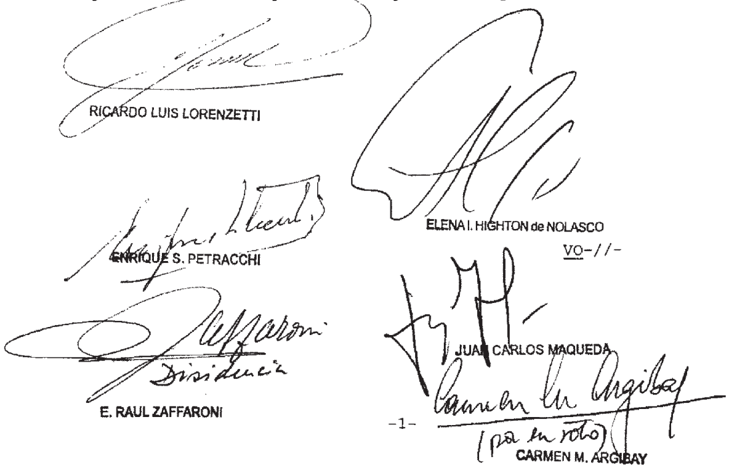

DE LA SEÑORA MINISTRA DOCTORA DOÑA CARMEN M . ARGIBAY

Considerando

Que el recurso extraordinario, cuya denegación motiva la presente queja, resulta inadmisible (artículo 280 del Código Procesal Civil Y Comercial de la Nación)

Por ello, se la desestima Intimase al recurrente que, dentro del quinto día, acompañe copia de la resolución que concede el beneficio de litigar sin gastos efectúe el depósi que dispone el artículo 286 del Código Procesal Civil Y Comercial de la Nación, la orden de esta Corte Y bajo apercibimiento ón saber Y archívese to

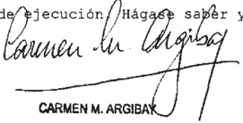

## DEL SEÑOR MINISTRO DOCTOR DON E. RAÚL ZAFFARONI

## Considerando:

Que Rafael Luis Álvarez Ordóñez fue condenado en fecha 23 de abril de 2008 la pena única de prisión de treinta Y tres años seis meses , Y se declaró reincidente En el mes de septiembre de 2008 , la defensa solicitó su libertad condicional basada en el tiempo de detención cumplido que superaria el plazo previsto por el artículo 13 del Código Penal, para acceder la libertad condicional\_

Que el juez cargo del Juzgado de Ejecución Pe nal n 1 , no concedió la libertad asistida al condenado , tam poco hizo lugar la declaración de inconstitucionalidad del artículo 14 del Código Penal, tal como le fuera solicitado por defensa Fundó su decisión en el entendiniento de que , en el caso particular, la pena impuesta al condenado sumado la de claración de reincidencia imposibilitaría su reintegro al mundo libre

3 % ) Que contra esa resolución, la Defensora de Ejecución interpuso recurso de casación que le fue concedido que Mantuvo adecuadanente Se agravia porque considera que el trado de grado ha transgredido el derecho ser juzgado por un juez independiente imparcial ya que en su resolución expuso "Que sin perjuicio de mi opinión personal coincidente con la co rrectanente argumentada por la defensa oficial, cuyos argumentos sintéticamente expuestos fs 339/342 comparto, no habiendo va riado la interpretación constitucional dada por la Corte Suprema de Justicia de la Nación a cuestión federal planteada es mi deber aplicar en el caso aquí planteado la jurisprudencia del máximo tribunal Por ello, entiende que el juzgador resolvió el tema en contra de su propio criterio Y aplicando el de su superior jerárquico, sin que mediara fallo plenario que 10 hiciera exigible. Cono efecto de esa decisión, el juzgador no dio tratamiento los planteos de defensa, sustentando su resolución en argumentos meramente formales Y conculcando el derecho de de magis-

fensa Y el de ser oído

Que la Sala III de Cámara Federal de Casación Penal resolvió por mayoría, no hacer lugar al recurso interpuesto por la defensa Y en consecuencia, mantener la denegatoria de la libertad asistida Rafael Luis Álvarez Ordóñez Para tomar esa decisión, el voto que lideró el acuerdo de la mayoría partió del análisis del articulo 50 del Código Penal, en su redacción según ley 23.057 , que define la modalidad de reincidencia adop tada por nuestro código Y citó en su abono, varios fallos dictados por esta Corte que avalan la aplicación de mayor reproche para aquellos que habiendo delinquido Y cumplido total parcialmente una pena privativa de libertad, demuestren desprecio por el castigo padecido

Entendió asimismo, que artículo 18 de nuestra Constitución Nacional, prohíbe la nueva aplicación de pena por el misno hecho, pero en forma alguna impide que el legislador tome en cuenta anterior condena ~entendida esta como un dato objetivo Y formalefectos de ajustar con mayor precisìón el trataniento penitenciario que considere adecuado para aquellos supuestos en 10s que el individuo incurriese en un nuevo delitc penal Esto implica una decisión de politica criminal que queda exenta del control de constitucionalidad judicial"

Que contra esa decisión, la defensa interpuso reextraordinario Se agravió por considerar que el fallo re currido resulta lesivo del del principio de culpabilídad, de la garantia ne bis in idem , del principio de igualdad , de pro porcionalidad, reserva legalidad, de la libertad anbulatoria del principio penal de acto Y del principio de prohibición de imposición de penas crueles , inhumanas Y degradantes , del dere cho de defensa Y ser oído por 105 jueces , principios ellos que revisten carácter constitucional Desarrolla 10s motivos por los que considera vulneradas las garantías enumeradas Y agrega: La reincidencia tanbién agravia en forma ostensible princi pios del derecho penal de acto, en tanto crea la categoría de

personas reincidentes, quienes impone un derecho penal má5 riguroso en virtud de otros hechos , ocurridos juzgados Y compurgados en el pasado'

Cono síntesis, aclara que le resulta dificultoso des vincular el pedido de inconstitucionalidad del artículo 14 del Código Penal de la de la reincidencia {artículo 50 del Código Penal) , ya que en el presente, la única consecuencia práctica gue genera 1a calificación de reincidente, es impedir el egreso anticipado de quienes se encuentran en esa condición

La Cámara de Casación declaró inadmisible el recurso extraordinario interpuesto, acompañando 1a opinión fiscal, por discrepante por el adoptado por esa Cámara -

La defensa del condenado interpuso ante esta Corte, queja por denegación del recurso extraordinario Y mantuvo los agravios-

6' ) Que corresponde hacer lugar 1a queja Y considerar procedente el recurso extraordinario interpuesto, toda vez que la sentencia que se cuestiona ene del tribunal superior de la causa, Ya que se impugna un pronuncianiento de la Cánara Federal de Casación Penal Y suscita cuestión federal suficiente, en tanto el conflicto que se plantea es entre una norma de derecho conún , artículo 14 del Código Penal Y norMas de la Cons titución Nacional (articulo 18) instrumentos internacionales incorporados ella (artículos 5 ? Y 29 de la Convención Ame ricana sobre Derechos Humanos Y artículo 10 del Pacto Internacional de Derechos Civiles Y Políticos) provi que

Que 1os planteos de inconstitucionalidad del instituto de la reincidencia 50 del Código Penal) Y del artículo 14 , de este últino en cuanto impide al reincidente ob tener la libertad condicional en forma absoluta, esto es , sin excepción alguna Y, por ende , cancelando todo espacio de Valoración potestad judicial son solo en parte inescindibles esto e5: (a) si se declara inconstitucional el instituto de la reincidencia en cuanto su consideración cono agravante de pe nas es consecuencia lógica de tal consideración la consiguiente

invalidez constitucional del artículo 14 del Código Penal ; pero (b) al margen de anterior cuestión, sea, aun considerando constitucional agravación por reincidencia, existen argumentos para cuestionar la compatibilidad del artículo 14 con la Constitución Nacional

Debido ello habremos de separar los planteamientos tratando prinero la cuestión de la reincidencia en cuanto agravante de penas Y pasando luego que al margen de esa cuestión son propios del artículo 14 del Código Penal 1os

8 % ) Que la reincidencia es un instituto que se ha mantenido en el tiempo, pesar de que parte de la doctrina des de antiguo le ha negado fundamento, Y a que se reconoce no acierta dar con argunentos satisfactorios mucho menos coincidentes Y ni siquiera compatibles\_ Esto últino se verifica me diante la enorne pluralidad de criterios con 1os que se la ha querido Y se la quiere

9 ' ) Que anterior parece dar la impresión de que nos hallamos ante una suerte de obstinación doctrinaria que en todas las épocas ha partido de la previa decisión de legitimarla para luego procurar legitimantes

Ninguna obstinación de esta naturaleza respecto de instituciones penales de data secular ha sido gratuita 1o larde la historia del derecho penal, sino que siempre ha respondido las dificultades políticas coyunturales Y la posibilidad de escándalo mediático

Tal ha sucedido con la abolición de la tortura, para 1o cual basta recordar que mientras Pietro Verri escribía su bro Osservazioni sulla tortura, que por cierto dejó inédito en su época , su padre Gabriele Verri, senador del patriciado nilanés, escribía un dictanen negándose extender la Lombardía austríaca la abolición de María Teresa de Austria aconsejada por Josef von Sonnenfels en Uber die Abschaffung der Tortur de 1775, 10 que demoró la abolición de esa aberración en la región hasta el código de José II Josefino, pese que habían transcurrido un siglo Y desde la Cautio criminalis de Friedrich Spee Y un siglo desde las Ordenanzas francesas de 1680-

parecido vive el mundo actual con la llamada pe na de muerte. Desde la pionera abolición portuguesa Y 1a toscana de Pietro Leopoldo hasta el abolicionismo ha cundido por el mundo civilizado Nuestro país la abolió de su legislación ordinaria en 1921 Y recientemente de legislación penal militar, con lo cual se inscribe entre los países signatarios de la Con vención Americana sobre Derechos Humanos que , conforme la cláusula de abolición progresiva, tiene constitucional internacionalnente prohibido restablecerla No obstante, por razones políticas internas electoralistas Y coyunturales una de las mayores Y pioneras democracias del mundo , como son 10s Estados Unidos, Y pese que en 1972 una digna Y adnirable Suprema Corte la declaró inconstitucional con el voto señero de su juez deca no , sigue dando el triste Y lamentable espectáculo de imponerla selectivamente Y con frecuentes errores judiciales Algo hoy,

10) Que reincidencia es un instituto de pareja antigüedad Y el desconcierto de a doctrina juridico-penal en todo el mundo demuestra la voluntad inquebrantable de legitimarla apelando argumentos incompatibles, veces con las bases mis mas del republicanismo

11) Que por varias vías se ha apelado discursivamente sostener que el reincidente lesiona dos bienes jurídicos uno inmediato que es el de la víctima Y otro político, que es la alarma que provoca Este fue el criterio en que se basaron 10s redactores del Codice Zanardelli Y que fue criticado duramente por autores de todos los tiempos, desde Carrara hasta Antolisei observando que el daño político es solo eventual porque por general los únicos que se enteran son policías y los magistrados los

Ante insostenible del doble daño pOr esta via, Vincenzo Manzini transformó en la lesión un interés general del estado en la conservación del orden jurídico. Esto significa que se considera la obediencia al estado como un bien jurídico lesionado en todo delito Y que resulta más lesionado por el reincidente; con 1o que se subestima penalmente el bien jurídico

del victimizado Tal posición equivale decir que en todo delito se lesiona un derecho de la persona (0 de la comunidad) pero que siempre hay un bien jurídico estatal, que no puede ser otro que un derecho del estado la obediencia

Teniendo en cuenta el tiempo político en que escribía Manzini Y su ideología, es explicable el argumento, pues se rresponde con el derecho penal antiliberal del fascismo, notoriamente diferente al del nazismo penalisno fascista no suprimió el principio de legalidad, sino que mantuvo pero como seguridad para el estado Y no para el ciudadano

Cuando en plena época de entre guerras se caracterizó la diferencia entre 10s dos derechos penales antiliberales más desarrollados fue Georg Dahm guien la sintetizó con la mayor claridad (Nationalsozialistisches und faschistisches Strafrecht, 1935)\_ afirmando que si bien la característica común era el antiliberalismo, la esencia diferencial provenía del modelo político: para el fascismo el estado creaba la nación, que vive con la máxima intensidad Y en forma directa en las instituciones tatales, 10 que la devenía sin más en una norma ética Y nacional Así como el estado creaba la nación, la creaba el derecho, no habiendo nación fuera del estado ni derecho fuera de las leyes No existía ninguna separación entre el orden legal Y el de comunidad, ni entre el ilícito material Y la lesión leformal En este sentido, advertía con inteligencia, que no faltaban antecedentes doctrinarios no menores por que tenía que Binding Y su escuela se hallan vivos en el derecho pe nal fascista. En consonancia con este principio la Proluzione al Re del Código de Rocco de 1930 decía: Cono organismo político Y jurídico, el Estado se concibe cono la población de un determinado territorio organizado política Y jurídicamente bajo un po der supremo en modo tal de adquirir la capacidad de querer Y ac tuar cono un todo unitario, para la obtención de sus fines co lectivos Y adquirir así una distinta Y autónoma personalidad, al tiempo social, política Y jurídica (Relazione al Re, en Gazzetta Ufficiale, 26 de octubre de 1930) Es bastante obvio que estas es ley ley gal

consideraciones son por completo ajenas Y repugnan nuestra Constitución Y legislación penal que en su consecuencia se sanciona por el Congreso de la Nación. El estado argentino no es orgánico ni menos aún corporativo; habitantes de a Nación Argentina no son empleados del estado ni están sometidos ningún derecho disciplinario, por lo cual en nuestro orden jurídico Y como nínimo desde 1853 el argumento es inaceptable \_

Aunque un tanto más elaborado, no dista mucho del an terior la explicación que brinda Armin Kaufmann cuando afirma que el delito del reincidente viola dos norma5 una que prohíbe la comisión del delito Y otra que prohíbe cometer cualquier delito con posterioridad

En principio, cabe observar que semejante construcción , con la deducción invención de una norma que queda flotando, por menos no respeta la regla de la sinetría constructiva Y más bien parece una abierta ofensa la estética jurídica que reclamaba Gustav Radbruch

Kaufmann dejaba una norma sin destino, que no se sabe bien jurídico exige que se lesione Y que, en último análisis, no puede ser sino un general Y vago interés disciplinante qué

Cabe observar que historicamente está demostrado que cuando el interés disciplínante (0 un supuesto derecho independiente del estado la obediencia, que alcanza su máximo grado con la supresión del bien jurídico Y la sanción de meros delitos de desobediencia en planteos autoritarios lleva directamente concebir la esencia del delito como pura violación de deber , por ejemplo, Friedrich Schaffstein, Das Verbrechen als Pflichtverletzung, 1935) se extiende todos los habitantes por lo que nos hallamos una manifestación de corporativismo organicismo estatal muy peligrosa, pues tiene un trasfondo de estatización de bienes jurídicos Y al mismo tiempo el some tiniento de todos habitantes un Poder disciplinario adni nistrativo elevado categoría penal Se torna borrosa la di ferencia entre el poder sancionador disciplinario destinado

servidores del estado Y el poder punitivo destinado todos los habitantes No cabe dejar de lado la observación de que administratización de todo el derecho penal importa la consagración del inquisitorio

12) Que la otra vertiente legitimante es la del peligrosismo positivista, al estilo de Enrico Ferri, producto del cruce de las agencias médicas con las policiales en 1os finales del siglo que dio por resultado la consagración de criterios discrininatorios Y abiertamente racistas que concluyeron en las mayores atrocidades de la humanidad, pues se basó en 1a cosificación del ser humano , incompatible con nuestra antropología jurídica constitucional\_ Iodo ello sin contar con que des emboca en un derecho penal de autor que confiesa sin tapujos Y que históricamente se puso de manifiesto con el único autor terriblemente coherente dentro de este pensamiento materialista grosero, que fue Krylenko, quien en su proyecto, directamente elininó la parte especial \_ A medio canino se quedó el propio rico Ferri Y sus secuaces al propugnar pena por peligrosidad sin delito

De cualquier manera, incluso dentro de esta vertiente, la reincidencia no encuentra una explicación satisfactoria, pues la peligrosidad sostenida por todos autores positivistas en su5 diversas variantes, desde el propio Enrico Ferri ta Franz von Liszt, es un supuesto juicio de probabilidad Y como tal un juicio fáctico, que debe realizarse en cada caso concreto pues es el pronóstico de probable conducta futura referido una persona concreta, de carne Y hueso, sea que cuando se pretende que reincidencia tiene por fundamento el juicio de peligrosi dad , queda sin explicación una cláusula que invariablemente, pa ra todos los delitos, en todos los casos Y para todas las personas , imponga una agravación de la pena

Para evitar esta contradicción, en el afán de legitimar Y de combinar 1o incompatible, se ha apelado un pseudocon cepto incomprensible, como el de peligrosidad presunta Hay pe -

ligrosidad no peligrosidad; si se la presume juris et de jure es porque, al menos en algunos (0 en muchos) casos se da por cierto que la cuando no la Es decir, que la reincidencia se funda en la mayor peligrosidad incluso cuando no mayor peligrosidad. El nivel de racionalidad del derecho impuesto por el principio republicano no puede aceptar una construcción semejante Por otra parte, no es posible olvidar que las presunciones juris et de jure obedecen razones prácticas Y en general son incompatibles con el derecho penal cuando operan ampliando límites de punibilidad hay hay hay . hay

13) Que no faltan los argumentos que deambulan por las distintas variables de la culpabilidad de autor, de personade carácter

La culpabilidad del carácter de la personalidad, sea, que afirma que cuanto más compatible propio de la per sonalidad del autor es el delito, mayor es la culpabilidad, porque en defínitiva se le reprocha que es Y no 1o que ha hecho (que pasa ser un signo sintoma revelador) no pasa de ser una normativización de la peligrosidad positivista, con el agravante de que la vuelve abstracta Y moralizante de forma que queda subordinada al criterio arbitrario del poder político judicial, encamninado la individualización de 10s enemigos

Es muy claro que en nuestro sistema se pena 1o que la persona ha hecho Y no 10 que la persona Los tipos criminológicos de autor no pueden constitucionalmente convertirse en tipos legales, lo ha hecho en otros tiempos el derecho penal autoritario, que abrió las puertas al de autor, que se revelaba con la mera expresión de voluntad (Willenstrafrecht) Y el desprecio la lesión resultado lesivo (Dahm, Der Tätertyp im Strafrecht, 1940 ; Dahm-Schaffstein, Methode und System des neuen Strafrechts, 1938) frecuente tanbién en otros autores que mani aban las tesis del neokantismo esos mismos años (Zimmel, por ejemplo) La idea de tipo de autor es de cuño antiliberal de vertiente nazista: el autor era un traidor comunidad del pueblo (Volksgemeinschaft) cuyo carácter revelaba su mera voluntad (Wíllen) Y ni siquiera ésta, sino su disposición intertipo pul por

na intencionalidad moral innere Gesinnung) traidora enemiga {Feind) Había un de autor doctrinario inventado autores pre-nazistas, pero para 1os cuales no era ladrón quien co metía un robo , sino quien respondía al tipo de autor ladrón. Para 1a Versión conforne al nazismo, cuya base no se hallaba en el estado sino en una conunidad viva natural definida por la raza integrada por naciniento Y no por elección, el delito era sienpre omisivo (se omitía cumplir con el deber impuesto por es te organismo racial) Y la reiteración de esa omisión revelaba la traición (Verrat) ese cuerpo Debido esto Y diferencia del autoritarismo fascista, el derecho penal nazista borraba el principio de legalidad, pues re incorporaba al derecho penal toda la ética social volviendo la premodernidad\_ tipo pOI

Solo un estado absoluto un pretendido organismo puede atribuirse la facultad de reprocharle un ciudadano su personalidad \_ La historia demuestra que doctrinarios propios de estos regímenes simpatizantes ~no nuy ocultosde ellos, son los que han propugnado senejante culpabilidad de autor

Una variable de esta culpabilidad de autor la inventó Edmund Me zger con su culpabilidad por la conducción de la vida, reprochándole al sujeto todo su curso vital, elección existencial misma, 1o que es inaceptable, por un lado porque el tado que pretende esto es un monstruo omnipotente, Y por otro porque todo anterior al delito es atípico lo que para Mezger no era obstáculo alguno, dado que elaboró su tesis en vigencia de un derecho que había derogado el principio de legalidad, habiendo participado personalmente en la elaboración del proyecto de derogación que se concretó en reforma nazista de 1933 su

El restablecimiento de este principio no fue obstácu10 para que el catedrático de München siguiera sosteniendo tal posición, que no es extraño, atendiendo que en 1944 Y por encargo de las había sido proyectista de una destinada enviar extraños la comunidad los campos de concentración ley

Otros autores antiguos aunque de cuño liberal, fuera de 10s planteos de la dogmática actual, parecieran dar argumentos de culpabilidad de autor en forma asistemática Así, Pacheco

sostenía que demostraba una nayor perversidad Y Carrara pensó en que permitía verificar una mayor insensibilidad la pena , que puede emparentarse con controspinta penale de Romagnosi con la psychologische Zwang de Feuerbach.

La mayor perversidad es , por cierto, un elemento tener en cuenta para la cuantificación de la pena conforme proporcionalidad, pero ésta siempre se halla en el acto Y nunca en un acto anterior ya penado , además de que no se ve razón la cual se distingue entre reincidencia Y simple reiteración Nadie dudaría de la mayor perversidad de un homicida de un violador serial, aunque no sea reincidente por

La perversidad es considerada un componente de los caracteres del penal bien un elenento de mayor culpabilidad, pero manifiesto siempre en la culpabilidad que corres ponde al concreto Y no procedente de una conducta típica anterior Y penada Por otro lado, Y aun admitiendo esta eventual posibilidad, no puede afirmarse que sea invariable Y autonática Es obvio que el autor de unas esiones no demuestra yor per versidad porque haya sido condenado anteriormente por libramiento de cheque sin provisión de fondos hoy tipo tipo ma

La apelación la mayor insensibilidad podía sostenerse en tiempos Carrara, pero pasaron muchísimos años Y el mismo argumento ha llevado consecuencias dramáticas nunca ima ginadas por el Maestro de Pisa. Cabe recordar que fue utilizado por Lombroso respecto de colonizados, los que comparaba con 10s crininales biológicamente inferiores, dándolo por verificado con el extraño argumento de que se tatuaban, que según el médico de Turír revelaba una hiposensibilidad epidérmica, que estaría generalizada. hoy

Es sabido que la hiposensibilidad fue la base del discurso colonialista que legitimó todos 10s genocidios conocidos en 1os años posteriores Carrara Presumir que quien fue condenado por un delito Y comete otro completamente diferente padece una hiposensibilidad al dolor, importa asimílarlo los

## DE JUSTICIA DE LA NACION 336

salvajes que en tiempos de Lombroso eran los colonizados

Por otra parte, solo ad denostrationen, aun admi tiendo cualquiera de las teorías de culpabilidad de autor, haciendo para ello un enorme esfuerzo para poner entre paréntes1s su incompatibilidad con a Constitución Nacional Y el derecho internacional, cierto es que tampoco estas teorías pueden legitimar la agravación invariable, en función de la reincidencia Esto se debe que todas las teorías de culpabilidad de autor, no son más que esfuerzos por inventar una culpabilidad que venga reemplazar la peligrosidad, puesta en crisis desde el ocaso de pretendida negación filosófica Y humanista llevada cabo por el brutal positivismo

En consecuencia, no razones para afirmar cualquier reincidencia legitima un mayor grado de reproche incluso dentro de las propias teorías de la culpabilidad de autor, especialmente si se trata de reincidencia ficta (como muchas veces sostiene la jurisprudencia en torcidas interpretaciones del derecho conún ) pero tampoco la real, cuando es reincidencia genérica, como en nuestra vigente hay que ley

Ninguno de 10s autores autoritarios que postulan culpabilidad de autor sus cercanias doctrinarias, podría afirmar que una personalidad más reprochable porque alguien fue condenado por injuriar otro Y luego comete unas lesiones cul posas Aunque nadie ha construido hasta el nomento, no sería extraño que también se postulase algún espectral pseudoconcepto jurídico inexplicable equivalente la peligrosidad pre sunta, como ser un mayor reproche presunto otro fantasma normativo análogo hay aquí

14) Que no faltan autoreg que consideran que la reincidencia importa un desprecio hacia el valor admonitorio de la condena precedente En opinión de éstos, entre 1os que se halla Maurach, admonición de una prinera condenación generaría una mayor más actual consciencia de la antijuridicidad del segundo hecho Y , por ende un mayor reproche de culpabilidad de este

hecho

En la generalidad de los casos , la consciencia del injusto del segundo hecho es por completo independiente de la del primer hecho, pudiendo incluso ser menor no existir. Quien después de ser condenado por un robo comete un delito cambiario\_ bien puede cometer el segundo hecho en un error invencible de prohibición Y , tanto, no tener ninguna consciencia de antijuridicidad. Solo sería un argunento válido para supuestos de reincidencia específica Y en delitos que requieren cierto grado de esfuerzo Y abstracción para comprensión del injusto, lo que está lejos de darse en cualquier caso de reincidencia gené rica Y menos en forma autonática por

Algo semejante puede afirmarse en cuanto que con el segundo hecho el agente estaría demostrando una voluntad decisión crininal más fuerte.

No es posible entender la decisión criminal algo abstracto, cono la decisión de violar el Código Penal de de linquir secas , pues nadie en el mundo real =Y en condiciones de salud mentaltona una decisión de esta naturaleza. La decisión criminal siempre es de algún hecho concreto en la vida re al siendo éste un dato óntico insoslayable Por ello, no hay ninguna decisión criminal más fuerte en quien estando condenado por injurias incurre en unas lesiones culposas, en el que una vez condenado por abigeato incurre en una calumnia, en el que sentenciado por estupro conete una traición 1a patria, salvo que el argumento oculte en l0s repliegues de la culpabilidad un requerimiento disciplinario de doble lesión, mencionado antes un derecho penal de autor que haga del condenado que su pena un ciudadano que padece una capitis diminutio respecto del resto la población. De todos modos estos serían argumentos inconfesables por corresponder alguna de las dos vías del derecho penal antiliberal de entreguerras de

15) Que bien puede legitimarse la reincidencia desde perspectiva de una tesis de prevención general positiva, sea , entendiendo que el reincidente afecta la confianza de la

generalidad en el sistema Aparte de que esto no sería más que una presunción juris et de jure que remoza viejos argumentos pues la generalidad casi nunca se entera Y solo 10 saben los jueces Y los policías, 10 cierto es que en este planteo siempre hay en el fondo un único bien jurídico que es la confianza en el sistema en interés del propio sistema, frente al cual res tantes bienes juridicos se opacan desaparecen directamente, de modo que legitimación de todo el poder punitivo llevada cabo con este discurso no es compatible con nuestra Constitución Y , por tanto, tampoco la de la agravación por reincidencia\_

En el caso particular de la reincidencia sería muy inmoral, porque sinceraría esfuerzos por legitimarla, dado que implícita expresamente acepta que no se basa en ningún efecto preventivo general negativo (disuasorio) ni preventivo especial, por 1o que cabe presumir que reconoce que no tiene, pero es útil simplemente porque la gente 10 cree Y provoca consenso, vale decir, que mediatiza un ser hunano faltando la verdad solo para provocar consenso en torno del sistema Y de su pretendido prestigio público \_ que

Es la confesión de que la utilidad de la pena finca en un del público al que el penalista debe alimentar. Si bien la ética Y el derecho se diferencian, no pOr ello se rechazan hasta el extreno de que el derecho penal pueda infringir elementales pautas éticas de respeto la dignidad humana Y base de la democracia de la República.

16) Que en síntesis, es dable observar que 1a reincidencia explica en los planteos jurídico-penales en la medida en que se apartan del derecho penal de acto, aunque ni siquiera en esas posiciones explicación resulta coherente cuando se trata de una agravación de pena impuesta pOr ley para cualquier caso Y más aún tratándose de reincidencia genérica Por el trario, las tentativas de explicarla dentro del derecho penal de acto son todas insatisfactor:as se

17) Que la infructuosidad de todos 1os discursos doctrinarios por legitimar la agravación invariable Y automática de la pena por reincidencia, equivale la violación del principio

que prohíbe la doble punición, pues el plus de pena cualquier agravación de ésta que se imponga al segundo delito 1o será en razón del primero, esto es , de delito que se ha juzgado Y penado Desde 1836, en que Carnot en s1 Commetaire sur le Code Pénal preguntaba si esto no será violar abiertanente su res pecto el non bis in iden, que es una de las bases fundamentales toda legislación en matería criminal (página 196) hasta el presente, Mittermaier, Morelly, Pagano, Tissot, Carmignani Y muchos otros no han tenido más remedio que proporcionar una puesta afirmativa aunque, en algunos, titubeante El Código Cri minal Toscano de 1786 , con el que se abre la moderna codifica ción penal, en su sabio articulo 57 establecía que agotada la pena no podrán ser considerados infames para cua lquier efecto ni nadie podrá jamás reprocharles su pasado delito, que deberá con siderarse plenamente purgado Y expiado con la pena que habrán sufrido (Carlo Paterniti, Note al Codice Criminale Toscano del 1786, Padova, 1985)

18 ) Que en virtud 10 señalado, no puede sostenerse el argumento del precedente de Fallos 311:1451, en el que se expresó que ~el distinto tratamiento dado por la ley personas que en los términos del artículo 50 del Código penal , coneten un nuevo delito, respecto de aquellas que no exteriorizan esa persistencia delictiva se justifica\_ por el alu dido desprecio hacia la pena que les ha sido impuesta \_ Y si, co mo se vio, existe un fundamento razonable para hacer tal distinción, el legislador se encuentra facultado para establecer, dentro del amplio nargen que le ofrece la política crininal, las consecuencias jurídicas que estime conveniente en cada caso" de

Es claro que este precedente importa una invocación de la insensibilidad lonbrosiana bien el reclamo de una obe diencía un estado disciplinante, cuyo interés se considera ofendido en su autoridad por la infracci con que se incurre en una estatización de bienes jurídicos\_ 6n,

Tampoco puede sostenerse el argumento basado en cues -

tiones de prevención general negativa que afirma que "el instituto de la reincidencia se sustenta en el desprecio que manifiesta por la pena quien, pese à haberla sufrido antes recae en el delito. Lo que interesa en ese aspecto es que el autor haya experinentado el encierro que importa 1a condena no obstante cual reincide demostrando su insensibilidad ante 1a amena za de un nuevo reproche de esa naturaleza , cuyo alcance ya conoce (Fallos: 308 :1938) Ademá s de chocar frontalmente con el principio ne bis in iden en su aspecto de prohibición de la doble pu nición, es muy claro que este precedente reclama es obe diencia al estado Y nada más Es el estado que está ofendido en su autoridad, porque ha penado Y el sujeto ha incurrido en una nueva indisciplinaNo importa ni requiere la reincidencia sea más menos específica; no importa si primera pena fue por lesiones Y la segunda por cheque sin fordos, que en este fundamento se reclana es que no vuelva desobedecer estado Mucho más grave sería mezclar esto con la protección de fensa de la sociedad, porque confundiría ésta con el estado Y nos habríamos precipitado en un campo de concepción política muy lejano al que establece nuestra Constitución desde siempre que que

19) Que el principal efecto de la declaración de reincidencia, la prohibición de libertad condicional del artículo 14 del Código Penal Es insostenible la tesis de que esa disposición no implica una penalidad más grave, porque solo se refiere una forma de ejecución, argumento artificioso Y en buena medida ficcional tanto como distorsionante de toda referencia la realidad de 10s hechos Y la naturaleza misma de las cosas

Así como Beethoven ejecutado pOr un virtuoso no es 1o mismo que ejecutado por un principiante, dos penas se ejecutan de diferente modo son dos penas diferentes

Desde misnos orígenes del pensamiento penal re tributivo en el Iluminismo, tanto por la vía del utilitarismo de

Bentham cono del idealismo de Kant, la retribución es devolución de la misma cantidad de dolor, lo que nadie parece haber negado hasta la actualidad. Al punto habían llevado 1os pioneros semejante exigencia respecto de 1a producción real de dolor que Bentham inventó su famosa máquina de azotar Y Kant exigía tomar en cuenta la sensibilidad de la víctima Y del victimario, sin contar con que fue el fundamento legitimante de la invención de la guillotina\_

20) Que obvio que una condena pena privativa de libertad importa el sometimiento al dolor de la privación de la libertad ambulatoria de 1a persona, Y que ese dolor es mayor cuanto nás estricta Y extensa es esa privación loconotiva Bentham , Kant Y todos 1os padres fundadores del liberalismo pe nal, por diferentes que hayan sido su5 caminos argumentales, no hubiesen dudado en lo más mínimo acerca de que una pena que habilita posibilidad de ser ejecutada parcialmente en libertad controlada es menos grave que la que exige su cumpliniento total con efectiva privación de libertad Tanto no lo dudaban que algunos \_ como Feuerbach establecían agravaciones por aislamiento pan agua en los aniversarios del hecho Tampoco hubiesen dudado de que las salidas transitorias importan una pe na menos grave, una mitigación respecto de 1a que no admite el régimen de salidas transitorias

21) Que solo una ciencia jurídica que se aparte de la naturaleza de las cosas puede negar una verdad tan evidente que sería ratificada por cualquier vecino habitante de la República usando solo buen sentido Lanentablemente, una interpretación jurídica que incurra en senejante desconociniento del mundo real nunca tendrá la posibilidad de ser eficaz, pues no se regirá atendiendo los datos de las cosas del mundo , sino cons trucciones aparentemente lógicas pero que, en el fondo , no son más que recursos retóricos Y creaciones de imaginación\_ quiebra de las estructuras que vinculan al derecho con el ser de 10s entes solo consigue enervar su eficacia incluso neutralizar el propio carácter jurídico de éste cuando la quiebra es de su Ia

## DE JUSTICIA DE LA NACION 336

tal naturaleza que niega la condición de ente moralmente respon sable al ser humano

22) Que tal como se señaló antes en el considerando al margen de la inconstitucionalidad de la reincidencia como agravante, el artículo 14 del Código Penal es también objetable constitucionalmente por razones independientes principio, la disposición del artículo 14 del Código Penal que veda la libertad condicional cualquier reincidente por cualquier delito en cualquier circunstancia, también es aplicable la prisión perpetua impuesta reincidentes

La aplicación literal de este precepto importa convertir la prisión perpetua de nuestro Código Penal en una pena inexorablenente perpetua en el sentido de que solo se extinguiría con la vida del penado

Cabe frente esto, entender que no es posible que sea el resultado de una sana lógica jurídica afirmar que el artículo 14 solo se refiere una forma de ejecución, cuando en ma teria de pena de prisión perpetua importa la conversión de una pena eventualmente temporal en una pena que se ejecuta agota únicamente, con la muerte física del penado

23) Que del anterior considerando resulta probado que, al margen de inconstitucionalidad de la agravación de pena por reincidencia, el artículo 14 del Códi Penal se hace insostenible en función de otros argumentos, que son válidos con independencia de esa inconstitucionalidad go

24 ) Que los artículos 5 .6 Y 29 de la Convención Ame ricana sobre Derechos Humanos Y el articulo del Pacto Internacional de Derechos Cíviles Y Políticos, incorporados la Constitución Nacional en función del inciso 22 del artículo 75 , disponen que la pena privativa de libertad debe tener por objeto la reincorporación social del condenado

Una pena de prisión que irremisiblemente se ago-

te con muerte del condenado , no cumple ni nunca puede cumplir con este objetivo, pues la naturaleza de las cosas impide sostener que 1a muerte importe una reincorporación la sociedad, por mucho que se quiera especular en otro sentido

Una pena de esa naturaleza es violatoria de las men cionadas disposiciones constitucionales Y, como resultado de la simultánea violación del derecho internacional, es susceptible de llevar la República ante 1os estrados internacionales, con el consiguiente perjuicio que el desprestigio de una condena te esos tribunales acarrea para todos sus habitantes an -

25) Que esta Corte ha considerado en reiteradas oportunidades que debe acatar la Y la jurisprudencia internacional Para evitar contribuir situaciones de esta naturaleza, como parte de la responsabilidad que le incunbe como poder del estado ley

Los jueces argentinos no pueden dictar sentencias en contra de expresas disposiciones del derecho constitucional internacional vigente Solo es admisible semejante decisión en el marco de la abandonada tesis del doble derecho, rechazada Por esta Corte incluso antes de reforma constitucional de 1994 Cabe recordar que la principal objeción la tesis del doble derecho es justamente, que impone 1os jueces el invariable dictado de sentencias antijurídicas: si juzgan conforme al derecho interno, violan el derecho internacional Y, si hacen conforme al derecho internacional, violan el derecho interno.

26) Que no obstante, ni siquiera se plantea la situación de respetar el derecho internacional el interno pues desde la sanción del inciso 22 del artículo 75 de la Constitución Nacional, 1os referidos dispositivos adguirieron carácter constitucional Y forman parte expresa ineludible de nues tro derecho interno con la máxima jerarquía normativa Los jueces argentinos no pueden ser obligados por ninguna ley violar el derecho positivo los artículos constitucionales citados hoy

son derecho positivo de máxima jerarquía, con plena Y pacífica vigencia interna

27) Que el artículo 14 del Código Penal es violatorio de la Constitución, en medida en que se 10 interprete como un texto que obliga al cumplimiento de penas que solo se agotan con la muerte

El juez no usurpa ninguna función legislativa cuando el legislador usurpa por acción por omisión función del constituyente Es deber de 1os jueces de la Nación corregir al legislador cuando incurre en semejante usurpación.

bien esta Corte ha procedido siempre con la debida prudencia para no incurrir en decisiones que puedan obstaculizar entenderse como lesivas al principio republicano de separación de poderes , no menos cierto que ha optado por tomar las decisiones adecuadas , cuando las reiteradas onisiones de 1os otros poderes del estado privaban de derechos los ciudadanos

No escapa nuestra atención la circunstancia de que al momento de la sanción del Código Penal de 1921 , que fue harto sabio Y prudente en muchísimos aspectos por cierto mucho más que legisladores posterioresel codificador consideraba gue , conforme la costunbre constitucional, la práctica del indulto Y la conmutación de penas era corriente Y casi rutinaria En esos años esa práctica 1a impulsaban las nismas autoridades carcelarias Cabe pensar que nunca se imaginó el codificador de 1921 que preveía casos de penas que solo se concluían con la muerte Y , si hizo, fue únicamente en miras supuestos extremos Y excepcionales. Tampoco debenos olvidar que acababa de abo lir la pena de muerte la legislación penal común , incluso por voluntad de la Cámara de Diputados Y contra a del Senado

Que en el caso del artículo 14 del Código Penal, el Congreso de 1a Nación ha tenido tiempo suficiente para remediar la onisión legislativa de prever especialmente el caso ante la caída en desuso de la práctica rutinaria indulto Y la

conmutación como costumbre constitucional Cabe observar además han transcurrido dieciséis años desde la incorporade los textos internacionales la Constitución Nacional un cuarto de siglo desde la ratificación de los tratados respec tivos por la República Y mucho nás desde el abandono de la cos tumbre constitucional del indulto Y la conmutación rutinaria Estos lapsos temporales son que suficientes para hacer us0 de la solución legislativa, especialnente cuando el Congreso de la Nación en múltiples oportunidades ha modificado el Código Pe nal Tampoco hay inminencia, ni se conocen proyectos presentados en este sentido en el ánbito legislativo En tales condiciones no importa ninguna imprudencia ni apresuramiento de esta Corte declaración de inconstitucionalidad del artículo 14 del Códi go Penal para evitar que la causa se lleve 1os estrados internacionales Y haga incurrir en responsabilidad Nación \_ que

29) Que es un principio rector del derecho constitucional Y del internacional de 10s Derechos Humanos que nadie puede ser privado de un derecho sine die por omisión regulatoria del legislador, 10 que cobra mucha mayor importancia cuando el derecho en juego es , nada menos , que la libertad de un ciudadano hasta su muerte

30) Que adenás de todo 10 dicho, la decisión que niegue cualquier beneficio en razón de la aplicación literal del artículo 14 del Código Penal incurre en una arbitrariedad manifiesta. hoy

En efecto: esta aplicación literal Y fuera del contexto del Código Penal ignora el significado de la reforna su frida por el artículo 52 del mismo texto conforne la 23 .057 ley

Hasta la ganción de esta reforma, 1a pena del artícu52 se consideraba independiente del instituto de la reincidencia por la doctrina Y la jurisprudencia Desde la reforma quedó establecido claramente en la ley que la pena del articulo 52   corresponde supuestos de multireincidencia que la espeley

cifica con precisión. Esto impone que el articulo 14 del oa1g0 Penal deba integrarse con el 52 Y consiguientemente con el 53 pues ahora está claro que todos ellos regulan el mismo instituto Por ende si el Código Penal autoriza la libertad condicional en casos de multireincidencia de reincidencia calificada, fortiori no puede entenderse que la impide en 10s casos de re incidencia simple.

Mantener la interpretación contraria Y anterior la reforma llevaría una conclusión todas luces irracional, pues en el presente caso al condenado para nada le valdría tener bue nas calificaciones Y buen concepto general , tener familia, Y encontrarse en condiciones de acceder la libertad solicitada por el contrario, en lugar sería acreedor la libertad condi cional si durante los argos años de prisión hubiese cometido varios delitos hasta encuadrarse en a reincidencia múltiple del artículo 52 . Juiciosamente, es imposible sostener la racionalidad de la interpretación aislada del articulo 14 fuera de todo el contexto de la regulación legal del instituto de la reinci dencia, consagrando la anterior solución al caso

Adená 5 del resultado paradojal de que alguien se le niegue el beneficio por ser reincidente sinple Y no múltiple, cabe observar que nunca se puede interpretar una norma fuera del contexto del cuerpo del que forma parte, pues interpretación sistemática es de la esencia del saber jurídico desde 10s albores mismos de la ciencia jurídica en Italia medieval

Por reducción al absurdo, resulta inimaginable que defensor aconsejase al simple reincidente condenado prisión perpetua que cometa una cadena de delitos menores en el curso de sus largos de prisión hasta encuadrar en la nultireincidencia calificada del artículo 52 , con el objeto de mejorar su situación Y acceder la libertad condicional un

31) Que cabe agregar que no puede enervarse el anterior argunento en razón de que esta Corte considere inconstitucional el artículo 52 del código Penal en función de su lesión

los principios de proporcionalidad y de culpabilidad, pues nunca puede invocarse una inconstitucionalidad como base para negar el reconociniento de otro derecho , sin contar con que obviamente, las sentencias de esta Corte no hacen caer la vigencia de 1a de modo que artículos 52 53 siguen siendo parte del texto del Código Penal ley,

32) Que el derecho de una República no es un conjunto de decisiones políticas contradictorias sin fundamento racional Y cuya aplicación concreta resulte absurda arbitraria. Se mejante concepción corresponde un criterio exegético bonapartista, incompatible con la esencia de un estado constitucional de derecho

Todo ello sin contar con que ni siquiera en el caso se trata de una analogía in pues solo se trataría de aplicarle un sinple reincidente las disposiciones previstas para un multireincidente Pero incluso si fuese analogía in bo nan parten, salvo en la antes nencionada concepción antiliberal fascista del estado ésta no lesiona el principio de legalidad penal, en la medida en que tenga por objeto salvar la racionalidad Y no contradicción del orden jurídico, pues es una imposición del principio republicano que prohibe los jueces incurrir en sentencias que desprestigien por su irracionalidad-

33) Que además de la inconstitucionalidad derivada de la misma característica de reincidencia como agravante, incluso de la derivada de que su aplicación literal, lleva imponer penas de prisión hasta muerte, en contra de las disposiciones expresas de 1a Constitución Nacional, el artículo 14 del Código Penal resulta inconstitucional por obligar los jueces pronunciar sentencias arbitrarias, esto es , carentes de funda mento en los casos concretos Y su interpretación literal aislada de las restantes normas que regulan la reincidencia en el Código Penal es arbitraria porque desconoce el texto nismo de vigente conforme la reforma de la 23.057 ley ley

En un estado constitucional de derecho no es posible

fundar la racionalidad de una sentencia en mera letra de Y menos aún en su letra aislada del contexto de cuerpo gislativo orgáníco del que forma parte como código ignorar una reforna sustancial conO mencionada ley le-

Una sentencia solo se funde en la exégesis de una norma aislada Y agote s1 contenido en es0, no pasa de ser propia de un estado legal de derecho , donde 10s jueces no pueden hacer otra cosa que cumplir estrictamente 1a voluntad del legislador real Y abstenerse de cualquier interpretación, por irracional Y carente de cualquier explicación que resulte la sentencia. Tal era a esencia del estado bonapartista, Y esa sumisión total al legislador eventual corresponde el modelo de casación, creada como tribunal dependiente del parlamento Y luego sometido al perador para romper las sentencias insumisas sistema diametralmente opuesto al escogido por nuestra Constitución Nacional desde 1853\_ que

34 ) Que incluso considerando constitucional la agravación por reincidencia, en función de cualquiera de las tesis que intentan legitimarla en doctrina Y en la jurisprudencia 1o cierto es que se ha veríficado que cualquiera de ellas solo alcanza para legitimar algunos casos particulares pero en modo alguno toda Y cualquier agravación automática inexorable como dispuesta por el artículo 14 del Código Penal \_

35) Que tal como se ha señalado antes , la peligrosidad solo se verifica en casos de reincidencia específica relativamente específica Y no puede presumirse juris et de jure en cualquier caso de simple reincidencia genérica Lo mismo sucede con la culpabilidad de autor, pues el mayor reproche de persona lidad no puede sostenerse cuando las conductas por su naturaleza, no exhiben ninguna personalidad reprochable . La mayor culpabilidad de acto derivada de una consciencia del injusto más actual, solo es dable en reincidencia especifica Y en delitos que exigen algún nivel de elaboración. La decisión más firme al de lito no es adnisible en casos de reincidencia genérica Y con de -

litos de muy diferente disvalor social Y jurídico\_ La mayor versidad no siempre depende de que haya condenaciones anteriores ni tampoco éstas la revelan en gran nayoría de los cas05 per-

36) Que , aun admitiendo ad denostrationen cualquiera de las tesis legitimantes de agravación por reincidencia, la aplicación inflexible de la norma del artículo 14 , al no admitir prueba en contrario, da por cierto 1os extremos legitimantes sin acreditar que éstos existen en el caso, que impone 10s jueces incurrir en abiertas arbitrariedades, pues se trata de cues tiones de hecho que eventualmente se presentan en los casos concretos Todo ello sin contar con que el artículo 14 tomado aisladamente, depara un tratamiento mucho más grave al reinci dente que al multireincidente, que es incontrastable la letra de la misma ley

En síntesis: el artículo 14 del Código Penal tanbién es inconstitucional (a) porque presume juris et de jure que se hallan presentes en el caso todas las condiciones con las que se ha intentado legitimar la agravación por reincidencia, sin permitirle al magisterio penal evaluación de ellas en 105 casos concretos , sería presupuesto elemental de la imposición de la agravante Y (b) porque no puede explicarse por razón contempla la libertad condicional para el multireincidente calificado Y no para el reincidente imple que qué

37) Que en abono de todo lo anteriormente señalado Y, teniendo en cuenta que una larga tradición tivista tiñó du rante la mayor parte del siglo pasado nuestro derecho penal Y se mantuvo encubierta bajo manto neokantiano en todo 10 referente la pena aun cuando se había abandonado el marco teórico del po sitivismo criminológico, no puede soslayarse que esta Corte ha tenido oportunidad de expedirse al tratar la inconstitucionalidad de la reclusión por tiempo por multireinci dencia del art 52 del Código Penal, acerca de 1a peligrosidad posi

como fundamento de la agravación de las consecuencias jurídicas del delito.

Así ha expresado que resulta bastante claro que la Constitución, principalmente en razón del principio de reserva de 1a garantía de autonomía moral de la persona del artículo 19\_ no permite que se imponga una pena ningún habitante en razón de 10 que la persona es , sino únicamente en razón de 10 que la persona haya hecho ; no debe penarse la personalidad sino la con ducta lesiva La Constitución de un estado constitucional de de recho no puede aditir que ese estado se arrogue la potestad s0 brehumana de juzgar existencia de una persona su proyecto de vida Y su realización. Sólo un estado totalitario, que pretenda asumir una función juzgadora en aberrantes térninos idolátricos que aspire homogeneizar sus habitantes puede postular que sus tribunales no juzguen delitos sino que en una suerte de anticipación de Juicio Final, juzguen existencias humanas Esto no puede hacer un Estado que parte del principio republicano de gobierno que se proclama un Estado constitucional de dere cho sea que quien pretenda hacerlo en ese contexto intente ra cionalizarlo por la vía del reproche de culpabilidad de la neutralización de la peligrosidad 0 , si se prefiere, por la de la pena por la de la medida de seguridadla peligrosidad, tal como se la menciona corrientemente en el derecho penal, ni siquiera tiene esta base científica, sea que es un juicio sub jetivo de valor de carácter arbitrario. En todo caso , la preten dida presunción de peligrosidad confirma que en el fondo se tra ta de una declaración de enemistad que excluye la persona de su condición de tal Y de las garantías consiguientes\_ la peligrosidad, referida una persona es un concepto basado en un cálculo de probabilidades acerca del futuro comportamiento de ésta \_ Si este cálculo de probabilidad estuviese correctamente hecho , se basaria en datos estadísticos sea , en ley de gran des núneros La previsión, con ligeros errores , llevada cabo con método científico, resultaría verdadera: de un total de mil personas por ejemplo, se observaría que, dadas ciertas circuns

tancias, un porcentaje, como puede ser mitad, se comportarían de determinada manera , 1o que se verificaría empíricamente. Pero este cálculo, el único científicamente válido, nunca podría establecer cuáles serían las quinientas que se comporta rían de ese modo Y cuáles 1as quinientas que harían de otro\_ Las nedidas penales se llamen penas como quiera bautizarlas el legislador, la doctrina la jurisprudencia, siempre se imponen una persona Y , por ende , en el caso individual, nunca se podria saber si con la reclusión se evita no se evita un futu ro delito que no sól0 no se habría intentado, sino que ni siquiera se habría preparado pensado Y que tal vez nunca se habría conetido. No es posible imponer una pena de diez años de duración en razón de un delito que no existe Y que probablemente jamás existirá. Potencialmente, todos habitantes tienen cierto grado de peligrosidad, porque respecto de ninguno puede descartarse la posibilidad de que en el futuro cometa un delito Y ello es también mensurable en investigaciones sociológicas de campo . Llevando el razonamiento al extremo es obvio que en todos los delicta propria, los portadores de calidad típica son los únicos que tienen la probabilidad de conisión del delito Pero nadie puede sostener serianente que esta probabilidad autorice un estado de derecho imponer penas privar de la libertad con el nonen juris que el legislador, doctrinarios 10s jueces prefieran. Y ello no obedece que la probabilidad de con isión de futuros delitos de alguien que no haya conetido àe litos anteriores en ciertos casos , no sea mayor que la de quien conetido" (Fallos 329:3680) que

38 ) Que no obstante, debe advertirse que todo anteriormente dicho respecto de la peligrosidad sería válido so10 en el supuesto de que valoración de 1a probabilidad se asentase en investigaciones de campo serias Y científicas que , como es sabido, no existen.

Por regla general, cuando en la doctrina Y en la jurisprudencia se maneja el concepto de peligrosidad se 1o hace sin esa base, sea, como mero juicio subjetivo de valor del

juez del doctrinario, con cual resulta un concepto vacío de contenido verificable, sea, de seriedad científica, con cual resulta directamente un criterio arbitrario inverificable Y que bien puede estar teñido de serios prejuicios inconscientes

En sintesis: la peligrosidad, tomada en serio como pronóstico de conducta, siempre es injusta irracional en el caso concreto, precisanente su naturaleza de probabilidad, pero cuando la peligrosidad ni siquiera tiene por base una investigación empírica, carece de cualquier contenido válido Y sa ser un juicio arbitrario de valor, que es como por regla general se 10 maneja en el derecho penal pa -

Que la prudencia constitucional argentina es altamente significativa, pues de abrirse el camino la peligrosidad como juicio subjetivo de valor, sería válida advertencia de Binding, en el sentido de que de aceptarse la peligrosidad como fundamento de a pena impuesta con el nombre que sea, sería necesaria otra Revolución Francesa: Puesto que se trata de una teoría con semejante desprecio de la personalidad humana con semejante inclinación victimar en el altar del miedo miles de humanos de carne Y hueso , sin miranientos sobre las pruebas má s defectuosas, una teoria de tamaña injusticia y tan ilinitada arbitrariedad policial, prescindiendo del presente no ha encontrado secuaces , salvo en los tiempos de doninio del terror De tener éxito esta teoría, desencadenaría un tempestuoso movimien to con el fin de lograr un nuevo reconocimiento de 10s derechos fundamentales de la personalidad (Karl Binding, Die Normen und ihre Übertretung, Tono II, 1, Leipzig, 1914, Pág . 464)

Para obviar 1a falta de fundanento científico verificable, se ha inventado una pretendida peligrosidad presunta. Se dice que el legislador presume la peligrosidad, que es tan aberrante como decir que se presune la fiebre de un enferno pues la peligrosidad es un concepto que tiene una base incuestionablemente empírica. si se prescinde de esa base empírica verificable en investigaciones de campo de grandes núneros

éstas se reemplazan por presunciones establecidas en la queda claro que se invoca la peligrosidad cuando ésta no existe sea, que tiene poca importancia que ésta exista no exista, pues una presunción significa que se tiene por cierto que el caso puede ser falso sin que importe que sea Esto significa que se impone una vación de libertad prolongada título penal, como pena con el nombre que quiera dársela, en razón de una peligrosidad que no importa si existe\_ ley, pri

Esto indica que no se trata de un verdadero juicio de peligrosidad, sino de la declaración de que la persona es inde seable directamente declarada fuera del derecho , eneníga Y , por tanto, privada de la dignidad de la pena , privada de todos 1os derechos que le asisten l0s habitantes Y que les garantiza la Constitución

39) Que cabe destacar finalmente que la Corte Interamericana de Derechos Humanos siguiendo una línea argumental similar la aquí expuesta, consideró que la invocación la pe ligrosidad constituye claramente una expresión del ejercicio del ius puniendi estatal sobre la base de las características persona del agente Y no del hecho cometido es decir, sustituye el Derecho Penal de acto de hecho, propio del sistema pe nal de una sociedad democrática por el Derecho Penal de autor, que abre a puerta al autoritarismo precisamente en una materia en la se hallan en juego los bienes jurídicos de mayor jerarquía En consecuencia, la introducción en el texto penal de la peligrosidad del agente como terio para la calificación típica de los hechos Y la aplicación de ciertas sanciones es incompatible con el principio de legalidad críminal por ende contrario la Convención" (CIDH, Serie N 126 , caso Ramírez contra Guatemala, sentencia del 20 de junio de 2005} les que cri

40 ) Que en razón de expuesto, cabe concluir, que cualquier agravamiento de pena de sus modalidades de ejecución en función de la declaración de reincidencia del artículo 50 como así tanbién la imposibilidad de obtener la libertad condi

cional prevista en el artículo 14 , deben ser consideradas inconstitucionales pues demuestran un trato diferencial de personas que no se vincula ni con el injusto que se pena , ni con el grado de culpabilidad por el mismo, Y en consecuencia toman en consideración características propias de la persona que exceden el hecho Y se enmarcan dentro del derecho penal de autor\_

Independientemente de esto, la aplicación del artículo 14 en forma aislada Y fuera del contexto total de las normas referidas la reincidencia, sea, desligada de la regulación de los artículos 52 Y 53 del Código Penal, resulta arbitraria por desconocer el contenido de una reforma legal después de más de un cuarto de siglo de vigencia Y, en consecuencia, esta Corte habría declarado la inconstitucionalidad de una norma más benigna que la impugnada de inconstitucionalidad en la presente causa

Por ello, se hace lugar la queja, se declara procedente el recurso extraordinario Y se revoca la sentencia apelada Hágase saber Y vuelvan los autos al cribunal de origen fin de que se dicte un nuevo pronunciamiento\_conforme resuelto en el presente

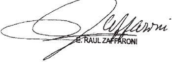

Recurso de hecho interpuesto pOr Rafael Luis Álvarez Ordóñez asistido por la

Tribunal de origen: sala III, Cémara Federal de Caaación Panal

Tribunales intervinieron Juzgado Nacional de Ejecución Pønal que

## MACIEL, MARCELO FABIAN

S/ RECURSO DE INCONSTITUCIONALIDAD

ROBO CON ARMAS

La circunstancia agravante prevista en el art. 189 bis, 8° párrafo, primera opción del Código Penal, que sanciona más severamente a quien portare armas de modo ilegítimo cuando la persona 'registrare antecedentes penales por delitos dolosos contra  las  personas  o  con  el  uso  de  armas'  no  se  funda  en  un  dato  antojadizo e inconexo o en una característica inherente de la personalidad sino que, por el contrario, reposa sobre un extremo fáctico que está directamente vinculado con el comportamiento ilícito de portar un arma sin autorización, por lo que resulta constitucionalmente admisible establecer una diferencia valorativa entre el comportamiento de quien porta ilegítimamente un arma sin registrar antecedentes condenatorios de aquel que, además de incurrir en el tipo básico, registra condenas por haber cometido delitos dolosos con el uso de armas o contra la vida o integridad física de los demás (Voto de la Dra. Carmen M. Argibay).

- -  La  mayoría  consideró  que  el  recurso  extraordinario  era  inadmisible  (art.  280 CPCCN)-.
- - El juez Zaffaroni remitió a su disidencia en la causa 'Taboada Ortiz', de la misma fecha-.

## diCtameN de la proCuraCióN GeNeral

Suprema Corte:

La Sala 1/ dc Ia Cámara Nacional de Casación Pena) interpueslo contra la decisión que condcnó M F M de nueve ahos de prisión como aulor dc los dclilos de robo agravado portacion ilegal de arma de fuego de uso civil agravada. en real , impuso la pena unica de catorce años y seis mcscs dc Prisiòn comprensiva dc varias condedas

Contra Pronunciamiento la dcfcpsa oficial interpuso

En escritu de fojas 348/378 cl lacba dc arbitrario cl fallo en quc respecta al rechazo del planteo de inconstitucionalidad del articulo [89 bis del Codigo Penal la penalidad de quien porte ilegalmcntc un armna de fuego cuando registre armasEn conclusiòn dc que esa era compølible con el principio de culpabilided apoyó

pucs. su ctitcrio, al establecer una 'gravación con base en la personalidad, configura un claro supucslo del denominndo "dcrccho penal de autor

Considera fundada cn de condcnas anleriores contravicene el principio ne ya que de ese modo Sc vuelven hechos Por l0s que ya fue penado

En cuanto escala penal que el para el Iipo legal cuestionado diez de  prisión la defcnsa seiale que infringe el principio de proporcionalidad; toda vez que se reprocha mús severamentc Ja Puesia en peligro de la scguridad pública que oifes afcctacioncs concretas vide como Jas que resultan dc los dcliros de aborio Icsioncs gravisimas homicidio y Icsiones cn riña cxtraordinario carccc, mi mndo de ver. dc la fundamcntacion cxigida por el atticulo dc 48, en tanto repitc plantcos ya rechazados en las instancias antcrores sin rcbatir los argumentos

Asi lø pienso, permilen infcrir Ian sólo el desacuerdo dcl rccurrcnte el criterio de] Fallo. según cl cual primcr supucsto quc contcmpla cl parralo inciso 2 189 bis del (ódigo Pcnal no en razán dc la pcrsonalidad por Ia sino función dc unu caracleristica especial dcl cl grado del peligro (abstracta) dc conducta incriminada Tal canclusion ha sido apoyada cn Ia considcracian dc quc "rcsulla innegable la polcncialidad lesiva para la scguridad comun deriva cabr suponel . dc que  quicn ha dado va nucstfas de cnconirarse plenamenle dispucsto Olra pcrsona ulilizar un arma cn forma criminosa tansitc la via Publica Ilevando consigo un arma cn condicioncs dc usO, frcnic igual conducta realizada por quien nunca ha Ienido cuestionamiento dc ninguna naluraleza (rcnte (fs quc

Tambien   explica c Iribuna) apclado que agravanic guarda cohcrcncia con l0s párrafos quinto Y scxlo, Cn cuanto establecen una atenuación para quicn porte un arma sin aulorización legal "cuando dicha conducla sca rcalizada por rcpularmenlc autorizado para dc quc hecho y las condicioncs pcrsonales del autor, resultarc evidente Ia de utilizar las nrmas portadas con fines ilicitos' 334 vta.) quien

En fa misma dirección, lu otras figuras Icgalcs Ias que  Parliculares condicioncs pcrsønales del añadcn un desvalor adícional comportamicnios objeto de  reproche penal, para concluir quc norma cucstionada no castiga 'personalidades, formas de eslados Peligrosos algun otro quc 'lienda exclusivamente al fuero interno del sino que (oma cn una calidad objeliva del aulor quc permite apreciar ~la exleriorizaciòn de determinada y diferençiablc peligrosidad que se materializa cn lu comisión de una accion especllicamenIc incriminada' (fs 335 vta/j}6) por mi modo dc ver, no se aprecia en el recurso una critica concreta razonedu dc cada uno de estos fundamentos, tal como 48 (Fallos 310.2278), desde que, en primer Iugar, se afirma quc "Je conducta punible () resulta ser de registrar antecedentes pcnales, pues no hace falta quc el autor comela un detcrminado delito con (el} arma (fs 375/376), sin controvcrtir lo expucsto en cl pronunciamiento acerca de le naturaleza de Icy

A ello cabe 'Bregar que el recurrente, más allá de esbozar su posición docurinaria . no ha dcmostrado que Constilución Nacional prohiba la consideración en cl momento de la indivídualización de 1, 0 la judicial \_ de los antecedentes del criterio cn c] dcrccho comparado. no es censurado por opinion dominnte como influcncia dcl dcrecho "como indicio de la mcdida de Ja intensidad criminal interoa quc Icvela el hccho (Roxin, Claus Derccho Penal Parte General" . T 1 Civilas. Madrid 1997 P 187) . Pena Prcvia

Por Por sino de unos especialmente rclacionados con los peligros quc St quicre evilar mediante la incriminaciòn   dc Ia tcnenciailegal de armas, tambièn puede hallarse el en el mayor contenido de injusto, pues Ia seriedad de los hechos ya ejecutados puedc aumentar considerablemente el efecto intimidatorio y con ello afectar más scveramentc Ia cvitados (Jakobs, Günther. "Criminalización en el estadio previo dc un bien juridico ' en y passim)

Igual dcfecto de fundamentaciún padecc. en mi opinión; e planlco Tclativo pucs nnda aprcge al similar quc fuc rcchazado C1 antcrior instancia argumcnlos con los que la defcnsa disienle, pero dc ninglin modo dcmucstra su falta de razonabilidad

En csie scnlido convcniente rclcrir que el fallo explica quc ha sido juzgado cs la portaciòn dç un a{ma sin aulorización legal y la pena que ha merccido importa casligo dc hcchos ya sancionados con anterioridad , dctcrminada Pvr cl legislador en alcnción circunstancias calificantcs. inhcrente al delito que dio este proceso (fs }36/vta ) Y aprecio cllo guarda coherencia con dc Fallos Jugar quc prvporcionalidad de cabc concluir que frulo dc una reflexiòn tardia quc no 5c cncvenlra limilada Icvisión de aspcctas conicnidos en la sentencia apclada (Fallos 327 3913. cntrc otros) las

## [v

E debe declarar opino

Por crpuesto, quc impraccdente el recurso exlraurdinario inlerpuestv

Bucnos Aires

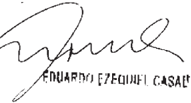

## FALLO DE LA CORTE SUPREMA

## Buenos Aires, kbrer

Vistos los autos: "Maciel, Marcelo Fabián s / recurso de inconstitucionalidad"

## Considerando:

Que el recurso extraordinario concedido fs\_ 383 es inadmisible (artículo 280 del Código Procesal civil Y Conercial de la Nación)

Por ello, se desestima el recurso extraordinario. Con cos tas

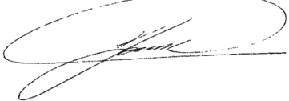

RICARDO LUIS LORENZETTI

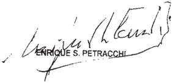

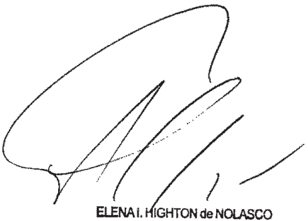

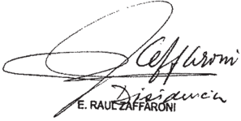

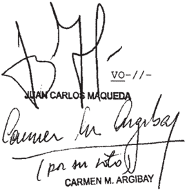

## DE JUSTICIA DE LA NACION 336

## DE LA SEÑORA MINISTRA DOCTORA DOÑA CARMEN M ARGIBAY

## Considerando

En el marco del debate oral que tuvo lugar en es ta causa, el fiscal de juicio solicitó al Iribunal Oral en Crininal n' 5 de la Capital Federal que condene Marcelo Fabián Maciel 1a pena de diez años prisión por ser autor penalnen te responsable de l0s delitos de robo con arma de fuego Y portación de arma de fuego de civil sin la debida autorización, agravada por registrar el imputado antecedentes penales por de litos dolosos contra las personas con el de armas (artícu109 166 inciso 2 0 segundo párrafo Y 189 bis, inciso 2 , párrafos Y primera opción, del Código Penal) A su vez , requirió la imposición de la pena única de quince años Y seis meses de prisión.

La defensa pública ~en 1o que interesarespondió tal requisitoria planteando a inconstitucionalidad de la agravante prevista en el artículo 189 bis, párrafo, primera opción del Código Penal, que sanciona más severanente quien portare armas de modo ilegítimo cuando a persona "registrare antecedentes penales por delitos dolosos contra las personas con el uso de arma 5 Al respecto, indicó que la norma en cues tión constituye una manifestación de derecho penal de autor conculca el principio de culpabilidad\_ aquí

El tribunal oral resolvió desestimar el planteo de inconstitucionalidad deducido Y, en consonancia con calificación contenida en la acusación fiscal condenó Maciel la pena de nueve años de prisión, que unificó con una pena única anterior comprensiva de diversas condenas por robo robo con armas reiterado resistencia la autoridad, imponiendo en definitiva la pena única de catorce años Y seis meses de prisión (fs 240 vta. 246/250 , 257/260 vta Y 262/271)

Estrictamente en 10 referido la impugnación constitucional de la agravante citada, corresponde destacar que

la defensa cuestionó la decisión del tribunal mediante recurso de inconstitucionalidad, que fue rechazado por la Sala III de la Cámara Federal de Casación Penal (fs 284/296 Y 327/341 vta.) Contra esa decisión, el defensor público dedujo recurso extraordinario, que fue concedido (fs. 348/378 vta. Y 383)

El recurso extraordinario resulta formalmente admisible, toda vez que la parte ha cuestionado constitucionalnente una norma de derecho conún Y la decisión ha sido contraria tal pretensión (artículo inciso 2 0 de la ley 48 ) 14 ,

4 % ) Para fundar su impugnación federal, la defensa afirma que la agravante cuestionada constituye una clara viola ción al principio de culpabilidad, es decir, se impone pena al autor por que es , por que representa , no por hizo" (fs 375 vta.) y la califica como "una norma de sospecha propia de un derecho penal inquisitivo, completamente contrario al Es tado de Derecho (fs 376) Señala adenás que resulta desproporcionada la escala penal establecida (fs. 377) que

5 % ) Conforme la jurisprudencia de esta Corte Suprema el principio de culpabilidad exige que para sancionar una per sona por un hecho determinado, éste tiene que poder serle imputado tanto objetiva cono subjetivamente (Fallos: 271:297; 316:1190; 321 :2558 , entre otros) extremo que sido explicado como 1a posibilidad real que tienen las personas de ajustar su conducta 1os mandatos de la (Fallos: 312:149 , entre otros) Esta exigencia forma parte del principio esencial propio de un Estado de Derecho según el cual solo puede constituir objeto de reproche penal un comportamiento individual orientado quebrantar una norma de tal carácter (Fallos: 329:3680 , considerando 12 del voto de la mayoría, 11 del voto del juez Petracchi Y del voto de la jueza Argibay) ha ley

Ahora bien, dicho principio no puede llevarse al extreno de una inviable simplificación que despoje la conducta de una serie de circunstancias que están estrechamente ligadas ella Y pueden eventualmente fundar un mayor grado de injusto

de culpabilidad, según el caso

Ejemplo de esto último son algunos tipos calificados que agravan el honicidio por cierta disposición del ánimo al mento de cometer el hecho por determinada condición personal que el autor detenta, tales como matar por placer, codicia odio racial religioso (artículo 80 , inciso del Código Penal) ser ascendiente, descendiente cónyuge de la víctima (inciso de 1a mentada norma) La condición de parentesco, su vez, es relevada típicamente como agravante en delitos contra la integridad sexual Y la libertad, entre otros , en los que se incluye además quien fuere hermano/ a de la persona afectada (así, por ejemplo, artículos 125 , 125 bis 142 , inciso del Código Penal) 1 0

Si el planteo del recurrente se aplicase hasta sus últimas consecuencias, las conductas adecuadas 10s tipos legales antes mencionados deberían reprocharse todas bajo la figura del homicidio simple (artículo 79 del Código Penal) pues no sería válido dotar de significado jurídico-penal circunstancias que no constituyan estrictamente el comportamiento en sí Sin embargo, está fuera de discusión que tales extremos han sido razonablemente previstos por el legislador como aspectos del hecho criminal que tornan más grave la conducta de matar otro

6 % ) Tampoco resulta admisible la afirmación del pugnante en relación al derecho penal de autor, pues no puede aceptarse bajo ningún punto de vista que castigar más severanen te una persona por registrar condenas anteriores por cierta clase de delitos pueda ser equiparado valorativamente con hipótesis sancionatorias que tuviesen en cuenta tales fines el mo do en el que el individuo ha conducido en general su vida las caracteristicas esenciales de su personalidad, tales como raza, sexo, religión, nacionalidad, preferencias políticas, condición social, etcétera im-

7 % ) Corresponde recordar aquí que , conforme centenaria jurisprudencia del Tribunal, no resultan estos estrados

federales el ámbito adecuado para la discusión sobre la oportunidad, mérito conveniencia de una norma legal , pues ello es facultad propia del Poder Legislativo\_ Por ello, las opiniones ~favorables desfavorablesacerca la eficacia de la ley Y el momento Y necesidad de su dictado resultan ajenas al pronunciamiento judicial, que queda de este modo limitado la evaluación de la razonabilidad de la regla jurídica individual en su aplicación al caso concreto (artículos 28 Y 116 de la Constitución Nacional)

8 " ) Fijado de tal modo el marco de decisión, debe puntualizarse que circunstancia agravante en estudio no se funda en un dato antojadizo inconexo en una característica inherente de la personalidad, sino que , por el contrario, reposa sobre un extremo fáctico que está directanente vinculado con el comportamiento ilícito de portar un arma sin autorización

Tomando en cuenta dicha circunstancia, Y partiendo lógicamente de un juicio ex ante, es constitucionalmente admisible establecer una diferencia valorativa entre el comportamiento de quien porta ilegítimamente un arma sin registrar antecedentes condenatorios de aquel que , además de incurrir en el básiCo , registra condenas por haber cometido delitos dolosos con el uso de armas contra la vida integridad física de los denás En otras palabras, es razonable entender que el comportamiento de portar un arma tiene un significado social más disvalioso en aquellos casos en 1os que el autor ya ha sido sancionado judi cialmente por haber exteriorizado un impulso delictivo contra otro y/o mediante el uso de armas tipo

En estrecha vinculación con la cuestión que aquí se trata se encuentra el instituto de la reincidencia, pues también presupone un agravamiento de 1a pena ~por 1a imposibilidad de obtener la libertad condicionalpara quien es sancionado criminalmente Y registrare una condena previa (artículos 14 Y 50 del Código Penal) La validez constitucional de este instituto fue declarada por esta Corte federal hace más de dos décadas

(Fallos: 311:552 Y 1451) , ocasión en la que se afirmó que haber sido condenado en una oportunidad anterior implica un mayor grado de culpabilidad por el desprecio que se manifiesta frente la eventualidad de un nuevo reproche penal

Esos argumentos admiten ser trasladados este caso pero con una distinción que redunda aún en mayor beneficio para afirmar la razonabilidad de la figura en estudio En efecto, co mo ya se anticipara en el considerando precedente, se trata de una agravante específica que está integrada solo por las agresiones criminales previas que hubieren sido cometidas dentro de un ámbito de ilicitud que, de un modo 4 otro, está ligado con la figura básica de portación de arma Este nexo puede darse porque la condena anterior: a) estuvo vinculada con un caso en que el encartado dirigió su comportamiento para agredir otros precisamente mediante el uso de armas ; b) se refirió una situación en la que el autor se decidió directanente por la afectación de bienes jurídicos que forman parte del núcleo de protección esencial de una persona: la vida Y la integridad física, valores que el ordenaniento penal intenta resguardar través de la punición de comportamientos que atentan contra seguridad conún , como ocurre en el caso de la portación de armas sin autorización\_ aquí

10) Con respecto la alegada desproporción de la pe na, el planteo del recurrente tampoco habrá de atenderse, pues solo se limita esbozar consideraciones generales Y comparar distintas escalas penales con el propósito de demostrar cierto desfase desajuste entre las mismas

En relación con 1o antes señalado, se advierte que en su presentación el recurrente no vincula la alegada desmesura punitiva con el caso concreto, en el que ~comO ya se reseñarapena de 14 años Y 6 meses que se le impusiera Maciel respondió la unificación de la pena impuesta por el hecho imputa do en esta causa con otra pena única referida un conjunto de delitos de marcada gravedad los que el encartado fuera depor

clarado autor responsable (cfr. considerando de este voto)

Más allá del defecto de fundamentación señalado, debe recordarse que las invocaciones genéricas de desproporción puni tiva no pueden ser atendidas por 1a Corte, pues escapan al ámbi to de control difuso de constitucionalidad que le está impuesto normativamente (artículo 116 de Constitución Nacional, ci tado) Corresponde tener en cuenta, en relación con ello, que la corrección de los desajustes que   pueda contener integra el ámbito de competencias del Poder Legislativo Y, de hecho , la necesidad de un examen exhaustivo de congruencia en toda la legislación penal través de una comisión de académicos, magistrados Y legisladores fue referida por algunos senadores en el marco del debate parlamentario del cual surgió, entre otras, la norma objeto del presente análisis (al respecto, pueden tejarse las intervenciones de los senadores Agúndez , Menem Y rragno ~Diario de Sesiones de la Cámara de Senadores de la Na ción, 14 de abril de 2004-) ley Te-

Por todo expuesto, se rechaza el recurso extraordinario Y se 1 apelada Hágase saber Y devuélvase

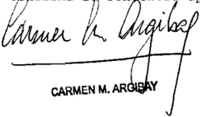

## DEL SEÑOR MINISTRO DOCTOR DON E . RAÚL ZAFEARONI

## Considerando:

Que en el caso resultan aplicables, en 1o pertinente las consideraciones vertidas en fecha en causa T.294 XLV "Taboada Ortiz, Víctor s / inf art 189 bis, portación de arma de fuego de uso civil ~causa 6457/09-" (disidencia del juez Zaffaroni) , cuyos fundanentos Y conclusiones corresponde remi tirse en razón de brevedad

Por ello, Y oído el señor Procurador Fiscal, se declara procedente el recurso extraordinario Y se deja sin efecto sentencia apelada en 10 que fuera motivo de agravio. Vuelvan los autos al tribunal de origen fin de que, por quien corresponda se dicte nuevo pronunciamiento con arreglo al presente\_ Hágase saber Y devuélvase

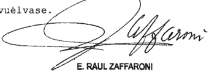

\_\_\_\_\_\_\_\_\_\_\_\_\_\_

## TABOADA ORTIZ  VICTOR ,

S/ iNf. art. 189 biS, portaCioN de arma de fueGo de USO CIVIL-CAUSA N° 6457/09-

## ROBO CON ARMAS

Del mismo modo que el art. 50 del Código Penal resulta inconstitucional cuando sirve para agravar la pena de manera general, el art. 189 bis, 8° párrafo, que sanciona más severamente a quien portare armas de modo ilegítimo cuando la persona 'registrare antecedentes penales por delitos dolosos contra las personas o con el uso de armas' es sin duda inconstitucional, en tanto agrava la pena impuesta en orden a situaciones específicas que no se vinculan a la conducta que se le está repro -chando al agente y resulta violatorio del principio de culpabilidad y de la garantía del 'ne bis in idem' en tanto incrementa el reproche por situaciones personales del imputado, en una clara manifestación de derecho penal de autor, inaceptable en un estado de derecho (Disidencia del Dr. E. Raúl Zaffaroni).

- - La mayoría consideró que el recurso extraordinario que originaba la queja era inadmisible (art. 280 del CPCCN)-.
- - La jueza Argibay remitió a su voto en la causa 'Maciel, Marcelo Fabián', de la misma fecha-.

## FALLO DE LA CORTE SUPREMA

## Buenos Aires,

Vistos 10s autos: "Recurso de hecho deducido por el DefenOficial de Víctor Taboada Ortiz en la causa Taboada Ortiz, Víctor s/ inf art 189 bis, portación de arma de fuego de uso civil ~causa n 6457/09-" para decidir sobre su procedencia

## Considerando:

Que el recurso extraordinario, cuya denegación ginó esta queja, es inadmisible (artículo 280 del Código Procesal civil Conercial de la Nación) ori-

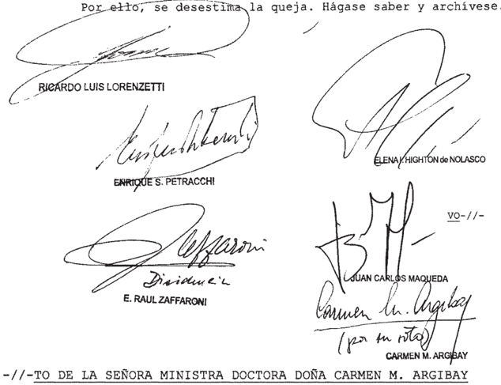

Considerando:

En atinente a inconstitucionalidad de agravante prevista por el artículo 189 bis, inciso párrafo ~primera opcióndel Código Penal, la cuestión ya ha sido resuelta por este Tribunal en autos "Maciel, Marcelo Fabián 5 / recurso de inconstitucionalidad" (voto de 1a jueza Ar -

gibay) sentencia de la fecha cuyos fundanentos conclusiones corresponde remitir en l0 pertinente.

Con respecto restantes agravios, el recurso hecho es inadmisible (artículo 280 del Código Procesal Civil Y Comercial de 1a Nación) de

DISI-// -

DEL SEÑOR MINISIRO DOCTOR DON E RAÚL ZAFFARONI

Considerando:

Que la titular del Juzgado Contravencional Y de Faltas n' 23 resolvió, en que aquí interesa, condenar Víctor Taboada Ortiz la pena de cuatro años de prisión, como autor del delito de portación de arma de fuego de uso civil sin la debida autorización legal, agravado por registrar anteceden tes penales por delito contra las personas (artículo 189 bis inciso 2 0 párrafo del Código Penal) Y unificó la pena dictada con una anterior impuesta por el Tribunal en 1o Criminal del Departamento de Lomas de Zamora, en una pena única de siete años de prisión. En la misma sentencia resolvió las nulidades de procedimiento interpuestas por la defensa , Y la declaración de inconstitucionalidad del agravante previsto en el artículo 189 bis inciso 20  párrafo 8 0 del Código Penal, por el que finalmente condenara

Contra esa resolución interpuso recurso de apelacíón la defensa\_

2 % ) Que la Sala de la Cámara de Apelaciones en 1o Penal, Contravencional Y de Faltas rechazó el recurso de la de fensa Y confi en todos sus puntos la sentencia del quo rmó

Contra esa resolución defensa interpuso recurso de inconstitucionalidad local agraviándose por la arbitrariedad de la sentencia al evaluar la prueba; por violentar el principio de inocencia Y por la declaración de constitucionalidad del artícu10 189 bis, inciso 20 párrafo 8 por considerar que su aplicación "viola de manera clara el principio de culpabilidad (arts 18 C.N. 9 CADH Y 15 PIDCP) puesto que no se castiga al autor en función de gravedad del hecho cometido (del contenido del injusto Y de la culpabilidad) sino exclusivanente en función de 1os 'antecedentes condenatorios que registra de las 'causas en trámite donde se le hayan concedido 'excarcelaciones exen ciones de prisión Agrega que se trata de la aplicación de derecho penal de autor ya que "Se quiere castigar en función de la persona Y no del hecho. Esto es tan claro que , por ejemplo, fines de configuración del resulta irrelevante el tipo de arma que se porte, equiparándose ~en forma contraria todo el sistema de la las armas de guerra con las de uso civil" tipo, ley-

La Cámara otorgó el recurso en orden al agravio sobre la inconstitucionalidad del agravante del artículo 189 bis Y denegó respecto del resto de 10s agravios, por los que la defen sa interpuso recurso de queja

Que el Superior Tribunal de Justicia de la Ciudad Autónoma de Buenos Aires, rechazó el recurso interpuesto, declarando implícitamente, la constitucionalidad de la norma cuestionada Contra esa resolución la defensa interpuso recurso extraordinario ante esta Corte, que le fue denegado Y originó la sentación directa de la defensa . pre-

4 % ) Que corresponde hacer lugar la queja Y considerar procedente el recurso extraordinario interpues toda vez la sentencia que se cuestiona es definitiva, proviene del tribunal superior de la causa, Y suscita cuestión federal suficiente, en tanto que el conflicto que se plantea es entre una norma de derecho común , artículo 189 bis inciso párrafo 8 del Código Penal Y normas de la Constitución Nacional (artículos to, que

18 inciso 22 )

5 ' ) Que el agravio se centra en 1a aplicación al ca 50 del agravante previsto en el último párrafo del inciso del articulo 189 bis que reza: "El que registrare antecedentes pena les por delito doloso contra las personas con el de arma5 , se encontrare gozando de una excarcelación exención de sión anterior Y portare un arma de fuego de cualquier calibre, será reprimido con prisión de cuatro diez años" por 1o que agrava sensiblemente, la escala penal aplicable en relación con el delito de portación de arma de uso civil sin debida autorización legal (de uno cuatro años) pri

Que motivo por el cual se aplica una pena más gravosa se relaciona con una situación personal del imputado (la existencia de antecedentes condenatorios, de causas en trámi te) que excede la culpabilidad por el acto por el que está siendo juzgado Y se manifiesta como la aplicación de una forma particular de reincidencia. Así 10 explica el voto de la vocal preopinante de la Cámara de Apelaciones, cuando dice: mayor culpabilidad que funda el mayor reproche radica en que el sujeto conoce la amenaza penal mejor que otro nunca ha sido conde nado por un delito de las características señaladas , por 10 que puede afirmarse un conocimiento más acentuado de prohibición" Y agrega que La indiferencia ante la anterior Sanción impuesta por otros hechos cometidos con arma de fuego, cuya naturaleza incisiva ya conoce justifica, sin duda alguna mayor reproche el que un

Queda claro que la pena aplicada no guarda relación con la culpabilidad pOr el hecho , sino que se le reprocha adenás su calidad de reiterante, premisa que denota la aplicación de pautas vinculadas al derecho penal de autor Y de peligrosidad

6 Que cabe destacar que la Corte Interamericana de Derechos Humanos , consideró que la invocación la peligrosidad "constituye claramente una expresión del ejercicio del ius pu -

niendi estatal sobre la base de las características personales del agente Y no del hecho cometido, es decir, sustituye el Dere cho Penal de acto de hecho , propio del sistema penal de una sociedad democrática por el Derecho Penal de autor, que abre la puerta al autoritarismo precisamente en una materia en la que se hallan en juego los bienes jurídicos de mayor jerarquía \_ En consecuencia la introducción en el texto legal la peligrosi dad del agente como criterio para la calificación típica de 1os hechos y la aplicación de ciertas sanciones es incompatible con el principio de legalidad criminal Y , por ende , contrario la Convención (CIDH, Serie C . 126 , caso Fermín contra Guatemala, sentencia del 20 de junio de 2005)

7 % ) Que esta Corte tiene dicho: "que cualquier agra vaniento de pena de sus modalidades de ejecución en función de declaración de reincidencia del art 50 \_ deben ser conside radas inconstitucionales pues denuestran un trato diferencial de personas , que no se vincula ni con el injusto que se pena ni con el grado de culpabilidad por el mismo, en consecuencia toman consideración Caracteristicas propias de la persona que exceden el hecho se enmarcan dentro del derecho penal de au tor (A.577 .XLV "Álvarez Ordoñez, Rafael Luis 5 / causa 10.154" ; G.506.XLVII\_ "Gómez , Humberto Rodolfo 5 / causa 13.074" disidencia del juez Zaffaroni, sentencia de la fecha) en

Que también ha dicho "Que resulta por demá s claro que la Constitución Nacional, principalmente en razón del principio de reserva y de la garantía de autononía moral de la persona consagrados en el art. 19 , no permite que se imponga una pena ningún habitante en razón de 10 que la persona es sino única mente como consecuencia de aquello que dicha persona haya come tido De modo tal que el fundamento de la pena en ningún caso será su personalidad sino la conducta lesiva llevada cabo" en otro considerando agrega Toda mnedida penal que se traduzca en una privación de derechos debe guardar proporcionalidad con la magnitud del contenido ilícito del hecho , sea con la gravedad de la lesión al bien jurídico concretamen afectado por te

el hecho , porque las previsiones legales expresan tales magnitudes través de las escalas penales" ("Gramajo, Marcelo Eduardo 5 / robo en grado de tentativa" sentencia del 5 de septiembre de 2006, Fallos: 329:3680) \_

8 % ) Que en el presente caso, la aplicación de una pe na superior la del delito en razón de los antecedentes del imputado contraviene el principio de culpabilidad va más allá del reproche por la conducta desplegada , en una clara manifestación de derecho penal de autor, inaceptable en un estado de de recho

9 ' ) Que del mismo modo que el artículo 50 del Código Penal resulta inconstitucional cuando sirve para agravar la pena de manera general, el artículo 189 bis, inciso párrafo 8 0 es sin duda alguna inconstitucional, en tanto agrava la pena im puesta en orden situaciones específicas que no se vinculan la conducta que se le está reprochando al agente Y resulta violatorio del principio de culpabilidad; de la garantía del ne bis in iden" en tanto incrementa el reproche por situaciones personales del imputado

Por ello, se hace lugar la queja, se declara procedente el recurso extraordinario Y se deja sin efecto la sentencia ape -lada\_ Hágase saber Y vuelvan los autos al tribunal de origen fin de que por quien corresponda, se dicte-ttevo pronunciamiento con arreglo al presente

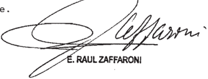

Recurso de hecho interpuesto favor de Víctor Taboada Ortiz por al Dofensor General de la Ciudad Autónona Mario Jaime Kebtolboin

Iribunal de origen: Suparior Tribunal de Justicia de la Ciudad Autónona de

Tribunales anteriores: Cámara en 1o Penal Contravencional de Faltas (Sala I) de Ciudad Autónona de Buenob Juzgado n 1o Penal Contravencional de Faltab 23

## FALLOS DE LA CORTE SUPREMA 336

## BOLLAND Y CIA SA (TF 21122-I) c/ DGI

## IMPUESTO A LAS GANANCIAS

Si no solo se encuentra identificada la causa de las erogaciones realizadas -com -praventa de acciones- sino que además se hallan individualizados los beneficiarios respecto de los que la AFIP pudo llevar adelante los pertinentes procedimientos de determinación, más allá de la distinta inteligencia asignada al art. 37 de la Ley del Impuesto a las Ganancias (t.o. en 1997) por los tribunales de las anteriores instancias, dichas erogaciones no debían ser alcanzadas por dicha norma en tanto una salida de dinero carece de documentación -a los fines de ésta- tanto cuando no hay documento alguno referente a ella, como en el supuesto en que si bien la hay, el instrumento carece de aptitud para demostrar la causa de la erogación e individualizar -al tratarse de actos carentes de sinceridad- a su verdadero beneficiario.

## FALLO DE LA CORTE SUPREMA

## Buenos Aires, &amp;1 de Jebrero

Vistos los autos: "Bolland Y Cía. SA (TF 21.122-I) c/ DGI"

1%) Que la AFIP-DGI determinó de oficio el impuesto las ganancias de Bolland Y Cía. por considerar que las ope raciones de compra de acciones de Lofirme S.A. Y Iransalud S .A informadas por aguélla en el año 1997 resultaban simuladas ficticias Y, en consecuencia, asignó 1os pagos realizados por tal concepto el tratamiento de "salidas no documentadas" que contempla el art. 37 de ley del tributo (fs\_ 69/92) \_ Contra dicha resolución, sociedad mencionada en primer término interpuso recurso de apelación ante el Tribunal Fiscal de ción (fs 93/132) Na -

Que el organismo jurisdiccional rechazó el planteo de nulidad del procedimiento administrativo formulado por la actora Y le impuso las costas de tal incidencia En lo que respecta la cuestión de fondo hizo lugar al recurso deducido Y, en consecuencia, revocó el ajuste fiscal (conf fs . 432/437) \_

3%) Que para resolver del modo indicado el aspecto sustancial de la controversia señal6 el art\_ 37 de del impuesto las ganancias es una norma sancionatoria que solo prevé el pago del tributo frente erogaciones carentes de documentación respaldatoria respecto de las cuales no se demuestre que fueron realizadas para obtener, mantener Y conservar ganan cias gravadas, mas no ante erogaciones documentadas con elemen tos falsos Agregó el art de la excluye de la figura los casos en que se presuna que 1os pagos fueron realizados para adquirir bienes que por su monto no lleguen ser ganan cias gravables en manos de su beneficiario. En tal inteligencia, concluyó en que la del art 37 solo resulta aplicable cuando se pretende efectuar una deducción comO gasto, cuyo objeto sea reducir el monto del impuesto pagar, circunstancia que no se verificaba en autos dado que el peritaje contable permitía concluir que 1os pagos habían sido realizados para adquirir bienes Y el quebranto originado en la venta pérdida de esas acciones dos años después de su compra no había sido computado por la sociedad en la liquidación impositiva del año respectivo\_ ley que ley que que

Que Sala III de Cámara Nacional de Apelaciones en 1o Contencioso Administrativo Federal confirmó la sentencia del Iribunal Fiscal en lo que atañe al fondo del asunto Y dejó sin efecto la condena en costas la sociedad accionante por el rechazo del planteo de nulidad (fs 733/736) \_ Contra tal sentencia el organismo recaudador dedujo recurso ordinario de apelación (fs 743/744) que fue concedido fs . 746 El memorial de agravios obra fs. 770/781 Y su contestación actora fs 784/793 \_ por

Que el recurso interpuesto resulta formalmente admisible en tanto se dirige contra sentencia definitiva, dictada en una causa en que la Nación es parte, Y el valor disputado en último término, sin sus accesorios, supera el mínimo establecido por el art 24 , inc 6' ap. a, del decreto-ley 1285/58 Y la resolución 1360/91 de esta Corte.

6" ) Que en primer lugar cabe destacar que asiste razón al representante del Fisco Nacional cuando señala que la interpretación que las sentencias de las anteriores instancias efectuaron del art. 37 de la del impuesto las ganancias (t.0 . en 1997) no se adecua 1a inteligencia que la Corte asignó la figura de salidas no docunentadas en los precedentes "Radio Emisora Cultural (TF 15.144-I) c/ D.G.I. (Fallos: 323:3376) Y "Red Hotelera Iberoamericana S .A. (TF 14.372-I) c/ D.G.I." (Fallos: 326:2987) , en cuanto en ellos se estableció que dicho instituto fija "la imposición de un tributo que.no tiene naturaleza sancionatoria" que por demás se aseveró en el caso citado en último términono solo resulta procedente su aplicación en situaciones de inexistencia absoluta de documentación" sino también en casos donde la "documentación no [es] sincera" (conf fs \_ 777/778) ley las ~según

Que , en consecuencia, correcta inteligencia que corresponde asignar al instituto de las salidas no documen tadas , hace necesario el tratamiento, desde esa perspectiva, de los agravios de la AFIP referentes que las operaciones de pra de las acciones de Lofirme S .A Y Iransalud por parte de Bolland no responden realidad económica, pues se trata de actos carentes de sinceridad que no reflejan fielmente la operación que instrumentan (fs774; 776; 778 vta. Y 779 vta. )

En este sentido, es importante señalar que el núcleo del cuestionamiento del Fisco ha sido expuesto en el memorial en estos términos: 'mi mandante realizó un análisis del instituto de salidas no documentadas , sosteniendo que no identificación correcta, positiva Y bien probada del destino del gasto hace recaer en cabeza del contribuyente 'obligación' de abonar como propio el tributo que debió abonar el beneficiario Y en el caso de autos no quedó demostrado quién había sido el destinatario final de fondos erogados con motivo de la presunta compra de acclones ni mandante no califica la compra comO ficticia sino que , al no poder individualizar al verdadero benelas

ficiario de las erogaciones, corresponde 1a aplicación de 1a figura contemplada en el Art. 37 ~SALIDAS NO DOCUMENTADAS (ver fs 779 , Párrafo segundo Y 778 , párrafo tercero; el resaltado no pertenece al texto. Ver en el mismo sentido, las afirmaciones vertidas por la representación fiscal, fs . 151 Y 417 vta. )

8 % ) Que en primer término, cabe referirse al contrato suscripto el 26 de septiembre de 1997 mediante el cual Bolland le compró Ricardo Miyazono 10.050 acciones ordinarias noninativas no endosables de valor nominal un austral por acción, representativas del 678 del capital social Y de los votos de Lofirme, un precio de $ 2 . 000 . 000 (conf copia del contrato agregada las actuaciones administrativas, cuerpo III, fs 436/447 de la foliatura que responde al sello de la "Administración Federal de Ingresos Públicos" ) n 0

Que el precio de compra asignado las acciones resulta especialmente llamativo ~por lo elevado del si se tiene en cuenta que el señor Miyazono había constituido la sociedad junto otros dos socios el 3 de septiembre de 1987 con un capital de quince mil australes (A 15.000) (conf edicto de constitución la sociedad publicado en el Boletín Oficial del 6/09/88 , fs 57 , copia parcial del contrato social, act cuerpo IV, fs \_ 782/785) Y el único bien de importancia que con ponía su patrimonio era un inmueble rural que Bolland, al prenderse de los títulos, valuó en la suma de $ 100 .000 des-

10) Que en que atañe al argumento vinculado con la estinación beneficios futuros que habría justificado la inversión en Lofirme, el apoderado de Bolland afirmó ~al contestar el descargo en sede administrativaque ella había sido suelta teniendo en miras tres aspectos de sua importancia: (a) sin necesidad de comprar el 1008 del paquete accionario, con el 678 adquirido se accedía al control total de la sociedad, que implicaba decidir la política de inversioneg Y cultivos realizar, como también todo referido la distribución de videndos; (b) dado que por una parte del predio corre el Río Co-

lorado, estaba previsto mediante la utilización de aparatos peciales de bombeo , obtener agua para regadío. Una vez obtenido el riego, se estimaba la plantación de frutales Dado que las tierras regadas tienen una aptitud similar las del Alto Valle de Río Negro, la importante rentabilidad obtenida por la explotación frutícola se potenciaría con la utilidad proveniente de la cría de ganado ovino Y bovino, que garantizaba el seguro recupero de la inversión Y (c) se especulaba con la revaluación sostenida de los inmuebles agropecuarios; que ge traducía en una ganancia adicional la proveniente de la mera explotación del campo" Sin embargo, más adelante señaló que "entre Bolland Y el accionista que representaba el 338 del capital social" hubo serias divergencias "respecto temas inherentes la explotación en tanto la frutícola como la ganadera, como su nega tiva imposibilidad de realizar las inversiones necesarias para llevarlas cabo" que determinaron la imposibilidad de "encarar la puesta en marcha del emprendiniento" (conf copia del descargo del 14 de agosto de 2002, act adm \_ cuerpo fs 741/742) esIV,

11 ) Que teniendo en cuenta antes expuesto, es poco verosímil que Bolland haya decidido abonar el importe mencionado si desconocía la situación financiera Y patrimonial de Iofirme tal como surge de las notas los estados contables de Bolland correspondientes los ejercicios econónicos cerrados al 31/10/97 Y al 31/10/98 de las que se extrae que la sociedad dió sus participaciones accionarias en otras compañías su lor patrinonial proporcional "excepto las inversiones realizadas en\_Lo-firme S.A.-las que se han mantenido valor de adquisición, en virtud de que la fecha de los presentes estados tables la\_compañía no contaba con la información contable actua lizada de las nisnas (conf act adm cuerpo III, fs . 517 Y 524 , el subrayado es del Tribunal) Es decir que Bolland ignoraba, al 26 de septiembre de 1997 , el valor patrimonial proporcional de las acciones de la sociedad que estaba adquiriendo\_

12) Que en otro orden de consideraciones, resulta

traño que Bolland haya decidido abonar al señor Miyazono un precio estinado en función de las ganancias obtener por un proyecto materialmente inexistente, en el éste no había tenido ni iba tener ningún tipo de participación. Es también singular a afirmación de que el proyecto se habría frustrado por supues tas divergencias entre Bolland Y su socio minoritario cuando previamente se aseveró que necesidad de comprar el 1008 del paquete accionario, con s610 el 678 adquirido se accedía al control total de la sociedad, lo que implicaba decidir la tica de inversiones Y cultivos realizar, como también todo 1o referido 1a distribución de dividendos (conf act adm . cuerpo fs. 741/742) que polí -

Por otra parte, ello no condice con 1o expresado por el directorio de Bolland en cuanto que el emprendimiento se había frustrado porque "1os planes de inversiones agroforestales en el campo del que es titular Lofirme S .A. no resultan econóni camente aconsejables" que habría decidido 1a sociedad desprenderse de las acciones en favor de de sus accionistas por el valor de venta del citado inmueble, valuado por la mismna Bolland, dos años después, en a suna de $ 100.000 copia del contrato, act adm . cuerpo III, fs 460/463 ; Y acta de di rectorio del 29 de octubre de 1999 , act adm. cuerpo II, fs 398) dos

13) Que, las constancias hasta aquí exaninadas Y el informe pericial producido en causa, que da cuenta de que las tenencias accionarias de Lofirme han sido incluidas en 1os balances de Bolland Y se han mantenido en 1os ejercicios cerrados el 31 de octubre de los años 1997 Y 1998 (ver punto 3 del informe agregado fs . 379/387) , permitirían respaldar 1a realización de la operación de compra entre la actora Y el señor Ri cardo Miyazono. Al respecto, corresponde señalar que sola afirmación contenida en el memorial en el sentido de  que Lofirme es sociedad anónima inexistente" (fs 778 vta. ) sin cues tionar en modo alguno afirmaciones de los Jueces de grado "una las

que arribaron una conclusión contraria (ver fs \_ 427, párrafo quinto; fs 734 vta.) , es insuficiente para negar que aquella compraventa se ha llevado cabo , imposibilita el examen de ese punto por parte del Iribunal

En cambio, como se destacó precedentemente, es nítido que el precio abonado por Bolland en mucho al que razonablenente podría atribuirse participación accionaria que, al ser transferida accionistas de la actora dos años más tarde fue valuada en $ 100.000 los

14) Que otro aspecto en cuyo examen corresponde detenerse, es el relativo que según las constancias documentales que la actora acompañó la causa ~contrato de compraventa de acciones de Lofirme S .A. ; recibos de pago- , las propias manifestaciones del apoderado de Bolland (el señor Ernesto Neme) que suscribió aquel contrato con el señor Ricardo Miyazono, el pago del precio total de pesos dos millones ($ se efectuó éste, en efectivo, en dos cuotas\_ la prinera de ellas ($ 200.000) , el 26 de septiembre de 1997 , Y la segunda ($ 1.800.000) , el 29 de octubre de 1997 (ver act adn cuerpo III, fs . 436 447 Y 449/450)

Sin embargo , según fue adnitido por el representante de la actora en sede administrativa Y así resulta de sus registros contables , el total de $ 2 .000 . 000 fue cancelado ~en parte imputándose el producido de dos cheques (cada uno de ellos por un valor de $ 150.000) que no han sido emitidos nonbre del vendedor de las acciones de Lofirme S.A. sino al del señor Guillermo Nazareno Conti ~asesor financiero de Bolland , Y cuya comparecencia en el juicio en calidad de testigo 1a actora no logró concretar, pues no concurrió las audiencias fijadas \_ Sobre esta modalidad de pago dicho representante manifestó que los cheques, que según surge de los Libros Diario Contables fueron aplicados al pago de estas compras [con referencia Lofirne Y Transalud s .A.] , se entiende [que] fueron emitidos siguiendo instrucciones del Sr. Ricardo Miyazono, la orden de

empleados de la empresa asesores externos, quereportaban la gerencia de contraloría ejercida por el mencionado Sr. Ricardo Miyazono" puesto que éste ~era responsable de la caja de la empresa , Y por ende quien realizó recibió los pagos.en el caso de Lofirme 5.A. y/o

Asimismo, expresó que el señor Conti, por indicación de Ricardo Miyazono, depositó aquellos cheques ~en su cuenta corriente del entonces Banco Tornquist, para luego retirar en efectivo el importe de los mismos, Y entregárselo al mencionado Miyazono" puesto que el pago de la compra venta había sido pactado en pesos (ver act adm . cuerpo III, fs 724 Y 968 ; act adm. cuerpo IV, fs 47/48 de la foliatura original; fs 238 241 Y 381 del informe pericial, del expediente principal)

15) Que las posteriores explicaciones brindadas por Bolland ante el Iribunal Fiscal con el objeto de justificar el pago de un elevado precio, bien 10 expresado acerca de porqué dicho precio fue cancelado del modo antes relatado, son de una manifiesta endeblez , en especial si se repara en experiencia comercial de la empresa actora Y en la magnitud de las operaciones realizadas

En efecto, Bolland señaló que el señor Ricardo zono ~quien trabajó en la empresa por más de 30 años Y llegó desempeñarse con amplias facultades Y poderes como "Gerente Financiero y Controller" \_ gozaba de una plena confianza de 1os cios Y familiares de la firna Sin embargo, según adujo, [vJalido de esa posicióncomenzó operar en su propio beneficio utilizando fondos que extraía de Bolland Y mantuvo una conducta desleal, pues convenció [a los socios) acerca de la conveniencia de adquirir [la] parte mayoritaria de los paquetes accionarios de Lofirme S.A. (678) Y-Iransalud S.A . (ver vta. Y 99) Miyafs .

Por otra parte, tras ensayar alguna hipótesis acerca de la modalidad de pago utilizada para adquirir las acciones de

Lofirme expresó: Desde luego que contractual Y jurídicamente el comprador fue Bolland Y el vendedor Miyazono Y la intervención de Na zareno Conti fue una cuestión de hecho decidida por Miyazono con el evidente propósito de percibir el precio en efectivo, aunque no estamos en estos momentos en condiciones de conocer los motivos que tuvo para obrar de esa manera (fs 117 vta./118)

16) Que con relación al contrato de fecha 1' de sep tiembre de 1997 acompañado por la actora, en el que se instrumentó la compra de Bolland José Luis Rodas de 7.200 acciones ordinarias, nominativas no endosables de valor nominal un peso acción, representativas del 608 del capital social Y de los votos de Transalud S.A por la suna de $ 6.000.000 (conf act adm. cuerpo II, fs . 251/264) varias particularidades deben ser señaladas por

En efecto, por una parte, si bien el contrato suscripto en fecha antedicha, en virtud del derecho de opción de compra que José Luis Rodas le otorgó Bolland, el precio ($ 6 000 .000) fue abonado anteriormente en su totalidad, mediante 11 pagos de diferentes importes, en dólares estadounidenses en pesos , efectuados entre el 29 de enero de 1997 Y el 27 de agosto de 1997, según se consignó al del Anexo "6" "El presente reemplaza Y sustituye 1os recibos que otorgados en oportunidad de cada pago" (ver ARTfCULO III, Anexo "6" del contrato, act adm. cuerpo II, fs . 254 Y 263/264) \_ fue la pié

Corresponde puntualizar que de las manifestaciones hechas por José Iuis Rodas se desprende que los pagos fueron ~realizados en las oficinas de la empresa Bolland S .A por el Sr . Miyazono\_ tales fondos fueron recibidos por aquél en efectivo Y utilizados, en parte, para cancelar abonar Ricardo Miyazono, también en efectivo, de $ 4 .000.000 por la compra que previamente le había realizado de 4 .800 acciones de Iransalud, todo 1o cual se llevó cabo [mJediante el mero can -

je de recibos, por 1o que el destinatario final de dichos pagos fue el Sr\_ Miyazono" (conf las contestaciones de José Luis Rodas 1os requerinientos efectuados por la AFIP-DGI, fs 65/67 ; ver también, act adm . "Cuerpo División Deterninaciones de Oficio" fs . 16 Y 18) 12,

Por otra parte, como se ha puesto de relieve en la causa, el valor atribuido las acciones de Transalud que fueron vendidas por Ricardo Miyazono José Luis Rodas (el 10/1/97) , solo tres meses de constituida la sociedad, como el fijado en la venta que se produjo meses más tarde (el 1/9/97) la firma Bolland ~en una cifrapor menos 800 veces ma yor al valor original" (ver 18 de las actuaciones admi nistrativas citadas en el párrafo anterior) por las razones que seguidamente se exponen, es claramente inconcebible

17) Que Bolland alegó en sede administrativa que la razonabilidad del precio abonado ($ 6.000.000) residía en el valor de mercado que la compañía tenía "al momento de su lanzamiento" el que se encontraba determinado '~por la probabilidad de generar ingresos futuros, es decir por sus activos intangibles inmateriales (conf\_ act adm cuerpo IV, fs \_ 741 Y 746)

18) Que , sin embargo, no surge que Bolland haya tenido , al tiempo de concertar esa operación, datos información que justificaran el precio que abonó por la compra de esa participación accionaria, máxine si Transalud había sido constituida el 7 de octubre de 1996 ~es decir, tan solo un año antescon un capital inicial de $ 12.000 Y el plan de negocios facturación expuesto en sus estados contables es meramente conjetural que carece de respaldo documental (conf. fs . 121 vta. Y estados contables correspondientes al ejercicio económico ~irregular\_ n' 1 de Transalud finalizado el 31/10/96, act adn. cuerpo II, fs . 265/276; ver, asinismo arg art 33 de la 11.683 ~t.0 1998-) A análoga conclusión cabe llegar respecto del precio ($ 4 .000.000) por el cual Miyazono vendió previamente ley

Rodas las 4 800 acciones de Transalud (conf en tal sentido el informe de descargo de la AFIP-DGI, act adm . "cuerpo división determinaciones de oficio" 18)

19) Que del informe contable producido en autos tampoco surgen elementos que pernitan justificar la notable desproporción entre el precio abonado por las acciones Y valor noninal ya que al 1 0 de septienbre de 1997 Transalud había celebrado un solo convenio con Qualitas Médica por medio del cual se habría acordado instalación de treinta terminales en forma gratuita-

20) Que el perito interviniente compulsó otros tres contratos, dos de ellos de mayor relativa importancia, de los cuales uno se habría celebrado el 20/03/98 con AMSA fijándose un cargo fijo nensual de u$s 12.000 por las primeras 300.000 transacciones Y un precio variable por la instalación de cada termi nal de entre ufs 50 Y u$s 55 \_ El otro se habría celebrado con OSDE el 14/07/98 pactándose un cargo fijo mensual de u$s 10.000 las primeras 60.000 transacciones, Y estableciéndose un cargo variable de u$s 0 , 16 u$s 0,10 por cada transacción adicional Como en el caso anterior se pactó un precio de u$s 50 por la instalación de cada terminal (conf\_ fs 385 Vta./386) por

21 ) Que de 1o anteriormente expuesto se desprende con claridad Bolland no podía prever razonablemente que las ex pectativas de ganancias de Iransalud iban ser de tal magnitud como para justificar el precio que abonó por referida participación accionaria A mayor abundamiento, cabe señalar, como ejemplo de la ostensible desproporción de valores, que durante los seis períodos comerciales posteriores la firma del contrato Iransalud registró pérdidas por $ 57.234,52 , $ 617.029,15 , $ 927.079, $ 839.972 , $ 303.919, $ 185.190 Y $ 378.614 , respectivamente (conf\_ peritaje contable' fs . 385/386) \_

22) Que finalmente, como ha sido señalado en el siderando 16 de la presente, si bien del contrato acompañado por

la actora resulta que 1os pagos que componían el precio total debían ser cancelados en pesos dólares así manifiesta haberlos recibidos el vendedor José Luis Rodas- , 10s registros contables de la actora el peritaje rendido en la causa, dan cuenta de que ~1os fondos que destinó Bolland Y Cía la adquisición de las acciones de Transalud 5 .A. por $ 6.000.000.en el ejercicio cerrado el 31 de Octubre de 1997. fueron siguientes: en efectivo, caja en pesos: $ 180.214,82; en efectivo, caja en dólares: $ 4 .314.785,18 ; en cheques , cuenta corriente Banco Quilmes $ 1.505.000, que han sido librados nonbre de: "Luis Ángel Scotto, Flavio Guerrera y/o Federico Bellati\_ Jorge González, Guillermo Cesario, Roberto López Y Guillermo Na zareno Conti" quienes formaban parte del personal se desempe ñaban comO asesores de Bolland S.A (ver fs . 381 del informe pericial, expresado por el perito Juan José Cogorno)

La explicación que brindó el apoderado de Bolland frente al cuestionamiento del Fisco referente que cheques han sido librados favor de ~terceras personas , vinculadas rectanente con la responsable\_cuando\_el único beneficiario debió haber sido el propio vendedor (Sr Rodas) consistió ~de modo similar que en el caso de la compra de las acciones de Lofirme únicamente en que: "Los cheques fueron emitidos quienes designara el Sr\_ MiyazonoSe entiende que el precitado Miyazono, utilizó este procedimiento, para poder obtener el dinero en efectivo, que le fue entregado al vendedor de Transalud S .A Sr\_ José Luis Rodas , dado que conforme las disposiciones del Banco Central de la República Argentina, vigentes en ese momen to, existía impedimento para cobrar por ventanilla, cheques su periores $ 50 .000" act adm. cuerpo IV, fs. 49 de la foliatura original) \_

23) Que, esta altura del relato, corresponde señaque pese las particularidades descriptas con relación las operaciones comprendidas en esta causa =y con independencia de si de aquéllas podrían derivarse otras consecuencias de orden lar

tributario para alguna de las partes intervinientes-, 1o único que cabe juzgar es si las erogaciones de fondos que efectuó actora deben ser alcanzadas por el instituto las salidas no documentadas contemplado en el art 37 de la del impuesto las ganancias (t.0 . en 1997) , tal comO 1o dispuso la Administración Federal de Ingresos Públicos al dictar la Resolución 93/2002 (DV DOGR) aquí ley

En este sentido, es pertinente recordar que el Tribunal al fallar el caso "Red Hotelera Iberoamericana S.A (TF 14 372-I) c/ D.G:I. (Fallos: 326:2987) , estableció que una salida de dinero carece de documentación ~a los fines de aquella norma tanto cuando no documento alguno referente ella, como en el supuesto en que si bien la el instrumento carece de aptitud para demostrar causa de erogación individualizar ~al tratarse de actos carentes de sinceridadsu verda dero beneficiario También, en el caso "Radio Emisora Cultural S.A (TF 15.144-I) c/ D.G.I. (ver Fallos: 323:3376 el allí citado) esta Corte señaló que aquella previsión ha sido adoptada por el legislador para asegurar la íntegra percepción de la renta fiscal en una particular situación en la cual , ~ante la falta de individualización de los beneficiarios, cuyo cargo debiera estar el pago del impuesto al rédito percibido, quien hace la erogación queda obligado abonar sobre ella el tributo debe hacerlo título propio\_ hay hay,

En el caso, la falta de concurrencia de los extremos exigidos en 1os precedentes antes citados, impiden la aplicación del referido instituto

24 ) Que , en efecto, los señores Miyazono Rodas aparecen claramente identificados cono beneficiarios de los pagos realizados por Bolland \_ El primero, en función de lo expuesto en considerandos 16 de esta sentencia; Y el segundo , de acuerdo con señalado en este último considerando

Ello, por lo denás , ha quedado corroborado con el

resultado de las tareas de verificación, fiscalización y determinación de impuestos las ganancias Y 1os bienes personales que la Administración Federal de Ingresos Públicos llevó cabo individualnente, según el caso, respecto de 10s señores Rodas Y Miyazono\_

En efecto, en 1o que se refiere al señor Rodas , éste reconoció ~en el marco de fiscalización del impuesto las ganancias Y bienes personales identificada bajo la 0.I. n que el cobro de los $ 6.000.0oo por la venta de las acciones de Transalud había sido realizado íntegramente en efectiVO , en la moneda Y oportunidades indicadas en el Anexo 6 del contrato (conf act adm. cuerpo II, fs . 263/264) y que había utilizado pago de la compra efectuada anteriormente al Sr. Ricardo Miyazono ($ 4 .000 .000) precisando que ~1os $ 2 . 000 . 000 de ingresos netos resultante entre la compra al Sr Ricardo Miyazono de 4800 acciones la venta Bolland Cía S .A de 7200 acciones efectuadas anbas en el año 1997" se encontraban expuestos en la cuenta "R.SJustificación Patrimonial" "Rubro a) punto columna II\_Neto operación Bolland 2 .000.000" de su declaración jurada del impuesto las ganancias del período fiscal 1997 (conf copia de las contestaciones los requerimientos efectuados por la AFIP, fs 65/67) \_ "en

Por otra parte, en que atañe al señor Miyazono, el Fisco Nacional le determinó de oficio el impuesto las ganan cias correspondiente al año 1997 porque ~entre otros puntos objeto de ajuste fiscalaquél había incluido en la respectiva de claración jurada los montos que se alude en el primer párrafo de este considerando como rentas exentas copia de la resolución 07/2002 agregada fs 310/330) Los términos del acto determinativo de oficio reflejan la correspondencia entre las sumas involucradas en esta causa con las que el propio Miyazono declaró como beneficios exentos en declaración jurada correspondiente al año en que ellas fueron pagadas -

En consecuencia, Y toda vez que en el caso no solo se

encuentra identificada la causa de las erogaciones realizadas ~las compraventa de acciones-, sino que además se hallan individualizados beneficiarios respecto de los que la AFIP llevar adelante l0s pertinentes procedimientos de determinación, más allá de la distinta inteligencia asignada al citado art. 37 pOr los tribunales de las anteriores instancias ~cf considerando 6 ' de la presente-, corresponde coincidir con la conclusión la que aquéllos arribaron en cuanto la improcedencia del ajuste fiscal efectuado Bolland Y Cía . pudo

25) Que tampoco pueden prosperar los agravios dirigidos que se impongan la actora costas por el rechazo de la nulidad planteada ante el Tribunal Fiscal, ya que con independencia de que esa defensa había sido introducida como excepción de previo Y especial pronunciamiento (conf fs 132) , 1o cierto es que fue tratada Y resuelta en la sentencia de fondo Y ~tal como lo puso de relieve el la actora la planteó "como defensa contra la determinación tributaria Y encaninada ob tener la revocación de la pretensión fiscal" (conf sentencia de cámara, considerando V , fs \_ 735) \_ En tales condiciones, si bien ese resultado se llegó en virtud del examen Y la decisión del aspecto sustancial de controversia, cabe coincidir con el quo en cuanto que no corresponde una imposición de costas autónona por la aludida incidencia las

Por ello, en virtud de los fundamentos expuestos en la presente, se confirma la sentencia apelada \_ Las costas de esta instancia se imponen por su orden en atención que los precedentes mencionados en el considerando 6 atendidos por el pudieron llevar al organismo recaudador considerar razonable-

que 1os ajustes fiscales se ajustaban (art. 68 , segunda parte, del Código Procesal Civil y Comercial de Nación) Notifíquese devuélvase

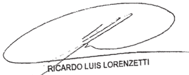

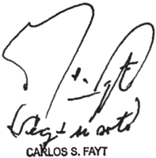

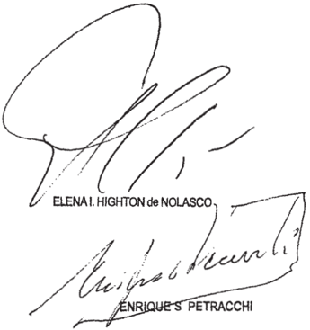

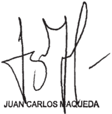

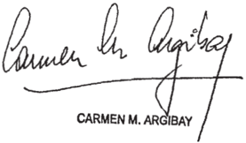

~I/-Io DEL SEÑOR MINISTRO DOCTOR DON   CARLOS FAYT

## Considerando

Que 1a AFIP-DGI determinó de oficio el impuesto las ganancias de Bolland Y Cía . S.A. por considerar que las operaciones de compra de acciones de Lofirme S.A Y Iransalud S.A informadas por aquélla en el año 1997 resultaban simuladas ficticias Y, en consecuencia, asignó los pagos realizados por tal concepto el tratamiento de "salidas no docunentadas" que contempla el art. 37 de la ley del tributo (fs69/92) Contra

dicha resolución, la sociedad mencionada en primer término interpuso recurso de apelación ante el Tribunal Fiscal de la Na ción (fs. 93/132) \_

2 %) Que el organismo jurisdiccional rechazó el planteo de nulidad del procedimiento administrativo formulado por 1a actora Y le impuso las costas de tal incidencia En lo que res pecta la cuestión de fondo hizo lugar al recurso deducido Y, en consecuencia, revocó el ajuste fiscal (conf fs 432/437) .

Que para resolver del modo indicado el aspecto sustancial de la controversia señaló que el art 37 de 1a del impuesto las ganancias es una norma sancionatoria que prevé el pago del tributo frente erogaciones carentes de docu mentación respaldatoria respecto de las cuales no se demuestre que fueron realizadas para obtener, mantener Y conservar ganan cias gravadas , mas no ante erogaciones documentadas con elemen tos falsos Agregó que el art 38 de la excluye de 1a figura los casos en que se presuma que los pagos fueron realizados para adquirir bienes que por su monto no lleguen ser ganan cias gravables en manos de su beneficiario. En tal inteligencia, concluyó en que la previsión del 37 solo resulta aplicable cuando se pretende efectuar una deducción comO gasto, cuyo objeto sea reducir el monto del impuesto pagar, circunstancia que no se verificaba en autos dado el peritaje contable permitía concluir que los pagos habían sido realizados para adquirir bienes Y que el quebranto ariginado en la venta pérdida de esas acciones dos años después de su compra no había sido computado por la sociedad en la liguidación impositiva del año respectivo ley ley art que

4 % ) Que la Sala III de la Cánara Nacional de Apelaciones en 1o Contencioso Administrativo Federal confirmó la sentencia del Tribunal Fiscal en 1o que atañe al fondo del asunto dejó sin efecto la condena en costas la sociedad accionante por el rechazo del planteo de nulidad (fs. 733/736) Contra tal sentencia el organismo recaudador dedujo recurso ordinario de apelación (fs. 743/744) que fue concedido fs . 746 El memorial

de agravios obra fs . 770/781 Y su contestación por la actora fs . 784/793.

5" ) Que el recurso interpuesto resulta formalmente admisible en tanto se dirige contra la sentencia definitiva dictada en una causa en la Nación es parte, el valor disputado en último término, sin sus accesorios, supera el nínimo establecido por el art 24 , inc ap. a, del decreto-ley 1285/58 la resolución 1360/91 de esta Corte. que

6%) Que en priner lugar cabe destacar que asiste razón al representante del Fisco Nacional cuando señala que la interpretación que las sentencias de las anteriores instancias efectuaron del art 37 de 1a del impuesto las ganancias (t.0. en 1997) no se adecua inteligencia que la Corte asignó la figura de las salidas no documentadas en los precedentes "Radio Emisora Cultural 5.A. (TF 15.144-I) c/ D.G.I. (Fallos: 323:3376) Y "Red Hotelera Iberoamericana 5 .A (TF 14.372-I) c/ D.G.I." (Fallos: 326:2987) , en cuanto en ellos se estableció que dicho instituto fija "la imposición de un tributo que.no tiene naturaleza sancionatoria" Y que por demás ~según se aseveró en el caso citado en último términono s610 resulta procedente su aplicación en situaciones de "inexistencia absoluta de documentación" sino también en casos donde la "docunentación no [es] sincera" (conf 777/778) ley fs.

70) Que, en consecuencia, la correcta inteligencia que corresponde asignar al instituto de las salidas no documen tadas , hace necesario el tratamiento, desde esa perspectiva, de agravios de la AFIP vinculados con la falsedad que atríbuye las referidas operaciones de compra de las acciones de Lofirme Y Transalud por parte de Bolland (conf fs . 776 ~3' párrafo , 778 vta. ~1' párrafoY 779 vta. Y 3  párrafos-)

8%) Que al respecto resulta notoria la desproporción entre los precios pagados por las acciones de Lofirme Transalud Y su estimado valor patrimonial al tiempo de efectuarse las transacciones, sin que pueda razonablemente sostenerse que

tal desproporción responda las expectativas de ganancias que pudiera haber abrigado Bolland al encarar los respectivos em prendimientos

Que , en primer término, cabe referirse al contrato suscripto el 26 de septienbre de 1997 mediante el cual Bo lland le compró Ricardo Miyazono 10.050 acciones ordinarias nominativas no endosables de valor nominal un austral por acción, representativas del 678 del capital social Y de 1os votos de Lofirme, un precio de $ 2 .000 .000 (conf. copia del contrato agregada las actuaciones administrativas, cuerpo III, fs 436/447 de la foliatura que responde al sello de la "Administración Federal de Ingresos Públicos")

10) Que el precio de compra asignado las acciones resulta especialmente llamativo ~por elevado del importesi se tiene en cuenta que el señor Miyazono había constituido la sociedad junto otros dos socios el 3 de septiembre de 1987 con un capital de quince mil australes (A 15.000) (conf edicto de constitución de la sociedad publicado en el Boletín Oficial del 6/09/88 , fs . 57, Y copia parcial del contrato social, act adn. cuerpo IV, fs 782/785) el único bien de importancia que com ponía su patrimonio era un inmueble rural que Bolland, al des prenderse de títulos, valuó en la sua de $ 100 .000 ~conf infra considerando 14-

11) Que en atañe al argumento vinculado con la estimación de 1os beneficios futuros que habría justificado la inversión en Lofirme el apoderado de Bolland afirmó ~al contestar el descargo en sede administrativa- que ella había sido suelta teniendo en miras tres aspectos de suma importancia: (a) sin necesidad de comprar el 1008 del paquete accionario, con el 678 adquirido se accedía al control total de la sociedad, que implicaba decidir la política de inversiones Y cultivos realizar, como también todo 1o referido la distribución de dividendos; (b) dado que por una parte del predio corre el Río Co lorado, estaba previsto mediante la utilización de aparatos es-

peciales de bombeo , obtener agua para regadío. Una vez obtenido el riego, se estimaba la plantación de frutales Dado que las tierras regadas tienen una aptitud similar las del Alto Valle de Río Negro, la importante rentabilidad obtenida por la explotación frutícola se potenciaría con la utilidad proveniente de la cría de ganado ovino Y bovino, que garantizaba el seguro recupero de la inversión Y (c) se especulaba con la revaluación sostenida de los inmuebles agropecuarios, que se traducía en una ganancia adicional a proveniente de la mera explotación del campo" Sin embargo, más adelante señaló que "entre Bolland Y el accionista representaba el 338 del capital social" hubo serias divergencias "respecto temas inherentes la explotación en sí, tanto la frutícola comO la ganadera, como su negativa imposibilidad de realizar las inversiones necesarias para llevarlas cabo" que determinaron 1a imposibilidad de "encarar la puesta en marcha del emprendimiento" (conf copia del descargo del 14 de agosto de 2002 , act adm. cuerpo IV, fs 741/742) que

12) Que teniendo en cuenta 1o antes expuesto, es poco verosínil que Bolland haya decidido abonar el importe mencionado si desconocía la situación financiera patrinonial de Lofirme tal como surge de las notas estados contables de Bolland correspondientes los ejercicios econónicos cerrados al 31/10/97 Y al 31/10/98 de las que se extrae que la sociedad mi dió sus participaciones accionarias en otras compañías su valor patrimonial proporcional "excepto las inversiones realizadas 5.A.-las que se han mantenido su valor de adquisición, en virtud de que fecha de 1os presentes estados con tables la compañía no contaba con la información contable actua lizada de las mismas (conf act adn. cuerpo III, fs 517 Y 524 , el subrayado es del Iribunal) Es decir que Bolland ignoraba , al 26 de septiembre.de 1997 , el valor patrimonial proporcional de las acciones de la sociedad que estaba adquiriendo

13) Que en otro orden de consideraciones, resulta inexplicable que Bolland haya decidido abonar al señor Miyazono un

precio estimado en función de las ganancias obtener por un proyecto materialmente inexistente, en el que éste no había tenido ni iba tener ningún tipo de participación. Es también desconcertante la afirmación de que el proyecto se habría frustrado por supuestas divergencias entre Bolland Y su socio minoritario cuando previamente se aseveró que ~sin necesidad de comprar el 1008 del paquete accionario, con sól0 el 678 adquirido se accedía al control total de la sociedad, que implicaba decidir la política de inversiones y cultivos realizar, como también todo referido la distribución de dividendos (conf act adn . cuerpo IV, fs . 741/742) \_

Por otra parte, ello no condice con expresado por el directorio de Bolland en cuanto que el emprendiniento se había frustrado porque "10s planes de inversiones agroforestales en el campo del que es titular Lofirme no resultan económi camente aconsejables" 1o que habría decidido la sociedad desprenderse de las acciones en favor de dos de sus accionistas por el valor de venta del citado inmueble, valuado por la misma Bolland, dos años después , en la suma de $ 100.000 (conf\_ copia del contrato, act\_ adm. cuerpo III, fs 460/463 ; acta de directorio del 29 de octubre de 1999 , act . adm. cuerpo fs 398) II,

14) Que, en tal estado de cosa5 , corresponde concluir que si bien del examen de la documentación del informe contable agregados autos ~conf\_ fs 379/387surge que entre Bo lland y el señor Miyazono existió efectivamente la referida ope ración de compra de acciones el precio que por ella se abonó resulta claramente desproporcionado en tanto excede en mucho al que razonablemente podría atribuirse participación accionaria transferida

15) Que dicha conclusión se encuentra abonada por las propias expresiones de Bolland en su escrito apelación ante el Tribunal Fiscal, oportunidad en que endilgó al señor Miyazono

~que se desempeñó durante más de treinta años en esa de fue gerente financiero Y apoderado con amplias facultades de decisión (fs 98 la responsabilidad de haber decidido unilateralmente la ejecución de un negocio "inconveniente" para la sociedad faltando 1os nás elementales principios de lealtad hacia quienes habían depositado su confianza en él especialmente fs. 98 vta. ~pto. 99 , 99 vta. , 114 vta ~3er párrafo-) que

16) Que análogas conclusiones conduce el exanen del contrato de fecha 10 de septiembre 1997 por el que Bolland compró José Luis Rodas 7 .200 acciones ordinarias, noninativas no endosables de valor noninal un peso por acción, representativas del 608 del capital social de los votos de Transalud por la suma de $ 6 .000.000 (conf act adm. cuerpo II, fs 251/264) \_ Es del caso puntualizar que conforme surge de las promanifestaciones de Rodas tales fondos fueron recibidos por é1 en efectivo Y utilizados en parte para cancelar Y abonar Miyazono la suma de $ 4 .000.000 por la compra que previamente le había realizado -10 de enero de 1997 4 . 800 acciones de Iransalud, todo 1o cual se llevó cabo [m]ediante el mero can je de recibos por que el destinatario final de dichos pagos fue el Sr . Miyazono" (conf\_ copia de las contestaciones de Rodas en el marco de 1os requerimientos efectuados por la AFIP-DGI en la 0.I. n' 1561/0 , fs . 65/67; conf\_ asimismo el informe de des cargo de la AFIP-DGI, act. adm . "cuerpo división determinaciones de oficio" fs 12 , 16 Y 18; ver también Anexo 6 del contrato de compraventa, act adm. cuerpo II, fs . 263/264) pias

17) Que Bolland alegó en sede administrativa que la razonabilidad del precio abonado ($ 6.000.000) residía en el lor de mercado que la compañía tenía "al momento de su lanzamiento" el que se encontraba determinado a probabilidad de generar ingresos futuros, es decir por sus activos intangibles inmateriales. (conf\_ act adn . cuerpo fs . 741 Y 746) va~por

18) Que, sin embargo , no surge que Bolland haya tenido al tiempo de concertar esa operación, datos información que justificaran el precio que abonó por la comnpra de esa participación accionaria, máxime si Transalud S.A. había sido constituida el 7 de octubre de 1996 ~es decir, tan sol0 un año antes con un capital inicial de $ 12.000 el plan de negocios y facturación expuesto en sus estados contables es meranente conjetural ya que carece de respaldo documental fs 121 vta. Y estados contables correspondientes al ejercicio econónico ~irregular n' de Transalud finalizado el 31/10/96, act adm. cuerpo II, fs 265/276; ver, asimismo, arg. art. 33 de la 11.683 ~t.o. 1998-) A análoga conclusión cabe llegar respecto del precio ($ 4.000.000) por el cual Miyazono vendió previamente Rodas las 4 .800 acciones de Transalud (conf\_ en tal sentido el informe de descargo de la AFIP-DGI, act adm. cuerpo división determinaciones de oficio" fs. 18) \_ ley

19) Que del informe contable producido en autos tampoco surgen elementos que permitan justificar la notable desproporción entre el precio abonado por las acciones su valor nominal ya que al 10 de septiembre de 1997 Transalud había celebrado un solo convenio con Qualitas Médica 5 .A . por medio del cual se habría acordado la instalación de treinta terminales en forma gratuita.

20) Que el perito interviniente compulsó otros tres contratos, dos de ellos de mayor relativa importancia, de cuales uno se habría celebrado el 20/03/98 con AMSA fijándose un cargo fijo mensual de u$s 12.000 por las primeras 300 .000 transacciones Y un precio variable por la instalación de cada terni nal de entre 50 Y u$s 55\_ El otro se habría celebrado con OSDE el 14/07/98 pactándose un cargo fijo mensual de u$s 10.000 por las primeras 60.000 transacciones, Y estableciéndose un cargo variable de 0 , 10 por cada transacción adicioComo en el caso anterior se pactó un precio de u$s 50 por la instalación de cada terminal (conf fs 385 vta. /386) \_ nal

21) Que de 1o anteriormente expuesto se desprende con claridad que Bolland no podía prever razonablemente que las ex pectativas de ganancias de Transalud iban ser de tal magnitud como para justificar el precio que abonó por referida participación accionaria A mayor abundamiento, cabe señalar, como ejemplo de la ostensible desproporción de valores que durante los seis períodos comerciales posteriores firma del contrato Iransalud registró das por $ 57.234, 52, $ 617.029,15 , $ 927.079, $ 839.972, $ 303.919, $ 185.190 $ respectivamente (conf peritaje contable, fs\_ 385/386) pérdi

22) Que , en síntesis, corresponde formular en este punto idénticas consideraciones que las efectuadas en el considerando 14 respecto de compra de tenencia accionaria de Lofirne, toda vez que no obstante encontrarse acreditada efectiva existencia de la operación de compraventa de acciones de Iransalud entre Bolland el señor Rodas , el precio abo nado resulta notorianente desproporcionado Ya que supera de modo ostensible al que razonablemente podría atribuirse la participación societaria transferida

23) Que en tales condiciones cabe desestimar agravios del Fisco Nacional en cuanto refiere que "al haberse realizado actos Y emitidos [sic] documentos carentes de sinceridad , se ignor [a] cuál ha sido la operación económica realmente efectuada por la firma BOLLAND Y CIA SA, Y quiénes en qué proporción han obtenido beneficlos pecunlarlos de ella" (conf\_ morial de agravios presentado ante esta Corte, 774) , en tanto ~cono surge de lo precedentemente expuesto se trata de raciones efectivanente llevadas cabo , entre partes debidanente individualizadas , de nanera objeción debe entenderse circunscripta falta de correspondencia entre los precios involucrados Y 10s valores de los bienes que razonablenente hubiera correspondido estimar

24) Que , en efecto, señores Miyazono Y Rodas apa recen claranente individualizados comO beneficiarios de 1os pa -

realizados por Bolland . primero, en función de lo expues to en los considerandos 9' 14 Y 16 de esta sentencia; Y el segundo , de acuerdo con 1o señalado en el considerando tado El

Ello ha quedado corroborado , mayor abundanfento, con el resultado de las tareas de verificación, fiscalización Y deterninación de los impuestos las ganancias los bienes personales que la Administración Federal de Ingresos Públicos llevó cabo indivldualmente, el caso, respecto de 1os sefores Rodas Y Mlyazono. según

En efecto, en 1o que se refiere al señor Rodas, éste reconoció el marco de fiscalización del impuesto las ganancias Y los bienes personales Identificada bajo la 0.I. n' 1561/0 que el cobro de 1os $ por la venta de las acciones de Transalud había realizado Integramente en efectlen 1a moneda Y oportunidades indicadas en el Anexo 6 del contrato (conf. act . adn. cuerpo II, 263/264) que los había utilizado pago de 1a compra efectuada anteriormente al Sr . Ricardo Miyazono ($ 4 . 000.000) precisando $ de ingresos netos resultante entre la compra al Sr Ricardo Miyazono de 4800 acciones Y la venta Bolland Y Cía S .A de 7200 acciones efectuadas anbas en el año 1997" se encontraban expuestos en cuenta "R.SJustificación Patrimonial "Rubro a) punto 2 ) columna IINeto operación Bolland 2 . 000 .000" de su declaración jurada del impuesto las ganancias del período fiscal 1997 (conf\_ copia de las contestaciones los requerimientos efectuados por la AFIP, fs. 65/67) "en que

Por otra parte, en que atañe al señor Miyazono, el Fisco Nacional le determinó de oficio el impuesto las ganan cias correspondiente al año 1997 porque ~entre otros puntos ob jeto de ajuste fiscal- aquél había incluido en la respectiva declaración jurada los montos que se alude en el primer párrafo de este considerando como rentas exentas (conf\_ copia de la resolución 07/2002 glosada fs 310/330) Los términos del acto

determinativo de oficio reflejan 1a efectiva correspondencia en tre las sumas involucradas en esta causa con las que el propio Miyazono declaró como beneficios exentos en la declaración jurada correspondiente al año en que ellas fueron pagadas por Bolland (conf\_ fs\_ 311/317) Al respecto cabe señalar que ha tenido cación en esta Corte causa "Miyazono, Ricardo s/ quiebra (Fallos: 334:784) en 1a que se discutió sobre la verificación de créditos solicitada por el organismo fiscal con base en aquella determinación radi

25) Que en las aludidas condiciones corresponde concluir que desde la perspectiva que surge del precedente "Red Hotelera Iberoamericana" citado, resulta inaplicable al caso de autos el instituto de las salidas no documentadas contemplado en el art. 37 de la Ley del Impuesto Ganancias (t.0\_ en 1997) , ya que la situación fáctica verificada en las presentes actuaciones no tiene cabida en dicha figura tenor de la inteligencia el Tribunal le asignó En efecto, en el citado precedente se afirmó que una salida de dinero carece de documenta ción ~a 10s fines de esa tanto cuando no documento alguno referente ella, como en el supuesto en que si bien lo el instrumento carece de tud para demostrar la causa de la erogación individualizar ~al tratarse de actos carentes de sinceridadsu verdadero beneficiarioEn la presente causa, según surge de expuesto en 1os anteriores considerandos, no se encuentran acreditadas las compraventas de acciones que permiten identificar la causa de las erogaciones realizadas sino que adenás se encuentran individualizados los beneficiarios respecto de quienes AFIP llevó adelante 1os pertinentes procedimientos de deterninación. De tal manera, la falta de concu rrencia de los extremos considerados en el citado precedente impiden la aplicación del referido instituto al caso sub examine, con independencia de la desproporción de precios abonados por las acciones En consecuencia, Y más allá de la distinta inteligencia asignada al citado art\_ 37 por los tribunales de las anteriores instancias ~según se puntualizó en el considerando las que hay hay, apti

6" corresponde coincidir con la conclusión la que aquéllos llegaron en cuanto improcedencia del ajuste fiscal efectuado Bolland Y Cía. S.A.

26) Que tampoco pueden prosperar agravios dirigidos que se impongan la actora las costas por el rechazo de la nulidad planteada ante el Tribunal Fiscal, ya que con independencia de que esa defensa había sido introducida comO excepción de previo Y especial pronunciamiento (conf fs 132) 1o cierto es que fue tratada Y resuelta en la sentencia de fondo ~tal como puso de relieve el la actora la planteó "como defensa contra la determinación tributaria Y encaninada obtener la revocación de la pretensión fiscal" (conf\_ sentencia de cámara, considerando V , fs 735) En tales condiciones, si bien ese resultado se llegó en virtud del exanen la decisión del aspecto sustancial de la controversia, cabe coincidir con el quo en cuanto que no corresponde una imposición de costas autónoma por la aludida incidencia\_ 10

Por ello, en virtud de los fundamentos expuestos en la presente, se confirma la sentencia apelada Las costas de esta instancia se imponen por su orden en atención que los precedentes mencionados en el considerando 6 ~no atendidos por el pudieron llevar al organismo recaudador considerar razonablemente que los ajustes fiscales se ajustaban derecho (art\_ 68 segunda parte, del Código Procesal Civil Y Comercial de la Na ción) Notifíquese Y devuélvase

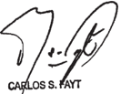

Recurso ordinario de apelación interpuesto por el Fieco Nacional (AFIP-DCI) demandado en autos representado por el Dr . Horacio Martiré Y, en 0l morial de agravios, por Dra Cribtina Noení González con el patrocinio letrado del letrado mencionado.

Traslado contestado por Bolland Y Cía actora en autob , representada por el Dr . A. Díaz Ortiz

Tribunal de origen: Sala III de la Cámara Nacional de Apelacioneg en 1o Con tenciobo Adminietrativo Federal\_

Iribunal que intervino con anterioridad: Iribunal Fiacal de la Nación

## DE JUSTICIA DE LA NACION 336

## H. C. a. S/ reStituCióN iNterNaCioNal DE MENOR

S/ ofiCio SRA. SUBDIRECTORA DE ASUNTOS JURÍDICOS DEL MINISTERIO DE RELACIONES EXTERIORES

## RESTITUCION INTERNACIONAL DE MENORES

Corresponde  confirmar  la  sentencia  que  ordenó  la  inmediata  restitución  de  un niño a España mediante el procedimiento establecido en el Convenio de La Haya de 1980 sobre Aspectos Civiles de la Sustracción Internacional de Menores (CH 1980) si frente a la postura ambigua del padre recurrente, a la carencia de prueba documental que acredite la existencia de la autorización otorgada por la madre sin fecha de retorno y a que pesa sobre quien pretende evitar que el menor sea restituido la carga de probar dicha circunstancia que permita validar la situación que se encuentra cuestionada -lo que no ha ocurrido en el caso-, solo cabe concluir que se está ante una retención ilícita del niño.

## RESTITUCION INTERNACIONAL DE MENORES

En el marco del Convenio de La Haya de 1980 sobre Aspectos Civiles de la Sustracción Internacional de Menores (CH 1980) la ponderación sobre la opinión del menor no pasa por indagar la voluntad de vivir con uno u otro de los progenitores y el convenio, por su singular finalidad, no adhiere a una sumisión irrestricta respec -to de los dichos del niño involucrado, sino que la posibilidad del art. 13 (penúltimo párrafo) solo se abre frente a una voluntad cualificada, que no ha de estar dirigida a la tenencia, sino al reintegro al país de residencia habitual.

## RESTITUCION INTERNACIONAL DE MENORES

El proceso de restitución internacional de menores no tiene por objeto dilucidar la aptitud de los progenitores para ejercer la guarda o tenencia del niño, sino que lo debatido trata de una solución de urgencia y provisoria, sin que lo resuelto constituya un impedimento para que los padres discutan la cuestión inherente a la tenencia del menor por ante el órgano competente del lugar de residencia habitual con anterioridad al traslado, desde que el propio Convenio de La Haya de 1980 sobre Aspectos Civiles de la Sustracción Internacional de Menores (CH 1980) prevé que su ámbito queda limitado a la decisión de si medió traslado o retención ilícita y ello no se extiende al derecho de fondo (art. 16 del CH 1980).

## RESTITUCION INTERNACIONAL DE MENORES

Si de acuerdo a los hechos comprobados en la causa el niño presenta un extremo de perturbación emocional que excede al que, ordinariamente, resultaría de la ruptura de la situación de arraigo en el país donde fue trasladado, frente a la posibilidad que podría ocasionar un cambio de lugar de residencia o la desarticulación de su grupo conviviente, aun cuando el desplazamiento fuese conflictivo, pues es claro que existe un grave riesgo de exposición a peligro físico o psíquico subsumible

## FALLOS DE LA CORTE SUPREMA 336

en la previsión del art. 13, inc. b, primer párrafo del Convenio de La Haya sobre Aspectos Civiles de la Sustracción Internacional de Menores de 1980 (CH 1980), afirmación que se apoya en la entidad del padecer que sufrió, corresponde revocar la sentencia que ordenó su restitución a España de acuerdo con lo instado por la madre (Disidencia del Dr. E. Raúl Zaffaroni).

## diCtameN de la proCuraCióN GeNeral

## Suprema Corte:

En la   especie; el principal   afectado viene denunciando desde un comienzo. circunstancias muy concretas que podrían corresponderse con una situación enuresis)

Entiendo que la especialísima   consistencia deesos eventuales hechos ~susceptible de comprometer seriamente e] desarrollo integral de R,-, conmina a este Ministerio Público Fiscal a proceder con extrema prudencia, de manera que no se frustre el objetivo inmediato de la Convención sobre Aspectos Civiles de la Sustracción Internacional  de Menores de La Haya, pero tampoco la vigencia efective det mejor interés  del niño.  principio éste que inspira tanto al mecanismo restítutorio que ella diseña; como a las excepciones que ~al propio tiempo - consagra, abriendo paso así a la discrecionalidad del Estado de refugio. los mi modo de vet. ese impcrativo -que no sólo surge expresamente de la Convención sobre los Derechos del Níño, sino que resulta estructuralmente compatible con Ja rigurosidad hermenéutica y temp del cilado Convenio de La no puede soslayarse hasta   ahora el variable que, en esta singular materia; no constrifie a VE poral Haya ,

resultan insuficicntcs   para determinar Ja tutela y previo dictaminar, solicito a V.E. R.

19) la exhaustiva evaluación socio ambienta] de la actora y su grupo familiar, que dé cuenta de su historia y realidad actual con particular acento en Jos aspectos relativos la salud y al desempefio laboral, familiar y social;

2 )

su eventual adicción ylo intento de suicidio. con expresa índicación de su diagnóstico, pronóstico y de cualquier referencia que se tenga en relación con su hijo R.

3*) la evaluación psicodiagnóstica de R., orientada específicamente a la existencia 0 no de psíquico en la restitucíón y a la determinación del de perturbación que esta especialistas en violencia familiar del Cuerpo de peritos de esa Corte riesgo grado

4*) si fuere menester. con esos elementos a la vista, Ia celebración de una audiencia para ofr personalmente al niñio.

a los jueces y a la Autoridad CentraL;, a la implementación de las medidas propuestas. inste

Buenos Aires.

de octubre de 2012.

## FALLO DE LA CORTE SUPREMA

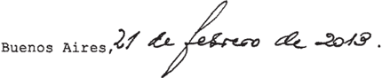

Vistos 10s autos: "H. C., A. c/ M. A. , J . A 5 / restitución internacional de menor 5 / oficio Sra. Subdirectora de Asuntos Jurídicos del Ministerio de Relaciones Exteriores"

Considerando:

1 0) Que la Sala Civil Y Comercial del Tribunal Supe rior de Justicia de Córdoba confirmó resuelto en la instancia anterior y ordenó inmediata restitución del niño R.M.H. Es paña, había sido instada por su madre, la señora A.H.C., diante el procedimiento establecido en el Convenio de La Haya de 1980 sobre Aspectos Civiles de Sustracción Internacional de Menores (CH 1980) que me -

2 % ) Que para así decidir, la corte local señaló que

el extremo vinculado 1a "residencia habitual del niño" había quedado debidanente acreditado con el certificado de estudio agregado en autos , en el que consta que el menor está matriculado un colegio público de España desde el mes de septiembre de 2006; que del acuerdo celebrado por los progenitores en la sentencia de divorcio dictada en el año surgía que la patria potestad guarda de R.M.H. había sido confiada su madre

Asimismo, el quo hizo referencia constancia de denuncia efectuada por la madre, en la que había manifestado que el menor estaba de vacaciones con su padre en Argentina que debía regresar España el 20 de diciembre de 2009 Y, comO corolario de ello, concluyó que estaban dados 1os presupuestos que tornaban procedente el pedido de restitución, considerando la permanencia del niño en el país encuadraba en la hipótesis que prevé el art 3 del CH 1980, en tanto su continuación en la Argentina importaba la violación de los derechos de guarda de la progenitora. que

Que el tribunal agregó que no se había acreditado que la restitución implicase un grave riesgo para R.M.H., ni que con ello se pusiese en peligro su estado físico psíquico se 1o colocase en una situación intolerable; que la situación emo cional por la que atravesaba el niño ante el sentimiento de tener que regresar, no poseía la entidad emplazada por la ley para justificar el incumpliniento de a normativa internacional vigente en la materia.

Por últino, concluyó que la decisión adoptada en modo alguno importaba disposición modificación de la situación jurídica del menor , sino solo su reintegro la jurisdicción del país exhortante ante cuyos tribunales correspondía que el interesado sometiera juzgamiento cualquier pretensión tendiente obtener una eventual alteración del régimen de guarda Y tenencia preexistente

Que contra dicho pronunciamiento, el padre del menor interpuso el recurso extraordinario que fue concedido

fs Sostiene que la sentencia vulnera normas de jerarquía constitucional como son los arts 10 3' de la Convención sobre los Derechos del Niño 3" , 13 20 del Convenio de La Haya sobre Aspectos Civiles de la Sustracción Internacional de Menores de 1980 (CH 1980)

Entiende que la decisión ha efectuado una errónea absurda aplicación interpretación de dichas disposiciones; que la actora no tenía la guarda del menor al momento del traslado sino que estaba en cabeza de la abuela materna. Añade que, debido la enfermedad de adicción las drogas que la madre padecía su imposibilidad de hacerse cargo del niño, la señora A.H.C consintió prestó conformidad para que el menor se radicase con el recurrente en la Argentina\_ Agrega que en ejercicio de deberes derechos inherentes la patria potestad asunió protección integral de su hijo por que no existió traslado ilegal ni retención ilícita.

Que , por último, el recurrente señala que la decisión apelada no tomó en consideración el derecho de opinión del niño que fue R.M.H. quien expresó su voluntad de residir en Argentina, no obstante 1o cual se hizo caso omiso ello sin siquiera justificar motivos de tal apartamiento un derecho reconocido internacionalmente en la Convención sobre los Derechos del Niño

6" ) Que el recurso extraordinario resulta formalnente dado que se ha puesto en tela de juicio la inteligencia de convenios internacionales Y la decisión impugnada es contraria al derecho que el apelante pretende sustentar en aquéllos (art\_ 14 , inc. de la 48 ) ley

En tales condiciones , se ha señalado en reiteradas oportunidades que cuando se encuentra en debate el alcance que cabe asignar una norma de derecho federal, la Corte Suprema no se encuentra limitada en su decisión por los argumentos de las partes del quo , sino que le incumbe realizar una declaratoria sobre el punto disputado Fallos: 308 : 647 ; 318 :1269;

330:2286 Y 333:604 Y 2396, entre otros)

Que los efectos de una mayor comprensión de las cuestiones que se plantean en la presente causa, resulta pertinente destacar las siguientes circunstancias relevantes: la señora A.H.C. el señor J.A.M.A contrajeron matrinonio el 5 de novienbre de 1999 Suiza donde el 11 de julio de 2000 nació el niño R.M.H . Al tiempo se trasladaron vivir España. El 17 de julio de 2005 el Juzgado del Distrito Judicial de CourtelaryMoutier-La Neuville (Suiza) dictó la sentencia de divorcio por 1a que se atribuyó la patria potestad del menor su madre conforme habían acordado 10s progenitores\_ Ambas partes son contestes en señalar se fijó un régimen de visitas favor del padre\_ que ruptura matrimonial, el señor J.A.M.A gresó vivir la República Argentina, radicándose en Villa Santa Cruz del Lago , provincia de Córdoba \_ En el mes de agosto de 2009 el progenitor viajó España Y, después de efectuar trámites de documentación para el niño, se trasladó con é1 es te país donde permanece hasta el día de la fecha El 1 0 de julio de 2010 , con posterioridad haber efectuado una denuncia por no haber sido regresado el menor, la señora A.H.C inició el pedido de restitución internacional de su hijo R.M.H. ante la Autoridad Central española de acuerdo con el procedimiento establecido por el 1980 (conffs 4/6 , 7/17 , 21/23 Y 28/30)

Que habida cuenta de que el presente caso trata de un pedido de restitución internacional de un niño España que se encuentra regido por las pautas establecidas en el CH 1980 corresponde, en primer lugar, tener por reproducidos todos los criterios interpretativos sentados esta Corte Suprema respecto de dicha norma en los sucesivos supuestos análogos en los que ha debido intervenir (conf Fallos: 318:1269; 333: 604 Y 2396; 334:913, 1287 Y 1445 , causa G.129 .XLVIII "G\_ P c c/ M s / reintegro de hijo" sentencia del 22 de agosto de 2012) por

No obstante ello, dadas las particularidades fácticas que presenta esta causa los argumentos expresados por las partes en el proceso, resulta pertinente efectuar el examen de las cuestiones luz de 10s citados criterios que, se adelanta, conducirá la confirmación del fallo ado por las razones que se expresan continuación\_ apel

9" ) Que agravios que se plantean respecto de la alegada omisión de considerar el interés superior del niño por parte de la corte local, resultan inadmisibles ya que el recurrente no aduce razones que permitan esta Corte Suprema apartarse del criterio establecido en Fallos: 318:1269; 328:4511 333:604 10s

10) Que en el caso no se encuentra controvertido por las partes que el lugar de residencia habitual del niño R.M.H con anterioridad su traslado este país, los efectos del CH 1980 , era la ciudad de Terrassa, Barcelona, España, motivo por el cual corresponde deterninar si en el caso existió el traslado retención ilícita que requiere el mencionado convenio

11) Que las críticas del recurrente vinculadas con la inexistencia de tal hipótesis no resultan conducentes para revocar la decisión adoptada por la corte local En efecto, al margen de que la patria potestad se ejerciese en forma conjunta por ambos progenitores ~art. 156 del Código Civil Español, conf\_ fs 4/6 y 33/34como se invoca en el pedido de restitución estuviese en cabeza de la madre en forma exclusiva según la sentencia de divorcio que obra fs 24/31 , ambas partes son contestes en que existió una autorización para que el padre efectuase el traslado, difiriendo en que respecta si ésta contemplaba una fecha límite no

En la solicitud de restitución iniciada ante la Autoridad Central española se señala que la madre accedió dar el permiso de viaje solo hasta el 20 de diciembre de 2009 , Y ante la falta de regreso esa fecha , procedió efectuar la correspondiente denuncia, agregada en fotocopia fs 32 Por su parte, al contestar demanda el progenitor señala que se le solicitó ~que el 20 de diciembre de 2009 1o regresara España" mien-

tras que en su remedio federal sostiene que la actora consintió prestó su conformidad para que el niño se radicase con él en la Argentina fs 82 y 317 vta. )

Frente la postura ambigua del recurrente, la carencia de prueba documental que acredite la existencia de la ciautorización sin fecha de retorno Y que pesa sobre quien pretende evitar que el menor sea restituido la carga de probar dícha circunstancia que permita validar la situación que en cuentra cuestionada, lo que no ha ocurrido en el caso , solo cabe concluir que se está ante una retención ilícita del niño\_

12) Que acreditada la ilicitud la que el CH 1980 supedita operatividad del procedimiento de restitución, rresponde examinar si se ha configurado la excepción que el señor J.A.M.A. invocó, consistente en el grave riesgo que correría su hijo de concretarse el reintegro ordenado por el quo debido enfermedad que padece su progenitora (alcoholismo Y adicción las drogas; art 13 , inc b, del CH 1980)

A tal es menester tener en consideración que el mencionado convenio determina como principio inmediata restitución del menor Y, en consecuencia, las excepciones dicha obligación son de carácter taxativo deben ser interpretadas de manera restrictiva fin de no desvirtuar la finalidad del con venio (conf parágrafo 34 del Informe explicativo de 1a profesora Elisa Pérez-Vera, Ponente de Primera Comisión redactora del Convenio por encargo del Décimo Cuarto período de sesiones de la Conferencia de La Haya sobre Derecho Internacional Privado) fin,

La Corte Suprema ha señalado que las palabras escogidas para describir 1os supuestos de excepción revelan el carácter riguroso con que se debe ponderar el material fáctico de la causa 1os efectos de no frustrar la efectividad del CH 1980 (conf Fallos: 318:1269; 328 4511 Y 333: 604)

13) Que en tal sentido, en su remedio federal el pa dre de R.M.H. alega que de efectivizarse la restitución se derivaría una situación de peligro perjuicio para aquél, debido que sería obligado permanecer solo bajo el cuidado de su abue-

## DE JUSTICIA DE LA NACION 336

la materna de la madre que se encuentra todavía en tratamiento por toxicomanía y que aún no ha obtenido el alta médica. Destaca que el propio menor relata que vio su madre querer agredirse con un cuchillo Y tener é1 mismo pese su corta edad que detenerla; refiere que la vio desnuda con otros honbres en su presencia Y también pone de manifestó la situación de desamparo en que se encontraba cuando permanecía su cuidado\_

Asimismo, el recurrente menciona que el niño se en cuentra bajo tratamiento psicológico, que Ya no padece enuresis Y que se le ha brindado toda la contención emocional Y psicológica que requería, además de que está perfectanente integrado la fanilia paterna siendo ~antinatural Y atentatorio del dere cho la vida una crianza plena que se vivir al niño en otro país donde no tiene familia persona mayor responsable que se ocupe de su persona-

14) Que más allá de 1o expresado por el señor J .A.M.A. para fundar la hipótesis de que el retorno del menor implicaría un "riesgo grave" para su persona, Y teniendo en cuenta la apreciación rigurosa Y prudente que debe efectuarse del material probatorio destinado acreditarlo, de la compulsa del expediente no surgen pruebas determinantes que permitan hacer operativa la excepción invocada

Ello por cuanto, 1a única constancia documental relacionada con la patología que denuncia el recurrente es un informe asistencial emitido por el servicio de toxicomanías de un hospital español (fs 180) que da cuenta que la progenitora acudió una visita de seguimiento en el mes de abril de 2011 y que en ese momento se hallaba sin tratamiento psicofarmacológico Y con control de orina negativo opiáceos Y cocaína

Las restantes referencias que se hacen en la causa respecto al consumo de drogas por parte de la señora A.H.C\_ solo pueden extraerse de 1os dichos del niño en todas las oportunidades en que fue entrevistado (fs 213 Y 234 )

15) Que en que hace la opinión del menor, esta

106

Corte ha señalado que en el marco del CH 1980 , ponderación no pasa por indagar la voluntad de vivir con uno otro de progenitores, Y que el convenio, por su singular finalidad, no adhiere una sumisión irrestricta respecto de los dichos del niño involucrado sino que la posibilidad del art 13 (penúltimo párrafo) solo se abre frente una voluntad cualificada, que no ha de estar dirigida la tenencia, sino al reintegro al país de residencia habitual (conf\_ causa G .129.XLVIII "G . P C. c/ H. M . reintegro de hijo" sentencia del 22 de agosto de 2012 ) su

16) Que teniendo en cuenta dicha inteligencia Y que excepción que hace referencia al grave riesgo solo procede como ha interpretado este Iribunal, cuando el traslado le configuraría un grado de perturbación muy superior al impacto emocional que deriva de un cambio de lugar de residencia la ruptura de la convivencia con uno de padres , corresponde concluir que en el caso no se ha acreditado una verdadera oposi ción, entendida como un "repudio irreductible regresar"

En efecto, la resistencia del niño volver España , según refieren sus dichos, se encuentra vinculada las expe riencias vividas durante su convivencia con la madre Y que en la actualidad se encuentra perfectamente adaptado la vida junto su padre, circunstancia esta última que no constituye un motivo autónomo de oposición (conf\_ Fallos: 1269; 328 4511 Y 333:2396)

17) Que asinisno, no dejar de reiterarse que el presente proceso no tiene por objeto dilucidar la aptitud de 1os progenitores para ejercer la guarda tenencia del niño, sino que debatido en autos trata de una solución de urgencia provisoria, sin que resuelto constituya un impedimento para los padres discutan la cuestión inherente la tenencia del menor por ante el órgano competente del lugar de residencia habitual con anterioridad al traslado, desde que el propio Con venio prevé que su ámbito queda limitado la decisión de si mepuede que

dió traslado retención ilícita Y ello no se extiende al derecho de fondo (conf\_ art 16 del CH 1980 y Fallos: 328:4511 Y 333: 604)

18) Que en tal sentido, no escapa al que se realiza 1a gravedad que puedan tener las declaraciones efectuadas por el denandado Y referidas por el menor profesionales que intervinieron en la causa en cuanto la existencia conportamientos inadecuados por parte de a madre durante la convivencia con su hijo, vinculados con su adicción las drogas al alcohol, circunstancia esta última que además se encuentra rroborada en parte, por el inforne médico que obra fs 180 , del que surge que aquélla estaría bajo un trataniento por toxicomanía.

Ahora bien, la decisión de restituir R.M.H. su lugar de residencia habitual con anterioridad al desplazamiento, poniendo de ese modo fin una situación irregular, no implica resolver que el niño deberá retornar para convivir con su progenitora La influencia que el citado comportamiento inadecuado pueda tener respecto de la custodia guarda del niño, hace al mérito que es posible atribuir la progenitora para ejercer cha guarda, 10 que como ya se ha señalado, no es materia de este proceso sino diferida las autoridades competentes del Estado de residencia habitual en donde deberá investigarse la cuestión

19) Que asinismo cabe tener presente que, os efectos del cumplimiento de la restitución ordenada por las instancias ordinaria Y extraordinaria de la provincia de Córdoba Y de evitar que mencionados comportanientos inadecuados por parte de la madre del niño puedan afectarlo en alguna medida, el demandado J.A.M.A no ha invocado =Y, por ende , no ha probadohallarse impedido para reingresar España, ni ha demostrado la imposibilidad de viajar Y vivir con su hijo en dicho país mientras se tramiten las acciones judiciales que considere pertinente promover fin de obtener su tenencia

20) Que con el objeto de lograr el cumplimiento de un retorno seguro del menor su lugar de residencia habitual, esta

108

Corte Suprema ha destacado en reiteradas oportunidades el rol primordial que cumplen las Autoridades Centrales de 1os Estados reguirente requerido en este de procesos la obligación que tienen de cooperar entre sí Y con las autoridades locales competentes para el funcionamiento eficaz del convenio, el de ber de garantizar la restitución del menor sin peligro (conf art 70 del CH 1980 Y Fallos: 334:1287 1445 causa G.129.XIVIII "G . c/ H . M. s/ reintegro de hijo" sentencia del 22 de agosto de 2012) tipo

En efecto, sobre la base de las Guías Prácticas del convenio, el Tribunal ha señalado , que tales obligaciones deberían implicar, entre otras cuestiones: a) 1a protección del bienestar del menor en el momento del retorno hasta que la com petencia del tribunal apropiado haya sido invocada efectivamente;

b) el aporte mutuo de información acerca de la asistencia jurídica, financiera Y social ~que debe garantizarse al padre sustractor que desee aconpañar su hijo-, Y de todo mecanismo de protección existente en el Estado requirente;

c) la implementación de "órdenes de retorno sin peli(safe return orders) que no es más que establecer procedinientos que permitan obtener, en la jurisdicción la cual el nenor es retornado, todas las medidas provisionales de proteczión necesarias antes de la restitución, gro"

d) la ayuda para acudir los tribunales locales 1o nás rápidamente posible (conf Guía de Buenas Prácticas del CH 1980 , Primera Parte, ptos 3.18 , 3.20 , 4 .23 , 4 . 24 6 .3 , págs \_ 41/43, 60/61 Y 79/80 ; Fallos: 334:1287 1445 Y causa G.129.XLVIII "G. , P C . c/ H., M. 5 / reintegro de hijo" sentencia del 22 de agosto de 2012)

21 ) Que habida cuenta de señalado Y en virtud de expresado respecto de la existencia de comportamientos inadecuados por parte de la progenitora que promovió la presente res-

titución Y las consecuencias que éstos podrían traer aparejadas respecto de la salud cofísica niño R.M.H. esta Corte entiende que corresponde hacer saber la Autoridad Central argentina que por medio de mecanismos idóneos deberá: psi a) actuar coordinadamente con par española en función preventiva ~arbitrando medios informativos, protectorios Y de asistencia jurídica, financiera Y social que fueren menester-, en orden que el regreso transcurra del modo más respetuoso la condición personal del niño Y la especial vulnerabilidad que deviene de las etapas vitales por las que atraviesa Y,

b) poner en conocimiento de Autoridad Central del Estado requirente la urgencia con que debe resolverse la cuestión vinculada con el derecho de custodia Y de visita del menor , dadas las particularidades que presenta el caso

22) Que por último, teniendo en mira el interés superior del niño ~que debe primar en este tipo de procesosla rapidez que requiere el trámite iniciado por el actor efectos de que no se frustre la finalidad del CH 1980 , corres ponde exhortar los padres de R.M.H. colaborar en 1a etapa de ejecución de sentencia los efectos de evitar al niño una experiencia aún más conflictiva Igual exhortación cabe dirigir al juez de familia cargo de la causa, que deberá realizar la restitución de la manera menos lesiva para el niño Y en condiciones que minimicen los eventuales riesgos

Por ello, Y oídos la señora Procuradora Fiscal subrogante Y el señor Defensor Oficial ante esta Corte, se declara formalmen te admisible el recurso extraordinario Y se confirma la sentencia apelada \_ Con costas (art 68 del Código Procesal Civil Comercial de la Nación) Este Tribunal exhorta los padres del menor Y al Juzgado de Familia interviniente en causa en la

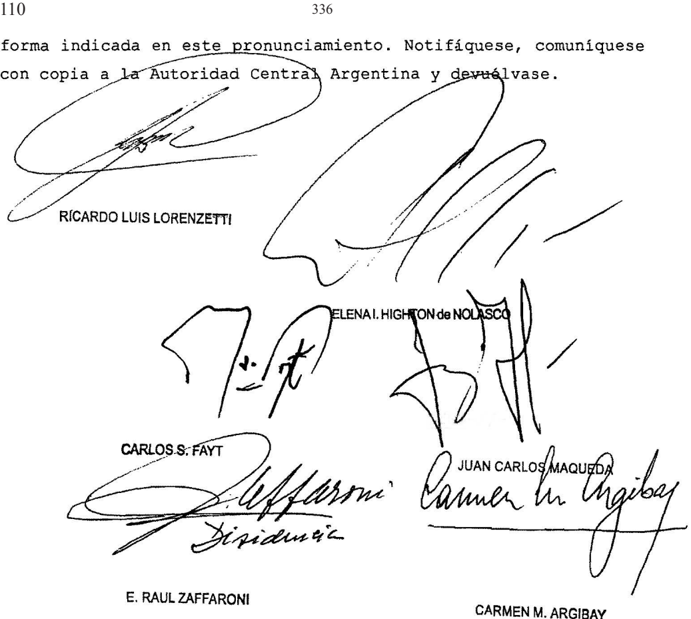

CARMEN M. ARGIBAY

## DISIJENCIA DEL SEÑOR MINISTRO DOCTOR DON E RAÚL ZAFFARONI

## Considerando:

Que el infrascripto coincide con los considerandos que encabezan este pronunciamiento 1os que cabe remitir en razón de brevedad .

8 % ) Que habida cuenta de que en el sub lite se trata un pedido de restitución internacional de un niño que se encuentra regido por las pautas establecidas en el Convenio de La Haya sobre Aspectos Civiles de 1a Sustracción Interna cional de Menores de 1980 (CH 1980) , Y sin perjuicio de los criterios interpretativos que, al respecto, ha señalado esta Corte

Suprema en cuanto atiende la aplicación de la citada convención (conf Fallos: 333:604 ; 334:913 , 1287 1445) las particularidades fácticas que presenta este caso, las cons tancias probatorias, argumentos Y posturas expuestas por las partes en el proceso constituyen un elemento de relevancia que cabe ponderar con sujeción al principio del interés superior del niño de consuno con la directriz que establece el art. 13 , inc b , de citada convención

Que , en tal sentido, cabe precisar que el lugar de residencia del niño R.M.H. con anterioridad su traslado este país, era ciudad de Terrassa (Barcelona, España) por 1o cual corresponde determinar, en primer término, si existió el traslado ilícito que requiere el CH 1980 Al respecto resulta necesario precisar que, si bien no ha sido incorporado en autos documento alguno que exteriorice 1os términos y condiciones concernientes la autorización otorgada, para viajar la República Argentina, por la progenitora que inició el pedido de restitución del menor, cierto es que ambas partes son contestes en que aquélla existió Y tuvo por objeto que el padre efectuara di cho traslado

10) Que, en las citadas condiciones no puede establecerse concretamente que hubiese mediado una supeditación de dicha autorización al deber de restitución en un tiempo deterni nado, pues las manifestaciones realizadas por el padre del nor, al contestar la demanda (fs82 , priner Y segundo párrafo) no perniten concluir sin hesitación sobre la concurrencia de tal extremo

En efecto, las expresiones referidas constituyen una explicación sucinta de sucedido, en un contexto que evidencia una complejidad cierta ~según dicho en la citada foja-, en el que participaron no solo 1os progenitores, sino que surge la intervención de la abuela materna, en concerniente al aspecto en cuestión, quien habría promovido una solicitud en relación la fecha de retorno ~obsérvese en particular la mención respecto del estado en que se encontraba la Es decir, en tanto

los términos de ese relato no permiten inferir indubitablemente la concurrencia del extremo en cuestión, fin de desentrañar las circunstancias propias de la referida autorización corresponde atender, por un lado, hechos que dieron lugar al traslado del menor Y, por el otro, aquellos que acontecieron con posterioridad, de acuerdo los elementos de convicción que obran en autos Esa indagación, más de resultar procedente en razón de las especialísimas circunstancias que fueron señaladas de la orfandad probatoria instrumental que se aprecia en la postura adoptada en autos por los progenitores, se encuentra motivada en que esa carencia también puede advertirse en la comu nicación enviada por la Autoridad Central española en 1a medida en que en cuanto hace dicho extremo, se limita reproducir las manifestaciones de 1a madre del menor, sin aportar constancia alguna demostrativa de los términos de autorización exhibida las autoridades migratorias de dicho país, en el monento en que se efectuaron los trámites correspondientes para que el menor pudiese viajar con destino la República Argentina \_

11) Que, su vez , dicho estudio resulta indispensable pues así l0 impone la directriz contenida, de modo genérico en el art 3 .1 de la Convención sobre 1os Derechos del Niño pues el principio basilar en el que se apoya esa norma "el interés superior del niño" no puede ser aprehendido ni entenderse satisfecho sino en a medida de las circunstancias particulares comprobadas en cada caso (conf Fallos: 330:642, considerando Al respecto, mediando argumentos encontrados en relación las circunstancias que dieron lugar al viaje R.M.H . de acuerdo las manifestaciones vertidas en autos por cada uno de los progenitores (a fs 81/81 vta. el padre, Y fs 206 vta. primer párrafo, la madre mediante su representación letrada (~ver fs 40-) , deben considerarse aquellas que denotan 10 acontecido en la vida del menor en ese contexto A tal fin, siendo que aquél en la citada oportunidad, tenía 9 años de edad Y por ende cursaba la escolaridad primaria obligatoria, en principio Y de modo particular, cabe considerar un dato relevante que la estrechez cognoscitiva del informe obrante fs . 179 no exteriori-

za De acuerdo la ORDRE EDU/228" del 14 mayo de 2008 , Y la ORDRE EDU/263" del 19 de mayo de 2009 , publicadas en el "Diari Oficial de la Generalitat de Catal el período de vacaciones se extendió desde el 24 de junio hasta el 13 de setiembre de 2009 ambas fechas incluidas por cual resulta poco creíble la versión de progenitora en punto que el otorgamiento de la autorización tuvo por objeto que el menor pudiese pasar una temporada con su padre entre el 5 de agosto Y el 20 de dicienbre de dicho año, pues ello habría importado la falta de concurrencia la institución escolar entre el 14 de setiembre hasta 20 de diciembre es decir un espacio de tiempo relevante para el calendario escolar establecido en las normas regulatorias referidas, máxime cuando no ha mediado explicación que, tomando en cuenta extensión de la ausencia en territorio español, justifique la pérdida que ocasionaría R.M.H . esa inasistencia Ello permite apreciar que afirmación de 1a madre resulta inconsecuente, frente las circunstancias comprobadas que indican la situación en que se encontraba menor la época de formalizarse el traslado , de acuerdo 1o que resulta del acta obrante fs 213 , labrada en ocasión de celebrarse la audiencia del día 10 de noviembre de 2010 , cuando el menor tenía 10 años de edad Y expresó que su mamá no se portó bien con é1, que su mamá hacía muchas cosas feas que una vez se quiso suicidar frente él con un cuchillo en la panza, se acostaba con otros hombres , él no tenía habitación propia Y tenía dormir en el sofá del living, que no quiere ver su mamá , que no quiere volver verla, quiere que 1o dejen tranquilo viviendo con su papá \_ Que si é1 vuelven España él se va escapar porque no quiere ir allá Que en España siempre estaba en el bar de su abuela porque ella 1o iba buscar Y ahí conía mucha grasa Y engordaba , que su abuela es muy nerviosa Y enseguida le pegaba Que su maná 1o llamó la semana pasada por tel Y él no quería escucharla hasta que tuvo que atender el teléfono porque su maná insistía Y le comenzó hablar en francés Y llorar él no le entendía nada entonces le cortó Que é1 esta bien viviendo con su papá Y no se quiere ir ningún Que terminado el acto\_firma el menor unya"1 , el que

que se expresa con mucha elocuencia" \_

Tales manifestaciones resultan consistentes con 1o expuesto, en la declaración de fs 165/167 , por médica especialista en psiquiatría infantojuvenil María Berta Sosa, quien además de reconocer la firma Y contenido de los informes obran tes fs 63/67 , ante las preguntas formuladas , exteriorizó diversos comentarios que R.M.H le efectuó, en las distintas oportunidades en que concurrió, fin de realizar ~a pedido del pa dreuna evaluación psíquica, Y su opinión científica al respecto En efecto, del informe médico psiquiátrico de fs63/65 , fechado el 15 de octubre de 2009 , por ende cercano al traslado del menor la República Argentina, surge que la especialista referida efectuó diversas entrevistas individuales con el niño, ocasiones en las que utilizó, además , "test proyectivos H.T .P (casa , árbol, persona) I.F.K. (test familia kinético) Test Desiderativo, Test Persona bajo la lluvia" Y expone que aquél le manifestó: estar viviendo una situación por demás dificil en relación la convivencia con su nadre, derivada del frecuente consumo de alcohol Y 'pastillas' por parte de ésta" su vez la declarante consideró que: "Las frecuentes intensas borracheras de ella, 1o colocan en un estado de impotencia Y desprotección En ocasiones por ejemplo no tiene quien le prepare su conida debiendo valerse por sí mismo, bien quedarse sin comer" y que R.M.H. presenció situaciones límite "como intentos de suicidio de su madre Y la ha visto en estados degradantes, cuando es sitada por hombres con quienes se emborracha Y exponen su desnudez" Asimismo, en relación la situación de que se trata, tenor de la pregunta tercera (fs 165 vta. ) atestiguó que: "la situación era de desprotección sobre todo por los cuadros frecuentes del estado de alcoholización de la madre, yo le pregunté cuántos días la semana se alcoholizaba tómaba pastillas de cía Y creo que me respondió 5 días de la madre se encontraba alcoholizada, relataba incluso que él debía cachetearla, quedaba inconsciente, como desmayada Y el menor le tiraba agua-era cotidiano para el niño verla en ese estado" Además al responder las preguntas formuladas por los letrados de ambas partes vi-

relativas visto por el menor respecto de las situaciones de desnudez (fs 166) , señaló que le dijo: "que la solía ver dormía con ella en la cama grande veces en un sillón cuando su mamá venía con alguien dijo que un día la vio, estaba un tío (es decir un honbre que él no conocía) con todo el chocho (es decir refiriéndose las partes íntimas) al aire" que vio al hom bre la madre desnudos Y ella alcoholizada sin poder darse cuenta de la situación acostados estaban sin precauciones como mostrándose"

12) Que las circunstancias mencionadas en el considerando anterior ilustran el acaecimiento de un entorno de situación que resta verosimilitud la motivación del viaje invocada por madre, con una finalidad de visita de simples vacaciones , pues además de no ajustarse el plazo de alegado regreso con el período de receso escolar en el territorio de residencia del menor, según se ha visto, tampoco condice con las previsiones que dicho viaje requería en orden la carencia de todo tipo de documentación de identidad del menor, tal punto que el progenitor debió concurrir ante el Consulado General de la República Argentina en Barcelona, con el objeto de que se realizaran tiones ante el Registro Civil Central de Madrid para obtención de la partida de nacimiento de R.M.H. Y con tal instrumento proceder a tranitación del D.N.I. español Y, después , del pa saporte (fs 160) Esta apreciación permite considerar que el referido traslado fue motivado por otras causas que, por sus implicancias, hacían que el niño no pudiese ser contenido Y asistido en sus necesidades vitales, es decir que se encontraba en serio riesgo su integridad psicofisica que en defecto de progenitora, la abuela materna no se encontraba en condiciones de hacerlo, por cual la solución la que se acudió en 1a encrucijada fue 1a que en definitiva aconteció, esto es el viaje la República Argentina. A tal conclusión también puede arribarse partir de la lectura del informe asistencial obrante fs 180 , en la medida en que expresa el estado de salud de madre al 6/4/2011 (más de un año Y medio después de 1os hechos reseña-

dos en el considerando 11 el presente) señala que ~acude visita de seguimiento\_ En estos momentos sin trataniento psicofarmacológico Y realiza un control de orina que negativo opiáceos Y cocaína" (el resaltado no se encuentra en el texto original) pues estas acotadas referencias ante un requerimiento de mayor amplitud como el que resulta del oficio de fs 114/115 (solicitud sobre la internación de A.H.C para ser sometida tratamiento de desintoxicación Y rehabilitación de sustancias psicotrópicas Y estupefacientes.Y remisión de la historia clínica debidamente legalizada) como antecedente, indican la existencia de una conducta nociva derivada de la adicción que requirió s1 tratamiento, cuya entidad, duración Y prognosis evolutiva no fue informada

13) Que la entidad de la situación reseñada , como fue señalado \_ impide aseverar que el tiempo de permanencia del menor en la República Argentina fue concreta Y formalmente determinado Ahora bien, no obstante que tal circunstancia no resulta sustento idóneo para habilitar, per se, hipótesis de un canbio de residencia de carácter definitivo consentido, no cabe soslayarla en cuanto hace su incidencia en relación al princila directriz citadas en el considerando 8 de la presente pio

14) Que en dicha dirección, cabe ponderar 10 que surge del informe elaborado en fecha cercana al traslado del me nor (15/10/09) , de acuerdo la evaluación realizada por la doctora Sosa (fs 64/65) , donde fue expresado que: "Su estado anímico se encuentra afectado, reconoce sentirse enfadado con su madre también temeroso por su futuro\_ Anhela trasladarse Argentina Y residir aquí con su padre, pero teme reacción de su madre Y las consecuencias de esta reacción en él. En el material proyectivo administrado se visualiza claranente la situación conflictiva con su madre (se niega dibujarla Y refiere: está perdida) su actitud de vigilancia, tendiente al control de elementos hostiles , desconfianza en su entorno, por momentos desaliento depresión. Cono mecanisno de defensa utiliza predomi nantemente la negación, una tendencia negar las presiones Y conflictos del medio (No dibuja la luvia en el Test de perhay

sona bajo lluvia) De este modo logra sobrellevar las adversidades manteniendo una integridad yoica, claro que costa de una sobre adaptación. R.presenta las características que James Cocores describe en su 'Co-Addition: silent epidenic' hijos de adictos que se auto exigen, adultificándose precozmente, debiendo pese su corta edad comportarse como   padres de sus pa dres interviniendo mediatizando las relaciones de sus padres con las denandas del mundo externo Asumiendo responsabilidades por ellos , encubriendo Y protegiendo al adicto\_ Se sienten heri dos deprimidos, con sentimientos de soledad, enojados frustrados Y hasta culpables A su vez, no cabe omitir, que la mencionada médica especialista en psiquiatría infantojuvenil concluyó ese inforne expresando que R.M.H "se encuentra en una situación grave, de riesgo para su desarrollo psíquico emocional" Y que consideró "necesaria la inmediata separación de este ambiente nocivo para el niño" en referencia 10s padecinientos que s0 portó durante su residencia en Barcelona El informe de fs 66/67 ilustra la entidad de 1os sufrimientos sus consecuencias sobre el menor, pues permite apreciar no solo su estado un año después sino la trascendencia de las condiciones que 1o afectaron, en cuanto si bien se señala que "en el momento actual se muestra como un niño saludable, alegre, comunicativo Ha mejorado notablemente su desarrollo pondo-estatural, habiendo desapa recido el sobrepeso de un año atrás" también se expone que "No obstante la sensación de vulnerabilidad se hace presente cuando se menciona cualquier hecho que pueda significar la posibilidad de regresar la convivencia con su madre Aparece entonces la angustia ante el riesgo de perder 1a estabilidad obtenida Lo expresado precedentemente revela hasta punto fue afectado emocionalnente el menor Es necesario continuar el proceso de recuperación iniciado El retornar la situación previa de con vivencia con su madre pone en riesgo el desarrollo psicofisico del niño Y las previsibles consecuencias en su vida ulterior" qué

15) Que en tanto 1os informes referidos se sustentaron en las manifestaciones vertidas por el niño y la evaluación que doctora Sosa realizó, cabe ponderar su vez aquello que

ésta declaró al responder la repregunta efectuada , por el asesor letrado de la progenitora, respecto de la sinceridad de relatos de aquél (fs 165 vta. ) en cuanto afirmó: ~ESTE CHICO NO MENTIA, NO ME PARECIÓ PRESIONADO , ME PARECIÓ QUE HABLABA ES PONTÁNEAMENTE , LE TOMÉ MUCHOS TEST PARA VER LOS ASPECTOS INCONS CIENTES NO SÓLO LOS MANIFIESTOS Y DE AHf CONCLUÉ QUE EL MENOR NO MENTÉA, UNO DE LOS TEST ES EL DIBUJO DE LA FLIA KINÉTICA QUE REVELA LAS IDENTIFICACIONES CON LOS MIEMBROS DE SU FAMILIA LOS AFECTOS , LAS RELACIONES COMO VALORA , PERCIBE IDENTIFICA A CADA MIEMBRO DE LA FAMILIA Y EL SE PUSO REALMENTE MAL, NO LA PUDO DIBUJAR A LA MADRE , LA TACHO , DIJO NO , NO , NO QUIERO SABER NADA DE ELLA ESTA PERDIDA . LA TACHO TODA (la escritura en mayúsculas se encuentra en el original) Además , cabe agregar que en la respuesta la pregunta cuarta (fs 166) relativa las manifestaciones del menor respecto de la posibilidad de regresar ba jo el cuidado de su madre, declaró que: "no no quería volver con la madre además expresaba que para él la comida es algo muy importante, no tenía quien le preparara de comer , é1 se prepara ba unos bocadillos solo si no nada él se preparaba la comida solo, bien iba comer de la abuela, no la recordaba su mamá en esas funciones como madre nutricia como madre protectoal tiempo de responder la pregunta octava (fs 166 vta.) formuló una aclaración del siguiente tenor: "LO VI MUY ANSIOSO EL NENE CUANDO LLEGABA , SE RESFREGABA LAS MANOS SE HACIA . SONAR LOS DEDOS , NO TENIA HÁBITOS DE HIGIENE INCORPORADOS , TENIA COSAS DE MORTIFICARSE EL CUERPO QUE ES CARACTERISTICO DE STRES DE LOS HIJOS DE ALCOHOLISTAS , PORQUE ÉL NO ESTABA TRISTE ES UN CHIQUITO SOBRE ADAPTADO , FUNCIONABA COMO ADULTO EN CONTROLES QUE NfA QUE HACER EN SU CASA ALLÁ Y TENIA EPISODIOS DE ENURESIS SE HACIA PIS EN LA CAMA. (la escritura en mayúsculas está en el original) ra"

16) Que elementos de convicción reseñados determinan que el presente caso tiene particularidades que 1o distinguen nítidamente de otras situaciones. En efecto: durante un período cuya extensión no puede precisarse con exactitud debido escaso de la información dada por el instituto asistencial

(fs 180) pero que en cualquier caso se descarta la hipótesis de una situación meramente ocasional, el menor ya los nueve años de su vida ha sufrido un trato de extremo abandono que, por acción por omisión, virtualmente configura un maltrato importante y que, por mismo, dado el sufrimiento que ha implicado es altamente lesivo de las condiciones de salud mínimamente cesarias para garantizar una evolución psíquica dentro de parámetros normales Más aún , ignoramos las secuelas imborrables la fijación de esas condiciones pueden haber dejado en el menor y hasta punto pueden comprometer dificultar su vida futura, que por cierto no puede descartarse, teniendo en cuenta todo probado en autos; nás bien induce pensar que existe una fuerte presunción al respecto \_ A su vez , se observa en el sub lite que al Estado Español le ha pasado inadvertida esa circunstancia Y que en momento alguno ha tomado recaudos para interrumpirla para remediarla, Ya sea por vía administrativa judicial, aunque cabe presumir que R.M.H. debe haber pasado por momentos en que el Estado ejerce un mínimo control (escuela, hospital, etc. ) , pues un estado de abandono de tal gravedad que se traduce en claro maltrato, con consecuencias incluso para su salud física, no fue notado por autoridad lócal alguna, ni siquiera escolar, al punto que el niño no tenía documentación propia fue necesario tramitarla para posibilitar su viaje la República Argentina, máxime cuando el informe agregado fs 179 (proveniente de Escola Les Arenes) exhibe una absoluta marginalidad en relación al acontecer descripto, al reflejar un contenido literal claramente elusivo al respecto neque qué

17) Que por cierto, conforme los principios que rien la materia, el procedimiento de restitución inmediata instaurado por el CH 1980 se encuentra inspirado en la regla del interés superior del niño establecida por Convención sobre los Derechos del Niño ~aprobada por la 23.849-, dado que en su preámbulo Estados firmantes declaran "estar profundamente convencidos de que el interés del niño es de una importancia prinordial para todas las cuestiones relativas su custodia" ; que no existe contradicción entre dichas fuentes en tanto ambas gen ley los

propenden la protección del citado interés superior, Y que el CH 1980 parte de la presunción de que el bienestar del niño se alcanza volviendo al statu quo anterior al acto de desplazamiento retención ilícitos, preservando el mejor interés de aquél mediante el cese de la vía de hecho (Fallos: 318:1269; 328:4511 Y 333:604) ; también resulta indispensable el exanen respecto de la configuración de alguna de las excepciones las que el CH 1980 supedita la operatividad del procedimiento de restitución que alegadas por el progenitor, obstarían la solución adoptada por el quo .

Para afrontar ese estudio no cabe omitir que ambos Estados , requirente Y requerido, deben haber actuado con sujeción al respeto del interés superior del niño, que en todo mento es presupuesto para el ejercicio de la competencia atribuida en razón del lugar donde el menor residía con anterioridad al traslado Y, en este sentido, resulta en extreno dudoso que el Estado requirente haya cumplido con dicho presupuesto, puesto que no ha atendido elementales diligencias de observación Y protección del propio niño, sea, con su elemental deber de velar por la salud Y la integridad física psíquica de éste, cuando resulta claro que alguien está maltratando un niño que son observables por la Administración, principalmente porque el mal trato fue de una entidad Y gravedad que provocó consecuencias irresueltas sobre la persona de R.M.H. al punto que según re sulta del acta de fs 235 , en la la licenciada Nora Newell\_ psicóloga del Equipo Técnico de la sede judicial interviniente manifiesta que: "el niño se muestra colaborador, siendo su discurso lúcido coherente, resuelto de manera consciente Y con cierto aplono respecto de las decisiones que toma adoptando una postura propia de niños de mayor edad (madurez) angustiándose notorianente cuando se abordaban temas relacionados su progenitora frente la posibilidad de ser restituido la misma en España . No se advierte una marcada influencia adulta en las ma nifestaciones sus necesidades justificando su permanencia junto su padre en diversas dificultades Y conflictos que ha bría sufrido cuando vivía con su madre, las cuales relata de cual

nera espontánea , evidenciando malestar al recordarlas, temiendo revivir tales circunstancias En consecuencia, siendo que en el sub examine surgen elementos relevantes de excepción, que aparecen ignorados por el Estado requirente, en tanto no tomaron ninguna intervención en un caso de abandono de sémejante gravedad su solicitud se limita exteriorizar el pedido de la guardado ra, es precisamente que, por su enfernedad incapacidad, ha resultado claramente la causante de la producción de semejan te daño, resulta propio las facultades del Estado requerido velar por el principio del interés superior del niño (prius jurídico proclamado por el art 3 .1 de la Convención sobre Derechos del Niño) en la medida en que sobre este principio posa la presunción, de la que parte el CH de que el bienestar de aquél se alcanza volviendo al statu quo anterior al acto del desplazamiento de retención ilícitos, pues si bien es cierto que su mejor interés importa el cese de la vía de hecho, en orden que la víctina de un fraude de una violencia debe ser, ante todo , restablecida en su situación de origen, también prevé que esa presunción queda sujeta la inexistencia de ciertas circunstancias reguladas en el texto convencional que

18) Que, en efecto, en el caso no se trata de la mera invocación genérica del beneficio del niño, por el contrario la actitud indiferente frente un abandono en límite de maltrato grave, no observado por ninguna autoridad hasta el extreno de que careciese de documentación Y, para colmo con el claro objetivo de que vuelva convivir con la causante de su abandono grave, sin que importe cuál puede ser el daño que aquél sufra por reactualizar las vivencias traumáticas Y dolorosas de su infancia, cuando contaba nueve años más cuando actualnente tiene doce años Y, por ende , se aproxima una etapa crítica su evolución, resultan circunstancias relevantes que deben ser atendidas por el Estado requerido en los términos del art 13 , inc de la CH 1980 . Al respecto, si bien la señora Procuradora Fiscal subrogante, previo dictaminar, sugirió conveniencia de practicar evaluaciones socio ambientales de la actora Y su grupo familiar Y psicodiagnóstica del menor Y el requerimien-

to de informes sobre los antecedentes hospitalarios de la progenitora, con expresa indicación de su diagnóstico Y pronóstico, lo que denota la seria posibilidad de que el retorno al nedio en que pasó los primeros nueve años de su vida en el que sufrió las graves consecuencias con que llegó al país, le reactualice sus anteriores padecimientos pudiendo provocar un daño mayor en su salud psíquica\_ No obstante, el estado calamitoso en que el niño llegó al país no hace necesarios tales estudios, pues cualquier lego está en condiciones de valorar que no es admisible se corra semejante riesgo, ante la gravedad de las vivencias pasadas Huelgan 1os estudios frente 1a obviedad: un niño tratado no puede ser devuelto quien ocasionó ese trato, solo porque reclame la Autoridad Central del Estado en cuyo territorio tuvo efecto el maltratamiento que mal mal

19) Que , en consonancia con las consideraciones hasta aquí expuestas Y los hechos comprobados en la causa, R.M.H. presenta un extremo de perturbación emocional que excede al que ordinariamente, resultaría de 1a ruptura de situación de arraigo en el país donde fue trasladado , frente la posibilidad que podría ocasionar un canbio de lugar de residencia des articulación de su grupo conviviente, aun cuando el desplazamiento fuese conflictivo, pues es claro que existe un grave riesgo de exposición peligro físico psiquico subsumible en 1a previsión del art 13 , inc b, primer párrafo, del CH 1980 Esta afirnación, lejos de afincarse en la situación de estabilidad lograda partir del traslado, según indican las constancias probatorias examinadas se apoya en la entidad del padecer que sufrió el niño, que dejó huellas imborrables, al punto en que no se ha podido receptar alguna manifestación de su parte que indique el deseo de ver su madre que la eche de menos Por el contrario, las constancias reseñadas informan que lejos de sentir falta del contacto con aquélla, se angustia notoriamente (el resaltado no se encuentra en la cita) cuando se la menciona frente la posibilidad de un regreso España, ya con once años de edad, (conf. evaluación de la licenciada Newell, citada en el

considerando 17) situación que también fue acreditada respecto de las reiteradas oportunidades en que fue tratado por la doctora Sosa (ver considerandos 14 Y 15)

20) Que, por último, no cabe soslayar que 1os doce años la voluntad del niño no puede ignorarse por completo, ni mucho menos , Y en el caso R.M.H. no solo l0 expresó repetidamente, sino que esas manifestaciones las sustentó en 1os sufrimienpasados raíz de convivencia con su progenitora al justificar "su pernanencia junto su padre en diversas dificultades conflictos que habría sufrido cuando vivía con su madre" (fs 235) , circunstancia que había sido expresada en las distintas ocasiones en que fue evaluado por la declarante en fs 165/168 , testimonio que no fue objeto de cuestionamiento Es decir que existe por parte del menor un evidente rechazo regre sar que, al sostenerse en los hechos que ocasionaron las lesiones de gravedad reseñadas , también hace operativa la eximente contemplada en el art 13 inc b , segundo párrafo' del CH 1980 , en tanto responde un conflicto férreo expuesto por el niño, respecto del cual las profesionales que evaluaron (Newell Y Sosa) no advirtieron que hubiese sido objeto de manipulación en tal sentido tos

Por ello, Y oídos la señora Procuradora Fiscal subrogante Y el señor Defensor Oficial ante esta Corte, se declara procedente el recurso extraordinario interpuesto, se revoca a sentencia, se rechaza el pedido de restitución efectuado por la señora A.H.C. Con costas (art 68 del Código Procesal Civil Y Comercial de la Nación) Notifíquese' comuníquese con copia Autoridad Central Argentina Y devuélvase

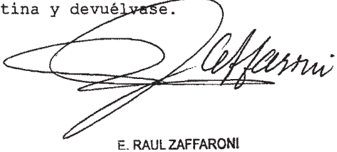

Recurso extraordinario interpuesto por J.A.M.A. patrocinado por el Dr Jobé Eduardo Araujo

Traslado contestado María Esperanza Picotto Letrada ad hoc en reprabentación del menor por Graciela Berta Gamboa Asesora letrada en ropreBentación de A,H.C

Tribunal de origen: Tribunal Superior de Justicia ~Sala Civil Comercial de 1a provincia de Córdoba

Tribunales que intervinieron con anterioridad: Juzgado Civil, Comer \_ Conc Fanilia de Villa Carlos Paz

## N.N. S/ reCurSo extraordiNario

## HABEAS CORPUS

Cabe declarar abstracto e inoficioso el tratamiento del recurso extraordinario in -terpuesto contra la sentencia que había desestimado la acción de hábeas corpus colectivo incoado -que  tenía como objeto hacer cesar el alojamiento en las comisarías dependientes de la Policía Federal Argentina con asiento en la CABA de menores de dieciocho años, por el período comprendido entre el momento en que son aprehendidos hasta que el juez de la causa dispone su soltura o su alojamiento en el instituto correspondiente, por ser contraria al corpus juris internacional en materia de derechos de los jóvenes en conflicto con la ley penal-, en virtud de haber cesado el alojamiento transitorio en tales dependencias, con motivo de la  puesta en funcionamiento del 'Centro de Admisión y Derivación de Adolescentes Presuntos Infractores de la Ley Penal'.

## FALLO DE LA CORTE SUPREMA

Vistos 1os autos: "N.N. 9 / recurso de casación"

## Considerando:

Que la Sala II de la Cámara Federal de Casación Penal , por mayoría, confirmó el rechazo, dispuesto en las ingtancias anteriores, de acción de hábeas corpus colectivo presentada por el presidente de Fundación Sur Argentina, Dr Emilio García Méndez . Contra aquel pronunciamiento, mencionada Fundación interpuso el recurso extraordinario de fs . 535/556 que luego de ser sustanciado, fue concedido fs . 582

Que de las constancias de causa surge que la acción de hábeas corpus en trato tenía como objeto que cegara, ser contrario al corpus juris internacional en materia de' derechos de 1og jóvenes en conflicto con la ley penal, el alojamiento en las comisarías dependientes de la Policía Federal Argentina con asiento en la Ciudad Aútónoma de Buenos Aires de 1os menores de dieciocho años , por el breve perlodo que comprende el en que son apreliendidos por las fuerzas de prevención por la presunta infracción a penal, hasta que el juez de la causa dispone soltura bien u alojanlento en el instituto correspondiente. Para el accionante, este alojaniento en Comisaríag devenía en ilegítimo no en razón de ser contrario estándares internacionales que, entiende, lo proscribirían de plano, sino porque, ademá 8 , éste no satisfacería 109 requisitos de especlalidad que rigen la ejecución de esta detenclón, por que se debía resguardar tanto 1a de menores de edad de los adultos como que su supervisión estuviera cargo de personal calificado con capacitación en materia el que adenás , no podría estar armado (cf fs 1/89) \_ En consecuencia, luego de sostener que una de las formas en que el Estado debe asumír su posición de garante es justamente garantlzando un dispositivo especializado de alojamiento de niños , nifas Y adolescentes , con personal especializado que sustituya la actual práctica de alojaniento en dependencias policiales de adultos con personal de las fuerzas de seguridad" (cf fs . 84/84 vta. ) en el petltorion solicitó se hiciera lugar 1a Ón Y se Ordenara la "proscripción de toda privación de libertad en depen dencias policlales ~por implicar un ilegitimo agravamiento de las condiciones de detenciónde niñas Y adolescentes quenes se les impute un hecho de competencla de la justlcla Na cional de Menores" fs \_ 89/89 vta.) por ley acci

3") Que esta acción fue rechazada en primera Y segun da instancia con fundanento en que, más allá de que estaba en vías de implementación el centro de alojamiento especializado que pondría fin la práctica denunciada, ésta no implicaba un agravamiento de condiciones de detención de estos jóvenes,

en la medida que se 1levaba cabo en determinadas comisarías metropolitanas con separación de adultos Y bajo supervisi6n de un funcionario policial capacitado, con funciones de celador , que no portaba arnas

Que el tribunal quo rechazó, pOr mayoría, el recurso de casación interpuesto pOr el accionante por valorar, de modo preponderante, que era inminente la puesta en funcionamiento de un centro específico para el alojamiento de estos me nores, cuya construcción fuera ordenada coordinada por el Ministerio de Seguridad la Nación Y la Secretaría Nacional de Adolescencia Fanilia del Ministerio de Desarrollo Social, por 1o que, sin perjuicio de 1o resuelto, enconendó esta el estricto cumplimiento de acordados pa ra que, en un de ciento veinte días , el centro en tión estuviera en funcionamiento Y, asinismo, puso al Ministerio de Seguridad de Nación en conociniento de 1o resuelto

5") Que en el recurso extraordinario, que fuera concedido , el recurrente se agravió por entender que se convalldó respecto de 1os jóvenes alojados en las sujetos la jurisdicción nacional Y federal, un trato desigualitario respecto de sus pares sujetos la jurisdicción metropolitana, que s1 cuentan con un centro de alojamlento adecuado Y tanblén su modo de ver, arbitrariedad mediante, resuelto implicó tanto desnaturalizar acción de hábeas corpus como vulnerar el derecho 1a tutela judicial efectiva por que, siempre desde su perspectiva Y con cita de 10g precedentes "Verbitsky" Y "Rivera Vaca" (Fallos: 328:1146 332:2544) , sostuvo en 1a medida que se reconoció que existía una vulneración derechos de niños adolescentes alojados en estas comisarías, se debió haber ordenado que esa práctica cesara Y también haber man tenido abierta 1a jurisdicción para asegurar que efectivamente se pusiera en funcionamiento el centro específico para su aloja-miento\_ que 1os

6*) Que , desde antiguo, tiene dicho esta Corte que sentencias deben cenirse las circunstancias dadas cuando

se dictan, aunque aquellas sean sobrevinientes la interposición del recurso extraordinario (Fallos: 310:1070; 311:787, 1810 Y 2131; 318: 625; 320: 875, 2603; 328 ;3996; 329:1898 Y sus citas; 330:2046, 4030) Ello, pues la subsistencia requisitos Jurisdiccionales comprobable de oficio Y su desaparición porta la del poder de juzgar (Fallos: 315:466; 327:2656, 4830)

Que como resultado de las medidas para mejor veer ordenadas el Irlbunal, se encuentran agregados fs 600/623 del expediente infornes brindados por el Ministerio de Seguridad de la Nación Y la Secretaría Nacional de Niñez, Adolescencia Familia del Ministerio de Desarrollo Social (SE NAF) de 1os que se constata que con motivo del dictado, con fecha 22 de junio de 2012 , de 1a Orden del Día Interna n' 114 Y de la resolución 927 del SENAE , desde el 25 de junio del mismo año ha cesado el alojamiento transitorio en el ámbito de dencias policiales de los menores de dieciocho años de edad que motivara acción de hábeas corpus colectivo de cuyo rechazo se agravlara el recurrente. propor 1os

En este sentido, cabe resaltar que de 1os citados 1nformes resulta que , partir de esa fecha, este alojamiento se debe materializar en un dispositivo específico denominado "Centro de Adnisión Y Derlvación de Adolescentes Presuntos Infractores de la Penal" , que ha sido puesto en funcionaniento tal efecto en virtud del pertinente convenio de cooperación formalizado entre os citados organismog . Por su parte, del anexo de resolución 927 del SENAE se desprende que en dicho centro Jovenes serán alojados por un plazo máxmo de doce horas , queda garantizada en dicho lugar la presencia permanente de personal especializado del SENAF Y que, una vez que 1os menores de edad sean allí trasladados por las fuerzas de seguridad, serán llevados al sector de alojamiento que estará bajo exclusiva administración dependencia del citado personal, el que deberá , además acompañarlo en toda diligencia posterior, sin perjuicio de 1a intervención del personal de las fuerzas de seguridad Ley que

Que corrido traslado al apelante de dicha documentación fin de que se expidiera sobre subsistencia de 1os agravios incoados , el Presidente de Fundación Sur Argentina manifestó que de ésta surgiría que habría cesado la detención de menores en las comisarías pero, no obstante ello, sostuvo que su pretensión no había devenido abstracta que ~de informes adjuntados en el expediente no se desprende el modo , tiempo , lugar Y condiciones en virtud de las cuales se llevan cabo detenciones de las personas menores de edad acusadas por la presunta comisíón de un de competencia nacional [ por 10 que] esta parte entiende que se debe mantener jurlsdicción abierta dado que s610 asf se permite la constatación Y evaluación de las condiciones de detención del colectivo amparado, fin de deterninar s1 efectivamente ha cesado la de 1os derechos" (fs. 627/631) \_ las

9 %) Que este Tribunal entiende que, en razón de la normativa sobreviniente antes citada, las cuestiones sometidas su decisión en el recurso extraordinario se han tornado abstractas

En efecto, no debe perderse de vista que la acción en examen se circunscribió, exclusivamente, obtener el cese de la práctica institucional de alojar en dependencias policiales niñas, niños Y adolescentes menores de edad , que son detenidos en virtud del inicio de causas penales en las que interviene la Justicia Nacional de Menores (confr. 77/77 vta. ) Y que fue sobre tal petición que se expidieron los magistrados de las instancias anteriores (confr\_ fs . 179, 292, 503/503 vta. )

En razón de ello, Y atento que de 1a efectuada en 1os considerandos precedentes se verifica que con 1a puesta en funcionamiento del dispositivo cesó la práctica que el accionante tachara de en 1a acción del hábeas corpus debe concluirse no solo que a pretensión perseguida en a presente acción ya se ha visto concretada sino: también que, ante este cuadro de situación, devlene inoficioso que esta Corte analice 1os agravlos formulados por el apelante en el recurso ex-

traordinario por los sostuviera que el tribunal quo debió haber ordenado que esa práctica cesara Y nantenido abierta la jurisdicclón para asegurar que efectivamente se pusiera en funcionaniento dicho centro. que

En esta línea, corresponde señalar, en virtud de 1os argumentos vertidos por el apelante en su presentación de fs 627/631 , que 10s eventuales cuestionamientos relativos si el nuevo dispositivo se ajusta fielmente lo previsto en el corpuS juris internacional en materia de condiciones de detención de menores de edad, en tanto ajenos por definición con cretos agravios formulados tanto en la acción corpus como en el recurso extraordinario, deberán , en todo caso , ser planteados ante la instancla competente en el marco de un proces0 en el que se discuta, con la debida sustanciación de prueba Y reeguardo del contradictorio, el análigis de 1os extremob de hecho Y de derecho que juicio del recurrente podrIan verbe 1nvolucrados

Por ello, 8e declara que cuestiones decia16n del Tribunal han tornado abbtractas inoficobo un prOnunciamlento 8u orden en virtud de fundamentoe de 1a presente (art 68 , parte, del Código

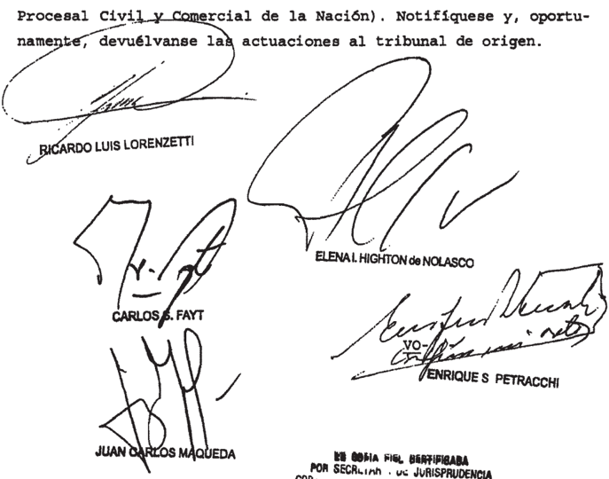

## ~/-Io DON ENRIQUE\_SANTIAGO PETRACCHI

## Considerando:

Que el recurso extraordinario es inadnisible (art. 280 del Código Procesal Civil Y Conercial de la Nación)

Pòr ello, se desestina el recurso interpuesto Notlflquese Y, oportunamente, devuelvase\_

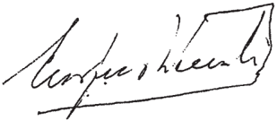

Recurso extraordinario interpuesto por García SurArgentina) con el patrocinio letrado de 1a

Iraslado contestado por el Dr Rúl Ple6 , ante de Cabución Ponal Muntos de 1a Bocretaríe Naoional de de Dobarrollo representado por el Martín Navarro, 4 Istado Nacional de 1 Naaión, representado por

Iribunal de origen: Federal Penal , II\_

\_\_\_\_\_\_\_\_\_\_\_\_\_\_\_ Irlbunales que intervinieron con anterioridad: Nacional 1o Correccional , II VI Jurgudo Criminal de trucción 26

## PEREZ ORTEGA  LAURA FERNANDA C/ HONORABLE CAMARA , DE DIPUTADOS DE LA NACION S/ EMPLEO PÚBLICO

## EMPLEO PUBLICO

Cabe dejar sin efecto la sentencia que rechazó la acción que perseguía la declaración de nulidad de la resolución del Presidente de la Cámara de Diputados que revocó la designación de la peticionaria en un cargo de planta permanente porque no cumplía el requisito de ser argentina -exigido en el art. 7º, inc. d, de la ley 22.140- para el ingreso a la Administración Pública Nacional, pues, al declarar desierta la apelación interpuesta por la actora, el a  quo no solo incurrió en excesivo rigor formal en la manera de apreciar la técnica del recurso interpuesto, sino que omitió pronunciarse sobre cuestiones federales oportunamente introducidas y sobradamente conducentes para la resolución del caso, como es el planteo de inconstitucionalidad del art. 7º, inc. d, de la ley 22.140, y que la actora consideró contrario a los arts. 14, 14 bis, 16, 20 y 75 inc. 22 de la Constitución Nacional.

## ACTOS DISCRIMINATORIOS

El art. 7º, inc. d, de la ley 22.140, que exige  el requisito de la nacionalidad a fin de ingresar a la Administración Pública Nacional, resulta violatorio de la Constitución Nacional por imponer una distinción basada en la nacionalidad que, al ser considerada sospechosa de discriminación, no supera el exigente criterio de ponderación que requiere el control de constitucionalidad en éstos casos.

## ACTOS DISCRIMINATORIOS

La reglamentación que distingue entre nacionales y extranjeros no es, en principio, inconstitucional, por lo que el legislador se encuentra habilitado a emplearla siempre que el criterio de ponderación entre el medio elegido y los fines específicos que se persiguen con la distinción superen el aludido test (Disidencia parcial de los jueces Elena I. Highton de Nolasco y Juan Carlos Maqueda).

Suprema Corte:

I

A fs. 357/358, la Cámara Nacional de Apelaciones en lo Contencioso Administrativo Federal (Sala II) confirmó la sentencia de la instancia anterior que había rechazado la demanda interpuesta por Laura Fernanda Pé rez Ortega contra la H. Cámara de Diputados de la Nación; a fin de obtener una indemnización por cesantía incausada.

Para así resolver sostuvo, en primer término; que no se encontraban cumpllaos los requisitos previstos en el art. 265 de CPCCN, dado que la apelación bajo examen no se había presentado como una crítica concreta y razonada de la sentencia recurrida, requisito que no era sustituible con una mera discrepancia del criterio juzgador, sino que implicaba el estudio de los razonamentos de aquél, demostrando las equivocadas deducciones, inducciones y conieturas sobre las cuestiones resueltas.

Sin perjuicio de l0 expuesto; destacó seguidamente:

1.- que el hecho de que en la resolución atacada se citase una norma cronologicamente posterior a su cese; en nade había afectado el derecho de defensa de la actora; atento a la identidad del objeto regulado y de los sujetos destinatarios 24.600. ley

2.- que la aseveráción de la juez de que no medió una excepción expresa que permitiera su designación válida; no había sido debidamente controvertida por la actora y que, por el contrario; las afirmaciones que realizó sobre el punto no hicieron más que de sustento a su tesis de que la dispensa del requisito de la nacionalidad ser tácita. privar podía

3 que tampoco se verificó en el caso, lo que la actora denominó 'cosa juzgada administrativa' Refirió que la Corte Suprema de Justicia de la Nación en Almagro"" (sentencia del 17/02/1998), interpretando los arts. 17 y 18 de la ley 19.549, sostuvo que las øxcepciones a la regla de la estabilidad en sede adminis-

## FALLOS DE LA CORTE SUPREMA 336

## diCt A meN de la proCuraCióN GeNeral

frativa del acto ar 18 entre ellas, el conocimiento del vicio por el interesado eran igualmente aplicables al supuesto contemplado en cl art. 17 primera De lo contrario; el acto nulo de nulidad absoluta gozaría de mayor estabilidad que el regular, lo cual no constituiría una solución razonable ni valiosa. Agregó que una correcta hermenéutica del pronunciamiento y de las normas 22.140 designaciones efectuadas en violación a lo dispuesto en los artículos 7 y 89, 0 de cualquier otra norma vigente; podrán ser declaradas nulas, cualesquiera sea el tiempo transcurrido. daban por tierra con la argumentación de la recurrente regule parte. ley "Las

4,- que la demandante no logró demostrar el error de la juez de en cuanto sostuvo que si consideraba inconstitucional la previsión del art. 7 inc. d) de la ley 22.140 debió haberla impugnado al El sometimiento voluntario sin reserva expresa a un réglmen jurídico obsta a ulterior ìmpughación con base constitucional toda vez que no puede ejercerse una pretensión  judicíal manifiestamente  contradictotía Incompatible con una anterior conducta dellberada; jurídlcamente relevante y plenamente eficaz' (Fa328.100; 328.470; 327.290; 326.2675; 326.417, entre otros)~ ~ y dado que la actora no había apoitado elementos críticos que permitieran variar el criterio favorable recepción. grado Ilos: pací -

Concluyó que, en esas condiciones,  correspondía declarar desterta la avelacíón en los términos del art. 266 del código de ríto.

## II

Disconforme; la actora dedujo el recurso extraordinario de fs 361/379, que denegado por la Cámara (fs. 394)dio lugar a la presentación directa que trae el asunto a conocimiento de VE.

Alegó; básicamente, que la sentencia del tribunal era arbitraria toda vez que: a) afirmó dogmáticamente que la apclación de su parte no constituía una ctítica concreta y razonada contra la sentencia de la anterior instan-

134

cia; b) no tuvo en cuenta que, en el legajo a su ingrcso; dejó constancia de su nacionalidad española; c) consideró que por haberse sometido voluntariamente a un régimen durante diecinueve años, no podía ampararse en la presunta inconstitucionalidad del art. 79, inc. d) de la 22.140; d) no entendió verificado en el sub ción de la norma que causa su cesantía no le produjo periuicio. ley

## III

En mi opinión; el recurso  deducido no evidencia ningún hecho que pueda revertir el principio reiteradamente admitido por VE. en cuanto a que las cuestiones de derecho común y procesal no son revisables por el Tribunal.

En efecto la Corte ha establecido reiteradamente   que son cuestiones de hecho, prueba y derecho común y procesal , propias de los jueces de la causa y ajenas al recurso extraordinario lo atinente al alcance que corresponde dar al recurso interpuesto por los apelantes y a la expresión de agravios vertida para fundamentar las apelaciones interpuestas; en particular cuando la decisión cuenta con fundamentos suficientes que le confieren base jurídica y descartan la tacha de arbitrariedad (doctrina de Fallos 323.1699 y sus citas).

Ha manifestado V.E. al respecto; que incumbe a los trados ordinarios determinar el alcance de las presentaciones efectuadas, facultad cuyo ejercicio no está sujeto a revisión en la instancia extraordinaria salvo manifiesta arbitrariedad (doctrina de Fallos: 323.1699). magis -

## IV

Así las cosas, considero que VE. debería rechazar la presente queja.

Buenos Aires; de octubre de 2010.

## DE JUSTICIA DE LA NACION 336

## FALLO DE LA CORTE SUPREMA

## Buenos Aires, 2/ de-febveno

Vistos los autos: "Recurso de hecho deducido por actora en la causa Pérez Ortega, Laura Fernanda c/ Honorable Cámara de Diputados de Nación 9 / empleo público" para decidir sobre su procedencia.

## Considerando

Que La Sala II de Cámara Nacional de Apelaciones en 1o Contencioso Administrativo Federal confirmó sentencia de primera tancia, que había rechazado 1a acción interpuesta que perseguía 1a declaración de nulidad de 1a Resolución 544/03 del Presidente de la Cánara de Diputados de la Nación Y la correspondiente indemnización por despido incausado La resolución impugnada revocó la designación de la peticionaria en un cargo de planta permanente, porque no cumplía el requisito de ser argentina, exigido en el artículo 70 d , de 22 .140 para el ingreso 1a Adninistración Pública Nacional ins inc. ley

Contra tal pronuncianiento, la actora interpuso el recurso extraordinario federal, cuya denegación origina la pre sente queja.

2* ) Que para fundar su decisión, cámara consider6 que la apelación contra la sentencia de primera instancia deb{a ser declarada desierta porque en ella a apelante no se hacía cargo debidanente de 1os fundamentos del pronunciamiento impugnado Sostuvo, en 10 que interesa, que no habfa rebatido en foradecuada el argumento según el cual, si la actora consideraba inconstitucional el artículo 70 inc. d, de la ley 22.140, tendría que haberlo impugnado al inicio de relación de empleo público porque según reiterada jurisprudencia de la Corte Su prema de Justicia, el voluntario sometiniento un régimen jurídico resulta incompatible con su ulterior impugnación .

3') Que el Tribunal ha expresado repetidanente que las resol ones que declaran desierto un recurso ante el tribuuci

nal de alzada, no son, debido su naturaleza fáctica y procesal, impugnables por la vía del artículo 14 de salvo cuando 1o decidido revela un excesívo rigor formal sus ceptible de frustrar el derecho federal invocado en el caso (Fallos: 298 :11 ; 302:1669; 303:1929; 324:176; 326:1382, 2414; 327:3166; entre otros) ley

A juício de esta Corte, en las presentes actuaciones concurren supuestos de excepción que permiten revisar 1a sentencia apelada \_ En efecto, el escrito de apelación de a actora ~cuya copia obra fs 327/345 vta.constituye una critica concreta razonada, en 105 términos del artículo 265 del Código Procesal civil Y Comercial de Nación De su simple lectura resulta que la apelante no solo refutó todos Y cada uno de 1os fundamentos dados por el juez de primera instancia, sino que presentó argumentos conducentes , concretos Y razonados que no fueron evaluados por el tribunal En particular, la actora con futó el fundamento relativo al sometimiento voluntario\_ Al res pecto, sostuvo que no era adnisible aplicar la jurisprudencia de Corte Suprena en materia de actos propios casos como el presente, porque en una relación laboral resultaría irrazonable Y desproporcionado exigir al empleado que, al iniciar el vincu1o, analizara toda normativa relativa al empleo públíco Y la cuestionara Por otra parte, manifestó que no inició anteriormente la acción simplemente porque antes de su separación del cargo no tenía perjuicio alguno

En consecuencia, el fallo apelado no solo trasunta un excesivo rigor formal en la manera de apreciar técnica del recurso interpuesto, sino que omite pronunciarse sotre cuestiones federales oportunamente introducidas Y sobradanente condu centes para la resolución del caso, cono es el planteo de inconstitucionalidad del articulo inciso d, de la ley que exige un requisito de nacionalidad, que la actora considera contrario los artículos 14 , 14 bis, 16 , 20 Y 75 , inciso de la Constitución Nacional (Fallos: 329:997 Y 330:3582 , entre muchos otros)

Cabe concluir, pues \_ que el quo calificó la apelación de la actora como desierta en forma dogmática Y arbitraria, por 1o que corresponde descalificación como acto jurisdiccional válido, por carecer de la indispensable fundanentación con forme las circunstancias de la causa (Fallos: 324 : 1301, 2966 ; 328:3067, entre otros)

4 ' ) Que, sentado ello, cabe sefalar que si el pleito involucra cuestiones de naturaleza federal ~tal como ocurre en el sub examine1a decisión del quo que inpide, con manifiesto exceso ritual, el trataniento en 1a segunda instancia de agravios que plantea apelante en tal sentido, importa un nuncianlento implícito contrario pretensiones de aquélla (Fallos: 188 :482 ; 190:50) Por tal notivo, esta Corte queda habilitada para tratar las cuestiones federales debatidas en causa {doctrina de Fallos: 324 : 488) prO -

Que así, cabe pronunciarse sobre el agravio relativo la aplicación al caso de la doctrina del sometiniento voluntarioAl respecto, asiste razón la apelante en cuanto alega que los precedentes de esta Corte citadog pOr el quo en este punto no resultan aplicables supuestos cono el sub exani ne Ello es así, pues el Tribunal ha precisado que no resulta oponible la teoría de los actos propios cuando el interesado se vio obligado someterse al régimen como única vía posible para acceder al ejercicio de su actividad (doctrina de Fallos 311:1132) Asimismo, cabe destacar que la litis está entrañablemente ligada al artículo 14 bis de la Constitución Nacional, al principio protectorio que éste enuncia Y al carácter inviolable de 10s derechos que reconoce, cual conduce necesarianente la indisponibilidad Y la prohibición de renuncia de la aplicación de as normas que tutelan el trabajo "en todas sus formas" vale decir, tanto al prestado en el ámbito público como en el privado.

6" } Que, por otra parte, es indudable Ja procedencia del agravio relativo que el artículo 7 ' inciso d, de la ley

22 .140 resulta violatorio de la Constitución Nacional por impo ner una distinción basada en nacionalidad que, al ser considerada sospechosa de discriminación, no supera el exigente criterio de ponderación que requiere el control de constitucionalidad en estos casos En este punto, 1as cuestiones planteadas resultan sustancialmente análogas las debatidas Y resueltas en precedentes "Calvo Y Pesini, Rocío c/ Córdoba , Provincia de Y "Gottschau, Evelyn Patrizia Consejo de Magistratura de la Ciudad Autónoma de Buenos Aires" (Fallos: 321:194 Y 329: 2986) cuyos fundanentos Y conclusiones corresponde remitir en razón de brevedad Así se declara 1os

Por ello, habiendo dictaminado la señora Procuradora Fiscal, se hace lugar la queja, se declara procedente el recurso extraordinario Y se deja sin efecto la sentencia apelada . Con costas Vuelvan los autos al tribunal de origen fin de que por quien corresponda , se dicte un nuevo pronuncianiento sobre

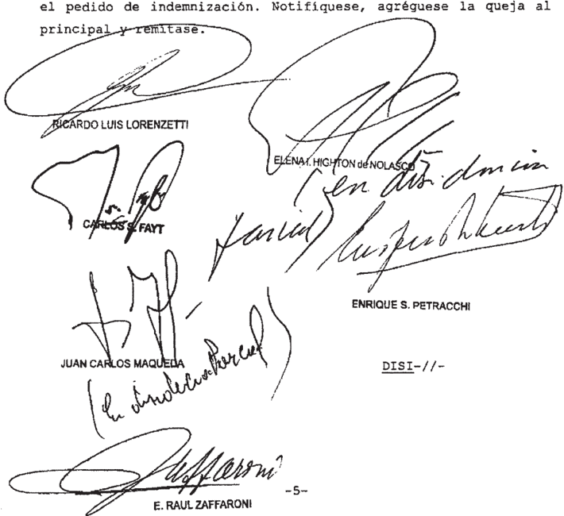

PARCIAL DE LA SEÑORA VICEPRES IDENTB DOCTORA   DOÑA ELE NA I HIGHTON de NOLASCO Y DEL SEÑOR MINISTRO DOCTOR DON JUAN CARLOS\_MAQUEDA

## Considerando:

Que la Sala II de la Cámara Nacional de Apelacio~ nes en 1o Contencioso Administrativo Federal, al confirmar sentencia de primera instancia, rechazó 1a acción interpuesta con el fin de obtener la declaración de nulidad de la resolución 544/03 del Presidente de la Cámara de Diputados de la Nación por a que se había revocado la designación de la actora en su cargo de planta permanente con fundamento en que no cumplía con el re-

quisito de nacionalidad previsto en el artículo 70 inc. d de ley 22.140 para el ingreso la Adninistración Pública Nacional Conjuntamente actora peticionó la indemnización por el despi do incausado

Contra tal pronunciamiento, la demandante interpuso recurso extraordinario federal , cuya denegación originó la pre sente queja.

Que , para fundar decisión, el quo consideró que la apelación contra la sentencia de prinera instancia debía ser declarada desierta porque en ella 1a apelante n se hacía debidamente cargo de los fundamentos del pronunciamiento impug nado En particular, gostuvo que no había rebatido en forma ade cuada el argumento según el cual, si la actora consideraba constitucional el artículo 70 inc. d de la 22.140 , tendrfa que haberlo impugnado al inicio de la relación de empleo público porque, según reiterada jurisprudencia de la Corte Suprema de Justicia, el voluntario sometimiento un régimen jurídico sulta incompatible con su ulterior impugnación. inley

3 ' ) Que este Tribunal ha expresado repetidamente que las resoluciones las que se declara desierto un recuIso ante el tribunal de alzada, no son, debido su naturaleza fáctica Y procesal, impugnables por la vía del artículo 14 de la 48 , salvo cuando 10 decidido revela un excesivo rigor formal susceptible de frustrar el derecho federal invocado en el caso (Fallos: 298 : 1l ; 302: 1669; 303:1929; 324 :176; 326:1382, 2414; 327:3166; entre otros) por ley

A juicio de esta Corte, en las presentes actuaciones concurren los supuestos de excepción que permiten revisar la sentencia apelada En efecto, el escrito de apelación de la actora ~cuya copia obra fs \_ 327/345 vta constituye una crítica concreta razonada , en 1os términos del artículo 265 del Codigo Procesal Civil Y Comercial la Nación. De su símple lectura resulta que la apelante no solo refutó todos Y cada uno de fundamentos dados pOr el juez de primera instancia, sino que

presentó argumentos conducentes , concretos razonados que nc fueron evaluados por el En Particular, confutó el fun danento relativo al sometimiento voluntario. Al respecto, sostuvo que era adnisible aplicar la jurisprudencia de Ia Corte Suprema en nateria de actos propios casos cono el presente, porque en una relación laboral resultaría irrazonable Y desproporcionado exigir al empleado que, al iniciar el vínculo, analizara toda la normativa relativa al empleo público Y 1a cuestionara. Por otra parte, manifestó que no inició anteriormente acción simplemente porque hasta su separación del carecfa de perjuicio. no

En consecuencia, la sentencia recurrida trasunta un excesivo rigor formal en la manera de apreciar la técnica del recurso interpuesto, la vez que omite pronunciarse sobre cues tiones federales oportunamente introducidas Y conducentes para la resolución del caso, como es el planteo de inconstitucionalidad del artículo inciso d de la 22.140 , que exige un reguisito de nacionalidad, que la actora considera contrario articulos 14 , 14 bis, 16, 20 Y 75 , inciso 22 , de 1a Constitución Nacional\_ ley

Corresponde concluir pues que el quo calificó 1a apelación de la actora cono desierta en forma dogmática Y traria (Fallos: 324;1301, 2966; 328 :3067 , entre otros) arbi-

4 1 Que, sentado ello, cabe señalar que si pleito involucra cuestiones de naturaleza federal ocurre en el 1a decisión del quo que impide, con manifiesto exceso ritual, el tratamiento en segunda instancia de agravios que plantea la apelante en tal sentido, importa un pronunciamiento implícito contrario las pretensiones de aquélla (Ea110s: 188: 482; 190:50)

5 * ) Que , así cabe pronunciarse sobre el agravio relativo la aplicación al caso de la doctrina del sometimiento voluntarío. Al respecto, asiste razón apelante en cuanto alega que precedentes de esta Corte citados por el quo en

este punto no resultan aplicables supuestos como el sub exami ne Ello es así, pues el Tribunal ha precisado que no resulta oponible la teoría de actos propios cuando el interesado se vio obligado someterse al régimen como única vía posible para acceder al ejercicio de su actividad (doctrina de Fallos; 311:1132) Asimismo, cabe destacar que la litis está entrañablemente ligada al artfculo 14 bis de 1a Constitución Nacional al principio protectorio que éste enuncia Y al carácter inviolable de 1os derechos que reconoce, 1o cual conduce la indisponibilidad Y la prohibición de renuncia de la aplicación de las nornas que tutelan el trabajo "en todas sus formas" vale decir, tanto al prestado en el ámbito público como en el privado \_

6 " ) Que, por 1o dicho, el quo debió tratar el planteo de inconstitucionalidad del artículo 70 , inciso d de en el que se dispone que el ingreso Administración Pública Nacional se hará previa acreditación en forma que de termine la reglamentación ~entre otras condicionesde nacionalidad argentina, debiendo 10s naturalizados tener más de tro años de ejercicio de la ciudadanía. ley

En ese sentido, cabe recordar que una problemática sustancialnente análoga fue resuelta en el caso "Gottschau, Eve lyn Patrizia Consejo de Magistratura de Ciudad Autónomna de Buenos Aíres" sentencía del de agosto de 2006, voto de 1os jueces Highton de Nolasco y Maqueda (Fallos: 329:2986)

En aquella oportunidad tuvo en consideración que actora se postulaba para acceder un cargo público {tal como sucede en el presente) Y, sobre ega base, se concluyó que el articulo 20 de la Fundamental no era la norma que regía el caso, en tanto en ella se establece que "los extranjeros gozan en el territorio de la Nación de todos derechos civiles del ciudadano; pueden ejercer su industria, comercio Y profesión; poseer bienes raíces comprarlos Y enajenarlos; navegar 1os ríos Y costas; ejercer librenente su culto; testar Y casarse conforme leyes En el caso no estaba comprometido ninguno de los derechos civiles de 1a demandante sino que se hallaba en se Ley las

juego el derecho de acceder ~en el sub lite sería el de permaneceren un empleo público.

Resultaba, en cambio, reguladora de la situación ~conforme al precedente citadogarantía consagrada en el artículo 16 de Constitución Nacional en tanto en ella se asegura que "todos sus habitantes son iguales ante la ley y admisibles en los empleos sin otra condición que idoneidad" Esta norma no establece una equiparación rigida, como la del artículo 20 , sino que impone un principio genérico que no impide la existencia de diferencias legítimas Como esta Corte 1o ha dicho desde igualdad establecida en el artículo 16 de 1a Constitución no es otra cosa que el derecho que no se establezcan excepciones privilegios que excluyan unos de que en iguales circunstancias se concede otros (Fallos: 153:67 entre muchos otros) Por tanto, el ámbito de aplicación de esta igualdad adite gradaciones , apreciaciones de nás de menos , balance Y ponderaclón, en tanto ~claro estáno se altere 10 central del principio que consagra la igualdad entre nacionales Y extranjeros todos ellos "habitantes de la Nación"

Que , atento las semejanzas con la causa invoca da en el sub lite, la ponderación del requisito de nacionalidad argentina para el acceso al empleo público nacional conduce al examen del artículo 16 citado en su relación con el principio de idoneidad Por 1o tanto, corresponde determinar en el caconcreto Y evaluando funciones que competen al cargo para el que fue designada actora, exigencia de ser argentina integraba el concepto de idoneidad Y supera, por ello, el test de constitucionalidad

Es dable poner énfasis en que ese examen remite la distinción entre nacionales Y extranjeros Y no , como ha tenido oportunidad de valorar esta Corte en otros casos , entre ciudadanos que han adquirido s1 nacionalidad por origen por opción (conf "Hooft" Fallos: 327:5118) Por dicho, si bien correSponde aplicar un estándar intenso de control, éste no coincide con el efectuado en ese precedente, en el que la discriminación

tuvo fundanento en el origen de la nacionalidad argentina, 1o que lleva ínsita su presunción de inconstitucionalidad Gottschau" Fallos: 329:2986, cit.)

La reglamentación que distingue entre nacionales Y extranjeros no es, en principio, inconstitucional, por 10 que el legislador se encuentra habilitado enplearla siempre que el criterio de ponderación entre el medio elegido Y los fines es pecíficos que se persiguen con a distinción guperen el aludido test (conf\_ en este sentido artículo 23 , inc 20 de la Convención Americana sobre Derechos Humanos Y artículo 10 de la Y Fallos: 329:2986, voto 1os jueces Maqueda Y Highton de Nolasco considerando 6" ) ley

En ese marco, corresponde dirinir si la condición de argentino supone un requisito de idoneidad en relación directa con as funciones del cargo al que se accedi6, con justificación suficiente entre el nedio elegido el fin perseguido por la norma , que debe representar algún interés estatal razonable

A tal efecto debe atenderse las circunstancias ticulares de cada caso. En el presente, la sefora Laura Fernanda Pérez Ortega fue designada cono personal de Planta Permanente de la Honorable Cámara de Diputados de la Nación como categoría A 04 (resolución 443/89) Y cumplía funciones adninistrativas Y técnicas (ver declaración jurada de cargos Y actividades) con diferentes diputados lo largo de su carrera par-

Que en atención todo 1o expuesto se debe dejar sin efecto el decisorio impugnado Y renitir 1os autos con el ob jeto de que dicte un nuevo pronunciamiento ajustado las pautas que surgen de los considerandos precedentes

Por lo expuesto, Y oída 1a señora Procuradora Fiscal, se hace lugar la queja intentada, se declara admisible recurso extraordinario se deja sin efecto 1a sentencia en cuanto fue de agravios. Las se imponen por s1 orden atento las particulares circunstancias de causa Vuelvan autos al tribunal de origen para que, por quien corresponda , se dicte el

un nuevo pronunciamiento con arreglo al presente Notifíquese, agréguese 1a queja al principal Y remítase

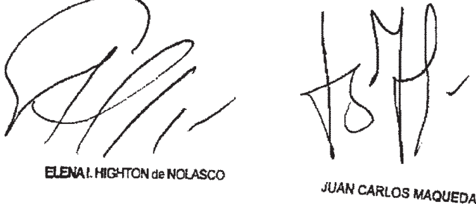

Recurso de hecho interpuesto Por Laura Bernanda autob , por derecho con el Patrocinio letrado de los Dres Enrique Paixno

Tribunal de origen: Nacional de Apolaciones lo Contonciobo Adninibtrativo Fodoral \_ II.

Tríbunales gue intervinieron con anterioridad: Juzgado Naclonal Prinora Inptancia @n

## SeÑor proCurador GeNeral S/ aCuSaCioN C/daNiel eNrique freyteS - Juez de iNStruCCióN N°1 de la Ciudad de preSideNCia roque SáeNz peÑa

## ENJUICIAMIENTO DE MAGISTRADOS PROVINCIALES

Cabe dejar sin efecto la sentencia del Superior Tribunal local, que declaró inadmisible el recurso de inconstitucionalidad local y dejó firme la sentencia del Jurado de Enjuiciamiento provincial que destituyó a un juez, pues frente a los claros y categóricos términos del mandato judicial contenido en el pronunciamiento anterior de la Corte Suprema (12/8/2008) -que admitió el recurso de queja-, que imponían la obligación de definir mediante una decisión fundada si, en el caso de autos, la in -tegración del jurado de enjuiciamiento afectaba o no, la garantía de imparcialidad invocada por el magistrado enjuiciado a la luz de los precedentes a los que el Alto Tribunal había acordado particular relevancia, el a quo omitió nuevamente el tratamiento circunstanciado de la cuestión constitucional mencionada, clausurando ese examen con argumentos que no sostienen a la sentencia como acto judicial válido.

## ENJUICIAMIENTO DE MAGISTRADOS PROVINCIALES

Cabe dejar sin efecto la sentencia del Superior Tribunal local, que declaró inadmi-

sible el recurso de inconstitucionalidad local y dejó firme la sentencia del Jurado de Enjuiciamiento provincial que destituyó a un juez, pues desconoce lo decidido por la Corte Suprema en su anterior intervención  (12/8/2008) -cuando impuso la obligación de definir mediante una decisión fundada si, en el caso de autos, la in -tegración del jurado de enjuiciamiento afectaba o no, la garantía de imparcialidad invocada por el magistrado enjuiciado, a la luz de los precedentes a los que el Alto Tribunal había acordado particular relevancia-, dado que el a quo invoca precedentes que se refieren a situaciones inequívocamente extrañas a la de autos ('Nicolini' y 'Mangiardini'), ya que, a diferencia de lo sucedido en aquéllas, la intervención del miembro del jurado recusado se relaciona con la intervención que le cupo como juez del superior tribunal durante una actuación sumarial, en que se valoraron y calificaron los mismos hechos por los cuales se encomendó al fiscal que formule la acusación, éste funcionario llevó a cabo dicho cometido y, finalmente, después fueron tenidos en cuenta para dictar la sentencia de destitución del magistrado.

## ENJUICIAMIENTO DE MAGISTRADOS PROVINCIALES

Cabe desestimar la queja deducida por denegación del recurso extraordinario que pretendía la revisión de la sentencia del Superior Tribunal local, que declaró inadmisible el recurso de inconstitucionalidad local y dejó firme la sentencia del Jurado de Enjuiciamiento provincial que destituyó a un juez, pues en el marco del juicio político que  se examina, el afectado no ha logrado demostrar que la entidad del agravio que pregona permita sortear el limitado margen de revisión que se admite en asuntos de esta naturaleza, máxime, cuando la pretensión del recurrente se asienta básicamente en la extrapolación de un criterio fijado en torno a un proceso penal regido por reglas que no guardan necesaria identidad con la naturaleza del régimen del juicio político de que se trata.

-Disidencia de los  jueces Ricardo L. Lorenzetti, Elena I. Highton de Nolasco y Juan Carlos Maqueda-.

## ENJUICIAMIENTO DE MAGISTRADOS PROVINCIALES

Cabe desestimar la queja deducida por denegación del recurso extraordinario que pretendía la revisión de la sentencia del Superior Tribunal local, que declaró inadmisible el recurso de inconstitucionalidad local y dejó firme la sentencia del Jurado de Enjuiciamiento provincial que destituyó a un juez, pues en el marco del juicio político que  se examina, el afectado no ha logrado demostrar la invocada arbitrariedad de las afirmaciones del tribunal a quo, en punto a que habiéndose decidido la destitución por unanimidad, aún de aceptarse la recusación del miembro del jurado cuestionado, la pretensión del recurrente no modificada el resultado del juicio, ya que, por un lado, la ley local exigía el voto de los dos tercios de los integrantes del cuerpo para la validez del pronunciamiento y, por otro, que la intervención de aquel jurado no pudo formar opinión ya que la ley local no contemplaba ningún acto de deliberación para dictar la sentencia.

-Disidencia de los  jueces Ricardo L. Lorenzetti, Elena I. Highton de Nolasco y Juan Carlos Maqueda-.

Suprema Corte:

## 1

fs 924/934 efecto la sentencia del Superior Tribunal de Justicia de la Provincia del Chaco y ordenó que se dicte un nuevo pronunciamiento que dé una respuesta fundada a los planteos constitucionales introducidos por el magistrado destituido en el recurso especial cons. 70 del voto de   la mayoría)

Devueltas   las actuaciones a la sede ce origen; el Superior Tribunal de Justicia de la Provincia del Chaco; integrado al efecto; rechazó el recurso de inconstitucionalidad que e eX magistrado había planteado contra la resolución del Jurado de Enjuiciamiento de Magistrados provincial por la que se dispuso  removerlo de cargo de juez titular del Juzgado de Instrucción de la Primera Nominación de la Segunda Circunscripción, con asiento en la ciudad de Pte. Roque Sáenz Peña (fs. 987/1001)

Para resolver de este modo; en esencia; los integrantes &amp;el Superior Tribunal de Justicia local tomaron en cuenta los argumentos del dictamen del Ministerio Público Fiscal que precedió a la sentencia de VE de fs. 924/934, así como la interpretación que le asignaron al precedente de Fallos: 332:1124.

de tales   pautas, desestimaron la denuncia de violación a la garantía de la imparcialidad, porque consideraron que el art. 2? de la el número mínimo para otorgar  validez sentencia de destitución y porque la intervención del juez denunciado no formar opinión ni influir en el resto del Jurado de Enjuiciamiento ~como alegaba el recurrente por la interpretación que formularon de los arts. 23 y 25 de aquella en cuanto el trámite de emisión de los votos de los integrantes del jurado. partir pudo regulan ley,

## DE JUSTICIA DE LA NACION 336

## diCtameN de la PROCURACIÓN  GENERAL

## FALLOS DE LA CORTE SUPREMA 336

Con respecto a los agravios vinculados con la violación a la fueron adecuadamente tratados por el Jurado de Enjuiciamiento; cuyos argumentos; además; dijeron compartir.

## III

Disconforme con esta decisión; la defensa del ex juez dedujo el recurso extraordinario de fs. 1009/1030, cuya denegación dio origen a esta queja que trae nuevamente el asunto a conocimiento del Tribunal.

Sostiene; en sustancial síntesis, que en autos existe cuestión que esta   garantía fue   lesionada   porque el Jurado de   Enjuiciamiento estuvo integrado por un consejero (juez del Superior Tribunal de Justicia) que intervino en anterior al juicio; en la que ordenó la investigación contra el juez Freytes; en la que prejuzgó. 2) Se han Jurado de Enjuiciamiento estuvo integrado en forma irregular; en concreto por no estar   integrado en su totalidad en todas las   audiencias; (b)  porque el voto condenatorio de un consejero se emitió sin haber percibido toda la prueba y sin haber   escuchado todos los argumentos de la defensa y (c) porque el fallo de destitución se apoya en prueba incriminatoria decisiva ilegal, ya que se produjo en la etapa previa al juicio por un órgano incompetente y sin control del acusado. 3) La arbitrariedad de la sentencia; pues resuelve contra el texto expreso de la ley, exhibe   autocontradicción y se basa eIL   fundamentos   aparentes afirmaciones dogmáticas. etapa

Critica   también los   argumentos dcl   Superior   Tribunal de Justicia provincial por los que desestimó el recurso de inconstitucionalidad contra la decisión que destituyó al juez Freytes; en particular los que surgen de la nueva intervención que tuvo como 924/934

## IV

Ante   todo, cabe señalar que, más allá de   los   términos el nucva presentación de la delensa del ex juez ante VE. consiste en determinar si cl pronunciamiento   impugnado se   aparta de Ja sentencia dictada por   la Corte Suprema.

Desde esta perspectiva; es del caso recordar que, con arreglo lo previsto en el art. 14 de la 48, siempre que esté en tela de juicio la inteligencia de un pronunciamiento del Tribunal dictado en la misma causa, en que hace formalmente viable el recurso extraordinario (doctrina de Fallos: 306.1195; 312.396; 324.3411; entre muchos otros). ley supeditada quc la resolución impugnada consagre un inequívoco apartamiento de

Al respecto, en reiteradas ocasiones que cuando la cuestión planteada se centra en la inteligencia de un pronunciamiento   anterior de VE dictado en la misma causa, son los integrantes de   la Corte   los   que se encuentran en mejores   condiciones   para desentrañar el alcance de sus propios fallos (conf.  dictámenes en los casos de 333,1771, entre otros) Criterio   que entiendo especialmente aplicable en situaciones como la de autos, toda vez que agravios del apelante que ahora se vuelven plantear \_ no fue compartida en la sentencia de fs. 924/934 .

V \_

En tales términos; por contestada la vista que se confiere este Ministerio Público y devuelvo los autos al Tribunal. doy

Buenos Aires, 9 de mayo de 2011.

LAURA MERCEDES MONTI

## FALLO DE LA CORTE SUPREMA

Vistos autos: "Recurso de hecho deducido por 1a Defensa de Daniel Enrique Freytes en la causa Seflor Procurador General acusación Daniel Enrique Freytes Juez de Instrucción 1 de la ciudad de Presidencia Roque Sáenz Pefa" para decidir sobre Bu procedencia.

## Considerando:

Que el Superior Tribunal de Justicia de la vincia del Chaco, al declarar inadnisible el de inconatitucionalidad local, dejó firme la sontencia del Jurado de julciamlonto que , fecha 16 de mayo de 2003 , dostituyó al doctor Daniel Enrique Freytes del cargo de juez de Lnstrucción de la primera noninación de 1a segunda circunscripción, con asiento en la ciudad de Presidencia Roque Sen2 Pefa , provincie del Chaco (fs . 587/599)

Que contra dicho pronuncianiento el afoctado interpuso recurso extraordinario federal, cuya lugar la presentación directa que fue esta corte (gentencia del 12 de agosto de 2008 , fs 924/934 , blicado en Fallos: 331:1784)

En esta decisión el Tribunal, por mayoría, consideró que frente la naturaleza Y raigambre del planteo fundado en violación de 1a garantfa de juez imparcial, así como de su tente influencia sobre el resultado final del proceso en términos de decidido por esta Corte en los precedentes "SharNorma Beatriz Herrera, Ramón Enrique Y otros" Y "Salvat, Miguel c/ Luis Solimeno Hijos (Fallos: 316:1710 Y 324 : 1211, Y su cita) , su desestimación pOr parte del superior tribunal con afirmación de que constituía una mera reedición de cuestiones introducidas con anterioridad Y de que el desarrollo "luce vacuo inconsistente" no sostenía constitucionalnen-

## te el pronunciamiento.

Asimismo, la Corte señaló en aquella oportunidad que la intervención del superior tribunal mediante un pronunciamiento constitucionalmente sostenible es indeclinable cuando se plantean sobre bases serias Y fundadas cuestiones prima facie de naturaleza federal como es en el caso la configurada por la alegada violación de la garantía de juez imparcial; máxime se subrayó, cuando desde el conocido precedente "Penjerek, Norma Mirta" del 14 de noviembre de 1963 (Fallos: 257:132) esa ga rantía cuenta con anclaje constitucional en el derecho al debido proceso reconocido en el art. 18 de la Suprema Ley

Igualmente, en la sentencia se destacó que ese más elevado grado de tutela se agregaba, con particular relevancia, que en un pronunciamiento reciente esta Corte fijó el nuevo con torno que cabe asignar la garantía de imparcialidad para aquellos procesos penales en que en la integración del tribunal de juicio participare quien haya intervenido anteriornente, de cualquier modo , en otra instancia de la misma causa ("Llerena" fallada el 17 de mayo de 2005 , Fallos: 328:1491) , doctrina que ulteriormente fue federalizada al ser extendida, una de las garantías mínimas de la administración de justicia, los proces0s radicados en sede provincial ("Dieser, María Graciela Y Fraticelli, Carlos Andrés" fallada el 8 de agosto de 2006, Fallos; 329;3034)

Sobre tales bases , el Tribunal privó validez al fallo recurrido como acto jurisdiccional constitucíonalmente sostenible Y mandó dictar un nuevo pronunciamiento, fin de que el superior tríbunal local dé una respuesta fundada los planteos constitucionales aludidos

3* ) Que , ante el reenvío ordenado, el Superior Tribunal de Justicia de la Provincia del Chace rechazó nuevanente 0l recurso de inconstituclonalldad interpuesto por el ex nagistrado contra 1a resolución; que 10 de 8u cargo, reite-

rando su decisión anterlor de desestimar el agravio al derecho de defenga en juicio invocado por el recurrente con sustento en la violación la garantía de juez imparcial (fe. 987/1001)

Que , para resolver de 0l superíor tribunal comenzó por expresar que adherfa a 1o9 invocados en el dictanen del señor Procurador Fieoal que precedió 1a bentencia de este Iribunal (fs 921/923, punto IV)\_ que PIQ= cedi6 reproducir, en cuanto que aun el agravio fundado en el supuesto prejuzganiento del integrante del jurado, ello no modificaría el resultado de la Cauaa, Ya que 0l art. 2 ' de la local 188 fijaba en cinco votos 0l núnero nnino para otorgar valídez la sentencia de destituci de modo que aun cuando el doctor Molina no intervenído en decisión final Lmpugnada ~tomada por 0l voto unánime de siete integranteshabría sido igualmente adoptada con el requerido para su validez ey 6n,

De modo concorde, en sentencia también se expresó que se compartfan los fundamentos que sostenían el voto minoritario del sefor Juez Juan Carlos Maqueda correspondiente al fa1lo de esta Corte, con respecto que el recurrente no había mostrado en forna nítida, inequívoca Y concluyente que las cau sales de recusación de integrantes del órgano político controlador aparecían como un arbitrio inadecuado las exigencias del buen funcionamiento de 1os poderes públicos Y la naturaleza de la responsabilidad del funcionario sujeto control (Fa314:1723) ; que el apelante, según afirmó el voto mencionado, tampoco había señalado de qué modo la integración del jurado había perjudicado en el resultado final del enjuiciadado que todos miembros habían votado por la destitución del magistrado, de manera que tal agravio no se sustentaba en que su relevancia para la solución del caso hubiese sido suficiente para hacer variar la suerte de causa\_

En el pronuncianiento se argumentó, asimismo, que similar conclusión que la propiciada en la nueva sentencia había arribado la Corte Suprema al fallar en el caso "Leiva" (Fallos:

332:1124) , cuando para rechazar el planteo del enjuiciado sobre la irregular integración del jurado ~por no haber sido sustituido un niembro excusado con su suplente-, se afirnó que textos normativos en cuestión nada disponen sobre la exigencia de un quórum calificado del jurado en oportunidad de fallar, limitándose las disposiciones en juego establecer únícamente una mayoría especial de seis (6) votos concurrentes para disponer la renoción, recaudo cuyo cumplimiento en la deliberación en que fue dictada 1a sentencia destitutoria no desconocido el recurrente

Agregó el tribunal quo que la intervención del doctor Eduardo Omar Molina en el Jurado de Enjulclamiento no pudo formar opinión, es decir contaninar el criterio de 8u9 colegas, pues el art. 23 de 1a 188 dispone que finalizada la audiencia oral Pública se realizará una sesión solo con el objeto de establecer el orden en que , por un sorteo, los niembros del jurado emitiran sus votos , sin contemplar ningún acto de deliberación entre sus integrantes en ese estadio del el art 25 del texto, en coherencia con ese postulado de independencia de criterio de cada uno de puntualmente indica que "El voto sera fundado por escrito en el orden estable cido por sorteo. No está permitido adherirbe al voto precedente, menos que expresen las razones fundanenten 1a adley que

Asimismo, en sentencia se sostuvo que si bien es cierto que la Corte Suprema , al anular el fallo anterlor dictado en esta causa, invocó expresamente la doctrina de los preceden tes "Llerena" Y "Dieser" citados, tambien era que el Iribunal, en sucesivos fallos , fue preclsando una más ajustada interpretación en torno dicha doctrina que, en el ca8o, dlluye la trascendencia la participación que le cupo al jurado Eduardo Omar Molina Ello era asf, pues según dos pronuncianientos de @sta Corte ~que eran inadmisibles recusaciones funda das en la intervención de los jueces en decisiones anteriores de las

proplas de 8us legales} no cualquier intervención jur dicial anterior pone en crisis la imparcialidad llamada objetiva , sino aquella que se traduzca en el ejercicio progresivo de diferentes funciones judiciales largo de una causa, de modo que serían las circunstancias concretas del caso las ~en de finitivadeterminen si se halla no comprometida esa garantía; Y, por último, que en el caso "Mongiardini, Renzo Y otros" (Fallos: 331:1744) la Corte Suprema había descartado la afectación de dicha garantía, al precisar que 1o resuelto acerca de libertad de encausados con anterioridad al fallo, no implicaba comprometerse con posición del Fiscal Y la defensa para resolver en definitiva el caso . que

En base todos estos conceptos , el tribunal provincial concluyó que el voto del Juez Eduardo Omar Molina, enitido en sentencia del Jurado de Enjuiciamiento, no podía incidir de ningún modo en el resultado final del enjuiciamiento, en función del número de consejeros de ese órgano constitucional que se expidieron en igual sentido, de modo que en cualquier caso se excedía el exigible para la destitución Adenás , si bien era innegable la participación de Molina en las actuaciones iniciadas ante el Superior Tribunal del Chaco, también 1o era que se podía afirnar que no cualquier intervención conO tal afecta el principio del juez imparcial Y, más aún , cuando la 188 de Enjuicianiento de Magistrados Y Funcionarios de la Provincia del Chaco , imponía determinadas pautas destinadas man tener incólume 1a independencia de criterio de cada uno de 10s integrantes del jurado hoy ley

Que frente ese defensa del ex juez interpuso el recurso extraordinario de fs\_ 1009/1030 , en que trae nuevamente el asunto conociniento del Iribunal promo viendo el examen de cuestiones que , en sustancia, reproducen 1os planteos invocados Bu presentación anteríor Y que hacen pie en que , no obstante 1o resuelto por esta Corte en su sentencla Y expresanente ordenado respecto del fundado tratanfento que debía darse federales invocados en el recurso

cal, con el nuevo pronunclamiento se nantienen incólunes las graves Y patentes violaclones garantía constitucional de defensa en juicio en que se incurrió durante 1a tranitación del enjuicianiento público que concluyó con su destitución.

Que la sefora Procuradora Fiscal en su dictamen que, más allá de 10s terminos empleados en el recurso extraordinario fs 1009/1030 del principal, 1o sustancíal de esta nueva presentación de la defensa del ex Juez Freytes siste en deterninar el pronunciamiento Impugnado se apartó, no de 1o decídído por este Iribunal en la sentencia que desca lificó el pronuncianlento anterior del tribunal local Y le denó dictar un nuevo fallo con arreglo 1o resuelto.

Desde @sta perspectiva, recordó que el Público Fiscal ha sostenido en ocaslones que cuando cuestión planteada se centra en 1a inteligencia de pronuncianiento anterior del Iribunal dictado en la cauga, 1os integrantes de la Corte 1os que se encuentran en nejores condiciones para desentranar el alcance de sus propios fallos; criterio que consideró especialmente aplicable en situaciones como la de autos, toda vez que la opinlón de a Procuración Ge neral de fs . 921/923 ~en la que se analizaron diversos agravios del apelante que ahora se vuelven plantear Y se dictaminó porque se rechazara el recursono fue compartida en aludida sentencia de fs 924/934 (dictamen de fs . 64/65 de queja)

Que el recurso es procedente pues la interpretación de las sentencias de la Corte Suprema en as mismas causas en que ellas han sido dictadas constituye cuestión federal suficiente para ser examinada en la instancia del art 14 de 1a 48 cuando , como sucede en el sub lite, la decisión impugnada consagra un inequívoco apartamiento de 1o dispuesto por el Iribunal desconoce , en 1o esencial aquella decisión (Fallos: 327:4994 ; 331:379; 332:58 Y 2414 ; causa M. 426.XLII "Mendizábal de Etchart, Edita c/ Kenny, Aldo Federico" sentencia del 18 de noviembre de 2008 , entre muchos otros) ley

Que , en efecto, frente 10s claros Y categóricos térninos del mandato judicial contenidos en el pronunciamiento del 12 de agosto de 2008 que ineludiblemente imponían la obligación de definir mediante una decisión fundada si, en el caso de autos, integración del jurado de enjuiciamiento afectaba, no la garantía de imparcialidad invocada por el magistrado enjuiciado la luz de 1os precedentes los que la Corte Suprema había acordado particular relevancia, el tribunal quo omi tió nuevamente el tratamiento circunstanciado de la cuestión constitucional mencionada, clausurando ese exanen con argumentos que no sostienen la sentencia como acto judicial válido\_

Que , en efecto, por un lado resultan manifiestamente inocuas para fundar la sentencia las remisiones efectuadas 1os argumentos que sostuvieron el dictamen del señor Procurador Fiscal, en oportunldad del priner recurso extraordinario, Y al desarrollo del voto disidente del juez Maqueda en dicha gentencia, en medida en que el tribunal dichas oplniones concordantes ~en cuanto a que la intervencíón del doctor Molina en el Jurado era una cuesttón inconducente para alteel resultado final del caso no fue la posiclón tonada por el Iribunal en su sentencia descalificatoria que , por el contrario, consideró que el planteo constituclonal acerca de Indebida Integración del doctor en el jurado era portador de '~patente influencia sobre el resultado final del proceso" (considerando que

El carácter determinante de la cuestión federal cuyq trataniento habla omitido el tribunal local 0n su primera intervención ~Y desconoce en esta segunda actuaciónpara definir suerte final del enjuiciamiento, fue subrayado en sentencia de esta Corte de fs . 924/934 con la cita de dos precedentes (registrados en Fallos: 316:1710 Y 324:1211) , en que concordemente fueron anuladas sendas sentencias de tribunales inferiores correspondlentes en que como conún , hablan intervenido en las decisiones impugnadas magistrados que estaban inhabilitados para hacerlo haber sido recusados estar ex-

cusadoginfringiendose de este modo Ia garantía de defenga en Julcio, de la que en la opinión del Tribunal en aquellos fallos deriva el instituto de recusación, Y el principio de imparcialldad.

10) Que por las razones expresadas eg igualmente insostenible otro argumento invocado en el fallo en su intento de denostrar que la integración del jurado no era definitoria en punto la destitución, que se pretende fundar en la solución tonada esta Corte en el caso "Leiva" citado por

A ello se agrega que la situación examinada en dicho asunto carece de toda analogía con la juzgada las presentes actuaciones , pues el planteo federal que se hizo en "Leiva" fue que en 1a integración del jurado que destituyó al enjuiciado no había participado el reemplazante del miembro que se había excusado, impugnación que fue desestimada por Corte con fundamen tos que se sostuvieron en la interpretación de la federal 24 .937 Y el reglamento procesal del jurado, disposiciones que carecen de toda relación con el planteo constitucional formulado en el sub lite, pues aquellos textos se limitan regular la ma yoría especial de votos concurrentes que es necesaria para disponer la remoción de jueces federales (considerando ley

11) Que bajo igual condición es también objetable el argumento del tribunal que, para descartar toda incidencia de la intervención del doctor Molina, invoca una disposición de la de enjuiciamiento local en cuanto veda al jurado llevar cabo todo acto de deliberación para fallar Y contempla que dicho órgano debe realizar una sesión solo para establecer, por sorteo, el orden en que mienbros habrán de enitir sus votos 188 , art. 23) ley (ley

Además , el texto normativo que se dice aplicar no contiene la restricción que, asumíendo la condición de legislador, le incorpora el tribunal quo al adicionar el adverbio "solo" en medida en que la disposición de que se trata úni-

camente prevé que el jurado, tras los alegatog, ~en sesión reservada , establecera por sorteo el orden en que 10s miembros del jurado habrán de sus votos quedando 1a causa en do de sentencia"

De ahí, que es una afirmación inconcebible para una racional administración de justicia ~en términos del estándar establecido por esta Corte en "Estrada" (Fallos: 247:713) Y reiterado, en su actual composición, en "Cordoba convocatoria elecciones de gobernador , vicegobernador, legisladores Y Iribunal de Cuentas provincial Para el día 2 septfembre de 2007" (Fallos: 330:4797)que el expresado orteo sea el oxclusivo objeto de sesió6n ni, menos aún, que vede la deliberación entre 1os integrantes del jurado durante todo el período en que asunto se encuentra para resolver, desde que el intercambio racional de ideas es connatural todo cuerpo colegiado en las di versas etapas del proceso en que se toman decislones Y, sobremanera, sentencia deflnitiva, al punto que este modo de proceder ha s1do considerado comO propio del estado de derecho Y de la forma republicana de gobierno (Fallos: 308:2188 , voto del Juez Petracchi, considerando 11) Todo cual lleva concluir que no pueda considerarse irrelevante ni aun en el caso de haberse tonado decisión por unaninidad, la intervención de un maglstrado que se hallaba inhibido para entender en el acuerdo que concluyó en el dictado de la sentencia (Fallos: 321:2738) de

Por último sobre este punto, cuando el tribunal a quol afirna que sentencia destitutorla contaría con 1a cantidad de votos exlgidos por ley para sobtener su validez, aun cuando se excluyera el sufragio del juez Molina esa aserción deja sin respuesta la decisiva circunstancia de que la presión hipotética del voto del jurado teñido de parcialidad comprometería la validez de aquellos otros sufragios que expresamente, se fundaron por medio de la adhesión 1os argumentos Y conclusiones dados por el integrante cuestionado

12) Que , de otro lado, tanbien se desconoce 1o deci-

dido por esta Corte cuando en el fallo se invocan precedentes de este Tribunal que se refieren situaciones inequívocamente extrañas la de autos , como la de 10s casos "Nicolini, Jorge CarY otros" (Fallos: 329:909) "Mongiardini (citado con anterioridad)

Ello es así pues el asunto ventilado en el sub lite no se identifica ni guarda ninguna clase de analogía con aque llos supuestos que dieron lugar 1os precedentes que 1a corte local utiliza para interpretar Y, en definitiva, sortear la aplicación de doctrina sentada en 1os Casos "Llerena Y "Dieser" citados En efecto, diferencia de 1o acontecido en aquecasos , intervención del mienbro del jurado recusado se relaciona con la intervención que le cupo como juez del superior tribunal durante una actuación sumarial, en que se valoraron Y calificaron mismos hechos por los cuales se encomendó al fiscal que formule 1a acusación, este funcionario llevó cabo dicho cometido finalmente, después fueron tenidos en cuenta para dictar la sentencia de destitución del magistrado \_

13) Que actitud del tribunal quo resulta particularmente grave en tanto esa omisión de apreciar, en las circunstancias del caso, la intervención anterior tomada. un mienbro del jurado, tambien podría entenderse, en definitiva, como un desconociniento de criteriog sentados por la Corte Europea de Derechos Humanog , seguidos en este punto en conocidos precedentes de este Iribunal, Jegún 10s cuales 1o decisivo en materia de garantía de Imparcialidad es establecer desde el punto de vista de las circunstancias externas (objetivas) existen elementos que autoricen abrigar dudas con relación imparcialldad con que el juez, con prescindencia de qué es 1o que pensaba en su fuero interno, siguiendo el adagio Justice must not only be done: it must also be seen to be done (casos "Delcourt Vs Belgica" 11/1/1970, serie A, n' 11 párr. 31; Cubber 16/10/1984 , serie n' 86, párr. 24 ; entre otros) ; doctrina que fue inequívocanente receptada en 1os precedentes que dieron sustento al anterior pronun por "De

ciamiento de esta Corte en esta causa.

14) Que en las condiclones expresadas cabe recordar 1o declarado por esta Corte en reiteradog precedentes Y hasta reciente pronunclaniento "Cisneros de Bau, Norma Beatriz c/ lecom Argentina Stet France Telecon (Fallos; 332:2414) , en cuanto que sentencias deben ser lealmente acatadas tanto por partes como por que intervienen en las causas (Fallos; 252:186; 255:119) Este principio, basado prineramente en la estabilided propta de toda resoluclón firme de los tribunales de Justiaia (Fallos: 264:443) Ber preservado con el mayor énfasts por este Iribunal, pues acertadas no sus sentencias, el resguardo de su integridad interesa fundamentalmente tanto vida de 1a Nación, su orden público la paz social, cuanto la estabilidad de instituciones Y, muy especialmente, 1a supremacía de 1a Constitución en que aquéllas se sustentan (Fallos: 307:468 Y 1779; 312:2187) Ielas

De ahí, pues , que el carácter obligatorio de las decisiones adoptadas por esta Corte Suprema en el ejercicio de su jurisdicción, comporta 1o conducente hacerlas cumplir (Fallos: 147:149; 264 : 443) , por que corresponde dejar sin efecto 1o resuelto Y ordenar que se dicte un nuevo pronunciamiento que decida la cuestión con arreglo dispuesto por esta Corte en su sentencia anterior.

Por ello, habiendo dictaminado señora Procuradora Fiscal se hace lugar 1a queja, se declara procedente el recurso extraordinario interpuesto se deja sin efecto sentencia apelada. Vuelvan los autos al tribunal de origen fin de que, por quien corresponda , se dicte un nuevo pronunciamiento con arreglo

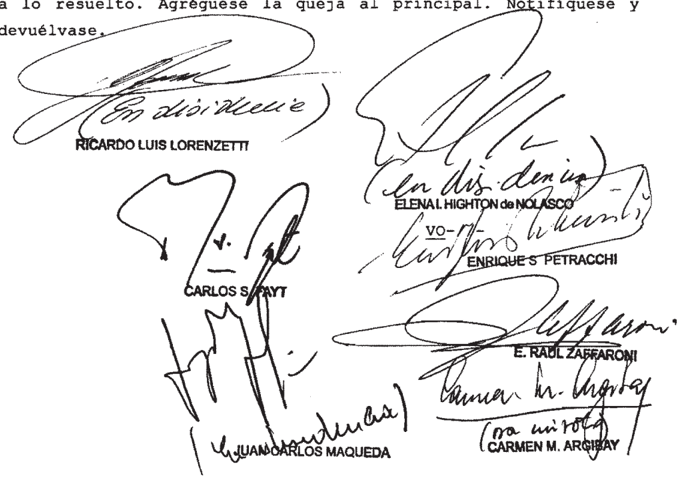

DE LA ARGIBAY

## Considerando:

Que el Superior Tribunal de Justlcia de Chaco, al declarar inadmisible el recurso de inconstituclonalldad local, dejó firme la sentencia del Jurado de Enjuicianlento de la men tada provlncia que, con fecha 16 de mayo de 2003, destituyó al doctor Daniel Enrique Freytes del cargo de Juez de instrucción de la primera nonínación de Ia segunda circunscripción, con asiento en la ciudad de Presidencia Roque Senz Peña 587/ 599)

2%) Que contra dicho pronunclaniento el afectado interpuso recurso extraordinario federal, cuya desestimación dio lugar la presentación directa que fue declarada procOdente por esta Corte (sentencia del 12 de agosto de 2008; fs . 924/934, pu bllcada en Fallos: 331:1784)

En esta deciaión el Iribunal, pOr consideró

que la corte chaquefa había omitido dar una respuesta fundada una de las cuestiones federales magistrado des tituldo en el recurso de inconstitucionalidad Dicho planteo ebtaba vinculado con una posible afectación la garantía del juez imparclal, dada por la intervención en el proceso de uno de los integrantes del superior tribunal provinclal ~el doctor Eduardo Omar Molina-, quien habfa llevado adelante rio previo que concluyó con 1a remisión del expediente al procurador general local para promueva acusación contra el magistrado investigado, Y, posteriormente, integró el jurado que juzgó Y destituyó al juez Freytes que

En tal sentido, esta Corte afirmó que el referido planteo tenía directa influencia sobre el resultado final del proceso Y que el tratamiento que se le había dado en la sentencia desestimatoria de la máxima instancia provincial ~en la que se indicó que el agravio constituía una mera reedición de cues tiones introducidas con anterioridad, expuestas de modo "vacuo inconsistente" resultaba por demás insuficiente\_

Sobre tales bases , el Tribunal privó de validez al fallo recurrido Y ordenó dictar un nuevo pronuncianiento, fin de que 1a corte local dé una respuesta fundada 10s planteos constitucionales aludidos

3 % ) Que ante el reenvío ordenado , el Superior Tribunal de Justicia de la Provincia del Chaco rechazó nuevanente el recurso de inconstitucionalidad (fs. 987/1001)

Para resolver de este modo , el quo afirmó que aun cuando pudiese prosperar el agravio fundado en el supuesto juzgamiento del integrante del jurado, ello no modificaría el resultado de la causa, Ya que el art 2 de la local 188 fijaba en cinco votos el número nínimo para otorgar validez la sentencia de destitución, de modo que aun cuando el doctor Molina no hubiese intervenido en la decisión final impugnada ~tomada por el voto unánime de 1os siete integrantesésta habría sido igualmente adoptada con el nínimo requerido para su validez \_ preley

A su vez, sostuvo el tribunal provincial que 1a intervanción doctor Eduardo Omar Molina en el jurado de enjuiclaniento no pudo formar opinión, es decir contaminar el criterio colegas , pues el art 23 de la local antes citada dispone que finalizada audiencia oral Pública se realizará una seslón solo" con el objeto de establecer el orden en que, por un 1os mienbros del jurado emitiran sus votos , sin contemplar ningún acto de deliberación entre integrantes en ese estado del juiclo\_ ley

En base todos estos conceptos , el tribunal provincial concluyó que el voto del juez Molina, enitido en senten cia del jurado de enjuicianiento, no podia incidir de nlngún do en el resultado final del

1 Que frente ese pronunciamiento, la defensa de Freytes interpuso el recurso extraordinario de 1009/1030 , en el que sefala que el tribunal Buperior chaqueno no cumplió con ordenado por esta Corte Suprena con respecto al tratamiento fundado que debfa darse los agraviog federaleq invocados en el local

Que el recurso procedente pues la interpretación de las sentencias de Corte Suprena en las mismas causas en que ellas han sido dictadas constltuye cuestión federal suficlente para ser examinada en esta Instancia de excepción (art 14 inc, de la 48) , siempre cuando la declslón impugnada ~tal cono sucede en este casohubiese importado un Inequlvoco apartamiento de 1o dispuesto por el Tribunal (Fallos: 307:468 entre otros) ley

6' ) Que , en efecto, frente Y categóricos términos del pronunciamiento del 12 de agosto de 2008 , que ineludiblemente imponían la obligación de definir medíante una decisión fundada s1 la integración del jurado de enjuiciamiento afectaba no la garantía de imparcialidad invocada por la defensa de Freytes, el tribunal quo omitió nuevamente el tratamiento circunstanciado de cuestión constitucional mencionada

Al respecto, debe remarcarse que la afirmación del tribunal provincial en cuanto que la intervención del doctor Molina en el jurado era una cuestión inconducente para alterar el resultado final del caso se contrapone diametralmente con la postura adoptada por esta Corte en sentencía descalificatoria, en la que se afirmó que las garantías constitucionales que la defensa invoca como vulneradas guardan relación directa inmediata con resuelto (cfr. voto de la jueza Argibay, considerando

Más allá de 1o anterior ~suficiente de por s1 para revocar la sentencia recurridacorresponde indicar que cuando el tribunal quo afirma que la sentencia por la que se destituyó Freytes resultarfa válida aun cuando se excluyera el sufragio del juez Molina, deja sin respuesta la decisiva circunstancia de que la supresión hipotética del mentado voto comprome tería, su vez , la validez de aquellos otros sufragios (cuatro en total) que expresamente se fundaron por medio de la adhesión argumentos Y conclusiones dados el integrante cuestionado por

7%) Que, por otra parte, resultan inaceptables 1os fundamentos expuestos por el tribunal quo en relación con el art. 23 de la local 188 . ley

Ello, priner térnino, porque el texto normativo que se dice aplicar no contiene la restricción que ~asuniendo la de leglsladorle Incorporó la corte del Chaco al adicionar el adverbio "so10" en la medida en que la disposición de que trata Énicamente\_prevé que , tras alegatos, ~en sión reservada , se establecerá por sorteo el orden en que mienbrog del Jurado habrán de emitir sus votos quedando la causa en estado de sentencia"

En segundo lugar , porque el sentido que el tribunal inferior pretende otorgar la mentada norMa local ignora por completo que el intercambio racional de dentro de un cuer po colegiado en las divergas etapas del proceso en que éste debe

tonar decisiones responde un proceder propio de la forma republicana de gobierno.

8 1 Que en condiciones expresadas , cabe recordar declarado por esta Corte en reiteradog precedentes, en cuanto que sus sentencias deben ser lealnente acatadas tanto por las partes comO pOr 1os organismos jurisdiccionales que intervienen en causas {Fallos: 255:119, entre otros) Este prlncipio, basado prineramente en estabilidad propia de toda resolución firme de 1os tribunales de justicia (Fallos: 264:443) debe ser preservado con el mayor énfasis por este Tribunal, pues acertano sentencias, el resguardo de su integridad interesa fundanentalmente tanto la vida de 1a Nación, su orden público Y paz social, cuanto la estabilidad de sus instituciones Y, muy especialmente, la suprenacía de la Constitución en que aquéllas se sustentan (Fallos: 205: 614 ; 307:468 Y 1779; 312: 2187) las

De ahí, pues , que el carácter obligatorio de las de cisiones adoptadas por esta Corte Suprema en el ejercicio de su jurisdicción, comporta lo conducente hacerlas cumplir (Fallos: 147:149; 264:443) \_ por que corresponde dejar sin efecto 1o resuelto Y ordenar se dicte un nuevo pronunciamiento que de cida cuestión con arreglo 1o dispuesto por esta Corte en su sentencia anterior. que

Por ello, habiendo dictaminado 1a senora Procuradora Fiscal, se hace lugar la queja, se declara procedente el recurso extraordinario interpuesto Y se deja sin efecto la sentencia apelada Vuelvan 1os autos al tribunal de origen fin de que por quien corresponda, se dicte un nuevo pronunciamiento con arreglo lo resuelto Agreguese la queja al principal Notifíquese Y devhélvase

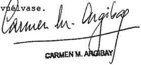

DISI-// -

~I/-DENCIA DEL SENOR PRESIDENTE DOCIOR DON RICARDO LIS DE LA SENORA VICEPRESIDENIA DOCIORA DORA ELENA de NOLASCO DEL SEBOR MINISTRO DOCTOR DON JVAN\_CARLOS YAQUEDA

## Considerando:

Que el Superior Tribunal de Justicia de la Provincia del Chaco, al declarar inadnisible el recurso de inconstitucionalidad local, dejó firme la sentencia del Jurado de EnJuiciamiento que, con fecha 16 de mayo de 2003, destituyó al doctor Daniel Enrique Freytes del cargo de juez de instrucción de la primera nominación de segunda circunscripción, con aslento en 1a Ciudad de Presidencia Roque Shenz Pefa , Provincia del Chaco (fs. 587/599)

Que contra dicho pronunciamiento el afectado interpuso recurso extraordinario federal, cuya desestimación dio lugar la presentación directa que fue declarada procedente por esta Corte (sentencia del 12 de agosto de 2008 ; fs . 924/934 , publicado en Fallos: 331 1784)

En esta decisión el Tribunal, consideró que frente la naturaleza Y raiganbre del planteo fundado en la violación de la garantía de juez imparcial, de su tente influencia sobre el resultado final del proceso en terninos de esta Corte en los precedentes Shartes, Norma Beatriz Herrera, Ramón Enrique Y Otros" Y "Salvat, Higuel Luis Solimeno Hijos (Fallos: 316:1710 Y 324 : 1211 , Y su cita) su desestlmación pOr parte del superior tribunal con la afirmación de que constituía una mera reedición de cuestiones introducidas con anterioridad Y de que el desarrollo luce vacuo inconsistente" no sostenía constitucionalmente el pronunciamiento.

Asimismo, la Corte señaló en aquella oportunidad que la intervención del superior tribunal mediante un pronunciamiento constitucionalnente sostenible es indeclinable cuando se

plantean sobre bases serias Y fundadas cuestiones prima facie de naturaleza federal como es en el caso la configurada la alegada violación de la garantía de juez imparcial; máxime se subrayó, cuando desde el conocido precedente "Penjerek, Norma Mirta" del 14 de novienbre de 1963 (Fallos: 257:132) esa garantía cuenta con anclaje constitucional en el derecho al debido proceso reconocido en el art 18 de a Suprema por Ley

Igualmente, en la sentencia se destacó que ese más elevado grado de tutela se agregaba , con particular relevancia, que en un pronunciamiento reciente esta Corte fijó el nuevo contorno que cabe asignar la garantía de imparcialidad para aqueprocesos penales en que en la integración del tribunal de juicio participare quien haya intervenido anteriormente, cualquier modo , en otra instancia de la misma causa ("Llerena fallada el 17 de mayo de 2005, Fallos: doctrina que ulteriormente fue federalizada al ser extendida, como una de las garantías mínimas de la administración de justicia, los radicados en sede provincial ("Dieser, María Graciela Y Fraticelli, Carlos Andrés" fallada el 8 de agosto de 2006 , Fallos: 329:3034) proce -

Sobre tales bases , el Iribunal privó de validez al fallo recurrido ComO acto jurisdiccional constituclonalnente sostenible mandó dictar un nuevo pronuncianiento, fin de que el superior tribunal local dé una respuesta fundada 108 Planteos constitucionales aludidos.

3*) Que , ante el reenvío ordenado, el Superior nal de Justicia de la Provincia del Chaco rechazó el de inconstitucionalidad interpuesto por el ex magistrado contra la resolución del Jurado de Enjuiciamiento de Magistrados provincial que lo había destltuido, reiterando su decisión de debestimar el agravio fundado en la violación la garantía de juez in parcial

Que para resolver de este modo , adhirió argumentos del dictanen del Ministerio Público Fiscal que prece-

dió la sentencia del Tribunal de fs . 924/934 , Y 10s funda mentos del voto del juez Maqueda en dicho fallo. el tribunal quo consideró que no verificaba 1a vulneración cons~ titucional invocada , desde que el art. 2 ' de ley local 188 fijaba en cinco votos el número para otorgar validez lal sentencia de destitución Y porque la intervención del Juez denunciado no pudo formar opinión ni influir en el resto del Jura-' do de Enjuiclamiento ~como alegaba el recurrente, pOr la interpretación que realizó de 1os arts\_ 23 y 25 de aquella ley.

En el pronunciamiento se argunentó, asinismo, que simllar conclusión que la propiciada en la nueva sentencia habla arribado la Corte Suprema al fallar en 0l caso "Leiva" (Fallos 332:1124) , cuando para rechazar el planteo del enjuiciado sobre 1a irregular integración del jurado ~por no haber sido sustitui do un mienbro excusado con su suplente-, se afirmó que textos normativos en cuestión nada disponen sobre la exigencia de un quórum calificado del jurado en oportunidad de fallar, mitándose las disposiciones en juego establecer únicamente una mayoría especial de seis (6) votos concurrentes para disponer la remoción, recaudo cuyo cumplimiento en la deliberación en que fue dictada la sentencia destitutoria no es desconocido por el recurrente

Por otro lado, sobre la base de distintos precedentes del Tribunal, consideró que no era de aplicación al caso la doctrina sentada en 1os citados precedentes "Llerena" Y "Dieser" aludidos por 1a Corte Suprema en sentencia anteriormente dictada Tanbién desestimnó motivos de agravio basados en la violación al derecho de defensa en juicio 987/1001)

Que , frente ese pronunciamiento, la defensa del ex juez dedujo el recurso extraordinario de fs\_ 1009/1030 , cuya denegación dio origen esta queja, en que se trae nuevamente el asunto conocimiento del Tribunal promoviendo el exanen de agravios que, en sustancia, reproducen 10s que dieron lugar al primer remedio federal interpuesto

6" ) Que 1a señora Procuradora Fiscal ante la Corte Suprema ha señalado que más allá de los términos empleados en el recurso extraordinario de fs 1009/1030 del principal, sustancial de esta nueva presentación de la defensa del ex juez Freytes consistía en determinar si el pronuncianiento impugnado 9e apartaba, no, de la sentencia dictada por el Iribunal fs 924/934 de 1os autos principales.

Desde esta perspectiva, recordó que el Ministerio Públíco Fiscal ha sostenido en reiteradas ocasiones que cuando la cuestión planteada centra en la inteligencla de un pronun clanlento anterior del Tribunal dictado en misna causa, son los integrantes de la Corte los que se encuentran en mejores condiciones para desentrafar 0l alcance de propios fallos; criterio que consideró especialmente aplicable en situaciones como la de autos, toda vez la opinión de la Procuración General de fs . 921/923 la que se analizaron agravios del apelante que ahora vuelven plantear Y se dictaninó por que 8e rechazara la apelaclán no fue compartida en la de fs 924/934 que declaró procedente el recurso extraordinario Y descallficó el fallo (dictamen de fs . 64/65 de la queja) que

Que bien cuando está en tela de juiclo la teligencia de un pronuncianiento del Tribunal dictado en la misma causa se configura una hipotesis que hace formalnente viable el recurso extraordinario (Fallos: 306:1195, 324:3411 , entre otros) la admisibilidad sustancial de dícha apelaclón ha quedado rigurogamente condicionada aquellog en que la resolución que consagre un inequívoco apartanlento de lo digpuesto por la Corte en su prinera decisión 311;13331 325:2835 , entre muchos otros)

Que, desde esta perspectiva, cabe observar que el tribunal quo , en cumpliniento de dispuesto por Corte Suprema en la sentencia del 12 de agosto de 2008 (fs. 924/934) realizó el examen de adnisibilidad del motivo de agravio fundado

en afectación de la garantía de juez imparcial, Y por medio de los fundamentos que lucen fs 989/993 descartó vulneración constitucional invocada por el apelante\_

Que en este sentido, el tratamiento Y respuesta al agravio invocado la defensa cuenta con suficiente funda mentación para sostener constitucionalmente la sentencia apelada pues , más de adherir 1os términos del dictamen fiscal que precedió la sentencia de la Corte Suprema de fs 924/934 , que ~a su vez- remitieron 10s jueces Lorenzetti Y Highton de Nolasco, Y al voto en disidencia del juez Maqueda , examinó la local aplicable por medio de la interpretación de distintos precedentes del Iribunal, consideró que en el caso no se había afectado la garantía constitucional que proclamaba el juez destituido por los ley

10) Que, contra esa decisión, el afectado dedujo recurso extraordinario 1009/1030) invocando la violación la garantía de juez imparcial, raíz de la intervención del juez del Superior Iribunal de Justicia de la Provincia del Cha Co , Eduardo Omar Molina, en la etapa preparatoria del juicio que encomendó la acusación de Freytes , Y luego como integrante del Jurado de Enjuicianiento que destituyó al nonbrado En este sentido, objetó 10s argumentos del tribunal quo que hicieron píe en que la sentencia destitutoria era válida con cinco de 10s siete votos, pues , según el juicio del apelante, esta afirmación pasaba por alto que el Juez Molina había realizado un voto fun dante al que adhirieron otros miembros del jurado Tanbién discrepó con la corte local en cuanto no aplicó la doctrina sentada en el precedente "Llerena" citado, pues consideró que la plural intervención de Molina en la etapa previa al juicio había sido manifiestamente incrininatoria, de modo que no eran atinenteb al caso 108 precedentes utilizados por el tribunal quo para tear su aplicación

Asimismo proclamó la violación la garantía del debido proceso por la irregular integración del jurado en au !

diencias en las que tuvo lugar 0l juicio Y, vez , 1a invalidez del voto emitido por el miembro había estado ausente. este sentido, señaló que el Diputado José Alfredo Pedrini no aslstió la prinera audiencia de debate, Y parte de segun da audiencía, Y en su voto, admitiendo que no estuvo presente en el juicio, valoró ciertas pruebas Y no consideró los planteos realizados por Ju parte. que

Por invocó 1a violación del derecho de defen sa en juicio, al haberse valorado en la sentencia la prueba ilegalnente producida. Al respecto, soatuvo que en el procedlmiento adninistrativo previo al juicio llevado cabo por el superior tribunal, se había dispuesto el secuestro de la totalldad de 1a documentación de cargo, ordenado testimoniob realización de un inforne pericial medidas que se realizaron intervención del afectado Señaló que actuado había basado en una arbitraria interpretación del art. 11 de la ley 188 que vulneró el derecho de defensa del acusado

11) Que, su turno, el superior tribunal provincial denegó el remedio federal , seralando que el apelante no haba logrado acreditar extremos que afirmaba, en tanto traslucían una mera discrepancia con l0 decidido Y sus argumentos eran insuficientes para demostrar en forma nítida, inequívoca Y concluyente que en el proceso de renoción se hubiese verificado un grave menoscabo la garantía del debido proceso (fs. 1056/ 1059)

12) Que el alcance de 1a revisión en 1a instancia del art\_ 14 de ley 48 en asuntos de esta naturaleza, se encuentra delineado partir del estándar fijado en el conocido precedente "Graffigna Latino" (Fallos: 308:961) , según el cual las decisiones en materia de 1os llamados juicios políticos enjuiciamiento de magistrados en 1a esfera provincial, cuyo trámite se efectuó ante órganos ajenos los poderes judiciales locales, constituyen un ámbito en el que solo es posible la intervención ju-

dicial en medida se aduzca Y demuestre inequívocamente por el interesado la violación de alguno de derechos ga rantías establecidos en el art. 18 de 1a Constitución Nacional que

13) Que por ser el objetivo del instituto del juicio político, antes que sancionar al magistrado, el de determinar si éste ha perdido 10s requisitos que la Y la Constitución exigen para el de una función de tan alta responsabilidad, el sentido de un proceso de esta naturaleza es muy diverso al de las causas de naturaleza judicial por 1o sus exigencias revisten una mayor laxitud De ahí pues , que como concordemente 1o ha subrayado este Tribunal desde su tradicional precedente sentado en la causa "Nicosia" del 9 de dicienbre de 1993 (Fallos: 316:2940) , con respecto las decisiones del Senado de la Nación en esta Materia; 1o reiteró con posterioridad reforma de 1994 frente al nuevo texto del art 115 de 1a Suprema en el caso "Brusa, Víctor Hermes" del 11 de diciembre de 2003 (Fallos: 326:4816) con relación fallos del Jurado de Enjuiciamiento de la Nación; Y 10 viene extendiendo al ámbito de los enjuicianientos de magistrados provinciales hasta sus pronunciamientos más recientes (causas "Paredes, Eduardo Y Pessoa , Nelson" "Acuña, Ranón Porfirio" Fallos: 328: 3148; "De la Cruz, Eduardo Matías (Procurador General de la Suprema Corte de Justicia) Fallos: 331:810; "Rodríguez, Ademar Jorge" Fallos: Ricardo Fallos: 331: 2195, sentencias del 19 de octubre de 2004 , del 23 de agosto de 2005, del 22 de abril de 2008 , del 30 de soptiembre de 2008 Y del 7 de octubre de 2008 , respectivamente) quien pretenda el ejercicio de aquel escrutinio deberá demostrar en forma nítida, inequívoca Y concluyente, con flagrancia, un grave menoscabo reglas del debido prOceso Y la garantía de defensa en juício que, asimismo\_ exhiba relevancia bastante para variar a suerte de causa en función de 1a directa inmediata relación que debe tener la cuestión federal invocada con la materia del juicio (art\_ 18 de la Constitución Nacional; arts. 8 Y 25 de 1a Convención Americana sobre Derechos Humanos ; art 15 de ley que ley las ley

48)

14) Que con esta comprensión, corresponde examinar log agravios relacionados con la invocada violación la garandel juez imparcial, introducidos por 0l apelante con sustento en la doctrina de la arbitrariedad

En ese cabe subrayar que 1os agravios tendientes cuestionar el rechazo del planteo atinente la inhabilidad del magistrado del superior tribunal que integró el Jurado de Enjuiciamiento, deben hacerse cargo de la doctrina de precedentes de esta Corte que ante cuestionamientos substan cialmente análogos los se concretan en el sub exanine, ha dejado establecido que no puede aplicarse al juicio político el nismo estándar de imparcialidad que el que se desarrolla en sede judicial Ello es así, pues la circunstancia de admitir múltiples recusaciones por prejuzgamiento presunto interés en la destitución del funcionario llevaría desintegrar el órgano es tablecido por 1a Constitución para efectuar el control entre los poderes , bloqueando el apropiado funcionamiento del sistema al sustraer el conociniento de la causa al poder controlante previsto en el ordenamiento vigente, sea porque cualquier modo alternativo de reemplazo que se hubiera elegido podría ser tachado de inconstitucional, fuera impedir derechamente la constitución del órgano (causas "Del Val, Ricardo J . Fallos 314: 1723, considerando 9 del voto de mayoría; M.346.XLIV "Molina de Alcázar, Graciela" sentencia del 20 de octubre de 2009, Y A.935 .XLV\_ "Agente Fiscal sentencia del 10 de junio de 2010 Y citas) 1os que por

15) Que , desde tal premisa, cabe concluir que en el marco del juicio político que aquí se examina, el afectado no ha logrado demostrar que la entidad del agravio que pregona permita sortear el limitado margen de revisión que se admite en asuntos de esta naturaleza; máxine, cuando la pretensión del recurrente se asienta básicamente en la extrapolación de un criterio fijado en torno un proceso penal regido por reglas que no guardan ne-

cesaria identidad con la naturaleza del régímen del juicio político que aquí se trata

16) Que basta para ello con sefalar que en el nencionado precedente "Llerena" declsión estuvo referida 1a intervención de un único mismo magistrado en las etapas de instrucción del plenario, previstas en el Codigo Procesal Penal de la Nación; Y que en el citado caso "Dieser" que también ciona el recurrente, el cuestionamiento hacía pie en que dos de os tres magistrados, integrantes de Cámara Penal de Venado Tuerto, habfan suscripto @1 voto nayoritarlo favor de la con dena r Y eran nibmos que habían intervenido previamente en diversas apelaciones suscitadas en el proceso, tales como el procesaniento la prisión preventiva. Deede esta perspectiva\_ el impugnante omitió indicar de modo se asinilaban tales presupuestos fácticos al caso de autos, en que Bolo uno de siete integrantes del jurado de enjuicianiento era cuestionado por presunta parcialidad. qué

17) Que, por 1o demás, el apelante tampoco ha demos trado 1a invocada arbitrariedad de las afirmaciones del tribunal quo , en punto que habiéndose decidido la destitución por unanimídad, aún de aceptarse la recusación del del jurado cuestionado, la pretensión del recurrente no modificaría el' resultado del juicio, Ya que , por un lado, ocal exigía el voto de los dos tercios de 10s integrantes del cuerpo para la validez del pronunclamiento Y, por otro, que la intervención de aquel Jurado no pudo formar opinlón ya que local no contemplaba ningún acto de deliberación para dictar sentencia\_ ley ley

18) Que , en este aspecto, la alusión del apelante acerca de que algunos miembros del jurado adhirieron al voto del juez Molina, es insuficiente para sostener que su intervención contaninó per se aquellos sufragios, pues adenás de omitir el examen de 1os términos en los cuales varios integrantes del cuerpo formularon las nentadas adhesiones, también soslayó men cionar que, en todos los casos , adscribieron además los funda-

mentos del doctor Teodoro Clemente Kachalaba quien, según el orden del sorteo (fs. 313 del principal) votó en primer lugar (fs 428/496)

19) Que en punto al resto de 10s reclamos el apelante solo expresa su desacuerdo con la interpretación Y sistematización de las normas locales que llevaron cabo el jurado de en juiciamiento Y el superior tribunal para rechazar las objeciones centradas en la ausencia parcial al juicio de uno de 10s integrantes del jurado, Y la producción Y valoración de la prueba , 10s defectos hermenéuticos que sostienen el planteo distan de alcanzar el estándar definido por este Tribunal hace más de cuarenta años , Y recordado hasta pronuncianientos recientes para dar lugar un supuesto de inequívoco carácter excepcional como es la arbitrariedad (caso "Estrada" sentencia del 23 de septiembre de 1960; Fallos: 247:713; "Córdoba convocatoria elecciones de gobernador, vicegobernador, legisladores Y Iribunal de Cuentas provincial para el día 2 de septiembre de 2007" sentencia del 13 de noviembre de 2007 , Fallos: 330:4797) \_ con arreglo al cual se debe demostrar que equivocación del pronuncianiento impugnado es tan grosera que aparece como algo inconcebible dentro de una racional administración de justicia.

20) Que , en definitiva, el juez Ereytes fue inputado un cargo definido en base una conducta descripta con cisión; tuvo oportunldades procesales para ejercer su defensa nediante descargo, recusaciones Y ofreciniento de prueba; su conducta fue evaluada con arreglo 1os recaudos legalnente templados , Y destituido Inhabilitado por el Órgano en cuyas manos Constitución de la Provincia del Chaco depositó la atribución ejercida, mediante una decisión que cuenta con la yoría especial tanbién prevista en 1os textos nornatlvos en Juego Y que estimó acreditada la causal reglada de mal desempeño \_ Promovido el control judicial de dlcho enjuicianiento nediante las cuestiones que el interesado voluntarianente introdujo ante la jurisdicción del superior tribunal provincial, la sentencia dictada en virtud del por el Tribupor preas

nal dio respuesta los planteos considerados nediante desarro1los argumentativos que sostlenen suficientenente comO acto judicial válido. En estas condiciones, Y ausente la denostración en forma nítida, inequívoca Y concluyente de la lesi6n las reglas estructurales del debido proceso, no materia federal para la intervención de esta Corte en el marco de los rigurosos línites de competencia que, para asuntos de esta naturaleza, e imponen arts, 31, 116 y 117 de 1a Constitución Nacional Y el art. 14 de la 48 (causa "Rodríguez, Ademar Jorge mencionado , sentencia del 30 de septiembre de 2008 , Y sus citas) hay ley

Por ello, se desestima la queja. Notifiquese Y, previa de volución de los autos principales, archívese.

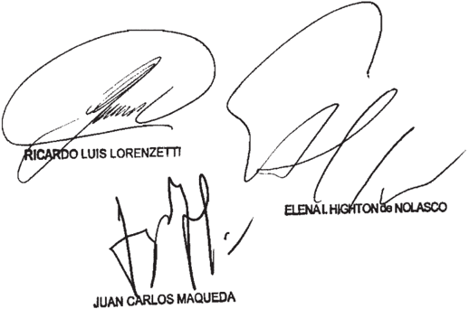

Recurso de hecho Interpuesto por Danlol representado por el dootor R.

Tribunal de orlgen; Buporlor Irlbunal de

Tribunales que intervlnieron con anterioridad: Jurado dal Chaco

## DE JUSTICIA DE LA NACION 336

## MARZO

## BOLSA DE CEREALES DE BUENOS AIRES  / BUENOS c AIRES, PROVINCIA DE S/ACCIÓN DECLARATIVA

## IMPUESTO DE SELLOS

En el marco del proceso en el que se cuestiona la constitucionalidad de las leyes impositivas anuales dictadas por la Provincia de Buenos Aires a partir de 2007, sobre la base de las cuales se grava con alícuotas distintas del impuesto de sellos a las operaciones de compraventa de cereales y oleaginosas en razón del domicilio de las entidades en que se registran los respectivos contratos, corresponde hacer lugar a la medida cautelar solicitada y establecer que los contratos que se registren en la Bolsa de Cereales de la Ciudad de Buenos Aires tributen, durante el corriente año, la alícuota prevista en el art. 46, ap. A), inc. 12, párrafo a), de la ley 14.333 de la Provincia de Buenos Aires, sustituido por el art. 21 de la ley 14.357 y mantenido en el art. 51 de la ley 14.394 y que deberán tributar idéntica alícuota que la que se establezca para los que se registren en territorio provincial en el futuro hasta tanto se defina la situación objeto del litigio.

## FALLO DE LA CORTE SUPREMA

## Buenoe Aires,V d d 2013 \_

Autog Congiderando

10) Que à 1/6 la Bolsa de Cereales de Buenog Ai reg golicita el dictado de una medida cautelar por medio de cual el levantamiento del embargo preventivo Y la inhibición general de bienes ordenados en 1os autos caratuladog "Fisco de provincia de Buenog Aireg c/ Bolba de Cereales Frutos Y Productos Y otros 8/ medida cautelar autó noma anticipada-previsión" (expte n' 15 .897) en trámite ante el Juzgado en 1o Contencioso Administrativo n' 2 del Departamen to Judicial de La Plata . Solicita asimigmo que suependa aplicación de la alícuota diferencial mayor del impuesto de se contemplada en el artículo 46 , apartado A) inciso 12) párrafo b) de 14.333 de la Provincia de Aires (10,5 o/oo) ~sustituido por el artículo 21 de la 14.357-, respecto de contratob que registren en su sede de la ciudaa de Buenog Aires Y que en cambio ge le aplique la alícuota reducida prevista en el párrafo a) de 1a norma citada (7,5 ley ley

178 oloo)

En cuanto medidas cautelares cuyo levantamiento pretende Beñala que el embargo preventivo fue trabado sobre inmuebles de Bu propiedad Y de las personas que integraban su Con sejo Directivo, Y la inhibición fue anotada contra de ellog Aclara que taleb medidas que encuentran origen en diferenciab determinadas en concepto de impuesto de Bellob en 1a resolución 50/08 impugnada en 1a demanda , fueron luego subtituidae por un Beguro de caución contratado cuyo pago desde el año 2008 le genera un grave perjuicio, ademág del considerable gravamen que le9 caugan aquéllag al buen nombre Y crédito comercial de directivog, Y al prestigio de la Bol sa toen

En relación al restante pedido sostiene que con las Bucesivag sancionadas anualmente partir de 2007 la demandada fue incrementando la polftica tributaria discriminatoria que está ejerciendo en su contra, en razón del domicilio en el que se encuentra ubicada 9u gede social ~donde se recauda el impuesto de sellos sobre 109 instrumentog que allí se con el propósito de desviar 1a registración de 109 contratos de compraventa de cerealeg Y oleaginosag ~Y la conse cuente percepción del respectivo derecho de hacia otras entidades radicadas dentro del territorio provincial; más específicamente en 1a localidad de origen de las mercade rías bienes objeto de instrumentos gravados las que se ven beneficiadas con la aplicación de una alícuota menor

A 50/57 1a actora sostiene que el prestigio tiene la Bolsa de Cereales de Buenos Aires entre quienes inter vienen en la compraventa de cerealeg Y oleaginosas\_ Y la eficacia de su organización en el trámite de certificación de 109 contratos, no puede compensarse con la aplicación de una alícuota agravada en un 408 \_ que

Amplía planteo de inconstitucionalidad todas las leyeg impogitivag anualeg gancionadas por la demandada desde el

año 2007 cuales son , las números 13 . 787 , 13 930 14 . 044 , 14 . 200 Y 14 .333 modificada por 1a 14.357 , desde que en todas ellas mantiene la discriminación tributaria en razón del domicilio de su ley

Que el pedido relativo al levantaniento de medidas cautelares ordenadas en juriadicción provincial debe ser rechazado En efecto, el ingtituto previgto en el artículo 230 del Codigo Procebal Civil Y Comercial de la Nación no puede ~como reglainterferir en el cumplimiento de pronunciamientog judlciales empleado para impedir el derecho de {ndole conatitucional de ocurrir la juaticia para hacer valer 1og re clamog que el acreedor congidera legítinog (Falloe: 329:789 Y citas) Extrerog que , como rebulta evidente se verificarfan en el el Tribunal accediera tal petición.

Que en cuanto requerido cabe recordar que este Tribunal ha establecido que si bien por vía de principio, medidas como las requeridas no proceden regpecto de actog adminiatrativog legislatívog habida cuenta de la presunción de validez que ostentan, tal doctrina debe ceder cuando Be impugna sobre bages facie (Fallog: 250 : 154; 251:336; 316:2855) prima

Que ha dicho en la cauga "Albornoz Bvaristo Ignacio Nación Argentina" (Fallos: 306:2060) que ncomo rebulta de la naturaleza de medidae cautelaree, ellas no exigen de el de la certeza sobre la exigtencia del derecho pretendido, sino B610 de 8u veroginilitud Es más , el juiclo de verdad en esta materia se encuentra en opogiclón la finalidad del ingtituto cautelar, que no otra que atender aquello que no excede del marco de 1o hipotético, dentro del cual asimismo agota virtualidad"

En el presente caso resultan guficientemente acreditadas 1a verosimilitud en el derecho Y la configuración de los presupuestos establecidoa en 109 incisob 10 Y 2' del citado artículo 230 del código adjetivo para acceder restante

dida pedida\_

Que en mérito la que se adopta regulta necegario precisar que el lite presenta marcadas diferencias con otros reclamos en los que este Tribunal ha denegado el dictado de medidas precautorias frente pretensiones fiscales de 1og en atención al principio de particular estrictez que debe aplicarse en materia de reclamog Y cobros de impuestos (conf Fallog: 322:2275 , entre otros)

En el caso , en que se refiere segundo de dos efectuados , se cuestiona 1a constitucionalidad de las leyeg impositivag anuales dictadas por 1a Provincia de Bueros Aires partir de 2007 , sobre 1a base de 1as cualeg se grava con alícuotas distintas del impuesto de sellos las operacioneg de compraventa de cereales Y oleaginogas en razón del domicilio de las entidadeg en que se registran los respectivos contratos Así 1og que se registren dentro del territorio provincial tri butan un porcentual menor al que pagan quieneg 10 hacen fuera de la provincia. De tal manera , adquiere preeminencia la necesidad de determinar si el Estado provincial ha excedido ~cono se afirma en potestades tributarias precigar cuáles son 109 alcanceg de la jurisdicción Y competencia que tiene para ejercer eventualmente el derecho de percibir 1a alícuota diferencial cuestionada , Y proceder quebranta la potestad del gobierno federal de reglar el comercio de las provinciae entre (artículo 75 , inciso 13 de la Constitución Nacional; Fa 178:308 ; 320 :1302 considerando entre otros) pedi arg.

situación, diversa de examinada en los precedentes que se ha hecho referencia, permite concluir que en el caso regulta acongejable establecer cautelarmente que contratos que en la sede de 1a Bolga de Cerealeb de Buenob tributen en concepto de impuesto de sellob , en lo respecta al corriente año la alícuota del siete con cinco por mil (7,5 oloo) previata en el artículo 46 apartado A) incigo 12) párrafo a) la 14.333 de la Provincia de Buenos que ley

subtituido por el artículo 21 de la ley 14 .357 Y mantenido en el artículo 51 de 1a 14.394 ; que deberán tributar idéntica alícuota que la que se ebtablezca para 1os que reglgtren en territorio provincial en el futuro hasta tanto defina la situación objeto de este litigio ley

Cabe señalar que 1a decisión que se adopta Bolo pro ducira, en el en que se rechace 1a demanda , una pobterga cíón en percepción de diferencias que generen , ya que mientrae tanto la provlncia ingregará 8u9 arcag las mismas que Be perciben por el gravamen que recae sobre inscrumentos reglstradog en entidades con sede en territorio.

Por ello, se reguelve: 1' ) Rechazar el pedido de suspensión Y levantamiento de embargo efectuado en el punto 2) del petitorio de la presentación de fs 1/6 . Hacer lugar la medida cautelar solicitada en el punto 3) , Y , por consiguiente establecer que contratos de compraventa de cereales Y oleaginosas que registren en la Bolsa de Cereales de la Ciudad de Buenos Aireg tributen, durante el corriente aio, 1a alícuota del siete con cinco por nil (7,5 prevista en el artículo 46 apartado A) inciso 12) párrafo a) de 1a 14.333 de 1a Pro vincia de Buenos Aires sustituido por el artículo 21 de 14 .357 Y mantenido en el artículo 51 de la 14.394 ; como asi mismo que deberán tributar idéntica alícuota que la que se esta blezca Para que registren en territorio provincial en el futuro hasta tanto 9e defina 1a situación objeto de este litiNotifíquese las partes mediante cédulas que confeccioley ley ley gio.

narán por Secretaría Y a la Agencia de Recaudación de la Provin cia (ARBA) tediante oficio

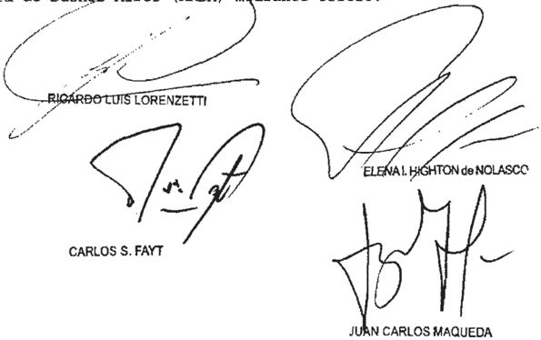

Parte actora: de Ceroalob ebtatuto Boclal de Prutob Productoa" ) representada por lotrado apoderado, doctor con el patrocinio de 1os doctoreb Juan Vlconte Horaclo Gorobito.

Parte demandada : Provlncla de Areb

## DE JUSTICIA DE LA NACION 336

## CICCONE CALCOGRAFICA S.A.  / D.G.I. c

## IMPUESTO A LAS GANANCIAS

Corresponde declarar desierto el recurso de apelación si en su memorial la representante de la Administración Federal de Ingresos Públicos omite hacerse cargo debidamente del argumento central de la sentencia del Tribunal Fiscal de la Nación -confirmada por el a quo- consistente en que la falta de una cláusula contractual expresa de la que resulte que el agente de retención se hacía cargo del pago del tributo, o de un comportamiento inequívoco de éste en tal sentido, impide tener por acreditado que la empresa haya asumido el pago del impuesto a las ganancias de dos sociedades constituidas y domiciliadas en el exterior.

## FALLO DE LA CORTE SUPREMA

## Buenos Aires, 5 de AuJr2o

Vistos autos: "Ciccone Calcográfica 5 .A. (TF 19.236-I) c/ DGI"

## Considerando:

Que la AFIP-DGI, nediante resolución de fecha 26 de diciembre de 2000 , determinó de oficio impuso empresa Ciccone Calcográfica s.A la obligación de ingresar retenciones del impuesto las ganancias respecto de los pagos efectuados beneficiarios del exterior durante el lapso comprendido entre 10s meses de julio de 1995 Y agosto de 1997 , ambos inclusive con 1os intereses resarcitorios correspondientes, Y le aplicó una multa equivalente al 708 del importe de las retenciones suntamente omitidas (art. 45 de 11.683, t.0 . en 1998 Y modificaciones) (fs. 5/41) preley

Que para así proceder el organismo recaudador tuvo en cuenta que la empresa actora celebró el de mayo de 1995 un contrato con el Banco Nacional de Angola ~extendido en sus alcances en diciembre de ese año Y en marzo de 1996 mediante el cual se encargó aquélla fabricaci impresión Y exportación de billetes de papel moneda de ese país ~kwanzasque en el marco de esa operación convino con dos sociedades constitui

das Y domiciliadas en el exterior ~Jit Commerce Corporation Y Business Strategy Corporation\_ servicios de coordinación, administración Y control financiero del negocio, por un lado, Y la realización de pruebas de control de calidad del papel de inpresión, por el otro Asimismo, consideró que Jit Commerce corporation actuó como agente cobrador de los pagos efectuados por el Banco Nacional de Angola para cancelar las facturas emitidas por Ciccone Calcográfica S .A . que, en contraprestación por esos servicios, retuvo por expresa disposición de la empresa actora, sendos porcentajes de los montos abonados para cada una de las sociedades, girándole el remanente aquélla. En razón de ello, el organismo recaudador entendió que las prestaciones efectuadas por las referidas empresas constituían un asesoraniento técnico, financiero de otra índole prestado desde el exterior favor de Ciccone Calcográfica por 10 que debía onsiderarse que las respectivas retribuciones eran de fuente argentina y que en tales condiciones correspondía determinar la renta gravada según las disposiciones del segundo párrafo del art 12 Y del inciso h del art 93 de 1a del impuesto 1as Janancias\_ De tal manera, concluyó en que al disponer de los fondos en el sentido indicado, Ciccone Calcográfica había naterializado pagos favor de las sociedades del exterior obligada, en consecuencia, al ingreso de retencio1es con carácter de pago único definitivo beneficiarios del exterior conforme las disposiciones del Título V de la de impuesto las ganancias ley las ley

Finalmente, consideró por otra parte, que como "en 21 presente caso el pago del impuesto resulta cargo del sujeto paga 1os correspondientes beneficios" correspondía calcular La retención "sobre el monto que resulte de acrecentar dichos Jeneficios con el importe del respectivo impuesto que se tome argo" (conf fs 13/14 Y 34/35)

Que el Tribunal Fiscal de la Nación confirmó parcialmente 1o resuelto por el organismo recaudador en cuanto de terminó el impuesto, liquidó 1os intereses Y aplicó la multa Y,

en cambio, revocó esa decisión en referente al pretendido acrecentamiento, calculado por la AFIP-DGI en la medida del impuesto presuntamente tomado cargo la empresa actora (conf fs 675/687 , en especial cons 5 . 10 , fs 683 vta./684) por

4 % ) Que para así decidir el punto mencionado en último término ~que es el relevante fines de la cuestión planteada ante esta Corteel mencionado tribunal adninistrativo consideró que para que la renta local resulte incrementada por efecto del art 145, párrafo, del decreto reglamentario de del tributo, "el pago del impuesto debe encontrarse cargo de un tercero" quien puede ser "cualquier vinculado al respon sable por deuda propia que asune su carga tributaria, sea no responsable por deuda ajena su respecto" Tras ello, aseveró que "es porque el tercero asume la carga fiscal que la base de medición refleja tal circunstancia" (fs. 683 vta. cons 5 .10 1 0 párr.) En cuanto al mecanismo de acrecentamiento previsto en la norma citada, señaló que ella "contiene una regla excepcional de base imponible que cuantifica ese acuerdo de voluntades por el que el pagador local un tercero toman su cargo el grava men Y en donde la causa del grossing-up precede siempre {a) la extensión de responsabilidad al responsable por deuda ajena" En tal sentido destacó que [n]o hay incrementación de la renta porque se omitió retener ~hipótesis de extensión de responsabilidad sino porque se asumió el gravamen del retenido" (ídem, segundo párrafo) 1o cual produce da de a acción de regreso" (ídem , tercer párrafo) ley pérdi

En esa línea de razonamiento, sostuvo que el organismo recaudador había cometido el Yerro de "desplegar el mecanismo de grossing-up frente la omisión de retención en la ausencia en el caso, de cláusula expresa comportamiento inequívoco del agente de retención en el sentido de asunir el pago del tributo" (ídem , cuarto párrafo) En abono de 10 expuesto puso de relieve que los contratos suscriptos entre Ciccone, Jit Commerce Corporation Y Business Strategy Corporation, en las cláusulas refe rentes al modo de resolución de controversias hacían recaer la

186

designación como tercer árbitro en el 'presidente titular de la Asociación Fiscal Internacional, con sede en la Universidad de Erasmus , Rótterdam, Holanda ~en el caso del convenio suscripto con Jit Commerce CorporationY en el "presidente del Instituto Latinoamericano de Derecho Iributario" ~en el caso del suscripto con Business Strategy Corporation(fs 684 , cons \_ 5 .10 párr.) , 10 cual expresaba "claramnente la diversidad de intereses en el plano tributario" Y no se avenía con la renuncia de Ciccone su acción de regreso \_ Por último, puntualizó que la solución no variaba si se consideraba el sentido inverso del flujo de fondos de la operación puesto que el beneficiario del exterior había remesado 1a diferencia neta la empresa actora, que al asumir posición de sustituto tributario conservaba la acción de regreso, situación que resultaba incompatible con el pretendido acrecentamiento de la renta (íden, segundo párrafo)

5 % ) Que la Sala I de la Cánara Nacional de Apelaciones en Contencioso Administrativo Federal confirmó sentencia del Tribunal Fiscal (fs. 888/909) Para así decidir ~en que tiene relación con agravios traídos conocimiento de esta Corte tuvo por válidas las concluslones del organismo jurisdiccional respecto de la improcedencia del incremento del impuesto. Al respecto señaló que el recurso autorizado por el art 86 , inc b, de la ley 11. 683 impedía reexaninar los hechos pruebas referidos "la inexistencia de un pacto en virtud del cual quien paga la ganancia se hace cargo del tributo, cual se traduce en practicar la retención sobre la suma de la ganancia neta presumida Y el impuesto respectivo" máxime en ausencia de error arbitrariedad manifiestos en la apreciación de tales extremos efectuada por el Tribunal Fiscal (conf cons en particular, fs . 906 Y cons \_ 9 0 fs . 908 vta . in fine 909 párr.-)

6" ) Que contra 10 así resuelto, la Administración Federal de Ingresos Públicos Dirección General Impositiva interpuso recurso ordinario de apelación (fs 921/922) que fue concedido fs . 925 \_ El memorial de agravios obra fs 968/977 Y su

contestación por la actora fs . 980/990 vta. La apelación planteada es formalmente admisible puesto que se dirige contra una sentencia definitiva, dictada en una causa en que Nación es parte, Y el valor disputado en último término, sin sus accesorios, excede el mínimo legal previsto por el art. 24 , inc ap. a, del decreto-ley 1285/58 Y la resolución 1360/91 de esta Corte

Que , en forma preliminar, cabe puntualizar que la cuestión relativa la determinación ingreso de retenciones del impuesto las ganancias no practicadas respecto de efectuados las sociedades Jit Commnerce Corporation Y Business Strategy Corporation fue resuelta en favor del organismo recaudador en las anteriores instancias tal decisión quedó firme pues fue objeto de recurso por la actora\_ Por 10 tanto la cuestión decidir por esta Corte queda limitada la contro versia por el ingreso del impuesto resultante de considerar acrecentada la ganancia en términos que prevé el art 145 , párrafo, del reglamento de la del tributo pa gos no ley

Que al respecto corresponde poner de relieve en primer lugar que el art 86 , inc. b, de la otorga carácter limitado 1a revisión de la cámara Y, en principio, queda excluido de ella el juicio del Tribunal Fiscal respecto de extremos de hecho (Fallos: 300:985 ) Si bien no se trata de una regla absoluta Y , por consiguiente' la cámara debe apartarse de las conclusiones del mencionado organismo jurisdiccional cuando éstas presentan deficiencias manifiestas (Fallos 326:2987 , considerando tal situación dista de presentarse en el caso de autos Ello, por cuanto cuestión que se pretende traer conocimiento Y decisión de esta Corte fue resuelta por el Tribunal Fiscal con apoyo en el material probatorio re unido en la causa sobre la base de atinadas consideraciones en cuanto no asistía razón al organismo recaudador al des plegar el mecanismo de acrecentamiento frente la omisión de retener, en ausencia de cláusula expresa de que surja que el agente de retención hubiese asumido el pago del tributo de un ley que

comportamiento de aquél que tenga inequívocamente ese sentido cons ~20 párr. de esta sentencia)

9" ) Que en tales condiciones, cabe concluir que en el memorial de agravios ante esta Corte, el apelante no formula, como es imprescindible, una crítica concreta Y razonada de los fundamentos desarrollados en las anteriores instancias, circuns tancia que conduce declarar la deserción del recurso, desde que las razones expuestas en el memorial respectivo deben ser suficientes para refutar 10s argumentos de hecho Y de derecho dados en la sentencia para llegar la decisión impugnada (confr. art 280 , párrafo segundo , del Código Procesal Civil Conercial de la Nación Fallos: 315:689; 316:157, entre muchos otros

10) Que , en efecto, en su memorial de fs\_ 968/977 la representante 1a Administración Federal de Ingresos Públicos omite hacerse cargo debidamente del argumento central de este aspecto de la sentencia del Tribunal Fiscal de Nación ~confirmada por el quo\_ consistente en que la falta de una cláusula contractual expresa de la que resulte que el agente de retención se hacía cargo del pago del tributo, de un comportamiento inequívoco de éste en tal sentido, impide tener por acreditado que Ciccone Calcográfica S .A. haya asunido el pago del impuesto las ganancias de las sociedades Jit Commerce Corporation Y Business Strategy Corporation\_ Al respecto, la representación de la AFIP alega que el art 145 del decreto reglanentario de la ley del tributo prevé el acrecentanmiento de la renta cuando un tercero se hace cargo del impuesto del beneficiario aunque "sin sujetarlo ninguna condición\_ como a existencia de acuerdo escrito entre las partes [la] imposibilidad del pa gador de recuperar el impuesto abonado que correspondía [aquel] Sin embargo, este argumento no logra desvirtuar el razonaniento en que se sustenta 10 decidido por las anteriores instancias en tanto 1a citada norma reglanentaria prevé el requisito de que se asuma el pago del impuesto, ante 10 cual el recurrente omite explicar el modo alternativo que, en su concep-

to, resultaria apto para tener por configurado ese reacaudo (conf. fs 975 vta. 30 Y

11) Que tampoco resulta atendible el argumento del apelante dirigido descalificar la sentencia sobre 1a base de aseverar que "habiendo correspondido la actora practicar la retención. [y] ante la ausencia de pactos preexistentes al respecto . se impone que los precios pagados eran netos libres de impuestos" (conf fs 974 vta . párr.) \_ La insuficiencia de este agravio resulta clara si se advierte que no obstante que el Tribunal Fiscal ~en la sentencia confirmada por el puso de relieve que [nJo incrementación de renta porque se omitió retener ~hipótesis de extensión de responsabilidadsino porque se asumió el gravamen del retenido" (fs. 683 vta. cons 5 .10 , 2 párr.) , la representante del organismo recaudador insiste en equiparar la omisión de retener el impuesto con el acto voluntario de hacerse cargo del tributo, sin desarrollar un razonaniento que otorgue fundamento válido la equivalencia que pretende establecer entre la omisión indicada Y la presunta luntad del agente de retención de asumir el pago del tributo de jado de retener Al ser ello así, los agravios expuestos tradu cen una mera discrepancia con 10 decidido 10s tribunales de las anteriores instancias Y resultan ineficaces al fin pretendi do (confr\_ especialmente fs 973 vta. y párr.-, 974 ~1 20  párr.-, 974 vta. Y 20 párr. Y 976 ~20 párr.-) hay la por

Por ello, se declara desierto el recurso ordinario de ape lación interpuesto fs. 921/922 . Con costas (art 68 del Código

Procesal Civil y Comercial de la Nación) Notifíquese Y devuél-

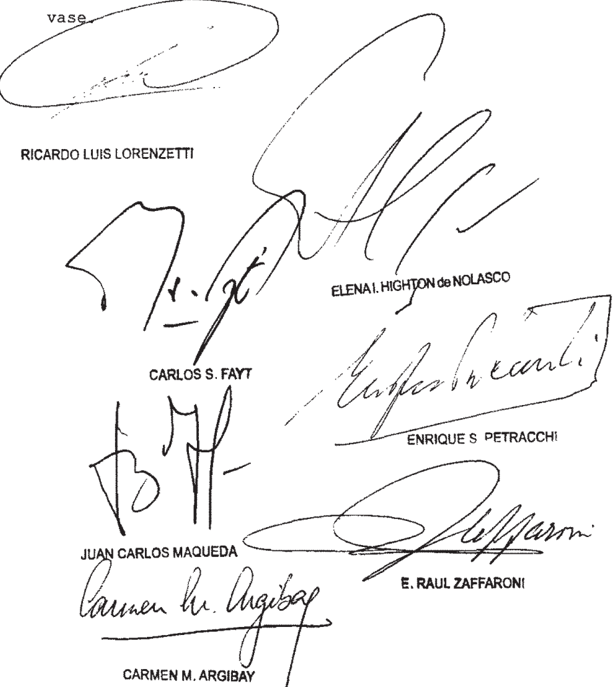

Recurso ordinario de apelación interpuesto por 01 Fisco Nacional (AFIP-DGI) representado en el memorial de agraviog, 1a Dra María Alejandra Incolla Garay , con el patrocinio letrado de 1a Dra . Silvia Jogefina Pepe por

Contestó el memorial de agravios: Ciccone Calcográfica 8 .A . representada por el Dr . Alejandro Vandenbroale \_

Tribunal de origen Sala de 1a Cánara Nacional de Apelaciones en Conten cioso

Intervino con anterioridad: Tribunal Fiacal de la Nación.

## DE JUSTICIA DE LA NACION

## FISCO  NACIONAL  (A.F.I.P.)  / CATAMARCA, c PROVINCIA DE Y OTRO DE (BANCO CATAMARCA Y/O ENTE RESIDUAL) S/ COBRO DE PESOS

## INTERESES

Corresponde hacer lugar a a demanda seguida por la A.F.I.P. contra la Provincia de Catamarca si surge con meridiana claridad la voluntad de las partes -expresada en diversos convenios- de no requerir interpelación o intimación alguna para la constitución en mora del deudor, quedando ésta configurada de pleno derecho de modo automático y, ante lo dispuesto por el último párrafo del art. 37 de la ley 11.683 (incorporado por el Título XV, art. 18, inc. 2°, de la ley 25.239), y a que se encuentra fuera de debate que durante el período de la litis regía un acuerdo 'expreso' entre las partes que autorizaba la capitalización de los intereses cada treinta días  corridos  y/o  fracción  menor  si  correspondiere  y  la  aplicación  de  la  misma tasa de interés resarcitorio que la A.F.I.P. cobraba a los contribuyentes por deudas impositivas y/o previsionales.

## diCtameN de la proCuraCióN GeNeral

## Suprema Corte:

VE corre nuevamente vista esta Procuración General en Iagresos Púbiicos} -entidad autárquica nacionai-. promovió demanda contra el Banco ylo Ente Residual y contra la Provincia de Catamarca de chtener el pago de una deuda (S 782.735,95) en concepto de intereses moratorios por de fondos provenientes de {a cobranza de impuestos\_ en ei {naico de un convenio de   recaudación acordado el Banco de Catamarca presentació: 'ambier demanda al Estado provincial, por ser éste quien garantiza ios depositos {a operaciones que realiza el citadc banco er; tantc en cuanto descentralizados 27/38,

De conformidad ccn el dictamen de este Ministerio Publico VE deciaró que {a presente causa correspondía competencia   originaria Y. corrio fs. 40/41)

abe apuntar ante todo que; fojas 130 obra un escritc de ia

Provinc:a de Catamerca en el cual se unifica la personeria de acuerdo a lo dispuesto {0 que implica la desaparición ccmo feisona jundica de dicha institución En dicha presentación fue desistida por esa parte excepcisn de de 3' haber 'iquidado el bancc Jerandado y transferidos Sù5 pasivos

Al momento de contestar la demanda la prcvincia de Catamarca solicitó su rechazo argumentando que la deuda reclamada; por la naturaleza de Ia relación   juridica que unía a las partes se encuntraba prescripra de acuerdo Io establecido en el articulo 847 del Código de Comercio Asimismo; impugnó los montos pretendidcs\_ haciendo hincapié en la falla de claridad de los mismos Sostuvo; que nunca fue formalmente interpelada por las   diferencias reclamadas por la estimando que notas adjuntadas por la actora. todo evento por esgrimió consolidación de {a deuda (v parte

Por su parte Ja entidad bancaria accionada contestó rechazando la demanda aduciendo la oscuridad en la pretension del desccnociendo la documentación acompañada peticionaria Sostuvo que el convenio de recaudación se encuentra en la categoria de contrato de gestión 0 mandato de naturaleza comercial   postulandc que habria existido una desproporción en el equilibrio de las prestaciones invocando la doctrina del abuso del derechc a' pretender -a actora intereses mora'crics Ademas, estimó abusiva Ya tasa aplicada y cuestiono el sistema de capitalización de intereses

Finalmente y ante !a hipétesis de una condena manifestó que el crédito se encontraba consolidado por Ia provincial Nro 5 01ê en virtud del estado Ley

## DE JUSTICIA DE LA NACION 336

de emergencia dispuesto por Jey

Clausurado el períoco probatorio las partes presentaron suS alegatos, por medio de los escritos de íojas 3831390 y 392,404 Pcsteriormente el Tribunal dispusc correr nueva vista â este Ministerio Público (v. fs. 405)

mi entender causa es de la competencia originaria del "ribunal fojas

Er Qiro orden al abordar ias cuestiones planteadas, este Ministero Publico ha je ceñirse sustancialmente los aspectos que hacen art Organica del Ministerio Publico 24.946) . Ponderando hechos y pruebas er Ley

Cabe precisar que en autos se encuentra reconocido pof el Fisco el Banco Catamarca la celebraciór; de convenio de "ibutaria en el marco legal de los articulos 4 6 y 3C de la Ley NP 11.883, el cual tuvo sucesivas Prorrogas corvenios complementarios {v {s 28vta./30 215 281286 .

Sentado ello resulta oportunc señalar que el thema en dererminar existencia la procedencia er concepto de intereses moratorios por la transferencia tardia de fondos provenientes de la ccbranza de el marco de contraios suscriptos , 5i como Jo sosuene la demandada la acciór se encuentra prescripta

En ese corresponde tratar en primer termiro las argumertaciones de 'a demandada relativas a la prescripción que exige evaluar la de la contractuai en cuestión para asi determinar

194

## FALLOS DE LA CORTE SUPREMA 336

{égimer juridico aplicable al caso Entonces en mi opinión el ccntrato celebrado pcr la er tanto destinadc cumplir fines de {a Administración Pública ~recaudación de tributos- reviste caracteres propios que i0 sujetan a los principios del

En tales condiciones estimo que el término de prescripcion que corresponde aplicar es el decenai (conf. 4023, C Civil) , en virtud de que la relación que vincula a las partes es de orden contractual y no está previsto expresamente un plazo menor para el caso (Fallos 229.12; 283.401. entre otros) En este sentido; es dable recordar que las normas de derecho privado tienen vigencia en derecho público por integración del ordenamiento juridico (v art 16 , Civil y voto doctor Luis Maria Boffi Boggero en Fallos 263 510) y que la prescripción no puede separarse de la causa de Ia obligación de que se trate (Fallos 320.2289; 323.3351). art

Siendo ello así es menester   resaltar que fojas 58 vta la accionada reconoció expresamente que en septiembre de 1998 tomó conocimiento de los retrasos en cuestión; más allá de que la parte actora -conforme surge del informe pericial,. fs. 292/308- haya intimado en varias ocasiones al pago de las obligaciones el Banco presentó una nota informando el pago de 824 527,24 en conçepto de capital intimado y. solicitó la condonación de los intereses respectivos (fs. cual implica un reconocimiento por parte del obligado respecto de la existencia de la deuda detallada a fojas 317 mediante un acto de su propia voluntad, que interrumpe -respecto de dicho tramo de la obligación- el curso de la prescripción (conf

De esa manera, en tanto la deuda que se reclama corresponde periodos  comprendidos entre enerc de 1995 a enero de 317/329) y la demanda fue interpuesta el 14 de noviembre de 2001 (v fs. 38) . no corresponde tener por prescripta la presente acción Al respecto; VE ha señalado en

## DE JUSTICIA DE LA NACION 336

reiteradas oportunidades que de acuerdo a lo dispuesto por el articulo 3986   primera parte del Código Civil, la demanda, entendida como toda presentación judicial que la intención de mantener vivo ei derecho de que se trate suspende la

V

En el marco expuesto cabe precisar que la pericia en cuanto a la determinaciór de los atrasos en íos depósitos de los tributos no fue impugnada por las partes obiigaciones contractuales de la demandada (v. fs. 317i329)

Entonces , respecto a las cuestiones objeto de agravio por parte de la accionada en orden a la aplicación de la tasa de Inieres y a la capitalización de los intereses en ei sub examine no se configurarian los presupuestos que ameritarían hacer lugar morigeración teniendo en consideración {0 acordado por las partes y 1 dispuesto por que consagra el pleno respeto las obligaciones contractualmente asumidas siendo en principio válidos intereses convenidos entre 'a AFIP y el Banco de Catamarca (arts. 621 primna {acie gue se encuentre comprometido el orden público la moral 0 las buenas Jey Jos

Además , como señaló en la pericia el contador  -aspecto reitero, nc impugnado por las   partesIcs convenios suscriptos se permitia aplicacion dei regimnen de capitalización de intereses. En ese sentido el articulo 523 del como en el caso, media convencion expresa de los contratantes (v. fs. 33Ovta y 333vta/335 y doctrina de Falios a su vez se encontraría comprometido el interes comuf en el pago puntual de los 'mpuestos, dado que ello permite el normal desenvolvimiento de las finalidades del Estado interés gue no beneficia a personas deterninadas sino

## FALLOS DE LA CORTE SUPREMA 336

Así también, el principio de Ia buena fe impone los contratantes un comportamiento oportuno; diligente y activo; obligándolos al momento de la contratación a poner de manifiesto la aparición de circunstancias que a su juicio le importen un perjuicio; surgiendo de la pericia contable que lo acordado respecto los   intereses  punitorios se adecuarian al parámetro   legal de licitud ya que fueron calculados conforme a las pautas previamente acordadas, situación que resultaría en principio insusceptible de ser calificada como irrazonable (v. fs.330/331 vta) .

VI \_

En relación a la discusión sobre la aplicabilidad al caso de la de Consolidación de pasivos  provinciales; es oportuno señalar que la Ley 4646 de Catamarca dispone que las obligaciones vencidas 0 de causa 0 titulo anterior al 31 de marzo de 1991 que consistan en el pago de sumas de dinero; sólo serán consolidadas luego de su reconocimiento firme en sede judicial 0 administrativa. En ese marco; a mi el tratamiento de los agravios relativos a esta cuestión en esta etapa; deviene prematurc Ley

VII

En función de lo anterior, considero que debe hacerse lugar a la demanda con el alcance expuesto

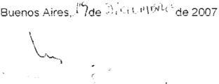

## DE JUSTICIA DE LA NACION 336

## FALLO DE LA CORTE SUPREMA

## Buenos Aires Jd

Vistos autos "Fisco Nacional (A.F.I.P.) c/ Catamarca, Provincia de Y otro (Banco de Catamarca Ente Residual) s / cobro de pesos" de que 10s ylo

## Resulta:

I) A fs . 27/38 se presenta el Fisco Nacional (Admi nistración Federal de Ingresos Públicos) ~entidad autárquica na cionalY promueve demanda contra la Provincia de Catamarca Y contra el Banco de Catamarca Ente Residual fin de obtener el pago de una deuda ($ 782.735, 95) en concepto de intereses mo ratorios por la transferencia tardía de fondos provenientes de la cobranza de impuestos , en el marco de un convenio de recaudación acordado con el Banco de Catamarca, devengados en el período comprendido entre enero de 1995 Y enero de 1998 Y/o

Señala que demanda al Estado provincial por ser éste quien garantiza depósitos Y las operaciones que realiza el citado Banco en tanto Y en cuanto, la Provincia responde por sus entidades organismos centralizados descentralizados Ya que depende del Poder Ejecutivo\_

Explica que el 30 de junio de 1987 suscribió un con venio con el entonces Banco de Catamarca por medio del cual se acordó que este último no ingresaba los montos recaudados dentro de 10s plazos fijados en el anexo , la mora se produciría de pleno derecho Y se aplicaría un interés cuya tasa sería equi valente la se fije por el artículo 42 de la 11 683 (t.0 . 1978) Y sus modificaciones para deudas actualizadas por cada día de demora en el ingreso de fondos ley que no

Afirma que en esa ocasión también se pactó que cuando 10s referidos intereses no hubieran sido ingresados conjuntamente con el importe recaudado , les sería aplicable partir de esa fecha , una actualización que se calcularía entre la fecha del

efectivo pago del importe recaudado Y del efectivo pago de intereses correspondientes sobre la base de la variación diaria del índice de precios mayoristas ~nivel generalelaborado por el (artículo

Por tanto dice que el citado organismo provincial tenía la obligación de ingresar 1os tributos recaudados en 10s plazos perentorios que el contrato preveía, por que mal po día, bajo el pretexto de la "inimputabilidad" no pagar 1os intereses capitalizados

En otro orden de ideas\_ arguye que en la nota del 22 de marzo de 2000 el propio Banco le solicitó la A.F .I.P\_ que 10 eximiera del pago de intereses que se le reclamaban por que expresamente reconoció la deuda

Recuerda también el principio de buena fe que debe regir en materia de contratos (artículo 1198 del Código Civil) Y destaca que no debe ampararse el ejercicio abusivo de un derecho (artículo 1071 del citado código)

Reitera que reclama la suma de 782 . 735 , 95 al 30 de septiembre de 2001 indica que dicho monto se debe depositar conjuntamente con intereses respectivos hasta el día de su efectivo pago , en la cuenta administrativa n' 1171/74 , habilitada por el Banco de la Nación Argentina ~Casa Central-

Reconoce además que intimó la contraria mediante carta documento del 10 de agosto de 2000 , la que fue recibida al día siguiente

Funda su derecho en 10s artículos 507 , 509 , 622 1071 , 1137 , 1144 , 1197 Y 1198 , siguientes Y concordantes del Código Civil\_ Ofrece prueba Y pide que se haga lugar la deman da con costas

II) A 40 dictamina el señor Procurador General respecto la competencia del Tribunal

III) A 56/67 se presenta el Banco de la Provincia

de Catamarca, contesta la Y niega hechos invocados por la actora

Sostiene que el escrito de fs 27/38 es oscuro toda vez que la demandante omitió mencionar que el convenio que firmó con la actora el 30 de junio de 1987 fue modificado por los con venios complementarios del 22 de diciembre de 1988 del 31 de enero de 1989 \_ respectivamente

Relata que con posterioridad, el 30 de junio de 1992 las mismas partes firmaron un nuevo convenio de recaudación, el que fue modificado el de diciembre de 1992 El 10 de agosto de 1994 suscribieron otro acuerdo complementario del anterior En consecuencia, continúa, 1os convenios antes mencionados no solo establecieron previsiones concretas en relación la tasa de interés que se aplicaría en caso de mora por el ingreso de los fondos recaudados sino que también estipularon, 10s diferentes objetos de 10s acuerdos distintos plazos de rendición de cuentas según

Señala título de ejemplo, que plazos para recaudación de recursos de la Seguridad Social Y del SIJP del acuerdo del de agosto de 1994 no eran 10s mismos que los pactados en relación al Anexo I-IA Y II del acuerdo del 30 de junio de 1987 , punto Del mismo modo continúa el convenio de 1987 dispuso que las rendiciones de cuentas que el Banco practique deberían ser conformadas por la dentro del plazo de un año de practicadas por aquél mientras que en los convenios de 1992 Y 1994 se previó un término de ciento ochenta días

De tal manera, dice no surge claro cuál es el recur s0 que habría sido liquidado fuera plazos establecidos ya que difiere según se trate del I.V.A retenciones de ganan cias, retenciones por faena de bovinos aportes previsionales aportes de obra social contribuciones previsionales etc Cues tiona además la liquidación que la actora acompaña fs 7/8 así como las que surgen de las planillas de cálculog que se ad-

200

juntan en un cotal de tres mil dieciocho fojas las que según observa , resultan de imposible análisis" (fs 58)

Por otra parte, afirma que la A.F .I.P. nunca o intimó formalmente por las diferencias que se reclaman en el sub lite sino hasta su presentación en septiembre de 1998 por que le son inoponibles ~a los fines de la constitución en mora las supuestas intimaciones que la actora le efectuó por simples notas en fechas anteriores en las que no consta el funcionario que las recibió en representación del Banco , que torna improcedentes

Aclara además que la mora automática del deudor por vencimiento del plazo pactado no es aplicable lisa Y llanamente Ya que debe hacerse constar la negativa de pago por acto auténtico, sea que exige una actividad del acreedor cuya omisión es impedimento de las consecuencias de la mora

Por otro lado, alega en el artículo del conve nio de 1987 se estableció expresamente que su objeto era el co bro mediante depósito bancario de los impuestos cuya recaudación estaba cargo de demandante por 10 que el convenio de re caudación se encuentra en la categoría de contrato de gestión mandato comercial\_ más precisamente de un contrato de comisión" (artículo 223 del de Comercio) dado que el Banco actuaba como intermediario en cobros en virtud de un mandato otorga do por un cliente 59 vta./ 60) que

Arguye que 1os contratos deben interpretarse conforme las pautas del artículo 218 del citado côdigo, según el genti do que más convenga su naturaleza, Y las reglas de la dad Y, en casos dudosos , no puede resolverse según la bases es tablecidas sino que deben interpretarse siempre en favor del deudor , sea de su liberación (incisos 3 Y equi

En este marco se agravia de que no es equitativo para las partes contratantes que existan cláusulas "exorbitantes Y lesivas" en el convenio que impliquen que el Banco sea deudor de

un capital que la propia actora indicó en "poco más de $ la insólita suma de más de $ 780 . 000" en el período 1985-2001 (fs 60/60 vta.) ; por que existe una conducta abusiva Y des proporcionada de esta última

Expone que \_ contrariamente 1o que sostiene la actora el Banco de Catamarca actuó de buena fe Y prueba de ello es que la demandante no rescindió la relación contractual\_ sino que mantuvo hasta la entidad financiera dejó de operar el de diciembre de 2000 que

Por otra parte afirma que su parte intentó por distintos mecanismos que el reclamo fuera razonable Y aclara que tributos recaudados no demoraban mâs de cinco días en ser transferidos no obstante la Administración 109 consideraba s0 bre un período de treinta días para el cálculo del interés capi talizable Explica que algunas sucursales se encontraban trescientog kilómetros de la Capital (ej Santa María) por que resultaba imposible" difícil cumplir con el gervicio en plazos convenidos sea por 109 inconvenientes que se presentaban en el sistema de comunicación telefónica satelital en los medios de transporte para la rendición de la documentación (fs 61)

Sostiene que , por tanto, son lesivas Y nulas por ser contrarias la moral Y buenas costumbres las cláusulas de intereses moratorios capitalizables contenidas en 10s convenios En apoyo de su postura, cita los artículos 954 Y 1071 del Código Civil\_

En otro orden de congideraciones asevera que la tasa de interés por mora que surge de la planilla de liquidación que la actora acompaña 7/8 Y que da como resultado la suma de $ 131.394 21 es irrazonable" Asimismo cuestiona los cálculos del anexo operativo 424 emitido por nota 4147-1/99 efectuados al 10 de enero de 1999 toda vez que el capital adeudado las diferentes "galidas" entre el de enero de 1995 Y 31 de enero de 1998 asciende la suma de $ 24 . 527, 24 , mientras que el por in-

terés moratorio al 19 de enero de 1999 es de $ 24 . 254 , 91 , es de cir, 10s intereses en un período de estabilidad económica son iguales al "supuesto capital adeudado" (fs 62 vta.) A su criterio la tasa que pretende la A.F.I.P importa una indexa ción encubierta prohibida expresamente por la 23 928 que ley

Asimismo sostiene que el artículo 565 del Código de Comercio establece intereses que cobran los bancos publicog Y solo por el tiempo que transcurre después de la mora , Y que aun cuando en el convenio se pactó otra tasa, ésta debe ser mo rigerada, tal como ha decidido de modo reiterado la jurisprudencia.

Por otro lado, arguye el 3 de marzo de 2000 abonó íntegramente el capital adeudado , por 10 que no se explica por debe en concepto de capitalización de intereses la suma de $ 651.341 74 (fs 64 vta . ) Advierte que si bien en la fecha antes indicada pagó la suma Ya referida, A.F.I.P\_ la intimó el 10 de agosto de ese mismo año pagar el monto de $ Y un año después practicó una liquidación que dio como resultado el monto de $ 651.341,73 al 30 de septiembre de 2001 , por por capitalización de intereses debidos se aumentó suma de $ 262 438 48 10 que estima abusivo Recuerda además que la 23 928 prohíbe la capitalización de intereses que qué ley

Por último invoca la aplicación de la local 5016 Y pide que en el supuesto que se haga lugar la demanda se declare consolidada la deuda de autos en virtud del estado de emergencia dispuesto por la 4849 Y el carácter de ente en liquidación ordenado por el Decreto Acuerdo del PEP 1551/00 Ofrece prueba Y solicita que se rechace la demanda costas ley ley

IV) A fs 86/90 presenta la Provincia de Catamar ca , contesta la demanda Y opone las defensas de falta de legitimación pasíva Y de prescripción

Sostiene en relación la primera que el Estado provincial no está legitimado para responder la demanda en tanto el

Banco de Catamarca fue transferido como unidad de negocios de activos Y pasivos al Banco de la Nación Argentina en virtud del Decreto Acuerdo PEP 1551/00 (artículo por que este último es el obligado al pago de la deuda Aduce además que la fe cha de la presentación de la demanda el Banco de Catamarca man tenía su autarquía Y personalidad jurídica, en virtud de que el decreto antes citado fue prorrogado por el Decreto Acuerdo PEP 543/02 (artículo 1 ' ) , por que la Provincia carece de legitimación para actuar en este juicio

Respecto la segunda , señala que la deuda reclamada por la naturaleza de la relación jurídica que unía partes está prescripta de acuerdo 10 establecido en el artículo inciso 2 del Código de Comercio. Añade que tampoco se produjo ningún acto interruptivo en el período 1995-1998 las

Por otro lado, niega expresamente el carácter de deu dora , impugna montos pretendidos resalta la falta de claridad de mismos

Destaca además que nunca fue formalmente interpelada por las diferencias reclamadas por la A.F.I.P Y 10s fines de la constitución en mora le son inoponibles las simples notas adjuntas por la parte demandante que

Ofrece prueba Y pide el rechazo de la demanda con costas

Finalmente, Y ante la hipótesis de una condena , es la morigeración de 10s intereses , toda vez que que se pretenden cobrar vulneran las garantías constitucionales Asimismo invoca la consolidación de la deuda en virtud de dispuesto en la ley 5016\_ grime

V) Corrido el traslado pertinente de las excepciones (fs. 91) , actora contesta fs . 96 (ver asimismo 386/386 vta. )

VI) A fs. 130 la Provincia de Catamarca unifica la

pergonería Y expone que de acuerdo 10 dispuesto por el Decreto Acuerdo del PEP 1435/03 se ordenó el proceso de autoliquidación Y de intervención del ex Banco de Catamarca, que implica la desaparición como persona jurídica de la institución\_

Agrega además que desiste de la excepción de falta de legitimación pasiva opuesta, al haber sido liquidado el banco demandado Y transferidos sus pasivos . A fs 131 se tiene presen te

VII) fs\_ 411/413 la señora Procuradora Fiscal dictamina en virtud de la vista que se le corrió fs 409

## Considerando

1 % ) Que este juicio es de la competencia originaria de la Corte Suprema de Justicia de la Nación (artículos 116 Y 117 de la Constitución Nacional)

Que en primer término corresponde examinar cuál es el término de prescripción aplicable la acción emergente de facultad de la A.F.I.P. para cobrar al Banco de Catamarca los intereses moratorios por la transferencia tardía de fondos provenientes de la cobranza de impuestos , en el marco de 10s conve nios que suscribió con la citada institución; que evaluar la naturaleza jurídica de la relación en cuestión, para así de terminar el régimen jurídico aplicable al caso exige

3 ' ) Que de las constancias de autos surge Y es un hecho no controvertido que el 30 de junio de 1987 la Dirección General Impositiva (D.G.I.) Y el Banco de Provincia de Cata marca celebraron un convenio de recaudación tributaria mediante el cual este último se obligaba cobrar mediante depósito ban cario ~en efectivo con cheque \_ importes correspondientes los impuestos cuya recaudación estaba cargo de la Dirección, excepto Impuestos Internos Nacionales todos aquellos que por disposición expresa debían ser cobrados exclusivamente por la

el Banco de 1a Nación Argentina por una institución determinada (artículo A su vez , el Fisco se comprometía abonar por la prestación del referido servicio una retribución que se detallaba en incisos Y 2 del artículo

Que tal efecto, resulta atinente señalar que mediante el artículo 9 ' de la Carta Orgánica del Banco de Catamarca 4313) se previó expresamente que la citada institución sería "la caja obligada la que ingresen las rentas fisca les de la Provincia Y dinerog Y títulos de todas las reparticiones públicas Y podría ser el encargado de las rentas fiscales comisión Y en las condiciones que establezca la Reglamentación" (fs 9/13) (ley

5 % ) Que de tal manera Y como bien lo señala la señora Procuradora Fiscal en su dictamen de fs 411/413 el contrato celebrado por la entonces Dirección General Impositiva Y por el ex Banco de Catamarca , en tanto destinado cumplir fines de la Administración Pública, reviste caracteres propios que suje tan l0s principios del derecho administrativo (v doctrina de Fallos: 263 510 Y su cita) 10

Por 10 tanto, el térnino de prescripción que corres ponde aplicar es el decenal (artículo 4023 del Código civil) dado que el reconocimiento del crédito que invoca la actora na ció de la relación instaurada por las partes se plasmó en contratos que celebraron Y no está previsto expresamente un plazo menor para el caso que

6 ' ) Que en este sentido . cabe recordar que esta Corte ha admitido la aplicación de la legislación civil al ámbito del derecho administrativo (Fallos 190 :142 ; 321 :174 Y 326:3899) Asinismo ha señalado que las normas de derecho privado tienen vigencia en el derecho público por integración del ordenamiento jurídico (artículo 16 del Código Civil Y Fallos: 263 : 510 , voto del juez Luis María Boffi Boggero , Y sus citas) Y que la pres cripción no puede separarse de la causa de la obligación de que

se trate (Fallos: 308 :1101; 320 :2289 Y 323:3351, entre otros)

Que por otra parte, es preciso poner de resalto que fs . vta la demandada reconoció expresamente que en septiembre de 1998 tomó conocimiento de 108 intereses que se le reclamaban (ver fs 371/372 de la carpeta identificada como "Banco de Catamarca, más allá de que la parte actora ~conforme surge del informe pericial de fs\_ 288/335la haya intimado en varias ocasiones al pago de las obligaciones (ver las carpetas reservadas en Secretaría identificadas como "Banco de Catamarca, Cuerpo I" Y "Banco de Catamarca, Cuerpo II" en adelante carpetas Y 2 )

Del mismo modo , constituye un hecho no controvertido que el de marzo de 2000 , el Banco presentó una en la que informó que el de marzo abonó la suma de $ 24 . 527, 24 ~en con cepto de capital intimado Y solicitó la condonación de 1os intereses respectivos (fs 16/19 332 446 /448 de la carpeta identificada como "Banco de Catamarca, Cuerpo III" ) -, cual implica un reconocimiento por parte del obligado respecto de la existencia de deuda

Que en tales condiciones en tanto deuda que se reclama corresponde los períodos comprendidos entre enero de 1995 enero de 1998 (fs 27/27 vta.) Y la demanda fue interpuesta el 14 de noviembre de 2001 (fs 38) no corresponde admi tir la prescripción planteada

Que en cuanto al fondo de la cuestión, resulta oportuno señalar que en el citado acuerdo del de junio de 1987 , se estipuló por el artículo 9 en los supuestos en que el Banco no ingresare 1os montos recaudados dentro de 10s plazos fijados en anexog del contrato, la mora se produciría de pleno derecho Y sin necesidad de interpelación previa alguna salvo caso fortuito fuerza mayor no imputable al Banco Se aclaró que en caso de mora 1a Dirección aplicaría un interés cuya tasa sería equivalente la que se fije por el artículo 42 de la 11.683 (t.0 . en 1978 Y sus modificaciones) deudas 30 que para ley

no actualizadas por cada día de demora en el ingreso de los fondos

Se dijo además que sería aplicable todo el período de mora la tasa que rija el día del efectivo ingreso del importe recaudado Y que cuando intereses no hayan sido ingresados conjuntamente con el importe recaudado 10s mismos les sería aplicable partir de esa fecha una actualización se calcularía entre la fecha de efectivo pago del importe recaudado Y la del efectivo pago de 1os intereses correspondientes\_ sobre la base de la variación diaria del índice de precios mayoristas ~nivel general(INDEC) elaborado por el B .C.R.A. (ver fs 9/11 de la carpeta 1) que

Que dicho convenio fue sucesivamente prorrogado Y mo dificado por 1as mismas partes , mediante 1os acuerdos complementarios del 22 de diciembre de 1988 , del 31 de enero de 1989 del 30 de junio Y de diciembre de 1992 Y del 10 de agosto de 1994 respectivamente (ver fs 18 , 19/33 Y 39/42 de 1a carpeta 1 ) 16

10) Que por tanto, contrariamente 10 que sostiene actora 28 vta./30 vta. la deuda que se reclama en autos se rige por 10s convenios complementarios de diciembre de 1992 Y agosto de 1994 {el convenío de junio de 1992 se previó para 1os recursos de la Seguridad Social Y del Sistema Integrado de Jubilaciones Y Pensiones)

A tal efecto, resulta oportuno recordar que por el "Convenio complementario del suscripto el 30 de junio de 1992" del de diciembre de 1992 , se previó expresamente en el artícudel anexo III, que s1 el Banco no ingresaba íntegramente 1os fondos recaudados en los plazos fijados en los anexos de es te Convenio, la mora se produciría de pleno derecho sin necesi dad de interpelación reclamo salvo que la demora se produjera por caso fortuito fuerza mayor, que debería alegar Y probar el Banco por nota otro medio fehaciente En el supuesto de mora el Banco abonaría la Dirección un interés por el capital cuya rendición fuese demorada sobre 1a base de la tasa

utilizada por la Direcci en función de las disposiciones del artículo de la resolución 25/91 de la Subsecretaría de Finanzas Públicas del 5 de abril de 1991, modificaciones posteriores que reformen sustituyan la tasa de interés resultante como asimismo normas resolutivas reglamentarias legales que modifiquen sustituyan la metodología indicada en el artículo 1 de la citada rebolución ón ,

En dicha ocabión se precisó que el interés resarcitorio se aplicaría por todo el período de la mora comprendido entre el día en que debieron acreditarse fondos recaudados Y el día de su efectivo ingreso además que "cuando intereses citados en el párrafo anterior no fueren ingresados en la misma fecha en que se acrediten los fondos recaudados\_ el monto de intereses se capitalizaría cada treinta (30) días corridos y/o fracción menor si correspondiere aplicando sobre ese capital la misma tasa de interés señalada en el párrafo terior, hasta el completo pago de 1a deuda" 1os

11) Que el 10 de agosto de 1994 , las mismas partes firmaron el "Convenio Adicional del Complementario Suscripto el 9 de diciembre de 1992" identificado como "Operatoria de Captación Y Direccionamiento de Fondos de 10s Recursos de la Segu ridad Social Y del Sistema Integrado de Jubilaciones Y Pensiones Recaudados en Anexos Operativos Bancarios Instalados en Depen dencias de la Dirección General Impogitiva Afectados la Atención de Contribuyentes Incorporados al Sistema Integrado de Con trol Especial" (ver 39/42 , de la carpeta 1)

En el artículo in fine se estableció que en caso de incumplimiento de plazos previstos para la puesta disposición de las transmisiones envíos de información de caudación al Sistema Central la D.G.I\_ aplicaría el interés re sarcitorio del artículo 6 por el capital comprendido en las rendiciones denoradas El interés resarcitorio se aplicaría por el período de mora comprendido entre el día en que debió ingre sar la información en el sistema central Y el de su efectiva re ylo re

cepción.

En el artículo siguiente se previó que el Banco de Catamarca debería poner di sposición de la Gerencia de Cuentas Corrientes Y Compensación de Valores del Banco Central de la República Argentina 1os fondos recaudados en el primer turno que habilite el citado Departamento, posterior al cierre de opera ciones bancarias en la Capital Federal del día de su efectivo cobro compensación de cheques de plaza autorizados para su cobro Se indicó que en caso de indisponibilidad de dichos fondos en el plazo indicado la Dirección aplicaría el interés del artículo 6 por el período de mora comprendido entre el día en que debieron estar disponibles los fondos hasta el de su efecti va disponibilidad

A su vez , en el citado artículo 6 ' se determinó que el resarcimiento de morosidades de 1os artículos 4 0 Y 5' , se calcularía sobre la base de la tasa en función de las disposiciones del artículo de la resolución n 22/91 de la Secretaría de Ingresos Públicos del 15 de noviembre de 1991 Y sus modificaciones posteriores, reformen sustituyan la sa de interés resultante, como asimismo normas resolutivas re glamentarias legales que modifiquen sustituyan metodología indicada en el artículo de la citada resolución. Asimismo se estipuló que cuando los intereses antes mencionados no fueren ingresados en la misma fecha en que se acrediten fondos re caudados el monto de intereses se capitalizaría cada treinta (30) días corridos fracción menor si correspondiere, cando sobre ese capital la misma tasa de interés señalada en el pârrafo anterior, hasta el completo pago de la deuda que ta apli

Por el artículo se pactó que "las sanciones incluidas en los artículos Y se producirían de pleno dere cho Y sin necesidad de interpelación reclamo previo alguno \_ que las mismag se produjeran por caso fortuito fuerza mayor , que deberá alegar el Banco' por nota otro medio fehaciente ante la 'U.T.E. que gerán consideradog por La Direc4

210 336 pudiendo requerir la producción ampliación de las probanzas que justifiquen la demora la que resolverá con fundamen to jurídico 109 casos que interprete no justificados

Por último, en el artículo se convino que las prestaciones de dicho acuerdo tendrían una duración de cuatro años , plazo del servicio contratado con la U.T.E. contados des de el de agosto de 1994

En este marco debe resolverse la cuestión debatida\_

12) Que de reseña efectuada surge con meridiana claridad voluntad de las parteg ~expresada en 1os diversos convenios examinadog de no requerir interpelación intimación alguna para la constitución en mora del deudor quedando ésta configurada de pleno derecho de modo automático por el mero incumplimiento en el plazo previsto\_ Por ello, carece de rele vancia para 1a adecuada decisión de la causa el argumento de la demandada en torno de la falta algunas intimaciones dar cumplimiento con la obligación ahora pretendida

13) Que 288/335 , 361/362, 367 Y 370 , obra el peritaje efectuado por la contadora designada de oficio Mirta Zunilda Burani que no fue impugnado por la demandada de cuyas conclusiones el Tribunal no encuentra razón para apartarse (artículo 477, Código Procesal Civil Y comercial de la Nación)

Allí la experta, sobre la base de la documentación acompañada , informó que desde el de enero de 1995 al 30 de enero de 1998 ingresos tardíos en el pago de 10s tributos que recaudaba la demandada ascendieron getecientos trece (ver anexo II, fs 291) ; que la demandante intimó la contraria cincuenta veces por incumplimiento en los depósitos (ver anexos I Y V , fs 288/290) que los contratos en 109 que las partes pactaron 1os importes por rendición de cuentas tardías correspondientes dicho período fueron el "Convenio complementario del sus cripto el 30 de junio de 1992" de diciembre de 1992 Y el "Con venio Adicional del Complementario Suscrito el de diciembre de 1992" de agosto de 1994 , Y que las diferentes tasas de interés

que se aplicaron fueronas que se describen en el cuadro de fs 331/331 vta .

Explicó que "el método utilizado por la actora para el cálculo de intereses capitalizados intimados de mandada consistía en la capitalización mensual de 1os mismos utilizando tal efecto la misma tasa de interés resarcitorio que la A.F .I.P cobraba los contribuyentes por deudas imposi tivas previsionales" ; que ello se previó en convenios antes mencionados Y que en el peritaje se siguió el mismo método efectos de confeccionar los anexos "Liquidación I" Y "Li quidación II" en los cuales se detallan 1os ingresos tardíos Ylo

Señaló también, que en nota del 22 de marzo de 2000 , el Banco de Catamarca informó que el 6 de marzo había cancelado el capital reclamado de $ Y solicitó la eximi ción del pago de 1os intereses adeudados Aclaró además que montos indicados en el Anexo Operativo 424 como capital adeudado Y luego abonado se correspondían con 10s cotejos realizados

Por otra parte, Y en relación cómo se determinaron 109 díaB de mora incumplidos la experta respondió que "de acuerdo al cotejo de 1os listados Movimiento de Banco Código 424 la mora se establecía entre el día en que el mismo debió haber realizado el depósito de recaudación según convenio Y el día de la transferencia la A.F.I.P\_ congiderándose días corridos Y luego la mora entre el día en que debió ingresar el Banco intereses por mora (el día de la transferencia tardía) Y el día de la intimación correspondiente considerándose siempre días corridog" Asimismo señaló que 1a D.G.I capitalizó en períodos de treinta días 10s montos de intereses desde el momen to en que debieron ser abonados aplicando la misma tasa 1os

Reprodujo continuación el artículo 623 del Código Civil, el artículo 18 de la 25 \_ 065 Y el artículo 37 de la Y precisó que las normas vigentes permiten la aplicación del régimen de capitalización de intereses solo en 1os ca 909 en que están pactados entre partes cuando las deudas se ley ley

liquiden en forma judicial\_

Finalmente, Es . 367 la perito contable aclaró que las liquidaciones I Y II corresponden conceptos diferentes dado que en la primera se realizó la liquidación de intereses capitalizados correspondientes la transferencia del ca pital adeudado al 6 de marzo de 2000 (fs 317) mientras que en la segunda se contemplaron 10s ingresos tardíos producidos entre el de enero de 1995 Y el 20 de enero de 1998 (fs 329) por 10 que 10s importes obtenidos en cada una de ellas deben sumarse

14) Que con relación ello es dable recordar que doctrina de esta Corte que cabe reconocer validez las conclu siones del experto para la decisión de aspectos que requieren apreciaciones específicas de su saber técnico, de las que cabría apartarse ante la evidencia de errores manifiestos insuficiencia de conocimientos científicos circunstancia que , criterio de este Tribunal , no concurren en el caso (Fallos 319:469; 320:326 ; 332:1571 Y 1688 , entre otros) es

Por tanto, al no haber impugnado 1a Provincia de Ca tamarca la referida tación en cuanto la determinación de 10s atrasos en depósitos de 10s tributos\_ corresponde tener por reconocida la mora en el cumplimiento de las obligaciones contractuales por ella contraídas peri

15) Que no empece l0 expuesto la observación que la actora formula fs 353/354 en relación al punto 6 ) del peritaje contable (Liquidación I Y Liquidación II, fs 317 Y 329) , en tanto cuestiona que hay un error en el cálculo de los intereses capitalizados adeudados por 10 que 10s montos que deben compu tarse son $ 203 . 163 , 41 Y $ toda vez que la experta en la corrección introducida fs 361/362 subsanó el primero 10 que dio como resultado la suma de $ 202 . 639 , 74 , Y respecto al segundo ratificó que 10s intereses fueron calculados conforme acordados

Respecto las impugnaciones de 365 Y 372 en las

que la demandante ingiste en que la cifra correcta es la de $ 203 .163 ,41 , el Tribunal no encuentra razón para apartarse del cálculo efectuado por la perito, en virtud de conceptos dos en los considerandos precedentes Y de la escasa significación de la diferencia que asciende $ 523 , 67 (arg \_ causas C.247 XXXVI "Caja Complementaria de Previsión para la Actividad Docente c/ La Rioja, Provincia de s/ ejecutivo" sentencia del 12 de septiembre de 2002 Y A.30 .XXIII "Asociación de Trabajadores del Estado c/ Santa Fe Provincia de 5/ cobro de australes cuota sindical sentencia del 26 de febrero de 2008)

16) Que en relación 10g agravios de la demandada en orden la aplicación de las tasas de interés Y la capitaliza ción de intereses en el caso , no corresponde hacer lugar su morigeración Ello es así toda vez que intereses regarcitorios de que se trata, tienen su origen Y cuantía legal\_ es decir surgen de la normativa fiscal específica. Respecto su capitalización, fue expresamente acordada por lag partes en 10s convenios de 1992 Y 1994 , por lo que es una estipulación válida tras la modificación del artículo 623 del Código Civil introducida por 1a 23 928 no encontrándose comprometido el orden público, la moral las buenas costumbres (ver también el dictamen de la señora Procuradora Fiscal de fs 411/413 ) ley

17) Que en ese sentido cabe recordar que el artículo 42 de la Ley de Procedimiento Tributario 11 683 , t.0 . por el de creto 2861/1978 (artículo 37 en el t 0 por el decreto 821/98) dispone que falta total parcial de pago de los gravámeneg\_ retenciones, percepciones, anticipos Y demás pagos cuenta, de vengará desde 10s respectivos vencimientos , sin necesidad de in terpelación alguna\_ un interés resarcitorio La tasa de interés Y su mecanismo de aplicación serán fijados por la Secretaría de Hacienda; el tipo de interés que se fije no podrá exceder el do ble de la mayor tasa vigente que perciba en sus operaciones el Banco de la Nación ArgentinaLa obligación de abonar estos in tereses subsiste no obstante falta de reserva por parte de la Dirección General Impositiva al percibir el pago de la deuda "La

214 principal Y mientras no haya transcurrido el término de pres cripción del cobro de ésta"

18) Que sobre la base de la previgión contenida en el citado artículo 42 de 11 .683 la autoridad fue fijando 10 largo del tiempo, la tasa correspondiente 10s intereses resarcitorios de deudas fiscales Así , por ejemplo\_ en 1991 dicha tasa fue fijada en el 78 mensual (conf resolución 25/91 ~B.0 . de abril de 1991 -) Y después reducida al Y 38 mensual (conf resolución 5 .5 .F .P 92/91 ~B.0 . 30 de agosto de 1991-; Y resolución 5 . I.P 22/91 ~B.018 de noviembre de 1991-) Más tarde el interés resarcitorio fue establecido en el 28 (resolución M .E.0 459/96 ~B.0 . 28 de noviembre de 1996-) Y dicho porcentaje se reiteró también en la resolución M.E.0.S .P 366/98 (B.0 . 23 de marzo de 1998) Mediante la resolución 1253/98 (B.0. de octubre de 1998) el Ministerio de Economía Y Obras Y Servicios Públicos fijó en el 38 mensual el interés resarcitorio del artículo 37 de la A su vez esta última tasa fue aumentada por la resolución M.E 110/02 (B 0 . 26 de junio de 2002) que la fijó en el 48 Según se lee en los considerandos de la resolución precedentemente indicada tal incremento se hizo para ~adecuar las referidas tasas las condiciones económicas actuales , fin de estimular el cumplimiento en término de las obligaciones tributarias Y evitar que log contribuyentes morosos financien sus actividadee mediante el incumplimiento de 10s impuestos\_ Luego, la resolución M.E. 36/03 (B.0 . 26 de enero de 2003) 1a redujo al mensual Y la resolución M.E.P 314/04 (B 0 . de mayo de 2004 ) ~que derogó la anteriorla disminuyó al 28 mensual ley ley

Con posterioridad, la resolución del Ministerio de Economía Y Producción 578/2004 (B.0 . 24 de agosto de 2004 ) fijó ~a partir del 1 de septiembre de en el 1, 508 mensual la tasa del artículo 37 de la 11.683 En 10s fundamentos de esta última se señaló que se hacía necesario adecuar nuevamente las referidas tasas las condiciones económicas imperanteg en virtud de constatarse una baja de las tasas de interés usuales ley

para operacioneg de préstamos con el objeto de no agravar la situación económico financiera de 1os contribuyentes en su relación con el fisco" Finalmente, a resolución 841/2010 M.E Y F .P . (B.0 30 de junio de 2006) que rige hasta el presente, 10 estableció en un 38 "a fin de estimular el cumplimiento en término de las obligaciones Y evitar que contribuyentes mo rosos financien sus actividades mediante el incumplimiento de impuestos" (ver el peritaje contable de fs 331/331 vta . Y Fallos: 329:1506 , disidencia del juez Lorenzetti, considerando

19) Que en Fallog: 316 :42 esta Corte ha señalado que se justifica que las leyes tributarias contemplen medios coerci tivos para lograr la satisfacción oportuna de las deudas fisca les cuya existencia afecta de manera directa al interés de la comunidad porque gravitan en la percepción de la renta pública; de ahí que con ese propósito sea válida la aplicación de tasas de interés más elevadas 10 que por otra parte \_ no favorece personas determinadas sino la sociedad toda (doctrina de Fa1l0s: 308 283 }

En dicha oportunidad también se indicó que descono cer esos gravámenes dificultaría el cumplimiento de 109 fines sociales atribuidos al impuesto Y prescindir de mecanismos que para la aplicación de aquellog accesorios establecen las leyes vigentes con que se contraría la doctrina con arreglo la cual no resulta admisible una interpretación que equivalga prescindir del texto legal , si no media debate Y declaración de inconstitucionalidad" (Fallos: 300: 687 ; 301:958 Y 307:2153 entre otros) 10s

Se dijo además que 10s principiog antes enunciados Y el carácter resarcitorio de 10s intereses en examen ha permitido esta Corte en Fallos 315:2555 estableciera la doctrina con arreglo la cual "no corresponde disminuir la tasa de interés color de la modificación introducida al art 623 del Código civil por 23 928 porque ello importaría tanto como prescindir del texto legal" que ley

20) Que de 10 expuesto precedentemente extraen dos conclusiones a) que el derecho tributario presenta particularidades que ge reflejan en distintos aspectos de la regulación de los mencionados intereses (confr\_ Fallos: 323:1315 , considerando 10 Y citas) en especial en referente sus elevadas tasas que se justifican por el interés de la comunidad en el pago puntual de impuestos fin de permitir el normal desen volvimiento de las funciones del Estado (arg. Fallos: 328:1476) Y b) que 109 intereses "resarcitorios" han sido establecidos con el propósito de estimular el cumplimiento en término de las obligaciones tributarias Su desconocimiento reducción ~como pretende la demandada importaría olvidar su naturaleza, la razón legal que justifica, Y el carácter que este Tribunal ha asignado normas similares (Fallos: 326:3653 Y sus citas Y 328:3297 entre otros)

21) Que en esas condiciones, no se advierten en el caso situacioneg que justifiquen ejercer, tal como pretende la demandada \_ la facultad morigeradora reconocida los jueces por artículog 656 , 953 Y 1071 del Código Civil

22) Que respecto capitalización de 1os intereses convenidos entre la A.F.I.P. el ex Banco de Catamarca, resulta previo señalar que en materia de interpretación de las leyes tributarias puede decirse ~con palabras de esta Corte que su exégebig debe efectuarse través de una razonable Y discreta interpretación de preceptos propiog del régimen impogitivo Y de las razones que informan con miras deterninar la voluntad legislativa; debiendo recurrirse los principios de derecho común , con carácter supletorio posterior, cuando aquellas fuen tes no resulten decisivas (Fallos: 259:149)

Tal regla metodológica reconocida en el artículo 11 de la 11 . 683 en 1978) congagra la primacía en dicho terreno jurídico de 10s textos que le son propios, de su espíri tu de principiog de la legislación especial Y con carác ter supletorio secundario, de 1os que pertenecen al derecho ley

privado (Fallos: 249:189 ; 280 : 82 ; 290 :97 ; 295 : 755 ; 304 : 1059 Y 307:412 entre otros)

23 ) Que en mérito 10 dispuesto por el último párrafo del artículo 37 de 11 .683 (incorporado por el Título XV , art 18 , inc 2 ' de la 25 .239) , Y que se encuentra fuera de debate durante el período de la litis ~enero de 1995 enero de 1998- regía, como ya se dijo, un acuerdo "expre 50" entre partes que autorizaba la capitalización de 10s intereses cada treinta días corridos fracción menor si co rrespondiere" Y la aplicación de la misma tasa de interés resar citorio que la A.F .I.P cobraba log contribuyentes por deudas impositivas Ylo previsionales Así también señaló 1a experta en 1a pericia contable, que no fue impugnada por la contraria (fs 330 vta./ 333 vta. ) ley ley que las y/o

Por consiguiente la falta de cumplimiento oportuno de 1a obligación provoca además de 10s intereses en cuestión\_ la aplicación del réginen de capitalización de intereses cada treinta días que tanto ésta como aquéllos constituyen 10s efectos derivados del incumplimiento del convenio por parte del deudor ya

24 ) Que por 1o demás es dable recordar que el Banco de Catamarca recibía una retribución por el servicio de cobranza de impuestos que prestaba (ver el artículo del convenio del 30 de junio de 1987 , el artículo 3 ' del anexo III del acuerdo de 1992 Y el artículo del convenio de 1994) Y que su deber era cumplir con las obligacioneg pactadas con la mayor diligencia en virtud de la naturaleza de la actividad que desplegaba Mal pue de pretender que se exima del pago de los intereses capitali zados 1os que obligó, Ya que importaría premiar su negli gente conducta .

Los bancos deben dar cumplimiento 9us obligaciones con celo Y diligencia por tratarse de 1a actividad que realizan habitualmente siendo esa su función profesional Por ende\_ Corresponde presumirlos dotados de una pericia especial para el

desempeño de dicha función, de que se desprende que 1og debe res que le son impuestos deben ser juzgados de manera tal que 1os constriña un estricto, ineludible Y puntual acatamiento de compromisog asumidos

25) Que por último este no puede dejar de señalar que uno de 10s peores males que el país soporta e9 el gravísimo perjuicio social causado por la ilegítima afectación del régimen de los ingresos públicos que proviene de la extenga demora en el cumplimiento de las obligaciones tributarias Y que 1os jueces tienen el deber de contribuir la eliminación en todo caso la aminoración de ese dañoso factor (arg Fallos 313:1420) En el Caso la demora se produjo cuanto menog por la inoperancia de la entidad bancaria, que recibió el pago del contribuyente Y efectuó la transferencia del impuesto en forma tardía Y en reiteradas oportunidades\_

26) Que las consideraciones precedentes son suficientes para resolver el caso Y tornan innecesario el de restantes argumentos expuestog por la demandada

27) Que respecto del monto por el que   debe progresar la demanda corresponde estar, hasta la fecha considerada en el informe pericial al resultado allí previsto de $ 2 . 528.810 ,33 en concepto de intereses capitalizados cada treinta días de los cuales $ 202 639 , 74 corresponden por transferencia del capital adeudado que se realizó recién el de marzo de 2000 (fs 361) Y 1os restantes $ 2 .326 .170 ,59 por ingresos tardíos de los tributos transferidos en el período de enero de 1995 enero de 1998 (fs 329)

dicho monto le debe agregar además , las sumas que por igual objeto se hayan devengado con posterioridad 10s períodos considerados en el dictamen pericial Y hasta la efectiva cancelación Fallos: 330:3609) se (arg.

28 ) Que por último, en relación al planteo del Estado provincial en el sentido de que deuda que se reclama en el sub lite estaría alcanzada el régimen de consolidación de la por

deuda pública provincial (ley local 5016) no puede ser atendi do Ello es así \_ toda vez que esta Corte ha establecido reiteradamente que el pago de ega deuda en el orden nacional no puede afrontarse con bonos de 1a deuda pública de estados provincialeg, pues las leyes 23 982 Y 25 .344 no 10s reconocen como me dio de pago para ese fin (confr Fallos: 325:5 Y 3532 ; 329:3884 Y arg. causas C . 689 XXII "Chacofi S .A.C.I.F.I\_ c/ Dirección de Vialidad de la Provincia de Corrientes s/ ejecución) pronun ciamiento del 17 de diciembre de 1996 ; M.252 .XXIII "Mandatario de Negocios S .A . c/ Chaco Provincia del ejecutivo" sentencia del 19 de mayo de 1997 Y 1.338 .XXI Plata Remolques c/Buenos Aires , Provincia de 8/ repetición" pronunciamiento del 24 de febrero de 1998\_ entre otros) "La

Por ello , Y de conformidad en l0 pertinente con 1o dictami nado por la señora Procuradora Fiscal, se decide: I Desestimar la defensa de prescripción; II\_ Hacer lugar demanda segui da por la A.F.I.P\_ contra la Provincia de Catamarca condenándo la pagar dentro del plazo de treinta días la suma de dos mi llones quinientos veintiocho mil ochocientos diez pesos con treinta Y tres centavos ($ 2 . 528 .810 ,33 ) además de las sumas que por igual concepto, determine la perito contadora que tervino en estas actuaciones en la etapa de ejecución, como devengadas con posterioridad al dictamen pericial Y hasta la fecha de presentación de ese nuevo cálculo\_ Con costas (artículo 68 in-

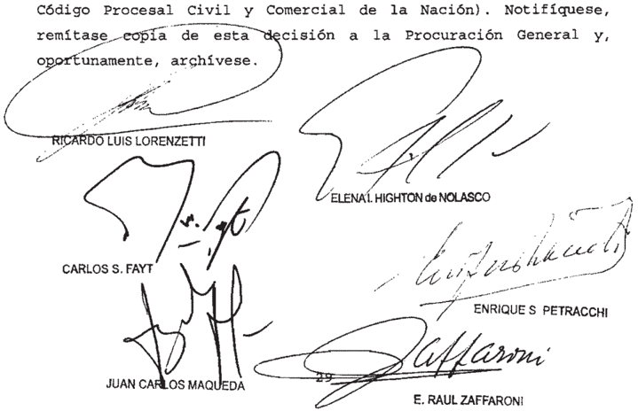

Nombre del actor: FiBco Nacional (A.F.I.P.) \_

Nombre del demandado: Banco de Catamarca Y Provincla de Catamarca

Profesionales: doctoree Jorge A . Narini; Alejandro Founburg ; LloP1b; Adriana de La Igleela; Xaría Suárez ; Monllau; Graciela Rodríguez ; María Suárez ; M. Mora88o; Mario E . Sánchez Cimeti Y Juen Pablo Vega

## FUNDACION EMPRENDER (TF 20679-I)  / DGI c

## REPETICION DE IMPUESTOS

La modificación introducida en el art. 81 de la ley 11.683 por la ley 25.795 -en cuanto a que los impuestos indirectos sólo pueden ser repetidos por los contribuyentes de derecho cuando éstos acrediten que no trasladaron el impuesto al precio, o bien cuando lo trasladaron, acrediten su devolución en la forma y condiciones establecidas por la AFIP- no resulta aplicable en casos en que dicha ley (publicada en el Boletín Oficial el 17 de noviembre de 2003) es posterior tanto a los pagos cuya repetición pretende el accionante, como a la resolución administrativa que rechazó el reclamo y al recurso planteado ante el Tribunal Fiscal, ya que al tratarse de un nuevo recaudo ello importaría un menoscabo de la garantía de defensa en juicio consagrada en el art. 18 de la Constitución Nacional.

## DE JUSTICIA DE LA NACION 336

## diCtameN   de   la   proCuraCióN GeNeral

## Suprema Corte:

fs 269/273, la Sala  IV de la Cámara Nacional de Apelaciones en lo Contencioso Administrativo Federal confirmó de manera parcial lo decidido oportunamente por el Tribunal Fiscal de la Nación (ver sentencia de fs. 175/180) y, en consecuencia, hizo la repetición solicitada pOr la Fundación Emprender con relación sumas indebidamente ingresadas agosto de 1996 y octubre de 1998 a raíz de la prestación de servicios financieros, actividad por la quc estaba libcrada en virtud de habérselc considerado exenta en el impuesto ganancias, lugar

Destacó   que la  apelante   centraba su argumentación en asimilar   la acción intentada a un supuesto de enriquecimiento sin causa, y señaló que cn materia impositiva el recaudo exigido era el pago indebido 0 sin causa, sin discutir si quien abonó sufrió 0 no una merma en su patrimonio.

Sostuvo quc, al momcnto era condición  para la procedencia de la repetición que el contribuyente  acreditara la falta de traslación del iributo, puesto que no se encontraba vigente la reforma introducida al art. 81 de la ley 11.683 por la ley 25.795 -B.O. del 17 de noviembre de 2003- la que dispuso tal requisito.

Añadió, todo   evento, que   mientras   la   prueba   producida en  torno extremos de hecho configurados en la causa no arrojaba la necesaria claridad ni contundencia en punto a la real y cfectiva traslación del IVA los beneficiarios de la fundación; la absorción del tributo por   parte   del sujeto exento resultaba del   estudio de la   realidad   económica involucrada en la actividad que realizaba. Por ello, consideró que la admisión del recupero aparecía como una solución que se ajustaba a principios generales de la materia. los

Con respecto a los intereses que correspondía computar para la repetición de los tributos  revocó Io decidido por el Tribunal   Fiscal al   cntender que eran de aplicación las tasas fijadas por las resoluciones de la Secretaría de Hacienda (art. 179 de la 11.683,t.0 en 1998 y sus modificaciones) ley

Finalmente; desechando los agravios traídos por' la fundación; resolvió que los intereses debían   computarse desde la   presentación del   reclamo de   repetición en sede administrativa y que no correspondía la actualización en virtud de la prohibición en tal sentido contenida en la ley 23.928.

## II

Disconforme con lo decidido; el Fisco Nacional   interpuso el recurso extraordinario de fs. 278/292 vta.

En lo fundamental, sostiene quc la sentencia hizo la repetición intentada sin tomar en cuenta que el impuesto al valor agregado había por su propia mecánica, trasladado por la fundación quienes contrataban sus servicios ~extremo que, afirma; había probado en autos-. Señala que, además; la actora no acreditó que dicha traslación no se hubicra requisito que considera de aplicación inmediata en virtud del principio que informa que la ley nueva debe aplicarse a los casos en trámite administrativo y judicial en tanto las decísiones adoptadas en ellos no hubieran pasado en autoridad de cosa juzgada, como ocurre en autos. lugar sido, rito,

## III

Dado que a fs. 307/307 vta. la Cámara concedió parcialmente  la apelación extraordinaria por el referido a la inteligencia de normas federales; el Fisco Nacional interpuso   cl pcrtincnte  recurso de hccho por el rechazo de la tacha dc  arbitraricdad dc General Impositiva s/ queja" , que corre agregado por cuerda y que, por razones de economía procesal, será tratado demanera conjunta. agravio aquí

## IV

A puesto que se halla en discusión la interpretación de normas federales (art. 81 de la ley 11.683, según el texto dado por la 25.795) y la inteligencia dada por la cámara ha sido contraria al derecho en que la apelante fundó en aquélla. ley

## V

Entiendo que las cuestiones debatidas resultan sustancialmentc análogas a las ya examinadas en mi dictamen   del 17 de   febrero de 2010, in re M.282, LXLVI, en Vy VI-, a cuyos fundamentos me remito en cuanto fueren aplicables al sub iudice. aquí especial IV ,

Si bien con lo hasta dicho bastaría;, a mi modo de ver, para confirmar la cabe   añadir; con   respecto al   argumento del  Fisco vinculado con  la aplicación inmcdiata a csta causa del recaudo incorporado en cI art, 81 de la Icy 11.683 por Ia aquí

aplicación inmediata de su entrada en vigencia; aun los juícios pendientes; también ha hecho salvedad en los supuestos en que existen actuaciones válidamente cumplidas con arreglo a la ley anterior; ya que su estabilidad se vincula con las garantías de los arts. 17 y 18 de la Constitución Nacional (cfr. Fallos: 288.407; 256.537; 257.136; 261.291; 275:109 y 499; 278.183; 281.92 y 95; 287.200; 288.407; 298.82: 300.67, entre muchos otros) partir

Considero  que dicha excepción debe aplicarse al sub toda vez que el recurso de apelación del at. 76,inc. b), de la ley de procedimientos tributarios fue interpuesto el 2 de septiembre de 2002 (v. cargo de fs. 62 vta ) momento en el cual   precluyó   la posibilidad del contribuyente de ofrecer la prueba que hace a su derecho, conforme a lo sanción de la norma procesal   cuya aplicación pretende la demandada. En otras palabras, la pretensión del Fisco importaría una clara violación al derecho de defensa de la actora, al exigirle ex post facto el cumplimiento de un extremo no previsto por la ley vigente al momento del inicio de esta causa. lite,

En virtud de 1o expuesto; que   corresponde declarar formalmente admisible   la apelación   extraordinaria recurso opino

Buenos Aires; 23 de mayo de 2011

LAURA M. MONTI

## FALLO DE L A CORTE SUPREMA

## Buenos Aires, 5 de Aor2o

Vistos autos: "Fundación Emprender (TF 20 . 679-I) c/ DGI

## Considerando:

Que la Sala IV de la Cámara Nacional de Apelaciones en 1o Contencioso Administrativo Federal, al confirmar par-

cialmente la sentencia del Tribunal Fiscal de la Nación, hizo lugar al reclamo efectuado por Fundación Emprender fin de que se le restituyan importes abonados en concepto del impuesto al valor agregado en los períodos fiscales comprendidos entre agosto de 1996 Y octubre de 1998 , ambos inclusive los

Que para así resolver, tras realizar una síntesis de las distintas posturas jurisprudenciales Y doctrinales referentes los requisitos para proceda la repetición de impuestos puntualizó que , en su criterio, no resultaba exigible la prueba del 'empobrecimiento" máxime teniendo en cuenta que la modificación introducida en la 11 .683, que incorporó ese recaudo no resultaba aplicable al caso de autos por tratarse de hechos anteriores su entrada en vigencia. En efecto, puso de relieve que el recurso ante el Tribunal Fiscal se dedujo el 2 de septiembre de 2002 , en tanto que la 25.795 ~que introdujo a aludida modificaciónfue publicada en el Boletín Oficial el 17 de noviembre de 2003 \_ Sin perjuicio de ello, con relación los extremos de hecho configurados en la causa , señaló que el peritaje contable no era contundente en cuanto la real efectiva traslación del impuesto beneficiarios de la fundación actora, de que se sigue que en modo alguno podría afirmarse que admitir la repetición genere un supuesto de indebido enriquecimiento por parte del reclamante" (fs 272) que ley ley 10

3 " ) Que contra dicho pronunciamiento, el Fisco Nacional interpuso recurso extraordinario, que fue concedido en atinente la controversia acerca de la interpretación Y alcance de normas de carácter federal Y denegado respecto de la causal de arbitrariedad (confr\_ fs 307) \_

4 " ) Que , con el alcance con el que fue concedido, el recurso resulta formalnente admisible pues ~tal como señaló el quo\_ se encuentra en tela de juicio el alcance interpretación de una norma de carácter federal, como es el art. 81,

último párrafo, de 1a 11 .683 , según el texto incorporado por la 25 . 795 (art. 14 , inc de la 48 ) ley ley ley

Que en primer lugar, corresponde aclarar raíz del reconocimiento de la exención impositiva en favor de la Fundación Emprender por parte del organismo recaudador, mediante resolución 052/02 , se encuentra al margen de la controversia que los pagos cuya repetición se pretende han sido efectuados sin causa De tal manera, los agravios de la AFIP se limitan con siderar improcedente la acción deducida por la nencionada entidad, pues en su criterio, la modificación del art 81 de la 1l 683 , efectuada por la 25 . 795 , resulta de aplicación inme diata, aun los casos en trámite adninistrativo judicial\_ en tanto las decisiones no hayan pasado autoridad de cosa juzgada En tal sentido, aduce que de las pruebas producidas en autos surge que la accionante ha trasladado carga del impuesto que ley ley en

Que al ser ello así, se suscita en los presentes autos una cuestión que guarda analogía con la considerada por este Tribunal en la causa M.282 .XIVI "Municipalidad de Monte Cristo (TF 18 .706-I bis) c/ DGI" sentencia del 30 de octubre de 2012, cuyos fundamentos corresponde remitirse, en lo pertinente, por razones de brevedad, que conduce desestimar el planteo formulado por el organismo recaudador

7' ) Que , en efecto, tal comO se señaló en el citado precedente, la nodificación introducida en el art\_ 81 de la ley 11 .683 por la 25. 795 no resulta aplicable en casos como el de autos en los que la referida (publicada en el Boletín Oficial el 17 de noviembre de 2003) es posterior tanto los pa gos cuya repetición pretende el accionante (que corresponde períodos comprendidos entre los años 1996 Y 1998) la reley ley

solución administrativa que rechazó el reclamo , que es de fecha de agosto de 2002 (fs. 31/38) , al recurso planteado ante el Tribunal Fiscal (confr. cargo obrante fs 62 vta. del 2 de septiembre de 2002)

Sobre el particular cabe agregar, ante la insistencia de 1a AFIP en sostener la aplicación inmediata de la reforma que al tratarse de la incorporación de un nuevo recaudo para la procedencia de las acciones de repetición, dicha disposición legal no puede ser aplicada las acciones que se hubiesen iniciado con anterioridad su vigencia pues ello importaría un menoscabo de garantía de defensa en juicio, consagrada en el art 18 de Constitución Nacional

Que finalmente, Y toda vez que esta causa fue iniciada por una fundación ~entidad de bien público sin fines de lucroresulta aplicable su respecto 10 expresado en los considerandos 10 y 1l de la sentencia dictada en el citado caso "Municipalidad de Monte Cristo" donde con sustento en el cedente "Banco Hipotecario Nacional c/ Provincia de La Rioja" (Fallos: 294 :20) se afirmó, en razón de la naturaleza del sujeto que promovió las actuaciones, que "el empobrecimiento cabe razonablemente inferirlo del solo hecho del pago" , motivo por el cual resultaría inoficioso extenderse en la consideración de las distintas posiciones que pueden encontrarse en repertorios de fallos de este Iribunal acerca de los recaudos exigibles para la procedencia de la acción de repetición de impuestos Del nismo modo , resultaría inoficioso detenerse en el exanen de 1os restantes agravios del apelante, pues , en la indicada compren sión, son ineficaces para modificar la suerte del pleito\_

Por ello, oída la señora Procuradora Fiscal, se declara fornalnente admisible el recurso extraordinario con el alcance

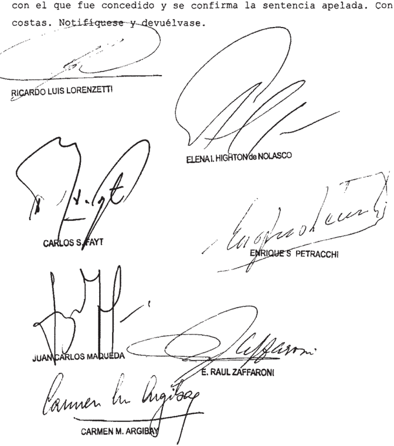

Recurso extraordinario interpuesto por AFIP-DGI , representada por Dra Chioba Haría Julia, con el patrocinio letrado de 1a Dra . Hoaqueira, María Gabriela

Traslado contestado por Fundación Emprender , representada por Dr Ricardo Mihura Estrada

Tribunal de origen: Cámara Nacional de en 1o Contenciobo Adninietrativo Fodoral Sala IV\_

Tribunal que intervino con anterioridad: Tribunal Fiecal de la Nación, D .

## FALLOS DE LA CORTE SUPREMA 336

## GALEANO GONZALEZ  PEDRO NOLASCO  / FUTURA , c

AFJP S/aCCióN de amparo

## ADMINISTRADORAS DE FONDOS DE JUBILACIONES Y PENSIONES

Al mantener en cabeza de la A.F.J.P. la responsabilidad por una deuda que fue transferida -ipso iure- a la Administración Nacional de Seguridad Social, la cámara prescindió de las disposiciones de la ley 26.425, que resultaban de inexcusable aplicación al caso habida cuenta del carácter de orden público de las normas atinentes al  Sistema  Integrado  Previsional Argentino (art.  20)  con  la  consiguiente lesión de la garantía de propiedad y soslayando lo dispuesto por el art. 19 de la ley citada, en cuanto establece que 'la Administración Nacional de la Seguridad Social se subroga en las obligaciones y derechos que la ley 24.241 y sus modificatorias les hubiera asignado a las administradoras de fondos de jubilaciones y pensiones'.

## RIESGOS DEL TRABAJO

Si ante el deceso del trabajador, la regla impugnada también reconoce una renta periódica mensual a los derecho-habientes, a partir de la suma correspondiente a la prestación dineraria obtenida en el marco de los arts. 15, ap. 2, 18 y 19 de la ley 24.557, resultan aplicables por analogía los principios que emanan del precedente 'Milone' (Fallos: 327:4607) y se configura un claro agravio constitucional, pues la aplicación de las normas cuestionadas lleva a un verdadero empobrecimiento de la víctima, y no se demuestra idónea para satisfacer las necesidades actuales, presentes e inmediatas de quien reclama, originando una evidente desprotección y desnaturalización que conlleva a la desintegración del resarcimiento, al perder éste su significación económica.

-Del dictamen de la Procuración General, al que la Corte remite-.

## diCtameN de la proCuraCióN GeNeral

## Suprema Corte:

Los Jueces de la Sala V de la Cámara Nacional de Apelaciones del Trabajo al confirmar la sentencia de primera instancia; admitieron el reclamo de pago único de la indemnización por accidente fatal ocurrido en ocasión del trabajo con fundamento en el precedente Milone" (Fallos 327.4607) condenando a Futura A.F.JP SA y a la Administración Nacional de la Seguridad Social ANSES (v. fs. 394/396 y fs

348/351).

Para así decidir , los jueces destacaron en primer lugar que la co-

## DE JUSTICIA DE LA NACION 336

demandada Futura AFJP no cuestionó el reproche que le hizo el juez de primera instancia en cuanto a la conducta desplegada. Destacó ese magistrado que la Aseguradora de Riesgos del Trabajo "ART QBE S.A." le transfirió en el año 2007 la suma de $ 197.761,55, sin que la AFJP arbitrara los medios necesarios para abonar dicha suma los dercchohabientes; ni demostrara haber efectuado el pago de la renta periódica ni un pago único. Le atribuyó también responsabilidad por la falta de adquisición de la indemnización antes del traspaso del dinero a la ANSES en virtud de la ley 26.425 (v. fs. 35Ovta.) En igual   sentido;  entendieron que no fue una crítica seria la deducida por la ANSES en cuanto debe afrontar las   implicancias   patrimoriiales de un resarcimiento de carácter "desmembrado" que, por otro lado\_ no tiene posibilidad de administrar.

Sin perjuicio de las observaciones formales los agravios deducidos por las condenadas, señalaron que en el caso resultaba aplicable la doctrina de la Corte sentada en el caso "Milone (Fallos: 327.4607) el cual el pago en renta de la indemnización por accidente implica una injerencia reglamentaria irrazonable que desnaturalizaba la finalidad tuitiva prevista en el art 14 bis de la CN al no encontrar sustento en ningún fin tutelar legítimo. según

Contra pronunciamiento ambas   cu-demandadas   dedujeron el recurso extraordinario federal, el que contestado por la actora, fue denegado en lo que respecta las   cuestiones referidas los planteos  por arbitrariedad y concedidos en cuanto se debate la  constitucionalidad de la LRT involucradas al resolverse el caso 'Milone por la Corte y derechos constitucionales comprometidos (v. fs 405/414 y fs 423/428, respectivamente; y fs. 449). tal

La co-demandada Futura AFJP plantea como cuestión federal la interpretación de la 26.425  ~Sistema Integrado Previsional   Argentino   (SIPA) de Reforma Previsional por cuanto con la decisión impugnada se ignoró que el articulo 18 de la citada norma dispone que: La Administración Nacional de la Seguridad Social se ley

## FALLOS DE LA CORTE SUPREMA 336

subroga en las obligaciones y derechos que la ley 24.241 y sus modificatorias les hubiere asignado a las administradoras de fondos de jubilaciones pensiones Señala que tal subrogación fue admitida por la ANSES y además que tarnbién le fue transferido el capital oportunamente integrado por la ART. Afirmna quë la condena su parte; con dichos violación del derecho de prociedad. Agrega que la Ley de Reforma Previsional no sólo ordena la subrogación sino que además dispone la trznsferencia de los recursos los beneficios de pensión por fallecimiento que, a la fecha de vigencia de ella, liquidados por las administradoras de fondos de jubilaciones y pensiones bajo las modalidades de retiro programado; deben ser pagados por el   régimen previsional   público, lo que 2s corroborado; sostiene por el decreto 2104/08 respecto del beneficio de pensión por fallecimiento. También plantea la en existió un apartamiento de las coristancias Ce la causa, pues en la derJanda se solicitó que por fallecimiento se realizara en un solo pago planteando Ia Inconstitucionalidad del sistema especial que dispone el pago en rentas mensuales\_ el que en consecuencia, debía ser realizado por quien se encuentra como depositario; la ANSES. La AFJP , agrega, no podía realizar ningún pago único al no tener orden judicial alguna que autorice dicha circunstancia no permitida por la Indica por otro ladlo que no se efectivizó el pago de 1a renta periódica como jamás el actor inició trámite alguno en ese sentido: Asevera que también se omitió el tratamiento cel planteo con fundainento en que no había legitimación activa ni   pasiva en la medida que en virtud de la Reforma Previsional se habían transferido los fondos a la ANSES. Sostiene que el fundamento del fallo está apoyado en que el acciderite y el depósito del Capital por la ART ocurrieron antes del dictado de la ley 26.425 de Reforma Previsional sin advertir que en el reclamo se solicitó la entrega del capital en un pago único de quien a la fecha de la sentencia resulte responsable de satisfacer ese capital al trabajador. Finalmente plantea que la omisión de tratamiento de la ley 26.425 citada resulta una inequidad manifiesta que habilita la apertura de la instancia de excepción: dice, ley.

## DE JUSTICIA DE LA NACION 336

De su lado la ANSES también se agravia con fundamento en la arbitrariedad de sentencia porque su entender se aplicó de manera analógica el precedente 'Milone" (Fallcs: 327.4607) al caso de autos sin tener en cuenta el nuevo sistema creado por la ley 26.425 de creación del Sistema Integrado Previsional Argentino (SIPA). Afirma que se omitieron las constancias de la causa y que no es admisible declarar la inconstitucionalidad de una norma en abstracto desde que ello debe ser la última ratio legal fundada en pruebas adecuadas que la justifiquen: Señala que la decisión no constituye una derivación razonada del derecho vigente Io que importaría; en opinión de la recurrente, una gravedad institucional porque afecta el presupuesto previsional del cual su mandante es un mero administredor. Invoca en su apoyo el decreto 2103/08 en cuanto se perturbarían los recursos del ANSES que son administrados como patrimonios de afectación especifica; máxime que expresamente se dispone cómo se abonará la pensión por   falleciniento cie las personas se encontraban en el Régimen de Capitalización.

En primer lugar, cabe advertir que la Cámara concedió el recurso extraordinario únicamente: en lo hace la discrepancia acerca de la constitucionalidad de las normas de la LRT. involucradas al resolverse por el Alto Tribunal Ia causa "Milone (Fallos: 327:4607) derechos constitucionales comprometidos (v. fs 449); y rechazó los recursos interpuestos en lo referido a la arbitrariedad de sentencia, sin que las recurrentes intentaran recurso de queja ante la Corte En consecuencia, la cuestión federal debatida queda limitada a lo que fue materia de concesión del recurso\_ que

En la medida de su concesión; la primera cuestión planteada en el recurso extraordinario es procedente en tanto se plantea un problema sustancialmente análogo lo resuelto por esa Corte en el caso "Miilone" (Fallos: 327,4607), cuyos fundamentos y conclusiones corresponde remitir en razón de brevedad. Cabe señalar que

aún cuando la problemática que aborda la sentencia recurrida no se ajusta estrictamente lo decidido en el citado precedente por cuanto ese Máximo Tribunal allídeclaró la inconstitucionalidad del artículo 14, item 2, ce la LRT, es claro que en casos como el presente en que, por el deceso del trabajador , la regla irnpugnada también reconoce una ienta periódica mensual a la prestación dineraria obtenida en el marco de los articulos 15, apartado 2, 18 y 19 de la ley 24.557 resultan aplicables por analogía los principios que emanan de aquel fallo (cfr CSJN In re "T.168, L XLI, Torales, Gustavo Ramón cl Provincia ART sl acc. Ley 9688, sentencia 29 de mayo de 2007 y "A. 2486, LXL Aquino, Adela Ramona pl sí y en representación de sus hijos menores Nicolas Alberto y Matías Omar Maciel Aquino cl Siembra AFJP y otro sl acción de amparo; sertencia del 24 de junio de 2008, entre otros) los del

Asimismo VE señaló que no obstanle percibir los derechohabientes por la muelte del damrificado la comperisación dineraria adicional de pago único prevista én el art. 11, apartacio el régimen indemnizatorio compleinentario de renta periódica contemplado en él conduce a un pago mensual que no satisface el objetivo reparador que la norma predica, impide quienes reclaman en un pago único el capital depositadc, el ejercicio de un ámbito de libertad constitucionalmente protegido; en el que se inserta la formulación de su proyecto de vida, ya modificado traumáticamerite por la ruerte del trabajador (Fallos 331:1510).

## La segunda cuestión planteada; cenidos a la limitación referida a la

concesión del recurso vinculedo con la afectación de derechos constitucionales comprometidos\_ (v. fs. 449) y la cità puritual er! ei considcrando de la resolución (v. fs 4O8vta y fs. 425 in fine) cabe señalar que no se advierte de qué manera la decisión puede afectar el derecho de propiedad de las recurrentes en tanto no objeciones a la circunstancia de que el patrimonio objeto de condena le pertenece al padre de la víctima del accidente mortal; tampoco que la ART obligada originariamente, depositó la mencionada suma en la AFJP (v. fs 116). Por otra parte, la AFJP funda la violación al derecho de propiedad en la circunstancia que la reforma previsional mediante la 26425 hay ley

## DE JUSTICIA DE LA NACION 336

impuso la transferencia de los fondos al ANSES hecho que había sucedido antes del inicio de la demanda\_ Sin embargo; la sentencia de primera instancia confirmada por la Cámara, en términos que la AFJP no se hace cargo en los agravios, hincapié en que dicha co-demandada no había demostrado haber efectuado el pago en renta periódica, ni pago único; pese a la intimación cursada en el juicio sucesorio razón por la cual se la consideró responsable de que el actor no adquirido el patrimonio reclamado (v. fs. 350 vta.) hizo haya su vez, dichos fondos se traspasaron al ANSES, circunstancia que fue reconocida expresamente por esta   última entidad (v. fs 13Ovta., punto IIl) También admitió que podía ser llamada a los estrados judiciales por ser continuadora de la AFJP , al haber sido derogado el Sistema Irtegrado de Jubilaciones y Pensiones (SIJP) y crearse por ley (n 26.425) el Sistema Integrado Previsional Argentino (SIPA), situación legal que coloca a la ANSES ~adrnite- en continuadora de las ex-AFJP y por lo tanto pasaron de pleno derecho ~por transferencia, aclaró al Fondo de Garantía de Sustentabilidad (FGS) la totalidad de los recursos que   integran las Cuentas de Capitalización Individual de los afiliados y beneficiarios del Régimen de Capitalización del SIJP .

Dichas condiciones, expuestas como defensas por las demandadas para oponerse a la condena por reparación de daños provenientes de un accidente de trabajo; son inoponibles al actor en tanto se sustentan en que no se puede disponer de la "prestación de   pensión por fallecimiento" cuyo nomen iuris difiere sustancialmente del objeto del reclamo en definitiva la materia  objeto del juicio que sustenta la condena En efecto, la demanda tuvo por objeto la reparación del art. 18 de la LRT (Muerte del Damnificado) en cuanto dispore cue "los derechohabientes accederán a la pensiór por fallecimiento prevista e/ eí régimen previsional al que estuviera afiliado el clamnificado y a las prestaciones establecides en e segundo párrafo del apartado 2 del artículo 15 de esta además de la prevista en su articulo 11, apartado cuarto. Ahora bien; los beneficios del articulo 15 se refieren una prestación de pago mensual ley ,

## FALLOS DE LA CORTE SUPREMA 336

complementaria al\_correspondiente\_al\_régimen\_previsonal (2' párrafo; apartado 2 art. 15 LRT , el subrayado me pertenece) . El reclamo que aquí nos interesa consistió en que en vez de que se pague mediante la modalidad de renta se la abonara en un solo pago, Por esa razón la pretensión se sustentó exclusivanente en la inconstitucionalidad de la forma de pago (tema ya tratado en los párrafos anteriores)  circunstaricia que fue admitida por los jueces con fundamento perspectiva, las recurrentes corifunden la denominación   jurídica de la causa que fundamenta el reclamo al asignarle el concepto de "prestación de   pensión por fallecimiento y de esa manera pretender incluirlo en el régimen del SIPA; cuando en realidad se trata de "reparar los daños derivados de accidentes de trabajo" (art. de la LRT) cuya suma materia de condena ~hecho totalmente reconocido- fue depositada en la AFJP y iuego transferida a la ANSES.

Desde el contexto legal examiirado Ilama la   atención la total carencia de fundamentación jurídica del recurso extraorciinario de la ANSES en tanto se aparta de las cuestiones controvertidas; desviando la ciscusión al introducir posiciones al debate; asignando una calificación   jurídica al crédito reclamado que no ha sido materia de litigio Y que provoca el total   desamparo del beneficiario del crédito reclamado cuya titularidad se ercuentra reconocida. Tal desapego las constancias de la causa no encuentra motivación alguna en las particulares circunstancias del caso, pues se dilata la realización efectiva del pago por un accidente mortal del trabajador; siendo el único reclamante el padre del causante, una persona de edad avanzada y escasas condiciones de salud física (v. fs. 350, párrafo 2*),con ello se culmina desatendiendo los fines protectorios que se tuvieron en mira en el caso; con la declaración de inconstitucionalidad del sistema de pago a través de una renta periódicar precisamente como señaló VE al no  satisfacer el  objetivo reparador que la norma predica: impide a los derechohabientes ~que reclaman en un pago único el capital depositado \_ el ejercicio de un ámbito de libertad constitucionalmente protegido, en el que muerte del trabajador . (Fallos 331:1510, considerando 79).

Por lo dicho, estimo corresponde desestimar el recurso de 2011.-

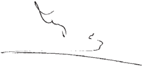

## FALLO DE LA CORTE SUPREMA

## Buenos Aires, 5 de

Vistos los autos: "Galeano González, Pedro Nolasco c/ Futura A.F.J.P\_ s / acción de amparo"

## Considerando:

Que la Sala V de la Cámara Nacional de Apelaciones del Trabajo, al confirmar 1a sentencia de prinera instancia, admitió el reclamo de 1os actores con fundamento en el preceden te "Milone condenó al pago único de la indemnización por accidente de trabajo Futura A.F .J.P . y la ANSes

Contra este pronunciamiento, ambas codemandadas interpusieron sendos recursos extraordinarios El quo concedió, parcialmente, en 10 atinente la constitucionalidad de las normas de la L.R. T. involucradas en el caso "Milone" y demás derechos constitucionales comprometidos atendiendo en te punto la interpretación Y alcance de la de Re forma Previsional, cuestión federal que fuera invocada por Futura A.F .J.P (fs 408 vta. punto V , Los recursos fueron des estimados en referente la arbitrariedad atribuida la sen tencia (fs 449) ley

Que los recursos extraordinarios deducidos son formalnente admisibles, en tanto se encuentra en juego tanto la interpretación de la 26 .425 , como la del fallo citado de ta Corte Suprema , Y la decisión fue contraria validez del derecho exención que pretende fundarse en ellos (art. 14 , inc 3 ' de la 48) ley ley

30 ) Que, en cuanto la aplicación al sub exanen del precedente "Milone" (Fallos: 327:4607) Y responsabilidad de la ANSeS , l0s agravios de 1a apelante encuentran adecuada res puesta en 10s fundamentos del del señora Procuradora Fiscal, que el Tribunal comparte Y hace suyos en razón de breve dad

4 " ) Que, por el contrario, 10s agravios de Futura A.F.J.P S .A suscitan cuestión federal suficiente Y tornan cedente el remedio federal, toda vez que resolver del modo indicadola alzada prescindió de las disposiciones de la 26.425 , que resultan de inexcusable aplicación al caso ~habida cuenta del carácter de orden público de las normas atinentes al Sistema Integrado Previsional Argentino (cf art 20) = , con la consiguiente lesión de la garantía de propiedad invocada por la recurrente, desde que se mantuvo en cabeza de la responsabilidad por una deuda que fue transferida ~ipso iurela Adninistración Nacional de la Seguridad Social, organismo que reconoció esta situación al comparecer Y contestar demanda en este juicio (fs 130 vta. III) pro~al ley punto

Que , en efecto, para mantener la condena respecto de Futura la cámara expresó que esa codemandada no había cuestionado ~de una manera critica\_ el argumento del juez de grado, que en su oportunidad tuvo en cuenta conducta de la demandada , afirmando que no habría denostrado el pago de la renta periódica ni el pago único pese la intimación efectuada en el juicio sucesorio del causante, impidiendo así la satisfacción del derecho del actor antes del traspaso de los fondos 1a ANSes (fs 394 Y 350 vta.) Al resolver de este modo ,

el tribunal soslayó lo dispuesto por el art 19 de la citaen cuanto establece que "la Administración Nacional de la Seguridad Social se subroga en las obligaciones derechos que la 24 .241 Y sus modificatorias les hubiera asignado las administradoras de fondos de jubilaciones Y pensiones" ey da , ley

Que la transferencia de las deudas dispuesta por la subrogación legal no requiere el consentimiento del acreedor para la sustitución del deudor Fallos: 333:667) , de modo que le impide reclanar el pago un sujeto distinto del indivi dualizado en la norma Fallos: Frente esta situación ~ya existente la fecha de la promoción de la denanda la conducta precedente del obligado original no puede erigirse en un factor idóneo para mantener en su cabeza la responsabilidad por una deuda que Ya no le es exigible por imperio de a ley .

Por ello, y con el alcance que surge de 10 expuesto, el Iribunal resuelve: I. Confirmar la sentencia apelada en cuanto mantiene la condena la Con costas (art. 68 del Código Procesal Civil Y Comercial de la Nación) ; Revocar dicha decisión, en 10 referente la condena Futura A.F.J.P respecto de la cual se rechaza la demanda (art. 16 , 48) Costas por su orden, en todas las instancias, atento la índole ley

=I/-novedosa de la cuestión controvertida (arts 68 , segunda parte, Y 279 del código citado) Notifíquese Y, oportunamente devuélvase:

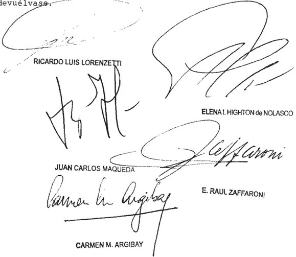

Recursos extraordinarios interpuestos por Futura AFJP representada por el Dr Carlob Jogé Laplacette, con el patrocinio letrado del Dr Gregorio Badeni ; ANSeS representada el Dr Federico Compiani, con el patrocinio de 1a Dra . Verónica Andrea Bravo

Tribunal de origen: Cámera Nacional de Apelacioneb Trabajo, Sala

Tribunal que intervino con anterioridad: Juzgado Nacional de Prinera Instancia del Trabajo 1.

## GONZALEZ, NELIDA BEATRIZ  / MAPFRE ARGENTINA S.A. c ART Y OTROS S/aCCideNte - aCCióN Civil

## CONCESION DEL RECURSO EXTRAORDINARIO

Corresponde declarar la nulidad de la resolución por la que se concedió el recurso extraordinario si es inextricable la motivación dada por el a quo porque, por un lado expresó que le recurso se había basado en la doctrina de la arbitrariedad y por otra parte encontró 'configurado' un supuesto típico de los previstos en el art. 14 de la ley 48, sobre la base de afirmar, de manera genérica, que 'teniendo en cuenta

las constancias de la causa, la solución adoptada en la alzada no es acertada', todo ello sin examinar -además- si la apelación reunía los restantes recaudos de admisibilidad (arts. 14 y 15 de la ley aludida).

## FALLO DE LA CORTE SUPREMA

## Buenos Aires, 5

Autos Vistos; Considerando:

Que la Cámara Nacional de Apelaciones del Trabajo ~Sala III\_ al revocar la sentencia de primera instancia, rechazó el reclano indemnizatorio por accidente de trabajo fundado en el derecho conún Contra dicho pronunciamiento, a actora dedujo el recurso extraordinario federal, que resultó concedido (cfr fs 782/793)

Que la Sala quo ~integrada por jueces distintos que dictaron el pronuncianiento recurridotras señalar que [e]1 recurso se ha fundado en 1a doctrina de la arbitrariedad elaborada por el Máxino Tribunal" recordó que la sentencia impugnada había rechazado la pretensión resarcitoria promovida por la actora, "en el entendimiento de que , en el caso , se trata de reparación de un accidente in itínere' que la trabajadora fundó en normas de derecho común , Y en consecuencia, no exist[ió] factor de atribución de responsabilidad, toda vez que en el acaeciniento del hecho no intervino ninguna cosa cuya propiedad guarda corresponda la empleadora, ni se le ha imputado culpa dolo de su parte, ni incumplimiento de alguna obligación concreta derivada del deber genérico de seguridad"

Seguidamente, el tribunal expresó que compart[ía] el criterio esbozado en la sentencia de esta alzada" consignó que el fallo impugnado compromet [ía] ciertamente el orden público laboral, que claro está, resulta indisponible para las partes" Y por último, tras expresar su disconfornidad con la de cisión recurrida y con invocación de los arts 16, 17 Y 18 de 1a Constitución Nacional, consideró que cabía tener por "configura"no

do el supuesto del art 14 inc 3 de la ley 48" 832/833)

Que esta Corte ha tenido oportunidad de declarar, con especial énfasis, la nulidad de resoluciones por las que se concedían recursos extraordinarios cuando ha constatado que aquéllas no daban satisfacción un requisito idóneo para la ob tención de la finalidad que se hallaba destinado (art\_ 169 , segundo párrafo, del Código Procesal civil Y Comercial de la Na ción; Fallos: 310;2122 Y 2306 ; 315:1589; 323:1247 ; 330:4090 Y 331:2302)

Tal situación se ha verificado nuevanente en el presente caso , puesto que el auto por el que se concedió el remedio federal\_ lejos de constituir un pronuncianiento circunstanciado categórico Y dotado de unidad lógico-jurídica ~como es exigible todo acto jurisdiccionalha incurrido en serios desaciertos formales conceptuales

Que , en efecto, es inextricable la motivación da por el quo porque , por un lado , este último expresó que el recurso extraordinario se había basado en la doctrina de la bitrariedad (primero Y segundo párrafo del auto de fs 832) Y , por otra parte, encontró configurado" un supuesto típico de previstos en el art 14 de la ley 48 , sobre 1a base de afirmar de manera genérica, que "teniendo en cuenta las constancias de la causa la solución adoptada en alzada no es acertada (sexto Y séptimo párrafo del mencionado auto) Todo ello, sin examinar ~además si la apelación reunía 1os restantes recaudos de adnisibilidad (arts 14 Y 15 de la aludida en últino término) los ley

Al respecto, es del todo propicio remarcar que la discrepancia de 1os jueces que suscribieron el auto examinado con decidido por el tribunal en su anterior integración, no constituía un fundamento válido para la concesión de la apelación federal Tal yerro quedó evidenciado en dos resoluciones declaradas nulas por esta Corte (B.370.XLVII "Banco de la Nación Argentina c/ Aguirrezabal, Lisandro Carlos s / juicio sumarísimo"

Y T .160 .XLVII "Tubet, Ricardo Luis c/ Aerolíneas Argentinas S .A \_ s / despido" del 13 de septiembre de 2011 18 de octubre de 2011 , respectivamente)

Idéntico desacierto se reiteró fs . 832/832 vta. de la presente causa, toda vez que la afirmación transcripta supra ~que declara "ciertamente" afectada axiomática regla de indisponibilidad del orden público laboralcarece de un razonamiento autónomo que justifique tal aserto Lo descripto deja al descubierto que el mencionado auto se ha basado en un claro luntarismo, con absoluta prescindencia de reglas que rigen el recurso extraordinario federal

Que en tales condiciones, 1a concesión del renedio federal no aparece debidanente fundada , por que debe ser declarada su nulidad (cfr fallos citados precedentemente)

Por ello, se declara la nulidad de la resolución por la que se concedió el recurso extraordinario Vuelvan los autos al tribunal de origen para que se dicte una nueva decisión sobre el punto, con arreglo este pronunciamiento. Notifíquese devuél vase

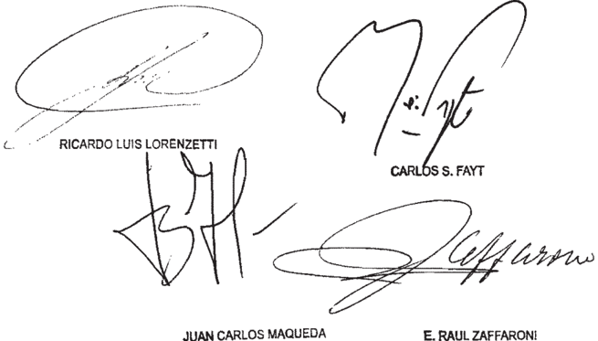

Recurso extraordinario interpuesto por Nélida Beatriz González , repregentada por el Dr Hugo Antonio Guardo

Traslado contestado pOr Bonafide representada pOr el Dr Gonzalo Y por MAPERE   ARGENTINA representada por María Bugenie Plache Y por Vadelux 8.A. representada por el Dr . Eduardo Huber

Tribunal de Origen: Nacional de Apelaciones Sala III

Tribunal que intervino con anterioridad: Juzgado Nacional de Inatancia del Trebajo 35 \_

## AQUINO PEREIRA, ELVIO CÉSAR c/ OTRANTO, MARCELO Y OTROS S/DAÑOS Y PERJUICIOS

## REFORMATIO IN PEJUS

Corresponde revocar la sentencia que entendió que correspondía declarar la nulidad de la cláusula que contenía la franquicia y confirmar la sentencia de grado en cuanto había hecho extensiva la condena a la aseguradora ya que, más allá del error de apreciación en que incurrió la parte respecto de lo decidido en primera instancia que la beneficiaba, el a quo se expidió sobre el fondo del asunto en sentido contra -rio a sus intereses, incurriendo, de ese modo, en un supuesto de reformatio in pejus que colocó a la única apelante sobre el punto en peor situación que la derivada del fallo de grado, con la consecuente lesión a las garantías constitucionales de defensa en juicio y propiedad.

## FALLO DE LA CORTE SUPREMA

## Buenos Aires,

Vistos los autos: "Recurso de hecho deducido por la citada en garantía en la causa Aquino Pereira, Elvio César c/ Otranto, Marcelo Y otros dafos Y perjuicios" para decidir su procedencia.

## Considerando:

1' ) Que la sentencia de primera instancia lugar al reclamo de daños Y perjuicios derivados de un accidente de tránsito Y condenó los demandados pagar la suma de $ 40 .435, con 1os interese Y costas, haciendo extensiva la condena la citada en garantía en línites del contrato de seguro, atento que el actor no había invocado la inoponibilidad de la franguicia allí estipulada.

Que apelado el fallo por las partes, la aseguradora agravió de 1o resuelto sobre el alcance de la cobertura, solicitando que se la exiniera de responder Consideró, tal fin, que resultaba arbitraria aplicación del fallo plenario "Obarrio" Y que el juez había prescindido de 1os términos del contrato, de 1o dispuesto por la de segurog Y normativa de la Superintendencia de Seguros de Nación, que prevela un descubierto de $ 40 .0oo \_ ley

Que por renisión al citado plenario, sunnado fundamentos, el quo entendió que correspondía declarar la nulidad de la cláusula que contenía la franquicia Y confirmar sentencia de grado en cuanto había hecho extensiva la condena la aseguradora. Contra dicho pronunciamiento, vencida interpuso el remedio federal, cuya denegación origina presentación directa en examen

4 % ) Que corresponde hacer lugar al recurso planteado toda vez que resuelto por la cánara constituye una derivación razonada de las circunstanciag particulares del caso En efecto, más allá del error de apreciación en que incurrió parte respecto de 1o decidido en primera instancia que bene ficiaba, el quo se expidió sobre el fondo del asunto en sentido contrario sus intereses, incurriendo de ese modo; en un supuesto de reformatio in pejus que colocó la única apelante sobre el punto en peor situación que derivada del fallo de grado con consecuente lesión las garantías constitucionales de defensa en juicio Y no

Que, mayor abundamiento, La procedencia de la vía intentada implica el reconocimiento del derecho de la interesada en los términos de los precedentes de esta Corte "Nieto" "Villarreal" Y "Cuello" (Fallos: 329:3054 3488; 331:379 Y 330:3483) Y en las causas "Obarrio, María Pía c/ Microómnibus Norte 5.A. Y otros" y G .327 . XLIII. "Gauna, Agustín su acunulado La Economía Comercial de Seguros Generales otro" sentencias del de marzo de 2008 , cuyas considera ciones se dan por reproducidas.

Por ello, con el alcance indicado, se declara procedente la queja, formalmente adnisible el recurso extraordinario Y se revoça la decisión apelada\_ Con costas Agréguese la queja al principal Y reintégrese el depósito. Notifíquese Y devuélvase.

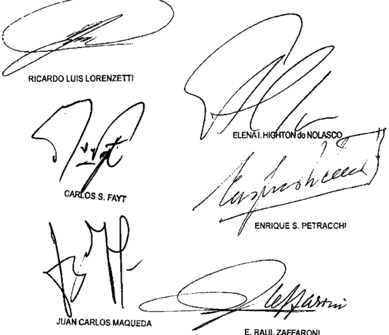

E. RAUL ZAFFARONI

Recurso de hecho deducido por Garaptía Mutual de Saqurob del Iranbporte Públide en gerantíe, representada 01 Dr . Guilberto Jorge Blanco

Tribunal de Apolaciona 8 .

Iribunales que interviníeron con anterioridad: Jurqudo Necional Prinera @n 1o Civil 99\_

COTS  LIBIA ELDA C/ ESTADO NACIONAL - MINISTERIO DE , ECONOMIA Y OBRAS Y SERVICIOS PUBLICOS Y OTROS S/Sumario S/iNCideNte de embarGo

CONSOLIDACION DE DEUDAS

Contrariamente a lo sostenido por la cámara, el art. 18 de la ley 25.344 prevé una

## DE JUSTICIA DE LA NACION 336

excepción  al  régimen  de  consolidación  e  impone  a  los  jueces  la  obligación  de excluir los créditos cuando sus acreedores se encuentren en las especiales condiciones descriptas por el segundo párrafo de la norma, y dichas circunstancias excepcionales son, precisamente las que se presentan en el caso si, como consecuencia del accidente, a la actora se le amputaron ambos miembros inferiores y su grado de incapacidad laboral es casi total, lo que demuestra no solo su situación de desamparo, sino también el evidente carácter alimentario de su crédito -extensivo por accesoriedad a todos los rubros de la condena-, pues la indemnización no solo tiene como finalidad la reparación integral de los daños causados, sino también permitir a la actora afrontar los gastos que su condición le genera y que no podrá solventar con su trabajo.

## CONSOLIDACION DE DEUDAS

El art. 13 de la ley 25.344 deviene inconstitucional si el a quo incluyó en el régimen de consolidación de deudas del Estado a los 'gastos médicos' en que incurrió la actora y el 'daño moral', en tanto la aplicación de normas que difieren el pago de la deuda pública se encuentra en clara colisión con el derecho a la vida, a la salud y a la dignidad de las personas y los principios arquitectónicos del Derecho Internacional de los Derechos Humanos abonan la invalidación de disposiciones que se encuentran al margen del trazado constitucional, siendo contrarias dichas disposiciones a la Convención sobre los Derechos de las Personas con Discapacidad, aprobada junto con su Protocolo Facultativo, por la ley 26.378 (Disidencia parcial del Dr. Carlos S. Fayt).

## CONSOLIDACION DE DEUDAS

La declaración de inconstitucionalidad formulada por la cámara aparece manifies -tamente innecesaria si, al fundarse en que la aplicación del régimen de consolidación de deudas viola derechos protegidos por la Constitución Nacional debido a la situación personal de la actora           -víctima de un accidente de tránsito-, soslaya que las situaciones de esa índole precisamente fueron tenidas en cuenta por el legislador mediante el precepto contenido en el art. 18 de la ley 25.344, al que cabe acudir en primer lugar para obtener el cobro del crédito en efectivo sin dilaciones (Disidencia de la Dra. Elena I. Highton de Nolasco).

-Del dictamen de la Procuración General, al que la disidencia remite-.

## diCtameN de la proCuraCióN GeNeral

## Suprema Corte:

~I

A fs. 344/349, la Sala D de la Cámara Nacional de Apelaciones en lo Comercial revocó parcialmente la sentencia de la instancia anterior declaró actora ~que tiene su origen en la indemnización otorgada por los daños sufridos en un accidente de tránsito - se

encuentra comprendido en el régimen de la ley 25.344, tanto el monto que corresponde a médicos y otros relacionados; como la suma por daño moral Y sus intereses . Asimismo; declaró la inconstitucionalidad de la ley mencionada con respecto "al cobro de los resarcimientos por incapacidad sobreviniente y daño psicológico gastos así   decidir, consideró   que el Estado   Nacional   aún puede oponerse la inmediata ejecución del fallo que lo condenó al pago de la indemnización; pues aunque la sentencia hubiera adquirido firmeza ello no es obstáculo para aplicar el régimen de consolidación de deudas en virtud de que que remite el art. 13 de la 25.344). Para ley7

Por otra parte, entendió que dicho régimen resulta aplicable alas sumas a abonar en concepto de gastos médicos y daño moral, porque se trata de capítulos resarcitorios pueden ser diferidos en el tiempo en cuanto a su cancelación, pero que es inconstitucional en que se refiere las indemnizaciones por incapacidad sobreviniente y daño psicológico. Al respecto; señaló que tales resarcimientos fueron fijados teniendo en cuenta las gravísimas lesiones que padece la actora, el alto grado de incapacidad que ello le provoca; la necesidad de colocación de una prótesis el tratamiento terapéutico que deberá Alto Tribunal en el caso 'Gutierrez que

Finalmente, sostuvo que los agravios dirigidos a obtener el levantamiento del embargo decretado sobre rentas públicas no fueron propuestos al juez de la causa en la instancia anterior, lo que impide examinar la cuestión.

Disconformes con este   pronunciamiento;   tanto la actora como el Estado   Nacional   interpusieron sendos   recursos extraordinarios (fs. 407/427 y fs. 432/447, respectivamente) El primero de ellos fue denegado; lo que motivó la presentación directa que tramita en expediente C. 1543, L. XLIV y el segundo fue concedido solamente en lo que atañe a la cuestión federal planteada (v fs. 493/495).

## ~III-

La actora sostiene que la sentencia recurrida es arbitraria, interpreta de modo erróneo normas de carácter federal (leyes 23.982 y 25.344 y decreto reglamentario 1116/00) produce un gravamen irreparable y conculca los derechos de propiedad, igualdad ante la Constitución Nacional . Añade que la priva de las indemnizaciones por daños y perjuicios otorgadas por la sentencia del 30 de septiembre de 2004 dictada en los autos principales; que se encuentra firme y reviste autoridad de cosa juzgada. respecto, señala que al admitir la aplicación de la 25.344 se ha violado la inmutabilidad de aquella decisión, mediante la cual se había dispuesto el modo de practicarse la liquidación del monto de la condena. ley ley

Por otra parte, aduce que de los antecedentes parlamentarios de la 25.344 surge que resulta inaplicable al caso, pues la está dirigida a su promulgación y, finalmente, se agravia porque entiende que la inconstitucionalidad declarada debió comprender a todos los rubros indemnizatorios en razón de que los daños fisicos agudos que padece deben ser resarcidos en forma integral sin diferimientos. ley ley

El Estado Nacional ~condenado en autos por no exigir el cumplimiento del seguro obligatorio a la codemandada empresa de transporte automotor de   pasajeros sostiene   que la   sentencia se   aparta de expresas disposiciones   que   revisten carácter de orden   público; se sustenta en una interpretación arbitraria del ordenamiento jurídico aplicable omite el tratamiento de agumentos oportunamente planteados, lo que produce una grave afectación de sus derechos de propiedad y defensa en juicio.

Pone de relieve que el pronunciamiento apelado encierra una 25.344 con relación al cobro del resarcimiento   por   incapacidad   sobreviniente daño psicológico y, al mismo tiempo, juzga que es constitucional en lo que se refiere a ley

otros nbros indemnizatorios. Asimismo; agrega que el régimen de consolidación de deudas tiene fundamento en la imposibilidad del Estado de hacer frente &amp; sus obligaciones y expresamente por la ley, pues son de carácter restrictivo.

Finalmente; se agravia porque el tribunal no ha considerado el estrecha relación con la sentencia apelada.

Ante todo; cabe señalar que, en atención que la actora interpuso la queja que tramita en expediente C. 1543, L. XLIV ~agregado sin acumular y concedido por la   cuestión federal   planteada,   elementales razones de   orden aconsejan el tratamiento conjunto de los agravios de ambas partes en el sub pues el resultado al que se arribe con relación a los cuestionamientos mantenidos por la actora en la queja incidirá necesariamente; en forma directa, en la cuestión federal   vinculada a la aplicación del régimen de consolidación de deudas que invoca la demandada lite,

Sentado entiendo que ambos recursos extraordinarios son formalmente admisibles pues aun cuando la decisión atacada decide acerca de cuestiones suscítadas en el trámite de ejecución de sentencia, es equiparable al pronunciamiento definitivo exigido por el art. 14 de la 48, toda vez que los apelantes se encuentran impedidos en el futuro de replantear   sus   quejas   al respecto, lo que les ocasiona un agravio de imposible reparación ulterior (Fallos: 323,1318) A ello cabe agregar que en el sub lìte se discute la aplicación interpretación de normas de carácter federal (leyes 23.982 y 25.344) y la decisión recaída ha sido contraria a los derechos que los apelantes fundan en ellas (art. 14 de la 48). ello, ley ley

## VI-

En primer término, entiendo que los argumentos invocados por la actora en torno a la existencia de cosa juzgada son inadmisibles; pues la cámara se ajustó disposiciones  que resultan de inexcusable aplicación Jos créditos comprendidos en el régimen de consolidación en razón del carácter de orden público que el legislador le atribuyó (Fallos: 326.1632) naturaleza que obliga al tribunal a considerar su aplicación en cualquier estado del proceso y aun cuando Ia accionada omita solicitarla (Fallos: 329.1715).

Ello es así, máxime si se tiene en cuenta que, en el sub lite, cuando el tribunal determinó el interés que devengarían los montos indemnizatorios fijados; en rigor de verdad, no se había resuelto en forma expresa en la etapa de conocimiento el punto ahora discutido y; por lo tanto, ser planteado en la etapa de ejecución; toda vez que las normas quc consolidan las consecuencia de no es posible sostener, como pretende la actora, el modo en juzgada (v. sentencia del 4 re $. 1455, L. XLI, Dominga B. de Marconetti cl Gobierno de la Ciudad de Buenos Aires' pudo ello, que

En este orden de ideas, cabe recordar que VE. tiene dicho que la   preclusión   procesal   produce el efecto de tornar irrecurribles las resoluciones judiciales, mas no el de legitimar situaciones inconciliables con el orden público y que concluir lo contrario importaría desnaturalizar el proceso judicial hasta el   punto de convertirlo en un medio apto para convalidar transgresiones a las 0 la demora ~como en el caso- por uno de los litigantes frente a Ja afectación de un derecho indisponible tendría más virtualidad que un contrato para privar de efecto las   leyes se encuentra   comprometido el interés   general   (Fallos: 320.1670; 329.502, entre otros) .

inconstitucionalidad del art. 13 de la 25.344 en su aplicación a las sumas que corresponde abonar en concepto de resarcimiento por incapacidad sobreviniente y daño  psicológico; pues mientras   la actora entiende  que debió ser declarada respecto de todos demandada se agravia con fundamento en que se trata de legislación dictada en un contexto de emergencia económica, ley

Al   respecto; cabe   sefalar   que es doctrina   reiterada   del Tribunal que la declaración de inconstitucionalidad de una norma constituye la más delicada de las funciones susceptibles de encomendarse a un tribunal de justicia; ya que configura un acto de suma gravedad, 0 ultima ratio del orden jurídico (Fallos: 302:1149, 303:1708, entre otros) por lo que no debe recurrirse a ella, sino cuando una estricta necesidad lo requiera y no exista la posibilidad de una solución adecuada del juicio a la que cabe acudir en primer lugar (Fallos: 327.1899 y sentencia del 13 de mayo de 2008, in re C. 2705, L. XLI; 'Consejo Profesional de Ingeniería Agronómica cl Marini, Carlos Alberto s/ ejecución")

Sobre la base de tales premisas, entiendo que la declaración de inconstitucionalidad   formulada por la cámara aparece manifiestamente innecesaria para resolver las cuestiones que se debaten en el sub toda vez que, al fundarse en que la aplicación del régimen de consolidación de deudas viola derechos protegidos por la Constitución  Nacional debido a la situación personal  de la actora, soslaya que las situaciones de esa índole precisamente fueron tenidas en cuenta por el legislador mediante el precepto contenido en el art. 18 de la ley 25.344, al que cabe acudir en primer para obtener el cobro del crédito en efectivo sin dilaciones (v. dictamen de este Ministerio Público del 27 de octubre de 2008, in re A. 175, L. XLIV, Aliprandi, Luisa cl PAM sl ordinario") . lite, lugar

En efecto; Ja incorporación de esta norma responde a la necesidad de atender en efectivo las obligaciones de aquellos acreedores que se encuentran en las especiales condiciones que describe; sin tener que recurrir 0 declarar   la inconstitucionalidad del régimen, única solución posible antes de

sancionarse la 25.344, pues la ley 23.982 no contenía una previsión de esa índole (v. Fallos: 316.779; 318.1593 y 321.1984). genérica de que da cuenta el segundo párrafo de esta disposición demuestra la voluntad legislativa de reconocer que en el contexto de casos concretos, tanto Ja autoridad reglamentaria como el Poder Judicial deberán ponderar las circunstancias   particulares con el fin de brindar un resultado   acorde con propósito preambular de afianzar la justicia en los términos en que ha sido definido por el Alto Tribunal (v. Fallos:   329.5382, disidencia  parcial de los doctores Maqueda y Rueda) Jey

En tales condiciones; estimo que en caso de encontrarse acreditados los extremos de hecho que requieren el art. 18 de la 25.344 y su reglamentación; el crédito de autos debe   quedar   excluido del   régimen de consolidación de deudas en consecuencia,   procedería cancelación en efectivo. ley

Finalmente, no parece irrazonable la postura adoptada por la cámara respecto de los argumentos tendientes a obtener el levantamiento del embargo que se trabó en autos; pues la propia demandada admite que el juez de grado   aún no resolvió   la   petición   formulada en tal   sentido pesar   de su insistencia, extremo que no puede ser soslayado en tanto constituye un límite a la jurisdicción del   tribunal, que se encuentra   impedido de tratar cuestiones pendientes de resolución por de los jueces de la causa. parte

## VII-

Opino; tanto; que corresponde hacer lugar al recurso sentencia apelada en lo atinente a la aplicación de la ley 25.344 revocarla en cuanto declara la inconstitucionalidad de dicha ley con relación ciertos rubros indemnizatorios . POr

Buenos Aires,

de marzo de 2010.

LAURA M. MONTI

## FALLOS DE LA CORTE SUPREMA

## diCtameN de la proCuraCióN GeNeral

Suprema Corte:

Toda vez que los agravios planteados por la recurrente en la presente queja fueron objeto de tratamiento en el dictamen emitido en el día de la fecha en el expediente C. 1674, L XLIV,   corresponde remitirse los fundamentos y conclusiones allí expuestos.

Opino; por tanto, que la queja interpuesta es inadmisible.

Buenos Aires, de marzo de 2010.

LAURA M. MONTI

## FALLO DE LA CORTE SUPREMA

## Buenog Aireg, /2 de Herzo de

Vistos autos: "Cots, Libia Elda c/ Estado Nacional Ministerio de Economía Y Obras Y Servicios Públicos Y otros sumario incidente de embargo"

## Considerando:

Que en cuanto al relato de 1os hechos de 1a causa , corresponde remitir al dictanen de 1a señora Procuradora Fiscal de la Nación, en razón de brevedad Y con el propósito de evitar repeticiones innecesarias.

Que el recurso extraordinario interpuesto por la denandada dirigido cuestionar declaración de inconstitucionalidad de la 25 .344 con respecto al cobro del resarciniento por los rubros incapacidad sobreviniente daño psicológico resulta inadmisible (artículo 280 del Código Procesal Civil Y Comercial de la Nación) ley

Que el recurso de queja deducido pOr la actora, en el que se agravia por la inclusión de 1os rubros "gastos médicos" Y daño moral en el régimen de consolidación, resulta admisible toda vez que se ha puesto en tela de juicio interpretación del artículo 18 de la 25.344 , de naturaleza fedeLey

ral, Y la decisión ha sido contraria al derecho fundado en ella (articulo 14 , inciso de la 48) ley

4 " ) Que , en este punto, asiste razón la demandante en tanto la cámara no ha hecho una interpretación correcta de la norma federal en juego

Al respecto, el quo nanifestó que 25 . 344 no contiene "disposiciones que permitan excluir del réginen de consolidación créditos reconocidos judicialmente como el reclamado en autos por el actor" Y norma del artículo 18 de la 25.344 resulta totalmente inaplicable al sub lite pordicho precepto solamente propone una indicación legislativa dirigida al Poder Ejecutivo acerca del contenido posible de la reglanentación de a citada, no una indicación precisa dirigida los jueces fin de que establezcan excepciones al régimen de consolidación" ley que ley que ley

Ahora bien, contrariamente 10 sostenido por la cámara, la Corte ha señalado que el artículo 18 de la 25 .344 , efectivamente, prevé una excepción al réginen de consolidación Y , impone los jueces la obligación de excluir los créditos cuando sus acreedores se encuentren en las especiales condiciones descriptas por el segundo párrafo de 1a norma (Fallos: 329:5769 Y causa A.175 .XLIV "Aliprandi, c/ PAMI s/ sumario" fallada el 23 de febrero de 2010) ley

Que esas circunstancias excepcionales son , precisamente, que se presentan en este caso pues , como consecuen cia del accidente, 1a actora se amputaron anbos miembros inferiores Y su grado de incapacidad laboral es casi total Ello demuestra no solo situación de desamparo de apelante, sino tanbién el evidente carácter alimentario de su crédito ~extensivo por accesoriedad todos 1os rubros de 1a condena- , pues la indemnización no solo tiene como finalidad la reparación integral de 1os daños causados , sino también permitir la actora afrontar gastos que su condición le genera que no podrá solventar con trabajo (ver Fallos: 326:1733 Y 327:4067) \_

Por ello, oída la señora Procuradora Fiscal, se declara inadmisible el recurso extraordinario interpuesto por denan dada , con costas Asinismo, se declara admisible la queja Y procedente el recurso extraordinario deducido por actora, se revoca la sentencia apelada con el alcance indicado en os considerandos Y Y, en ejercicio de las facultades otorgadas por el artículo 16, segunda parte, de 48 , se decide que 1os rubros "gastas médicos" Y daño moral se encuentran incluidos en excepción prevista en el articulo 18 de la 25 .344 , por lo que no deben ser consolidados Con costas Notifíquese, agréguese la quela\_alprincipal Y, oportunanente, remítase ley ley

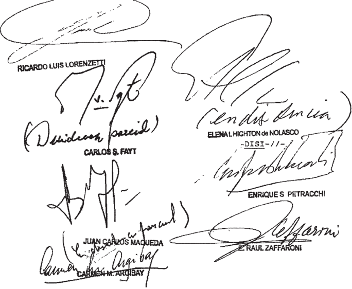

## /-DENCIA PARCIAL DEL SEÑOR MINISIRO DOCTOR DON CARLOS EAYI

Considerando:

Que atinente 1os hechos de causa, 1os fundanentos del pronunciamiento inpugnado, planteos de las recurrentes Y a procedencia fornal de las apelaciones interpuestas, han sido objeto de adecuado trataniento en el dictamen de sejora Procuradora Fiscal ante esta Corte, cuyos términos corresponde renitir en razón de brevedad\_

2' ) Que la protección la inviolabilidad física, Y moral del individuo constituye un rasgo doninante del principio "pro honine" es un derecho preexistente toda legislación positiva Y resulta garantizado por Constitución Nacional El ser humano, desde luego, es eje Y centro de todo el sistena jurídico Y en tanto fin en sí misno ~más allá de su naturaleza trascendente su persona constituye valor fundanental con respecto al cual los restantes valores tienen siempre carácter instrumental "Campodónico de Beviacqua Fallos 323:3229 Y citas; Y doctrina de "Floreancig" Fallos: 329:2552)

También es principio axiomático que ante la vulneración de aquellos bienes fundanentales deben asegurarse los imperativos de justicia de la reparación, que no deben cubrirse solo en apariencia (doctrina de Fallos: 299:125)

3? ) Que, en linea con anterior, esta Corte ha en fatizado que "el resarciniento del dannificado requiere la atención oportuna de las afecciones de orden físico, psíquico Y estético derivadas del evento dañoso, toda vez que un aspecto esencial concerniente al mismo es el cese del proceso de degradación mediante una rehabilitación tempestiva, lo que ciartamente obsta modo de cumpliniento de 1a sentencia como el que resulta de 1a n 25.344" ("Petrelli" Fallos: 327:2551, con cita de "Escobar" Fallos ; 318:1593, énfasis agregado) un ley

En consecuencia, la previsión contenida en el art 18 de la mencionada es insuficiente para resolver el caso, toda ley

vez que si bien establece exclusiones al régimen, las supedita la concurrencia de "circunstancias excepcionales vinculadas gituaciones de desamparo indigencia en en que 1a obligación tuviere carácter alimentario" De tal suerte, impone condicionanientos impropios la luz de la doctrina enunciada de que se desarrollará infra.

La 25.344 aparece así desprovista de previsiones expregas que aseguren un remedio legal oportuno ante indenniza ciones de la naturaleza examinada , de tal nodo que niega principios humanisticos básicos que nuestra Ley Suprema asegura No en vano se ha dicho que frente la declaración de emergencia económica por parte del Estado, "la Constitución Nacional no adnite la suspensión indefinida del pleno goce de 1os derechos ella reconoce Y garantiza" {del voto del juez Fayt en la causa "Mesquida") ley que

4 Que , en efecto, tan limitado enfoque conceptual omite considerar que las reparaciones, "como el término indica , consisten en las medidas que tienden hacer desaparecer 1os efectos de las violaciones cometidas \_ Su naturaleza Y su monto dependen del daño ocasionado en los planos tanto material como inmaterial" Por ende , es refractario 1o anterior generar el de la víctina ("Bamaca Velázquez Guatena la" Reparaciones, sentencia del 22 de febrero de 2002 , Serie c N 91, Informe anual de la Corte Interamericana de Derechos Humanos 2002 , San José 2003 , págs \_ 107/108 , 40/41 Y sus citas, énfasis agregado)

Esta situación se ha configurado claranente en autos toda vez que el quo , incluyó en el régimen de consolidación de deudas del Estado los "gastos nédicos en que incurrió la actora, mediante un razonamiento que deja al descubierto insuficiencia del art 18 ya referenciado: ~Jo se refiere una erogación futura sino la repetición de Ya abonadas" (fs 347) Esta conclusión es abiertamente inaceptable la luz de las disposiciones de orden superior en juego; sin embargo , re-

sulta innegable que las cortapisas de la mentada norma pueden fomentar semejante interpretación

Que la Convención Americana sobre Derechos Huma nos de su lado , es asaz concluyente al respecto, pues su art 27 establece que las razones de energencia que afecten segu ridad del Estado no autorizan la suspensión, siquiera linitada transitoria, del derecho la vida Y la integridad física reconocidos en 10s arts Y 5 de aquélla. Por su parte, el art 63.1 de dicha convención faculta 1a Corte Interamericana imponer las reparaciones pertinentes cuando derechos sean esionados En el caso de la privación del derecho la vida, la restitución al statu quo ante resulta imposible Y, pox ello, la reparación que alude el art 63\_ 1 solo puede asunir la forma de una indennización sustitutiva, conforme doctrina de la Corte Interamericana de Derechos Humanos en 10s casos "Aloeboetoe sentencia del 10 de septiembre de 1993 , Serie C , 15; "Bulacio" Sentencia del 18 de septiembre de 2003 , Serie C, 100; "Garrido Y Baigorria" sentencia de 27 de agosto de 1998 , Serie C , N 39 , Y sus citas {del Voto de jueces Petracchi Y Lorenzetti en a causa "Mesquida")

Que como consecuencia de todo 1o anterior, agravios desarrollados por ambas partes conducen la aplicación de la doctrina establecida en las causas 'Escobar" (Fallos: 318 : 1593) "Petrelli" (Fallos 327:2551, párrafo 11, apartado del dictamen del señor Procurador General, al que adhirió el Tribunal; "Mesquida' (Fallos: votos concurrentes de 1os jueces Fayt Y Petracchi) ; 'Petryszyn" (Fallos: 331:2745, vo tos concurrentes de 10s jueces Fayt, Lorenzetti, Petracchi Y Zaffaroni) ; "Morrow de Albanesi" (Fallos: 333:1404 , votos concurrentes de 1os jueces Lorenzetti, Fayt, Petracchi, Maqueda Y Zaffaroni) Y B .52 XLV "Bordagaray" {fallada el 31 de agosto de 2010 , votos de 10s jueces Fayt, Lorenzetti Zaffaroni) Por ende ~en el casoel art. 13 de la 25 ,344 deviene inconstitucional los ley

Que esta conclusión ha de prevalecer, en 1a espe-

cie, sobre 1a reiterada doctrina de esta Corte en el sentido de que tal declaración es una de las más delicadas funciones sus ceptibles de enconendarse un tribunal de justicia Y, por ello, debe ser considerada como ultina ratio del orden jurídico (Fa288 : 325 ; 290:83; 292:190; 294:383; 298:511; 300:1087; 302: 457 , 484 Y 1149; 312.122 Y 435, entre muchos

Esta decisión es inperativa en el caso, porque cuando la aplicación de normas que difieren el pago de La deuda pública se encuentra en clara colisión con el derecho la vida, salud la dignidad de las personas, este Tribunal ~mediante robustecida jurisprudenciase ha pronunciado favor de los dannificados A la par, los principios arquitectónicos del Derecho Internacional de los Derechos Humanos , de 1os que se ha hecho mérito supra , abonan la invalidación de disposiciones de naturaleza examinada que se encuentran al Margen del trazado constitucional Por demás , cuadra renarcar que tales disposiciones resultan contrarias la Convención sobre los Derechos de las Personas con Discapacidad, aprobada junto con su Protocolo Facultativo, la 26.378 ey

8 Que , como derivación de todo anterior, también corresponde revocar 1o decidido respecto de la aplicación del régimen de consolidación las reparaciones correspondientes al "daño noral aspecto sobre el cual el quo no confirió fundamento alguno decisión (fs 347)

Es propicio destacar que en jurisprudencia de la Corte no está ausente evaluación del daño como frustración del desarrollo pleno de la vida" (Fallos: 315:2834) Y, con tal comprensión, es evidente que la afectación moral se encuentra incluida en el concepto de "daño" Y el resarciniento de éste últímo solo procura otorgar medios de satisfacción las angus tias, inquietudes miedos, padecimientos Y tristeza propios de la situación vivida\_ De ahí que la percepción postergada del crédito pertinente ~en 105 términos de la desnaturaliza todo propósito reparador que ley

Que , en consecuencia, cabe entender configurada la "inconveniencia" de mantener, en pertinente, la ratio de cidendi de "Gutiérrez" (Fallos: 321:1984) En efecto, frente las objeciones de índole constitucional desarrolladas supra, podría mantenerse una doctrina que permite dilatar 1a percepción de un crédito rebarcitorio indiacutido\_ mediante criterios s0lectivo 109 diversos capituloa de reparación {Fallos 183:409; 216:91; 293:50)

Por ello, se declaran procedentes 1a queja 1os recursos extraordinarios interpuestos se confirma sentencia apelada en cuanto ha sido objeto de agravios por el Estado Nacional Y en 10 denás , se la revoca con el alcance que surge de 10s considerandos precedentes Con costas la denandada vencida Agréguese 1a queja al principal Notifíquese Y vuelvan autos al tribunal de origen fin de que, por quien corresponda, se dicte una nueva sentencia con arreglo a 1a presente

DISI-/ / -

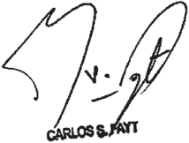

DEL SEÑOR HAQUEDA

MINISTRO DOCTOR DON JUAN CARLOS

Considerando:

Que los antecedentes del caso , los planteos de las recurrentes Y la procedencia formal de apelaciones interpuestas han sido objeto de adecuado tratamiento en el dictamen del seiora Procuradora Fiscal, los que cabe remitir en razón de brevedad

Que, respecto de los planteos referidos 1a exclusión del régimen de consolidación del crédito de parte actora por gastos médicos Y dafo moral, (as1 como la declaración de inconstitucionalidad de la 25 .344 para las deudas por incaley

260

pacidad sobreviniente Y dafo psicológico) \_ son de aplicación ~en pertinente1os fundamentos Y conclusiones alcanzados en las cauas "Mesquida" (Fallos: 329;5382) , "Petryszyn" (Fallos: 331:2745) Y Dupuy" (Fallos: 334 : 1361)

Por ello, habiendo dictaminado 1a señora Procuradora Fiscal, se declaran procedentes el recurso de queja Y 1os recursos extraordinarios, se deja sin efecto sentencia apelada, Y en ejercicio de las facultades otorgadas por el art 16, segunda parte, de ley 48 , se declara la totalidad del crédito de la parte actora excluido del régimen de consolidación de deudas del Estado establecido por 1a ley 25 .344 Las costas se imponen por su

~I/-orden atendiendo las especialísimas circunstancias de causa Notifíquese, agréguese queja al principal Y, remítase

DISI-// -

## DE SENORA VICEPRESIDENIA DOCTORA DOÑA ELENA I HIGHTON de

## Considerando:

Que 1os agravios del recurrente sido objeto de adecuado trataniento en el dictamen de la señora Procuradora Fiscal, Cuyos fundamentos esta Corte comparte Y 1os cuales se remite por razón de brevedad han

Por ello, de confornidad con dictaninado, se resuelve: I) declarar adnisible el recurso extraordinario interpuesto por el Estado Nacional Y revocar la sentencia en cuanto había decla -

rado inconstitucional Y excluido de la consolidación rubros "incapacidad aobreviniente" Y "daño psicolbgico" Con costas II) hacer lugar la queja, declarar adnisible el recurso extraordinario Y confirmar la sentencia en cuanto había consolidado rubros "gastos médicos" "daño Notifíquese, agréguese la queja al principal Y remítase los

ELENALHIGHTONde NOLASCO

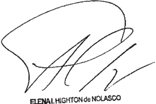

Recurso de queja interpuesto por Libia Blda Cots, con el patrocinic del Dr Diego

Recurso extraordinario interpuesto Por Libia Blda Cotb , Con el Patrocinio del Dr Ouvaldo Valverde \_ Dingo

Traslado contestado el Nacional, de Econonía representado por la Dra Karía

Recurso extraordinario interpuesto Estado Xacional Mlnioterio de noníe, representado por 1a

Traslado contestado por Elda Cots, con el Patrocinio del Dr valdo Valverde Diego

Tribunal de Origen: Cánara Hacional 1o Comeroial, Sala D ,

Iribunal que intervino con anterioridad: Juzgado de 1' en 1o Comarcial n' 25 ,

VEGA, RAUL - INTENDENTE DE SAN FRANCISCO DEL MONTE DE ORO PCIA. DE SAN LUIS C/ HONORABLE CONCEJO DELIBERANTE DE LA MUNICIPALIDAD DE SAN FRANCISCO DEL MONTE DE ORO PROVINCIA DE SAN LUIS S/CONFLICTO DE PODERES

## CONCESION DEL RECURSO EXTRAORDINARIO

Corresponde declarar la nulidad de la resolución por la que se concedió el recurso extraordinario si los términos sumamente genéricos del auto evidencian que el a quo omitió pronunciarse categórica y circunstanciadamente sobre la observancia de uno de los requisitos esenciales del recurso, cual es la presencia de una cuestión federal, máxime cuando no solo se ventila una cuestión de derecho público local

que es, por su naturaleza, extraña a la instancia del art. 14 de la ley 48, sino porque el litigio que da lugar a las actuaciones -responsabilidad política de un intendente ventilada por ante el concejo deliberante- revela un conflicto de poderes locales que, desde la reforma del texto constitucional llevada a cabo en 1860, es un asunto que -como regla- es ajeno a la jurisdicción extraordinaria de la Corte reglada por los arts. 31 y 116 de la Constitución Nacional, 2° de la ley 27 y 14 de la ley 48.

## FALLO DE LA CORTE SUPREMA

## Buenos Aires, d

Vistos 1os autos: "Vega Raúl Intendente de San Francisco del Monte de Oro Pcia. San Luis Honorable Concejo Deliberante de la Municipalidad de San Francisco del Monte de Provincia de San Luis Conflicto de Poderes"

## Considerando:

1 % ) Que el Superior Tribunal de Justicia de la Provincia de San Luis {fs 265/267) concedió el recurso extraordi nario deducido con sustento en la doctrina de la arbitrariedad de sentencias Para resolver de ese modo , en el voto que formó mayoría se afirmó que se observaba cuestión federal suficiente Y se sostuvo que ~Teniendo en consideración que en el remedio jurídico se formula una extensa exposición revelando 1os agravios que surgirán del fallo impugnado, el caso que nos ocupa sulta merecedor de ser juzgado por el más Alto Tribunal de la Nación , cuya función institucional resulta insoslayable Y, por ende.custodia intérprete final de aquel (fs 266)

Que esta Corte ha tenido oportunidad de declarar, con énfasis reiteración, la nulidad de las resoluciones por las que se concedían recursos extraordinarios cuando ha constatado qule aguéllas no daban satisfacción un requisico idóneo para 1a obtención de finalidad que se hallaba destinado (art. 169, segundo párrafo, del Código Procesal Cívil Y cial de Nación; Fallos 310:2122 2306; 323;1247 ; 330:4090; 331:2302; 333:360 , entre muchos otros) ; criterio gue también ha sido aplicado pronuncianientos recientes en materia de en -

juiciamientcs pollticos llevados cabo autoridades provinciales (causas Duhalde, Eduardo Luis Secretario de Derechos Humanos de la Nación" Fallos: 334:1791 Y sus citas Y C.357.XLVIII "Camargo, Alberto Raúl c/ Estado de la provincia de Mendoza ots \_ 5 / acción de amparo" pronunciamiento del 19 de junio de 2012) por

Que esa e5 1a situación que se verifica en el sub lite, pues 1os térninos sumanente genéricos del auto de concesión evidencian que el tribunal quo ha onitido pronunciarse categórica Y circunstanciadamente (con toda menudencia, sin oni tir ninguna circunstancia particularidad, según la definición de la Real Acadenia) sobre 1a observancia de de tos esenciales del recurso extraordinario, cual e5 ~en el la presencia de una cuestión federal de 1a naturaleza invocada por 1a recurrente.

En efecto, frente situaciones substancialnente aná logas la exaninada en el sub lite, este Iribunal ha afirmado que si bien incumbe exclusivamente él juzgar sobre la existencia no de un supuesto de arbitrariedad de sentencia (Fallos; 215:199) \_ no menos cierto, que ello no exime 10s órganos Judiciales llanados expedirse sobre concesión del recurso extraordinario federal, de resolver circunstanciacanente si tal apelación ~prima facie valoradacuenta respecto de cada uno de 1os agravios que la originan con fundamentos suficientes para dar sustento, la luz de conocida doctrina de esta Corte, la invocación de un caso de inequívoco carácter excepcional, camo es el de arbitrariedad (Fallos: 310:1014 ; 313:934; 317:1321, entre muchos otros)

4 %) Que el fundamento de dichos precedentes se asienta en que de seguirse una orientación opuesta, el Tribunal debería adnitir que su jurisdicción extraordinaria se viese, en principio, habilitada denegada , sin razones que avalen unc Y otro resultado, cual infringe un claro perjuicio al derecho de defensa de 10s litigantes Y al acecuado sewvicio de justicia

de 1a Corte

Que por demás , el señalado deber calificado de fundanentación alcanza en las circunstancias del caso el más alto nivel de exigencia, pues no solo ventila una cuestión de derecho público local que es , su naturaleza, extraña instancia extraordinaria del art 14 de la ley 48 , sino porque el litigio aue da lugar estas actuaciones ~la responsabilidad politica de un intendente ventilada por ante el concejo delibe-rante\_ revela un conflicto de poderes locales que desde 1a reforma del texto constitucional llevada cabo en 1860 , es un asunto que ~como reglaes ajeno 1a jurisdicción extraordinaria de esta Corte reglada por los arts\_ 31 Y 116 de la Constitución Nacional de ley 27 Y 14 de la ley 48 {causa M . 198 XLIII "Melgarejo, Nelson Alfredo c/ Concejo Deliberante de Puerto Piray 5 / de apelación conflicto de deres art 137 257" sentencia del 26 de junio de 2007 considerando 4 % ) se por ey

Por ello, se declara la nulidad de resolución por la que se concedió el recurso extraordinario (fs. 265/267) Devuélvanse

las actuaciones al tribunal de origen fin de que se dicte una nueva decisión sobre el punto con arreglo 1a preseate Notifiquese Y renítase

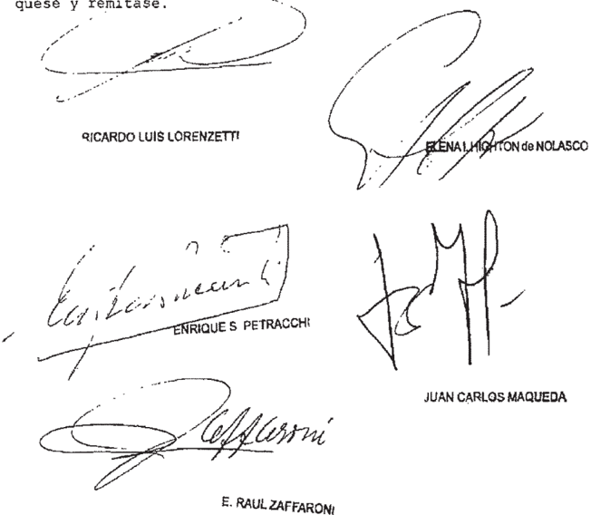

Recurso extraordinarlo interpuesto por: ector Raúl Vega , representado por 105 Dres Eliae Taurant Y Maria Alejandra Martin,

Traslado conrestado en Prebidente del Honorable Concojo Deliberante de Municipalidad de San del Honto de provincia de Luig , con el patzocinio letrado del doctor tonio Alberto Péroz Miranda

Tribunal de origen: Superior Iribunal de Jupticie de 1a ?rovincia

## CORNEJO TORIN O, JORGE ANTONIO Y OTRO S/RECURSO DE CASACIÓN

## PRESCRIPCION DE LA ACCION PENAL

Si bien la resolución apelada -que hace lugar al planteo de prescripción articulado por la defensa, en orden al delito de estrago doloso agravado por la muerte de personas- no constituye sentencia definitiva, debe enmarcarse dentro de aquellos

casos en que resulta equiparable a tal, puesto que le niega al requerimiento fiscal de elevación a juicio   -que no fue anulado- el carácter interruptor de la prescripción que el Código Penal reconoce, lo que implicaría una virtual declaración de cumplimiento del plazo que establece dicho ordenamiento y podría significar la extinción de la acción y el fin del pleito, debido a la imposibilidad de reeditar la cuestión, lo que evidencia la existencia de un gravamen  de imposible reparación ulterior, que habilita la instancia extraordinaria.

-Del dictamen de la Procuración General, al que la Corte remite-.

## PRESCRIPCION DE LA ACCION PENAL

Si bien la resolución apelada -que hace lugar al planteo de prescripción articulado por la defensa, en orden al delito de estrago doloso agravado por la muerte de personas- no constituye sentencia definitiva, debe enmarcarse dentro de aquellos ca -sos en que resulta equiparable a tal, correspondiendo la intervención del Tribunal por cuanto los hechos investigados, por su gravedad y trascendencia institucional, exceden los intereses de las personas directamente involucradas en la causa, y la actuación del a quo, resulta contraria a los principios fundamentales inherentes a la mejor y más correcta administración de justicia, y ha generado una injustificada dilación en el trámite de la causa que es necesario evitar en lo sucesivo.

-Del dictamen de la Procuración General, al que la Corte remite-.

## PRESCRIPCION DE LA ACCION PENAL

Cabe hacer lugar al recurso extraordinario deducido por el Ministerio Público Fiscal y dejar sin efecto la sentencia apelada -que hace lugar al planteo de prescripción articulado por la defensa, en orden al delito de estrago doloso agravado por la muerte de personas-, pues le niega al requerimiento fiscal de elevación a juicio -que no fue anulado-, el carácter interruptor de la prescripción que el Código Penal reconoce, y si  bien  la  cuestión  planteada  versa  sobre  el  alcance  de  un  pronunciamiento que resuelve acerca de la procedencia del recurso de casación y de la declaración de nulidad de un acto del proceso que resultaría ajena, por regla y dado su carácter procesal, al conocimiento del Tribunal, corresponde hacer excepción a tal principio, dado que como resultado de consideraciones rituales suficientes y de una interpretación literal y aislada de una providencia anterior del tribunal, se dejan sin efecto actuaciones realizadas de manera regular, lo que no se compadece con la buena marcha de las instituciones.

-Del dictamen de la Procuración General al que la Corte remite-.

## PRESCRIPCION DE LA ACCION PENAL

Cabe hacer lugar al recurso extraordinario deducido por el Ministerio Público Fiscal y dejar sin efecto la sentencia apelada -que hace lugar al planteo de prescripción articulado por la defensa, en orden al delito de estrago doloso agravado por la muerte de personas- pues le niega al requerimiento fiscal de elevación a juicio -que no fue anulado- el carácter interruptor de la prescripción que el Código Penal reco-

## DE JUSTICIA DE LA NACION 336

noce, por cuanto le reconoce al tribunal oral la facultad de anular el requerimiento de elevación a juicio válidamente emitido, por el contenido y a partir de su propia apreciación de prueba incorporada con posterioridad a ese dictamen, atribuyéndole así la potestad de determinar la pretensión punitiva del Estado, con afectación de la autonomía funcional de los fiscales, a quienes incumbe decidir si cabe mantener el objeto de la acusación    -hasta ese momento vigente- conforme fue descripto en el requerimiento y a pesar de la provisoria apreciación que el tribunal hizo de aquella prueba nueva; agregarle otro hecho de manera alternativa, o modificarlo.

-Del dictamen de la Procuración General al que la Corte remite-

## diCtameN de la proCuraCióN GeNeral

## Suprema Corte:

La Sala A de  la Cámara   Fedetal de Córdoba confirmó el auto de procesamicnto de Jorge Antonio € 1 y Marcelo G en otden al delito de esttago doloso agtavado por Ja muerte de no hizo al planteo dc extinción de la acción por prescripción formulado por sus letrados defensoresDiego lugar

Respecto de este último punto, consideró que el curso de la prescripción en relación a € 1 por los hechos dc los días 3 y 24 de novicmbre de 1995, tesultó intcrrumpido con motivo del llamado pata recibiles dcclaración indagatoria, del 5 dc enero de 1996, y dcl requerimicnto fiscal dc clevación juicio, del 28 de marzo de 2001, pot lo que ~concluyó no ttanscurrió el tiempo previsto en el attículo 62, inciso 2 , del Código Penal para que opere ese instituto y G

Contra esa decisión la defensa dedujo tecurso de casación, cuyo techazo motivó Ja consiguiente queja, la que el &amp; qu0 hizo revocando finalmente Ja decisión de la cámata de apelaciones en lo tocante a la prescripción dc la acción penal lugar,

Al respecto sostuvo, por mayoría; que no cabe tenet dicho tequetimiento fiscal como acto intetruptor del curso de la ptescripción; pues esa sala ~con distinta integración \_ por auto dcl 17 dc junio dc 2004 (cf. fs. 13.322/3) exptesó que la decisión del tribunal oral de reenviar la causa a la etapa dc instrucción con cl objeto de que se investigara un nuevo hecho de implicó dejar sin efecto dictamen\_ aquel

Contta   este ptonunciamiento, el Fiscal General   ante ese tribunal y la partc querellante dedujeton sendos recursos extraordinarios (fs. 378/397 y 398/433,

respectivamente), que fueron conccdidos

En la apelación federal el representante de este Ministerio Público alcgó que en la   decisión  impugnada el qu0  hizo unla errónea   interpretación de disposiciones   legales   relativas la prescripción de la acción penal, que torna inopctantes. las las

Asimismo, la tachó de arbittaria por entender que le dio un irrazonable alcance aquella   tesolución  anterior en la que esa sala, con distinta integración, sostuvo que el auto de reenvío de la causa a la ctapa de instrucción con el objeto de que se investigara un hecho nuevo de la instrucción suplementaria, implicó dejar sin efecto el requerimiento de elevación a juicio. surgido

En cse scntido alegó, de conformidad con cl critcrio con la cámara de apelaciones rechazó el planteo de prescripción de la defensa; que el auto por el quc el tribunal oral devolvió la causa al juzgado no dispuso ni significó la invalidez del requerimiento de elevación a previo. juicio

Indicó en ese punto; que el auto de remisión no se en alguna de las causales de nulidad previstas en el ordenamiento  procesal y fue dictado cOn el objeto de que se determinara si también correspondía formular acusación por un nuevo hecho; distinto al que motivó la tequisitoria de juicio; sin afectar entonces su apoyó

Destacó también que la interpretación que el quo hizo de su anterior intervención, en el sentido de que el reenvío implicó al requerimiento de todos efectos, equivale una conttadicción por cuanto en ese mismo pronunciamiento se rechazó el planteo   de nulidad   por considetar   que resultaría en el sólo interés de Ja privar

Por otra parte refirió que, sin perjuicio de lo expuesto; el quo en su análisis por alto otro acto que interrumpió el curso de la prescripción; como lo es el llamado los imputados para prestar declaración indagatoria por un hecho diverso del que fue objeto de la requisitoria de juicio anterior; y que fuc calificado provisoriamente como estrago doloso agravado pot la muerte de personas (attículo pasó

## DE JUSTICIA DE LA NACION 336

del Código Pcnal) cn el posterior auto pot cl que se dispuso sus procesamientos. Indicó al respecto que la fecha de esa convocatoria ~14 de marzo de 2005\_ no había transcurrido por completo el plazo de prescripción de la acción

Por   último, sostuvo que de la gravedad institucional, debido a la ttascendencia social e interés institucional en los hcchos del caso.

Por su parte; el lettado de la patte quetellante alegó en la impugnación extraordinaria que los votos que integran el ptonunciamiento   apelado son autoconttadictorios, y no confotman una mayoría coincidente sobre los fundamentos   para   llegar la solución   expresada en scntencia.

Si bien la resolución   apelada no constituye una  sentencia   definitiva; entiendo que se enmarca en casos en que resulta equiparable tal, puesto que le al requerimiento fiscal de elevación juicio que no fue anulado el carácter interruptor de la prescripción que el Código Penal le reconoce, lo que en el sub lite implicaría una virtual declatación de cumplimiento del plazo quc establece ese ordenamiento de fondo; y significat, en definitiva; la extinción de la acción y el fin del pleito; debido mi opinión, la existencia de un gravamen de imposible  reparación   ulterior; que aquellos niega podría

Sin perjuicio de lo cxpuesto; cstimo quc corresponde la intervención dc VE en el caso por cuanto hechos investigados, por su gravedad y trascendencia institucional, exceden los intereses de las personas directamente involucradas en la causa, y la actuación del 9u0, a mi modo de ver, tesulta contraria los principios fundamentales inherentes a la mejor y más correcta administración de justicia (Fallos: 156.283; 300.226; 322.3241; 326.2783; 332.1 y ha generado una injustificada dilación en el trámite de la causa que es necesario evitar en lo sucesivo. los 492)

En ese sentido, cabe recordat que en el sub entre otros hechos, se atribuye los nombrados haber provocado; de manera intencional y organizada; y lite,

por intermedio de personas no identificadas, una explosión en los Depósitos de Expedición y Suministro de Ja Fábrica Militar Río Tercero ~de la que cran Director y Jefe de la División Producción   Mecánica,   tespectivamente que   generó una importante onda expansiva que dispersó centenares de proyectiles y municiones quc impactaron en la población adyacente, provocando la muette de sicte personas y lesiones de diversa entidad cn una cantidad no dcterminada (fs. 11 vta./12 de este legajo)  Se sostuvo, además, que con esa explosión se habría pretendido ocultar la falta de proyectiles; municiones y explosivos ~cercana a treinta y cinco mil unidadcs \_ (fojas citadas).

Aprccio que el qu0 hizo lugar a la presentación directa de la defensa de los imputados pesar de que la decisión de la cámata de apelaciones, acerca de la validez del requcrimiento de elevación juicio y sobre el curso de la prescripción, no constituye alguna de las resoluciones tecurribles por la vía casatoria, de acuerdo con lo dispuesto en el artículo 457 del código de forma.

Si bien es cierto que cl examen de la admisibilidad del tecurso es facultad privativa del tribunal de alzada; dicho principio no aplicarse de modo absoluto (Fallos: 302.176), Y entiendo que cabe excepción a esa regla cuando ~como en mi opinión ocurre en el sub examine\_ la solución adoptada carcce de fundamentación suficicnte y redunda en menoscabo del debido proceso y del derecho de defensa en juicio. pucde hacer

En ese sentido, para admitir la procedencia formal dc impugnación el tibunal a quo destacó la posibilidad de que se generara un gravamen juzgado en un plazo razonable; invocada por los impugnantes. aquclla

Sin embatgo; aprecio que dicho planteo carecía de la fundamentación que habilitara su tratamiento, defensa no SC ocupó de escrito del recurso dc casación ni en el de la consiguiente qucja se por el lapso transcurrido desde el inicio de la causa resultaría por sí mismo excesivo; y más allá de la mera referencia que se hizo al trámite   posterior la instrucción explicó qué

## DE JUSTICIA DE LA NACION

suplementaria que desatrolló el tribunal oral, se omitió examinar los diversos actos llevados a cabo por los magistrados y las pattes en el transcurso de todo el proceso, indicar cuáles de ellos habrían dado lugar a dilaciones indebidas, y demostrar que éstas sean de entidad suficiente para generar un menoscabo a ese derecho; lo que resultaba especialmente exigible, desde que en la materia no existen plazos s/recurso de casación? sentencia dcl 1  de junio de 2010) y la referencia las particularidades del caso aparece como ineludiblc (cf. considerando 13" del voto en disidencia de los doctores Petracchi y Boggiano en Fallos: 322.360, y sus citas; voto de los doctores Highton de Nolasco; Maqueda y Zaffaroni en autos P. 1991, L 'Paillot; Luis María y otros s/ conttabando" los XL,

Por lo demás, cabe destacar   que ese no fue objeto de considetación por los magistrados que confotmaron la opinión mayoritaria; pues expresamente cxcluyeron su análisis del acuerdo basados en la necesidad de que la cámata de apelaciones se pronunciata pteviamente acerca de la especial natutaleza de los hechos calificados   por de ptimera   instancia como delitos humanidad\_ y su incidencia en el derecho invocado por la defensa de los imputados; generando entonces una contradicción con el tratamiento que se dio al planteo de ese tazonamiento - habría sido prematuro. agravio Juego ~según

## ~IV\_

quo analizar si la resolución de 17 de junio de 2004, dictada por esa sala con distinta integración, repercutió en el requcrimiento fiscal de elevación a juicio por la presunta comisión del delito de estrago culposo por la muerte de personas. Luego pasó agravado

Es   pertinente mencionar que por esa decisión se desestimó la tccurso de casación por el que pretendió que se anulara dicho tequerimicnto con base en el reenvío dispuesto por el tribunal oral. En ella la sala expresó que, en atención los fundamentos con que se ordenó el regteso de la causa   al juzgado instructor; implícitamente sin efecto   aquel   dictamen; y la  declaración de quedó

nulidad, en consecuencia, resultaba improcedente desde que no cabía declaratla en el sól0 beneficio de la ley 0 por la nulidad misma.

El a quo entendió ~como adelanté  que esa afirmación privó de eficacia al requerimiento de elevación juicio. Pata atribar conclusión, el primero de los votos que   confotmaron la  opinión mayoritaria se apoyó en lo que denominó "principio de progresividad y congruencia del proceso y en ~lo que consideró \_ una interpretación literal y lógica de los términos dc aquella resolución; que en su resulta coherente con los argumentos en que se basó el tribunal oral para disponer el teenvío de la causa a la etapa de instrucción. El otro vocal además de compattir las consideraciones del anteriot; se refirió al reenvío dispuesto por el tribunal oral y dijo quc csa decisión; quc cstuvo motivada por un hecho distinto del que fue objeto del tequetimiento de elevación juicio; significó desconocetle cualquier efecto dicho dictamen, entre los que destacó el de habilitat la apertura del juicio; el de el ejercicio de la defensa de los procesados dándoles a conocer la imputación sobre la que versará el juicio; y el de interrumpir el curso de la prescripción de la acción. opinión permitir

Si bien cuestión así planteada versa sobre el alcance de un pronunciamiento que resuelve acerca de la procedencia del tecutso de casación y de la declaración de nulidad de un acto del proceso; y resultaría ajena, por regla y dado su caráctet procesal, al conocimiento de la Cortc, pienso que corresponde hacer excepción tal   principio   cuando; como resultado de consideracioncs rituales insuficientes y de una interpretación literal y aislada de una providencia anterior del tribunal, se dejan sin efecto actuaciones realizadas de manera regular; lo que no se compadece con la buena marcha 305.913)

Así lo considero; desde que aprecio que cl examen que el &amp; qu0 hizo de la anterior decisión de la sala, en dcfinitiva, se circunscribió a los meros   términos cmpleados y no ponderó circunstancias  relevantes efectos de establecer su real alcance

En efecto; advierto en primcr lugar que se por alto que faltaba un requisito pata que en oportunidad podido dictarse un pasó aquella

pronunciamiento fiscal de elevación juicio por un hecho al quc se le aplicó una figura culposa \_ no esa vía, de confotmidad con el artículo 457 del Código Procesal Penal de la Nación.

No cotrespondía, entonces, que el tribunal se pronunciata acerca   del asunto planteado por la querella; y todo razonamiento sobre el punto era innecesario pata la correcta solución de la cuestión.

Asimismo; que el a quo no repató debidamente en que la hipótesis de que el reenvío dejó sin efecto el requerimiento de elcvación juicio; además de que no venía al caso, tampoco contó con sustento en alguna norma del ordenamiento jurídico ni en los   términos de la resolución del tribunal oral En efecto, en ningún pasaje dc esta última ~incluso los que fucron teproducidos de manera parcial en el   pronunciamiento   apeladose expresó   aquel   criterio. Y, eliminando toda duda que, de todos modos, pudiere haber existido sobre el punto; el tribunal Oral expresó ~frente al recurso de aclatatoria por el que la   quetellante solicitó la anulación de dicho tequerimiento \_ que tal declaración estaba fuera de las facultades de ese órgano, además era improcedente   porque constituía una scscnta y seis) aprecio

Además dc las circunstancias mencionadas, rclativas al incumplimiento de un requisito para habilitar la instancia casatoria y a la falta de fundamentación de la inteligencia que se hizo del pronunciamiento emitido en esas condiciones, advicrto quc en el sub examine tampoco se evaluó la repercusión del criterio que el exttajo dc aquella  antetior dccisión en el ejercicio de la misión   tequirente   que compete al Ministerio Público (attículo 120 de la Constitución Nacional; artículos 1, 25,29 y 33 de la Orgánica del Ministerio Público ~24.946-) qu6

Así lo considero; por cuanto le reconoce al ttibunal oral la facultad de anulat el requerimiento de elevación juicio válidamente emitido; pot el contenido y partir de su propia  apreciación de prueba incorpotada con posterioridad ese

Estado, con afectación dc la autonomía funcional de los fiscales, a quienes incumbe decidir si cabe mantener el objeto de la acusación ~hasta ese momento vigcnte conforme fue descripto en el tequerimiento y pesar de la ptovisoria apteciación que el tribunal hizo de prueba nueva; otto hecho de manera alternativa, 0 modificarlo. agregarle aquella

En tales condiciones; cstimo que el qu0 omitió una adecuada ponderación de aspectos relevantes de la causa, y producto de ello efectuó una etrónea comprensión de la antetior resolución de esa sala, quc en opinión sól0 significó ~aunque con términos n0 absolutamente precisos - que dictamen que incluso set ampliado por el agente fiscal\_ no generaba la parte querellante. A mi modo de es la exégesis que se ajusta al objetivo constitucional de afianzar la justicia, entendiendo ésta como una virtud al servicio de la verdad sustancial. mi aquel agravio podía ver,

No me habtía detenido en el análisis dc esos aspectos procesales, si no hubieran tenido como consccuencia una severa afcctación de las gatantías constitucionales del   debido proceso defensa en juicio, de los   ptincipios fundamentales inherentes a la mejor y más cotrecta administración de justicia.

Sin perjuicio de lo dicho hasta estimo pertincnte destacar que, en mi opinión; tampoco configura el cumplimiento de la adecuada fundamentación que debe contenet una sentencia judicial, la mera invocación al principio de progresividad que se hizo cn el de votos   que conformó la  opinión efectos de tatificat el criterio de la invalidez dcl requcrimiento fiscal de elevación juicio, por cuanto se limitó recordar quc la Corte dicho   que el proceso   penal se integra con una serie de   etapas sigue; en forma tal que no es posiblc eliminar una dc ellas sin afcctar la validez de las que le suceden? (fs. 352 vta , anteúltimo páttafo) sin analizar la aplicación de ese precepto al sub examine, ni explicat por tazón habría que considetat; con base en ese aquí Jos qué

## DE JUSTICIA DE LA NACION

dictamen fiscal emitido en una etapa anterior.

En consecuencia; pienso que la sentencia debe ser descalificada como tal, lo que además petmitirá, poniendo fin a la dilación originada con motivo de esa conducir las   actuaciones del modo tanto la acusación la vía para obtener una condena como al imputado la posibilidad de su sobteseimiento absolución (Fallos: 315.1553, 324.4135, voto de los doctores Fnrique Santiago Petracchi y Gustavo A. Bossert) . apelada

"Dapuetto de Palo, Miguel Angel Rafael p.s.a. alteración de limites s/queja, del 9 de noviembre de 2009 Pot otta patte; aun cuando no se compartiera el criterio precedentementc expuesto tampoco puedo dejar de señalar que el alcance que el qu0 dio su decisión; y que   constituye motivo de   agravio, supone considerar Ja eficacia interruptiva de la prescripción de los actos procesales según las disposiciones de la ley 25.990, lo que no tesulta   admisible   cuando se ttata de un caso por hechos acaccidos con anterioridad vigencia, de acuerdo con los fundamentos expuestos en los dictámenes emitidos en las causas T. XLII, 'Torca; Héctor $ rccurso de casación del 8 de noviembrc de 2006 (Fallos: 330.5158), y D. 675; L XLIV, 404,

~VI

Por las razones expuestas; mantengo cl recurso intcrpuesto por cl señot fedetal de la parte querellante que, en lo sustancial, coincide con la pretensión de este Ministerio Público.

Bucnos Aires; / Qde octubre de 2011.

ESTEBAN RIGHI

## FALLO DE LA CORTE SUPREMA

## Buenos Aires,

Vistos los autos "Cornejo Torino, Jorge Antonio otro s / recurso de casación"

Considerando:

Que respecto del recurso extraordinario interpuesto por el Ministerio Público Fiscal fs 378/397 vta. esta Corte comparte ~en pertinente con exclusión del apartado V los argumentos vertidos por el señor Procurador General de la Nación en el dictamen de fs 470/474 , cuyos fundamentos cabe remitirse en razón de brevedad

Que el recurso extraordinario deducido por la querefs 398/433 vta . es inadmisible (art 280 del Código Procesal Civil Comercial de la Nación)

Por ello, Y oído el señor Procurador General de la Nación, el Tribunal resuelve: Hacer lugar al recurso extraordinario deducido por el Ministerio Público Fiscal dejar sin efecto la sentencia apelada y remitir la presente al tribunal de origen para que por quien corresponda , se dicte un nuevo pronunciamiento con arreglo ello; 2 0 Rechazar el recurso extraordinario deducido por querella, con coatas Hotifíquese cúmplase

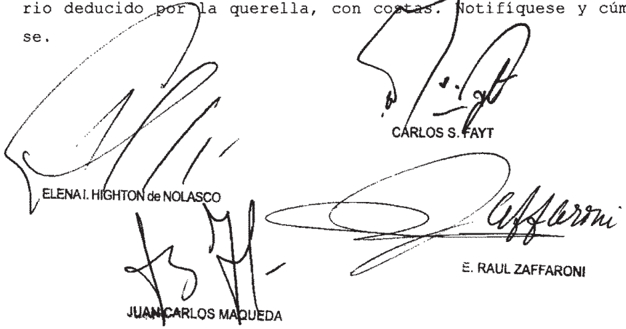

Recurso extraordinario interpuesto pOr Narvaiz Fiscal Ganeral de Casa ción Penal por el Dr Ricardo Monner Sans letrado apoderado de 1a querella, Ana Elba Gritti

Iribunal de origen: Sala II de la Cánara Faderal de Casación Penal

Tribunales que intervinieron con anterioridad: Cámara de Apelacioneb de Córdoba

## DE JUSTICIA DE LA NACION

## ARGENTO , FEDERICO ERNESTO C/ ADMINISTRACION NACIONAL DE SEGURIDAD SOCIAL S/ REAJUSTES VARIOS

## HABER JUBILATORIO

Si la aplicación al caso del art. 26 de la ley 24.241 dejó sin efecto alguno al art. 24 de dicho régimen, quedando la prestación compensatoria liquidada sólo en función del AMPO, perdiendo todo nexo con el nivel salarial alcanzado en actividad, a punto tal que aun sumada a la prestación básica universal no llega a representar el 10% de las últimas remuneraciones del causante, dicho resultado revela el perjuicio concreto que ocasiona la suerte de tope a la prestación compensatoria establecido por la norma cuestionada, en una magnitud tal que la merma del haber resulta confiscatoria, circunstancia que lleva a declarar la inconstitucionalidad del art. 26 de la mencionada ley.

## REAJUSTE JUBILATORIO

Resulta inoficioso expedirse sobre la tacha de invalidez formulada respecto del tope de 35 años establecido por el  art. 24 de la ley 24.241, toda vez que al haber sido calculada la prestación compensatoria computando 37 años de servicios, no existe una controversia sobre el punto que habilite un pronunciamiento del Tribunal.

## REAJUSTE JUBILATORIO

Los agravios de la pensionada relacionados con la posterior movilidad de las prestaciones son procedentes, pues a pesar de que dicho pedido no fue formulado ante la alzada, se advierte que para esa época el art. 7º, inciso 2, de la ley 24.463 no había producido en las prestaciones el daño que se verificó con posterioridad al 2003, en que comenzaron a incrementarse las variables que reflejaban la evolución de los salarios de actividad, y habida cuenta de que el Tribunal debe adecuar su pronunciamiento a las circunstancias existentes al tiempo de fallar, corresponde admitir la impugnación vinculada con la existencia de incrementos después del 10 de enero de 2002 y remitir sobre el punto a lo resuelto en la causa 'Badaro' (Fallos: 330:4866), por lo que la prestación deberá ajustarse del modo allí indicado, sin perjuicio de que al practicar la liquidación se descuenten las sumas que pudieran haberse percibido en virtud de los decretos del Poder Ejecutivo que dispusieron aumentos en las prestaciones en el período indicado.

## REAJUSTE JUBILATORIO

La tasa pasiva promedio que elabora el Banco Central de la República Argentina es adecuadamente satisfactoria del menoscabo patrimonial sufrido por la demandante, en el marco de la índole previsional de la relación jurídica en examen, el carácter alimentario de las prestaciones adeudadas y el período de estabilidad del

valor de la moneda durante el lapso que corresponde a la deuda reclamada. -Del precedente 'Spitale' (Fallos: 327:3721), al que remitió la Corte en relación a la crítica del ANSES dirigidas a objetar la tasa pasiva de interés-.

## REAJUSTE JUBILATORIO

Si la aplicación al caso del art. 26 de la ley 24.241 dejó sin efecto alguno al art. 24 de dicho régimen, quedando la prestación compensatoria liquidada sólo en función del AMPO, perdiendo todo nexo con el nivel salarial alcanzado en actividad, a punto tal que aun sumada a la prestación básica universal no llega a representar el 10% de las últimas remuneraciones del causante, dicho resultado revela el grave menoscabo que ha producido en la prestación en examen la aplicación del tope impugnado, a la luz de los principios básicos que se encuentran sometidos a los derechos en juego, amparados por el art. 14 bis de la Constitución Nacional, pues el haber de pasividad resultante no guarda una proporción justa y razonable con el esfuerzo contributivo desplegado, circunstancias que llevan a declarar la inconstitucionalidad del art. 26 de la ley citada.

- -Voto del juez Carlos S. Fayt-.

## HABER JUBILATORIO

La prestación compensatoria fue prevista por el legislador a fin de que el haber de la jubilación reflejara la trayectoria laboral y de cotizaciones del beneficiario, en particular durante la última etapa de su vida activa, y con tal propósito, el art. 24 de la ley 24.241 dispuso que este componente debía determinarse multiplicando la cantidad de servicios con aportes por el 1,5% del promedio de las remuneraciones sujetas a contribuciones, actualizadas y percibidas durante los últimos 10 años anteriores al cese, no obstante lo cual la ley también introdujo como límite un factor extraño a ese esfuerzo contributivo personal, al disponer en su art. 26 que 'el haber máximo de la prestación compensatoria será equivalente a una vez el AMPO por cada año de servicios.

## diCtameN de la proCuraCióN GeNeral

## Suprema Corte:

En los autos S.C N' 4304 , L XXXVIII , caratulados 'Baila Rubèn Agustin cIANSeS slreajustes varios" dictaminado el 14 de octubredel corriente el Sr. Procurador General de la Nación decidió que, por no configurarse las materias a que se refiere el artìculo 24 inciso 6", apartado b) y c) del decreto-ley 1285/58\_ no corresponde que este Ministerio Pùblico Fiscal dictamine en el recurso ordinario de apelación interpuesto.

De acuerdo con lo allí dispuesto y lo establecido por arts. 33 y 35 de la ley 24.946, corresponde devolver las actuaciones a la Corte Suprema de Justicia de la Naciòn a los

sus efectos.

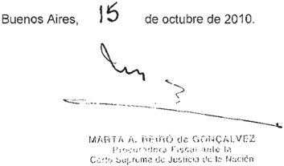

## diCtameN de la proCuraCióN GeNeral

## Suprema Corte:

Toda vez que en el caso no se configuran las materias que se refiere el artículo 24 inciso 6 apartados b) y c) del decreto-ley 1285/58, no corresponde que este Ministerio Público Fiscal dictamine en el recurso de apelación ordinaria interpuesto en esta causa efectos.

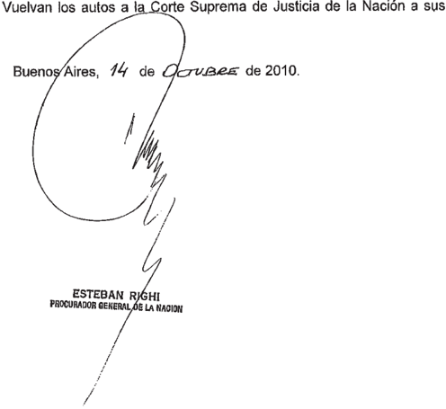

## FALLO DE LA CORTE SUPREMA

## Buenos Qe de 20*8

Vistos los autos "Argento, Federico Ernesto c/ ANSeS s / reajustes varios"

## Considerando

Que contra la sentencia de la Sala II de la Cáma ra Federal de la Seguridad Social que confirmó el fallo de la instancia anterior que había ordenado la ANSeS que practicara un nuevo cálculo del haber inicial del beneficio previsional su posterior movilidad, ratificó la inconstitucionalidad de arts\_ y 9 , inciso 3 , de la 24 . 463 rechazó los restantes planteos formulados por la actora, las partes dedujeron sendos recursos ordinarios de apelación que fueron concedidos (art\_ 19 24 463) ley ley

2" ) Que la demandante aduce que la jubilación del causante fue limitada de manera confiscatoria el art. 26 de la 24 .241, por que solicita que se declare inconstitucional dicha disposición, tacha que extiende al art 24 , inciso a, de la citada, que impide considerar en el cálculo de su beneficio la totalidad de los años efectivamente aportados Requiere, último, que se reajuste la prestación en os pe ríodos posteriores abril de 1995 \_ por ley ley por

Que fin de examinar la primera de las cuestiones constitucionales planteadas, es menester tener en cuenta que la prestación compensatoria fue prevista por el legislador fin de que el haber de la jubilación reflejara la trayectoria laboral y de cotizaciones del beneficiario, en particular durante la última etapa de su vida activa. Con tal propósito, el art 24 de la 24 .241 dispuso que este componente debía determinarse multiplicando la cantidad de servicios con aportes por el 1, 58 ley

del promedio de las remuneraciones sujetas contribuciones, actualizadas percibidas durante los últimos 10 años anteriores al

Que , sin embargo , la también introdujo como límite un factor extraño ese esfuerzo contributivo personal al disponer en su art 26 que "el haber máxino de la prestación compensatoria será equivalente una vez el AMPO por cada año de servicios Cabe recordar que esa unidad de medida guardaba relación con el comportamiento general del sistema previsional (ingresos por aportes de trabajadores y cantidad de cotizantes) Y que también se utilizó para establecer una remuneración máxima sujeta descuentos (arts. 10 del decreto 2433/93 9 de la 24 .241) ley los ley

Que el demandante se desempeñó durante más de 37 años como gerente general de SADE S .A Y "Maipú Inversora S .A. con un sueldo superior los $ 15.000 en últinos 10 años de servicios ($ 25 .950 al cese) según surge de las certificaciones Y de la liquidación practicada por el organismo previsional (fs 18/22 , 23/28 Y 70 del expediente administrativo 024-59135611-01) Cabe tomar en consideraci además que por efecto de fechas de vigencia del sistema integrado de jubilaciones Y pensiones Y del cese laboral del causante, só10 en 11 de 120 mensualidades el aporte fue reducido por el art 9 antes citado. Ón , las las

6" ) Que el promedio salarial de los últimos años de actividad calculado por la ANSeS   según lo previsto en el art 24 de la 24 .241, con la actualización dispuesta por el juez de primera instancia partir de abril de 1991 , debería haberse de terminado en $ 16.706,20 , lo cual hubiese conducido un nivel inicial de la prestación equivalente $ 9 . 440, 47 \_ Sin embargo al ser el AMPO vigente la fecha de adquisición del derecho de $ 63 , la aplicación del tope del art. 26 de la citada redujo ley ley

ese componente con una ta superior al 708 , fijándolo en la suma de $ 2.331 quis

70 ) Que , en tales condiciones, la aplicación al caso del art 26 de la ley 24 .241 dejó sin efecto alguno al art 24 de dicho régimen, pues la prestación compensatoria quedó liquidada sólo en función del AMPO Y perdió todo nexo con el nivel salarial alcanzado en actividad, punto tal que aun sumada la prestación básica universal no llega representar el 108 las últimas remuneraciones del causante

8 " ) Que , por lo demás el resultado antedicho revela que en la presente causa se ha denostrado el perjuicio concreto que ocasiona a suerte de tope la prestación compensatoria establecido por la norma cuestionada, en una magnitud tal que la merma del haber resulta confiscatoria de acuerdo con la doctrina del Tribunal (cf\_ doctrina de Fallos: 323:4216 329:3211) , circunstancia que lleva declarar la inconstitucionalidad del art 26 de la mencionada ley)

9 % ) Que , en cambio, resulta inoficioso expedirse bre tacha de invalidez formulada respecto del tope 35 años establecido por el mencionado art toda vez que al haber sido calculada la prestación compensatoria computando 37 años de servicios, no existe una controversia sobre el punto que habilite un pronunciamiento de este Tribunal 24 ,

10) Que agravios de la pensionada relacionados con la posterior movilidad de las prestaciones son procedentes En efecto, pesar de que dicho pedido no fue formulado ante la alzada , se advierte que para esa época el art 7 , inciso 2 , de la ley 24 . 463 no había producido en las prestaciones el daño que se verificó con posterioridad al 2003 , en que comenzaron incrementarse las variables que reflejaban la evolución de los sa larios de actividad (causa "Badaro" Fallos: 329:3029 , considerando 9) los

11) Que ello Y habida cuenta de que el Tribunal debe adecuar su pronunciamiento as circunstancias existentes al tiempo de fallar cuando se le ha dado las partes la oportunidad de ser oídas Y ejercer su derecho de defensa, corresponde admitir la impugnación vinculada con la existencia de incrementos después del 10 de enero de 2002 Y remitir sobre el punto resuelto por el Tribunal en la causa "Badaro" (Fallos: 330:4866) \_ cuyas consideraciones se dan por reproducidas, por que la prestación deberá ajustarse del modo allí indicado sin perjuicio de que al practicar la liquidación se descuenten sumas que pudieran haberse percibido en virtud de los decretos del Poder Ejecutivo que dispusieron aumentos en las prestaciones en el período indicado \_ por las

12) Que las críticas de la ANSeS dirigidas objetar la tasa pasiva de interés, encuentran adecuada respuesta en causa "Spitale" (Fallos: 327:3721)

13) Que expuesto por el organismo previsional en relación con los topes máximos contemplados por 1os arts. 55 Y 9 , inciso 2 , de las leyes 18 .037 y 24 . 463 , respectivamente, Y con el plazo de cumpliniento de la sentencia, no se hace cargo de resuelto por la alzada sobre el punto, por 1o que corresponde declarar la deserción del remedio intentado en ese aspecto restantes cuestionamientos no se refieren temas específicos de la sentencia impugnada , de manera que carecen del requisito de fundamentación exigible. Los

Por ello, el Tribunal resuelve: Hacer lugar en forma parcial los recursos ordinarios, declarar la inconstitucionalidad del art 26 de la ley 24 .241, confirmar la sentencia apelada respecto de la tasa de interés en concordancia con el precedente "Spitale" Y disponer que la movilidad por el lapso indicado en el fallo "Badaro" se practique de conformidad con el índice

284

allí fijado, salvo que 1os incrementos dispuestos los decretos del Poder Ejecutivo durante igual período arrojasen una prestación superior, caso en el cual deberá estarse su resultado Notifíquese devuélvase por

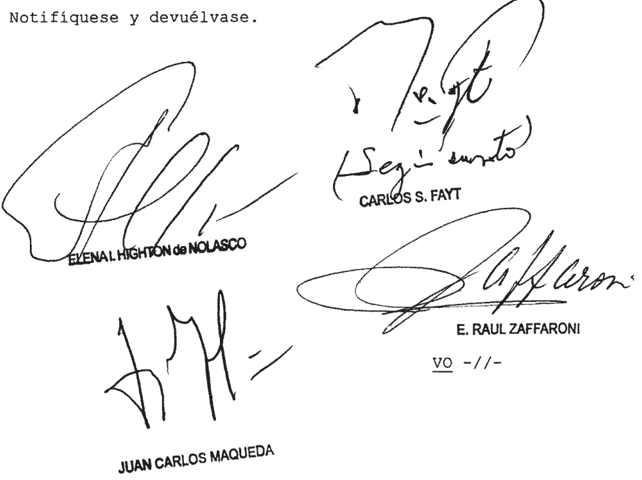

DEL SEÑOR MINISTRO DOCTOR DON CARLOS s FAYT

## Considerando

Que el infrascripto coincide con los considerandos 1 7 inclusive del voto de la mayoría\_

Que expresado revela el grave menoscabo que ha producido en la prestación en examen la aplicación del tope impugnado , la luz de los principios básicos que se encuentran sometidos derechos en juego, amparados por el art 14 bis de la Constitución Nacional pues el haber de pasividad resultante no guarda una proporción justa Y razonable con el esfuerzo contributivo desplegado (causa "Sánchez publicada en Fallos: 328 : 1602) circunstancias que llevan declarar la inconstitucionalidad del art 26 de la mencionada ley -

Que, en cambio, resulta inoficioso expedirse bre la tacha de invalidez formulada respecto del tope de 35 años establecido por el mencionado art 24 , toda vez que al haber sido calculada la prestación compensatoria computando 37 años de servicios, no existe una controversia sobre el punto que habilite un pronunciamiento de este Tribunal

10) Que agravios de la pensionada relacionados con la posterior movilidad de las prestaciones son procedentes En efecto, pesar de que dicho pedido no fue formulado ante la alzada , se advierte que para esa época el art 7 , inciso 2 , de la 24 .463 no había producido en prestaciones el daño que se verificó con posterioridad al 2003 , en que comenzaron incrementarse las variables que reflejaban la evolución de los sa larios de actividad (causa "Badaro" Fallos: 329:3029 , considerando 9) ey las

11) Que por ello Y habida cuenta de que el Tribunal debe adecuar su pronunciamiento las circunstancias existentes al tiempo de fallar cuando se le ha dado las partes la oportunidad de ser oídas Y ejercer su derecho de defensa , corresponde admitir la impugnación vinculada con la existencia de incrementos después del 1 0 de enero de 2002 Y remitir sobre el punto lo resuelto por el Tribunal en la causa "Badaro" (Fallos 330:4866) cuyas consideraciones se dan por reproducidas por que la prestación deberá ajustarse del modo allí indicado sin perjuicio de que al practicar la liquidación se descuenten sumas que pudieran haberse percibido en virtud de los decretos del Poder Ejecutivo que dispusieron aumentos en las prestaciones en el período indicado \_ las

12) Que las críticas de la ANSeS dirigidas objetar la tasa pasiva de interés, encuentran adecuada respuesta en la causa "Spitale" (Fallos: 327:3721) \_

13) Que expuesto por el organismo previsional en relación con los topes máximos contemplados por los arts. 55 Y 9 , inciso 2 , de las leyes 18 .037 24 463 , respectivamente, Y con el plazo de cumplimiento de la sentencia, no se hace cargo de 10 resuelto por la alzada sobre el punto, por 1o que corresponde declarar 1a deserción del remedio intentado en ese aspecLos restantes cuestionamientos no se refieren temas es pecificos de la sentencia impugnada , de manera que carecen del requisito de fundamentación exigible\_ to

Por ello, Y demás fundamentos del voto precedente, el Tribunal resuelve: Hacer lugar en forma parcial 1os recursos ordinarios, declarar la inconstitucionalidad del art\_ 26 de la 24 .241 , confirmar la sentencia apelada respecto de la tasa de interés en concordancia con el precedente "Spitale" disponer que la movilidad por el lapso indicado en el fallo "Badaro" se practique de conformidad con el índice allí fijado, salvo que 10s incrementos dispuestos por decretos del Poder Ejecutivo durante igual período arrojasen una prestación superior, caso en el cual deberá estarse su resultado Notifíquese Y devuélvase ley

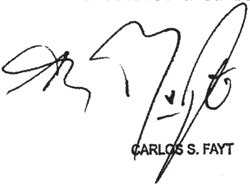

Recursos ordinarios interpuestos por Leda Regina Mantogazza, en calidad de viuda del actor por Bu prop1o derecho con 01 patrocinio letrado de Dra Azucena Evelia Ruiz , 1a Adminietración Nacional de 1 Soguridad Social, de nandada en autoe, representada por el Dr Jorge Abdo   Feroz , calidad de apoderado en

Traslado contestado por Leda Regina Mantegazza, calidad de viuda actor con 0l patrocinio letrado de 1a Dra Azucena Evelia Ruiz

Tribunal de origen: Sala II de 1a de la Soguridad Social\_

Tribunales que intervinieron con anterioridad: Juzgado Federal de Primera Inbtancia de Social N' 10

## DE JUSTICIA DE LA NACION 336

## GRIFFO , RICARDO ARIEL S/EXTRADICIÓN

## EXTRADICION

Corresponde revocar la sentencia que rechazó el pedido de extradición presentado por el Reino de España que, al considerar aplicable la calificación de los artículos 173, inc. 15 y 283 en función del art. 285 del Código Penal, es decir estafa y alteración de moneda de curso legal, en concurso real, entendió que había operado la extinción de la acción penal por prescripción ya que al no tratarse simplemente de alterar la banda magnética de una tarjeta de crédito sino de originar, mediante esa maniobra, un objeto totalmente imitado que no se identifica con ninguno de los dos auténticos en que se basó pero que tiene la apariencia de autenticidad, ello constituye el delito de 'falsificación' de tarjeta que, por aplicación del art. 285 del código mencionado queda equiparado al de moneda en el marco del art. 282 del Código Penal.

diCtameN de la proCuraCióN GeNeral

Suprema Corte:

Contra la sentencia dictada por el Juzgado Federal No [de Córdoba, que denegó la extradición de Ricardo Ariel G requerida por las apelación; concedido a fojas 292.

así  resolver; el magistrado a quo consideró que los hechos por los cuales se requiere la entrega se encontrarían prescriptos (artículo 9.c del Tratado de extradición y asistencia judicial en materia penal con el Reino de España; cfî. ley 23708) Para

Pues   bien, a fin de   determinar si ese óbice   alcanza   la presente  rogatoria interacional, cabe tener en cuenta lo informado por las autoridades requirentes.

Del pedido formal de extradición; surge que G junto a otras  personas, sobre el mes de febrero de 1998, arribaron a España, donde llevaron a cabo las operaciones necesarias para cambiar las numeraciones de las bandas magnéticas en tarjetas de crédito, introduciendo en las mismas la

información codificada electrónicamente obtenida de otras cuentas, la cual era interpretada por un lector de bandas magnéticas que poseían al efecto. De este modo, usando documentación falsa y tarjetas de crédito con la banda magnética sustituida por medio de los   aparatos electrónicos referidos, realizaron numerosas adquisiciones en distintos establecimientos y ciudades. Asimismo; se contactaron en Valencia con María del Carmen B quien entregó a fin de que sea permutada su banda   magnética, realizando seguidamente diversas operaciones en establecimientos comerciales. Luego; en los   domicilios de   ésta y donde se se encontraron joyas, efectos, tarjetas de crédito, documentación, dinero; un lector de bandas magnéticas marca Omron; número de serie 04015, con su adaptador eléctrico; así como soportes de plásticos con bandas magnéticas con cédulas de identificación del equipo GNC y otros datos (fojas 6).

Esos hechos fueron   encuadrados por el juez del requirente en el delito de falsificación de moneda; previsto por los artículos 386 y 387 del Código Penal español, para el cual se establece una pena máxima de 12 años. Habida cuenta de esta circunstancia y lo estipulado en el artículo 131 de ese compendio de normas, la pretensión punitiva española emergente de ese ilícito prescribiría una vez transcurridos 15 años desde la comisión de la acción reprochable; lo que aún no ha ocurrido en relación con los sucesos reseñados. país de  la   extradición   entendió, al realizar la subsunción de la conducta en el ordenamiento jurdico argentino; que dichos actos eran constitutivos del delito de alteración de un documento equiparado a moneda de curso legal, en los términos del artículo 283 del Código Penal, que prevé un máximo de pena de 5 años; lo que implica que, en virtud de lo normado por el artículo 62.2 del   ordenamiento   penal, habría   operado   la extinción de la acción.

Resulta entonces que, de estar a la calificación penal del a

quo, la colaboración rogada no podría prosperar.

Sin   embargo, estimo que los hechos descriptos en la requisitoria internacional encuadran en la acción típica de falsificar tarjetas de crédito -y no en meramente alterarlas- que en función de lo dispuesto por el artículo 285 del Código Penal, se encuentra criminaiizada por el artículo 282 de ese cuerpo

Obsérvese, en este   sentido, que no se modificaron   los elementos   extrínsecos del objeto  protegido: su numeración; el nombre del titular 0 la fecha de su vencimiento; sino que se transformó la sustancia misma de la tarjeta; su esencia, es decir: la información codificada que contiene.

diferencia de los demás instrumentos comerciales de fondo, la información no se agota en el texto grabado en el soporte material, sino que está contenida en la banda magnética, que es, en definitiva, la sustancia del documento y sin la cual sería imposible realizar una operación comercial. código

Así, al cambiar la información electrónica contenida en ella por la de otra, no se está alterando un formulario cierto -como lo sería el ejemplo del cheque citado en la sentencia apelada- lo que se efectúa; lisa y llanamente, es la mutación esencial de la verdad documental.  Pasa a ser la imitación de entidad financiera emisora difieren en un todo.

En este sentido; reza la ley 25.065 que debe entenderse por tarjeta de crédito: "al instrumento material de identificación del usuario; que ser magnético 0 de cualquier otra tecnología, emergente de una relación la misma con: a) Su nombre y apellido. b) Número intemo de inscripción. c) Su firma ológrafa. d) La fecha de emisión de la misma. e) La fecha de vencimiento. f) Los medios que aseguren la inviolabilidad de la misma. g) La identificación del emisor y de puede

290

la entidad bancaria interviniente" (artículo 5)

aquí,   obvia   decirlo; todas esas señas de una   tarjeta crediticia se ven falseadas, por cuanto al introducir en su banda magnética información referida a los  datos consignados en su exterior se tornan mendaces; en relación a la verdad intrínseca del instrumento. otra,

El objeto, entonces, al variar la totalidad de sus elementos constitutivos dejó de ser lo que era en su sustancia para convertirse en uno distinto, un híbrido con las señas particulares de una persona y su  entidad emisora que en realidad contiene el status financiero codificado de otra relación comercial, que, como dijera; es la que informa a estos instrumentos.

En virtud de estas   consideraciones,   entiendo   que debe lo previsto por el artículo 282 del Penal. Código

Allí se contempla un máximo de pena para la falsificación arriba descripta de 15 años. De esta forma; atento a lo dispuesto por las normas que regulan la prescripción en el orden nacional, la pretensión punitiva también subsiste para la ley argentina.

VE que revoque la sentencia y efectiva la entrega de la persona reclamada. haga de marzo de 2010.

## LUIS SANTIAGO GONZALEZ WARCALDE

## FALLO DE LA CORTE SUPREMA

## Buenos Aires,

Vistos los autos: "Griffo, Ricardo Ariel s / extradición"

## Considerando:

Que el señor juez cargo del Juzgado Federal de Primera Instancia n 1 de Córdoba , Provincia de Córdoba, rechazó el pedido de extradición presentado por el Reino de España para someter proceso Ricardo Ariel Griffo por infracción artículos 386 y 387 del Código Penal español (fs. 284/288 vta.)

2% ) Que contra esa resolución interpuso recurso de apelación ordinario el representante del Ministerio Público Fiscal quien discrepó con el encuadre típico adoptado por el quo fines del principio de "doble incriminación" según el derecho argentino Y consecuencias que de ello derivó para concluir como 1o hizo (fs 300/301 vta. ) A su turno, el defensor del requerido no mejoró los fundamentos de resolución apelada , por que se tuvo pOr decaído del derecho hacerlo en un futuro (fs . 314)

3 % ) Que según surge de 10s antecedentes acompañados por el país requirente el delito imputado Griffo consistió, en síntesis, en haber llevado cabo ~las operaciones necesarias para alterar las numeraciones de las bandas ma gnéticas en tarjetas de crédito" para luego proceder ~a realizar numerosas pras en distintos establecimientos ciudades" en el Reino de España en 10s meses de febrero Y marzo de 1998 auto de procesamiento de fecha 17 de febrero de 1999 librado por el Juzgado Central de Instrucción 2 , obrante fs 6/8 Y 64/66) Ello según el detalle aportado fs\_ 144/187\_

4 ' ) Que tales hechos fueron encuadrados por el país requirente en el delito de falsificación de moneda previsto Y penado por artículos 386 387 del Código Penal Español El prinero de ellos en cuanto reprime al que "altere" la moneda "fabrique" moneda falsa (inc 1 %) , al que "introduzca" en el país "exporte" moneda falsa alterada (inc al que la "transporte" "expenda "distribuya" (inc. 3' ) (fs 10) El segundo, considera "moneda" las "tarjetas de crédito, las de débito Y las demás tarjetas que puedan utilizarse como medio de

pago" (fs 11)

Que , su turno, el quo consideró aplicable la calificación de 1os artículos 173 inc. 15 283 en función del art 285 del Código Penal es decir, estafa Y alteración de mo neda de curso legal, en concurso real Sobre esa base, teniendo en cuenta el artículo 7 , inciso del tratado aplicable Y la es cala penal aplicable ~un mes seis años Y uno cinco años de prisióncomO así también el tiempo transcurrido desde el llamado indagatoria (17 de febrero de 1999) Y el pedido formal de extradición receptado por la Procuración General de la Nación (14 de agosto de 2007) entendió que ha operado la extinción de la acción penal por prescripción, conforme nuestro propio de recho sustantivo (fs. 288 vta.) \_

Que la ley 25.065 regula diversos aspectos vinculados con el sistema de tarjetas de crédito, compra Y débito define como el "conjunto complejo Y sistematizado de contratos individuales cuya finalidad es: a) posibilitar al usuario efectuar operaciones de compra locación de bienes servicios obras, obtener préstanos Y anticipos de dinero del sistema en conercios instituciones adheridas; b) diferir para el titular responsable el pago devoluciones fecha pactada financiarlo conforne algunas de las modalidades establecidas en el contrato; c) abonar os proveedores de bienes servicios los consunos del usuario en los términos pactados" (artículo las

Asinismo, el artículo consagra que "Se denomina genéricamente Tarjeta de Crédito al instrumento material de identificación del usuario, que puede ser magnético de cualquier otra tecnología, emergente de una relación contractual previa entre el titular Y el emisor" entendido éste como la en tidad financiera, comercial bancaria que emite tarjetas de crédito que haga efectivo el pago de las mismas (artículo 2 , inciso a)

7 " ) Que , su turno, el artículo 5 señala que el

'usuario, poseedor de la tarjeta estará identificado en la misma con: a) su nonbre Y apellido" (inciso a) , "número interno de inscripción" (inciso b) "su firna olografa" (inciso c) , "1a fecha de emisión de a misma (inciso d, 1a "la fecha de vencimiento" (inciso e) "10s medios que aseguren la inviolabilidad de 1a misma (inciso f) Y identificación del emisor Y de entidad bancaria interviniente" (inciso "la

8 % ) Que la "banda magnética" está incluida entre los "nedios que aseguran la inviolabilidad" de 1a tarjeta con el fin de salvaguardar su "titularidad" manteniendo la correlación que debe existir entre quien "está habilitado para el uso de la tarjeta de crédito" Y "quien se hace responsable de todos 1os cargos Y consumos realizados" (artículo

Que , en ese contexto normativo, copiado de la información contenida en la banda magnética de una tarjeta para insertarla en la de otra impacta en su autenticidad Ya que, aun cuando mantuviera aspectos de su enisión originaria, con su nueva conformación, lejos quedó de plasmar la "relación contractual previa entre el titular Y el emisor" (artículo cit.) en cues tión tan esencial como eg la de la correlación debe existir entre el "habilitado para el us0 de la tarjeta de crédito" Y el 'responsable de todos cargos Y consumos realizados" (artícu2 .b cit.) que

10) Que este tipo de maniobra confiere idoneidad la tarjeta 10s fines de la configuración del delito de falsificación al crear una similar la auténtica en forma tal de poder engañar sobre su esencia, siendo indiscutible que la imitación que se logra reúne los caracteres necesarios para que pueda ser sorprendida la fe pública aceptada cono auténtica al estar conformada por los "símbolos" los cuales la 25.065 acuerda un valor preestablecido punto tal que información inserta en la banda magnética se corresponde con la de otra tarjeta habilitada para circular. ley

No se trata simplemente de alterar banda magnética de una tarjeta de crédito sino de originar' mediante esa manioun objeto totalmente imitado que no se identifica con ninguno de los dos auténticos en que se basó pero que tiene la apa riencia de autenticidad, cual constituye el delito de "falsificación" de tarjeta que, por aplicación del artículo 285 del Código Penal argentino queda equiparado al de moneda en el marco del artículo 282 del Código Penal bra,

11) Que en tales condiciones, atento la pena máxima fijada por el artículo 282 del Código Penal , en función de 10 dispuesto por el artículo 285 del Código Penal , el extremo de la prescripción de la acción penal ha de regirse por el plazo máximo de 12 que prevé el artículo 62 , inciso de ese mismo código \_

Asimismo, ha de computarse desde el dictado del auto de procesamiento en sede extranjera ~17 de febrero de 1999 (fs 6/8) teniendo en cuenta la instancia de grado como acto procesal para el cómputo la fecha de inicio del plazo en cuestión (fs 288 vta.) , en posición compartida por la defensa del requerido (fs 286 vta. ) Y no controvertida por parte recurrente (fs 300/301) \_ habiendo sido interrumpido por la solicitud de extradición formulada por el Reino de España \_

Si bien se desconoce la fecha exacta en que ello habría tenido lugar, necesariamente fue entre el 2 de abril de 2007 en que el juez cargo del Juzgado Central de Instrucción n' 2 de Audiencia Nacional, D Ismael Moreno Chamarro, libró el pedido de extradición "autoridad judicial competente" (fs 4/5) Y el 10 de agosto de 2007 en que el Ministerio de Relaciones Exteriores, Comercio Internacional y Culto le dio cur50 , en el marco de 10 dispuesto por el artículo 22 , priner párrafo de la ley 24 . 767 (fs 17)

12) Que esta altura, parece necesario aclarar que la descripción de los hechos incluida en el pedido de extradición Y el encuadre legal escogido por las autoridades jurisdic-

cionales del país requirente no arrojan dudas de que la imputación contra Griffo está solo dirigida al delito de "falsificación" de "tarjetas de crédito" En efecto, más allá de que la descripción de los hechos pone de nanifiesto la existencia de maniobras dirigidas defraudar, cierto es que el país requirente no les ha asignado ~al menos en este pedido de extradiciónrelevancia típica para fundar la imputación contra el requerido en el delito de "estafa" "defraudación" A punto tal que ni siquiera acompañó copias de las disposiciones penales que regulan esa conducta prohibida en el país extranjero En tales condiciones, recurrir la figura de la "estafa" "defraudación" fines del examinar la configuración del principio de "doble incriminación" según el derecho argentino implica, en las circunstancias del caso, ampliar el objeto procesal extranjero al que se pretende someter Griffo mediante este requeriniento cual resulta inadmisible

13) Que , por último, cabe desestimar, por infundado el agravio ventilado por la defensa del requerido 'en la audiencia de debate en relación que 1a descripción que de 1os hechos incluye el pedido de extradición es "vaga" 'genérica" 'imprecisa" Y "no logra satisfacer ni míninamente las exigencias que impone la normativa legal aplicable" (artículo 13 , inc 24 . 767) de modo tal que impide conocer aspectos esenciales que deben indefectiblemente ponderarse al momento de decidir su eventual concesión" (fs 285 vta. ) ley

Ello en atención la descripción que incluye el auto de procesaniento extranjero sobre el particular (fs 6/8) unido al listado que el país requirente de aquellas compras efectuadas con "soportes plásticos no emitidos por American Ex press pero "con numeraciones de esta compañía codificadas en las Bandas Magnéticas" 144/187)

Por expuesto, oído el señor Procurador Fiscal, el Tribunal resuelve

Revocar la resolución apelada Y declarar procedente la ex-

296

tradición solicitada por el Reino de España para soneter proceso Ricardo Ariel Griffo por infracción los artículos 386 Y del Código Penal español

Notifíquese, tómese razón Y devuélvase al juez de la causa para que prosiga con-el-trámite\_

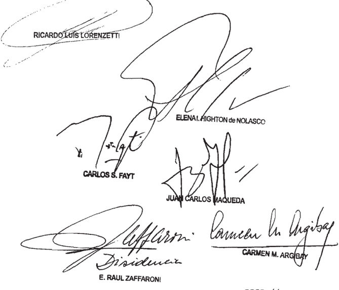

DISI-// -

~I/ -DENCIA DEL DOCTOR DON E RAÚL ZAFFARONI

## Considerando:

Que el artículo 9 ~inciso del tratado de extradición suscripto con el Reino de España (ley establece que no se concederá la extradición cuando de acuerdo la de alguna de las partes se hubiera extinguido la acción penal. ey

Que en este pedido de extradición se le imputa

Griffo el delito de falsificación de moneda previsto en 386 y 387 del Código Penal español por haber llevado cabo "las operaciones necesarias para alterar las nuneraciones de las bandas magnéticas en tarjetas de crédito" en meses de febrero Y marzo de 1998 (conf fs 66 y el auto de procesaniento de fs 6/8 ) los

Que , en tales condiciones, cabe concluir que ha operado la prescripción de la acción penal ~a luz del ordena miento jurídico argentino vigente al de los hechoscorrespondiente al delito de falsificación de instrumento privado (art. 292 del Código Penal) en el que se subsumen los actos por que se solicita la extradición, toda vez que desde la fecha de conisión del delito ha transcurrido el plazo de dos años establecido por el inciso 2 del artículo 62 del Código Penal los

Por ello, oído el señor Procurador Fiscal, se confirma la =// -sentencia apelada que rechaza el pedido de extradición formulado por el Reino de España para someter proceso Ricardo Ariel Griffo. Hágase saber Y renítanse

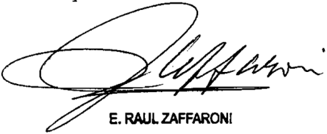

Recurso ordinario de apelación interpuesto por Bnrique Fiscal Federal de Córdoba

Tribunal que intervino con anterioridad: Instancia de la Provincia de Córdoba

## FALLOS DE LA CORTE SUPREMA 336

## MONTOYA , MAURICIO JAVIER C/ TRANSPORTES METROPOLITANOS GENERAL SAN MARTIN SA Y OTROS

S/ DAÑOS Y PERJUICIOS

## OBLIGACION DE SEGURIDAD

Si no se encuentra controvertida la calidad de pasajero del actor ni que las lesiones sufridas han sido consecuencia de su caída a las vías del tren, correspondía a la empresa demandada demostrar los eximentes para poder interrumpir el nexo causal y exonerarse de responsabilidad, ya que por la obligación de seguridad que le compete debía trasladar al pasajero sano y salvo al lugar de destino, derecho previsto en la Carta Magna para los consumidores y usuarios, por lo que aún cuando se admita que el demandante adoptó un comportamiento imprudente, la cámara omitió considerar que la demandada tuvo a su alcance la posibilidad de evitar la producción del siniestro, ya que su personal debió adoptar las diligencias del caso y controlar que no existiesen pasajeros ubicados en lugares peligrosos o que las puertas estuviesen cerradas cuando la formación se encontrase en marcha.

## OBLIGACION DE SEGURIDAD

La interpretación de la obligación de seguridad que tiene causa en el contrato de transporte de pasajeros debe ser efectuada con sustento en el derecho a la seguridad previsto para los consumidores y usuarios en el art. 42 de la Constitución Nacional, y teniendo en cuenta que la incorporación del vocablo seguridad es una decisión valorativa que obliga a los prestadores de servicios públicos a desempeñar conductas encaminadas al cuidado de lo más valioso: la vida y la salud de los habitantes, ricos o pobres, poderosos o débiles, ancianos o adolescentes, expertos o profanos, extremo que se omitió considerar en la sentencia que hizo lugar a las excepciones de falta de legitimación pasiva opuestas por el Estado Nacional y por la citada en garantía y rechazó la demanda por indemnización de los daños que sufrió el actor como consecuencia del accidente producido mientras viajaba en una formación ferroviaria.

## diCtameN de la proCuraCióN GeNeral

## Suprema Corte:

La Sala de la Cámara Nacional de Apelaciones en lo Civil, por mayoría y en cuanto aquí resulta pertinente; confirmó, en lo sustancial, la sentencia de la instancia anterior y en consecuencia; hizo lugar a las excepciones de falta de legitimación pasiva opuestas por el Estado Nacional y por la citada en garantía, y rechazó la demanda (fs. 581/587 y 660/667).

Para así decidir, en el marco de la acción promovida por el actor por los daños y perjuicios que habría sufrido como consecuencia del accidente ocurrido el 30 de

## DE JUSTICIA DE LA NACION 336

junio de 2002 en la estación Muñiz viajando en una formación ferroviaria de Transportes Metropolitanos General Martin SA., el tribunal sostuvo; compartiendo Ios fundamentos del juez de primera instancia, que la explotación del servicio público la realiza el concesionario a su propia costa riesgo sin que proceda extender la responsabilidad al Estado Nacional por un hecho que deriva de la propia actividad y que es un riesgo asumido por el concesionario San su vez, los magistrados afirmaron que la póliza no había sido abonada; con sustento en la pericia contable -no impugnada- de donde surgía que cuatro cheques de Transportes Metropolitanos General San Martín SA entregados la aseguradora; habían sido rechazados\_ En ese contexto; en el que la póliza se encontraba suspendida como consecuencia de ese incumplimiento; los jueces, con sustento en el artículo 31 de la NP 17.418, concluyeron que la aseguradora no era responsable por el siniestro en cuestión: Ley

Por otra parte, y en cuanto al fondo del asunto; los señores jueces manifestaron que; en el caso, medió culpa de la victima que eximió de responsabilidad al concesionario, desde que -según entendieron- la conducta desplegada por el actor al bajar del tren en cada estación y volver a subir sin razón que lo justifique; como viajar en un lugar inapropiado y riesgoso; fueron factores desencadenantes del acaecimiento del hecho. En este sentido, el a quo tuvo especialmente en consideración la declaración testimonial de fojas 337 de donde surge que tanto el testigo como el actor descendieron del tren para que pueda subir la gente que estaba en la estación Muñiz, luego de subir pasajeros, lo hicieron ellos. los

Entendieron que no resultaba verosimil el argumento del demandante referente a la gran cantidad de pasajeros que viajaban en el momento del accidente en el tren, valorando la hora en la que ocurrió el accidente

Contra dicho pronunciamiento; el actor dedujo recurso extraordinario

300

## FALLOS DE LA CORTE SUPREMA 336

que fue desestimado (fs. 674/693 y 720), dando lugar a la presente queja (fs. 47/50, del cuaderno respectivo) . En síntesis, que la sentencia es arbitraria por incongruente pues omite el tratamiento de planteos presentados por su parte, y carente de fundamentación; al sustentarse en afirmaciones dogmáticasalega

En particular, argumenta que los jueces de la alzada que conformaron la mayoría, no trataron la cuestión presentada oportunamente por su parte relativa a la autocontradicción en que había incurrido el magistrado de primera instancia en la sentencia de fojas 581/587, por cuanto en el considerando rechaza la excepción de falta de legitimación activa presentada por el Estado Nacional, y en la parte resolutiva hace lugar dicha defensa\_

Agrega que si bien la sentencia de primera instancia había hecho lugar a la excepción de falta de legitimación pasiva presentada por el Estado Nacional, dicha decisión fue apelada sin que haya sido tratada debidamente en el voto de la mayoría y tampoco fue mencionada la decisión a su respecto; en la parte resolutiva En relación con este punto, el recurrente manifiesta que el Estado resulta responsable en tanto tiene a su cargo el contralor de la prestación del servicio público; lo cual -dice- fue reconocido por esa parte fojas 82/95. Entiende que la falta de vigencia del seguro de responsabilidad civil por la concesionaria, importa una omisión en el deber de vigilancia Nacional en virtud de la obligación impuesta por el contrato de concesión de tomar su cargo un seguro para quedar indemne frente a eventuales reclamos.

El recurrente considera que el tribunal omitió ponderar que el perito si bien había informado de la existencia de cuatro (4)  cheques   rechazados de la demandada; destinados pagar la póliza de seguro, también señaló que no podía corroborar que no hayan sido reemplazados (según pericia, fs. 381/384) .

Aduce que los magistrados que conformaron la mayoría rechazaron la demanda sobre la base de afirmaciones dogmáticas, pues si bien el testigo declaró que al momento de descender del tren habla personas que subían su parte afirmó que las personas bajaban, no existe a su juicio contradicción alguna que justifique concluir que hubo

## DE JUSTICIA DE LA NACION 336

culpa de la victima cuando correspondía -dicea la demandada probar dicha situación Señala que si bien el tribunal lo tachó de imprudente al viajar en el estribo; no realizó un estudio sobre los planteos de su parte que daban cuenta que-el tren estaba excedido en su ca fojas 338.

Entiende arbitraria la decisión que no valora que el hecho de que las puertas   permanecieran abiertas durante el  viaje no se condice con la obligación de la empresa transportista de seguridad (cita el art. 184, Código de Comercio) .

Cabe precisar, en primer término, no genera gravamen alguno el alegado error material cometido por el magistrado de primera instancia; quien conforme los fundamentos   expresados fojas 582/583 vta\_ rechazó la   falta de legitimación   activa a la excepción planteada. Entiendo que ello es así, pues dicho error -resaltado en el voto de la minoría, fs. 660 y vta. no importó impedir una decisión sobre el fondo del asunto; por Io que en esta instancia deviene abstracto

Sentado corresponde aclarar que si bien los planteos de los apelantes remiten al estudio de cuestiones de hecho; prueba y derecho común, ajenas, como regla y por su naturaleza, a la instancia extraordinaria del artículo 14 de la Ley N' 48, ello no resulta óbice para abrir el recurso extraordinario cuando el tribunal ha omitido dar tratamiento adecuado a la controversia de acuerdo a las constancias comprobadas de la causa y el derecho aplicable (Fallos 317,768; 321;1462; 324:1344; entre otros) , y ha prescindido de la consideración de elementos conducentes para decidir la cuestión relativa a la responsabilidad que se le atribuye a la empresa de ferrocarriles (v. doctrina de Fallos 317:768) . ello,

En particular, y en cuanto al fondo del asunto; VE. ha dicho que los daños   personales   sufridos por el   viajero se rigen por el artículo 184 del Código de Comercio; por lo que al actor le incumbe la prueba del hecho y su relación de causalidad

302

## FALLOS DE LA CORTE SUPREMA 336

con el daño sufrido, mientras que para eximirse de responsabilidad la demandada debe acreditar la existencia de fuerza mayor, culpa de la víctima 0 de un tercero por el cual no en el caso en esta instancia, constituyan hechos controvertidos el carácter de pasajero del actor que las   lesiones sufridas se produjeron como consecuencia de la caída de aquél de la formación.

En tales condiciones, considero que asiste razón al recurrente; toda en ese contexto; eximió de responsabilidad a la demandada, invocando el artículo 184 del Código de Comercio; sin ponderar si Transportes Metropolitanos General San Martín S.A. tuvo a su alcance la posibilidad de evitar el hecho dañoso; en el marco de lo dispuesto por el artículo 11 de la N' 2873 que impone la obligación de proveer a sus empleados de las instrucciones y medios necesarios a fin de que el servicio se haga con regularidad,  sin podido ser también imprudente al ubicarse cerca de la puerta de acceso (v. doctrina de Fallos 327.5082) . ley

Empero; es menester precisar en qué medida las circunstancias que determinaron el accidente pudieron ser evitadas si se hubiese observado  la conducta apropiada, pues la   responsabilidad sólo puede   surgir de la adecuada valoración del reproche de las conductas en orden a la previsibilidad de sus consecuencias (arts. 512 y 902 Código  Civil y Fallos 317.768) . mi modo de ver, debieron ser estudiados en profundidad por el tribunal.

En este sentido, estimo que no resulta suficiente la mera afirmación efectuada por los jueces en orden a "la lógica imposibilidad material de que el personal de la empresa pueda cerciorarse acabadamente de que algún imprudente pasajero se ubique en zonas no autorizadas 0, en definitiva; peligrosas para su integridad física" (v. fs 665, tercer personal de la empresa demandada adopte las diligencias del caso, tales como controlar que no existiesen pasaieros ubicados en lugares peligrosos que las puertas estuviesen

cerradas antes de que el tren se pusiera en marcha (v. doctrina de Fallos 317:768; 327:5082, ya citados)

Desde esta perspectiva; en mi opinión; no parece razonable liberar totalmente de responsabilidad a la empresa transportista por daños causados; ello sin perjuicio de la eventual graduación de la responsabilidad que pudiere corresponder en función de la concurrencia de culpas, de encontrarse ésta efectivamente probada (Fallos 312.2412; 320:536) . los

En estos aspectos; en mi opinión; el recurso del actor debe prosperar.

En tales condiciones, deviene prematuro en esta instancia el tratamiento de los agravios del actor relativos al alcance de la responsabilidad del Estado Nacional por tener a su cargo el contralor de la prestación del servicio público y en este contexto; su legitimidad  pasiva. Estas   cuestiones,  junto con la  obligación "0 node la Comisión Naclonal de Regulación del   Transporte de controlar la vigencia del seguro de responsabilidad civil; deberán ser objeto de tratamiento oportuno; de acuerdo a la decisión que finalmente se adopte

IV

En función de lo expuesto; en mi opinión VE. debe dejar sin efecto el pronunciamiento recurrido y remitir los autos al tribunal de origen; para que se dicte uno nuevo con arreglo a derecho

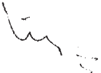

Gorio Guprema anto

## FALLO DE LA CORTE SUPREMA

## 26 Qe Buenos Aires,

Vistos los autos: "Recurso de hecho deducido por la actora en la causa Montoya , Mauricio Javier c/ Transportes Metropolitanos General San Martín SA Y otros 5 / daños Y perjuicios" para decidir sobre su procedencia

## Considerando:

Que la Sala de 1a Cánara Nacional de Apelaciones en 10 Civil, por nayoría, confirmó en 10 sustancial la sen tencia de primera instancia Y, en consecuencia, hizo lugar las excepciones de falta de legitimación pasiva opuestas por el Es tado Nacional Y por la citada en garantía, rechazó la denanda interpuesta por Mauricio Javier Montoya por indemnización de 10s daños que había sufrido como consecuencia del accidente producido el 30 de junio de 2002 en estación Muñiz, mientras viajaba en una formación ferroviaria de Iransportes Metropolitanos General San Martín

2 % ) Que para así decidir sostuvo que la concesión de la explotación la transferencia de los bienes muebles inmuebles favor de la empresa ferroviaria implicaban el desprendi miento de la guarda juridica Y la prestación de un servicio por el cual no debía responder Asimismo, y para el caso de la citada en garantía, admitió la excepción de falta de legitinación opuesta, porque en la causa se acreditó ~con sustento en el peritaje contable, no que la póliza de seguro contratada la demandada se encontraba suspendida de acuerdo con el art 31 de la 17.418 , como consecuencia de la falta de pago por ley

Que en relación con el fondo del asunto, el tribunal señaló que la decisión de viajar en un lugar autorizado , como era el pasillo cercano puerta del tren, era una circunstancia apta para configurar la eximente de responsabilidad de la empresa de transportes en razón de que existía la imno

posibilidad material de que el personal de la empresa pudiera cerciorarse acabadamente de que algún pasajero imprudente se hubiere ubicado en zonas no autorizadas peligrosas para su integridad física

Agregó que tanto 1a conducta desplegada por el actor al bajar del tren en cada estación Y volver subir sin razón que justificase, como viajar en un lugar inapropiado Y ries goso, habían sido factores más que desencadenantes en el acaeci miento del hecho , configurándose la culpa absoluta de la propia víctima

Que contra dicho pronunciamiento, el actor dedujo recurso extraordinario que desestimado dio origen la presente queja. Se agravió por considerar que la sentencia es arbitraria incongruente Ya que la alzada rechazó la demanda sobre base de afirmaciones dogmáticas en relación con la culpa de víctima en el acaecimiento del hecho Y las condiciones en las que 1os pasajeros realizaban el viaje, que no se condicen su juicio con la obligación de seguridad de la empresa transportista debió ser evaluada con mayor estrictez, ni con la condición de sujetos vulnerables de los usuarios consumidores que

Asimismo en cuanto la legitimación pasiva del Es tado, recurrente sostiene que la responsabilidad que le adjudica no proviene del hecho de ser titular del doninio de los bienes ferroviarios Y concedente del servicio público, sino de tener su cargo el contralor de la prestación, Y que en el ca él debió controlar que la empresa concesionaria tuviera contratado vigente un seguro de responsabilidad civil, 10 no hizo. que

Que los planteos del apelante vinculados con el favorable acogimiento de la defensa de falta de legitimación pa siva opuesta por la citada en garantía remiten al examen de cuestiones de hecho, prueba Y derecho común Y procesal, materia propia de 1os jueces de la causa Y ajena ~como regla Y por su naturalezaal remedio del art. 14 de la 48 , aparte de que ley

306

la decisión cuenta al respecto con fundamentos suficientes que más allá de su acierto error, permiten desestimar la tacha de arbitrariedad invocada

Que, por el contrario, aun cuando los agravios relacionados con la exención de responsabilidad de la empresa de transporte ferroviario conducirían efectuar idéntico ello no resulta óbice para su consideración por vía intentada cuando la alzada ha prescindido de dar un tratamiento adecuado la controversía de acuerdo con las constancias comprobadas de la causa Y las normas aplicables (conf Fallos: 324:3618 ; 325:329; 327:5082 ; 333:203 , entre muchos otros)

Que, en relación con la exención de responsabilidad de la empresa de transporte ferroviario, esta Corte tiene decidido que los daños personales sufridos por el viajero se rigen por el art 184 del Código de Conercio, por que al actor 1e incumbe la prueba del hecho Y la relación de causalidad con el daño sufrido, mientras que para eximirse de responsabilidad debe acreditar la existencia de fuerza mayor, culpa de la víctina de un tercero por en no debe responder (conf Fallos: 313:1184 ; 316:2774 ; 321:1462; 322:139; 323:2930 y 327 :5082) qui

Que , en autos no se encuentra controvertida la calídad de pasajero del actor ni que las lesiones sufridas por este último han sido consecuencia de s1 caída las vias del tren; de modo tal que correspondía la empresa Iransportes Ketropolitanos General San Martín 5 .A denostrar mencionados eximentes para poder interrunpir el nexo causal Y exonerarse de responsabilidad, ya que por la obligación de seguridad que le compete debía trasladar al pasajero sano Y salvo al lugar de destino, derecho previsto en la Carta Magna para 10s consumidores Y usuarios (conf Fallos: 331:819 333:203)

Que , aun cuando se adnita que el demandante adoptó un corportamiento imprudente, la cámara ha onitido considerar que la demandada tuvo su alcance la posibilidad de evi-

tar la producción del siniestro, toda vez que su personal debió adoptar las diligencias del caso Y controlar que 10 existiesen pasajeros ubicados en lugares peligrosos que las mencionadas puertas estuviesen cerradas cuando la formación encontrase en marcha (conf Fallos: 316:2774 ; 317;768 ; 321 : 1462 Y 333 :203)

10) Que , dicha onisión viola, adenás , dispuesto por el art 1l de la 2873 , que establece 1a obligación de proveer sus empleados de las instrucciones Y medios necesarios fin de que el servicio se haga con regularidad, sin tropiezos ni peligro de accidentes {conf Fallos: 317:768 321:1462) ley

11) Que , este Tribunal ha resuelto que la interpretación de la obligación de seguridad que tiene causa en el contra to de transporte de pasajeros, debe ser efectuada con sustento en el derecho la seguridad previsto para consumidores Y usuarios en el art de la Constitución Nacional\_ Expresó tam bién que la incorporación del vocablo seguridad en la Carta Magna, es una decisión valorativa que obliga prestadores de servicios públicos desempeñar conductas encaninadas al cuidado de 1o más valioso: la vida Y la salud de los habitantes ricos pobres , poderosos débiles, ancianos adolescentes, expertos profanos extremo que se ha omitido considerar en la decisión en crisis (conf \_ Fallos: 331:819; 333:203 Y causa M. 328 .XLVI taña, Jorge Luis c/ Iransportes Metropolitanos General San Martín s / daños perjuicios" sentencia del 3 de mayo de 2012) "Mon-

12) Que habida cuenta de expresado , no puede 505 layarse que el deber de empresa de transporte ferroviario de nandada de extremar al máximo las precauciones para evitar si tuaciones de riesgo para usuarios, no fue un tema evaluado debidanente por 1a cánara, que prescindió del criterio regulador previsto normativamente, que le impone el deber de extremar las previsiones para el estricto cumpliniento de las leyes Y reglamentos dictados en amparo de las posibles víctimas para quienes de lo contrario, el resarcimiento resultaría ilusorio en 1a ma yoría de los casos (conf . Fallos: 333:203) 1os

308

13) Que , en razón de expuesto, la sentencia impug nada no satisface las condiciones de validez de las decisiones judiciales, ya que ha omitido considerar las previsiones constitucionales que protegen 10s consumidores, aplicables al caso por que corresponde revocar la decisión apelada en este as pecto.

14) Que , dada la solución propuesta, este Tribunal comparte 10 dictaninado 1a señora Procuradora Fiscal en el sentido de que deviene prematuro en esta instancia el trataniento de 10s agravios del actor vinculados con el alcance de la responsabilidad del Estado Nacional por tener su cargo el contralor de la prestación del servicio público en ese contexto su legitimación pasiva. Dichas cuestiones junto con la obligación =0 node Conisión Nacional de Regulación del Transporte de controlar la vigencia del seguro de responsabilidad civil, deberán ser objeto de tratamiento oportuno , de acuerdo la de cisión que finalmente se adopte por

Por ello, Y concordenente dictaminado por la señora Procuradora Fiscal, con el alcance indicado, se hace lugar la queja, se declara formalmente admisible el recurso extraordinario Y se deja sin efecto la sentencia apelada Con costas Vuel van autos al tribunal de origen fin de que por medio

=I/-quien corresponda, proceda dictar un nuevo fallo con arreglo lo expresado Agréguese la queja al principalNotifíquese Y devuélváse

Recurso de hecho interpuesto por Kauricio Javier Montoya, representado el Dr Fólix Roque Aban , con el patrocinio letrado del Dr Josó Stratico

Tribunal de origen: Sala de la Cámara Nacional 1o Civil

Tribunales intervinieron con anterioridad: Juzgado Nacional de Prinera Instancia 1o Civil 40 que

## MOSLARES , JOSE LUIS  c/ DIARIO LA ARENA Y OTROS S/DAÑOS Y PERJUICIOS

## LIBERTAD DE PRENSA

Si está fuera de discusión, al no haber sido materia de agravios por parte de la actora, lo afirmado por la cámara respecto a la veracidad de la filmación que había sido proporcionada al medio de prensa y que dio origen a las publicaciones cuestionadas, motivo por el cual cabía dar por acreditados los hechos y dichos que de aquéllas surgían, resulta irrelevante examinar la calidad de la fuente a la luz de la doctrina 'Campillay' (Fallos: 308:789), ya que se ha acreditado y ha quedado firme su veracidad y también resulta innecesario examinar ese aspecto del fallo con base en la doctrina de la real malicia pues dicho estándar al establecer solamente criterios de imputación subjetiva, presupone obviamente la existencia de una información objetivamente falsa (Voto del juez Maqueda).

-Los jueces Lorenzetti y Fayt remiten, además, a sus votos en las causas 'Patitó' (Fallos: 331:1530) y 'Sciammaro' (Fallos: 330:3685)-.

## LIBERTAD DE PRENSA

La decisión que responsabilizó al diario constituye una restricción indebida a la libertad de expresión que desalienta el debate público de los temas de interés general si las críticas formuladas a la actuación del actor, particularmente involucrado voluntariamente en una cuestión de indudable interés público -que finalizó con el sobreseimiento de todos los imputados por falta de mérito-, no contienen expresiones que puedan considerarse epítetos denigrantes, insultos o locuciones que no guarden relación con el sentido crítico del discurso y si la publicación de las fotografías estuvo relacionada con hechos de carácter público y no con aspectos que invadieran la esfera reservada del actor para ser expuesta a terceros sin un interés que la justificara  (V oto del juez Maqueda).

-Los jueces Lorenzetti y Fayt remiten, además, a sus votos en las causas 'Patitó' (Fallos: 331:1530) y 'Sciammaro' (Fallos: 330:3685)-.

## LIBERTAD DE PRENSA

Si  el  a  quo  no  transitó  ninguno  de  los  dos  caminos  posibles  -considerar  que  el artículo periodístico contenía opiniones sobre cuestiones públicas y que no podía generar  ningún  deber  de  reparar  o  considerar  que  habían  existido  afirmaciones sobre hechos no ajustadas a la realidad que tornaban aplicable la doctrina de la real malicia- o una razonable combinación de ellos, las reglas sobre el alcance constitucional de las libertades de prensa y expresión no han sido seguidas, lo que torna a la sentencia en errónea e incluso arbitraria (V oto de la jueza Highton de Nolasco y Disidencia parcial de los jueces Petracchi y Zaffaroni).

-La jueza Highton de Nolasco también remite a su voto en el precedente 'Patitó' (Fallos: 331:1530)-.

-Del dictamen de la Procuración General, al que los votos remiten-.

## LIBERTAD DE PRENSA

Si no existió una violación al derecho a la imagen del actor pues las publicaciones con la fotografía no tuvieron por objeto revelar algún aspecto relativo a su vida privada o a la de su familia sino difundir hechos relativos a la actividad profesional relacionados con una investigación penal y el medio periodístico respaldó sus informaciones de un modo adecuado, que permite reconocer claramente a la fuente original de los hechos, lo que descarta que haya actuado de un modo imprudente, las notas que el a quo valoró para responsabilizar al medio periodístico no resultan pasibles del reproche efectuado en cuanto cumplen con los lineamientos en materia de libertad de expresión, por lo que corresponde descalificar la sentencia (Voto de la jueza Argibay).

## DE JUSTICIA DE LA NACION 336

## diCtameN de la proCuraCióN GeNeral

## Suprema Corte:

Los magistrados integrantes del Superior Tribunal de Justicia de la Provincia de la Pampa, resolvieron a fs.609/618 vta. rechazar el recurso extraordinario local interpuesto por la demandada contra la resolución de la Cámara de Apelaciones en lo Civil, Comercial , Laboral y de Minería de la Ciudad de Santa Rosa que, a su vez, modificó la sentencia de primera instancia que hizo lugar parcialmente a la acción por daños y perjuicios, condenando; en cambio, a "La Arena S.A" editora del diario del mismo nombre; pagar en concepto de daño moral, la suma de pesos  treinta mil ($30.000) y a publicar en página central la parte resolutiva del fallo (ver fs. 444/56, 526/531)

En autos, el actor reclama el resarcimiento de los daños y perjuicios que le habrían causado una serie de publicaciones del diario referido; relacionadas con un supuesto pago en negro por parte del Gobierno Provincial, que incluía; el matutino; la licuación de una deuda bancaria del Sr. Eduardo Elizondo y /0 la empresa SIMAT. En dichas publicaciones , dijo el accionante; el diario lo imputó como parte de una supuesta triangulación; publicando imágenes suyas con una serie de   leyendas   sobreimpresas , diálogos telefónicos que se le adjudicaron y aseveraciones que lesionaron su imagen; honor, intimidad, su esfera espiritual y la de su grupo familiar (v. fs. 78/137). según

Para decidir como lo hicieron; los jueces del Superior Tribunal local señalaron, en lo sustancial, que se adjudicó a la sentencia de grado no dejar en claro la aplicación de la doctrina de la real malicia; Io cual ~sostuvieron- no constituye sustento legal para dar contenido al inciso (del art. 14, de la ley 48) que requiere errónea aplicación de la ley violación de preceptos. Con citas de autores nacionales, efectuaron algunas precisiones respecto de esta doctrina y su vinculación con el agravio formulado; adhiriendo al criterio que asevera que las referencias que hacen los jueces a la real malicia nada han agregado al derecho común vigente en nuestro país, para dar suficientes fundamentos a las sentencias\_

- Mencionara en los   pronunciamientos   ~refirieronno significa   adoptarla acogera apoyarse en ella, como erróneamente se dice, pues ello supondría Ilenar un vacío que nuestro derecho no tiene

invocar , en especial, el caso "Ponzetti de Balbín cl Editorial

Atlántida" , compartieron el postulado de que el derecho a la intimidad constituye el último bastión de la libertad, dando con ello respuesta ~dijerona la pretendida superioridad de la libertad de prensa cuando, como en la especie; se observa machaconamente abusiva la pretendida libertad de información al abrigo del derecho de informar .

Afirmaron que la pretensión de aplicar la doctrina de la real malicia colisiona con un temperamento contumaz de la sociedad periodística demandada\_ cual es el de adicionar reiteradamente una carga de por sí mortificante, que excede la información Razonaron que la observación de las notas ponderadas en las instancias ordinarias, permite colegir que no constituyen información; sino opinión; calificación adjetivación acerca de los hechos por parte de quien difunde la noticia, l0 que significa que el medio la hace propia; le otorga fuerza de convicción; un plus descalificador, modo de tribunaldeontológico no revestido legalmente de tal atribución de juzgamiento\_

Realizaron a continuación una breve referencia histórica de la doctrina referida; admitieron que sus reglas fueron receptadas por los miembros de la Corte Suprema de Justicia de la Nación; para concluir que resulta inaplicable al caso; pues no se trata de responsabilizar al accionado por el derecho publicar opiniones sobre el actor, ni tampoco indagar la exactitud 0 veracidad de esa información; sino que su responsabilidad proviene de las publicaciones   agraviantes;   imágenes con oraciones enjuiciadoras reveladoras   de un designio denostador de la conducta del demandante totalmente improcedente por ausencia de legitimación juzgadora; auque bajo el paraguas eufemístico de infommación

Contra este pronunciamiento; el medio de prensa demandado interpuso el recurso extraordinario de fs.628/683, que concedido a fs.695/702 fue

Estimo que existe cuestión federal que habilita la instancia extraordinaria en los términos del articulo 14, inciso 3" de la 48, toda vez que se ha cuestionado la inteligencia de cláusulas de la Constitución Nacional, y la decisión impugnada es contraria al derecho que la recurrente pretende invocar en aquéllas (Fallos: 308.789; 315:1943, voto del juez Levene (h); 317:1448; 319.3428; 321.2637 y 3170, entre otros) . Jey

Por otra   parte, en el sub\_lite se encuentra en tela de   juicio la

## DE JUSTICIA DE LA NACION 336

inteligencia de un pronunciamiento en propia causa (v. fs. circunstancia que hace   viable el recurso extraordinario (v. doctrina de Fallos: 253.118; 310.2100; 317.201; 328.947 entre otros) . 594),

Considero además que corresponde tratar en forma conjunta   los agravios relativos la supuesta arbitrariedad del pronunciamiento en la consideración de argumentos planteados en la causa; así como en la interpretación de la doctrina de V. E pues ello se imputa la directa violación de los derechos constitucionales   invocados, guardando, en consecuencia; ambos aspectos, estrecha conexidad entre sí (conf. Fallos:

Así es, en efecto, pues se observa que los agravios conducen principalmente determinar de qué manera debe resolverse la colisión entre el derecho a la libertad de prensa y el derecho a la intimidad y al honor; cuestión que resulta similar; en lo sustancial, las que el señor Procurador General de la Nación examinó en la causa S.C XL "Patitó, José y otro c Diario La Nación y otros dictaminada el dia 11 de abril de 2007. En el mismo sentido se pronunció el señor Procurador General al dictaminar en los autos S.C B 2522, L XLI, "Brugo; Jorge cl Lanata Jorge y otros" el día 22 de mayo de 2007 Aqui también, al igual que en dichos precedentes; el agravio principal cuestiona la no aplicación al caso de las reglas emanadas de la llamada doctrina de la real malicia, que fuera adoptada por VE en Fallos: 310.508, 314:1517 y 319.3428; entre otros Ángel Ángel

Asimismo, como se ha visto los   magistrados que dictaron la sentencia distinguieron entre información; por un lado; y opinión enjuiciamiento de la conducta del demandante; por otro. Cabe señalar que, en este aspecto la sentencia aparece confusa y los hechos" (v. fs. 617, primer párrafo) , más adelante intenta diferenciar las "opiniones sobre el actor' de las "oraciones enjuiciantes" (v. fs 617 vta. último párrafo) sin que se alcance advertir; ni se precise; cuales son las desigualdades entre unas y otras Ahora bien, más allá

## FALLOS DE LA CORTE SUPREMA

que la distinción entre   publicación de hechos (verdaderos falsos) difusión de

314 es 336 opiniones; también fue examinada en los dictámenes antes referidos

En tales condiciones, mayor abundamiento y claridad, recordaré en el siguiente apartado los términos y consideraciones de tales antecedentes que resulten más apropiados y conducentes para la solución del sub\_lite  anticipando mi opinión en orden que el recurso debe ser admitido; desde que en el pronunciamiento impugnado se decidió de modo contrario a los derechos constitucionales alegados por los recurrentes; dejando de lado la aplicación de la doctrina mencionada.

## ~IV

Asiste razón al recurrente en relación a que el quo aplicó erróneamente el derecho y la doctrina de V.E al otorgar supremacía al derecho a la intimidad y al honor sobre las reglas de protección al derecho a la libertad de expresión; soslayando resolver el caso mediante la aplicación de doctrina de la real malicia.

En este punto corresponde efectuar una disgresión; a fin de apuntar que el resulta el más apropiado para ilustrar el conflicto de autos y fundamentar su decisión; ya que en dicho precedente estuvo en tela de juicio la virtual confrontación de la libertad de prensa; sólo con el derecho a la intimidad, en tanto que en el presente caso, el gravamen del actor está principalmente relacionado con su imagen; su honor, su honra y reputación personal y profesional.

Al retomar el tema de la real malicia; debo decir que justamente; y tal como lo expuso el señor Procurador General al dictaminar en la causa Patitó ya mencionada ~a cuyos fundamentos me remito por razones de brevedad-, esta doctrina es una ponderación de los intereses en conflicto que se aparta; por razones de diseño constitucional, de reglas corrientes del derecho de daños Esta ponderación, a la cual VE ha contribuido establecer mediante los precedentes invocados en el apartado anterior; consiste en otorgar un mayor valor al aseguramiento de la libertad de expresión futura que a una eventual lesión las

## DE JUSTICIA DE LA NACION 336

al honor.

Con la doctrina de la real malicia se busca que lleguen conocimiento del público informaciones sobre circunstancias que, al momento de brindarse la información\_ parezcan razonablemente ciertas\_ Podría ocurrir que ex post, con un conocimiento mejor de los hechos, las afirmaciones publicadas no se condigan con la realidad y por lo tanto; de alguna manera. comprometan el honor de ciertas personas Sin embargo; una buena parte de los tribunales superiores de diversos paises (entre ellos la Corte Suprema estadounidense; los tribunales constitucionales alemán y español, y VE) han decidido que es preferible proteger la libertad de informar sobre hechos aun cuando todavía no se tratara de verdades inconmovibles no restricciones incompatibles con la vida republicana: sólo podrían informarse cosas que por su carácter inmutable tienen escasa trascendencia para su discusión pública. Sólo se genera el deber de reparar si ex ante; es decir; al momento de publicar la noticia; el diagnóstico sobre su veracidad no se había hecho en base a la información disponible en ese momento de manera   diligente Si se conocia la falsedad de la información; sise desconsideró ~siempre en base a la información disponible al momento de la publicación \_ temerariamente su posible falsedad, se verifica la "real malicia" que fundamenta; junto a la lesión objetiva al honor; el deber de responder.

Ahora bien; la doctrina de la real malicia es aplicable en casos en los que está en juego una aseveración de tipo histórico; es decir; cuando se atribuye la existencia de un hecho cuya mera existencia pone en duda la honorabilidad de alguna persona Las opiniones sobre cuestiones públicas no pueden ser limitadas casi de ninguna manera La crítica acerca de hechos cuya existencia no es en principio disputada no genera el deber de reparar. Basta con recordar al respecto lo establecido en Fallos: 321.2637 al afirmar que las críticas al ejercicio de la función pública pueden ser sancionadas aun cuando estén concebidas en términos cáusticos, vehementes; hirientes, excesivamente duros 0 irritantes que quedan exentos de ellas ni siquiera los jueces de la Nación" , pero siempre y cuando "se encuentren ordenadas al justificable fin del control de actos de gobierno" (con cita de "no "no los

## FALLOS DE LA CORTE SUPREMA 336

Fallos: 308.789; 269.200; 321.2637).

Consecuentemente resulta evidente que el a quo se encontraba ante dos posibilidades. bien consideraba que el artículo   contenia opiniones   sobre cuestiones publicas, 0 bien consideraba que el articulo contenía aseveraciones sobre la ocurrencia de hechos históricos cuya sola mención implicaban de por sí un daño al honor del demandante. Ahora bien; en el primer caso, sin dudas, y según la jurisprudencia claramente establecida por VE no podria generarse ningún deber de reparar, ya que cualquier opinión sobre la función pública goza de plenas garantías, más allá de los términos con losque se los exprese

En el segundo caso; por el contrario, si el a quo consideraba que habían existido afirmaciones sobre hechos no ajustadas a la realidad, debió justamente apartarse de las reglas ordinarias de la responsabilidad civil y aplicar la doctrina de la real malicia\_ Ello implicaba necesariamente el análisis de la correspondencia entre esas afirmaciones la realidad la averiguación de cuál había sido el estado subjetivo de los autores de las aseveraciones acerca de su veracidad en caso de que fueran encontradas falsas Toda esta investigación y la consecuente aplicación de las reglas fue dejada de lado por el a quo.

Ahora bien, la mera constatación de que ninguno de estos dos ~y únicos caminos posibles; 0 una razonable combinación de ellos, ha sido transitada por la resolución recurrida lleva necesariamente a la conclusión de que las reglas establecidas por VE acerca del alcance constitucional de las libertades de prensa expresión no han sido seguidas, y toma por tanto a la sentencia en errónea e incluso arbitraria\_ expresado de otra manera: por un lado; el agravio del recurrente acerca de que el a quo debió aplicar la doctrina de la real malicia es correcto; Y por otro lado, la solución a la que efectivamente arribó al dejar de lado la doctrina mencionada ~si ello tuviera eventualmente algún fundamento es incompatible también; en cualquier caso, con el alcance que VE ha otorgado a la libertad de prensa\_

Finalmente; atento a los términos y consideraciones que preceden, resulta inoficioso que me pronuncie sobre los restantes agravios presentados por el recurrente\_

## ~VI-

Por lo expuesto; opino que corresponde admitir el recurso extraordinario y revocar la sentencia apelada

## FALLO DE LA CORTE SUPREMA

Buenos Aires, 26 208

Vistos 1os autos: "Moslares, Josélfuis c/ Diario La Arena Y otros 9 / danos Y perjuicios \_

## Considerando:

Que el Superior Iribunal de Justicia de la vincia de La Pampa rechazó el recurso extraordinario local interpuesto por la demandada contra resolución de la Cámara de Apelaciones en Civil, Comercial Laboral Y de de la Ciudad de Santa Rosa que, su vez, modificó a sentencia de primera instancia en cuanto hizo lugar parcialmente la acción de dafos Y perjuicios condenando "La Arena" editora del rio del nismo nombre, pagar en concepto de dafo moral, 1a suna de treinta mil pesos Y publicar en la página central la parte resolutiva de la sentencia. Contra dicho pronuncíamiento la denandada interpuso recurso extraordinario 628/683) que fue concedido fs . 695/702 Pro-

2* ) Que según surge de autos el actor denandó 1os daños Y perjuicios que le habrían causado una serie de publicaciones del diarío "La Arena relacionadas con un supuesto pago en negro por parte del Gobierno Provincial, que incluía la cuación de una deuda bancaria un proveedor del Estado provincfal y/o la empresa El demandante adujo que en dichas por pu -

blicaciones el diario 10 imputó cono parte de una supuesta triangulaciór, publicando su imagen con una serie de leyendas sobreimpresas, diálogos telefonicos que se 1e adjudicaron, lesionando gravenente su inagen, el honor, la intinidad Y su esfera espiritual

Señaló , asimismo, que los contenidos de dichas publí~ caciones se referían reproducciones fotográficas Y diálogos atribuidos su parte, extraídas de un video ilegalnente obtenido , cuya autenticidad había sido negada ante el nismo diario, aclarando que, otra parte, nada tenían que ver con el puesto pago en negro que aludían 1os articulos publicados.

Que, en 1o sustancial, el tribunal quo sostuvo que no cabía efectuar reproche alguno la cámara no efectuar el examen de la cuestión la luz de 1a real Malicia ya que , de acuerdo con una posición de autores nacionales dicha doctrina nada había agregado al derecho común vigente en nuestro país para dar suficientes fundamentos las sentencias\_ Agregó que mencionarla en 1os pronunciamientos no significaba adoptaracogerla apoyarse en ella, pues ello supondría llenar un vacio nuestro derecho no tiene que

Invocaron, asimismo el caso Ponzetti de Balbín" (Fallos: 306:1892) compartiendo el postulado de que el derecho intimidad constituye el último bastión de a libertad, dan do con ello respuesta la pretendida superioridad de la libertad de prensa cuando , como en la especie, se observaba "machaconamente abusiva" la pretendida libertad de información al abrigo del derecho de infornar Agregaron que reiteración mortificante hacia la persona del reclamante no podia ser el contenido el continente de 1a información la comunidad.

Después de recordar tratados de derechos hunanos referidos, las injerencias arbitrarias abusivas en la vida privada, en la fanilia, domicilio correspondencia, ataques honra reputación, sostuvo que la pretensión de aplicar la doctrina de 1a real malicia colisionaba con un tempe-

ramento contunaz de la sociedad periodística demandada , cual es de adicionar una carga per se mortificante, que excede la información asimismo, que sola observación de las notas ponderadas en las instancias ordinariag, permitía colegir que no constituyeron información sino calificación adjetivación acerca de hechos por parte de quien difundía la noticia, 10 que significaba que el medio 1a hacía propia, le otorgaba fuerza de convicción, un plus descalificador, modo de tribunal deontológico no revestido legalmente de tal atribución de juzganiento la 6n ,

Juzgó , finalmente, que la doctrina de la real malicia resultaba inaplicable al caso pues no se trataba de responsabilizar al accionado por el derecho publicar opinioneg sobre el actor, ni tampoco indagar la exactitud veracidad de esa información, sino que lisa Y llanamente su responsabilidad provenia de las publicaciones agraviantes, imágenes con oraciones enjuiciadoras, reveladoras de un designio denostador de la conducta del actor totalmente improcedente por ausencla de legitimación juzgadora, aunque bajo el paraguas eufeníatico de la libertad de información.

4 ' ) Que el recurrente sostiene, en síntesis, que la sentencia ha omitido aplicar la doctrina de la causa "Canpillay" {Fallos: 308:789) se ha negado aplicar la de la "real nalicia"\_ Invoca, asinismo arbitrariedad por onísión de considerar cuestiones esenciales oportunamente propuestas Y por apartamiento de 1a doctrina judicial sobre libertad de prensa emanada de fallos de la Corte.

Que el recurso es formalmente adnisible en tanto existe cuestión federal que habilita la instancia extraordinaria en los térninos del inciso del art. 14 de 1a 48 , toda vez que se ha cuestionado la inteligencia de cláusulas de la Constitución Nacional Y la decisión impugnada es contraria al derecho que el recurrente pretende sustentar en aquéllas. Corresponde , ley

asinismo tratar en forma conjunta agravios relativos la supuesta arbitrariedad del pronunciamiento en la consideración de argunentos planteados en 1a causa, pues ello se imputa la di-recta violación de los derechos constitucionales invocados guardando, en consecuencia, ambos aspectos, estrecha conexidad entre 51 (conf. Fallos: 325;50; 326:4931; 327:943, 3536, entre muchos otros)

Que, de modo preliminar corresponde señalar que está fuera de discusión, al no haber sído materia de agravios pOr parte de la actora ante el superior tribunal, afirnado por la respecto la veracidad de la filmación que había sido proporcionada al medio de prensa Y que dieron origen las publicaciones cuestionadas En efecto, la cámara sostuvo que el reconocimiento del actor de propia imagen Y voz otorgaban per se un alto grado de presunción de credibilidad 1o que la filmación registraba, motlvo pOr el cual cabía dar por acreditados 1os hechos Y dichos que de aquéllas surgian, sin que pudiera descalificarse esa apreciación que derivaba de observación personal Y directa, ponderada conforme el sentido común . Tampoco la clandestinidad con que fuera obtenido el video podía operar cono obstáculo pues no fue tomada por un tercero ajeno sino por uno de los intervinientes en el hecho Y bien en definitiva la persona que 1o filmó pretendía utilizar dicha prueba para conse\_ guir sus fines, fue el propio actor quien concurrió la casa de aquél, sabiendo 1o que se exponía.

Agregó que , de tal modo ~con excepción de las notas aparecidas 25/9/95 , 30/12/95 Y 10/5/96 no se podía atribuir la denandada una conducta reprochable ya que artículòs basados en 1os elementos que estaban en poder Y las entrevistas Y ulterioridades de la causa judicial abierta, debían ingertarse en el marco de la libertad de expresión Y el deber de informar que le asiste prensa cuando se trata de una cuestión cuyo interés público Y actualidad devenían incuestionables

Que , en consecuencia, toda vez que tales asevera-

ciones no fueron objeto de reproche alguno por parte del actor ante el superior tribunal, resulta irrelevante 10s efectos del exanen de causa, examinar a calidad de la fuente luz de la doctrina "Campillay" (Fallos: 308: 789) Ya que se ha acreditado ha quedado firme veracidad, por gue Cabe concluir que los hechos referidos al actor contenido en las publicaciones no son pasibles del reproche de falsedad

8 Que cono derivación de 1o expuesto, resulta innecesario exaninar este aspecto del fallo con base en la doctrina de real malicia pues dicho estándar al establecer solamen te criterios de imputación subjetiva, presupone obviamente la existencia de una información objetivamente falsa En efecto, según precedentes de la Corte, tratándose de informaciones referidas funcionarios Públicos, figuras públicas particulares que se hubieran involucrado en cuestiones de esa indole, cuando la noticia tuviera expresiones falsas inexactas, 1os que se consideran afectados deben demostrar que quien eniti6 expresión imputación conocía la falsedad de a noticia Y obró con conocimiento de que eran falsas con notoria despreocupación por su veracidad (Fallos: 316:2416; 326:145, considerando "Sciammaro Liliana E c/ Diario El Sol voto del juez Maqueda Y del juez Zaffaroni (Fallos: 330:3685) "Patitó, José Ángel Y otro c/ Diario La Nación Y otros" voto del juez Maqueda (Fa331:1530)

9 " } Que ello sentado corresponde determinar si existió en el caso la responsabilidad que le atribuyó el tribunal al diario demandado por la publicación de tres artículos respecto de 1os cuales se le reprochó que hubo un uso abusivo de noticia Y de la imagen del actor en la ilustración de dichas notas con oraciones enjuiciadoras, reveladoras de un designio denostador en la conducta de la demandada .

10} Que en la nota publicada el 30 de diciembre de 1995 se efectúa un relato de 10s hechos acaecidos, sinilar otras publicaciones, haciendo hincapié en a responsabilidad de los funcionarios públicos implicados quienes ~al no poder negar

que se dijo en el no adnitían que 10s fondos utilizados para pagar al proveedor hubieran salido del Estado Dicha nota estaba ilustrada con una foto del actor con una anotación sobreimpresa ~análoga a otras publicadas con anterioridaden la qua se consignaba que la entrevista era prueba contundente del pago en negro.

Por otra parte, en nota publicada el 25 de tienbre de 1995 , bajo el título "La corrupción Y la soberbia no se pueden ocultar" se hacía referencia a un documento del Fregen (Frente de la Gente) en el que condenaba al gobierno provlncial en torno al caso SIMAT , ilustrando la nota con una foto del actor extralda del video, en la que se consignaba leyenda "El video donde se evidencia la propuesta del gobierno de pagar en negro una cuenta de un proveedor \_ Se es honesto deshonesto, sentencia el Fregen" la

Finalmente, en el articulo publicado el 10 de mayo de 1996 se hacía referencia que el juez de cauga había sobreseído todos bajo el título "Pago en negro impune" En dicha publicación e recordaba todo el caso SIMAI se efectuaba entrevista al Juez de causa , Dicha nota fue ilustrada con una foto del actor en que se hacía mención que 1os imputados bían ha -

11) Que en cuanto al contenido de notas cabe sefalar que nada agregan aquellas otras que, según 109 jueces de 1a causa, quedaron al margen del reproche con sustento en que 1os hechos publicados eran veraces , por que el exanen que se efectúa escindiéndolas del contexto general aparece como insuficiente para atribuir una conducta subjetivamente sancionable.

12) Que ello sentado, solo queda como causa posible de reproche el conjunto de ideas, opiniones juicios de valor que se formulan en las notas referidas con ilustración de inagen del

13) Que al respecto cabe señalar que tratándose de

ideas , juicios de valor, juicios hipotéticos conjeturas, dada su condición abstracta no es posible predicar verdad falsedad (Fallos: 321:2558 , voto de 1os jueces Petracchi Bossert; "Sciammaro, Liliana E. c/ Diarío El Sol" voto del juez Maqueda Y del juez Zaffaroni (Eallos 330:3685) Tribunal Europeo de De rechos Humanos , caso "Lingens" fallado el 8 de julio de 1986) por 1o que no resulta adecuado aplicarles un estándar de responsabilidad que tiene por presupuesto la falsedad.

14) Que , tal como se expuso en el precedente de Fallos: 321:2558 antes citado, el criterio de ponderación deberá estar dado por 1a ausencia de expresiones estricta indudablemente injuriantes Y que manifiestamente carezcan de relación con las ideas opiniones que se expongan . Ello es así pues no un derecho al insulto, la vejación gratuita injustificada hay

15) Que, en el caso, puede concluirse que las críticas formuladas por èl medic periodistico 1a actuación del actor, particular involucrado voluntariamente en una cuestión de indudable interés público ~que finalizó con el sobreseiniento de todos los imputados por falta de méritono contienen expresiones que puedan considerarse epítetos denigrantes, ingultos 1ocuciones que no guarden relación con el sentido crítico del disCuISO

16) Que con relación la lesión la imagen del actor cabe senalar que no se advierte que se haya privilegiado 1a información pública pOr sobre el derecho 1a intinidad pues , en el caso, la publicación de las fotografías estuvo relacionada con hechos de carácter público Y no en aspectos que invadieran la esfera reservada del actor para ser expuesta terceros sin un interés que la justificara (conf\_ arg. Fallos : 311:1171) \_

17) Que , en consecuencia, decisión apelada que responsabilizó al diario constituye una restricción indebida la líbertad de expresión que desalienta el debate público de 1os tenas de interés general por que debe ser revocada .

Por ello, Y 1o concordemente dictaninado por senora Procuradora Fiscal, se revoca la sentencia apelada Y, en uso de atribuciones conferidas el art 16, segundo párrafo, de la ley 48 , se rechaza 1a demanda \_ Con costas Notifíquese Y, opor-

## DEL SEÑOR DOCTOR DON RICARDO LUIS LORENZEITI Y DEL\_SEÑOR\_MINISIRO DOCTOR DONCARLOS SANTIAGO FAYT

## Considerando:

Que 1os suscriptos comparten Y hacen suyos los funda mentos Y conclusiones del voto que encabeza este pronunciamiento, remiten sus votos en Causas "Patitó, José Angel Y otro Diario Nación Y otros" (Fallos: 331:1530) Y "Sciamma Liliara E . cl Diario S01" (Fallos: 330:3685} las

Por ello, Y 1o dictaninado por la Procuradora Fiscal se revoca sentencia apelada Y, en uso de las atribuciones conferidas por el art. de la 48 , se rechaza 1a Con Notifíquese Y, oportunamente, remítase ley

vo-// -

## DE LA SENORA\_VICEPRESIDENIA DOCIORA DOÑA ELENA HIGHTON de\_NOLASCO

## Considerando:

Que la suscripta comparte Y hace suyos los fundanen tos Y conclusioneg expuestos en el dictamen de 1a seiora Procuradora Fiscal los que cabe remitir en razón de brevedad Y con lag precisiones ~en 10 pertinentede lo resuelto por su voto en la cauga "Patitó, José Ángel Y otro cl Diario La Nación Y otros (Fallos: 331:1530) al que también remite

Por ello, Y de confornidad con dicho en el referido dictamen , se revoca la sentencia apelada Y, en uso de las atribuciones conferidas por el art. 16, segundo párrafo, de 1a ley 48 , se rechaza la demanda . Con costas Notifíquese Y, oportunamente\_ renítase

vo-// -

DE La DOCTORA DOÑA CARMEN M ARGIBAY

Considerando:

19) Se trata el caso de una demanda entablada por el sefor José Luis Moslares contra el Diario "La Arena de 1a ciudad de Santa Rosa, La Pampa , con el objeto de obtener una repa ración monetaria por los daños que le el con tenido Y el de su fotografía en una serie de publicaciones tendientes informar sobre un supuesto de corrupción que habría involucrado la provincia

Según 10 que surge de distintas piezas procesales agregadas 1a causa, la investigación judiclal de ese hecho se ínició de un video obtenido con una cámara oculta neado por un empresario de apellido Elizondo\_ pla-

El objeto de este sujeto, que era acreedor del Estado provlncial Y vez deudor del Banco Río, habría sido denostrar que se liber6 de su obligación con esa entidad porque el gobierno local se hizo cargo de ella Y evitó abonarle en forma directa 5u5 servicios, 1o que constitula un "pago en negro" que el abogado de entidad bancaria aquf deagí

mandante habría sido el intermediario para concretar "triangulación"

En el escrito de inicio, Moslares sefaló que el medio de prensa, le imputó haber actuado como cobrador de la deuda antes referida, en varias de notas ilustradas con fotografias de persona Y leyendas Jobreimpresas donde se hicieron aseveraciones que le causaron una grave lesión la intimidad , inagen y honor .

diario contestó que los hechos difundidos no cons tituían ataque tales bienes Que la información corres pondía un video donde se había registrado una conversación completa entre el demandante en su carácter de letrado del banco ejecutante Y el ejecutado Elizondo una grabación magnetofoni ca relativa una conversación por teléfono entre esas partes fundamentalmente la denuncia judicial en Curso

En definitiva, sostuvo que se trató de una cobertura periodística sobre hechos de indudable relevancia para la comU ~ nidad, que motivaron una investigación en sede penal

3" ) Las sentencias de primera segunda instancia (fojas 444/456 Y 526/531 vta. ) admitieron la demanda con sustento en que el diario no consiguió demostrar el interés público que justificara el abuso de 1a imagen del actor las leyendas sobreinpresas que insinuaban que su conducta era reprochable en las notas del 25/09/95 , 30/12/95 Y 10/5/96 .

Respecto del resto de las noticias sobre el tema , jueces sostuvieron que no cabía responsabilizar al medio, puesto que se apoyó en 1os elementos fácticos que estaban en su poder en el marco de la libertad de expresión Y el deber de ción que le asistía. 10s

El Superior Tribunal de Justicia de la Provincia de La Pampa (fojas 550/552) \_ declaró concedido recurso local interpuesto por el Diario La Arena, 1o que dio lugar que dedu el mal

jera un remedio federal que fue declarado procedente por esta Corte (fojas 594)

Para así decidir, este Tribunal sostuvo que el quo había eludido su intervención como órgano superior de la provincia al no tratar el planteo federal consistente en la colisión entre la libertad de prensa el derecho la honra Imagen invocado por el actor Cono consecuencia de ese reenvío, la corte local dictó sentencia fojas 609/618

En dicho fallo, senaló que no correapondía aplicar al caso la doctrina de la real malicia que de acuerdo con el precedente "Ponzetti de Balbín" (Fallos: 306:1892) resultaba Correcta la interpretación que se había efectuado en las instancias ordinarias en cuanto afirmaron que en las notas del 25/09/95, 30/12/95 Y 10/5/96 hubo un abuso por Parte del órgano de prensa al abrigo del derecho de informar\_

Ello porque cales publicacioneb constituían nión, calificación adjetivación acerca de 1os hechos , 1o que significaba que el medio había hecho 1a información, otorgándole fuerza de convicción Y un plus descalíficador como fuera un tribunal

4 % ) Contra esta decisión, el dlario demandado interpuso un recurso extraordinario (fojas 628/683} que fue concedido fojas 695/702 \_

En su remedio federal, el apelante básicanente se agravia de que 1a sentencia recurrida se haya apartado de doctrinas judiciales "Campillay" (Fallos: 308 : 789) Y "real malicia" sobre libertad de prensa seguidas esta Corte

Destaca, que no hubo exceso en el derecho de infornar Y que aun cuando asi hubiese sido, no podía formulársele reproche desde que todo 1o publicado era veraz Y contaba con expresa individualización de las fuentes de información. Agrega, que existe una distinción irrazonable en el fallo objetado, ya que reconoce veracidad interés general Y público de las notas

sobre el tema , Salvo de tres de ellas cuyo texto Y tenor no resulta diferente al del resto.

En la medida que 1a parte recurrente ha fundado su derecho en libertad de prensa, reconocida en el articulo 14 de la Constitución Nacional, según la interpretacion gue de esa cláusula ha hecho esta Corte Suprema admitiendo limitaciones la responsabilidad civil de 1os medios de conunicación, Y en atención que la decisión ha sido contraria ese derecho , rresponde adnitir el recurso extraordinario en términos del artículo 14, inciso 3" de la ley 48 los

6" ) De acuerdo con la sentencia impugnada las notas gue nerecen reproche por un abusivo de la noticia imagen del actor, son a del 25 de septiembre de 1995 , 30 de diciembre de 1995 Y 10 de mayo de 1996Todas ellas, están ilustradas con una imagen del actor Moslares extraída del video. En dos , sobreinscripciones sobre 1a foto. En una dice "De esto se hace cargo la provincia" la otra: "Creo que vos tenés buena llegada con MENDIZA? hay ~Sí" \_

Los títulos, según el orden cronológico son: "La Corrupción Y 1a soberbia no se pueden ocultar" "Un largo canino al pago en negro" Y "Pago en negro impune" "La historia del ca80 SIMAT"

La Publicación del 25 de septienbre de 1995 gira en torno un documento del "Fregen" agrupación politica local denoninada "Frente de Gente" Y contiene severas críticas contra al gobierno provincial por el llamado caso "SIMAT" Al pie de la fotografía del demandante, el diario consigna "El video donde se evidencia la propuesta del gobierno de pagar en negro una cuenta de un proveedor Se 29 honesto deshonesto, sentencia el Fregen"

En la nota del 30 de diciembre de 1995 el nedio hace un relato de 1os hechos que motivaron 1a investigación judicial pone el énfasis en la responsabilidad de 1os funcionarios públicos involucrados\_ Bajo foto del actor exprega "El video

con la entrevista Moslares-Elizondo es 1a prueba contundente del pago en negro"

Por último, el 10 de mayo de 1996 el órgano de prensa informa que el juez de 1a causa sobreseyó todos implicadog , recuerda el caso Y adade una entrevista con el magistrado interviniente Sobre la imagen de Moslares esta vez consigna: "el video que confirmó el arreglo que el gobierno le propuso Eduardo Elizondo para pagarle 'en negro

8*) De acuerdo con térninos del demandan te en el escrito de inicio, la pretensión resarcitoria contra el Diario "La Arena" se sustentó en que notas sobre el llamado caso "SIMAT" violaron su: a) derecho intimidad ya que surgieron raíz de una filmación efectuada con una cámara oculta, b} derecho la imagen, pues fue reiteradamente difundida Y no había consentido tal uso Y c) derecho al honor, porque se le imputó haber actuado como intermediario para que el gobierno local ese efectuar un "pago en negro" al empresario Elizondo un pudi\_

9" } Sobre 1a cuestión del menoscabo al derecho 1a intimidad denunciado por el señor Moslares por aparecer en un video obtenido con una cámara oculta, entiendo que corresponde resolver en sentido favorable parte recurrente\_ Ello así, pues quien organizó Y llevó cabo filmación que habría cau sado tal daño no fue el medio periodistico sino el propio Eli zondo .

Esta persona , no solo reconoció haber grabado ese vi deo con el objeto de dencstrar un hecho ilícito que involucró al gobierno local varios de sus funcionarios sino tanbién ser quien 10 presentó ante justicia cono prueba , 1o que dio lugar una investigación en sede penal

Cabe notar, que el Dr Moslares en oportunidad de un reportaje que dio al diario demandado con fecha 8 de septienbre de 1995 (fojas 6) , manifestó que Elizondo quería presionarlo con el video que tenía en su poder Y que "llevó la cinta

personas vinculadas con trabajo antes de que llegara al diario LA ARENA" lo que implica su reconocimíento de que el medio periodístico divulgó grabaciones Y filmaciones que fueron obtenidas por un tercero Y cue éste es la misma persona que publicaciones revelan como fuente\_

10) Entlendo asinismo, que tampoco existió una violación al derecho imagen del actor por parte del accionado pues las publicaciones con la fotograffa no tuvieron objeto revelar algún aspecto relativo su vida privada de su fanilia; sino difundir hechos relativos su actividad profesional relacionados con una investigación penal \_ por

Más aún, si se tiene en cuenta que el diario, cuando publicó las notas del 25 de septiembre de 1995 , 30 de dicienbre de 1995 10 de mayo de 1996 impugnadas el en su sentencia, contaba con el consentimiento tácito del actor para el uso de su imagen en ese contexto informativo. Ello asf, pues foto extraída del video que acompañó esas tres noticias habla aparecido el 7/9/95 (fojas 3/4) , es decir un día antes de que el proplo Moslares decidiera brindar una entrevista al medio sara inconvenientes para que su retrato ilustrase la entre~ vista (fojas 6) quo

11) Corresponde exaninar por últino, el reclamo que efectúa el demandante 1a "La Arena" por haber vulnerado derecho al honor presentándolo como "deshonesto" al imputarlo cono intermediario de un "pago en negro"

En la nedida que el abogado Moslares negó desde el conienzo de este expedíente la veracidad de diálogos que se le atribuyeron asf comO tanbién que tuvieran vinculación con la comisión de un hecho ilícito, cabe examinar si el diario en las publicaciones que sirvieron de fundamento condenarlo (fecha 25/9/95 , 30/12/95 10/5/96) ha tenido los cuidados para no incurrir en negligencia por los errores falsedades que pudieron deslizarse en esa comunicación (in re "Campillay")

Según "La Arena" estos artículos formaron parte de la extensa cobertura que efectuó sobre el caso que consistió en varias notas sucesivas sobre el tema al considerarlo de induda ble interés público\_ En cuanto al actor, refiere que su vinculación con el asunto resultaba inevítable porque era uno de 1os protagonistas del video que sirvió de prueba para la apertura de la causa donde se investigó\_

Dado que en esas noticias se sindica Moslares cono partícipe en el hecho de corrupción respecto del cual se informa que sin duda tiene entidad difamatoria, el medio periodistico para exinirse de responsabilidad deb1ó haberlas atribuido una fuente identificable.

Su lectura pernite afirnar que el accionado efectivamente cumplió con esa pauta, pues en todos los supuestos que trascribió os diálogos en los que habría participado el abogado demandante refirió que se trataban de frases extraídas del video Y grabación que sustentó denuncia penal del señor Elizondo En nota del 25/9/95 , el órgano de prensa especificó que 10 ex presado era una reproducción de un emitido pOr una fuerza provincial denoninada "Fregen" Y en la del 10/5/96 , aclaró que su objeto era informar el sobreseimiento de Moslares Y otras dos personas determinado por "el juez de instrucción Al berto Hugo Farías cargo del expediente del caso"

En sintesis, el nedio periodistico respaldó informaciones de un modo adecuado , que permite reconocer claranente la fuente original de los hechos , que descarta que haya actuado de un modo imprudente\_

12) En atención que cono Ya se expresara, 1a pretensión del Dr\_ Moslares se circunscribió que el medio periodístico con publicaciones vulneró su derecho intimidad , imagen Y honor Y que del examen efectuado en considerandog precedentes, surge que notas que el quo valoró para responsabilizar al medio periodístico no resultan pasibles del reproche efectuado en cuanto cumplen con os lineanientos dados por esta Corte en materia de libertad de expresión, corresponde descalificar 1a sentencia. os

Por ello, Y 1o concordantenente dictaminado por sefora Procuradora Fiscal, se revoca sentencia apelada Y, en uso de 1as atribuciones conferidas por el artículo 16, gegundo párrafo, de se rechaza Con costas Notifiquese Y, oportunanénte,

DISI-// -

~1/-DENCIA PARCIAL DE LoS SENORES MINISTROS DOCTORES DON ENRIQUE SANIIAGO PETRACCHI DON RAÚL ZAFFARONI

## Considerando:

Que 1os suscriptos comparten Y hacen suyos los funda mentos Y conclusiones expuestos en dictamen de la señora Procuradora Fiscal, que cabe remitir en razón de brevedad, el

Por ello, de conformidad con dictaminado por aquélla, se declara procedente el recurso extraordinario interpuesto Y se deja sin efecto la decisión apelada, con 10s alcances indicados en el dictamen . Con costas Vuelvan los autos al tribunal de origen para que por guien corresponda \_ dicte un nuevo pronun ciamiento, con arreglo al presente Notifíquese Y, oportunamen te, devuélvase\_

Recurso extraordinario interpuesto por La Arana ~danandada en representada por el Dr Alberto Jogé Acobta Patrocinada por el Dr Gregorio Badeni

Traslado contestado por Jobé Luia Hoglarob ~por propIo dorocho , patrocinado poz el por Laura Cagliolo,

Iribunal de origen: Superior Tribunal de Jubticia de

Tribunales que intervinieron con anterioridad: Cámara d0 en 1o Civil, Conorcial Laboral de d0 1a Judicial de de Santa

## TOLEDANO  BEATRIZ DOLORES C/ ADMINISTRACION , NACIONAL DE LA SEGURIDAD SOCIAL

S eJeCuCióN previSioNal /

## CONSOLIDACION DE DEUDAS

Si la deuda de la ANSeS con el jubilado se encontraba reconocida mediante un pronunciamiento judicial firme -parcialmente ejecutado por el organismo en el año 1994-, cuyos efectos se proyectaron en el tiempo durante el lapso abarcado por la consolidación, las diferencias devengadas en ese período quedaron consolidadas de pleno derecho con la entrada en vigencia de ese ordenamiento, momento en que se produjo la novación de la obligación original y de sus accesorios, por lo que a partir de entonces sólo subsistieron para el acreedor los derechos derivados de la consolidación (arts. 1 y 17 de la ley 23.982 a que remite el art. 13 de la ley 25.344 y art. 9, inciso a, del decreto 1116/00, anexo IV, reglamentario de la citada ley 25.344) y el plazo de prescripción para iniciar la acción personal no se encontraba cumplido cuando se dedujo la demanda de ejecución ya que para ese entonces se encontraban vigentes ya las normas aludidas.

## diCtameN de la proCuraCióN GeNeral

## Suprema Corte:

Estimo que la presente causa  guarda substancial analogía la examinada el expediente S.C L XLII "Duant Cristóbal Sebastián cl Anses" fallada por VE, el 16 de marzo de 2010, de conformidad con lo dictaminado por esta Procuración General, a cuyos términos corresponde remitirse, por razones de brevedad. 450;

No obsta a lo dicho la suerte que debe correr el reclamo del actor; que debe ser decidida conforme al análisis de las particulares circunstancias de la causa\_

Por lo expuesto, opino que se debe admitir la queja, declarar procedente el recurso extraordinario, dejar sin efecto la sentencia y devolver la causa al Tribunal de origen para que, por medio de quien corresponda; se dicte una nueva conforme a derecho.

## DE JUSTICIA DE LA NACION 336

## diCtameN de la proCuraCióN GeNeral

## Suprema Corte:

Contra la sentencia de la Sala de la Cámara Federal de la Seguridad Social , que confirmó la de la instancia anterior e hizo lugar a la excepción de prescripción opuesta por la demandada -ANSeS- el actor interpuso recurso extraordinario que, al ser denegado; motivó la presente queja (v. fs. 32/33, 46, 59/63 y 66 del principal y 33/34 del cuaderno respectivo) .

Explica el recurrente que en fecha 29 de noviembre de 1985, la Sala IV de la Cámara Nacional del Trabajo dictó sentencia resolviendo que el monto de sus haberes jubilatorios no podrían ser inferiores al 70% del sueldo que le hubiere correspondido de haberse mantenido en actividad. Como que partir de enero de 1995 lo ordenado fue incumplido por el organismo previsional, circunstancia que lo obligó iniciar el presente proceso de ejecución de sentencia Refiere que el magistrado de Primera Instancia lugar a la excepción de prescripción interpuesta por la demandada, en la inteligencia que habían transcurridos los diez años estipulados por el artículo 4023 del Código Civil pues adujo- el plazo de prescripción comenzó correr desde que la sentencia se encontraba firme Apeló entonces dicha sentencia pero la Sala referida, confirmó lo dicho por el inferior con arreglo a lo dispuesto en los artículos 3956, 3958 y 4020 del Código Civil. hizo

Se agravia el   quejoso por entender que la decisión en crisis es arbitraria; dado que no constituye una derivación razonada del derecho vigente de los hechos comprobados en la causa violando las garantias del debido proceso establecida en el articulo 18 de la Constitución Nacional, pues el a-quo obvió tratar planteos Ilevados a su estrado y que eran determinantes para la correcta solución de la causa\_

Para fundar   tal aserto señala  que la sentencia que ejecutar condenó al organismo previsional a reajustar su haber jubilatorio desde el momento del   fallo y hacia el futuro según la variación  que experimente el sueldo de actividad constituyendo una obligación cuyo cumplimiento se origina sucesivamente; haciendo que su

## FALLOS DE LA CORTE SUPREMA

336 exigencia dependa de hechos aleatorios; razón por la 336 de prescripción quedaban desvinculados del titulo de la obligación: Alega además   que el juzgador confundió el título; base de la ejecución -la sentencia firme; con la obligación que en calidad de condena le fue impuesta a la demandada\_

## ~Ill-

No puedo dejar de señalar que si bien agravios propuestos en el recurso remiten al examen de cuestiones de hecho; prueba y de derecho procesal;  ajenas por su naturaleza esta instancia; ello no impide su apertura cuando como afirma el recurrente el estudio del cumplimiento de los recaudos legales atinentes la fundamentación de las apelaciones se ha efectuado con injustificado rigor formal y, mediante afirmaciones;   dogmáticas el tribunal ha omitido el tratamiento de temas oportunamente propuestos y conducentes para la adecuada solución del litigio; todo lo cual redunda en menoscabo de derechos de defensa en juicio y de propiedad (Fallos: 324: 1917, entre otros) . Jos los

En el caso el tribunal ha omitido tratar   agravios conducentes y centrales de la actora, planteados en forma reiterada (ver demanda y recursos de apelación y de revocatoria de 10/12, 39/40 y 56/57 del expediente principal)   cuales son los relativos a que se tuviera en cuenta a los fines de determinar el plazo de la prescripción; que la sentencia ejecutar no sólo condenaba al organismo de seguridad social al pago de diferencias de haberes   previsionales   del actor   anteriores su dictado sino; también; mantener en lo sucesivo (el subrayado me pertenece) la equivalencia del monto de su jubilación con el salario que le hubiera correspondido de haberse mantenido en actividad (v. fotocopia obrante a 6 y vta. Punto V), argumento éste que fue obviado por el juzgador que en su pronunciamiento parece estudiar exclusivamente el problema relacionado con retroactivos anteriores a la sentencia que se ejecuta fojas fojas

En efecto el a quo se limitó a reiterar jurisprudencia de ese tribunal en materia de vencimiento de la ejecutoria y principios generales del Código Civil en cuanto a que la

## DE JUSTICIA DE LA NACION 336

prescripción comienza a correr desde la fecha del título de la obligación ~art. 3956 de dicho ordenamiento precisando; luego como punto de partida de dicho plazo  "la fecha en que la sentencia quedara firme" para luego completar que, en el caso de intereses renta la prescripción "comienza desde el último ~art. 3958 del Código Civil- y sobre la base que "no surge de autos que la demandada hubiese abonado sumas de dinero en concepto de retroactivos originados en sentencia que que hubiera interrumpido el computo del plazo de prescripción" y tiempo transcurrido entre la sentencia de alzada inicio de la demanda confirma la sentencia de la anterior instancia que declaró prescriptos los derechos del actor pago"

Más allá del particular criterio que importa de un lado, admitir la liberación del deudor que no cumplió ningún tipo de prestación y no la del   que lo hizo   parcialmente; y de otro, la aplicabilidad al sub-lite de lo dispuesto por el artículo 3958 del Código Civil ~obligaciones con intereses 0 rentacabe recordar aqui   tal como lo ha sostenido VE en materia previsional que para que el plazo de prescripción liberatoria comience a correr es necesario que se trate del   ejercicio de derechos que se encuentren expeditos, lo que no sucede cuando su ejecución está sometida a un plazo u otras contingencias (v. doctrina de Fallos 311.2242 entre otros) Y si bien en el caso mediaba una sentencia judicial   firme lo cierto es que ella ~en cuanto aquí es de interés- se refiere prestaciones periódicas futuras cuya observancia sólo pudo determinar el beneficiario en ocasión del pago mensual de su beneficio devengado con posterioridad a la sentencia que ejecuta. Se sigue de ello que los jueces parecen haber resuelto sobre una cuestión que no era la debatida en el proceso.

Además y por un lado, debo señalar que las leyes previsionales deben interpretarse conforme a la finalidad que persiguen (Fallos: 319: 610, 995; 322.2676 entre otros) beneficios de la seguridad social con carácter integral e irrenunciable (Fallos: 318.2436; 319: 402; 321.2453   entre   otros) Es claro entonces que en esta materia el rigor de los razonamientos   lógicos debe ceder a fin que no se desnaturalicen los   principios  que la informan (v. doctrina de Fallos 311: 2435)

Cabe por último precisar aquí   que los derechos a la percepción de los beneficios de la seguridad  social tienen un tratamiento especial en el artículo 82 de la 18.037 (régimen mediante el cual el actor obtuvo su jubilación) vigente por imperio del artículo 168 de la 24.241; y que V. E en pronunciamientos más recientes ha reiterado que para que comience a correr el plazo de la prescripción liberatoria de dicho artículo;   párrafo tercero; es necesario que el acreedor mantenga una inactividad en el reclamo de su derecho que supone -de modo inequívoco- que la obligación esté expedita; lo que no sucede cuando está sometida a un plazo u otra contingencia que traba el ejercicio de la acción e impide el curso de la prescripción (v. Fallos: 329.1619) ley ley

Lo dicho, pues, basta para no confirmar la sentencia como acto jurisdiccional; máxime cuando nos encontramos ante el reclamo de un beneficio de

Por lo tanto; opino que se debe admitir la queja; declarar procedente el recurso extraordinario; dejar sin efecto la sentencia mandar a que, por medio de quien corresponda se dicte una nueva de acuerdo a lo dicho.

## DE JUSTICIA DE LA NACION 336

## FALLO DE LA CORTE SUPREMA

## Buenos Aires, 26 d

Vistos los autos: "Recurso de hecho deducido por la actora en la causa Toledano Beatriz Dolores c/ Administración Nacional de la Seguridad Social s / (Materia; Previsional) Ejecución Previsional" para decidir sobre su procedencia\_

## Considerando:

Que en el mes de junio de 2005 el actor solicitó la ejecución de una sentencia de reajuste dictada en 1992, practicó la liquidación del retroactivo demandó la colocación de bonos de consolidación de las leyes 23 .982 25 .344 , por las di ferencias adeudadas , más allá de pagos en efectivo que rrespondieran por períodos no consolidados (fs 21/25) Al contestar la demanda , la ANSeS opuso la excepción de prescripción que fue rechazada por el juez de primera instancia 1os los

Que para decidir de ese modo , el magistrado tuvo en cuenta que al entrar en vigencia la 25 . 344 se había producido la novación de la deuda reclamada , de manera tal que la obligación originaria de pagar en efectivo Y fecha de vencimiento, había sido transformada en una nueva sustituida por el deudor (Estado Nacional) , en la cual se había modificado la modalidad de pago postergándolo diez años (conf art 17 de la 23.982, que remitió la ley 25 .344 ) ley ley

Que sobre esa base concluyó que al haberse extinguido la obligación original, también se había producido la terrupción del plazo de prescripción, que volvió iniciarse partir de la entrada en vigencia de la ley 25.344, según 10 dispuesto en el art 803 del Código Civil, por que al deducirse la demanda aún no había transcurrido el plazo establecido en el in-

art 4023 del Código Civil

4 % ) Que por tales razones el magistrado dispuso llevar adelante la ejecución, ordenando la ANSes rectificación del haber de la jubilada Y el pago de las sumas que surgían de la liquidación aprobada, que debía efectuarse con sujeción dispuesto en la ley 25.344 para el caso de las diferencias posteriores 1992 , al decreto 1873/02 para créditos pendientes de pago correspondientes las leyes de consolidación 23 .982 Y 24 .130

5" ) Que dicha decisión fue apelada por la demandada Y la cámara la A tal efecto, consideró que en el caso se debatía una acción personal por deuda exigible que prescribía en el plazo de 10 años previsto en el art 4023 del Código Civil; que ese plazo había comenzado correr partir de la fecha en que se había notificado la sentencia de reajuste ~título de la obligaciónmás allá de la interrupción de esos términos por la liquidación practicada por el organismo en el año 1994 , cual no variaba la circunstancia de que para el momento de la iniciación la demanda ~16 de junio de 2005el pronunciamiento se encontraba prescripto\_ de

6" ) Que el pronuncianiento apelado ha hecho fenecer la acción destinada hacer valer derechos previsionales de rivados de la sentencia definitiva Y se encuentra tela de juicio la interpretación de una norma de carácter federal como es la 25 .344 , por 10 que la Corte no se encuentra limitada en su decisión por argumentos de las partes de la cámara, sino que le incumbe realizar una declaración sobre el punto dis putado (Fallos: 307:1457; 308 : 647 Y 324 : 803) \_ ley

70 ) Que el fallo en ejecución se dictó en el año 1992 con un alcance de futuro que llegó hasta abril de 1995Dicha decisión, pasada en autoridad de cosa juzgada, reconoció la ile-

gitimidad de índices Y coeficientes aplicados por la ANSeS para actualizar los haberes Y os sustituyó por otros, de carácter oficial, que debían continuar aplicándose hasta esa fecha (fs. 3/4)

Que la 25 .344 consolidó las obligaciones previsionales originadas en el régimen general de causa título posterior 31 de agosto de 1992 Y anterior al 1 0 de enero de 2000 fecha de corte que fue prorrogada por el art 4 6 de la ley 25.565 hasta el 31 de dicienbre de 2001 ley

Que toda vez que la deuda de la ANSeS con el jubilado se encontraba reconocida mediante un pronunciamiento judicial firne ~parcialmente ejecutado por el organisno en el año 1994- , cuyos efectos se proyectaron en el tiempo durante el s0 abarcado por la consolidación, las diferencias devengadas en ese período quedaron consolidadas de pleno derecho con la entra da en vigencia de ese ordenamiento, momento en que se produjo la novación de la obligación original de sus accesorios, por que partir de entonces só10 subsistieron para el acreedor los derechos derivados de la consolidación (arts 1 Y 17 de ley 23 .982 que remite el art 13 de 1a 25 .344 art 9 , inciso a, del decreto 1116/00 , anexo IV, reglamentario de la citada 25 . 344 ) lapley ley

10) Que la aplicación de dicho régimen para dirimir la prescripción de la deuda, es inexcusable Ello es así pues se encuentran en juego créditos reconocidos en una decisión judi cial que no ha sido íntegramente cumplida sus disposiciones ~en razón de su carácter de orden públicoson imperativas irrenunciables (art 16 , 23 .982 Y considerando 5 0 del prece dente "Rapetti" Fallos: 330:1250) por que con la de saparición de la deuda original también fenecieron los plazos que transcurrían su respecto Y empezaron correr nuevamente los correspondientes la obligación consolídada ley

11) Que , desde esa perspectiva, el plazo de prescripción para iniciar la acción personal por tales acreencias no se encontraba cumplido para el 16 de junio de 2005 , cuando se dedu jo la demanda de ejecución, pues para ese entonces ya se encontraban vigentes las normas aludidas, de aplicación los efectos pendientes del pronunciamiento judicial firme dictado en 1992 Ello es as1 no solamente en 1o que corresponde las diferencias consolidadas por la ley 25 .344 , sino también en que respecta reprogramación de las deudas encuadradas en las leyes 23.982 Y 24 .130, establecída por el decreto 1873/02 ~dictado también en el Marco de la citada de emergencia-que hizo referencia el juez de prímera instancia, todo cual lleva al rechazo de la defensa de prescripción deducida por la ANSeS ley

Por ello, oída la señora Procuradora Fiscal, se declara procedente el recurso extraordinario, se revoca la sentencia apelada Y se mantiene 1a solución del fallo de primera ínstancia con el alcance indicado en la presente Vuelvan autos al rribunal de origen para que , por quien corresponda , se expida respecto de restantes agravios formulados por la ANSes ante esa instancia Agréguese la queja al principal, notifíquese Y devuélvase

Recurso de hecho interpuesto pOr Beatriz Toledano representada el Dr . Narcelo Bduardo Faure

Tribunal de otigen: de 1a Cámara Fedaral de Social

Tribunales gue intervinieron con anterioridad: Juzgado Foderal de Prinera Instancia de la Seguridad Social N'

## TRANSPORTE METROPOLITANO GENERAL ROCA SA

S/ CONC. PREV. S/iNC. de reviSóN por el eStado NaCioNal m° de eCoNomía

## VERIFICACION DE CREDITOS

Cabe revocar la sentencia que admitió parcialmente el incidente de revisión promovido al declarar verificado un crédito -en concepto de fondos fiduciarios y ex -cedentes tarifarios- a favor del incidentista en carácter de quirografario, pues la cámara determinó la existencia de ciertas pendencias creditorias a favor de la concursada, cuya legitimidad, pertinencia y exigibilidad no fueron reconocidas previamente por la autoridad administrativa pertinente, resultando inoficioso examinar la cuestión atinente a la compensación a la que hizo lugar la alzada, pues en tales condiciones no concurre la reciprocidad creditoria, de carácter indispensable, para el análisis de dicho modo extintivo de las obligaciones.

## FALLO DE LA CORTE SUPREMA

Vistos 10s autos "Transporte Metropolitano General Roca conc prev inc, de revisión por el Estado Nacional M de Economía"

## Considerando:

1 % ) Que el Estado Nacional insinuó tempestivamente un crédito en concepto de fondos fiduciarios Y excedentes tarifarios, el cual fue declarado inadmisible en su totalidad \_

En demanda incidental expuso que el crédito derivado de los excedentes tarifarios surgía de la aplicación de resolución 17/1998 dictada pOr el Ministerio de Obras Y Servicios Públicos (ME Y OSP) que estableció la metodología para su cálculo (concepto determinado por diferencia entre la tarifa cobrada por la concesionaria los usuarios ~tarifa de

aplicaciónla tarifa que le correspondía percibir por aplicación de los índices de calidad de servicio ~tarifa de referen cia-)

Añadió que el monto cuya verificación requirió se hallaba conformado por el saldo resultante de la diferencia entre la tarifa que la concursada cobró efectivamente sus usua rios (tarifa de aplicación) Y aquélla determinada por el valor conformado por tarifa básica incrementada por el factor de calidad que debía cumplimentar 1a concesionaria (tarifa resultante) Asimismo, aclaró que la diferencia existente entre la tarifa resultante (inciso C, anexo VII del contrato de concesión) Y la tarifa de aplicación generada durante un mes debía devolverse 0 , en su caso , asignarse la cancelación de créditos devengados favor de la concesionaria En consecuencia, sostuvo que la diferencia se fue incrementando mes mes , ya que concursada no acreditó esas sumas en operación alguna ni efectuó su pago al Estado Nacional, de manera que ~afirmóno existe una supuesta indeterninación ~argumento en que se basó el consejo desfavorable de la sindicatura en el informe individualen cuanto al origen de los montos reclanados , desde que es su parte quien debe determinar la deuda de confornidad con establecido en citada resolución 17/1998 , anexo VII, Y así hizo, como quedó plasmado en el pedido de verificación. Por último, en cuanto esgrimió que el procedimiento atinente al reconociniento ~dentro del concursode créditos de la concursada no resulta la vía idónea para observar la deuda reclana da en orden que todo cuestionaniento debe formalizarse diante formulación del reclamo administrativo correspondiente, caso contrario se incurriría en un flagrante incumpliniento de nornas positivas

En concierne al importe pretendido en concepto de fondos fiduciarios ($ 7 .177.293,51) \_ explicó que mediante la resolución conjunta ME 1007/2000 Y MI Y V 18/2000 se sustituyeron los cuadros tarifarios, reconociéndose la concesionaria un incremento de tarifas con aplicación al Plan de Inversiones Los que

fondos recaudados en tal concepto, en virtud del aumento autorizado por aplicación de esa normativa, debían ser depositados por concesionaria en una cuenta en el Banco de Nación Argentina, constituyendo un fideicomiso de administración destinado exclusivamente a/ los fines establecidos en addenda al contrato de concesión, conforme 1o previsto mediante acta acuerdo del 30/11/2000 Aclaró que el origen del crédito relativo este rubro se vincula con el desarrollo efectuado en relación 1os excedentes tarifarios pues , además de este último ítem, integran un porcentaje del canon Y de los ingresos colaterales, más 1os aportes que hiciera el concesionario Por ende ~explicóluego de la firma de las addendas, el monto de los excedentes tarifarios debía depositarse en una cuenta junto con la suma correspondiente al resto de 1os conceptos indicados fin de constituir un fideicomiso para ser aplicado al desarrollo de las obras comprometidas en las renegociacioneg contractuales, las cuales eran prioritarias para la prestación, en condiciones de calidad Y eficiencia del servicio público de transporte ferroviario de pasajeros Por último, en cuanto la cuestionada legitimación de su para reclamar la verificación de este rubro, destacó que es la autoridad de aplicación Y debe velar por el buen destino de esos fondos Y, en definitiva, por la garantía de dicho servicio público parte

El reclamo, respecto de ambos rubros, incluye 10s intereses previstos en las normas que invocó

2% ) Que la Sala A de la Cámara Nacional de Apelaciones en 1o Comercial rechazó el recurso de apelación deducido por el Estado Nacional Y confirmó la resolución recurrida en cuanto admitió parcialmente el incidente de revisión promovido al de clarar verificado un crédito favor del incidentista por la Ma de $ 395.923, 08 en el carácter de quirografario.

Para así decidir, inicialmente, destacó que tanto el reclamo motivado en concepto de fondos fiduciarios" (fs. 3212 , segundo párrafo) que en primera instancia fue rechazado\_ como

el monto de 10s "excedentes tarifarios" que debían ser abonados por la concursada al Estado Nacional ($ 33.589.767,83) no resultaron aspectos controvertidos en los fundanentos dados en expresión de agraviosPor ende el tema que debía decidir se circunscribía la determinación de la existencia de créditos mutuos Y, en el caso de que así fuera, al estudio de la proce dencia de la compensación Afirmó que los créditos que poseía la concursada se encontraban efectivamente determinados de acuerdo las pruebas producidas en autos detalló su cuantía Y sostuvo que su existencia surgía de la experticia contable practicada en autos ~de acuerdo la compulsa realizada por el perito en los libros de concursada-, registros de que el experto pudo extraer no solo los montos globales de cada uno de rubros que los integraban, sino que tenor de la explicación brindada en 10s anexos separados efectuó un detalle específico de cada uno de los ítens que componían Añadió que dicho auxiliar identificó cada uno de expedientes resoluciones que habían origen esos créditos estableciendo tambíén la fecha de venciniento de cada una de las obligaciones adeudadas así como el período Y concepto que se pretendía Y su importe exacto los los

A su vez, explicitó que en relación créditos derivados de la "diferencia de costos de explotación favor del concesionario" los cuales se encontraban reconocidos por la resolución ME Y OSP 67/97 , el to indicó suma exacta que rrespondía cada uno de meses de la concesión, la fecha en que había vencido cada una de las obligaciones, los expedientes administrativos que habían dado origen cada uno de los créditos Y 1os respectivos intereses calculados desde 1a mora hasta el 21/12/2001, fecha de presentación en concurso preventivo Aclaró que si bien el dictanen contable fue impugnado por el apelante, quien cuestionó dos aspectos a) las diferencias existentes entre el monto calculado por el perito Y el establecido por la C.N.R.T. para el concepto excedentes tarifarios; Y b) la procedencia de las cancelaciones de créditos generados favor de la concursada con el monto de los excedentes tarifarios; peri

cierto es que ningún argumento fue expuesto en el memorial de agravios para fundar el cuestionaniento introducido en primer térnino Agregó, como criterio propio, que aun cuando la peritación contable fue impugnada , para que las conclusiones emanadas del experto no sean tenidas en cuenta por el tribunal es menes ter arrimar evidencias capaces de convencer de que 1os datos proporcionados el especialista son insuficientes inexactos , evento este último que según 1o señaló, no nedió en el En ese sentido, indicó que de la resolución ME Y OSP 67/97 , adjuntada por el incidentista Y citada por el perito (fs 2035/2036) surge un monto del crédito de concesionaria idéntico al indicado por el experto en el dictamen de fs . 3034 . En igual forma, en 1a resolución ME Y OSP 854/98 , también acompañada por el Estado Nacional, se reconoció un crédito favor de la concursada por la sua de $ 4 . 206.253,64 , importe que resulta coincidente con el señalado por el auxiliar contable (fs 2128 3031/3035 , respectivamente) por

Concluyó expresando que al no haberse arrimado ~con la presentación efectuada fs . 3060/3061- prueba suficiente pa ra desvirtuar 10s antecedentes contables proporcionados pericialmente, 1os cuales encuentran apoyatura en la propia docunen tal arrimada por el incidentista, ni haber acompañado otra prue ba idónea que desvirtúe eficazmente el dictamen producido, el Estado Nacional debe soportar las consecuencias que derivan de su inobservancia (art 377 del Código Procesal civil Y Comercial de la Nación) Y, por ende , tuvo por determinado el crédito favor de la concursada en la suma de $ 45,281.031,14 ~fs 3031- . A partir de tal presupuesto avanzó en la aplicación del instituto de la compensación, que consideró aplicable en el sub lite, la luz de la previsión establecida en el art 823 del Codigo Civil, de acuerdo al análisis que efectuó

Que contra dicho pronunciamiento el incidentista interpuso recurso ordinario de apelación (fs 3232) que fue concedido fs 3293 que resulta formalmente adnisible toda vez que ha sido deducido contra una sentencia definitiva en un plei

348

to en que el Estado Nacional es parte y el valor disputado en último término, supera el mínino establecido por el art 24 inciso 6 ' apartado del decreto-ley 1285/58 , modificado por la 21 . 708 y reajustado por la resolución 1360/91 de esta Corte ley

Que al presentar el memorial previsto en el se gundo párrafo del art 280 del Código Procesal Civil Comercial de la Nación (fs 3298/3305) \_ el Estado Nacional expone que: a) el juez de grado Y la alzada reconocieron la existencia extensión del monto del crédito reclamado , sin embargo nediante la aplicación errónea arbitraria del instituto de compensación 10 reducen al monto de $ 395.923,08 , derivando en un inaceptable perjuicio los derechos patrimoniales que le asisten; b) el instituto en cuestión es inaplicable, porque la única deuda líquida exigible es que concursada mantiene con su parte Y, aun cuando este proceso no es el marco en el que deba deba tirse, la concursada no ha demostrado su calidad de acreedor del Estado Nacional como mal 1o entiende la cámaraAl respecto, invoca que el quo omitió el debido análisis de de las impugna ciones que su parte efectuó al dictamen pericial contable, en particular que: i) los montos indicados por el experto, correspondientes excedentes tarifarios generados por aplicación de la resolución 17/98 , no coinciden con efectuados por la con base en las declaraciones juradas presentadas men sualnente por la ex concesionaria, ii) el perito utilizó, en el anexo I, cancelaciones improcedentes en virtud de 1o dispuesto por dicha resolución Y especialmente por cuanto se apartó de la metodología para el cálculo de ingresos de excedentes ~señaló que 10s créditos favor de concesionaria pasibles de ser cancelados son los que surgen de la aplicación de 1os arts Y del contrato de concesión (mayor precio por mejor servicio redeterminación de la tarifa básica, subsidio canon) iii) no resulta posible cancelar otros créditos que pu diera tener ex concesionaria sin una norma que así disponga, iv) la metodología de cálculo utilizada por el perito se apartó de las previsiones contenidas en resolución 17/98 . mo había expuesto su parte en inpugnación deducida respec-

to del dictanen ~reedita aspectos vinculados con la implementación de 10s procedimientos determinados en los arts\_ 10 Y 11 de resolución 53 del ex Ministerio de la Producción, las resoluciones conjuntas 1007/2000 y 18/2000 , el decreto 2075/2002 , el art 12 .7 de la addenda al contrato de concesión Y su anexo 4- , v) el objeto de este incidente de revisión no debió centrarse en si Estado Nacional resulta deudor no de 1a concursada, sino en la existencia del crédito reclamado Y su consiguiente verificación, pues la concursada conserva todas las acciones que le permitirían reclamar cualquier derecho que se suponga vulnerado y el tribunal, con su reprochable asimilación, le ha quitado su toda posibilidad de obtener el cobro de una deuda cuya existencia, causa Y extensión ha sido acabadanen te acreditada, al introducir en este proceso cuestiones que 1o exceden ampliamente, ya que la compensación en el contexto de vía propuesta no tiene la más mínima cabida, vi) pretendida compensación depende únicamente de la necesaria conformidad del Estado Nacional para su procedencia, por cual constituye un error la afirmación de la alzada en cuanto que no resulta ineludible autorización previa para aplicar dicho modo de ex tinción de las obligaciones de manera que el único crédito líquido Y exigible probado en autos es el que le asiste parte, vii) las costas han sido indebidanente impuestas su parte, cuando no ha existido resistencia de la concursada , en la medida en que no contestó el traslado de agravios oportunamente conferido el parte

5 ' ) Que la cámara, para decidir como 1o hizo, determinó 1a existencia de ciertas pendencias creditorias favor de la concursada , cuya legitinidad, pertinencia exigibilidad no fueron reconocidas previanente por la autoridad administrativa pertinente

Que , en este sentido, el tribunal de alzada hizo mérito de existencia de las resoluciones administrativas que reconocieron ciertos créditos devengados favor de la concursada , específicamente las resoluciones ME OSP 67/97 , ME OSP 854/98 ME Y OSP 359/99 , Y consideró que de acuerdo con los

términos de la experticia contable, en que sustentó el pronunciamiento, correspondía reconocerle también la deudora otros créditos por diversos conceptos , aun cuando no existía decisión, que asf 1o admitiese, por parte de la autoridad administrativa competente

Que ese criterio 1o fundanentó única Y exclusivaen la tarea desarrollada por el experto, sobre la base de los elementos que éste conpulsó, de la cual hizo una escueta mención fs . 3213 , primer párrafo' puntos d) j) , Y añadió que aquél explicó en forma específica Y detallada , mediante anexos separados cada uno de los ítems que componían las acreencias referidas A su vez , afirmó que no existió ningún argumento en el escrito de impugnación tendiente controvertir existencia de los créditos referidos en cabeza de la concursada , ni tampoco que tienda desvirtuar 1os importes que había deterninado el perito para cada uno de estos créditos, por cual debía seguir 1os resultados de dicho dictanen en la medida en no fueron arrinadas evídencias capaces de convencer de que los datos porcionados por el especialista son insuficientes inexactos pues resultaba indudable que con la presentación de fs 3060/3061 ~escrito de impugnación del dictamen pericialincidentista no había acompañado prueba suficiente para desvirtuar 1os antecedentes contables proporcionados pericialnente, que en el caso encontraron apoyatura en la propia documental arrimada por aquélla, ni tampoco otra prueba idónea que controvirtiera eficazmente el dictamen producido Y, por ende , el Estado Nacional debía soportar las consecuencias que derivan de tal inobservancia, de acuerdo con 1o dispuesto por el art 377 del Código Procesal Civil Y Conercial de la Nación. que pro-

Que al decidir sobre tales bases, el quo equiparó 1a situación de los créditos que habían sido determinados en las resoluciones ME y OSP 67/97 , ME Y OSP 854/98 Y ME Y OSP 359/99 de las reclamaciones creditorias efectuadas mediante trámites adninistrativos no resueltos (ver experticia contable fs 3053 , expte EXPMINFRA VI 555-000548/2001) en relación las

cancelaciones de créditos generados favor de concursada con el monto de "excedentes tarifarios" cuando no medió acto admi nistrativo alguno que determine la existencia de estas últimas

Que al proceder de tal forma cámara soslayó particularmente uno de 10s extremos de carácter dirimente para resolver las cuestiones planteadas, que había sido propuesto por el Estado Nacional al promover denanda incidental (fs\_ 2208 vta./2209) reiterado en el escrito de impugnación de la pericia (fs 3060/3061) \_ reproducido en el memoríal de agravios con el cual fundó la apelación (fs3191/3193) Y mantenido en el escrito destinado fundanentar el recurso ordinario de apelación ante esta Corte (fs 3299/3299 vta. 3301 vta./3302) puntualmente la indispensable mediación de pronunciamiento administrativo pa ra establecer la procedencia, liquidez exigibilidad de las acreencias invocadas favor de la concursada

10) Que tal inobservancia no puede ser enervada por 10s térmúnos que arroja la experticia contable realizada en autos, aun cuando el perito, formalmente, hubiese atendido 1os lineamientos establecidos en la Res . ME Y OSP 17/98 Y Nota ST 262/200 , pues tal proceder Y la documentación examinada nada re flejan, materialmente, en relación la efectiva realización de las prestaciones circunstancias las que obedecería la generación de los créditos que la alzada reconoció favor de la concursada, Y en su caso términos, condiciones, pertinencia, ex tensión Y exigibilidad-

11) Que , en efecto, aspectos referidos en el acá pite anterior demandan inexcusablemente el agotamiento de la vía administrativa, la cual fue incoada por 1a concursada en el expte EXPMINFRA VI 555-000548/2001, teniendo su alcance 10s remedios necesarios para lograr un pronunciamiento respecto de derechos que dice le asisten, en las previsiones de Ley de Procedimiento Administrativo que le posibilitan dicho aconetimiento (art 31) los los

12) Que , mayor abundamiento, corresponde precisar

que las cancelaciones originadas en las resoluciones ME OSP 67/97 , ME Y OSP 854/98 Y ME Y OSP 359/99 , las que acudió la cámara para extender una implementación similar las cancela ciones de otros conceptos , con base en el dictamen pericial contable, fueron contempladas en el Estado de Cuentas conformado por la Comisión Nacional Reguladora del Transporte (fs 3058/3059)

13) Que de acuerdo expuesto en considerandos precedentes, resulta inoficioso examinar la cuestión atinente la compensación la que hizo lugar la alzada , pues en las condiciones indicadas no concurre la reciprocidad creditoria, de carácter indispensable, para el análisis de dicho modo extintivo de las obligaciones No obstante ello, es dable señalar que la interpretación dada por la alzada la previsión del art 823 inc. del Código Civil, que sustentó en la falta de alegación por las partes para descartar la mediación del régimen de consolidación en el caso, no resulta acorde con el criterio sostenido por esta Corte en cuanto que, en atención al carácter de orden público de dicha normativa, en caso de concurrir requisitos de procedencia, no requiere petición alguna de partes Y puede ser aplicada aun de oficio por 1os jueces las

Por todo 1o expuesto, se declara admisible el recurso ordinario interpuesto, se revoca sentencia apelada se declara verificado un crédito favor del Estado Nacional ~Ministerio de Economíaen la suma de pesos treinta Y ocho millones ochenta Y tres mil seiscientos ochenta y siete con ochenta Y tres centavos

=1/-($ 38 . 083 . 687,83) en el carácter de quirografario. Costas cargo de la concursada (art\_ 68 del Código Procesal Civil Y Comercial de la Nación) Notifíquese Y devuélvase\_

JUAN CARLOS MAQUEDA

ZAFFARONI

Recursc ordinario deducido por 0l Eetado Nacional Ministerio de Planificación Federal Pública representado por 1a Dra . Luciana Macia Reidal con el patrocinio del Dr Javier Suárez Benito

Traslado contestado por Bíndicos Estudio con el rocinio letrado de la Dra Graciola Olga Mougboli, Eøtudio Stolzing, con el patrocinio letrado del Julian del tudio Jurídico Estoup Asociadog Eetudio Mónice Cacilia Abociadob, con el patrocinio letrado de Dra Marina Cecilia Ribbo Pat Dr . Rapp

Tribunal de origen: Cámara Nacional de Apelacioneg en 1o Comercial Sala A\_

Tribunales que intervinieron con anterioridad: Juzgado Nacional en 1o Comercial

## HOJA COMPLEMENTARIA

Hoja incorporada a los efectos de permitir la búsqueda por página dentro del Volumen.

## DE JUSTICIA DE LA NACION

336

## ABRIL

## BRONDINO  JUAN E. Y OTROS C/ ESTADO NACIONAL , S/ordiNario

## OBRAS SOCIALES

No resulta atinada la pretensión de aplicar al Instituto de Obra Social del Ejército (I.O.S.E.), por vía de analogía, las previsiones de la ley 23.660 en cuanto a los porcentajes de aportes máximos que resultan exigibles a sus afiliados si dicha obra social, en tanto no ha manifestado su voluntad de adherir al régimen de la citada ley, se halla expresamente excluida de sus disposiciones y cuenta con una regulación propia que, entre otros aspectos, dedicó un apartado específico al modo en que deben efectuarse los aportes correspondientes.

## OBRAS SOCIALES

No cabe formular reparos respecto de la validez constitucional de la resolución 016/2001 del Jefe del Estado Mayor General del Ejército si resulta indiscutible la facultad del Poder Ejecutivo para autorizar a éste a fijar el importe mínimo de la cuota de afiliación y a aplicar cuotas compensadoras extraordinarias de refuerzo destinadas a asegurar el equilibrio económico financiero del I.O.S.E. y mantener el nivel asistencial mínimo que debe brindar a sus afiliados y las normas impugnadas aparecen como razonables y adecuadas a los fines que procuraban alcanzar y acor -des con la crítica situación que debían conjurar.

## OBRAS SOCIALES

Habida cuenta de las relaciones que deben existir entre los departamentos de Estado, corresponde llevar a conocimiento del Poder Ejecutivo Nacional las particulares circunstancias a partir del incremento de las retribuciones del personal en actividad del Ejército Argentino y de la Gendarmería Nacional con posterioridad al año 2001 a los efectos de que evalúe si la modificación en la forma en que el personal del Ejército Argentino y de la Gendarmería Nacional debería percibir sus remuneraciones, derivada de lo decidido en las causas 'Salas' (Fallos: 334:275) y 'Zanotti' (Fallos: 335:430) habría puesto fin a la disfuncionalidad que, según la resolución del Jefe del Estado Mayor General del Ejército 016/01 constituyó una de las razones que determinaron el incremento de los aportes y si, en consecuencia, subsisten las razones de excepción que justificaron modificar los porcentajes oportunamente previstos.

## FALLOS DE LA CORTE SUPREMA 336

## diCtameN de la proCuraCióN GeNeral

## Suprema Corte:

La Cámara Feceral de Apelaciones de Paraná revocó la decisión de mérito que declaró la inconstitucionalidad de ía resolución 016/01 del Estado Mayor General cel Ejército Argentino (EMGEA) y ordenó al Estado Nacional retener en concepto de aportes por obra social Ics porcentajes de la n 23,.660 y devolver lo descontado en excesc desde los diez años anteriores a la demanda; con intereses y costas ley

Para asi decidir arguyó, en suma; que: a) las prerrogalivas del Jefe del Estado Mayor Genera} del Ejército para fijar el aporte a cargo del afiliado en concepto de obra social encuentran fundamerlo legitimo en la ley n 18.683 y en los decretos n' 2.'239/70 y 1.478/97; b) el ejercicio de esas prerrogativas ; orientado a mantener las prestaciones cle los aliliados voluntarios con normalidad y continuiclad no se evidencia arbitrario . ilegilimo ni confiscatorio; c) el planteo constitucional de.la actora resula inopcrtuno y contrario pues la resolución atacada data del año 2001 y el reproche del 2006; y. la 23.660 es inaplicable al IOSE en razón de lo previsto por su artículo 1 inciso g); sin perjuicio de que el 79/85) . ley

Contra esa decisión la actora dedujo recurso extraordinario. que replicado y concedidd en orden a la cuestión fecleral simple basada en el artículo 14 de la 48 (fs 88/99, 102/103 y 108/109). fue ley

La recurrente, en sintesis, arguye la errónea interpretación dc rcglas federales (ley n 23.660 y dec. n? 1.776/07) y el desconocimiento de los artículos 4, 14 bis \_ 16. 75, incisos 23 y 32, 76 y 99, inciso 3' cle la Carta Magna

Dice que el poder de autarquia del Instituto de Obra Social del Ejército (IOSE) 110 justifica el incremenlo del aporte en exceso de lo dispuesto por los articulos 16 y 17 de la 23.660. máxime parlir de la inclusión del Ente entre las obras sociales estatales de aiticulo 3' clel anexo al decreto 1.731/04 (cfse. art. dec. n' 1.776/07), extremo que fue soslayado por la Cámara 'ey

## DE JUSTICIA DE LA NACION 336

Resalta que I0 vinculado con la determinación del aporte es una potestad del Poder Legislativo y que se halla vedado su incremento por instrumentos de jerarquía inferior

Expresa que, tratándose de una acción de inconstitucionalidad , no procede el trámite previo. pues debe ser resuelta exclusivamente por el Poder Judicial, a lo que se suma que se adujo la invaliclez constitucional dei artículo 30 de la 19.549 que impone dicha reclamación aclministrativa previa con fundamento en los aiticulos 18. 31 y 116 de la Fundamental ley Ley

Resalta que rubros salariales son irrenunciables y de tenor alimentario a la ai carácter verosímnil Y razonable del reclamo (v. fs. 88/99}. los

Los actores. personal retirado y pensionislas del Ejército Argentino; peticionan y la restitución retroactiva de iv abonado en exceso de ese porcentaje . cuestionando a tal efecto la resolución EMGEA n?

Mediante ella. el Jefe del Estado Mayor General del Ejército; desde el 01/11/01 Y hasta revertir la situación actual. autorizó ? la Dirección General del IOSE a establecer enlre otros puntos. el porcentaje de descuentos mnensuales de la cuota de afiliación -Titular: Grupo Familiar Directo 8% y Familiar Cargo: 6%- y la cuota minima -$30- y a aplicar los nuevos porcentajes al sueldo anual complementario (ítems 2 y 5. resol n" 016/01 , fs 83/84 del legajo agregado por proveído cle fs. 31). 6*;

Argumcntó para ello; en síntesis: a) el incremento en los gastos de salud -que, desde 1994 , superan anualmente a los recursvs disponibles - determinado por el aumento de las tasas de uso de prestaciones médicas y incrementos de costos de las coberturas provislas; b) el dictado ce los decretos 430/00 y 484/00 y las leyes n" 25.152 y 25,453 y la consccucnte modificación de los gastos en personal del Ejército y la Genciarmería Nacicnal: Jas los

358

## FALLOS DE LA CORTE SUPREMA 336

c) la disminución de las remuneraciones de 'os integrantes de esas instituciones y. con ello de Ios recursos percibir en concepto de obra social; d) la insuficiencia de las medidas de carácter aclministrativo y asistencial para revertir la situación existente; yadoplar previsiones financieras que garanticen los servicios sociales ~-fundamenialmente de sanidad- sin dejar de ponderar la situación económica de los afiliados (cfr . cons resol. n' 016/01) las

El tribunal interviniente, tras contestar la demanda el Estado Nacionai dleclaró tarce por la Cámara (v. fs. 22/30, 34, 41/54 y 79/85) .

IV

Arite todo compete subiayar que, con arreglo al articulo 1 ce la 18.683 el Instituto de Obra Social del Ejército (IOSE) tiene naturaleza juridica de entidad autárquica, con jurisdicción en todo el pais; csíá dotado de personalidad y competencia para obrar por si en el ámbito clel derecho público y en el del derechc privado; y depende, en lo relacionado con su fiscalización, La finalidad del Instituto el misno precepto- es el desarrollo de un plan permanente y progresivo cle bienestar social para sus afiliados ley ~según por su lado, se faculta al Poder Ejecutivo. CoI res pecto al IOSE para: a) Reglamentar su organización y funcionamienlo; debiendo dictar el estatulo orgánico dentro del plazo de 90 días\_ a contar de la promulgación de la ley: y b) Establecer er e: mencionado cuerpc normativo lo referente al gobierno; administración y coriducción del entc y régimen económico-financiero y de fiscalización; con arreglo a las leyes generales de Ia Nación y a las previsiones que rigen las entidades autarquicas, debiendo fener er cuenia de modo primordlial, {a finailiclad del organismo (v. BO: 27/05/70).

La norma reglamentaria; a su turno, aprueba el Estatuto Orgánico del IOSE (v art. 1. dec 2.239/70; BO: 27/05/70) .

En dicho cuerpo normativo; vale puntualizarlo, se reitera que el Instituto es una entidad autárquica de bienestar social dependiente; en cuanto a su fiscalización; conducción

## DE JUSTICIA DE LA NACION 336

y control, del comandantelen jefe del Ejército (art. 1*)

Se dispone, asimismo; que se considerará afiliado al IOSE al personal militar y civil del Ejército y la Gendarmería Nacional -y {os miembros de su familia-, en las condiciones que determine el Régimen de Afiliación, pudiendo extenderse ese derecho a otras personas , de acuerdo a las normas de ese reglamento (v. art

Se establece en otro orden; el régimen económico financiero del organismo que incluye en el detalle de recursos, las cuotas de los afiliados, así como el de fiscalización (v. Capítulos V; en especial, art. 19.2. VI) .

En lo que toca al Régimen de Afiliación se dictó en lo que interesa; el decreto reglamentario n 1,478/97 (BO: 08/01/98) , por el que se sustituyó el precepto hasta entonces vigente en la materia (v. arts. y 2)

Se lee allí que el régimen comprende, entre otros, al personal militar y civil del Ejército; de la Gendarmería y del IOSE. en actividad y pasividad, sus grupos familiares (item activo; se dispone; en cambio; voluntaria la del personal retirado y la de los pensionistas capítulo / arts a y b; 3, puntos a y d; 9, puntos a y b, apartados 1 y 2; y 11, punto (cfr.

En lo que concierne a los recursos económicos por su parte; el Régimen de Afiliación en estudio se ocupa tanto de las contribuciones patronales como de los aportes de los afiliados. dirigidos a satisfacer las erogaciones que demande el funcionamiento del IOSE (v. Capitulo IV)

En cuanto a las primeras \_ son las cantidades giradas periódicamente por el Ejército y la Gendarmería, al IOSE, porcentaje de las remuneraciones que perciba el personal en relación de dependencia con el Ejército y la Genclarmería Nacional (v os aporles , consistirán en ura suna CUyo valor surja de lo determinacio en el Capitulo VI. articulos 24 y 25" {cfr' arl 21.b ) y su recaudación dcl dcscuento de los haberes y ulterior remisión al IOSE, estará cargo de los organismcs competentes ~Contaduria General del Ejército; Dirección Nacional de Gendarmeria. Instituto

360

## FALLOS DE LA CORTE SUPREMA 336

cJe Ayuda Financiera Anses , Caja de Retiros de la Policia Federal , etc. bien será percibida direclamente por el Instituto asistencial en otros supuestos (Capitulo V art. 23. apartados a y b)

El valor de la cuota de afiliación mensua: , scgúr dispone el mencionado articulo 24 con expiesa exclusión del salario fatniliar y de los suplementos particulares que perciba el personal militar y de Gendarmeria Nacional en actividad el imporle tolal minimo de la cuota de afiliación de un valor determinado por resolución del Jefe del Estado Mayor General del Ejército a propucsta de la Dirección General del IOSE previa aprobacién del Directorio de ese Organismo b"). correspondiendo el reajuste remuneraciones (v ap *c") surgirá

El artículo 25 del Regimen de Afiliación,tinalmente establece "otras cuotas' que Se aplicará con caracter transitcrio y en forma excepcicnal para manlener el nivel asistencial minimo que se cebe brindar a los afiliados\_ [y que] Jefe cel Estadlo Mayor General cel Ejército &amp; propuesta clel Director General del IOSE. previa aprobación tel Directorio de ese Elemento (v.ap. "d'

Tambiér) será determinada por el Jefe del Estado Mayor, con iguales recaudos la "cuota de afiliación de hijo hijastro mayor de veintisiele años 1.478/97)

Cabe explicitar. por último en orden al sostenimiento del IOSE y de las Obras Sociales de las Fuerzas Armadas, Gue el decreto 2.561/73 estableció como contribución 10/04/73) , porcertaje elevado luego, por decreto n 1.138 cel 17/10/74 al 2,5%. y más tarde pOr clecrelo n al 4,5%

En fecha reciente 478/08, Y como un moco de paliar délicit y de asegurar la prestacion de se incremento la los

## DE JUSTICIA DE LA NACION 336

equivalente al 2% de las renuneraciones confriputivas del personal militar en activiclad de Fuerzas Armadas y de Seguridad , destinada financiar el sostenimiento de los servicios del persoral retirado; jubiladoy pensionado (v. BO: 18/09/03) Jas

Por su parte si bien el IOSE resuíts a'canzado por la enumeración del articulo 23.660 (inc. g) n0 adhirió al orclenamiento (v. arts Y 15. 23 lo que se suma que en virtud del articulo 1 inciso a)  del decreto n 446/00, en la atendiendo al particular marco regulatorio el que #ntidades como la estudiada desenvuelven sus prestaciones (cír. párraío 4" n 1.776/07). ley Jey 661);

V

Expuesto lo anterior, incumbe referir que\_ sobre la base de estuclios realizados por ía Dirección General de Bienestar ael Ejército. partir cle lo solicitado por el propio IOSE y con bas? legal en los artículos del Estatuto Orgánico del Instituto (dec 2.239/70) y 24, incisos a y b del Régimen ce Afiliación (dec..n: .478/97). cl Jefe del Estado Mayor Gererai del Ejército (JEMGEA) autorizó a la Dirección General del IOSE ~entre el 01/10/98 y por diez mesesa establecer , entre otros puntos; el porcentaje de descuentos mensuales de la cuota de afiliación mínima de afiliación en pesos veinticinco

Valoró para en suma, el aumento incesante ce los gastos de salud desde 1994 y de tasas de empleo de prestaciones médicas, que superan anualmente a los recursos disponibles, y la insuficiencia de las medidas administrativo-asistenciales adoptadas por el IOSE; en pos de mejorar la relación ingresos-egresos . para revertir el déficit (cfr. resol del 28/09/98, a fs. 77/78 del agregado) ello; las las

La mencionada disposición fue prorrogada. por iguales fundamentos del 01/08/99, por el término de diez meses. y más tarde. a partir del 01/06/00. fue prorrogada "hasta tanto desaparezcan las causales que le dieron origen" (resol. JEMGEA del 19/05/99 y resol. JEMGEA del 28/04/00; fs. 79/80 y 81/82, respectivamente, del expediente agregado al partir

362 principal)

## FALLOS DE LA CORTE SUPREMA 336

Dichas resoluciones, cuyas copias fueron adjuntadas a la causa por la propia demandada. componei el antecedente de la resolución r 016/01, cuya constitucionalidad se discute, y que revocada en lo concerniente a la autorización de descuento de la cuola de afiliación sobre el sueldo anual complernentario. partir del correspondiente junio de 2003 (v. resol. EMGE 045/03, fs. 85/86 del agregado) . fue

Cabe referir , en cuanto interesa que, en el marco del decreto n 1.478/97 , se considera afiliado "titular" al personal en quien nace el deber y el derecho a la afiliación para si y sus familiares; "titular pensionista"\_ quien asume la titularidad del grupo y se encuentra afiliado al momento del deceso de la baja por destitución del titular; afiliado familiar' a los familiares directos del titular (cónyuge. hijos e hijastros solteros hasta los 21 años y menores en trámite de adopción); y 'afiliado familiar cargo" , a familiares que en diversos supuestos y condiciones se encuentren judicialmente a cargo del afiliado titular (cfr. Capitulo I. arts. a 6 y 8 a 11).

VI \_

Dicho Io anterior, corresponde reiterar que demandan en el sublite un sargento ayudante; un suboficial mayor ambos en situación de retiro- y una pensionada; viuda de un Ayuda Financiera el Pago de Retiros y Pensiones Militares) . Para

Ellos pretenden, en definitiva; que se ajusten sus aportes en concepto de obra social a lo previsto en los artículos 16 y 17 de la ley n9 23.660; es decir: un aporte a cargo de los afiliados del 3% de su temuneración; incrementado en 1,5% por caca beneficiario cargc del titular , no acrecentable sino por ley .

16, 17, 31 y 75, incisos 48 y 19, de la Constitución Nacional 'ey

## DE JUSTICIA DE LA NACION 336

Subrayan que, en origen y hasta hace aproximadamente diez años; aportaban en Su calidad de afiliados titulares un 3% del haber, y (ue, progresivamente el porcentaje se 1/8)

Cabe apuntar que; al contestar {12 clenanda el Estado Nacional se esforzó por régimen de la peticionado por la parle actora; declaró la cuestión de puro derecho" {cfse\_ fs. 22/30, 33vta ley

El recurso extraordinario es formalmente acmisible pues se cuestionó la validez ce la resolución EMGEA n constitucionales\_ y la sentercia de la a quo resulló contraria a las prerrogativas invocadas por Ja quejosa

Sentado ello incumbe tener presente que en la tarea de esclarecel' el alcance de rornas federales; la Corte Suprcma no se encuentra limitada por los argumentos de los litigantes 0 del a quo; sino quc le atane realizar una declaratoria sobre el punto disputado; de acuerdo a la inteligencia que rectamente le otorgue (cfr. Fallos: 323,1491 y su cita; 330.4721 , etc. )

## VIII

Esta Procuración General tuvo ocasión de estudiar , en fecha recienle un caso que guarda relevante analogía con el debatido

Se trata de los autos S.C M ns 336, L. XLIV; Molina, Miguel Horacio y otros cl Policía Federal Argentina" del 30/04/09, cuyas consideraciones corresponde estar\_ en todo lo pertinente. por razones de brevedad

Se expuso alli , en suma, que la categoría de los aportes y contribuciones de la seguridad social y restantes gravámenes obligatorios de orden asistencial, como los de obras sociales , integran el genero "tributos a los efectos del principio de legalicad fiscal (cfr. Fallos:

364

## FALLOS DE LA CORTE SUPREMA 336

331.1468, etc ). extremo que, asimismo; cabe derivar de la pauta hermenéutica emanada del articulo 17 de la ley n 23.660, que veda el aunento de aportes contribuciones y recursos de otra naturaleza destinados al sostenimiento de las obras sociales si no es por imperio de una

También se dijo, citando jurisprudencia de V.E que los aspectos sustanciales del derecho' tributario no tienen cabida en las materias respecto de las cuales la Constitución autoriza como excepción y bajo determinadas condiciones; la delegación en el Ejecutivo 0 el dictado de decretos de necesidad y urgencia; y que, si bien no exisle un óbice constitucional fin de reglamentar una norma ello es así en tanto importe configurar los detalles necesarios para la ejecución de la y el decreto se ajuste a su texto y espiritu y a la política legislativa fijada. ley

2.239/70 y 1.478/97 18.683 convoca al Poder Ejecutivo a establecer el gobierno. administración y conducción del Ente; asi como su régimen económico, financiero y de fiscalización con arreglo a las leyes generales de la Nación. las que en el sublite determinan un aporte del 3% del salario del afiliado titular y del 1,5% por cada beneficiario su cargo (art 16. inc\_ b. 23.660) . Dichos porcentajes han sido largamente excedidos en el sublite (6 y 8% para el afiliado titular y su grupo familiar directo y 6% para cada beneficiario a cargo) ley Jey

Desde otro punto de vista, recuerdo que el aporte de los beneficiarios de la y del Sistema Integrado de Jubilaciones Pensiones (SIJP) es también del 3%. tengan 0 n0 grupo familiar; calculaclo sobre los haberes monto (cfr. arl. 8, apartado a, 19.032; BO: 28/05!71). ley

Por lo clemás, aún situados en el ámbito del decreto es clarc que el ordenamiento sólo habilita al Jefe del Estado Mayor General del Ejército, propuesta de la Direcciór General del IOSE y previa aprobaciór del Directorio del Organismo, a determinar el irnporte mínimo de la cuota de afiliación. la cuota del hijo 0 hijastro mayor de veintisiete años

## DE JUSTICIA DE LA NACION 336

y la cuota asistencial compensadora (arts. 24, inc. b, y 25, incs. c y d); y también es claro que l2 resolución EMGE n 016/01 y las que le precedieron -cf. item V del dictamen- exceden ese marco es que en ellas. además del tenor autárquico del IOSE, se invocó el referido 1.478/97 , pretirienclo . singularmente, la cláusula del artículo 25. inc. d) . del precepto. que autoriza precisamerite, con carácter transitorio y excepcional. el oportuno y expeditivo estdblecimiento de una cuota cornpensadora para así sostener el nivel asistencial mínimo que se debe brindar a los afiliados (cf. Pár. 39 'Considerando" del decreto n' '2.142/94).

Tal índole excepcional dista de poder predicarse de decisiones administrativas ~propiciadas. finalmente por un órgano subalterno; Directorio del IOSE- que datan al menos de 1998 y que en último término habilitan, excediendo la competencia alegada; significativos aumentos de aportes hasta revertir la situación actual. es decir , sin limites cuantitativos ni temporales (v. resol. 016/01, fs. 83/84 del agregado).

Ello tampoco encuentra\_ sin más un justificativo en la invocada autarquia del Ente para adoptar y ejecutar -por sí- las decisiones que hacen a sus fines. toda vez que ella como se deriva de la 18.683 (art. 3" , b"). en modo alguno lo desvincula ce la facultad del Congreso de dictar leyes en la materia ni de la normativa; en parte reseñada; establecida reglamentariamente y ceñida aqui, en lo que nos ocupa; a la fijación del monto mínimo de la cuota de afiliación. Jey

Repárese en tal sentido que, contemporáneamente a esos aumentos, el Estado empleador sólo contribuia al mantenimiento del IOSE con un 4,5% (v. sentencia, fs. 49vta ) porcentaje que recién fue elevado -como se resaltó- a través del decreto n" 1.478/08. En esa oportunidac. como en ocasión clel dictado de los anteriores decretos n propio Ejecutivo acudió en los fundamentos del precepto a la normativa general sobre obras sociales (v. 'considerandos no se acreditaron es menester los extremos fácticos alegados y se arguyeron circunstancias como la no participación del IOSE en fondos de redistribución del sistema general de obras sociales; que según

366

## FALLOS DE LA CORTE SUPREMA 336

resultan extrañas a los afiliados y, en todo caso, referibles a conductas del Estado empleador (v. fs. 44vta., sentencia de primera instancia).

Análoga observación cabe efectuar a propósito de !a singular configuración de los emolumentos del personal de estas Fuerzas y de la definición de los rubros contributivos (v. ap. "a" , dec 1.478/97), atinentes también; en definitiva; disposiciones del propio Estado demandado.

en debate y al carácter optativo de la afiliación del personal retirado a la obra social; compete estar , especialmente; a lo expuesto en S.C. 336, L. XLIV ("Molina"). ya referido, y hacer legalidad y los beneficios de la seguridad social con carácter integral e irrenunciable (art. 14 bis . C. N.)

IX

Por lo dicho; estimo que corresponde declarar admisible el recurso; revocar la sentencia apelada en cuanto fue materia de agravio y restituir la causa al tribunal de origen a fin de que se pronuncie sobre la prescripción alegada por el Estado Nacional (cfse. fs 28vta 69vta y 76)

Buenos Aires. de junio de 2010.

do Flscal antc {a Juatlala dc la Naclón Frocuradora

## DE JUSTICIA DE LA NACION 336

## FALLO DE LA CORTE SUPREMA

## Buenos Aires,

Vistos autos: "Brondino, Juan otros c/ Estado Na cional s / ordinario"

## Considerando:

Que actores ~personal retirado Y pensionistas del Ejército Argentino-, afiliados al Instituto de Obra Social del Ejército (I.0 .S.E.) , promovieron denanda contra el Estado Nacional con el objeto de obtener la reducción al 38 del aporte para la citada obra social; la inmediata restitución retroactiva de las diferencias con más sus intereses Y solicitaron se declare inconstitucionalidad de la resolución del Jefe del Estado Mayor General del Ejército ( JEMGE) 016/2001 que había incrementado el aporte con destino al financiamiento de 1a entidad

Que contra el pronunciamiento de la Cámara Fede ral de Apelaciones de Paraná que , al revocar la sentencia de primera instancia, rechazó la denanda los actores interpusieron recurso extraordinario que fue concedido por encontrarse en juego interpretación Y validez de normas federales fs 108/109)

Además de reiterar los planteos efectuados en su de manda vinculados con la ilegalidad inconstitucionalidad de 1a resolución dictada por el JEMGE por carecer de facultades para deterninar el aporte que debe realizarse la obra social, atribución que pertenece al Poder Legislativo, Y con la aplicabilidad al caso del régimen establecido por la 23 . 660 , los recurrentes invocan que la alzada ha soslayado la referencia que hicieron respecto del decreto 1776/07 , norma en la que el propio demandado aclara que las obras sociales mencionadas, entre las que se incluye al I.0.S.5., quedan comprendidas dentro del con cepto de obras sociales estatales, sometiéndolas al régimen de administración financiera para entidades del sector público Y ley

## FALLOS DE LA CORTE SUPREMA 336

quedando comprendidas dentro del art inc de la 23 . 660 ley

30 ) Que el recurso extraordinario resulta formalnente admisible, puesto que , tal como 10 señala señora Procuradora Fiscal en el apartado VII de su dictamen, se ha puesto en tela de juicio la validez de la resolución JEMGE 016/01, norma de carácter federal con fundamento en diversas disposiciones federales Y constitucionales, Y el pronuncianiento apelado ha sido contrario las prerrogativas invocadas por 10s actores

En este sentido, corresponde señalar que la Corte no se encuentra limitada en su decisión por argunentos expues tos por partes el quo sino que le incumbe realizar una declaración sobre el punto disputado (Fallos: 307:1457; 310:2682 ; 311:2553; 319:2931; 327:5416, entre nuchos otros) las

4 0 ) Que 10s efectos de una adecuada comprensión de las cuestiones planteadas corresponde señalar que la ley 12 913 , al reemplazar los decretos 11 .890/45 , 12 519/46 Y 13500/1946 por un texto único, creó la "Obra Social del Ministerio de Guerra como entidad mutual dependiente directanente de dicho departamento de Estado estableció que el Poder Ejecutivo reglamentaría su funcionamiento fijando el alcance de 10s servicios prestar, la contribución que corresponda al Estado las cuotas de aporte de los afiliados (art 5 % )

Con posterioridad, la 18 . 683 cambió la denonina ción de dicha obra social por la de Instituto de Obra Social del Ejército (I.0.S.E.) , Y declaró que tendría naturaleza jurídica de entidad autárquica, con jurisdicción en todo el territorio del país, dotada de personalidad Y competencia para actuar por sí el ámbito del derecho público Y en el del derecho privado dependiendo en cuanto su fiscalización, control y conducción, del comandante en jefe del Ejército; Y cuya finalidad sería el cumplimiento y desarrollo de un plan permanente Y progresivo de bienestar social para sus afiliados (art ley

Asimismo, atribuyó facultades al Poder Ejecutivo para reglamentar la organización funcionamiento de la citada entidad, debiendo dictar el correspondiente estatuto orgánico; establecer en dicho cuerpo normativo todo 10 referente al gobierno\_ administración conducción de entidad régimen económico financiero de fiscalización, con arreglo las leyes generales de la Nación Y las normas que rigen las entidades autárquicas por cual debería tener en cuenta de manera primordial, la finalidad del organisno (art

Con posterioridad, el decreto 2239/70 aprobó el Estatuto Orgánico de la entidad en cuestión que reitera el carácter de ente autárquico de bienestar social dependiente del Jefe del Ejército; establece como misión la de proporcionar servicios asistenciales de carácter social para satisfacer las necesidades fundamentales que contribuyan al bienestar de sus afiliados; considera que tendrán dicho carácter el personal superior, sub alterno Y civil del Ejército Y de la Gendarmería Nacional Y miembros de su familia en las condiciones que determine el Régi men de Afiliación, pudiendo extenderse otras personas siempre de acuerdo con dicho sistema Y, al fijar el régimen económico financiero señala que el patrimonio del I.0.S .E. estará integrado, entre otros ítems por las cuotas de afiliados\_ bién dispone que las prestaciones cargo de la entidad comprenderán 1a asistencia sanitaria, económica (entre otros: viviensubsidios, créditos, fondos de afiliación, farmacias Y 1aboratorios, servicio jurídico-social, servicio fúnebre) cultural Y espiritual (arts 4 &lt; Y 19, inc. 20 ) das

Mediante el decreto 1478/97 se aprobó el "Réginen de Afiliación" ~que ya había sido instaurado sucesivamente por decretos 2610/70 , 4654/73 , 537/92 Y que además de contemplar como afiliados al personal militar civil del Ejército, de Gendarmería Y del I.0.S .E. en actividad Y pasividad, sus grupos familiares, establece cuáles serán los recursos con que contará la obra social: las contribuciones cargo del Ejército Y de la Gendarmería Nacional cuyo monto surgiría de un

370

porcentaje de las remuneraciones que perciba el personal en relación de dependencia, aportes de los afiliados (arts 21 )

El citado réginen dispone que dichos aportes consistirán en una suma cuyo valor se calculará sobre la totalidad de rubros que integran el haber mensual del personal, con ex presa exclusión del salario familiar de suplementos particulares que perciba el personal militar Y de Gendarmería en actividad; que el importe total mínimo de la cuota de afiliación surgirá de un valor determinado por Resolución del Jefe de Estado Mayor General del Ejército propuesta de la Dirección General del I.0.S .E. previa aprobación del Directorio de entidad , que corresponde el reajuste del importe de la cuota de afiliación en cada oportunidad que se incrementen las remuneraciones Asimismo, contempla una cuota asistencial compensadora que se aplicará con carácter transitorio Y en forna excepcional para mantener el nivel asistencial mínino que se debe brindar 1os afiliados, también determinar por el JEMGE (arts 23/25 )

Que en este marco nornativo frente la insuficiencia de las medidas tonadas para revertir la situación existente en cuanto que 1os gastos de salud superaban anualmente los recursos disponibles ante necesidad de adoptar las pre visiones financieras necesarias que posibilitasen asegurar normal continuidad de los servicios sociales fundamentalmente de sanidad, el 28 de septiembre de 1998 el Jefe del Estado Mayor General del Ejército dictó una resolución que por el término de 10 meses autorizaba la Dirección General del I.0.S.E fijar el porcentaje de descuentos mensuales de la cuota de afiliación del 58 para el titular, del 78 para el grupo familiar directo Y del 58 para el familiar cargo, adenás de determinar la cuota en $ 25 Dicha resolución fue prorrogada por idéntico plazo el 19 de mayo de 1999 Y, posteriormente, hasta tanto desapareciesen las causales que le habían dado origen (resolución JEMGE del 28 de abril de 2000)

Estas disposiciones constituyen el antecedente de la

Resolución del JEMGE 016/01 cuya validez cuestionan los recurrentes En ella, con fundamento en la situación deficitaria en que se encontraba la entidad Y en las nedidas adoptadas por el Gobierno Nacional (en los decretos 430/00 , 484/00 Y 25 .453) que introducían nodificaciones de gastos en personal de la admi nistración pública, afectando por ende al personal militar Y civil del Ejército Argentino Y de Gendarmería Nacional afiliados la obra social, se decidió elevar ~a partir del 1 ' de noviembre de 2001 Y hasta revertir la situación existenteel porcentaje de descuento mensual de 1os afiliados titulares al del grupo familiar directo al 8 8 , del familiar cargo al 68 Y de la cuota mínina de afiliación $ 30 ley

Por último, en 10 que respecta recursos financieros con que cuenta el I.0.S.5 para su funcionamiento, rresponde señalar que el decreto 1478/2008 elevó al 68 la con tribución estatal obligatoria mensual, que en su origen había sido fijada en el 28 por el decreto 2561/73 Y sucesivamente incrementada por 1os decretos 1138/74 Y 298/76 \_ También se fijó otro 28 de contribución patronal adicional para paliar la atención de retirados Y pensionados por los que , hasta ese monento el Estado no contribuía

6" ) Que descripto el régimen imperante en a materia se impone en primer lugar señalar que no se ha alegado menos aún demostradoque el I.0.S .E haya adherido expresamente al régimen de la ley 23 . 660 en los términos del art 1 0 inc. 9 , de esa norma Y su reglanentación. De manera que 1a citada entidad no se encuentra comprendida dicho marco regulatorio ni incluida dentro de los prestadores elegibles del sistema de obras sociales, constituyendo además una obra social de tipo "cerrada" en cuanto al ingreso de beneficiarios ajenos al Ejército Argentino Y la Gendarmería Nacional

No altera esta conclusión el hecho de que hubiese do incluida en el Réginen Federal de Responsabilidad Fiscal por el decreto 1776/07 comO una de las Obras Sociales Estatales Y sometida, por ello, al régimen de administración financiera es si-

tablecido por el art inc\_ b, de la 24 .156, pues 1os fundanentos del citado decreto dejan en claro que 5u5 previsiones se refieren obras sociales que no han adherido al sistena establecido por la ley 23 . 660 Y que pertenecen la Administra ción Central, con regulaciones particulares dada la naturaleza de sus funciones prestaciones ley en consecuencia, atento las especiales características que presenta el marco normativo que regula su funcionaniento, no resulta atinada la pretensión de los actores de aplicar la obra social en cuestión, por vía de la analogía, las previsiones de la ley 23 . 660 en cuanto los porcentajes de aportes máximos que resultan exigibles sus afiliados En efecel I.0.S.E. en tanto no ha manifestado su voluntad de adherir al régimen de la citada se halla expresanente excluido de sus disposiciones Y cuenta con una regulación propia que entre otros aspectos , dedicó un apartado específico al modo en que deben efectuarse 10s aportes correspondientes\_ to, ley,

Que , en este orden de ideas, no debe perderse de vista que el Instituto de Obra Social del Ejército fue instituido por la 18 . 683 como una entidad autárquica cuya fiscalización, control Y conducción se asignó al Comandante en Jefe del Ejército (confr art 10 ) Asimismo, en el precepto se otorgó al Poder Ejecutivo Nacional, entre otras facultad de fijar la forma de erno, administración Y conducción de 1a entidad Y el régimen económico financiero de fiscalización, con arreglo las leyes generales de la Nación Y las normas que rigen la entidades autárquicas, teniendo en cuenta de manera primordial la finalidad del organismo (confr. art. En ejercicio de esas potestades es que se dictaron decretos 2610/70 4654/73, 537/92 , 2142/94 Y 1478/97 en 1os que se instituyó el régimen del I.0.5.E., se delinearon sus fines Y compe tencias, estableciéndose las condiciones de ingreso Y egreso, los recursos para su funcionamiento así como el financiamiento del sistema ley gobi

En este aspecto, el Poder Administrador entendió ade -

cuado financiarlas con un aporte proveniente de los afiliados (obligatorios para el personal del Ejército Argentino Y de la Gendarmería Nacional en actividad voluntarios en el caso del personal retirado, jubilado, pensionistas familiares) una contribución estatal, fijándolo en las alícuotas que en virtud del estudio de los gastos , resultaba necesario integrar' distinguiendo la forma de cálculo según se tratara de uno otro caso (confr decretos 2561/73, 1138/74 , 298/76 Y 1478/08 )

9" ) Que el Poder Ejecutivo Nacional ejercitó sus testades reglamentarias en presencia de una que requería de ellas, para cual, 1os efectos de una mejor ejecución, estableció requisitos, condiciones Y limitaciones que se ajustaron al espíritu de la norma reglamentada Y sirvieron una de las finalidades esenciales que ella perseguía (Fallos: 330:2255 ; 326:3521 ; 322: 775 , entre otros) En definitiva, por vía de los mencionados decretos 2239/70 Y 1478/97 cumplió con la voluntad del legislador implementó un plan permanente Y progresivo de bienestar social para 10s afiliados al I.0.S .E. tal conO se prevé en el art\_ de En razón de ello ninguna duda cabe respecto la competencia del Poder Administrador para determinar la forma en que las prestaciones deben financiarse los efectos de asegurar el adecuado sostenimiento de la Obra 50cial con la finalidad de lograr el bienestar moral Y material de integrantes de la institución Y sus familiares Tal potestad incluye, sin lugar duda , de autorizar incrementos dismi nuciones dentro de límites razonables , del valor de la cuota de afiliación También la de permitir la implementación de cuotas excepcionales con el objeto de hacer posible la atención de 10s fines perseguidos con creación de la entidad asistencial po ley ley

10) Que en nada afecta hasta aquí sostenido acerca de la aptitud del Poder Ejecutivo para establecer, en el caso, disposiciones relacionadas con el porcentaje de 10s aportes Y contribuciones\_ las afirmaciones realizadas en el prece dente de Fallos 331:1468 respecto de la exención del aporte previsto en 19.032 derivada del Convenio de Transferencia ley

del Sistema Previsional Social de la Provincia de San Juan . En efecto, las consideraciones allí expuestas , mayor abundamiento Y sin entidad para modificar la suerte del pleito' no pueden en tenderse el abandono del criterio establecido desde antiguo por el Tribunal en el sentido de que aportes análogos los involucrados en autos son conocidos genéricamente como "cargas ciales" no participan de naturaleza tributaria (Fallos: 181:209; 189:234 ; 199:483 ; 247:121; 267:313; 273:259; 299:398 , 403) pues se justifican por elementales principios de solidaridad que requieren a necesaria contribución para el mantenimiento de la estabilidad económico-financiera de las respectivas instituciones sociales Es por ello que su fuerza obligatoria deriva del Poder del Estado para establecer una política de seguridad social que permita el goce de sus beneficios

11) Que en nada modifica 1o hasta aquí sostenido el hecho de que en el art. de la 18 683 se hubiera dispuesto que la forma de gobierno, administración Y conducción de la en tidad así como su régimen económico financiero Y de fiscalización deben determinarse con arreglo las leyes generales de la Nación" En efecto, colegir que dicha referencia obliga al Poder Ejecutivo aplicar porcentajes previstos en la 23 . 660 resulta irrazonable Y , por sobre todo contradictorio con las disposiciones de de Obras Sociales que expresamente ex cluyen de su réginen las entidades asistenciales como el ley ley Ley

12) Que, en consecuencia, resul indiscutible la facultad del Poder Ejecutivo para autorizar al Jefe del Estado Yor General del Ejército fijar el importe mínimo de la cuota de afiliación Y aplicar cuotas conpensadoras extraordinarias de refuerzo destinadas asegurar el equilibrio económico financiero del I.0.S.E . Y mantener el vel asistencial mínimo que debe brindar sus afiliados sin que el uso de tal facultad configure, en principio, ninguna cuestión de índole constitucional en cuanto su regularidad \_ ta ni

13) Que resta entonces determinar si esa potestad ha sido utilizada en forma razonable para efectuar tal evaluación

pueden soslayarse motivos que justificaron el dictado de la resolución JEMGE 016/01 que elevó el porcentaje de descuentos mensuales de afiliación al 68 para el titular, al 88 para el grupo familiar al 68 para el faniliar cargo \_ Para ello, resultan esclarecedores sus considerandos, en los que se detalló que desde mediados de 1994 gastos de salud superaban los recursos disponibles en las previsiones financieras del Instituto como consecuencia, entre otros aspectos\_ del incremento en as tasas de uso de las prestaciones médicas y el aumento del costo de las coberturas brindadas También se agregó que los decretos 430/00, 484/00 la 25 .453 habían introducido modificaciones en el gasto en el personal militar civil del Ejército Argentino de la Gendarnería Nacional, las que disninuían la remuneración de los afiliados en consecuencia, reducía recursos que la obra social percibía de ellos. no ley

Por otra parte, no resulta adecuado dejar de lado en este análisis la multiplicidad de funciones que pesan sobre el Instituto de Obra Social del Ejército, que no se limita otorgar asistencia en materia de salud brindando las prestaciones médicas que requieren sus afiliados, sino que en cumplimiento de su misión de propender al bienestar moral material de sus integrantes y sus familiares, cumple un rol social económico, poniendo disposición de ellos servicios de vivienda , turismo, subsidios, préstamos Y créditos, etc. {conf art acap. 2 0 del estatuto aprobado por el decreto 2239/70)

14 ) Que expuesto corresponde agregar que, si bien la situación relacionada con las remuneraciones de afiliados sufrió modificaciones con posterioridad al año 2001, en virtud de incrementos dispuestos por el Poder Ejecutivo Nacional (conf decretos 1104/05, 1246/05 , 1095/06, 1126/06, 861/07 871/07 , 884/08 , 1053/08 751/09 Y 752/09) no es menos cierto que una parte importante de esos aumentos fue otorgada través de conceptos no remunerativos ni bonificables, que, en virtud de 10 previsto en el art 24 del Régimen de Afiliación para el Ins tituto de Obra Social del Ejército, no formaban parte de la base de cálculo del valor de la cuota cargo de 10s afiliados 10

15) Que en consecuencia, en el marco de una situación crítica como la descripta aparece como legítima la adopción de medidas tendientes mantener el nivel de financiación necesario para el normal desarrollo de servicios de salud Y prestaciones asistenciales que brinda el I.0 .S.E. máxime cuando por tratarse de situaciones extraordinarias, la normativa prevé la posibilidad de crear Y modificar los aportes de 1os afiliados (arts. 24 Y 25 , inc. d del Régimen de Afiliación para el Instituto de Obra Social del Ejercito, decreto 1478/97)

16) Que si bien es cierto estas alícuotas extraordinarias se prolongaron en el tiempo, no 1o es menos que cuando las circunstancias lo permitieron, el Jefe del Estado MaGeneral del Ejército morigeró algunas de las medidas implementadas para hacer frente la grave situación econónicoasistencial que enfrentaba el I.0.S .E Así, por ejemplo, en resolución JEMGE 45/03 se autorizó al Instituto cesar en aplicación del descuento de la cuota de afiliación sobre el Sueldo Anual Complementario que también había sido decidida en resolución JEMGE 016/01 que yor

Por otra parte, el propio denandado no fue ajeno al sacrificio que la situación requería pues como ya se señaló en el considerando último párrafo, no só10 incrementó el valor de a contribución su cargo de un 4 , 58 un 68 sino que además estableció otra contribución estatal adicional va lente al 28 de las remuneraciones contributivas del personal mi litar en actividad de las Fuerzas Armadas Y de Seguridad, destinada financiar el sostenimiento de servicios del personal retirado, jubilado Y pensionado (confr. decreto 1478/2008 ) equi

17) Que tampoco puede dejar de ponderarse la hora de examinar la razonabilidad de la medida que 10s aportes dinerarios la Obra Social, sean ordinarios extraordinarios, se encuentran fundados en el principio de solidaridad según el cual todos 1os integrantes de dicha institución colaboran con su es fuerzo su mantenimiento, 10 que les garantiza utilización

de las prestaciones de salud asistenciales que esa obra brinda , por cual es lícito concluir que aun cuando puedan haber representado un esfuerzo adicional al ordinariamente realizado aportes excepcionales que aquí se discuten se encuentran legitimados por la grave situación que debía enfrentarse, por la asignación directa que se encuentran destinados Y por la obligación que tienen afíliados de contribuir solidariamente al mantenimiento de dicha entidad, cuyas prestaciones actores no dejaron de gozar

18) Que , en este orden de ideas, cabe destacar que 1a materia en examen rebasa el cuadro de la justicia conmutativa que regula prestaciones interindividuales sobre la base de una igualdad estricta, para insertarse en el de la justicia social cuya exigencia fundamental consiste en la obligación de quienes forman parte de una determinada comunidad de contribuir al man tenimiento Y estabilidad del bien común propio de ella (Fallos: 300:836) máxime cuando ~como en el casode no haberse adoptado las medidas cuestionadas la obra social no hubiera podido brindar los Servicios básicos indispensables salud de los propios afiliados (confr Molina Fallos: 335:146)

Aun cuando la aplicación de las normas cuestionadas pudo haber traído aparejado 105 afiliados un sacrificio de carácter patrinonial, ello por sí solo no es causa suficiente para invalidarlas, pues tal como se dijo, medió una situación de grave necesidad que hacía imprescindible la fijación de aportes con carácter extraordinario para poder continuar brindando todos los servicios Y beneficios de los que actualmente gozan aqué-

19) Que en síntesis, las normas impugnadas en el sub exanine fueron dictadas por las autoridades competentes Y apare cen como razonables Y adecuadas los fines que procuraban alcanzar Y acordes con la crítica situación que debían conjurar por 1o que no cabe formular reparos respecto de su validez cons titucional Máxime si se tiene en cuenta que , tal como 1o ha

sostenido este Tribunal en nunerosas ocasiones , la declaración de inconstitucionalidad de una norma legal es un acto de suma gravedad que debe ser considerado como la ultima ratio del orden jurídico (Fallos: 307 :531 ; 312:72 ; 314 :424 ; 324: 920 ; 327;831 , entre muchos otros) Y só10 viable si su irrazonabilidad es evidente, que cabe agregar que el control que al respecto compete la Corte Suprema no incluye el examen de la conve niencia acierto del criterio adoptado por otros poderes en el ámbito de las facultades que le son privativas con arreglo prescripto por Constitución Nacional (Fallos: 328 :91)

20) Que sin perjuicio de hasta expuesto, Y de acuerdo con conocida jurisprudencia de esta Corte que sostiene que sus sentencias deben atender las circunstancias existentes al momento de decisión, aunque estas sean sobrevinientes la interposición del recurso extraordinario (Fallos 322:1318 ; y 1878 ; 327 :2476 ; entre muchos otros) no re sulta posible soslayar que como ya se señalara precedente mente, con posterioridad al año 2001 las retribuciones del personal en actividad del Ejército Argentino de la Gendarmería Nacional fueron incrementadas , por lo que , la fecha, no siste el congelaniento ni la reducción de salarios que constituyó una de las razones que justificó el incremento de las cuo tas cargo de los afiliados La particular situación relativa composición de las remuneraciones fue examinada por este Tribunal, en fecha reciente, al emitir pronunciamiento en 1as causas "Oriolo" (Fallos 333:1909) "Salas" (Fallos 334 :275) Y Zanotti" (Fallos: 335:430) , en que se analizó la estructura del salario del personal de las Fuerzas Armadas y de Seguridad, los efectos de determinar la validez constitucional de 10s suplementos "particulares" "no remunerativos" Y "no bonificables creados por el decreto 2769/93 Y modificados por decretos 1104/05 , 1246/05 , 1095/06 , 1126/06 , 861/07 , 871/07 , 884/08 1053/08 , 751/09 y 752/09 aquí sub -

Entre otros aspectos, en esos fallos se destacó que

por vía de tales preceptos se dispusieron importantes incrementos salariales al personal militar que tan en el período 2005-2008 totalizaron, de nanera acumulada , un 140 , 488 Asimismo , se sostuvo que el carácter general que presentan 1os suplementos desnaturalizaba la calificación de "particular" asignada en 10s decretos de creación Y desconocía la arquitectura salarial prevista en la 19.101 Por ello, se dispuso que se 1os integrara (en los porcentajes correspondientes) en la base de cálculo para la determinación de haberes ley

La doctrina emanada de dichos pronunciamientos reiterada en una importante cantidad de casos análogos que tramitaron ante esta Corte ante las instancias anterioresha tenido una singular repercusión en la integración tanto de sueldos de 10s activos como en los haberes de los pasivos del Ejercito Argentino Y de 1a Gendarmería Nacional, circunstancia que se ve re flejada con 1a entrada en vigencia del decreto 1305/2012 en el que se procedió fijar el importe del haber mensual del personal militar de las Fuerzas Armadas de conformi dad con las pautas establecidas en aquellos precedentes Ello, 51 vez, tendrá importantes consecuencias en recursos que fi nanciarán la obra social, dado que sumas que antes se abonaban como "no remunerativasY no bonificables" ahora han pasado de la base sobre la cual deberá calcularse el porcentaje correspondiente la cuota del afiliado (confart. 24 del decreto 1478/97 Y art del decreto 1305/2012) los

21) Que la misión más delicada de la justicia es la de saberse mantener dentro del ánbito de su jurisdicción, sin menoscabar las funciones que incumben los otros poderes ni suplir decisiones que deben adoptar para solucionar problemas como el que en autos se suscita, respecto de recursos nece sarios para asegurar la continuidad de los servicios Y beneficios cargo del Instituto de Obra Social del Ejército\_ Todo ello, sin perjuicio del ejercicio del control posterior destina-

do asegurar la razonabilidad de esos actos Y impedir que se frustren derechos cuya salvaguarda es deber indeclinable del Tribunal (Fallos: 308 : 1848 ; 329:3089, entre otros)

22 ) Que en las condiciones reseñadas Y habida cuenta de las relaciones que deben existir entre 1os departamentos de Estado , corresponde llevar conocimiento del Poder Ejecutivo Nacional las particulares circunstancias señaladas en el considerando 20 los efectos de que evalúe si la modificación en la forma en que el personal del Ejercito Argentino Y de la Gendarmería Nacional debería percibir sus remuneraciones, derivada de lo decidido en las citadas causas "Salas "Zanotti" habría puesto fin la disfuncionalidad que, según 1a resolución JEMGE 016/01 , constituyó una de las razones que determinaron el incremento de los aportes Y si, en consecuencia, subsisten las razones de excepción que justificaron modificar los porcentajes oportunamente previstos

Por ello, Y oída la señora Procuradora Fiscal, se declara formalmente admisible el recurso extraordinario Y, con el alcance indicado, se confirma la sentencia apelada \_ Costas por su or den en atención naturaleza de la cuestión debatida (art\_ 68 segundo párrafo, del Código Procesal civil Y Comercial de Nación) Comuníquese al Poder Ejecutivo Nacional el contenido de la sentencia en función de 1o expresado en el considerando 20

## DE JUSTICIA DE LA NACION 336

Recurso extraordinario interpuesto por Juan Enrique Brondino Renigio Julio Martinez Rosa Cebola de Romero representados por el Dr Carloe Alfredo Bonnin

Iraslado contestado por el Estado Nacional , representado por el Dr Miguel Andrég

Tribunal de origen: Cámara Federal de Apelacionee de Paraná

Tribunal que intervino con anterioridad: Juzgado Federal Instancia en 1o civil Conercial de ciudad de concepción dol Oruguay Entre Ríos .

## HOOFT , PEDRO CORNELIO FEDERICO

S/RECURSO DE CASACIÓN

## NE BIS IN IDEM

Corresponde rechazar el argumento de la defensa referido a que el imputado ya había sido sometido a proceso con anterioridad por los mismos hechos que son objeto  del  actual    y  que  en  el  mismo  se  había  arribado  a  un  'pronunciamiento absolutorio' ya que para poder dar fundamento a un derecho basado en la prohibición de persecución penal múltiple es necesario -aunque no suficiente- que dicho proceso pueda ser apreciado él mismo, en sustancia, como un proceso penal y, sin embargo, aquél fue un procedimiento de enjuiciamiento de magistrados, es decir, la clase de procedimientos que las constituciones locales establecen  para ventilar la pretensión de separar a un magistrado de su cargo pero que no establecen fueros especiales destinados a ejercer la acción penal común contra personas que ocupan posiciones privilegiadas.

## FALLOS DE LA CORTE SUPREMA 336

-Del voto de la mayoría, no adhirió a estos argumentos el voto del juez Petracchi-. -Del dictamen de la Procuración General, al que la Corte remite-.

## FALTA DE FUNDAMENTACION

Si la decisión recurrida está fundada en la interpretación de que el procedimiento anterior invocado por el imputado sólo tenía como causa petendi la separación del juez de su cargo y no su condena penal, por lo que sería incapaz de dar fundamento al principio de ne bis in idem que el actual proceso violaría y el apelante insiste en reiterar sus argumentos sin rebatir -ni tan siquiera mencionar- las razones por las que el a quo rechazó la existencia de la cuestión federal planteada, este déficit obsta a la procedencia formal del recurso, que debe ser desestimado.

-Del dictamen de la Procuración General, al que la Corte remite-.

## diCtameN de la proCuraCióN GeNeral

## Suprema Corte:

En el proceso penal que   tramita ante   el Juzgado Fedetal N' 1 dc la ciudad de Mar del Plata y en el que está imputado Pedro C. Federico H defensa interpuso una excepción de cosa juzgada alegando que el señor H ya había sido sometido proceso con anterioridad (en 1993) por los mismos hechos quc son objeto del actual y que en ese proceso de 1993, que tramitó ante un jurado en aplicación de la provincial de enjuiciamiento de magistrados, sc había arribado a un pronunciamiento absolutorio ley

El juzgado rechazó la excepción planteada mediante una decisión que fue después confirmada por la Cámara Federal de Apelaciones de Mar del Plata y, más tarde; también pot la Sala II de la Cámara Nacional de Casación Penal (fs. 182/188 vta.)

Contra esa última decisión; la defensa del señor H interpuso recurso extraordinario fedetal (fs. 209/228 vta ) que la Cámata de Casación concedió en los términos del artículo 14, inciso 19, de la ley 48 (fs. 240 y vta)

Los tres tribunales que   entendieton en el planteo de la excepción interpuesta por Ja defensa del   imputado H coincidieron Cn que el proceso, llevado ante el jurado de enjuiciamiento; n0 perseguía la imposición primet aquel

## DE JUSTICIA DE LA NACION 336

de una pena, sino que se trataba de un juicio político dirigido 8ól0 a removet al señor H de su posición de magistrado de la provincia de Buenos Aires y que, además, el proceso en sentido estricto nunca había   comenzado, pues de enjuiciamiento rechazó la acusación con la que se ptetendía iniciar el procedimniento dc remoción y decidió archivar las actuaciones no haber métito suficiente para causa Sobre esa base los tres tribunales negaton que el actual proceso penal pudiera violar el derecho constitucional alegado a no ser perseguido penalmente más de una vez pot un mismo hecho.

En Su en que el proceso actual viola el derecho contra la   persecución penal múltiple   pues   afitma, primero; que 1993 no sól0 tenía la atribución propia del enjuiciamiento político; sino que también tenía   facultades jurisdiccionales de naturaleza dispuesto en el attículo 18, inciso f, de la provincial 8085. tomada por el jurado de enjuiciamiento en opottunidad es equivalente a Unl spronunciamiento absolutorio un "sobreseimiento (definitivo y total)" sobre la base de una interpretación quc ofrece de las leyes ptocesales provinciales a las quc; sostiene; refiere el artículo 56 de la ley provincial de enjuiciamiento de magisttados: penal penal aquella

De acuerdo con una asentada jurisprudencia de VE., el hecho de que el recurso extraordinario se dirija   contra una decisión, como el rechazo de una excepción; cuya consecuencia es la obligación de sometido al proceso no es un obstáculo para su admisión cuando la impugnación se dirige, como aquí, a preservar cl derecho constitucional contta la persecución múluple (cf Fallos: 314.377; 330.1350, entre muchos otros) seguir penal recurso no satisface el la ley 48 (Fallos: 310.1465, 312587 y 331.563, entre muchos otros).

En efecto; pata que el ptoceso de 1993 pueda   dar fundamento un derecho basado en la prohibición de persecución penal múltiple a no ser sometido al actual proceso es necesario ~aunque no suficiente - que el proceso de 1993 penal

384

ptecedente de 1993 fue un procedimiento de enjuiciamiento de magistrados; esto es de la clase de procedimientos que las constituciones locales establecen ~en línea con el establecido igual  fin en la Constitución nacional para los magistrados nacionales - para ventilar en ellos la pretensión de separat Un magistrado de su cargo, Los procedimientos dc esta clase no establecen fuetos especiales destinados a ejercer la acción penal común contra personas que ocupan posiciones privilegiadas. Antes ellos son mecanismos jurídicos previstos para evaluar la permanencia de un magistrado en su puesto y decidir; en su caso; su sepatación. Así lo he sostenido; el 16 de marzo de 2006. Si bien en ese dictamen interpretaba el régimen que la Constitución nacional   fija para la remoción de los  magistrados   de la   Corte Suprema de Justicia de la Nación, esos atgumentos  valen; en ptincipio y mutatis mutandis; para cualquier otro tégimen de remoción de magistrados. pucda bien, queja?

El recurrente intenta disputar esa conclusión con dos   argumentos. El ptimero de ellos obtuvo debida respuesta en las anteriores instancias judiciales sin que se aportado en el recurso extraordinario nuevas considetaciones dirigidas a mostrar en dónde residiría el error en la respuesta judicial obtenida. En efecto; el recurrente afirma   que el ptocedimiento de   enjuiciamiento de magistrados de la provincia de Buenos Aires se distingue cn su porquc la provincial que lo 'declarar al acusado culpable 0 n0 culpablc del hecho hechos que se le imputen y 'remitir el proceso al juez competente en caso de haberse declarado la responsabilidad penal debiendo el juez limitarse apreciat las circunstancias atenuantes agravantes y imponer la 0 de sus defensores (art. 18, incs. b y 6, ley provincial 8085) hayan especie ley

Pero la Cámara Federal de Apelaciones de Mar del Plata   respondió explícitamente este  atgumento indicando que el régimen de enjuiciamiento de magistrados de la provincia de Buenos Aires tegulado por la 8085 había sido modificado; mucho antes de 1993, por la provincial 10.186. De acuerdo con cl ley ley

## DE JUSTICIA DE LA NACION 336

artículo 45 de la ley 8085, modificado por la ley provincial 10.186, vigente en 1993, "[sJi el veredicto [del jurado de enjuiciamiento] fuere condenatorio; no tendrá otro cfecto que disponer la remoción del   enjuiciado inhabilitación   pata ocupar en adclante otro cargo judicial   Si la remoción se fundare Cnl hechos   que pudieran constituir delitos de acción pública; se dará intervención a la Justicia en lo Penal? El tribunal interpretó, citando en su apoyo jurisprudencia y doctrina provinciales; que la regla introducida por la ley 10.186 ha derogado tácitamente la regla anterior en la medida en quc ésta conttadice la más reciente   (cf.   expediente denominado "Incidente de excepción de cosa juzgada" fs. 317 vta./318 vta ) A su el tribunal de apelación después, la Cámara de Casación avalaron esa intetpretación apoyándola en argumentos constitucionales basados tanto en la constitución provincial como en la nacional. vez,

El segundo argumento planteado en el recurso pretende atribuir catácter el principio ne bis in sobre la base de que la destitución la que apuntaba ese procedimiento habtía 'abicrto el camino? la aplicación   cortespondiente de sanciones penales. Por al haber sido sometido a ese procedimiento dc remoción; la posibilidad de set removido de su cargo dc juez ptovincial; sino también a set condenado penalmente ~al csto de  que se le aplicara una pena en el proceso penal posteriot que el procedimiento de remoción habría podido habilitat idem , ello, riesgo,

Tal como está planteado, el argumento es etróneo. Se confunde abiertamente una condición necesaria para la condena penal (la remoción del cargo de juez) con una de sus consecuencias posibles (la condena penal) . Ciertamente una relación entre los dos actos jurídicos ~uno es condición necesaria del otro pero esa telación no es de identidad. Lucgo; el procedimiento cuyo fin 0 causa petendi exa la remoción del juez de su catgo perseguía un acto jutídico distinto de la condena penal. Naturalmente, si ese procedimiento  hubiera   prosperado por los   hechos imputados y terminado en la destitución que el denunciante   pretendía, habría quedado dc ese modo abierta la posibilidad de una persecución penal a través de un hay

386

proceso distinto dirigido a la obtención de un nuevo acto jutídico: la condena penal y la correspondiente imposición de una pena. Peto el hecho de que la persecución sea así una consecuencia eventual, 0 incluso deseada de la temoción, no le atribuye al procedimiento dirigido lograrla el catácter de persecución en el sentido relevante para el principio ne bis in idem. El hecho obvio de que una conclusión opuesta llevaría al absurdo de prohibir todo proceso penal por los hechos por los que se removió a un funcionario de su cargo debería set suficiente para notar el error cn cl argumento planteado. penal penal interpretación de quc el procedimiento de 1993 sólo tenía como causa separación del juez de y no también su condena Por esa tazó11, concluyó el a quo, ese procedimiento es incapaz de dat fundamento al derecho que; el recurrente el actual proceso violaría. No obstante el apelante insiste en reiterar sus argumentos sin rebatir ~ni tan siquiera mencionar \_ las razones por las que el qu0 rechazó la existencia de la cuestión federal planteada. Este déficit, de acuerdo inveterada jurisprudencia del 'Tribunal, obsta la procedencia formal del recurso. penal. alega, penal ello,

~IV

Por lo expuesto; opino que cotresponde declarar improcedente el recurso extraordinario de septiembre de 2011.

ESTEBAN RIGHI

## DE JUSTICIA DE LA NACION 336

## FALLO DE LA CORTE SUPREMA

## Buenos Aires, 9 dc abril de 2013.

Vistos los autos "Hooft, Pedro c Federico s / recurso de casación"

## Considerando:

Que esta Corte comparte Y hace suyos , en te, 1os fundamentos Y conclusiones del señor Procurador General, cuyos términos se remite en razón de brevedad\_

Por ello, se desestima el recurso extraordinario. Con Hágase saber Y devuélvase el principal tas

ENRIQUE S. PETRACCHI

## SEÑOR DOCIOR DON ENRIQUE SANTIAGO PEIRACCHI

## Considerando

Que esta Corte comparte Y hace suyos en pertinente, los fundanentos conclusiones vertidos en el punto III último párrafo, del dictamen del señor Procurador General, cu yos términos se remite en razón de brevedad

Por ello, se desestima el recurso extraordinario. Con cos tas Hágase saber Y devuélvase el principal

Recurso extraordinario interpuesto por Pedro Faderico Hooft, con 1a defensa del Dr Héctor M . Granillo Fernández

Traslado contestado por el Dr . Ricardo Gubtavo Weschler, Fiscal General

Tribunal de origen: Sala Cánara Federal de Casación Penal II,

Tribunal que intervino con anterioridad: Cámara Federal de Apelaciones de Mar del Plata

## DE JUSTICIA DE LA NACION 336

## ENTERTAINMENT DEPOT SA (TF 21988-I) c/DGI

## RECURSO ORDINARIO DE APELACION

El recaudo de demostrar el 'valor disputado en último término' a los fines del recurso ordinario de apelación ante la Corte Suprema presupone la existencia de un interés económico sustancial del erario público en el resultado de la causa, que no se verifica cuando no se persigue una sentencia de condena, de contenido patrimonial porque no se pretende el cobro de un tributo ni su devolución, sino el ajuste del resultado impositivo declarado por la empresa actora, parcialmente compensado con saldos a favor y con quebrantos resultantes de los períodos objeto de ajuste, y cuya consecuencia es la reducción del importe de los aludidos conceptos.

## FALLO DE LA CORTE SUPREMA

## Buenos Aires  %3

Vistos autos: "Entertainment Depot SA (TE 21988-I) c/ DGI"

## Considerando:

Que la Sala I de la Nacional de Apelaciones en 1o Contencioso Administrativo Federal (fs 474/483 vta.) al desestimar el recurso deducido por la actora ante esa alzada, confirmó la sentencia del Tribunal Fiscal de la Nación que , su vez, mantuvo la resolución por la cual el organismo recaudador ajustó el resultado impositivo ~ganancia Y quebrantode Entertainment Depot 5 .A\_ en el impuesto las ganancias correspondiente diversos períodos fiscales Y, en consecuencia, redujo los saldos favor del contribuyente correspondientes períodos fiscales cerrados en junio diciembre de 1998 , como también quebrantos correspondientes 10s períodos cerrados en agosto de 1999 , agosto de 2000 Y agosto de 2001 (fs 4/24 ; confr . asimnismo, fs 1256/1259 Y 1304/1305 del cuerpo principal VII Impuesto las Ganancias de las actuaciones administrativas) así

Que contra tal sentencia, la actora dedujo recurs0 ordinario de apelación (fs\_ 487/487 vta.) , que fue concedido

390

mediante el auto de fs 510 El memorial de agravios obra fs 516/532 Y su contestación por AFIP-DGI 538/551

3 " ) Que según conocida jurisprudencia de esta Corte, para la procedencia del recurso ordinario de apelación en terce ra instancia en una causa en que la Nación, directa indirectamente, revista el carácter de parte, resulta necesario -entre otros requisitosque el "valor disputado en último término" sea, aquél por el que se pretende la modificación de la condena "monto del agravio" exceda el mínimo legal 1a fecha de su interposición (Fallos: 245 : 46; 297:393 ; 323:1904 , entre otros)

4 0 ) Que efectos de denostrar la concurrencia del mencionado recaudo , la representación de la actora afirmó que la sustancia econónica del juicio está dada por el importe de $ 13.228 946, 44 que "versa sobre la determinación de la obligación tributaria de mi mandante en orden al Impuesto las Ganancias (confr. fs. 487)

Que tal aseveración es idónea para demostrar la concurrencia del mencionado requisito, pues en el acto admi nistrativo inpugnado no se intima el pago de sumna alguna \_ En efecto, Y tal como 10 puso de relieve el Tribunal Fiscal, "la pretensión fiscal se configura mediante la reducción de saldos favor del contribuyente en $ 169.428,33 junio de 1998 Y 1 .782.540, 46 dicienbre de 1998 ; Y reducciones de quebrantos de 588.920, 40 en diciembre de 1998 , $ 3 .687.113, 26 en agosto de 1999 $ 5 .927.110,75 en agosto 2000 Y $ 2 . 794.301,49 en agosto de 2001" (conf sentencia del Iribunal Fiscal, cons 3 .2 . fs 390)

6" ) Que al respecto no debe perderse de vista que el mencionado recaudo presupone 1a existencia de un interés económico sustancial del erario público en el resultado de la causa, que no se verifica cuando , como en el caso, no se persigue una sentencia de condena , de contenido patrimonial\_ Ello así, en tanto en el sub examine no se pretende el cobro de un tributo ni su devolución, sino el ajuste del resultado impositivo declarado es

por a empresa actora, parcialmente compensado con saldos favor Y con quebrantos resultantes de 10s períodos objeto de ajuste, Y cuya consecuencia es la reducción del importe de 1os aludidos conceptos , según 10 señalado en el considerando 10 de esta sentencia

Que , en consecuencia, no corresponde considerar como sustancia econónica del pleito referidos fines su ma en que se redujo el saldo favorable al contribuyente, ni la disminución de los quebrantos, ni el importe que surgiría del cálculo de la alícuota del tributo sobre el monto del ajuste ~que resultó absorbido por los conceptos 10s que se hizo referenciapues "la existencia de 'un valor disputadodebe ser verificable en el caso concreto que corresponde decidir" (Fallos: 329:1397 entre otros ; confr. asimismo doctrina de las causas D . 440 .XLVI "DGI en autos Swift Armour S .A Arg . TF 24 . 167-I" Y 5 .327 XLVIII, "Swift Armour TF 26459-I" falladas el 10 de abril de 2012 el 23 de octubre del mismo año, respectivanente)

Que , por otra parte, Y mayor abundamiento, corresponde señalar que en el caso de autos no está en juego la conversión del quebranto en un crédito fiscal Pagadero en bonos de la deuda pública, en 10s términos de los arts 31 33 de la 24 . 073 modif por la ley 24 463supuesto en el cual la Corte tuvo por comprobado el interés económico de la Nación, 10s efectos de la procedencia del recurso ordinario de apelación, el importe del aludido crédito (confr causas B. 620 .XXXIII Y B . 471 .XXXIII 'Banco de Mendoza" Y P . 251 .XXXV "Punta Alvear" resoluciones del 28 de abril de 1998 Y del 2 de diciembre de 1999 , respectivamente, entre otras) ley por

Por ello, se declara mal concedido el recurso ordinario de

apelación Con costas Notifíquese devuélvase

Recurso ordinario de apelación interpuesto por Entertainment Depot 8 ,A . representada por el Dr Leonardo Javier Lew con el patrocinio letrado del Dr Germán Darío Baisburd\_

Traslado contestado por Adninistración Fedøral de Públicos Di rección General Impobitiva representada por el Dr Marcelo Alejandro González Zendrón , con el patrocinio letrado del Dr Walter Distel

Tribunal de origen Cánara Nacional 1o Contoncioso trativo Faderal Sala I.

Tribunal que intervino con anterioridad: Iribunal Fiscal de Nación .

\_\_\_\_\_\_\_\_\_\_\_\_\_\_

## GÓNGORA, GABRIEL ARNALDO S/CauSa N° 14.092

## SUSPENSION DEL JUICIO A PRUEBA

Corresponde revocar la decisión que anuló el auto que había rechazado la solicitud de suspensión del juicio a prueba (art. 76 bis del Código Penal) en una causa en que no se ha puesto en crisis la calificación de los sucesos investigados como hechos de violencia contra la mujer, ya que el art. 7 de la Convención Interamericana para Prevenir, Sancionar y Erradicar la Violencia contra la Mujer impone considerar

## DE JUSTICIA DE LA NACION 336

que en el marco de un ordenamiento jurídico que ha incorporado al referido instrumento internacional como nuestro país, la adopción de alternativas distintas a la definición del caso en la instancia del debate oral es improcedente, lo que surge de considerar que el sentido del término juicio ('un juicio oportuno' según el inc. f del artículo mencionado) resulta congruente con el significado que en los ordena -mientos procesales se otorga a la etapa final del procedimiento criminal, en tanto únicamente de allí puede derivar el pronunciamiento definitivo sobre la culpabili -dad o inocencia del imputado, es decir, verificarse la posibilidad de sancionar esta clase de hechos exigida por la Convención.

## SUSPENSION DEL JUICIO A PRUEBA

La concesión de la suspensión del proceso a prueba al imputado frustraría la posibilidad de dilucidar en aquél estado procesal la existencia de hechos que prima facie han sido calificados como de violencia contra la mujer, junto con la deter -minación de la responsabilidad de quien ha sido imputado de cometerlos y de la sanción que, en su caso, podría corresponderle, sin poder obviarse que el desarrollo del debate es de trascendencia capital a efectos de posibilitar que la víctima asuma la facultad de comparecer para efectivizar el 'acceso efectivo' al proceso (art. 7, inc. f), de la Convención Interamericana para Prevenir, Sancionar y Erradicar la Violencia contra la Mujer) de la manera más amplia posible, en pos de hacer valer su pretensión sancionatoria, cuestión que no integra, en ninguna forma, el marco legal sustantivo y procesal que regula la suspensión del proceso a prueba.

## SUSPENSION DEL JUICIO A PRUEBA

La interpretación del a quo en el sentido de que la opinión del fiscal no tiene efecto vinculante y que en caso de concurrir las condiciones de admisibilidad previstas en la ley el juez deberá disponer la suspensión del juicio a prueba a pesar del dictamen de aquél en sentido contrario, no condice con la letra ni el espíritu del art. 76 bis del Código Penal, en cuyo trámite parlamentario se expresó que no basta el cumplimiento de condiciones objetivas para ser merecedor del beneficio, sino que se requiere además una valoración subjetiva que deberá hacer el agente fiscal -sobre circunstancias distintas a aquellas condiciones previas- sin cuya aprobación no podrá, en ningún caso, concederse la suspensión del juicio (Voto del Dr. E. Raúl Zaffaroni).

-Del dictamen de la Procuración General, al que el voto remite-.

## d ICTAMEN DE LA PROCURACIÓN GENERAL

## Suprema Corte:

La Sala [V de lu Cámara Nacional de Casación Penal hizo lugar al recurso deducido por la defensa de Gabriel Arnaldo anuló el auto el Tribunal Oral en lo Criminal n' 9 de la Capital Federal rechazó solicitud de suspensián del juicio prueba su favor

(fs 2/10) .

asi decidir, el magistrado que presidió cl acuerdo cuyo voto conformó la opinión mayurilaria invocó la sentencia de es9 sala en cl caso "Soto García, José Maria y otros sl recurso de casación de agosto dc 2009en cuanto sostuvo que oposición del fiscal la suspensión del juicio no tiene cfecto vinculante, y que en caso de concurrir las condiciones de admisibilidad previstas en la ley el juez deberá disponer la suspensión, pesar del dictamen de aquél cn sentido contrario (fs. 5) Para

Agregó que 1a oposición de l fiscal sól0 puede eslar fundada en la ausencia de alguna de las exigencias que estallece Ia concesión del beneficio, Y que su dictamen se encuentra sujelu un 'segundo control del Iegalidad. logicidad fundamentación por parte del juez. debe examinar si se reúnen los presupuestos objetivos subjetivos de Ia para   denegar conceder Ia suspensión, Io quc no sucederia si arbitrariamente se permitiera la oposición por simples cuestiones de politica criminal no vinculadas los presupuestos de admisibilidad mencionados, ya que de homologarse esta postura se transgrediría elíplicamente el articulo 16 de la Constitución Nacional, y a su vel mediante tal proccder privaria a/ imputado del derecho de defensa habida cuentil que los argumentos empleados para denegar la prohation no pucden rebatirse, desde que la falta de asidero legal en su contenido frustra cua Iquier crítica' (fs. 5 vta.). ley para quien ley pero

Por otra parte. dijo que el fiscal no demostró improcedencia de una eventuaf condena de ejecucn n condicional con base en las caracteristicas del hecho atribuido y en las condiciones personales del imputado, ni brindó argumentos que permitan sostener que la aplicaciór del instituto de Ia suspcnsión del juicio prueba este caso rcsultaría incompatible con la Convención [nteramericana para Prevenir, Sancionar y Erradicar Ia Violencia contra Ia Mujer (Convención de Belém do Pará) aprobada 24.632 ~cuya aplicación los hechos del caso no fuc puesta en cuestión pur el a qu0ley ese sentido expresó que el único fin   legítimo de la pena de prisión es la resocialización del sujeto. y por lo tanto en aquella se encuentra justificado c: ejercicio del poder punitivo estatal. Agrcgó quc que

en los casos en quc Ia conducta reprochada se vinc. le con el dcspliegue de violencia de género contra Ia mujer, la resocialización inevitablemente deberá orientarse remover aquellos patrones socio-culturales que pudicron haber dado génesis un comportamienlo de ese Y refirió que rcpresenlante del Ministerio Público Fiscal no demostrò que exista algún obstáculu para alcanzar ese objetivo por medio de una solución alternativa acarrea una condena ~inclusive la de ejecución condicionalatienda . al mismo tiempo, la pretensión reparadora de la victimatipo . que

Contra dicho pronunciamiento, el Fiscal (eneral antc tribunal dedujo recurso extraordinario federal ( fs. 12/22). en el que alegó la existencia de cuestión federal oríginada con molivo de la controversia acerca de Ja interpretación de citada  Convención Interamericana para Prevenir, Sancionar y Erradicar la Violencia si obsta suspensión del juicio a prueba en

En ese sentido, con cita de diversos precedentes de otra sala dc esa cámara, refirió que conductas como las imputadas constituyen hechos de violencie especialmente dirigidos contra la mujer y se encuentran comprendidos en de aquel instrumento internacional, y sostuvo que Ja suspensión del proceso prueba es inconciliable con el deber que asumió el Estado, aprobar esa convención, todos los medios Y sin   dilaciones, pollticas orientadas prevenir, sancionar Y erradicar dicha violencia; actuar con la debida diligencia pare prevenir, investigar, y sancionar la violencia contra a mujer; incluir en su legislación interne normas penales, civiles Y administrativas, as { como las de otra netureleza que sean necesarias prevenir, sancionar concra Ia mujer, y adoptar las medidas del caso; adoptar medidas jurídicas para conminar agresor ebstencrsc de hostigar, intimidar. amenazar, dafar poner en que atcnte contra su integridad 0 perjudique propicdad; Y tomar las medidas apropiadas, incluyendo medidas de tipo legislativo. para modificar abolír leyes y reglamentos vigentes, 0 para modificar précticas jurídicas consuetudinarias que respalden la persistencie 0 le tolcrancie de le violencia aquí para

## entre otras obligaciones-.

Por otro lado, alegó la arbitrariedad de la interpretación y aplicación que el a qu0 hizo del artIculo 76 bis del Código Penal .

respecto, dijo csc ordenamiento sustantivo establece con claridad que el conscntimiento del fiscal constituye un requisito para la   suspensión de la realización del juicio. y el no sostuvo la inconstitucionalidad de aquella norma. qu0

Agregó que en fallo quc dictó la Cámara Nacional dc Casación Penal. en pleno en Ios autos "Kosuta, Teresa Ramona recurs( de casación se estableció que oposición del Ministerio Público Fiscal , sujeta de   logicidad Y fundamentación por parte del organo jurisdiccional es vinculante para e/ otorgamiento del beneficio" Y que ese criterio n0 fue modificado por el pronunciamiento de {a Corte publicado en Fallos: 33/:858. por Io que el quo debió ajustar su decisión aqué1. dc acuerdo con lo dispuesto en el articulo 10 de la ley 24.050.

Refirió que. mediante el criterio objetado, dicho tribunal sc arrogó funciones que no Ie corresponden , desde que la suspensión del juic io prueba implica la suspensión del curso de la acción penal además Ilcvar -satisfechas ciertas condicionessu extinción\_

Indicó, cn ese sentido que la promoción Y ejercicio de acción penal corresponden exclusivamente al Ministerio Público Fiscal, de 120 de la Constitución Nacional. el artículo del Código Penal, los artículos 5 y 65 del Código Procesal Pcnal dc Ia Nación, el artículo 29 de lev 24.946 -Ley Orgánica del Ministerio Públicodijo que, teniendo en cuenta tales principios. el legislador cstableció com ( requisito ncccsario conformidad del Ministerio Público Fiscal. facultándolo seleccionar con base en razones de política criminal las conductas que pueden no ser sometidas juicio.

En aspecto, agregó que el dictamen fiscal cuenta con debida   fundamentación. con base, por un lado. en razones de  política criminal. vinculadas con necesidad de analizar en profundidad, en un debate oral Y público. el concretu alcance de hechos atribuidos. partir de alli delerminar cuál modo dc cumplimiento correspondería establecer para eventual Pena; y por el en las obligaciones que el Eslado asumió al aprobar citada Convención

[nteramericana para Prevenir , Sancionar y Erradicar la Violencia contra Mujer, Ia responsabilidad en que podria incurrir con motivo de su incumplimiento

E) rechazo de esa apelación extraordinaria dio lugar articulación de esta queja (fs. 25/28),

## II

fundamentos desarrollados por e[ magistrado apelante. a los me remito y doy aquí por reproducidos en beneficio de la brevedad, cstimo conveniente agregar algunas consideraciones sobre arbitrariedad en quC, a mi modo de ver, ha incurrido la Cámara Nacional dc Casación Penal al rechazar el recurso ante E. pues no súlo se trala de un aspecto conducente para juzgar acerca de su viabilidad (Fallos: 299:268; sino quc en su consecuencia se ha impedido el examen cn esa instancia dc Ia cuestión de fondo planteada, de indudable carácter federal . que

En ese sentido. aprecio que en cl cscrito dc Ia apclación extraordinaria se expuso de manera clara Y suficiente la cuestión constitucional implicita en aplicación que el 0 qu0 hizo de los preceptos legalus que regulan del proceso penal prueba. dejando en claro que no se trala de una mera discrepancia acerca de Ia interpretación de norm:s de derecho común

En efecto. como punto dc  partida rccurrentc destacó quc texto del articulu 76 bis del Código Penal prevé que "si Ias circunstancias del caso permitieran dejar en suspenso el cumplimiento de Ia condena aplicablc y hubiese consentimiento del fiscal , el Tribunal podrá suspende la realización del juicio"

Tiene dicho la Corte que regla de interpretación de las Icycs la de que los jueces dcben atcnerse al tcxto de las mismas, cuando es claro no da dudas' (Fallos: 120:372) y que 'cuando los térmninos de Ia son claros no corres ponde los jueces apartarse de sus propósitos s0 pretexl.&gt; de evitar las deficiencias reales presuntas que podrían resultar de aplicación" (Fallos: 211:1063). lugar mi mudo de 76 hís del Código Penal es claro en cuanto prevé el del fiscal como requisito para Ia concesión del en examen lo invalida cualquicr que

inerpretación alternativa que se aparte de e1.

Cabe agregar. sin perjuicio de que su claridad no da Iugar dudas que esa fue Ja intención del legislador, a tenor de las expresiones vertidas en ambas cámaras del Congreso durante e] tratamiento parlamentario de la norma

En esc sentido. Diputado Víctor H. Sodero Nievas, vicepresidente de Ja Comisión dc Lcgislación Penal de ese cuerpo, sostuvo: ~También nos pareció esencial establecer que para que fuera procedente [la suspensión del   juicio prueba] hubiera conformidad del agente fiscal. Significa esto que no basta el cumplimiento de condiciones objetivas para ser merecedor de este beneficio Se requicre además una valoración subjetiva que deberá hacer agente fiscal, sin cuya aprobación podrá, en ningún caso, concederse la suspensión del juicio" (Diario de Sesiones Cámara de Diputados de la Nación, reunión, continuación de Ia Ira sesión ordinaria, junio 16 de 1993, Inserción solicitada por cl señar Diputado Sodero Nievas, página 1448). 8va.

Esos términos fueron reproducidos en cmara alta por el Senador Augusto Alasino, miembro informante de la Comisión de Asunlos Penales Regímenes Carcelarios, en cuanto aconsejó ese cuerpo Ia aprobación del proyecto de tal como habia sido sancionado por Ia Cámara de Diputados, y expresó que .el juez deberá también recurrir al consentimiento del fiscal , dado que la negativa dc cste úItimo enerva [a posibilidad de aplicar este instituto" (Diario de Sesiones, Cámara de Senadores de Ja Nación, 2da. reunión, Ira. sesión ordinaria, 4 de mayo de 1994, páginas 382 y 384). ley

EI proyecto que en definitiva se convirtió cn elaborado citada Comisión de   Legislación Penal de Cámara de Diputados, se diferenció nítidamente en este  aspecto del que presentó el Poder Ejecutivo, en el que se establecía que el tribunal podía disponer la suspensión del juicio prueba 'previo dictamen fiscal" (Diario de Sesiones, citado, página 1311). La cámara baja enmendó esa disposición, incorporando a su proyecto el requisito del consentimiento del fiscal. Icy-

Sín embargo, en el pronunciamiento apelado Se expresó sin la mínima fundamentación, que el instituto de la suspensión del juicio prueba consiste en una solución alternativa al ejercicio de Ja   pretensión

punitiva eslalal . en casos quc resulte aconsejable según la política criminal dclineada par el legislador ( fs. 6 vta, último párrafo) .

partir de inteligencia. el qu0 que Ia opinion del fiscal no tiene efecto vinculante. y que en caso de concurrir Ias condiciones de admisibilidad previstas en |a el jucz deberá disponer 1a suspensión. pesar del dictamen de aquél en senrido contrario. Por consiguientc. caraclerizó la intervención del Ministerio Público Fiscal como un mero control sobre Ia presencia de los requisitos legales. dc Jos quc excluyó el que resultaría enconces superfluo frente que denominó coino segundo control los mismos elementos circunstancias- por parte del órgano jurisdiccional. Iey

Esa intcrpretación, mi modo de ver, no condice con la letra ni el espíritu de la disposición   legal en examen. en cuyo Iránite parlamentario ~cabe recordarse expresó que no basta el cumplimiento de condiciones objetivas para ser merecedor de este bene ficio. sino se requiere además una valoración subjetiva que deberá hacer el agente fiscal ~sobrc circunstancias distintas aquellas condiciones previas, cabe entender sin cuya aprobación no podrá, en ningún concederse la suspensión del juicio (ver antecedentes citados supru). que

Es que, según 10 aprecio. el Congreso no es el único poder ni el único organismno del Estadu con facullades en maleria de política criminal mi modo de en la disposición en examen los legisladores han una clara remisión las que posee el Ministerio Público Fiscal vinculadas con su función de promover y ejercer la acción pública en

En tales condiciones, estimo que aquella exégesis tampoco se ajustó al crilerio de la Corte según el cual la interpretación de lus leyes debe practicarse teniendo en cucnta su contexto general que las informan (Fallos: 329:2876 Y 330:4454 , entre otros), regla que impone no sólo armonizar sus preceptos, sino también coneclarlos con las demás normas que integran e} orden jurídico, del mudo que mejor concuerden con su objetivo y con los principios Y garantías de Ia Constitución Nacional (Fallus: 258:75; 329.2890; 330:4713 y 4936).

En ese sentido   aprecio conforme cxplicó el Fiscal Gencral recurrente, el pronunciamiento desatendió Ia misión dcl que

Ministeriu Público. que es la defensa de a legalidad los intereses generales de la sociedad (articulo 120 de la Constitución función, en ese marco, de promover y ejercer la acción pública en las causas criminales y correccionales (articulo 25, inciso "c" de la 24,946). en las que la persecución penal no se suspender, interrumpir hacer cesar salvo los casos y bajo las formas expresamente previstas en la ley 24.946) ley podrá ley

No advierto, en efecto, que pronunciamiento conjugado de manera armónica Ias normas en cuestión, ni explicado. con base en el análisis de aquéllas en conjunto, por razón cabr ía entender que POr medio de Ia sanción articulo 76 bis del   Código Penal pretendió Iimitar, con tal alcance facultades del Ministerio Público Fiscal , Io que resultaba de especial   significación teniendo cn cuenta que como se indicó supra, además del legal, los antecedentes parlamentarios Ilevan una conclusión opuesta haya qué

## III

Sin perjuicio de lo hasta aquí expuesto, considero también que c) pronunciamicnto apelado se apoyó en mcres afirmaciones dogmáticas, que no encuentran más apoyo la propia voluntad de los jueces y carecen, por ello, de justificación suficiente que

En ese sentido, el pronunciamiento asume, sin más, que Ia oposición del fiscal 8 la suspensión del juicio basada en razoncs de polltica criminal ~como la que atendió, en el sub lite. especiales características de determninados actos de violencia contra mujer Y Ias obligaciones asumidas por el Estado en relación esos hechos "transgrediria elípticamente el art. 16 de la C.N. (fs. 5 vta\_ primer párrafo).

No aprecio en el fallo algún análisis argumento en sustento de afirmación, Io que resultaba de especial   significación teniendo en cuenta que, conforme dicho la Corte, la   garantia de igualdad importa derecho de tados no se establezcan privilegios excepciones que cxcluyan unos de lo quc se conccdc otros cn iguales circunstancias (Fallos: 312:826 851), por que no obsta que legislador contemple en forma distinta situaciones que considera diferentes con que discriminación no sea arbitraria ni importe ileg(tima persecución indebido   privilegio de personas de grupos de   personas, que

aunque su fundamento sea opinable (Fallos: 310:1080; 311:(451).

Por ende, el pronunciamiento lampoco explicó por habría que entender que resulte irrazonable la diferenciación postulada el represente del Ministerio Público Fiscal en el sub examine qué por

Además, estimo el qu0 incurrió en un error al priva al imputado del derecho defensa porque los argumentos   empleados para denegar Ia suspensión dcl juicio no pueden rebatirse . desde que la falta de asidero legal en su conlenido frustra cualquier crítica que mi modo de ver, ello ocurrió por haber valorado una hipotética situación, diferente la que se suscitó en el sub lite la que por el contrario constituye una prueba cabal de   aquel yerro, desde que en prcsentc caso el fiscal no recurrió una mera fórmula verbal sin contenido. sino que sustentó su opinión en los compromisos internacionales que asumió cl Estado Argentino en relación a las conductas objeto de imputación. pOr considerarlas comprendidas los términos artículos 2 0 de la citada Convención Interamericana para Prevenir . Sancionar Erradicar Ia Violencia contra la Mujer Y Ia defensa del imputado cuestionó esos argumentos, a/ igual que el a Yu0, aunque, como se analizará más adclante no demostraron que la explicación del fiscal fuese irrazonable arbitraria Ia quc enlonces mantiene su validez brinda debida  fundarenlación su dictamen.

## IV

También resulta descalificable el pronunciamiento. mi modo de ver. POI cuanto considero que la remisión que se hizo al criterio dc csa sala en el citado caso ~Soto García" , significó el apartamicnto de Ia doctrina establecida ~en relación cuestión que inleresaJa Cámara Nacional de Casación Penal en el plenario n' 5 (del 17 de agosto de 999), oposición del Ministerio Público Fiscal, sujeta al control de logicidad y fundamcntación por del órgano jurisdiccional. es vinculante para el otorgamiento del bencficio" . aquí según parte

De esa manera, se contravino el articulo 10 de Ia 24.050 ~cuya constitucionalidad no puso en cuestión en cuanto dispone

que la   interpretación de en una sentencia plenaria es de aplicución obligatoria para la Cámara, para los Tribunales Orales. Cámaras de Apelaciunes para todo otro órgano jurisdiccional que dependa de ella. sin perjuicio dc que los jueces que no compartan su criterio dejen salvo su La doctrina sentada modificarse sólo por medio dc una nleva sentencia plenaria" podrá

No pierdo de vista que Ia Corte ha dicho ~respecto de pronunciamientos versaron sobre otras ramas del derechoque el apartamiento de lo dispuesto por jurisprudencia plenaria es cuestión ajena al rccurso extraordinario (Fallos: 264:] 3 2 [ ; 271:116). Sin   embargo. el Tribuna/ también exprcsó que cabe hacer excepción esa regla cuando sentencia no exhiba fundamentos acordes con la indole y complejidad de {as mi opinión, cso es lo que ocurrió en pronunciamicnto apelado, pues allí nada se dijo de manera cxpresa sobre cstc punto y tácitamente se remilió al citado precedente ~Soto García" . en el que se Ia necesidad de efectuar un nuevu examen de doctrina eslablecida en el plenario ~Kosuta con base en meras afirmaciones dogmáticas.

En ese sentido. cabe senalar que en aquel precedente se la materia" y -la valoración aclualizada de los   principios y valores en juego` sin siquiera indicar mninimamente cn habría consistido esa evolución del pensamiento   juridico que habría tenido   Iugar en la década posterior a] plenario, ni la diferente valoración de aquellos principios y valores qué

Tambien se expresó que la resolución dc contlictos de creciente complejidad. como las relaciones humanas -sociales, económicas y políticas- cada vez más entrelazadas complicadas, requiere quc el orden legal tome en cuenta los valores Y las nuevas necesidades del individuo y la sociedad integréndosc esta evolución de manera armónica y creativa Asi debe considerarsc quc la alrernativa procesal en estudio, procura el alcance de los principios superiores que postulan Ln derecho pena de última ralio mínimamente en pos de la resocialización, especíticamente en e | caso de delincuentes primarios que hayan cometido delitos en tanto

permitan el dictado de una condena cuyo cumplimienlo puedc dejarse en suspenso de acuerdo al articulo 26 del €.P.

Sin embargo, aquel precedente ("Soto Garcia no cuenta con una mínima explicación que sustente tales afirmaciones acerca creciente complejidad de los conflictus, el mayor entrelazamiento complicación de las relaciones humanas, y los valores y nuevas necesidades del individuo y la sociedad, supuestamente ausentes al momento de dictarse el plenario "Kosuta" Por lo demás, se por allo que los principios quc postulan la minima intervención del derecho penal no fucron ajenos análisis desarrollado en aquel pronunciamiento en pleno de esa cámara. pasó

Estimo que dicho apartamiento tampoco encuentra dcbido sustento en finalidad alegada en el precedente "Soto de "conjugar la necesidad de adecuar la vigencia del principio pro homine quc implica privilegiar la interpretación legal 9ue más derechos al ser humano frente al poder estatal

Así I0 considero porque, además del impreciso significado de frasc, advierto que ni siquiera se expuso en habría consistido el supuesto cambio -posterior al plenario "Kosuta que imponía la necesidad de adecuar la vigencia del principio. qué

En definitiva, no advierto circunstancia sobreviniente argumentos hubicran sido omitidos al dictarse el plenario "Kosuta acorde; con Ia índole complejidad dc cucstión debatida y que justific asen un nuevo examen\_ que

Sin perjuicio de ello, estimo pertinente mencionar que. en mi opinión. aquel pronunciamiento tampoco se principio pro homine el que obliga privilegiar la interpretación que más derechos acuerde àl ser humano frente al poder considerando 6' sentencia de 13 de marzo de 2012 en autos F. 259 XLVI "F A s/medida autosalisfactiva considerando 179). Pues Ia exégesis no pasar   pOr altu límite que represenlan Ias palabras que empleó cl legislador. lega puede Jey

En efecto, tiene dicho Ia Corte 'que es función legítima dc los jueces. en el ejercicio de su jurisdicción. declarar el derecho vigenle. cuyos [érminos ha la decisión del caso sometido su fallo,

pero se ha hecho reserva de que tal facultad ha de cumplirse sin arbitrariedad como condición necesaria para que no exista invasión de atribuciones reservadas otros poderes (Fallos: 234:82); y que "por amplias que sean las facultades   judiciales en orden Ia aplicación interpretación del derecho, principio de Ia separación de los  podercs, fundamenlal en el sistema republicano de gobierno adoptado por Ia Constitución Nacional, no autoriza a los jueces el poder de prescindir de lo dispuesto expresamente Ia respecto al caso, so color de su posible injusticia 0 desacierto" (Fallos: 258:/7; 329.1586) Jey

En el sub examine como fue explicado supra, Ios términos dc Ia son clarus. y la interpretación que se postuló, mi modo de ver. superó ese limite ley

Sin perjuicio de I0 hasta aqui expuesto, considero que el pronunciamiento apelado tampaco demostró Ia opinión dcl fiscal en el sub lite fuese irrazonable arbitraria que

Así lo pienso desde que aprecio que el qu0 sc limitó sostener que ni el agente fiscal ni el tribunal oral demostraron que las reglas dc conducta pudieran imponersc con fines de resocialización durante la suspensión del juicio prueba resultaren contrarias incompatibles con el objetivo de Convención Interamericana para Prevenir . Sancionar Erradicar la Violencia contra Ia Mujer. que

A mi modo de ver, incurrió así en cl crtor de referirse àl tema de suspensión del juicio prueba dcsde un en foque centrado exclusivamente en finalidad de   resocialización de a pena. rechazado por la propia en le que se aplicación del instituto en determinados supuestos. por razones di ferentes ~por ejemplo. cuando un funcionario público. en el ejercicio de sus funciones. hubicse participado cn el dclito; art. 76 bis, séptimo párrafo. dcl Código Penal-\_ es niega

Dc csa manera, alto que la cuestión también inciden. de modo determinante. otros fines que informan Ia potestad punitiva estatal, comprendida cabalmente la invocación Pasó

que hizo el fiscal de la citada convención internacional, cuya aprobación por parte del Estado Argentino. en definitiva constituyó expresión dc su especial preocupación pof hechos de esa entidad, de su particular interés por constatar el alcance de tales conductas y determinar Ia responsabilidad de 5,5 aulores ~scan cuales fueren las condiciones de la sanción eventualmente. quepa aplicar-\_ evitar que impunidad fomente Ja rcpcti-ión de esa clase de hechos para

Estimo, por consiguiente. que el dictamen del fiscal acerca de la suspensión del juicio prueba contó con fundamentos suficientcs partir de dichas razones de política criminal que, aunque no fueran compartidas el a qu0. lo   pusieron salvo del control del que un limite infranqueable a la concesión dc aquel beneficio. por

## VI

Por expuesto, y los demás fundamentos del Fiscal (eneral. mantengo esta queja.

Bucnos Aires. 5 de diciembre de 2012.

## EDUARDO EZEQUIEL CASAL

## F ALLO DE LA CORTE SUPREMA

## Buenos Aires, Z3 de abril de 2013.

Vistos autos "Recurso de hecho deducido por el Fiscal General de la Cámara Federal de Casación Penal en la causa Góngora, Gabriel Arnaldo s / causa 14.092" para decidir sobre su procedencia

## Considerando:

1) En primer término, con respecto la admisibilidad formal del recurso de hecho interpuesto, corresponde ejercer

la excepción contenida en el artículo del Reglamento aprobado por la acordada 4/2007 .

2 ) Los fundamentos de la resolución del quo Y agravios que sustentan el recurso extraordinario interpuesto por el representante del Ministerio Público Fiscal, han sido correctamente reseñados en el apartado del dictamen del señor Procurador General su lectura corresponde remitir por razones de brevedad\_

3) El recurso es formalmente procedente en cuanto pone en tela de juicio la inteligencia de las normas de un tratado internacional (artículo de la Convención Interamericana para Prevenir, Sancionar Erradicar la Violencia contra la Mujer) y resuelto por el superior tribunal de la causa es contrario al derecho que el recurrente sustentó en ellas (artículo 14 , inciso de la ley 48 )

altera esta conclusión el vínculo que construye el impugnante entre la cuestión estrictamente federal que plan tea (la crítica la exégesis que de las cláusulas del citadc tratado realizaron los jueces) Y otros argumentos que esgrime sustentados en una norma de derecho común, basados en el alcance que debe acordarse al consentimiento del fiscal en el marco del párrafo cuarto del artículo 76 bis del Código Penal En este sentido el agravio definido en el párrafo anterior ha sido co rrectamente introducido Y desarrollado por el fiscal recurrente (cfr\_ punto IV, párrafo primero, del recurso agregado fs 230/245) esos fundamentos han sido mantenidos en todos sus términos por el señor Procurador en su dictamen (cfr. punto II, primer párrafo, del dictamen obrante fs 31/38 vta.)

Por otra parte, el planteo en cuestión no podría ser reeditado por el Ministerio Público Fiscal en etapas ulteriores del proceso, pues de acuerdo fundamentos Y al sentido de la decisión de la cámara de casación que viene impugnando, su posibilidad de oponerse interpretación que allí se asigna las normas del tratado se agota en esta oportunidad

## DE JUSTICIA DE LA NACION

4 ) Ingresando al fondo del asunto, en tanto el debate se centra en el alcance del artículo de la Convención Interamericana para Prevenir, Sancionar Y Erradicar la Violencia contra 1a Mujer ("Convención de Belem do Pará" aprobada por 24 . 632) es conveniente recordar, inicialmente, que el mismo prescribe ~en 10 que aquí resulta pertinente 1o siguiente: ley

"Los Estados Partes condenan todas las formas de violencia contra mujer Y convienen en adoptar, por todos los medios apropiados Y sin dilaciones, políticas, orientadas prevenir, sancionar Y erradicar dicha violencia Y en llevar cabo 10 siguiente:

actuar con la debida diligencia para prevenir, investigar Y sancionar violencia contra la mujer f) establecer procedimientos legales justos Y eficaces para 1a mujer que haya sido sometida violencia, que incluyan, entre otros, medidas de protección, un juicio oportuno Y el acceso efectivo tales procedimientos

5 ) En primer lugar, debe dejarse en claro que el quo no ha puesto en crisis la calificación de los sucesos investigados como hechos de violencia contra la mujer, en los términos del artículo primero del citado instrumento ("Para los efectos de esta Convención debe entenderse por violencia contra la mujer cualquier acción conducta, basada en su género, que cause muerte, daño sufriniento físico, sexual psicológico la mujer, tanto en el ámbito público como en el privado" ) De esa forma mantuvo la pretensión sobre la que el fiscal que participó en la audiencia exigida por el artículo 293 del Código Procesal Penal de Nación fundamentó su oposición la concesión de suspensión del juicio en esta causa feniendo en cuenta que , sobre esa base, el recurrente cuestiona únicamente la posibilidad de otorgar el referido beneficio legal hechos comO los que son objeto del lite, el sub

408

punto vinculado su subsunción en el texto convencional no será discutido en esta instancia

6) Para  la  cámara  de  casación, la obligación de sancionar  aquellos ilicitos que revelen la existencia de  violencia especialmente dirigida contra la mujer en razón de su condición, que en virtud de la "Convención de Belem do Pará" ha asumido el Estado Argentino (cfr artículo 7 , inciso primero de ese texto legal) no impide los jueces la posibilidad de conceder al inputado de haberlos cometido la suspensión del juicio prueba prevista en el artículo 76 bis del Código Penal

Si exaninanos las condiciones en las que se encuentra regulado ese beneficio en ley de fondo resulta que, de verificarse las condiciones objetivas Y subjetivas previstas para su viabilidad, la principal consecuencia de su concesión es la de suspender la realización del debate Posteriormente, en caso de cumplir el imputado con las exigencias que impone la norma du rante el tiempo de suspensión fijado por el tribunal correspondiente, la posibilidad de desarrollarlo se cancela definitivamente al extinguirse la acción penal su respecto (cfr. artícu76 bis Y artículo 76 ter. del citado ordenamiento) la

7) Teniendo en cuenta la prerrogativa que el derecho interno concede 10s jueces respecto de la posibilidad de pres cindir de la realización del debate, la decisión de la casación desatiende el contexto del artículo en el que ha sido incluido el comproniso del Estado de sancionar esta clase de hechos contrariando así las pautas de interpretación del artículo 31, inciso prinero, de la Convención de Viena sobre el Derecho de los Tratados ("Regla general de interpretación I Un tratado deberá interpretarse de buena fe conforme al sentido corriente haya de atribuirse 10s términos del tratado en el contexto de estos Y teniendo en cuenta su objeto Y fin" ) Esto resulta así pues conforne la exégesis que fundanenta la resolución cuestionada la mencionada obligación convencional queda absolutamente aislaque

da del resto de deberes particulares asignados los estados parte en pos del cumplimiento de las finalidades generales propuestas en la "Convención de Belem do Pará" saber: prevenir, sancionar Y erradicar todas las formas de violencia contra la mujer (cfr. artículo 7 , primer párrafo)

En sentido contrario, esta Corte entiende que siguiendo una interpretación que vincula los objetivos mencionados con la necesidad de establecer un 'procediniento legal justo Y eficaz para la mujer" que incluya "un juicio oportuno" (cfr el inciso "f" del artículo citado) la norma en cuestión impone considerar que en el marco de un ordenamiento jurídico que ha incorporado al referido instrumento internacional, tal el caso de nuestro país, la adopción de alternativas distintas la de finición del caso en la instancia del debate oral es improcedente cencia del imputado, es decir, verificarse  la  posibilidad de sancionar esta clase de hechos exigida por la Convención. Este impedimento surge, en priner lugar, de considerar que el sentido del término juicio expresado en la cláusula en exanen resulta congruente con el significado que en los orde namientos procesales se otorga la etapa final del procedimiento criminal (así, cf\_ Libro Tercero, Titulo del Código Proce\_ sal Penal de la Nación) \_ en tanto únicanente de allí puede derivar el pronuncianiento definitivo sobre la culpabilidad ino-

Particularmente, en que esta causa respecta, la concesión de la suspensión del proceso prueba al imputado frustraría la posibilidad de dilucidar en estadio procesal la existencia de hechos que prina facie han sido calificados como de violencia contra la mujer, junto con la determinación de la responsabilidad de quien ha sido imputado de cometerlos de la sanción que en su caso, podría corresponderle aquél

En segundo término, no debe tampoco obviarse que el desarrollo del debate es de trascendencia capital efectos de posibilitar que la víctima asuna la facultad de comparecer para efectivizar el "acceso efectivo" al proceso (cfr también el inciso f" del artículo de la Convención) de la manera más amplia posible, en pos de hacer valer su pretensión sancionatoria Cuestión esta últina que no integra, en ninguna forma, el marco legal sustantivo Y procesal que regula la suspensión del proceso prueba \_

De lo hasta expuesto resulta que prescindir en el sub lite de la sustanciación del debate implicaría contrariar una de las obligaciones que asunió el Estado al aprobar la "Convención de Belem do Pará cumplir con los deberes de prevenir, investigar Y sancionar sucesos cono los considerados\_ aquí para aquí

En este sentido, entonces , la decisión recurrida debe ser dejada sin efecto

8 ) Amén de 10 expresado , cabe adenás descartar el argumento esgrinido por el quo Y sostenido, antes, por la defensa al presentar el recurso de casación, mediante el que se pretende asignar al ofrecimiento de reparación del daño que exige la regulación de la suspensión del juicio prueba (cfr artícu10 76 bis, párrafo tercero del la función de garantizar el cumplimiento de 10 estipulado en el artículo 7 , apartado "g" del instrumento internacional al que se viene haciendo mención trariando esa posición, es menester afirmar que ninguna relación puede establecerse entre ese instituto de la penal interna Y las obligaciones asunidas por el Estado en virtud de la norma citada en último término, referidas al establecimiento de mecanismos judiciales que aseguren el acceso efectivo por parte de la mujer víctina de alguna forma de violencia, "a resarcimiento, reparación del daño otros medios de Con ley

compensación justos Y eficaces" Asegurar el cumplimiento de esas obligaciones es una exigencia autónoma , Y no alternativa ~tal como 1a interpreta 1a cámara de casación-, respecto del de ber de llevar adelante el juicio de responsabilidad penal al que se refiere el inciso "f" de ese mismo articulo, tal como se 1o ha examinado en el punto anterior

9) Con fundanento en hasta aquí expuesto corresponde hacer lugar al recurso extraordinario interpuesto y revocar la resolución apelada

Por ello, habiendo dictaminado el señor Procurador General, se hace lugar la queja, se declara procedente el recurso ex traordinario y se revoca el pronunciamiento recurrido Agréguese al principal vuelvan autos al tribunal de origen fin de que , por quien corresponda, se dicte uno nuevo con arreglo expresado y remítase

## DEL SEÑOR MINISTRO DOCTOR DON E RAÚL ZAFFARONI

## Considerando

Que el Tribunal comparte, en pertinente, 10s fundamentos expuestos por el señor Procurador Fiscal en el dictamen que antecede , cuyos términos corresponde remitirse por razones de brevedad\_

Por ello, se hace lugar la queja, se declara procedente el recurso extraordinario Y se revoca la sentencia apelada Agréguese al principal Notifíquese Y devuélvanse los autos al tribunal de origen para que , por quien corresponde , se dicte una nueva resolución con arreglo

ZAFFARONI

Recurso de hecho interpuesto por Raúl Omar Plée, Fiacal General ante 1a Cámara Federal de Casación Penal

Tribunal de origen: Sala IV , Cánara Federal de Casación Penal

Tribunal intervino con anterioridad: Tribunal Oral en 1o Crininal que

## IBM ARGENTINA C/ ESTADO NACIONAL (MINISTERIO DE ECONOMIA OBR. Y SERV. PUB.) S/ORDINARIO

## PESIFICACION

Corresponde declarar admisible el recurso ordinario de apelación y confirmar la sentencia que reguló los honorarios de letrados y peritos si los cálculos realizados por la recurrente suponen que la pesificación implica que las deudas en dólares deben ser convertidas a la misma suma exacta en pesos, lo que contradice abiertamente la letra de las leyes 25.561, 25.820 y del decreto 214/02, que disponen que las deudas expresadas en dólares se convertirán a razón de un dólar un peso pero, a ello, se le adicionará el coeficiente de estabilidad de referencia (CER) y ese punto fue decidido en la sentencia que dispuso que lo adeudado por el Estado Nacional

## DE JUSTICIA DE LA NACION 336

a IBM Argentina S.A. debía ser pesificado de conformidad con la ley 25.820 y la decisión quedó firme en este aspecto.

## FALLO DE LA CORTE SUPREMA

## Buenos Aires, 23 de 25nl de

Vistos autos: IBM Argentina c/ Estado Nacional (Ministerio de Econonía, Obr . Y Serv . Púb. ) s/ ordinario"

## Considerando:

1 0 ) Que contra la sentencia de la Sala E de a Cámara Nacional de Apelaciones en Conercial, que reguló 10s honorarios de letrados Y peritos por su intervención en la causa de referencia, el Estado Nacional interpuso simultáneanente recurso extraordinario federal Y recurso ordinario de apelación\_

Mediante el auto de fs 1602/1603 vta el quo estimó el remedio federal, que originó queja I.110.XLVI, Y concedió el recurso ordinario\_ fs 1622/1631 vta la denandada presentó su memorial, Y éste fue contestado por el perito CastiY por la Dra . Premrou fs . 1641/1642 vta. Y 1643/1651, res-pectivamente\_ des -

Que el recurso ordinario de apelación resulta formalmente admisible toda vez que se trata de una sentencia definitiva en un pleito en el que el Estado Nacional es parte Y el valor disputado en último término consistente en la diferencia entre el nonto de los honorarios regulados Y que, juicio de las recurrentes corresponden, supera el mínimo establecido en el art 24 , inc ap . a, del 1285/58 , modificado por la 21 . 708 Y reajustado por la resolución 1360/91 los ley ley

Tal conclusión, por otra parte, determina la improcedencia formal del recurso extraordinario interpuesto en virtud mayor amplitud de 1a jurisdicción ordinaria de este Tribu nal (doctrina de Fallos: 306:1409 Y 318:1593) , por que corresponde desestinar el recurso de hecho I.11o XLVI de 1a

3' ) Que , en cuanto al fondo del asunto, apelante alega que la regulación de honorarios que impugna resulta viola-

toria del artículo de la ley 24 . 432 , que estipula que la responsabilidad por el pago de las costas procesales, incluidos los honorarios profesionales, no excederá del 258 del monto de la sentencia

Explica que la condena era de dólares pero considera que , como 1a deuda fue pesificada en los términos de las leyes 25 561 , 25 .820 Y del decreto 214/02 , ese monto debe expresarse en pesos Sobre esa base, concluye que la base regulatoria es de 1.854 .485, 82 pesos Y que el monto total de los honorarios fijados constituye el 94 , 178 del capital de condena, por 1o que considera que excede el porcentaje máximo permitido por la ley.

4 % ) Que los agravios de 1a apelante son manifiestamente inadmisibles porque parten de una prenisa errónea respecto al monto de la base regulatoria

Los cálculos realizados por 1a recurrente suponen que la pesificación implica que las deudas en dólares deben ser convertidas la misma suma exacta en pesos . Este argumento no resiste el menor análisis Por un lado, porque contradice abiertamente la letra de las leyes 25 .820 Y del decreto 214/02 , que disponen que las deudas expresadas en dólares se convertirán razón de un dólar un peso pero, ello, se le adicionará el coeficiente de estabilización de referencia (CER) Por otra parte, porque este punto fue decidido en la sentencia de fs 1090/1096, que dispuso que 1o adeudado por el Estado Nacional IBM Argentina S .A debia ser pesificado de confornidad con la 25 . 820 , la decisión quedó firme en este aspecto ley partir de 10 expuesto, Y teniendo en cuenta que 1a base regulatoria no es que 1a apelante pretende, no se ha de mostrado que la regulación total de honorarios ascienda al 94 , 178 del monto de condena ni tampoco que se haya vulnerado el art de la 24 . 432 \_ ley

Por ello, se resuelve I) declarar admisible el recurso ordinario interpuesto confirmar la sentencia apelada Con tas (art 68 del Código Procesal Civil Comercial de 1a Na ción) ; Y II) desestimar 1a queja. Dase perdido el depósito de fs 51 Notifiquese, devuélvanse 1os autos principales por

Recurso ordinario interpuesto por el Estado Nacional de Economía Finanzas Públicae) demandado en autob, representado por 1a Dra Liliana Graciola Natali, en calidad de nandataria, con el Patrocinio letrado de l0s Dres González Mariano Jorge Rojas

Traslado contestado por el Licenciado en Crininalística 0 . Castillo, por su propio derecho con el Patrocinio letrado del Dr Guillerno Serra; por la Dra. María Prenrou por su propio derecho letrada en Cauba propia

Recurso de hecho interpuesto por el Estado Nacional de Econonía Públicab) denandado en autob, representado por 1a Dra . Liliana Graciela Natali, en calidad demandataria, con el Patrocinio letrado del Dr Ma riano Jorge Rojas

Tribunal de origen: Cámara Nacional de Apelaciones en 10 Conercial Sala E

Tribunales intervinieron con anterioridad: Juzgado Nacional de Prinera Instancia en 1o Conercial que

ROSA  DOLORES ESTRELLA C/ EN - Mº ECONOMIA - DTO , 138/01 (BONOS EXTERNOS)  S/AMPARO LEY 16986

BONOS EXTERNOS

Cabe revocar la sentencia que dispuso que el Estado Nacional debía reanudar el

## FALLOS DE LA CORTE SUPREMA

pago de la renta y amortización de los Bonos Externos Globales de titularidad de la accionante, en los términos y la moneda previstos en el decreto 471/02, en tanto consideró que la actora se encontraba exceptuada del diferimiento de pago de la deuda pública, según lo dispuesto en el artículo 60, inc. d, de la ley 25.827, pues si bien la actora aceptó que se le abonen los Bonos Externos Globales de su propiedad en los términos del citado decreto, el mismo no resulta aplicable a los referidos bonos, pues aquél se refiere únicamente a aquéllos cuya ley aplicable sea solamente la ley argentina        (art. 1º), y tal supuesto no es el del caso en tanto los títulos de la accionante se rigen por las leyes del Estado de New York.

## BONOS EXTERNOS

Cabe revocar la sentencia que dispuso que el Estado Nacional debía reanudar el pago de la renta y amortización de los Bonos Externos Globales de titularidad de la accionante, en los términos y la moneda previstos en el decreto 471/02, en tanto consideró que la actora se encontraba exceptuada del diferimiento de pago de la deuda pública, pues sin perjuicio de la distinta legislación por la que se rigen los bonos sobre los que versa el reclamo, resulta pertinente remitirse al criterio establecido por el Tribunal en el precedente 'Galli' (Fallos: 328:690), pues una adecuada inteligencia de dicho pronunciamiento permite afirmar que la Corte no se limitó a resolver lo relativo a la modificación de la moneda de pago -dispuesta por el decreto 471/02 respecto de los bonos regidos por la legislación argentinasino que estableció una doctrina de amplios alcances -con respaldo en un principio de derecho de gentes cuya existencia ya había sido afirmada por el Tribunal en el precedente 'Brunicardi' (Fallos: 319:2886)- en lo concerniente a las facultades del Estado, respecto de la posibilidad de que en épocas de graves crisis económicas limite, suspenda o reestructure los pagos de la deuda para adecuar sus servicios a las reales posibilidades de las finanzas públicas, a la prestación de los servicios esenciales y al cumplimiento de las funciones estatales básicas que no pueden ser desatendidas.

## FALLO DE LA CORTE SUPREMA

## Buenos Aires,23

Vistos 10s autos: "Rosa, Dolores Estrella cl EN M' nomía dto 138/01 (Bonos Externos) s/ amparo 16 .986" ley

## Considerando:

10 ) Que la Sala I de la Cámara Nacional de Apelaciones en Contencioso Administrativo Federal confirmó la sentencia de instancia anterior en cuanto dispuso que el Estado Na cional debía reanudar el pago de la renta Y amortización de 10s Bonos Externos Globales de titularidad de la accionante, en 1os

términos Y la moneda previstos en el decreto 471/02 en tanto consideró que la actora se encontraba exceptuada del diferimiento de pago de la deuda pública, según l0 dispuesto en el artícu1o 60 , inc d, de la 25 .827 (fs. 404/406 vta. Y 443/448 vta. ) ley

Que para pronunciarse en el sentido indicado, el tribunal quo destacó que el decreto 1310/2004 dispuso que la expresión "Bonos Externos de la República Argentina" que hace referencia el artículo 60 , inc d , de la 25 .827 , se limita exclusivamente los "Bonos Externos (Bonex) Y señaló que tal restricción tiene fundamento en que en virtud de la cláusu la pari passu que contienen las emisiones de deuda sujetas ex traña jurisdicción el Estado Nacional se encuentra impedido de ofrecer un mejor tratamiento ~a las personas comprendidas en las excepcionessin hacerlo extensivo la totalidad de tenedo res de una misma clase ley

Sin embargo estimó que dadas las particularidades del caso sub examine ~en el que la actora, persona de avanzada edad Y con problemas de salud, se sometió voluntariamente la jurisdicción de tribunales argentinos Y aceptó percibir 10s servicios de 1os títulos de su propiedad los del de creto 471/02 no existe necesidad de declarar la inconstitucionalidad del decreto 1310/2004 ~como había hecho la jueza de la anterior en tanto juicio de la cámara , la si tuación de la actora no difiere de la de cualquier titular de "Bonos Externos (Bonex) sujeto la jurisdicción nacional Y que cumpla con las condiciones establecidas en el artículo 60 inc d de la ley 25 .827 para ser exceptuado del diferimiento en mayor abundamiento agregó , de modo subsidiario que esa sala compartía 10s argumentos expuestos por la jueza de primera instancia en su sentencia, que motivaron la declaración de inconstitucionalidad del decreto 1310/2004 , los cuales entendió que no habían sido suficientemente rebatidos por la demanda da

Que contra tal sentencia, el Estado Nacional de dujo recurso ordinario de apelación ante esta Corte (fs 452/457) que fue concedido fs 480 , Y es formalmente admisi ble pues se dirige contra una sentencia definitiva, dictada en una causa en la que la Nación es parte, Y el valor disputado en último término sin sus accesoriog excede el mínimo establecido por el art 24 , inc 6 ' ap del decreto-ley 1285/58 ~modificado por la 21 . 708 Y la resolución 1360/91 de esta Corte El memorial de agravios obra fs 511/527 Y su contesta ción por a actora fs 532/537 vta ley

Que en primer término, cabe señalar que si bien la actora aceptó que se le abonen Bonos Externos Globales 11 375 de su propiedad en términos del decreto 4 71/02 , 10 cierto es que tal decreto no resulta aplicable 10s referidos bonos pues aquél se refiere únicamente aquéllos "cuya ley aplicable sea solamente la argentina" (art 10) Y tal su puesto no es el de autos en tanto ~según la documentación sentada por la accionantesus títulos se rigen por las leyes del Estado de Nueva York (confr fs \_ 75) ley pre

5 ' ) Que al respecto esta Corte ha afirmado en reite rados precedentes ~en que los titulares de los bonos también se sometieron la jurisdicción argentinaque en relación 10s bonos regidos por legislación extranjera no están contempladas situaciones de excepción su diferimiento (conf causas G.1163 XLIV "Guibelalde Horacio c/ PEN   Ley 25 .561 dtos 1570/01 214/02 9/ amparo" decidida el 23 de junio de 2011 ; M. 718 XLIV "Moroni Oscar Guillermo c/ PEN 25 , 561 dtos 1570/01 214/02 (Caja de Valores) s/ amparo sobre ley 25 561" sentencia del 5 de julio de 2011 ; F.605 .XLIV "Feal José Luis Y otro c/ PEN ~Ley 25 .561 dtos 1570/01 214/02 s / amparo sobre 25 .561" sentencia del de agosto de 2011; 1.53 XLVII "Lavorato Norma Elsa Y otra c/ EN M' Economía amparo" gentencia del de noviembre de 2011 Y P .233 XLVI "Prioetto, Antonio Francisco c/ EN M ' Economía dto \_ 1735/04 (Bonte 03) proceso de conocimiento" decidida el de mayo de 2012) ley ley

En el caso de autos resulta aplicable la doctrina que resulta de 10s aludidos precedentes de la cual el quo se apartó sin motivos válidos

6 " ) Que , en efecto el art del decreto 1310/04 , al aclarar que la expresión "Bonos Externos de la República Argen tina efectuada en el art 60 , inc d, de la 25 .827 ~en enumeración de diversos títulos respecto de cuales podía ex ceptuarse el diferimiento de pagos de servicios financieros se refiere los "Bonos Externos (BONEX) no tiene otra impli cancia que evitar "diferentes interpretaciones" en cuanto 1os títulos comprendidog en la norma legal De tal manera , carece de sustento la pretensión de considerar que 1os "Bonos Externos Globales" como 10s que motivan el reclamo de la actorase en contraban incluidos entre 10s susceptibles de ser exceptuados del diferimiento de pagos en 10s términos del citado inc d del art 60 de la 25 .827 de Presupuesto del año 2004 ) Abo na esta conclusión el hecho de que la Ley de Presupuesto del año siguiente 25 . 967) en 1a norma equivalente recién ci tada (art\_ 47 inc d) no deja margen de duda en cuanto que los títulos susceptibles de ser exceptuados ~en 10 que tiene re levancia para este pleito, Y sin perjuicio de otros que allí se mencionanson los "Bonos Externos de la República Argentina (BONEX) ley ley (Ley (ley

70 ) Que sentado 10 que antecede debe recordarse el diferente tratamiento que las normas dieron títulos re gidos por extranjera respecto de 1os sometidos la nacional ha sido objeto de examen en el dictamen del Procurador General de la Nación al que remitió este Tribunal en la causa "Galli" (Fallos: 328 : 690) Y en el que se descartó que ello vul nere el art 16 de la Constitución Nacional (confr , en igual sentido, el cons 15 del voto de jueces Highton de Nolasco Y Maqueda en la misma causa) que los ley ley

Que finalmente Y sin perjuicio de la distinta legislación por la que se rigen bonos sobre los que versa el

420

reclamo formulado en el caso de autos resulta pertinente remi tirse al criterio establecido por el Tribunal en el citado precedente "Galli" pues una adecuada inteligencia de dicho pronun ciamiento (votos de jueces Lorenzetti, Highton de Nolasco. Maqueda , Zaffaroni Y Argibay) permite afirmar que la Corte no se limitó resolver lo relativo la modificación de la moneda de pago ~dispuesta por el decreto 471/02 respecto de bonos re gidos por la legislación argentina\_ sino que estableció una doc trina de amplios alcances ~con respaldo en un principio de dere cho de gentes cuya existencia ya había sido afirmada por el Tri bunal en el precedente "Brunicardi (Fallos: 319:2886) = en concerniente las facultades del Estado respecto de la posibi lidad de que en épocas de graves crisis económicas limite, sus penda reestructure 1os pagos de la deuda para adecuar sus ser vicios las reales posibilidades de las finanzas públicas la prestación de 1os servicios esenciales Y al cumplimiento de las funciones estatales básicas que no pueden ser desatendi (Fa llos: 333 :855) das

Por ello, se revoca la sentencia apelada Y se rechaza la demanda . Con costas por su orden en razón de la complejidad de las cuestiones debatidas (arts 68 segunda parte Y 279 del

## DE JUSTICIA DE LA NACION 336

Interpuso recurso ordinario el Bbtado Naclonal XinlBterlo de Bconomíe Dra Silvia Arleb

Contestó el traslado: Dolores Roba , pero derecho proplo , con el pa trocinio letrado del Dr Pablo Gabriel Glancaterino Velón.

Tribunal de origen; Cámara Naclonel de Apelacloneb en lo Contenclobo tratlvo Pederal,

Tribunales que intervinieron con anterioridad; Juzgado Naclonal de Primera Instancla en lo Contenclono Pederal n'

## TELLO, MARÍA LUISA C/ OBRA SOCIAL DEL PERSONAL AUXILIAR DE CASAS PARTICULARES  S/AMPARO

## OBRAS SOCIALES

Corresponde dejar sin efecto la sentencia que revocó la condena impuesta a la obra social para la provisión de una prótesis de cadera importada si, ante la medida para mejor proveer decretada por la cámara, el perito informó que no existían prótesis de  origen  nacional  que  tuvieran  las  características  que  requería  la  intervención quirúrgica de la actora y dicha conclusión no fue impugnada ni observada en modo

## alguno por la demandada.

-Del dictamen de la Procuración General, al que la Corte remite-.

-Las juezas Highton de Nolasco y Argibay, en disidencia, consideraron que el recurso extraordinario era inadmisible (art. 280 CPCCN)-.

## PRINCIPIO DE CONGRUENCIA

Vulnera el principio de congruencia que, mientras la única cuestión que la demandada había planteado en su memorial hacía pie en la ausencia de obligatoriedad de la cobertura de la prótesis de origen importado reclamada -al existir similares de fabricación nacional que eran viables, a su entender, para el padecimiento de la actora-, la alzada haya sostenido su decisión abordando otras cuestiones que no fueron llevadas ante la instancia por ninguna de las partes, ya que mientras sólo correspondía decidir la sustancia probatoria y normativa de la pretensión, la cámara formuló un nuevo juicio sobre la admisibilidad formal del remedio al que había acudido la actora para encauzar la reclamación.

-Las juezas Highton de Nolasco y Argibay, en disidencia, consideraron que el recurso extraordinario era inadmisible  (art. 280 CPCCN)-

## diCtameN de la proCuraCióN GeNeral

## Suprema Corte:

Contra Jo resuelto Cámara   Federal de Apelaciones de Bahía Blanca. que revocó la condena impuesta a la Obra Social del Personal Auxiliar de Casas Particulares (O.S.P.AC.P) para la provisión de una prótesís de cadera importada marca Biomet-Taperlock, la parte actora dedujo recurso extraordinario, cuya denegatoria da a la presente queja (v. fs. 159/162. 195/199. 207/225 y 235/236 del expediente principal. a cuya foliatura me referiré en adelante) Jugar

El pronunciamiento atacado es de naturaleza  definitiva desde que un trámite ordinario posterior no satisfaría Ja exigencia de tutela judicial efectiva (art. 25 de Convención Amcricana sobre Derechos   Humanos; Fallos:  331.1755). Así lo pienso. no sólo en función de la índole de la enfermedad que aqueja a la Sra. T.~marco en el que la dilación puede sin dudas ocasionar un agravio de imposible 0 dificultosa reparación ulterior Fallos: 330.4647: 331,2135. 334,1691\_ entre muchos otros) sino porque la sentencia contiene conceptos determinantes que no podrán ser objeto de

nueva discusión Fallos: 323.3401: 325.2044). (arg.

De   igual modo. e] recurso resulta formalmente   procedente ~en los terminos del art. de cobertura por parte de la obra social demandada. cuya respuesta exige determinar la recta interpretación de   normativa de índole federal que rige el sistema de salud Fallos: 330.3725) (arg;

En tales   condiciones. los   argumentos del quo no vinculan Ja decisión a en esta instancia; sino que incumbe a esa Corte realizar una declaración sobre el tema en disputa (Fallos: 333.604 y 2396. entre muchos otros) adoptar

Asimismo. atento que varias de las alegaciones formuladas desde la perspccliva dc la arbitrariedad guardan estrecha rclación con la exégcsis normativa que 2206 y 3471. entre muchos olros)

El volo del vocal prcopinante de la mayoría inicia con la idca de que los arts. dc la   ley 16.986 43 de la Constitución Nacional\_ la admisibilidad formal y sustancial del amparo exige quë se desconocido cl derecho invocado. extremo que ~~concluye n0 se da en la especic. cn tanto no existiria negativa alguna de Ja obra social respecto del de prótesis de la actora. quien aclara pretendc ctra más costosa. de procedencía extranjera. haya pedido las cuestiones entre el enlerno (y su médico) y el agente de salud. suscitadas en torno a un trataniento producto medicinal ortopédico   distinto al que debe proveer ofrece - la obra social.

lucir  prueba para declarar la invalidez del acto impugnado. lanto   la matcria propia de aquclla es sin efecto actos u omisiones arbilrarios ilcgalcs. tuera de toda conlroversia 0 duda. prod dejar

Continúa aseverando que en autos se   prelende un pronunciamiento la praxis médica. En esa linea- juzga que la adecuación de la prestación es un tema en cl cual jueces carecen de jurisdicción. de modo que dicho aspecto puede ser cl los

contcnido de la sentencia en níngún supuesto. (v. fs. 198 penúltimo párralo)

Como colotór. aun cuando caracteriza su retlexión como obiter dictum deja expresamenle dicho que la garantía del derecho a la salud no significa que la obra social soporte coberturas que exceden el listado del PMO.. porque el agente no tiene à cargu cualquicr ricsgo. sino aquellos que están dcbidamente prcvistos.

A mi ver; estos dos ú'timos argumentos permiten diferenciar este caso de las hipótesis que tuvo en mira el precedente de Fallos: 334.295: aulorirando asi la salud   por la quë atraviesa la uctora

~IV

Considero quc la argumentación de la Cámara exhibe una grave de la ilegalidad acusada. así como de la necesidad de una actividad   probatoria que considera extraña al tránite Empero.  afirma   paralelamente que la cuestión no es justiciable y =a expedirse por la improcedencia de la cobertura

Ese defecto se prolurdizará cn el último voto de   la   sentencia contradictoriamenle. aun cuando adhiere a la opinión del preopinante, parece remitir la contienda a' carril del proceso de conocimiento, cuando expresa 9ue el empeño obcecado en tentar   la vía del amparo no se sostiene. existiendo como cxisten vías sumarias de proceso cognoscitivo. mcdidas cautelares autónomas., [cJon las cuales se {v. fs, 199. consid. 2.2.)

## V-

incluso. dificultar seriamente la comnprensión del criterio mayoritario , observo quc la sentencia incurre cn un formalisnio extremo hace caso omiso de consolidadas directrices interpretativas trazadas pOr csa Corte. en claro detrimento de los derechos fundamentales de la afectada

La primera de esas líneas. es la relativa al conceplo de "caso

del 17 de oclubre dc 2007; Fallos; 332:1433. esp. consid. entre muchos otros) . Es quc la pretensión que aquí se ventila que ciertamnente; no descansa en una cuestión de carácIcr meramente especulativo - ticnde &amp; fijar la relación legal que vincula las partes adversas. en un punto concreto; cual es el alcance de la cobertura dcbida pxr el agente de salud denandado. dc manera que resulla claramente   justiciablc.

la idoneidad de la via clegida. que VE. ha tenido por   parlicularmente   pertincnte cuando se trata de la prcservación de la salud y {a inteeridad psicotisica (v. Fallos; 330.4647: s( P L SE Asesora pura la de Pcrs Discapac. del 27 de mayo de 2009 {en cspecial. considerando 6*]) Nac. Integ las la responsabilidad de los jueces en la búsqucda de soluciones congruentes con la urgencia prvpia de este tipo de asuntos; en cuyo marco encauzarsc lus procesos de manera formas conduzca a la frustración de derechos que cuentan con tutela constitucional Fallus: 327.2413 y citas del dictamcn publicado en Fallos: 332:1394 [punto VIJ) En esc urdcn . resulta útil reparar en la duración de este juicio: pero. particularmente, en el hecho dc que la prueba pericial no sólo se ha producido. sino que fue ampliada en funtión de la providencia dictada a fs. 183 por la misma Cámara. que ahora la juzga extraña al acotado ánbilo del amparo\_ {arg

Por otro lado. según adelanté. el fallo se limita a adherir a} concepto genérico de que n0 debe obligarse a la obra social a hacerse cargo dc las prestaciones no protegidos y garantizados [pucs] no se trata de a cargo de la mutual cualquier sino aquéllos que estuvicren debidamcntc previstos ponderados (sic: fs 98 vta.. segundo párrafo). Asi las cosas. no conslituye una dcrivación razonada del derecho aplicable con arrcglo las circunstancias del juicio. porque desliga a la obra social. sin estudiar los elementos   normativos y fácticos que configuran al caso. Entre ellos. la pericial. el propio PM.O. que ~conforme se verá en el punto VI. contrarianente lo que sostiene   dogmáticamente la Sala - impone la   coberlura denegada. poner prueba

Desde otra perspectiva y yendo especílicamente:

reclamo. cabe recordar   que no se discute la dolencia que padece la Sra E. (coxartrosis severa). ni que su resolución sea quirúrgica (artroplastia; con colocación de un reemplazu tola] de cadera nu Tampoco vicnc controvcrtida la conveniencia de la prótesis que pide la afiliada. en orden a la patología quë ésta presenta Y a sus características personales de edad y actividad laboral (empleada doméstica) aquí

En cambio. el conflicto ha quedado circunscripto centralmente al origen del insumo ortopedico. pues el especialista tratante requiere una prótesis importada; mientras que otrece una fabricada en nuestro por estimarla análoga. país, cuestión así planteada remite directamente al PMO. (Anexo [ de la en su acápite 8.3.3. contempla expresamente el supuesto de autos. disponiendo que la cobertura será de} 100% en prótesis e implantes de colocación interna y permanente .\_ El Agente de Salud\_deberá proveer\_las\_prÓtesis\_nacionales cuando no exista sinilar nacional (el subrayado me pertenece) L,a

En ese sentido. anle la medida para  mejor proveer  decretada qucdó admitida en el pruceso con carácler firmne \_ informnó que de lu actoraEsta conclusión no fue impuenada ni observada en modo alguno por OS.PA.CP. debidamente escuchada su respecto (v. fs. 187, acáp. II), y fs. 190 /193: nuevamente. cl resaltado cs mio)

Por ende. la Resolución transcripta basta para responder positivamente a} problema especitico planteado. desde que ella prevé el aporte del 100% de la prótesis extranjera, en defecto de un equivalente nacional, extremo que ~reitero \_ resultó acreditado instancias del tribunal superior de la causa

## VII -

No ignoro que dicho preccplo establece lambién que [IJas indicaciones médicas se etectuarán por nombre genérico. sin aceptar sugercncias dc marcas. proveedor u especificaciones técnicas que orienten la prescripción encubierta de determinado producto

Sin embargo, estimo que. en esta emerpencia particular. la interpretación literal de la norma conduciría derechamente inoperancia.  Es que la aptitud de la

solución  ortopédica prescripta para el cuadro de la paciente ~aunque no vjene controvertida a la integridad en tunción   del mnero cumplimiento de una fórmula sacramental sin que (.SPACP haya ocupado de aclarar de modo puede identificarse el producto importado más adecuado- sin referirlo al fabricante scñalar siquiera las cspecilicaciones técnicas correspondientes. qué

En cualquier caso. en cl contextu de) derecho la salud cuya consistencia ha quedado vastamente delineada en numerosos precedentes (v. esp. Fallos; Fallos: 302:5 del 15 de mayo de 2007: SC. P.A 35. L XLIV. "Pérez de Capiello. Marta clInstituto de Seguros de Jujuy y Estado Provincial s/queja' N" 783, L. María Raquel del )2 de junio) de 2012. Procuración in re $. A XLI. Arvilly . Giselle Marina c/Swiss Medical S.A dc fecha 14 de febrero de 2006; XLIL. "Rago- Juan Ignacio clCaja de Previsión Social para Abogados de la Provincia de Bucnos Aires Sislema de Salud XLIII. ~N de Z MV cFamyl $A Salud para la Flia s{reclamo contra actos de particulares del   16 de abril de 2008) entiendo que las eventuales  dudas han de solventarse en favor de la paciente nunca en su perjuicio , en tanto la materia que nos ocupa se encuentra gobernada por el principio prø homine .

## VIII -

En tales condiciones. opino que V.E. debe hacer lugar a la queja; admitir el recurso extraordinario y revacar Ja sentencia apelada .

Buenos Aires.

de noviembre de 2012.

Corlo Suproma de la Nación

## FALLO DE LA CORTE SUPREMA

## Buenos Aires,

Vistos 10s autos: "Recurso de hecho deducido por la actora en la causa Tello, María Luisa c/ Obra Social del Personal Auxiliar de Casas Particulares s/ amparo" para decidir sobre su procedencia

## Considerando;

1%) Que él señor juez federal hizo lugar la acción de amparo iniciada por la señora María Luisa Tello contra la Obra Social del Personal Auxiliar de Casas Particulares (0.5.P.A.C.P.) Y , en consecuencia, condenó esta entidad proveer la demandante de una prótesis de cadera de origen importado , indicada por su médico tratante, necesaria para la operación quirúrgica que se le habría de practicar (fs. 159/162, autos principales)

Ante el recurso de apelación promovido por la condenada , la Cámara Federal de Apelaciones de Bahía Blanca revocó el pronunciamiento Y desestimó la pretensión (fs\_ 195/199)

Que contra esa decisión 1a actora interpuso el recurso extraordinario cuya denegación motiva esta queja, en el que invoca como cuestión federal la doctrina de esta Corte en materia de sentencias arbitrarias Sostiene que decisión de 1a alzada viola el principio de congruencia al tratar cuestiones que no habían sido planteadas la litis, se aparta manifiestamente de las constancias probatorias de la causa Y efectúa una interpretación distorsionada de la norma jurídica aplicable al caso

Que el recurso extraordinario es procedente en los términos en que ha sido promovido \_ En efecto, 1os agravios de la apelante deben ser admitidos con arreglo al adecuado tratamiento que se realiza en el dictamen de la señora Procuradora Fiscal, cuyas fundadas consideraciones y conclusión cabe remi tir tanto en atinente la existencia en el sub lite de una

cuestión contenciosa apta para ser resuelta por el Poder Judicial la idoneidad de la vía del amparo empleada en el sub lite, como con relación 1a apropiada apreciación de 10s elementos probatorios de 10s que ha prescindido el tribunal quo y del examen fragmentario de la norma aplicable realizado en la sentencia (disposición del Anexo de la Resolución 201/2002 del Ministerio de Salud)

4 % ) Que cabe agregar expresado que la alzada currió en otros graves defectos de fundanentación que el Tribu~ nal considera necesario poner de relieve pues descalifican al pronuncianiento como acto jurisdiccional al demostrar que la equivocación del fallo inpugnado es tan grosera que aparece como algo inconcebible dentro de una racional administración de justicia, según clásica definición dada por esta Corte hace más de cincuenta años en la causa "Estrada, Eugenio" (Fallos: 247:713) Y reiterada hasta sus pronunciamientos más recientes (causa B 32 \_ XLVII. "Badano, Eduardo José 5 / juicio político" sentencia del 14 de febrero de 2012 , sus citas) in-

Que ello es así, por un lado , en la medida en que 10 resuelto vulnera el principio de congruencia, pues mientras que la única cuestión que 1a demandada habia planteado en su ne morial hacía pie en la ausencia de obligatoriedad de la cobertura de la prÓtesis de origen importado reclamada en el sub lite ~al existir similares de fabricación nacional que eran viables su entender, para el padecimiento de actora-, 1a alzada sostuvo su decisión abordando otras cuestiones que no fueron llevadas ante esa instancia por ninguna de as partes (Fallos: 247:510; 247:681; 254 :201 ; 256:504 ; 281;300; 284 : 115 ; 294 : 414 ; 303:368 ; 303:624 ; 311:1601; 316:1277; 319:1606; 321:330 Y 324:4146, entre muchos otros) En efecto, en la oportunidad en que s610 correspondía decidir 1a sustancia probatoria Y normativa de la pretensión, la cámara formuló un nuevo juicio sobre adnisibilídad formal del renedio al que había acudido la actora para encauzar su reclamación.

Que por otra parte, la decisión tomada por alzada de prescindir de las conclusiones de la prueba pericial producida ante segunda instancia ~que, como medida para mejor proveer, nisma cámara ordenó ampliar indicando que la apreciación de ese medio de convicción excedía el objeto procesal del amparo, ha sido fruto de una manipulación del proceso que desconoce principios elementales que el tribunal debe necesariamente tutelar como director del proceso Ello es así, pues con este modo de actuar la cámara desvirtuó la necesidad de que litigantes conozcan de antemano las 'reglas claras de juego" las que atenerse, tendientes afianzar seguridad jurídica evitar situaciones potencialnente frustratorias de derechos constitucionales (Fallos: 311:2082; 312:767 1908 ; 313:326 Y 325:1578) Y, de ese nodo , convirtió al proceso en un "juego de sorpresas" que desconoce el principio cardinal de buena fe que debe imperar en las relaciones jurídicas (Fallos: 329:3493 Y 331 :2202)

7" ) Que, en las condiciones expresadas, graves defectos en que incurrió la alzada afectan de modo directo inmediato la garantía constitucional de defensa en juicio que asiste la demandante (ley 48 , art\_ 15) Y justifican la invalidación del pronunciamiento fin de que la pretensión de ésta sea nuevamente considerada Y decidida mediante un fallo constitucionalmente sostenible.

Por ello, de conformidad con 10 dictaminado por la señora Procuradora Fiscal subrogante, se hace lugar la queja, se clara procedente el recurso extraordinario y se deja sin efecto la sentencia apelada , con costas (art 68 del Código Procesal Civil Conercial de la Nación) Vuelvan 1os autos al tribunal de origen fin de que, por quien corresponda , se dicte un nuevo de -

~I/-fallo con arreglo al presente\_ Agréguese la queja al principal, notifíquese Y  oportunamente, devuélvase

~I-DENCIA DE LA SEÑORA VICEPRESIDENTA DOCTORA DOÑA ELENA I HIGHTON NOLASCO Y DE LA SEÑORA MINISTRA DOCTORA DOÑA CARMEN M. ARGIBAY de

Considerando:

Que el recurso extraordinario, cuya denegación ginó la presente queja, es inadmisible (artículo 280 del Código Procesal Civil Comercial de la Nación) ori-

Por ello, oída la señora Procuradora Fiscal subrogante, se

Recurso de hecho deducido por Maria Luige Tallo, con el patrocinio letrado del Dr Leandro A . Ferzi

Tribunal de origen: de Bahía Blanca

Tribunal interviniente con anteriorídad: Juzgado Faderal de Prinera Inatancia de Bahíe Blanca

Ministerio Público He dictaminado Procuradora Fiacel doctora Alejandra Cordone Rosollo

## DE JUSTICIA DE LA NACION 336

## MAYO

## LOMA NEGRA COMPAÑIA INDUSTRIAL SA Y OTROS S/ley 22.262

## FALTA DE FUNDAMENTACION

El recurso extraordinario contra la sentencia que confirmó las sanciones impuestas por infracción a la Ley de Defensa de la Competencia 22.262 carece de la debida fundamentación respecto de la inteligencia que propicia de los arts. 62, inc. 5° del Código Penal y 41 de la ley 22.262 pues, más allá de expresar su discrepancia con el criterio sentado por el a quo en materia de prescripción, no refuta acabadamente las razones expuestas, en particular aquellas que determinaron la no aplicación en el caso de la doctrina sentada por la Corte en el precedente 'Yacimientos Petrolíferos Fiscales' (Fallos: 325:1702).

## DEFENSA DE LA COMPETENCIA

Corresponde rechazar el recurso extraordinario si los agravios dirigidos a criticar los criterios referentes a las circunstancias que definen el carácter y alcance de los actos desplegados y su aptitud para encuadrar la actividad como una de las previstas en el art. 1° de la ley 22.262 no se remiten, en rigor, a la interpretación de esa norma, sino al examen de cuestiones de hecho y prueba, ajenas por su naturaleza, a la vía del art. 14 de la ley 48 y el mismo carácter tienen las objeciones referentes a la exorbitancia de la sanción aplicada, máxime si se repara en que el fallo que se pone en tela de juicio cuenta con suficientes argumentos sobre el punto.

diCtameN de la proCuraCióN GeNeral

## Suprema Corte:

En atención a lo dictaminado en el día de la fecha en el expediente L.319.XLV, cuyos fundamentos ~en 1o pertinente aquí por reproducidos en razón de brevedad , considero que hasta tanto se pronuncie en esa queja, corresponde suspender el trámite de la presente. doy

## DICTAMEN DE LA PROCURACIÓN GENERAL

## Suprema Corte:

La Secretaría de Coordinación Técnica del Ministerio de Economía y Producción de la Nación, mediante resolución 124/05 y en aplicación de los artículos 19 y 41. incisos b); e) y k), y 26, inciso b) de la Portland 1 %) que së abstenga de  `distribuir entre sus asociados información competitivamente   sensible sobre la producción, y/o importaciones, ylo despachos de cemento. portland de.cada uno de ellos; 20) que en caso de continuar conl la recolección procesamiento de esa información individual tome y medidas de  seguridad necesarios para asegurar su confidencialidad en el ámbito.de esa entidad; y 3 ) que en el término de:' sesenta funcionamiento del sistema estadístico Asimismo, Ie impuso la sanción de multa pOr suma de quinientos veintinueve mil doscientos ochenta y nueve pesos ($ 529.289), de contormidad con o dispuesto por norma\_ ley

Esa resolución fue   apelada ante la Sala B de Cámara Nacional de Apelaciones en Jo Penal Económico, que confirmó la decisión   administrativa (ver ts 2/51). Ello d1o  lugar la   presentación simultánea de dos impugnaciones en . esa instancia: por un lado, la prevista en el artículo 14 de la ley 48 (ver fs: 6983/7002 del expediente L.152.XLV, acumulado -a los autos principales) Y, por el otro, el recurso de casación (ver fs. 53/71 de estas actuaciones). Ambas fueron declaradas inadmisibles, lo generó sendas quejas: ante V.E. (expediente L.I52.XLV recién citado) y ante la Cámara Nacional de Casación Penal . La Sala III:de este tribunal, mediante resolución del 20 de abril de 2009 rechazó, mayoría, dicha presentación directa por juzgar que Ia materia contravencional y 'las infracciones ajenas su competencia, que la intervención de la Cámara Nacionál de Apelaciones en 1o Penal Económico había cumplido el indispensable contro] de   legalidad del acto administrativo y que de esa forma había que

quedado  expedita la vía para el recurso extraordinario federal (ver fs 84/6) .

Contra esa: decisión; afectada interpuso recurso extraordinario co1 sustento en Ia doctrina de la arbitrariedad por considerar que carece de fundamentación; se ha apartado de precedentes de V.E: que fueron invocados y   prescinde del derecho aplicable . En síntesis, cuestionó la distinción de del entre delitos y contravenciones, máxime ' cuando Ia   sanción  aplicada se fundó en Ios artículos  41 y 42 del Capítulo   III; Sección II 22.262, que se titula De . las caso de delito En ese sentido que las garantías constitucionales afectadas (debido proceso, defensa en juicio) y que los elementales derechos de propiedad, legalidad y reserva, no debicran ser ajenos la competencia de Ia Cámara Nacional de Casación Penal como tribunal intermedio, más aun cuando el artículo 43 de la citada ley remite al Código Penal y al código de forma en esta materia. Asimismo invocó el voto en disidencia de la doctora Ledesma, que juzgó admisible la queja; y las sentencias de VE: in re "Di Nunzio (Fallos: 328:1108), 'Casal (Fallos: 328,3399), Martínez Areco (Fallos: 328.3741) y "Canbio Perseo S;A. expediente C.2225.XLII, resuelto el de septiembre de 2007. También fundó su planteo en derechos què reconocen los artículos 8.2.h de la Convención Americana sobre Derechos Humanos y 14.5 del Pacto Internacional de Derechos Civiles y Políticos (ver fs. 89/96). ley penas agregó

La denegatoria del remedio federal, también por mayoría (ver fs. 99), generó esta presentación directa, donde se cuestionó la carencia de fundanentación de esa decisión (ver fs. 101/105) y la que se ha corrido vista a esta Procuración General (fs. 116): en

## II

Efectuada la reseña antecede; considero pertinente puntualizar determinadas circunstancias que, en mi relevantes en orden a lo sometido a la jurisdicción de la Corte que

En efecto, fin de contar un panorama amplio de Ias características del sub júdice, cabe señalar que no sól0 involucra esta queja de la Asociación Fabricantes de Cemento Portland, sino también otras .cinco empresas sancionadas en la misma resolución administrativa que fue con firmada por la Sala B de la. Cámara Nacional de Apelaciones en Io Penal Económico, las que también impugnaron ese fallo ante V.E. y ante el qu0 Es menester destacar que, diferencia del trámite recursivo descripto en el apartado I, en las quejas recurso de casación denegado presentadas por esas consortes de causa ante Cámara Nacional de Casación Penal tomó intervención su Sala IV que de adverso al criterio de la Sala III, el 26 de octubre de 2009 resolvió ~también por mayoría hacer lugar y conceder las impugnaciones planteadas por L

N

CIASA. y €

M

s.A., J

M

S.A

C

A S.A. R S.A. las cuales se encuentran en pleno stránite en Ia actualidad (ver informe de este Ministerio Público, que se acompàña): Así surge, respectivamente, de las constancias incorporadas los   expedientes L.154.XLV (fs. 201/08), L.159.XLV (fs. 185/88) Y de los autos principales ~L.152.XLV \_ (fs . 6907.26/29 y 6911/14) , que junto con los similares L.161.XLV Y L.155.XLV han sido remitidos en  vista por V.E. con esta queja y en los cuales se cuestiona la denegatoria de los recursos extraordinarios simultáneamente interpuestos contra la sentencia Cámara Nacional de Apelaciones en lo Penal Económico. Y P

cosas como esta Procuración General 1o señaló al expedirse el 4 de noviembre de 2009 en los L.1363.XLII y L.16.XLIII ~referidos planteos efectuados por L'

expedientes N CIASA. C M S.A., por Iado, por

M: S.A. pOr el otro, en cuanto a[ pago de la tasa de justicia en los mismos autos principales a los que se refiere el sub examinese presenta la inusual circunstancia la sentencia de là Sala B de Cámara Nacional de Apelaciones en lo Penal Económico que confirmó la decisión administrativa, se encuentra en condiciones de ser revisada por la Sala IV del cinco de las seis sancionadas, mientras que todas que

ellas también han acudido al Alto Tribunal por denegatoria del remedio federal interpuesto contra  aqucl mismo pronunciamiento\_ A vez, los representantes de la Asociación Fabricantes de Cemento Portland reclaman en estas actuaciones que Corte habilite esa instancia intermedia.

Lo: descripto pone de relieve que, por razones que se desconocen; las quejas por recurso de casación denegado planteadas ante el contra una misma decisión no fueron radicadas en la misma Sala Y , lo   que es peor, cl criterio de Ia . Sala   III respecto de la Asociación Fabricantes de Cemento Portland fue opuesto al adoptado por la Sala IV para las del asunto y aun cuando ello pudiera eventualmente ser enmendado por el efecto extensivo de los recursos, prcvisto el artículo 441 del Código Procesal Penal de la Nación, admitido inclusive por para el   remedio federal (Fallos: 316:1328; 319:1496; 320: 854, entre otros), cabe observar que del cotejo de los cargos de recepción de las quejas respectivas, surge que la primera radicación correspondió a la Sala por lo que con arreglo al orden de prioridad que inspira Ios incisos 20 del artículo . 42 de ese cuerpo Iegal, reglamentario de la garantía constitucional del juez natural, todas las posteriores entre las que se encuentra de dicha asociación debieron tener igual asignación (vet fs 182 del expte\_ L.159.XLV 27/2/09, 11.35 -, fs. 7080 vta del L.152.XLV, acumulado a - los autos principales ~27/2/09 , 12.16 fs . 151 vta. del L.154.XLV ~27/2/09, 12.30-, fs . 214 del L.161.XLV -27/2/09, 12.35- y fs \_ 191 del L.155.XLV 4/3/09, 8.21-) . quo IV ,

En tal sentido, creo oportuno mencionar que el "Certificado de Elevación Ia Cámara Nacional de Casación aprobado por resolución n 132/98 de ese tribunal, establece que debe indicarse si existió intervención anterior de algunà Sala de la Cámara.

## III

No paso por alto que si que Ias decisiones que declaran la improcedencia de los: recursos deducidos

por ante Ios tribunales de causa, por vincularse con asuntos de naturaleza n0 federal , en principio, ajenas Ja instancia extraordinaria (Fallos: 328:4597 sus citas), el Tribunal ha hecho excepción ello cuando lo resuelto frustra vía utilizada por el justiciable sin fundamentación . idönea suficiente, 1o que traduce una violación la   garantía del debido proceso adjetivo consagrada por el artículo 18 de la Constitución Nacional (Fallos: 324.3664 y sus citas) .

as circunstancias relatadas permiten afirmar ésa es la situación que se presenta en el sub judice. En efecto, ellas acreditan comno resultado de la   defectuosa radicación asignada 1a queja presentada ante el 9u0 por los representantes de Ia Asociación Fabricantes de Cemento Portland, tomó intervención una sala distinta había   prevenido 'en Ia causa y resultas de   ello, fue   posible el dictado de las sentencias contradictorias nencionadas frente planteos que, a tenor de ló que surge de los respectivos pronunciamientos judiciales cuyas copias Iucen   agregadas las diversas actuaciones aparecen prima facie análogos que que que ya lo dicho cabe añadir que, conlo se recordó, en virtud de ese defectuoso sorteo y de la doble vía recursiva intentada por todas las   multadas, la misma sentencia dictada pOr Ia Sala B de la Cámara Nacional de Apelaciones en lo Penal Económico se encuentra en condiciones de ser revisada tanto por V.E., en razón de recurso extraordinario denegado interpuestas por todas ellas, como pOr la Cámara Nacional de Casación Penal; cuya Sala IV declaró procedente esa impugnación en los casosique intervino\_

A tal punto Ilega lo excepcional del caso; que mientras por aplicación del artículo 442 'del Código Procesal Penal de la Nación fallo de la Sala B está suspendido en ' sus efectos para las empresas cuyos recursos de casación fueron concedidos el 26 de octubre de 2009, en  la resolución del 3 de noviembre de 2009, dictada en el expediente L.152.XLV ante una petición   expresa de   la Asociación Fabricantes de Cenento Portland; la Corte admitió el recurso de queja; declaró procedente apelación extraordinaria Y suspendió con ese alcance Ia aquel

ejecución de Ia sentencia; sin que ello implique pronunciamiento sobre el fondo : del asunto (ver fs: 7102: de los autos principales) Cabe  destacar que ante idéntica y efectuada por la   recurrente fojas 112/114 de esta   presentación directa, 'el Secretario del Tribunal dejó constancia de lo resuelto en el expediente L.152.XLV (ver fs 116)

IV

Frente a las circunstancias descriptas cesar Jos fectos sentido opuesto; estino resulta imperioso encauzar el trámite de la impugnación planteada. Así 1o pienso porque se ha acreditado que la radicación de la queja interpuesta por la Asocíación Fabricantes de Cemento Portland en una sala distinta a la que en -la causa, afectó, en definitiva; la garantía del juez de la Constitución Nacional: En este sentido, V.E. ha sostenido que Ie cabe la   obligación corregir : la actuación dc las cámaras cuando se configura un supuesto de transgresión los principios fundanentales inherentes la mejor y más correcta administración de  justicia; entre Ios que: se hallan Ios relativos adecuada y sus citas; 321:2738; 325:703 , entre otros) que de

Por lo demás, si bien es verdad las  sentencias del Tribunal deben limitarse a lo pedido en el recurso extraordinario -y en el caso el apelante no ha objetado la errónca radicación de-la: causano 1o es que el ejercicio de  aquella   facultad por là Corte se impone deber indeclinable fin de preservar la defensa garantizada por el . artículo 18 de Ia Constitución Nacional (Fallos: 315:695; 319:623 y sus: citas, entre otros) que

En tales condiciones;. considero que de modo previo al tamiento de los agravios introducidos por la recurrente en-el remedio federa] aquí   intentado, con arreglo los criterios jurisprudenciales citados en el párrafo anteriot y en uso facultad conferida por el artículo 24 inciso 70 in fine; de decreto-ley 1285/58 V.E: debe declarar la nulidad de la resolución dictada por la Sala III de la Cámara Nacional tra

de Casación Penal y ordenar la intervención de su Sala IV, que previno, para que asuma la intervención que le compete y se sobre la procedencia de la queja por recurso de casación denegado interpuesta por la Asociación Fabricantes de Cemento Portland . expida

No dejo de advertir que la actuación de la Cámara Nacional de Casación Penal como superior tribunal de la causa en procesos de esta naturaleza es una cuestión novedosa que, incluso, podría afirmarse que se aparta de lo resuelto por la mayoría de la Corte en el precedente publicado en Fallos: 323:1787 ~referido la vía recursiva en sanciones aplicadas por la administración por infracción a la 22.802, cuya revisión judicial, hasta la sanción de la 26.361, era sustancialmente análoga la de la ley 22.262 -. Empero, sin que esto implique abrir juicio sobre ese aspecto en abono del criterio propiciado, advierto que los fundamentos invocados por Sala  IV al declarar procedentes las quejas por reçurso de casación denegado, lucen como una interpretación posible de los  pronunciamientos de V.E. allí citados que han asignado a esa cámara la calidad de tribunal intermedio que se reclama en autos; y también parecen dar respuesta a las cuestiones cuya omisión de tratamiento dio sustento la disidencia de los doctores Petracchi y Bossert al votar en ese precedente (ver pág. 1798/99). Por 1o demás, tampoco consta que: esas admisibilidades hayan sido objetadas por interesada. ley ley parte

Por ello, opino que V.E. debe declarar la nulidad de la resolución dictada el 20 de abril de 2009 por la Sala III de la Cámara Nacional de Casación Penal (reg. n 448/09 causa 10.643 ver fs 84/86) y ordenar la intervención de su que previno, para que asuma la intervención que le compete Y se sobre la procedencia de la queja por recurso de casación denegado interpuesta por la Asociación expida

## Fabricantes de Cemento Portland

## EDUARDO EZEQUIEL CASAL

## FALLO DE LA CORTE SUPREMA

## Buenos Aires , de M290 2943.

10s autos : "Recurso de hecho deducido por la defensa de la Asociación Fabricantes de Cemento Portland en la Causa LoNegra Compañía Industrial 5.A Y otros 22 262" para decidir sobre 8u procedencia ley

## Considerando:

10) Que contra la sentencia de la Sala "B" de la Cámara Nacional de Apelaciones en Penal Económico que , en cuanto al caso interesa, confirmó las sanciones impuestas me diante la resolución SCI 124/2005 de la Secretaría de Coordina ción Tecnica del Ministerio de Economía Y Producción de la Na ción, Loma Negra C.I.A.S.A. Juan Minetti 5 .A Cementos Ave llaneda 5.A Petroquímica Comodoro Rivadavia Cemento San Martín S.A. Y la Asociación Fabricantes de Cemento Portland por infracción la de Defensa de la Competencia 22 .262 la ciación Fabricantes de Cemento Portland interpuso el recurso traordinario, cuya denegación dio origen la presente queja\_ Ley Aso -

Que fs 7102 , Y en atención la defectuosa agignación de una presentación efectuada por la recurrente ante 1a Cámara de Casación que había llevado la de una sala distinta de la que había prevenido en la causa , con el con giguiente riesgo de que se dictaran sentencias contradictorias este Iribunal declaró formalmente procedente el recurgo deduci do Asimismo, Y en el marco de tan excepcionales circunstancias destacó que el conflicto podía, prima facie, Y sin que ello com-

portara abrir juicio sobre el fondo del asunto involucrar cues tiones de índole federal susceptibles de tratamiento por esta Corte

Que un examen detenido de la totalidad de las actuaciones producidas Y de las cuestiones debatidae en el sub examine lleva la conclusión de que ese supuesto no se ha figurado en esta causa

4 0 ) Que , en efecto, el recurso extraordinario carece de debida fundamentación respecto de la inteligencia que propi cia de artículos 62 inc 5 ' Penal Y 41 de 22 262 pues más allá de expresar su discrepancia con el criterio sentado por el quo en materia de prescripción, la recurrente no refuta acabadamente las razoneg por éste expuestas en particular aquellas que determinaron la no aplicación el caso de 1a doctrina sentada por esta Corte en Fallos 325:1702 ley en

Que 1os agravios dirigidos criticar criterios referentes las circunstancias que definen el carácter Y alcance de actos desplegados Y su aptitud para encuadrar la actividad como una de las previstas en el artículo 1 ' de la no se remiten, en rigor, la interpretación de esa nor ma sino al examen de cuestiones de hecho Y prueba , ajenas por su naturaleza , la instancia del artículo 14 de la 48 (Fallos 307:244 ; 313:510 ; Y causa C.830 . XL "Cooperativa Entrerriana de Productores Mineros Ltda . 6 / inf ley 22 .262" fallada el de mayo de 2007) ley ley

6' ) Que , finalmente también se refieren cuestiones de hecho Y prueba, propiag de 109 jueces de la causa Y ajenas al recurso extraordinario las objeciones referentes la exorbitancia de la ganción aplicada (Fallos 316:2787) máxime si se re para en que el fallo que se pone en tela de juicio cuenta con suficientes argumentos sobre el punto, lo que lleva descartar la tacha de arbitrariedad, que supone siempre un desacierto tremo una equivocación tan grosera que aparezca como inexalgo

concebible dentro de una racional administración de justicia (Fallos: 314:678 ; 317:444

Por todo expuesto, Y Oído el Procurador Fiscal se rechaza el recurso extraordinario deducido por la Asociación Fabricantes de Cemento Portland Con costas Notifíquese Y oportunamente, remítase

Recurso de hecho deducido por la Fabrícanteb de Camento Portland, representa da por 1os Guillerno Rivarola Guíllermo P . Rivarola.

Tribunal de origen: Cámare Nacional en 1o Penal Económico, Sala B .

## FRIGORIFICO DE AVES SOYCHU SAICFI C/ MUNICIPALIDAD DE GUALEGUAY

## TRIBUNAL SUPERIOR DE LA CAUSA

La apelación del art. 14 de la ley 48 solo procede respecto de sentencias judiciales,  es  decir,  provenientes  de  los  órganos  permanentes  del  Poder  Judicial  de  la Nación y de las provincias y la excepción a este principio tiende a preservar el control constitucional que incumbe a la Corte Suprema, en los supuestos en que esos tribunales hayan sido sustituidos por órganos o funcionarios administrativos por disposición legal que, además, excluya toda otra forma de revisión judicial, lo que no ocurre si se trata de la Comisión Plenaria del Convenio Multilateral del 18 de agosto de 1977.

## TRIBUNAL SUPERIOR DE LA CAUSA

En tanto el Convenio Multilateral del 18 de agosto de 1977 forma parte del derecho público local, carácter que resulta extensivo, en principio, al resultado de la actividad desplegada por los organismos encargados de su aplicación -Comisión Arbitral y Comisión Plenaria- a través del dictado de resoluciones que establecen el alcance de las cláusulas del mismo, sean éstas generales interpretativas o dictadas con motivo de los casos concretos sometidos a su consideración (arts. 24, incs. a y b, 25 y 17, inc. e, del convenio citado), de mantener su postura frente a las determinaciones practicadas por la Municipalidad de Gualeguay, no obstante lo resuelto por los citados organismos, la actora deberá ventilar la cuestión ante los tribunales provinciales competentes, por las vías que las normas procesales respectivas dispongan, sin perjuicio de la intervención ulterior de la Corte en el supuesto de suscitarse una cuestión federal durante su transcurso.

## diCtameN de la proCuraCióN GeNeral

## Suprema Corte:

Dispone el segundo párrafo del art. 257 del Código Procesal Civil y Comercial de la Nación que de la presentación en que se deduzca el recurso extraordinario debe darse traslado a las partes interesadas, notificándolas personalmente por cédula, Este medio de notificación es exigido   también por dicho precepto para la providencia que disponga la concesión del recurso.-

Si   bien el art. 136 CPCCN prevé la   posibilidad de   utilizar otros   medios alternativos a la cédula; ello no es posible para aquellas actuaciones que deban efectuarse con entrega de copias; las que deberán realizarse únicamente por cédula 0 acta notarial.

En esta primera intervención de este Ministerio Público en la presente causa, advierto que el recurso extraordinario deducido por la actora (fs. 391/401) fue notificado por un medio distinto al requerido legalmente (ver fs 404 y 405, en que constan sendos avisos de retorno de cartas dirigidas al representante de la Provincia de Entre Ríos ante la Comisión Arbitral y al Intendente de Gualeguay). Asimismo; observo que la resolución de fs. 480 -por la cual se concedió la apelación extraordinaria-, pesar de lo indicado por VE a fs. 481 también fue notificada mediante un mecanismo que no está contemplado en el CPCCN (ver fs . 482).

Además, debe repararse en que si bien el recurso extraordinario fue contestado por el representante de la Provincia de Entre Ríos a fs. 406/411 -lo que podría considerarse que sanea la defectuosa notificación efectuada a su respecto-, no ha ocurrido así con relación a la Municipalidad demandada

Por otra partc, los avisos de retorno obrantes fs. 404, 405 y 481, si bien dar constancia de la entrega de la correspondencia; no la dan en cuanto al contenido de pueden

## DE JUSTICIA DE LA NACION 336

la notificación efectuada.

Es jurisprudencia pacífica de VE. que la adecuada notificación de las distintas etapas fundamentales del proceso; en especial la atinente al trámite previsto en la citada norma del código de forma, tiene por objeto dar a los lítigantes la oportunidad de ejercer sus defensas con la amplitud que el debido proceso y plantear las cuestiones conducentes para la correcta solución del litigio (arg. Fallos: 310.2092; 313.848; 319.978, entre otros) exige

En tales condiciones; estimo que deben devolverse las actuaciones al organismo de origen a fin de que les otorgue el trámite respectivo en debida forma.

Buenos Aires, 16 de junio de 2011 LAURA M. MONTI

## FALLO DE LA CORTE SUPREMA

## Buenos Aires,

Vistos los autos: "Frigorífico de Aves Soychu SAICFI Municipalidad de Gualeguay"

## Considerando

1% ) Que la Conisión Plenaria del Convenio Multilateral del 18 de agosto de 1977 (fs 381/387) , al rechazar ape lación interpuesta por Frigorífico de Aves Soychu SAICFI, confirmó la resolución de la Comisión 'Arbitral (fs 296/302) que no hizo lugar la impugnación efectuada por la mencionada empresa (fs 1/13 Y 129/141) contra las resoluciones 089/06 Y 023/07 de la Municipalidad de Gualeguay que determinaron de oficio 1a tasa por inspección sanitaria, higiene, profilaxis seguridad municipal correspondiente años 2004 Y 2005 , períodos enero octubre de 2006 (fs 19/20 y 146/147)

2 0 Que para pronunciarse en el sentido indicado, la Comisión Arbitral consideró que la Municipalidad de Gualeguay podía conformar dicha tasa con hasta el 1008 de os ingresos de la peticionaria atribuidos la Provincia de Entre Ríos los fines del impuesto sobre los ingresos brutos toda vez que 1a empresa no había acreditado que desarrollara actividades en

446

otros municipios de esa jurisdicción fin de reducir la base de imposición de la citada tasa municipal (confr\_ fs 301 )

Que la actora admite en sus presentaciones iniciales que no interpuso 10s recursos pertinentes ante la Munici palidad de Gualeguay sino que optó por acudir directamente ante la Comisión Arbitral del Convenio Multilateral (fs 2 Y 130) \_

4 % ) Que es jurisprudencia del Tribunal que la apelación del art 14 de la 48 solo procede respecto de sentencias judiciales, es decir, provenientes de los órganos permanen tes del Poder Judicial de la Nación Y de las provincias La ex cepción este principio tiende preservar el control constitucional que incumbe la Corte Suprema , en los supuestos en que esos tribunales hayan sido sustituidos por órganos funciona rios administrativos por disposición legal que , además , excluya toda otra forma de revisión judicial (cfr Fallos: 292 : 620 ; 305:1471 1699; sentencia del Tribunal recaída el 23 de abril de 1996 en os autos ~M.267 XXX "Makro S .A su recurso ex traordinario por denegación de recurso de apelación contra de claración de incompetencia de la comisión arbitral" ) , 10 que no ocurre en el supuesto de autos ley

Que , por 10 demás , cabe recordar que el Convenio Multilateral forma parte del derecho público local (arg. doctrina de Fallos: 316:324 Y 327 ; sentencia del Tribunal en autos Papel Misionero S .A.I.F.C. Fallos: 332 : 1007) , carácter que resulta extensivo, en principio, al resultado de la actividad desplegada por los organismos encargados de su aplicación Comisión Arbitral Y Comisión Plenariatravés del dictado de resoluciones que establecen el alcance de las cláusulas del tado convenio, sean éstas generales interpretativas dictadas con motivo de casos concretos sometidos su consideración (arts\_ 24 , incs b , 25 Y 17 , inc\_ e, del convenio citado) ci- ello expuesto, cabe concluir que de mantener su postura frente las determinaciones practicadas por la Muni cipalidad de Gualeguay, no obstante 10 resuelto por citados

organismos la actora deberá ventilar 1a cuestión ante 1os tribunales provinciales competentes por las vías que las normas procesales respectivas dispongan, sin perjuicio de la intervención ulterior de esta Corte en el supuesto de suscitarse una cuestión federal durante su curso .

7 0 ) Que juicio del Tribunal, la conclusión que se llega torna inoficioso detenerse considerar si resulta válida la notificación que el Presidente de la Comisión Arbitral cursó Municipalidad para correrle traslado del recurso extraordinario Y para hacerle saber que dicho recurso había sido concedido por ese organismo (confr fs 402 , 405 Y 482)

Por ello, Y oída la señora Procuradora Fiscal, se declara improcedente el recurso planteado Costas por su orden en atención la índole de la cuestión debatida y 1os fundamentos de la presente Notifíquese Y devuélvase \_

448

## FALLOS DE LA CORTE SUPREMA 336

Recurso extraordinario interpuesto por Frigorífico de Aves Soychu S.A.I.C.F.I. representada por el Dr Gregorio Sebastián Erro

Traslado contestado por Provincia de Entre Ríos , representada por señores Manuel Francisco Valiero Y Luis Martín Vergara

Organismo de origen: Conisión Plenaria del Convenio Multilateral del 18 de agosto de 1977

\_\_\_\_\_\_\_\_\_\_\_\_\_\_ Intervino con anterioridad: Comisión Arbitral del Convenio Multilateral del 18 de agosto de 1977

## BIO SIDUS (TF 22046-A) C/ DGA

## MERCOSUR

En los autos en que se encuentra en discusión si resultan aplicables los derechos de exportación establecidos por la resolución N° 11/2002 del Ministerio de Economía a  diversas  exportaciones efectuadas por la actora a la República Federativa del Brasil en los años 2202 y 2003 corresponde solicitar opinión consultiva al Tribunal Permanente de Revisión del MERCOSUR sobre el siguiente punto: ¿El Tratado de Asunción impone a los Estados miembros del MERCOSUR la obligación de abstenerse de establecer derechos a la exportación de mercaderías originarias de uno de ellos y destinadas a otros Estados miembros?

-La jueza Highton de Nolasco, en disidencia, remitió a su criterio en el precedente 'Sancor C.U.L. (Fallos: 322: 2237)-.

## diCtameN de la proCuraCióN GeNeral

## Suprema Corte:

Las cuestiones aquí debatidas resultan sustancialmente análogas a la ya examinadas en mi dictamen del 19 de abril de 2008, in re S.346, LXLIII "Sancor CUL (TF 18.476-A) c/ DGA cuyos fundamentos por reproducidos en cuanto fueren aplicables al sub iudice. doy

Por lo expuesto, opino que cabe declarar   formalmente   admisible el recurso extraordinario de fs. 139/157,y confirmar la sentencia apelada.

ESTEBAN RIGHI

## DE JUSTICIA DE LA NACION

## diCtameN de la proCuraCióN GeNeral

Suprema Corte:

1

fs 155/159 vta., la Sala V de la Cámara Nacional de Apelaciones en lo Contencioso Administrativo Federal revocó la sentencia del Tribunal Fiscal de la Nación (fs. en consecuencia, hizo a la demanda presentada  por Sancor Cooperativas Unidas Limitada y dejó sin efecto seis resoluciones dictadas por la Aduana de Santa Fe mediante las se habían rechazado las   impugnaciones presentadas contra sendas intimaciones cursadas para que abonase los derechos de exportación correspondientes a los permisos de embarque vinculados con ciertas operaciones de exportación de leche en polvo a Brasil y Paraguay . ugar que

Para  así resolver; expuso que es jurisprudencia pacífica de la Corte que el legislador no tiene atribuciones para modificar Y que el Estado Nacional ha de velar por el cumplimiento de esos convenios de jerarquía superior a las leyes.

Con respecto al Tratado de Asunción; que dio al Mercosur, sostuvo que es un acuerdo de integración económica; jurídica y política; de alcance parcial; en el marco de la ALADI, y que los derechos y obligaciones que de él emanan son jurídicamente exigibles para los Estados desde su entrada en vigencia. parte

Si bien consideró que ese acuerdo posee ciertas pautas programáticas; expresó que en lo que resulta de interés ahora, las normas aplicables son específicas y operativas; en especial sus anexos. Entendió que no puede admitirse la imposición de derechos aduaneros agravantes de los existentes al momento de firmarse el Acuerdo; aunque ello se alegando una situación de   emergencia. En tales   condiciones;   adujo la eliminación de   toda restricción debe hacerse en los términos fijados por el art 30 del Acuerdo de Complementación Económica (ACE) 18, que forma parte del tratado.  para evitar cualquier medida por la que un impida dificulte; unilateralmente; el comercio recíproco. haga que país =

Con respecto la resolución 1/02 del Ministerio de Economía; que fijó los derechos de exportación debatidos; estimó que resulta inconstitucional puesto que es una norma de derecho intemno que controvierte lo establecido por una norma internacional de jerarquía superior, en particular en el preámbulo y en los arts. 1% y 5" del Tratado de Asunción Además; entendió que también se halla en colisión con los arts. 26 y 27 de la Convención de sobre Derecho de los Tratados  ya que éstos deben cumplirse de buena fe y que no pueden invocarse disposiciones de derecho interno para justificar su incumplimiento. aquí Viena

Disconforme con lo resuelto por el a quo, la AFIP-DGA presentó el recurso que luce a fs. 163/172 vta\_

Arguye que la resolución 11/02 fue  dictada de acuerdo con las   facultades delegadas por las leyes 22.415 1.366/01 . 1.454/01 . 355/02. y también por los decretos 751/74 y 2.752/91. Recuerda que su fundamento fue un marco de grave deterioro de los ingresos fiscales dentro de la emergencia en que se encontraba el país.

Sostiene\_ en síntesis; que la actora no ha demostrado que sea aplicable norma operativa alguna de derecho internacional que obste la   imposición de derechos de exportación. Indica que el Tratado de Asunción es, en sí mismo, programático y no operativo. motivo por el cual no puede deducirse la existencia de un compromiso asumido por Argentina de abstenerse de establecer derechos como los debatidos . aquí

Aduce también que el Congreso ha ratificado  la  totalidad de la legislación delegada preexistente a la reforma constitucional de 1994.

## III

A mi modo de ver. el recurso federal resulta formalmente admisible. toda vez que se halla en discusión la inteligencia que cabe asignar a normas federales. a las cláusulas de tratados   internacionales   de integración  regional normas   dictadas en su  consecuencia. siendo la sentencia definitiva del superior tribunal de la causa contraria a las pretensiones que la recurrente ha sostenido en ellas

## IV

El Tratado de Asunción\_ celebrado el 26 de marzo de 1991 suscripto por nuestro país. junto con las repúblicas del Paraguay. del Uruguay y el Brasil: y ratificado por el Congreso Nacional mediante la 23.981, es la piedra basal constitutiva del Mercado Común del Sur (MERCOSUR) Es un acuerdo de carácter internacional que, por ende, integra el ordenamiento jurídico de la Nación con rango supralegal (arts 31 y 75, incs. 22 y 24, de la Constitución Nacional) . ley

En tal sentido, constituyó un paso más dentro de un camino en la búsqueda de la integración  regional, Cooperación y Desarrollo celebrado entre nuestro país y el Brasil, el 29 de noviembre de 1988, donde ya se había hecho explícito que uno de sus objetivos principales era remover todas las barreras   arancelarias y no arancelarias que se aplican la circulación de bienes; servicios capitales entre ambos estados, siempre teniendo en mira la constitución de un mercado común.

Entre los objetivos fines del Tratado de Asunción;   expresados en el preámbulo de su articulado; se hizo expresa referencia a la necesidad de acelerar procesos de desarrollo   económico una de cuyas   condiciones   fundamentales   es ampliar la dimensión de los   respectivos mercados nacionales mediante la   integración supranacional de la región. los

Asimismo; se puso de relieve que tal objetivo habría de alcanzarse mediante *el más eficaz aprovechamiento de los recursos disponibles (. ), la coordinación de las políticas macroeconómicas y la complementación de los diferentes sectores de la economía, con base en los principios de gradualidad, flexibilidad y equilibrio" y que había el convencimiento de que existía la necesidad en los Estados signatarios de 'modernizar sus economías para la oferta y la calidad de los bienes y servicios disponibles a fin de mejorar las condiciones de vida de sus habitantes" ampliar

Para ello, acordaron constituir un Mercado Común, que debía estar conformado al 31 de diciembre de 1994 (art 19, primer  párrafo) y cuya existencia implica "La libre la eliminación de los derechos aduaneros y restricciones no arancelarias a la circulación de mercaderías y de cualquier otra medida equivalente" (art. 10 segundo párrafo) , además de "la coordinación de políticas macroeconómicas y sectoriales entre los Estados Partes: de comercio de   transportes comunicaciones otras   que se acuerden; a fin de asegurar   condiciones adecuadas de competencia entre los Estados Partes" (art. 19, 49 , párrafo) \_

Asimismo; en el 7 se estableció que en materia de impuestos, tasas y otros gravámenes internos, los productos originarios del territorio de un Estado Parte gozarán, en los otros Estados Partes; dcl mismo tratamiento que se aplique al producto nacional. Y también en su art 89 inc. d) convinieron que los países signatarios cxtenderían automáticamente a los demás   estados   partes   "cualquier   ventaja   favor.  franquicia. inmunidad privilegio que concedan un producto   originario  de terceros no Asociación Latinoamericana de Integración" art. paises

Dentro del   programa de liberación comercial. detallado en el ancxo del Tratado de Asunción; se expresó eliminar a más tardar a el 31 de diciembre de 1994 los "gravámenes y demás restricciones aplicadas en su comercio recíproco" y; en su artículo segundo. se definió por "gravámenes (a tales fines) 'los derechos aduaneros y cualesquiera otros recargos de efectos equivalentes: sean de carácter   fiscal monetario.  cambiario de cualquier   naturaleza. que incidan   sobre cl comercio exterior agregando que no quedaban comprendidos en dicho concepto 'las tasas

recargos análogos cuando respondan al costo aproximado de los scrvicios prestados' Además . por 'restricciones' se definió  "cualquier medida de carácter   administrativo, financiero cambiario de cualquier naturaleza; mediante la cual un Estado Parte impida 0 dificulte. por las   medidas adoptadas en virtud de las situaciones previstas en el art. 50 del Tratado de Montevideo de 1980 (ley 22.354).

a la imposición de un arancel externo común (arts. 19 y 59 del Tratado de Asunción) sin que quepan dudas. en este caso. de quc estamos frente a un derecho\_de\_importación\_uniforme: adoptado por el bloque: para las operaciones con terceros cualquiera que cl del Mercosur de destino de las mercancías. países fucrc pais

Dentro de este orden de ideas. considero oportuno adelantar que. a mi modo de vcr. tal y como fue dicho por el Tribunal Fiscal en su sentencia de fs. 96/99 vta. no en cl tratado constitutivo del mencionado mercado común ninguna norma que. de manera directa € indubitable.  imponga la   obligación de  abstenerse  de   establecer tributos a la exportación de sus\_mercancías hacia los países miembros. hay

No se me escapa que este tipo de medidas tributarias. tomadas sea con finalidad recaudatoria bien extrafiscal . por hipótesis. podrían modificar 0 desalentar en cierto grado las corrientes naturales dc comercio entre los de que se trate. al hacer menos atractiva la opción por exportar el producto. Pero tampoco dejo de destacar que ello constituirá siempre una decisión tomada por el Estado exportador. quc no compromete en principio- el comercio con los otros Estados socios, en tanto que las\_mercancías\_originarias 0 provenientes de\_éstos  no están alcanzadas   por   estos   derechos,   precisamente, ya que no se   trata  de gravámenes   sobre la importación. Por otra parte; como tal tipo de decisión involucra una cuestión de oportunidad, mérito 0 conveniencia sobre la cual no corresponde que los tribunales entren a juzgar Fallos: 300.642; 312.72; 314.424, entre muchos otros) . Ilegar países (arg:

Como dije, estimo que del plexo de tratados internacionales constitutivos del Mercosur no puede concluirse que la 'eliminación de los derechos aduaneros y restricciones no arancelarias la circulación de mercaderías y de cualquier   otra medida  equivalente" alcance a derechos que cada Estado miembro puede aplicar para la exportación de sus mercancías . los

A tal conclusión arribo tras una atenta lectura de los textos aprobados por las

## DE JUSTICIA DE LA NACION 336

leyes 23.981 y 24.560, pero también aplicando las pautas hermenéuticas recibidas por V.E. en Fallos:   322.3193, entre   otros; en cuanto que  los   acuerdos   internacionales han de ser interpretados de buena fe (arts. 31, inc. 19, y 26 de la Convención de Viena sobre el Derecho de los Tratados), razón por la cual sus   disposiciones no pueden aislarse sólo por su fin inmedíato y concreto. Además;   tampoco se han de en pugna sus   disposiciones, destruyendo las unas por las otras, sino que, por el contrario, cabe procurar que todas ellas se entiendan entre sí de modo armónico; teniendo en cuenta tanto los fines de las demás; como el propósito de las restantes normas que integran el ordenamiento jurídico; de modo de adoptar como verdadero el sentido que las concilie y deje a todas con valor; y de esta forma dar pleno efecto a la intención del legislador (doctrina de Fallos: 252:139; 271:7; 296.372; 302.973; 315.38, 322.2193 , entre otros) . poner

Apoyo tal inteligencia; también; en lo que surge del art. 70 del Tratado, en cuanto en claro que en materia de impuestos, tasas otros gravámenes internos; productos\_originarios del territorio de un tratamiento que se   otorga los   productos   nacionales; texto referencia la   prohibición de establecer gravámenes la\_importación   que resulten discriminatorios con respecto a los productos nacionales. deja los

Asimismo, despeja la duda al respecto el texto del Artículo Tercero del Anexo I, del Tratado de Asunción; referido al Programa de Liberación Comercial, en cuanto estipuló la reducción progresiva de los gravámenes 0 derechos aduaneros de los miembros entre sí, mencionando expresamente los 'gravámenes a la importación" , omitiendo toda referencia a los que gravan la exportación de la mercancía. países

Por ello, y en conclusión con respecto este punto de debate, por las razones que dejo sentadas; estimo que no pueden compartirse los argumentos del 0 qu0 que. ende, la sentencia ha de ser revocada. por

## V

esta altura del dictamen; debo poner en claro que tanto en su escrito inicial como en las demás  prescntaciones   realizadas,   la actora indicó que circunscribe  la litis discutir si se pueden crear derechos de exportación por operaciones dentro del Mercosur (ver fs. 48). y a resaltar que cuestiona la mencionada resolución en cuanto estableció un derecho de exportación con alcance genérico; sin tener en cuenta lo establecido por el Tratado constitutivo del Mercosur (ver fs. 51)

En tal sentido, además de sus razonamientos referidos al Tratado de Asunción

454

## FALLOS DE LA CORTE SUPREMA 336

25.561 como asimismo de la resolución 11/02 del -entonces- Ministerio de Economía

Cabe recordar aquí que la declaración de inconstitucionalidad de una 0 de alguna de sus partes es un acto de suma gravedad institucional que debe ser considerado como muchos otros) ley

Por ese motivo; V.E. ha manifestado, desde antiguo, que la escueta y genérica alegación  de inconstitucionalidad no es   suficiente  para quela Corte   Suprema   ejerza la atribución que reiteradamente ha calificado como la más delicada de las funciones que puedan encomendarse a un tribunal de justicia (confr. doctrina de Fallos: 301.904; 312:72 y 122, entre otros)

Dentro de tal orden de ideas, también la Corte ha exigido que el interesado en la declaración de inconstitucionalidad de una norma debe demostrar claramente en manera ésta contraría  la Constitución   Nacional, causándole de ese modo un gravamen tal circunstancia ocurre en el caso concreto (Fallos: 302.1666; 310: 211) qué que

Sobre la base de tales conceptos, advierto que el referido planteo de inconstitucionalidad harto escuetamente  planteado por la actora con respecto a las normas referidas en el segundo párrafo de este acápite; carece de la debida fundamentación: por estar desprovisto de un sustento fáctico y jurídico cierto y efectivo. pues incurre en afirmaciones dogmáticas sin lograr acreditar y demostrar en forma fehaciente cuáles son los derechos garantías de raigambre constitucional vulnerados y sin siquiera citar cuáles son, en concreto, las normas constitucionales que considera supuestamente   vulneradas por la normativa que impugna.

Por l0 expuesto, estimo que corresponde hacer al recurso extraordinario interpuesto y revocar la sentencia apelada. lugar

Buenos Aires,

## ESTEBAN RIGHI

## DE JUSTICIA DE LA NACION 336

## Buenos

## Aires, 21 FALLO DE LA CORTE SUPREMA

Autos Y Vistos; Considerando

Que en los presentes autos se encuentra en discusión si resultan aplicables 10s derechos exportación establecidos por la resolución 11/2002 del Ministerio de Econonía di versas exportaciones efectuadas por la actora la República Federativa del Brasil en los años 2002 Y

La accionante se opuso al pago de tales derechos ~liquidados en los respectivos permisos de embarque la alícuota del por considerar que ellos son inaplicables respecto de exportaciones países miembros del MERCOSUR , en razón de que según su criterio, se encontrarían en pugna con disposiciones del Tratado de Asunción.

La Cámara Nacional de Apelaciones en l0 Contencioso Administrativo Federal, Sala III, confirmó la sentencia del Tribunal Fiscal de la Nación Y, en consecuencia, mantuvo las resoluciones del organismo aduanero impugnadas en estos autos

Contra tal decisión, la empresa accionante interpuso recurso extraordinario, que fue concedido por el tribunal quo con el alcance que surge de la resolución de fs 168 A fs. 174 obra el dictamen del señor Procurador General

Que fs. 154 vta./156, la parte actora solicitó esta Corte que requiriese opinión consultiva sobre las tiones debatidas en el sub lite al Tribunal Permanente de Revisión del MERCOSUR , según l0 previsto en el Protocolo de Olivos para la Solución de Controversias en el MERCOSUR .

3 " ) Que mediante la acordada 13 , del 18 de junio de 2008 , esta Corte estableció las Reglas para el trámite interno previo la remisión de las solicitudes de opiniones consultivas al Tribunal Permanente de Revisión del MERCOSUR"

Que según el Reglamento del Protocolo de Olivos para la Solución de Controversias en el MERCOSUR ~aprobado la Decisión n 37/03 del Consejo del Mercado Conún las opiniones consultivas emitidas por el Tribunal Permanente de Revisión "no serán vinculantes ni obligatorias" (art 1l) y las que fue ran solicitadas por "Tribunales Superiores de Justicia de os Estados Partes con jurisdicción nacional habrán de referirse "exclusivamente la interpretación jurídica de la norma tiva del MERCOSUR (.. . ) siempre que se vinculen con causas que estén bajo trámite en el Poder Judicial del Estado Parte solicitante" (art\_ 4 ' . 1 ) por

Que de la reseña precedentenente efectuada surge con nitidez la concurrencia de tales recaudos , en tanto resulta necesario para a decisión de 1a presente causa interpretar el Tratado de Asunción. En esas condiciones, esta Corte estima per tinente solicitar opinión consultiva al Tribunal Permanente de Revisión del MERCOSUR , del mismo modo como lo dispuso en los autos "Sancor C.U .L. (TF 18 .476-A-) c/ DGA" (Fallos: 332:2237) sin perjuicio de que en esa oportunidad la consulta no llegó concretarse debido al desistimiento formulado por la accionante\_

Por 1o tanto, se dispone solicitar opinión consultiva al mencionado Tribunal sobre el siguiente punto sEl Iratado de Asunción impone 1os Estados mienbros del MERCOSUR obligaz ción de abstenerse de establecer derechos la exportación de mercaderías originarias de uno de ellos Y destinadas otros tados mienbros?

Hágase saber el dictado de la presente la señora Procuradora General Y las partes Fecho , remítanse las actuaciones Dirección General de Biblioteca Investigación (punto II de la acordada 13/2008 , según el texto dado por el art. de la acordada 51/2009) \_ fin de que proceda diligenciar dispuesto en la presente, realizando los actos que resulten necesarios tal fin en 1os términos indicados en el Reglamento apro-

## DE JUSTICIA DE LA NACION 336

bado por la mencionada acordada 13/2008

DE LA VICEPRESIDENTA DOCTORA DOÑA ELENA I.

SEÑORA HIGHTON DE NOLASCO

Considerando:

Que resulta aplicable solicitado por la actora fs . 154 vta./156 el criterio establecido en lo pertinente en el precedente "Sancor C.U .L . (TF 18 .476-A) c/ DGA" (Fallos: 332:2237) disidencia de la jueza Highton de Nolasco, cuyos fundanentos Y conclusiones corresponde remitirse por razón de brevedad

Por ello, se desestima 10 solicitado fs \_ 154 vta./156Hágase saber el dictado de la presente 1a señora Procuradora General Y partes Continúe el trámite de causa según su estado las

Recurso extraordinario interpuesto Bio Sidus SA , representada por el Dr Horacio Félix Alais

Traslado contestado por la Dirección General de Aduanas , representada por la Ronina Natalia Hartínez Caneiro.

Tribunal de origen Sala III de 1a Cánara Nacional en Con tenciogo Adminiatrativo Fadoral

Tribunal que intervino con anterioridad: Iribunal Fibcal de 1a Nación.

## F., C. del C. C/ G., R. T. S/reiNteGro de HiJo

## RESTITUCION INTERNACIONAL DE MENORE S

Corresponde confirmar la sentencia que admitió el pedido de restitución a los Es -tados Unidos Mexicanos formulado por la progenitora respecto de su hija menor si  los  estados  partes  del  Convenio sobre los Aspectos Civiles de la Sustracción Internacional de Menores de La Haya de 1980 han adquirido el compromiso de combatir la sustracción de menores y, salvo circunstancias rigurosamente particulares, no deberían abdicar de esa responsabilidad -contraída ante la comunidad mundial- al abrigo de hechos consumados, generados irregularmente por uno de los progenitores y no se ha justificado con la certidumbre exigible que la partida definitiva hacia Argentina contara con la anuencia previa o posterior de la proge -nitora -quien formuló una denuncia inmediata-, ni puede afirmarse que se esté en presencia de una negativa férrea de la niña a volver a ese país y tampoco que se esté ante la excepción de grave riesgo.

-Del dictamen de la Procuración General, al que la Corte remite-.

## diCtameN de la proCuraCióN GeNeral

## Suprema Corte:

La sentencia dictada por la Sala D de la Cámara Nacional de Apelaciones en lo Civil; admitió el pedido de restitución a los Estados Unidos Mexicanos, formulado por la progenitora respecto de la hija menor de las   partes, C.B.

Contra dicho pronunciamiento, el padre demandado dedujo el recurso extraordinario de fs. 203/217, concedido a fs. 236.

La apelación resulta formalmente procedente; ya que se ha puesto en tela de juicio la inteligencia del Convenio sobre los Aspectos Civiles de la Sustracción Internacional de Menores de La Haya de 1980 (a cuyo articulado me referiré, salvo aclaración en contrario), de la Convención sobre los Derechos del Nião y de la de Protección Integral de los Derechos de las Niñas, Niños y Adolescentes (N' 26.061); al tiempo que la decisión impugnada es contraria al derecho que el recurrente pretende ley

## DE JUSTICIA DE LA NACION 336

sustentar en las predichas regulaciones (art. 14, inc. 3, de la ley 48).

Consecuentemente, el análisis no se encuentra restringido los argumentos de las partes 0 del a quo, sino que incumbe a V.E. realizar una declaratoria sobre la controversia (doct. de Fallos: 333.604 y 2396, entre muchos otros)\_

Por otro particularidades de la cuestión debatida la íntima conexión de los aspectos fácticos con la hermenéutica de la materia federal, y la generalidad que exhibe el auto de concesión del recurso extraordinario, tomnan razonable una revisión integral del asunto traído esta instancia lado, las

## III-

En base a las potestades que confieren al Ministerio Público los arts. 25, inc. g) y 26 de la ley 24.946, en el marco del art. 120 de la Constitución Nacional, esta Procuración General ha cursado un oficio la Autoridad Central  nacional, de cuyo contenido y resultado dan cuenta las constancias que acompaño en este acto.

Sin perjuicio de que VE. sustancie previamente dicha pieza con el recurrente requiera su existencia de cuestión federal y ponderando las características de la situación que trasciende del expediente, dejaré expresada mi opinión en este estado.

## IV

En esa tarea, cabe advertir ante todo que el litigio estaría por la Convención Interamericana sobre Restitución Internacional de Menores de Montevideo regido

Sin   embargo; tanto el Convenio sobre los Aspectos   Civiles de la Sustracción Internacional de Menores de La como la CIP IV, satisfacen las directivas del art. 11 de la Convención sobre Ios Derechos del Niño, mediante cláusulas sustancialmente coincidentes (Fallos: 328,4511 334.1287; Y. punto IV de respectivos dictámenes de esta Procuración; a los que remitió VE) Haya,

Desde esa perspectiva resulta pertinente aplicar los criterios generales elaborados en torno al Convenio de 1980, en cuyos propósitos y remedios básicos contra la sustracción transnacional de niños, se alinea

V

A partir de dicha premisa considero que el conflicto encuentra respuesta en los conceptos que esta Procuración y VE. han venido sosteniendo en la materia, de modo que he de remitirme a los estándares interpretativos vastamente aplicados en la

jurisprudencia de esa Corte, para aconsejar el rechazo del recurso interpuesto (v. esp. L. XLVIII, "G., P.C 102, L XLVIII, in re 'H J.A restitución internacional de menor s/ oficio Sra. Subdirectora de Asuntos Jurídicos del Ministerio de Relaciones Exteriores? sentencia del 21 de febrero de 2013). 129, C., A-,

Sin   perjuicio de ello;   corresponde sintetizar   aquellas pautas que contribuirán al análisis de las circunstancias fácticas relevantes del caso: (i) las disposiciones del Convenio de 1980 han de interpretarse teniendo en cuenta su objetivo fundamental,   cual es el restablecimiento del statu quo ante, mediante  la devolución del niño trasladado denegación poseen carácter   excepcional pOr ende, iguroso; (iii) las defensas articuladas por deben someterse escrutinio estricto; (iv) la concurrencia de los supuestos de excepción; debe ser demostrada por el presunto captor; aun cuando el procedimiento concluye normalmente con un nuevo desprendimiento, futo de la sustracción de los lazos que hubiese tendido en el requerido (Fallos: 318.1269 [consid 14]), el centro de vida no adquirirse través de un acto ilícito (cp. art. 3" de la N" 26.061, como el art 3" de su Decreto reglamentario N' 415/2006); (vi) si el trámite de restitución se inicia antes de cumplido el aão desde el traslado retención; la integración al medio no alegarse como motivo de oposición autosufciente; ni excusa el cumplimiento urgente de la devolución a menos que se compruebe alguna de las circunstancias eximentes   explícitamente reguladas (art. 12, primera parte); (vii) a los fines del art. 12, la interposición posterior de la acción judicial no resta virtualidad a la apertura del dispositivo convencional efectuada, dentro del año, ante la respectiva Autoridad Central; (viii) la aceptación del traslado retención del niño por del   progenitor tácitamente, pero debe ser inequívoca; (ix) la ponderación de la opinión del niño no pasa por la indagación de su voluntad de vivir con uno u otro de los progenitores; (x) la la concurrencia de una verdadera oposición del niño, entendida como un ineductible a regresar al lugar de la residencia habitual; (xi) admitir una desactivación automática del mecanismo restitutorio frente a la simple resistencia del sustractor a retornar al requirente; equivaldría dejar todo el sistema diseñado por la comunidad de naciones, merced de Iápida país puede ley puede parte repudio país

## DE JUSTICIA DE LA NACION

la voluntad unilateral de la parte demandada; (xii) las autoridades del Estado de refugio sólo están habilitadas para tratar la procedencia del retomno; no así para dilucidar quién de los padres se encuentra en mejor situación para ejercer la guarda; (xiii) el progreso de la demanda no implica una modificación de las titularidades jurídicas 0 del ejercicio de la guarda, sino sólo el reintegro a la jurisdicción competente, donde deberá resolverse en definitiva; (xiv) la obligación de restituir no supone una negación de los principios consagrados en la Convención sobre los Derechos del Niño, puesto que los Estados signatarios   han   interpretado que ~en la singular   emergencia de una sustracción internacional  el mejor interés del niño es la restitución.

A la luz de estos principios, se examinará el presente caso.

Los principales elementos que deberían tenerse presentes para una mejor comprensión del proble pueden sintetizarse como sigue: (i) La niña C.B. G. nació el y IRG (v. fs. 10); (ii) en el año 2000, la pareja se disolvió; (iii) en junio de 2003, la Sra. F. emigró México;, en función de una oferta laboral de la cadena hotelera para la que trabajaba; (iv) sobre esa base; ambas partes acordaron que ~una vez asentada la madre en México el Sr. G. Ilevaría CB. para reunirse con aquella; (v) con ese trasfondo, se plasmó una autorización de viaje, fechada el 3 de marzo de 2003 (v. fs. 50 primer párrafo y fs. 248/250); (vi) C.B. llegó a México cuando contaba con cuatro años de edad (diciembre de 2003); (vii) aunque separado de la Sra. F., el progenitor también se estableció en dicho país; (viii) en abril de 2009, CB. revestía la condición de residente ~renovable anualmente y válida hasta abril de 2010 -, con el objeto de vivir al lado y bajo la dependencia económica de su madre (v. fs. 50 segundo párrafo y certificación de la autoridad migratoria glosada en copia a fs. 16); (ix) C.B. se afincó durante cinco años Y medio en la localidad de Los Cabos ~Estado de Baja donde se encontraba escolarizada y contaba con seguro de salud (v. fs 26/28 y 50 tercer párrafo); en agosto de 2009, el Sr. G. partió junto CB. con destino a Buenos Aires (v. esp. fs. 128 y 252); (xi) el 23 de agosto de 2009, la actora se enteró concretamente de los alcances de la situación (v. fs. 50 vta ); (xii) la demanda restitutoria (en el sentido del art. 30), cursada por la Autoridad Central mexicana a su par argentina, fue recibida por ésta con fecha 15 de enero de 2010 (v. informe referido lema,

en el punto II)-

## VII-

La litis se trabó sin contestación por parte del demandado. Entonces, entre otros hechos sostenidos en el escrito inicial, aceptado que la madre no autorizó siquiera una visita Argentina, la que se había opuesto.  Tampoco se controvirtió que la Sra. F. ignoraba no sólo los pormenores sino la realización misma del viaje; ocurrido en ocasión de unas vacaciones que debían transcurrir en suelo mexicano (v.fs. 50 y vta ) quedó

El silencio De tal manera, más allá de lo que se dirá en el punto VIII (acápite i) puede inferirse que la salida del país no contó con la anuencia materna

Asimismo, en el contexto de los antecedentes recolectados en autos según lo dispone el art:. 356 del CPCCN, debe tenerse por reconocida la autenticidad de la documentación agregada a fs. 10/28, que ~por lo demás\_ no requiere legalización ni formalidades análogas; en tanto fue girada por conducto de las Autoridades Centrales (arg. art. 23)

De otra parte, al constituirse el proceso; el progenitor no desconoció que la madre fuese titular de derechos de custodia, en los términos convencionales. Empero, transcunido el pleito; se introdujo una nueva versión en el sentido de que la niña no vivía con su madre.

Por de pronto, ese relato contrasta con la instrumental transmitida por la Autoridad Central mexicana; según  la cual la condición migratora de CB. vigente en el momento del desplazamie suponía vivir\_al lado y bajo la dependencia económica de su madre. (el subrayado me pertenece; V. acápite (viii) del Tampoco encuentra en las claras descripciones de la hija, en su momento expresó que en México habitaba con el Sr. G., más tarde manifestó que así lo hizo desde la separación de los progenitores, y últimamente refirió al Sr. Defensor Oficial ante esa Corte que su al terminar su jomnada laboral se ocupaba tanto de ella como de su hermanita mientras su madre trabajaba . y que ella iba al colegio jomada doble, siendo su se ocupaba de llevarla y de retirarla, con el permanecía hasta la medianoche que su madre regresaba de trabajar; solo compartía con aquella los días de descanso 0 no laborables de esta (sic; v. fs. lento, punto respaldo quien poco padre quien Iuego padre

## DE JUSTICIA DE LA NACION 336

129,256 vta. y 260 vta. in finel26l supra). 105,

La consideración integral de los  elementos de juicio que acabo de repasar, deja sin asidero la hipótesis de la guarda patema exclusiva; en tanto muestra una situación en la cual la hija pernoctaba con la demandante; quien además tiene en su documentación esencial para el manejo cotidiano de un niño, como son el carnet de salud y las constancias escolares pertinentes. poder

De tal   suerte, aun cuando el Sr. G. también se habría   encargado activamente de C.B. durante los días en los que la Sra F. trabajaba, acompañándola desde  que salía de la escuela hasta que la madre temminaba su horario laboral, dificilmente pueda pensarse que la niña viviese efectivamente con alguien que no fuera su madre. Reparemos solamente en que, de adherir por un momento aquel relato, pierde sentido la radicación de la hija en Los Cabos, siendo que la conexión con México provenía exclusivamente de la Sra. F., quien ~según ahora pretende el recurrente - no la tenía a cargo\_

Luego, la alegación sobre el punto se reduce a una mera manifestación de parte que, reitero; se introdujo extemporáneamente; no se aviene las constancias documentales del expediente; y carece de sustento fuera de los imprecisos datos proporcionados por C.B. Es que el interesado no se ha ocupado siquiera de aclarar su tardía postura, ni de aportar un mínimo marco fáctico que la sustente\_ Con su agravio deviene absolutamente dogmático ~por lo mismo; inatendible , sobre todo en el contexto hermenéutico estricto propio del Convenio de 1980. ello,

A de predichos datos fáctico-jurídicos y en orden lo dispuesto por el extraerse una primera conclusión acerca del carácter ilícito del desplazamiento, puesto que inmediatamente antes de la salida inconsulta hacia Argentina, C.B. vivía bajo la custodia de su madre en el Estado de Baja California cuyo régimen familiar no se ha puesto en discusión. partir los puede Sur,

Párrafo aparte merece la invocación del supuesto deseo de la propia niña de viajar a la República, como factor idóneo para alterar el carácter irregular del traslado ese respecto, observo que dicho argumento no se sometió la consideración de los jueces de la causa sino que fue introducido recién en esta instancia por el Sr. Defensor Oficial ante esa Corte.

Por otro lado, el Sr. G. y C.B. narran que ésta vino Buenos Aires en la

convicción de que lo hacía por un tiempo acotado, a causa de la enfermedad de la abuela paterna 0 de su fallecimiento. En esto los involucrados aportan, una vez más; datos ambiguos (v. esp. fs. 258 segundo párafo y 261 párrafo). Aseveran; México; tanto, que habría llegado con su hasta el aeropuerto de Ezeiza donde se habrían percatado de la insuficiencia de la autorización de viaje. Así las cosas, y más allá de contradicciones que exhibe la sido mudarse a la República. 128, primer padre las haya

Finalmente, Y aun considerando por hipótesis que el designio de la hija haya sido ese, no existe en la causa ningún indicio que permita conjeturar siquiera la la luz de la doctrina del art. 13, cuarto párrafo, aquel argumento está desprovisto de toda eficacia en el plano convencional (v. puntos V [acápite (x)] y VIII [acápite ii.- 'b")

## VIII

Aunque los ejes centrales del recurso encuentran satisfacción en lo que llevo dicho hasta aquí,  creo prudente profundizar algunas cuestiones .

## i.- Consentimiento anterior v aceptación posterior de la madre:

No debatidos los hechos invocados en el escrito introductorio y dada la perspectiva estricta con que, reitero, debe valorarse lo relativo la autorización del progenitor desasido; entiendo que no es posible atribuir el carácter de una expresión de voluntad anticipada ~subsistente; en tanto no se revocó  al poder extendido seis años antes en esta ciudad; máxime cuando ese instrumento tiene directa conexión con la implementación de la mudanza hacia México. amplio

Igual juicio me merecen las actitudes de signo equívoco de las que se acusa la Sra. F., tales como no viajar Argentina para llevarse bija, 0 no iniciar un régimen de contacto, indicarle C.B. que no volviera comunicarse telefónicamente; episodio este último que además - se reduce a una mera manifestación de parte.

En cualquier caso, el solventar la inconsistencia de su relato en cuanto que sólo lo movió viajar la enfermedad (0 el deceso) de su madre, y que su propósito era volver México; objetivo que habría sido truncado por la propia actora al no extender una nueva autorización ni buscar personalmente a CB. Tal logra padre venir

explicación resultaba imprescindible, sobre todo porque esa tesis se ve ampliamente desmentida por las distintas gestiones realizadas por la Sra. F. en obtener el retorno. A ese respecto; la afimmación de la hija, avalada por el demandado; en cuanto a que como su papá no regresar México no regresar ella sola, ni tampoco que su madre viniera a buscarla. (v.fs. 128 y fs. 214 vta, segundo párrafo), es sumamente significativa; pues pone en crisis a la narrativa propuesta en el recurso. punto pudo quiso

Vale decir;   entonces; que po se ha justificado con la certidumbre exigible, que la partida definitiva hacia Argentina contara con la anuencia previa posterior de la progenitora; fommuló además una denuncia inmediata (fs. 50 cuarto párrafo ~art. 356 CPCCN\_) e inició y sostuvo trámites de devolución con una razonable presteza (v. informe referido en el punto II) . quien vta, los

En ese contexto, y atendiendo al tenor manifiesto que debe presentar la actitud parental para configurar una autorización en el sentido convencional, estimo que de aquellas imprecisas circunstancias, no puede extraerse una conclusión de tanta trascendencia como es la existencia del   consentimiento materno.

## ii.Audiencia de CB

## (a)

## Niño.

Esta Procuración General ya tuvo oportunidad de expedirse acerca de la doctrina de dicha cláusula y de la interpretación contextual del art. 27 de la ley 26.061 (v. dictamen emitido en los autos S.C. M No 394, L XLIV, 'M, G. c/P C.A sltenencia de hijos? , al que VE adhirió en su sentencia del 26 de junio de 2012, distinguiendo el asunto del supuesto de Fallos: 333.2017).

Creo que, atento las características del problema que se ventila, sus   consideraciones bastan para contestar el agravio sobre el punto; por lo que me limitaré a agregar unas pocas observaciones, que encuentro especialmente atinentes al conflicto de autos. aquí

La primera; es que el progenitor no ha demostrado la necesidad de proceder, en este litigio en particular; la provisión oficiosa de una asistencia letrada para C. como sí la hubo en el citado precedente de Fallos: 333.2017, en el que mediaba una denuncia de abuso sexual entre los progenitores . B.,

La segunda ~más allá de que, a mi ver, la delicada cuestión del abogado

del niño debe examinarse en cada es que una variable de apreciación previa, como es que C.B. no desea presentarse con asesor letrado. A ese respecto, el Sr. G se limita argüir   genéricamente con una supuesta falta de información de CB. acerca de la posibilidad de contar con patrocinio, argumento que cae prontamente no bien se advierte que recientemente el Sr. Defensor Oficial ante esa Corte la indagó sobre el particular; con resultado negativo (v. fs. 256 vta) hay aquí

Paralelamente, el apelante invoca el obstáculo que conlleva la ausencia de asistencia técnica para la aportación de pruebas por parte de la hija, mas no individualiza esos elementos. No precisa en efecto, en podrían consistir las defensas y probanzas puntuales que C.B. se habría visto impedida de producir; ni hallazgos hubiesen de ella, ni en medida éstos habrían de alterar el sentido de la respuesta jurisdiccional. qué qué surgido qué

Las deficiencias antedi dejan indeterminada la relación directa entre el agravio y la cláusula federal que se dice vulnerada por lo cual la apelación tampoco llena la exigencia que para este remedio de excepción impone el 15 de la ley 48. ichas, art.

## (b) Laopinión de CB (art. 13, cuarto párrafo)

En razón de su finalidad específica; el Convenio de 1980 no adhiere una sumisión irestricta respecto de los dichos del niño involucrado. Por el contrario; la que no ha de estar dirigida a la tenencia visitas, sino al reintegro al de residencia habitual; Y, dentro de esta área específica, no ha de consistir en una mera preferencia negativa, sino en una verdadera oposición entendida como un repudio irreductible a regresar (v. dictámenes de Fallos: 333:604 [en especial puntos X (6) y XIII y sus citas] y Fallos: 334.913 [en especial punto X; quinto párrafo]; y S.C. I No oficio Sra. Subdirectora de Asuntos Jurídicos del Ministerio de Relaciones Exteriores" del 21 de febrero de 2013, consid. 15). las país

Estimo que las constancias de autos no periten extraer una actitud interna auténticamente intransigente dirigida resistir el regreso. Por el contrario; en base a los criterios que sinteticé en el Vy 'paraftaseando al dictamen emitido in re que debemos   situarnos, no podemos   considerar nuestro como un núcleo existencial que deba recibir aval jurisdiccional, en tanto vino a suplantar ilícitamente al punto país

## DE JUSTICIA DE LA NACION 336

centro de vida constituido regularmente en México. Tampoco estamos en presencia de una negativa férrea de la niña a volver a ese país, con las características requeridas por VE. para tener por configurada la eximente del at. 13, párrafo cuarto. Antes como surge claramente de fs. 105, 128, 129 último párrafo y 253/264, la postura de C.B. no importa una resistencia cerrada a retornar México, sino que apunta a la marcada preferencia que tendría en cuanto a vivir con el Sr. G

Vuelvo recordar que el demandado sostiene, al igual que su que ambos quisieron retomnar Los Cabos, y tropezaron en el aeropuerto con un defecto en la respectiva autorización de viaje. Empero, matiza la situación aduciendo que la Sra. F. no colaboró para remover ese obstáculo. Este suceso, de tener la repercusión que le atribuye el recurrente, comporta un reconocimiento tanto del de la residencia habitual, como de la actitud de la joven respecto del requirente que, a mi ver; en modo alguno puede calificarse como una repulsa inreductible. hija lejos lugar país

## iii - Grave riesgo (art. 13, inc. b)

## (a) Situación intolerable

Esta Procuración es consciente de que, en este arduo   problema de la sustracción internacional, los principales afectados ~que, a no dudarlo; son los niños difcilmente puedan librarse de padecer preocupación; temor y dolor; sobre todo cuando el proceso se dilata; apartándose de la urgencia impuesta en el i-(), del citado dictamen S.C. G. N' 129,L. XLVII art.

Precisamente por eso y en concordancia con los lineamientos reseñados en el punto V; resulta igualmente necesario no de vista que la facultad de denegar el retorno en base la cláusula de grave riesgo; requiere que el niño presente una perturbación superior a la que normalmente deriva de la ruptura de la convivencia con uno de sus padres; situación extrema de la que no nos advierte ninguna de las intervenciones realizadas en la causa, ni inferirse siquiera de los antecedentes que tengo a la vista perder puede

## (b) Hechos violentos:

Este organismo viene poniendo especial énfasis en .el modelo de abordaje específico que la complejidad de la violencia familiar reclama; y ha llamado la atención sobre la responsabilidad internacional que, también en esa esfera, compromete al Estado argentino (ley nS 26.485; Convención sobre eliminación de todas las formas de discriminación contra la Mujer;   aprobada mediante la ley 23.179;

Recomendación Generalde Naciones   Unidas [Comité para la eliminación de la discriminación contra la mujer CEDAW] n 19, esp. puntos 6, 19, 23, 24 incs. 'k" y Convención Interamericana para prevenir, sancionar y erradicar la violencia contra la mujer, aprobada mediante la También ha reconocido expresamente que '[l]as cuestiones planteadas en torno dicha materia tocan aspectos profundos de la condición humana? (v. Fallos: 334:1445 y S.C. G. N' 129, LXLVIII, P.C. cH, S.M slreintegro de hijo?) las ley "G.,

Aun la luz de esos lineamientos; estimo que en este caso tampoco puede tenerse por acreditado un proceso de violencia familiar que obste a la restitución de la niña.

Es cierto que C.B.ha apuntado que la madre le pegaba, se 'ponía nerviosa por cualquier cosa" que mucho, critica todo lo que ella hace y le pega. que por csa razón quiere vivir con su papá. y que la paciencia rápidamente y solía maltratarla" (v. entrevistas volcadas a fs. 128/129 y 261) También lo es que este tipo de datos no debe tomarse a Ia ligera. pues pelea perdía

No   obstante, no se ha detallado   ninguno de esos episodios; ni  la secuencia que los enlazaría. A su vez; fente al traslado de la demanda, el padre silencio sobre ese crucial aspecto. Sólo más tarde se refirió genéricamente al tema de la violencia doméstica y, al singularizarlo, se limitó a remitirse a los dichos de la hija La apelación federal vuelve omitir una denuncia   concreta   del tenor de dichas agresiones; que correspondía fommular en orden a la suficiencia del recurso. guardó

Así las cosas; juzgo que no procede rehusar la restitución en base la excepción de grave riesgo; sin perjuicio de recomendar muy especialmente que, en suelo mexicano, se el seguimiento del caso y se analice en profundidad la índole de la relación materno-filial,   adoptando medidas que fueren menester para el res guardo efectivo de C.B. haga las

## (c) Negativa del padre:

A fs. 262, último párrafo, el SI. Defensor ante esa Corte nos anoticia de que el Sr. G. no está dispuesto regresar México. aseverando más adelante que la orden de restitución solo reflejará para [C.B.]- la posibilidad de a su (sic; v. fs. 263). perder padre. -

## DE JUSTICIA DE LA NACION

A mi ver; esas imprecisas referencias; no planteadas ante el tribunal de la causa por .el propio interesado, con el respaldo serio de algún fundamento conducente, resultan inatendibles en esta instancia de excepción encierra el razonamiento en el que se basa el recurrente.  Esto es así porque C.B ha manifestado que volvería voluntariamente México si así lo hiciese su el demandado ha venido constituirse en árbitro del problema, de modo que con sólo adoptar una actitud prescindente; cancela cualquier posibilidad de cumplimiento de la condición padre. Ergo,

En concordancia con el criterio reseñado en el punto V acápite (xi), todo el mecanismo creado para combatir el desplazamiento transfonterizo de niños, quedaría ~insisto ~ a merced del designio unilateral del sustractor

(d) En función de los elementos de juicio analizados; dado que CB deberá regresar a un lugar en el que la mayor parte de su vida en condiciones legítimas; en un contexto en el que no aparece configurado el riesgo de connotaciones rigurosas al que se refiere el Convenio de 1980, estimo que no corresponde rechazar la petición de autos\_ pasó

En tal sentido, conviene reiterar que la restitución no juzga acerca de la modalidad con la que ambas   partes habrían   regulado, aunque informalmente, el ejercicio de la responsabilidad parental . Entonces, el Sr. G. quien, como dijimos, ni siquiera ha invocado oportunamente; ni justificado la imposibilidad de volver junto a su hija a México, 0 de ejercer allí su derecho de defensa , estaría en condiciones de dar continuidad a ese esquema, sin perjuicio de reclamar la exclusividad ante los jueces de ese madre. país, basta para configurar la situación excepcional que permitinía rehusar la restitución (v. esp. Fallos: 318.1269, consid: 18), opino que la apelación no debe progresar.

Es que los Estados han adquirido el compromiso de combatir la sustracción de menores Y, salvo circunstancias rigurosamente particulares, no deberían abdicar de esa responsabilidad ~contraída ante la comunidad mundial , al abrigo de partes

hechos consumados; generados iregularmente por uno de los progenitores.

En ese orden; conviene recordar que el Convenio de 1980 tiene como premisa el bienestar del infante; víctima del faude; se alcanza volviendo al estado de cosas anterior al acto de   turbación, de manera que preserva su mejor interés ~proclamado como prius jurídico por el art. 3.1. de la Convención sobre los aquí que

También creo importante sumarme a la preocupación que este Ministerio Fiscal VE vienen   expresando en este campo, haciendo extensiva al caso la recomendación de que ambos padres sostengan 2 su hija con el mayor de los equilibrios; eviten su exposición psicológica y den pronto cumplimiento la restitución con una actitud ponderada de acompañamiento.

En esa misma línea aun cuando las alusiones supuestas dificultades en el terreno de la violencia doméstica carecen; en estos autos; de idoneidad para configurar una causal de exención; considero que la Autoridad Central argentina debería actuar coordinadamente con su par extranjera en función preventiva; arbitrando los medios infomativos; protectorios; de seguimiento y de asistencia jurídica, financiera y social que fuueren menester, para que tanto el regreso como el proceso de readaptación en tenitorio mexicano, transcurran en 1o posible; con la presencia de su del modo más respetuoso a la condición personal de CB. y a la especial vulnerabilidad que deviene de la etapa vital por la que atraviesa (Fallos: 334:1287 [consid. 70 99] y G. N' 129, L. XLVIII, PC. SM slreintegro de hijo", sentencia del 22 de agosto de 2012 [consid 30 c/ M. A., J. A. s/ restitución internacional de menor s/ oficio Sra. Subdirectora de Asuntos Jurídicos de   Relaciones Exteriores" sentencia del 21 de febrero de 2013 [consid 20' y 219]; v. asimismo punto VIIL acápite iii () in fine) ~repito ~ "G., cH ,

Por último, propongo que el texto de la sentencia dictarse se ponga en conocimiento de la Autoridad Central, de la fora que esa Corte entendiere adecuada con miras a una inmediata comunicación a la Oficina Permanente de la Conferencia de La Haya

En tales condiciones, que el recurso extraordinario debe rechazarse, sin perjuicio de   que VE escuche   previamente C.B., de estimarlo pertinente. opino

Buenos Aires;

de marzo de 2013.

M. ALEJANDRA CORDONE ROSELLO Procuradora Fiscal Corte Suprema de la Nación SUBROGANTE ante

## FALLO DE LA CORTE SUPREMA

Vistos autos: C del c / G . , R \_ T\_ s / reintegro de hijo"

## Considerando:

Que las cuestiones planteadas han sido adecuadamente examinadas en el dictamen de la señora Procuradora Fiscal subrogante, cuyos fundamentos son compartidos por el Tribunal Y los que corresponde remitirse por razones de brevedad

Por ello, oído el señor Defensor Oficial ante esta Corte

de conformidad con 10 dictaminado por la señora Procuradora Fiscal subrogante, se declara formalmente admisible el recurso ex traordinario deducido y se confirma la sentencia apelada . Con costas (art 68 del Código Procesal Civil y Comercial de la Na ción) Esta Corte exhorta los progenitores de la menor en 1os términos del párrafo del punto IX del dictamen Igual exhortación cabe dirigir al juez de familía cargo de la causa, que deberá realizar restitución de manera menos lesiva para la Y en condiciones que minimicen eventuales riesgos Notifíquese, comuníquese con copia la Autoridad Central argentina, los efectos de que actúe de confornidad con l0 expresado en el 5 ' párrafo der punto IX del citado dictamen \_ Devuélvaselos

Recurso extraordinario interpuesto por: R . 1 . G . por su propio derecho en representación de su hija menor C . B . G . representado por la Dra Indiana Pena

Tribunal de origen: Sala de Cámara Nacional de Apelaciones en 10 Civil

Tribunal que intervino con anterioridad: Juzgado Nacional de Primera Instancia en 1o Civil 25

## FRENTE CÍVICO Y FEDERAL UCR - CONFE EN Jº 607 NAMAN, MARÍA ALEJANDRA S/ F RMULA RESERVA O S/CaS.

## AUTO DE CONCESION

Cabe dejar sin efecto el pronunciamiento del a quo que volvió a admitir el recurso extraordinario -luego de haberse anulado el auto de concesión anterior-, concediéndolo además por gravedad institucional, no obstante de haber enfatizado en su anterior intervención que ella no constituía una causal autónoma de procedencia del recurso, pues dicha decisión demuestra un manifiesto desinterés en acatar las decisiones del Tribunal que implica un desconocimiento de la superior autoridad de la que está institucionalmente investida.

## SENTENCIA DE LA CORTE SUPREMA

El carácter obligatorio de las decisiones adoptadas por la Corte Suprema en una causa correspondiente a su jurisdicción, comporta lo conducente a hacerlas cumplir.

## FALLO DE LA CORTE SUPREMA

Vistos autos "Frente Cívico Y Federal CONFE en Jo 607 Naman, María Alejandra s / formula reserva

## Considerando:

Que , con fecha 15 de mayo de 2012 , esta Corte de claró la nulidad de resolución que había concedido el recurso extraordinario, en razón de la patente inobservancia del recaudo de fundamentación exigido en reiterados Y conocidos precedentes del Iribunal (Fallos 310:2122 y 2306; 315:1589, entre otros) En particular, se subrayó en dicha ocasión que corte local (fs\_ 198) pese desechar la presencia de un supuesto de arbi trariedad que diera lugar, con base en doctrina de esta Corte, una cuestión federal como la invocada por la recurrente había considerado que apelación federal era procedente bajo la genérica invocación de que en el caso se presentaba un supuesto de gravedad institucional, sin precisar de qué manera la decisión recurrida podría motivar el conflicto de poderes que anunciaba 1a peticionaria, además de que desconocía de tal modo

el riguroso principio establecido por la Corte de acuerdo con el cual presencia de aquella situación no constituye una causal autónoma de procedencia del recurso

2 ' ) Que en el nuevo pronunciamiento de fs 235/238 la Suprema Corte de Justicia de la Provincia de Mendoza consideró admisible el recurso en base los siguientes argumentos:

las alegaciones de 1a recurrente denuncian una situación de indefensión en que pretendidamente se ha colocado su parte en este proceso (art\_ 18 de la Constitución Nacional) ; esa invocación resulta en principio suficiente para justificar la concesión del recurso extraordinario que se analiza

~el planteo cuya admisibilidad formal se analiza, se insertaría en la hipótesis prevista en el art 14 inc de la 48 , dado que la solución se dictó en contra de la posi ción de la recurrente, efectuó una interpretación de normas de carácter provincial (arts 56 , 87 Y 159 de la Constitución Pro vincial) en posible pugna con otras de naturaleza supraconstitucional ley que

"Las circunstancias previamente reseñadas se conjugan con la alegación de gravedad institucional que justifica, excepcional mente, 1a adisión formal de este tipo de recurso\_ En el caso , la denuncia es atendible desde que que en esta causa en de finitiva se decida tendrá estricta incidencia en la composición de la Honorable Cámara de Senadores de 1a Provincia Y de los Concejos Deliberantes de 10s Departamentos inmersos en el con flicto; naturalmente, el impacto una decisión en tal sentido produzca trascenderá de 1o meranente individual partidario que

Que esta transcripción demuestra que el tribunal quo ha desoído el enfático mandato impuesto en el anterior pronunciamiento anulatorio de esta Corte (fs 211/213) pues re incide en omitir realización juicio fundado admisibilidad en la medida en que se limita enunciar parcialmente los agravios de 1a recurrente, pero prescinde de todo examen ~categórico Y circunstanciado sobre si cada uno de 1os de

## DE JUSTICIA DE LA NACION 336

motivos invocados cuenta con fundamentos suficientes para dar sustento un supuesto de la arbitrariedad que se pregona \_

4 % ) Que ello luce evidente, tan pronto se advierta que el recurrente ha tachado de arbitrario al fallo apelado, bre la base de haber omitido la consideración de cuestiones sustanciales oportunamente planteadas y conducentes para la solución del pleito ["La sentencia elude el tratamiento de 1a cuestión ( relativa 1a falta de definitividad de resolución recurrida" () cuestión del plazo de interposición del recurso" 1a cuestión relativa 1a ausencia de crítica de argumentación central de 1a resolución recurrida" ] (fs 160 ; 165 165 vta.) ; y de que incurrió también en incongruencia objetiva por exceso de fundamentación, al prescindir del examen del escrito de interposición del recurso local, deformando 10 pedido por el recurrente (fs 165 vta.)

Todas estas cuestiones no han merecido ninguna clase de examen por parte del tribunal quo que se limitó afirmar ~por un ladoque la denuncia del estado de indefensión es suficiente para la concesión del recurso, y que 1a concurrencia de 1a hipótesis prevista en el art 14 , inc 30 de la ley 48 se verificaría por encontrarse 1a interpretación de las normas provinciales en posible pugna con diversas cláusulas de tratados internacionales

Que pese la intervención anterior de esta Corte, en cual se precisaron las necesarias pautas de fundamen tación que debían ser respetadas para conceder el recurso extraordinario según tradicional doctrina del Tribunal, ello no ha sido suficiente para que 1os jueces del superior tribunal local extremen el rigor en el examen del asunto

6" ) Que ello se suma que el recurso extraordinario fue nuevamente concedido por entenderse que se estaba frente un supuesto de gravedad institucional, cuando este Tribunal enfatizó en su primera intervención (considerando 70 ) que aquélla, aún de concurrir, ~no constituye una causal autónoma de proce-

dencia del recurso, só10 facultaría este Tribunal para prescindir de ciertos recaudos formales frustratorios de su jurisdicción extraordinaria, pero no para tomar intervención en asuntos en 1os que no se ha verificado la presencia de una cuestión federal"

70 ) Que las circunstancias expuestas demuestran un manifiesto desinterés en acatar las decisiones del Tribunal que ciertamente, implica un desconocimiento de la superior autoridad de la que está institucionalmente investida la Corte Suprema (Fallos: 212:51)

Que el carácter obligatorio de las decisiones adoptadas por esta Corte Suprema en una causa correspondiente su jurisdicción, comporta 10 conducente hacerlas cumplir (Fa264 : 443) por que corresponde nuevamente dejar sin efecto 1o resuelto.

Por ello, se resuelve Dejar sin efecto la resolución de fs 235/238 Y devolver las actuaciones al tribunal de origen fin de que se dicte una nueva decisión con arreglo la presente Notifíquese Y devuélvase

ENRIQUE S. PETRACCHI

## DE JUSTICIA DE LA NACION 336

Recurso extraordinario interpuesto por el Partido Justicialista ~Distrito Men doza representado por la doctora Miriam Nelly Gallardo en su calidad de apoderada con el patrocinio letrado del doctor Efraín Quevedo Mendoza

Traslado contestado por Frente Cívico Federal UCR CONFE representado por los doctores Jorge Albarracín Néstor Marcelo Parés en su calidad de apoderados

Tribunal de origen: Suprema Corte de Justicia de la Provincia de Mendoza , Sala Primera.

Tribunales que intervinieron con anterioridad: Honorable Junta Electoral de 1a Provincia de Mendoza

## ADRIANA REISFELD, DIANA WASSNER Y JORGE LEW S/ QUEJA POR RETARDO DE JUSTICIA EN AUTOS: 'GALEANO, JUAN JOSÉ'   S/CAUSA N° 8987

## RETARDO DE JUSTICIA

Frente al fundado reclamo del interesado y la desaprensiva actuación del tribunal a quo demostrada en la dilación -más de cinco (5) años- de dar, en forma oportuna, el adecuado cauce legal a las actuaciones, se configura un verdadero supuesto de retardo de justicia, que afecta la garantía constitucional de defensa en juicio que incluye el derecho a obtener un pronunciamiento rápido dentro de un plazo razonable, por lo que -con arreglo a lo dispuesto por el art. 24, inc. 5°, del decreto-ley 1285/58-, corresponde emplazar a los magistrados que integran la sala para que en el plazo de cuarenta y ocho horas de recibida esta incidencia le impriman el trámite previsto al respecto en el Código Procesal Penal de la Nación y la resuelvan a la brevedad.

## FALLO DE LA CORTE SUPREMA

## Buenos Aires, 22 de 203.

Autos Y Vistos; Considerando:

1 % ) Que el presentante denuncia ante esta Corte que la Sala II de la Cámara Federal de Casación Penal estaría incurriendo en retardo de justicia al no haber resuelto aún el recurso de casación deducido en la causa n' 9789/00 del Juzgado Federal de Capital Federal el cual ingresó aquel tri bunal el 10 de diciembre de 2007 luego de ser concedido el 18 de septiembre de ese mismo año por la Cámara Nacional de Apelaciones en 10 Criminal Y Correccional Federal , Sala ad hoc" que\_ dando registrado con el n0 8987 Y caratulado "Galeano, Juan José recurso de casación" n 0

Que ante un pedido de informe requerido por 1a Corte sobre antecedentes de la causa invocados por el denun ciante, la Sala II de la Cámara Federal de Casación elevó copia de las actuaciones cumplidas ante su instancia hizo saber que el 21 de mnarzo de 2013 había sido desinsaculado para integrar el tribunal el juez Mariano Borinsky, quien se excusó al día siguiente La excusación ~conforme se certificófue aceptada el de abril de 2013, siendo sorteado comO nuevo juez Juan Carlos Geminiani

30 ) Que de las constancias documentales acompañadas surge que desde que ingresó el recurso en la Cámara de Casación en el año 2007 hasta abril del corriente año, su tratamiento ha sido postergado por las sucesivas excusaciones Y dificultades en 1a integración de la sala pertinente sin que en ello las partes les corresponda responsabilidad alguna

4 % ) Que , como reiteradamente 1o ha sostenido esta Corte, la garantía constitucional de defensa en juicio incluye el derecho obtener un pronuncianiento rápido dentro de un plarazonable (Fallos: 287 :248 ; 289:181; 305:913 , entre muchos otros) pues la dilación injustificada de la solución de 10s li tigios implica que 1os derechos puedan quedar indefinidamente sin su debida aplicación, con grave irreparable perjuicio de quienes 10s invocan. En 1a hipótesis, dicho plazo está reglado expresamente por el código de forma que como quedó antes demostrado , no ha sido debidamente observado

Que , en esas condiciones frente al fundado clamo del interesado ~letrado apoderado de a parte querellante y la desaprensiva actuación del tribunal quo demostrada en 1a dilación ~más de cinco (5) añosde dar, en forma oportuna, el adecuado cauce legal las actuaciones, se configura un verdadero supuesto de retardo de justicia (conf\_ doctrina de Fa1l0s: 310:1762 ; 322:663 ; 323:747 ; 324 :1944 ; 328:4615 , entre otros) reaquí

6 " ) Que , en consecuencia, toda vez que a situación

ocasionada por demora incurrida afecta a garantía de raiganbre constitucional, precisada en el considerando de presente, con arreglo dispuesto por el art\_ 24 , inciso del decreto-ley 1285/58 , corresponde emplazar 10s magistrados que integran la Sala II de la Cámara Federal de Casación Penal en la causa de referencia, para que en el plazo de cuarenta ocho horas de recibida esta incidencia le impriman el tránite previsto al respecto en el Código Procesal Penal la Nación Y la re suelvan brevedad

Por ello, se admite la denuncia de retardo de justicia Y se ordena 1a remisión del expediente la Sala II de Cámara Federal de Casación Penal para que en el término de cuarenta Y ocho horas de recibido, se imprima la causa el trámite que prevé el Código Procesal Penal de la Nación Y se dicte sentencia la brevedad, la que deberá ser inmediatamente comunicada es ta Corte. Notifíquese al denunciante Y remítase

Presentación efectuada por Adriana Reisfold, Diana Wassner Jorge Lew , repres sentados por el Dr Rodrigo Diego Borda

## ADMINISTRACION NACIONAL DE LA SEGURIDAD SOCIAL (ANSES) C/ LA RIOJA, PROVINCIA DE. S/COBRO DE PESOS

## COBRO DE PESOS

Corresponde hacer lugar a la demanda seguida por la Administración Nacional de la Seguridad Social (ANSeS) contra la Provincia de La Rioja a fin de obtener el cobro de una suma que le adeuda por distintas inversiones que realizó en el ex Banco de la Provincia de La Rioja si el crédito fue reconocido y admitido por el liquidador del ex Banco provincial -en ejercicio de las facultades que le confirió la ley local 5545- y fue la propia autoridad de aplicación la que lo incluyó dentro del especial régimen de consolidación a través de la Resolución N° 322 del Ministerio de Economía y Obras y Servicios Públicos de la demandada y todo ello fue ratifi -cado por el decreto 1023, por lo que no puede argüirse, para avalar la disposición anulatoria, defectos formales que no tienen virtualidad a ese fin.

## diCtameN de la proCuraCióN Geberal

## Suprema Corte:

I

Como expresé a fs. 33 y vta. la Administración Nacional de Seguridad Social (ANSES) promovió demanda contra la Provincia de La Rioja con el objeto de obtener el pago de una suma de dinero que tenía depositada en el ex Banco de la Provincia de La Rioja y que se declare la inconstitucionalidad de los decretos provinciales F.EP. 1865/06 y 239/07.

fs.34, al compartir   el dictamen de este Ministerio Público, que la causa es de la competencia originaria de la Corte Suprema de la Nación.

La ANSES sostiene que la deuda reclamada estaba expresamente reconocida   por el Delegado Liquidador y por el Ministro de Hacienda de la provincia y que los decretos cuya inconstitucionalidad solicita; resultan nulos por incompetencia de la autoridad que los dictó en tanto que, como los actos de   reconocimiento de deuda habían   generado un derecho subjetivo, sólo podían anularse por una acción de  lesividad falsa   causa, violación de la ausencia de motivación válida; desvío de poder y vicio en el procedimiento. ley,

## DE JUSTICIA DE LA NACION

Por su parte; al contestar   el   traslado Provincia sostiene: a) la caducidad 0 preclusión de la acción por su interposición fuera de   término; b) validez de   los actos impetrados como prescripción liberatoria y d) falta de acción sobre el total de la supuesta deuda, cuyo origen no puede ser demostrado ni documentado y contradicciones de los reclamos\_

## ~II-

mi . modo de estimo que en autos no se discuten corresponde el análisis sobre la existencia 0 no de la deuda reclamada consecuencia, la invalidez 0 no lo que dependerá exclusivamente del análisis y la valoración de las circunstancias de hecho y prueba que rodean la cuestión, materia propia de los jueces de la causa. Más aún Y con carácter   previo; deberán resolverse cuestiones   procesales como la preclusión de neto contenido local  y la prescripción de derecho común excepciones   oportunamente   propuestas   por  la   provincia   demandada y cuyo tratamiento VE difirió   para   el momento de   dictarse el   pronunciamiento definitivo (fs. ver, 107)

## III-

Expreso; por lo tanto; que en el presente no existen cuestiones federales que requieran una opinión de esta Procuración General, circunstancias que me eximen de dictaminar.

Buenos Aires; de diciembre de 2010.

LAURA M. MONTI

## FALLOS DE LA CORTE SUPREMA 336

## Buenos Aires, 28

Vistos autos "Administración Nacional de la Seguridad Social (ANSeS) c/ La Rioja, Provincia de cobro de pesos" de 10s que

## Resulta:

I) A fs. 14/31 la Administración Nacional de la Seguridad Social inicia la presente acción con fundamento en el decreto 2741/91 Y en el art 167 de 1a 24 \_ 421 contra la Provincia de La Rioja, fin de obtener el cobro de la suma de $ 52 .897.204 , 24 , con más sus intereses, que ~según sostienele adeuda la demandada por distintas inversiones que realizó en su momento en el ex Banco de la Provincia de La Rioja. ley

Asimismo, solicita la declaración de nulidad por inconstitucionalidad ilegalidad del decreto local F.E .P\_ 1865/05 del Gobierno de la Provincia de La Rioja Y su ratificatorio 239/ 07\_

Explica que la Caja de Asignaciones Familiares para el Personal de la Industria efectuó diversas operaciones financieras en el ex Banco de la Provincia de La Rioja, entre las destaca 10 imposiciones plazo fijo vencidas Y no cobradas ; adquisición de títulos circulatorios, en concreto 571 pagarés asimismo un saldo favorable de a cuenta corriente que tenía en esa institución bancaria que

Relata que en el mes de julio de 1991 se dictó a local 5545 que dispuso la liquidación del Banco provincial Y la creación del "Banco de La Rioja S .A como asimismo la asunción por parte del Gobierno del pasivo de la entidad financiera oficial que se liquidaba ley

En ese contexto, según expone, el 29 de julio de 1991 , el entonces Presidente de Ex-Caja de Subsidios Familiares para el Personal de la Industria se dirigió al Delegado Li-

quidador del Banco de la Provincia solicitó la restitución del monto total adeudado ese monento, compuesto por A 488 415.678 .259 de imposiciones plazo fijo vencidas Y no cobradas ; A 72.089.736 de saldo cuenta corriente las sumas valores nominales de A 489.792 . 506, 42 , A 46.048.093, 63 Y uSs 807.955, 02 , correspondientes la adquisición de pagarés: 89 de ENTEL, 481 del Banco Hipotecario Nacional Y de la Municipalidad de la Ciudad de Buenos Aires

Detalla los trámites subsiguientes que culminaron el 24 de agosto de 2001 con la celebración de un acuerdo suscripto entre ANSeS (representada por su Interventor) 1a provincia (representada por el Director General de la Deuda Pública provincial) , en el que se reconoció la deuda reclamada , forma plazos Y medios de pago para su cancelación.

Indica que más tarde, el de noviembre de 2002 , el Ministro de Econonía Y Obras Y Servicios Públicos de 1a demanda da efectos de dar cumplimiento las obligaciones pendientes dictó resolución 322 por la que dispuso consolidar la deuda actualizada al 31 de diciembre de 1999 con más sus intereses Dicho reconocimiento fue ratificado por el decreto local 1023/02

Sin embargo , sostiene, posteriormente esos actos fueron declarados inexistentes por medio de decretos provinciales cuya declaración de nulidad persigue por medio de este pro ceso

II) fs 75/84 se presenta la Provincia de La Rioja, opone excepción de prescripción y contesta la demanda

Manifiesta que la local 1005 determina forma en que debe actuarse ante la Justicia cuando se reclama por acto administrativo Y, que en el caso, resulta de aplicación art que fija en treinta días el plazo para recurrir la última resolución denegatoria Considera que actora promovié la demanda una vez que había vencido aquél, por 10 que concluye que la acción se encontraba caduca fecha en que se inició, ley la

Y solicita así se 1o declare. que

En caso contrario, propicia el rechazo de la demanda sobre la base de que la resolución 322 del Ministerio de Economía Y Obras Públicas, así como su decreto ratificatorio 1023/02 ~normas en las que se sustenta la denanda - , no contaban con necesarios previos dictámenes técnico-contables Y jurídicos extremos que configuran vicios que califica de "groseros y que los tornaría inexistentes, tal cono se determinó mediante el de creto provincial 1865/05 cuya nulidad pretende la actora.

Considera que por medio de aquellos actos declarados inexistentes través del último decreto citado, se pretendió consolidar una deuda no tenía suficiente respaldo documental que esa época estaba prescripta, situación que genera un da ño severo la hacienda pública de la provincia que

Destaca al efecto que la provincial 7112 y su decreto reglamentario 357 , establecen que para lograr la consolidación de una deuda 10s titulares de derechos que hayan sido definitivamente reconocidos deben presentar liquidación admi nistrativa definitiva que cuente con la previa confornidad de 1os Organismos de Control interno del Ministerio de Hacienda y Obras Públicas Y del Tribunal de Cuentas ; Y que, en el caso , tal como se desprende de la propia resolución 322 no se dio vista al Tribunal de Cuentas, extremo que impedía comenzar el proceso de Consolidación ley todo evento esgrime que a acción se encuentra prescripta y así 1o opone como defensa

Argunenta al respecto que se pretende el cobro de tres presuntas deudas provenientes de plazos fijos, saldo de cuenta corriente bancaria Y pagarés, que tienen formalidades Y términos diferentes, pero que en todos casos ha transcurrido el plazo de prescripción computable' por 10 que la pretensión no puede prosperar \_

## DE JUSTICIA DE LA NACION 336

III) A fs . 105/106 la actora contesta el traslado de la excepción de prescripción Y solicita su rechazo. A fs . 107 se difirió su tratamiento para esta oportunidad.

## Considerando

Que este juicio es de 1a competencia originaria de la Corte Suprema de Justicia de la Nación (arts\_ 116 Y 117 de la Constitución Nacional)

2% ) Que, como ha quedado expuesto, la Administración Nacional de la Seguridad Social (ANSeS) reclama el pago de la suma de $ con más sus intereses, que según arguye le adeuda la provincia demandada por distintas inversiones que realizó en el ex Banco de Provincia de La Rioja\_

Asimismo solicita la declaración de nulidad por inconstitucionalidad ilegalidad del decreto E.E.P . 1865/05 del Gobierno provincial, y su ratificatorio 239/07 .

Por su parte, la demandada niega estar obligada al pago, cuyo efecto desconoce la existencia de la deuda y su monto Opone la excepción de prescripción la defensa que denomina de "preclusión" por haberse operado 1a caducidad de los plazos para ocurrir ante la justicia (fs 14/31 Y 75/84)

Que , en primer término corresponde resolver el planteo referido que la actora promovió la demanda en forma extemporánea

Al efecto es preciso señalar que es criterio reiterado del Tribunal, que la competencia originaria de a Corte vista en arts. 116 y 117 de 1a Constitución Nacional, no se encuentra subordinada al cumplimiento de 10s requisitos exigidos las leyes locales; no es susceptible de ser ampliada restringida ni modificada por la reglamentación legal, por 1o que el punto en análisis no prosperar (Fallos 311:872; 323: 1206; 328 :1442; 329;2680 Y 331:183 , entre muchos otros) prepor puede

Que , establecido anterior, la inescindible vinculación que la materia principal guarda con la defensa de prescripción exigen tratar seguidanente el pedido de nulidad del decreto provincial F.E .P\_ 1865/05 Y su ratificatorio 239/07 \_

Que el 3 de julio de 1991 se sancionó ley 5545 de la Provincia de La Rioja que dispuso la liquidación del Banco de la Provincia de La Rioja, creación del Banco de La Rioja la asunción del pasivo de la entidad financiera oficial, por parte del gobierno provincial (publ\_ B .0 . 8867 , del 12/7/91)

Que de acuerdo con que surge del expte \_ 024-99-804640181-500 de ANSeS , el 29 de julio de 1991 el Presidente de la entonces Caja de Subsidios Faniliares para el Personal de la Industria, cursó una nota al delegado liquidador de la entidad bancaria Y solicitó la restitución de las sumas que se le adeudaban al ente previsional las distintas operaciones financieras que allí se describen (conf fs 18/20 del ex pte citado) por

Mediante la nota del 21 de agosto de 1991, el entonces delegado liquidador del Banco de La Rioja invitó las autoridades de la ex-CASFPI , remitir la declaración jurada de es tilo con el fin de proceder al trámite de verificación corres pondiente en su oportunidad, comunicarle fecha metodología de reintegro de las acreencias reclamadas

Dos días después se labró declaración jurada del caso ~que suscribieron las autoridades correspondientes-, en la cual se hizo constar el detalle de los saldos de las cuentas corrientes y cajas de ahorro que tenía a CASFPI en el banco liquidado, la lista de certificados plazo fijo que la fecha se encontraban vencidos impagos , Y 1os pagarés de terceros adeudados (ENTEL, MCBA Y Banco Hipotecario Nacional; conf. fs . 71 72/74 del expediente administrativo referido)

Que el intercambio epistolar posterior entre funcionarios de la Provincia de La Rioja y los de la Secretaría los

de Seguridad Social Y CASFPI, dan cuenta de la forma de pago en que iba enfrentarse la deuda en función de las posibilidades económicas de la provincia, sin poner en ningún momento en tela de juício la legitimidad de los créditos verificados {fs 186/205 del expte administrativo citado, en el que obra el Informe de Auditoría elaborado por Sindicatura General de 1a Nación el 29 de enero de 2001 )

8 % ) Que el 1 de noviembre de 2002 el Ministro de Economía Y Obras Públicas de la Provincia, sobre la base de 1os antecedentes reseñados dictó la resolución M.E . y 322 través de la cual dispuso consolidar por a suma de $ al 31 de octubre de 1992 , "la deuda que el Go bierno de Provincia de La Rioja mantiene con la Administración Nacional de Seguridad Social (ANSeS ) por las operaciones crediticias realizadas en el Ex-Banco de la Provincia de La Rioja por la ex-Caja de Asignaciones Y Subsidios Familiares para el Personal de la Industria (CASFPI)

En esa resolución dispuso además que la deuda indicada sería actualizada al 31 de diciembre de 1999 la tasa LIBOR más cuatro (4 ) puntos anuales , de conformidad con las diversas planillas confeccionadas por la ANSes Y aportadas como antecedentes de la documentación complenentaria; Y de confornidad con el acta compromiso suscripta el 24 de agosto de 2001\_

Una vez efectuado el cálculo pertinente quedó determinada la deuda al 31 de diciembre de 1999, el Gobierno de la Provincia de La Rioja se comprometió emitir la par Y por igual valor BONOS DE CONSOLIDACION DE DEUDAS EN PESOS LEY 7112 , debía entregar la ANSes en el término de sesenta (60) días de protocolizado el acto "a 10s efectos de dar debida cancelación 1a deuda que mantiene el Gobierno Provincial con aquella institución" (fs 68 /69 de estas actuaciones; acta compromiso de fs 173/176 y su complenentaria de fs 177/178 del expediente administrativo que corre por cuerda) que

Todo ello quedó formalmente ratificado mediante el decreto local 1023 del 11 de noviembre de 2002 (fs 70/71 )

9 ' Que partir de allí se iniciaron las gestiones para obtener la emisión de 1os bonos Prueba acabada de ello la da el contenido de nota M .E . y 0 , P 82 , del 26 de junio de 2003 , cursada por el entonces Ministro de Econonía de La Rioja Gerente de Finanzas de 1a ANSeS , través de la cual le comu nica que esa fecha se encontraba en trámite en la Bolsa de Co mercio de Buenos Aires la autorización para que 10s títulos pre vistos en la 7112 recibiesen aprobación para su cotización, requisito necesario para 1a formalización del Contrato de Registro Y Administración de Bonos con a Caja de Valores entidad encargada de llevar el registro escritural de su tenencia ley

10) Que cabe destacar que en esa comunicación se realiza un pormenorizado detalle de las gestiones realizadas hasta entonces por el Estado provincial para concretar la asignación de los bonos escriturales.

Así, se pone de resalto la solicitud realizada el 19 de marzo de 2003 la Subsecretaría de Relaciones con las Provincias del Ministerio de Econonía de la Nación, para que se expida respecto de autorización requerida para lograr su emi sión\_

En esa nota se hace expresa Inención al caso en estos términos "Cabe recordar que uno de 1os destinatarios de 1os Bonos de Consolidación de Deudas es la propia ANSeS , quien ha aceptado la cancelación de un reclamo administrativo interpuesto al Gobierno Provincial En relación esta situación, se nos ha manifestado el perjuicio que acarrea la ANSes la indisposición de bonos que ellos mismos están dispuestos aceptar; resulta de esta manera, que la demora generada por ese Ministerio, no solo está perjudicando una mejor programación de Deuda Pública Provincial, sino también, no permite la disponibilidad de medio de cancelación que la propia ANSeS está requiriendo 1os

Por su parte la Subsecretaría de Relaciones con las Provincias emite la nota del 26 de marzo del mismo año , por la que manifiesta su conformidad con la emisión de 1os títulos

públicos provinciales

En el ejercicio de sus funciones, Y en ese smo marCo , la Bolsa de Conercio de Buenos Aires pide información adi cional ~a través de la comunicación del 30 de abril-, los efectos de proseguir con el trámite que le permitiese expedirse sobre la cotización de aquéllos\_

11) Que merece destacarse también por último\_ la acotación efectuada fs 302/305 del expediente administrativo tantas veces recordado, referida que en el Programa de Financiamiento Ordenado 2003 , suscripto entre el Gobierno Nacional la Administración Provincial el 15 de mayo de 2003 , se preveía una colocación de Bonos de Consolidación de Deudas por un importe de $ 260 .000 .000 , monto que incluía la deuda el Gobierno de La Rioja mantenía con la actoraque

12) Que con arreglo reiterada jurisprudencia de esta Corte las constancias de los libros, registros oficiales, actuaciones cumplidas por entidades estatales, tienen valor de prueba en juicio, como así también las correspondientes expedientes administrativos conclusión que se funda en exigencia de la tutela razonable Y adecuada de los requerimientos mínimos de una correcta gestión administrativa, que impide prescindir de tales constancias en actuación judicial (Fallos 246:194 ; 262: 130; 264:120; 271 :96; 275:436) tal punto que, amparadas por la presunción de verdad de su contenido, Y si bien admiten prueba en contrario, no obligación de aportar más pruebas para sustentarlas (arg Fallos: 321:3005) hay

Si antedicho, Y todos antecedentes referenciados bastarían para tener por demostrado acabadanente realización el reconociniento de las inversiones realizadas Y todos trámites efectuados tanto por las autoridades provinciales como nacionales para determinar autorizar los medios de pago fin de cancelar adeudado ; es preciso poner de relieve tam-

490

biér que el Estado provincial no ha ninguna impugnación fundada que autorice siquiera poner en duda las constancias docunentales antedichas

Es más , las defensas ensayadas incluso través del decreto impugnado ~tal como seguidamente se indicará-, aparecen cono una reflexión tardía por la que pretende desligarse de toda actividad administrativa realizada por sus más jerarquizados funcionarios ~con competencia funcional-, con insuficiencia de argunentos respecto arg. causa "Instituto Provincial de Seguros de Salta c/ Neuquén, Provincia del Fallos: 332:1688)

13) Que , en efecto, no puede tener favorable acogida judicial Y convalidación consiguiente que como consecuencia de la Nota del ANSeS 3188 del de marzo de 2006 por que se le requería al Gobernador la inmediata emisión de los bonos la provincia remitiera copia del decreto F .E.P 1865/05 mediante 1a cual se declaraba inexistente la Resolución M.E . 0 .P . 322 Y el decreto F.E.P\_ 1023/02 ; justificándose dicha declaración lateral en el hecho de que se había omitido el reconocimiento de deuda exigido por 10s arts\_ 15 Y 22 del decreto F .E.P . 357/2001 , reglamentario de la 7112 (fs 344/346) a uniley

14) Que mal puede fundarse el dictado del decreto 1865/05 , que se impugna , su ratificatorio, en 1a inobservancia de las previsiones contenidas en 10s arts. 15 22 del decreto local 357/01 \_ aquí

15) Que dichas normas regulan el procedimiento de bro de las deudas abarcadas por el régimen de consolidación.

En especial prescriben que, el organismo deudor controlará el cumplimiento de recaudos normativos, elevará el requerimiento al Ministerio de Hacienda Y Obras Públicas ~quien como autoridad de aplicación dará la debida participación 1os organismos técnicos competentes y contralor-, y establecen la necesidad del reconocimiento de la deuda por autoridad compe de

tente

Como se indicó anteriormente, en el caso , el crédito fue reconocido Y admitido por el liquidador del ex Banco provincial ~en ejercicio de facultades que le confirió la 1ocal 5545- , fue la propia autoridad de aplicación que 1o incluyó dentro del especial régimen de consolidación través de 1a resolución 322 citada \_ Todo ello fue ratificado por el decreto 1023 ; por que no puede argüirse para avalar la disposición anulatoria, defectos formales que no tienen virtualidad ese fin. ley

16) Que tampoco puede ser atendida invocación de 1a ausencia del dictamen jurídico previo al dictado de 1os de cretos que reconocieron la deuda Y determinaron la obligación de pagar Y 1os medios con que se iba afrontar el comproniso ya que no puede considerarse esa onisión constituya en el sub lite un vicio "grosero" "grave que amerite la aplicación del art 73 de local 4044 , para fundamentar 1a inexistencia de la resolución 322 los decretos que de ella se derivaron que ley

Una conclusión distinta importaría tanto como confundir la esencia del acto con su instrumentación, en tanto la gobernación ha intentado fundar la inexistencia en una inobservancia formal no sustancial, sin destacar las defensas las razones en las que se podría haber sustentado para evitar el dictado del acto administrativo cuya inexistencia declaró

17) Que , es más , al tomar intervención el servicio jurídico en forma previa al dictado del decreto anulatorio 1865 del 14 de diciembre de 2005 , Y superarse de esa manera 1a alegada falta de intervención anterior (arg. Fallos: 301:953 , 1200; 310:272 ; conf. causa "Laboratorios Ricar S .A . c/ Estado Nacional ~Ministerio de Salud Y Acción Social-" Fallos: 318:2311) aquél solo puso de resalto ~tal como surge de 1os considerandos del decreto (fs 71 vta. de este proceso, tercer párrafo) inexistencia del reconocimiento de la deuda Esta afirmación no

podía sostenerse, sin desvirtuarse con fundamentos sustanciales suficientes los actos administrativos, resoluciones y decretos anteriores, expresamente derivaban de 1a acreditación de su existencia, y que habían sido expedidos por funcionarios galnente habilitados al efecto\_ que

18) Que de tal manera, al no existir razón para atender al vicio formal que se alegó, Y carecer participación posterior del organismo jurídico de razones sustanciales que pernitan atenderlo; el proceder de 1a administración provincial se expresó en resolución 322 en el decreto local 1023/02 , no constituyó una violación los procedimientos esen ciales sustanciales que conlleven su declaración de nulidad "inexistencia" como 1o determinó la demandada \_ que

19) Que por consiguiente sí se debe declarar la nulidad del decreto F.E.P . 1865/05 de la Provincia de La Rioja, como así también del ratificatorio decreto 239/07 .

20) Que 1o decidido exige examinar defensa de prescripción opuesta

Tiene dicho el Tribunal que la finalidad del instituto en análisis reside en la conveniencia general de concluir situaciones inestables y dar seguridad Y firmeza 1os derechos aclarando la situación de 1os patrimonios ante el abandono que la inacción del titular hace presumir (Fallos: 313:173)

21) Que mediante el dictado de 1a 7112 la Provincía de La Rioja adhirió al régimen de 1a ley nacional de consolidación de la deuda pública ley

La inclusión del crédito de autos en ese régimen, importó la novación de la obligación original Y de sus accesorios art 5 inc b , del decreto 357/01, reglamentario de provincial citada, B.0 10 .478 del 27/2/01 , V . fs 60 ) ley

22) Que al no existir una disposición especial que establezca un plazo menor , rige en el sub lite el plazo decenal

de prescripción previsto por el art 4023 del Código Civil partir de novación legal referida; por 10 que debe concluirse que en el caso desde la entrada en vigencia de la norma hasta fecha de interposición de la demanda de junio de 2007 , no ha transcurrido el plazo indicado, por que la defensa en examen no puede prosperar 19

Por ello y dada la intervención la señora Procuradora Fiscal, se decide: I Hacer lugar la demanda seguida por la Administración Nacional de la Seguridad Social (ANSes) contra 1a Provincia de La Rioja en consecuencia, declarar 1a nulidad de los decretos provinciales F .E.P 1865/05 239/07 , condenar 1a demandada pagar sumna de cincuenta dos millones ochocientos noventa Y siete mil doscientos cuatro pesos con veinticuatro centavos ($ 52.897.204, 24) , fijada al 31 de octubre de 1992 , con más intereses que correspondan según la legislación que resulte aplicable; II En mérito la forma en que se resuelve, intimar la Provincia de La Rioja para que informe y acredite al Iribunal, en el plazo de diez días , si ha emitido 1os bonos de consolidación correspondientes Y , en su caso , si ha obtenido pertinente autorización de alguna de las Bolsas de Comercio para su cotización\_ Todo ello bajo apercibimiento de Con costas (art 68 , Código Procesal Civil Y Co mercial de la Nación) Notifíquese por cédula se confeccionará por Secretaría, renítase copia de esta decisión la Procuque

## FALLOS DE LA CORTE SUPREMA 336

Nombre del actor: Administración Nacional de 1a Seguridad Social (ANSeS)

Nombre del demandado Provincia de La Rioja.

Profesionales Dres Gustavo Marcelo Medone; Carlos Vicente Manavella; Marcelo Gabriel Fernández Eduardo Gustavo Fornaroli Cébar Luis Alberto Garay .

## DE JUSTICIA DE LA NACION 336

## MADINA, MARCELO AUGUSTO S/RECURSO DE CASACION

## DERECHO A SER JUZGADO EN UN PLAZO RAZONABLE

Corresponde dejar sin efecto la sentencia que, al resolver con prescindencia de la garantía a ser juzgado en un plazo razonable (arts. 7.5 y 8.1 de la Convención Americana sobre Derechos Humanos y art. 14.3.c del Pacto Internacional de Derechos Civiles y Políticos) y con exclusivo apego a las normas que regulan la suspensión de la prescripción de la acción penal, no consideró -sin dar fundamentos bastante para ello- la incidencia de la doctrina sentada por la Corte sobre el alcance que debe darse al derecho a obtener un pronunciamiento sin dilaciones indebidas, cuando la excesiva duración del proceso puede resultar irrazonable y la prescripción aparece como instrumento jurídico adecuado para consagrar efectivamente esa garantía. -Del dictamen de la Procuración General al que la Corte remite-.

## DERECHO A SER JUZGADO EN UN PLAZO RAZONABLE

Si los jueces que votaron por revocar la resolución que había declarado extinguida la acción penal por prescripción omitieron completamente examinar el punto federal relativo a la garantía de la duración razonable del proceso, que la defensa había propuesto oportunamente para su tratamiento al presentar el memorial previsto por el art. 466 del Código Procesal Penal de la Nación, ello constituye un obstáculo para que la Corte pueda ejercer correctamente su competencia apelada por lo que corresponde reenviar la causa al tribunal a quo para que otorgue debido tratamiento al punto federal en cuestión (V oto de la Dra. Carmen M. Argibay).

diCtameN de la proCuraCióN GeNeral

Suprema Corte:

La Sala IV de la Cámara Nacional de Casación Penal anuló la resolución dictada por la Cámara Federal de Apelaciones de Mar del Plata, provincia de Buenos Aires, que había declarado primu facie Ia exlinción por   prescripción de la acción penal respecto de Marcelo Augusto M en orden al delito de malversación culposa de caudales públicos, previsto en artículo 262 del Código Penal (fs. 1793/1797 vta.) Y , en consecuencia, ordenó la remisión de las actuaciones dicho tribunal para continuar su trámite (ver fojas indicadas como 1853/1856).

Contra este pronunciamiento. defensa articuló recurso extraordinario federal fojas 1861/1869 que fuc concedido POr

Creo conveniente senalar que, en forma prevía a dicha incidcncia, Ja Sala IV de Ja Cámara Nacional de Casación Pcnal había anulado el sobreseimiento que, respecto de M se había dictado cn Ja instancia anterior por lo que dispuso el reenvío de las acluaciones para €] dictado de un nuevo pronunciamiento; contra esa se interpuso Tccurso cxtraordinario federal que fue declarado mal concedido por V.E\_ Cabe   destacar en dicha oportunidad, en el voto en disidencia del doctor Zaffaroni se puso de manifiesto la posibilidad de encontrarse prescripta la açción penal (ver fojas 1654/1660 y 1694/1700 del presente; 81/87 115/117 del expediente cs M.615.XLI caratulado "M Marcclo Augusto s/recurso de casación que cOTIe por cuerda) que ,

En lales condiciones, la cámara fedcral una nueva intcgración- dictó la resolución dcl 7 dc noviembre de 2007, anles mencionada, que declaró exlinguida la acción penal respecto dc Madina (ver fojas 1793/1797 vta.) que fue impugnada por êl fiscal ante dicha instancia (fojas 1801/1808 vta.)

Al presenlar el nemorial dcl artículo 466 del Código Procesal Penal de Ja Vación, la defensa expresó su rechazo al recurso de casacián interpucsto alcgó que se encontraba atcctada a garantía conslitucional dc obtencr un pronunciamiento judicial en plazo razona ble, por lo que invocó la doctrina originada partir del precedcnte "Mattci (Fallos: 272:188) y la vinculö con la rclación exislente entrc Ja duración   razonable del proceso Ia prcscripción de la acción penal. Asimismo. sc rcfirió a las circunstancias de la causa para explicar porqué la   prolongación de su trámite devenía cxccsiva (ver escrito de fojas 1842/1848).

En la resolución cucstionada del 4 de febrcro dc 2011el también con integración, consideró su voto mayorilario quc, partir del nombramiento del imputado como magistrado en la justicia   provincial, se había   mantenido incólume calidad de funcionario público, Jo que hacía operar suspensión de la

prescripción quc cstablece el segundo párrafo del artículo 67 del Código Penal, POI que anuló Ia dcclaración de prescripción su respecto ordenó la prosecución del trámite de las actuaciones (fojas señalizadas como 1853/1856).

En Ja   impugnación extraordinaria con base cn prccedente de V.E. publicado en el recurrcnte sOstuvo que dicha resolución cra equiparable definitiva por producir ln gravamen irreparablc, desde que fundó su agravio en que e[ derechu de oblener un pronunciamienlo judicial en un plazo razonable se enconlraba afeclado Fn cse sentido. intentó dcmostrar, con base en la doclrina sobre arbitrariedad de sentencias, que la decisión del había omitido realizar su análisis la Iuz de aquella garanlía aut cuando lales argumenlos fueron cxpuestos anle el lribunal que al apoyarse cxclusivamenle en disposiciones de derecho común, Sc apartó de Ios fallos de Ia Cortc cn maleria entre ellos, ~Mozzalti" (Fallos: 272.188, 300;1102 327,327. rçspetivamente) quë reconocen la posibilidad de declarar la prcscripción, más allá del régimen legal que la regula, en los supuestos en los que la duración del proceso fuera irrazonable ~Barra

Fn aclual estado de Ja doctrina de se encuentra fuera de discusión Ja procedencia de la apclacíón federal cuando se refiere a la garantía juzgado en un plazo razonablc que ascguran los artículos 7.5 de la Convención Americana sobIe Derechos [lumanos, Y cl articulu dcl Pacto Internacional de Derechos Civiles y Políticos, ambos con desde 1994, / la duración de la persecución permite considerar, prima facie, la Posibilidad de su afectación (conf. Fallos: 323.982; 327;327 4815; cuyos fundamentos citas cabe remitirse, en lo pertinente. en razón de brevedad). penal

Es oportuno recordar que, esa inteligencia de Ja cuestión ha importado hacer excepción al principio  según el cual las

decisiones cuya consecuencia sea Ia obligación de continuar sometido proceso criminal rcúnen la calidad de sentencia definitiva a los fines del artículo 14 de Ja 48. y que ese temperamento en particular ha sido aplicado a las resoluciones que, como en el caso, rechazan la prescripción 328,4423, entre otros) Jey

Por otro lado, y si bien la Corte tiene establecido que 1o relativo prescripción de la acción 0 de la pena es materia ajena a Ja   jurisdicción extraordinaría por versar esencialmente sobre temas de hecho y derecho procesal común, propia de los jueces de Ja causa (Fallos: 327.5668 y sus citas) , también concluyó que cabe hacer excepción a ese principio cuando el pronunciamiento recurrido carece de fundamentación suficiente para ser considerado como acto jurisdiccional válido, de acuerdo con la doctrina de arbitrariedad de sentencias (Fallos: 320:2957; 327;2273 y 328,3928, entre otros) a la que VE. le ha asignado el caráctcr de medio idóneo para ascgurar el rcconocimiento de alguna de las garantías consagradas en la Ley Suprema (Fallos: 323:2510.

En consecuencia, ha afirmado que "si Ia duración indefinida del procedimiento provoca una lesión un derecho de rango constitucional , la decisión quc rechaza la extinción de la acción penal por haber existido actos procesales interruptívas de la prescripción puedc y debe SeT revisada en esta instancia, con e] fin de evitar que s0 color de que se trata de interpretaciones de derecho común omita Ia intervención de esta Corte en asuntos que, como se ha dicho afectan derechs federales (Fallos: 323:982, considerando 6')

Tal Ja situación quc, mi modo de ver, se en tanto el al Iesolver con prescindencia de Jas   reglas constitucionales invocadas con exclusivo apego las normas regulan la suspensión de la prescripción de la acción pcnal, no consideró aqui

~sin dar tundamentos bastantes para elloen el caso de la doctrina sentada el Tribunal sobre el alcance que debe darsc al derecho obtener un pronunciamiento sin dilaciones indebidas reconocido del precedente de Fallos: 272:188, cuando la excesiva duración del proceso puede resultar irrazonable y la prescripción aparece como instrumento juridico adecuado para consagrar efectivamenle esa garantía (conf. Fallos: 334:1264 y sus citas) . partir

No puedo dejar de advertir que también surgc dc Ia doctrina señalada que, por supuesto, tal derecho se encuentra Jimitado a la demostración por parte dc apelantes de lo irrazonable de prolongación, pues en esta materia no existen plazos automáticos absolulos Ia rcfcrcncia las   particularidades del caso aparece como ineludible (Fallos: 332:1512 y sus citas)

Al respecto, pienso que esos aspectos se hallan plenamnenle desarrollados. el esctilo dc   ínterposición de este rccurso federal como en el de presentación del memorial de fojas 1842!1848 . pues la pretensión de Ia dcfensa en cuanto a demostrar que el trámitc dado al proccso habría resultado injustificadamentc cxcesivo sc fundò de manera adecuada en las constancias de la causa incluso\_ análisis que de tales elementos rcalizaron otros magistrados intervinieron previamcate Y que observaron la posible afectación de la Iutela constitucional cn juego (ver voto en minoría dcl fallo de Ja Cámara Nacional de Casación Penal de fojas 1853/1856, y votos que conformaron Ia mayoria en la scntencia de la Cámara Federal de Mar del Plata de fojas 1793/1797 En definitiva, tenido en cuenla parámetros lales como Ia falla dc complejidad dc la   investigacíón y de   pluralidad dc imputados. la inexistcncia de plantcos dilatorios tcndientes impedir el progreso de la   acción, la predisposición del   inculpado cumplir las respectivas obligaciones. Estos su fueron confrontados con las características del dclito culposo matcria de investigación con las circunstancias en que sc desarrollaron los hechos, sobre cuya delensa alegó un estado dc estancamiento procesal qjuc Ilevaba ulrededor de nueve años, durante los cuales tuvieron Jugar diferentes fallos que

judiciales, apelaciones. nulidades, recusaciones un prolongado ticmpo durante cual Ja pesquisa no ningún rendimienlo (ver fojas 1861/1869).

En conclusión, tal como fue establecidu in "Salgado (Fallos; 332,1512) soy de la opinión quc la omisión parte del u qu0 del tratamiento de la cuestión constitucional vinculada con el alcance que debe darse al derecho obtener un pronunciamiento sin dilaciones indebidas, pese cncontrarse debidamente  planteada POr e] recufrente la irrazonabilidad de esa prolongacíón. impone la descalilicación del pronunciamiento conforme la doctrina de VE. ea materia de sentencias arbitrarias.

En de 1a resolución 9ue pueda   adoptarse acerca del   fondo, V.E. dcbe declarar procedente el recurso extraordinario y revocar e} fallo apelado para 9ue por intermedio de  quien corresponda. se dicte uno conforme derecho.

Buenos Aires; 30 de julio de 2012.

## EDUARDO EZEQUIFI CASAL

## FALLO DE LA CORTE SUPREMA

## Buenos Aires, 28 de wayyo de 2013.

Vistos 1os autos: "Madina, Marcelo Augusto s / recurso de casación"

## Considerando:

Que esta Corte comparte 10s fundamentos y conclusiones del dictamen del señor Procurador Fiscal, cuyos términos se dan por reproducidos en razón de brevedad

Por ello, se declara procedente el recurso extraordinario Y se deja sin efecto la sentencia apelada Vuelvan 1os autos al tribunal de origen para que, por quien corresponda , dicte un nuevo pronunciamiento con arreglo doctrina aquí expuesta \_ se

Notifíquese

DE LA SEÑORA MINISTRA DOCTORA DOÑA CARMEN M ARGIBAY

## Considerando:

Que en la decisión que se recurrer Sala IV de Cámara Federal de Casación Penal tuvo su estudio dos cuestiones: una , de derecho común , referida la prescripción de acción, otra, de carácter constitucional, vinculada con la garantía de 1a duración razonable del proceso No obstante ello, la mayoría del tribunal quo solo se expidió respecto de la primera, que versa sobre una materia que resulta ajena la com petencia extraordinaria de esta Corte (artículo 15 de la 48) ley

Que tal como surge de la lectura de la resolución

recurrida, 10s jueces que votaron por revocar 1a resolución de la Cámara Federal de Apelaciones de Mar del Plata que había clarado extinguida acción penal por prescripción, omitieron completamente examinar el punto federal relativo la garantía mencionada, que la defensa había propuesto oportunamente para su tratamiento al presentar el memorial previsto por el articulo 466 del Código Procesal Penal de la Nación ~cfr. acápite de ese escrito, agregado fs 1842/1848-

3 ' ) Que de esta forma el quo , pese que tenía ante sí una controversia relacionada directamente con un tema constitucional, no se ha expedido sobre 1os aspectos del caso vinculados con dicho asunto, circunstancia que tal como ya he señalado en la causa "Vea Murguía de Achard" (Fallos: 329:3956) constituye un obstáculo para que esta Corte Suprema pueda ejercer correctamente su competencia apelada

Por ello, y habiendo dictaminado el señor Procurador Fiscal, se declara procedente el recurso extraordinario Y se reenvía 1a causa al tribunal quo para que otorgue debido tratamiento en cuestión Notifíquese remítase

Recurso extraordinario interpuesto por Marcelo Augusto Madina, con a defens: del Dr. Jorge Sandro

Traslado contestado por el Dr Juan Martín Romero Victorica,

Tribunal de origen: Sala Iv Cámara Federal de Casación Penal

Tribunal que intervino con anterioridad: Cámara Federal de Apelaciones de Mal del Plata

## DE JUSTICIA DE LA NACION 336

## JUNIO

## AGUINDA SALAZAR, MARÍA C/ CHEVRON CORPORATION S/MEDIDAS PRECAUTORIAS

## EMBARGO

Cabe dejar sin efecto la sentencia que dio curso al exhorto librado por un juez extranjero y ordenó el cumplimiento en nuestro país del embargo  sobre bienes de las empresas demandadas, dictado  en el procedimiento de ejecución de sentencia por el cual se las condenó al pago de una suma de dinero,  en razón de haberse decretado, sin audiencia previa, la inoponibilidad de su personalidad jurídica,  pues tal decisión las ha privado de tal derecho, con afectación de principios que integran el orden público internacional argentino (arts. 17 y 18 de la Constitución Nacional), circunstancia que obsta al cumplimiento de la carta rogatoria.

## SOCIEDADES

La decisión de declarar inoponible la personalidad jurídica tiene carácter excepcional en nuestro derecho y solo puede ser tomada bajo ciertas condiciones establecidas por la ley (art. 54 de la Ley de Sociedades 19.550), y en tanto la personalidad jurídica  es  un  derecho  de  la  sociedad  que  protege,  no  solo  su  patrimonio,  sino también atiende a los legítimos intereses de quienes han contratado con ella, éste dispositivo excepcional no puede ser puesto en práctica sin la previa sustanciación, por vía principal o incidental, de un proceso contradictorio con efectiva posibilidad de defensa.

## RECURSO EXTRAORDINARIO

Si bien las resoluciones que hacen lugar o rechazan medidas cautelares no son sentencias definitivas, en los términos del art. 14, primer párrafo, de la ley 48,  deben ser equiparadas a tales cuando el derecho invocado solo puede ser protegido en la oportunidad en que se invoca -en el caso, la Convención Interamericana sobre el Cumplimiento de Medidas Cautelares, que  tiene por exclusivo objeto la cooperación en materia de medidas cautelares-,  justificándose dicha equiparación cuando se irroga un perjuicio de difícil o imposible reparación posterior, tal como ocurre en el caso en atención a la trascendencia económica del embargo dispuesto.

## SENTENCIA EXTRANJERA

Cabe desestimar el recurso extraordinario interpuesto contra la sentencia que dio curso al exhorto librado por un juez extranjero y ordenó el cumplimiento en nuestro país del embargo  sobre bienes de las empresas demandadas, dictado  en el procedimiento de ejecución de sentencia por el cual se las condenó al pago de una suma de dinero, pues no se observan en el caso motivos que justifiquen apartarse

del criterio conforme el cual las decisiones relacionadas con medidas cautelares, ya fuere que ordenen, modifiquen o revoquen, no constituyen sentencia definitiva a los efectos de la admisibilidad del recurso regulado por el art. 14 de la ley 48, y no se advierte que la traba de aquélla medida requerida en la rogatoria resulte manifiestamente contraria a nuestro ordenamiento jurídico.

- -Disidencia del juez Carlos S. Fayt-.

## DICT ameN de la proCuraCioN GENERAL

## Suprema Corte:

La sala de fetia de la Cámara Nacional de Apelaciones en lo Civil confimmó la sentencia del juez de ptimeta instancia, que había dado curso al exhorto librado por un juez ecuatoriano J, en consecuencia, había ordenado el cumplimiento en nuestto del embargo dictado por la suma de USS 19.021.552.000 sobre bienes que pettenecen Chevron Argentina SRL;, CDHC ApS (fs. 765-8 de los autos A.253,L. XLIX) país Ing;

El tibunal evaluó la ptocedencia de la rogatoria en los términos de la Convención Interamericana sobre Cumplimiento de Medidas Cautelares (en adelante; 'CIDIP II) Sostuvo   que esa  convención restringe las atribuciones del tibunal argentino para revisar una medida decretada por un juez extranjero. En ese acotado margen; concluyó que en este caso los sujetos afectados por la medida no lograron acreditar la existencia de motivos que ameriten techazar su cumplimiento en nuestro en cuanto resulta pettinente; sostuvo que no hubo una afectación del   derecho de defensa de   los recutrentes en tanto éstos tuvieron oportunidad de manifestarse en estas actuaciones y en el ptoceso ptincipal país aquí

esa ApS y CDHC ApS interpusieron recurso extraordinatio federal (fs. 815-37 de los autos 4.253,L XLIX), que fue concedido únicamente en cuanto se refiere a la interpretación de normas federales (fs. 866-7 de los autos A253, L XLIX). La denegación Contta parcial

En su apelación exttaordinaria; los tecurrentes que la medida dispuesta por el juez ecuatoriano vulnera en fotma manifiesta alegan

## DE JUSTICIA DE LA NACION

argentino ), en consecuencia, la sentencia apelada en cuanto dispuso su cumplimiento en nuestro conttaría el attículo 12 de la CIDIP II, que es una norma de caráctet fedetal país

Concretamente afiran que la medida ptocura la ejecución de una sentencia extranjera obtenida en un proceso judicial viciado pot fraude, extorsión y cohecho, en el cual las sociedades argentinas y danesas apelantes cuyos activos han sido embatgados \_ no fueton patte ni fueron condenadas; por lo que no pudieton ejercer su derecho de defensa en juicio. Se agtavian de que se embarguen sus bienes sin haberles dado oportunidad de defenderse en el proceso ecuatotiano en que se condenó 2 un sujeto jutídico distinto. aquí

Por otro aducen que el tribunal omitió tratar cuestiones conducentes oportunamente planteadas ) prescindió de constancias agtegadas a la causa, que demuestran la afectación de su derecho de defensa y el carácter fraudulento de la sentencia y del ptoceso llevado cabo ante la jutisdicción ecuatoriana lado, fojas 58 a 62 de los autos A.238, L. XLIX los recutrentes denuncian que la vigencia de la medida dutante la tramitación del proceso afecta gravemente intereses esenciales de la Nación; por lo que peticionan que la Corte Suprema declare fommalmente admisible la queja (fs. 52-7, de los autos 4238, L XLIX) y suspenda el embargo (fs. 52-7 y 58-62 de los autos A238, L XLIX), en fomma ptevia a emitir un ptonunciamiento sobre el fondo de la cuestión planteada.

La decisión es equipatable a una sentencia definitiva de acuerdo con la doctrina de la Cotte sobte la matetia (Fallos 314.1202; 327.5751; 330.4930) El interés de la actividad desarrollada por los recurtentes (artículo 1, 26.741) y la ttascendencia económica del embargo me llevan la convicción de que la decisión apelada producir agravios de carácter irreparable intereses esenciales de la Nación vinculados con la política energética y el desarrollo económico del Así el caso involucta una cuestión de gravedad institucional que, además; no ser sometida a la jurisdicción de los jueces argentinos a través de un ptoceso postetior. apelada público ley puede país. podrá

El recurso extraordinario es admisible en cuanto cuestiona la inteligencia de la convención aptobada por nuestro ttavés de la 22.921, que es una ley país

506

agravios expuestos en el recurso de queja son idóneos para habilitar la competencia extraordinaria del Tribunal en virtud de la doctrina sobre atbittatiedad de sentencias. Esos agtavios están inescindiblemente relacionados con las cuestiones federales planteadas; por lo que corresponde tratarlos de fotma conjunta con ellas (Fallos: 321.703, 323.2519; 324.4307, entre muchos otros) En este matco, y de acuerdo la doctrina sentada en Fallos: 308.249 y 325.3464 y en los autos P 1125. XLI 'Pattinello Rosa Noemí c/ Hernández Oscar Antonio? (sentencia del 27 de septiembre de 2005), opino que corresponde hacer lugar la queja.

## ~IV

No se encuentra controvertido que en la República de Ecuador se llevó cabo un juicio contra la sociedad estadounidense Chevron Corpotation; en el que ésta fue condenada al pago de una suma de USS 19.021.552.000. En cumplimiento de esa condena los efectos de asegutar su ejecución, el juez ecuatoriano ordenó cmbargar bicnes que no pertenecen Chevron Cotporation; sino sujetos jurídicos distintos, saber, Chevron Argentina SRL, Norbetto Priú SRL, CDC ApS y CDHC ApS (fs. 1/4) Sobre la base de las vinculaciones societarias existentes; el juez ecuatotiano extendió los efectos de la condena al patrimonio de sujetos distintos del demandado y condenado (fs. 201-206 y 215-20) Ing;

En la presente causa, la actora solicitó el cumplimiento en nuestro de la medida ordenada por el juez ecuatotiano. En esa instancia, las   sociedades afectadas Chevron Argentina SRL, Norberto Priú SRL; CDC ApS y CDHC ApS \_ se opusieron es2 pretensión   alegando que se embargaton sus cuentas condena contra una sociedad distinta Chevron Corpotation- dictada en un proceso en el que no fueron oídas ni pudieron ejercet su derecho de defensa. país Ing;

En este contexto, la controversia que la Corte Suprema debe resolver requiere detemminar si esa decisión afecta nuestro orden público en los términos del attículo 12 de la CIDIP II

En mi opinión; la tesolución se apatta de las constancias de la causa y del derecho aplicable en cuanto concluyó que no hubo una afectación del detecho de defensa en de los aquí apelantes. apelada juicio

El embargo que dio origen estas   actuaciones recae sobre cuentas bancarias, ctéditos por venta de hidrocatburos; ctéditos litigiosos, cuotas sociales participaciones accionarias que sociedades atgentinas Chevron Argentina SRL Norbetto Ptiú SRL tienen en nuestro Además, la medida tecae sobte las cuotas sociales de esas sociedades atgentinas que poseen las danesas, CDC ApS y CDHC ApS fs. 1/4, anexos 3,4, 5 y 29 de la prueba documental agregada) las Ing país.

Los   sujetos cuyos activos fucron   embargados Chevron   Atgentina SRL, Norberto Priú SRL, CDC ApS y CDHC ApS son sociedades constituidas en la República Argentina y en el Reino de Dinamarca (anexos 30, 32y 33 de la ptueba documental agregada) que tienen personalidad jurídica propia y distinta de la de sus accionistas directos inditectos (artículo 2 de la ley 19.550 atúículos 30 y concordantes del Chevton Cotpotation y, en ese caráctet, tenían derecho 2 ser oídas, en condiciones de plena igualdad, por un tibunal independiente imparcial para la determinación de sus derechos y obligaciones. Ing; Código

De las constancias incorpotadas esta causa surge que los sujetos embargados no fueron demandados ni condenados en la causa 'Matía Aguinda y otros c/Chevton Corporation (antes Texaco) donde se dictó la sentencia condenatoria por la suma de USS 19.021.552.000 contra un sujeto jutídico distinto (fs. 201-206 21520). A su de las piezas probatorias no sutge que esas sociedades hayan intervenido consecuencia, hayan tenido la oportunidad de ser oídas ni siquiera: en la etapa de la ejecución de esa sentencia. Por el conttatio, de esas constancias surge   que únicamente Chevron Corporation tuvo opottunidad de controvettir la procedencia, el documental agregada) vez, los efectos de procutat el cumplimiento de la sentencia, el juez ecuatotiano decretó que &lt;la ejecución de esta condena [a dictada contra Chevron Corpotation] sea imponible sobre la totalidad del patrimonio de Chevron Corporation?

(fs. 201 vta ). Al definir el patrimonio de la sociedad condenada; concluyó ~sin que ello sido todas las empresas afiliadas y subsidiatias? (fs. citadas) Sin embargo, pattir de tal decisión, embargó los bienes ~cuentas bancarias, créditos pOr venta de hidrocarbutos, cuotas   sociales participaciones accionarias que   pertenecen sociedades   que, si bien tienen una vinculación societatia con la   condenada, personas jutídicas distintas. haya

De este modo, el juez ecuatotiano decretó una medida extendiendo los efcctos de la condcna dictada contra un sujeto otros, que no fueton patte de ese proceso y sin que esa decisión sido precedida de un debido ptoceso donde los afectados hayan ejetcer su derecho de defensa. haya podido

Esa violación del detecho de defensa de los sujetos afectados no ser subsanada en este proceso, donde la revisión de los jueces del Estado tequerido no comptende el métito, la procedencia ni la extensión del embargo y las defensas se limitan a las puede

## ~VI

En este contexto fáctico, cabe recordar que el derecho de defensa en juicio, que reconoce el attículo 18 de nuestta Constitución integta el orden público atgentino en tanto que es uno de los principios esenciales sobre los que se asienta nuestro otdenamiento   jutídico. En el marco del reconocimiento de decisiones extranjetas, el ejercicio del derecho de defensa exige que existido para las partes del ptoceso extranjero la posibilidad de comparecer y de exponer suS argumentos; ofrecer y ptoducir prueba, set notificados de la decisión tenet la posibilidad de recuntirla. Tales son los contenidos mínimos de la garantía del debido proceso (artículo 18 de la Constitución Nacional) y esos contenidos integtan el orden público local haya

Así lo ha decidido la Corte Suprema en un caso en el que se cuestionaba la ejecución en nuestro de una otden judicial dictada por un juez extranjero (Fallos 319.2411). Allí el Tribunal expuso que &lt;el ptincipio del debido proceso adjetivo está consagrado en el att 18 de la Constitución Nacional  integra el orden internacional   argentino y él debe confotmarse no sólo todo   procedimiento jutisdiccional que se lleve cabo en jurisdicción   argentina, sino también todo País público

## DE JUSTICIA DE LA NACION 336

ptocedimiento que concluya en la sentencia resolución dictada por autoridad judicial extranjera con efectos extrateritoriales en la República Argentina? (considerando 59).

De hecho, todas las notmas que el reconocimiento exttatetritorial de sentencias extranjetas tequieren exptesamente que se garantizado el derecho de defensa en la jurisdicción fotánea (artículo 517, inciso 2 Procesal Civil y Comercial de la Nación; Convención Interamericana sobre Eficacia Extratettitotial de las Sentencias y Laudos Arbitrales Extranjeros; Tratado de Detecho Procesal Internacional de Montevideo de 1889; Ttatado de Derecho Procesal Internacional de Montevideo de 1940; Convención Interamericana sobre Atbittaje Comercial  Internacional; Convención de Nueva Yotk sobte el Reconocimiento y Ejecución de las Sentencias Atbitrales Extranjeras; Protocolo de Cooperación Asistencia Jurisdiccional en Materia Civil, Comercial Labotal y Administtativa; entre ottos) regulan haya Código

## ~VII

En mi opinión; la sentencia en cuanto ordenó el cumplimiento de una medida dictada en el marco de un procedimiento en el que no se aseguró la defensa de los sujetos afectados se aparta de la CIDIP II. En efecto; el atúículo 12 de esa convención que un Estado no está obligado a ordenar el cumplimiento de un exhorto carta rogatoria cuando ésta sea manifiestamente contraria a su orden público. apelada prevé

Esa disposición es coherente con principios que   regulan el teconocimiento de la fuetza ejecutoria de las sentencias extranjerosEn efecto, el citado attículo 12 del convenio es congruente con lo dispuesto en el artículo 517 del Código Procesal Civil y Comercial de la Nación, que 'no afecte los principios de orden público del derecho argentino' En el marco del reconocimiento de sentencias extranjeras, tal como lo advert al dictaminar tecientemente en la causa c/Estado Nacional  (atts. 517/518 CPCC exequátur) s/ vatios? , C.462, L XLVII, dictamen del 5 de abril de 2013 ese control está   previsto en una abrumadora cantidad de convenios bilaterales internacionales susctiptos   pot nuestro A su vez, la gtan   mayona de   las los país.

legislaciones internas de los del mundo supedita el reconocimiento y la ejecución de decisiones foráneas la condición no afecten su otden público sus Gethatd Waltet Samuel P Baumgartner; 'General Report' outside the Scope of the Brussels and Convention, Londres: Kluwer Law Intemational 2000) países Lugano

En la misma   tendencia, de las nommas que   regulan la cooperación internacional para el cumplimiento exttaterritorial de actos procesales y de medidas cautelares prevé la attibución del Estado requcrido de controlar que la medida no afecte su orden público (por ejemplo, attículos 8, 12 y 20 del Protocolo de Cooperación y Asistencia Jutisdiccional suscripto en Las Leñas el 27 de junio de 1992, aprobado por la Argentina mediante ley 24.578; artículo 17 del Protocolo de Medidas Cautelares de Outo Preto, suscripto el 16 de diciembre de 1994, aptobado por la Argentina mediante 24.579) ley

En definitiva; la cláusula del orden público ha sido el modo en que los tratados internacionales y las legislaciones internas han conciliado la defensa de principios fundamentales del Estado requerido con el deber de   cooperación intetnacional A su vez;, de las normas citadas surge que Estados requeridos se teservan la facultad de decidir cuándo una afectación de su orden público y no esa cuestión en los jueces extranjeros. los los hay delegan

Pot otro lado, cuando existe una afectación al orden público ~como sucede en el caso- el procedimiento previsto en el attículo 5 de la CIDIP II no es aplicable. En efecto; esa norma dispone el trámite que deben obsetvar las oposiciones terceras que pueden plantear los sujetos   embargados ante el juez del Estado tequetido. En esos casos; el juez que recibe la rogatoria se limita a comunicarlas al juez del Estado   tequirente; que resuelve sobre su procedencia con excepción del supuesto previsto en el último pátrafo

Ese procedimiento no sustituye la atribución que tiencn los jueces del Estado requcrido de tehusar el cumplimiento de una rogatoria que es manifiestamente contraria a su Otden público en los términos del artículo 12 de la convención. Ello no sól0 sutge de la intetpretación ammónica y sistemática de los artículos 5 y 12, sino que

también es cohetente con los principios expuestos que gobiernan el reconocimiento exttatertitotial de las sentencias extranjetas.

En suma entiendo que lo expuesto es suficiente pata  rechazar el cumplimiento en nuestro de la rogatoria librada por el juez ecuatotiano en tanto que la medida dispuesta dictada en el marco de un ptocedimiento en el que no se asegutó la defensa de los sujetos afectados es manifiestamente conttatia al orden público argentino en los términos del attículo 12 de la convención País allí

Por último, opino que corresponde hacer la petición de los recurrentes de que VE., en fotma previa a pronunciarse sobre el fondo de la cuestión planteada, la queja, declarando fotmalmente admisible el recurso exttaordinaro en relación con todos los agtavios esgrimidos en él, y ordene en forma suspensión de la resolución recurtida y del embargo trabado. lugar lugat haga

En efecto, como expuse en la sección III, el caso teviste gtavedad institucional La traba de un embargo por un monto de USD 19.021.522.000 sobre los activos y, en particular, las cuentas bancarias de sujetos que desartollan una actividad de nototio intetés público, saber, la exploración y explotación de hidrocarburos; producir perjuicios irreparables los intereses de la comunidad vinculados con la política energética y el desarrollo económico de nuestro (attículo 1, ley 26.741), así como con las finanzas públicas por ejemplo, la presentación de fs. 533-8 del Fiscal de Estado de la Provincia de Neuquén en los autos se acentúa considerando que los sujetos embargados no tuvieron oportunidad de ejercer su derecho de defensa en juicio en el marco del proceso desatrollado en el extranjero; donde no fueron demandados ni condenados. puede país (cf

Esa gtavedad institucional demanda la intervención de la Cotte los efectos de que no se produzcan  perjuicios itreparables irreversibles 2 intereses los efectos de resguardar la jurisdicción de ese Tribunal mediante el dictado de una sentencia útil (Fallos: 322.2424 325.3464). Concretamente; esa doctrina demanda la suspensión de los efectos de la sentencia recurrida y del embargo hasta que V.E. tesuelva en definitiva la cuestión de fondo planteada (Fallos: 316.363 y T. 114. XLVII 'Recurso de hecho I.,RL

apoderado de lista verde bordo c/ Sindicato de Empleados de Comercio de la Capital federal s /medida cautelar= sentencia del 29 de abril de 2011)

La Corte ha ejercido su facultad de suspender los procedimientos; aun en casos donde se encuentran reunidos los presupuestos del artículo 258 del Código Procesal en lo Civil y Cometcial invocado por el tribunal quo en esta causa siempte que existan tazones de orden institucional que justifiquen la medida (Fallos: el sub esa doctrina  exige la suspensión inmediata   del embargo pues ese es el único remedio eficaz Para evitar los perjuicios   que la continuación del ptocedimiento traer aparejada pata intereses esenciales de la Nación lite, podría

Por las razones expuestas, que cotresponde que VE en forma previa pronunciarse sobre el fondo de la cuestión planteada, lugar la queja declarando fotmalmente admisible el tecutso exttaotdinario en relación con todos los agtavios esgtimidos en é, y ordene en foma inmediata la suspensión de la tesolución recuttida y del embatgo ttabado; y (i), opottunamente; declare procedente el tecutso extraordinario y revoque el ptonunciamiento opino haga apelado

Buenos Aires; 22 de mayo de 2013.

## ALEJANDRA GILS CARBÓ

## diCtameN de la proCuraCióN GeNeral

La cuestión planteada en este tecurso de hecho ha sido examinada en mi dictamen del día de la fecha, Salazar Matía c/Chevron Cotporation s/medidas precautotias? cuyos tétminos me temito; en tazón de btevedad.

Buenos Aires , 22 de mayo de 2013.

## DE JUSTICIA DE LA NACION 336

## FALLO DE LA CORTE SUPREMA

## Buenos Aires,

Vistos 1os autos "Aguinda Salazar, María c/ Chevron Corpo ration s / medidas precautorias

## Considerando:

1%) Que las firmas Chevron Argentina Ingeniero Roberto Priú CDC Aps Y CDHC Aps han interpuesto recurso extraordinario contra 1a sentencia dictada por sala de feria de Cámara Nacional de Apelaciones en 1o Civil que , al confirmar la de primera instancia, dispuso 1a ejecución de di versas medidas precautorias contra sus bienes ordenadas por el presidente subrogante de la Corte Provincial de Sucumbíos , Re pública del Ecuador Y cuyo cumplimiento fue solicitado 1os tribunales argentinos en los términos de 1a Convención Interamericana sobre el Cumplimiento de Medidas Cautelares (CIDIP-II)

El recurso fue parcialmente concedido en 10 concerniente la interpretación Y aplicación al caso del art de 1a Convención fue rechazado en cuanto 1os agravios fundados en la doctrina de la arbitrariedad de sentencias En relación con este último aspecto, la demandada presentó el correspondiente recurso de queja por ante el Tribunal

Que en el pleito ha sido controvertida la inteligencia de diversas cláusulas de un tratado de cooperación internacional en materia procesal ~CIDIP-II1a sentencia ha sido contraria al derecho que 1a recurrente ha fundado en ellas, de modo el recurso se ajusta las previsiones del art 14 inc 3' de la ley 48 (Fallos: 118:127 ; 276:327 Y 319:2411) que

Por otra parte, si bien las resoluciones que hacen lugar rechazan medidas cautelares no son sentencias definitivas , en 10s términos del art 14 , primer párrafo, de la 48 esta Corte ha entendido que deben ser equiparadas tales cuando el derecho invocado solo puede ser protegido en oportunidad en que se invoca, como es el caso, puesto que la CIDIP-II tiene ley

por exclusivo objeto la cooperación en materia de medidas cautelares Además , esa equiparación se justifica cuando se irroga un perjuicio de difícil imposible reparación posterior, tal como ocurre en el caso en atención la trascendencia económica del embargo dispuesto adecuado tratamiento de los agravios hace necesario resolver de manera conjunta el recurso extraordinario conce dido por el quo Y presentación directa que hiciera 1a de mandada en relación con el resto de 1os argumentos dirigidos contra el fallo apelado

Que el sistema creado por la Convención establece el deber que tienen 10s tribunales de cada uno de los Estados Parte de dar cumplimiento las medidas cautelares decretadas por jueces de otro Estado Parte (art con la importante aclaración de que este último podrá rehusar hacerlo cuando "sean manifiestamente contrarias su orden público" (art 12)

Que esta Corte ha resuelto en diversas ocasiones que el principio del debido proceso adjetivo (art 18 de la Constitución Nacional) integra el orden público internacional argentino, no solo en procedinientos de carácter penal (Fallos 328:3193) sino también en aquellos que versan sobre derechos de contenido patrimonial (Fallos 319:2411) En este últino pronunciamiento señaló que dicho principio "debe confornarse no sól0 todo procedimiento jurisdiccional que se lleve cabo en jurisdicción argentina, sino tanbién todo procedimiento que se concluya en la sentencia resolución dictada por autoridad judicial extranjera con efectos extraterritoriales en la República Argentina" (Fallos: 319:2411, considerando 5 % ) 4 0

Que , tal como 10 pone de resalto la señora Procuradora General Y se desprende de la rogatoria enitida por el tribunal ecuatoriano, se trata en autos de medidas cautelares dispuestas en el procedimiento de ejecución de una sentencia dictada en Ecuador por el cual se condenó 1a firma Chevron Corporation pagar la suma de U$s 19.021.552.000 (fs 1/1

vta. ) En dicho proceso se decidió también que 10s efectos del fallo se extendían las sociedades subsidiarias de Chevron Cor poration, en particular las aquí demandadas Chevron Argentina SRL Ingeniero Roberto Priú, Y 1os titulares de sus cuotas ciales (fs 201 Y sgtes. )

Está fuera de controversia, asimisno, que las socie dades apelantes no han tenido participación en el pleito seguido contra Chevron Corporation Y que son personas jurídicas distintas cuyos patrimonios se ha decidido unificar con el de esa firma 10s efectos de ejecutar la indemnización. En efecto, según puede leerse en 1os fundamentos de la resolución dictada por el juez del Estado requirente, las medidas cautelares contra las sociedades constitui en la República Argentina los titulares de sus cuotas sociales fueron tomadas sobre la base de teoría del "levantamiento del velo societario Y desestimación de la personalidad jurídicapunto sobre el cual, dice el trado , no es procedente contender, pues "tal decisión se encuentra ya ejecutoriada" (fs 201 ) das magis-

Que 1a decisión de declarar inoponible la personalidad juridica tiene carácter excepcional en nuestro derecho Y solo puede ser tomada bajo ciertas condiciones establecidas por la (art\_ 54 de 1a Ley de Sociedades 19.550) Asimismo en tanto personalidad jurídica es un derecho de la sociedad que protege no sol0 su patrimonio, sino también atiende los legítimos intereses de quienes han contratado con ella, este dispositivo excepcional no puede ser puesto en práctica sin la previa sustanciación, por vía principal incidental, de un proceso contradictorio con efectiva posibilidad de defensa . ley

70 ) Por consiguiente, resulta aplicable al sub lite el criterio seguido en el Ya citado precedente de Fallos 319:2411, para concluir que la decisión tomada por la justicia del Ecuador de imponer medidas cautelares sobre 1os bienes de las sociedades demandadas\_ en razón de haberse sin audiencia previa, la inoponibilidad de su personalidad jurídica, las ha privado de este derecho, con afectación de principios que

516

integran el orden público internacional argentino (arts 17 y 18 de la Constitución Nacional) , circunstancia que obsta al cumplimiento de a carta rogatoria

Por otra parte, al haberse cerrado la cuestión toda controversia, dado que ha sído ya resuelta con carácter de cosa juzgada se torna innecesario ingresar la consideración sobre pertinencia de aplicar este caso el art 5' primer párra fo, la Convención, en tanto remite 1a jurisdicción del juez que libró el exhorto 1a decisión sobre tercerías oposiciones planteadas por las personas afectadas por las medidas

Por ello, de conformidad con dictaminado por 1a señora Procuradora General de Nación, se hace lugar la queja, se declara procedente el recurso extraordinario se deja sin efecto 1a sentencia apelada\_ Con costas Reintégrese el depósito de

fs 3 bis Notifíquese oportunamente, devuélvanse los autos

~I/ -DENCIA DEL SEÑOR MINISTRO DOCTOR DON CARLOS EAYI

Considerando

1 % ) Que contra sentencia dictada sala de feria de la Cámara Nacional de Apelaciones en civil el 29 de enero de 2013 , que confirmó la de anterior instancia Y dispus0 la traba de diversas medidas precautorias sobre sus bienes las empresas Chevron Argentina S .R.L. Ingeniero Roberto Priú 5 . R.L. CDC Aps y CDHC Aps , interpusieron recurso extraordinario, que fue parcialmente concedido, en 10 concerniente interpretación del art 5 ' de Convención Interamericana sobre por

el Cumplimiento de Medidas Cautelares (CIDIP) Y denegado respecto de tacha de arbitrariedad de dicho pronunciamiento aspecto sobre el cual se dedujo la correspondiente queja ante el Tribunal

Que la decisión impugnada dio curso la traba de medidas cautelares, solicitada ~mediante carta rogatoriapor el presidente subrogante de 1a Corte Provincial de Sucumbíos República del Ecuador , dentro del marco de la citada convención de cooperación judicial internacional

Que las recurrentes al agraviarse contra 1a sentencia impugnada , adujeron, entre otros motivos, que las medidas cautelares que las afectaban habían sido dispuestas en un pleito dirigido contra Chevron Corporation en el cual no tuvieron participación, dado que según expusieron, se trata de personas jurídicas distintas de 1a corporación petrolera demandada en Ecuador , las que se les había extendido sentencia dictada contra aquella empresa por aplicación de la teoría del "levantamiento del velo societario" cuestión que , manifestó el magistrado ecuatoriano fs \_ 201 "se encuentra ya ejecutoriada"

Que es reiterada jurisprudencia del Tribunal que las decisiones relacionadas con medidas cautelares, ya fuere que las ordenen, modifiquen revoquen no constituyen sentencia de finitiva los efectos de admisibilidad del recurso regulado por el art 1 4 de 48 (Fallos: 310:681 ; 313:116; 327:5068 Y 329;440 , entre otros) ley

5 " ) Que , no se observan en el presente caso, motivos que justifiquen el apartamiento del criterio jurisprudencial al que se ha hecho referencia en el considerando anterior

Que ello es así porque conforme ha establecido el Iribunal él corresponde ~en la medida de su jurisdicciónaplicar 1os tratados internacionales que el país está vinculado\_Ya que contrario podría implicar responsabilidad de la Nación frente la comunidad internacional" (Fallos: 318:514 , "Giroldi")

7 % ) Que los Estados Parte de la Convención Interamericana sobre el Cumplimiento de Medidas Cautelares dispusieron que sus autoridades jurisdiccionales darán cumpliniento las medidas cautelares que ~decretadas por jueces tribunales de otro Estado Parte, competentes en la esfera internacional tengan por objeto: []

b \_ El cumplimiento de medidas necesarias para garantizar seguridad de bienes tales como embargos secuestros preventivos de bienes inmuebles y muebles , inscripción de demanda Y administración intervención de empresas (art\_

A tal efecto el art 1 de 1a Convención al referirse debe entenderse, los fines de su aplicación, por "medidas cautelares pone en evidencia la amplitud del compromiso asumido dado que comprende "todo procedimiento medio que tienda garantizar las resultas efectos de un proceso actual futuro en cuanto 1a seguridad de las personas de 1os bienes de las obligaciones de dar , hacer no hacer una cosa específica, en procesos de naturaleza civil, comercial, laboral Y en procesos penales en cuanto la reparación civil" qué

sentido correlativo amplitud del compromi s0 asumido 1os estados firmantes de 1a convención, ésta dispone que: "Cuando se hubiere trabado embargo cualquier otra medida cautelar en materia de bienes, 1a persona afectada por esa medida podrá deducir ante el juez al cual se libro el horto carta rogatoria, tercería oposición pertinente con el único objeto de que sea comunicada al juez de origen al volvérsele el exhortoLa\_oposición se sustanciará por el juez de 1o principal conforme sus leyes (art énfasis agregado) En un por

La norma internacional restringe, únicamente, los su puestos de inaplicabilidad por el Estado requerido aquellos casos en que "el afectado justifique 1a absoluta improcedencia de 1a medida (en juez del Estado de cumplimiento podrá levantar dicha medida de acuerdo con su propia ley" (art\_ 4 ) Y cuando las medidas ~sean manifiestamente contrarias su orden público" (art 12)

Que en este punto no se advierte la traba de las medidas cautelares requerida en la rogatoria resulte "mani fiestamente contraria" nuestro ordenamiento, cuando las normas procesales que rigen en la materia expresamente disponen que "Las medidas precautorias se decretarán Y cumplirán sin audiencia de otra parte Ningún incidente planteado por el destinatario de medida podrá detener su cumplimiento" (art. 198 del Código Procesal Civil Y Comercial de la Nación) que

Tal conclusión se robustece si se tiene en cuenta que tanto la Convención de cooperación judicial internacional como nuestro ordenamiento interno distinguen con precisión las carac terísticas de la discusión que puede plantearse respecto de este tipo de medidas Y que se desarrollará en oportunidad de disponerse la ejecución de la sentencia\_

Es clara la Convención en este aspecto cuando dispo ne: "El cumpliniento de medidas cautelares por el órgano jurísdiccional requerido no implicará el compromiso de reconocer ejecutar la sentencia extranjera que se dictare en el mismo proceso (art

En un sentido concordante el art 517 del Código Procesal Civil Y Conercial de la Nación , entre otros requisitos pa ra que una sentencia extranjera pueda ejecutarse, exige: "que la sentencia no afecte los principios de orden público del derecho argentino" (inc 4 ) "que la parte demandada contra la que se tende ejecutar a sentencia hubiese sido personalnente citada se haya garantizado su defensa" (inc 2) extremo, este últiInO , que, de acuerdo con 1os rasgos distintivos de un proceso cautelar, no se exige para ordenar una medida de esa naturaleza pre

Por ello, habiendo dictaminado la señora Procuradora Gene ral de Nación, se desestima el recurso extraordinario planteado , con costas así como la queja que corre agregada por cuerda Declárase perdido el depósito de fs bis de la presentación directa Y, oportunamente, procédase su archivo Notifí-

## DE JUSTICIA DE LA NACION 336

quese Y devuélvase el expediente principal al tribunal de origen .

Recurso extraordinario interpuesto por Chevron Argentina representada por el Dr . Francisco Javier Romano ; por Ingeniero Norberto Priú representada por el Dr Julio César Rivera, con el patrocinio letrado de 1os Dres Osvaldo Alfredo Gozaíni Ricardo Augusto Nissen León Carlos Arslanian

Traslado contestado por María Aguinda Salazar otros, representados por el Dr Martín Beretervide, con el patrocinio de 1os Dres Carlos María Rotman Rodolfo Ramírez Y Enrique Bruchou

Tribunal de origen Cámara Nacional de Apelaciones en 1o Civil, Sala de Feria

Tribunal que intervino con anterioridad: Cámara Nacional de Apelaciones en Civil , Sala

## BANCO DE LA NACION A R GENTINA C/ CORDOBA, PROVINCIA DE S/aCCióN CoNteNCioSo admiNiStrativa (SelloS)

## IMPUESTO DE SELLOS

Las Letras de Cancelación de Obligaciones Provinciales (LECOP) no son moneda de curso legal, es decir, revisten características que las diferencian del dinero, aún entendido éste en el más amplio sentido, de lo que se desprende que las operaciones con ellas no encuadran dentro del concepto de hecho imponible del art. 188 del Código Fiscal de la Provincia de Córdoba, toda vez que la voluntad del legislador fue gravar con el impuesto de sellos sólo a las 'operaciones monetarias que representen entregas o recepciones de dinero' y no lo son los referidos bonos.

## diCtameN de la proCuraCióN

A fs. 16/26, con su rectificación de fs. 36/37,el Banco de la Nación Argentina promovió demanda contra la provincia de Córdoba, solicitando la devolución del impuesto de sellos indebidamente abonado, con más sus intereses y multa, por los documentos que habían respaldado los depósitos y extracciones efectuados en 'Letras de cancelación de obligaciones provinciales" (LECOP, en adelante) en su sucursal 1.570-desde octubre de 2001 hasta marzo de 2002

Explicó   que el decreto 1.004/01 había autorizado instruido al Fondo

Fiduciario para el Desarrollo Provincial a convenir e implementar un programa de emisión de LECOP y había dispuesto que el Banco de la Nación Argentina actuase como fiduciario de ese Fondo.

continuación que la operatoria con LECOP fue regulada por sus circulares 13.622, 13.664 y 13.666 del 23/1 14/12/01 y 17/12/01 , respectivamente; Y que aquella no se realizaba con moneda de curso legal. 1/01 ,

Explicó que esa normativa permitía únicamente la realización de depósitos y extracciones en LECOP ~exentos el art. contemplaba los giros y las transferencias; calificación que pretende otorgarle la demandada a las transacciones aquí discutidas para así someterlas al gravamen según

Por último; invocó la aplicación de la alícuota cero que el at. 40 de la provincial 8.985 establece para todos los actos jurídicos que tengan por objeto las letras de cancelación de obligaciones provinciales de Córdoba, creadas por decreto provincial 2.600/01. Jey

## II

A fs. 70/81, la Provincia de Córdoba contestó la demanda y solicitó su rechazo. Afirmó que, pOr aplicación del principio instrumenta] que rige en el impuesto de sellos; para evaluar la sujeción al gravamen debe estarse a lo consignado en el fommulario utilizado para realizar la operación bancaria En ese orden; señaló que el ajuste fiscal se había efectuado únicamente sobre aquellos documentos empleados para giros y transferencias en LECOP y no sobre los que mencionaban 'Depósito LECOP decreto 1.004/01"

Con idéntico fundamento, rechazó el argumento de la urgencia esgrimido por la actora, quien había manifestado que se encontró compelida a emplear los formularios de giros y transferencias para recibir las solicitudes de depósitos y de extracciones en LECOP, ante la premura en la implementación de esta modalidad y la carencia de documentos aptos para satisfacer la demanda de las operaciones vinculadas con esos títulos.

económica indica que las LECOP cumplieron las mismas funciones que la moneda y, por ende, podían realizarse con ellas idénticas   operaciones   bancarias que con el dinero de curso legal, quedando los giros transferencias   efectuados en LECOP 0 en pesos gravados en idénticas condiciones por el impuesto de sellos.

## II

Pienso que V.E. sigue siendo competente para entender en el asunto; a tenor de lo dictaminado a fs. 39 y 91/92.

## IV -

Mediante la circular 13.622, del 23/1= el Banco de la Nación Argentina reguló la apertura de "cuentas comitente" la *custodia" de las LECOP (cfr. fs. 614/617 de los antecedentes administrativos) 1/01 ,

Se estableció allí que las operaciones se efectuarían utilizando las boletas de caja de ahorro (formulario 55.370/04), adaptadas  para Ja recepción valores, insertando en forma visible un sello con la leyenda 'LECOP DECRETO 1004/01 En el casillero  correspondiente al número de cuenta, se debía consignar el de la cuenta comitente que brinda el sistema y en el donde se colocaba el importe; debía quedar renglón

En lo que es relevante para la correcta solución de esta causa, la citada circular únicamente operaciones de depósitos y extracciones de LECOP, dejando constancía de que no se podían emitir transferencias (cfr: fs. 617, quinto  párrafo, de los antecedentes administrativos) . reguló

Con posterioridad se dictó la circular 13,664, del 14/12/01, destinada  ~entre otros   aspectoscontribuyentes para cancelar obligaciones con   impuestos   nacionales, los depósitos intersucursales de estos títulos; entre cuentas del mismo cliente 0 realizados por terceros (cfi. fs. 618/627 de los antecedentes administrativos). los los

Se aclaró allí que las cuentas en LECOP "son cuentas de depósito\_en\_custodia de Letras de Cancelación de Obligaciones Provinciales (LECOP) que el titular de la cuenta entrega en depósito al Banco para que éste las custodie y posteriormente Jas\_reintegre\_alllos tìtularles generarán intereses. Estas  letras no serán convertibles   ni canjeables:

En particular, se previeron allí las siguientes operaciones que podían llevarse a cabo con estas cuentas:   depósitos;   créditos   internos;   créditos   cruzados, acreditación   de haberes, extracción y débitos internos (cfr. fs. 620 de antecedentes administrativos) . En lo atinente alos créditos cruzados; la propia circular aclara que consisten en la orden dada por el

cliente mediante un débito en su cuenta LECOP , depósito de títulos realizado por un tercero . en ambos casos  para ser   acreditados en una cuenta de similares   características radicada en otra sucursal (cfi. fs. 625 de los antecedentes administrativos) .

Por último; la circular 13.666, del 17/12/01, reprodujo en lo que interesa los conceptos anteriores, el pago de las ordenes de entrega libradas por los titulares de las cuentas y reiteró la utilización de las boletas de depósito selladas con la leyenda "LECOP DECRETO 1004/01* (fs. 131/142, en especial fs. 131 in fine). aquí reguló vta ,

De Jo hasta expuesto es evidente, en mi parecer, que asiste razón a la actora cuando afirma que la normativa que regía la operatoria de estas cuentas no contemplaba la posibilidad de realizar  giros y transferencias en LECOP limitándose a la "custodia' de esos títulos en una 'cuenta comitente" para su posterior devolución al titular de la cuenta 0 para su entrega a un tercero aquí

## V

coincidencia entre las   partes en: 1)   que el banco utilizó para   las operaciones cuestionadas unas boletas pre impresas de "giros y transferencias" ; y, 2) que esas boletas son instrumentos sujetos al impuesto. La discrepancia  entonces, se circunscribe a la calificación jurídica del acto contenido en esos instrumentos. Hay aquí

Fisco local sustenta su posición   haciendo   hincapié en el formulario empleado.

Sin embargo, un correcto análisis no puede prescindir de cotejar, junto a esas formulas impresas, los datos manuscritos colocados por el cliente en ellas; y Ja impresión entidad financiera actora, su CULI., la sucursal, la fecha la hora, el número de operación y de cajero interviniente; el concepto de la transacción el número de cuenta y la sucursal a la que pertenece, el tipo de moneda, su importe y, por último; la firma, ya que el conjunto de todos ellos permite apreciar la auténtica naturaleza de la operación instrumentada pre

El concepto de la operación que allí se consigna es "Crédito por fondo de terceros" y en todos ellos figura como moneda la palabra "LECOP" 0 "Bonos" y su importe en númetos (cfr. fs. 113,114, 445 y 573/580 de los antecedentes administrativos) .

En estas   condiciones,  pienso  que   deberse estarse alos claros Y precisos términos consignados por las partes en los citados documentos, más allá del formulario pre impreso  empleado,  pues   aquéllos se erigen

voluntad de los otorgantes de la convención (Fallos: 311.1337; 314.363, entre otros). Por ello, forzoso es colegir que las operaciones analizadas, aun cuando se hayan realizado en boletas pre impresas para giros 0 transferencias; no se corresponden con estos conceptos; sino que se trata, indubitablemente; de depósitos realizados por un sujeto en beneficio de otro, 0 hacia otra cuenta del mismo titular; que generan el consecuente crédito por fondo de terceros al que hace referencia la leyenda inserta en cada el párrafo anterior .

Lo expuesto; en mi parecer, torna aplicable la exención contenida en el art. 221, inc. 15, del Código Tributario (texto según provincial 8.899, vigente durante los períodos de esta causa), para los depósitos y extracciones en entidades financieras. ley

En cuanto la realidad económica a la cual apela la demandada para intentar demostrar la gravabilidad del acto, basta recordar; como ha señalado VE, que en materia de impuesto de sellos dicho principio carece de la relevancia que pueda tener respecto a otros tributos; en razón de que lo que se grava es la instrumentación (Fallos: 327:1108, cons. 39).

Sin perjuicio de tampoco se advierten motivos por los cuales deba dejarse de lado el hecho de que se está en presencia de la instrumentación de depósitos, realizados de acuerdo las normas  de la entidad  financiera que regulaban el manejo de las cuentas comitente en LECOP -en las que actora limitó su función a la 'custodia" de esos títulos para su posterior devolución al titular de la cuenta 0 para su entrega a un tercero-, puesto que ello se adecua a la realidad económica de tal operatoria (Fallos: 320.130, cons. 69). ello,

VI -

Por lo expuesto; pienso que corresponde hacer a la demanda. Buenos Aires; 5 de marzo de 2010 lugar

LAURA M. MONTI

## FALLO DE LA CORTE SUPREMA

## Buenos Aires, 4 de 20/3

Vistos 1os autos: "Banco de la Nación Argentina c/ Córdoba, Provincia de s / acción contencioso administrativa" de 1os que

Resulta:

I) A fs 16/26 se presenta el Banco de a Nación Ar-

gentina promueve demanda contra la Provincia de Córdoba fin de que se revoque la resolución administrativa 009/2004 dictada por 1a Dirección de Rentas provincial ~confirmada por la resolución PFD 039/2005-, la que se dispuso aprobar determinación impositiva practicada la referida entidad bancaria en concepto de impuesto de sellos por el rubro "Giros Transferencias de Fondos" declarándola obligada al pago de 1a deuda allí determinada, como así también al pago de recargos resarcitorios multas Y sellado de actuación postal por

Explica que con el dictado del decreto nacional 1004/01 se autorizó instruyó al Fondo Fiduciario para el Desa rrollo Provincial convenir implementar programa de emisión de Letras de Cancelación de Obligaciones Provinciales" (LECOP , en adelante) Y se dispuso que el Banco de 1a Nación Argentina actuase como fiduciario de ese Fondo (artículos 10

Indica que operatoria con LECOP fue regulada por su5 circulares 13 . 622 13 .664 , del 23/11/01 Y 14/12/01 , respectivamente, que permaneció al margen de las disposiciones del Banco Central de la República Argentina, pues aquélla no se rea lizaba con moneda de curso legal -

Señala además esa normativa permitía únicamente la realización de depósitos y extracciones en LECOP ~exentos según el artículo inciso 12 , del Código Fiscalmas no contemplaba las operaciones de giros Y transferencias, calificación que pretende otorgarle la demandada las transacciones discutidas para así someterlas al gravamen que aquí

Recuerda la crisis financiera del año 2001-2002 Y destaca que ante la situación de emergencia económica Y la falta de formularios específicos para efectuar 10s depósitos en LECOP , el Banco utilizó otros formularios\_ Alega que circular n' 13.664 previó que como boleta de depósito en LECOP se utilizaría un formulario al que se le estamparía un sello con la leyenda LECOP decreto 1004/01 Agrega que en algunos casos se omitió insertar dicha leyenda (fs 22 vta./23 vta.)

En suma , dice, la resolución F 009/2004   que se impug -

na contiene "errores conceptuales" que califica 10s bonos LECOP nacionales como dinero de curso legal\_ Y considera además los depósitos efectuados en esos instrumentos, como giros transferencias de dinero Aduce que única operación de trans ferencia giro que el Banco podía realizar era en dinero moneda de curso legal (pesos) ya

Asimismo alega que mentada disposición violó el principio de congruencia, toda vez que , por un lado , aplicó el principio de "la realidad económica" al fundamentar que el bono LECOP sirvió como medio de pago para cancelar obligaciones, y por el otro, invocó el principio instrumental" al observar que se utilizó un formulario incorrecto (fs 24 )

Por último, aduce que la local 8985 estableció en el artículo 4 0 la alícuota cero para todos los actos jurídicos que tengan por objeto las Letras de Cancelación de Obligaciones Provinciales de Córdoba {LECOP Córdoba) creadas por el decreto provincial 2600/01 \_ ley

Ofrece prueba Y pide que se haga lugar la demanda con intereses Y costas

II) fs 36/37 la actora solicita la devolución del impues de sellos indebidamente abonado , y limita su pretensión respecto la suma de $ 344 .562 , 81 más sus recargos multas por 1os documentos que habían respaldado 10s depósitos y extracciones efectuados en LECOP en su sucursal 1570 desde octubre de 2001 hasta marzo de 2002 \_ to al

III) A fs 39/39 vta el señor Procurador Fiscal sub rogante dictamina que la causa debe tramitar en la instancia originaria del Tribunal

IV) A fs 70/81 se presenta 1a Provincia de Córdoba opone excepción de incompetencia\_ En subsidio, contesta la demanda solicita s1 rechazo

Sostiene que por aplicación del principio instrumen-

tal que en el impuesto de sellos, para evaluar la sujeción al gravamen debe estarse consignado en el formulario utilizado para realizar la operación bancaria (artículo 176 del Códi go Tributario local) En este contexto legal, aduce que el ajuste fiscal se efectuó únicamente sobre aquellos documentos em pleados para "Giros y Transferencias en LECOP" por que no se gravaron los que constaban "en lugar del tomador, la figura del depositante" ; ni aquellos en los que figuraban además de la op ción "Giros Y Iransferencias de Fondos" una tercera opción De pósito" (fs 79/79 vta.) rige

Con idéntico fundamento, rechaza el argunento de la emergencia esgrimido por la actora, quien alega que se encontra ba compelida emplear 1os formularios de giros Y transferencias para recibir las solicitudes de depósitos Y de extracciones en LECOP , ante la premura en la implementación de esta modalidad la carencia de documentos aptos para satisfacer la demanda de operaciones vinculadas con esos títulos las

Afirma finalmente, que la realidad económica indica que las LECOP cumplieron las mismas funciones que la moneda por ende\_ podían realizarse con ellas idénticas operaciones ban carias gue con el dinero de curso legal, quedando giros y transferencias efectuados en LECOP , en pesos , gravados en iguales condiciones por el impuesto de sellos Niega, por tanto la resolución E 009/2004 viole el principio de congruencia que

Cita 1os artículos 175 182 del Código Tributario local Ofrece como prueba el expediente administrativo 0034-032244/2003 Pide que se rechace la demanda con costas

V) A fs \_ se expide a señora Procuradora Fiscal Y sobre la base de esa opinión, fs 94/97 el Tribunal de clara que el asunto corresponde la competencia originaria reglada por el artículo 117 de la Constitución Nacional y se rechaza la excepción de incompetencia\_

VI) fs\_ 226/228 dictamina la señora Procuradora Fiscal en virtud de la vista que se le corrió fs . 210

## Considerando:

10 ) Que este juicio es de 1a competencia originaria de 1a Corte Suprema Justicia de Nación (artículos 116 Y 117 de la Constitución Nacional)

2 % ) Que la cuestión de fondo consiste en resolver si la Provincia de Córdoba , en ejercicio de su potestad tributaria, según la previsión contenida en 1os artículos 188 , 195 , 196 y concordantes del Código Fiscal local (ley 6006 ~t.0 en artículos 175 , 182 Y 183 en 1988-) puede gravar con el impuesto de sellos 1as operaciones cuestionadas en bonos 'LECOP Nacionales del Banco de la Nación Argentina ~sucursal 1570 por el período octubre de 2001 marzo de 2002 aquí

Cabe aclarar que las resoluciones de 1a Dirección de Rentas provincial F 009/2004 Y PFD 039/2005 que se impugnan en el sub examine, aprobaron 1a deterninación impositiva practicada al referido Banco en orden impuesto de sellos por el rubro "Giros y Transferencias de Fondos susceptibles de ser ingresa dos al Fisco por el Banco ~en su carácter de agente de retenciónsobre operaciones efectuadas por clientes alcanzados por el impuesto como contribuyentes (ver el expediente administrativo acompañado , en particular fs 586/589, 591/594 , 633/636, 637/644 Y 666/673) al

3" ) Que es preciso recordar que por el decreto nacional 1004/2001 (en su redacción original) se autorizó instruyó al Fondo Fiduciario para el Desarrollo Provincial convenir implementar un programa de emisión de Letras de Cancelación de Obligaciones Provinciales {LECOP) con las Provincias que expre sen en un plazo de treinta días su voluntad de participación en dicho programa (artículo

En el artículo 2 0 se dispuso que el Banco de la Na ción Argentina, como fiduciario del referido Fondo emitiría, por cuenta Y orden de las Jurisdicciones, títulos de deuda que se

llamarían Letras de Cancelación de Obligaciones Provinciales LLECOPL' cartulares denominadas en pesos , por un monto total que no podría exceder la suma de pesos un mil millones ($ 1 .000 .000.000) que podrían emitirse en una varias series tendrían vencimiento en un plazo máximo de cinco años contados desde la fecha de su enisión, podrían rescatarse anticipadamente y no devengarían intereses Se previó además en el artículo si guiente, que dicha entidad suscribiría "con cada Jurisdicción que exprese su voluntad de participar en el Programa un contra to de suscripción de Letras de Cancelación de Obligaciones Provinciales (LECOP) (el subrayado no pertenece al original)

su vez , en el artículo 4 0 del mismo cuerpo legal se estableció que las LECOP tendrían efectos cancelatorios, con plenos efectos extintivos de las obligaciones respectivas su valor nominal respecto de: "a) la cancelación definitiva de obligaciones tributarias nacionales en las condiciones que prevé el Artículo 36 del Decreto 1397/79 sus modificaciones para el dinero en efectivo, hasta que se produzca su venciniento sean retiradas de circulación, con excepción de los aportes Y contribuciones la seguridad social, obras sociales y de riesgos del trabajo, el impuesto sobre 1os créditos Y débitos en cuentas bancarias, el cumplimiento de las obligaciones que correspon dan los agentes de retención percepción de impuestos ; b) el pago de los impuestos locales en las condiciones que determine cada Jurisdicción Y c) el pago por parte del ESTADO NACIONAL , de cualquier organismo, entidad financiera nacional las Prode los recursos de Coparticipación Federal de Impues tos por cualquier otro concepto , incluyendo préstamos, adelantos subsidios, etcétera en la proporción que cada una haya suscripto respecto la emisión total de LETRAS DE CANCELACIÓN DE OBLIGACIONES PROVINCIALES (LECOP) que se encuentre en circu lación

4 0 ) Que de las constancias de autos surge Y es un hecho no controvertido que el Banco de la Nación Argentina realizó operaciones en bonos LECOP que utilizó para esas opera-

ciones unas boletas pre impresas de "giros Y transferencias" No obstante, las partes disienten en 1a calificación jurídica del acto contenido en esos instrumentos, ya que mientras el actor sostiene que solo se efectuaron depósitos Y extracciones en bonos LECOP exentos del gravamen, 1a demandada hace hincapié en que los formularios utilizados coinciden con las operaciones que se realizaron de "giros Y transferencias en LECOP que los mencionados bonos cumplfan la misma función que el dinero de curso legal (ver fs 75 vta./77, 425/428 Y 587 del expediente administrativo acompanado)

Cabe agregar que en su alegato la Provincia sostiene que las referidas operaciones de transferencias giros de bonos LECOP "deben ser consideradas operaciones dinerarias Y por 1o tanto, alcanzadas por dicho tributo, sobre todo en atención finalidad cancelatoria con plenos efectos extintivos que le proporciona el Decreto 1004/2001" (fs 222 vta. )

Que por el artículo 188 del Código Fiscal local (ley 6006 en 2004 - , artículo 175 ~t.0 . en 1988-) , la Provincia de Córdoba estableció que se encuentran sujetos al impuesto de sellos "1os actos, contratos operaciones de carácter oneroso instrumentados que se realicen en el territorio de la Provincia; sobre contratos título oneroso formalizados por rrespondencia ; sobre operaciones realizadas través de Tarjetas de Crédito de Compras y sobre operaciones monetarias que re presenten entregas recepciones de dinero que devenguen interés efectuados por entidades financieras regidas por la 21.526 , se pagará un impuesto con arreglo las disposiciones de este Título de acuerdo con as alícuotas cuotas fijas que establezca la Impositiva Anual" (el subrayado no pertenece al original) ley

6" ) Que de dicho texto legal se desprende de manera inequívoca que las operaciones monetarias están sujetas al gravamen siempre que: a) sean realizados por entidades financieras comprendidas en 21 .526 , b) devenguen interés y c) repreley

senten una entrega recepción de dinero En este marco, la primera cuestión dilucidar es determinar entonces si 1as Letras de Cancelación de Obligaciones Provinciales (LECOP) constituyen no "operaciones monetarias en dinero" pues en el caso de Ilegarse una conclusión contraria sería inoficioso todo examen y decisión sobre 1a naturaleza de las operaciones que se llevaron cabo en el Banco de Nación Argentina (ver considerando

Que en el precedente Punte, Roberto Antonio" (Fallos: 324 : 606) esta Corte ha definido el concepto de dinero y ha expresado que: "como 1o ha señalado el Tribunal Supremo de España, la palabra 'dinero' en su acepción gramatical jurídica , significa usualmente 'moneda corriente' (sentencia del de julio de 1893 citada por Blas Pérez González Y José Alguer en sus adiciones al 'Tratado de Derecho civil' de Ludwig Enneccerus , Parte General, Barcelona , 1953, vol I, pág . 550 ; en idéntico sentido Diccionario de la Lengua de la Real Academia Espa ñola, primera acepción de la voz 'dinero' ) En la doctrina na cional Llambías define en términos similares como 'moneda autorizada por el Estado' 'Tratado de derecho civil Obligaciones T II-A, pág 170) expresión que concuerda con el concepto estricto del dinero que exponen Enneccerus ~'signo de valor reconocido por disposición del derecho' Y Von Tuhr 'medios cambiarios reconocidos por el Estado' (confr. Enneccerus ob cit. pág . 546 Y Andreas Von Tuhr, 'Tratado de las obligaciones Madrid, 1934 , t 1, pág . 46) Dicho con otras pa labras, se trata de aquellas cosas que tiene que aceptar el acreedor quien se debe el valor de un objeto (confr Enneccerus ob cit. pág . 546 ; Von Tuhr, ob cit. pág . 46 ; Francesco Vito, 'Curso de Economía Política' Madrid, 1961 , pág . 506 ; Eduardo Busso, 'Código Civil Anotado' Bs As 1958 , t IV, pág . 211 ; Jorge Bustamante Alsina, Las obligaciones de dar mas de dinero después de 1a ley 23.928' LL

También se indicó que es dable admitir un concepto lato del dinero, que consistiría así en las cosas muebles (metal papel) que el comercio utiliza como medida de valor para toda clase de bienes ; tales serían signos monetarios extranjeros 1os

y billetes de banco extranjeros del país, en medida que sean aceptados por el comercio (Enneccerus ob cit., págs 545/546 ; Von Tuhr, ob . cit. pág . 45/46) Este concepto amplio se ve reflejado en el artículo 617 del Código Civil (modificado por ley 23.928) , según el cual las obligaciones de dar moneda extranjera ~que son dinero en sentido estricto en sus países de origen, pero carecen de curso legal en el nuestrodeben consi derarse como de dar sumas de dinero" en

Que en 10 atinente las Letras de Cancelación de Obligaciones provinciales que se examinan en este caso, este Iribunal ha establecido que 10s títulos de esa índole no son mo= neda de curso legal En efecto, en el precedente "Núñez , Carlos Alberto" (Fallos: 326:3415) , esta Corte ha dicho con relación las Letras de Tesorería para Cancelación de Obligaciones de la Provincia de Buenos Aires , denominadas Patacón que "aun cuando estos títulos hayan sido nominados en pesos (artículo de 12 . 727) extingan las obligaciones que con ellos se cancelan (artículo 11) Y puedan aplicarse al pago de obligaciones con provincia incluso con el Banco de la Provincia de Buenos Aires (artículo 13) resulta claro que carecen de las cualidades de la moneda de curso legal ~esto es fuerza liberatoria Y aceptación irrestricta en todo el ámbito del Estado que solo posee la enitida con autorización del Congreso Nacional (artículo 75 , incis05 6 11 , de la Constitución Nacional) En dicha oportunidad se agregó que "se trata de una de las facultades que las provincias han delegado expresamente la Nación que por ende\_ no conservan (artículo 126 ídem) ley

Asimismo, se puso de resalto que "tal conclusión, no se altera por 1a circunstancia fáctica que , durante su vigencia esos títulos circulen Y se 1os utilice con fin cancelatorio fuera del ámbito geográfico de la provincia que 1os emitió pues ello carece de aptitud para alterar limitaciones que determina su régimen legal ni, mucho menos , enmendar los aludidos principios constitucionales Otro tanto ocurre, con la invocada posibilidad de cancelar obligaciones tributarias nacionales con las

esas letras pues se trata de un régimen transitorio, con de terminadas exclusiones Y que además autoriza el rechazo de esos pagos en 1os casos en los que la norma establece, 10 que es propio de su carácter no monetario"

Que de 1o expuesto en considerandos precedentes se deduce con nitidez que las Letras de Cancelación de Obligaciones Provinciales (LECOP) no son moneda de curso legal es decir, revisten características que diferencian del dinero aún entendido éste en el más amplio de los sentidos indicados en el considerando 70 De ello se desprende que las operaciones con Letras de Cancelación de Obligaciones Provinciales (LECOP) no encuadran dentro del concepto de hecho imponible del articulo 188 del Código Fiscal local, toda vez que la voluntad del legislador fue gravar con el impuesto de sellos las "operaciones monetarias que representen entregas recepciones de dinero" y no 1o son 1os referidos bonos La inequívoca claridad del texto de la norma obsta otra interpretación\_

Por tanto, el criterio del Fisco provincial expresado en las resoluciones impugnadas no puede tener cabida sin lesión al principio de legalidad fiscal, que exige que una formal tipifique el hecho que se considere imponible Y que constituya la posterior causa de la obligación tributaria (Fallos: 294 : 152 ; 303:245 326:3415 Ya citado) Tal extremo conduce la improce dencia de la pretensión fiscal de la demandada \_ ley

10) Que mayor abundamiento, cabe poner de relieve las circunstancias referidas por el perito contador oficial cuando en su dictamen que corre fs 161/163 , y en las explicaciones que dio sobre su informe fs 178/183 , como consecuencia del pedido formulado por las partes, indicó que el artículo 188 del Código tributario local dispuso que el impuesto sól0 puede recaer sobre las operaciones monetarias en dinero Y las Letras de Cancelación de Obligaciones Provinciales (LECOP) no son dinero sino bonos que tienen poder cancelatorio restringido" en virtud de 10 previsto en el del decreto 1004/2001 (ver fs . 161/162 , respuesta "a" fs . 179) que "un 4 0

En relación este punto explicó que por el artículo 12 de 1a ley 25 .561 se estableció que dentro del plazo Y en la forna que oportunamente establezca reglamentación, el Poder Ejecutivo Nacional dispondría "1os recaudos necesarios para pro ceder al canje de los títulos nacionales Y provinciales que hubiesen sido emitidos como sustitutos de la moneda nacional de curso legal en todo el territorio del país, previo acuerdo con todas jurisdicciones provinciales" Con posterioridad, dijo, mediante el artículo del decreto nacional 743/2003 se creó el Programa de Unificación Monetaria, con el objeto de retirar títulos provinciales que reúnan características enunciadas en el artículo 12 de la 25.561 Y reemplazarlos por moneda nacional de curso legal (fs 180/181) \_ las

Recordó continuación que en los considerandos del citado decreto se puso de resalto que "la emisión de títulos provinciales con caracteristicas de cuasi-moneda circulación provincial' que sirvieran en el año 2001 los meses iniciales de 2002 para evitar una profundización de la crisis y que derivaran de decisiones adoptadas en el 2001 nível nacional, debió ser no solo interrumpida tal como se fijó en los Programas de Financiamiento aprobados en el 2002 , sino que debe además ser reabsorbida" que "ello es fundamental para asegurar 1a reuni ficación monetaria Y garantizar la circulación de una única uni dad monetaria de curso legal Y de carácter nacional (ver que el subrayado no pertenece al original y que por el decreto nacional 957/2003 se incluye las LECOP en el referido Programa de Uni ficación Monetaria)

11) Que , por último, el principio de legalidad que rige en la materia ~confr articulos 4 % , 17 y 75 , inciso de la Constitución Nacional y artículo 104 , inciso 32 , de la Cons titución de Córdobaimpide que se exija un tributo en supuestos que no estén expresamente contemplados por la (Fallos 316:1115 y causa N.197 XXXVII "Nación Administradora de Fondos de Jubilaciones y Pensiones S .A . c/ Salta, Provincia de 5 / ac-

536

ción declarativa" sentencia del de febrero de 2006 , entre otros)

El código fiscal de la Provincia de Córdoba también recepta dicho principio en su artículo al disponer que ningún tributo puede ser creado, modificado suprimido sino en virtud de Sólo 1a dice, puede definir el hecho imponi ble; indicar el contribuyente Y , en su caso, el responsable del pago del tributo; determinar la base imponible; fijar 1a alícuota monto del tributo; establecer exenciones Y reducciones tipificar las infracciones Y establecer respectivas penalidades Se aclara además que las normas que regulen las materias anteriormente enumeradas no pueden ser integradas por analogía" (ley 6006 , 2004-) Ley ley,

12) Que el principio de legalidad, como base de la imposición Y las garantías constitucionales, es el límite en el cual ha de detenerse el proceso interpretativo; razón por la cual en materia impositiva no resulta aplicable 1a interpretación analógica (conf arg. Fallos: 209:87 causa N.197 XXXVII antes citada)

13) Que expuesto en los considerandos precedentes se corresponde de manera adecuada 'con 1a necesidad de que el Estado prescriba claramente 10s gravámenes Y exenciones para que los contribuyentes puedan fácilmente ajustar sus conductas respectivas en materia tributaria" (Fallos: 312:912 y sus citas; 315:820 ; 316:1115 Y 327:1051)

14 ) Que en tales condiciones, corresponde hacer lugar al pedido de reintegro de la actora de suma de $ 344 .562 ,81 que abonó la Dirección de Rentas provincial en concepto de impuesto de sellos por las operaciones en bonos "LECOP Naciona les recargos , multa por omisión intereses por mora (fs 4 /4 vta . 6/11, 33 , 36/37 , 211/211 vta.) , más los intereses, los que se computarán desde el 21 de abril de 2005 (fs 4 / 4 vta.) Y has ta el efectivo pago , la tasa pasiva promedio que publica men -

sualmente el Banco Central de la República Argentina (conf causas "Serenar c/ Buenos Aires Provincia de s / daños perjuicios" sentencia del 19 de agosto de 2004 Y "Goldstein, Mónica c/ Santa Cruz, Provincia de" Fallos 328:1569)

Por ello, de confornidad con 1o dictaminado por la señora Procuradora Fiscal, se decide: I Hacer lugar 1a demanda iniciada por el Banco de la Nación Argentina contra la Provincia de Córdoba Y, en consecuencia, declarar la improcedencia de la pre tensión fiscal de la demandada con relación 1as operaciones objeto del litigio; II. Condenar la demandada devolver la actora, dentro del plazo de treinta días, la suma de $ Iás sus intereses, 1os que deberán ser calculados de acuerdo las pautas fijadas en el considerando precedente costas (artículo 68 , Código Procesal Civil Comercial de la Nación) Notifíquese, remítase copia esta decisión la Procuración Nación Y, oportunamente, archívese de

DISI-// -

CARMEN M. ARGIBAY

## FALLOS DE LA CORTE SUPREMA 336

## ~I/-DENCIA PARCIAL DEL SEÑOR MINISTRO DOCTOR DON ENRIQUE SANTIAGO PETRACCHI

Considerando

Que el infrascripto coincide con los considerandos 1 0 al 13 del voto de la mayoría

14) Que en tales condiciones, corresponde hacer lugar al pedido de reintegro de a actora de la suma de $ 344 .562, 81 que abonó 1a Dirección de Rentas provincial en concepto impuesto de sellos por las operaciones en bonos "LECOP Naciona les" recargos, multa omisión intereses por mora (fs 4/4 vta. 36/37 , 211/211 vta.) , más 10s intereses, los que se computarán desde el 21 de abril de 2005 (fs 4/4 vta.) Y has ta el efectivo pago , la tasa que percibe el Banco de la Nación Argentina en sus operaciones ordinarias de descuento (conf causas "Serenar c/ Buenos Aires, Provincia de s/daños perjuicios" sentencia del 19 de agosto de 2004 , disidencia de los jueces Petracchi Belluscio Y Vázquez Y "Goldstein, Mónica c/ Santa Cruz , Provincia de" disidencia parcial de jueces Pe tracchi Belluscio Y Lorenzetti, Fallos: 328:1569) por 1os

Por ello, de conformidad con 1o dictaminado por la señora Procuradora Fiscal, se decide: I Hacer lugar la demanda iniciada por el Banco de la Nación Argentina contra la Provincia de Córdoba en consecuencia, declarar la improcedencia de 1a pretensión fiscal de la demandada con relación las operaciones objeto del litigio; II Condenar demandada devolver la actora, dentro del plazo de treinta días , la suna de 344 .562 , 81, más sus intereses, los que deberán ser calculados de acuerdo las pautas fijadas en el considerando precedente Con costas (artículo 68 , Código Procesal Civil Y Comercial de Nación) Notifíquese, remítase copia de esta decisión Pro-

## DE JUSTICIA DE LA NACION 336

curación General de 1a Nación Y, oportunamente, archívese

ENRIQUE $ PETRACCHI

Nombre del actor: Banco de la Nación Argentina

Nonbre del denandado: Provincia de Córdoba

Profesionales intervinientes Dres Carla Rodríguez Juan Carlos Paladino; Claudio M . Viale; Elea Peliche Y Carlos Peracca

Ministerio Público: Dres Ricardo Bausset y Laura Monti

## BANCO DE LA PROVINCIA DE BUENOS AIRES C/ ESTADO NACIONAL - MINISTERIO DE ECONOMIA - DTO. 905/02

S/proCeSo de CoNoCimieNto

## TASA DE JUSTICIA

Corresponde revocar la sentencia que consideró que la actora no se encontraba beneficiada  por ninguna dispensa para negarse al pago de la tasa de justicia si el Banco de la Provincia de Buenos Aires, sus bienes, actos, contratos y operaciones y derechos que de ellos emanen a su favor, están exentos de todo gravamen, impuesto, carga o contribución de cualquier naturaleza (art. 4° de la Carta Orgánica, ley 9434) y estas dispensas, concedidas por la Provincia a su Banco, deben ser respetadas por las autoridades nacionales, pues gozan de la misma supremacía que corresponde a las disposiciones de orden constitucional sobre las leyes nacionales y provinciales, a mérito de los dispuesto por los arts. 31 y 104 de la Carta Fundamental y 2 y 3 de la ley 1029, sin que corresponda efectuar distinción alguna entre 'impuestos' y 'tasas' a la luz de la redacción amplia empleada por el legislador local.

-Del dictamen de la Procuración General al que la Corte remite-.

## TASA DE JUSTICIA

Si el Banco de la Provincia de Buenos Aires acude a los tribunales nacionales o federales para hacer valer los derechos que considera que le asisten, debe someterse a las reglas procesales que resultan aplicables a quienes litigan ante tales tribunales y a las cargas económicas establecidas al respecto por las normas nacionales, entre las que se encuentra la tasa de justicia regulada por la ley 23.898 y sus modificato -rias (Disidencia de la Dra. Elena I. Highton de Nolasco).

## FALLOS DE LA CORTE SUPREMA 336

## diCtameN de la proCuraCióN GeNeral

## Suprema Corte:

A fs. 155/157 de los autos principales (a los que se referirán las siguientes citas) la Sala IV de la Cámata Nacional de Apelaciones en lo Contencioso Administrativo Federal revocó la sentencia de la instancia anterior, que había hecho lugar &amp; la oposición al pago de la tasa de justicia devengada en autos presentada por la entidad bancaria actora.

Para así decidir; manifestó que todos los procesos judiciales deben tributar esta gabela y que la actora no se encuentra beneficiada por ninguna dispensa para   negarse hacerlo; ni en la del tributo ni en el 49 de su Carta Orgánica (ley provincial 9.434). ley art.

Destacó   que tampoco resulta de aplicación lo resuelto en Fallos:   330.4988 puesto que e] fundamento dogmático de la inmunidad fiscal de las entidades públicas es válido para los &lt;impuestos" no para "tasas" , toda vez que la causa jurídica de estas últimas no capacidad  contributiva sino la prestación de un servicio individualizado\_ En tal sentido; el Estado suS dependencias   pueden ser   sometidos al pago de tal especie   de gravamen si el presupuesto de hecho aparece atribuible ellos; pues nada se opone a esta atribución. pero

Reconoció que; de conformidad con lo dispuesto por el art. 7 del Pacto de San José de Flores; la Provincia de Buenos Aires se reservó el derecho de legislar y gobernar su Banco frente Ys en   consecuencia, éste se encuentra sometido a la jurisdicción y legislación exclusiva de la Provincia.  Empero, añadió, ello sólo puede referirse al poder tributario de gravar con 'impuestos" sus bienes 0 actividades, sin que quepa interpretar que se ante un óbice para hacer frente a una "tasa por un servicio prestado por un tribunal de Ja Nación. país esté

Por último, advirtió que no se ha demostrado que el pago de la gabela obste al desenvolvimiento de las actividades que desarrolla el Banco.

## II

Disconforme, la actora interpuso el recurso extraordinario de fs. 166/184 quc, denegado a fs. 192, da origen a esta queja.

Señala que plantea una cuestión federal bastante para la apertura de la instancia prevista en el art\_ de la 48, en tanto se han puesto en tela de juicio las particulares características que ostenta el Banco de la Provincia de Buenos Aires frente a la nacional   23.898 de tasas judiciales, en clara contradicción y vulneración de sus derechos ley ley

## DE JUSTICIA DE LA NACION 336

constitucionalmente consagrados.

Indica que la sentencia atenta contra el art. 31 de la Constitución Nacional, en cuanto exceptúa de la supremacía del derecho federal a la Provincia de Buenos Aires; respecto de los "tratados ratificados después del 11 de noviembre de 1859" , conjuntamente con el art. 121 que establece que las provincias conservan todo el poder no delegado por la Constitución al  Gobierno Federal y "el que expresamente se hayan reservado por pactos especiales al tiempo de su incorporación"

## III

Ami modo de ver; el remedio intentado es formalmente admisible, toda vez que se hà puesto en tela de juicio la inteligencia de cláusulas constitucionales (arts. 31 y 121 de la Constitución Nacional) y la sentencia definitiva del superior tribunal de la causa fue contraria a la tesitura sostenida por el recurrente con fundamento en ella (art. 14, inc. 31, ley 48).

## IV

Desde mi óptica la cuestión debatida en autos guarda sustancial analogía con la ya   examinada   por VE en Fallos: 186.170,  doctrina   reiterada   recientemente en Fallos: 330.4988, entre otros.

En aquella oportunidad, la Corte resaltó que la garantía dada por el Gobierno de Ja Confederación al de la Provincia de Buenos Aires   respecto de su Banco,   aparece incorporada por convencionales de 1860 a los arts. 31 y 104 121- de la Constitución Nacional. Este   último  dispone; en efecto; que las provincias conservan todo el no delegado por esta Constitución al Gobierno Federal y el que expresamente se hayan reservado por pactos especiales al tiempo de su incorporación. los poder

En tal sentido, sostuvo que el Banco de la Provincia de Buenos Aires, en mérito de antecedentes históricos y legales cuya fuerza de convicción no es posible desconocer; se encuentra sujeto desde la fecha del Pacto -noviembre de 1859- a la jurisdicción y legislación exclusivas de la Provincia y, por consiguiente; dentro de la situación excepcional que le crean arts. 31 y 104 de la Constitución Nacional y 2 y 3 de la ley 1029. aquél los

En uso de estas atribuciones; la Provincia de Buenos Aires estableció que: 'El Banco, sus bienes; actos, contratos y operaciones y derechos que de ellos emanen a su favor,

están exentos de todo gravamen; impuesto; carga 0 contribución de cualquier naturaleza   El Banco abonará exclusivamente el servicio de obras, la tasa por   alumbrado;   limpieza conservación de la vía pública y la contribución de mejoras" (art. 4P de-su Carta Orgánica; 9,434). ley

Desde esta perspectiva; es evidente para mí que estas dispensas, concedidas por la Provincia a su Banco, 'deben ser respetadas por autoridades nacionales; pues gozan de la misma supremacía que corresponde las disposiciones de orden constitucional sobre las nacionales y provinciales, a mérito de lo dispuesto por los arts. 31 y 104 de la Carta Fundamental y 2 y 3 dela 1029. (Fallos: 186.170) sin que  corresponda   efectuar distinción alguna entre 'impuestos" y stasas" a la luz de la redacción amplia empleada por el legislador local para liberar a la institución financiera de 'todo gravamen; impuesto; carga las leyes ley

Por último, cabe destacar, como se hizo en Fallos: 186.170 al glosar el 70 del Pacto que -como en el caso de autos- era el decisivo a fin dc resolver la contienda, "si se estimara que el privilegio de exención alegado por el Banco es excesivo; cabe recordar que él fue; en parte; el precio de la unión integridad nacional; que respondió a un determinismo histórico y económico de fuerte gravitación y hondo arraigo; y que los beneficios obtenidos por el país superan -con creces- al sacrificio que puede importar la exención acordada ' . art.

Por lo hasta expuesto; considero que corresponde declarar formalmente admisible el recurso extraordinario, revocar la sentencia apelada y -por los fundamentos bancaria actora\_ aquí aquí

Buenos Aires, de marzo de 2011 LAURA M. MONTI

## FALLO DE LA CORTE SUPREMA

## Buenos Aires, 4

Vistos los autos "Recurso de hecho deducido por la actora causa Banco de la Provincia de Buenos Aires c/ Estado Na cional ~Ministerio de Economíadto 905/02 s / proceso de conocimiento" para decidir sobre su procedencia en

Considerando

Que las cuestiones planteadas han sido adecuadamente consideradas en el dictamen de 1a señora Procuradora Fiscal, Yos fundamentos son compartidos por el Iribunal, los que rresponde remitirse en razón de brevedad

Por ello, de confornidad con 1o dictaminado por 1a señora Procuradora Fiscal, se hace lugar la queja, se declara formalmente procedente el recurso extraordinario se revoca la sentencia apelada, haciéndose lugar la oposición al pago de la tasa de justicia formulada por el Banco de la Provincia de Bue nos Aires Con costas por su orden en razón de la índole de 1a cuestión debatida las particularídades del caso Agréguese la queja al principal Y reintégrese el depósito de fs . Notifí quese Y devyélyase

=I/ -DENCIA DE LA SEÑORA VOCEPRESIDENTA DOCTORA DOÑA ELENA I HIGHTON de NOLASCO

Considerando

1 ' ) Que Sala IV de 1a Cámara Nacional de Apelaciones en 1o Contencioso Administrativo Federal, al revocar 1o de cidido en la instancia anterior, rechazó la oposición al pago de la tasa de justicia (ley 23.898 ) formulada el Banco de la Provincia de Buenos Aires (fs\_ 155/157 de las actuaciones prinla por

cipales)

Que para decidir en el sentido indicado, la cáma ra sostuvo -tras señalar que "la tasa judicial es un tributo cu yo hecho generador es la prestación por parte del Estado del servicio público de administración de justicia, de uso facultativo del eventual accionante, siempre que produzca el correspondiente desgaste jurisdiccional que todas las actuaciones judiciales deben tributar la mencionada gabela, salvo que se hallen expresamente exentas por causa de la persona por pecie de actuación de que se trate; que el Banco de Provincia de Buenos Aires no se encuentra en tal situación, pues la Carta Orgánica de la mencionada entidad bancaria (ley provincial 9434) en su artículo "no menciona la tasa de justicia entre 105 tributos exentos"

Por otra parte, consideró que no resulta aplicable al sub examine resuelto por esta Corte en el caso de Fallos: 330:4988 , pues en él se cuestionaba el carácter de contribuyente de derecho en el impuesto al valor agregado de esta entidad ban caria, respecto de colocaciones Y prestaciones financieras, en tanto que en los presentes autos, se trata de una tasa, su respecto se requiere, para que proceda su cobro diferencia del impuesto-, que se preste un servicio público individualizado en el obligado A ello agregó que el fundamento de la inmunidad fiscal de las entidades públicas Y de sus dependencias respecto de los impuestos "es una consecuencia de la naturaleza substancial del hecho imponible en correspondencia con su causa jurídica" Y ese fundamento vale para los impuestos pero no para las tasas, en virtud de que la causa jurídica de ese tributo no es 1a capacidad contributiva sino la prestación de un servicio individualizado en el contribuyente-

Finalmente, expresó que la reserva del derecho de legislar Y gobernar el Banco de la Provincia de Buenos Aires frente las autoridades federales , reconocida la Provincia de Buenos Aires raíz de 10 establecido en el Pacto de San José de Flores, del 11 de noviembre de 1859, solo puede referirse al

poder tributario de gravar con impuestos sus bienes actividades pero "de modo alguno puede interpretarse como un óbice pa ra tributar una tasa por un servicio prestado por un tribunal de la Nación"

3 % ) Que contra tal sentencia, la entidad bancaria actora interpuso recurso extraordinario (fs 166/184 de 1os autos principales) que , al ser denegado , dio motivo la presente ja La apelante aduce que en el sub lite se suscita cuestión federal bastante para su consideración en 1a instancia del art 14 de la 48 , en tanto se pretende aplicar una nacional 23.898 de tasas judiciales en contradicción Y vulnerando derechos constitucionalmente consagrados al Banco de Provincia de Buenos Aires Al respecto, afirma que la sentencia "atenta con tra el artículo 31 de la Constitución Nacional, en cuanto ex ceptúa de la supremacía del derecho federal 1a Provincia de Buenos Aires, respecto de os 'tratados ratificados después del 11 de noviembre de 1859' (Pacto de San José de Flores) conjuntamente con el art 121 que establece que las provincias conservan todo el poder no delegado por 1a Constitución al Gobierno Federal 'y el que expresamente se hayan reservado por pactos peciales al tiempo de su incorporación' que\_ ley ey ~ley

Que el recurso extraordinario resulta formalmente admisible, dado que se encuentra en tela de juicio la inteligencia de normas de naturaleza federal, Y 1o resuelto es adverso al derecho que el apelante funda en ellas (art 14 , de la 48 ) inc. ley

Que la cuestión que se plantea en los presentes autos radica en determinar si el art. del Pacto de San José de Flores, en cuanto establece que "todas propiedades de a Provincia que le dan sus leyes particulares\_ como sus establecimientos públicos, de cualquier clase Y número que sean, seguirán correspondiendo Provincia de Buenos Aires y serán goberna das Y legisladas por 1a autoridad de Provincia" ; Y el art de Carta Orgánica del Banco de la Provincia de Buenos Aires que dispone una exención impositiva en favor de dicha entidad, amparan la pretensión del banco provincial de eximirse del pago las

de la 336 de justicia en una causa promovida ante los tribunales federales

Que esta Corte, al decidir en el año 2007 un pleito entre el Banco de la Provincia de Buenos Aires Y 1a Di rección General Impositiva (Fallos: 330:4988) ratificó su conocida jurisprudencía (confr. Fallos: 186:170 301:1010, entre otros) según la cual a mérito de antecedentes históricos y legales cuya fuerza de convicción no es posible desconocer () se impone la conclusión de que el Banco de la Provincia de Bue nos Aires se encuentra sujeto desde la fecha del pacto de noviembre de 1859 la jurisdicción Y legislación exclusivas de la Provincia Y, consiguiente, dentro de la situación de excepción que e crean aquél los arts. 31 y 104 de la Constitución Nacional (considerando 7 0 segundo párrafo) bien que con la aclaración de que en rigor es el último de artículos tados ~correspondiente al actual art al que debe cirse la cuestión (conf considerando 20 in fine ) Asimismo el Tribunal ha tenido oportunidad de referirse al modo en que se gestó el referido Pacto y de destacar su importancia institucional cuanto constituye ~como se señaló en Fallos: 256:588uno de los pilares históricos de la Constitución Nacional (confr. al respecto, Fallos: 186:170; 239:251; 330:4988 , entre otros) por cien

Que en tal sentido, el Tribunal ha señalado que el Banco de la Provincia de Buenos Aires es "la institución de crédito que provincia se reservó en propiedad jurisdicción con el asentimiento de Nación en horas solemnes para la paz , integridad y la armonía de República Y que el gobierno Y legislación concernientes dicha propiedad carece de límite temporal por 10 que está destinado regir en cualquier tiempo (Fallos: 330;4988 , considerando último párrafo y sus citas) Al respecto agregó que "si se estimara que el privilegio de exención alegado por el Banco es excesivo, cabe recordar que él fue en parte, el precio de la unión integridad nacional; que respondió un determinismo histórico y econónico de fuerte gra-

vitación Y hondo arraigo; Y que 10s beneficios obtenidos por el país superan ~con crecesal sacrificio que puede importar 1a exención acordada" (considerando 13 , último párrafo, in fine del citado precedente de Fallos: 330:4988)

Que la reseña efectuada es suficiente para poner de relieve que esta Corte, de manera constante, ha reconocido =y reconocelos privilegios de 1os establecimientos públicos de la Provincia de Buenos Aires Y , especial, su Banco , que tienen como fundamento 10 establecido por el art 7 0 del recordado Pacto de San José de Flores, en cuanto garantiza que aquéllos seguirán siendo "gobernados Y legislados por la autoridad de 1a provincia"

9 ' ) Que sin embargo no puede conferirse las prerrogativas otorgadas provincia por esa cláusula un alcance tal, que comprenda aspectos relativos la actuación del Banco de la Provincia ante los tribunales federales En efecto, si di cha entidad acude tribunales nacionales federales para hacer valer 1os derechos considera que le asisten, debe meterse las reglas procesales resultan aplicables quienes litigan ante tales tribunales, Y las cargas económicas establecidas al respecto por las normas nacionales, entre las que se encuentra la tasa de justicia regulada por la ley 23 .898 Y sus modificatorias que que

10) Que mayor abundaniento, no puede dejar de ponerse de relieve ~tal como acertadamente 10 señaló el quo en su sentenciaque circunstancia de que ~con sustento en el aludido Pacto del 11 de noviembre de 1859se haya reconocido al Banco de 1a Provincia de Buenos Aires inmunidad fiscal frente al impuesto al valor agregado , no determina que igual conclusión debe llegarse en referente una tasa, pues en esta última categoría de tributos el hecho generador se vincula con la actuación del Estado ~lato sensu\_ individualizada en el contribuyente (confr Fallos: 312:1575) como sucede respecto de la tasa judicial, con la presentación fectuada ante un tribunal requi riendo su intervención (confr. Fallos: 291 : 44 y 323:610 , consi-

derando 11) Y en orden ello, no parece que las prerrogativas conferidas por el art del Pacto de San José Flores, en favor de Provincia de Buenos Aires, puedan prevalecer sobre 1a potestad del Congreso Nacional de establecer un tributo que grave las presentaciones efectuadas ante tribunales naciona les de fijar las exenciones que estime pertinentes de

11) Que con relación expuesto cabe recordar que es doctrina pacífica de esta Corte que en la interpretación de no debe prescindirse de las consecuencias se derivan de la adopción de cada criterio hermenéutico, pues ellas constituyen uno de 1os índices más seguros para verificar su razonabilidad su coherencia con el sistema en que está engarzada 1a norma (Fallos: 234 ;482 ; 302:1284 ; 311:1925; 319:1765 Y 2594 , entre muchos otros) ley que

Por ello, habiendo dictaminado la señora Procuradora Fiscal, se hace lugar 1a queja, se declara formalmente procedente el recurso extraordinario Y se confirma a sentencia apelada Con costas por su orden en razón de la índole de la cuestión debatida y las particularidades del caso Agréguese la queja al expediente principal Y reintégrese el depósito de fs 43 No tifíquese devuélvase

ELENAI HIGHTON deNOLASCO

Recurso de hecho interpuesto por el Banco de la Provincia de Buenos Aires representado por la Dra . Guadalupe del Rosario de Hernández con el patrocinio de la Dra María Claudia Larralde

Tribunal de origen: Sala Iv de 1a Cámara Nacional de Apelaciones en 10 Conten cioso Adninistrativo Federal que intervino con anterioridad: Juzgado Nacional de Primera Instancia en 10 Contencioso Administrativo Federal

## DE JUSTICIA DE LA NACION 336

## BIOTAY SA C/ EN - DGA - RESOL 1529/08 178/09 S/direCCióN GeNeral de aduaNaS

## FACTOR DE CONVERGENCIA

Cabe revocar parcialmente  la sentencia que -aplicando el criterio de 'Jurado Golf' (Fallos: 334:1198)-  hizo lugar a la pretensión de la actora en cuanto había solicitado  a  la  DGA  la  repetición  del  'factor  de  convergencia'  establecido  por  el decreto 803/01, que en su momento había sido obligada a abonar por una serie de operaciones de exportación de productos, debiendo excluirse del debate tanto la naturaleza tributaria del pago del 'factor de convergencia', como así también su inconstitucionalidad -conforme el precedente citado-, sin perjuicio de lo cual, en la etapa procesal oportuna, deberá verificarse el monto de la acreencia en la inteli -gencia de que resultan excluidos del régimen de consolidación los supuestos cuyos importes sean inferiores al establecido en el decreto 1647/2009, respecto de los cuales, a los efectos de percibir el crédito reconocido, deberá estarse al criterio del precedente 'ADM Argentina S.A' (Fallos: 335:16), conforme el cual el importe respectivo deberá transformarse a pesos, a la paridad de un dólar estadounidense igual a un peso más CER.

## CONSOLIDACION DE DEUDAS

Las normas del régimen de consolidación son de orden público en virtud de las disposiciones expresas de los arts. 16 de la ley 23.982 y 13 de la ley 25.344, y sus alcances han sido precisados en el sentido de que su aplicación resulta inexcusable e inmediata, prevalecen ante toda legislación general y no es posible apartarse de ellas cuando se trata de deudas pasibles de ser consolidadas, es decir que aquel régimen debe ser aplicado de oficio, aun cuando las partes no lo hubieran invocado. -Del dictamen de la Procuración General, al que la Corte remite parcialmente-.

## diCtameN de la proCuraCióN GeNeral

Suprema Corte:

I

A fs. 99/90 , la Sala II de Cámara Nacional de Apelaciones en 1o Contencioso Administrativo Federal revocó sentencía de la instancia anterior (ver Es 131/133 vta. ) en consecuencia, hizo lugar la pretensión de la actora en cuanto había solicitado la Administración General de Aduanas la repetición del factor de convergencia" establecido por 01 decreto 803/01, que en monento había sido obligada abonar por una serie de operaciones de exportación de productos -cuyos respectivos despachos obran en copia 13/58 , originales corren por cuerda

Para así decidir, por razones de procesal Y dejando Salvo s1 opini aplicó el criterio sentado por V ,5 en la causa de Fallos: 334:1198 ( "Jurado Golf" ) en la que se dejó en claro que dícho concepto constituía, sin hesitación, una contribución en términos de 1cs arts . 4 Y 17 de la Constitución Nacional, de inocultable naturaleza tributaría toda vez que se trataba de una suma de dinero que preceptivanente debian sufragar algunos sujetos pasivos determinados por esa norna , en virtud de ciertas consideraciones de capacidad para contribuir, Y que se hallaba destinada la cobertura de gastos públicos los

Por tal razón, Y sentado carácter tributario, declaró la inconstitucionalidad del decreto 803/01 en ese punto, Y ordenó devolución de las sulas abonadas, en 1os términos solicitados por la actora, es decir en dôlares estadounidenses bien en su equivalente en pesos la cotización del dólar libre al día anterior al del Pago, con sus respectivos intereses

II

Disconforne con 10 resuelto, el Fisco Nacional interpuso el recurso extraordinarío que luce 95/103 \_ Es .

Centró su agravic exclusivamente en 1a modalidad en que fue concedida a repetición, expresando con el dictado del decreto 214/02 quedaron convertidas pesos todas las obligaciones de dar sunas de dinero, de cualquier Causa origen, judicial extrajudicial, que estuvieran expresadas en dolares estadounidenses Con cita del precedente "Massa sostuvo que resulta aplicable la especie normado en el decreto 1.043/03 que

## III

En 10 tocante al recurso federal de fs. 114/120 , opino que resulta âdmisible en fornal, dado que se halla controvertida la inteligencia asignar nornas federales {decretos B03/01 , 214/02 Y normas complementarias) Y resolución del superior tribunal de la causa ha sido contraria la sostenida por la recurrente

Por otra parte, no e3 ocioso recordar que en su tarea de establecer la correcta interpretación de las normas de caracter federal, no se encuentra linitada por las posiciones del tribunal apelado Y del recurrente, sino le incumbe realizar una declaratoria scbre el punto disputado (art 16, 48) , según la inteligencia que rectamente les otorgue {arg. Fallos: 307:1457; 320:1915, entre otros} que ley

## Iv

Ha quedado fuera de debate tanto la naturaleza tributaria del pago del "factor de convergencia" establecido por el decreto 803/01 cono así también inconstitucionalidad todo ello de acuerdo con térninos del precedente de Fallos: 334:1198 1os

Por ende, la única cuestión dilucidar en esta instancia radica en Manera en que ha de procederse la de las sumas abonadas al momento de docunentar los respectivos despachos de inportación, ingresadas en dólares estadounidenses las que constituyen una deuda del Estado Nacional, en sentido lato\_

A ní nodo de ver, debe tenerse en cuenta que la obligación del Estado de restítuir nació al nonento ce recibir el pago de lo indebido, sin que ello se vea afectado por lo rornado en 105 arts. 815, B16 cC del Código Aduanero que por voluntad del legislador, únicamente desplaza el comieizo del cômputo del térnino de prescripción para repetir al de enero del año siguiente al de la fecha en que 5e hubiera efectuado aquel pago

En este orden de ideas, advierto quer con excepción del abonp realizado con de docunentar el despacho IC04 (ver copia fs , 22) fechado el 2 de enero del 2002 los restantes pagos incausados fueron efectuados con antelación al 31 de diciembre de 2001, hecho que 10s deja comprendidos en los alcances del capítulo V de 25,344 , modificada por 51 similar 25 725 ley

Efectivanente, por ser esas obligaciones de causa título posterior al 1 de abril de 1991 anterior al 31 de dicienbre de 2001 quedan consolidadas en 105 términos de 1os arts 13 de la Y 58 de la 25 . 725 Es oportunc destacar que las normas régimen de consolidación son de orden público en virtud de las disposiciones expresas de los arts de 1a 23,982 Y 13 de 1a 25 . 344 , alcances han sido precisados en el sentido que aplicación resulta inexcusable inmediata, prevalecen ante toda legislación general Y es posible apartarse de ella cuando se trata de deudas pasibles de ser consolidadas, decir que aquel réginen debe ser aplicado de oficío, aun cuando las partes no hubieran invocado (Fallos: 317:1342, 331:1434 Y 332;979, entre muchos otros) ley ley 16 ley ley

Resta indicar que toda vez que las obligaciones contraídas originalmente en moneda extranjera que deban consolidarse en 1os términos de las leyes 25 , 344 Y 25.725 en este Casose encuentran alcanzadas por el art. del decreto 214/02 (arg. art 10 de la 25 .565 Y art. 1 ' último párrafo, del decreto 1 .873/02) corresponde que , fin de percibir 1os créditos reconocidos Y sus respectivos intereses, actora necesariamente el trámite administrativo previsto por aquellas leyes Y su reglamentación, pues 58 ha producido la novación de obligación original de accesorios, Y subsisten para el acreedor derechos derivados de consolidación legal {cfr \_ doctrina de Fallos 329:4309, entre otras} ley siga

Y, con la devolución de 1o oblado en virtud del mencionado despacho IC04-000022-2, presentado el 2 de enero del 2002 , estimo que la obligación de restituir no se rige por decreto 1.043/2003, tal 10 pretende la demandada porque dicho reglamento se refiere, exclusivamente al pago del monto resultante de la aplicación del factor de convergencia para operaciones de exportaciónr supuesto ajeno al de autos

Tengo para que por razones de sustancial analogía, deviene aplicable el criterio fijado pox en

causa L,XLVI, "ADM Argentina {TF 21.394-A) c/ DGA" del 14 de febrero del corriente Rño, en cuanto consideró regido el asunto por 1o dispuesto Por arts. 1 9 4 9 Y 8 del decreto 214/02 , con renisión al precedente L.XLIII, "Bridgestone Firestone Argentina (TF 16.674-4) Dirección General de aduanas del 27 de abril del 2010 Por tal motivo, en mí criterio, el importe respectivo debera transformarse pesos , la paridad de un dólar estadounidense igual un Peso , Y se aplicará el "coeficiente de estabilización de referencia" (CER)

## V

En virtud de 1o expuesto; opino que corresponde revocar la sentencia apelada en cuanto fue materia de recurso ordenar que la devolución se practique conforme las pautas aquí sentadas .

Buenos Aires, 31 de julío de 2012 \_

LAURA M . MONTI

## FALLO DE LA CORTE SUPREMA

## Buenos Aires, 4 4e

Vistos os autos: "Biotay SA c/ EN DGA resol 1529/08 178/09 s / Dirección General de Aduanas

## Considerando

Que las cuestiones planteadas han sido adecuadamente consideradas en el dictamen de señora Procuradora Fiscal, cu Yos fundamentos .son compartidos por el Iribunal, 1os que co rresponde remitirse en razón de brevedad Ello, sin perjuicio de que en la etapa procesal oportuna deberá verificarse el monto de la acreencia correspondiente al pago indebído efectuado en cada despacho de importación en la inteligencia de que resultan ex

554

cluidos del régimen de consolidación supuestos cuyos importes sean inferiores al establecido en el decreto 1647/2009, res pecto de los cuales , los efectos de percibir el crédito reconocido, deberá estarse al criterio del precedente ADM Argentina SA" (Fallos: 335:16) citado en el dictamen mencionado

Por ello, de conformidad con 10 dictaminado la señora Procuradora Fiscal, se declara formalmente procedente el recurso extraordinario Y se revoca la sentencia apelada con los alcances que resultan de 1a presente \_ Costas por su orden en atención M/-la complejidad de las cuestiones examinadas y el modo en que se decide Notifíquese Y renítanse autos al tribunal de origen fin de que, por en corresponda , se dicte un nuevo pro nunciamiento con arreglo resuelto en la presente por qui

E, RAUL ZAFFARONI

Recurso extraordinario interpuesto por el Fisco Nacional (Dirección General de Aduanas) representado por el Dr Emmanuel Antonio Fernández Maglio

Traslado contestado por Biotay SA , representada por el Dr Ricardo Xartín Pe reyra

Tribunal de origen: Sala II de la Cámara Nacional de Apelaciones en lo Contencioso Administrativo Federal

Tribunal intervino con anterioridad; Juzgado Nacional de Primera Instancia en 10 Contencioso Administrativo Federal que

## DE JUSTICIA DE LA NACION

336

## CAAMAÑO IGLESIAS PAIZ  CRISTINA , S/iNCideNte de reCurSo extraordiNario

## SENTENCIA DE LA CORTE SUPREMA

Si luego de llevado a cabo el desalojo acordado entre las autoridades nacionales y  locales  en  audiencia  celebrada  ante  la  Corte  Suprema  el  juez  federal  dispuso hacer efectivas sanciones conminatorias, los planteos de la recurrente -funcionaria afectada por éstas- no ponen en juego la interpretación del fallo del Tribunal ya que éste se limitó a homologar el acuerdo referido que concretaron las autoridades sobre la forma de llevar adelante la ejecución de la orden de desalojo, sin efectuar consideración alguna, ni conclusión, sobre la conducta asumida por la recurrente de manera previa a tal convenio, por lo cual no puede sostenerse que exista un apartamiento de lo dispuesto que implique la existencia de una cuestión federal. -El juez Zaffaroni, en disidencia, consideró que con arreglo a lo dispuesto en el art. 33, inc. a, ap. 5 de la ley 24.946 correspondía dar intervención a la Procuradora General de la Nación-.

## FALLO DE LA CORTE SUPREMA

## Buenos Aires, de

Vistos 1os autos: "Caamaño Iglesias Paiz, Cristina s / incidente de recurso extraordinario"

## Considerando:

Que en el marco del trámite de ejecución de sentencia dictada por esta Corte en la causa "Mendoza, Beatriz Silvia Y otros Estado Nacional Y otros" (Fallos: 331;1622) el Juzgado Federal de Quilmes ordenó el desalojo de un inmueble ~situado en la Ciudad Autónona de Buenos Aires que estaba afectado relocalización de personas que habitaban asentanientos precarios, Y que había sido objeto de ocupación ilegal

2') Que el magistrado dispuso que medida debla' llevarse cabo por el Presidente de la Autoridad de Cuenca Ma Riachuelo, en forma conjunta Y coordinada con las Fuerzas' de Seguridad que dispusieran la Señora Ministro de Seguridad de la Nación Y la Policía Metropolitana \_

Asimismo, aplicó la Senora Secretaria Operativa del citado ministerio, doctora Cristina Caamaño Iglesias Paiz, una

nulta diaria de $ 500 por considerar que fue injustificadamente incumplido el mandato judicial que había impuesto la obligación de preservar el lugar

Que el Ministerio de Seguridad de a Nación, en sendas presentaciones, formuló planteos relativos alcances' de la medida ordenada En tal sentido, sostuvo que no era posible determinar s1 las viviendas ocupadas se hallaban afectadas al la ejecución de la sentencia, por 1o que solicitó que se requi riesen informes al respecto Afirmó, asinismo que responsa bilidad primaria en el cumpliniento de la manda judicial recaía sobre la Policía Metropolitana por tratarse de un inmueble situado en jurisdicción local Además , peticionó revisíón de las sanciones

Que el juez reiteró la vigencia de 1a manda judicial difirió el tratamiento del planteo relativo al levantamiento de as astreintes hasta el efectivo cumplimiento de aque lla orden \_

Al solo efecto de disipar toda duda , ordenó producir prueba informativa para esclarecer la situación de las viviendas , resultas de la cual dispuso que todas ellas debían ser objeto de desalojo.

Que ante el vencimiento de los plazos sin que se hubiera cumplido con el mandato ordenado Y reiterado en sucesivas ocasiones , Y tras diversas vicisitudes que incluyeron una nueva intrusión en el inmueble, el magistrado elevó las ciones esta Corte Y solicitó su intervención fin de que en su condición de titular del Poder Judicial de la Nación, tome las medidas necesarias para que 1as autoridades acaten as resoluciones judiciales dictadas por el tribunal de 1a causa

En la audiencia celebrada el 17 de mayo de 2011 en esta sede, las autoridades nacionales Y locales concretaron acuerdo sobre forma llevar cabo ejecución del desalojo ordenado por el juez de 1a causa, que fue homologado por el Tribunal mediante resolución del 18 de aquel mes Y año un de

Que llevado cabo el desalojo, el Juez Federal dispuso hacer efectivas las sanciones conninatorias.

Para decidir del modo indicado, el juez sostuvo que dilaciones Y retardos en que incurrieron 10s funcionarios encargados de llevar cabo el desalojo obedecieron únicanente divergencias interpretativas en materia de competencia inpropias valoraciones de 1a orden judicial impartida, sin que se esgrimieran argunentos de índole operativa que tornasen atendible demora En tal sentido, examinó el contenido de diversas presentaciones de la recurrente, que consideró demostrativas de una resistencia injustificada cumplir con el Sobre tales premisas, entendió que la sanción debía abarcar el lapso durante el cual se mantuvo 1a renuencia, es decir desde el de marzo de 2011 , fecha de imposición de las astreintes, hasta el 16 de mayo de ese afio, día anterior al de 1a audiencia celebrada ante esta Corte. Expresó el magistrado que había hecho uso de las facultades reconocidas expresamente por la sentencia en ejecución contempladas en los 666 bis civil 37 del Código Procesal Civil Y Comercial de Nación

Contra ese 1a funcionaria afectada interpuso recurso extraordinario, que fue concedido por el Juez quo

Que 1os planteos de 1a recurrente no ponen en juego interpretación del referido pronunciamiento del 18 de mayo de 2011 dictado por esta Corte en causa. En efecto, aquel se limitó homologar el acuerdo que concretaron las autoridades nacionales Y locales sobre la forma de llevar adelante la ejecución de 1a orden desalojo, sin efectuar consideración alguna, ni conclusión, sobre la conducta asumida por 1a recurrente de manera previa tal convenio\_ Allí solo se expresó que el procedimiento establecido por las autoridades ~federales estadualespara proceder voluntariamente al leal acatamiento del fallo agotaba el objeto de la intervención de este requerida por el Juzgado Federal de Quilmes por lo que resultaba inoficioso todo pronunclamlento al respecto.

Como consecuencia de anteriormente expuesto, en

modo alguno puede sostenerse que el fallo impugnado consagre un inequlvoco apartamiento de 1o dispuesto por el Iribunal, único caso en el cual concurre una cuestión federal apta para habilitar la instancia del art 14 de la 48 cuando en el recurso se pone en tela de juicio la interpretación de una sentencia de esta Corte (Fallos: 306:1698 ; 307;468 , 483 , 1948 , 2114 ; 308 :215, 1104 ; 321:2114 , entre muchos otros) ley

8 %) Que 1os agravios de la recurrente fundados en 1os arts\_ 100 129 de Constitución Nacional, en las leyes 24 . 558 , 24 . 059 Y 26.357 , Y en los instrumentos internacionales que se invocan no guardan relación directa inmediata con el contenido del pronunciamiento impugnado ni con 1a fundada solución de la causa, pues su resultado no depende de la inteligencia alcance que quepa asignar dichas disposiciones federales, sino del exanen de circunstancias fácticas Y de la aplicación de normas de derecho común y procesal que han sido objeto de tratamiento en sentencia mediante fundamentos gue lucen razonados Y revelan una suficiente comprens1ón del caso Y de las normas aplicables

Que , en efecto, frente 1a en dar cumplimiento con el mandato Judicial, el juez quo valoró la conducta de recurrente en términos que trasuntan razonable discreción Y dispuso 1a cesación de la multa su respecto solo cuando entendió que 1a conducta de 1a autoridad obligada así 1o justificaba

10) Que , en tal sentido, cabe destacar que tanto al imponer las sanciones conminatorias como al hacerlas efectivas, el superior tribunal de la causa ponderó que la apelante no podía alegar que desconocía la afectación del predio Autori-; dad de la Cuenca Matanza Riaçhuelo, con 1a consiguiente obliga-; ción de resguardarlo en virtud de que para ese objeto había sido' expresamente contratada, bajo la modalidad de adicionales, la' Policía Federal, además esencialmente, porque el Estado Nacional se halla representado en aquel organismo El juez también hizo referencia las numerosas intimaciones que se hicieron al Ministerio, relativas al resguardo de los lugares afectados

ejecuclón-

11) Que en resolución que reiteró vigencia mandato judicial difirió hasta su cumplimiento el tratamiento del pedido de levantamiento de las astreintes, el magistrado ex puso , entre otros argumentos, que apelante había prestado su' concurso para procedimientos sinilares en sedes locales, circunstancia que ponía en evidencia que medida ordenada era legal Y viable Y con mayor rigor aún, cuando la ejecución de sentencia involucraba todos Estados condenados Y entre ellos, naturalmente, Estado Nacional

12) Que también sostuvo el pronunciamiento impugnado que se había dilatado el cumplimiento del mandato judicial me diante planteos que resultaban infundados, atinentes tanto 1a cantidad de familias relocalizar como 1a imposibilidad de determinar s1 las viviendas usurpadas atentaban, no, contra el cronograma de relocalización de asentamientos, pues apuntaban cuestionar las razones en que hacía pie 1a resolución judicial como si se tratara de la actuación de una parte legitinada de a causa , cuando es0s fundamentos estaban fuera de toda discusión para una autoridad cuya intervención había sido ordenada únicamente para auxiliar al órgano judicial fin de asegurar el acatamiento del fallo\_

En tal sentido, no es posible soslayar que apelan te persistió en su incumplimiento pese que el quo ordenó 1as medidas que se le solicitaron, fin de esclarecer la situación jurídica de las viviendas \_

De igual modo , en el pronuncianiento en cuestión se entendió que el acuerdo homologado por esta Corte importó una actitud enderezada al cumpliniento del mandato Judicial, circunstancia que determinaba 1a finalización del curso de las astreintes

13) Que la apelante no demuestra apartamiento de las reglas aplicableg, 1a falta de fundamentación en hechos conducentes, irrazonabilidad de las conclusiones alcanzadas

(doctrina de Fallos: 303:509 entre otros) De tal modo , 1os planteos conocimiento del Tribunal por la recurrente distan de ser aptos para demostrar que la sentencia sea portadora ~con arreglo al estándar reconocido por esta Corte hace más de cincuenta años para dar lugar un supuesto de ineguívoco carácter excepcional comO es la arbitrariedad (caso "Estrada Eugenio" Fallos: 247: 713; "Córdoba Convocatoria elecciones de Gobernador, Vicegobernador, legisladores Y Tribunal de Cuen tas provincial para el día 2 de septiembre de 2007" Fallos: 330:4797 ; "Trova, Facundo Martín" Fallos: 332:2504) -, con arreglo al cual se debe demostrar que la equivocación del pronuncianiento impugnado es tan grosera que aparece como algo inconcebible dentro de una racional administración de justicia. Único supuesto que, al margen del acierto error de decidido, autoriza federalizar una cuestión es de hecho Y de derecho público local, fin de permitir intervención de esta Corte amparo de 1a doccrina sentada en Fallos: 112:384 , sin infringir los rigurosos límites de su competencia que establecen 10s arts 31 Y 116 de 1a Constitución Nacional, Y el art. 14 de la ley 48 que

Por ello, se declara inadmisible el recurso extraordinario

Notifiquese Y remítase

CARLOS S.FAYT

JUAN CARLOS MAQUEDA

DISI-// -

Enrique $ PETRACCHI

E RAUL ZAFFARONI

CARMEN M. ARGIBAY

-I/-DENCIA DEL SEÑOR MINISTRO DOCTOR DON E \_ RAÚL ZAFFARONI

## Considerando:

Que juicio del Tribunal con arreglo lo dispuesto en el art 33 , inc. a, ap 5 de 1a 24 .946, corresponde dar intervención la señora Procuradora General de la Nacíón fin de que dictamine sobre a cuestión que, como de naturaleza federal, se invoca en el recyrso ant esta Corte. Notifíquese ley

49

Recurso extraordinario interpuesto 1a Dra . Crietina de Soguridad Operativa dal de Sogurídad de 1e Nación , con el patrocinio letrado de Dres Bstoban Roga {vez Claudio Martin Diroctor Gonoral de Abuntob Juridicob Dlroctor do del aitado Ministorio

Tribunal de origen: Jurgado de Quilnes

\_\_\_\_\_\_\_\_\_\_\_\_\_\_

## CATELLA  MARTA SUSANA ,

S/SoliCitud de JuiCio polítiCo por luiS aNíbal beNítez

## ENJUICIAMIENTO DE MAGISTRADOS JUDICIALES

Las cuestiones que plantea la recurrente -destituida de su cargo de magistrada- con sustento en haberse omitido su intervención durante la etapa anterior al juicio, reglada por disposiciones provinciales -arts. 153 y 156 de la Constitución y la ley reglamentaria N° 120 de la Provincia de Misiones- que no fueron puestas en cuestión respecto de su constitucionalidad, carece de entidad para generar la intervención judicial en tanto no logró acreditar que de haber tomado la participación postulada durante el trámite de la acusación hubiese podido variar la suerte del proceso y tampoco demostró que en oportunidad de desarrollarse el enjuiciamiento ante la sala juzgadora y de proceder a contestar la acusación, ofrecer y producir prueba, y alegar, hubiese estado impedida de plantear la nulidad de la acusación por las deficiencias que denuncia ni de introducir eficazmente las cuestiones que, en su versión, justificaban su petición de actuar ante un órgano que carece de facultades decisorias sobre la responsabilidad política de la magistrada y al que el ordenamiento local únicamente ha atribuido competencia para decidir si se acusa o no.

## ENJUICIAMIENTO DE MAGISTRADOS JUDICIALES

Resulta inadmisible el planteo tendiente a controvertir el rechazo por la Sala Juzgadora de la Cámara de Representantes de la prueba testimonial ofrecida por la recurrente, si ésta se limita a señalar que dicha prueba era esencial para su descargo pero no precisa de qué manera su producción hubiera alterado el resultado del juicio político frente a las decisivas circunstancias, silenciadas en el recurso extraordinario, de que la magistrada destituida reconoció que el concejal había firmado el acta cuestionada en forma 'tardía' y a que la sentencia que la removió de su cargo le había imputado desconocer la exigencia legal de una mayoría calificada para destituir a un intendente municipal.

## ENJUICIAMIENTO DE MAGISTRADOS JUDICIALES

La magistrada denunciada pudo ejercer en plenitud su derecho defensa si en la oportunidad procesal prevista expresamente por las normas de derecho público local se presentó personalmente a actuar por derecho propio y, con la asistencia del patrocinio letrado de dos profesionales, evacuó por escrito y también en forma verbal el traslado de la acusación que se le formulaba y también pudo eficazmente pronunciarse  sobre  la  prueba  instrumental  que  sirvió  de  sustento  al  pronuncia-

miento que la removió de su cargo, decisión que fue dictada por el órgano en cuyas manos la ley suprema local puso el ejercicio exclusivo de dicha atribución y que, tras contar con la mayoría calificada exigida, estimó acreditadas las causales con -templadas en el ordenamiento provincial -por las cuales la enjuiciada fue acusada y oída- de falta de cumplimiento de los deberes del funcionario público y de la comisión del delito de prevaricato en el ejercicio de sus funciones.

## ENJUICIAMIENTO DE MAGISTRADOS JUDICIALES

Las expresiones del tribunal superior provincial que rechazó el recurso de casación contra la decisión que destituyó a la recurrente como magistrada no constituyen una respuesta judicial suficiente ya que no contienen ningún análisis orientado a establecer si la garantía del debido proceso otorga al acusado la posibilidad de defenderse en todas las instancias del procedimiento, inclusive aquellas que se desarrollan por ante el órgano de acusación y si, en caso afirmativo, la ley local que rige el procedimiento admite una interpretación en ese sentido (Disidencia de los jueces Ricardo Luis Lorenzetti, Elena I. Highton de Nolasco y Carmen M. Argibay).

diCtameN de la proCuraCióN GeNeral

## Suprema Corte:

~I

La Sala Juzgadora de la Cámara de Representantes de la  Provincia de Misiones   destituyó de su cargo de jueza del   Superior Tribunal de Justicia provincial (STJ) a la Dra. Marta Susana Catella.

Contra esa decisión, la nombrada interpuso recurso de casación ante el citado tribunal, que lo rechazó fs. 1706/1724)

Para ello, la Dra. Leiva; a cuyo voto adhirió la mayoría de los jueces, recordó que el proceso de enjuiciamiento y remoción de los magistrados   judiciales es, conforme a [a   jurisprudencia de la   Corte, controlable solo en ciertos casos, como cuando se invocan graves vulneraciones de garantías constitucionales; y que no debe, necesariamente, guardar apego estricto a las formas que rodean el trámite y la decisión de las controversias ante el Poder Judicial.

En este marco, entendió que las argumentaciones de la recurrente no eran suficientes para acreditar las vulneraciones constitucionales que denuncia, pues en la causa contra la Dra. Catella se

564

siguió el procedimiento establecido en la Constitución de la provincia (CP, arts. 151 a 157) y en la legislación especial (ley provincial 120)

analizar los agravios específicos de la recurrente, señaló;

a) que a de   la denuncia en contra de la Dra. Catella, no se advertía violación del derecho de defensa pues; como surge de la 120, el proceso de remoción consta de dos etapas; en la primera interviene la Sala Acusadora y en la segunda; la Sala Juzgadora. En la primera etapa no se otorga intervención al acusado, ya que se trata de actos instructorios preparatorios de un enjuiciamiento solo probable. Pero; admitida la acusación en la segunda etapa; se le brinda al enjuiciado el derecho de intervenir y participar en protegiéndose su derecho de   defensa.   Sobre el   punto,   destacó que la Dra. Catella fue notificada personalmente de la resolución que admitió su acusación y la suspendió en el ejercicio de sus funciones, indicándosele expresamente los cargos que se le endilgaban, como así también el traslado de la acusación sostenida y fundada por la Comisión Acusadora ante la Sala Juzgadora de la Cámara de Representantes. Además; al evacuar ese traslado, la Dra. Catella fue asistida por letradas; y efectuó un descargo en el que se garantizó su derecho de defensa. hace ley ella, b) En cuanto a lo dicho por la apelante sobre que se le negó la posibilidad de conocer a las personas que integraban la Comisión Investigadora y la Sala Acusadora, en detrimento de derecho de ser juzgada  por no se demostró la   afectación de  la en el que   los   diputados que   integran  las   salas   juzgadora y acusadora representan la voluntad popular, y que las sesiones para la formación de las salas acusadora y juzgadora y de la comisión investigadora son públicas

(arts. 152 y 153 de la CP y 39, 60 de la 120) y 70 ley

En lo referente al pedido de ampliación de plazos formulado por la recurrente, conforme a la normativa legal y constitucional aplicable; los términos en este tipo de procesos son perentorios y provocan la caducidad del enjuiciamiento (arts. 154 y 156 de la CP y 14 de la 120) Además, una vez rechazada la citada ampliación; la recurrente contestar su acusación en el término legal, defendiéndose de forma verbal, de sus cargos y planteos preliminares. Afirmó que no se advertía que el plazo otorgado, previsto por la la haya privado de ejercer su derecho de defensa. y 28 ley pudo ley,

En cuanto al rechazo de las recusaciones y la forma de su votación, el planteo  era insuficiente para demostrar   violación de derechos,   además de que los motivos  esgrimidos por la recurrente no encuadraban   en las causales taxativamente   establecidas  en la legislación (art. 51 de la 120), por lo que no hubo menoscabo de la imparcialidad de los diputados. ley

En lo que hace al rechazo de la prueba informativa, lo fue por inconducente conforme a las facultades de la Sala Juzgadora, con respeto de la mayoría establecida en el art 35 in fine de la ley 120. Tampoco es aceptable el agravio sobre la entrega de las actas y resoluciones de las sesiones; pues en todo momento se siguió el procedimiento de la ley.

f) En lo atinente a la votación por cada cargo, se aprecia que en la resolución 4/06 se le imputaron a la recurrente el incumplimiento de los deberes de funcionario público y la comisión de delito en el ejercicio del cargo, conforme a las causales del art. 151 de la CP, los que fueron debidamente notificados a la Dra. Catella. Del expediente administrativo surge que la Sala Juzgadora votó por los cargos imputados conforme a la normativa aplicable; cumpliendo con la mayoría de dos tercios exigidos.

566

Además; no se aprecia el perjuicio que la recurrente dice haber sufrido si se advierte que, el art. 46 de la 120, con lograr la mayoría de los dos tercios de los votos   sobre alguno de los cargos; se destituye al acusado. según ley

## ~II-

Contra esa decisión, la Dra. Catella interpuso recurso extraordinario; que fue denegado (fs, 1783/1798) y motivó la presentación de la queja en examen. Dijo que la sentencia apelada era arbitraria porque se basaba en afirmaciones dogmáticas para rechazar que se hubiera violado su derecho de defensa y, en especial:

a) En cuanto a las pruebas testimoniales que ofreció y que  sostenían su defensa, la sala juzgadora las rechazó sin que pudiera conocer los motivos (resolución 8/06);

b) En lo que hace al rechazo de las recusaciones; la sala juzgadora no admitió la prueba informativa ofrecida para acreditar los supuestos invocados para requerirlas; en cuanto a las de los Sres. Marlene Carvallo Néstor le conocer los fundamentos de la denegación; además, en la votación de la resolución 6/06 participaron las personas   que intentó recusar y ambas recusaciones se votaron en forma conjunta, cuando las causales eran diferentes . En lo que hace a la imparcialidad de esos diputados, resaltó que el 26 de enero de 2006 los recusó, lo que se rechazó con una votación en la que ellos intervinieron. Señala que, aun cuando la mayoría se hubiera logrado aun sin los votos de aquéllos, el agravio es patente pues concurrieron al debate y de esa forma participaron en él dos personas   sobre las que existían  dudas   sobre su imparcialidad   Tampoco conocer a los integrantes   de la Comisión Investigadora de la Sala Acusadora para   posibilitar eventual Ortega, negó pudo

recusación.

No se le aseguró su derecho a ser oída ante la Sala Acusadora; donde podría haber hecho notar; entre otras cosas, que no había declarado en su voto (en:una sentencia anulada en el expte. 156-STJ-05) la falsedad de determinadas   actas y resoluciones; pero, como se trataba de instrumentos públicos que no habían sido redargüidos de falsedad, estaba jurídicamente imposibilitada dc hacerlo, máxime cuando con posterioridad a la anulación de la sentencia, el denunciante en su juicio político impugnó la documental   incorporada al proceso. Por ello, dijo; la cuestión de la falsedad de las actas aún estaba pendiente de resolución en sede judicial (fs. 182/193 expte. 156 bis-I-STJ-05). Señaló que la ley 120 dice que las notificarse su realización.

La Sala   Juzgadora no formuló los   cargos de acuerdo a las normas de procedimiento (arts. 157 de la CP y 44 de la ley 120), que exigen que se lo para cada uno de ellos por separado. La votación conjunta de los cargos impidió controlar si se reunió la mayoría de los dos tercios para cada uno. haga

El STJ no se pronunció sobre la afectación de la independencia judicial y la división de poderes, pues el juicio político se fundó en los elementos probatorios de un expediente en trámite ante aquél.

## f) La sentencia es arbitraria pues:

f.1) Si bien la recurrente aceptó la validez de las normas locales, invocó que se habían afectado garantías constitucionales; y ello no fue considerado por el STJ. Así, cuando el tribunal dice que no debía dársele intervención en la etapa acusadora; entiende quc las garantías

568

de debido proceso y defensa en juicio   previstas en los   arts . 18 de la Constitución   Nacional y 80 dela Convención Humanos y 14 del Pacto de Derechos Civiles y Políticos no son aplicables en todas las etapas del juicio político:

f.2) Nada dice   sobre la falta de  intervención en ciertas sesiones y la falta de notificación oportuna de la denuncia; copias de las actas de sesiones de la sala acusadora; como así tampoco de la negación del derecho de recusar y de conocer   los motivos del   rechazo de   las recusaciones; tampoco explica el alcance del art. 51 de la solo señala quc las causales que la apelante alegó no estaban previstas en la norma. 120, ley f.3) Con relación al rechazo de la   prueba testimonial, solo dice que fue realizado en ejercicio de las facultades de la sala juzgadora y con las mayorías requeridas en el art. 35 in fine de la 120. Resalta   que esa prueba era fundamental,   pues se trataba de   las declaraciones de los concejales de San Vicente   que suscribicron los elementos controvertidos (Ias actas del Concejo Deliberante de esa localidad en cuya supuesta falsedad se basó la denuncia, la acusación y la sentencia que la destituyó pues, como jueza, había omitido intencionalmente declarar esa irregularidad al juzgar   la   destitución del intendente Benítez; tampoco el STJ hace referencia a la omisión de conocer los fundamentos de la denegación de la prueba. ley

f.4) Tampoco considera su queja respecto de que no se habían votado los cargos uno por uno.

En cuanto al resto de los   agravios, globalmente el STJ dice que no son pasibles de revisión judicial. De este

## DE JUSTICIA DE LA NACION

modo, no se consideraron el atinente a que la evaluación de su comportamiento y los antecedentes fácticos que sustentaron los cargos en su contra se basaron en la valoración de documentos obrantes en expedientes n en trámite ante el STJ para su resolución, con la consiguiente posibilidad de afectar la independencia judicial en tanto otros jueces que deben resolver el asunto pueden tener temor de hacerlo en un sentido contrario a los intereses del   denunciante Sr.   Benítez; Y el referente a la errónea arbitraria aplicación de la ley sustantiva tanto respecto de instrumentos públicos como en cuanto al prevaricato.

## ~III-

Las   decisiones en materia de los   llamados   juicios políticos 0 enjuiciamientos de   magistrados en la   esfera   provincial no escapan a la revisión judicial por los poderes judiciales locales ni a la posterior intervención de la Corte por vía del recurso extraordinario (Fallos: 324.1932; 319,705).

Ello es así pues; si bien la competencia de la autoridad provincial es privativa y excluyente en orden a establecer el régimen de nombramiento y remoción de sus funcionarios; y deriva fundamentalmente de 1o dispuesto por el art 122 de la Constitución Nacional, norma que excluye   categóricamente la intervención del gobierno federal en la integración de los poderes locales y, consecuentemente, la revisión de las funcionarios establecidos en las constituciones provinciales fenece dentro del ámbito local de acuerdo con las normas que se hayan dictado al efecto; con carácter excepcional puede admitirse la intervención de la Corte cuando

los planteos efectuados en el recurso extraordinario revelen en forma nítida; inequívoca concluyente un grave   menoscabo proceso (arts. 18 de la CN y 8 y 25 de la Convención Americana sobre Derechos Humanos) que, asimismo, exhiba relevancia bastante para variar la suerte de   la causa (Fallos: 331.1784 y 2195, entre muchos   otros) situación que; a mi juicio; se configura en el caso.

En efecto, entiendo que el recurso debe prosperar, en su confrontación con los agravios de la recurrente   expuestos en su recurso de   casación Y las constancias de la causa surge que   aquélla carece de la debida fundamentación; en especial en cuanto a:

a) Las   irregularidades en la sustanciación del proceso político; en lo referente a la falta de notificación € intervención de la Dra. Catella en algunas de las sesiones de aquél; pues si bien la CP prevé que el descargo se produzca ante la Sala Juzgadora (art. 156), no autoriza a que en las sesiones de la sala que la precede se omita la presencia del potencial acusado, como parece sostener el a quo;

b) El rechazo infundado de la prueba testimonial de los concejales de San Vicente, ofrecida por la Dra. Catella; y que podría haber sido definitoria para variar la suerte del juicio;

La negativa hacerle conocer los motivos del rechazo de las recusaciones planteadas, aunque estaban fundadas seriamente (lo que no debía ser evaluado por el STJ, como lo hizo; sino por la Legislatura, en decisión fundada que requería ser notificada a la Dra. Catella), así como de la producción de la prueba informativa para fundar aquéllas, lo que condujo a que los legisladores recusados patticiparan del

## DE JUSTICIA DE LA NACION

debate en el que se decidió la separación del cargo de la apelante.

No alcanza para   fundar la desestimación de esos agravios; en mi opinión; con simplemente afirmar, como lo hizo el STJ, que se habían   respetado las normas aplicables pues, más allá de que se cuestionó que ello haya sido así, no se dio   respuesta   adecuada a esos planteos; y aun cuando la apelante haya consentido el régimen constitucional y legal sobre enjuiciamiento político en la provincia, nunca pudo hacerlo respecto de su aplicación indebida 0 su directa inaplicación.

IV-

Entiendo,   entonces,   que   corresponde descalificar el pronunciamiento que rechazó el recurso de casación interpuestu por la Dra. Marta Susana Catella contra la decisión del jurado de enjuiciamiento que la removió de sú cargo, pues los agravios formulados en ese recurso exhibían; prima facie considerados, violación del debido proceso (Fallos: 319.705) y; en los   aspectos  reseñados en a quo sólo emitió respuestas dogmáticas a los serios planteos de la apelante, razón por la cual la decisión recurrida no satisface la garantía constitucional de fundamentación que   corresponde   privarla de validez a fin de que el STJ local dicte un nuevo pronunciamiento que dé una respuesta debidamente motivada los planteos constitucionales introducidos (Fallos: 331.2195)

Por ello, opino que   corresponde   admitir  la queja y

devolver   las actuaciones al tribunal de   origen   para que,  por   quien corresponda; se dicte nuevo pronunciamiento de   conformidad con lo expuesto.

Buenos Aires; de febrero de 2012.

## LAURA M. MONTI

## FALLO DE LA CORTE SUPREMA

## Buenos Aires, de 2043

Vistos los autos: "Recurso de hecho deducido por Marta Susana Catella en 1a causa Catella, Marta Susana solicitud de juicio político por Luis Aníbal Benítez" para decidir sobre su procedencia

## Considerando:

1 %) Que la Sala Juzgadora de la Cámara de Represen tantes de Provincia de Mísiones destituyó la doctora Marta Susana Catella de su cargo de magistrada del Superior Tribunal de Justicia de ese Estado local Para decidir esa remoción, el interviniente consideró configuradas las causales de incumplimiento de los deberes correspondientes su cargo de nisión del delito de prevaricato en el desempeño de su5 nes previstas en el art. 151 de la Constitución de la Provincia de Misiones Dicha calificación tuvo lugar con respecto al des empeño cumplido por la enjuiciada en las actuaciones promovidas raíz del recurso de apelación que el intendente de la Ciudad de San Vicente, senor Luis Aníbal Benítez, había interpuesto ante el superior tribunal provincial ~en los términos de la ley local 257 contra 1a decisión del Concejo Deliberante de la cíudad mencionada que destituyó del cargo que desempenaba

La magistrada enjuiciada dedujo recurso de casación que fue denegado por la Sala Juzgadora de la Cámara de Representantes provincial con sustento, en 1o esencial, en que la norma tiva local no preveía recurso alguno contra las decisiones dictadas en un enjuiciamiento de naturaleza política. Ante ese pronunciamiento, la afectada efectuó una presentación directa que fue por el Superior Tribunal de Justicia de Misiones Y, en consecuencia, ordenó 1a devolución de 10s autos fin de que la Sala Juzgadora procediera conforme al art. 475 , última parte, del Código de Procediniento Penal de Misiones

Por último, el superior tribunal rechazó el recurso de casación, para cual ~con de precedentes de esta Corque 1a recurrente no había logrado demostrar que du rante la tramitación del enjuiciamiento político ni en el pronunciamiento sancionatorio en s1, se hubieran lesionado las ga rantías constitucionales del debido proceso Y de defensa en juicio que se invocaron cómo vulneradas

Esta sentencia fue impugnada por la vencida mediante el recurso extraordinario federal cuya desestimación origina esta queja.

Que la apelante invoca, en sustancial, la violación de 1os arts 1, 18 116 de la Constitución Nacional; de 1os arts. 1.1, 2 , 8 . 1 y 25 de 1a Convención Americana sobre De rechos Humanos; de 1os arts. 2 Y 14 .1 del Pacto Internacional de Derechos Civiles Y Políticos Sustenta dicha postulación en las deficiencias Y vicios producidog, su entender, tanto en la tramitación del procediniento del juicio político como en el pronunciamiento de la Sala Juzgadora de la Cámara de Representantes, planteos que no fueron examinados por el superior tribunal que, en todo caso, solo 1o fueron bajo fundanentos aparentes

Sostiene que se ha incurrido en graves violaciones al derecho de defensa puesto que: a) se soslayó la participación de 1a recurrente en las etapas del procediniento desarrolladas en 1a Conisión Investigadora Y en 1a Sala Acusadora; b) la Sala

Juzgadora rechazó la recusaclón que por razones fundadas , habla deducido respecto de dos de sus diputados, con el agravante de que en esa decisión participaron 1os legisladores cuyo apartamiento se requería; c) esa sala desestinó la prueba testimonial que oportunamente había ofrecido Y que, asevera, era esencial para su defensa en la medida en que consistía en declaración testimonial de concejales Y del Secretario del Concejo Deliberante de San Vicente que habían participado en el proceso de destitución del Intendente Y firnado el Acta 08/05 Y resolución 07/05 que , según la acusación Y 1a Sala Juzgadora, eran "evidentemente falsas" (ver fs . 35 vta. Y 37 vta.) ; Y en la de claración de una especialista en derecho procesal, citada 1os efectos de explicar las diferencias técnicas entre sentencias contradictorias sentencias que declaran nulídad de 1o actuado , para desvirtuar así una de imputaciones consistentes en que había dictado en el mismo proceso dos sentencias contradictorias

En cuanto al pronuncianiento en objeta que la Sa Juzgadora haya votado en forma conjunta las tres irregularidades que se le imputaban englobadas en la causal de incumpliniento de 1os deberes su cargo, consistentes en: "a) la convalidación de un proceso fraudulento de destitución, b) abdicación del control de constitucionalidad del proceso realizado por el Concejo Deliberante de San Vicente Y c) dictar sentencias con tradictorias, omitiendo activamente el cumplimiento de 1os recaudos legales jurídicos que debe tener toda decisión" (ver fs . 23 y 32 vta.) Sostiene que al proceder de esa manera, se violó 1o establecido por el art 157 de 1a Constitución de 1a Provincia de Misiones, en cuanto exige que se vote en forma individual cada uno de 10s cargos que contenga la acusación.

Asimismo se agravia porque el proceso de destitución afectó en la independencia judicial y 1a división de poderes Entiende que ello es así porque el órgano juzgador se arrogó funciones judiciales, en la medida en que sustentó destitución de la magistrada en cuestiones cuyo especifico análisis Y resolución competian al poder judicial, como son las que se re-

fieren validez del proceso de destitución del Intendente de San Vicente; y que, además se encontraban por entonces pendientes de decisión ante el Superior Tribunal de Justicia de Misiones De ahí, afirma, que 1a decisión de Sala Juzgadora de destituir 1a recurrente haciendo pie en el proceso de remoción del Intendente Benítez había sido fraudulento Y que la magistrada no había advertido tal circunstancia, implicó ejercer una presión intolerable sobre 1os jueces 1lamados decidir en esa causa judicial, expensas del principio de división de po deres Y de independencia del poder judicial consagrados por Constitución que

La recurrente entiende que estos graves defectos le han impedido ejercer su derecho de defensa, constituyendo una patente violación de la garantia del debido proceso que debe ser rigurosamente preservada en enjuiciamientos de esta naturaleza Por último, invoca la arbitrariedad del fallo apelado al negarse tratar las cuestiones constitucionales que introdujo en el recurso de casación local

Que partir del precedente "Graffigna Latino" (Fallos: 308 : 961) esta Corte ha sostenido de nodo invariable doctrina según la cual las decisiones en materia de 1os llamados juicios políticos enjuiciamiento de magistrados en la esfera provincial, cuyo trámite se efectuó ante órganos ajenos 1os poderes judiciales locales, constituyen un ámbito en el que solo es posible 1a intervención judicial en la medida que se aduzca Y demuestre inequivocamente por el interesado la violación de alguno de derechos garantias establecidos en el art. 18 de la Constitución Nacional

4 % ) Que por ser el objetivo del instituto del juicio político, antes que sancionar al magistrado, el de determinar si éste ha perdido que la ley Constitución gen para el desempeño de una función de tan alta responsabilidad, el sentido de un proceso de esta naturaleza es muy diverso al de las causas de naturaleza judicial, por 1o que sus exigen cias revisten una mayor laxitud. De ahf, pues , que como concordemente ha subrayado este Tribunal desde su tradicional pre cedente sentado en 1a causa "Nicosia, Alberto Oscar s/ recurso exi-

de queja" (Fallos: 316:2940) \_ con respecto las decisiones del Senado de la Nación en esta materia; reiteró con posteriorldad la reforma de 1994 frente al nuevo texto del art. 115 de 1a Ley Suprema en el caso "Brusa, Víctor Hermes pedido de enjuiciamiento" (Fallos: 326:4816) con relación 10s fallos del Jurado de Enjuicianiento de Nación; 1o viene extendiendo al ámbito de los enjuicianientos de magistrados provinciales hasta sus pronunciamientos recientes (causas 'Paredes , Eduardo Y Pessoa , Nelson s / queja inconstitucionalidad" , Fallos: 329:3027; "Acuña, Ramón Porfirio s / causa n 4/99" Fallos: 328:3148; D.261 .XLIII "De la Cruz, Eduardo Matías (Procurador General de 1a Suprema Corte de Justicia) s / acusa ~causa 93 .631-" del 22 de abril de 2008 ; Ademar Jorge s / presentación" del 30 de septiembre de 2008 ; Y R.474 .XLII "Rojas, Ricardo Fabián queja en autos 'Sevilla, Silvia Amanda s / Jurado de Enjuiciamiento por denuncia formulada Miguel I. Urrutía Molina en representación de la Municipalidad de El Colorado' " Fallos: 331:2195) quien pretenda el ejercicio de aquel escrutinio deberá denostrar en forma nítida, inequívoca Y concluyente' con flagrancia, un grave nenoscabo las reglas del debido proceso Y la garantía de defensa en juicio que, exhiba relevancia bastante para variar la suerte de la causa en función de la directa inmediata relación que debe tener la cuestión federal invocada con materia del juicio (art. 18 de la Constitución Nacional; arts. 8 Y 25 de Convención Americana sobre Derechos Hunanos ; art. 15 de 48) por ley

5 ') Que las cuestiones que plantea recurrente con sustento en haberse omitido su intervención durante 1a etapa terior al juicio, reglada por disposiciones provinciales ~arts 153 156 de constitución la reglamentaria n 120 que no fueron puestas en cuestión respecto de su constitucionalidad, carecen de la entidad subrayada en el considerando precedente\_ Ello es as1, en tanto ~por un la ex magistrada no acreditó la ley

que de haber tonado participación postulada durante el trámi te de 1a acusación hubiese podido variar suerte del proceso; Y, con mayor rigor aún, tampoco demostró que en oportunidad de desarrollarse el enjuicianiento ante la sala juzgadora Y de pro ceder contestar la acusación, ofrecer Y producir prueba , alegar, hubiese estado impedida de plantear la nulidad de acusación por las deficiencias que denuncia ni de introducir eficazmente las cuestiones que, en su versión, justificaban su petición de actuar ante un órgano que carece de facultades deci sorias sobre la responsabilidad política de la magistrada al que el ordenamiento local únicamente ha atribuido competencia para decidir si se acusa , no, al funcionario denunciado ante otro órgano ante el cual se desarrollará el enjuiciamiento promovido

Que con referencia al planteo de recurrente sobre procedencia, su entender, de las recusaciones que había deducido respecto de dos diputados integrantes de la Sala Juzgadora, el escrito de interposición del recurso no exhibe razones que ~en las circunstancias del denuestren que 1a intervención de 1os legisladores tachados resultare intolerable para satisfacer el umbral de imparcialidad que debe preservar un' órgano genuinamente Juzgador al amparo de las garantias superiores apllcables en esta clase de juicios\_

Por 1o denás , 10s agravios invocados deben hacerse necesarianente cargo ~ademásde la doctrina de los precedentes de esta Corte en que hace el fundamento esencial seguido por el tribunal quo para denegar la impugnación\_ En efecto, una postulación de esta especie importa desconocer que este Iribunal ~ante planteos substancialmente idénticos 1os que se concretan en el sub examineha dejado establecido que no puede aplicarse al juicio político el mismo estándar de imparcialidad que el que se desarrolla en sede judicial, pues la circunstancia de admitir múltiples recusaciones por prejuzgamiento, enemistad presunto interés en destitución del funcionario llevaría desintegrar el 6rgano establecido por Constitución para efectuar el control entre los poderes Y por ello, una situación de esta natupie

raleza frustraría el apropiado funcionamiento del sistema al sustraer el conociniento de 1a causa al poder controlante visto en el ordenaniento normatívo ~constitucional infraconstitucionalvigente, sea porque cualquier modo alternativo de reemplazo que se hubiera elegido podría ser tachado de inconstitucional, fuera por inpedir derechamente constitución del órgano (causa M.346 .XLIV "Molina de Alcázar, Graciela 5/ amparo" considerando 6' sus citas, sentencia del 20 de octubre de 2009; causa "Trova, Facundo Martín 9 / jurado de enjuicianiento" conslderando 9 Y sus citas, Fallos: 332:2504) pre-

Que igualmente inadmisibles son las cuestiones planteadas ~como de naturaleza federaltendientes controvertir el rechazo por parte de la Sala Juzgadora de 1a prueba testimonial ofrecida la recurrente, asf como los agravios vinculados con la invocada afectación del principio de independen cia judicial Y de división de poderes por

En efecto, por un lado, no se ha intentado siquiera presentar un desarrollò argumentativo consistente sobre la directa relación existente entre la prueba descartada el resultado final del enjuiciamiento, en cuanto la conclusión del órgano juzgador de tener por demostrados 1os cargos imputados Ello es as1 pues la apelante se limita señalar que la prueba testimonial -rechazada por la Sala Juzgadora de la Cámara de Representantesera esencial para su descargo, pero no precisa de manera su producción hubiera alterado el resultado del juicio polftico frente las decisivas circunstancias, silenciadas en el recurso extraordinario, de que la magistrada destituida reconoció que el concejal Escalante había firmado el acta cuestionada en forma "tardía" que sentencia que la removió de su cargo le había imputado desconocer la exigencia legal de una mayoría calificada para destituir un intendente municipal qué

En cuanto al otro planteo, la postura de la interesada encierra ~implícita pero inequívocamente\_ una crítica en cuanto que el tribunal quo habría consentido la destltución de un maglstrado por el contenldo de las sentencias, afirmación

que no trasciende 1a mera condición de apodíctica, pues en el escrito de interposición tanbién se omitió toda referencia clara Y precisa plataforma fáctica Y jurídica que dio pie al fundamento expresado por 1a Cámara de Representantes, Sala Juzgadora, en el texto de la sentencia efectos de llegar al pronunciamiento que destituyó la magistrada, que en principlo se sustentaría ~pues 1a apelante no precisa con rigor expositien falsedad "evidente" (ver fs . 24 vta. ) del acta Y de la resolución que instrumentaron el proceso que culminó con la des titución del Intendente de la Ciudad de San Vicente

Por 1o demás , en todo caso , este planteo tanbién importa desconocer la reiterada doctrina establecida por este en materia de enjuiciamiento de magistrados ~federales provinciales-, con arreglo cual se ha considerado que 1a subsunción de 1os hechos en 1as causales de destitución Y 1a apreciación de extremos fácticos de derecho no constituyen materia de pronunciamiento, dado que no se trata de que el órga no Judicial convertido en tribunal de alzada sustituya el criterio de quienes por Imperio de están encargados en forna excluyente del juicio de responsabilidad política del magistrado (Fallos: 314:1723; 317:1098 ; 318:2266; 327:4635 y 331:810 Y 2156) ley

8 % ) Que con esta comprensión, las dogmáticas Y genéricas invocaciones formuladas por la apelante con sustento en que no fue juzgada por un órgano imparcial, en que se vio privada de prueba esencial en que fue destituida por cuestiones cuya dilucidación competía al poder judicial, no configuran una cuestión federal apta para ser exaninada por esta Corte, pues planteos son manifiestamente insustanciales Y no se prestan controversia (Fallos: 323:732 Y 736; 331:2156) frente la enfática Y reiterada doctrina del Tribunal señalada en 1os considerandos anteriores

Que en 10 que concierne al planteo sustentado en la afectación del principio de legalidad que se habría configurado por el modo en que la Sala Juzgadora votó los cargos , es de

aplicación al caso la tradicional regla sentada pOr esta Corte según la cual las cuestiones vinculadas con las formalidades de la sentencia el modo de emitir el voto 1os tribunales colegiados , constituyen materias regladas por el derecho procesal que son , por su naturaleza, ajenas al recurso extraordinario.

Ello es así, sin perjuicio de la confusión en que se incurre entre 1os conceptos "causal de destitución" y "cargo" , en la medida en que no se advierte que se presente en el sub lite un caso de excepción que permita apartarse del tal doctrina pues el pronunci ento apelado señaló ~sin cuestionamientos pors la apelanteque de ese modo de decidir por la sala Juzgadora no se derivaba perjuicio alguno para la ex magistrada puesto que como expresamente lo contempla el art 46 de la 120 para situaciones de esta bastaba que alguno de 1os cargos se le imputaban alcanzaran la mayoría calificada exigida por di cho ordenamiento, para declarar destituida la acusada ; máxine que en el caso, las dos caugales que se le imputaron ~falta de cumplimiento de los deberes correspondientes su cargo y delito en el desempeno de sus funcionesfueron tratadas Y votadas en forma separada , en las dos votaciones se alcanzó 1a mayoría calificada que exige el art. 44 de 1a de cita\_ ani ley que ley

10) Que en las condiciones expresadas la magistrada denunciada pudo ejercer en plenitud su derecho de defensa en el enjuiciamiento que se llevó cabo ante la acusación formulada en su contra, ya que en 1a oportunidad procesal prevista expresamente por las normas de derecho público local se presentó personalnente actuar por derecho propio Y, con la asistencia del patrocinio letrado de dos profesionales, evacuó por escrito Y tanbién en forna verbal el traslado de la acusación que se le formulaba Asimismo eficazmente pronunciarse sobre 1a prueba instrumental que sirvíó de sustento al pronunciamiento que la removió de su cargo, decisión que fue dictada por el órgano en cuyas manos la suprema local puso el ejercicio exclusivo de dicha atribución Y que, tras contar con la mayoría calificada exigida por las normas de derecho público local pudo ley apli-

cables al caso, estimó acreditadas las causales contempladas en el ordenamiento provincial ~por las cuales enjuiciada fue acusada Y oídade falta de cumplimiento de los deberes del fun cionario público de la comlsión del delito de prevaricato en el ejercicio de sus funciones

De ahf, que ausente la demostración por de recurrente de haberse transgredido en forma nltida, inequívoca Y concluyente las reglas estructurales del debido proceso , no materia federal que habilite intervención de esta Corte en el marco de los rigurosos límites de que , para tos de esta naturaleza, le imponen 31, 116 Y 117 de la Constltución Nacional, Y el art. 14 de 48 (causas "Torres Nieto, Mirta Carmen s / su enjuicianiento" Fallos: 330:725; Y M. 613 ,XLIV "Moreno, Daniel Enrique s/ amparo, sentencia del 10 de febrero de 2009; causas G.103.XLIV "González Schinca, Julio César Arturo su acunulado en expte n' ~JE-07 s / formación Jurado de Enjuiciamiento al juez de Primera Instancia Civil Comercial 2 de la Tercera Circunscripción Judicial de Misiones Carlos María de 1a Cruz" 5 .374 .XLIV "Salvado de Sotelo, Graciela Brígida Candelaria causa n 428/07" sentencias del 12 de mayo de 2009; M.346 .XLIV "Molina de Alcázar, Graciela amparo" sentencla del 20 de octubre de 2009) parte hay ley

Por ello, Y oída la señora Procuradora Fiscal, se desestima la queja. Notifíquege Y, oportunamente, archívese

CARMEN M. ARGIBAY

~I/-Io DE LOS SENORES DOCTORES DON CARLOS FAYT Y DON RAUL E . ZAFEARONI

Considerando

Que concuerdan con 1os antecedentes relacionados , fundanentos desarrollados Y conclusión alcanzada en votol de los jueces Petracchi Maqueda , con excepción de 1os considerandos 4 0 10 que se expresan en términos

4 % ) Que por ser el objetivo del del juicio polltico, antes que sancionar al magistrado, el de determinar si éste ha perdido requisitos que la ley Y a Constitución exigen para el desempeño de una función de tan alta responsabilidad, el sentido de un proceso de esta naturaleza es muy diverso al de las causas de naturaleza judicial, por 1o que sus exigencias revisten una mayor laxitud De ahí, pues , que como concordemente 1o ha subrayado este Tribunal desde su tradicional precedente sentado en la causa "Nicosia, Alberto Oscar 5/ recurso de queja" (Fallos: 316:2940) con respecto las decisiones del Senado de 1a Nación en esta materia; 1o reiteró con posterioridad la reforma de 1994 frente al nuevo texto del art 115 de 1a en el caso "Brusa, Víctor Hermes pedido de enjuiciamiento" (Fallos: 326;4816) con relación 1os fallos del Jurado de Enjuiciamiento de la Nación; 10 viene extendiendo al ámbito de enjuiciamientos de magistrados provinciales hasta pronuncianientos más recientes (causas 5.374 . XLIV "Salvado de Sotelo, Graciela Brigida Candelaria 9 / causa n 428/07" G.103.XLIV "González Schinca, Julio César Arturo su acumulado expte 1-JE-07 5 / formación Jurado de Enjuiciamiento al juez de Primera Instancia Civil Y Comercial 2 de la Tercera Circunscripción Judicial de Misiones Carlos María de la Cruz" ; M.346.XLIV\_ "Molina de Alcázar, Graciela amparo" ; T,400 .XLIV "Trova, Facundo Martín s / jurado de enjuiciamiento" (Fallos: 332:2504) , sentencias ~las dos primerasdel 12 mayo de 2009 20 de octubre de 2009 , 10 de novienbre de 2009 , respectivamente, votos concurrentes de 1os infascriptos) quien pretenda el ejercicio de aquel escrutinio deberá denostrar un grave menoscabo las reglas del debido proceso Y la garantía de defensa en juicio que, asimismo, exhiba relevancia bastante para Variar suerte de la causa en función de directa inmediata relación que debe tener la cuestión federal invocada con la materia del juicio (art. 18 de Constitución Nacional; arts. 8 25 de Convención Anericana sobre Derechos Humanos ; art 15 de 48 ) Ley 10s ley

10) Que en las condiciones expresadas magistrada denunciada pudo ejercer en plenitud su derecho de defensa en el enjuiciamiento que se ;llevó cabo ante a acusación formulada en su contra, Ya que en la oportunidad procesal prevista expresamente por las normas de derecho público local se presentó personalmente actuar por derecho propio Y, con la asistencia del patrocinio letrado de dos profesionales, evacuó por escrito también en forma verbal el traslado de la acusación que se le formulaba Asimismo, pudo eficazmente pronunciarse sobre la prueba instrumental que sirvió de sustento al pronunciamiento que removió de su cargo, decisión que fue dictada por el órgano en cuyas manos la suprema local puso el ejercicio exclusivo de dicha atribución y que tras contar con la nayoría calificada exigida por las normas de derecho público local aplicables al caso, estimó acreditadas las causales contempladas en el ordenamiento provincial ~por las cuales la enjuiciada fue acusada y oídade falta de cumpliniento de 1os deberes del funcionario públlco de la comisión del delito de prevaricato en el ejercicio de sus funciones ley

De ahí, que ausente la demostración por parte de recurrente de haberse transgredido las reglas estructurales del debído proceso, no materia federal que habilite intervención de esta Corte en el marco de los rigurosos límites de su competencia que, para asuntos de esta naturaleza, le imponen los arts. 31, 116 117 de 1a Constitución Nacional, Y el art 14 de la 48 (causas "Torres Nieto, Mirta Carmen 5 / su enjuiciamiento" Fallos: 330:725, antes citada; P.173.XLVII\_ "Parrilli, Rosa Elsa recurso en SCD-187/09-0 (denuncla efectuada por el Sefor Ministro de Justicia Y Seguridad del GCBA) sentencia del 18 de septiembre de 2012) hay ley

Por ello, oída la senora Procuradora Fiscal, se desestina la queja. Notifíquese Y, oportunanente, archívese

DISI-//-

~I/-DENCIA DEL SEÑOR PRESIDENTE DOCTOR DON RICARDO LUIS LORENZETTI DE LA SEÑORA VICEPRESIDENTA DOCIORA ELENA I. HIGHION de NOLASCO Y DE LA SEÑORA MINISIRA DOCIORA DOÑA CARMEN M ARGIBAY

## Considerando:

Que 1a Sala Juzgadora de la Cámara de Represen tantes de la Provincia de Misiones destituyó la doctora Marta Susana Catella de su cargo de magistrada del Superior Iribunal de Justicia de ese Estado local Para decidir esa remoción, el órgano interviniente consideró configuradas las causales de incumplimiento de los deberes correspondientes su cargo y de Comisión del delito de prevaricato en el desempeño de sus funciones, previstas en el art\_ 151 de la Constitución de la Provincia de Misiones Dicha calificaci6n tuvo lugar con respecto al des empefo cumplido por enjuiciada en las actuaciones promovidas raíz del recurso de apelación que el intendente de Ciudad de San Vicente, señor Luis Aníbal Benítez, había interpuesto ante el superior tribunal provincial ~en los términos de ley local contra la decisión del Concejo Deliberante de 1a ciudad mencionada que 1o destituyó del cargo que desempenaba

La magistrada enjuiciada dedujo recurso de casación que fue denegado por Sala Juzgadora de la Cámara de Represen tantes provincial con sustento, en 10 esencial, en que 1a norma tiva local no preveía recurso alguno contra las decisiones dictadas un enjuicianiento de naturaleza política Ante ese pro-

nunciamiento, afectada efectuó una presentación directa que fue admitida por el Superior Tribunal de Justicia de Misiones Y, en consecuencia, ordenó la devolución de los autos fin de que la Sala Juzgadora procediera conforme al art. 475, última parte, del Código de Procediniento Penal de Misiones.

Por último, el superior tribunal rechazó el recurso de casación, para 10 cual ~con cita de precedentes de esta Corte - expresó que la recurrente no había logrado demostrar que durante la tramitación del enjuiciamiento político ni en el pronunclaniento sancionatorio en sí, se hubieran lesionado ga rantías constitucíonales del debido proceso de defensa en juicio que se invocaron como vulneradas

Esta sentencia fue impugnada por la vencida mediante el recurso extraordinario federal cuya desestimación origina es ta queja.

2 %) Que la apelante invoca, en 1o sustancial, la violación de 1os arts. 1, 18 116 de la Constitución Nacional; de los arts. 1.1 , 2 , 8 .1 25 de la Convención Americana sobre Derechos Humanos ; y de los arts. 2 14 .1 del Pacto Internacional de Derechos civiles Y Politicos Sustenta dicha postulación en las deficiencias Y vicios producidos, su entender , tanto en la tramtación del procedimiento del juicio político en el pronunclamiento de la Sala Juzgadora de la Cámara de Representantes, planteos que no fueron examinados por el superior tribunal que, en todo caso, solo 1o fueron bajo fundanentos aparentes

Sostiene que se ha incurrido en graves violaciones al derecho de defensa puesto que: a) se soslayó la participación la recurrente en las etapas del procedimiento desarrolladas en 1a Comisión Investigadora Y en la Sala Acusadora; b) 1a Sala Juzgadora rechazó la recusación que, por razones fundadas , había deducido respecto de dos de sus diputados , con el agravante de que en esa decisión participaron 1os legisladores cuyo apartamiento se requería; c) esa sala desestimó la prueba testinonial que oportunamente habla ofrecido Y que\_ asevera, era esencial

para su defensa en 1a medida en que consistia en la declaración testimonial de concejales del Secretario del Concejo berante de San Vicente que hablan participado en el proceso de destitución del Intendente Y firmado el Acta 08/05 resolu-' ción 07/05 que, según la acusación Sala Juzgadora, "evidentenente falsas" (ver fs \_ 35 vta. Y 37 vta.) ; Y en la declaración de una especialista en derecho procesal, citada 1os efectos de explicar las diferencias técnicas entre sentencias contradictorias Y sentencias que declaran 1a nulidad de lo actuado, para desvirtuar así una de las imputaciones consistentes en que había dictado en el mismo proceso dos sentencias contradictorias 1os

En cuanto al pronunciamiento en objeta que la Sa la Juzgadora haya votado en forma conjunta las tres irregularidades que se le imputaban englobadas en la causal de incumplimiento de 1os deberes su cargo, consistentes en: "a) la conva-' lidación de un proceso fraudulento de destitución, b) abdicación del control de constitucionalidad del proceso realizado por el' Concejo Deliberante de San Vicente Y c) dictar sentencias con tradictorias, omitiendo activamente el cumplimiento de recaudos legales Y jurídicos que debe tener toda decisión" (ver fs 23 fs.32 vta.) Sostiene que al proceder de esa manera, se violó establecido por el art 157 de la Constitución de la Provincia de Misiones, en cuanto exige que se vote en forma individual cada uno de los cargos que contenga la acusación

Asimismo, se agravia porque el proceso de destitución afectó en independencia judicial la división de poderes\_ Entiende que ello es así porque el órgano juzgador se arrogó funciones judiciales, en la medida en que sustentó la destitución de magistrada en cuestiones cuyo específico análisis Y resolución competían al poder Judicial, como son las que se refieren a validez del proceso de destitución del Intendente de San Vicente; Y que, además , se encontraban por entonces pendientes decisión ante el Superior Tribunal de Justicia de Misiones De ahf, afirma, que decisión de Sala Juzgadora de

destituir la recurrente haciendo pie en que el proceso de moción del Intendente Benítez había sido fraudulento Y que magistrada no había advertido tal circunstancia, implicó ejercer una presión intolerable sobre 1os Jueces llanados decidir en esa causa judicial, expensas del principio de división de po deres de independencia del poder judicial consagrados por la Constitución. re-

La recurrente entiende que estos graves defectos le han impedido ejercer su derecho de defensa , constituyendo una patente violación de garantía del debido proceso que debe ser rigurosamente preservada en enjuiciamientos de esta naturaleza Por último invoca la arbitrariedad del fallo apelado al negarse tratar las cuestiones constitucionales que introdujo en el recurso de casación local

Que corresponde recordar que 1a competencia vativa y excluyente de 1a autoridad provincial para establecer el régimen de nonbramiento remoción de sus funcionarios deriva fundamentalmente de lo dispuesto por el art 122 de la Constitución Nacional, norma que excluye categóricamente intervención del gobierno federal en la integración de 10s poderes locales; consecuentemente, la revisión de las decisiones adoptadas por 1os órganos de juzgamiento de magistrados funcionarlos establecidos en las constituciones provinciales fenece dentro del ámbito local de acuerdo con las normas que se hayan dictado al efecto. pri-

4 %) Que sin embargo , esta Corte no ha conferido carácter absoluto al señalado criterio, pues ha condicionado su vigencia que la remoción de un magistrado judicial haya s1do la conclusión de un procediniento sustanciado con plena observancia las formas del debido proceso que aseguran al imputado la posibilidad de defenderse contra las acusaciones dirigidas en su contra tal fin, se ha establecido que aquellas impugnaciones del veredicto de remoción fundadas en el incumplimiento de

las reglas del debido proceso son materia justiciable Y, llegado el caso, habilitan jurisdicción apelada de esta Corte (Fallos: 308 : 961 , 965) Al respecto, el Tribunal ha introducido dos precisiones La primera, se refiere la necesaria intervención previa del superior tribunal local, al menos en 1o concerniente las cuestiones federales que se hubiesen propuesto \_ En este sentido, ha extendido decisiones de jurados de enjuiciamiento de magistrados provinciales la doctrina según 1a cual el tribunal cuya sentencia definitiva es susceptible de ser ape lada por la vía del recurso extraordinario es que dicta el "órgano jurisdiccional erigido como supremo por la constitución local" (Fallos: 328 :3148 , 3156 citas; 329;3021, 3024 , 3029) La segunda de las precisiones aludidas , denanda que la instancia judicial local ofrezca una respuesta sustantiva al interesado, es decir, fundada en un desarrollo argumentativo racional; por el contrario, una decisión confirmatoria del veredicto de remoción con fundamentos genéricos Y abstractos no permite tener por cumplido el examen judicial (Fallos: 331:2195, 2201)

Que en sentido concordante con el dictamen emitido por 1a señora Procuradora Fiscal, el pronuncianiento del Tribunal Superior de Provincia de Misiones, al desestimar el recurso interpuesto por jueza Catella, no ha tonado en cuenta seriamente 105 agravios centrales contra el veredicto que dispusu remoción . Por el contrario, ha dedicado extensas consideraciones refutar otros cuestionanientos de carácter secundarío que no hacen estrictamente las cuestiones federales propuestas

En 1o concerniente su derecho constitucional de defensa en juicio, jueza removida cuestionó el procediniento pOr no haber tenido oportunidad de ser oída, ni haber tenido acceso al expediente desde el inicio de las actuaciones, es decir, durante las etapas previas la acusación (fojas 1547/1554 vta. ) Asimismo, consideró exiguo el plazo que se le otorgara ~ya ante sala juzgadorade cinco días corridos ~de los cua-

les solo tres fueron hábilesentre el momento en que tomó conocimiento del contenido de la acusacíón Y el venciniento del término para presentar su defensa (fs\_ 1559 Vta./1560 vta.) También en conexión las alegadas restricciones su derecho de derecho de defensa, mencionó que no tuvo posibilidad de producir 1a prueba más adecuada las imputaciones se le habían dirigido (fs. 1566 vta./1567 vta. ) que

Por último, señaló que la decisión de legislatura configuró el ejerciclo indebido de funciones judiciales al revisar 1o resuelto en una sentencia del tribunal superior (fs 1589 vta./1594

Como respuesta estas cuestiones, el Iribunal Supe rior de Misiones se limitó consignar que, de acuerdo con la provincial que regula el procedimiento, ante el órgano de acusación "no se le otorga intervención al acusado , ya que se trata de actos instructorios 0 preparatorios de un enjuicianiento solo probable hipotético" (fs. 1715/1715 vta. ) Sobre el rechazo de 1a prueba ofrecida por enjuiciada, solo se expresó que tal decisión fue tomada en ejercicio de "las facultades pro pias de 1a Sala Juzgadora Y que "en todo momento se siguió con el procediniento establecido expresamente por ley, actuando la Sala Juzgadora dentro de sus propias facultades (fs. 1718 vta. ) En cuanto aptitud del plazo otorgado para la prepa ración de la defensa, 1o consideró suficiente partir de que la enjuiciada "evacuó el traslado conferido , con amplia posibilidad de exponer en forna verbal todo lo que no pudo expresar por es crito" ley

Las expresiones aludidas no constituyen una respuesta Judicial suficiente, en 1os térninos de jurisprudencia de esta Corte, puesto que no exaninan las cuestiones desde 1a perspectiva del derecho constitucional de defensa que asiste todo magistrado judicial sometido juicio de remoción. En efecto, ningún análisis contiene el texto del pronunciamiento orientado establecer si garantia del debido proceso otorga al acusado la posibilidad de defenderse en todas instancias del proce1a las

dimiento, inclusive aquellas que se desarrollan por ante el órgano de acusación Y, s1, en caso afirmativo la local que rige el procedimiento adnite una interpretación en ese sentido A partir de esta insuficiencia del fallo, mayor relieve cobra ausencia de toda evaluación en torno 1a brevedad del plazo otorgado posteriormente la defensa pará contestar 1a acusación Y rechazo de la prueba ofrecida por la magistrada enjuiciada Sobre esto últímo, 1a sentencia apelada no analiza si la deses timación de la prueba se fundó en motivos plausibles, pues , con trariamente 1o expresado en el fallo apelado, posibilidad de producir prueba integra el derecho de defensa Y ello implica que su rechazo no es ailgo librado al mero arbitrio, sino una decisión basada en la manifiesta inutilidad de 1os medios probatorios de que se trate. ley

6') Que el resto de 1os agravios levantados por jueza enjuiciada contra el veredicto de remoción, clasificados genéricamente cono "las dená s cuestfones fueron despachados sin tratamíento alguno mediante la formula de que no son susceptibles de revisión judicial (fs 1719 vta./1720 vta.) , sin dar respaldo alguno para excluir de esa manera la intervención de 1os tribunales provinciales en tales cuestiones

Que , con tal comprensión, se torna aplicable 1a doctrina de este tribunal según la cual 1a intervención del Su perior Tribunal de la provincia mediante un pronunciamiento válido, con arreglo lo expresado en el considerando 4 de esta sentencia, es indeclinable cuando se plantean sobre bases funda das en cuestiones prima facie de naturaleza federal, como es en el caso, la configurada por la alegada violación de la garantía del debido proceso

En las condiciones expresadas , la garantía constitucional que se invoca como vulnerada guarda relación directa inmediata con resuelto (art 15, ley 48) \_ por 1o que corresponde privar de validez al fallo recurrido fin de que el Supe rior Tribunal de Justicia de la Provincia de Misiones dicte un nuevo pronunciamiento que dé una respuesta fundada los plante-

os constitucionales introducidos

Por ello, de conformidad con 10 dictaminado por la seiora Procuradora Fiscal se hace lugar queja, se declara procedente el recurso extraordinario interpuesto con el alcance indicado Y se deja s1n efecto 1a sentencla apelada\_ Vuelvan 1os autos al tribunal de origen fin de que, por quien corresponda , dicte un nuevo pronunciamiento\_ Agréguese la queja al principal\_ Notifiquese

Recurso de hecho interpuesto POr Marta Busana Catelle, por con el patrocinio letrado de 1og Dres Diego R. Moraleb , Marlano Laufer Cabrore Facundo Capurro Roblos

Tribunal de orlgen de Justicia

Órgano que intervino con anteriorldad: Bala Jurgadora de de

## DE JUSTICIA DE LA NACION 336

## DIAZ  PAULO VICENTE C/ CERVECERIA Y MALTERIA QUILMES , S.A. S/ deSpido

## VALE ALIMENTARIO

Corresponde pronunciarse sobre la inconstitucionalidad del art. 103 bis inc. c) de la Ley de Contrato de Trabajo (texto según ley 24.700) relativo a los vales alimentarios, en cuanto niega a éstos naturaleza salarial, remitiendo al precedente ' Pérez, Aníbal' (Fallos: 332:2043) si pese a que dicha norma se encuentra actualmente derogada el recurrente mantiene interés en la definición legal de su situación en razón de que, durante el período por el que formula el reclamo indemnizatorio, su derecho se encontraba regido por ella.

## SALARIO

Hallándose ratificado por la República Argentina el Convenio N° 95 de la OIT, resulta claro que el concepto 'Anticipo Acta Acuerdo Nov. 2005', previsto en el Convenio Colectivo aplicable a la actividad de la demandada reviste naturaleza salarial a la luz de lo dispuesto en el art. 1° de aquél convenio, que establece que 'el término salario significa la remuneración o ganancia, sea cual fuere su deno -minación o método de cálculo, siempre que pueda evaluarse en efectivo, fijada por acuerdo o por la legislación nacional, y debida por un empleador a un trabajador en virtud de un contrato de trabajo, escrito o verbal, por el trabajo que este último haya efectuado o deba efectuar o por servicios que haya prestado o deba prestar'.

## TRATADOS INTERNACIONALES

La afirmación de la cámara en el sentido de que la incorporación de los convenios de la OIT al derecho interno argentino no la produce la ratificación de los conve -nios sino la 'recepción legislativa interna' de éstos, tomó como causa lo que es consecuencia, ya que la ratificación de un convenio, con arreglo al art. 19.5.d de la Constitución de la OIT implica la obligación de 'hacer efectivas' las disposiciones de aquél y por ende, solo en caso de ser 'necesarias' para ese fin, el Estado ratificante deberá adoptar medidas internas, siendo indudable que la existencia o inexistencia de dicha necesidad no puede ser establecida a la luz de la norma citada sino a la de ordenamiento interno (Voto de los Dres. Juan Carlos Maqueda y E. Raúl Zaffaroni).

diCtameN de la proCuraCióN GeNeral

## Suprema Corte:

La Cámara Nacional de Apelaciones del Trabajo (Sala VIII , fs 463/466) , confirmó el fallo de primera instancia (v. fs. 434/440) en cuanto rechazó el planteo de inconstitucionalidad del art. 103 bis de-la Ley de Contrato de Trabajo y la nulidad del

## FALLOS DE LA CORTE SUPREMA 336

carácter no remunerativo de la asignación prevista en el acuerdo colectivo aplicable a la actividad de la demandada Ilamado "Anticipo acta. Acuerdo Nov. 2005"

Para así decidir, respecto al planteo referido al art. 103bis de la LCT y la discordancia con Trabajo sobre protección del salario advirtió, en primer lugar, que para resolver el caso no ingresaría en la discusión acerca de la jerarquía normativa de los tratados internacionales (artículo 75, inciso 22 de CN), ni su inclusión en la mención   genérica de tratados con organismos internacionales; ni a la forma de adherirse a la OIT, ni a la calidad que corresponde atribuir cuando los convenios supranacionales están ratificados. Puntualizó que limitaba su análisis a responder cuál seria la obligación que adquiere un estado frente a la OIT cuando ratifica un convenio Y citó para ello el  artículo 19 de la Constitución del   organismo internacional (ratificada por la 11.722, sucesivas enmiendas y últimas ratificadas por leyes 20.683 y 23.912). ley

Señaló que la ratificación de un convenio internacional no incorpora su texto al derecho interno del estado miembro. Sólo impone a éste hacerlo; por las vías constitucionales pertinentes. La renuencia negativa del estado a adecuar su legislación las prescripciones del convenio puede acarrearle; como culminación de un largo proceso de reclamaciones; medidas no especificadas de persuasión 0 coerción tendientes a que cumpla con su obligación de promover la recepción legislativa interna de dichas prescripciones. La discordancia de contenido de no convierte a aquéllas en inconstitucionales  (v. fs. 465, párrafo primero) .

Por último; se refirió al Anticipo acta Acuerdo Nov: 2005" por el cual se habia fijado un concepto no remuneratorio que pasó integrar las retribuciones de los trabajadores mediante un convenio colectivo que para el juzgador su calidad normativo de contrato explica la no incumbencia de los jueces en las cláusulas que lo integran; en cuanto constituyar) mayores beneficios para los trabajadores alli representados , independientemente que revistan carácter remunerativo 0 no.\_ (v. fs. 465, punto III.).

Contra dicho pronunciamiento, la actora dedujo la apelación federal, que fue contestada por la contraria y cuya denegación dio origen a la presente queja (v. fs-

## DE JUSTICIA DE LA NACION 336

## 471/481; fs. 484/486; fs. 488/489, respectivamente y fs. 33/39 de la presentación directa)

al derecho fundado en el art. del Convenio 95 de la OIT sobre protección del salario en cuanto al concepto juridico de remuneración allí contenido que comprende a los tickets canasta previstos en el art. 103bis y el adicional estabiecido en el Acuerdo Colectivo fin de integrarlos en la base salarial para el cálculo de las indemnizaciones por falta de preaviso y despido sin causa Puntualiza que se ve afectado el  derecho de propiedad, el  debido proceso; la protección constitucional del salario y contra el despido arbitrario; la igualdad ante la ley y la jerarquía superior a las leyes tanto de la Constitución Nacional como la de los Tratados Internacionales (arts. 1 16, 17, 18, 31, 75.22 de la CN). Agrega que constituye gravedad institucional la sentencia   rerurrida en cuanto expresa que la ratificación del convenio internacional de la OIT ratificado 'no se incorpora al derecho interno del estado miembro. Asimismo plantea arbitrariedad porque no se tuvo en cuenta el planteo referido a la naturaleza remuneratoria de los conceptos reclamados en relación a la definición legal y supralegal Y que con apoyo en las normas laborales de orden público laboral las partes colectivas se encuentran limitadas en la negociación; por cuanto los convenios colectivos de trabajo no pueden irnponer condiciones perjudiciales para el trabajador diferentes de las establecidas por la ley (citó los arts 7, 8, 9 y 103 de la LCT). Todo ello resulta contrario al principio protectorio   constitucional, una  retribución   justa y una adecuada protección contra el despido arbitrario (art. 14 bis de la CN). Abis ,

En primer término; cabe señalar que el recurso extraordinario interpuesto:ha sido mal deregado; toda vez que la cuestión promovida conduce al estudio de un tema federal en los términos del art. 14 inciso 3' de la 48. Reúne asimismo requisitos que hacen a su admisibilidad A tal fin; la Corte no se encuentra limitada por las posiciones de las partes ni de la Cámara, puesto que le incumbe realizar una declaratoria sobre el punto disputado la interpretación que rectamente le otorgue a las normas de naturaleza ley según

## FALLOS DE LA CORTE SUPREMA 336

federal en juego (Fallos 330.3758, entre muchos otros)

En segundo término; en relación a las cuestiones de fondo materia de debate, decisión y recurso por las que se ha dado intervención este Ministerio Público Fiscal, encuentran suficiente respuesta en la sentencia del septiembre de 2009, en los autos C P 1911 L XLII, "Pérez, Aníbal cl Disco SA" cuyos términos consideraciones corresponde remitir; en lo pertinente; por razones de brevedad\_

Sin perjuicio del aspecto señalado, y dadas las afirmaciones del a quo de fojas 465, cabe puntualizar que la cita alli efectuada del art. 19 de la Constitución de la por 11.722 y enmiendas posteriores mediante nros 13.559, 14.324,4460/63, 16.838, 20683, 23.912) se refiere al proceso de ratificación no la situación del Convenio ratificado como es el cas) del referido a la protección del salario (n' 95) cuya aplicación al sub lite   reclamó la actora Al respecto, en el  dictamen de este Ministerio Público; del 10 de noviembre de 2008, en los autos citados en el párrafo anterior; se puntualizó que los Convenios de la OIT, una vez ratificados, son de rango superior a las leyes (ver apartado IV con cita de Fallos 327,4607 considerando 5' párrafo 49 del voto concurrente de los   jueces Highton de Nolasco; Fayt y Argibay) y que la noción de remuneración en manera alguna podría entenderse de alcances menores que la acuñada en el art. del referido Convenio n 95 (v. Considerando 8 del voto concurrente de los jueces leyes ley

En el presente caso; el conflicto radica en que no se puede cambiar la naturaleza jurídica propia de la rontraprestación:. Así se encuentra definido por el mencionado Convenio 95 de la OIT en su artículo 1 y que es coincidente con el art. 103 de la LCT. En tal sentido los votos concurrentes de los jueces Highton de Nolasco; Fayt y Argibay se remitieron a los fundamentos del dictamen en cuanto la indemnización salarial debe guardar razonable proporción con los elementos que componen la remuneración; es decir con la contraprestación que el trabajador percibe como consecuencia del contrato de trabajo. La indebida exclusión de conceptos que; como el sub examine, se encuentran comprendidos dentro de la noción de salario que brindan tanto las normas internacionales ratificadas por la República Argentina; como la propia legislación nacional, afecta el principio

## DE JUSTICIA DE LA NACION 336

constitucional de retribución justa, que se encuentra en correlación con la base remuneratoria que compone el derecho; también constitucional, a la protección contra el despido arbitrario (v; in re: "Pérez" , Considerado 11 del voto citado; asimismo Considerando 3" del voto de la mayoria).

El- criterio apuntado no sólo da respuesta al planteo referido a los importes correspondientes a los vales alimentarios sino también al concepto "Anticipo acta Acuerdo Nov. 2005" objeto de reclamo en este caso No obstante, que el a quo ubicó el concepto en una supuesta disponibilidad de las partes;, que no surge de texto laboral alguno (" fs: 465, párrafo 2*), porque en tales casos aquéllas no pueden pactar condiciones menos favorables para el trabajador que las dispuestas en las normas legales (art. 7 de la LCT). Las disposiciones de las convenciones colectivas deben ajustarse a los preceptos que rigen las instituciones del derecho del trabajo, menos que las cláusulas de la convención relacionadas con cada una de aquellas instituciones resulten más favorables los trabajadores (art. 7" de la Ley de Convenciones Colectiva de Trabajo; n= 14.250) En tal sentido cobra relevancia para el sub lite el criterio sentado en el caso "Pérez" ya citado; en cuanto la mayoría del Tribunal señaló que la naturaleza jurídica de una institución debe ser definida; fundamentalmente por los elementos que la constituyen; con independencia del nombre que el legislador, 0 los particulares, le atribuyen (doctrina Fallos 303.1812 y su cita) sobre todo cuando cualquier limitación constitucional que se pretendiese ignorar bajo el ropaje del nomen iuris   sería  inconstitucional (v Considerando párrafo 4 del   voto concurrente de la mayoria en el caso "Pérez"). Llamar las cosas por su nombre, esto es, por el nombre que el ordenamiento constitucional les da, resulta, en el caso, un tributo a la "justicia de la organización del trabajo subordinado; principio rector a cuya observancia no es ajena la empresa contemporánea" (v. Considerando 95 y sus citas, del voto concurrente de la mayoría en el caso "Pérez")

Por todo lo expresado, opino que debe hacerse lugar la queja; autos al Tribunal de origen a fin de que, por proceda, se dicte nuevo pronunciamiento quien

con el alcance indicado\_

Buenos Aires?~de

## FALLO DE LA CORTE SUPREMA

## Buenos Aires, 4 de Je 203. Junio

Vistos autos: "Recurso de hecho deducido por la actora en la causa Díaz, Paulo Vicente c/ Cerveceria Y Maltería Quilmes S.A . para decidir sobre su procedencia

## Considerando:

1 %) Que las circunstancias de la causa han sido ade cuadamente descriptas por señora Procuradora Fiscal en su dictamen de fs\_ 43/45, capítulos I Y II, por 10 que cabe remitirse allí expuesto, para evitar repeticiones innecesarias

Que , como señala la señora Procuradora Fiscal en III de su dictamen, el recurso extraordinario ha sido mal denegado , toda vez que el planteo constitucional formulado por el apelante suscita cuestión federal en 1os términos del art 14 inc. 3 ' de la ley 48 .

Que este Tribunal ha señalado en forma reiterada que sus sentencias deben ajustarse las circunstancias existentes al momento de ser dictadas , aunque sean sobrevinientes interposición del recurso extraordinario (Fallos: 310:819; 324 :3948 ; 325:2275 , entre muchos otros)

Que , con referencia al carácter salarial de 1os vales alimentarios, cabe recordar que los incisos b Y c del art

103 bis de la 20 . 744 (texto según 24 . 700) fueron derogados por 26.341 , sancionada el 12 de diciembre de 2007 y promulgada el 21 del nismo mes ley ley ley

Que no obstante 1o expuesto, esta Corte ha admitido la virtualidad de dictar pronuncianiento en circunstancias en que el cambio del marco fáctico jurídico determina la ausencia de utilidad del fallo hacia el futuro, siempre que sista el interés de las partes por los efectos jurídicos producidos durante el lapso anterior esa variación (entre otros causas "Avigo, Liliana Noemí" Fallos: 325:3243 ; "Muller, Miguel Ángel" punto III del dictamen del Procurador General, al que renite el pronuncianiento, Fallos: 326:1138)

Que tal es 1o que acontece en el sub lite, ya que el recurrente mantiene interés en 1a definición legal de su situación en razón de que durante todo el período por el que formula el reclamo indemnizatorio, su derecho se encontraba regido el inciso del art. 103 bis de 1a 20 . 744 , actualmente derogado ley por

7" ) Que tal cuestión tiene adecuada respuesta en 1os fundamentos Y conclusiones expuestos en el fallo de este Tribunal en la causa "Pérez, Aníbal Raúl c/ Disco S.A. " voto de la mayoría Y voto de jueces Highton de Nolasco, Fayt Y Argibay (Fallos; 332:2043) 1os que cabe renitir en razón de brevedad Por ende, los agravios vertidos en tal aspecto han de prosperar \_

8 Que , con relación al concepto "Anticipo Acta Acuerdo Nov . 2005" previsto en el convenio colectivo aplicable la actividad de la denandada , asiste razón al recurrente cuando cuestiona los fundamentos por los que el quo acepta la validez de su calificación como no remuneratorio, atribuyéndolo al libre ejercicio de la autononía de la voluntad de contratantes Y, sobre tal razonamiento, desestima pretensión de que sean incluidos en la base salarial

9 ' Que , conforme ha señalado este Tribunal en la nencionada causa "Pérez c/ Disco" el trabajador constituye un

sujeto de "preferente tutela constitucional" hallándose su lario protegido por un plexo normativo compuesto por disposiciones de la Ley Fundamental, así como de numerosos instrumentos de origen internacional, leyes de derecho interno Y fallos de este Tribunal (causa citada , Fallos: 332:2043 , en especial considerandos 5 ' del voto de la mayoría y considerandos 70 , 8 ' 10 del voto de 1os jueces Highton de Nolasco, Fayt Y Argibay)

10) Que , en tal sentido, hallándose ratificado por República Argentina el Convenio 95 de OIT, resulta claro que el concepto en cuestión reviste naturaleza salarial, la luz de dispuesto en el art de dicho convenio, en cuanto establece que: "el término salario significa la remuneración ganancia, sea cual fuere su denoninación método de cálculo siempre que pueda evaluarse en efectivo, fijada por acuerdo por la legislación nacional, debida por un empleador un trabajador en virtud de un contrato de trabajo, escrito verbal por el trabajo que este últino haya efectuado deba efectuar por serviciog que haya prestado deba prestar"

11) Que, dado que cuando la Nación Argentina ratifica un tratado "se obliga internacionalmente que sus órganos admi nistrativos Y jurisdiccionales 10 apliquen los supuestos que ese tratado contemple, siempre que contenga descripciones 10 su ficientemente concretas de tales supuestos de hecho que hagan posible su aplicación inmediata" (Fallos: 315:1492, considerando 20 ; 318:2639 , considerando 6 ' ; 331:2663, considerando entre otros) el quo sol0 pudo obviar su aplicación al presente caso señalando la necesidad de adoptar medidas internas es que existía algunapara hacerlo efectivo en las concretas circuns tancias de la

12) Que, por 1o expuesto, corresponde declarar la invalidez del derogado art 103 bis, inc. de 1a de Contrato de Trabajo en su aplicación al caso, así como 1a de la cláusula convencional mediante la cual se pactó el "Anticipo Acta Acuerdo Nov 2005" en cuanto desconocen 1a naturaleza salarial de las prestaciones que establecen Ley

Por ello Y concordantemente dictaninado por la señora Procuradora Fiscal, se hace lugar la queja al recursò extraordinario Y se revoca la sentencia apelada en cuanto fue materia de agravios exaninados , con costas (art. 68 del Código Procesal Civil Comercial de la Nación) Háqase saber, acumúlese la queja al principal Y, oportunamente, renítase, fin que por quien corresponda, sea dictada una nueva sentencia con arreglo la presente.

## ~I/-Io DE LOS SEÑORES NINISTROS DOCTORES DON JUAN CARLOS MAQUEDA Y DON E RAÚL ZAFEARONI

## Considerando:

Que la Sala VIII de la Cámara Nacional de Apelaciones del Trabajo rechazó la inclusión, en la base de cálculo de las indemnizaciones por despido, de importes correspondientes "Vales Alimentarios 24 . 700" Y "Vales Alimentarios Adicionales" así cono también el denoninado "Anticipo Acta Acuerdo Nov 2005" pactado, con carácter no remuneratorio, en un acuerdo complementario del convenio colectivo 152/91 , aplicable la actividad de la demandada \_ Para así decidir: a) confirió una interpretación restrictiva al término 'remuneración" ~por oposición la "retribución" que entendió amplia-, el cual de finió como "contraprestación debida por la ejecución de prestación laboral: cantidad calidad del trabajo realizado , estilizada por 1a norma 103 de la Ley de Contrato de Trabajo) en la puesta disposición del empleador, para prestar10, de capacidad de trabajo" ; b) desestimó la inconstitucionalidad del citado art 103 bis, inc ~que el trabajador apoyó en el art I del Convenio N 95 sobre 1a protección del salario (1949) de la Organización Internacional del Trabajo (OIT)al entender que [1]a ratificación de un convenio no incorpora su texto al derecho interno del estado miembro Solo impone éste hacerlo, por las vías constitucionales pertinentes La renuencia negativa del estado adecuar su legislación las prescripciones del convenio puede acarrearle, como culminación de un largo proceso de reclamación, medidas no especificadas de per suasión coerción tendiente que cumpla con su obligación de promover recepción legislativa interna de dichas prescripciones' La discordancia de contenido de las leyes nacionales respecto de convenios ratificados no convierte aquéllas en inconstitucionales" Y c) sostuvo que la convención colectiva de trabajo es un contrato normativo (arts\_ 1195 Y 1199 del Código Civil) con efecto extensivo solo quienes fueron parte Y, por ello, no son de incumbencia de las cláusulas conven Ley

cionales que otorgan mayores beneficios 1os trabajadores con independencia de que revistan, no, naturaleza salarial Contra ese pronuncianiento, el vencido dedujo el recurso extraordinario, cuya denegación dio origen la queja en

Que 1a apelación federal ha sido mal denegada porque promueve una cuestión constitucional en 1os términos del art. 14 .3 de la ley 48 , reúne los restantes recaudos de admi sibilidad\_

Que 1os agravios enderezados objetar la constitucionalidad del citado art 103 bis, inc. C, de 1a de Con trato de Irabajo Y la naturaleza no salarial de los vales alimentarios, encuentran respuesta en las consideraciones Y conclusiones expresadas por el Tribunal en la causa "Pérez, Aníbal Raúl c/ Disco S.A (Fallos: 332:2043) , las que cabe remitir en razón de brevedad Ley

Que por las razones antedichas , idéntica conclusión se arriba respecto de la asignación no remunerativa ticipo Acta Acuerdo Nov . 2005" especialmente cuando tal como lo expresó esta Corte en el caso "Madorrán" Constitución Nacional "es suprema , Y todo acto que se le oponga resulta inválido cualquiera sea la fuente jurídica de la que provenga , cual incluye, por ende , 1a autononía colectiva" (Fallos: 330:1989) "Anley

Que , por cierto, el citado precedente "Pérez" atento sus fundamentos, descalifica de Manera implícita pos tura del quo en torno de la incorporación de los convenios de la OIT al derecho interno argentino (en igual sentido: "Fermín, Mauricio" Fallos: 331:1664, relativo al Convenio 169) Mas aún; en "Milone" el Iribunal juzgó, incluso, que esos instrumentos, en tanto ratificados, se inscriben entre tratados los que el art 75 inc 22 , primer párrafo, la Constitución Nacional, confiere jerarqufa superlor las leyes (Fallos 327:4607) Con todo, dado que , contrariamente 1o sucedido en es0s litigios, la aludida cuestión ha sido planteada en la deci-

si6n sub examine conviene esclarecerla en esta oportunidad \_ Cabe reiterar, entonces , que la Sala afirmó que dicha incorporación no la produce la ratificación de os convenios, sino la 'recepción legislativa interna" de éstos Para ello, se fundó en 1os incs\_ b, d Y del art. 19.5 de Constitución de OIT, de los cuales, procede advertirlo desde un comienzo, solo podría tener relevancia el d, por cuanto está en juego un convenio ya ratificado Según este inciso, satisfecho el trámite que prevé\_ el Estado, además de comunicar la ratificación formal del convenio al Director General, adoptará las medidas necesarias para hacer efectivas las disposiciones de dicho convenio"

6 ' ) Que , en tales condiciones, resulta claro que el quo ha tonado como causa lo que es consecuencia La ratificación de un convenio, con arreglo al recordado art 19.5.d, implica obligación de "hacer efectivas las disposiciones de (Valticos, Nicolas, "Nature et portée juridique de la ratification des conventions internationales du travail" en International Law at the Time of Perplexity. Essays in Honour Of Shabtai Rosenne (Dinstein, ed.) , M . Nijhoff, Dordrecht, 1989, p . 993) Por ende en caso de ser "necesarias" para ese fin, el Es = tado ratificante deberá adoptar medidas internas El precepto\_ en consecuencia, da cuenta de un "principio evidente" (allant de soi self-evident) , en palabras de la Corte Permanente de Jus ticia Internacional de 1925, según el cual "un Estado que ha válidamente asumido obligaciones internacionales, está obligado introducir en su derecho interno 1as modificaciones necesarias para asegurar la ejecución de dichas obligaciones (Echange des populations grecques et turques Exchange Of Greek and Turkish Populations, opinión consultiva, 21-2-1925, Serie B, n 10 , 20 , itálica agregada) aquél

Empero es indudable que la existencia inexistencia de dicha necesidad no puede ser establecida luz del citado art\_ 19.5 .d, sino 1a del ordenamiento interno La incorporación de un convenio, olvida 1a Sala, depende básicamente de cada régimen nacional (Von Potobsky , Geraldo , "Eficacia jurídica de los convenios de la OIT en el plano nacional" en Les normes in-

## DE JUSTICIA DE LA NACION

ternationales du travail: un patrimoine por 1 avenir Mélanges eh 1 'honneur de Nicolas Valticos, OIT , 2004 , p 290) Por consiguiente, cuestión en juego debió haber llevado al sentenciante dilucidar, con arreglo al derecho nacional, cuáles eran, si alguna, las medidas internas que resultaban "necesarias" para hacer efectivas las concretas disposiciones del convenio propias del litigio De contrario, correspondería admitir, como 10 hace el juzgador, un resultado francamente insostenible: que la Constitución de la OIT habría impuesto 10s Estados , para tornar aplicable un convenio ratificado, una suerte de régimen de tipo dualista, mediante el cual, todo convenio, en globo , requeriría siempre, modo de "medida necesaria" una "recepción legislativa interna" despecho de que el ordenaniento nacional previera uno de carácter monista, que volviera "innecegario" tal proceder \_

En suna 1os argumentos del quo incurren en dos graves errores. Por un' lado, tergiversan Constitución de la OIT , dándole ésta, además , una inteligencia del todo opuesta sus términos Y su objeto y fin, que no son , precisanente, con dicionar la efectividad interna de 1os derechos Y libertades enunciados en convenios ratificados, mayores recaudos que que pueda exigir el réginen del Estado ratificante. Y, por el otro, soslayan sin rebozos el réginen nacional, al paso que terminan contradiciéndolo, puesto que , para éste, cuando la Na ción ratifica un tratado, "se obliga internacionalmente que órganos administrativos Y jurisdiccionales 1o apliquen supuestos que ese tratado contempla (Ekmekdjian c Sofovich, Fallos: 315:1492) A partir de este precedente, bueno es recordarlo, no cabe reeditar discusiones doctrinarias acerca del dualismo monismo para comprender el sistema de fuentes del ordenamiento jurídico argentino ("Simón" Fallos: 328 : 2056, voto del juez Lorenzetti, considerando 17; V asinismo: 'Dragoevich" Fa~ ll0s: 331:2663; "Cámara Argentina de Seguridad Investigación Gobierno Nacional" Fallos: 326:3882; "Méndez lles A.M. Pescio SCA " Fallos: 318:2639, entre otros) Va -

606

Es del caso advertir, desde otro ángulo pero en un orden afín de ideas, que el fallo apelado también muestra una marcada indiferencia hacia una eventual responsabilidad internacional del Estado por incumpliniento de un comproniso internacional, cuando ocurre que 10s órganos judiciales, integrantes esenciales de aquél, tienen, por 1o contrario, el irrenunciable papel\_ dentro de 10s alcances de su competencia, de evitar que se produzca dicha responsabilidad ("Giroldi" Fallos: 318;514) Más aún; ello se corresponde con el hecho de que sentencias judiciales integran, en los térninos indicados el abanico de "medidas" destinadas satisfacer efectividad de 1os derechos ("Rilner c/ Osswald" Fallos 318:1269) las

Que, en conclusión, el art 103 bis, inc. C , de la de Contrato de Irabajo, Y la cláusula convencional mediante la cual se pactó el "Anticipo Acta Acuerdo Nov . 2005" son inconstitucionales, en cuanto desconocen naturaleza salarial de las prestaciones que establecen Ley

Por ello, 1o concordenente dictaminado por la señora Procuradora Fiscal, se hace lugar la queja y al recurso extraordinario, Y se revoca la sentencia apelada en cuanto fue materia de agravios examinados , con costas (art\_ 68 del Código Procesal Civil Comercial de la Nación) Hágase saber, acumúlese la queja al principal Y, oportunamente, remítase, fin de que por quien corresponda, sea dictada una nueva sentencia con arre1os

la presente gl0

Recurso de hecho deducido por Paulo Viconto Díaz, actor an autob representado por el doctor Guillermo Pajonf

Tribunal de origen: Sala VIII de 1a CámaraNacional del Traba jo

Tribunal que intervino con anterioridad: Jurgado Naclonal de Prinera Inctencia del Irabajo 53

IBAÑEZ CEJAS, JOSÉ BENEDICTO Y OTROS C/ EN - Mº DEFENSA - FAA - DTO 1104/05 751/09 S/PERSONAL MILITAR Y CIVIL DE LAS FFAA Y DE SEG

## ACLARATORIA

Resulta inadmisible la pretensión de sustituir el haber mensual -único rubro previsto en el precedente 'Zanotti', al cual remitió la sentencia de la Corte, como base de cálculo- por otra base salarial mayor para determinar las diferencias remuneratorias, pues las sentencias del Tribunal no son susceptibles de ser revisadas por vía de recurso de reconsideración, revocatoria o nulidad, excepto en el supuesto de situaciones serias e inequívocas que demuestren con claridad suficiente el error que se pretende subsanar, supuesto que no se configura en el caso.

## ACLARATORIA

Los planteos relacionados con otros suplementos que integran la remuneración del personal de las fuerzas armadas y de seguridad, cuya naturaleza jurídica o existencia no ha sido objeto de cuestionamiento ante la Corte o los tribunales que intervinieron previamente en la causa, exceden ampliamente el marco de la aclaratoria solicitada y su consideración en esta instancia procesal implicaría, por lo demás, una manifiesta alteración de la litis.

## FALLO DE LA CORTE SUPREMA

## Buenos Aires 4 de Junjo

## de 20/3.

Autos Y Vistos; Considerando:

Que contra el pronunciamiento mediante el cual esta Corte confirmó 1a sentencia impugnada con sustento en prece dentes "Salas (publicado en Fallos: 334 :275) Y "Zanotti, Oscar A (Fallos 335:430) , recurrente interpuso recurso de acla ratoria

Que el planteo es inadmisible, en cuanto pretende que se sustituya el haber mensual ~único rubro previsto en Zanotti cono base de cálculopor otra base salarial mayor para determi nar las diferencias remuneratorias pues las sentencias del Tri bunal no son susceptibles de ser revisadas por vía de recurso de reconsideración, revocatoria nulidad, excepto en el supuesto de situaciones serias inequívocas que demuestren con claridad suficiente el error que se pretende subsanar (causa 0 .147 .XLVI "Ortega, Teresa P amparo recinaplic rec incons titucionalidad" pronunciamiento del 17 de mayo de 2011 Y sus citas) supuesto que no se configura en el caso de autos ley

Que en 1o que se refiere al "adicional transitorio" establecido en el artículo 5 de decretos 1104/05 , 1095/06 , 871/07, 1053/08 Y 751/09 , en el fallo de fs 98/101 , esta Corte reconoció su naturaleza general, tal como requirieran 1os ac tores en su demanda (fs vta.) , de mnanera que mal puede rresponder asignarle tratamiento de suplemento particular como se solicita en el escrito en examen 10s 10

## DE JUSTICIA DE LA NACION 336

Que los planteos relacionados con otros suplementos que integran a remuneración del personal de las fuerzas armadas de seguridad, cuya naturaleza jurídica existencia no ha sido objeto de cuestionamiento ante esta Corte 1os tribunales que intervinieron previamente en la causa, exceden ampliamente el marco de la aclaratori'a solicitada Y su consideración en esta instancia procesal implicaría, demás , una manifiesta al teración de litis por

Que sin perjuicio de hasta señalado , la ocupación manifestada de recurrentes ~que encontraría sus tento en la conducta asumida por la demandada en oportunidad de hacer efectivos ciertos pronunciamientos que aplicaron la doc trina sentada en fallos "Salas" "Zanotti torna necesario que el Tribunal ponga de manifiesto una circunstancia que, pese ser evidente, podría ser soslayada como consecuencia de 1a laberíntica y compleja estructura salarial de las Fuerzas Armadas y de Seguridad\_ Esto es , que demanda de 1os actores ha sido acogida Y, por tanto han resultado vencedores en el campo jurídico En consecuencia, Y por aplicación del más elenental sentido de justicia, las liquidaciones que se practiquen como consecuencia de los citados precedentes en ningún caso pueden arrojar como resultado sumas menores las que actores hubiesen debido percibir por estricta aplicación de 1os decretos cuestionados en autos aquí pre-

Por 10 expresado , Y por no corresponder mayores precisiones se resuelve aclarar la sentencia en los térninos expuestos

610

en el último considerando rechazar 1os restantes planteos de Notifíquese y devuélvanse los autos 1a

Recurso extraordinario interpuesto por Benedicto Cejas Ibáñez Raúl Fer nando Resales Hugo Armando Bustos ; Antonio Bernardo Marevic; Martín Farnando Luna ; Juan Carlos Ayet; Ariel Darío Fernández Francisco Antonio Bressia; 4l berto Onofre Páez José Emilio Omar Moreno actores en autos representados por la Dra María Paula Lauría

## MERCADO MUÑOZ, IRIS S/extradiCióN

## EXTRADICION

No basta  la  mera  invocación  de  la  existencia  de  prácticas  aberrantes  por  parte de las autoridades del país extranjero para sostener la imposibilidad de efectuar la entrega de una persona sino que debe tenerse en cuenta si en la causa existen elementos que permitan poner en tela de juicio la correcta actuación de la justicia del país requirente, no advirtiéndose en el caso motivos suficientes y valederos que conduzcan a concluir que la requerida pueda verse expuesta a tratos incompatibles con los estándares internacionales de los derechos humanos ni para dudar de que en el Estado requirente se habrá de 'aplicar con justicia la ley de la tierra'.

-Del dictamen de la Procuración General al que la Corte remite-.

## EXTRADICION

Corresponde rechazar el agravio referido a no haberse dado intervención en el

proceso de extradición al hijo menor de edad de la requerida violando su derecho a intervenir en todos los asuntos que lo afecten (art. 12 de la Convención sobre los Derechos del Niño), ya que si bien dicha norma garantiza su derecho a expresar su opinión libremente en los asuntos que le incumban, ello debe efectuarse '... en consonancia con las normas de procedimientos de la ley nacional' y ni la Ley de  Cooperación Internacional en Materia Penal (24.767) ni el tratado aplicable contemplan la intervención del menor en trámites de extradición referidos a su o sus progenitores.

-Del dictamen de la Procuración General al que la Corte remite-.

## EXTRADICION

No resulta atendible el cuestionamiento de la idoneidad de la nota verbal remitida por la Embajada de Chile para solicitar el extrañamiento por encontrarse redactada de forma impersonal y carecer de rúbrica, ya que se trata de la nota diplomática por excelencia y vehículo normal de comunicación escrita entre las embajadas y el ministerio de relaciones exteriores del estado receptor, y se caracteriza, justamente, por no llevar firma y estar redactada en tercera persona, por lo que se adecua a las exigencias del convenio.

-Del dictamen de la Procuración General al que la Corte remite-.

## EXCARCELACION

Corresponde confirmar el fallo que declaró procedente la extradición de la reque -rida  a  la  República  de  Chile  para  ser  sometida  a  juicio  por  el  delito  de  tráfico ilícito de estupefacientes, sin perjuicio de lo cual, razones de equidad y justicia que reconocen sustento en las normas de derecho internacional de los derechos humanos que obligan a ambos países, aconsejan que el juez de la causa ponga en conocimiento del país requirente el tiempo de privación de la libertad al que estuvo sometida en este trámite de extradición, con el fin de que las autoridades extranje -ras arbitren las medidas a su alcance para que ese plazo de detención se compute como si la extraditada lo hubiese sufrido en el curso del proceso que motivó el requerimiento.

## EXTRADICION

Con respecto a la situación a la que se vería expuesta la requerida en jurisdicción del país requirente, corresponde que el juez de la causa -previo a la entrega- recabe de su par extranjero las condiciones de detención a las que estará sometida aquélla en el marco de los estándares de las Reglas Mínimas para el Tratamiento de los Reclusos de las Naciones Unidas y solicite -de ser necesario- las debidas garantías para preservar su vida y seguridad personal (Del voto de los jueces Lorenzetti, Highton de Nolasco, Maqueda y Zaffaroni).

diCtameN de la proCuraCióN GeNeral

Suprema Corte:

Contra la sentencia dictada por el Juzgado Federal en lo Criminal y Correccional N' 1 de Mendoza, que concedió la extradición de Iris M M requerida por las autoridades de la República de Chile, por el delito de microtráfico ordinario de apelación; concedido a fojas 539.

A fojas 548/563 presentó el memorial del que VE. corre vista a esta Procuración General,

En la impugnación; se expresan los siguientes agravios:

1 . La sentencia carece de fundamentación suficiente; en tanto no valora las pruebas aportadas, ni contestó los argumentos de derecho oportunamente alegados por la defensa, en relación con el estado de las cárceles en el trasandino. país

2 El proceso es irregular, pues no se le dio intervención al hijo menor de edad de la requerida, ni se contempló en la sentencia la enfermedad que padece su padre.

3 requirente está redactada de forma impersonal y sin rúbrica. país

4 La documentación acompañada no se encuentra Corte dc Apelaciones de Talca que certifica las actuaciones chilenas, varían ostensiblemente.

5. El pedido fonal de extradición es defectuoso, por cuanto; a) no surge con claridad si se requiere a M Mi en calidad de acusada 0 condenada; b) no se acompañó la orden de detención ni la

resolución que ordena el libramicnto de la solicitud de extradición; c) tampoco se brindó una relación precisa del becho, con explicación de la participación que le cupo a la requerida y la tpificación correcta, agregando que podría estarse ante una tentativa inidónea de delito imposible 0 un delito experimental, al tratarse de una entrega controlada de estupefacientes; y d) no se remitieron las noras penales aplicables ,

## ~III

Del planteo de invalidez del acto jurisdiccional por falta contestar sus alegatos   referidos a que la requerida pueda ser sometida a tratos crueles, inhumanos 0 degradantes, en atención a condiciones carcelarias de la República de Chile, considero; más allá de que los jueces no sc encuentran obligados a responder todos y cada uno de los argumentos  introducidos por las partes; sino que sólo deben hacerlo con respecto a aquéllos que estimen conducentes para la conecta solución del litigio (Fallos: 329.493I; 331.2077, entre muchos otros), que el juez de la extradición sí evaluó conectamente lo expuesto por la defensa; así como los informes por ella señalados. penas

En advierto que el a quo consideró fundamentalmente que las falencias indicadas en los sistemas penitenciaros que verifican en otros   establecimientos   carcelarios de Latinoamérica (Fallos: 328.1146), Y que, al constituir meras consideraciones generales no 'psíquica de la requerida.

De esta forma, mi parecer, en este agravio subyace únicamente la disconformidad de los recurrentes con la solución del litigio, lo que de modo alguno es razón suficiente para sustentar la nulidad de la según

sentencia.

La   Corte ha sostenido los   precedentes "Gómez Gómez" (Fallos: 324,3484), 'Carro Córdoba" (Fallos: 330.1961) y Acosta González   (Fallos: 331.2249), que no basta   la mera invocación de la existencia de prácticas  aberrantes por parte de las   autoridades   del una genéricas, si en la causa existen elementos que permitan poner en tela de juicio la correcta actuación en este proceso en particular de la justicia del requirente; tanto en lo que se refiere no sólo a sus derechos y garantías como 2 la seguridad y custodia de su persona. país país

Así, en el sub examen; no se advierten motivos suficientes y valederos que conduzcan a concluir que la requerida pueda verse expuesta a tratos incompatibles con los estándares intemacionales de Jos derechos humanos ni para dudar de que en el Estado requirente ~con quien nos une una 'aplicar con justicia la ley de la tierra" (Fallos: 187.371).

## IV-

Se queja la defensa porque no se le dio intervención en el proceso de extradición al hijo menor de edad de la requcrida, violando así su derecho a intervenir en todos los asuntos que lo afecten (artículo 12 de la Convención sobre los Derechos del Niño) .

VE ha tenido   oportunidad de   pronunciarse a este respecto, en 773, L XLIV , resuelta el 22 de diciembre de 2009) y "López' (Fallos: 333.927), como causal de improcedencia como de nulidad.

## DE JUSTICIA DE LA NACION

Lo primero, porque el tratado aplicable no contempla la circunstancia invocada como obstáculo para la extradición.

Lo segundo, porque si bien el artículo 12 de la Convención sobre los Dercchos del Niño regula el supuesto en que, cuando un niño está en condiciones de formarse un juicio propio, cl Estado debe opinión  librementc en todos   los asuntos que le incumban ~en particular de ser escuchado en todo procedimiento judicial 0 administrativo que lo afecteal tiempo consagra que ello debe efectuarse en consonancia con las normas de procedimientos de la ley nacional' (conf.  Fallos: 331:1352, considerando propio

Y, a este respecto, ni la de Cooperación Intemacional en Materia Penal (24.767), ni el tratado aplicable contemplan la intervención del menor en trámites de extradición referidos a su 0 sus progenitorcs. Ley

Sin perjuicio de ello, como lo ha   sostenido  la Corte reiteradamente; no sólo los órganos judiciales sino toda institución estatal ha dc aplicar cl principio del sinterés superior del niño" estudiando sistemáticamente cómo sus   derechos e intereses SC decisiones ylas medidas que adopten (Fallos; 331.2047).

En este scntido; el ordcnamiento jurídico argentino mecanismos de tutela que el a las que competa intervenir en lo que resta del procedimiento de extradición ~aún de adquirir firmeza la declaración de procedencia de la extradición (Fallos: 331.1352)podrán  utilizar   para velar por rcducir al máximo posible el impacto negativo que, sobre la integridad de la menor pudiera generar; a todo cvento; la extradición de su progenitora (Fallos: 333.927). regula luego

Por otra parte, en lo que atañe a la ímplicancia quc los padccimientos del de la requerida pudieran tencr sobre la procedencia de la entrega rcclamada, además de que la circunstancia fue introducida padre

recién esta instancia, razón por la que correspondería su rechazo in limine (doctrina de Fallos: 320.1775; 323,3749, entrc otros); la defensa no aporta argumentos   mínimos para sustentar su postura (Fallos: 332.297), la que, cabe señalar , tampoco   encuentra   asidero como causal de rechazo de la extradición en el instrumento internacional aplicable ni en la 24.767, con 1o cual debe declararse su improcedencia. en ley

V

Cuestiona la defensa la idoneidad de la nota verbal N? 832/10, rmitida por la Embajada de Chile para solicitar el extrañamiento, atento a que se encuentra redactada de forma impersonal y carece de núbrica.

Pues   bien la nota verbal excelencia y el vehículo normal de comunicación escrita entre las embajadas y el ministerio persona.

Además; es apta para comunicar la voluntad del Estado solicitante; atento de Montevideo de 1933 (ley 1.638), en cuanto establece que el pedido formal de extradición debe introducido por el ~respectivo  representante diplomático . (artículo 5)

Y Viena sobre Relaciones Diplomáticas (aprobada por decreto 7.672/63, ratificada   pOr 16.478), la misión   diplomática   permanente es quien representa al Estado acreditante ante el Estado receptor. Función que, en el caso; ejerce la Embajada de la República de Chile en la Argentina. ley ley

Por lo tanto; la comunicación diplomática inserta en una nota verbal emanada de esta misión extranjera (Fallos: 323.3762), se adecua

a las exigencias del convenio, y es por este medio apto que la Embajada del vecino hace uso de su potestad de manifestar la voluntad del Estado requirente solicitando formalmente la extradición. país considerado  procedente este modo de comunicación,  cuando u Estado extranjero asume el compromiso de computar al extraditable el tiempo de detención sufrido en la Argentina (Fallos: 330.2507), de que no se impondrá la pena de muerte (Fallos: 330.284), para designar un representante en el proceso de extradición (Fallos: 323:1755).

Arguye la recurrente que la documentación acompañada a la requisitoria internacional, no se encuentra debidamente autenticada ni legalizada, destacando que las del Secretario de la Corte de Apelaciones de Talca, que certifica las actuaciones   chilenas, varían ostensiblemente entre los documentos .

Sin embargo, olvida la defensa que documentación remitida   por vía diplomática no requerirá legalización" que "la presentación en forma de los documentos hará presumir la veracidad de su contenido y la validez de las actuaciones a que se refieran" (articulo 4 de la Internacional en Materia   Penal; 24.767),  pues se extranjero   que solicita la extradición el Ministerio de Relaciones Exteriores que le da curso (Fallos: 316.1812) Ley

Por ende, al haber sido introducida por vía diplomática; conforme la manda del artículo 5 del instrumento internacional, no puede

Ello, sin perjuicio de señalar que la queja de la defensa

radica en la forma en Ja que el secretario judicial del vecino llevó a cabo la autenticación de los documentos remitidos ~con fina completa, en algunos casos, y reducida, en otros-; certificación que en la Argentina hace plena fe de la existencia del original y su contenido; por lo que no advierto por a la que proviene de otro país, máxime si se considera que fueron presentados en forma. país qué

## VII -

Sostiene la   parte   que la   rogatoria internacional no satisface las exigencias convencionales, ya que: 1 surge con claridad si se requiere a M M en calidad de acusada condenada; 2. se omitió acompañar la orden de detención y la que ordena el libramiento de la solicitud de extradición; 3. tampoco ofrece una detallada descripción de los hechos, con explicación de la participación que le cupo a la requerida, y la tipificación correcta; aclarando que   podría estarse ante una tentativa inidónea de delito imposible 0 un delito experimental, por tratarse de una entrega  controlada de estupefacientes; y 4 no penales correspondientes.

Pero, contrariamente a lo aludido, estimo que las deficiencias mencionadas no son en virtud de las consideraciones que de seguido expondré. tales,

1 Surge prístinamente de la nota verbal presentada por la Embajada de la República de Chile, que se solicita la entrega de M

M en calidad de "imputada en causa sobre Microtráfico de Drogas" (fojas 1 del pedido formal de extradición); y la documentación que sustenta el pedido formal, como se verá a continuacìón; se condice con aquélla exigida convencionalmente para el supuesto que se requiera la extradición de una persona para ser sometida a un proceso penal (artículo 5.b).

detención; emanada de un juez competente; una relación precisa del hecho imputado; ys las   leyes   aplicables a éste   junto con las   referentes la prescripción de la acción penal.

2. Las órdenes de detención -autenticadas y legalizadas; cf. el   apartado VIse   encuentran   debidamente acompañadas.   En este sentido; se cuenta con la   orden de detención emanada del Juzgado de Garantía de Curicó, obtenida del Sistema de Apoyo a la Gestión Judicial, conforme reza Ja respectiva certificación (fojas 50 del pedido formal de extradición) y la resolución de la Sala I de la Corte de Apelaciones de Talca, por la cual se acoge la solicitud del Ministerio Público chileno para obtener Ja extradición de M M y se ordena su captura " fin de evitar su fugœ' (fojas 48/49 idem).

Por otra parte, la exigencia de acompañar la resolución judicial que ordena el libramiento de la solicitud de extradición, que refiere la defensa, resulta una condición prevista en el artículo 13.d de la de Cooperación   Internacional en torna al planteo en improcedente; conforme la doctrina del Tribunal, acerca de que ante la existencia de un tratado, sus disposiciones y no las de la legislación intema son las aplicables al pedido de extradición, ya que lo contrario   importaría   apartarse del texto del   instrumento convencional (artículo 31 de la Convención de Viena sobre Derecho de los Tratados) unilateralmente Jo que es un acto emanado del acuerdo entre varias naciones (Fallos: 329.1245 y 332.1309). Ley

3. Respecto de la descripción fáctica efectuada por las autoridades requirentes, VE tiene decidido que no requisito convencional que la conducta delictiva deba tener una fijación temporo-

espacial  delimitada en un suficiente Su ubicación en un lapso Y en un atendiendo a las circunstancias particulares de cada caso (Fallos: 330.2065). día, lugar;

Sobre el particular, mediante la solicitud de colaboración internacional,  se le imputa el haber integrado; desde fines de 2008, una agrupación dedicada a la importación de cannabis sativa desde la Argentina, para su posterior distibución en la ciudad de Curicó, disponiendo para ello el 17 de enero de 2009, dos personas detenidas en el Centro de Cumplimiento Penitenciario de Los Andes; mediante teléfonos celulares, lograron la importación a Chile de alrededor de cien kilos de cannabis sativa 9 través del paso fronterizo Los Conquistadores; en la Región de Valparaíso . cuidado de Iris M M a la distribución de funciones e instrucciones   recibidas de los cabecillas de la organización ilícita, debía acopiarla en su domicilio de la localidad de Los Andes, para que, posteriormente; sea distribuida por otra persona.  Adicionalmente, la requerida mantenía guardados en su residencia la suma de tres millones novecientos mil pesos chilenos, destinados al pago de la droga que iba a recibir (fojas 18/19 del pedido formal de extradición) .

la exigencia convencional, sino que, además, se adecua fijados por VE, ya que cumple con la finalidad de brindar certidumbre al extraditable sobre los hechos por los cuales habrá de defenderse en el marco del proceso que se le sigue en el Estado requirente (Fallos: 330.2065).

9 estos   hechos como constitutivos del   delito de tráfico de   estupefacientes,   previsto 20.000, en relación con lo estatuido en ley

el artículo 1" del mismo cuerpo legal (fojas 48/49 del pedido formal de extradición).

este nspecto, la defensa plantea que no es clara la en el oficio No 785-2010, dirigido al Ministro de Relaciones Exteriores de Chile, por la Sala 1 de la Corte de Apelaciones de Talca, se consigna que la investigación se refiere a los delitos de estafas y otras defraudaciones (fojas 2 dcl pedido formal de extradición).

Sin embargo, entiendo que esa circunstancia no es más que un error material en la confección dcl documento, que no alcanza para desvirtuar la calificación que se le atribuye a lo largo de todo el legajo, incluso, en el oficio mencionado.

En este sentido,  la recurrente no considera los demás de extradición, el cual, cabe recordar; debe ser analizado en su conjunto (Fallos; 324.1694) .

Así, se menciona que se solicita la extradición en relación con una investigación por el delito de tráfico de estupefacientes en la nota verbal (fojas 1 del pedido formal de extradición), en el mismo oficio 20.000, de tráfico ilícito de estupefacientes y sustancias psicotrópicas- (fojas 2 idem) a Io largo de las actuaciones propias del Juzgado de Garantía de Curicó (fojas 5, 14/25, 34/47 idem), en pública en la causa chilena (fojas 26/33 idem) en las copias de las leyes acompañadas para sustentar la rogatoria intemacional (fojas 13 idem), en la resolución de la Sala I de la Corte de Apelaciones de Talca, que ordena la extradición y la detención (fojas 48/49 idem), y en la orden de detención emanada del juzgado trasandino (fojas 50 idem) ley

Por   consiguiente,   entiendo que no quedan dudas del delito por el cual se reclama la eptrega.

Finalmente, sostiene la recurrente que podría estarse ante una tentativa inidónea de delito imposible un delito experimental,   por tratarse de una entrega controlada de estupefacientes .

Sin embargo, la defensa no aporta fundamento   alguno para sustentar ese argumento, ni se advierte una afectación a sus garantías fundamentales . A todo evento, el planteo trasunta una cuestión de fondo, que como tal, debe ser planteada ante la justicia del requirente (Fallos: 332.1309) país

Por último; más allá de que la defensa no señala cuáles normas omitió enviar el Estado requirente, entiendo que resulta pertinente mencionar que sí acompañó Ja totalidad de las copias de los textos legales requeridos por el instrumento internacional: aquéllas aplicables al hecho y las referentes a la prescripción.

la N? 20.000, que sustituye a la ley 19.366, que sanciona el tráfico ilícito artículos 94 y 95, que establecen las reglas de la extinción de la acción (fojas 11 idem). ley penal

De esta forma, que se encuentran cumplidos   los extremos exigidos por la Convención; ya que la legislación acompañada es adecuada para cumplir los fines que inspiran su imposición. opino

## VIII-

En mérito a lo expuesto, solicito a VE que confirne la sentencia en todo cuanto fue materia de apelación Buenos Aires~ de ceptiembre de 2012.

LUIS SANTIAGO GONZALEZ WARCALDE

## DE JUSTICIA DE LA NACION 336

## FALLO DE LA CORTE SUPREMA

## Buenos Aires 4 de

Vistos los autos "Mercado Muñoz, Iris s / extradición"

## Considerando:

Que , contra la resolución del juez cargo del Juzgado Federal en 1o Criminal Y Correccional n de Mendoza que declaró procedente la extradición de Iris Mercado Muñoz la República de Chile para ser sometida juicio por el delito de tráfico ilícito de estupefacientes (conf fs 477 según funda mentos obrantes fs 523/526) interpuso recurso de apelación ordinaria la defensa de requerida (fs 528/538) que , concedido fs 539fue fundado en esta instancia (fs 548/563) \_ A su turno, el señor Procurador Fiscal propuso confirmar la declaración de procedencia (fs\_ 565/571)

Que la mayoría de los agravios en que se sustenta la apelación constituyen ~en 10 sustancialmera reiteración de los que ya fueron ventilados en el trámite de extradición, debidamente considerados por el quo de forna ajustada derecho al tratado aplicable que rige entrega, sin que la parte se hiciera cargo en esta instancia de tales razones tal como surge sin necesidad de entrar en mayores consideraciones, si se confronta el tenor de las cuestiones presentadas en el escrito de fs 548/563 con términos de la resolución apelada \_

Que , en cuantò los restantes, esta Corte parte el dictanen del señor Procurador Fiscal cuyos fundamen tos conclusiones remite, en pertinente, por razones de brevedad para desestimar 1a apelación interpuesta

4 % ) Que , sin perjuicio de cual, razones de equidad justicia que reconocen sustento en las normas del derecho internacional de los derechos humanos que obligan ambos países, aconsejan que el juez de la causa ponga en conocimiento del país

624

requirente el tiempo de privación de la libertad al que estuvo sometida la requerida en este trámite de extradición, con el fin de que las autoridades extranjeras arbitren las medidas su cance para que ese plazo de detención se compute como si la ex traditada 1o hubiese sufrido en el curso del proceso que motivó el requerimiento ("Rojas Naranjo, Pablo César considerando Fallos: 331:2298) al-

Que , por último, respecto de la situación a que se vería expuesta la requerida en jurisdicción del país rerente, corresponde que el juez de la causa ~previo la tregarecabe de su par extranjero las condiciones de detención las que estará sometida Mercado Muñoz en el marco los estándares de las Reglas Mínimas para el Tratamiento de los Reclusos de las Naciones Unidas solicite ser necesariolas debidas garantías para preservar su vida seguridad personal {conf Fallos: 331:1028 ; 332:1322 Y 333:1205) qui de ~de

~// -Por ello Y de conformidad, en 1o pertinente, con 1o dictaminado por el señor Procurador Fiscal, el Tribunal resuelve: Confirmar el fallo recurrido que declaró procedente extradición de Iris Mercado Muñoz República de Chile para ser s0 metida juicio por el delito de tráfico ilícito de estupefacientes

=I-To DE LOS SEÑORES MINISTROS DOCTORES DON CARLOS FAYT , DON ENRIQUE SANTIAGO PETRACCHI DOÑA CARNEN M ARGIBAY

Considerando

Que , contra resolución del juez cargo del Juzgado Federal en Criminal y Correccional 1 de Mendoza que declaró procedente la extradición de Iris Mercado Muñoz la República de Chile para ser sometida juicio por el delito de tráfico ilícito de estupefacientes (conf fs 477 según funda mentos obrantes fs 523/526) interpuso recurso de apelación ordinaria 1a defensa de requerida (fs.528/538) que, concedido fs 539, fue fundado en esta instancia (fs 548/563) A su

626

turno, el señor Procurador Fiscal propuso confirmar la declaración de procedencia (fs 565/571)

2 % ) Que la ma yoría de los agravios en que se sustenta la apelación constituyen ~en 10 sustancialmera reiteración de que ya fueron ventilados en el trámite de extradición, debidamente considerados por el de forma ajustada derecho al tratado aplicable que entrega, sin que la parte hiciera cargo en esta instancia de tales razones tal como surge sin necesidad de entrar en ma yores consideraciones, si se confronta el tenor de las cuestiones presentadas en el escrito de fs 548/563 con los términos de 1a resolución apelada quo rige

Que en cuanto los restantes , esta Corte comparte el dictamen del señor Procurador Fiscal cuyos fundamen tos Y conclusiones remite en pertinente, por razones de bre vedad para desestimar la apelación interpuesta

Que sin perjuicio de 1o cual , razones Y justicia reconocen sustento en las normas del derecho internacional de los derechos humanos que obligan ambos países aconsejan que juez de la causa ponga en conocimiento del requirente el tiempo de privación de la libertad al que estuv( sometida la requerida en este tránite de extradición, con el de que las autoridades extranjeras arbitren las medidas su alcance para que ese plazo de detención se compute como si la extraditada hubiese sufrido en el curso del proceso que motiv( el requerimiento ("Rojas Naranjo, Pablo César" considerando 8 Fallos: 331 ;2298) que paí: el

Por ello Y de conformidad, en 1o pertinente, con dicta minado por el señor Procurador Fiscal, el Tribunal resuelve Confirmar el fallo recurrido que declaró procedente la ción de Iris Mercado Muñoz República de Chile para ser metida juicio por el delito de tráfico ilicito de estupefa' cientes

Notifiquese, tómese razón devuélvase al juez de la causa

Recurso ordinario interpuesto por Iris Mercado Muñoz representada por los Dres Pablo Rotondi Y Edgardo Raúl Izura

Tribunal de origen: Juzgado Federal en 1o Crininal Correccional de Men doza , Sala C, provincia de Mendoza

## FALLOS DE LA CORTE SUPREMA 336

## TERRILE  ANALIA ALICIA C/ DEL AGUILA S.R.L. Y OTROS , S/ INCIDENTE (PPAL 19036/06) S/INAPLICABILIDAD DE LA LEY

## COSA JUZGADA

Corresponde dejar sin efecto la sentencia que al declarar inadmisible el recurso extraordinario de inaplicabilidad de ley dejó firme la condena a pagar por concepto de salarios, diferencias de haberes, SAC, preaviso antigüedad e indemnizaciones laborales contra la persona jurídica empleadora y las personas físicas co-demandadas, sin examinar la excepción de cosa juzgada introducida por la interesada oportunamente ya que dicha omisión resulta relevante, máxime si se advierte que la primera demanda -rechazada- contra la recurrente fue fundada en el art. 26 de la Ley de Contrato de Trabajo y el cambio de argumentación jurídica no transforma a la nueva pretensión en una diferente, si ella se sustenta en las mismas circunstancias de hecho y persigue igual finalidad que el juicio anterior.

## d ICTAMEN LA PROCURACIÓN GENERAL

## Suprema Corte:

Los jueces del Superior Tribunal de Justicia de la Provincia de Río Negro; al declarar inadmisible el recurso extraordinario de inaplicabilidad de dejaron firme la   condena pagar por concepto de   salarios, diferencias de haberes, SAC,  preaviso antigüedad indemnizaciones laborales contra la persona   jurídica empleadora las personas fisicas co-demandadas (v. fs. 171/177). ley

Respecto de éstas últimas ~en síntesis y en que interesa mantuvieron su responsabilidad solidaria con fundamento en los arts. 54 y siguientes de la 19.551 y art 14 de la LCT. En cuanto a la impugnación referida a la prueba de testigo producida en otro expediente y no ofrecida por las partes en éste, que sirvió de fundamento a la decisión apelada, sostuvieron que resultaba improcedente el planteo. Entendieron que el agravio era contrario a sus actos propios, en la medida que a fs. 25vta. la impugnante había ofrecido dicho trámite judicial en el que se encontraba las declaraciones de testigos ley

Contra dicho pronunciamiento, la co-demandada Mónica Viviana Álvarez dedujo la apelación federal,   que fue contestada por la contraria y concedida por

## DE JUSTICIA DE LA NACION 336

629

arbitrariedad en cuanto se habría omitido en la sentencia en crisis el   tratamiento de cuestiones oportunamente planteadas (v. fs. 187/204, fs. 208/222, fs. 226/231)

En cuanto a los agravios deducidos y concedidos por el a quo cpino como lo ha expresado el Tribunal en diferentes oportunidades, que mas allá que el tema de fondo remite al examen de una cuestión de hecho derecho común, la tacha de arbitrariedad resulta procedente cuando se han alegado supuestos que harían procedente la intervención del Alto Tribunal y la apertura del remedio excepcionai por vía de la doctrina de arbitrariedad en juicio n0 sólo comprende la posibilidad de ofrecer y producir pruebas sino tambiér la de obterier una sentencia que sea una derivación razonada del derecho vigente con relación a los hechos demostrados en el proceso (Fallos 330:1191, entre otros) .

En efecto; resulta relevante en los   presentes actuados la falta de tratamiento de la excepción de cos2 juzgada interpuesta oportunamente (v. fs 21/23) y asimismo la prescripción (v. fs 26) . Ambos planteos fueron desestimados a fs 43, dando motivo al recurso que también fue rechazado (v fs 55/66 y fs 67). Segun expresa la recurrente realizó una presentación de hechc ante el Superior Tribunal local que también fue desestimada  porque se trataban de planteos deducidos durante la tramitación del litigio haciéndose saber  que una vez resueltos en la decisión   definitiva   podrían ser   llevados nuevamente por via del recurso extraordinario loca: (v. fs 13O/vta y fs. 132vta.). Tal extremo fue el que cumplió la actora mediante la introcucción del recurso de inaplicabilidad de ley fin de que se: trate el planteo pendiente (v. fs 133). Sin embargo; el Superior Tribunal se limitó a dar respuesta a la cuestión referida a la responsabilidad solidaria de la persona fisica párrafo de la presente, sin hacer mención a las excepciones opuestas

En ese marco, la resolución en crisis no tomó en cuenta que existían razones de orden procesal previas, que habían sido invocadas oportunamente y no fueron

630

## FALLOS DE LA CORTE SUPREMA 336

examinadas por los jueces del Superior Tribunal\_ Ello es así, en la medida que el a quo se limitó a dar respuestas a la cuestión de fondo; que si bien remite a temas de hecho, prueba y derecho común; omítió planteos oportunos; relevantes para la solución del litigio y que no fueron tratados en el fallo apelado.

En mi opinión; las razones expuestas resultan suficientes para que el fallo en recurso sea dejado sin efecto y tornan innecesario el tratamiento de los restantes agravios. En virtud de ello, se propone el dictado de un nuevo pronunciamiento fin de que se estudie en plenitud las   circunstancias de hecho y derecho   debatidas se traten las excepciones planteadas, sin que; obviamente; el señalamiento de la falta de fundamentación aludida importe en su aspecto sustancial , la cuestión debatida desde   que ello implicaría inmiscuirse en una potestad exclusiva de las instancias competentes en tales materias, ajenas a la jurisdicción federal del articulo 14 de la 48. ley

Por tanto opino que V. E. debe dejar sin efecto la sentencia apelada y mandar a que se dicte una nueva ajustada a derecho.

Buenos Aires; mayo de 2012. ode

MARTA A. BEIRÓ de GONÇALVEZ

## FALLO DE LA CORTE SUPREMA

Buenos Aires, 4

Vistos autos: "Terrile, Analía Alicia c/ Del Águila S .R.L. Y otros 5 / incidente (ppal19.036/06) s / inaplicabilidad de ley"

Considerando:

Que los antecedentes del caso y as cuestiones propuestas han sido objeto de adecuado tratamiento en el dictamen de la señora Procuradora Fiscal, cuyo relato corresponde remitirse por razones de brevedad \_

Que los agravios de la apelante suscitan cuestión federal bastante para su consideración por la vía intentada pues aunque remiten al examen de cuestiones de hecho, prueba derecho procesal Y común , tal circunstancia no resulta óbice de cisivo para procedencia del recurso extraordinario cuando como en el caso, 10 resuelto no constituye una derivación razo nada del derecho vigente con aplicación circunstancias comprobadas de la causa

Que la Cámara del Trabajo de San Carlos de Bariloche hizo lugar al reclamo indemnizatorio por despido contra la sociedad empleadora Del Águila pero rechazó pretensión dirígida contra la socia Mónica Viviana Álvarez con susten to en dicha co-demandada no revistió la condición de empleadora en 10s términos del art 26 de 1a de contrato de traba jo \_ Disconforme, 1a accionante ~sobre la base de dispuesto en arts 54 de la 19.951 1071 del Código Civildedujo incidente de extensión de responsabilidad contra aquella litisconsorte (fs 10/12) que obtuvo favorable trato (fs 117/123) que ley ley

Con posterioridad, el Superior Tribunal de Justicia de Río Negro, al desestinar el recurso de inaplicabilidad de ley, dejó firme dicho decisorio limitándose dar respuesta 1a cuestión referida la responsabilidad solidaria de Álvarez, pe ro sin exaninar excepción de cosa juzgada que ella había opuesto (fs 171/177)

Que como acertadamente 1o señala la señora curadora Fiscal, el tratamiento de dicha defensa era necesario por cuanto fue introducida por la interesada en su recurso de inaplicabilidad de ley como pendiente de análisis (fs 133) En efecto, el tribunal quo onitió tomar en cuenta que existía di cho planteo previo, había sido invocado oportunamente y de que

632

bía resolverse antes de examinar la cuestión de fondo , pues de corroborarse 1os extremos apuntados por la co-demandada , podría resultar decisivo para 1a solución del litigio.

La sión de exaninar el planteo de cosa juzgada resulta relevante, máxine si se advierte que la primera demanda ~rechazadacontra la aquí recurrente fue fundada en el art 26 de 1a ley de contrato de trabajo Y, según la doctrina expuesta por esta Corte, el canbio de argumentación jurídica no transforma la nueva pretensión en una diferente, si ella se sustenta en las mismas circunstancias de hecho y persigue igual finalidad que el juicio anterior (Fallos: 328 : 3299) omi

Que , asinismo, no puede soslayarse que el respeto de la cosa juzgada constituye uno de los pilares fundamentales sobre 1os que se asienta nuestro régimen constitucional por ello no es susceptible de alteración ni aún por vía de la invocación de leyes de orden público, toda vez que la estabilidad de las sentencias en la medida en que constituyen un presupuesto ineludible de la seguridad jurídica, es también exigencia de orden público con jerarquía superior (Fallos: 317:161; 319:3241 ; entre muchos otros)

6' ) en función de expuesto, cabe concluir que resuelto guarda nexo directo inmediato con las garantías constitucionales que se invocan como vulneradas (art 15 de la 48) , por 10 que corresponde su descalificación como acto jurisdiccional en los términos de conocida doctrina de esta Corte sobre arbitrariedad de sentencias ley

7 % ) Que en atención al resultado al que se arriba deviene innecesario el trataniento de demás agravios expuestos por 1a recurrente\_

Por ello, y 1o concordemente dictaminado por a señora Procuradora Fiscal, se declara procedente el recurso extraordinario se deja sin efecto sentencia apelada Con costas (art\_ 68 del Código Procesal Civil Comercial de Nación) Vuelvan los

al tribunal de origen fin de que, por quien corresponda , se dicte un nuevo pronunciamiento con arreglo al presente Notifíquese Y , oportunanente, remítase

Recurso extraordinario interpuesto por Mónica Viviana Álvarez patrocinada el Dr Rodolfo Rodrigo\_ por

Traslado contestado por Analía Alicia Terrile, representada por la Dra Mery Calancha Jurado

Tribunal de origen: Superior Iribunal de Justicia de la Provincia de Río Negro

Tribunal que intervino con anterioridad: Cámara del Irabajo de III Circuns cripción Judicial de la Provincia de Río Negro

## DEFENSOR DEL PUEBLO DE LA PROVINCIA DE JUJUY C/ ESTADO NACIONAL Y OTROS S/aCCióN de amparo

## AUTO DE CONCESION

Si surge de autos que no se han notificado la sentencia recurrida por vía del recurso extraordinario, el traslado de los recursos deducidos por las demandadas y el auto de concesión de dichos remedios, corresponde dejar sin efecto el auto de concesión y devolver las actuaciones al tribunal de origen a fin de que, antes de dictar uno nuevo, proceda a dar cumplimiento a los actos de comunicación procesal omitidos, pues la adecuada notificación de las distintas etapas fundamentales del proceso, en especial la del pronunciamiento final y la atinente al trámite previsto en el art. 257 del C.P.C.C.N, tiene por objeto proporcionar a los litigantes la posibilidad de ejercer sus defensas con la amplitud que exige el debido proceso y plantear las cuestiones que crean conducentes para la correcta solución de la causa.

diCtameN de la proCuraCióN GeNeral

Suprema Corte:

fs. 824/829, la Cámara   Federal   de Apelaciones   de Salta declaró la falta de legitimación del Defensor del Pueblo de la Provincia de Jujuy para entablar la acción de amparo y desestimó los recursos interpuestos por por el Estado   Nacional y el Ente   Nacional   Regulador   del Gas   (ENARGAS) contra la sentencia de primera instancia, mediante la cual se había hecho a la demanda y declarado la inconstitucionalidad del decreto 2067/08 de sus normas complementarias éste, lugar

Para así   resolver, en consideraron que el actor carecía de legitimación para cuestionar en juicio actos de autoridades nacionales, toda vez que la ley local 5111 de creación del Defensor del sus   atribuciones la de proteger   los derechos e intereses de los individuos y de la comunidad frente al incumplimiento de los cometidos a cargo de los funcionarios agentes de la administración pública de carácter únicamente provincial municipal (arts. 1 , 18y 19) aquí

No obstante manifestaron que el proceso debía continuar debido a que existía la presentación de doce diputados del bloque de la Unión Cívica Radical de la Provincia de Jujuy (fs. 560/570), en carácter de afectados directos por ser usuarios del servicio y de la Unión de Empresarios de Jujuy (fs. 601/606), de cuyo estatuto surge la aptitud  para representar a sus afiliados en la defensa de intereses ello,

## DE JUSTICIA DE LA NACION 336

comunes.

En cuanto al fondo de la cuestión, remitieron a la sentencia que dictaron el 5 de mayo de 2010 en la causa &lt;Ulloa; Álvaro (Defensor del Pueblo) y otros c/ Estado Nacional PEN. Ente   Nacional  Regulador del Gas s/ Amparo" (Expte, 339/09), por la cual declararon la inconstitucionalidad del decreto 2067/08 y de normas complementarias, en razón de haber   sido dictados en violación a los mecanismos constitucionales establecidos para la creación imposición de tributos. las

II

Contra dicho pronunciamiento, tanto el Defensor del Pueblo de la Provincia de Jujuy como GASNOR S.A, el ENARGAS y el Estado Nacional dedujeron   los  recursos   extraordinarios de fs. 848/878, fs. 890/906, fs. 919/939 y 940/958, respectivamente.

Es doctrina del Tribunal que la adecuada notificación de las distintas etapas fundamentales del proceso particularmente la sentencia (arts. 135, inc. 13 y 485 del Código Procesal Civil y Comercial de la Nación) y el traslado del recurso   extraordinario   federal   que dispone  el ordenamiento ritual \_ tiene por objeto proporcionar a los litigantes la oportunidad de ejercer sus   defensas con la   amplitud que exige el debido proceso y plantear   las cuestiones   que crean la causa   (Fallos: 315.283 y sus citas).

En el sub examine, según se desprende de las constancias de los autos principales; la Cámara declaró la falta de legitimación del actor y tuvo por subsistente la acción respecto de los presentantes de fs. 560/570 y 601/606, aunque omitió   notificar estos   últimos de la sentencia de fs. 824/829 que   les fue favorable \_y dar cumplimiento; en forma previa y respecto de ellos; al traslado de los recursos extraordinarios interpuestos por los demandados que determina el art. 257 del Código del rito.

Por ello, entiendo que, con carácter previo a emitir dictamen; corresponde devolver los autos principales al tribunal de origen a fin de que se cumpla con la notificación de la sentencia de fs. 824/829 respecto de los mencionados y se

636

sustancie con ellos el trámite dispuesto por el art. 257 del Código Procesal Civil y Comercial de la Nación.

Buenos Aires;   10 de agosto de 2011. LAURA M. MONTI

## Buenos FALLO DE LA CORTE SUPREMA de 203.

Autos Y Vistos; Considerando:

1 % ) Que de as constancias de autos se desprende que los presentantes de fs 560/570 601/606 no han sido notificados de la sentencia dictada por Cámara Federal de Apelaciones de Salta fs del traslado de recursos extraordi narios deducidos por las demandadas fs 890/906 , 919/939 y 940/958 Y del auto de concesión de dichos remedios, obrante fs 1062/1063 vta .

2 % ) Que este Tribunal ha resuelto reiteradamente que adecuada notificación de distintas etapas fundamentales del proceso, en especial la del pronunciamiento final Y la atinente al trámite previsto en el art 257 del Código Procesal Ci vil y Comercial de la Nación, tiene por objeto proporcionar 1os litigantes la posibilidad de ejercer defensas con la amplitud que exige el debido proceso Y plantear las cuestiones que crean conducentes para la correcta solución de causa (Fallos 315:283; 316:2491 ; 317:395 ; 318:991 ; 319:978 , in re G . 75 . XL "Gobierno de 1a Provincia de San Luis c/ Municipalidad de San Luis" fallado el 24 de agosto de 2004 entre otros)

Que , en consecuencia, corresponde dejar sin efecto el auto de concesión Y devolver las actuaciones al tribunal de origen fin de que , antes de dictar uno nuevo, proceda dar cumplimiento 1os actos de comunicación procesal omitidos

Por ello, y de conformidad con 1o dictaminado la señora Procuradora Fiscal, déjase sin efecto el pronunciamiento de fs 1062/1063 vta. debiéndose remitir las actuaciones al tribunal por

de origen 1os fines expresados en el considerando tercero de la presente Notifiquese Y; oportunamente, devuélvase

Recursos extraordinarios interpuestos por el Ente Nacional Regulador del Gas (ENARGAS) el Estado Nacional Ministerio de Planificación Federal Inversión Pública Servicios, codenandados en autos representados por el Dr Ignacio Martín Frezze Durand ; por el Defensor del Pueblo de 1a Provincia de Jujuy Victor Galarza con el patrocinio letrado de las Dras Leonor Palonares Ros sina del Carmen Garrido Peña Gasnor S.A codemandada en autos, representada por el Dr Fernando Zurueta (h) por

Traslados contestados por el Defensor del Pueblo de 1a Provincia de Jujuy, Victor Galarza con el patrocinio letrado de 1a Dra Leonor Palomares por el Estado Nacional Ministerio de Planificación Federal Inversión Pública Ser viciog codenandados en autos, representado por el Dr Ignacio Martín Frezze Durand

Tribunal de Cámàrà Federal de Apelaciones de Salta, Sala origen

Tribunal que intervino con anterioridad: Juzgado Federal de Primera Instancia de Jujuy

## FALLOS DE LA CORTE SUPREMA 336

## E., S. S/reiNteGro de HiJo

## RESTITUCION INTERNACIONAL DE MENORES

El proceso de restitución internacional no tiene por objeto dilucidar la aptitud de los progenitores para ejercer la guarda o tenencia del niño, sino que lo debatido trata de una solución de urgencia y provisoria, sin que lo resuelto constituya un impedimento para que los padres discutan la cuestión inherente a la tenencia por ante el órgano competente del lugar de residencia habitual con anterioridad al traslado, desde que el propio Convenio prevé que su ámbito queda limitado a la decisión de si medió traslado o retención ilícita y ello no se extiende al derecho de fondo (art. 16 de la Convención sobre los Aspectos Civiles de la Sustracción Internacional de Menores de La Haya de 1980).

## RESTITUCION INTERNACIONAL DE MENORES

Al margen de que la progenitora recurrente no invocó el tema de los maltratos o de violencia familiar al contestar el pedido de restitución, el débil planteo efectuado por ella en sus presentaciones, sumado al carácter riguroso con que se debe ponderar el material fáctico de la causa a los efectos de no frustrar la efectividad del Convenio de La Haya de 1980, impiden tener por configurada la excepción del art. 13, inc. b del mismo, más aún si se tiene en cuenta que la progenitora ya ha invocado ante los tribunales holandeses alegaciones del mismo tenor y, frente a ello, tales jueces resolvieron la ampliación del régimen de contacto entre padre e hijo.

## RESTITUCION INTERNACIONAL DE MENORES

Corresponde confirmar la sentencia que ordenó la restitución del menor a la ciudad europea donde reside el padre y recomendar a ambos padres que sostengan a su hijo con el mayor de los equilibrios, evitando su exposición psicológica o mediática y exhortándolos a colaborar en la etapa de ejecución de sentencia a los fines de evitar al niño una experiencia aún más conflictiva, así como también exhortar al tribunal de familia a cargo de la causa a realizar la restitución de la manera menos lesiva para el niño y en condiciones que minimicen los eventuales riesgos.

diCtameN de la proCuraCióN GeNeral

Suprema Corte:

La Suprema Corte de Justicia de la provincia de Buenos Aires admitió el pedido de restitución al Reino de los Países Bajos, fommulado por el progenitor respecto de AM , hijo menor de las   partes.

Contra ese pronunciamiento; la madre demandada y el Ministerio Público Pupilar dedujeron Ios recursos extraordinarios de fs. 325/332 y fs. 342/349,  concedidos a fs. 368/369.

Las apelaciones resultan fommalmente procedentes; ya que se ha puesto en tela de juicio la inteligencia del Convenio sobre los Aspectos   Civiles de la Sustracción Internacional de Menores de La de 1980 (a cuyo articulado me referiré en adelante, salvo aclaración en contrario) y de la Convención sobre los Derechos del Niño, al tiempo que la decisión impugnada es contraria al derecho que los recurrentes pretenden sustentar en los predichos instnmentos (art. 14, inc. 3, de la ley Haya

Consecuentemente; el análisis no se encuentra restringido los argumentos de las del a quo, sino que incumbe a VE. realizar una declaratoria sobre la controversia (doct. de Fallos: 333:604 y 2396, entre muchos otros) . partes

Por otro las particularidades de la cuestión debatida, la íntima conexión de los aspectos fácticos con la hermenéutica de la materia federal, y la generalidad que exhibe el auto de concesión de fs. 368/369, tomnan razonable una revisión integral del asunto traído a esta instancia. lado,

Considero que el conflicto encuentra respuesta en los conceptos que esta Procuración y VE han venido sosteniendo en la materia de modo que he de remitirme los estándares interpretativos que de allí surgen, teniéndolos   por reproducidos para aconsejar el rechazo del recurso interpuesto (v. esp. Fallos: 333:604, 334.913, 334.1287, 334.1445, SC. G. slreintegro de hijo" del 22 de agosto de 2012, y sus citas). "G-,

Sin   perjuicio de corresponde sintetizar   aquellas que contribuirán al análisis   de las circunstancias fácticas   relevantes del caso:el contenido del derecho de custodia se determina de la normativa del Estado de la residencia habitual al tiempo del traslado, y no desde el ordenamiento del de refugio; (ii) esa necesaria ponderación del derecho foráneo, hace que el art. 14 habilite expresamente un acercamiento oficioso y directo a suS disposiciones; así como las resoluciones dictadas por las autoridades judiciales y administrativas extranjeras; (iii) la expresión convencional  'derechos de custodia?" no se ajusta ninguna concepción particular de las leyes nacionales; sino que adquiere consistencia desde las definiciones, estructura y propósitos del Convenio; (iv) la mera coincidencia entre la denominación ello, pautas partir país

que emplea el Convenio y los vocablos utilizados en los acuerdos de partes, sentencias preceptos domésticos aplicables; no basta para otorgar a la custodia la dimensión exigida por la Conferencia de La Haya; (v) existe amplio consenso internacional respecto de que la prohibición dirigida al cuidador primario del niño de removerlo de la jurisdicción; sin la conformidad del otro progenitor 0 del tribunal (cláusula ne exeat), cae dentro del dominio de la noción convencional 'derechos de custodia (vi) la 'Guía de Buenas Prácticas en Contacto Transfronterizo concemiente a Niños" la casuística jurisprudencial sustenta la visión de que el derecho al contacto; asociado con el veto frente al traslado del niño, constituye custody rights Convenio; (vii) la ilicitud de la salida 0 la retención se determina coordinando el alcance jurídico de la custodia en el Estado de origen; con la directiva según la cual esa custodia; para ser tal en el sentido convencional, debe incluir no sólo las facultades atinentes al cuidado de la persona del niño sino ~y en particular , la de decidir dónde ha de vivir (arts. 3", inc. &lt;a han de   interpretarse teniendo en cuenta su objetivo fundamental, cual es el restablecimiento del statu quo mediante la rápida devolución del niño   trasladado ser demostrada por el presunto captor; las hipótesis de denegación poseen carácter excepcional,  por riguroso; (xi) las defensas articuladas por la parte demandada deben someterse a escrutinio estricto; (xii) si el trámite de restitución se inicia antes de cumplido el aão desde el traslado 0 retención; la integración al medio no puede alegarse como excepción autónoma ni excusa el cumplimiento urgente de la devolución menos que se compruebe   alguna de las circunstancias   eximentes   explícitamente aun cuando el procedimiento concluye normalmente con un nuevo desprendimiento, fruto de la sustracción; de los lazos que hubiese tendido en el requerido. (Fallos: 318:1269 [consid 14]) el centro de vida no adquirirse a través de un acto ilícito (cp. art. 3" de la ley No 26.061 y art. 3" de su decreto reglamentario N'   415/2006); (xiv) admitir una desactivación automática del mecanismo restitutorio fente a la simple resistencia del sustractor a retornar al requirente;   equivaldría dejar   todo el sistema diseñado por la comunidad de naciones, a merced de la voluntad unilateral de la parte demandada; (xv) la obligación de reintegro no supone una negación de los principios consagrados en la según ante; (x) ende, país puede país

## DE JUSTICIA DE LA NACION

Derechos del Niño, que los Estados signatarios han interpretado que en la singular emergencia de una sustracción internacional  el mejor interés del niño se identifica con la restitución; (xvi) el Convenio de 1980 tiene como premisa que el bienestar del infante, víctima del fraude, se alcanza volviendo al estado de cosas anterior al acto de   turbación de manera que   preserva su mejor interés ~proclamado como jurídico por el art. 3.1. de la Convención sobre los Derechos del Niño , mediante el cese de la vía de hecho; (xvii) el progreso de la demanda no implica una modificación de las titularidades jurídicas 0 del ejercicio de la guarda, sino sólo el reintegro a la jurisdicción competente; donde deberá resolverse en definitiva puesto prius la Iuz de estos principios; se examinará el presente caso.

## ~IV-

Los principales datos que deberían tenerse presentes para una mejor comprensión del problema,   pueden sintetizarse como sigue: el 28 de julio de 2005, la Sra AV.G. y el Sr. SE constituyeron una unión de hecho registrada,  ante el Registro Civil de la ciudad de Amsterdam; Países Bajos (v. fs. 48); (ii) el   hijo de las partes   nació el 3 de mayo de 2006, en esa localidad (v. esp. fs. 91 y 229/230); (iii) el vínculo jurídico de la pareja se disolvió por sentencia del 4 de abril de 2007 (v. fs. 48/49); (iv) los jueces holandeses fijaron; pedido del padre, un régimen de contacto provisorio con supervisión; esquema que fueron ampliando ~con pernocte; vacaciones otoñales y vacaciones de navidad - mediante sucesivas resoluciones provisionales y de fondo; dictadas entre Ios aãos 2007 y 2008 (v. esp. fs. 50/53, fs. 69 parág. 2.6., fs. 69 parág: 2.7. fs. 72 y fs. 85/87); declararon también; en base al art. 253sa, Libro 1, del Código Civil holandés, que los padres tienen la patria potestad conjunta (fs. 52 parág: a la Sra. G. pOr escrito pOr correo electrónico.una vez al mes sobre cuestiones importantes en relación con la persona 0 el patrimonio del hijo de las partes y a consultar sobre las decisiones que se deban adoptar al respecto\_ (v. fs. 53, parág: 5.2); (vii) la República Argentina (v. esp. fs. 17 y 328 cap. 5.1, acáp. A); (viii) las partes están contestes en que el traslado no contó con la anuencia patemna ni hubo aceptación posterior de la radicación en teritorio nacional; (ix) la demanda restitutoria presentada vta.,

19 supra) Y se transmitió a su par argentina con fecha 10 de marzo de 2009 (v. fs. 3); (x) la Sr. G. consintió la práctica del estudio pericial  encomendado por la Corte provincial una profesional psicóloga   integrante del   Cuerpo Técnico Auxiliar respectivo, y participó activamente en su producción (v. fs. 260, 267 y 270, 271/272, 275, 279 y 287, 292 y 293/294, 295, 298/300 y 304/306); (xi) también consintió la agregación de la copia del fallo fechado 24 de noviembre de 2010, Centrales (v. fs. 215, 216/224 y 226); (xii) a su turno, el Ministerio Pupilar tampoco expresó ningún óbice en punto a la oportunidad de la agregación de dichos elementos al vta- , vta.,

De Ios antecedentes reseñados resulta en primer lugar que, antes de venir a la Argentina; la última  residencia habitual de AM. se situó en tenitorio de los Países Bajos; de manera que los alcances de la custodia deben determinarse necesariamente con referencia al derecho allí vigente; en el momento de la partida.

Como se vio en el punto III, el Convenio de 1980 no sólo 1o dispone así, sino que flexibiliza la prueba del ordenamiento del de origen (art. 14). De tal suerte, el agravio fommulado a fs. 329 ~en los témminos del art. 13, primera   parte, del Código Civil argentino en pos de invalidar la utilización del régimen jurídico extranjero, no puede prosperar. país

En segundo lugar, en el marco del estatuto holandés y contrariamente a 1o que sostiene la madre; al producirse el traslado el Sr. E. gozaba de derechos relevantes en sentido convencional, independientemente de la fecha en que éste obtuvo el permiso judicial supletorio para reconocer al niño.

En efecto, los magistrados neerlandeses se encargaron de explicar aun antes de la sustracción que la potestad en cabeza de ambos es una consecuencia de iure de la unión registrada, según el art. 253sa, Libro 1, del Código Civil holandés (v. transcripción de fs. 35, recibida través de la Autoridad Central del Reino, y acápite 'v" del IV. patria padres punto

Sobre esa enfocada en los derechos propios de la responsabilidad parental, conviene subrayar que la decisión de abandonar Holanda para asentarse base, aquí

## DE JUSTICIA DE LA NACION 336

en otro país, se sin vacilación en una de las "cuestiones importantes"' sometidas a 53; con lo cual, el progenitor contaba con el derecho de contacto, asociado con la potestad de oponerse a la mudanza. le asistían atribuciones conducentes; puesto que en la lógica del Convenio, el concepto de custodia no alude exclusivamente a los aspectos materiales ínsitos en lo que conocemos como guarda 0 tenencia. erige Luego,

Como puede advertirse, conclusión deriva de las constancias examinadas, que   fueron cursadas por las Autoridades Centrales al iniciarse el procedimiento restitutorio; quedando de este modo sin sustento la crítica referida a que la calificación de ilicitud encuentra su único asidero en la sentencia dictada en Amsterdam el 24 de noviembre de 2010, que las recurrentes   reputan incorporada iregularmente al juicio. aquella

Por lo demás, tal como se señaló en el el pronunciamiento que ahora se intenta excluir de la consideración se recibió en el proceso a fs. 215/224, sin que se objetara la oportunidad de la agregación. De ahí que la argumentación esgrimida recién en esta instancia; a partir del fallo adverso; no es sino el futo de una reflexión tardía (Fallos: 330.1491; 331:1730, entre muchos otros) punto puesto que en el contexto convencional los jueces del de refugio están autorizados '[pJara determinar la existencia de un traslado 0 de una retención ilícitos en el sentido del ep cuenta directamente la\_legislación las\_decisiones judiciales o administrativas; ya sean reconocidas fommalmente 0 no en el Estado de la residencia habitual del menor; sin tener que recurrir procedimientos concretos para probar la vigencia de esa legislación para el reconocimiento de las decisiones extranjeras que de lo contrario serían aplicables" (art. 14; el subrayado me pertenece) país

Por lo tanto; la Corte provincial estaba habilitada para hacer mérito de ese pronunciamiento tal hizo, toda no se trata de una sentencia atributiva posterior al desasimiento. Antes bien, ese fallo contiene un examendel precepto vigente al ocunrir el traslado, útil para interpretar adecuadamente los alcances de la legislación holandesa acerca del ejercicio de la patria potestad, en la hipótesis de una unión de hecho registrada y antes de producirse el emplazamiento filiatorio.

Ahora en la referida resolución el juez neerlandés estimó que no era bien,

necesario otorgar judicialmente la custodia compartida, puesto que AM nació estando en para ambos progenitores; por imperio del art. 253sa del libro 1 del Código Civil (v. fs. 215/224). vigor

En este punto, la prerrogativa que allí se buscaba consagrar ya asistía al padre de pleno derecho ~por el nacimiento en el marco de una unión registrada no sin que posteriormente se hubiese decretado su cesación (v. fs. 224, parág: 6.2)

Así las cosas, entiendo que la Sra. G. no estaba facultada ~en ninguna de las vertientes previstas por el art. tenitorio holandés, sin la anuencia del progenitor. Por ende, la ilicitud la que dicho precepto supedita la operatividad del dispositivo de restitución ha quedado verificada

## ~VI-

Por otro lado, el reclamo se implementó dentro del plazo de un año previsto por el art. 12; con lo cual, el análisis debe discunir en el marco de la primera parte de dicho precepto; dejando de lado el arraigo del niño al nuevo medio, como causal autónoma de negativa. En ese orden; baste reiterar que el extrañamiento que la comunidad internacional se ha propuesto combatir es el que produce la conducta inconsulta del sustractor, buscando "a protección del derecho esencial del nião a no ser desarrai hábitat este último que, en la especie; estaba situado indudablemente en los Países Bajos PC. cH, S.M slreintegro de hijo" y su cita). aquí igado

Igualmente inatendible es la invocación del art. 20, anudada al art. 206 de nuestro Código Civil desde que la propia nora convencional que se trae en apoyo de la   apelación, descarta este   tipo de defensas.  Precisamente, como lo recordó esta Procuración en el precedente de Fallos: 333.604, el texto de dicho artículo ~inspirado en el Convenio Europeo para la protección de los derechos humanos y de las libertades fundamentales fue incorporado en la reunión final de octubre de 1980, para evitar que se frustrara vaciara de contenido el sistema instaurado, mediante la introducción de una cláusula 0 reserva, por las que el Estado requerido pudiese oponerse a la restitución; fundado en los principios de su legislación en materia de derecho de familia

## VII-

su turno, la excepción de grave riesgo exhibe en el caso varias aristas; que merecen un estudio diferencial.

i- En cuanto al delicado tema de la violencia familiar, observo que los tribunales holandeses recibieron alegaciones de ese tenor por parte de la recurrente. aquí =

Sin embargo, fueron ampliando el contacto paterno-filial, para lo cual arguyeron que la entidad supervisora del régimen provisorio ~elegida por la Sra. G.calificó de positivo el vínculo con el pequeño; y opinó que las propuestas de la progenitora implicaban un estancamiento, así como que no ha observado nada que señale que [M] 0 la madre corran ningún riesgo para su seguridad . (v. fs. 69, acáp 2.5).

También tuvieron en cuenta que si bien; en un primer informe; la pediatra del Hospital de la Universidad Libre de Amsterdam (VUMC) aconsejó la suspensión del contacto mientras se investigaban las circunstancias relatadas por la Sra. G. respecto de un eventual abuso; más tarde aclaró no haber encontrado ninguna lesión fisica que indique malos tratos abusos sexuales. Así pues, los malos tratos no pueden que exigen una investigación más detallada. En la anamnesia muestra una conducta que se observa en tiene por ser específicamente abusoslmalos tratos. Me cuenta de que sólo he escuchado el relato de ua () La conclusión es que [M]sufre las consecuencias de la lucha entre sus (v.fs. 70 supra) qué doy parte. padres

Consideraron asimismo; que las acusaciones sobre conductas violentas en contra del Sr. E. no fueron fundamentadas en denuncias policiales u otro tipo de infomes; como tampoco hubo aportes de médicos 0 terapeutas en cuanto al maltrato. La madre, apuntaron; ni siquiera acudió al médico de familia después del 26 de octubre de 2008, al constatar ~según su dijeron;, invocó ningún otro hecho 0 circunstancia 'de los que pueda inferirse que el régimen sin supervisión conlleve algún tipo de perjuicio para el niño (v. fs. 71).

En otro de decisorios; juzgaron que el interés de AM. y su desarrollo equilibrado aconsejan la construcción de una buena relación con su padre; y no hallaron ningún óbice para llevar adelante el régimen de contacto (fs. 86, penúltimo párrafo). Ios

Esa mirada se refuerza con las intervenciones de las expertas del foro

646

platense quienes; si bien detectaron una situación traumática no pudieron afirmar es responsable de las dificultades emocionales de AM. Agregaron que la vuelta a Holanda no representa un riesgo en sí misma; sino   que su potencialidad   dañosa dependería del sentido traumático 0 no que la madre le otorgue (v. fs. 121/122, 135/136 y 138 vta ) qué quién

Signifcativamente, la evaluación de la perito oficial   designada   por la Corte   provincial ~que, como se pretende anularse extemporáneamente - da cuenta de que en ningún momento emergen sentimientos de rechazo temor asociados al Es conteste con sus pares en que la vuelta no implica riesgo grave y en que el y 304/305) vio, padre.

La Sra. G. ataca esas conclusiones, pero no refutarlas porque ni siquiera la aislada contraindicación al retorno de la médica del Hospital   pediátrico interzonal, contiene un diagnóstico de maltrato, ni aclara los motivos técnicos que conferirían verosimilitud al relato materno. Jogra

Por otro lado, la progenitora ha reservado para sí cualquier explicación tendiente contextualizar sus   graves imputaciones que no fueron mencionadas al contestar el traslado de la demanda limitándose enunciarlas   genéricamente sin detallar la secuencia que enlazaría los sucesos del proceso violento. Las aleatorias alusiones que exhibe el expediente sobre el uso de sustancias y alcohol, tienen también una notable imprecisión; y no parecen haberse planteado siquiera ante los tribunales holandeses:.

Esta Procuración General asume activamente la perspectiva de género y las soluciones específicas que reclama el fenómeno de la violencia familiar. Por ende, no minimiza la importancia de las realidades vinculadas; ni el que le concierne a las instituciones en ese campo. rol

Sin embargo; ante la endeblez de la denuncia mayoritario, entiendo que las autoridades argentinas no cuentan en autos con margen discrecional para denegar la solicitud de restitución ii - El Sr Defensor Oficial ante esa Corte vuelca en su dictamen la entrevista que sostuvo con AM, diciendo   que es un nião de seis años de edad, que se presenta colaborador; a gusto en su residencia y contenido por su madre y la familia

## DE JUSTICIA DE LA NACION 336

extensa de ella. Asiste a ler. Grado, y no presenta dificultades en el aprendizaje ni en su relación con sus pares. De su anterior residencia; sabe que cuando era más pequeño vivió en Holanda porque su madre se lo contó, pero no tiene registros en su memoria Durante la entrevista no expresó recuerdos de su como así tampoco manifestó deseos de verlo. Es de destacar que en virtud de la sentencia de la Suprema Corte, la madre se vio compelida informar al menor respecto de su situación y las posibilidades de mudar su residencia Holanda, frente a lo cual se mostró angustiado y preocupado por el temor de perder sus lazos afectivos; dejar su colegio y sus (v. fs. 382 penúltimo párrafo). padre amigos. -

La descripción transcripta no hace sino reafirmar la visión expuesta en el acápite anterior, en tanto no devela ni una actitud interna auténticamente intransigente, ni una perturbación superior a la que normalmente deriva de la ruptura que supone el retorno; por lo cual no satisface los estándares elaborados por VE para el juzgamiento de esos aspectos del problema. Por otra parte, ya hemos adelantado que la adaptación al nuevo medio; no justifica per se el rechazo de la demanda iii- Otro capítulo vinculado con la excepción de grave riesgo, es la negativa de la demandada ~expresada recién a fs. 149, y reiterada a fs. 299 y vta - en cuanto a volver con su hijo a los Países Bajos.

Al respecto cabe decir, ante todo; que esa postura debe evaluarse con un enfoque taxativo (punto III, acápite 'xiv" V. en el dictamen publicado en Fallos: 334:1445 [punto VIIIJ) .

En segundo resulta determinante tener presente que en este proceso no se persigue alterar la guarda que viene ejerciendo la madre, de manera que en la actualidad no existen óbices jurídicos para que, al regresar, AM. siga en compañía de su progenitora lugar,

En ese marco, la Sra. G. no ha invocado siquiera ~y por ende, no ha probado-hallarse inhabilitada para reingresar a territorio holandés. No ha demostrado la imposibilidad de convivir con su hijo -de esa nacionalidad , en un que los cobijó por elección propia, Y que ella abandonó no por dificultades del entorno, sino porque penúltimo párrafo). Allí la demandada,   quien   posee doble nacionalidad hizo sus prácticas de fommación en Servicio Social, recibió auxilio institucional e, incluso, accedió a una vivienda al egresar país 154,

648

del albergue donde permaneció luego de la separación (v. esp. 68, acáp. fs. 71, acáp. 4.2., fs. fs. 222, parág. 2.4., fs. 233 y fs. 397). 2.2, 154,

En tales condiciones; atendiendo asimismo a lo débil del planteo en a la concurrencia de un proceso de violencia familiar, carecemos de elementos que permitan tener por configurada ~a partir de esa negativa infundada- la excepción punto iv En definitiva, desde la   perspectiva que marcan las interpretativas delineadas por VE. (v. esp. dictamen de Fallos: 333.604 y sus citas), estimo que el riesgo de connotaciones estrictas al que se refiere el Convenio de 1980 está presente en el caso, donde el niño debería regresar al en que nació ~incluso bajo la en un escenario donde el conflicto tiene seguimiento jurisdiccional desde el año 2007. pautas no país guarda

## VIII -

ya lo ha dicho esta Procuración; la ponderación de cuál de los padres es más adecuado para ejercer la tenencia resulta ajena a la apreciación de las autoridades argentinas; desde que no se trata de juzgar los méritos de la guarda; sino de regresar a AM -en el contexto especialísimo de un desplazamiento internacional  al que operó como su centro de vida. Como lugar

Así las cosas, dado que la alegación genérica del beneficio del niño, no basta para la situación excepcional que permitira rehusar la restitución (v\_ esp. Fallos: 318:1269, considerando 189), opino que los jueces argentinos no cuentan con elementos denegar el pedido de autos; en base a lo dispuesto por el art. 13. configurar

Es que los Estados partes han adquirido el compromiso de combatir la sustracción de menores y, salvo circunstancias estrictamente particulares; no deberían abdicar de esa responsabilidad contraída ante la comunidad mundial, al abrigo de hechos consumados; generados irregularmente por uno de los progenitores.

También creo importante sumarme a la preocupación que VE. y este Ministerio Fiscal vienen expresando en este campo, haciendo extensiva al caso la recomendación de que ambos padres sostengan a su hijo con el mayor de los equilibrios; eviten su exposición psicológica mediática, y den pronto cumplimiento a la restitución con una actitud ponderada de acompañamiento.

En aun cuando las alusiones supuestas ~repito -

## DE JUSTICIA DE LA NACION

dificultades en el terreno de la violencia doméstica carecen, en estos autos, de idoneidad para configurar una causal de exención, considero que la Autoridad Central argentina debería actuar coordinadamente con su par extranjera en función preventiva, arbitrando los medios infomativos; protectorios; de seguimiento y de asistencia jurídica; financiera y social que fueren menester; para que tanto el regreso como el proceso de readaptación en tenitorio holandés, transcurran ~en lo posible, con la presencia de su madre - del modo más respetuoso la condición personal de AM. y a la especial vulnerabilidad que deviene de la etapa vital por la que atraviesa (Fallos: 334:1287 [considerandos 7" a 90] y 334.1445 [considerandos   39]; SC. G. No 129, S.M slreintegro de hijo" , sentencia del 22 de agosto de 2012 [considerandos 30 A. cIMA , JA. slrestitución internacional de menor sloficio Sra. Subdirectora de Asuntos Jurídicos del Ministerio de Relaciones Exteriores" sentencia del 21 de febrero de 2013 [considerandos 20 y 21]).

Propongo también que el texto de la sentencia a dictarse se ponga en conocimiento de la Autoridad Central, de la foma que esa Corte entendiere adecuada, con miras a una inmediata comunicación a la Oficina Permanente de la Conferencia de La Haya.

Finalmente; en cuanto a la audiencia del niño, no puedo sino retomar los conceptos en los que se apoya el dictamen emitido in re S.C. G. N' 129, L. XLVII "G

Sobre esa teniendo en cuenta la corta edad de AM, que el pequeño ya fue entrevistado por distintos profesionales y por los tribunales provinciales; así como que el Sr. Defensor Oficial ante esa Corte, dialogó recientemente con él (v. fs. 382), creo que la posibilidad de una escucha   directa debería evaluarse con suma prudencia; para evitar repercusiones adversas. base;

De cualquier manera, si VE. lo estimare necesario, previo a todo podría

Por lo expuesto; opino que los recursos extraordinarios deben rechazarse.

Buenos Aires, de abril de 2013.

M. ALEJANDRA CORDONE ROSELLO Procuradora Fiscal ante la Corte Suprema de Ia Nación SUBROGANTE

## FALLO DE LA CORTE SUPREMA

Vistos los autos:

"E .

s / reintegro de hijo"

Considerando:

Que contra el pronunciamiento de la Suprema Corte de Justicia de Provincia de Buenos Aires que al hacer lugar al recurso de inaplicabilidad de deducido por S . E . revocó el fallo del tribunal de familia y ordenó 1a restitución del menor A.M.G . la ciudad de Amsterdam, Holanda , A.V .G . por sí y en representación de su hijo, la titular de la Asesoría de Incapaces del Departamento Judicial de La Plata, interpusieron sendos remedios federales que fueron concedidos fs 368/369 ley n 0

Que las cuestiones planteadas han sido adecuada mente examinadas en el dictamen de 1a señora Procuradora Fiscal subrogante, cuyos fundamentos son compartidos por el Tribunal y que corresponde remitirse por razones de brevedad

Que sin perjuicio de 10 expresado en el citado dictamen sobre el tema , en 10 respecta la excepción que contem pla el grave riesgo y 10s argumentos invocados en particular por la progenitora para sustentar su configuración en el presente caso ~algunos de ellos reiterados en la presentación de 10s Amigos del Tribunal efectuada fs 512/521-, esta Corte estima conveniente distinguir con claridad dos órdenes de consideracioque

## DE JUSTICIA DE LA NACION 336

nes por un lado, la conveniencia de que 1a titularidad de 1a guarda del niño recaiga en madre en el padre, tema que resulta ajeno esta instancia; Y por el otro, procedencia de la restitución, que el único debate al que se encuentran autorizadas las autoridades del país requerido\_ es

3' ) Que, en relación con dichas consideraciones, este Tribunal ya ha tenido oportunidad de afirmar que el proceso de restitución internacional no tiene por objeto dilucidar la aptitud de 10s progenitores para ejercer la guarda tenencia del niño, sino que 10 debatido en autos trata de una solución de urgencia Y provisoria, sin que 10 resuelto constituya un impedimento para que los padres discutan la cuestión inherente 1a tenencia por ante el órgano competente del lugar de residencia habitual con anterioridad al traslado, desde que el propio Con venio prevé que su ámbito queda limitado la decisión de si medió traslado retención ilícita ello no se extiende al derecho de fondo {conf\_ art\_ 16 de la Convención de La Haya 1980 y Fallos 328 : 4511 Y 333:604 Y causa H .102 .XIVIII A c/ J,A. sentencia del 21 de febrero de 2013) \_

Asinismo, cabe reiterar que la decisión de restituir A.M.G su lugar de residencia habitual con anterioridad al desplazamiento, poniendo de ese modo fin una situación irregular, no implica resolver que el niño deberá retornar para convi vir con su progenitor, ni supone tarle la guarda la madre como sostiene en su dictamen 1a señora Procuradora Fiscal subrogante La influencia que el comportamiento en el que pudiese haber incurrido el padre vaya tener respecto de 1a custodia guarda del níño, hace al que es posible atribuir al progenitor para ejercer dicha guarda, 10 que como ya se ha señalado , no es materia de este proceso sino diferida las autoridades competentes del Estado de residencia habitual en donde de berá investigarse la cuestión (conf arg. causa H.102 .XLVIII "H.C. , A c/ M.A. J.A. sentencia del 21 de febrero de 2013) quis

Que , por otro lado, en 1o que hace la excepción

contemplada por el art 13 , inc. b , del CH 1980, al margen que la progenitora recurrente no invocó el tema de los maltratos de violencia familiar al contestar el pedido de restitución, el débil planteo efectuado por aquélla en sus presentaciones ~examinado en el punto VII.i del dictamen de la señora Procura dora Fiscal subrogante\_ sumado al carácter riguroso con se debe ponderar el material fáctico de la causa 1os efectos de no frustrar la efectividad del CH 1980 , impiden tener por configurada la citada excepción; más aún si se tiene en cuenta que la progenitora ya ha invocado ante 10s tribunales holandeses alegaciones del tenor de las mencionadas Y, frente ello, tales jueces resolvieron ampliación del régimen de contacto entre pa dre hijo (conf. fs 68/72) que

5" ) Que por último, teniendo en mira el interés superior del niño ~que debe primar en este tipo de procesos\_ Y la rapidez que requiere el trámite iniciado por el actor los efectos de que no se frustre la finalidad del CH 1980 , este Tribunal entiende que además de la recomendación efectuada en el párrafo del punto VIII del dictanen, corresponde exhortar los padres de A.M.G\_ colaborar en la etapa de ejecución de senten cia los efectos de evitar al niño una experiencia aún más conflictiva. Igual exhortación cabe dirigir al tribunal de fanilia cargo de 1a causa, que deberá realizar la restitución de manera menos lesiva para el niño Y en condiciones que minimicen los eventuales riesgos

Por ello, oído el señor Defensor Oficial ante esta Corte y de conformidad con dictaminado por la señora Procuradora Fiscal subrogante, se declaran formalnente adnisibles los recursos extraordinarios deducidos se confirma sentencia apelada Con costas (art 68 , Código Procesal civil Y Comercial de 1a Na ción) Esta Corte exhorta 1os progenitores del menor en 10s térninos del 4 0 párrafo del punto VIII del dictamen Y del considerando 6' de la presente decisión\_ Igual exhortación cabe dirial tribunal de familia cargo de la causa, que deberá realízar restitución de la manera menos lesiva para el niño en gir

condiciones que minimicen los eventuales riesgos Notifíquese, comuníquese con copia la Autoridad Central argentina, 1os efectos de que actúe de conformidad con 1o expresado en el párrafo del punto VIIIdel citado dictamen . Devuélvase

Recursos extraordinarios interpuestos por A.V.G. por derecho propio en reprebentación de A.M.G representados por el Dr Jorge Horacio Santi por Griselda Margarita Gutiérrez titular de 1a Asesoría de Incapaces del Departamento Judicial de La Plata.

Traslado contestado por Juan  Santiago Defensor Titular de Unidad Fun cional de Defenba Civil de La Plata, en representación de Bo ,

Iribunal de origen: Suprema Corte de Provincia de Buenos Aires

Tribunales intervinieron con anterioridad: Tribunal de Fanilia de La Plata que diCtameN del defeNSor ofiCial

## EXCMA. CORTE SUPREMA DE JUSTICIA DE LA NACIÓN:

Justicia de la Nación; constituyendo domicilio en la calle Paraguay 1855, 1 piso (contrafrente) , Capital Federal, vengo a contestar la vista conferida a fs. 376vta.

1.- En atención a lo que surge de estos obrados, asumo la representación que por ley me corresponde (cf. arts\_ 59 del Código Civil y 54 de la Orgánica del Ministerio Público N' 24.946) respecto del menor AMG , nacido el 3 de mayo de 2006, en la ciudad de Ámsterdam; Reino de Ley

654

Holanda (cf. fs. 229).

Il,- En tal carácter; paso a expedirme con relación a los recursos extraordinarios interpuestos por la Sra. A.V.G. y por la Asesora de Incapaces fueran concedidos a fs. 368/369vta. oportunamente planteados a fs. 325/332vta. y 342/349 respectivamente; contra la sentencia dictada el 18 de abril de 2012 por la Suprema Corte de Justicia de la Provincia de Buenos Aires (fs. 308/314vta). que extraordinario por el   requirente; revocar la decisión 174/181vta. , y en consecuencia; ordenó la restitución del menor AM.G a la Ciudad de Ámsterdam; Reino de Holanda

Ill- En cuanto a la procedencia formal de los recursos extraordinarios, entiendo que en se encuentra en juego el alcance interpretación de normas   de   raigambre constitucional, y el decisorio impugnado ha sido contrario a las pretensiones que las recurrentes fundaran en ellas (cf. art. de la ley 48; Fallos:  323.3804; 324.1648, 2193, entre otros y Fallos: 326.2906) .

Por ello, considero que los remedios federales deducidos han sido correctamente concedidos.

que se funda la presente acción.

El 15 de mayo de 2009, se iniciaron las actuaciones con la presentación (fs. 1/1OOvta.) del Dr. Bo; en representación del Sr. SE con el objeto de reclamar, en los términos del Convenio de la Haya sobre los Aspectos Civiles de la Sustracción Internacional de menores de 1980 (en adelante CH1980) la restitución del menor AM.G país de origen ~Holanda- y así también, que le sea otorgada la tenencia del niño al progenitor .

Del relato de los hechos efectuados en la presentación de inicio; se desprende que los padres de mi defendido iniciaron una relación sentimental en julio del 2004 en la Ciudad de Ámsterdam y el 3 de mayo de 2006 nació AM.G. en esa ciudad.

Refiere; que a partir de la separación y del nacimiento del hijo; se vio compelido a solicitar la intervención de los Tribunales de Ámsterdam con el objeto de lograr un régimen de visitas que le permitiera lograr un fluido contacto con aquel. En función de ello, al Sr. S.E se le fijó judicialmente un régimen de visitas .

AVG. se trasladó, con el menor a la República Argentina. La partida se habría producido entre el 4 de diciembre de 2008 y el 14 de enero de 2009.

## DE JUSTICIA DE LA NACION 336

A partir de ese momento el progenitor inició una intensa búsqueda de su hijo; por Argentina, le informaron que A.M.G. y su madre se encontraban viviendo en la localidad de Berisso; Pcia de Buenos Aires; en la casa de la abuela materna. Domicilio en el que reside actualmente\_

Con fecha 4 de junio de 2009 (fs. 111) las partes fueron invitadas a arribar a una conciliación; lo que no fue posible.

A fs. 114/116 la Sra. AV.G. contestó el traslado respecto del pedido del Sr, SE Negó la totalidad de la documentación acompañada por no reunir los recaudos de legalidad exigidos por la Convención de la Haya sobre legalizaciones; ni estar traducidos por traductor público matriculado. Indicó que salió de Holanda con su hijo a través de los controles migratorios correspondientes y que ella tenía la guarda y custodía de su hijo menor.  Alegó que se encontraba configurada la excepción prevista en el art. 13 inc. a del C.H. y por lo tanto solicitó se rechace la restitución incoada.

A fs. 121/122 obra el informe psicológico de AM.G, en el que se concluye que en el menor ~se observa cierto bloqueo en el área emocional, su desconfianza; falta de espontaneidad en 0 transmitida '() Para mayor abundamiento este Tribunal podría recurrir a la profesional que; conforme el relato de Ia Sra: [G], estaría asistiendo a su hijo en el Hospital de Niños de esa ciudad: Dra. Bracco"

A fs. 124/126 contestó el traslado la Asesora de Incapaces, sostuvo entre otras cuestiones; que la nacionalidad del menor debía considerarse argentina; en atención a que solo los hijos de los padres holandeses adquieren esa nacionalidad; si son padres extranjeros se rigen; en Holanda por el ius sanguinis.  También sostuvo que el niño no había sido reconocido legalmente por el padre hasta esa fecha, ni se habían acreditado cuáles eran los impedimentos para tal omisión; vulnerando el derecho a la identidad del niño (art. 7 y 8 de la CDN).  Explicó que resulta de aplicación el derecho argentino indica que en el caso de hijos extra matrimoniales reconocidos por uno de los padres, la patria potestad la ejerce quien lo hubiere reconocido. patrio

Finalmente; sostuvo que no resultaba posible considerar ilícito el traslado del menor a la Argentina por no darse los requisitos previstos en el art. 3 CH1980, toda vez que el art. 5 del mismo Convenio explica que el derecho de custodia comprende el derecho relativo al cuidado de la persona del menor y; en particular; el de decidir sobre su lugar de residencia habitual.

A fs. 153/154vta. obra el informe socioambiental realizado en el domicilio en el que   reside AMG, de allí surge  que al AV.G. expresó que durante la

656

convivencia con el Sr. S.E fue víctima de violencia familiar y como consecuencia de ello, estuvo viviendo en un refugio para madres solteras, en que permaneció alrededor de dos años. Asimismo manifestó que al dejar de vivir en el refugio; el Sr. SE habría ubicado su domicilio; y comenzó hostigarla nuevamente. Por todo ello; se vio compelida a retornar a la Argentina: que

En lo que hace al objeto específico del informe; éste destaca que el menor concurre al jardín de infantes; durante la entrevista se presentó sereno, y se entretuvo con juegos acordes a su edad. que

Con fecha 26 de octubre de 2009, la Anahí Bracco; especialista en psiquiatría Infanto-Juvenil del Hospital de Niños de La Plata; presentó un informe en el que refirió que el menor concurrió a la consulta del Servicio de Salud Mental a su madre el 16 de febrero de 2009, a raíz de la   preocupación que afectaba a la Sra. AVG. por las eventuales  consecuencias   psicológicas  que pudiera padecer el niño a causa del maltrato recibido por parte de su padre; atento a que sospechaba un posible abuso físico. Dra. junto

La   profesional,   recomendó en cuanto la   relación  materno-filial, que:   "Este vínculo primario no debe modificarse bajo ninguna circunstancia; teniendo en cuenta lo vivido por el niño y su madre; así como el círculo de afectos que rodea a ambos" () "Mostró desde el inicio contar con excelente   adaptación SU nueva   situación de vida; iniciando el Jardín dificultades y con buena interacción con la docente y sus pares; corroborado esto con informe escolar.

En definitiva destacó que desde el de vista psicológico el menor se encuentra dentro de parámetros normales; con mecanismos adaptativos adecuados; con fuertes vínculos afectivos primarios y secundarios (familiares de la madre; primos y sus hijos) que residen en el barrio y operan de contención y entorno social   sano; proveyendo al niño de un marco reparatorio y estabilizador necesarios   para su  crecimiento y desarrollo de Por  todo ello;   indicó Ja permanencia de AMG. en su actual medio familiar; escolar y social a fin de evitar consecuencias posteriores en su salud psíquica" (fs. 169/170). punto

A fs. 174/181vta. con fecha 23 de diciembre de 2009, el Tribunal de Familia de de La Plata resolvió rechazar el pedido de restitución internacional de AMG. solicitada por S.E. Para así decidir sostuvo que el traslado de AMG no fue ilícito; en atención a que quien ejercía el derecho de custodia del menor en forma exclusiva; era la madre (conforme arts. 3 en función del 5 CH1980).

Asimismo; luego de analizar las constancias de la causa y los informes periciales (psicológicos y socioambientales) destacó; que en el caso se configura el supuesto de excepción previsto en el art. 13.b CH1980, por el riesgo que implicaría una modificación del centro de vida para el menor.

## DE JUSTICIA DE LA NACION 336

Asimismo; luego de analizar las constancias de la causa y los informes periciales (psicológicos y socioambientales) destacó; que en el caso se configura el supuesto de excepción previsto en el art. 13.b CH1980, por el riesgo que implicaría una modificación del centro de vida para el menor.

En definitiva argumentó que quedó demostrado que el reclamo no se ajusta a derecho (conforme arts. 3 y 5 CH1980) puesto que estamos en presencia de un caso donde el progenitor requirente no tiene ni tenía la custodia del menor, condición de procedencia para solicitar la restitución; configurándose; de ese modo la   excepción del art. 13 a) CH1980.

A su turno; a fs. 206/208vta. el Fiscal General ante la Suprema Corte de Justicia opinó que correspondía confirmar la sentencia de grado.

noviembre de 2010 dictada por el Tribunal de Ámsterdam; mediante la cual se le concedió autorización para reconocer al menor de autos; y la pertinente partida de nacimiento del menor, expedida con fecha 24 de marzo de 2011\_

Una vez elevadas las actuaciones a la Suprema Corte; con fecha 6 de julio de 2011, se mantuvo una audiencia personal con el niño (ver fs 270) con la presencia de un perito psicólogo; quien elaboró un informe actualizado sobre el estado del menor (ver fs. 273/274).

Del informe aludido; surge el pequeño reconoce en su madre contención y confianza; denotando apego; también menciona como otra figura de importancia subjetiva para él, a su tío materno; sin embargo al momento de la evaluación el niño no menciona ni enuncia recuerdos vinculados a SU acordes a la etapa evolutiva que atraviesa: Manifiesta una relación primaria con su progenitora con tendencia al contacto afectivo; manifestando rechazo frente a la proximidad física. No obstante esto; puede   relacionarse sin   dificultad y acceder situaciones nuevas . El niño despliega  motivaciones; intereses y acciones, acordes a su tiempo subjetivo que

A fs. 293/294vta. y 304/305 obran ampliaciones de la pericia psicológica; con el objeto de determinar si podría existir "grave riesgo" de procederse a la restitución del menor de autos. Concluyéndose hace años en Ia Argentina y teniendo en cuenta que como telón de fondo hasta ahora, ha operado solo el discurso materno y su familia; el eventual viaje podría producir situaciones stresantes .

A fs. 308/314 obra la sentencia dictada por la Suprema Corte de Justicia de

pronunciamiento de fs. 174/181vta. y; en consecuencia ordenar la restitución del menor AMG. a la ciudad de Ámsterdam, Holanda.

Para así decidir, tachó de ilícito el traslado del menor efectuado por su madre. Ello en virtud de lo normado por el art. 253sa del Libro 1, párrafo 1 del Código Civil Holandés; en cuanto establece el ejercicio conjunto de la patria potestad de ambos progenitores cuando se trata de una pareja no haberse  demostrado la existencia del grave riesgo que podría generarle al menor la restitución.

Contra  dicha sentencia la demandada y la asesora de menores;  presentaron sendos recursos extraordinarios (fs. 325/332vta. y 342/349) . Los que fueron concedidos y motivaron la elevación ante esa Corte y la presente vista\_

avocaré específicamente a la cuestión traída a estudio.

Les causa gravamen centralmente a las quejosas, que el Superior Tribunal de la causa; para decidir del modo en que lo hizo valoró prueba incorporada por la contraparte en la instancia recursiva ante la Suprema Corte de la Provincia de Buenos Aires, en franca violación a la garantía del debido proceso y al derecho de defensa en juicio; asimismo efectuó una arbitraria aplicación del derecho vigente; que no se condice con las circunstancias comprobadas de la causa, y todo ello condujo al a quo; como se demostrará, a una errada interpretación del interés superior del niño involucrado.

Desde ya adelanto que adhiero en un todo a los  agravios invocados fojas 325/332vta. y 342/349,  por considerar que se encuentran debidamente resguardados los intereses de mi defendido.

No obstante ello; me permito señalar que en cuanto a la ilicitud del traslado tal como lo ha catalogado la sentencia puesta en crisis-  el niño y su madre ingresaron a nuestro país en el mes de diciembre de 2008, provenientes de la ciudad de Ámsterdam; Holanda; sin inconvenientes , pues pasaron los controles migratorios sin necesidad de exhibir autorización paterna alguna; en tanto que ni de la documentación de viaje ni de la partida de nacimiento surgía la existencia de una filiación paterna; que hiciera exigible tal requisito.

entender el régimen de visitas concedido a favor del Sr. SE, le otorgaba una autoridad compartida a los fines de determinar el lugar de residencia del niño -ne exeat-(conf. fs. 31O/vta.) .

Al respecto yerra el a quo, pues dicho régimen no otorgarle tal facultad en podía

## DE JUSTICIA DE LA NACION 336

tanto fue fijado cuando aún el Sr. E no había efectuado el debido reconocimiento filial.  Por Io tanto; podría decirse que fue otorgado en base a la existencia de un interés legítimo; pero no de un vinculo paterno debidamente acreditado.

De allí que el requirente no pudiera oponerse ni consentir la modificación de la residencia del niño con su madre, ya que era ésta la que ejercía en forma exclusiva la custodia del menor CH1980). Tal es así, que el acta de nacimiento con el reconocimiento de filiación paterna fue expedida recién con fecha 24 de marzo de 2011 (fs. 229), esto es, a dos años de que el niño hubiera ingresado al territorio argentino junto con su madre\_

Es por ello; que el traslado no puede calificarse de ilícito; e incluso podría hasta cuestionarse la legitimación activa del actor para promover una orden de restitución internacional en la oportunidad en que lo hizo; y en base a ello, la aplicabilidad del Convenio.

Tal como se ha venido delineando en el caso puntual de mi defendido; ha sido su progenitora  quien ejerció el cuidado ininterrumpido del niño; cuestión fáctica que el actor consintió durante un período  prolongado; tal es así que en la documentación que se acompaña obra una constatación policial de que la Sra. AM.G. , cuando cursaba el sexto mes de embarazo, fue obligada por el Sr. SE retirarse de su junto con todas sus pertenencias y debió ser acogida en un refugio para mujeres maltratadas; donde vivió hasta un tiempo después de nacido el niño. Tras el nacimiento del niño; ni siquiera se ocupó de efectuar el reconocimiento paterno y su debida inscripción registral; ni de cumplir con su obligación alimentaria. hogar

La jurisprudencia comparada, ha afirmado que un derecho a la tenencia y cuidado por términos interrumpidos de un menor se puede considerar como un derecho de custodia (v. Gross v Boda [1995] NZLR 569 [Cita INCADAT: HCIEINZ 66]; Dellabarca v. Christie [1999] 2 NZLR 548 [Cita INCADAT: HCIEINZ 295] y Anderson v. Paterson [2002] NZFLR 641 [Cita INCADAT: HCIEINZ 471]). Y; en el caso que nos ocupa, es claro que ese derecho estaba en cabeza de la madre

En esta línea de pensamiento; cabe asimismo argumentar que recién a partir del reconocimiento paterno plasmado en el acta de nacimiento -expedida el 24 de marzo de 2011- en el mejor de los casos, el actor podría haber invocado la configuración de una retención ilícita, la que tampoco hubiera prosperado  por efecto del transcurso del tiempo (art. 12 CH1980), ya que a esa fecha el menor llevaba residiendo en la Provincia de Buenos Aires dos años y tres meses, período que le imprimió una noción de permanencia a la "nueva"  residencia habitual,   que se mantiene hasta la actualidad.

Sin perjuicio de ello debo señalar que tras haber entrevistado el día 12 de octubre del corriente año al niño interesado en esta causa; corresponde despejar algunos interrogantes que se

660

plantean en el sub lite; para poder determinar; cuál es a esta altura la solución más contemplativa del interés superior que me corresponde tutelar, teniendo en cuenta que es doctrina de esa Corte que sus sentencias deben adecuarse a las circunstancias existentes al momento en que se dictan (cf:. Fallos: 269.31; 308:1

Pues, como lo tiene dicho VE, el interés   superior del niño no puede ser aprehendido ni entenderse satisfecho sino en la medida de las circunstancias particulares comprobadas en cada caso (cf. Fallos: 330.642).

En el sub lite serían; entre otras: 1- las circunstancias fácticas que rodean su ingreso al país (falta de reconocimiento paterno que habilitó sin obstáculos el traslado del menor con la convivencia previa entre el requirente y mi asistido; y las sospechas de abuso sobre el menor) , 2- el tiempo transcurrido desde que el niño se encuentra residiendo en el país requerido; 3.- la modificación de la residencia habitual y configuración de un nuevo centro de vida y 4-la voluntad del niño; con madurez suficiente para manifestarse.

Así cabe preguntarse; respecto de la postura tomada por la Suprema Corte que decidió modificar el criterio del Tribunal de Familia y ordenó la restitución de mi defendido; cuáles fueron que estas cuestiones requieren para garantizar un retorno inmediato; conforme art. 11 del CH 1980, tuvo en cuenta el tiempo transcurrido; y cómo éste incidió en la vida del niño (configuración de un nuevo centro de vida y residencia habitual) . En síntesis: 2Qué factores evaluó para encontrar esta decisión como la más beneficiosa para este niño; en base a la realidad que lo circunda?

Tales circunstancias no pueden dejar de analizarse cuando se resuelve un pedido de restitución; ya que la cooperación internacional que se exige del Estado Argentino es la de contribuir a restablecer en forma inmediata la situación existente con anterioridad al traslado sustracción; en un claro beneficio del interés del niño; que se presume que fue alejado ilícitamente de quien tenía su custodia. Es decir; la urgencia se ha transformado en un estándar internacional. que

De allí que el CH1980, establezca que si la cuestión no se ha resuelto dentro de las seis semanas ~como ocurre en el presente caso-, exigirse al tribunal que explique las razones de esa demora. Sin embargo en el sub lite; ni el requirente ni la autoridad central procuraron instar la pronta resolución de la cuestión en el plazo razonable; en franca violación de los arts 14.3. c) PIDCYP , 8.1 CADH,y 2y 11 CH1980, todo ello en detrimento del pequeño involucrado. podrá

Ello es así a poco que se advierta que en el sub examen las actuaciones fueron iniciadas en mayo de 2009 y; hasta la actualidad, habiendo transcurrido más de tres años, no se ha resuelto definitivamente la cuestión relativa a la residencia del menor .

## DE JUSTICIA DE LA NACION 336

La demora marcada no hace más que desdibujar la noción de inmediatez que el cumplimiento del Convenio en cuestión exige; y por ende, conduce a reflexionar respecto de la pérdida de virtualidad del mismo en este caso

Ello demuestra que, no siempre puede afirmarse que el interés superior del niño coincida con ordenar una restitución, de allí la necesidad de efectuar previo decidir, un minucioso   análisis; contemplando todas las circunstancias obviamente, sin ignorar la interpretación restrictiva que se exige de las excepciones previstas en el artículo 13 CH1980, pero sin permitir que terminen convirtiéndose en una trampa legal para éste niño.

Por otra parte, también es dable señalar; sin desconocer lo normado por el art. 16 del CH1980, que frente a la existencia de casos con ciertas particularidades fácticas; resulta complejo pronunciarse sobre la no restitución;   sin entrar a valorar circunstancias que hacen a la cuestión de fondo (visitas y custodia), a pesar de la marcada delimitación que se pretende Prueba de ello es el requirente en su escrito de inicio; solicitó al Tribunal que se le otorgue la tenencia del menor (ver fs.99). que

En relación a las consecuencias que podría generar la decisión que aquí se adopte; no puedo dejar de señalar que en la entrevista personal con mi defendido y su madre; aquella refirió que el niño nunca convivió con el requirente; pues de hecho la convivencia de la pareja duró siete meses debido a los episodios de violencia vividos durante el embarazo; que acarrearon que ella buscara protección en un refugio para mujeres maltratadas. La situación se agravó de tal forma; que los maltratos se extendieron a la persona del obligando a la madre denunciar   las conductas   abusivas padecidas (ver documentación aportada en la entrevista; que se adjunta en carpeta al presente) niño;

a la Sra. AVG. negarse   terminantemente regresar a Holanda; para evitar colocar a su hijo en la situación intolerable de abandonar el centro de vida que ha conformado; y exponerlo a un peligro grave físico y psíquico que sin duda lo desestabilizará.

En definitiva; la decisión de ordenar 0 no la restitución del niño; exige de nuestros órganos jurisdiccionales una evaluación integral de la situación y del conjunto de derechos humanos que podrían  vulnerarse 0 satisfacerse según la decisión que se adopte; valorando especialmente la posición obligaciones asumidas al suscribir otros tratados que integran el bloque de constitucionalidad.

el dictado de la Observación General No 12 del Comité sobre los Derechos del Niño "El derecho del niño 2009 que fijó pautas interpretativas y claras recomendaciones; para dar efectividad al derecho del niño a ser oído y a que su opinión sea tenida en cuenta; se impone la necesidad de escuchar y valorar la opinión del niño\_ Tras

Tal contacto directo con el niño; permite quien tiene la potestad de juzgar; conocer cuáles son las necesidades del niño afectado por el conflicto internacional y; en base a ello,

662

## FALLOS DE LA CORTE SUPREMA 336

determinar cuál es su efectivo y real interés superior; eje que, también por imperativo legal, debe orientar la decisión judicial que se adopte.

En este sentido; es mi compromiso transmitir a ese Digno Tribunal mi impresión personal tras la entrevista con mi defendido; y consecuentemente cuál es su opinión respecto de la cuestión que lo involucra y en autos se debate.

AMG. es un niño de seís años de edad, que se presenta colaborador, a gusto en su residencia y contenido por su madre y la familia extensa de ella. Asiste a Ier. Grado; y no presenta dificultades en el aprendizaje ni en su relación con sus pares (ver documentación adjuntada en carpeta) . De su anterior residencia, sabe que cuando era más pequeño vivió en Holanda porque su madre se lo contó; pero no tiene registros en su memoria. Durante la entrevista no expresó recuerdos de su padre como así tampoco manifestó deseos de verlo. Es de destacar que en virtud de la sentencia de la se vio compelida a informar al menor   respecto de su situación y las posibilidades de mudar su residencia a Holanda; frente a lo cual se mostró angustiado y preocupado por el temor de perder sus lazos afectivos, dejar su colegio y sus amigos.

Recuérdese; que no se trata de discutir derechos sobre objetos inanimados; sino de sujetos quedía a día van forjando   su identidad En base ello; no puede desconocerse; que los niños tienen derecho a una protección especial, cuya tutela debe prevalecer como factor primordial de toda resolución judicial; de modo que ante cualquier conflicto de intereses de igual rango; el de los menores debe tener prioridad sobre cualquier   otra circunstancia que pueda presentarse en cada caso concreto (cf. Fallos 328.2870).

Es en esa inteligencia que vengo sosteniendo en forma reiterada ante esa Corte; para   el reclamo de restitución internacional y la aplicación del Convenio; en muchos casos se encuentra desdibujado.

Las divergentes interpretaciones surgen de las distintas jurisdicciones; con uniformidad sobre si al momento de determinarla; el énfasis debe estar sobre el niño exclusivamente 0 si debe estar en las intenciones de las personas a cargo del cuidado del menor. La residencia habitual puede parecer un factor de conexión muy flexible en algunos Estados Contratantes; y mucho más rígido para otros; reflejándose en la noción de una residencia a largo plazo que hay

Cualquier valoración de la interpretación de residencia habitual se torna aún más complicada por el hecho de que los casos pueden involucrar situaciones fácticas muy diversas\_

A modo de ejemplo; la residencia habitual puede tener que considerarse como consecuencia de una mudanza permanente 0 una mudanza más tentativa; aunque tenga un final abierto

## DE JUSTICIA DE LA NACION 336

663

potencialmente abierto; 0 la mudanza puede ser, de hecho; por un plazo de tiempo definido (v. Re J. (A Minor) (Abduction: Custody Rights) [1990] 2 AC 562, [1990] 2 All ER 961, [1990] 2 FLR 450, sub nom C. v. S. (A Minor) (Abduction) HCIEIUKe 2 http:llwww incadat.coml).

Obsérvese; que el niño AM.G. nació en la ciudad de Ámsterdam en mayo de 2006, cuando la pareja formada por A.V.G. y SE ya estaba distanciada.   Transcurrido un año y ocho meses desde la disolución formal del vínculo; la Sra. A.V.G., decidió modificar su residencia y se trasladó junto a su hijo a la provincia de Buenos Aires; República Argentina. Es decir; el niño permaneció en su ciudad natal, junto a su madre hasta fines del año 2008.

Lo cierto es que hoy, el tiempo de residencia de este niño en el país requerido; supera ampliamente el de residencia en el país requirente y logró conformar un nuevo centro de vida; en el que realizó toda su educación inicial y comenzó la primaria.   Por lo cual es evidente que se desarraigó de su breve residencia en Ámsterdam; perdiéndose la habitualidad que se requiere del concepto.

En este aspecto; resulta ilustrativa la jurisprudencia de Canadá, ya que adoptó un orientado al menor. Así la Cour dappel de Montréal sostuvo; que la determinación de la residencia habitual de un menor era una cuestión puramente fáctica que debía resolverse a la luz continuo no insignificante; el menor debe tener un vínculo real Y activo con el lugar; aunque no se establece\_período de\_residencia mínimo alquno (cf. Droit de la famille 3713, Cour d'appel de Montréal; 8 septiembre 2000, No 500-09-010031-003 [Cita INCADAT: HCIEICA 651]). Recaudos que se dan claramente en el sub lite; con relación a la residencia en Buenos Aires. enfoque

Ello demuestra que el status quo el CH 1980 intenta preservar y recuperar en forma inmediata retornando a la residencia anterior, ya no existe; toda vez que; la situación es otra permanente\_ que

Parecería   así, que los conceptos de "residencia habitual' (CH 1980) y de "centro de vida" (Ley 26.061) se enfrentan y contraponen a la hora de aplicar el Convenio y decidir este tipo de conflictos y, lo grave es que finalmente quienes se perjudican con esa contraposición son los niños.

Destacados autores; sostienen que ante la laguna de la Convención; el concepto de residencia habitual debería definirse de la manera mejor responda a la justicia del caso. Tal parecer fue el criterio seguido al fallar el caso "R. de M, E E." donde se ponderó que la República Argentina era el centro de vida del niño (v. Cont. Adm. Río Cuarto 24, sentencia del 15/12/2005 en Solari; Néstor, "Sustracción Internacional de menores. El centro de vida del menor en el contexto del Convenio de la Haya" LL Córdoba 2006-793) . que

## FALLOS DE LA CORTE SUPREMA

un doble objetivo:   permite la calificación competencia de los tribunales de dicho estado

Tal como lo establece el art. 92 del C.C., la residencia para que cause domicilio; ha de ser habitual y no accidental (Fallos 124.269).

en juego los  "efectos derogatorios y los "efectos atributivos" de la competencia judicial para resolver este tipo de conflictos (v. Pilar Jiménez Blanco; "Litigios sobre la custodia y sustracción internacional de menores " Marcial Pons; Madrid, 2008. p. 28).

En síntesis, a los efectos de determinar la residencia habitual con miras al doble objetivo del convenio; se debe partir de los componentes fácticos que rodean al caso al momento en que se debe resolver; a fin de no desvirtuar la aplicación del convenio y sus fines específicos.

es   cierto que en algún   momento la   ciudad de Ámsterdam fue la residencia habitual de AM.G , no lo es menos,  que hoy a cuatro años y medio de  permanecer   ininterrumpidamente en Argentina; es indiscutible que se originó una nueva residencia habitual que desplazó a la anterior. Esto incluso permite sostener que sean los tribunales del Estado requerido (Departamento Judicial de La Plata) los que están en mejores condiciones; y más próximos para poder resolver (principio de inmediación) acerca de cualquier modificación sobre la custodia del niño, contemplando efectivamente el interés que se debe tutelar.

Otro aspecto relevante del presente caso; y que genera un nuevo análisis de estos conflictos que involucran familias con elementos internacionales; es que en forma reiterada se viene observando que las modificaciones de la residencia son realizadas por el progenitor que se encontraba al cuidado del menor quien era al menos titular de una custodia compartida y; no a la inversa.

Asimismo; debe resaltarse que estadísticamente; tras la crisis de una pareja suscitada en el extranjero son las mujeres las que suelen modificar su residencia junto con sus hijos; en busca de protección; retornando a sus países de origen donde se encuentra afincada su familia primaria. Lo cual conlleva; a pensar al menos en una renovada lectura desde la perspectiva de género.

En ese contexto; no puede dejar de contemplarse que si se confirma y ejecuta la decisión que se critica; repercutirá también en la vida de la Sra. A.V.G. pues, siendo ella quien lo ha cuidado ininterrumpidamente desde su nacimiento; es de imaginar que lo seguirá; dejando todo para

## DE JUSTICIA DE LA NACION 336

contenerlo y acompañarlo en la construcción de un nuevo entorno de vida socio-cultural-familiar . Ello demuestra la mujer   queda en frente al   progenitor requirente; pese a que la pareja   estaba disuelta desde hacía varios años por decisión unilateral de él, ahora se le concedería quien carecía incluso de legitimación para hacer el pedido de restitución; un poder que inevitablemente repercutirá en la proyección de la vida de la madre. que

Desde otra óptica; se perderá asimismo de vista la incidencia del factor tiempo en la vida de mi defendido; la integración y adaptación al nuevo centro de vida; y lo grave es que se lo obligaría a regresar a un lugar que le resulta extraño hoy

Tal plataforma  fáctica no puede ser el sustento de una orden de restitución internacional: Ya que de ese modo la Administración de Justicia terminaría castigando a quienes muchas veces  erróneamente han sido catalogadas como sustractoras;   mediante una confusa aplicación del Convenio;   consintiendo una pretensión que puede resolverse de un modo más tuitivo para los delicados intereses en juego.

En ese entendimiento; también debe tenerse en cuenta que en casos como el presente; en los la sentencia definitiva aún no alcanzó el carácter de firme ~pese a que las actuaciones fueron iniciadas   hace más de tres años-, notoriamente la solución llagará   tarde; violando la garantía del plazo razonable; pues al no haberse ordenando en forma inmediata la restitución a SU residencia anterior, se desdibujó el objetivo del CH 1980, que recordemos, es retornar con urgencia las cosas al estado anterior; por presumir que es ese el interés superior del niño. que

Ahora bien; cabe preguntarse qué sucede si el tiempo transcurrido; impidió el ajenas al principal perjudicado; el niño.

En este sentido el Convenio presenta un vacío; toda vez que no una solución para estos   supuestos; sin   embargo en Argentina son sumamente frecuentes y preocupantes; en tanto aún no se cuenta con una normativa interna que regule 0 reglamente este tipo de procesos a los que debe darse un trámite urgente y preferencial. prevé que

Tampoco contempla mecanismos para cubrir el post retorno.

Es por tal razón que; en este tipo de supuestos; se viene bregando; porque se realice un análisis minucioso respecto de cuál es el real interés del niño afectado; el que necesariamente debe ir acompañado de una mirada atenta momento en que debe resolverse.

Pues, como es sabido; las necesidades de los niños varían conforme a su edad y al paso del tiempo y lo que hoy es beneficioso para ellos; mañana puede no serlo; de allí que se requiera

666

un análisis comprometido de las repercusiones de cada decisión que se adopte; la claramente incide en el futuro de este pequeño. que

Nótese;  que como la aplicación  del Convenio se convierte en una piedra en el camino de los niños involucrados, y la protección que en su origen el convenio pretendía; se transforma luego en un instrumento de tortura y castigo para aquellos

En este orden de ideas, no puede pasar desapercibido que no resulta garante de su interés superior y; mucho menos, de su voluntad, ordenar su restitución a una ciudad de la que ya se ha desarraigado; y la que solo reflejará para él pérdidas; angustia; enojo y desestabilización. Pues dejará   atrás   toda vida social y familiar   conocida; su   colegio; SUS amigos , sus   actividades para él, por la temprana edad en la que mudó su residencia.

Al respecto esa Corte tiene dicho que: el interés superior del niño proporciona un 'parámetro objetivo que permite resolver los problemas de los niños en el sentido de que la decisión se De esta manera frente a un presunto interés del adulto; se prioriza el del niño (conf. Fallos: 328.2870, 331.2047 y causas N.157.XLVI. "NN. 0 U. V. sl protección de personas sentencia de 12 de junio de 2012)" (considerando 119 causa M.73.XLVII. "Md.S.,R.y otra sl ordinario slnulidad de sentencia e impugnación declaratoria de herederos " , sentencia del 26 de septiembre de 2012).

En base a las particularidades fácticas delineadas, no cabe duda de que éste es otro de esos casos que exigen una mirada diferente. No puede recurrirse indiscriminadamente a la aplicación del Convenio; cuando estamos frente a un proceso que excedió las seis semanas a las que alude la normativa aplicable, imposibilitando el cumplimiento del objetivo del CH 1980,  exigiendo una nueva lectura de la cuestión para asegurar en forma efectiva el interés superior del niño; el que no se preserva castigando al padre 0 madre sustractor, ni beneficiando al padre 0 madre 0 sustraído, sino que se asegura en la medida en que se adopte la decisión que mejor satisfaga todos los derechos de estos niños (integridad psicofísica; salud, derecho a un debido contacto con el progenitor no conviviente, derecho a ser oído, expresar su voluntad y que esta sea tenida en cuenta)

articulado, que  los derechos reconocidos están   asegurados por su máxima exigibilidad sustentados en el principio del interés superior del niño (cf. Art. 19).

Por otra parte; resulta esclarecedor lo señalado por los Jueces Kovler y Steiner de la Corte Europea de Derechos Humanos, en un caso de restitución internacional. El primero sostuvo que

## DE JUSTICIA DE LA NACION 336

materiales y psicológicas en las que el niño tendría que vivir con cada padre; respectivamente. Ypor su cuestión bajo litis; interés que debe prevalecer por sobre cualquier otra consideración y criticó el excesivo formalismo jurídico en que se peca cuando se soslaya ese interés" (Caso: "Isabelle Neulinger y Noam Shuruk v. Suiza" solicitud nro. 41614/2007 , fecha de resolución 8/1/2009) .

a la Juez del  Tribunal  Constitucional Español Dña. Elisa Pérez-Vera en su informe explicativo del Convenio de la de 1980, aquella al referirse a la importancia dada al interés superior del menor señala "el Convenio ha hecho hincapié en la protección del derecho de los menores al respeto de su equilibrio vital, es decir del derecho de los menores menos que existan argumentos jurídicos que garanticen la estabilidad de la nueva situación. Este enfoque se refleja en la limitación del ámbito de aplicación del Convenio a los derechos de custodia efectivamente ejercidos (Parágrafo 72). Haya

En esa inteligencia; ordenar una restitución en el sub lite vulnerará el resto de los compromisos   asumidos   por el Estado Argentino;  generando   para mi   defendido un grave   perjuicio (recuérdese la presunción de abuso y malos tratos que pesa sobre el Sr. E). Dicha circunstancia se consolidará al desembarcar y enfrentarse con su nueva realidad, debiendo insertarse en un medio social que desconoce y con los efectos y pesares ello acarreará en su vida cotidiana. hoy que

Conforme lo hasta reseñado, deviene palmario; la restitución no puede proceder; en tanto no internacional se ponga en marcha; principalmente porque la noción de urgencia se perdió y ello incidió en la vida de este niño y en su futuro. aquí que

VI.- Por lo expuesto; y en estricto resguardo de los derechos de mi asistido; solicito que se haga lugar a los recursos extraordinarios interpuestos; se revoque el decisorio apelado y se rechace sin más trámite la restitución peticionada\_

DEFENSORIA OFICIAL ANTE LA CORTE SUPREMA DE JUSTICIA DE LA NACIÓN, 18   de octubre de 2012.

## ESTADO NACIONAL S/ INTERPONE RECURSO POR SALTO DE INSTANCIA EN AUTOS: 'RIZZO,JORGE GABRIEL (APODERADO LISTA 3 GENTE DE DERECHO)

S/ ACCIÓN DE AMPARO C/ PODER EJECUTIVO NACIONAL, LEY 26855, MEDIDA CAUTELAR (EXPTE. Nº 3034/13)

## CONSEJO DE LA MAGISTRATURA

Cabe declarar admisibles por salto de instancia -con efecto suspensivo -los recursos extraordinarios interpuestos contra las decisiones de 1º instancia por medio de las cuales se declaró la inconstitucionalidad de los arts. 2, 4, 18 y 30 de la ley 26.855 -reforma judicial- y del decreto del PE nº 577/2013, y ordenar el traslado por el plazo de 48 hs, pues concurren los requisitos de marcada excepcionalidad que, con arreglo a lo dispuesto por el art. 257 bis del CPCCN (conf. ley 26.790), justifican habilitar la instancia del art. 14 de la ley 48 prescindiendo de la interven -ción previa del tribunal de alzada, siendo las razones de urgencia -cancelación de un cronograma electoral-  las que tornan procedente la vía e igualmente justifican que se abrevie el plazo previsto para cumplir con el traslado legalmente contemplado, así como habilitar días y horas para todas las actuaciones a que dé lugar la tramitación de los mismos.

## FALLO DE LA CORTE SUPREMA

Vistos autos "Estado Nacional s / interpone recursc extraordinario por salto de instancia en autos: 'Rizzo, Jorge Gabriel (apoderado Lista 3 Gente de Derecho) acción de amparc c/ Poder Ejecutivo Nacional, 26.855 , medida cautelar (Expte 3034/13) E .127.XLIX "Estado Nacional 5 / interpone recursc extraordinario por salto de instancia en autos: 'Traboulsi los Lionel 5 / promueve acción de amparo c/ Poder Ejecutivo Nacional, 26.855 , medida cautelar (Expte 3041/13) ley Carj ley

## Considerando:

Que la señora juez del Juzgado Nacional de Prime ra Instancia en lo Criminal y Correccional Federal, Secretaríe Electoral, hizo lugar las demandas promovidas en estas actuaciones declaró la inconstitucionalidad de 10s arts 2 , 4 , 18

30 de 26.855 , Y del decreto del Poder Ejecutivo 577/2013 En consecuencia, la señora magistrada dejó sin efecto jurídico convocatoria electoral prevista en dichos textos normativos para la elección de miembros del Consejo de la Magistratura ley

Contra dichos pronunciamientos el Estado Nacional de dujo ante esta Corte sendos recursos extraordinarios por salto de instancia, en términos del art 257 bis del Código Procesal Civil Y Comercial de la Nación (conf ley 26 . 790)

20 ) Que juicio de esta Corte concurren los requisitos de narcada excepcionalidad que, con arreglo 1o dispuestc en el texto normativo aplicable, justifican habilitar la instancia del art 14 de ley 48 prescindiendo de la intervención previa del tribunal de alzada que, como la Cámara Nacional Electoral ha sido expresamente contemplado por la para revisar decisiones de esta naturaleza (art\_ 44 del Código Electoral Nacional 19.945) 1a par que cons tituye regularmente el superior tribunal de causa los fines de la procedencia del recurso extraordinario 4055 , art 6" ) ley ley (ley

3 % ) Que ello es así, pues el planteo constitucional ventilado en estas actuaciones concierne de modo directo inme diato la composición de una de las autoridades de la Nación creada por la Constitución Nacional, que cuenta con atribuciones alta significación en el estado constitucional (art 114) A lo expresado se suma que la sentencia recurrida trae como efecto la cancelación de un procedimiento electoral mediante el sufragio universal destinado cubrir cargos públicos electivos, circunstancia de gravedad institucional Por último, al encontrarse en curso un cronograma electoral estructurado en diversas etapas que se integran con plazos breves perentorios explícitamente contemplados , só10 la decisión final por parte de esta Corte de las cuestiones constitucionales planteadas permitirá evitar situaciones frustratorias de 1os diversos derechos puestos en juego en estas actuaciones de

670

Que en las condiciones expresadas , tratándose de sendas causas de competencia federal en que las sentencias impugnadas han decidido de modo definitivo las cuestiones constitucionales suscitadas en litis (art 14 , inc . 1 0 48) corresponde hacer lugar las presentaciones efectuadas

Que las razones de urgencia que hacen procedente 1a vía intentada, igualmente justifican que este Tribunal proceda abreviar el plazo previsto para dar cumplimiento con el traslado legalmente contemplado así como habilitar días Y horas para todas las actuaciones que dé lugar la tramitación de 1os recursos

Por ello, se declaran admisibles 10s recursos extraordinarios por salto de instancia, con efecto suspensivo con respecto únicanente las sentencias recurridas (art ,257 ter, 3  párrafo, del código citado) De los recursos extraordinarios córrese traslado las actoras por el plazo de cuarenta Y ocho horas que se notificará junto con la presente en respectivos doni cilios constuidos según las certificaciones obrantes en autos Oportunamente dese intervención la señora Procuradora General de la Nación por igual plazo de cuarenta Y ocho horas \_ Solicitese la remisión de 105 autos principales, efectuarse en el día ti

Notifiquese por cédula con carácter urgente Y póngase en conocimiento de la Procuradora General de Nación mediante oficio de estilo la

Presentación efectuada por el Dr . Héctor Jorge Bavasso en representación del Estado Nacional con el patrocinio letrado de 1a Procuradora del Tesoro de Nación Dra. Angélica María Esther Abbona .

## FALLOS DE LA CORTE SUPREMA 336

## ASOCIACION DE TRABAJADORES DEL ESTADO

## S/aCCióN de iNCoNStituCioNalidad

## LIBERTAD SINDICAL

El derecho invocado por la coactora A.T.E. de representar los intereses colectivos de los trabajadores municipales a los efectos de promover el reclamo judicial tendiente a la declaración de invalidez del decreto 5/2003 de la Provincia de Salta mediante el cual se había dispuesto una rebaja de las remuneraciones de aquéllos, está inequívocamente reconocido por el art. 14 bis de la Constitución Nacional, la Convención Americana sobre Derechos Humanos (art. 16), el Pacto Internacional de Derechos Económicos, Sociales y Culturales (PIDESC), el Pacto Internacional de Derechos Civiles y Políticos y el Convenio N° 87 de la OIT, normas con las cuales es incompatible el precepto legal aplicado por el a quo (art. 31.a de la ley 23.551), en la medida en que los privilegios que en esta materia otorga a las asociaciones con personería gremial, en desmedro de las simplemente inscriptas, exceden el margen autorizado por las primeras.

## SALARIO

Corresponde declarar la inconstitucionalidad del decreto 5/2003 de la Municipalidad de la Ciudad de Salta, respecto de las quitas salariales que impuso ya que, si bien no es posible negar que el Estado, para conjurar en aras del bien común, las llamadas situaciones de emergencia económica, pueda disminuir temporariamente las remuneraciones de sus empleados, esos remedios, a la luz del bloque de constitucionalidad y de los tratados de derechos humanos, tienen un nítido sentido y destino, y ciertas condiciones y límites inquebrantables, que el mencionado decreto ha traspasado abierta y, sobre todo, largamente.

## SALARIO

Corresponde declarar la inconstitucionalidad del decreto 5/2003 de la Municipalidad de la Ciudad de Salta, respecto de la quita salarial dispuesta con base en una invocada situación de emergencia económica si parece haber olvidado cuatro principios de jerarquía constitucional: el trabajador como sujeto de preferente tutela constitucional, la justicia social, el principio de progresividad y el derecho a perseguir su bienestar material, tres principios del Derecho Internacional de los Derecho Humanos constitucionalizado: el deber de adoptar medidas positivas, concretas y orientadas a la satisfacción del derecho a una vida digna, el compromiso de abstenerse de tomar medidas que interfieran directa o indirectamente en el disfrute del derecho al trabajo que hubiese alcanzado un empleado y el principio pro homine, y también que el art. 14 bis de la Constitución Nacional es cláusula operativa y, por ende, susceptible de autónomo acatamiento por las autoridades administrativas.

## DE JUSTICIA DE LA NACION 336

## diCtameN de la proCuraCióN GENERAL

## Suprema Corte:

El Superior Tribunal de Justicia de la Provincia de Salta rechazó la acción de inconstitucionalidad deducida contra el Decreto Municipal n" 5 del 14 de enero de 2003 en cuanto implementó un proceso de reforma del Estado Municipal disponiendo una reestructuración funcional de la administración comunal la   revisión; modificación supresión de los adicionales suplementos   particulares reconocidos los agentes municipales en su remuneración (fs. 417/426)

Contra dicha sentencia, la actora dedujo recurso extraordinario que, respondido por la contraria fue denegado por el Superior Tribunal local (v. fs\_ 428/471; fs 476/4479; fs 481/484, respectivamente) . dando origen a la queja en examen (v. fs. 119/123 del cuaderno respectivo).

Cabe señalar que VE tiene resuelto reiteradamente que las cuestiones de hecho, prueba y derecho común y procesal, así como las que se refieren a la aplicación de disposiciones normativas de orden público y local son ajenas a la instancia del art. 14 de la ley 48, en virtud del respeto debido a las atribuciones de las provincias de darse sus propias instituciones y de regirse por ellas, existe cuestión federal si la resolución que se innpugna incurre en arbitrariedad al omitir la consideración de circunstancias conducentes para la adecuada solución del caso al interpretar las normas en términos que equivalen su virtual   prescindencia (v. Fallos: 275: circunstancia a la que no obsta que el decisorio emane de un Superior Tribunal de provincia (Fallos: 316.239). 133;

Tal situación se   configuró en el sub lite desde que los   jueces omitieron tener en cuenta el interés jurídico invocado por la Asociación de Trabajadores del

674

párrafo 3*) en cuanto alegó que le incumbe la representación que ejerce como sindicato en virtud del mandato constitucional en los casos de incidencia colectiva en general (art. 43 de la CN)  planteo que no mereció respuesta en el fallo en crisis, tema que copra especial relevancia en el caso pues la norma constitucional que se invoca es posterior al texto legal y doctrina citados por el a quo (v. fs 421 in fine y de fs. 421vta.)

También prescindió de otros aspectos conducentes, entre ellos, que el propio municipio que de origen planteó la falta de legitimación de la referida entidad vino después a reconocerla (v. fs. 182/183vta.) , aspecto que pudo ser entendido como una actividad contraria a la objeción opuesta; que tornaba abstracto su anterior planteo. Tampoco tuvo en cuenta que la Asociación de Trabajadores del Estado cuenta con personería gremial 2, preexistente; y cuyo ámbito de actuación es en todo el territorio de la Nación Argentina y que según constancias obrantes fojas 391/407 no se hallaba excluida expresamente de dicha representación:.

Establecido ello, cabe entonces   estudiar la cuestión referida la reducción salarial dispuesta por norma municipal que ha sido calificada como de emergencia. Cabe supere el examen de constitucionalidad V.E. tiene dicho que la restricción del ejercicio de los derechos   patrimoniales debe ser razonable; limitada en el tiempo, un remedio y no una mutación en la subsistencia 0 esencia del derecho adquirido por sentencia contrato; y esté sometida al control   jurisdiccional de constitucionalidad , toda vez que la situación de emergencia\_ a diferencia del estado de sitio, no suspende las garantías constitucionales (Fallos 243.467). En cuanto la legislación para este tipo de circunstancias excepcionales, también se ha señalado que su justificación   requiere: 1) que exista una situación de emergencia que  imponga al Estado el deber de amparar los   intereses vitales de la comunidad; 2) que la ley tenga como finalidad legítima la de proteger los intereses generales de la sociedad no de determinados   individuos; 3) que la moratoria sea razonable;

## DE JUSTICIA DE LA NACION 336

acordando un alivio justificado por las circunstancias; 4) que su duración sea temporal limitada al plazo indispensable para que desaparezcan las causas que hicieron necesaria la moratoria (conf. Fallos 313.1513 y sus citas)

En tales condiciones; se advierte que el decreto local n 5/03 (del 1401-03, ver fs. 83) se dictó con fundamento en una reestructuración administrativa funcional del municipio, en el marco de la emergencia provincial, sin que surgiera de su articulado que el Estado municipal pueda reestablecer los derechos alterados una vez que circunstancias que dieron motivo al dictado de la norma de crisis En tal sentido; resulta reprochable la medida adoptada por el Estado Municipal, en los términos que VE expuso en el precedente "Tobar" (Fallos 325.2059 considerando 10), pues si bien se ha admitido que la falta de definición del plazo de duración de no ccnstituye un elemento descalificante de la validez de las medidas que en su consecuencia se adopten (Fallos 243.449), puesto que es dificil prever la evolución de la crisis económica su duración lo cierto es que cuando no se establece que el Estado pueda disponer el cese de la medida de emergencia ante la modificación de las condiciones que la generaron; se excluye la posibilidad de verificar el razonable ejercicio de esa facultad (cfr. Fallos 323:1566) . En consecuencia, opino que la presente guarda sustancial analogía con la examinada en el citado precedente de Fallos 325.2059, cuyos términos y consideraciones   corresponde remitir, en lo pertinente; en razón de brevedad

Por lo expresado, opino que debe hacerse lugar a la queja, declarar procedente el recurso extraordinario; dejar sin efecto la sentencia impugnada y restituir las actuaciones al tribunal de origen para que, por quien competa; se dicte nuevo pronunciamiento con arreglo a lo expuesto\_

MARTA A. BEIRÓ de GONÇALVEZ

## FALLO DE LA CORTE SUPREMA

## Buenos de 2013.

Vistos 1os autos: "Recurso de hecho deducido por Asociación de Irabajadores del Estado en la causa Asociación de Trabajadores del Estado s / acción de inconstitucionalidad" para cidir sobre su procedencia. 1a

## Considerando:

1 %) Que la Asociación de Trabajadores del Estado (A.T.E.) el señor Alberto Molina, empleado de la Municipalidad de Ciudad de Salta, promovieron la acción local de inconstitucionalidad solicitando que se declarara la invalidez del decreto 5/2003 mediante el cual, el Intendente de dicha ciudad invocando una situación de energencia general, dispuso una reba ja de las remuneraciones de los agentes municipales \_ La Corte de Justicia de Salta (fs417/426 de autos principales, cuya foliatura se aludirá) rechazó la acción de ambos actores . Para así decidir, por un lado , entendió que A.T.E "carecía de legitimación para representar los intereses colectivos" de 1os tra bajadores del municipio salteño , por cuanto, para la fecha de promoción de la demanda , solo actuaba en el ámbito indicado como entidad sindical simplemente inscripta dado que otro sindicato, 1a Unión de Irabajadores Municipales de Salta, gozaba de la personería gremial (art 28 , cuarto párrafo, de 1a 23.551) Y, por ende\_ era este último, según lo dispuesto por el art 31 del antedicho cuerpo legal, el que tenía el derecho exclusivo de representar los mencionados intereses colectivos ley

Por el otro, consideró inatendible la pretensión formulada título individual por el señor Molina, con base en que 1a medida en cuestión: a fue adoptada dentro del marco de 1a situación de emergencia declarada en el municipio partir de su adhesión la normativa de emergencia nacional Y provincial; b

sus motivos consistían, esencialmente, en la necesidad de afrontar un grave déficit financiero través del ajuste del gasto público; C . era de carácter general, pues alcanzaba todos los agentes de categoría similar, 10 cual también excluía la posibi lidad de que mediaran particularizaciones arbitrarias Y ajenas su notivación. Sostuvo, asimismo, que: d la situación de emer ~ gencia alegada Y la acreditación, en especie' de otros Y di versos arbitrios tomados para superarla, excluían la irrazonabi lidad reprochada ; e. la rebaja salarial del señor Molina, que equivalía un 208 , no implicaba una ta confiscatoria ni permitía considerar alterada la sustancia del contrato, ya que no se había demostrado que su aplicación produjera la ruptura del equilibrio necesario entre los servicios prestados y el salario, circunstancia que permitía descartar vulneración del derecho de propiedad; f la omisión de establecer el plazo de subsistencia de la rebaja no afectaba su validez, en tanto era difícil prever la duración de crisis Y la legislación de emergencia en que se sustentaba el decreto tenía el carácter de excepcional y transitoria. Señaló, finalmente, según la doctrina nistrativista, el sueldo que fija la administración puede ser modificado por ésta razonablemente qui que

Corresponde agregar, para una nejòr inteligencia de la causa, que las quitas produjeron, según el muestreo aportado por la demandada para agentes con 15 años de antigüedad (fs \_ 171 y 175) del que se hizo eco la Corte de Justicia de Salta (fs 424) \_ que sueldos de $ 1.089, 45 se redujeran a $ 715,11 (escalafón profesional) , de $ 546,56 a $ 432, 05 (escalafón ge neral) , los de $ 519,44 a $ 426,30 (escalafón oficial) los de $ 506 412,50 (escalafón servicios gral.) ; vale decir, dismi ninuciones del 34 , 38 , 20, 808 , 19, 808 Y 18,308 , respectivamente los

Contra ese pronunciamiento, A.T.E. y el mencionado coactor dedujeron recurso extraordinario (fs. 428/471) , en el cual, la primera, cuestiona el desconocimiento de su legitima-

ción también, junto con el segundo , el rechazo del planteo de inconstitucionalidad de rebaja salarial dispuesta por el mu nicipio denandado La denegación del mencionado recurso, dio origen queja en exanen

Que los agravios expresados por A.T.E en torno de su aptitud para representar los intereses colectivos invocados resultan inadmisibles en medida en que remiten la interpretación del art 31.a de la 23.551 seguida por el quo , esto es , que el ejercicio de dicha representación formaba parte de 1os "derechos exclusivos de asociación sindical con persone ría gremial" (en el caso, la Unión de Trabajadores Municipales de Salta) Por contrario, son admisibles en cuanto se afirman en la incompatibilidad de dicha norma con el art 14 bis de la Constitución Nacional Y el Convenio N 87 de la Organización Internacional del Trabajo (OIT) sobre 1o cual ha de entenderse que medió una resolución contraria implícita del desde el momento en que fueron invocados en la demanda (cfr. fs 21/24 ) no tratados en la sentencia apelada (Fallos: 113:429; 127:170; 131:196; 158 : 183; 263:529; 304:1632; 305:515; 306:936; 311:95; 312:417; 313:44 , entre muchos otros) Luego , reunidos restantes recaudos de admisibilidad, procede habilitar esta instancia tales fines (art. 14 .3 de la 48 ) Con todo cabe adelantar que en la tarea de esclarecer el alcance de disposiciones de carácter federal, 1a Corte no está limitada por los argumentos de las partes sino que le incumbe efectuar una decla ración sobre el punto en disputa de acuerdo con la interpretación que ella rectamente les otorgue (Fallos: 307:1457; 308 : 647 ; 311:2688 ; 312:2254 , entre otros) ley quo ley

3 ' ) Que para el juzgamiento del tema indicado rresponde recordar 1a doctrina constitucional asentada por el Tribunal en el precedente "Asociación Irabajadores del Estado c/

Ministerio de Trabajo" (Fallos: 331:2499 -2008-) , Y reiterada en el caso "Rossi, Adriana María c/ Estado Nacional Armada   Argentina" (Fallos: 332:2715 -2009-) según la cual, la libertad sindical es un principio arquitectónico que sostienen imponen Constitución Nacional, en su art 14 bis, un muy comprensivo corpus iuris proveniente del Derecho Internacional de 1os Derechos Humanos , que goza de jerarquía constitucional en los térmi nos del art 75 .22 de la primera\_ Dicho corpus está integrado \_ entre otros instrumentos, comO la Convención Americana sobre De rechos Humanos (art 16) por el Pacto Internacional de Derechos Económicos Sociales Y Culturales (PIDESC) el Pacto Internacional de Derechos Civiles Y Políticos, 1os cuales , su vez , se hacen eco , preceptivamente, del citado Convenio N 87 relativo la libertad sindical Y la protección del derecho de sindicación (arts 8 . 3 22 .3 , respectivanente; sobre este Convenio se volverá en el considerando siguiente)

En efecto, en sentencia recaída in re "Asociación Trabajadores del Estado c/ Ministerio de Trabajo" esta Corte ha expresado que el aludido principio constitucional consagra la libertad para todos los sindicatos, con el propósito de que pue dan realizar actividades sin obstáculos limitaciones del Estado que reduzcan, injustificadamenter las funciones que les son propias la promoción, ejercicio, defensa, fomento Y protección de los intereses legítimos de orden gremial (cit. ps 2510/2511) Sobre tal base, la Corte declaró inconstituciona lidad de ciertas disposiciones de 23.551 , en la medida en que concedían los sindicatos reconocidos por el Estado como más representativos ~mediante el otorgamiento de la personería gremi privilegios que excedían de una prioridad en materia de representación en las negociaciones colectivas, de consulta por las autoridades Y de designación de delegados ante organismos internacionales, 1o cual iba en detrimento de la actividad de los sindicatos simplemente inscriptos que compartían con ley alaqué-

680

1los , total parcialmente, el mismo ánbito de actuación (cit. especialmente pS . 2511/2514 , considerandos 8 0 Y 9" ; "Rossi" cit., ps considerandos 3'

4 % ) Que , al igual que en los precedentes citados, tampoco puede soslayarse en la presente cuestión el aporte del ya citado Convenio N' 87 de la OIT , instrumento indudablemente fundamental en la materia, según ha quedado extensamente demos trado en la recordada sentencia "Asociación Trabajadores del Es tado c/ Ministerio de Trabajo" (cit. ps 2506/2508 Y 2511/2513, considerandos 8 ' ; "Rossi" cit. ps \_ 2723/2724) \_ Este cuerpo legal es concluyente en cuanto obliga al Estado "abstenerse de toda intervención que tienda limitar 0 a entorpecer [el] ejercicio legal" del derecho de las "organizaciones de trabajadores [. . .] de organizar [ -sus actividades Y el de formular su programa de acción" (art\_ Y 2) \_ La "legislación nacional" agrega, "no menoscabará ni será aplicada de suerte que menoscabe las garantías previstas por el presente Convenio" (art 8 . 2) , al tiempo por su art 10 , aclara que el término "organización" significa "toda organización de trabajadores que tenga por objeto fomentar defender los intereses de los traba jadores

Aun cuando 10 expuesto bastaría para decidir la tión bajo exanen, es oportuno memorar los antecedentes de 1a Comisión de Expertos en Aplicación de Convenios Y Recomendaciones de la OII, instituida por resolución adoptada por 1a Conferencia Internacional del Trabajo en octava reunión (1926) Y que ejerce el control regular de la observancia pOr los Estados Mienbros de las obligaciones derivadas de los convenios que han ratíficado (Manual sobre procedimientos en materia de convenios recomendaciones internacionales del trabajo, Sección VI) Esto es así, puesto que ese órgano internacional tiene dicho, Y repetido que no se compadece con el Convenio N 87 1a norma del

art 31.a de 1a ley 23.551, que privilegia "a las asociaciones sindicales con personería grenial frente las asociaciones en materia de representación de intereses colectivos diferentes de la negociación colectiva" (Observación individual bre el Convenio núm . 87 , Libertad sindical Y la protección del derecho de sindicación, 1948 , Argentina (ratificación: 1960) Publicación 1993; Observación individual Argentina Publicación 1996 ; Observación individual Argentina Publicación 1997 ; Observación individual Argentina Publicación 1998 ; Observación individual Argentina Publicación 1999 ; Obser vación individual\_ Argentina Publicación 2001)

Que , en suma , con arreglo los antecedentes de que se ha hecho mérito, no cabe sino concluir en que el derecho invocado por la coactora A.T.E. de representar los intereses colectivos de los trabajadores municipales los efectos de promover el presente reclamo judicial, está inequívocamente reconocido por las aludidas normas de jerarquía constitucional Normas con las cuales , por ende , es incompatible el precepto leaplicado por el a quo (art 31.a de 23.551) , en 1a medida en que los privilegios que en esta materia otorga las asociaciones con personería gremial, en desmedro de las simplemente inscriptas, exceden el margen autorizado por las primeras gal ley

Que , en tales condiciones, corresponde examinar agravios que , sobre el fondo de la contienda, sostienen tanto A.T.E. como el señor Molina , máxime cuando además de previsto en el art 16, segunda parte, de a 48 , 1os alcances de motivación del fallo atacado traducen, implícitanente, una respuesta adversa al reclamo sustancial de aquella asociación\_ Al respecto, también procede habilitar esta instancia extraordi naria, pues los planteos ponen en cuestión la validez de una norma provincial por ser repugnante al derecho Y de cisión ha sido en favor de 1a primera {art. 14 .2 de la 48) ley ley

682

Mas , también en este capítulo debe hacerse la salvedad expresada en el considerando en orden que 1a Corte no está por los argumentos de las partes

51 asunto examinar, en síntesis, será la validez constitucional de 1a ta en retribución de trabajadores públicos, dispuesta por una autoridad municipal con base en una invocada situación de emergencia económica qui

70 ) Que el Tribunal, en el precedente "Pérez, Aníbal Raúl c/ Disco S .A . al gue remite en razón de brevedad , ha tenido oportunidad de señalar la extensa serie de antecedentes jurídicos institucionales demostrativa de la temprana perma nente preocupación del derecho de los derechos humanos tanto nacional como internacional, por el salario, su justicia Y protección (Fallos: 332;2043 -2009-) Esta cuestión, puntualizó, no ha cesado de emerger en la historia de 1a humanidad desde anti guo , con la gravedad que significa poner en juego créditos de evidente naturaleza alinentaria, que interesan vastos sectores de la población que se originan en una relación que supone regularmente, una desigualdad entre las partes, en disfavor del empleado (p. 2054 y sus citas)

Asentó, asimismo Y sobre dichas bases , una conclusión: el salario es el medio por el cual el trabajador se gana la vida" (ps 2055/2056) Dato elemental, por cierto, pero de esencial relevancia para esta litis, toda vez que constituye eje mayor para esclarecerla. En efecto, la expresión entrecomillada , no por su sencillez, deja de ser más que elocuente para mostrar la directa indisociable atadura que une la remuneración con la vida misma de un empleado Y, regularmente, de su fa milia (v.gr. PIDESC , art. 7.a.ii) Ganarse la vida es obtener, como mínimo, necesario para acceder la salud; la educación; cultura; un nivel de vida adecuado, cual incluye, inter alia, alimento adecuado , vivienda adecuada Y vestido

adecuado ; al descanso, entre muchos otros bienes del terreno de 1os derechos humanos económicos sociales Y culturales

Empero, por 1o mismo, la proyección del salario es de alcances incluso mayores , dado que tambien comprende el ejercicio de derechos humanos civiles Y políticos, desde el mo mento en que conforme al ya universalmente consolidado principio de interdependencia indivisibilidad de los derechos huma nos el antedicho ejercicio es imposible" sin el goce paralelo de los derechos econónicos sociales Y culturales (Proclamación de Teherán, 1968 , párr \_ 13; asinismo: Resolución 32/130 , Asam blea General de las Naciones Unidas, 16-12-1977 , y los preámbu1os del Pacto Internacional de Derechos Civiles Políticos Y del PIDESC) Principio afirmado en "1os planos no s610 doctrinal sino también operativo, sea, tanto en doctrina como en la hermenéutica 1a aplicación de 1os derechos humanos" (Corte Interamericana de Derechos Humanos (en adelante Corte IDH) Caso Irabajadores Cesados del Congreso (Aguado Alfaro Y otros) Perú (excepciones preliminares y fondo) sentencia del 24-11 2006 , Serie c N' 158 , voto del juez Cançado Trindade, párr. 7) Más aún; estas proyecciones, por alcanzar 1a familia del em pleado , permiten vincular presente problemática con la "protección integral" de aquélla (Constitución Nacional, art 14 bis)

Y el punto adquiere todavía mayor gravedad, poco que se advierta que traído la liza por vía de la remunera ción, es el derecho del trabajador ganarse vida, sí, pero una "vida digna" como con toda justeza prescriben los arts 7,a.ii del PIDESC 23 . 2 de la Declaración Universal de Derechos Humanos , Y se sigue de los arts 14 bis de la Constitución Na cional XIV de la Declaración Americana de Derechos Y Deberes del Hombre, por no citar más que preceptos de jerarquía constitucional De ahí que , su vez , corresponde resaltar dos circunstancias. Por un lado , que tal como sostiene el intérprete más autorizado del PIDESC en el plano internacional, esto

es el Comité de Derechos Económicos Sociales Y Culturales ("Torrillo" Fallos: 332 : 709 , 713 ~2009-) solo es calificable de "trabajo digno" el que "respeta 10s derechos fundamentales de la persona humana , así como 1os derechos de los trabajadores en relativo condiciones de [. . .] remuneración" (Observación general N 1 derecho al trabajo, párr 7 ; "Pérez, Aníbal Raúl c/ Disco S .A . cit., 2054 ) Por el otro, que debe verse al trabajo, en definitiva, en toda su trascendencia como un me dio para que , el que presta, 'logre sus aspiraciones en aras de alcanzar su desarrollo integral como ser humano" ("orrillo" cit. p 715; Corte IDH, Condición Jurídica Derechos de los Migrantes Indocumentados, Opinión Consultiva OC-18/03 , 17-92003 Serie A N' 18, párr. 158)

8 0 ) Que 1o expuesto en el considerando antecedente tiene como propósito deliberado poner de manifiesto la índole "vital" de reclamos como el presente, Y en doble acepción del adjetivo, esto es , como perteneciente relativo la vida así como de suma importancia trascendencia De ahí que también 1o elemental haya sido significado, en dicho considerando, el sentido de obvio evidente, de fundamental primordial en

De ello se sigue, entonces que determinación jurídica de los alcances de la protección del salario, en el ca50 , 1a intangibilidad de su importe, se vuelva inconcebible 0 , al menos , desencaminada , si se la desplaza del ámbito que le es propio, el derecho de derechos humanos (nacional internacional) 0 si se prescinde de reparar en sus múltiples efectos sobre la realidad, vale decir, su directa notoria repercusión sobre el grado medida del acceso del trabajador Y de su familia al goce y ejercicio de derechos fundamentales de vastedad honduras inocultables Dicha determinación, breve, habrá de hacerse cargo, si 10 que pretende es hacer justicia in concreto, de que 10 que tiene entre sus manos es uno de 1os medios mayores por cierto, que tributan tienden posibilitar que persona humana pueda llevar una vida digna en existencia 10

## DE JUSTICIA DE LA NACION 336

cual deriva, naturalmente, de su dignidad esencial

Es de recordar , incluso, que dicha dignidad intrínseca inherente al ser humano, además de ser el centro sobre el que gira organización de los derechos fundamentales de nuestro orden constitucional Y del orden internacional, se relaciona con el trabajo en términos 'naturalmente entrañables" según reconocen con claridad los citados arts. 14 bis de la Constitución Nacional 7.a.ii del PIDESC , así como ya 1o habían hecho entre otros antecedentes 1os arts\_ XIV Y 23 .3 de las recordadas Declaración Americana Y Universal de 1948 , respectivamente ("Ma dorrán" Fallos: 330:1989 , 2004 asimismo: "Pérez, Aníbal Raúl c/ Disco S .A . cit.; p 2059) En otras palabras, la evo lución progresiva de tutela jurídica del trabajador en materia de salarios se inserta, en 1o inmediato, en un proceso más comprensivo, concerniente todos Y cada uno de los aspectos del contrato relación de trabajo, cual ha tenido, entre propósitos fundamentales , la protección de la dignidad de 1a persona humana en el vínculo laboral subordinado Y, mediatamente, en el desarrollo de la protección Y realización de derechos humanos en general ("Pérez, Aníbal c/ Disco cit. p 2054) la

90 ) Que el art 14 bis de la Constitución Nacional Y, por ende el principio protectorio del trabajo Y del trabajador que enuncia, son aplicables por entero al empleado público la relación de empleo público, tal como se señala en el precedente "Madorrán" (cit. p . 1999) Que , habida cuenta de las fuentes institucionales de las que se ha hecho mérito Y de las que se hará, cabe añadir, de un lado Y para el sistema interame ricano, la doctrina de 1a Corte IDH: el marco de una relación laboral en la cual el Estado se constituye en empleador, éste evidentemente debe garantizar Y respetar los derechos humanos laborales de todos sus funcionarios públicos (] que la inobservancia de este deber genera la responsabilidad estatal interna internacionalmente" (Condición Jurídica Y Derechos de

los Migrantes Indocumentados, cit., párr. 139; asinismo: párrs 138 Y 152) Derechos previstos en "el sistema jurídico nacional internacional" (ídem, párr 155) Y, del otro, para el régimen universal, el recordado Comité: el derecho humano al trabajo (e]ngloba todo de trabajos" (Observación general N' 18 cit. párr 6 ; asimismo párrs 31.b y 43) 1o cual, además , se ve demostrado en su práctica de control sobre el empleo público p.ej. en materia de remuneraciones (Observaciones finales: Ar gelia, 2010 , párr\_ 10) de jornada de trabajo (Observaciones finales: Japón , 2001 , párrs \_ 19 Y 46) , de discriminación (ídem, párrs. 15 , 42 Y 52) Y de prestaciones de desempleo (Observaciones finales: Argentina, 1999, párr 14) tipo

De consiguiente, cuatro principios de jerarquía constitucional rigen el desenlace de esta contienda En primer término, el trabajador es sujeto de "preferente tutela constitucional ("Vizzoti" Fallos: 327:3677 , 3689 Y 3690 ~2004-; "AquiFallos: 327:3753, 3770 Y 3797 ~2004-; "Pérez, Aníbal Raúl c/ Disco cit. P . 2055) , goza de "protección especial" del según 1o expone la Carta Internacional Americana de Garantías Sociales, adoptada como Declaración de derechos sociales del trabajador (art 2.a) , 1a cual ampara 1os trabajadores "de toda clase" Y sirve para 1a adecuada interpretación Y el desarrollo de las normas de 1a Declaración Americana de los Derechos Y Deberes del Hombre ("Ascua" Fallos:333:1361, 1369/1370 -2010-) no"

segundo lugar, sobre 1o que se volverá en el con siderando siguiente, justicia social Esta, así como traduce "1a justicia en su más alta expresión" no tiene otro norte que alcanzar el "bienestar" esto es , las condiciones de vida me diante las cuales es posible la persona humana desarrollarse conforme con su excelsa dignidad" "Madorrán" cit. 2002 Y sus citas) La justicia social, por lo demás , al tiempo que de riva derechamente de la Constitución histórica, pues el Preámbu lo proclama el aseguramiento del "bienestar general" ("Berçaitz 289: 430 , 436 ~1974-; asinismo Fallos: 293:26 ,

27 se ha visto reafirmada reforzada por las reformas de 1957 , al recoger las tendencias del llamado constitucionalismo social (art\_ 14 bis cit.; "Açuino" cit. ps 3770 , 3788 Y 3797 ; "Madorrán" cit. p 1999) , de 1994 , para cual 10 que cuenta es el "desarrollo humano" y el "progreso econónico con justicia social" (art 75.19; "Aquino" cit. pS . 3779/3780 ; "Madorrán" cit., p . 2002 ; "Torrillo" cit., p . 715)

En tercer término, el principio de progresividad, el cual, para que interesa, impone que todas las medidas estatales de carácter deliberadamente "regresivo" en materia de derechos humanos , tal como es el decreto 5/2003 impugnado, requieran consideración "más cuidadosa" deban "justificarse plenamente" V . gr. con referencia la "totalidad de los dere chos previstos" en el PIDESC Y en el contexto del aprovechamiento pleno del "máximo de 1os recursos" de que el Estado disponga (Observación general N' 18 , cit. párr. 21 ; asimismo, del citado Comité: Observación general N 17 ~párr. Y 19 -párr 42 en tre otras) En este sentido se alinean conocidos antecedentes de esta Corte ("Aquino" cit. ps 3774/3776; "Madorrán" cit. p 2004 ; "Milone Fallos; 327:4607 , 4619 ~2004-; "Torrillo" cit. p . 722 ; asinismo "Medina, Orlando Rubén otros c/ Solar Servicios On Line Argentina S .A . Fallos: 331:250 Y sus citas ~2008-; "Silva, Facundo Jesús c/ Unilever Argentina S .A" Fallos 330:5435, 5454 ~2007voto de jueces Fayt y Petracchi; "Sánchez, María del Carmen ANSeS" Fallos: 328 ;1602 1624/1625 ~2005voto del juez Maqueda) En térmínos idénticos es dable agregar Y destacar en esta oportunidad, debe entenderse el art 26 de la Convención Americana sobre Derechos Humanos atinente al desarrollo progresivo de 1os derechos económicos sociales Y culturales, según 10 expresa 1a señera Y cercana sentencia de la Corte IDH dictada en el Caso Acevedo Buendía Y otros ("Cesantes Y Jubilados de la Contraloría" ) Perú (excepción preliminar Y fondo, 1-7-2009, Serie 198 , párrs 102/103; asimismo: Comisión Interamericana de Derechos Humanos informe 27/09 , caso 12.249 , Jorge Odir Miranda Cortez Y otros

El Salvador, 20-3-2009 , párr. 105 Y 55) Es de recordar, para este orden regional Y el citado art 26 , que os Estados miembros de la OEA , convencidos de que el honbre solo puede alcanzar la plena realización de sus aspiraciones dentro de "orden cial justo" convinieron en dedicar sus "máximos esfuerzos" la aplicación, entre otros , del principio según el cual "el trabajo debe prestarse en condiciones que , incluyendo un régimen de sa larios justos aseguren 1a vida, 1a salud Y un nivel económico decoroso para el trabajador su familia" (art 45.b)

En todo caso, ha de tenerse muy presente que existe una fuerte presunción" contraria que dichas medidas regresivas sean compatibles con el PIDESC , según lo proclama el mencionado Comité de Derechos Económicos , Sociales y Culturales en la recordada Observación general 18 (párr. 34) continuadora de doctrina ya enunciada en documentos análogos en otras materias (v .gr. Observación general 14 -párr\_ 32- , 15 -párr\_ 19- , 17 párr 27) así como también ha hecho esta Corte ("Medina cit., p . 259 y sus citas; V . asimismo: "Aquino" cit. p 3775 Y "Silva" cit. P . 5454) La regresividad, en suma "contraría los postulados Y el espíritu del corpus juris de 1os derechos humanos" (Caso Acevedo Buendía . cit. voto del juez García Ramírez  párr. 21)

Y, finalmente, en cuarto lugar, que la aludida realización en la persona del empleado del "derecho perseguir su bienestar material" intermedio del trabajo asalariado, ha de estar rodeada , entre otras condiciones de seguridad económi ca" según 10 impone los Miembros de la Organización Interna cional del Trabajo (OIT) la Declaración de 1os Fines Y Objetívos de esta institución, del 10 de mayo de 1944 , llamada Decla ración de Filadelfia (II.a) Luego , si bien los Estados tienen un margen en el que pueden ejercer su criterio para cumplir con el art del PIDESC , no por ello esta norma deja de imponer1es claramente obligación de adoptar las medidas que sean ne cesarias para velar por que todas las personas queden protegidas frente la "inseguridad en el empleo" (Observación general por

18 , cit. párr. 37) Después de todo , el salario al que tenían derecho 1os empleados del municipio salteño, no era otro que el que éste mismo justipreció como retributivo del esfuerzo importancia de las tareas desarrolladas por aquéllos ("Vizzoti cit., p . 3693) \_

10) Que principios aplicables en el sub exanine precedentemente enunciados deben ser completados con otros tres, no menos estructurales del Derecho Internacional de los Derechos Humanos constitucionalizado Los dos primeros entrañan obligaciones del Estado, de sentidos opuestos, pero complementarios tanto entre sí cuanto del ya mencionado principio de progresividad Por un lado , el deber (positivo) de "adoptar medidas positivas, concretas Y orientadas la satisfacción del derecho una vida digna" (Corte IDH , Caso Comunidad Indígena Yakye Axa Paraguay (fondo)\_ sentencia del 17-6-2005 , Serie c N' 125 , párr 162 sus citas; asimismo: párrs 161 , 163, 168 , 172 , 176, 221 Y sus citas; en sentido análogo: Caso Comunidad Indígena Sawhoyamaxa Paraguay (fondo) sentencia del 29-3-2006 , Serie c N' 146, párrs 151/153) mayormente cuando el derecho al trabajo exige la formulación aplicación por 1os Estados Partes de una política en materia de empleo con miras "elevar el nivel de vida" (Observación general 18 , cit. párr. 26; Declaración Socio-Laboral del Mercosur, art 14) , cual especifica la obligación general de asegurar el derecho de las personas "a una mejora continua de las condiciones de existencia" (PIDESC , art 11 .1 ; "Milone" cit. p 4619; "Aquino" cit. p . 3775 , "Medina" cit p . 259) Y, por el otro, el compromiso (negativo) de respetar" los mentados derechos 1o cual le requiere abstenerse de tomar medidas que interfieran directa indirectamente en el disfrute del derecho al trabajo que hubiese alcanzado un empleado (Observación general 18 , cit. párr \_ 22) Es evidente que si el Estado ha contraído la obligación de adoptar determinadas medidas positivas, con mayor razón está obligado no adoptar las que contradigan dicha obligación (Corte IDH , Ciertas Atribu-

ciones de a Comisión Interamericana de Derechos Humanos (arts 41 , 42 , 44 , 46 , 47 , 50 51 Convención Americana sobre Derechos Humanos) Opinión Consultiva OC-13/93 16-7-1993 , Serie A N' 13 párr. 26 ; Responsabilidad Internacional por Expedición Y Aplica ción de Leyes Violatorias de la Convención (arts 2 Convención Americana sobre Derechos Humanos) Opinión Consultiva OC 14/94 , 9-12-1994 , Serie A 14 , párrs. 33 y 36)

El tercer motivo reside en un principio que informa todo el derecho de los derechos humanos" Y resulta connatural" con el Derecho Internacional de los Derechos Humanos {"Ma dorrán" cit. P . 2004) Se trata, por cierto, del principio pro honine pro persona Y en sus dos principales manifestaciones en materia de hermenéutica jurídica Primeramente\_ la que exige adoptar pautas amplias para determinar el alcance de derechos , libertades y garantías (v .gr. Corte IDH , Condición Jurí dica y Derechos Hunanos del Niño, Opinión Consultiva OC-17/02 28-8-2002 , Serie A 17, párr. 21) Y, en segundo lugar, que impone obrar en sentido inverso, vale decir, restrictivo, si de que se trata es de medir limitaciones mentados derechos libertades Y garantias, la capacidad para imponerlas (v.gr. ídem, La Expresión "Leyes" en el Artículo 30 de la Con vención Americana sobre Derechos Humanos , Opinión Consultiva OC 6/86 , 9-5-1986, Serie 6 , párr \_ 31) Este último aspecto se explica, desde luego, pues en la protección de los derechos humanos está necesarianente comprendida la noción de la restricción al ejercicio del poder estatal (ídem, párr. 21 ) Se impone en síntesis, escoger el resultado que proteja mayor medida al ser dentro de 10 que las normas aplicables posibiliten\_

11) Que todo 1o antedicho, desde luego , no implica negar que el Estado , para conjurar, en aras del bien común , las llamadas situaciones de emergencia económica, pueda disminuir temporariamente las remuneraciones de sus empleados ("Guida Fallos 323:1566, 1592 , 1600/1601 , 1609 , 1617/1618 ~2000-; "Tobar" Fallos: 325:2059, 2077 , 2082 , 2083 ~2002-; "Müller" Fa-

llos: 326:1138 , 1145, 1146, 1147 ~2003-) Empero, sí entraña, de manera terminante que esos remedios, la luz del bloque de constitucionalidad, tienen un nítido sentido Y destino, ciertas condiciones y límites inquebrantables, que el decreto 5/2003 ha traspasado abierta Y, sobre todo, largamente En efecto, de acuerdo con 10 expuesto al comienzo, esa disposición, por un lado, provocó mermas , partir de enero de 2003 , que alcanzaron el muy significativo porcentaje del 18,3 del salario, como mínimo pues para el señor Molina fue del 208 y para algunas otras categorías del 34 , 38 Y , por el otro, incidió en tamaña medida nada menos que sobre remuneraciones que por su5 más que estrechas cuantías, resultaban marcada Y particularmente sensibles una reducción . Obsérvese que de 1a alegación de las actoras basada datos del Instituto Nacional de Estadística Y Censo, no refutada por la demandada , se sigue que 1a quita emplazaba , todas las retribuciones por debajo de la línea de pobreza Y, las de menor cuantía, apenas por encima de la línea de indigencia (v . fs 28)

La norma , de consiguiente, parece haber olvidado además de los principios Y pautas de 1os que se ha hecho mérito, Y de que el citado art 14 bis es cláusula operativa Y, por ende susceptible de autónomo acatamiento por las autoridades administrativas ("Madorrán" cit. p . 2007; "Masaglia Y otros Fallos: 269:230 , 234 su cita -1967-) otras dos premisas capitales Por un lado, que las llamadas "medidas de ajuste" derivadas de "crisis econónicas Y una "grave escasez de recursos hacen que esfuerzos de las autoridades por proteger los derechos económicos sociales culturales adquieran una urgencia "mayor, no menor" Y , por el otro, que la "protección" de las "capas vulnerables de la población" es , precisamente, "el objetivo básico del ajuste económico" (Comité de Derechos Económi cos Sociales Y Culturales Observación general No asimismo: Nros ~párr10-, ~párr 1712 ~párr\_ 28 - , 14 ~párr 18- , entre otras) Todo equilibrio entre las reformas económicas la protección de los derechos humanos , obliga

692

proteger "en particular los grupos más vulnerables" (íden, Ob servaciones finales: Bulgaria, 1999, párr. 23 , asimismo párrs\_ 14 24 ) cuanto más en el campo laboral salarial, en el cual, todos los poderes públicos, dentro de la órbita de sus respectivas competencias, "deben hacer prevalecer el espíritu protector que anina al art 14 bis constitucional ("Vizzoti" cit. p . 3688) tutela ésta que , por ende , impone "un particular enfoque para el contrcl de constitucionalidad" (ídem)

Con igual claridad, procede destacarlo, se pronuncia el Pacto Mundial para el Empleo (adoptado por 1a Conferencia Internacional del Trabajo en su nonagésima octava reunión, Ginebra 19 de junio de 2009) entre las políticas adoptar ante una crisis ~expresase encuentra la protección de "las personas las familias afectadas por [ésta] en particular las más vulne rables" (p. V) su turno, la Menoria del Director General de 1a OIT, hace notar dos datos de particular importancia, los cua les su vez, permiten responder la "cuestión de la equidad" primeramente, que la arquitectura del Pacto se ha ing pirado en la perspectiva de la justicia social Y, en segundo término, que el trabajo decente {digno\_ cabe precisar, en palabras del reiteradanente citado art. 14 bis) es precisanente uno de los "cimientos" de "un proceso sostenible de reducción del déficit Y la deuda" Y de "estabilidad social" En tales condiciones la anticipada "cuestión de la equidad" vale decir, 'iqué capas de la sociedad deberán soportar el costo de sis, Y cómo se puede proteger mejor dar más autonomía 10s nás vulnerables?" tiene una respuesta ineludible; puede ser ese peso recaiga en última instancia en las familias trabajadoras ( Recuperación crecimiento bajc el signo del tra bajo decente\_ Memoria del Director General, Conferencia Internacional del Trabajo, 990 reunión, 2010 , ps 2  ~párrs 10 Y 11\_ Y ~párrs El goce de 1os derechos hunanos es un "prerequisito" del desarrollo económico (v "Torrillo" cit. p 720) cri "no que

## DE JUSTICIA DE LA NACION

En defiritiva, es cuestión de armonizar protección de 10s derechos humanos , en esta litis, los del empleado públiCo , con las potestades públicas pues si aquellos no son absolutos , tampoco 1o son éstas ("Madorrán" cit. ps . 2006 =y sus ciY 2013) El requisito según el cual leyes de ser dictadas por razones de interés general significa que deben haber sido adoptadas en función del "bien común" {Convención Americana sobre Derechos Humanos art 32 .2) , "concepto que ha de interpretarse como elemento integrante del oraen público del Estado democrático, cuyo fin principal es protección los derechos esenciales del hombre a creación de circunstancias que le permitan progresar espiritual materialmente Y alcanzar la felicidad' La Expresión "Leyes en el Artículo 30. cit. párr\_ 29) han

En estas condiciones se vuelve inoficioso estudiar si la norma de emergencia impugnada satisfizo 105 restantes recaudos que condicionan su validez Y , con mayor razón, si encontraría sustento en el ejercicio de las atribuciones regulares de las autoridades, aludida por el quo

12) Que en suma , corresponde declarar la inconstitucionalidad, por un lado, del art 31 .a de 1a 23.551 , en cuanto impidió que A.T.5 representara los intereses colectivos invocados por considerárselo un derecho exclusivo de la asociación sindical con personería grenial Y, por el otro, del decre to 5/2003 de la Municipalidad de la ciudad de Salta, respecto de las quitas salariales que impuso ley

Por ello, oída la señora Procuradora Fiscal se hace lugar la queja Y al recurso extraordinario interpuestos por A.T.E\_ y el señor Molina, Y se revoca la sentencia apelada con os alcances indicados en el considerando 12 , con costas (art 68 del

Procesal Civil Y Comercial de Nación) Hágase saber , acumúlese la queja al principal Y, oportunamente, remítase

JUAN MAQUEDA CARLOS

Recurso de hecho interpuesto por 1a coactora Agociación del Estado , representada por el Sr Vicente Leopoldo Martí Y 0l coactor Alberto Molina, ambos patrocinados por los Dres Oscar Esteban Cabrini Matías Cre monte

Tribunales que intervinieron con anterioridad: Corte de Justicia de Salta

## CENTRAL TERMICA SORRENTO S.A. C/ MUNICIPALIDAD DE ROSARIO PCIA. DE SANTA FE

S/deNuNCia la violaCióN a la ley 23548

## COPARTICIPACION DE IMPUESTOS

Cabe declarar improcedente el recurso extraordinario  interpuesto contra la resolución del Plenario de Representantes de la Comisión Federal de Impuestos que confirmó la decisión del Comité Ejecutivo por la que se desestimó la denuncia formulada por la actora, según la  cual  el  tributo  establecido por la ordenanza 5295  de la Municipalidad de Rosario y modificatorias, se encontraba en pugna con la ley 23.548 de coparticipación federal de recursos fiscales, pues no cabe considerar que la resolución contra la que se interpuso el recurso sea un acto de contenido judicial que decida una controversia cierta y determinada entre litigantes.

## COPARTICIPACION DE IMPUESTOS

Cabe declarar improcedente el recurso extraordinario  interpuesto contra la resolución del Plenario de Representantes de la Comisión Federal de Impuestos que confirmó por la que se desestimó la denuncia formulada por la actora, según la cual el tributo establecido por la ordenanza 5295  de la Municipalidad de Rosario y modificatorias, se encontraba en pugna con la ley 23.548 de coparticipación fede -ral de recursos fiscales, pues no deviene en una decisión definitiva, exigencia que es insalvable para la actuación del Tribunal por la vía del art. 14 de la ley 48, dado que no se ha dictado un pronunciamiento de condena ni uno declarativo en contra del contribuyente, ni se ha zanjado una controversia cierta y determinada entre éste y el fisco municipal mencionado, sino que se ha resuelto que la legislación tributaria del municipio, independientemente de sus casos de aplicación concreta, satisface el sistema de la ley 23.548, por lo que el particular conserva la pertinente legitimación para promover, por las vías oportunas, una causa donde se ventile lo que corresponda a su respecto.

-Del dictamen de la Procuración General al que remiten los jueces Lorenzetti y Zaffaroni en su voto-.

## COPARTICIPACION DE IMPUESTOS

Cabe declarar improcedente el recurso extraordinario  interpuesto contra la resolución del Plenario de Representantes de la Comisión Federal de Impuestos que confirmó la decisión del Comité Ejecutivo por la que se desestimó la denuncia formulada por la actora, según la cual el tributo establecido por la ordenanza 5295 de la Municipalidad de Rosario y modificatorias, se encontraba en pugna con la ley  23.548  de  coparticipación  federal  de  recursos  fiscales,  por  cuanto  los  plan -teos  formulados  se  orientan  exclusivamente  a  cuestionar  el  alcance  asignado  a leyes convenio que hacen parte, aunque con diversa jerarquía, del derecho público provincial, por lo que la revisión de lo decidido resulta, por regla, ajena a la vía prevista en el artículo 14 de la ley 48, y tampoco se observa que lo decidido resulte pasible de tacha alguna, por cuanto efectuó una interpretación razonable de los hechos y la normativa sometida a su consideración, lo que impide su descalificación en los términos de la doctrina de la arbitrariedad.

- -Voto del juez Maqueda-.

## diCtameN de la proCuraCióN GeNeral

## Suprema Corte:

fs 766/774, el Plenario de   Representantes Comisión Federal de Impuestos (CFI, en adelante) dictó la resolución 111, por medio de la cual rechazó el recurso de revisión instado   por Central   Térmica Sorrento S.A. contra Ejecutivo de ese organismo (fs. 691/700), en la que -a su turno- había desestimado la denuncia interpuesta por esa firma sobre la presunta pugna del tributo establecido por las ordenanzas 5.295 y sus modificatorias de la Municipalidad de Rosario (Provincia de Santa con la convenio 23.548 Fe) Jey

696

Para así decidir; manifestó que el tributo local encuadra dentro de las excepciones a la inc. b). de la ley de coparticipación debido a que ya estaba vigente con anterioridad al 31 de diciembre de 1984 y su destino sigue afectado a obras ylo inversiones contempladas en las normas de su creación.

que la contribución en crisis gestada por la ordenanza 2.526/80. y mantenida por sus similares 3.573/83, 4.008/85, 4.749/89, 5.002/90, 5.055/91 y la ya citada 5.295/92 con sus modificatorias 5.970/95 y 7.111/00. En tal sentido. puntualizó que, del cotejo de esas normas y del estudio de las pruebas realizadas, se desprende que se trata de idéntico gravamen cuyo destino mismo para el que fue creado, esto es Ja renovación; ampliación y mantenimiento de las redes de gas dentro del municipio; a la par que financiar la construcción de viviendas allí. Adujo fue

## II

Central Térmica Sorrento S.A., en disconformidad con lo resuelto. interpuso el recurso extraordinario que obra a fs. 800/810 vta\_

Sostuvo que se está ante una controversia que constituye un caso jurisdiccional en el que se discute la potestad tributaria de la municipalidad de Rosario para cobrar la gabela indicada, por estar en pugna con la 23.548. Agregó que la resolución de la CFI, dictada en esa es definitiva su respecto, ya que resulta irrevisable por vía de acción 0 de otro recurso, y que de ella depende el derecho del contribuyente para repetir el gravamen y repeler determinaciones tributarias. ley ley

En torno al fondo del asunto, señaló que el tributo criticado es un impuesto indirecto que grava el consumo de gas, y que contraviene lo prescripto en el inc. b) del art. 9 de la ley de coparticipación en cuanto las provincias asumieron la obligación por sí y por sus municipios de abstenerse de establecer impuestos análogos nacionales coparticipados Adujo que no se dan las condiciones para encuadrarlo como un tributo preexistente; que regía antes del 31 de diciembre de 1984 y con afectación a obras inversiones dispuestas por las normas de su creación, ya que su destino fue cambiado en las sucesivas prórrogas. Jos

Creo que resulta esencial destacar; desde el inicio; que el actual sistema de coparticipación   federal cuya

## DE JUSTICIA DE LA NACION 336

arquitectura; como lo dicta la Constitución Nacional, debe ser sancionada por el Congreso. siendo el Senado la cámara de origen; y sobre la base de acuerdos previos entre la Nación y las provincias. Es decir, que son dichos entes estatales signatarios ~con sus respectivos fiscos- los involucrados en ese método y quienes en consecuencia quedan recíprocamente obligados darle andadura mediante su cabal cumplimiento.

Este Ministerio Público señaló, en el dictamen de la causa de Fallos: 327:1051. que VE hizo mérito, en diversas oportunidades, de los pactos que constituyen manifestaciones positivas del Ilamado federalismo de concertación; tendientes establecer. mediante la participación concurrente del Estado Nacional y de las provincias, un programa destinado adoptar una política uniforme en beneficio de los intereses nacionales y locales. Así, en Fallos: 322:1781 ~con cita de Fallos: 178.9- ponderó la vocación de la Constitución Nacional, creadora de "una unidad no por supresión de las provincias sino por conciliación de la extrema diversidad de situación; riqueza, población y destino de los catorce estados y la creación de un órgano para esa conciliación; para la protección y estímulo de los intereses locales, cuyo conjunto se confunde con la Nación misma consagrando el principio de ~hacer un solo para un solo pueblo país

Es indudable que el sistema de coparticipación constituye una  herramienta de ya tradición en nuestro derecho positivo; inaugurada en 1935, de la sanción de la ley 12.139, de unificación de impuestos   intemnos, y cuyo diseño más moderno se aprecia desde la vigencia de la 20.221 ~con sus modificatoriasde coparticipación tributaria unificada,  antecedente inmediato del plexo normativo que actualmente se halla en vigor. Su función primera es contribuir al de la coordinación vertical de competencias tributarias entre los distintos niveles de gobierno de nuestro Estado federal (art. 1' de la Constitución Nacional) larga partir Jey logro

Los problemas y las asimetrías que puede acarrear el ejercicio de facultades impositivas concurrentes entre la Nación las   provincias ~con municipios-   fueron advertidos V.E. ya desde el precedente de Fallos: 149.260, del 28 de septiembre de 1927 Señaló allí que obstante el armónico equilibrio que doctrinariamente supone el funcionamiento regular  de provincial , en suS actuaciones respectivas  dentro del sistema rentístico de la Constitución; no puede desconocerse que su régimen efectivo determina una doble imposición de gravámenes con la que se afectan en se originan conflictos de jurisdicciones fiscales que no siempre es dado dirimir con la eficacia debida De allí la constante requisición colectiva traducida en múltiples estudios y proyectos tendientes a la modificación mejor   aplicación del sistema   rentístico, iniciativas que abarcan desde  la reforma de la Constitución hasta la nacionalización de los   impuestos en cuanto su pOr "no

698

## FALLOS DE LA CORTE SUPREMA 336

percepción; base de coparticipaciones proporcionales y equitativas entre la Nación y los Estados Federales

Quiero destacar que, en lo medular, nuestro régimen de coparticipación se basa en un convenio entre partes, esto es el Estado   Nacional las   provincias, del cual se desprenden derechos y obligaciones para ellas en tanto signatarias de aquél, que si bien surgen de todo el articulado legal, en especial están concentrados en el capítulo II de la 23.548 denominado "Obligaciones emergentes del régimen de esta ley' ley

Mas es preciso poner de relieve, a la par de lo anterior, que de ese régimen, en tanto se plasma en definitiva en un entramado   legal nacional locales de adhesión que involucra la   distribución de ciertos tributos nacionales las correspondientes  obligaciones  provinciales   adquiridas con relación sus propios  sistemas tributarios , derivan derechos para terceros en calidad de contribuyentes de los fiscos involucrados. En concreto, respecto de la obligación asumida por las partes contratantes de abstenerse de establecer tributos locales análogos los nacionales coparticipados Y observar pautas uniformes relativas a los impuestos sobre ingresos brutos y de sellos (art. 90 inc. b derecho para los contribuyentes de los fiscos adheridos (arg. Fallos: 321.362)

V.E. dejó de lado hace ya tiempo las conclusiones de la doctrina expresada en antiguos precedentes (arg. de Fallos: 183:160; 185:140; 186.64; 201.202; 204:63; 205:131; 251:180 y 262.367) en la cual dejaba traslucir que los contribuyentes de tributos locales no adquirían un derecho al amparo de un compromiso en el a que el sistema de coparticipación no implicaba que las provincias se hubieran despojado de sus facultades impositivas en ciertas materias y otorgado a los particulares, correlativamente; el derecho a no gravados de determinadas formas; sino que únicamente suponía que si la provincia ejercitaba sus competencias constitucionales en contravención al régimen   pactado,   podría ser cuestionado su derecho participar del producido de la recaudación de los impuestos nacionales involucrados. ser

En efecto, a de los precedentes de Fallos: 307:1993; 308.2153; 314:1797; 316.2183 2206; 321.362 y 1083 y 1108 ~por señalar   sólo algunos pronunciamientos dela doctrina   actual-, es claro que las limitaciones   asumidas   por las provincias generan una serie de condicionamientos para la configuración normativa de sus tributos;   que   paralelamente se tornan exigibles por los   particulares en su carácter de contribuyentes cuando son afectados por ellos. partir mi modo de ver, dejado en claro lo anterior; la cuestión debatida se centra en la   procedencia de   las vías para   discutir decidir los   gravámenes locales aqui

## DE JUSTICIA DE LA NACION 336

establecidos por alguna de las partes  contratantes se adecuan no a los lineamientos del complejo de normas que conforman el régimen de coparticipación federal.

## IV

Sentado lo relativo a derechos que asisten a contribuyentes en el sistema de coparticipación; corresponde poner de resalto el que cumple la CFI dentro de la economía de la primordial  en el sistema de coparticipación; es decir la Nación y cada una de las provincias adheridas a éL, han aceptado que sea ese organismo el que, en determinados supuestos; dirima cuestiones controvertidas entre cllas los los papel ley

Especial importancia cobra la referida prohibición de establecer tributos locales análogos a los nacionales coparticipados, que es la que motivó a la firma contribuyente realizar sus presentaciones ante la CFI, entidad que puso en funcionamiento la competencia que deviene del inc. d) del art. 11 de la norma que guarda estrecha relación con lo dispuesto por   los arts. 12, 13 y 14, y cuya inteligencia no puede ser   desentrañada   sino mediante una adecuada exégesis conjunta de sus disposiciones. ley ,

En efecto; en mi dictamen del 15 de junio de 2007. en la causa M.2694, LXLI ~Ministerio de Hacienda y Finanzas de la Provincia de San Juan s/ IVA a las emisoras de radiodifusión y servicios complementarios; pagos a cuenta indiqué que el inc. d) del art. 11 de la 23.548 es el que habilita a la CFI para 'decidir si los gravámenes -nacionales locales -se\_oponen 0 no y; en su caso, en qué medida a la convenio. Para comprender en su cabal medida el alcance de esta competencia, creo indispensable remarcar cuáles son las consecuencias normativas que, para esas mismas 'decisiones fijan seguidamente los arts. 12 y 13 ley Jey efecto.

El segundo párrafo del art. 13 prevé que si la jurisdicción afectada no cumple Nación Argentina se abstenga de transferir a aquélla los\_importes\_que\_le\_correspondan sobre elproducido\_del\_impuesto distribuir\_análogo\_al\_tributo\_impugnado hasta tanto se dé cumplimiento a la decisión del Organismo

Desde mi perspectiva, el análisis conjunto de estos tres preceptos se impone

700

pues sólo así podrá realizarse el principio hermenéutico sentado firmemente por la Corte, con arreglo al cual la interpretación y aplicación de las requiere no aislar cada norma sólo por su fin inmediato y concreto, sino que debe procurarse que todas se entiendan tomando en cuenta los fines de las demás y considerárselas como dirigidas colaborar, en su ordenada estructuración; para que las disposiciones imperativas no estén sujetas a merced de cualquier artificio dirigido a soslayarlas en perjuicio de quien se tuvo en mira proteger (Fallos: 294.223). leyes

En definitiva; y como dije en el dictamen recién señalado; el sentido y alcance del art\_ 11 inc. con claridad: la   privación de la transferencia (art. 13) reconoce su causa exclusiva en la trasgresión del deber de abstenerse de aplicar tributos locales análogos a los que se coparticipan (arts. 80 y 9 inc. b), y por el incumplimiento de la decisión' de la CFI que verificó tal extremo (art. 12).

mi modo de ver,   la CFI   resulta   competente para entender   sobre tales cuestiones. a tenor del ya citado art. 11, inc. d), de la referida, en tanto expresa que puede decidir de oficio. pedido de la Nación; de las provincias de las municipalidades; si los gravámenes   nacionales locales se oponen no -y en su caso en medida disposiciones de la del sistema Y agrega; en su segundo párrafo que "En igual sentido. intervendrá a pedido de contribuyentes 0 asociaciones reconocidas" , añadiendo que ello es así sin perjuicio las   obligaciones  de aquéllos de   cumplir   las   disposiciones   fiscales pertinentes ley qué ley los

Como expresado rotundamente en el precedente de Fallos: 302:150, tales decisiones de la CFI "buscan establecer si la legislación tributaria de determinada jurisdicción; independientemente\_de\_sus\_casos\_de\_aplicación\_concreta   satisface 0 no el sistema de la ley 20.221 ~en este caso, de la 23.548- (el resaltado me pertenece)quedó

Considero prudente advertir; entonces; que las decisiones de la CFI no tienen la misma eficacia jurídica para las jurisdicciones parte del sistema que para los contribuyentes de fiscos involucrados. Circunstancia cuyas consecuencias examinaré seguidamente. los

V \_

En lo que ahora interesa, en forma concreta; tal como surge del relato efectuado en los acápites Iy II del presente, este expediente tuvo su origen en una denuncia realizada por la empresa Central Térmica Sorrento S.A ante la CFI, en la que alegaba que la Municipalidad de Rosario había establecido un tributo que se encontraba en pugna con las prescripciones de la ley de coparticipación federal de impuestos. Es decir que, mediante el mecanismo señalado, se puso marcha un dispositivo tendiente a verificar el cumplimiento de la obligación asumida

por la provincia de Santa Fe -por sí y por sus municipios- de abstenerse de establecer tributos análogos a los nacionales coparticipados; con las salvedades fijadas por la propia ley.

Realizados los pasos pertinentes regulados por el reglamento de la CFI, previsto por los arts. 10 y 11 de la 23.548, ésta concluyó en que la gabela criticada no se hallaba en oposición al régimen de coparticipación federal de impuestos y dio así por terminada su actuación ley

El recurso extraordinario interpuesto por la contribuyente a fs. 800/810, en términos   del art. 12, in fine, de la ley 23.548, obliga examinar, como paso previo insalvable; su procedencia formal . los

A mi modo de debe advertirse de manera preliminar que la recurrente no puede ser considerada 'parte en las actuaciones ante el organismo señalado; circunstancia que obsta considerar que en estas actuaciones nos encontremos ante un "caso "causa' a su respecto ver,

Es doctrina   inconcusa del Tribunal que no compete los   jueces hacer declaraciones   generales abstractas,   porque del Poder   Judicial   decidir colisiones efectivas de derechos   (Fallos: 2:253; 24.248; 94:51 444; 130.157; 243:177; 256.103: 263.397; 326.1007 entre muchos otros),   requisito que ha de observarse rigurosamente para la preservación del principio de la división de poderes.

También ha señalado en la sentencia de Fallos: 326:1007. donde compartió la   tesitura de este Ministerio Público; que la existencia presupone la de 'parte' es decir; de reclama 0 se defiende y, por ende, la de quien se beneficia perjudica con la resolución adoptada al cabo del proceso. En otros términos; en Fallos: 311:1435   (considerando 5" contrario sensu) 324.333. ha sostenido que se configurará una causa judicial atinente al control de constitucionalidad de preceptos legales infraconstitucionales cuya decisión es propia del Poder Judicial, siempre y cuando se produzca un perjuicio concreto al derecho que asiste a quien legítimamente lo invoca. quien

La aplicación de estas claras pautas al caso presente me Ilevan, como adelanté, señalar que la recurrente no puede ser considerada 'parte" en esta controversia, ni tampoco que lo resuelto por la CFI le afecte de manera definitiva en sus derechos.

Por un lado, puesto que el art. 12 de la ley establece   claramente que   la obligatoriedad de las decisiones CFI Nación" "las provincias adheridas" sin extenderla respecto de los contribuyentes que hayan podido intervenir en las actuaciones realizadas ante dicho organismo.

El art. 13, a su turno, se refiere a 'la jurisdicción afectada por lo decidido por la CFI en cuanto al plazo que otorga para que ella informe acerca de las medidas que haya

adoptado para cumplir con lo resuelto. Es decir que la ley de coparticipación no ninguna consecuencia   jurídica para la situación afectados por   la   situación tributaria que se ha debatido en el seno del organismo fiscal federal. prevé

En tal sentido, observo que yerra la recurrente cuando afirma que de lo decidido por la CFI en estas actuaciones depende su derecho repetir el gravamen cuestionado 0 determinaciones tributarias repeler actuación de la CFI se circunscribe establecer la compatibilidad de la legislación tributaria local con independencia de los casos concretos de aplicación a un determinado contribuyente supuesto que excede con creces la actuación legalmente conferida a dicho organismo.

En tercer lugar; puesto que aun cuando la CFI concluyera en que efectivamente una imposición análoga a la nacional coparticipable y; por ende, que se viola el régimen de la 23.548, ello no favorecería   automáticamente al   contribuyente; dicho ello con independencia de que participado 0 no en los trámites llevados a cabo ante ella En efecto el art\_ 14 expresa que dichos   particulares afectados   podrán reclamar   judicial administrativamente la devolución del tributo pagado ante los respectivos fiscos; en la forma en que lo determine la legislación local pertinente hay ley haya

Entiendo que en tal   inteligencia se inscribe lo señalado por VE en el precedente de Fallos: 302:150 al remitir al dictamen de este Ministerio Público. en cuanto que mediante este tipo de decisiones de la CFI no se resuelven controversias justiciables respecto de los particulares.

En autos que recalcarlo- no se ha dictado un pronunciamiento de condena ni uno declarativo en contra del contribuyente, ni se ha zanjado una controversia cierta determinada entre éste y el fisco municipal   mencionado; sino que se ha resuelto que la legislación   tributaria  del municipio, independientemente de sus casos de aplicación concreta ~insisto en el puntosatisface el sistema de la ley 23.548. Así las cosas; el particular conserva la pertinente legitimación para promover; por las vías oportunas, una causa donde se ventile lo que corresponda a su respecto hay

En otras palabras, lo aquí decidido por la CFI no resulta óbice para que la recurrente   pueda hacer valer suS ante corresponda; con relación al alegado incumplimiento de la de coparticipación federal de impuestos en cuanto los concretos actos de imposición por parte de la Municipalidad de Rosario en ejercicio de las ordenanzas cuestionadas. quien ley

Por ende. para Central Térmica Sorrento S.A., la resolución del Pleno de la CFI

no deviene en una decisión definitiva,  exigencia que es insalvable para la actuación del Tribunal por la vía del art. 14 de la ley 48.

VI -

Por lo hasta expuesto, opino que corresponde declarar la improcedencia formal del recurso extraordinario deducido aquí

Buenos Aires,45 de agosto de 2008.

## LAURA M. MONTI

## FALLO DE LA CORTE SUPREMA

## Buenos

Vistos 10s autos "Central Térnica Sorrento 5 .A. c Municipalidad de Rosario, Provincia de Santa Fe"

## Considerando

1 % ) Que el Plenario de Representantes de la Conisión Federal de Impuestos mediante la resolución 111/2006 (fs 766/774) , al rechazar la revisión solicitada por Central Térnica Sorrento S .A. , confirmó resolución 332/2005 del Comité Ejecutivo de ese organismo, por la que se desestimó la denuncia formulada por esa empresa , según la cual el tributo establecido por la ordenanza 5295 y sus modificatorias de la Municipalidad de Rosario, se encontraba en pugna con la 23.548 de coparticipación federal de recursos fiscales ley

Para pronunciarse en el sentido indicado, la Comisión Federal de Impuestos consideró, en síntesis, que ese tributo tiene cabida en las excepciones la prohibición de analogía del art inc. de mencionada ley de coparticipación, debido que se trata del mismo gravamen que se encontraba vigente con anterioridad al 31 de diciembre de 1984 , Y su producto continuó afectado obras inversiones contempladas en la norma de su creación, máxime al resultar imposible escindir racionalmente destinos específicos mencionados en los planes de obras

704

Que contra tal resolución, Central Térmica So rrento S .A interpuso recurso extraordinario que , contestado por la Municipalidad de Rosario y por Provincia de Santa Fe fue concedido fs 865/883 por el Comité Ejecutivo de Comisión Federal de Impuestos

3% ) Que el procedimiento llevado cabo ante el men cionado organismo tiene por objeto establecer si un gravamen se opone Y en su caso , en nedida , las disposiciones de la convenio (confr. art inc de la 23.548) Es de cir, no constituye su finalidad decidir una controversia entre un fisco Y un contribuyente que pueda encontrarse alcanzado por las disposiciones tributarias que aquél aplica Tal como señaló el Tribunal en el precedente de Fallos: 302 : 150 ~al remi tirse al dictamen del entonces señor Procurador Generalsi bien la otorga participación al contribuyente facultándolo provocar un pronunciamiento de la Comisión Federal de Impuestos tal participación no apunta tutelar su derecho subjetivo, sino que está prevista en aras de procurar un mecanismo ágil de su pervisión del comportamiento de fiscos comprometidos, pues las decisiones de ese organismo, de la naturaleza de la impugna da en estas actuaciones, buscan establecer si la legislación tributaria de deterninada jurisdicción se adecua al sistema de coparticipación, independientemente de casos de su aplicación concreta. qué ley ley ley los

Que al respecto cabe destacar que 1a 23.548 dispone que contribuyentes afectados por tributos que sean declarados en pugna con el régimen de esa podrán reclamar judicial administrativamente ante los respectivos fiscos, en la forma que deternine la legislación local pertinente, la devolución de 10 abonado por tal concepto, sin necesidad de concurrir previanente la Comisión Federal de Impuestos (art 14) ley ley,

En concordancia con ello, el inc. d, del art 11, al prever que 1os contribuyentes puedan solicitar la intervención de la Coni sión Federal, aclara que ello es "sin perjuicio de las obligaciones de aquéllos de cumplir las disposiciones fiscales pertinentes" Por 10 tanto, no es esta clase de procedimientos, sus = tanciados ante ese organismo, el ámbito en el que deba decidirse sobre la existencia alcance de tales obligaciones\_

5 ' ) Que , en síntesis, y como 10 señaló el Tribunal en el mencionado precedente de Fallos: 302:150, no puede considerarse que la resolución contra la que se interpuso el recurso extraordinario sea un acto de contenido judicial que decida una controversia cierta determinada entre litigantes

6 % ) Que por 1o denás , 1a Corte comparte expresado en el dictamen de 1a señora Procuradora Fiscal, en cuanto que 10 resuelto por la Comisión Federal de Impuestos no obsta que el recurrente pueda hacer valer sus derechos por las vías admi nistrativas judiciales que correspondan con relación al alega\_ do incumplimiento de la ley de coparticipación federal de impuestos en 1o atinente 10s concretos actos de imposición de la Municipalidad de Rosario.

Que con relación ello cabe puntualizar que si bien el art 12 de la 23 .548 hace referencia la posibili dad de interponer recurso extraordinario contra las resoluciones de la Comisión Federal de Impuestos, tal posibilidad no implica una ampliación de las hipótesis previstas en el art 14 de 48 , desde que tal apelación está prevista, precisamente, "con arreglo" dicho art 14 ley ey

706

Por ello, de conformidad ~en 10 pertinentecon 10 dictaminado la señora Procuradora Fiscal, se declara improcedente el recurso extraordinario planteado Costas por su orden en razón de 1a naturaleza Y complejidad de la materia discutida

## DEL SEÑOR PRESIDENTE DOCIOR DON RICARDO LUIS LORENZETTI Y DEL SEÑOR MINISTRO DOCTOR DON E RAÚL ZAFFARONI

Considerando:

Que el Tribunal comparte Y hace suyos los fundamentos del dictamen de la señora Procuradora Fiscal cuyos términos corresponde remitirse por razones de brevedad

Por ello, se declara la improcedencia formal del recurso extraordinario interpuesto. Costas por su orden en atención la naturaleza Ycomplejidad de cuestión planteada Notifíquese devuélváse

## DEL SEÑOR MINISTRO DOCTOR DON JUAN CARLOS MAQUEDA

Considerando

Que el plenario Representantes de a Conisión Federal de Impuestos mediante 1a resolución 111/06, al rechazar la revisión solicitada por Central Térni Sorrento S .A. , confirmó la resolución 332/05 del Comité Ejecutivo de ese organispor la cual se desestimó la denuncia formulada por esa ca mo

708

presa, según la cual el tributo establecido por la ordenanza 5295 sus modificatorias de la Municipalidad de Rosario, se en contraba en pugna con la 23 .548 de coparticipación de recursos fiscales ey

A tales efectos, Conisión Federal de Impuestos consíderó que ese tributo tiene cabida en las excepciones prohibición de analogía del art 90 inc. de la mencionada de coparticipación, debido que se trata del mismo gravamen que se encontraba vigente con anterioridad al 31 de diciembre de 1984 , Y su producto continuó afectado obras inversiones con templadas en la norma de su creación, máxime al resultar imposible escindir racionalmente los destinos específicos mencionados en los planes de obras públicas ley

Que , contra lo así decidido\_ Central Térmica Sorrento interpuso recurso extraordinario fs 810/820 vta que fue contestado por la Municipalidad de Rosario Y por a Provincia de Santa Fe Y fue concedido por la Comisión Federal de Impuestos mediante resolución 362/06 de su Comité Ejecutivo (fs 865/883) \_

30 ) Que , en primer término, se impone señalar que no resulta aplicable al caso la doctrina de Fallos: 321 ;2208 ("Provincia de Río Negro" ) F.639.XL "Compromiso Federal Fondo Na cional de a Vivienda FONAVI" Y P .1763 .XI Provincia de San Juan 24 . 625 prórroga Ley 25 . 064" falladas en la fecha, ya que , diferencia de 10 que ocurría en esos precedentes 1os planteos formulados en el sub examine no exponen un conflicto entre una provincia Y el Estado Nacional que pueda encauzarse en un juicio en el que esta Corte ejerza jurisdicción originaria Y exclusiva, de acuerdo con 1o establecido en los artículos 116 117 de la Constitución Nacional En efecto, la resolución dictada por Comisión Federal de Impuestos ha sido consecuencia de la denuncia formulada por la Central Térmica Sorrento guien durante el curso de las actuaciones administrativas asumió, exclusivamente, el carácter de contendiente de la Provincia Ley

de Santa Fe (confr\_ fs 1/24 , 735/739 Y 800/810) Y la Municipalidad de Rosario, que actuó en carácter de coadyuvante Ninguna intervención le cupo en este procedimiento ni al Estado Nacional ni las restantes provincias adheridas al régimen federal de coparticipación, quienes no manifestaron interés en participar en la controversia no obstante estar fehacientemente anoticiados de su existencia Y de las decisiones adoptadas (confr\_ fs 716/738 , 743/744 , 791/809 , 827/828 y 833)

Que ello aclarado, resulta prioritario examinar si el asunto traído ante esta Corte constituye un "caso" controversia" que habilite el ejercicio de la jurisdicción del Tri bunal Ello es así por cuanto la comprobación de que existe un "caso" constituye un recaudo básico ineludible, de neto rai gambre constitucional que reconoce su origen en 1a división de poderes Se ha dicho que: "Ningún principio es más fundamental para el adecuado cumpliniento del rol de 1a judicatura en nues tro sistema de gobierno que limitación constitucional de la jurisdicción de tribunales federales concretos casos controversias (Fallos: 321:1252 sus citas)

5 % ) Que la necesidad de la existencia de un caso surge de artículos 116 Y 117 (100 y 101 antes de la reforma de 1994 ) de 1a Constitución Nacional, en cuales , siguiendo dispuesto en la sección II del art III de la ley fundamental norteamericana, enconiendan tribunales de la república el conocimiento y la decisión de todas las "causas" "casos "asuntos que versen ~entre otras cuestionessobre puntos regi dos por la Constitución; expresiones estas últimas que, al em plearse de modo indistinto, han de considerarse sinónimas pues como afirma Montes de Oca con cita de Story, en definitiva, aluden un proceso () instruido conforme marcha ordínaria de 1os procedimientos judiciales" (Lecciones de Derecho Consti tucional, Menéndez , Buenos Aires, 1927 , t II, pág . 422 De ahí que , en análoga línea de razonamiento, al reglamentar el citado art 100 {hoy 116) en el artículo 2 de la 27 se expresa que la justicia nacional "nunca procede de oficio sól0 ejerce ley

710

jurisdicción en casos contenciosos en que es requerida instancia de parte ~subrayado añadido(Fallos: 322 : 528) Tales causas, son aquellas en las que se persigue concreto la de terminación de derechos debatidos entre partes adversas, cuya titularidad alegan quienes los demandan (Fallos: 307:2384 ; 317:335) en

6' ) Que la de coparticipación estableció una serie de obligaciones la que deben sujetarse las provincias ~Y Nación en pertinentecon el fin de obtener el armónico funcionamiento del sistema de competencias tributarias lograr un reparto equitativo del producido de 10s impuestos nacionales integran dicho mecanismo\_ Esta convenio ~que partir de su ratificación por las legislaturas locales, hace parte, aunque con diversa jerarquía, del derecho público local ("Papel Misionero" Fallos: 332:1007 , del 5/5/09) también impo ne ciertas obligaciones jurisdicciones provinciales, como la de abstenerse de crear gabelas locales análogas las nacionales la de adecuar ciertos impuestos (como el de sellos Y sobre ingresos brutos) deterninadas Pautas unificadoras, fin de evitar la dispar regulación de estos tributos en las provincias ley ley que

Que de este régimen no solo se desprenden dere chos Y obligaciones para las jurisdicciones adherentes sino que también resultan de él derechos ciertos favor de contribuyentes , que quedan amparados contra una eventual imposición de tributos locales, cuando estos se superponen con los nacionales no se adecúan las pautas las que las provincias voluntariamente se sometieron al ratificar la ley convenio (confr. Fa 307:1993 ; 308 2153; 314 :1797; 316:2183; 321:362 ; 327:1051 ; entre otros)

Que , en el Marco de esta normativa orientada consagrar un federalismo fiscal de concertación fue concebida la Comisión Federal de Impuestos organismo intrafederal que no de pende de ningún otro, sea federal provincial y cuya actuación es independiente de las partes de 1a ley convenio, que no ejercen sobre é1 ningún tipo de control Entre las funciones que le

fueron asignadas se destaca de decidir oficio pedido del Ministerio de Nación, de las provincias de las municipalidades los contribuyentes asociaciones reconocidas si os gravámenes nacionales locales se oponen no Y, en su caso, en qué medida, las disposiciones de la Ley de Coparticipación (confr\_ artículo 11 , inc\_ d, de la ley 23.548) Sus resoluciones son obligatorias para la Nación Y 1as provincias adheridas Y contra ellas solo procede el recurso extraordinario federal ante a Corte Suprema de Justicia de la Nación con arreglo al artícu1o 14 de la 48 (confr. art 12) Si no son cumplidas en el plazo establecido esos efectos, 1a Comisión puede disponer necesario para que el Banco de 1a Nación Argentina se abstenga de transferir la jurisdicción incumplidora, 1os importes que le correspondan sobre el producido del impuesto distribuir análogo al tributo impugnado, hasta tanto se dé cumplimiento su decisión (art\_ 13 , segundo párrafo) ley

9 % ) Que en el caso de los contribuyentes, al recurrir ante 1a Comisión Federal de Impuestos para plantear la colisión de una norna local con ley convenio, que pretenden es el dictado de una decisión que 1o habilite repetir el impuesto declarado en pugna con el sistema legal de coparticipación. En este sentido, no puede soslayarse que en capítulo III de la 23 548 , además de enunciarse potestades del órgano de fiscalización Y control Y establecerse un sistema de resolución de controversias, expresanente se dispone que tes afectados por tributos que sean declarados en pugna con el réginen de la presente podrán reclamar judicial administrativamente ante 1os respectivos fiscos, en la forma que determine legislación local pertinente\_ la devolución de abona do por tal concepto sin necesidad de recurrir previamente ante a Conisión Federal de Impuestos\_ (confr\_ art 14) el ley ley,

De manera que el contribuyente se encuentra frente un derecho específico dimanante del carácter declarativo de 1a decisión de 1a Comisión y no meramente ante una declaración abstracta sin consecuencias jurídicas que 1o afecten, pues de resuelto por aquella dependerá ciertamente su posibilidad de re-

petir no el tributo que discute considerarlo en pugna con la de coparticipación. Es decir que la decisión de 1a Comi sión Federal de Impuestos determina una consecuencia jurídica ineludible, pues solo obteniéndola en sentido positivo el interesado ve legalnente reconocido 51 derecho de repetición, en la medida que se sustente exclusivamente en la incompatibilidad de la pretensión impositiva con la convenio (confr. art 14 de la 23 . 548 Y Fallos: 303:2069 ; 312:358) Si, por el contrario, la declaración de la Comisión se da en sentido negativo al reclamo, la consecuencia jurídica que genera es de signo opuesto queda sellada la posibilidad de perseguir la repetición del tributo por encontrarse en pugna con de coparticipación\_ Esta interpretación es pox 1o demá s la que mejor respeta el rol que las propias jurisdicciones adherentes al régimen pretendieron asignar al organismo de fiscalización control en la ejecución del sistema de coordinación tributaria. por iey ley ey ley

10) Que el recurso extraordinario deducido en los términos del articulo 12 de la ley 23.548 ~disposición sobre cuya validez no han existido cuestionamientos en autosse dirige contra una decisión de la Comisión Federal de Impuestos que, al aplicar en el caso concreto el derecho contenido en convenio, reguladora del régimen de coparticipación, y rechazar la impugnación del tributo local, ejerció funciones jurisdiccionales puso solución definitiva la controversia suscitada entre el contribuyente Municipalidad del la Ciudad de Rosario, sin que tal temperamento pueda revisarse por vía de acción de recurso (confr. Fallos: 301:594 , 1152 1226; 306:455; 312:1682 ; 330:2711 , entre otros) ley

11) Que no obstante ello, el remedio federal resulta improcedente por cuanto planteos formulados se orientan ex clusivamente cuestionar el alcance asignado leyes convenio ~entre las que cabe incluir el régimen de coparticipación Y el establecido en el Pacto Federal para la Producción, el Empleo el Crecimiento, en sus respectivas ratificaciones locales por

medio de la legislatura provincialque hacen parte, aunque con diversa jerarquía, del derecho público provincial (Fallos 316:324 Y 327 Y Papel Misionero" Fallos: 332:1007) , por 1o que la revisión de decidido resulta, por regla, ajena la vía prevista en el artículo 14 de la ley 48 \_

Por otra parte, tampoco se observa que 1o decidido por la Comisión Federal de Impuestos resulte pasible tacha alguna, por cuanto efectuó una interpretación razonable de hechos Y la normativa sometida su consideración, 1o que impide su descalificación en términos de la doctrina de arbitra-riedad\_

Por todo expuesto, oída señora Procuradora Fiscal, se declara improcedente el recurso extraordinario deducido Cos tas por su orden atento la complejidad de la materia debatida (art 68 , segunda parte del Código Procesal civil Y Comercial de la Nación) Notifíquese Y devuélvase

JUAN CARLOS MAQUEDA

Recurso extraordinario interpuesto por Central Térnica Sorrento representada por el Dr Osvaldo Collonb, con el patrocinio letrado del Dr Wilfredo Scarpello\_

Traslados contestados por Municipalidad de Rosario, representada por el Dr Carlos Bacqué ; por 1a Provincia de Santa Fe, representada por el Dr Juan Carbone

Tribunal de origen: Conisión Federal de Impuestos

## FALLOS DE LA CORTE SUPREMA 336

## DELGADO  ORLANDO ANTONIO Y OTRO , S/abuSo Sexual aGravado etC. - CauSa Nº 28192/07-

## PRINCIPIO DE CONGRUENCIA

Si en el requerimiento fiscal de elevación a juicio se imputó a los encartados el delito de abuso sexual con acceso carnal (art. 119, párrafo tercero, en función del primero, del Código Penal) pero la pretensión fiscal quedó ceñida a la imputación por abuso sexual simple (art. citado, párrafo primero), por haberse descartado -por insuficiencia probatoria- la existencia de penetración, corresponde dejar sin efecto la decisión del superior tribunal provincial que casó la sentencia y condenó por abuso sexual agravado, ya que al volver a incluir la penetración como aspecto integrante del hecho endilgado, modificó el supuesto de hecho incluyendo en él una circunstancia agravante que dio sustento a la calificación más gravosa finalmente adoptada y tal modificación resultó sorpresiva para la defensa, reincorporando a la base fáctica de reproche una circunstancia que la asistencia técnica de los imputados había dejado de tener en consideración a partir de la acusación fiscal en el debate.

diCtameN de la proCuraCióN GeNeral

Suprema Corte:

La Cámare en 1o Criminal de Ia   ciudad de Mercedes, provincia de Corrientes, resolvió absolver 0 A M 1 L de Ia infracción artículo 11 9 , prinera parte\_ del Código Penal sobre cuya base el ministerio público había requerido pena (fs. 345/352, de los autos principales) .

Por su parte, e] Superior Tribunal correntino , a [ entender del de casación interpucsto por la fiscalíe, revocó sentencia Y los condenó como eutor y cómplice secundario, respectivamente, del dclito previslo en el artículo tcrcera en Función de primera , dc aquél digeslo sustancial Y les impuso de seis Y de   prisión que , cn el de L dejó en suspenso ( fs. 375/382). pena

Contra e5a decisión\_ Ja defensa de D interpuso Ia apclación extraordinaria que, ser denegada fojas 424/5, motivó la prcscnte queja.

## II

En impugnación federal de fojas 400/411 , en 1o que ser&amp; motivo de tratamiento , e] recurrente sostuvo que la invocación del  principio iura novil curia no basta Para dictar una sentencia condenatoria Por un delito más grave que el requerido por el fiscel de juicio, en medida que se afecta la de congruencia como subyacente a} derecho de defense en juicio . regle

## III

Si bien asiste razón 0 9u0 , en cuanto concluyó por eplicación de aquel principio se encuentran autorizados a calificar el hecho en la forma que les parezca más ajustade a derecho, aún incluso de forma más gIAve que Ia pretendida por el Ministerio Público Fiscal, ello só10 será posible en medida que resulte aIterado el presupuesto fáctico sobre el que e] imputado ejerció su defensa (conf. fojas 382).

Precisamente , esta última condición es que, 9 mi modo de ver , se omitió considerar en el caso, en tanto que Ja calificación sostenida el Superior Iribunal provincial implicó, en una instancia nelamente recursiva, una modificación de la pletaforma fáctica.

No dejo dc advertir que ese encuadre legal fue el que motivó la elevación de Ia causa a juicio, pero a mi entender, en atención las perticularidades que se han presentado, ello no basta para suplir la deficiencia apuntada ya

que esa tipificación fue dcjada de lado por fiscal dc juicio al rcquerir pena al cabo del debate. por la sentcncia liberatoria dictada " postcriorniente por el m ismo representan[c del ministcrio público iniciar Ia vía casatoria, 1o que me en esta línea de ideas  la imprevisibilidad de cuestión para el ejercicio dc 1a defensa (conf. Fallos:

En definitiva, como consecucncia de Ia peculiaridad señalada; estimo que resultan de aplicación al sub argumentos expuestos en e) dictamcn de esta Procuración General (apartado III, punlo J.) que informaron la decisión dc V.E. al resolver el caso publicado en Fallos: 329;4634, que pOr reproducidos, pertinente y cn benefici dc la brevedad, aquí day

Estimo que ello es así, cn medida que c1 cambio opcrado en Ia subsunción le gal no sólo afcctó las garantías judiciales dc los acusados por Ia alreración de impulación sino raíz de ello, comprometió la estrategia dcfensiva en esa instancia\_

## IV

En tales condiciones, resulra innecesario el análisis dc Ios otros agravios Iraídos por la defensa, pues a sentencia reviste arbitrariedad En cl punto señalado, lo que me Ileva concluir, sin que esto signifique pronunciamiento alguno sobre el Fondo de cuestión, que V.E. debe hacer lugar esta queja y devolver los autos al tribunal de Drigen fin de que, por quien corresponda, se dicte una nueva conforme derecho

Buenos Aires, 2a de julio de 2012.

## DE JUSTICIA DE LA NACION 336

## FALLO DE LA CORTE SUPREMA

## Buenos Aires, duuio

Vistos 1os autos: "Recurso de hecho deducido por Orlando Antonio Delgado en la causa Delgado\_ Orlando Antonio s / abuso sexual agravado, etc ~causa n 28 .192/07-" para decidir sobre su procedencia

## Considerando:

1 % ) Que conforme surge de la propia sentencia del Superior Tribunal de Justicia de Corrientes (fs 375/382 vta de os autos principales) , en el requerimiento fiscal de elevación juicio se imputó 1os encartados Orlando Antonio Delgado Y Mónica Juliana LÓpez como autor Y partícipe secundario, respectivamente, del delito de abuso sexual con acceso carnal (artícu1o 119 , párrafo tercero, en función del primero, del Código Penal)

No obstante ello, 1a acusación de ese ministerio público al momento de alegar en el debate Y su ulterior planteo en el recurso de casación contra sentencia absolutoria cartaron ~por insuficiencia probatoria1a existencia de pene tración. De ese modo, la pretensión fiscal quedó ceñida 1a imputación por abuso sexual simple de una niña menor de trece años (artículo 119, primer párrafo de 1a mentada de fondo) ley

Que , el superior tribunal provincial, al tratar el mentado recurso, resolvió hacer lugar al mismo, casar 1a sentencia Y condenar los imputados como autor Y partícipe secundario, respectivamente, de abuso sexual de una niña menor de trece años agravado por haber concurrido acceso carnal, indicando respecto de esta última circunstancia que ello no implicaba afectación al principio de congruencia pues se había mantenido inalterada la base fáctica (v . fs . 381 vta./382)

Que , conforne 10 señala el señor Procurador Fiscal ante esta Corte, no asiste razón la máxima instancia pro-

vincial sobre este punto, pues al volver incluir la penetración comc aspecto integrante del hecho endilgado, el tribunal quo modificó el supuesto de hecho incluyendo en él una circuns tancia agravante que dio sustento 1a calificación más gravosa finalmente adoptada

Dicha modificación esto es decisivo ha resul tado sorpresiva para la defensa (y ésta así lo alega en el remedio federal) pues la sentencia definitiva de la casación provincial ha reincorporado la base fáctica de reproche una circunstancia que la asistencia técnica de los imputados había dejado de tener en consideración partir de la acusación fiscal en el debate.

Que , con respecto los restantes agravios planteados por recurrente, vinculados con valoración que la casación provincial ~a instancias de recurso fiscalhiciera de hechos y las pruebas del caso, así como 1a facultad de tribunales de imponer una sanción mayor la requerida por el fiscal, el recurso de hecho es inadmisible (artículo 280 del Código Procesal Civil Y Comercial de la Nación)

Por ello, de modo concordante con que en 10 pertinente dictaminara el señor Procurador Fiscal, se hace lugar parcialmente queja Y se deja sin efecto el pronunciamiento recurrido con el alcance indicado en los considerandos precedentes Agréguese al principal\_ Vuelvan los autos al tribunal de origen fin de que, por quien corresponda se dicte un nuevo

## DEL SEÑOR MINISTRO DOCTOR DON E RAÚL ZAFFARONI

Considerando

Que esta Corte comparte hace suyos en lo pertinente, 1os fundamentos Y conclusiones del señor Procurador Fiscal cuyos términos Y conclusiones se remite en razón de brevedad con exclusión del primer párrafo del capítulo III del dictamen

Por ello, se hace lugar queja, se declara procedente el recurso extraordinario se deja sin efecto la sentencia ape lada Agréguese al principal Vuelvan 1os autos al tribunal de

720

origen para que , por quien corresponda se dicte un nuevo pronuncianiento con arreglo Notikíquese y cúmplase -

Recurso de hecho interpuesto por Orlando Antonio Delgado, con el Patrocinio de María Alicia Colombi de Jaine Defensora Oficial de Cámara de III Circunscripción Judicial ~Mercedesde 1a Provincia de Corrientes

Iribunal de origen: Superior Iribunal de Justicia de Corrientes

Tribunales que intervinieron con anterioridad: Cámara en 1o Crininal de 1a Ciudad de Mercedee

## FERNÁNDEZ, ANA MARÍA S/CauSa Nº 17156

## PRISION DOMICILIARIA

La sentencia que denegó la petición para que la recurrente cumpliera la pena de prisión bajo la modalidad el arresto domiciliario no sólo omitió el agravio referido a que la decisión estuvo basada en un entendimiento contrario al principio constitucional que proscribe todo trato discriminatorio, sino que también se ha limitado a analizar el planteo tomando como mira el hecho de si el bienestar del menor se veía o no afectado por la situación de encarcelamiento de la madre y, ante la opinión negativa, denegó la posibilidad del arresto domiciliario pero incausadamente se omitió el análisis desde otra óptica no menos trascendente cual es la de determinar si el cambio pretendido, que a todas luces se ofrece como más beneficioso para la vida diaria y desarrollo del menor, podía llegar a frustrar la conclusión del debido trámite del proceso al que se ve sometida la imputada, y sobre dicha base, eventualmente fundar la denegatoria.

-El juez Petracchi, en disidencia, consideró que los recursos extraordinarios que originaron las quejas eran inadmisibles (art. 280 CPCCN)-.

## diCtameN de la proCuraCióN GeNeral

## Suprema Corte:

cita el tratamiento de cuestiones idénticas tratadas en mi dictamen del día de la fecha en los autos F.74 XLIX 'F Ana María c/s/ causa 17.516 (Recutso de hecho deducido por la defensa de BFA). las

En virtud de lo allí dictaminado, opino que cottesponde hacer la queja, declarar procedente el recurso extraordinario, revocar la resolución impugaplicación de las atribuciones del artículo lugar 16,

## DE JUSTICIA DE LA NACION 336

conceder el atresto domiciliario solicitado.

Buenos Aires;  99 de de 2013.

## ALEJANDRA MAGDALENA GILS CARBÓ

diCtameN de la proCuraCióN GeNeral

SUPREMA CORTE:

La sala de feria de la Cámata Fedetal de Casación Penal rechazó el recutso de casación ~al que el de fensor ad hoc del niño B.FA había adhetido en un todo \_ contra la sentencia del Tribunal Otal en lo Criminal n 24 que resolvió denegar la solicitud de domici (fs- 42-48). ptisión aquélla

Para así decidir; la cámara ~con la disidencia de la jueza Ledesma \_ analizó la procedencia de la prisión domiciliaria respecto de las madres de niños menotes de cinco años, en el artículo 32, inciso (f), de la ley 24.660y en el ar úculo 10 del Penal ambos modificados por la 26.272. El tibunal enten dió que, en la actualidad, ni la salud del niño ni la de su madte se encuentran en riesdas con hijos, que no existen pruebas de que la pemanencia del niño en la unidad penitenciaria de Ezeiza perjudicado su salud fisica 0 psíquica y que la decisión de mantener al bebé consigo en la prisión pesa exclusivamente sobre su progenitora, habida cuenta de que su cónyuge hacerse cargo de él fuera de la cárcel. En la misma línea, afitmnó que el niño B.FA no se encuentra en situación de desamparo ni de inseguridad matetial motal pues la ctianza F cuidado del niño cargo de ambas integtantes de la pareja. Por estos argumentos, el ttibunal a quo estimó que no se encuenttan vulnetadas garantías constitucionales ni los detechos previstos en la Convención de Detechos del Niño. Ptevista Código ley ` podúía está

II

Contra este pronunciamiento, la Unidad Funcional de Petsonas Menores de 16 años de la Defensoxa General de la Nación, en tepresentación del niño BFA intetpuso recurso cxtraordinatio fedetal, cuya denegatora motvó la presen tación directa en cxamcn (Fs. 51-68, 71 respectvamente) -

En su exptcsión de agtavios, la recutrente que la sentencia de la cámara de casación es contratia al detecho federal que invocaty a saber, artículos 1 y 18 de la Constitución Nacional, el pincipio del interés superior del niño {artículos 19 dc la Convención Ameticana sobre Dcrechos Humanos, 3.1 dc la Convención sobre los Dcrechos del Niño, 3 de la ley 26.061 de Protección Integral de los Derechos de las Niñas, Niños y Adolescentes) otros principios y obligaciones estatales relativas la infancia (arúículos 2.2, 4, 6, 7.1, 16, 24 y 27.1 de la Convencón sobre los Detcchos dcl Y un conjunto de detechos contemplados en los ttatados enumerados en el atÉculo 75, inciso 22, de la Constitución alega Niño)

## III

Elrecurso exttaordinatio es fotmalmente admisible; pues se ha puesto en tela dc juicio la interpretación de notas de Ja Constitución Nacional y de tratados de dcrechos humanos cnumerados en su articulo 75, inciso 22, y la decisión del supetior ttibunal de la causa ha sido contraria al derecho que la apclante fundó en ellas (artículo 14, inciso 3, de la 48) .

sentenca definitva en los tétminos del attículo 14 de la ley 48, pues provoca en el niño BFA un gtavamen de imposiblc reparación ulterior. En efecto; el agravio de objeta la efcctiva pivación de su libertad cn un establecimiento catcelario sin una sentencia judicial que lo condenado cumplir una pena de prisión exige podtían ser repatados de mancra suficicnte y adecuada en otta oportunidad En ese sentido; tige la doctrina de la Corte en matcria de equipatación a sentencias definiti vas de decisiones judiciales cn que las que sc encuentra comprometido el dcrecho a quien haya

## ~IV

Ana Matía F fue condenada a la pena de trcs años y seis meses de por el Tribunal Oral en lo Criminal n 2012 le solicitó ese ttibunal que le concediera la posibilidad de cumplir la pena bajo la modalidad de arresto domiciliaio en virtud de que tenía un bcbé, por ese entonces de seis meses de edad que había padecido ptoblemas de salud de tìpo tesprisión

piratorio con postetioridad 2 su acimiento. En el mes de diciembte; el defcnsor de la Unidad Funcional de Personas Mcnotes de 16 años de la Defensoría General de la Nación solicitó que se concediera el attesto domiciliario con el fin de tutclar "el interés 17.156)

raíz del rechazo de la solicitud de attesto domiciliatio;, desde el 21 de dicicmbre de 2012, B.FA se encuentta alojado, junto a su madre, en la Unidad n 31 del Complejo Penitenciaro Federal de Ezeiza. De acuerdo con el informe de situación de la Procuración Penitenciaria, el pabellón 16 en cl que se encuentra el bebé catece prácticamente de luz natutal no cuenta con asistencia pediátrica, las tienen humedad ) se inundan los baños. Las madres deben bañar a los niños en brazos pata evitat el contacto con insectos en virtud de que las fumigaciones no resultan efectvas (Infotme de situación de la Procutación Penitenciaria de la Nación, fs. 234 y vta. del expediente 33/12, BFA, actualmnente de un año de edad, ha pasado casi la mitad de su vida ptivado dc su libertad junto madre, en esas condiciones, en una ptisión pata adultos. Paredes

La cuestión en litigio reside cn determinar cuáles son los criteros que, la luz del derecho federal aplicable; deben la interpretación del juzgador al momento de conceder denegar la solicitud de attesto domniciliado en el caso de madtes con hijos pequeños. Por las razones que desarrollaré a continuación; entiendo que le asiste razón la recurrente en el sentido de que la denegatora del Rtresto donniciliario ha vulnerado derechos } garantías de BFA ~en patticular; su detecho a que se proteja su 'interés superor'\_ pues no se han adoptado medidas que protegen de la forma mas adecuada, su derecho a la libertad personal y a desarrolarse en un entotto adecuado y bajo el cuidado de sus padres. guiar Jas

La decisión de la cámata de casación de rechazar el atresto domiciliato de Ana F en 24.660, tiene efectos conctetos sobre los derechos del bebé BFA pues lo coloca, indefectiblemente, frente la siguiente disyuntiva: bien permanecer privado de su libertad en una prisión para adultos ~cujas condiciones de detención han sido obje to de permanente preocupación por diversos órganos de prorección de los derechos

humanos y por la Cotte Suprema de Justicia de la Nación (Cotte IDH caso 'Penitenciaras de Mendoza vs. Argentina? Resolución sobre medidas ptovisionales, 22 de noviembre de 2004, Comité de Derechos Humanos; Observaciones finales para Argentina, 2010, 17; y Fallos: 328.1146), bien romper el vínculo con su progenitora pata recibir cuidados de otros integtantes de la familia manteniendo contactos esporádicos con su madre párr.

ca y se desatrolle en su junto a su madre; vulneró los derechos reconocidos en la Convención sobre los derechos del Nião. Pues, este detecho que el tibunal tuviera en cuenta "cl interés del niño" que implica mayor plenitud, su derecho la libertad personal y al desatrollo Esico y mental en un entotno adecuado y bajo el cuidado de sus padres. Como en el caso no existen mo tivos para entender que BFA nesgo si petmanece en su la concesión de la domiciliaria es la decisión que mejor compatibiliza el cumplimiento de la pena por patte de su madre con los derechos del niño. hogar según superior podúía hogar, Ptisión

En efecto; los detechos específicos de las niños F adolescentes están  reconocidos en enumerados en el attículo; 75 inciso 22, de la Constitución El ttatado que desattolla Niño. Este insttumento establece como ptincipal ctitetio rector que cuando cualautotidad pública; incluidos los ttibunales, adopten una medida concemniente los niños '1a consideración primordial que se atenderá será el intetés supetior del niño' meten asegutar al niño protección y cuidado pata su bienestar; prescrvar las telaciones familiares (attículo 8.1), asegutat un nivel de vida adecuado pata su desattollo fisico; mental espiritual moral y social (attículo 27) y garantizar que ningún nião sea privado arbittariamente de su libertad (artículo 37) niñas; quier

En telación con la artículo 9 estipula que los Estados deben velar porque el niño no sea sepatado de

sus padres; excepto cuando las autotidades competentcs detetminen que tal separación es necesaria en el interés del niño. Por ejemplo, en los casos en que el niño sea objeto de maltrato 0 descuido por parte de sus padres (artículo 9.1) supetior

Estos derechos de los niños deben set gatantizados plenamente pot el ser res tringidos de cualquier modo intetpretat en supuestos autoridades públicas pueden limitar el efectivo disfrute de estos derechos, el derecho intetnacional de los derechos humanos contiene un conjunto de teglas 0 ptincipios de interptetación La Intetamericana ejetcicio de un detecho debe estar prevista por ley, set necesatia en una sociedad democtática y proporcional al &amp;in que intenta proteger. Además; almomento de evaluar la tazonabilidad y ptoporcionalidad de una testricción se debe examinar que no exista una medida altemativa 'menos gtavosa respecto al derecho intervenido" (Corte IDH, Opinión Consultiva n 5, caso "Chaparto Álvarez y Lapo Iñiguez vs. Ecuador" sentencia del 21 de noviembte de 2007 93, entre muchos otros) En igual sentido; el ptincipio pr homine 0 pro persova manda escoget, entte varias interpretaciones posibles; que tutele mejor los derechos humanos (cf, pOt ejemplo, Fallos: 332.1963, considerando 23). De acuetdo con estas reglas; fente distintas alternativas; el juez debe seleccionar siempre que tesuinja en menor medida el ejercicio de los derechos humanos. pueden Para qué las Corte aquella aquélla

Estos ctiterios han sido aplicados pOr una conteste jutisprudencia inrernacional que otdena tutelar el interés superot del niño adoptando aquellas solu ciones que sean las menos lesivas pata sus derechos y que reservan Jas medidas de sepatación familiat comno último tecurso ) pata casos de absoluta excepcionalidad (Corte IDH, Opinión Consultiva OC-17, páts. 71 y 72, caso 'Fornetón Hija Argentina sentencia del 27 de abtil de 2012, pátc116). También por la doctrina judicial que impone los jueces un deber de tutela tefotzado y de especial protección ftente gtupos en situación de vulnetabilidad social conno lo son las niñas y los niños (Corte IDH; caso 'Futlán vs. Argentina sentencia del 31 de agosto de 2012 Primotdial del interés del

niño [ -.] orienta } condiciona toda decisión de los tibunales de todas instancias, inclujendo a la Cotte Supretna corresponde aplicar los ttatados intetnacionales los que el está vinculado con la pteeminencia que la Constitución les otorga (art:. 75, inc. 22, CN) La atención ptincipal al interés superiot del niño [.] apunta dos finalidades básicas: constituirse en pauta de decisión ante un conflicto de intereses ser un criterio para la intervención institucional destinada a proteger al menot; Parámnetro objetivo que pemite resolver los problemnas de los niños en el sentido de que la decisión se define por lo que resulta de mayor beneficio pata ellos? las quien país

## VI

En el caso de B.F.A, la cámara de casación efcctuó una intcrpretación de la procedencia de la rés superior del níño, pues no por la solución que tcsttingía en menor medida sus detechos. Para el tribunaL únicatente la acteditación de cincunstancias excep cionales en las que se comptuebe una 'situación de desamparo 0 de material motal' habilitatían el arresto domiciliario. No obstante; los Enes de cumplir con los estándares intemacionales de derechos humanos, el ctiterio de interptecación debió ser cl inverso. El uibunal debía metituar que la concesión del arresto domiciliatio es la solución que mnejor protege los detechos de BFA y solo si acteditaba que existían circunstancias excepcionales que demostraban que su interés superiot quedaba mejor tutelado si petmanece en prisión con su madre, 0 separán dolo de ella, techazar esta modalidad de cunplimiento de la pena. ptisión optó

Pues, el interés del niño su derecho a desattollatse en un entotno no set sentido, las soluciones por la cámara de casación no logran tutelat, de la mejor manera posible, el interés del niño. Crecet en una prisión para adultos no nião incluso ocasionatle graves perjuicios. Por su lado; el mantenimiento del vínculo matetno filial es esencial en los primeros años de vida pata el desatrollo superot incluye propiciadas superior puede puede

necesaria para que BFA acceder a la lactancia materna ptotegida en divetsos instrumentos intetnacionales (attículos 25 de la Declaración Universal de Derechos Humanos y 5 de la Convención sobre la Eliminación de todas las Fotmas de Discriminación contta la Mujer, que protegen la matetnidad) pueda por otta patte, es la tegla que sutge del artículo 9 de la Conven ción sobre los Derechos del Niño mencionada la que debe ser intetpretada a luz de las Reglas de Bangkok de Naciones Unidas. Estas reglas, de considerat efectos en los niños de la detención ) el encarcelamiento de los establecen imponer sentencias no ptivativas de la libertad a embatazadas y las mujeres que pzivativas de la libertad si el delito es grave violento si la mujer tepresenta un peligro petmnanente, teniendo presente el interés del niño 0 los niños" (A/RES/65/229, Regla 64) Esta, luego padres? pero supetiot

Cuando en casos como el de este ptoceso; no existen motivos que jus la sepatación del niño de su madre; lcs jueces deben actuat con especial pnudencia ya que, la decisión de rechazar el atresto domiciliario alojamiento del niño en una Esta alternativa servit en casos excep cionales pata evitat la disolución del vínculo mnatemno filial peto no dejar de obsetvarse que, además de los derechos señalados; lesiona el detecho la libertad personal cia de las penas el cual la sanción ptivativa de la libertad ro puede rascender bre Derechos Hutnanos) tifiquen puede puede puede según

Por al solo efecto de completar el razonamicnto expuesto, cabe destacar que la 26.472, promulgada en enero del 2009, introdujo modificacio nes a attículo 32 de la 24.660 y al artículo 10 del Código Penal dirigidas a ampliar la procedencia del instinto de la domiciliaria. Así, esca modalidad de último, ley ler ptisión

728

ejecución de la pena originalmente prevista pata el *condenado major de setenta padezca una enfertedad incurable en petíodo temminal' , comptende ahota, de menot de cinco años? (artículo 32, inciso (f), de la 24.660 la redacción de la 26.472) ley según ley

Un estudio del debate que ptecedió a la sanción de la ler 26.472 refleja la inequívoca voluncad del legislador dc incluir este nuevo supucsto con el fin de adecuar la legislación argentina los compromisos internacionales en materia dc Diputados que '[e]sto no significa eliminar un reproche 2 estas petsonas si efectivamente prevalecer sobre los detechos a la vida, la salud, la integridad 0 la dignidad de los condenados Ptoccsados. Menos aún se tenet niños ) niñas en condiciones de detención cuando esto vulnera todos los dercchos contemplados en la Convención Intetnacional sobte los Detechos del Niño En el mismo sentido;la diputada Paola Spatola manifcstó: que estamnos haciendo es blanqueat ~ente comillas - lo que escable cen las diferentes convenciones internacionales las que adhiró nuestro Por otro los niños que se encuenttan detenidos junto 4 sus madres en nuestras unidades catcelatias ~aunque en este Patlamento nos llenamnos la boca hablando de derechos humanos ~ no tienen pot pagar la condena de sus (Cámnara de Diputados de la Nación; sesión ordinaria del 7 de noviembre de 2007, disponible en wwwl hcdngovar) puedc penal puedc puede País. hoy qué padtes?

## ~VII-

En oto orden de ideas, la cámara, al adoptar su decisión, prescindió de la opinión de dos organismos especializados en la materia como la Procutación Pcnitenciaria de la Nación (Infommc citado) y la Dirección Nacional de Promoción y Protección Integtal de la SENAF (Es. 212-213 del expediente 33/12) Ambos BFA, correspondía encuentro razón suficiente para justificat un techazo del arresto domiciliario. mani-

## DE JUSTICIA DE LA NACION

se amoniosamente en un ámbito famniliar adecuado; sin corter ningún fue condenada por una pena corta F existen constancias de problemas de salud postnatal sufidos por el bebé que aconsejaban alejatlo de los ciesgos Para la salud que acatrea vivir en una prisión ricsgo, resul-

Por tales razones, F dada la urgencia de los derechos e intereses en juego; propiciaré que el Tribunal conceda en esta instancia el arresto domiciliario en ejercicio delas facultades del artículo 16, últitna patte; de la ley 48.

## ~VII

Finalmente, coincidiendo con la apreciación de la jueza Ángela Ledesma al emitit su voto en la sentencia impugnada; destaco que los testantes jueces del tribunal oral valotaron Ja circunstancia de que BFA tiene dos madres. La frase 'existe otta madre que ocupatse de la atención del pequeño y también familia extensa que cubte necesidades de atención que demandat el menor"' (expresada en la sentencia de fs. 313-315 vta del expediente 33/12) indica que la orientación sexual de la madre fue uno de los motivos que justificó el techazo de la sión domiciliatia. En tal sentido, de acuetdo con los attículos 16 de la Constitución Nacional y 1 de la Convención Americana sobte Derechos Humanos debe tecotdar se que la otientación sexual de una petsona no puede set motivo pata res tringir un derecho; si no existe una justificación objetiva y tazonable (cf, pOr ejemnAtala Riffo y Niños de la Calle vs. Chile sentencia del 24 de febrero de 2012) puede las puede ponderar

Por todo lo expuesto, opino que corresponde hacer la queja, declatar procedente el recurso exttaordinario; tevocar la tesolución impugnada y ~en aplicación de las attibuciones del artículo 16, última parte, de la 48 \_ concedet el attesto domiciliario solicitado. lugar ley

Buenos Aites, 29 de M AYo de 2013. ALEJANDRA MAGDALENA GILS CARBÓ

## FALLO DE LA CORTE SUPREMA

## Buenos Aires, de

Vistos 10s autos: "Recursos de hecho deducidos por de fensa de Ana María Fernández (F.67 XLIX) por el Defensor Ofi cial de B F A (F.74 .XLIX) en las causas Fernández, Ana María causa 17 .156' para decidir sobre su procedencia s /

## Considerando:

Que la Sala III de 1a Cámara Federal de Casaciór Penal al rechazar el recurso de la especialidad interpuesto pox el letrado defensor de la imputada Ana María Fernández , dejc firme el pronunciamiento del Tribunal Oral en 10 Criminal 24 que había denegado la petición acerca de que la nombrada cum pliera pena de prisión que se le impusiera en autos bajo modalidad de arresto domiciliario.

Contra aquella decisión tanto 1a defensa como el funcionario designado ad hoc por 1a Defensora General para actuar en representación del hijo menor de Fernández , dedujeron sendo: recursos extraordinarios\_ cuyas respectivas denegatorias dieror lugar las presentes quejas

2 0 ) Que en el recurso extraordinario, bajo 1a invocación de la doctrina de arbitrariedad, de fensa alegó que al denegarse la solicitud, en el voto de la mayoria se realizc una interpretación restrictiva de la previsión contenida en el art 32 inc. de la 24 . 660 (texto según ley 26 . 472) , que tradujo en una suerte de excepción inmotivada de 10 que , segúr entiende resulta ser una regla para aplicar la prisión domici liaria, que no condice con el espiritu de dicha norma ey

En ese sentido sostuvo que en el fallo se acuerda un poder discrecional jueces para establecer excepciones prisión domiciliaria, soslayando que la reforma introducida por la ley 26 .472 en 10 que atañe al artículo 32 inc ha sido ins pirada en el principio de interés superior consagrado en el art de la Convención sobre 1os Derechos del Niño, que forma parte del bloque constitucional de conformidad con 10 establecido en el artículo 75 inc 22 de Constitución Nacional todo cual tuvo como consecuencia una restricción injustificada de derechos

## DE JUSTICIA DE LA NACION 336

que desnaturaliza el principio rector recién aludido

Dijo además que tampoco se había valorado que , en el caso , la prisión domiciliaria la vez que aseguraría debidamente fines preventivos generales especiales que se atribuyen a pena privativa libertad, aventaría cualquier ibilidad de conflicto entre intereses que se hallan en juego de pos

Por todo 10 expuesto, consideró que en el pronunciamiento cuestionado se habían afectado los principios pro homine, de debido proceso , de legalidad sustantiva, así como también la garantía de igualdad ante la ley, consagrados en artículos 16 Y 18 de nuestra Constitución Nacional Y en tratados internacionales incorporados dicho cuerpo normativo

Por su parte, el defensor ad hoc que asumió representación del menor, articuló planteos semejantes

Que si bien el fallo impugnado no reviste el carácter de sentencia definitiva, debe ser equiparado ella por cuanto habida cuenta de su naturaleza y consecuencias podría generar perjuicios de imposible tardía reparación ulterior, derivado de la frustración de os derechos que se invocan.

Que , asimismo aun cuando las cuestiones debatidas remiten al examen de circunstancias vinculadas con cuestiones de hecho con la aplicación de normas de derecho común , ma terias éstas principioajenas al conocimiento de este Tribunal por vía del recurso extraordinario previsto en el artículo 14 de la 48 esta regla admite excepciones cuando se invoca la doctrina de la arbitrariedad, puesto que si las sentencias se basan en argumentos que le otorgan fundamentos sol0 aparentes, no por ello, respuesta acabada los planteos que formuló la parte en defensa de sus derechos , corresponde su descalificación como acto jurisdiccional (Fallos: 315:672) ley

Que justamente en este caso corresponde hacer ex cepción dicha regla, toda vez que el temperamento adoptado por tribunal de casación incurre en el defecto de no ofrecer una respuesta satisfactoria al reclamo pues el rechazo de las pre el

732

tensiones de los recurrentes aparece motivado en fundamentos aparentes (Fallos: 329:5310)

En efecto, en el voto de la mayoría, el no sol0 ha omitido tratar el agravio formulado por la parte en cuanto que 1a decisión de denegar el arresto domiciliario estuvo basada en un entendimiento contrario al principio constitucional que proscribe todo trato discriminatorio, sino que también se ha limitado analizar el planteo tomando como mira el hecho de si el bienestar del menor se veía no afectado por la situación de encarcelamiento de la madre Y, ante a opinión negativa, denegó la posibilidad de arresto domiciliario Mas incausadamente se omitió el análisis del caso desde otra óptica no menos trascendente, cuál es la de determinar si el cambio pretendido en la situación de detención de Fernández , que todas luces se ofrece como más beneficioso para vida diaria Y desarrollo del menor , podía llegar frustrar la conclusión del debido trámite del proceso al que se ve sometida la imputada, Y sobre dicha base eventualmente fundar la denegatoria quo

Que en tales condiciones, debe repararse que al haber sido ignorados fundamentos conducentes íntimamente vinculados con la resolución Gel caso que guardan nexo directo inmediato con las garantías de defensa en juicio Y debido proceso la sentencia carece de sustento suficiente Y, por tanto, re sulta descalificable como acto jurisdiccional válido en los términos de 1a doctrina de 1a arbitrariedad (Fallos: 314 :737 ; 320 :2451 , 2662 ; 324 3839)

Por ello, Y habiendo dictaminado la señora Procuradora Ge neral, se hacen lugar las quejas, se declaran procedentes los recursos extraordinarios Y se deja sin efecto la sentencia ape-

con 1os alcances aquí señalados Hágase saber, acumú lese 1a queia al principal remítase

DEL SEÑOR MINISTRO DOCTOR DON ENRIQUE SANTIAGO PETRACCHI

Considerando

Que 10s recursos extraordinarios cuya denegaciones originan las presentes quejas , son inadmisibles (art\_ 280 del Código Procesal Civil Y Comercial de la Nación)

Por ello, se desestiman las quejas Intímese la recurrente en el RHE F.67 .XLIX que dentro del quinto día efectúe el depósito previsto en el art\_ 286 del Código Procesal Civil Co mercial de la Nación, acompañe copia de la resolución que concede el beneficio litigar sin gastos , bajo apercibimiento de ejecución \_ Notifíquese y archívese de

ENRIQUE $ PETRACCHI

GAS

GAS

## FALLOS DE LA CORTE SUPREMA 336

## GAS NATURAL BAN S.A.

Cabe  declarar  improcedente  el  recurso  extraordinario  interpuesto  contra  la  decisión del Plenario de Representantes de la Comisión Federal de Impuestos que confirmó la decisión que hizo lugar a la presentación deducida por la actora y, en consecuencia, declaró que el artículo 36 de la ley 12.727 de esa provincia se encuentra en pugna con lo dispuesto en el artículo 22 de la ley 23.966 en tanto, al establecer un incremento de la alícuota del impuesto a los ingresos brutos aplicable a la industrialización y expendio de gas natural en aquella jurisdicción, excedió el límite máximo del 3,5% fijado por el referido artículo 22 de la ya citada ley 23.966, por cuanto los planteos formulados se orientan exclusivamente a cuestionar el alcance asignado a leyes convenio que hacen parte, aunque con diversa jerarquía, del derecho público provincial por lo que la revisión de lo decidido resulta, por regla, ajena a la vía prevista en el artículo 14 de la ley 48, y tampoco se observa que lo decidido  resulte  pasible  de  tacha  alguna,  por  cuanto  efectuó  una  interpretación razonable de los hechos y la normativa sometida a su consideración, lo que impide su descalificación en los términos de la doctrina de la arbitrariedad.

-Los  jueces  Fayt  y  Petracchi  declaran  inadmisible  el  recurso  (art.  280  del C.P.C.C.N)-.

La decisión del Plenario de Representantes de la Comisión Federal de Impuestos que confirmó la decisión que hizo lugar a la presentación deducida por la actora y, en consecuencia, declaró que el artículo 36 de la ley 12.727 de esa provincia se encuentra en pugna con lo dispuesto en el artículo 22 de la ley 23.966 en tanto, al establecer un incremento de la alícuota del impuesto a los ingresos brutos aplicable a la industrialización y expendio de gas natural en aquella jurisdicción, excedió el límite máximo del 3,5% fijado por el referido artículo 22 de la ya citada ley 23.966, pues la cuestionada ley local  meramente contiene un incumplimiento de los compromisos asumidos en su momento sin que pueda ser considerada como una renuncia al régimen de distribución tributario, siendo la denuncia del sistema por parte de una provincia un acto de enorme trascendencia dentro del entramado del régimen de coparticipación, que implica dar por finalizada la voluntaria res -tricción condicional al ejercicio de sus poderes impositivos originarios, decisión que -por su envergadura institucional y por afectar necesariamente al resto de las jurisdicciones del sistema- debe hacerse de manera no sólo expresa sino también indubitable.

-Del dictamen de la Procuración General al que los jueces Lorenzetti y Zaffaroni remiten en su disidencia parcial-.

-Los  jueces  Fayt  y  Petracchi  declaran  inadmisible  el  recurso  (art.  280  del C.P.C.C.N)-.

## DE JUSTICIA DE LA NACION

## diCtameN de la proCuraCióN GeNeral

## Suprema Corte:

fs. 211/224, el Plenario de Representantes de la Comisión Federal de Impuestos (CFI, en adelante) dictó la resolución 112, por medio de la cual rechazó el recurso de revisión instado pOr la Provincia de Buenos Aires contra su similar  333 del Comité Ejecutivo de ese organismo (fs. 99/106), en la que -a su turno- había hecho lugar a la denuncia interpuesta por Gas Natural Ban S.A., y había decidido que el art. 36 de la local 12.727 se encuentra en pugna con lo dispuesto por el art. 22 de la ley 23.966 (t.o. por decreto 518/1998. al cual  se referirán las siguientes citas) pues; al establecer un incremento del 30% en la alícuota del impuesto sobre los ingresos brutos aplicable a la actividad de industrialización y expendio de gas natural, ha excedido el límite máximo del 3.5% acordado en la convenio citada. ley

Para así decidir; estimó que la jurisdicción provincial se encuentra formalmente adherida al mecanismo de coparticipación establecido en la ley 23.966. mediante el cual asumió -entre otros- el compromiso de limitar la presión tributaria sobre la industrialización } comercialización de combustibles líquidos y gas natural en tal impuesto.

Adujo que en la ley 12.576 se establecieron alícuotas para esa gabela que, al ser posteriormente incrementadas por su similar 12.727, contravienen el mecanismo al traspasar el tope convenido.

Por último; expresó que la Provincia, luego del Pacto Fiscal del 12 de agosto de 1992 y del dictado del decreto del Poder Ejecutivo Nacional 2.021/92 -que derogó el impuesto nacional sobre el gas natural de la 23.966- no sólo no denunció formalmente el acuerdo de coparticipación. sino que lo continuó aplicando, ratificando su adhesión mediante diversos actos. Jey

## II

La Provincia de Buenos Aires, en disconformidad con lo resuelto. interpuso el recurso extraordinario que obra a fs. 258/277 vta.

Sostuvo que la ley 23. en su título III, creó dos impuestos; uno sobre los combustibles líquidos otro sobre el gas   natural, estableció un sistema   especial de distribución de lo recaudado entre la Nación; el Fondo Nacional de la Vivienda (FONAVI) y las provincias que adhiriesen a éL. 966,

Agregó que al derogarse el impuesto nacional sobre el gas natural, éste dejó de integrar el sistema de coparticipación mentado y; por ende, quedó sin efecto la limitación

convenida en cuanto a la alícuota máxima en el impuesto sobre los ingresos brutos sobre dicho combustible. ya que ello importó una alteración de los alcances de su adhesión. Señaló que la modificación dispuesta por la Nación tuvo efectos derogatorios tácitos respecto del tope a la tributación local sobre el gas natural

Expresó que la eliminación del gravamen nacional implicó una merma en la recaudación con la consiguiente baja en la masa de recursos a coparticipar. A ello. añadió que la   decisión de la CFI importa un indebido cercenamiento originarias; como también una disvaliosa interpretación del mecanismo de las leyes convenio en materia de armonización tributaria.

## III

de la 23.966 estableció la forma en que se distribuiría el producido de los impuestos previstos en capítulos I y II de ese título, entre la Nación; las Provincias y el FONAVI. mediante un mecanismo cuyo punto de partida fue la adhesión de las jurisdicciones locales por ley provincial, a verificarse dentro de un lapso de 270 días; quienes además se comprometían a derogar, en igual término; toda norma local que pudiera oponérsele ley los

También debe remarcarse que en su art. 21, segundo párrafo. dejó sentado que se trata de un "régimen especial " de distribución; en los términos del art. 29 inc. b) de la ley como también en el art. 22, estableció una serie de pautas consistentes en inaplicar ciertas y específicas   limitaciones   contenidas en los   arts. 20 y 90 inc. b), de la ley 23.548. como relieve el del inc. a) del art. 22, que fijó una tasa máxima global para el impuesto sobre los ingresos brutos, del 3,5%. comprensiva de las etapas de industrialización y de expendio al público de combustibles líquidos y de gas natural .

En similares términos, el art. 26 otorgó a la CFI. en lo referido a este sistema especial de coparticipación; las funciones establecidas en el capítulo III de la ley 23.548, con relación a los fiscos y a los contribuyentes

de coparticipación federal de impuestos reposa bajo el esquema de convenio cuya arquitectura; como lo dicta la Constitución Nacional, debe ser sancionada por el Congreso, siendo el Senado la cámara de origen, y sobre la base de acuerdos previos entre la Nación y las provincias. Es decir, que son dichos entes estatales signatarios -con sus respectivos fiscosinvolucrados en el método y quienes en consecuencia quedan recíprocamente obligados darle andadura mediante su cabal cumplimiento. "leyes los

Este Ministerio Público señaló, en el dictamen de la causa de Fallos: 327:1051 , que VE hizo mérito, en diversas oportunidades; de los pactos que constituyen manifestaciones positivas del llamado federalismo de concertación.  tendientes a establecer mediante la participación concurrente del Estado Nacional y de las provincias, un programa destinado adoptar una política uniforme en beneficio de los intereses nacionales y locales Así, en Fallos: 322:1781 -con cita de Fallos: 178.9- ponderó la vocación de la Constitución Nacional; creadora de ~una unidad no por supresión de las provincias sino por conciliación de la extrema diversidad de situación; riqueza, población y destino de los catorce estados y la creación de un órgano para esa conciliación; para la protección y estímulo de los intereses locales; cuyo conjunto se confunde con la Nación misma consagrando el principio de 'hacer un solo para un solo pueblo" país

El sistema de coparticipación constituye una herramienta   indispensable  del federalismo fiscal argentino; de ya tradición en nuestro derecho positivo; inaugurada en 1935, de la sanción de la ley 12.139, de unificación de impuestos internos; y cuyo diseño más moderno se aprecia desde la vigencia de la ley 20.221 -con sus modificatoriasde coparticipación tributaria unificada; antecedente inmediato del plexo normativo que actualmente se halla en vigor Su función primera es contribuir al logro de la coordinación vertical de competencias tributarias entre los distintos niveles de gobierno de nuestro Estado federal (art. ] de la Constitución Nacional) larga partir

Los problemas y asimetrías que puede acarrear el ejercicio de facultades impositivas concurrentes entre la Nación y las   provincias con sus municipios fueron advertidos por V.E. ya desde el precedente de Fallos: 149.260, del 28 de septiembre de 1927. Señaló allí que obstante el armónico   equilibrio que doctrinariamente supone el funcionamiento  regular de las dos   soberanías; nacional y provincial, en sus   actuaciones respectivas dentro del sistema rentístico de la Constitución; no puede desconocerse que su régimen efectivo determina una doble imposición de ámenes con la que se afectan en determinadas   circunstancias   importantes intereses  económicos se originan conflictos de no siempre es dado dirimir con la eficacia debida. De allí  la las "no grav:

constante requisición colectiva traducida en múltiples estudios y proyectos tendientes a la modificación abarcan reforma de la Constitución hasta la nacionalización impuestos en cuanto su percepción; a base de coparticipaciones proporcionales y equitativas entre la Nación y los Estados Federales

Quiero destacar que, en lo medular; nuestro régimen de coparticipación se basa en un   convenio entre   partes, esto es el Estado Nacional las provincias. del cual se desprenden derechos y obligaciones para ellas en tanto signatarias de aquél, que si bien surgen de todo el articulado legal, en especial están concentrados en el Capítulo II de la 23.548. denominado "Obligaciones emergentes del régimen de esta ley"

Mas es preciso poner de relieve; a la par de lo anterior; que de ese régimen. en tanto se plasma en definitiva en un entramado legal nacional y las respectivas locales de adhesión- que involucra la distribución de   ciertos   tributos nacionales las correspondientes  obligaciones   provinciales   adquiridas  con relación tributarios; se derivan derechos para terceros en calidad de contribuyentes delos fiscos involucrados. En concreto; respecto de la obligación asumida por las partes contratantes de abstenerse de establecer tributos locales análogos a los nacionales y de adecuar sus respectivos impuestos de sellos y sobre los ingresos brutos a ciertas pautas uniformadoras (art. 90. inc. b. de la citada), resulta claro. a mi modo de ver, que de la vigencia de este pacto se genera un derecho para los contribuyentes de los fiscos adheridos leyes ley

VE dejó de lado hace ya un tiempo las conclusiones de la doctrina expresada en antiguos precedentes 208.414; 210.276; 242.280; 251:180 262.367) en la cual dejaba traslucir que los contribuyentes de tributos locales no adquirían un derecho al amparo de un compromiso en el cual no habían sido parte, debido que el sistema de coparticipación no implicaba que las provincias se hubiesen despojado de sus facultades impositivas en ciertas materias y otorgado a los particulares; correlativamente, el derecho a no ser gravados de determinadas formas, sino que únicamente suponía que si la provincia ejercitaba sus competencias constitucionales en contravención al régimen pactado, podía ser cuestionado su derecho a participar del producido de la recaudación de los impuestos nacionales. (arg.

En efecto. a de los precedentes de Fallos: 307:1993; 308.2153; 314:1797; 316.2183 2206; 321.2501; 326.2164; 327.1051, 1083 y 1108, entre muchos otros por señalar algunos   pronunciamientos de la doctrina actual es claro   que las   limitaciones voluntariamente asumidas las provincias generan una serie de condicionamientos para la configuración normativa de tributos, que paralelamente se tornan   exigibles por los partir por

## DE JUSTICIA DE LA NACION 336

particulares en su carácter de contribuyentes cuando son afectados por ellas.

mi modo de ver, puesto en claro lo que antecede. la primera cuestión se centra en dirimir la procedencia de las vías para discutir y decidir si los tributos locales establecidos por alguna de las partes contratantes se adecuan no a los lineamientos del complejo de normas que integran el régimen de coparticipación federal.

## V

Así las cosas, corresponde poner de relieve el que cumple la CFI dentro de la economía del régimen de coparticipación, tanto de la ley 23.548 como ~en lo que importa- de la 23.966. papel aquí ley

En síntesis prieta, destaco que las partes involucradas de manera primordial en el sistema de coparticipación; es decir la Nación y cada una de las provincias adheridas a él, han aceptado que sea ese organismo el que, en determinados  supuestos; dirima  cuestiones controvertidas entre ellas.

Especial importancia cobra el referido compromiso de abstenerse de establecer tributos locales análogos a los nacionales coparticipados; a la par que respetar determinadas pautas   uniformadoras en los   impuestos de sellos brutos. La firma contribuyente, frente a un presunto incumplimiento de la Provincia de Buenos Aires, realizó suS presentaciones ante la CFI, puso en funcionamiento -en virtud de lo dispuesto por el 23.966- la competencia que deviene del inc. d) del art. 11 de la 23.548. quien Jey ley

Me parece oportuno insistir en que la norma citada en último término guarda una estrecha relación con lo dispuesto por los arts. 12, 13 y 14 de la misma Y cuya inteligencia no puede ser desentrañada sino mediante una adecuada exégesis conjunta de sus disposiciones.

En efecto; en mi dictamen del 15 de junio de 2007, en la causa M.2694, L.XLI las emisoras de radiodifusión y servicios complementarios; pagos a cuenta indiqué que el inc. d) del art. 11 de la 23.548 es el que habilita a la CFI para decidir si los gravámenes -nacionales locales -'se\_oponen 0 no Y, en su caso, en medida a la ley convenio. Para comprender en su cabal medida el alcance de esta competencia, creo indispensable poner de relieve cuáles son las consecuencias normativas que. para esas 'decisiones fijan seguidamente los arts. 12 y 13 . ley qué

El art. 12 establece que lo resuelto por la Comisión será obligatorio\_para\_la Nación Y las\_provincias\_adheridas; salvo que proceda alguna de las vías de revisión otorgadas al efecto

## FALLOS DE LA CORTE SUPREMA 336

El segundo párrafo del art. 13 que si la jurisdicción afectada no cumple 'dispondrá lo necesario para que el Banco de la Nación Argentina se abstenga de transferir a aquélla importes\_que\_le\_correspondan\_sobre elproducido\_del\_impuesto @\_distribuir análogo\_al\_tributo\_impugnado hasta tanto se dé cumplimiento a la decisión del Organismo" prevé los

Desde mi perspectiva; el análisis conjunto de estos tres preceptos se impone pues sólo así podrá realizarse el principio hermenéutico sentado firmemente por la Corte; con arreglo al cual la interpretación y aplicación de las leyes requiere no aislar cada norma sólo por su fin inmediato y concreto; sino que debe procurarse que todas se entiendan tomando en cuenta los fines de las demás y considerárselas como dirigidas a colaborar, en su ordenada estructuración; para que las disposiciones imperativas no estén sujetas a merced de cualquier artificio dirigido a soslayarlas en perjuicio de quien se tuvo en mira proteger (Fallos: 294.223)

En definitiva; y como dije en el dictamen recién señalado; el sentido y alcance del art. 11, inc. d), queda expuesto con claridad: la privación de la transferencia (art. 13) reconoce su causa exclusiva en la trasgresión del deber de abstenerse de aplicar tributos locales análogos a los que se coparticipan (arts. 8 y 9, inc. b), y por el incumplimiento de la decisión' de la CFI que verificó tal extremo (art. 12).

mi modo de ver;  la CFI   resulta   competente   para entender sobre   tales cuestiones, a tenor del art 11. inc. d)  de la referida; en tanto expresa que puede decidir de oficio; 0 a pedido de la Nación; de las provincias 0 de las municipalidades; si los gravámenes nacionales 0 locales se oponen 0 no -y en su caso en medida- a las disposiciones de la ley del sistema. de los contribuyentes 0 asociaciones reconocidas" , añadiendo que ello es así sin perjuicio "de las obligaciones de aquéllos de cumplir las disposiciones fiscales pertinentes" qué pedido

Tal como quedó expresado en el citado precedente de Fallos: 302:150, tales decisiones de la CFI ~buscan establecer si la legislación tributaria de determinada jurisdicción; independientemente\_de\_sus\_casos\_de\_aplicación\_concreta;  satisface 0 no el sistema de la ley 20.221 ~en este caso, de la 23.548, en cuanto es remitida por el art. 26 del título III de su similar 23.966- (el resaltado me pertenece) .

Considero prudente advertir; entonces, que las decisiones de la CFI no tienen la misma eficacia jurídica para las jurisdicciones que son partes dentro del sistema que para los contribuyentes 0 las asociaciones reconocidas de los fiscos involucrados; circunstancia cuyas consecuencias examinaré seguidamente.

En lo que ahora interesa; en forma concreta, tal como surge del relato efectuado en los acápites Iy II del presente, este expediente tuvo su origen en una denuncia realizada por la empresa Gas Natural Ban S.A. ante la CFL, en la que alegó que la Provincia de Buenos Aires había aumentado la alícuota en el impuesto sobre los ingresos brutos; lo cual contravenía las prescripciones del título III de la 23.966. ley

Es decir que, mediante el mecanismo señalado;, se puso marcha un dispositivo tendiente a verificar el alcance de la obligación asumida por la Provincia de Buenos Aires de abstenerse de establecer tributos análogos los nacionales coparticipados y. en el especial caso del impuesto sobre los ingresos brutos; de respetar los criterios fijados por el apartado 1, del inc. b) del art. 9 de la ley 23.548, con los agregados y salvedades dispuestos por os arts. 22 y cc. del título III de la 23.966. ley

Realizados los pasos pertinentes regulados por el reglamento de la CFI, previsto por los arts. 10 y 11 de la ley 23.548, ésta concluyó en que la criticada se hallaba en pugna con el régimen de coparticipación federal  de impuestos actuación gabela

El recurso extraordinario interpuesto por el fisco involucrado a fs. 258/277. en los términos del art. 12. in fine de la ley 23.548, obliga a examinar, tal como señalé y como paso previo e insalvable, su procedencia formal mi modo de ver, en autos se configura un supuesto de "caso" "causa debido que la Provincia involucrada es   'parte" en las   actuaciones ante el   organismo señalado\_

Es doctrina inconcusa del Tribunal que no compete los   jueces hacer declaraciones   generales abstractas;   porque es de la esencia decidir colisiones efectivas de derechos (Fallos: 2.253; 24.248; 444; 130:157; 243.177; 256:103; 326:1007. entre muchos otros) requisito que ha de observarse rigurosamente para la preservación del principio de la división de poderes.

También ha señalado VE en la sentencia de Fallos: 326:1007 donde compartió la tesitura de este Ministerio Público, que la existencia de 'caso" 'causa" presupone la de &lt;parte es decir de quien reclama 0 se defiende y; por ende; la de quien se beneficia perjudica con la resolución adoptada al cabo del proceso. En otros términos. en Fallos: 311:1435 (considerando contrario   sensu) y ha sostenido que se configura una causa judicial  atinente al control de constitucionalidad de preceptos legales infraconstitucionales cuya decisión es propia del Poder Judicial, siempre y cuando se produzca

un perjuicio concreto al derecho que asiste a quien legítimamente lo invoca.

La aplicación de estas claras   pautas al caso presente me conducen sin hesitación; como adelanté, a señalar que la recurrente debe ser considerada 'parte en esta controversia; y a verificar que lo resuelto por la CFI la afecta de manera definitiva en la delimitación de sus derechos frente al entramado del sistema de coparticipación.

En efecto. el art. 12 de la 23.548 establece claramente la obligatoriedad de hayan podido intervenir en las actuaciones realizadas ante dicho organismo. ley

El art. 13, por su lado, se refiere a 'la jurisdicción afectada por lo decidido por el Pleno de la y le concede un plazo para informar acerca de las medidas que aquélla adoptado para cumplir con lo resuelto. Aquí la de coparticipación prevé una consecuencia jurídica específica para las jurisdicciones signatarias, consistente en disponer lo necesario para que el Banco de la Nación Argentina se abstenga de transferir a la jurisdicción involucrada por su decisión "los importes que le correspondan sobre lo producido del impuesto a distribuir análogo al tributo impugnado" hasta tanto ésta dé cumplimiento Es decir. establece una sanción específica ante su incumplimiento; que no admite más vías ordinarias para su revisión CFI, haya ley

En tales condiciones, y con independencia de la actuación que le cupo en este expediente la firma contribuyente,   entiendo que en estas   actuaciones se ha   dictado un pronunciamiento de condena contra la Provincia de Buenos Aires: que zanja una controversia cierta coparticipación de la 23.966. A consecuencia de él, dicha provincia obligada, en los términos del art. 12 de la 23.548,a modificar el ya referido incremento en alicuotas del impuesto  sobre los ingresos brutos dispuesto por su ley 12.727. Y ~como advertí- si no cumpliere tal obligación sufrirá la detracción de importes que le correspondan sobre lo producido del impuesto a distribuir análogo al tributo impugnado está ley las ~los

Así las cosas, está claro que se han agotado las vías recursivas previstas para impugnar la condena que pesa sobre la jurisdicción afectada y, por tal razón; me parece definitivo respecto de esta controversia -que no puede ser replanteada ulteriormente- y le causa un gravamen irreparable. Es así que, a mi modo de ver, está formalmente habilitada la vía del art. 14 de la 48. ley me de Fallos: 321.2208. que consistió en encauzar el recurso extraordinario en un juicio en instancia originaria del Tribunal , según pienso, no resulta plausible en autos. En efecto, allí la discusión

## DE JUSTICIA DE LA NACION 336

~dicho en trazos gruesos en torno la conformación y distribución de la masa coparticipable; respecto de la concreta porción de fondos correspondientes a la Provincia de pauta uniforme fijada por los signatarios de la 23.966, quienes limitaron las alícuotas de sus impuestos sobre los ingresos brutos para ciertas actividades. Es preciso advertir que, de seguirse los pasos de Fallos: 321.2208, VE. perdería su jurisdicción revisora de lo decidido y la resolución 112 del Pleno de la CFI ya habría adquirido firmeza y pasado en autoridad de cosa juzgada; con las indicadas consecuencias jurídicas para la recurrente\_ giró ley aquí aquí

## VII

En cuanto al fondo del asunto; considero que los agravios esgrimidos por la Provincia de Buenos Aires no pueden ser atendidos.

Efectivamente.  mediante   la local 11.244 adhirió al   sistema   especial de distribución del título III de la ley nacional 23.966, comprometiéndose a respetar las pautas allí   marcadas coparticipación   que ella  le correspondería. ley según

La Provincia centra su argumentación en   sostener,   sintéticamente . que la eliminación del   impuesto nacional sobre el gas natural distribuido   por   redes. para residencial del comercio los   servicios;   producida por el decreto 2.021/92 ~cuya constitucionalidad no ha sido aquí materia de debate-, tuvo por efecto la derogación tácita de la obligación asumida por jurisdicciones de limitar la presión tributaria en el impuesto sobre ingresos brutos que recae sobre las etapas de industrialización y expendio al público de combustibles líquidos y de gas natural, la cual no puede superar la tasa global del 3,5%, en lo referido a este último las los

A mi modo de ver; su razonamiento no puede ser compartido .

En primer   término; cabe  recordar el inveterado criterio del Tribunal que sostiene que "la primera regla de interpretación de las es dar pleno efecto a la intención del legislador y la primera fuente para determinar esa voluntad es la letra de la ley" (Fallos: 308:1745; 312.1098; 313.254). Desde esta perspectiva; es evidente que la limitación indicada; dentro de un conjunto de adiciones y supresiones relativas al inc. b) del art. 90 de la ley 23.548 no ha sido eliminada ni modificada por acuerdo entre las partes. leyes

En segundo VE. también ha puesto de relieve que 'es propio de la tarea judicial sobre el espíritu de la más que guiarse por el rigor de las palabras en que ellas están concebidas' (Fallos: 308.1664). Además, sostuvo   que debe averiguarse el lugar , indagar leyes

verdadero sentido y alcance de la "mediante un examen atento y profundo de sus términos que consulte la realidad del  precepto naturaleza de la no método de interpretación mejor que el que tiene primordialmente en cuenta la finalidad de aquélla? (Fallos: 308.1861). ley hay

Bajo tales premisas. considero atinente observar la estructura de la 23.966. Los mentados condicionamientos están incluidos dentro del capítulo IV del título III de esta ~y no dentro de cada uno de sus títulos I y II, donde los gravámenes fueron creadosmotivo a ambos tipos de combustibles, independientemente de la vigencia   positiva de cada gravamen nacional . Contrariamente a lo sostenido por la Provincia de Buenos   Aires,   considero  que no elemento alguno que permita concluir, luego de una adecuada hermenéutica de la que las condiciones establecidas puedan reputarse aplicables separadamente a cada impuesto y. menos aún; que ellas estén condicionadas a sus respectivas vigencias. ley ley hay ley .

Por otra parte, advierto que la provincia arguye que la derogación del gravamen sobre el gas natural implicó una merma en la recaudación del impuesto y, por consiguiente; una disminución sobre la suma que le toca tras la distribución. Con independencia de que pero no demuestra tal aserto, admitir tal argumento conduce la inaceptable conclusión de que una vez realizada la adhesión de las provincias al sistema de coparticipación de que se trate, quedaría ipso iure cristalizada la facultad tributaria nacional respecto de sus impuestos involucrados en él ya que no podría introducir modificaciones en sus propias leyes tributarias sustantivas. Así a modo de simple pero ilustrativo ejemplo, de seguir la tesitura interpretativa que propone dicha parte, la Nación quedaría inhabilitada para introducir cualquier nueva exención en sus gravámenes integrantes del sistema; ya que tal tipo de medida -al menos en firmemente rechazado . alega prescribe que en la interpretación de las no debe prescindirse de las consecuencias que se derivan de cada criterio; pues ellas constituyen uno de los índices más seguros para verificar su razonabilidad y su coherencia con el sistema en que está engarzada la norma Fallos: 319:1765; 323:1406 y 1460, entre otros) . leyes (arg

En último término, estimo que la cuestionada   ley local 12.727 meramente contiene un incumplimiento de los compromisos asumidos en su momento. sin que pueda ser considerada como una renuncia al régimen de distribución tributario. En efecto, la denuncia parte de una provincia es un acto de enorme   trascendencia dentro   del entramado que implica dar   por   finalizada Ia voluntaria

restricción condicional al ejercicio de sus poderes impositivos originarios (Fallos: 242.280), decisión que -por su envergadura institucional y por afectar necesariamente al resto de las jurisdicciones del sistema- debe hacerse de manera no sólo expresa sino también indubitable.

Por ende,   concluyo que la resolución recurrida realiza una adecuada interpretación de las normas pertinentes; al decidir, en términos en que lo hizo; que el art. 36 de la ley local 12.727 se encuentra en pugna con lo dispuesto por el art. 22 de la 23.966. Jey

## VIII

Por lo hasta expuesto; que   corresponde declarar formalmente admisible el recurso extraordinario deducido y confirmar la decisión recurrida aquí opino

Buenos Aires; {Yde agosto de 2008.

## LAURA M. MONTI

## FALLO DE LA CORTE SUPREMA

## Buenos Aires,

Vistos los autos: "Gas Natural Ban c / Provincia de Bue nos Aires violación del art. 22 de la Ley Nacional 23 .966"

## Considerando

1 % ) Que el plenario de Representantes de la Comisión Federal de Impuestos, mediante resolución 112/06, al desestimar revisión solicitada por 1a Provincia de Buenos Aires confirmó la resolución 333/05 del Comité Ejecutivo de ese organismo, por la cual se hizo lugar presentación deducida por Gas Natural Ban S .A Y, en consecuencia, se declaró que el ar tículo 36 de ley 12 727 de esa provincia se encuentra en pug na con lo dispuesto en el artículo de ley 23 .966 en tanto al establecer un incremento de alícuota del impuesto los ingresos brutos aplicable la industrialización Y expendio de gas natural en aquella jurisdicción, excedió el límite máxino del 3, 58 fijado por el referido artículo 22 de la Ya citada 23.966 , que en su capítulo IV instituyó un régimen especial de distribución en orden 10 previsto en el artículo inc. b , de ley 23 . 548 de coparticipación de recursos fiscales ley

746

Que , contra 10 así decidido, 1a provincia interpuso recurso extraordinario fs 258/277 que por Gas Natural Ban S .A fs 289/316 fue concedido por la Comisión Federal de Impuestos mediante la resolución 363/06 de su Comité Ejecutivo (fs \_ 337/354 )

Que , en primer término, se inpone señalar que no resulta aplicable al caso 1a doctrina de Fallos: 321:2208 vincia de Río Negro" ) , F .639 .XL "Compromiso Federal Fondo cional de la Vivienda FONAVI" Y P .1763 .XL Provincia de San Juan 24 . 625 prórroga 25 . 064" falladas en fecha ya que , diferencia de 1o que ocurría en esos precedentes, los planteos formulados por la Provincia de Buenos Aires en el sub examine no exponen un conflicto entre dicha provincia Y el Estado Nacional que pueda encauzarse en un juicio en el que esta Corte ejerza jurisdicción originaria exclusiva, de acuerdo con 1o establecido en los artículos 116 Y 117 de la Constitución Na cional En efecto, la resolución dictada por la Comisión Federal de Impuestos ha sido consecuencia de la denuncia formulada por Gas Natural Ban S .A . quien durante el curso de las actuaciones administrativas asumió, exclusivamente, el carácter de conten diente de la Provincia de Buenos Aires (confr. fs 3/10 161/173 y 289/316) Ninguna intervención cupo en este procedimiento ni al Estado Nacional ni las restantes provincias adheridas al réginen federal de coparticipación, quienes no mani festaron interés en participar en la controversia no obstante estar fehacientenente anoticiados de su existencia de las decisiones adoptadas (confr fs106, 110/139, 224 Y 232/257) \_ "Pro Ley Ley

Que , ello aclarado, resulta prioritario examinar si el asunto traído ante esta Corte constituye un "caso" "controversia" que habilite el ejercicio de 1a jurisdicción del Tribunal Ello es así por cuanto la comprobación de que existe un "caso" constituye un recaudo básico ineludible, de neto rai gambre constitucional, que reconoce su origen en la división de poderes \_ Se ha dicho que "Ningún principio es más fundamental para el adecuado cumplimiento del rol de a judicatura en nues-

tro sistema de gobierno que la limitación constitucional de la jurisdicción de 1os tribunales federales concretos casos controversias" (Fallos: 321 :1252 Y sus citas)

Que la necesidad de la existencia de un caso surge de 1os artículos 116 Y 117 (100 Y 101 antes de reforna de 1994 ) de la Constitución Nacional, en 1os cuales, siguiendo 1o dispuesto en la sección II del art III de la fundamental norteamericana, encomiendan los tribunales de la república el conocimiento la decisión de todas las "causas"casos" asuntos" que versen ~entre otras cuestionessobre puntos regi dos por la Constitución, expresiones estas últimas que al em plearse de modo indistinto, han de considerarse sinónimas, pues como afirma Montes de Oca con cita de Story, en definitiva, aluden "un proceso ( instruido conforme la marcha ordinaria de procedimientos judiciales" (Lecciones de Derecho Constitucional, Menéndez , Buenos Aires, 1927, t.II, pág . 422 De ahí que en análoga línea de razonamiento, al reglamentar el citado art 100 116) en el artículo 2 = de 1a ley 27 se expresa que la justicia nacional nunca procede de oficio s610 ejerce jurisdicción en los contenciosos en que es requerida instancia de parte ~subrayado añadido(Fallos 322: 528) Tales causas, son aquellas en las que se persigue en concreto determinación de derechos debatidos entre partes adversas, cuya titularidad alegan quienes los demandan (Fallos: 307:2384 ; 317.335) ley (hoy

Que la de coparticipación 23 .548 estableció una serie de obligaciones la que deben sujetarse las provincias =y la Nación en 1o pertinentecon el fin de obtener el arnónico funcionamiento del sistema de competencias tributarias Y lograr un reparto tativo del producido de 1os impuestos nacionales que integran dicho mecanismo Esta ley convenio ~que partir de su ratificación por las legislaturas locales, hace parte, aunque con diversa jerarquía, del derecho público local "Papel Misionerc" (Fallos: 332:1007) también impone ciertas obligaciones jurisdicciones provinciales, como la de abstenerse de crear gabelas locales análogas las nacionales la de ley equi

adecuar ciertos impuestos (como 10s de sellos sobre los ingrebrutos) determinadas pautas unificadoras, fin de evitar la dispar regulación de estos tributos en las provincias.

70 ) Que de este régimen no sólo se desprenden derechos obligaciones para las jurisdicciones adherentes sino que también resultan derechos ciertos favor de los contribuyentes que quedan amparados contra una eventual imposición de tributos locales, cuando estos se superponen con los nacionales no se adecuan las pautas las que las provincias voluntariamente se sometieron al ratificar la convenio (confr Fallos: 307:1993; 308 :2153; 314 :1797; 316:2183; 321:362; 327:1051; entre otros) ley

Que, en el Marco de esta normativa orientada consagrar un federalismo fiscal de concertación fue concebida la Conisión Federal de Impuestos organismo intrafederal que no de pende de ningún otro, sea federal provincial cuya actuación es independiente de las partes de la convenio, que no ejercen sobre él ningún tipo de control Entre las funciones que les fueron asignadas se destaca a de decidir de oficio pedido del Ministerio de Nación, de las provincias de munici palidades\_ los contribuyentes asociaciones reconocidas si los gravámenes nacionales locales se oponen no Y, en su caso , en medida , las disposiciones de la de Coparticipación (confr. articulo 11, inc. d, de la ley 23.548) Sus resoluciones son obligatorias para la Nación Y las provincias adheridas y contra ellas sól0 procede el recurso extraordinario federal ante la Corte Suprema de Justicia de la Nación con arreglo al artícu10 14 de la 48 (confr. art. 12) Si no son cumplidas en el plazo establecido esos efectos, la Comisión puede disponer 10 necesario para que el Banco de la Nación Argentina se abstenga de transferir la jurisdicción incumplidora, los importes que le correspondan sobre el producido del impuesto distribuir análogo al tributo impugnado, hasta tanto se dé cumplimiento su decisión (art\_ 13, segundo párrafo) ley las qué Ley ley

## DE JUSTICIA DE LA NACION

Que en cunplimiento de estas previsiones, previa sustanciación con la provincia interesada, el Plenario de la Conisión Federal de Impuestos resolvió el planteo efectuado por Gas Natural Ban 5 .A. Y dictó la resolución 112/2006, en que declaró que el artículo 36 de 12 . 727 de la Provincia de Buenos Aires se encuentra en pugna con dispuesto en el artículo 22 de a Esta decisión, que resolvió el conflicto suscitado entre el particular la jurisdicción herente, afecta de manera concreta, directa inmediata intereses de la Provincia de Buenos Aires ya que en caso de que no adopte las medidas necesarias para su acatamiento sufrirá la de tracción de los importes que le correspondan sobre el producido del impuesto distribuir análogo al tributo impugnado Es razón de ello cabe concluir en que la recurrente es titular de un agravio actual Y concreto, no conjetural, respecto del cual 1a resolución dictarse por esta Corte no . constituye una eventual declaración en abstracto sin consecuencias jurídicas que la afecten. ley ley ad -

10) Que el recurso extraordinario deducido en los términos del artículo 12 de 1a 23.548 ~disposición sobre cu ya validez no han existido cuestionanientos en autosse dirige contra una decisión de la Comisión Federal de Impuestos que , al aplicar en el caso concreto el derecho contenido en la convenio, reguladora del régimen de coparticipación, y declarar en pugna el tributo local, ejerció funciones jurisdiccionales Y pu solución definitiva la controversia suscitada entre el contribuyente y la Provincia de Buenos Aires, sin que tal temperamento pueda revisarse por vía de acción de recurso (confr llos: 301:594 , 1152 Y 1226; 306:455; 312:1682; 330:2711, entre otros) ley ley Fa-

11) Que no obstante ello, el remedio federal resulta improcedente por cuanto os planteos formulados se orientan ex = clusivamente cuestionar el alcance asignado leyes convenio ~entre las que cabe incluir el régimen de coparticipación fede-

ral y el capítulo IV del título III de ley 23.966 , en sus respectivas ratificaciones locales por medio de legislatura provincialque hacen parte, aunque con diversa jerarquía, del derecho público provincial (Fallos: 316:324 Y 327 "Papel Mi sionero" Fallos: 332:1007) , por 1o que revisión de 10 decidido resulta, por regla, ajena la vía prevista en el artículo 14 de la ley 48 Por otra parte, tampoco se observa que 10 decidido por la Comisión Federal de Impuestos resulte pasible de tacha alguna por cuanto efectuó una interpretación razonable de los hechos y normativa sometida su consideración, que impide su descalificación en 10s términos de 1a doctrina de la arbitrariedad\_

Por todo 10 expuesto, Y oída 1a señora Procuradora Fiscal se declara improcedente el recurso extraordinario deducido Costas por su orden atento la complejidad de la materia debatida (art 68 segunda parte, del Código Procesal Civil Y Comercial de 1a Nación) Notifíquese Y devuélvase.

ERAUL ZAFFARONI

DE LOS SEÑORES MINISTROS DOCTORES DON CARLOS FAYT Y DON ENRIQUE SANTIAGO PETRACCHI

Considerando:

Que el recurso extraordinario es improcedente (art 280 del Código Procesal Civil y Comercial de 1a Nación)

Por ello, se declara improcedente el recurso extraordinario deducido Costas por su orden atento la complejidad de materia debatida (art. 68 segunda parte, del Código Procesal Civil Y Comercial de la Nación) Notifíquese Y devuélvase

~M/-DENCIA PARCIAL DEL SEÑOR PRESIDENTE DOCTOR DON RICARDO LORENZEITI DEL SEÑOR MINISTRO DOCTOR DON E RAÚL ZAFEARONI

Considerando

Que el Tribunal comparte y hace suyos los fundamentos del dictamen de la señora Procuradora Fiscal, cuyos términos corresponde remitirse por razones de brevedad

Por ello, se declara formalmente admisible el recurso ex traordinario interpuesto y se confirma la decisión recurrida Costas por su orden en atención la naturaleza y complejidad de

752

Recurso extraordinario interpuesto por la Provincia de Buenos Aires, representada por Fiscal de Estado Dr Ricardo Szelagowski

Traslado contestado por Gas Natural Ban representada por el Dr . Guillermo Lalanne, con el patrocinio letrado del Dr Sebastián López Sansón .

Tribunal de origen: Comisión Federal de Impuestos

## PROVINCIA DEL CHUBUT C/ YAÑEZ PEDRO Y OTROS S/IMPUGNACIÓN

## TRIBUNALES COLEGIADOS

Corresponde revocar la sentencia del superior tribunal provincial que confirmó la decisión que dictó sobreseimiento de los imputados por aplicación de los arts. 282 y 283 del Código Procesal Penal de la Provincia del Chubut y al constatarse que había vencido el plazo para realizar la investigación preparatoria que había sido prorrogado a pedido del fiscal, ya que la validez constitucional de los artículos men -cionados y el art. 285, inc. 7° del cuerpo mencionado, considerados por recurrente contrarios al art. 75, inc. 12, de la Constitución Nacional por arrogarse una materia propia del Congreso Nacional, fue considerada -y de modo insuficiente- sólo en el segundo voto del fallo apelado pero no en los dos restantes, de manera que no existe, en el mejor de los casos, mayoría de opiniones sustancialmente coincidentes sobre los fundamentos para llegar a la solución adoptada, lo que obsta a su validez. -Del dictamen de la Procuración General al que la Corte remite-.

## CUESTION FEDERAL

La omisión del superior tribunal provincial de expedirse con respecto a la cuestión constitucional alegada -invalidez de los arts. 282, 283 y 285, inc. 7°, del Código Procesal Penal de la Provincia del Chubut por resultar contrarios a los arts. 31, 75, inc. 12 y 126 de la Constitución Nacional- implica un obstáculo para que la Corte pueda ejercer su competencia apelada, en tanto la ley 48 exige que la decisión del tribunal superior haya sido contraria al derecho federal invocado por el recurrente (Voto de los Dres. Juan Carlos Maqueda y Carmen M. Argibay).

diCtameN de la proCuraCióN GeNeral

Suprema Corte:

El 26 de junio de 2007 Eduardo V fue alacado con armas blancas por dos más personas al salir del gimnasio municipal de la localidad de Tecka, Esquel, provincia del Chubut, y murió como consecuencia de las heridas infligidas.

EI 10 de julio del mismo año el representante del

Ministerio Público Fiscal local encontró elementos suficientes para dar inicio formal una investigación preparatoria por homicidio contra Pedro Y El día 26 el fiscal extendió la imputación Mario Lucas H' y Emilio Abelardo Y

17 de septiembre siguientc informó personalmente a Emilio Y la existencia de una investigación en su contra, 24 de octubre mismo se cumplió   respecto de Mario H

A fojas 17 consta que el 20 de noviembre de 2007 el fiscal formuló la imputación también José Alejandro E que fue notificado el 3 de enero de 2008.

Debido a que se avecinaba el vencimiento del plazo realizar la investigación preparatoria previsto por el código de procedimiento local; el fiscal solicitó y fue concedida por la juez ~el 8 de enero\_ una prórroga por cuatro complejidad del proccso y la cantidad de imputados. para

El 13 de junio del mismo año un colegio de dos jueces   prorrogó\_ ante un nuevo pedido del fiscal, el plazo de la investigación pOr otros cuatro meses y fijó como límite para presentar la acusación de todos los imputados el día 10 de octubre de 2008.

La acusación   fue finalmente   presentada el 20 octubre de ese año. El jucz constetó que el plazo había vencido y por aplicación de los artículos 282 y 283 del código procesal local dictó el sobreseimiento de todos los imputados. de

El Superior Tribunal dc Justicia confirmó decisión (fs. 115/124) Y contra pronunciamiento el Procurador General de la provincia interpuso el recurso extraordinario concedido a fojas 165/166.

En la apelación federal se afirma que los artIculos

precitados del código procesal penal de la   provincia han sido interpretados como una nueva causal de extinción de la acción penal por el mero transcurso del   tiempo que, en esa inteligencia, ello supone una invasión la esfera del   Congreso Nacional, que es autoridad competente para   legislar en materia de derecbo común. acción penal integran esa materia, debido a que están previstas en el Código Penal, dictado por el Congreso Nacional en virtud de lo establecido en el artículo 75, inciso 12, de la Constitución Nacional.

En relación con este punto, aduce también que la sentencia no ha sido emitida en forma válida porque un planteo similar fue rechazado sólo mediante la opinión fundada de un solo juez del colegio, razón por la cual no existe al respecto mayoría de opiniones sustancialmente coincidentes.

En segundo se que el derecho de la víctima a la tutela judicial, dado que no se garantizó a la damnificada la intervención que le corresponde en el proceso de acuerdo con el   desarrollo actua] del derecho intcrnacional de los derechos humanos. lugar, alega parte

Considero quc el recurso extraordinario es admisible porque se ha puesto en   cuestión la validez de una provincial bajo la   pretensión de ser repugnante a la Constitución Nacional Y la   decisión he   sido favor norma provincial . Al mismo tiempo, en el recurso se alegó un supuesto de arbitrariedad tratado en primer lugar, pues si existiera no habría sentencia propiamente dicha (Fallos: 312.1034; 322.989; 325.3417; 329.5460). ley aquél

## IV

de decidir sobre la   procedencia impugnación extraordinaria interpueste por el Fiscal General contra el sobreseimiento de la causa, el vocal del tribunal superior provincia] que votó en primer término opinó que debía declararse la nulidad del pronunciamiento apelado por violación del proceso en lo atinente a la   debide   participación de   la victima. En particular, expuso que no existía constancia de haber sido informado el particular damnificado sobre la consecuencie del   vencimiento del plazo fijado Para la culminación de la investigación preliminar, de manera tal que éste   pudiera evitar esa consecuencia mediante el ejercicio en tiempo útil de su derecho de querellar en forma autónoma

El juez que emitió su voto en segundo lugar propició, en cambio, el rechazo del recurso A diferencia del primer opinante, consideró que se había   cumplido adecuadamente con los deberes de asistencia información a la víctima. Acerca del restante agravio del Fiscal sobre la   inconstitucionalidad de las normas del código procesal local en la medida en habían sido interpretadas como nuevas causales de extinción de la acción penal no previstas en el código de fondo, argumentó partîr de la necesidad de #readecuación del concepto de acción que incide en el análisis   del reparto de competencias constitucionales en la materia"\_ aunque dijo que 'esta sentencia no aparece como el ámbito propio para penetrar en esas honduras Sea como fuere, concluyó en que Ia causal de sobreseimiento pOr vencimiento del plazo fijado para la investigación ~entendida como reglamentaría del derecho a juzgado en un plazo razonable no habría excedido el ámbito de reserva de   autonomía provincial. que

El tercer voto, que fue emitido atención a lo normado por el artículo 25 del Código Procesal Penal" ~que establece bajo sanción de nulidad que las   sentencias   dictadas POr tribunales wen

colegiados deben contar con fundamentación individual de cada uno de los micmbros, aun cuando sea coincidente con la conclusión de otro se refiere únicamente 8 la intervención de la víctima en el proceso, y apunta a que ninguno de los derechos reconocidos a esa parte inhibe la aplicación de las reglas que establecen el plazo máximo de duración del proceso y la consecuencia de su vencimiento que, en su criterio, sería inevitable.

Por lo visto, cabe concluir que la cuestión de la validez constitucional de los artículos 282, 283 y 285, inciso 70 del código procesal local , considerados por el recurIente contrarios al artículo 75, inciso 12, de la fundamental por arrogarse una materia propia del Congreso de la Nación (conf. Fallos: 178:31 concordantes) ha sido considerada ~y de modo insuficiente - sólo en el segundo voto del fallo apelado, de manera tal que no existe, en el mejor de los casos, mayoría de opiniones sustancialmente coincidentes sobre los fundamentos para llegar a la solución adoptada, lo que obsta 9 su validez (Fallos;328:4739; 329:4078; 332:1564) ley

Por ello, estimo que la sentencia debe ser dejada sin efecto Y corresponde al tribunal apelado pronunciarse sobre la cuestión federal planteada, toda vez guarda relación directa inmediata con la  resolución del caso En tal   sentido, creo oportuno recordar la atribución Y el deber que tienen los tribunales locales, en especial los de más alta instancia, de examinar de manera adecuada las leyes en los casos que traen su decisión, comparándolas con el texto de la Constitución para averiguar si guardan conformidad con ella, pues en virtud dela regulación que el legislador nacional hizo del artículo 31 de la fundamental, en aquellos casos aptos para ser conocidos Corte el artículo 14 de la 48, Ja intervención del superior tribunal de provincia es necesaria (Fallos: 311.2478). que ley según ley por

Buenos Aires,

J3

de noviembre de 2012.

## FALLO DE LA CORTE SUPREMA

## Buenos Aires, 18 de Juuio de 2013.

Vistos los autos: "Provincia del Chubut c/ Yañez, Pedro otros s / impugnación"

## Considerando:

Que esta Corte comparte hace suyos , en l0 pertinente, 1os términos conclusiones del dictanen del señor Procurador Fiscal, los que corresponde renitirse en razón de brevedad

Por ello, Y concordemente dictaminado por el señor Procurador Fiscal, se declara procedente el recurso extraordinario Y se revoca la sentencia apelada \_ Vuelvan los autos al tribunal de origen para que por quien corresponda se dicte un nuevo proal presente. Hágase

DE LOS SEÑORES MINISTROS DOCTORES DON JUAN CARLOS\_MAQUEDA DOÑA CARMEN M ARGIBAY

## Considerando

1 ' ) Que, conforme señalado por el señor Procurador Fiscal en su dictamen, se advierte que el Superior de Justicia de la provincia del Chubut no ha dado adecuado tratamiento la cuestión federal planteada por el señor Fiscal Gene ral provincial, relativa la invalidez de las normas procesales locales aplicadas al caso (artículos 282 , 283 285 , inc 7 = del Código Procesal Penal de mentada provincia) , por resultar contrarias los artículos 31 , 75 inciso 12 126 de la Constitución Nacional

2 % ) Que , la tensión entre las reglas provinciales mencionadas y Constitución Nacional estaría dada porque las primeras prevén un supuesto de extinción de la acción penal (el vencimiento de la instrucción) que no está contemplado por el Código Penal, que es la ley común en la que el legislador nacional ~conforme la atribución del artículo 75.12 constitucionalha decidido estipular taxativamente dichas causales (artículo 59 del citado código)

Que, tal comIO acertadamente indica el señor Procurador, pese al carácter constitucional del agravio su relación directa inmediata con la solución del caso, dicho planteo ha sido considerado solo por uno de los jueces que dictaron la sentencia apelada , quien, adenás , ha tratado la cuestión de modo insuficiente.

Que , conforne el esquema de 1a Ley 48 , la omisión del Superior Tribunal provincial de expedirse con respecto la cuestión constitucional alegada implica un obstáculo para que esta Corte Suprema pueda ejercer su competencia apelada, en tanto la mentada ley exige que la decisión del tribunal superior

el recurrente Ante tales circunstancias, corresponde revocar la sentencia recurrida Y reenviar la causa para que el quo trate el punto federal cuya afectación se invoca

Por ello, de conformidad con 10 dictaminado por el señor Procurador Fiscal, se declara procedente el recurso extraordinario y se revoca la sentencia apelada Vuelvan autos al tribunal de origen para que por quien corresponda se dicte un nuevo pronuncianiento con arreglo al presente. Hágase saber Y remitase

Recurso extraordinario interpuesto por: Jorge Luis Miquelarena , Procurador General de la Provincia del Chubut

Tribunal de origen: Sala Penal del Superior Iribunal de Justicia de la Provincia del Chubut

Otros tribunales intervinientes Juzgado de Garantía de 1a Circunscripción Judicial de Esquel Chubut

## FALLOS DE LA CORTE SUPREMA 336

## RIZZO, JORGE GABRIEL (APOD. LISTA 3 GENTE DE DERECHO) S/ACCIÓN DE AMPARO C/ PODER EJECUTIVO NACIONAL LEY 26855 S/medida Cautelar

## CONSEJO DE LA MAGISTRATURA

El mecanismo institucional de designación de magistrados de tribunales inferiores en grado a la Corte, contemplado en la reforma de 1994 -art. 114-, dejó de lado el sistema de naturaleza exclusivamente político-partidario y de absoluta discrecionalidad que estaba en cabeza del Poder Ejecutivo y del Senado de la Nación, opción que no puede sino entenderse como un modo de fortalecer el principio de independencia judicial, en tanto garantía prevista por la Constitución Federal.

## CONSEJO DE LA MAGISTRATURA

La previsión contenida en el artículo 4º de la ley 26.855 de participación de los jueces  en  procesos  electorales  como  candidatos  al  Consejo  nominados  por  los partidos políticos, conforme la cual, el magistrado que aspira a ser miembro del Consejo en representación de los jueces debe desarrollar actividades político-partidarias, llevar a cabo una campaña electoral nacional con el financiamiento que ello implica, proponer a la ciudadanía una determinada plataforma política y procurar una cantidad de votos que le asegure ingresar al Consejo de la Magistratura, debe ser declarada inconstitucional, pues desconoce las garantías que aseguran la independencia del Poder Judicial frente a los intereses del Poder Ejecutivo, del Congreso o de otros factores de poder, en la medida en que obliga al juez que aspira a ser consejero a optar por un partido político, afectando asimismo su imparcialidad frente a las partes del proceso y a la ciudadanía toda.

## CONSEJO DE LA MAGISTRATURA

Resulta irrazonable el requisito previsto en el artículo 18 de la ley 26.855 para adherir la boleta de consejeros a la de legisladores nacionales en cada distrito, en la medida que requiere que en al menos 18 de los 24 distritos la mencionada adhesión se realice exclusivamente con agrupaciones de idéntica denominación, pues lejos de proteger la integridad, transparencia y eficiencia del proceso electoral, establece una barrera para la adhesión de boletas que, por no responder a criterios objetivos y razonables, distorsiona las condiciones de la competencia política y tergiversa la expresión de la voluntad popular.

## CONSEJO DE LA MAGISTRATURA

Cabe declarar la inconstitucionalidad  de  los  artículos  2°,  4°,  18  y  30  de  la  ley 26.855 y, por consiguiente, del decreto 577/13 en cuanto convoca a las elecciones primarias, abiertas, simultáneas y obligatorias para la elección de candidatos a consejeros para el Consejo de la Magistratura, y atento a lo establecido por el artículo 29 de la citada ley, no entrará en vigencia la modificación dispuesta en el artículo

6°, inciso 15, que requiere una mayoría absoluta del total de los miembros para decidir la apertura del procedimiento de remoción de jueces titulares, subrogantes y  jubilados  convocados de acuerdo al artículo 16 de la ley 24.018, formular la acusación ante el jurado de enjuiciamiento y ordenar la suspensión de magistrados, proyectándose  Idénticas consecuencias sobre las demás modificaciones que la ley 26.855 introduce con relación al quórum previsto en el artículo 7°, al régimen de mayorías y a la composición de las comisiones del consejo de la Magistratura, de modo que en los puntos regidos por las normas declaradas inconstitucionales e  inaplicables,  mantendrá  su  vigencia  el  régimen  anterior  previsto  en  las  leyes 24.937 y sus modificatorias 24.939 y 26.080.

## CONSEJO DE LA MAGISTRATURA

El cumplimiento de la finalidad prevista en la ley 26.855 -en cuanto modifica la integración del Consejo de la Magistratura y establece la elección directa por sufragio universal de los representantes de los jueces, abogados, académicos y científicos-, de ampliar la base democrática de la elección de los miembros del cuerpo respecto de aquéllos que no surgen directamente del sufragio universal, se contrapone frontalmente con la voluntad popular expresada en la Convención Constituyente de dejar atrás un esquema semejante, que había regido hasta 1994, en el que los órganos políticos (legislativo y ejecutivo) monopolizaban las decisiones que actualmente son competencia del Consejo de la Magistratura, lo que implicaría vaciar de contenido la decisión plasmada en el art. 114 de la CN.

- -Voto de los jueces Enrique S. Petracchi y Carmen M. Argibay-.

## CONSEJO DE LA MAGISTRATURA

Con independencia de lo decidido por la Corte respecto de los planteos de inconstitucionalidad de la ley 26.855 -en  cuanto modifica la integración del Consejo de la Magistratura y establece la elección directa por sufragio universal de los representantes de los jueces, abogados, académicos y científicos-,  el proceso electoral en cuanto a la categoría de candidatos a miembros del Consejo de la Magistratura, se encuentra suspendido por efecto de otras decisiones judiciales federales de distinta competencia, que han sido puestas en conocimiento de las autoridades.,  por  lo cual, el tribunal decide por imperio de ley, pero se advierte  que en virtud de disposiciones procesales y de la elección de las vías de impugnación y que a la fecha no han llegado a conocimiento del Tribunal, se produce una extraña circunstancia que lleva a resolver una cuestión que bien podría considerarse como materialmente abstracta.

- -Disidencia del juez E. Raúl Zaffaroni-.

## CONSEJO DE LA MAGISTRATURA

El art. 114 de la Constitución Nacional delegó la tarea de finalizar la estructuración del Consejo de la Magistratura en una ley especial sancionada por la mayoría absoluta de la totalidad de los miembros de cada Cámara, sin definir su integración,

limitándose su texto a indicar los estamentos que deben estar representados, sin señalar número ni proporciones,  solo imponiendo que  se procure el equilibrio, el cual no es sinónimo de igualdad y ni siquiera procurar es lo mismo que deber, por lo que cabe hacer lugar al recurso extraordinario por salto de instancia presentado por el Estado Nacional y revocar la sentencia que había declarado la inconstitucionalidad de los arts. 2º, 4º, 18 y 30 de la ley 26.855 -reforma judicial- y del decreto del PE nº 577/2013 -modificaciones en  la integración del Consejo de la Magistra -tura y elección directa por sufragio universal de los representantes de los jueces, abogados, académicos y científicos-.

-Disidencia del juez E. Raúl Zaffaroni-.

## diCtameN de la proCuraCióN GeNeral

## Suprema Corte:

1

La titular del Juzgado Nacional de Primera Instancia en lo Ctiminal y Correccional Federal N' 1, con competencia en materia clectoral, hizo las demandas en su apoderado de la Lista 3 "Gente de Derecho? \_ y Carlos Lionel Traboulsi en su condición de apoderado del Partido Demócrata Cristiano   (orden nacional) 5 abogado de la matrícula federal En consecuencia, declaró la inconstitucionalidad de los arúículos 2, 4, 18 y 30 de la 26.855 y del decteto 577/13,J dejó sin efecto la convocatoria electoral prevista en las citadas nomas para la elección de miembros del Consejo de la Magistratura. lugar ley así decidir,   entendió que   la nomativa  impugnada afecta la representación de los abogados; jueces y académicos en el Consejo; pues se pierde la existir telación directa entre eligió al representante (ciudadanos electores) y los representados (ciudadanos jueces; abogados y académicos)  En cuanto la elección de estos últimos; considera que también se altera el ptincipio de razonabilidad pues la norma elimina cualquier sustento cualitativo que haber en el proceso de selección tespecto la calidad 0 excelencia educativa y profesional del candidato. Para quien pudiera

Por Otro lado; adujo que la ley 26.855 no respeta el equilibrio al que alude el artículo 114 de la Constitución Nacional, pues se admite el predominio de un detetminado sector; por el modo de elección ptevisto; sin la existencia de la

## DE JUSTICIA DE LA NACION 336

necesatie capacidad  de control de los otros   estamentos, ante cada decisión adoptar; el   Consejo sufrir influencias indeseables de   integtantes asignado al estamento de los académicos desnatutaliza la proporcionalidad establecida en la Constitución Nacional otorgándole pteponderancia frente los demás. podtía

Sostuvo que la norma afecta la independencia judicial pues el hecho de que los jueces figuren en boletas electorales encabezadas con el nombte de un pattido   político les independencia imparcialidad   pemmitiendo   abrigar fundadas sospechas en relación con su futura actuación en los casos en que esa entidad 0 sus integtantes pudieran tener intereses. Además; manifestó que la nomma obliga los  jueces intetvenit en el procedimiento partidatio pata la selección de candidatos y campañas electotales, lo que tesulta totalmente incompatible con la necesatia independencia política   que deben   demostrat; y contradice lo dispuesto en las electorales organización de la Justicia, en cuanto procutan evitar su patticipación en la política pattidaria. quita política leyes

Contta esas decisiones; el Estado Nacional   intetpuso recursos extraordinatios por salto de instancia, en los que sostiene que las sentencias son atbitratias; así como que yertan en la interptetación que en ellas se efectúa de la ley 26.855 pata considerarla conttatia a lo dispuesto en la Constitución Nacional

Por un sostiene que las acciones de amparo promovidas tesultan fommalmente improcedentes pues los accionantes no han acteditado la existencia de un perjuicio personal, teal y concreto pata el ejercicio de sus derechos- En este sentido; aduce que la nomativa impugnada n0 les impide acceder a una postulación en alguna de las agrupaciones políticas afines 2 sus ideas. lado, interpretación de la idea de   'representación" aduciendo que resulta etróneo analizarla, partir de las caractetísticas del instituto del 'mandato propio del

764

## FALLOS DE LA CORTE SUPREMA 336

derecho privado. En segundo término; sostiene que la distibución de escaños establecida por la ley 26.855 asegura el Nacional para la integración del Consejo entte los diferentes estamentos pues el número de consejeros asignado a cada uno garantiza que ninguno de los sectores; por sí mismo; esté en condiciones de imponer su voluntad prescindiendo de los demás.

Asimismo; el Estado Nacional aduce que la elección por sufragio universal de los   representantes ante el   Consejo de la Magisttatura no considetatse inconstitucional  pues se trata de un órgano de gobiemo; cuyos integrantes se les confia la toma de decisiones políticas respecto de la administración del setvicio de justicia En este sentido; tecuerda que la Constitución Nacional confiere la conducción del Estado ~del cual el Consejo de la Magistratura forma patte  exclusivamente a los representantes del pueblo. puede

Por l0 demás; el recurrente destacó que la refoma adoptada por el legislador ptomueve la finalidad tenida en miras por el constituyente con la creación del Consejo de la Magistratura, al preservar el sistema de tetnas vinculantes pata el Poder Ejecutivo, y al desalentar la actuación corporativa de los consejeros.

Finalmente; sostiene que la independencia del juez que desee competit por un cargo en el Consejo no se verá alterada de modo alguno, por cuanto no razones para creer   que dejará de   ejercet la jurisdicción de acuerdo con sus convicciones. En este sentido; considera que la idea de que un juez que desee postularse  asumirá compromisos que le impedirán ejercer con independencia la función judicial es una se condice con la integridad que exige el desempeño del cargo de juez. hay

Los recursos fueron declarados admisibles por esa Corte, oportunidad en la cual se dispuso la remisión de las actuaciones esta Procuración pata que emitieta dictamen.

## III

Entiendo, en concordancia con las tazones expuestas en la decisión de la Corte del 13 del cotriente mes y año, que los tecursos extraordinarios por salto de instancia interpuestos por el Estado Nacional en los términos del attículo 257 bis del Código Procesal Civily Comercial de la Nación; tesultan admisibles.

Por otra parte, corresponde indicar que las sentencias apeladas son definitivas; puesto que la inconstitucionalidad de los artículos 29 18y 30 de la ley 26.855 y del decreto 577/13 allí declarada no ser jutdicamente replanteada con posterioridad Fallos: 271:158; 294.363;315.2954;321.706, entre otros) podrá (arg;

Cottesponde también señalat que se encuentra en discusión el alcance y la intetpretación de   disposiciones federales   (artículo 114 de la Constitución Nacional ley 26.855 y decreto 577/13) y las decisiones cuestionadas son conttarias al derecho que el apelante funda en ellas (artículo 14, inc. 39, de la 48) En tales condiciones, conviene recordar que, en la tatea de esclarecer la inteligencia de aquel tipo de normas, la Corte no se encuentra limitada por las posiciones del qu0 ni de las partes, sino que le incumbe realizar una declaración sobre el punto disputado (conf doctrina de Fallos: 323.1491 y sus citas, entre muchos otros) ley

Pienso, por lo tanto; que los recursos exttaordinarios interpuestos son fommalmente admisibles y que, en consecuencia, corresponde ingresar al examen de los temas de natutaleza federal involuctados en la causa,   que se encuentran inescindiblemente unidos los planteos de arbittatiedad efectuados, por lo que se tealizatá su ttatamiento conjunto.

## ~IV\_

En ptimer lugar; las sentencias en recurso ptescindieron del dictamen un caso donde el Ministerio Publico debía intetvenir pOr expresa disposición legal (artículo 120 Constitución Nacional y artículos 1, 25 inciso 39, ley 25.946)

En efecto, cl attículo 39, 25.946 establece la necesatia intervención Fiscal en todos los procesos de amparo. El cometido constitucional de intervenir en defensa de la legalidad y de los intereses generales de ley

766

la sociedad   (attículo 120 CN) el deber de velat   por Ja observancia de la Constitución Nacional y las de la República (attículo 25 inciso g), ley 25.946) requetían que el Ministetio Público Fiscal se expidiera en fotma previa al dictado de la sentencia, máxime cuando el caso versa sobre la constitucionalidad de una ley federal de alcance general e innegable televancia institucional Sin embargo; ante la excusación del fiscal Di Lello, la magistrada dictó sentencia sin recabar la del Ministerio Publico sobre cuestiones controvettidas. leyes opinión las

La exclusión del Ministerio Publico Fiscal en el caso afecta el debido proceso y el sistema de frenos ) conttapesos instituido por la Constitución Nacional que erigió al Ministerio Público como el órgano del proceso encargado de defender los intereses generales de la sociedad (artículo Constitución Nacional) . casos análogos, la Corte Suprema ha advertido que no es ptescindir válidamente de la intervención previa ) efectiva del fiscal competente pues existe un interés institucional de orden supetiot que radica en la necesidad de el ejercicio pleno de las funciones que la encomienda al Ministerio Público Fiscal (Fallos 311:593; 315: 2235). 120, En posible ley

Por los Público en las instancias anteriotes no podtía ser por la intervención de la Procutación General de la Nación en esta vía de conocimiento testtictivo (doctrina Fallos 311.593). Sin embargo; las razones de trascendencia institucional y de urgencia que la Corte puso de tesalto al conceder esta vía extraordinaria; justifican que se proceda al tratamiento del fondo del asunto en pos del interés superiot de la sociedad en que el caso se resuelva con la premura que suplida tequiere

Desde   que uno de los agtavios de los recursos bajo examen está endetezado a cuestionat la legitimación de la actora, un orden jurídicamente lógico impone examinat dicha circunstancia en forma previa, puesto que, de carecer de tal común; se estata ante la inexistencia de un 'causa tequisito

## DE JUSTICIA DE LA NACION

"controvetsia en los términos del artículo 116 de la Carta imposible la intervención de la justicia.

En este orden de pensamientos, cabe indicar que, como lo recordó este Ministetio Público en los dictámenes recogidos en Fallos: 306.893 y 322.528, desde antiguo la Corte Suptema ha declarado que no compete los jueces hacer declaraciones  genetales abstractas   porque es de la decidir colisiones efectivas de derechos (Falos: 2.253; 24.248; 94.444; 94.51; 130.157; 243.177; 256.103; 263.397, y muchos otros). Así, ya desde (confr. Fallos: 1.27 y Judicial de la Nación la facultad de expedirse en fotma genetal sobte la constitucionalidad de las normas emitidas por los Legislativo y Ejecutivo el fin y las consecuencias del conttol encomendado la Justicia sobre las actividades ejecutiva y legislativa   suponen que este existencia de 'caso? sea observado rigurosamente para la   preservación del principio de la división de poderes. 292), poderes

En esta inteligencia, la existencia de un 'caso" 'causa' presupone la de 'parte es decir, de reclama se defiende y por ende; la de se beneficia 0 perjudica con la resolución adoptada al cabo del proceso. En este orden de ideas, la Corte Suprema ha expresado en Fallos 322-528, considerando 99, que &lt;al decidir sobre la legitimación resulta necesario determinat si un nexo lógico entre el status afimado [por el litigante] y el reclamo que se procuta satisfacer , el cual "resulta esencial para garantizar que [aquél] sea una parte propia ) apropiada que invocar el en definitiva, como fue señalado por el juez de la Cotte Suprema de los Estados de los procesos de essential element of tbe separation parte? debe demostrar la existencia de un 'interés en el proceso 0, como lo ha dicho nuestra jutisprudencia, que los agravios alegados la afecten de forma quien quien hay puede poder standing especial??

## FALLOS DE LA CORTE SUPREMA 336

'suficientemente directa' esto es, que posean 'concteción inmediatez' bastante para procurat dicho proceso. poder

En estas condiciones, tesulta necesatio tecordat en caráctet se presentaron los demandantes al iniciar las respectivas acciones de amparo. qué

El doctor Rizzo lo hizo en su carácter de apoderado de la Lista 3 ("Gente de Detecho?), con actuación en el Colegio Público de Abogados de la Capital Federal condición que invocó pata promovet esta acción de amparo en defensa de intereses individuales homogéneos que juzgó afectados. Concretamente dijo defender los intereses individuales homogéneos de los abogados de la matrícula, indirectamente;   también   aquellos y académicos, que consideró sustancialmente análogos-

Sin embargo; cabe destacar que la invocación de intereses sectoriales del tipo de los invocados en estos autos no es suficiente pata cuestionat una notma A su vez, los intereses individuales cuya protección se atroga el demandante carecen de la homogeneidad que exige la doctrina de Fallos 332.111, pues n0 es conjeturar que todos los abogados de la mattícula federal compattan su postuta que -por lo demás contradice el interés del electorado que   comprende también los abogados- en elegit, por la vía del suftagio universal sus representantes un órgano de gobierno de gtan envergadura institucional que ejerce la delicada función de control sobte el Poder Judicial de la Nación. posible

En cuanto al Traboulsi ~que invocó su condición de abogado de la mattícula federal- no se advierte el agravio concreto que la aplicación de la nomativa impugnada le ocasiona, pues nada le impide procurar su postulación como precandidato consejero en reptesentación de los abogados;, mediante el procedimiento establecido en Por su parte; en cuanto se presentó como apoderado del Pattido Demócrata   Cristiano   (orden nacional), cuestionando el artículo 18 de la ley 26.855, tampoco acredita el perjuicio concreto al detecho que le su representado (Fallos: 324.333, que remite al dictamen del Ministerio doctor aquélla.

## DE JUSTICIA DE LA NACION 336

Público Fiscal) .

En suma, los litigantes no han demostrado tenet un interés concreto distinto y difetenciado de los restantes ciudadanos que los habilite a cuestionar la constitucionalidad de la ley 26.855 en la instancia judicial Al tespecto; ha expresado el Tribunal en Fallos: 321.1252, considerando 25, que admitir la legitimación en un que la identifique con el 'genetalizado interés de todos los ciudadanos en el ejercicio de los poderes de gobierno? deformaría las atribuciones del Poder Judicial en sus relaciones con el Ejecutivo y con la Legislatuta. Y agregó que la protección de los ciudadanos; dada su base potencialmente amplia es, precisamente, el tipo de influencia que en gobierno destinadas a ser sensibles frente a la actitud de la población, modalidad de naturaleza política a la que es ajeno el Poder Judicial grado

## VI

Si bien lo expuesto basta para techazar el planteo de los amparistas, para el caso de que esa Cotte decida analizar las cuestiones de fondo ptopuestas, en tazón de la inminencia de la convocatoria electoral y la gravedad institucional resultante de una multplicidad de medidas cautelares trabadas en jurisdicciones; paso emitir mi opinión sobre ellas-

En el caso en examen se encuentra controvertida la elección popular de los miembros del Consejo de la Magistratura pettenecientes los estamentos de jueces, abogados y del ámbito académico 26.855). A su vez, también se objeta el incremento del número de escaños asignados por esa ley a los representantes del ámbito académico y científico (attículo 2 de la ley 26.855)

los efectos de analizar csa cuestión; cabe precisar que el artículo 114 de la Constitución Nacional determina que el Consejo de la Magisttatura debe ser regulado por una ley especial sancionada por la mayotía absoluta de la totalidad de los miembros de la Cámata de Diputados y del Senado de la Nación; y será integrado   petiódicamente de modo que se procure el equilibrio entre la

770

representación de los órganos políticos resultantes de la elección popular; de los jueces de todas las instancias de los abogados de la mattícula   federal como asimismo por otras personas del ámbito académico y científico, el número y la fotma que indique la en ley -

De ello se desprende, con claridad que la voluntad del constituyente ha sido delegar en el Congreso de la Nación la determinación del sistema de elección de los miembros del Consejo, como del número de tepresentantes de cada uno de los estamentos que lo componen. En particular; el artículo 114 de la Constitución Nacional no define el sistema de elección de los   integtantes del   Consejo pertenecientes los estamentos  de jueces, abogados y del ámbito académico y científico. Tampoco define el númeto de los representantes de cada estamento Solamente impone como mandato al legislador que, al momento de definir el modo composición así

La discusión constituyente que, en el seno de la convención de 1994 dio al texto del actual artículo 114 de la Constitución, da apoyo a la conclusión expuesta (cf, por ejemplo, las intervenciones de los convencionales Falbo; en la 190 Reunión, 3' Sesión Ordinatia, del 28 de julio de 1994, Ortiz Pellegrini y Álvarez; en la 210 Reunión; 3" Sesión Ordinaria, del 1 de agosto de 1994). Como es esperable en todo órgano plutal y favor de distintas surge que no tuvo éxito la intención de algunos convencionales de generar un acuerdo específico acerca de cómo debían elegirse los miembros del Consejo y de que ello se reflejara en el texto constitucional lugar=

Muchos   convencionales, pot su patte;   destacaton el valor de la indetetminación de la cláusula de integración del artículo 114 a la que finalmente se atribó Ella pemitina al Congreso ~subtayaron ir ajustando dinámicamente la regulación del sistema de elección y de la cantidad de miembros pertenecientes los distintos estamentos sobre la base de la experiencia que se fucra obteniendo con la práctica efectiva de una institución que tesultaba novedosa en el derecho atgentino

## DE JUSTICIA DE LA NACION

Sesión Ordinaria del 28 de julio de 1994, y Chiara Díaz; 21 Reunión; 3" Sesión Ordinaria, del 1 de agosto de 1994).

En suma, el estudio de los antecedentes constituyentes de la cláusula convencionales fue estrictamente el que plasmado en el texto constitucional: se delegó en el Congreso de la Nación Ja determinación del sistema de elección de los miembros del Consejo y del número de representantes de cada estamento fin de lograr el equilibrio requerido constitucionalmente. quedó

## ~VII

Con anterioridad al régimen de elección popular introducido por la ley cuestionada; el Congteso de la Nación; en ejercicio de las facultades conferidas por el artículo 114 de la Constitución; sancionó las 24.937 y 26.080. A través de esas notmas y sus teglamentaciones; el Congreso disponía que la designación de los   consejeros fuera realizada en elecciones directas   otganizadas por el propio Consejo de la Magistratura entre los jueces; por un lado; y los abogados de la Asociación de Magisttados y Funcionatios de la Justicia Nacional en un caso, y por el Consejo Ditectivo del Colegio Público de Abogados de la Capital Federal y la Federación Argentina de Colegios de Abogados; en el otro (cf Leyes 24.937 y 26.080 y resoluciones del Consejo de la Magistratura 315/2006 317/2006, ambas del 6 de julio de Por su parte, en ese régimen, la representación del ámbito académico Y cienúfico dependía de la elección directa de ptofesores titulares de facultades y escuelas de derecho de las universidades nacionales organizada por el Comité Ejecutivo del Consejo Interuniversitario Nacional (cf. resolución del Comité Ejecutivo del Consejo Interuniversitatio Nacional 108/1998,del 2 de julio de 1998). aquí leyes 2006)

es público y notorio; el funcionamiento del Consejo de la ese modo de integración, no logtó satisfacer expectativas sociales que llevaron 2 su cteación: esto es, transparentar la selección de jueces probos e independientes; así como adoptar procedimientos más eficaces de Como las agilizar

conttol y remoción de los jueces. Así lo tevelan los escasos ptocedimientos de acusación y selección de magistrados conctetados durante el año 2012 Del sitio web institucional sutge que durante ese periodo sólo se tealizaron doce teuniones de la Comisión de Selección; se convocaron seis concutsos J únicamente se remitieron ternas al Poder Ejecutivo con tespecto dos concursos. Asimismo, en ese período, la Comisión de Acusación sólo sesionó once veces y no formuló ninguna acusación

Ante Congreso de la Nación, en ejercicio de las facultades atribuidas pot el attculo 114 de la Constitución; dictó la  ley 26.855, conttovertida. Allí introduce una reforma sustancial al régimen imperante hasta entonces, incotporando la elección popular de jueces, abogados Y académicos y científicos para ejercer funciones dentro del Consejo de la Magisttatura. La notma dispone que la elección de las personas pertenecientes a esos ámbitos sea realizada por sufragio universal junto con las elecciones nacionales presidenciales 0, en esta ocasión, legislativas \_ que la postulación de esos candidatos se tealice través de agtupaciones políticas  nacionales. A su vez, la nota inctementa el número de escaños asignados a los miembros provenientes del ámbito académico y científico. ello, aquí

Alos fines de valotar si la elección dispuesta pOr el Congreso de la Nación conttana el 114 de la Constitución, cabe considetar los principios y derechos elementales que atañen al diseño de nuestros órganos de gobierno y que se encuentran amparados en nuestra Constitución Nacional y en los instrumentos internacionales. popular

Ello responde al deber de interpretar las cláusulas de la Constitución de modo sistemático y coherente; y n0 en fomma aislada y desconectada del todo que Suprema, cada precepto constitucional recibe Y confiere su inteligencia de y pata todos los demás (doctrina de Fallos 320.875, consid 14 y 15). De este modo, el arúculo 114 no ser interpretado en fotma aislada, sino como una de nuestra Constitución que es coherente con el resto del engranaje constitucional esto es, attículos 1 y 37 de la Constitución y los instrumentos internacionales los que me teferiré más adelante puede pieza

## DE JUSTICIA DE LA NACION

A su vez, la consideración de los principios y derechos constitucionales que atañen al diseño de nuestros órganos de gobierno atiende otro principio tector de la exegesis constitucional; a sabet, nuestra ley fundamental no ser interpretada como una pétrea, sino quc debe ser interpretada en fotma dinámica y evolutiva para dar las   demandas y necesidades sociales actuales y a los cambios que operan en una comunidad (Fallos En Fallos 319.3267, la Corte Suptema ha tecordado las palabras de la Corte de los Estados Unidos en el fallo "Mc Culloch v Maryland" en el sentido de que "es una Constitución lo estamos interpretando: una Constitución está concebida Para proyectarse hacia el porvenir; y en consecuencia, para   adaptarse las distintas ctisis de los asuntos humanos (considetando 14) En idéntico sentido, la Corte Intetameticana ha resaltado que los tratados de detechos humanos "son instrumentos vivos cuya interpretación tiene que adecuarse 'Caso de la Comunidad Mayagna (Sumo) Awas Tingni , sentencia del 31 de agosto de 2001, 146) puede ley que pátt.

En este contexto interpretativo; cabe destacat que los artículos 1 y 37 de nuestra Constitución Nacional como así también los tratados intetnacionales que integran el plexo constitucional de acuerdo con el attículo 75 inciso 22 consagran el detecho de todos   los ciudadanos de participar en la   ditección de los asuntos públicos comO uno de los pilares fundamentales de toda sociedad democtática y republicana y como una forma del reconocimiento de la dignidad humana.

Estos principios deben la cuestión debatida la compatibilidad de la elección popular prevista en la ley 26.855 con el artículo 114 de la Constitución no puede   perderse Magistratura es un órgano de gobierno en tanto tiene la función esencial de administración y control de uno de Ios poderes del Estado. En efecto, nuestra Constitución Nacional   adoptó un régimen de frenos y contrapesos entre los distintos poderes como una garantía de nuestras libertades y derechos y a fin de que cada uno de los poderes no se exceda en el   ejercicio de suS funciones guiar aquí

constitucionales. Dentro de ese diseño, la Constitución ha encomendado al Consejo de la Magistratura la delicada función de conttol sobre el judicial Concretamente, el Consejo interviene; junto con el Poder Legislativo y el Poder Ejecutivo; en el proceso de designación y remoción de jueces. Asimismo ejerce otras funciones de gobierno; como el ejercicio de facultades administrativas; tegulatorias ) disciplinarias sobre los integrantes del Podet Judicial poder al evaluar la constitucionalidad del modo de integtación de un órgano de gobierno; como lo es el Consejo de la Magistratura; se debe de la base del compromiso constitucional con la fotma democtática y republicana de gobierno (artículo 1 de la Constitución Nacional)  Eso implica que la fuente de autoridad teside siempre  en el pueblo   (preámbulo artículo   37) fotmado por ciudadanos iguales ante la ley (attículo 16) y con iguales derechos políticos y que las autoridades creadas por la Constitución son través de las cuales el pueblo delibeta y gobierna (artículo 22). Así partir aquellas

Los instrumentos fundamentales   del derecho intemnacional de los derechos humanos han   consagtado invatiablemente el derecho de todos los ciudadanos de participar en la dirección de los asuntos públicos; directamente por medio de representantes (artículo 25, Pacto Internacional de Derechos Civiles y Políticos; attículo 21, Declatación Universal de Derechos Humanos; attículo 20, Declaración Ameticana de Detechos Deberes del Hombte; attículo 23, Convención Ameticana sobte Detechos Humanos)A su cabe destacar que tanto nuestra   Constitución como los instrumentos internacionales mencionados reconocen que el sufragio universal es un medio que tesguarda adecuadamente la patticipación del pueblo en los asuntos públicos (arúculo 37, Constitución Nacional y tratados citados). vez,

La comunidad internacional ha abogado por el incremento ptogtesivo de la participación de la ciudadanía en los asuntos públicos. Así, el artículo 2 de la Carta Democrática Interamericana, aprobada el 11 de septiembre de 2001, por la Asamblea de la Organización de los Estados Americanos afirma que 'El ejercicio

## DE JUSTICIA DE LA NACION 336

efectivo de la democracia teptesentativa es la base del estado de derecho y los regímenes   constitucionales de los Estados Miembros de la Organización de los participación permanente, ética ) tesponsable de la ciudadanía en un matco de legalidad conforme al respectivo orden constitucional?\_ En el mismo sentido, el artículo 6 enfatiza que participación de la ciudadanía en las decisiones relativas a su propio desartollo es un detecho y una responsabilidad Es también una condición diversas fotmas de participación fortalece la democracia 'La

Como ha exptesado la Cotte Interamericana de Derechos Humanos artículo 23  convencional impone Desde el momento en que el artículo 23.1 establece que el derecho de participar en la ditección de los asuntos públicos ejercerse ditectamente por medio de representantes libremente elegidos; se impone al Estado una obligación positiva; se manifiesta con una obligación de hacer, de realizar ciertas acciones conductas, de adoptar medidas?) ((Castañeda Gutman Estados Unidos Mexicanos? sentencia del 6 de agosto de 2008, 156) puede que pátr

En suma; nuestra Constitución Nacional así como nuestros comptomisos intemacionales consagran y fomentan la participación ciudadana en los asuntos públicos y reconocen que el sufragio universal es un medio adecuado para ese fin. Las funciones encomendadas al Consejo de la Magistratura; como un órgano de control de otro poder, fotman parte de los asuntos públicos, donde todos los ciudadanos tienen un derecho participat. El attículo 114 de la Constitución debe ser interpretado de modo tal de ser compatible y coherente con esos principios parte.

En este marco, la elección prevista por la ley 26.855, así como el incremento de los escaños asignados los miembros pertenecientes al ámbito académico y científico, vienen a reglamentar el artículo 114 de la Constitución de un populat \_

776

modo más coherente con nuestro compromiso constitucional democrático y dando una respuesta adecuada la   demanda social de incrementar la participación ciudadana en los órganos de gobierno

Es claro que, para la evaluación de la reptesentación de los estamentos extenderse al derecho público, constitucional electoral en la Y tazonamientos del derecho privado en relación con el mandato, del modo en que lo ha hecho la jueza que dictó Ias sentencias apeladas, sino que cotresponde considerar la representatividad en armonía con 1o establecido en los attículos 1 y 37 de la Constitución Nacional y con los instrumentos intetnacionales mencionados. puede

En   efecto, el nuevo texto legal   adopta una concepción de la democracia más vinculada con la ptretensión de una ciudadanía políticamente activa. Ello se manifiesta de dos fotmas. Por un lado, al incrementar la participación ciudadana   directa través de la actuación de un mayor número de consejeros académicos y científicos; que son más sensibles al sentido común del ciudadano en ciencias jutídicas y que indudablemente   representan intereses;   demandas; carencias y expectativas de los diversos sectores sociales que integran nuestra Nación Por otro, al consagtar la participación ciudadana indirecta mediante la elección popular. lego

Por el conttatio; el planteo de inconstitucionalidad de la ley 26.855 se afetta 2 una interpretación resttictiva del artículo 114 de la Constitución que arrastra consigo una visión más testringida de la democracia lo que no se compadece con los attículos 1 y 37 de la Constitución ni con los instrumentos internacionales citados \_ Y que se funda en la teptesentación de intereses sectotiales \_jueces abogados que no en todos los casos ser compatible con el ejetcicio del estticto conttol de un del Estado, como l0 es el Poder Judicial En efecto, no se le debe conceder al controlado la potestad de definir los alcances de sus límites; por lo que los jueces debetían actuar con la mayor prudencia   al examinar la constitucionalidad de notmas ditigidas a tevisat su actuación. podtía podet

## DE JUSTICIA DE LA NACION 336

esta altuta no debetía buscarse en la opinión   explícita en intenciones presuntas de algún constituyente el sentido verdadero del artículo 114 porque la búsqueda de criterios originatios en una Constitución jamás ha sido una pauta determinante pata reflexionar sobre sus principios básicos que rigen nuestro destino como Nación En cambio; ya no se duda sobre la forma en que el sentido democtático de la Constitución ha ido evolucionando hacia una noción de ciudadanía más participativa. Desde ese punto de vista, la tesis sostenida en las sentencias dirigidas a prosctibir la patticipación ciudadana en uno de los ótganos que controla el del Estado que nos adjudica   los derechos en cada caso particular;   resquebraja el significado más   auténtico de nuestto emprendimiento colectivo; expresado en los ideales de representatividad ) democtacia poder

La reglamentación impugnada es, de acuerdo a lo expuesto; tazonable, pauta con la que se deben evaluat las facultades del Congreso (Fallos: 306.400 y 316.1261), y tesulta   adecuada pata los fines de desalentar que intereses sectoriales 0 corpotativos puedan prevalecer en la actuación del Consejo; al dejar sin efecto el voto calificado que regía antetiomente pata la elección de los consejetos de los citados estamentos. lograr

## VIII

Por último; la elección participación ciudadana en los órganos del gobierno ~2 la luz de los artículos 1 y 37 de la Constitución y de los insttumentos internacionales antes mencionados \_ no conducir a quebrar el equilibtio y la independencia del Consejo de la Magistratura ni de los jueces seleccionados   por ese órgano de   gobierno; como se afitma en las   sentencias apeladas. Ello se contrapone abiertamente con la relevancia; en la vida democrática, de la participación ciudadana que asegura la ley 26.855 mediante la ampliación del estamento de los académicos; así como por la elección popular, habida cuenta de que la representación democrática solo se configura cabalmente con el voto del ciudadana popular pueden

Tampoco se advierte que la modificación en el número de reptesentantes de cada estamento prevista por el artículo 4 de la ley 26.855 atente contta el equilibrio del órgano ptevisto constitucionalmente. Cabe recordar que la Constitución ha   dejado en manos del Congreso la detetminación exacta de la cantidad de los miembtos pertenecientes cada estamento. Una meta diferencia en 2l número de escaños no es suficiente pata dar fundamento a una declaración de inconstitucionalidad por la violación del requisito del equilibrio entre los distintos grupos de consejeros (cf. en sentido equivalente, dictamen del Procurador Genctal de la Nación in re AABA c/ Estado Nacional 26.080 s/ amparo A.1343, L XLII, del 3 de noviembre de 2006) ley se halla resguardado; pues ninguno de los estamentos individualizados en la primera patte de la notma (legisladores; magistrados judiciales y abogados), puede, por sí hacer prevalecer su voluntad. Suponer que la composición del Consejo establecida por la normativa impugnada genetará un desequilibrio no querido pOr el constituyente es, simplemente; una conjetuta que, como tal, es clatamente insuficiente para de validez constitucional un ptecepto legal En efecto; el debate sobre la tazonabilidad de una notma no llevatse a cabo sino en el ámbito de las previsiones en ella contenidas posibles de su aplicación, lo que importatía valorarla en mérito factores extraños sus disposiciones (Fallos: 324.3345). Pot ello es que se exige al interesado en la declatación de inconstitucionalidad de un precepto legal que demuestre claramente de manera éste contratía la Constitución Nacional causándole de ese modo un lo cual es menester que precise actedite   fehacientemente el perjuicio quc le origina su aplicación; sin que resulte suficiente para dicho cometido la invocación de agravios meramente conjetutales (confr. doct:. de Fallos: 307.1656 y 316.687). solo, privar puede qué

En lo que hace la independencia de los integrantes jueces del organismo que, se sostiene en las sentencias apeladas, se verá afectada pOr la elección de aquéllos, advietto que las afirmaciones vettidas sobte ese tema según populat

## DE JUSTICIA DE LA NACION 336

en las decisiones apeladas n0 considetan que, en el ámbito de ese cuerpo colegiado, los magistrados n0 desempeñan funciones judiciales, sino que integran un órgano de gobierno.

Por lo demás; la circunstancia de que las listas de candidatos sean vehiculizadas través de agtupaciones políticas no implica que los candidatos sean aquéllos afiliatse partido político ni desempeñar cargos partidatios. De este modo, ello no afecta la independencia de jueces en su función de resolver los casos su estudio. Dada la posición del Consejo de la Magistratura dentro del conjunto de órganos de gobierno de la Nación, la decisión del  Congreso de gatantizar través de los partidos políticos la representación ciudadana en ese cuetpo es una medida acorde con la función que el artículo 38 de la Constitución teconoce a esas organizaciones. los

En efecto, los partidos políticos son y han sido históticamente agrupaciones intermedias entte el pueblo y los representantes el ámbito de la democracia representativa. Ellos ocupan un lugar esencial en el diseño constitucional del acceso de la ciudadanía al gobierno; tal como lo otdenan los attículos 37 y 38 de la Constitución. políticos ha dicho la Corte cuya existencia y plutalidad sustenta el artículo 1" de la Constitución, condicionan los aspectos más íntimos de la vida política nacional e, incluso, la acción de los poderes gubernamentales [--.] [DJe los partidos depende en gtan medida lo que ha de set, en los hechos, la democracia del y que al reglamentarlos, el Estado democrático cuida una de las piezas principales y más sensibles de su complejo mecanismo vital?' (Fallos: 310.819, considetando 15) las partidos país;

En conclusión, la elección el inctemento de escaños asignados los miembros del ámbito académico y científico dispuestos la ley 26.855 no son incompatibles con el artículo 114 de la Constitución Nacional sino que consagtan una interpretación de ese precepto que concilia mejor su texto con el compromiso asumido con la   ciudadanía, con el resguardo de la soberanía del pueblo, la democracia   representativa el consiguiente fottalecimiento de la participación ciudadana. Al mismo  tiempo, este nuevo régimen avanza en el cumplimiento cabal de los compromisos internacionales asumidos en materia de popular por

780

detechos humanos que le imponen al Estado atgentino el deber de asegurar la patticipación de todos los ciudadanos y ciudadanas en asuntos públicos tan relevantes para la vida democrática como los vinculados con el gobietno de la administración de justicia.

Opino, entonces, que corresponde declatar fotmalmente admisibles los tecursos extraordinarios intetpuestos y revocar las sentencias apeladas

Buenos Aires, de junio de 2013.

ALEJANDRA MAGDALENA GILS CARBÓ

## FALLO DE LA CORTE SUPREMA

## Buenos Aires,

Vistos 1os autos: "Rizzo, Jorge Gabriel (apoderado Lista 3 Gente de Derecho) 5/ acción de amparo c/ Poder Ejecutivo Nacional, ley 26.855 , medida cautelar (Expte\_ N 3034/13)

## Considerando:

1 %) Que contra 1a sentencia del Juzgado Nacional de Primera Instancia en Criminal Y Correccional Federal que de claró 1a inconstitucionalidad de artículos 4 0 , 18 Y de ley 26.855 Y del decreto del Poder Ejecutivo 577/2013 Y dejó sin efecto jurídico convocatoria electoral prevista para elección de miembros del Consejo de la Magistratura, el Estado Nacional dedujo recurso extraordinario por salto de instancia ~en 10s términos del artículo 257 bis del Código Procesal Civil Y Comercial de 1a Naciónfue declarado admisible por este Tribunal que

2 % ) Que el recurrente considera infundada Y arbitraria la admisión de la acción de amparo por no advertirse presencia de caso; entiende que el actor carece de legitimación por no haber acreditado un perjuicio concreto actual Y se agravia de interpretación que jueza efectuó respecto de conceptos vinculados con la composición y el modo de selección de miembros del Consejo de Magistratura, tales como representación, equilibrio, elección popular partidaria, independencia judicial

Que el amparo es un proceso excepcional, utilizable en las delicadas extremas situaciones en las que por carencia de otras vías legales aptas peligra 1a salvaguarda de de rechos fundamentales En el sub examine se encuentran reunídos 1os recaudos que determinan su admisibilidad porque, ante la inminencia del venciniento de los plazos establecidos en el calendario electoral, las vías procesales ordinarias resultan ineficaces para remediar en forma oportuna la afectación de los derechos invocados por el actor\_

En consecuencia, corresponde desestimar el agravio referido improcedencia del remedio procesal elegido por el actor

Que tampoco corresponde hacer lugar agravios vinculados con la falta de legitimación activa. En efecto, esta Corte ha sostenido que el Poder Judicial de la Nación solo interviene en el conocimiento decisión de "causas" (artículo 116 de la Constitución Nacional) que la legitimación procesal constituye un presupuesto necesario para que exista causa controversia (Fallos: 326:2998 Y 3007 , entre otros)

En este sentido, el actor invoca el carácter de apoderado de una agrupación integrada por abogados de la natrícula federal que participa en 1os procesos de elección de 1os representantes de ese estamento técnico en el Consejo de la Magistratura Senala que las disposicioneg de la ley 26.855 , adenás de establecer un sistena de selección de representantes que no respeta establecido en el artículo 114 de la Constitución Nacional impone requisitos para 1a participación en 10s comicios celebrarse que proscriben la agrupación

De manera que se encuentra acreditada la existencia de un interés "concreto" "directo" inmediato" de su parte en obtener la declaración de inconstitucionalidad de las disposiciones

Que habida cuenta de naturaleza federal de las normas en cuestión Y de la trascendencia del caso resolver,

esta Corte Suprema no se encuentra linitada en su decisión por 1os argunentos de las partes del quo , sino que le incumbe realizar una declaración sobre os puntos disputados, que implicará exaninar temas que se encuentran inescindiblemente vinculados ellas (Fallos: 33023836, 3471 , 2180; 329:4206)

6" ) Que en primer término es necesario recordar que de acuerdo la forma republicana Y representativa de gobierno que establece nuestra Constitución (articulos 1 ' 22) el poder se divide en tres departamentos con diferentes funciones y formas de elección pero cuya legitimidad democrática es idéntica\_

La actuación de 10s tres poderes del Estado Nacional encuentra como límite el respeto al proyecto de república democrática que establece la Constitución Federal (artículos 1' 31 36) Los mandatos de su texto han sido establecidos por el poder constituyente del pueblo, Y por esa razón condicionan la actividad de los poderes constituidos. obrar del Estado debe entonces estar dirigido al más amplio acatamiento de los principios, declaraciones, derechos Y garantías reconocidos en el pacto fundacional de 10s argentinos\_

Que asimismo cabe señalar que es principio de nuestro ordenamiento constitucional que ningún poder puede arro garse mayores facultades que las que le hayan sido conferidas expresamente (Fallos: 137:47 , entre otros) La regla según 1a cual es inválido privar alguien de 1o que la no prohíbe ha sido consagrada en beneficio de los particulares (artículo 19 de la Constitución Nacional) , no de los poderes públicos \_ Éstos , para actuar legítimamente\_ requieren de una norma de habilitación (Fallos: 32:120, entre otros) ley

Que sobre esas bases , Y con sustento en as previsiones constitucionales que establecen 1a supremacía de la Constitución Nacional la función corresponde los jueces (artículos 31, 116 117) , desde 1888 hasta la actualidad se ha sostenido ~que es elemental en nuestra organización constitucional, atribución que tienen el deber en que se hallan tribunales de justicia, las leyes en los casos que

concretos que se traen su decisión, comparándolas con el texto de la Constitución para averiguar si guardan no confornidad con ésta, Y abstenerse de aplicarlas, si las encuentran en opo sición con ella, constituyendo esta atribución moderadora, uno de los fines supremog fundamentales del poder judicial nacional Y una de las mayores garantías con que se ha entendido asegurar los derechos consignados en la Constitución, contra abusos posibles involuntarios de los poderes públicos" (Fallos: 33:162)

Que para defender esta supremacía, el Tribunal ha declarado 1o largo de su historia ~y más allá de 1os votos individuales de sus miembros-, la inconstitucionalidad de normas que aun cuando provenían del órgano legislativo que representa la voluntad popular, resultaban contrarias la Constitución cional tratados internacionales afectaban derechos de las personas

Solo modo de ejemplo, puede mencionarse que te Suprema estableció la inconstitucionalidad de: las leyes de Obediencia Debida y de Punto Final que impedían juzgar las graves violaciones 1os derechos humanos conetidas durante la última dictadura militar ("Simón" Fallos: la ley de Matrimonio Civil que al impedir las personas divorciadas vol ver casarse, linitaba 1a autonomía individual ("Sejean" Fa 308 : 2268) ; las normas del Código Procesal Penal de la Na ción en cuanto desconocían las facultades acusatorias Y 1a autononía funcional del Ministerio Público Fiscal ("Quiroga" Fallos: 327:5863) ; ley penal que , al castigar la tenencia de estupefacientes para consuno personal, no respetaba autononía personal ("Bazterrica" Y "Arriola" Fallos: 308 :1392 332 : 1963) ; la que al permitir sin fundamento suficiente la interceptación de comunicaciones personales y la acumulación de datos personales, avasallaba el derecho 1a intimidad ("Halabi" Fallos: 332:111) ; 1a de Contrato de Trabajo que desconocía el derecho del trabajador protección integral en 1a medida que fijaba un tope indemnización por despido. ("VizCorley Ley

zoti" Fallos: 327:3677) Y negaba naturaleza salarial 1os vaalinentarios ( "Pérez" Fallos: 332;2043) ; la ley de Riesgos del Irabajo que impedía al trabajador que había sufrido un accidente laboral acceder una plena reparación ("Aquino" Fallos: 327:3753) en forna inmediata Y no sujeta un sistena de renta periódica ("Milone" Fallos: 327:4607) ; la de Asociaciones Sindicales en cuanto confería tutela gremial solo representantes autoridades de sindicatos que contaran con personería nial ("Rossi Fallos: 332:2715) Y dispensaba privilegios ciertos sindicatos en detrimento de 1os simplemente ingcriptos ("Asociación de Trabajadores del Estado" Fallos: 331:2499) También invalidó previsional que frustraba el acceso 1a justicia de 10s jubilados al prolongar innecesariamente el reconocimiento judicial de sus derechos de naturaleza alimentaria ("Itzcovich" Fallos: 328 ;566) Y desvirtuaba el mandato de movilidad jubilatoria del artículo 14 bis de la Constitución Nacional ("Badaro" Fallos: 330 :4866) les ley gre-

10) Que este reconocimiento derechos ha sido posible porque nuestra Constitución busca equilibrar el poder para limitarlo

La soberanía popular es un principio de raigambre constitucional que en el sistema democrático se integra con el reconocimiento del pueblo como último titular del poder político pero, al mismo tiempo, cumplir con tal objetivo, pone su acento en 10s procedimientos habilitados para hacer explícita aquella voluntad, origen del principio de representación Por ello, el Estado de Derecho Y el imperio de la son esenciales para el logro de una Nación con instituciones maduras (Fallos 328:175) , no es posible que bajo la invocación de la defensa de 1a voluntad popular, pueda propugnarse el desconociniento del orden jurídico, puesto que nada contraría más 1os intereses del pueblo que la propia transgresión constitucional ley

La doctrina de la omnipotencia legislativa que se pretende fundar en una presunta voluntad de la mayoría del pue blo es insostenible dentro de un sistema de gobierno cuya esen-

cia es limitación de los poderes de los distintos órganos Y 1a supremacía de la Constitución Si el pueblo de 1a Nación siera dar al Congreso atribuciones extensas de las que e ha otorgado suprimir algunas de las linitaciones que ha puesto, 1o haría en única forma que él mismo ha establecido al sancionar el artículo 30 de la Constitución. Entretanto, ni el Legislativo ni ningún departamento del gobierno puede ejercer lícitamente otras facultades que las que le han sido acordadas expresamente que deben considerarse conferidas por necesaria implicancia de aquéllas (Fallos: 137:47) le im-

Es por ello que ninguna autoridad republicana le es dado invocar origen destino excepcionales para justificar el ejercicio de sus funciones más allá del poder que se le ha conferido, pues "toda disposición reglamento emanado de cualquier departamento que extralinite las facultades que le confiere la Constitución, que esté en oposición con alguna de las disposiciones reglas en ella establecidas, es completamente nulo" (Fallos: 155:290)

11) Que de 1o hasta aquí expuesto se desprende que solo un punto de vista estrecho podría pasar por alto que el control de constitucionalidad procura la supremacía de la Cons titución, no la del Poder Judicial de la Corte Suprena (Fallos: 316:2940) Así 1o entendió el constituyente de 1994   que en el articulo 43 del Texto Fundamental expresamente reconoció la facultad de los jueces de declarar la inconstitucionalidad de las leyes para hacer efectivos 10s derechos Y garantías consagrados en la Constitución Nacional

12) Que en este sentido el ejercicio del control de constitucionalidad por parte de los jueces que han recibido del pueblo argentino ~a través de 1os constituyentesel legítimo mandato denocrático de defender la supremacía de la Constitución Federal (artículos 31, 116 Y 117) , no 1os coloca por sobre los restantes poderes del Estado

El cumplimiento de esta función no supone en nodo al-

786

guno la admisión de declaraciones en abstracto, es decir, fuera de un Caso contienda entre partes; tampoco permite que el der Judicial ingrese en el control de las razones de oportuni dad , mérito conveniencia tenidas en cuenta por los otros pode res del Estado al adoptar las decisiones que les son propias \_

Por 10 demás , este Tribunal también ha entendido, aplicación del principio de división de poderes , que la interpretación de las leyes debe efectuarse sobre la base de que declaración de inconstitucionalidad configura un acto de suma gravedad que debe ser considerado cono ultima ratio del orden jurídico; solo cabe acudir ella cuando no existe otro modo de salvaguardar algún derecho garantía amparado por 1a Constitución Nacional (Fallos; 249:51; 288:325; 306:1597 ; 331:2068 ; 333:447) por

13) Que establecidas las bases normativas de máxima jerarquía que facultan los jueces declarar la inconstitucionalidad de toda norna que se oponga las cláusulas constitucionales, corresponde formular una importante aclaración ley

Las decisiones de l0s poderes públicos, incluidas las del Poder Judicial, se encuentran sometidas Y abiertas al debate público Y democrático Es necesario Y saludable que exista ese debate Pero ello no puede llevar desconocer ni las premisas normativas sobre las que se asienta el control judicial de cons titucionalidad, ni que este sistena está, en definitiva, destinado funcionar como una instancia de protección de los dere chos fundamentales de las personas Y de la forma republicana de gobierno En este marco 10s jueces deben actuar en todo monento en forna independiente imparcial, como custodios de estos derechos Y principios fin de no dejar desprotegidos todos 10s habitantes de la Nación frente 1os abusos de 1os poderes públicos fácticos

14) Que corresponde entonces ingresar en el examen de cuestión de fondo . El artículo 114 de la Constitución Nacional, segundo párrafo dispone que el Consejo de la Maglstratura

será integrado periódicanente de modo que se procure el equilibrio entre la representación de los órganos políticos resultantes de 1a elección popular, de los jueces de todas las instancias Y de los abogados de la matrícula federal Será integrado, asimismo por otras personas del ánblto académico Y científico\_ en el número Y la forma que indique la ley"

15) Que con el fin de reglamentar este artículo el Congreso Nacional dictó la 26.855 según 1a cual el Consejo de la Magistratura quedará conformado por un (1) representante del Poder Ejecutivo Nacional, seis (6) legisladores, tres (3) jueces, tres (3) abogados seis (6) representantes de 1os ánbi tos académico científico ley

En que hace forma de selección de estos integrantes, la norma prevé: a) que 1os presidentes de Cámara de Senadores Y de la Cámara de Diputadog , propuesta de 1os bloques parlamentarios de 1os partidos políticos, designarán tres (3) legisladores por cada una de ellas, correspondiendo dos (2) 1a mayoría Y uno (1) 1a primera minoría; b) que el Poder Ejecutivo Nacional designará un representante; c) que jue ces , 1os representantes de los abogados Y de académicos científicos serán elegidos por el Pueblo de la Nación por medio del sufragio universal correspondiendo, respectivamente, dos (2) jueces , dos (2) abogados Y cuatro (4) académicos científicos lista ganadora por simple mayoría, Y un (1) juez, un (1) abogado Y dos (2) académicos científicos que obtuviera el segundo lugar (artículo 2 de ley)

Por últino, en artículos 18 Y 30 de la ley 26 .855 se fija el procedimiento de elección de representantes de jueces, abogados , científicos y acadénicos 1os

16) Que en primer lugar resulta necesario establecer 10s alcances del artículo 114 de Constitución, para luego analizar si ley cuestionada ~en cuanto modifica 1a integración del Consejo de la Magistratura Y establece elección directa por sufragio universal de representantes de jueces, abogados , académicos Y científicoses compatible con su texto

A tal fín corresponde examinar el sentido literal del artículo 114 , los objetivos que persigue la Carta Fundamental al incorporar nuestro sistema el Consejo de 1a Magistratura, las expresiones del constituyente al dar origen al texto, Y por último, el sentido que lógicamente debe deducirse del contexto constitucional en el que está inserto

Esta Corte ha sostenido que la primera fuente de interpretación de 1a es su letra (Fallos: 307:2153 ; 312:2078 Y 314:458 , entre muchos otros) pero ello cabe agregar que su comprensión no se agota con la remisión texto, sino que de be indagarse, también, 1o que ella dice jurídicamente, dando pleno efecto la intención del legislador, Y computando totalidad de sus preceptos de manera que armonicen con el ordenamiento jurídico restante Y con los principios Y garantías de 1a Constitución Nacional (Fallos: 334:13) ley

17) Que el método gramatical por el cual conienza toda tarea interpretativa obliga al juez atenerse las palabras del texto escrito, en la comprensión de que ninguna disposición de Constitución ha de ser considerada superflua, sin sentido inoperante El juez debe entender asimismo las palabras de 1a Constitución en el significado en el que son utilizadas popularmente Y explicarlas en su sentido llano, obvio Y común (confr arg, Fallos: 262: 60 ; 308 : 1745; 327:4241, entre otros)

18) Que de una lectura de la primera parte del segun do párrafo del artículo 114 de a Constitución resulta claro que al Consejo de la Magistratura 1o integran representantes de 1os tres estanentos allí mencionados: órganos políticos resultantes de la elección popular (Poder Legislativo Y Poder Ejecutivo) jueces de todas las instancias y abogados de la matrícula federal

Así , las personas que integran el Consejo hacen en nombre Y por mandato de cada uno de estamentos indicados, que supone inexorablemente su elección por 1os integrantes de sectores En consecuencia, el precepto no contempla la po -

sibilidad de que consejeros puedan ser elegidos por el voto popular ya que, si así ocurriera, dejarían de ser representantes del sector para convertirse en representantes del cuerpo electoral

Por demás , a redacción es clara en cuanto relaciona con la elección popular solo uno de 10s sectores que integra el Consejo, el de 1os representantes de 1os ticos Por su parte prevé que el órgano también se integra con 1os representantes del estamento de 1os jueces de todas ins tancias Y del estamento de 10s abogados de la matrícula federal cuya participación en el cuerpo no aparece justificada en su origen electivo, sino en el carácter técnico de los sectores los que representan

A su vez, en el precepto no se dispone que esta com posición deba ser igualitaria sino que se exige que mantenga un equilibrio, término al que corresponde dar el significado que usualmente se le atribuye de   "contrapeso, contrarresto, arnonía entre cosas diversas" (Real Academia Española, segunda edición, 2001) \_

19) Que corresponde ahora analizar segunda parte del segundo párrafo del artículo 114 de 1a Constitución, que es tablece que el Consejo de la Magistratura estará integrado "asimismo, por otras personas del ámbito académico Y científico, en el número Y la forma que indique

Más allá de la delegación que el Constituyente hace favor del Congreso en cuanto al número forma en que 1os acadé micos Y científicos deben integrar el tal disposición debe interpretarse de nodo de no contradecir la letra de mera parte del mencionado párrafo segundo \_ A tal fin, cabe tener presente que si bien es cierto que 1a Constitución Nacional les ha dado aquéllos una participación en el Consejo, no les ha asignado un rol central texto constitucional no ofrece dudas en cuanto que este sector no está en el centro de 1a escena Esta conclusión surge de literalidad de 1a norma, donde académicos cientificos aparecen en una segunda parte del pri-

párrafo, modo de complenento

Por otra parte, en cuanto 1a forma de elección, ben similares consideraciones que las realizadas respecto de jueces Y abogados Aunque 1a norma constitucional no hace refe-' rencia expresa 1os representantes de académicos Y cientí-' ficos, dicho texto, luz de 10 previsto en la primera parte conduce razonablemente sostener que 1a elección de estos integrantes tampoco puede realizarse través del voto popular.

En este sentido, no debe perderse de vista la termi nología utilizada\_ El adverbio "asimismo" según el Diccionario de la Real Acadenia Española, significa "también" cono afirnación de igualdad, semejanza, conformidad relación de una cosa con otra ya nombrada , 1o cual da la idea de que debe mantenerse el equilibrio el sistema de representación de la primera parte

20) Que esta interpretación se encuentra avalada en 1os objetivos que persigue la Carta Fundamental El segundo párrafo del artículo 114 debe interpretarse como parte de un sistema que tiende en palabras del Preánbulo, afianzar la justicia asegurar los beneficios de la libertad Para lograr esos fines nuestra Constitución Nacional garantiza la independencia de 1os jueces en tanto constituye uno de 1os pilares básicos del Estado Constitucional

Por ello, el nuevo mecanismo institucional de designación de magistrados de tribunales inferiores en grado esta Corte, contemplado en la reforma de 1994 , dejó de lado el sistema de naturaleza exclusivamente político-partidario de absoluta discrecionalidad que estaba en cabeza del Poder Ejecutivo Y del Senado de la Nación\_ Tal opción no puede sino entenderse co un modo de fortalecer el principio de independencia judicial\_ en tanto garantía prevista por 1a Constitución Federal

En este sentido, no ha dado lugar controversias que la inserción del Consejo de la Magistratura como autoridad de la Nación ha tenido por finalidad principal despolitizar parcial-

mente el procedimiento vigente desde 1853 para 1a designación de Jueces , priorizando en el proceso de selección una ponderación con el mayor grado de objetividad de la idoneidad científica Y profesional del candidato, por sobre 1a discrecionalidad absoluta {Fallos: 329:1723 , voto disidente del juez Fayt, considerando 12)

Es evidente que con estos fines se ha pretendido abandonar el sistema de selección exclusivamente En palabras de Germán Bidart Campos , es inocultable búsqueda del constituyente de amortiguar gravitación polltico-partidaria en el proceso de designación Y enjuiciamiento de jueces" ("Tratado Elemental de Derecho Constitucional" 1997 , VI , pág . 499)

21 ) Que , asimismo, la voluntad originaria expresada en la Asamblea Constituyente compone otra pauta de interpretación esencial (confr. arg. Fallos: 100:337; 220 : 689; 333:633) que ratifica los criterios hasta aquí expuestos El examen de 1os antecedentes deliberativos que concluyeron en el texto san cionado en convención de Santa Fe, ratifica el genuino contenido de la cláusula constitucional en términos interpretados con anterioridad en cuanto, fin de afianzar 1a independencia de 10s Jueces como garantía de los habitantes, despolitiza el procedimiento de selección de miembros del Consejo, dispone su elección través de sus respectivos estamentos establece un equilibrio en su modo de integración. 1os

22) Que en efecto, un grupo de convencionales presentó un proyecto de reforma de Constitución Nacional cuyos fundamentos expresaban su intención de "vigorizar la independencia del Poder Judicial ( en este sentido se proponen mecanismos de despolitización de 10 procedimientos de Y remoción de magistrados, que garantizarán no s610 idoneidad, sino independencia de 1os jueces frente las posibles presiones políticas A este objetivo apuntan creación del consejo de la magistratura Y el estableciniento del jurado de enjuiciamiento de magistrados" (Ministerio de Justicia Centro de Estudios

Constitucionales Y Políticos, Obra de la Convención Nacional Constituyente, II, págs . 1922 1929)

23) Que es de sumo interés senalar que en el seno de Comisión de Coincidencias Básicas, Y raíz de ciertos interrogantes planteados por convencionales , el miembro informante por la mayoría expresó que: ~donde se dice representantes de 1os jueces no parece fácil interpretar que sea otra cosa que la persona elegida por los propiog jueces ( me parece está implicada en el Consejo de representantes elección de 1os jueces entre jueces; Y algo análogo respecto de los abogados , la elección de 10s abogados entre los abogados"

Ante el requeriniento de que aclarase si la expresada era su opinión la de los autores del núcleo fin de servir como interpretación auténtica, el convencional informante señaló: "Ésta fue 1a interpretación con que fue insertado en el proyecto que ahora estamos considerando Y si vamos más atrás, si vamos al Pacto que dio motivo la ley, en ese texto también fue empleado con este espiritu (Ministerio de Justicia Centro de Estudios Constitucionales Políticos, op . cit., T . IV, págs \_ 3256/3257)

24) Que también adquieren peso decisivo las expresiones utilizadas por el mismo convencional en oportunidad de fundar el proyecto ante el pleno de la convención.

Tras referirse la necesidad de reformar el sistema judicial fin de recuperar la "confianza pública en su sistema institucional" dicho convencional sostuvo que "El órgano cen tral de esta reforma es el Consejo de 1a Magistratura Y, en que aquí interesa manifestó: En cuanto la integración del Consejo de la Magistratura se ha procurado un modelo de equilibrio que garantice transparencia en el cumplimiento de estas finalidades el pluralismo en 1a integración del pero que simultáneanente no convierta al Poder Judicial de la Nación en un sistema autogestionario en el que os jueces ~cuya misión es 1a de decidir casos concretos- puedan llegar transformarsel

en 1a fuente de provisión de nuevos jueces De tal manera, se ha buscado un modelo intermedio en que 10s poderes democráticos retengan una importante injerencia en el proceso de designación de 1os jueces, pero en el que simultáneamente ~por participación de los propios jueces en el gobierno de la magistratura Y por participación de estanentos vinculados con actividad forense otras personasel sistema judicial esté gobernado con pluralismo aunque sin transferir quienes no tienen la representación popular la totalidad de 1os poderes propios distintos de los que le son específicamente propios del sistema judicial, que son de dictar sentencias, esto es , resolver casos contenciosos" (Ministerio de Justicia Centro de Estudios Constitucionales Políticos, op . cit., pág . 4888) \_

Finalmente, corresponde destacar que 1a intención del constituyente al incorporar el artículo 114 fue elevar el umbral de garantía de independencia judicial En efecto, en el discurso de cierre, el convencional Raúl Alfonsín leyó un texto en el que se hacía manifiesta 1a intención del bloque que presidía respecto de las reformas que seguidamente serían aprobadas que ex presaba: Ioda norma que pueda implicar alguna limitación la independencia del Poder Judicial, la independencia imparcia lidad en la composición del Consejo de la Magistratura aunque no contradiga el texto que sancionamos , debe considerarse que vulnera el espíritu de la Constitución Y contradice la intención del constituyente" (Ministerio de Justicia Centro de Estudios Constitucionales Y Políticos, op . cit., V, págs \_ 5155/5156)

Tras un extenso debate ese proyecto contó con el respaldo de la mayoría de 1os integrantes de la Comisión de Coincidencias Básicas, Y fue aprobado por la mayoría de 1os integrantes de convención ~177 convencionalesen sesión del 1' de agosto de 1994 Cabe destacar que de la lectura de los debates del pleno de convención surge que hubo acuerdo en que el Con sejo de Magistratura tuviera esta composición mixta Y equilibrada por 1a que algunos integrantes provinieran de 1os órganos

794

polfticos resultantes de la voluntad popular Y 1os otros de 1os estamentos técnicos (Ministerio de Justicia Centro de Estudios Constitucionales Y Políticos, op . cit., T . IV, págs . 3905/3910 págs \_ 4262/4269 Y V, págs . 4883/5176)

25) Que la concepción de 1os constituyentes que aprobaron el texto sancionado fue mantener en el Consejo un equilibrio entre sectores de distinto origen sin que exista predoninio de uno sobre otros Es decir que ningún sector cuente con una cantidad de representantes que le permita ejercer una acción hegemónica respecto del conjunto controlar por sí mismo al cuerpo -

Además , la consideración integral razonada de 1os antecedentes resenados lleva consistentemente concluir que pa ra el constituyente la elección de 1os representantes de los tamentos técnicos estaba cargo exclusivamente de quíenes los integran.

26) Que corresponde seguidamente considerar el modo de elección de los integrantes del Consejo de la Magistratura en el contexto de 1a parte orgánica de nuestra Constitución, pues 10s poderes constituidos no podrían jamás , en ninguna circunstancia, desconocer la forma en 1os constituyentes organizaron la división estatal en la Argentina. que

Cuando se trata de representaciones que surgen del sufragio universal, el texto constitucional determina en casos es admitido En efecto, elección popular directa fue explícitamente reservada por el constituyente las autoridades nacionales de Indole política. Ello resulta en forna indubitable cuando se prevé que "El Presidente Y el vicepresidente de la Na ción serán elegidos directamente por el Pueblo ( A este fin, el territorio nacional conformará un distrito único" (artículo 94) Asinismo, en cuanto 1os integrantes del Poder Legislativo, el texto constitucional prevé que "La Cámara de Diputados se compondrá de representantes elegidos directamente por el pue blo de las provincias, de la ciudad de Buenos Aires, Y de 1a Ca qué

pital en caso de traslado. (artículo 45) que los senadores serán ~elegidos en forma directa conjunta, correspondiendo dos bancas al partido político que obtenga el mayor número de votos , Y 1a restante al partido politico que le siga en números de votos. (artículo 54)

La reforma constitucional de 1994 sustituyó 1a forma de elección indirecta por medio del Colegio Electoral para el Poder Ejecutivo, Y 1a elección por vía de legislaturas provinciales para 1os Senadores Nacionales . En anbos casos , se eliminó la intermediación sujetando la elección directamente la voluntad popular\_ Debe concluirse entonces que cuando el constituyente consideró necesario modificar el sistema de elección indirecta de las autoridades políticas, 10 mencionó expresamente, de forma indubitable

Esta conclusión encuentra fundamento en que, de no establecerse con la máxima raigambre 10s supuestos en los que se adoptará la forma de elección directa, la expresión de la voluntad democrática del pueblo quedaría sujeta la decisión del Congreso de mantener cancelar los cargos electivos según si el comportamiento de la mayoría del pueblo coincide no con la ma yoría en el Congreso , En el plano del ejercicio de los derechos pollticos, esta situación llevaría adenás una permanente incertidumbre 10s ciudadanos respecto de cuáles son los funcionarios que pueden no elegir en base al voto popular \_

Por no puede dejar de seralarse que lo largo de la historia politica de nuestro país, no se registran antecedentes en 1os que el Poder Legislativo haya creado un cargo de autoridades de la Nación adicional se establecen en el texto constitucional, sometiendolo al sufragio universal\_

27) Que desde otra perspectiva, la Constitución tampoco autoriza al legislador determinar la elección directa de Consejeros de la Magistratura en tanto este cuerpo, en su condición de órgano con competencias especiales, se inserta de ntro de la estructura del Poder Judicial (Sección Tercera,

796

tulo Primero de 1a Constitución Nacional conf\_ arg. Fallos 330:2351, voto de la nayoría, considerando 11)

El Poder Judicial tiene la legitimidad democrática que le da la Constitución Nacional que no se deriva de 1a elección directa. En la Asamblea Constituyente de 1853/60 expresanente se decidió que los jueces fueran elegidos por el pueblo pero en forma indirecta, al ser nombrados por el Poder Ejecutivo con acuerdo del Senado .

Este esquema fue ratificado por la reforna de 1994 \_ Se mantuvo el sistema de selección de miembros de la Corte Suprema de Justicia de Nación, que son nonbrados por el Poder Ejecutivo "con acuerdo del Senado por dos tercios de sus miembros presentes, en sesión pública, convocada al efecto" Por su parte, los jueces de tribunales federales inferiores son nonbrados por el Poder Ejecutivo base una propuesta vinculante en terna del Consejo de la Magistratura, con acuerdo del senado , en sesión pública, en la gue se tendrá en cuenta idoneidad de 10s candidatos" (artículo 99, inc. 4 ) "en

En consecuencia, resulta consistente que 10s consejeros , cono mienbros de un órgano que integra el Poder Judicial de la Nación, sean elegidos en forma indirecta, de la misma manera que los jueces

28) Que todos 1os caminos de interpretación transitados anteriormnente llevan concluir que la elección de los representantes de 10s jueces , abogados acadénicos científicos no puede realizarse por sufragio universal, sino que debe efectuarse en el ámbito de sus respectivos estamentos

Se concluye también que con la confornación del Con sejo de la Magistratura Constitución persigue como principal objetivo fortalecer la independencia judicial \_ Para ello, se ha buscado reducir 1a gravitación político-partidaria en la designación de los jueces , previendo una integración equilibrada respecto al poder que ostentan, por un lado, el sector político Y,

por el otro, el estamento técnico\_ Esto es , 1os representantes de los 6rganos políticos resultantes de 1a elección popular no puedan ejercer acciones hegemónicas predominar por sobre los representantes de 1os jueces , de los abogados de 1os académicos científicos, ni viceversa que

29) Que corresponde examinar ahora si el legislador al. gancionar 1a 26.855 , respetó previsto en el artículo 114 en 1o que respecta la composición Y procedimiento de elección de los miembros del Consejo de 1a Magistraturaley

Por las razones que continuación se explicarán, la resulta inconstitucional en cuanto: a) rompe el equilibrio al disponer que la totalidad de 1os miembros del Consejo resulte directa indirectamente emergente del sistema políticopartidario, b) desconoce el principio de representación de 1os estamentos técnicos al establecer la elección directa de jueces abogados , académicos Y científicos, c) compromete la independen cia judicial al obligar los jueces intervenir en lucha partidaria, Y d) vulnera el ejercicio de 1os derechos de los ciudadanos al distorsionar el proceso electoralley

30) Que del sistema de selección de mienbros del Consejo de la Magistratura adoptado por esta ley se sigue indefectiblemente que, con 1a modificación ella introduce, doce (12) de los diecinueve (19) integrantes serán elegidos en forma directa por sufragio universal Y 10s siete (7) restantes en for-| indirecta por los 6rganos resultantes de la elección popular De este modo , ya sea directa indirectamente, la totalidad de los integrantes del Consejo tendría un origen políticopartidario que

Es claro, entonces , que esta modificación importa un evidente apartamiento de 1o dispuesto en el artículo 114 de la Constitución Nacional que , ya se ha dicho, buscó asegurar una composición equilibrada entre 1os integrantes del Consejo, de modo tal que no tuvieran primacía 1os representantes provenientes del sistema de naturaleza exclusivamente político-partidario respecto de 1os representantes del Poder Judicial, del ámbi to;

profesional Y del académico\_

31) Que , adenás , 1a convocatoria elecciones nacionales para elegir los abogados Y jueces que integrarán el Con sejo de la Magistratura desconoce las reglas de representación que establece el artículo 114 de la Constitución Nacional

En efecto, en el texto constitucional no se dispone que el Consejo se integre con jueces Y abogados sino con 10s representantes del estamento de 1os jueces de todas las instancias Y del estamento de los abogados de 1a matrícula federal\_ Es de cir que el constituyente decidió que quienes ocupen un lugar en este órgano 1o hagan en representación de 1os integrantes de esos estamentos técnicos

En consecuencia, no es la sola condición de juez abogado 1o que hace representantes, sino su elección por 10s miembros de esos estanentos , pues para ejercer una representación sectorial se reguiere necesarianente un mandato, que solo puede ser otorgado por integrantes del sector

De manera que ingeniería diagramada por el constituyente se vería burlada en el caso de que los consejeros por los estanentos señalados emergieran de una elección general pues dejarían de ser representantes del sector para transformarse en representantes del electorado

32) Que con relación los científicos Y acadénicos cabe reiterar que participan con los demás estanentos del manda to de representación equilibrada Y aunque la Constitución Nacional les ha dado participación en estos términos en el Con sejo, no les ha asignado un rol central Es por ello gue resulta incuestionable que la sobredimensiona la representación de este sector al elevar seis el número de sus integrantes (el doble que el fijado para representantes de diputados\_ senadores , jueces Y abogados) al mismo tiempo la distorsiona al establecer su elección por medio del sufragio universal no por 10s integrantes de dicho sector que , ley

De tal modo , norma reescribe indebidamente el artículo 114 de a Constitución, otorgándole una preeminencia un estamento que tuvo en su origen constitucional un rol complementario secundario Y asuniendo un papel preponderante en el funcionamiento del cuerpo

33) Que por otra parte, esta en su articulo prevé la participación de 10s jueces en procesos electorales mo candidatos al Consejo nominados por los partidos políticos ley

De acuerdo términos, el magistrado que aspira ser niembro del Consejo en representación de 105 jueces debe desarrollar actividades político-partidarias, llevar cabo una campaña electoral nacional con el financianiento que ello implica, proponer la ciudadanía una determinada plataforma política Y procurar una cantidad de votos que asegure ingresar al Con sejo de la Magistratura.

Esta previsión desconoce las garantías que aseguran la independencia del Poder Judicial frente 1os intereses del Poder Ejecutivo del Congreso de otros factores de poder , en la medida en que obliga al juez gue aspira ser consejero optar por un partido político

En la práctica, la contraría la imparcialidad del juez frente las partes del proceso Y la ciudadanía toda pues exige identificarse con un partido político mientras cumple la función de administrar justicia. Desaparece así la idea de neutralidad judicial frente 1os poderes politicos Y fácticos\_ ley

34 ) Que el modelo adoptado no registra antecedentes que 1o avalen en el derecho público provincíal, Ya que , en todos casos de representaciones de estamentos de jueces aboga 1a elección es horizontalSolo en dos provincias, Chubut Y Santa Cruz , miembros que resultan directamente elegidos por el pueblo, pero en anbas esa disposición tiene jerarquía constitucional En es05 supuestos se mantiene representación por estamentos La regla única, sin fisuras, es la horizontalidad en dos , hay

la designación de representantes de 10s estamentos jueces Y abogados , sea por elección por sorteo de

E fundamento de esta regla es que una elección de los consejeros vinculada las elecciones generales produciría grandes oscilaciones políticas en las composiciones \_ Es previsible que , luego de un tiempo de aplicación, 1os jueces vayan adoptando posiciones vinculadas los partidos que van elegir, Y luego promover no en sus carreras, afectándose así su imparcialidad. De tal modo , quienes sostienen una solución de este tipo cuando están en situación de poderio, criticarán cuando estén en posiciones de debilidad. Las reglas constitucionales deben ser 1o suficientemente equilibradas para que sean aceptadas por todos, poderosos débiles.

Tampoco hay antecedentes en el derecho comparado latinoamericano. En Bolivia, único país en que fue tomada la elección popular, esa decisión se tomó por vía de una reforma cons titucional, modificando el régimen que había sido instituido apenag dos años antes en la Constitución Política del Estado de Bolivia

35) Que por las razones hasta aquí explicadas, el artículo 2 0 la 26.855 es inconstitucional en cuanto prevé la elección mediante el sufragio universal de 1os representantes de los de los abogados , Y de 1os científicos Y sobredimensiona la participación de estos últimos Y afecta la independencia de 1os jueces . ley

36) Que sin perjuicio de 1o expuesto, esta Corte no puede dejar de señalar que el sistema electoral fijado en los artículos 4 0 Y 18 de la 26.855 para elegir los consejeros resulta de todos modos constitucionalnente inadmisible al establecer, con el pretexto de órdenar el proceso electoral, meca nisnos que distorsionan el principio de transparencia igualdad en oferta de candidatos (artículo 37 de la Constitución Na cional) ley

37) Que , en primer lugar, establece diversos obstáculos posibilidad de constituir agrupaciones políticas \_ En efecto, el artículo que "no podrán constituirse agrupaciones politicas al único efecto de postular candidaturas al Consejo de la Magistratura" En este punto, el legislador ha establecido una barrera electoral irrazonable Y discriminatoria, que cercena un derecho humano de importancia fundamental como 1o es el de asociarse políticamenteLa no fija una simple mitación al derecho ser elegido para cubrir ciertos cargos públicos del que gozan todos 1os ciudadanos , sino que lisa Y llanamente les veda éstos la posibilidad de organizarse Y forun partido político que persiga como único objetivo aspirar la categoría de consejero de la magistratura\_ Los ciudadanos pueden constituir partidos políticos Y aspirar únicanente al cargo de Presidente de la Nación, de Senador Nacional de Diputado Nacional, mas no pueden hacerlo si su única finalidad es competir por lugares en el Consejo de Magistratura\_ ley

38) Que tampoco es razonable restringir posibilidad de presentar candidatos al Consejo de Magistratura solo las agrupaciones políticas nacionales que postulen formulas de precandidatos presidenciales Tal criterio restringe sin motivo la participación en 1a contienda electoral Y reduce las opciones de los electores

39) Que no se observa que existan razones de representatividad, de organización electoral, de preservación de ese proceso, de fortalecimiento del sistema democrático de cualquier otra indole (vgr. las que motivaron 1a decisión de esta Corte en Fallos: 332:433) que puedan justificar la decisión de imitar la8 agrupaciones políticas\_ Restricciones de este tipo fortalecer en forma alguna la democracia, ni contribuir al pluralismo político, Ya que limitan sin justificación el régimen plural de partidos Y la organización de agrupaciones políticas para una categoría determinada \_

40) Que tambien resulta irrazonable el requisito previsto en el artículo 18 para adherir la boleta de consejeros

la de legisladores nacionales en cada distrito, en medida que requiere que en al menos 18 de 1os 24 distritos 1a mencionada adhesión se realice exclusivamente con agrupaciones de idéntica denoninación

El Estado no puede implementar un sistema electoral que coloque en mejor condición una unas pocas agrupaciones políticas por sobre el resto Dentro del proceso electoral, el rol del Estado es decisivo en regulación de 10s ned1os instrumentales previstos para canalizar la oferta electoral\_ En consecuencia, es dable esperar que las normas que regulan el dide la boleta electoral fortalezcan a calidad transparencia de tal proceso eviten influenciar confundir al votante generando interferencias en el ejercicio de su derecho de seleccionar las autoridades\_

La exigencia contenida en el articulo 18 , lejos de proteger la integridad, transparencia Y eficiencia del proceso electoral, establece una barrera para la adhesión de boletas que por no responder criterios objetivos Y razonables , distorsiona las condiciones de la competencia política Y tergiversa la expresión de voluntad popular.

41) Que por todo lo expuesto, corresponde declarar 1a inconstitucionalidad de los artículos 18 Y 30 de 1a ley 26.855 Y, por consiguiente, del decreto 577/13 en cuanto convoca las elecciones primarias, abiertas, sinultáneas y obligatorias para elección de candídatos consejeros para el Consejo de la Magistratura

Asimismo, atento establecido por el artículo 29 de la citada Y decisión que aquf se adopta, no entrará en vigencia la modificación dispuesta en el artículo 6" inciso 15 , que requiere una mayoría absoluta del total de los miembros para decidir la apertura del procedimiento de remoción de jueces titulares, subrogantes Y jubilados convocados de acuerdo al 16 de la ley 24 , 018 , formular la acusación ante el jurado de enjuiciamiento ordenar la suspensión de magistrados \_ Idénticas consecuencias se proyectan sobre las denás modificaley

ciones que 26.855 introduce con relación al quórum previsto en el artículo al régimen de mayorias Y la composición de las comisiones del Consejo de la Magistratura ley

42) Que, finalmente, esta resolución no puede desatender las graves consecuencias que, de modo inmediato, derivarán de ella. Esta circunstancia exige que el Iribunal, en cum plimiento de su deber constitucional de adoptar las medidas apropiadas para evitar el caos institucional 1a eventual paralización de administración de justicia, deternine claramente 10s efectos de su pronunciamiento En este sentido, corresponde aclarar que en puntos regidos por las normas declaradas inconstitucionales inaplicables en considerando precedente mantendrá su vigencia el régimen anterior previsto en las leyes Y sus modificatorias 24 .939 Y 26.080 . el

43) Que más allá de las cuestiones abordadas Y deci didas por esta Corte en 10s considerandos que anteceden con ticular referencia los planteos constitucionales formulados en esta causa, cabe subrayar que el proceso electoral había sido suspendido ~en 1a categoría de candidatos miembros del Consejo de la Magistraturacomo consecuencia de otras resolucioneg dictadas jueces federales de distintas jurisdicciones territoriales que han sido puestas en conocimiento de las autoridades competentes parpor

Por ello, oída 1a señora Procuradora General de la Nación, se rechaza el recurso extraordinario por salto de instancia Y se resuelve

- I Declarar 1a inconstitucionalidad de articulos 18 Y 30 de la ley 26.855 , Y del decreto 577/13
- II, Declarar 1a inaplicabllidad de las modificaciones introducidas por la 26.855 con relación al quórum previsto en el artículo 70\_ al régimen de mayorías composición de comisiones del Consejo de la Magistratura, de conformidad con previsto en el artículo 29 de dicha ley. ley
- III. Disponer que en los puntos regidos por las normas de claradas inconstitucionales inaplicables, mantendrá su vigencia el réginen anterior previsto en as leyes 24 . 937 sus modi ficatorias 24 .939 y 26 .080 \_

804

IV\_ Dejar sin efecto la convocatoria elecciones para 10s cargos de consejeros de la magistratura representantes de 1os jueces de todas las instancias, de los abogados de la matrículal federal Y de otras personas del ámbito académico Y científico establecida en 1os artículos 18 Y 30 de ley 26.855 Y en artículos 1% , Y concordantes del decreto 577/13 . 1os

V Aclarar que 1o resuelto no implica afectación alguna del proceso electoral para cargos de diputados Y senadores nacionales establecido en el decreto 501/13\_

=1 -VI\_ Imponer las costas recurrente (artículo 68 del Código Procesal civil Y Conercial de a Nación)

CARMEN M. ARGIBAY

## DE LOS SEÑORES MINISTROS DOCTORES DON ENRIQUE SANIIAGQ PETRACCHI DOÑA CARMEN M . ARGIBAY

## Considerando

1' ) Que Jorge Gabriel Rizzo interpuso acción de ampa ro en su carácter de apoderado de la Lista 3 "Gente de Derecho" [agrupación integrada por abogados de la matricula federal que viene participando en 10s procesos de elección de representantes de ese estamento en el Consejo de la Magistratura] con el objeto de que se declarara inconstitucionalidad de artículos 2 , 4 , 18 30 de la 26.855, Y del decreto del Poder Ejecutivo N' 577/2013 \_ Sostuvo que las citadas normas vulneraban la representación que la Constitución Nacional garantiza los abogados en el Consejo de la Magistratura, según lo dispuesto en su artículo 1l4 Jey

El Juzgado Nacional en Crininal Y Correccional Federal n' 1, Secretaría Electoral, hizo lugar la demanda Y, mo consecuencia, dispuso dejar sin efecto la convocatoria electoral prevista para la elección de miembros del mencionado Con sejo.

Que , contra dicho pronunciamiento, el Estado cional interpuso recurso extraordinario por salto de instancia que, con arreglo lo dispuesto en el artículo 257 ter del Código Procesal Civil Comercial de la Nación, esta Corte declaró admisible por resolución del pasado 13 de junio\_

3' ) Que la recurrente se agravia, fundamentalmente, porgue considera, por un lado , que no existe causa controversia Y que la actora carece de legitimación activa; por el otro, que 1a 26.855 constituye una legítima Y razonable reglamen tación del artículo 114 de la Constitución Nacional ley

Que, con relación al primer planteo, agravios del apelante resultan manifiestamente infundados pues se limitan citar, dogmáticamente, precedentes de esta Corte en materia de legitimación, Y señalar que la ley 26.855 no produce al ampa -

rista un perjuicio actual concreto, puesto que le impide "acceder una postulación en alguno de partidos políticos nacionales que sea afín su5 ideas" no

Sin embargo, estas afirmaciones no se hacen cargo del núcleo del planteo del actor, según el cual la afectación de su derecho consiste en que a) la ley 26.855 "s0 pretexto de una mayor representatividad 'denocrática' establece que quien represente 1os abogados de la matrícula federal no sea electo por sus representados 1os abogados , sino por todos los habilitados emitir sufragio" ; Y b) "quien aspire representar al mento de los abogados de la matrícula federal, deberá ( ser afiliado, al menos haber acordado con un partido político su precandidatura ( para finalmente no 'representar' aboga dos [sino] al Partido Político le permitió llegar ese lugar" seglos que

En tales condiciones, resulta que el amparista tiene un interés jurídico propio Y diferente por ello, suficiente en resolución de controversia 0 , como 1o ha sostenido esta Corte, que las normas impugnadas afectan de forma "suficientemente directa" "substancial" (Fallos: 306;1125; 308;2147 Y 310:606, entre otros)

Que , sentado 1o expuesto, corresponde determinar si las disposiciones de la ley aquí objetada respetan el artícu114 de la Constitución Nacional, en cuanto establece, en su segundo párrafo, que "El Consejo será integrado periódicamente de modo que se procure el equilibrio entre la representación de los órganos políticos resultantes de la elección popular, de jueces de todas las instancias y de abogados de matrícula Será integrado, asimismo, por otras personas del ámbito académico Y científico, en el núnero Y la forma que indique ley"

6") Que , en primer término, es necesario recordar que la actuación de los tres poderes del Estado Nacional encuentra como límite la supremacía de la Constitución Nacional (artículos

30 31) En otras palabras, poderes públicos deben actuar conforme al ordenamiento jurídico imperativo al que se encuen tran sometidos; si no 1o hacen , actos 'deben ser invalidados para proteger la vigencia de las normas fundamentales impuestas por el pueblo soberano

Con esta finalidad, la Constitución reconoce cada uno de órganos gubernamentales distintas facultades que le permiten, Y 10 obligan, controlar el accionar de 10s otros\_ Y es en este balance, que el Poder Judicial adquiere una función fundanental: el control de constitucionalidad de las normas actos estatales.

En tal sentido, esta Corte ha reconocido desde antiguo , con sustento en el artículo 116 de la Ley Fundamental, la atribución que tienen el deber en que se hallan los Iribunales de Justicia, de examinar las leyes en 1os casos concretos que se traen su decisión, comparándolas con el testo de Constitu cion para averiguar si guardan 6 no conformidad con ésta, abs tenerse de aplicarlas, si las encuentran en oposición con ella constituyendo esta atribucion moderadora uno de 10s fines premos Y fundamentales del poder judiclal nacional una de las mayores garantías con que se ha entendido asegurar Ios derechos consignados en la Constitucion, contra 1os abusos posibles é involuntarios de los poderes públicos" (caso "Elortondo" Fallos: 33:162)

Es que, como 1o ha dicho el Tribunal, el control judicial de constitucionalidad procura la supremacía de la Constitución, no del Poder Judicial, de Corte, aun cuando sea precisamente ésta, configurado un caso, el intérprete final de aquélla (Fallos: 316:2940)

Que el propósito que guió la incorporación del artículo 114 la Constitución Nacional fue reformular la relación de 1os poderes Ejecutivo Y Legislativo ~que responden básicamente la dinámica del proceso políticocon el Poder Judicial, en el sentido de fortalecer su independencia, al reducir,

en cierta nedida, la influencia de 1os actores políticos

Para alcanzar ese objetivo, la referida cláusula constitucional dispone que cuestiones tales como la selección de postulantes para acceder la judicatura, el procedimlento de remoción de jueces entre otras , estarán cargo de un Consejo de la Magistratura compuesto por diversos estanentos (órganos políticos resultantes de la elección popular, jueces abogados de matrícula federal, personas del ámbito académico científico) Al mismo tiempo establece que entre ellos debe existir equilibrio, entendiéndose por tal la situación en que ninguno de ellos tenga sí solo un predominio sobre los res tantes \_ por

Cabe senalar que el equilibrio mencionado no se cura solamente respecto de 10s miembros del Consejo sino de 1os sectores representados , esto es 6rganos políticos resultantes de la elección popular, jueces abogados Por ello, para lograr este objetivo constitucional es imprescindible que , junto los consejeros elegidos por 1os 6rganos políticos que representan al pueblo de Nación, el cuerpo se integre con otros consejeros elegidos horizontalmente pOr sus pares pro-

Por último, con relación la categoría de 1os acadénicos Y científicos que deben integrar el Consejo, si bien no se trata de una representación en términos antes descriptos, la participación que acuerde debe , necesariamente, respetar el mandato constitucional de procurar el equilibrio. les ley

8 Que , adenás de desprenderse sin dificultad de su texto, el mencionado propósito de la reforma constitucional fue expresamente declarado por el convencional Enrique Paixao, en ocasión de informar el proyecto al pleno de la Convención Reformadora de 1994 \_ En el pasaje que interesa manifestó:

En cuanto 1a integración del Consejo de la Magistratura se ha procurado un modelo de equilibrio que garantice la transparencia en el cumplimiento de es -

tas finalidades Y el pluralisno en la integración del órgano, pero que simultánèamente no convierta al Poder Judicial de la Nación en un sistema autogestiona rio en el que Jueces ~cuya misión es la de decidir casos concretos- puedan llegar transformarse en la fuente de provisión de nuevos jueces De tal manera , ha buscado un intermedio en que 1os poderes democráticos retengan una importante injerencia en el proceso de designación de 10s jueces , pero en el que simultáneamente participación de 1os propios jueces en el gobierno de la magistratura Y por participación de estamentos vinculados con la actividad forense u otras personasel sistema judicial esté gobernado con pluralismo aunque sin transferir quienes no tienen la representación popular la totalidad de los poderes propios distintos de los que le son específicamente propios del sistema judicial, que son los de dictar sentencias, esto es , resolver casos contenciosos (Ministerio de Justicia Centro de Estudios Constitucionales Políticos, op . cit. V, pág . 4888) [El resaltado es añadido] \_ ~por

De acuerdo con esos fundamentos tras la realización de unas correcciones formales (sustitución de un punto Y coma . por una coma después de "elección popular" y supresión de una coma después de "integrado" (Ministerio de Justicia Centro de Estudios Constitucionales Y Políticos, op cit. T . V, pág . 5164) 1a mayoría de integrantes de 1a Convención (177 con vencionales) aprobó el proyecto en la sesión del 1 ' de agosto de 1994 (Ministerio de Justicia Centro de Estudios Constitucionales Y Políticos, op cit., V, pág . 5166) \_

Del debate que , previamente tuvo lugar merecen ser recordados algunos pasajes de 1a intervención del convencional Zaffaroni Al realizar una observación con relación al texto del

proyecto que luego resultó aprobado, expresó:

Creemos que son correctas las tres primeras categorías que se señalan para sus integrantes: Jueces , re presentantes del Poder Legislatlvo Y abogados Po dríanos aditír la categoria de académicos pero si vemos los modelos originarios del Consejo de la Ma gistratura, observamos que , básicamente, se integrar con jueces designados directamente por todos los jue ces representantes del Poder Legislativo, en pro porción los partidos políticos con representación democrática representaciones que deben recaer en académicos en abogados con larga trayectoria

"Lo que se propone es una institución respecto de cual la nueva norma incorporar texto constitucional determina sus funciones Y las categorías de sus miembros, por ejemplo, pero sin decir nada sobre la proporción en que la integrarán ni cómo será 1a elección. al

[]

"Cada vez que esto se ha hecho en la historia, apare ció 1a lucha partidista disputándose 1a integración del consejo de la Magistratura, termina siendo repartido entre partidos políticos, tal cono pasó cada vez que se cedió algún espacio en Italia Y como todavía sucede en España (Ministerio de Justicia Centro de Estudios Constltucionales Y Políticos, cit., I . V, pág . 5112) que

Finalmente, corresponde destacar que en el discurso de cierre, el convencional Raúl Alfonsín leyó texto en el que se hacía manifiesta la intención del bloque que presidía respecto de las reformas que seguidamente serían aprobadas \_ Dicho documento expresaba : un

"Toda norma que pueda implicar alguna linitación independencia del Poder Judicial, la independencia imparcialidad en la composición del Consejo de la

Magistratura aunque no contradiga el texto que sancionamos debe considerarse que vulnera el espíritu de la Constitución contradice intención del constituyente (Ministerio de Justicia Centro de Estudios Constitucionales Políticos, op . cit., V, págs \_ 5155/5156)

9%) Que 1a idea de 1os constituyentes fue, pues , que una representación no predomine sobre las otras, es decir que no ejerza una acción hegemónica del conjunto que no controle por sí nísma al cuerpo. Es éste el único modo de preservar el sistema organizado en el artículo 114 de la Constitución para evitar la fractura del balance la Convención de 1994 juzgó apropiado para mantener el Poder Judicial distancia justa de 10s otros dos poderes que expresan directamente la representación democrática\_

10) Que , sentada la interpretación de cláusula constitucional, corresponde llevar cabo el examen de compatibilidad con las disposiciones legales cuya validez ha sido pues ta en cuestión.

El texto de la 26.855 , en l0 pertinente, dispone: ley

"ARTICULO 2 ' Sustitúyese el artículo 2 de 1a ley 24 . 937 (t.0. 1999) sus modificatorias, por el sigulente:

Artículo 2 Composición. El Consejo estará integrado por dlecinueve (19) miembros, de acuerdo con 1a siguiente com posición:

- Tres (3) jueces del Poder Judicial de Nación , elegi dos por el pueblo de Nación por medio de sufragio universalCorresponderán dos (2) representantes lista que resulte ganadora por imple mayoría y uno (1) 1a que resulte en segundo lugar
- 2 Ires (3) representantes de 1os abogados de matrícula federal, elegidos por el pueblo de Nación por medio de sufragio universal\_ Corresponderán dos (2) representantes a lista que resulte ganadora pOr imple mayoría uno (1 ) la que resulce en segundo lugar.

3 Seís (6) representantes de los ámbitos académ1co científico, de amplia Y reconocida trayectoría en alguna de las disciplinas universitarias reconocidas oficialmente elegidos por el pueblo de 1a Nación por medio de sufragio universal Corresponderán cuatro (4) representantes la ista que resulte ganadora por simple mayoría dos (2) la que resulte en segundo lugar.

- 4 . Seis (6) legisladores tal efecto, los presidentes de 1a Cámara de Senadores de Cámara de Diputados propuesta de los bloques parlamentarios de los partidos políticos, designarán tres (3) legisladores por cada una de ellas, correspondiendo dos (2) la mayoría uno (1) la primera minoría\_

## 5 . Un (1) representante del Poder Ejecutivo.

mienbros del Consejo prestarán juramento en el acto de su incorporación de desempenar debidamente el cargo por an te el presidente de la Corte Suprema de Justicia de Na ción . Los

Por cada miembro titular se elegirá un suplente, mediante igual procedimiento, para reemplazarlo en caso de renuncia, remoción fallecimiento

ARTICULO Incorpórase como artículo 3 ' bis de la 24. 937 (t.0. 1999) sus modificatorias, el sigulente: ley

Artículo 3 ' bis. Procedimiento. Para elegir los consejeros de la magistratura representantes del ámbito académico Y cientifico, de los jueces Y de los abogados de matricula federal , las elecciones se realizarán en forma conjun ta Y simultánea con las elecciones nacionales en las cuales se elija presidente La elección será por una lista de pre candidatos postulados por agrupaciones ticas nacionales que postulen fórmulas de precandidatos presidenciales me diante elecciones primarlas abiertas, simultáneas torias. No podrán constituirse agrupaciones politicas al polí

único efecto de postular candidaturas al Consejo de la Ma gistratura No podrán oficializarse candidaturas más de un cargo por más de una agrupación política\_

Las precandidaturas Y , en caso, candidaturas, conseje ros de la magistratura integrarán una única lista con cua tro (4) representantes titulares Y dos (2) suplentes de 1os académicos, dos (2) representantes titulares un (1) plente de los jueces dos (2) representantes titulares Y un (1) suplente de abogados de matrícula federal La: lista conformará un cuerpo de boleta que irá adherida la derecha de las candidaturas legislativas de la agrupación por la que son postulados que este efecto manifestará voluntad de adhesión través de la autorización expresa del apoderado nacional ante el juzgado federal electoral de 1a Capital Federal Tanto el registro de candidatos como el pedido de oficialización de listas de candidatos consejeros del Consejo de la Magistratura se realizaré ante esa misma sede Judicial

Se aplicarán para 1a elección de integrantes del Consejo de la Magistratura, del ámbito académico Y cientifico, de los jueces de los abogados de la matrícula federal , las nor mas del Código Electoral Nacional , las leyes 23 .298 26.215 , 24.012 Y 26.571 , en todo aquello que no esté pre visto en la presente no se oponga ley

ARTICULO Sustitúyese el artículo 33 de 1a 24. 937 (t.0. 1999) Y modificatorias, por el siguiente: ley

Artículo 33 \_ Elecciones . El acto eleccionario de los integrantes del Consejo de Magistratura previsto en el artículo bis de la presente, se celebrará de manera conjunta Y simultánea con las elecciones nacionales para cargos le gislativos, en primera oportunidad de aplicación de esta ley. Los Integrantes del Consejo de la Magistratura que re sulten electos mediante este procedimiento durarán cionalmente dos (2) años en sus cargos Y se incorporarán al cuerpo sin perjuicio de la permanencia de quienes ejerzan

mandato vigente, en cuyo caso la cantidad total de mienbros podrá excepcionalmente exceder el número de 19 consejeros\_

La oflcialización de listas de candidatos consejeros del Consejo de 1a Magistratura para las elecciones abiertas, simultáneas Y obllgatorias, Y para las elecciones generales podrá hacerse en esta oportunidad, por cualquier partido, confederación alianza de orden nacional\_ los fines de la adhesión de los cuerpos de boleta de la categoría de consejeros del Consejo de Magistratura con de legisladores nacionales en cada distrito, se requiere la comprobaclón de la existencia de que en al menos 18 de los 24 distritos, mencionada adhesión se realiza exclusiva mente con agrupaciones de idéntica denoninación. En el re sto de los distritos, podrá adherirse mediando vínculo jurídico entre 1as categorías de las listas oficializadas La adhesión de 10s cuerpos de boleta del resto de las categorías podrá realizarse mediando vinculo Jurídico\_

ARTICULO 29\_ Las modificaciones al réginen de mayorías previsto en la presente así como la nueva composición de las comisiones, entrarán en vigor una vez que se haga efectiva la modificación de 1a integraclón del cuerpo prevista en el articulo de acuerdo con el mecanisno electoral establecido en los artículos 3 bis concordantes ley,

ARTICULO 30 \_ La promulgación de 1a presente ley importa convocatoria elecciones primarias, abiertas, simultáneas Y obligatorlas para la elección de candidatos Consejero de la Magistratura por los estamentos previstos en el artículo 3' bis de la misma debiéndose adaptar el cumplimiento las etapas electorales esenciales al calendario en

11) Que la nueva integración establecida en el texto de la 26.855 no se adecua al estándar constitucional. En efecto, el equilibrio que ordena procurar el artículo 114 queda derechamente suprimido cuando , en un cuerpo integrado por diecinueve (19) miembros doce (12) de ellos (representantes de jueces , abogados académicos) son electos directamente por el pueley

blo, otros seis (6) son legisladores nacionales que también han sido elegidos en forma directa mediante sufragio popular (artículos 45 54 de Constitución) Y el restante es nombrado por el Poder Ejecutivo, cuyo titular tiene el mismo origen (artículo 94 )

Cabe reiterar expresado en el sentido de que el carácter de abogado de juez de un miembro del Consejo de la Magistratura no basta para conferirle representación de sus pares La real representación de un sector no reside necesariamente en las calidades ~abogado juez que debe ostentar el representante, sino en el señorío de la voluntad del representado para designar sus mandantes Ello sol0 puede lograrse si los niembros del Consejo pertenecientes tales estamentos son elegidos horizontalmente por sus pares

12) Que , el sistema creado por la en tanto otorga al cuerpo electoral ~directa indirectamente la elección de todos integrantes del Consejo de la Magistratura, hace imposible el equilibrio diseñado en el artículo 114 de 1a Constitución Nacional, puesto que elimina 1a diversidad de representaciones y deja subsistente tan solo una de ellas. ley, 1os

13) Que , no altera esta conclusión 1a circunstancia de que el réginen inpugnado ponga en juego .un procediniento de elección popular, con el declarado objeto de profundizar el estado denocrático.

Contrariamente sugerido por la apelante, no afecta el principio de soberanía popular, que aquélla apoya en el artículo 22 de 1a Constitución Nacional, circunstancia de que algunos de los integrantes del Consejo de la Magistratura no sean elegidos mediante el voto directo del pueblo de Nación.

En efecto, la forma de gobierno representativa Y republicana adoptada por Constitución Nacional (artículo 1 ' ) consiste en 1a coexistencia de autoridades elegidas directamente por el pueblo, Y otras que son designadas través de sus repre-

sentantes, sin su participación directa (por ejemplo, el Defen sor del Pueblo, artículo 86 CN , el Jefe de Gabinete de Ministros, artículo 99 , inc. 7 , CN , la Auditoría General de la Na ción, artículo 85 CN)

De todas las democracias posibles, la única que pue den profundizar los poderes constituidos es la organizada por la Constitución Nacional sobre la base de las autoridades por ella creadas ninguna otra Éste es el recto sentido de su artículo 22 Por 1o tanto dicha cláusula no da pie para alterar 1a compo sición el modo de elección de una de las autoridades del Go bierno Federal , comO el Consejo de la Magistratura.

Lo anterior no implica afirmar que esté vedado al pueblo de la Nación reformar la Constitución Nacional; pero, ra ello, debe sujetarse 1os procedimientos previstos por el artículo 30 de la Constitución Nacional pa -

14) Que el declarado propósito de la 26 ,855 de ampliar la base democrática de a elección de miembros del cuerpo respecto de aquellos que no surgen directamente del fragio universal, se contrapone frontalnente con la voluntad pular expresada en 1a Convención Constituyente de dejar atrás un esquema semejante, que había regido hasta 1994 , en el los órganos políticos (Legislativo Y Ejecutivo) monopolizaban las decisiones que actualmente son competencia del Consejo de la Ma gistratura. ley los que

En suma , el cumplimiento de citada finalidad legal importaría vaciar de contenido a decisión plasmada en el artículo 114 de la Constitución Nacional

15) Que , en razón de 1o expuesto, corresponde declarar inconstitucionalidad de los articulos 2 , 4 , 18 Y 30 de ley 26.855 .

De tal modo , fin de restablecer el derecho de la agrupación actora que la representación del estamento de abogados en el Consejo de la Magistratura se realice con arreglo 1os

dispuesto en el citado articulo 114 , corresponde dejar sin efecto la convocatoria elecciones para cargos de consejeros representantes de los jueces de todas las instancias, de 1os abogados de la matrícula federal Y de otras personas del ámbito académico científico establecida en los artículos 18 Y 30 de 26.855 , por 10s artículos 1, 2 , 3 Y concordantes del decreto 577/2013 , sin que ello implique afectar el proceso electoral para 1os cargos de diputados Y senadores nacionales establecido en el decreto 501/2013. ley

16) Que , asimismo, atento 1o establecido por el artículo 29 de citada cabe resolver que no entrarán en vigencia las nodificaciones al régimen de mayorías ni la nueva composición de las Conisiones que ella dispone Esta decisión se inscribe en la doctrina del Tribunal según la cual, la Corte ha de delimitar el alcance de la inconstitucionalidad que tenga el deber de declarar, sin sustituir voluntad del legislador, Y asegurar así, máximamente, la vigencia de todo el resto de la {doctrina de Fallos: ley, ley

Por ello, oída 1a señora Procuradora General de la Nación, se rechaza el recurso extraordinario por salto de instancia Y se resuelve:

- I Declarar inconstitucionalidad de 10s artículos 20 4 % , 18 Y 30 de 1a 26.855 , Y del decreto 577/13ley
- II\_ Declarar la inaplicabilidad de las modificaciones introducidas por 1a 26.855 con relación al quórum previsto en el artículo al régimen de mayorías y la composición de las comisiones del Consejo de Magistratura, de conformidad con previsto en el artículo 29 de dicha ley ley.

III Disponer que en 10s puntos regidos por las normas de claradas inconstitucionales inaplicables, mantendrá su vigencia el régimen anterior previsto en las leyes sus modificatorias 24 .939 Y 26 .080 \_

IV , Dejar sin efecto convocatoria elecciones para los cargos de consejeros de magistratura representantes de 1os jueces de todas las instancias, de 1os abogados de matrícula federal Y de otras personas del ámbito académico Y científico establecida en 1os artículos 18 30 de la ley 26.855 Y 1os artículos 1% , 2' , Y concordantes del decreto 577/13 \_

- V Aclarar que 1o resuelto no implica afectación alguna dell proceso electoral para 10s cargos de diputados Y senadores nacionales establecido en el decreto 501/13 .
- VI\_ Imponer costas la recurrente (artículo 68 del

Código Procesal Civil Y Comercial de la Nación)

Notifíquese.

DISI-// -

## DEL SEÑOR MINISIRO DOCTOR DON E . RAÚL ZAFFARONI

Considerando:

Que en cuanto los antecedentes del caso Y naturaleza de las cuestiones constitucionales cuyo exanen se promueve en el recurso extraordinario, corresponde dar por reproducida la descripción efectuada en el dictamen de 1a señora Procuradora General de la Nación (parágrafos I II)

Que con particular referencia al planteo concerniente ausencia de legitimación activa, el agravio del Es tado Nacional es inadmisible por 1os fundamentos desarrollados en el considerando 4 del voto. mayoritario del Tribunal Iguales razones de economía llevan dar por reproducido 10 dicho en el voto de la nayoría (cons para rechazar el planteo del recurrente que hace pie en la inadmisibilidad de la vía del amparo

La cuestión constitucional planteada respecto de la 26.855, se centra en dos aspectos: a elección popular y el incremento de los escanos correspondientes los académicos científicos, que sentencia que llega 1a Corte considera violatorios de las disposiciones del articulo 114 de Constitución Nacional Se impone, pues comenzar por esclarecer el contenido de esa disposición constitucional, introducida en la reforma de 1994 ley

4 % ) La citada reforna constitucional se caracterizó por perfilar instituciones sin acabar su estructura En ocasiones se tiene impresión de que simplemente marcó trazos grueque se limitaron esbozar órganos Y competencias, muy lejos de la precisión necesaria para delinear una ingeniería ins titucional Esta característica puede observarse con claridad, entre otros casos , con respecto la regulación de decretos de necesidad Y urgencia, la autononía de Ciudad de Buenos Aires Y también en 10 que hace al Consejo de la Magistratura

En alguna medida pareciera ser resultado del afán de hallar formulas de compromiso, práctica bastante común en el ámbito legislativo, aunque también ha pesado la premura con que se trabajaron los tenas en la Asamblea, una vez obtenido el principal objetivo político de su momento histórico

En todos 1os casos ~y en el del Consejo de la Magistratura en particularse argumentó gue una mayor precisión constitucional padeceria de un supuesto defecto de reglamenta rismo, discurso en que se confundía que hubiese debido ser una cuidadosa estructuración constitucional con reglamenta-

ción legal De este modo , la reforna se apartó de la tradición constitucional argentina, puesta de manifiesto en forma precisa, clara Y meticulosa, con gue el texto original de 1853 estructura las atribuciones Y las Cámaras del Poder Legislativo-

Esta característica se tradujo ~cono se observó en su momento por alguna minoríaen una transferencia de poder constituyente al poder cons tituido, dado que el defecto de estructuración, en todos 1os casos citados Y en otros más , debió salvarse mediante leyes del Congreso de la Nación, dificultosamente sancionadas incluso alguna de casi imposible sanción.

En el propio seno de la Asamblea de Santa Fe se advirtió reiteradamente el riesgo que se corría con esta novedosa modalidad constitucional puesto que es inevitable que la política coyuntural ocupe los huecos estructurales que deja abiertos el texto constitucional, con las soluciones que le dicte la cir cunstancia de poder de cada momento, no por corrupción y ni si quiera por razones contrarias la ética, sino por 1a simple dinámica esencialnente competitiva de la actividad política, que irrenisiblemente mueve ocupar todos espacios de poder que le ofrecen en cada ocasión se

En la reforma constitucional de 1994 se introdujc 1a institución del Consejo de la Magistratura, asignándole 1a función de administración del Poder Judicial\_ Se corrió el' gravísimo riesgo de introducir una institución novedosa sin es tructurarla. Se argumentó de modo exactamente contrario al indicado por el buen sentido, afirmando que precisamente la novedad aconsejaba dejarla medio hacer para que la infraconstitucional la fuese definiendo conforme 1o que indicase la expe riencia, cuando en realidad era previsible que ésta la terminase de estructurar conforne los espacios del juego de poder de da coyuntura política, lo que hacía previsible un futuro incierto Y complicado ley

6 ' De ese modo , el texto constitucional delegó 1a tarea de finalizar la estructuración del Consejo de la Magistra-

tura en una especial sancionada por la mayoría absoluta de 1a totalidad de miembros de cada Cámara. En esta línea, tam poco se definió su integración, pues el texto incorporado se indicar estanentos que deben estar representados, señalar número ni proporciones, dado que solo impone que se procure el equilibrio. ley sin

Es claro que equilibrio no es sinónimo de igualdad ni siquiera procurar es 1o mismo que deber . Deber procurar nifica que se debe hacer un esfuerzo en pos del equilibrio, pero nada más Si bien suponemos que por razones de   supuesta elegan cia se ahorró el gerundio, con esa formula solo se exige un esfuerzo por parte del legislador ordinario, que éste hará en mayor en menor medida, según los intereses coyunturales en pugna , conforne la experiencia generalizada de la ya mencionada dinámica competitiva de la política\_ sig-

7 %) En el seno de asanblea reformadora se presentaron proyectos por las minorías que proponían fórmulas nás acabadas Y una estructuración razonable, conforme los modelos del derecho constitucional comparado , en particular el de la Constitución de 1a República Italiana No obstante, la mayoría optó por el texto vigente, con alguna modificación casi de detalle. pero sin admitir ninguna precisión.

Log defectos de estructuración se advirtieron en el propio seno de la asamblea reformadora, tanto en 1a discusión en comisión como en pleno Y, por desgracia, sus consecuencias se verificaron ampliamente con el correr de los años

En efecto: una institución novedosa, tomada del derecho constitucional comparado, pero separándose de sus modelos originales en forma híbrida con defectuosa estructuración, dio lugar que en menos de veinte años fuese objeto de tres reformas regulatorias dispares profundas \_

A esto se suma que, en los últimos años , su deterioro funcional llegó hasta el límite de la paralización, como bien 1o señala el dictamen de 1a señora Procuradora General, con las consecuentes dificultades de orden institucional, en particular la imposibilidad de designación de jueces para cubrir las nume rosas vacantes que se han ido produciendo Y que hacen que una' buena parte de la magistratura federal se halle cargo de jueces subrogantes.

8 % ) En 1a Asamblea Refornadora se insistió en forma especial en necesidad de consagrar en el texto a forma de elección de 1os representantes de los diferentes estamentos

Los convencionales constituyentes tuvieron en sus ma nos proyectos que precisaban la forma de elección, pero prefirieron omitir tales precisiones, afirmando que el texto era suficientemente claro. Incluso hubo legisladores del propio sector mayoritario de la Asamblea propusieron en Comisión que se 1o consagrase, pero en definitiva el texto no hizo, pese que en el debate Y también en alguna obra escrita sobre el tema en la época se recordaron antecedentes extranjeros que habían distorsionado la institución. que

Entre éstos sobresalía el caso español con la famosa enmienda Bandrés de 1985 , que aprovechando la delegación legislativa del constituyente español (articulo 122 de la Constitución) asignó al Parlamento la nominación de 1os consejeros jueces separándose del modelo de Constitución de 1a República Italiana, que fue 1a principal fuente de inspiración en el dere cho comparado ~incluso espanolaa partir de la posguerra

El texto vigente prescribe la representación de órganos políticos resultantes de la elección popular, de los Jueces de todas las instancias Y de los abogados de a matrícula federal . Con esta redacción dejó abierta la integración con representación del Poder Ejecutivo También deja abierta bilidad de que la elección de 1os representantes de los jueces pueda tener lugar por instancias sea , respetando la estructu1os posi-

ra corporativa vertical, con menor representación de más numerosos Y jóvenes, que son los de primera instancia.

Pero más aún, sigue el propio texto estableciendo displicentemente que será integrado\_ asinismo, por otras personas del ámnbito académico Y científico, en el número y forma que indique la ley . Es decir, que la puede incorporar otros miembros del Consejo, en forma Y número discrecional, respecto de cuales ~Y dado que después de un punto - puede entenderse que ni siquiera rige 1a obligación de esforzarse por el equilibrio Y, por supuesto, tampoco marca ningún criterio pa ra núnero Y elección. ley

10) Como era de esperar Y, tal como advirtió na minoría en el momento de la sanción en 1994 , la tercera reforma que sufre legislativamente esta institución, ante el silencio de 1a Constitución acerca de la forma de elección de 1os representantes de jueces Y abogados , siguiendo en parte el ejemde la enmienda Bandrés española, decide que éstos no sean electos sus pares , aunque , diferencia del mal ejemplo es pañol, convoca la ciudadanía para su elección popular directa algu plo por

La enmienda Bandrés fue criticada al tiempo de la reforma algún libro que circuló entre 1os diputados fue citada en la Asamblea Reformadora en varias ocasiones, cono ejemplo entonces más reciente de un peligroso antecedente que era menes ter tomar en cuenta para estructurar institución en la 1a constitucional, pues tuvo como resultado que partir de ella 1os dos grandes partidos españoles se repartiesen la noninación los Jueces consejeros en

La citada enmienda Bandrés ~de la que el propio diputado Bandrés parece haberse arrepentido varios años despuésvo el efecto de convertir parcialmente al Consejo español en una casi comisión del Congreso, en algunos casos incluso con dificultades para obtener los acuerdos que hicieran mayoría, obstaculizando su integración. La solución legislativa de 1a tercera reforma que sufre la integración del Consejo argentino, al me

nos , otorga esa atribución directamente la ciudadanía

11) Es claro que la sancionada por el Congreso Nacional no se filtra por 1os resquicios del texto, sino penetra por las enormes brechas que éste dejó abiertas la ley infraconstitucional ley que

Esto plantea un serio problema de conciencia de autocontrol en el ejercicio de Jurisdicción constftucional\_ No es ahora el momento de remendar una oportunidad perdida, sea de abrir juicio acerca de la mejor integración Y regulación del Consejo de 1a Magistratura, sino la de determinar si las disposiciones de son constitucionales ley

Si bien en todos 1os casos el ejercicio del control de constitucionalidad de las leyes debe ser ejercido con máxina prudencia ~tal cono ha senalado esta Corte en múltiples oportunidades-, en el presente caso debe extremarse el cuidado en razón de que es muy fácil el desplazamiento que lleve confundir las propias convicciones con 1o que prescribe la Cons titución. En esta oportunidad, zá más que en muchas otras debe tenerse muy presente que la declaración de inconstituciona lidad solo procede cuando ésta sea manifiesta Y no ante cualquier duda qui

La en cuestión toca directamente la estructura judicial, sobre cual ~como es natural-, cada magistrado tiene propias ideas, sin duda todas respetables pero seguramente muy dispares: es posible que haya casi tantos modelos de estructuración del Consejo de Magistratura como magistrados \_ ley

En algunos casos esas opiniones han sido vertidas públicamente ~e en el seno de 1a propia Asamblea de San ta FeY son claramente dispares del criterio adoptado la en cuestión. por ley

Por consiguiente, el caso exige un extremo esfuerzo de prudencia para separar con meticuloso cuidado la opinión convicción personal acerca de la composición Y elección del Con -

sejo de la Magistratura, de la pregunta acerca de la constitucionalidad de la en cuestión. De contrario, se excederían límites del poder de control de constitucionalidad, para pa sar decidir en el campo que el texto dejó abierto 1a deci sión legislativa, solo por ser ésta contraria las propias con vicciones acerca de la integración Y elección de 1os miembros del Consejo ley 1os

No se trata de una tarea sencilla, pues ~como se di joexisten íntinas Y profundas convicciones al respecto en cada magistrado \_ Quizá sea uno de casos más difíciles de decidir justamente por esta razón, que denanda un esfuerzo extraordinario, no ya para evitar la tentación de hacer valer las propias convicciones ~1o que ningún magistrado responsable haríasino para lograr que estas convicciones no jueguen desde el inconsciente en la decisión que se adopte, por vía de un mecanismo de racionalización\_

12) Por desgracia veces por suerte-, como en al guna ocasión dijo Radbruch, la ley es como un navío que el legislador despide desde el muelle Y al que ya no puede controlar, navega con las virtudes Y defectos del texto Y el artícu114 de la Constitución Nacional navega solo, con sus enormes carencias estructurales, con su delegación de poder constituyente en el legislador ordinario con su parquedad, oscuridades Y su hibridez.

Nada importan en esta hora las advertencias de los constituyentes de la minoría que nayoría no escuchó con la debida atencion en su momento; como tampoco importa mucho que dijeron los de a yoría, porque no 1o escribieron en el texto sancionado

Todos quedamos en el muelle, podemos recriminarnos Y hasta llorar, pero 1o largo de dos décadas el texto Y la titución fueron navegando con múltiples accidentes, chocando con escollos Y arrecifes casi naufragando hasta el punto de la parálisis que obliga una reestructuración urgente, pues de 10

contrario se acrecentarán las dificultades institucionales que el marasno en que ha caído la institución ya viene produciendo \_

13) No es cuestión de invocar la voluntad del constituyente, como siempre que se apela la famosa voluntad del le-gislador\_

Si se trata de la voluntad del legislador histórico real, en el caso se trató de una Asamblea que después de obtener su principal propósito político coyuntural trabajó con premura Y displicencia para concluir su tarea, hasta el punto de perder un inciso en el momento de su culminación, sin que faltase tampoco la producción artificial de un escandaloso tumulto para interrumpirla durante el debate sobre la incorporación del inciso 22 del artículo 75 \_

Si, el contrario, se apela la imagen de un legislador imaginario, abstracto, nos acercamos demasiado invocación del espiritu, que no suele ser más que el cabo con que 1os del muelle intentan vanamente alcanzar la nave. por

Los datos hístóricos parlamentarios y de proyectistas pueden reforzar 1os argumentos acerca del sentido de un texto pero ningún espíritu puede limitarlo más allá de su propia resistencia semántica\_ No vale invocar en vano Montesquieu, vidando que fue el primer gran sociólogo del derecho.

14) Interpretar representación en el puro sentido del contrato de mandato del derecho privado es una tentativa de salvar 1o que el texto no ha salvado El argumento contrario rre con 1a ventaja de que 1a representación estamentarla en Constitución Nacional es una excepción, en tanto que la regla republicana es la representación popular. Abunda este respecto el dictamen de 1a señora Procuradora General Y, por cierto, cualquiera sea opinión personal acerca de la elección de los consejeros, cabe reconocer que el argumento es jurídicamente fuerte

El juego entre una interpretación traída del derecho

privado Y que acota el espacio del legislador comO representante del pueblo soberano Y el primer principio básico del derecho público en que éste se afirma, hace que, por menos no se pueda sostener con éxito la existencia de una inconstitucionalidad nanifiesta, como 10 sería si la ley ~al igual que la enmienda española de 1985 asignase la nominación al Congreso de la Nación

Nada inhibe cada magistrado de su incuestionable derecho democrático disentir con el modelo de elección establecido por ley postular otro diferente, pero ese debate necesario ante la parálisis de una institución indispensable pa ra el funcionaniento del Poder Judicial de 1a Nación, no tiene nada que ver con una inconstitucionalidad manifiesta

Es perfectamente posible que la elección listas por partidos políticos genere dificultades, pero también las ha generado la elección estamentaria, cuyas consecuencias están vista. por

Puede ser que esta nueva estructura esté condenada al fracaso, pero más allá de las convicciones personales ~que no son del caso expresar, aunque pueden rastrearse en los antecedentes de propia Asamblea Reformadora en publicaciones de la época-, considerando el texto tal como fue incluido en la Constitución, no se le puede negar al legislador el espacio para ensayar una estructura diferente ante una crisis, apelando para ello una interpretación limitadora procedente del derecho vado Es factible incluso que se trate de nuevo error político , pero no todo error político es una inconstitucionalidad nifiesta. priun

15) En 1o que hace la medición del esfuerzo por 1ograr el equilibrio que prescribe 1a Constitución, 1o cierto es que el aumento de número de los consejeros académicos cientfficos tampoco es claro que lo destruye, pues aun imaginando que actuasen en forma de bloque , no doninarían el Consejo La sunción de eventuales alianzas internas no pasa de ser una posipre-

bilidad, que de darse seríá en el peor de 10s casos pareja las coyunturas de la actual estructura, prácticamente han paralizado su8 principales actividades que

Al igual que respecto de la forma de elección en previsión de hipotéticas alianzas de sectores , no puede afirmarse este respecto que se ha violado el nebuloso mandato de curar el equilibrio\_ Es posible que sea deseable un esfuerzo yor , pero la medida de éste es un juicio de valor propio del campo de la política, cuya dinámica es siempre muy poco previsible pro-

16) En cuanto la independencia de 1os consejeros Y su reflejo sobre la independencia judicial, devenida de la necesídad de que los candidatos sean postulados por los partidos políticos, cabe observar que el concepto de independencia es doble: la hay externa, pero también interna, dependiendo la últina de que el poder disciplinario, en materia de responsabilidad; política Y de presión interna del Poder Judicial, no sea ejerci-) do por 1os órganos de mayor instancia, que es a esencia concepto de corporación verticalización Esta independencia es la que en el derecho constitucional comparado trata de garantizarse mediante un separado, que sería el Consejo de la Magistratura

En cuanto 1a independencia externa, sea, de 1os partidos políticos de 1os poderes fácticos, que la que se cuestiona en la causa solo respecto de 10s partidos, no es posible obviar que es inevitable que cada persona tenga una cosmovisión que la acerque la aleje de una otra de las corrientes de pensamiento que en cada coyuntura disputan poder . No se cibe una persona sin ideología, sin una visión del mundo es

En realidad, cuando se piensa en el modelo original del derecho constitucional comparado, especialmente el italiano ~que ha sido el más exitoso-, se espera que 1os jueces elegidos por ellos mismos configuren grupos ~se ha hablado de partidos del jueces , según su ideología, aunque al margen de las estructuras

partidarias, pero, no obstante, sería inevitable 1a vinculación con éstas

No forma de evitar esta identificación, como no sea pretender que existe que es inconcebible, sea, personas sin ideología. Esto se ha puesto claramente de manifiesto en el curso de los años en que ha funcionado, con una u 'otra estructura, el Consejo de la Magistratura apenas delineado por el artículo 114 de la Constitución Nacional hay

En definitiva, se trata de un problema humano insuperable: estamos lanzados al mundo con significados Y dentro de ellos elegimos existencialmente

La independencia externa del Poder Judicial nunca se ha sostenido que sea afectada porque 10s jueces sean nombrados removidos por 6rganos de 1os otros poderes , integrados conforme partidos El juez en este caso el consejerouna vez designado es independiente de todo partido Y no está sujeto sus órdenes ni mandatos Si alguno se somete esta condición, esto no será resultado de la elección, de su propia falla ética, al igual que sucede con 1os jueces si acaso alguno se considera vínculado sometido la fuerza política que incidió en su nombramiento Nada de vergonzante en que un juez ex prese sus preferencias; más aún, esto evita que pueda oscilar sin sanción pública, siendo una condición de la exigencia de mínima coherencia Y de prevención de conductas erráticas hay

Dado que nadie existe sin ideología, cabe concluir que la única garantía de imparcialidad humanamente exigible es el pluralismo ideológico interno, donde cada uno sepa cómo piensa el otro Y exija coherencia en cada caso, para 1o cual es menester que nadie oculte 10 que piensa.

No cabe duda que todo funcionario, del poder que sea, pero más del Judicial, habrá de recibir sugerencias de cualquier Indole con mayor menor intensidad\_ Esto es inevitable en cualquier estructura, pero es propio del profesionalismo de 1os magistrados poder decidir conforme su conciencia su saber

En este sentido, puede considerarse que hasta el momento ha sido ejemplar la conducta de la amplia mayoria de la magistratura gentina, Y no cabe pensar que esta conducta tradicional se altere en el futuro

En cuanto contradicciones con otra legislación vigente, no cabe considerarla tal, pues se trata de leyes de igual jerarquía normativa Y, por ende una sana interpretación permite que se consideren derogadas excepcionadas las disposiciones inconpatibles

17} Por último ~y al margen del tema central tratado- , se hace necesario poner de manifiesto que con independen cia de 1o decidido por esta Corte en esta causa respecto de presentes planteos de inconstitucionalidad, el proceso electoral en cuanto la categoría de candidatos mienbros del Consejo de la Magistratura se encuentra suspendido por efecto de otraa de cisiones judiciales federales de distinta competencia, que han sido puestas en conocimiento de las autoridades Por consiguienel tribunal decide en esta causa por imperio de pero cabe advertir que en virtud de disposiciones procesales de 1a elección de las vías de impugnación Y que la fecha no han llegado conocimiento de esta Corte, se produce una extrana circunstancia que lleva resolver una cuestión que bien podría considerarse cono materialmente abstracta\_ los te, ley,

Por ello, de confornidad con 1o dictaminado por la señora Procuradora General en cuanto al fondo de la cuestión planteada se hace lugar al recurso extraordinario por salto de instancia presentado Estado Nacional yse uelve revocar la sentencia apelada pOr

Recurso extraordinario interpuesto por el Dr Hoctor Jorge Bavabbo en representación del Estado Nacional (Ministerio de Interior Trangporte) con el patrocinio de señora Procuradora del Tesoro de 1a Naaión Dra Angelina María Eethar Abbona

Traslado contestado por Jorge Gabriel Rizzo , carácter de apoderado de 1a Ligta "Gente de Derecho con el patrocinio del Dr Adriano Patriaio Día Cisneros

Tribunal de origen: Juzgado Naclonal en 10 Crininal Corraccional Federal 1, Secretaría Electoral

## RUEDA, ROQUE S/ SU PRESENTACIÓN EN AUTOS: RUEDA, ROQUE S/ aCCióN popular de iNCoNStituCioNalidad

## PRIVACION DE JUSTICIA

Corresponde hacer lugar a la presentación efectuada y disponer que la Corte de Justicia de Salta se pronuncie sin dilación alguna en los términos de lo dispuesto en los arts. 34, inc. 3°, ap. b, 161 y 257 del Código Procesal Civil y Comercial de la Nación si, aun cuando los antecedentes que surgen del legajo de copias acompañado podrían justificar cierta demora en el pronunciamiento sobre la admisibilidad del recurso extraordinario, esas circunstancias nunca podrían amparar la irrazonable dilación que al momento se verifica desde la contestación del recurso extraor -dinario ocurrida el 13 de octubre de 2011, con respecto a un pronunciamiento que el ordenamiento procesal manda dictar en el plazo de quince días (art. 34, inc. 3°, ap. b).

-Los jueces Lorenzetti, Highton de Nolasco y Argibay, en disidencia, consideraron que no se advertía un caso de retardo de justicia que justificara la intervención de la Corte-.

## FALLO DE LA CORTE SUPREMA

Autos Y Vistos; Considerando:

Que contra la sentencia de Corte de Justicia de Salta que rechazó la acción de inconstitucionalidad (expte agregado, sentencia de fs . 1/11, del de septiembre de 2011) el demandante interpuso el recurso extraordinario de fs 16/37 (26 de septiembre) que fue contestado por demandada fs 40/46 (13 de octubre) Y parcialmente concedido por el tribunal quo fs 61/67 (resolución del 14 de marzo de 2012) Ante el planteo de 1a demandada , Corte salteña declaró la nulidad de la resolución citada (fs 98/105 , del 6 de septiembre de 2012)

sin que hasta fecha se hubiese dictado el pronunciamiento que exige el art 257 del Código Procesal Civil Comercial de la Nación .

El demandante en autos principales se presenta directamente ante esta Corte solicita su intervención por la vía que se considere pertinente, fin de remediar la situación de privación de justicia que , en su opinión, se presenta ante la ausencia de resolución sobre admisibilidad del recurso extraordinario. Agrega esa demora tiene graves consecuencias pues da lugar la imposibilidad de acceder la instancia que prevé el art\_ 14 de 48 para esta Corte Suprema revise las decisiones finales dictadas por los superiores tribunales de provincia en cuestiones federales como las que invoca (fs 91/96 , 104/105, 132/134) que que

2 % ) Que aun cuando los antecedentes que surgen del legajo de copias acompañado por la Corte de Justicia de Salta podrían justificar cierta demora en el pronunciamiento sobre admisibilidad del recurso extraordinario por ante esta Corte, esas circunstancias nunca podría amparar la irrazonable dilación que al momento presente se verifica en este caso desde 1a con testación del recurso extraordinario ocurrida el 13 de octubre de 2011 , con respecto un pronunciamiento que el ordenamiento procesal manda dictar en el plazo de quince días (art\_ 34 , inc 3 apartado b)

30 ) Que en las condiciones expresadas , se presenta una situación sustancialmente análoga la examinada en el cedente de Fallos: que impone esta Corte el deber de intervenir inmediatanente para evitar una efectiva privación de justicia originada por la imposibilidad del peticionario de ceder la jurisdicción que el Tribunal ha considerado más emi nente. preac-

=I/-Por ello se hace lugar la presentación efectuada se dispone que la Corte de Justicia de Salta se pronuncie sin dilaciórn alguna en 1os términos de 10 dispuesto en los arts\_ 34

inc ap . b ; 161 ; y 257 del Código Procesal Civil Y Comercial de la Nación

DEL SEÑOR PRESIDENTE DOCTOR DON RICARDO LUIS LORENZETTI , DE LA SEÑORA VICEPRESIDENTE DOCTORA DOÑA ELENA I HIGHTON de NOLASCO DE LA SEÑORA MINISTRA DOCTORA DOÑA CARMEN M ARGIBAY

## Considerando

Que juicio de esta Corte no se advierte un caso de retardo de justicia que , con arreglo 1a doctrina establecida en el precedente de (Fallos: 315:1940) justifique su intervención en la instancia se pretende \_ que

836

## FALLOS DE LA CORTE SUPREMA

336

## JULIO

## COLORIN IMSSA (TF 24123-I) C/ DIRECCION GENERAL IMPOSITIVA

## TRIBUNAL FISCAL DE LA NACION

Resultan improcedentes los argumentos relativos a la falta de habilitación de la competencia del Tribunal Fiscal si el acto por el cual la AFIP había intimado al pago del impuesto sobre los combustibles líquidos y gas natural constituye, en esencia, una determinación de la obligación tributaria a cargo del contribuyente, por lo que se trata, en principio, de un acto susceptible de ser apelado ante aquél organismo en los términos del art. 159, inc. a, de la ley 11.683, sin que obste a tal conclusión la circunstancia de que en sede administrativa no se haya seguido el trámite establecido por ese ordenamiento para el dictado de esa clase de resoluciones.

## IMPUESTO A LOS COMBUSTIBLES

La invocación por parte de la AFIP de lo dispuesto en el último párrafo del art. 7° de la ley Nº 23.966 -que difiere 'la discusión relativa a la existencia y exigibilidad del gravamen...a la oportunidad de entablarse la acción de repetición'- debe ser desestimada si esa medida contempla el supuesto en el que la pretensión fiscal de cobrar el tributo se funda en la verificación de que se ha consumado un cam -bio de destino del producto gravado y en el caso, según surge de la fiscalización llevada a cabo por el ente recaudador, el impuesto fue determinado sobre la base de considerar que los productos vendidos por la actora tienen una composición química que no alcanza a modificar o desnaturalizar las propiedades originales del componente principal gravado por el impuesto, y además no debe perderse de vista el carácter marcadamente excepcional de esta medida, puesto que implica privar al contribuyente de la posibilidad de discutir de manera alguna la procedencia del impuesto con anterioridad al gravamen, instituyendo un mecanismo de cobro de una singular rigurosidad.

## FALLO DE LA CORTE SUPREMA

## Buenos Aires, de

Vistos los autos: "Colorín IMSSA (TF 24 .123-I) c/ D.G .I.

Considerando

Que Sala I de la Cámara Nacional de Apelaciones en 1o Contencioso Administrativo Federal confirmó el pronunciamiento del Tribunal Fiscal de Nación por el que se rechazó la excepción de incompetencia opuesta por la AFIP (fs. 219/220)

así como la ulterior sentencia de ese organismo jurisdiccional (fs 422/424 vta.) que dispuso revocar íntegramente el acto del ente recaudador por el que se había intimado el pago de las su mas que actora adeudaría en concepto del impuesto sobre los conbustibles líquidos Y natural por los períodos fiscales comprendidos entre abril de 1999 Y mayo de 2001 gas

Que en referente competencia del Tribunal Fiscal para entender en el recurso planteado por la actora, el quo recordó en primer lugar, "por determinación tributaria se debe entender el acto conjunto de actos emanados de administración, de los particulares de ambos coordinadamente destinados establecer en cada caso particular 1a configuración del presupuesto de hecho, la medida de lo imponible Y el alcance de la obligación, por 10 que el contenido esencial indudable de la determinación ha de consistir en la comprobación de los hechos pertinentes Y de las normas jurídicas aplicables" como también el monto resultante de la aplicación de éstas (fs 530) Tras ello concluyó que si bien el ente recaudador no había se guido el procedimiento previsto en arts 16 Y siguientes de la 11.683 , el acto por el cual había intimado al pago del tributo importaba una verdadera deterninación de la obligación tributaria cargo del contribuyente, que, por ende resultaba apelable ante el Tribunal Fiscal Al respecto, señaló que dicho acto estaba precedido de una fiscalización tendiente reunir datos de hecho Y técnicos que concluyeron con la liquidación del tributo que ley

Que en 10 relativo la cuestión de fondo, la cámara entendió que los agravios expresados por la AFIP ante esa alzada no cumplían los requisitos del art 265 del Código Proce sal Civil Y Comercial de la Nación, pues no lograban rebatir los fundamentos dados por el Tribunal Fiscal en sustento de su deci-sión\_ En tal sentido, señaló que el escrito respectivo no con tenía ninguna crítica expresa respecto de las apreciaciones realizadas por el organismo jurisdiccional en torno que se había otorgado la actora el beneficio derivado de su inscripción en

## DE JUSTICIA DE LA NACION 336

el padrón para adquirentes de productos gravados exentos por destino creado por la resolución general AFIP 193/98 , Y sin que se hubiera acreditado engaño alguno de parte de la accionante Asimismo puntualizó que solo con el dictado del decreto 1129/01 se regularon las características técnicas que debían reunir tales productos , sin que pueda asignarse efectos retroactivos dicha categorización. Asimismo puso de relieve que el ente re caudador tampoco se hizo cargo del argumento relativo que su conducta implicó ir contra sus propios actos, en tanto los mismos elementos que consideró válidos para otorgar 1a exención, luego los desconoció para sustentar su rechazo (conf conside rando fs . 530 vta./531)

Que , por otra parte, la alzada dejó sin efecto la imposición de costas la actora dispuesta por el Tribunal Fiscal en relativo al rechazo del planteo de nulidad que había articulado 1a mencionada parte y que fue rechazado Para decidir en el sentido indicado consideró que el referido planteo de lidad no fue interpuesto como de previo Y especial pronunciamiento ~ni tratado como tal por dicho tribunalsino como una defensa más contra la determinación tributaria Por tanto entendió que no se trataba de una cuestión incidental autónoMa escindida de la unidad de 10 decidido en sentencia\_

5 % ) Que contra tal pronuncianiento, AFIP interpuso recurso ordinario de apelación (fs 535/535 vta.) , que fue concedido fs 558 El memorial de agravios obra fs 564/577 vta Y su contestación por actora fs . 599/616 vta . La apelación planteada es formalmente admisible puesto que se dirige contra una sentencia definitiva, dictada en una causa en que la Nación parte, el valor disputado en último término, sin sus accesorios excede el mínimo previsto por el art 24 , inc. 6 ap a , del decreto-ley 1285/58 la resolución 1360/91 de esta Corte es

Que en relativo al rechazo de la excepción de incompetencia del Tribunal Fiscal, el representante del organis-

mo recaudador aduce en su memorial de agravios que de la lectura del acto de la AFIP impugnado ante ese tribunal se infiere "que el Fisco se limita intimar la contribuyente que ingrese en concepto de Impuesto la Iransferencia de Combustibles Líquidos Y Gas Natural, el tributo originado en el hecho imponible nacido al momento de adquirir las materias primas que por el destino que se daría las mismas autorizaba no ingreso pero que al haber modificado el destino por el que se otorgó la exención, renació ~en cabeza de ellala obligación de ingresar el impuesto, conforne 10 establece taxativamente la normativa aplicable" (fs 568 ) Según el criterio de la representación de 1a AFIP, ese acto no reúne ninguno de supuestos que habilitan la competencia del Tribunal Fiscal Por el contrario, aduce que al haber sostenido el contribuyente en todo momento que se encontraba exento del aludido impuesto, la situación tiene cabida en el art de la ley 23 .966 Y, por ende , queda sujeta inexo rablemente al procedimiento allí establecido, que difiere la discusión relativa 1a existencia Y exigibilidad del gravamen oportunidad de entablarse la acción de repetición ley

Que al respecto cabe puntualizar, en primer lugar, que los argumentos expuestos no logran refutar aseverado por la cámara en cuanto que el acto por el cual la AFIP había intimado al pago del tributo constituye, en esencia, una determinación de 1a obligación tributaria cargo del contribuyente

Al ser ello así, desde tal perspectiva, se trata, en principio, de un acto susceptible de ser apelado ante el Tribunal Fiscal en 10s términos del art. 159 inc. a, de a 11 ,683, sin obste tal conclusión la circunstancia de que en sede administrativa no se haya seguido el trámite establecido por ese ordenamiento para el dictado de esa clase de resoluciones (confr. arts 17 Y sgtes. ) ley que

8 ' ) Que en cuanto 1a invocación por parte del recurrente de 10 dispuesto en el último párrafo del art de la del tributo ~que difiere discusión relativa la exisley

tencia exigibilidad del gravamen . la oportunidad de entablarse acción de repetición"-, juicio de esta Corte no se presenta en el caso el supuesto previsto en dicha norma para su aplicación. En efecto, de la lectura de ese artículo surge que esa medida contempla el supuesto en el que la pretensión fiscal de cobrar el tributo se funda en verificación de que se ha consumado un cambio de destino del producto gravado\_ en tanto que en el sub examine Y según surge de fiscalización levada cabo por el ente recaudador, el impuesto fue deterninado sobre base de considerar que los productos vendidos por la actora como "diluyentes" "disolventes" "thinners" tienen una compo sición química que no alcanza modificar desnaturalizar las propiedades originales del componente principal gravado por el impuesto (confr fs. 51/52 Y, en especial nota de Dirección Nacional de Recursos Hidrocarburíferos y Combustibles obrante, en copia, fs 53)

Por 1o demás no debe perderse de vista el carácter excepcional de la medida dispuesta en el citado artículo, puesto que implica privar al contribuyente de 1a posibilidad de discutir de manera alguna a procedencia del impuesto exigido por el organismo recaudador con anterioridad al pago del gravamen, instituyendo un mecanismo de cobro de una singular rigurosidad, que no se observa con relación los demás impuestos nacionales Al ser ello así, el ámbito de aplicación de dicha norma debe ser examinado con particular estrictez Y limitado al supuesto expresamente previsto pues , conO es sabido, debe asignarse las ncrmas el alcance que mejor se concilie con 1os principios y garantías constitucionales\_ En consecuencia, al no resultar aplicable dicha norma al caso en exanen, cabe concluir que 1o dispuesto en ella no es un impedimento para la proceden cia de la apelación del acto ante el Tribunal Fiscal, según se señaló en el considerando gue antecede

9 ' Que en atinente al aspecto sustancial de la controversia el apelante no formula, como es imprescindible, una tica concreta razonada de 1os fundamentos desarrollados por crí

el quo , circunstancia que conduce declarar la deserción del recurso, desde que las razones expuestas en el memorial respectivo deben ser suficientes para refutar los argumentos de hecho Y de derecho dados en la sentencia para llegar la decisión impugnada (confr. art 280 , párrafo segundo , del Código Procesal civil Comercial de la Nación Fallos: 315:689; 316:157; 327: 760 , entre muchos otros) En efecto, en el memorial de agravios ante esta Corte no se formula una crítica concreta y razonada que logre desvirtuar aseverado por el quo con respecto que la apelación deducida ante esa alzada por el organisno re caudador no rebatía los argumentos dados por el Tribunal Fiscal en sustento de su decisión, 1o que resultaba insoslayable máxime habida cuenta de que la cámara se encargó de puntualizar detalas deficiencias de aquel recurso Y motivos por los cuales no cumplía con 10 dispuesto por el art 265 del Código Procesal Civil Y Comercial de la Nación, aplicable supletoriamente según el art. 197 de la 11 .683 ley

10) Que por otra parte, si bien el recurrente se agravia por la decisión del quo respecto de las costas atinentes al rechazo del planteo de nulidad, tampoco en este aspecto logra refutar las razones en las cuales el quo fundó 1o re-suelto\_ En efecto, 1a representación del organismo recaudador centró sus argumentos en la circunstancia de haber resultado vencedora en dicho punto ~pues se rechazó el referido planteo de nulidadpero no se hizo cargo de las tenidas en cuenta por la cámara para dejar sin efecto condena en costas dispuesta por el Tribunal Fiscal ~reseñadas en el considerando de la presente\_ en particular, en cuanto que dicho planteo no había sido tratado como de previo y especial pronunciamiento sino comO una defensa más frente la pretensión fiscal Y que por 1o tanto, no podía considerarse de forma escindida autónoma respecto de la unidad de la sentencia los efectos de 1a imposición de las costas

Por ello, se confirma sentencia apelada en referente la cuestión exaninada en 10s considerandos Y 8 " ; Y, en

se declara la deserción del recurso interpuesto fs 564/577 vta Con costas {art 68 del Código Procesal Civil Comercial de la Naciónt Totifiquese Y devuélvase

Recurso ordinario interpuesto pOr el Fisco Nacional (AFIP-DGI) representado por el Dr Demian Konfino, con el patrocinio de Dra Silvia Josefina Pepe

Traslado contestado por Colorín I.M.$ representada por el señor Olivier Caninade con el patrocinio letrado del Dr David Andrés Halperin.

Tribunal de origen: Sala de 1a Cámara Nacional de Apelacioneg en 1o Conten cioso Adninistrativo Federal

Intervino con anteríoridad: Iribunal Fiscal de 1a Nación

## FALLOS DE LA CORTE SUPREMA 336

## LOZA  SIBIARDO C/ ESTADO NACIONAL Y OTROS , S/CONTENCIOSO ADMINISTRATIVO

## EMPLEADOS PUBLICOS

Los encargados de Registros están alcanzados por las disposiciones del régimen de los decretos 8566/61, 9677/61 y sus modificatorios y complementarios. -Del dictamen de la Procuración General, que la Corte comparte y que remite en este punto al precedente 'Longombardo' (Fallos: 333:1133)-.

## INCOMPATIBILIDAD

De la sola lectura del art. 1° del decreto 894/01 surge que no se puede afirmar que el  haber  jubilatorio  del  actor  -encargado  de  un  Registro  Seccional  del  Registro Nacional de la Propiedad Automotor y de Créditos Prendarios-, por provenir de la Caja Notarial de la Provincia de Córdoba, esté excluido del régimen, ya que dicha norma incluye a todos los regímenes previsionales en la incompatibilidad de cobro de un haber por cargo en la función pública porque cuando el legislador quiso excluir alguna situación de las previsiones de su régimen lo hizo expresamente (caso de ex combatientes de Malvinas y pensiones por fallecimiento), resultando aplicable la doctrina referida a que donde la ley no distingue, no cabe hacerlo.

-Del dictamen de la Procuración General al que la Corte remite-.

diCtameN de la proCuraCióN GeNeral

Suprema Corte:

fs. 235/238, la Cámara Federal de Apelaciones de Córdoba sala Civil No II rechazó el recurso de   apelación   interpuesto por la representación jurídica del Estado   Nacional y confirmó la   resolución de la anterior instancia que acogió la demanda entablada por el señor Sibiardo Loza en contra del Estado Nacional   (Ministerio de   Justicia y Derechos Humanos Dirección nacional de los Registros Nacionales de la Propiedad y de Créditos Prendarios) y declaró la nulidad de los actos administrativos que lo intimaban ejercer la de cobro de uno de los emolumentos sueldo jubilación ante la posibilidad de hallarse incurso en una de las causales de incompatibilidad determinada en el decreto 894/01. opción

Para decidir  de modo, el íribunai sostuvo que: a) la no constituye una relación de empleo público sino que éstos realizan un cometido público con su organización y propia

## DE JUSTICIA DE LA NACION 336

cobran un emolumento   que no es   estrictamente   salario que proviene de lo recaudado en el registro por las gestiones que los particulares allí realizan; b) la finalidad del decreto 894/01 es evitar el cobro de dos emolumentos uno en concepto de retiro y otro remunerativo \_ provenientes ambos del erario público, lo que no sucede en el sub lite donde los ingresos en el registro son las tasas que abonan los administrados y sól0 los fondos restantes excluidos los gastos de funcionamiento y el emolumento del encargado de pasan al peculio público. registro

Disconforme; el Estado Nacional   (Ministerio de   Justicia; Seguridad y Derechos Humanos) interpuso el recurso extraordinario obrante a fs. 242/261, el que fue concedido por haberse  involucrado la interpretación de normas de carácter federal y denegado   por la causal de arbitrariedad (fs. 273/274), sin que se dedujera la respectiva queja, razón por la cual esta instancia queda abierta en la medida que la otorgó el a quo.

Se   agravia porque la Cámara efectúa una interpretación arbitraria del régimen de incompatibilidades por acumulación de cargos previsto en los decretos 8566/61, 9677/61 y sus modificatorios; en especial el decreto 894/01 al concluir que el espíritu del decreto citado en último término era la incompatibilidad de percepción de dos emolumentos que provinieran ambos de las arcas estatales cuando la correcta inteligencia es la búsqueda del ordenamiento del  mercado   laboral en cuanto empleo público en quienes tengan otra fuente de ingresos.

Asimismo, sostiene que el tribunal una errónea tipificación de:la relación entre los encargados de registros y el Estado Nacional al resolver que se trataba de   particulares;   asimilando su   vinculación una concesión de servicio público; en ejercicio de una competencia pública que no genera   relación de   empleo   público por   ende, no configura una incompatibilidad funcional desde el momento en que por decreto 2265/94 se dispuso que los encargados de registro eran funcionarios públicos. hace

## FALLOS DE LA CORTE SUPREMA 336

Por otro lado, afirma que al fijar la incompatibilidad entre un haber jubilatorio y una contraprestación de empleo público, la norma no hizo distinciones   en función del   carácter estatal público no estatal   del ente organismo administrador del respectivo régimen previsional sino que se refirió a "cualquier?' régimen de previsión de la esfera nacional, provincial 0 municipal.

## ~III-

mi modo de suscitan cuestión federal, pues se halla en tela de juicio la interpretación de normas de esa índole y la decisión de la alzada ha sido contraria al derecho en que se fundó (art. inc. 39, ley 48) (doctrina de Fallos: 321:169) aquél 14,

Es preciso resaltar que, encontrándose en discusión el alcance que cabe asignar  a una norma de derecho  federal, la Corte no se encuentra limitada en su decisión por los argumentos de las partes 0 de la cámara, sino que le incumbe realizar una declaración sobre el punto disputado (Fallos: 311.2553; 314.529; 316.27; 321.861, entre muchos otros)

## IV-

Sentado 1o anterior, conviene destacar que no existe controversia en la causa en cuanto a que el actor es encargado de un Registro Seccional del   Registro   Nacional Automotor y Prendarios y, a su vez, que reviste la condición de jubilado y cobra la prestación como tal de la Caja Notarial de la Provincia de Córdoba.

La cuestión a dilucidar radica, entonces; en definir, por un lado, si a los encargados de registros seccionales se les aplica el régimen de incompatibilidades por acumulación de cargos previsto en los decretos 8566/61, 9677/61 y sus modificatorios y por el otro, si dicho régimen en especial, decreto 894/01se refiere sól0 al cobro incompatible de dos emolumentos; uno previsional y otro remunerativo, ambos de origen estatal.

Respecto del   primer   punto, en fecha reciente VE, por sentencia del 29 de junio de 2010, compartió los fundamentos de este Ministerio Público en la causa LSO2.XLIV 'Longombardo; Marta Cristina y otro cl EN-

## DE JUSTICIA DE LA NACION 336

MP J-DNRA y Créditos Personales s/ amparo ley 16.986" dictamen del 2 de febrero de 2009 a los que me remito en honor a la brevedad, en los que se dijo, en síntesis; que los encargados de registro están alcanzados por las disposiciones del régimen del decreto 8566/61, sus modificatorios y complementarios.

Con relación al segundo tópico, resulta conveniente transcribir el art. 1' del decreto 894/01 que establece la incompatibilidad entre el cobro de un haber previsional y la percepción de remuneración por cargo en la función pública: "Incorpórase como último párrafo del artículo 1P del Capitulo I Incompatbllldades del Kegmmen sobre Acumulacon de cargos, Iuncones ylo pasividades para la Administración Pública Nacional aprobado por Decreto N'   8566/61 y sus modificatorios el   siguiente   texto: El   desempeño de una función cargo remunerado prestación contractual con sin relación de dependencia, bajo cualquier modalidad en la Administración Pública Nacional, es incompatible con la percepción de un beneficio previsional haber de retiro proveniente de cualquier régimen de previsión nacional, provincial 0 municipal. La referida incompatibilidad se aplicará con independencia de las excepciones específicas que se hayan dispuesto 0 se dispusieren respecto del presente decreto, sus modificatorios y complementarios (la cursiva no es del original)

De la sola lectura de la disposición entiendo que ellas no permiten afirmar  que el haber jubilatorio del actor, por provenir de la Caja Notarial de la Provincia de Córdoba; esté excluido del régimen. Ello así, asiste razón al recurrente en cuanto afirma que el decreto 894/01 incluye a todos los regímenes previsionales en la incompatibilidad de cobro de un haber por cargo en la función pública porque cuando el legislador quiso excluir alguna situación de las previsiones de su régimen lo hizo expresamente (caso de ex combatientes de Malvinas y pensiones doctrina de VE. en punto que donde la ley no distingue, no cabe hacerlo (conf Fallos: 333:735, entre muchos)

Ello es así, siempre  según mi punto de porque   tal exclusión; en el sub no surge ni expresa ni implícitamente del régimen en análisis. vista; lite,

Opino, por tanto, que corresponde revocar la sentencia de fs. 235/238 en cuanto ha sido materia de recurso extraordinario .

Buenos Aires,25 de noviembre de 2010.

LAURA M MONTI

## FALLO DE LA CORTE SUPREMA

## Buenos Aires, 2 de de 203,

Vistos autos "Loza, sibiardo Estado Nacional Y otros s/ contencioso administrativo"

## Considerando:

Que esta Corte comparte os fundanentos Y conclusiones del dictamen de 1a señora Procuradora Fiscal de 1a Nación, 1os que cabe remitirse en raz6n de brevedad

Por ello, se declara procedente el recurso extraordinario y se deja sin efecto 1a sentencia apelada Con costas\_ Vuelvan 1os autos al tribunal de origen a fin de que pOI quien corresponda\_ se dicte un nueyo fallo. Notifíquese Y remítase.

CARMEN M, ARGIBAY

## DE JUSTICIA DE LA NACION 336

Recurso extraordinario interpuesto pOr el Estado Nacional de Ju8ticia Humanob Dirocción Naoional de Propiodad del Automotor de Prendariob , domandado autob , representado por el Dr Carlob

Traslado contestado por aator en autob, representado por el Julío Ieidro en calídad de apoderado , con el Patrocinio letrado Dra Carolina Altamira

Tribunal de origen: Canara Foderal d0 Apolacionob de Cordoba , Sala

Tribunal que intervino con anterioridad: Juzgado de Foderal Instancia de Boll Ville provincia de Córdobe .

\_\_\_\_\_\_\_\_\_\_\_\_\_\_

<!-- formula-not-decoded -->

## RESTITUCION INTERNACIONAL DE MENORES

Corresponde confirmar la sentencia que admitió el pedido de restitución de tres menores instado por su padre mediante el procedimiento establecido en el Convenio de La Haya de 1980 sobre Aspectos Civiles de la Sustracción Internacional de Menores si no hay duda de que el traslado con la madre fue lícito -ya que existió una autorización de aquél- pero no lo fue la retención de las niñas en la Argentina por parte de la progenitora, dado que no retornaron en la fecha pactada, sin que se encuentre configurada la excepción consistente en el grave riesgo y teniendo en cuenta también que la integración conseguida en el nuevo medio no constituye un motivo autónomo de oposición, ni es decisivo para excusar el incumplimiento del Convenio mencionado, aun cuando un nuevo desplazamiento fuere conflictivo.

## RESTITUCION INTERNACIONAL DE MENORES

Teniendo en mira el interés superior del niño -que debe primar en este tipo de procesos- y la rapidez que requiere el trámite iniciado por el padre de las menores a los efectos de que no se frustre la finalidad del Convenio de La Haya de 1980 sobre Aspectos Civiles de la Sustracción Internacional de Menores, corresponde exhortar a los padres de las niñas a colaborar en la etapa de ejecución de sentencia a los efectos de evitarles una experiencia aún más conflictiva, e igual exhortación corresponde dirigir al tribunal de familia a cargo de la causa, que deberá realizar la restitución de la manera menos lesiva para las menores y en condiciones que minimicen los eventuales riesgos.

diCtameN de la proCuraCióN GeNeral

Suprema Corte:

La sentencia dictada por la Suprema Corte de Justicia de la Provincia de Buenos Aires, revocó el pronunciamiento del Tribunal Colegiado de Instancia Única del Fuero de Familia NP 1 del Departamento Judicial de La Plata, y ordenó la restitución de hijas menores de las partes, C.S.R, MFSR y VSR, a la República Italiana (v. fs. 166/172y 246/255).

A fs. 259/266 y fs. 334/342, la madre demandada y el Ministerio Pupilar dedujeron sendos recursos extraordinarios contra dicho pronunciamiento, que fueron concedidos a fs. 350/351.

La apelación resulta fomalmente procedente, ya que la solución del caso exige deterinar la recta inteligencia del Convenio sobre los Aspectos Civiles de la Sustracción Internacional de Menores de La Haya de 1980 (a cuyo articulado me referiré, salvo aclaración en contrario), y de la Convención sobre los Derechos del Niño; al   tiempo que la decisión impugnada es contraria al derecho que las recurrentes pretenden sustentar en las predichas regulaciones (art. 14,inc: 3,de la ley 48).

Consecuentemente, el análisis no se encuentra restringido por los argumentos de las partes 0 del a quo, sino que incumbe a V.E. realizar una declaratoria

Por otro las particularidades de la cuestión debatida, la íntima conexión de los aspectos fácticos con la herenéutica de la materia federal y la generalidad que exhibe el auto de concesión del recurso extraordinario, toman razonable una revisión integral del asunto traído a esta instancia. lado;

El conflicto encuentra respuesta en los conceptos que esta Procuración y VE. han venido sosteniendo en la materia, de modo que he de remitirme a los cánones exegéticos vastamente aplicados en la jurisprudencia de esa Corte, para aconsejar el rechazo del recurso interpuesto (v. esp. Fallos: 333.604; 334,913; 334.1287; 334.1445; LXLVIII, s/ restitución intemacional de menor s/ oficio Sra. Subdirectora de Asuntos Jurdicos del Ministerio de Relaciones Exteriores" , sentencia del 21 de febrero de 2013) 129, "G.,

Sin   perjuicio de corresponde reseñar aquellas pautas que contribuirán al análisis de las circunstancias relevantes del caso: las disposiciones del Convenio de 1980 deben interpretarse teniendo en cuenta su objetivo fundamental, cual es el restablecimiento del statu quo mediante la devolución del niño trasladado retenido ilícitamente (art. 19); (ii) las   bipótesis de denegación poseen carácter excepcional por ende, riguroso; (iii) las defensas articuladas por la parte demandada deben someterse escrutinio estricto; (iv) la concurrencia de los   supuestos de ello, ante,

## DE JUSTICIA DE LA NACION 336

excepción debe ser demostrada por el presunto captor; aun cuando el procedimiento concluye normalmente con un nuevo desprendimiento, fruto de la sustracción, de los lazos que hubiese tendido en el país requerido\_. (Fallos: 318.1269 [considerando 14]), el centro de vida no puede adquirirse a través de un acto ilícito (cp. art. 3" de la ley N? 26. como el art. 3" de su Decreto reglamentario No 415/2006); (vi) si el trámite se inicia antes de cumplido el año desde el traslado retención, la integración al medio no puede alegarse como motivo de oposición autosuficiente, ni excusa el cumplimiento urgente de la devolución a menos que se compruebe alguna de las circunstancias eximentes   explícitamente reguladas (art;  12, primera parte); (vii) la aceptación del traslado retención del niño por del progenitor  desasido puede verificarse tácitamente, pero debe ser inequívoca; (viii) la ponderación de la opinión del nião no verdadera oposición del niño, entendida como un repudio irreductible a regresar al lugar de la residencia habitual; (x) la facultad de denegar el retorno en base a la cláusula de grave  riesgo,  requiere que el niño   presente una perturbación   superior la que normalmente deriva de la ruptura de la convivencia con uno de sus Dadres: {xi) el 061, parte resolverse en definitiva; (xii) la obligación de restituir no supone una negación de los principios consagrados en la Convención sobre los Derechos del Niño, puesto que los Estados signatarios han interpretado que ~en la singular emergencia de una sustracción internacional  el mejor interés del niño es la restitución

Los principales elementos que deberían tenerse presentes para una mejor comprensión del problema,   pueden sintetizarse como sigue: (i) la Sra LMR, oriunda de La Plata (provincia de Buenos Aires), se radicó en Italia junto a sus padres en 1990, cuando contaba con quince años de edad; (ii) de 1993, la nombrada convivió con el Sr. D.S., en Corigliano Calabro (provincia de Cosenza, Italia); (iii) la pareja fijó allí su domicilio conyugal al contraer matrimonio el 28 de julio de 2002; (iv) fnto de esa unión nacieron en dicha localidad C., MF.y V, en fechas 16 de julio de 1997, 25 de setiembre de 2000 y 12 de enero de 2004, respectivamente; (v) las tres hijas poseen nacionalidad italiana y habitaron ininterumpidamente en la ciudad natal hasta el 6 de partir

septiembre de 2008, día en el que la Sra. R las trajo consigo al país; (vi) el motivo explícito del traslado fue la visita al abuelo matemo, por un derrame cerebral simulado por la demandada para justificar el viaje (v. fs 264, penúltimo párafo); (vii) el progenitor consintió la salida temporaria; (vii) no ocunió lo propio con la pemmanencia en la República Argentina, ya que el regreso se fijó para de septiembre de 2008, oportunidad en la que el Sr. D. comenzó exigir la vuelta de las (v. fs. 264 último ejercicio compartido de la responsabilidad parental; (x) la demanda restitutoria cursada por la Autoridad Central italiana a su par argentina, fue recibida por ésta con fecha 20 de la Sra. R. fines bijas parte

De los antecedentes fáctico-jurídicos referidos resulta ante todo que, al momento del desasimiento; la residencia habitual de las hijas estaba emplazada en la

En segundo está claro que aun cuando la partida contó con la anuencia patemna , la estadía subsiguiente obedeció a la decisión inconsulta de la madre, quien no estaba autorizada para desplazar unilateralmente a las hijas comunes. lugar,

En ese marco, es menester colegir que la retención debe calificarse como ilícita (art. 3)

En este punto, el Sr. Defensor Oficial entiende que se ha verificado una tácita   aceptación sobreviniente del D. para que sus hijas se establezcan definitivamente en Argentina  (art. 13, inc. a)Dicha circunstancia   surgiría de la comunicación del Ministerio de Justicia italiano glosada a fs. 270/271, en tanto ~frente a la sugerencia de la oficina de bienestar social para organizar un régimen de visitas - el se mostró listo para alojar a sus hijas durante las vacaciones de verano y cada vez que lo deseen (v. fs. 268/269). A su turno, la demandada dirá que esa pieza revela una confommidad expresa (v. fs. 302 penúltimo párrafo; fs. 304 tercer párrafo, ap 5; fs. 309, segundo párrafo; y fs. 312y cap. D). padre vta., vta , vta-,

Sin embargo; la Autoridad Central ~que es la que había implementado el predicho infome , recabó posteriomente del progenitor una manifestación concreta y personal sobre el particular; ocasión en la que éste exteriorizó su intención definida de seguir adelante con el trámite de restitución (v. fs. 321/328)

## DE JUSTICIA DE LA NACION 336

Por lo tanto, atendiendo al tenor ostensible que debe presentar la actitud parental  para configurar una venia en el sentido convencional, estimo que de las genéricas indirectas impresiones volcadas a fs. 268/271, no puede extraerse una conclusión de tanta trascendencia como es la existencia del   consentimiento paterno (v punto II, acápite vii)

## VI-

contestación del traslado conferido a fs 109 así como del incumplimiento de la carga probatora que ella supone [v. punto IlI, acápite (iv)], en homenaje a la amplitud del derecho de defensa, cabe reiterar que la demanda fue recibida pOr nuestra DOI el art. 12. primera parte, por lo que los vta , aquí

virtualidad que le atribuyen las recurrentes (v. punto IlI, acápites vy vi)

Es en ese contexto en el que debe apreciarse la opinión de las afectadas (art. 13, cuarto párrafo), sin que tampoco pueda soslayarse que, en razón de su finalidad específica, el Convenio de 1980 no adhiere a una sumisión irestricta respecto de los dichos del niño involucrado. Por el contrario, la posibilidad del art. 13 (penúltimo párrafo) sólo se abre frente a una voluntad cualificada, que no ha de estar dirigida a la custodia 0 a las visitas, sino al reintegro al de residencia habitual; y, dentro de esta negativa  sino en una verdadera oposición, entendida como un repudio ireductible regresar (v. dictámenes J.A s/ restitución interacional de menor s/ oficio Sra. Subdirectora de Asuntos Jurdicos del   Ministerio de Relaciones Exteriores" del 21 de 2013, considerando 15) país A, de autos no revelan una actitud interna auténticamente intransigente dirigida a resistir el regreso. Por el contrario, conforme a los criterios que sinteticé en el punto III y parafraseando al dictamen emitido in re S.C. G. L XLVII, no podemos considerar nuestro como un núcleo existencial que deba recibir aval jurisdiccional, en tanto vino a suplantar ilícitamente al centro de vida constituido regularmente en Italia, donde se fomó la familia y se criaron las hijas, Y que fue interrumpido por la decisión materna. 129, país

Tampoco estamos en presencia de una repulsa de las niñas a volver a su con las férreas características   requeridas por VE para tener pOr como surge en forma consistente de l0 actuado por distintos profesionales a fs. 124/125, 151/152, 228/229, cerrada a retornar a Cosenza, sino a hacerlo bajo el cuidado del Sr. S. En ese sentido; resulta particularmente ilustrativo el relato que se reproduce a fs. 300 en cuanto a país vta., vta , era la convivencia y los   episodios de violencia [manifestando la más pequeña] que quería quedarse en Argentina con su madre (sic)

## VI-

Procuración ya ha dejado en claro reiteradamente que, ante la sustracción internacional; los principales afectados ~que, a no dudarlo, son niños - dificilmente puedan librarse de padecer preocupación temor y dolor, sobre todo cuando el proceso se dilata, lineamientos reseñados en el punto resulta igualmente necesario no perder de vista que la facultad de denegar el retorno en base a la cláusula de grave requiere que el niño presente una perturbación superior a la que normalmente deriva de la ruptura de la cohabitación con uno de sus padres. los III, riesgo,

He examinado las circunstancias del caso desde esta perspectiva; teniendo en cuenta las impresiones volcadas a fs. 124/125 y 151/152, así como el aporte que hicieron las autoridades italianas acerca de la situación socio-familiar (v. fs. 268/271; art. 13 in fine) A ese respecto;  observo que el reporte sobre   posibles experiencias traumáticas graves que allí se hace, proviene de meras aproximaciones a la realidad de las niñas (v fs. 128 in fine y fs. 151 penúltimo pánafo), incluso en función de manifestaciones que no fueron percibidas directamente por los profesionales (fs. 270/271). En definitiva ese dato no se relaciona propiamente con la reinserción en Italia sino con la aptitud paterna para el ejercicio de la custodia materia que ~insisto nos es ajena vta ,

En cambio, la pericia psicológica realizada a fs. 228/229 y 233/234 por el Cuerpo Técnico Auxiliar del Fuero de Responsabilidad Penal Juvenil ~sustentada

## DE JUSTICIA DE LA NACION 336

diferencia de los   predichos   informes, no sólo en varias entrevistas sino en la administración de tests  viene contestar el interrogante planteado, descartando una severa perturbación emocional que implique desorganización estructural de la personalidad de C. y MF. por la vuelta Italia. En cuanto a la menor de las hermanas, da cuenta de que V. se registra no muy alojada en el deseo del Otro materno y con un padre distante que amenaza. [desconociéndose] consecuencias tener en ella el regreso a su de origen? (fs. 234). Paralelamente, concluye que ninguna de las niñas evidencia los factores de riesgo típicos de las   separaciones altamente destructivas (fs. 234 vta ). De tal manera, el peligro de connotaciones estrictas al que se refiere el Convenio de 1980 no aparece demostrado en la especie. qué puede país tres esta altura conviene repetir que la restitución no juzga acerca de la guarda en cabeza de la Sra R, quien ni siquiera ha invocado ~ni, por ende,justificado la imposibilidad de reingresar 0 de ejercer su derecho de defensa ante sus tribunales; 0 de vivir junto a sus hijas en ese país, en el cual se radicó por largos años y donde aún conserva lazos familiares muy cercanos (cf. S.C. H No 102, L. XLVIII considerandos 18y 19; v. fs. supra,y 268, penúltimo párrafo) . 100,

En ese marco, si bien la sola posibilidad de que exista un cuadro de violencia generado a de la conducta del padre, resulta altamente delicada y merece una especial atención institucional este dato no obsta en la especie a que C. , MF. retornen al lugar donde nacieron y pasaron la mayor parte de su vida en condiciones slreintegro de hijo?) partir y V.

Así las cosas, juzgo que no procede rehusar la restitución en base a la excepción de grave   riesgo. Sin perjuicio de he de recomendar enfáticamente que, en suelo italiano, se establezca urgentemente la necesaria red socio-económica estatal y familiar; para que la llegada y la reinserción se desarrollen con la contención necesaria, Y para que en el futuro se un eficaz seguimiento del caso. Del mismo modo, aconsejo que se proporcione asistencia psicológica a todos los integrantes del grupo, y se analicen en profundidad los vínculos familiares sobre todo en punto a la eventual configuración de violencia doméstica adoptando las medidas administrativas y judiciales que fueren menester para el resguardo efectivo de estas niñas ello, haga

VII -

Por lo expuesto; dado que la alegación genérica del beneficio del niño no

basta para la situación excepcional que permitiría rehusar la restitución (v\_ hechos consumados, generados irregularmente por uno de progenitores. configurar

En ese orden conviene recordar que el Convenio de 1980 tiene como premisa que el bienestar del infante, víctima del fraude, se alcanza volviendo al estado de cosas anterior al acto de turbación, de manera que preserva su mejor interés ~proclamado como prius jurídico por el art. 3.1. de la Convención sobre los Derechos del Niño , mediante el cese de las vías de hecho. aquí

También creo importante sumarme a la preocupación que este Ministerio Fiscal y VE vienen   expresando en este campo, haciendo extensiva al caso la recomendación de que ambos padres recurran a la asistencia profesional en el área de la salud, sostengan sus hijas con su exposición psicológica, y den pronto cumplimiento la restitución con una actitud ponderada de acompañamiento esp- fs. 228 última parte supra; fs. 229 in fine; fs. 233 primer párrafo; y fs. 234, noveno párrafo) vta-, vta ,

En esa aun cuando las alusiones supuestas dificultades en el terreno de la violencia doméstica carecen en estos autos; de idoneidad para configurar una causal de exención considero que la Autoridad Central argentina debería actuar coordinadamente con su par extranjera en función preventiva, arbitrando los medios infommativos, protectorios; de seguimiento y de asistencia jurídica, financiera y social que fueren menester, para que tanto el regreso como el proceso de readaptación en territorio materna, del modo más respetuoso a la condición personal de C., MF y V, y a la especial vulnerabilidad que deviene de las etapas vitales por la que atraviesan (Fallos: 334.1287 [considerando 70 SM slreintegro de hijo" , sentencia del 22 de agosto de 2012 A. c/ MA., JA. s restitución internacional de menor s/ oficio Sra\_ Subdirectora de Asuntos Jurídicos del Ministerio de Relaciones Exteriores" , sentencia del 21 de febrero de 2013 [considerando ~repito \_ cH , C.,

Por último, propongo que el texto de la sentencia a dictarse se ponga en conocimiento de la Autoridad Central, de la forma que esa Corte entendiere adecuada, con miras a una inmediata comunicación a la Oficina Permanente de la Conferencia de La Haya.

En tales condiciones, opino que Jos antecedentes examinados resultan suficientes para sustentar el rechazo del recurso extraordinario que aconsejo, sin perjuicio de que ~si VE así lo dispusiere \_ se proceda a la apertura de los sobres acompañados a fs. 356/357 y se corra nueva vista a esta Procuración General. aquí

Buenos Aires, de mayo de 2013.

M. ALEJANDRA CORDONE ROSELLO Procuredor: Fiscal ante la Corte Suprema de la Nación SUBROGANTE

## FALLO DE LA CORTE SUPREMA

Buenos Aires, 2 &amp;2

ulio

Qe 2013

Vistos autos: "S . c/ M 5/ reintegro de hijo Y alimentos" R. ,

## Considerando:

Que la Suprema Corte de Justicia de Provincia de Buenos Aires al revocar la sentencia del Tribunal de Familia de Instancia Única n del Departamento Judicial de La Plata, admitió el pedido de restitución ~a 1a ciudad de Corigliano Ca labró provincia de Cosenza , Italiade las menores c . R. , F S . R y R instado por su padre, el señor D me diante el procedimiento establecido en el Convenio de La Haya de 1980 sobre Aspectos Civiles de la Sustracción Internacional de Menores (CH 1980)

Para así decidir, la corte local señaló que la luz de normativa italiana de los dichos de la propia demandada esta última no estaba habilitada para fijar la residencia de sus hijas fuera de dicho país sin la anuencia del otro progenitor Y, que al haberlo hecho , fue en detrimento de derechos actuales, relevantes en los términos del CH 1980\_ Entendió que si bien era

cierto que las menores fueron trasladadas la Argentina con la autorización del padre, 1a retención de las mismas en este país 1o fue en forma ilícita

Sostuvo que una vez acreditada ilicitud del traslado retención, la autoridad judicial administrativa del Estado requerido debía analizar, con un enfoque riguroso, si se daban las excepciones previstas en el CH 1980 para no ordenar la restitución. En tal sentido, entendió que no se configuraba nin guna de las excepciones del art 13 del CH 1980 Señaló que de 1a medida para mejor proveer dispuesta por el tribunal ~pericia psicológica-, surgía que no se presentaban signos para justificar el regreso de las niñas Italia. Agregó que si ello se sumaba que la progenitora quien se le había dado por perdido el derecho contestar demanda no había aportado datos que pernitieran evaluar 1a supuesta violencia que habría ejercido el progenitor con sus hijas cuando vivían en Italia ~que permitiera abrir juicio sobre si restitución podría exponerlas un grave peligro físico psíquicolos elementos obrantes en 1a causa no eran suficientes para rechazar la restitución

Asimismo aclaró que la restitución de las menores no implicaba resolver definitivamente sobre custodia de las mismas ya que ello era materia del juez competente, es decir, del magistrado del lugar donde las niñas tenían su residencia habitual Por último, sostuvo que de actuado en la causa era ceptible el grado de preocupación inestabilidad que provocaba menores 1a posibilidad de regreso Italia ante 10 que se representaban como futuras reprimendas del padre En virtud de ello consideró necesario anoticiar de esta circunstancia las autoridades del país requirente, en el marco de plena colaboración de los Estados que es uno de los objetivos y fines de 1a Convención, para que sean arbitradas las medidas conducentes necesarias fin de resguardar las menores al momento de su regreso \_ per -

Que contra esta decisión, a señora L. M . R . interpuso recurso extraordinario que fue concedido fs 286/287

Esta Corte declaró 1a nulidad de las actuaciones plidas con posterioridad sentencia apelada por haberse omi tido desde ese acto procesal conferir vista Asesora de Me nores , quien ejercía la representación de las niñas (fs 315/316)

Devueltas las actuaciones el tribunal de origen dio debida intervención la representante del Ministerio Público, quien planteó el recurso extraordinario federal fs 334/342 vta. que junto con el deducido por demandada fueron concedi dos fs 350/351 vta

3 % ) Que el renedio federal de 259/265 Vta., ha sido interpuesto por la señora 1. M R en forma extemporánea pues el plazo para su deducción vencía el 18 de junio de 2012 , con más las dos primeras horas del 19 de junio de 2012 , motivo por el cual corresponde declararlo mal concedido (arts. 257 Y 124 del Código Procesal Y Comercial de la Nación)

Ello es así, pues el régimen procesal del recurso traordinario es regulado exclusivamente por as normas rituales nacionales se han dictado para organizarlo. Sin embargo, el remedio federal en cuestión fue deducido dentro del plazo de gracia de cuatro horas fijadas por el art 124 del Código Procesal Civil Y Comercial de Provincia de Buenos Aires, es decir, una vez pasadas las dos primeras que fija similar norma del código ritual nacional (conf Fallos: 323:4006; 328 :992 , entre otros) que

4 ' ) Que el recurso extraordinario interpuesto por la Asesora de Menores fs . 334/342 vta resulta formalnente admi sible dado que se ha puesto en tela de juicio la inteligencia del CH 1980 y la decisión impugnada es contraria al derecho que la apelante pretende sustentar en aquél (art 14 , inc. 3 0 de la ley 48 )

En tales condiciones, conviene recordar que cuando se encuentra en debate el alcance que cabe asignar una norma de derecho federal la Corte Suprema no se encuentra limitada en su

860

decisión por los argumentos de las partes del quo , sino que le incumbe realizar una declaratoria sobre el punto disputado (conf Fallos: 308 : 647 ; 318 :1269; 330:2286 333:604 , entre otros)

Que en su recurso extraordinario la Asesora de Menores señala que el presupuesto de excepción previsto por la CH 1980 se configura en a especie, por 1o que la sentencia impugnada deviene arbitraria Agrega que no puede calificarse de "mera oposición" el posicionamiento de las niñas respecto del retorno su país de origen en tanto ha quedado evidenciado que su resistencia se encuentra respaldada través de 1os informes psicológicos Hace hincapié en que las menores están residiendo en Argentina desde el año 2008 , junto su progenitora, su pareja hijas Y el niño 1. fruto de la unión de dichos adultos En tiende que en el supuesto que se rechace el recurso, se les oca sionaría una grave afectación su interés Y las colocaría en "una situación intolerable"

6' ) Que efectos de una mayor comprensión de las cuestiones que se plantean en la presente causa, resulta pertinente destacar las siguientes circunstancias relevantes: señora M . R, de nacionalidad argentina, Y el señor D . 5 . , de na cionalidad italiana convivieron desde el año 1993 y contrajeron matrimonio el 28 de julio de 2002 en Corigliano Calabró (provincia de Cosenza , Italia) donde nacieron sus tres hijas: R el 16 de julio de 1997, M . F 5 . R el 25 de septiembre de 2000 y V s R el 12 de enero de 2004 1os

Las menores vivieron junto sus padres de manera ininterrumpida en su ciudad natal hasta el mnes de septiembre de 2008 , oportunidad en que 1. M . R le informó su intención de viajar la Argentina con las hijas de ambos fin de visitar al abuelo materno que sufría un problema de salud Alegó ~de manera exagerada según sus propios dichos (fs 264) -= que la situación era grave porque había padecido un derrame cerebral que en consecuencia le solicitaba la pertinente autorización para que las tres niñas pudiesen viajar con ella. D . otorgó el

permiso requerido las menores debían regresar Italia el 21 de septiembre de ese mismo año En virtud de que no retornaron en fecha prevista, el progenitor el 5 de noviembre de 2008 inició el pedido de restitución internacional de sus tres hijas ante 1a Autoridad Central italiana de acuerdo con el procedi miento establecido por el CH 1980 (conf. fs . 16)

7 % ) Que habida cuenta de que el presente caso trata de un pedido de restitución internacional de tres niñas Italia, que se encuentra regido por las pautas establecidas en el CH 1980 corresponde en priner lugar, tener por reproducidos to dos criterios interpretativos sentados por esta Corte Supre ma respecto de dicha norma en 1os sucesivos supuestos análogos en 1os que ha debido intervenir (conf Fallos: 318 .1269; 328:4511 ; 333: 604 Y 2396; 334 :913 , 1287 y 1445 , causas G.129.XLVIII P C \_ c/ H., M . 5 / reintegro de hijo" sentencia del 22 de agosto de 2012 ; H .102 .XLVIII "H . A . c/ M A . J A s / restitución internacional de menor s / oficio Sra Subdirectora dè Asuntos Jurídicos del Ministerio de Relaciones Exteriores" sentencia del 21 de febrero de 2013 y F.354 XLVIII "F . c del C c/ G . , R . T . s / reintegro de hijo" sentencia del 21 de mayo de 2013) "G . ,

Que en el caso se encuentra controvertido por las partes que el lugar de residencia habitual de las menores M . F . con anterioridad su traslado este país, los efectos del CH 1980 , era la ciudad de Corigliano Calabró, Italia, pues no solo fue el lugar donde nacieron sino también donde desarrollaron sus actividades educativas sociales hasta la fe cha en que se produjo el viaje la Argentina Dicho ello, rresponde determinar si en el caso existió el traslado retención ilícita que requiere el mencionado convenio no

9 % ) Que de acuerdo 1a legislación italiana, en el momento del traslado, D 5 ostentaba el ejercicio compartido de la responsabilidad parental (arts 155 , 316, 317 , 317 bis, 327 343 Y concordantes del Código Civil Italiano) y ambos progenito-

res son contestes en que existió una autorización para que 1a madre viajase con las hijas con fecha de regreso el 21 de septiembre de 2008 \_ No hay duda entonces de que el traslado fue lícito en 1os términos del CH 1980 , no así la retención de las niñas en la Argentina por parte de a progenitora, dado que no retornaron en la fecha pactada

10) Que acreditada la ilicitud la que el 1980 supedita la operatividad del procedimiento de restitución, rresponde examinar si se ha configurado 1a excepción invocada por la Asesora de Menores en su recurso extraordinario consistente en el grave riesgo que correrían las niñas en caso de que se rechace, al colocarlas en la situación intolerable de tener que regresar Italia junto al progenitor contra su voluntad (art 13, inc. b)

A tal fin, es menester recordar que el mencionado convenio determina comO principio la inmediata restitución del menor Y, en consecuencia, las excepciones dicha obligación son de carácter taxativo y deben ser interpretadas de manera res trictiva fin de no desvirtuar su finalidad (conf parágrafo 34 del informe explicativo de la profesora Elisa Pérez-Vera, Po nente de la Primera Conisión Redactora del Convenio por Encargo del Décimo Cuarto Período de Sesiones de la Conferencia de La Haya sobre Derecho Internacional Privado) En tal sentido, esta Corte ha señalado que las palabras escogidas para describir supuestos de excepción revelan el carácter riguroso con que se debe ponderar el material fáctico de la causa los efectos de no frustrar la efectividad del CH 1980 (conf Fallos: 318:1269; 328 4511 333:604)

11) Que teniendo en cuenta lo anteriormente expresado respecto la apreciación rigurosa Y prudente que debe efectuarse del material probatorio destinado acreditar la "situación intolerable" que configuraría la excepción invocada, de la compulsa del expediente no surgen pruebas determinantes que permi tan hacerla operativa-

En efecto, informes técnicos agregados la causa , en particular 10s que refieren los encuentros entre las profesionales intervinientes las niñas, dan cuenta del vínculo disfuncional de menores con su progenitor Sin embargo, el informe de perito psicóloga del Cuerpo Técnico Auxiliar del Fuero de Responsabilidad Penal Juvenil de La Plata, conciuye que "teniendo en cuenta 10s factores de riesgo en las separaciones divorcios altamente destructivos morbílidad (tendencia al sui cidio) fracasos escolares, enfermedades psicosomáticas, severas perturbaciones psicológicas (trastornos en el desarrollo, trastornos de ansiedad, trastornos en la alimentación) las niñas C M. F . Y V. no presentaron estos signos al monento de ser evalua das" (fs\_ 234 vta.)

12) Que en 10 que hace la opinión de las menores esta Corte ha señalado que en el marco del CH 1980 , su pondera ción no pasa indagar la voluntad de vivir con uno otro de los progenitores, y que el convenio, por su singular finalidad, no adhiere una sumisión irrestricta respecto de los dichos del niño involucrado, sino que la posibilidad del art 13 ~penúltimo párrafosolo se abre frente una voluntad cualificada, que no ha de estar dirigida la tenencia, sino al reintegro al país de residencia habitual (conf\_ causa G .129 .XLVIII "G . P C . c/ H . M . s / reintegro de hijo" sentencia del 22 de agosto de 2012 H.102 .XLVIII C. , A . c/ M . A . A. restitución internacional de menor oficio Sra Subdirectora de Asuntos Jurídicos del Ministerio de Relaciones Exteriores" sentencia del 21 de febrero de 2013) por

Considerando dicha inteligencia que la excepción de grave riesgo solo procede como ha interpretado este Tribunal, cuando el traslado e configuraría un grado de perturbación muy superior al impacto emocional gue normalmente deriva de un cambio de lugar de residencia la ruptura de 1a convivencia con uno de os padres , corresponde concluir que en el caso no se ha acreditado una verdadera oposición, entendida como un repudio irreductible regresar" De fs 124/125, 151/152 , 228/229 ,

864

233/234 , 300 Y 342/342 vta . surge que las niñas no quieren regresar Italia "bajo el cuidado de su padre" . es decir, que no es una resistencia absoluta al retorno

En efecto, esa oposición se vincula con las experiencias vividas en ese país junto al progenitor relatos de madre en punto 1a personalidad violenta de éste, así cono tambien que en la actualidad están adaptadas 1a vida en Argen tina, circunstancia que no constituye un motivo autónomo de oposición (conf Fallos: 318:1269; 328 4511 333:2396)

13) Que no escapa al examen que se realiza la gravedad de las declaraciones efectuadas por la demandada Y referidas por 1a adolescente c profesionales que intervinieron en la causa en cuanto la existencia de comportamnientos inadecuados Y violentos por parte de D 5 . pero la decisión de restituir las tres menores al lugar de residencia anterior al desplazamiento, poniendo fin una situación irregular, no implica resolver que las niñas deberán retornar para convivir con su progenitor.

Ello es así pues la influencia que conductas como las descriptas puedan tener respecto de la custodia guarda del ño hacen al mérito que es posible atribuir al progenitor para ejercer dicha guarda , 1o que no es materia de este proceso sino de las autoridades competentes del Estado de residencia habitual, enes se encuentran al tanto de la situación según surge de fs 268/271 niqui

14) Que tampoco existen constancias claras Y convincentes que tan vislumbrar que el progenitor consintió la estadía de las nenores en Argentina, que hubiese configurado la excepción prevista por el art 13 , inc. a, del CH 1980 \_ En efecto, dicha parte instó en todo momento el procedimiento de retorno Y , aun cuando la nota de la Oficina de Bienestar Social (Welfare Office) dependiente del Ministerio de Justicia del Menor obrante fs 268/271 sugería la posibilidad de entablar un réginen de visitas, con posterioridad frente una consulta de permi

la mencionada oficina (fs 323/327) , el actor ratificó su intención de continuar con el trámite iniciado en los térninos del CH 1980 Asimismo reiteró el deseo de que las niñas regresen Italia Y agregó que sus ingresos económicos le permiten mantenerlas durante su crianza

15) Que en síntesis, lo debatido en autos trata de una solución de urgencia provisoria, desde que el propio Con venio prevé que su ámbito queda limitado la decisión de si me dió traslado retención ilicita ello no se extiende al derecho de fondo (conf art 16 del CH 1980 y Fallos: 328 : 4511 Y 333 : 604)

Por otro ado como ya se ha señalado, 1a integración conseguida en el nuevo medio no constituye un motivo autónomo de oposición, ni es decisivo para excusar el incumplimiento del CH 1980 aun cuando un nuevo desplazamiento fuere conflictivo; Y la mera invocación genérica del beneficio del niño, del cambio de ambiente de idioma no bastan para configurar 1a situación excepcional que permitiría negar restitución.

16) Que con el objeto de lograr el cumplimiento de un retorno seguro de las niñas su lugar de residencia habitual, esta Corte Suprema ha destacado en reiteradas oportunidades el rol primordial que cumplen las Autoridades Centrales de 1os Es tados requirente requerido en este tipo procesos , 1a obligación que tienen de cooperar entre sí con las autoridades 1ocales competentes para el funcionamiento eficaz del convenio, Y el deber de garantizar 1a restitución del menor sin peligro (conf art del CH 1980 Y Fallos: 334:1287 y 1445 Y causa G .129 .XLVIII "G . P c . c/ H . M . s / reintegro de hijo" sentencia del 22 de agosto de 2012) de

17) Que en virtud de 1o señalado , este Tribunal entiende que corresponde hacer saber 1a Autoridad Central argentina que, por medio de los mecanismos idóneos que se encuentren su disposición, deberá:

a) actuar coordinadamente con su par italiana en ción preventiva ~arbitrando medios informativos, protecto-

866

rios de asistencia jurídica, financiera social que fueren menester-, en orden que el regreso transcurra del modo más respetuoso la condición personal de las niñas la especial vulnerabilidad que deviene de las etapas vitales por las que atraviesan;

b) poner en conocimiento de la Autoridad Central del Estado requirente la urgencia con que debe resolverse la cuestión vinculada con el derecho de custodia de visita de las me nores, dadas las particularidades que presenta el caso;

c) comunicar su par italiana necesidad de establecer través de la Oficina de Bienestar Social (Welfare Office) dependiente del Ministerio de Justicia del Menor, un tricto seguimiento del proceso de las condiciones sociales habitacionales Y educativas de las menores una vez que se haya realizado el retorno seguro con 1os mecanismos existentes para dicho fin

18) Que por último teniendo en mira el interés supe rior del niño ~que debe primar en este tipo de procesosy la rapidez que requiere el trámite iniciado por el señor D . 5 los efectos de que no se frustre la finalidad del CH 1980 , rresponde exhortar los padres de M F colaborar en la etapa de ejecución de sentencia efectos de evitar las niñas una experiencia aún más conflictiva Igual exhortación ca be dirigir al trïbunal de familia cargo de causa, que de berá realizar la restitución de la manera menos lesiva para las menores Y en condiciones que minimicen 1os eventuales riesgos

Por ello, oído el señor Defensor Oficial ante esta Corte de conformidad con dictaminado la señora Procuradora Fiscal subrogante, se declara mal concedido el remedio federal de fs 259/265 vta. formalmente admisible el recurso extraordinario deducido por la Asesora de Menores Y se confirma la sentencia Con costas (art 68 Código Procesal Civil Y Comer cial de la Nación) Hágase saber la Autoridad Central argentina establecido en el considerando Asimismo\_ esta Corte por 17

exhorta los progenitores de las menores Y al tribunal de fami lia cargo de la causa en los términos del considerando 18\_ No tifíquese, devuélvase Y comuníquese con copia la Autoridad Central argentina

## Índice

## A

Administración Nacional de la Seguridad Social (ANSES) c/La Rioja, Provincia de. 480

Adriana Reisfeld, Diana Wassner y Jorge Lew. 477

Aguinda Salazar, María c/ Chevron Corporation. 503

Alvarez Ordoñez, Rafael Luis.

19

Aquino Pereira, Elvio César c/ Otranto, Marcelo y otros. 242

Argento Federico Ernesto c/ Administración Nacional de Seguridad Social. 277

Asociación de Trabajadores del Estado. 672

## B

Banco de la Nación Argentina c/ Córdoba, Provincia de. 521

Banco de la Provincia de Buenos Aires c/Estado Nacional - Ministerio de Economía - dto. 905/02 539

Bio Sidus (TF22046-a) c/ DGA . 448

Biotay SA c/ en - DGA - resol 1529/08 178/09. 549

Bolland y Cia. SA (TF 21122-i) c/ DGI. 70

Bolsa de Cereales de Buenos Aires c/ Buenos Aires, Provincia de. 177

Brondino, Juan E. y otros c/Estado Nacional. 355

C

Caamaño Iglesias Paiz, Cristina . 555

Catella, Marta Susana s/solicitud de juicio político por Luis Aníbal Benítez. 562

Central Térmica Sorrento s.a. c/ Municipalidad de Rosario Pcia. de Santa Fe. 94

Ciccone Calcográfica S.A. c/ D.G.I. 183

Colorin Imssa (tf 24123-i) c/ Dirección General Impositiva. 837

Cornejo Torino, Jorge Antonio y otros. 265

Cots, Libia Elda c/ Estado Nacional - Ministerio de Economía y Obras y Servicios Públicos y otros. 244

Defensor del Pueblo de la Provincia de Jujuy c/ Estado Nacional y otros. 634

Delgado, Orlando Antonio y otro. 714

Diaz, Paulo Vicente c/ Cervecería y Maltería Quilmes S.A. 593

E

## E., S. 638

Entertainment Depot SA  (TF 21988-i) c/ DGI. 389

Estado Nacional s/ interpone recurso por salto de instancia en autos: 'Rizzo, Jorge Gabriel (Apoderado Lista 3 Gente de Derecho) 668

F

F., C. del C. c/ G., R. T. 458

Fernández, Ana María.

720

Fisco nacional (AFIP) c/Catamarca, Provincia de y otro (Banco de Catamarca y/o ente residual)

Frente Cívico y Federal UCR - Confe en Jº 607 Naman, María Alejandra.

191 473

Frigorífico de Aves Soychu SAICFI c/ Municipalidad de Gualeguay. 443

Fundación Emprender (tf 20679-i) c/ DGI. 220

G

Galeano González, Pedro Nolasco c/ Futura AFJP. 228

Gas Natural BAN S.A. 734

Góngora, Gabriel Arnaldo. 392

González, Nélida Beatriz c/ Mapfre Argentina S.A. ART y otros. 238

Griffo, Ricardo Ariel . 287

## H. C. A. 96

Hooft, Pedro Cornelio Federico. 381

Ibañez Cejas, José Benedicto y otros c/ en - Mº Defensa - FFAA- Dto. 1104/05 751/09 607 IBM Argentina c/ Estado Nacional (Ministerio de Economía Obr. y Serv. Pub.) 412

Loma Negra Compañía Industrial SA y otros.

L 433

Loza, Sibiardo c/ Estado Nacional y otros. 844

M

Maciel, Marcelo Fabian. 52

Madina, Marcelo Augusto. 495

Mercado Muñoz, Iris. 610

Montoya, Mauricio Javier c/ Transportes Metropolitanos General San Martin SA y otros. 298 Moslares, Jose Luis c/ diario La Arena y otros. 309

N

## N.N. 124

P

Pérez Ortega, Laura Fernanda c/ Honorable Cámara de Diputados de la Nación. 131 Provincia del Chubut c/Yáñez Pedro y otros. 752

## R

Rizzo, Jorge Gabriel (Apod. Lista 3 Gente de Derecho)

Rosa, Dolores Estrella c/ en - Mº Economía - Dto 138/01 (bonos externos) 415

Rueda, Roque.

760 832

## S., D. C/ R., L. M. 849

Señor Procurador General s/ acusación c/Daniel Enrique Freytes - Juez de Instrucción N°1 de la Ciudad de Presidencia Roque Sáenz Peña. 145

T

Taboada Ortiz, Víctor. 63 Tello, María Luisa c/ Obra Social del Personal Auxiliar de Casas Particulares . 421 Terrile, Analía Alicia c/ Del Aguila S.R.L. y otros. 628 Toledano, Beatriz dolores c/ Administración Nacional de la Seguridad Social. 334 Transporte Metropolitano General Roca SA. 343